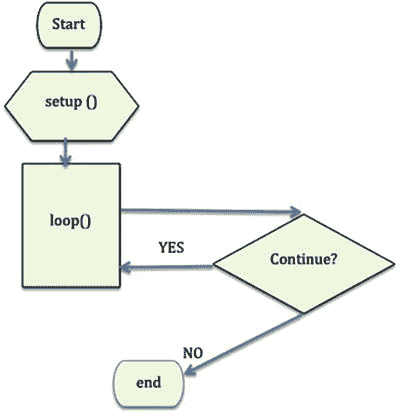
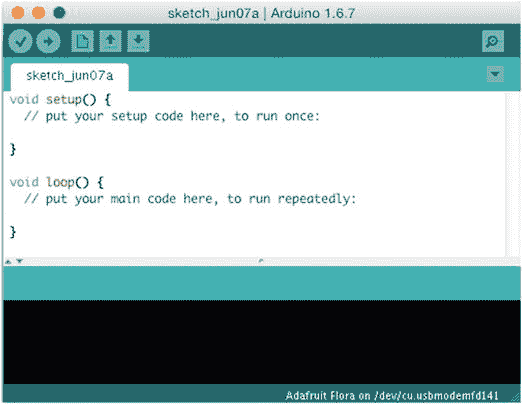
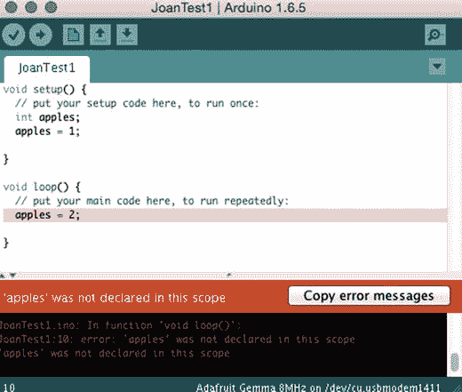
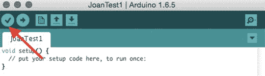
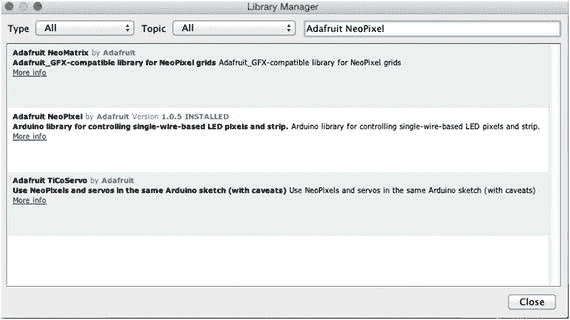

# 6. 可穿戴设备编程

人们在启动 Arduino 项目时感到畏惧的事情之一是，你确实需要学习编程，至少是学一点。好消息是，学习计算机编程的一个好方法是查看示例，而且网上有很多基本的 Arduino 编程示例。

与我们的缝纫和电子章节类似，我们这里只能帮你入门，你可能需要使用其他资源来补充一些细节。Arduino 使用一种名为 C++ 的编程语言，它是 Java、Python 和 C 等其他编程语言的近亲。有许多优秀的 C++ 编程书籍；例如，[`www.apress.com/programming/c-c?p=1`](http://www.apress.com/programming/c-c?p=1) 上就有很多。你也可以学习 C++ 或 C++ 所基于的更简单、更古老的语言 C 的等效在线教程，以作为我们在本章提供的快速概览的补充。就本书其余部分而言，如果你能学会修改现有示例（无论是在线提供的，还是本书可下载材料中的，链接在本书版权页上），那么你应该就足够了。

琼和里奇将带你完成本章。琼通过传统课程学习编程，然后参与并管理过一些相当大的编程项目。里奇则有更多的创客背景。当我们两人的方法出现分歧时，我们可能会向你展示不止一种思考某事的方式，让你自行决定哪种方法适合你的风格。

本章分为三个部分。首先，我们给出编程的一般性介绍。然后，我们向你展示如何为常规（不可缝制）Arduino 板寻找示例，并就这些板的编程提出几点建议。最后，我们将转向可缝制板。

## 编程基础

编程可能看起来令人生畏，因为实际代码看起来深奥难懂，而且似乎有很多规则要学习。然而，一旦你知道了这些规则存在的原因，预想出开发程序的正确方法就会变得更容易。编程只是为 Arduino 制定一套非常详细的指令，让它按特定顺序执行某件事，例如：如果按下按钮则点亮 LED，获取传感器数据并将某物转向光源等。

将程序视为供计算机（或像 Arduino 这样的处理器）执行的详细脚本，是另一种思考方式。如果你是为经验丰富的演员编写带有舞台指导的脚本，可能不会加入太多细节。但如果你是为学校的节日盛会向幼儿园孩子解释舞台指导，你可能会将其分解成很小的步骤。编程就像为学龄前儿童写脚本，因为计算机不知道你想做什么，它也不知道你告诉它之外的现实世界知识。

提示

向任何年龄的初学者介绍编程的经典方法是让他们为机器人做某事（比如制作花生酱果酱三明治）编写一套非常详细的指令。通常，一个人写下指令，然后另一个人扮演“机器人”，严格按照指令执行。如果你从未写过代码，你可以将此作为练习，仅仅思考其中的步骤。你如何以没有视觉系统或任何力反馈的计算机能够理解的方式来定义“上面”、“下面”和“转动盖子”？

## 开环控制 vs. 闭环控制

闭环系统会检查 Arduino（或其他计算机）命令现实世界中的某物所执行的操作是否真的发生了。因此，可能会检查车轮的转动、杠杆的角度、加热元件的温度等等。

开环控制系统则不会检查这类事情。你可能会惊讶地知道，大多数消费级 3D 打印机由 Arduino 或大致等效的东西管理，并且几乎完全以开环方式运行。步进电机精度（在第 8 章中讨论）足够高，可以不用检查当前所在位置，尽管在某些轴上有“限位开关”以允许机器找到其起始位置。


### 规划程序：流程图

如果你在我们刚才建议的机器人编程思维实验中稍微深入一些，可能已经发现，在写一行代码之前，详细规划一个编程项目是多么重要。否则，你可能永远无法让程序正常运行。规划代码的一种常见方法是使用流程图，如图 6-1 所示。这个图展示了一个程序：它启动后，先进行一些设置和定义，然后只要没有事情让它停止，它就会一直运行。



图 6-1. 一个流程图

琼喜欢先绘制一个高层次的代码流程图，然后在手绘草图上写下一些注释。对于较大的项目，她会在开始编码前先列出所有函数，然后可能会寻找一个示例，从中提取出她想要实现的功能的片段。对于 Arduino 项目，里奇通常从网上搜索开始，找到一个与他的需求接近的现有开源示例，然后进行改编，或者将几个这样的示例结合起来。作为一名初学者，你可能会混合使用这些方法。

## Arduino 代码规范

图 6-1 中的流程图实际上就是 Arduino 代码的布局方式。所有程序都包含`setup()`和`loop()`，它们都是函数，或者说是一些特殊的预定义词汇。

> **注意：** 实际上，所有现代计算机代码都是区分大小写的。`Setup()`和`setup()`没有任何关系，把非常相似的东西命名混用是个坏主意，因为很容易把自己搞糊涂。

Arduino 中的`setup()`函数包含了所有只需要执行一次的操作。这可能包括设置一些需要从零开始的事物，告诉 Arduino 哪些引脚用于读取数据或写入数据，以及进行类似的初始化工作。`loop()`函数是程序运行的核心。Arduino 会不断地循环执行`loop()`中的代码（当代码执行到底部时，会从顶部重新开始），直到某些事件中断它（比如断电、按下复位按钮等）。

出于历史原因，在 Arduino 上运行的程序有些人称之为草图（sketches），另一些人则直接称为程序。我们将使用的编程环境叫做 IDE（发音为“eye-dee-eee”），是集成开发环境（Integrated Development Environment）的缩写。这个环境会在“后台”提供一些结构来加载和运行你的程序。Arduino IDE 是免费且开源的，可以从 [`www.arduino.cc`](http://www.arduino.cc) 获取，同时网站上还提供了安装指南。

Arduino IDE 最初源自一个名为 Processing 的编程环境，该环境旨在快速绘制图形和制作动画（因此有了将程序视为“草图”的理念）。Processing 至今仍然存在（同样免费且开源），可以从 [`www.processing.org`](http://www.processing.org) 获取。图 6-2 展示了 IDE 的屏幕截图。市场上有各种不同类型的 Arduino 兼容板，IDE 会为不同的板子生成不同的代码。我们将在本章后面讨论这个问题。



图 6-2. Arduino IDE 的默认草图。请注意，它在右下角会显示它认为你正在使用的板子类型。

> **注意：** 在此，我们想要停下来，感谢所有为创造共享的 Arduino 生态系统付出时间和精力的人们。你可以在 `Arduino.cc` 上阅读更多关于其历史和相应许可协议的信息。

### 格式惯例

大多数编程语言都遵循一些你必须学习的惯例，就像学习一门新语言的词汇一样。我们展示一些示例来帮助你入门。一般来说，从一个示例开始，然后通过编辑它，直到语法成为你的第二天性，这是一个好主意。你可以考虑为自己创建一个总是以它开头的模板，就像下面这样（我们稍后会解释什么是注释）：

```
// 在这里写注释，说明代码的功能
// 说明代码作者以及最后一次编辑的时间
// 列出许可条款或关于复制限制的任何规定
void setup() {
// 此处放置只执行一次的代码
}// 结束 setup()
void loop() {
// 此处放置需要重复执行的代码
}// 结束 loop()
//结束
```

你可以在图 6-2 中看到类似的草图在 Arduino IDE 中是什么样子。

### 让人感到望而生畏的地方

人们看到计算机代码时常常会感到恐慌，因为它看起来相当晦涩难懂，而且他们害怕会弄坏什么东西。如果你有条不紊地学习，并掌握程序结构的惯例，你就能相当快地掌握它。如果你把它看作是人类创造的一门外语，而不是由机器人霸主降下的东西，你可能会学得更快。

#### 语法的严格性

计算机不知道你的意思，它们非常刻板。代码中的拼写错误通常会导致代码执行出你不希望的结果。一些问题会被编译器（你用来将人类可读的代码转换成机器能理解的程序的工具）捕捉到，但并非所有问题都能被发现。从示例中输入代码时要非常小心。在诸如 FORTRAN 和 Python 之类的语言中，格式、制表符和换行的位置会影响代码的执行。幸运的是，Arduino 编程所基于的 C++语言没有这些问题。

请注意，花括号`{`和`}`表示：“这两个括号之间的所有内容都属于同一个代码块。”不同的人对于如何使用和放置括号、命名变量等有不同的习惯。通常，用一种方式学习的人很难与用另一种方式学习的人合作，尽管这听起来微不足道。有时，像`loop()`这样的函数结束位置可能与起始位置相隔数页，琼养成了始终用注释标明每个结束括号所闭合的代码块的惯例（如前例所示）。另一方面，里奇学会了通过精确而一致地使用缩进和空白来跟踪这些事物。良好的编程实践包括：

- 选择一种格式标准并坚持下去。如果你与其他人一起编写代码，请在开始之前制定一个风格指南，以避免日后出现争论。例如，里奇和琼在一致使用对方的惯例方面都做得非常差，我们必须互相检查以避免错误。
- 提前绘制流程图并做好规划；不要直接跳进去开始编码。通常，没有规划就写出来的东西都需要扔掉，尤其是在初期。也要检查是否已经存在开源版本，或者可能有一个库（更多内容见后面章节）。
- 避免使用单字母变量名；使用能说明变量功能的名称，比如`inputPin`。唯一的例外是循环计数器（我们将在本章后面讲到），按传统它们通常使用单个字母。
- 绝不要在变量名或函数名中使用`1`或`0`，因为它们很难与字母`l`和`o`区分。
- 变量名中不能包含空格。人们通常使用下划线或“驼峰命名法”（例如`cornerValue`，或中间有“驼峰”的`inputFile`）来避免这个问题。
- 为你的代码添加注释。未来的你一定会感谢现在的你！

### 编程词汇与概念

正如我们提到的，Arduino 使用的是 C++编程语言的一个变体，它是其他一些语言（如 C、Java 和 Python）的近亲。我们在此提供一份简短的词汇课程，然后继续讲解示例。


#### 注释

程序通常并不像小说那样仅供阅读，尽管 Rich 和其他资深程序员坚称他们的代码是“自我文档化”的。为了让读者理解代码逻辑，人们会插入注释供后续阅读。代码编译时（即从人类可读形式转换为计算机硬件可读形式），计算机会忽略这些注释。单行注释以双斜杠开头。

```
// 这是一个注释。
```

惯例是在程序顶部添加一段注释块，说明程序功能、作者、编写时间以及复制限制。注释也便于为自己留下关于某些操作原因的笔记。你可以通过 `//` 暂时“注释掉”部分代码——在需要编译器忽略的每一行开头添加 `//`。此外，还可以使用多行注释，以 `/*` 开头并以 `*/` 结尾，如下所示：

```
/* 这是一个注释
内容内容
在此结束 */
```

编译器会忽略 `/*` 和 `*/` 之间的所有内容，因此 Arduino 或其他处理器不会读取它们。

#### 变量与循环

程序包含变量——Joan 喜欢将它们视为存储物品的盒子。在 C++ 中，变量需要指定类型——它是整数、浮点数、字符还是其他类型？你可以在 [`www.arduino.cc/en/Reference/HomePage`](http://www.arduino.cc/en/Reference/HomePage) 了解 Arduino 支持的变量类型。正如本章前面所述，变量名区分大小写，`APPLE`、`apple` 和 `Apple` 是三个不同的变量。为变量指定类型的方法如下：

```
int apples = 15;
```

这段代码创建了整数类型的变量 `apples`，并将其初始值设为 15。注意，只需定义变量类型一次，在整个代码中该类型即固定。你也可以仅指定类型：

```
int apples;
```

或者将类型嵌入更复杂的代码中：

```
for (int apples = 0; apples < 10; apples++) {
// 在此处插入你想运行十次的代码
} // 结束 apples 循环
```

这个代码段是要执行十次的代码片段。首次运行时，`apples` 等于 0。每次执行循环内的代码后，变量 `apples` 增加 1（`apples++` 即实现此功能）。程序会将 `apples` 设为 0，执行花括号内的代码，增加 `apples`，然后检查 `apples` 是否小于 10。此过程会重复直到条件不成立，之后继续执行循环后的代码。这里的变量 `apples` 被称为循环计数器——用于跟踪循环内操作执行次数的变量。

变量还具有作用域。变量作用域指代码中能识别该变量的范围。如果在 `setup()` 和 `loop()` 函数之前（即不在它们的花括号内）的代码顶部定义变量，这些变量将成为全局变量，对整个程序可见。如果在函数开始和结束的花括号内定义变量，则只有该函数能识别该变量。

全局变量通常可能有些危险，因为如果在不同函数间切换并假设某个变量的值时，可能会丢失该变量当前赋值的跟踪。但像哪个引脚是输入、哪个是输出等通常被设为全局变量。否则，变量的作用域仅限于定义它的函数内。如果你在 `setup()` 中定义了 `int apples;`，然后在 `loop()` 中使用它，就会报错，如图 6-3 所示。



图 6-3. 作用域编译器错误

#### 保留字

Arduino 定义了一些实用的保留字。`HIGH`、`LOW`、`true` 和 `false` 均已定义。完整列表参见 [`www.arduino.cc/en/Reference/HomePage`](http://www.arduino.cc/en/Reference/HomePage)。此外，还有一些 Arduino 特有的约定，例如引脚名称（数字以及 A0 到 A5）始终被视为 `int` 变量，即使它们包含字母。Arduino 草图会自动将这些特殊值转换为整数。

#### 函数

函数是一组需要重复执行的命令，或者为了隔离这些命令以便在某些情况下替换为其他内容。你可以通过预定义的方式向函数传递值。内置函数 `setup()` 和 `loop()` 是“void”函数——它们执行时不会向代码返回任何值。

函数调用如下所示：

```
digitalWrite(pin, value);
```

这个函数调用表示使用为函数 `digitalWrite` 定义的命令，并传入两个输入参数 `pin` 和 `value`。函数输入的作用通常会在注释中说明。对于 Arduino 内置函数，其定义见本章前面引用的 Arduino 标准页面。你也可以创建自己的函数。当需要重复执行某项操作但使用不同值时（例如，旋转机械臂到不同的角度），这非常实用。

#### 赋值、比较与基础数学

计算机程序中的某些约定与代数课不同。在编程中，等号是赋值运算符——等号两侧的内容并不相同。例如，以下代码表示“取变量 `a` 的当前值，加 1，然后覆盖 `a` 的当前值以存储结果”：

```
a = a + 1;
```

或者等价地：

```
a = a++;
```

或者简写为：

```
a++;
```

以下是检查 `a` 是否等于 1 的比较：

```
a == 1
```

以下是检查 `a` 是否不等于 1 的比较：

```
a != 1
```

其他常见比较包括小于（`<`）、小于等于（`<=`）、大于（`>`）和大于等于（`>=`）。

在编程语言中，乘法通常用星号表示，除法用斜杠表示，如下例所示：`a = b * c; a = b / c;` 对于更复杂的数学函数，你可能需要在代码中添加库。请参阅本章后面关于库的章节。

#### If、Else 与 While

你可以让程序在满足特定条件时执行一个操作，否则执行另一个操作。以下代码段检查变量 `darkness` 是否大于 3。如果是，代码调用函数 `light()` 执行某些操作；否则，将变量 `alternate` 设为 2：

```
darkness = 5;
if (darkness > 3) {
light();
} // 结束 darkness 条件判断
else alternate = 2;
```

你也可以让循环在条件成立时持续执行。以下代码段在 `darkness` 大于等于 3 时，持续调用函数 `light()` 和 `spin()`。注意，要使此循环结束，代码中需要在某处将变量 `darkness` 设为小于 3：

```
while (darkness >= 3) { // darkness 大于等于 3
light();
spin();
}
```


### 示例讲解

要在计算机上下载 Arduino IDE，请按照 [`www.arduino.cc/en/Main/Software`](http://www.arduino.cc/en/Main/Software) 上的说明操作。下载适合 Mac、Linux 或 Windows 的版本。在 Windows 机器上，您可能还需要安装与您所用开发板类型对应的驱动程序。启动后，IDE 会创建一个可用于编辑代码的窗口，如图 6-2 所示。

您还可以从 `文件 ➤ 示例` 菜单中获取大量示例，无需连接实体 Arduino 开发板即可查看。为了模拟连接了一块用于编译的开发板，请进入 `工具 ➤ 开发板` 菜单，选择 `Arduino/Genuino Uno`，这是一款非常通用的开发板。

我们建议您查看以下示例中的代码，以了解代码语法和总体思路：

- `文件 ➤ 示例 ➤ 01.基础知识 ➤ Blink`
- `文件 ➤ 示例 ➤ 05.控制 ➤ ForLoopIteration`
- `文件 ➤ 示例 ➤ 05.控制 ➤ IfStatementConditional`

在下一节中，我们将介绍一个常规 Arduino 示例的代码，并由此过渡到可穿戴设备。

## 为 Arduino 编程

您可以通过 USB 数据线将程序从计算机加载到 Arduino 上。要告诉计算机您使用的是哪种 Arduino，请进入 `工具 ➤ 开发板` 菜单进行设置。如果没有看到您的开发板型号，请使用 `工具 ➤ 开发板 ➤ 开发板管理器` 查找并安装其规格说明（此操作需要联网）。

您可能还需要通过 `工具 ➤ 端口` 设置端口，并且在少数情况下，可能需要通过 `工具 ➤ 编程器` 更改其他设置。本章前面提到的 Arduino 下载页面为特定情况提供了大量帮助。

### Arduino 的运作方式

如前所述，Arduino 一次只能做一件事。与一台完整的计算机（甚至是树莓派）不同——后者可以共享资源，从而在多个大致同时运行的任务之间高效切换——Arduino 只能跟踪一个程序。

Arduino 程序包含三个部分。第一部分没有正式名称，它是 `setup()` 函数之前的代码。在这里定义“全局”变量（参见本章前面的“变量和循环”部分）。这部分完成诸如引入他人已编写的代码库，或定义后续要使用的对象等操作。您可以在此区域创建和设置变量，但不能执行像打开和关闭引脚这样的操作。

代码的下一部分位于名为 `setup()` 的函数中。这用于所有只需执行一次的操作，通常也是您想要设置引脚模式和初始状态的地方。

最后，我们需要运行 `loop()` 代码。这是 Arduino 持续执行您所期望操作的地方——例如，监控传感器、运行 3D 打印机，或等待按钮被按下。

### 编译、加载、运行

要编译程序并检查其是否正常工作，请点击 IDE 上的勾选图标（如图 6-4 中箭头所指处）。要编译程序并将其加载到 Arduino 上，请点击勾选图标旁边的运行箭头图标。编译会将您所写代码的文本版本转换为计算机能够理解的指令。



图 6-4. 点击勾选图标编译代码并检查其是否正常工作。

要在 Arduino 上运行程序，请用 USB 数据线将计算机连接到开发板。务必根据开发板的规格正确设置 `开发板` 和 `端口`（对于某些可穿戴开发板，还需设置 `编程器`），如“为 Arduino 编程”部分开头所述。点击“编译并加载”的右箭头图标（勾选图标右侧）即可编译、检查代码并将其上传到开发板。

**注意**：一旦将程序上传到 Arduino，它就会一直存在，直到您加载其他内容。断开电源或重置 Arduino 不会擦除代码，不过按下复位按钮会再次运行 `setup()`。

### 添加库

代码库是他人编写好并在一定使用条款下共享的代码集合。您可以在自己的代码中使用代码库。相关背景信息位于 [`www.arduino.cc/en/Guide/Libraries`](http://www.arduino.cc/en/Guide/Libraries)，可能会对您有所帮助。

IDE 带有一个库管理器，可以帮助您为代码添加库。如果某个组件说明需要外部库，请前往 `项目 ➤ 加载库 ➤ 管理库`，并搜索您所需的内容。例如，如果我们搜索“Adafruit NeoPixel”（我们将在本书后面用到），会得到如图 6-5 所示的窗口（请注意，此操作需要联网）。



图 6-5. 安装库

如果点击搜索结果中出现的某个库选项，您将有机会安装它（如果尚未安装）。点击“安装”将下载该库，供您在该计算机上使用（无论是否联网）。要将它添加到您的代码中，请使用以下语法：

```
#include <LibraryName.h>
```

例如，通过在文件顶部（位于任何其他 `#include` 行之上）添加以下代码行，将 Adafruit NeoPixel 库添加到您的代码中：

```
#include <Adafruit_NeoPixel.h>
```

**提示**：安装库通常还会在 `文件 ➤ 示例` 菜单中添加更多示例，您可以用它们来了解如何使用该库。如果没有出现示例，点击“更多信息”链接通常会将您带到一个 Github 仓库，您可以在那里查找可能解释如何使用该库的 Readme 文件。

### 使用预处理指令

您可能见过项目顶部有这样的代码：

```
#define PIN 3
```

这样的行被称为预处理指令，有时简称为`#define`。此结构在这里会将每个出现的 `PIN`（区分大小写）替换为 `3`。如果您想统一设置某个引脚号或类似的常量，这很方便。但这可能有点危险。例如，如果您有一个名为 `PINAWAY` 的变量，它就会变成 `3AWAY`，因为每次代码中出现字符串 `PIN` 时，它都会被替换为 `3`。因此，常见的做法是预处理指令中的名称全部使用大写字母，而其他名称则不要这样用。

考虑到这些风险，为什么还要使用预处理指令呢？作为初学者，您可能希望避免使用它，因为存在意外后果的可能性。但对于高级编程人员而言，这是一种有效的方式，可以让代码中多处出现的内容易于更改。


### 为图 5-7 编写代码

在第 5 章中，图 5-7 里的示例电路没有任何作用。电路接通后 LED 不会亮，因为它仅仅连接到了地线。按下按钮也没有任何反应。现在，我们要为同一个电路添加代码，使其成为一个反相电路——按下按钮时，灯亮；不碰按钮时，LED 熄灭。

正如第 5 章中提到的，这个电路需要一个上拉电阻，这样即使按钮断开，引脚 2 上的电压也是已知的。在按下按钮之前，该引脚会通过微弱连接接到 VCC，但按下按钮会建立一条到 GND 的强连接，并允许少量电流（与电阻值成反比）流过。Arduino 板使用的芯片内部有上拉电阻（约 200 kΩ），你可以通过向一个处于输入模式的引脚写入 `HIGH` 来激活它们。代码清单 6-1 展示了这段代码。

```cpp
//按下按钮时，代码将点亮 LED。
//否则，除了初始化时点亮外，LED 熄灭。
int buttonPin = 2;
int ledPin = 10;
int press = 0;
void setup() {
pinMode(ledPin, OUTPUT);
digitalWrite(ledPin, HIGH);
pinMode(buttonPin, INPUT);
digitalWrite(buttonPin, HIGH); // 激活内部上拉电阻
} // 结束 setup
void loop() {
press = digitalRead(buttonPin);
if (press == HIGH) digitalWrite(ledPin, LOW); // 按钮未按下，熄灭
else digitalWrite(ledPin, HIGH);
}// 结束 loop
```

*代码清单 6-1. 用于运行图 5-7 中电路的程序*

## Arduino 输入与输出

正如我们在上一个例子中所见，Arduino 需要既能读取其引脚上的电压，又能输出电压来使各种事情发生。请注意，输入和输出是从 Arduino 板的角度来定义的（也就是说，输出是向引脚写入，输入是从引脚读取）。这意味着，如果一个传感器向 Arduino 发送数据，对 Arduino 而言它就是数字 `INPUT`，Joan 认为这有点反直觉。但事实就是如此。

在对引脚进行任何其他操作之前，你应该使用 `pinMode()` 函数告诉 Arduino 你希望将其用作输入还是输出（这通常在 `setup()` 中完成）。Arduino 上有几种不同类型的输入和输出。你可以通过 `digitalRead`、`digitalWrite`、`analogRead` 和 `analogWrite` 函数来指定你正在使用的引脚。

### 数字读取与写入

你可以配置 Arduino 上任何带编号的引脚来发送或接收数字信号。数字信号只有两个值——在本例中，称为 `HIGH` 和 `LOW`——这与模拟信号不同，后者可以是某一上下限之间的任意电压。

定义为输出的引脚可以设置为 `HIGH`（将引脚连接到 Arduino 的 VCC）或 `LOW`（将引脚连接到 Arduino 的 GND）。向引脚写入一个值可用于改变另一个元器件两端的电压（例如，打开或关闭 LED）。它还可以按特定模式使用，向其他设备发送控制信号，不过在大多数情况下，会有库为你处理这种通信协议。

如果引脚被定义为输入，你可以用它来读取电压，该电压要么是 `HIGH`（接近 VCC），要么是 `LOW`（接近 GND）。这可用于检查按钮或开关之类元器件的状态。数字输入也可以（通常也是通过库）用于接收来自其他元器件的数字信号，例如传感器，或者有时是向某个设备发送数字信号后接收其回应的设备。例如，Arduino 可以向 SD 卡写入数据，并从卡中请求数据。

### 模拟读取与 PWM

Arduino 可以在其模拟引脚上读取模拟电压。这些引脚被标记为 A0、A1 等。它们可以用作输入引脚，不仅能够读取 `HIGH` 或 `LOW`，还能通过内置的模数转换器（ADC）读取 VCC 与 GND 之间的一个电压范围。大多数 Arduino 都有一个 10 位 ADC，这意味着它可以读取 1024（2 的 10 次方）个不同的电压值，范围从 GND 的 0 到模拟参考电压的 1023。默认情况下，Arduino 使用的参考电压等于 VCC，不过也可以通过内置的 Arduino 函数 `analogReference()` 配置使用不同的参考电压。

还有一个模拟写入函数，尽管 Arduino 实际上并没有数模转换器（DAC）。相反，`analogWrite()` 函数会生成一个脉冲宽度调制（PWM）信号，这通常效果甚至更好。`analogWrite()` 发送的 PWM 信号是在 VCC 和 GND 之间每秒振荡数百次，而模拟值指定了每个周期中电压为 `HIGH` 的时间比例（称为占空比）。PWM 函数接收一个 8 位值，有 256 个不同的值（0-255）。值 0 表示 0% 的占空比（始终为 `LOW`），255 表示 100% 的占空比（始终为 `HIGH`）。给它赋值为 127 将得到 50% 的占空比（一半时间为 `HIGH`，其余时间为 `LOW`）。

PWM 信号可用于调暗 LED 或让电机减速转动等操作。这实际上比发送较低电压更有用，因为 PWM 与 LED 亮度或电机速度具有更线性的关系。PWM 还可以用于向诸如期望 PWM 信号的业余伺服电机等设备发送信号（伺服电机期望每 20 毫秒有一个 1-2 毫秒长的脉冲来确定其位置）。

当使用 `analogWrite()` 函数时，Arduino 可以在程序处理其他事情的同时维持这些脉冲，但这仅限于某些引脚。在大多数 Arduino 上，引脚 3、5、6、9、10 和 11（有时还有其他引脚，取决于所使用的芯片）可用于 PWM，它们通常在其引脚编号旁边标有一个波浪符号（∼）。

### 写入串口

有时，了解某个特定引脚接收到的输入值会非常方便。你可以通过启用串口，将数据通过 USB 线缆发送到你的计算机上。为此，请点击 IDE 右侧的放大镜图标（你可以在图 6-4 中看到它）。在你的 Arduino 程序的 `setup()` 函数中添加以下一行：

```cpp
Serial.begin(9600);
```

然后，在你 `loop()` 函数中想要查看输出的位置，添加 `Serial.print()` 或 `Serial.println()`（会在你打印的内容后面添加一个换行符）。`Serial.print()` 或 `Serial.println()` 一次可以传输一个数字或字符串（一组字母）。你可以在 文件 ➤ 示例 ➤ 03.模拟 ➤ AnalogInOutSerial 中看到一个完整的示例。程序运行且 Arduino 通过 USB 连接后，点击串口窗口图标（放大镜）打开串口监视器，并确保窗口底部的波特率与你在 `Serial.begin()` 中使用的数字匹配。


## 可缝纫开发板编程

常见的 Arduino 衍生可缝纫开发板（如 Flora、Gemma 和 Lilypad）的工作方式与基础 Arduino 大同小异。对于 Gemma 及部分更小型开发板，上传代码有一些特殊技巧，我们稍后会进行说明。

更大的差异在于元件方面：总体而言，这些可缝纫元件比其非缝纫版本更为精密。首先，它们通常会内置合适的电阻。

你可以在可穿戴作品中继续使用非缝纫类传感器等元件，只需将原本要插入面包板的引线末端卷成环状，然后将这些环缝在织物上即可。显然，你需要考虑如何拆卸这些不可水洗的元件，但另一方面，它们的价格要便宜得多。

我们将在后续章节中使用的 NeoPixel 可缝纫 LED 价格正在下降，并且能实现令人惊叹的效果——因为其亮度和颜色（实际上它们是由三个微小的 LED 组成，分别对应红、绿、蓝三种颜色）都能通过单个数字引脚进行控制，从而驱动众多像素。较新的 Flora 开发板在引脚 8 上集成了一个 NeoPixel。

> **注意**  
> 将代码上传到 Gemma 有点复杂。你需要连接 USB 线，然后按下重置按钮（开发板上一个微小的黑色按钮）。当开发板上的红灯闪烁时，你就可以上传代码了。如果红灯不闪，则无法上传。

要使用 NeoPixel，你必须引入 Adafruit 的 NeoPixel 库。要找到该库，你需要在库管理器（见图 6-5）的两个下拉菜单中都选择“全部”。下载完库文件和开发板定义后，点击 **工具** > **开发板** > **Adafruit Flora**，**端口** > **（Flora 端口）**，这样你的电脑就能识别该开发板了。如果 Flora 没有作为选项出现，请使用“开发板管理器”查找它，方法如“编程 Arduino”一节所述。

当你引入 Adafruit NeoPixel 库后，会得到一些非常复杂的示例。清单 6-2 展示了一个更简单的示例供你尝试，它非常接近能系统性改变 NeoPixel 颜色的最小化代码。

你可以通过修改函数 `pixels.setPixelColor(0, pixels.Color(i, j, k))` 中 `i`、`j` 和 `k` 的值来改变颜色和亮度。`i` 的值对应红色 LED 的亮度（范围 0 到 255）。`j` 的值设置绿色，`k` 的值设置蓝色。

三种颜色等量混合会得到白光。例如，`pixels.setPixelColor(0, pixels.Color(100, 100, 100));` 会产生白光，而 `pixels.setPixelColor(0, pixels.Color(0, 0, 200));` 会产生亮蓝色光。每次使用完 `pixels.setPixelColor` 函数后，你还需要使用 `pixels.show()` 来命令 NeoPixel 实际显示你选择的颜色。

```cpp
#define PIN   6
#define PIXELCOUNT   1
#include <Adafruit_NeoPixel.h>
Adafruit_NeoPixel pixels = Adafruit_NeoPixel(PIXELCOUNT, PIN, NEO_GRB + NEO_KHZ800);
int persist = 50; //像素点亮持续 50 毫秒
void setup() {
  pixels.begin(); // 初始化 NeoPixel 库。
  Serial.begin(9600);
}
void loop() {
  // 用单个像素进行测试
  pixels.setPixelColor(0, pixels.Color(0,0,200)); //亮蓝色
  pixels.show(); // 将刚刚设置的值推送到像素上
  delay(5000); // 延时一段时间（单位毫秒）
  for(int i = 0; i < 50; i = i + 5){ //红色
    for(int j = 0; j < 50; j = j + 5){ // 绿色
      for(int k = 0; k < 50; k = k + 5){ // 蓝色
        // pixels.Color 接收 RGB 值，范围从 0,0,0 到 255,255,255
        // 接下来三行用于调试
        Serial.print(i);
        Serial.print(j);
        Serial.println(k);
        pixels.setPixelColor(0, pixels.Color(i, j, k));
        pixels.show(); // 将刚刚设置的值推送到像素上
        delay(persist); // 延时一段时间（单位毫秒）。
      } // k 循环结束
    } // j 循环结束
  } // i 循环结束
} // loop 结束
```
**清单 6-2.** Flora 与 NeoPixel 示例

使用相同函数的类似代码可以控制一系列 NeoPixel。清单 6-2 示例中的 `0` 表示你在控制第 0 号像素（本例中只有像素 0）。如果你有两个像素（如清单 6-3 所示），你将使用 `pixels.setPixelColor(0, pixels.Color(0, 200, 0))` 和 `pixels.setPixelColor(1, pixels.Color(200, 0, 0))`。这会将系列中的第一个像素变为绿色 (0, 200, 0)，第二个像素变为蓝色 (200, 0, 0)。

此代码如清单 6-3 所示。注意每个 NeoPixel 都需要单独连接回 VCC 和 GND。信号连接采用链式结构，一个像素的输入箭头连接到前一个像素的输出箭头。

```cpp
#define PIN  6
#define PIXELCOUNT   2
#include <Adafruit_NeoPixel.h>
Adafruit_NeoPixel pixels = Adafruit_NeoPixel(PIXELCOUNT, PIN, NEO_GRB + NEO_KHZ800);
void setup() {
  pixels.begin(); // 初始化 NeoPixel 库。
  Serial.begin(9600);
}
void loop() {
  // 使用两个像素进行测试。
  // 像素 0 的输入箭头应连接到引脚 6
  // 像素 1 的输入箭头应连接到像素 0 的输出箭头
  pixels.setPixelColor(0, pixels.Color(0, 200, 0));  //亮绿色
  pixels.show(); // 将刚刚设置的值推送到像素上
  delay(5000); // 延时一段时间（单位毫秒）
  pixels.setPixelColor(1, pixels.Color(0, 0, 200));  //亮蓝色
  pixels.show(); // 将刚刚设置的值推送到像素上
  delay(5000); // 延时一段时间（单位毫秒）
} // loop 结束
```
**清单 6-3.** 驱动两个串联的 NeoPixel

## 本章小结

本章我们讨论了如何对可穿戴 Arduino 进行编程。我们首先介绍了如何从头编写计算机代码，然后具体讨论了如何对 Arduino 进行编程。最后，我们提出了一些关于如何编程可穿戴作品的思路，并讨论了此类开发板存在的一些问题。

