# 定时器围裙

你正在为朋友们举办一场派对，并想时刻留意厨房里正在烹饪的食物。要是能有个东西，你只需轻敲一下就能为一分钟计时，那该多好啊？在本例中，我们将制作一条带有内置定时器的围裙。当你轻敲一小块导电布时，计时器开始运行，此时一个 NeoPixel 灯会亮起红色；计时结束后，NeoPixel 灯会变成绿色并持续一段你设定的时间，然后熄灭。整个装置由一块 Adafruit Gemma 处理器控制，它类似于一个精简版的 Arduino（详见第 5 章），由两节纽扣电池供电。图 7-1 展示了完成后的围裙，Gemma 及其电池被放置在保护口袋中。

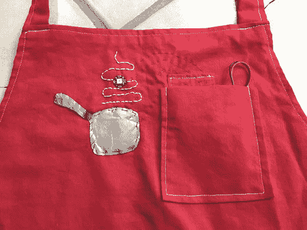

图 7-1. 完成后的定时器围裙

围裙上的平底锅由三层构成：顶层是导电布，中间层是中间带孔的毛毡，底层也是导电布。当你按压顶层时，它会通过毛毡上的孔与底层连通。这就提供了一种非常不精确的方式，让你可以用手腕或任何干燥的物体来启动定时器。（请注意，在通电状态下，围裙不应弄湿。）

制作这个项目，你需要以下材料和工具：

*   1 至 1.5 码轻到中等重量的棉布
*   一卷缝纫线和梭芯
*   用于纸样和/或裁缝粉笔的纸张
*   剪刀
*   卷尺
*   用于系带的棉质织带（可选）
*   斜纹镶边带（可选）
*   刺绣针
*   白色和黑色绣花线
*   一小块毛毡
*   Gemma 微处理器
*   NeoPixel LED 灯
*   导电布
*   导电缝纫线
*   两节（3 伏）纽扣电池
*   电池盒（专为两节纽扣电池设计）
*   五根鳄鱼夹测试线（用于测试目的）

> **注意**  
> 本章介绍了一种制作该项目的简单方法。在第 11 章中，我们会讨论几个项目，并给出一些关于如何使本项目更省电的建议。在这里，我们侧重于让实现过程易于制作、调试和理解。但是，除非你断开电池连接，否则本项目会很快耗尽电池电量（我们估计能用几天时间，取决于你按按钮的频率）。

## 项目规划

对于可穿戴项目，人们总忍不住直接开始缝制。然而，最好先克制住这种冲动，首先弄清楚你希望控制电路实现什么功能。然后，你可以先用 Fritzing（详见第 5 章）设计电路布局，再用鳄鱼夹搭建测试电路，最后编写代码。

我们建议在开始缝制之前完成所有这些工作，以防你发现还需要另一个元件（以及安装它的位置），或者意识到电路需要以某种特定方式布局，而这种布局在衣服尚未缝合时可能更方便实现。

> **提示**  
> 琼（Joan）和林恩（Lyn）都发现，与 Fritzing 原理图相比，使用鳄鱼夹搭建的电路版本能更直观地想象电路的走向，尽管夹出来的电路有时可能会有点笨拙。里奇（Rich）不同意这种看法，所以这些事关乎个人风格和可视化能力。随着经验的积累，你会形成自己的方法。

由于这个项目要在需要保护 Gemma 的环境中使用，我们决定将 Gemma 及其连接线固定在一个小标签上，这样它就可以和电池一起滑入口袋。“平底锅按钮”需要精心设计，既要使其易于按压，又要防止误触。

## 控制设计及软件

在这个案例中，我们希望只要定时器未被启动，电路就什么也不做。一旦定时器启动，NeoPixel 灯亮起红色。计时结束时，NeoPixel 灯变成绿色并持续另一段时间。这两段时间都在代码顶部的`#define`语句中指定。如果你希望电路做更多事情——比如按不同时间长度循环显示几种颜色——你可以添加更多对 Adafruit 两个库函数的调用（详见第 6 章）：

```
pixels.setPixelColor(0, pixels.Color(r, g, b));
pixels.show();
```

`r`, `g`, `b`是 0 到 255 之间的数值，用于决定你想要的红色、绿色或蓝色像素的亮度。请注意，这三种原色的相对亮度决定了最终颜色的色调。整个 Gemma 的代码如代码清单 7-1 所示。

> **注意**  
> 代码清单 7-1 将计时器设置为仅运行一秒，然后让 NeoPixel 灯点亮两秒。我们建议你在调试过程中保持此设置，之后再将其改为你想要的任何数值（一分钟为 60,000 毫秒）。`TIMER_DELAY`是计时器倒计时的时长（期间 NeoPixel 灯为红色），单位为毫秒；`PERSISTENCE_DELAY`是计时结束后 NeoPixel 灯保持绿色的时长。

```
// Program to turn on a neopixel red when a button is pushed
// And then green after a specified delay passes
// And finally turns off after a second specified delay
#include <Adafruit_NeoPixel.h>
#define NEOPIXEL_PIN 2 // pin controlling the Neopixel
#define BUTTON_PIN 1 // pin reading the state of the button
#define TIMER_DELAY 1000
// in milliseconds - one second for the demo
#define PERSISTENCE_DELAY 2000
//time to wait before turning off, in milliseconds
Adafruit_NeoPixel pixels =
Adafruit_NeoPixel(1, NEOPIXEL_PIN, NEO_GRB + NEO_KHZ800);
/*
Last parameter depends on the neopixel version you have
See https://learn.adafruit.com/adafruit-neopixel-uberguide/arduino-library
Remember for Gemma you need to push reset button
to load in your program (no loading after red light stops flashing)
*/
void setup() {
pixels.begin();
pinMode(BUTTON_PIN, INPUT);
digitalWrite(BUTTON_PIN, HIGH);
/*
BUTTON_PIN is set to INPUT with the
internal pull-up enabled and is
connected to the first layer of the button (one closest to apron fabric).
When the button is pressed,
this pin is connected to GND and goes LOW,
and the circult begins its countdown.
Here we use pin D1 which will light up the red LED
when D1 is HIGH (the button is NOT pushed)
*/
} // end setup
void loop() {
if (digitalRead(BUTTON_PIN) == LOW) {
pixels.setPixelColor(0, pixels.Color(0, 150, 0));
pixels.show();
// first have red light while timer is counting down
// this lets you know button was pushed and the timer is running
delay(TIMER_DELAY);
pixels.setPixelColor(0, pixels.Color(150, 0, 0));
pixels.show();
delay(PERSISTENCE_DELAY);
// turn green after timer is done
//and stay green for PERSISTENCE_DELAY seconds
} else {
pixels.setPixelColor(0, pixels.Color(0, 0, 0));
pixels.show();
// pixels turned off
}
} // end loop
```

代码清单 7-1. 围裙程序


## 电路布局

草图编写完成并了解所有工作原理后，我们就可以开始布局电路了。图 7-2 展示了该项目的 Fritzing 接线图。该电路使用一块 `Gemma` 板、一个 `NeoPixel` 和两块导电织物，其布局相当于一个按键开关。

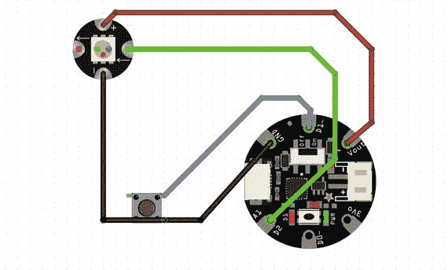

图 7-2. 围裙电路的 Fritzing 接线图

其工作原理如下：`Gemma` 将 `D2` 引脚设置为输出引脚，用于控制 `NeoPixel` 的状态。`NeoPixel` 的地线连接回导电织物"按钮"的顶部。`D1` 是一个特殊引脚，如果将其设置为 `HIGH`，则会点亮板载指示灯。我们利用此引脚检测导电织物按钮的状态，具体方式如下：

*   当开关断开时，红色板载指示灯亮起。`D1` 引脚默认被代码设置为 `HIGH`，在此起到上拉电阻的作用（参见第 5 章）。
*   当开关闭合时，`D1` 引脚被拉低至地电平，`Gemma` 向 `NeoPixel` 发送信号使其点亮，先显示一种颜色，再变换为下一种颜色。在两个定时灯对应的计时器计时结束后，`Gemma` 通过将三种颜色的亮度均设置为零来关闭 `NeoPixel`。

图 7-3 展示了使用鳄鱼夹进行布局测试的样子。红线从 `Vout` 连接到 `NeoPixel` 的 `+` 端。蓝线从 `Gemma` 的 `D2` 引脚连接到 `NeoPixel` 的输入端（`->`）。灰线从 `NeoPixel` 的地（`–`）端连接到上方的导电织物片，黑色导线将该导电织物片连接到 `Gemma` 的 `GND` 端。最后，绿线从 `Gemma` 的 `D1` 引脚连接到构成按钮底部的导电织物片。（我们在这里使用了两块碎布片来模拟将在项目中创建的平底锅按钮的顶部和底部。）

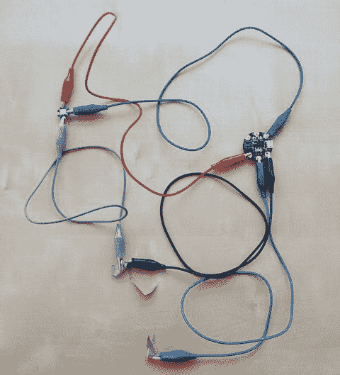

图 7-3. 使用鳄鱼夹测试电路

通过将连接绿线的导电织物片触碰与灰色和黑色导线相连的导电织物片，我们将 `D1` 引脚从 `HIGH` 拉低至 `LOW`，从而使 `Gemma` 上运行的代码点亮 `NeoPixel`。

## 调试

当您对使用鳄鱼夹连接的电路感到满意后，可以将草图上载到该电路（详见第 6 章），并通过 USB 线缆向 `Gemma` 供电，测试其是否按预期工作。如果没有正常工作，请检查鳄鱼夹是否连接牢固、是否连接到正确的位置，以及 USB 是否正在为 `Gemma` 供电（`Gemma` 板上标有 `PWR` 的绿色指示灯应亮起）。

> **提示**：`Gemma` 启动时有些挑剔。您需要在通电后立即上载代码，此时红灯闪烁，因为允许 `Gemma` 通过 USB 接收代码的"引导加载程序"正在运行——我们在第 6 章中介绍了这一点。否则，代码将无法正确加载。如果您错过了时机，可以按下（非常小的！）复位按钮来重新启动引导加载程序。

您也可以使用 `Flora` 板搭建此电路。如果您使用的是较旧版本（v1）的 `NeoPixel`，则需要修改 `Adafruit_NeoPixel pixels = Adafruit_NeoPixel(1, NEOPIXEL_PIN, NEO_GRB + NEO_KHZ800)` 这一行中的最后一个参数。该参数取决于您所使用 `NeoPixel` 的版本。详情请参见 [`https://learn.adafruit.com/adafruit-neopixel-uberguide/arduino-library`](https://learn.adafruit.com/adafruit-neopixel-uberguide/arduino-library)。对于 v1 版本的 `NeoPixel`，请将 `NEO_GRB + NEO_KHZ800` 改为 `NEO_RGB + NEO_KHZ400`。

## 缝制围裙

当您觉得电路和软件都已掌握后，就可以开始制作围裙并将电路缝制到上面了。您可以参考用鳄鱼夹连接的版本，思考电路将如何铺设到布料上。我们强烈建议您在开始之前通读本章，以便对整个流程有一个整体概念。接下来，将由 Lyn（她是这方面的专家）为您讲解图案的制作过程。

### 制作纸样

首先，从胸骨顶端下方约 2 英寸处开始测量，直到您希望围裙结束的位置。我的身高是 5 英尺 3 英寸，所以，如果我想要围裙顶部从胸骨下方开始，长度垂到膝盖上方约 3 英寸处，我需要以下尺寸——您可以根据自己的身高进行调整。我测量并裁剪了布料，围裙胸档顶部宽 12 英寸，然后向外弯曲，在最宽处（底部）达到 24 英寸。在我的设计中，围裙中心从上到下的尺寸是 28 英寸。这个尺寸为每个边预留了大约 1 英寸用于双折边，或者您也可以使用斜纹滚边带（可以购买到的用于服装收边的布条），这种情况每个边只需增加半英寸。

使用图 7-4 中的示意图，用薄纸或牛皮纸制作一个纸样，或者直接用裁缝粉笔在布料上画出。围裙主体宽度应在 24–27 英寸左右，胸档折边后的宽度可为 8–10 英寸。这完全取决于您希望围裙覆盖多大的躯干区域。将布料对折，使布边（布料的成品边缘）对齐。在布料上画出围裙的一半，或者使用您制作好的纸样，然后裁出围裙。利用对折可以确保两侧的曲线对称。

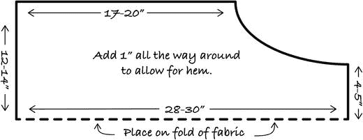

图 7-4. 围裙纸样（按需放大）

我们在胸档的左侧（即您穿着时您的左手侧）缝制一个小口袋，用于放置电池和 `Gemma` 板。平底锅按钮将缝制在此口袋的右侧（穿戴者的右手侧）。小口袋宽 2.5 英寸，深 4 英寸，因此我们裁剪一块宽 3.5 英寸、深 5 英寸的布料，以便留出折边余量（图 7-5）。围裙主体上的大口袋宽 6 英寸，深 7 英寸，因此我们裁剪一块宽 7 英寸、深 8 英寸的布料。

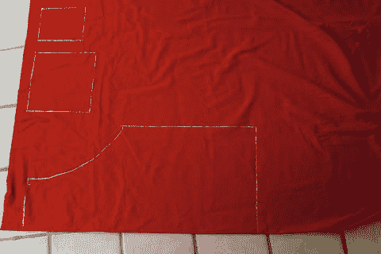

图 7-5. 用粉笔绘制的围裙纸样。照片底部为布料折叠处。

如果您想用围裙布料而非棉织带制作挂颈带和系带，请裁剪一块宽 4 英寸、长 22–24 英寸的布料，以及两块宽 4 英寸、长 24–26 英寸的布料。务必使这些布料的裁剪方向与布料的直纹方向（即平行于布边的方向）保持一致——否则围裙将是斜裁的，布料可能垂坠不均或起皱。

### 制作平底锅按钮

我们将裁剪两块导电织物和一块毛毡，裁剪成平底锅形状，用于制作定时按钮（图 7-6 和 7-7）。毛毡将用于隔离导电织物，中心区域除外。我们将在毛毡上切一个孔，以便在按压平底锅中心时，两块导电织物能够接触。可用毛毡片、缝制的布料或刺绣来制作"蒸汽"效果（如图 7-1 所示）。

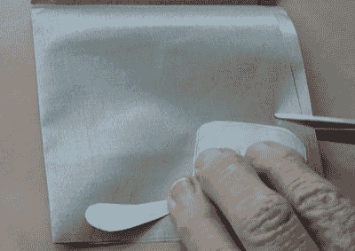

图 7-7. 使用简单的纸样裁剪平底锅顶部。

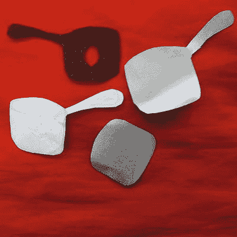

图 7-6. 按钮内部的毛毡（左上角）、平底锅顶部（导电织物——右上角）、纸样（左下角）和按钮底部的导电织物（右下角）


### 制作口袋

使用裁缝粉笔，在围裙正面测量并标记出你想要口袋的位置。记住，在口袋边缘折边时，所有边都要额外增加半英寸。首先，沿着口袋的所有边缘进行缝合，防止布料脱线。然后，将口袋的顶部边缘向布料反面折下半英寸并熨平。沿着边缘缝线。将布料翻到正面，用剪刀尖或类似尖物轻轻将角落顶出。用熨斗熨烫侧面和底部，制作出半英寸的折边（见图 7-8）。

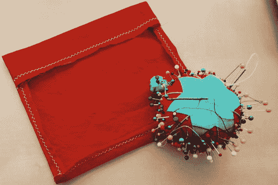

图 7-8.

完成后的布片——这将成为大口袋的内侧。

将口袋用珠针固定在围裙上。从一个口袋的顶部缝到底部，无需取下布料，直接在机器上转动布料。缝过底部，再次转动布料，然后缝上另一侧。记住，在开始缝第一侧和完成另一侧缝合时，都要增加几针来回缝线（图 7-9）。

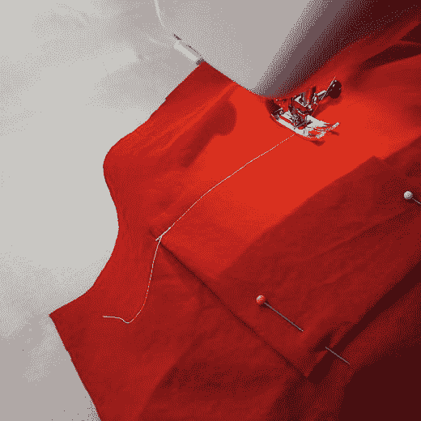

图 7-9.

缝制靠近底部的口袋——另一个口袋以同样方式缝制

### 包边处理

用曲折线迹沿着整个围裙的边缘进行缝合，防止脱线（曲折线迹如图 7-8 所示）。将整条围裙的边缘向反面折进半英寸并熨平。用直线线迹缝合固定。

### 缝制系带和颈带

将系带和颈带的边缘向中间折叠，再纵向对折（图 7-10 和 7-11），并将末端同样折入内侧。缝合系带和颈带的边缘及末端。将它们用珠针固定在围裙上并缝合。建议在缝合处多缝几道，以防脱落。

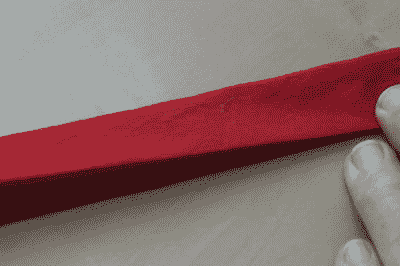

图 7-11.

最后一次折叠（将在其一侧缝合以完成制作）

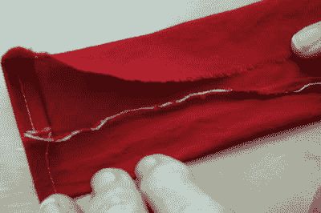

图 7-10.

系带或颈带的第一次折叠

如果你使用棉质织带制作颈带和系带，将它们剪裁成与布料版本相同的长度，并对所有末端进行折边处理。用珠针固定在围裙上并缝合。

### 组装平底锅按钮

取出你之前裁剪并放好的平底锅形状的导电布片和毛毡片。将毛毡片修剪得比导电布片略小。再裁剪一片不带手柄的导电布片，并修剪得比毛毡片略小。在毛毡平底锅的中心剪一个洞。这将成为你为计时器增加时间的按钮。用手缝针将平底锅部件的底层（不带手柄的那片）缝到围裙上。你可以在图 7-6 中看到这些布片，在我完成图 7-12 时，它们已在围裙上。

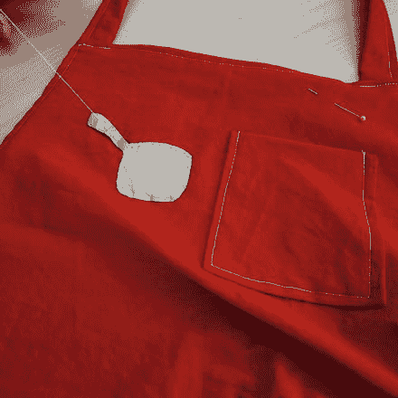

图 7-12.

完成平底锅制作（组装图 7-6 中的部件）

### 缝制电子元件和电路

从围裙布料上裁剪一块 2.5 英寸 x 4.5 英寸的小矩形。用曲折线迹沿所有边缘缝合，将每个边缘向内折进四分之一英寸，熨平后用直线线迹包边。这将制作一个用来放置 Gemma 的罩布，方便它从口袋中取放（图 7-13）。

使用 `3Vo` 和 `D1` 孔（我们其他情况下不会用到它们），用普通线（非导电线程）将 Gemma 缝到罩布上。图 7-13 显示了带有本节所述的全部导电线程行的围裙。

NeoPixel 将连接到穿戴者右侧的口袋上，该口袋将容纳 Gemma 和电池。使用 NeoPixel 上的“箭头出”孔，用普通线（非导电线程）将元件缝到围裙上。`–`、`+` 和“箭头入”将稍后用导电线程缝制。

参考图 7-2 中的 Fritzing 图，将你的元件摆放在围裙胸片上，并用裁缝粉笔在布料上轻轻画出你的电路路径。这些路径就是你用导电线程连接元件时要缝合的路线。

> **注**  
> 该电路需要在引脚 `D1` 上设置一个上拉电阻，因为我们希望 `D1` 上的输入在按钮（平底锅）被按下前保持 `HIGH`，当按钮按下时为 `LOW`（接地电压）。换句话说，我们希望在按钮按下时完成电路。我们在代码中将输入引脚设为 `HIGH`，以启用芯片的内部上拉电阻（如果我们试图将按钮连接到 `3Vo`，这将无法工作，因为芯片没有内部下拉电阻）。更多信息请参见第 5 章和第 6 章。

接下来，你需要按以下方式连接元件：

*   导电布底层连接到 Gemma 的 `D1`
*   导电布顶层连接到 Gemma 的 `GND`
*   NeoPixel 上的“输入”箭头连接到 Gemma 的 `D2`
*   NeoPixel 上的 `+` 连接到 Gemma 的 `Vout`
*   NeoPixel 上的 `–` 连接到按钮的顶层（该层已连接到 `GND`）

我们现在将依次介绍每次导电线程的走线。所有走线在图 7-13 中均可见，除非这些连接位于围裙内侧或罩布下方。

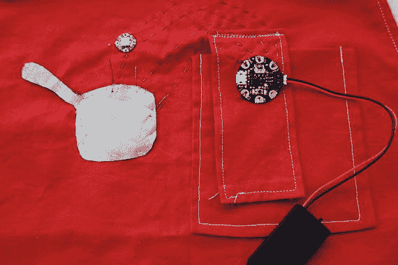

图 7-13.

电子元件罩布、电池盒、Gemma、NeoPixel 及手工导电缝线的布局

#### 第一道导电线程走线

这条走线连接平底锅按钮的底部到 Gemma 的 `D1`。将导电线程穿入针中，在线的长端末尾打两到三个结。将针从平底锅最靠近 Gemma 罩布的边缘处向上刺入布料，拉紧线程直到线结绷紧。不要缝得太靠近导电布的边缘，否则会导致布料脱线。

用小而直的针迹，缝出一条路径到罩布的顶部，然后沿着侧面缝到 Gemma 的 `D1` 引脚。将针向上穿过孔并拉紧线。将针向下穿过罩布，位置紧邻 Gemma 焊盘的边缘，并拉紧线。这样缝两三针以建立牢固的连接。不要将罩布缝到口袋上。

当你用导电线程进行这些缝合走线时，确保在连接到 Gemma 和 NeoPixel 的位置将线拉紧，但不要过紧以致布料变形。连接太松会导致无法正常工作。

在罩布的背面打结，方法是在同一位置缝三个小针迹。剪断导电线程，留一个小线头。所有连接完成之后，用透明指甲油密封线结（导电线程由金属丝制成，不易保持紧结）。让指甲油干燥，然后剪掉所有线头。


#### 第二根导电线行程

这根线从锅的顶部连接到`Gemma`上的接地（`GND`）引脚。使用与上一行程相同的技术来打结导电线，并缝制从锅顶层边缘到门襟顶部的连接。使此行程与第一根线平行，且不要让导电线行程相互接触。将门襟顶部缝制到`Gemma`的`GND`引脚上，连接到焊盘并打结。

**注意**：`NeoPixel`上的孔比`Gemma`上的孔小。在开始下一行程之前，请检查你的针能否带着导电线穿过这些孔。

#### 第三根导电线行程

这根线从`NeoPixel`上的`“in”`箭头连接到`Gemma`的`D2`引脚，操作起来有点棘手，因为它需要从门襟上`Gemma`的下方穿过。将线打结，从围裙的背面将针穿过`“in”`箭头引脚，拉紧，然后紧贴焊盘将针刺入织物。重复此动作两到三次。使用小针脚，绣出一条通往`Gemma`中心上方门襟顶部的路线，确保它不与已创建的其他路线接触。将线缝至`Gemma`下方，并连接到底部的`D2`引脚。不要让针脚穿过口袋。连接到引脚并打结。

#### 第四根导电线行程

这根线将`NeoPixel`上的`+`连接到`Gemma`的`Vout`。重复与第三行程相同的过程，将线缝至门襟顶部，再缝至`Gemma`的`Vout`引脚。此连接无需在`Gemma`下方缝线。连接到引脚并打结。

#### 第五根导电线行程

最后，将`NeoPixel`上的`–`连接到锅的顶层。连接到`–`引脚，然后将线直直地向下缝到锅的顶层。确保只缝穿导电织物的顶层，而不是毛毡或底层。在锅的边缘打结。

### 收尾工作

用裁缝粉笔在围裙上画出一道蒸汽旋涡。使用绣花针和白色绣花线，沿着粉笔线用小而直的针脚绣出蒸汽效果。你也可以用黑色绣花线为锅增添细节。不过，我们担心这可能会通过纽扣造成意外连接，也可能导致导电织物磨损，因此决定保持原样。

检查你的连接，确保它们足够牢固且未与其他任何连接接触。使用透明指甲油固定所有线结，并修剪导电线多余的部分。

将纽扣电池装入电池座，插入`Gemma`板，检查是否一切正常。如果不行，请仔细检查导电线行程和导电织物中可能短路的地方。按下`Gemma`上的复位按钮（假设你在缝制前已按本章前文提示将代码烧录到板上）。瞧！一个带计时器的围裙——干得漂亮！

## 实际应用

我们以围裙为示例构建此项目，因为它易于缝制，并且我们认为在待客时展示它会很有趣。同样的电路也适用于体育场景，例如你可能想用几种颜色来显示单圈分段时间，或其他计时应用。

如果你真的把它当作围裙使用（因此需要经常清洗），你可以将电路缝制在带有按扣或魔术贴的门襟上，这样你就可以清洗围裙的其余部分，同时使电子部件保持干燥。Adafruit 表示，只要取出电池，它的`Gemma`处理器就可以清洗；如果你使用的是此处示例之外的硬件，请查阅制造商的规格说明。围裙在连接电池时不应弄湿，因此应更多地将其视为一件用于展示谈资的单品，而非在油污烹饪现场穿着的工作服。

这段简化的代码会比实际需要更快地耗尽电池电量，因为它从未进入任何形式的睡眠模式。睡眠模式在`Gemma`上比较棘手，因为它处理中断（指示其停止当前工作并恢复做其他事情的信号）的能力有限。

`Arduinos` 总体而言并非真正的计算机——它们一次只能做一件事，不像你的笔记本电脑或台式机，可以同时在多个程序间共享资源。由于各种技术原因，`Gemmas`在应对多任务处理方面尤为困难。尝试通过反复按下按钮来增加更多时间也会很有趣，但这需要过滤掉杂散按钮按下信号（即去抖），这超出了本章的范围。

## 总结

本章通过一个简单示例，引导你运用了前几章关于缝纫（第 3 章和第 4 章）、电子（第 5 章）和编程（第 6 章）的技巧。关键要点是，项目执行的顺序很重要。当然，你应该先做一些规划，但你还应该详细确定项目要实现什么功能，用鳄鱼夹布置好电路，并编写和测试代码——按此顺序进行。

只有在此之后，你才能开始裁剪布料，因为一旦你了解了你的电子元件将要做什么以及电路需要如何走线，你很可能会需要调整服装。我们详细讨论了所有这些步骤，制作了一个集成计时器的围裙，计时器运行时点亮`NeoPixel`一种颜色，时间到时则变为另一种颜色。这个项目应能让你体会到在接下来的章节中处理更复杂组件和项目时需要考虑的问题。

