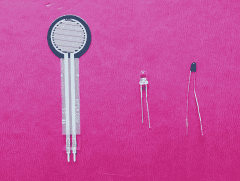
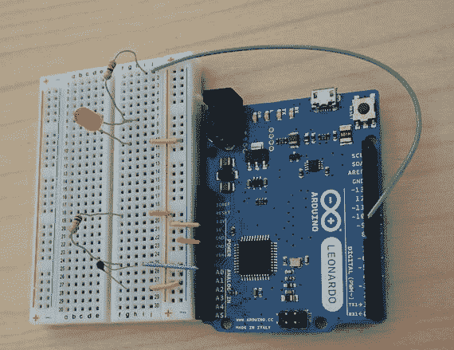
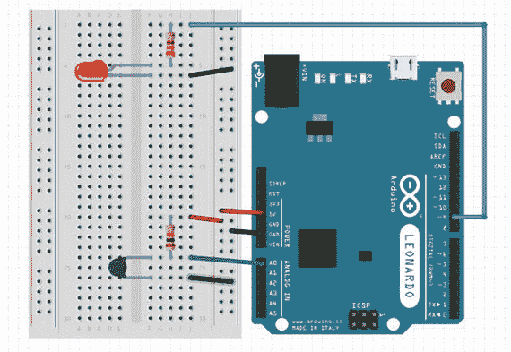
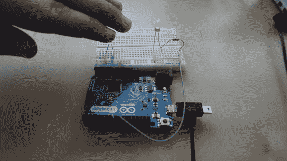
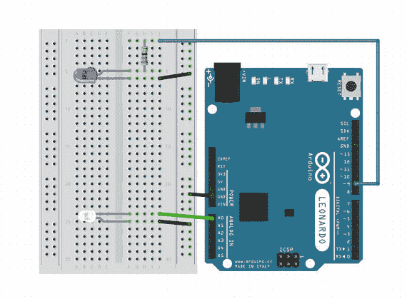
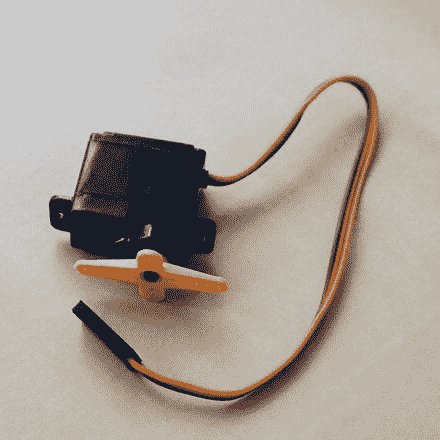

# 8. 传感器与其他硬件

会发光的配件已经很酷了，但我们还能更进一步。在本章中，Joan 和 Rich 将为你介绍几种不同类型的传感器——这些组件能够检测现实世界的某些属性，例如温度或光照强度。然后你可以对 Arduino 进行编程，使其读取传感器数据并根据数据执行相应操作。例如，在第 11 章中，我们将教你如何制作一顶根据头部倾斜角度变换不同颜色的帽子。在本章中，Joan 和 Rich 将带你了解一些常见的传感器及其使用方法。

你还可以制作能够自主移动的软质物品或服装——第 10 章中描述的“幽灵连衣裙”就是一个例子。但正如我们在那一章中指出的，制作可移动的服装颇具挑战性。使用电机比我们想在本书中详细介绍的内容要更复杂（主要是因为供电需求），但我们会在本章的“让物体动起来”部分概述相关问题，并推荐一些深入学习的资源。

### 传感器

现在市面上有许多兼容 Arduino 的传感器，这些设备可以测量从环境温度和光照强度到周围空气中甲烷百分比等各种参数。Adafruit 和 Sparkfun 销售多种不同类型的传感器，而像亚马逊这样的在线零售商也提供各种选择。不过，一个挑战在于，与这些传感器所面向的消费产品市场相比，业余 DIY 用户（也就是我们！）的规模微乎其微，因此相关文档有时可能非常粗略。

可缝纫的传感器则少得多，而且现有的通常相对昂贵。不过，可穿戴传感器专为缝纫设计，可能更坚固耐用，文档也更详细。你的选择将在很大程度上取决于具体应用、经验水平和预算。

我们将尝试使用光电二极管（用于测量环境光）和热敏电阻（用于测量温度）。要弄清楚如何操作任何特定传感器，都需要进行一些探索。在本章中，我们将逐步讲解整个过程的示例。

第 11 章中有一个关于陀螺仪帽子的示例，它可以感知佩戴者头部的倾斜角度。在本章中，我们将简要介绍陀螺仪、加速度计和磁力计，然后在第 11 章中运用这些知识。

**注**

本书中的项目我们尽量避免使用焊接。但是，如果你想使用我们这里描述之外的传感器，焊接可能是最实用的选择。我们将介绍一些无需焊接的原型制作方法，但这样得到的电路会比较脆弱。如果你想大量使用传感器（或者更频繁地使用电机），建议你查找在线焊接教程（例如，`https://learn.sparkfun.com/tutorials/how-to-solder---through-hole-soldering`），或者在你附近的创客空间参加相关课程。

### 创建带传感器的电路

根据传感器的不同，在开始搜索具体信息之前，你可能需要先了解一些传感器的工作原理，因为可能需要使用标准公式将传感器读取的信号转换为实际的温度、压力或其它感兴趣的量。许多传感器（包括热敏电阻和另一种类似的电阻式传感器——光敏电阻）会随着环境变化而改变电阻——例如，光敏电阻会因光照强度而变化。

因此，它们可以充当分压电路的一部分。传感器与一个已知电阻（通常由设备制造商指定）串联，然后读取两个电阻之间的输出电压。然而，这可能会有点棘手，因为作为可变电阻的传感器上的电压降，既取决于串联电阻的阻值，也取决于传感器自身在当前时刻的电阻值（以及整个分压器上的固定电压）。

它“感知”到的唯一电压降（其两个引脚之间的电压差）正是它自身产生的，该电压降由它正在感测的物理量决定。这使得选择正确的串联电阻（“分压器中的另一个电阻”）变得至关重要。幸运的是，有一些标准可以帮助我们。

其他传感器的工作原理则不同。例如，光电二极管会在光照下产生一个小电流。我们稍后将看到一个实际应用的例子。


### 可缝制传感器替代方案

本章我们将使用“常规”Arduino（非可缝制型）和低成本面包板插件元件来展示两个示例，因为这样更容易理解原理，且截至目前，这种格式的传感器种类更为丰富。如果存在可缝制版本的传感器，通常会有非常详细的教程，告诉你应使用哪些引脚进行连接，并附带一个可供你参考的 Arduino 示例草图。通常，可穿戴传感器会内置本章讨论的串联电阻作为其组成部分，并且可能还有其他简化设计。

如果没有可穿戴版本，你有几种选择。如果你并非真正需要佩戴该项目（例如它是一件布料艺术品、一个剧院道具或一盏小夜灯），你可以直接使用常规非可缝制 Arduino，并制作一个底座或其他外壳来隐藏电子元件和传感器。但在设计此类外壳时，请记住，传感器需要暴露在环境温度、光线或任何你想要测量的环境变量中。这种情况下，你可以像本章展示的那样在面包板上搭建电路，或者制作一个等效的焊接电路。

但如果你希望用非可缝制组件制作可缝制电路，你可以使用可缝制电子板（如 Gemma、Flora 或 Lilypad）。将电阻和 LED 的引脚卷成环状，然后缝到织物上。或者，你也可以将电路焊接在一起，并找到一种方法将其固定在织物上，具体取决于你的特定设计（有关创意，请参考其他章节中的示例）。不过，要小心这些连接，因为用多股线进行板对线焊接可能会很脆弱。多股线在焊接处可能断裂，不过用一点热熔胶固定绝缘层会有所帮助。如果你在焊接结构中使用实心线，它会在反复弯折下断裂，甚至可能在线缆中间断裂。实心线更适合无需弯折的应用场景。

**警告**

尽管存在“一个”Arduino 标准，但一些可穿戴板卡会略有偏离，或者传感器库可能使用了与某些可缝制板卡不兼容的功能。例如，截至本文撰写时，Gemma 板卡所使用的芯片并未得到大多数 Flora 传感器库底层通信库的支持。在购买一块板卡和一个未明确标注与其兼容的传感器之前，你最好先上网搜索一下，看看是否存在已知问题（或解决已知问题的变通方法）。并非所有传感器库（我们稍后会谈到）都支持所有 Arduino 衍生的板卡。

许多传感器的电阻会随其环境的变化而改变。在第一个示例中，我们使用了一个热敏电阻，这是一种电阻值会随环境温度变化而改变的电阻器（因此得名热(敏)电(阻)）。

在第二个示例中，我们使用光电二极管来判断周围环境是否足够暗，从而点亮 LED 小夜灯。光电二极管是一种简单的传感器，本质上是一个反向的 LED——当光线照射时它会产生电流，而不是像普通 LED 那样通过外部电流来发光。我们将它与 Arduino 的内部上拉电阻串联，读取其产生的电流量，并在短暂延迟后观察它使电压改变了多少。

这两个传感器（以及下一节中描述的压力传感器）如 图 8-1 所示。在课堂环境中，使用它们的主要问题是如何避免丢失，这一点你可以想象。一旦它们脱离原始包装，使用药瓶或带隔板的收纳盒进行分类存放效果很好。



**图 8-1.** 压力传感器、光电二极管和热敏电阻

**提示**

务必记录好你订购零件的来源，以便能够找到规格书或使用示例。对相关页面进行截图或添加书签，并建立一个归档系统来保存这些信息，以便日后查阅。

### 其他常见传感器

目前可用于 Arduino 环境的传感器种类繁多，我们无法在此一一列举。本节仅能介绍几种常见类型的传感器，让你有所了解。

红外传感器是经过调校的光电二极管或光电晶体管（另一种类型的感光半导体，可能提供更强的信号），用于响应比可见光频率更低的光线。它们通常呈深色以过滤掉可见光。大多数电视遥控器使用的就是这类传感器，可以作为一种简单方式实现设备间的通信。其他类型的红外传感器可用于远距离检测热量，例如非接触式温度计中使用的那些。

压力或力的感测可通过多种类型的器件实现。一个力敏电阻（FSR）就是一个由导电塑料或橡胶制成的简单垫片，当它被压缩时导电性会增强。虽然 FSR 的精度不足以测量重量或力的大小，但它可以用于判断是否有力作用，就像一个大型按钮。不过，FSR 不擅长承受持续的压力，如果你打算整天站在上面，它可能会过早损坏。FSR 的一个变体是软电位器，它会根据你按压的位置给出不同的电阻值。

如果你开始在线搜索 Arduino 传感器，你会发现各种新奇的产品，例如倾斜开关、振动传感器、重力/加速度传感器、磁场传感器、距离传感器、湿度传感器、肌肉传感器、心跳传感器、辐射传感器等等。

**注意**

在第 11 章中，我们将使用一个可缝制传感器——一个可以检测运动的陀螺仪。我们认为结合具体项目更容易理解，因此本章不深入介绍。如果你想了解如何检测服装的运动并做出响应，请参阅第 11 章中的帽子示例。

## 热敏电阻

热敏电阻是一种电阻值随温度变化而发生显著变化的电阻器（如果你原本期望电阻在不同温度下保持恒定值，这通常是一件坏事）。当你购买一个热敏电阻时，通常会得到一个型号、一个称为 B（或 beta）值的参数、额定最大功率（在分压器中使用时通常无关紧要，因为电流可忽略不计），以及在特定温度（通常是 25 摄氏度）下的参考电阻值。

以本例中使用的负温度系数（NTC）热敏电阻 MF52-103 为例，其额定功率为 0.05 瓦；在 25 摄氏度时电阻为 10 kΩ；B 值为 3950 K。但这到底意味着什么呢？

从这里开始，你可以在线搜索该产品型号和“Arduino”。这种方法有几个明显的问题：

- 你找到的信息可能是错误的。
- 你可能什么也找不到。
- 网络上现有的 Arduino 草图可能不够清晰，让你无法确信传感器能按预期工作。

通常，更昂贵的传感器（单价约 15 美元的，相对于那些价格只有其百分之一左右的）会附带更好的文档和库文件。我们这里使用廉价的传感器来说明整个过程。


### 使用热敏电阻

在搜索引擎中搜索“thermistor”和“Arduino”，会跳转到一个非常有用的网站[`http://playground.arduino.cc/ComponentLib/Thermistor2`](http://playground.arduino.cc/ComponentLib/Thermistor2)。该网站告诉我们，热敏电阻的电路就是一个分压器（第 5 章）。我们将热敏电阻与另一个 10 kΩ 电阻串联，组成一个分压器，如图 8-2 的电路图所示，以及图 8-3 的电路实物照片所示。



图 8-3. 实际的热敏电阻电路



图 8-2. 热敏电阻电路的 Fritzing 连线图

在刚才提到的 Arduino Playground 网站上，我们了解到热敏电阻的阻值由 Steinhart-Hart 方程（[`https://en.wikipedia.org/wiki/Thermistor#B_or_.CE.B2_parameter_equation`](https://en.wikipedia.org/wiki/Thermistor#B_or_.CE.B2_parameter_equation)）定义，该方程使用三个标准参数，将电阻值转换为温度：

*   B，以开尔文温度 K 为单位（在此例中为 3950 K）
*   基准温度（以开尔文温度为单位，即相对于绝对零度的温度——通常基准温度为 25 摄氏度，即 25 + 273.15 = 298.15 K）
*   传感器在该温度下的电阻值（即热敏电阻的标称电阻，此处为 10 kΩ）。

本例中，我们还添加了一个 LED，当热敏电阻报告的温度在指定范围内时，该 LED 会点亮。图 8-3 中的电路由一个 330 Ω 电阻和一个红色 LED 串联组成。红色 LED 电路连接到 9 号引脚和地线。当 9 号引脚为 `HIGH` 时，LED 将点亮。

分压器（参见第 5 章）的电压值在 10 kΩ 参考电阻和热敏电阻之间读取。其电压值从两者之间的节点引出，作为输入发送到 Arduino 的 `A0` 引脚。这是一个示例，展示了如何设置一个传感器，从而点亮一盏灯或让 Arduino 执行其他操作。请注意，传感器输出到模拟引脚，这是获取引脚上除 `LOW` 和 `HIGH` 之外的其他值所必需的。

我们希望从这个传感器中获取实际的温度值，而不仅仅是一个相对数值，因此正确进行实际转换至关重要。对于其他类型的传感器，我们可能只关心某个值相对于某个任意值的范围（例如房间内的光照水平，或者传感器在过去一分钟内的平均值），因此可能无需计算特定单位的精确值。

### 与热敏电阻交互的 Arduino 程序

现在我们知道了如何连接电路，我们可以采用两种方式。我们可以进入 Arduino IDE（参见第 6 章），查看是否能找到一个已经创建好此 Arduino 程序的库。我们可以通过以下步骤操作：点击 程序 菜单 ➤ 包含库 ➤ 管理库，然后按照第 6 章所述搜索“thermistor”。

如果找到了相关内容，您可以选择安装该库。如果出现多个选项，您可以先点击“More info”链接，看看哪个更符合您的需求，或者查看它的 ReadMe 文件（如果有的话）。大多数情况下，这些“More info”链接会跳转到一个 GitHub 仓库，这是一种常见的共享 Arduino 程序的开源方式。Joan 喜欢详细查看此类内容的源代码，因此通常会选择那些在处理过程中看起来最透明的库。

当您安装库时，如果顺利的话，它也会安装一些示例程序。要确认是否如此，请在安装库后，点击 文件 ➤ 示例。

这听起来可能都不错，但您可能会发现找不到与您的特定开发板和传感器硬件相匹配的库。在本例中，我们又回到了最初的那个网站 [`http://playground.arduino.cc/ComponentLib/Thermistor2`](http://playground.arduino.cc/ComponentLib/Thermistor2)。该页面提供了几个示例。我们决定尝试最后一个，因为它清晰地说明了其假设条件，并且通过对照描述该方程的维基百科页面进行交叉验证，很容易检查这些假设是否正确；我们感谢该页面的作者免费发布了他的 Arduino 程序。

清单 8-1 展示了这个 Arduino 程序，其中增加了一段代码，用于在温度处于给定范围内时点亮电路中的 LED。

```
// 一个程序，如果连接在 THERMPIN 引脚的热敏电阻
// 测得的温度在指定范围内，则点亮连接到 LEDPIN 引脚的 LED
// 热敏电阻校准数据来自
// playground.arduino.cc/ComponentLib/Thermistor2
// 已修改，使其更具通用性并增加了输出功能
#include <math.h>
#define THERMPIN A0
#define LEDPIN 9
// 列举三种主要的温度单位
enum {
  T_KELVIN=0,
  T_CELSIUS,
  T_FAHRENHEIT
};
// 温度函数输出浮点数，即实际温度
// 温度函数输入参数：
// 1. AnalogInputNumber - 要读取的模拟输入引脚
// 2. OuputUnit - 输出单位：摄氏度、开尔文或华氏度
// 3. Thermistor B parameter - 热敏电阻 B 参数（来自数据手册）
// 4. Manufacturer T0 parameter - 制造商提供的 T0 参数（开尔文，来自数据手册）
// 5. Manufacturer R0 parameter - 制造商提供的 R0 参数（欧姆，来自数据手册）
// 6. Your balance resistor resistance in ohms - 您的平衡电阻阻值（欧姆）
float Temperature(int AnalogInputNumber, int OutputUnit, float B,
  float T0, float R0, float R_Balance) {
  float R, T;
  R = R_Balance * (1023.0f / (float)(1023 - analogRead(AnalogInputNumber)) - 1);
  //提醒：在 C 语言中，log 是自然对数 ln，log10 是以 10 为底的对数，所以这里没问题
  T = 1.0f / (1.0f / T0 + (1.0f / B) * log(R / R0));
  switch(OutputUnit) {
    case T_CELSIUS :
      T-=273.15f;
      break;
    case T_FAHRENHEIT :
      T=9.0f*(T-273.15f)/5.0f+32.0f;
      break;
    default:
      break;
  };
  return T;
}
void setup() {
  Serial.begin(9600);
  pinMode(THERMPIN, INPUT);
  pinMode(LEDPIN, OUTPUT);
} // setup 函数结束
void loop() {
  float sensorData = Temperature(THERMPIN, T_FAHRENHEIT,
    3950.0f, 298.15f, 10000.0f, 10000.0f);
  Serial.print("华氏度温度 = \t");
  Serial.println(sensorData);
  Serial.println();
  delay(500);
  //如果温度数据在 50 到 75 华氏度之间，则点亮 LED
  if (sensorData > 50 && sensorData < 75) digitalWrite(LEDPIN, HIGH);
  else digitalWrite(LEDPIN, LOW);
}// loop 函数结束
```

清单 8-1. 热敏电阻

## 光电二极管：夜灯示例

当光照射到光电二极管上时，它会产生电流，这本质上就像一个反向工作的 LED（参见第 5 章）。读取该电流比读取电阻值要稍微复杂一些，但可以用一个更简单的电路来实现。

要弄清楚如何使用光电二极管，可以先上网搜索“photodiode Arduino”。您会找到一些示例，大多数都指出，光电二极管实际上就是一个反向连接的 LED。不是让电流通过它来发光，而是让它受光照，然后会有少量电流以与 LED 相反的方向流过。

许多这些示例都涉及使用晶体管（一种可以放大信号的元件）来放大输出。这对于用导电线来构建电路来说比较困难，因此我们将使用一个更简单的解决方案。光电二极管具有内部电容（存储少量电荷的能力）。如果我们通过在 LED 两端施加反向电压来给这个电容充电，那么光电二极管产生的电流就会使电容放电。如果我们用一个电阻来减缓这个放电过程，我们就可以通过测量放电速度（在设定时间后采样电压，或者测量达到设定电压所需的时间）来了解光电二极管接收到的光照量。


### 使用光电二极管

人们通常以相对的方式使用光电二极管——判断某物是否“足够暗”或“足够亮”以改变状态，或者向明亮处移动。因此，我们并不真正关心输出的精确值——我们只想知道它是如何变化的。这意味着在编写 Arduino 程序（清单 8-2）时，我们需要调整一些变量。图 8-4 展示了 Fritzing 中的电路，图 8-5 则展示了光电二极管被遮挡时点亮 LED 的情形。



图 8-5 光电二极管被遮挡以点亮 LED



图 8-4 光电二极管与 LED 夜灯 Fritzing 示意图

```
// 一个示例：当光电二极管检测到环境变暗时点亮 LED
#define PHOTOPIN A0 // 连接光电二极管阴极，阳极接 GND
#define LEDPIN 9
#define THRESHOLD 1010 // 0-1023，使用较高值可在更暗时触发
// 如果灯一直亮，说明 THRESHOLD 过高；如果一直灭，则说明过低
int photoRead(int pin) {
  digitalWrite(pin, HIGH); // 向模拟引脚写入高电平
  pinMode(pin, OUTPUT);    // 充分充电光电二极管的内部电容
  delay(1);
  pinMode(pin, INPUT);     // 切换为输入模式，启用上拉电阻
  // 光电二极管电流会通过 200k 上拉电阻缓慢释放电容。
  // 光线越强，电压下降越快。
  delay(2);
  return analogRead(pin);  // 查看 2ms 后电压下降了多少
}
void setup() {
  Serial.begin(9600);
  pinMode(PHOTOPIN, INPUT);
  digitalWrite(PHOTOPIN, HIGH);
  pinMode(LEDPIN, OUTPUT);
  digitalWrite(LEDPIN, LOW);
} // setup 结束
void loop() {
  int darkness = photoRead(PHOTOPIN);
  Serial.print("光电二极管读数: ");
  Serial.println(darkness);
  delay(20);
  // 若黑暗程度超过阈值则点亮 LED
  if (darkness > THRESHOLD) digitalWrite(LEDPIN, HIGH);
  else digitalWrite(LEDPIN, LOW);
} // loop 结束
清单 8-2 Arduino 夜灯程序
```

### 在项目中使用多个传感器

如果使用多个传感器，通常应将它们的电路隔离到不同的引脚上（类似于示例中对 LED 和传感器的处理），而不是将它们串联起来。注意不要从 Arduino 中消耗超过其能提供的功率，但这通常不会成为限制因素。

**提示** 许多类型的传感器（及其他硬件）在 [`http://playground.arduino.cc/Main/interfacingWithHardware`](http://playground.arduino.cc/Main/interfacingWithHardware) 有详细介绍。

## 让物体动起来

Arduino（包括可缝纫版本）可以通过以下方式控制运动部件：

*   **小型直流电机**：用于移动物体，无需特别精确地控制运动位置或速度。如果你想让玩具车旋转轮子并四处奔跑，通常会使用这种电机。
*   **步进电机**：这类电机用于 3D 打印机以及其他需要精确控制速度和位置的场合；它们以已知大小的微小步长（因此得名）移动，其位置可通过计数步数来控制。
*   **舵机**：这种电机希望保持特定的编程位置。你可以将其与合适的传感器配合，将某物固定在特定位置。航模舵机具有内部反馈回路，能够寻找并保持指定位置。舵机自带控制电路，因此最容易连接到 Arduino 上。在需要精确移动物体时，它们也常用于机器人技术。

如果你对电机总体感兴趣，可以查阅一本关于 Arduino 控制机器人的书，例如 Warren、Adams 和 Molle 合著的 *Arduino Robotics*（Apress, 2011）。将运动部件融入服装会带来一些挑战，我们在第 10 章中会讨论。任何电机都必须牢固固定，以确保要移动的物体安全且按预期运动，而不是在电机连接点下堆起织物。

**提示** 在 [`http://playground.arduino.cc/Main/InterfacingWithHardware#Physical_Mechanical`](http://playground.arduino.cc/Main/InterfacingWithHardware#Physical_Mechanical) 有一个很长的电机列表，以及针对不同情况选择电机的建议。

### 电源管理

与 Arduino 能做的几乎所有其他事情相比，控制电机需要消耗大量电能——通常远高于 Arduino 直接提供的功率。如果尝试用 Arduino 直接为电机供电，Arduino 可能会“掉电”并行为失控，或者元件过热而损坏。

为避免这种情况，请使用独立于 Arduino 之外的电源。将这个外部电源直接连接到电机上。同时需要在电机附近某处隐藏电池。“口红”式 USB 可充电电池现在已经相当容易获得，但你仍然需要为它们找一个安放位置以及连接方式。

将普通（不可缝纫）Arduino 连接到电机的最简单方法是购买一个合适的扩展板。这是一块可插入 Arduino 的电路板，对于电机扩展板，通常还允许你接入独立电源和电机。截至撰写本文时，尚无等效的可缝纫板，因此你只能依靠涉及焊接的解决方案，或者设法使用带有扩展板的普通 Arduino 板——不过这可能会有点笨重。


### 伺服电机

伺服电机是一种小型马达，能够将其转轴旋转到特定的角度位置。通常，伺服电机附带各种称为舵臂的小塑料件，你可以用它来连接需要推动或拉动的绳索或其他物品。图 8-6 展示了一个安装有舵臂的伺服电机。这个特定的舵臂有两个长臂和两个短臂，但它们有各种不同的形状，大多数业余伺服电机都包含几种不同的可选配件。这种电机很可能是你在可穿戴设备上用来驱动某些部件运动，或对传感器检测到的条件做出反应（例如，在天黑时合上某物）时使用的类型。



**图 8-6.** 一个伺服电机

同时为伺服电机和 Arduino 供电可能会有些棘手。伺服电机可能会消耗相当大的电流，尤其是在它被阻止到达目标位置时（这被称为堵转电流）。尝试从电源获取超出其提供能力的电流，通常会导致电流下降（或者在某些情况下，会烧断保险丝——该保险丝可能是自恢复式的，也可能需要更换）。

要使用伺服电机，你应该避免让电流通过 Arduino 的电压调节器（即电路板上管理电源的芯片）。如果将电机连接到 Arduino 的电源总线上，就会发生这种情况。这可能导致电流超出调节器的处理能力，从而使控制器电压过低并复位。

为避免此问题，大多数 Arduino 开发板都配备了一个可用于连接墙式电源或电池的接口。请使用 `Vin` 引脚连接伺服电机的正电压（V+）侧，以绕过稳压器，然后在插入 USB 连接器之前先插入电源适配器。最后，再插入 USB 连接器，这样你就可以下载程序（sketch）来用 Arduino 控制伺服电机了。（伺服电机控制示例包含在与 IDE 一起下载的示例集中，请参阅文件 ➤ 示例 ➤ Servo。）

在图 8-6 中，请注意伺服电机引出的三根导线。惯例是：棕色线连接地（`GND`），红色线连接 5V，橙色线是信号（控制）线。（有时使用黑色线作为地线，白色线作为信号线。）如何连接这些线，很大程度上取决于你具体要做什么以及你需要多少功率。请查阅与你项目相似的现有示例项目，看看它们是如何连接的，同时务必牢记我们刚才提到的注意事项。

## 本章小结

在本章中，我们给出了将传感器连接到 Arduino 的一般原则，并详细介绍了两个示例。我们还介绍了如何查找特定传感器的更多信息，以及当传感器没有可穿戴形式可用时该如何处理。此外，我们简要介绍了 Arduino 可以控制的不同类型的电机，并包含了一个关于如何使用伺服电机进行简单机械控制的教程。在第 10 章中，我们将展示更复杂的传感器和电机示例，在第 11 章中，我们将使用陀螺仪来追踪头部运动。

