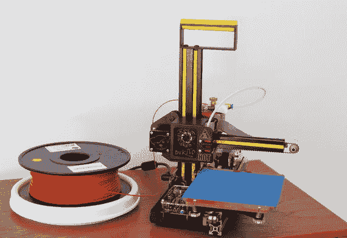
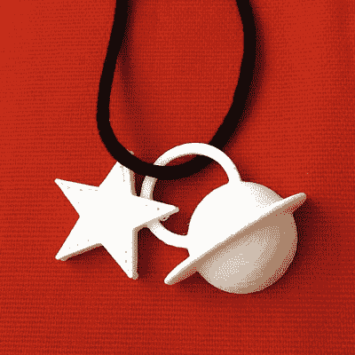
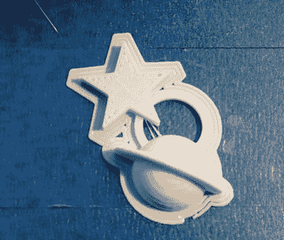
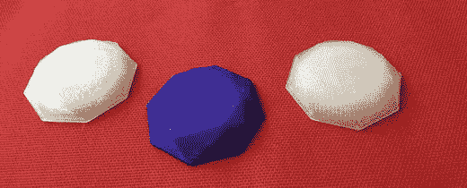
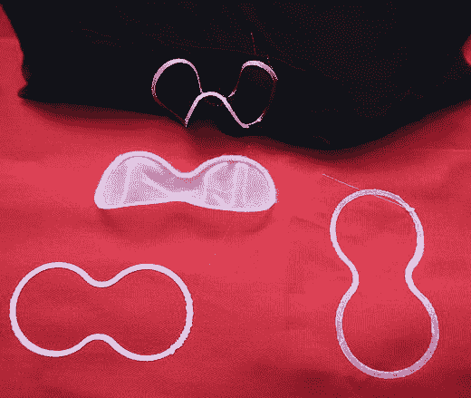

# 9. 3D 打印

近来，3D 打印已大规模进入高级时装领域（正如我们在第 13 章中提到的），但其中大部分使用的是比现在广泛普及的消费级 3D 打印机更先进的技术。在本章中，Joan 和 Rich 将快速介绍 3D 打印，并向你展示它的一些实用和装饰性用途。

## 3D 打印的工作原理

简而言之，3D 打印技术通过计算机模型控制，一次一层薄层地堆积材料来制造物体。堆积的材料因打印机类型而异（无论是从粉末、液态树脂还是线材卷开始），但所有过程从根本上讲都是相似的。这些层通常约 0.2 毫米厚——根据维基百科的说法，这个厚度是平均人类头发直径或油漆涂层厚度的两倍，大约相当于一个平均大小的单细胞生物（如草履虫）的长度（ [`https://en.wikipedia.org/wiki/100_micrometres`](https://en.wikipedia.org/wiki/100_micrometres) ）。

3D 打印并非新鲜事物。自 20 世纪 80 年代以来，它就一直以某种形式存在，第一家公司 3D Systems 由 Chuck Hall 于 1986 年创立。然而，直到 21 世纪中期，3D 打印过程一直受专利保护，而专利持有者选择将其作为一项面向工业用户的昂贵技术。

当关键专利过期后，时任英国巴斯大学的 Adrian Bowyer 设计了一款 3D 打印机，该打印机能够利用一些在五金店就能买到的零件，制造出其他的 3D 打印机。随后，他将此设计以开源方式发布（意味着任何人都可以在此基础上进行开发，前提是他们也必须将自己的改进公之于众），以便每个人都能在其基础上进行构建。

这引发了 RepRap（REPlicating RAPid prototyper，自我复制快速原型机，[`www.reprap.org`](http://www.reprap.org) ）打印机革命，最终促成了现有各种消费级打印机的出现。这一革命得益于可自由获取的技术，以及随后不久出现的众筹这一历史巧合。

**注意**

“3D 打印”这个术语有些误导性，因为人们会立刻将其与在纸上打印文档相类比，但实际上这两个过程并没有太多共同之处。更通用的术语“增材制造”描述更准确，尽管可能不那么朗朗上口。

消费级打印机大多使用塑料线材卷（请参阅本章稍后的“3D 打印材料”部分）。图 9-1 展示了一台典型的小型消费级 3D 打印机及其线材卷。这台打印机恰好是由 Rich 设计的。它有四个小型电机：一个用于驱动三个维度中每个维度的机械结构，一个用于将线材推入挤出机。

**图 9-1.** 一台消费级 3D 打印机

挤出机由两部分组成。一部分是驱动机构（包括一个电机和夹紧线材的零件）。另一部分是热端，线材在此处熔化并通过一个喷嘴（本例中直径为 0.5 毫米）挤出，喷出精细的熔融塑料流。物体在平台上（图 9-1 中被蓝色胶带覆盖的区域）逐层堆积而成。与许多消费级打印机一样，这台打印机由一个微处理器控制，该微处理器本质上是一个添加了一些定制功能的 Arduino。

树脂打印机使用光线选择性地固化光敏液态树脂。价格适合消费者的树脂打印机正变得越来越普遍，它们对于珠宝和精细打印尤其有用，但树脂处理起来比较麻烦，需要小心操作。使用粉末的打印机则使用激光烧结颗粒，或使用喷墨打印头沉积粘合剂（如胶水或溶剂）使它们粘合。这些打印机可以制造出表面相对光滑的产品，但价格昂贵，并且材料处理方面的挑战远大于线材打印机。本章我们将重点介绍基于线材的打印机的应用，并在第 13 章中简要讨论高端应用。

## 在 3D 打印机上制作物品的步骤

在 3D 打印机上制作物品需要几个步骤。首先，您需要使用 3D CAD（计算机辅助设计）程序创建一个 3D 模型。接下来，您使用切片计算机程序将该模型转换为打印机制作各层的命令。最后，您将该文件加载到打印机上（这可能是通过从计算机将文件写入`SD`卡，或者通过`USB`电缆或无线方式连接计算机来实现），然后打印您的物品。接下来的章节将更详细地介绍这些步骤中的每一步。

## 基于线材的 3D 打印机的限制

基于线材的 3D 打印机制作的模型都是单一颜色的——即线材的颜色。有些打印机有多个挤出机，可以使用的颜色数量与挤出机数量相同。还有一些使用其他技术的多色打印机，但在撰写本文时，它们尚未达到消费者的价格水平。

关于基于线材的 3D 打印机的局限性，您需要了解以下几点：

*   打印任何东西都需要一段时间。即使是小物件也可能需要半小时，而大型打印则可能需要数天。大多数打印机在过程中途出现问题后无法重新启动。
*   3D 打印的零件通常很小。打印机的打印面积从每边 4 或 5 英寸到大约两倍大小不等。能够构建任何维度超过一英尺物体的打印机，其价格会迅速变得昂贵。
*   能够可靠制造的最小特征尺寸大约为 1 毫米，我们通常建议细节不要小于这个尺寸。原因是打印机挤出的线材线条可以接近这个尺寸——它就像是蛋糕装饰用的挤压喷嘴的缩小版。我们在本章演示中所用打印机的喷嘴开口为`0.5 mm`，但它会挤压其制作的线条，使其在垂直方向上更薄，因此它挤出的线条比`0.5 mm`更粗。
*   打印件从底部开始构建，如果它们有悬空的部分，需要以某种方式支撑起来，然后这些支撑物之后必须被切掉。有一些程序可以处理创建支撑物，但提前考虑好这一点是良好的设计实践。同样，打印件需要与构建平台有足够的接触面积，以防止在打印过程中被撞掉。
*   3D 打印需要进行调整、维护，以及偶尔清理堵塞。购买前请查看用户评论，以了解打印机的可靠性和故障排除的难易程度。

## 3D 建模

3D 打印过程的第一步是下载或创建一个 3D 计算机模型。有很多网站提供免费的可下载模型，包括[`www.thingiverse.com`](http://www.thingiverse.com)和[`www.youmagine.com`](http://www.youmagine.com)。免费下载网站存在一个问题：任何人都可以（并且确实会）上传模型，其中许多模型打印效果不佳或根本无法打印。寻找那些下载量大且附有样品打印图片的模型。

如果您想创建自己的模型，有多种选择，其中许多是免费和/或开源的。本节将介绍其中两种，但还有很多其他选择。建模过程将生成一个以`.stl`结尾的文件，通常称为“`STL`文件”。`STL`代表立体光刻（stereolithography），这是树脂打印机使用的工艺。`STL`格式是消费级 3D 可打印模型的事实标准。某些版本的`Windows`不喜欢`.stl`扩展名，并认为它是某种安全文件，因此在您保存`STL`文件时，`Windows`可能会给出一些奇怪的警告。

> **注意**：除了`STL`之外，还有其他一些 3D 建模标准——特别是许多图形程序使用的`OBJ`，以及尚未被广泛支持但旨在取代`STL`并能跟踪模型中不同材料使用的`AMF`，但在本章中，我们将重点介绍如何创建`STL`文件。

### TinkerCAD 及其他 123D 应用

Autodesk 拥有一整套 CAD 软件（[`www.123dapp.com`](http://www.123dapp.com)），其中最简单的是 Tinkercad（[`www.tinkercad.com`](http://www.tinkercad.com)）。Tinkercad 允许进行拖放式设计。这很好，因为您可以非常快速地设计东西。在手绘方面它有些局限，尽管有办法可以绕过。如果您可以通过从各种基本形状构建来创建您想要建模的东西，那么 Tinkercad 是一个不错的选择。

有许多社区贡献的形状，包括一个允许您以 3D 格式打印文本的实用程序，以及另一个打印齿轮的实用程序。图 9-2 是一个在 Tinkercad 中开发的简单小吊坠。此处显示它在 3D 打印机上带有一个 brim（一种辅助模型牢固粘附在打印机上的几圈 3D 打印线条），以及从打印机上取下后，以显示有多少打印部分是 brim（图 9-3）。您可以在特写镜头中看到层纹，并看到特征尺寸的限制。这个吊坠最宽处约 50 毫米，可在[`https://tinkercad.com/things/kQD9mpZ1BLf`](https://tinkercad.com/things/kQD9mpZ1BLf)公开获取。

如果您只是想让一个艺术班快速制作一个小玩意作为别针或吊坠，Tinkercad 可能是一个不错的选择。字母、数字和一些符号（如本例中的星形）都是可用的，如果您进入社区选择，您可以找到从用户指定的齿轮到各种字体的文本等东西。

> **提示**：Tinkercad 在其网站上提供了很好的教程，应该可以帮助您快速上手。

### OpenSCAD

`OpenSCAD`程序允许您以一种类似于 C/Java/Python 编程语言家族的风格来开发模型。它是免费且开源的，我们要感谢 Marius Kintel 以及该程序的许多其他贡献者和维护者。您可以从[`www.openscad.org`](http://www.openscad.org)下载`OpenSCAD`，一份优秀的用户手册可在[`www.openscad.org/documentation.html`](http://www.openscad.org/documentation.html)找到。

根据下载站点上的说明下载并安装`OpenSCAD`。`OpenSCAD`提供适用于 Linux/UNIX、Windows 和 Mac OS X 的版本。图 9-4 展示了 Rich 在`OpenSCAD`中创建的一些“宝石”。如果您懂一点编程，或者从一个现有的示例开始，您可以创建相当复杂的模型。许多可下载且可用户修改的模型都是用`OpenSCAD`编写的。

### 其他 CAD 程序

市面上还有很多其他的 CAD 程序。一些为动画设计的程序，例如免费的、开源的 Blender（[`www.blender.org`](http://www.blender.org)）或商业程序 Maya（[`www.autodesk.com/products/maya`](http://www.autodesk.com/products/maya)），可以制作出非常复杂的模型。然而，它们的学习曲线很长，并且需要特别注意模型的构建方式，因为它们并不是为了制作可 3D 打印的模型而设计的。

如果您想制作工程类的零件（带尺寸的机械部件），可以考虑 Onshape（[`www.onshape.com`](http://www.onshape.com)），这是一个相对较新的程序，其新颖之处在于它是一个价格相对实惠的工程程序。

## 切片与打印

不过，创建（或下载）3D 模型仅仅是第一步。一旦你获得了`STL`文件，你仍需通过一个程序来运行它，该程序会为你的打印机生成详细的指令以实际制造物体，并且你还需要将这个文件传输到打印机。大多数打印机可通过 USB 连接，部分还支持无线连接。另一些则可以使用 SD（或 microSD）卡，将可打印文件从你运行此软件的电脑传输到 3D 打印机本身。这些步骤因打印机而异，但一些标准已经出现。

一个兼容多种打印机的程序是开源软件 `MatterControl`（[`www.mattercontrol.com`](http://www.mattercontrol.com)）。`MatterControl`（或你打印机的等效软件）接收`STL`文件，并输出一个`G-code`文件。`G-code`格式（或等效格式，如`X3G`）才是实际在打印机上运行的格式。如果你的打印机使用专有软件，该软件可能会也可能不会向用户显示此文件。

你可以通过查看制造商的说明来检查你的打印机是否支持 `MatterControl`。如果你的打印机使用自己的专有软件，它很可能在执行与我们此处描述类似的操作，但细节会有所不同。

**提示**

如果你想了解关于 3D 打印过程的更多细节，并重点关注开源打印机，可以考虑阅读 Joan 的著作《掌握 3D 打印》（Apress，2014）。这本书还包括了打印后处理的内容。如果你想特别专注于使用 `MatterControl` 软件，并希望获得更详细的用户指南，可以阅读 Joan 和 Rich 合著的《使用 MatterControl 进行 3D 打印》（Apress，2015）。这两本书都回顾了如何开始 3D 打印，包括创建模型。由于这个主题庞大而复杂，我们在此只给出过程的大致轮廓，让你了解涉及的内容和可能性。在 [`www.mattercontrol.com`](http://www.mattercontrol.com) 上也有相关文档，你的打印机制造商也可能提供一些链接或手册来帮助你入门。

### MatterControl

消费级 3D 打印机大致分为两种类型：开源和专有。开源打印机在一定程度上可追溯到本章前面提到的 Adrian Bowyer 的 `RepRap` 打印机，而这些打印机正是 `MatterControl` 旨在支持的机型。`MatterControl` 也是一个开源、免费的程序，它接收`STL`文件并将其转换为在支持它的 3D 打印机上运行的命令（`G-code`）。`MatterControl` 需要：

*   一个定义打印机的文件（对于官方支持的打印机，可通过下拉菜单提供）。
*   一个`STL`文件。
*   针对特定`STL`文件的设置。例如，可以选择让打印机生成支撑结构或不生成，针对不同材料使用不同的温度设置，等等。

其中一些设置可能始终或大部分时间保持不变，而另一些则可能频繁变化（例如模型是否需要支撑）。目前的工艺水平是，为了打印出好的作品，需要对该过程有一定的了解。前面“提示”中建议的资源可以帮助你入门。

`MatterControl` 还具备将打印作业发送到连接到运行 `MatterControl` 的计算机上的打印机的功能。创建 `MatterControl` 的公司 `MatterHackers` 还销售一种平板电脑（`MatterControl Touch`），它可以运行兼容的 3D 打印机，从而无需占用一台电脑。

### 专有 3D 打印机

其他制造商选择从头开始构建自己的软件和文件格式，而不是加入开源 3D 打印机社区。如果你的打印机附带专有软件，你应该查阅其文档。

**警告**

我们建议在通风良好的区域使用 3D 打印机（但不要在室外或窗户正前方）。请遵循制造商关于打印机环境的建议。

## 3D 打印材料

消费级 3D 打印机使用多种材料。最常见的可能是聚乳酸（`PLA`），这是一种通常由糖/淀粉制成的塑料（在北美，通常来自玉米）。`PLA` 是最容易打印的材料之一，并且不像其他一些材料那样需要加热打印平台。然而，它在夏天炎热汽车内的温度下会变软，因此如果你要用 `PLA` 制作任何结构性物品，必须小心，以免最终得到一件意外超现实的连衣裙。

丙烯腈-丁二烯-苯乙烯共聚物（`ABS`）用于制造许多玩具，因此常被称为乐高塑料。它更难打印；它需要加热的打印平台以防止在打印过程中从平台剥离，以及需要能够处理比 `PLA` 更高温度的挤出机。好处是，`ABS` 在温暖温度下不易变软。

尼龙丝材对于时尚科技应用来说是一个有趣的选择。当打印成细长部件时它很柔韧，但如果打印得更厚则相当坚硬。它可以用适合尼龙的染料进行染色。然而，与 `ABS` 类似，它必须在某些打印机无法承受的高温下打印，并且需要一个专为尼龙设计的打印平台。

还有许多其他类型的丝材，并且不断有新品出现。`PET`（一种常用于水瓶的透明塑料）相当透明，其耐温性介于 `PLA` 和 `ABS` 之间。还有一些丝材含有木屑或金属粉末，打印出来看起来像木头或金属，有些还能在黑暗中发光。然而，这些丝材由于含有细小颗粒，往往容易堵塞和磨损喷嘴。还有一些柔性丝材材料（例如热塑性弹性体，或 `TPEs`），打印起来具有挑战性，但能产生柔韧的效果。

**警告**

有些打印机只能打印一种类型的材料。请务必购买与你的机器兼容的丝材。另外，请注意丝材通常有 1.75 毫米和 3.0 毫米两种直径，二者不可互换。

## 应用

既然我们已经了解了 3D 打印可能带来挑战的一些方面，为什么要在时尚科技项目中使用它呢？3D 打印的主要优势在于其灵活性，以及能够非常快速地以几乎任意形状创建实体物体的能力。

3D 打印的直接应用包括打印装饰部件，这些部件旨在被粘合或缝制在衣物上，例如纽扣或装饰件（如本章前面所示）。3D 打印部件也可用于电池和控制线缆走向的支撑结构，或补充传统的骨架支撑（连衣裙的结构支撑）。然而，消费级 3D 打印部件体积较小，这可能会限制其在骨架支撑中的实用性，除非你将多个部件粘合在一起或将它们粘合到服装上。

**提示**

Lyn 偏爱 Aleene 的纺织品胶水。该公司网站（[`www.ilovetocreate.com`](http://www.ilovetocreate.com)）提供了大量关于针对不同情况应使用何种产品的信息。根据 Lyn 的经验，她使用过的胶水粘合效果非常好，但可能无法经受大量洗涤。

### 制作模具或铸造模型

3D 打印在时尚领域的另一项实用功能是制造用于铸造其他材料的模具。例如，传统的砂型铸造法需要先制作一个阳模（与最终成品形状相同），在砂油混合物中压出空腔，再向其中注入熔融金属。这些阳模（在工艺中称为"模型"）传统上由木材制成，但由于它们仅用于压制砂型，塑料同样可以胜任。

另一项传统铸造工艺——失蜡法——同样始于阳模，传统上使用蜡制成。该模型随后被石膏或其他耐高温材料包裹，通过加热使蜡熔化流失，金属便可注入形成的空腔。人们已尝试过"失 PLA"铸造法，即用 PLA 3D 打印模型替代蜡模。

**注意事项**

由于这些工艺涉及熔融金属，通常不适合在家操作，但在此提及仅供兴趣参考。

### 使用 3D 打印笔

从金属工艺转向手工艺层面，理论上可以使用 3D 打印笔在织物上作画。这类打印笔并非电脑控制，它们挤出的塑料丝类似 3D 打印机的短线段，但使用者需徒手自由绘制。我们尚未亲自尝试，但这与在布料上使用热熔胶并无太大差异。

## 在织物上进行 3D 打印

我们曾对在尼龙材料上实现尼龙材质 3D 打印产生好奇，目的是为服装增添纹理效果。这并非消费级 3D 打印机的设计初衷，通常而言，若您未自行组装打印机（因此不熟悉其机械构造），不建议尝试此类操作。尤其当您的打印机具备自动调平功能时，可能会碰到活页夹。在实验中我们发现，几乎全程需要值守观察，否则材料可能被卷入打印机机械装置。

我们使用的打印机平台完全裸露，仅用小型活页夹将织物绷紧在平台上。图 9-5 展示了同款设计在三种不同织物上的打印效果，多数使用尼龙耗材，其中一种使用 PLA。PLA 与棉质帆布粘合良好，但将硬挺的帆布固定在平台上颇具挑战。或许未来会有专为此应用的 3D 打印机问世。目前，除了刚好覆盖平台的矩形织物，或像图 9-6 项目那样每次迭代后移位的长条状织物，其他形状的布料打印难度极大。与此同时，您也可以先打印结构件，再将其粘合到织物上。

图 9-5. 同一图案在不同材质上的打印效果：使用尼龙耗材在轻薄弹性的 95%尼龙/5%氨纶织物（顶部）、在单向弹性尼龙（可能为混纺）织物（中部）、使用 PLA 在硬挺棉帆布（左下）、在棉帆布使用尼龙耗材（右下）。

《Make》杂志在相关文章中尝试了不同方法（[`http://makezine.com/projects/how-to-3d-print-on-tulle-net-or-lace-fabrics/`](http://makezine.com/projects/how-to-3d-print-on-tulle-net-or-lace-fabrics/)）：先打印部分图案，将织物平铺其上，再继续完成打印。这种方法可精确定位设计图案在织物上的位置，但实现更为复杂。若您的打印机平台为封闭式或与其他部件紧密排列，可能无法进行织物打印。您还需掌握暂停与恢复打印的技巧，某些情况下需涉及 G 代码操作。

该领域已有一些商业探索。3D Systems 曾销售"Fabricate"套件，内含预配织物片与耗材墨盒。耐克也已申请多项 3D 打印鞋类相关专利（[`https://3dprint.com/1331/nike-awarded-two-major-3d-printing-footwear-patents/`](https://3dprint.com/1331/nike-awarded-two-major-3d-printing-footwear-patents/)）。未来前景值得期待（我们将在第 13 章讨论）。

## 本章小结

本章广泛概述了消费级 3D 打印技术，并提供了大量学习详细流程的资源指南。我们着重介绍了 3D 设计软件的工作流程，探讨了材料特性及包含 3D 打印的构造技术。

