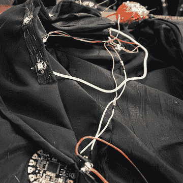
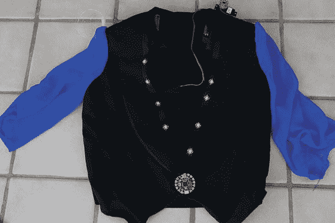
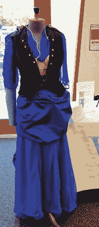
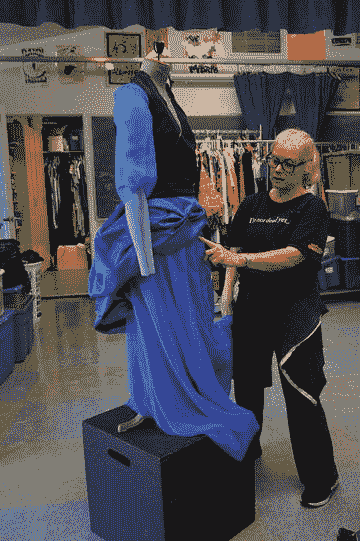
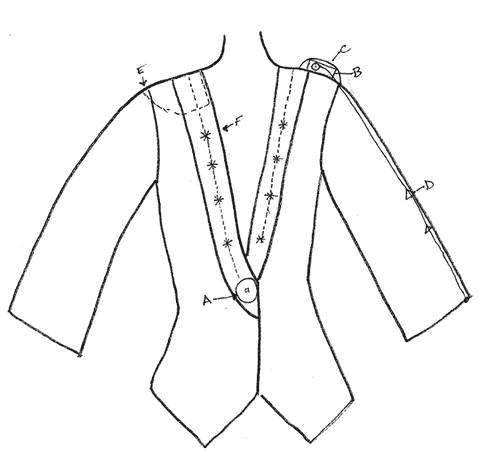
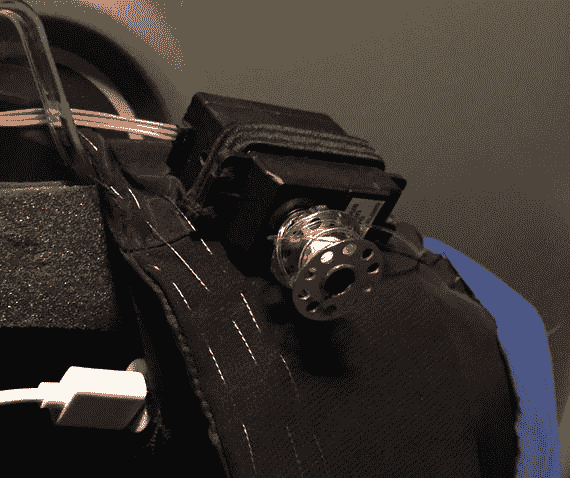
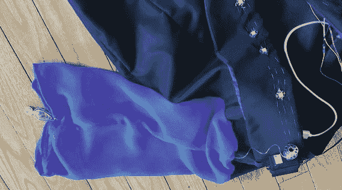
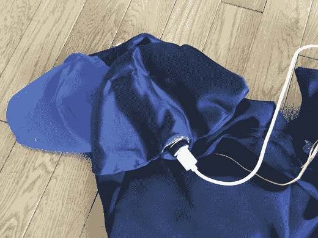
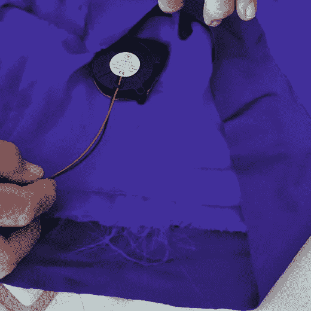
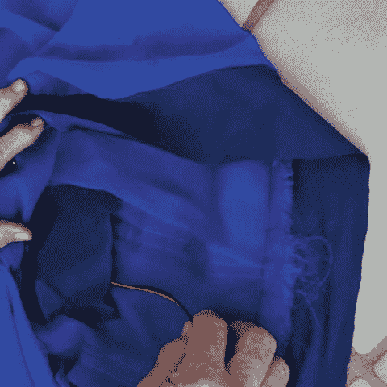

# 10. 规划的重要性

可穿戴技术之所以困难，在于它融合了多种技能领域。从业者可能来自缝纫、电子或编程背景。若您来自虚拟世界（3D 建模或编程），最令人惊讶的发现之一便是：实体物品总比预想中占用更多空间。如何隐藏（或最佳展示）电路、避免短路、处理使用者佩戴时的各类不便问题，都需要深思熟虑。

林恩拥有超过 30 年的舞蹈与戏剧教学表演经验，以及服装设计经验。她将是本章的主要叙述者，琼将补充她所谓的"系统工程"视角，里奇则会就技术问题提供避免方案。

本章以一个案例研究（实为警示故事）开篇，讲述我们首个大型集体项目——我们后来发现这个项目过于雄心勃勃。接着我们会解构这段经历，列出项目规划阶段需考虑的注意事项清单，分享积累的各类技巧，最后以"让设计易于测试维护"的理念作结。

第 11 章将继续探讨可穿戴技术项目的几个实例与案例研究。而本章（在讲述野心故事后）主要聚焦于影响整个项目的元件级决策。

若您是使用本书作为教材的教师，本章主要面向项目设计者。这些宏观设计问题可能无需向学生详细讲解。我们旨在为您提供学生项目指导中的"避坑"思路——这本质上是一章关于"不该做什么"的内容。首先以林恩作为首次融入可穿戴技术理念的戏服课程教师的视角展开论述。

## 过于宏大的首个项目

我对可穿戴技术的初次尝试既令人兴奋又令人恐惧。我几乎不具备焊接电线、为微控制器编写代码或使用众多可用组件制作这些作品所需的知识。但我多年来一直在制作和修改戏服，因此相当自信能搞定一些事情。幸运的是，我有琼和里奇这样两位出色且支持我的导师。

有些事简单得让我惊讶，而另一些事则难得出奇。这改变了我的思维方式，拓展了我自认能够胜任的领域——至少是自认能够学习和发展新技能的领域。在完成一些 Arduino 教程的过程中，我开始理解一些代码的含义及其背后的原因。这既让我震撼，也让我深受启发。

犯下或大或小的错误，是学习什么可行、什么不可行的好方法。它甚至能激发新的创意和/或解决方案。我犯过一些愚蠢的错误，也犯过一些可怕的错误（比如图 10-1 中的布线），但嘿，活到老学到老。

图 10-1. 计划外的布线失控

我在这里描述的第一个项目源自一个戏服设计课的头脑风暴会议。学生们被要求将可穿戴技术融入某种蒸汽朋克风格的作品中。（蒸汽朋克是一种科幻小说类型，其基本设定是世界以某种方式回到了维多利亚时代的英国，并混合了不同时代的技术，但拥有蒸汽动力机械和仅限于比空气轻的飞行器。）全班最终聚焦的第一个项目是一件拥有自我意识的蒸汽朋克“鬼魅连衣裙”。

最终，这个项目拖到了学年结束之后，成了我个人的夏季项目，也是我自学可穿戴技术的教程。我们知道将在那个夏末的一次教育创客技术会议上展示它，这给了我们一个必须赶上的截止日期。这帮助我为我第一个全年的戏服设计和可穿戴技术课程做好了准备，但这无疑是一场消耗了我大半个夏天的“战火洗礼”。处理一个复杂的项目确实迫使你同时快速学习所有方面。

### 鬼魅连衣裙——最初构想

“鬼魅连衣裙”旨在成为一件小型表演作品。我想营造出一条裙子在一个惊讶的穿着者周围活过来的感觉。流程将从穿着者做出一个启动裙子的手势开始。接着，灯光会沿着裙身前部闪烁（以模拟闪电效果）。然后，裙摆下的风扇会启动，吹动裙摆。当穿着者低头看向裙摆时，袖子会开始自行向上拉起。

这条裙子被设计为一条蒸汽朋克/维多利亚风格的雪纺长裙，配以塔夫绸的臀垫式罩裙，以及一件带有雪纺袖子的塔夫绸短夹克。图 10-2 显示了早期开发阶段的裙子。（我们的第一个错误是，在装上电子元件之前，我们就已经组装好了大部分部件。）图 10-3 显示了完成后的裙子，而图 10-4 是在添加肩部舵机时上衣部分的特写。

图 10-4. 裙子的夹克部分，展示了 NeoPixel 灯带、Flora 主控板以及部分舵机/钓鱼线连接件

图 10-3. (右图) 完成后的裙子

图 10-2. (左图) 早期构建阶段的裙子

图 10-5 中的示意图展示了夹克的关键部分，它支撑了大部分电子元件。我决定使用 Flora（关于 Flora 硬件详见第 5 章，软件详见第 6 章）作为裙子的微控制器，并使用 NeoPixel 多色 LED 来实现闪电效果。裙摆下安装了小型风扇来吹动裙摆，还有一个带有舵机（见第 8 章）和绳线的机构来拉起袖子。（我认为把袖子拉起来不算太难，但再放下来就太难了）。臀垫是隐藏电池和其他大件物品的好地方，而肩垫则能隐藏袖子用的机械装置。我以为万事俱备了——至少当时这么想。

图 10-5. 鬼魅连衣裙夹克的示意图，展示了 Flora (A)、舵机 (B) 以及将舵机固定在肩部的弹性带 (C)。夹克内部是肩垫 (E，为清晰起见，显示在另一个肩膀上)。用于拉起袖子的钓鱼线缠绕在一个粘在舵机上的线轴上，并穿过三角形导向环 (D)。

夹克内有肩垫，用于放置为舵机供电的口红电池。一个缝纫用的线轴被粘在舵机顶部，并缠绕了足够长（加上一些余量）的尼龙钓鱼线，以便到达袖口。两个小三角形环被缝在大约三英寸长的斜纹带子上。斜纹带子被缝在雪纺袖子的内侧，这些三角形环为尼龙线形成了一个通道，尼龙线的末端打结并手工缝制在袖口边缘。

Flora 主控板被手工缝制在夹克前部，通常纽扣所在的位置，内侧用魔术贴来固定夹克。NeoPixel 灯带被手工缝在翻领上，并用导电缝纫线连接到 Flora。导电缝纫线也用来将舵机和口红电池的导线连接到 Flora。这些导线从夹克内部的肩垫中穿出。

### 错误

在鬼魅连衣裙这个项目上，我最大的错误是在完全理解项目所有其他方面之前就制作了裙子和夹克。作为一名资深裁缝，我习惯于一头扎进去并在制作过程中随时调整项目，但这些项目需要大量前期规划。

例如，我没有为从舵机到 Flora 的整洁走线留出空间。结果，成品相当凌乱，我甚至将热焊锡滴到了雪纺裙子上。这可不是什么好看的景象！

我还不得不将塔夫绸臀垫拆开几处，以便为锂电池缝制一个口袋，并将其安置在最适合活动的位置。事后看来，我本应在夹克内部用轻质棉布或里衬布制作导线通道，以获得更整洁的外观和更舒适的穿着体验。

**提示**

我真希望当时先用平纹细布做一件罩裙的样衣，来确定其他元件应该放在哪里，然后再使用昂贵（且易损）的塔夫绸。轻质、廉价的棉质平纹细布是一种很好的面料，可以用来制作服装原型，找出导线的最佳路径，以及发现其他组件的最佳位置。在裁剪和缝制最终版本（可能使用更昂贵的面料）之前，它允许你在廉价面料上犯错。设计师常用它来制作一件作品的第一件模型，这就是为什么模型（mockup）常被称为“平纹细布样衣”（muslin）。来自电子领域的人可能会把它等同于在制作永久性焊接电路之前，先搭建一个面包板版或鳄鱼夹版的电路。

#### 花朵与 NeoPixel 的布局

我用导电线在翻领的每一边分别缝了四个 NeoPixel。电线从电路板出发，依次连接到第一个 NeoPixel，然后再连接到后续的每一个。导线沿着右侧向上延伸，绕过颈后，再沿翻领左侧向下，如图 10-5 所示。

这是一段很长的走线，所以我必须确保导线足够紧以保证连接，但又不能太紧以至于拉扯翻领使其变形。经过一些反复试验才找到了合适的松紧度。

在第一个迭代版本中，夹克的 NeoPixel 是缝在导电线带上的，而导电线带则缝制在翻领周围。导电线带通过导电线连接到 Flora 板上的触点。由于我没有正确地将线带连接到 NeoPixel 和 Flora，因此只有部分 NeoPixel 能正常工作。随后，我把线带从翻领上拆下，将 NeoPixel 逐个缝上，并用导电线将它们相互连接并连接到 Flora。这次效果就好多了。

**注意**

使用导电线带（第 5 章）可以节省时间，但一定要确保使用导电线将线带中正确的导线连接到你的组件上。我第一次尝试将 NeoPixel 连接到导电线带时非常笨拙且耗时。当时我正在为幽灵连衣裙的夹克翻领上布置一段长线路。NeoPixel 沿着翻领右侧向上排列，在绕过衣领后部后，再沿着翻领左侧向下排列。NeoPixel（第 5 章）是有方向性的，因此为了让信号从一个 NeoPixel 输出并传入下一个，你必须确保切断线带中间的两个部分，从而在 NeoPixel 之间保持信号的输入输出路径。我沿着线带将它们相互连接，遵循箭头指示，并使用导电线将它们连接到 Flora 电路板。当我尝试点亮它们时，只有右侧能正常工作。啊！这是因为我把左侧最后一个 NeoPixel 缝反了方向！解决起来倒不难，但在我们弄清楚错误之前，确实让人相当沮丧了一阵子。

#### 神奇的袖子

我使用了绕在缝纫机梭芯上的钓鱼线，来自动收拢夹克的袖子。我将钓鱼线穿过小的三角形环沿着袖子向下引，并将其固定在袖口边缘。我使用了连续旋转舵机，并在其顶部粘了一个缝纫机梭芯来卷收钓鱼线。舵机有点重，难以保持平衡，所以我将一块结实的黑色松紧带固定在夹克肩部外侧来固定舵机。这同时也允许梭芯活动，并且便于在需要时拆卸（图 10-6）。

图 10-6. 固定在夹克上的舵机

我用了两个缝在 3 英寸长斜纹带上的小三角形环，并沿着袖子固定，作为钓鱼线的通道。通过在线末端打结并在结上涂抹透明指甲油，我得以将线手工缝制到袖口边缘。我还在每个袖口末端固定了一片旧项链的装饰片，以增加袖子的重量，帮助袖子在舵机收线后恢复原位（图 10-7）。

图 10-7. 袖子机械结构和舵机

用于驱动舵机的口红电池隐藏在肩垫的口袋中（你可以在图 10-6 中看到白色的 USB 线接入电池），USB 插头则焊接到舵机的导线上。舵机也连接到了 Flora 电路板。

**在雪纺袖中集成重型组件**

USB 线缆有 A 端（通常插入电脑的一端）和 B 端（在我们的案例中，通常插入 Flora、Gemma 或其他电路板的连接器）。电池需要 USB 连接器，所以 Rich 介入进来，剥掉线缆的 B 端，然后将其焊接到通往舵机的导线上。通常情况下你不会这么做；更典型的案例请参见第 8 章。Rich 和我之所以在这里采用这种方法，是因为我们需要为舵机提供大量电力，并希望为它们提供独立的电源，以确保它们不会导致微控制器电压骤降。我们沿着夹克内部从电池到舵机走线。我们使用导电线将导线缝合固定到位，并将舵机和 Flora 连接到信号和接地连接上，如图 10-6 和图 10-7 所示。

对于幽灵连衣裙，我想把口红电池藏在肩垫里。肩垫通常由棉絮或泡沫制成，并覆以轻质面料。我用黑色塔夫绸为肩垫制作了外套，以匹配夹克的紧身胸衣。在塔夫绸上留一个小开口，我得以将电池附带的收纳袋手工缝合到肩垫套内部（图 10-8）。

图 10-8. 用于容纳口红电池的肩垫

我通过在肩缝线上钉缝两处，将肩垫固定在夹克的肩部内侧。钉缝是指在同一个点上缝几针以固定物件。

#### 鼓起的裙摆

我们三个人希望雪纺裙摆能鼓起来，仿佛一阵风吹过。我们选择使用两个小型径流式鼓风机，它们需要有一个安放之处，既能从裙子内部吹动雪纺，又能远离穿着者。我为每个风扇做了一个小口袋，并将它们固定在雪纺的背面（图 10-9 和图 10-10）。

图 10-10. 风扇从其口袋中滑出

图 10-9. 风扇口袋

我用了两层雪纺，一层海军蓝和一层更亮的蓝色，使裙子稍微厚实一些（参见图 10-2 和图 10-3 中的连衣裙照片）。这也旨在最大限度地减少对风扇进风口的阻挡。风扇的导线被焊接到连接器上，并连接到电池。另一组导线焊接到 Flora 电路板上。导线在裙子和外裙之间走线。我在外裙前部内侧为电池做了另一个口袋，该电池同时也为 Flora 供电。

#### 软件

通过浏览`Arduino.cc`和`Adafruit.com`上的许多教程，我学到了一点关于编程的知识（第 6 章），并能够对 Flora 进行编程以控制 NeoPixel。舵机（第 8 章）和风扇则更为复杂，于是 Rich 和 Joan 介入进行指导和调试。自从第一次尝试以来，我学到了更多关于编程的知识，但仍然还有很多需要学习。

#### 最终结果如何

与许多宏大构想一样，这个项目并未完全按计划进行。最初的设计使用加速度计来检测一个大幅动作，以此启动并重置所有组件，但不幸的是，我们没来得及实现这个功能。我们降低了期望，改为让穿戴者按下`Flora`上的重置按钮。最终，我们只是在一个人体模型上展示了这条裙子（如图 10-2 和图 10-3 所示），因此，与最初戏剧化的构想相比，这个问题就没那么严重了。

风扇提供的风力不足以从口袋里吹起裙摆，所以我们在最终展示前将它们移除了。事后看来，我们本应该用更多的布料进行几次测试，而不是只用一层布料做一次简短的测试。

由于最后关头出现的一些电气问题，左肩的舵机大约只有一半时间能正常工作，而我们没有时间进行调试。但右侧的舵机和`NeoPixels`则表现得非常出色。

> **注意**  
> 我们在本书中没有提供这件裙子的`Flora`程序草图，因为这个项目从未真正完成或调试完毕。我们分别在第 6 章和第 8 章中引用了（更简单的！）`NeoPixel`和舵机示例。提供这个例子的目的是为了展示初次尝试“过于困难”的事情的利弊，同时也是一个小小的警示故事。

在本章的其余部分，我们将重新审视在这个项目中做出的决策，并讨论许多在这个项目中未出现但你将会遇到的其他“系统设计”问题。

### 我们学到的经验

我们从这次经历中学到的第一件事是，在开始之前，必须为你的服装制作一张某种形式的“地图”——至少要用屠夫纸画一个纸样，并草图勾勒出各个部件的位置。（本章中我们说的是服装，但你制作的可能是从毛绒玩具企鹅到帽子再到晚礼服等任何东西。）这个纸样能让你搞清楚在哪里隐藏组件、确定导线的走向，并建立最有效、最高效的连接。这是一种在将各个部分组装在一起之前消除一些错误的方法。

> **提示**  
> 要布局一个简单的可缝纫电路，你可以使用`Fritzing`软件包（第 5 章）来创建电路布局的全尺寸图纸。然后，你可以将图纸放在你正在缝纫的物件旁边，或者将其作为指导，用裁缝粉笔在服装上划线。

创建某种最小化的模型能让你犯错误、修正它们，并在制作最终项目之前发现隐藏电池的最佳位置以及走线最有效、最舒适的路径。对于这件裙子项目，我没有这样做，结果导致我不得不重做许多最初的尝试。

> **提示**  
> 当你在缝纫电路时，你可能需要将一些导电缝纫线迹缝在服装内部或者布线，这意味着你使用的纸样可能与绘制时的方向是镜像的。这样很容易把电路的一部分缝反。因此，务必要确保你在将纸样投射到布料上时，保持关键部分（如输入到`NeoPixel`的信号和电源 - 第 5 章）的方向正确。

#### 材料考量

其次，我们意识到面料的类型和辅料将决定你的项目是否成功。对于幽灵裙，我使用了雪纺和塔夫绸——回想起来，这并不是最佳的面料选择。雪纺很难缝纫，因为它是一种精细的面料且容易磨损；而塔夫绸是一种硬挺的面料，每一条不得不拆掉的线迹都会留下可见的针孔。它也很容易磨损。我不得不多次修改电路，这导致雪纺磨损，并在塔夫绸上留下了拆除缝线后的可见针孔。我学到了很多，但如果我像前面提到的那样，先用白棉布做一个原型，最终成品的效果会更好。

适合使用的面料包括轻质棉（特别适合初学者）或 T 恤布（稍难一些，因为它有弹性）。当然，这在一定程度上取决于你在制作什么。尼龙或任何涤棉人造丝混纺面料都很好。避免使用弹性很大的材料，因为初学者缝纫起来会比较困难。

魔术贴（即`Velcro`）是可缝的，并且不会在你的电路中引起短路。按扣易于使用，但要确保它们不会干扰到任何导电缝纫线、导电布或焊接点。用里布或轻质棉为导线创建通道是个好主意，但这些通道应该易于打开，以便在出现故障或短路时能够检修。如果你给服装加了里衬，可以将通道固定在里衬上，这样从外面就看不见了，或者用手工将通道布缝在接缝或折边等关键位置。热熔胶枪对于绝缘任何焊接点非常有用。只需一滴就能帮助保护连接。

> **提示**  
> 手工缝在布料上或粘在 3D 打印物体背面的别针或磁吸扣，可以成为很棒的时尚配饰。你可以添加舵机来实现运动，或者添加`NeoPixels`使其发光。瞧！

#### 隐藏并支撑电池和机械装置

腰带、垫肩、肩章、裙撑、口袋和门襟是隐藏电池、连接器、开关、控制器和其他你不想暴露在外部件的便捷方法。你也可以通过贴花或刺绣将它们融入设计，或者如果它们本身足够有趣或你喜欢它们的样子，也可以让它们直接显露出来。

> **警告**  
> 务必记住为电池和控制器创造一个安全且受保护的位置，同时也要便于充电和/或更换。请参阅第 5 章中关于电池问题的讨论。

关于雪纺袖子的侧边栏描述了我们在垫肩中如何支撑电池。这些电池有点重，所以把它们放在肩膀上可以提供一些支撑。

> **提示**  
> 如果某个部件必须实际移动，它可能需要相当大的功率，这可能意味着要隐藏大量的机械装置和电池。你也许可以通过巧妙地将服装部件连接到身体其他部位（例如，将某物连接到鞋子上，随着人走路而移动）来避免让服装部件运动。在某些情况下，这可能比尝试使用高技术手段更简单。

#### 导电缝纫线、导线和线缆

导电缝纫线比普通缝纫线更难操作，因为它更硬、更粗。毕竟它是由金属丝制成的。它容易打结和缠绕，所以缝纫时要使用相当短的长度。每次各自完成一条单独的走线，刚好够用就行，然后重新穿针。这需要耐心和对每一针的关注，但你很快就能掌握窍门。

针脚需要足够紧，以建立牢固的连接，同时又不能使面料和/或服装变形。你用导电缝纫线缝制的针脚可以比普通缝纫线更长，但不应过长，否则会变得太松而无法形成良好的连接。

在缝纫一段导电缝纫线时，要不断检查之前的针脚，使其绷紧，但不要拉扯面料导致变形。当项目完成并能正常工作后，稍微移动一下带有导电缝纫线的区域，以确保连接足够牢固，能够经受住活动。如果移动时连接时断时续，你可能需要将一些针脚拉得更紧一些。

更大的问题在于你是在连接一个电路，它比普通服装缝纫需要遵循更严格的规则。本节提出了一些值得遵循的良好实践方法。

#### 避免短路

为了避免短路（即导电缝线无意中形成电流通路），你需要规划好每一条导电缝线的缝制路径。这种缝线不像包覆绝缘层的导线那样具有绝缘性，因此如果衣服活动时它接触到另一条导电缝线，就会导致电路短路。

为你的导线和导电缝线布局绘制一张路线图，有助于消除项目中一些令人头疼的问题。`Fritzing`（第 5 章）在这方面非常有用，因为它使用简单，并能生成清晰、比例准确的示意图。你也可以徒手绘制电路计划，但这样容易遗漏细节，或画得模棱两可，之后才发现问题。无论采用哪种方式，最好在将各部分组装起来之前就做好规划，无论你是要焊接还是缝制。

> **注意**  
> 要特别留意任何有方向性要求的连接（比如一般的 LED 灯，尤其是 NeoPixel 灯珠），它们在电路中只能单向工作。最好的情况是电路不工作，最坏的情况则可能烧毁元件。当你不得不拆掉缝线、更换已粘合或缝制的部件时，会非常令人沮丧且耗时。`Fritzing` 图示既能节省时间，又能稳定情绪。

#### 路由物理控制线

如果你使用控制线来牵引某物（比如“鬼魅连衣裙”袖子中使用的钓鱼线），你同样需要管理好它的走线路径。显然，织物制成的物品在运动中可能会使连接松动，因此，在推拉服装的某个部分时，确保控制器、舵机和其他元件相对于其电气连接保持稳定至关重要。

绘制出线路的走线路线，能让你有机会真正思考哪些部件运动最频繁，以及你的元件和线路布局如何能最好地服务于项目，同时让穿着者感到最舒适。利用衬里或类似的轻质面料，你可以为线路制作线槽或通道，为元件制作口袋或绑带。

#### 导线 vs. 导电缝线

如果你在面包板上搭建 Arduino 电路，你可能会使用绝缘导线。然而，可缝纫电路最简单的连接方式，可能是直接用导电缝线（通常是钢质）将它们缝到服装上。导线的柔韧性不如导电缝线，因此对于大多数服装而言，缝线是更好的选择。但某些连接确实需要焊接并进行绝缘处理。例如，对于导电缝线无法承载过大电流的电路，或者直接连接到电池（一旦短路会导致过大电流）的电路，最好使用绝缘导线。要时刻牢记连接点的位置、该区域的活动幅度，以及当电路在服装上运动时，短路是否会成为问题。

> **提示**  
> 热熔胶枪对于加固和绝缘关键连接点非常实用。透明指甲油在固定导电缝线的线结以及为某些连接点提供额外保护方面效果很好，而且在狭小空间内使用起来比胶枪更方便。

#### 安装舵机

将舵机（第 8 章）集成到可穿戴项目中会带来一些特殊问题。如果舵机在推拉某物，它必须牢固地固定在稳定的物体上。例如，正如本章前面所述，“鬼魅连衣裙”项目中的舵机被固定在夹克外侧的肩缝上，以营造些许蒸汽朋克风格。更复杂或更重的机构可能需要穿着者佩戴某种形式的背带或其他更结实的支撑结构。

#### 放置开关和传感器

放置开关和传感器在很大程度上取决于具体项目（以及传感器类型）。第 8 章从电路原理的角度详细介绍了如何集成传感器或开关。从项目构建的角度来看，主要需要考虑的是，你安装传感器或开关的位置是否容易产生误读。

如果传感器是用来测量人体运动的，你可能不想把它安装在一件飘动的裙子上。我们在这里的基本建议是：仔细思考传感器所处的环境（运动、光线及其他可能相关的因素），然后确保其数据不会以某种方式被干扰。

如第 8 章所述，有许多不同的方式可以触发控制器上的某项功能。在紧要关头，处理器上的复位按钮也能胜任。然而，这个按钮很小，笨拙地摸索它可能会破坏你追求的效果。

#### 可变电阻元件

有时你可能希望控制的对象不仅仅是简单的开关（开/关），或者需要根据模拟输入信号采取行动。一种实现方式相当复杂（就制作难度而言），即使用金属拉链作为分压器（参见第 5 章关于分压器的讨论）。例如，你可能想制作一个打开时灯光会亮起的钱包；我们在这里提到它，是作为开关的另一种选择。当你拉开拉链时，可以安排控制电路中的电阻值发生变化。我们说它复杂，是因为要让其正常工作并实现可控，可能会非常棘手。

#### 光纤

第 5 章在元件层面介绍了 LED 灯、特别是 NeoPixel 灯珠以及 EL 冷光线。但你可能希望被动地传输光——这时就需要用到光纤。

因为一所中学正在演出《小美人鱼》，我们正在寻找可以融入该剧的海洋生物主题项目。我们找到了[Linawassong 制作的光纤水母裙项目](http://www.instructables.com/id/Jellyfish-Skirt/)，并决定以此为基础创作一件水母服装。扮演水母的学生穿着这条裙子和一件黑色连体衣，走过昏暗的舞台。由于这套服装只打算在暗处穿着（由一名中学生穿着），所以我们把它做得比 Instructable 教程中那个精致的概念款更结实一些。这条裙子是用光纤、（大量）热熔胶、一条 NeoPixel 灯带、一条用于支撑所有元件重量的皮带、一块`Gemma`控制板、一个口红电池，以及一条剪成条状的雪纺外裙制成的。

它包含许多可以单独制作、最后再拼装起来的部件。因此，这是一个很适合让多个学生参与的项目，当我们把所有部件组装成成品时，大家兴奋不已。

将光纤丝粘合在一起花费了很长时间，也用了大量的热熔胶。我们曾考虑过纯粹的机械连接方式，让裙子随着穿着者行走而脉动，但这被证明过于复杂，无法在演出前完成，而且实际上也并非必需，因为所有松散的纤维末端本来就会随风飘动。

## 穿戴科技

学生戏剧社团是学术环境中可穿戴技术课程的自然合作伙伴。第一年我们很幸运，中学音乐剧（《小美人鱼》）恰好适合制作发光戏服。在构思项目时，我们刻意回避了一些可能引发问题的做法。因此，这些是我们有意规避、因而未曾遭遇的挑战。稍加思考，您或许能找到应对之策——此处我们按随机顺序列出这些注意事项，供您在制作戏服时参考（为简化操作，建议尽量避免）。

演员会出汗、使用发胶和化妆品，表演过程中还可能泼溅水花。所有这一切都需要在演出前和演出中做好预案。务必穿着戏服进行带妆彩排，确保不会干扰无线麦克风或其他舞台电子设备。对于需要多次穿着的戏服，建议将电路固定在无需频繁清洗的外衣上。

舞蹈环节的戏服存在特殊问题。舞者可能用较大力度相互接触，所有控制器、电池等必须安置在不会妨碍舞者（及其舞伴）动作的位置。沉重的硬件可能在跳跃或挥鞭转时脱落。相比之下，设计一只在水母剧中沿直线缓慢摆动的水母造型更容易实现。

最后，就像在房间里组装家具后才发现无法搬出门一样，人们很容易忽略演员需要穿脱戏服这个环节。这需要花些心思，合理设置搭扣和非导电闭合装置。

即便如此，仍有人完成了令人惊叹的项目，尤其是 Lisia Trubat 的 E-traces 项目。她在芭蕾舞演员的足尖鞋上安装了 Lilypad 处理器（类似 Flora）和加速度计，并通过艺术作品捕捉舞者的动态（[`cargocollective.com/lesiatrubat/E-TRACES-memories-of-dance`](http://cargocollective.com/lesiatrubat/E-TRACES-memories-of-dance)）。

## 设计可测试项目

可穿戴技术项目中，最令人头痛的问题之一是：需要同时确保多少环节正确无误才能让作品成功运作。您需要完成服饰/作品的实体组装、规划控制电路路径、搭建电路、编写代码等步骤。当项目出现问题时，如何避免陷入细节的泥潭？部分答案源于经验积累，但本节我们将探讨一些可能有所帮助的优秀设计实践。

首先，尝试将整个项目分解为若干子部件，特别是那些可以逐步测试的小组件。虽然有时无法实现，但请思考是否可能——例如，当您同时需要舵机和灯光时，可以先单独完成其中一项并测试，再添加另一项。对于代码部分，请保存迭代版本并建立清晰的命名规范。

举例来说，您可以将文件命名为`JoanProjectLightsWork.ino`并保存，然后将下一个版本重命名为`JoanProjectLightsServo.ino`继续开发。这样您总能回退到曾经可用的版本。保持计算机文件夹整洁大有裨益，提前创建 Fritzing 电路图并加以使用同样重要。若不仔细规划导电路径，很容易缝错方向或造成短路。

切勿假定任何特定组件、USB 线或电脑端口必定正常工作。若某器件按您的理解应该正常运作却出现问题，请尝试更换易替换的部件。我们曾因劣质 USB 线（看似完好实则故障）浪费大量时间。本书前几章提供了调试各组件的方法，建议针对特定部件查阅相关章节。但总体原则是：永远不要假设任何部件必然正常。同时检查电池或其他电源是否输出正确电压并提供足够电流（参见第 5 章）。

同样，遇到故障时请保持系统化思维。每次只更改一个变量，而非同时调整五个参数，并保存每次修改的代码中间版本（使用清晰文件名和/或详尽注释）。若某功能曾正常工作突然失效，请仔细思考发生了什么变化。天气？震动？这些因素可能并非直接原因，但可能与问题存在关联。

最重要的是，当您百思不得其解时，请暂时离开项目，哪怕只有几分钟。返回后，尝试向他人描述项目，即使对方完全不懂电子或编程。有时仅仅通过向他人复述过程就能让您发现问题。即便无人可交流，也可以尝试“橡皮鸭调试法”——向一只橡皮鸭详细解释项目的运作原理，从而找出问题所在。

## 本章小结

本章我们分析了首个过度雄心勃勃的可穿戴技术项目案例，并提炼出简化此类项目的方法。重点讨论了如何制作非电子部分的服饰，以便尽可能简化电路布局。我们还介绍了如何通过策略性口袋或肩垫将较重的组件整合到服饰中，以及避免短路的方法。本章既回顾了前几章组件级细节的要点，也引出了下章可供您自行尝试的示例项目。

