# 11. 两个进阶项目

至此，本书已探讨了时尚科技项目的不同方面。第 7 章引导您完成一个相对简单的项目，第 10 章则讲述了一个过于复杂的警示案例。本章提供两个具有挑战性但并非极难的项目，帮助您进一步拓展能力。

第一个项目涉及购买现成帽子，并进行中等复杂程度的电路连接和编程。第二个项目是较为复杂的缝纫项目，需要根据个人尺寸制作版型，涉及将电致发光（EL）线接入逆变器/充电器盒，无需任何编程。根据您对缝纫或编程的熟悉程度，可选择其中一个作为起点。如果您在授课，这两个项目可作为期末作业的两种模板，供学生自行选择方向。Joan 和 Rich 将指导您完成帽子项目，Lyn 将带您完成连衣裙项目。

## 摇头帽

我们构思一个有趣的项目：利用现成服装而非从头制作，同时具备交互性和炫酷效果。于是摇头帽诞生了：当佩戴者左右摇头表示“不”（多数文化中如此）时，NeoPixel 灯环亮起红色；当佩戴者上下点头表示“是”时，灯环亮起绿色。图 11-1 展示了制作完成的帽子。

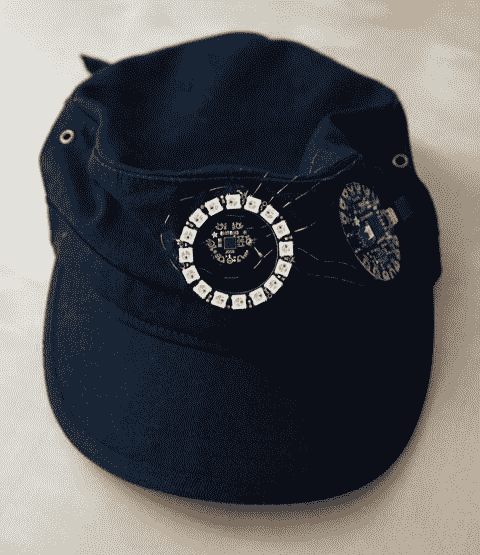

图 11-1. 摇头帽（未点亮 NeoPixel 灯环状态）


### 传感器

本项目使用的传感器集成了三轴陀螺仪、加速度计和磁力计。这意味着它可以感知围绕三个相互垂直的任意轴线的旋转、当前任意方向上的转速变化，以及其绝对方向（若无其他干扰，即相对于北方的方向）。根据传感器的安装方式，这三种传感器中的任何一种都可被使用，但陀螺仪被证明是迄今为止最容易使用的，因为它无需将新数据与先前数据进行比较。我们对传感器的使用方式，并不依赖对传感器输出值的高度精确掌握，而是依靠感知服装是否在两个轴线之一（分别对应摇头“是”或“否”）上旋转。为了使本程序正常工作，传感器需要垂直放置于帽子的前部中心位置，如图 11.1 和 11.2 所示。

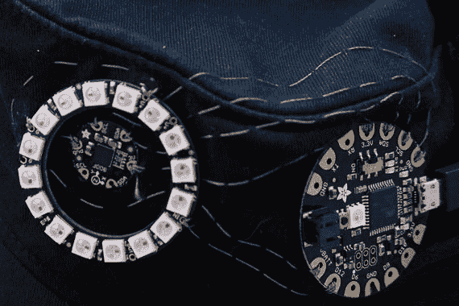

图 11.2 传感器方向及帽子上的电路布局

### 材料清单

制作这顶帽子需要以下材料：

*   一顶厚实的帆布或棉质帽子（非导电布料）。
*   一个 Adafruit 16 像素 NeoPixel 环（一条 16 个像素的灯带或数量更少的单个可缝制像素也可使用）。
*   一块 Flora 微控制器板。
*   导电线材和一根针。
*   普通（非导电）结实线材和一根针。
*   用于连接 Flora 与电脑的 USB 线（用于上传程序）。
*   一个 Flora 可缝制 LSM9DS0 加速度计、陀螺仪和磁力计九轴传感器。
*   一个可插入 Flora（带 micro USB 输出口）并能提供 5V 电压和至少 400mA 电流的电池。这里我们使用了一个小型扁平 micro USB 移动电源，但您也可以使用口红式 USB 电池（需要一根 USB 转 micro USB 线）。

**提示：** 有关此传感器的更多信息，请参阅 [`https://learn.adafruit.com/adafruit-lsm9ds0-accelerometer-gyro-magnetometer-9-dof-breakouts/pinouts`](https://learn.adafruit.com/adafruit-lsm9ds0-accelerometer-gyro-magnetometer-9-dof-breakouts/pinouts)。

### 制作电路

这个可缝制传感器使用起来非常简单。但是，您需要将其按照图 11.2 所示的方向放置才能正常工作。`z` 轴标记应位于最低点，并且传感器在帽子上的位置应确保佩戴帽子时它处于垂直状态。图 11.2 显示了缝制后的电路布局，图 11.3 给出了连接关系的 Fritzing 图。

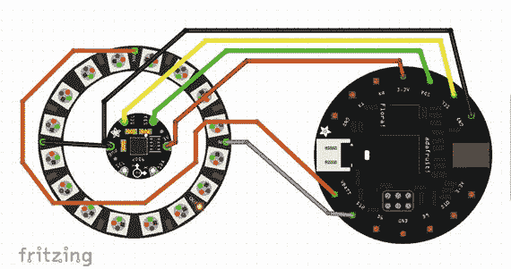

图 11.3 帽子的 Fritzing 图

首先，使用普通的非导电线，通过一些你不会用作电气连接的孔，将 Flora、NeoPixel 和陀螺仪缝到帽子上。您可以基于帽子哪里最容易缝制来决定具体位置。唯一关键的是保持陀螺仪的方向，使其在佩戴帽子时处于垂直状态，并且轴线标记（一个圆圈和字母 `Z`）在底部。

为了制作电路（如图 11.3 的 Fritzing 图所示），请使用导电线材进行以下连接。请事先考虑清楚，查看图 11.2 和 Fritzing 图，或许再用粉笔画出来，以确保没有交叉任何导线接头：

*   Flora 上的 `Vbatt` 连接到 NeoPixel 环上的 `Vcc`
*   Flora 上的 `D12` 连接到 NeoPixel 环上的 `IN`
*   Flora 上的 `GND` 连接到陀螺仪上的 `gnd`
*   陀螺仪上的 `gnd` 连接到 NeoPixel 环上的 `GND`
*   Flora 上的 `SCL` 连接到陀螺仪上的 `SCL`
*   Flora 上的 `SDA` 连接到陀螺仪上的 `SDA`
*   Flora 上的 `3.3 V` 连接到陀螺仪上的 `3 V`

你这样连接电路，使得 Flora 上的 `SCL`（串行时钟）和 `SDA`（串行数据）引脚接收来自陀螺仪的数据，Flora 处理这些数据，然后通过 `D12` 引脚向 NeoPixel 环发送关于像素应显示何种颜色的信号。实现此功能的 Arduino 程序如代码清单 11.1 所示。

### 连接电池

当您对电路的缝制情况满意后，在帽子上靠近 Flora 的位置打一个小孔，以便穿过电池盒的电源线——如果您使用的是那种类型的电池，则穿过 micro USB 端；如果您的电池盒带有那种类型的连接器，则穿过电源连接端（白色连接器）。

根据帽子的不同，您需要想个办法（比如用胶带或者在帽子内侧缝个小口袋）将您选择的电池包固定在帽顶内部。此应用请务必使用结实的消费级电池，因为它们会经常被碰撞并顶到您的头部。

### 库文件

这顶帽子需要 Adafruit NeoPixel、Adafruit LSM9DS0 和 Adafruit Unified Sensor 库。和往常一样，前往 **Sketch** > **Include Libraries** > **Manage Libraries…** 并搜索库名称。请注意，通常搜索 `.h` 文件中的名称是行不通的；有时名称相同，但经常不同。

**注意：** 本项目的并非所有库都支持 Gemma 板。您或许想尝试让这个项目更小巧，但用于该传感器的库并不支持 Gemma 板。

```
// This sketch reads the values from an LSM9DS0 Adafruit gyro
// and turns a NeoPixel ring green if there is rotation about the x axis (gyro[0])
// and red if there is rotation about the y axis (gyro[1])
// Axes are relative to the sensor board orientation, NOT gravity
// i.e. relative and not absolute orientation
#include  // from "Adafruit NeoPixel" library
#include   // from "Adafruit LSM9DS0 Library"
#include    // From "Adafruit Unified Sensor" library
#define SERIALDEBUG
#define PIN 12       //output pin for NeoPixel controls
#define NUMPIXELS 16 //number of pixels in ring
#define MAXBRIGHTNESS 30
int delayval = 200; // milliseconds between samples
int gyro[] = {0, 0, 0};
Adafruit_LSM9DS0 lsm = Adafruit_LSM9DS0();
Adafruit_NeoPixel pixels = Adafruit_NeoPixel(NUMPIXELS, PIN, NEO_GRB + NEO_KHZ800);
//Adafruit sensor setup routine definition
void setupSensor() {
lsm.setupAccel(lsm.LSM9DS0_ACCELRANGE_2G);   // set up accelerometer
lsm.setupMag(lsm.LSM9DS0_MAGGAIN_2GAUSS);    // set up magnetometer
lsm.setupGyro(lsm.LSM9DS0_GYROSCALE_245DPS); // set up gyro
}
void setup() {
Serial.begin(9600);
pixels.begin(); // initialize the NeoPixel object
while (!lsm.begin()) { // blink red if sensor initialization fails
for(int j = 0; j < 2; j++) {
for(uint16_t i = 0; i < NUMPIXELS; ++i)
pixels.setPixelColor(i, j * 10, 0, 0);
pixels.show();
delay(500);
}
}
for(int i = 0; i < NUMPIXELS; ++i)
pixels.setPixelColor(i, 0, 0, 0);  // turn pixels off
pixels.show();
}// end setup
void loop() {
lsm.read();  // read the value of the gyro
gyro[0] = abs((int)lsm.gyroData.x / 1024);
gyro[1] = abs((int)lsm.gyroData.y / 1024);
gyro[2] = abs((int)lsm.gyroData.z / 1024);
for(int i = 0; i < NUMPIXELS; ++i)
pixels.setPixelColor(i,
constrain(gyro[1], 0, MAXBRIGHTNESS), //check one axis for red
constrain(gyro[0], 0, MAXBRIGHTNESS), //check other axis for green
);
pixels.show();
delay(delayval);
// Rest of the code puts out debugging values to serial port
#ifdef SERIALDEBUG
Serial.print("Gyro X: "); Serial.print(gyro[0]);
Serial.print("     Y: "); Serial.print(gyro[1]);
Serial.print("     Z: "); Serial.println(gyro[2]);
#endif
} // end loop
```

代码清单 11.1 帽子程序


#### 加载代码与使用感应帽

要将 Arduino 草稿代码上传到 Flora 板，请通过 USB 将 Flora 板连接到电脑并上传（参见第 6 章）。然后将其接入电池，并按下 Flora 板上的重置按钮。如果保持静止，你会看到它闪烁红色，然后熄灭。上下摇动时，NeoPixel 环应显示绿色灯光；左右摇动则应显示红色。如果你喜欢用单音节词回答问题，现在即使在房间另一头也能做到了！

## 发光 60 年代摩登连衣裙

本章中的另一个项目采用了与第一个项目截然不同的方法。在这一部分，Lyn 将带你完成一个项目：根据她的规格制作纸样、缝制连衣裙，再添加一些电致发光（EL）丝带作为装饰效果。EL 线（ [`https://en.wikipedia.org/wiki/Electroluminescent_wire`](https://en.wikipedia.org/wiki/Electroluminescent_wire) ）是一种涂有磷光体的导线。通入交流电时，磷光体会发光。EL 丝带是 EL 线的扁平版本，适合附着在戏服上以产生发光效果。Lyn 首先会介绍设计的历史渊源，并讲解如何制作纸样以及为自己量体。接着，她会指导你如何缝制连衣裙并添加 EL 丝带。

### 设计

1965 年，伊夫·圣·罗兰设计了一系列连衣裙，采用 A 字版型，近乎无形状的宽松款式，以黑色线条分隔白色与三原色色块。这些连衣裙由羊毛针织布和厚重的丝绸制成，能够保持廓形而不紧贴穿着者身体。这一系列被称为“蒙德里安系列”——向现代艺术家皮特·蒙德里安以及整个现代艺术致敬。在 20 世纪 60 年代的剩余时间里，这种造型的变体随处可见，并成为了那个时代的标志性风格。

我不会使用羊毛或丝绸，连衣裙的剪裁会更宽松，领口也更舒适。我们会在保留原版连衣裙感觉的前提下，略微更新造型。这是一款极佳的 20 世纪 60 年代风格戏服，属于中级缝纫项目。图 11-4 展示了制作完成的服装。

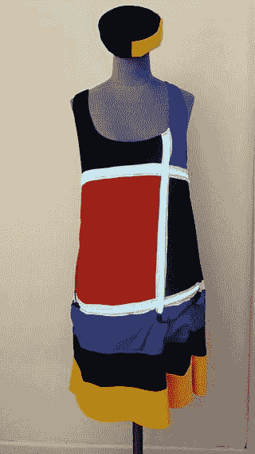

图 11-4. 制作完成的摩登连衣裙，EL 丝带已点亮

这种款式的连衣裙有多款纸样可供选择，例如这款：[`https://betsyvintage.com/index.php?main_page=product_info&products_id=120`](https://betsyvintage.com/index.php%3Fmain_page=product_info%26products_id=120)。

### 材料与工具

制作这条连衣裙，你需要以下物品：

-   布料（此纸样仅适用于弹力针织面料——推荐面料包括双面针织布、哑光平纹针织布、含氨纶的面料、纯棉 T 恤面料）。
-   缝纫线。
-   直针/针插。
-   剪刀。
-   缝纫机。
-   牛皮纸或纸样纸。
-   裁缝粉笔或水消笔。
-   软尺。
-   两段 EL 丝带（也称为 EL 胶带），每段长一米，两端各带一个连接器（大多数 EL 丝带两端各配有一个连接器）。
-   两个用于 EL 丝带/胶带的逆变器/电池盒，额定功率至少能驱动 1 米 EL 胶带，这相当于 4 米 EL 线的功率。（如果产品描述中提到的是 EL 线的长度，请将该数字除以 4 以获得胶带的额定值。）
-   电池（通常为 AA 或 AAA 型）。
-   从逆变器连接到 EL 丝带的公母连接器，其中一个连接器长度需足以从蓝色带子连接到上方的水平条。如果你的逆变器没有多个输出端口，你还需要一个能连接两条 EL 丝带的“Y”形连接器，除非你想用三个逆变器。（仔细检查你购买的 EL 丝带和电池/逆变器上的连接器，以确保买到正确的型号。）

这款连衣裙是一款无袖、A 字版型的套头衫，没有拉链或纽扣。因此，使用弹力针织面料至关重要。如果你使用的面料在横纹方向上的弹性低于 35%，你将无法穿上它（请咨询面料店的工作人员，或按此规格在线订购）。

我在原版设计和色彩的基础上进行发挥，使其成为我们自己的作品。我们将使用白色 EL 丝带来强调接缝，因此连衣裙上的线条将是白色的。EL 丝带将置于白色布料制成的通道内，这些通道将连衣裙上的色块分隔开。

我选择了红色、蓝色和黄色作为三原色，但你可以选择任何你喜欢的颜色。我还使用了黑色来制作后背、右前胸上部、左中躯干以及裙摆下部的部分。我增加了一条低腰线或臀围带，这样就能为驱动 EL 丝带的电子元件和电池制作口袋。

为了使连衣裙可水洗，我用白色布料制作了通道。这样就能轻松地将 EL 丝带穿入或抽出。

> **注意**  
> EL 线和丝带会产生高频音调，这可能会让一些宠物和能听到此声音的人感到不适。为减轻此影响，请避免用一个电源驱动过多的线材。它们还可能产生射频干扰，因此不要在射频干扰可能造成问题的环境中使用，例如医疗设备或科学硬件附近。对于舞台应用，请在完整的彩排中仔细测试这一点（以及其他电子元件）。

### 测量尺寸与制作纸样

首先你需要仔细测量自己的尺寸。图 11-4 是一张示意图，标示了你将要在以下步骤中使用的各个测量点。

> **提示**  
> 如果这些说明过于复杂，你也可以购买一件合身的纯黑色 A 字版型连衣裙，并通过折叠、熨烫边缘然后明缝的方式，添加一些这些部件。或者，你也可以直接将 EL 丝带添加到另一条连衣裙上，但你需要找个地方放置逆变器和电池（或者将它们固定在腰带上）。

#### 连衣裙前片尺寸

首先我们将测量连衣裙前片的所有尺寸。下一节将处理后片的尺寸。字母对应图 11-4 上的标签。

对于上胸部和过肩部分，测量从

-   肩顶到胸围线上方（A 点到 B 点）。
-   身体左侧（通常是一件略微宽松 T 恤的侧缝位置）到左锁骨正下方（C 点到 D 点）。
-   右侧缝到左锁骨正下方（D 点到 E 点）。

对于中躯干部分，测量从

-   胸围线上方到臀部（F 点到 K 点）。
-   侧缝处的左臀到左锁骨下方的臀围线（K 点到 N 点）。
-   右侧缝与左侧测量值相接（另一侧的 K 点到 N 点）。

对于裙摆部分和低腰带，测量

-   从臀围线到大腿中部（K 点到 Q 点）。
-   测量臀围并加 3 英寸（作为缝份和宽松量，大约在图 11-5 中标为 P 的位置）。

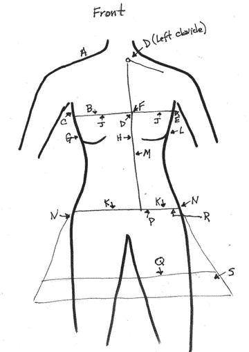

图 11-5. 连衣裙前片的测量标签

-   将前片和后片裙摆的底边宽度设为你想要的宽度。裁剪一块 4 英寸宽、长度等于此测量值的长方形布料，作为底边带（图 11-5 中标为 S 的部分）。


#### 裙身后片的尺寸测量

裙身后片相当简单。实际上，你只需要一个尺寸：从后颈线到*大腿中部*（如图 11-5 所示）。但需确保后片与前片的尺寸加起来，在穿着者身上能合身，因此要测量全身一圈，并检查所有裁片组合后是否合适（如图 11-6 所示）。如有疑问，不妨将尺寸做得稍大一些，后续可在试穿调整后再进行修剪。

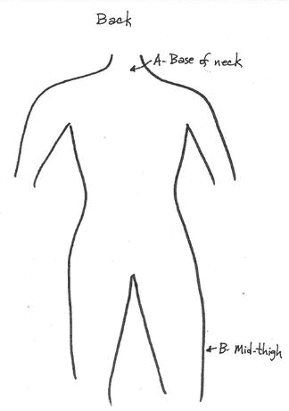

图 11-6.

裙身后片的测量标注。**提示**
我购买了大约 1 码黑色布料、1/2 码红色布料、1/4 码蓝色布料、1/4 码黄色布料和 1/2 码白色布料。建议多买一些以防出错。

### 制作纸样

完成上述所有测量后，请参照图 11-7 至 11-12 中的图示，将纸样画在屠夫纸或其他合适的纸张上。裁剪前，务必在纸上添加缝份（5/8 英寸或 1 英寸，以方便操作为准），然后将纸样固定到布料上。请注意，前后片上的 A 和 B 标记在服装上并非对应同一点。

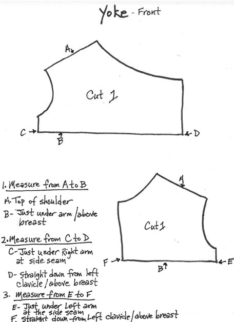

图 11-7.

育克纸样：顶部裁片为黑色，底部裁片为蓝色。**提示**
在将纸样裁剪到布料上之前，建议先在纸上剪下纸样，并尝试用胶带轻轻粘合，以查看效果是否满意。或者，你也可以先制作一个缩小版纸样（例如按 1/12 比例）进行修改调整。有关纸样使用的详细说明，请参阅第 4 章。

这件连衣裙的领口比图 11-4 所示的款式稍高。我这样设计，是让你可以选择保留相对保守的领口，或者将其修剪得稍微时髦一些。

**提示**
除非另有说明，否则缝纫时务必将布料裁片正面相对进行珠针固定和缝制。所有超过 1/4 英寸的缝份都应进行修剪。

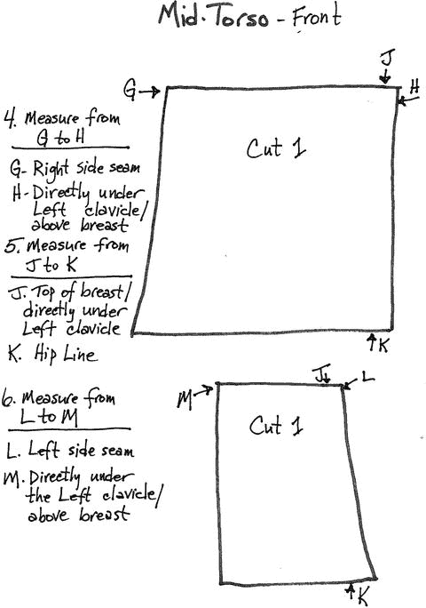

图 11-8.

中身裁片：顶部裁片为红色，底部裁片为黑色。

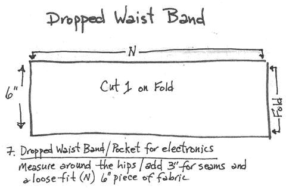

图 11-9.

用于制作放置电子设备口袋的低腰腰带纸样（蓝色）。

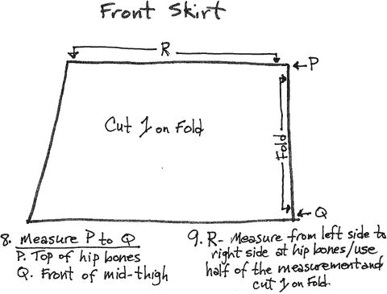

图 11-10.

裙身纸样（黑色，将位于蓝色口袋腰带下方）。

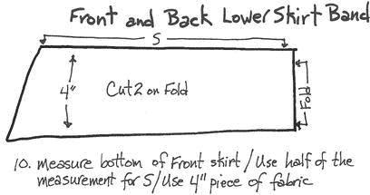

图 11-11.

下裙摆边条纸样（黄色）。

测量后片时需特别注意几点。除图 11-12 所示尺寸外，还需测量后中至两侧缝的宽度（分别在后背中部和臀部位置测量）。在胸围线处为侧缝增加 1 至 2 英寸，在臀围处为缝份和活动余量增加约 3 英寸。后片采用对折裁剪，因此没有后中缝。

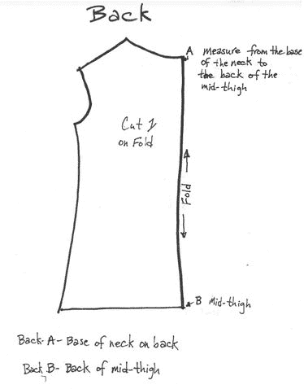

图 11-12.

裙身后片纸样（黑色）。请注意，这里的 A 和 B 标记与前片不同。

### 制作 EL 冷光线和导线的通道管

裙子需要为三条 EL 冷光线制作三个通道管。不过，最简便的方法是在裙子接近组装完成时再测量这些通道管的长度，但请确保你已购买足够的布料来制作所有三个通道管。你可能还需要为从上部 EL 冷光线带到蓝色口袋中电池/逆变器的导线制作一个导管——或者你也可以采用其他方式管理这根导线，具体取决于你计划佩戴带有 EL 冷光带这件裙子的频率和时长。黑色通道管的其他替代方案可能仅是制作几个线圈来防止其过度移动（如我在本演示裙中所做），但导管会更为牢固。

### 整理裁片

此时，你应该已经备齐裙子及 EL 冷光线通道管的所有裁片。图 11-13 以测试布局展示了主要裁片及其中一个通道管。请注意，靠近裙摆底部的蓝色条带将是一个缝在黑色条带上方的贴袋。换句话说，黑色条带的下方与黄色条带缝合，上方与红色和黑色部分缝合。蓝色条带将作为额外的双层布料覆盖其上，用作放置电池的口袋。如果这里有任何步骤不熟悉，建议你回顾第 3 章和第 4 章。

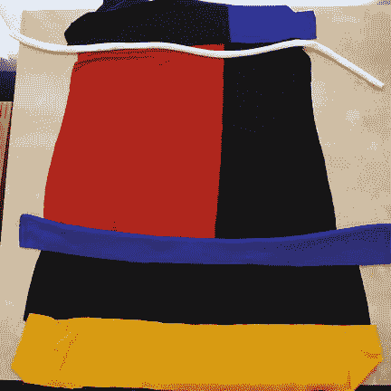

图 11-13.

裙身前片的布局。

### 缝制前片

对于上胸部（育克）裁片，将两片裁片沿前中缝用珠针固定，并使用平缝针迹缝合。修剪缝份并熨开。接下来，将中身裁片沿前中缝用珠针固定并缝合。修剪该缝份并熨开。

将育克上的垂直缝与中身裁片上的垂直缝对齐，然后沿水平缝用珠针将两者固定（正面相对）。检查垂直缝对齐后，裁片侧缝是否匹配。若需少量修剪，那是可以的。但如果侧缝因一片比另一片小而不对齐，则可能需要拆除其中一条垂直缝并重新缝制，或者将其中一片再收进一些——选择能使服装合身的方法即可。

在镜子前将裁片举在身前，检查是否合身。满意后，沿水平缝将育克部分与中身部分用珠针固定并缝合。修剪缝份并熨开。完成前片：沿水平缝线将前裙片与中身部分用珠针固定并缝合，一如既往地修剪缝份并熨开。在肩缝处将前片与后片用珠针固定并缝合。修剪缝份并熨开。

**注意**
纸样中所示的领口远高于我们这里展示的演示裙款式。你可以从当前领口开始，如果想要更低的领口，随时可以修剪一些。为了裙子的稳定性，我们推荐使用较高的领口。


### 添加后片

将前片与后片在侧缝处用珠针固定并缝合。你可能需要稍微拉伸布料，以使两侧沿整个侧缝线贴合。这是正常现象，当你自行设计和裁剪纸样时，这是可以预见的。注意不要过度拉伸布料，否则会扭曲裙子的形状。图 11-14 展示了此步骤从反面观察的视图。

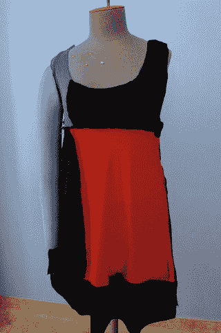

图 11-14.

刚刚将后片与前片缝合后的样子（裙子处于反面状态）

将底部的（黄色）布带用珠针固定并缝合，形成一个环状布片。修剪缝份并将其熨开。将布片对折，标记前中心线，该位置应位于你刚缝合的缝线的对侧。换句话说，黄色布带的缝线将位于后中心线处。将布带用珠针别在裙摆底部，从裙子后中心处的缝线开始对齐，并将前中心标记对准裙子的前中心。在将布带其余部分别到裙子上时，稍微抚平并拉伸布料。确保它看起来均匀，不要在某处拉伸过度或布料堆积。缝合这条缝线，修剪缝份并熨开。图 11-15 显示了我们现在所处的位置，此时裙子是正面朝外的。

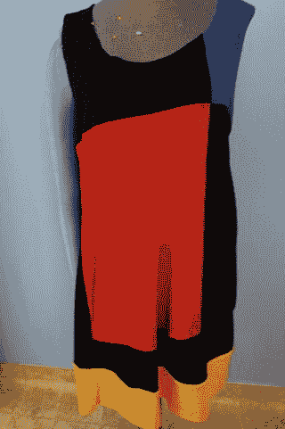

图 11-15.

添加黄色布带后的组合状态

### 低腰口袋

将低腰腰带布片（蓝色）正面相对对折，缝合较短的缝线以形成一个环形布圈（如图 11-16 所示）。将布料翻到正面，然后将布片纵向对折。按照与下裙布带相同的方法标记前中心线。将布带的折叠边用珠针别在裙子中段与裙摆相接的缝线上。从裙子的后中心与布带的缝线对齐开始，然后将裙子的前中心与布带的前中心对齐。

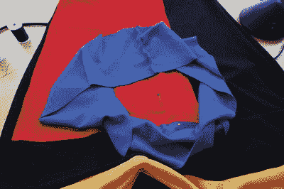

图 11-16.

将作为电子元件口袋的蓝色布带别在黑色裙摆布带顶部

继续均匀地将蓝色布带沿裙子整圈别好。将布带的底部沿裙摆整圈均匀地拉伸并贴合地别好。将布带底部缝合到裙摆上，确保它不产生褶皱或过度拉伸。在布带前部标记你想要的两个口袋开口位置，你将在此处分别插入电池/逆变器组。这两个区域将保持不缝合。沿布带顶部整圈缝合，留下口袋部分不缝（图 11-17）。检查你手头的逆变器/电池组是否能放入口袋中（图 11-18）。

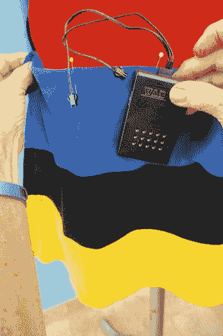

图 11-18.

检查电池组/逆变器是否能放入其口袋中

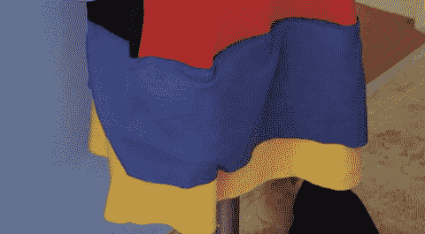

图 11-17.

缝合蓝色布带，为口袋留出开口

### EL 电光带套管

测量裙子前部的水平接缝（即育克与衣身连接处，以及衣身与裙摆连接处）。裁剪两条白色布料，宽 3 英寸，长度比每条水平接缝长 2 英寸。

接下来，测量从领口到低腰腰带顶部的纵向接缝。裁剪一块白色布料，宽 3 英寸，长度比这段纵向接缝长度长 2 英寸。如果你需要为从上部 EL 电光带向下延伸到逆变器口袋的导线设置一个线槽，则再裁剪一块黑色布料，长度与纵向白色布料相同。

对于每根 EL 电光带套管，将白色布料纵向对折并用珠针固定，然后在距边缘约 1/4 英寸处缝合这道缝线。在套管一端使用一个安全别针，将套管翻到正面（图 11-19 和 11-20）。

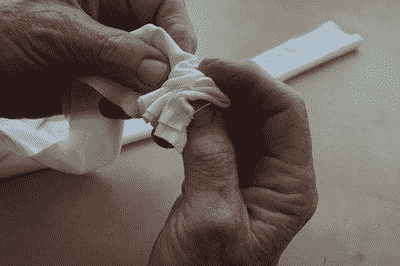

图 11-20.

将 EL 电光带套管翻到正面

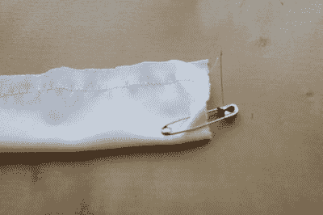

图 11-19.

制作 EL 电光带套管，用别针将其翻到正面

将两个水平套管用珠针别在裙子前部的正确位置并缝合。缝线要非常靠近每条白色布条的两侧，保持两端开口。这将使你能够根据需要插入和取出 EL 电光带。

将纵向套管用珠针别在前面并缝合，确保在每个水平白色布条的顶部停止缝合，并从水平布条的底部重新开始缝合。如果间隙过大，你可以用几针手缝将纵向布条固定在适当位置。

将电光带套管用珠针别在裙子上并缝合。每根套管的一端保持开放，用于插入导线。确保在套管交叉处保留开口。你可能需要调整导线以及你希望如何布置 EL 线的末端——当我为图 11-21 拍照时，我以为我们会将导线放在一侧，但我改变了主意。你应该在决定黑色导线线槽的位置之前，先把整件裙子组装起来。在这个案例中，我发现红色布料比另一侧更具弹性，所以我希望将大部分电池重量置于弹性较小的一侧。

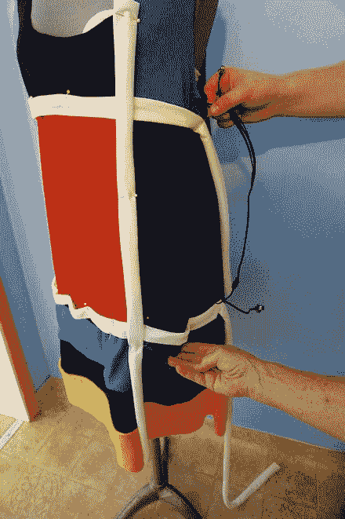

图 11-21.

将电光带套管放置在裙子上并试验导线走线（最终我从另一侧走线） 注意

这件由弹性布料制成的裙子存在一个问题，即难以保持色块平直。在每个步骤中仔细检查你的缝线是否笔直。

试穿裙子并标记你想要的下摆位置，或者如果裙子不太长，只需将其向内折边即可。用缝纫机或手工缝合下摆。如果布料不会脱丝，你可以直接在下摆线处裁剪。（如果你已按照说明将黄色布带纵向对折并缝合，则无需再缝下摆。）

将领口和袖窿向内折边 1/4 英寸（或者，如果你也想制作这些纸样部件，可以用贴边处理——参见第 4 章）。缝上一个黑色线槽或其他固定装置，用于固定上水平 EL 电光带的电源线——请先查阅“收尾工作”一节，了解你可能需要参考的其他选择。


### EL 彩带与礼服布线

现在我们来准备 EL 彩带。你可以用剪刀裁剪 EL 彩带，但每段末端都需要有一个连接器，否则无法工作。以图 11-22 中的彩带为例，我将一根 1 米长的彩带剪成了两段（一段稍长于另一段），这对于两条水平带状装饰来说长度刚好合适。

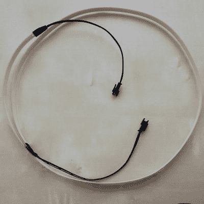

图 11-22. 裁剪前的 EL 彩带

EL 彩带需要逆变器和电池组来供电。你可以用图 11-23 所示的一个较大（4 节电池）电池组来驱动这样两条短彩带。通过一根 Y 形连接线，一个电池组可以驱动两条彩带。这件礼服我用了两个这样的电池组。

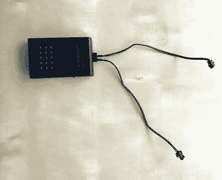

图 11-23. 所需的逆变器/电池组及连接线（带两个连接器）

EL 彩带背面有一层带胶的离型纸，设计初衷是让你可以直接将其粘贴到需要照明的物体上。然而，这层离型纸并不牢固，因此建议将其撕掉，换上一层普通胶带。将彩带线的末端修剪得稍微圆润一些，以便更容易插入外壳中（图 11-24）。最后，将 EL 彩带插入其外壳中（图 11-25）。

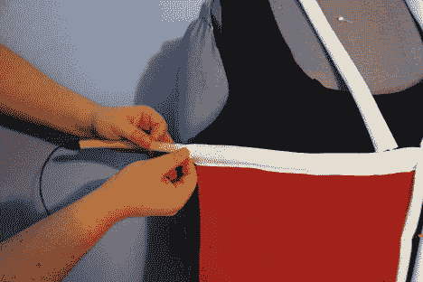

图 11-25. 将 EL 彩带插入外壳

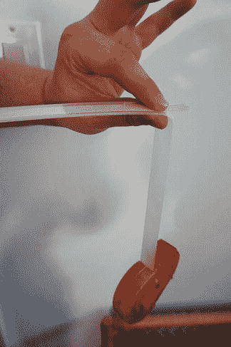

图 11-24. 用胶带覆盖彩带的粘性面

先将下方的水平 EL 彩带插入其外壳，最后再插入垂直的那条。注意不要缝合任何交叉处的外壳。将逆变器塞入礼服蓝色部分的口袋中（图 11-26 和 11-27）。试穿礼服，观察各部分的下垂效果。

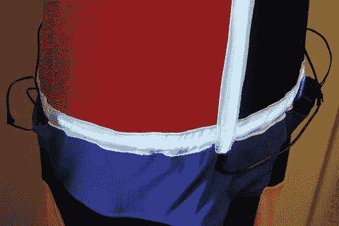

图 11-27. 逆变器完全塞入前的状态

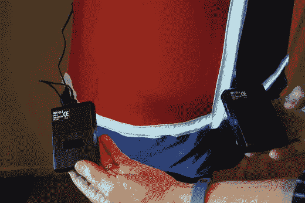

图 11-26. 将一个逆变器连接到两条水平 EL 彩带上，另一个（在你的右侧）连接到垂直彩带上

### 收尾工作

此时，试穿礼服并轻轻活动。EL 彩带容易从外壳中滑出，因此你可能需要缝上几个线圈来固定它。如果你需要大幅度活动，可能还需要为电源线缝制一个通道。当你对微调效果满意后，可以取下 EL 线并添加一个线管。或者，想出适合你的线材管理方案，但要记住线材不会拉伸，而礼服会。坐下时要小心！

如果这套服装仅用于一次戏剧演出，你可以只为线材缝几个线圈。操作时请关闭电源，并记住可能需要剪掉部分线材以便清洗衣物。清洗衣物前，请取下 EL 彩带和电源。

你可以添加按扣或其他闭合件，以防止装有逆变器的口袋敞开。

### 药盒帽的制作

这是我对标准 60 年代药盒帽的诠释，旨在与礼服搭配并相得益彰。按此方法制作的帽子直径为 6.5 英寸（周长 20 英寸），高 2 英寸，如果你的头发较短，佩戴起来应该相当稳固。你需要以下材料：

-   布料（使用礼服的剩余布料，或根据需求另购）。我使用了 4.5 英寸 × 16 英寸的黑色布料，和 4.5 英寸 × 7 英寸的黄色布料，另外还需要一个直径 8.5 英寸的圆形布料来覆盖帽顶（布料要足够，以便留出边缘用胶带或胶水固定）。
-   一个直径 6.5 英寸的中等厚度圆形硬纸板，用作帽顶。
-   一块 21 英寸 × 2 英寸的硬衬布，或一块 21 英寸 × 8 英寸的高强度衬布（折叠成 21 英寸 × 2 英寸的条状）。注意，硬衬布是一种用于制帽的硬挺材料。请在网上或布料店寻找这种材料或高强度衬布。
-   胶带、纺织胶水或热熔胶枪及胶棒。
-   缝纫机。
-   手缝针和线。
-   强力剪刀。
-   直尺和卷尺。
-   铅笔或记号笔。

#### 裁剪部件

我用一个直径 6.5 英寸的圆形作为帽顶。在硬纸板上画出帽顶圆形并用剪刀剪下。剪一块比帽顶圆形大 2 英寸的圆形布料。为使布料整齐贴合，在布料圆形边缘的几处剪几个小口，然后将它们重叠在基底材料圆形的背面（图 11-28）。用胶水或胶带固定，并晾干（如果用胶水的话）。如果你使用的是硬衬布，也可以用缝纫代替。不要尝试缝纫硬纸板。

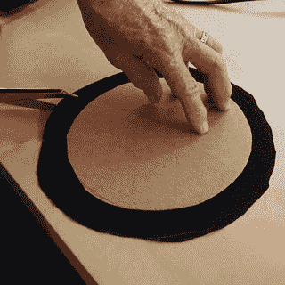

图 11-28. 修剪帽子顶部布料的边缘

裁剪一条 21 英寸 × 2 英寸的硬衬布条，以制成 2 英寸高的帽子。我需要 4.5 英寸 × 16 英寸的黑色布料条，和 4.5 英寸 × 7 英寸的黄色布料条。这样帽子将有四分之一是黄色的，形成一个鲜明的时尚声明，通过黄色点缀将礼服和帽子联系起来。

#### 组装帽子

将帽子侧面的黄色和黑色部分缝合在一起，并熨平接缝。拿起硬衬布条，或将衬布折叠成条状并别针固定，如图 11-29 所示。将布料覆盖在布条上并别针固定。如果使用衬布，在布料覆盖上去别针的同时，取下衬布上的别针（图 11-30）。沿帽子内侧手缝接缝。

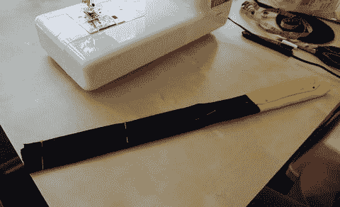

图 11-30. 继续组装帽子侧面

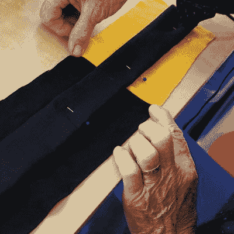

图 11-29. 组装帽子侧面

最后，将帽子顶部手缝到侧面，并缝合侧边接缝（图 11-31）。现在，你就拥有了一顶药盒帽（图 11-32）！

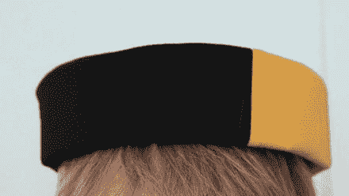

图 11-32. 制作完成的帽子

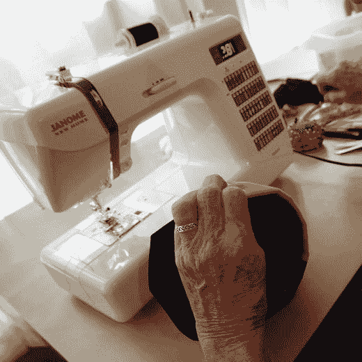

图 11-31. 连接帽子的顶部和侧面

### 其他方案

完整的套装如图 11-33 所示。你可以看到，礼服的电子设备重量使其有些下垂。你可以考虑另一种设计，将电池放在 20 世纪 60 年代流行的摩登风格腰带中，或者通过在从肩膀到蓝色低腰腰带的几个关键位置添加硬衬布条来加固礼服，以防止下垂。你也可以将前片做成一体式，然后将彩色面料块缝在上面。线材管理是此设计的一个挑战，你应多尝试几种方法，找到在礼服垂坠感、EL 彩带硬度和电池组重量之间取得最佳平衡的方案。

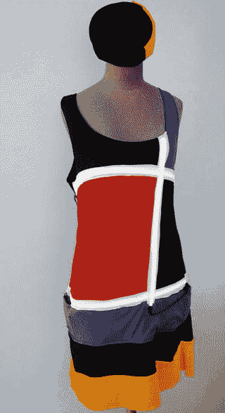

图 11-33. 整体效果

## 总结

本章介绍了两个截然不同的最终项目：一个使用现成的帽子并添加了一些电子元件，另一个则无需任何编程，但需要一些精巧的缝纫技艺。这两个项目的意图是涵盖你在本书中学到的关于构造技术的应用。最后几章将回顾你可能考虑探索的其他技术，并对未来的发展进行一些展望。


好的，作为一名高级文档工程师和翻译员，我将严格遵循您的注意事项和示例格式，将给定的英文文本翻译成中文。


