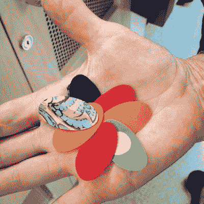
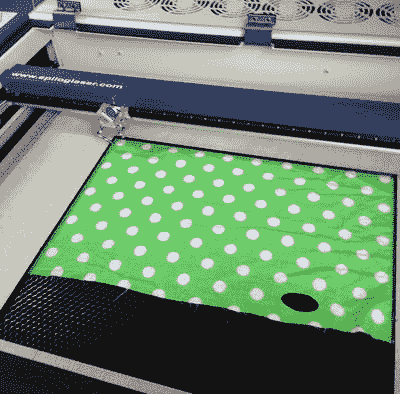
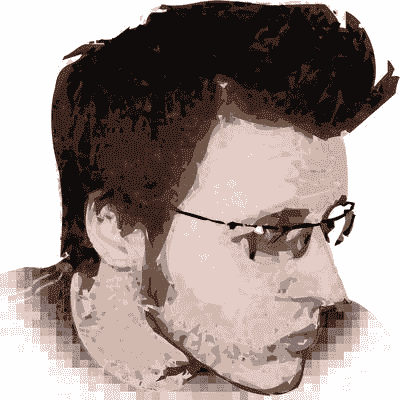
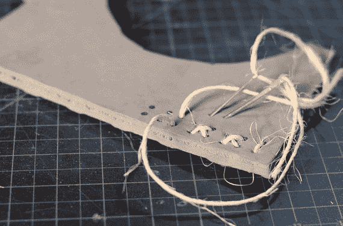
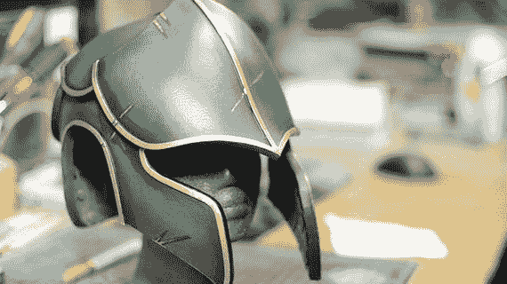
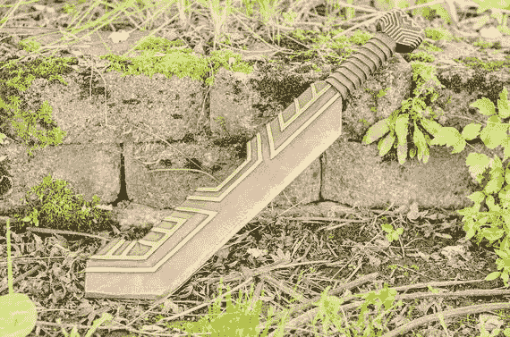

# 12. 其他技术

编写这样一本书的挑战之一是知道何时收尾。如果你去一个大型公共图书馆查看他们的缝纫、时尚和类似手工艺书籍的区域，你很可能会发现一排又一排的书籍。本书重点介绍缝纫和电子学的交叉领域，并附带介绍了 3D 打印。

本章简要介绍了一些正变得常见，特别是在角色扮演社区中常见的工具和技术。其中一些工具目前还不太适合家庭使用，但如果你能接触到类似创客空间或社区学院等资源，这些工具可能在这些地方可以使用。

## 切割工具

在第一部分中，我们讨论切割东西的方法。第 9 章介绍了 3D 打印，它通过逐层构建来创建物体。激光切割机和 CNC（计算机数控）工具则更传统地工作，它们从初始的原材料上去除材料。这两种机器都不太适合家庭使用，尽管现在市场上已经有较小的 CNC 机床。

### 激光切割

激光切割机使用激光来烧穿（或熔化）一块材料，将其切割成所需形状。激光切割可用于制作非常精细的物品，在网上搜索“激光切割艺术”很快就能发现这一点。缺点是激光切割机并非真正的家用机器，原因涉及安全、成本和后勤（例如尺寸、噪音和空气质量）方面。

当激光切割某物时，它会产生烟雾和燃烧物释放的烟气，因此激光切割机需要通风，要么排到室外，要么连接到空气净化器。如果你切错了材料，激光切割机可能会产生剧毒烟雾，从而损坏激光切割机和操作者。必须密切监控切割机，以确保被切割的物体不会着火，并且需要定期维护。鉴于所有这一切，大多数设施要么为你完成这项工作，要么让你接受一些培训，因此我们在此不会深入细节，仅涵盖一些关于可能性的概念以及如何为激光切割创建文件。

#### 切割布料

激光切割机可以切割多种布料。有些面料会在边缘熔化，这可能意味着你得到了一个漂亮的密封边缘，或者你的面料被熔化掉了，这取决于操作者的设置技巧。棉布切割得很干净，但可能会因切割（燃烧）过程而稍微变色。图 12-1 展示了一台设置好用于切割布料的激光切割机，图 12-2 展示了一些激光切割测试样片的例子。如果可以的话，先尝试一个非常小的测试，以防效果不佳。这样，你仍然可以退一步使用剪刀，而不会毁了你的布料。

图 12-2. 激光切割后各种布料的测试样片（绿色那块是在图 12-1 的设置中切割的）

图 12-1. 切割完小椭圆布料后的激光切割机设置

#### 为激光切割机进行设计

像 3D 打印机一样（见第 9 章），激光切割机只能根据计算机文件工作——你无法“手绘”它。与 3D 打印机不同，激光切割机根据二维图纸工作。通常这是一个可缩放矢量图形（SVG）格式的文件，你在诸如`Adobe Illustrator`甚至`Tinkercad`（见第 9 章）等绘图程序中创建。你可以指定是想要完全切穿还是仅仅雕刻一块材料。在轻薄织物上雕刻可能不会成功，因为切穿它所需的能量太少，但你可以雕刻皮革、牛仔布、亚克力和类似较厚的材料。

矢量图形与照片和其他光栅图像不同。光栅图像（有时称为位图）由一系列像素组成，这些像素大小相同并按网格排列。换句话说，光栅图像就像你看到的大多数数字图像。图像包含的关于每个像素的唯一信息就是它的颜色。如果你将这些图像放大，这些像素只会变大，图像看起来会呈块状，因为图像没有包含像素之间内容的信息。

另一方面，矢量图像具有遵循数学规则的线条、弧线和曲线，这样计算机总能在你靠近时判断出这些特征应该是什么样子。照片的复杂阴影几乎不可能以此方式呈现，除非将其简化以创建风格化的效果（图 12-3 显示了一个例子），但字母、几何形状和线条图等内容可以在矢量图像中以近乎无限的精度呈现。

图 12-3. Rich 的矢量格式自画像。注意矢量形状产生的风格化外观

使用激光切割机切割需要一个包含矢量线的文件，以便激光跟随。你可以在像`Adobe Illustrator`这样的程序中创建这些线条，方法是直接绘制它们，或者追踪光栅图像中的线条（`Illustrator`带有自动工具可以帮助完成此操作）。

如上所述，你也可以使用激光切割机来蚀刻或雕刻材料的表面，你可以使用矢量或光栅图像来完成。在这些情况下，激光会使激光照射到的表面变暗（或者，取决于材料，可能变亮），从而允许你制作单色图像。蚀刻也可能去除表面的顶层（例如一层油漆），以露出下面不同的颜色。

你不必局限于`Illustrator`。你也可以使用 CAD 程序创建用于切割的矢量文件。`TinkerCAD`有一个下载用于激光切割的 SVG 的选项（在“下载用于 3D 打印”菜单中找到），它会在你的设计与工作平面相交的任何地方创建线条。其他 CAD 程序通常允许你创建可以导出为`DXF`或`DWG`格式的 2D 图纸。你需要找出激光切割机软件接受哪些格式，但所有运行激光切割机的程序都应该支持`SVG`。`Inkscape`（ [`https://inkscape.org/en/`](https://inkscape.org/en/) ）是`Adobe Illustrator`的免费开源替代品，尽管它功能没有那么全面，但至少你会发现它对于将一种矢量格式转换为另一种矢量格式很有用。

> **提示**
> 
> 激光切割是制作多个裁片图案副本的好方法。Lyn 曾让学生为一场演出激光切割布料鱼，这使得鱼类保持一致，同时允许颜色和细节有大量变化。

### CNC 铣削

`CNC` 铣床是一种计算机控制的切割机器。它在三维空间中移动切割刀具以去除材料，类似于 3D 打印机添加材料的方式。与激光切割机或 3D 打印机相比，`CNC` 铣床可以加工更多种类的材料，范围从`EVA`泡沫到某些金属，但这是一个更脏乱的过程，涉及将切下的小块材料抛到一边。即便如此，这些机器可能比激光切割机更适合家庭工作室，因为它们不会释放烟雾和有害气体，只会产生那种可以用扫帚或干湿两用吸尘器清理的杂物。

当加工金属等硬质材料时，`CNC` 铣削可能需要非常慢速，但对于泡沫或机加工蜡等较软的材料，加工大型零件时它可能比 3D 打印更快。`CNC` 铣床的价格通常也低于同等尺寸的激光切割机，但对于设计用于从金属上切割复杂形状的工业机器来说，价格可能会相当高。`Othermill`、`Inventables` 和 `Carbide 3D` 是爱好者级机器的热门品牌。

## 构建技术

你可以使用多种材料来制作道具或戏服盔甲——这些复杂的形状可能太大而无法 3D 打印。在本节中，我们将向你介绍一些在角色扮演社群中常用的构建技术。显然，从木材到铝箔和管道胶带，有无数种工艺材料可供选择。我们这里只涉及一些更具“技术含量”的材料。

### 泡沫盔甲

角色扮演者通常想要制作想象中的盔甲或武器。一种常见的方法是切割和弯曲乙烯-醋酸乙烯酯（`EVA`）泡沫板，这种材料常用于地垫。这项技艺最知名的实践者之一是比尔·多兰，他于 2012 年与妻子布列塔尼共同创立了 Punished Props（`www.punishedprops.com`）。他们拥有丰富的资源，包括一个 YouTube 频道（`www.youtube.com/user/punishedprops`）以及在其网站上出售的《`Foamsmith`》系列书籍。

Punished Props 最初承接委托制作，如今多兰主要培训人们使用这些技术。他和妻子为自己制作的最喜欢的个人角色扮演服装来自电子游戏《`Skyrim`》。他们扮演的是尸鬼死亡领主，身披锈迹斑斑的旧盔甲，骷髅面孔，眼睛发光。他热情洋溢地说，他们看起来“非人类”。

多兰说，一件好的角色扮演服装的关键是“选择一个你真正热爱的角色，并确保这是你痴迷的东西。”他还说，制作一整套泡沫盔甲可能需要数月时间，所以你真的需要非常想穿上这些服装！

这个过程包括从`EVA`泡沫（可以是地垫形式或购买的大卷材）开始，然后使用类似于缝纫用的纸样将其切割成所需形状（见图`12-4`）。之后，你使用各种工具来弯曲和修饰它。`EVA`泡沫可以很容易地用剃刀刀片切割（尽管比尔警告说这会很快使刀片变钝）、带锯甚至激光切割机切割。你可以使用旋转工具（例如`Dremel`生产的工具）进行细节加工。

图 12-4. 制作初期的`EVA`泡沫服装部件（图片由 Bill Doran / Punished Props 提供）

比尔说，很多技术都涉及如何将这些部件绑在穿着者身上、了解下面该穿什么，以及弄清楚如何将部件粘合在一起。完成并上漆的道具部件可能会非常壮观（见图`12-5`和图`12-6`）。

图 12-6. 完成并上漆的`EVA`头盔（图片由 Bill Doran / Punished Props 提供）

图 12-5. 完成并上漆的`EVA`剑（图片由 Bill Doran / Punished Props 提供）

### 真空成型

热成型是将塑料薄片加热，使其能够拉伸并成型为模具形状的过程。一种常见的热成型形式是真空成型，其过程是先将加热的塑料片拉伸覆盖在模具或成型件上，然后用框架将其密封在真空台上，以便抽走空气，在塑料重新硬化之前将其紧压在模具表面上。这是制作面具等物品的常用方法，几乎所有《星球大战》暴风兵角色扮演盔甲都是这样制成的。

透明的面部或眼部罩面可以通过对透明塑料进行真空成型，作为较大服装的一部分来制作。许多爱好者通过制作一个顶部带孔的箱子，并在侧面连接一个干湿两用吸尘器来抽气，从而搭建自己的真空成型台。更专业的真空成型机包含用于加热塑料的加热元件，但其他机型可能需要你先将装有塑料的框架在烤箱中加热，然后再转移到真空成型机上。

### Worbla

还有一些塑料被设计为无需模具即可成型。像`Worbla`、`Sintra`、`Wonderflex` 和 `Terraflex` 这类产品可以用热风枪软化，然后手工塑造成复杂的形状。这些材料可用于制作道具和盔甲，或者仅仅用来制作要附着在较大部件上的细节部分。有几本书（包括 Svetlana Quindt 所著的《*The Book of Cosplay Armor Making with Worbla and Wonderflex*》）列在`www.worbla.com/?cat=33`，该书的作者也有一个 YouTube 频道`www.youtube.com/user/Mogrymillian`。

> **注意**：一如既往，在使用本章所述材料时，务必遵守制造商关于通风和其他防护装备的说明。

## 其他想法

还有无数的工艺材料和工具可供尝试。以下是另外几种也许对你有用的技术和工具：

- `Pepakura` 是一种通过制作可折叠形成曲面的裁剪纸样来创建实物的技术。（这与折纸略有不同，折纸是从一张正方形纸开始制作更精致的作品。）各种软件包都可以实现这一点，例如 `Autodesk 123D Make`（`www.123dapp.com/make`）。用这种方法制作的物品不是很坚固，但形状可能很有趣。激光切割机是切割 `pepakura` 纸样的好工具。
- 乙烯基切割机顾名思义：一种计算机控制的刀具，可从薄薄的乙烯基卷材上切割出形状。如果你想在某物上（比如花哨的字体）拥有薄表面、彩色的剪裁设计，它会很有用。

## 涂装

当你用塑料或泡沫制作出某样东西后，它很可能看起来还是塑料或泡沫的质感。如果你不希望这样，那么就该进行涂装了。让你的作品显得有划痕和污渍（即所谓的旧化处理），能让它看起来更加逼真。

此类应用的涂料通常采用喷涂方式，可以使用气雾喷漆罐（俗称喷罐）或喷笔，以营造无笔刷痕迹的均匀外观。通常你需要先使用底漆，然后涂上你的基础层颜色。根据你想要的效果，你可能需要涂刷多层油漆，并且可以在喷涂时遮盖住不同区域，以获得喷涂区域与未喷涂区域之间清晰的边界。

旧化处理涉及多种技巧，例如刷上油漆后再擦除、故意将咖啡洒在你崭新闪亮的作品上，或者用金属漆绘制边缘，使其看起来像是这些区域的漆面已经剥落。

当所有步骤完成并干燥后，你可能需要在整个作品上喷涂一层清漆，这样你伪造的损伤就不会遭受真正的损伤。关于涂装和旧化处理的更多内容，我们推荐沃平道具公司的哈里森·克里克斯所著的《道具与复制品的涂装与旧化处理》，你可以在[`www.volpinprops.com/product/painting-and-weathering-for-props-and-replicas-ebook/`](http://www.volpinprops.com/product/painting-and-weathering-for-props-and-replicas-ebook/)找到它。

**提示**：对于 3D 打印的零件（除了旧化处理），丙烯颜料适用于`PLA`或`ABS`材质。尼龙材质可以用合适的（尼龙）织物染料进行染色。

## 总结

本章涵盖了其他章节未深入讨论的其他工具和技术。首先，我们回顾了激光切割机和 CNC 机床等切割工具。接着，我们探讨了结构技术，例如用泡沫制作盔甲、真空成型、使用`Worbla`塑形以及真空成型。最后，我们介绍了`pepakura`和乙烯基切割，并以一些关于涂装你作品的想法作为本章的收尾。

