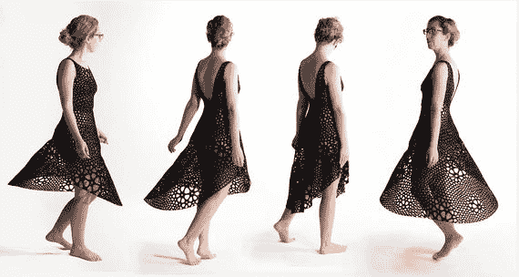
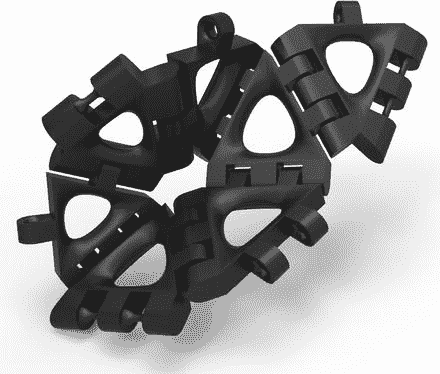
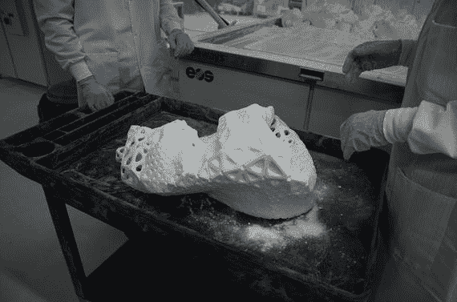
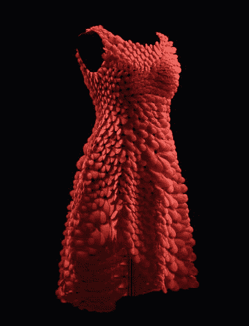
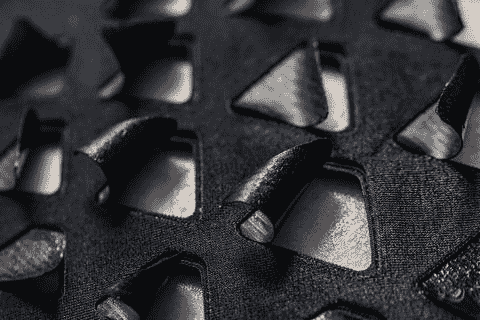
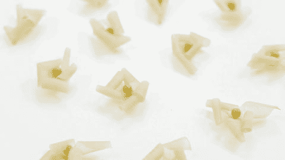

# 13. 展望未来

在本书中，到目前为止，我们三人呈现了一些我们认为适合初学者、或者可能仅在缝纫、电子和编程这三者中某一领域稍有经验的人士完成的项目。在这个最后一章中，我们将以一些更具抱负的项目来结束全书，展示专业设计师和艺术家能够利用这些技术实现什么。同时，我们也会对技术的未来发展方向进行一些展望，并列举几个来自研究实验室的例子。

## 3D 打印高级时装

使用 3D 打印技术的时装在高级定制领域已经变得很普遍。行业网站`3Ders.org`最近整理了一份他们精选的前 15 款时装的列表，地址在[`www.3ders.org/articles/20160225-3ders-top-15-list-of-our-favorite-3d-printed-dresses.html`](http://www.3ders.org/articles/20160225-3ders-top-15-list-of-our-favorite-3d-printed-dresses.html)。点击他们的列表，你可以看到各式各样的风格。或者，如果你在网上搜索“3D 打印连衣裙”这个短语，你会找到既美丽又令人惊叹的设计。

### 蒂塔·万提斯连衣裙

2013 年，首批完全 3D 打印的连衣裙之一由迈克尔·施密特和弗朗西斯·比托尼为蒂塔·万提斯设计（[`www.michaelschmidtstudios.com/dita-von-teese.html`](http://www.michaelschmidtstudios.com/dita-von-teese.html)）。施密特在他的网站上称自己是一位“服装与珠宝设计师”，拥有一份名人客户名单。这件万提斯连衣裙由微小的、可活动的、相互连接的尼龙零件制成，有点像锁子甲，这些零件在尼龙粉末打印机上打印出来，然后染成黑色。在`Shapeways`网站上有一个很好的“制作过程”视频：[`www.shapeways.com/blog/archives/1952-revealing-dita-von-teese-in-a-fully-articulated-3d-printed-gown.html`](http://www.shapeways.com/blog/archives/1952-revealing-dita-von-teese-in-a-fully-articulated-3d-printed-gown.html)。

### 神经系统

杰西卡·罗森克兰茨和杰西·路易斯-罗森伯格于 2007 年共同创立了`Nervous System`（[`http://nervo.us`](http://nervo.us)），一个“生成式设计工作室”。他们的愿景是：“从自然现象中汲取灵感，我们根据自然界中的过程和模式编写计算机程序，并利用这些程序来创造独特且价格合理的艺术品、珠宝和家居用品。”这一愿景的实现是令人惊叹的。

他们的`Kinematics`连衣裙和万提斯连衣裙一样，是通过尼龙粉末打印机打印的。然而，他们的关键创新在于，`Nervous System`开发了能够为特定穿着者定制设计的软件。图 13-1 展示了由罗森克兰茨穿着的`Kinematics Dress 2`。



**图 13-1.** 设计师本人穿着的`Kinematics Dress 2`。图片由`Nervous System`提供。

这些连衣裙由能够自由活动的结构（如图 13-2 所示）制成。它们从 3D 打印机中取出时已经组装完毕，吹掉多余的粉末后即可穿着。



**图 13-2.** 显示铰链细节的`Kinematics`结构样品。图片由`Nervous System`提供。

`Nervous System`的另一项创新是用于创建连衣裙 3D 可打印模型的软件。这个模型被紧密折叠，并在选择性激光烧结（`SLS`，基于粉末）3D 打印机中一体打印。图 13-3 展示了`Kinematics`系列中的一件连衣裙在从打印机中取出、尚未清除多余粉末时的样子。顺便提一下，如果你想知道，`Nervous System`表示`Kinematics`部件可以用温和的肥皂水软毛刷手洗。



**图 13-3.** 清除所有多余粉末之前的`Kinematics Dress 1`。图片由`Nervous System`提供。

像这样的作品无法在基于线材的 3D 打印机（如我们在第 9 章中讨论的那些）上打印；其形状过于复杂和精细，以至于线材打印所需的支撑结构将难以移除。`SLS`打印机的优点在于粉末本身充当了支撑结构，最后只需吹走即可。缺点是粉末非常细，难以管理。目前`SLS`打印机仍是工业设备，且截至本文撰写时，打印成本昂贵，但谁知道技术将如何演变呢。

这对搭档持续创新，并于 2016 年创作了受波士顿美术博物馆委托的`Kinematic Petals Dress`（图 13-4）。关于这件连衣裙，他们说道：“受花瓣、羽毛和鳞片的启发，我们为`Kinematics`开发了一种新的织物语言，其中相互连接的元素被构造成叠瓦状的壳。与我们之前的服装一样，这件连衣裙可以通过 3D 扫描根据穿着者的身体进行定制，此外，现在每个元素都可以单独定制：在方向、长度和形状上各不相同。”他们指出，他们不得不开发新的软件来处理设计折叠用于 3D 打印时的花瓣重叠问题。如果你想真正领略世界级设计师能用这项技术做什么，不妨花些时间浏览`Nervous System`的网站。



**图 13-4.** `Kinematics Petals Dress`。图片由`Nervous System`提供。

## 电子时装

在另一个时代，礼服上镶嵌着珠宝。如今，`LED`灯、传感器和机械装置似乎正在取代它们的位置。其中一些作品是作为技术演示而开发的，但另一些则正在成为主流红毯服装。


### 阿努克·维普雷希特

荷兰设计师阿努克·维普雷希特（http://anoukwipprecht.nl）是在其作品中使用 3D 打印部件和材料的先驱。她近期设计的 Spider Dress 2.0 在一定程度上是对英特尔爱迪生芯片的展示，该芯片用于控制这件连衣裙。裙子上装有传感器，当他人过于靠近时，传感器会发出信号，此时机械臂会做出威胁性的移动来驱赶闯入者。维普雷希特早期的作品包括法拉第连衣裙，该裙允许穿着者在舞台上与特斯拉线圈产生的高压进行互动，以及她网站上展示的众多其他作品。

### 2016 年纽约大都会艺术博物馆慈善舞会

纽约大都会艺术博物馆 2016 年的 Met Gala 主题与该博物馆服装学院的展览"Manus x Machina"（http://www.metmuseum.org/exhibitions/listings/2016/manus-x-machina）相呼应。这场年度盛会上展示了众多令人炫目的礼服和西装，展示了在一件礼服中使用大量部件所能达到的惊人效果。克莱尔·丹尼斯身着由欧根纱和光纤制成的惊艳的浅蓝色礼服，这件礼服在黑暗中会发光。它在灯光下美轮美奂，在黑暗中更是充满魔幻般的乐趣。这是一件由扎克·波森设计的独一无二的手工缝制精品。林非常想知道这件作品的制作动用了多少人力、耗时多久！

该展览中的另一件作品由 Marchesa 品牌的设计师乔治娜·查普曼和凯伦·克雷格与 IBM 沃森超级计算机合作创作。这件作品由模特卡罗莱娜·库尔科娃展示，旨在成为一件"富有同情心的连衣裙"。其 150 个 LED 灯会根据 Twitter 上粉丝的输入改变颜色。我们建议您花些时间浏览上一段中提到的大都会博物馆网站，从中获取灵感。

## 纺织科技

要实现真正的革命性变革，创新可能需要以活性织物的形式深入到纺织品层面。尽管这个术语可以表示许多不同的事物。一种可能性是嵌入微小的致动器，使其能够在织物内部产生运动，就像我们在第 8 章中讨论的伺服电机在微观尺度上的版本。或者，一种活性织物可能从一开始就将电路编织其中。以下是一些更具前瞻性的创新实例。

### 生物逻辑

假设人们可以拥有活的织物会怎样？在石井裕教授指导下，麻省理工学院有形媒体实验室的生物逻辑团队（http://tangible.media.mit.edu/project/biologic/）发现，枯草芽孢杆菌纳豆亚种会随大气湿度变化而膨胀和收缩。这种细菌在日本已被使用了一千年来制作豆制品纳豆，因此它并非新奇的外来生物体。

该团队正利用这一特性来制造对湿度做出反应的织物。他们收获活细胞，然后将其生物打印成"合成生物皮肤"。采用这种生物皮肤设计的织物（图 13-5）会通过打开冷却通风口来对热量和湿气做出反应。因此，如果有人穿着由这种材料制成的功能性服装，它会在需要时自动打开通风口。该网站称，该团队正与运动服装制造商 New Balance 合作。

```

```

图 13-5. 生物逻辑织物。图片由麻省理工学院媒体实验室有形媒体集团提供。

该团队还创造了一些更具奇思妙想的应用，例如干燥时折叠闭合且颜色暗淡的织物花朵（图 13-6），在被水喷洒后会改变颜色和形状（图 13-7）。

```

```

图 13-7. 喷水后，图 13-6 中的花朵形状和颜色均发生变化。图片由麻省理工学院媒体实验室有形媒体集团提供。

```

```

图 13-6. 干燥状态下的生物混合花朵。图片由麻省理工学院媒体实验室有形媒体集团提供。

### 雅卡尔项目

谷歌的雅卡尔项目（https://atap.google.com/jacquard/）正将织物和服装转变为触摸屏。该项目由伊万·普皮列夫主导，正在创造一种新型的编织导电线。这种导线有多种颜色，可用于现有的工业织机和缝纫机，以实现服装的大规模生产。导电线连接到一个使用标准手表电池的小型蓝牙控制器，控制器可存放在口袋中。这使得织物或服装能够与各种设备协同工作，包括触摸屏、智能手机、其他媒体设备以及室内灯或恒温器。触摸传感器网格可以直接编织到服装中，这样用户就可以通过滑动袖子来发送信号，同时还可以控制 LED 灯以引起穿着者的注意。

## 服装遇上物联网

在服装中乃至嵌入人体使用技术的想法，在科幻小说中已存在已久。尼尔·斯蒂芬森的著作《钻石时代：或，一位年轻女士的插图版入门书》（Bantam Spectra, 1995）中描绘了用于制作服装（或任何东西）的"物质编译器"。在亚瑟·C·克拉克、弗兰克·赫伯特、雷·布拉德伯里等人的作品中还有更多例子。

在电影《回到未来 2》中，马蒂·麦克弗莱拥有自动系带的鞋子和自动烘干的夹克。耐克公司终于在去年凭借其 HyperAdapt 自动系带鞋（http://news.nike.com/news/hyperadapt-adaptive-lacing）赶上了科幻潮流。

如果自动化服装受到远程控制（或感知），事情会变得更加复杂。所谓的物联网（IoT）有多种定义。我们在此说明，物联网涉及世界上的某个物体（如鞋子、连衣裙、冰箱或恒温器）上的传感器或致动器，这些传感器或致动器连接到互联网，以便在远距离采取行动或报告数据。

可穿戴设备和物联网的未来不仅限于健身、娱乐和时尚领域，还涉及健康和医疗领域。通信和界面开发的创新正在改善患者监测健康状况的能力。健身追踪器是这方面的早期例子，但更先进的设备已开始获批用于医疗用途，例如连续血糖监测仪，它可以无线传输糖尿病患者的血糖状态给佩戴者，并在需要时传输给护理人员（http://www.dexcom.com/products）。谷歌已经开发出嵌入芯片以感测葡萄糖水平的隐形眼镜。

持续监测和通信的设备引发了一些隐私问题，但也可能使某些疾病患者过上更安全、更独立的生活。在我们看来，为独立生活的老年人设计的可穿戴传感器是一个特别有前景的领域。


## 最后几点想法

随着新技术的应用速度越来越快，各领域面临的重大挑战之一就是如何让技术保持有用、高效且令人向往。当电子元件变得更小更智能时，将它们融入日常服装和配饰也变得更简单。然而，始终牢记穿着你作品的用户这一点至关重要。

我们在本书中试图强调的一点是：提前思考服装将如何使用，以及你所考虑的技术是否能在预期环境中正常工作。

本书开篇探讨了可穿戴技术的一些理念以及什么才算优秀的服装设计。接着，我们传授了可穿戴技术所需领域的基础技能，并以围裙项目作为总结。随后，我们介绍了传感器、3D 打印技术，并讲述了一个因首个项目过于雄心勃勃而导致失败的警示故事。在后几章中，我们展示了更具挑战性的项目，讨论了其他可用的技术，并展望了研究人员未来可能引领的方向。

即便如此，前几章的一些基本原则依然适用。无论你是制作一个能让朋友开怀大笑的发光毛绒玩具，还是一件复杂的艺术品，在设计时都应考虑以下几点：

*   设计是否已尽可能简洁？人们往往倾向于把事情搞得不必要的复杂。
*   详细设想用户穿着这件服装时会如何活动，思考哪些地方可能钩挂、断裂、磨损或短路。本书中的项目专为室内使用设计；请考虑整体环境，并思考如何在应对天气和洗涤时拆卸电子元件和电池。
*   你是否知道如何完成项目，或者是否还有需要学习的东西？如果项目中有些部分对你而言仍是一片迷雾，你可能需要先学习那些内容，然后再处理熟悉的部分。人们常常无法完成项目，因为他们先做了自己熟悉的部分，结果发现为了适配新组件，这部分本应做得不同。于是整个项目就被搁置在角落多年。
*   尽量团队合作。同时精通缝纫、电子和编程很难。有些人能做到，但大多数人需要几个帮手。如果你所在城市有从事这类创作的创客空间，不妨考虑加入。我们三人能够共同创造出任何一个人都无法独立完成的项目。
*   分享你的想法！本书讨论的大多数技术主要基于开源社区的工作。我们在书中遇到这些社区时都附上了链接。感谢那些过去做出贡献的人的最佳方式，就是在此基础上进行创新，并在你成功时分享。

我们希望你喜欢这本书，并觉得自己学到了很多。现在，走出去，创造一些酷炫的东西——然后教会别人如何制作。

## 总结

在本章中，我们探讨了本书其他部分所讨论的技术在专业时尚领域的应用。我们还介绍了新的纺织层面技术，这些技术可以使致动器或传感器的嵌入真正做到无缝。最后，我们回顾了本书的脉络，提出了一些关于良好设计实践的想法。

