# 第 3 章（使用任意 XML 资源文件）

- 使用任意 XML 资源文件
- 使用原始资源
- 使用 Assets 资源
- 回顾资源目录结构
- 资源与配置变更
- 参考网址
- 总结


## 第 4 章：理解内容提供者

- 探索 Android 内置提供者
- 内容提供者的架构
- 实现内容提供者
- 演练图书提供者
- 添加一本书
- 删除一本书
- 获取图书数量
- 显示图书列表
- 参考资料
- 总结


## 第 5 章：理解意图

- Android 意图基础
- Android 中可用的意图
- 探索意图的组成
- 意图与数据 URI
- 通用操作
- 使用额外信息
- 使用组件直接调用 Activity
- 理解意图类别
- 将意图解析为其组件的规则
- 演练`ACTION_PICK`
- 演练`GET_CONTENT`操作
- 引入待定意图
- 参考资料
- 总结


## 第 6 章：构建用户界面并使用控件

- Android 中的 UI 开发
- 完全用代码构建 UI
- 完全用 XML 构建 UI
- 用 XML 结合代码构建 UI
- 理解 Android 的通用控件
- 文本控件
- 按钮控件
- `ImageView`控件
- 日期和时间控件
- `MapView`控件
- 理解适配器
- 认识`SimpleCursorAdapter`
- 认识`ArrayAdapter`
- 在 AdapterView 中使用适配器
- 基本列表控件：`ListView`
- `GridView`控件
- `Spinner`控件
- `Gallery`控件
- 创建自定义适配器
- Android 中的其他控件
- 样式与主题
- 使用样式


使用主题

理解布局管理器

LinearLayout 布局管理器

TableLayout 布局管理器

RelativeLayout 布局管理器

FrameLayout 布局管理器

针对不同设备配置自定义布局

使用层次结构查看器调试和优化布局

参考资料

总结

第 7 章：使用菜单

理解 Android 菜单

创建菜单

使用菜单组

响应菜单项

创建测试菜单的测试工具

使用其他菜单类型

扩展菜单

使用图标菜单

使用子菜单

系统菜单的配置

使用上下文菜单

使用替代菜单

响应数据变化的菜单使用

通过 XML 文件加载菜单

XML 菜单资源文件的结构

填充 XML 菜单资源文件

响应基于 XML 的菜单项

其他 XML 菜单标签简介

资源

总结

第 8 章：使用对话框

在 Android 中使用对话框

设计警告对话框

设计提示对话框

Android 中对话框的性质

重新架构提示对话框

使用托管对话框

理解托管对话框协议

将非托管对话框转换为托管对话框

简化托管对话框协议

使用 Toast

资源

总结

第 9 章：使用首选项和保存状态

探索首选项框架

理解 ListPreference

理解 CheckBoxPreference

理解 EditTextPreference

理解 RingtonePreference

组织首选项


以编程方式管理首选项

使用首选项保存状态

参考

总结

 第 10 章：探索安全性与权限

理解 Android 安全模型

安全概念概述

签署应用程序以进行部署

执行运行时安全检查

理解进程边界的安全性

声明与使用权限

理解与使用自定义权限

理解与使用 URI 权限

参考文献

总结

 第 11 章：构建与使用服务

使用 HTTP 服务

使用 HttpClient 发起 HTTP GET 请求

使用 HttpClient 发起 HTTP POST 请求（多部分示例）

SOAP、JSON 与 XML 解析器

处理异常

解决多线程问题

超时处理趣谈

使用 HttpURLConnection

使用 AndroidHttpClient

使用后台线程（AsyncTask）

在 AsyncTask 中处理配置变更

使用 DownloadManager 获取文件

使用 Android 服务

理解 Android 中的服务

理解本地服务

理解 AIDL 服务

在 AIDL 中定义服务接口

实现 AIDL 接口

从客户端应用程序调用服务

向服务传递复杂类型

使用服务的实际示例

Google 翻译 API

使用 Google 翻译 API

参考文献

总结

 第 12 章：探索软件包

软件包与进程

软件包规范详解

将软件包名称转换为进程名称

列出已安装的软件包

通过软件包浏览器删除软件包

重新审视软件包签名过程


## 目录

- 理解数字签名：场景一
- 理解数字签名：场景二
- 理解数字签名的模式
- 如何进行数字签名？
- 签名过程的影响
- 在软件包之间共享数据
- 共享用户 ID 的本质
- 共享数据的代码模式
- 库项目
- 什么是库项目？
- 库项目谓词
- 创建库项目
- 创建使用库的 Android 项目
- 参考文献
- 总结

 第 13 章：探索 Handler

- Android 组件与线程
- 活动运行在主线程上
- 广播接收器运行在主线程上
- 服务运行在主线程上
- 内容提供者运行在主线程上
- 单一主线程的影响
- 线程池、内容提供者、外部服务组件
- 线程实用工具：发现你的线程
- Handler
- 占用主线程的影响
- 使用 Handler 在主线程上延迟工作
- 延迟工作的 Handler 示例源代码
- 构建合适的消息对象
- 将消息对象发送到队列
- 响应`handleMessage`回调
- 使用工作线程
- 从菜单调用工作线程
- 工作线程与主线程之间的通信
- 线程行为快速概览
- Handler 示例驱动类
- 驱动活动文件
- 布局文件
- 菜单文件
- 清单文件
- 组件与进程生命周期
- 活动生命周期
- 服务生命周期
- 接收器生命周期
- 提供者生命周期
- 编译代码说明
- 从 ZIP 文件创建项目
- 从清单文件创建项目
- 参考文献


## 第 14 章：广播接收器与长时间运行的服务

### 摘要
摘要

 第 14 章：广播接收器与长时间运行的服务

### 广播接收器
发送广播  
编写简单接收器：示例代码  
在清单文件中注册接收器  
发送测试广播  
容纳多个接收器  
进程外接收器的项目  
从接收器使用通知  
通过通知管理器监控通知  
发送通知

### 长时间运行的接收器与服务
长时间运行的广播接收器协议  
IntentService  
IntentService 源代码  
为广播接收器扩展 IntentService  
长时间运行的广播服务抽象  
长时间运行的接收器  
使用 LightedGreenRoom 抽象唤醒锁  
长时间运行的服务实现  
非粘性服务的细节  
粘性服务的细节  
非粘性的一种变体：重新传递意图  
在 OnStartCommand 中指定服务标志  
选择合适的粘性类型  
从两处控制唤醒锁  
长时间运行的服务实现  
测试长时间运行的服务  
编译代码的说明  
从 ZIP 文件创建项目  
从列表创建项目  
参考  
摘要

 # 第 15 章：探索闹钟管理器

### 闹钟管理器基础：设置一个简单的闹钟
获取闹钟管理器  
设置闹钟的时间  
为闹钟设置接收器  
创建适用于闹钟的 PendingIntent  
设置闹钟  
测试项目

### 探索闹钟管理器的其他场景
重复触发闹钟  
取消闹钟  
处理多个闹钟  
触发闹钟时的意图优先性  
闹钟的持久性


闹钟管理器谓词

参考资料

总结

 第 16 章：探索 2D 动画

- 逐帧动画
- 逐帧动画的规划
- 创建活动
- 为活动添加动画
- 布局动画
- 基本补间动画类型
- 规划布局动画测试工具
- 创建活动与 ListView
- 为 ListView 添加动画
- 使用插值器
- 视图动画
- 理解视图动画
- 添加动画
- 在 2D 中使用相机提供深度感知
- 探索 AnimationListener 类
- 关于变换矩阵的一些说明
- 参考资料
- 总结

 第 17 章：探索地图与基于位置的服务

- 理解映射包
- 从 Google 获取地图 API 密钥
- 理解 MapView 和 MapActivity
- 使用叠加层添加标记点
- 理解位置包
- 使用 Android 进行地理编码
- 使用后台线程进行地理编码
- 理解 LocationManager 服务
- 使用 MyLocationOverlay 显示你的位置
- 使用临近警报
- 参考资料
- 总结

 第 18 章：使用电话 API

- 使用短信
- 发送短信
- 监控接收到的短信
- 使用短信文件夹
- 发送电子邮件
- 使用电话管理器
- 会话发起协议 (SIP)
- 参考资料
- 总结

 第 19 章：理解媒体框架

- 使用媒体 API
- 使用 SD 卡
- 播放媒体
- 播放音频内容
- 播放视频内容
- 录制媒体
- 探索使用 MediaRecorder 进行音频录制
- 使用 AudioRecord 录制音频
- 探索视频录制


探索 MediaStore 类

使用 Intent 录制音频

向媒体库添加媒体内容

触发整个 SD 卡的媒体扫描

参考资料

总结

 第 20 章：使用 OpenGL 编程 3D 图形

了解 OpenGL 的历史与背景

OpenGL ES

OpenGL ES 与 Java ME

M3G：另一种 Java ME 3D 图形标准

OpenGL 基础

使用 OpenGL ES 进行基本绘制

理解 OpenGL 相机与坐标

将 OpenGL ES 与 Android 对接

使用 GLSurfaceView 及相关类

实现渲染器

从 Activity 使用 GLSurfaceView

更改相机设置

使用索引添加另一个三角形

为简单的 OpenGL 三角形添加动画

挑战 OpenGL：形状与纹理

绘制矩形

处理形状

处理纹理

绘制多个图形

OpenGL ES 2.0

OpenGL ES 2.0 的 Java 绑定

渲染步骤

理解着色器

将着色器编译成程序

访问着色器程序变量

一个简单的 ES 2.0 三角形

关于 OpenGL ES 2.0 的进一步阅读

编译代码说明

参考资料

总结

 第 21 章：探索 Live Folders

探索 Live Folders

用户如何体验 Live Folders

构建 Live Folder

编译代码说明

参考资料

总结

第 22 章：主屏幕小部件

主屏幕小部件的架构

什么是主屏幕小部件？

主屏幕小部件的用户体验

小部件的生命周期

一个示例小部件应用

定义小部件提供者

定义小部件尺寸


### 小部件布局相关文件
### 实现小部件提供程序
### 实现小部件模型
### 实现小部件配置活动
### 小部件的限制与扩展
### 资源
### 总结

# 第 23 章：Android 搜索

### Android 搜索体验
### 探索 Android 全局搜索
### 为全局搜索启用建议提供程序

### 活动与搜索键交互
#### 常规活动上搜索键的行为
#### 禁用搜索的活动行为
#### 通过菜单显式调用搜索

### 理解本地搜索及相关活动
### 启用即输即搜

### 实现一个简单的建议提供程序
#### 规划简单建议提供程序
#### 简单建议提供程序的实现文件
#### 实现 SimpleSuggestionProvider 类
#### 理解简单建议提供程序的搜索活动
#### 搜索调用活动
#### 简单建议提供程序的用户体验

### 实现自定义建议提供程序
#### 规划自定义建议提供程序
#### SuggestURLProvider 项目的实现文件
#### 实现 SuggestUrlProvider 类
#### 为自定义建议提供程序实现搜索活动
### 自定义建议提供程序清单文件
#### 自定义建议的用户体验

### 使用操作键和特定于应用的搜索数据
#### 在 Android 搜索中使用操作键
### 处理特定于应用的搜索上下文

### 资源
### 对平板电脑的影响
### 总结

# 第 24 章：探索文本转语音

### Android 中文本转语音功能的基础
### 使用语音片段追踪语音输出
### 为语音使用音频文件

### TTS 引擎的高级特性
##### 设置音频流
#### 使用 Earcons


静音播放

选择不同的文字转语音引擎

使用语言方法

参考文献

总结

第 25 章：触摸屏

理解 MotionEvents

MotionEvent 对象

回收 MotionEvents

使用 VelocityTracker

探索拖放操作

多点触控

Android 2.2 之前的多点触控

Android 2.2 以来的多点触控

地图上的触摸操作

手势

双指缩放手势

GestureDetector 与 OnGestureListeners

自定义手势

手势构建器应用

参考文献

总结

第 26 章：使用传感器

什么是传感器？

检测传感器

关于传感器我们能了解什么？

获取传感器事件

获取传感器数据的问题

解读传感器数据

光线传感器

距离传感器

温度传感器

压力传感器

陀螺仪传感器

加速度计

磁场传感器

同时使用加速度计和磁场传感器

方向传感器

磁偏角与地磁场

重力传感器

线性加速度传感器

旋转矢量传感器

近场通信传感器

参考文献

总结

第 27 章：探索联系人 API

理解账户

账户屏幕快速浏览

账户与联系人的关联

枚举账户

理解联系人应用

显示联系人

显示联系人详情

编辑联系人详情

设置联系人照片

导出联系人

各种联系人数据类型

理解联系人

检查 Contents SQLite 数据库

原始联系人

数据表

聚合联系人


查看联系人

联系人实体视图

使用联系人 API

探索账户

探索聚合联系人

探索原始联系人

探索原始联系人数据

添加联系人及其详细信息

控制聚合

同步的影响

参考资料

总结

第 28 章：部署你的应用程序：Android 市场及其他

成为发布者

遵守规则

开发者控制台

准备将应用程序上架销售

针对不同设备进行测试

支持不同屏幕尺寸

准备用于上传的 AndroidManifest.xml

本地化你的应用程序

准备你的应用程序图标

通过应用盈利的考量

将用户引导回市场

Android 许可服务

准备用于上传的.apk 文件

上传你的应用程序

Android 市场上的用户体验

超越 Android 市场

参考资料

总结

第 29 章：适用于平板电脑及更多设备的碎片

什么是碎片？

何时使用碎片

碎片的结构

碎片的生命周期

展示生命周期的碎片示例应用

FragmentTransactions 与碎片回退栈

碎片事务转换与动画

FragmentManager

引用碎片时的注意事项

ListFragments 与<fragment>

在需要时调用单独的 Activity

碎片的持久化

理解对话框碎片

DialogFragment 基础

DialogFragment 示例应用

与碎片进行更多通信

使用 startActivity()和 setTargetFragment()

使用 ObjectAnimator 实现自定义动画

参考资料

总结

第 30 章：探索 ActionBar

操作栏的结构

标签导航操作栏 Activity

实现基础 Activity 类

为 ActionBar 分配统一行为

实现标签监听器

实现标签式操作栏 Activity

可滚动的调试文本视图布局

操作栏与菜单交互

Android 清单文件

检查标签式操作栏 Activity

列表导航操作栏 Activity

创建 SpinnerAdapter

创建列表监听器

设置列表操作栏

修改 BaseActionBarActivity

修改 AndroidManifest.xml

检查列表操作栏 Activity

标准导航操作栏 Activity

StandardNavigationActionBarActivity

修改 BaseActionBarActivity

修改 AndroidManifest.xml

检查标准操作栏 Activity

参考资料

总结

第 31 章：3.0 中的其他主题

基于列表的主屏幕小部件

3.0 中的新远程视图

在远程视图中使用列表

工作示例：测试主屏幕列表小部件

测试列表小部件

拖放

3.0 中拖放的基础知识

拖放示例应用

测试示例拖放应用

参考资料

总结

索引


## 前言

这一切都曾发生过，而这一切也将再次发生。涌现理论描述了复杂系统与模式如何从一系列环境交互中诞生。

而我们之前已经经历过这样的局面。

1985 年我开始编程时，市面上已有多种个人计算机。当我在 Apple II C 上初试身手时，我的朋友有的用着 Commodore 128、Tandy CoCo 3，或是 Atari 计算机。我们各自在自身环境的限制下成长，却鲜少能分享彼此的成果。当价格亲民的 IBM 兼容机搭载微软的 DOS 系统开始兴起时，开发者们逐渐看到了由此创造的市场价值，DOS 生态系统也随之快速演进。最终，微软占据了个人电脑市场的主导地位，并延续至今。

2003 年我开始从事移动编程时，生态系统与 1985 年惊人的相似。你可以通过微软 .NET CF、Java Micro Edition 乃至 BREW 等各种平台来实现你的创意。但正如我与朋友们编写的游戏一样，我们的应用也只能孤立于各自选择的生态系统中。

当 2011 年到来时，谷歌通过将 Android 操作系统推广到多家硬件厂商手中，俨然成为了移动领域的微软。这很可能就是你拿起这本书并阅读这篇前言的原因。你要么是历史的学生，要么和我一样，足够幸运地亲历了这段历史。

那么，好消息来了！在本书的这一版中，我们付出了巨大努力，确保你拥有将脑海中那些想法付诸实践的工具。我们将带你从搭建环境的基础知识开始，一直到将应用部署到市场。当然，这是一段漫长的旅程，因此我们主要会带你走那条最常走的路，但也会为你提供大量资源，供你自行探索。

祝你好运，旅途愉快。

——迪伦·菲利普斯

### 关于作者

|  | **萨提亚·科马蒂内尼**（`www.satyakomatineni.com`）拥有超过 20 年的编程经验，曾为大小型企业工作。萨提亚发表了 30 多篇关于使用 Java、.NET 和数据库技术进行 Web 开发的文章。他经常在行业会议上就创新技术发表演讲，并且是 Java.net 博客的定期撰稿人。他是 AspireWeb（`www.activeintellect.com/aspire`）的作者，这是一个用于 Java Web 开发的简化开源工具，同时还创建了 Aspire Knowledge Central（`www.knowledgefolders.com`），这是一个专注于个人工作效率和出版的开源个人 Web 操作系统。萨提亚也是多项小企业创新研究计划（SBIR）的贡献成员。他获得了印度维沙卡帕特南安得拉大学的电气工程学士学位，以及印度理工学院新德里分校的电气工程硕士学位。您可以通过 `satya.komatineni@gmail.com` 联系他。 |

|  | **戴夫·麦克莱恩** 是一名软件工程师和架构师，目前在美国佛罗里达州杰克逊维尔生活和工作。自 1980 年以来，他曾使用多种语言进行编程，开发了从机器人自动化系统到数据仓库，从 Web 自助服务应用到 EDI 事务处理器的各种解决方案。戴夫曾为 Sun Microsystems、IBM、Trimble Navigation、通用汽车以及几家小公司工作过。他毕业于加拿大滑铁卢大学，获得系统工程设计学位。请访问他的博客 `http://davemac327.blogspot.com` 或通过 `davemac327@gmail.com` 联系他。 |

|  | **赛义德·Y·哈希米** 出生于阿富汗，现居美国佛罗里达州杰克逊维尔。他的专长涵盖医疗保健、金融、物流和面向服务架构等领域。在其职业生涯中，赛义德使用多种编程语言和平台开发了大规模分布式应用，包括 C/C++、MFC、J2EE 和 .NET。他在主要软件期刊上发表过文章，并撰写了多本广受欢迎的 Apress 著作。赛义德拥有佛罗里达大学的工程学硕士学位。您可以通过访问 `www.sayedhashimi.com` 联系他。 |

请访问作者们的网站：`www.androidbook.com`.

### 关于技术审阅者

|  | **迪伦·菲利普斯** 是一名软件工程师和架构师，在过去十年中一直从事移动领域的工作。他拥有从 J2ME 到 .NET Compact Framework 再到 Android 的广泛经验，对 Android 设备被广大消费者广泛采用所带来的机遇感到无比兴奋。您可以通过 `mykoan@hotmail.com`、Twitter 上的 `@mykoan` 联系他，或者在全国各地的各种越南河粉店午餐时间找到他。 |


## 前言

你是否曾梦想成为罗丹那样的雕塑家？手持凿子，将一块岩石雕琢成心中所想？然而，主流程序员们一直对功能受限的移动设备敬而远之，担心无法打磨出一款可用的应用程序。不过，那个时代已经过去了。

`Android` 操作系统将可编程设备的强大能力送到了你的家门口。在这本书中，我们想积极印证你的猜测：`Android` 是一款非常适合编程的操作系统。如果你是一名 Java 程序员，你将拥有绝佳的机会，从这个令人兴奋、功能强大的通用计算平台中获益。我们对 `Android` 充满热情，因为它是一个先进的平台，在框架设计中引入了许多新的范式（即便在移动平台的限制下也是如此）。

这是我们关于 `Android` 主题的第三版，也是目前最好的一版。*Pro Android 3* 是一本全面的编程指南。在这个版本中，我们在 *Pro Android 2* 的基础上进行了优化、重写和增强，为初学者和专业人士创建了一本全面更新的指南——这是我们三年研究的成果。全书涵盖 31 章，涉及 100 多个主题。本版涵盖了 `Android` 的 2.3 和 3.0 版本，分别是针对手机和平板优化的 `Android` 版本。

在本版中，我们通过深入讲解线程、进程、长时间运行的服务、广播接收器和闹钟管理器，增强了 `Android` 的内部机制。本版还介绍了更多 UI 控件。我们专门用了 150 多页的篇幅来讲解 3.0 的内容，涵盖了片段、片段对话框、`ActionBar` 以及拖放功能。我们显著增强了服务和传感器章节的内容。`OpenGL` 部分也经过了修订，以包含 `OpenGL ES 2.0`。

概念、代码和教程是本书的精髓。书中的每一章都体现了这一理念。每章中独立的教程都附有专家建议的注解。本书中的所有项目均可下载，以便轻松导入到 `Eclipse` 中。我们付出了很多努力，确保代码也能直接从书中编译。每个项目所包含的文件都已明确列出，并在每章中列出，方便查阅。

本书涵盖的关键概念包括资源、意图、内容提供者、进程、线程、UI 控件、广播接收器、服务以及长时间运行的服务。我们为 `OpenGL` 初学者提供了大量关于 `OpenGL ES 1.0` 和 `2.0` 的内容。我们还大量涉及了文本转语音、传感器和多点触控。同时，也融入了大量关于 3.0 主题的内容，包括片段、片段对话框、`ActionBar` 和拖放功能。

最后，在本书中，我们超越了基础知识，针对每个主题提出了难题，并记录了结果（有关本书内容的详细列表，请参见目录）。我们还在积极地更新补充网站（[www.androidbook.com](http://www.androidbook.com)），以提供关于 `Android SDK` 的当前和未来研究资料。在阅读本书的过程中，如果您有任何问题，只需发送邮件，我们便会快速回复。

## 第 1 章

## Android 计算平台简介

计算正变得越来越个性化和易获取。手持设备已基本转变为计算平台。手机不再仅仅用于通话——它们已具备传输数据和视频的能力已有相当一段时间。无论是手机还是平板，移动设备现在已具备如此强大的通用计算能力，以至于越来越像一台个人电脑。许多传统的 PC 制造商，如 `ASUS`、`HP` 和 `Dell`，都在生产基于 `Android` 操作系统的各种形态的设备。操作系统、计算平台、编程语言和开发框架之间的竞争正在向移动设备转移并重新上演。

随着越来越多的 IT 应用开始提供移动版本，我们也看到了移动编程的浪潮。在本书中，我们将向您展示如何利用您的 Java 技能，为运行在 Google 的 Android 平台（[`http://developer.android.com/index.html`](http://developer.android.com/index.html)）上的设备编写程序。这是一个面向移动和平板开发的开源平台。

**注意：** 我们对 `Android` 充满热情，因为它是一个先进的平台，在框架设计中引入了许多新的范式（即便在移动平台的限制下也是如此）。

在本章中，我们将概述 `Android` 及其 SDK，简要介绍关键包，简要说明每章将要涵盖的内容，向您展示如何利用 `Android` 源代码，并重点强调为 `Android` 平台编程的好处。

### 个人计算机的新平台

像手机这样的专用设备如今能够跻身通用计算平台之列，这对程序员来说是个好消息（参见 图 1–1）。从 `Android 3.0` 开始，我们可以正式将平板电脑加入此列。这一趋势使得使用通用编程语言为移动设备编程成为可能，从而增加了移动应用程序的广度和市场份额。

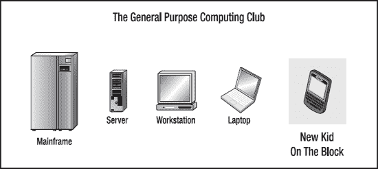

**图 1–1.** *手持设备是新一代 PC。*

`Android` 平台拥抱了这种手持设备通用计算的理念。它是一个全面的平台，拥有一个基于 Linux 的操作系统栈，用于管理设备、内存和进程。`Android` 的 Java 库涵盖了电话、视频、语音、图形、连接、UI 编程以及设备的许多其他方面。

**注意：** 尽管 `Android` 平台是为移动和平板设备构建的，但它展现了一个功能完备的桌面框架的特性。Google 通过一个称为 `Android SDK` 的软件开发工具包 (SDK) 将其提供给 Java 程序员。当你使用 `Android SDK` 时，你几乎不会觉得是在为移动设备编写代码，因为你可以访问在桌面或服务器上使用的大部分类库——包括一个关系型数据库。

`Android SDK` 支持大部分 Java 标准版 (Java SE)，除了抽象窗口工具包 (AWT) 和 Swing。为了替代 AWT 和 Swing，`Android SDK` 拥有自己*广泛的现代化 UI 框架*。由于你使用 Java 编写应用程序，可以预期你需要一个 Java 虚拟机 (JVM) 来负责解释运行时的 Java 字节码。JVM 通常提供必要的优化，以帮助 Java 达到与 C 和 C++ 等编译语言相媲美的性能水平。Android 提供了其特有的优化 JVM 来运行编译后的 Java 类文件，以应对手持设备的限制，例如内存、处理器速度和功耗。这个虚拟机被称为 `Dalvik VM`，我们将在稍后的“深入探讨 Dalvik VM”一节中进行探究。

**注意：** Java 编程语言的熟悉性和简洁性，加上 `Android` 广泛的类库，使得 `Android` 成为一个极具吸引力的编程平台。

图 1–2 展示了 `Android` 软件栈的概览。（我们将在“理解 Android 软件栈”一节中提供更多细节。）

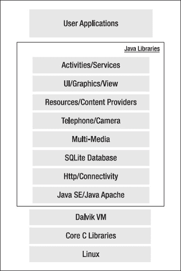

**图 1–2.** *Android 软件栈的高层视图*


### Android 早期历史

手机使用多种操作系统，例如 `Symbian OS`、微软的 `Windows Mobile`、`Mobile Linux`、`iPhone OS`（基于 `Mac OS X`）、`Moblin`（来自英特尔）以及许多其他专有操作系统。到目前为止，还没有哪个操作系统成为事实上的标准。可用于开发移动应用的 API 和环境限制太多，与桌面框架相比似乎显得落后。相比之下，Android 平台承诺开放、实惠、开源，更重要的是，它提供了一个高端、一体化、一致的开发框架。

谷歌于 2005 年收购了初创公司 `Android Inc.`，开始开发 Android 平台（参见图 1–3）。`Android Inc.` 的关键人物包括安迪·鲁宾、里奇·迈纳、尼克·西尔斯和克里斯·怀特。

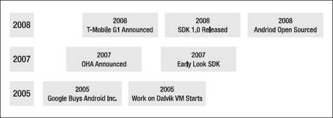

**图 1–3.** *Android 早期时间线*

2007 年底，一群行业领导者围绕 Android 平台联合成立了开放手机联盟（[`www.openhandsetalliance.com`](http://www.openhandsetalliance.com)）。截至 2009 年，该联盟的一些著名成员如下：

- Sprint Nextel
- T-Mobile
- 摩托罗拉
- 三星
- 索尼爱立信
- 东芝
- 沃达丰
- 谷歌
- 英特尔
- 德州仪器

截至 2011 年，该列表已增长了数倍（数量超过 80），您可以在开放手机联盟网站上看到。

根据该网站的说法，联盟的部分目标是快速创新并更好地响应消费者在移动领域的需求，其首个关键成果就是 Android 平台。Android 旨在满足移动运营商、手机制造商和应用程序开发者的需求。成员们已承诺通过开源 Apache 许可证 2.0 版发布重要的知识产权。

Android SDK 于 2007 年 11 月首次作为“早期预览”版本发布。2008 年 9 月，T-Mobile 宣布推出 `T-Mobile G1`，这是第一款基于 Android 平台的智能手机。几天后，谷歌宣布推出 Android SDK Release Candidate 1.0。2008 年 10 月，谷歌根据 Apache 的开源许可证发布了 Android 平台的源代码。2010 年底，谷歌为智能手机发布了代号为 `Gingerbread` 的 Android SDK 2.3，该版本于 2011 年 3 月升级至 2.3.3。2011 年初，发布了针对平板电脑优化的 Android 版本，即代号为 `Honeycomb` 的 Android 3.0。`Motorola XOOM` 是首批搭载此操作系统的平板电脑之一。

Android 发布时，其关键架构目标之一是允许应用程序相互交互并重用彼此的组件。这种重用不仅适用于服务，也适用于数据和用户界面。因此，Android 平台拥有许多架构特性来保证这种开放性得以实现。

Android 凭借其完备的开发特性，利用 Web 资源提供的云计算模型，并通过手机本地的数据存储来增强这种体验，从而吸引了早期的追随者并保持了开发者的热情。Android 在手机上支持关系型数据库这一特性，也对其早期采用起到了作用。

在 1.0 和 1.1 版本（2008 年）中，Android 不支持软键盘，要求设备配备物理按键。Android 于 2009 年 4 月发布了 1.5 SDK 解决了这个问题，同时还带来了许多其他功能，例如高级媒体录制功能、小部件和实时文件夹。

2009 年 9 月，Android 操作系统发布了 1.6 版本，随后在一个月内推出了 Android 2.0，促使大量 Android 设备在 2009 年圣诞季涌现。该版本引入了高级搜索功能和文本转语音功能。

凭借对 HTML 5 的支持，Android 2.0 为使用 HTML 带来了有趣的可能性。联系人 API 得到了显著改进。增加了对 Flash 的支持。每天都有越来越多基于 Android 的应用程序以及新型的独立在线应用商店出现。备受期待的基于 Android 的平板电脑现在也可以购买了。

在 Android 2.3 中，重要功能包括允许管理员远程擦除安全数据、在弱光条件下使用相机和视频、WiFi 热点、显著的性能提升、改进的蓝牙功能、可选择将应用程序安装到 SD 卡、`OpenGL ES 2.0` 支持、备份改进、搜索可用性改进、支持信用卡处理的`近场通信`、大幅改进的运动和传感器支持（类似于 Wii）、视频聊天以及改进的 Market。

Android 的最新版本 3.0 专注于基于平板电脑的设备以及更强大的双核处理器，例如 `Nvidia Tegra2`。该版本的主要功能包括支持使用更大的屏幕。引入了一个名为 `Fragments` 的非常重要的新概念。这贯穿了 3.0 的整个体验。引入了更多类似桌面的功能，例如 `ActionBar` 和 `拖放`。主屏幕小部件得到了显著增强。现在可用的 UI 控件更多了。在 3D 领域，`OpenGL` 通过 `Renderscript` 得到了增强，进一步补充了 `ES 2.0`。对于平板电脑来说，这是一个令人兴奋的引入。

### 深入 Dalvik 虚拟机

作为 Android 的一部分，谷歌花费了大量时间思考如何为低功耗手持设备优化设计。手持设备在内存和速度方面落后其桌面同类产品八到十年。它们的计算能力也有限。因此，对手机的性能要求非常苛刻，这要求手机设计者优化一切。如果你查看 Android 中的软件包列表，会发现它们功能完备且内容广泛。

这些问题促使谷歌在许多方面重新审视标准的 JVM 实现。谷歌实现此 JVM 的关键人物是丹·伯恩斯坦，他编写了 Dalvik 虚拟机——Dalvik 是冰岛的一个城镇名称。Dalvik 虚拟机获取生成的 Java 类文件，并将它们合并成一个或多个 Dalvik 可执行文件。它复用了来自多个类文件的重复信息，有效地将空间需求（未压缩）比传统的 `.jar` 文件减少了一半。

谷歌还微调了 Dalvik 虚拟机中的垃圾回收功能，但在早期版本中选择省略了即时编译器。Android 2.3 增加了 JIT。有报告称，这可以在某些地方实现 2 到 5 倍的原始性能提升，对于通用应用程序则提升 10% 到 20%。

Dalvik 虚拟机使用一种不同的汇编代码生成方式，它使用寄存器作为数据存储的主要单元，而不是栈。谷歌希望这样可以减少 30% 的指令。我们应该指出，由于 Dalvik 虚拟机，Android 中的最终可执行代码并非基于 Java 字节码，而是基于 `.dex` 文件。这意味着你无法直接执行 Java 字节码；你必须从 Java 类文件开始，然后将它们转换为可链接的 `.dex` 文件。

这种对性能的极致追求也延伸到了 Android SDK 的其他部分。例如，Android SDK 广泛使用 XML 来定义 UI 布局。然而，所有这些 XML 在设备上驻留之前都会被编译为二进制文件。Android 提供了使用这些 XML 数据的特殊机制。


### 理解 Android 软件栈

到目前为止，我们已经介绍了 Android 的历史及其优化特性，包括 `Dalvik VM`，并隐晦地提及了可用的 Java 编程栈。在本节中，我们将介绍 Android 的开发方面。图 1-4 是开始讨论这个话题的好起点。

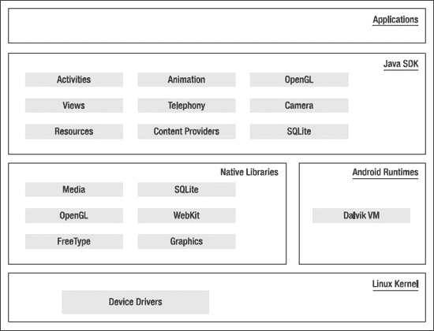

**图 1-4.** *详细的 Android SDK 软件栈*

Android 平台的核心是一个负责设备驱动、资源访问、电源管理和其他操作系统职责的 Linux 内核。所提供的设备驱动包括：显示屏、摄像头、键盘、WiFi、闪存、音频和 IPC（进程间通信）。尽管核心是 Linux，但 Android 设备（例如摩托罗拉 Droid）上的大多数（如果不是全部）应用程序都是用 Java 开发的，并通过 `Dalvik VM` 运行。

在内核之上，下一层是许多 C/C++ 库，例如 `OpenGL`、`WebKit`、`FreeType`、安全套接字层 (`SSL`)、C 运行时库 (`libc`)、`SQLite` 和媒体库。这个基于伯克利软件发行版 (`BSD`) 的系统 C 库已针对基于 Linux 的嵌入式设备进行了调优（大小约为其原始版本的一半）。媒体库基于 PacketVideo 的 [`OpenCORE`](http://www.packetvideo.com/)。这些库负责音频和视频格式的录制和播放。一个名为 `Surface Manager` 的库控制对显示系统的访问，并支持 2D 和 3D 图形。随着新版本的发布，很可能会添加更多此类原生库。

`WebKit` 库负责浏览器支持；它与支持 Google Chrome 和 Apple Safari 的是同一个库。`FreeType` 库负责字体支持。`SQLite` ([`www.sqlite.org/`](http://www.sqlite.org/)) 是一个可在设备本身使用的关系数据库。`SQLite` 也是一个独立的关系数据库开源项目，与 Android 没有直接关系。您也可以获取并使用为 `SQLite` 设计的工具来处理 Android 数据库。

大多数应用程序框架通过 `Dalvik VM`（通往 Android 平台的门户）访问这些核心库。正如我们在前面几节中指出的，`Dalvik` 针对运行多个 VM 实例进行了优化。当 Java 应用程序访问这些核心库时，每个应用都会获得自己的 VM 实例。

Android Java API 的主要库包括：电话、资源、位置、用户界面、内容提供者（数据）和包管理器（安装、安全等）。程序员在此 Java API 之上开发最终用户应用程序。设备上最终用户应用程序的一些示例包括：主屏幕、联系人、电话、浏览器等。

Android 还支持一个名为 `Skia` 的自定义 Google 2D 图形库，它用 C 和 C++ 编写。`Skia` 也是 Google Chrome 浏览器的核心。然而，Android 中的 3D API 基于 Khronos 集团 ([`www.khronos.org`](http://www.khronos.org)) 实现的 `OpenGL ES`。`OpenGL ES` 包含针对嵌入式系统的 `OpenGL` 子集。

从媒体角度来看，Android 平台支持最常见的音频、视频和图像格式。从无线角度来看，根据硬件的不同，Android 拥有支持蓝牙、EDGE、3G、WiFi 和全球移动通信系统（GSM）电话的 API。

### 使用 Android SDK 开发最终用户应用程序

在本节中，我们将向您介绍用于在 Android 上开发最终用户应用程序的高级 Android Java API。我们将简要讨论 Android 模拟器、Android 基本组件、UI 编程、服务、多媒体、电话、动画和 `OpenGL`。

#### Android 模拟器

Android SDK 附带了一个名为 Android 开发工具 (`ADT`) 的 Eclipse 插件。您将使用这个集成开发环境 (`IDE`) 工具来开发、调试和测试您的 Java 应用程序。（我们将在第 2 章中深入介绍 `ADT`）。您也可以在不使用 `ADT` 的情况下使用 Android SDK；此时您需要使用命令行工具。这两种方法都支持一个模拟器，可用于运行、调试和测试您的应用程序。对于 90% 的应用程序开发工作，您甚至不需要真实的设备。功能完备的 Android 模拟器模仿了大多数设备功能。模拟器的局限性包括：USB 连接、摄像头和视频捕获、耳机、电池模拟、蓝牙、WiFi、NFC 和 `OpenGL ES 2.0`。

Android 模拟器通过一项名为 `QEMU` 的开源“处理器模拟器”技术来工作，该技术由 Fabrice Bellard 开发 ([`http://bellard.org/qemu/`](http://bellard.org/qemu/))。这与允许在一台操作系统之上模拟另一个操作系统（无论处理器类型如何）的技术相同。`QEMU` 允许在 CPU 级别进行模拟。

对于 Android 模拟器，其处理器基于进阶精简指令集机器 (`ARM`)。`ARM` 是一种基于精简指令集计算机 (`RISC`) 的 32 位微处理器架构，通过减少指令集中的指令数量来实现设计的简洁性和高速性。模拟器在此模拟处理器上运行 Android 版本的 Linux。

`ARM` 广泛用于手持设备和其他对低功耗要求较高的嵌入式电子产品中。大部分移动市场都使用基于此架构的处理器。

您可以在 Android SDK 文档中找到关于模拟器的更多详细信息，网址为 [`http://developer.android.com/guide/developing/tools/emulator.html`](http://developer.android.com/guide/developing/tools/emulator.html)。

#### Android UI

Android 使用一个类似于其他基于桌面的、功能完备的 UI 框架。实际上，它在本质上更现代化，更具异步性。如果您将以 C 为基础的传统 Microsoft Windows API 视为第一代，将以 C++ 为基础的 MFC（微软基础类库）视为第二代，那么 Android UI 本质上是一个第四代 UI 框架。基于 Java 的 Swing UI 框架将是第三代，它引入了远超 MFC 的设计灵活性。Android UI、JavaFX、Microsoft Silverlight 和 Mozilla XML 用户界面语言 (`XUL`) 都属于这种新型的第四代 UI 框架，其 UI 是声明式的且具有独立的主题。

**注意：** 在 Android 中，即使您为其编程的恰好是手持设备，您也使用现代化的用户界面范式进行编程。

Android UI 编程涉及在 XML 文件中声明界面。然后，您将这些 XML 视图定义作为窗口加载到您的 UI 应用程序中。甚至应用程序中的菜单也是从 XML 文件加载的。Android 中的屏幕或窗口通常被称为 *活动（activities）*，它包含用户为完成一个逻辑操作单元所需的多个视图。*视图（Views）* 是 Android 的基本 UI 构建块，您可以进一步将它们组合成称为 *视图组（view groups）* 的复合视图。视图在内部使用画布、绘画和用户交互等熟悉的概念。托管这些包含视图和视图组的复合视图的活动，是 Android 中可替换的逻辑 UI 组件。Android 3.0 引入了另一个 UI 概念 *片段（fragments）*，允许开发者将视图和功能分块以在平板电脑上显示。平板电脑提供了足够的屏幕空间来容纳多窗格的活动，而片段则为这些窗格提供了抽象机制。

Android 框架的关键概念之一是活动窗口的生命周期管理。Android 制定了相关协议，以便在用户隐藏、恢复、停止和关闭活动窗口时管理其状态。您将在第 2 章中体会到这些基本概念，并同时学习如何搭建 Android 开发环境。


### Android 基础组件

Android UI 框架以及 Android 的其他部分，都依赖于一个名为 *intent* 的新概念。Intent 是窗口消息、动作、发布-订阅模型、进程间通信和应用程序注册表等概念的融合。以下是一个使用 `Intent` 类调用或启动网络浏览器的示例：

```
public static void invokeWebBrowser(Activity activity)
{
    Intent intent = new Intent(Intent.ACTION_VIEW);
    intent.setData(Uri.parse("http://www.google.com"));
    activity.startActivity(intent);
}
```

在此示例中，我们通过一个 intent 请求 Android 启动一个合适的窗口来显示网站内容。根据设备上安装的浏览器列表，Android 将选择合适的浏览器来显示该网站。你将在第 5 章中了解更多关于 intent 的内容。

Android 对*资源*提供了广泛支持，其中包括字符串和位图等常见元素和文件，以及一些不常见的项目，例如基于 XML 的视图定义。该框架以一种新颖的方式使用资源，使其使用方便、直观且快捷。以下是一个示例，其中为 XML 文件中定义的资源自动生成了资源 ID：

```
public final class R {
    public static final class attr { }
    public static final class drawable {
        public static final int myanimation=0x7f020001;
        public static final int numbers19=0x7f02000e;
    }
    public static final class id {
        public static final int textViewId1=0x7f080003;
    }
    public static final class layout {
        public static final int frame_animations_layout=0x7f030001;
        public static final int main=0x7f030002;
    }
    public static final class string {
        public static final int hello=0x7f070000;
    }
}
```

此类中每个自动生成的 ID 都对应 XML 文件中的某个元素或整个文件本身。只要你想使用这些 XML 定义，就可以使用这些生成的 ID。这种间接方式在本地化时非常有帮助。（第 3 章将更详细地介绍 `R.java` 文件和资源。）

Android 中的另一个新概念是*内容提供器*。内容提供器是对数据源的抽象，使其看起来像 RESTful 服务的发射器和消费端。底层的 SQLite 数据库使内容提供器的这一功能成为应用程序开发人员的强大工具。我们将在第 4 章中介绍内容提供器。在第 3 章、第 4 章和第 5 章中，我们将讨论 intent、资源和内容提供器如何促进 Android 平台的开放性。

### 高级 UI 概念

我们已经指出，XML 在描述 Android UI 方面扮演着关键角色。让我们看一个例子，了解 XML 如何为包含一个文本视图的简单布局实现这一点：

```
<?xml version="1.0" encoding="utf-8"?>
<LinearLayout xmlns:android=http://schemas.android.com/apk/res/android>
<TextView android:id="@+id/textViewId"
    android:layout_width="fill_parent"
    android:layout_height="wrap_content"
    android:text="@string/hello"
    />
</LinearLayout>
```

你将使用为此 XML 文件生成的 ID 将此布局加载到活动窗口中。（我们将在第 6 章中进一步介绍此过程。）Android 还为菜单（标准菜单和上下文菜单）提供了广泛支持（更多内容见第 7 章）。你会发现 Android 中的菜单使用起来很方便，因为它们也是作为 XML 文件加载的，并且这些菜单的资源 ID 是自动生成的。以下是如何在 XML 文件中声明菜单的方法：

```
<menu >
    <!-- 此组使用默认类别。 -->
    <group android:id="@+id/menuGroup_Main">
        <item android:id="@+id/menu_clear"
            android:orderInCategory="10"
            android:title="clear" />
        <item android:id="@+id/menu_show_browser"
            android:orderInCategory="5"
            android:title="show browser" />
    </group>
</menu>
```

Android 支持对话框，并且 Android 中的所有对话框都是异步的。对于习惯于某些窗口框架中同步模态对话框的开发人员来说，这些异步对话框提出了一个特殊的挑战。我们将在第 7 章中讨论菜单，并在第 8 章中讨论对话框，其中我们还将提供多种机制来处理异步对话框协议。

Android 还提供对其基于视图和可绘制对象的 UI 栈中的动画支持。Android 支持两种动画：*补间*动画和逐帧动画。“补间”是动画中的一个术语，指那些*介于*关键帧之间的绘图。通过计算机，你可以通过定期更改中间值并重绘表面来完成此操作。逐帧动画是指一系列帧以固定的时间间隔一张接一张地绘制。Android 通过动画回调、插值器和变换矩阵实现了这两种动画方法。

此外，Android 允许你以 XML 资源文件的形式定义这些动画。查看此示例，其中一系列编号图像以逐帧动画的方式播放：

```
<animation-list
        android:oneshot="false">
    <item android:drawable="@drawable/numbers11" android:duration="50" />
   ……
    <item android:drawable="@drawable/numbers19" android:duration="50" />
</animation-list>
```

底层图形库支持标准的变换矩阵，允许缩放、移动和旋转。图形库中的 `Camera` 对象支持深度和投影，从而能够在 2D 表面上实现类似 3D 的模拟。（我们将在第 16 章中进一步探讨动画。）

Android 还通过其 OpenGL ES 1.0 和 2.0 标准的实现来支持 3D 图形。OpenGL ES 与 OpenGL 一样，是一种基于 C 语言的扁平 API。由于 Android SDK 是基于 Java 的编程 API，因此需要使用 Java 绑定来访问 OpenGL ES。Java ME 已经通过 Java 规范请求（JSR）239 为 OpenGL ES 定义了此绑定，Android 在其实现中使用了相同的 Java 绑定来访问 OpenGL ES。如果你不熟悉 OpenGL 编程，学习曲线会比较陡峭。但我们已经在这里回顾了基础知识，因此当你完成第 20 章的学习时，就可以开始使用 Android 的 OpenGL 进行编程了。从 3.0 版本开始，Android 引入了一种基于脚本的 OpenGL 方法，以补充 ES 2.0 的功能。


### Android 新概念

Android 在首页上引入了一些围绕“信息触手可及”（*information at your fingertips*）的新概念。第一个是**实时文件夹**（*live folders*）。通过使用实时文件夹，您可以将一组项目作为文件夹发布到首页上。该集合的内容会随着底层数据的变化而改变。这些变化的数据可以来自设备本身，也可以来自互联网。（我们将在第 21 章中介绍实时文件夹。）

第二个基于首页的概念是**主屏幕小部件**（*home screen widget*）。主屏幕小部件用于通过 UI 小部件在首页上绘制信息。这些信息可以按固定时间间隔更新。例如，您的电子邮件存储中的未读邮件数量。我们在第 22 章中描述了主屏幕小部件。在 3.0 版本中，主屏幕小部件得到了增强，包含了列表视图，当底层数据发生变化时，这些视图可以更新。这些增强功能将在第 31 章中介绍。

**集成 Android 搜索**（*Integrated Android Search*）是第三个基于首页的概念。通过使用集成搜索，您可以在设备上以及跨互联网搜索内容。Android 搜索超越了单纯的搜索功能，允许您通过搜索控件触发命令。我们在第 23 章中介绍了 Android 搜索。

Android 还支持基于手指在设备上移动的触摸屏和手势操作。Android 允许您将屏幕上的任意随机运动录制为命名手势。应用程序可以使用这个手势来指示特定的操作。我们将在第 25 章中介绍触摸屏和手势。

传感器正逐渐成为移动体验的重要组成部分。我们在第 26 章中介绍传感器。

移动设备所需的另一项必要创新是其配置的动态性。例如，在竖屏和横屏模式之间切换手持设备的显示模式非常容易。或者，您可以将手持设备插入底座，使其变成一台笔记本电脑。Android 3.0 引入了一个名为**片段**（*fragments*）的概念来有效处理这些变化。第 29 章专门介绍片段。

我们还在第 30 章中介绍了 3.0 的**操作栏**（*action bars*）特性。操作栏使 Android 能够与桌面菜单栏范式相媲美。我们在第 25 章（旧方式）以及第 31 章（Android 3.0 方式）中介绍了拖放功能。

在 Android SDK 之外，还有许多独立的创新正在发生，使得开发变得既令人兴奋又简单。例如，`XML/VM`、`PhoneGap` 和 `Titanium`。`Titanium` 允许您使用 HTML 技术来为基于 WebKit 的 Android 浏览器编程。我们在本书的第二版中介绍了 `Titanium`。然而，由于时间和篇幅限制，本版将不再介绍 `Titanium`。

#### Android 服务组件

安全是 Android 平台的一个基础部分。在 Android 中，安全贯穿于应用程序生命周期的所有阶段——从设计时的策略考虑，到运行时的边界检查。我们在第 10 章中介绍安全和权限。

在第 11 章中，我们将向您展示如何在 Android 中构建和使用服务，特别是 HTTP 服务。本章还将介绍进程间通信（同一设备上应用程序之间的通信）。

基于位置的服务是 Android SDK 中另一个更令人兴奋的组件。SDK 的这一部分为应用程序开发者提供了用于显示和操作地图以及获取实时设备位置信息的 API。我们将在第 17 章中详细介绍这些概念。

#### Android 媒体与电话组件

Android 拥有涵盖音频、视频和电话组件的 API。第 18 章将介绍电话 API。我们将在第 19 章中详细介绍音频和视频 API。从 Android 2.0 开始，Android 包含了 Pico 文本转语音引擎（Pico Text To Speech engine）。这在第 24 章中介绍。

最后但同样重要的是，Android 通过创建一个单一的 XML 文件来定义应用程序包是什么，从而将所有概念整合到一个应用程序中。这个文件被称为应用程序的清单文件（`AndroidManifest.xml`）。以下是一个示例：

```xml
<?xml version="1.0" encoding="utf-8"?>
<manifest
      package="com.ai.android.HelloWorld"
      android:versionCode="1"
      android:versionName="1.0.0">
    <application android:icon="@drawable/icon" android:label="@string/app_name">
        <activity android:name=".HelloWorld"
                  android:label="@string/app_name">
            <intent-filter>
                <action android:name="android.intent.action.MAIN" />
                <category android:name="android.intent.category.LAUNCHER" />
            </intent-filter>
        </activity>
    </application>
</manifest>
```

Android 清单文件是定义活动、注册服务和内容提供者以及声明权限的地方。随着我们逐步展开每个概念，本书将详细阐述清单文件的相关细节。

#### Android Java 包

快速了解 Android 平台的一种方法是查看 Java 包的结构。由于 Android 偏离了标准的 JDK 发行版，了解哪些被支持、哪些不被支持非常重要。以下是 Android SDK 中包含的重要包的简要说明：


> `android.app`：实现了 Android 的应用程序模型。主要类包括表示启动和停止语义的 `Application`，以及大量与活动相关的类、片段、控件、对话框、提示和通知。

> `android.bluetooth`：提供了大量用于处理蓝牙功能的类。主要类包括 `BluetoothAdapter`、`BluetoothDevice`、`BluetoothSocket`、`BluetoothServerSocket` 和 `BluetoothClass`。你可以使用 `BluetoothAdapter` 来控制本地安装的蓝牙适配器。例如，你可以启用它、禁用它以及启动发现过程。`BluetoothDevice` 表示你正在连接的远程蓝牙设备。两个蓝牙套接字用于建立设备之间的通信。蓝牙类表示你正在连接的蓝牙设备类型。

> `android.content`：实现了内容提供者的概念。内容提供者将数据访问从数据存储中抽象出来。该软件包还实现了关于 Intent 和 Android 统一资源标识符（URI）的核心思想。

> `android.content.pm`：实现了包管理器相关的类。包管理器了解权限、已安装的包、已安装的提供者、已安装的服务、已安装的组件（如活动）以及已安装的应用程序。

> `android.content.res`：提供对资源文件的访问，包括结构化和非结构化资源。主要类是 `AssetManager`（用于非结构化资源）和 `Resources`。

> `android.database`：实现了抽象数据库的概念。主要接口是 `Cursor` 接口。

> `android.database.sqlite`：使用 SQLite 作为物理数据库，实现了 `android.database` 包中的概念。主要类是 `SQLiteCursor`、`SQLiteDatabase`、`SQLiteQuery`、`SQLiteQueryBuilder` 和 `SQLiteStatement`。但是，你的大多数交互都将与抽象 `android.database` 包中的类进行。

> `android.gesture`：此包包含了处理用户定义手势所需的所有类和接口。主要类是 `Gesture`、`GestureLibrary`、`GestureOverlayView`、`GestureStore`、`GestureStroke`、`GesturePoint`。一个 `Gesture` 是 `GestureStrokes` 和 `GesturePoints` 的集合。手势被收集在 `GestureLibrary` 中。手势库存储在 `GestureStore` 中。手势被命名以便能够被识别为动作。

> `android.graphics`：包含类 `Bitmap`、`Canvas`、`Camera`、`Color`、`Matrix`、`Movie`、`Paint`、`Path`、`Rasterizer`、`Shader`、`SweepGradient` 和 `TypeFace`。

> `android.graphics.drawable`：实现了绘图协议和背景图像，并允许对可绘制对象进行动画处理。

> `android.graphics.drawable.shapes`：实现了包括 `ArcShape`、`OvalShape`、`PathShape`、`RectShape` 和 `RoundRectShape` 在内的形状。

> `android.hardware`：实现了物理相机相关的类。`Camera` 表示硬件相机，而 `android.graphics.Camera` 表示一个与物理相机无关的图形概念。

> `android.location`：包含类 `Address`、`GeoCoder`、`Location`、`LocationManager` 和 `LocationProvider`。`Address` 类表示简化的 XAL（可扩展地址语言）。`GeoCoder` 允许你根据地址获取纬度/经度坐标，反之亦然。`Location` 表示纬度/经度。

> `android.media`：包含类 `MediaPlayer`、`MediaRecorder`、`Ringtone`、`AudioManager` 和 `FaceDetector`。支持流式传输的 `MediaPlayer` 用于播放音频和视频。`MediaRecorder` 用于录制音频和视频。`Ringtone` 类用于播放可作为铃声和通知的简短声音片段。`AudioManager` 负责音量控制。你可以使用 `FaceDetector` 检测位图中的人脸。

> `android.net`：实现了基本的套接字级别网络 API。主要类包括 `Uri`、`ConnectivityManager`、`LocalSocket` 和 `LocalServerSocket`。这里还值得注意的是，Android 在浏览器级别和网络级别都支持 HTTPS。Android 在其浏览器中也支持 JavaScript。

> `android.net.wifi`：管理 WiFi 连接。主要类包括 `WifiManager` 和 `WifiConfiguration`。`WifiManager` 负责列出已配置的网络和当前活动的 WiFi 网络。

> `android.opengl`：包含围绕 OpenGL ES 1.0 和 2.0 操作的实用工具类。OpenGL ES 的主要类在从 JSR 239 借用的另一组包中实现。这些包是 `javax.microedition.khronos.opengles`、`javax.microedition.khronos.egl` 和 `javax.microedition.khronos.nio`。这些包是对 Khronos 用 C 和 C++ 实现的 OpenGL ES 的轻量封装。

> `android.os`：表示可通过 Java 编程语言访问的 OS 服务。一些重要的类包括 `BatteryManager`、`Binder`、`FileObserver`、`Handler`、`Looper` 和 `PowerManager`。`Binder` 是一个允许进程间通信的类。`FileObserver` 监视文件的更改。你使用 `Handler` 类在消息线程上运行任务，使用 `Looper` 运行消息线程。

> `android.preference`：允许应用程序以统一的方式让用户管理该应用程序的偏好设置。主要类是 `PreferenceActivity`、`PreferenceScreen`，以及各种派生自 `Preference` 的类，例如 `CheckBoxPreference` 和 `SharedPreferences`。

> `android.provider`：包含一组遵循 `android.content.ContentProvider` 接口的预构建内容提供者。这些内容提供者包括 `Contacts`、`MediaStore`、`Browser` 和 `Settings`。这组接口和类存储底层数据结构的元数据。

> `android.sax`：包含一组高效的简单 API for XML（SAX）解析实用工具类。主要类包括 `Element`、`RootElement` 以及一些 `ElementListener` 接口。

> `android.speech`：包含用于语音识别的常量。

> `android.speech.tts`：提供将文本转换为语音的支持。主要类是 `TextToSpeech`。你将能够获取文本，并要求此类的实例将要朗读的文本排入队列。例如，你可以访问许多回调来监视朗读何时完成。Android 使用来自 SVOX 的 Pico TTS（文本转语音）引擎。

> `android.telephony`：包含类 `CellLocation`、`PhoneNumberUtils` 和 `TelephonyManager`。`TelephonyManager` 允许你确定蜂窝小区位置、电话号码、网络运营商名称、网络类型、电话类型和用户身份模块（SIM）序列号。

> `android.telephony.gsm`：允许你基于蜂窝基站收集小区位置，并包含负责短信消息的类。此包之所以称为 GSM，是因为全球移动通信系统是最初定义短信数据消息标准的技术。

> `android.telephony.cdma`：提供对 CDMA 电话的支持。

> `android.text`：包含文本处理类。

> `android.text.method`：为各种控件的文本输入提供类。

> `android.text.style`：为文本范围提供了许多样式机制。

> `android.utils`：包含类 `Log`、`DebugUtils`、`TimeUtils` 和 `Xml`。

> `android.view`：包含类 `Menu`、`View`、`ViewGroup` 以及一系列监听器和回调。

> `android.view.animation`：提供对补间动画的支持。主要类包括 `Animation`、一系列用于动画的插值器，以及一组特定的动画器类，包括 `AlphaAnimation`、`ScaleAnimation`、`TranslationAnimation` 和 `RotationAnimation`。Android 3.0 引入了 `android.animation` 包，该包类似但范围更广，因为它可以对对象（而不仅仅是视图）进行操作。

> `android.view.inputmethod`：实现了输入法框架架构。

> `android.webkit`：包含表示网页浏览器的类。主要类包括 `WebView`、`CacheManager` 和 `CookieManager`。

> `android.widget`：包含所有通常派生自 `View` 类的 UI 控件。主要的控件包括 `Button`、`Checkbox`、`Chronometer`、`AnalogClock`、`DatePicker`、`DigitalClock`、`EditText`、`ListView`、`FrameLayout`、`GridView`、`ImageButton`、`MediaController`、`ProgressBar`、`RadioButton`、`RadioGroup`、`RatingButton`、`Scroller`、`ScrollView`、`Spinner`、`TabWidget`、`TextView`、`TimePicker`、`VideoView` 和 `ZoomButton`。

> `com.google.android.maps`：包含类 `MapView`、`MapController` 和 `MapActivity`，基本上是使用 Google 地图所需的类。


以下是针对您提供的英文文本的中文翻译，已严格遵循 Markdown 格式、保留所有符号、链接及代码块要求。

---


以下是一些关键的 Android 专属包。从这个列表中，您可以窥见 Android 核心平台的深度。

**注意：** 总体而言，Android Java API 包含 40 多个包和 700 多个类，并且随着每个版本的发布而持续增长。

此外，Android 在 `java.*` 命名空间中提供了许多包。其中包括 `awt.font`、`io`、`lang`、`lang.annotation`、`lang.ref`、`lang.reflect`、`math`、`net`、`nio`、`nio.channels`、`nio.channels.spi`、`nio.charset`、`security`、`security.acl`、`security.cert`、`security.interfaces`、`security.spec`、`sql`、`text`、`util`、`util.concurrent`、`util.concurrent.atomic`、`util.concurrent.locks`、`util.jar`、`util.logging`、`util.prefs`、`util.regex` 和 `util.zip`。Android 还包含了来自 `javax` 命名空间的以下包：`crypto`、`crypto.spec`、`microedition.khronos.egl`、`microedition.khronos.opengles`、`net`、`net.ssl`、`security.auth`、`security.auth.callback`、`security.auth.login`、`security.auth.x500`、`security.cert`、`sql`、`xml` 和 `xmlparsers`。除此之外，它还包含了来自 `org.apache.http.*` 以及 `org.json`、`org.w3c.dom`、`org.xml.sax`、`org.xml.sax.ext`、`org.xml.sax.helpers`、`org.xmlpull.v1` 和 `org.xmlpull.v1.sax2` 的大量包。这些众多的包共同构成了一个丰富的计算平台，用于为手持设备编写应用程序。

#### 善用 Android 源代码

在 Android 的早期版本中，文档在某些方面有所欠缺。Android 源代码可以用来填补这些空白。

Android 源代码分发的详细信息发布在 [`http://source.android.com`](http://source.android.com) 上。该代码于 2008 年 10 月左右以开源形式提供。开放手机联盟的目标之一就是让 Android 成为一个免费且完全可定制的移动平台。

如前所述，Android 是一个平台，而不仅仅是一个项目。您可以在 [`http://android.git.kernel.org/`](http://android.git.kernel.org/) 上看到其范围及项目数量。

Android 及其所有项目的源代码均由 Git 源代码控制系统管理。Git（[`http://git.or.cz/`](http://git.or.cz/)）是一个开源源代码控制系统，旨在快速便捷地处理大型和小型项目。Linux 内核和 Ruby on Rails 项目也依赖 Git 进行版本控制。Git 仓库中 Android 项目的完整列表见 [`http://android.git.kernel.org/`](http://android.git.kernel.org/)。

您可以使用 Git 提供的工具（在产品网站上有所描述）下载这些项目中的任何一个。一些主要的项目包括 Dalvik、`frameworks/base`（即 `android.jar` 文件）、Linux 内核以及许多外部库，例如 Apache HTTP 库（`apache-http`）。核心 Android 应用程序也托管于此。其中一些核心应用程序包括：AlarmClock、Browser、Calculator、Calendar、Camera、Contacts、Email、GoogleSearch、HTML Viewer、IM、Launcher、Mms、Music、PackageInstaller、Phone、Settings、SoundRecorder、Stk、Sync、Updater 和 VoiceDialer。

Android 项目还包括 Provider 项目。*Provider 项目* 就像 Android 中的数据库，将数据封装成 RESTful 服务。这些项目包括 CalendarProvider、ContactsProvider、DownloadProvider、DrmProvider、GoogleContactsProvider、GoogleSubscribedFeedsProvider、ImProvider、MediaProvider、SettingsProvider、Subscribed FeedsProvider 和 TelephonyProvider。

作为一名程序员，您最感兴趣的将是构成 `android.jar` 文件的源代码。（如果您更倾向于下载整个平台并自行构建，请参阅 [`http://source.android.com/source/download.html`](http://source.android.com/source/download.html) 上的文档。）您可以通过输入以下 URL 来下载这个 `.jar` 文件的源代码：[`http://git.source.android.com/?p=platform/frameworks/base.git;a=snapshot;h=HEAD;sf=tgz`](http://git.source.android.com/?p=platform/frameworks/base.git;a=snapshot;h=HEAD;sf=tgz)。

这是一个通用的 URL，可用于下载 Git 项目。在 Windows 上，您可以使用 `pkzip` 解压缩此文件。虽然您可以下载并解压缩源代码，但如果您不需要通过 IDE 调试源代码，直接在线查看这些文件可能更方便。Git 也允许您这样做。例如，您可以通过访问此 URL 来浏览 `android.jar` 的源文件：[`http://android.git.kernel.org/?p=platform/frameworks/base.git;a=summary`](http://android.git.kernel.org/?p=platform/frameworks/base.git;a=summary)。

但是，访问此页面后您需要进行一些操作。从下拉列表中选择 `grep`，并在搜索框中输入一些文本。点击结果中的某个文件名，即可在浏览器中打开该源文件。此功能便于快速查阅源代码。

有时，您要找的文件可能不在 `frameworks/base` 目录或项目中。在这种情况下，您需要找到项目列表并逐一搜索。此列表的 URL 为：[`http://android.git.kernel.org/`](http://android.git.kernel.org/)。

您无法跨所有项目执行 `grep` 操作，因此需要了解哪个项目对应 Android 中的哪个功能。例如，Skia 项目中的图形相关库可在此处找到：[`http://android.git.kernel.org/?p=platform/external/skia.git;a=summary`](http://android.git.kernel.org/?p=platform/external/skia.git;a=summary)。

`SkMatrix.cpp` 文件包含一个变换矩阵的源代码，这对于动画非常有用：[`http://android.git.kernel.org/?p=platform/external/skia.git;a=blob;f=src/core/SkMatrix.cpp`](http://android.git.kernel.org/?p=platform/external/skia.git;a=blob;f=src/core/SkMatrix.cpp)。

### 本书中的示例项目

在本书中，您将找到大量可运行的示例项目。第 2 章 到 第 28 章 是针对智能手机编写的，因此这些章节中的所有项目都已在最高至 Android 2.3 的版本上测试过。毕竟，市面上的 Android 智能手机数量非常庞大。

大多数（如果不是全部）示例项目无需更改即可在 Android 3.0 平板电脑上运行，尽管它们的外观可能不完全符合您的期望。我们开发这些示例项目的主要目的是演示特定的概念和 Android 包，并且在某些情况下，展示某些功能在旧版 Android 中是如何工作的。

这些概念可以轻松应用于 Android 3.0 平板电脑应用程序，并且在需要时，我们的示例应用程序也肯定能够与其他 Android 3.0 特定功能集成。但是，如果在所有示例项目中都加入这些额外功能，可能会分散我们对试图解释的核心概念的关注。

第 29 章 到 第 31 章 专门针对 Android 3.0，因此这些项目是为 Android 3.0 设计并测试的。如果您在使用任何示例项目时遇到问题，请查看我们的网站（[`www.androidbook.com`](http://www.androidbook.com)）以获取更新，如果仍未找到答案，请通过电子邮件与我们联系。

### 总结

在本章中，我们希望激发您对 Android 的好奇心。如果您是一名 Java 程序员，您将拥有绝佳的机会，从这一令人兴奋且功能强大的通用计算平台中获益。我们欢迎您继续阅读本书的其余部分，以深入理解 Android SDK。

## 第 2 章


## 搭建开发环境

上一章概述了 Android 的历史，并初步介绍了本书后续将涉及的概念。此刻，你可能已经迫不及待想动手写代码了。我们将首先介绍使用 Android 软件开发工具包（SDK）构建应用所需的一切，并帮助你搭建开发环境。接着，我们将引导你完成一个“Hello World！”应用，并剖析一个稍大一点的应用。然后，我们会解释 Android 应用的生命周期，最后讨论如何使用 Android 虚拟设备（AVD）调试你的应用。

要构建 Android 应用，你需要 Java SE 开发工具包（JDK）、Android SDK 以及一个开发环境。严格来说，你可以使用原始文本编辑器开发应用，但就本书而言，我们将使用通用的 Eclipse IDE。Android SDK 需要 JDK 5 或更高版本（我们在示例中使用了 JDK 6）以及 Eclipse 3.4 或更高版本（我们使用了 Eclipse 3.5，也称为 Galileo，以及 3.6，也称为 Helios）。

为了方便起见，你最好使用 Android 开发工具（ADT）。ADT 是一个 Eclipse 插件，支持使用 Eclipse IDE 构建 Android 应用。事实上，本书中的所有示例都是使用集成了 ADT 工具的 Eclipse IDE 构建的。

Android SDK 主要由两部分组成：工具和包。初次安装 SDK 时，你只获得了基础工具。这些是用于帮助你开发应用的可执行文件和支持文件。包则是特定于某个 Android 版本（称为平台）或某个平台特定附加组件的文件。平台包括 Android 1.5 到 3.0。附加组件包括谷歌地图 API、市场许可证验证器，甚至还有供应商提供的，如三星的 Galaxy Tab 附加组件。安装 SDK 后，你需要使用其中一个工具来下载并设置平台和附加组件。让我们开始吧！

### 搭建你的环境

要构建 Android 应用，你需要建立一个开发环境。在本节中，我们将引导你下载 JDK 6、Eclipse IDE、Android SDK（工具和包）以及 Android 开发工具（ADT）。我们还会帮助你配置 Eclipse 以便构建 Android 应用。

Android SDK 兼容 Windows（Windows XP、Windows Vista 和 Windows 7）、Mac OS X（仅限 Intel）和 Linux（仅限 Intel）。在本章中，我们将为你演示如何为所有这些平台搭建环境（对于 Linux，我们仅涵盖 Ubuntu 变体）。在其他章节中，我们将不再特别说明平台差异。

#### 下载 JDK 6

你首先需要的是 Java SE 开发工具包。Android SDK 需要 JDK 5 或更高版本；我们使用 JDK 6 开发了示例。对于 Windows，请从 Oracle 网站（[`www.oracle.com/technetwork/java/javase/downloads/index.html`](http://www.oracle.com/technetwork/java/javase/downloads/index.html)）下载 JDK 6 并安装。你只需要 JDK，不需要捆绑包。对于 Mac OS X，请从 Apple 网站（[`http://developer.apple.com/java/download/`](http://developer.apple.com/java/download/)）下载 JDK，选择适合你特定 Mac OS 版本的文件并安装。你需要免费注册为 Apple 开发者才能获得 JDK，进入下载页面后，需要点击页面右侧的 Java 链接。要在 Linux 上安装 JDK，请打开一个终端窗口并尝试以下命令：

```
sudo apt-get install sun-java6-jdk
```

这将安装 JDK 及其所有依赖项，例如 Java 运行时环境（JRE）。如果安装失败，可能意味着你需要添加一个新的软件源，然后再次尝试该命令。网页 `https://help.ubuntu.com/community/Repositories/Ubuntu` 解释了软件源以及如何添加第三方软件的连接。具体过程取决于你使用的 Linux 版本。完成此操作后，请重试该命令。

随着 Ubuntu 10.04（Lucid Lynx）的推出，Ubuntu 建议使用 OpenJDK 而不是 Oracle/Sun JDK。要安装 OpenJDK，请尝试以下命令：

```
sudo apt-get install openjdk-6-jdk
```

如果找不到该包，请按照前面所述设置第三方软件，然后再次运行该命令。JDK 所依赖的所有包都将自动为你添加。可以同时安装 OpenJDK 和 Oracle/Sun JDK。要在 Ubuntu 上切换已安装的 Java 版本之间的活动 Java，请在 shell 提示符下运行以下命令：

```
sudo update-alternatives --config java
```

然后选择你希望作为默认版本的 Java。

现在你已经安装了 Java JDK，接下来需要设置 `JAVA_HOME` 环境变量，使其指向 JDK 安装文件夹。在 Windows XP 机器上，可以通过依次点击“开始”  “我的电脑”，右键单击选择“属性”，选择“高级”选项卡，然后点击“环境变量”来完成此操作。点击“新建”添加变量，如果变量已存在则点击“编辑”修改。`JAVA_HOME` 的值类似于 `C:\Program Files\Java\jdk1.6.0_23`。对于 Windows Vista 和 Windows 7，进入“环境变量”屏幕的步骤略有不同。点击“开始”  “计算机”，右键单击选择“属性”，点击“高级系统设置”链接，然后点击“环境变量”。之后，按照与 Windows XP 相同的说明修改 `JAVA_HOME` 环境变量。对于 Mac OS X，你可以在主目录下的 `.profile` 文件中设置 `JAVA_HOME`。编辑或创建你的 `.profile` 文件，并添加如下所示的一行：

```
export JAVA_HOME=path_to_JDK_directory
```

其中 `path_to_JDK_directory` 可能是 `/Library/Java/Home`。对于 Linux，编辑你的 `.profile` 文件并添加类似 Mac OS X 的一行，只是你的 Java 路径可能类似于 `/usr/lib/jvm/java-6-sun` 或 `/usr/lib/jvm/java-6-openjdk`。有些人更喜欢使用 `.bashrc` 而不是 `.profile`；两者都可以。

#### 下载 Eclipse 3.6

安装好 JDK 后，你可以下载 Java 开发者版的 Eclipse IDE。（你不需要 Java EE 版；它也能用，但体积大得多，包含本书用不到的内容。）本书中的示例使用的是 Eclipse 3.6（在 Windows 环境下）。你可以从 [`www.eclipse.org/downloads/`](http://www.eclipse.org/downloads/) 下载所有 Eclipse 版本。Eclipse 发行版是一个 `.zip` 文件，可以解压到几乎任何位置。在 Windows 上，最简单的解压位置是 `C:\`，这会产生一个 `C:\eclipse` 文件夹，你可以在其中找到 `eclipse.exe`。对于 Mac OS X，你可以解压到“应用程序”文件夹。对于 Linux，你可以解压到你的主目录，或者让管理员将 Eclipse 放到一个可以访问到的公共位置。对于所有平台，Eclipse 可执行文件都在 `eclipse` 文件夹中。你也可以使用 Linux 的“软件中心”来查找和安装 Eclipse 以添加新应用程序，但这可能无法提供最新版本。

首次启动 Eclipse 时，它会要求你提供工作区的位置。为了方便，你可以选择一个简单的路径，例如 `C:\android` 或主目录下的某个子目录。如果你与他人共用一台电脑，请将工作区文件夹放在主目录下的某个位置。


### 下载 Android SDK

要构建 Android 应用程序，你需要 Android SDK。如前所述，SDK 附带基础工具部分，然后你可以下载所需或想要使用的软件包部分。SDK 的工具部分包含一个模拟器，因此你无需拥有运行 Android 操作系统的移动设备即可开发 Android 应用程序。它还附带一个设置工具，允许你安装想要下载的软件包。

你可以从 [`http://developer.android.com/sdk`](http://developer.android.com/sdk) 下载 Android SDK。Android SDK 以 `.zip` 文件形式提供，这与 Eclipse 的分发方式类似，因此你需要将其解压缩到合适的位置。对于 Windows，将文件解压缩到方便的位置（我们使用了 `C:` 盘），之后你应该会得到一个名为 `C:\android-sdk-windows` 的文件夹，其中包含如图 2-1 所示的文件。对于 Mac OS X 和 Linux，你可以将文件解压缩到你的主目录。你会注意到 Mac OS X 和 Linux 没有 SDK 管理器可执行文件。在 Mac OS X 和 Linux 中，与 SDK 管理器等效的操作是运行 `tools/android` 程序。

另一种方法（仅适用于 Windows）是下载安装程序 `EXE` 文件而不是 zip 文件，然后运行该安装程序可执行文件。此可执行文件将检查 Java JDK，为你解压嵌入的文件，并运行 `SDK 管理器` 程序来帮助你设置其余的下载内容。

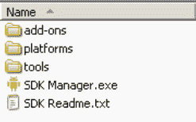

**图 2-1.** *Android SDK 的基础内容*

无论是使用 Windows 安装程序还是通过执行 `SDK 管理器`，你接下来都应该安装一些软件包。初次安装 Android SDK 时，它不附带任何平台版本（即 Android 版本）。安装平台非常简单。启动 `SDK 管理器`后，选择 `可用的软件包`，选择 `https://dl-ssl.google.com/android/repository/repository.xml` 源，然后选择你想要的平台和附加组件，例如 Android 2.3（参见图 2-2）。你必须添加 Android SDK 平台工具，环境才能正常工作。因为我们很快就会用到它，请至少添加 Android 1.6 平台。

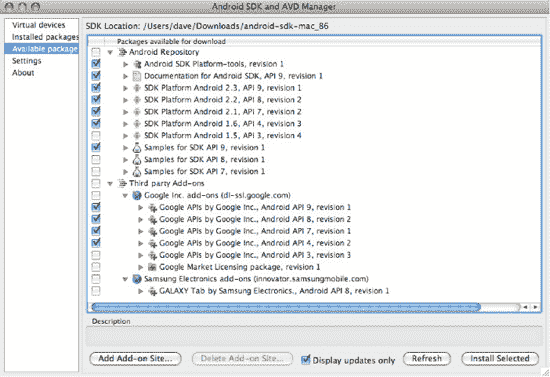

**图 2-2.** *向 Android SDK 添加软件包*

点击 `安装所选`。你需要为安装的每个项目点击 `接受`，然后点击 `安装已接受项`。然后 Android 将下载你的软件包和平台，供你使用。Google API 是用于使用 Google 地图开发应用程序的附加组件。你可以随时通过点击此窗口左侧的 `已安装的软件包` 来查看已安装的平台。你也可以稍后随时返回添加更多软件包。

### 更新 `PATH` 环境变量

Android SDK 带有一个 `tools` 目录，你需要将其添加到 `PATH` 中。你还需要将刚刚安装的 `platform-tools` 目录添加到 `PATH` 中。让我们现在添加它们，或者如果你是升级，请确保它们正确无误。顺便也添加你的 JDK `bin` 目录，这会让之后的工作更轻松。对于 Windows，返回 `环境变量` 窗口。编辑 `PATH` 变量，在末尾添加一个分号（`;`），然后依次添加 Android SDK 工具文件夹的路径、另一个分号、Android SDK 平台工具文件夹的路径、另一个分号，最后添加 `%JAVA_HOME%\bin`。完成后点击 `确定` 。对于 Mac OS X 和 Linux，编辑你的 `.profile` 文件，将 Android SDK 工具目录路径、Android SDK 平台工具目录以及 `$JAVA_HOME/bin` 目录添加到你的 `PATH` 变量中。类似下面的内容适用于 Linux：

```
export PATH=$PATH:$HOME/android-sdk-linux_x86/tools:$HOME/android-sdk-linux_x86/platform-tools:$JAVA_HOME/bin
```

只需确保指向 Android SDK 工具目录的路径组件与你特定的设置匹配即可。

### 工具窗口

在本书后续章节中，有时你需要执行命令行实用程序。这些程序将是 JDK 或 Android SDK 的一部分。通过将这些目录添加到 `PATH` 中，你无需指定完整路径名即可执行它们，但你需要启动一个“工具窗口”来运行它们（我们将在后续章节中引用此工具窗口）。在 Windows 中创建工具窗口的最简单方法是点击开始  运行，输入 `cmd`，然后点击 `确定`。对于 Mac OS X，从 Finder 中的“应用程序”文件夹或 Dock（如果存在）中选择`“终端”`。对于 Linux，从“应用程序” “附件”菜单中选择`“终端”`。

在谈论平台差异时，最后一件事：以后你可能需要知道工作站的 IP 地址。在 Windows 中，启动一个工具窗口并输入命令 `ipconfig`。结果将包含一个 IPv4（或类似名称）条目，其旁边列出了你的 IP 地址。IP 地址看起来像这样：192.168.1.25。对于 Mac OS X 和 Linux，启动一个工具窗口并使用命令 `ifconfig`。你会在一个名为“inet addr”的标签旁边找到你的 IP 地址。你可能会看到一个名为“localhost”或“lo”的网络连接。此网络连接的 IP 地址是 127.0.0.1。这是操作系统使用的特殊网络连接，不同于你工作站的 IP 地址。请查找另一个不同的数字作为你工作站的 IP 地址。


### 安装 Android 开发工具 (ADT)

现在您需要安装 `ADT`，这是一个 Eclipse 插件，用于帮助您构建 Android 应用程序。具体来说，`ADT` 集成了 Eclipse 的功能，为您提供创建、测试和调试 Android 应用程序的环境。您需要使用 Eclipse 中的 `Install New Software` 功能来完成安装。（有关升级 `ADT` 的说明将在本节后面出现。）首先，启动 Eclipse IDE，然后按照以下步骤操作：

1.  选择 `Help` 菜单项，然后选择 `Install New Software…` 选项。（在旧版本的 Eclipse 中，此项被称为 `Software Updates`。）
2.  选中 `Work with` 字段，输入
    `https://dl-ssl.google.com/android/eclipse/`
    并按下回车键。Eclipse 将联系该站点并填充列表，如 图 2–3 所示。
3.  您应该会看到一个名为 `Developer Tools` 的条目，包含三个子节点：`Android DDMS`、`Android Development Tools` 和 `Android Hierarchy Viewer`。选中父节点 `Developer Tools`，确保子节点也被选中，然后点击 `Next` 按钮。您看到的版本可能比这些更新，这没关系。这里可能还有其他工具。
4.  Eclipse 将要求您验证要安装的工具。再次点击 `Next`。这也适用于在 Android 3.0 中添加的 `Android Traceview`。
5.  系统会要求您查看 `ADT` 以及安装 `ADT` 所需工具的许可证。查看许可证，点击“我接受...”，然后点击 `Finish` 按钮。

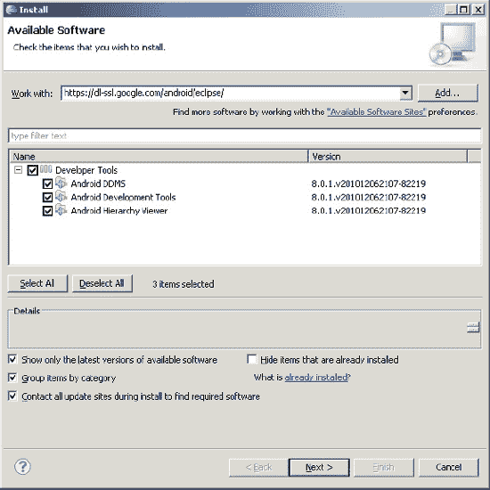

**图 2–3.** *使用 Eclipse 中的 Install New Software 功能安装 ADT*

Eclipse 随后将下载 `Developer Tools` 并进行安装。您需要重新启动 Eclipse，以便新插件在 IDE 中显示。

如果您在 Eclipse 中已有旧版本的 `ADT`，请转到 Eclipse 的 `Help` 菜单并选择 `Check for Updates`。您应该会看到新版本的 `ADT`，并能按照安装说明，从第 3 步开始继续操作。

**注意** `Android Hierarchy Viewer` 是在 Android 2.3 中添加到 `Developer Tools` 的。因此，如果您是全新安装 `ADT`，将会包含它。但如果您是升级 `ADT`，则可能不会在待升级的工具列表中看到 `Hierarchy Viewer`。如果您没有看到它，请在升级完 `ADT` 的其余部分后，转到 `Install New Software...`，然后从 `Works With` 菜单中选择 `https://dl-ssl.google.com/android/eclipse/`。中间窗口应该会显示 `Android Hierarchy Viewer`，这样您就可以将其与 `ADT` 的其余部分分开安装。

在 Eclipse 中使 `ADT` 正常工作的最后一步是将其指向 Android SDK。在 Eclipse 中，选择 `Window` 菜单并选择 `Preferences`。（在 Mac OS X 上，`Preferences` 位于 `Eclipse` 菜单下。）在 `Preferences` 对话框中，选择 `Android` 节点，并将 `SDK Location` 字段设置为 Android SDK 的路径（参见 图 2–4），然后点击 `Apply` 按钮。请注意，您可能会看到一个对话框，询问您是否要向 Google 发送有关 Android SDK 的使用统计数据。这个决定由您自己做出。点击 `OK` 关闭 `Preferences` 窗口。

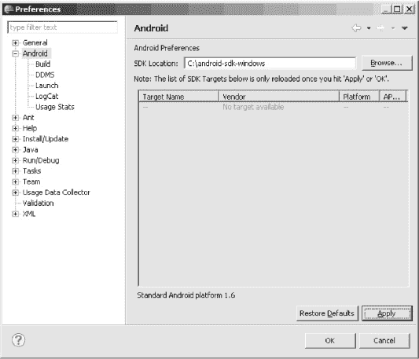

**图 2–4.** *将 ADT 指向 Android SDK*

从 Eclipse 中，您可以启动 `SDK Manager`。在 Eclipse 中，转到 `Window`  `Android SDK and AVD Manager`。您应该会看到与 图 2–2 相同的窗口，但您可能看不到左侧像您自己启动 `SDK Manager` 时显示的所有选项。

您已准备好创建第一个 Android 应用程序——但首先，我们必须简要讨论一下 Android 应用程序的基本概念。

### 学习基本组件

每个应用程序框架都有一些关键组件，开发人员需要先了解这些组件，才能开始基于该框架编写应用程序。例如，您需要了解 JavaServer Pages (JSP) 和 servlet 才能编写 Java 2 平台企业版 (J2EE) 应用程序。类似地，在为 Android 构建应用程序时，您需要了解活动、视图、意图、内容提供者、服务和 `AndroidManifest.xml` 文件。我们在此简要介绍这些基本概念，并在全书中进行更详细的讨论。

#### 视图

视图是构成用户界面的基本构建块的用户界面 (UI) 元素。一个视图可以是一个按钮、标签、文本字段或许多其他 UI 元素。如果您熟悉 J2EE 和 Swing 中的视图，那么您也会理解 Android 中的视图。视图也用作其他视图的容器，这意味着 UI 中通常存在一个视图层次结构。归根结底，您看到的一切都是一个视图。

#### 活动

活动是一个用户界面的概念。一个活动通常代表应用程序中的一个屏幕。它通常包含一个或多个视图，但并不强制要求必须如此。活动就像一个“活动”——帮助用户做一件事，这件事可以是查看数据、创建数据或编辑数据。大多数 Android 应用程序内部都包含多个活动。

#### 意图

意图泛泛地定义了一种执行某项工作的“意图”。意图封装了多个概念，因此理解它们的最佳方式是查看它们的使用示例。您可以使用意图来执行以下任务：

- 广播消息。
- 启动服务。
- 启动活动。
- 显示网页或联系人列表。
- 拨打电话号码或接听电话。

意图并不总是由您的应用程序发起——系统也会使用它们来通知您的应用程序特定的事件（例如收到短信）。

意图可以是显式的或隐式的。如果您只是说想要显示一个 URL，系统会决定哪个组件来执行该意图。您也可以提供关于应该由谁来处理该意图的具体信息。意图松散了动作和动作处理程序之间的耦合。

#### 内容提供者

设备上的移动应用程序之间的数据共享很常见。因此，Android 定义了一种标准机制，让应用程序可以共享数据（例如联系人列表），而无需暴露底层存储、结构和实现。通过内容提供者，您可以公开您的数据，并让您的应用程序使用来自其他应用程序的数据。

#### 服务

Android 中的服务类似于您在 Windows 或其他平台中看到的服务——它们是可能在后台长时间运行的进程。Android 定义了两种类型的服务：本地服务和远程服务。本地服务是仅能被托管该服务的应用程序访问的组件。相反，远程服务是旨在供设备上运行的其他应用程序远程访问的服务。

服务的一个例子是电子邮件应用程序用于轮询新邮件的组件。如果该服务未被设备上运行的其他应用程序使用，它可能是一个本地服务。如果多个应用程序使用该服务，那么它将被实现为远程服务。正如您将在第 11 章中看到的，区别在于 `startService()` 与 `bindService()`。

您可以使用现有的服务，也可以通过扩展 `Service` 类来编写自己的服务。

##### AndroidManifest.xml

`AndroidManifest.xml` 类似于 J2EE 世界中的 `web.xml` 文件，它定义了应用程序的内容和行为。例如，它列出了您的应用程序的活动和服务，以及应用程序运行所需的权限和功能。

### Android 虚拟设备

Android 虚拟设备 (AVD) 允许开发人员在无需连接真实 Android 设备（通常是手机或平板电脑）的情况下测试他们的应用程序。可以创建各种配置的 AVD，以模拟不同类型的真实设备。


### 你好，世界！

现在你已经准备好构建第一个 Android 应用了。我们将从构建一个简单的“Hello World！”程序开始。按照以下步骤创建应用的骨架：

1. 启动 Eclipse，选择 File  New  Project。在 New Project 对话框中，选择 Android，然后点击 Next。你将看到 New Android Project 对话框，如 图 2-5 所示。（Eclipse 可能已将 Android Project 添加到 New 菜单中，如果有的话可以直接使用。）工具栏上也有一个 New Android Project 按钮。

   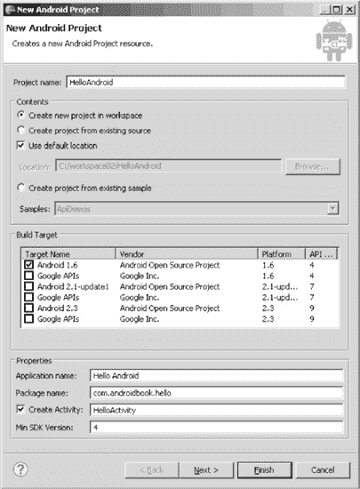

   **图 2-5.** *使用 New Project 向导创建 Android 应用*

2. 如 图 2-5 所示，输入 `HelloAndroid` 作为项目名称。你需要将此项目与在 Eclipse 中创建的其他项目区分开来，因此请选择一个在查看 Eclipse 环境中所有项目时能让你一目了然的名称。另外请注意，项目的默认位置将继承自 Eclipse 工作空间的位置。New Project 向导会将新应用的名称附加到工作空间位置之后。在此例中，如果你的 Eclipse 工作空间是 `c:\android`，则新项目将位于 `c:\android\HelloAndroid\`。

3. 暂时保留 Contents 部分不变，因为你希望在工作空间的默认位置创建一个新项目。

4. 对于 Build Target，勾选 Android 1.6，如 图 2-5 所示。这将作为你构建应用所基于的 Android 版本。你可以在更高版本的 Android（如 2.1 和 2.3）上运行你的应用，但 Android 1.6 已包含所有所需功能，因此你选择它作为目标。通常，最好选择你能使用的最低版本号，因为这样可以最大化能够运行你应用的设备数量。

5. 输入 `Hello Android` 作为应用名称。此名称将出现在应用图标旁、应用标题栏以及应用列表中。它应具有描述性且不宜过长。

6. 使用 `com.androidbook.hello` 作为包名。你的应用必须有一个基础包名，这就是它。这个包名将作为你应用的标识符，并且必须在所有应用中保持唯一。因此，最好以你拥有的域名开头来命名包名。如果你没有域名，只需发挥创意，确保你的包名不太可能被其他人使用。但是，不要使用以 `com.google`、`com.android`、`android` 或 `com.example` 开头的包名，因为这些名称受 Google 限制，你将无法将应用上传到 Android Market。

7. 输入 `HelloActivity` 作为 Create Activity 名称。你这是在告诉 Android，当应用启动时应启动此 Activity。你的应用中可能还有其他 Activity，但这是用户启动应用时首先看到的 Activity。

8. 最后，Min SDK Version 值为 4，告诉 Android 你的应用需要 Android 1.6 或更高版本。从技术上讲，你可以指定一个小于 Build Target 值的 Min SDK Version。如果你的应用调用了旧版 Android 中不存在的功能，你需要优雅地处理这种情况，但这是可以做到的。对于大多数应用，Min SDK Version 数字将与 Build Target 数字一致。

9. 点击 Finish 按钮，ADT 将为你生成项目骨架。现在，打开 `src` 文件夹下的 `HelloActivity.java` 文件，并按如下方式修改 `onCreate()` 方法：

    ```java
    /** Called when the activity is first created. */
    @Override
    public void onCreate(Bundle savedInstanceState) {
        super.onCreate(savedInstanceState);
        /** create a TextView and write Hello World! */
        TextView tv = new TextView(this);
        tv.setText("Hello World!");
        /** set the content view to the TextView */
        setContentView(tv);
    }
    ```

你可能需要向代码中添加一条 `import android.widget.TextView;` 语句，以消除 Eclipse 报告的错误。保存 `HelloActivity.java` 文件。

要运行应用，你需要创建一个 Eclipse 启动配置，并且需要一个虚拟设备来运行它。我们将快速引导你完成这些步骤，稍后再详细介绍 Android 虚拟设备（AVD）。按照以下步骤创建 Eclipse 启动配置：


好的，作为一名高级文档工程师和翻译员，我将严格遵循您提供的注意事项和示例格式，将给定的英文文本翻译成中文。


1. 选择主菜单 `Run`，然后选择 `Run Configurations` 菜单项。
2. 在 `Run Configurations` 对话框中，双击左侧窗格中的 `Android Application`。向导将插入一个名为 `New Configuration` 的新配置。
3. 将配置重命名为 `RunHelloWorld`。
4. 点击 `Browse` 按钮，然后选择 `HelloAndroid` 项目。
5. 在 `Launch Action` 下，选择 `Launch:`，然后从下拉列表中选择 `com.androidbook.hello.HelloActivity`。对话框应该如图 2-6 所示。

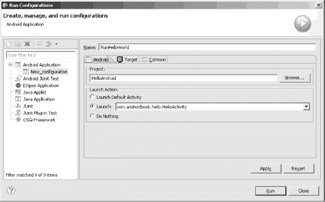

**图 2–6.** *配置 Eclipse 启动配置以运行 “Hello World!” 应用程序*

6. 点击 `Apply`，然后点击 `Run`。 你马上就要成功了！ Eclipse 已准备好运行你的应用程序，但它需要一个设备来运行它。 如图 2-7 所示，系统会警告你未找到兼容的目标，并询问你是否要创建一个。 点击 `Yes`。

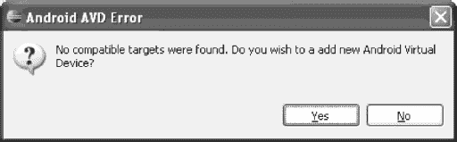

**图 2–7.** *关于目标的错误提示，并要求创建一个新的 AVD*

7. 系统将显示一个包含现有 AVD 的窗口（参见图 2-8）。 请注意，这与你在图 2-2 中安装软件包时看到的窗口相同，但现在你查看的是虚拟设备。 你将需要为你的新应用程序添加一个合适的 AVD。 点击 `New` 按钮。

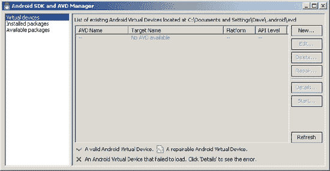

**图 2–8.** *现有的 Android 虚拟设备*

8. 填写 `Create AVD` 表单，如图 2-9 所示。 将 `Name` 设置为 `Gingerbread`，为 `Target` 选择 `Android 2.3 - API Level 9`（或其他版本），将 `SD Card Size` 设置为 `10`（表示 10MB），启用 `Snapshots`，并为 `Skin` 选择 `HVGA`。 点击 `Create AVD`。 管理器可能会确认你的 AVD 已成功创建。 点击右上角的 `X` 关闭 `Android SDK and AVD Manager` 窗口。

**注意：** 你为 Android 虚拟设备选择的是较新版本的 SDK，但你的应用程序也可以在旧版本上运行。 这是可以的，因为具有较新 SDK 的 AVD 可以运行需要旧版 SDK 的应用程序。 反之则不成立：需要新版 SDK 特性的应用程序无法在具有旧版 SDK 的 AVD 上运行。

9. 最后，从底部列表中选择你的新 AVD。 请注意，你可能需要点击 `Refresh` 按钮，才能让新的 AVD 显示在列表中。 点击 `OK` 按钮。
10. Eclipse 现在将启动模拟器并运行你的第一个 Android 应用程序（参见图 2-10）！

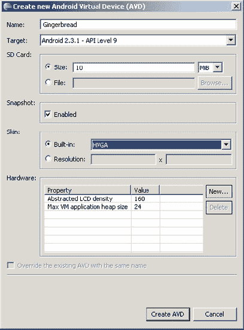

**图 2–9.** *配置 Android 虚拟设备*

**注意：** 模拟器可能需要一些时间来模拟设备启动过程。 启动过程完成后，你通常会看到一个锁屏界面。 按下 `Menu` 按钮或拖动解锁图像来解锁 AVD。 解锁后，你应该会看到 `HelloAndroidApp` 在模拟器中运行，如图 2-10 所示。 请注意，模拟器在启动过程中会在后台启动其他应用程序，因此你可能会不时看到警告或错误消息。 如果看到错误消息，通常可以将其关闭，让模拟器继续执行启动过程的下一步。 例如，如果你运行模拟器并看到类似 “应用程序 abc 无响应” 的消息，你可以等待应用程序启动，或者直接让模拟器强制关闭该应用程序。 通常，你应该等待并让模拟器干净地启动。

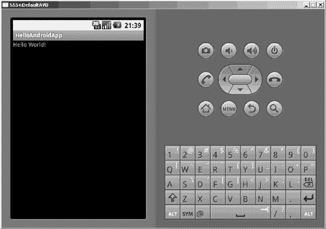

**图 2–10.** *HelloAndroidApp 在模拟器中运行*

现在你知道了如何创建新的 Android 应用程序并在模拟器中运行它。 接下来，我们将更详细地了解 Android 虚拟设备，然后更深入地研究 Android 应用程序的产物和结构。

### Android 虚拟设备

AVD 代表一种设备配置。 例如，你可以拥有一个 AVD，代表一台运行 SDK 1.5 版本并配备 32MB SD 卡的旧款 Android 设备。 其理念是，创建你要支持的 AVD，然后在开发和测试应用程序时，将模拟器指向其中一个 AVD。 指定（和更改）要使用的 AVD 非常容易，并且可以轻松地使用各种配置进行测试。 之前你已经了解了如何使用 Eclipse 创建 AVD。 你可以在 Eclipse 中通过进入 `Window`  `Android SDK and AVD Manager`，然后点击左侧的 `Virtual Devices` 来创建更多 AVD。 你也可以使用命令行创建 AVD。 方法如下。

要创建一个 AVD，你将使用 `tools` 目录（`c:\android-sdk-windows\tools\`）下的一个批处理文件 `android`。 `android` 允许你创建新的 AVD 和管理现有的 AVD。 例如，你可以查看现有的 AVD、移动 AVD 等。 你可以通过运行 `android –help` 查看使用 `android` 的可用选项。 现在，让我们先创建一个 AVD。

默认情况下，AVD 存储在你的主目录（所有平台）下一个名为 `.android\AVD` 的文件夹中。 如果你为你刚刚创建的 “Hello World!” 应用程序创建了一个 AVD，那么你将在这里找到它。 如果你想在其他地方存储或操作 AVD，也是可以的。 对于此示例，让我们创建一个用于存储 AVD 镜像的文件夹，例如 `c:\avd\`。 下一步，在 tools 窗口中使用以下命令列出可用的 Android 目标：

```
android list target
```

此命令的输出是一个所有已安装 Android 版本的列表，列表中的每一项都有一个 ID。 现在，运行 `android` 文件来创建 AVD。 再次使用 tools 窗口，键入以下命令（根据你的工作站使用适当的路径来存储 AVD 文件，并根据你安装的 SDK 平台目标使用适当的值作为 `-t` ID 参数）：

```
android create avd -n CupcakeMaps -t 2 -c 16M -p c:\avd\CupcakeMaps\
```

传递给批处理文件的参数列于表 2-1 中。

**表 2–1.** *传递给 `android.bat` 工具的参数*

| **参数/命令** | **描述** |
| --- | --- |
| `create avd` | 指示工具创建一个 AVD。 |
| `n` | AVD 的名称。 |
| `t` | 目标运行时的 ID。 使用 `android list target` 命令获取每个已安装目标的 ID。 |
| `c` | SD 卡的大小（以字节为单位）。 使用 `K` 表示千字节，使用 `M` 表示兆字节。 |
| `p` | 生成的 AVD 的路径。 这是可选的。 |
| `A` | 启用快照。 这是可选的。 快照将在后面的 “启动模拟器” 部分中解释。 |

执行上述命令将生成一个 AVD；你应该会看到类似于图 2-11 所示的输出。 请注意，当你运行 `create avd` 命令时，系统会询问你是否要创建自定义硬件配置文件。 现在先回答否，但要知道，回答是会提示你为你的 AVD 配置许多选项，例如屏幕尺寸、相机是否存在等。

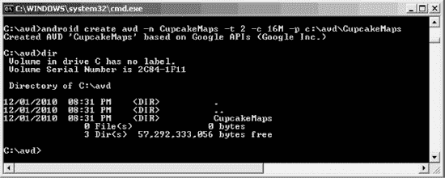

**图 2–11.** *创建 AVD 会产生此 `android.bat` 输出*

尽管你使用 `android.bat` 程序为 `CupcakeMaps` 指定了备用位置，但在你主目录的 `.android/AVD` 文件夹下仍有一个 `CupcakeMaps.ini` 文件。 这是一件好事，因为如果你回到 Eclipse，选择 `Window`  `Android SDK and AVD Manager`，你将看到所有的 AVD。 当你在 Eclipse 中运行 Android 应用程序时，你可以访问它们中的任何一个。


再看一下图 2–4。每个 Android 版本都有一个 API 级别。Android 1.6 的 API 级别为 4，Android 2.1 的 API 级别为 7。这些 API 级别编号并不对应`android create avd`命令中`-t`参数所使用的目标 ID。你始终需要使用`android list target`命令来获取`android create avd`命令所需的正确目标 ID 值。

另外请注意，从 SDK 目标列表中选择一个 Google API 将为你的 AVD 包含地图功能，而选择 Android 1.5 或更高版本则不会。关于地图的更多细节，我们将在第 17 章中详细讨论。

### 探索 Android 应用程序的结构

尽管 Android 应用程序的规模和复杂性可能差异很大，但它们的结构是相似的。图 2–12 展示了你刚刚构建的“Hello World！”应用程序的结构。

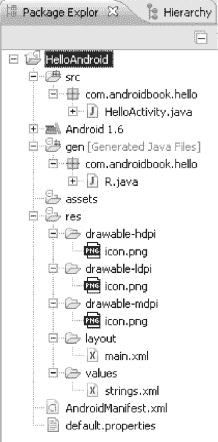

**图 2–12.** *“Hello World！”应用程序的结构*

Android 应用程序有一些必需的和可选的构件。表 2–2 总结了 Android 应用程序的元素。

**表 2–2.** *Android 应用程序的构件*

| **构件** | **描述** | **是否必需？** |
| --- | --- | --- |
| `AndroidManifest.xml` | Android 应用程序描述文件。此文件定义了应用程序的活动、内容提供者、服务和意图接收器。你还可以使用此文件声明性地定义应用程序所需的权限，以及向使用该应用程序服务的其他应用程序授予特定权限。此外，该文件可以包含用于测试应用程序或其他应用程序的检测细节。 | 是 |
| `src` | 包含应用程序所有源代码的文件夹。 | 是 |
| `assets` | 任意文件夹和文件的集合。 | 否 |
| `res` | 包含应用程序资源的文件夹。这是`drawable`、`anim`、`layout`、`menu`、`values`、`xml`和`raw`的父文件夹。 | 是 |
| `drawable` | 包含应用程序使用的图像或图像描述文件的文件夹。 | 否 |
| `anim` | 包含描述应用程序所用动画的 XML 描述文件的文件夹。 | 否 |
| `layout` | 包含应用程序视图的文件夹。你应该使用 XML 描述符而不是编写代码来创建应用程序的视图。 | 否 |
| `menu` | 包含应用程序菜单的 XML 描述文件的文件夹。 | 否 |
| `values` | 包含应用程序使用的其他资源的文件夹。此文件夹中的资源示例包括字符串、数组、样式和颜色。 | 否 |
| `xml` | 包含应用程序使用的附加 XML 文件的文件夹。 | 否 |
| `raw` | 包含应用程序所需附加数据（可能为非 XML 数据）的文件夹。 | 否 |

从表 2–2 可以看出，一个 Android 应用程序主要由三部分组成：应用程序描述文件、各种资源的集合以及应用程序的源代码。如果你暂时把`AndroidManifest.xml`文件放在一边，可以用一种简单的方式来审视 Android 应用：你有一部分用代码实现的业务逻辑，而其他的一切都是资源。这种基本结构类似于 J2EE 应用的基本结构，其中资源对应 JSP，业务逻辑对应 Servlet，而`AndroidManifest.xml`文件对应`web.xml`文件。

你还可以将 J2EE 的开发模型与 Android 的开发模型进行比较。在 J2EE 中，构建视图的理念是使用标记语言来构建它们。Android 也采用了这种方法，尽管 Android 中的标记是 XML。你会从这种方法中受益，因为你不必硬编码应用程序的视图；你可以通过编辑标记来修改应用程序的外观和感觉。

另外值得注意的是一些关于资源的限制。首先，Android 只支持`res`下预定义文件夹内的线性文件列表。例如，它不支持`layout`文件夹（或`res`下的其他文件夹）内的嵌套文件夹。其次，`assets`文件夹和`res`下的`raw`文件夹有一些相似之处。两个文件夹都可以包含原始文件，但`raw`中的文件被视为资源，而`assets`中的文件则不是。因此，`raw`中的文件会被本地化，可以通过资源 ID 访问，等等。而`assets`文件夹的内容被视为通用内容，不受资源约束和资源支持的限制。请注意，由于`assets`文件夹的内容不被视为资源，你可以在其中放置任意层级的文件夹和文件。（我们将在第 3 章中详细讨论资源。）

**注意：** 你可能已经注意到 Android 中大量使用了 XML。我们都知道 XML 是一种臃肿的数据格式，因此这就引出了一个问题：当你已知目标设备是资源有限的设备时，依赖 XML 是否合理？事实证明，你在开发过程中创建的 XML 实际上是通过 Android 资源打包工具（AAPT）编译成二进制文件的。因此，当你的应用程序安装到设备上时，设备上的文件是以二进制格式存储的。当运行时需要该文件时，文件以其二进制形式被读取，而不会转换回 XML。这让你两全其美——你既能使用 XML 工作，又无需担心占用设备上的宝贵资源。

### 分析便签应用程序

你不仅学会了如何创建一个新的 Android 应用程序并在模拟器中运行它，还应该对 Android 应用程序的构件有了一定的了解。接下来，我们将研究一下 Android SDK 自带的便签应用程序。便签的复杂性介于“Hello World！”应用程序和完整的 Android 应用程序之间，因此分析其组件将使你对 Android 开发有一些实际的认识。这将是便签应用程序的快速浏览。你可能会觉得其中一些概念目前难以理解，但不用担心；本书将在后续章节中对所有这些概念进行更详细的讲解。


### 加载并运行记事本应用程序

在本节中，我们将向您展示如何将记事本应用程序加载到 Eclipse IDE 中，并在模拟器中运行它。开始之前，您需要知道记事本应用程序实现了多个用例。例如，用户可以新建笔记、编辑已有笔记、删除笔记、查看已创建的笔记列表等。当用户启动应用程序时，尚未保存任何笔记，因此用户会看到一个空白的笔记列表。如果用户按下菜单键，应用程序会显示一个操作列表，其中包含允许用户添加新笔记的选项。添加笔记后，用户可以通过选择相应的菜单选项来编辑或删除该笔记。

请按照以下步骤将记事本示例加载到 Eclipse IDE 中：

1. 启动 Eclipse。
2. 转到 **文件** > **新建** > **项目**。
3. 在**新建项目**对话框中，选择 **Android** > **Android 项目**。
4. 在**新建 Android 项目**对话框中，在**项目名称**中输入 `NotesList`，选择“从现有示例创建项目”，然后选择 **构建目标** 为 Android 1.6。在**示例**菜单中，向下滚动到 Notepad 应用程序。请注意，Notepad 应用程序位于您之前下载的 Android SDK 的 `platforms\android-1.6\samples` 文件夹中。选择 Notepad 后，对话框会读取 `AndroidManifest.xml` 文件，并自动填充**新建 Android 项目**对话框中的其余字段。（见图 2-13。）
5. 单击**完成**按钮。

现在您应该在 Eclipse IDE 中看到 `NotesList` 应用程序。如果您在 Eclipse 中看到针对此项目报告的任何问题，请尝试使用 Eclipse 的**项目**菜单中的**清理**选项来清除它们。要运行应用程序，您可以创建启动配置（就像您为“Hello World!”应用程序所做的那样），或者直接右键单击项目，选择**运行为**，然后选择**Android 应用程序**。这将启动模拟器并将应用程序安装到其上。模拟器完成加载后，解锁模拟器屏幕，这样您就能看到新的 `NotesList` 应用程序。花几分钟时间熟悉一下这个应用程序。

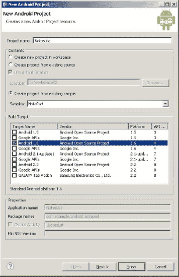

**图 2-13.** *创建记事本应用程序*

### 剖析应用程序

现在让我们研究一下应用程序的内容（见图 2-14）。

如您所见，该应用程序包含多个 `.java` 文件、几个 `.png` 图片、三个视图（位于 `layout` 文件夹下）以及 `AndroidManifest.xml` 文件。如果这是一个命令行应用程序，您会从查找包含 `Main` 方法的类开始。那么，Android 中 `Main` 方法的等效物是什么呢？

Android 定义了一个入口 Activity，也称为顶级 Activity。如果您查看 `AndroidManifest.xml` 文件，会发现一个提供程序（provider）和三个 Activity。`NotesList` Activity 为操作 `android.intent.action.MAIN` 和类别 `android.intent.category.LAUNCHER` 定义了一个意图过滤器（intent-filter）。当要求运行一个 Android 应用程序时，主机加载该应用程序并读取 `AndroidManifest.xml` 文件。然后，它会查找并启动一个或多个具有包含 `MAIN` 操作且类别为 `LAUNCHER` 的意图过滤器的 Activity，如下所示：

```
<intent-filter>
    <action android:name="android.intent.action.MAIN" />
    <category android:name="android.intent.category.LAUNCHER" />
</intent-filter>
```

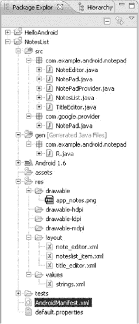

**图 2-14.** *记事本应用程序的内容*

主机找到它想要运行的 Activity 后，必须将定义的 Activity 解析为实际的类。它通过组合根包名和 Activity 名称来实现这一点，在本例中成为 `com.example.android.notepad.NotesList`（见清单 2-1）。

**清单 2-1.** *AndroidManifest.xml 文件*

```
<manifest
    package="com.example.android.notepad"
>
    <application android:icon="@drawable/app_notes"
        android:label="@string/app_name"
    >
        <provider android:name="NotePadProvider"
            android:authorities="com.google.provider.NotePad"
        />
        <activity android:name="NotesList" android:label="@string/title_notes_list">
            <intent-filter>
                <action android:name="android.intent.action.MAIN" />
                <category android:name="android.intent.category.LAUNCHER" />
            </intent-filter>
            <intent-filter>
                <action android:name="android.intent.action.VIEW" />
                <action android:name="android.intent.action.EDIT" />
                <action android:name="android.intent.action.PICK" />
                <category android:name="android.intent.category.DEFAULT" />
                <data android:mimeType="vnd.android.cursor.dir/vnd.google.note" />
            </intent-filter>
            <intent-filter>
                <action android:name="android.intent.action.GET_CONTENT" />
                <category android:name="android.intent.category.DEFAULT" />
                <data android:mimeType="vnd.android.cursor.item/vnd.google.note" />
            </intent-filter>
        </activity>
…
</manifest>
```

应用程序的根包名定义为 `AndroidManifest.xml` 文件中 `<manifest>` 元素的一个属性，并且每个 Activity 都有一个名称属性。

一旦确定了入口点 Activity，主机就会启动该 Activity，并调用 `onCreate()` 方法。让我们来看看清单 2-2 所示的 `NotesList.onCreate()`。

**清单 2-2.** *onCreate 方法*

```
public class NotesList extends ListActivity {
  @Override
  protected void onCreate(Bundle savedInstanceState) {
      super.onCreate(savedInstanceState);

      setDefaultKeyMode(DEFAULT_KEYS_SHORTCUT);
      Intent intent = getIntent();
      if (intent.getData() == null) {
          intent.setData(Notes.CONTENT_URI);
      }

      getListView().setOnCreateContextMenuListener(this);

      Cursor cursor = managedQuery(getIntent().getData(), PROJECTION, null, null,
              Notes.DEFAULT_SORT_ORDER);
```


### Android 活动与数据访问

`SimpleCursorAdapter adapter =`
    `new SimpleCursorAdapter(this, R.layout.noteslist_item,`
         `cursor, new String[] { Notes.TITLE }, new int[] { android.R.id.text1 });`
`setListAdapter(adapter);`

Android 中的活动通常通过 Intent 启动，一个活动可以启动另一个活动。`onCreate()` 方法会检查当前活动的 Intent 是否包含数据（笔记）。如果没有，它会设置 URI 以从 Intent 中检索数据。在第 4 章中，我们将展示 Android 如何通过操作 URI 的内容提供者来访问数据。在此例中，URI 提供了足够的信息来从数据库中检索数据。常量 `Notes.CONTENT_URI` 在 `Notepad.java` 中被定义为 `static final`，具体如下：

`public static final Uri CONTENT_URI =`
    `Uri.parse("content://" + AUTHORITY + "/notes");`

`Notes` 类是 `Notepad` 类的内部类。目前你只需知道，上述 URI 告知内容提供者获取所有笔记。如果 URI 类似于：

`public static final Uri CONTENT_URI =`
    `Uri.parse("content://" + AUTHORITY + "/notes/11");`

那么接收请求的内容提供者将返回 ID 为 11 的笔记。我们将在第 4 章深入讨论内容提供者和 URI。

#### NotesList 类与 ListActivity

`NotesList` 类继承了 `ListActivity` 类，后者知道如何显示列表型数据。列表中的项由内部的 `ListView`（一个 UI 组件）管理，它负责显示笔记列表。在活动的 Intent 上设置 URI 后，活动会注册以构建笔记的上下文菜单。如果你试用过该应用，可能会注意到系统会根据你的选择显示上下文相关的菜单项。例如，如果你选择了一条已有笔记，应用会显示“编辑笔记”和“编辑标题”。类似地，如果你没有选择任何笔记，应用会显示“添加笔记”选项。

接下来，你会看到活动执行一个托管查询（managed query）并获取一个游标（cursor）来获取结果集。托管查询意味着 Android 将管理返回的游标。作为游标管理的一部分，如果应用需要被卸载或重新加载，应用或活动都无需担心游标的定位、加载或卸载问题。`managedQuery()` 的参数如表 2-3 所示，这些参数相当有趣。

**表 2-3.** `Activity.managedQuery` 的参数

| 参数 | 数据类型 | 描述 |
| --- | --- | --- |
| `URI` | `Uri` | 内容提供者的 URI |
| `projection` | `String[]` | 要返回的列（列名） |
| `selection` | `String` | 可选的 `where` 子句 |
| `selectionArgs` | `String[]` | 选择条件的参数（如果查询中包含 `?`） |
| `sortOrder` | `String` | 用于结果集的排序顺序 |

我们将在本节后面以及第 4 章中讨论 `managedQuery()` 及其兄弟方法 `query()`。目前你只需了解，Android 中的查询返回的是表格型数据。`projection` 参数允许你定义感兴趣的列。你还可以通过 SQL 的 `order by` 子句（例如 `asc` 或 `desc`）来缩小结果集的范围并对结果集进行排序。另外请注意，Android 查询必须返回一个名为 `_ID` 的列，以支持检索单条记录。此外，你必须了解内容提供者返回的数据类型——例如列中包含的是 `string`、`int`、`binary` 还是其他类型。

查询执行后，返回的游标会被传递给 `SimpleCursorAdapter` 的构造函数，该适配器将数据集中的记录适配到用户界面（`ListView`）的项中。请仔细观察传递给 `SimpleCursorAdapter` 构造函数的参数：

```
SimpleCursorAdapter adapter =
    new SimpleCursorAdapter(this, R.layout.noteslist_item,
        cursor, new String[] { Notes.TITLE }, new int[] { android.R.id.text1 });
```

具体来说，注意第二个参数：一个代表 `ListView` 中项的视图的标识符。正如你将在第 3 章中看到的，Android 提供了一个自动生成的工具类，用于提供项目中资源的引用。这个工具类叫做 `R` 类（resource 的缩写）。它的文件名是 `R.java`，你可以在图 2-14 中看到它。当你编译项目时，AAPT（Android 资源打包工具）会根据你在 `res` 文件夹中定义的资源为你生成 `R` 类。例如，你可以将所有字符串资源放入 `values` 文件夹，AAPT 会为每个字符串生成一个 `public static` 标识符。Android 对你所有的资源都支持这种通用机制。例如，在 `SimpleCursorAdapter` 的构造函数中，`NotesList` 活动传入了显示笔记列表中某个项的视图的标识符。这个工具类的好处是，你无需硬编码资源，并且可以获得编译时的引用检查。换句话说，如果某个资源被删除了，`R` 类将失去该引用，任何引用该资源的代码都将无法编译。

#### onListItemClick() 方法

让我们看看之前提到的 Android 中的另一个重要概念：`NotesList` 中的 `onListItemClick()` 方法（参见代码清单 2-3）。

**代码清单 2-3.** `onListItemClick` 方法

```
@Override
protected void onListItemClick(ListView l, View v, int position, long id) {
    Uri uri = ContentUris.withAppendedId(getIntent().getData(), id);

    String action = getIntent().getAction();
    if (Intent.ACTION_PICK.equals(action) ||
        Intent.ACTION_GET_CONTENT.equals(action)) {
        setResult(RESULT_OK, new Intent().setData(uri));
    } else {
        startActivity(new Intent(Intent.ACTION_EDIT, uri));
    }
}
```

当用户在界面中选择一条笔记时，会调用 `onListItemClick()` 方法。该方法实现了两种用例。第一种情况，你的笔记列表活动可能通过 Intent 被调用，以便用户选择一条特定的笔记，并将其返回给调用活动。第二种情况，你可能只是在浏览笔记列表；选择一条笔记后，当前活动将针对所选笔记启动一个编辑活动。当选中一条笔记时，该方法通过获取基础 URI 并附加所选笔记的 ID 来创建一个 URI。如果你的活动是通过 Intent 被调用来选择笔记或获取笔记内容，你会调用 `setResult()` 将所选笔记的 URI 返回给调用者。如果是第二种用例，则 URI 会连同一个新的 Intent 一起传递给 `startActivity()`。`startActivity()` 是启动活动的一种方式：它启动一个活动，但不会报告活动完成后的结果。另一种启动活动的方式是使用 `startActivityForResult()`。通过这个方法，你可以启动另一个活动，并通过回调在活动完成时获得通知，从而获取结果。例如，调用 `NotesList` 来选择笔记的活动会使用 `startActivityForResult()`，这样当你的 `NotesList` 活动调用 `setResult()` 后，它们就能收到通知并获得结果。


关于用户与 Activity 的交互，您可能对此有所疑问。例如，如果正在运行的 Activity 启动了另一个 Activity，而该 Activity 又启动了另一个 Activity（依此类推），那么用户可以与哪个 Activity 进行交互？她可以同时操作所有 Activity，还是只能操作单个 Activity？实际上，Activity 具有已定义的生命周期。它们被维护在一个 Activity 栈中，正在运行的 Activity 位于栈顶。如果正在运行的 Activity 启动了另一个 Activity，则第一个正在运行的 Activity 会移入栈中，新 Activity 置于栈顶。栈中位置较低的 Activity 可能处于暂停或停止状态。暂停的 Activity 对用户部分或完全可见；停止的 Activity 对用户不可见。如果系统认为其他地方需要资源，它可能会终止暂停或停止的 Activity。

接下来，我们讨论数据持久化。用户创建的笔记会保存到设备上的实际数据库中。具体来说，`Notepad` 应用程序的后备存储是一个 SQLite 数据库。前面讨论的 `managedQuery()` 方法最终会通过内容提供者解析为数据库中的数据。我们来研究一下传递给 `managedQuery()` 的 URI 如何导致对 SQLite 数据库执行查询。回顾一下，传递给 `managedQuery()` 的 URI 如下所示：

```
public static final Uri CONTENT_URI =
    Uri.parse("content://" + AUTHORITY + "/notes");
```

内容 URI 始终具有以下形式：`content://`，后跟授权机构（authority），再后跟一个通用段（上下文相关）。由于 URI 不包含实际数据，它需要以某种方式导致产生数据的代码被执行。这种连接是什么？URI 引用是如何解析为产生数据的代码的？URI 是 HTTP 服务还是 Web 服务？实际上，URI（或 URI 的授权机构部分）在 `AndroidManifest.xml` 文件中被配置为内容提供者，如下所示：

```
<provider android:name="NotePadProvider"
     android:authorities="com.google.provider.NotePad"/>
```

当 Android 看到一个需要解析的 URI 时，它会提取其中的授权机构部分，并查找为该授权机构配置的 `ContentProvider` 类。在 `Notepad` 应用程序中，`AndroidManifest.xml` 文件包含一个名为 `NotePadProvider` 的类，该类为 `com.google.provider.NotePad` 授权机构配置。清单 2–4 展示了该类的一小部分。

**清单 2–4.** *NotePadProvider 类*

```
public class NotePadProvider extends ContentProvider
{

    @Override
    public Cursor query(Uri uri, String[] projection, String selection,
         String[] selectionArgs,String sortOrder) {}

    @Override
    public Uri insert(Uri uri, ContentValues initialValues) {}

    @Override
    public int update(Uri uri, ContentValues values, String where,
        String[] whereArgs) {}

    @Override
    public int delete(Uri uri, String where, String[] whereArgs) {}

    @Override
    public String getType(Uri uri) {}

    @Override
    public boolean onCreate() {}

    private static class DatabaseHelper extends SQLiteOpenHelper {}

    @Override
        public void onCreate(SQLiteDatabase db) {}

        @Override
        public void onUpgrade(SQLiteDatabase db,
            int oldVersion, int newVersion) {
            //...
        }
    }
}
```

`NotePadProvider` 类扩展了 `ContentProvider` 类。`ContentProvider` 类定义了六个抽象方法，其中四个是 CRUD（创建、读取、更新、删除）操作。另外两个抽象方法是 `onCreate()` 和 `getType()`。请注意，`onCreate()` 在内容提供者首次创建时被调用；`getType()` 为结果集提供 MIME 类型（您将在阅读第 3 章时了解 MIME 类型的工作原理）。

关于 `NotePadProvider` 类的另一个有趣之处是内部的 `DatabaseHelper` 类，它扩展了 `SQLiteOpenHelper` 类。这两个类一起负责初始化 `Notepad` 数据库、打开和关闭它，以及执行其他数据库任务。有趣的是，`DatabaseHelper` 类只有几行自定义代码（见清单 2–5），而 Android 对 `SQLiteOpenHelper` 的实现完成了大部分繁重的工作。

**清单 2–5.** *DatabaseHelper 类*

```
 private static class DatabaseHelper extends SQLiteOpenHelper {

        DatabaseHelper(Context context) {
            super(context, DATABASE_NAME, null, DATABASE_VERSION);
        }

        @Override
        public void onCreate(SQLiteDatabase db) {
            db.execSQL("CREATE TABLE " + NOTES_TABLE_NAME + " ("
                    + Notes._ID + " INTEGER PRIMARY KEY,"
                    + Notes.TITLE + " TEXT,"
                    + Notes.NOTE + " TEXT,"
                    + Notes.CREATED_DATE + " INTEGER,"
                    + Notes.MODIFIED_DATE + " INTEGER"
                    + ");");
        }

        //…
}
```

如清单 2–5 所示，`onCreate()` 方法创建了 Notepad 表。请注意，该类的构造函数使用表名调用了父类的构造函数。父类仅当该表在数据库中不存在时才会调用 `onCreate()` 方法。另外请注意，Notepad 表中的列之一是我们之前在“剖析应用程序”一节中讨论过的 `_ID` 列。

现在，让我们看看其中一个 CRUD 操作：`insert()` 方法，如清单 2–6 所示。

**清单 2–6.** *insert() 方法*

```
//…
SQLiteDatabase db = mOpenHelper.getWritableDatabase();
        long rowId = db.insert(NOTES_TABLE_NAME, Notes.NOTE, values);
        if (rowId > 0) {
            Uri noteUri = ContentUris.withAppendedId(
                    NotePad.Notes.CONTENT_URI, rowId);
            getContext().getContentResolver().notifyChange(noteUri, null);
            return noteUri;
        }
```

`insert()` 方法使用其内部的 `DatabaseHelper` 实例访问数据库，然后插入一条笔记记录。返回的行 ID 随后被追加到 URI，并将一个新的 URI 返回给调用者。

至此，您应该已经熟悉了 Android 应用程序的布局方式。您应该能够浏览 `Notepad` 以及 Android SDK 中的其他一些示例。您应该能够运行这些示例并与之交互。现在，让我们来看看 Android 应用程序的整体生命周期。


### 审视应用生命周期

Android 应用的生命周期由系统根据用户需求、可用资源等因素严格管理。例如，用户可能想要启动一个网页浏览器，但最终由系统决定是否启动该应用。尽管系统是最终管理者，但它会遵循一些明确且合乎逻辑的准则来判断是否加载、暂停或停止一个应用。如果用户当前正在操作某个活动，系统会给予该应用高优先级。反之，如果一个活动不可见，并且系统判定必须关闭某个应用以释放资源，那么它会关闭优先级较低的应用。

这与基于 Web 的 J2EE 应用的生命周期形成对比。J2EE 应用受其运行所在的容器松散管理。例如，J2EE 容器可以在某个应用空闲超过预定时间后将其从内存中移除。但容器通常不会根据负载和/或可用资源来将应用移入或移出内存。J2EE 容器通常拥有足够的资源来同时运行大量应用。而在 Android 中，资源更为有限，因此 Android 必须对应用拥有更强的掌控力和权力。

**注意：** Android 在独立的进程中运行每个应用，每个进程都承载着自己的虚拟机。这提供了一个受保护的内存环境。通过将应用隔离到单个进程，系统可以控制哪个应用应获得更高优先级。例如，一个正在执行 CPU 密集型任务的后台进程不能阻止来电。

应用生命周期的概念是合乎逻辑的，但 Android 应用的一个基本方面使问题复杂化了。具体来说，Android 应用架构是以组件和集成为导向的。这带来了丰富的用户体验、无缝复用和便捷的应用集成，但也给应用生命周期管理器带来了复杂的任务。

让我们考虑一个典型场景。一位用户正在与某人通电话，需要打开一封电子邮件来回答一个问题。她进入主屏幕，打开邮件应用，打开邮件，点击邮件中的一个链接，并通过阅读网页上的股票报价来回答朋友的问题。这个场景需要四个应用：主屏幕应用、通话应用、邮件应用和浏览器应用。当用户从一个应用导航到下一个应用时，她的体验是无缝的。然而在后台，系统正在保存和恢复应用状态。例如，当用户点击邮件中的链接时，系统会在启动浏览器应用活动以加载 URL 之前，保存当前正在运行的邮件活动的元数据。实际上，系统在启动另一个活动之前会保存任何活动的元数据，以便稍后能返回到该活动（例如，当用户回退时）。如果内存成为问题，系统将不得不关闭运行某个活动的进程，并在必要时恢复它。

Android 对应用及其组件的生命周期非常敏感。因此，你需要理解并处理生命周期事件，才能构建稳定的应用。运行你的 Android 应用及其组件的进程会经历各种生命周期事件，Android 提供了你可以实现来回调以处理状态变化。对于初学者，你需要熟悉活动（activity）的各种生命周期回调（见代码清单 2–7）。

**代码清单 2–7.** *活动的生命周期方法*

```
protected void onCreate(Bundle savedInstanceState);
protected void onStart();
protected void onRestart();
protected void onResume();
protected void onPause();
protected void onStop();
protected void onDestroy();
```

代码清单 2–7 列出了 Android 在活动生命周期中调用的生命周期方法。理解系统在何时调用每个方法，对于确保你实现一个稳定的应用至关重要。请注意，你无需对所有方法都做出响应。但如果要响应，请确保也调用了父类的版本。图 2–15 展示了状态之间的转换。

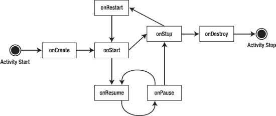

**图 2–15.** *活动的状态转换*

系统可以根据其他正在发生的事件来启动和停止你的活动。当活动被全新创建时，Android 会调用 `onCreate()` 方法。`onCreate()` 之后总是紧接着调用 `onStart()`，但 `onStart()` 之前并不总是有 `onCreate()` 调用，因为如果你的应用被停止过，`onStart()` 也可能被调用。当 `onStart()` 被调用时，你的活动对用户尚不可见，但即将可见。`onResume()` 在 `onStart()` 之后被调用，此时活动刚刚进入前台并可供用户访问。此时，用户可以与你的活动进行交互。

当用户决定切换到另一个活动时，系统会调用你活动的 `onPause()` 方法。在 `onPause()` 之后，你可能会遇到 `onResume()` 或 `onStop()` 被调用。例如，如果用户将你的活动带回前台，则会调用 `onResume()`。如果你的活动对用户变为不可见，则会调用 `onStop()`。如果在调用 `onStop()` 后你的活动被带回前台，则会调用 `onRestart()`。如果你的活动位于活动栈中但对用户不可见，并且系统决定销毁你的活动，则会调用 `onDestroy()`。

上述针对活动的状态模型看起来很复杂，但你并不需要处理所有可能的情况。实际上，你最常处理的是 `onCreate()`、`onResume()` 和 `onPause()`。你将使用 `onCreate()` 来为你的活动创建用户界面。在此方法中，你将数据绑定到控件，并为 UI 组件连接事件处理器。在 `onPause()` 中，你需要将关键数据持久化到应用的数据存储中。这是在系统终止你的应用之前最后一个安全的可调用方法。`onStop()` 和 `onDestroy()` 并不保证会被调用，因此不要依赖这些方法来处理关键逻辑。

从上述讨论中我们能得到什么启示？系统管理着你的应用，它可以随时启动、停止或恢复一个应用组件。尽管系统控制着你的组件，但它们并非完全孤立于应用运行。换句话说，如果系统在你的应用中启动了一个活动，你可以依赖该活动中存在一个应用上下文（application context）。例如，可以在你的应用的多个活动之间共享全局变量。你可以通过编写 `android.app.Application` 类的扩展并在 `onCreate()` 方法中初始化全局变量来实现共享（见代码清单 2–8）。之后，应用中的活动和其他组件在执行时就可以放心地访问这些引用。我们将在第 11 章中进一步讨论这个概念。

**代码清单 2–8.** *Application 类的扩展*

```
public class MyApplication extends Application
{
    // 全局变量
    private static final String myGlobalVariable;

    @Override
    public void onCreate()
    {
        super.onCreate();
        //... 在此处初始化全局变量
        myGlobalVariable = loadCacheData();
    }

    public static String getMyGlobalVariable() {
        return myGlobalVariable;
    }

}
```


到目前为止，我们已经介绍了创建新 Android 应用、在模拟器中运行 Android 应用、Android 应用的基本结构以及许多 Android 应用中常见的几个功能。但我们尚未展示如何解决 Android 应用中会出现的问题。在本章的最后一节，我们将讨论调试。

### 调试你的应用

在你为第一个应用编写了几行代码后，你就会开始思考是否可以在与应用交互的同时进行调试会话。答案是肯定的。Android SDK 包含了许多可用于调试目的的工具。这些工具已集成到 Eclipse IDE 中（参见图 2-16 中的小示例）。

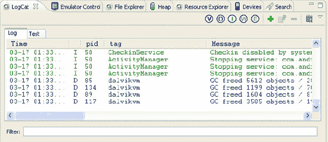

**图 2–16.** *构建 Android 应用时可使用的调试工具*

你在整个 Android 开发过程中会经常使用的工具之一是 `LogCat`。该工具会显示你使用 `android.util.Log`、异常、`System.out.println` 等方法发出的日志消息。虽然 `System.out.println` 也能工作且消息会显示在 `LogCat` 窗口中，但若想从你的应用中记录日志消息，你应使用 `android.util.Log` 类。该类定义了大家熟悉的 informational、warning 和 error 方法，你可以在 `LogCat` 窗口中对这些方法进行过滤，以便只看到你想看的内容。一个示例 `Log` 命令是：

```
Log.v("string TAG", "This is my verbose message to write to the log");
```

`LogCat` 特别棒的一点是，你不仅可以在模拟器中运行应用时查看日志消息，还可以在将真实设备连接到工作站并处于调试模式时查看日志消息。事实上，日志消息会以存储方式保存，这样你甚至可以检索到在记录日志消息时已经断开连接的设备上的最新消息。当你将设备连接到工作站并打开 `LogCat` 视图时，你将看到最近几百条消息。

关于在真实设备上调试应用，你需要了解两件事。第一，必须在 `AndroidManifest.xml` 文件中将应用设置为可调试。这涉及到在 `<application>` 标签中添加 `android:debuggable="true"`。幸运的是，ADT 会自动为你正确设置此项。当你为模拟器创建调试构建或直接从 Eclipse 部署到设备时，ADT 会将该属性设置为 `true`。当你导出应用以创建生产版本时，ADT 知道不将 debuggable 设置为 `true`。请注意，如果你自己在 `AndroidManifest.xml` 中设置了它，那么无论怎样它都将保持设置状态。第二件要知道的事是，设备必须置于 USB 调试模式。要找到此设置，请进入设备的“设置”屏幕，然后选择“应用程序”，再选择“开发”。确保勾选了“启用 USB 调试”。

虽然 `LogCat` 对于查看日志消息非常有用，但你肯定希望对其运行时的应用有更多的控制权和更详细的信息。你需要熟悉两个 Eclipse 透视图：DDMS 和 Debug。DDMS 代表 Dalvik 调试监视器服务器 (Dalvik Debug Monitor Server)。该透视图能让你深入了解模拟器或设备上正在运行的应用、应用内的线程、应用内的堆（或内存），此外还有一个文件浏览器和一个模拟器控制器，以便你可以模拟 GPS 事件、来电或短信。文件浏览器允许你浏览设备上的文件系统，甚至可以在设备（或模拟器）和工作站之间推送或拉取文件。你还可以强制执行垃圾回收、终止应用以及截取屏幕截图。

在 DDMS 中，你可以选择正在运行的应用之一并连接到它进行调试。这将带你进入 Debug 透视图。你也可以从 Java 透视图开始调试应用，方法是右键单击它并选择“调试方式” “Android 应用程序”；这同样会带你进入 Debug 透视图。无论哪种方式，Eclipse 都提供了跟踪线程、在代码中设置和清除断点、检查变量以及单步执行或跳入语句的功能。它是解决应用程序问题的强大工具。

你可以通过选择 Eclipse 中的 DDMS 或 Debug 透视图来查看这些工具。你也可以通过进入“窗口” “显示视图” “其他” “Android” 来启动每个工具。例如，如果你想要在 Java 透视图中使用 `LogCat` 或文件浏览器，只需执行“窗口” “显示视图”即可添加它。

你还可以通过使用 `android.os.Debug` 类来获取 Android 应用的详细跟踪信息，该类提供了一个开始跟踪方法（`Debug.startMethodTracing("basename")`）和一个停止跟踪方法（`Debug.stopMethodTracing()`）。Android 会在设备（或模拟器）的 SD 卡上创建一个跟踪文件，文件名为“basename.trace”。然后，你可以将跟踪文件复制到你的工作站，并使用 Android SDK tools 目录中包含的 `traceview` 工具查看跟踪器输出，该工具的唯一参数是跟踪文件名。第 19 章 详细介绍了 SD 卡以及如何从中提取文件。

你还可以使用命令行（或工具窗口）中的其他几个调试工具。Android 调试桥 (`adb`) 命令允许你安装、更新和删除应用。你可以在模拟器或设备上启动一个 shell，然后从中运行 Android 提供的 Linux 命令子集。例如，你可以浏览文件系统、列出进程、读取日志，甚至连接到 SQLite 数据库并执行 SQL 命令。

另一种强大的技术是运行模拟器控制台，该控制台显然只适用于模拟器。要在模拟器启动并运行后开始使用，你可以在工具窗口中输入以下内容：

```
telnet localhost port#
```

其中，`port#` 是模拟器正在监听的端口。`port#` 通常显示在模拟器窗口标题中，通常是像 5554 这样的值。模拟器控制台启动后，你可以输入命令来模拟 GPS 事件、短信，甚至电池和网络状态的变化。


#### 启动模拟器

之前我们展示了如何在 Eclipse 中从项目启动模拟器。大多数情况下，你会希望先启动模拟器，然后在运行的模拟器中部署和测试应用。要随时启动模拟器，请先通过运行 Android SDK 中`tools`目录下的`android`程序，或从 Eclipse 的`Window`菜单进入 Android SDK 和 AVD 管理器。进入管理器后，点击左侧的`Virtual devices`，从右侧列表中选择所需的 AVD，然后点击`Start`。

点击`Start`按钮后，会弹出启动选项对话框（见图 2–17）。你可以在此调整模拟器窗口的缩放比例，并修改启动和关闭选项。使用中小屏幕设备的 AVD 时，通常直接采用默认屏幕尺寸即可。但对于大屏及超大屏设备（如平板电脑），默认屏幕尺寸可能无法在工作站屏幕上完美显示。此时可勾选"Scale display to real size"并输入数值。这个标签表述可能有些误导，因为平板电脑的屏幕密度可能与工作站不同，模拟器无法完美匹配实际物理尺寸。例如在我的工作站屏幕上模拟 10 英寸 Honeycomb 平板时，"实际尺寸"10 英寸对应的缩放比例为 0.64，实际显示比 10 英寸略大。请根据你的屏幕尺寸和密度选择合适的数值。

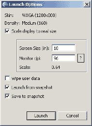

**图 2–17.** *启动选项对话框*

启动选项对话框也是管理快照的地方。启用保存快照功能后，退出模拟器时会增加等待时间。顾名思义，系统会将模拟器当前状态写入快照镜像文件，下次启动时可直接加载，无需经历完整的 Android 启动流程。存在快照时启动速度会显著提升，使得保存时的延迟完全值得——你基本上可以从上次中断的地方继续工作。若想完全重新开始，可选择`Wipe user data`清除用户数据。你还可以取消勾选`Launch from snapshot`，保留用户数据并正常启动。或者创建理想快照后*仅*启用`Launch from snapshot`选项；这样每次都会重复使用该快照，启动和关闭速度都很快，因为退出时不会创建新的快照镜像文件。快照镜像文件与其他 AVD 镜像文件存储在同一目录中。要使用 AVD 快照功能，必须在创建 AVD 时启用快照选项。

#### StrictMode

Android 2.3 引入了名为`StrictMode`的新调试功能，据 Google 称该功能已用于改善数百个 Android 版 Google 应用。它究竟做什么？它会报告线程策略和虚拟机策略的违规情况。检测到策略违规时，你会收到包含堆栈跟踪的警报，显示违规发生时应用的状态。你可以选择强制崩溃，或仅记录警报并让应用继续运行。策略细节可能较难确定，我们预计随着 Android 发展，Google 会不断添加新策略。

`StrictMode`目前包含两种策略。第一种是线程策略，主要针对主线程（也称 UI 线程）。在主线程进行磁盘读写或网络访问均非良策。Google 已在磁盘和网络代码中嵌入`StrictMode`钩子；如果你为某线程启用`StrictMode`且该线程执行了磁盘或网络操作，就会收到警报。你可以选择`ThreadPolicy`中需要监控的违规类型，并可自定义警报方式。可监控的违规包括自定义缓慢调用、磁盘读取、磁盘写入和网络访问。警报方式可选择写入 LogCat、显示对话框、闪烁屏幕、写入 DropBox 日志文件或使应用崩溃。最常用的选择是写入 LogCat 或使应用崩溃。清单 2–9 展示了设置线程策略`StrictMode`的示例。

**清单 2–9.** *设置 StrictMode 的线程策略*

```
StrictMode.setThreadPolicy(new StrictMode.ThreadPolicy.Builder()
       .detectDiskReads()
       .detectDiskWrites()
       .detectNetwork()
       .penaltyLog()
       .build());
```

注意`Builder`类让`StrictMode`设置变得非常简单。`Builder`中定义策略的方法都会返回`Builder`对象引用，因此这些方法可以像清单 2–9 那样链式调用。最后的`build()`方法返回`ThreadPolicy`对象，这正是`StrictMode`的`setThreadPolicy()`方法所需的参数。注意`setThreadPolicy()`是静态方法，因此无需实例化`StrictMode`对象。`setThreadPolicy()`内部会为当前线程应用策略，后续线程操作将根据`ThreadPolicy`进行评估并在必要时触发警报。此示例代码定义了检测磁盘读取、磁盘写入和网络访问的警报策略，并通过 LogCat 输出消息。你也可以用`detectAll()`方法替代具体检测方法。还可以使用不同或额外的惩罚方法，例如使用`penaltyDeath()`让应用在向 LogCat 写入`StrictMode`警报消息（由`penaltyLog()`方法调用触发）后崩溃。

由于你是在线程上启用`StrictMode`，启用后无需重复操作。因此可以在主线程运行的主 Activity 的`onCreate()`方法开头启用`StrictMode`，此后主线程上的所有操作都会受监控。根据要检测的违规类型，首个 Activity 可能就足以完成启用操作。你也可以通过继承`Application`类并在其`onCreate()`方法中添加`StrictMode`设置来启用。理论上任何线程运行处都能设置`StrictMode`，但完全无需处处调用设置代码——只需设置一次即可。


类似`ThreadPolicy`，`StrictMode`还有一个`VmPolicy`。`VmPolicy`可以检测内存泄漏，例如`SQLite`对象在关闭前被终结，或者任何`Closeable`对象在关闭前被终结。`VmPolicy`通过类似的`Builder`类创建，如清单 2–10 所示。`VmPolicy`与`ThreadPolicy`的一个区别是，`VmPolicy`无法通过对话框发出警告。

**清单 2–10.** 设置`StrictMode`的`VmPolicy`

```
StrictMode.setVmPolicy(new StrictMode.VmPolicy.Builder()
    .detectLeakedSqlLiteObjects()
    .penaltyLog()
    .penaltyDeath()
    .build());
```

由于设置发生在某个线程上，即使控制流从一个对象转移到另一个对象，`StrictMode`也能发现违规行为。当违规发生时，你可能会惊讶地发现代码运行在主线程上，但堆栈跟踪会帮助你追溯问题的根源。随后你可以采取措施解决该问题，将该代码移至其自己的后台线程，或者也可以决定维持现状。这完全取决于你。当然，你可能希望在应用程序上线时关闭`StrictMode`，因为你不想因为它发出警告而导致用户应用崩溃。

有几种方法可以在生产应用程序中关闭`StrictMode`。最直接的方法是移除相关调用，但这会使后续开发变得更加困难。你可以始终定义一个应用程序级别的布尔变量，并在调用`StrictMode`代码之前对其进行测试。在发布应用程序前将该布尔值设置为`false`，即可有效禁用`StrictMode`。一种更优雅的方法是利用应用程序的调试模式，该模式在`AndroidManifest.xml`中定义。该文件中`<application>`标签的一个属性是`android:debuggable`。当需要调试应用程序时，可以将该值设置为`true`，这会使`ApplicationInfo`对象获得一个标记，你可以在代码中读取该标记。清单 2–11 展示了如何利用这一点，使应用程序在调试模式下激活`StrictMode`（而在非调试模式下，`StrictMode`不激活）。

**清单 2–11.** 仅针对调试模式设置`StrictMode`

```
// Return if this application is not in debug mode
ApplicationInfo appInfo = context.getApplicationInfo();
int appFlags = appInfo.flags;
if ((appFlags & ApplicationInfo.FLAG_DEBUGGABLE) != 0) {
    // Do StrictMode setup here
}
```

使用 Eclipse 进行开发时，ADT 会自动为你设置`debuggable`属性，这使得管理更加容易。当你从 Eclipse 部署到模拟器或直接部署到设备时，Eclipse 会将该属性设置为`true`，从而在上述代码中启用`StrictMode`。当你导出应用程序以创建生产版本时，ADT 会将其设置为`false`。请注意，如果你自己设置了该属性，ADT 将不会更改它。

这些方法都很好，但它们不适用于 Android 2.3 之前的版本。要显式使用`StrictMode`，你必须部署到运行 Android 2.3 或更高版本的环境中。如果你部署到 2.3 之前的任何版本，将会出现验证错误，因为该版本中不存在`StrictMode`类。

为了在旧版 Android（即 2.3 之前）中使用`StrictMode`，你可以利用反射技术，以便在`StrictMode`方法可用时间接调用它们，并在不可用时优雅地失败。最简单的方法如清单 2–12 所示：调用一个专门为处理旧版 Android 而创建的特殊方法。

**清单 2–12.** 使用反射调用`StrictMode`

```
try {
   Class sMode = Class.forName("android.os.StrictMode");
   Method enableDefaults = sMode.getMethod("enableDefaults");
   enableDefaults.invoke(null);
}
catch(Exception e) {
    // StrictMode not supported on this device, punt
    Log.v("StrictMode", "... not supported. Skipping...");
}
```

这段代码检查`StrictMode`类是否存在，如果存在，则调用其`enableDefaults()`方法。如果未找到`StrictMode`，你的`catch`块会捕获到`ClassNotFoundException`。如果`StrictMode`存在，你不应收到任何异常，因为`enableDefaults()`是它的方法之一。`enableDefaults()`方法会设置`StrictMode`，以检测所有违规行为并将任何违规记录到`LogCat`。由于你调用的这个`StrictMode`方法是静态方法，因此你在调用时指定`null`作为第一个参数。

有时你可能不希望报告所有违规行为。在主线程之外的线程上设置`StrictMode`是完全可行的，在这种情况下，你可以选择仅对部分违规行为发出警报。例如，你也许可以接受在你监控的线程上进行磁盘读取操作。如果是这种情况，你可以选择不在`Builder`上调用`detectDiskReads()`，或者调用`detectAll()`，然后在`Builder`上调用`permitDiskReads()`。其他策略选项也有类似的`permit`方法。但是，如果你想在 Android 2.3 之前的版本上做到这一点，有办法吗？当然有！

如果`StrictMode`在你的应用程序中不可用，尝试访问它时会抛出`VerifyError`。如果你将`StrictMode`封装在一个类中，然后捕获该错误，就可以在`StrictMode`不可用时忽略它，在可用时正常使用。清单 2–13 展示了一个你可以添加到应用程序中的`StrictModeWrapper`类示例，清单 2–14 展示了在你的应用程序中设置`StrictMode`的代码。

**清单 2–13.** 在 Android 2.3 之前版本中使用`StrictMode`

```
import android.content.Context;
import android.content.pm.ApplicationInfo;
import android.os.StrictMode;

public class StrictModeWrapper {
    public static void init(Context context) {
        // check if android:debuggable is set to true
        int appFlags = context.getApplicationInfo().flags;
        if ((appFlags & ApplicationInfo.FLAG_DEBUGGABLE) != 0) {
            StrictMode.setThreadPolicy(new StrictMode.ThreadPolicy.Builder()
                .detectDiskReads()
                .detectDiskWrites()
                .detectNetwork()
                .penaltyLog()
                .build());
            StrictMode.setVmPolicy(new StrictMode.VmPolicy.Builder()
                .detectLeakedSqlLiteObjects()
                .penaltyLog()
                .penaltyDeath()
                .build());
        }
    }
}
```

你可以看到，这与你之前的代码非常相似，只是将到目前为止学到的所有内容结合在了一起。最后，为了在你的应用程序中设置`StrictMode`，你只需要添加清单 2–14 中所示的代码。

**清单 2–14.** 在 Android 2.3 之前版本中调用`StrictMode`

```
try {
    StrictModeWrapper.init(this);
}
catch(Throwable throwable) {
    Log.v("StrictMode", "... is not available. Punting...");
}
```

请注意，`this`是当前对象（例如主 Activity 的`onCreate()`方法中）的本地上下文。清单 2–14 中的代码适用于任何 Android 版本。


作为读者练习，请进入 Eclipse 并复制本章前面部分的记事本示例。然后使用代码清单 2–13 中的代码，在 `src` 文件夹下添加一个新类。在 `NotesList.java` 的 `onCreate()` 方法中，添加如代码清单 2–14 所示的代码，然后在模拟器中分别运行于 Android 2.3 之前版本和 Android 2.3 及之后版本上。当 `StrictMode` 不可用时，你应在 LogCat 中看到提示 `StrictMode` 不存在的消息，但应用程序仍能正常运行。当 `StrictMode` 可用时，在使用记事本应用程序时，你应能在 LogCat 中偶尔看到违规消息。

本章我们展示了如何搭建用于构建 Android 应用的开发环境。我们讨论了 Android 应用程序接口的一些基本构建块，并介绍了视图、活动、意图、内容提供者及服务。随后，我们结合上述构建块与应用程序组件分析了记事本应用。接着，我们探讨了 Android 应用程序生命周期的重要性。最后，我们向您介绍了部分与 Eclipse IDE 集成的 Android SDK 调试工具。

至此，您的 Android 开发基础已奠定。下一章将详细讨论资源。

