# 理解 Android 资源

在第 2 章中，我们概述了 Android 应用程序，并快速了解了其一些基本概念。您还学习了 Android SDK、Eclipse Android 开发工具 (ADT)，以及如何通过 Android 虚拟设备 (AVD) 在模拟器上运行应用程序。

在本章及接下来几章，我们将深入探讨 Android SDK 基础知识，涵盖资源、内容提供者和意图。这三个概念是理解 Android 编程的基础，为您学习后续章节内容打下坚实基础。

Android 依赖资源以声明方式定义用户界面组件。这种声明式方法与 HTML 使用声明式标签定义用户界面的方式并无本质区别。从这个意义上说，Android 在用户界面开发方法上颇具前瞻性。Android 还允许对这些资源进行本地化。本章将介绍 Android 中可用的各类资源及其使用方法。

### 理解资源

资源在 Android 架构中扮演着关键角色。Android 中的资源可以是文件（如音乐文件）或值（如对话框标题），这些文件或值绑定到可执行应用程序。它们以无需重新编译应用程序即可更改的方式绑定到可执行文件。

常见的资源示例包括字符串、颜色和位图。例如，与其在应用程序中硬编码字符串，不如使用它们的 ID。这种间接性允许您更改字符串资源的文本而无需修改源代码。

Android 中有许多资源类型。本章将介绍其中一部分。让我们从一种非常常见的资源——字符串开始讨论。

#### 字符串资源

Android 允许您在一个或多个 XML 资源文件中定义字符串。这些包含字符串资源定义的 XML 文件位于 `/res/values` 子目录下。XML 文件的名称是任意的，但通常你会看到文件名为 `strings.xml`。代码清单 3–1 展示了一个字符串资源文件的示例。

**代码清单 3–1.** *示例 strings.xml 文件*

```
<?xml version="1.0" encoding="utf-8"?>
<resources>
    <string name="hello">hello</string>
    <string name="app_name">hello appname</string>
</resources>
```

**注意：** 请注意，在某些 Eclipse 版本中，`<resources>` 节点需要使用 "`xmlns`" 规范进行限定。只要存在该规范，无论 `xmlns` 指向何处似乎都不影响。以下两种变体都有效：

```
<resources >
```

或者

```
<resources >
```

当此文件被创建或更新时，Eclipse ADT 插件会在应用程序的根包中自动创建或更新一个名为 `R.java` 的 Java 类，并为指定的两个字符串资源分配唯一 ID。

请注意以下示例中 `R.java` 文件的位置。我们给出了一个项目（例如 MyProject）的顶层目录结构。

```
\MyProject
   \src
         \com\mycompany\android\my-root-package
         \com\mycompany\android\my-root-package\another-package
   \gen
      \com\mycompany\android\my-root-package\R.java
   \assets
   \res
   \AndroidManifest.xml
.....等
```

**注意：** 无论资源文件数量有多少，只有一个 `R.java` 文件。

对于代码清单 3–1 中的字符串资源文件，更新后的 `R.java` 文件将包含代码清单 3–2 中的条目。

**代码清单 3–2.** *R.java 示例*

```
package com.mycompany.android.my-root-package;
public final class R {
   ...根据项目和应用程序的其他条目

    public static final class string
   {
      ...根据项目和应用程序的其他条目

      public static final int hello=0x7f040000;
        public static final int app_name=0x7f040001;

      ...根据项目和应用程序的其他条目
    }
   ...根据项目和应用程序的其他条目
}
```

首先，请注意 `R.java` 如何在根包中定义了一个顶层类：`public static final class R`。在 `R` 外部类内部，Android 定义了一个内部类，即 `static final class string`。`R.java` 创建此内部静态类作为命名空间来保存字符串资源 ID。

两个以变量名 `hello` 和 `app_name` 定义的 `static final int` 是代表相应字符串资源的资源 ID。你可以通过以下代码结构在源代码中使用这些资源 ID：

```
R.string.hello
```

请注意，这些生成的 ID 指向 `int` 而非 `string`。大多数接受字符串的方法也会将这些资源标识符作为输入接受。Android 会在必要时将这些 `int` 解析为 `strings`。

大多数示例应用将所有字符串定义在一个 `strings.xml` 文件中，这仅是一种约定。只要 XML 文件的结构与代码清单 3–1 类似且文件位于 `/res/values` 子目录下，Android 可以接受任意数量的文件。

该文件的结构易于理解。根节点为 `<resources>`，后跟一个或多个子元素 `<string>`。每个 `<string>` 元素或节点都有一个名为 `name` 的属性，该属性最终将作为 `id` 属性出现在 `R.java` 中。

为了验证该子目录下允许存在多个字符串资源文件，你可以在同一子目录中放置另一个内容如代码清单 3–3 所示的文件，并将其命名为 `strings1.xml`。

**代码清单 3–3.** *附加 strings.xml 文件示例*

```
<?xml version="1.0" encoding="utf-8"?>
<resources>
    <string name="hello1">hello 1</string>
    <string name="app_name1">hello appname 1</string>
</resources>
```

Eclipse ADT 插件将在编译时验证这些 ID 的唯一性，并将它们作为两个附加常量 `R.string.hello1` 和 `R.string.app_name1` 放入 `R.java` 中。


#### 布局资源

在 Android 中，屏幕的视图通常从作为资源的 XML 文件中加载。这些 XML 文件被称为布局资源。*布局资源*是 Android UI 编程中使用的关键资源。请参考清单 3-4 中的代码片段，了解一个示例 Android Activity。

**清单 3-4.** *使用布局文件*

```
public class HelloWorldActivity extends Activity
{
    @Override
    public void onCreate(Bundle savedInstanceState)
    {
        super.onCreate(savedInstanceState);
setContentView(R.layout.main);
        TextView tv = (TextView)this.findViewById(R.id.text1);
        tv.setText("Try this text instead");
    }
    ...
}
```

代码行 `setContentView(R.layout.main)` 表明存在一个名为 `R.layout` 的静态类，并且在该类中有一个名为 `main` 的常量（一个整数），指向一个由 XML 布局资源文件定义的 `View`。该 XML 文件的名称为 `main.xml`，需要放置在资源的 `layout` 子目录中。换句话说，这条语句要求程序员创建文件 `/res/layout/main.xml`，并在其中放置必要的布局定义。`main.xml` 布局文件的内容可能如清单 3-5 所示。

**清单 3-5.** *示例 `main.xml` 布局文件*

```
<?xml version="1.0" encoding="utf-8"?>
<LinearLayout
    android:orientation="vertical"
    android:layout_width="fill_parent"
    android:layout_height="fill_parent"
    >
<TextView    android:id="@+id/text1"
    android:layout_width="fill_parent"
    android:layout_height="wrap_content"
    android:text="@string/hello"
    />
 <Button    android:id="@+id/b1"
    android:layout_width="fill_parent"
    android:layout_height="wrap_content"
    android:text="@string/hello"
   />
</LinearLayout>
```

清单 3-5 中的布局文件定义了一个名为 `LinearLayout` 的根节点，其中包含一个 `TextView` 后跟一个 `Button`。`LinearLayout` 将其子元素垂直或水平排列——在此示例中为垂直排列。

你需要为每个屏幕（或 Activity）定义一个单独的布局文件。更准确地说，每个布局都需要一个专属文件。如果你要绘制两个屏幕，则很可能需要两个布局文件，例如 `/res/layout/screen1_layout.xml` 和 `/res/layout/screen2_layout.xml`。

**注意：** `/res/layout/` 子目录中的每个文件都会根据文件名（不包括扩展名）生成一个唯一常量。对于布局，重要的是文件的数量；而对于字符串资源，重要的是文件*内部*各个字符串资源的数量。

例如，如果你在 `/res/layout/` 下有两个文件，分别名为 `file1.xml` 和 `file2.xml`，则在 `R.java` 中会有以下条目：

**清单 3-6.** *多个布局文件的多个常量*

```
    public static final class layout {
      .... 任何其他文件
        public static final int file1=0x7f030000;
public static final int file2=0x7f030001;
    }
```

这些布局文件中定义的视图（例如 `TextView`，参见清单 3-5）可以通过 `R.java` 中生成的资源 ID 在 Java 代码中访问：

```
TextView tv = (TextView)this.findViewById(R.id.text1);
tv.setText("Try this text instead");
```

在此示例中，你通过使用 `Activity` 类的 `findViewById` 方法来定位 `TextView`。常量 `R.id.text1` 对应于为 `TextView` 定义的 ID。布局文件中 `TextView` 的 `id` 如下所示：

```
<TextView android:id="@+id/text1"
..
</TextView>
```

`id` 属性的属性值表明，将使用一个名为 `text1` 的常量来在该 Activity 管理的所有视图中唯一标识此视图。`@+id/text1` 中的加号（`+`）意味着如果 ID `text1` 尚不存在，则将其创建出来。此资源 ID 语法还有更多内容。我们接下来将讨论。

#### 资源引用语法

无论资源类型如何（我们目前涵盖的两种是字符串和布局），所有 Android 资源在 Java 源代码中都是通过其 `id` 来标识（或引用）的。你在 XML 文件中为资源分配 `id` 所使用的语法被称为*资源引用语法*。上一示例中的 `id` 属性语法 `@+id/text1` 具有以下形式结构：

```
@[package:]type/name
```

`type` 对应于 `R.java` 中可用的资源类型命名空间之一，以下是一些示例：

*   `R.drawable`
*   `R.id`
*   `R.layout`
*   `R.string`
*   `R.attr`
*   `R.plural`
*   `R.array`

XML 资源引用语法中对应的类型如下：

*   `drawable`
*   `id`
*   `layout`
*   `string`
*   `attr`
*   `plurals`
*   `string-array`

资源引用 `@[package:]type/name` 中的 `name` 部分是赋予资源的名称（例如，清单 3-5 中的 `text1`）；它也会在 `R.java` 中表示为一个 `int` 常量。

如果你在语法 `@[package:]type/name` 中未指定任何包，则 `type/name` 对将根据本地资源和应用程序的本地 `R.java` 包来解析。

如果你指定了 `android:type/name`，则该引用 ID 将使用包 `android` 来解析，具体通过 `android.R.java` 文件。你可以使用任何 Java 包名替换 `package` 占位符，以定位正确的 `R.java` 文件来解析引用。基于此信息，让我们分析一些示例。当你阅读清单 3-7 时，请注意，ID `android:id` 的左侧部分不属于该语法。`"android:id"` 只是你为 `TextView` 等控件分配 ID 的方式。

**清单 3-7.** *探索资源引用语法*

```
<TextView  android:id="text">
// 编译错误，因为 id 不接受原始文本字符串

<TextView  android:id="@text">
// 错误的语法。@text 缺少类型名称
// 它应该是 @id/text 或 @+id/text 或 @string/string1
// 你将收到错误："No Resource type specified"（未指定资源类型）

<TextView  android:id="@id/text">
//错误：未找到与 id "text" 匹配的资源
//除非你事先已定义 "text" 为一个 ID

<TextView  android:id="@android:id/text">
// 错误：资源不是公共的
// 表示 android.R.id 中不存在此类 id
// 当然，如果 Android 的 R.java 定义了具有此名称的 id，这将是有效的

<TextView  android:id="@+id/text">
//成功：在本地包的 R.java 中创建了一个名为 "text" 的 id
```

在语法 `"@+id/text"` 中，加号具有特殊含义。它告诉 Android，ID `text` 可能尚不存在，如果确实如此，则创建一个新的 ID 并将其命名为 `text`。


##### 为后续使用定义自己的资源 ID

分配 `id` 的一般模式是创建一个新 ID，或者使用 Android 包创建的 ID。不过也可以预先创建 `id`，并在你自己的包中后续使用。

上一段代码中的 `<TextView  android:id="@+id/text">` 这一行表明，如果已存在名为 `text` 的 `id`，则直接使用它；如果该 `id` 不存在，则会创建一个新的。那么，什么时候像 `text` 这样的 `id` 会已经存在于 `R.java` 中并被复用呢？

你可能倾向于在 `R.java` 中放入像 `R.id.text` 这样的常量，但 `R.java` 是不可编辑的。即使可编辑，每次 `/res/*` 子目录中的内容发生更改、添加或删除时，它都会被重新生成。

解决方案是使用一个名为 `item` 的资源标签来定义一个不依附于任何特定资源的 `id`。代码清单 3–8 展示了一个示例。

**代码清单 3–8.** *预定义 ID*

```xml
<resources>
<item type="id" name="text"/>
</resources>
```

`type` 指的是资源的类型——此处为 `id`。一旦这个 `id` 就位，代码清单 3–9 中的 `View` 定义就能生效。

**代码清单 3–9.** *复用预定义的 ID*

```xml
<TextView android:id="@id/text">
..
</TextView>
```

##### 已编译与未编译的 Android 资源

Android 主要通过两种类型的文件来支持资源：XML 文件和原始文件（例如图片、音频和视频）。即使在 XML 文件中，你也已经看到，有些情况下资源被定义为 XML 文件内部的值（例如字符串），而另一些情况下，整个 XML 文件作为一个整体就是资源（比如布局资源文件）。

进一步区分 XML 文件集，你会发现两种类型：一种会被编译成二进制格式，另一种则会原样复制到设备上。到目前为止你看到的示例——字符串资源 XML 文件和布局资源 XML 文件——在成为可安装包的一部分之前，都会被编译成二进制格式。这些 XML 文件具有预定义的格式，其中 XML 节点会被转换为 ID。

你也可以选择一些 XML 文件采用自己的自由格式结构；这些文件不会被解释，但会生成资源 ID。不过，你仍然希望它们被编译成二进制格式，并且也能享受本地化的便利。为此，你可以将这些 XML 文件放在 `/res/xml/` 子目录中，以便它们被编译成二进制格式。这种情况下，你需要使用 Android 提供的 XML 读取器来读取 XML 节点。

但是，如果你将文件（包括 XML 文件）放在 `/res/raw/` 目录中，它们则不会被编译成二进制格式。你必须使用显式的基于流的 API 来读取这些文件。音频和视频文件就属于这一类。

**注意：** 值得注意的是，由于 `raw` 目录是 `/res/*` 层级结构的一部分，即使是这些原始音频和视频文件，也能像其他所有资源一样利用本地化功能。

正如我们在上一章表 2-1 中提到的，资源文件根据其类型被存放在不同的子目录中。以下是 `/res` 文件夹中的一些重要子目录及其所承载的资源类型：

*   `anim`：已编译的动画文件
*   `drawable`：位图
*   `layout`：UI 和视图定义
*   `values`：数组、颜色、尺寸、字符串和样式
*   `xml`：已编译的任意 XML 文件
*   `raw`：未编译的原始文件

Android 资产打包工具（AAPT）中的资源编译器会编译除 `raw` 资源之外的所有资源，并将它们全部放入最终的 `.apk` 文件中。这个文件包含了 Android 应用程序的代码和资源，对应于 Java 的 `.jar` 文件（“apk”代表“Android package”）。`.apk` 文件就是最终安装到设备上的文件。

**注意：** 尽管 XML 资源解析器允许使用像 `hello-string` 这样的资源名称，但你会在 `R.java` 中看到编译时错误。你可以通过将资源重命名为 `hello_string`（将连字符替换为下划线）来解决此问题。

### 列举关键的 Android 资源

在了解资源的基础知识之后，我们将列举 Android 支持的其他一些关键资源、它们的 XML 表示形式，以及在 Java 代码中的使用方式。（在为每种资源编写资源文件时，你可以将此部分作为快速参考。）首先，快速浏览一下资源类型及其用途（见表 3–1）。

**表 3–1.** *资源类型*


| **资源类型** | **位置** | **描述** |
| --- | --- | --- |
| 颜色 | `/res/values/any-file` | 表示指向颜色代码的颜色标识符。这些资源 ID 在 `R.java` 中暴露为 `R.color.*`。文件中的 XML 节点为 `/resources/color`。 |
| 字符串 | `/res/values/any-file` | 表示字符串资源。字符串资源除了支持简单字符串外，还支持 Java 格式字符串和原始 HTML。这些资源 ID 在 `R.java` 中暴露为 `R.string.*`。文件中的 XML 节点为 `/resources/string`。 |
| 字符串数组 | `/res/values/any-file` | 表示一个字符串数组资源。这些资源 ID 在 `R.java` 中暴露为 `R.array.*`。文件中的 XML 节点为 `/resources/string-array`。 |
| 复数资源 | `/res/values/any-file` | 表示基于数量值的一组合适的字符串集合。数量是一个数字。在不同语言中，句子的书写方式取决于是指代零个对象、一个对象、少量对象还是多个对象。资源 ID 在 `R.java` 中暴露为 `R.plural.*`。值文件中的 XML 节点为 `/resources/plurals`。 |
| 尺寸 | `/res/values/any-file` | 表示 Android 中各种元素或视图的尺寸或大小。支持像素、英寸、毫米、密度无关像素和比例无关像素。这些资源 ID 在 `R.java` 中暴露为 `R.dimen.*`。文件中的 XML 节点为 `/resources/dimen`。 |
| 图像 | `/res/drawable/multiple-files` | 表示图像资源。支持的图像包括 `.jpg`、`.gif`、`.png` 等。每个图像单独一个文件，并根据文件名获得自己的 ID。这些资源 ID 在 `R.java` 中暴露为 `R.drawable.*`。图像支持还包括一种称为可拉伸图像的类型，它允许图像的一部分拉伸，而另一部分保持不变。可拉伸图像也称为 9-patch 文件（`.9.png`）。 |
| 颜色绘制对象 | `/res/values/any-file` 以及 `/res/drawable/multiple-files` | 表示用作视图背景的彩色矩形或一般绘制对象（如位图）。这可用于替代将单色位图设置为背景。在 Java 中，这相当于创建一个彩色矩形并将其设置为视图背景。`values` 子目录下的 `<drawable>` 值标签支持此功能。这些资源 ID 在 `R.java` 中暴露为 `R.drawable.*`。文件中的 XML 节点为 `/resources/drawable`。Android 还通过放置在 `/res/drawable` 中且根 XML 标签为 `<shape>` 的 XML 文件支持圆角矩形和渐变矩形。这些资源 ID 也在 `R.java` 中暴露为 `R.drawable.*`。在这种情况下，每个文件名都对应一个唯一的绘制对象 ID。 |
| 任意 XML 文件 | `/res/xml/*.xml` | Android 允许将任意 XML 文件作为资源。这些文件将由 AAPT 编译器编译。这些资源 ID 在 `R.java` 中暴露为 `R.xml.*`。 |
| 任意原始资源 | `/res/raw/*.*` | Android 允许在此目录下存放任意*未编译*的二进制或文本文件。每个文件都会获得一个唯一的资源 ID。这些资源 ID 在 `R.java` 中暴露为 `R.raw.*`。 |
| 任意原始资源（assets） | `/assets/*.*/*.*` | Android 允许在从 `/assets` 子目录开始的任意子目录中存放任意文件。这些并不算是资源，只是原始文件。与 `/res` 资源子目录不同，此目录允许任意深度的子目录。这些文件不会生成任何资源 ID。您必须使用从 `/assets` 开始但不包括 `/assets` 的相对路径名。 |

表中指定的每种资源将在以下各节中通过 XML 和 Java 代码片段进一步详细说明。

**注意：** 从 ID 生成的特性来看，似乎——尽管我们尚未在任何官方声明中看到——如果 XML 文件位于 `/res/values` 子目录之外的其他任何位置，则会根据文件名生成 ID。如果 XML 文件位于 `values` 子目录中，则仅根据文件内容来生成 ID。

#### 字符串数组

您可以在 `/res/values` 子目录下的任何文件中将字符串数组指定为资源。您将使用一个名为 `string-array` 的 XML 节点。该节点是 `resources` 的子节点，类似于 `string` 资源节点。代码清单 3–10 是在资源文件中指定数组的一个示例。

**代码清单 3–10.** *指定字符串数组*

```xml
<resources ....>
......其他资源
<string-array name="test_array">
    <item>一</item>
    <item>二</item>
    <item>三</item>
</string-array>
......其他资源
</resources>
```

有了这个字符串数组资源定义后，您就可以在 Java 代码中检索该数组，如代码清单 3–11 所示。

**代码清单 3–11.** *指定字符串数组*

```java
//从 Activity 获取 Resources 对象
Resources res = your-activity.getResources();
String strings[] = res.getStringArray(R.array.test_array);

//打印字符串
for (String s: strings)
{
    Log.d("example", s);
}
```

#### 复数资源

`plurals` 资源是一组字符串。这些字符串是以不同方式表达数值数量的说法，例如，巢中有多少枚蛋。考虑一个例子：

```
有 1 枚蛋。
有 2 枚蛋。
有 0 枚蛋。
有 100 枚蛋。
```

注意，对于数字 2、0 和 100，句子是相同的。然而，对于 1 枚蛋的句子则不同。Android 允许您将此变化表示为 `plurals` 资源。代码清单 3–12 展示了如何在资源文件中根据数量来表示这两种变化。

**代码清单 3–12.** *指定字符串数组*

```xml
<resources...>
<plurals name="eggs_in_a_nest_text">
    <item quantity="one">有 1 枚蛋</item>
    <item quantity="other">有 %d 枚蛋</item>
</plurals>
</resources>
```

注意这两种变化是如何在一个复数资源下表示为两个不同字符串的。现在，您可以使用 Java 代码（如代码清单 3–13 所示）来利用此复数资源，根据数量打印字符串。`getQuantityString()` 方法的第一个参数是复数资源的 ID。第二个参数用于选择要使用的字符串。当数量值为 1 时，我们直接使用该字符串。当数量值不为 1 时，我们必须提供第三个参数，其值将被放入 `%d` 所在的位置。如果您在复数资源中使用了格式化字符串，则必须始终至少提供 3 个参数。

**代码清单 3–13.** *指定字符串数组*

```java
Resources res = your-activity.getResources();
String s1 = res.getQuantityString(R.plurals.eggs_in_a_nest_text, 0,0);
String s2 = res.getQuantityString(R.plurals.eggs_in_a_nest_text, 1,1);
String s3 = res.getQuantityString(R.plurals.eggs_in_a_nest_text, 2,2);
String s4 = res.getQuantityString(R.plurals.eggs_in_a_nest_text, 10,10);
```

根据此代码，每个数量都将得到一个适合其复数形式的对应字符串。

然而，上述 `<item>` 节点的 `quantity` 属性还有其他可能的取值吗？我们强烈建议您阅读 Android 源代码发行版中的 `Resources.java` 和 `PluralRules.java` 源代码，以真正理解这一点。我们在本章末尾提供的关于资源的研究链接中包含了这些源文件的摘录。

总而言之，对于 `en`（英语）语言区域，唯一可能的两个取值是 `"one"` 和 `"other"`。对于除 `cs`（捷克语）之外的所有其他语言也是如此，在捷克语中，取值为 `"one"`（用于 1）、`"few"`（用于 2 到 4），以及 `"other"`（用于其余情况）。


### 关于字符串资源的更多细节

我们在前面的章节中简要介绍了字符串资源。现在重新审视它们，以提供额外的细节，包括 HTML 字符串以及如何在字符串资源中替换变量。

**注意：** 大多数 UI 框架都允许使用字符串资源。然而，与其他 UI 框架不同，Android 能够通过`R.java`快速地将 ID 与字符串资源关联起来，因此在 Android 中将字符串用作资源要容易得多。

我们将首先展示如何在 XML 资源文件中定义普通字符串、带引号的字符串、HTML 字符串和可替换字符串（见清单 3–14）。

**清单 3–14.** *定义字符串资源的 XML 语法*

```xml
<resources>
    <string name="simple_string">简单字符串</string>
    <string name="quoted_string">"被引用的'xyz'字符串"</string>
    <string name="double_quoted_string">\"双引号\"</string>
    <string name="java_format_string">
           你好 %2$s Java 格式字符串。%1$s 再次
     </string>
     <string name="tagged_string">
         你好 <b><i>斜体 Android</i></b>，你是粗体。
     </string>
</resources>
```

这个 XML 字符串资源文件需要位于`/res/values`子目录中。文件名是任意的。

请注意，带引号的字符串需要进行转义，或者放在另一种引号中。字符串定义也允许标准的 Java 字符串格式化序列。

Android 还允许在`<string>`节点内使用子 XML 元素，例如`<b>`、`<i>`和其他简单的文本格式化 HTML。你可以使用这种复合 HTML 字符串在将文本绘制到文本视图之前对其进行样式设置。

清单 3–15 中的 Java 示例说明了每种用法。

**清单 3–15.** *在 Java 代码中使用字符串资源*

```java
//读取一个简单字符串并将其设置在文本视图中
String simpleString = activity.getString(R.string.simple_string);
textView.setText(simpleString);

//读取一个带引号的字符串并将其设置在文本视图中
String quotedString = activity.getString(R.string.quoted_string);
textView.setText(quotedString);

//读取一个双引号字符串并将其设置在文本视图中
String doubleQuotedString = activity.getString(R.string.double_quoted_string);
textView.setText(doubleQuotedString);

//读取一个 Java 格式字符串
String javaFormatString = activity.getString(R.string.java_format_string);
//通过传入参数转换格式化字符串
String substitutedString = String.format(javaFormatString, "你好", "Android");
//将输出设置在文本视图中
textView.setText(substitutedString);

//从资源中读取一个 HTML 字符串并将其设置在文本视图中
String htmlTaggedString = activity.getString(R.string.tagged_string);
//将其转换为文本跨度，以便可以设置在文本视图中
//android.text.Html 类允许绘制 "html" 字符串
//这严格来说是 Android 类，不支持所有 HTML 标签
Spanned textSpan = android.text.Html.fromHtml(htmlTaggedString);
//将其设置在文本视图中
textView.setText(textSpan);
```

一旦将字符串定义为资源，就可以在 XML 布局定义中直接将它们设置在`TextView`等视图上。清单 3–16 展示了将 HTML 字符串设置为`TextView`文本内容的示例。

**清单 3–16.** *在 XML 中使用字符串资源*

```xml
<TextView android:layout_width="fill_parent"
          android:layout_height="wrap_content"
          android:gravity="center_horizontal"
          android:text="@string/tagged_string"/>
```

`TextView`会自动识别出这是一个 HTML 字符串，并相应地处理其格式，这很不错，因为你可以在布局中快速为视图设置吸引人的文本。

### 颜色资源

与字符串资源一样，你也可以使用引用标识符间接引用颜色。这样做使 Android 能够本地化颜色并应用主题。在资源文件中定义并标识颜色后，你可以通过其 ID 在 Java 代码中访问它们。字符串资源 ID 位于`<your-package>.R.string`命名空间下，而颜色 ID 位于`<your-package>.R.color`命名空间下。

Android 还在其自己的资源文件中定义了一组基础颜色。这些 ID 可以通过 Android 的`android.R.color`命名空间访问。查阅以下网址了解`android.R.color`命名空间中可用的颜色常量：

`http://code.google.com/android/reference/android/R.color.html`

请参见清单 3–17 了解在 XML 资源文件中指定颜色的一些示例。

**清单 3–17.** *定义颜色资源的 XML 语法*

```xml
<resources>
    <color name="red">#f00</color>
    <color name="blue">#0000ff</color>
    <color name="green">#f0f0</color>
    <color name="main_back_ground_color">#ffffff00</color>
</resources>
```

清单 3–17 中的条目需要位于`/res/values`子目录下的一个文件中。文件名是任意的，这意味着你可以选择任何文件名。Android 会读取所有文件，然后处理它们，并查找诸如`resources`和`color`这样的独立节点来确定各个 ID。

清单 3–18 展示了在 Java 代码中使用颜色资源的示例。

**清单 3–18.** *Java 代码中的颜色资源*

```java
int mainBackGroundColor
     =  activity.getResources.getColor(R.color.main_back_ground_color);
```

清单 3–19 展示了如何在视图定义中使用颜色资源。

**清单 3–19.** *在视图定义中使用颜色*

```xml
<TextView android:layout_width="fill_parent"
          android:layout_height="wrap_content"
          android:textColor="@color/red"
          android:text="用于显示红色文字的示例文本"/>
```

### 尺寸资源

像素、英寸和点都是尺寸的示例，它们可以在 XML 布局或 Java 代码中发挥作用。你可以使用这些尺寸资源来样式化和本地化 Android UI，而无需更改源代码。

清单 3–20 展示了如何在 XML 中使用尺寸资源。

**清单 3–20.** *定义尺寸资源的 XML 语法*

```xml
<resources>
    <dimen name="mysize_in_pixels">1px</dimen>
    <dimen name="mysize_in_dp">5dp</dimen>
    <dimen name="medium_size">100sp</dimen>
</resources>
```

你可以使用以下任何单位来指定尺寸：

*   `px`：像素
*   `in`：英寸
*   `mm`：毫米
*   `pt`：点
*   `dp`：基于 160 dpi（每英寸像素密度）屏幕的密度无关像素（尺寸会根据屏幕密度进行调整）
*   `sp`：比例无关像素（允许用户调整大小的尺寸；有助于字体使用）

在 Java 中，你需要访问`Resources`对象实例来获取尺寸。你可以通过调用`activity`对象上的`getResources`方法来实现这一点（见清单 3–21）。一旦有了`Resources`对象，你就可以让它使用尺寸 ID 来定位该尺寸（同样，见清单 3–21）。

**清单 3–21.** *在 Java 代码中使用尺寸资源*

```java
float dimen = activity.getResources().getDimension(R.dimen.mysize_in_pixels);
```

**注意：** Java 方法调用使用`Dimension`（完整单词），而`R.java`命名空间使用缩写版本`dimen`来表示“尺寸”。

与 Java 中一样，XML 中尺寸的资源引用使用`dimen`而非完整单词“dimension”（见清单 3–22）。

**清单 3–22.** *在 XML 中使用尺寸资源*

```xml
<TextView android:layout_width="fill_parent"
          android:layout_height="wrap_content"
          android:textSize="@dimen/medium_size"/>
```


### 图片资源

Android 会为放置在 `/res/drawable` 子目录下的图片文件生成资源 ID。支持的图片类型包括 `.gif`、`.jpg` 和 `.png`。此目录下的每个图片文件都会根据其基础文件名生成一个唯一的 ID。例如，如果图片文件名为 `sample_image.jpg`，则生成的资源 ID 为 `R.drawable.sample_image`。

**警告：** 如果存在两个基础文件名相同的文件，将会出现错误。此外，`/res/drawable` 下的子目录会被忽略。放置在这些子目录中的任何文件都不会被读取。

你可以在其他 XML 布局定义中引用 `/res/drawable` 中的这些图片，如代码清单 3-23 所示。

**代码清单 3-23.** *在 XML 中使用图片资源*

```
<Button
      android:id="@+id/button1"
      android:layout_width="fill_parent"
      android:layout_height="wrap_content"
      android:text="Dial"
      android:background="@drawable/sample_image"
/>
```

你也可以使用 Java 以编程方式检索图片，并将其设置为按钮等 UI 对象的背景（参见代码清单 3-24）。

**代码清单 3-24.** *在 Java 中使用图片资源*

```
//调用 getDrawable 获取图片
BitmapDrawable d = activity.getResources().getDrawable(R.drawable.sample_image);

//然后可以使用该 drawable 设置背景
button.setBackgroundDrawable(d);

//或者可以直接通过资源 ID 设置背景
button.setBackgroundResource(R.drawable.sample_image);
```

**注意：** 这些背景方法可以一直追溯到 `View` 类。因此，大多数 UI 控件都支持这种背景设置。

Android 还支持一种特殊类型的图片，称为 *可拉伸* 图片。这是一种 `.png` 格式的图片，其中可以指定部分区域为静态区域和可拉伸区域。Android 提供了一个名为 Draw 9-patch 的工具来指定这些区域（你可以在 [`http://developer.android.com/guide/developing/tools/draw9patch.html`](http://developer.android.com/guide/developing/tools/draw9patch.html) 了解更多信息）。

一旦准备好 `.png` 图片，你就可以像使用其他图片一样使用它。当用作按钮的背景时，该图片会非常有用，因为按钮需要拉伸自身以容纳文本。

### 颜色绘制资源

在 Android 中，图片是 drawable 资源的一种。Android 还支持另一种名为颜色绘制资源的 drawable 资源；它本质上是一个彩色矩形。

**警告：** Android 文档似乎暗示可以实现圆角，但我们未能成功创建。我们提供了另一种实现方法。文档还暗示实例化的 Java 类是 `PaintDrawable`，但实际代码返回的是 `ColorDrawable`。

要定义这些彩色矩形之一，你可以在 `/res/values` 子目录下的任意 XML 文件中，通过节点名 `drawable` 定义一个 XML 元素。代码清单 3-25 展示了一些颜色绘制资源的示例。

**代码清单 3-25.** *定义颜色绘制资源的 XML 语法*

```
<resources>
    <drawable name="red_rectangle">#f00</drawable>
    <drawable name="blue_rectangle">#0000ff</drawable>
    <drawable name="green_rectangle">#f0f0</drawable>
</resources>
```

代码清单 3-26 和 3-27 分别展示了如何在 Java 和 XML 中使用颜色绘制资源。

**代码清单 3-26.** *在 Java 代码中使用颜色绘制资源*

```
// 获取一个 drawable
ColorDrawable redDrawable = (ColorDrawable)
     activity.getResources().getDrawable(R.drawable.red_rectangle);

//将其设置为文本视图的背景
textView.setBackgroundDrawable(redDrawable);
```

**代码清单 3-27.** *在 XML 代码中使用颜色绘制资源*

```
<TextView android:layout_width="fill_parent"
          android:layout_height="wrap_content"
          android:textAlign="center"
          android:background="@drawable/red_rectangle"/>
```

为了在你的 `Drawable` 中实现圆角，你可以使用当前未归档的 `<shape>` 标签。但是，此标签需要单独放在 `/res/drawable` 目录下的一个文件中。代码清单 3-28 展示了如何在一个名为 `/res/drawable/my_rounded_rectangle.xml` 的文件中使用 `<shape>` 标签定义一个圆角矩形。

**代码清单 3-28.** *定义一个圆角矩形*

```
<shape >
    <solid android:color="#f0600000"/>
    <stroke android:width="3dp" color="#ffff8080"/>
    <corners android:radius="13dp" />
    <padding android:left="10dp" android:top="10dp"
        android:right="10dp" android:bottom="10dp" />
</shape>
```

然后，你可以像代码清单 3-29 所示，将此 drawable 资源用作之前文本视图示例的背景。

**代码清单 3-29.** *在 Java 代码中使用 Drawable*

```
// 获取一个 drawable
GradientDrawable roundedRectangle =
(GradientDrawable)
activity.getResources().getDrawable(R.drawable.my_rounded_rectangle);

//将其设置为文本视图的背景
textView.setBackgroundDrawable(roundedRectangle);
```

**注意：** 没有必要将返回的基础 `Drawable` 强制转换为 `GradientDrawable`，但这样做是为了向你展示这个 `<shape>` 标签会变成一个 `GradientDrawable`。这一信息很重要，因为你可以查阅此类的 Java API 文档，以了解它所定义的 XML 标签。

最终，`drawable` 子目录中的位图图像将解析为 `BitmapDrawable` 类。一个“drawable”资源值，例如代码清单 3-29 中的矩形之一，会解析为 `ColorDrawable`。包含 shape 标签的 XML 文件会解析为 `GradientDrawable`。


### 使用任意 XML 资源文件

除了目前已介绍的结构化资源之外，Android 还允许将任意的 XML 文件作为资源使用。这种做法将使用资源的优势扩展到了任意 XML 文件上。首先，它提供了一种快速的方法，可以根据生成的资源 ID 引用这些文件。其次，这种方法允许你对这些资源 XML 文件进行本地化。第三，你可以高效地编译这些 XML 文件并将其存储在设备上。

需要以这种方式读取的 XML 文件存储在 `/res/xml` 子目录下。清单 3–30 是一个名为 `/res/xml/test.xml` 的 XML 文件示例。

**清单 3–30.** *XML 文件示例*
```
<rootelem1>
   <subelem1>
      来自 XML 子元素的 Hello World
   </subelem1>
</rootelem1>
```

与其他 Android XML 资源文件一样，AAPT 会在将 XML 文件放入应用程序包之前对其进行编译。如果你需要解析这些文件，则必须使用 `XmlPullParser` 的实例。你可以从任何上下文（包括 `activity`）中使用以下代码获取 `XmlPullParser` 实现的实例：

**清单 3–31.** *读取 XML 文件*
```
Resources res = activity.getResources();
XmlResourceParser xpp = res.getXml(R.xml.test);
```

返回的 `XmlResourceParser` 是一个 `XmlPullParser` 实例，并且它也实现了 `java.util.AttributeSet`。清单 3–32 展示了一个读取 `test.xml` 文件的更完整的代码片段。

**清单 3–32.** *使用 `XmlPullParser`*
```
private String getEventsFromAnXMLFile(Activity activity)
throws XmlPullParserException, IOException
{
   StringBuffer sb = new StringBuffer();
   Resources res = activity.getResources();
   XmlResourceParser xpp = res.getXml(R.xml.test);

   xpp.next();
   int eventType = xpp.getEventType();
    while (eventType != XmlPullParser.END_DOCUMENT)
    {
        if(eventType == XmlPullParser.START_DOCUMENT)
        {
           sb.append("******开始文档");
        }
        else if(eventType == XmlPullParser.START_TAG)
        {
           sb.append("\n 开始标签 "+xpp.getName());
        }
        else if(eventType == XmlPullParser.END_TAG)
        {
           sb.append("\n 结束标签 "+xpp.getName());
        }
        else if(eventType == XmlPullParser.TEXT)
        {
           sb.append("\n 文本 "+xpp.getText());
        }
   eventType = xpp.next();
    }//eof-while
    sb.append("\n******结束文档");
    return sb.toString();
}//eof-function
```

在清单 3–32 中，你可以看到如何获取 `XmlPullParser`，如何使用 `XmlPullParser` 在 XML 文档中导航 XML 元素，以及如何使用 `XmlPullParser` 的其他方法来访问 XML 元素的详细信息。如果你想运行此代码，你必须如前所示创建一个 XML 文件，并从任何菜单项或按钮点击事件中调用 `getEventsFromAnXMLFile` 函数。该函数会返回一个字符串，你可以使用 `Log.d` 调试方法将其打印到日志流中。

### 使用原始资源

除了任意 XML 文件之外，Android 还允许使用原始文件。这些原始资源放置在 `/res/raw` 目录下，是需要本地化或通过资源 ID 引用的原始文件资源，例如音频、视频或文本文件。与放置在 `/res/xml` 目录下的 XML 文件不同，这些文件不会被编译，而是原样移动到应用程序包中。然而，每个文件都会在 `R.java` 中生成一个标识符。如果你将文本文件放置在 `/res/raw/test.txt`，你可以使用清单 3–33 中的代码读取该文件。

**清单 3–33.** *读取原始资源*
```
String getStringFromRawFile(Activity activity)
   throws IOException
   {
      Resources r = activity.getResources();
      InputStream is = r.openRawResource(R.raw.test);
      String myText = convertStreamToString(is);
      is.close();
      return myText;
   }

   String convertStreamToString(InputStream is)
   throws IOException
   {
      ByteArrayOutputStream baos = new ByteArrayOutputStream();
      int i = is.read();
      while (i != -1)
      {
         baos.write(i);
         i = is.read();
      }
      return baos.toString();
   }
```

**警告：** 基本名称重复的文件名会在 Eclipse ADT 插件中生成构建错误。对于所有基于文件生成的资源 ID，情况都是如此。

### 使用 Assets 资源

Android 还提供了一个额外的目录，你可以在其中保存要包含在包中的文件：`/assets`。它与 `/res` 位于同一层级，这意味着它不属于 `/res` 的子目录。`/assets` 中的文件不会在 `R.java` 中生成 ID；你必须指定文件路径来读取它们。文件路径是相对于 `/assets` 开始的路径。你将使用 `AssetManager` 类来访问这些文件，如清单 3–34 所示。

**清单 3–34.** *读取 Asset 资源*
```
//注意：代码中未显示异常处理
String getStringFromAssetFile(Activity activity)
{
    AssetManager am = activity.getAssets();
    InputStream is = am.open("test.txt");
    String s = convertStreamToString(is);
    is.close();
    return s;
}
```

### 回顾资源目录结构

总结一下，清单 3–35 展示了整体资源目录结构的快速概览。

**清单 3–35.** *资源目录*
```
/res/values/strings.xml
           /colors.xml
           /dimens.xml
           /attrs.xml
           /styles.xml
    /drawable/*.png
             /*.jpg
             /*.gif
             /*.9.png
    /anim/*.xml
    /layout/*.xml
    /raw/*.*
    /xml/*.xml
/assets/*.*/*.*
```

**注意：** 由于它不在 `/res` 目录下，只有 `/assets` 目录可以包含任意数量的子目录。其他所有目录只能在该目录层级放置文件，不能更深。这就是 `R.java` 为这些文件生成标识符的方式。


### 资源与配置变更

资源有助于实现本地化。例如，你可以让一个字符串值根据用户的语言区域而变化。安卓将这一概念推广至设备的任何配置，语言只是其中一种配置选项。配置变更的另一个例子是当设备从竖直方向旋转到水平方向时。竖直模式称为竖屏模式，水平模式称为横屏模式。

安卓允许你根据这种布局模式，为相同的资源 ID 选择不同的布局集。这是通过为每种配置使用不同的目录来实现的。示例如清单 3-36 所示。

**清单 3-36.** *备用资源目录*

```
\res\layout\main_layout.xml
\res\layout-port\main_layout.xml
\res\layout-land\main_layout.xml
```

尽管这里有三个独立的布局文件，但它们在 `R.java` 中只生成一个布局 ID。该 ID 如下所示：

```
R.layout.main_layout
```

然而，当你检索与此布局 ID 对应的布局时，你将获得适合该设备布局的适当布局。

在此示例中，目录扩展名 `-port` 和 `-land` 被称为 *配置限定符*。这些限定符是 *不区分大小写* 的，并且通过连字符 (`-`) 与资源目录名称分隔开来。你在这些配置限定符目录中指定的资源称为 *备用资源*。位于没有配置限定符的资源目录中的资源称为 *默认资源*。

可用的配置限定符列于清单 3-37 中。

**清单 3-37.** *额外的备用资源目录*

*   `mccAAA`：`AAA` 是移动国家代码
*   `mncAAA`：`AAA` 是运营商/网络代码
*   `en-rUS`：语言和区域
*   `small`、`normal`、`large`、`xlarge`：屏幕尺寸
*   `long`、`notlong`：屏幕类型
*   `port`、`land`：竖屏或横屏
*   `car`、`desk`：底座类型
*   `night`、`notnight`：夜间或白天
*   `ldpi`、`mdpi`、`hdpi`、`xhdpi`、`nodpi`：屏幕密度
*   `notouch`、`stylus`、`finger`：屏幕类型
*   `keysexposed`、`keyssoft`、`keyshidden`：键盘类型
*   `nokeys`、`qwerty`、`12key`：按键数量
*   `navexposed`、`navhidden`：导航键隐藏或显示
*   `nonav`、`dpad`、`trackball`、`wheel`：导航设备类型
*   `v3`、`v4`、`v7`：API 级别

借助这些限定符，你可以创建如清单 3-38 所示的资源目录。

**清单 3-38.** *额外的备用资源目录*

```
\res\layout-mcc312-mnc222-en-rUS
\res\layout-ldpi
\res\layout-hdpi
\res\layout-car
```

你可以通过导航到设备上的“自定义语言区域”应用程序来发现当前的语言区域。该应用程序的导航路径为：主屏幕  应用程序列表  自定义语言区域。

给定一个资源 ID，安卓会使用一种算法来选取正确的资源。你可以参考“参考 URL”部分中包含的 URL 来进一步了解这些规则，但我们会指出一些经验法则。

首要规则是：清单 3-38 中列出的这些限定符是按优先级顺序排列的。考虑清单 3-39 中的目录。

**清单 3-39.** *布局文件变体*

```
\res\layout\main_layout.xml
\res\layout-port\main_layout.xml
\res\layout-en\main_layout.xml
```

在清单 3-39 中，布局文件 `main_layout.xml` 有两种额外的变体。一种变体针对语言，另一种变体针对布局模式。现在，让我们检查一下，如果你处于竖屏模式查看设备，将会选取哪个布局文件。尽管你处于竖屏模式，安卓仍会从 `layout-en` 目录中选取布局，因为在配置限定符列表中，语言变体的优先级高于方向变体。本章“参考 URL”部分中提到的 SDK 链接，清晰地列出了所有配置限定符及其优先级顺序。

让我们通过尝试一些字符串资源来进一步了解优先级规则。请注意，字符串资源基于单个 `id`，而布局资源是基于文件的。为了测试字符串资源的配置限定符优先级，让我们设计五个可以参与以下变体的资源 ID：`default`、`en`、`en_us`、`port` 和 `en_port`。这五个资源 ID 如下：

*   `teststring_all`：此 ID 将存在于 `values` 目录的所有变体中，包括默认目录。
*   `testport_port`：此 ID 将存在于默认目录和仅 `-port` 变体中。
*   `t1_enport`：此 ID 将存在于默认目录以及 `-en` 和 `-port` 变体中。
*   `t1_1_en_port`：此 ID 将存在于默认目录和仅 `-en-port` 变体中。
*   `t2`：此 ID 将仅存在于默认目录中。

清单 3-40 显示了 `values` 目录的所有变体。

**清单 3-40.** *基于配置的字符串变体*

```
// values/strings.xml
<resources>
  <string name="teststring_all">teststring in root</string>
  <string name="testport_port">testport-port</string>
  <string name="t1_enport">t1 in root</string>
  <string name="t1_1_en_port">t1_1 in root</string>
  <string name="t2">t2 in root</string>
</resources>

// values-en/strings_en.xml
<resources>
  <string name="teststring_all">teststring-en</string>
  <string name="t1_enport">t1_en</string>
  <string name="t1_1_en_port">t1_1_en</string>
</resources>

// values-en-rUS/strings_en_us.xml
<resources>
  <string name="teststring_all">test-en-us</string>
</resources>

// values-port/strings_port.xml
<resources>
  <string name="teststring_all">test-en-us-port</string>
  <string name="testport_port">testport-port</string>
  <string name="t1_enport">t1_port</string>
  <string name="t1_1_en_port">t1_1_port</string>
</resources>

// values-en-port/strings_en_port.xml
<resources>
  <string name="teststring_all">test-en-port</string>
  <string name="t1_1_en_port">t1_1_en_port</string>
</resources>
```

清单 3-41 显示了这些字符串对应的 `R.java` 文件。

**清单 3-41.** *支持字符串变体的 R.java*

```
public static final class string {
    public static final int teststring_all=0x7f050000;
    public static final int testport_port=0x7f050004;
    public static final int t1_enport=0x7f050001;
    public static final int t1_1_en_port=0x7f050002;
    public static final int t2=0x7f050003;
}
```

显而易见，即使我们定义了大量的字符串，也只生成了五个字符串资源 ID。现在，如果你检索这些字符串值，每个字符串检索的行为如下所述（我们测试的配置是 `en_US` 和竖屏模式）：


-   `teststring_all`：此 ID 存在于`values`目录的所有五个变体中。由于它在所有变体中均存在，因此将选用`values-en-rUS`目录中的变体。根据优先级规则，特定语言优于默认语言、`en`、`port`和`en-port`变体。
-   `testport_port`：此 ID 存在于默认变体以及仅`-port`变体中。由于它不在任何以`-en`开头的值目录中，因此`-port`将优先于默认变体，并选用`-port`变体中的值。如果此 ID 存在于某个`-en`变体中，则会从那里选用该值。
-   `t1_enport`：此 ID 存在于三个变体中：默认、`-en`和`-port`。由于它同时存在于`-en`和`-port`中，因此将选用`-en`变体中的值。
-   `t1_1_en_port`：此 ID 存在于四个变体中：默认、`-port`、`-en`和`-en-port`。由于它存在于`-en-port`中，因此将选用`-en-port`中的值，忽略默认、`-en`和`-port`变体。
-   `t2`：此 ID 仅存在于默认变体中，因此将选用默认变体中的值。

Android SDK 有一个更详细的算法可供你阅读。但是，本节中的示例为你提供了其核心要旨。关键在于认识到一个变体相对于另一个变体的优先级。我们在参考部分为这个 SDK 链接提供了一个 URL。

### 参考链接

在学习 Android 资源时，你可能希望手边备有以下参考链接。我们列出了这些 URL，以及你将从中获得的收获。

-   [`http://developer.android.com/guide/topics/resources/index.html`](http://developer.android.com/guide/topics/resources/index.html)：此 URL 是资源文档的路线图。
-   [`http://developer.android.com/guide/topics/resources/available-resources.html`](http://developer.android.com/guide/topics/resources/available-resources.html)：Android 在此 URL 记录了各种类型的资源。
-   [`http://developer.android.com/reference/android/content/res/Resources.html`](http://developer.android.com/reference/android/content/res/Resources.html)：你将在此处找到用于读取资源的各种方法。
-   [`http://developer.android.com/reference/android/R.html`](http://developer.android.com/reference/android/R.html)：你可以看到定义为核心 Android 平台的资源。
-   [`http://www.androidbook.com/item/3542`](http://www.androidbook.com/item/3542)：你将找到我们关于复数、字符串数组和备用资源的研究，以及指向其他参考的链接。
-   [`http://www.androidbook.com/projects`](http://www.androidbook.com/projects)：你可以使用此 URL 下载演示本章许多概念的 Eclipse 项目。该文件名为`ProAndroid3_Ch03_TestResources.zip`。

### 总结

让我们通过快速列举到目前为止你学到的关于资源的知识来总结本章。你了解了 Android 中支持的资源类型，以及如何在 XML 文件中创建这些资源。你了解了资源 ID 是如何生成的，以及如何在 Java 代码中使用它们。你还学习了资源 ID 生成是一种方便的方案，它简化了 Android 中的资源使用。最后，你学习了如何处理原始资源和资产。我们还简要介绍了备用资源、复数和字符串数组。

至此，我们将在下一章将注意力转向内容提供者。

## 第四章

## 理解内容提供者

Android 使用一种称为 *内容提供者* 的概念，将数据抽象成服务。这种内容提供者的理念使数据源看起来像支持 REST 的数据提供者，例如网站。从这个意义上说，内容提供者是数据的封装器。Android 设备上的 SQLite 数据库就是可以封装到内容提供者中的数据源的一个例子。

**注意：** REST 代表 REpresentational State Transfer（表述性状态转移）。对于一个简单的概念来说，这是一个令人费解的名称，作为 Web 用户，每个人对此都非常熟悉。当你在 Web 浏览器中输入一个 URL，并且 Web 服务器响应 HTML 时，你基本上就对 Web 服务器执行了一次基于 REST 的“查询”操作。同样，当你使用 Web 表单更新一些内容时，你就对 Web 服务器（或站点）执行了一次基于 REST 的“更新”，并改变了 Web 服务器的状态。REST 通常也与（SOAP——简单对象访问协议）Web 服务进行对比。你可以在以下维基百科条目中阅读更多关于 REST 的信息：[`http://en.wikipedia.org/wiki/Representational_State_Transfer`](http://en.wikipedia.org/wiki/Representational_State_Transfer)。

要从内容提供者检索数据或将数据保存到内容提供者，你需要使用一组类似 REST 的 URI。例如，如果你要从一个封装了图书数据库的内容提供者中检索一组图书，你需要使用如下 URI：

`content://com.android.book.BookProvider/books`

要从图书数据库中检索特定的一本图书（第 23 本书），你需要使用如下 URI：

`content://com.android.book.BookProvider/books/23`

你将在本章中看到这些 URI 如何转化为底层的数据库访问机制。设备上的任何应用程序都可以使用这些 URI 来访问和操作数据。因此，内容提供者在应用程序之间共享数据方面扮演着重要角色。

严格来说，内容提供者的职责更多是一种封装机制而非数据访问机制。你需要一个实际的数据访问机制，如 SQLite 或网络访问，来访问底层的数据源。因此，仅当你想要在外部或应用程序之间共享数据时，才需要内容提供者抽象。对于内部数据访问，应用程序可以使用它认为合适的任何数据存储/访问机制，例如：

-   *Preferences*：一组可以持久化以存储应用程序偏好的键/值对。
-   *Files*：应用程序内部的文件，你可以将其存储在可移动存储介质上。
-   *SQLite*：SQLite 数据库，每个数据库对于创建该数据库的包是私有的。
-   *Network*：一种允许你通过互联网从外部检索或存储数据的机制。

**注意：** 尽管 Android 中允许使用多种数据访问机制，但本章重点介绍 SQLite 和内容提供者抽象，因为内容提供者构成了数据共享的基础，这与其他 UI 框架相比，在 Android 框架中更为常见。我们将在第 11 章中介绍网络方法，并在第 9 章中介绍偏好设置机制。

### 探索 Android 内置的提供者

Android 附带了许多内置的内容提供者，这些提供者记录在 SDK 的`android.provider` Java 包中。你可以在此处查看这些提供者的列表：

`http://developer.android.com/reference/android/provider/package-summary.html`

以下是该文档页面上列出的一些提供者：

`Browser`
`CallLog`
`Contacts`
`   People`
`   Phones`
`   Photos`
`   Groups`
`MediaStore`
`   Audio`
`      Albums`
`      Artists`
`      Genres`
`      Playlists`
`   Images`
`      Thumbnails`
`   Video`
`Settings`

**注意：** 提供者列表可能会略有不同，具体取决于你使用的 Android 版本。此列表的目的是让你了解可用的内容，而不是作为权威参考。

顶层项目是数据库，底层项目是表。因此，`Browser`、`CallLog`、`Contacts`、`MediaStore`和`Settings`是作为提供者封装的独立 SQLite 数据库。这些 SQLite 数据库通常具有`.db`扩展名，并且只能从实现包中访问。来自该包外部的任何访问都必须通过内容提供者接口进行。


### 探索模拟器和可用设备上的数据库

由于 Android 中的许多内容提供程序都使用 SQLite 数据库（[`http://www.sqlite.org/`](http://www.sqlite.org/)），因此你可以使用 Android 和 SQLite 提供的工具来检查这些数据库。其中许多工具位于 `\android-sdk-install-directory\tools` 子目录中，其他工具则位于 `\android-sdk-install-directory\platform-tools` 中。

**注意：** 有关定位 `tools` 目录以及在不同操作系统上调用命令窗口的信息，请参阅第 2 章。本章与其余大部分章节一样，主要在 Windows 平台上提供示例。在本节中，我们将使用多个命令行工具，您可以专注于可执行文件或批处理文件的名称，而不必过多关注工具所在的目录。我们在第 2 章中介绍了如何在各种平台上设置工具目录的路径。

Android 使用一个名为 Android 调试桥（`adb`）的命令行工具，它位于：

`platform-tools\adb.exe`

`adb` 是 Android 工具包中的一个特殊工具，大多数其他工具通过它来访问设备。但是，必须有一个正在运行的模拟器或已连接的 Android 设备，`adb` 才能工作。您可以通过在命令行中输入以下内容来查看是否有正在运行的设备或模拟器：

`adb devices`

如果模拟器未运行，您可以通过在命令行中输入以下内容来启动模拟器：

`emulator.exe @avdname`

参数 `@avdname` 是 Android 虚拟设备（AVD）的名称。（我们在第 2 章中介绍了 Android 虚拟设备的必要性以及如何创建它们。）要查看您已经有哪些虚拟设备，可以运行以下命令：

`android list avd`

此命令将列出可用的 AVD。如果您已通过 Eclipse ADT 开发并运行过任何 Android 应用程序，那么您至少已经配置了一个虚拟设备。上述命令将至少列出该虚拟设备。

以下是该列表命令的一个示例输出。（根据您的工具目录位置和 Android 版本的不同，以下输出的路径或版本号（例如 `i:\android`）可能会有所变化。）

```
I:\android\tools>android list avd
Available Android Virtual Devices:
    Name: avd
    Path: I:\android\tools\..\avds\avd3
  Target: Google APIs (Google Inc.)
          Based on Android 1.5 (API level 3)
    Skin: HVGA
  Sdcard: 32M
---------
    Name: titanium
    Path: C:\Documents and Settings\Satya\.android\avd\titanium.avd
  Target: Android 1.5 (API level 3)
    Skin: HVGA
```

如上所述，AVD 的详细信息在第 2 章中介绍。

您也可以通过 Eclipse ADT 插件启动模拟器。当您选择在模拟器中运行或调试程序时，这将自动发生。一旦模拟器启动并运行，您可以再次输入以下内容测试正在运行的设备列表：

`adb devices`

现在您应该会看到类似如下的输出：

```
List of devices attached
emulator-5554 device
```

您可以通过在命令行中输入以下内容来查看可以使用 `adb` 运行的许多选项和命令：

`adb help`

您还可以访问以下 URL 以获取 `adb` 的许多运行时选项：[`http://developer.android.com/guide/developing/tools/adb.html`](http://developer.android.com/guide/developing/tools/adb.html)。

您可以使用 `adb` 在连接的设备上打开一个 shell，方法是输入：

`adb shell`

**注意：** 这个 shell 是一个 Unix `ash`，尽管命令集有限。例如，您可以执行 `ls`，但 `find`、`grep` 和 `awk` 在该 shell 中不可用。

您可以通过在 shell 提示符下输入以下内容来查看 shell 中可用的命令集：

`#ls /system/bin`

`#` 符号是 shell 的提示符。为简洁起见，在以下示例中我们将省略此提示符。上一行将显示表 4-1 中列出的命令。（请注意，我们展示这些命令仅用于演示，并非完整列表。此列表可能因您运行的 Android SDK 版本而略有不同。）

**表 4-1**。*可用的 Shell 命令集*

| dumpcrash am dumpstate input itr monkey pm svc ssltest debuggerd dhcpcd hostapd_cli fillup linker logwrapper telnetd iftop mkdosfs mount mv notify netstat printenv reboot ps renice rm rmdir rmmod sendevent schedtop ping | sh hciattach sdptool logcat servicemanager dbus-daemon debug_tool flash_image installd dvz hostapd htclogkernel mountd qemud radiooptions toolbox hcid route setprop sleep setconsole smd stop top start umount vmstat wipe watchprops sync netcfg chmod | date dd cmp cat dmesg df getevent getprop hd id ifconfig insmod ioctl kill ln log lsmod ls mkdir dumpsys service playmp3 sdutil rild dalvikvm dexopt surfaceflinger app_process mediaserver system_server |

要查看根级别目录和文件的列表，您可以在 shell 中输入以下内容：

`ls -l`

您需要访问此目录才能查看数据库列表：

`ls /data/data`

此目录包含设备上已安装的包列表。让我们通过探索 `com.android.providers.contacts` 包来看一个例子：

`ls /data/data/com.android.providers.contacts/databases`

这将列出一个名为 `contacts.db` 的数据库文件，它是一个 SQLite 数据库。（此文件和路径仍取决于设备和版本。）

**注意：** 我们还应该告诉您，在 Android 中，数据库可能在首次访问时创建。这意味着如果您从未访问过 `contacts` 应用，则可能看不到此文件。

如果包含的 `ash` 中有 `find` 命令，您可以查找所有 `*.db` 文件。但是仅用 `ls` 没有好方法做到这一点。最接近的方法是：

`ls -R /data/data/*/databases`

使用此命令，您会注意到 Android 发行版具有以下数据库（再次提醒，请谨慎；根据您的版本，此列表可能会有所不同）：

`alarms.db`
`contacts.db`
`downloads.db`
`internal.db`
`settings.db`
`mmssms.db`
`telephony.db`

您可以在 `adb` shell 内部对其中一个数据库调用 `sqlite3`，方法如下：

`sqlite3 /data/data/com.android.providers.contacts/databases/contacts.db`

您可以通过输入以下内容退出 `sqlite3`：

`sqlite>.exit`

请注意，`adb` 的提示符是 `#`，而 `sqlite3` 的提示符是 `sqlite>`。您可以通过访问 [`http://www.sqlite.org/sqlite.html`](http://www.sqlite.org/sqlite.html) 来了解各种 `sqlite3` 命令。不过，我们将在此列出几个重要的命令，这样您就不必去网上查询了。您可以通过输入以下内容查看表列表：

```
sqlite> .tables
```

此命令是以下内容的快捷方式：

```
SELECT name FROM sqlite_master
WHERE type IN ('table','view') AND name NOT LIKE 'sqlite_%'
UNION ALL
SELECT name FROM sqlite_temp_master
WHERE type IN ('table','view')
ORDER BY 1
```

正如您可能已经猜到的，`sqlite_master` 表是一个主表，用于跟踪数据库中的表和视图。以下命令行会打印出 `contacts.db` 中名为 `people` 的表的 `create` 语句：

`.schema people`

这是在 SQLite 中获取表列名的一种方法。它还会打印出列的数据类型。在使用内容提供程序时，您应该注意这些列类型，因为访问方法依赖于它们。

然而，仅仅为了了解列名及其类型而手动解析这个长长的 `create` 语句是非常繁琐的。有一种变通方法：您可以将 `contacts.db` 拉取到本地计算机上，然后使用任意数量的 SQLite 版本 3 GUI 工具来检查数据库。您可以从操作系统命令提示符发出以下命令来拉取 `contacts.db` 文件：


`adb pull /data/data/com.android.providers.contacts/databases/contacts.db` 
`c:/somelocaldir/contacts.db`

我们使用了免费下载的 Sqliteman（[`http://sqliteman.com/`](http://sqliteman.com/)），这是一个用于 SQLite 数据库的 GUI 工具，它运行良好。虽然遇到了几次崩溃，但总体而言，该工具完全可用于探索 Android SQLite 数据库。

### 快速 SQLite 入门

以下示例 SQL 语句可以帮助您快速浏览 SQLite 数据库：

```
//Set the column headers to show in the tool
sqlite>.headers on
```

```
//select all rows from a table
select * from table1;
```

```
//count the number of rows in a table
select count(*) from table1;
```

```
//select a specific set of columns
select col1, col2 from table1;
```

```
//Select distinct values in a column
select distinct col1 from table1;
```

```
//counting the distinct values
select count(col1) from (select distinct col1 from table1);
```

```
//group by
select count(*), col1 from table1 group by col1;
```

```
//regular inner join
select * from table1 t1, table2 t2
where t1.col1 = t2.col1;
```

```
//left outer join
//Give me everything in t1 even though there are no rows in t2
select * from table t1 left outer join table2 t2
on t1.col1 = t2.col1
where ....
```

### 内容提供者的架构

现在您已经知道如何通过 Android 和 SQLite 工具探索现有的内容提供者。接下来，我们将考察内容提供者的一些架构元素，以及这些内容提供者如何与行业中的其他数据访问抽象相关联。

总体而言，内容提供者的方法与以下行业抽象有相似之处：

*   网站
*   REST
*   网络服务
*   存储过程

设备上的每个内容提供者都像网站一样，用一个字符串（类似于域名，但称为`authority`）注册自己。这个唯一可识别的字符串构成了该内容提供者可以提供的一组 URI 的基础。这类似于一个拥有域名的网站如何提供多个 URL 来公开其文档或内容。

此权限注册发生在`AndroidManifest.xml`文件中。以下是您可以在`AndroidManifest.xml`中注册提供者的两个示例：

```
<provider android:name="SomeProvider"
        android:authorities="com.your-company.SomeProvider" />
```

```
<provider android:name="NotePadProvider"
   android:authorities="com.google.provider.NotePad"
/>
```

一个`authority`对于该内容提供者来说就像一个域名。根据上述权限注册，这些提供者将接受以该权限前缀开头的 URL：

```
content://com.your-company.SomeProvider/
content://com.google.provider.NotePad/
```

您可以看到，“内容提供者”就像网站一样，有一个作为起始 URL 的基础域名。

**注意：** 必须指出，Android 提供的提供者可能没有完全限定的权限名称。目前仅建议第三方内容提供者使用完全限定名称。这就是为什么有时您会看到内容提供者使用简单的单词（例如“contacts”）而非“com.google.android.contacts”（对于第三方提供者而言）来引用。

内容提供者还提供类似 REST 的 URL 来检索或操作数据。对于上述注册，用于标识`NotePadProvider`数据库中笔记目录或集合的 URI 是：

```
content://com.google.provider.NotePad/Notes
```

用于标识特定笔记的 URI 是：

```
content://com.google.provider.NotePad/Notes/#
```

其中`#`是特定笔记的`id`。以下是某些数据提供者接受的一些额外 URI 示例：

```
content://media/internal/images
content://media/external/images
content://contacts/people/
content://contacts/people/23
```

请注意，这里的提供者“media”（`content://media`）和“contacts”（`content://contacts`）没有完全限定的结构。这是因为它们不是第三方提供者，而是由 Android 控制的。

内容提供者也表现出网络服务的特性。内容提供者通过其 URI 将内部数据作为服务公开。但是，从内容提供者 URL 返回的输出不是类型化数据，这与基于 SOAP 的网络服务调用不同。该输出更像是来自 JDBC 语句的结果集。即便如此，与 JDBC 的相似性也只是概念上的。我们不想给人留下这与 JDBC `ResultSet` 相同的印象。

调用者需要了解返回的行和列的结构。此外，正如您将在本章的“Android MIME 类型的结构”部分中看到的，内容提供者具有一个内置机制，允许您确定此 URI 所代表数据的多用途互联网邮件扩展（MIME）类型。

除了类似于网站、REST 和网络服务之外，内容提供者的 URI 还类似于数据库中存储过程的名称。存储过程提供基于服务的对底层关系数据的访问。URI 与存储过程类似，因为针对内容提供者的 URI 调用会返回一个游标。但是，内容提供者与存储过程的不同之处在于，内容提供者中对服务调用的输入通常嵌入在 URI 本身中。

我们提供这些比较是为了让您了解内容提供者的更广泛范围。

### Android 内容 URI 的结构

我们将内容提供者比作网站，因为它响应传入的 URI。因此，要从内容提供者检索数据，您只需调用一个 URI。然而，在内容提供者的情况下，检索到的数据是以一组行和列的形式呈现，由 Android 的`cursor`对象表示。在此背景下，我们将探讨可用于检索数据的 URI 的结构。

Android 中的内容 URI 看起来类似于 HTTP URI，不同之处在于它们以`content`开头，并且具有以下通用形式：

```
content://*/*/*
```

或

```
content://authority-name/path-segment1/path-segment2/etc…
```

以下是一个标识笔记数据库中编号为 23 的笔记的 URI 示例：

```
content://com.google.provider.NotePad/notes/23
```

在`content:`之后，URI 包含一个用于权限的唯一标识符，该标识符用于在提供者注册表中定位提供者。在前面的例子中，`com.google.provider.NotePad`是 URI 的权限部分。

`/notes/23`是 URI 的路径部分，特定于每个提供者。路径部分的`notes`和`23`部分称为路径段。提供者有责任记录和解释 URI 的路径部分和路径段。

内容提供者的开发人员通常通过在该提供者实现 Java 包的 Java 类或 Java 接口中声明常量来完成此操作。此外，路径的第一部分可能指向一个对象集合。例如，`/notes`表示笔记的集合或目录，而`/23`指向一个特定的笔记项。

给定此 URI，期望提供者检索该 URI 所标识的行。还期望提供者使用任何状态变更方法（`insert`、`update`或`delete`）来更改此 URI 处的内容。


### Android MIME 类型结构

正如网站会为给定的 URL 返回一个 MIME 类型（这使得浏览器能够调用正确的程序来查看内容），内容提供者也有责任为给定的 URI 返回 MIME 类型。这为查看数据提供了灵活性。了解数据类型后，你可能会有多个程序知道如何处理该数据。例如，如果你的硬盘上有一个文本文件，有很多编辑器可以显示该文本文件。根据操作系统的不同，它甚至可能让你选择使用哪个编辑器。

MIME 类型在 Android 中的工作方式与在 HTTP 中类似。你向内容提供者询问其支持的给定 URI 的 MIME 类型，提供者会根据标准的 Web MIME 约定返回一个两部分组成的字符串来标识其 MIME 类型。你可以在这里找到 MIME 类型标准：

`http://tools.ietf.org/html/rfc2046`

根据 MIME 类型规范，一个 MIME 类型包含两部分：类型（type）和子类型（subtype）。以下是一些常见 MIME 类型对的示例：

```
text/html
text/css
text/xml
text/vnd.curl
application/pdf
application/rtf
application/vnd.ms-excel
```

你可以在互联网号码分配机构（IANA）网站上找到已注册的类型和子类型的完整列表：

`http://www.iana.org/assignments/media-types/`

主要注册的内容类型包括：

```
application
audio
example
image
message
model
multipart
text
video
```

每个主类型都有子类型。但如果供应商拥有专有数据格式，子类型名称会以 `vnd` 开头。例如，Microsoft Excel 电子表格由子类型 `vnd.ms-excel` 标识，而 `pdf` 被视为非供应商标准，因此表示时没有任何供应商特定的前缀。

有些子类型以 `x-` 开头；这些是非标准子类型，无需注册。它们被视为在两个协作代理之间双边定义的私有值。以下是一些示例：

```
application/x-tar
audio/x-aiff
video/x-msvideo
```

Android 遵循类似的约定来定义 MIME 类型。Android MIME 类型中的 `vnd` 表示这些类型和子类型是非标准的、供应商特定的形式。为了提供唯一性，Android 进一步使用类似于域规范的多个部分来划分类型和子类型。此外，每种内容类型的 Android MIME 类型都有两种形式：一种用于单条记录，另一种用于多条记录。

对于单条记录，MIME 类型格式如下：

`vnd.android.cursor.item/vnd.yourcompanyname.contenttype`

对于记录或行的集合，MIME 类型格式如下：

`vnd.android.cursor.dir/vnd.yourcompanyname.contenttype`

以下是几个示例：

```
//一条单独的笔记
vnd.android.cursor.item/vnd.google.note

//笔记的集合或目录
vnd.android.cursor.dir/vnd.google.note
```

**注意：** 这意味着 Android 原生识别项目的“目录”和“单个”项目。作为程序员，你的灵活性仅限于子类型。例如，列表控件等元素依赖于从游标返回的内容作为这些 MIME “主”类型之一。

MIME 类型在 Android 中被广泛使用，尤其是在 Intent 中，系统会根据数据的 MIME 类型来确定要调用哪个 Activity。MIME 类型总是通过内容提供者从其 URI 派生而来。在使用 MIME 类型时，你需要记住三点：

*   类型和子类型需要对于它们所代表的内容是唯一的。正如指出的那样，类型很大程度上已经为你决定好了。它主要是项目的目录或单个项目。在 Android 的上下文中，这些可能并不像你想象的那么开放。
*   如果类型和子类型不是标准的（在涉及特定记录时通常如此），则需要在它们前面加上 `vnd`。
*   它们通常根据你的特定需求进行命名空间化。

重申这一点，通过 Android `cursor` 返回的项目集合的主 MIME 类型应始终为 `vnd.android.cursor.dir`，而通过 Android `cursor` 检索的单个项目的主 MIME 类型应始终为 `vnd.android.cursor.item`。在子类型方面，例如 `vnd.google.note`，你有更多的灵活空间；在 `vnd.` 部分之后，你可以自由地使用任何你想要的子类型。


### 使用 URI 读取数据

现在您已经知道，要从内容提供者检索数据，需要使用该内容提供者提供的 URI。由于内容提供者定义的 URI 对该提供者是唯一的，因此将这些 URI 记录文档并提供给程序员查看和调用非常重要。Android 自带的提供者通过定义代表这些 URI 字符串的常量来实现这一点。

考虑 Android SDK 中辅助类定义的这三个 URI：

`MediaStore.Images.Media.INTERNAL_CONTENT_URI`
`MediaStore.Images.Media.EXTERNAL_CONTENT_URI`
`Contacts.People.CONTENT_URI`

等效的文本 URI 字符串如下所示：

`content://media/internal/images`
`content://media/external/images`
`content://contacts/people/`

`MediaStore` 提供者定义了两个 URI，而 `Contacts` 提供者定义了一个 URI。如果您留意，会发现这些常量是使用层次结构方案定义的。例如，联系人的内容 URI 示例被指明为 `Contacts.People.CONTENT_URI`。这是因为联系人的数据库可能有许多表格来表示某个 `Contact` 的实体。`People` 是其中一个表格或集合。数据库的每个主要实体都可能拥有自己的内容 URI，但所有 URI 都根植于基本授权名称（例如联系人提供者情况下的 `contacts://contacts`）。

**注意：** 在引用 `Contacts.People.CONTENT_URI` 中，`Contacts` 是一个 Java 包，而 `People` 是该包中的一个类。另请注意，`Contacts` 和 `Contacts.People` 在 Android 2.0 中已被弃用，新的等效 URI 将在第 27 章中讨论。但这些 URI 仍然有效，尤其适用于解释概念。

给定这些 URI，从联系人提供者检索单行人员的代码如下所示：

```
Uri peopleBaseUri = Contacts.People.CONTENT_URI;
Uri myPersonUri = Uri.withAppendedPath(Contacts.People.CONTENT_URI, "23");

//查询此记录。
//managedQuery 是 Activity 类的一个方法
Cursor cur = managedQuery(myPersonUri, null, null, null);
```

请注意 `Contacts.People.CONTENT_URI` 是如何在 `People` 类中被预定义为常量的。在此示例中，代码获取根 URI，向其添加特定人员 ID，并调用 `managedQuery` 方法。

作为针对此 URI 进行查询的一部分，可以指定排序顺序、要选择的列以及 `where` 子句。这些附加参数在此示例中设置为 `null`。

**注意：** 内容提供者应通过实现一组接口或列常量名称来列出其支持的列。但是，定义列常量的类或接口还应通过列命名约定、注释或文档来明确列的类型，因为目前没有通过常量指示列类型的正式方式。

列表 4–1 展示了如何基于前面的示例，从 `contacts` 内容提供者的 `People` 表中检索包含特定列列表的游标。

**列表 4–1.** *从内容提供者检索游标*

```
// 一个指定要返回哪些列的数组。
string[] projection = new string[] {
    People._ID,
    People.NAME,
    People.NUMBER,
};

// 获取联系人内容提供者中 People 表的基础 URI。
// 即 content://contacts/people/
Uri mContactsUri = Contacts.People.CONTENT_URI;  

// 检索查询的最佳方式；返回一个托管查询。
Cursor managedCursor = managedQuery( mContactsUri,
                        projection, // 要返回哪些列。
                        null,       // WHERE 子句
                        Contacts.People.NAME + " ASC"); // 排序子句。
```

请注意，`projection` 仅仅是一个由列名字符串组成的数组。因此，除非您知道这些列是什么，否则您会发现很难创建 `projection`。您应该在提供 URI 的同一个类中查找这些列名，在本例中是 `People` 类。让我们看看此类中定义的其他列名：

`CUSTOM_RINGTONE`
`DISPLAY_NAME`
`LAST_TIME_CONTACTED`
`NAME`
`NOTES`
`PHOTO_VERSION`
`SEND_TO_VOICE_MAIL`
`STARRED`
`TIMES_CONTACTED`

您可以通过查看 `android.provider.Contacts.PeopleColumns` 类的 SDK 文档来了解有关这些列的更多信息，该文档位于以下 URL：

`http://developer.android.com/reference/android/provider/Contacts.PeopleColumns.html`

如前所述，像 `contacts` 这样的数据库包含多个表，每个表都由一个类或接口来表示，以描述其列及其类型。让我们看一下 `android.providers.Contacts` 包，该包的文档位于以下 URL：

`http://developer.android.com/reference/android/provider/Contacts.html`

您会看到这个包包含以下嵌套类或接口：

`ContactMethods`
`Extensions`
`Groups`
`Organizations`
`People`
`Phones`
`Photos`
`Settings`

这些类中的每一个都代表 `contacts.db` 数据库中的一个表名，每个表负责描述其自己的 URI 结构。此外，为每个类定义了相应的 `Columns` 接口来标识列名，例如 `PeopleColumns`。

让我们重新审视返回的 `cursor`：它包含零条或多条记录。列名、顺序和类型是提供者特定的。但是，返回的每一行都有一个名为 `_id` 的默认列，代表该行的唯一 ID。


好的，作为高级文档工程师和翻译员，我将严格遵循您的注意事项和示例，将给定的英文文本翻译成中文。


### 使用 Android Cursor

以下是关于 Android Cursor 的几个事实：

- Cursor 是行的集合。
- 在读取任何数据之前，你需要使用 `moveToFirst()`，因为 Cursor 起始位置在第一行之前。
- 你需要知道列名。
- 你需要知道列的类型。
- 所有字段访问方法都基于列号，因此你必须先将列名转换为列号。
- Cursor 是一种随机游标（你可以前后移动，也可以跳转）。
- 因为 Cursor 是随机游标，所以你可以查询它的行数。

Android Cursor 有许多允许你导航的方法。清单 4-2 向你展示了如何检查 Cursor 是否为空，以及当它不为空时如何逐行遍历 Cursor。

**清单 4-2.** *使用 while 循环遍历 Cursor*

```
if (cur.moveToFirst() == false)
{
   //没有行，空 cursor
   return;
}

//Cursor 已经指向第一行
//让我们访问一些列
int nameColumnIndex = cur.getColumnIndex(People.NAME);
String name = cur.getString(nameColumnIndex);

//现在让我们看看如何循环遍历 cursor

while(cur.moveToNext())
{
   //cursor 移动成功
   //访问字段
}
```

在清单 4-2 的开头，假设 Cursor 已经被定位在第一行之前。要将 Cursor 定位到第一行，我们在 cursor 对象上使用 `moveToFirst()` 方法。如果 Cursor 为空，此方法返回 `false`。然后我们重复使用 `moveToNext()` 方法来遍历 Cursor。

为了帮助你了解 Cursor 的位置，Android 提供了以下方法：

`isBeforeFirst()`
`isAfterLast()`
`isClosed()`

使用这些方法，你也可以像清单 4-3 那样使用 `for` 循环来遍历 Cursor，而不是清单 4-2 中使用的 `while` 循环。

**清单 4-3.** *使用 for 循环遍历 Cursor*

```
//在 for 循环外部先获取索引
int nameColumn = cur.getColumnIndex(People.NAME);
int phoneColumn = cur.getColumnIndex(People.NUMBER);

//现在根据列索引遍历 cursor
for(cur.moveToFirst();!cur.isAfterLast();cur.moveToNext())
{
   String name = cur.getString(nameColumn);
   String phoneNumber = cur.getString(phoneColumn);
}
```

列的索引顺序似乎有点随意。因此，我们建议你先从 Cursor 中显式地获取索引，以避免意外。要查找 Cursor 中的行数，Android 在 cursor 对象上提供了一个名为 `getCount()` 的方法。

### 使用 where 子句

Content Provider 提供两种传递 `where` 子句的方式：

- 通过 URI
- 通过一个 `string` 子句和一组可替换的字符串数组参数的组合

我们将通过一些示例代码来介绍这两种方法。

#### 通过 URI 传递 where 子句

假设你想从 Google notes 数据库中检索 ID 为 23 的笔记。你会使用清单 4-4 中的代码来获取一个 Cursor，该 Cursor 包含对应 notes 表中第 23 行的一行数据。

**清单 4-4.** *通过 URI 传递 SQL where 子句*

```
Activity someActivity;
//..初始化 someActivity
String noteUri = "content://com.google.provider.NotePad/notes/23";
Cursor managedCursor = someActivity.managedQuery( noteUri,
                        projection, //要返回哪些列。
                        null,       // WHERE 子句
                        null); // 排序子句。
```

我们将 `managedQuery` 方法的 `where` 子句参数留为 `null`，因为在这种情况下，我们假设 note provider 足够智能，能够找出我们想要的笔记的 `id`。这个 `id` 嵌入在 URI 本身中。我们使用 URI 作为传递 `where` 子句的载体。当你注意到 notes provider 如何实现相应的查询方法时，这一点就变得很明显了。以下是该查询方法的一段代码片段：

```
//从如下格式的传入 uri 中检索笔记 id
//content://.../notes/23
int noteId = uri.getPathSegments().get(1);

//让查询构建器构建一个查询
//指定表名
queryBuilder.setTables(NOTES_TABLE_NAME);

//使用 noteid 来添加一个 where 子句
queryBuilder.appendWhere(Notes._ID + "=" + noteId);
```

注意笔记的 `id` 是如何从 URI 中提取出来的。表示传入参数 `uri` 的 `Uri` 类有一个方法，可以提取 URI 在根路径 `content://com.google.provider.NotePad` 之后的部分。这些部分被称为*路径段*；它们是诸如 `/seg1/seg3/seg4/` 中 / 分隔符之间的字符串，并且通过它们的位置进行索引。对于这里的 URI，第一个路径段将是 23。然后我们使用这个 ID 23 来附加到指定给 `QueryBuilder` 类的 `where` 子句中。最终，等效的 select 语句将是：

```
select * from notes where _id = 23
```

**注意：** `Uri` 和 `UriMatcher` 类用于识别 URI 并从中提取参数。（我们将在“使用 UriMatcher 识别 URI”一节中进一步介绍 `UriMatcher`。）`SQLiteQueryBuilder` 是 `android.database.sqlite` 中的一个辅助类，它允许你构造 SQL 查询，供 `SQLiteDatabase` 在 SQLite 数据库实例上执行。

#### 使用显式的 where 子句

现在你已经了解了如何使用 URI 发送 `where` 子句，接下来考虑另一种方法，Android 通过这种方法允许我们发送一组显式的列及其对应的值作为 `where` 子句。为了探索这一点，让我们再看看我们在清单 4-4 中使用的 `Activity` 类的 `managedQuery` 方法。这是它的签名：

```
public final Cursor managedQuery(Uri uri,
   String[] projection,
   String selection,
   String[] selectionArgs,
   String sortOrder)
```

注意名为 `selection` 的参数，它的类型是 `String`。这个 selection 字符串代表一个过滤器（本质上是一个 `where` 子句），声明要返回哪些行，其格式类似于 SQL `where` 子句（但不包含 `WHERE` 关键字本身）。传递 `null` 将返回给定 URI 的所有行。在 selection 字符串中，你可以包含 `?`，这些占位符将按它们在 selection 中出现的顺序被 `selectionArgs` 中的值替换。这些值将作为`String`类型绑定。

由于有两种指定 `where` 子句的方法，你可能会发现很难确定 provider 是如何使用这些 `where` 子句的，以及如果两个 `where` 子句都被使用，哪个 `where` 子句优先。

例如，你可以使用以下两种方法中的任何一种来查询 ID 为 23 的笔记：

```
//URI 方法
managedQuery("content://com.google.provider.NotePad/notes/23"
,null
,null
,null
,null);
```

或

```
//显式 where 子句
managedQuery("content://com.google.provider.NotePad/notes"
,null
,"_id=?"
,new String[] {23}
,null);
```

惯例是，在适用的情况下通过 URI 使用 `where` 子句，并将显式选项作为特例使用。


### 插入记录

到目前为止，我们讨论了如何使用`URI`从内容提供者（content providers）中检索数据。现在，让我们将注意力转向插入、更新和删除操作。

> **注意：** 在解释内容提供者时，我们大量使用了谷歌在其教程中作为原型应用程序提供的`Notepad`（记事本）应用中的示例。不过，你无需完全熟悉该应用。即使你之前未接触过这个应用，也能跟上这些示例。此外，本章稍后会为你提供一个完整示例提供者的代码。

Android 使用一个名为`android.content.ContentValues`的类来保存待插入的单条记录的值。`ContentValues`是一个键值对字典，非常类似于列名及其对应的值。插入记录时，首先将一条记录的数据填充到`ContentValues`中，然后通过`android.content.ContentResolver`使用一个`URI`来插入该记录。

**注意：** 你需要找到`ContentResolver`，因为在此抽象层级上，你并非要求数据库插入记录，而是要求向某个由`URI`标识的提供者插入记录。`ContentResolver`负责将`URI`引用解析到正确的提供者，然后将`ContentValues`对象传递给该提供者。

以下是一个示例，展示了在`ContentValues`中填充单行笔记数据以准备插入的过程：

```
ContentValues values = new ContentValues();
values.put("title", "新笔记");
values.put("note", "这是一条新笔记");

// values 对象现在已准备好进行插入
```

你可以通过`Activity`类获取`ContentResolver`的引用：

```
ContentResolver contentResolver = activity.getContentResolver();
```

现在，你只需要一个`URI`来告诉`ContentResolver`插入该行。这些`URI`在对应`Notes`表的类中定义。在`Notepad`示例中，该`URI`为：

`Notepad.Notes.CONTENT_URI`

我们可以使用这个`URI`和我们创建的`ContentValues`来调用插入行的方法：

```
Uri uri = contentResolver.insert(Notepad.Notes.CONTENT_URI, values);
```

该调用会返回一个指向新插入记录的`URI`。返回的`URI`将匹配以下结构：

`Notepad.Notes.CONTENT_URI/new_id`

### 向内容提供者添加文件

有时，你可能需要在数据库中存储文件。通常的做法是将文件保存到磁盘，然后更新数据库中指向相应文件名的记录。

Android 采用这一协议，并通过定义一个保存和检索这些文件的特定流程来使其自动化。Android 使用一种约定：将文件名的引用保存在一个具有保留列名`_data`的记录中。

当一条记录插入到该表时，Android 会向调用者返回`URI`。使用此机制保存记录后，你还需要继续将文件保存到该位置。为此，Android 允许`ContentResolver`获取数据库记录的`Uri`并返回一个可写的输出流。在幕后，Android 会分配一个内部文件，并将对该文件名的引用存储在`_data`字段中。

如果你要扩展`Notepad`示例，为给定笔记存储一张图片，可以创建一个名为`_data`的额外列，并首先执行插入操作以获取一个`URI`。以下代码演示了该协议的这一部分：

```
ContentValues values = new ContentValues();
values.put("title", "新笔记");
values.put("note", "这是一条新笔记");

// 使用内容解析器插入记录
ContentResolver contentResolver = activity.getContentResolver();
Uri newUri = contentResolver.insert(Notepad.Notes.CONTENT_URI, values);
```

一旦你获得了记录的`URI`，以下代码请求`ContentResolver`获取文件输出流的引用：

```
....
// 使用内容解析器直接获取输出流
// ContentResolver 隐藏了对 _data 字段的访问，
// 该字段存储了实际文件的引用。
OutputStream outStream = activity.getContentResolver().openOutputStream(newUri);
someSourceBitmap.compress(Bitmap.CompressFormat.JPEG, 50, outStream);
outStream.close();
```

然后，代码使用该输出流进行写入操作。

### 更新和删除

到目前为止，我们已经讨论了查询和插入操作；更新和删除则相当直截了当。执行更新操作类似于执行插入操作，不同之处在于通过`ContentValues`对象传递更改后的列值。以下是`ContentResolver`对象上更新方法的签名：

```
int numberOfRowsUpdated =
activity.getContentResolver().update(
    Uri uri,
    ContentValues values,
    String whereClause,
    String[] selectionArgs )
```

`whereClause`参数将更新操作限制到相关的行。类似地，删除方法的签名是：

```
int numberOfRowsDeleted =
activity.getContentResolver().delete(
    Uri uri,
    String whereClause,
    String[] selectionArgs )
```

显然，`delete`方法不需要`ContentValues`参数，因为删除记录时无需指定要修改的列。

几乎所有来自`managedQuery`和`ContentResolver`的调用最终都会指向`provider`类。了解提供者如何实现这些方法中的每一个，能为我们提供足够的线索，说明客户端是如何使用这些方法的。在下一节中，我们将从头开始实现一个名为`BookProvider`的示例内容提供者。

### 实现内容提供者

我们已经讨论了如何与内容提供者交互以满足数据需求，但尚未讨论如何编写内容提供者。要编写一个内容提供者，你需要继承`android.content.ContentProvider`并实现以下关键方法：

- `query`
- `insert`
- `update`
- `delete`
- `getType`

在实现这些方法之前，你还需要设置一些事情。我们将通过描述你需要采取的步骤，来详细说明内容提供者实现的所有细节：

1. 规划你的数据库、URI、列名等，并创建一个元数据类，为所有这些元数据元素定义常量。
2. 继承抽象类`ContentProvider`。
3. 实现以下方法：`query`、`insert`、`update`、`delete` 和 `getType`。
4. 在清单文件中注册该提供者。


#### 规划数据库

为了探讨这个主题，我们将创建一个包含书籍集合的数据库。该书籍数据库仅包含一个名为`books`的表，其列名为`name`、`isbn`和`author`。这些列名属于元数据范畴。你需要在 Java 类中定义这类相关的元数据。这个包含元数据的 Java 类 `BookProviderMetaData` 如代码清单 4-5 所示。该元数据类的一些关键元素已被突出显示。

**代码清单 4-5.** *为数据库定义元数据：BookProviderMetaData 类*

```
public class BookProviderMetaData
{
    public static final String AUTHORITY = "com.androidbook.provider.BookProvider";

    public static final String DATABASE_NAME = "book.db";
    public static final int DATABASE_VERSION = 1;
    public static final String BOOKS_TABLE_NAME = "books";

    private BookProviderMetaData() {}

    //描述 BookTable 的内部类
    public static final class BookTableMetaData implements BaseColumns
    {
        private BookTableMetaData() {}
        public static final String TABLE_NAME = "books";

        //URI 和 MIME 类型定义
        public static final Uri CONTENT_URI =
                          Uri.parse("content://" + AUTHORITY + "/books");

        public static final String CONTENT_TYPE =
                     "vnd.android.cursor.dir/vnd.androidbook.book";

        public static final String CONTENT_ITEM_TYPE =
                    "vnd.android.cursor.item/vnd.androidbook.book";

        public static final String DEFAULT_SORT_ORDER = "modified DESC";

        //从这里开始是额外的列
        //字符串类型
        public static final String BOOK_NAME = "name";

        //字符串类型
        public static final String BOOK_ISBN = "isbn";

        //字符串类型
        public static final String BOOK_AUTHOR = "author";

        //来自 System.currentTimeMillis() 的整数
        public static final String CREATED_DATE = "created";

        //来自 System.currentTimeMillis() 的整数
        public static final String MODIFIED_DATE = "modified";
    }
}
```

这个 `BookProviderMetaData` 类首先将其 authority 定义为 `com.androidbook.provider.BookProvider`。我们将使用这个字符串在 Android 清单文件中注册该 Provider。该字符串构成了此 Provider 的 URI 的前半部分。

接着，该类将其唯一的一张表（`books`）定义为一个内部的 `BookTableMetaData` 类。`BookTableMetaData` 类随后定义了一个用于标识书籍集合的 URI。根据上一段的 authority，书籍集合的 URI 如下所示：

`content://com.androidbook.provider.BookProvider/books`

此 URI 由常量 `BookProviderMetaData.BookTableMetaData.CONTENT_URI` 表示。

`BookTableMetaData` 类接着定义了针对书籍集合和单个书籍的 MIME 类型。Provider 的实现将使用这些常量来返回传入 URI 对应的 MIME 类型。

然后，`BookTableMetaData` 定义了列集合：`name`、`isbn`、`author`、`created`（创建日期）和 `modified`（最后更新日期）。

**注意：** 你应该通过代码中的注释来指明列的数据类型。

元数据类 `BookTableMetaData` 还继承了 `BaseColumns` 类，该类提供了标准的 `_id` 字段，用于表示行 ID。有了这些元数据定义，我们就可以着手实现 Provider 了。

#### 扩展 ContentProvider

要实现我们的 `BookProvider` 示例内容 Provider，需要继承 `ContentProvider` 类，并重写 `onCreate()` 来创建数据库，然后实现 `query`、`insert`、`update`、`delete` 和 `getType` 方法。本节涵盖数据库的配置和创建，后续各节则分别处理各独立方法：`query`、`insert`、`update`、`delete` 和 `getType`。代码清单 4-6 提供了该类的完整源代码。该类的重要子部分已被突出显示。

查询方法需要指定它需要返回的列集合。这类似于一个 `select` 子句，需要列名及其对应的 `as` 别名（有时称为*同义词*）。Android 使用一个称为 `projection` map 的 `map` 对象来表示这些列名及其同义词。我们需要设置这个 map，以便稍后在查询方法实现中使用。在 Provider 实现的代码中（参见代码清单 4-6），你将会看到这部分在 Projection map 设置的开头就已完成。

我们将要实现的大多数方法都接受一个 URI 作为输入。尽管此内容 Provider 能够响应的所有 URI 都以相同的模式开头，但 URI 的结尾部分会有所不同——就像网站一样。每个 URI，虽然开头相同，但为了标识不同的数据或文档，必须有所不同。让我们用一个例子来说明这一点：

```
Uri1: content://com.androidbook.provider.BookProvider/books
Uri2: content://com.androidbook.provider.BookProvider/books/12
```

可以看到书籍 Provider 如何区分这些 URI。这是一个简单的例子。如果我们的书籍 Provider 还容纳了更多对象而不仅仅是书籍，那么就会有更多 URI 来标识这些对象。

Provider 的实现需要一种机制来区分一个 URI 与另一个 URI；Android 为此使用了一个名为 `UriMatcher` 的类。因此我们需要用我们所有的 URI 变体来设置这个对象。你将在代码清单 4-6 中看到这段代码位于创建 Projection map 之后。我们将在“使用 UriMatcher 解析 URI”一节中进一步解释 `UriMatcher` 类。

然后，代码清单 4-6 中的代码重写了 `onCreate()` 方法以方便数据库的创建。源代码接着实现了 `insert()`、`query()`、`update()`、`getType()` 和 `delete()` 方法。所有这些代码都呈现在一个清单中（代码清单 4-6），但我们将在引用该清单的单独小节中解释每个方面。

**代码清单 4-6.** *实现 BookProvider 内容 Provider*

```
public class BookProvider extends ContentProvider
{
    //日志辅助标签。对 Provider 无特殊意义。
    private static final String TAG = "BookProvider";

    //设置 Projection Map
    //Projection maps 类似于 SQL 语句中的 "as"（列别名）结构，
    //通过它可以重命名列。
    private static HashMap<String, String> sBooksProjectionMap;
    static
    {
        sBooksProjectionMap = new HashMap<String, String>();
        sBooksProjectionMap.put(BookTableMetaData._ID,
                                BookTableMetaData._ID);

        //name, isbn, author
        sBooksProjectionMap.put(BookTableMetaData.BOOK_NAME,
                                BookTableMetaData.BOOK_NAME);
        sBooksProjectionMap.put(BookTableMetaData.BOOK_ISBN,
                                BookTableMetaData.BOOK_ISBN);
        sBooksProjectionMap.put(BookTableMetaData.BOOK_AUTHOR,
                                BookTableMetaData.BOOK_AUTHOR);
```


```java
//created date, modified date
sBooksProjectionMap.put(BookTableMetaData.CREATED_DATE,
                        BookTableMetaData.CREATED_DATE);
sBooksProjectionMap.put(BookTableMetaData.MODIFIED_DATE,
                        BookTableMetaData.MODIFIED_DATE);
}
```

```java
//Setup URIs
//Provide a mechanism to identify
//all the incoming uri patterns.
private static final UriMatcher sUriMatcher;
private static final int INCOMING_BOOK_COLLECTION_URI_INDICATOR = 1;
private static final int INCOMING_SINGLE_BOOK_URI_INDICATOR = 2;
static {
    sUriMatcher = new UriMatcher(UriMatcher.NO_MATCH);
    sUriMatcher.addURI(BookProviderMetaData.AUTHORITY, "books",
                      INCOMING_BOOK_COLLECTION_URI_INDICATOR);
    sUriMatcher.addURI(BookProviderMetaData.AUTHORITY, "books/#",
                      INCOMING_SINGLE_BOOK_URI_INDICATOR);
}
```

```java
/**
 * Setup/Create Database
 * This class helps open, create, and upgrade the database file.
 */
private static class DatabaseHelper extends SQLiteOpenHelper {

    DatabaseHelper(Context context) {
        super(context,
            BookProviderMetaData.DATABASE_NAME,
            null,
            BookProviderMetaData.DATABASE_VERSION);
    }

    @Override
    public void onCreate(SQLiteDatabase db)
    {
        Log.d(TAG,"inner oncreate called");
        db.execSQL("CREATE TABLE " + BookTableMetaData.TABLE_NAME + " ("
                + BookTableMetaData._ID + " INTEGER PRIMARY KEY,"
                + BookTableMetaData.BOOK_NAME + " TEXT,"
                + BookTableMetaData.BOOK_ISBN + " TEXT,"
                + BookTableMetaData.BOOK_AUTHOR + " TEXT,"
                + BookTableMetaData.CREATED_DATE + " INTEGER,"
                + BookTableMetaData.MODIFIED_DATE + " INTEGER"
                + ");");
    }

    @Override
    public void onUpgrade(SQLiteDatabase db, int oldVersion, int newVersion)
    {
        Log.d(TAG,"inner onupgrade called");
        Log.w(TAG, "Upgrading database from version "
                + oldVersion + " to "
                + newVersion + ", which will destroy all old data");
        db.execSQL("DROP TABLE IF EXISTS " +
                 BookTableMetaData.TABLE_NAME);
        onCreate(db);
    }
}
```

```java
private DatabaseHelper mOpenHelper;
```

```java
//Component creation callback
@Override
public boolean onCreate()
{
    Log.d(TAG,"main onCreate called");
    mOpenHelper = new DatabaseHelper(getContext());
    return true;
}
```

```java
@Override
public Cursor query(Uri uri, String[] projection, String selection,
        String[] selectionArgs,  String sortOrder)
{
    SQLiteQueryBuilder qb = new SQLiteQueryBuilder();

    switch (sUriMatcher.match(uri)) {
    case INCOMING_BOOK_COLLECTION_URI_INDICATOR:
        qb.setTables(BookTableMetaData.TABLE_NAME);
        qb.setProjectionMap(sBooksProjectionMap);
        break;

    case INCOMING_SINGLE_BOOK_URI_INDICATOR:
        qb.setTables(BookTableMetaData.TABLE_NAME);
        qb.setProjectionMap(sBooksProjectionMap);
        qb.appendWhere(BookTableMetaData._ID + "="
                    + uri.getPathSegments().get(1));
        break;

    default:
        throw new IllegalArgumentException("Unknown URI " + uri);
    }

    // If no sort order is specified use the default
    String orderBy;
    if (TextUtils.isEmpty(sortOrder)) {
        orderBy = BookTableMetaData.DEFAULT_SORT_ORDER;
    } else {
        orderBy = sortOrder;
    }

    // Get the database and run the query
    SQLiteDatabase db = mOpenHelper.getReadableDatabase();
    Cursor c = qb.query(db, projection, selection,
               selectionArgs, null, null, orderBy);

    //example of getting a count
    int i = c.getCount();

    // Tell the cursor what uri to watch,
    // so it knows when its source data changes
    c.setNotificationUri(getContext().getContentResolver(), uri);
    return c;
}
```

```java
@Override
public String getType(Uri uri)
{
    switch (sUriMatcher.match(uri)) {
    case INCOMING_BOOK_COLLECTION_URI_INDICATOR:
        return BookTableMetaData.CONTENT_TYPE;

    case INCOMING_SINGLE_BOOK_URI_INDICATOR:
        return BookTableMetaData.CONTENT_ITEM_TYPE;

    default:
        throw new IllegalArgumentException("Unknown URI " + uri);
    }
}
```

```java
@Override
public Uri insert(Uri uri, ContentValues initialValues)
{
    // Validate the requested uri
    if (sUriMatcher.match(uri)
            != INCOMING_BOOK_COLLECTION_URI_INDICATOR)
    {
        throw new IllegalArgumentException("Unknown URI " + uri);
    }

    ContentValues values;
    if (initialValues != null) {
        values = new ContentValues(initialValues);
    } else {
        values = new ContentValues();
    }

    Long now = Long.valueOf(System.currentTimeMillis());

    // Make sure that the fields are all set
    if (values.containsKey(BookTableMetaData.CREATED_DATE) == false)
    {
        values.put(BookTableMetaData.CREATED_DATE, now);
    }

    if (values.containsKey(BookTableMetaData.MODIFIED_DATE) == false)
    {
        values.put(BookTableMetaData.MODIFIED_DATE, now);
    }

    if (values.containsKey(BookTableMetaData.BOOK_NAME) == false)
    {
        throw new SQLException(
           "Failed to insert row because Book Name is needed " + uri);
    }

    if (values.containsKey(BookTableMetaData.BOOK_ISBN) == false) {
        values.put(BookTableMetaData.BOOK_ISBN, "Unknown ISBN");
    }
    if (values.containsKey(BookTableMetaData.BOOK_AUTHOR) == false) {
        values.put(BookTableMetaData.BOOK_ISBN, "Unknown Author");
    }

    SQLiteDatabase db = mOpenHelper.getWritableDatabase();
    long rowId = db.insert(BookTableMetaData.TABLE_NAME,
            BookTableMetaData.BOOK_NAME, values);
    if (rowId > 0) {
        Uri insertedBookUri =
            ContentUris.withAppendedId(
                    BookTableMetaData.CONTENT_URI, rowId);
        getContext()
           .getContentResolver()
                .notifyChange(insertedBookUri, null);

        return insertedBookUri;
    }

    throw new SQLException("Failed to insert row into " + uri);
}
```

```java
@Override
public int delete(Uri uri, String where, String[] whereArgs)
{
    SQLiteDatabase db = mOpenHelper.getWritableDatabase();
    int count;
    switch (sUriMatcher.match(uri)) {
    case INCOMING_BOOK_COLLECTION_URI_INDICATOR:
        count = db.delete(BookTableMetaData.TABLE_NAME,
                where, whereArgs);
        break;

    case INCOMING_SINGLE_BOOK_URI_INDICATOR:
        String rowId = uri.getPathSegments().get(1);
        count = db.delete(BookTableMetaData.TABLE_NAME,
                BookTableMetaData._ID + "=" + rowId
                + (!TextUtils.isEmpty(where) ? " AND (" + where + ')' : ""),
                whereArgs);
        break;

    default:
        throw new IllegalArgumentException("Unknown URI " + uri);
    }

    getContext().getContentResolver().notifyChange(uri, null);
    return count;
}
```

```java
@Override
public int update(Uri uri, ContentValues values,
        String where, String[] whereArgs)
{
    SQLiteDatabase db = mOpenHelper.getWritableDatabase();
    int count;
    switch (sUriMatcher.match(uri)) {
    case INCOMING_BOOK_COLLECTION_URI_INDICATOR:
        count = db.update(BookTableMetaData.TABLE_NAME,
                values, where, whereArgs);
        break;

    case INCOMING_SINGLE_BOOK_URI_INDICATOR:
        String rowId = uri.getPathSegments().get(1);
        count = db.update(BookTableMetaData.TABLE_NAME,
                values, BookTableMetaData._ID + "=" + rowId
                + (!TextUtils.isEmpty(where) ? " AND (" + where + ')' : ""),
                whereArgs);
        break;

    default:
        throw new IllegalArgumentException("Unknown URI " + uri);
    }

    getContext().getContentResolver().notifyChange(uri, null);
    return count;
}
```

##### 履行 MIME 类型契约

`BookProvider` 内容提供程序还必须实现 `getType()` 方法，以便为给定的 URI 返回 MIME 类型。与内容提供程序的许多其他方法一样，此方法会根据传入的 URI 进行重载。因此，`getType()` 方法的首要职责是区分 URI 的类型：它代表的是书籍集合还是单本书籍？

正如我们在上一节中指出的，我们将使用 `UriMatcher` 来解析此 URI 类型。根据不同的 URI，`BookTableMetaData` 类定义了要为每个 URI 返回的 MIME 类型常量。你可以在清单 4–6 中看到此方法的实现。

##### 实现查询方法

内容提供程序中的 `query` 方法负责根据传入的 URI 和 `where` 子句返回一个行集合。

与其他方法类似，`query` 方法使用 `UriMatcher` 来识别 URI 类型。如果 URI 类型是单一项类型，则该方法会像这样从传入 URI 中获取书籍 ID：

1.  使用 `getPathSegments()` 提取路径段。
2.  对 URI 进行索引，以获取第一个路径段，该段恰好就是书籍 ID。

然后，`query` 方法使用我们在清单 4–6 中预先创建的 `projections`（投影）来标识返回列。最后，`query` 将游标返回给调用者。在整个过程中，`query` 方法使用 `SQLiteQueryBuilder` 对象来制定和执行查询（参见清单 4–6）。

##### 实现插入方法

内容提供程序中的 `insert` 方法负责将一条记录插入到底层数据库中，然后返回指向新创建记录的 URI。

与其他方法类似，`insert` 方法使用 `UriMatcher` 来识别 URI 类型。代码首先检查 URI 是否指示了正确的集合类型 URI。如果不是，则代码会抛出异常（参见清单 4–6）。

然后，代码验证可选的和必填的列参数。如果某些列缺失，代码可以为其替换默认值。

接下来，代码使用 `SQLiteDatabase` 对象插入新记录，并返回新插入的 ID。最后，代码使用从数据库返回的 ID 构建新的 URI。

##### 实现更新方法

内容提供程序中的 `update` 方法负责根据传入的列值以及传入的 `where` 子句来更新一条或多条记录。然后，`update` 方法返回在此过程中更新的行数。

与其他方法类似，`update` 方法使用 `UriMatcher` 来识别 URI 类型。如果 URI 类型是集合类型，则 `where` 子句会被直接传递，以便尽可能多地影响记录。如果 URI 类型是单条记录类型，则会从 URI 中提取书籍 ID，并将其指定为附加的 `where` 子句。最后，代码返回更新的记录数（参见清单 4–6）。第 21 章 将全面解释此 `notifyChange` 方法的含义。同时请注意，该 `notifyChange` 方法如何使你能够向外界宣告该 URI 对应的数据已发生更改。理论上，你可以在 `insert` 方法中执行相同的操作，例如当插入一条记录时，声明“`…/books`”已发生更改。

##### 实现删除方法

内容提供程序中的 `delete` 方法负责根据传入的 `where` 子句删除一条或多条记录。然后，`delete` 方法返回在此过程中删除的行数。

与其他方法类似，`delete` 方法使用 `UriMatcher` 来识别 URI 类型。如果 URI 类型是集合类型，则 `where` 子句会被直接传递，以便尽可能多地删除记录。如果 `where` 子句为 `null`，则将删除所有记录。如果 URI 类型是单条记录类型，则会从 URI 中提取书籍 ID，并将其指定为附加的 `where` 子句。最后，代码返回删除的记录数（参见清单 4–6）。


### 使用 UriMatcher 辨别 URI

我们之前多次提到 `UriMatcher` 类，现在来深入了解一下。内容提供程序中的几乎所有方法都针对 URI 进行了重载。例如，无论你是要检索单本书籍还是多本书籍列表，都会调用相同的 `query()` 方法。具体由该方法来判断请求的是哪种类型的 URI。Android 的 `UriMatcher` 实用程序类可以帮助你识别 URI 类型。

其工作原理如下：你告知 `UriMatcher` 的一个实例预期会接收到哪种 URI 模式。你还需要为每个模式关联一个唯一的数字。注册完这些模式后，你就可以询问 `UriMatcher` 传入的 URI 是否与某个特定模式匹配。

如前所述，我们的 `BookProvider` 内容提供程序有两种 URI 模式：一种针对书籍集合，另一种针对单本书籍。代码清单 4–7 中的代码使用 `UriMatcher` 注册了这两种模式。它为书籍集合分配了数字 `1`，为单本书籍分配了数字 `2`（URI 模式本身在 `books` 表的元数据中定义）。

**代码清单 4–7.** *使用 UriMatcher 注册 URI 模式*

```
private static final UriMatcher sUriMatcher;
//为每种 URI 类型定义 ID
private static final int INCOMING_BOOK_COLLECTION_URI_INDICATOR = 1;
private static final int INCOMING_SINGLE_BOOK_URI_INDICATOR = 2;

static {
    sUriMatcher = new UriMatcher(UriMatcher.NO_MATCH);
    //注册书籍的模式
    sUriMatcher.addURI(BookProviderMetaData.AUTHORITY
                             , "books"
                             , INCOMING_BOOK_COLLECTION_URI_INDICATOR);
    //注册单本书籍的模式
    sUriMatcher.addURI(BookProviderMetaData.AUTHORITY
                            , "books/#",
                            INCOMING_SINGLE_BOOK_URI_INDICATOR);
}
```

现在注册已完成，你可以看到 `UriMatcher` 如何在查询方法的实现中发挥作用：

```
switch (sUriMatcher.match(uri)) {
   case INCOMING_BOOK_COLLECTION_URI_INDICATOR:
   ......
   case INCOMING_SINGLE_BOOK_URI_INDICATOR:
   ......
   default:
      throw new IllegalArgumentException("Unknown URI " + uri);
}
```

请注意，`match` 方法返回的是之前注册时使用的相同数字。`UriMatcher` 的构造函数接收一个整数，用于根 URI。如果 URL 上没有路径段或权限，`UriMatcher` 会返回此数字。当模式不匹配时，`UriMatcher` 也会返回 `NO_MATCH`。你可以构建一个没有根匹配代码的 `UriMatcher`；在这种情况下，Android 会在内部将 `UriMatcher` 初始化为 `NO_MATCH`。因此，你也可以将代码清单 4–7 中的代码写成如下形式：

```
static {
    sUriMatcher = new UriMatcher();
    sUriMatcher.addURI(BookProviderMetaData.AUTHORITY
                             , "books"
                             , INCOMING_BOOK_COLLECTION_URI_INDICATOR);
    sUriMatcher.addURI(BookProviderMetaData.AUTHORITY
                            , "books/#",
                            INCOMING_SINGLE_BOOK_URI_INDICATOR);
}
```

### 使用投影映射

内容提供程序充当抽象列集与数据库中真实列集之间的中介，但这两个列集可能有所不同。在构建查询时，你必须在客户端指定的 `where` 子句列和实际的数据库列之间建立映射。你可以借助 `SQLiteQueryBuilder` 类来设置这个*投影映射*。

以下是 Android SDK 文档中关于 `SQLiteQueryBuilder` 类上可用的映射方法 `setProjectionMap(Map columnMap)` 的描述：

> 设置查询的投影映射。投影映射将调用者传递给查询的列名映射到数据库列名。这对于重命名列以及在执行连接操作时消除列名歧义非常有用。例如，你可以将 "name" 映射到 "people.name"。如果设置了投影映射，则它必须包含用户可能请求的所有列名，即使键和值相同也是如此。

以下是我们的 `BookProvider` 内容提供程序设置投影映射的方式：

```
sBooksProjectionMap = new HashMap<String, String>();
sBooksProjectionMap.put(BookTableMetaData._ID, BookTableMetaData._ID);

//name, isbn, author
sBooksProjectionMap.put(BookTableMetaData.BOOK_NAME
                                           , BookTableMetaData.BOOK_NAME);
sBooksProjectionMap.put(BookTableMetaData.BOOK_ISBN
                                          , BookTableMetaData.BOOK_ISBN);
sBooksProjectionMap.put(BookTableMetaData.BOOK_AUTHOR
                                          , BookTableMetaData.BOOK_AUTHOR);
//created date, modified date
sBooksProjectionMap.put(BookTableMetaData.CREATED_DATE
                                           , BookTableMetaData.CREATED_DATE);
sBooksProjectionMap.put(BookTableMetaData.MODIFIED_DATE
                                            , BookTableMetaData.MODIFIED_DATE);
```

然后，查询构建器像这样使用变量 `sBooksProjectionMap`：

```
queryBuilder.setTables(BookTableMetaData.TABLE_NAME);
queryBuilder.setProjectionMap(sBooksProjectionMap);
```

### 注册提供程序

最后，你必须使用代码清单 4–8 中的标签结构，在 `AndroidManifest.xml` 文件中注册内容提供程序。

**代码清单 4–8.** *注册提供程序*

```
<provider android:name=".BookProvider"
   android:authorities="com.androidbook.provider.BookProvider"/>
```

### 测试书籍提供程序

现在我们有了一个书籍提供程序，我们将向你展示测试该提供程序的示例代码。示例代码包括添加书籍、删除书籍、获取书籍数量，以及最后显示所有书籍。

请注意，这些是示例项目中的代码片段，它们无法直接编译，因为需要额外的依赖文件。但我们认为，这些示例代码对于演示我们探讨过的概念很有价值。

在本章末尾，我们提供了可下载示例项目的链接，你可以在 Eclipse 环境中使用它进行编译和测试。

#### 添加书籍

代码清单 4–9 中的代码向书籍数据库中插入一本新书。

**代码清单 4–9.** *测试提供程序的插入操作*

```
public void addBook(Context context)
{
    String tag = "Exercise BookProvider";
    Log.d(tag,"Adding a book");
    ContentValues cv = new ContentValues();
    cv.put(BookProviderMetaData.BookTableMetaData.BOOK_NAME, "book1");
    cv.put(BookProviderMetaData.BookTableMetaData.BOOK_ISBN, "isbn-1");
    cv.put(BookProviderMetaData.BookTableMetaData.BOOK_AUTHOR, "author-1");

    ContentResolver cr = context.getContentResolver();
    Uri uri = BookProviderMetaData.BookTableMetaData.CONTENT_URI;
    Log.d(tag,"book insert uri:" + uri);
    Uri insertedUri = cr.insert(uri, cv);
    Log.d(tag,"inserted uri:" + insertedUri);
}
```


#### 删除一本书

代码清单 4–10 中的代码用于从图书数据库中删除最后一条记录。请参考代码清单 4–11，其中展示了代码清单 4–10 中 `getCount()` 方法的工作原理。

**代码清单 4–10.** *执行 Provider 删除操作*

```java
public void removeBook(Context context)
{
    String tag = "Exercise BookProvider";
    int i = getCount(context); //参见代码清单 4–11 中的 getCount 函数
    ContentResolver cr = context.getContentResolver();
    Uri uri = BookProviderMetaData.BookTableMetaData.CONTENT_URI;
    Uri delUri = Uri.withAppendedPath(uri, Integer.toString(i));
    Log.d(tag, "Del Uri:" + delUri);
    cr.delete(delUri, null, null);
    Log.d(tag, "Newcount:" + getCount(context));
}
```

请注意，这只是一个快速示例，用于演示如何使用 URI 执行删除操作。获取最后一个 URI 的算法并非在所有情况下都有效。不过，如果你先添加 5 条记录，然后从末尾逐一删除，它应该可以正常工作。在实际场景中，你可能需要将记录显示在列表中，并让用户选择要删除的记录，这样你就能知道记录的确切 URI。

#### 获取图书数量

代码清单 4–11 中的代码用于获取数据库游标并统计游标中的记录数量。

**代码清单 4–11.** *统计表中的记录数*

```java
private int getCount(Context context)
{
    Uri uri = BookProviderMetaData.BookTableMetaData.CONTENT_URI;
    Activity a = (Activity)context;
    Cursor c = a.managedQuery(uri,
            null, //投影
            null, //选择字符串
            null, //选择参数（字符串数组）
            null); //排序顺序
    int numberOfRecords = c.getCount();
    c.close();
    return numberOfRecords;
}
```

#### 显示图书列表

代码清单 4–12 中的代码用于检索图书数据库中的所有记录。

**代码清单 4–12.** *显示图书列表*

```java
public void showBooks(Context context)
{
    String tag = "Exercise BookProvider";
    Uri uri = BookProviderMetaData.BookTableMetaData.CONTENT_URI;
    Activity a = (Activity)context;
    Cursor c = a.managedQuery(uri,
            null, //投影
            null, //选择字符串
            null, //选择参数（字符串数组）
            null); //排序顺序

    int iname = c.getColumnIndex(
        BookProviderMetaData.BookTableMetaData.BOOK_NAME);

    int iisbn = c.getColumnIndex(
        BookProviderMetaData.BookTableMetaData.BOOK_ISBN);
    int iauthor = c.getColumnIndex(
         BookProviderMetaData.BookTableMetaData.BOOK_AUTHOR);

    //报告索引
    Log.d(tag,"name,isbn,author:" + iname + iisbn + iauthor);

    //基于索引遍历行
    for(c.moveToFirst();!c.isAfterLast();c.moveToNext())
    {
        //收集值
        String id = c.getString(1);
        String name = c.getString(iname);
        String isbn = c.getString(iisbn);
        String author = c.getString(iauthor);

        //报告或记录行
        StringBuffer cbuf = new StringBuffer(id);
        cbuf.append(",").append(name);
        cbuf.append(",").append(isbn);
        cbuf.append(",").append(author);
        Log.d(tag, cbuf.toString());
    }

    //报告已读取的行数
    int numberOfRecords = c.getCount();
    Log.d(tag,"Num of Records:" + numberOfRecords);

    //关闭游标
    //理想情况下，这应该放在
    //finally 块中完成。
    c.close();
}
```

### 资源

以下是一些额外的 Android 资源，可帮助你理解本章涵盖的主题：

*   [`developer.android.com/guide/topics/providers/content-providers.html`](http://developer.android.com/guide/topics/providers/content-providers.html)：你可以在此处阅读关于 Content Provider 的 Android 文档。
*   [`developer.android.com/reference/android/content/ContentProvider.html`](http://developer.android.com/reference/android/content/ContentProvider.html)：这是 `ContentProvider` 的 API 描述，你可以在此了解 `ContentProvider` 的约定。
*   [`developer.android.com/reference/android/content/UriMatcher.html`](http://developer.android.com/reference/android/content/UriMatcher.html)：此 URL 指向的信息有助于理解 `UriMatcher`。
*   [`developer.android.com/reference/android/database/Cursor.html`](http://developer.android.com/reference/android/database/Cursor.html)：此 URL 将帮助你直接从内容提供者或数据库读取数据。
*   [`www.sqlite.org/sqlite.html`](http://www.sqlite.org/sqlite.html)：这是 SQLite 的主页，你可以在此了解更多关于 SQLite 的信息，并下载可用于处理 SQLite 数据库的工具。
*   [`www.androidbook.com/projects`](http://www.androidbook.com/projects)：你可以使用此 URL 下载本章专用的测试项目。该 zip 文件的名称为 `ProAndroid3_ch04_TestProviders.zip`。

### 本章小结

在本章中，你学习了内容 URI、MIME 类型以及内容提供者的本质。你学会了如何使用 SQLite 构建响应 URI 的提供者。一旦底层数据以这种方式暴露出来，Android 平台上的任何应用程序都可以利用它。

这种通过 URI 访问和更新数据的能力，不受进程边界的限制，完全符合我们在第 1 章中描述的服务导向型云计算格局。

在下一章中，我们将介绍 Intent，它通过数据 URI 和 URI MIME 类型与内容提供者（以及其他 Android 组件）相关联。本章所学的内容将有助于你理解 Intent，而数据 URI 在其中发挥着关键作用。

## 第 5 章

## 理解 Intent

Android 引入了一个名为 *Intent* 的概念来调用组件。Android 中的组件列表包括 Activity（UI 组件）、Service（后台代码）、Broadcast Receiver（响应广播消息的代码）和 Content Provider（抽象数据的代码）。


  
### Android Intent 基础  

虽然 Intent 很容易被理解为一种调用组件的机制，但 Android 在 *intent* 的概念中融入了多种想法。你可以使用 Intent 从自己的应用调用外部应用；也可以使用 Intent 调用应用内部或外部的组件；还能用 Intent 触发事件，让其他人像发布-订阅模型那样响应；甚至可以借助 Intent 设置闹钟。  

**注意：** 什么是 Intent？简单的回答可能是：Intent 是一个动作及其关联的数据负载。  

在最简单的层面上，Intent 是你告诉 Android 要执行的一个动作（或 *调用*）。Android 调用的具体操作取决于为该动作注册了什么。假设你编写了以下 Activity：  

```
public class BasicViewActivity extends Activity
{
    @Override
    public void onCreate(Bundle savedInstanceState)
    {
        super.onCreate(savedInstanceState);
        setContentView(R.layout.some_view);
    }
}//eof-class
```

布局文件 `some_view` 需要指向 `/res/layout` 目录下的一个有效布局文件。然后，Android 允许你在清单文件中注册这个 Activity，使其可供其他应用调用。注册代码看起来像这样：  

```
     <activity android:name=".BasicViewActivity"
               android:label="Basic View Tests">
      <intent-filter>
        <action android:name="com.androidbook.intent.action.ShowBasicView"/>
        <category android:name="android.intent.category.DEFAULT" />
      </intent-filter>
     </activity>
```

这里的注册不仅涉及 Activity，还涉及一个可用于调用该 Activity 的动作。Activity 的设计者通常会为动作选择一个名称，并将其作为该 Activity 的 Intent 过滤器的一部分指定。随着本章的深入，你将有机会更多地了解这些 Intent 过滤器。  

既然你已经指定了 Activity 并为其注册了动作，就可以使用 Intent 调用这个 `BasicViewActivity`：  

```
public static void invokeMyApplication(Activity parentActivity)
{
   String actionName= "com.androidbook.intent.action.ShowBasicView";
   Intent intent = new Intent(actionName);
   parentActivity.startActivity(intent);
}
```

**注意：** 动作名称的一般约定是 `<你的包名>.intent.action.你的动作名称`。  

一旦 `BasicViewActivity` 被调用，它就能发现是哪个 Intent 调用了它。以下是重写后的 `BasicViewActivity` 代码，用于获取调用它的 Intent：  

```
public class BasicViewActivity extends Activity
{
    @Override
    public void onCreate(Bundle savedInstanceState)
    {
        super.onCreate(savedInstanceState);
        setContentView(R.layout.some_view);
        Intent intent = this.getIntent();
        if (intent == null)
        {
            Log.d("test tag", "This activity is invoked without an intent");
        }
    }
}//eof-class
```

### Android 中的可用 Intent  

你可以通过调用 Android 自带的一些应用来测试 Intent。页面 [`developer.android.com/guide/appendix/g-app-intents.html`](http://developer.android.com/guide/appendix/g-app-intents.html) 记录了一些可用的 Google 应用以及调用它们的 Intent。  

**注意：** 但是请注意，这个列表可能因 Android 版本而异。  

可用的应用集可能包括以下内容：  

*   用于打开浏览器窗口的浏览器应用  
*   用于拨打电话号码的应用  
*   用于显示电话拨号器、让用户通过界面输入号码并拨打电话的应用  
*   用于显示地图、展示给定经纬度坐标下世界地图的应用  
*   可以显示 Google 街景的详细地图应用  

代码清单 5–1 包含了通过已发布的 Intent 调用这些应用的代码。  

**代码清单 5–1.** *使用 Android 预置应用*  

```
public class IntentsUtils
{
    public static void invokeWebBrowser(Activity activity)
    {
        Intent intent = new Intent(Intent.ACTION_VIEW);
        intent.setData(Uri.parse("http://www.google.com"));
        activity.startActivity(intent);
    }
    public static void invokeWebSearch(Activity activity)
    {
        Intent intent = new Intent(Intent.ACTION_WEB_SEARCH);
        intent.setData(Uri.parse("http://www.google.com"));
        activity.startActivity(intent);
    }
    public static void dial(Activity activity)
    {
        Intent intent = new Intent(Intent.ACTION_DIAL);
        activity.startActivity(intent);
    }

    public static void call(Activity activity)
    {
        Intent intent = new Intent(Intent.ACTION_CALL);
        intent.setData(Uri.parse("tel:555-555-5555"));
        activity.startActivity(intent);
    }
    public static void showMapAtLatLong(Activity activity)
    {
        Intent intent = new Intent(Intent.ACTION_VIEW);
        //geo:lat,long?z=zoomlevel&q=question-string
        intent.setData(Uri.parse("geo:0,0?z=4&q=business+near+city"));
        activity.startActivity(intent);
    }

    public static void tryOneOfThese(Activity activity)
    {
        IntentsUtils.invokeWebBrowser(activity);
    }
}
```

只要你有一个简单的 Activity，并带有一个菜单项来调用 `tryOneOfThese(activity)`，就可以运行这段代码。创建简单菜单很容易（见代码清单 5–2）。  

**代码清单 5–2.** *创建简单菜单的测试工具*  

```
public class MainActivity extends Activity
{
   public void onCreate(Bundle savedInstanceState)   {
      super.onCreate(savedInstanceState);

      TextView tv = new TextView(this);
      tv.setText("Hello, Android. Say hello");
      setContentView(tv);
   }
   @Override
   public boolean onCreateOptionsMenu(Menu menu)    {
      super.onCreateOptionsMenu(menu);
      int base=Menu.FIRST; // value is 1
      MenuItem item1 = menu.add(base,base,base,"Test");
      return true;
   }

   @Override
   public boolean onOptionsItemSelected(MenuItem item)   {
      if (item.getItemId() == 1)       {
         IntentsUtils.tryOneOfThese(this);
      }
      else {
        return super.onOptionsItemSelected(item);
      }
      return true;
   }
}
```

**注意：** 有关如何基于这些文件创建 Android 项目，以及如何编译和运行它，请参见第 2 章。你也可以阅读第 7 章（“菜单”）的早期部分，查看更多与菜单相关的示例代码。或者，你可以使用本章末尾提供的 URL 下载专用于本章的示例 Eclipse 项目。不过，当你下载示例代码时，这个基础 Activity 可能略有不同，但概念是相同的。在下载的示例中，我们还从 XML 文件中加载了菜单。  

### 探索 Intent 的组成  

另一种确定 Intent 本质的方法是查看 Intent 对象包含的内容。一个 Intent 包含动作、数据（由数据 URI 表示）、额外数据元素的键/值映射以及一个显式的类名（称为*组件名称*）。我们将逐一探讨这些部分。  

**注意：** 当 Intent 携带组件名称时，称为*显式* Intent。当 Intent 不携带组件名称，而是依赖动作和数据等其他部分时，称为*隐式* Intent。随着本章的深入，你会发现两者之间存在细微差别。  


### 意图与数据 URI

到目前为止，我们已经介绍了最简单的意图，只需提供动作名称即可。清单 5-1 中的`ACTION_DIAL`活动就是其中之一；要调用拨号器，我们在该清单中只需要拨号器的动作，不需要其他任何东西：

```
    public static void dial(Activity activity)
    {
       Intent intent = new Intent(Intent.ACTION_DIAL);
       activity.startActivity(intent);
    }
```

与`ACTION_DIAL`不同，用于向指定电话号码拨打电话的`ACTION_CALL`意图（再次参考清单 5-1）需要额外的一个参数，称为`Data`。该参数指向一个 URI，而 URI 则指向电话号码：

```
    public static void call(Activity activity)
    {
       Intent intent = new Intent(Intent.ACTION_CALL);
       intent.setData(Uri.parse("tel:555-555-5555"));
       activity.startActivity(intent);
    }
```

意图的动作部分是一个字符串或字符串常量，通常以 Java 包名作为前缀。

意图的“数据”部分并非实际数据，而是指向数据的指针。这个数据部分是一个表示 URI 的字符串。意图的 URI 可以包含可被推断为数据的参数，就像网站的 URL 一样。

该 URI 的格式可能特定于被该动作调用的每个活动。在这种情况下，`CALL`动作决定了它期望的数据 URI 类型，并从中提取电话号码。

**注意：** 被调用的活动也可以将 URI 用作指向数据源的指针，从中提取数据并使用这些数据。对于音频、视频和图像等媒体资源，这种情况很常见。

### 通用动作

`Intent.ACTION_CALL`和`Intent.ACTION_DIAL`这些动作很容易让我们错误地认为动作与其所调用的内容之间存在一一对应的关系。为了反驳这一点，让我们考虑清单 5-1 中`IntentUtils`代码的一个反例：

```
    public static void invokeWebBrowser(Activity activity)
    {
       Intent intent = new Intent(Intent.ACTION_VIEW);
       intent.setData(Uri.parse("http://www.google.com"));
       activity.startActivity(intent);
    }
```

注意，动作仅仅被声明为`ACTION_VIEW`。Android 是如何知道要调用哪个活动来响应这样一个通用动作名称的呢？在这些情况下，Android 不仅依赖通用动作名称，还依赖 URI 的本质。Android 会查看 URI 的方案（这里是`http`），并向所有已注册的活动询问它们是否能理解该方案。然后，它会进一步询问哪些活动可以处理`VIEW`动作，并最终调用该活动。为了实现这一点，浏览器活动应该针对`http`数据方案注册一个`VIEW`意图。该意图声明在清单文件中可能如下所示：

```
<activity…...>
<intent-filter>
          <action android:name="android.intent.action.VIEW" />
         <data android:scheme="http"/>
         <data android:scheme="https"/>
</intent-filter>
</activity>
```

您可以通过查看`http://developer.android.com/guide/topics/manifest/data-element.html`上关于意图过滤器`data`元素的 XML 定义，了解更多关于数据选项的信息。意图过滤器节点下`data` XML 子节点的子元素或属性包括：

```
host
mimeType
path
pathPattern
pathPrefix
port
scheme
```

`mimeType`是一个您会经常看到的属性。例如，以下用于显示笔记列表的活动的意图过滤器，将 MIME 类型指示为笔记目录：

```
<intent-filter>
   <action android:name="android.intent.action.VIEW" />
   <data android:mimeType="vnd.android.cursor.dir/vnd.google.note" />
</intent-filter>
```

这个意图过滤器声明可以理解为：“调用此活动来查看笔记集合。”

另一方面，显示单条笔记的屏幕，其意图过滤器声明使用指示单条笔记项的 MIME 类型：

```
<intent-filter>
   <action android:name="android.intent.action.VIEW" />
   <data android:mimeType="vnd.android.cursor.item/vnd.google.note" />
</intent-filter>
```

这个意图过滤器声明可以理解为：“调用此活动来查看单条笔记。”

### 使用附加信息

除了主要的动作和数据属性之外，意图还可以包含一个称为*附加信息（extras）* 的额外属性。附加信息可以向接收意图的组件提供更多信息。这些附加数据以键/值对的形式存在：键名通常以包名开头，值可以是任何基本数据类型或任意对象，只要它实现了`android.os.Parcelable`接口。这些附加信息由 Android 类`android.os.Bundle`表示。

`Intent`类上的以下两个方法提供了对附加`Bundle`的访问：

```
   // 从 Intent 中获取 Bundle
   Bundle extraBundle = intent.getExtras();

   // 将 Bundle 放入 Intent
   Bundle anotherBundle = new Bundle();

   // 用键/值对填充 bundle
   ...
   // 将 bundle 设置到 Intent 上
   intent.putExtras(anotherBundle);
```

`getExtras` 很直接：它返回意图所拥有的`Bundle`。`putExtras` 会检查意图当前是否已有一个 Bundle。如果意图已有 Bundle，`putExtras` 会将新 Bundle 中的附加键和值转移到现有的 Bundle 中。如果 Bundle 不存在，`putExtras` 会创建一个，并将新 Bundle 中的键/值对复制到所创建的 Bundle 中。

**注意：** `putExtras` 会复制传入的 Bundle，而不是引用它。因此，如果你稍后更改了传入的 Bundle，并不会更改意图内部的 Bundle。

您可以使用多种方法向 Bundle 添加基本类型。以下是一些将简单数据类型添加到附加数据的方法：

```
putExtra(String name, boolean value);
putExtra(String name, int value);
putExtra(String name, double value);
putExtra(String name, String value);
```

以下是一些不那么简单的附加信息：

```
// 简单数组支持
putExtra(String name, int[] values);
putExtra(String name, float[] values);

// 可序列化对象
putExtra(String name, Serializable value);

// Parcelable 支持
putExtra(String name, Parcelable value);

// 在给定键下添加另一个 Bundle
// Bundle 中的 Bundle
putExtra(String name, Bundle value);

// 从另一个 Intent 添加 Bundle
// Bundle 的副本
putExtra(String name, Intent anotherIntent);

// 显式 ArrayList 支持
putIntegerArrayListExtra(String name, ArrayList arrayList);
putParcelableArrayListExtra(String name, ArrayList arrayList);
putStringArrayListExtra(String name, ArrayList arrayList);
```

在接收方，有以`get`开头的方法，通过键名从附加 Bundle 中检索信息。

`Intent`类定义了与某些动作配套使用的附加键字符串。您可以在`http://developer.android.com/reference/android/content/Intent.html#EXTRA_ALARM_COUNT`找到许多这些附加信息键常量。

让我们考虑此 URL 中列出的几个涉及发送电子邮件的附加信息示例：

*   `EXTRA_EMAIL`：您将使用此字符串键来保存一组电子邮件地址。该键的值为`android.intent.extra.EMAIL`。它应指向一个包含文本格式电子邮件地址的字符串数组。
*   `EXTRA_SUBJECT`：您将使用此键来保存电子邮件消息的主题。该键的值为`android.intent.extra.SUBJECT`。该键应指向一个包含主题的字符串。


#### 使用组件直接调用活动

你已经了解了几种使用 Intent 启动活动的方法。你看到了显式操作启动活动，也看到了使用数据 URI 的通用操作启动活动。Android 还提供了一种更直接的方式来启动活动：你可以指定活动的 `ComponentName`，它是对象包名和类名的抽象。`Intent` 类提供了多种方法来指定组件：

`setComponent(ComponentName name);`
`setClassName(String packageName, String classNameInThatPackage);`
`setClassName(Context context, String classNameInThatContext);`
`setClass(Context context, Class classObjectInThatContext);`

最终，它们都是调用同一个方法的快捷方式：

`setComponent(ComponentName name);`

`ComponentName` 将包名和类名封装在一起。例如，以下代码调用了模拟器自带的 `contacts` 活动：

```
Intent intent = new Intent();
intent.setComponent(new ComponentName(
     "com.android.contacts"
    ,"com.android.contacts.DialContactsEntryActivity");
startActivity(intent);
```

请注意，包名和类名都是完全限定名，并在传递给 `Intent` 类之前依次用于构造 `ComponentName`。

你也可以直接使用类名，而无需构造 `ComponentName`。再次查看 `BasicViewActivity` 代码片段：

```
public class BasicViewActivity extends Activity
{
    @Override
    public void onCreate(Bundle savedInstanceState)
    {
        super.onCreate(savedInstanceState);
        setContentView(R.layout.some_view);
    }
}//eof-class
```

鉴于此，你可以使用以下代码来启动此活动：

```
Intent directIntent = new Intent(activity, BasicViewActivity.class);
activity.start(directIntent);
```

然而，如果你希望任何类型的 Intent 都能启动某个活动，你应该像这样在 `Android.Manifest.xml` 文件中注册该活动：

```
     <activity android:name=".BasicViewActivity"
                android:label="Test Activity">
```

直接通过类名或名称调用活动时，无需设置 Intent 过滤器。如前所述，这种类型的 Intent 被称为显式 Intent。由于显式 Intent 指定了要调用的完全限定 Android 组件，因此在调用该组件时，该 Intent 的其他部分将被忽略。

#### 理解 Intent 类别

你可以将活动分类到不同的类别中，以便根据类别名称进行搜索。例如，在启动时，Android 会查找类别标记为 `CATEGORY_LAUNCHER` 的活动。然后，它会获取这些活动的名称和图标，并将它们放在主屏幕上以供启动。

另一个例子：Android 会查找标记为 `CATEGORY_HOME` 的活动，以便在启动时显示主屏幕。类似地，`CATEGORY_GADGET` 将活动标记为适合嵌入或复用到其他活动中。

像 `CATEGORY_LAUNCHER` 这样的类别字符串格式遵循 `category` 定义约定：

`android.intent.category.LAUNCHER`

你需要知道这些 `category` 定义的文本字符串，因为活动会在 `AndroidManifest.xml` 文件中将其类别注册为活动过滤器定义的一部分。以下是一个示例：

```
     <activity android:name=".HelloWorldActivity"
               android:label="@string/app_name">
         <intent-filter>
             <action android:name="android.intent.action.MAIN" />
             <category android:name="android.intent.category.LAUNCHER" />
         </intent-filter>
     </activity>
```

**注意：** 活动可能具有某些限制或启用它们的功能，例如是否可以将它们嵌入到父活动中。这些类型的活动特性通过类别来声明。

让我们快速浏览一些预定义的 Android 类别以及如何使用它们（参见表 5-1）。

**表 5-1.** *活动类别及其描述*

| **类别名称** | **描述** |
| --- | --- |
| `CATEGORY_DEFAULT` | 如果活动希望被隐式 Intent 调用，可以将其声明为 `DEFAULT` 活动。如果你没有为活动定义此类别，则该活动每次都需要通过其类名显式调用。这就是为什么你会看到通过通用操作或其他操作名称调用的活动使用默认类别规范的原因。 |
| `CATEGORY_BROWSABLE` | 活动可以通过向浏览器承诺启动时不会违反浏览器安全考虑，从而将其声明为 `BROWSABLE` 活动。 |
| `CATEGORY_TAB` | 此类型的活动可嵌入到标签式父活动中。 |
| `CATEGORY_ALTERNATIVE` | 活动可以声明自己为正在查看的某种类型数据的 `ALTERNATIVE` 活动。当您查看该文档时，这些项目通常会作为选项菜单的一部分出现。例如，打印视图被认为是普通视图的替代方案。 |
| `CATEGORY_SELECTED_ALTERNATIVE` | 活动可以声明自己为某种类型数据的 `ALTERNATIVE` 活动。这类似于列出文本文档或 HTML 文档的一系列可能编辑器。 |
| `CATEGORY_LAUNCHER` | 为活动分配此类别将允许其出现在启动器屏幕上。 |
| `CATEGORY_HOME` | 此类型的活动将作为主屏幕。通常，此类型应只有一个活动。如果有多个，系统将提示您选择一个。 |
| `CATEGORY_PREFERENCE` | 此活动将自身标识为首选项活动，因此它将作为首选项屏幕的一部分显示。 |
| `CATEGORY_GADGET` | 此类型的活动可嵌入到父活动中。 |
| `CATEGORY_TEST` | 这是一个测试活动。 |
| `CATEGORY_EMBED` | 此类别已被 `GADGET` 类别取代，但为了向后兼容而保留。 |

你可以通过以下 Android SDK 中 `Intent` 类的网址阅读这些活动类别的详细信息：
[`http://developer.android.com/android/reference/android/content/Intent.html#CATEGORY_ALTERNATIVE`](http://developer.android.com/android/reference/android/content/Intent.html#CATEGORY_ALTERNATIVE).


当你使用 `Intent` 启动一个 `Activity` 时，可以通过指定类别来限定需要启动的 `Activity` 类型，也可以搜索匹配特定类别的 `Activity`。以下示例展示了如何检索匹配 `CATEGORY_LAUNCHER` 类别的主 `Activity` 集合：

```java
Intent mainIntent = new Intent(Intent.ACTION_MAIN, null);
mainIntent.addCategory(Intent.CATEGORY_LAUNCHER);
PackageManager pm = getPackageManager();
List<ResolveInfo> list = pm.queryIntentActivities(mainIntent, 0);
```

`PackageManager` 是一个关键类，它允许你发现匹配特定 `Intent` 的 `Activity` 而无需实际调用它们。你可以遍历接收到的 `Activity`，并根据 `ResolveInfo` API 按需调用它们。以下是对上述代码的扩展，它遍历 `Activity` 列表，并调用名称匹配的 `Activity`。在代码中，我们使用了一个任意的名称进行测试。

```java
for(ResolveInfo ri: list)
{
    //ri.activityInfo.
    Log.d("test",ri.toString());
    String packagename = ri.activityInfo.packageName;
    String classname = ri.activityInfo.name;
    Log.d("test", packagename + ":" + classname);
    if (classname.equals("com.ai.androidbook.resources.TestActivity"))
    {
        Intent ni = new Intent();
        ni.setClassName(packagename,classname);
        activity.startActivity(ni);
    }
}
```

你也可以纯粹基于一个 `Intent` 类别来启动 `Activity`，例如 `CATEGORY_LAUNCHER`：

```java
public static void invokeAMainApp(Activity activity)
{
    Intent mainIntent = new Intent(Intent.ACTION_MAIN, null);
    mainIntent.addCategory(Intent.CATEGORY_LAUNCHER);
    activity.startActivity(mainIntent);
}
```

多个 `Activity` 可能会匹配该 `Intent`，那么 Android 会启动哪一个呢？为了解决这个问题，Android 会弹出一个“完成操作方式”的对话框，列出所有可能的 `Activity`，供你选择运行。

以下是另一个使用 `Intent` 跳转到主页面的示例：

```java
//Go to home screen
Intent mainIntent = new Intent(Intent.ACTION_MAIN, null);
mainIntent.addCategory(Intent.CATEGORY_HOME);
startActivity(mainIntent);
```

如果你不想使用 Android 的默认主页面，可以编写自己的主页面，并声明其类别为 `HOME`。在这种情况下，由于现已注册了多个主页面 `Activity`，上述代码会提供一个选项让你打开自己编写的那个：

```xml
//Replace the home screen with yours
<intent-filter>
   <action android:value="android.intent.action.MAIN" />
   <category android:value="android.intent.category.HOME"/>
   <category android:value="android.intent.category.DEFAULT" />
</intent-filter>
```

### 将 Intent 解析为其组件的规则

到目前为止，我们已经讨论了关于 `Intent` 的多个方面：操作、数据 URI、附加数据以及类别。基于这些方面，Android 会使用多种策略，根据 `intent-filter` 将 `Intent` 匹配到其目标 `Activity`。

处于匹配层级最顶端的是附加到 `Intent` 上的组件名称。如果设置了组件名称，则该 `Intent` 被称为显式 `Intent`。对于显式 `Intent`，只有组件名称是重要的；`Intent` 的其他所有方面或属性都会被忽略。当 `Intent` 上没有指定组件名称时，该 `Intent` 被称为隐式 `Intent`。针对隐式 `Intent` 的目标解析规则有很多。

基本规则是：传入的 `Intent` 的操作、类别和数据特性*必须*匹配（或在其中）在 `intent-filter` 中指定的内容。与 `Intent` 不同，一个 `intent-filter` 可以指定多个操作、类别和数据属性。这意味着同一个 `intent-filter` 可以满足多个 `Intent`，也就是说，一个 `Activity` 可以响应多个 `Intent`。然而，“匹配”的含义在操作、数据属性和类别之间有所不同。让我们来看看隐式 `Intent` 各部分各自的匹配标准。

#### 操作（Action）

如果 `Intent` 包含一个操作，那么 `intent-filter` 要么必须将该操作作为其操作列表的一部分，要么根本不定义任何操作。因此，如果 `intent-filter` **没有定义操作**，那么它**匹配**任何传入的 `Intent` 操作。

如果 `intent-filter` 中指定了一个或多个操作，那么这些操作中至少有一个必须与传入的 `Intent` 操作相匹配。

#### 数据（Data）

如果 `intent-filter` 中没有指定任何数据特性，那么它不会匹配任何携带了数据或数据属性的传入 `Intent`。这意味着它只会查找那些完全没有指定数据的 `Intent`。

数据缺失和操作缺失（在过滤器中）的效果是相反的。如果过滤器中没有任何操作，则一切皆匹配。如果过滤器中没有任何数据，则 `Intent` 中的任何数据都不匹配。

#### 数据类型（Data Type）

要使数据类型匹配，传入 `Intent` 的数据类型必须是 `intent-filter` 中指定的数据类型之一。即，`Intent` 中的数据类型必须出现在 `intent-filter` 中。

传入 `Intent` 的数据类型通过两种方式之一来确定。第一种，如果数据 URI 是 `content:` 或 `file:` URI，则内容提供者或 Android 会推断出其类型。第二种方式是查看 `Intent` 的显式数据类型。要使这种方式生效，传入的 `Intent` 不应设置数据 URI，因为当调用 `intent.setType()` 时，系统会自动处理数据 URI。

Android 还允许在其 MIME 类型规范中使用星号（`*`）作为子类型，以涵盖所有可能的子类型。

另外，数据类型是区分大小写的。

#### 数据协议（Data Scheme）

要使数据协议匹配，传入 `Intent` 的数据协议必须是 `intent-filter` 中指定的协议之一。换句话说，传入的数据协议必须存在于 `intent-filter` 中。

传入 `Intent` 的协议是数据 URI 的第一部分。在 `Intent` 上，没有设置协议的方法。它完全是从类似于 `http://www.somesite.com/somepath` 的 `Intent` 数据 URI 中派生出来的。

如果传入 `Intent` URI 的数据协议是 `content:` 或 `file:`，则无论 `intent-filter` 中指定的协议、域名和路径是什么，都视为匹配。根据 SDK 文档，这是因为每个组件都应知道如何从本质上属于本地的 `content:` 或 `file:` URL 读取数据。换句话说，所有组件都应支持这两种类型的 URL。

协议也是区分大小写的。

#### 数据授权（Data Authority）

如果过滤器中没有任何授权信息，则匹配任何传入数据 URI 的授权（或域名）。如果过滤器中指定了一个授权，例如 `www.somesite.com`，那么必须有一个协议和一个授权与传入 `Intent` 的数据 URI 相匹配。

例如，如果我们在 `intent-filter` 中将 `www.somesite.com` 指定为授权，并将协议指定为 `https`，那么该 `Intent` 将无法匹配 `http://www.somesite.com/somepath`，因为 `http` 未被列为支持的协议。

授权也是区分大小写的。

#### 数据路径（Data Path）

`intent-filter` 中没有指定数据路径意味着匹配任何传入数据 URI 的路径。如果过滤器中指定了一个路径，例如 `somepath`，那么必须有一个协议、一个授权和一个数据路径与传入 `Intent` 的数据 URI 相匹配。

换句话说，协议、授权和路径共同协作来验证一个传入 `Intent` 的 URI，例如 `http://www.somesite.com/somepath`。因此，`path`、`authority` 和 `scheme` 不是独立工作的，而是共同发挥作用。

路径同样也是区分大小写的。


#### 意图类别

传入意图中的每一个类别都必须存在于过滤器类别列表中。过滤器中包含更多类别是可以的。如果一个过滤器*没有任何类别*，它将仅匹配*同样未提及任何类别*的意图。

不过有一个注意事项。Android 会将所有传递给 `startActivity()` 的*隐式*意图视为至少包含一个类别：`android.intent.category.DEFAULT`。如果传入的意图是隐式意图，`startActivity()` 中的代码将只搜索那些定义了 `DEFAULT` 类别的 Activity。因此，每个希望通过隐式意图被调用的 Activity 都必须在其过滤器中包含默认类别。

即使某个 Activity 的意图过滤器中未包含默认类别，如果你知道其显式组件名称，你仍然可以像启动器那样启动它。如果在自己搜索匹配的意图时没有将默认类别作为搜索条件，你也可以通过这种方式启动那些 Activity。

从这个意义上说，这个 `DEFAULT` 类别是 `startActivity` 实现的一个产物，而非过滤器固有的行为。

还有一个额外的复杂情况：Android 指出，如果 Activity 仅打算从启动器屏幕调用，则不需要默认类别。因此，这些 Activity 的过滤器中通常只包含 `MAIN` 和 `LAUNCHER` 类别。不过，对于这些 Activity，也可以选择性地指定 `DEFAULT` 类别。

### 执行 ACTION_PICK

到目前为止，我们执行的主要是调用另一个 Activity 但不需要返回结果的意图或动作。让我们来看一个稍微复杂一些的动作：它在被调用后会返回一个值。`ACTION_PICK` 就是这样一个通用动作。

`ACTION_PICK` 的思想是启动一个显示项目列表的 Activity。然后该 Activity 应允许用户从列表中选择一个项目。一旦用户选定了项目，Activity 应将所选项目的 URI 返回给调用者。这使得选择特定类型项目的 UI 功能可以被重用。

你需要使用指向 Android 内容游标的 MIME 类型来指示可供选择的项目集合。该 URI 的 MIME 类型应类似于以下内容：

`vnd.android.cursor.dir/vnd.google.note`

Activity 有责任根据 URI 从内容提供者中检索数据。这也是为什么在可能的情况下应将数据封装到内容提供者中的原因。

对于这种返回数据的动作，我们不能使用 `startActivity()`，因为 `startActivity()` 不会返回结果。`startActivity()` 无法返回结果，是因为它会在一个单独的线程中像模态对话框一样打开新 Activity，而主线程则用于处理事件。换句话说，`startActivity()` 是一个异步调用，没有回调来指示被调用 Activity 内发生了什么。如果你想要返回数据，可以使用 `startActivity()` 的一个变体——`startActivityForResult()`，它带有一个回调。

让我们看看 `Activity` 类中 `startActivityForResult()` 方法的签名：

`public void startActivityForResult(Intent intent, int requestCode)`

此方法会启动一个你期望从其获得结果的 Activity。当该 Activity 退出时，源 Activity 的 `onActivityResult()` 方法将会被调用，并传入给定的 `requestCode`。这个回调方法的签名是：

`protected void onActivityResult(int requestCode, int resultCode, Intent data)`

`requestCode` 是你传递给 `startActivityForResult()` 方法的值。`resultCode` 可以是 `RESULT_OK`、`RESULT_CANCELED` 或自定义代码。自定义代码应从 `RESULT_FIRST_USER` 开始。`Intent` 参数包含被调用 Activity 希望返回的任何附加数据。对于 `ACTION_PICK` 的情况，意图中返回的数据指向单个项目的数据 URI。

代码清单 5–3 演示了如何调用一个会返回结果的 Activity。

**注意：** 代码清单 5–3 中的代码假设你已经从 Android SDK 发行版中安装了 NotePad 示例项目。如果你尚未在 SDK 中安装该示例，我们在本章末尾提供了一个链接，指导你如何下载 NotePad 示例。

**代码清单 5–3.** *调用动作后返回数据*

```
public class SomeActivity extends Activity
{
.....
.....
public static void invokePick(Activity activity)
{
  Intent pickIntent = new Intent(Intent.ACTION_PICK);
  int requestCode = 1;
  pickIntent.setData(Uri.parse(
     "content://com.google.provider.NotePad/notes"));
  activity.startActivityForResult(pickIntent, requestCode);
}

protected void onActivityResult(int requestCode
    ,int resultCode
    ,Intent outputIntent)
{
  // 这是为了通知父类 (Activity)
  // 被调用的 Activity 已完成，基类可以进行必要的清理工作
  super.onActivityResult(requestCode, resultCode, outputIntent);
  parseResult(this, requestCode, resultCode, outputIntent);
}
public static void parseResult(Activity activity
    , int requestCode
    , int resultCode
    , Intent outputIntent)
{
    if (requestCode != 1)
    {
     Log.d("Test", "是其他对象调用了此方法，不是我们");
             return;
    }
    if (resultCode != Activity.RESULT_OK)
    {
      Log.d(Test, "结果码不正确:" + resultCode);
               return;
    }
    Log.d("Test", "结果码正确:" + resultCode);
    Uri selectedUri = outputIntent.getData();
    Log.d("Test", "输出 URI:" + selectedUri.toString());

    // 继续显示笔记
    outputIntent.setAction(Intent.ACTION_VIEW);
    startActivity(outputIntent);
}
```

常量 `RESULT_OK`、`RESULT_CANCELED` 和 `RESULT_FIRST_USER` 都定义在 `Activity` 类中。这些常量的数值为：

```
RESULT_OK = -1;
RESULT_CANCELED = 0;
RESULT_FIRST_USER = 1;
```

为了使 `PICK` 功能正常工作，响应的实现者应具有明确处理 `PICK` 需求的代码。让我们看看这在 Google 示例 NotePad 应用程序中是如何实现的。当在项目列表中选择一个项目时，会检查调用该 Activity 的意图是否为 `PICK` 意图。如果是，则将数据 URI 设置到新的意图中，并通过 `setResult()` 返回：

```
@Override
protected void onListItemClick(ListView l, View v, int position, long id) {
    Uri uri = ContentUris.withAppendedId(getIntent().getData(), id);

    String action = getIntent().getAction();
    if (Intent.ACTION_PICK.equals(action) ||
              Intent.ACTION_GET_CONTENT.equals(action))
   {
        // 调用者正在等待我们返回用户选择的笔记。
        // 用户已点击了一个笔记，现在返回它。
        setResult(RESULT_OK, new Intent().setData(uri));
    } else {
        // 启动 Activity 以查看/编辑当前选中的项目
        startActivity(new Intent(Intent.ACTION_EDIT, uri));
    }
}
```


### 执行 GET_CONTENT 操作

`ACTION_GET_CONTENT` 与 `ACTION_PICK` 类似。在使用 `ACTION_PICK` 时，您需要指定一个指向项目集合（如笔记集合）的 URI。您期望该操作从中选取一条笔记并将其返回给调用方。而在使用 `ACTION_GET_CONTENT` 时，您是向 Android 表明您需要一个特定 MIME 类型的项目。Android 会搜索能够创建这类项目的活动，或者能够从满足该 MIME 类型的现有项目集合中进行选择的活动。

使用 `ACTION_GET_CONTENT`，您可以通过以下代码从 NotePad 应用支持的笔记集合中选取一条笔记：

```java
public static void invokeGetContent(Activity activity)
{
      Intent pickIntent = new Intent(Intent.ACTION_GET_CONTENT);
      int requestCode = 2;
      pickIntent.setType("vnd.android.cursor.item/vnd.google.note");
      activity.startActivityForResult(pickIntent, requestCode);
}
```

请注意，意图类型被设置为单条笔记的 MIME 类型。将此与以下代码片段中的 `ACTION_PICK` 代码进行对比，后者输入的是一个数据 URI：

```java
public static void invokePick(Activity activity)
{
  Intent pickIntent = new Intent(Intent.ACTION_PICK);
  int requestCode = 1;
  pickIntent.setData(Uri.parse(
     "content://com.google.provider.NotePad/notes"));
  activity.startActivityForResult(pickIntent, requestCode);
}
```

要使一个活动能够响应 `ACTION_GET_CONTENT`，该活动必须注册一个意图过滤器，表明它可以提供该 MIME 类型的项目。以下是 SDK 的 NotePad 应用如何实现这一点：

```xml
<activity android:name="NotesList" android:label="@string/title_notes_list">
……
<intent-filter>
    <action android:name="android.intent.action.GET_CONTENT" />
    <category android:name="android.intent.category.DEFAULT" />
    <data android:mimeType="vnd.android.cursor.item/vnd.google.note" />
      </intent-filter>
…..
</activity>
```

响应 `onActivityResult()` 的其余代码与之前的 `ACTION_PICK` 示例完全相同。如果有多个活动可以返回相同的 MIME 类型，Android 会显示选择器对话框，让您从中选择一个活动。

### 介绍待定意图（Pending Intents）

Android 有一种意图的变体，称为待定意图。在这种变体中，Android 允许一个组件将意图存储在一个位置以供将来使用，并且该意图可以在之后被再次调用。例如，在闹钟管理器中，您希望在闹钟响起时启动一个服务。Android 通过创建一个包装了意图的待定意图并将其存储起来来实现这一点，这样即使调用进程终止，该意图也能被发送到目标。在创建待定意图时，Android 会存储关于发起进程的足够信息，以便在发送或调用时可以检查安全凭据。

让我们看看如何创建一个待定意图。

```java
Intent regularIntent;
PendingIntent pi = PendingIntent.getActivity(context, 0, regularIntent,...);
```

**注意：** `PendingIntent.getActivity()` 方法的第二个参数称为 `requestCode`，在此示例中我们将其设置为零。此参数用于在底层意图相同时区分两个待定意图。这一点在第 15 章中会有更详细的讨论，我们将在闹钟管理器的上下文中探讨待定意图。

这里关于方法命名 `PendingActivity.getActivity()` 有几个特别之处。活动在此处扮演什么角色？其次，为什么我们不调用 `create` 来创建待定意图，而是使用 `get`？

要理解第一点，我们需要深入探讨常规意图的用法。常规意图可用于启动一个活动、一个服务或调用一个广播接收器（您将在本书后面了解服务和广播接收器）。使用意图调用这些不同类型组件的性质是不同的。为了适应这一点，Android 上下文（`Activity` 的父类）提供了三种不同的方法，分别是：

* `startActivty(intent)`
* `startService(intent)`
* `sendBroadcast(intent)`

鉴于这些变体，如果我们存储一个意图供以后重用，Android 如何知道是要启动一个活动、启动一个服务，还是通过广播启动一个广播接收器呢？这就是为什么在创建待定意图时，我们必须明确指定创建其的目的，这也解释了以下三种独立的方法：

* `PendingIntent.getActivity(context, 0, intent, ...)`
* `PendingIntent.getService(context, 0, intent, ...)`
* `PendingIntent.getBroadcast(context, 0, intent, ...)`

现在来解释“get”的部分。Android 会存储意图并重用它们。如果您两次使用相同的意图对象请求一个待定意图，您将得到相同的待定意图。如果您查看 `PendingIntent.getActivity()` 方法的完整签名，这一点就会变得清晰一些。其签名如下：

```java
PendingIntent.getActivity(Context context, //发起上下文
     int requestCode, //1,2, 3 等
     Intent intent, //原始意图
     int flags ) //标志
```

如果您的目标是获得一个不同的待定意图副本，则必须提供不同的 `requestCode`。当我们在第 15 章中介绍闹钟管理器时，会对此需求进行更详细的解释。如果两个“意图”的内部部分（除了 extras 包之外）匹配，则认为它们是相同的。

标志指示如果已存在一个待定意图该怎么做——是返回 null、覆盖 extras 等等。有关可能标志的更多详细信息，请参阅以下网址：

`http://developer.android.com/reference/android/app/PendingIntent.html`

通常，您可以将 `requestCode` 和标志都传递为零，以获得默认行为。

### 参考资料

以下是一些有用的链接，可帮助您进一步加深对本章的理解：

*   [`http://developer.android.com/reference/android/content/Intent.html`](http://developer.android.com/reference/android/content/Intent.html)：在此网址，您将找到意图的概述。您将在此处了解常用的操作、extras 等。
*   [`http://developer.android.com/guide/appendix/g-app-intents.html`](http://developer.android.com/guide/appendix/g-app-intents.html)：此网址列出了一组 Google 应用的意图。在这里，您将看到如何调用浏览器、地图、拨号器以及谷歌街景。
*   [`http://developer.android.com/reference/android/content/IntentFilter.html`](http://developer.android.com/reference/android/content/IntentFilter.html)：此网址介绍了意图过滤器，在您注册意图过滤器时非常有用。
*   [`http://developer.android.com/guide/topics/intents/intents-filters.html`](http://developer.android.com/guide/topics/intents/intents-filters.html)：此网址深入介绍了意图过滤器的解析规则。
*   [`http://developer.android.com/resources/samples/get.html`](http://developer.android.com/resources/samples/get.html)：您可以使用此网址下载 NotePad 应用的示例代码。您需要加载此示例项目以测试一些意图。
*   [`http://developer.android.com/resources/samples/NotePad/index.html`](http://developer.android.com/resources/samples/NotePad/index.html)：您可以使用此网址在线浏览 NotePad 应用的源代码。
*   [`http://www.openintents.org/`](http://www.openintents.org/)：此网址指向一个收集来自各供应商的开放意图的网页项目。
*   [`http://www.androidbook.com/projects`](http://www.androidbook.com/projects)：您可以使用此网址下载本章专用的测试项目。ZIP 文件的名称为 `ProAndroid3_ch05_TestIntents.zip`。


### 小结

在本章中，我们明确了关于 Android Intent 的几个重要元素。我们探讨了 Intent 可以使用的各种场景，并向你展示了 Intent 与内容 URI 之间的关系。我们还解释了如何使用 Intent 来调用能返回结果的 Activity。此外，我们也介绍了挂起 Intent，在第 15 章和第 22 章中使用它们时，我们将进一步探讨。

## 第 6 章：构建用户界面与使用控件

到目前为止，我们已经涵盖了 Android 的基础知识，但尚未涉及用户界面 (UI)。在本章中，我们将讨论用户界面和控件。首先，我们会探讨 Android UI 开发的通用理念，然后介绍 Android SDK 中自带的常用 UI 控件。我们还将讨论布局管理器和视图适配器。最后，我们将介绍层次查看器工具——一个用于调试和优化 Android UI 的工具。

### Android 中的 UI 开发

Android 中的 UI 开发很有趣。它很有趣，是因为它相对简单。通过 Android，我们拥有一个易于理解的框架，并带有一套有限的现成控件。可用的屏幕区域通常是有限的。Android 还处理了大量通常与设计和构建优质 UI 相关的繁重工作。这一点，加上用户通常只想执行一个特定操作的事实，使得我们能够轻松构建良好的用户界面，以提供良好的用户体验。

Android SDK 附带了许多控件，你可以使用它们为你的应用程序构建用户界面。与其他 SDK 类似，Android SDK 提供了文本字段、按钮、列表、网格等。此外，Android 还提供了一系列适合移动设备的控件。

这些常用控件的核心是两个类：`android.view.View` 和 `android.view.ViewGroup`。正如第一个类的名称所示，`View` 类代表一个通用的 `View` 对象。Android 中的常用控件最终都继承自 `View` 类。`ViewGroup` 本身也是一个视图，但它还能包含其他视图。`ViewGroup` 是布局类列表的基类。与 Swing 类似，Android 使用布局的概念来管理控件在容器视图内的排列方式。正如我们将看到的，使用布局使我们能够轻松控制用户界面中控件的位置和方向。

在 Android 中构建用户界面，你可以从几种方法中进行选择。你可以完全在代码中构建用户界面。你也可以在 XML 中定义用户界面。你甚至可以结合这两种方法——在 XML 中定义用户界面，然后在代码中引用并修改它。为了演示这一点，我们将使用这三种方法分别构建一个简单的用户界面。

在开始之前，让我们定义一些术语。在本书以及其他 Android 文献中，关于 UI 开发的讨论中你会遇到 *视图*、*控件*、*微件*、*容器* 和 *布局* 这些术语。如果你刚接触 Android 编程或一般的 UI 开发，你可能对这些术语不熟悉。在开始之前，我们将简要介绍它们（参见表 6-1）。

**表 6-1.** UI 术语表

| **术语** | **描述** |
| --- | --- |
| 视图，微件，控件 | 它们各自代表一个用户界面元素。例如按钮、网格、列表、窗口、对话框等。在本章中，“视图”、“微件”和“控件”这些术语可以互换使用。 |
| 容器 | 这是一个用于包含其他视图的视图。例如，一个网格可以被视为一个容器，因为它包含单元格，而每个单元格都是一个视图。 |
| 布局 | 这是容器和视图的一种视觉排列方式，并且可以包含其他布局。 |

图 6-1 显示了我们即将构建的应用程序的截图。截图旁边是应用程序中控件和容器的布局层次结构。

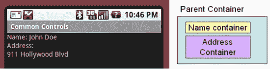

**图 6-1.** *一个 Activity 的用户界面和布局*

在讨论示例程序时，我们将引用这个布局层次结构。目前，你只需要知道该应用程序有一个 Activity。该 Activity 的用户界面由三个容器组成：一个包含人名信息的容器、一个包含地址信息的容器，以及一个作为子容器的外部父容器。

#### 完全通过代码构建 UI

第一个示例，代码清单 6-1，演示了如何完全在代码中构建用户界面。要尝试这个示例，请创建一个名为 `MainActivity` 的 Activity 的新 Android 项目，然后将代码清单 6-1 中的代码复制到你的 `MainActivity` 类中。

**注意：** 我们会在本章末尾提供一个 URL，你可以使用它下载本章中涉及的示例项目。这样你可以直接将项目导入到你的 Eclipse 中，而无需复制粘贴代码。

**代码清单 6-1.** *完全通过代码创建一个简单的用户界面*

```
package com.androidbook.controls;
import android.app.Activity;
import android.os.Bundle;
import android.view.ViewGroup.LayoutParams;
import android.widget.LinearLayout;
import android.widget.TextView;
public class MainActivity extends Activity
{
    private LinearLayout nameContainer;

    private LinearLayout addressContainer;

    private LinearLayout parentContainer;

    /** Called when the activity is first created. */
    @Override
    public void onCreate(Bundle savedInstanceState)
    {
        super.onCreate(savedInstanceState);

        createNameContainer();

        createAddressContainer();

        createParentContainer();

        setContentView(parentContainer);
    }

    private void createNameContainer()
    {
        nameContainer = new LinearLayout(this);

        nameContainer.setLayoutParams(new LayoutParams(LayoutParams.FILL_PARENT,
                LayoutParams.WRAP_CONTENT));
        nameContainer.setOrientation(LinearLayout.HORIZONTAL);

        TextView nameLbl = new TextView(this);
        nameLbl.setText("Name: ");

        TextView nameValue = new TextView(this);
        nameValue.setText("John Doe");

        nameContainer.addView(nameLbl);
        nameContainer.addView(nameValue);
    }

    private void createAddressContainer()
    {
        addressContainer = new LinearLayout(this);

        addressContainer.setLayoutParams(new LayoutParams(LayoutParams.FILL_PARENT,
                LayoutParams.WRAP_CONTENT));
        addressContainer.setOrientation(LinearLayout.VERTICAL);

        TextView addrLbl = new TextView(this);
        addrLbl.setText("Address:");

        TextView addrValue = new TextView(this);
        addrValue.setText("911 Hollywood Blvd");

        addressContainer.addView(addrLbl);
        addressContainer.addView(addrValue);
    }

    private void createParentContainer()
    {
        parentContainer = new LinearLayout(this);

        parentContainer.setLayoutParams(new LayoutParams(LayoutParams.FILL_PARENT,
                LayoutParams.FILL_PARENT));
        parentContainer.setOrientation(LinearLayout.VERTICAL);

        parentContainer.addView(nameContainer);
        parentContainer.addView(addressContainer);
    }
}
```

如代码清单 6-1 所示，这个 Activity 包含了三个 `LinearLayout` 对象。正如我们之前提到的，布局对象包含在屏幕某部分内定位对象的逻辑。例如，`LinearLayout` 知道如何垂直或水平地排列控件。布局对象可以包含任何类型的视图——甚至可以是其他布局。


`nameContainer`对象包含两个`TextView`控件：一个用于标签“Name:”，另一个用于保存实际名称（例如 John Doe）。`addressContainer`也包含两个`TextView`控件。这两个容器的区别在于`nameContainer`是水平布局，而`addressContainer`是垂直布局。这两个容器都位于`parentContainer`内，它是活动的根视图。容器构建完成后，活动通过调用`setContentView(parentContainer)`将视图内容设置为根视图。当渲染活动用户界面时，会调用根视图进行渲染，根视图再调用其子视图，子视图再调用它们的子视图，以此类推，直到整个用户界面渲染完成。

如清单 6-1 所示，我们有多个`LinearLayout`控件。其中两个是垂直布局，一个是水平布局。`nameContainer`是水平布局，这意味着两个`TextView`控件在水平方向并排显示。`addressContainer`是垂直布局，这意味着两个`TextView`控件一个叠在另一个之上。`parentContainer`也是垂直布局，因此`nameContainer`显示在`addressContainer`上方。请注意两个垂直布局容器`addressContainer`和`parentContainer`之间的细微差别：`parentContainer`被设置为占据屏幕的整个宽度和高度。

```
parentContainer.setLayoutParams(new LayoutParams(LayoutParams.FILL_PARENT,
                LayoutParams.FILL_PARENT));
```

而`addressContainer`在垂直方向上包裹其内容：

```
addressContainer.setLayoutParams(new LayoutParams(LayoutParams.FILL_PARENT,
                LayoutParams.WRAP_CONTENT));
```

换句话说，`WRAP_CONTENT`意味着视图在某个维度上只占用所需的空间，不再额外占用，但不超过父视图允许的范围。对于`addressContainer`，这意味着容器在垂直方向上会占用两行空间，因为它只需要这么多。

#### 完全在 XML 中构建 UI

现在让我们在 XML 中构建相同的用户界面（参见清单 6-2）。回顾第 3 章的内容，XML 布局文件存储在资源目录（`/res/`）下的`layout`文件夹中。要尝试此示例，请在 Eclipse 中创建一个新的 Android 项目。默认情况下，你将获得一个名为`main.xml`的 XML 布局文件，位于`res/layout`文件夹下。双击`main.xml`查看其内容，Eclipse 将显示布局文件的视觉编辑器。你可能在视图顶部看到类似“Hello World, MainActivity!”的字符串。点击视图底部的`main.xml`选项卡，查看`main.xml`文件的 XML 内容。这会显示一个`LinearLayout`和一个`TextView`控件。使用“Layout”选项卡或`main.xml`选项卡（或两者结合），在`main.xml`文件中重新创建清单 6-2 的内容，然后保存。

**清单 6-2. 完全在 XML 中创建用户界面**

```xml
<?xml version="1.0" encoding="utf-8"?>
<LinearLayout
    android:orientation="vertical" android:layout_width="fill_parent"
    android:layout_height="fill_parent">
    <!-- NAME CONTAINER -->
    <LinearLayout
        android:orientation="horizontal" android:layout_width="fill_parent"
        android:layout_height="wrap_content">

            <TextView  android:layout_width="wrap_content"
        android:layout_height="wrap_content" android:text="Name:" />

            <TextView android:layout_width="wrap_content"
        android:layout_height="wrap_content" android:text="John Doe" />

    </LinearLayout>

    <!-- ADDRESS CONTAINER -->
    <LinearLayout
        android:orientation="vertical" android:layout_width="fill_parent"
        android:layout_height="wrap_content">

            <TextView android:layout_width="fill_parent"
        android:layout_height="wrap_content" android:text="Address:" />

            <TextView android:layout_width="fill_parent"
        android:layout_height="wrap_content" android:text="911 Hollywood Blvd." />
    </LinearLayout>

</LinearLayout>
```

在你新项目的`src`目录下，有一个默认的`.java`文件，其中包含一个`Activity`类定义。双击该文件查看其内容，注意`setContentView(R.layout.main)`语句。清单 6-2 中显示的 XML 代码片段，配合`setContentView(R.layout.main)`的调用，将渲染出与之前完全通过代码生成时相同的用户界面。XML 文件本身很直观，但请注意我们定义了三个容器视图。第一个`LinearLayout`相当于我们的父容器。该容器通过设置相应的属性`android:orientation="vertical"`将其方向设置为垂直。父容器包含两个`LinearLayout`容器，分别代表`nameContainer`和`addressContainer`。

运行此应用程序将产生与之前示例应用程序相同的用户界面。标签和值将如图 6-1 所示显示。


##### 使用代码在 XML 中构建 UI

列表 6-2 是一个刻意为之的示例。在 XML 布局中硬编码 `TextView` 控件的值毫无意义。理想情况下，我们应在 XML 中设计用户界面，然后通过代码引用这些控件。这种做法使我们能够将动态数据绑定到设计时定义的控件上。事实上，这正是推荐的做法。在 XML 中构建布局，再使用代码填充动态数据，是相当容易的。

列表 6-3 展示了略微不同的 XML 实现的相同用户界面。这段 XML 为 `TextView` 控件分配了 ID，以便我们可以在代码中引用它们。

**列表 6-3.** *在 XML 中使用 ID 创建用户界面*

```
<?xml version="1.0" encoding="utf-8"?>
<LinearLayout
    android:orientation="vertical" android:layout_width="fill_parent"
    android:layout_height="fill_parent">
    <!-- 姓名容器 -->
    <LinearLayout
        android:orientation="horizontal" android:layout_width="fill_parent"
        android:layout_height="wrap_content">

            <TextView android:layout_width="wrap_content"
        android:layout_height="wrap_content" android:text="@string/name_text" />

            <TextView android:id="@+id/nameValue"
        android:layout_width="wrap_content" android:layout_height="wrap_content" />

    </LinearLayout>

    <!-- 地址容器 -->
    <LinearLayout
        android:orientation="vertical" android:layout_width="fill_parent"
        android:layout_height="wrap_content">

            <TextView android:layout_width="fill_parent"
        android:layout_height="wrap_content" android:text="@string/addr_text" />

            <TextView android:id="@+id/addrValue"
        android:layout_width="fill_parent" android:layout_height="wrap_content" />
    </LinearLayout>

</LinearLayout>
```

除了为那些要由代码填充数据的 `TextView` 控件添加 ID 之外，我们还引入了一些标签 `TextView` 控件，它们的内容来自字符串资源文件。这些是没有 ID 但带有 `android:text` 属性的 `TextView`。你可能还记得第 3 章中的内容，这些 `TextView` 的实际字符串会来自 `/res/values` 文件夹下的 `strings.xml` 文件。列表 6-4 展示了我们的 `strings.xml` 文件可能的样子。

**列表 6-4.** *用于列表 6-3 的 strings.xml 文件*

```
<?xml version="1.0" encoding="utf-8"?>
<resources>
    <string name="app_name">通用控件</string>
    <string name="name_text">姓名：</string>
    <string name="addr_text">地址：</string>
</resources>
```

列表 6-5 中的代码演示了如何获取对 XML 中定义的控件的引用，进而设置其属性。你可以将此代码放入 Activity 的 `onCreate()` 方法中。

**列表 6-5.** *在运行时引用资源中的控件*

```
setContentView(R.layout.main);

TextView nameValue = (TextView)findViewById(R.id.nameValue);
nameValue.setText("张三");
TextView addrValue = (TextView)findViewById(R.id.addrValue);
addrValue.setText("好莱坞大道 911 号");
```

列表 6-5 中的代码很直白，但请注意，我们在调用 `findViewById()` 之前，必须先通过调用 `setContentView(R.layout.main)` 来加载资源——如果视图尚未加载，我们是无法获得对它们的引用的。

Android 的开发者做得非常出色，几乎控件的每个方面都可以通过 XML 或代码进行设置。通常，将控件的属性设置在 XML 布局文件中是一个好主意，而不是使用代码。不过，在很多情况下你仍然需要使用代码，例如设置要显示给用户的值。

##### FILL_PARENT 与 MATCH_PARENT

常量 `FILL_PARENT` 在 Android 2.2 中已被弃用，取而代之的是 `MATCH_PARENT`。但这仅仅是名称上的更改。该常量的值仍然是 -1。同样，对于 XML 布局，`"fill_parent"` 已被替换为 `"match_parent"`。那么你应该使用哪个值呢？你完全可以直接使用值 -1，这样也能正常工作。然而，这不太易读，而且对于 XML 布局，你也没有与之等效的未命名值可用。有一种更好的方法。

根据你的应用程序需要使用的 Android API，你可以选择针对 2.2 之前的 Android 版本构建应用，以依赖向前兼容性；或者针对 Android 2.2 或更高版本构建应用，并将 `minSdkVersion` 设置为你的应用将运行的最低 Android 版本。例如，如果你只需要 Android 1.6 中存在的 API，就针对 Android 1.6 构建，并使用 `FILL_PARENT` 和 `"fill_parent"`。你的应用应该能在包括 2.2 及更高版本在内的所有后续 Android 版本中正常运行。如果你需要 Android 2.2 或更高版本的 API，那么就针对该 Android 版本构建应用，使用 `MATCH_PARENT` 和 `"match_parent"`，并将 `minSdkVersion` 设置为一个更早的版本，例如 `"4"`（对应 Android 1.6）。你仍然可以将基于 Android 2.2 构建的 Android 应用部署到更早的 Android 版本上，但需要处理好那些在早期 Android SDK 版本中不存在的类和/或方法。有一些应对方法，比如使用反射或创建包装类来处理 Android 版本间的差异。不过我们这里不讨论这些。

### 理解 Android 的通用控件

我们现在开始讨论 Android SDK 中的通用控件。我们将从文本控件开始，然后讨论按钮、复选框、单选按钮、列表、网格、日期和时间控件以及地图视图控件。我们还会讨论布局控件。

#### 文本控件

文本控件很可能是你在 Android 中最先接触到的控件类型。Android 拥有一套完整但不过于复杂的文本控件。在本节中，我们将讨论 `TextView`、`EditText`、`AutoCompleteTextView` 和 `MultiCompleteTextView` 控件。图 6-2 展示了这些控件的实际效果。


**图 6-2.** *Android 中的文本控件*


##### TextView

在代码清单 6–3 中，你已经看到了一个简单的`TextView`控件 XML 规范，以及在代码清单 6–4 中如何在代码中处理`TextView`。请注意我们是如何在 XML 中指定文本的 ID、宽度、高度和值的，以及我们是如何使用`setText()`方法设置值的。`TextView`控件知道如何显示文本，但不允许编辑。这可能会让你认为该控件本质上是一个虚拟标签。事实并非如此。`TextView`控件有几个有趣的属性，使其非常方便。例如，如果你知道`TextView`的内容将包含一个网页 URL 或电子邮件地址，你可以将`autoLink`属性设置为`"email|web"`，控件就会查找并高亮显示所有电子邮件地址和 URL。此外，当用户点击这些高亮项之一时，系统将负责启动带有该电子邮件地址的电子邮件应用程序，或带有该 URL 的浏览器。在 XML 中，此属性将位于`TextView`标签内，看起来像这样：

`<TextView   ...     android:autoLink="email|web"    ...    />`

其中，你指定一个以竖线分隔的值集合，包括`"web"`、`"email"`、`"phone"`或`"map"`，或使用`"none"`（默认值）或`"all"`。如果你想在代码中设置`autoLink`行为而不是使用 XML，对应的方法是`setAutoLinkMask()`。你需要向其传递一个表示值组合的`int`，类似于前面，例如`Linkify.EMAIL_ADDRESSES|Linkify.WEB_ADDRESSES`。为了实现此功能，`TextView`使用了`android.text.util.Linkify`类。代码清单 6–6 展示了一个使用代码实现自动链接的示例。

**代码清单 6–6.** *在 TextView 的文本上使用 Linkify*

```
TextView tv =(TextView)this.findViewById(R.id.tv);
tv.setAutoLinkMask(Linkify.ALL);
tv.setText("请访问我的网站，http://www.androidbook.com
或给我发邮件到 davemac327@gmail.com。");
```

请注意，我们在设置文本之前设置了`TextView`的自动链接选项。这一点很重要，因为在设置文本之后设置自动链接选项不会影响现有文本。由于我们使用代码为文本添加超链接，因此在代码清单 6–6 中，我们的`TextView`的 XML 不需要任何特殊属性，可以像这样简单：

```
<TextView android:id="@+id/tv" android:layout_width="wrap_content"
  android:layout_height="wrap_content"/>
```

如果你愿意，可以调用`Linkify`类的静态`addLinks()`方法，按需查找并向任何`TextView`或任何`Spannable`的内容添加链接。除了使用`setAutoLinkMask()`，我们也可以在设置文本*之后*执行以下操作：

```
Linkify.addLinks(tv, Linkify.ALL);
```

点击链接将导致为该操作调用默认意图。例如，点击网页 URL 将启动带有该 URL 的浏览器。点击电话号码将启动电话拨号器，依此类推。`Linkify`类可以开箱即用地执行此工作。

`Linkify`还可以检测你想要查找的自定义模式，判断它们是否匹配你认为需要可点击的内容，并设置如何触发意图以使点击转变为某种操作。我们在此不深入讨论这些细节，但要知道这些事情是可以做到的。

`TextView`还有许多需要探索的功能，从字体属性到`minLines`和`maxLines`等等。这些功能都相当不言自明，鼓励你进行实验，看看如何能够使用它们。尽管你应该记住，`TextView`类中的某些功能不适用于只读字段，但这些功能是为`TextView`的子类准备的，我们接下来将介绍其中一个子类。

##### EditText

`EditText`控件是`TextView`的子类。顾名思义，`EditText`控件允许文本编辑。`EditText`不如你在互联网上找到的文本编辑控件那么强大，但 Android 设备的用户可能不会输入文档——他们最多输入几个段落。因此，该类的功能有限但适当，甚至可能会让你感到惊讶。例如，`EditText`最重要的属性之一是`inputType`。你可以将`inputType`属性设置为`textAutoCorrect`，让控件纠正常见的拼写错误。你可以将其设置为`textCapWords`，让控件将单词首字母大写。还有其他选项，例如仅期望电话号码或密码。

有一些较旧、现已废弃的指定首字母大写、多行文本和其他功能的方法。如果这些方法在没有`inputType`属性的情况下指定，它们可以被读取，但如果指定了`inputType`，则会忽略这些较旧的属性。

`EditText`控件旧的默认行为是在一行上显示文本，并根据需要扩展。换句话说，如果用户输入超过第一行，就会显示另一行，依此类推。但是，你可以通过将`singleLine`属性设置为`true`来强制用户使用单行。在这种情况下，用户将不得不在同一行上继续输入。使用`inputType`时，如果你不指定`textMultiLine`，`EditText`将默认只使用单行。因此，如果你想要旧的多行输入默认行为，你需要指定`inputType`为`textMultiLine`。

`EditText`的一个很好的特性是你可以指定提示文本。此文本会以略微褪色的方式显示，并且一旦用户开始输入文本就会消失。提示的目的是让用户知道该字段期望输入什么内容，而无需用户选择并擦除默认文本。在 XML 中，此属性是`android:hint="在此输入你的提示文本"`或`android:hint="@string/your_hint_name"`，其中`your_hint_name`是在`/res/values/strings.xml`中找到的字符串资源名称。在代码中，你会调用`setHint()`方法，并传递一个`CharSequence`或资源 ID。


### 排版后内容

`AutoCompleteTextView`

`AutoCompleteTextView`控件是一个具有自动完成功能的`TextView`。换句话说，当用户在`TextView`中输入时，该控件可以显示供选择的建议。清单 6–7 演示了`AutoCompleteTextView`控件的 XML 布局和相应代码。

**清单 6–7.** *使用`AutoCompleteTextView`控件*

```
<AutoCompleteTextView android:id="@+id/actv"
    android:layout_width="fill_parent"  android:layout_height="wrap_content" />
```

```
AutoCompleteTextView actv = (AutoCompleteTextView) this.findViewById(R.id.actv);
```

```
ArrayAdapter<String> aa = new ArrayAdapter<String>(this,
                android.R.layout.simple_dropdown_item_1line,
                new String[] {"English", "Hebrew", "Hindi", "Spanish", "German", "Greek" });
```

```
actv.setAdapter(aa);
```

清单 6–7 中所示的`AutoCompleteTextView`控件会向用户建议一种语言。例如，如果用户输入`en`，控件会建议`English`。如果用户输入`gr`，控件会推荐`Greek`，以此类推。

如果你使用过建议控件或类似的自动完成控件，就会知道这类控件由两部分组成：一个文本视图控件和一个显示建议的控件。这是基本概念。要使用这类控件，你需要创建控件、创建建议列表、告诉控件建议列表是什么，并且可能还要告诉控件如何显示这些建议。或者，你也可以为建议创建一个独立的控件，然后将这两个控件关联起来。

如清单 6–7 所示，Android 简化了这一过程。要使用`AutoCompleteTextView`，你可以在布局文件中定义该控件，并在 Activity 中引用它。然后，你创建一个持有建议的适配器类，并定义将显示建议的控件 ID（在本例中是一个简单的列表项）。在清单 6–7 中，`ArrayAdapter`的第二个参数告诉适配器使用一个简单的列表项来显示建议。最后一步是使用`setAdapter()`方法将适配器与`AutoCompleteTextView`关联起来。暂时不用担心适配器的问题；本章稍后会介绍它们。

`MultiAutoCompleteTextView`

如果你曾使用过`AutoCompleteTextView`控件，就会知道该控件只能为文本视图中的*整个*文本提供建议。换句话说，如果你输入一个句子，你不会得到每个单词的建议。这正是`MultiAutoCompleteTextView`的用武之地。你可以使用`MultiAutoCompleteTextView`在用户输入时提供建议。例如，图 6–2 显示用户输入了单词`English`，后跟一个逗号，然后输入`Ge`，此时控件建议了`German`。如果用户继续输入，控件会提供更多建议。

使用`MultiAutoCompleteTextView`类似于使用`AutoCompleteTextView`。区别在于，你必须告诉控件从哪里开始重新建议。例如，在图 6–2 中，你可以看到控件可以在句首和遇到逗号后提供建议。`MultiAutoCompleteTextView`控件要求你提供一个分词器（tokenizer），它可以解析句子并告诉控件是否应该重新开始建议。清单 6–8 演示了如何在 XML 中以及使用 Java 代码使用`MultiAutoCompleteTextView`控件。

**清单 6–8.** *使用`MultiAutoCompleteTextView`控件*

```
<MultiAutoCompleteTextView android:id="@+id/mactv"
    android:layout_width="fill_parent"  android:layout_height="wrap_content" />
```

```
MultiAutoCompleteTextView mactv = (MultiAutoCompleteTextView) this
                .findViewById(R.id.mactv);
ArrayAdapter<String> aa2 = new ArrayAdapter<String>(this,
                android.R.layout.simple_dropdown_item_1line,
new String[] {"English", "Hebrew", "Hindi", "Spanish", "German", "Greek" });
```

```
mactv.setAdapter(aa2);
```

```
mactv.setTokenizer(new MultiAutoCompleteTextView.CommaTokenizer());
```

清单 6–7 和 6–8 之间唯一显著的区别在于使用了`MultiAutoCompleteTextView`以及调用了`setTokenizer()`方法。由于本例中使用了`CommaTokenizer`，当在`EditText`字段中输入逗号后，该字段将再次使用字符串数组提供建议。输入任何其他字符都不会触发该字段提供建议。因此，即使你输入`French Spani`，部分单词`Spani`也不会触发建议，因为它没有跟在逗号后面。Android 还提供了另一个用于电子邮件地址的分词器，名为`Rfc822Tokenizer`。如果你愿意，也可以创建自己的分词器。

#### `Button`控件

按钮在任何小部件工具集中都很常见，Android 也不例外。Android 提供了一组典型的按钮以及一些额外的按钮。在本节中，我们将讨论三种类型的按钮控件：基本按钮、图像按钮和开关按钮。图 6–3 显示了一个包含这些控件的用户界面。顶部的按钮是基本按钮，中间的按钮是图像按钮，最后一个按钮是开关按钮。

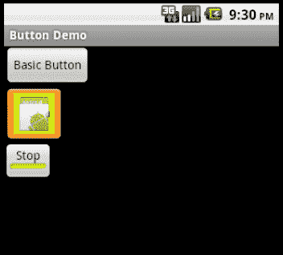

**图 6–3.** *Android 按钮控件*

让我们从基本按钮开始。


##### 按钮控件

Android 中最基本的按钮类是 `android.widget.Button`。这种按钮主要涉及如何处理点击事件，除此之外并没有太多复杂之处。代码清单 6-9 展示了一个 `Button` 控件的 XML 布局片段，以及我们可能会在 Activity 的 `onCreate()` 方法中设置的一些 Java 代码。我们的基础按钮外观类似于图 6-3 中的顶部按钮。

**代码清单 6-9.** *处理按钮上的点击事件*

```
<Button android:id="@+id/ccbtn1"
    android:text="@string/basicBtnLabel"
    android:layout_width="fill_parent"
    android:layout_height="wrap_content" />
```

```
Button btn = (Button)this.findViewById(R.id.ccbtn1);
btn.setOnClickListener(new OnClickListener()
{
     public void onClick(View v)
     {
        Intent intent = new Intent(Intent.ACTION_VIEW,
                                Uri.parse("http://www.androidbook.com"));
        startActivity(intent);
     }
});
```

代码清单 6-9 展示了如何注册按钮点击事件。通过调用带有 `OnClickListener` 参数的 `setOnClickListener()` 方法来注册点击事件。在代码清单 6-9 中，我们即时创建了一个匿名监听器来处理 `btn` 的点击事件。当按钮被点击时，监听器的 `onClick()` 方法会被调用，在此例中，该方法会启动浏览器访问我们的网站。

自 Android SDK 1.6 起，有一种更简单的方法来为一个或多个按钮设置点击处理器。代码清单 6-10 展示了 `Button` 的 XML 定义，其中为处理器指定了一个属性，以及作为点击处理器的 Java 代码。

**代码清单 6-10.** *为按钮设置点击处理器*

```
<Button   ...    android:onClick="myClickHandler"    ...  />
```

```
    public void myClickHandler(View target) {
        switch(target.getId()) {
        case R.id.ccbtn1:
        …
```

处理器方法被调用时，`target` 参数会被设置为表示所按下按钮的 `View` 对象。请注意，点击处理器方法中的 switch 语句是如何使用按钮的资源 ID 来选择要执行的逻辑的。使用这种方法意味着你无需在代码中显式创建每个 `Button` 对象，并且可以在多个按钮之间复用同一个方法。这使得代码更易于理解和维护。这种方法也适用于其他按钮类型。但它不适用于 Android 1.5 或更低版本。你不会收到错误消息，只是点击按钮不会有任何反应。

##### 图像按钮控件

Android 通过 `android.widget.ImageButton` 提供了图像按钮。使用图像按钮与使用基础按钮类似（参见代码清单 6-11）。我们的图像按钮看起来像图 6-3 中的中间按钮。

**代码清单 6-11.** *使用 ImageButton*

```
<ImageButton android:id="@+id/imageBtn"
    android:layout_width="wrap_content" android:layout_height="wrap_content"
    android:onClick="myClickHandler"
    android:src="@drawable/icon"  />
```

```
ImageButton btn = (ImageButton)this.findViewById(R.id.imageBtn);
btn.setImageResource(R.drawable.icon);
```

这里，我们通过 XML 创建了图像按钮，并从 drawable 资源中设置了按钮的图像。按钮的图像文件必须存在于 `/res/drawable` 目录下。在此例中，我们只是复用了 Android 图标作为按钮图像。我们还在代码清单 6-11 中展示了如何通过调用按钮的 `setImageResource()` 方法并传入资源 ID 来动态设置按钮图像。请注意，你只需要执行其中一种操作，无需同时在 XML 文件和代码中指定按钮图像。

图像按钮的一个优点是可以为按钮指定透明背景。结果就是得到一个可点击的图像，它像按钮一样工作，但外观可以随心所欲。

由于你的图像可能与标准按钮截然不同，你可以自定义按钮在用户界面中可能处于的另外两种状态下的外观。除了正常状态，按钮还可以获得焦点和处于按下状态。*获得焦点* 仅意味着按钮当前是事件的目标。例如，你可以使用键盘或方向键上的箭头键将焦点导向某个按钮。*按下* 则意味着按钮在被按下后、用户松开前，其外观会发生变化。为了告诉 Android 我们按钮的三个图像分别是什么，以及哪个对应哪种状态，我们需要设置一个选择器。这是一个简单的 XML 文件，位于项目的 `/res/drawable` 文件夹中。这多少有些违反直觉，因为这是一个 XML 文件而不是图像文件，但选择器文件就必须放在那里。选择器文件的内容如代码清单 6-12 所示。

**代码清单 6-12.** *将选择器与 ImageButton 一起使用*

```
<?xml version="1.0" encoding="utf-8"?>
    <selector >
     <item android:state_pressed="true"
           android:drawable="@drawable/button_pressed" /> <!-- 按下 -->
     <item android:state_focused="true"
           android:drawable="@drawable/button_focused" /> <!-- 聚焦 -->
     <item android:drawable="@drawable/icon" /> <!-- 默认 -->
    </selector>
```

关于选择器文件，有几点需要注意。首先，不需要像 values XML 文件那样指定 `<resources>` 标签。其次，按钮图像的顺序很重要。Android 会依次测试选择器中的每个项，看是否匹配，我们希望只有在按钮既未被按下也未获得焦点时才使用默认图像。如果默认图像被列在第一位，它总会匹配并被选中，即使按钮处于按下或聚焦状态。当然，你引用的 drawable 资源必须存在于 `/res/drawables` 文件夹中。最后，在布局 XML 文件中对按钮的定义中，你需要将 `android:src` 属性指向选择器 XML 文件，就像它是一个普通的 drawable 一样，例如：

```
<Button   ...    android:src="@drawable/imagebuttonselector"    ...   />
```

##### 开关按钮控件

`ToggleButton` 控件，如同复选框或单选按钮，是一个双状态按钮。该按钮可以处于开或关状态。如图 6-3 所示，`ToggleButton` 的默认行为是：在开状态时显示绿色条，在关状态时显示灰色条。此外，默认行为还会将按钮的文本分别设置为“On”（开）和“Off”（关）。如果 On/Off 不适用于你的应用程序，你可以修改 `ToggleButton` 的文本。例如，如果你有一个希望通过 `ToggleButton` 启动和停止的后台进程，你可以使用 `android:textOn` 和 `android:textOff` 属性将按钮的文本设置为“停止”和“运行”。

代码清单 6-13 展示了一个示例。我们的开关按钮是图 6-3 中的底部按钮，它处于开状态，因此按钮上的标签显示“停止”。

**代码清单 6-13.** *Android ToggleButton*

```
<ToggleButton android:id="@+id/cctglBtn"
        android:layout_width="wrap_content"
        android:layout_height="wrap_content"  
        android:text="Toggle Button"
        android:textOn="Stop"  
        android:textOff="Run"/>
```

由于 `ToggleButton` 将开和关的文本作为单独属性，`ToggleButton` 的 `android:text` 属性实际上并未被使用。它之所以可用，是因为它是继承而来的（实际上继承自 `TextView`），但在这种情况下，你不需要使用它。


#### `CheckBox` 控件

`CheckBox` 控件是另一种双状态按钮，允许用户切换其状态。不同之处在于，在许多情况下，用户并不将其视为能触发即时操作的按钮。然而，从 Android 的角度来看，它是一个按钮，你可以对复选框执行任何能对按钮执行的操作。

在 Android 中，你可以通过创建 `android.widget.CheckBox` 的实例来创建一个复选框。请参见**清单 6-14** 和 **图 6-4**。

**清单 6-14.** *创建复选框*

```
<LinearLayout
        android:orientation="vertical" android:layout_width="fill_parent"
        android:layout_height="fill_parent">

<CheckBox android:id="@+id/chickenCB"  android:text="Chicken" android:checked="true"
    android:layout_width="wrap_content" android:layout_height="wrap_content" />

<CheckBox android:id="@+id/fishCB"  android:text="Fish"
    android:layout_width="wrap_content" android:layout_height="wrap_content" />

<CheckBox android:id="@+id/steakCB"  android:text="Steak" android:checked="true"
    android:layout_width="wrap_content" android:layout_height="wrap_content" />

</LinearLayout>
```

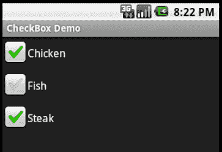

**图 6-4.** *使用 CheckBox 控件*

您可以通过调用 `setChecked()` 或 `toggle()` 来管理复选框的状态。您可以通过调用 `isChecked()` 来获取状态。

如果您需要在复选框被选中或取消选中时实现特定逻辑，您可以通过调用 `setOnCheckedChangeListener()` 并实现 `OnCheckedChangeListener` 接口来注册 `on-checked` 事件。然后，您需要实现 `onCheckedChanged()` 方法，该方法将在复选框被选中或取消选中时被调用。**清单 6-15** 展示了处理 `CheckBox` 的一些代码。

**清单 6-15.** *在代码中使用 CheckBox*

```
public class CheckBoxActivity extends Activity {
        /** Called when the activity is first created. */
        @Override
        public void onCreate(Bundle savedInstanceState) {
            super.onCreate(savedInstanceState);
            setContentView(R.layout.checkbox);

            CheckBox fishCB = (CheckBox)findViewById(R.id.fishCB);

            if(fishCB.isChecked())
                fishCB.toggle();     // flips the checkbox to unchecked if it was checked

            fishCB.setOnCheckedChangeListener(
                        new CompoundButton.OnCheckedChangeListener() {

                @Override
                public void onCheckedChanged(CompoundButton arg0, boolean isChecked) {
                    Log.v("CheckBoxActivity", "The fish checkbox is now "
                            + (isChecked?"checked":"not checked"));
                }});
        }
}
```

设置 `OnCheckedChangeListener` 的好处在于，你会被传递 `CheckBox` 按钮的新状态。你也可以像我们使用基本按钮那样，使用 `OnClickListener` 技术。当调用 `onClick()` 方法时，你需要通过适当地进行类型转换并调用其 `isChecked()` 方法来自行确定按钮的新状态。类似地，**清单 6-16** 展示了如果我们在 CheckBox 按钮的 XML 定义中添加 `android:onClick="myClickHandler"` （请记住，此特性仅在 Android 1.6 及更高版本中支持），那么代码可能看起来像这样。

**清单 6-16.** *在代码中使用带有 `android:onClick` 的 CheckBox*

```
    public void myClickHandler(View view) {
        switch(view.getId()) {
        case R.id.steakCB:
            Log.v("CheckBoxActivity", "The steak checkbox is now " +
                    (((CheckBox)view).isChecked()?"checked":"not checked"));
        }
    }
```

#### `RadioButton` 控件

`RadioButton` 控件是任何 UI 工具包中不可或缺的一部分。单选按钮为用户提供多个选择，并强制他们选择单个项目。为了强制执行这种单选模式，单选按钮通常属于一个组，并且每个组在任何时候都强制只能选中一个项目。

要在 Android 中创建一组单选按钮，首先创建一个 `RadioGroup`，然后用单选按钮填充该组。**清单 6-17** 和 **图 6-5** 展示了一个示例。

**清单 6-17.** *使用 Android RadioButton 组件*

```
<LinearLayout
        android:orientation="vertical" android:layout_width="fill_parent"
        android:layout_height="fill_parent">

<RadioGroup     android:id="@+id/rBtnGrp" android:layout_width="wrap_content"
            android:layout_height="wrap_content"  android:orientation="vertical" >

    <RadioButton     android:id="@+id/chRBtn" android:text="Chicken"
            android:layout_width="wrap_content"  android:layout_height="wrap_content"/>

    <RadioButton  android:id="@+id/fishRBtn" android:text="Fish" android:checked="true"
            android:layout_width="wrap_content"  android:layout_height="wrap_content"/>

    <RadioButton android:id="@+id/stkRBtn" android:text="Steak"
            android:layout_width="wrap_content"  android:layout_height="wrap_content"/>

</RadioGroup>

</LinearLayout>
```

在 Android 中，你可以使用 `android.widget.RadioGroup` 来实现单选按钮组，并使用 `android.widget.RadioButton` 来实现单选按钮。

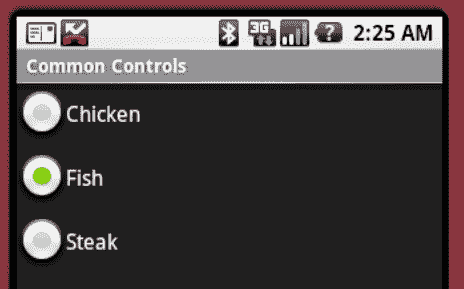

**图 6-5.** *使用单选按钮*

请注意，在单选按钮组内的单选按钮默认情况下初始是未选中的，尽管你可以在 XML 定义中将一个设置为选中，就像我们上面为“Fish”所做的那样。要以编程方式将某个单选按钮设置为选中状态，你可以获取该单选按钮的引用并调用 `setChecked()`：

```
RadioButton rbtn = (RadioButton)this.findViewById(R.id.stkRBtn);
rbtn.setChecked(true);
```

你还可以使用 `toggle()` 方法来切换单选按钮的状态。与 `CheckBox` 控件一样，如果你通过实现 `OnCheckedChangeListener` 接口来调用 `setOnCheckedChangeListener()`，你会收到 `on-checked` 或 `on-unchecked` 事件的通知。不过，这里有一个细微的区别。实际上，这次的类不同于之前。这次从技术上讲是 `RadioGroup.OnCheckedChangeListener` 类，而之前是 `CompoundButton.OnCheckedChangeListener` 类。

`RadioGroup` 也可以包含除单选按钮之外的其他视图。例如，**清单 6-18** 在最后一个单选按钮之后添加了一个 `TextView`。另请注意，有一个单选按钮位于该单选按钮组之外。

**清单 6-18.** *包含不止 `RadioButton` 的 `RadioGroup`*

```
<LinearLayout
        android:orientation="vertical"  android:layout_width="fill_parent"
        android:layout_height="fill_parent">

<RadioButton android:id="@+id/anotherRadBtn"  android:text="Outside"
            android:layout_width="wrap_content"  android:layout_height="wrap_content"/>

<RadioGroup android:id="@+id/radGrp"
            android:layout_width="wrap_content"  android:layout_height="wrap_content">

      <RadioButton android:id="@+id/chRBtn"  android:text="Chicken"
            android:layout_width="wrap_content"  android:layout_height="wrap_content"/>

      <RadioButton android:id="@+id/fishRBtn"  android:text="Fish"    
            android:layout_width="wrap_content"  android:layout_height="wrap_content"/>

      <RadioButton android:id="@+id/stkRBtn"  android:text="Steak"
            android:layout_width="wrap_content"  android:layout_height="wrap_content"/>

      <TextView android:text="My Favorite"
            android:layout_width="wrap_content"  android:layout_height="wrap_content"/>

</RadioGroup>
</LinearLayout>
```


清单 6‑18 展示了在单选组内可以放置非`RadioButton`控件。你还应该了解，单选组只能对其自身容器内的单选按钮强制实现单选功能。也就是说，ID 为 `anotherRadBtn` 的单选按钮不会受到清单 6‑18 中所示的单选组影响，因为它不属于该单选组的子控件。

你可以通过编程方式操作 `RadioGroup`。例如，可以获取单选组的引用，然后添加一个单选按钮（或其他类型的控件）。清单 16‑19 演示了这一概念。

**清单 6‑19.** *在代码中向 RadioGroup 添加 RadioButton*

```java
RadioGroup radGrp = (RadioGroup)findViewById(R.id.radGrp);
RadioButton newRadioBtn = new RadioButton(this);
newRadioBtn.setText("猪肉");
radGrp.addView(newRadioBtn);
```

一旦用户在单选组内选中了一个单选按钮，就无法通过再次点击来取消选中。清除单选组内所有单选按钮的唯一方法，是通过编程方式调用 `RadioGroup` 的 `clearCheck()` 方法。

当然，你会希望利用 `RadioGroup` 实现一些有趣的功能。你大概不想逐个轮询每个 `RadioButton` 来判断它是否被选中。幸运的是，`RadioGroup` 提供了几个方法来帮助你解决这个问题。我们通过清单 16‑20 来演示这些方法。该代码对应的 XML 文件见清单 6‑18。

**清单 6‑20.** *以编程方式使用 RadioGroup*

```java
public class RadioGroupActivity extends Activity {
        protected static final String TAG = "RadioGroupActivity";

        /** 当 Activity 首次创建时调用。 */
        @Override
        public void onCreate(Bundle savedInstanceState) {
            super.onCreate(savedInstanceState);
            setContentView(R.layout.radiogroup);

            RadioGroup radGrp = (RadioGroup)findViewById(R.id.radGrp);

            int checkedRadioButtonId = radGrp.getCheckedRadioButtonId();

            radGrp.setOnCheckedChangeListener(new RadioGroup.OnCheckedChangeListener() {
                @Override
                public void onCheckedChanged(RadioGroup arg0, int id) {
                    switch(id) {
                    case -1:
                        Log.v(TAG, "选择已清除！");
                        break;
                    case R.id.chRBtn:
                        Log.v(TAG, "选择了鸡肉");
                        break;
                    case R.id.fishRBtn:
                        Log.v(TAG, "选择了鱼肉");
                        break;
                    case R.id.stkRBtn:
                        Log.v(TAG, "选择了牛排");
                        break;
                    default:
                        Log.v(TAG, "嗯？");
                        break;
                    }
                }});
        }
}
```

我们总能通过 `getCheckedRadioButtonId()` 获取当前选中的 `RadioButton`，该方法会返回选中项的资源 ID，如果没有任何项被选中（可能因为没有默认选项且用户尚未选择），则返回 –1。我们在之前的 `onCreate()` 方法中演示了这一用法，但在实际开发中，你需要在合适的时机用它来读取用户的当前选择。我们还可以设置一个监听器，以便在用户选中某个 `RadioButton` 时立即收到通知。请注意，`onCheckedChanged()` 方法接收一个 `RadioGroup` 参数，这允许你为多个 `RadioGroup` 使用同一个 `OnCheckedChangeListener`。你可能已经注意到了 switch 分支中的 –1 选项。当通过代码清除了 `RadioGroup` 的所有选择时，就会触发此情况。

#### ImageView 控件

我们尚未介绍的基本控件之一是 `ImageView` 控件。它用于显示图像，图像可以来自文件、内容提供者或资源（如 drawable）。你甚至可以只指定一种颜色，`ImageView` 就会显示该颜色。清单 6‑21 展示了一些 `ImageView` 的 XML 示例，以及如何通过代码创建 `ImageView`。

**清单 6‑21.** *XML 和代码中的 ImageView*

```xml
  <ImageView android:id="@+id/image1"
    android:layout_width="wrap_content"  android:layout_height="wrap_content"
    android:src="@drawable/icon" />

  <ImageView android:id="@+id/image2"
    android:layout_width="125dip"  android:layout_height="25dip"
    android:src="#555555" />

  <ImageView android:id="@+id/image3"
    android:layout_width="wrap_content"  android:layout_height="wrap_content" />

  <ImageView android:id="@+id/image4"
    android:layout_width="wrap_content"  android:layout_height="wrap_content"
    android:src="@drawable/manatee02"
    android:scaleType="centerInside"
    android:maxWidth="35dip"  android:maxHeight="50dip"
    />
```

```java
    ImageView imgView = (ImageView)findViewById(R.id.image3);

    imgView.setImageResource( R.drawable.icon );

    imgView.setImageBitmap(BitmapFactory.decodeResource(
                this.getResources(), R.drawable.manatee14) );

    imgView.setImageDrawable(
                Drawable.createFromPath("/mnt/sdcard/dave2.jpg") );

    imgView.setImageURI(Uri.parse("file://mnt/sdcard/dave2.jpg"));
```

在此示例中，我们在 XML 中定义了四个图像。第一个只是我们应用的图标。第二个是一个比高度宽的灰色条。第三个定义在 XML 中没有指定图像源，但我们有一个与之关联的 ID (`image3`)，可以在代码中使用该 ID 来设置图像。第四个图像是我们另一个 drawable 图像文件，我们不仅指定了图像文件的来源，还设置了图像在屏幕上的最大尺寸，并定义了当图像超过最大尺寸时该如何处理。在这里，我们指示 `ImageView` 将图像居中并缩放，以使其适合我们指定的大小。

在清单 6‑21 的 Java 代码中，我们展示了设置 `image3` 图像的几种方法。首先，我们当然需要通过资源 ID 找到该 `ImageView` 来获取其引用。第一个设置方法 `setImageResource()` 直接使用图像的资源 ID 来定位图像文件，为我们的 `ImageView` 提供图像。第二个设置方法使用 `BitmapFactory` 将图像资源读取到 `Bitmap` 对象中，然后将 `ImageView` 设置为该 `Bitmap`。请注意，在将 `Bitmap` 应用于 `ImageView` 之前，我们本可以对其进行一些修改，但在这个例子中，我们直接使用了原始图像。此外，`BitmapFactory` 有多种创建 `Bitmap` 的方法，包括从字节数组和 `InputStream` 创建。你可以使用 `InputStream` 方法从网络服务器读取图像，创建 `Bitmap` 图像，然后据此设置 `ImageView`。

第三种设置方法使用 `Drawable` 作为图像源。在这里，我们展示了图像源来自 SD 卡。你需要将某种图像文件以正确的名称放置到 SD 卡上，才能使这个示例正常工作。与 `BitmapFactory` 类似，`Drawable` 类也有几种不同的方式来构造 `Drawable`，包括从 XML 流构造。

最后一个设置方法接受图像文件的 URI，并将其用作图像源。对于这最后一种调用方式，请务必不要认为你可以使用任何图像 URI 作为源。此方法实际上仅适用于设备上的本地图像，不适用于你可能通过 HTTP 找到的图像。要将基于互联网的图像用作 `ImageView` 的源，你很可能会使用 `BitmapFactory` 和 `InputStream`。


#### 日期与时间控件

日期和时间控件在许多工具包中都很常见。Android 提供了多种基于日期和时间的控件，本节将讨论其中几种，具体包括 `DatePicker`（日期选择器）、`TimePicker`（时间选择器）、`DigitalClock`（数字时钟）和 `AnalogClock`（模拟时钟）控件。

##### DatePicker 和 TimePicker 控件

顾名思义，您可使用 `DatePicker` 控件选择日期，使用 `TimePicker` 控件选择时间。代码清单 6–22 和 图 6–6 展示了这些控件的示例。

**代码清单 6–22.** *XML 中的 DatePicker 和 TimePicker 控件*

```
<LinearLayout
        android:orientation="vertical"
        android:layout_width="fill_parent"
        android:layout_height="fill_parent">

  <TextView android:id="@+id/dateDefault"
    android:layout_width="fill_parent" android:layout_height="wrap_content" />

  <DatePicker android:id="@+id/datePicker"
    android:layout_width="wrap_content" android:layout_height="wrap_content" />

  <TextView android:id="@+id/timeDefault"
    android:layout_width="fill_parent" android:layout_height="wrap_content" />

  <TimePicker android:id="@+id/timePicker"
    android:layout_width="wrap_content" android:layout_height="wrap_content" />

</LinearLayout>
```

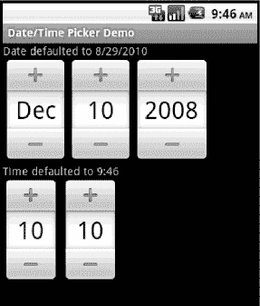

**图 6–6.** *DatePicker 与 TimePicker 的用户界面*

查看 XML 布局可知，定义这些控件非常简便。与 Android 工具包中的其他控件一样，您可以通过编程方式访问这些控件，以进行初始化或从中检索数据。例如，您可以像 代码清单 6–23 所示那样初始化这些控件。

**代码清单 6–23.** *分别用日期和时间初始化 DatePicker 和 TimePicker*

```
    public void onCreate(Bundle savedInstanceState) {
        super.onCreate(savedInstanceState);
        setContentView(R.layout.datetimepicker);

        TextView dateDefault = (TextView)findViewById(R.id.dateDefault);
        TextView timeDefault = (TextView)findViewById(R.id.timeDefault);

        DatePicker dp = (DatePicker)this.findViewById(R.id.datePicker);
        // 月份（仅月份）从零开始计数。显示时需要加 1。
        dateDefault.setText("Date defaulted to " + (dp.getMonth() + 1) + "/" +
                dp.getDayOfMonth() + "/" + dp.getYear());
        // 这里，从十二月（12）减去 1 以设置为十二月
        dp.init(2008, 11, 10, null);

        TimePicker tp = (TimePicker)this.findViewById(R.id.timePicker);

        java.util.Formatter timeF = new java.util.Formatter();
        timeF.format("Time defaulted to %d:%02d", tp.getCurrentHour(),
                        tp.getCurrentMinute());
        timeDefault.setText(timeF.toString());

        tp.setIs24HourView(true);
        tp.setCurrentHour(new Integer(10));
        tp.setCurrentMinute(new Integer(10));
    }
}
```

代码清单 6–23 将 `DatePicker` 的日期设置为 2008 年 12 月 10 日。请注意，月份的内部值从零开始，即一月为 0，十二月为 11。对于 `TimePicker`，小时和分钟数被设置为 10。另请注意，此控件支持 24 小时制显示。如果您不为这些控件设置值，则默认值将为设备的当前日期和时间。

最后，请注意，Android 还提供这些控件的模态窗口版本，例如 `DatePickerDialog` 和 `TimePickerDialog`。如果您想向用户显示控件并强制用户做出选择，这些控件非常有用。我们将在第 8 章中更详细地介绍对话框。

##### DigitalClock 和 AnalogClock 控件

Android 还提供 `DigitalClock` 和 `AnalogClock` 控件（参见图 6–7）。


**图 6–7.** *使用 AnalogClock 和 DigitalClock*

如图所示，数字时钟除了显示小时和分钟外，还支持显示秒。Android 中的模拟时钟是一个双指针时钟，一个指针指示小时，另一个指针指示分钟。要将它们添加到布局中，请使用 代码清单 6–24 所示的 XML。

**代码清单 6–24.** *在 XML 中添加 DigitalClock 或 AnalogClock*

```
  <DigitalClock
    android:layout_width="wrap_content" android:layout_height="wrap_content" />

  <AnalogClock
    android:layout_width="wrap_content" android:layout_height="wrap_content" />
```

这两个控件实际上仅用于显示当前时间，因为它们不允许您修改日期或时间。换句话说，它们的功能仅限于显示当前时间。因此，如果您想更改日期或时间，则需要使用 `DatePicker` / `TimePicker` 或 `DatePickerDialog` / `TimePickerDialog`。不过，这两个时钟的优点是，它们会自动更新，无需您做任何操作。也就是说，`DigitalClock` 中的秒数会自动跳动，`AnalogClock` 中的指针会自动转动，无需我们额外干预。

#### MapView 控件

`com.google.android.maps.MapView` 控件可以显示地图。您可以通过 XML 布局或代码来实例化此控件，但使用它的 Activity 必须继承 `MapActivity`。`MapActivity` 负责处理加载地图、执行缓存等多线程请求。

代码清单 6–25 展示了 `MapView` 的实例化示例。

**代码清单 6–25.** *通过 XML 布局创建 MapView 控件*

```
<LinearLayout
        android:orientation="vertical" android:layout_width="fill_parent"
        android:layout_height="fill_parent">

    <com.google.android.maps.MapView
        android:layout_width="fill_parent"
        android:layout_height="fill_parent"
        android:enabled="true"
        android:clickable="true"
        android:apiKey="myAPIKey"
        />

</LinearLayout>
```

我们将在第 17 章讨论基于位置的服务时，详细讨论 `MapView` 控件。届时您还将学习如何获取自己的地图 API 密钥。

### 理解适配器

在深入探讨 Android 列表控件的细节之前，我们需要先谈谈适配器。列表控件用于显示数据集合。但 Android 并没有使用单一类型的控件来同时管理显示和数据，而是将这两项职责分离到列表控件和适配器中。列表控件是继承自 `android.widget.AdapterView` 的类，包括 `ListView`、`GridView`、`Spinner` 和 `Gallery`（参见图 6–8）。

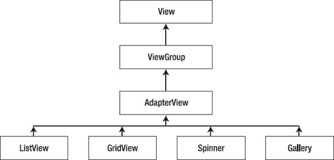

**图 6–8.** *AdapterView 类层次结构*

`AdapterView` 本身实际上继承自 `android.widget.ViewGroup`，这意味着 `ListView`、`GridView` 等是容器控件。换句话说，列表控件包含子视图的集合。适配器的目的是为 `AdapterView` 管理数据，并为其提供子视图。让我们通过研究 `SimpleCursorAdapter` 来看看这是如何工作的。


#### 认识 `SimpleCursorAdapter`

`SimpleCursorAdapter` 如图 6-9 所示。

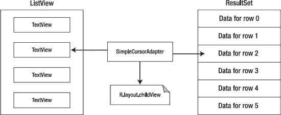

**图 6-9.** *SimpleCursorAdapter*

这是一张非常重要、需要理解透彻的示意图。左侧是 `AdapterView`；在此示例中，它是一个由多个 `TextView` 子视图组成的 `ListView`。右侧是数据；在此示例中，它表示为从内容提供程序查询得到的数据行结果集。

为了将数据行映射到 `ListView`，`SimpleCursorAdapter` 需要一个子布局资源 ID。该子布局必须描述右侧那些应显示在左侧的每个数据元素的布局。这里的布局与我们为 Activity 编写的布局类似，但它只需指定 `ListView` 中单行的布局。例如，如果你从联系人内容提供程序获得了一个信息结果集，并且只想在 `ListView` 中显示每个联系人姓名，你就需要提供一个布局来描述姓名字段的显示样式。如果你想在 `ListView` 的每一行中显示结果集中的姓名和一张图片，那么你的布局必须规定如何显示姓名和图片。

这并不意味着你必须为结果集中的每一个字段提供布局规范，也不意味着你必须为希望包含在 `ListView` 每一行中的每一项都在结果集中准备一个数据元素。例如，稍后我们将展示如何让 `ListView` 中包含用于选择行的复选框，而这些复选框并不需要由结果集中的数据来设置。我们还将展示如何访问结果集中不属于 `ListView` 的数据。尽管我们刚才一直在讨论 `ListView`、`TextView`、游标和结果集，但请记住，适配器的概念比这更为通用。左侧可以是图库（Gallery），右侧可以是一个简单的图片数组。不过，我们还是先保持相对简单，更详细地研究一下 `SimpleCursorAdapter`。

`SimpleCursorAdapter` 的构造方法如下所示：

`SimpleCursorAdapter(Context context, int childLayout, Cursor c, String[] from, int[] to)`

这个适配器将游标的一行转换为容器控件的子视图。子视图的定义在 XML 资源（`childLayout` 参数）中指定。请注意，由于游标中的一行可能包含许多列，你需要通过指定一个列名数组（使用 `from` 参数）来告知 `SimpleCursorAdapter` 你要从该行中选择哪些列。

同样，由于你选择的每一列都必须映射到布局中的一个 `View`，因此你必须在 `to` 参数中指定这些视图的 ID。你所选择的列与显示该列数据的 `View` 之间是一一对应的关系，因此 `from` 和 `to` 参数数组的元素数量必须相同。正如我们之前提到的，子视图可以包含其他类型的视图；它们不一定是 `TextView`。例如，你可以使用 `ImageView`。

`ListView` 与我们的适配器之间有着精密的协作。当 `ListView` 想要显示一行数据时，它会调用适配器的 `getView()` 方法，并传入位置参数来指定要显示的数据行。适配器通过使用其构造方法中设置的布局构建相应的子视图，并从结果集中获取相应记录的数据来做出响应。因此，`ListView` 无需处理数据在适配器端如何存在；它只需要根据需要调用子视图即可。这是一个关键点，这意味着我们的 `ListView` 不一定需要为每一行数据都创建子视图。它实际上只需要拥有与显示窗口中可见部分数量相当的子视图即可。如果只显示十行，那么技术上 `ListView` 只需要实例化十个子布局，即使我们的结果集中有数百条记录也是如此。实际上，实例化的子布局可能会超过十个，因为 Android 通常会准备一些额外的布局，以便更快地将新行显示出来。你应该得出的结论是：由 `ListView` 管理的子视图是可以被回收利用的。稍后我们会对此进行更多讨论。

图 6-9 揭示了使用适配器的一些灵活性。由于列表控件使用了适配器，你可以根据数据和子视图替换各种类型的适配器。例如，如果你不打算通过内容提供程序或数据库来填充 `AdapterView`，你就不必使用 `SimpleCursorAdapter`。你可以选择一种更“简单”的适配器——`ArrayAdapter`。


#### 初识 `ArrayAdapter`

`ArrayAdapter` 是 Android 中最简单的适配器。它专门针对列表控件设计，并假定列表项（即子视图）由 `TextView` 控件呈现。创建一个新的 `ArrayAdapter` 可以像下面这样简单：

```
ArrayAdapter<String> adapter = new ArrayAdapter<String>(this,
                android.R.layout.simple_list_item_1,
                new string[]{"Dave","Satya","Dylan"});
```

我们仍然需要传入上下文（即 `this`）以及一个 `childLayout` 资源 ID。不过，这次传入的不是数据字段规格组成的 `from` 数组，而是一个字符串数组作为实际数据。我们不需要传入游标或 `View` 资源 ID 组成的 `to` 数组。这里的前提是，子布局仅包含一个 `TextView`，而 `ArrayAdapter` 会将其作为数据数组中字符串的目标控件。

现在，我们来介绍一个用于 `childLayout` 资源 ID 的便捷技巧。我们可以利用 Android 中预定义的布局，而无需为列表项创建自己的布局文件。请注意，子布局资源 ID 的资源前缀是 `android.`。Android 会在自己的目录中查找，而不是在我们的本地 `/res` 目录中查找。你可以通过导航到 Android SDK 文件夹，查看 `platforms/<android-version>/data/res/layout` 目录来浏览此文件夹。在那里你会找到 `simple_list_item_1.xml`，可以看到它内部定义了一个简单的 `TextView`。这个 `TextView` 就是我们的 `ArrayAdapter` 用来创建视图（在其 `getView()` 方法中），并交给 `ListView` 使用的控件。你可以随意浏览这些文件夹，查找各种用途的预定义布局。我们稍后会用到更多这样的布局。

`ArrayAdapter` 还有其他构造函数。如果 `childLayout` 不仅仅是一个简单的 `TextView`，你可以传入行布局资源 ID，以及用于接收数据的 `TextView` 的资源 ID。当你没有现成的字符串数组可传入时，可以使用 `createFromResource()` 方法。清单 6-26 展示了我们为 Spinner 创建 `ArrayAdapter` 的示例。

**清单 6-26.** 从字符串资源文件创建 `ArrayAdapter`

```
<Spinner android:id="@+id/spinner"
    android:layout_width="wrap_content"  android:layout_height="wrap_content" />

Spinner spinner = (Spinner) findViewById(R.id.spinner);

ArrayAdapter<CharSequence> adapter = ArrayAdapter.createFromResource(this,
        R.array.planets, android.R.layout.simple_spinner_item);

adapter.setDropDownViewResource(android.R.layout.simple_spinner_dropdown_item);

spinner.setAdapter(adapter);

<?xml version="1.0" encoding="utf-8"?>
<!-- This file is /res/values/planets.xml -->
<resources>
  <string-array name="planets">
    <item>Mercury</item>
    <item>Venus</item>
    <item>Earth</item>
    <item>Mars</item>
    <item>Jupiter</item>
    <item>Saturn</item>
    <item>Uranus</item>
    <item>Neptune</item>
  </string-array>
</resources>
```

清单 6-26 包含三部分内容。第一部分是 Spinner 的 XML 布局。第二部分是 Java 代码，展示了如何创建一个数据源定义于字符串资源文件中的 `ArrayAdapter`。使用这种方法不仅可以让你将列表内容外部化到 XML 文件中，还可以使用本地化版本。我们稍后会详细讨论 Spinner，目前只需知道 Spinner 有一个用于显示当前选中值的视图，以及一个用于显示可选项的列表视图。它本质上是一个下拉菜单。清单 6-26 的第三部分是名为 `/res/values/planets.xml` 的 XML 资源文件，该文件被读取以初始化 `ArrayAdapter`。

值得提及的是，`ArrayAdapter` 允许对底层数据进行动态修改。例如，`add()` 方法会在数组末尾追加一个新值；`insert()` 方法会在数组中的指定位置添加一个新值；而 `remove()` 则从数组中移除一个对象。你还可以调用 `sort()` 对数组进行重新排序。当然，完成这些操作后，数据数组与 `ListView` 会不同步，因此你需要调用适配器的 `notifyDataSetChanged()` 方法。此方法会让 `ListView` 与适配器重新同步。

以下列表总结了 Android 提供的适配器：

- `ArrayAdapter<T>`：这是一个在任意对象的泛型数组之上的适配器。旨在与 `ListView` 一起使用。
- `CursorAdapter`：此适配器也旨在用于 `ListView`，通过游标为列表提供数据。
- `SimpleAdapter`：顾名思义，这是一个简单的适配器。通常用于使用静态数据（可能来自资源）填充列表。
- `ResourceCursorAdapter`：此适配器扩展了 `CursorAdapter`，并且知道如何从资源创建视图。
- `SimpleCursorAdapter`：此适配器扩展了 `ResourceCursorAdapter`，并根据游标中的列创建 `TextView`/`ImageView` 视图。这些视图在资源中定义。

我们已经介绍了足够多的适配器知识，接下来可以向你展示一些使用适配器和列表控件（也称为 `AdapterView`）的实际示例了。让我们开始吧。

### 将适配器与 `AdapterView` 结合使用

现在你已经了解了适配器，是时候让它们为我们工作了——为列表控件提供数据。在本节中，我们将首先介绍基本的列表控件 `ListView`。然后，我们将描述如何创建你自己的自定义适配器，最后会介绍其他类型的列表控件：`GridView`、Spinner 和画廊。

#### 基本列表控件：`ListView`

`ListView` 控件以垂直方式显示列表项。也就是说，如果我们有多个列表项需要查看，且项目数量超出了屏幕当前可显示的范围，我们可以通过滚动来查看其余部分。使用 `ListView` 的一般方法是通过编写一个新的 Activity 来扩展 `android.app.ListActivity`。`ListActivity` 包含一个 `ListView`，你可以通过调用 `setListAdapter()` 方法来为 `ListView` 设置数据。正如我们之前所描述的，适配器将列表控件与数据连接起来，并帮助为列表控件准备子视图。`ListView` 中的项目可以被点击以立即执行操作，或者被选中以便后续对选中的项目集进行操作。我们将从一个非常简单的示例开始，然后逐步添加功能。


#### 在 `ListView` 中显示值

图 6-10 展示了最简形式的 `ListView` 控件。


**图 6-10.** *使用 `ListView` 控件*

在本练习中，我们将用 `ListView` 填满整个屏幕，因此甚至无需在主布局 XML 文件中指定 `ListView`。代码清单 6-27 展示了 `ListActivity` 的 Java 代码。

**代码清单 6-27.** *向 `ListView` 添加条目*

```
public class ListViewActivity extends ListActivity
{
    @Override
    protected void onCreate(Bundle savedInstanceState)
    {
        super.onCreate(savedInstanceState);

        Cursor c = managedQuery(People.CONTENT_URI,
                        null, null, null, People.NAME);

        String[] cols = new String[] {People.NAME};
        int[]    views = new int[]   {android.R.id.text1};

        SimpleCursorAdapter adapter = new SimpleCursorAdapter(this,
                        android.R.layout.simple_list_item_1,
                        c, cols, views);
        this.setListAdapter(adapter);
    }
}
```

代码清单 6-27 创建了一个 `ListView` 控件，并用设备上的联系人列表填充它。在我们的示例中，我们查询设备以获取联系人列表。为了演示，我们从 Contacts 中选择所有字段（即使用 `managedQuery()` 方法中的第一个 `null` 参数），并按 `People.NAME` 字段排序（使用 `managedQuery()` 方法中的最后一个参数）。然后，我们创建一个投影（`cols`），仅选择联系人的姓名用于 `ListView`——投影定义了我们需要关注的列。接下来，我们提供对应的资源 ID 数组（`views`），将姓名列（`People.NAME`）映射到 `TextView` 控件（`android.R.id.text1`）。之后，我们创建游标适配器并设置列表的适配器。适配器类能够智能地读取数据源中的行，并提取每个联系人的姓名来填充用户界面。

要使其正常工作，还有一件事需要做。由于此演示访问的是手机的联系人数据库，我们需要请求权限。关于此安全主题将在第 10 章中详细讨论，现在，我们只是引导你让 `ListView` 显示出来。双击此项目的 `AndroidManifest.xml` 文件，然后点击权限标签。点击添加按钮，选择“使用权限”，然后点击确定。滚动名称列表，直到找到 `android.permission.READ_CONTACTS`。你的 Eclipse 窗口应该像图 6-11 所示。然后保存 `AndroidManifest.xml` 文件。现在，你可以在模拟器中运行此应用。你可能需要先使用联系人应用添加一些联系人，此示例应用中才会显示姓名。

你会注意到，`onCreate()` 方法没有设置 Activity 的内容视图。相反，由于基类 `ListActivity` 已经包含了一个 `ListView`，它只需要为 `ListView` 提供数据。在此示例中，我们使用了一些快捷方式，首先是我们利用了 `ListActivity` 提供主布局的特性。我们还使用了 Android 提供的布局作为子视图（资源 ID `android.R.layout.simple_list_item_1`），该布局包含一个 Android 提供的 `TextView`（资源 ID `android.R.id.text1`）。总之，设置起来相当简单。

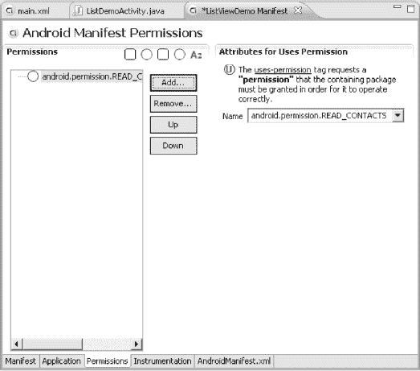

**图 6-11.** *修改 `AndroidManifest.xml` 以使我们的应用正常运行*

#### `ListView` 中的可点击条目

当然，运行此示例后，你会发现可以上下滚动列表查看所有联系人姓名，但仅此而已。如果我们想在这个示例中做一些更有趣的事情，比如当用户点击 `ListView` 中的某个条目时启动联系人应用，该怎么办？代码清单 6-28 展示了如何修改示例以接受用户输入。

**代码清单 6-28.** *在 `ListView` 上接受用户输入*

```
public class ListViewActivity2 extends ListActivity implements OnItemClickListener
{
    @Override
    protected void onCreate(Bundle savedInstanceState)
    {
        super.onCreate(savedInstanceState);

        ListView lv = getListView();

        Cursor c = managedQuery(People.CONTENT_URI,
                        null, null, null, People.NAME);

        String[] cols = new String[]{People.NAME};
        int[]   views = new int[]   {android.R.id.text1};

        SimpleCursorAdapter adapter = new SimpleCursorAdapter(this,
                android.R.layout.simple_list_item_1,
                c, cols, views);
        this.setListAdapter(adapter);
        lv.setOnItemClickListener(this);
    }

    @Override
    public void onItemClick(AdapterView<?> adView, View target, int position, long id) {
        Log.v("ListViewActivity", "in onItemClick with " + ((TextView) target).getText() +
                ". Position = " + position + ". Id = " + id);
        Uri selectedPerson = ContentUris.withAppendedId(
                People.CONTENT_URI, id);
        Intent intent = new Intent(Intent.ACTION_VIEW, selectedPerson);
        startActivity(intent);
    }
}
```

我们的 Activity 现在实现了 `OnItemClickListener` 接口，这意味着当用户点击 `ListView` 中的某个内容时，我们会收到回调。正如你在 `onItemClick()` 方法中看到的，我们会获得关于被点击项的许多信息，包括接收点击的视图、被点击项在 `ListView` 中的位置，以及根据适配器确定的项目 ID。由于我们知道 `ListView` 由 `TextView` 组成，因此在调用 `getText()` 方法获取联系人姓名之前，我们假设接收到的是 `TextView` 并进行相应转换。位置值表示此项目相对于 `ListView` 中所有项目列表的位置，且从 0 开始。因此，列表中的第一个项目位于位置 0。

ID 值完全取决于适配器和数据源。在我们的示例中，我们恰好查询的是 Contacts 内容提供者，因此根据此适配器，ID 是内容提供者中记录的 `_ID`。但在其他情况下，你的数据源可能并非来自内容提供者，所以你不应认为总能像本例那样创建 URI。如果我们使用从资源 XML 文件读取值的 `ArrayAdapter`，提供给我们的 ID 很可能是数据数组中值的位置，实际上可能与位置值完全相同。

之前讨论 `ArrayAdapter` 时，我们提到过 `notifyDataSetChanged()` 方法，让适配器在数据发生变化时更新 `ListView`。现在用当前示例做个小实验。点击其中一个联系人，这应该会启动联系人应用。然后，编辑联系人，更改其姓名；点击完成，再点击返回按钮回到示例应用。你应该会看到 `ListView` 中该联系人的姓名已自动更新。是不是很酷？通过 `SimpleCursorAdapter` 和 Contacts 内容提供者，我们的 `ListView` 已被自动更新。然而，使用 `ArrayAdapter` 时，你需要自己调用 `notifyDataSetChanged()` 方法。


这其实相当容易实现。我们生成自己的联系人姓名`ListView`，点击姓名即可为选中人员启动联系人（Contacts）应用。但如果想先选中一组姓名，然后对该子集执行操作呢？在下一个示例应用中，我们将修改列表项的布局以包含复选框，并在用户界面中添加一个按钮，用于对选中的子集执行操作。

### 为`ListView`添加其他控件

如果要在主布局中添加其他控件，可以提供自己的布局 XML 文件，放入一个`ListView`，并添加其他所需控件。例如，你可以在`ListView`下方添加一个按钮，用于提交对选中项目的操作，如图 6-12 所示。

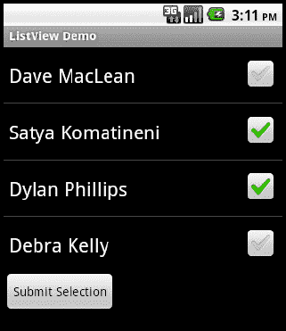

**图 6-12.** *一个附加按钮，允许用户提交选中的项目*

此示例的主布局在代码清单 6-29 中，它包含了活动的用户界面定义——`ListView`和`Button`。

**代码清单 6-29.** *覆盖`ListActivity`引用的`ListView`*

```
<?xml version="1.0" encoding="utf-8"?>
<!-- This file is at /res/layout/list.xml -->
<LinearLayout
    android:orientation="vertical"
    android:layout_width="fill_parent"  android:layout_height="fill_parent">

    <ListView android:id="@android:id/list"
            android:layout_width="fill_parent"  android:layout_height="0dip"
            android:layout_weight="1" />

    <Button android:id="@+id/btn" android:onClick="doClick"
           android:layout_width="wrap_content"  android:layout_height="wrap_content"
           android:text="Submit Selection" />

</LinearLayout>
```

请注意`ListView`的 ID 指定方式。我们必须使用`"@android:id/list"`，因为`ListActivity`期望在布局中找到具有该名称的`ListView`。如果我们依赖`ListActivity`默认创建的`ListView`，它也会具有这个 ID。

另一件需要注意的事情是，我们在`LinearLayout`中指定`ListView`高度的方式。我们希望无论`ListView`中有多少项目，按钮始终显示在屏幕上，并且不希望为了找到按钮而一直滚动到页面底部。为此，我们将`layout_height`设为 0，然后使用`layout_weight`来表明该控件应占据父容器所有可用空间。这个技巧为按钮留出了空间，同时保留了`ListView`的滚动能力。我们将在本章后面详细讨论布局和权重。

活动的实现如下所示，如代码清单 6-30 所示。

**代码清单 6-30.** *从`ListActivity`读取用户输入*

```
public class ListViewActivity3 extends ListActivity
{
    private static final String TAG = "ListViewActivity3";
    private ListView lv = null;
    private Cursor cursor = null;
    private int idCol = -1;
    private int nameCol = -1;
    private int notesCol = -1;

    @Override
    protected void onCreate(Bundle savedInstanceState)
    {
        super.onCreate(savedInstanceState);
        setContentView(R.layout.list);

        lv = getListView();

        cursor = managedQuery(People.CONTENT_URI,
                        null, null, null, People.NAME);

        String[] cols = new String[]{People.NAME};
        idCol = cursor.getColumnIndex(People._ID);
        nameCol = cursor.getColumnIndex(People.NAME);
        notesCol = cursor.getColumnIndex(People.NOTES);

        int[] views = new int[]{android.R.id.text1};

        SimpleCursorAdapter adapter = new SimpleCursorAdapter(this,
                android.R.layout.simple_list_item_multiple_choice,
                cursor, cols, views);

        this.setListAdapter(adapter);

        lv.setChoiceMode(ListView.CHOICE_MODE_MULTIPLE);
    }
```


```java
public void doClick(View view) {
    int count = lv.getCount();
    SparseBooleanArray viewItems = lv.getCheckedItemPositions();
    for(int i = 0; i < count; i++) {
        if(viewItems.get(i)) {
            cursor.moveToPosition(i);
            long id = cursor.getLong(idCol);
            String name = cursor.getString(nameCol);
            String notes = cursor.getString(notesCol);
            Log.v(TAG, name + " is checked. Notes: " + notes +
                    ". Position = " + i + ". Id = " + id);
        }
    }
}
```

Now, we call `setContentView()` again to set the UI for the activity. In setting up the adapter, we pass in another view provided by Android for a `ListView` row (`android.R.layout.simple_list_item_multiple_choice`), which results in each row containing a `TextView` and a `CheckBox`. If you look inside that layout file, you will find another subclass of `TextView` called `CheckedTextView`. This special type of `TextView` is specifically designed for `ListView`. See, we told you there is some interesting stuff in the Android layout folder! You will see that the `CheckedTextView` has an ID of `text1`, which is what we need to pass in the view array to the `SimpleCursorAdapter` constructor.

现在，我们再次调用`setContentView()`来设置活动的用户界面。在适配器的设置中，我们传递了另一个 Android 提供的用于`ListView`行项的视图（`android.R.layout.simple_list_item_multiple_choice`），这会使每一行包含一个`TextView`和一个`CheckBox`。如果你查看这个布局文件内部，会发现另一个`TextView`的子类，叫做`CheckedTextView`。这种特殊类型的`TextView`专门设计用于`ListView`。看吧，我们说过 Android 布局文件夹里有一些有趣的东西！你会看到`CheckedTextView`的 ID 是`text1`，这正是我们需要在视图数组中传递给`SimpleCursorAdapter`构造函数的参数。

Because we want the user to be able to select rows, we set the choice mode to `CHOICE_MODE_MULTIPLE`. By default, the choice mode is `CHOICE_MODE_NONE`. The other alternative is `CHOICE_MODE_SINGLE`. If you want to use that choice mode for this example, you would need to use a different layout, most likely `android.R.layout.simple_list_item_single_choice`.

因为我们希望用户能够选择行，所以我们将选择模式设置为`CHOICE_MODE_MULTIPLE`。默认情况下，选择模式是`CHOICE_MODE_NONE`。另一个可选值是`CHOICE_MODE_SINGLE`。如果你希望在这个示例中使用那种选择模式，则需要使用不同的布局，最可能是`android.R.layout.simple_list_item_single_choice`。

In this example, we implement a basic button that calls the activity's `doClick()` method. To keep things simple, we only want to output the names of the items that the user selected to LogCat. The good news is that there is a very simple solution; the bad news is that Android has evolved and the best solution depends on which version of Android you are targeting. The `ListView` solution shown here works from Android 1 onward (although we are using the Android 1.6 shortcut for the button callback). As stated, the `getCheckedItemPositions()` method, while old, still works. The returned array tells you whether an item is selected or not. So we iterate through the array. If the corresponding row in the `ListView` is selected, `viewItems.get(i)` returns true. Our data is accessed via a cursor. So we don't look up data in the `ListView`; we look it up in the cursor. The `ListView` tells us which position in the adapter to look at.

在这个示例中，我们实现了一个基本按钮，它会调用活动的`doClick()`方法。为了保持简洁，我们只想将被用户选中的项的名称输出到 LogCat。好消息是解决方案非常简单；坏消息是 Android 已经进化，最佳解决方案取决于你针对的是哪个 Android 版本。这里展示的`ListView`解决方案自 Android 1 起就有效（尽管我们在按钮回调中使用了 Android 1.6 的快捷方式）。也就是说，`getCheckedItemPositions()`方法虽然古老，但仍然有效。返回值是一个数组，可以告诉你某个项是否被选中。因此我们遍历这个数组。如果`ListView`中对应的行被选中，`viewItems.get(i)`将返回`true`。我们的数据可以通过游标访问。所以我们不在`ListView`中查找数据，而是在游标中查找数据。`ListView`会告诉我们应该在适配器中的哪个位置查找。

When we get a selected position number from the `ListView`, we can use the cursor's `moveToPosition()` method to get ready to read data. There is also a nearly identical method, that is the `ListView`'s `getItemAtPosition()` method. In our case, the object returned from `getItemAtPosition()` will be a `CursorWrapper` object. As we said before, in other situations we may get other types of objects. The reason we get a `CursorWrapper` here is because we are using a content provider. You must know your data source and adapter to know what to expect.

当我们从`ListView`获得一个已被选中的位置编号时，可以使用游标的`moveToPosition()`方法来准备读取数据。还有一个几乎相同的方法，即`ListView`的`getItemAtPosition()`方法。在我们的例子中，从`getItemAtPosition()`返回的对象将是一个`CursorWrapper`对象。正如我们之前所说，在其他情况下，可能会得到其他类型的对象。正因为我们使用的是内容提供者，所以这里才会得到`CursorWrapper`。你必须了解自己的数据源和适配器，才能知道应该期望什么。

Then, we can use the `Cursor` (or `CursorWrapper` if you use it) to retrieve the data associated with the `ListView` row. Note that in our example we can retrieve not only the contact name but also the notes, even though we never mapped notes to the `ListView`. When we set the cursor for the adapter, we selected all available fields. In practice, you won't need all fields, so you should limit your query to only the fields you need. But in this example, we queried for more fields than we needed to display in the `ListView`, so that we could easily access other fields within the button callback.

然后，我们可以使用`Cursor`（或者如果使用`CursorWrapper`的话，就用它）来检索与`ListView`行相关联的数据。注意，在我们的示例中，我们不仅可以检索联系人的姓名，还可以检索备注，即使我们从未将备注映射到`ListView`。当我们为适配器设置游标时，选择了所有可用的字段。在实践中，你不需要所有字段，因此应该将查询限制为仅使用你需要的字段。但在这个例子中，我们查询的字段多于在`ListView`中显示所需的字段，这样我们就可以在按钮回调中轻松访问其他字段。

##### Another Way to Read Selected Items from a ListView

#### 从 ListView 读取选中项的另一种方法

Android 1.6 introduced another way to retrieve a list of selected rows from a `ListView`: `getCheckItemIds()`. This was deprecated in Android 2.2 and replaced with `getCheckedItemIds()`. It's a small name change, but the method works essentially the same. Also, in Android 2.2, the way contacts are handled changed. For our next example, we will show what this example could look like using the Android 2.2 features. Listing 6-31 shows the Java code. For the XML layout for `list.xml`, we can reuse the same file from Listing 6-29.

Android 1.6 引入了另一种从`ListView`检索选中行列表的方法：`getCheckItemIds()`。随后在 Android 2.2 中，该方法被弃用，并替换为`getCheckedItemIds()`。这是一个细微的名称变化，但方法的使用方式基本相同。另外，在 Android 2.2 中，处理联系人的方式也发生了变化。在我们的下一个示例中，我们将使用 Android 2.2 的特性来展示这个示例可能的样子。清单 6-31 显示了 Java 代码。对于`list.xml`的 XML 布局，我们可以继续使用清单 6-29 中的同一个文件。

**Listing 6-31.** *Another Way to Read User Input from a ListActivity*

**清单 6-31.** *从 ListActivity 读取用户输入的另一种方法*

```java
public class ListViewActivity4 extends ListActivity
{
    private static final String TAG = "ListViewActivity4";
    private static final Uri CONTACTS_URI = ContactsContract.Contacts.CONTENT_URI;
    private SimpleCursorAdapter adapter = null;
    private ListView lv = null;

    @Override
    protected void onCreate(Bundle savedInstanceState)
    {
        super.onCreate(savedInstanceState);
        setContentView(R.layout.list);

        lv = getListView();

        String[] projection = new String[] {ContactsContract.Contacts._ID,
                ContactsContract.Contacts.DISPLAY_NAME};
        Cursor c = managedQuery(CONTACTS_URI,
                        projection, null, null, ContactsContract.Contacts.DISPLAY_NAME);

        String[] cols = new String[] {ContactsContract.Contacts.DISPLAY_NAME};
        int[]    views = new int[]       {android.R.id.text1};

        adapter = new SimpleCursorAdapter(this,
                android.R.layout.simple_list_item_multiple_choice,
                c, cols, views);

        this.setListAdapter(adapter);

        lv.setChoiceMode(ListView.CHOICE_MODE_MULTIPLE);
    }

    public void doClick(View view) {
        if(!adapter.hasStableIds()) {
            Log.v(TAG, "Data is not stable");
            return;
        }
        long[] viewItems = lv.getCheckedItemIds();
        for(int i=0; i<viewItems.length; i++) {
            Uri selectedPerson = ContentUris.withAppendedId(
                    CONTACTS_URI, viewItems[i]);

            Log.v(TAG, selectedPerson.toString() + " is checked.");
        }
    }
}
```

In this sample application, when we click the button, the callback calls the `getCheckedItemIds()` method. Whereas in the previous example we got an array of positions of the items selected in the `ListView`, this time we get an array of IDs of records from the adapter that are selected in the `ListView`. We can now bypass the `ListView` and cursor, because the IDs can be used with the content provider to do whatever we want. In our case, we simply build a URI that represents a specific record from the contacts content provider and write that URI to LogCat. We could also operate on the data directly with the content provider. This technique works equally as well with the old contacts content provider and Android 1.6's `getCheckItemIds()` method.

在这个示例应用中，当我们点击按钮时，回调会调用`getCheckedItemIds()`方法。而在上一个示例中，我们得到一个在`ListView`中被选中项的位置数组，这次我们得到一个从适配器中已在`ListView`中被选中的记录的 ID 数组。现在我们可以绕过`ListView`和游标，因为这些 ID 可以与内容提供者一起使用，来执行我们想要的任何操作。在我们的示例中，我们简单地构建了一个代表来自联系人内容提供者的特定记录的 URI，并将该 URI 写入 LogCat。我们也可以直接使用内容提供者对数据进行操作。这种技术与旧的联系人内容提供者和 Android 1.6 的`getCheckItemIds()`方法配合使用同样有效。

We also did something a bit different in this example: we selected only a couple of columns when creating the cursor. This is common practice, as you don't want to read more data than you need. One last note: the `getCheckedItemIds()` requires that the underlying data in the adapter be stable. For this reason, it is highly advised that you call `hasStableIds()` on the adapter before calling `getCheckedItemIds()` on the `ListView`. In our example, we take a shortcut and just log the fact and return. In practice, you will want to do something smarter, such as starting a background thread to retry and popping up a dialog indicating processing.

在这个示例中，我们还做了一些不同的事情：在创建游标时，只选择了几列。这是常规做法，因为你不想读取超出必要的数据。最后要指出的是，`getCheckedItemIds()`方法要求适配器中的底层数据是稳定的。因此，强烈建议在`ListView`上调用`getCheckedItemIds()`之前，先在适配器上调用`hasStableIds()`。在我们的示例中，我们采取了一个快捷方式，只是记录了这个事实并返回。实际上，你会希望做一些更智能的事情，比如启动一个后台线程进行重试，并弹出一个对话框指示正在处理中。


### 处理列表控件

我们已向你展示了如何在不同场景下使用`ListView`。我们也展示了适配器为支持`ListView`所承担的大量工作。接下来，我们将介绍其他类型的列表控件，首先从`GridView`开始。

### GridView 控件

大多数控件工具箱都会提供一个或多个基于网格的控件。Android 提供了`GridView`控件，它可以以网格形式显示数据。请注意，虽然这里我们使用了"数据"一词，但网格的内容可以是文本、图像等。

`GridView`控件以网格形式显示信息。使用`GridView`的模式是：在 XML 布局中定义网格（参见**清单 6-32**），然后使用`android.widget.ListAdapter`将数据绑定到网格。别忘了在`AndroidManifest.xml`文件中添加`uses-permission`标签，以使此示例能够运行。

**清单 6-32.** *XML 布局中 GridView 的定义及关联的 Java 代码*

```
<?xml version="1.0" encoding="utf-8"?>
<!-- 此文件位于 /res/layout/gridview.xml -->
<GridView
    android:id="@+id/dataGrid"
    android:layout_width="fill_parent"
    android:layout_height="fill_parent"
    android:padding="10px"
    android:verticalSpacing="10px"
    android:horizontalSpacing="10px"
    android:numColumns="auto_fit"
    android:columnWidth="100px"
    android:stretchMode="columnWidth"
    android:gravity="center"
    />

public class GridViewActivity extends Activity
{
    @Override
    protected void onCreate(Bundle savedInstanceState)
    {
        super.onCreate(savedInstanceState);
        setContentView(R.layout.gridview);

        GridView gv = (GridView)findViewById(R.id.gridview);

        Cursor c = managedQuery(People.CONTENT_URI,
                        null, null, null, People.NAME);

        String[] cols = new String[] {People.NAME};
        int[]    views = new int[]      {android.R.id.text1};

        SimpleCursorAdapter adapter = new SimpleCursorAdapter(this,
                android.R.layout.simple_list_item_1,
                c, cols, views);

        gv.setAdapter(adapter);
    }
}
```

**清单 6-32** 在 XML 布局中定义了一个简单的`GridView`。然后将该网格加载到活动的内容视图中。生成的用户界面如**图 6-13** 所示。


**图 6-13.** *填充了联系人信息的 GridView*

**图 6-13** 中显示的网格展示了设备上联系人的姓名。我们选择显示一个包含联系人姓名的`TextView`，但你也可以轻松生成一个填充了图像或其他控件的网格。我们再次利用了 Android 中预定义的布局。事实上，这个示例看起来与**清单 6-27** 非常相似，但有几个重要的区别。首先，我们的`GridViewActivity`继承自`Activity`，而不是`ListActivity`。其次，我们必须调用`setContentView()`来为我们的`GridView`设置布局；没有默认视图可以回退。最后，要设置适配器，我们在`GridView`对象上调用`setAdapter()`，而不是在`Activity`上调用`setListAdapter()`。

你可能已经注意到，网格使用的适配器是一个`ListAdapter`。列表通常是一维的，而网格是二维的。因此我们可以得出结论：网格实际上显示的是面向列表的数据。并且事实证明，列表是按行显示的。也就是说，列表内容先排满第一行，然后排第二行，以此类推。

与之前一样，我们有一个列表控件与适配器协同工作，以处理数据管理和子视图的生成。我们之前使用的相同技术应该也适用于`GridView`。但有一个例外，即选择功能。在`GridView`中无法像我们在**清单 6-30** 中那样指定多项选择。

### Spinner 控件

`Spinner`控件类似于下拉菜单。它通常用于从相对较短的选择列表中进行选择。如果选择列表太长而无法完全显示，系统会自动为你添加滚动条。你可以通过 XML 布局像这样简单地实例化一个`Spinner`：

```
<Spinner
    android:id="@+id/spinner"  android:prompt="@string/spinnerprompt"
    android:layout_width="wrap_content"  android:layout_height="wrap_content" />
```

虽然从技术上讲，spinner 是一种列表控件，但它看起来更像是一个简单的`TextView`控件。换句话说，当 spinner 处于静止状态时，只会显示一个值。Spinner 的目的是允许用户从一组预定义值中进行选择：当用户点击小箭头时，会显示一个列表，用户可以选择一个新值。填充这个列表的方式与其他列表控件相同，即通过适配器。由于 spinner 经常像下拉菜单一样使用，因此常见做法是让适配器从资源文件中获取列表选项。一个使用资源文件设置 spinner 的示例如**清单 6-33** 所示。请注意名为`android:prompt`的新属性，用于在列表顶部设置提示文本供选择。我们 spinner 提示的实际文本位于`/res/values/strings.xml`文件中。你应该可以预料到，`Spinner`类也提供了通过代码设置提示的方法。

**清单 6-33.** *从资源文件创建 Spinner 的代码*

```
public class SpinnerActivity extends Activity {
    /** 当活动首次创建时调用。 */
    @Override
    public void onCreate(Bundle savedInstanceState) {
        super.onCreate(savedInstanceState);
        setContentView(R.layout.spinner);

        Spinner spinner = (Spinner)findViewById(R.id.spinner);

        ArrayAdapter<CharSequence> adapter = ArrayAdapter.createFromResource(this,
                R.array.planets, android.R.layout.simple_spinner_item);

        adapter.setDropDownViewResource(android.R.layout.simple_spinner_dropdown_item);

        spinner.setAdapter(adapter);
    }
}
```

你可能还记得在**清单 6-26** 中看到过`planets.xml`文件。我们在此示例中展示了如何创建`Spinner`控件；设置好适配器，然后将其与 spinner 关联起来。请参见**图 6-14** 了解实际效果。

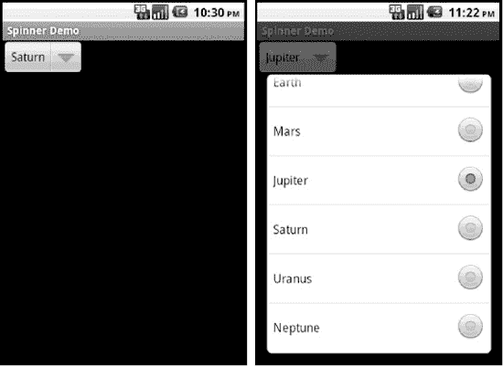

**图 6-14.** *用于选择行星的 Spinner*

与我们之前的列表控件相比，一个区别在于处理 spinner 时，我们需要处理一个额外的布局。**图 6-14** 的左侧显示了 spinner 的正常模式，其中显示了当前选中的项。在此例中，当前选中的是土星。在该词旁边有一个向下箭头，表示此控件是一个 spinner，可以弹出一个列表来选择不同的值。第一个布局作为参数传递给`ArrayAdapter.createFromResource()`方法，定义了 spinner 在正常模式下的外观。在**图 6-14** 的右侧，我们展示了 spinner 处于弹出列表模式时的状态，等待用户选择新值。此列表的布局通过`setDropDownViewResource()`方法设置。同样在此示例中，我们使用了 Android 提供的布局来满足这两种需求，因此如果你想查看这两个布局的定义，可以访问 Android 的`res/layout`文件夹。当然，你也可以为这两者指定自己的布局定义，以获得你想要的效果。


### Gallery 控件

`Gallery`控件是一个水平滚动的列表控件，其焦点始终位于列表中央。该控件在触摸模式下通常用作照片画廊。您可以通过 XML 布局或代码来实例化`Gallery`：

```
<Gallery
    android:id="@+id/gallery"
    android:layout_width="fill_parent"
    android:layout_height="wrap_content"
/>
```

`Gallery`控件通常用于显示图片，因此您的适配器很可能专门用于图像处理。我们将在下一节关于自定义适配器的内容中介绍一个自定义图像适配器。从视觉上看，`Gallery`的外观如图 6–15 所示。


**图 6–15.** *一个包含海牛图片的画廊*

### 创建自定义适配器

Android 中的标准适配器易于使用，但它们存在一些局限性。为了解决这个问题，Android 提供了一个名为`BaseAdapter`的抽象类，如果您需要自定义适配器，可以扩展此类。当您有特殊的数据管理需求，或者希望对子视图的显示方式有更多控制权时，可以使用自定义适配器。您也可以通过使用缓存技术来优化性能，从而使用自定义适配器。接下来我们将向您展示如何构建一个自定义适配器。

清单 6–34 展示了一个自定义适配器可能对应的 XML 布局和 Java 代码。在接下来的示例中，我们的适配器将处理海牛图片，因此我们将其命名为`ManateeAdapter`。我们还会在 Activity 内部创建它。

**清单 6–34.** *我们的自定义适配器：ManateeAdapter*

```
<?xml version="1.0" encoding="utf-8"?>
<!-- 此文件位于 /res/layout/gridviewcustom.xml -->
<GridView
    android:id="@+id/gridview"
    android:layout_width="fill_parent"
    android:layout_height="fill_parent"
    android:padding="10dip"
    android:verticalSpacing="10dip"
    android:horizontalSpacing="10dip"
    android:numColumns="auto_fit"
    android:gravity="center"
    />
```

```
public class GridViewCustomAdapter extends Activity
{
    @Override
    protected void onCreate(Bundle savedInstanceState)
    {
        super.onCreate(savedInstanceState);
        setContentView(R.layout.gridviewcustom);

        GridView gv = (GridView)findViewById(R.id.gridview);

        ManateeAdapter adapter = new ManateeAdapter(this);

        gv.setAdapter(adapter);
    }

    public static class ManateeAdapter extends BaseAdapter {
        private static final String TAG = "ManateeAdapter";
        private static int convertViewCounter = 0;
        private Context mContext;
        private LayoutInflater mInflater;

        static class ViewHolder {
            ImageView image;
        }

        private int[] manatees = {
                R.drawable.manatee00, R.drawable.manatee01, R.drawable.manatee02,
                R.drawable.manatee03, R.drawable.manatee04, R.drawable.manatee05,
                R.drawable.manatee06, R.drawable.manatee07, R.drawable.manatee08,
                R.drawable.manatee09, R.drawable.manatee10, R.drawable.manatee11,
                R.drawable.manatee12, R.drawable.manatee13, R.drawable.manatee14,
                R.drawable.manatee15, R.drawable.manatee16, R.drawable.manatee17,
                R.drawable.manatee18, R.drawable.manatee19, R.drawable.manatee20,
                R.drawable.manatee21, R.drawable.manatee22, R.drawable.manatee23,
                R.drawable.manatee24, R.drawable.manatee25, R.drawable.manatee26,
                R.drawable.manatee27, R.drawable.manatee28, R.drawable.manatee29,
                R.drawable.manatee30, R.drawable.manatee31, R.drawable.manatee32,
                R.drawable.manatee33 };

        private Bitmap[] manateeImages = new Bitmap[manatees.length];
        private Bitmap[] manateeThumbs = new Bitmap[manatees.length];

        public ManateeAdapter(Context context) {
            Log.v(TAG, "正在构造 ManateeAdapter");
            this.mContext = context;
            mInflater = LayoutInflater.from(context);

            for(int i=0; i<manatees.length; i++) {
                manateeImages[i] = BitmapFactory.decodeResource(
                        context.getResources(), manatees[i]);
                manateeThumbs[i] = Bitmap.createScaledBitmap(manateeImages[i],
                        100, 100, false);
            }
        }

        @Override
        public int getCount() {
            Log.v(TAG, "进入 getCount()");
            return manatees.length;
        }

        public int getViewTypeCount() {
            Log.v(TAG, "进入 getViewTypeCount()");
            return 1;
        }
```


```java
public int getItemViewType(int position) {
    Log.v(TAG, "in getItemViewType() for position " + position);
    return 0;
}

@Override
public View getView(int position, View convertView, ViewGroup parent) {
    ViewHolder holder;

    Log.v(TAG, "in getView for position " + position +
            ", convertView is " +
            ((convertView == null)?"null":"being recycled"));

    if (convertView == null) {
        convertView = mInflater.inflate(R.layout.gridimage, null);
        convertViewCounter++;
        Log.v(TAG, convertViewCounter + " convertViews have been created");

        holder = new ViewHolder();
        holder.image = (ImageView) convertView.findViewById(R.id.gridImageView);

        convertView.setTag(holder);
    } else {
        holder = (ViewHolder) convertView.getTag();
    }

    holder.image.setImageBitmap( manateeThumbs[position] );

    return convertView;
}

@Override
public Object getItem(int position) {
    Log.v(TAG, "in getItem() for position " + position);
    return manateeImages[position];
}

@Override
public long getItemId(int position) {
    Log.v(TAG, "in getItemId() for position " + position);
    return position;
}
```

当你运行这个应用时，应该会看到类似图 6–16 的显示效果。

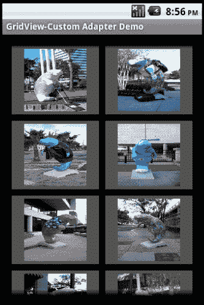

**图 6–16.** *展示海牛图像的网格视图*

这个示例虽然看起来相对简单，但有很多需要解释的地方。我们将从`Activity`类开始，它和我们在本章这一部分一直在使用的类非常相似。`gridviewcustom.xml`中有一个主布局，仅包含一个`GridView`定义。我们需要从布局内部获取对`GridView`的引用，因此我们定义并设置了`gv`。我们实例化`ManateeAdapter`，将上下文传递给它，并在`GridView`上设置适配器。到目前为止，这些都是相当标准的操作，尽管你肯定已经注意到，我们的自定义适配器在创建时使用的参数远少于预定义适配器。这主要是因为我们对这个特定的适配器拥有完全的控制权，并且它仅用于这个应用。如果我们希望让这个适配器更通用，我们很可能会设置更多参数。但让我们继续往下看。

在适配器内部，我们的工作是管理将数据传递到 Android 的`View`对象中。这些`View`对象将被列表控件（此处为`GridView`）使用。数据来自某个数据源。在之前的示例中，数据是通过传递给适配器的游标对象传入的。而在我们的自定义案例中，适配器完全了解数据及其来源。列表控件会向适配器请求信息，以便知道如何构建用户界面。同时，当适配器持有不再需要的视图时，列表控件也会足够友好地将这些视图传入以供回收。想到适配器必须知道如何构建视图，可能有点奇怪，但最终这一切都是合理的。

当我们实例化自定义适配器`ManateeAdapter`时，习惯做法是传入上下文，并让适配器持有它。在需要时能够访问上下文通常非常有用。我们要在适配器中做的第二件事是获取并持有`inflater`。这有助于在需要创建新视图以返回给列表控件时提升性能。适配器中第三件典型的事情是创建一个`ViewHolder`对象，用于容纳我们管理的数据所对应的`View`对象。在这个示例中，我们只简单地存储了一个`ImageView`，但如果我们需要处理其他字段，我们会将它们添加到`ViewHolder`的定义中。例如，如果有一个`ListView`，每一行包含一个`ImageView`和两个`TextView`，那么我们的`ViewHolder`就会包含一个`ImageView`和两个`TextView`。

由于在这个适配器中我们处理的是海牛的图像，我们在构造过程中设置了一个图像资源 ID 数组，用于创建位图。我们还定义了一个位图数组，作为我们的数据列表。

从`ManateeAdapter`的构造函数可以看出，我们保存了上下文，创建并持有了`inflater`，然后遍历图像资源 ID，构建了一个位图数组。这个位图数组将作为我们的数据。

正如你之前所学到的，设置适配器会导致我们的`GridView`调用适配器上的方法，以便用要显示的数据进行自我配置。例如，`gv`会调用适配器的`getCount()`方法来确定有多少个对象需要显示。它还会调用`getViewTypeCount()`方法来确定`GridView`中可以显示多少种不同类型的视图。在本示例中，我们将此值设为 1。然而，如果我们有一个`ListView`并且希望在常规数据行之间插入分隔线，那么我们会有两种类型的视图，并且需要从`getViewTypeCount()`返回 2。你可以根据需要设置任意数量的不同视图类型，只要从这个方法返回正确的计数即可。与这个方法相关的是`getItemViewType()`。我们刚刚提到，适配器可以返回多种类型的视图。但为了简单起见，`getItemViewType()`只需返回一个整数值，以指示在数据的特定位置上属于哪种视图类型。因此，如果我们有两种类型的视图需要返回，`getItemViewType()`需要返回 0 或 1 来指示类型。如果有三种类型，则该方法需要返回 0、1 或 2。

如果我们的适配器在`ListView`中处理分隔线，那么它必须将分隔线视为数据。这意味着数据中的某个位置被分隔线占据。当列表控件调用`getView()`来获取该位置对应的视图时，`getView()`需要返回一个分隔线视图而不是常规数据视图。而当在`getItemViewType()`中被问及该位置的视图类型时，我们需要返回我们已确定的与该视图类型匹配的整数值。如果使用分隔线，你应该做的另一件事是实现`isEnabled()`方法。对于列表项，该方法应返回`true`；对于分隔线，应返回`false`，因为分隔线不应被选中或点击。

`ManateeAdapter`中最重要的方法是`getView()`方法调用。一旦`gv`确定了可用的项目数量，它就开始请求数据。现在，我们可以讨论视图回收了。列表控件只能在显示屏上显示与屏幕空间相匹配的子视图数量。这意味着没有必要为适配器中的每条数据都调用`getView()`；只有在需要显示多少个项目时才调用`getView()`才是有意义的。随着`gv`从适配器获取子视图，它正在确定屏幕上能容纳多少个视图。一旦显示屏被子视图填满，`gv`就可以停止调用`getView()`。


在启动此示例应用后查看 `LogCat`，你会看到各种调用，但也会发现 `getView()` 在请求完所有图片之前就停止了调用。如果你开始在 `GridView` 中上下滚动，就会在 `LogCat` 中看到更多对 `getView()` 的调用，并且会注意到：一旦创建了特定数量的子视图，`getView()` 被调用时 `convertView` 就会设置为某个非空值。这意味着我们正在回收子视图——这对性能非常有利。

如果在 `getView()` 中从 `gv` 获取到非空的 `convertView` 值，说明 `gv` 正在回收该视图。通过复用传入的视图，我们避免了重新解析 XML 布局，也无需重新查找 `ImageView`。通过将 `ViewHolder` 对象与我们返回的 `View` 关联起来，下次视图回收时我们可以更快地完成复用操作。在 `getView()` 中，我们只需要重新获取 `ViewHolder` 并将正确的数据分配到视图中即可。

在这个示例中，我们想展示视图中的数据不一定与原始数据完全一致。`createScaledBitmap()` 方法是为显示目的创建数据缩略版本。关键在于我们的列表控件不会调用 `getItem()` 方法。当用户对列表控件操作时，其他需要处理数据的代码才会调用此方法。再次强调，对于任何适配器，理解其工作原理至关重要。你不应盲目依赖适配器 `getView()` 创建的列表控件视图数据。有时需要调用适配器的 `getItem()` 方法来获取实际待操作的数据；有时（如之前的 `ListView` 示例）则需要通过游标获取数据。这完全取决于适配器的类型以及数据的最终来源。虽然我们在示例中使用了 `createScaledBitmap()` 方法，但 Android 2.2 引入了另一个可能更适用的类：`ThumbnailUtils`。该类包含一些从位图和视频生成缩略图的静态方法。

本示例最后需要指出的是 `getItemId()` 方法的调用。在之前结合 `ListView` 和联系人的示例中，项目 ID 来自内容提供器的 `_ID` 值。而在此示例中，我们只需使用位置作为项目 ID 即可。项目 ID 的核心意义在于提供一种独立于位置引用数据的机制——当数据在适配器之外（如联系人数据）具有独立生命周期时尤其重要。当我们能像管理海牛图片这样直接控制数据，并且知道如何在应用中获取实际数据时，通常会将位置直接用作项目 ID。鉴于我们甚至不允许添加或删除数据，这种快捷方式在本例中尤为合适。

### Android 中的其他控件

Android 提供了大量可供使用的控件。我们已经介绍了不少控件，后续章节还将介绍更多（例如第 17 章的 `MapView`、第 19 章的 `VideoView` 和 `MediaController`，以及第 20 章的 `GLSurfaceView`）。你会发现其他控件由于都继承自 `View`，与我们已介绍的控件有许多共通之处。这里仅简要提及几个值得自行探索的控件。

`ScrollView` 是一个用于设置带垂直滚动条视图容器的控件。当内容过多无法单屏显示时会非常实用。请参阅本章“参考资料”部分中 Romain Guy 关于该控件用法的博客链接。

`ProgressBar` 和 `RatingBar` 控件类似于滑块：前者用于直观显示操作进度（如文件下载或音乐播放），后者则显示星级评分。

`Chronometer` 控件是一个正向计时的计时器。如果你需要显示倒计时，可以使用 `CountDownTimer` 类，但它并非 `View` 类。

`WebView` 是一个用于显示 HTML 的特殊视图。其功能远不止于此，还包括处理 Cookie、JavaScript 以及链接应用程序中的 Java 代码。但在应用内实现网页浏览器之前，建议优先考虑直接调用设备自带的浏览器来完成繁重任务。

本章的控件介绍到此结束。接下来我们将讨论用于修改控件外观和感觉的样式与主题，然后介绍用于在屏幕上排列控件的布局。

### 样式与主题

Android 提供了多种修改应用中视图样式的方法。首先介绍在字符串中使用标记标签，然后介绍如何使用可扩展文本（Spannable）改变文本的具体视觉属性。但如果你想通过多个视图或整个 Activity/应用的共同规范来控制外观呢？我们将讨论 Android 的样式和主题来向你展示具体方法。


#### 使用样式

有时，您希望高亮或设置`View`内容某部分的样式。这可以通过静态或动态方式实现。静态方式下，您可以直接对字符串资源中的文本应用标记，例如：

`<string name="styledText"><i>静态</i>样式在<b>TextView</b>中。</string>`

然后，您可以在 XML 或代码中引用它。请注意，在字符串资源中可以使用以下 HTML 标签：`<i>`（斜体）、`<b>`（粗体）和`<u>`（下划线），以及`<sup>`（上标）、`<sub>`（下标）、`<strike>`（删除线）、`<big>`（大号）、`<small>`（小号）和`<monospace>`（等宽字体）。您甚至可以嵌套这些标签，例如，实现小号上标的效果。这不仅在`TextView`中有效，在其他视图（如按钮）中同样适用。图 6–17 展示了使用本节中的多个示例后，样式化和主题化文本的效果。


**图 6–17.** *样式和主题示例*

以编程方式设置`TextView`控件内容的样式需要额外的工作，但提供了更大的灵活性（参见代码清单 6–35），因为它可以在运行时进行样式设置。不过，这种灵活性只能应用于 `Spannable` 对象，`EditText` 通常使用它来管理内部文本，而 `TextView` 通常不使用 `Spannable`。`Spannable` 本质上是一个可以应用样式的 `String`。要让 `TextView` 将文本存储为 `Spannable`，可以这样调用 `setText()`：

`tv.setText("这段文本存储在 Spannable 中", TextView.BufferType.SPANNABLE);`

然后，当您调用 `tv.getText()` 时，将获得一个 `Spannable` 对象。

如代码清单 6–35 所示，您可以获取 `EditText` 的内容（作为 `Spannable` 对象），然后为文本的部分内容设置样式。该清单中的代码将文本样式设置为粗体和斜体，并将背景设置为红色。您可以使用所有与之前描述的 HTML 标签对应的样式选项，甚至更多。

**代码清单 6–35.** *动态地为 EditText 的内容应用样式*

```
EditText et =(EditText)this.findViewById(R.id.et);
et.setText("动态设置 EditText 内容的样式");
Spannable spn = (Spannable) et.getText();
spn.setSpan(new BackgroundColorSpan(Color.RED), 0, 7,
             Spannable.SPAN_EXCLUSIVE_EXCLUSIVE);
spn.setSpan(new StyleSpan(android.graphics.Typeface.BOLD_ITALIC),
             0, 7, Spannable.SPAN_EXCLUSIVE_EXCLUSIVE);
```

这两种样式设置技术仅适用于它们被应用到的单个视图。Android 提供了一种样式机制来定义可在多个视图之间复用的通用样式，以及一种主题机制，该机制通常将样式应用于整个 Activity 或整个应用程序。首先，我们需要讨论样式。

*样式（style）* 是一组具有名称的 `View` 属性的集合，因此您可以通过名称引用该集合，并将该样式按名称分配给视图。例如，代码清单 6–36 显示了一个保存在 `/res/values` 目录下的资源 XML 文件，我们可以用它来处理所有错误消息。

**代码清单 6–36.** *定义可跨多个视图使用的样式*

```
<?xml version="1.0" encoding="utf-8"?>
<resources>
    <style name="ErrorText">
        <item name="android:layout_width">fill_parent</item>
        <item name="android:layout_height">wrap_content</item>
        <item name="android:textColor">#FF0000</item>
        <item name="android:typeface">monospace</item>
    </style>
</resources>
```

这里定义了视图的大小以及字体颜色（红色）和字体。请注意，`item` 标签的 `name` 属性正是我们在布局 XML 文件中使用的 XML 属性名，而 `item` 标签的值不再需要双引号。现在，我们可以将此样式用于错误显示的 `TextView`，如代码清单 6–37 所示。

**代码清单 6–37.** *在视图中使用样式*

```
<TextView  android:id="@+id/errorText
    style="@style/ErrorText"
    android:text="No errors at this time"
    />
```

需要特别注意的是，此 `View` 定义中 `style` 属性的名称并不以 `android:` 开头。请注意这一点，因为除 `style` 之外，其他所有属性似乎都使用了 `android:` 前缀。当您的应用程序中有许多视图共享一个样式时，在一个地方更改该样式会简单得多；您只需修改该资源文件中的样式属性即可。当然，您可以为各种控件创建许多不同的样式。例如，按钮可以共享一个通用样式，该样式与菜单文本的通用样式不同。

样式的一个非常棒的特性是，您可以为其建立层次结构。我们可以基于 `ErrorText` 样式定义一个新的样式，用于非常严重的错误消息。代码清单 6–38 展示了可能的效果。

**代码清单 6–38.** *从父样式定义样式*

```
<?xml version="1.0" encoding="utf-8"?>
<resources>
    <style name="ErrorText.Danger" >
        <item name="android:textStyle">bold</item>
    </style>
</resources>
```

这个例子表明，我们可以简单地使用父样式名称作为新样式名称的前缀来命名子样式。因此，`ErrorText.Danger` 是 `ErrorText` 的子样式，并继承了父样式的所有样式属性。然后，它添加了一个新的 `textStyle` 属性。这个过程可以不断重复，以创建一整套样式树。

与适配器布局的情况一样，Android 也提供了大量可供我们使用的样式。要指定一个 Android 提供的样式，请使用如下语法：

`style="@android:style/TextAppearance"`

此样式设置了 Android 中文本的默认样式。要找到主 Android 的 `styles.xml` 文件，请访问 `Android SDK/platforms/<android-version>/data/res/values/` 文件夹。在此文件中，您会发现很多现成的样式供您使用或扩展。关于扩展 Android 提供的样式，有一条提示：之前使用前缀的方法不适用于 Android 提供的样式。相反，您必须使用 style 标签的 `parent` 属性，如下所示：

`<style name="CustomTextAppearance" parent="@android:style/TextAppearance">`
`    <item  ... 此处放置您的扩展项 ...    />`
`</style>`

您不必总是在视图中引入整个样式。您也可以选择只借用样式的一部分。例如，如果您想将 `TextView` 中文本的颜色设置为系统样式颜色，可以这样做：

```
<EditText id="@+id/et2"
    android:layout_width="fill_parent"  android:layout_height="wrap_content"
    android:textColor="?android:textColorSecondary"
    android:text="@string/hello_world" />
```

请注意，在此示例中，`textColor` 属性值的开头是 `?` 字符，而不是 `@` 字符。使用 `?` 字符是为了让 Android 知道要在当前主题中查找样式值。因为我们看到了 `?android`，所以 Android 会在系统主题中查找此样式值。


#### 使用主题

样式存在一个问题：你需要为每个希望应用样式的视图定义添加 `style="@style/..."` 属性规范。如果你希望某些样式元素应用于整个 Activity 或整个应用程序，则应改用主题。*主题*实际上是广泛应用的样式，但就定义主题而言，它与样式完全相同。事实上，主题和样式在很大程度上可以互换，因为你可以将主题扩展为样式，或将样式作为主题引用。通常，只有名称会提示某个样式是打算作为样式还是主题使用。

要为 Activity 或应用程序指定主题，你需要为项目中的 `AndroidManifest.xml` 文件中的 `<activity>` 或 `<application>` 标签添加一个属性。代码可能如下所示：

```
<activity android:theme="@style/MyActivityTheme">
```

```
<application android:theme="@style/MyApplicationTheme">
```

```
<application android:theme="@android:style/Theme.NoTitleBar">
```

你可以在与 Android 提供的样式相同的文件夹中找到 Android 提供的主题，这些主题位于名为 `themes.xml` 的文件中。查看主题文件时，你会看到定义了大量样式，其名称以 `"Theme"` 开头。你还会注意到，在 Android 提供的主题和样式中，存在大量的扩展关系，这就是为什么你会看到诸如 `"Theme.Dialog.AppError"` 这样的样式名称。

至此，我们对 Android 控件集的讨论就结束了。正如我们在本章开头提到的，在 Android 中构建用户界面需要掌握两件事：控件集和布局管理器。在下一节中，我们将讨论 Android 布局管理器。

### 理解布局管理器

Android 提供了一系列充当视图容器的视图类。这些容器类被称为*布局*（或*布局管理器*），每个类都实现了一种特定的策略来管理其子视图的大小和位置。例如，`LinearLayout` 类将其子视图水平或垂直地依次排列。所有布局管理器都派生自 `View` 类，因此你可以将一个布局管理器嵌套在另一个布局管理器中。

Android SDK 附带的布局管理器在表 6-2 中定义。

**表 6-2.** *Android 布局管理器*

| **布局管理器** | **描述** |
| --- | --- |
| `LinearLayout` | 将其子视图水平或垂直排列 |
| `TableLayout` | 将其子视图以表格形式排列 |
| `RelativeLayout` | 将其子视图相对于彼此或相对于父容器排列 |
| `FrameLayout` | 允许你动态更改布局中的控件 |

我们将在后续章节中讨论这些布局管理器。名为 `AbsoluteLayout` 的布局管理器已被弃用，本书将不再介绍。

#### LinearLayout 布局管理器

`LinearLayout` 布局管理器是最基础的。此布局管理器根据 `orientation` 属性的值将其子视图水平或垂直排列。到目前为止，我们已经在几个示例中使用了 `LinearLayout`。代码清单 6-39 展示了一个水平配置的 `LinearLayout`。

**代码清单 6-39.** *水平配置的 LinearLayout*

```
<LinearLayout
    android:orientation="horizontal"
    android:layout_width="fill_parent"  android:layout_height="wrap_content">

    <!-- 在此处添加子视图 -->

</LinearLayout>
```

你可以通过将 `orientation` 的值设置为 `vertical` 来创建垂直方向的 `LinearLayout`。由于布局管理器可以嵌套，例如，你可以构建一个垂直布局管理器，其中包含水平布局管理器，以创建一个填写表单，其中每一行都有一个标签和一个 `EditText` 控件。每一行都是自己的水平布局，但所有行作为一个集合则按垂直方向排列。


##### 理解权重与重力

`orientation` 属性是 `LinearLayout` 布局管理器识别的第一个重要属性。其他能影响子控件大小和位置的重要属性包括权重和重力。你可以使用*权重*为一个控件分配相对于容器中其他控件的重要性。假设一个容器有三个控件：一个的权重为 1，其他两个的权重为 0。在这种情况下，权重等于 1 的控件将占据容器中的空白空间。*重力*本质上是对齐方式。例如，如果你想将标签的文本右对齐，可以将其重力设置为 `right`。`gravity` 属性有多个可能的值，包括 `left`、`center`、`right`、`top`、`bottom`、`center_vertical`、`clip_horizontal` 等。有关这些值以及其他重力值的详细信息，请参阅“参考资料”部分中的网页。

**注意：** 布局管理器继承自 `android.widget.ViewGroup`，许多基于控件的容器类（如 `ListView`）也是如此。尽管布局管理器和基于控件的容器继承自同一个类，但布局管理器类严格处理控件的大小和位置，而不涉及用户与子控件的交互。例如，比较 `LinearLayout` 和 `ListView` 控件。在屏幕上，它们看起来相似，因为两者都可以垂直排列子元素。但是 `ListView` 控件提供了供用户进行选择的 API，而 `LinearLayout` 则没有。换句话说，基于控件的容器（`ListView`）支持用户与容器中的项目进行交互，而布局管理器（`LinearLayout`）只负责大小和定位。

现在让我们看一个涉及权重和重力属性的示例（见图 6–18）。

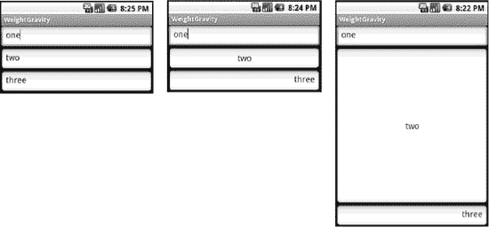

**图 6–18.** *使用 LinearLayout 布局管理器*

图 6–18 展示了三种利用 `LinearLayout` 的用户界面，它们使用了不同的权重和重力设置。左侧的 UI 使用了权重和重力的默认设置。第一个用户界面的 XML 布局如代码清单 6–40 所示。

**代码清单 6–40.** *在 LinearLayout 中垂直排列的三个文本字段，使用权重和重力的默认值*

```
<LinearLayout
    android:orientation="vertical" android:layout_width="fill_parent"
    android:layout_height="fill_parent">

    <EditText android:layout_width="fill_parent"
        android:layout_height="wrap_content"
        android:text="one"/>
    <EditText android:layout_width="fill_parent"
        android:layout_height="wrap_content"
        android:text="two"/>
    <EditText android:layout_width="fill_parent"
        android:layout_height="wrap_content"
        android:text="three"/>
</LinearLayout>
```

图 6–18 中间的 UI 使用了权重的默认值，但将容器中控件的 `android:gravity` 分别设置为 `left`、`center` 和 `right`。最后一个示例将中间组件的 `android:layout_weight` 属性设置为 1.0，并将其他组件的权重保持为默认值 0.0（见代码清单 6–41）。通过将中间组件的权重属性设置为 1.0，并将其他两个组件的权重属性保留为 0.0，我们指定了中间组件应占据容器中所有剩余的空白空间，而其他两个组件应保持其理想大小。

类似地，如果你希望容器中的三个控件中有两个共享剩余的空白空间，可以将这两个控件的权重设置为 1.0，并将第三个控件保留为 0.0。最后，如果你希望三个组件均分空间，可以将它们的所有权重值都设置为 1.0。这样做会使每个文本字段均匀扩展。

**代码清单 6–41.** *带权重配置的 LinearLayout*

```
<LinearLayout
    android:orientation="vertical" android:layout_width="fill_parent"
    android:layout_height="fill_parent">

    <EditText android:layout_width="fill_parent" android:layout_weight="0.0"
    android:layout_height="wrap_content" android:text="one"
    android:gravity="left"/>

    <EditText android:layout_width="fill_parent" android:layout_weight="1.0"
    android:layout_height="wrap_content" android:text="two"
    android:gravity="center"/>

    <EditText android:layout_width="fill_parent" android:layout_weight="0.0"
    android:layout_height="wrap_content" android:text="three"
    android:gravity="right"
    />
</LinearLayout>
```

##### `android:gravity` 与 `android:layout_gravity` 的区别

请注意，Android 定义了两个相似的重力属性：`android:gravity` 和 `android:layout_gravity`。区别如下：`android:gravity` 是视图使用的设置，而 `android:layout_gravity` 是容器（`android.view.ViewGroup`）使用的设置。例如，你可以将 `android:gravity` 设置为 `center`，以使 `EditText` 中的文本在控件内居中。类似地，你可以通过设置 `android:layout_gravity="right"` 将 `EditText` 对齐到 `LinearLayout`（容器）的最右侧。请参见图 6–19 和代码清单 6–42。


**图 6–19.** *应用重力设置*

**代码清单 6–42.** *理解 `android:gravity` 和 `android:layout_gravity` 的区别*

```
<LinearLayout
    android:orientation="vertical" android:layout_width="fill_parent"
    android:layout_height="fill_parent">

    <EditText android:layout_width="wrap_content" android:gravity="center"
    android:layout_height="wrap_content" android:text="one"
 android:layout_gravity="right"/>
</LinearLayout>
```

如图 6–19 所示，文本在 `EditText` 中居中，而该 `EditText` 则对齐到 `LinearLayout` 的右侧。


#### TableLayout 布局管理器

`TableLayout` 布局管理器是 `LinearLayout` 的扩展。此布局管理器将其子控件组织成行和列。代码清单 6-43 显示了一个示例。

**代码清单 6-43.** *一个简单的 TableLayout*

```
<?xml version="1.0" encoding="utf-8"?>
<TableLayout
    android:layout_width="fill_parent"  android:layout_height="fill_parent">

  <TableRow>
    <TextView android:text="名字:"
        android:layout_width="wrap_content"  android:layout_height="wrap_content" />

    <EditText android:text="爱伦"
        android:layout_width="wrap_content"  android:layout_height="wrap_content" />
  </TableRow>

  <TableRow>
    <TextView android:text="姓氏:"
        android:layout_width="wrap_content"  android:layout_height="wrap_content" />

    <EditText android:text="坡"
        android:layout_width="wrap_content"  android:layout_height="wrap_content" />
  </TableRow>

</TableLayout>
```

要使用此布局管理器，你需要创建一个 `TableLayout` 实例，并在其中放置 `TableRow` 元素。这些 `TableRow` 元素包含表格的控件。代码清单 6-43 的用户界面如图 6-20 所示。

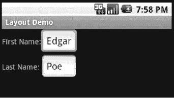

**图 6-20.** *TableLayout 布局管理器*

由于 `TableLayout` 的内容是按行而不是按列定义的，Android 通过查找拥有最多单元格的行来确定表格的列数。例如，代码清单 6-44 创建了一个具有两行的表格，其中一行有两个单元格，另一行有三个单元格（参见图 6-21）。在这种情况下，Android 会创建一个两行三列的表格，第一行的最后一列是一个空单元格。

**代码清单 6-44.** *一个不规则的表格定义*

```
<TableLayout
    android:layout_width="fill_parent"  android:layout_height="fill_parent">

  <TableRow>
    <TextView android:text="名字:"
        android:layout_width="wrap_content"  android:layout_height="wrap_content" />

    <EditText android:text="爱伦"
        android:layout_width="wrap_content"  android:layout_height="wrap_content" />
  </TableRow>

  <TableRow>
    <TextView android:text="姓氏:"
        android:layout_width="wrap_content"  android:layout_height="wrap_content" />

    <EditText android:text="爱伦"
        android:layout_width="wrap_content"  android:layout_height="wrap_content" />

    <EditText android:text="坡"
        android:layout_width="wrap_content"  android:layout_height="wrap_content" />
  </TableRow>

</TableLayout>
```

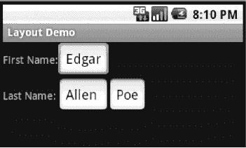

**图 6-21.** *一个不规则的 TableLayout*

在代码清单 6-43 和 6-44 中，我们使用 `TableRow` 元素填充了 `TableLayout`。虽然这是常用模式，但你可以将任何 `android.widget.View` 作为表格的子控件放置。例如，代码清单 6-45 创建了一个表格，其第一行是一个 `EditText`（参见图 6-22）。

**代码清单 6-45.** *使用 EditText 替代 TableRow*

```
<?xml version="1.0" encoding="utf-8"?>
<TableLayout
    android:layout_width="fill_parent"  android:layout_height="fill_parent"
    android:stretchColumns="0,1,2" >

  <EditText android:text="全名:"
        android:layout_width="wrap_content"  android:layout_height="wrap_content" />

  <TableRow>
    <TextView android:text="爱伦"
        android:layout_width="wrap_content"  android:layout_height="wrap_content" />

    <TextView android:text="爱伦"
        android:layout_width="wrap_content"  android:layout_height="wrap_content" />

    <TextView android:text="坡"
        android:layout_width="wrap_content"  android:layout_height="wrap_content" />
  </TableRow>

</TableLayout>
```

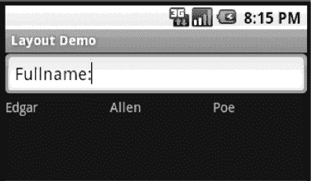

**图 6-22.** *EditText 作为 TableLayout 的子控件*

代码清单 6-45 的用户界面如图 6-22 所示。请注意，`EditText` 占据了屏幕的整个宽度，尽管我们没有在 XML 布局中指定这一点。这是因为 `TableLayout` 的子控件总是跨越整行。换句话说，`TableLayout` 的子控件可以指定 `android:layout_width="wrap_content"`（就像我们对 `EditText` 所做的那样），但这不会影响实际布局——它们被迫接受 `fill_parent`。不过，它们可以设置 `android:layout_height`。

由于表格的内容在设计时并不总是已知，因此 `TableLayout` 提供了几个属性来帮助你控制表格的布局。例如，代码清单 6-45 将 `TableLayout` 的 `android:stretchColumns` 属性设置为 `"0,1,2"`。这向 `TableLayout` 暗示，如果需要，可以根据表格内容拉伸第 `0`、`1` 和 `2` 列。如果在代码清单 6-45 中没有使用 `stretchColumns`，我们会看到 `"埃德加爱伦坡"` 挤在一起。严格来说，第二行占据了整个宽度，但三个 `TextView` 并未分散开。

类似地，你可以设置 `android:shrinkColumns`，以便在其他列需要更多空间时，包裹单列或多列的内容。你也可以设置 `android:collapseColumns` 使列不可见。请注意，列是使用从零开始的索引方案来标识的。

`TableLayout` 还提供了 `android:layout_span`。你可以使用此属性让一个单元格跨越多个列。该字段类似于 HTML 中的 `colspan` 属性。

有时，你可能还需要在单元格或控件的内容内提供间距。Android SDK 通过 `android:padding` 及其同类属性支持此功能。`android:padding` 允许你控制视图外部边界与其内容之间的空间（参见代码清单 6-46）。

**代码清单 6-46.** *使用 android:padding*

```
<LinearLayout
    android:orientation="vertical" android:layout_width="fill_parent"
    android:layout_height="fill_parent">

    <EditText android:text="一"
    android:layout_width="wrap_content"  android:layout_height="wrap_content"
    android:padding="40px" />
</LinearLayout>
```

代码清单 6-46 将内边距设置为 `40px`。这会在 `EditText` 控件的外部边界与其内部显示的文本之间创建 40 像素的空白区域。图 6-23 展示了同一个 `EditText` 使用两个不同内边距值的情况。左侧的界面没有设置任何内边距，而右侧的界面设置了 `android:padding="40px"`。

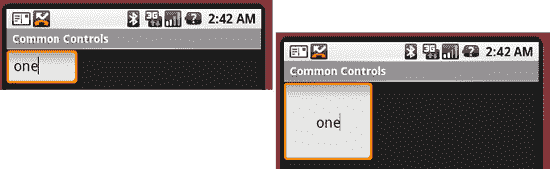

**图 6-23.** *利用内边距*

`android:padding` 设置所有边（左、右、上、下）的内边距。你可以通过使用 `android:leftPadding`、`android:rightPadding`、`android:topPadding` 和 `android:bottomPadding` 来控制每一边的内边距。

Android 还定义了 `android:layout_margin`，它与 `android:padding` 类似。实际上，`android:padding`/`android:layout_margin` 类似于 `android:gravity`/`android:layout_gravity`，但一个是针对视图的，另一个是针对容器的。

最后，内边距值始终设置为尺寸类型。Android 支持以下尺寸类型：


*   `Pixels`：缩写为`px`。此尺寸表示屏幕上的物理像素。
*   `Inches`：缩写为`in`。此尺寸表示屏幕上的实际英寸。
*   `Millimeters`：缩写为`mm`。此尺寸表示屏幕上的实际毫米。
*   `Points`：缩写为`pt`。1 点等于 1/72 英寸。
*   `Density-independent pixels`：缩写为`dip`或`dp`，此尺寸类型以 160-dp 屏幕为参考框架，然后将其映射到实际屏幕。例如，一个宽度为 160 像素的屏幕会将 1`dip`映射为 1 像素。
*   `Scale-independent pixels`：缩写为`sp`，此尺寸类型通常用于字体类型。它会考虑用户的偏好和字体大小来确定实际尺寸。

请注意，上述尺寸类型并非特定于内边距——任何接受尺寸值的 Android 字段（例如`android:layout_width`或`android:layout_height`）都可以接受这些类型。

#### `RelativeLayout`布局管理器

另一个有趣的布局管理器是`RelativeLayout`。顾名思义，此布局管理器实现了一种策略，其中容器中的控件相对于容器本身或容器中的另一个控件进行布局。清单 6–47 和 图 6–24 展示了一个示例。

**清单 6–47.** *使用`RelativeLayout`布局管理器*

```
<RelativeLayout
        android:layout_width="fill_parent"
        android:layout_height="wrap_content">

<TextView android:id="@+id/userNameLbl"
        android:layout_width="fill_parent"  android:layout_height="wrap_content"
        android:text="Username: "
        android:layout_alignParentTop="true" />

<EditText android:id="@+id/userNameText"
        android:layout_width="fill_parent"  android:layout_height="wrap_content"
        android:layout_below="@id/userNameLbl" />

<TextView android:id="@+id/pwdLbl"
        android:layout_width="fill_parent"  android:layout_height="wrap_content"
        android:layout_below="@id/userNameText"
        android:text="Password: " />

<EditText android:id="@+id/pwdText"
        android:layout_width="fill_parent"  android:layout_height="wrap_content"
        android:layout_below="@id/pwdLbl" />

<TextView android:id="@+id/pwdCriteria"
        android:layout_width="fill_parent"  android:layout_height="wrap_content"
        android:layout_below="@id/pwdText"
        android:text="Password Criteria... " />

<TextView android:id="@+id/disclaimerLbl"
        android:layout_width="fill_parent"  android:layout_height="wrap_content"
        android:layout_alignParentBottom="true"
        android:text="Use at your own risk... " />

</RelativeLayout>
```

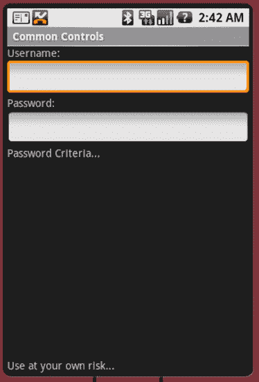

**图 6–24.** *使用`RelativeLayout`布局管理器布局的用户界面*

如图所示，用户界面看起来像一个简单的登录表单。用户名标签被固定到容器的顶部，因为我们设置了`android:layout_alignParentTop`为`true`。类似地，用户名输入字段位于用户名标签下方，因为我们设置了`android:layout_below`。密码标签出现在用户名标签下方，密码输入字段出现在密码标签下方。免责声明标签被固定到容器的底部，因为我们设置了`android:layout_alignParentBottom`为`true`。

除了这三个布局属性，您还可以指定`layout_above`、`layout_toRightOf`、`layout_toLeftOf`、`layout_centerInParent`等等。使用`RelativeLayout`很有趣，因为它很简单。事实上，一旦您开始使用它，它就会成为您最喜欢的布局管理器——您会发现自己一次又一次地使用它。

#### `FrameLayout`布局管理器

我们到目前为止讨论的布局管理器实现了各种布局策略。换句话说，每一种都有其特定的方式来在屏幕上定位和排列其子元素。使用这些布局管理器，您可以在屏幕上同时拥有多个控件，每个控件占据屏幕的一部分。Android 还提供了一种主要用于显示单个项目的布局管理器——`FrameLayout`布局管理器。您主要使用这个工具类布局来动态显示单个视图，但您也可以用多个项目填充它，设置其中一个可见而其他不可见。清单 6–48 演示了如何使用`FrameLayout`。

**清单 6–48.** *填充`FrameLayout`*

```
<?xml version="1.0" encoding="utf-8"?>
<FrameLayout
    android:id="@+id/frmLayout"
    android:layout_width="fill_parent"  android:layout_height="fill_parent">

     <ImageView
        android:id="@+id/oneImgView" android:src="@drawable/one"
        android:scaleType="fitCenter"
        android:layout_width="fill_parent"  android:layout_height="fill_parent"/>
    <ImageView
        android:id="@+id/twoImgView" android:src="@drawable/two"
        android:scaleType="fitCenter"
        android:layout_width="fill_parent"  android:layout_height="fill_parent"
        android:visibility="gone" />

</FrameLayout>

public class FrameLayoutActivity extends Activity{
    private ImageView one = null;
    private ImageView two = null;
    @Override
    protected void onCreate(Bundle savedInstanceState) {
        super.onCreate(savedInstanceState);
        setContentView(R.layout.listing6_48);

        one = (ImageView)findViewById(R.id.oneImgView);
        two = (ImageView)findViewById(R.id.twoImgView);

        one.setOnClickListener(new OnClickListener(){

            public void onClick(View view) {
                two.setVisibility(View.VISIBLE);

                view.setVisibility(View.GONE);
            }});

        two.setOnClickListener(new OnClickListener(){

            public void onClick(View view) {
                one.setVisibility(View.VISIBLE);

                view.setVisibility(View.GONE);
            }});
    }
}
```

清单 6–48 展示了布局文件以及活动的`onCreate()`方法。该演示的思路是在`FrameLayout`中加载两个`ImageView`对象，但一次只让其中一个`ImageView`对象可见。在用户界面中，当用户点击可见的图像时，我们隐藏一个图像并显示另一个。

现在更仔细地查看清单 6–48，从布局开始。您可以看到我们定义了一个带有两个`ImageView`对象的`FrameLayout`（`ImageView`是一个知道如何显示图像的控件）。请注意，第二个`ImageView`的可见性被设置为`gone`，从而使该控件不可见。现在，看看`onCreate()`方法。在`onCreate()`方法中，我们为`ImageView`对象上的点击事件注册了监听器。在点击处理器中，我们隐藏一个`ImageView`并显示另一个。

正如我们之前所说，当您需要动态地将视图的内容设置为单个控件时，通常使用`FrameLayout`。尽管这是普遍做法，但该控件可以接受多个子元素，正如我们所演示的那样。清单 6–48 向布局中添加了两个控件，但一次只让其中一个控件可见。然而，`FrameLayout`并不会强制您一次只能有一个控件可见。如果您向布局中添加多个控件，`FrameLayout`会简单地将这些控件堆叠起来，一个叠在另一个之上，最后一个在最上面。这可以创建出有趣的用户界面。例如，图 6–25 显示了一个包含两个可见的`ImageView`对象的`FrameLayout`控件。您可以看到控件是堆叠的，顶部的控件部分地遮挡了它后面的图像。


`FrameLayout`的另一个有趣特性是，如果向布局中添加多个控件，布局的大小将根据容器中最大的项来计算。在图 6-25 中，顶部的图像实际上比其后面的图像小得多，但由于布局的大小是基于最大的控件计算的，因此顶部图像会被拉伸。

另请注意，如果你将多个控件放入一个`FrameLayout`中，且其中有一个或多个控件初始状态为不可见，则应考虑对`FrameLayout`调用`setMeasureAllChildren(true)`。由于最大子项决定了布局大小，如果最大的子项一开始就是不可见的，就会遇到问题。也就是说，当它变为可见时，将只会部分可见。为确保所有项都能正确渲染，请调用`setMeasureAllChildren()`并传入`true`。`FrameLayout`对应的 XML 属性是`android:measureAllChildren="true"`。


**图 6-25.** *包含两个`ImageView`对象的`FrameLayout`*

#### 针对不同设备配置自定义布局

到目前为止，你已经非常清楚 Android 提供了众多布局管理器来帮助构建用户界面。如果你尝试过我们讨论过的布局管理器，你就会知道可以通过各种方式组合这些布局管理器，以获得想要的界面外观。即使有了所有这些布局管理器，构建 UI 并使其正确运行仍可能是一个挑战。这对于移动设备尤其如此。移动设备的用户和制造商正变得越来越复杂，这使得开发者的工作更具挑战性。

其中一个挑战是为应用程序构建能够在不同屏幕配置下显示的 UI。例如，如果你的应用程序分别在竖屏和横屏模式下显示，UI 会是什么样子？如果你还没有遇到过这种情况，你现在可能正绞尽脑汁，思考如何处理这个常见场景。有趣且值得庆幸的是，Android 为这种用例提供了一些支持。

其工作原理如下：构建布局时，Android 会根据设备的配置，从特定文件夹中查找并加载布局。设备可以处于三种配置之一：竖屏（portrait）、横屏（landscape）或方形（square，方形很少见）。为了为不同配置提供不同的布局，你需要为每种配置创建特定的文件夹，Android 将从这些文件夹中加载相应的布局。如你所知，默认的布局文件夹位于`res/layout`。要支持竖屏显示，请创建一个名为`res/layout-port`的文件夹。对于横屏，创建名为`res/layout-land`的文件夹。对于方形，则创建名为`res/layout-square`的文件夹。

此时的一个好问题是：“有了这三个文件夹，我还需要默认的布局文件夹（`res/layout`）吗？”通常，答案是肯定的。要知道，Android 的资源解析逻辑会首先查找配置特定的目录。如果 Android 在那里找不到资源，它会转到默认的布局目录。因此，你应该将默认的布局定义放在`res/layout`中，并将自定义版本放在配置特定的文件夹中。

请注意，Android SDK 不提供任何 API 让你以编程方式指定要加载哪个配置——系统会根据设备配置自动选择文件夹。不过，你可以在代码中设置设备的方向，例如使用以下代码：

```
import android.content.pm.ActivityInfo;
…
setRequestedOrientation(ActivityInfo.SCREEN_ORIENTATION_LANDSCAPE);
```

这会强制你的应用程序在设备上以横屏模式显示。继续尝试，在你之前的某个项目中使用它。将代码添加到 Activity 的`onCreate()`方法中，在模拟器中运行，然后查看你的应用程序侧向显示。

布局并不是唯一由配置驱动的资源，在查找要使用的资源时，还会考虑设备配置的其他限定符。`res`文件夹的全部内容都可以针对每种配置有不同的变体。例如，要为每种配置加载不同的可绘制对象，请创建`drawable-port`、`drawable-land`和`drawable-square`文件夹。但 Android 的功能远不止于此。在查找资源时可以使用的完整限定符列表如表 6-3 所示。

**表 6-3.** *资源限定符*

| **限定符** | **描述** |
| --- | --- |
| MCC 和 MNC | 移动国家代码和移动网络代码 |
| 语言和区域 | 小写的两位字母语言代码；也可以加上`-r`和大写的两位字母区域代码 |
| 屏幕尺寸 | 提供屏幕尺寸的大致概念；值：`small`、`normal`、`large`和`xlarge` |
| 宽/高屏幕 | 与屏幕宽高比相关；值：`long`和`notlong` |
| 屏幕方向 | 值：`land`、`port`和`square` |
| 屏幕像素密度 | 近似密度；值：`ldpi`（约 120）、`mdpi`（约 160）、`hdpi`（约 240）和`xhdpi`（约 320）。除非资源位于`nodpi`下，否则 Android 可能会缩放以适应在这些目录中找到的资源。 |
| 触摸屏类型 | 值：`finger`、`notouch`和`stylus` |
| 键盘 | 键盘状态；值：`keysexposed`、`keyshidden`和`keyssoft` |
| 文本输入 | 值：`nokeys`、`qwerty`和`12key`（数字） |
| 非触摸屏导航 | 值：`dpad`、`nonav`、`trackball`和`wheel` |
| SDK 版本 | 值：`v4`（SDK 1.6）、`v7`（SDK 2.1）等。 |

有关这些限定符的更多详细信息，请参阅以下 Android 网页：

```
http://developer.android.com/guide/topics/resources/providing-resources.html#table2
```

这些限定符可以组合使用，以实现你想要的任何行为。资源目录名称将按顺序使用每个限定符值的零个或一个，并用破折号分隔。例如，以下是一个技术上有效的 drawable 资源目录名称（尽管不推荐）：

```
drawable-mcc310-en-rUS-large-long-port-mdpi-stylus-keyssoft-qwerty-dpad-v3
```

但以下这些也是有效的：

```
drawable-en-rUS-land (用于美国英语横屏模式的图像)
values-fr (法文字符串)
```

无论你在应用程序中为资源使用了多少个限定符，请记住，在代码中，你仍然仅以`R.resource_type.name`的形式引用资源，不带任何限定符。例如，如果你在多个不同的限定资源目录中为布局文件`main.xml`提供了许多不同的变体，你的代码仍将引用`R.layout.main`。Android 会负责为你找到合适的`main.xml`。

至此，我们关于构建 UI 的讨论就结束了。在下一节中，我们将向您介绍层次结构查看器工具。该工具将帮助您调试和优化用户界面。


### 使用层级查看器调试和优化布局

Android SDK 附带了许多工具，可以大大简化你的开发工作。由于我们正在讨论用户界面开发，因此有必要介绍一下`Hierarchy Viewer`（层级查看器）工具。该工具（如图 6-26 所示）允许你从布局角度调试用户界面。

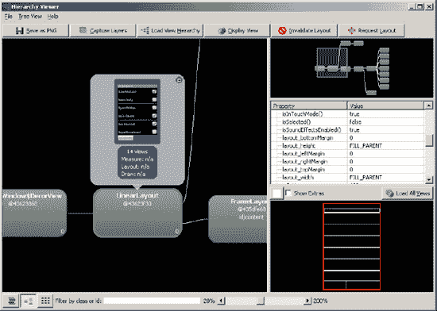

**图 6-26.** *层级查看器工具的布局视图*

如图 6-26 所示，`Hierarchy Viewer`以树状形式展示视图的层级结构。其原理是：你将布局加载到工具中，然后检查布局以确定可能的布局问题，并/或尝试优化布局，从而最大限度地减少视图数量（出于性能考虑）。

要调试你的 UI，请在模拟器中运行你的应用，并浏览到你要调试的 UI。然后，进入 Android SDK 的 `/tools` 目录，启动`Hierarchy Viewer`工具。在 Windows 安装中，你会在 `/tools` 目录下看到一个名为 `hierarchyviewer.bat` 的批处理文件。运行该批处理文件后，你将看到`Hierarchy Viewer`的设备屏幕（见图 6-27）。

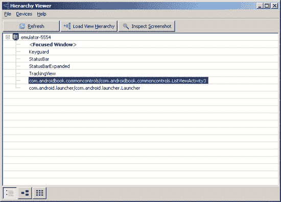

**图 6-27.** *层级查看器的设备屏幕*

设备屏幕会显示机器上正在运行的一组设备（此处为模拟器）。展开设备时，所选设备中的窗口列表会显示在下方。要查看特定窗口的视图层级，请选择该窗口（通常是你的 Activity 的完全限定名，并以应用的包名作为前缀），然后点击`Load View Hierarchy`（加载视图层级）按钮。

在视图层级屏幕中，你会在左侧窗格中看到该窗口的视图层级结构（见图 6-26）。在左侧窗格中选择一个视图元素时，你可以在右侧的属性视图中查看该元素的属性，并且可以在右侧的线框窗格中看到该视图相对于其他视图的位置。被选中的视图会以红色边框高亮显示。通过查看所有正在使用的视图，你有可能找到减少视图数量的方法，从而使应用运行得更快。

图 6-27 显示了`Hierarchy Viewer`工具左下角的三个按钮。左侧按钮显示我们之前解释过的树形视图。中间的按钮是视图层级屏幕。右侧按钮以像素完美视图显示当前布局，但前提是你已使用此工具顶部的`Inspect Screenshot`（检查截图）按钮初始化了像素完美视图。这种视图的趣味之处在于，你可以逐像素查看你的布局（见图 6-28）。此屏幕上有几个值得关注的项目。左侧是一个所有窗口组件的导航器视图。如果你点击某个组件，它会在中间视图中以红色边框高亮显示。右侧视图中的十字准线允许你指定放大镜（*loupe*，一种珠宝商和钟表匠使用的小型放大镜）中间视图中显示的内容。缩放控制允许你在放大镜中进一步放大。放大镜还会显示所选像素的确切位置（以`(x, y)`坐标表示）以及该像素的颜色值。

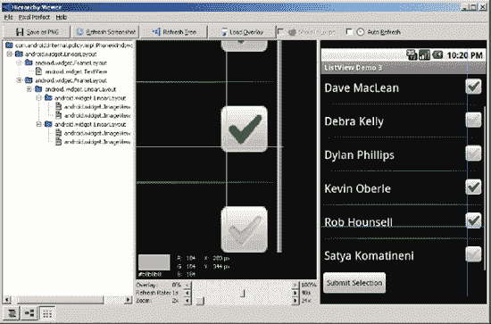

**图 6-28.** *层级查看器的像素完美模式*

此屏幕最后几个非常有用的功能是`Load Overlay`（加载叠加层）按钮和叠加层滑块。你可以在显示的屏幕后面加载一个图像文件（可能是你正在开发的屏幕的新原型图），以便将该图像文件与当前屏幕进行比较，并使用叠加层滑块使其更清晰或更模糊。加载的图像会锚定在左下角。默认情况下，该图像不会显示在放大镜中，但选中复选框后，它就会显示出来。

当 Android 2.3 发布时，`Hierarchy Viewer` 也可以在 Eclipse 中使用。新增了被称为 `Hierarchy View`（层级视图）和 `Pixel Perfect`（像素完美）的透视图，每个透视图都包含一组用于其各项功能的视图。它们的功能与前面介绍的可执行文件基本相同。如果你需要帮助找到它，第 2 章介绍了如何在 Eclipse 中安装`Hierarchy Viewer`。

有了像这样的工具，你就可以对应用的外观和感觉进行大量的控制。

### 本章小结

至此，你应该对 Android SDK 中可用的控件有了一个很好的概览。你也应该熟悉 Android 的适配器及其布局管理器。面对一个潜在的屏幕需求，你应该能够快速识别出你将用于构建该屏幕的控件和布局管理器。

在下一章中，我们将进一步探讨用户界面开发——我们将讨论菜单。

## 第 7 章

## 使用菜单

Android SDK 为菜单提供了广泛的支持。在本章中，你将学习使用 Android 支持的几种菜单类型：常规菜单、子菜单、上下文菜单、图标菜单、次级菜单和替代菜单。Android 3.0 引入了一种称为操作栏（Action Bar）的功能，它与菜单项很好地集成在一起。关于操作栏和菜单的交互，将在第 30 章中介绍。

在 Android 中，菜单除了是 Java 对象外，也被表示为资源。由于它们是资源，Android SDK 允许你像加载其他资源一样，从 XML 文件中加载菜单。Android 会为每个加载的菜单项生成资源 ID。我们将在本章中详细介绍这些 XML 菜单资源。我们还将向你展示如何利用自动生成的资源 ID 来处理所有类型的菜单项。


### 理解 Android 菜单

无论你是使用过 Java 中的 Swing、Windows 中的 Windows Presentation Foundation (WPF)，还是其他任何 UI 框架，你都肯定与菜单打过交道。

Android 菜单支持的关键类是 `android.view.Menu`。Android 中的每个 Activity 都关联一个该类型的菜单对象，它可以包含多个菜单项和子菜单。

菜单项由 `android.view.MenuItem` 表示，子菜单由 `android.view.SubMenu` 表示。这些关系如图 图 7-1 所示。严格来说，这不是一个类图，而是一个结构图，旨在帮助你可视化各种菜单相关类与函数之间的关系。

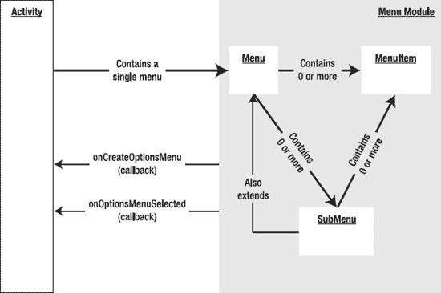

**图 7-1.** *Android 菜单相关类的结构*

图 7-1 展示了一个 `Menu` 对象包含一组菜单项。

一个菜单项具有名称（标题）、菜单项 ID、排序顺序（在 SDK 中简称为“顺序”）以及一个 ID（或数字）。你可以使用这些顺序 ID 来指定菜单项在菜单中的显示顺序。例如，如果一个菜单项的顺序号为 4，另一个菜单项的顺序号为 6，那么第一个菜单项将显示在第二个菜单项上方。

部分菜单顺序号范围是为特定类型的菜单保留的。次要菜单项（被认为不如其他菜单项重要）从 `0x30000` 开始，由常量 `Menu.CATEGORY_SECONDARY` 定义。其他类型的菜单类别——例如系统菜单、替代菜单和容器菜单——具有不同的顺序号范围。

系统菜单项从 `0x20000` 开始，由常量 `Menu.CATEGORY_SYSTEM` 定义。替代菜单项从 `0x40000` 开始，由常量 `Menu.CATEGORY_ALTERNATIVE` 定义。容器菜单项从 `0x10000` 开始，由常量 `Menu.CATEGORY_CONTAINER` 定义。通过查看这些常量的值，你可以了解它们在菜单中出现的顺序。（我们将在“使用其他菜单类型”一节中讨论这些不同类型的菜单项。）

你可以通过为每个菜单项分配一个组 ID（即菜单项对象的一个属性）来将菜单项分组。具有相同组 ID 的多个菜单项被视为同一组的一部分。

图 7-1 还展示了两个回调方法，你可以使用它们来创建和响应菜单项：`onCreateOptionsMenu` 和 `onOptionsItemSelected`。我们接下来将介绍它们。

#### 创建菜单

在 Android SDK 中，你无需从头开始创建菜单对象。由于一个 Activity 关联一个菜单，Android 会为该 Activity 创建这个唯一的菜单，并将其传递给 Activity 类的 `onCreateOptionsMenu` 回调方法。（正如该方法名称所示，Android 中的菜单也被称为*选项菜单*。）此方法允许你使用一组菜单项填充传入的唯一菜单（请参见清单 7-1）。

**清单 7-1.** *`onCreateOptionsMenu` 方法的签名*

```
@Override
public boolean onCreateOptionsMenu(Menu menu)
{
    // 填充菜单项
    …..
   ...return true;   
}
```

填充菜单项后，代码应返回 `true` 以使菜单可见。如果此方法返回 `false`，则菜单不可见。清单 7-2 中的代码演示了如何使用单个组 ID 以及递增的菜单项 ID 和顺序 ID 来添加三个菜单项。

**清单 7-2.** *添加菜单项*

```
@Override
public boolean onCreateOptionsMenu(Menu menu)
{
   //调用基类以包含系统菜单
   super.onCreateOptionsMenu(menu);

   menu.add(0           // 组
         ,1             // 菜单项 ID
         ,0             // 顺序
         ,"追加");       // 标题

   menu.add(0,2,1,"菜单项 2");
   menu.add(0,3,2,"清除");

   //返回 true 以使菜单可见非常重要
   return true;   
}
```

你还应该调用此方法的基类实现，以便系统有机会用系统菜单项填充菜单。为了将这些系统菜单项与其他类型的菜单项分开，Android 从 `0x20000` 开始添加系统菜单项。（正如我们之前提到的，常量 `Menu.CATEGORY_SYSTEM` 定义了这些系统菜单项的起始 ID。在目前的所有版本中，Android 尚未添加任何系统菜单。）

添加菜单项所需的第一个参数是组 ID（整数）。第二个参数是菜单项 ID，当该菜单项被选中时，该 ID 会发送回回调函数。第三个参数表示顺序 ID。

最后一个参数是菜单项的名称或标题。除了自由文本，你还可以通过 `R.java` 常量文件使用字符串资源。组、菜单项和顺序 ID 都是可选的；如果你不想指定其中任何一个，可以使用 `Menu.NONE`。

#### 使用菜单组

现在，我们来展示如何使用菜单组。清单 7-3 演示了如何添加两个菜单组：组 1 和组 2。

**清单 7-3.** *使用组 ID 创建菜单组*

```
@Override
public boolean onCreateOptionsMenu(Menu menu)
{
   //组 1
   int group1 = 1;
   menu.add(group1,1,1,"g1.菜单项 1");
   menu.add(group1,2,2,"g1.菜单项 2");

   //组 2   
   int group2 = 2;
   menu.add(group2,3,3,"g2.菜单项 1");
   menu.add(group2,4,4,"g2.菜单项 2");

   return true; // 返回 true 非常重要
}
```

请注意菜单项 ID 和顺序 ID 是如何独立于组的。那么，组有什么用处呢？实际上，`android.view.Menu` 类提供了一组基于组 ID 的方法。你可以使用这些方法来操作组内的菜单项：

- `removeGroup(id)`
- `setGroupCheckable(id, checkable, exclusive)`
- `setGroupEnabled(id,boolean enabled)`
- `setGroupVisible(id,visible)`

`removeGroup` 根据给定的组 ID 移除该组中的所有菜单项。你可以使用 `setGroupEnabled` 方法启用或禁用给定组中的菜单项。类似地，你可以使用 `setGroupVisible` 控制一组菜单项的可见性。

`setGroupCheckable` 有点意思。你可以使用此方法在选中某个菜单项时显示一个复选标记。当应用于一个组时，它将对组内的所有菜单项启用此功能。如果此方法的 `exclusive` 标志被设置，则只允许该组内一个菜单项进入选中状态，其他菜单项将保持未选中状态。

现在，你已了解如何使用一组菜单项填充 Activity 的主菜单，并根据其性质进行分组。接下来，我们将展示如何响应这些菜单项。

### 响应菜单项

在 Android 中，有多种响应菜单项点击的方式。你可以使用 Activity 类的 `onOptionsItemSelected` 方法；可以使用独立的监听器；或者可以使用 Intent。我们将在本节中介绍每种技术。


#### 通过 `onOptionsItemSelected` 响应菜单项

当菜单项被点击时，Android 会在 `Activity` 类上调用 `onOptionsItemSelected` 回调方法（参见清单 7–4）。

**清单 7–4.** *`onOptionsItemSelected` 方法的签名与主体*

```java
@Override
public boolean onOptionsItemSelected(MenuItem item)
{
   switch(item.getItemId()) {
      .....
   }
   //for items handled
   return true;

   //for the rest
   ...return super.onOptionsItemSelected(item);
}
```

此处的关键模式是通过 `MenuItem` 类的 `getItemId()` 方法检查菜单项 ID，并执行相应操作。如果 `onOptionsItemSelected()` 处理了某个菜单项，它会返回 `true`。菜单事件将不再进一步传播。对于 `onOptionsItemSelected()` 未处理的菜单项回调，`onOptionsItemSelected()` 应通过 `super.onOptionsItemSelected` 调用父类方法。`onOptionsItemSelected()` 方法的默认实现返回 `false`，以便执行正常处理流程。正常处理流程包括通过其他方式为菜单点击调用响应。

#### 通过监听器响应菜单项

通常，你通过重写 `onOptionsItemSelected` 来响应菜单；这是推荐的做法，可以获得更好的性能。然而，菜单项允许你注册一个监听器，将其用作回调。

这种方法分为两步。第一步，实现 `OnMenuClickListener` 接口。然后，创建该实现的一个实例，并将其传递给菜单项。当菜单项被点击时，菜单项将调用 `OnMenuClickListener` 接口的 `onMenuItemClick()` 方法（参见清单 7–5）。

**清单 7–5.** *使用监听器作为菜单项点击的回调*

```java
//步骤 1
public class MyResponse implements OnMenuClickListener
{
   //一些用于操作的局部变量
   //...
   //一些构造函数
   @override
   boolean onMenuItemClick(MenuItem item)
   {
      //执行你的操作
      return true;
   }
}

//步骤 2
MyResponse myResponse = new MyResponse(...);
menuItem.setOnMenuItemClickListener(myResponse);
...
```

当菜单项被调用时，会调用 `onMenuItemClick` 方法。这段代码在菜单项被点击时立即执行，甚至早于 `onOptionsItemSelected` 方法的调用。如果 `onMenuItemClick` 返回 `true`，则不会执行其他回调——包括 `onOptionsItemSelected` 回调方法。这意味着监听器代码优先于 `onOptionsItemSelected` 方法。

#### 使用 Intent 响应菜单项

你也可以通过使用 `MenuItem` 的 `setIntent(intent)` 方法将菜单项与意图关联起来。默认情况下，菜单项没有关联的意图。但是，当菜单项关联了一个意图，并且没有其他处理程序处理该菜单项时，默认行为是使用 `startActivity(intent)` 来调用该意图。要使此机制生效，所有处理程序——尤其是 `onOptionsItemSelected` 方法——应针对那些未处理的菜单项调用父类的 `onOptionsItemSelected()` 方法。或者你可以这样理解：系统会首先给 `onOptionsItemSelected` 一个处理菜单项的机会（当然，监听器紧随其后）。这是假设该菜单项没有直接关联的监听器，如果有，则监听器会覆盖其余处理。

如果你不重写 `onOptionsItemSelected` 方法，Android 框架中的基类会执行必要操作，以在菜单项上调用意图。但如果你确实重写了此方法，并且对该菜单项不感兴趣，则必须调用父类方法，而父类方法会进一步促成意图的调用。所以关键在于：要么不重写 `onOptionsItemSelected` 方法，要么重写它，并针对你不处理的菜单项调用父类方法。

### 创建用于测试菜单的测试工具

到目前为止，内容相当直观。你已经学习了如何创建菜单以及如何通过各种回调来响应它们。现在，我们将向你展示一个示例活动，用于实践你已经学到的这些菜单 API。

**注意：** 我们在本章末尾提供了一个 URL，用于下载该项目，以便你可以在 Eclipse 开发环境中设置它。

本练习的目标是创建一个包含文本视图的简单活动。该文本视图将充当调试器。当我们调用菜单时，我们将被调用的菜单项名称和 ID 输出到此文本视图中。完成的 `Menus` 应用程序将类似图 5–2 所示。

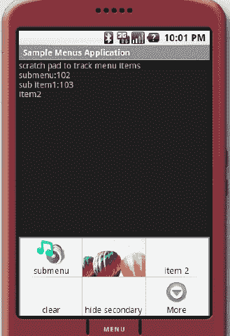

**图 7–2.** *示例 `Menus` 应用程序*

图 7–2 展示了两个感兴趣的内容：菜单和文本视图。菜单显示在底部。不过，当你启动应用程序时，你不会看到它；你必须点击模拟器或设备上的“菜单”按钮才能看到菜单。第二个感兴趣的内容是屏幕顶部附近的文本视图，它列出了调试消息。当你点击可用的菜单项时，测试工具会将菜单项名称记录到文本视图中。如果你点击“清空”菜单项，程序会清空文本视图。

**注意：** 图 7–2 不一定代表示例应用程序的初始状态。我们在此展示它，是为了说明本章将涉及的菜单类型。

按照以下步骤实现测试工具：

1.  创建一个包含文本视图的 XML 布局文件。
2.  创建一个托管步骤 1 中定义的布局的 `Activity` 类。
3.  设置菜单。
4.  向菜单添加一些常规菜单项。
5.  向菜单添加一些次级菜单项。
6.  响应菜单项。
7.  修改 `AndroidManifest.xml` 文件以显示应用程序的合适标题。

我们将在以下各节中介绍每个步骤，并提供必要的源代码来组装测试工具。

#### 创建 XML 布局

步骤 1 涉及创建一个简单的 XML 布局文件，其中包含一个文本视图（参见清单 7–6）。你可以在活动启动期间将该文件加载到活动中。

**清单 7–6.** *测试工具的 XML 布局文件*

```xml
<?xml version="1.0" encoding="utf-8"?>
<LinearLayout
    android:orientation="vertical"
    android:layout_width="fill_parent"
    android:layout_height="fill_parent"
    >
<TextView android:id="@+id/textViewId"  
    android:layout_width="fill_parent"
    android:layout_height="wrap_content"
    android:text="调试便签"
    />
</LinearLayout>
```

#### 创建活动

步骤 2 要求你创建一个活动，这也相当简单。假设步骤 1 中的布局文件位于 `\res\layout\main.xml`，你可以通过其资源 ID 使用该文件来填充活动的视图（参见清单 7–7）。

**清单 7–7.** *菜单测试工具活动类*

```java
public class SampleMenusActivity extends Activity {

   //在 onCreateOptions 中初始化此变量
   Menu myMenu = null;

    @Override
    public void onCreate(Bundle savedInstanceState) {
        super.onCreate(savedInstanceState);

        setContentView(R.layout.main);
    }
```

为简洁起见，我们没有包含 import 语句。在 Eclipse 中，你可以在编辑器中调出上下文菜单并选择“源”→“组织导入”来自动填充 import 语句。你也可以使用快捷键 `Ctrl + Shift + O`。


#### 设置菜单

现在你已经有了一个视图和一个活动，可以进入第三步：重写 `onCreateOptionsMenu` 并以编程方式设置菜单（参见**清单 7-8**）。

**清单 7-8.** *以编程方式设置菜单*

```java
    @Override
    public boolean onCreateOptionsMenu(Menu menu)
    {
       //调用父类方法以附加任何系统级别的菜单
       super.onCreateOptionsMenu(menu);

       this.myMenu = menu;

       //添加几个常规菜单项
       addRegularMenuItems(menu);

       //添加几个次要菜单项
       add5SecondaryMenuItems(menu);

       //必须返回 true 才能显示菜单
       //如果返回 false，菜单将不会显示
       return true;
    }
```

**清单 7-8** 中的代码首先调用父类的 `onCreateOptionsMenu`，以给父类添加系统级别菜单的机会。

**注意：** 在迄今为止的所有 Android SDK 版本中，`onCreateOptionsMenu` 方法都不会添加新的菜单项。但是，未来的版本可能会添加，因此调用父类方法是一个好习惯。

然后，代码保留了 `Menu` 对象的引用，以便稍后为了演示目的而操作它。之后，代码继续添加几个常规菜单项和几个次要菜单项。

#### 添加常规菜单项

现在进入第四步，向菜单中添加几个常规菜单项。`addRegularMenuItems` 的代码如**清单 7-9** 所示。

**清单 7-9.** *addRegularMenuItems 函数*

```java
private void addRegularMenuItems(Menu menu)
    {
       int base=Menu.FIRST; // 值为 1

       menu.add(base,base,base,"追加");
       menu.add(base,base+1,base+1,"项目 2");
       menu.add(base,base+2,base+2,"清除");

       menu.add(base,base+3,base+3,"隐藏次要");
       menu.add(base,base+4,base+4,"显示次要");

       menu.add(base,base+5,base+5,"启用次要");
       menu.add(base,base+6,base+6,"禁用次要");

       menu.add(base,base+7,base+7,"选中次要");
       menu.add(base,base+8,base+8,"取消选中次要");
    }
```

`Menu` 类定义了一些便利常量，其中一个是 `Menu.FIRST`。你可以将其作为菜单 ID 和其他菜单相关序列号的基准数字。请注意，你可以将组 ID 固定为 `base`，仅递增排序顺序和菜单项 ID。此外，代码添加了一些特定的菜单项，例如“隐藏次要”和“启用次要”，以演示一些菜单概念。

#### 添加次要菜单项

现在让我们添加一些次要菜单项以执行第五步（参见**清单 7-10**）。如前所述，次要菜单项从 0x30000 开始，并由常量 `Menu.CATEGORY_SECONDARY` 定义。它们的排序顺序 ID 高于常规菜单项，因此在菜单中显示在常规菜单项之后。请注意，排序顺序是区分次要菜单项与常规菜单项的唯一因素。在其他所有方面，次要菜单项的工作和行为与其他任何菜单项相同。

**清单 7-10.** *添加次要菜单项*

```java
private void add5SecondaryMenuItems(Menu menu)
    {
       //次要项目与其他项目一样显示
       int base=Menu.CATEGORY_SECONDARY;

       menu.add(base,base+1,base+1,"次要项目 1");
       menu.add(base,base+2,base+2,"次要项目 2");
       menu.add(base,base+3,base+3,"次要项目 3");
       menu.add(base,base+3,base+3,"次要项目 4");
       menu.add(base,base+4,base+4,"次要项目 5");
    }
```

#### 响应用户点击菜单项

现在菜单已经设置好，我们进入第六步，响应菜单点击。当菜单项被点击时，Android 会通过传递被点击菜单项的引用来调用 `Activity` 类的 `onOptionsItemSelected` 回调方法。然后你可以在 `MenuItem` 上使用 `getItemId()` 方法来确定是哪个项目。

通常，我们会看到使用 `switch` 语句或一系列 `if` 和 `else` 语句来调用各种函数以响应菜单项。**清单 7-11** 展示了在 `onOptionsItemSelected` 回调方法中响应菜单项的标准模式。（你将在“通过 XML 文件加载菜单”部分中学习一种稍好的方式，在那里你将拥有这些菜单项 ID 的符号名称。）

**清单 7-11.** *响应用户点击菜单项*

```java
    @Override
    public boolean onOptionsItemSelected(MenuItem item)     {
       if (item.getItemId() == 1)       {
           appendText("\nhello");
       }
       else if (item.getItemId() == 2)       {
          appendText("\nitem2");
       }
       else if (item.getItemId() == 3)       {
          emptyText();
       }
       else if (item.getItemId() == 4)       {
          //隐藏次要
          this.appendMenuItemText(item);
          this.myMenu.setGroupVisible(Menu.CATEGORY_SECONDARY,false);
       }
       else if (item.getItemId() == 5)       {
          //显示次要
          this.appendMenuItemText(item);
          this.myMenu.setGroupVisible(Menu.CATEGORY_SECONDARY,true);
       }
       else if (item.getItemId() == 6)       {
          //启用次要
          this.appendMenuItemText(item);
          this.myMenu.setGroupEnabled(Menu.CATEGORY_SECONDARY,true);
       }
       else if (item.getItemId() == 7)       {
          //禁用次要
          this.appendMenuItemText(item);
          this.myMenu.setGroupEnabled(Menu.CATEGORY_SECONDARY,false);
       }
       else if (item.getItemId() == 8)       {
          //选中次要
          this.appendMenuItemText(item);
          myMenu.setGroupCheckable(Menu.CATEGORY_SECONDARY,true,false);
       }
       else if (item.getItemId() == 9)       {
          //取消选中次要
          this.appendMenuItemText(item);
          myMenu.setGroupCheckable(Menu.CATEGORY_SECONDARY,false,false);
       }
       else       {
          this.appendMenuItemText(item);
       }
       //如果菜单项已被处理，应返回 true
       return true;
    }
```

**清单 7-11** 还演示了在组级别对菜单进行的操作；对这些方法的调用已用粗体标出。代码还将有关点击菜单项的详细信息记录到 `TextView` 中。**清单 7-12** 显示了一些用于写入 `TextView` 的实用函数。请注意 `MenuItem` 上还有一个用于获取其标题的方法。

**清单 7-12.** *用于写入调试 TextView 的实用函数*

```java
//给定一个字符串文本，将其追加到 TextView
    private void appendText(String text)    {
          TextView tv = (TextView)this.findViewById(R.id.textViewId);
          tv.setText(tv.getText() + text);
    }

//给定一个菜单项，将其标题追加到 TextView
    private void appendMenuItemText(MenuItem menuItem)    {
       String title = menuItem.getTitle().toString();
       TextView tv = (TextView)this.findViewById(R.id.textViewId);
          tv.setText(tv.getText() + "\n" + title);
    }
//清空 TextView 的内容
    private void emptyText()    {
          TextView tv = (TextView)this.findViewById(R.id.textViewId);
          tv.setText("");
    }
```


#### 调整 AndroidManifest.xml 文件

创建测试工具的最后一步是更新应用程序的 `AndroidManifest.xml` 文件。此文件在你创建新项目时会自动生成，位于项目的根目录中。

在此文件中，你需要注册 `Activity` 类（例如 `SampleMenusActivity`），并为该 Activity 指定标题。我们将此 Activity 命名为“Sample Menus Application”，如图 7–2 所示。请参见列表 7–13 中突出显示的这一条目。

**列表 7–13.** *测试工具的 AndroidManifest.xml 文件*

```
<?xml version="1.0" encoding="utf-8"?>
<manifest
      package="your-package-name-goes-here "
      android:versionCode="1"
      android:versionName="1.0.0">
    <application android:icon="@drawable/icon" android:label="Sample Menus">
        <activity android:name=".SampleMenusActivity"
android:label="Sample Menus Application">
            <intent-filter>
                <action android:name="android.intent.action.MAIN" />
                <category android:name="android.intent.category.LAUNCHER" />
            </intent-filter>
        </activity>
    </application>
</manifest>
```

使用我们提供的代码，你应该能够快速构建这个用于菜单实验的测试工具。我们展示了如何创建包含一个文本视图的简单 Activity，以及如何填充和响应菜单。大多数菜单都遵循这种基础且实用的模式。完成练习后，你可以参考图 7–2 来了解预期的用户界面类型。但正如我们所指出的，你看到的可能与图示不完全一致（不过大体相同），因为我们尚未展示如何添加图标菜单。即使添加了图标菜单，你的用户界面也可能略有不同，因为你使用的图像可能与我们的不同。

### 处理其他菜单类型

到目前为止，我们已经介绍了一些比较简单但功能齐全的菜单类型。当你深入了解 SDK 时，你会发现 Android 还支持图标菜单、子菜单、上下文菜单和备用菜单。其中，备用菜单是 Android 独有的。我们将在本节中介绍所有这些菜单类型。

#### 展开菜单

回想一下图 7–2，示例应用程序在菜单的右下角显示了一个名为“更多”的菜单项。我们在任何示例代码中都没有展示如何添加此菜单项，那么它是从何而来的呢？

如果应用程序的菜单项数量超过了主屏幕的显示能力，Android 会显示“更多”菜单项，让用户查看其余菜单项。这种菜单称为*展开菜单*，当菜单项过多而无法在有限空间内显示时，它会自动出现。但展开菜单有一个限制：它不能容纳图标。用户点击“更多”后，将看到一个不显示图标的菜单。

#### 处理图标菜单

既然我们已经提到了图标菜单，那就来更详细地讨论一下吧。Android 的菜单不仅支持文本，还支持图像或图标。你可以使用图标来代表菜单项，可以代替文本，也可以作为文本的补充。但使用图标菜单时需要注意一些限制。首先，正如你上段所看到的，你无法在展开菜单中使用图标菜单。其次，图标菜单项不支持菜单项复选框标记。第三，如果图标菜单项中的文本过长，根据屏幕尺寸的不同，文本会在一定数量的字符后被截断。（最后这个限制也适用于纯文本菜单项。）

创建图标菜单项很简单。像以前一样创建一个常规的文本菜单项，然后使用 `MenuItem` 类的 `setIcon` 方法来设置图像。你需要使用图像的资源 ID，因此必须先将图像或图标放置在 `/res/drawable` 目录中来生成资源 ID。例如，如果图标文件名为 `balloons`，那么资源 ID 将是 `R.drawable.balloons`。

以下是一些演示此过程的示例代码：

```
// 添加一个菜单项并记住它，以便稍后为其设置图标。
MenuItem item8 = menu.add(base,base+8,base+8,"uncheck secondary");
item8.setIcon(R.drawable.balloons);
```

在向菜单添加菜单项时，你通常不需要保留 `menu.add` 方法返回的局部变量。但在这种情况下，你需要记住返回的对象，以便为菜单项添加图标。此示例中的代码还展示了 `menu.add` 方法返回的类型是 `MenuItem`。

只要菜单项显示在主应用程序屏幕上，图标就会显示。如果它作为展开菜单的一部分显示，则不会显示图标，只会显示文本。图 7–2 中显示气球图像的菜单项就是图标菜单项的一个例子。

#### 处理子菜单

现在让我们来看看 Android 的子菜单。图 7–1 指出了 `SubMenu` 与 `Menu` 和 `MenuItem` 之间的结构关系。一个 `Menu` 对象可以包含多个 `SubMenu` 对象。每个 `SubMenu` 对象通过调用 `Menu.addSubMenu` 方法添加到 `Menu` 对象中（参见列表 7–14）。向子菜单添加菜单项的方式与向菜单添加菜单项相同。这是因为 `SubMenu` 也是从 `Menu` 对象派生的。但是，你不能向子菜单中添加更多子菜单。

**列表 7–14.** *添加子菜单*

```
private void addSubMenu(Menu menu)
{
   //次要项目与其他项目一样显示
   int base=Menu.FIRST + 100;
   SubMenu sm = menu.addSubMenu(base,base+1,Menu.NONE,"submenu");
   sm.add(base,base+2,base+2,"sub item1");
   sm.add(base,base+3,base+3, "sub item2");
   sm.add(base,base+4,base+4, "sub item3");

    //子菜单项不支持图标
   item1.setIcon(R.drawable.icon48x48_2);

   //以下方式则是可以的
   sm.setIcon(R.drawable.icon48x48_1);

   //这将导致运行时异常
    //sm.addSubMenu("try this");
}
```

**注意：** `SubMenu` 作为 `Menu` 对象的子类，仍然继承了 `addSubMenu` 方法。如果你尝试将一个子菜单添加到另一个子菜单中，编译器不会报错，但运行时会出现异常。

Android SDK 文档还指出子菜单不支持图标菜单项。当你为菜单项添加图标，然后将该菜单项添加到子菜单时，菜单项会忽略该图标，即使你不会看到编译时或运行时错误。但是，子菜单本身可以有图标。

#### 预留系统菜单

大多数 Windows 应用程序都包含诸如“文件”、“编辑”、“视图”、“打开”、“关闭”和“退出”等菜单。这些菜单被称为系统菜单。Android SDK 指出，在创建选项菜单时，系统可能会插入一组类似的菜单。然而，当前版本的 Android SDK 在菜单创建过程中不会自动填充这些菜单。可以预见，这些系统菜单可能会在后续版本中实现。文档建议程序员在代码中做好准备，以便在这些系统菜单可用时能够容纳它们。这是通过调用父类的 `onCreateOptionsMenu` 方法来实现的，该方法允许系统将系统菜单添加到由常量 `CATEGORY_SYSTEM` 标识的组中。


### 使用上下文菜单

桌面程序的用户对上下文菜单一定不陌生。例如，在 Windows 应用程序中，你可以通过右键单击某个 UI 元素来访问上下文菜单。Android 通过一种称为*长按*的操作来支持类似的上下文菜单概念。长按是指在任意 Android 视图上按住鼠标点击比平时稍长一点的时间。

在手机等手持设备上，鼠标点击的实现方式有多种，具体取决于导航机制。如果你的手机有用于移动光标的滚轮，按下滚轮就相当于鼠标点击。如果设备有触摸板，轻点或按压就等同于鼠标点击。或者你可能有一组方向键用于移动，中间有一个选择键；按下该键就相当于点击鼠标。无论鼠标点击在你的设备上如何实现，只要你按住鼠标点击的时间稍长一些，就能触发长按。

上下文菜单在结构上与我们一直在讨论的标准选项菜单不同（参见图 7-3）。上下文菜单有一些选项菜单所没有的细微特点。

图 7-3 显示，在 Android 菜单架构中，上下文菜单被表示为一个 `ContextMenu` 类。就像 `Menu` 一样，`ContextMenu` 可以包含多个菜单项。你将使用同一组 `Menu` 方法来向上下文菜单添加菜单项。`Menu` 和 `ContextMenu` 最大的区别归结于菜单的所有权。一个 Activity 拥有一个常规的选项菜单，而一个视图拥有一个上下文菜单。这是符合预期的，因为激活上下文菜单的长按操作作用于被点击的*视图*。因此，一个 Activity 只能有一个选项菜单，但可以有多个上下文菜单。由于一个 Activity 可以包含多个视图，并且每个视图都可以有自己的上下文菜单，所以一个 Activity 拥有的上下文菜单数量可以与视图数量一样多。

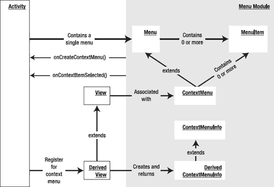

**图 7-3.** *Activity、视图和上下文菜单*

虽然上下文菜单归视图所有，但填充上下文菜单的方法位于 `Activity` 类中。这个方法名为 `activity.onCreateContextMenu()`，其作用类似于 `activity.onCreateOptionsMenu()` 方法。这个回调方法还携带了将要为其填充上下文菜单项的视图。

上下文菜单还有一个值得注意的细节。虽然 `onCreateOptionsMenu()` 方法对每个 Activity 都会自动调用，但 `onCreateContextMenu()` 并非如此。Activity 中的视图并*非必须*拥有一个上下文菜单。例如，你的 Activity 中可能有三个视图，但你只想为其中一个视图启用上下文菜单，而其他视图不启用。如果你希望某个特定视图拥有一个上下文菜单，你必须专门为此目的在该 Activity 中注册该视图。这是通过 `activity.registerForContextMenu(view)` 方法实现的，我们将在“为上下文菜单注册视图”一节中讨论此方法。

现在请注意图 7-3 中显示的 `ContextMenuInfo` 类。此类型的对象会被传递给 `onCreateContextMenu` 方法。这是视图将附加信息传递给此方法的一种方式。为了实现这一点，视图需要重写 `getContextViewInfo()` 方法，并返回一个派生自 `ContextMenuInfo` 的类，该类包含用于表示附加信息的额外方法。你可能需要查看 `android.view.View` 的源代码才能完全理解这种交互。

**注意：** 根据 Android SDK 文档，上下文菜单不支持快捷键、图标或子菜单。

现在你已经了解了上下文菜单的通用结构，让我们看一些示例代码，它们演示了实现上下文菜单的每个步骤：

1.  在 Activity 的 `onCreate()` 方法中为上下文菜单注册一个视图。
2.  使用 `onCreateContextMenu()` 填充上下文菜单。你必须在 Android 调用此回调方法之前完成步骤 1。
3.  响应上下文菜单的点击。

#### 为上下文菜单注册视图

实现上下文菜单的第一步是在 Activity 的 `onCreate()` 方法中为上下文菜单注册一个视图。如果你要使用本章介绍的菜单测试工具，你可以使用代码清单 7-15 中的代码在该测试工具中为 `TextView` 注册一个上下文菜单。你首先要找到这个 `TextView`，然后在 Activity 上以该 `TextView` 为参数调用 `registerForContextMenu`。这将为该 `TextView` 设置好上下文菜单。

**代码清单 7-15.** *为上下文菜单注册一个 `TextView`*

```java
@Override
public void onCreate(Bundle savedInstanceState) {
    super.onCreate(savedInstanceState);
    setContentView(R.layout.main);

    TextView tv = (TextView)this.findViewById(R.id.textViewId);
    registerForContextMenu(tv);
}
```

#### 填充上下文菜单

一旦像本例中的 `TextView` 这样的视图被注册了上下文菜单，Android 就会以该视图为参数调用 `onCreateContextMenu()` 方法。这就是你可以为该上下文菜单填充菜单项的地方。`onCreateContextMenu()` 回调方法提供了三个参数供使用。

第一个参数是预先构建好的 `ContextMenu` 对象，第二个参数是触发回调的视图（例如 `TextView`），第三个参数是我们在讨论图 7-3 时简要介绍过的 `ContextMenuInfo` 类。对于许多简单的情况，你可以直接忽略 `ContextMenuInfo` 对象。但是，某些视图可能会通过此对象传递额外信息。在这些情况下，你需要将 `ContextMenuInfo` 类转换为子类，然后使用其额外的方法来获取附加信息。

一些派生自 `ContextMenuInfo` 的类包括 `AdapterContextMenuInfo` 和 `ExpandableContextMenuInfo`。在 Android 中与数据库游标绑定的视图使用 `AdapterContextMenuInfo` 类来传递该视图中正在显示上下文菜单的行的 ID。从某种意义上说，你可以使用这个类来进一步明确鼠标点击之下的对象，哪怕是在同一个视图中。

代码清单 7-16 演示了 `onCreateContextMenu()` 方法。

**代码清单 7-16.** *`onCreateContextMenu()` 方法*

```java
@Override
public void onCreateContextMenu(ContextMenu menu, View v, ContextMenuInfo menuInfo)
{
    menu.setHeaderTitle("示例上下文菜单");
    menu.add(200, 200, 200, "item1");
}
```

#### 响应上下文菜单项

实现上下文菜单的第三步是响应上下文菜单的点击。响应上下文菜单的机制与响应选项菜单的机制类似。Android 提供了一个类似于 `onOptionsItemSelected()` 的回调方法，名为 `onContextItemSelected()`。与它的对应方法一样，此方法也可以在 `Activity` 类中使用。代码清单 7-17 演示了 `onContextItemSelected()`。

**代码清单 7-17.** *响应上下文菜单*

```java
@Override
public boolean onContextItemSelected(MenuItem item)
{
    if (item.getItemId() == some-menu-item-id)
    {
        //处理此菜单项
        return true;
    }
    // ... 其他异常处理
}
```


### 使用 Alternative 菜单

到目前为止，您已经学会了如何创建和使用菜单、子菜单以及上下文菜单。Android 引入了一种名为 *Alternative 菜单* 的新概念，它允许将备选菜单项作为菜单、子菜单和上下文菜单的一部分。Alternative 菜单使得 Android 上的多个应用程序能够互相调用。这些 Alternative 菜单是 Android 应用间通信或使用框架的一部分。

具体来说，Alternative 菜单允许一个应用包含来自其他应用的菜单。当选择了 Alternative 菜单项时，目标应用或 Activity 将被启动，并携带一个指向该 Activity 所需数据的 URL。被调用的 Activity 随后会使用从传递的 Intent 中获取的数据 URL。要深入理解 Alternative 菜单，您首先需要了解内容提供器、内容 URI、内容 MIME 类型以及 Intent（参见第 4 章和第 5 章）。

总体的思路是这样的：想象一下，您正在编写一个用于显示某些数据的屏幕。这个屏幕很可能就是一个 Activity。在这个 Activity 上，您会有一个选项菜单，允许您以多种方式操作或处理这些数据。同时假设您正在处理一个通过 URI 和相应 MIME 类型标识的文档或笔记。作为一名程序员，您要做的是预见到设备最终会包含更多知道如何处理或显示这些数据的程序。您希望给这些新程序一个机会，将它们自己的菜单项作为您为此 Activity 构建的菜单的一部分展示出来。

要将 Alternative 菜单项附加到菜单，请在 `onCreateOptionsMenu` 方法中设置菜单时遵循以下步骤：

1.  创建一个 Intent，将其数据 URI 设置为您当前正在显示的数据 URI。
2.  将 Intent 的类别设置为 `CATEGORY_ALTERNATIVE`。
3.  搜索能够处理此 URI 类型所支持数据的 Activity。
4.  将能够调用这些 Activity 的 Intent 作为菜单项添加到菜单中。

这些步骤向我们揭示了 Android 应用的许多本质，因此我们将逐一分析它们。正如我们现在所了解的，将 Alternative 菜单项附加到菜单发生在 `onCreateOptionsMenu` 方法中：

```java
@Override
public boolean onCreateOptionsMenu(Menu menu)
{
}
```

现在让我们弄清楚组成这个函数的代码是什么。首先，我们需要知道在此 Activity 中可能处理的数据的 URI。您可以像这样获取 URI：

```java
this.getIntent().getData()
```

这样是可行的，因为 `Activity` 类有一个名为 `getIntent()` 的方法，它返回调用此 Activity 的数据 URI。这个被调用的 Activity 可能是由主菜单调用的主 Activity；在这种情况下，它可能没有 Intent，并且 `getIntent()` 方法将返回 `null`。在您的代码中，您必须防范这种情况。

我们的目标现在是找出其他知道如何处理此类数据的程序。我们使用一个 Intent 作为参数来进行此搜索。以下是构建该 Intent 的代码：

```java
Intent criteriaIntent = new Intent(null, getIntent().getData());
intent.addCategory(Intent.CATEGORY_ALTERNATIVE);
```

一旦构建好 Intent，我们还会添加一个我们感兴趣的 action 类别。具体来说，我们只对那些可以作为 Alternative 菜单的一部分被调用的 Activity 感兴趣。现在，我们已经准备好告诉 `Menu` 对象搜索匹配的 Activity，并将它们添加为菜单选项（参见列表 7–18）。

**列表 7–18.** *用 Alternative 菜单项填充菜单*

```java
// 搜索匹配的 Activity，并用它们填充菜单。
menu.addIntentOptions(
     Menu.CATEGORY_ALTERNATIVE,   // 组
     Menu.CATEGORY_ALTERNATIVE,   // 任何我们可能关心的唯一 ID。
     Menu.CATEGORY_ALTERNATIVE,   // 排序
     this.getComponentName(),     // 显示菜单的 Activity 类的名称
                                  // ——在这里，就是这个类。
                                  // 变量 "this" 指向该 Activity
     null,                          // 无特定要求。
     criteriaIntent,                // 之前创建的、描述我们需求的 Intent。
     0,                             // 无标志。
     null);                         // 返回的菜单项
```

在逐行解释这段代码之前，我们先解释一下“匹配 Activity”这个术语的含义。*匹配 Activity* 是指能够处理给定 URI 的 Activity。Activity 通常使用 URI、action 和类别在其清单文件中注册这些信息。Android 提供了一种机制，使您可以使用 `Intent` 对象根据这些属性来查找匹配的 Activity。

现在，让我们仔细看看列表 7–18。`Menu` 类上的 `addIntentOptions` 方法负责查找与某个 Intent 的 URI 和类别属性相匹配的 Activity。然后，该方法将这些 Activity 添加到正确的组下，并赋予合适的菜单项和排序 ID。前三个参数涉及此方法的这一职责。在列表 7–18 中，我们从 `Menu.CATEGORY_ALTERNATIVE` 作为新菜单项将添加到的组开始。我们还使用这个相同的常量作为菜单项和排序 ID 的起点。

下一个参数指向此菜单所属 Activity 的完全限定组件名称。代码使用了 `Activity` 类中的一个名为 `getComponentName()` 的方法。*组件名称* 简单来说就是包名和类名。需要这个组件名称是因为，当添加一个新的菜单项时，该菜单项需要调用目标 Activity。为此，系统需要知道是哪个源 Activity 启动了目标 Activity。下一个参数是一个意图数组，您应该将其用作返回意图的过滤器。在示例中我们使用了 `"null"`。

下一个参数指向我们刚刚构建的 `criteriaIntent`。这就是我们要使用的搜索条件。之后的参数是一个标志，例如 `Menu.FLAG_APPEND_TO_GROUP`，用于指示是追加到该组现有的菜单项集合中，还是替换它们。默认值为 `0`，表示菜单组中的菜单项应当被替换。

列表 7–18 中的最后一个参数是添加的菜单项数组。如果您希望在添加菜单项后以某种方式操作它们，可以使用这些已添加菜单项的引用。

以上这些都很好。但仍有几个问题尚未解答。例如，添加的菜单项的名称会是什么？Android 文档对此保持沉默，因此我们查看了源代码，以了解这个函数在幕后实际做了些什么（请参考第 1 章了解如何获取 Android 源代码）。

事实证明，`Menu` 类只是一个接口，因此我们无法看到它的任何实现源代码。实现 `Menu` 接口的类叫做 `MenuBuilder`。列表 7–19 展示了来自 `MenuBuilder` 类的相关方法 `addIntentOptions` 的源代码（提供此代码供您参考；我们不会逐行解释）。

**列表 7–19.** *MenuBuilder.addIntentOptions 方法*


`public int addIntentOptions(int group, int id, int categoryOrder,`
`                               ComponentName caller,`
`                               Intent[] specifics,`
`                               Intent intent, int flags,`
`                               MenuItem[] outSpecificItems)`
`{`
`    PackageManager pm = mContext.getPackageManager();`
`    final List<ResolveInfo> lri =`
`            pm.queryIntentActivityOptions(caller, specifics, intent, 0);`
`    final int N = lri != null ? lri.size() : 0;`

`    if ((flags & FLAG_APPEND_TO_GROUP) == 0) {`
`        removeGroup(group);`
`    }`

`    for (int i=0; i<N; i++) {`
`        final ResolveInfo ri = lri.get(i);`
`        Intent rintent = new Intent(`
`            ri.specificIndex < 0 ? intent : specifics[ri.specificIndex]);`
`        rintent.setComponent(new ComponentName(`
`                ri.activityInfo.applicationInfo.packageName,`
`                ri.activityInfo.name));`
`        final MenuItem item = add(group, id, categoryOrder,`
`        ri.loadLabel(pm));`
`        item.setIntent(rintent);`
`        if (outSpecificItems != null && ri.specificIndex >= 0) {`
`            outSpecificItems[ri.specificIndex] = item;`
`        }`
`    }`
`    return N;`
`}`

请观察代码清单 7–19 中加粗部分的行；这段代码构建了一个菜单项。代码将确定菜单标题的工作委托给了`ResolveInfo`类。`ResolveInfo`类的源码告诉我们，声明该 Intent 的 Intent 过滤器应有一个与之关联的标题。下面是一个示例：

```
<intent-filter android:label="Menu Title ">
    …….
    <category android:name="android.intent.category.ALTERNATE" />
    <data android:mimeType="some type data" />
</intent-filter>
```

Intent 过滤器的`label`值最终会作为菜单名称。你可以查看 Android NotePad 示例来了解此行为。

### 处理响应数据变化的菜单

到目前为止，我们讨论的都是静态菜单——你只需一次性设置它们，它们不会根据屏幕内容动态变化。如果你想要创建动态菜单，请使用 Android 提供的`onPrepareOptionsMenu`方法。此方法与`onCreateOptionsMenu`类似，区别在于每次调用菜单时它都会被调用。例如，如果你想根据正在显示的数据禁用某些菜单或菜单组，就应该使用`onPrepareOptionsMenu`。在设计菜单功能时，你可能需要牢记这一点。

在进入对话框部分之前，我们还需要介绍菜单的另一个重要方面。Android 支持使用 XML 文件创建菜单。下一个高级主题将专门探讨 Android 中的 XML 菜单支持。

### 通过 XML 文件加载菜单

到目前为止，我们一直以编程方式创建所有菜单。这并不是创建菜单最便捷的方式，因为对于每个菜单，你都必须提供多个 ID，并为每个 ID 定义常量。你无疑会发现这很繁琐。

相反，你可以通过 XML 文件定义菜单，这在 Android 中是可行的，因为菜单也是一种资源。使用 XML 方法创建菜单有若干优势，例如能够为菜单命名、自动排序以及分配 ID。你还可以利用菜单文本的本地化支持。

请按照以下步骤使用基于 XML 的菜单：

1. 定义包含菜单标签的 XML 文件。
2. 将该文件放置在`/res/menu`子目录中。文件名可以任意设定，并且你可以根据需要放置任意数量的文件。Android 会自动为此菜单文件生成一个资源 ID。
3. 使用该菜单文件的资源 ID 将 XML 文件加载到菜单中。
4. 使用为每个菜单项生成的资源 ID 来响应菜单项。

我们将在以下各节中逐一介绍这些步骤，并提供相应的代码片段。

#### XML 菜单资源文件的结构

首先，我们来看一个包含菜单定义的 XML 文件（见代码清单 7–20）。所有菜单文件都以相同的高级`menu`标签开头，后跟一系列`group`标签。每个`group`标签对应本章开头讨论过的菜单项组。你可以使用`@+id`方法为组指定 ID。每个菜单组将包含一系列菜单项，这些菜单项的 ID 与符号名称相关联。你可以参考 Android SDK 文档，了解这些 XML 标签所有可能的参数。

**代码清单 7–20.** *包含菜单定义的 XML 文件*

```
<menu >
    <!-- 该组使用默认类别。 -->
    <group android:id="@+id/menuGroup_Main">

        <item android:id="@+id/menu_testPick"
            android:orderInCategory="5"
            android:title="测试选取" />
        <item android:id="@+id/menu_testGetContent"
            android:orderInCategory="5"
            android:title="测试获取内容" />
        <item android:id="@+id/menu_clear"
            android:orderInCategory="10"
            android:title="清除" />
        <item android:id="@+id/menu_dial"
            android:orderInCategory="7"
            android:title="拨号" />
        <item android:id="@+id/menu_test"
            android:orderInCategory="4"
            android:title="@+string/test" />
        <item android:id="@+id/menu_show_browser"
            android:orderInCategory="5"
            android:title="显示浏览器" />
    </group>
</menu>
```

代码清单 7–20 中的菜单 XML 文件包含一个组。基于资源 ID 定义`@+id/menuGroup_main`，该组将在`R.java`资源 ID 文件中被自动分配一个名为`menuGroup_main`的资源 ID。类似地，所有子菜单项都会根据此 XML 文件中的符号资源 ID 定义被分配菜单项 ID。

#### 填充 XML 菜单资源文件

假设这个 XML 文件名为`my_menu.xml`。你需要将此文件放在`/res/menu`子目录中。将文件放在`/res/menu`目录下会自动生成一个名为`R.menu.my_menu`的资源 ID。

现在，让我们来看看如何使用这个菜单资源 ID 来填充选项菜单。Android 提供了一个名为`android.view.MenuInflater`的类，用于从 XML 文件填充`Menu`对象。我们将使用此`MenuInflater`的一个实例，利用`R.menu.my_menu`资源 ID 来填充菜单对象：

```
@Override
public boolean onCreateOptionsMenu(Menu menu)
{
   MenuInflater inflater = getMenuInflater(); // 来自 activity
   inflater.inflate(R.menu.my_menu, menu);

   // 必须返回 true 才能看到菜单
   return true;   

}
```

在这段代码中，我们首先从`Activity`类获取`MenuInflater`，然后告诉它直接将菜单 XML 文件填充到菜单中。


##### 响应基于 XML 的菜单项

你尚未看到这种方法的具体优势——当你开始响应菜单项时，优势便会显现出来。响应 XML 菜单项的方式与响应以编程方式创建的菜单类似，但略有不同。和之前一样，你需要在 `onOptionsItemSelected` 回调方法中处理菜单项。这次，你将得到 Android 资源系统的帮助（关于资源的详细信息，请参见第 3 章）。正如我们在“XML 菜单资源文件的结构”一节中提到的，Android 不仅会为 XML 文件生成资源 ID，还会生成必要的菜单项 ID，以帮助你区分不同的菜单项。这在响应菜单项时是一个优势，因为你无需显式创建和管理菜单项 ID。

为了进一步说明这一点，在使用 XML 菜单时，你无需为这些 ID 定义常量，也无需担心它们的唯一性，因为资源 ID 的生成机制已经处理了这些问题。以下代码展示了这一点：

```
private void onOptionsItemSelected (MenuItem item)
{
   this.appendMenuItemText(item);
   if (item.getItemId() == R.id.menu_clear)
   {
       this.emptyText();
    }
   else if (item.getItemId() == R.id.menu_dial)
   {
        //执行某些操作
   }
   else if (item.getItemId() == R.id.menu_testPick)
   {
        //执行某些操作
   }
  else if (item.getItemId() == R.id.menu_testGetContent)
   {
        //执行某些操作
   }
   else if (item.getItemId() == R.id.menu_show_browser)
   {
        //执行某些操作
    }
    ……等等
}
```

请注意，来自 XML 菜单资源文件的菜单项名称，其对应的菜单项 ID 会自动生成在 `R.id` 命名空间中。

##### 其他 XML 菜单标签简介

在构建 XML 文件时，你需要了解可能用到的各种 XML 标签。你可以通过查看 Android SDK 附带的 API 演示来快速获取这些信息。这些 Android API 演示包含一系列菜单，可帮助你探索 Android 编程的各个方面。如果你查看 `/res/menu` 子目录，会发现许多 XML 菜单的示例。这里我们将简要介绍一些关键标签。

###### 分组类别标签

在 XML 文件中，你可以使用 `menuCategory` 标签来指定分组的类别：

```
<group android:id="@+id/some_group_id "
        android:menuCategory="secondary">
```

###### 可勾选行为标签

你可以使用 `checkableBehavior` 标签来控制分组级别的可勾选行为：

```
<group android:id="@+id/noncheckable_group"
       android:checkableBehavior="none">
```

你可以使用 `checked` 标签来控制项目级别的可勾选行为：

```
<item android:id=".."
      android:title="…"
      android:checked="true" />
```

###### 模拟子菜单的标签

子菜单在菜单项下以 `menu` 元素的形式表示：

```
 <item android:title="所有不含分组的项">
        <menu>
                   <item…>
        </menu>
 </item>
```

###### 菜单图标标签

你可以使用 `icon` 标签为菜单项关联一张图片：

```
 <item android:id=".. "
        android:icon="@drawable/some-file" />
```

###### 菜单启用/禁用标签

你可以使用 `enabled` 标签来启用或禁用菜单项：

```
<item android:id=".. "
         android:enabled="true"
        android:icon="@drawable/some-file" />
```

###### 菜单项快捷键

你可以使用 `alphabeticShortcut` 标签为菜单项设置快捷键：

```
 <item android:id="… "
        android:alphabeticShortcut="a"
       …>
   </item>
```

###### 菜单可见性

你可以使用 `visible` 标志来控制菜单项的可见性：

```
<item android:id="… "
        android:visible="true"
       …>
</item>
```

### 资源

在学习和使用 Android 菜单时，你可能希望随时参考以下 URL。该 URL 指向本章的可下载项目。

*   [`http://www.androidbook.com/projects`](http://www.androidbook.com/projects)：你可以使用此 URL 下载本章的专用测试项目。ZIP 文件的名称为 `ProAndroid3_ch07_TestMenus.zip`。

### 总结

本章解释了如何处理各种类型的 Android 菜单：常规菜单、上下文菜单、替代菜单以及基于 XML 的菜单。后续的多章内容，例如第 8 章（对话框）、第 16 章（2D 动画）和第 20 章（OpenGL），都会使用 XML 菜单来测试相应章节介绍的功能。最后，特定于 3.0 版本的操作栏和菜单交互将在第 30 章中介绍。

## 第 8 章

## 使用对话框

Android SDK 提供了对对话框的广泛支持。Android 明确支持的对话框包括：警告、选择列表、单选、多选、进度、时间选择器和日期选择器对话框（此列表可能因 Android 版本而异）。Android 还支持用于其他需求的自定义对话框。本章的主要重点并非逐一介绍这些对话框，而是介绍 Android 对话框的底层架构。Android 3.0 新增了基于 Fragment 的对话框。对话框的这一方面将在第 29 章（Fragment）中介绍。基于 Fragment 的对话框预计将逐步取代本章介绍的的传统对话框。不过，这些传统对话框目前尚未被弃用，并且仍然是手机上的标准做法。

Android 中的对话框是异步的，这提供了灵活性。但是，如果你习惯于对话框主要是同步的编程框架（例如 Microsoft Windows 或网页中的 JavaScript 对话框），你可能会觉得异步对话框不太直观。

在向您介绍了创建和使用 Android 对话框的基础知识之后，我们将提供一个直观的抽象，使异步对话框的使用变得更加容易。然后，我们将使用这个抽象来实现几个示例对话框。我们还在本章末尾的“参考资料”部分提供了一个可下载项目的链接。您可以使用此下载来试验本章介绍的代码和概念。

### 在 Android 中使用对话框

如果你来自一个对话框是同步（特别是模态对话框）的环境，那么你需要以不同的方式思考 Android 对话框。Android 中的对话框是异步的。不仅如此，它们还是*被管理的*；也就是说，它们在多次调用之间会被重用，这可能是为了帮助提高性能。


#### 设计一个警告对话框

我们从警告对话框开始讨论。警告对话框通常包含有关表单验证的简单消息，有时（无论对错）也用于调试。请考虑以下你常在 HTML 页面中见到的调试示例：

```
if (validate(field1) == false)
{
   // 通过警告对话框指示格式无效
   showAlert("你在 field1 中输入的内容不符合要求的格式");
   // 将焦点设置到该字段
   // ... 然后继续
}
```

你可能会通过 JavaScript 的 `alert` 函数来编写这个对话框，它会显示一个包含消息和“确定”按钮的同步对话框。用户点击“确定”按钮后，程序流程继续。这个对话框被认为是模态且同步的，因为在 `alert` 函数返回之前，下一行代码不会执行。

这种类型的警告对话框对于调试很有用。但 Android 并没有提供如此直接的函数或对话框。相反，它支持一个*警告对话框构建器（alert-dialog builder）*，这是一种用于构建和处理警告对话框的通用工具。因此，你可以使用 `android.app.AlertDialog.Builder` 类自行构建一个警告对话框。你可以使用这个构建器类来构造允许用户执行以下任务的对话框：

- 阅读消息并回答“是”或“否”。
- 从列表中选择一个项目。
- 从列表中选择多个项目。
- 查看应用程序的进度。
- 从一组选项中选择一个选项。
- 在继续程序之前响应一个提示。

我们将向你展示如何构建其中一个对话框，并从一个菜单项中调用它。这种方法适用于任何此类对话框，包括以下步骤：

1. 构建一个 `Builder` 对象。
2. 设置显示参数，例如按钮数量、项目列表等。
3. 设置按钮的回调方法。
4. 告诉 `Builder` 构建对话框。构建出的对话框类型取决于你在 `Builder` 对象上设置的内容。
5. 使用 `dialog.show()` 显示对话框。

代码清单 8–1 展示了实现这些步骤的代码。

**代码清单 8–1.** *构建并显示一个警告对话框*

```
public class Alerts
{
   public static void showAlert(String message, Context ctx)   
   {
// 创建一个构建器
      AlertDialog.Builder builder = new AlertDialog.Builder(ctx);
      builder.setTitle("警告窗口");

// 添加按钮和监听器
      EmptyOnClickListener el = new EmptyOnClickListener();
      builder.setPositiveButton("确定", el);

// 创建对话框
      AlertDialog ad = builder.create();

// 显示
      ad.show();
   }
}

public class EmptyOnClickListener
implements android.content.DialogInterface.OnClickListener {
   public void onClick(DialogInterface v, int buttonId)
   {
   }
}
```

你可以通过在一个合适的测试 Activity（例如可下载的示例项目）中创建一个菜单项，并使用以下代码响应它来调用代码清单 8–1 中的代码：

```
if (item.getItemId() == R.id.menu_simple_alert)
{
    Alerts.showAlert("简单示例警告", this);
}
```

其结果（取决于你的测试 Activity）可能类似于图 8–1 中所示的屏幕。

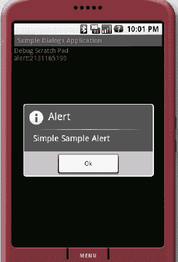

**图 8–1.** *一个简单的警告对话框*

这个简单警告对话框的代码很直接（如代码清单 8–1 及其后的代码片段所示）。即使是监听器部分也很容易理解。本质上，当按钮被点击时，我们什么也不做。

然而，值得注意的是，监听器接收到了一个指向 `DialogInterface` 的引用。这个引用指向了调用此回调的实际对话框。该接口支持许多被对话框类使用的常量、许多回调接口以及两个关键方法。这些方法是：

```
cancel()
dismiss()
```

通常，你不需要调用这些方法，因为按钮点击会根据需要自动调用它们。如果你想对这些方法调用做出响应，可以注册它们对应的回调。关于可用回调方法的完整列表，请参阅 `DialogInterface` 的 SDK 文档。

在代码清单 8–1 中，我们只是创建了一个空的监听器并将其注册到“确定”按钮上。唯一奇怪的部分是你没有使用 `new` 来创建对话框；相反，你设置参数并让警告对话框构建器来创建它。

#### 设计一个提示对话框

既然你已经成功创建了一个简单的警告对话框，那么让我们来应对一个更高级的警告对话框：提示对话框。作为 JavaScript 的另一个标配，提示对话框向用户显示一个提示或问题，并通过编辑框请求输入。提示对话框将该字符串返回给程序，以便程序继续执行。这将是一个很好的学习示例，因为它展示了 `Builder` 类提供的许多功能，并使我们能够研究 Android 对话框的同步、异步、模态和非模态特性。

以下是创建提示对话框所需的步骤：

1. 为你的提示对话框设计一个布局视图。
2. 将布局加载到 `View` 类中。
3. 构建一个 `Builder` 对象。
4. 在 `Builder` 对象中设置视图。
5. 设置按钮及其回调以捕获输入的文本。
6. 使用警告对话框构建器创建对话框。
7. 显示对话框。

现在，我们将展示每个步骤的代码。

##### 提示对话框的 XML 布局文件

当我们显示提示对话框时，我们需要显示一个提示 `TextView`，后跟一个用户可用于输入回复的编辑框。代码清单 8–2 包含了提示对话框的 XML 布局文件。如果你将此文件命名为 `prompt_layout.xml`，则需要将其放置在 `/res/layout` 子目录中，以生成一个名为 `R.layout.prompt_layout` 的资源 ID。

**代码清单 8–2.** *prompt_layout.xml 文件*

```
<LinearLayout
    android:layout_width="fill_parent"
    android:layout_height="wrap_content"
    android:orientation="vertical">

    <TextView
        android:id="@+id/promptmessage"
        android:layout_height="wrap_content"
        android:layout_width="wrap_content"
        android:layout_marginLeft="20dip"
        android:layout_marginRight="20dip"
        android:text="在此处输入你的文本"
        android:gravity="left"
        android:textAppearance="?android:attr/textAppearanceMedium" />

    <EditText
        android:id="@+id/editText_prompt"
        android:layout_height="wrap_content"
        android:layout_width="fill_parent"
        android:layout_marginLeft="20dip"
        android:layout_marginRight="20dip"
        android:scrollHorizontally="true"
        android:autoText="false"
        android:capitalize="none"
        android:gravity="fill_horizontal"
        android:textAppearance="?android:attr/textAppearanceMedium" />

</LinearLayout>
```


### 使用用户视图设置提示对话框构建器

现在，我们将结合说明中的步骤 2 到 4 来创建一个提示对话框：加载 XML 视图并将其设置到提示对话框构建器中。Android 提供了一个名为 `android.view.LayoutInflater` 的类，用于根据 XML 布局定义文件创建 `View` 对象。我们将使用 `LayoutInflater` 的实例，根据 XML 布局文件填充对话框的视图（参见代码清单 8-3）。

**代码清单 8-3.** *将布局填充到对话框中*

```
LayoutInflater li = LayoutInflater.from(activity);
//这里的‘activity’变量是您的 Activity 或 Context 的引用
View view = li.inflate(R.layout.prompt_layout, null);

//获取一个构建器并设置视图
AlertDialog.Builder builder = new AlertDialog.Builder(ctx);
builder.setTitle("Prompt");
builder.setView(view);
```

在代码清单 8-3 中，我们使用静态方法 `LayoutInflater.from(ctx)` 获取 `LayoutInflater`，然后使用 `LayoutInflater` 对象来填充 XML 以创建 `View` 对象。接着，我们配置一个提示对话框构建器，为其设置标题和我们刚刚创建的视图。

### 设置按钮和监听器

现在我们进行到步骤 5，设置按钮。您需要提供“确定”和“取消”按钮，以便用户能够响应提示。如果用户点击“取消”，程序无需读取提示的任何文本。如果用户点击“确定”，程序会从文本框中获取值并将其传回给 Activity。

要设置这些按钮，您需要一个监听器来响应这些回调。我们将在“提示对话框监听器”部分提供监听器的代码，但首先请查看代码清单 8-4 中的按钮设置，这是代码清单 8-3 的后续。

**代码清单 8-4.** *设置“确定”和“取消”按钮*

```
      //添加按钮和监听器
      PromptListener pl = new PromptListener(view);
      builder.setPositiveButton("OK", pl);
      builder.setNegativeButton("Cancel", pl);
```

代码清单 8-4 中的代码假定监听器类的名称为 `PromptListener`。我们已经为每个按钮注册了这个监听器。`PromptListener` 类接收我们在代码清单 8-3 中构建的布局视图。稍后查看该类时，您会注意到 `view` 变量被用来标识文本控件并检索用户输入的内容。

### 创建并显示提示对话框

最后，我们完成步骤 6 和 7，即创建并显示提示对话框。一旦您有了提示对话框构建器，这很容易做到（参见代码清单 8-5）。

**代码清单 8-5.** *指示提示对话框构建器创建对话框*

```
      //获取对话框
      AlertDialog ad = builder.create();
      ad.show();

      //返回提示回复
      return pl.getPromptReply();
```

最后一行使用监听器返回提示的回复。现在，我们将按承诺展示 `PromptListener` 类的代码。

### 提示对话框监听器

提示对话框通过一个名为 `PromptListener` 的监听器回调类与 Activity 交互。该类有一个名为 `onClick` 的回调方法，传递给 `onClick` 的按钮 ID 标识了点击的是哪种类型的按钮。其余代码很容易理解（参见代码清单 8-6）。当用户输入文本并点击“确定”按钮时，文本的值会被传递到 `promptReply` 字段。否则，该值保持为 `null`。请注意我们是如何使用代码清单 8-2 中标识的提示对话框布局中的编辑文本控件 ID（`editText_prompt`）的。

**代码清单 8-6.** *PromptListener，监听器回调类*

```
public class PromptListener
implements android.content.DialogInterface.OnClickListener
{
   // 用于返回提示回复值的局部变量
   private String promptReply = null;

   // 保留一个用于检索提示值的视图变量
   View promptDialogView = null;

   // 在构造函数中接收视图
   public PromptListener(View inDialogView)   {
         promptDialogView = inDialogView;
   }

   // 来自对话框的回调方法
public void onClick(DialogInterface v, int buttonId)   {
         if (buttonId == DialogInterface.BUTTON_POSITIVE)      {
              // 确定按钮
              promptReply = getPromptText();
      }
      else      {
         // 取消按钮
         promptReply = null;
      }
   }

   // 只是编辑框内容的访问方法
   private String getPromptText()   {
      EditText et =  (EditText)
      promptDialogView.findViewById(R.id.editText_prompt);
      return et.getText().toString();
   }
   public String getPromptReply() { return promptReply; }
}
```

### 整合所有代码

现在我们已经解释了构成提示对话框的每一段代码，我们将把代码集中放在一处，以便您用来测试对话框（参见代码清单 8-7）。我们排除了 `PromptListener` 类，因为它已单独出现在代码清单 8-6 中。

**代码清单 8-7.** *用于测试提示对话框的代码*

```
public class Alerts
{
   public static String prompt(String message, Context ctx)
   {
      // 加载某种视图
      LayoutInflater li = LayoutInflater.from(ctx);
      View view = li.inflate(R.layout.prompt_layout, null);

      // 获取一个构建器并设置视图
      AlertDialog.Builder builder = new AlertDialog.Builder(ctx);
      builder.setTitle("Prompt");
      builder.setView(view);

      // 添加按钮和监听器
      PromptListener pl = new PromptListener(view);
      builder.setPositiveButton("OK", pl);
      builder.setNegativeButton("Cancel", pl);

      // 获取对话框
      AlertDialog ad = builder.create();

      // 显示
      ad.show();

      return pl.getPromptReply();
   }
}
```

您可以通过在合适的测试工具中创建一个菜单项，并使用以下代码响应该菜单项来调用代码清单 8-7 中的代码：

```
if (item.getItemId() == R.id.your_menu_item_id)
{
    String  reply = Alerts.showPrompt("Your text goes here", this);
}
```

结果将类似于图 8-2 所示的屏幕。

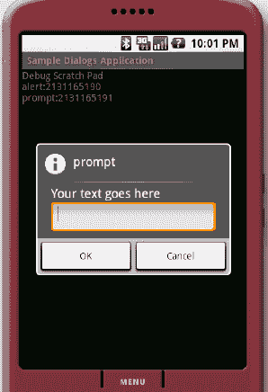

**图 8-2.** *一个简单的提示对话框*

然而，在编写完所有这些代码后，您会注意到提示对话框总是返回 `null`，即使用户在其中输入了文本。事实证明，在以下代码中，`show()` 方法会异步调用对话框：

```
ad.show() //dialog.show
return pl.getPromptReply(); // listener.getpromptReply()
```

这意味着 `getPromptReply()` 方法（参见代码清单 8-6）会在用户有时间输入文本并点击“确定”按钮之前就被调用来获取提示值。我们代码中的这个错误揭示了 Android 对话框的本质核心。


好的，作为一名高级文档工程师和翻译员，我将严格遵循您的注意事项和示例格式，将给定的英文文本翻译成中文。

---


### Android 中对话框的本质

正如我们之前提到的，在 Android 中显示对话框是一个异步过程。一旦对话框显示出来，调用该对话框的主线程就会返回并继续处理后续代码。但这并不意味着对话框不是模态的。对话框仍然是模态的。鼠标点击仅作用于对话框，而父 Activity 则会回到它的消息循环中。

在某些窗口系统中，模态对话框的行为略有不同。调用方会被阻塞，直到用户通过对话框提供响应。（这种阻塞可以是虚拟阻塞而非真实阻塞）。在 Windows 操作系统上，消息分发线程开始将消息分发给对话框，并暂停向父窗口分发消息。当对话框关闭时，线程会返回到父窗口。这使得调用变成了同步的。

这种方法可能不适用于手持设备，因为设备上意外事件更频繁，主线程需要响应这些事件。为了实现这种响应级别，Android 会立即将主线程返回到它的消息循环中。

这种模型带来的影响是，你不能简单地创建一个对话框来请求响应，并在继续执行之前等待它。实际上，你的对话框编程模型必须有所不同，并且需要包含回调。

### 重新架构提示对话框

让我们重新审视之前提示对话框实现中有问题的代码：

```
if (item.getItemId() == R.id.your_menu_id)
{
    String  reply = Alerts.showPrompt("Your text goes here", this);
}
```

正如我们已验证的，字符串变量 `reply` 的值将是 `null`，因为由 `Alerts.showPrompt()` 启动的提示对话框无法在同一线程上返回值。实现这一点的唯一方法是让 Activity 直接实现回调方法，而不依赖于 `PromptListener` 类。你可以在 `Activity` 类中通过实现 `OnClickListener` 来实现这一点：

```
public class SampleActivity extends Activity
implements android.content.DialogInterface.OnClickListener
{
…… other code

if (item.getItemId() == R.id.your_menu_id)
{
    Alerts.showPrompt("Your text goes here", this);
}
…..
public void onClick(DialogInterface v, int buttonId)
{
       //想办法从这里读取对话框中的回复字符串
}
```

正如你从这个 `onClick` 回调方法中看到的，你可以正确地读取实例化对话框中的变量，因为当这个方法被调用时，用户已经关闭了对话框。

以这种方式使用对话框是完全合理的。但是，Android 提供了一种补充机制，通过引入*托管式对话框* —— 即在多次调用之间可复用的对话框 —— 来优化性能。不过，在使用托管式对话框时，你仍然需要使用回调。实际上，你在实现提示对话框时所学的所有内容都将帮助你使用托管式对话框并理解其背后的动机。只要 Activity 的视图状态保持不变，这些托管式对话框还允许 Android 管理对话框在多次调用之间的状态。

### 使用托管式对话框

Android 遵循托管式对话框协议，以促进复用先前创建的对话框实例，而不是根据操作创建新的对话框。在本节中，我们将讨论托管式对话框协议的细节，并向你展示如何将提醒对话框实现为托管式对话框。然而，在我们看来，托管式对话框协议使得使用对话框变得繁琐。随后，我们将开发一个小型框架来抽象掉该协议的大部分内容，以便更轻松地使用托管式对话框。

#### 理解托管式对话框协议

托管式对话框协议的主要目标是，如果一个对话框被第二次或随后再次调用，则将其复用。这类似于在 Java 中使用对象池。托管式对话框协议包含以下步骤：

1.  为你想要创建和使用的每个对话框分配一个唯一的 ID。假设其中一个对话框被标记为 1。
2.  告诉 Android 显示一个名为 1 的对话框。
3.  Android 检查当前 Activity 是否已有一个标记为 1 的对话框。如果该对话框存在，Android 会显示它，而不会重新创建它。在显示对话框之前，Android 会调用 `onPrepareDialog()` 函数以进行清理。
4.  如果对话框不存在，Android 会通过传递对话框 ID（此处为 1）来调用 `onCreateDialog()` 方法。
5.  作为程序员，你需要重写 `onCreateDialog()` 方法。你必须使用提醒对话框构建器（alert-dialog builder）创建对话框并返回它。但在创建对话框之前，你的代码需要确定需要创建哪个对话框 ID。你需要一个 switch 语句来解决这个问题。
6.  Android 显示对话框。
7.  对话框在按钮被点击时调用回调。

让我们使用此协议，将我们的非托管式提醒对话框重新实现为托管式提醒对话框。


#### 将非托管对话框重构为托管对话框

我们将按照重构警告对话框的每个步骤进行操作。首先，在特定活动的上下文中为此对话框定义一个唯一 ID：

```
// 唯一的对话框 ID
private static final int DIALOG_ALERT_ID = 1;
```

这非常简单。我们刚刚创建了一个 ID 来表示对话框，以协调回调函数。这个 ID 将允许我们响应菜单项时执行以下操作：

```
      someactivity.showDialog(this.DIALOG_ALERT_ID);
```

Android SDK 方法 `showDialog()` 会触发对活动类的 `onCreateDialog()` 方法的调用。Android 足够智能，不会重复调用 `onCreateDialog()`。当此方法被调用时，我们需要创建对话框并将其返回给 Android。然后 Android 会在内部保留已创建的对话框以供重用。以下是基于唯一 ID 创建对话框的示例代码：

```
public class SomeActivity extends Activity {
...
    @Override
    protected Dialog onCreateDialog(int id) {
        switch (id) {
            case DIALOG_ALERT_ID:
               return createAlertDialog();
        }
        return null;
    }

    private Dialog createAlertDialog()
    {
       AlertDialog.Builder builder = new AlertDialog.Builder(this);
       builder.setTitle("Alert");
       builder.setMessage("some message");
       EmptyOnClickListener emptyListener = new EmptyOnClickListener();
       builder.setPositiveButton("Ok", emptyListener );
       AlertDialog ad = builder.create();
       return ad;
    }
```

请注意 `onCreateDialog()` 如何通过识别传入的 ID 来匹配对应的对话框。`createAlertDialog()` 本身被放在一个单独的函数中，与前面章节描述的警告对话框创建流程类似。这段代码同样使用了我们处理警告对话框时用到的 `EmptyOnClickListener`。

由于对话框只会创建一次，如果你希望在每次显示对话框时更改其中的某些内容，就需要一种机制。你可以通过 `onPrepareDialog()` 回调方法来实现：

```
    @Override
    protected void onPrepareDialog(int id, Dialog dialog) {
        switch (id) {
        case DIALOG_ALERT_ID:
           prepareAlertDialog(dialog);
        }
    }

    private void prepareAlertDialog(Dialog d)    {
       AlertDialog ad = (AlertDialog)d;
       //更改此对话框的某些内容
    }
```

有了这段代码，`showDialog(1)` 就能正常工作。即使你多次调用此方法，`onCreateMethod()` 也只会被调用一次。你可以遵循相同的协议来重新实现提示对话框。

响应对话框回调已经需要一定工作量，而托管对话框协议则增加了更多工作。在研究了托管对话框协议之后，我们想到了将其抽象化并重新组织，以实现两个目标：

- 将对话框的标识和创建从活动类中移出
- 将对话框的创建和响应集中在一个专门的对话框类中

在下一小节中，我们将介绍此框架的设计，然后使用它重新创建警告对话框和提示对话框。

#### 简化托管对话框协议

你可能已经注意到，使用托管警告对话框可能会变得混乱，并污染主代码。如果我们把这个协议抽象成一个更简单的协议，新协议可能如下所示：

1.  使用 `new` 创建所需对话框的实例，并将其保留为局部变量。称之为 `dialog1`。
2.  使用 `dialog1.show()` 显示对话框。
3.  在活动中实现一个名为 `dialogFinished()` 的方法。
4.  在 `dialogFinished()` 方法中，从 `dialog1` 读取属性，例如 `dialog1.getValue1()`。

在此方案下，显示托管警告对话框将如下所示：

```
….class MyActivity ….
{
   //新建对话框
   ManagedAlertDialog  mad = new ManagedAlertDialog("message", …, .. );

  ….某个菜单方法
  if (item.getItemId() == R.id.your_menu_id)
  {
     //显示对话框
    mad.show();
  }
  …..
  //如果需要，访问 mad 对话框的内部状态
  dialogFinsihed()
  {
    ….
    //使用对话框中的值
     mad.getA();
     mad.getB();
  }
}
```

我们认为这是一个更简单的对话框处理模型。此方法的明显优势如下：

- 无需分配或记忆任意的对话框 ID。
- 无需用对话框创建代码污染活动主代码。
- 可以直接使用派生的对话框对象来访问值。

这种抽象的原理是如何工作的？第一步，我们将对话框的创建和准备抽象到一个标识基础对话框的类中。我们称这个接口为 `IDialogProtocol`。这个对话框接口也直接包含一个 `show()` 方法。这些对话框被收集并保存在活动基类的注册表中，并使用它们的 ID 作为键。基活动会根据 ID 对 `onCreate`、`onPrepare` 和 `onClick` 调用进行解复用，并将它们路由到对话框类。此架构如图 8-3 所示。

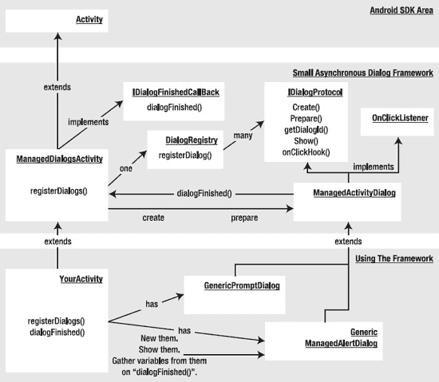

**图 8-3.** *一个简单的托管对话框框架*

清单 8-8 说明了此框架的实用性。关键类（包括 `GenericPromptDialog` 和 `GenericManagedAlertDialog`）的源代码将在本章后续部分提供。不过，我们没有包含完整的驱动类，仅展示了清单 8-8 中的要点。你可以使用本章“参考资料”部分中的下载链接，查看驱动本章所述各种对话框的驱动类。

**清单 8-8.** *托管对话框协议的抽象*

```
public class MainActivity extends ManagedDialogsActivity
{
   //对话框 1
   private GenericManagedAlertDialog gmad =
      new GenericManagedAlertDialog(this,1,"InitialValue");

   //对话框 2
   private GenericPromptDialog gmpd =
      new GenericPromptDialog(this,2,"InitialValue");

   //启动对话框的菜单项   
   if (item.getItemId() == R.id.your_menu_id1)
   {
      gmad.show();
   }
   else if (item.getItemId() == R.id.your_menu_id2)
   {
       gmpd.show();
   }

   //处理回调   
   public void dialogFinished(ManagedActivityDialog dialog, int buttonId)
   {
      if (dialog.getDialogId() == gmpd.getDialogId())
      {
         //假设“gmpd”有一个获取回复字符串的访问方法
         String replyString = gmpd.getReplyString();
      }
   }
}
```

要使用此框架，你首先需要扩展 `ManagedDialogsActivity`。然后，实例化你需要的对话框，每个对话框都派生自 `ManagedActivityDialog`。在菜单项响应中，你可以直接在这些对话框上调用 `show()` 方法。对话框本身会预先获取必要的参数以便创建和显示。尽管我们传递了一个对话框 ID，但不再需要记忆这些 ID。如果你愿意，甚至可以将这些 ID 完全抽象掉。

现在，我们将逐一探讨图 8-3 中展示的每个类。你也可以在本章的下载文件中看到这些清单。如果你打算编译这些代码，我们强烈建议你下载该项目。如果你选择不下载，重构项目的大部分代码已在此处提供；你可能需要自行补充缺失的部分。


### IDialogProtocol

`IDialogProtocol`接口定义了托管对话框的规范。托管对话框的职责包括创建对话框并在每次显示时准备它。同时，将`show`功能委托给对话框本身也是合理的。对话框还必须识别按钮点击，并调用相应的父级来关闭对话框。以下接口代码将这些概念表示为一组函数：

```
public interface IDialogProtocol
{
    public Dialog create();
    public void prepare(Dialog dialog);
    public int getDialogId();
    public void show();
    public void onClickHook(int buttonId);
}
```

### ManagedActivityDialog

抽象类`ManagedActivityDialog`为所有想要实现`IDialogProtocol`接口的对话框类提供了通用实现。它将`create`和`prepare`函数留给基类重写，但为其余`IDialogProtocol`方法提供了实现。`ManagedActivityDialog`还会在响应按钮点击事件后通知父 Activity 对话框已完成。它使用模板钩子模式，允许派生类特化`onClickHook`方法。该类还负责将`show()`方法重定向到父 Activity，从而为`show()`提供更自然的实现。您可以将`ManagedActivityDialog`类用作所有新对话框的基类（参见清单 8-9）。

**清单 8-9. ManagedActivityDialog 类**

```
public abstract class ManagedActivityDialog implements IDialogProtocol
    ,android.content.DialogInterface.OnClickListener

{
    private ManagedDialogsActivity mActivity;
    private int mDialogId;
    public ManagedActivityDialog(ManagedDialogsActivity a, int dialogId)
    {
        mActivity = a;
        mDialogId = dialogId;
    }
    public int getDialogId()
    {
        return mDialogId;
    }
    public void show()
    {
        mActivity.showDialog(mDialogId);
    }
    public void onClick(DialogInterface v, int buttonId)
    {
        onClickHook(buttonId);
        this.mActivity.dialogFinished(this, buttonId);
    }
}
```

### DialogRegistry

`DialogRegistry`类负责两件事。它维护对话框 ID 与实际对话框（工厂）实例之间的映射。它还使用 ID 到对象的映射，将通用的`onCreate`和`onPrepare`调用转换为特定对话框。`ManagedDialogsActivity`使用`DialogRegistry`类作为仓库来注册新对话框（参见清单 8-10）。

**清单 8-10. DialogRegistry 类**

```
public class DialogRegistry
{
   SparseArray<IDialogProtocol> idsToDialogs
                              = new SparseArray();

   public void registerDialog(IDialogProtocol dialog)
   {
      idsToDialogs.put(dialog.getDialogId(),dialog);
   }

   public Dialog create(int id)
   {
      IDialogProtocol dp = idsToDialogs.get(id);
      if (dp == null) return null;

      return dp.create();
   }
   public void prepare(Dialog dialog, int id)
   {
      IDialogProtocol dp = idsToDialogs.get(id);
      if (dp == null)
      {
         throw new RuntimeException("Dialog id is not registered:" + id);
      }
      dp.prepare(dialog);
   }
}
```

### ManagedDialogsActivity

`ManagedDialogsActivity`类作为支持托管对话框的 Activity 的基类。它维护一个`DialogRegistry`实例来跟踪由`IDialogProtocol`接口标识的托管对话框。它允许派生 Activity 通过`registerDialogs()`函数注册其对话框。如图 8-3 所示，它还负责通过定位对话框注册表中的对话框实例，将`create`和`prepare`语义传递给相应的对话框实例。最后，它为对话框注册表中的每个对话框提供回调方法`dialogFinished`（参见清单 8-11）。

**清单 8-11. ManagedDialogsActivity 类**

```
public class ManagedDialogsActivity extends Activity
             implements IDialogFinishedCallBack
{
   //A registry for managed dialogs
    private DialogRegistry dr = new DialogRegistry();

    public void onCreate(Bundle savedInstanceState) {
        super.onCreate(savedInstanceState);
        this.registerDialogs();
    }

    protected void registerDialogs()
    {
       // does nothing
       // have the derived classes override this method
       // to register their dialogs
       // example:
       // registerDialog(this.DIALOG_ALERT_ID_3, gmad);

    }
    public void registerDialog(IDialogProtocol dialog)
    {
       this.dr.registerDialog(dialog);
    }

    @Override
    protected Dialog onCreateDialog(int id) {
               return this.dr.create(id);
    }
    @Override
    protected void onPrepareDialog(int id, Dialog dialog) {
              this.dr.prepare(dialog, id);
    }

   public void dialogFinished(ManagedActivityDialog dialog, int buttonId)
   {
      //nothing to do
      //have derived classes override this
   }
}
```

### IDialogFinishedCallBack

`IDialogFinishedCallBack`接口允许`ManagedActivityDialog`类通知父 Activity 对话框已完成，并且父 Activity 可以调用对话框上的方法来检索参数。通常，`ManagedDialogsActivity`实现此接口并作为`ManagedActivityDialog`的父 Activity（参见清单 8-12）。

**清单 8-12. IDialogFinishedCallBack 接口**

```
public interface IDialogFinishedCallBack
{
      public static int OK_BUTTON = -1;
      public static int CANCEL_BUTTON = -2;
      public void dialogFinished(ManagedActivityDialog dialog, int buttonId);
}
```

### GenericManagedAlertDialog

`GenericManagedAlertDialog`是警告对话框的实现；它扩展了`ManagedActivityDialog`。该类负责使用警告对话框构建器创建实际的警告对话框。它还携带所需的所有信息作为局部变量。由于`GenericManagedAlertDialog`实现了一个简单的警告对话框，它在`onClickHook`方法中不执行任何操作。需要注意的是，当您使用这种方法时，`GenericManagedAlertDialog`将所有相关信息封装在一个地方（参见清单 8-13）。这使得 Activity 中的主线代码保持简洁。

**清单 8-13. GenericManagedAlertDialog 类**

```
public class GenericManagedAlertDialog extends ManagedActivityDialog
{
   private String alertMessage = null;
   private Context ctx = null;
   public GenericManagedAlertDialog(ManagedDialogsActivity inActivity,
                             int dialogId,
                             String initialMessage)
   {
      super(inActivity,dialogId);
      alertMessage = initialMessage;
      ctx = inActivity;
   }
   public Dialog create()
   {
       AlertDialog.Builder builder = new AlertDialog.Builder(ctx);
       builder.setTitle("Alert");
       builder.setMessage(alertMessage);
       builder.setPositiveButton("Ok", this );
       AlertDialog ad = builder.create();
       return ad;
   }

   public void prepare(Dialog dialog)
   {
       AlertDialog ad = (AlertDialog)dialog;
       ad.setMessage(alertMessage);
   }
   public void setAlertMessage(String inAlertMessage)
   {
      alertMessage = inAlertMessage;
   }
   public void onClickHook(int buttonId)
   {
      //nothing to do
      //no local variables to set
   }
}
```


### GenericPromptDialog（通用提示对话框）

`GenericPromptDialog` 类通过扩展 `ManagedActivityDialog` 类，并提供必要的 `create` 和 `prepare` 方法（参见清单 8–14），封装了提示对话框的所有需求。你还可以看到，它将回复文本保存在一个局部变量中，以便父 Activity 可以在 `dialogFinished` 回调方法中获取该文本。

**清单 8–14.** *GenericPromptDialog 类*

```
public class GenericPromptDialog extends ManagedActivityDialog
{
   private String mPromptMessage = null;
   private View promptView = null;
   String promptValue = null;

   private Context ctx = null;
   public GenericPromptDialog(ManagedDialogsActivity inActivity,
         int dialogId,
         String promptMessage)
   {
      super(inActivity,dialogId);
      mPromptMessage = promptMessage;
      ctx = inActivity;
   }
   public Dialog create()
   {
       LayoutInflater li = LayoutInflater.from(ctx);
       promptView = li.inflate(R.layout.promptdialog, null);
       AlertDialog.Builder builder = new AlertDialog.Builder(ctx);
       builder.setTitle("prompt");
       builder.setView(promptView);
       builder.setPositiveButton("OK", this);
       builder.setNegativeButton("Cancel", this);
       AlertDialog ad = builder.create();
       return ad;
   }

   public void prepare(Dialog dialog)
   {
      //暂时不做任何操作
   }
   public void onClickHook(int buttonId)
   {
      if (buttonId == DialogInterface.BUTTON1)
      {
         //确定按钮
         String promptValue = getEnteredText();
      }
   }
   private String getEnteredText()   
   {
      EditText et =
         (EditText)
         promptView.findViewById(R.id.editText_prompt);
      String enteredText = et.getText().toString();
      Log.d("xx",enteredText);
      return enteredText;
   }
}
```

这里介绍的框架需要在设备配置更改导致 Activity 重建时进行一些调整。主要的更改涉及使用保存实例和恢复实例的方法来重新创建对话框对象。由于这些对话框将被基于 Fragment 的对话框（详见第 29 章）所取代，我们并未提供必要的更改来使这些对话框在设备配置更改时保持持久化。

### 使用 Toast

我们在本章开头介绍了“提示”消息如何常用于调试错误页面上的 JavaScript。如果你被迫使用类似的方法来处理不频繁的调试消息，可以在 Android 中使用 `Toast` 对象。

`Toast` 就像一个提示对话框，它会显示一条消息，持续一定时间后自动消失。因此可以说它是一种瞬态提示消息。

清单 8–15 展示了如何使用 `Toast` 显示消息的示例。

**清单 8–15.** *使用 Toast 进行调试*

```
//创建一个函数，将消息封装为 toast
//显示 toast
public void reportToast(String message)
{
    String s = tag + ":" + message;
    Toast mToast = Toast.makeText(activity, s, Toast.LENGTH_SHORT);
    mToast.show();
    Log.d(tag,message);
}

//你可以根据需要多次调用上述函数
//如下所示
private void testToast()
{
    reportToast("Message1");
    reportToast("Message2");
    reportToast("Message3");
}
```

清单 8–14 中的 `makeText()` 方法不仅可以接收 Activity，还可以接收任何上下文对象，例如传递给广播接收器或服务的上下文。这扩展了 `Toast` 在 Activity 之外的使用范围。

### 资源参考

*   [`http://developer.android.com/guide/topics/ui/dialogs.html`](http://developer.android.com/guide/topics/ui/dialogs.html)：这份 Android SDK 文档是使用 Android 对话框的极佳入门资料。你可以在此找到关于如何使用托管对话框的说明以及各种可用对话框的示例。
*   [`http://developer.android.com/reference/android/content/DialogInterface.html`](http://developer.android.com/reference/android/content/DialogInterface.html)：在该网址中，你可以看到为对话框定义的许多常量。
*   [`http://developer.android.com/reference/android/app/Dialog.html`](http://developer.android.com/reference/android/app/Dialog.html)：你可以在此网址发现 `Dialog` 对象上可用的多种方法。
*   [`http://developer.android.com/reference/android/app/AlertDialog.Builder.html`](http://developer.android.com/reference/android/app/AlertDialog.Builder.html)：此网址是 `AlertDialog.Builder` 类的 API 文档地址。
*   [`http://developer.android.com/reference/android/app/ProgressDialog.html`](http://developer.android.com/reference/android/app/ProgressDialog.html)：此网址是 `ProgressDialog` 的 API 文档地址。
*   [`http://developer.android.com/reference/android/app/DatePickerDialog.html`](http://developer.android.com/reference/android/app/DatePickerDialog.html)：此网址是 `DatePickerDialog` 的 API 文档地址。
*   [`http://developer.android.com/reference/android/app/TimePickerDialog.html`](http://developer.android.com/reference/android/app/TimePickerDialog.html)：此网址是 `TimePickerDialog` 的 API 文档地址。
*   [`http://developer.android.com/resources/tutorials/views/hello-datepicker.html`](http://developer.android.com/resources/tutorials/views/hello-datepicker.html)：这是一个关于使用日期选择器对话框的 Android 教程。
*   [`http://developer.android.com/resources/tutorials/views/hello-timepicker.html`](http://developer.android.com/resources/tutorials/views/hello-timepicker.html)：这是一个关于使用时间选择器对话框的 Android 教程。
*   [`http://www.androidbook.com/item/3540`](http://www.androidbook.com/item/3540)：你可以使用此网址下载本章专用的测试项目。ZIP 文件名为 `ProAndroid3_ch08_SampleDialogs.zip`。下载文件中还包含了日期和时间选择器对话框的示例。

### 本章小结

在本章中，你了解到对话框在 Android 中带来了特殊的挑战。我们向你展示了异步对话框的影响，并介绍了一种简化托管对话框的抽象方案。请参阅第 29 章 了解在 3.0 中引入 Fragment 后对话框是如何工作的。由于 Fragment API 已向后兼容到 Android 的早期版本，你可能希望将 Fragment 对话框作为首选的对话框实现方式。

## 第 9 章


### 理解 ListPreference

显然，你需要为用户提供一个界面来查看排序选项列表。该列表会为每个选项提供单选按钮，并且会预先选中默认（或当前）选项。使用 Android 首选项框架来解决这个问题几乎不需要做多少工作。首先，你需要创建一个首选项 XML 文件来描述该首选项，然后使用一个预构建的 activity 类，该类知道如何显示和持久化首选项。代码清单 9–1 显示了细节。

**注意：** 我们会在本章末尾提供一个 URL，你可以使用它下载本章的项目文件。这将使你能够将这些项目直接导入到你的 Eclipse 中。

**代码清单 9–1.** *航班选项首选项 XML 文件及关联的 Activity 类*

```xml
<?xml version="1.0" encoding="utf-8"?>
<!-- 该文件位于 /res/xml/flightoptions.xml -->
<PreferenceScreen
    android:key="flight_option_preference"
    android:title="@string/prefTitle"
    android:summary="@string/prefSummary">
  <ListPreference
    android:key="@string/selected_flight_sort_option"
    android:title="@string/listTitle"
    android:summary="@string/listSummary"
    android:entries="@array/flight_sort_options"
    android:entryValues="@array/flight_sort_options_values"
    android:dialogTitle="@string/dialogTitle"
    android:defaultValue="@string/flight_sort_option_default_value" />
</PreferenceScreen>
```

```java
package com.androidbook.preferences.sample;

import android.os.Bundle;
import android.preference.PreferenceActivity;

public class FlightPreferenceActivity extends PreferenceActivity
{
    @Override
    protected void onCreate(Bundle savedInstanceState) {
        super.onCreate(savedInstanceState);
        addPreferencesFromResource(R.xml.flightoptions);
    }
}
```

代码清单 9–1 包含一个代表航班选项首选项设置的 XML 片段。该清单还包含一个加载该首选项 XML 文件的 activity 类。我们先从 XML 开始说起。

Android 提供了一个端到端的首选项框架。这意味着该框架允许你定义首选项，向用户显示设置项，并将用户的选择持久化到数据存储中。你在 `/res/xml/` 下的 XML 文件中定义首选项。要向用户显示首选项，你需要编写一个继承自 Android 预定义类 `android.preference.PreferenceActivity` 的 activity 类，并使用 `addPreferencesFromResource()` 方法将该资源添加到 activity 的资源集合中。框架会处理其余的事情（显示和持久化）。

在这个航班场景中，你在 `/res/xml/flightoptions.xml` 路径下创建一个名为 `flightoptions.xml` 的文件。然后创建一个名为 `FlightPreferenceActivity` 的 activity 类，该类继承自 `android.preference.PreferenceActivity` 类。接着，你调用 `addPreferencesFromResource()` 方法，并传入 `R.xml.flightoptions`。请注意，首选项资源 XML 引用了几个字符串资源。为了确保编译通过，你需要向项目中添加几个字符串资源。我们稍后会展示如何操作。现在，先看看代码清单 9–1 生成的用户界面（参见图 9–1）。

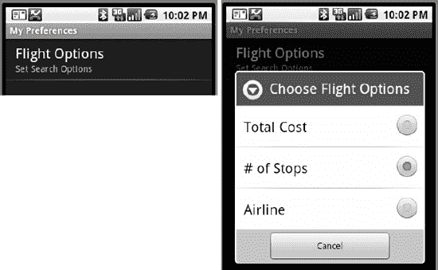

**图 9–1.** *航班选项首选项界面*

图 9–1 包含两个视图。左侧的视图称为*首选项屏幕*，右侧的界面是*列表首选项*。当用户选择“航班选项”时，“选择航班选项”视图会作为一个模态对话框出现，每个选项都带有单选按钮。用户选择一个选项后，该选项会立即被保存，并且视图会关闭。当用户返回选项屏幕时，视图会反映出之前保存的选择。

代码清单 9–1 中的 XML 代码定义了 `PreferenceScreen`，然后创建了 `ListPreference` 作为其子项。对于 `PreferenceScreen`，你设置了三个属性：`key`、`title` 和 `summary`。`key` 是一个字符串，你可以用它通过编程方式引用该项（类似于你使用 `android:id` 的方式）；`title` 是屏幕的标题（航班选项）；`summary` 是对屏幕用途的描述，显示在标题下方，字体较小（在此例中为“设置搜索选项”）。对于列表首选项，你设置了 `key`、`title` 和 `summary`，以及 `entries`、`entryValues`、`dialogTitle` 和 `defaultValue` 这些属性。表 9–1 总结了这些属性。

**表 9–1.** *`android.preference.ListPreference` 的若干属性*

| **属性** | **描述** |
| `android:key` | 选项的名称或键（例如 `selected_flight_sort_option`）。 |
| `android:title` | 选项的标题。 |
| `android:summary` | 选项的简短摘要。 |
| `android:entries` | 列表中选项可以设置为的项的文本内容。 |
| `android:entryValues` | 定义每个项的键或值。请注意，每个项都有文本和值。文本由 `entries` 定义，值由 `entryValues` 定义。 |
| `android:dialogTitle` | 对话框的标题——如果视图显示为模态对话框时使用。 |
| `android:defaultValue` | 从项列表中选取的选项的默认值。 |

为了使我们的示例完整运行，请按照代码清单 9–2 的指示添加或修改文件。

**代码清单 9–2.** *为我们的示例设置项目的其余部分*

```xml
<?xml version="1.0" encoding="utf-8"?>
<!-- 该文件位于 /res/values/arrays.xml -->
<resources>
<string-array name="flight_sort_options">
    <item>总费用</item>
    <item>经停次数</item>
    <item>航空公司</item>
</string-array>
<string-array name="flight_sort_options_values">
    <item>0</item>
    <item>1</item>
    <item>2</item>
</string-array>
</resources>
```

```xml
<?xml version="1.0" encoding="utf-8"?>
<!-- 该文件位于 /res/values/strings.xml -->
<resources>
    <string name="app_name">首选项演示</string>
    <string name="prefTitle">我的首选项</string>
    <string name="prefSummary">设置航班选项首选项</string>
    <string name="flight_sort_option_default_value">1</string>
    <string name="dialogTitle">选择航班选项</string>
    <string name="listSummary">设置搜索选项</string>
    <string name="listTitle">航班选项</string>
    <string name="selected_flight_sort_option">
        selected_flight_sort_option</string>
    <string name="menu_prefs_title">设置</string>
</resources>
```

```xml
<?xml version="1.0" encoding="utf-8"?>
<!-- 该文件位于 /res/menu/mainmenu.xml -->
<menu >
    <item android:id="@+id/menu_prefs"
        android:title="@string/menu_prefs_title"
    />
</menu>
```

```xml
<?xml version="1.0" encoding="utf-8"?>
<!-- 该文件位于 /res/layout/main.xml -->
<LinearLayout
    android:orientation="vertical"
    android:layout_width="fill_parent"
    android:layout_height="fill_parent"
    >
<TextView android:text="" android:id="@+id/text1"
    android:layout_width="fill_parent"
    android:layout_height="wrap_content"
    />
</LinearLayout>
```

```java
// 该文件是 MainActivity.java
import android.app.Activity;
import android.content.Intent;
import android.content.SharedPreferences;
import android.os.Bundle;
import android.view.Menu;
import android.view.MenuInflater;
import android.view.MenuItem;
import android.widget.TextView;

public class MainActivity extends Activity {
    private TextView tv = null;
    private Resources resources;

    /** 当 activity 首次创建时调用。 */
    @Override
    public void onCreate(Bundle savedInstanceState) {
        super.onCreate(savedInstanceState);
        setContentView(R.layout.main);
    }
```


```java
resources = this.getResources();
tv = (TextView)findViewById(R.id.text1);
setOptionText();
```

```java
@Override
public boolean onCreateOptionsMenu(Menu menu)
{
    MenuInflater inflater = getMenuInflater();
    inflater.inflate(R.menu.mainmenu, menu);
    return true;
}
```

```java
@Override
public boolean onOptionsItemSelected (MenuItem item)
{
    if (item.getItemId() == R.id.menu_prefs)
    {
        // 跳转到我们的偏好设置界面。
        Intent intent = new Intent()
                .setClass(this,
           com.androidbook.preferences.sample.FlightPreferenceActivity.class);
        this.startActivityForResult(intent, 0);
    }
    return true;
}
```

```java
@Override
public void onActivityResult(int reqCode, int resCode, Intent data)
{
    super.onActivityResult(reqCode, resCode, data);
    setOptionText();
}
```

```java
private void setOptionText()
{
    SharedPreferences prefs =
            PreferenceManager.getDefaultSharedPreferences(this);
    // 这是获取共享偏好设置的另一种方式：
    // SharedPreferences prefs = getSharedPreferences(
    //         "com.androidbook.preferences.sample_preferences", 0);
    String option = prefs.getString(
            resources.getString(R.string.selected_flight_sort_option),
            resources.getString(R.string.flight_sort_option_default_value));
    String[] optionText = resources.getStringArray(R.array.flight_sort_options);

    tv.setText("选项值为 " + option + " (" +
            optionText[Integer.parseInt(option)] + ")");
}
```

```xml
<?xml version="1.0" encoding="utf-8"?>
<!-- 此文件为 AndroidManifest.xml -->
<manifest
      package="com.androidbook.preferences.sample"
      android:versionCode="1"
      android:versionName="1.0">
    <application android:icon="@drawable/icon"
          android:label="@string/app_name">
        <activity android:name=".MainActivity"
                  android:label="@string/app_name">
            <intent-filter>
              <action android:name="android.intent.action.MAIN" />
              <category android:name="android.intent.category.LAUNCHER"/>
            </intent-filter>
        </activity>

        <activity android:name=".FlightPreferenceActivity"
                  android:label="@string/prefTitle">
            <intent-filter>
                <action android:name=
 "com.androidbook.preferences.sample.intent.action.FlightPreferences" />
                <category
                    android:name="android.intent.category.PREFERENCE" />
            </intent-filter>
        </activity>

    </application>
    <uses-sdk android:minSdkVersion="4" />
</manifest>
```

完成这些修改并运行该应用后，你首先会看到一条简单的文本消息，显示“option value is 1 (# of Stops)”。点击菜单按钮（Menu），然后选择“设置”即可进入`PreferenceActivity`。完成后点击返回箭头，你将立即看到选项文字的任何更改。

我们添加的第一个文件是 `/res/values/arrays.xml`。该文件包含实现选项选择所需的两个字符串数组。第一个数组保存要显示的文本，第二个数组保存方法调用返回的值，以及存储在偏好设置 XML 文件中的值。为了便于实现，我们选择使用数组索引值 0、1 和 2 作为`flight_sort_options_values`。我们也可以使用任何有助于运行应用的值。如果我们的选项本质上是数字（例如倒计时起始值），我们可以使用 60、120、300 等值。这些值完全不必是数字，只要对开发者有意义即可；除非你选择向用户展示，否则用户不会看到这些值。用户只能看到第一个字符串数组`flight_sort_options`中的文本。

正如我们之前所说，Android 框架也会负责持久化偏好设置。例如，当用户选择一个排序选项时，Android 会将选择存储在应用`/data`目录下的一个 XML 文件中（参见 图 9-2）。

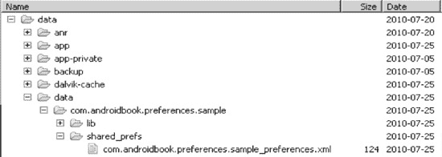

**图 9-2.** *应用已保存偏好设置的文件路径*

实际文件路径为 `/data/data/`*`[包名]`*`/shared_prefs/`*`[包名]`*`_preferences.xml`。代码清单 9-3 显示了我们示例中的 `com.androidbook.preferences.sample_preferences.xml` 文件。

**代码清单 9-3.** *示例应用的已保存偏好设置*

```xml
<?xml version='1.0' encoding='utf-8' standalone='yes' ?>
<map>
    <string name="selected_flight_sort_option">1</string>
</map>
```

你可以看到，对于列表偏好，偏好设置框架使用列表的`key`属性来持久化所选项的值。另外请注意，存储的是所选项的*值*，而不是文本。这里需要提醒一下：由于偏好设置 XML 文件只存储值而不存储文本，因此当你升级应用并更改选项文本或向字符串数组中添加项目时，偏好设置 XML 文件中存储的任何值在升级后仍应与相应的文本保持一致。偏好设置 XML 文件在应用升级期间会保留。如果偏好设置 XML 文件中包含“1”，并且在升级前它代表“# of Stops”，那么在升级后它仍应代表“# of Stops”。

我们接下来涉及到的文件是 `/res/values/strings.xml`。我们为标题、摘要和菜单项添加了几个字符串。有两个字符串需要特别注意。第一个是 `flight_sort_option_default_value`。在我们的示例中，我们将默认值设置为 `1`，代表“# of Stops”。通常为每个选项选择一个默认值是个好主意。如果你不选择默认值，并且尚未选择任何值，那么返回选项值的方法将返回 `null`。在这种情况下，你的代码必须处理空值。另一个有趣的字符串是 `selected_flight_sort_option`。严格来说，用户不会看到这个字符串，因此我们不需要将其放入 `strings.xml` 中来为其他语言提供替代文本。然而，由于这个字符串值是在方法调用中用于检索值的键，通过为它创建一个 ID，我们可以在编译时确保没有在键名上出现拼写错误。

我们添加的第三个文件是 `/res/menu/mainmenu.xml`。我们假设你希望通过菜单而非按钮来访问偏好设置视图。这个文件代表了我们的应用菜单。

  
我们接触到的第四个文件是`/res/layout/main.xml`。这是该应用的主要用户界面。到目前为止，我们已经介绍了如何通过使用一个特殊的 activity 类`PreferenceActivity`来维护偏好设置。但你希望在主 activity 中使用偏好设置，而不是在`PreferenceActivity`中。因此，我们需要一种方法从另一个 activity 访问这些偏好设置。在此示例中，布局是一个简单的`TextView`，用于显示我们航班偏好选项的当前值。  

接下来是`MainActivity`的源代码。这是一个基础的 activity，它获取偏好设置的引用以及一个`TextView`的句柄，然后调用一个方法来读取我们选项的当前值，并将其设置到`TextView`中。我们设置了菜单和菜单回调。在菜单回调中，我们为`FlightPreferenceActivity`启动了一个`Intent`。启动一个用于偏好设置的`Intent`是进入偏好设置屏幕的最佳方式。你可以使用菜单或按钮来触发这个`Intent`。在后来的示例中，我们将不再重复这段代码，但你会在这些示例中做同样的事情，只不过需要使用适当的 activity 类名。当偏好设置的`Intent`返回给我们时，我们调用`setOptionText()`方法来更新我们的`TextView`。  

有两种方法可以获得偏好设置的句柄：  

*   最简单的方法如示例所示，即调用`PreferenceManager.getDefaultSharedPreferences(this)`。这里的`this`参数是用于查找默认共享偏好设置的上下文，该方法将使用`this`的包名来确定偏好设置文件的名称和位置，该文件恰好是由我们的`PreferenceActivity`创建的，因为它们共享相同的包名。  
*   获取偏好设置文件句柄的另一种方法是使用`getSharedPreferences()`方法调用，并传入一个文件名参数和一个模式参数。在清单 9–2 中，我们展示了这种方法，但它已被注释掉了。注意，你只需指定文件名的基本部分，而不是路径和文件扩展名。模式参数控制对我们 XML 偏好设置文件的权限。在我们前面的示例中，模式参数不会产生任何影响，因为该文件仅在`PreferenceActivity`中创建，而该 Activity 设置了默认权限`MODE_PRIVATE`（即零）。我们将在后面关于保存状态的章节中讨论模式参数。  

在`setOptionText()`内部，通过偏好设置的引用，你可以调用适当的方法来检索偏好值。在我们的示例中，我们调用了`getString()`，因为我们知道要从偏好设置中检索一个字符串值。第一个参数是选项键的字符串值。我们之前提到过，使用资源 ID 可以确保在构建应用程序时不会出现任何拼写错误。我们也可以简单地使用字符串`selected_flight_sort_option`作为第一个参数，这样做可能是为了保持应用程序尽可能小和快速。对于第二个参数，你需要指定一个默认值，以防在偏好设置 XML 文件中找不到该值。当你的应用程序首次运行时，并没有偏好设置 XML 文件，因此如果不为第二个参数指定值，你第一次总会得到`null`。即使你在`flightoptions.xml`的`ListPreference`规范中为该选项指定了默认值，情况也是如此。在我们的示例中，我们在 XML 中设置了一个默认值，并且使用了资源 ID 来完成，因此`setOptionText()`中的代码可以用来读取该默认值的资源 ID 的值。请注意，如果我们没有为默认值使用 ID，那么直接从`ListPreference`读取它将困难得多。通过在 XML 和我们的代码之间共享一个资源 ID，我们只有一个地方需要更改默认值（即`strings.xml`）。  

除了显示偏好设置的值，我们还显示偏好设置的文本。在我们的示例中，我们采取了一个快捷方式，因为我们对`flight_sort_options_values`中的值使用了数组索引。通过简单地将值转换为`int`，我们就知道要从`flight_sort_options`中读取哪个字符串。如果我们为`flight_sort_options_values`使用了其他值集合，那么我们需要确定作为我们偏好的元素的索引，然后使用该索引从`flight_sort_options`中获取我们偏好的文本。  

我们示例中最后要涉及的文件是`AndroidManifest.xml`。因为我们的应用程序现在有两个 activity，所以需要两个 activity 标签。第一个是类别为`LAUNCHER`的标准 activity。第二个用于`PreferenceActivity`，因此我们按照 Intent 的惯例设置了动作名称，并将类别设置为`PREFERENCE`。我们可能不希望`PreferenceActivity`与其他所有应用程序一起出现在 Android 页面上，这就是我们选择不为它使用`LAUNCHER`的原因。如果你要添加其他偏好设置屏幕，你需要对`AndroidManifest.xml`进行类似的更改。  

我们展示了一种在代码中读取偏好设置默认值的方法。Android 提供了另一种更优雅的方法。在`onCreate()`中，我们可以这样做：  

```
PreferenceManager.setDefaultValues(this, R.xml.flightoptions, false);
```

然后在`setOptionText()`中，我们可以这样做来读取选项值：  

```
String option = prefs.getString(
    resources.getString(R.string.selected_flight_sort_option), null);
```

第一个调用将使用`flightoptions.xml`来查找默认值，并为我们生成包含默认值的偏好设置 XML 文件。如果内存中已经有一个`SharedPreferences`对象的实例，它也会更新该实例。然后第二个调用将能够找到`selected_flight_sort_option`的值，因为我们首先处理了加载默认值。  

第一次运行此代码后，如果你查看`shared_prefs`文件夹，即使偏好设置屏幕尚未被调用，你也会看到偏好设置 XML 文件。你还会看到另一个名为`_has_set_default_values.xml`的文件。这告诉你的应用程序，偏好设置 XML 文件已经用默认值创建好了。`setDefaultValues()`的第三个参数，即`false`，表示你只希望在该操作之前未进行过的情况下，将默认值设置到偏好设置 XML 文件中。如果你选择`true`，则每次都会用默认值重置偏好设置 XML 文件。Android 通过这个新 XML 文件的存在来记住这些信息。如果用户选择了新的偏好值，并且你为第三个参数选择了`false`，那么下次运行此代码时，用户的偏好设置将不会被覆盖。请注意，现在我们不需要在`getString()`方法调用中提供默认值，因为我们始终应该从偏好设置 XML 文件中获取一个值。  

如果你需要从继承了`PreferenceActivity`的 activity 内部获取偏好设置的引用，可以这样做：  

```
SharedPreferences prefs = getPreferenceManager().getDefaultSharedPreferences(this);
```

我们向你展示了如何使用`ListPreference`视图；现在，让我们检查 Android 偏好设置框架中的其他 UI 元素。具体来说，我们将讨论`CheckBoxPreference`视图、`EditTextPreference`视图和`RingtonePreference`视图。  


### 了解 CheckBoxPreference

正如你所见，`ListPreference` 偏好设置使用列表作为其 UI 元素。类似地，`CheckBoxPreference` 偏好设置使用复选框控件作为其 UI 元素。

为了扩展航班搜索示例应用，假设你想让用户设置结果集中要显示的列。此偏好设置显示可用的列，并允许用户通过勾选相应的复选框来选择所需的列。此示例的用户界面如图 9–3 所示，偏好设置的 XML 文件如代码清单 9–4 所示。

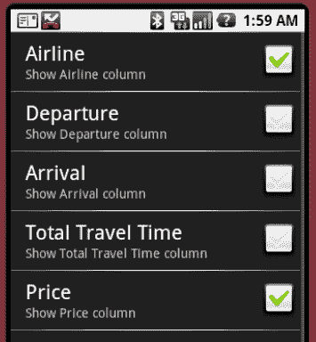

**图 9–3.** *复选框偏好设置的用户界面*

**代码清单 9–4.** *使用 CheckBoxPreference*

```
<?xml version="1.0" encoding="utf-8"?>
<!-- This file is /res/xml/chkbox.xml -->
<PreferenceScreen
    android:key="flight_columns_pref"
    android:title="Flight Search Preferences"
    android:summary="Set Columns for Search Results">
    <CheckBoxPreference
        android:key="show_airline_column_pref"
        android:title="Airline"
        android:summary="Show Airline column" />
    <CheckBoxPreference
        android:key="show_departure_column_pref"
        android:title="Departure"
        android:summary="Show Departure column" />
    <CheckBoxPreference
        android:key="show_arrival_column_pref"
        android:title="Arrival"
        android:summary="Show Arrival column" />
    <CheckBoxPreference
        android:key="show_total_travel_time_column_pref"
        android:title="Total Travel Time"
        android:summary="Show Total Travel Time column" />
    <CheckBoxPreference
        android:key="show_price_column_pref"
        android:title="Price"
        android:summary="Show Price column" />
</PreferenceScreen>
```

```
// CheckBoxPreferenceActivity.java
import android.os.Bundle;
import android.preference.PreferenceActivity;

public class CheckBoxPreferenceActivity extends PreferenceActivity
{
    @Override
    protected void onCreate(Bundle savedInstanceState) {
        super.onCreate(savedInstanceState);
        addPreferencesFromResource(R.xml.chkbox);
    }
}
```

代码清单 9–4 展示了偏好设置 XML 文件 `chkbox.xml` 以及一个使用 `addPreferencesFromResource()` 加载该文件的简单活动类。如你所见，UI 中有五个复选框，每个复选框在偏好设置 XML 文件中都由一个 `CheckBoxPreference` 节点表示。每个复选框还有一个 `key`，正如你所料，当需要保存所选偏好设置时，该键最终用于持久化 UI 元素的状态。使用 `CheckBoxPreference`，当用户设置状态时，偏好设置的状态即被保存。换句话说，当用户勾选或取消勾选偏好设置控件时，其状态会被保存。代码清单 9–5 展示了此示例的偏好设置数据存储。

**代码清单 9–5.** *复选框偏好设置的偏好设置数据存储*

```
<?xml version='1.0' encoding='utf-8' standalone='yes' ?>
<map>
    <boolean name="show_total_travel_time_column_pref" value="false" />
    <boolean name="show_price_column_pref" value="true" />
    <boolean name="show_arrival_column_pref" value="false" />
    <boolean name="show_airline_column_pref" value="true" />
    <boolean name="show_departure_column_pref" value="false" />
</map>
```

再次说明，你可以看到每个偏好设置都是通过其 `key` 属性保存的。`CheckBoxPreference` 的数据类型是 `boolean`，其值为 `true` 或 `false`：`true` 表示偏好设置被选中，`false` 表示未选中。要读取某个复选框偏好设置的值，你可以获取共享偏好设置并调用 `getBoolean()` 方法，传入该偏好设置的 `key`：

```
boolean option = prefs.getBoolean("show_price_column_pref", false);
```

`CheckBoxPreference` 另一个有用的特性是，你可以根据复选框是否被勾选来设置不同的摘要文本。对应的 XML 属性是 `summaryOn` 和 `summaryOff`。现在，让我们看一下 `EditTextPreference`。

### 了解 EditTextPreference

偏好设置框架还提供了一种名为 `EditTextPreference` 的自由文本偏好设置。此偏好设置允许你捕获原始文本，而不是让用户做出选择。为了演示这一点，假设你有一个为用户生成 Java 代码的应用程序。此应用程序的一个偏好设置可能是用于生成类的默认包名。在这里，你想要向用户显示一个文本字段，用于为生成的类设置包名。图 9–4 展示了 UI，代码清单 9–6 展示了 XML。

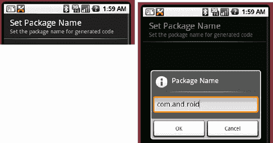

**图 9–4.** *使用 EditTextPreference*

**代码清单 9–6.** *EditTextPreference 的示例*

```
<?xml version="1.0" encoding="utf-8"?>
<!-- This file is /res/xml/packagepref.xml -->
<PreferenceScreen
    android:key="package_name_screen"
    android:title="Package Name"
    android:summary="Set package name">
    <EditTextPreference
        android:key="package_name_preference"
        android:title="Set Package Name"
        android:summary="Set the package name for generated code"
        android:dialogTitle="Package Name" />
</PreferenceScreen>
```

```
// EditTextPreferenceActivity.java
import android.os.Bundle;
import android.preference.PreferenceActivity;

public class EditTextPreferenceActivity extends PreferenceActivity
{
    @Override
    protected void onCreate(Bundle savedInstanceState) {
        super.onCreate(savedInstanceState);
        addPreferencesFromResource(R.xml.packagepref);
    }
}
```

你可以看到，代码清单 9–6 定义了一个 `PreferenceScreen`，其子项是一个单独的 `EditTextPreference` 实例。该代码清单生成的 UI 左侧是 `PreferenceScreen`，右侧是 `EditTextPreference`（参见图 9–4）。当用户选择“设置包名”（Set Package Name）时，会弹出一个对话框让用户输入包名。当用户点击“确定”（OK）按钮时，该偏好设置会被保存到偏好设置存储中。

与其他偏好设置一样，你可以通过偏好设置的 `key` 从活动类中获取 `EditTextPreference`。获取 `EditTextPreference` 后，你可以通过调用 `getEditText()` 来操作实际的 `EditText`——例如，如果你想对用户在文本字段中输入的值应用验证、预处理或后处理。要获取 `EditTextPreference` 的文本，只需使用 `getText()` 方法即可。

现在，让我们看一下偏好设置框架中的 `RingtonePreference`。


### 理解 RingtonePreference

`RingtonePreference` 专门用于处理铃声。你可以在应用中用它为用户提供一个选择铃声的偏好选项。图 9-5 展示了 `RingtonePreference` 示例的用户界面，代码清单 9-7 则展示了其 XML 配置。

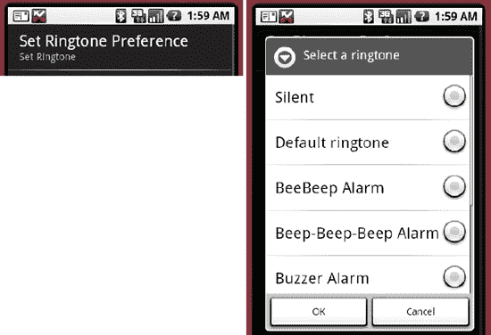

**图 9-5.** *RingtonePreference 示例界面*

**代码清单 9-7.** *定义 RingtonePreference 偏好设置*

```
<?xml version="1.0" encoding="utf-8"?>
<!-- This file is /res/xml/ringtone.xml -->
<PreferenceScreen
                android:key="ringtone_option_preference"
                android:title="My Preferences"
                android:summary="Set Ring Tone Preferences">
    <RingtonePreference
        android:key="ring_tone_pref"
        android:title="Set Ringtone Preference"
        android:showSilent="true"
        android:ringtoneType="alarm"
        android:summary="Set Ringtone" />
</PreferenceScreen>
```

```
// RingtonePreferenceActivity.java

import android.os.Bundle;
import android.preference.PreferenceActivity;

public class RingtonePreferenceActivity extends PreferenceActivity
{
    @Override
    protected void onCreate(Bundle savedInstanceState) {
        super.onCreate(savedInstanceState);
        addPreferencesFromResource(R.xml.ringtone);
    }
}
```

当用户选择“设置铃声偏好”时，偏好设置框架会显示一个包含设备上所有铃声的 `ListPreference`（参见图 9-5）。用户可以选择一个铃声，然后点击“确定”或“取消”。如果点击“确定”，所选铃声将被持久化保存到偏好存储中。请注意，对于铃声而言，存储在偏好存储中的值是所选铃声的 URI——除非用户选择了“静音”，此时存储的值将是一个空字符串。URI 示例如下：

```
<string name="ring_tone_pref">content://media/internal/audio/media/26</string>
```

**注意：** 如果模拟器中铃声不足，你可以自行添加一些。将音乐文件复制到你的 SD 卡。然后，打开 Android 音乐播放器应用，选择一个音乐文件。点击菜单按钮，然后点击“设为铃声”。我们将在第 19 章中教你如何将文件复制到 SD 卡。

最后，代码清单 9-7 中展示的 `RingtonePreference` 遵循了你之前定义的其他偏好设置相同的模式。区别在于这里设置了一些不同的属性，包括 `showSilent` 和 `ringtoneType`。你可以使用 `showSilent` 来在铃声列表中包含静音选项，使用 `ringtoneType` 来限制铃声列表中显示的铃声类型。该属性的可选值包括 `ringtone`、`notification`、`alarm` 和 `all`。

### 参考资料

这里提供了一份你可能希望进一步探索的主题的实用参考信息。

-   [`http://www.androidbook.com/projects`](http://www.androidbook.com/projects)。请在此处查找与本书相关的可下载项目列表。对于本章，请查找名为 `ProAndroid3_Ch09_Preferences.zip` 的 ZIP 文件。该 ZIP 文件包含本章的所有项目，它们列于不同的根目录中。其中还有一个 `README.TXT` 文件，详细描述了如何将项目从这类 ZIP 文件导入 Eclipse。

### 本章小结

在本章中，我们讨论了如何在 Android 中管理偏好设置。我们向你展示了如何使用 `ListPreference`、`CheckBoxPreference`、`EditTextPreference` 和 `RingtonePreference`。我们还讨论了如何将偏好设置分组以及如何以编程方式操作偏好设置。最后，我们演示了如何使用偏好设置框架在 Activity 的不同调用之间保存和恢复信息。

