# 探索安全与权限

在本章中，我们将讨论 Android 的应用程序安全模型，这是 Android 平台的基础部分。在 Android 中，安全性贯穿应用程序生命周期的所有阶段——从设计时的策略考量到运行时的边界检查。你将了解 Android 的安全架构并理解如何设计安全的应用程序。

让我们从 Android 安全模型开始。

### 理解 Android 安全模型

在第一部分中，我们将介绍应用程序在部署和执行阶段的安全性。在部署方面，Android 应用程序必须使用数字证书签名，才能安装到设备上。在执行方面，Android 在独立的进程中运行每个应用程序，每个进程都有一个唯一的、永久的用户 ID（在安装时分配）。这为进程设置了边界，防止一个应用程序直接访问另一个应用程序的数据。此外，Android 定义了一个声明式权限模型来保护敏感功能（例如联系人列表）。

在接下来的几节中，我们将讨论这些主题。但在开始之前，我们先概述一些稍后会提到的安全概念。

#### 安全概念概述

Android 要求应用程序使用数字证书签名。此要求的一个好处是，应用程序无法被非原始作者发布的版本更新。例如，如果我们发布了一个应用程序，那么你不能用你的版本更新我们的应用程序（当然，除非你以某种方式获取了我们的证书）。那么，应用程序签名意味着什么？签名应用程序的过程又是怎样的？

你使用数字证书为应用程序签名。*数字证书* 是一个包含你相关信息（如公司名称、地址等）的工件。数字证书的几个重要属性包括其签名和公钥/私钥。公钥/私钥也称为*密钥对*。请注意，虽然此处使用数字证书来签署 `.apk` 文件，但你也可以将它们用于其他目的（例如加密通信）。你可以从受信任的证书颁发机构 (CA) 获取数字证书，也可以使用诸如 `keytool` 等工具自行生成，我们稍后会对此进行讨论。数字证书存储在密钥库中。*密钥库* 包含一个数字证书列表，每个证书都有一个别名，用于在密钥库中引用它。

为 Android 应用程序签名需要三样东西：一个数字证书、一个 `.apk` 文件，以及一个知道如何将数字签名应用到 `.apk` 文件上的工具。正如你将看到的，我们使用 Java 开发工具包 (JDK) 发行版中包含的一个名为 `jarsigner` 的免费工具。该工具是一个命令行工具，知道如何使用数字证书对 `.jar` 文件进行签名。

现在，让我们继续讨论如何用数字证书签署 `.apk` 文件。

#### 为部署签署应用程序

要将 Android 应用程序安装到设备上，首先需要使用数字证书签署 Android 软件包（即 `.apk` 文件）。但是，证书可以是自签名的——你无需从 VeriSign 等证书颁发机构购买证书。

为部署签署应用程序涉及三个步骤。第一步是使用 `keytool`（或类似工具）生成证书。第二步是使用 `jarsigner` 工具用生成的证书签署 `.apk` 文件。第三步是在内存边界上对齐应用程序的各个部分，以便在设备上运行时更高效地使用内存。请注意，在开发过程中，Eclipse 的 ADT 插件会为你处理所有事情：在部署到模拟器或设备之前，签署你的 `.apk` 文件并进行内存对齐。


#### 使用 `keytool` 生成自签名证书

`keytool` 工具用于管理私钥及其对应的 X.509 证书（一种数字证书标准）数据库。该工具随 JDK 一起提供，位于 JDK 的 `bin` 目录下。如果你按照第 2 章中关于修改 `PATH` 的说明进行操作，那么 JDK 的 `bin` 目录应该已经在你的 `PATH` 中了。

在本节中，我们将演示如何生成一个包含单一条目的密钥库，随后你将使用该密钥库对 Android 的 `.apk` 文件进行签名。要生成一个密钥库条目，请执行以下步骤：

1.  创建一个用于存放密钥库的文件夹，例如 `c:\android\release\`。
2.  打开一个工具窗口，并使用代码清单 10-1 中所示的参数执行 `keytool` 工具（关于“工具窗口”的具体含义，详见第 2 章）。

**代码清单 10-1.** *使用 `keytool` 工具生成密钥库条目*

```
keytool -genkey -v -keystore "c:\android\release\release.keystore"
-alias androidbook -storepass paxxword -keypass paxxword -keyalg RSA
-validity 14000
```

传递给 `keytool` 的所有参数都汇总在表 10-1 中。

**表 10-1.** *传递给 `keytool` 工具的参数*

| **参数** | **描述** |
| --- | --- |
| `genkey` | 指示 `keytool` 生成一对公钥/私钥。 |
| `v` | 指示 `keytool` 在密钥生成过程中输出详细信息。 |
| `keystore` | 密钥库数据库的路径（本例中为一个文件）。如果该文件不存在，则会自动创建。 |
| `alias` | 密钥库条目的唯一名称。稍后将使用此别名来引用该密钥库条目。 |
| `storepass` | 密钥库的密码。 |
| `keypass` | 用于访问私钥的密码。 |
| `keyalg` | 算法。 |
| `validity` | 有效期。 |

如果你未在命令行中提供表 10-1 中列出的密码，`keytool` 会提示你输入。如果你的计算机并非只有你一人使用，为了安全起见，最好不要在命令行中指定 `–storepass` 和 `–keypass`，而是在 `keytool` 提示时再输入它们。代码清单 10-1 中的命令会在你的密钥库文件夹中生成一个密钥库数据库文件。该数据库文件名为 `release.keystore`。条目的 `validity`（有效期）为 14,000 天（约 38 年）——这是一个相当长的时间。你应该理解其中的原因。Android 文档建议你指定的有效期应长于应用程序的整个生命周期，这包括应用程序的多次更新。它建议有效期至少为 25 年。此外，如果你计划在 Android Market（[`http://www.android.com/market/`](http://www.android.com/market/)）上发布应用程序，你的证书有效期至少需要到 2033 年 10 月 22 日。Android Market 在上传每个应用程序时都会检查，以确保其证书在该日期之前有效。因为你的更新版本必须与最初使用的证书匹配，所以请务必保管好你的密钥库文件！如果你丢失了它且无法重新创建，你将无法更新你的应用程序，而只能发布一个全新的应用程序。

回到 `keytool`，参数 `alias` 是为密钥库数据库中的条目指定的唯一名称；稍后你将使用此名称来引用该条目。当你运行代码清单 10-1 中的 `keytool` 命令时，`keytool` 会问你几个问题（见图 10-1），然后生成密钥库数据库和条目。

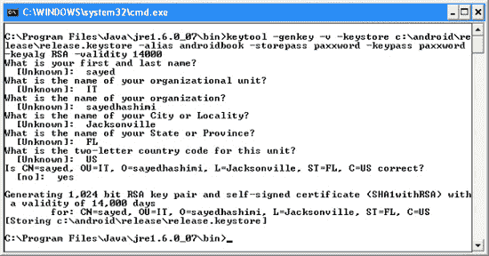

**图 10-1.** *`keytool` 询问的附加问题*

一旦你拥有了用于发布版证书的密钥库文件，你可以重复使用此文件来添加更多证书。只需再次使用 `keytool` 并指定你现有的密钥库文件即可。

#### 调试密钥库与开发证书

我们之前提到过，Eclipse 的 ADT 插件会为你自动设置一个开发密钥库。然而，开发期间用于签名的默认证书不能用于在真机上进行发布部署。部分原因是 ADT 生成的开发证书有效期仅为 365 天，这显然无法满足到 2033 年 10 月 22 日的要求。那么在开发进行到第三百六十六天时会发生什么？你会遇到构建错误。你现有的应用程序应该仍然可以运行，但要构建应用程序的新版本，你需要生成一个新证书。最简单的方法是删除现有的 `debug.keystore` 文件，一旦再次需要它时，ADT 会生成一个新的文件和证书，该证书又有效 365 天。

要找到你的 `debug.keystore` 文件，请打开 Eclipse 的“Preferences”（首选项）界面，然后进入 Android  Build。调试证书的位置将显示在“Default debug keystore”（默认调试密钥库）字段中，如图 10-2 所示（如果在查找 Preferences 菜单时遇到困难，请参阅第 2 章）。

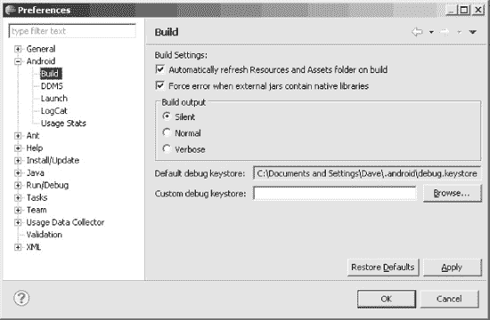

**图 10-2.** *调试证书的位置*

当然，既然你有了新的开发证书，你就无法使用新开发证书更新 AVD 或设备上的现有应用程序了。Eclipse 会在控制台中提供消息，告诉你需要先使用 `adb` 卸载现有应用程序，这当然可以做到。如果你的 AVD 上安装了许多应用程序，你可能会觉得直接重新创建一个 AVD 更简单，这样它不包含任何你的应用程序，你可以从头开始。为了避免一年后出现这个问题，你可以生成自己的 `debug.keystore` 文件，并设定任何你想要的**有效期**。显然，该文件需要具有与 ADT 会创建的文件相同的文件名，并位于相同的目录中。证书别名为 `androiddebugkey`，`storepass` 和 `keypass` 均为 `"android"`。ADT 将证书的名字和姓氏设置为 `"Android Debug"`，组织单位设置为 `"Android"`，两字母国家代码设置为 `"US"`。你可以将组织、城市和州的值保留为 `"Unknown"`。

如果你之前使用旧的调试证书从 Google 获取了 `map-api` 密钥，那么你将需要获取一个新的 `map-api` 密钥来匹配新的调试证书。我们将在第 17 章 中介绍 `map-api` 密钥。

现在你拥有了可用于签署发布版 `.apk` 文件的数字证书，你需要使用 `jarsigner` 工具来完成签名。具体操作方法如下。


#### 使用 Jarsigner 工具对 `.apk` 文件进行签名

上一节所述的 `keytool` 工具创建了一个数字证书，这是 `jarsigner` 工具的参数之一。`jarsigner` 的另一个参数是待签名的实际 Android 包。要生成 Android 包，你需要使用 Eclipse 的 ADT 插件中的“导出未签名应用包”工具。你可以在 Eclipse 中右键点击 Android 项目，选择“Android 工具”，然后选择“导出未签名应用包”来访问该工具。运行“导出未签名应用包”工具会生成一个不使用调试证书签名的 `.apk` 文件。为了演示其工作原理，请在你的某个 Android 项目上运行该工具，并将生成的 `.apk` 文件保存到某处。在本例中，我们将使用之前创建的密钥库文件夹，并生成一个名为 `c:\android\release\myappraw.apk` 的 `.apk` 文件。

有了 `.apk` 文件和密钥库条目后，运行 `jarsigner` 工具对 `.apk` 文件进行签名（参见列表 10–2）。运行此命令时，请根据实际情况使用密钥库文件和 `.apk` 文件的完整路径名。

**列表 10–2.** *使用 `jarsigner` 对 `.apk` 文件进行签名*

```
jarsigner -keystore "你的 release.keystore 文件的路径" -storepass 密码
-keypass 密码  "你的原始 APK 文件的路径" androidbook
```

要签署 `.apk` 文件，你需要提供密钥库的位置、密钥库密码、私钥密码、`.apk` 文件的路径以及密钥库条目的别名。之后，`jarsigner` 将使用密钥库条目中的数字证书对 `.apk` 文件进行签名。要运行 `jarsigner` 工具，你需要打开一个工具窗口（如第 2 章所述），或者打开命令提示符或终端窗口，然后导航到 JDK 的 `bin` 目录，或者确保 JDK 的 `bin` 目录已添加到系统路径中。出于安全考虑，更安全的做法是省略命令中的密码参数，只需让 `jarsigner` 在必要时提示你输入密码。图 10–3 展示了 `jarsigner` 工具的调用情况。

正如我们之前指出的，Android 要求应用程序必须使用数字签名进行签署，以防止恶意程序员用自己的版本更新你的应用程序。为此，Android 要求应用程序的更新必须使用与原始版本相同的签名。如果你使用不同的签名签署应用程序，Android 会将它们视为两个不同的应用程序。因此，我们再次提醒你，请妥善保管你的密钥库文件，以便将来需要为应用程序提供更新时能够使用。

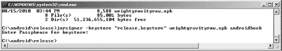

**图 10–3.** *使用 `jarsigner`*

#### 使用 `zipalign` 对齐应用程序

你希望应用程序在设备上运行时尽可能高效地使用内存。如果应用程序在运行时包含未压缩的数据（可能是某些图像类型或数据文件），Android 可以使用 `mmap()` 调用将这些数据直接映射到内存中。不过，要实现这一点，数据必须在 4 字节内存边界上对齐。Android 设备中的 CPU 是 32 位处理器，而 32 位等于 4 字节。`mmap()` 调用使 `.apk` 文件中的数据看起来像内存一样，但如果数据未在 4 字节边界上对齐，则无法做到这一点，并且运行时必须进行额外的数据复制。位于 Android SDK tools 目录中的 `zipalign` 工具会检查你的应用程序，并将任何未在 4 字节内存边界上对齐的未压缩数据稍微移动到 4 字节内存边界上。你可能会发现应用程序的文件大小略有增加，但不会太明显。要对你的 `.apk` 文件执行对齐操作，请在工具窗口中使用以下命令（另请参见图 10–4）：

```
zipalign –v 4 infile.apk outfile.apk
```

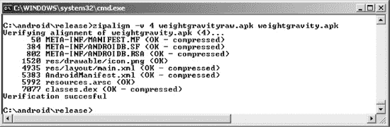

**图 10–4.** *使用 `zipalign`*

请注意，`zipalign` 不会修改输入文件，这就是为什么我们在从 Eclipse 导出时选择在文件名中使用“raw”（原始）的原因。现在，我们的输出文件有了适合部署的名称。如果你需要覆盖现有的 `outfile.apk` 文件，可以使用 `–f` 选项。另请注意，`zipalign` 在你创建对齐文件时会执行对齐验证。要验证现有文件是否正确对齐，请按以下方式使用 `zipalign`：

```
zipalign –c –v 4 filename.apk
```

非常重要的是，你必须在*签名之后*再对齐；否则，签名可能会导致内容重新不对齐。这并不意味着你的应用程序会崩溃，但可能会使用比所需更多的内存。

在 Eclipse 中，你可能已经注意到“Android 工具”下有一个名为“导出已签名应用包”的菜单选项。这将启动所谓的导出向导，它会为你完成上述所有步骤，仅提示你输入密钥库文件的路径、密钥别名、密码以及输出 `.apk` 文件的名称。如果你需要，它甚至还可以创建新的密钥库或新密钥。你可能会发现使用向导更容易，或者你更倾向于自己编写脚本对导出的未签名应用包进行操作。既然你已经了解了每种方法的工作原理，现在可以决定哪种更适合你。

一旦你签名并对齐了 `.apk` 文件，就可以使用 `adb` 工具手动将其安装到模拟器上。作为练习，请启动模拟器。我们尚未讨论的一种方法是：转到 Eclipse 的“窗口”菜单，选择“Android SDK 和 AVD 管理器”。将显示一个窗口，列出你可用的 AVD。选择你想用于模拟器的 AVD，然后点击“启动”按钮。模拟器将启动，但不会从 Eclipse 复制任何你的开发项目。现在，打开一个工具窗口，并使用 `install` 命令运行 `adb` 工具：

```
adb install "APK 文件的路径"
```

这可能会因为几个原因失败，但最可能的原因是：模拟器上已安装了该应用程序的调试版本，导致证书错误；或者模拟器上已安装了该应用程序的发布版本，导致“已存在”错误。对于第一种情况，你可以使用以下命令卸载调试应用程序：

```
adb uninstall 包名
```

请注意，卸载命令的参数是应用程序的包名，而不是 `.apk` 文件名。包名在已安装应用程序的 `AndroidManifest.xml` 文件中定义。

对于第二种情况，你可以使用以下命令，其中 `–r` 表示重新安装应用程序，同时保留其在设备（或模拟器）上的数据：

```
adb install –r "APK 文件的路径"
```

现在，让我们看看签名如何影响更新应用程序的过程。


#### 安装应用更新与签名

此前，我们提到证书具有过期日期，并且谷歌建议将过期日期设置在遥远的未来，以应对大量应用更新的情况。那么，如果证书确实过期了会发生什么？Android 是否仍能运行该应用？幸运的是，答案是肯定的——Android 仅在安装时检查证书的过期时间。一旦应用安装完成，即使证书过期，它也会继续运行。

但更新呢？不幸的是，一旦证书过期，你将无法更新应用。换句话说，正如谷歌所建议的，你需要确保证书的有效期足够长，以支持应用的整个生命周期。如果证书过期，Android 将不会安装应用的更新。你唯一的选择是创建一个新的应用——一个具有不同包名的应用——并使用新证书对其进行签名。因此，正如你所见，在生成证书时考虑其过期日期至关重要。

现在你已经了解了部署和安装方面的安全性，让我们继续探讨 Android 的运行时安全。

#### 执行运行时安全检查

Android 的运行时安全发生在进程和操作层面。在进程层面，Android 阻止一个应用直接访问另一个应用的数据。它通过让每个应用在不同的进程中运行，并分配一个独特且永久的用户 ID 来实现这一点。在操作层面，Android 定义了一组受保护的功能和资源列表。为了让你的应用访问这些信息，你需要在`AndroidManifest.xml`文件中添加一个或多个权限请求。你还可以使用你的应用定义自定义权限。

在接下来的部分中，我们将讨论进程边界安全以及如何声明和使用预定义权限。我们还将讨论创建自定义权限并在你的应用中强制执行它们。让我们从剖析 Android 在进程边界的安全性开始。

##### 理解进程边界的安全性

与桌面环境（大多数应用在同一个用户 ID 下运行）不同，每个 Android 应用通常在其唯一的 ID 下运行。通过让每个应用在不同 ID 下运行，Android 在每个进程周围创建了一个隔离边界。这防止了一个应用直接访问另一个应用的数据。

尽管每个进程都有边界，但应用之间的数据共享显然是可能的，但必须是显式的。换句话说，要从另一个应用获取数据，你必须通过该应用的组件。例如，你可以查询另一个应用的内容提供者，可以调用另一个应用中的 Activity，或者——正如你将在第 11 章中看到的——你可以与另一个应用的服务通信。所有这些机制都提供了在应用之间共享信息的方法，但它们是以显式的方式进行的，因为你不能直接访问底层数据库、文件等。

Android 在进程边界的安全性清晰而简单。当我们开始讨论保护资源（如联系人数据）、功能（如设备摄像头）和我们自己的组件时，情况就变得有趣了。为了提供这种保护，Android 定义了一个权限方案。现在我们来剖析它。

##### 声明和使用权限

Android 定义了一个旨在保护设备上资源和功能的权限方案。例如，默认情况下，应用不能访问联系人列表、拨打电话等。为了保护用户免受恶意应用的侵害，Android 要求应用在需要使用受保护功能或资源时请求权限。正如你很快会看到的，权限请求放在清单文件中。在安装时，APK 安装程序会根据`.apk`文件的签名和/或用户的反馈来授予或拒绝请求的权限。如果权限未被授予，任何尝试执行或访问相关功能的行为都将导致权限失败。

表 10-2 展示了一些常用功能及其所需的权限。尽管你还未熟悉表中列出的所有功能，但你将在后续内容中了解到它们（无论是在本章还是后续章节中）。

**表 10-2.** *功能、资源及其所需的权限*

| **功能/资源** | **所需权限** | **描述** |
| --- | --- | --- |
| 摄像头 | `android.permission.CAMERA` | 允许你访问设备摄像头。 |
| 互联网 | `android.permission.INTERNET` | 允许你建立网络连接。 |
| 用户的联系人数据 | `android.permission.READ_CONTACTS` `android.permission.WRITE_CONTACTS` | 允许你读取或写入用户的联系人数据。 |
| 用户的日历数据 | `android.permission.READ_CALENDAR` `android.permission.WRITE_CALENDAR` | 允许你读取或写入用户的日历数据。 |
| 录制音频 | `android.permission.RECORD_AUDIO` | 允许你录制音频。 |
| Wi-Fi 位置信息 | `android.permission.ACCESS_COARSE_LOCATION` | 允许你访问来自 Wi-Fi 和蜂窝基站的粗略位置信息。 |
| GPS 位置信息 | `android.permission.ACCESS_FINE_LOCATION` | 允许你访问精确的位置信息。这包括 GPS 位置信息。对于 Wi-Fi 和蜂窝基站定位也足够。 |
| 电池信息 | `android.permission.BATTERY_STATS` | 允许你获取电池状态信息。 |
| 蓝牙 | `android.permission.BLUETOOTH` | 允许你连接到已配对的蓝牙设备。 |

有关权限的完整列表，请参阅以下网址：

`http://developer.android.com/reference/android/Manifest.permission.html`

应用开发者可以通过在 `AndroidManifest.xml` 文件中添加条目来请求权限。例如，清单 10-3 请求访问设备摄像头、读取联系人列表和读取日历。

**清单 10-3.** *AndroidManifest.xml 中的权限*

```
<manifest …>
    <application>
         …
    </application>
    <uses-permission android:name="android.permission.CAMERA" />
    <uses-permission android:name="android.permission.READ_CONTACTS"/>
    <uses-permission android:name="android.permission.READ_CALENDAR" />
</manifest>
```

请注意，你可以直接在 `AndroidManifest.xml` 文件中硬编码权限，也可以使用清单编辑器。当你打开（双击）清单文件时，清单编辑器会自动启动。清单编辑器包含一个下拉列表，其中预加载了所有权限，以防止你出错。如图 10-5 所示，你可以通过选择清单编辑器中的“Permissions”选项卡来访问权限列表。

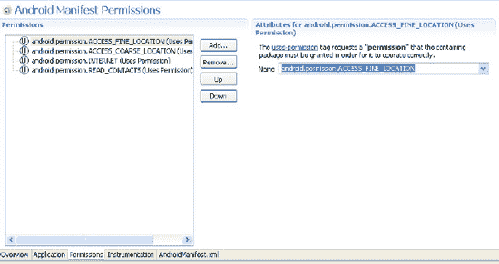

**图 10-5.** *Eclipse 中的 Android 清单编辑器工具*

现在你已经知道 Android 定义了一组权限来保护一组功能和资源。同样，你也可以使用你的应用定义并强制执行自定义权限。让我们看看这是如何实现的。


#### 理解并使用自定义权限

Android 允许您为应用定义自定义权限。例如，如果您想阻止某些用户启动应用中的某个 Activity，可以通过定义自定义权限来实现。要使用自定义权限，首先需要在 `AndroidManifest.xml` 文件中声明它们。定义权限后，就可以在组件定义中引用它。下面我们将向您展示具体操作方法。

让我们创建一个应用，其中包含一个并非所有人都能启动的 Activity。相反，要启动该 Activity，用户必须拥有特定权限。当您准备好包含特权 Activity 的应用后，就可以编写一个知道如何调用该 Activity 的客户端。

**注意：** 在本章末尾，我们会提供一个 URL，您可以使用它下载本章的项目文件。这样您就可以将这些项目直接导入到 Eclipse 中。

首先，创建包含自定义权限和 Activity 的项目。打开 Eclipse IDE，选择 New  New Project  Android Project。这将打开 New Android Project 对话框。输入 **CustomPermission** 作为项目名称，选中 "Create new project in workspace" 单选按钮，并勾选 "Use default location" 复选框。输入 **Custom Permission** 作为应用名称，**com.cust.perm** 作为包名，**CustPermMainActivity** 作为 Activity 名称，并选择一个构建目标。点击 Finish 按钮创建项目。生成的项目将包含您刚创建的 Activity，该 Activity 将作为默认（主）Activity。我们还要创建一个*特权 Activity*——一个需要特殊权限才能访问的 Activity。在 Eclipse IDE 中，进入 `com.cust.perm` 包，创建一个名为 **PrivActivity** 的类，其超类为 `android.app.Activity`，并复制代码清单 10–4 中所示的代码。

**代码清单 10–4.** *PrivActivity 类*

```
package com.cust.perm;

import android.app.Activity;
import android.os.Bundle;
import android.view.ViewGroup.LayoutParams;
import android.widget.LinearLayout;
import android.widget.TextView;

public class PrivActivity extends Activity
{
    @Override
    public void onCreate(Bundle savedInstanceState) {
        super.onCreate(savedInstanceState);
        LinearLayout view = new LinearLayout(this);

        view.setLayoutParams(new LayoutParams(
                LayoutParams.FILL_PARENT, LayoutParams.WRAP_CONTENT));
        view.setOrientation(LinearLayout.HORIZONTAL);

        TextView nameLbl = new TextView(this);

        nameLbl.setText("Hello from PrivActivity");
        view.addView(nameLbl);

        setContentView(view);
    }
}
```

如您所见，`PrivActivity` 并没有做什么神奇的事情。我们只是想向您展示如何使用权限保护此 Activity，然后从客户端调用它。如果客户端调用成功，您将在屏幕上看到文字 "Hello from PrivActivity"。现在，您已经拥有了一个想要保护的 Activity，接下来可以为它创建权限。

要创建自定义权限，您必须在 `AndroidManifest.xml` 文件中对其进行定义。最简单的方法是使用清单编辑器。双击 `AndroidManifest.xml` 文件，然后选择 Permissions 标签页。在 Permissions 窗口中，点击 Add 按钮，选择 Permission，然后点击 OK 按钮。清单编辑器将为您创建一个新的空权限。按照图 10–6 所示设置其属性来填充新的权限。填写右侧的字段，如果左侧的标签仍然只显示 "Permission"，请点击它，它应该会更新为右侧的名称。

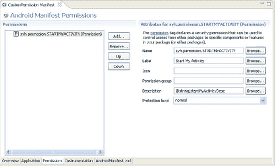

**图 10–6.** *使用清单编辑器声明自定义权限*

如图 10–6 所示，每个权限都有一个名称、标签、图标、权限组、描述和保护级别。表 10–3 定义了这些属性。

现在，您有了一个自定义权限。接下来，您需要告诉系统，只有拥有 `syh.permission.STARTMYACTIVITY` 权限的应用才能启动 `PrivActivity` Activity。您可以通过在 `AndroidManifest.xml` 文件的 Activity 定义中添加 `android:permission` 属性来设置 Activity 所需的权限。为了能够启动该 Activity，您还需要为它添加一个 `intent-filter`。使用代码清单 10–5 中的内容更新您的 `AndroidManifest.xml` 文件。

**表 10–3.** *权限的属性*

| 属性 | 是否必需 | 描述 |
| --- | --- | --- |
| `android:name` | 是 | 权限的名称。通常应遵循 Android 命名方案 (`*.permission.*`)。 |
| `android:protectionLevel` | 是 | 定义与该权限相关的潜在风险。必须是以下值之一：`normal`、`dangerous`、`signature`、`signatureOrSystem`。根据保护级别，系统在决定是否授予权限时可能会采取不同的操作。`normal` 表示该权限风险较低，不会损害系统、用户或其他应用。`dangerous` 表示该权限风险较高，系统在授予此权限前可能需要用户输入。`signature` 告诉 Android，仅当应用与声明该权限的应用使用相同的数字签名进行签名时，才应授予该权限。`signatureOrSystem` 告诉 Android 将权限授予具有相同签名的应用或 Android 包类。此保护级别适用于涉及多个供应商需要通过系统映像共享功能的非常特殊的情况。 |
| `android:permissionGroup` | 否 | 您可以将权限分组，但对于自定义权限，应避免设置此属性。如果您确实想设置此属性，请使用：`android.permission-group.SYSTEM_TOOLS`。 |
| `android:label` | 否 | 虽然不是必需的，但请使用此属性提供权限的简短描述。 |
| `android:description` | 否 | 虽然不是必需的，但您应使用此属性提供更有用的描述，说明权限的用途以及它保护的内容。 |
| `android:icon` | 否 | 权限可以与您资源中的图标相关联（例如 `@drawable/myicon`）。 |

**代码清单 10–5.** *自定义权限项目的 AndroidManifest.xml 文件*

```
<?xml version="1.0" encoding="utf-8"?>
<manifest
      package="com.cust.perm"
      android:versionCode="1"
      android:versionName="1.0.0">
    <application android:icon="@drawable/icon" android:label="@string/app_name">
        <activity android:name=".CustPermMainActivity"
                  android:label="@string/app_name">
            <intent-filter>
                <action android:name="android.intent.action.MAIN" />
                <category android:name="android.intent.category.LAUNCHER" />
            </intent-filter>
        </activity>
    <activity android:name="PrivActivity"
              android:permission="syh.permission.STARTMYACTIVITY">
        <intent-filter>
            <action android:name="android.intent.action.MAIN" />
        </intent-filter>
    </activity>
</application>

<permission
    android:protectionLevel="normal"
    android:label="Start My Activity"
    android:description="@string/startMyActivityDesc"
    android:name="syh.permission.STARTMYACTIVITY"></permission>

    <uses-sdk android:minSdkVersion="4" />
</manifest>
```


清单 10–5 要求在字符串资源中添加一个名为 `startMyActivityDesc` 的字符串常量。为确保清单 10–5 能够编译，需将以下字符串资源添加至 `res/values/strings.xml` 文件：

`<string name="startMyActivityDesc">允许启动我的 Activity</string>`

现在，在模拟器中运行该项目。虽然主 Activity 未执行任何操作，但在为特权 Activity 编写客户端之前，仍需将应用程序安装到模拟器上。

接下来，我们为特权 Activity 编写一个客户端。在 Eclipse IDE 中，依次点击新建  项目  Android 项目。输入 **ClientOfCustomPermission** 作为项目名称，选中“在工作区中创建新项目”单选按钮，并勾选“使用默认位置”复选框。将应用程序名称设置为 **Client Of Custom Permission**，包名设置为 `com.client.cust.perm`，Activity 名称设置为 `ClientCustPermMainActivity`，并选择一个构建目标。点击“完成”按钮创建项目。

然后，你需要编写一个 Activity，该 Activity 显示一个按钮，点击该按钮可以调用特权 Activity。将清单 10–6 所示的布局复制到你刚创建的项目中的 `main.xml` 文件里。

**清单 10–6.** *客户端项目的 Main.xml 文件*

```xml
<?xml version="1.0" encoding="utf-8"?>
<LinearLayout
    android:orientation="vertical"
    android:layout_width="fill_parent"    android:layout_height="fill_parent"  >

    <Button android:id="@+id/btn"    android:text="启动特权 Activity"
    android:layout_width="wrap_content"    android:layout_height="wrap_content"
    android:onClick=”doClick”  />
</LinearLayout>
```

如你所见，此 XML 布局文件定义了一个文本为“启动特权 Activity”的按钮。现在，让我们编写一个 Activity，用于处理按钮点击事件并启动特权 Activity。将清单 10–7 中的代码复制到你的 `ClientCustPermMainActivity` 类中。

**清单 10–7.** *修改后的 ClientCustPermMainActivity*

```java
package com.client.cust.perm;
// 此文件为 ClientCustPermMainActivity.java

import android.app.Activity;
import android.content.Intent;
import android.os.Bundle;
import android.view.View;

public class ClientCustPermMainActivity extends Activity {
    @Override
    public void onCreate(Bundle savedInstanceState) {
        super.onCreate(savedInstanceState);
        setContentView(R.layout.main);
    }

    public void doClick(View view) {
                Intent intent = new Intent();
                intent.setClassName("com.cust.perm","com.cust.perm.PrivActivity");
                startActivity(intent);
    }
}
```

如清单 10–7 所示，当按钮被调用时，你会创建一个新的 Intent，然后设置要启动的 Activity 的类名。在此例中，你要启动 `com.cust.perm` 包中的 `com.cust.perm.PrivActivity`。

此时唯一缺少的是一个 `uses-permission` 条目，你需要将其添加到清单文件中，以告知 Android 运行时你需要 `syh.permission.STARTMYACTIVITY` 权限才能运行。用清单 10–8 中的内容替换掉客户端项目的清单文件。

**清单 10–8.** *客户端清单文件*

```xml
<?xml version="1.0" encoding="utf-8"?>
<manifest
      package="com.client.cust.perm"
      android:versionCode="1"
      android:versionName="1.0.0">
    <application android:icon="@drawable/icon"
                 android:label="@string/app_name">
        <activity android:name=".ClientCustPermMainActivity"
                  android:label="@string/app_name">
           <intent-filter>
             <action android:name="android.intent.action.MAIN" />
             <category android:name="android.intent.category.LAUNCHER" />
           </intent-filter>
        </activity>
    </application>

    <uses-permission android:name="syh.permission.STARTMYACTIVITY" />
    <uses-sdk android:minSdkVersion="4" />
</manifest>
```

如清单 10–8 所示，我们添加了一个 `uses-permission` 条目，以请求启动我们在自定义权限项目中实现的 `PrivActivity` 所需的自定义权限。

至此，你应该能够将客户端项目部署到模拟器上，然后点击“启动特权 Activity”按钮。当按钮被调用时，你应该会看到“来自 PrivActivity 的问候”文本。

成功调用特权 Activity 后，从客户端项目的清单文件中移除 `uses-permission` 条目，并重新将项目部署到模拟器。部署完成后，确认在点击按钮启动特权 Activity 时会报错。注意，LogCat 会显示权限拒绝异常。

现在你已经了解了 Android 中自定义权限的工作原理。显然，自定义权限不仅限于 Activity。事实上，你可以将预定义权限和自定义权限应用于 Android 的其他类型组件。接下来我们将探讨一个重要的类型：URI 权限。

### 理解与使用 URI 权限

内容提供者（已在第 3 章中讨论）通常需要在比“全有或全无”更细的粒度上控制访问权限。幸运的是，Android 为此提供了一种机制。以电子邮件附件为例，附件可能需要被另一个 Activity 读取才能显示。但该其他 Activity 不应获得对所有电子邮件数据的访问权限，甚至也不需要访问所有附件。这时就需要 URI 权限发挥作用了。


#### 在 Intent 中传递 URI 权限

当调用另一个 Activity 并传递 URI 时，你的应用可以指定它正在授予对所传递 URI 的权限。但在应用执行此操作之前，它自身需要拥有该 URI 的权限，并且 URI 内容提供者必须配合，允许向另一个 Activity 授予权限。使用权限授予方式调用 Activity 的代码如代码清单 10-9 所示，该代码实际上来自 Android 电子邮件程序，它在此处启动一个 Activity 来查看电子邮件附件。

**代码清单 10–9.** *启动带有权限授予的 Activity 的代码*

```java
try {
    Intent intent = new Intent(Intent.ACTION_VIEW);
    intent.setData(contentUri);
    intent.addFlags(Intent.FLAG_GRANT_READ_URI_PERMISSION);
    startActivity(intent);
} catch (ActivityNotFoundException e) {
    mHandler.attachmentViewError();
    // TODO: 在下一个版本中添加适当的警告消息（以及大量上游清理工作以防止其发生）。
}
```

附件由 `contentUri` 指定。请注意，Intent 是使用操作 `Intent.ACTION_VIEW` 创建的，并通过 `setData()` 设置数据。该标志被设置为向任何能匹配此 Intent 的 Activity 授予对附件的读取权限。这就是内容提供者发挥作用的地方。仅仅因为一个 Activity 拥有对内容的读取权限，并不意味着它可以将该权限传递给它并不拥有此权限的其他 Activity。内容提供者也必须允许这样做。当 Android 在某个 Activity 上找到匹配的 Intent 过滤器时，它会咨询内容提供者以确保权限可以被授予。本质上，系统是在询问内容提供者是否允许这个新的 Activity 访问 URI 指定的内容。如果内容提供者拒绝，则会抛出 `SecurityException`，操作失败。在代码清单 10-9 中，这个特定的应用程序并未检查 `SecurityException`，因为开发者预期不会有任何授予权限的拒绝。那是因为附件内容提供者是电子邮件应用程序的一部分！不过，仍然有可能找不到任何 Activity 来处理此附件，因此这是唯一被监视的异常。在调用处理 URI 的 Activity 已经拥有访问该 URI 的权限的情况下，内容提供者无法拒绝访问。也就是说，调用 Activity 可以授予权限，如果接收 Intent 的 Activity 已经拥有访问 `contentURI` 的必要权限，那么被调用的 Activity 将顺利执行，不会出现任何问题。

除了 `Intent.FLAG_GRANT_READ_URI_PERMISSION`，还有一个用于写权限的标志：`Intent.FLAG_GRANT_WRITE_URI_PERMISSION`。可以在一个 `Intent` 中同时指定这两个标志。此外，这些标志也适用于 `Service` 和 `BroadcastReceiver` 以及 `Activity`，因为它们都可以接收 Intent。

#### 在内容提供者中指定 URI 权限

那么，内容提供者如何指定 URI 权限呢？它可以通过两种方式在 `AndroidManifest.xml` 文件中进行指定。

*   首先，在 `<provider>` 标签中，`android:grantUriPermissions` 属性可以设置为 `true` 或 `false`。如果设置为 `true`，则此内容提供者中的任何内容都可以被授予权限。如果设置为 `false`，则可以使用第二种方式指定 URI 权限，或者内容提供者可以决定根本不允许任何其他人授予权限。
*   第二种允许授予权限的方式是通过 `<provider>` 的子标签进行指定。子标签是 `<grant-uri-permission>`，你可以在 `<provider>` 内拥有多个此标签。`<grant-uri-permission>` 有三个可能的属性：
    *   使用 `android:path` 属性，你可以指定一个完整的路径，该路径将具有可授予的权限。
    *   类似地，`android:pathPrefix` 指定 URI 路径的开头部分。
    *   `android:pathPattern` 允许使用通配符（即星号 `*` 字符）来指定路径。

正如我们之前所述，授予权限的实体本身必须对内容拥有适当的权限，然后才能被允许将这些权限授予其他实体。内容提供者还有其他控制对其内容访问的方式，包括通过 `<provider>` 标签的 `android:readPermission` 属性、`android:writePermission` 属性和 `android:permission` 属性（这是一种使用单个权限 `String` 值同时指定读写权限的便捷方法）。这三个属性中任何一个的值都是一个 `String`，表示调用者为了读取或写入此内容提供者所需拥有的权限。在 Activity 可以将读取权限授予某个内容 URI 之前，该 Activity 必须首先拥有读取权限，通过 `android:readPermission` 属性或 `android:permission` 属性来指定。希望获得这些权限的实体需要在它们的清单文件中使用 `<uses-permission>` 标签进行声明。

### 总结

在本章中，你了解到 Android 要求所有应用程序都使用数字证书进行签名。我们讨论了使用模拟器和 Eclipse 确保构建时安全性，以及签署 Android 包以进行发布。我们还讨论了运行时安全性；你了解到 Android 安装程序会在安装时请求你的应用程序所需的权限。我们还向你展示了如何定义应用程序所需的权限，以及如何创建你自己的自定义权限。最后，我们介绍了内容提供者如何控制对其内容的访问，以及它们如何允许实体将权限授予可能被调用来对内容提供者中的内容执行操作的其他实体，而无需为该辅助实体提供访问内容提供者中*所有*内容的权限。

在下一章中，我们将讨论在 Android 中构建和使用服务。

## 第 11 章

## 构建和使用服务

Android 平台提供了一个完整的软件栈。这意味着你拥有一个操作系统和中间件，以及可工作的应用程序（例如电话拨号器）。除了所有这些，你还有一个 SDK，可以用来为平台编写应用程序。到目前为止，我们已经看到可以构建通过用户界面直接与用户交互的应用程序。然而，我们尚未讨论后台服务或构建在后台运行的组件的可能性。

在本章中，我们将重点介绍如何在 Android 中构建和使用服务。首先，我们将讨论使用 HTTP 服务，然后介绍一种执行简单后台任务的好方法，最后讨论进程间通信——即同一设备上应用程序之间的通信。接着，我们将更进一步，构建一个与 Google 翻译 API 集成的可工作示例应用程序。


### 消费 HTTP 服务

Android 应用程序以及一般的移动应用，都是具备丰富功能的小型应用。这类应用在小型设备上提供如此丰富功能的方式之一，就是从各种来源获取信息。例如，大多数 Android 智能手机都预装了地图应用程序，它提供了复杂的地图功能。然而，我们知道，该应用程序是与 Google Maps API 以及其他服务集成在一起的，正是这些服务提供了大部分复杂功能。

也就是说，你编写的应用程序也可能会利用其他应用程序和 API 的信息。一种常见的集成策略是使用 HTTP。例如，你可能有一个部署在互联网上的 Java Servlet，它提供了你想从某个 Android 应用程序中利用的服务。那么在 Android 中该如何做到这一点呢？有趣的是，Android SDK 内置了一个 Apache 的 `HttpClient` 变体（[`hc.apache.org/httpclient-3.x/`](http://hc.apache.org/httpclient-3.x/)），它在 J2EE 领域被广泛使用。Android 版本已经针对 Android 进行了修改，但其 API 与 J2EE 版本的 API 非常相似。

Apache 的 `HttpClient` 是一个全面的 HTTP 客户端。虽然它完全支持 HTTP 协议，但你很可能只会用到 HTTP GET 和 POST。在本节中，我们将讨论如何使用 `HttpClient` 进行 HTTP GET 和 HTTP POST 调用。

#### 使用 HttpClient 进行 HTTP GET 请求

以下是使用 `HttpClient` 的通用模式之一：

1.  创建一个 `HttpClient`（或获取一个现有引用）。
2.  实例化一个新的 HTTP 方法，例如 `PostMethod` 或 `GetMethod`。
3.  设置 HTTP 参数名/值。
4.  使用 `HttpClient` 执行 HTTP 调用。
5.  处理 HTTP 响应。

代码清单 11–1 展示了如何使用 `HttpClient` 执行 HTTP GET。

**注意：** 我们在本章末尾提供了一个 URL，你可以使用它来下载本章的项目。这将允许你直接将这些项目导入 Eclipse。另外，由于代码会尝试使用互联网，在使用 `HttpClient` 进行 HTTP 调用时，你需要在清单文件中添加 `android.permission.INTERNET` 权限。

**代码清单 11–1.** *使用 HttpClient 和 HttpGet：HttpGetDemo.java*

```
import java.io.BufferedReader;
import java.io.IOException;
import java.io.InputStreamReader;
import org.apache.http.HttpResponse;
import org.apache.http.client.HttpClient;
import org.apache.http.client.methods.HttpGet;
import org.apache.http.impl.client.DefaultHttpClient;
import android.app.Activity;
import android.os.Bundle;

public class HttpGetDemo extends Activity {
    /** 当 Activity 首次创建时调用。 */
    @Override
    public void onCreate(Bundle savedInstanceState) {
        super.onCreate(savedInstanceState);
        setContentView(R.layout.main);

        BufferedReader in = null;
        try {
            HttpClient client = new DefaultHttpClient();
            HttpGet request = new HttpGet("http://code.google.com/android/");
            HttpResponse response = client.execute(request);

            in = new BufferedReader(
                    new InputStreamReader(
                        response.getEntity().getContent()));

            StringBuffer sb = new StringBuffer("");
            String line = "";
            String NL = System.getProperty("line.separator");
            while ((line = in.readLine()) != null) {
                sb.append(line + NL);
            }
            in.close();

            String page = sb.toString();
            System.out.println(page);
        } catch (Exception e) {
            e.printStackTrace();
        } finally {
            if (in != null) {
                try {
                    in.close();
                } catch (IOException e) {
                    e.printStackTrace();
                }
            }
        }
    }
}
```

`HttpClient` 为各种 HTTP 请求类型提供了抽象，例如 `HttpGet`、`HttpPost` 等。代码清单 11–1 使用 `HttpClient` 获取 `http://code.google.com/android/` URL 的内容。实际的 HTTP 请求是通过调用 `client.execute()` 执行的。执行请求后，代码将整个响应读取到一个字符串对象中。请注意，`BufferedReader` 在 `finally` 块中被关闭，这也会关闭底层的 HTTP 连接。

在我们的示例中，我们将 HTTP 逻辑嵌入在一个 Activity 内部，但我们并不需要在 Activity 的上下文中才能使用 `HttpClient`。你可以在任何 Android 组件的上下文中使用它，或者将其作为独立类的一部分使用。事实上，你真的不应该直接在 Activity 内部使用 `HttpClient`，因为一个网络调用可能需要一段时间才能完成，并可能导致 Activity 被强制关闭。我们将在本章后面讨论这个主题。现在，我们先稍微“作弊”一下，以便专注于如何执行 `HttpClient` 调用。

代码清单 11–1 中的代码执行了一个 HTTP 请求，没有向服务器传递任何 HTTP 参数。你可以通过将名/值对附加到 URL 上，将它们作为请求的一部分进行传递，如代码清单 11–2 所示。

**代码清单 11–2.** *向 HTTP GET 请求添加参数*

```
HttpGet request = new HttpGet("http://somehost/WS2/Upload.aspx?one=valueGoesHere");
client.execute(request);
```

当你执行 HTTP GET 时，请求的参数（名称和值）作为 URL 的一部分进行传递。以这种方式传递参数有一些限制。也就是说，URL 的长度应保持在 2048 个字符以下。如果你要提交的数据量超过这个长度，则应改用 HTTP POST。POST 方法更加灵活，并将参数作为请求体的一部分进行传递。


#### 使用 HttpClient 执行 HTTP POST 请求（多部分示例）

执行 HTTP POST 调用与执行 HTTP GET 调用非常相似（参见代码清单 11–3）。

**代码清单 11–3.** *使用 HttpClient 发送 HTTP POST 请求*

```
HttpClient client = new DefaultHttpClient();
HttpPost request = new HttpPost(
    "http://192.165.13.37/services/doSomething.do");
List<NameValuePair> postParameters = new ArrayList<NameValuePair>();
postParameters.add(new BasicNameValuePair("first",
    "param value one"));
postParameters.add(new BasicNameValuePair("issuenum", "10317"));
postParameters.add(new BasicNameValuePair("username", "dave"));
UrlEncodedFormEntity formEntity = new UrlEncodedFormEntity(
    postParameters);
request.setEntity(formEntity);
HttpResponse response = client.execute(request);
```

代码清单 11–3 中的代码将替换代码清单 11–1 中使用 `HttpGet` 的三行代码。其他所有代码可以保持不变。要使用 `HttpClient` 执行 HTTP POST 调用，您必须使用 `HttpPost` 实例调用 `HttpClient` 的 `execute()` 方法。在执行 HTTP POST 调用时，通常会将 URL 编码的名称/值表单参数作为 HTTP 请求的一部分传递。要使用 `HttpClient` 实现这一点，您需要创建一个包含 `NameValuePair` 对象实例的列表，然后将该列表包装在一个 `UrlEncodedFormEntity` 对象中。`NameValuePair` 封装了一个名称/值组合，而 `UrlEncodedFormEntity` 类知道如何编码适用于 HTTP 调用（通常是 POST 调用）的 `NameValuePair` 对象列表。创建 `UrlEncodedFormEntity` 后，您可以将 `HttpPost` 的实体类型设置为该 `UrlEncodedFormEntity`，然后执行请求。

在代码清单 11–3 中，我们首先创建了一个 `HttpClient`，然后使用 HTTP 端点的 URL 实例化了 `HttpPost`。接下来，我们创建了一个 `NameValuePair` 对象列表，并使用几个名称/值参数填充了它。然后，我们创建了一个 `UrlEncodedFormEntity` 实例，将 `NameValuePair` 对象列表传递给其构造函数。最后，我们调用了 POST 请求的 `setEntity()` 方法，然后使用 `HttpClient` 实例执行了该请求。

HTTP POST 的功能实际上远不止于此。通过 HTTP POST，我们既可以传递简单的名称/值参数（如代码清单 11–3 所示），也可以传递诸如文件之类的复杂参数。HTTP POST 支持另一种称为多部分 POST 的请求体格式。使用这种类型的 POST，您可以像以前一样发送名称/值参数，同时还可以发送任意文件。不幸的是，Android 自带的 `HttpClient` 版本并不直接支持多部分 POST。要执行多部分 POST 调用，您需要获取三个额外的 Apache 开源项目：Apache Commons IO、Mime4j 和 HttpMime。您可以从以下网站下载这些项目：

- Commons IO：[`commons.apache.org/io/`](http://commons.apache.org/io/)
- Mime4j：[`james.apache.org/mime4j/`](http://james.apache.org/mime4j/)
- HttpMime：[`hc.apache.org/downloads.cgi`](http://hc.apache.org/downloads.cgi)（位于 HttpClient 内部）

或者，您可以访问此站点下载所有用于在 Android 上执行多部分 POST 所需的 .jar 文件：

`http://www.apress.com/book/view/1430226595`

代码清单 11–4 演示了如何在 Android 上执行多部分 POST。

**代码清单 11–4.** *执行多部分 POST 调用*

```
import java.io.ByteArrayInputStream;
import java.io.InputStream;
import org.apache.commons.io.IOUtils;
import org.apache.http.HttpResponse;
import org.apache.http.client.HttpClient;
import org.apache.http.client.methods.HttpPost;
import org.apache.http.entity.mime.MultipartEntity;
import org.apache.http.entity.mime.content.InputStreamBody;
import org.apache.http.entity.mime.content.StringBody;
import org.apache.http.impl.client.DefaultHttpClient;

import android.app.Activity;

public class TestMultipartPost extends Activity
{
    public void executeMultipartPost() throws Exception
    {
        try {
            InputStream is = this.getAssets().open("data.xml");
            HttpClient httpClient = new DefaultHttpClient();
            HttpPost postRequest =
              new HttpPost("http://mysomewebserver.com/services/doSomething.do");

            byte[] data = IOUtils.toByteArray(is);

            InputStreamBody isb = new InputStreamBody(new
                    ByteArrayInputStream(data), "uploadedFile");
            StringBody sb1 = new StringBody("some text goes here");
            StringBody sb2 = new StringBody("some text goes here too");

            MultipartEntity multipartContent = new MultipartEntity();
            multipartContent.addPart("uploadedFile", isb);
            multipartContent.addPart("one", sb1);
            multipartContent.addPart("two", sb2);

            postRequest.setEntity(multipartContent);
            HttpResponse response =httpClient.execute(postRequest);
            response.getEntity().getContent().close();
        } catch (Throwable e)
        {
            // handle exception here
         }
    }
}
```

**注意：** 多部分示例使用了几个不属于 Android 运行时一部分的 .jar 文件。为了确保这些 .jar 文件会作为您 .apk 文件的一部分被打包，您需要在 Eclipse 中将它们添加为外部 .jar 文件。为此，请在 Eclipse 中右键单击您的项目，选择属性，选择 Java Build Path，选择 Libraries 选项卡，然后选择 Add External JARs。

完成这些步骤将使这些 .jar 文件在编译时和运行时都可用。

要执行多部分 POST，您需要创建一个 `HttpPost`，并使用 `MultipartEntity` 实例（而不是我们为名称/值参数表单 POST 创建的 `UrlEncodedFormEntity`）调用其 `setEntity()` 方法。`MultipartEntity` 代表多部分 POST 请求的体。如代码所示，您创建一个 `MultipartEntity` 实例，然后使用每个部分调用 `addPart()` 方法。代码清单 11–4 向请求添加了三个部分：两个字符串部分和一个 XML 文件。

最后，如果您正在构建一个需要向 Web 资源传递多部分 POST 的应用程序，您可能需要在本地工作站上使用服务的模拟实现来调试解决方案。当您在本地工作站上运行应用程序时，通常可以使用 `localhost` 或 IP 地址 `127.0.0.1` 来访问本地机器。但是，对于 Android 应用程序，您将无法使用 `localhost`（或 `127.0.0.1`），因为模拟器本身就是一个 `localhost`。您不希望将此客户端指向 Android 设备上的服务，而是希望指向您的工作站。要从模拟器中运行的应用程序引用您的开发工作站，您必须使用您工作站的 IP 地址。（如果您需要帮助确定工作站的 IP 地址，请参考第 2 章。）您需要修改代码清单 11–4，将 IP 地址替换为您工作站的 IP 地址。


#### SOAP、JSON 和 XML 解析器

SOAP 呢？互联网上有很多基于 SOAP 的 Web 服务，但迄今为止，Google 并未在 Android 中为调用 SOAP Web 服务提供直接支持。Google 更倾向于 REST 风格的 Web 服务，这似乎是为了减少客户端设备所需的计算量。然而，代价是开发者必须做更多工作来发送数据和解析返回的数据。理想情况下，你会有一些与 Web 服务交互的选项。一些开发者使用 `kSOAP2` 开发工具包为 Android 构建 SOAP 客户端。我们不会介绍这种方法，但如果你感兴趣，可以自行了解。

**注意：** 原始的 `kSOAP2` 源代码位于此处：[`http://ksoap2.sourceforge.net/`](http://ksoap2.sourceforge.net/)。开源社区（幸好！）贡献了一个适用于 Android 的 `kSOAP2` 版本，你可以在此处了解更多信息：[`http://code.google.com/p/ksoap2-android/`](http://code.google.com/p/ksoap2-android/)。

一种成功应用的方法是在互联网上实现你自己的服务，这些服务可以与目标服务进行 SOAP（或其他协议）通信。这样，你的 Android 应用程序只需要与你的服务通信，你就拥有了完全的控制权。如果目标服务发生变化，你可能无需更新和发布新版本的应用程序就能处理。你只需更新服务器上的服务即可。这种方法的一个附带好处是，你可以更轻松地为你的应用程序实现付费订阅模式。如果用户让订阅过期，你可以在服务器上关闭他们的访问权限。

Android **确实**支持 JavaScript 对象表示法（JSON）。这是在 Web 服务器和客户端之间打包数据的一种相当常见的方法。JSON 解析类使得从响应中解包数据变得非常容易，以便你的应用程序可以对其进行处理。在本章后面学习 Google 翻译 API 时，我们将向你展示一些 JSON 代码。

Android 还有几个 XML 解析器，你可以用来解释来自 HTTP 调用的响应。主要的解析器（`XMLPullParser`）已在第 3 章中介绍。

#### 处理异常

处理异常是任何程序的一部分，但使用外部服务（例如 HTTP 服务）的软件必须特别注意异常，因为出错的可能性被放大了。在使用 HTTP 服务时，你可以预料到几种类型的异常。这些异常包括传输异常、协议异常和超时。你应该了解这些异常何时可能发生。

传输异常可能由多种原因引起，但在移动设备上，最可能的情况是网络连接不佳。协议异常是 HTTP 协议层的异常。这些包括身份验证错误、无效的 cookie 等。例如，如果你必须在 HTTP 请求中提供登录凭据但未能提供，则可能会遇到协议异常。与 HTTP 调用相关的超时有两种类型：连接超时和套接字超时。如果 `HttpClient` 无法连接到 HTTP 服务器（例如，服务器不可用），则可能发生连接超时。如果 `HttpClient` 在定义的时间段内未能收到响应，则可能发生套接字超时。换句话说，`HttpClient` 能够连接到服务器，但服务器未能在分配的时间限制内返回响应。

既然你了解了可能发生的异常类型，那么如何处理它们呢？幸运的是，`HttpClient` 是一个健壮的框架，它承担了大部分负担。事实上，你唯一需要担心的异常类型是那些你可以轻松管理的类型。`HttpClient` 通过检测传输问题并重试请求（这种方法非常适合此类异常）来处理传输异常。协议异常通常可以在开发过程中被清除。超时是你最可能需要处理的异常。处理两种超时类型（连接超时和套接字超时）的一种简单有效的方法是将 HTTP 请求的 `execute()` 方法包装在 `try`/`catch` 中，然后在发生失败时重试。这在列表 11-5 中进行了演示。

**列表 11-5.** *实现简单的重试技术以处理超时*

```java
import java.io.BufferedReader;
import java.io.IOException;
import java.io.InputStreamReader;
import java.net.URI;

import org.apache.http.HttpResponse;
import org.apache.http.client.HttpClient;
import org.apache.http.client.methods.HttpGet;
import org.apache.http.impl.client.DefaultHttpClient;

public class TestHttpGet {

    public String executeHttpGetWithRetry() throws Exception {
        int retry = 3;

        int count = 0;
        while (count < retry) {
            count += 1;
            try {
                String response = executeHttpGet();
                /**
                 * 如果执行到这里，意味着我们成功了，可以停止。
                 */
                return response;
            } catch (Exception e) {
                /**
                 * 如果我们用尽了重试次数
                 */
                if (count < retry) {
                    /**
                     * 我们还有剩余重试次数，因此记录消息并再次尝试。
                     */
                    System.out.println(e.getMessage());
                } else {
                    System.out.println("所有重试均失败");
                    throw e;
                }
            }
        }
        return null;
    }

    public String executeHttpGet() throws Exception {
        BufferedReader in = null;
        try {
            HttpClient client = new DefaultHttpClient();
            HttpGet request = new
                    HttpGet("http://code.google.com/android/");
            HttpResponse response = client.execute(request);
            in = new BufferedReader(
                        new InputStreamReader(
                                response.getEntity().getContent()));

            StringBuffer sb = new StringBuffer("");
            String line = "";
            String NL = System.getProperty("line.separator");
            while ((line = in.readLine()) != null) {
                sb.append(line + NL);
            }
            in.close();

            String result = sb.toString();
            return result;
        } finally {
            if (in != null) {
                try {
                    in.close();
                } catch (IOException e) {
                    e.printStackTrace();
                }
            }
        }
    }
}
```

列表 11-5 中的代码展示了如何在发出 HTTP 调用时实现简单的重试技术来从超时中恢复。该列表显示了两个方法：一个执行 HTTP GET 请求（`executeHttpGet()`），另一个用重试逻辑包装了此方法（`executeHttpGetWithRetry()`）。逻辑非常简单。我们将尝试的重试次数设置为 3，然后进入一个 `while` 循环。在循环内部，我们执行请求。请注意，请求被包装在 `try`/`catch` 块中，在 `catch` 块中我们检查是否用尽了重试尝试次数。

在现实世界的应用程序中使用 `HttpClient` 时，你需要特别注意可能出现的多线程问题。我们现在就来深入探讨这些问题。


#### 处理多线程问题

到目前为止，我们展示的示例中，每个请求都会创建一个新的 `HttpClient`。但在实际应用中，你应当为整个应用创建一个 `HttpClient`，并将其用于所有 HTTP 通信。当单个 `HttpClient` 服务于所有 HTTP 请求时，还需要注意多线程问题——如果通过同一个 `HttpClient` 同时发起多个请求，这些问题可能会显现。幸运的是，`HttpClient` 提供了便捷的处理方式：你只需使用 `ThreadSafeClientConnManager` 创建 `DefaultHttpClient` 即可，如清单 11-6 所示。

**清单 11-6.** *创建用于多线程的 HttpClient：CustomHttpClient.java*

```
import org.apache.http.HttpVersion;
import org.apache.http.client.HttpClient;
import org.apache.http.conn.ClientConnectionManager;
import org.apache.http.conn.params.ConnManagerParams;
import org.apache.http.conn.scheme.PlainSocketFactory;
import org.apache.http.conn.scheme.Scheme;
import org.apache.http.conn.scheme.SchemeRegistry;
import org.apache.http.conn.ssl.SSLSocketFactory;
import org.apache.http.impl.client.DefaultHttpClient;
import org.apache.http.impl.conn.tsccm.ThreadSafeClientConnManager;
import org.apache.http.params.BasicHttpParams;
import org.apache.http.params.HttpConnectionParams;
import org.apache.http.params.HttpParams;
import org.apache.http.params.HttpProtocolParams;
import org.apache.http.protocol.HTTP;

public class CustomHttpClient {
    private static HttpClient customHttpClient;

    /** 私有构造函数防止实例化 */
    private CustomHttpClient() {
    }

    public static synchronized HttpClient getHttpClient() {
        if (customHttpClient == null) {
            HttpParams params = new BasicHttpParams();
            HttpProtocolParams.setVersion(params, HttpVersion.HTTP_1_1);
            HttpProtocolParams.setContentCharset(params,
                    HTTP.DEFAULT_CONTENT_CHARSET);
            HttpProtocolParams.setUseExpectContinue(params, true);
            HttpProtocolParams.setUserAgent(params,
"Mozilla/5.0 (Linux; U; Android 2.2.1; en-us; Nexus One Build/FRG83) AppleWebKit/533.1"
(KHTML, like Gecko) Version/4.0 Mobile Safari/533.1"
            );

            ConnManagerParams.setTimeout(params, 1000);

            HttpConnectionParams.setConnectionTimeout(params, 5000);
            HttpConnectionParams.setSoTimeout(params, 10000);

            SchemeRegistry schReg = new SchemeRegistry();
            schReg.register(new Scheme("http",
                            PlainSocketFactory.getSocketFactory(), 80));
            schReg.register(new Scheme("https",
                            SSLSocketFactory.getSocketFactory(), 443));
            ClientConnectionManager conMgr = new
                            ThreadSafeClientConnManager(params,schReg);

            customHttpClient = new DefaultHttpClient(conMgr, params);
        }
        return customHttpClient;
    }

    public Object clone() throws CloneNotSupportedException {
        throw new CloneNotSupportedException();
    }
}
```

如果你的应用需要多次发起 HTTP 调用，就应该创建一个服务于所有 HTTP 请求的 `HttpClient`。最简单的方式是创建一个单例类，使其可以从应用的任何位置访问，正如我们在此展示的。这是一个相当标准的 Java 模式：我们同步访问一个 getter 方法，该方法返回该单例中唯一的 `HttpClient` 对象，并在首次调用时按需创建。

现在，来看一下 `CustomHttpClient` 的 `getHttpClient()` 方法。该方法负责创建我们的单例 `HttpClient`。我们设置了一些基本参数、超时值，以及 `HttpClient` 将支持的协议方案（即 HTTP 和 HTTPS）。请注意，实例化 `DefaultHttpClient()` 时，我们传入了一个 `ClientConnectionManager`。`ClientConnectionManager` 负责管理 `HttpClient` 的 HTTP 连接。由于我们希望为所有 HTTP 请求（如果使用线程，这些请求可能重叠）使用同一个 `HttpClient`，因此创建了 `ThreadSafeClientConnManager`。

我们还向你展示了另一种更简单的收集 HTTP 响应的方法，即使用 `BasicResponseHandler`。使用 `CustomHttpClient` 的活动（Activity）代码如清单 11-7 所示。

**清单 11-7.** *使用自定义 HttpClient：HttpActivity.java*

```
import java.io.IOException;
import org.apache.http.client.HttpClient;
import org.apache.http.client.methods.HttpGet;
import org.apache.http.impl.client.BasicResponseHandler;
import org.apache.http.params.HttpConnectionParams;
import org.apache.http.params.HttpParams;
import android.app.Activity;
import android.os.Bundle;
import android.util.Log;

public class HttpActivity extends Activity
{
    private HttpClient httpClient;
    @Override
    public void onCreate(Bundle savedInstanceState)
    {
        super.onCreate(savedInstanceState);
        setContentView(R.layout.main);

        httpClient = CustomHttpClient.getHttpClient();
        getHttpContent();
    }

    public void getHttpContent()
    {
        try {
            HttpGet request = new HttpGet("http://www.google.com/");
            String page = httpClient.execute(request,
                    new BasicResponseHandler());
            System.out.println(page);
        } catch (IOException e) {
            // 涵盖以下异常：
            //      ClientProtocolException
            //      ConnectTimeoutException
            //      ConnectionPoolTimeoutException
            //      SocketTimeoutException
            e.printStackTrace();
        }
    }
}
```

对于这个示例应用，我们简单地通过 HTTP GET 请求获取 Google 主页。我们还使用了 `BasicResponseHandler` 对象，将页面内容呈现为一个大字符串，然后将其输出到 `LogCat`。如你所见，在 `execute()` 方法中添加 `BasicResponseHandler` 非常容易。

你可能会想利用每个 Android 应用都关联一个 `Application` 对象这一特性。默认情况下，如果你没有定义自定义的应用对象，Android 会使用 `android.app.Application`。关于应用对象，有一点很有意思：你的应用始终只有一个应用对象，并且所有组件都可以访问它（通过全局上下文对象）。你可以扩展 `Application` 类并添加功能，例如我们的 `CustomHttpClient`。然而，在我们的场景中，并没有理由在 `Application` 类本身中实现这一功能；既然你可以简单地创建一个独立的单例类来处理这类需求，那么最好不要去动 `Application` 类，这样会更好。


##### 超时设置的乐趣

为我们的应用程序设置单一的 `HttpClient` 还有其他显著优势。我们可以在一个地方修改其属性，所有代码都能受益。例如，如果我们想要为 HTTP 调用设置通用的超时值，可以在创建 `HttpClient` 时，通过对 `HttpParams` 对象调用相应的 setter 函数来实现。请参考清单 11–6 和 `getHttpClient()` 方法。注意，这里有三个超时值可供我们操作。第一个是连接管理器的超时，它定义了我们应该等待多长时间，才能从连接管理器管理的连接池中获取一个连接。在我们的示例中，将其设置为 1 秒。我们唯一可能需要等待的情况是，当连接池中的所有连接都正在使用时。第二个超时值定义了我们应该等待多长时间，才能通过网络与远端的服务器建立连接。在这里，我们使用了 2 秒的值。最后，我们将套接字超时值设置为 4 秒，以定义我们应该等待多久才能收到请求返回的数据。

对应于前面描述的三种超时，我们可能会遇到这三种异常：`ConnectionPoolTimeoutException`、`ConnectTimeoutException` 或 `SocketTimeoutException`。这三个异常都是 `IOException` 的子类，我们在 `HttpActivity` 中使用 `IOException` 而不是分别捕获每个子类异常。

如果你仔细研究我们在 `getHttpClient()` 中使用的每个参数设置类，可能会发现更多对你有用的参数。

我们已经向你描述了如何设置一个通用的 HTTP 连接池以供整个应用程序使用。其含义是，每次你需要使用连接时，各种设置都会适用于你的特定需求。但是，如果你想为某个特定消息使用不同的设置呢？值得庆幸的是，也有一种简单的方法可以实现这一点。我们向你展示了如何使用 `HttpGet` 或 `HttpPost` 对象来描述要在网络上发送的请求。与我们之前在 `HttpClient` 上设置 `HttpParams` 的方式类似，你也可以在 `HttpGet` 和 `HttpPost` 对象上设置 `HttpParams`。在消息级别应用的设置将覆盖 `HttpClient` 级别的设置，而不会更改 `HttpClient` 本身的设置。清单 11–8 展示了如果我们希望某个特定请求的套接字超时是 1 分钟而不是 4 秒时，代码可能的样子。你可以用这些代码行替换清单 11–7 中 `getHttpContent()` 的 try 块内的对应代码行。

**清单 11–8.** *在请求级别覆盖套接字超时*

```
    HttpGet request = new HttpGet("http://www.google.com/");
    HttpParams params = request.getParams();
    HttpConnectionParams.setSoTimeout(params, 60000);   // 1 分钟
    request.setParams(params);
    String page = httpClient.execute(request,
                        new BasicResponseHandler());
    System.out.println(page);
```

##### 使用 `HttpURLConnection`

Android 提供了另一种处理 HTTP 服务的方法，那就是使用 `java.net.HttpURLConnection` 类。这与我们刚刚介绍的 `HttpClient` 类并非完全不同，但 `HttpURLConnection` 往往需要更多语句才能完成任务。选择使用哪种方法取决于你更熟悉哪一种。

##### 使用 `AndroidHttpClient`

Android 2.2 引入了一个新的 `HttpClient` 子类，名为 `AndroidHttpClient`。这个类背后的理念是通过为 Android 应用程序提供合适的默认值和逻辑，来简化 Android 应用开发者的工作。例如，连接和套接字（即操作）的超时值默认均为 20 秒。连接管理器默认为 `ThreadSafeClientConnManager`。在大多数情况下，它可以与我们前面示例中使用的 `HttpClient` 互换。不过，有几个差异你需要了解。

*   要创建一个 `AndroidHttpClient`，你需要调用 `AndroidHttpClient` 类的静态方法 `newInstance()`，如下所示：`AndroidHttpClient httpClient = AndroidHttpClient.newInstance("my-http-agent-string");`
*   注意，`newInstance()` 方法的参数是一个 HTTP 代理字符串。在 Android 的默认浏览器中，你可能会看到类似下面的字符串，但你可以使用任何你想要的字符串：`Mozilla/5.0 (Linux; U; Android 2.1; en-us; ADR6200 Build/ERD79) AppleWebKit/530.17 (KHTML, like Gecko) Version/ 4.0 Mobile Safari/530.17`
*   在此客户端上调用 `execute()` 时，你必须在一个与主 UI 线程分离的线程中。这意味着，如果你简单地尝试用 `AndroidHttpClient` 替换我们之前的 `HttpClient`，你将收到一个异常。从主 UI 线程进行 HTTP 调用是一种不好的实践，因此 `AndroidHttpClient` 不允许你这样操作。我们将在下一节讨论线程问题。
*   当你使用完 `AndroidHttpClient` 实例后，必须调用其 `close()` 方法。这样才能正确地释放内存。
*   有一些方便的静态方法用于处理来自服务器的压缩响应，包括：
    *   `modifyRequestToAcceptGzipResponse(HttpRequest request)`
    *   `getCompressedEntity(byte[] data, ContentResolver resolver)`
    *   `getUngzippedContent(HttpEntity entity)`

一旦你获取了 `AndroidHttpClient` 的实例，就无法再修改其中的任何参数设置，也不能向其添加任何参数设置（例如 HTTP 协议版本等）。你的选择要么像前面展示的那样在 `HttpGet` 对象中覆盖设置，要么就不使用 `AndroidHttpClient`。

至此，我们关于使用 `HttpClient` 处理 HTTP 服务的讨论就结束了。在接下来的章节中，我们将把焦点转向 Android 平台的另一个有趣部分：编写后台/长时间运行的服务。虽然这不是很明显，但发起 HTTP 调用和编写 Android 服务这两个过程是相互关联的，因为你将在 Android 服务中进行大量的集成工作。以简单的邮件客户端应用为例。在 Android 设备上，这类应用通常由两部分组成：一部分为用户提供 UI，另一部分用于轮询邮件。轮询操作很可能需要在后台服务中完成。轮询新消息的组件将是一个 Android 服务，而该服务又会使用 `HttpClient` 来执行具体工作。

**注意：** 想获取关于使用 `HttpClient` 和其他这些概念的优秀教程，请查阅 Apache 网站 [`hc.apache.org/httpcomponents-client-ga/tutorial/html/`](http://hc.apache.org/httpcomponents-client-ga/tutorial/html/)。


### 使用后台线程（AsyncTask）

到目前为止，在我们的示例中，我们一直使用活动的主线程来执行 HTTP 调用。虽然我们可能幸运地每次都能快速获得响应，但我们的网络连接和互联网并不总是如此迅速。由于活动的主线程主要用于处理来自用户的事件（如按钮点击等）以及执行用户界面的更新，因此我们应该使用后台线程执行可能耗时的工作。Android 强制我们采取这种方式，因为如果主线程未在 5 秒内处理某些操作，就会触发“应用无响应”（ANR）条件，这会导致显示一个令人生厌的对话框，要求用户确认是否应终止当前应用（也称为强制关闭），从而破坏用户体验。我们将在第 13 章中详细讨论主线程和 5 秒限制，但目前只需知道我们不能长时间占用主线程。

如果你只想进行一些计算，且无需更新用户界面，你可以使用一个简单的 `Thread` 对象来将部分处理工作从主线程卸载出去。但是，如果你需要更新用户界面，这种技术就行不通了。这是因为 Android 用户界面工具包并非线程安全的，因此它只能始终从主线程进行更新。

如果你打算根据后台线程的执行结果以任何方式更新用户界面，那么你应该认真考虑使用 `AsyncTask`。`AsyncTask` 提供了一种便捷的方式，可将希望更新用户界面的某些处理放在后台执行。`AsyncTask` 负责为我们创建一个后台线程来执行实际工作，并提供在主线程上运行的回调方法，以便轻松访问用户界面元素（即视图）。这些回调可以在后台线程运行之前、期间和之后触发。

例如，考虑从网络服务器获取图像并在应用中显示的问题。也许这个图像需要即时生成。我们无法保证图像返回到我们这里需要多长时间，因此我们确实需要使用后台线程来完成这项工作。

清单 11–9 展示了一个 `AsyncTask` 的简单实现，它将为我们完成这项工作。我们将讨论它，然后向你展示一个布局文件以及一个可调用此 `AsyncTask` 的活动的 Java 代码。

**清单 11–9.** *用于下载图像的 AsyncTask：`DownloadImageTask.java`*

```java
import java.io.IOException;
import org.apache.http.HttpResponse;
import org.apache.http.client.HttpClient;
import org.apache.http.client.methods.HttpGet;
import org.apache.http.params.BasicHttpParams;
import org.apache.http.params.HttpConnectionParams;
import org.apache.http.params.HttpParams;
import org.apache.http.util.EntityUtils;
import android.app.Activity;
import android.content.Context;
import android.graphics.Bitmap;
import android.graphics.BitmapFactory;
import android.os.AsyncTask;
import android.util.Log;
import android.widget.ImageView;
import android.widget.TextView;

public class DownloadImageTask extends AsyncTask<String, Integer, Bitmap> {
    private Context mContext;

    DownloadImageTask(Context context) {
        mContext = context;
    }

    protected void onPreExecute() {
        // 我们可以在 doInBackground() 运行之前在这里做一些设置工作
    }

    protected Bitmap doInBackground(String... urls) {
        Log.v("doInBackground", "正在下载图像");
        return downloadImage(urls);
    }

    protected void onProgressUpdate(Integer... progress) {
        TextView mText = (TextView)
                ((Activity) mContext).findViewById(R.id.text);
        mText.setText("当前进度：" + progress[0]);
    }

    protected void onPostExecute(Bitmap result) {
        if(result != null) {
            ImageView mImage = (ImageView)
                ((Activity) mContext).findViewById(R.id.image);
            mImage.setImageBitmap(result);
        }
        else {
            TextView errorMsg = (TextView)
                ((Activity) mContext).findViewById(R.id.errorMsg);
            errorMsg.setText("下载图像时出现问题。请稍后重试。");
        }
    }

    private Bitmap downloadImage(String... urls)
    {
      HttpClient httpClient = CustomHttpClient.getHttpClient();
      try {
        HttpGet request = new HttpGet(urls[0]);
        HttpParams params = new BasicHttpParams();
        HttpConnectionParams.setSoTimeout(params, 60000);   // 1 分钟
        request.setParams(params);

        publishProgress(25);

        HttpResponse response = httpClient.execute(request);

        publishProgress(50);

        byte[] image = EntityUtils.toByteArray(response.getEntity());

        publishProgress(75);

        Bitmap mBitmap = BitmapFactory.decodeByteArray(
                            image, 0, image.length);

        publishProgress(100);

        return mBitmap;
      } catch (IOException e) {
        // 涵盖：
        //      ClientProtocolException
        //      ConnectTimeoutException
        //      ConnectionPoolTimeoutException
        //      SocketTimeoutException
        e.printStackTrace();
      }
      return null;
    }
}
```

由于 `AsyncTask` 是抽象的，你需要通过扩展它来自定义，我们通过 `DownloadImageTask` 类来实现。我们将使用一个构造函数，该函数接受一个对调用上下文的引用，在我们的例子中，就是调用活动。我们将使用该上下文来获取活动的视图。我们还将重用之前的 `CustomHttpClient` 类。

一个 `AsyncTask` 包含四个步骤：

1.  在 `onPreExecute()` 方法中执行任何设置工作。此方法在主线程上执行。
2.  使用 `doInBackground()` 运行后台线程。线程的创建完全在后台为我们处理。此代码在单独的后台线程中运行。
3.  使用 `publishProgress()` 和 `onProgressUpdate()` 更新进度。`publishProgress()` 从 `doInBackground()` 的代码内部调用，而 `onProgressUpdate()` 则作为对 `publishProgress()` 调用的结果，在主线程中执行。通过这两个方法，后台线程能够在执行期间与主线程通信，因此在后台线程完成其工作之前，就可以在用户界面中进行状态更新。
4.  在 `onPostExecute()` 中使用结果更新用户界面。此方法在主线程中执行。


步骤 1 和步骤 3 是可选的。在我们的示例中，我们没有选择在 `onPreExecute()` 中进行任何初始化，但确实利用了步骤 3 中的进度更新。后台线程的主要工作是在 `downloadImage()` 方法中完成的，该方法由 `doInBackground()` 调用。`downloadImage()` 方法接收一个 URL，并使用我们的 `HttpClient` 来执行 `HttpGet` 请求并处理响应。请注意，我们现在能够设置 60 秒的超时，而无需担心出现任何 ANR（应用无响应）。你可以在代码中看到进度更新的过程，包括设置 `HttpClient` 连接、执行 HTTP 请求、将图片响应转换为字节数组，以及从中构建 `Bitmap` 对象。当 `downloadImage()` 返回至 `doInBackground()`，并且 `doInBackground()` 返回时，Android 会负责获取我们的返回值并将其传递给 `onPostExecute()`。一旦 `Bitmap` 被传递给 `onPostExecute()`，就可以安全地用其更新 `ImageView`，因为 `onPostExecute()` 是在我们 Activity 的主线程上运行的。但是，如果在下载过程中遇到某种异常怎么办？如果我们没有从 HTTP 调用中获取图片，而是得到了异常，那么我们的 `Bitmap` 将是 `null`。我们可以在 `onPostExecute()` 中检测到这一情况，并显示一条错误消息，而不是尝试将 `ImageView` 设置为该 `Bitmap`。当然，如果我们知道下载失败，也可以采取其他操作。

请记住，唯一不运行在主线程上的代码是来自 `doInBackground()` 的代码。因此，请注意不要在 `doInBackground()` 方法中处理 UI，因为那是会让你陷入困境的地方。例如，不要从 `doInBackground()` 中调用那些会修改 UI 元素的方法。只在 `onPreExecute()`、`onProgressUpdate()` 和 `onPostExecute()` 中操作 UI 元素。

让我们用布局 XML 文件和 Activity 的 Java 代码来完善我们最新的示例，分别见列表 11-10 和 11-11。

**列表 11–10.** *调用 AsyncTask 的布局：/res/layout/main.xml*

```
<?xml version="1.0" encoding="utf-8"?>
<LinearLayout
    android:layout_width="fill_parent"
    android:layout_height="fill_parent"
    android:orientation="vertical"
>
<LinearLayout
    android:layout_width="fill_parent"
    android:layout_height="wrap_content"
    android:orientation="horizontal"
>
<Button android:id="@+id/button"  android:text="Get Image"
    android:layout_width="wrap_content"
    android:layout_height="wrap_content"
    android:onClick="doClick"
    />
<TextView android:id="@+id/text"
    android:layout_width="wrap_content"
    android:layout_height="wrap_content"
    />
</LinearLayout>
<TextView android:id="@+id/errorMsg"  android:textColor="#ff0000"
    android:layout_width="wrap_content"
    android:layout_height="wrap_content"
    />
<ImageView  android:id="@+id/image"
    android:layout_width="fill_parent"  android:layout_height="0dip"
    android:layout_weight="1" />
</LinearLayout>
```

**列表 11–11.** *调用 AsyncTask 的 Activity：HttpActivity.java*

```
import android.app.Activity;
import android.os.AsyncTask;
import android.os.Bundle;
import android.util.Log;
import android.view.View;

public class HttpActivity extends Activity {
    private DownloadImageTask diTask;

    @Override
    public void onCreate(Bundle savedInstanceState)
    {
        super.onCreate(savedInstanceState);
        setContentView(R.layout.main);
    }

    public void doClick(View view) {
        if(diTask != null) {
            AsyncTask.Status diStatus = diTask.getStatus();
            Log.v("doClick", "diTask status is " + diStatus);
            if(diStatus != AsyncTask.Status.FINISHED) {
                Log.v("doClick", "... no need to start a new task");
                return;
            }
            // Since diStatus must be FINISHED, we can try again.
        }
        diTask = new DownloadImageTask(this);
           diTask.execute("http://chart.apis.google.com/chart?&cht=p&chs=460x250&chd=t:15.3,20.3,0.2,59.7,4.5&chl=Android%201.5%7CAndroid%201.6%7COther*%7CAndroid%202.1%7CAndroid%202.2&chco=c4df9b,6fad0c");
    }
}
```

当你运行这个示例并点击按钮时，你应该会看到类似图 11-1 的显示效果。

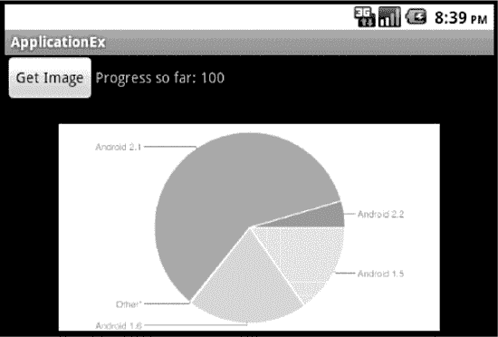

**图 11–1.** *使用 AsyncTask 下载图片（截至 2010 年 8 月 2 日的 Android 设备图表）*

布局非常简单。我们有一个按钮，旁边有一段文字消息。这段文字将是我们的进度消息。在其下方，我们为错误消息预留了空间，该消息的文本将被设置为红色。最后，我们还有一个放置图片的位置。

在我们的按钮回调方法 `doClick()` 中，我们需要实例化自定义 AsyncTask 类的一个新实例，并调用 `execute()` 方法。这也是你通常会使用的模式：实例化一个 AsyncTask 的扩展类，然后调用 `execute()` 方法。在我们的示例中，我们调用了一个 Google chart 服务，该服务接收数据值和标签名称，为我们创建一张图表图片，并将其作为 PNG 图片返回。但在启动任务之前，我们确实应该检查是否已有任务在运行。如果用户双击了按钮，我们可能会最终得到两个后台任务。幸运的是，`AsyncTask` 类允许我们检查其状态。如果 `diTask` 不为 `null`，则可能当前有一个正在运行的任务。因此，我们检查 `AsyncTask` 的状态。如果状态不是 `FINISHED`，则该任务要么是 `RUNNING`，要么是 `PENDING` 且即将运行。因此，只有当存在一个任务且该任务已经是 `FINISHED` 状态时，我们才希望继续执行并创建一个新的 `AsyncTask`。当然，如果之前的 `AsyncTask` 已经成功下载了图片，我们可能不想再次下载。但对于我们的示例，我们还是会继续重新获取它。

在我们的示例应用程序运行时，你应该会注意到在按下按钮后进度消息会更新，然后图片出现。在进度消息开始改变*之前*，按钮会从按下状态恢复到正常状态。这是一个重要的观察点，因为它意味着我们的主线程在下载进行期间已经返回来管理用户界面了。

为了测试，可以随意修改调用 Google chart 的 URL 字符串，使其造成一个错误情况。然后，再次运行应用程序。你应该会看到类似图 11-2 的结果。

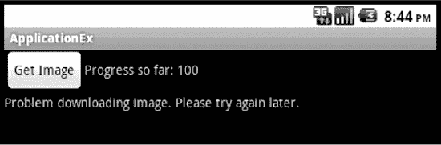

**图 11–2.** *使用 AsyncTask 将异常传回用户界面*

关于 `AsyncTask`，还有几点需要了解。一旦我们实例化了 `AsyncTask` 的扩展类并启动了 `execute()` 方法，我们的主线程就会继续执行。但我们仍然保留对任务的引用，并可以从主线程对其进行操作。例如，我们可以调用 `cancel()` 来终止它。我们可以调用 `isCancelled()` 来检查它是否已被取消。我们可能希望修改 `onPostExecute()` 中的逻辑来处理这些取消操作。并且 `AsyncTask` 有两种形式的 `get()` 方法，我们可以通过它们从 `doInBackground()` 获取结果，而无需让 `onPostExecute()` 来完成我们的工作。`get()` 的一种形式会阻塞，另一种形式则使用超时值来防止调用线程等待过长时间。

一个 `AsyncTask` 只能运行一次。因此，如果你保留了对 `AsyncTask` 的引用，请不要在它上面多次调用 `execute()`。如果你这样做，将会收到一个异常。你可以自由创建 `AsyncTask` 的新实例，但每个实例只能执行一次。这就是为什么我们每次需要时都创建一个新的 `DownloadImageTask`。


#### 使用 AsyncTask 处理配置变更

但关于 `AsyncTask`，还有一件重要的事情需要了解。在我们之前的示例中，如果启动 `AsyncTask` 的 Activity 被销毁并重新创建，我们的 `AsyncTask` 将无法正常工作。这是一个非常关键的问题。显然，如果我们的 `onPostExecute()` 回调针对的是原有 Activity，但在应用中该 Activity 已被新 Activity 取代，那么我们的 `AsyncTask` 将会更新用户不可见的视图。Activity 被销毁并重新创建的情况真的会发生吗？实际上，这种情况一直在发生。每当设备的配置发生变化时，例如当设备从纵向模式旋转为横向模式时，我们的 Activity 就会被销毁并重新创建。

请记住，当 Android 创建用户界面时，它会利用设备的配置来决定使用哪些布局和资源。这个过程相当复杂，因此 Android 最简单快捷的做法是销毁当前 Activity，然后用新配置重新创建它。幸运的是，一切并非无法挽回，尤其是我们的 `AsyncTask`。因为我们的 `AsyncTask` 运行在应用程序的独立线程中，所以当新 Activity 创建时，它仍然存在。我们需要做的是重新建立两者之间的联系，这样我们的 `AsyncTask` 就能在新 Activity 上找到相应的视图。Activity 中有一个回调和一种方法可以帮助我们实现这一点，它们分别是 `onRetainNonConfigurationInstance()` 和 `getLastNonConfigurationInstance()`。基本上，这两个方法的作用是将一个对象从旧 Activity 传递给新 Activity。

**列表 11–12.** *处理重建的新版 `HttpActivity.java`*

```
import android.app.Activity;
import android.os.AsyncTask;
import android.os.Bundle;
import android.util.Log;
import android.view.View;

public class HttpActivity extends Activity {
    private DownloadImageTask diTask;

    @Override
    public void onCreate(Bundle savedInstanceState)
    {
        super.onCreate(savedInstanceState);
        setContentView(R.layout.main);

        // 以下代码检查我们是否在重启一个后台运行的 AsyncTask。
        // 如果是，则重新建立连接。
        // 同时，由于图像未在销毁/创建周期中保存，
        // 如果 AsyncTask 已经完成，则从 AsyncTask 中重新获取已下载的图像。
        if( (diTask =
            (DownloadImageTask)getLastNonConfigurationInstance())
              != null)
        {
            diTask.setContext(this);  // 将新的 Activity 引用
                                      // 传递给 AsyncTask
            if(diTask.getStatus() == AsyncTask.Status.FINISHED)
                diTask.setImageInView();
        }
    }

    public void doClick(View view) {
        if(diTask != null) {
            AsyncTask.Status diStatus = diTask.getStatus();
            Log.v("doClick", "diTask status is " + diStatus);
            if(diStatus != AsyncTask.Status.FINISHED) {
                Log.v("doClick", "... no need to start a new task");
                return;
            }
            // 由于 diStatus 必须是 FINISHED，我们可以重试。
        }
          diTask = new DownloadImageTask(this);
           diTask.execute("http://chart.apis.google.com/chart?&cht=p&chs=460x250&chd=t:15.3,20.3,0.2,59.7,4.5&chl=Android%201.5%7CAndroid%201.6%7COther*%7CAndroid%202.1%7CAndroid%202.2&chco=c4df9b,6fad0c");
    }

    // 这个方法在 onDestroy() 之前被调用。我们希望将
    // AsyncTask 的引用传递出去。
    @Override
    public Object onRetainNonConfigurationInstance() {
        return diTask;
    }
}
```

这段代码与列表 11–11 中的 `HttpActivity` 非常相似，不同之处在于，这次我们调用了 `getLastNonConfigurationInstance()` 来检查是否有一个来自 `HttpActivity` 旧实例的 `DownloadImageTask` 对象在等待我们。如果找到了，我们需要给它一个新的 Activity 引用，以便它能找到新的视图。请参阅列表 11–13 了解新 `DownloadImageTask` 的代码。一旦我们在 `DownloadImageTask` 中设置了新的上下文，我们会检查任务是否已完成，因为它可能在 `HttpActivity` 重建期间就已经完成了。如果已完成，我们会使用 `setImageInView()` 方法来更新我们的图像——稍后会详细介绍。

你应该会注意到，我们的按钮处理器 `doClick()` 与之前完全相同。但现在，我们实现了 `onRetainNonConfigurationInstance()` 回调，它只需返回一个要传递出去的对象即可。在我们的例子中，我们只关心 `DownloadImageTask`，所以只需传递它即可。如果需要传递更多内容，我们需要构造一个对象来容纳所有这些内容，然后再传递出去。这些都是基本的 Java 对象，所以我们不必担心序列化或 Parcel 的问题（本章稍后会详细介绍 Parcel）。我们只是将 `AsyncTask` 传递到未来，以便稍后能重新与之建立连接。

**列表 11–13.** *处理重建的新版 `DownloadImageTask.java`*

```
import java.io.IOException;
import org.apache.http.HttpResponse;
import org.apache.http.client.HttpClient;
import org.apache.http.client.methods.HttpGet;
import org.apache.http.params.BasicHttpParams;
import org.apache.http.params.HttpConnectionParams;
import org.apache.http.params.HttpParams;
import org.apache.http.util.EntityUtils;
import android.app.Activity;
import android.content.Context;
import android.graphics.Bitmap;
import android.graphics.BitmapFactory;
import android.os.AsyncTask;
import android.util.Log;
import android.widget.ImageView;
import android.widget.TextView;

public class DownloadImageTask extends AsyncTask<String, Integer, Bitmap> {
    private Context mContext;  // 调用方 Activity 的引用
    int progress = -1;
    Bitmap downloadedImage = null;

    DownloadImageTask(Context context) {
        mContext = context;
    }

    // 从主线程调用以重新建立连接
    protected void setContext(Context context) {
        mContext = context;
        if(progress >= 0) {
            publishProgress(this.progress);
        }
    }

    protected void onPreExecute() {
        progress = 0;
        // 在 doInBackground() 运行之前，
        // 我们可以在这里做一些其他的设置工作
    }

    protected Bitmap doInBackground(String... urls)
    {
        Log.v("doInBackground", "doing download of image...");
        return downloadImage(urls);
    }

    protected void onProgressUpdate(Integer... progress) {
        TextView mText = (TextView)
                ((Activity) mContext).findViewById(R.id.text);
        mText.setText("Progress so far: " + progress[0]);
    }

    protected void onPostExecute(Bitmap result) {
        if(result != null) {
            downloadedImage = result;
            setImageInView();
        }
        else {
            TextView errorMsg = (TextView)
                ((Activity) mContext).findViewById(R.id.errorMsg);
            errorMsg.setText("Problem downloading image. Please try later.");
        }
    }

    public Bitmap downloadImage(String... urls)
    {
      HttpClient httpClient = CustomHttpClient.getHttpClient();
      try {
        HttpGet request = new HttpGet(urls[0]);
        HttpParams params = new BasicHttpParams();
        HttpConnectionParams.setSoTimeout(params, 60000);   // 1 分钟
        request.setParams(params);

        setProgress(25);

        HttpResponse response = httpClient.execute(request);

        setProgress(50);
```


`sleepFor(5000);    // 休眠五秒`

`byte[] image = EntityUtils.toByteArray(response.getEntity());`

`setProgress(75);`

`Bitmap mBitmap = BitmapFactory.decodeByteArray(image, 0,
                             image.length);`

`setProgress(100);`

`return mBitmap;`
`      } catch (IOException e) {`
`        // 涵盖以下异常：`
`        //      ClientProtocolException`
`        //      ConnectTimeoutException`
`        //      ConnectionPoolTimeoutException`
`        //      SocketTimeoutException`
`        e.printStackTrace();`
`      }`
`      return null;`
`    }`

`    private void setProgress(int progress) {`
`        this.progress = progress;`
`        publishProgress(this.progress);`
`    }`

`    protected void setImageInView() {`
`        if(downloadedImage != null) {`
`            ImageView mImage = (ImageView)
                ((Activity) mContext).findViewById(R.id.image);`
`            mImage.setImageBitmap(downloadedImage);`
`        }`
`    }`

`    private void sleepFor(long msecs) {`
`        try {`
`            Thread.sleep(msecs);`
`        } catch (InterruptedException e) {`
`            Log.v("sleep", "interrupted");`
`        }`
`    }`
`}`

现在可以运行这个示例了。我们在`AsyncTask`中增加了一段 5 秒的延迟，目的是让你在后台任务运行时有机会旋转屏幕。要旋转模拟器，请按下键盘上的`Ctrl+F11`。你会看到界面旋转后自行修正。每次旋转时，图片会消失（如果之前可见），然后随着代码的运行重新出现。你可以在操作的不同时间点旋转屏幕，观察不同的效果。甚至可以回到之前的`AsyncTask`示例，添加延迟步骤，并尝试旋转，你会发现它*不会*像用户期望的那样工作。接下来，让我们深入分析新代码的工作原理。

这次的`AsyncTask`扩展类与之前有所不同。

在配置变更中，有几件事需要我们处理。首先，你需要知道，我们的`AsyncTask`需要获得新的 Activity 引用，这样它才能在`onProgressUpdate()`和`onPostExecute()`中更新相应的视图。当旧的 Activity 被销毁时，旧的引用也失效了。我们需要一个新的引用。如果我们之前在`onPreExecute()`中操作了用户界面，也需要在那里获取新 Activity 的引用。我们新增了一个名为`setContext()`的方法，允许 Activity 更新与我们之间的上下文，这样我们就能在需要时找到视图。

其次，我们处理进度更新的方式略有不同。我们保留了一个进度成员变量，在`setContext()`和`setProgress()`方法中都可以引用它。现在，我们在`downloadImage()`方法的适当位置调用`setProgress()`。当从新的 Activity 重新建立连接时，我们想立即显示当前进度，所以在`setContext()`中调用了`publishProgress()`。

第三，图片不会在销毁/创建周期中保持不变。如果在`AsyncTask`完成之前 Activity 被重新创建，我们没问题，因为`onPostExecute()`会设置新的位图。但是，如果`AsyncTask`早已完成，然后我们旋转设备，Activity 会被重新创建，但图片不会被设置。我们也可以重新从服务器下载图片，但在本例中，我们选择使用名为`downloadedImage`的新成员变量来保存位图，并提供了一个新的受保护方法`setImageInView()`来将位图重新附加到`ImageView`上。如前所述，你不希望在`AsyncTask`内部持有像`View`这样的用户界面元素。这就是为什么我们保存的是位图，而不是`ImageView`。我们不想通过持有旧 Activity 中视图的引用来导致内存泄漏。

### 使用 DownloadManager 获取文件

在某些情况下，你的应用可能需要下载一个大文件到设备上。由于这可能需要一段时间，并且过程可以标准化，Android 2.3 引入了一个专门管理此类操作的类：`DownloadManager`。`DownloadManager`的目的是通过后台线程将大文件下载到设备本地位置，以满足`DownloadManager.Request`。你可以配置`DownloadManager`向用户提供下载通知。

在我们的下一个示例应用中，我们将使用`DownloadManager`下载其中一个 Android SDK ZIP 文件。这个示例项目将包含以下文件：

* `res/layout/main.xml`（列表 11–14）
* `MainActivity.java`（列表 11–15）
* `AndroidManifest.xml`（列表 11–16）

**列表 11–14.** *使用`DownloadManager`：`/res/layout/main.xml`*

```xml
<?xml version="1.0" encoding="utf-8"?>
<LinearLayout
    android:orientation="vertical"
    android:layout_width="fill_parent"
    android:layout_height="fill_parent" >
<Button android:onClick="doClick" android:text="Start"
    android:layout_width="wrap_content"
    android:layout_height="wrap_content" />
<TextView  android:id="@+id/tv"
    android:layout_width="fill_parent"
    android:layout_height="wrap_content" />
</LinearLayout>
```

我们的布局很简单，包含一个按钮和一个文本视图。按钮将启动下载，我们会在文本视图中显示一些消息，以指示下载的开始和结束。用户界面如图 11–3 所示。

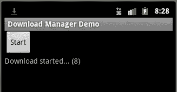

**图 11–3.** *DownloadManagerDemo 示例应用的用户界面*

下一个列表展示了此应用的 Java 代码。

**列表 11–15.** *使用`DownloadManager`：`MainActivity.java`*

```java
import android.app.Activity;
import android.app.DownloadManager;
import android.content.BroadcastReceiver;
import android.content.Context;
import android.content.Intent;
import android.content.IntentFilter;
import android.net.Uri;
import android.os.Bundle;
import android.util.Log;
import android.view.View;
import android.widget.TextView;

public class MainActivity extends Activity {
    protected static final String TAG = "DownloadMgr";
    private DownloadManager dMgr;
    private TextView tv;
    private long downloadId;

    /** 当 Activity 首次创建时调用。 */
    @Override
    public void onCreate(Bundle savedInstanceState) {
        super.onCreate(savedInstanceState);
        setContentView(R.layout.main);

        tv = (TextView)findViewById(R.id.tv);
    }

    @Override
    protected void onResume() {
        super.onResume();
        dMgr = (DownloadManager) getSystemService(DOWNLOAD_SERVICE);
    }

    public void doClick(View view) {
        DownloadManager.Request dmReq = new DownloadManager.Request(
            Uri.parse(
                "http://dl-ssl.google.com/android/repository/" +
                "platform-tools_r01-linux.zip"));
        dmReq.setTitle("平台工具");
        dmReq.setDescription("Linux 版本下载");
        dmReq.setAllowedNetworkTypes(DownloadManager.Request.NETWORK_MOBILE);

        IntentFilter filter = new IntentFilter(DownloadManager.ACTION_DOWNLOAD_COMPLETE);
        registerReceiver(mReceiver, filter);

        downloadId = dMgr.enqueue(dmReq);

        tv.setText("下载已开始... (" + downloadId + ")");
    }
```


```java
public BroadcastReceiver mReceiver = new BroadcastReceiver() {
    public void onReceive(Context context, Intent intent) {
        Bundle extras = intent.getExtras();
        long doneDownloadId = extras.getLong(DownloadManager.EXTRA_DOWNLOAD_ID);
        tv.setText(tv.getText() + "\nDownload finished (" + doneDownloadId + ")");
        if(downloadId == doneDownloadId)
            Log.v(TAG, "Our download has completed.");
    }
};

@Override
protected void onPause() {
    super.onPause();
    unregisterReceiver(mReceiver);
    dMgr = null;
}
```

本应用的代码非常直观。首先，我们初始化主视图，然后获取文本视图的引用。在 `onResume()` 方法中，我们获取 `DOWNLOAD_SERVICE` 服务的引用。请注意，我们在 `onPause()` 方法中取消了对该服务的引用。按钮点击方法 `doClick()` 使用我们要下载的 ZIP 文件的路径，创建了一个新的 `DownloadManager.Request` 对象。我们还设置了下载的标题、描述和允许的网络类型。还有更多选项可供选择；详情请参阅文档。

仅仅为了演示目的，我们选择使用移动网络进行下载，但你也可以只选择 WiFi（使用 `NETWORK_WIFI` 代替 `NETWORK_MOBILE`），或者将两个值进行“或”运算，以允许两种网络。默认情况下，两种网络都允许下载，这意味着在我们的示例应用中，即使有 WiFi 可用，我们也只想使用移动网络进行下载。

设置好请求对象后，我们为广播接收器创建一个过滤器并进行注册。我们稍后会介绍广播接收器的代码。通过注册接收器，任何下载完成时我们都会收到通知。这意味着我们需要跟踪请求的 ID，该 ID 在我们对 `DownloadManager` 调用 `enqueue()` 时返回。最后，我们更新 UI 中的状态消息，以表示下载已开始。

为使本应用能够运行，我们需要指定几个权限，如 清单 11–16 中的 `AndroidManifest.xml` 文件所示，以允许我们的应用访问互联网并将文件写入 SD 卡。Android 2.3 的一个奇怪之处是，如果你没有按照 清单 11–16 指定权限，你会收到一条错误消息，抱怨缺少 `ACCESS_ALL_DOWNLOADS` 权限，而本示例中甚至不需要这个权限。

**清单 11–16.** *使用 DownloadManager: AndroidManifest.xml*

```xml
<?xml version="1.0" encoding="utf-8"?>
<manifest
      package="com.androidbook.services.download"
      android:versionCode="1"
      android:versionName="1.0">
    <application android:icon="@drawable/icon" android:label="@string/app_name">
        <activity android:name=".MainActivity"
                  android:label="@string/app_name">
            <intent-filter>
                <action android:name="android.intent.action.MAIN" />
                <category android:name="android.intent.category.LAUNCHER" />
            </intent-filter>
        </activity>
    </application>
    <uses-sdk android:minSdkVersion="9" />
    <uses-permission android:name="android.permission.INTERNET" />
    <uses-permission android:name="android.permission.WRITE_EXTERNAL_STORAGE" />
</manifest>
```

运行此应用时，它应显示按钮。点击按钮将启动下载操作并显示消息，如 图 11–3 所示。请注意，屏幕左上角的通知栏中有一个下载图标。如果你向下拖动下载图标，将看到一个类似 图 11–4 的通知窗口。

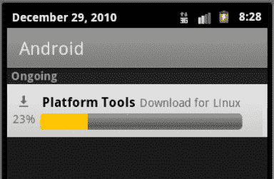

**图 11–4** *. 通知列表中的下载项*

该通知表示有下载在后台进行。下载完成后，此通知项将被清除，并且我们会在应用中看到一条额外的消息，如 图 11–5 所示。

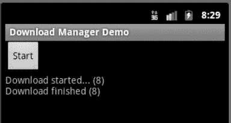

**图 11–5.** *应用显示下载已完成*

在我们的广播接收器中，我们查询 intent 以找出完成的下载是否是我们的。如果是，我们就在 UI 中更新状态消息，这就是我们所做的一切。请记住，我们不能在广播接收器中做太多处理，因为我们必须快速从 `onReceive()` 方法返回。例如，我们可以改为调用一个服务来处理已下载的文件。在该服务中，我们可以调用类似 清单 11–17 的代码来获取文件内容。

**清单 11–17.** *读取已下载的文件*

```java
try {
    ParcelFileDescriptor pfd = dMgr.openDownloadedFile(doneDownloadId);
    // 现在我们有了一个对已下载文件的只读句柄
    // 继续读取文件...
} catch (FileNotFoundException e) {
    e.printStackTrace();
}
```

定位已下载文件的一种方法是使用 `DownloadManager` 服务，我们需要指定下载 ID 来获取相应的文件。如 清单 11–17 所示。`DownloadManager` 类负责将下载 ID 解析为实际文件。虽然我们的示例将文件下载到 SD 卡的公共区域，但实际上你可以使用 `DownloadManager.Request` 的某个 `setDestination*()` 方法，将文件下载到应用在 SD 卡上的私有数据区域。

`DownloadManager` 有自己的应用程序，你也可以通过它来查看已下载的文件。在 Android 设备或模拟器的应用程序菜单中，查找如 图 11–6 所示的图标。


**图 11–6.** *Downloads 应用图标*

你可以使用 Downloads 应用程序来获取已下载的文件。现在就去试试吧。当你启动 Downloads 应用程序时，你将看到一个类似 图 11–7 的界面。实际上，在你点击复选框选择特定下载项（就像我们截图前所做的那样）之前，屏幕底部是没有菜单的。

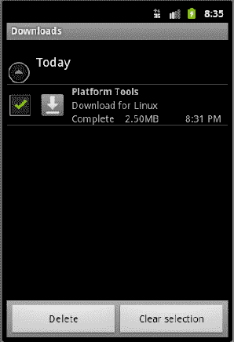

**图 11–7.** *Downloads 应用程序*

`DownloadManager` 包含一个用于下载文件信息的内容提供者。Downloads 应用程序只是访问这个内容提供者，向用户显示可用下载列表。这意味着你也可以在你的应用程序中查询这个内容提供者以获取下载信息。为此，你需要使用 `DownloadManager.Query` 对象以及 `DownloadManager` 的 `query()` 方法。不过，搜索选项并不多。你可以按下载 ID（一个或多个）搜索，或者按下载状态搜索。`query()` 方法返回的结果是一个 `Cursor` 对象，可用于查询 `DownloadManager` 内容提供者中的数据行。可用的列在 `DownloadManager` 的文档中列出，包括已下载文件的本地 `Uri`、字节数、文件的媒体类型、下载状态等。当你以这种方式访问内容提供者时，需要将 `ACCESS_ALL_DOWNLOADS` 权限添加到你的 `AndroidManifest.xml` 文件中。

最后，你可以使用 `DownloadManager` 的 `remove()` 方法来取消下载，但如果文件已下载完成，此方法不会删除该文件。


我们已向您展示了如何操作基于 HTTP 的服务，并演示了如何使用名为 `AsyncTask` 的特殊类来管理这些服务的接口。`AsyncTask` 的典型用例是执行一些会持续一段时间但不会太长的操作，并且该操作的结果应该以某种方式直接影响用户界面。但是，如果我们想运行一些持续时间较长的后台处理，或者想调用其他应用程序中存在的非 UI 功能，该怎么办？针对这些需求，Android 提供了服务。我们接下来将讨论它们。

### 使用 Android 服务

Android 支持服务的概念。服务是在后台运行、没有用户界面的组件。您可以将这些组件视为类似于 Windows 服务或 Unix 守护进程。与这些类型的服务类似，Android 服务可以始终可用，但不一定非要在积极执行某些操作。更重要的是，Android 服务可以拥有与活动（Activity）分离的生命周期。当活动暂停、停止或被销毁时，您可能希望某些处理能够继续。服务也很适合这种情况。

Android 支持两种类型的服务：本地服务和远程服务。*本地服务*是只能被其宿主应用程序访问的服务，设备上运行的其他应用程序无法访问它。通常，这类服务仅支持其宿主应用程序。*远程服务*除了可以被其宿主应用程序访问外，也可以被设备上的其他应用程序访问。远程服务使用 Android 接口定义语言（AIDL）向客户端定义自身。我们将讨论这两种类型的服务，尽管在接下来的几章中，我们将深入探讨本地服务。因此，我们会在此处介绍它们，但不会花太多时间。我们将在本章中更详细地介绍远程服务。

#### 理解 Android 中的服务

Android 的 `Service` 类本质上是一个包装器，用于封装具有服务行为的代码。与我们之前介绍的 `AsyncTask` 不同，`Service` 对象不会自动创建自己的线程。要让 `Service` 对象使用线程，开发者必须手动实现。这意味着，在不添加线程的情况下，服务的代码将在主线程上运行。如果我们的服务执行的操作能很快完成，那么这不会有问题。但如果我们的服务可能会运行一段时间，我们绝对需要引入线程。请记住，在服务内部使用 `AsyncTask` 来进行线程处理并没有任何不妥。

Android 支持服务概念的原因有两个。

*   首先，是为了让你能够轻松地实现后台任务。
*   其次，是为了让你能够在同一设备上运行的应用程序之间进行进程间通信。

这两个原因对应了 Android 支持的两种服务类型：本地服务和远程服务。第一个原因的示例可能是作为电子邮件应用程序一部分实现的本地服务。该服务可以处理向电子邮件服务器发送新电子邮件，包括附件和重试机制。由于这可能需要一些时间才能完成，因此服务是封装该功能的一种好方法，这样主线程可以启动它并立即响应用户。此外，即使电子邮件活动（Activity）消失了，你仍然希望已发送的邮件能被成功送达。第二个原因的示例（我们稍后会看到）是一个语言翻译应用程序。假设你设备上运行着多个应用程序，并且需要一个服务来接收需要从一种语言翻译成另一种语言的文本。与其在每个应用程序中重复相同的逻辑，不如编写一个远程翻译服务，让这些应用程序与该服务通信。

本地服务和远程服务之间存在一些重要差异。具体来说，如果一个服务严格由同一进程内的组件使用，那么客户端必须通过调用 `Context.startService()` 来启动该服务。这种类型的服务是本地服务，因为它的目的通常是为其宿主应用程序运行后台任务。如果服务支持 `onBind()` 方法，那么它是一个可以通过进程间通信（`Context.bindService()`）调用的远程服务。我们也称远程服务为 *AIDL 支持服务*，因为客户端使用 AIDL 与服务通信。

尽管 `android.app.Service` 的接口同时支持本地服务和远程服务，但提供单一的服务实现来同时支持两种类型并不是一个好主意。原因在于，每种类型的服务都有预定义的生命周期；虽然允许将两者混合，但这可能会导致错误。

现在，我们可以开始详细研究这两种类型的服务了。我们将首先讨论本地服务，然后讨论远程服务（AIDL 支持服务）。如前所述，本地服务是仅由其宿主应用程序调用的服务。远程服务是支持远程过程调用（RPC）机制的服务。这些服务允许同一设备上的外部客户端连接到该服务并使用其功能。

**注意：** Android 中的第二种服务有多个名称：远程服务、AIDL 支持服务、AIDL 服务、外部服务和 RPC 服务。这些术语都指代同一类型的服务——一种旨在被设备上运行的其他应用程序远程访问的服务。


好的，作为一名高级文档工程师和翻译员，我将遵循您提供的注意事项和示例，将以下英文文本翻译成中文。


#### 理解本地服务

本地服务是通过 `Context.startService()` 启动的服务。一旦启动，这类服务将持续运行，直到客户端调用 `Context.stopService()` 或服务自身调用 `stopSelf()`。请注意，当调用 `Context.startService()` 且服务尚未创建时，系统会实例化该服务并调用其 `onStartCommand()` 方法。请记住，在服务已启动（即已存在）后再次调用 `Context.startService()` 不会创建另一个服务实例，但会重新调用正在运行的服务的 `onStartCommand()` 方法。以下是本地服务的几个示例：

*   一个监控设备传感器数据并进行分析的服务，当满足特定条件时发出警报。此服务可能会持续运行。
*   一个任务执行服务，允许您应用的 Activity 提交作业并将其排队等待处理。此服务可能仅在提交作业的操作期间运行。

清单 11–18 通过实现一个执行后台任务的服务来演示本地服务。我们将需要创建四个工件来创建和使用该服务：`BackgroundService.java`（服务本身）、`main.xml`（Activity 的布局文件）、`MainActivity.java`（用于调用该服务的 Activity 类）和 `AndroidManifest.xml`。清单 11–18 仅包含 `BackgroundService.java`。我们将先剖析这段代码，然后再介绍其他三个。此实现需要 Android 2.0 或更高版本。

**清单 11–18.** *实现一个本地服务：BackgroundService.java*

```
import android.app.Notification;
import android.app.NotificationManager;
import android.app.PendingIntent;
import android.app.Service;
import android.content.Intent;
import android.os.IBinder;
import android.util.Log;

public class BackgroundService extends Service
{
    private static final String TAG = "BackgroundService";
    private NotificationManager notificationMgr;
    private ThreadGroup myThreads = new ThreadGroup("ServiceWorker");

    @Override
    public void onCreate() {
        super.onCreate();

        Log.v(TAG, "in onCreate()");
        notificationMgr =(NotificationManager)getSystemService(
               NOTIFICATION_SERVICE);
        displayNotificationMessage("Background Service is running");
    }

    @Override
    public int onStartCommand(Intent intent, int flags, int startId) {
        super.onStartCommand(intent, flags, startId);

        int counter = intent.getExtras().getInt("counter");
        Log.v(TAG, "in onStartCommand(), counter = " + counter +
                ", startId = " + startId);

        new Thread(myThreads, new ServiceWorker(counter),
            "BackgroundService")
                .start();

        return START_STICKY;
    }

    class ServiceWorker implements Runnable
    {
        private int counter = -1;
        public ServiceWorker(int counter) {
            this.counter = counter;
        }

        public void run() {
            final String TAG2 = "ServiceWorker:" +
                Thread.currentThread().getId();
            // do background processing here... we'll just sleep...
            try {
                Log.v(TAG2, "sleeping for 10 seconds. counter = " +
                    counter);
                Thread.sleep(10000);
                Log.v(TAG2, "... waking up");
            } catch (InterruptedException e) {
                Log.v(TAG2, "... sleep interrupted");
            }
        }
    }

    @Override
    public void onDestroy()
    {
        Log.v(TAG, "in onDestroy(). Interrupting threads and cancelling notifications");
        myThreads.interrupt();
        notificationMgr.cancelAll();
        super.onDestroy();
    }

    @Override
    public IBinder onBind(Intent intent) {
        Log.v(TAG, "in onBind()");
        return null;
    }

    private void displayNotificationMessage(String message)
    {
        Notification notification =
            new Notification(R.drawable.emo_im_winking,
                message, System.currentTimeMillis());

        notification.flags = Notification.FLAG_NO_CLEAR;

        PendingIntent contentIntent =
            PendingIntent.getActivity(this, 0,
                new Intent(this, MainActivity.class), 0);

        notification.setLatestEventInfo(this, TAG, message,
            contentIntent);

        notificationMgr.notify(0, notification);
    }
}
```

`Service` 对象的结构与 Activity 有些相似。它有一个 `onCreate()` 方法，您可以在其中进行初始化；还有一个 `onDestroy()` 方法，用于进行清理。在 Android 2.0 之前，服务有一个 `onStart()` 方法，从 2.0 开始，它被称为 `onStartCommand()`。两者的区别在于后者增加了一个 `flags` 参数，用于向服务指明某个 Intent 正在被重新投递，或者服务应该重启。在我们的示例中，使用的是 `onStartCommand()` 版本。服务不像 Activity 那样有暂停或恢复的生命周期，所以不会看到 `onPause()` 或 `onResume()` 方法。由于这是一个本地服务，我们不会绑定到它，但 `Service` 要求实现 `onBind()` 方法，因此我们提供了一个仅返回 `null` 的实现。

回到我们的 `onCreate()` 方法，除了通知用户此服务已创建之外，我们不需要做太多事情。我们使用 `NotificationManager` 来实现这一点。您可能已经注意到 Android 屏幕左上角的通知栏。通过下拉此栏，用户可以查看重要消息，点击通知即可对通知进行操作，这通常意味着返回到与通知相关的某个 Activity。对于服务，由于它们可能在后台运行（或至少存在）而没有可见的 Activity，因此必须有某种方式让用户能够重新与服务联系，例如关闭它。因此，我们创建一个 `Notification` 对象，为其填充一个 `PendingIntent`（这将使我们能够返回到控制 Activity），并将其发布出去。所有这些都在 `displayNotificationMessage()` 方法中完成。我们还需要做的一件事情是在 `Notification` 对象上设置一个标志，使用户无法从列表中清除它。只要我们的服务存在，我们就确实需要该 `Notification` 存在，因此我们设置 `Notification.FLAG_NO_CLEAR` 将其保留在通知列表中，直到我们自己在服务的 `onDestroy()` 方法中清除它。我们在 `onDestroy()` 中用于清除通知的方法是 `NotificationManager` 上的 `cancelAll()`。

为了使此示例正常工作，您还需要做另一件事。您需要创建一个名为 `emo_im_winking` 的可绘制对象，并将其放置在项目的 `drawable` 文件夹中。出于演示目的，可绘制对象的一个好的来源是查看 Android 平台文件夹 `Android SDK/platforms/<version>/data/res/drawable`，其中 `<version>` 是您感兴趣的版本。不幸的是，您无法像使用布局那样在代码中引用 Android 系统可绘制对象，因此您需要将所需的内容复制到项目的 drawables 文件夹中。如果您为示例选择了不同的可绘制对象文件，只需在 `Notification` 的构造函数中重命名资源 ID 即可。


当使用 `startService()` 将意图发送到我们的服务时，必要时会调用 `onCreate()`，然后调用我们的 `onStartCommand()` 方法来接收调用者的意图。在我们的场景中，除了解包计数器并用它启动后台线程外，我们不会对它做任何特殊处理。在真实的服务中，我们期望任何数据都通过意图传递给我们，例如可能包含 URIs。注意在创建 `Thread` 时使用了 `ThreadGroup`。这将在我们后续想要销毁后台线程时证明非常有用。还要注意 `startId` 参数。这是 Android 为我们设置的，并且自该服务启动以来，它是服务调用的唯一标识符。

我们的 `ServiceWorker` 类是一个典型的可运行对象，是服务执行实际任务的地方。在我们的特定案例中，我们只是记录一些消息并让线程休眠。我们还捕获任何中断并记录它们。我们没有做的一件事是操作用户界面。例如，我们没有更新任何视图。由于我们不再位于主线程，因此不能直接接触 UI。`ServiceWorker` 有办法影响用户界面的变化，我们将在接下来的几章中详细讨论这些内容。

在 `BackgroundService` 中最后需要注意的一项是 `onDestroy()` 方法。这是我们执行清理的地方。对于我们的示例，我们希望销毁之前创建的线程（如果它们仍然存在）。如果不这样做，它们可能会一直存在并占用内存。其次，我们希望移除通知消息。由于服务正在关闭，用户不再需要通过活动来消除通知。然而，在真实的应用中，我们可能希望保持工作线程继续工作。如果我们的服务正在发送电子邮件，我们当然不想简单地杀死线程。我们的示例过于简单，因为我们通过使用 `interrupt()` 方法暗示可以轻松杀死后台线程。但实际上，你最多只能中断线程。这并不一定会杀死线程。有一些已弃用的方法可以杀死线程，但你不应该使用它们。它们可能对你和你的用户造成内存和稳定性问题。中断在我们的示例中有效，因为我们执行的是可以被中断的休眠操作。

值得研究一下 `ThreadGroup` 类，因为它提供了获取线程的方法。我们在服务中创建了一个单一的 `ThreadGroup` 对象，然后在创建各个线程时使用了它。在服务的 `onDestroy()` 方法中，我们只需在 `ThreadGroup` 上调用 `interrupt()`，它就会向 `ThreadGroup` 中的每个线程发出中断信号。

这就构成了一个简单本地服务的雏形。在我们展示活动的代码之前，清单 11–19 展示了我们用户界面的 XML 布局文件。

**清单 11–19.** *实现本地服务：main.xml*

```
<?xml version="1.0" encoding="utf-8"?>
<!-- 此文件为 /res/layout/main.xml -->
<LinearLayout
    android:orientation="vertical"
    android:layout_width="fill_parent"
    android:layout_height="fill_parent"
    >
<Button  android:id="@+id/startBtn"
    android:layout_width="wrap_content"
    android:layout_height="wrap_content"
    android:text="启动服务"  android:onClick="doClick" />
<Button  android:id="@+id/stopBtn"
    android:layout_width="wrap_content"
    android:layout_height="wrap_content"
    android:text="停止服务"  android:onClick="doClick" />

</LinearLayout>
```

我们将在用户界面上显示两个按钮，一个用于执行 `startService()`，另一个用于执行 `stopService()`。我们本可以选择使用 ToggleButton，但那样就无法连续多次调用 `startService()` 了。这是一个重要的点。`startService()` 和 `stopService()` 之间不是一一对应的关系。当 `stopService()` 被调用时，服务对象将被销毁，并且从所有 `startServices()` 中创建的所有线程也应该消失。对于我们的示例，由于我们使用的是较新的 `onStartCommand()` 而不是较旧的 `onStart()`，因此需要 `minSdkVersion` 为 5。因此，我们还可以利用布局 XML 文件中 `Button` 标签的 `android:onClick` 属性。现在，让我们看看清单 11–20 中我们活动的代码。

**清单 11–20.** *实现本地服务：MainActivity.java*

```
// MainActivity.java
import android.app.Activity;
import android.content.Intent;
import android.os.Bundle;
import android.util.Log;
import android.view.View;

public class MainActivity extends Activity
{
    private static final String TAG = "MainActivity";
    private int counter = 1;

    @Override
    public void onCreate(Bundle savedInstanceState)
    {
        super.onCreate(savedInstanceState);
        setContentView(R.layout.main);
    }

    public void doClick(View view) {
        switch(view.getId()) {
        case R.id.startBtn:
            Log.v(TAG, "正在启动服务... 计数器 = " + counter);
            Intent intent = new Intent(MainActivity.this,
                    BackgroundService.class);
            intent.putExtra("counter", counter++);
            startService(intent);
            break;
        case R.id.stopBtn:
            stopService();
        }
    }

    private void stopService() {
        Log.v(TAG, "正在停止服务...");
        if(stopService(new Intent(MainActivity.this,
                    BackgroundService.class)))
            Log.v(TAG, "stopService 已成功");
        else
            Log.v(TAG, "stopService 未成功");
    }

    @Override
    public void onDestroy()
    {
        stopService();
        super.onDestroy();
    }
}
```

我们的 `MainActivity` 看起来很像你见过的其他活动。有一个简单的 `onCreate()` 用于从 `main.xml` 布局文件设置用户界面。有一个 `doClick()` 方法用于处理按钮回调。在我们的示例中，当按下“启动服务”按钮时调用 `startService()`，当按下“停止服务”按钮时调用 `stopService()`。当我们启动服务时，我们希望传入一些数据，我们通过意图来实现这一点。我们选择将数据放在 Extras bundle 中，但如果我们有 URI，也可以使用 `setData()` 来添加。当我们停止服务时，我们检查返回结果。通常应为 true，但如果服务没有运行，我们可能会得到 false 的返回值。最后，当我们的活动终止时，我们希望停止服务，因此我们也在 `onDestroy()` 方法中停止服务。还有一项需要讨论，那就是 `AndroidManifest.xml` 文件，如清单 11–21 所示。

**清单 11–21.** *实现本地服务：AndroidManifest.xml*


```xml
<?xml version="1.0" encoding="utf-8"?>
<manifest
      package="com.androidbook.services.simplelocal"
      android:versionCode="1"
      android:versionName="1.0">
    <application android:icon="@drawable/icon"
             android:label="@string/app_name">
        <activity android:name=".MainActivity"
              android:label="@string/app_name"
              android:launchMode="singleTop" >
         <intent-filter>
           <action android:name="android.intent.action.MAIN" />
           <category android:name="android.intent.category.LAUNCHER" />
         </intent-filter>
      </activity>
      <service android:name="BackgroundService"/>
  </application>
  <uses-sdk android:minSdkVersion="5" />
</manifest>
```

在清单文件中，除了常规的 `<activity>` 标签外，我们现在还添加了一个 `<service>` 标签。由于这是一个本地服务，我们通过类名显式调用它，因此 `<service>` 标签中无需添加过多内容，只需指定服务名称即可。但关于这个清单文件，还有一点需要指出：我们的服务会创建一条通知，以便在例如用户在 `MainActivity` 上按下 Home 键但未停止服务时，用户能通过该通知返回 `MainActivity`。

`MainActivity` 仍然存在，只是不可见。返回 `MainActivity` 的一种方法是点击我们服务创建的通知。我们不希望看到的现象是，在已有不可见的 `MainActivity` 之外，再创建一个新的 `MainActivity`。为了防止这种情况发生，我们在清单文件中为 `MainActivity` 设置了一个名为 `android:launchMode` 的属性，并将其值设为 `singleTop`。这将有助于确保现有不可见的 `MainActivity` 被带到前台并显示，而不是创建另一个 `MainActivity`。

当你运行此应用程序时，会看到两个按钮。点击“启动服务”按钮，即可实例化该服务并调用 `onStartCommand()`。我们的代码会向 LogCat 输出多条日志消息，方便你跟踪了解。请连续点击“启动服务”按钮数次，甚至快速点击。你会看到为处理每个请求而创建的线程。你还会注意到 counter 的值被传递给了每个 `ServiceWorker` 线程。当你按下“停止服务”按钮时，我们的服务将终止，你会看到来自 `MainActivity` 的 `stopService()` 方法、来自 `BackgroundService` 的 `onDestroy()` 方法的日志消息，如果 `ServiceWorker` 线程被中断，还可能看到来自它们的日志消息。

你还应该注意到服务启动时的通知消息。在服务运行的情况下，从 `MainActivity` 按下返回键，你会看到通知消息消失。这意味着我们的服务也已终止。要重新启动 `MainActivity`，点击“启动服务”按钮再次启动服务。现在，按下 Home 键。我们的 `MainActivity` 从视图中消失，但通知仍然存在，这意味着我们的服务仍在运行。点击通知，你将再次看到我们的 `MainActivity`。

请注意，我们的示例使用 Activity 与服务交互，但你应用程序中的任何组件都可以使用该服务。这包括其他服务、Activity、通用类等等。同时请注意，我们的服务不会自行停止，它依赖于 Activity 来代为执行。服务有一些方法可以使其自行停止，即 `stopSelf()` 和 `stopSelfResult()`。

我们的 `BackgroundService` 是一个典型示例，演示了由托管该服务的应用程序中的组件所使用的服务。换句话说，运行该服务的应用程序也是其唯一的消费者。由于该服务不支持其进程外部的客户端，因此它是一个本地服务。因为是本地服务（与远程服务相对），它在 `bind()` 方法中返回 `null`。因此，绑定到此服务的唯一方法是调用 `Context.startService()`。本地服务的关键方法包括 `onCreate()`、`onStartCommand()`、`stop*()` 和 `onDestroy()`。

本地服务还有另一种选择，适用于你只希望拥有一个后台线程的单个服务实例的情况。在这种情况下，在 `BackgroundService` 的 `onCreate()` 方法中，我们可以创建一个执行繁重任务的线程。我们可以在 `onCreate()` 中创建并启动该线程，而不是在 `onStartCommand()` 中。之所以可以这样做，是因为 `onCreate()` 只会被调用一次，并且我们希望线程在服务的生命周期内只被创建一次。不过，在 `onCreate()` 中我们不会获得由 `startService()` 传递的 intent 内容。如果需要这些内容，我们还是使用前面描述的模式，并且只需知道 `onStartCommand()` 应该只被调用一次即可。

到此，我们完成了对本地服务的介绍。请记住，我们将在后续章节中更详细地介绍本地服务。接下来，让我们进入 AIDL 服务——这种更复杂的服务类型。

#### 理解 AIDL 服务

在上一节中，我们向你展示了如何编写一个由托管它的应用程序消费的 Android 服务。现在，我们将向你展示如何构建一个可以被其他进程通过远程过程调用（RPC）消费的服务。与许多其他基于 RPC 的解决方案一样，在 Android 中，你需要一种接口定义语言（IDL）来定义将向客户端暴露的接口。在 Android 世界中，这种 IDL 被称为 Android 接口定义语言（AIDL）。要构建一个远程服务，你需要执行以下操作：

1.  编写一个 AIDL 文件，定义你向客户端暴露的接口。AIDL 文件使用 Java 语法，扩展名为 `.aidl`。在你的 AIDL 文件中使用与你的 Android 项目包名相同的包名。
2.  将 AIDL 文件添加到 Eclipse 项目的 `src` 目录下。Android Eclipse 插件将调用 AIDL 编译器，根据 AIDL 文件生成一个 Java 接口（AIDL 编译器作为构建过程的一部分被调用）。
3.  实现一个服务，并从 `onBind()` 方法返回该接口。
4.  将服务配置添加到你的 `AndroidManifest.xml` 文件中。后续章节将演示如何执行每个步骤。

#### 在 AIDL 中定义服务接口

为了演示远程服务的示例，我们将编写一个股票报价服务。该服务将提供一个方法，该方法接收股票代码并返回股票价值。要在 Android 中编写远程服务，第一步是在 AIDL 文件中定义服务接口。清单 11–22 显示了 `IStockQuoteService` 的 AIDL 定义。该文件放置的位置与你的 `StockQuoteService` 项目中常规 Java 文件的位置相同。

**清单 11–22.** *股票报价服务的 AIDL 定义*

```java
// 此文件为 IStockQuoteService.aidl
package com.androidbook.services.stockquoteservice;
interface IStockQuoteService
{
        double getQuote(String ticker);
}
```

`IStockQuoteService` 接受股票代码作为字符串，并返回当前股票价值作为 double 类型。当你创建 AIDL 文件时，Android Eclipse 插件会运行 AIDL 编译器来处理你的 AIDL 文件（作为构建过程的一部分）。如果你的 AIDL 文件编译成功，编译器会生成一个适用于 RPC 通信的 Java 接口。请注意，生成的文件将位于你 AIDL 文件中命名的包内——本例中为 `com.androidbook.services.stockquoteservice`。

清单 11–23 显示了为我们的 `IStockQuoteService` 接口生成的 Java 文件。生成的文件将放入我们 Eclipse 项目的 gen 文件夹中。

**清单 11–23.** *编译器生成的 Java 文件*


```aidl
/*
 * 此文件为自动生成。请勿修改。
 * 原始文件：C:\android\StockQuoteService\src\com\androidbook\
services\stockquoteservice\IStockQuoteService.aidl
 */
package com.androidbook.services.stockquoteservice;
import java.lang.String;
import android.os.RemoteException;
import android.os.IBinder;
import android.os.IInterface;
import android.os.Binder;
import android.os.Parcel;
public interface IStockQuoteService extends android.os.IInterface
{
/** 本地端 IPC 实现的桩类。 */
public static abstract class Stub extends android.os.Binder implements
com.androidbook.services.stockquoteservice.IStockQuoteService
{
private static final java.lang.String DESCRIPTOR =
"com.androidbook.services.stockquoteservice.IStockQuoteService";
/** 构造桩并将其附加到接口。 */
public Stub()
{
this.attachInterface(this, DESCRIPTOR);
}
/**
 * 将 IBinder 对象转换为 IStockQuoteService 接口，
 * 必要时生成代理。
 */
public static com.androidbook.services.stockquoteservice.IStockQuoteService
asInterface(android.os.IBinder obj)
{
if ((obj==null)) {
return null;
}
android.os.IInterface iin = (android.os.IInterface)obj.queryLocalInterface(DESCRIPTOR);
if (((iin!=null)&&(iin instanceof com.androidbook.services.stockquoteservice.IStockQuoteService))) {
return ((com.androidbook.services.stockquoteservice.IStockQuoteService)iin);
}
return ((com.androidbook.services.stockquoteservice.IStockQuoteService)iin);
}
return new com.androidbook.services.stockquoteservice.IStockQuoteService.Stub.Proxy(obj);
}
public android.os.IBinder asBinder()
{
return this;
}
@Override public boolean onTransact(int code, android.os.Parcel data,
     android.os.Parcel reply, int flags) throws android.os.RemoteException
{
switch (code)
{
case INTERFACE_TRANSACTION:
{
reply.writeString(DESCRIPTOR);
return true;
}
case TRANSACTION_getQuote:
{
data.enforceInterface(DESCRIPTOR);
java.lang.String _arg0;
_arg0 = data.readString();
double _result = this.getQuote(_arg0);
reply.writeNoException();
reply.writeDouble(_result);
return true;
}
}
return super.onTransact(code, data, reply, flags);
}
private static class Proxy implements
        com.androidbook.services.stockquoteservice.IStockQuoteService
{
private android.os.IBinder mRemote;
Proxy(android.os.IBinder remote)
{
mRemote = remote;
}
public android.os.IBinder asBinder()
{
return mRemote;
}
public java.lang.String getInterfaceDescriptor()
{
return DESCRIPTOR;
}
public double getQuote(java.lang.String ticker) throws android.os.RemoteException
{
android.os.Parcel _data = android.os.Parcel.obtain();
android.os.Parcel _reply = android.os.Parcel.obtain();
double _result;
try {
_data.writeInterfaceToken(DESCRIPTOR);
_data.writeString(ticker);
mRemote.transact(Stub.TRANSACTION_getQuote, _data, _reply, 0);
_reply.readException();
_result = _reply.readDouble();
}
finally {
_reply.recycle();
_data.recycle();
}
return _result;
}
}
static final int TRANSACTION_getQuote = (IBinder.FIRST_CALL_TRANSACTION + 0);
}
public double getQuote(java.lang.String ticker) throws android.os.RemoteException;
}
```

关于生成的类，需要注意以下几点重要事项：

*   我们在 AIDL 文件中定义的接口在生成的代码中被实现为一个接口（即存在一个名为 `IStockQuoteService` 的接口）。
*   一个名为 `Stub` 的 `static final` 抽象类继承自 `android.os.Binder` 并实现了 `IStockQuoteService`。请注意，该类是一个抽象类。
*   一个名为 `Proxy` 的内部类实现了 `IStockQuoteService`，它是 `Stub` 类的代理。
*   AIDL 文件必须位于预期生成文件的包中（如 AIDL 文件的包声明中所指定）。

现在，让我们继续在服务类中实现 AIDL 接口。


#### 实现 AIDL 接口

在上一节中，我们为股票报价服务定义了一个 AIDL 文件并生成了绑定文件。现在，我们将为该服务提供具体的实现。为了实现服务的接口，我们需要编写一个继承自 `android.app.Service` 并实现 `IStockQuoteService` 接口的类。我们将要编写的类称为 `StockQuoteService`。为了将服务暴露给客户端，`StockQuoteService` 需要提供 `onBind()` 方法的实现，并且我们需要在 `AndroidManifest.xml` 文件中添加一些配置信息。清单 11–24 展示了 `IStockQuoteService` 接口的实现。该文件同样放置于 `StockQuoteService` 项目的 `src` 文件夹中。

**清单 11–24.** *`IStockQuoteService` 服务的实现*

```
// StockQuoteService.java
import android.app.Service;
import android.content.Intent;
import android.os.IBinder;
import android.os.RemoteException;
import android.util.Log;

public class StockQuoteService extends Service
{
    private static final String TAG = "StockQuoteService";
    public class StockQuoteServiceImpl extends IStockQuoteService.Stub
    {
        @Override
        public double getQuote(String ticker) throws RemoteException
        {
            Log.v(TAG, "getQuote() called for " + ticker);
            return 20.0;
        }
    }

    @Override
    public void onCreate() {
        super.onCreate();
        Log.v(TAG, "onCreate() called");
    }

    @Override
    public void onDestroy()
    {
        super.onDestroy();
        Log.v(TAG, "onDestroy() called");
    }

    @Override
    public IBinder onBind(Intent intent)
    {
        Log.v(TAG, "onBind() called");
        return new StockQuoteServiceImpl();
    }
}
```

清单 11–24 中的 `StockQuoteService.java` 类与我们之前创建的本地 `BackgroundService` 类似，但去掉了 `NotificationManager`。重要的区别在于我们实现了 `onBind()` 方法。回顾一下，从 AIDL 文件生成的 `Stub` 类是一个抽象类，并且实现了 `IStockQuoteService` 接口。在我们的服务实现中，有一个内部类 `StockQuoteServiceImpl` 继承自 `Stub` 类。此类充当远程服务的实现，并且 `onBind()` 方法会返回该类的实例。至此，我们拥有一个可运行的 AIDL 服务，但外部客户端尚无法连接到它。

为了将服务暴露给客户端，我们需要在 `AndroidManifest.xml` 文件中添加服务声明，并且这次需要添加一个意图过滤器来暴露服务。清单 11–25 展示了 `StockQuoteService` 的服务声明。`<service>` 标签是 `<application>` 标签的子元素。

**清单 11–25.** *`IStockQuoteService` 的清单声明*

```
<?xml version="1.0" encoding="utf-8"?>
<manifest
      package="com.androidbook.services.stockquoteservice"
      android:versionCode="1"
      android:versionName="1.0">
    <application android:icon="@drawable/icon"
        android:label="@string/app_name">
      <service android:name="StockQuoteService">
        <intent-filter>
                <action android:name="com.androidbook.services.stockquoteservice.IStockQuoteService" />
        </intent-filter>
      </service>
    </application>
    <uses-sdk android:minSdkVersion="4" />
</manifest>
```

与所有服务一样，我们通过 `<service>` 标签定义要暴露的服务。对于 AIDL 服务，还需要添加一个包含 `<action>` 条目的 `<intent-filter>`，指向要暴露的服务接口。

完成这些配置后，我们就拥有了部署服务所需的一切。当你准备从 Eclipse 部署此服务应用时，只需像运行其他任何应用一样选择“Run As”即可。Eclipse 会在控制台中评论该应用没有启动器，但它仍会部署应用，这正是我们期望的效果。现在，让我们看看如何从另一个应用程序（当然是在同一设备上）调用此服务。


##### 从客户端应用程序调用服务

当客户端与服务通信时，双方必须存在协议或契约。在 Android 中，契约体现在我们的 AIDL 文件中。因此，使用服务的第一步是获取服务的 AIDL 文件并将其复制到客户端项目中。当你将 AIDL 文件复制到客户端项目时，AIDL 编译器会创建与实现服务时（在服务实现项目中）相同的接口定义文件。这会向客户端暴露服务中的所有方法、参数和返回类型。让我们创建一个新项目并复制 AIDL 文件。

1.  创建一个名为 `StockQuoteClient` 的新 Android 项目。使用不同的包名，例如 `com.androidbook.stockquoteclient`。在“创建 Activity”字段中使用 `MainActivity`。
2.  在此项目的 `src` 目录中创建一个名为 `com.androidbook.services.stockquoteservice` 的新 Java 包。
3.  将 `StockQuoteService` 项目中的 `IStockQuoteService.aidl` 文件复制到这个新包中。请注意，将文件复制到项目后，AIDL 编译器将生成关联的 Java 文件。

你重新生成的服务接口充当客户端和服务之间的契约。下一步是获取对服务的引用，以便我们可以调用 `getQuote()` 方法。对于远程服务，我们必须调用 `bindService()` 方法，而不是 `startService()` 方法。清单 11–26 展示了一个充当 `IStockQuoteService` 服务客户端的 Activity 类。清单 11–27 包含了该 Activity 的布局文件。

清单 11–26 展示了我们的 `MainActivity.java` 文件。请注意，客户端 Activity 的包名并不重要——你可以将 Activity 放在任何你想要的包中。但是，你创建的 AIDL 产物是与包相关的，因为 AIDL 编译器会根据 AIDL 文件的内容生成代码。

**清单 11–26.** *IStockQuoteService 服务的客户端*

```
// 此文件为 MainActivity.java
import com.androidbook.services.stockquoteservice.IStockQuoteService;
import android.app.Activity;
import android.content.ComponentName;
import android.content.Context;
import android.content.Intent;
import android.content.ServiceConnection;
import android.os.Bundle;
import android.os.IBinder;
import android.os.RemoteException;
import android.util.Log;
import android.view.View;
import android.widget.Button;
import android.widget.Toast;
import android.widget.ToggleButton;

public class MainActivity extends Activity {
    private static final String TAG = "StockQuoteClient";
    private IStockQuoteService stockService = null;
    private ToggleButton bindBtn;
    private Button callBtn;

    /** 当 Activity 首次创建时调用。 */
    @Override
    public void onCreate(Bundle savedInstanceState) {
        super.onCreate(savedInstanceState);
        setContentView(R.layout.main);

        bindBtn = (ToggleButton)findViewById(R.id.bindBtn);
        callBtn = (Button)findViewById(R.id.callBtn);
    }

    public void doClick(View view) {
        switch(view.getId()) {
        case R.id.bindBtn:
            if(((ToggleButton) view).isChecked()) {
                bindService(new Intent(
                    IStockQuoteService.class.getName()),
                    serConn, Context.BIND_AUTO_CREATE);
            }
            else {
                unbindService(serConn);
                callBtn.setEnabled(false);
            }
            break;
        case R.id.callBtn:
            callService();
            break;
        }
    }

    private void callService() {
        try {
            double val = stockService.getQuote("ANDROID");
            Toast.makeText(MainActivity.this,
                    "来自服务的值为 " + val,
                    Toast.LENGTH_SHORT).show();
        } catch (RemoteException ee) {
            Log.e("MainActivity", ee.getMessage(), ee);
        }
    }

    private ServiceConnection serConn = new ServiceConnection() {

        @Override
        public void onServiceConnected(ComponentName name,
            IBinder service)
        {
            Log.v(TAG, "调用了 onServiceConnected()");
            stockService = IStockQuoteService.Stub.asInterface(service);
            bindBtn.setChecked(true);
            callBtn.setEnabled(true);
        }

        @Override
        public void onServiceDisconnected(ComponentName name) {
            Log.v(TAG, "调用了 onServiceDisconnected()");
            bindBtn.setChecked(false);
            callBtn.setEnabled(false);
            stockService = null;
        }
    };

    protected void onDestroy() {
        Log.v(TAG, "调用了 onDestroy()");
        if(callBtn.isEnabled())
            unbindService(serConn);
        super.onDestroy();
    }
}
```

该 Activity 显示我们的布局，并获取对“调用服务”按钮的引用，以便我们能够在服务运行时正确启用它，并在服务停止时禁用它。当用户点击“绑定”按钮时，Activity 会调用 `bindService()` 方法。同样，当用户点击“取消绑定”时，Activity 会调用 `unbindService()` 方法。请注意，传递给 `bindService()` 方法的参数有三个：AIDL 服务的名称、一个 `ServiceConnection` 实例，以及一个自动创建服务的标志。

**清单 11–27.** *IStockQuoteService 服务客户端布局*

```
<?xml version="1.0" encoding="utf-8"?>
<!-- 此文件为 /res/layout/main.xml -->
<LinearLayout
    android:orientation="vertical"
    android:layout_width="fill_parent"
    android:layout_height="fill_parent" >

<ToggleButton android:id="@+id/bindBtn"
    android:layout_width="wrap_content"
    android:layout_height="wrap_content"
    android:textOff="绑定"  android:textOn="取消绑定"
    android:onClick="doClick" />

<Button android:id="@+id/callBtn"
    android:layout_width="wrap_content"
    android:layout_height="wrap_content"
    android:text="调用服务"  android:enabled="false"
    android:onClick="doClick" />
</LinearLayout>
```

对于 AIDL 服务，你需要提供 `ServiceConnection` 接口的实现。这个接口定义了两个方法：一个在系统建立与服务连接时调用，另一个在连接销毁时调用。在我们的 Activity 实现中，我们定义了一个私有的匿名成员，它实现了 `IStockQuoteService` 的 `ServiceConnection`。当我们调用 `bindService()` 方法时，我们传入对此成员的引用。当与服务建立连接时，会调用 `onServiceConnected()` 回调，然后我们使用 `Stub` 获取对 `IStockQuoteService` 的引用，并启用“调用服务”按钮。

请注意，`bindService()` 调用是一个异步调用。之所以是异步的，是因为进程或服务可能尚未运行，因此可能需要创建或启动。并且我们不能在主线程上等待服务启动。由于 `bindService()` 是异步的，平台提供了 `ServiceConnection` 回调，以便我们知道服务何时启动，以及服务何时不可用。


请注意`onServiceDisconnected()`回调。当我们从服务解除绑定时，该回调并*不*会被调用。它仅在服务崩溃时被调用。如果发生这种情况，我们不应认为我们仍处于连接状态，并且可能需要重新调用`bindService()`调用。这就是为什么当此回调被调用时，我们会更改 UI 中按钮状态的原因。但请注意，我们说的是“我们可能需要重新调用`bindService()`调用”。Android 可能会为我们重新启动服务，并调用我们的`onServiceConnected()`回调。你可以通过运行客户端、绑定到服务，并使用 DDMS 对“Stock Quote Service”应用程序执行“Stop”操作来亲自尝试。

运行此示例时，请观察 LogCat 中的日志消息，以了解幕后发生的情况。

现在你已经知道如何创建和使用 AIDL 接口了。在继续并使问题进一步复杂化之前，让我们回顾一下构建简单本地服务与 AIDL 服务所需的步骤。本地服务是一种不支持`onBind()`的服务——它从`onBind()`返回`null`。这种类型的服务仅对托管该服务的应用程序的组件可访问。你可以通过调用`startService()`来调用本地服务。

另一方面，AIDL 服务是一种可以被同一进程内的组件以及存在于其他应用程序中的组件使用的服务。这种类型的服务在 AIDL 文件中定义了自身与其客户端之间的契约。该服务实现 AIDL 契约，而客户端绑定到 AIDL 定义。服务通过从`onBind()`方法返回 AIDL 接口的实现来实现契约。客户端通过调用`bindService()`绑定到 AIDL 服务，并通过调用`unbindService()`断开与服务连接。

到目前为止，在我们服务的示例中，我们严格处理了传递简单的 Java 原始类型。实际上，Android 服务也支持传递复杂类型。这非常有用，特别是对于 AIDL 服务，因为你可能需要向服务传递数量不限的参数，而将它们全部作为简单原始类型传递是不合理的。将它们打包成复杂类型再传递给服务更合理。

让我们看看如何向服务传递复杂类型。

##### 向服务传递复杂类型

向服务传递复杂类型以及从服务接收复杂类型比传递 Java 原始类型需要更多工作。在开始这项工作之前，你应该了解 AIDL 对非原始类型的支持：

*   AIDL 支持`String`和`CharSequence`。
*   AIDL 允许你传递其他 AIDL 接口，但你需要为你引用的每个 AIDL 接口添加`import`语句（即使引用的 AIDL 接口位于同一个包中）。
*   AIDL 允许你传递实现了`android.os.Parcelable`接口的复杂类型。你需要在你的 AIDL 文件中为这些类型添加`import`语句。
*   AIDL 支持`java.util.List`和`java.util.Map`，但有一些限制。集合中项目允许的数据类型包括 Java 原始类型、`String`、`CharSequence`或`android.os.Parcelable`。你不需要为`List`或`Map`添加`import`语句，但你需要为`Parcelable`添加它们。
*   除`String`之外的非原始类型需要一个方向指示器。方向指示器包括`in`、`out`和`inout`。`in`表示值由客户端设置；`out`表示值由服务设置；`inout`表示客户端和服务都设置值。

`Parcelable`接口告诉 Android 运行时在编组和解组过程中如何序列化和反序列化对象。清单 11–28 显示了一个实现`Parcelable`接口的`Person`类。

**清单 11–28.** *实现 Parcelable 接口*

```
// This file is Person.java
package com.androidbook.services.stock2;
import android.os.Parcel;
import android.os.Parcelable;

public class Person implements Parcelable {
    private int age;
    private String name;
    public static final Parcelable.Creator<Person> CREATOR =
        new Parcelable.Creator<Person>()
    {
        public Person createFromParcel(Parcel in) {
            return new Person(in);
        }

        public Person[] newArray(int size) {
            return new Person[size];
        }
    };

    public Person() {
    }

    private Person(Parcel in) {
        readFromParcel(in);
    }

    @Override
    public int describeContents() {
        return 0;
    }

    @Override
    public void writeToParcel(Parcel out, int flags) {
        out.writeInt(age);
        out.writeString(name);
    }

    public void readFromParcel(Parcel in) {
        age = in.readInt();
        name = in.readString();
    }

    public int getAge() {
        return age;
    }

    public void setAge(int age) {
        this.age = age;
    }

    public String getName() {
        return name;
    }

    public void setName(String name) {
        this.name = name;
    }
}
```

要开始实现此功能，请在 Eclipse 中创建一个名为`StockQuoteService2`的新 Android 项目。对于“Create Activity”，使用名称`MainActivity`，并使用包`com.androidbook.services.stock2`。然后将上面的`Person.java`文件添加到我们新项目的`com.androidbook.services.stock2`包中。

`Parcelable`接口定义了在编组/解组过程中对象水合与脱水的契约。`Parcelable`接口的底层是`Parcel`容器对象。`Parcel`类是一种专为 Android 内部进程间通信设计的快速序列化/反序列化机制。该类提供了多种方法，你可用它们将成员扁平化到容器中，以及将成员从容器中展开。为了正确实现一个用于进程间通信的对象，我们必须执行以下操作：


```markdown

1.  实现`Parcelable`接口。这意味着你需要实现`writeToParcel()`和`readFromParcel()`方法。写入方法会将对象写入`Parcel`，读取方法则会从`Parcel`中读取对象。请注意，写入属性的顺序必须与读取它们的顺序一致。
2.  向类中添加一个名为`CREATOR`的`static final`属性。该属性需要实现`android.os.Parcelable.Creator<T>`接口。
3.  为`Parcelable`提供一个构造函数，该构造函数知道如何从`Parcel`创建对象。
4.  在`.aidl`文件中定义一个与包含复杂类型的`.java`文件相匹配的`Parcelable`类。当编译你的 AIDL 文件时，AIDL 编译器会查找此文件。`Person.aidl`文件的示例如代码清单 11-29 所示。该文件应与`Person.java`放在同一位置。

**注意：** 看到`Parcelable`可能会引发一个疑问：为什么 Android 不使用内置的 Java 序列化机制？事实证明，Android 团队得出的结论是，Java 中的序列化速度太慢，无法满足 Android 的进程间通信需求。因此，团队构建了`Parcelable`解决方案。`Parcelable`方法要求你显式序列化类的成员，但最终，你会获得更快的对象序列化速度。

同时请意识到，Android 提供了两种允许你将数据传递到另一个进程的机制。第一种是通过 Intent 将`Bundle`传递给 Activity，第二种是将`Parcelable`传递给 Service。这两种机制不可互换，也不应混淆。也就是说，`Parcelable`并非设计用于传递给 Activity。如果你想启动一个 Activity 并向其传递一些数据，请使用`Bundle`。`Parcelable`仅用作 AIDL 定义的一部分。

**代码清单 11-29.** *Person.aidl 文件示例*

```
// This file is Person.aidl
package com.androidbook.services.stock2;
parcelable Person;
```

你需要为项目中的每个`Parcelable`准备一个`.aidl`文件。在这个例子中，我们只有一个`Parcelable`，即`Person`。你可能会注意到，`gen`文件夹中没有生成`Person.java`文件。这是意料之中的。我们在之前创建该文件时已经拥有了它。

现在，让我们在远程服务中使用`Person`类。为简单起见，我们将修改`IStockQuoteService`，使其接受一个`Person`类型的输入参数。其思路是，客户端将向服务传递一个`Person`对象，以告知服务谁是报价请求者。新的`IStockQuoteService.aidl`文件如代码清单 11-30 所示。

**代码清单 11-30.** *向 Service 传递 Parcelable 对象*

```
// This file is IStockQuoteService.aidl
package com.androidbook.services.stock2;
import com.androidbook.services.stock2.Person;

interface IStockQuoteService
{
    String getQuote(in String ticker,in Person requester);
}
```

`getQuote()`方法现在接受两个参数：股票代码和指定请求者的`Person`对象。请注意，参数上有方向指示符，因为参数包含了非原始类型，并且我们为`Person`类添加了一个`import`语句。`Person`类与 Service 定义位于同一个包中（`com.androidbook.services.stock2`）。

Service 的实现现在如代码清单 11-31 所示，其布局如代码清单 11-32 所示。

**代码清单 11-31.** *StockQuoteService2 实现*

```
package com.androidbook.services.stock2;
// This file is StockQuoteService2.java

import android.app.Notification;
import android.app.NotificationManager;
import android.app.PendingIntent;
import android.app.Service;
import android.content.Intent;
import android.os.IBinder;
import android.os.RemoteException;

public class StockQuoteService2 extends Service
{
    private NotificationManager notificationMgr;

    public class StockQuoteServiceImpl extends IStockQuoteService.Stub
    {
        public String getQuote(String ticker, Person requester)
                throws RemoteException {
            return "Hello " + requester.getName() +
                "! Quote for " + ticker + " is 20.0";
        }
    }

    @Override
    public void onCreate() {
        super.onCreate();

        notificationMgr =
          (NotificationManager)getSystemService(NOTIFICATION_SERVICE);

        displayNotificationMessage(
              "onCreate() called in StockQuoteService2");
    }

    @Override
    public void onDestroy()
    {
        displayNotificationMessage(
              "onDestroy() called in StockQuoteService2");
        // Clear all notifications from this service
        notificationMgr.cancelAll();
        super.onDestroy();
    }

    @Override
    public IBinder onBind(Intent intent)
    {
        displayNotificationMessage(
              "onBind() called in StockQuoteService2");
        return new StockQuoteServiceImpl();
    }

    private void displayNotificationMessage(String message)
    {
        Notification notification =
            new Notification(R.drawable.emo_im_happy,
                message, System.currentTimeMillis());

        PendingIntent contentIntent =
            PendingIntent.getActivity(this, 0,
                new Intent(this, MainActivity.class), 0);

        notification.setLatestEventInfo(this,
            "StockQuoteService2", message,
            contentIntent);

        notification.flags = Notification.FLAG_NO_CLEAR;

        notificationMgr.notify(R.id.app_notification_id, notification);
    }
}
```

**代码清单 11-32.** *StockQuoteService2 布局*

```
<?xml version="1.0" encoding="utf-8"?>
<!-- This file is /res/layout/main.xml -->
<LinearLayout
    android:orientation="vertical"
    android:layout_width="fill_parent"
    android:layout_height="fill_parent" >
<TextView  
    android:layout_width="fill_parent"
    android:layout_height="wrap_content"
    android:text="This is where the service could ask for help." />
</LinearLayout>
```

此实现与先前实现的不同之处在于，我们重新引入了通知，并且现在将股票价值作为字符串（而非`double`）返回。返回给用户的字符串包含了来自`Person`对象的请求者名称，这证明了我们读取了客户端发送的值，并且`Person`对象已正确传递给 Service。

还有一些其他工作要做才能使其生效：

1.  从 Android `SDK/platforms/android-2.1/data/res/drawable-mdpi`目录下找到`emo_im_happy.png`图片文件，并将其复制到我们项目的`/res/drawable`目录中。或者修改代码中的资源名称，并将你想要的任何图片放入`drawables`文件夹。
2.  在`/res/values/strings.xml`文件中添加一个新的`<item type="id" name="app_notification_id"/>`标签。
3.  我们需要修改`AndroidManifest.xml`文件中的`<application>`，如代码清单 11-33 所示。

**代码清单 11-33.** *为 StockQuoteService2 修改 AndroidManifest.xml 文件中的`<application>`*

```


```xml
<?xml version="1.0" encoding="utf-8"?>
<manifest
      package="com.androidbook.services.stock2"
      android:versionCode="1"
      android:versionName="1.0">
    <application android:icon="@drawable/icon"
            android:label="@string/app_name">
        <activity android:name=".MainActivity"
                android:label="@string/app_name"
                android:launchMode="singleTop" >
            <intent-filter>
                <action android:name="android.intent.action.MAIN" />
            </intent-filter>
        </activity>
      <service android:name="StockQuoteService2">
        <intent-filter>
            <action android:name="com.androidbook.services.stock2.IStockQuoteService" />
        </intent-filter>
      </service>
    </application>
    <uses-sdk android:minSdkVersion="7" />
</manifest>
```

虽然针对 `android:name=".MainActivity"` 属性使用点号表示法是可行的，但在服务的 `<intent-filter>` 标签内部的 `<action>` 标签中使用点号表示法却不行。我们需要将其完整拼写出来；否则，客户端将无法找到服务的规格说明。

最后，我们将使用默认的 `MainActivity.java` 文件，该文件仅显示一个包含简单消息的基本布局。我们之前已经介绍过如何通过通知启动活动。在实际应用中，该活动也将实现此目的，但对于本示例，我们将保持这部分内容简洁。现在我们已经实现了服务，接下来创建一个名为 `StockQuoteClient2` 的新 Android 项目。使用 `com.dave` 作为包名，`MainActivity` 作为活动名称。为了实现一个能将 `Person` 对象传递给服务的客户端，我们需要将服务项目中客户端所需的所有内容复制到客户端项目中。在之前的示例中，我们只需要 `IStockQuoteService.aidl` 文件。现在，我们还需要复制 `Person.java` 和 `Person.aidl` 文件，因为 `Person` 对象已成为接口的一部分。将这 3 个文件复制到客户端项目后，根据代码清单 11-34 修改 `main.xml`，并根据代码清单 11-35 修改 `MainActivity.java`。或者直接从我们网站上的源代码导入此项目。

**代码清单 11–34.** *StockQuoteClient2 更新后的 main.xml*

```xml
<?xml version="1.0" encoding="utf-8"?>
<!-- This file is /res/layout/main.xml -->
<LinearLayout
    android:orientation="vertical"
    android:layout_width="fill_parent"
    android:layout_height="fill_parent" >

<ToggleButton android:id="@+id/bindBtn"
    android:layout_width="wrap_content"
    android:layout_height="wrap_content"
    android:textOff="绑定"  android:textOn="解绑"
    android:onClick="doClick" />

<Button android:id="@+id/callBtn"
    android:layout_width="wrap_content"
    android:layout_height="wrap_content"
    android:text="调用服务" android:enabled="false"
    android:onClick="doClick" />
</LinearLayout>
```

**代码清单 11–35.** *使用 Parcelable 调用服务*

```java
package com.dave;
// This file is MainActivity.java
import android.app.Activity;
import android.content.ComponentName;
import android.content.Context;
import android.content.Intent;
import android.content.ServiceConnection;
import android.os.Bundle;
import android.os.IBinder;
import android.os.RemoteException;
import android.util.Log;
import android.view.View;
import android.widget.Button;
import android.widget.Toast;
import android.widget.ToggleButton;

import com.androidbook.services.stock2.IStockQuoteService;
import com.androidbook.services.stock2.Person;

public class MainActivity extends Activity {

    protected static final String TAG = "StockQuoteClient2";
    private IStockQuoteService stockService = null;
    private ToggleButton bindBtn;
    private Button callBtn;

    /** 当活动首次被创建时调用。 */
    @Override
    public void onCreate(Bundle savedInstanceState) {
        super.onCreate(savedInstanceState);
        setContentView(R.layout.main);

        bindBtn = (ToggleButton)findViewById(R.id.bindBtn);
        callBtn = (Button)findViewById(R.id.callBtn);
    }

    public void doClick(View view) {
        switch(view.getId()) {
        case R.id.bindBtn:
            if(((ToggleButton) view).isChecked()) {
                bindService(new Intent(
                    IStockQuoteService.class.getName()),
                    serConn, Context.BIND_AUTO_CREATE);
            }
            else {
                unbindService(serConn);
                callBtn.setEnabled(false);
            }
            break;
        case R.id.callBtn:
            callService();
            break;
        }
    }

    private void callService() {
        try {
            Person person = new Person();
            person.setAge(47);
            person.setName("Dave");
            String response = stockService.getQuote("ANDROID", person);
            Toast.makeText(MainActivity.this,
                        "来自服务端的结果是："+response,
                        Toast.LENGTH_SHORT).show();
        } catch (RemoteException ee) {
            Log.e("MainActivity", ee.getMessage(), ee);
        }
    }

    private ServiceConnection serConn = new ServiceConnection() {

        @Override
        public void onServiceConnected(ComponentName name,
            IBinder service)
        {
            Log.v(TAG, "onServiceConnected() 被调用");
            stockService = IStockQuoteService.Stub.asInterface(service);
            bindBtn.setChecked(true);
            callBtn.setEnabled(true);
        }

        @Override
        public void onServiceDisconnected(ComponentName name) {
            Log.v(TAG, "onServiceDisconnected() 被调用");
            bindBtn.setChecked(false);
            callBtn.setEnabled(false);
            stockService = null;
        }
    };

    protected void onDestroy() {
        if(callBtn.isEnabled())
            unbindService(serConn);
        super.onDestroy();
    }
}
```

现在已经可以运行了。请记住，在将客户端发送到模拟器运行之前，需要先将服务发送到模拟器。用户界面应如图 11-8 所示。


**图 11–8.** *StockQuoteClient2 的用户界面*

让我们看看我们实现了什么。和之前一样，我们先绑定到服务，然后就可以调用服务方法。`onServiceConnected()` 方法会通知我们服务正在运行，因此我们可以启用“调用服务”按钮，从而让该按钮能够调用 `callService()` 方法。如图所示，我们创建了一个新的 `Person` 对象，并设置其 `Age` 和 `Name` 属性。接着执行服务调用并显示结果。结果如图 11-9 所示。


**图 11–9.** *使用 Parcelable 调用服务的结果*


请注意，当服务被调用时，你会在状态栏中收到一条通知。这来自服务本身。我们之前简要提到过通知是服务与用户沟通的一种方式。通常情况下，服务在后台运行，不会显示任何用户界面。但如果服务需要与用户交互呢？虽然你可能很想让服务直接启动一个活动（Activity），但服务*绝不应*直接调用活动。服务应创建一条通知，而用户应通过这条通知进入所需的活动。这在上一节的练习中已有演示。我们为服务定义了一个简单的布局和活动实现。当我们在服务内部创建通知时，我们在通知中设置了该活动。用户点击通知后，便会跳转到属于该服务的活动，从而允许用户与服务进行交互。

通知会被保存下来，你可以通过下拉 Android 主屏幕上的菜单并点击“通知”来查看它们。用户也可以从状态栏的通知图标向下拖动来查看通知。请注意，我们使用了 `setLatestEventInfo()` 方法调用，并且每条消息都重复使用了相同的 ID。这种组合意味着我们每次都会更新同一个通知，而不是创建新的通知条目。因此，如果你在多次点击“绑定”、“再次调用”和“解除绑定”后进入 Android 的“通知”屏幕，你会发现通知中只显示一条消息，且是 `BackgroundService` 最后一次发送的那条。如果我们使用不同的 ID，就可以有多条通知消息，并可以分别更新每条通知。此外，通知还可以设置额外的用户“提示”，例如声音、灯光和/或振动。

了解服务项目及其调用客户端的产物也很有帮助（参见图 11-10）。

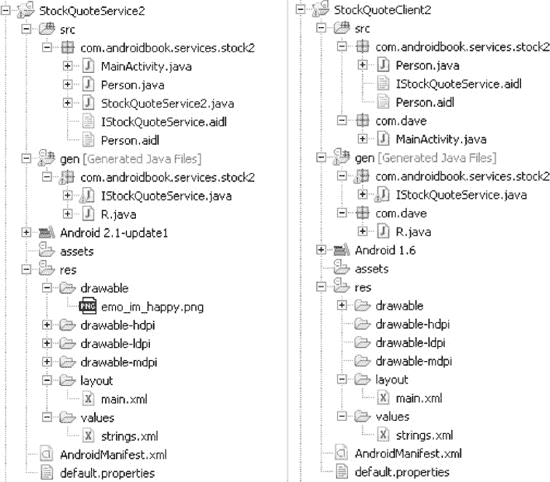

**图 11-10.** *服务与客户端的产物*

图 11-10 展示了服务（左侧）和客户端（右侧）的 Eclipse 项目产物。请注意，客户端与服务之间的契约由 AIDL 产物以及双方之间交换的 `Parcelable` 对象构成。这就是为什么我们在两边都看到了 `Person.java`、`IStockQuoteService.aidl` 和 `Person.aidl` 的原因。因为 AIDL 编译器会根据 AIDL 产物生成 Java 接口、桩（Stub）、代理（Proxy）等，所以当我们将契约产物复制到客户端项目时，构建过程会在客户端侧生成 `IStockQuoteService.java` 文件。

现在，你已经了解了如何在服务与客户端之间交换复杂类型。让我们简要谈谈调用服务的另一个重要方面：同步服务调用与异步服务调用。

你对服务进行的所有调用都是同步的。这自然会引出一个问题：你是否需要在工作线程中实现所有的服务调用？不一定。在大多数其他平台上，客户端通常会将服务视为一个完全的黑盒，因此在调用服务时必须采取适当的预防措施。但在 Android 中，你很可能知道服务内部的内容（通常因为你亲自编写了该服务），因此你可以做出明智的决定。如果你知道正在调用的方法会执行大量繁重任务，则应考虑使用辅助线程来进行调用。如果你确定该方法没有任何瓶颈，则可以在 UI 线程上安全地调用它。如果你认为最好在工作线程中进行服务调用，可以先创建线程，再调用服务，然后将结果传递回 UI 线程。

### 使用服务的实际案例

在本章中，我们展示了调用 HTTP 服务以及实现 Android 服务的多种方法。在本节中，我们将展示如何使用 Android 服务和 Google 翻译 API（一种基于 HTTP 的互联网服务）将文本从一种语言翻译成另一种语言——但首先，我们来了解一下 Google 翻译 API 的背景信息。


#### Google 翻译 API

将一种语言翻译成另一种语言并非易事，尤其在移动设备上更是如此。仅英语单词的数量就有数十万，甚至可能超过百万（具体取决于如何定义“英语”）。将语言数据和规则加载到移动设备上，以实现任意语言对之间的翻译，目前还不可行。

Google 在互联网上提供了一个用于翻译的 API。它接收一个文本字符串和一对语言参数（分别指定源语言和目标语言），然后将文本从源语言转换为目标语言。但有一个限制：该服务的原始设计目的是供网站调用，而非移动设备。Google AJAX 语言 API（其正式名称）的使用条款并未像 Google 地图 API 的使用条款那样，为 Android 设备提供单独的版本。要阅读 AJAX 语言 API 的使用条款，请访问以下链接：

`http://code.google.com/apis/ajaxlanguage/terms.html`

虽然 Google 是否明确希望 Android 开发者使用此 API 尚不完全清楚，但事实上，在 2009 年 5 月的 Google I/O 大会上，就已经有 Android 应用程序演示了该 API！或许当你读到本文时，Google 已经为 AJAX 语言 API 制定了适用于 Android 的单独使用条款，或者现有条款已经更新，以更明确地说明 Google 打算如何将其用于 Android。此外，Google Labs 中还有该翻译 API 的第 2 版本，请关注其进展。在此期间，你有几种选择：一是可以直接从你的 Android 应用程序中继续使用 AJAX 语言 API，我们接下来将向你展示如何操作；二是通过你自己控制的网络服务器（作为 AJAX 语言 API 的代理）来访问该 API。你的应用程序将与你的网络服务器交互，再由网络服务器向 AJAX 语言 API 发起调用。由于你的网络服务器位于中间层，你可以控制两者之间的关键节点，因此禁用应用程序对 AJAX 语言 API 的访问会变得容易得多。当然，如果你无法再使用 Google 的服务，你能做的也很有限，无法保证应用程序继续正常运行。至少，你可以在应用程序中内置某种响应机制，向用户提示 Google 服务已不可用，从而显示合适的消息。对于前一种情况，如果 Google 要求你停止使用 AJAX 语言 API，你基本上无能为力；你的应用程序已经分发到设备上，除非你已内置了禁用 API 的方法，否则这些设备将继续尝试使用该 API。

Google 有权禁用你的访问，但这对其而言可能有些困难。Google 在使用条款中并未说明你需要使用 API 密钥才能调用 AJAX 语言 API，尽管开发者文档（[`http://code.google.com/apis/ajaxlanguage/documentation/`](http://code.google.com/apis/ajaxlanguage/documentation/)）指出你*必须*使用一个 `REFERER`（引用来源），并且*应该*使用一个 API 密钥。如果没有这些信息，你的请求将以匿名方式从用户设备发出，当你的 API 使用出现问题时，Google 也无法联系到你。我们在示例中将 `REFERER` 标头设置为特定值（参见 `Translator.java` 代码），但跳过了 API 密钥部分。如果你想向 AJAX 语言 API 发送 API 密钥值，首先需要从 Google 获取一个密钥。请注意，你不应将地图 API 的密钥复用于 AJAX 语言 API。要注册 AJAX API 密钥，你只需提交你网站的 URL（与你在 `REFERER` 中使用的完全相同）并同意使用条款即可。拿到新的 API 密钥后，你可以通过以下代码片段将其添加到 AJAX API 的 URL 中：

`&key=Your_API_key_goes_here_with_no_quotation_marks`

如果你决定向 AJAX API 传递 API 密钥，则 `REFERER` 必须设置为创建 API 密钥时所用的相同 URL，或者该 URL 下的某个子页面。否则，你将无法获取返回结果。


#### 使用 Google 翻译 API

在本节的剩余部分，我们将帮助您构建一个直接调用 Google AJAX Language API 的应用程序。在本书的前面部分，我们已经向您展示了将翻译功能集成到应用程序中所需的所有独立组件。现在，我们将把它们整合到一起。在这个示例中，我们将创建一个应用程序，它包含一个用于输入的 `EditText`，使用下拉列表（Spinner）选择翻译的源语言和目标语言，一个用于显示翻译结果的只读 `EditText`，通过互联网调用服务，并使用一个服务来将 UI 与可能耗时较长的业务逻辑隔离开。我们需要在这个应用程序中包含的一个额外组件是 Jakarta Commons Lang 项目，专门用于将 XML 实体编码转码为 Unicode 以便显示。我们将在代码清单之后介绍如何实现这一点。请参考图 11-11 查看其外观。

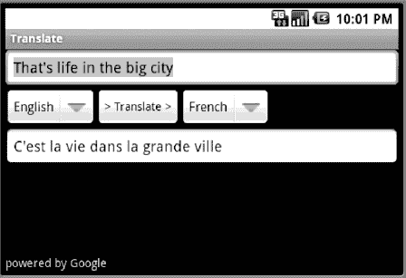

**图 11-11.** *翻译演示 UI*

对于代码，我们有以下文件：

- `/res/layout/main.xml`（代码清单 11-36）
- `/res/values/strings.xml`（代码清单 11-37）
- `/res/values/arrays.xml`（代码清单 11-38）
- `/src` 目录下的 `ITranslate.aidl`（代码清单 11-39）
- `MainActivity.java`（代码清单 11-40）
- `TranslateService.java`（代码清单 11-41）处理服务语义
- `Translator.java`（代码清单 11-42）实际调用 Google 服务的位置
- `AndroidManifest.xml`（代码清单 11-43）

对于这个示例应用程序，我们选择使用 `HttpURLConnection` 类而不是之前的 `HttpClient`，这样您可以看到这个其他类在实际应用程序中是如何使用的。

#### 代码清单 11-36. 实现翻译演示的 XML 和 Java 代码

```
<?xml version="1.0" encoding="utf-8"?>
<!-- This file is /res/layout/main.xml -->
<RelativeLayout
    android:orientation="vertical"
    android:layout_height="fill_parent"
    android:layout_width="fill_parent">

    <EditText android:id="@+id/input"  android:hint="@string/input"
        android:layout_height="wrap_content"
        android:layout_width="fill_parent" />

    <Spinner android:id="@+id/from"
        android:layout_weight="1"
        android:layout_width="wrap_content"
        android:layout_height="wrap_content"
        android:layout_below="@id/input"
        android:prompt="@string/prompt" />

    <Button android:id="@+id/translateBtn"
        android:text="@string/translateBtn"
        android:layout_weight="1"
        android:layout_width="wrap_content"
        android:layout_height="wrap_content"
        android:layout_below="@id/input"
        android:layout_toRightOf="@id/from"
        android:enabled="false" />

    <Spinner android:id="@+id/to"
        android:layout_weight="1"
        android:layout_width="wrap_content"
        android:layout_height="wrap_content"
        android:layout_below="@id/input"
        android:layout_toRightOf="@id/translateBtn"
        android:prompt="@string/prompt" />

    <EditText android:id="@+id/translation"
        android:hint="@string/translation"
        android:layout_height="wrap_content"
        android:layout_width="fill_parent"
        android:editable="false"
        android:layout_below="@id/from" />

    <TextView android:id="@+id/poweredBy"
        android:text="powered by Google"
        android:layout_width="wrap_content"
        android:layout_height="wrap_content"
        android:layout_alignParentBottom="true" />

</RelativeLayout>
```

#### 代码清单 11-37. 翻译应用程序的字符串资源

```
<?xml version="1.0" encoding="utf-8"?>
<!-- This file is /res/values/strings.xml -->
<resources>
    <string name="translateBtn">>  翻译  ></string>
    <string name="input">输入要翻译的文字</string>
    <string name="translation">翻译结果将显示在此处</string>
    <string name="prompt">选择一种语言</string>
</resources>
```

#### 代码清单 11-38. 翻译应用程序的数组资源

```
<?xml version="1.0" encoding="utf-8"?>
<!-- This file is /res/values/arrays.xml -->
<resources>
<string-array name="languages">
    <item>中文</item>
    <item>英语</item>
    <item>法语</item>
    <item>德语</item>
    <item>日语</item>
    <item>西班牙语</item>
</string-array>
<string-array name="language_values">
    <item>zh</item>
    <item>en</item>
    <item>fr</item>
    <item>de</item>
    <item>ja</item>
    <item>es</item>
</string-array>
</resources>
```

#### 代码清单 11-39. 翻译服务 AIDL 文件

```
// This file is ITranslate.aidl under /src
interface ITranslate {
    String translate(in String text, in String from, in String to);
}
```

#### 代码清单 11-40. 主要翻译应用程序：MainActivity.java

```
// This file is MainActivity.java
import android.app.Activity;
import android.content.ComponentName;
import android.content.Context;
import android.content.Intent;
import android.content.ServiceConnection;
import android.os.Bundle;
import android.os.Handler;
import android.os.IBinder;
import android.util.Log;
import android.view.View;
import android.view.View.OnClickListener;
import android.widget.ArrayAdapter;
import android.widget.Button;
import android.widget.EditText;
import android.widget.Spinner;
import android.widget.TextView;

public class MainActivity extends Activity implements OnClickListener {
    static final String TAG = "Translator";
    private EditText inputText = null;
    private TextView outputText = null;
    private Spinner fromLang = null;
    private Spinner toLang = null;
    private Button translateBtn = null;
    private String[] langShortNames = null;
    private Handler mHandler = new Handler();

    private ITranslate mTranslateService;

    private ServiceConnection mTranslateConn = new ServiceConnection() {
        public void onServiceConnected(ComponentName name,
                IBinder service) {
            mTranslateService = ITranslate.Stub.asInterface(service);
            if (mTranslateService != null) {
                translateBtn.setEnabled(true);
            } else {
                translateBtn.setEnabled(false);
                Log.e(TAG, "Unable to acquire TranslateService");
            }
        }

        public void onServiceDisconnected(ComponentName name) {
            translateBtn.setEnabled(false);
            mTranslateService = null;
        }
    };

    @Override
    protected void onCreate(Bundle icicle) {
        super.onCreate(icicle);

        setContentView(R.layout.main);
        inputText = (EditText) findViewById(R.id.input);
        outputText = (EditText) findViewById(R.id.translation);
        fromLang = (Spinner) findViewById(R.id.from);
        toLang = (Spinner) findViewById(R.id.to);

        langShortNames = getResources()
                .getStringArray(R.array.language_values);

        translateBtn = (Button) findViewById(R.id.translateBtn);
        translateBtn.setOnClickListener(this);

        ArrayAdapter<?> fromAdapter =
            ArrayAdapter.createFromResource(this,
                R.array.languages, android.R.layout.simple_spinner_item);
        fromAdapter.setDropDownViewResource(
                android.R.layout.simple_dropdown_item_1line);
        fromLang.setAdapter(fromAdapter);
        fromLang.setSelection(1); // 英语
```


```java
ArrayAdapter<?> toAdapter =
    ArrayAdapter.createFromResource(this,
        R.array.languages,android.R.layout.simple_spinner_item);
toAdapter.setDropDownViewResource(
        android.R.layout.simple_dropdown_item_1line);
toLang.setAdapter(toAdapter);
toLang.setSelection(3); // 德语

inputText.selectAll();

Intent intent = new Intent(Intent.ACTION_VIEW);
bindService(intent, mTranslateConn, Context.BIND_AUTO_CREATE);
}

@Override
protected void onDestroy() {
    super.onDestroy();
    unbindService(mTranslateConn);
}

public void onClick(View v) {
    if (inputText.getText().length() > 0) {
        doTranslate();
    }
}

private void doTranslate() {
    mHandler.post(new Runnable() {
        public void run() {
            String result = "";
            try {
                int fromPosition =
                        fromLang.getSelectedItemPosition();
                int toPosition = toLang.getSelectedItemPosition();
                String input = inputText.getText().toString();
                if(input.length() > 5000)
                    input = input.substring(0,5000);
                Log.v(TAG,"从 " +
                    langShortNames[fromPosition] + " 翻译到 " +
                    langShortNames[toPosition]);
                result = mTranslateService.translate(input,
                    langShortNames[fromPosition],
                    langShortNames[toPosition]);
                if (result == null) {
                    throw new Exception("获取翻译结果失败");
                }
                outputText.setText(result);
                inputText.selectAll();
            } catch (Exception e) {
                Log.e(TAG, "错误: " + e.getMessage());
            }
        }
    });
}
```

**列表 11–41.** *翻译服务 Java 文件：TranslateService.java*

```java
// 该文件为 TranslateService.java
import android.app.Service;
import android.content.Intent;
import android.os.IBinder;
import android.util.Log;

public class TranslateService extends Service {
    public static final String TAG = "TranslateService";

    private final ITranslate.Stub mBinder = new ITranslate.Stub() {
        public String translate(String text, String from, String to) {
            try {
                return Translator.translate(text, from, to);
            } catch (Exception e) {
                Log.e(TAG, "翻译失败: " + e.getMessage());
                return null;
            }
        }
    };

    @Override
    public IBinder onBind(Intent intent) {
        return mBinder;
    }
}
```

**列表 11–42.** *翻译功能 Java 文件*

```java
// 该文件为 Translator.java
import java.io.BufferedReader;
import java.io.InputStream;
import java.io.InputStreamReader;
import java.net.HttpURLConnection;
import java.net.URL;
import java.net.URLEncoder;

import org.apache.commons.lang.StringEscapeUtils;
import org.json.JSONObject;
import android.util.Log;

public class Translator {
    private static final String ENCODING = "UTF-8";
    private static final String URL_BASE = "http://ajax.googleapis.com/ajax/services/language/translate?v=1.0&langpair=";
    private static final String INPUT_TEXT = "&q=";
    private static final String MY_SITE = "http://my.website.com";
    private static final String TAG = "Translator";

    public static String translate(String text, String from, String to) throws Exception
{
        try {
            StringBuilder url = new StringBuilder();
            url.append(URL_BASE).append(from).append("%7C").append(to);
            url.append(INPUT_TEXT).append(
                URLEncoder.encode(text, ENCODING));

            HttpURLConnection conn = (HttpURLConnection)
                new URL(url.toString()).openConnection();
            conn.setRequestProperty("REFERER", MY_SITE);
            conn.setDoInput(true);
            conn.setDoOutput(true);
            try {
                InputStream is= conn.getInputStream();
                String rawResult = makeResult(is);

                JSONObject json = new JSONObject(rawResult);
                String result =
                    ((JSONObject)json.get("responseData"))
                    .getString("translatedText");
                return (StringEscapeUtils.unescapeXml(result));
            } finally {
                conn.getInputStream().close();
                if(conn.getErrorStream() != null)
                    conn.getErrorStream().close();
            }
        } catch (Exception ex) {
            throw ex;
        }
    }

    private static String makeResult(InputStream inputStream) throws Exception {
        StringBuilder outputString = new StringBuilder();
        try {
            String string;
            if (inputStream != null) {
                BufferedReader reader =
                    new BufferedReader(
                        new InputStreamReader(inputStream, ENCODING));
                while (null != (string = reader.readLine())) {
                    outputString.append(string).append('\n');
                }
            }
        } catch (Exception ex) {
            Log.e(TAG, "读取翻译流时出错。", ex);
        }
        return outputString.toString();
    }
}
```

**列表 11–43.** *翻译应用 AndroidManifest.xml*

```xml
<?xml version="1.0" encoding="utf-8"?>
<!-- 该文件为 AndroidManifest.xml -->
<manifest
      package="com.androidbook.translation"
      android:versionName="1.0"
      android:versionCode="1" >

  <application android:label="翻译"
      android:icon="@drawable/icon">

      <activity android:name="MainActivity" android:label="翻译">
         <intent-filter>
            <action android:name="android.intent.action.MAIN" />
            <category android:name="android.intent.category.DEFAULT" />
            <category android:name="android.intent.category.LAUNCHER" />
         </intent-filter>
      </activity>

      <service android:name="TranslateService" android:label="翻译">
         <intent-filter>
            <action android:name="android.intent.action.VIEW" />
            <category android:name="android.intent.category.DEFAULT" />
         </intent-filter>
      </service>
  </application>
  <uses-permission android:name="android.permission.INTERNET" />
</manifest>
```

在示例能够正确构建之前，我们需要提供一个辅助类。Jakarta Commons Lang 项目中有一个名为 `StringEscapeUtils` 的类，我们希望通过它来将 AJAX 语言 API 返回的结果字符串转换为人类可读的形式。AJAX 语言 API 可能会返回代表某些特殊字符的 XML 实体。例如，撇号会以 `&#39;` 的形式返回。我们希望将这些特殊字符正确显示给用户，这正是 Commons Lang 项目的用途所在。Jakarta Commons Lang 的地址为：

`http://commons.apache.org/lang/`


请访问 Jakarta Commons Lang 网站，找到并下载包含 JAR 文件的 `commons-lang` ZIP（或 TAR）压缩包。解压后获取 JAR 文件以供下一步使用。在 Eclipse 中，选中项目并右键单击，选择 Build Path > Configure Build Path。点击 Libraries 选项卡，然后点击 Add External JARs。导航到 `commons-lang` JAR 文件并添加它。现在，点击 OK 完成将 JAR 文件添加到项目。你的应用程序应该能够构建成功。请尝试运行它。如果应用程序在竖屏模式下显示不佳，请尝试使用 `Ctrl+F11` 快捷键将模拟器切换到横屏模式。如果你对返回的结果有任何疑问，请访问此网站将你的结果与谷歌的结果进行对比：

`http://www.google.com/uds/samples/language/translate.html`

有几点我们希望引起你的注意。根据使用条款，此示例在用户界面上包含“powered by Google”字样。同样根据使用条款，你传递的字符串不得超过 5,000 个字符，因此如果超过此限制我们会将其截断。你可能需要采取不同的处理方式，例如将文本分成可管理大小的块传递给 API，以免丢失任何内容。我们有意将语言列表保持简短，以使此应用程序易于管理，但你也可以随意向字符串数组中添加更多语言以进行更多翻译。不过请注意，Droid 字体可能无法包含翻译器可以翻译的每种语言的所有字符。如果在结果中看到异常，你可能怀疑是字体问题。可以通过获取额外的字体来解决此问题，但我们不会在本章中介绍字体。API 的响应使用 JSON 结构。因此，我们使用 JSON 将响应解析为结果字符串。请注意，JSON 是 Android 的一部分，因此我们不需要从互联网上抓取它并将其作为外部 jar 文件包含进来。

AJAX 语言 API 的一个特性是，你不必告诉它输入语言是什么。API 会尝试猜测输入语言。如果你想采用这种方法，可以选择在传递的 URL 中省略输入语言，而是在 `langpair=` 之后直接紧跟 `%7C`。当你不确定将要提供何种语言时，这会非常方便，但是，如果没有传递足够的文本，API 可能无法正确猜测。

### 总结

本章全部是关于服务的。我们讨论了使用 Apache `HttpClient` 消费外部 HTTP 服务以及编写后台服务。关于使用 `HttpClient`，我们展示了如何执行 HTTP `GET` 调用和 HTTP `POST` 调用。我们还展示了如何进行多部分 `POST`。

本章的第二部分讨论了在 Android 中编写服务。具体来说，我们讨论了编写本地服务和远程服务。我们指出，本地服务是那些被与服务同一进程中的组件（如活动）消费的服务。远程服务的客户端则位于托管服务的进程之外。

