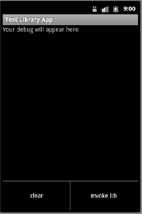
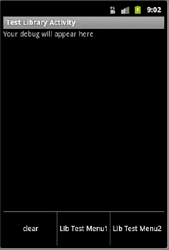
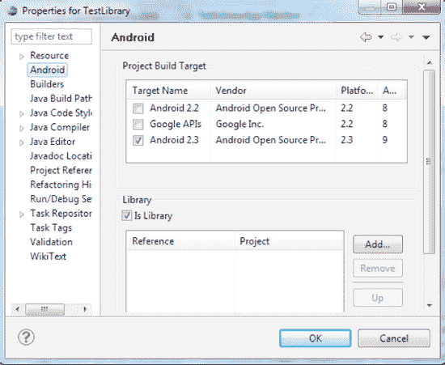
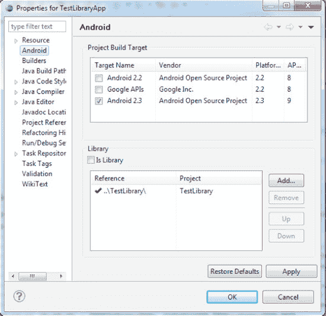
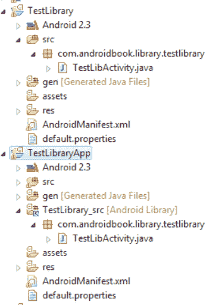
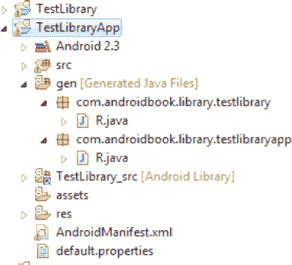

# 第 12 章

## 探索包

在第 1 章到第 11 章中，我们涵盖了 Android 平台的基础知识。然而，这些章节详细描述了 Android 的“快乐路径”。在接下来的几章中（从本章开始，包括第 12、13、14 和 15 章），我们将围绕 Android 核心，介绍更细粒度的细节。

我们将从深入探讨 Android 包的底层机制、Android 包签名过程、包间的数据共享以及 Android 库项目来开始此次探索。你将了解一个 `.apk` 文件运行所依赖的 Linux 进程上下文。你将看到在这种上下文中，多个 `.apk` 文件如何共享数据和资源。

虽然你在第 10 章中已经初步了解了签名 Android 包文件，但在本章中，你将学习签名 JAR 文件的含义、影响和用法。在数据共享的背景下，我们还将研究 Android 库项目，了解它们如何工作以及是否可用于资源和代码共享。

让我们从 `.apk` 文件的基础知识开始讨论，因为它构成了 Android 进程的基础。

### 包与进程

如你在前几章中所见，当你在 Android 中开发应用程序时，最终会得到一个 `.apk` 文件。然后你对这个 `.apk` 文件进行签名，并将其部署到设备上。让我们多了解一些关于 Android 包的知识。

#### 包规范的细节

每个 `.apk` 文件都通过其清单文件中指定的根包名称来唯一标识。以下是本章将使用的包定义示例（包名称已高亮显示）：

```
<manifest
package="com.androidbook.library.testlibraryapp"
      ...>
      ...此处为其余 xml 节点
</manifest>
```

如果你是这个包的开发者，对其进行了签名并安装在设备上，那么除了你之外，其他任何人都不能更新这个包。包名称与其签名时所使用的签名绑定。因此，具有不同签名的开发者无法对具有相同完全限定 Java 包名称的包进行签名和安装。

##### 将包名称转换为进程名称

Android 使用包名称作为运行此包组件的进程名称。Android 还会为此包进程分配一个唯一的用户 ID 以供其运行。该分配的用户 ID 本质上是底层 Linux 操作系统的一个 ID。你可以通过查看已安装包的详细信息来发现此信息。

##### 列出已安装的包

在模拟器中，你可以通过导航路径 Home `` Dev Tools `` Package Browser（包浏览器）来查看已安装包的列表。（请注意，在真实设备上你可能找不到类似的包浏览器。这也可能因 Android 版本而异。）

一旦看到包列表，你可以高亮显示某个应用程序（例如浏览器）的包，然后点击它。这将弹出一个如图 12-1 所示的包详细信息屏幕。

``

**图 12-1.** *Android 包详细信息*

图 12-1 显示了由清单文件中的 Java 包名称指示的进程名称以及分配给此包的唯一用户 ID。以浏览器为例，其清单文件应指示包名称为 `com.android.browser`（由图 12-1 中的属性 process 反映）。

从此进程或包创建的任何资源都将在此 Linux 用户 ID 下受到保护。此屏幕还列出了此包内的组件。组件的示例包括活动、服务和广播接收器。

##### 通过包浏览器删除包

既然我们谈到了包浏览器，我们想指出的是，你也可以使用上一节提到的包浏览器中的以下步骤从模拟器中删除包：

1.  高亮显示包。
2.  点击菜单。
3.  点击“删除包”来删除包。

因为一个进程与一个包名称绑定，而一个包名称又与它的签名绑定，所以签名在保护属于某个包的数据方面扮演着重要角色。为了充分理解其含义，让我们来研究一下包签名过程的本质。


### 重新审视包签名过程

在第 10 章中，我们介绍了在设备上安装应用之前对应用进行签名的机制。然而，我们尚未探讨包签名过程的必要性和影响。

例如，当我们在 Windows 或其他操作系统上下载并安装一个应用时，我们不需要对其进行签名。为什么在 Android 设备上签名却是强制性的？签名过程到底意味着什么？它保证了什么？是否有现实世界中类似的签名过程能让我们快速理解？我们将在本节中探讨这些问题。

当包被安装到设备上时，每个已安装的包必须拥有一个唯一或不同的 Java 包名。如果你尝试安装一个名称已存在的新包，设备将拒绝安装，直到之前的包被移除。为了允许这种类型的包升级，你必须确保同一个应用发布者与该包关联。这是通过数字签名来实现的。在阅读完本章的后续小节后，你将会看到，签名过程确保作为开发者的你，通过你的数字签名保留了那个包名。

让我们通过几个场景来帮助您充分理解和内化数字签名。

#### 理解数字签名：场景一

想象你是一个葡萄酒收藏家，身处一个非常不适合产酒的地方，比如撒哈拉沙漠。此外，假设世界各地的酿酒商都在给你寄送酒桶以供储存或售卖。

作为葡萄酒收藏家，你注意到每个酒桶及其内部的葡萄酒都有一种区别于其他的特定色泽和颜色。进一步调查后，你发现如果两个酒桶或其中的葡萄酒具有相同的色泽，那么它们*总是*来自同一个酿酒商。深入挖掘后，你发现每个酿酒商都有一个秘密的色泽配方，被锁在地窖中，从不透露。这解释了为什么每种葡萄酒都不同，以及为什么具有相同色泽的两种葡萄酒*必须*来自同一个酿酒商。当然，这种识别方式绝不揭示酿酒商的身份——仅仅表明酿酒商是独特且唯一的。

这个色泽就成了酿酒商的签名，就像一个家族印记，而酿酒商将这个签名对其他人保密。

这个例子中的一个重要区别是，作为收藏家，你无法知道*哪个*酿酒商发送了某一批特定的葡萄酒——该签名没有关联任何名称或地址。即使有，也很可能某个酿酒商会发送似乎来自另一个地址的葡萄酒。在这种情况下，你可以认为两个地址相同但色泽不同的酒桶，来自居住在同一个地址的两个不同酿酒商。

#### 理解数字签名：场景二

让我们考虑另一个关于自然存在签名的场景。当你去异国他乡时，打开收音机，会听到许多歌曲。你能分辨出不同的歌手，并能单独识别每一个，但不知道他们是谁，也不知道他们的名字。这就是自签名（在本例中是用他们的声带）。当你的一个朋友告诉你一个歌手，并将该歌手与你曾听过的某个声音联系起来时，这类似于第三方签名。

一个歌手可以模仿另一个人的声音来迷惑或欺骗听众。然而，由于用于编码签名的数学算法，模仿数字签名要困难得多，非常困难。

#### 理解数字签名的模式

当我们谈论有人签署一个`JAR`文件时，这个`JAR`文件就被赋予了独特的“颜色”，并可以与其他`JAR`文件区分开来。但是，无法通过这种方式识别来源开发者或公司。这样的`JAR`文件被称为自签名`JAR`文件。

要知道*来源*，你需要一个葡萄酒收藏家信任的第三方公司告诉我们，红色来自公司 1。现在，每当我们看到“红色”，我们就知道这种葡萄酒来自公司 1。这些被称为第三方签名的`JAR`文件。这些在浏览器中很有用，可以告诉你，你正在从公司 1 下载文件，或者安装由公司 1（权威地）生产的应用程序。

#### 那么如何数字签名呢？

数字签名遵循上述场景中解释的类似语义，技术上是通过所谓的公钥/私钥加密来实现的。可以运用数学方法生成两个数字，使得如果用第一个数字（私钥）进行编码，则只有第二个数字（公钥）能够解密。这些密钥是非对称的。即使每个人都知道公钥，他们也无法加密出公钥能解密的消息。只有其匹配的私钥才能做到。

让我们在葡萄酒例子的背景下考虑公钥和私钥的概念。

一个想要通过数字签名（而非色泽）来区分葡萄酒的酿酒商会使用私钥为她的酒桶创建一个代码（色泽）。因为私钥用于生成`代码（色泽）`，所以只有对应的公钥才能解密该代码。

然后，酿酒商大胆地将公钥名称和加密后的代码写在酒桶上，或者通过信使一次性传递公钥。

当你，作为葡萄酒收藏家，拿着那个公钥并成功解密了加密的代码后，你就知道公钥是正确的，并且该消息只能由写下该公钥的酿酒商加密。在这个场景中，即使有其他冒牌酿酒商复制了真正酿酒商的公钥并将其写在一个酒桶上，这个冒牌者也无法写出一个能被该公钥解密的消息。

本质上，公钥就成了酿酒商的签名。即使其他人声称拥有该公钥，那个人也无法生成一个能用该公钥解密的消息。

通过这种将数字签名与现实签名的比较，我们建立了一个类比，帮助你掌握和内化数字签名。我们已经在第 10 章中介绍了使用基于`JDK`的`keytool`和`jarsigner`命令来完成签名过程的机制。

#### 签名过程的影响

我们现在可以看到，对于同一个包名，我们不能有两个不同的签名。签名有时被称为公钥基础设施（PKI）证书。更准确地说，你会使用一个 PKI 证书来签署一个包、一个`JAR`文件，或一个`DLL`或一个应用程序。

`PKI`证书与包名绑定，以确保两个开发者不能安装一个具有相同包名的包。然而，同一个证书可以用来签署任意数量的包。换句话说，*一个* `PKI`证书支持*许多*包。这种关系是一对多的。但*一个*包有一个，*且仅有一个*，通过其`PKI`证书的签名。然后，开发者使用密码保护证书的私钥。

这些事实不仅对于同一包的新版本发布很重要，对于在具有相同签名的包之间共享数据也很重要。


### 在包之间共享数据

在前几章中，我们明确每个包都在自己的进程中运行。所有通过此包安装或创建的资产都属于分配给该包的用户 ID。你也知道 Android 会分配一个唯一的基于 Linux 的用户 ID 来运行该包。在 图 12-1 中，你可以看到这个用户 ID 的样子。根据 Android SDK 文档：

> *“当应用在设备上安装时，此用户 ID 被分配，并在该设备上的整个生命周期内保持不变。应用存储的所有数据都会被分配该应用的用户 ID，并且通常其他包无法访问。当你使用 `getSharedPreferences(String, int)`、`openFileOutput(String, int)` 或 `openOrCreateDatabase(String, int, SQLiteDatabase.CursorFactory)` 创建新文件时，可以使用 `MODE_WORLD_READABLE` 和/或 `MODE_WORLD_WRITEABLE` 标志，以允许任何其他包读取/写入该文件。设置这些标志后，文件仍归你的应用所有，但其全局读取和/或写入权限已得到适当设置，因此任何其他应用都可以看到它。”*

如果你的意图是允许一组相互协作的、依赖于通用数据集合的应用进行操作，你可以选择显式指定一个对你唯一且符合你需求的通用用户 ID。这个共享用户 ID 也定义在清单文件中，类似于包名的定义。代码清单 12-1 展示了一个示例。

**代码清单 12-1.** *共享用户 ID 声明*

```
<manifest
      package="com.androidbook.somepackage"
      sharedUserId="com.androidbook.mysharedusrid"
      ...>
...其他 xml 节点
</manifest>
```

#### 共享用户 ID 的性质

如果多个应用共享相同的签名（使用相同的 PKI 证书签名），它们可以指定相同的共享用户 ID。拥有共享用户 ID 允许这些应用共享数据，甚至在同一进程中运行。为了避免共享用户 ID 重复，建议采用类似于 Java 类命名的约定。以下是 Android 系统中找到的一些共享用户 ID 示例：

```
"android.uid.system"
"android.uid.phone"
```

**注意：** 在 Android 相关新闻组中有报告指出，共享 ID 必须指定为原始字符串，而不能是字符串资源。

作为提醒，如果你计划使用共享用户 ID，建议从一开始就使用它们。否则，当你的应用从非共享用户 ID 升级到带有共享 ID 的应用时，可能无法正常工作。一个被引用的原因是，Android 不会因为用户 ID 的更改而对旧资源执行 `chown` 操作。因此，我们强烈建议你：

- 如果需要，请从一开始就使用共享用户 ID。
- 一旦使用了某个用户 ID，请勿更改。

#### 共享数据的代码模式

本节探讨当两个应用想要共享资源和数据时我们可以采用的方式。如你所知，在运行时，每个包的资源和数据都由该包的上下文所拥有并受其保护。因此，你需要能够访问你想要共享资源或数据的目标包的上下文，这并不令人意外。

Android 提供了一个名为 `createPackageContext()` 的 API 来帮助实现这一点。你可以在任何现有的上下文对象（如你的 activity）上使用 `createPackageContext()` API 来获取你想要交互的目标上下文的引用。代码清单 12-1 提供了一个示例（这只是一个演示用法的示例，并非设计用于编译）。

**代码清单 12-2.** *使用 `createPackageContext()` API*

```
// 标识你要使用的包
String targetPackageName="com.androidbook.samplepackage1";

// 选择适当的上下文标志
int flag=Context.CONTEXT_RESTRICTED;

// 通过你的一个 activity 获取目标上下文
Activity myContext = ……;
Context targetContext =
         myContext.createPackageContext(targetPackageName, flag);

// 使用上下文来解析文件路径
Resources res = targetContext.getResources();
File path = targetContext.getFilesDir();
```

请注意我们是如何获取到给定包名（例如 `com.androidbook.samplepackage1`）的上下文的引用的。代码清单 12-2 中的 `targetContext` 与目标应用启动时传递给该应用的上下文是相同的。正如方法名称（通过其“create”前缀）所示，每次调用都会返回一个新的上下文对象。然而，文档向我们保证，这个返回的上下文对象被设计为轻量级的。

无论你是否拥有共享用户 ID，此 API 都适用。如果共享用户 ID，那自然很好。如果不共享用户 ID，则目标应用需要将其资源声明为对外部用户可访问。

`createPackageContext()` 使用以下三个标志之一：

- 如果标志为 `CONTEXT_INCLUDE_CODE`，Android 允许你将目标应用的代码加载到当前进程中。该代码随后将像你的代码一样运行。只有当两个包具有相同的签名和共享用户 ID 时，此操作才会成功。如果共享用户 ID 不匹配，使用此标志将导致安全异常。
- 如果标志为 `CONTEXT_RESTRICTED`，我们仍然应该能够访问资源路径，而无需走到请求代码加载这种极端情况。
- 如果标志为 `CONTEXT_IGNORE_SECURITY`，则证书被忽略，代码被加载，但将在你的用户 ID 下运行。因此，文档建议，如果你要使用此标志，必须极其谨慎。

现在，我们了解了如何将包、签名和共享用户 ID 协同使用，以控制对应用所拥有和创建内容的访问。

### 库项目

在我们讨论共享代码和资源时，一个值得思考的问题是：“库”项目的想法是否有帮助？为了探究这一点，我们首先需要理解什么是库项目、如何创建它们以及如何使用这些项目。

#### 什么是库项目？

从 ADT 0.9.7 Eclipse 插件开始，Android 支持库项目的概念。库项目是 Java 代码和资源的集合，看起来像一个常规项目，但它本身永远不会生成 `.apk` 文件。相反，库项目的代码和资源会成为另一个项目的一部分，并编译到该主项目的 `.apk` 文件中。


好的，作为高级文档工程师和翻译员，我将严格按照您提供的注意事项和示例格式，为您翻译以下文本。


#### 库项目谓词

以下是关于这些库项目的一些事实：

- 一个库项目可以拥有自己的包名。
- 库项目不会被编译成自己的`.apk`文件，而是被合并到将其作为依赖项使用的项目的`.apk`文件中。
- 库项目可以使用其他 JAR 文件。
- 库项目本身不能被制作成 JAR 文件。
- Eclipse ADT 会将库项目合并到主引用项目中，并将它们作为主项目编译的一部分一起编译。
- 库项目和主项目都可以通过各自的`R.java`文件访问库项目中的资源。
- 主项目和库项目之间可以有重复的资源 ID。主项目的资源 ID 优先于库项目中的资源 ID。
- 如果您想区分两个项目之间的资源 ID，可以使用不同的资源前缀，例如为库项目资源使用`lib_`。
- 一个主项目可以引用任意数量的库项目。
- 您可以为库项目设置优先级，以确定哪些资源更重要。
- 库中的组件（例如 Activity）需要在目标主项目的清单文件中定义。定义时，库包中的组件名称必须使用库包名完全限定。
- 虽然将组件定义在库项目的清单文件中可以作为快速了解其支持哪些组件的好习惯，但并非必要。
- 创建库项目的第一步是创建一个常规的 Android 项目，然后在其属性窗口中选择`Is Library`标志。
- 您也可以通过项目属性屏幕为主项目设置依赖的库项目。
- 很明显，作为一个库项目，许多主项目都可以包含该库项目。
- 库功能在 ADT 0.9.7、SDK 工具版本 r6 或更高版本以及 Android 2.1 或更高版本中可用。
- 在此版本中，一个库项目不能引用另一个库项目，尽管在未来的版本中似乎有这样做的需求。
- 库项目不支持 AIDL 文件。
- 库项目不支持可共享的 assets 目录。

让我们通过创建一个库项目和一个主项目来探索库项目。这个示例项目的目标如下：

1.  在库项目中创建一个简单的 Activity。
2.  通过定义一些菜单资源，为步骤 1 中的 Activity 创建一个菜单。
3.  创建一个主项目 Activity，将库项目作为依赖项使用。
4.  在步骤 3 的主项目中创建一个 Activity。
5.  为步骤 4 中的主 Activity 创建一个菜单。
6.  设置一个菜单项，从主 Activity 调用库项目中的 Activity。

一旦创建了这些项目，接下来是来自主项目的 Activity（来自步骤 4 的 Activity，图 12–2）。



**图 12–2.** *主项目中带有菜单的示例 Activity*

当您在主项目 Activity 中点击`invoke lib`菜单项时，您会看到来自库项目的 Activity，如图 12–3 所示。



**图 12–3.** *来自库项目的示例 Activity*

此库 Activity 中的菜单来自库项目的资源。点击这些菜单会在屏幕上记录一条消息，表明某个特定菜单项被点击。让我们先创建一个库项目来开始练习。

#### 创建库项目

这个示例库项目将包含以下文件：

- `TestLibActivity.java` (代码清单 12–3)
- `layout/lib_main.xml` (代码清单 12–4)
- `menu/lib_main_menu.xml` (代码清单 12–5)
- `AndroidManifest.xml` (代码清单 12–6)

这些文件足以创建您自己的 Android 库项目，并在以下代码清单中展示。

**注意：** 我们将在本章末尾提供一个 URL，您可以使用它来下载本章的项目。这样您就可以直接将这些项目导入到您的 Eclipse 中。

**代码清单 12–3.** *示例库项目 Activity: TestLibActivity.java*

```
package com.androidbook.library.testlibrary;

//...basic imports here
//use CTRL-SHIFT-O to have eclipse generate
//necessary imports

public class TestLibActivity extends Activity
{
    public static final String tag="TestLibActivity";
    @Override
    public void onCreate(Bundle savedInstanceState) {
        super.onCreate(savedInstanceState);
        setContentView(R.layout.lib_main);
    }
    @Override
    public boolean onCreateOptionsMenu(Menu menu) {
        super.onCreateOptionsMenu(menu);
        MenuInflater inflater = getMenuInflater(); //from activity
        inflater.inflate(R.menu.lib_main_menu, menu);
        return true;
    }
    @Override
    public boolean onOptionsItemSelected(MenuItem item) {
        appendMenuItemText(item);
        if (item.getItemId() == R.id.menu_clear){
                this.emptyText();
                return true;
        }
        return true;
    }
    private TextView getTextView(){
        return (TextView)this.findViewById(R.id.text1);
    }
    public void appendText(String abc){
        TextView tv = getTextView();
        tv.setText(tv.getText() + "\n" + abc);
    }
    private void appendMenuItemText(MenuItem menuItem){
       String title = menuItem.getTitle().toString();
       TextView tv = getTextView();
       tv.setText(tv.getText() + "\n" + title);
    }
    private void emptyText(){
          TextView tv = getTextView();
          tv.setText("");
    }
}
```

代码清单 12–4 展示了此 Activity 的配套布局文件：只是一个用于写出所点击菜单项名称的文本视图。

**代码清单 12–4.** *示例库项目布局文件: layout/lib_main.xml*

```
<?xml version="1.0" encoding="utf-8"?>
<LinearLayout
    android:orientation="vertical"     android:layout_width="fill_parent"
    android:layout_height="fill_parent"
    >
<TextView  
    android:id="@+id/text1"
    android:layout_width="fill_parent"
    android:layout_height="wrap_content"
    android:text="Your debug will appear here "
    />
</LinearLayout>
```

代码清单 12–5 提供了菜单文件，以支持图 12–3 中库 Activity 显示的菜单。

**代码清单 12–5.** *库项目菜单文件: Menu/lib_main_menu.xml*

```
<menu >
    <!-- This group uses the default category. -->
    <group android:id="@+id/menuGroup_Main">
<item android:id="@+id/menu_clear"
              android:title="clear" />
<item android:id="@+id/menu_testlib_1"
            android:title="Lib Test Menu1" />
<item android:id="@+id/menu_testlib_2"
            android:title="Lib Test Menu2" />
    </group>
</menu>
```

库项目的清单文件包含在代码清单 12–6 中。

**代码清单 12–6.** *库项目清单文件: AndroidManifest.xml*


```xml
<?xml version="1.0" encoding="utf-8"?>
<manifest
    package="com.androidbook.library.testlibrary"
    android:versionCode="1"
    android:versionName="1.0.0">
    <uses-sdk android:minSdkVersion="3" />
    <application android:icon="@drawable/icon"
        android:label="测试库项目">
        <activity android:name=".TestLibActivity"
            android:label="测试库活动">
        </activity>
    </application>
</manifest>
```

如库项目谓词部分所述，库项目清单文件中的活动定义仅用于文档说明，在功能上是可选的。

将这些文件组装完成后，即可创建一个常规的 Android 项目。项目创建完毕后，右键单击项目名称，点击上下文菜单中的“属性”，显示库项目的属性对话框。该对话框如图 12–4 所示。（此图中的可用构建目标可能因你的 Android SDK 版本而异。）只需在此对话框中选择 `Is Library`，即可将此项目设置为库项目。



**图 12–4.** *将项目指定为库项目*

至此，我们已完成库项目的创建。接下来看看如何创建一个使用该库项目的应用程序项目。

#### 创建使用库的 Android 项目

我们将使用一组类似的文件来创建应用程序项目，然后将前面创建的库项目作为依赖项。以下是创建主项目时使用的文件列表：

* `TestAppActivity.java`（清单 12–7）
* `layout/main.xml`（清单 12–8）
* `menu/main_menu.xml`（清单 12–9）
* `AndroidManifest.xml`（清单 12–10）

清单 12–7 展示了 `TestAppActivity.java`。

**清单 12–7.** *主项目活动代码：TestAppActivity.java*

```java
package com.androidbook.library.testlibraryapp;
import com.androidbook.library.testlibrary.*;
//...其他导入

public class TestAppActivity extends Activity
{
    public static final String tag="TestAppActivity";
    @Override
    public void onCreate(Bundle savedInstanceState) {
        super.onCreate(savedInstanceState);
        setContentView(R.layout.main);
    }
    @Override
    public boolean onCreateOptionsMenu(Menu menu) {
        super.onCreateOptionsMenu(menu);
        MenuInflater inflater = getMenuInflater(); //来自活动
        inflater.inflate(R.menu.main_menu, menu);
        return true;
    }
    @Override
    public boolean onOptionsItemSelected(MenuItem item) {
        appendMenuItemText(item);
        if (item.getItemId() == R.id.menu_clear)
        {
                this.emptyText();
                return true;
        }
        if (item.getItemId() == R.id.menu_library_activity){
                this.invokeLibActivity(item.getItemId());
                return true;
        }
        return true;
    }
    private void invokeLibActivity(int mid)
    {
        Intent intent = new Intent(this,TestLibActivity.class);
        intent.putExtra("com.ai.menuid", mid);
        startActivity(intent);
    }
    private TextView getTextView(){
        return (TextView)this.findViewById(R.id.text1);
    }
    public void appendText(String abc){
        TextView tv = getTextView();
        tv.setText(tv.getText() + "\n" + abc);
    }
    private void appendMenuItemText(MenuItem menuItem){
       String title = menuItem.getTitle().toString();
       TextView tv = getTextView();
       tv.setText(tv.getText() + "\n" + title);
    }
    private void emptyText(){
          TextView tv = getTextView();
          tv.setText("");
    }
}
```

请注意，创建此文件后，在引用位于库项目中的活动类时可能会遇到编译错误。这个错误需要你进一步阅读，了解如何将之前的库项目指定为应用程序项目的依赖项后，才会消失。

对应的活动布局文件如清单 12–8 所示。

**清单 12–8.** *主项目布局文件：layout/main.xml*

```xml
<?xml version="1.0" encoding="utf-8"?>
<LinearLayout
    android:orientation="vertical"
    android:layout_width="fill_parent"
    android:layout_height="fill_parent"
    >
<TextView
    android:id="@+id/text1"
    android:layout_width="fill_parent"
    android:layout_height="wrap_content"
    android:text="调试文本将显示在此处"
    />
</LinearLayout>
```

主项目活动（清单 12–7）中的 Java 代码使用名为 `R.id.menu_library_activity` 的菜单项来调用 `TestLibActivity`。以下是从 Java 文件（清单 12–7）中提取的代码：

```java
private void invokeLibActivity(int mid)
{
    Intent intent = new Intent(this,TestLibActivity.class);
    //将菜单 ID 作为 intent 附加数据传递
    //以便库活动在需要时使用
    intent.putExtra("com.androidbook.library.menuid", mid);
    startActivity(intent);
}
```


好的，作为一名高级文档工程师和翻译员，我将严格遵循您的注意事项和示例，完成以下翻译任务。

---


请注意，我们使用了 `TestLibActivity.class`，将其当作一个本地类，区别仅在于我们从库包中导入了 Java 类：

`import com.androidbook.library.testlibrary.*;`

菜单文件见代码清单 12–9。

**代码清单 12–9.** *主项目菜单文件：menu/main_menu.xml*

```
<menu >
    <!-- This group uses the default category. -->
    <group android:id="@+id/menuGroup_Main">
<item android:id="@+id/menu_clear"
             android:title="clear" />
<item android:id="@+id/menu_library_activity"
android:title="invoke lib" />
    </group>
</menu>
```

用于完成项目创建的清单文件如代码清单 12–10 所示。

**代码清单 12–10.** *主项目清单文件：AndroidManifest.xml*

```
<?xml version="1.0" encoding="utf-8"?>
<manifest
package="com.androidbook.library.testlibraryapp"
      android:versionCode="1"
      android:versionName="1.0.0">
    <application android:icon="@drawable/icon" android:label="Test Library App">
<activity android:name=".TestAppActivity"
                  android:label="Test Library App">
            <intent-filter>
                <action android:name="android.intent.action.MAIN" />
                <category android:name="android.intent.category.LAUNCHER" />
            </intent-filter>
        </activity>
<activity android:name=
"com.androidbook.library.testlibrary.TestLibActivity"
                  android:label="Test Library Activity"/>
    </application>
    <uses-sdk android:minSdkVersion="3" />
</manifest>
```

在这个主应用程序清单文件中，注意我们是如何定义来自库项目的 `TestLibActivity` 活动的。我们还为活动定义使用了完全限定的包名。同时请注意，库项目的包名可以与主应用程序项目的包名不同。

一旦您使用这些文件设置好一个 Android 项目，就可以使用以下项目属性对话框（参见图 12–5）来指示此主项目依赖于先前创建的库项目。



**图 12–5.** *声明库项目依赖关系*

请注意对话框中的“添加”按钮。您可以使用它来添加图 12–5 中的库作为引用。无需再执行其他操作。

完成此步骤后，库项目通常会在主应用程序项目下显示为一个额外的节点（除了其本身作为一个库项目之外）。图 12–6 对此进行了说明。



**图 12–6.** *主项目视图中已合并的库项目*

请注意显示为 `[Android Library]` 的节点以及复制/引用的 Java 源文件。注意此节点的结构。它的命名方式是拼接库项目名称、下划线和库项目下对应的源目录名称。这种方案允许库项目下存在任意数量的源目录。这是 ADT 0.9.8 与较新 ADT 版本之间的主要区别。

如果您修改了应用程序项目下属于库项目的源文件，实际上您也同时在修改库项目中的这些文件。有时，您可能看不到这个子节点。在这种情况下，您可能需要重启 Eclipse。无论如何，如果一切正常，您应该会看到这个额外的节点。

Android 对 `R.java` 文件做了另一件有趣的事情。请参阅图 12–7。



**图 12–7.** *R.java 中重复的资源*

首先，Android 会在库项目中为属于库项目的资源生成一个 `R.java` 文件。Android 还会为主 Java 项目中的资源生成另一个 `R.java` 文件。这是意料之中的——两个项目，两个 `R.java` 文件。

然而，有趣的是，Android 也会在主应用程序的 `R.java` 文件中为库资源创建资源 ID。这意味着程序员可以对属于主应用程序的 `R.java` 文件使用 `R.id.` 语法（请注意，`R.java` 是自动生成的，因此 代码清单 12–11 中的数字如 `0x7f02000` 在您的项目中可能不同）。

**代码清单 12–11.** *主项目 R.java 文件中重新定义的共享资源 ID*

```
public final class R {
    public static final class attr {
    }
    public static final class drawable {
        public static final int icon=0x7f020000;
        public static final int robot=0x7f020001;
    }
    public static final class id {
        public static final int menuGroup_Main=0x7f060001;
        public static final int menu_clear=0x7f060002;
        public static final int menu_library_activity=0x7f060005;
        public static final int menu_testlib_1=0x7f060003;
        public static final int menu_testlib_2=0x7f060004;
        public static final int text1=0x7f060000;
    }
    public static final class layout {
public static final int lib_main=0x7f030000;
        public static final int main=0x7f030001;
    }
    public static final class menu {
public static final int lib_main_menu=0x7f050000;
        public static final int main_menu=0x7f050001;
    }
    public static final class string {
        public static final int app_name=0x7f040001;
        public static final int hello=0x7f040000;
    }
}
```

请注意，以 `lib_` 标识的资源现在也可在主应用程序的 `R.java` 中使用。这意味着库项目将为 `lib_` 资源提供一个资源常量，而主项目将为同一个 `lib_` 资源提供另一个资源常量。

这两个项目都可以在其 Java 代码中通过使用 `R.some-id` 来引用此资源。常量的值可能相同，但您将可以在两个 Java 命名空间中使用该资源 ID：库包命名空间和主项目包命名空间。

此外，请注意菜单名称：`lib_main_menu` 和 `main_menu`。如果我们为这两个菜单资源文件命名相同但内部包含不同的菜单项，那可真就麻烦了。最终结果是，资源被聚合在一起，并可以在主应用程序的一个地方使用。请特别注意文件级别的资源，例如菜单和布局，以及为这些资源文件内部项目生成的 ID。

既然您已经了解了库项目，那么我们是更接近于回答之前考虑它们时提出的共享数据问题了吗？

如您所见，库项目是编译时的构造。显然，任何属于库的资源都会被吸收并合并到主项目中。这里不存在运行时共享的问题，因为只有一个以主包名命名的包文件。一个常见的建议是，您可以通过让免费版和付费版应用都共享一个库，来开发应用的这两个版本。

### 小结

在本章中，我们介绍了如何使用包和进程、在包之间共享代码和数据，以及创建 Android 库项目。您了解到签名在将所有权分配给包方面起着重要的安全作用。

本章为下一章奠定了基础，在下一章中，我们将讨论驻留在包进程中的组件，以及它们（主要）在主线程上运行。我们将讨论如何通过处理器和子线程来最优地利用主线程，以便 Android 应用程序能够流畅运行。

## 第 xs13 章


