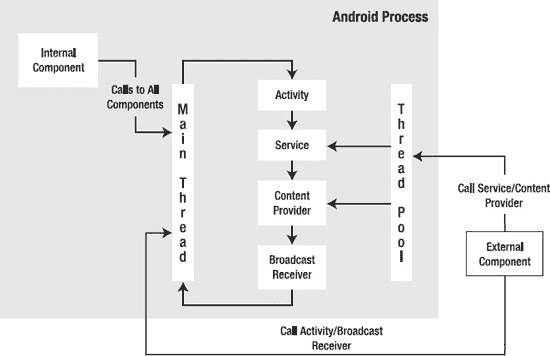
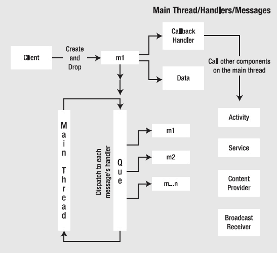
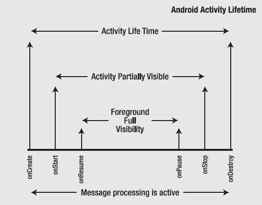
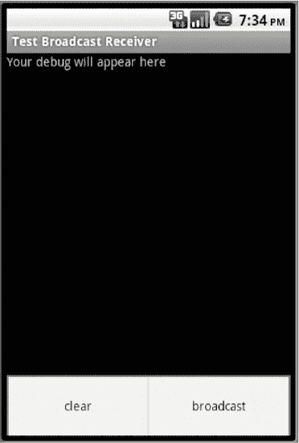
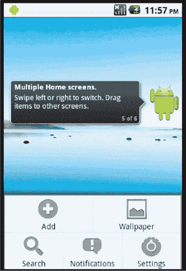

# 探索处理器（Handler）

我们在第 12 章中展示了每个包都在自己的进程中运行。本章将解释该进程内的线程组织方式，由此引出我们需要处理器的原因。

Android 应用程序中的大部分代码都在组件（如`Activity`或`Service`）的上下文中运行。我们将展示这些应用组件如何与线程交互。大多数情况下，Android 进程中只有一个称为**主线程**的线程在运行。我们将讨论各组件共享主线程的影响，这主要可能导致“应用无响应”（ANR）消息（其中的“A”代表“application”，而非“Annoying”）。我们将展示如何利用处理器（handler）、消息（message）和线程（thread），在需要长时间运行操作时打破对主线程的依赖。

本章首先探讨 Android 应用的组件及其运行的线程上下文。

### Android 组件与线程

通过此前许多章节的介绍，你应该已经了解到一个 Android 进程包含四个主要组件，分别是：

*   `Activity`
*   `Service`
*   `ContentProvider`（常简称为 provider）
*   `BroadcastReceiver`（常简称为 receiver）

你在 Android 应用中编写的大部分代码，要么属于这些组件的一部分，要么由这些组件调用。每个组件在 Android 项目清单文件的`<application>`节点规范下都拥有独立的 XML 节点。回顾一下这些节点如下：

```xml
<application>
     <activity/>
     <service/>
     <receiver/>
     <provider/>
</application>
```

除少数例外情况，Android 使用同一个线程来处理（或执行）这些组件中的代码。该线程被称为应用的主线程。当这些组件被调用时，调用可以是同步调用（例如调用内容提供者获取数据），也可以是通过消息队列的延迟调用（例如通过调用`startService`来调用功能）。

图 13–1 描述了线程与这四个组件之间的关系。该图表旨在展示线程如何贯穿 Android 框架及其组件。我们将在接下来的几个小节中探讨该图表的各个方面。



**图 13–1.** *Android 组件与线程框架*

#### Activity 在主线程上运行

如图 13–1 所示，主线程承担了大部分工作，它贯穿所有组件，并通过消息队列来执行。例如，当你在设备屏幕上选择菜单或按钮时，设备会将这些操作转换为消息并放入当前焦点进程的主队列中。主线程在一个循环中运行，处理每一条消息。如果某条消息耗时超过 5 秒左右，Android 就会抛出一个 ANR 消息。

#### 广播接收器在主线程上运行

类似地，如果你通过菜单项调用一条广播消息，Android 同样会将一条消息放入目标包进程的主队列中（该包中注册了要调用的接收器）。主线程稍后会处理这条消息来调用接收器。广播接收器的工作也由主线程完成。如果主线程正在忙于响应菜单操作，广播接收器就必须等待主线程空闲下来。

#### 服务在主线程上运行

服务也是如此。当你通过菜单项调用`startService`启动一个本地服务时，一条消息会被放入主队列，主线程稍后会通过服务代码对其进行处理。

#### 内容提供者在主线程上运行

对本地内容提供者的调用略有不同。内容提供者仍然在主线程上运行，但调用是同步的，且不使用消息队列。

#### 单一主线程的影响

你可能会问：“Android 应用中的大部分代码在主线程上运行，这为什么重要？”因为主线程有责任及时返回其消息队列，以便响应 UI 事件。因此，不应阻塞主线程。如果有任何操作耗时超过 5 秒，就应该在单独的线程中完成，或者通过请求主线程在其处理完其他事务空闲后再处理该操作来推迟执行。事实证明，在单独的线程中执行工作并不像最初看起来那么简单。我们将在本章后续部分及下一章中再次讨论这个问题，但先来谈谈图 13–1 中标识的线程池。

#### 线程池、内容提供者、外部服务组件

当进程外部的客户端或组件调用内容提供者获取数据时，该调用会从线程池中分配一个线程。外部客户端连接到服务时也是如此。

#### 线程工具：发现你的线程

在大量讨论了主线程和工作线程之后，使用代码清单 13–1 中的以下实用工具类来判断哪个线程正在运行你的代码部分，会很有启发性。然后你可以通过监控`logcat`并查看打印出的线程 ID 来验证我们到目前为止所介绍的内容。

**代码清单 13–1.** *线程工具*

```java
//utils.java
public class Utils
{
   public static long getThreadId() {
      Thread t = Thread.currentThread();
      return t.getId();
   }

   public static String getThreadSignature(){
      Thread t = Thread.currentThread();
      long l = t.getId();
      String name = t.getName();
      long p = t.getPriority();
      String gname = t.getThreadGroup().getName();
      return (name
            + ":(id)" + l
            + ":(priority)" + p
            + ":(group)" + gname);
   }

   public static void logThreadSignature(){
      Log.d("ThreadUtils", getThreadSignature());
   }

   public static void sleepForInSecs(int secs){
      try{
         Thread.sleep(secs * 1000);
      } catch(InterruptedException x){
         throw new RuntimeException("interrupted",x);
      }
   }
   //以下两个方法用于后续将介绍的工作线程
   public static Bundle getStringAsABundle(String message){
       Bundle b = new Bundle();
       b.putString("message", message);
       return b;
    }
    public static String getStringFromABundle(Bundle b){
        return b.getString("message");
    }
}
```

如果你使用`logThreadSignature()`，就可以看到哪个线程正在执行代码。你也可以使用`sleep()`方法，观察暂停主线程导致其无法处理消息队列时会发生什么。

我们之前简要提到了在必要时推迟主线程工作的想法。这可以通过处理器（handler）来实现。处理器在整个 Android 中被广泛使用，以避免主 UI 线程被阻塞。它们还在与其他创建的工作线程进行主线程通信时发挥作用。下一节我们将探讨什么是处理器以及它们如何工作。


### 处理器

*处理器*是一种将消息投递到主队列（更准确地说，是投递到处理器实例化时所依附线程的队列）的机制，这样主线程就能在稍后的时间点处理该消息。被投递的消息持有一个内部引用，指向投递它的处理器。

当主线程开始处理该消息时，它会通过处理器对象上的一个回调方法来调用投递该消息的处理器。这个回调方法叫做`handleMessage`。图 13–2 展示了处理器、消息和主线程之间的这种关系。



**图 13–2.** *处理器、消息、消息队列关系*

图 13–2 说明了我们在讨论处理器时协同工作的关键角色。这些关键角色包括：

- 主线程
- 主线程队列
- 处理器
- 消息

在这四个角色中，我们不会直接接触到主线程或队列。我们主要处理`Handler`对象和`Message`对象。即使在这两者之间，`Handler`对象也协调了大部分工作。

尽管`Handler`在这种交互中很重要，但你也应该注意，虽然处理器允许我们将消息投递到队列，但实际上是消息持有对处理器的反向引用。`Message`对象还持有一个数据结构，可以传递回处理器。在图 13–2 中，`Message`对象通过显示对`Data`对象的引用来描述这种关系。

由于处理器和消息之间这种看似颠倒的关系，以及主线程和其队列对程序员隐藏的事实，通过示例来理解处理器是最好的方式。

在示例中，我们将有一个调用函数的菜单项，而该函数又会以每秒一次的间隔执行五次操作，并在每次执行后向调用的活动报告。

#### 占用主线程的影响

如果我们不介意占用主线程，我们可以像列表 13–2 中的伪代码那样编写上述场景。

**列表 13–2.** *使用睡眠方法占用主线程*

```
public class SomeActivity
{
    ....其他方法

    void respondToMenuItem()
    {
        //证明我们在主线程上
        Utils.logThreadSignature();

        for (int i=0;i<5;i++)
        {
            sleepFor(1000);// 让主线程休眠 1 秒
            dosomething();
            SomeTextView.setText("did something");
         }
   }
}
```

这可以满足用例的需求。但是，如果我们这样做，我们*正在*占用主线程，并且几乎一定会导致应用无响应（ANR）。

#### 使用处理器在主线程上延迟执行工作

我们可以使用处理器来避免前面例子中的 ANR。通过处理器实现此功能的伪代码将如列表 13–3 所示。

**列表 13–3.** *从主线程实例化处理器*

```
void respondToMenuItem()
{
    SomeHandlerDerivedFromHandler myHandler =
                 new SomeHandlerDerivedFromHandler();
    myHandler.doDeferredWork(); //以 1 秒的间隔调用一个函数
}
```

现在，`respondToMenuItem()`调用将会允许主线程返回到其循环。实例化的处理器知道它是在主线程上调用的，并会将自己挂接到队列上。`doDeferredWork()`方法将安排工作，以便主线程一旦空闲就可以回来处理这些工作。那么它是如何做到的呢？以下是实现此功能的步骤：

1.  构建一个消息对象，以便将其投递到队列中。
2.  将消息对象发送到队列，使其能够在 1 秒后调用一个回调。
3.  响应来自主线程的`handleMessage()`回调。

为了探究这个协议，让我们看看一个合适处理器的实际源代码。列表 13–4 中的代码演示了这个名为`DeferWorkHandler`的处理器。

在列表 13–3 的伪代码中，所指的处理器`SomeHandlerDerivedFromHandler`等同于`DeferWorkHandler`。同样，所指的方法`doDeferredWork()`是在列表 13–4 的`DeferWorkHandler`上实现的。

#### 一个延迟工作的处理器示例源代码

在解释上一节中的每个步骤之前，列表 13–4 给出了`DeferWorkHandler`的代码。请记住，调用此处理器的主驱动程序活动的源代码将在本章后面给出。

这个父驱动程序活动在列表 13–4 中被表示为变量`parentActivity`。这个变量对于理解这段代码并不关键，它主要用于报告处理器中发生的工作的状态。

**列表 13–4.** *DeferWorkHandler 源代码*

```
public class DeferWorkHandler extends Handler
{
    public static final String tag = "DeferWorkHandler";

    //跟踪我们发送消息的次数
    private int count = 0;
    //我们可以用来通知状态的父驱动程序活动
    private TestHandlersDriverActivity parentActivity = null;

    //在构造期间，我们接收父驱动程序活动
    public DeferWorkHandler(TestHandlersDriverActivity inParentActivity){
        parentActivity = inParentActivity;
    }
    @Override
    public void handleMessage(Message msg)
    {
        String pm = new String(
                "message called:" + count + ":" +
                msg.getData().getString("message"));

        Log.d(tag,pm);
        this.printMessage(pm);

        if (count > 5)
        {
            return;
        }
        count++;
        sendTestMessage(1);
    }
    public void sendTestMessage(long interval)
    {
        Message m = this.obtainMessage();
        prepareMessage(m);
        this.sendMessageDelayed(m, interval * 1000);
    }
    public void doDeferredWork()
    {
        count = 0;
        sendTestMessage(1);
    }
    public void prepareMessage(Message m)
    {
        Bundle b = new Bundle();
        b.putString("message", "Hello World");
        m.setData(b);
        return ;
    }
    //此方法仅在父活动的文本框中打印消息
    //你可以在列表 13–9 中看到此方法
    private void printMessage(String xyz)
    {
        parentActivity.appendText(xyz);
    }
}
```

让我们看看这段源代码的主要方面。


### 构建合适的消息对象

如前所述，当 `DeferWorkHandler` 被构造时，它已经知道如何将自己挂载到主队列上，因为它从基础 `Handler` 类继承了该属性。基础 Handler 提供了一系列方法，用于向队列发送消息以供后续响应。

`sendMessage()` 和 `sendMessageDelayed()` 是这些发送方法中的两个例子。我们在示例中使用的 `sendMessageDelayed()` 允许我们将一条消息放入主队列，并设定一定的延迟时间。

当你调用 `sendMessage()` 或 `sendMessageDelayed()` 时，你需要一个 `Message` 对象的实例。最好让 Handler 提供给你，因为当 Handler 返回 `Message` 对象时，它会将自身隐藏在 `Message` 的内部。这样，当主线程处理时，它就能仅根据这条消息知道要调用哪个 Handler。

在清单 13-4 中，消息是通过以下代码获取的：

```java
Message m = this.obtainMessage();
```

变量 `this` 指的是 Handler 对象实例。顾名思义，该方法不会创建新消息，而是从全局消息池中获取一个。之后，一旦此消息被处理，它将被回收。`obtainMessage()` 方法具有 清单 13-5 中列出的几种变体：

**清单 13-5.** *通过 Handler 构建消息*

```java
obtainMessage();
obtainMessage(int what);
obtainMessage(int what, Object object);
obtainMessage(int what, int arg1, int arg2);
obtainMessage(int what, int arg1, int arg2, Object obj);
```

每种方法变体都会设置消息对象上相应的字段。当消息跨越进程边界时，对 `Object object` 参数有一些限制。在这种情况下，它必须是 `Parcelable` 的。在这种情况下，更安全且兼容的做法是显式地在消息对象上使用 `setData()` 方法，该方法接受一个 `Bundle` 对象。在清单 13-4 中，我们使用了 `setData()`。如果你只是想传递可以用整数值表示的简单指示器，建议改用 `arg1` 或 `arg2`。

`what` 参数允许你从队列中取出消息，或者查询队列中是否存在此类型的消息。有关更多详细信息，请参见 `Handler` 类的操作。本章的“参考资料”部分提供了 `Handler` 类 API 文档的网址。

### 向队列发送消息对象

一旦我们从 Handler 获取到消息，我们可以选择性地修改该消息的数据内容。在我们的示例中，我们使用了 `setData()` 函数，并向其传递了一个 `Bundle` 对象。一旦我们对消息的数据进行了分类或标识，我们就可以通过 `sendMessage()` 或 `sendMessageDelayed()` 将消息发送到队列。一旦调用了这些方法，主线程将返回去处理队列。

### 响应 handleMessage 回调

`DeferWorkHandler` 类派生自 `Handler`。消息被传递到队列后，Handler 会（形象地说）坐等主线程检索这些消息并调用 Handler 的 `handleMessage()` 方法。

如果你想更清楚地观察此 Handler 与主线程的交互，可以在发送消息时和 `handleMessage()` 回调中分别写入一条 `logcat` 日志。你会发现时间戳存在差异，因为主线程需要额外几毫秒才能回到 `handleMessage()` 方法。

这也是了解 `sendMessage()` 和 `handleMessage()` 都在主线程上运行的好方法。你可以使用 `Utils.logThreadSignature()` 方法（参见清单 13-1）来演示这一点。

在我们的示例中，每个 `handleMessage()` 在处理完一条消息后，会向队列发送另一条消息，以便它能够被再次调用。它会这样做五次，当计数器达到五次时，它会停止向队列发送消息。

在我们的 Handler 示例中，`DeferWorkHandler`（如前所述）还将父 Activity 作为输入，以便它能够使用该 Activity 提供的方法报告任何信息。

### 使用工作线程

当我们使用像上一节那样的 Handler 时，代码仍然在主线程上执行。每次对 `handleMessage()` 的调用仍然应在主线程的时间规定内返回（换句话说，每次消息调用应在少于 5 秒内完成，以避免 Android 无响应）。如果你的目标是进一步延长执行时间，你将需要启动一个单独的线程，让该线程持续运行直到完成工作，并允许该子线程向运行在主线程上的主 Activity 报告结果。这种类型的子线程通常被称为*工作线程*。

在响应菜单项时启动一个单独的线程是很简单的。然而，巧妙的技巧是让工作线程能够向主线程的队列发送一条消息，告知有事情正在发生，并且主线程应在处理到该消息时查看它。

一个涉及工作线程的合理解决方案如下：

1.  在响应菜单项时，在主线程中创建一个 Handler。将其存放在一旁。与上一节不同，我们不会使用这个 Handler 来发送延迟执行的消息。
2.  创建一个执行实际工作的单独线程（一个工作线程）。将步骤 1 中的 Handler 传递给该工作线程。
3.  现在，工作线程代码可以执行超过 5 秒的实际工作，并且在此过程中，它可以调用 Handler 发送状态消息以与主线程通信。
4.  这些状态消息现在由主线程处理，因为该 Handler 属于主线程。在工作线程执行其工作的同时，主线程可以处理这些消息。

下面为您展示一个菜单项的示例代码，该菜单项启动了工作线程的流程。


### 从菜单调用工作线程

清单 13–6 中的代码展示了一个名为 `testThread()` 的函数，该函数可在主线程中响应某个菜单项时被调用。

**清单 13–6.** *从主线程实例化一个子线程*

```
//保留几个局部变量
//这样它们就不会在每次菜单点击时被重新创建

//保存指向处理程序的指针
Handler statusBackHandler = null;

//线程实例
Thread workerThread = null;

//该方法将由一个菜单项调用
private void testThread()
{
    if (statusBackHandler == null)
    {
        //菜单项从未被点击过
        //此处引用的类将在本章后面列出
statusBackHandler = new ReportStatusHandler(this);
workerThread = new Thread(new WorkerThreadRunnable(statusBackHandler));
workerThread.start();
        return;
    }

    //线程已存在
    if (workerThread.getState() != Thread.State.TERMINATED)
    {
        Log.d(tag, "线程是新的或处于活跃状态，但未终止");
    }
    else
    {
        Log.d(tag, "线程可能已死亡。现在重启");
        //必须创建一个新线程。
        //无法复活一个已死亡的线程。
        workerThread = new Thread(new WorkerThreadRunnable(statusBackHandler));
        workerThread.start();
    }
}
```

这段代码看起来有些迂回，但其核心在于：

```
        statusBackHandler = new ReportStatusHandler(this);
        workerThread = new Thread(new WorkerThreadRunnable(statusBackHandler));
        workerThread.start();
```

基本上，我们创建了一个处理程序（负责报告状态），将其传递给工作线程，然后启动了工作线程。清单 13–6 中的额外代码是为了确保：如果我们在线程正在工作且尚未终止时连续点击菜单项两到三次，就不会创建新的线程和处理程序。

### 工作线程与主线程之间的通信

接下来，我们将介绍 `ReportStatusHandler` 和 `WorkerThreadRunnable` 这两个类。我们之前没有展示它们，是因为我们希望采用自上而下的方式来讲解：先规划并说明高层需求，再深入探讨每个概念的具体实现细节。

#### WorkerThreadRunnable 的实现

现在，我们通过 `WorkerThreadRunnable` 类来看看工作线程在做什么。`WorkerThreadRunnable` 类的源代码在清单 13–7 中。快速浏览一下这个清单，特别是代码中的注释，以了解它可能的功能。清单之后，我们将解释关键概念。

**清单 13–7.** *工作线程的实现*

```
//主要职责
//1. 执行工作
//2. 通知父活动
public class WorkerThreadRunnable implements Runnable
{
    //与主线程通信的处理程序
    //在构造函数中设置
    Handler statusBackMainThreadHandler = null;

    public WorkerThreadRunnable(Handler h)
    {
        statusBackMainThreadHandler = h;
    }

    //通常的调试标签
    public static String tag = "WorkerThreadRunnable";
public void run()
    {
        Log.d(tag,"开始执行");
        //查看是哪个线程在执行此代码
//下面的方法来自清单 13–1
        //它会打印出线程 ID 和名称
        Utils.logThreadSignature();

        //通知父活动，工作线程已
        //开始工作
informStart();
        for(int i=1;i <= 5;i++)
        {
            //在实际应用中，睡眠位置
            //将执行实际工作。
Utils.sleepForInSecs(1);
              //回传工作进度
informMiddle(i);
        }
informFinish();
    }

    public void informMiddle(int count)
    {
        Message m = this.statusBackMainThreadHandler.obtainMessage();
        m.setData(Utils.getStringAsABundle("已完成:" + count));
        this.statusBackMainThreadHandler.sendMessage(m);
    }

    public void informStart()
    {
        Message m = this.statusBackMainThreadHandler.obtainMessage();
        m.setData(Utils.getStringAsABundle("开始运行"));
        this.mainThreadHandler.sendMessage(m);
    }
    public void informFinish()
    {
        Message m = this.statusBackMainThreadHandler.obtainMessage();
        m.setData(Utils.getStringAsABundle("运行结束"));
        this.statusBackMainThreadHandler.sendMessage(m);
    }
}
```

清单 13–7 中有两件重要的事。在 `run()` 方法中，我们让线程休眠 1 秒钟，并调用 inform 方法来告知主线程工作线程正处于处理过程的开始、中间还是结束阶段。

我们还调用了 `Utils.logThreadSignature()` 来标识当前线程。

然而，在实际应用中，这段代码将根据需要使用 `sleep()` 方法以外的方式来调用一个有用的函数。你可以将 `sleep()` 视为模拟一个耗时若干秒的工作项。

#### ReportStatusHandler 的实现

清单 13–7 中的所有 inform 方法都会创建一个合适的字符串消息，并通过 `ReportStatusHandler` 将其发送到主线程，该处理程序如清单 13–8 所示。

**清单 13–8.** *向主线程发送状态*

```
public class ReportStatusHandler extends Handler
{
    public static final String tag = "ReportStatusHandler";

    //记住父活动，以便
    //我们可以向其报告进度
    private TestHandlersDriverActivity
                 parentTestHandlersDriverActivity = null;

    public ReportStatusHandler(
                TestHandlersDriverActivity inParentActivity){
        parentTestHandlersDriverActivity = inParentActivity;
    }

    @Override
public void handleMessage(Message msg)
    {
        //从消息中获取字符串数据
        String pm = Utils.getStringFromABundle(msg.getData());
        Log.d(tag,pm);
        //通知父活动发生了某事
        this.printMessage(pm);
        //断言此代码运行在主线程上
        Utils.logThreadSignature();
    }

    private void printMessage(String xyz){
        parentTestHandlersDriverActivity.appendText(xyz);
    }
}
```

这个类的代码很直接。当此处理程序接收到 `handleMessage()` 时，它会通过 `appendText()` 方法告知父驱动活动：工作线程已发送了一个状态字符串。父活动可以根据该消息执行任何必要的操作。在我们的案例中，我们只是将其记录到活动屏幕上。

到目前为止，我们通过处理程序示例演示了以下内容：

通过 `DeferWorkHandler` 处理程序示例：

*   通过 `DeferWorkHandler`，我们展示了主线程如何调度一个（或多个）消息在稍后的时间（延迟）处理。该技术也可用于在不使用定时器或闹钟管理器的情况下执行重复处理。
*   通过 `ReportStatusHandler` 和一个 `WorkerThread`，我们展示了如何启动一个独立的工作线程，并让该工作线程通过处理程序与主 UI 进行通信。


#### 线程行为快速概览

既然我们是为了响应菜单项而启动了一个线程，自然就会担心是否需要停止它。线程在完成 `run()` 方法时自动停止。事实上，我们建议不要从外部停止一个正在运行的线程，因为这可能会在中途终止其工作。推荐的做法是设置一个标志，让线程识别该标志并优雅地退出 `run()` 方法。

了解线程的各种状态也很有价值。线程具有以下状态：

*   ***新建**线程*：有人创建了它（`alive=false`）。
*   ***可运行**线程*：有人调用了它的 start 方法（`alive=true`）。
*   ***不可运行**线程*：处于睡眠、挂起、等待、被调用或 I/O 阻塞状态（`alive=true`）。
*   ***死亡**线程*：当调用了 `stop()` 或 `run()` 方法退出时（`alive=false`）。

线程的 `isAlive()` 方法告诉我们该线程已被启动但尚未停止。这意味着该线程处于 `可运行` 或 `不可运行` 状态。如果它返回 `false`，则该线程可能是一个新建线程或死亡线程。

在处理线程时，你可能需要注意线程的状态。

### 处理程序示例驱动类

到目前为止，我们已经展示了以下类的源代码：

*   `DeferWorkHandler.java`：具有延迟功能的能力（参见清单 13-4）。
*   `ReportStatusHandler.java`：工作线程的通信载体（参见清单 13-8）。
*   `WorkerThreadRunnable.java`：工作线程的实现（参见清单 13-7）。
*   `Utils.java`：包含一些线程工具（参见清单 13-1）。

现在是时候向你展示完整的驱动活动类源代码了，该类响应菜单项并调用我们讨论过的功能。我们还将提供菜单资源和清单文件的源代码，以便你拥有创建项目并实践这些概念所需的所有类。

当你尝试编译这些文件时，请注意这些代码清单不包含包名或导入语句。使用 Eclipse 可以轻松地重新创建导入语句。在 Eclipse 中打开源文件时，按 `Ctrl+Shift+O`，Eclipse 将自动填入必要的导入语句。

至于包名，你可以查看清单文件来了解此应用程序使用的包名。你需要将该包名放在 Java 源文件的顶部。由于所有这些文件都设计在同一个包中，你甚至可以根据需要更改包名，并在后续的清单文件中使用该包名。

**注意：** 你也可以使用本章“参考资料”部分中的链接下载预构建的项目 ZIP 文件。该 ZIP 文件的名称为 `ProAndroid3_Ch13_TestHandlers.zip`。要创建项目，请解压缩此文件，然后将项目导入你的 Eclipse ADT 环境中。

再次强调，你需要编译的其他文件列表如下：

*   `TestHandlersDriverActivity.java`：主驱动活动（参见清单 13-9）
*   `layout/main.xml`：`TestHandlersDriverActivity` 的布局文件（参见清单 13-10）
*   `res/menu/main_menu.xml`：用于调用处理程序的菜单（参见清单 13-11）
*   `AndroidManifest.xml`：常规清单文件（参见清单 13-12）

以下各节将逐一解释这些文件。

#### 驱动活动文件

以下是这些文件中的第一个，`TestHandlersDriverActivity.java`。这个类是一个简单的活动，其中包含一个文本视图。该文本视图将列出被点击的菜单项。有一个菜单项用于测试延迟处理程序，另一个菜单项用于测试工作线程。来自工作线程的消息也会记录到此文本视图中。

该类在末尾还包含一个活动生命周期方法列表。这是因为我们将检查主线程及其队列与活动生命周期相关的行为。代码在清单 13-9 中。

**清单 13-9.** *测试处理程序和工作线程的测试活动*

```
public class TestHandlersDriverActivity extends Activity
{
    public static final String tag="TestHandlersDriverActivity";
    @Override
    public void onCreate(Bundle savedInstanceState) {
        super.onCreate(savedInstanceState);
        setContentView(R.layout.main);
    }
    @Override
    public boolean onCreateOptionsMenu(Menu menu)
    {
        super.onCreateOptionsMenu(menu);
            MenuInflater inflater = getMenuInflater(); //from activity
            inflater.inflate(R.menu.main_menu, menu);
        return true;
    }
    @Override
    public boolean onOptionsItemSelected(MenuItem item)
    {
        appendMenuItemText(item);
        if (item.getItemId() == R.id.menu_clear)
        {
            this.emptyText();
            return true;
        }
        if (item.getItemId() == R.id.menu_test_thread)
        {
            this.testThread();
            return true;
        }
        if (item.getItemId() == R.id.menu_test_defered_handler)
        {
            this.testDeferedHandler();
            return true;
        }
        return true;
    }

    private TextView getTextView(){
        return (TextView)this.findViewById(R.id.text1);
    }
    public void appendText(String abc){
        TextView tv = getTextView();
        tv.setText(tv.getText() + "\n" + abc);
    }
    private void appendMenuItemText(MenuItem menuItem){
       String title = menuItem.getTitle().toString();
       TextView tv = getTextView();
       tv.setText(tv.getText() + "\n" + title);
    }
    private void emptyText(){
          TextView tv = getTextView();
          tv.setText("");
    }

    private DeferWorkHandler th = null;
    private void testDeferedHandler()
    {
        if (th == null)
        {
            th = new DeferWorkHandler(this);
            this.appendText("Creating a new handler");
        }
        this.appendText(
                "Starting to do deferred work by sending messages");
        th.doDeferredWork();
    }

    Handler statusBackHandler = null;
    Thread workerThread = null;
    private void testThread()
    {
        if (statusBackHandler == null)
        {
            statusBackHandler = new ReportStatusHandler(this);
            workerThread =
                new Thread(
                        new WorkerThreadRunnable(statusBackHandler));
        }
        if (workerThread.getState() != Thread.State.TERMINATED)
        {
            Log.d(tag, "thread is new or alive, but not terminated");
        }
        else
        {
            Log.d(tag, "thread is likely dead. starting now");
            //you have to create a new thread.
            //no way to resurrect a dead thread.
            workerThread =
                new Thread(
                        new WorkerThreadRunnable(statusBackHandler));
            workerThread.start();
        }
    }

//The following lifecycle methods are included to see the behavior
//deferred messages and the nature of the worker thread as the activity
//goes through various life stages
```


`@Override`
`protected void onPause() {`
`    Log.d(tag, "onpause. 我可能部分或完全不可见");`
`    this.appendText("onpause");`
`    super.onPause();`
`}`
`@Override`
`protected void onStop() {`
`    Log.d(tag, "onstop. 我完全不可见");`
`    this.appendText("onstop");`
`    super.onStop();`
`}`
`@Override`
`protected void onDestroy() {`
`    Log.d(tag, "ondestroy. 即将被移除。");`
`    super.onDestroy();`
`}`
`@Override`
`protected void onRestart() {`
`    Log.d(tag, "onRestart. UI 控件仍然存在。");`
`    super.onRestart();`
`}`
`@Override`
`protected void onStart() {`
`    Log.d(tag, "onStart. UI 可能部分可见。");`
`    super.onStart();`
`}`
`@Override`
`protected void onResume() {`
`    Log.d(tag, "onResume. UI 完全可见。");`
`    super.onResume();`
`}`
`}`

### 布局文件

清单 13–10 展示了布局文件 (`layout/main.xml`)。这是一个简单的布局文件，用于支持清单 13–9 中的活动。如该清单前所述，它包含一个文本视图，并附有“点击菜单以启动”的提示。

**清单 13–10.** *布局文件*

`<?xml version="1.0" encoding="utf-8"?>`
`<LinearLayout`
`    android:orientation="vertical"`
`    android:layout_width="fill_parent"`
`    android:layout_height="fill_parent"`
`    >`
`<TextView  `
`    android:id="@+id/text1"`
`    android:layout_width="fill_parent"`
`    android:layout_height="wrap_content"`
`    android:text="点击菜单查看可用选项"`
`    />`
`</LinearLayout>`

#### 菜单文件

辅助菜单文件 `menu/main_menu.xml` 如清单 13–11 所示。该菜单文件用于支持清单 13–9 中的活动。如该活动中所述，此菜单文件声明了三个菜单项。一个用于在处理菜单项时清除文本视图。另外两个主要菜单项：`menu_test_defered_handler` 调用 `DeferWorkHandler`，`menu_test_thread` 启动工作线程并通过 `ReportStatusHandler` 进行处理。

**清单 13–11.** *用于调用处理器和子线程代码的菜单项*

`<menu >`
`    <!-- 此分组使用默认类别。 -->`
`    <group android:id="@+id/menuGroup_Main">`
`        <item android:id="@+id/menu_clear"`
`          android:title="清除" />`

`        <item android:id="@+id/menu_test_thread"`
`            android:title="测试工作线程" />`

`        <item android:id="@+id/menu_test_defered_handler"`
`            android:title="延迟处理器" />`
`    </group>`
`</menu>`

##### 清单文件

清单 13–12 包含用于补充源文件列表的清单文件 (`manifest.xml`)。此清单文件同样简单，指向清单 13–9 中的单个活动（主驱动活动）。

**清单 13–12.** *AndroidManifest 文件*

`<manifest`
`      package="com.androidbook.handlers"`
`      android:versionCode="1"`
`      android:versionName="1.0.0">`
`    <application android:icon="@drawable/icon" android:label="测试处理器">`
`        <activity android:name=".TestHandlersDriverActivity"`
`                  android:label="测试处理器">`
`            <intent-filter>`
`                <action android:name="android.intent.action.MAIN" />`
`                <category android:name="android.intent.category.LAUNCHER" />`
`            </intent-filter>`
`        </activity>`
`</application>`
`    <uses-sdk android:minSdkVersion="3" />`
`</manifest>`

该清单文件包含对 Android 应用程序图标的引用。你可以使用本章末尾引用的项目 ZIP 文件获取此文件，也可以使用其他项目中已有的任何图标文件。

### 组件与进程生命周期

如果你仔细看过 `TestHandlersDriverActivity` 测试活动（参见清单 13–9），你会发现我们包含了活动生命周期方法。我们这样做是为了向你展示当活动被隐藏和显示时会发生什么。主队列中待处理的消息会发生什么？正在执行的工作线程又会怎样？

我们将通过考虑每个 Android 组件的生命周期来解释会发生什么。

虽然我们在此讨论组件生命周期，但请注意这并非对这些生命周期的全面讨论。活动生命周期已在第 2 章借助图表进行了描述。同样，服务生命周期在第 11 章中也有详细阐述。此处的讨论仅限于影响消息处理和工作线程的那些方面。

#### 活动生命周期

我们将从 `Activity` 组件开始。图 13–3 展示了活动在其可见性和生命周期方面的状态（活动在其生命周期方法之间的状态转换在第 2 章中描述）。



**图 13–3.** *活动生命周期*

一旦活动启动（由于被启动），它会处于完全可见、部分可见或完全隐藏的状态。你可以通过回调方法检测每个边界。

当活动进入部分可见状态时，它会调用 `onPause`。当它进入完全隐藏状态时，可能会调用 `onStop` 方法。最后，当进程被移除时，会调用其 `onDestroy` 方法。当 `onDestroy` 方法被调用后，视图状态会立即被销毁。在此之前，视图状态仍然保持完整。

当活动进入完全可见状态时，会调用 `onResume`。当它离开不可见状态时，首先调用 `onStart`，然后调用 `onResume`（如果活动再次被隐藏，也可能会调用 `onStop`）。在 `onResume` 和 `onPause` 之间，活动处于完全可见状态。

尽管应用可能部分或完全不可见，但消息队列仍将保持活动状态，工作线程也是如此。你可以通过监控清单 13–9 中显示的活动生命周期方法来观察这一点。你可以看到，当 `onPause` 和 `onStop` 被调用时，来自工作线程和处理器的消息仍然处于活动状态。

你可以通过在此活动上点击主页按钮来测试这一假设。这样做会将此活动发送到后台，并调用 `onPause`、`onStop`，甚至可能调用 `onDestroy`。你会看到消息一直持续到 `onDestroy` 被调用（假设你发送了足够多的消息）。

如果请求某个活动时其进程未处于活动状态，则该进程将被启动并激活。在低内存条件下，或者当应用完全隐藏且该进程中没有其他活动时，Android 会移除该进程。

**注意：** 关键在于，如果一个活动因这些需求而停止，它不会自动恢复运行。用户必须通过点击该活动或其他间接方式（例如启动另一个会导致调用此活动的活动）来显式调用它。唯一自动停止并重新启动活动的情况是设备配置发生改变（例如从竖屏切换到横屏）。可想而知，当手机在竖直和水平方向之间移动时，这种情况可能会频繁发生。


#### 服务生命周期

服务组件与活动组件在一个主要方面存在不同——服务组件从根本上讲是**粘性的**。Android 会尽一切努力保持服务运行。即使因内存原因回收了服务进程，若存在待处理消息，系统也会重新启动该服务。我们将在下一章讨论广播接收器和长时间运行服务时，深入探讨这种交互的更多细节。

然而，服务组件和活动组件的共通之处在于，它们都可能在内存不足的情况下被终止。Android 会尽力保持服务运行，但即便如此，也无法保证其一定能执行完毕。

**注意：** 服务和活动在编码时应确保：当有工作线程运行并为其执行任务时，它们能够通过 `onDestroy` 被优雅地停止。

#### 接收器生命周期

广播接收器采用“即用即走”模式。承载广播接收器的进程仅在接收器生命周期内存在，不会持续更久。此外，广播接收器在主线程上运行，并且有严格的 10 秒时限来完成其工作。你需遵循相当迂回的协议，才能在广播接收器中完成更复杂和耗时的工作。这确实是下一章的主题。但简而言之，如果你有一个广播接收器需要超过 10 秒才能完成工作，你需要遵循如下协议：

1.  在接收器代码中获取一个唤醒锁（务必及时操作），以确保设备至少保持部分唤醒状态。
2.  发起一个 `startService()` 调用，使进程被标记为粘性且可重启（如果需要），并保持存活。
3.  请注意，你不能直接在服务中执行工作，因为这会超过 10 秒并阻塞主线程。这是因为服务也在主线程上运行。
4.  从服务中启动一个工作线程。
5.  让工作线程通过处理器向服务发送消息，或在服务上发起 `stopService()` 调用。

正如承诺，我们将在下一章更详细地介绍这个协议。事实上，该解决方案很大程度上依赖于处理器。你还会看到大量示例代码，以便将这些概念具体化。

#### 提供器生命周期

内容提供器则是另一回事。内部和外部客户端都与内容提供器进行同步交互。对于外部客户端，内容提供器使用线程池来满足这一要求。与广播接收器类似，内容提供器没有特定的生命周期。它们会在需要时启动，并随着进程的持续而存在。尽管对于外部客户端来说是同步的，但它们不会在主线程上运行，而是在其所在进程的线程池上运行，这类似于 Web 客户端和 Web 服务器。客户端线程将等待直到调用返回。当没有客户端存在时，进程会根据进程的回收规则被回收，具体取决于该进程中还定义了哪些其他组件以及这些组件是否处于活动状态。

### 编译代码的说明

本章项目主要包含八个文件。我们强烈建议你使用“参考资料”部分提供的 URL 下载 ZIP 文件，不过你也可以使用本章的代码清单进行编译。

#### 从 ZIP 文件创建项目

从 ZIP 文件创建本章项目的步骤如下：

1.  下载 ZIP 文件。
2.  从 Eclipse 中选择“文件”“导入”菜单选项。
3.  然后，选择“通用”“将现有项目导入工作空间”。
4.  接下来，选择“选择根目录”。
5.  选择“将项目复制到工作空间中”。
6.  项目就位后，你可能需要选择“项目属性”“Android”并选择正确的构建目标，以设置正确的 API 级别。

#### 从代码清单创建项目

如果你想根据本章的代码清单构建项目，步骤如下；相关文件列在本章的“处理器示例驱动类”部分：

1.  通过选择“文件”“新建项目”“Android”“Android 项目”来创建一个新项目。
2.  选择一个名称，并选择“在工作空间中创建新项目”。
3.  将应用程序命名为“Test Handlers”。
4.  选择一个 API 级别。
5.  使用类似于 `com.androidbook.handlers` 的包名。
6.  选择 `minsdk version : 3`。
7.  选择 `TestHandlersDriverActivity` 作为你的活动，然后点击“完成”。
8.  Android 将创建一些资源文件，并且（取决于你的版本）可能会创建一个源文件。
9.  根据本章的代码清单创建或更新这些文件。
10. 对于 Java 文件，复制代码清单时，请先将包名放在每个文件顶部再进行复制。然后，按 `Ctrl+Shift+O` 填充导入内容。

请注意，在此过程中，你可能需要调整代码以使其编译通过，并补全任何缺失的部分。你可以参考 ZIP 文件来填补这些空白。

### 本章小结

在本章中，我们探讨了 Android 进程的各种组件以及主线程如何协调它们。我们展示了如何使用处理器和线程来扩展主线程的能力范围，以及主线程必须在 5 秒内返回以避免 ANR 消息。此规则同样适用于广播接收器，不过广播接收器的时限为 10 秒。

我们讨论了组件的生命周期以及它们如何影响主线程和子线程。这些知识对于理解这些组件的复杂性以及执行长时间运行操作所需采取的措施至关重要。

下一章将专门讨论如何使用广播接收器和执行长时间运行操作。本章所涵盖的内容将帮助你理解下一章。

## 第 14 章

## 广播接收器与长时间运行服务

通过前面的章节，你已经了解了活动、内容提供器和服务。我们还没有过多讨论广播接收器，因此本章将就此展开。

我们将首先展示如何调用一个简单的广播接收器，然后将这一概念扩展到调用多个广播接收器。我们还将探讨广播接收器如何驻留在客户端进程之外的进程中。我们将演示广播接收器如何通过通知管理器发送通知消息。

我们将讨论广播接收器在系统抛出“应用程序无响应”(ANR)消息之前有 10 秒的响应时限，并建议已知的解决机制。我们将开发一个框架，你可以开始将长时间运行的服务视为广播意图的一种特殊抽象。最后，我们将在长时间运行服务的上下文中讨论唤醒锁。

让我们从编写一个简单的广播接收器开始，从而开启对广播接收器的全面覆盖。


### 广播接收器

在第 13 章中，我们谈到广播接收器是 Android 进程的另一个组件，与活动、内容提供者和服务并列。顾名思义，广播接收器是一种能够响应客户端发送的广播消息的组件。消息本身是一个 Android 广播 Intent，一条广播消息可以被多个接收器接收。

像活动或服务这样的组件（或者说任何最终实现了`Context`类的组件）想要广播事件（Intent），可以使用`Context`类提供的`sendBroadCast()`方法。该方法的参数是一个 Intent。

广播 Intent 的接收组件需要继承自 Android SDK 中的`Receiver`类。然后，这些接收组件（广播接收器）需要在清单文件中注册为对该广播 Intent 感兴趣的`receiver`。

**注意：** 你也可以在运行时注册接收器，而无需在清单文件中声明。请注意，本章不涉及这方面的内容，建议你查看本章“参考资料”部分中提供的 API 文档网址以获取更多信息。

### 发送广播

代码清单 14-1 展示了一段来自活动类的示例代码，用于发送广播。这段代码创建了一个具有唯一特定 Action 的 Intent，向其添加一个附加消息，然后调用`sendBroadcast()`方法。向 Intent 添加附加消息是可选的；很多时候，接收器收到 Intent 就足够了，不需要附加消息。

**代码清单 14-1.** *广播 Intent*

```
private void testSendBroadcast(Activity activty)
{
    //创建一个带有 Action 的 Intent
    String uniqueActionString = "com.androidbook.intents.testbc";
    Intent broadcastIntent = new Intent(uniqueActionString);
    broadcastIntent.putExtra("message", "Hello world");
    activity.sendBroadcast(broadcastIntent);
}
```

在代码清单 14-1 的代码中，Action 是一个适合你需求的任意标识符。为使此动作字符串唯一，你可能希望使用类似 Java 类的命名空间。现在，让我们看看如何响应这个广播 Intent。

### 编写一个简单的接收器：示例代码

代码清单 14-2 展示了如何编写一个接收器来响应代码清单 14-1 中广播的 Intent。

**代码清单 14-2.** *示例接收器代码*

```
public class TestReceiver extends BroadcastReceiver
{
    private static final String tag = "TestReceiver";
    @Override
    public void onReceive(Context context, Intent intent)
    {
        Utils.logThreadSignature(tag);
        Log.d("TestReceiver", "intent=" + intent);
        String message = intent.getStringExtra("message");
        Log.d(tag, message);
    }
}
```

创建一个广播接收器非常简单。只需继承`BroadcastReceiver`类并重写`onReceive()`方法即可。我们能够在接收器中看到 Intent 并从中提取消息。如果广播 Intent 没有叫做“message”的附加消息，它将返回 null。在我们的示例中，因为我们知道设置了该附加消息，所以没有检查 null 值。一旦我们检索到附加消息，我们就记录下检索到的消息。

我们在测试接收器中包含了一个实用方法，可以记录运行接收器代码的线程签名。由于本章中经常使用`Utils`类，我们在代码清单 14-3 中介绍了`Utils.java`的源代码。

**代码清单 14-3.** *Utils 类定义*

```
public class Utils
{
    public static long getThreadId()
    {
        Thread t = Thread.currentThread();
        return t.getId();
    }
    public static String getThreadSignature()
    {
        Thread t = Thread.currentThread();
        long l = t.getId();
        String name = t.getName();
        long p = t.getPriority();
        String gname = t.getThreadGroup().getName();
        return (name + ":(id)" + l + ":(priority)" + p
                + ":(group)" + gname);
    }
    public static void logThreadSignature(String tag)
    {
        Log.d(tag, getThreadSignature());
    }
    public static void sleepForInSecs(int secs)
    {
        try
        {
            Thread.sleep(secs * 1000);
        }
        catch(InterruptedException x)
        {
            throw new RuntimeException("interrupted",x);
        }
    }
}
```

有了代码清单 14-2 中的接收器代码后，我们需要在清单文件中将其注册为接收器。

### 在清单文件中注册接收器

代码清单 14-4 展示了如何将接收器声明为 Action 为`com.androidbook.intents.testbc`的 Intent 的接收者。

**代码清单 14-4.** *清单文件中的接收器定义*

```
<manifest>
<application>
...
<activity .....>
...
<receiver android:name=".TestReceiver">
    <intent-filter>
        <action android:name="com.androidbook.intents.testbc"/>
    </intent-filter>
</receiver>
...
</application>
</manifest>
```

`receiver`元素是`application`元素的子节点，如同其他组件节点一样。这就是测试接收器所需的全部内容。我们现在将列出可用于创建项目进行测试的文件列表。

在你急于复制粘贴（或者更糟，手动输入）这些源文件之前，请注意我们在本章末尾的“参考资料”部分提供了一个网址，你可以从中下载本章的可导入项目。


#### 发送测试广播

所需的文件及其对应列表如下：

- `TestBCRActivity.java`：一个用于启动广播接收器（BCR）的示例活动（参见代码清单 14-5）
- `layout/main.xml`：一个用于调试信息的简单文本布局，用作`TestBCRActivity`的布局（参见代码清单 14-6）
- `menu/main_menu.xml`：供`TestBCRActivity`使用的菜单，用于重新启动广播（参见代码清单 14-7）
- `TestReceicer.java`：一个示例接收器（已在代码清单 14-2 中给出）
- `Utils.java`：一些线程工具（已在代码清单 14-3 中给出）
- `AndriudManifest.xml`：包含项目信息的清单文件，以及在其中定义了接收器和活动的文件（参见代码清单 14-8）

我们已经给出了该项目使用的一些文件，现在将展示其余的文件。代码清单 14-5 包含了活动文件`TestBCRActivity`，它调用了发送广播的菜单项。菜单调用部分已被高亮显示。

**代码清单 14-5.** *广播活动客户端*

```java
public class TestBCRActivity extends Activity
{
    public static final String tag="TestBCRActivity";
    @Override
    public void onCreate(Bundle savedInstanceState) {
        super.onCreate(savedInstanceState);
        setContentView(R.layout.main);
    }
    @Override
    public boolean onCreateOptionsMenu(Menu menu){
        super.onCreateOptionsMenu(menu);
        MenuInflater inflater = getMenuInflater(); //from activity
        inflater.inflate(R.menu.main_menu, menu);
        return true;
    }
    @Override
    public boolean onOptionsItemSelected(MenuItem item){
        appendMenuItemText(item);
        if (item.getItemId() == R.id.menu_clear){
            this.emptyText();
            return true;
        }
        if (item.getItemId() == R.id.menu_send_broadcast){
            this.testSendBroadcast();
            return true;
        }
        return true;
    }
    private TextView getTextView(){
        return (TextView)this.findViewById(R.id.text1);
    }
    private void appendMenuItemText(MenuItem menuItem){
       String title = menuItem.getTitle().toString();
       TextView tv = getTextView();
       tv.setText(tv.getText() + "\n" + title);
    }
    private void emptyText(){
          TextView tv = getTextView();
          tv.setText("");
    }
    private void testSendBroadcast()
    {
        //打印当前运行线程的 ID
        Utils.logThreadSignature(tag);

        //创建一个带有动作的 Intent
        Intent broadcastIntent = new Intent("com.androidbook.intents.testbc");
        //向 Intent 中加载一条你想要广播的消息
        broadcastIntent.putExtra("message", "Hello world");

        //发送广播
        //可能有多个接收器接收它
        this.sendBroadcast(broadcastIntent);

        //发送广播后记录一条消息
        //这条消息应该首先出现在日志文件中
        //然后才是广播的日志消息
        //因为它们都在同一个线程上运行
        Log.d(tag,"after send broadcast from main menu");
    }
}
```

支持`TestBCRActivity`的布局文件如代码清单 14-6 所示，其对应的视图如图 14-1 所示。

**代码清单 14-6.** *布局文件*

```xml
<!-- layout/main.xml -->
<LinearLayout
    android:orientation="vertical"
    android:layout_width="fill_parent"
    android:layout_height="fill_parent"
    >
<TextView  
    android:id="@+id/text1"
    android:layout_width="fill_parent"
    android:layout_height="wrap_content"
    android:text="Your debug will appear here"
    />
</LinearLayout>
```

这是菜单文件。

**代码清单 14-7.** *菜单资源文件*

```xml
<!-- menu/main_menu.xml -->
<menu >
    <group android:id="@+id/menuGroup_Main">
        <item android:id="@+id/menu_clear"
        android:title="clear" />
        <item android:id="@+id/menu_send_broadcast"
            android:title="broadcast" />
    </group>
</menu>
```

**注意：** 你可以在代码清单 14-2 中找到`TestReceiver.java`的完整源代码，在代码清单 14-3 中找到`Utils.java`的完整源代码。

代码清单 14-8 包含了清单文件的源代码。

**代码清单 14-8.** *AndroidManifest 文件*

```xml
<manifest
      package="com.androidbook.bcr"
      android:versionCode="1"
      android:versionName="1.0.0">
    <application android:icon="@drawable/icon" android:label="Test Broadcast Receiver">
        <activity android:name=".TestBCRActivity"
                  android:label="Test Broadcast Receiver">
            <intent-filter>
                <action android:name="android.intent.action.MAIN" />
                <category android:name="android.intent.category.LAUNCHER" />
            </intent-filter>
        </activity>
        <receiver android:name=".TestReceiver">
            <intent-filter>
             <action android:name="com.androidbook.intents.testbc"/>
            </intent-filter>
        </receiver>
    </application>
    <uses-sdk android:minSdkVersion="3" />
</manifest>
```

编译并运行此项目后，你将看到一个活动及其菜单，效果如下所示：



**图 14-1.** *用于测试广播的示例活动及其菜单*

一旦你单击`broadcast`菜单项，你将看到代码清单 14-2 中的`TestReceiver`被调用，并且`logcat`将显示活动加载到广播 Intent 中的`helloworld`消息。


#### 容纳多个接收器

广播的核心理念是允许多个接收器存在。因此，让我们复制 `TestReceiver`（见列表 14-2）为 `TestReceiver2`，并观察两者是否均被调用。`TestReceiver2` 的代码如列表 14-9 所示。

**列表 14-9.** *测试接收器 2*

```java
public class TestReceiver2 extends BroadcastReceiver
{
    private static final String tag = "TestReceiver2";
    @Override
    public void onReceive(Context context, Intent intent)
    {
        Utils.logThreadSignature(tag);
        Log.d(tag, "intent=" + intent);
        String message = intent.getStringExtra("message");
        Log.d(tag, message);
    }
}
```

获得此代码后，你可以使用以下定义将此接收器添加到列表 14-8 的清单文件中：

**列表 14-10.** *清单文件中的 TestReceiver2 定义*

```xml
<receiver android:name=".TestReceiver2">
    <intent-filter>
        <action android:name="com.androidbook.intents.testbc"/>
    </intent-filter>
</receiver>
```

现在，如果你再次从图 14-1 调用广播菜单项，你将看到两个接收器都在 `logcat` 中输出了 `helloworld` 消息。

你还会发现这些接收器是按照清单中定义的顺序被调用的。另一个可以测试的点是查看这些广播接收器在哪个线程下运行。方法调用 `Utils.logThreadSignature(tag)` 将会打印出运行线程的签名。你会意识到这确实是主线程。

此外，你还会看到 `testSendBroadcast()` 中 `sendBroadcast()` 前后放置的日志消息（见列表 14-5）都会在接收器消息之前打印出来，并且具有相同的线程签名。

这证明了主线程会在稍后从消息队列中调度广播接收器。因此，`sendBroadcast()` 显然是一种异步消息，它让主线程能够返回其队列。

为了进一步验证，你可以让主线程暂停稍长时间，以便时间戳能清晰区分。让我们编写另一个接收器，通过短暂休眠来延迟主线程。此类延时接收器的源代码如列表 14-11 所示。

**列表 14-11.** *带延迟的接收器*

```java
/*
 * 引入此接收器是为了观察
 * 主线程如何调度广播接收器
 *
 * 它有助于回答如下问题：
 * 1. 它们是否按照指定的顺序被调用？
 * 2. 它们是逐个被调用还是并行被调用？
 *
 * 此处的延迟显示主线程
 * 会被暂停相应秒数。你可以在
 * Log.d 输出中看到这一点。
 */
public class TestTimeDelayReceiver extends BroadcastReceiver
{
    private static final String tag = "TestTimeDelayReceiver";
    @Override
    public void onReceive(Context context, Intent intent)
    {
        Utils.logThreadSignature(tag);
        Log.d(tag, "intent=" + intent);
        Log.d(tag, "going to sleep for 2 secs");
        Utils.sleepForInSecs(2);
        Log.d(tag, "wake up");
        String message = intent.getStringExtra("message");
        Log.d(tag, message);
    }
}
```

现在，如果你将此接收器作为清单文件中的第二个接收器插入，你就可以看到主线程在主逻辑和广播接收器逻辑之间的遍历过程。在 `logcat` 中，你会看到第一个接收器先执行，然后第二个接收器被调用，主线程在那里等待 2 秒后再继续处理第三个接收器。此外，你会发现所有接收器都是在 `sendBroadcast()` 调用返回之后才被调用的。

你可以将列表 14-12 中的接收器定义文件添加到列表 14-8 的清单文件中，以测试延时接收器。

**列表 14-12.** *清单文件中的延时接收器定义*

```xml
<receiver android:name=".TestTimeDelayReceiver">
    <intent-filter>
        <action android:name="com.androidbook.intents.testbc"/>
    </intent-filter>
</receiver>
```

#### 一个用于跨进程接收器的项目

广播的意图更可能在于，响应广播的进程是一个未知进程，并且与客户端进程相独立。让我们主动创建另一个 `.apk` 文件，并在该包中注册一个接收器，针对图 14-1 中相同的事件广播进行响应。

以下是创建这个独立项目所需的文件；同样，你可以使用本章末尾提供的项目下载链接来获取可导入的项目：

*   `StandaloneReceiver.java`：一个简单的接收器（列表 14-11）
*   `AndroidManifest.xml`：一个清单文件（列表 14-12）
*   `Utils.java`：与前一项目相同的文件（列表 14-4）

这是一个没有 Activity 的无头项目，因此非常简洁，不需要任何 Activity 或布局文件。属于这个独立进程的示例接收器如列表 14-13 所示。我们将它恰当地命名为 `StandaloneReceiver`。

**列表 14-13.** *自身进程中的接收器示例*

```java
public class StandaloneReceiver extends BroadcastReceiver
{
    private static final String tag = "Standalone Receiver";
    @Override
    public void onReceive(Context context, Intent intent)
    {
        Utils.logThreadSignature(tag);
        Log.d(tag, "intent=" + intent);
        String message = intent.getStringExtra("message");
        Log.d(tag, message);
    }
}
```

同样，这里没有什么特别的——只是一个普通的接收器。注册此接收器的清单文件在列表 14-14 中。

**列表 14-14.** *仅包含接收器的 AndroidManifest 文件*

```xml
<manifest
      package="com.androidbook.salbcr"
      android:versionCode="1"
      android:versionName="1.0.0">

<application android:icon="@drawable/icon"
               android:label="Standalone Broadcast Receiver">

    <receiver android:name=".StandaloneReceiver">
       <intent-filter>
          <action android:name="com.androidbook.intents.testbc"/>
       </intent-filter>
    </receiver>
</application>
<uses-sdk android:minSdkVersion="3" />
</manifest>
```

只需使用这两个文件以及从前一项目中借用的 `Utils.java` 文件，你就可以创建这个独立项目并进行部署。现在，如果你进入项目 1 中图 14-1 所示的屏幕并调用 `broadcast` 菜单项，你将看到这个独立接收器会像项目 1 中的其他接收器一样向 `logcat` 输出内容。

### 在接收器中使用通知

广播接收器通常需要向用户通知已发生的事情或某个状态，这通过系统通知栏中的通知图标来提醒用户实现。在本节中，我们将演示如何从广播接收器创建通知、发送通知以及通过通知管理器查看通知。


#### 通过通知管理器监控通知

Android 会在通知区域以图标形式显示通知提醒。通知区域位于设备顶部的一条状态栏中，如图 图 14–2 所示。通知区域的外观和位置可能因设备是平板还是手机而有所不同，有时也会因 Android 版本而异。


**图 14–2.** *Android 通知图标状态栏*

当我们发送一条通知时，该通知会以图标形式出现在 图 14–2 所示的区域中。通知图标如 图 14–3 所示。


**图 14–3.** *显示通知图标的状态栏*

图 14–3 除了展示通知图标外，还同时展示了通知区域和一个 Activity。对于 Activity 来说，我们只是恰好处于一个正在发送广播的应用程序中。它可以是任何 Activity，甚至是主屏幕。

通知图标是向用户发出的一个信号，表示有事情需要关注。要查看完整的通知，你需要按住图标，然后将 图 14–2 中所示的标题栏像窗帘一样向下拖动。这将展开通知区域，如 图 14–4 所示。


**图 14–4.** *展开后的通知视图*

在 图 14–4 的通知展开视图中，你可以看到提供给通知的详细信息。你也可以点击某个通知详情，触发 Intent，从而启动该通知可能所属的完整应用程序。在我们接下来的示例中，我们使用了一个 Intent 来启动浏览器。

正如你从 图 14–4 中看到的，你也可以使用此视图来清除通知。

你还可以通过主页菜单访问 图 14–4 中显示的通知详情视图。图 14–5 显示了模拟器主屏幕上可用的菜单。根据设备和 Android 版本的不同，这个主屏幕菜单可能有所差异。



**图 14–5.** *主屏幕菜单中的“通知”菜单项*

点击 图 14–5 中的通知图标，将调出 图 14–4 中的通知屏幕。

现在，让我们看看如何生成一个像 图 14–3 和 图 14–4 中所示的通知图标。

#### 发送通知

我们开始吧。发送通知的过程包含以下三个步骤：

1.  创建一条合适的通知。
2.  获取通知管理器的访问权限。
3.  将通知发送给通知管理器。

创建通知时，你需要确保它具有以下基本部分：

*   一个要显示的图标
*   一段滚动文本，例如 `"hello world"`
*   通知发送的时间

当你用这些详细信息构建好一个通知对象后，通过请求 Context 提供名为 `Context.NOTIFICATION_SERVICE` 的系统服务来获取通知管理器。获取到通知管理器后，调用该对象的 `notify()` 方法来发送通知。

代码清单 14–15 展示了一个广播接收器的源代码，该接收器用于发送 图 14–3 和 图 14–4 中显示的通知。

**代码清单 14–15.** *一个发送通知的接收器*

```
public class NotificationReceiver extends BroadcastReceiver
{
    private static final String tag = "Notification Receiver";
    @Override
    public void onReceive(Context context, Intent intent)
    {
        Utils.logThreadSignature(tag);
        Log.d(tag, "intent=" + intent);
        String message = intent.getStringExtra("message");
        Log.d(tag, message);
        this.sendNotification(context, message);
    }
    private void sendNotification(Context ctx, String message)
    {
        //获取通知管理器
        String ns = Context.NOTIFICATION_SERVICE;
        NotificationManager nm =
            (NotificationManager)ctx.getSystemService(ns);

        //创建通知对象
        int icon = R.drawable.robot;
        CharSequence tickerText = "Hello";
        long when = System.currentTimeMillis();

        Notification notification =
            new Notification(icon, tickerText, when);

        //使用 setLatestEventInfo 设置内容视图
        Intent intent = new Intent(Intent.ACTION_VIEW);
        intent.setData(Uri.parse("http://www.google.com"));
        PendingIntent pi = PendingIntent.getActivity(ctx, 0, intent, 0);
        notification.setLatestEventInfo(ctx, "title", "text", pi);

        //发送通知
        //第一个参数是此通知的唯一标识。
        //此 ID 允许你稍后取消该通知
        nm.notify(1, notification);
    }
}
```

在 代码清单 14–13 的源代码中，我们引用了一个名为 `R.drawable.robot` 的提醒图标。你可以创建自己的提醒图标，将其放入 `res/drawable` 子目录，并使用适当的图像扩展名将其命名为 `robot`。或者，你也可以参考此项目的可下载 ZIP 文件（“参考资料”部分包含一个 URL）。

当你使用基本参数（图标、文本、时间）创建通知并将其发送给通知管理器时，（即 代码清单 14–13 中创建通知的第一部分）这看起来还不够。你还需要使用以下方法为该通知设置一个所谓的内容视图：

`setLatestEventInfo(...)`

通知的内容视图在通知展开时显示。这就是你在 图 14–4 中看到的内容。通常，内容视图需要是一个 `RemoteViews` 对象。然而，我们并不是直接将内容视图传递给 `setLatestEventInfo()` 方法。`setLatestEventInfo()` 方法是一种快捷方式，用于通过标题和要显示的文本来设置标准的预定义内容视图。

此方法 `setLatestEventInfo()` 还接受一个待定意图（称为内容意图），当点击此展开视图时，该意图会被触发。请回顾 代码清单 14–15 以查看我们向此方法传递了哪些参数。

你也可以选择自己创建一个远程视图，并将其设置为内容视图，而不使用 `setLatestEventInfo()`。

为通知的内容视图使用远程视图的步骤如下：

1.  创建一个布局文件。
2.  使用包名和布局文件 ID 创建一个 `RemoteViews` 对象。
3.  调用 `RemoteViews` 上的 set 方法来设置文本、图标等。
4.  在将通知对象发送给通知管理器之前，调用该对象的 `setContentView()` 方法。

请记住，在 Android 2.2 版本中，只有以下有限的一组控件可以参与远程视图：

*   `FrameLayout`
*   `LinearLayout`
*   `RelativeLayout`
*   `AnalogClock`
*   `Button`
*   `Chronometer`
*   `ImageButton`
*   `ImageView`
*   `ProgressBar`
*   `TextView`

请参阅 第 22 章 了解更多关于构建这些远程视图的信息，因为主页上的小组件本质上就是远程视图。请参阅 第 31 章 查看 2.3 和 3.0 版本中可能的 `RemoteViews` 的更新列表。

代码清单 14–15 中的代码创建了一条通知，并使用 `setLatestEventInfo()` 设置了隐式内容视图（通过标题和文本）以及要触发的 Intent（在本例中，该 Intent 是浏览器 Intent）。


### 长时间运行的接收器与服务

到目前为止，我们讨论的都是广播接收器的理想情况，即其执行时间不太可能超过 10 秒。事实证明，如果我们要执行耗时超过 10 秒的任务，问题就会变得有些复杂。

要理解其原因，让我们快速回顾一下关于广播接收器的一些事实：

- 广播接收器与 Android 进程的其他组件一样，运行在主线程上。
- 在广播接收器中阻塞代码会阻塞主线程，并导致 ANR。
- 广播接收器的时间限制是 10 秒，而 Activity 是 5 秒。这稍微宽松一些，算是网开一面，但限制依然存在。
- 承载广播接收器的进程会随着广播接收器的执行而启动和终止。换句话说，当广播接收器的 `onReceive()` 方法返回后，该进程不会继续存在。当然，这是假设该进程只包含广播接收器。如果进程包含其他已在运行的组件（如 Activity 或服务），那么进程的生命周期也会考虑这些组件的生命周期。
- 与服务进程不同，广播接收器进程不会被重启。
- 如果广播接收器启动了一个独立的线程然后返回主线程，Android 会认为工作已完成，并会关闭进程，即使有线程正在运行，这些线程也会被强行终止。
- Android 在调用广播服务时会获取一个部分唤醒锁，并在从主线程的服务返回时释放它。唤醒锁是一种机制和 SDK 中可用的 API 类，用于防止设备进入休眠状态，或者在设备已休眠时将其唤醒。

基于这些前提条件，我们如何才能在响应广播事件时执行长时间运行的代码呢？

#### 长时间运行广播接收器协议

答案在于解决以下问题：

- 我们显然需要一个独立的线程，以便主线程能够返回并避免 ANR 消息。
- 为了阻止 Android 杀死进程（进而杀死工作线程），我们需要告诉 Android 这个进程包含一个具有生命周期的组件，例如一个服务。因此，我们需要创建或启动那个服务。服务本身不能直接执行超过 5 秒的工作，因为这发生在主线程上，所以服务需要启动一个工作线程并释放主线程。
- 在工作线程执行期间，我们需要持有部分唤醒锁，以防止设备进入休眠状态。部分唤醒锁允许设备在不打开屏幕等情况下运行代码，从而延长电池续航时间。
- 部分唤醒锁必须在接收器的主线代码中获取；否则就太晚了。例如，你不能在服务中执行此操作，因为从广播接收器发出 `startService()` 到服务的 `onStartCommand()` 开始执行之间可能时间太长。
- 由于我们创建了服务，服务本身可能会因为内存不足而被终止和重新启动。如果发生这种情况，我们需要重新获取唤醒锁。
- 当由 `onStartCommand()` 启动的工作线程完成其工作时，它需要通知服务停止，以便服务可以结束运行，并且不会被 Android 重新唤醒。
- 也有可能发生多个广播事件。鉴于此，我们需要谨慎考虑需要生成多少个工作线程。

鉴于这些事实，延长广播接收器生命周期的推荐协议如下：

1.  在广播接收器的 `onReceive()` 方法中获取一个（静态的）部分唤醒锁。部分唤醒锁需要是静态的，以允许广播接收器和服务之间进行通信。没有其他方法可以将唤醒锁的引用传递给服务，因为服务是通过一个不接受参数的默认构造函数调用的。
2.  启动一个本地服务，这样进程就不会被杀死。
3.  在服务中，启动一个工作线程来执行工作。不要在服务的 `onStart()` 方法中执行工作。如果这样做，基本上又会阻塞主线程。
4.  当工作线程完成时，直接或通过处理器告知服务自行停止。
5.  让服务关闭静态唤醒锁。再次强调，静态唤醒锁是服务与其调用者（此处为广播服务）之间通信的唯一方式，因为无法将唤醒锁引用传递给服务。

#### IntentService

Android 认识到服务不应阻塞主线程的需求，因此提供了一个名为 `IntentService` 的实用本地服务实现，用于将工作卸载到工作线程，以便在将工作调度到子线程后释放主线程。在这种方案下，当你对 `IntentService` 执行 `startService()` 时，`IntentService` 会使用一个循环器和处理器将该请求排队到子线程，以便调用 `IntentService` 的派生方法来执行实际工作。

以下是 `IntentService` 的 API 文档说明：

> `IntentService` 是一个基类，用于按需处理异步请求（表示为 `Intent`）的服务。客户端通过 `startService(Intent)` 调用发送请求；该服务会按需启动，依次使用工作线程处理每个 `Intent`，并在没有工作时自行停止。这种“工作队列处理器”模式通常用于将任务从应用程序的主线程中卸载。`IntentService` 类的存在就是为了简化这种模式并处理其中的机制。要使用它，请扩展 `IntentService` 并实现 `onHandleIntent(Intent)`。`IntentService` 将接收 `Intent`，启动一个工作线程，并在适当的时候停止服务。所有请求都在单个工作线程上处理——它们可能需要任意长的时间（并且不会阻塞应用程序的主循环），但一次只会处理一个请求。

`IntentService` 的这个概念可以通过一个简单的示例清晰地展示，如代码清单 14-16 所示。你扩展 `IntentService` 并在 `onHandleIntent()` 方法中提供你想要执行的操作。

**代码清单 14-16.** *使用 IntentService*

```
public class MyService extends IntentService
{
    protected abstract void onHandleIntent(Intent intent)
    {
        Utils.logThreadSignature("MyService");
        //在此子线程中执行工作
        //然后返回
    }
}
```

一旦你有了这样的服务，你可以在清单文件中注册此服务，并使用客户端代码调用此服务，如 `context.startService(new Intent(MyService.class))`。此调用将导致调用代码清单 14-16 中的 `onHandleIntent()` 方法。

你会注意到 `logThreadSignature()` 方法将打印工作线程的 ID，而不是主线程的（请记住这只是伪代码；我们稍后会提供真实代码）。


#### IntentService 源码解析

在第 13 章中，我们介绍了主线程以及处理程序的作用。在此背景下，研究 `IntentService` 的源码非常有启发性，因为它展示了如何使用处理程序和主线程来配合一个利用工作线程的长时间运行的服务。现在，让我们来审视清单 14–17 中 `IntentService` 的源码（取自 Android 源码发行版）。

**清单 14–17.** *IntentService 源码*

```
public abstract class IntentService extends Service {
    private volatile Looper mServiceLooper;
    private volatile ServiceHandler mServiceHandler;
    private String mName;

    private final class ServiceHandler extends Handler {
        public ServiceHandler(Looper looper) {
            super(looper);
        }
        @Override
        public void handleMessage(Message msg) {
            onHandleIntent((Intent)msg.obj);
            stopSelf(msg.arg1);
        }
    }

    public IntentService(String name) {
        super();
        mName = name;
    }
    @Override
    public void onCreate() {
        super.onCreate();
        HandlerThread thread =
          new HandlerThread("IntentService[" + mName + "]");
        thread.start();

        mServiceLooper = thread.getLooper();
        mServiceHandler = new ServiceHandler(mServiceLooper);
    }

    @Override
    public void onStart(Intent intent, int startId) {
        super.onStart(intent, startId);
        Message msg = mServiceHandler.obtainMessage();
        msg.arg1 = startId;
        msg.obj = intent;
        mServiceHandler.sendMessage(msg);
    }
    @Override
    public void onDestroy() {
        mServiceLooper.quit();
    }
    @Override
    public IBinder onBind(Intent intent) {
        return null;
    }
    protected abstract void onHandleIntent(Intent intent);
}
```

让我们逐步解释这段代码：

1.  在服务的 `onCreate()` 方法中创建一个独立的工作线程。通常，你可能会在服务的 `onStartCommand` 方法中启动工作线程。然而，那样会导致创建多个工作线程，每次调用 `startService` 都会产生一个。`IntentService` 希望通过一个单独的工作线程来处理所有 `startService` 的调用，因此我们在 `onCreate` 方法中设置工作线程，该方法只会被调用一次。
2.  在该工作线程上设置一个 looper（并由此建立一个用于接收和分发消息的队列）。这使得同一个工作线程可以逐一响应多条消息，而不是为每个请求都创建一个新的工作线程。
3.  建立一个指向工作线程的句柄，以便服务的主线程可以通过该处理程序投递消息。我们需要这个工作线程，因为每次客户端调用 `startService()` 时，该调用都会到达 `IntentService` 的主线程，而我们不希望阻塞 `IntentService` 的主线程。我们需要一种机制来将这个请求排队，以便工作线程在空闲时处理它。通过让主线程持有工作线程的处理程序可以实现这一点。注意运行在主线程上的 `onStart()` 方法。如果你想验证这一点，可以重写此方法并在日志中记录线程特征的同时调用其父方法。你会看到 `onStart()` 运行在主线程上，而 `onHandleMessage()` 运行在辅助工作线程上。
4.  最后，当 `onHandleIntent()` 返回时，处理程序将调用服务的 `stopSelf()`。如果没有待处理的消息，这个 `stopSelf()` 会成功停止服务。`stopSelf()` 方法使用引用计数。这意味着即使多次调用它，也必须存在相同数量的 `startService` 调用。这就是为什么我们能够在处理每次 `startService` 调用后调用 `stopSelf()`。

### 为广播接收器扩展 IntentService

从广播接收器的角度来看，`IntentService` 是一个很棒的东西。它允许我们执行长时间运行的代码，而不会阻塞主线程。那么，我们可以使用 `IntentService` 来满足长时间运行操作的需求吗？答案是：既是也不是。

说是，是因为 `IntentService` 做了两件事：首先，它保持进程运行，因为它是一个服务。其次，它释放主线程并避免相关的 ANR（无响应）消息。

要理解“不是”这个答案，你需要更深入地理解唤醒锁。当广播接收器被调用时，尤其是通过闹钟管理器调用时，设备可能没有开启。因此闹钟管理器通过调用电源管理器并请求一个唤醒锁来部分开启设备（足以运行代码而无需任何用户界面）。一旦广播接收器返回，这个唤醒锁就会被释放。

这使得 `IntentService` 的调用失去了唤醒锁，因此在实际代码运行之前，设备可能会进入休眠状态。然而，`IntentService` 作为服务的一个通用扩展，并不会主动获取唤醒锁。

因此，我们需要在 `IntentService` 之上进一步支持。我们需要一个抽象层。

Mark Murphy 创建了一个 `IntentService` 的变体，名为 `WakefulIntentService`，它保留了使用 `IntentService` 的语义，同时还获取唤醒锁，并在各种条件下正确地释放它。你可以在 `http://github.com/commonsguy/cwac-wakeful` 查看其实现。


#### 长时间运行的广播服务抽象

`WakefulIntentService` 是一个不错的抽象。然而，我们希望更进一步，使我们的抽象能够像 清单 14–14 中扩展 `IntentService` 的方法那样，完成 `IntentService` 所能做的一切，并额外提供以下优势：

1.  获取和释放唤醒锁（类似于 `WakefulIntentService`）。
2.  将传递给广播接收器的原始 Intent 传递给重写的方法 `onHandleIntent`。这让我们在很大程度上隐藏了广播接收器。
3.  处理服务被重启的情况。
4.  提供一种统一的方式来处理同一进程中多个接收器和多个服务的唤醒锁。

我们将这个抽象类命名为 `ALongRunningNonStickyBroadcastService`。顾名思义，我们希望此服务能够执行长时间运行的工作。它还将专门为广播接收器构建。此服务也将是非粘性的（我们将在本章后面解释这个概念，但简而言之，这意味着如果队列中没有消息，Android 将不会启动该服务）。为了体现 `IntentService` 的行为，它将扩展 `IntentService` 并重写 `onHandleIntent` 方法。

综合这些想法，抽象的 `ALongRunningNonStickyBroadcastService` 服务的签名将如 清单 14–18 所示。

**清单 14–18.** *长时间运行服务抽象概念*

```
public abstract class ALongRunningNonStickyBroadcastService
extends IntentService
{
...其他实现细节
protected abstract void
handleBroadcastIntent(Intent broadcastIntent);
...其他实现细节

}
```

`ALongRunningNonStickyBroadcastService` 的实现细节相当复杂，我们将在解释为何要追求此类服务后，稍后介绍。我们想先展示拥有它的实用性和简单性。

一旦我们有了这个抽象类，清单 14–16 中的 `MyService` 示例就可以重写为 清单 14–19 中的形式。

**清单 14–19.** *长时间运行服务使用示例*

```
public class MyService extends ALongRunningNonStickyBroadcastService
{
    protected abstract void handleBroadcastIntent(Intent broadcastIntent)
    {
        Utils.logThreadSignature("MyService");
        //在此处执行工作
        //然后返回
    }
}
```

如您所见，您可以扩展这个新的长时间运行服务类（就像 `IntentService` 和 `WakefulIntentService` 一样），重写一个方法，并且在广播接收器中几乎不需要做任何事。您的工作将在工作线程中完成（得益于 `IntentService`），而不会阻塞主线程。

清单 14–19 是一个演示概念简单示例。现在让我们转向一个更完整的实现，它实现了一个可以响应广播事件运行 60 秒的长时间运行服务（证明我们可以运行超过 10 秒而避免 ANR 消息）。我们将这个服务适当地命名为 `Test60SecBCRService`（“BCR”代表广播接收器），其实现如 清单 14–20 所示。

**清单 14–20.** *Test60SecBCRService*

```
public class Test60SecBCRService
extends ALongRunningNonStickyBroadcastService
{
   public static String tag = "Test60SecBCRService";
   //IntentService 要求传入类名
   public Test60SecBCRService(){
      super("com.androidbook.service.Test60SecBCRService");
   }

   /*
    * 在此方法中执行长时间运行的操作。
    * 此方法在单独的线程中执行。
    */
   @Override
protected void handleBroadcastIntent(Intent broadcastIntent)
   {
      Utils.logThreadSignature(tag);
      Log.d(tag,"休眠 60 秒");
Utils.sleepForInSecs(60);
      String message =
         broadcastIntent.getStringExtra("message");
      Log.d(tag,"作业完成");
      Log.d(tag,message);
   }
}
```

如您所见，此代码成功模拟了工作 60 秒并仍然避免了 ANR 消息。您可能此刻会想，为什么无法编译这个类，因为我们没有给出抽象长时间运行服务类的实现。确实如此。请稍等，直到您完全理解此示例的所有部分，在解释过程中，您将看到所有类的实现代码。除了为您提供可在“参考资料”部分下载项目的 URL 之外，我们还会在后面给出编译此示例的具体说明。


#### 长时间运行的接收器

一旦我们有了清单 14–20 中的长时间运行服务，就需要能够从广播接收器中调用该服务。

长时间运行广播接收器的第一个目标是将工作委托给一个长时间运行的服务。为此，该接收器需要知道要调用的长时间运行服务的类名。

第二个目标是在我们希望确保代码在接收器返回后能继续运行时，获取一个唤醒锁。

第三个目标是将触发广播接收器的原始 Intent 传递给服务。我们将通过把原始 Intent 作为可打包对象放入 Intent 的附加信息中来实现这一点，并使用`original_intent`作为这个附加信息的名称。然后，长时间运行服务会提取出`original_intent`，并将其传递给该服务中重写的方法（稍后你会在长时间运行服务的实现中看到这一点）。因此，这种机制给人的印象是，长时间运行服务实际上就是广播接收器的扩展。

虽然我们可以指示每个长时间运行的接收器每次都执行这两项操作，但更好的做法是将这些操作抽象出来，并提供一个基类。然后，这个长时间运行接收器的抽象类将通过一个名为`getLRSClass()`的抽象方法，让派生类提供长时间运行服务（LRS）的类名。

在我们让你继续了解这个抽象类的实现之前，必须先谈谈我们在唤醒锁方面采取的方向。唤醒锁需要在广播接收器及其调用的相应服务之间进行协调。虽然想法很简单，但在实现中，我们需要考虑许多需要执行此操作的位置和条件。因此，我们在概念上使用了一个名为`LightedGreenRoom`的概念来抽象唤醒锁。我们稍后会介绍这个类，但目前，只需将其视为一个你可以开启和关闭的唤醒锁。

综合这些需求，抽象类`ALongRunningReceiver`的实现的源代码如清单 14–21 所示。

**清单 14–21.** *`ALongRunningReceiver`*

```
public abstract class  ALongRunningReceiver
extends BroadcastReceiver
{
    private static final String tag = "ALongRunningReceiver";
    @Override
    public void onReceive(Context context, Intent intent)
    {
       Log.d(tag,"Receiver started");
       //LightedGreenRoom 抽象了 Android 的唤醒锁，
       //以保持设备部分开启。
       //简而言之，这等同于开启或获取唤醒锁。
       LightedGreenRoom.setup(context);
       startService(context,intent);
       Log.d(tag,"Receiver finished");
    }
    private void startService(Context context, Intent intent)
    {
       Intent serviceIntent = new Intent(context,getLRSClass());
       serviceIntent.putExtra("original_intent", intent);
       context.startService(serviceIntent);
    }
    /*
     * 重写此方法以返回
     * 非粘性服务类所属的
     * "class" 对象。
     */
    public abstract Class getLRSClass();
}
```

一旦有了这个抽象类，你就需要一个能与清单 14–16 中的 60 秒长时间运行服务协同工作的接收器。清单 14–22 中提供了这样一个接收器。

**清单 14–22.** *一个示例长时间运行广播接收器，`Test60SecBCR`*

```
public class Test60SecBCR
extends ALongRunningReceiver
{
   @Override
   public Class getLRSClass()
   {
      Utils.logThreadSignature("Test60SecBCR");
      return Test60SecBCRService.class;
   }
}
```

就像清单 14–19 和 14–20 中的服务抽象一样，清单 14–22 中的代码为广播接收器使用了抽象。该接收器抽象会启动由`getLRSClass()`方法返回的服务类所指示的服务。

到目前为止，我们已经阐述了为什么需要这两个重要的抽象来实现由广播接收器调用的长时间运行服务，即：

*   `ALongRunningNonStickyBroadcastService`
*   `ALongRunningReceiver`

然而，由于涉及细节较多，我们推迟了其中一个类的实现展示。我们也没有介绍这两个抽象都使用的公共类`LightedGreenRoom`的实现。现在，我们已经到了可以解释并呈现这两个剩余类的代码的时候了。我们将从公共类`LightedGreenRoom`开始。

#### 使用 `LightedGreenRoom` 抽象唤醒锁

如前所述，`LightedGreenRoom`抽象的主要目的是简化与唤醒锁的交互，而唤醒锁用于防止设备关机。清单 14–23 展示了 SDK 中典型的唤醒锁使用方式。

**清单 14–23.** *唤醒锁 API*

```
//获取电源管理服务的访问权限
PowerManager pm =
   (PowerManager)inCtx.getSystemService(Context.POWER_SERVICE);

//获取一个唤醒锁
PowerManager.WakeLock wl =
   pm.newWakeLock(PowerManager.PARTIAL_WAKE_LOCK, tag);

//获取唤醒锁
wl.acquire();

//执行一些工作
//在执行这些工作时，设备将保持部分开启状态

//释放唤醒锁
wl.release();
```

基于这种交互，广播接收器应当获取锁，而当长时间运行服务完成时，它需要释放锁。然而，并没有很好的方法将唤醒锁变量从广播接收器传递给服务。服务唯一能知道这个唤醒锁的方式就是使用静态变量或应用级别的变量。

获取和释放唤醒锁的另一个难点在于引用计数。因此，当一个广播接收器被多次调用时，如果这些调用有重叠，就会多次调用获取唤醒锁的方法。同样，也会有多次调用释放方法。如果获取和释放调用的次数不匹配，最坏的情况是，唤醒锁会让设备保持开启的时间远超所需。此外，当服务不再需要、垃圾回收运行时，如果唤醒锁计数不匹配，LogCat 中将会出现运行时异常。

这些问题促使我们尽力对唤醒锁进行抽象，以确保正确使用。

**注意：** 既然你已经了解了这些问题和唤醒锁的必要性，我们鼓励你研究一下`LightedGreenRoom`，如果发现更简单的方法，可以用其他类替换它。这个免责声明是为了向你保证`LightedGreenRoom`并没有什么神奇之处，其核心非常简单。

现在，我们将解释将唤醒锁视为`LightedGreenRoom`的概念思路。


### 亮灯候演室

我们先从一间“候演室”说起，这是一间允许访客进入的房间。房间初始时是黑暗的，第一位进入的人会打开灯。如果灯已经亮了，后续访客则不产生影响。最后离开的访客会关掉灯。它被称为“候演室”（green room），是因为它高效利用能源。`enter` 和 `leave` 方法需要被同步以保持其状态，因为它们可能发生在多个线程之间。

那么，什么是“亮灯候演室”呢？不同于灯灭状态下开始的候演室，亮灯候演室在第一位访客到达之前，甚至就已经亮着灯。我们可以假设，如果灯是灭的，访客就找不到进入候演室的路了。这对应于这样一个事实：如果一个设备处于关闭状态，即使有服务也无法运行。尽管如此，最后离开的人仍会关灯。这对于广播接收器来说非常有用，因为它需要先打开灯，然后转移到服务。

启动一个服务被视为相当于一位访客进来。停止一个服务则等同于一位访客离开房间。请注意，你需要区分服务的*创建*和*启动*。每个服务只会发生一次创建和销毁，而启动和停止可以发生多次。

在接收器中设置唤醒锁（即亮灯候演室）和启动服务（实质上是调用 `onStartCommand`，让第一位访客进入房间）之间，可能存在（而且通常存在）一个时间延迟。

因为 `wakelock` 是引用计数的，如果一个服务因内存不足而要被关闭，我们希望显式地释放锁。如果你使用同一个亮灯候演室来服务多个服务，你可能希望跟踪最后一个被销毁的服务，并且仅当该服务结束后才释放锁。

为了支持这种模式，我们将创建一个客户端。每个服务都将作为客户端注册到亮灯候演室，这样它的销毁方法就能正常工作。

在此基础上，我们需要跟踪每个 `startService` 的 `enter` 和 `leave`。

### 亮灯候演室实现

结合上一节的所有概念，亮灯候演室的实现如清单 14–24 所示。请注意，根据我们有限的测试，这似乎工作良好。请根据您的需求自行调试和调整，因为我们很难考虑到您开发环境中可能存在的每一种可能性。（换句话说，请将这个示例视为实验性的。）

**清单 14–24.** *亮灯候演室实现*

```
public class LightedGreenRoom
{
   //调试标签
   private static String tag="LightedGreenRoom";

   //记录访客数量以识别最后一位访客。
   //销毁时，将计数归零以清空房间。
   private int count;

   //创建唤醒锁所需
   private Context ctx = null;

   //我们的开关
   PowerManager.WakeLock wl = null;

   //多客户端支持
   private int clientCount = 0;

   /*
    * 这预期是一个单例。
    * 可以将构造函数设为私有。
    */
   public LightedGreenRoom(Context inCtx)
   {
      ctx = inCtx;
      wl = this.createWakeLock(inCtx);
   }

   /*
    * 使用静态方法设置候演室。
    * 这必须在调用任何其他方法之前调用。
    * 它的作用是：
    *       1. 实例化对象
    *       2. 获取锁以打开灯
    * 假设：
    *       不需要同步，
    *       因为它会从主线程调用。
    *       （可能不正确。需要验证！！）
    */
   private static LightedGreenRoom s_self = null;

   public static void setup(Context inCtx)
   {
      if (s_self == null)
      {
         Log.d(LightedGreenRoom.tag,"创建候演室并开灯");
         s_self = new LightedGreenRoom(inCtx);
         s_self.turnOnLights();
      }
        }
        public static boolean isSetup()
   {
      return (s_self != null) ? true: false;
   }

   /*
    * "enter" 和 "leave" 方法
    * 应成对调用。
    *
    * "enter" 时递增计数。
    *
    * 不开关灯，
    * 因为灯已经亮了。
    *
    * 仅递增计数以知晓
    * 最后一位访客何时离开。
    *
    * 这是一个同步方法，因为
    * 多个线程将进行进入和离开操作。
    *
    */
   synchronized public int enter()
   {
      count++;
      Log.d(tag,"一位新访客: 计数:" + count);
      return count;
   }
   /*
    * "enter" 和 "leave" 方法
    * 应成对调用。
    *
    * "leave" 时递减计数。
    *
    * 如果计数归零，则关灯。
    *
    * 这是一个同步方法，因为
    * 多个线程将进行进入和离开操作。
    *
    */
   synchronized public int leave()
   {
      Log.d(tag,"离开房间: 调用时计数:" + count);
      //如果计数已经为零
      //直接离开。
      if (count == 0)
      {
         Log.w(tag,"计数为零。");
         return count;
      }
      count--;
      if (count == 0)
      {
         //最后一位访客
         //关灯
         turnOffLights();
      }
      return count;
   }
synchronized public int getCount()
   {
      return count;
   }

   /*
    * 获取唤醒锁以打开灯
    * 由其他同步方法在适当时间调用
    */
   private void turnOnLights()
   {
      Log.d(tag, "开灯。计数:" + count);
      this.wl.acquire();
   }
```


```java
/*
 * 释放唤醒锁以关闭灯光。
 * 由其他同步方法在适当时机调用此方法。
 */
private void turnOffLights()
{
    if (this.wl.isHeld())
    {
        Log.d(tag,"释放唤醒锁。没有更多访问者了");
        this.wl.release();
    }
}
/*
 * 创建部分唤醒锁的标准代码
 */
private PowerManager.WakeLock createWakeLock(Context inCtx)
{
    PowerManager pm =
        (PowerManager)inCtx.getSystemService(Context.POWER_SERVICE);

    PowerManager.WakeLock wl = pm.newWakeLock
         (PowerManager.PARTIAL_WAKE_LOCK, tag);
    return wl;
}

private int registerClient()
{
    Utils.logThreadSignature(tag);
    this.clientCount++;
    Log.d(tag,"注册新客户端:计数:" + clientCount);
    return clientCount;
}

private int unRegisterClient()
{
    Utils.logThreadSignature(tag);
    Log.d(tag,"注销客户端:计数:" + clientCount);
    if (clientCount == 0)
    {
        Log.w(tag,"没有客户端需要注销。");
        return 0;
    }
    //clientCount 不为零
    clientCount--;
    if (clientCount == 0)
    {
        emptyTheRoom();
    }
    return clientCount;
}
synchronized public void emptyTheRoom()
{
    Log.d(tag, "调用清空房间");
    count = 0;
    this.turnOffLights();
}
//*************************************************
//*  静态成员：纯辅助方法
//*  委托给底层单例对象
//*************************************************
public static int s_enter()
{
    assertSetup();
    return s_self.enter();
}
public static int s_leave()
{
    assertSetup();
    return s_self.leave();
}
//不要直接调用此方法
//可能会被弃用。
//请改用 register 和 unregister client 方法
public static void ds_emptyTheRoom()
{
    assertSetup();
    s_self.emptyTheRoom();
    return;
}
public static void s_registerClient()
{
    assertSetup();
    s_self.registerClient();
    return;
}
public static void s_unRegisterClient()
{
    assertSetup();
    s_self.unRegisterClient();
    return;
}
private static void assertSetup()
{
    if (LightedGreenRoom.s_self == null)
    {
        Log.w(LightedGreenRoom.tag,"你需要先调用 setup");
        throw new RuntimeException("你需要先设置 GreenRoom");
    }
}
```

广播接收器和服务之间通信的一个合理方式是通过静态变量。我们没有将`wakelock`设为静态，而是将整个`LightedGreenRoom`设为一个静态实例。不过，`LightedGreenRoom`内部的其他所有变量都保持局部且非静态。

为了方便起见，`LightedGreenRoom`的每个公有方法也都以静态方法的形式暴露出来。你也可以选择去掉这些静态方法，直接调用`LightedGreenRoom`的单一对象实例。

### 长期运行服务的实现

现在`LightedGreenRoom`的实现已经完成，我们几乎准备好要介绍长期运行服务的抽象了。不过，我们还需要绕一点路，来解释一下服务的生命周期，以及它如何与`onStartCommand`的实现相关联。这个方法最终负责启动工作线程，并决定了服务的语义。

你知道广播接收器通过调用`startService`来启动服务，而这个调用会导致调用服务的`onStartCommand`方法。服务的生命周期由此方法的返回值来控制。

要理解此方法中发生了什么，你需要详细了解本地服务的本质。我们在第 11 章中已经介绍了本地服务的基础知识，现在需要更深入地探讨一下。

当一个服务启动时，它首先会被创建，然后调用其`onStartCommand`方法。Android 有充分的机制来确保此进程保留在内存中，以便服务可以服务传入的客户端请求。

服务进程保留在内存中和正在运行是有区别的。服务只有在响应`startService`（这会调用其`onStartCommand`方法）时才会运行。仅仅因为此方法没有执行，并不意味着服务进程不在内存中。有时，人们将此称为服务正在运行，即使它只是待在那里占用一些资源，但实际上并没有执行任何操作。这通常就是 Android 声称它让服务保持运行时所指的意思。

实际上，如果一次`startService`调用（导致`onStartCommand`被执行）花费超过 5 到 10 秒，这将导致 ANR 消息，并可能终止托管服务的进程。如果没有工作线程，服务无法运行超过 10 秒。所以你应该区分“可用的服务”和“正在运行的服务”。

Android 会尽力让服务在内存中保持可用。然而，在内存紧张的情况下，Android 可能会选择回收该进程，并调用服务的`onDestory()`方法。Android 会尽量在服务未执行其`onCreate()`、`onStart()`或`onDestroy()`方法时进行此操作。

但是，与一个被关闭的 Activity 不同，如果队列中还有待处理的`startService`意图，那么当资源可用时，服务会被安排重新启动。服务会被唤醒，并通过`onStartCommand()`接收下一个意图。当然，当服务被恢复时，`onCreate()`会被调用。因为服务会不断被重启，所以有理由认为，与 Activity 和其他组件不同，*服务组件本质上是一个粘性组件*。

#### 非粘性服务的细节

那么什么才是非粘性服务呢？

我们来讨论一种服务不会自动重启的情况。客户端调用`startservice`后，服务被创建并调用`OnStartCommand`来执行其工作。如果客户端显式调用`stopservice`，此服务将不会自动重启。

这个`stopservice`，取决于还有多少客户端连接着，可以将服务置于停止状态，此时服务的`onDestroy`方法会被调用，服务的生命周期就结束了。一旦服务被其最后一个客户端如此停止，它就不会再被恢复。

当一切都按设计发生时，这个协议运行得很好，即 start 和 stop 方法被依次调用且无遗漏地执行。

在 Android 2.0 之前，设备上有很多服务即使没有工作要做也徘徊在内存中并占用资源，这意味着 Android 将服务恢复到了内存中，即使队列中没有消息。这种情况发生在`stopService`没有被调用时，可能是因为异常，也可能是因为进程在`onStartCommand`和`stopService`之间被移除了。

Android 2.0 引入了一个解决方案，使得我们可以指示：如果没有待处理的意图，就不必费心重启服务。这没问题，因为任何启动服务来做工作的组件（比如闹钟管理器）都会再次调用它。这是通过从`onStartCommand`返回非粘性标志（`Service.START_NOT_STICKY`）来实现的。

然而，非粘性其实并不那么非粘性。记住，即使我们将服务标记为非粘性，如果有待处理的意图，Android 仍然会让服务复活。此设置仅在没有待处理意图时适用。


好的，作为一名高级文档工程师和翻译员，我将严格按照您的要求，将给定的英文文本翻译成中文。


#### 粘性服务的细节

那么，一个服务真正做到“粘性”意味着什么？

粘性标志（`Service.START_STICKY`）意味着即使没有待处理的 Intent，Android 也应重启该服务。当服务重启时，会使用一个空的 intent 调用 `onCreate` 和 `onStartCommand`。这将给服务一个机会，在必要时，如果合适的话，可以调用 `stopSelf`。这意味着，一个粘性服务需要在重启时处理空的 intent。

#### 非粘性的一种变体：重新发送 Intent

本地服务尤其遵循一种模式，即 `onStart` 和 `stopSelf` 成对调用。客户端调用 `onStart`。当服务完成该工作时，调用 `stopSelf`。在 清单 14–15 中 `IntentService` 实用工具类的实现中，你可以清楚地看到这一点。

如果一个服务需要，比如说，30 分钟来完成一项任务，那么它在这 30 分钟内不会调用 `stopSelf`。与此同时，服务可能被系统回收。如果我们使用非粘性标志，服务将不会被唤醒，并且我们永远无法调用 `stopSelf`。

很多时候，这是可以接受的。但是，如果你想确保这两个调用一定会发生，你可以告诉 Android 在调用 `stopSelf` 之前，不要将 `start` 事件出队。这确保了当服务被回收时，除非调用了 `stopSelf`，否则总会有一个待处理的事件。这被称为 `redeliver` 模式，可以通过在 `onStartCommand` 方法中返回 `Service.START_REDELIVER_INTENT` 标志来指示。

#### 在 OnStartCommand 中指定服务标志

有趣的是，粘性是与 `onStartCommand` 关联的，而不是与 `onCreate` 关联的。这有点奇怪，因为到目前为止，我们一直在讨论服务处于 `sticky`、`nonsticky` 或 `redeliver` 模式，就好像这些是服务级别的属性一样。然而，对服务性质的这种判定是基于 `onStartCommand` 的返回值做出的。想知道这其中的目的是什么吗？我们也是。因为，对于同一个服务实例，`onStartCommand` 会被调用多次，每次调用 `startService` 都会调用一次。如果该方法返回不同的标志来表示不同的服务行为会怎样？也许最好的猜测是，由最后一次返回的值来决定。

#### 选择合适的粘性

考虑到服务可能的行为组合，哪种类型的服务适合长时间运行的广播接收器？我们认为，一个简单的、非粘性的服务就足够了，它假定如果没有待处理的消息在队列中，服务就会停止。我们很难想到粘性长时间运行的广播接收器有什么用例，特别是如果我们想使用 `IntentService`，它期望在没有待处理的 Intent 时服务停止。

你将在即将到来的 清单 14–19 中看到我们长时间运行服务抽象的实现中得出的这个结论，我们在其中返回了非粘性标志。

#### 从两个地方控制唤醒锁

在展示长时间运行服务的源代码之前，让我们先谈谈服务在保持设备唤醒方面的职责。

当服务代码在运行时，我们应该让部分唤醒锁生效。为此，当服务被创建时，我们需要通过创建“点亮的绿灯房间”来打开唤醒锁。你可能会说，这是由广播接收器完成的，没错。然而，服务可能会被自己唤醒，在这种情况下，我们就会错过设置“点亮的房间”。所以我们需要从两个地方来控制唤醒锁。

清单 14–18 中的长时间运行广播接收器代码使用 `LightedGreenRoom.setup()` 初始化唤醒锁。我们将在服务创建回调中做同样的事情。

除了设置点亮的绿灯房间，我们的服务还需要将自己注册为该房间的客户端。这允许在服务组件通过 `onDestroy()` 被销毁时进行清理。

#### 长时间运行服务的实现

现在你已经了解了 `IntentService`、服务启动标志和点亮的绿灯房间的背景知识，我们准备在 清单 14–25 中查看长时间运行的服务。

**清单 14–25.** *一个长时间运行的服务*

```
public abstract class ALongRunningNonStickyBroadcastService
extends IntentService
{
    public static String tag = "ALongRunningBroadcastService";
    protected abstract void
    handleBroadcastIntent(Intent broadcastIntent);

    public ALongRunningNonStickyBroadcastService(String name){
        super(name);    
    }    
    /*
     * 此方法可以在两种情况下被调用
     * 1. 当广播接收器发出 "startService" 时
     * 2. 当 Android 由于待处理的 "startService" intent 而重启它时。
     *
     * 在情况 1 中，广播接收器已经
     * 设置好了 "lightedgreenroom"。
     *
     * 在情况 2 中，我们需要做同样的事情。
     */
    @Override
    public void onCreate()
    {
        super.onCreate();

        //设置绿灯房间
        //此 setup 方法可以多次调用。
        LightedGreenRoom.setup(this.getApplicationContext());

        //可能存在多个此类型的服务在运行。
        //了解数量将允许我们在 onDestroy 中
        //清理锁。
        LightedGreenRoom.s_registerClient();
    }
    @Override
    public int onStartCommand(Intent intent, int flag, int startId)
    {
        //调用 IntentService 的 "onStart"
        super.onStart(intent, startId);

        //告诉绿灯房间有访客来了
        LightedGreenRoom.s_enter();

        //标记此服务为非粘性
        //意味着：如果没有待处理的 intent，不要重启服务。
        return Service.START_NOT_STICKY;
    }
    /*
     * 注意，此方法调用
     * 在 IntentService 设置的二级线程中运行。
     *
     * 从 IntentService 重写此方法。
     * 检索原始的广播 Intent。
     * 调用派生类来处理广播 Intent。
     * 最后告诉点亮的房间你要离开了。
     * 如果这是最后一个访客，那么锁
     * 将被释放。
     */
    @Override    
    final protected void onHandleIntent(Intent intent)
    {        
        try
        {            
            Intent broadcastIntent
            = intent.getParcelableExtra("original_intent");
            handleBroadcastIntent(broadcastIntent);
        }        
        finally
        {
            LightedGreenRoom.s_leave();
        }    
    }
    /*
     * 如果 Android 回收此进程，
     * 此方法将释放锁，
     * 无论有多少访客。
     */
    @Override
    public void onDestroy() {
        super.onDestroy();
        LightedGreenRoom.s_unRegisterClient();
    }
}
```

显然，这个类继承自 `IntentService`，并获得了由 `IntentService` 设置的工作线程的所有好处。此外，它进一步特化了 `IntentService`，使其被设置为一个非粘性服务。从开发者的角度来看，需要关注的主要方法是抽象的 `handleBroadcastIntent()` 方法。


#### 测试长时间运行的服务

要测试此代码，您需要将以下额外文件添加到项目中：

*   `LightedGreenRoom.java` (清单 14–24)
*   `ALongRunningNonStickyBroadcastService` (清单 14–25)
*   `ALongRunningReceiver.java` (清单 14–21)
*   `Test60SecBCR.java` (清单 14–22)
*   `Test60SecBCRService.java` (清单 14–20)
*   包含 60 秒接收器和服务器的更新清单文件 (清单 14–14)

Java 源代码文件可在本章前面找到，现在我们来看一下清单文件中需要添加的额外条目，如清单 14–26 所示。

**清单 14–26.** *长时间运行的接收器和服务定义*

```
<manifest...>
......
<application....>
<receiver android:name=".Test60SecBCR">
    <intent-filter>
       <action android:name="com.androidbook.intents.testbc"/>
    </intent-filter>
</receiver>
<service android:name=".Test60SecBCRService"/>
</application>
.....
<uses-permission android:name="android.permission.WAKE_LOCK"/>
</manifest>
```

另请注意，您需要唤醒锁权限才能运行此长时间运行的接收器抽象。

### 编译代码的说明

本章包含两个项目。一个用于测试广播接收器（我们称之为 TestBCR），另一个用于测试独立接收器，包括长时间运行的接收器和服务（我们称之为 StandaloneBCR）。这两个项目都已打包成 ZIP 文件并提供下载；其 URL 在“参考资料”部分列出。我们强烈建议您下载该 ZIP 文件并解压，以分别查看这些项目。

#### 从 ZIP 文件创建项目

从 ZIP 文件创建项目的步骤如下：

1.  下载 ZIP 文件。
2.  解压文件，您将看到两个根目录，每个项目一个。对于每个项目，请执行以下操作：
    1.  在 Eclipse 中，通过 `File/Import` 菜单，选择 `General/Existing Projects into Workspace`。
    2.  选择“select root directory”。
    3.  选择“copy projects into work space”。
    4.  项目就位后，您可能需要通过选择“project properties/android”并选择正确的构建目标来选择合适的 API 级别。

构建好项目后，将这两个项目都部署到模拟器中。独立项目是一个无界面项目，仅包含接收器和服务。TestBCR 项目有一个简单的 Activity，它会触发一个单一的广播 Intent，该 Intent 由 TestBCR 项目内部的接收器以及来自独立 BCR 项目的接收器响应。

#### 从清单列表创建项目

以下是每个项目所需的文件列表，以及如何从本章的清单列表创建这些项目。

##### TestBCR 项目文件

以下是 TestBCR 项目应包含的文件：

*   `TestBCRActivity.java` (清单 14–5)
*   `TestReceiver.java` (清单 14–2)
*   `TestReceiver2.java` (清单 14–9)
*   `TestTimeDelayReceiver.java` (清单 14–11)
*   `Utils.java` (清单 14–3)
*   `/res/layout/main.xml` (清单 14–6)
*   `/res/menu/main_menu.xml` (清单 14–7)
*   `manifest.xml` (清单 14–8)

如果您还需要其他文件，可能需要查看 ZIP 文件中的项目，或自行补充。这些通常是简单的文件，比如默认图标或字符串值。准备好接收器后，您还需要在清单 14–8 所示的清单文件中注册它们。

您可以通过以下方法，使用上述文件列表构建此项目：

1.  通过选择 `File`  `new project`  `Android`  `Android Project` 来创建一个新项目。
2.  选择一个名称，并选择“create new project in workspace”。
3.  提供一个应用程序名称，例如 TestBCR。应用程序名称实际上并不重要，包名才是关键。
4.  选择一个 API 级别。
5.  使用包名 `com.androidbook.bcr.`。
6.  选择任意 minsdk 版本，例如 3。
7.  将您的 Activity 选择为 `TestBCRActivity`，然后点击“完成”。
8.  Android 将创建一些资源文件，并且可能（取决于您的版本）会创建一个源文件。
9.  根据清单 14–2 到 14–11 创建、更新或删除这些文件。
10. 对于 Java 文件，当您从此处复制清单代码时，请先将包名放在文件顶部。然后使用 `Ctrl+Shift+O` 来填充导入语句。

请注意，在此过程中，您可能需要调整代码以使其能够编译，并补齐任何缺失的部分。您可以参考 ZIP 文件来填补这些空白。

##### 独立 BCR 项目文件

以下是独立项目的文件：

*   `ALongRunningNonStickyBroadcastService.java` (清单 14–25)
*   `ALongRunningReceiver.java` (清单 14–21)
*   `LightedGreenRoom.java` (清单 14–24)
*   `NotificationReceiver.java` (清单 14–15)
*   `StandaloneReceiver.java` (清单 14–13)
*   `Test60SecBCR.java` (清单 14–22)
*   `Test60SecBCRService.java` (清单 14–20)
*   `Utils.java` (清单 14–3)
*   `manifest.xml` (清单 14–14, 14–26)

由于此项目是一个无界面项目，因此您不需要布局文件或菜单资源文件。您可以通过以下方法，使用此文件列表构建项目：

1.  通过选择 `File`  `New Project`  `Android`  `Android Project` 创建一个新项目。
2.  选择一个名称，并选择“create new project in workspace”。
3.  为应用程序命名，例如 TestStandaloneBCR。应用程序名称实际上并不重要；包名才是关键。
4.  选择一个 API 级别。
5.  使用包名 `com.androidbook.salbcr`。
6.  选择任意 minsdk 版本，例如 3。
7.  不要选择任何 Activity。
8.  Android 将创建一些资源文件，并且可能（取决于您的 Android 版本）不会创建源文件。但它会创建一个 Java 包。
9.  根据本部分开头列出的清单，创建、更新或删除这些文件。
10. 对于 Java 文件，当您复制清单代码时，请先将包名放在文件顶部。然后使用 `Ctrl+Shift+O` 来填充导入语句。

请注意，在此过程中，您可能需要调整代码以使其能够编译，并补齐任何缺失的部分。您可以参考 ZIP 文件来填补这些空白。

### 本章小结

本章涵盖了重要的内容：广播接收器、通知、唤醒锁和长时间运行的服务。本章还汇集了您在第 12 章和第 13 章中学到的精髓。

我们展示了广播接收器的基本用法和生命周期，以及它们如何在同一个进程内和外部工作。我们展示了如何利用服务来延长广播接收器的生命周期。最后，我们对 `IntentService` 进行了一些修改，为您提供了一种可以进一步定制以满足您自身长时间运行服务需求的模式。

在第 15 章中，我们将讲解如何使用闹钟管理器来调用广播接收器。

