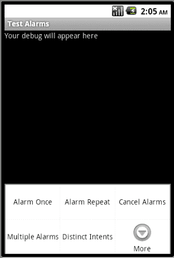
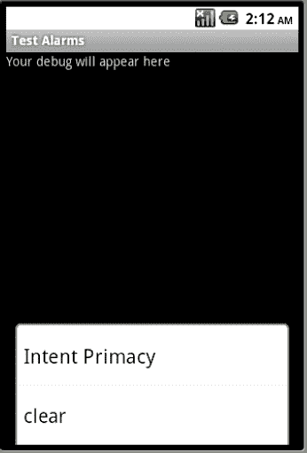
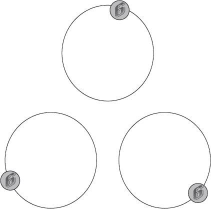
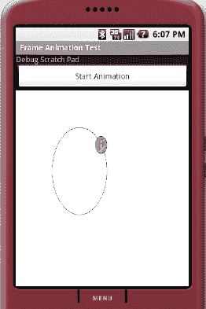
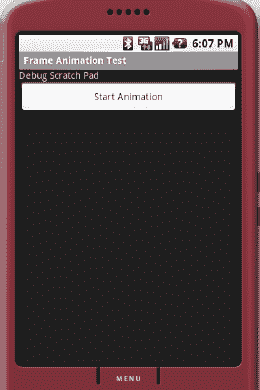
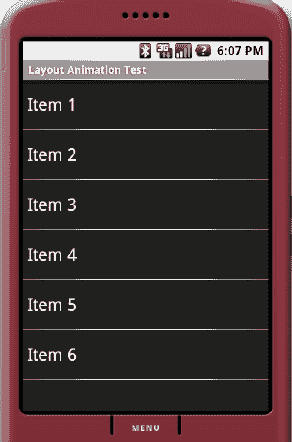
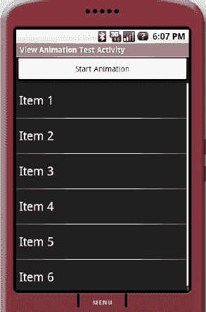

# 探索闹钟管理器

在 Android 中，你可以使用闹钟管理器来触发事件。这些事件可以在特定时间或以固定间隔发生。我们将从闹钟管理器的基础知识开始本章，即设置一个简单的闹钟。然后，我们将介绍设置重复闹钟、取消闹钟、待定 Intent 的角色（特别是其唯一性所起的作用），以及设置多个闹钟。通过本章的学习，你将掌握 Android 闹钟管理器的基础知识和实用细节。

### 闹钟管理器基础：设置一个简单闹钟

我们将从在特定时间设置一个闹钟并让它调用广播接收器开始本章。一旦广播接收器被调用，我们就可以利用第 14 章中的信息，在该广播接收器中执行简单和长时间运行的操作。

本练习的步骤如下：

1.  获取对闹钟管理器的访问权限。
2.  确定设置闹钟的时间。
3.  创建一个待调用的接收器。
4.  创建一个可传递给闹钟管理器以调用接收器的待定 Intent。
5.  使用第 2 步的时间和第 4 步的待定 Intent 来设置闹钟。
6.  观察 logcat 中来自第 3 步所调用接收器的消息。

#### 获取闹钟管理器

获取对闹钟管理器的访问权限很简单，如列表 15–1 所示。

**列表 15–1.** *获取一个闹钟管理器*

```
AlarmManager am =
    (AlarmManager)
         mContext.getSystemService(Context.ALARM_SERVICE);
```

在列表 15–1 中，变量 `mContext` 指代一个上下文对象。例如，如果你从活动菜单中调用此代码，则该上下文变量就是该活动。

#### 设置闹钟的时间

要为特定的日期和时间设置闹钟，你需要一个由 Java `Calendar` 对象标识的时间实例。列表 15–2 包含一个 Java 文件（我们稍后将用它来设置一个项目），其中包含一些用于处理 `Calendar` 对象的实用工具。

**列表 15–2.** *一些有用的日历工具*

```
public class Utils {
    public static Calendar getTimeAfterInSecs(int secs) {
        Calendar cal = Calendar.getInstance();
        cal.add(Calendar.SECOND, secs);
        return cal;
    }
    public static Calendar getCurrentTime() {
        Calendar cal = Calendar.getInstance();
        return cal;
    }
    public static Calendar getTodayAt(int hours) {
        Calendar today = Calendar.getInstance();
        Calendar cal = Calendar.getInstance();
        cal.clear();

        int year = today.get(Calendar.YEAR);
        int month = today.get(Calendar.MONTH);
        // 表示月份中的某一天
        int day = today.get(Calendar.DATE);
        cal.set(year, month, day, hours, 0, 0);
        return cal;
    }
    public static String getDateTimeString(Calendar cal) {
        SimpleDateFormat df = new SimpleDateFormat("MM/dd/yyyy hh:mm:ss");
        df.setLenient(false);
        String s = df.format(cal.getTime());
        return s;
    }
}
```

从这些工具列表中，我们将使用 `getTimeAfterInSecs()` 函数，如列表 15–3 所示，来查找从现在起 30 秒后的时间实例。

**列表 15–3.** *获取一个时间实例*

```
Calendar cal = Utils.getTimeAfterInSecs(30);
```

#### 为闹钟设置一个接收器

现在，我们需要一个为闹钟设置的接收器。一个简单的接收器如列表 15–4 所示。

**列表 15–4.** *用于测试闹钟广播的 TestReceiver*

```
public class TestReceiver extends BroadcastReceiver
{
    private static final String tag = "TestReceiver";
    @Override
    public void onReceive(Context context, Intent intent)
    {
        Log.d("TestReceiver", "intent=" + intent);
        String message = intent.getStringExtra("message");
        Log.d(tag, message);
    }
}
```

你需要在清单文件中使用相应的 `<receiver>` 标签注册此接收器，如列表 15–5 所示。

**列表 15–5.** *注册一个广播接收器*

```
<receiver android:name=".TestReceiver"/>
```

#### 创建适用于闹钟的 PendingIntent

一旦我们有了接收器，就可以设置一个 `PendingIntent`，这是设置闹钟所必需的。我们首先在列表 15–4 中创建一个用于调用 `TestReceiver` 的 Intent。这个 Intent 的创建如列表 15–6 所示。

**列表 15–6.** *创建一个指向 TestReceiver 的 Intent*

```
Intent intent =
    new Intent(mContext, TestReceiver.class);
intent.putExtra("message", "单次闹钟");
```

变量 `mContext` 是你将用来调用此功能的活动上下文。我们直接使用了 `TestReceiver` 类（而不是像我们在第 14 章中对接收器那样，使用针对 Intent 操作的 Intent 过滤器）。在创建此 Intent 时，我们还可以为它加载附加数据。

一旦我们有了这个指向接收器的常规 Intent，就需要创建一个待定 Intent，以便传递给闹钟管理器。列表 15–7 包含一个从列表 15–6 中的 Intent 创建 `PendingIntent` 的示例。

**列表 15–7.** *创建一个待定 Intent*

```
PendingIntent pi =
    PendingIntent.getBroadcast(
      mContext,    // 上下文
      1,           // 请求 ID，用于区分此 Intent
      intent,      // 将传递的 Intent
      0);          // 待定 Intent 标志
```

请注意，我们明确要求 `PendingIntent` 类构造一个适用于广播的待定 Intent。此方法的其他变体如下：

```
PendingIntent.getActivity()  // 用于启动一个活动
PendingIntent.getService()   // 用于启动一个服务
```

我们将在本章后面更详细地讨论我们设置为 1 的 `requestid` 参数。简而言之，它用于区分两个相似的 Intent 对象。

待定 Intent 标志对闹钟管理器几乎没有影响。我们的建议是根本不使用任何标志，并为其值使用 `0`。这些标志通常用于控制待定 Intent 的生命周期。但是，在这种情况下，生命周期由闹钟管理器维护。例如，要取消一个待定 Intent，你可以请求闹钟管理器取消它。

#### 设置闹钟

一旦我们将时间实例作为 `Calendar` 对象（以毫秒为单位）拥有了，并且有了指向接收器的待定 Intent，我们就可以通过调用闹钟管理器的 `set()` 方法来设置一个闹钟，如列表 15–8 所示。

**列表 15–8.** *闹钟管理器 Set 方法*

```
alarmManager.set(AlarmManager.RTC_WAKEUP,
        calendarObject.getTimeInMillis(),
        pendintIntent);
```

如果你使用 `RTC_WAKEUP`，闹钟将唤醒设备。或者，你可以使用 `RTC` 代替它在设备唤醒时传递 Intent。

第二个参数指定的时间是我们之前创建的 `calendarObject` 所指定的时间实例（参见列表 15–3）。这个时间是从 1970 年开始的毫秒数。这也与 Java `Calendar` 对象的默认值一致。

一旦调用此方法，闹钟管理器将在 30 秒后调用列表 15–4 中的 `TestReceiver`。


#### 测试项目

让我们创建一个测试项目来演示目前所介绍的代码。

**注意：** 本章末尾提供了一个网址，您可以用它下载本章项目并直接导入到 Eclipse 中。

要创建此项目，我们需要以下文件：

> `TestAlarmsDriverActivity.java`：这是设置闹钟的活动（清单 15–12）。
> 
> `SendAlarmOnceTester.java`：这是用于测试一次性发送闹钟功能的主类。还会有更多类似的测试类来测试即将介绍的新功能（清单 15–11）。
> 
> `BaseTester.java`：这个基类允许诸如 `SendAlarmOnceTester` 之类的测试类通过 `IReportBack` 接口报告结果（清单 15–10）。
> 
> `IReportBack.java`：这是 `BaseTester.java` 的一个小型接口辅助类，它接收调试消息并将其传递给驱动活动（清单 15–9）。
> 
> `TestReceiver.java`：这是闹钟触发时被调用的 Java 类。该类在前面的清单中已经介绍过（清单 15–4）。
> 
> `Utils.java`：这些日期/时间/日历工具类已在（清单 15–2）中介绍过。
> 
> `/res/menu/main_menu.xml`：这是驱动活动的菜单文件（清单 15–13）。
> 
> `/res/layout/main.xml`：这是驱动活动的布局文件（清单 15–14）。
> 
> `AndroidManifest.xml`：这是每个 Android 项目都必须非常熟悉的清单文件（清单 15–15）。

我们将依次介绍每个文件，从基类开始，这些基类使我们能够在驱动活动和各个测试单个闹钟功能的测试类之间进行协调。其中第一个是 `IReportBack`，见清单 15–9。

**清单 15–9.** *IReportBack.java*

```
//IReportBack.java
package com.androidbook.alarms;

/*
 * 通常由 Activity 实现的接口，
 * 以便工作类能够报告
 * 发生的事情。
 */
public interface IReportBack
{
   public void reportBack(String tag, String message);
}
```

如注释中所述，该接口由测试类用于向驱动活动传递消息。当您查看其继承子类（例如 `SendAlarmOnceTester.java`（清单 15–11））中的代码时，您会清楚地看到这一点。

所有像 `SendAlarmOnceTester` 这样的测试类都继承自 `BaseTester`。`BaseTester.java` 的源代码在清单 15–10 中。

**清单 15–10.** *BaseTester.java*

```
//BaseTester.java
package com.androidbook.alarms;
import android.content.Context;
public class BaseTester
{
    protected IReportBack mReportTo;
    protected Context mContext;
    public BaseTester(Context ctx, IReportBack target)
    {
        mReportTo = target;
        mContext = ctx;
    }
}
```

这是一个简单的辅助类，为派生的测试类（如 `SendAlarmOnceTester`）提供两样东西：一个上下文，供其方法在需要时使用；以及一个实现了 `IReportBack` 接口用于记录消息的活动。

有了 `IReportBack` 和 `BaseTester` 之后，我们就可以准备好 `SendAlarmOnceTester.java` 的代码了，该类用于测试发送单个闹钟事件（见清单 15–11）。

**清单 15–11.** *用于测试一次性发送闹钟的文件*

```
//SendAlarmOnceTester.java
package com.androidbook.alarms;
import java.util.Calendar;
import android.app.AlarmManager;
import android.app.PendingIntent;
import android.content.Context;
import android.content.Intent;

public class SendAlarmOnceTester extends BaseTester
{
    private static String tag = "SendAlarmOnceTester";
    SendAlarmOnceTester(Context ctx, IReportBack target)
    {
        super(ctx, target);
    }

    /*
     * 闹钟可以在指定时间
     * 触发广播请求。
     * 广播接收器的名称在 Intent 中
     * 明确指定。
     */
    public void sendAlarmOnce()
    {
        //获取从现在起 30 秒后的时间实例
        Calendar cal = Utils.getTimeAfterInSecs(30);

        //如果想指向今天的 11:00。
        //Calendar cal = Utils.getTodayAt(11);

        //向调试视图打印我们正在
        //在特定时间进行调度
        String s = Utils.getDateTimeString(cal);
        mReportTo.reportBack(tag, "正在调度闹钟于: " + s);

        //获取一个用于调用接收器的 Intent
        //TestReceiver 类
        Intent intent =
            new Intent(mContext, TestReceiver.class);
        intent.putExtra("message", "单次闹钟");

        PendingIntent pi =
            PendingIntent.getBroadcast(
              mContext,       //上下文
              1,              //请求 ID，用于区分这个 Intent
              intent,         //要传递的 Intent
              PendingIntent.FLAG_ONE_SHOT);  //PendingIntent 标志

        //调度闹钟！
        AlarmManager am =
            (AlarmManager)
                 mContext.getSystemService(Context.ALARM_SERVICE);

        am.set(AlarmManager.RTC_WAKEUP,
                cal.getTimeInMillis(),
                pi);
    }
}
```

`SendAlarmOnceTester` 类的目的是发送一次闹钟，以便触发一个广播接收器。您可以在清单 15–11 的 `sendAlarmOnce()` 方法中看到这一点。用作闹钟目标的 `TestReceiver` 在清单 15–4 中，因此 `sendAlarmOnce()` 的每个方面都在前面的章节中讨论过了。清单 15–11 只是把我们已介绍过的代码整合在一起。

现在让我们来看看负责调用 `sendAlarmOnce()` 方法的驱动活动。该活动的源代码在清单 15–12 中。这个测试项目的主活动调用菜单来测试我们已讨论和将在本章讨论的各种闹钟场景。不过现在，我们只有足够的代码来调用我们提到的单个菜单项。我们将随着学习的深入添加代码来响应更多的菜单。

`TestAlarmsDriverActivity`（清单 15–12）的 `onCreate()` 方法实例化了一个 `SendAlarmOnceTester`，用于传递菜单操作。请注意，该活动将自身同时作为 `IReportBack` 变量和 `Context` 变量传递给 `SendAlarmOnceTester` 构造函数。该类还实现了 `IReportBack` 接口，并用传递进来的文本更新调试视图（注意清单 15–12 中高亮显示的 `reportBack` 方法）。

**清单 15–12.** *用于测试设置闹钟的示例 Activity*

```
//TestAlarmsDriverActivity.java
package com.androidbook.alarms;
import android.app.Activity;
import android.os.Bundle;
import android.util.Log;
import android.view.Menu;
import android.view.MenuInflater;
import android.view.MenuItem;
import android.widget.TextView;
```


```java
public class TestAlarmsDriverActivity extends Activity
    implements IReportBack
{
    public static final String tag="TestAlarmsDriverActivity";
    private SendAlarmOnceTester alarmTester = null;
    /** Called when the activity is first created. */
    @Override
    public void onCreate(Bundle savedInstanceState) {
        super.onCreate(savedInstanceState);
        setContentView(R.layout.main);
        alarmTester = new SendAlarmOnceTester(this,this);
    }

    @Override
    public boolean onCreateOptionsMenu(Menu menu)
    {
        //call the parent to attach any system level menus
        super.onCreateOptionsMenu(menu);
        MenuInflater inflater = getMenuInflater(); //from activity
        inflater.inflate(R.menu.main_menu, menu);
        return true;
    }

    @Override
    public boolean onOptionsItemSelected(MenuItem item)
    {
        appendMenuItemText(item);
        if (item.getItemId() == R.id.menu_clear)
        {
            this.emptyText();
            return true;
        }
        if (item.getItemId() == R.id.menu_alarm_once)
        {
            alarmTester.sendAlarmOnce();
            return true;
        }
        //You will add more menus later here
        return true;
    }
    //Inherited function from IReportBack
    public void reportBack(String tag, String message)
    {
        this.appendText(tag + ":" + message);
        Log.d(tag,message);
    }

    //Simple utility functions to work the debug view
    //of this activity
    private TextView getTextView() {
        return (TextView)this.findViewById(R.id.text1);
    }
    private void appendMenuItemText(MenuItem menuItem){
       String title = menuItem.getTitle().toString();
       TextView tv = getTextView();
       tv.setText(tv.getText() + "\n" + title);
    }
    private void emptyText(){
          TextView tv = getTextView();
          tv.setText("");
    }
    private void appendText(String s){
       TextView tv = getTextView();
       tv.setText(tv.getText() + "\n" + s);
       Log.d(tag,s);
    }
}
```

从 `TestAlarmsDriverActivity` 活动中可以看出，它响应了几个菜单项。对应的 `menu.xml` 文件位于代码清单 15–13 中。在本清单中，我们还一次性包含了将来会处理的额外测试用例。由于这些菜单项的存在不会妨碍你编译第一个练习，因此我们在此一次性将它们包含进去。

**代码清单 15–13.** *用于测试各种闹钟管理器场景的菜单项*

```xml
<!-- /res/menu/main_menu.xml -->
<menu >
    <!-- This group uses the default category. -->
    <group android:id="@+id/menuGroup_Main">
        <item android:id="@+id/menu_alarm_once"
            android:title="Alarm Once" />
        <item android:id="@+id/menu_alarm_repeated"
            android:title="Alarm Repeat" />
        <item android:id="@+id/menu_alarm_cancel"
            android:title="Cancel Alarms" />
        <item android:id="@+id/menu_alarm_multiple"
            android:title="Multiple Alarms" />
        <item android:id="@+id/menu_alarm_distinct_intents"
            android:title="Distinct Intents" />
        <item android:id="@+id/menu_alarm_intent_primacy"
            android:title="Intent Primacy" />

        <item android:id="@+id/menu_clear"
             android:title="clear" />
    </group>
</menu>
```

代码清单 15–14 包含了与驱动程序活动 `TestAlarmsDriverActivity`（代码清单 15–12）配套的布局文件。该文件位于 `/res/layout/main.xml`。

**代码清单 15–14.** *TestAlaramsDriverActivity 的布局文件*

```xml
<?xml version="1.0" encoding="utf-8"?>
<!--  /res/layout/main.xml -->
<LinearLayout
    android:orientation="vertical"
    android:layout_width="fill_parent"
    android:layout_height="fill_parent"
    >
<TextView  
    android:id="@+id/text1"
    android:layout_width="fill_parent"
    android:layout_height="wrap_content"
    android:text="@string/hello"
    />
</LinearLayout>
```

代码清单 15–15 是该项目的清单文件。

**代码清单 15–15.** *闹钟管理器测试程序清单文件*

```xml
<?xml version="1.0" encoding="utf-8"?>
<!-- AndroidManifest.xml  -->
<manifest
      package="com.androidbook.alarms"
      android:versionCode="1"
      android:versionName="1.0.0">
    <application android:icon="@drawable/icon" android:label="Test Alarms">
        <activity android:name=".TestAlarmsDriverActivity"
                  android:label="Test Alarms">
            <intent-filter>
                <action android:name="android.intent.action.MAIN" />
                <category android:name="android.intent.category.LAUNCHER" />
            </intent-filter>
        </activity>
        <receiver android:name=".TestReceiver">
        <intent-filter>
            <action android:name="com.androidbook.intents.testbc"/>
        </intent-filter>
    </receiver>
</application>
    <uses-sdk android:minSdkVersion="3" />
</manifest>
```

在使用闹钟管理器时，除了接收器之外，清单文件中不需要任何特定条目。接收器的定义已在清单文件代码清单 15–15 中突出显示。构建此项目并启动后，你将看到如图 15–1 和 15–2 所示的活动及菜单结构。



**图 15–1.** *用于测试闹钟管理器的示例活动*

部分可用菜单项如图 15–1 所示。要查看其他菜单项，请单击“更多”图标查看其余菜单。该视图如图 15–2 所示。



**图 15–2.** *示例活动的扩展菜单*

现在，如果从图 15–1 中选择“闹钟一次”菜单项，你将执行代码清单 15–11 中 `sendAlarmOnce()` 的代码。这将设置闹钟在 30 秒后触发。随后 `TestReceiver` 会将消息记录到 LogCat。

### 探索闹钟管理器的其他场景

现在我们已经讲解了设置闹钟的基础知识，接下来将介绍一些其他场景，例如重复触发闹钟和取消闹钟。我们还将展示使用闹钟管理器时可能遇到的异常情况。


#### 重复触发闹钟

我们已经介绍了如何设置单次触发的简单闹钟，现在来看看如何设置一个重复触发的闹钟。要理解这一点，请参考代码清单 15–16 中的代码。该测试程序与`SendOnceAlarmTester()`类似，它实现了一个名为`sendRepeatingAlarm()`的方法，用于测试重复发送闹钟。

**代码清单 15–16.** *设置重复闹钟*

```
//SendRepeatingAlarmTester.java
package com.androidbook.alarms;
import java.util.Calendar;
import android.app.AlarmManager;
import android.app.PendingIntent;
import android.content.Context;
import android.content.Intent;

public class SendRepeatingAlarmTester
extends SendAlarmOnceTester
{
    private static String tag = "SendRepeatingAlarmTester";
    SendRepeatingAlarmTester(Context ctx, IReportBack target)
    {
        super(ctx, target);
    }

    /*
     * 闹钟可以从指定时间开始，
     * 并按照固定时间间隔触发广播请求。
     *
     * 使用与上面相同的 Intent，
     * 但使用不同的请求 ID 以避免与上述单次闹钟冲突。
     *
     * 使用 getDistinctPendingIntent() 工具方法。
     */
    public void sendRepeatingAlarm()
    {
        Calendar cal = Utils.getTimeAfterInSecs(30);
        //Calendar testcal = Utils.getTodayAt(11);
        String s = Utils.getDateTimeString(cal);
        this.mReportTo.reportBack(tag,
            "正在调度重复闹钟，5 秒间隔，开始时间：" + s);

        //获取用于调用接收器的 Intent
        Intent intent =
            new Intent(this.mContext, TestReceiver.class);
        intent.putExtra("message", "Repeating Alarm");

        PendingIntent pi = this.getDistinctPendingIntent(intent, 2);
        // 调度闹钟！
        AlarmManager am =
            (AlarmManager)
                this.mContext.getSystemService(Context.ALARM_SERVICE);

        am.setRepeating(AlarmManager.RTC_WAKEUP,
                cal.getTimeInMillis(),
                5*1000, //5 秒
                pi);
    }

    protected PendingIntent getDistinctPendingIntent
(Intent intent, int requestId)
    {
        PendingIntent pi =
            PendingIntent.getBroadcast(
              mContext,     //上下文
              requestId,     //请求 ID
              intent,         //要传递的 Intent
              0);
        return pi;
    }
}
```

代码清单 15–16 中的关键元素已被突出显示。重复闹钟是通过调用闹钟管理器对象的`setRepeating()`方法来设置的。该方法的输入参数之一是指向某个接收器的待定意图。我们使用了与`SendAlarmOnceTester`中相同的 Intent，该 Intent 指向`TestReceiver`广播接收器。

然而，当我们从中创建待定意图时，我们使用了唯一的请求代码，例如 2。如果不这样做，我们会看到一些奇怪的行为。假设您首先点击重复闹钟的菜单项。这会将闹钟调度为重复触发并调用`TestReceiver`。假设该重复闹钟在 30 秒后开始。现在，您继续点击“单次闹钟”菜单项。这会将闹钟调度为在 30 秒后仅触发一次，并调用同一个`TestReceiver`。

如果这两个菜单项都能工作，我们应该会看到两种类型的闹钟都触发。但是，您会注意到闹钟只会触发一次。要使其正常工作，您必须在待定意图上使用不同的`requestcode`。我们将在“PendingIntent 的优先性”部分深入探讨`requestcode`的原因。

#### 编译此示例的代码

要测试这部分代码，您需要在项目中添加/修改几个文件。

首先，您需要将代码清单 15–16 中列出的文件添加为一个名为 `SendRepeatingAlarmTester.java` 的新源文件。

然后，您需要修改驱动 Activity `TestAlarmsDriverActivity`（参见代码清单 15–12）中的几处位置。

将以下行：

```
private SendAlarmOnceTester alarmTester = null;
...
alarmTester = new SendAlarmOnceTester(this,this);
```

替换为：

```
private SendRepeatingAlarmTester alarmTester = null;
...
alarmTester = new SendRepeatingAlarmTester(this,this);
```

添加以下代码以响应菜单：

```
if (item.getItemId() == R.id.menu_alarm_repeated)
{
   alarmTester.sendRepeatingAlarm();
   return true;
}
```

完成这些修改后，您可以使用图 15–1 调用“重复闹钟”菜单项来测试此练习。您将在 LogCat 中看到此测试的结果。接下来，让我们看看如何取消一个重复闹钟。

#### 取消闹钟

为了帮助您理解如何取消闹钟，我们将使用另一个名为 `CancelRepeatingAlarmTester` 的测试程序（参见代码清单 15–17）。

**代码清单 15–17.** *取消重复闹钟*

```
//CancelRepeatingAlarmTester.java
package com.androidbook.alarms;
import android.app.AlarmManager;
import android.app.PendingIntent;
import android.content.Context;
import android.content.Intent;

public class CancelRepeatingAlarmTester
extends SendRepeatingAlarmTester
{
    private static String tag = "CancelRepeatingAlarmTester";
    CancelRepeatingAlarmTester(Context ctx, IReportBack target) {
        super(ctx, target);
    }
    /*
     * 可以通过取消 Intent 来停止闹钟。
     * 您需要拥有该 Intent 的副本才能取消它。
     *
     * Intent 需要具有相同的签名
     * 和请求 ID。
     */
    public void cancelRepeatingAlarm()
    {
        //获取用于调用
        //TestReceiver 类的 Intent
        Intent intent =
            new Intent(this.mContext, TestReceiver.class);

        //取消时，无需填写 extra 部分
        //intent.putExtra("message", "Repeating Alarm");

        PendingIntent pi = this.getDistinctPendingIntent(intent, 2);

        // 调度闹钟！
        AlarmManager am =
            (AlarmManager)
               this.mContext.getSystemService(Context.ALARM_SERVICE);
        am.cancel(pi);
        this.mReportTo.reportBack(tag,"您不应再看到闹钟触发");
    }
}
```

要取消闹钟，我们必须先构建一个待定意图，然后将其作为参数传递给闹钟管理器的`cancel()`方法。

但是，您必须注意确保构建`pendingintent`的方式与设置闹钟时完全相同，包括请求代码和目标接收器。请仔细查看代码清单 15–16 中`getDistinctPendingIntent()`的源代码，了解请求代码如何与`PendingIntent.getBroadcast()`一起使用——您可以忽略代码清单 15–17 中的 Intent extras，因为 Intent extras 在取消该 Intent 时不起作用。


#### 编译本示例的代码

在测试这部分代码之前，你需要在项目中添加/修改几个文件。

首先，你需要添加代码清单 15–17 中列出的新文件，并将其作为名为 `CancelRepeatingAlarmTester.java` 的新源文件。

接着，你需要按照以下说明修改代码清单 15–12 中的驱动活动 `TestAlarmsDriverActivity` 的几处内容。

替换以下代码行：

```
private SendAlarmOnceTester alarmTester = null;
...
alarmTester = new SendAlarmOnceTester(this,this);
```

替换为：

```
private CancelRepeatingAlarmTester alarmTester = null;
...
alarmTester = new CancelRpeatingAlarmTester(this,this);
```

添加以下代码以响应菜单：

```
if (item.getItemId() == R.id.menu_alarm_cancel)
{
  alarmTester.cancelRepeatingAlarm();
  return true;
}
```

你可以通过先选择“重复闹钟”菜单项（参见图 15–1）来测试此功能。这将使 logcat 每 5 秒更新一次。现在，如果你点击“取消闹钟”菜单项，消息将停止显示。

#### 处理多个闹钟

在设置指向同一接收器的多个闹钟时，我们认为闹钟管理器存在一些不太直观的行为——如果你多次调用指向同一接收器的闹钟，只有最后一次调用会生效。

为了解释这一行为，首先查看我们在代码清单 15–18 中准备的测试器。该清单中有两个方法。第一个方法 `scheduleSameIntentMultipleTimes()` 会多次调度同一个 `Intent`。第二个函数 `scheduleDistinctIntents()` 做同样的事情，但借助请求 ID 来区分不同的 Intent。

**代码清单 15–18.** *处理多个闹钟*

```
//ScheduleIntentMultipleTimesTester.java
package com.androidbook.alarms;
import java.util.Calendar;
import android.app.AlarmManager;
import android.app.PendingIntent;
import android.content.Context;
import android.content.Intent;

public class ScheduleIntentMultipleTimesTester
extends CancelRepeatingAlarmTester
{
    private static String tag = "ScheduleIntentMultipleTimesTester";
    ScheduleIntentMultipleTimesTester(Context ctx, IReportBack target){
        super(ctx, target);
    }
    /*
     * 同一个 Intent 不能被多次调度。
     * 如果这样做，只有最后一次会生效。
     *
     * 注意这里使用了相同的请求 ID。
     */
    public void scheduleSameIntentMultipleTimes()
    {
        //获取多个时间实例
        Calendar cal = Utils.getTimeAfterInSecs(30);
        Calendar cal2 = Utils.getTimeAfterInSecs(35);
        Calendar cal3 = Utils.getTimeAfterInSecs(40);
        Calendar cal4 = Utils.getTimeAfterInSecs(45);

        //在调试视图中打印我们正在
        //在特定时间进行调度
        String s = Utils.getDateTimeString(cal);
        mReportTo.reportBack(tag, "正在调度闹钟于: " + s);

        //获取用于调用接收器的 Intent
        Intent intent =
            new Intent(mContext, TestReceiver.class);
        intent.putExtra("message", "同一个 Intent 多次执行");

        PendingIntent pi = this.getDistinctPendingIntent(intent, 1);

        //多次调度同一个 Intent
        AlarmManager am =
            (AlarmManager)
                 mContext.getSystemService(Context.ALARM_SERVICE);

        am.set(AlarmManager.RTC_WAKEUP,
                cal.getTimeInMillis(),
                pi);

        am.set(AlarmManager.RTC_WAKEUP,
                cal2.getTimeInMillis(),
                pi);
        am.set(AlarmManager.RTC_WAKEUP,
                cal3.getTimeInMillis(),
                pi);
        am.set(AlarmManager.RTC_WAKEUP,
                cal4.getTimeInMillis(),
                pi);
    }
    /*
     * 同一个 Intent 可以被多次调度，
     * 只要更改 pending intent 上的请求 ID。
     * 请求 ID 将 Intent 标识为唯一的 Intent。
     */
    public void scheduleDistinctIntents()
    {
        //获取从当前时间开始
        //30 秒后的时间实例。
        Calendar cal = Utils.getTimeAfterInSecs(30);
        Calendar cal2 = Utils.getTimeAfterInSecs(35);
        Calendar cal3 = Utils.getTimeAfterInSecs(40);
        Calendar cal4 = Utils.getTimeAfterInSecs(45);

        //如果你想指向今天 11:00。
        //Calendar cal = Utils.getTodayAt(11);

        //在调试视图中打印我们正在
        //在特定时间进行调度
        String s = Utils.getDateTimeString(cal);
        mReportTo.reportBack(tag, "正在调度闹钟于: " + s);

        //获取用于调用
        //TestReceiver 类的 Intent
        Intent intent =
            new Intent(mContext, TestReceiver.class);
        intent.putExtra("message", "调度不同的闹钟");

        //调度同一个 Intent，但使用不同的请求 ID。
        AlarmManager am =
            (AlarmManager)
                 mContext.getSystemService(Context.ALARM_SERVICE);

        am.set(AlarmManager.RTC_WAKEUP,
                cal.getTimeInMillis(),
                getDistinctPendingIntent(intent,1));

        am.set(AlarmManager.RTC_WAKEUP,
                cal2.getTimeInMillis(),
                getDistinctPendingIntent(intent,2));
        am.set(AlarmManager.RTC_WAKEUP,
                cal3.getTimeInMillis(),
                getDistinctPendingIntent(intent,3));
        am.set(AlarmManager.RTC_WAKEUP,
                cal4.getTimeInMillis(),
                getDistinctPendingIntent(intent,4));
    }
}
```

在方法 `scheduleSameIntentMultipleTimes()` 的代码中，我们使用了同一个 Intent 并调度了四次。你会发现，当通过选择“多个闹钟”菜单项进行测试时：只有最后一个闹钟被触发，之前的全部没有被触发。

解决此问题的推荐方法是修改代码，使每个 pending intent 拥有不同的请求 ID。这就是为什么我们有一个函数 `getDistinctPendingIntent()`，它能基于请求 ID 快速创建 pending intent。代码清单 15–16 显示了该函数的源代码。

你可以通过查看代码清单 15–18 中的 `scheduleDistinctIntents()` 方法来修复重复 Intent 的问题。在这里，我们改变了请求 ID，因此 `TestReceiver` 会被多次调用，你可以在 LogCat 中看到相应的证据。

在创建 pending intent 时，安卓开发团队强烈建议你牢记以下几点：

> 不要随意大量创建独特的 pending intent。注意你是否正在创建大量不同的 pending intent，并改变请求 ID 或 Intent 的其他属性。
>
> Pending intent 应能被发送者快速重新创建，以便能够取消它。这意味着创建 pending intent 有自然的顺序。理想情况下，用于创建 Intent 的参数应该是唯一的。如果不是，并且你需要使用请求 ID 来使 Intent 唯一，请记住你用来创建 pending intent 的请求 ID。当你后续想要取消这些 pending intent 时，你会需要它们。
>
> 没有请求 ID 时，只要两个 pending intent 的关键属性相同，它们就指向同一个 Intent。Intent 的附加信息（extras）不考虑用于 Intent 等效性判断。
>
> Pending intent 的 get 方法通常用于查找现有的 pending intent，而不是创建新的。
>
> Pending intent 通常应指向一个具体的类或组件。


#### 编译本例代码

在测试这段代码之前，你需要在项目中添加/修改几个文件。

首先，你需要将代码清单 15-18 中列出的文件添加为一个新的源文件，命名为 `CancelRepeatingAlarmTester.java`。

然后，你需要修改代码清单 15-12 中的驱动 Activity `TestAlarmsDriverActivity` 的几个地方。

将以下几行代码：

```
private SendAlarmOnceTester alarmTester = null;
...
alarmTester = new SendAlarmOnceTester(this,this);
```

替换为：

```
private ScheduleIntentMultipleTimesTester alarmTester = null;
...
alarmTester = new ScheduleIntentMultipleTimesTester(this,this);
```

添加以下代码，以响应本例中的两个菜单项：

```
if (item.getItemId() == R.id.menu_alarm_multiple)
{
    alarmTester.scheduleSameIntentMultipleTimes();
    return true;
}
if (item.getItemId() == R.id.menu_alarm_distinct_intents)
{
    alarmTester.scheduleDistinctIntents();
    return true;
}
```

完成这些代码修改并编译后，你可以通过使用 **Multiple Alarms**（多个闹钟）和 **Distinct Intents**（不同 Intent）这两个菜单项来测试本练习的功能。你将在 `LogCat` 中看到这些菜单项的结果。

#### Intent 在闹钟设置中的主导地位

到目前为止，我们已经多次提到，如果你对同一类型的 Intent 设置闹钟，只有最后一个闹钟会生效。让我们来探讨一下这背后的原因。在代码示例中，你可能会认为我们是在闹钟管理器上设置闹钟。至少，API 通过暴露以下方法给我们留下了这种印象：

```
alarmManager.set(time, intent);
```

然而，假设我们执行以下操作：

```
alarmManager.set(time1, intent1);
alarmManager.setRepeated(time2, interval, intent1);
```

你可能认为 `intent1` 对象只是一个被动接收器，会被两个闹钟调用。但实际上，只有最后一个 `set` 方法有效。这就像我们在对 Intent 执行 set 操作，如下例所示：

```
intent1.set(...)
intent1.setRepeated(...)
```

在这种情况下，你可能觉得合理的是：你只有一个 Intent 对象，并且该对象只对应一个闹钟；如果你多次设置它，你实际上是在重置之前的闹钟，就像你桌上的闹钟一样。

这个想法通过代码清单 15-19 中列出的测试器进行了验证。该清单中值得关注的方法是 `alarmIntentPrimacy()`。

**代码清单 15-19.** *测试 Intent 主导地位的代码*

```
//AlarmIntentPrimacyTester.java
package com.androidbook.alarms;
import java.util.Calendar;
import android.app.AlarmManager;
import android.app.PendingIntent;
import android.content.Context;
import android.content.Intent;

public class AlarmIntentPrimacyTester
extends ScheduleIntentMultipleTimesTester
{
    private static String tag = "AlarmIntentPrimacyTester";
    AlarmIntentPrimacyTester(Context ctx, IReportBack target){
        super(ctx, target);
    }
    /*
     * 重要的不是闹钟，
     * 而是 PendingIntent。
     * 即使为一个 Intent 设置了重复闹钟，
     * 如果你再次为同一个 Intent 安排一个一次性闹钟，
     * 后设置的闹钟会生效。
     *
     * 这就像你在对同一个已有的 Intent
     * 多次设置闹钟，
     * 而不是反过来。
     */
    public void alarmIntentPrimacy()
    {
        Calendar cal = Utils.getTimeAfterInSecs(30);
        String s = Utils.getDateTimeString(cal);
        this.mReportTo.reportBack(tag,
            "安排一个从 " + s + " 开始、间隔 5 秒的重复闹钟");

        //获取一个用于调用
        //TestReceiver 类的 Intent
        Intent intent =
            new Intent(this.mContext, TestReceiver.class);
        intent.putExtra("message", "重复闹钟");

        PendingIntent pi = getDistinctPendingIntent(intent,0);
        AlarmManager am =
            (AlarmManager)
                this.mContext.getSystemService(Context.ALARM_SERVICE);

        this.mReportTo.reportBack(tag,"设置一个持续 5 秒的重复闹钟");
        am.setRepeating(AlarmManager.RTC_WAKEUP,
                cal.getTimeInMillis(),
                5*1000, //5 秒
                pi);

        this.mReportTo.reportBack(tag,"在同一个 Intent 上设置一个一次性闹钟");
        am.set(AlarmManager.RTC_WAKEUP,
                cal.getTimeInMillis(),
                pi);
        this.mReportTo.reportBack(tag,
             "后设置的闹钟，即一次性闹钟，优先级更高");
    }
}
```

#### 编译本例代码

在测试这段代码之前，你需要在项目中添加/修改几个文件。

首先，你需要将代码清单 15-19 中列出的文件添加为一个新的源文件，命名为 `AlarmIntentPrimacyTester.java`。

然后，你需要修改代码清单 15-12 中的驱动 Activity `TestAlarmsDriverActivity` 的几个地方。

将以下几行代码：

```
private SendAlarmOnceTester alarmTester = null;
...
alarmTester = new SendAlarmOnceTester(this,this);
```

替换为：


`private AlarmIntentPrimacyTester alarmTester = null;`  
`...`  
`alarmTester = new AlarmIntentPrimacyTester (this,this);`

添加以下代码以响应该菜单项：

```
if (item.getItemId() == R.id.menu_alarm_intent_primacy)
{
    alarmTester.alarmIntentPrimacy();
    return true;
}
```

完成这些代码修改并编译后，你可以通过“Intent Primacy”菜单项来测试本练习的功能。你可以在 LogCat 中看到这些菜单项的执行结果，即后设置的闹钟会覆盖前一个。

为什么基于同一 Intent 设置的闹钟，后设置的会替换先前的？

Android 开发者社区的许多同仁指出，如果两个 Intent 的属性相同，它们实际上会生成同一个 `PendingIntent` 对象。将这些 Intent 作为多个闹钟的目标，就像是对同一个 Intent 设置了多个闹钟时间。

然而，当我们查看 `AlarmManagerService`（它是 `IAlarmManager` 接口的一个实现）的源代码时，实际情况就显而易见了。代码清单 15–20 包含了用于设置闹钟的代码段（所有设置操作最终都会流经此段代码）。

**代码清单 15–20.** *来自 Android 源码的 AlarmManagerService 实现摘录*

```
160     public void setRepeating(int type, long triggerAtTime, long interval,  
161             PendingIntent operation) {  
162         if (operation == null) {  
163             Slog.w(TAG, "set/setRepeating ignored because there is no intent");  
164             return;  
165         }  
166         synchronized (mLock) {  
167             Alarm alarm = new Alarm();  
168             alarm.type = type;  
169             alarm.when = triggerAtTime;  
170             alarm.repeatInterval = interval;  
171             alarm.operation = operation;  
172   
173             // 如果已调度该闹钟，则将其移除。  
174             removeLocked(operation);  
175   
176             if (localLOGV) Slog.v(TAG, "set: " + alarm);  
177   
178             int index = addAlarmLocked(alarm);  
179             if (index == 0) {  
180                 setLocked(alarm);  
181             }  
182         }  
183     }
```

请注意，在该 set 方法的中间，代码调用了 `removeLocked(operation)`，其中 `operation` 参数就是 `PendingIntent`。这实际上移除了先前的闹钟。事实上，当我们调用 `cancel(pendingIntent)` 时，它最终也会调用相同的 `removeLocked(pendingIntent)`。

从本质上讲，SDK 选择取消之前的闹钟，只为该特定的 Pending Intent 保留最新的一个。如果你想改变这一行为，则需要使用请求 ID 来限定 Pending Intent。当我们更仔细地查看只接收 `PendingIntent` 对象的 `cancel()` API 时，这一点也会变得清晰：如果闹钟和 `PendingIntent` 之间的关系不是唯一的，那么仅基于一个 `PendingIntent` 来取消闹钟，其意义何在？

当然，如果你的目标是取消该特定接收器的任何先前闹钟并设置一个新的，也可以善加利用此特性。

#### 闹钟的持久性

最后需要注意的一点是，闹钟在设备重启后不会持久保存。这意味着你需要将闹钟设置和 Pending Intent 持久化到存储中，并根据设备重启广播消息（以及可能的时间更改消息，如 `android.intent.action.BOOT_COMPLETED`、`ACTION_TIME_CHANGED`、`ACTION_TIMEZONE_CHANGED`）重新注册它们。

#### 闹钟管理器谓词

让我们通过提供一个关于闹钟、Pending Intent 和闹钟管理器相关事实的快速总结来结束本章：

> Pending Intent 是保存在池中并被复用的 Intent。你无法新建一个 Pending Intent。实际上，你是通过一个选项（如复用、更新等）来定位一个 Pending Intent。
> 
> Intent 通过其操作、数据 URI 和类别被唯一区分。这种唯一性的细节在 Intent 类的 `filterEquals()` API 中进行了规定。
> 
> Pending Intent 除了依赖的基础 Intent 外，还通过请求码进一步限定。
> 
> 闹钟和 Pending Intent（就此而言，甚至包括 Intent）并非独立的。一个给定的 Pending Intent 不能用于多个闹钟。最后一个闹钟将覆盖之前的闹钟。
> 
> 闹钟在重启后不会持久保存。无论你通过闹钟管理器设置了哪些闹钟，当设备重启时，它们都会丢失。
> 
> 如果你希望在设备重启后保留闹钟，则需要自行持久化闹钟参数。你需要监听广播启动事件和时间变化事件，以便根据需要重置这些闹钟。
> 
> 基于 Intent 的取消 API 意味着，当你使用或持久化闹钟时，还需要持久化 Intent，以便以后需要时能够取消这些闹钟。

### 本章小结

在本章中，我们使用闹钟管理器在指定时间和特定时间间隔运行代码。此功能对于更新主屏幕小部件和其他时间敏感操作非常重要。我们还指出了闹钟管理器的一些特殊之处，并向你展示了如何解决这些问题。

---

## 第 16 章

## 探索 2D 动画

动画允许屏幕上的对象随时间改变其颜色、位置、大小或方向。Android 中的动画功能实用、有趣且简单，并且被频繁使用。

Android 2.3 及更早版本支持三种类型的动画：逐帧动画，即一系列帧按固定时间间隔依次绘制；布局动画，即对容器视图（如列表和表格）中的视图进行动画处理；以及视图动画，即可对任何通用视图进行动画处理。后两种属于补间动画范畴，涉及关键帧之间的中间帧绘制。

**注意：** Android 3.0 通过引入对 UI 元素属性进行动画处理的能力，增强了动画功能。其中一些特性，特别是与碎片（fragments）新概念相关的部分，将在第 29 章中介绍。由于本章是在 3.0 发布前完成的，受时间限制，我们仅在本章中涵盖 2.3 的特性。第 29 章 将介绍一些 3.0 的动画特性。

解释补间动画的另一种方式是，它*不是*逐帧动画。如果你能够在不重复绘制帧的情况下完成对图形的动画处理，那么你主要是在做补间动画。例如，如果一个图形现在位于 A 点，4 秒后将到达 B 点，我们可以每隔一秒改变其位置并重绘该图形。这将使图形看起来像是从 A 点移动到 B 点。

基本思想是：了解绘图的开始和结束状态，设计师就可以随时间变化图形的某个方面。这个变化的方面可以是颜色、位置、大小或其他元素。借助计算机，你可以通过按固定时间间隔改变中间值并重绘表面来实现这种动画。

在本章中，我们将通过实际示例和深入分析，介绍逐帧动画、布局动画和视图动画。

**注意：** 我们在本章末尾提供了一个 URL，你可以使用它来下载本章的项目，并直接将它们导入 Eclipse。

### 逐帧动画

逐帧动画是一个简单的过程：以较快的时间间隔连续显示一系列图像，最终效果是物体移动或变化。这就是电影放映机的工作原理。我们将通过一个示例来探索——设计一个图像，并将其保存为多个不同的图像，每张图像之间略有差异。然后，我们将这些图像集合起来，通过示例代码运行以模拟动画。


#### 逐帧动画规划

在开始编写代码前，首先需要用一系列绘图来规划动画序列。作为规划练习的示例，图 16-1 展示了一组等大的圆形，每个圆形上都有一个彩色小球位于不同位置。你可以创建一系列图片，保持圆形大小和位置不变，让彩色小球沿圆形边界分布在不同位置。保存七到八帧这样的图像后，就能利用动画表现出彩色小球围绕圆形运动的视觉效果。



**图 16-1.** *编码前设计动画*

将图像命名为`colored-ball`作为基础名称，并将这八张图片存放在`/res/drawable`子目录下，以便通过资源 ID 访问。每张图片的命名格式为`colored-ballN`，其中`N`代表图像编号的数字。完成动画后，最终效果应如图 16-2 所示。



**图 16-2.** *逐帧动画测试面板*

本活动的主要区域用于显示动画视图。我们添加了一个启动/停止动画的按钮来观察其行为，并在顶部设置了调试草稿区，以便在实验过程中记录重要事件。接下来让我们探讨如何为此活动创建布局。

#### 创建活动

首先在`/res/layout`子目录下创建基础的 XML 布局文件（参见代码清单 16-1）。

**代码清单 16-1.** *帧动画示例的 XML 布局文件*

```
<?xml version="1.0" encoding="utf-8"?>
<!—filename: /res/layout/frame_animations_layout.xml -->
<LinearLayout
    android:orientation="vertical"
    android:layout_width="fill_parent"
    android:layout_height="fill_parent"
    >
<TextView android:id="@+id/textViewId1"
    android:layout_width="fill_parent"
    android:layout_height="wrap_content"
    android:text="调试草稿区"
    />
<Button
   android:id="@+id/startFAButtonId"
    android:layout_width="fill_parent"
    android:layout_height="wrap_content"
    android:text="启动动画"
/>
<ImageView
        android:id="@+id/animationImage"
        android:layout_width="fill_parent"
       android:layout_height="wrap_content"
        />
</LinearLayout>
```

第一个控件是调试草稿文本控件，一个简单的`TextView`。接着添加用于启动/停止动画的按钮。最后一个视图是`ImageView`，用于播放动画。布局完成后，创建加载此视图的活动（参见代码清单 16-2）。

**代码清单 16-2.** *加载 ImageView 的活动*

```
public class FrameAnimationActivity extends Activity
{
    @Override
    public void onCreate(Bundle savedInstanceState)
    {
        super.onCreate(savedInstanceState);
        setContentView(R.layout.frame_animations_layout);
    }
}
```

通过执行以下代码，你可以从当前应用的任意菜单项中启动此活动：

```
Intent intent = new Intent(inActivity,FrameAnimationActivity.class);
inActivity.startActivity(intent);
```

此时，你将看到一个如图 16-3 所示的活动界面。

#### 为活动添加动画

现在活动与布局已就绪，我们将演示如何为示例添加动画。在 Android 中，通过图形包中的`AnimationDrawable`类实现逐帧动画。顾名思义，它如同任何可设置为视图背景的 Drawable（例如背景位图都以`Drawable`形式呈现）。`AnimationDrawable`类除了作为`Drawable`外，还能接收其他`Drawable`资源（如图像）列表，并按指定时间间隔渲染它们。此类本质上是基于基础`Drawable`类动画支持的轻量级封装。



**图 16-3.** *逐帧动画活动*

**提示：** `Drawable`类通过要求其容器或视图调用`Runnable`类来实现动画，该类本质上使用不同参数集重绘`Drawable`。请注意，使用`AnimationDrawable`类时无需了解这些内部实现细节。但如果需求更复杂，可以查阅`AnimationDrawable`源代码，以编写自己的动画协议。

要使用`AnimationDrawable`类，首先在`/res/drawable`子目录中放置一组`Drawable`资源（如图像集）。本例中，这八张图像与"规划逐帧动画"部分所述的一致——相似但略有差异。接着构建定义帧列表的 XML 文件（参见代码清单 16-3）。该 XML 文件同样需要存放在`/res/drawable`子目录中。

**代码清单 16-3.** *定义待动画帧列表的 XML 文件*

```
<animation-list
android:oneshot="false">
   <item android:drawable="@drawable/colored_ball1" android:duration="50" />
   <item android:drawable="@drawable/colored_ball2" android:duration="50" />
   <item android:drawable="@drawable/colored_ball3" android:duration="50" />
   <item android:drawable="@drawable/colored_ball4" android:duration="50" />
   <item android:drawable="@drawable/colored_ball5" android:duration="50" />
   <item android:drawable="@drawable/colored_ball6" android:duration="50" />
   <item android:drawable="@drawable/colored_ball7" android:duration="50" />
   <item android:drawable="@drawable/colored_ball8" android:duration="50" />
</animation-list>
```

**注意：** 在准备图像列表时，需要提醒`AnimationDrawable`类的一些局限。该类在动画开始前会将所有图像加载到内存中。在 Android 2.3 模拟器上测试时，超过六张图像就会超出每个应用的内存限制。根据测试环境，你可能需要限制帧数。要突破此限制，需直接使用`Drawable`的动画功能并自行开发解决方案。遗憾的是，本书当前版本未详细讲解`Drawable`类。请访问[`www.androidbook.com`](http://www.androidbook.com)，我们计划尽快发布更新。

每帧通过资源 ID 指向已准备的彩色小球图像之一。`animation-list`标签最终会被转换为代表图像集合的`AnimationDrawable`对象。接着需要将此`Drawable`设置为示例中`ImageView`的背景资源。假设该 XML 文件名为`frame_animation.xml`，位于`/res/drawable`子目录，可使用以下代码将`AnimationDrawable`设为`ImageView`的背景：

```
view.setBackGroundResource(Resource.drawable.frame_animation);
```


通过这段代码，Android 会识别出资源 ID `Resource.drawable.frame_animation` 是一个 XML 资源，并据此为其构造一个合适的 `AnimationDrawable` Java 对象，然后将其设置为背景。设置完成后，你可以通过 `view` 对象执行 `get` 操作来访问这个 `AnimationDrawable` 对象，示例如下：

```
Object backgroundObject = view.getBackground();
AnimationDrawable ad = (AnimationDrawable)backgroundObject;
```

一旦获取了 `AnimationDrawable` 对象，就可以使用其 `start()` 和 `stop()` 方法来启动和停止动画。以下是该对象的另外两个重要方法：

`setOneShot();`
`addFrame(drawable, duration);`

`setOneShot()` 方法让动画运行一次后停止。`addFrame()` 方法使用 `Drawable` 对象添加一个新帧，并设置其显示时长。`addFrame()` 方法的功能类似于 XML 标签 `android:drawable`。

将上述内容整合起来，即可得到逐帧动画测试工具的完整代码（参见清单 16–4）。

**清单 16–4.** *逐帧动画测试工具的完整代码*

```
public class FrameAnimationActivity extends Activity {
    @Override
    public void onCreate(Bundle savedInstanceState)
    {
        super.onCreate(savedInstanceState);
        setContentView(R.layout.frame_animations_layout);
        this.setupButton();
    }

    private void setupButton()
    {
       Button b = (Button)this.findViewById(R.id.startFAButtonId);
       b.setOnClickListener(
             new Button.OnClickListener(){
                public void onClick(View v)
                {
                   parentButtonClicked(v);
                }
             });
    }

    private void parentButtonClicked(View v)
    {
       animate();
    }

    private void animate()
    {
        ImageView imgView =
          (ImageView)findViewById(R.id.animationImage);
        imgView.setVisibility(ImageView.VISIBLE);
        imgView.setBackgroundResource(R.drawable.frame_animation);

        AnimationDrawable frameAnimation =
           (AnimationDrawable) imgView.getBackground();

        if (frameAnimation.isRunning())
        {
            frameAnimation.stop();
        }
        else
        {
            frameAnimation.stop();
            frameAnimation.start();
        }
    }
}//eof-class
```

`animate()` 方法在当前 Activity 中定位到 `ImageView`，并将其背景设置为资源 `R.drawable.frame_animation` 所标识的 `AnimationDrawable`。随后，代码检索该对象并执行动画。启动/停止按钮的逻辑设定为：如果动画正在运行，点击按钮则停止动画；如果动画处于停止状态，点击按钮则启动动画。

请注意，如果将动画列表的 `OneShot` 参数设置为 `true`，动画将在执行一次后停止。然而，并没有明确的方式来判断动画何时结束。尽管动画在播放完最后一张图片时就已结束，但你并不会收到任何回调通知。因此，无法直接通过响应动画完成来触发另一个操作。

抛开这个缺点不谈，通过简单的逐帧动画过程，连续绘制多张图片，你可以为应用带来出色的视觉效果。

### 布局动画

与逐帧动画类似，布局动画也非常简单。顾名思义，布局动画专门用于以特定方式排列的某些类型的视图。例如，你可以在 `ListView` 和 `GridView`（Android 中两种常用的布局控件）中使用布局动画。具体来说，你通过布局动画为 `ListView` 或 `GridView` 中每个项目的显示方式添加视觉效果。实际上，你可以将这种动画应用于所有派生自 `ViewGroup` 的控件。

与逐帧动画不同，布局动画并非通过重复帧实现，而是通过随时间改变视图的各种属性来实现。Android 中的每个视图都有一个变换矩阵，用于将视图映射到屏幕。通过多种方式改变这个矩阵，你可以实现视图的缩放、旋转和移动（平移）。例如，通过将视图的透明度从 `0` 变更为 `1`，你可以实现所谓的透明度动画。

#### 基本补间动画类型

以下是更详细的一些基本补间动画类型：

- *缩放动画*：这种动画用于沿 x 轴或 y 轴将视图缩小或放大。你还可以指定动画发生的枢轴点。
- *旋转动画*：这种动画用于围绕枢轴点将视图旋转一定角度。
- *平移动画*：这种动画用于沿 x 轴或 y 轴移动视图。
- *透明度动画*：这种动画用于改变视图的透明度。

你可以将这些动画定义为 XML 文件，并放置在 `/res/anim` 子目录中。清单 16–5 快速演示了如何在 XML 文件中声明其中一种动画。

**清单 16–5.** *在 `/res/anim/scale.xml` 中定义的缩放动画 XML 文件*

```
<set
android:interpolator="@android:anim/accelerate_interpolator">
   <scale
         android:fromXScale="1"
         android:toXScale="1"
         android:fromYScale="0.1"
         android:toYScale="1.0"
         android:duration="500"
         android:pivotX="50%"
         android:pivotY="50%"
         android:startOffset="100" />
</set>
```

与这些动画 XML 定义相关的所有参数值都具有“起始”和“结束”两种形式，因为必须指定动画的起始值和结束值。

每个动画还允许将持续时间和时间插值器作为参数。我们将在布局动画部分的末尾介绍插值器，但就目前而言，你需要知道插值器决定了动画过程中动画参数的变化速率。

一旦有了这个声明式动画文件，你就可以将此动画与一个布局关联起来，从而为布局的组成视图添加动画效果。

**注意：** 这里需要指出，这些动画中的每一个都以 Java 类的形式存在于 `android.view.animation` 包中。每个类的 Java 文档不仅描述了其 Java 方法，还描述了每种动画允许的 XML 参数。

现在，你已经对动画类型有了足够的了解，也对布局动画有了初步认识，接下来让我们设计一个示例。


#### 规划布局动画测试框架

你可以使用设置在 Activity 中的简单 `ListView` 来测试我们讨论过的所有布局动画概念。一旦你有了 `ListView`，就可以为其附加一个动画，这样每个列表项都会执行该动画。

假设你心中有一个缩放动画，它会使视图在 Y 轴上从零开始增长到其原始大小。从视觉上看，这相当于一行文本最初是一条水平线，然后逐渐变粗，最终达到其实际的字体大小。

你可以将这样的动画附加到 `ListView` 上。当这样做时，`ListView` 会使用该动画来驱动列表中每一项的动画效果。

你可以设置一些额外的参数来扩展基本动画，例如让列表项从上到下或从下到上动画显示。你需要通过一个中间类来指定这些参数，该类充当单个动画 XML 文件和列表视图之间的协调器。

你可以在 `/res/anim` 子目录下的 XML 文件中定义单个动画和这个协调器。一旦你有了协调器 XML 文件，就可以在 `ListView` 的 XML 布局定义中使用该文件作为输入。完成这个基本设置后，你就可以开始修改单个动画，看看它们如何影响 `ListView` 的显示效果。

在开始这个练习之前，让我们先向你展示动画完成后的 `ListView` 会是什么样子（参见图 16-4）。



**图 16-4.** *我们将为其制作动画的 ListView*

#### 创建 Activity 和 ListView

首先，为图 16-4 中的 `ListView` 创建一个 XML 布局，以便你可以在一个基本的 Activity 中加载该布局。代码清单 16-6 包含一个带有 `ListView` 的简单布局。你需要将此文件放在 `/res/layout` 子目录下。假设文件名为 `list_layout.xml`，那么你的完整文件路径将为 `/res/layout/list_layout.xml`。

**代码清单 16-6.** *定义 ListView 的 XML 布局文件*

```
<?xml version="1.0" encoding="utf-8"?>
<!-- 文件名: /res/layout/list_layout.xml -->
<LinearLayout
    android:orientation="vertical"
    android:layout_width="fill_parent"
    android:layout_height="fill_parent"
    >

    <ListView
        android:id="@+id/list_view_id"
        android:layout_width="fill_parent"
        android:layout_height="fill_parent"
        />
</LinearLayout>
```

代码清单 16-6 展示了一个包含单个 `ListView` 的简单 `LinearLayout`。但是，我们应该借此机会提一下关于 `ListView` 定义的一个问题，虽然它与本章的关系有些间接。如果你碰巧研究过记事本示例和其他 Android 示例，你会发现 `ListView` 的 ID 通常被指定为 `@android:id/list`。正如我们在第 3 章中讨论的，资源引用 `@android:id/list` 指向的是 `android` 命名空间中预定义的一个 ID。问题是，我们何时使用这个 `android:id`，何时使用我们自己的 ID，比如 `@+id/list_view_id`？

只有当 Activity 是一个 `ListActivity` 时，你才需要使用 `@android:id/list`。`ListActivity` 假定一个由这个预定 ID 标识的 `ListView` 可供加载。在本例中，你使用的是通用 Activity 而不是 `ListActivity`，并且你将自行显式填充 `ListView`。因此，对于你可以分配用来表示这个 `ListView` 的 ID 类型没有任何限制。不过，你也可以选择使用 `@android:id/list`，因为它与任何内容都不会冲突，因为此处没有 `ListActivity`。

这的确有点离题，但当你在 `ListActivity` 之外创建自己的 `ListView` 时，这是值得注意的。现在你已经有了 Activity 所需的布局，你可以编写 Activity 的代码来加载这个布局文件，从而生成你的 UI（参见代码清单 16-7）。

**代码清单 16-7.** *布局动画 Activity 的代码*

```
public class LayoutAnimationActivity extends Activity
{
    @Override
    public void onCreate(Bundle savedInstanceState)
    {
        super.onCreate(savedInstanceState);
        setContentView(R.layout.list_layout);
        setupListView();
    }
    private void setupListView()
    {
          String[] listItems = new String[] {
                "Item 1", "Item 2", "Item 3",
                "Item 4", "Item 5", "Item 6",
          };

          ArrayAdapter listItemAdapter =
               new ArrayAdapter(this
                       ,android.R.layout.simple_list_item_1
                       ,listItems);
          ListView lv = (ListView)this.findViewById(R.id.list_view_id);
          lv.setAdapter(listItemAdapter);
    }
}
```

代码清单 16-7 中的一些代码是显而易见的，还有一些则不是。代码的第一部分只是根据生成的布局 ID `R.layout.list_layout` 加载视图。我们的目标是获取这个布局中的 `ListView`，并用六个文本项填充它。这些文本项被加载到一个数组中。你需要为 `ListView` 设置一个数据适配器，以便 `ListView` 能够显示这些项目。

要创建必要的适配器，你需要指定列表显示时每个项目的布局方式。你通过使用 Android 基础框架中预定义的布局来指定布局。在本例中，布局指定如下：

```
android.R.layout.simple_list_item_1
```

这些项目其他可能的视图布局包括：

```
simple_list_item_2
simple_list_item_checked
simple_list_item_multiple_choice
simple_list_item_single_choice
```

你可以参考 Android 文档来了解每种布局的外观和行为。现在，你可以使用以下代码从应用程序的任何菜单项中调用这个 Activity：

```
Intent intent = new Intent(inActivity,LayoutAnimationActivity.class);
inActivity.startActivity(intent);
```

但是，与其他任何 Activity 的调用一样，你需要先在 `AndroidManifest.xml` 文件中注册 `LayoutAnimationActivity`，上述 Intent 调用才能生效。相应的代码如下：

```
<activity android:name=".LayoutAnimationActivity"
        android:label="View Animation Test Activity"/>
```


#### 为 ListView 添加动画效果

现在你已经准备好了测试框架（参见代码清单 16-6 和 16-7），接下来将学习如何为这个`ListView`应用缩放动画。我们先看看这个缩放动画在 XML 文件中是如何定义的（参见代码清单 16-8）。

**代码清单 16-8.** *在 XML 文件中定义缩放动画*

```
<set
android:interpolator="@android:anim/accelerate_interpolator">
   <scale
         android:fromXScale="1"
         android:toXScale="1"
         android:fromYScale="0.1"
         android:toYScale="1.0"
         android:duration="500"
         android:pivotX="50%"
         android:pivotY="50%"
         android:startOffset="100" />
</set>
```

如前所述，这些动画定义文件存放在`/res/anim`子目录下。

下面我们用通俗的语言解释这些 XML 属性。

`from`和`to`缩放值分别代表起始和结束的放大系数。在 X 轴上，放大系数从`1`开始并保持在`1`，这意味着列表项在 X 轴上不会放大或缩小。

而在 Y 轴上，放大系数从`0.1`开始，增长到`1.0`。换言之，被动画化的对象从正常尺寸的十分之一开始，逐渐增长到正常尺寸。

缩放操作需要`500`毫秒完成。

动画的中心点在 X 轴和 Y 轴方向的正中间（`50%`）。

`startOffset`值表示开始动画前需要等待的毫秒数。

缩放动画的父节点指向一个动画集，该动画集可以同时生效多个动画。我们也会介绍其中一个示例，但现在这个集合中只有一个动画。

将此文件命名为`scale.xml`，并放置在`/res/anim`子目录中。目前还不能直接将这个动画 XML 作为`ListView`的参数；`ListView`首先需要另一个 XML 文件作为它与动画集之间的中介。描述这个中介的 XML 文件如代码清单 16-9 所示。

**代码清单 16-9.** *布局控制器 XML 文件的定义*

```
<layoutAnimation
        android:delay="30%"
        android:animationOrder="reverse"
        android:animation="@anim/scale" />
```

你也需要将这个 XML 文件放置在`/res/anim`子目录中。在我们的示例中，假定文件名为`list_layout_controller.xml`。查看这个定义后，你就能明白为什么需要这个中间文件。

这个 XML 文件指定列表中的动画应反向执行，并且每个项目的动画应在总动画时长的基础上延迟 30%开始。该 XML 文件还引用了单个动画文件`scale.xml`。另请注意，代码中使用了资源引用`@anim/scale`而不是文件名。

现在你已经有了必要的 XML 输入文件，我们将展示如何更新`ListView`的 XML 定义，将这个动画 XML 作为参数包含进去。首先，回顾一下目前拥有的 XML 文件：

```
// 单个缩放动画
/res/anim/scale.xml

// 动画中介文件
/res/anim/list_layout_controller.xml

// 活动视图布局文件
/res/layout/list_layout.xml
```

有了这些文件后，你需要修改 XML 布局文件`list_layout.xml`，让`ListView`指向`list_layout_controller.xml`文件（参见代码清单 16-10）。

**代码清单 16-10.** *`list_layout.xml`文件的更新代码*

```
<?xml version="1.0" encoding="utf-8"?>
<LinearLayout
    android:orientation="vertical"
    android:layout_width="fill_parent"
    android:layout_height="fill_parent"
    >
    <ListView
        android:id="@+id/list_view_id"
        android:persistentDrawingCache="animation|scrolling"
        android:layout_width="fill_parent"
        android:layout_height="fill_parent"
        android:layoutAnimation="@anim/list_layout_controller" />
        />
</LinearLayout>
```

改动行已用粗体标出。`android:layoutAnimation`是关键标签，它指向使用`layoutAnimation` XML 标签定义布局控制器的中介 XML 文件（参见代码清单 16-9）。而`layoutAnimation`标签又指向单个动画，在本例中就是`scale.xml`中定义的缩放动画。

Android 还建议设置`persistentDrawingCache`标签以优化动画和滚动效果。有关此标签的更多详细信息，请参阅 Android SDK 文档。

当你按照代码清单 16-10 所示更新`list_layout.xml`文件后，Eclipse 的 ADT 插件会自动考虑这一变化并重新编译包。如果现在运行应用程序，你会看到缩放动画在每一个项目上生效。我们将持续时间设置为`500`毫秒，这样每个项目绘制时你能清晰观察到缩放变化。

现在，你可以尝试不同类型的动画了。接下来我们试试透明度动画。为此，创建一个名为`/res/anim/alpha.xml`的文件，并填入代码清单 16-11 中的内容。

**代码清单 16-11.** *用于测试透明度动画的`alpha.xml`文件*

```
<alpha
       android:interpolator="@android:anim/accelerate_interpolator"
       android:fromAlpha="0.0" android:toAlpha="1.0" android:duration="1000" />
```

透明度动画负责控制颜色的淡入淡出。在这个例子中，你要求透明度动画在 1000 毫秒（即 1 秒）内从不可见变为完全颜色显示。请确保持续时间设置为 1 秒或更长，否则颜色变化很难察觉。

每次你想要像这样更改单个项目的动画时，都需要修改中介 XML 文件（参见代码清单 16-9），使其指向新的动画文件。以下是如何将动画从缩放动画更改为透明度动画：

```
<layoutAnimation
        android:delay="30%"
        android:animationOrder="reverse"
        android:animation="@anim/alpha" />
```

`layoutAnimation` XML 文件中更改的行已用粗体标出。现在让我们尝试一种结合位置变化和颜色渐变变化的动画。代码清单 16-12 展示了此动画的示例 XML。

**代码清单 16-12.** *通过动画集组合平移和透明度动画*

```
<set
android:interpolator="@android:anim/accelerate_interpolator">
    <translate android:fromYDelta="-100%" android:toYDelta="0"
android:duration="500" />
    <alpha android:fromAlpha="0.0" android:toAlpha="1.0"
android:duration="500" />
</set>
```

请注意我们如何在动画集中指定了两个动画。平移动画会将文本从其当前分配显示空间的顶部移到底部。透明度动画会在文本项目落入其位置时，将颜色渐变从不可见变为可见。`500`的持续时间设置使用户能够舒适地感知变化。当然，你需要再次修改`layoutAnimation`中介 XML 文件，使其引用这个新文件名。假设这个组合动画的文件名为`/res/anim/translate_alpha.xml`，那么你的`layoutAnimation` XML 文件将如下所示：


`<layoutAnimation
        android:delay="30%"
        android:animationOrder="reverse"
        android:animation="@anim/translate_alpha" />`

下面我们来了解如何使用旋转动画（参见清单 16–13）。

**清单 16–13.** *旋转动画 XML 文件*

```
<rotate
       android:interpolator="@android:anim/accelerate_interpolator"
       android:fromDegrees="0.0"
      android:toDegrees="360"
      android:pivotX="50%"
      android:pivotY="50%"
      android:duration="500" />
```

清单 16–13 中的代码将使列表中的每个文本项围绕其中心点旋转一周。`500` 毫秒的持续时长足以让用户感知到旋转效果。和之前一样，要查看此效果，您需要修改布局控制器 XML 文件和 `ListView` XML 布局文件，然后重新运行应用程序。

至此，我们已经介绍了布局动画的基本概念：从一个简单的动画文件开始，通过一个中间的 `layoutAnimation` XML 文件将其与 `ListView` 关联起来。完成这些步骤即可看到动画效果。不过，关于布局动画，我们还需要再讨论一点：插值器。

### 使用插值器

插值器定义了动画的某个属性（例如颜色渐变）如何随时间变化。它是线性变化还是指数变化？它会先快后慢吗？回顾我们在清单 16–11 中介绍的 alpha 动画：

```
<alpha
       android:interpolator="@android:anim/accelerate_interpolator"
       android:fromAlpha="0.0" android:toAlpha="1.0" android:duration="1000" />
```

该动画指定了要使用的插值器——在本例中为 `accelerate_interpolator`。有一个对应的 Java 对象定义了此插值器。另外，请注意，我们将此插值器指定为资源引用。这意味着必须有一个对应于 `anim/accelerate_interpolator` 的文件来描述此 Java 对象的外观及其可能包含的附加参数。事实确实如此。查看 `@android:anim/accelerate_interpolator` 的 XML 文件定义：

```
<accelerateInterpolator
  factor="1" />
```

您可以在 Android 包中的以下子目录中找到此 XML 文件：

`/res/anim/accelerate_interpolator.xml`

`accelerateInterpolator` XML 标签对应一个同名的 Java 对象：

`android.view.animation.AccelerateInterpolator`

您可以查阅此类的 Java 文档，了解有哪些可用的 XML 标签。此插值器的目标是基于双曲线，根据时间间隔提供一个倍增因子。插值器的源代码说明了这一点：

```
public float getInterpolation(float input)
{
   if (mFactor == 1.0f)
   {
      return (float)(input * input);
   }
   else
   {
      return (float)Math.pow(input, 2 * mFactor);
   }
}
```

每个插值器都以不同的方式实现此 `getInterpolation` 方法。在本例中，如果插值器设置的因子为 `1.0`，它将返回因子的平方。否则，它将返回输入的幂次方，并由因子进一步缩放。因此，如果因子为 `1.5`，您将看到一个三次函数，而不是平方函数。

支持的插值器包括：

`AccelerateDecelerateInterpolator`  
`AccelerateInterpolator`  
`CycleInterpolator`  
`DecelerateInterpolator`  
`LinearInterpolator`  
`AnticipateInterpolator`  
`AnticipateOvershootInterpolator`  
`BounceInterpolator`  
`OvershootInterpolator`

为了直观感受这些插值器的灵活性，我们快速查看一下 `BounceInterpolator`，它会在以下动画结束时使对象产生弹跳效果（即来回移动）：

```
public class BounceInterpolator implements Interpolator {
     private static float bounce(float t) {
         return t * t * 8.0f;
     }

     public float getInterpolation(float t) {
         t *= 1.1226f;
         if (t < 0.3535f) return bounce(t);
         else if (t < 0.7408f) return bounce(t - 0.54719f) + 0.7f;
         else if (t < 0.9644f) return bounce(t - 0.8526f) + 0.9f;
         else return bounce(t - 1.0435f) + 0.95f;
     }
 }
```

您可以在以下网址找到这些插值器的行为描述：

`http://developer.android.com/reference/android/view/animation/package-summary.html`

每个类的 Java 文档也会指出可用于控制它们的 XML 标签。然而，仅从文档中很难弄清楚每个插值器的具体作用。最好的方法是在示例中尝试并观察其产生的效果。您也可以使用此网址搜索在线源代码：

`http://android.git.kernel.org/?p=platform%2Fframeworks%2Fbase.git&a=search&h=HEAD&st=grep&s=BounceInterpolator`

至此，关于布局动画的部分就结束了。现在，我们将进入第三个部分——视图动画，讨论如何通过编程方式为视图添加动画。

### 视图动画

在熟悉了逐帧动画和布局动画之后，您就可以着手处理视图动画了——这是三种动画类型中最复杂的一种。视图动画允许您通过操纵用于显示视图的变换矩阵，为任意视图添加动画效果。


#### 理解视图动画

在 Android 中，当视图显示在展示表面时，它需要经过一个变换矩阵。在图形应用中，你使用变换矩阵以某种方式对视图进行变换。这个过程涉及获取输入的像素坐标和颜色组合，并将其转换为新的像素坐标和颜色组合。变换完成后，你将看到图像在大小、位置、方向或颜色上发生改变。

你可以通过数学方式实现所有这些变换：获取输入的坐标集，使用变换矩阵以某种方式相乘，从而得到新的坐标集。通过改变变换矩阵，你可以影响视图的显示效果。

*不*改变视图的矩阵称为单位矩阵。通常你从单位矩阵开始，依次应用涉及大小、位置和方向的一系列变换。然后取最终的矩阵，用该矩阵来绘制视图。

`Android` 通过允许你向视图注册动画对象来暴露视图的变换矩阵。动画对象会有一个回调函数，使其能够获取视图的当前矩阵，并以某种方式改变它，从而得到一个新的视图。我们现在就来详细讲解这个过程。

首先，我们来规划一个视图动画示例。你将从一个 Activity 开始，在其中放置一个包含几个项目的 `ListView`，就像在“布局动画”一节中开始示例的方式一样。然后，你会在屏幕顶部创建一个按钮，点击时启动 `ListView` 动画（参见图 16–5）。按钮和 `ListView` 都会显示，但此时还没有任何动画效果。你将使用这个按钮来触发动画。

在本例中，当你点击“开始动画”按钮时，你希望视图从屏幕中央很小开始，逐渐变大，直到占满为其分配的所有空间。我们将向你展示如何编写代码来实现这一点。代码清单 16–14 展示了可用于该 Activity 的 XML 布局文件。



**图 16–5.** *视图动画 Activity*

**代码清单 16–14.** *视图动画 Activity 的 XML 布局文件*

```
<?xml version="1.0" encoding="utf-8"?>
<!-- 该文件位于 /res/layout/list_layout.xml -->
<LinearLayout
    android:orientation="vertical"
    android:layout_width="fill_parent"
    android:layout_height="fill_parent"
    >
<Button
   android:id="@+id/btn_animate"
    android:layout_width="fill_parent"
    android:layout_height="wrap_content"
    android:text="Start Animation"
/>
<ListView
     android:id="@+id/list_view_id"
     android:persistentDrawingCache="animation|scrolling"
     android:layout_width="fill_parent"
     android:layout_height="fill_parent"
 />
</LinearLayout>
```

请注意，XML 文件顶部嵌入了文件位置和文件名，供你参考。该布局有两个部分：第一部分是名为 `btn_animate` 的按钮，用于启动视图动画；第二部分是名为 `list_view_id` 的 `ListView`。

现在你已有了 Activity 的布局，接下来可以创建 Activity 来显示视图并设置“开始动画”按钮（参见代码清单 16–15）。

**代码清单 16–15.** *动画开始前的视图动画 Activity 代码*

```
public class ViewAnimationActivity extends Activity {

    @Override
    public void onCreate(Bundle savedInstanceState)
    {
        super.onCreate(savedInstanceState);
        setContentView(R.layout.list_layout);
        setupListView();
        this.setupButton();
    }
    private void setupListView()
    {
         String[] listItems = new String[] {
               "Item 1", "Item 2", "Item 3",
               "Item 4", "Item 5", "Item 6",
         };

         ArrayAdapter listItemAdapter =
             new ArrayAdapter(this
                     ,android.R.layout.simple_list_item_1
                     ,listItems);
         ListView lv = (ListView)this.findViewById(R.id.list_view_id);
         lv.setAdapter(listItemAdapter);
    }
    private void setupButton()
    {
       Button b = (Button)this.findViewById(R.id.btn_animate);
       b.setOnClickListener(
           new Button.OnClickListener(){
             public void onClick(View v)
             {
                //animateListView();
             }
           });
    }
}
```

代码清单 16–15 中的视图动画 Activity 代码与代码清单 16–7 中的布局动画 Activity 代码非常相似。我们同样加载了视图并设置了包含六个文本项的 `ListView`。我们设置的按钮在点击时会调用 `animateListView()` 方法。但目前，请先注释掉这部分，直到你让这个基本示例运行起来。

一旦你在 `AndroidManifest.xml` 文件中注册了该 Activity，即可调用它：

```
<activity android:name=".ViewAnimationActivity"
        android:label="View Animation Test Activity">
```

注册完成后，你可以通过执行以下代码，从应用程序的任何菜单项中调用这个视图动画 Activity：

```
Intent intent = new Intent(this, ViewAnimationActivity.class);
startActivity(intent);
```

运行此程序时，你将看到如图 16–5 所示的用户界面。


#### 添加动画

本示例的目标是为图 16-5 中所示的`ListView`添加动画。为此，你需要创建一个继承自`android.view.animation.Animation`的类，然后重写`applyTransformation`方法来修改变换矩阵。将这个派生类命名为`ViewAnimation`。拥有`ViewAnimation`类后，你可以在`ListView`类上执行如下操作：

```
ListView lv = (ListView)this.findViewById(R.id.list_view_id);
lv.startAnimation(new ViewAnimation());
```

接下来，我们将展示`ViewAnimation`的源代码，并讨论我们想要实现的动画类型（参见代码清单 16-16）。

**代码清单 16-16.** *ViewAnimation 类的代码*

```
public class ViewAnimation extends Animation
{
  @Override
  public void initialize(int width, int height,
                      int parentWidth,
                      int parentHeight)
    {
        super.initialize(width, height, parentWidth, parentHeight);
        setDuration(2500);
        setFillAfter(true);
        setInterpolator(new LinearInterpolator());
    }
  @Override
  protected void
  applyTransformation(float interpolatedTime, Transformation t)
    {
        final Matrix matrix = t.getMatrix();
        matrix.setScale(interpolatedTime, interpolatedTime);
     }
}
```

`initialize`方法是一个回调方法，用于告知视图的尺寸。这也是初始化动画参数的地方。在本例中，我们将持续时间设置为 2500 毫秒（2.5 秒）。同时，通过将`FillAfter`设置为`true`，指定了动画完成后效果保持不变。此外，我们还指定插值器为线性插值器，意味着动画从开始到结束会以渐变方式变化。所有这些属性都来自基类`android.view.animation.Animation`。

动画的主要部分发生在`applyTransformation`方法中。Android 框架会反复调用此方法来模拟动画效果。每次 Android 调用该方法时，`interpolatedTime`都会有不同的值。该参数的值在初始化时设置的 2.5 秒持续时间内，从`0`变化到`1`。当`interpolatedTime`为`1`时，动画结束。

因此，我们的目标是改变通过`applyTransformation`方法中的变换对象`t`获取的变换矩阵。你需要先获取矩阵，然后修改其内容。当视图被重新绘制时，新的矩阵将生效。你可以通过查阅`android.graphics.Matrix`的 API 文档，了解`Matrix`对象可用的方法类型：

`http://developer.android.com/reference/android/graphics/Matrix.html`

在代码清单 16-16 中，修改矩阵的代码如下：

```
matrix.setScale(interpolatedTime, interpolatedTime);
```

`setScale`方法接受两个参数：x 方向的缩放因子和 y 方向的缩放因子。由于`interpolatedTime`在`0`和`1`之间变化，你可以直接将该值作为缩放因子使用。

因此，动画开始时，x 和 y 方向的缩放因子均为`0`。动画进行到一半时，两个方向的缩放因子均为`0.5`。动画结束时，由于两个方向的缩放因子均为`1`，视图将恢复完整大小。该动画的最终效果是，`ListView`从微小状态开始，逐渐放大到完整尺寸。

代码清单 16-17 展示了包含动画的`ViewAnimationActivity`的完整源代码。

**代码清单 16-17.** *包含动画的视图动画活动代码*


`public class ViewAnimationActivity extends Activity {`

`    @Override`
`    public void onCreate(Bundle savedInstanceState)`
`    {`
`        super.onCreate(savedInstanceState);`
`        setContentView(R.layout.list_layout);`
`        setupListView();`
`        this.setupButton();`
`    }`
`    private void setupListView()`
`    {`
`         String[] listItems = new String[] {`
`               "Item 1", "Item 2", "Item 3",`
`               "Item 4", "Item 5", "Item 6",`
`         };`

`         ArrayAdapter listItemAdapter =`
`             new ArrayAdapter(this`
`                     ,android.R.layout.simple_list_item_1`
`                     ,listItems);`
`         ListView lv = (ListView)this.findViewById(R.id.list_view_id);`
`         lv.setAdapter(listItemAdapter);`
`    }`
`    private void setupButton()`
`    {`
`       Button b = (Button)this.findViewById(R.id.btn_animate);`
`       b.setOnClickListener(`
`           new Button.OnClickListener(){`
`             public void onClick(View v)`
`             {`
`                animateListView();`
`             }`
`           });`
`    }`
`private void animateListView()`
`    {`
`       ListView lv = (ListView)this.findViewById(R.id.list_view_id);`
`       lv.startAnimation(new ViewAnimation());`
`    }`
`}`

当你运行代码清单 16–17 中的代码时，你会发现一些异常。`ListView`并非从屏幕中央均匀放大，而是从左上角开始放大。原因是矩阵运算的原点位于左上角。要获得预期效果，你首先需要移动整个视图，使视图的中心与动画中心（左上角）对齐。然后，应用矩阵变换，再将视图移回之前的中心位置。

为此重写代码清单 16–16 的代码，如代码清单 16–18 所示，其中关键元素已高亮显示。

**代码清单 16–18.** *使用 preTranslate 和 postTranslate 的视图动画*

`public class ViewAnimation extends Animation {`
`    float centerX, centerY;`
`    public ViewAnimation3(){}`

`    @Override`
`    public void initialize(int width, int height, int parentWidth, int parentHeight) {`
`        super.initialize(width, height, parentWidth, parentHeight);`
`        centerX = width/2.0f;`
`        centerY = height/2.0f;`
`        setDuration(2500);`
`        setFillAfter(true);`
`        setInterpolator(new LinearInterpolator());`
`    }`
`    @Override`
`    protected void applyTransformation(float interpolatedTime, Transformation t) {`
**`        final Matrix matrix = t.getMatrix();`**
**`        matrix.setScale(interpolatedTime, interpolatedTime);`**
**`        matrix.preTranslate(-centerX, -centerY);`**
**`        matrix.postTranslate(centerX, centerY);`**
`    }`
`}`

`preTranslate`和`postTranslate`方法分别在缩放操作之前和之后设置矩阵。这相当于连续执行三次矩阵变换。以下代码

`        matrix.setScale(interpolatedTime, interpolatedTime);`
`        matrix.preTranslate(-centerX, -centerY);`
`        matrix.postTranslate(centerX, centerY);`

等价于

`移动至不同中心点`
`进行缩放`
`移回原始中心点`

你会反复看到这种`pre`和`post`结合使用的模式。你也可以通过`Matrix`类上的其他方法实现相同结果，但这一技术最为常见——而且简洁明了。不过，我们将在本节末尾介绍这些其他方法。

更重要的是，`Matrix`类不仅允许你缩放视图，还可以通过`translate`方法移动视图，并通过`rotate`方法改变其方向。你可以尝试这些方法，看看最终动画效果如何。实际上，前面“布局动画”一节中展示的动画，内部都是通过`Matrix`类上的方法实现的。

#### 在 2D 中使用 Camera 提供深度感

Android 图形包提供了另一个与动画相关——更准确地说，与变换相关——的类，名为`Camera`。你可以通过将 2D 图像在 3D 空间中的运动投影到 2D 表面上，利用这个类提供深度感。例如，我们可以将`ListView`沿 z 轴向后移动 10 像素，并绕 y 轴旋转 30 度。代码清单 16–19 就是一个使用`Camera`操作矩阵的示例。

**代码清单 16–19.** *使用 Camera*

`...`
`public class ViewAnimation extends Animation {`
`    float centerX, centerY;`
`    Camera camera = new Camera();`
`    public ViewAnimation1(float cx, float cy){`
`        centerX = cx;`
`        centerY = cy;`
`    }`
`    @Override`
`    public void initialize(int width, int height, int parentWidth, int parentHeight) {`
`        super.initialize(width, height, parentWidth, parentHeight);`
`        setDuration(2500);`
`        setFillAfter(true);`
`        setInterpolator(new LinearInterpolator());`
`    }`
`    @Override`
`    protected void applyTransformation(float interpolatedTime, Transformation t) {`
`        applyTransformationNew(interpolatedTime,t);`
`    }`
**`    protected void applyTransformationNew(float interpolatedTime, Transformation t)`**
`    {`
**`        final Matrix matrix = t.getMatrix();`**
**`        camera.save();`**
**`        camera.translate(0.0f, 0.0f, (1300 - 1300.0f * interpolatedTime));`**
**`        camera.rotateY(360 * interpolatedTime);`**
**`        camera.getMatrix(matrix);`**

**`        matrix.preTranslate(-centerX, -centerY);`**
**`        matrix.postTranslate(centerX, centerY);`**
**`        camera.restore();`**
`    }`
`}`

这段代码首先将视图置于 z 轴上 1300 像素处，然后将其移回 z 坐标为`0`的平面，以此实现`ListView`的动画。在此过程中，代码还使视图绕 y 轴从`0`度旋转到`360`度。我们通过查看以下方法来了解代码如何实现这一行为：

`camera.translate(0.0f, 0.0f, (1300 - 1300.0f * interpolatedTime));`

此方法指示`camera`对象平移视图，当`interpolatedTime`为`0`（动画开始时），z 值为`1300`。随着动画进行，z 值会越来越小，直到动画结束，`interpolatedTime`变为`1`时，z 值变为`0`。

方法`camera.rotateY(360 * interpolatedTime)`利用`Camera`实现绕轴的三维旋转。动画开始时，该值为`0`；动画结束时，该值为`360`。

方法`camera.getMatrix(matrix)`会将迄今为止对`Camera`执行的操作施加到传入的矩阵上。完成此操作后，`matrix`就包含了实现`Camera`最终效果所需的变换。此时`Camera`已不再参与（无意双关），因为矩阵已嵌入所有操作。接着，你对矩阵执行`pre`和`post`操作来移动中心点并移回原位。最后，将`Camera`恢复为先前保存的初始状态。

当你将这段代码集成到示例中时，就会看到`ListView`从视图中心旋转着飞向屏幕前方，正如我们设计动画时所预期的那样。

在对视图动画的讨论中，我们展示了如何通过扩展`Animation`类并将其应用到视图上来实现任意视图的动画。除了允许你操作矩阵（直接操作或通过`Camera`类操作）之外，`Animation`类还能让你检测动画中的各个阶段。我们接下来将讨论这一点。


### 探索 AnimationListener 类

Android 使用名为 `AnimationListener` 的监听器接口来监控动画事件（参见列表 16–20）。你可以通过实现 `AnimationListener` 接口，并将该实现应用到 `Animation` 类实现上来监听这些动画事件。

**列表 16–20.** *`AnimationListener` 接口的一个实现*

```
public class ViewAnimationListener
implements Animation.AnimationListener {

    public ViewAnimationListener(){}

    public void onAnimationStart(Animation animation)
    {
        Log.d("Animation Example", "onAnimationStart");
    }
    public void onAnimationEnd(Animation animation)
    {
        Log.d("Animation Example", "onAnimationEnd");
    }
    public void onAnimationRepeat(Animation animation)
    {
        Log.d("Animation Example", "onAnimationRepeat");
    }
}
```

`ViewAnimationListener` 类仅记录日志消息。你可以更新视图动画示例（参见列表 16–17）中的 `animateListView` 方法，将动画监听器纳入考虑：

```
private void animateListView()
{
   ListView lv = (ListView)this.findViewById(R.id.list_view_id);
   ViewAnimation animation = new ViewAnimation();
   animation.setAnimationListener(new ViewAnimationListener());
   lv.startAnimation(animation);
}
```

### 关于变换矩阵的一些说明

正如你在本章中所见，矩阵是变换视图和动画的关键。现在我们将简要探索 `Matrix` 类的一些关键方法。这些是矩阵的主要操作：

- `matrix.reset()`
- `matrix.setScale()`
- `matrix.setTranslate()`
- `matrix.setRotate()`
- `matrix.setSkew()`

第一个操作将矩阵重置为单位矩阵，应用时不会对视图产生任何改变。`setScale` 负责更改大小；`setTranslate` 负责更改位置以模拟移动；`setRotate` 负责更改方向；而 `setSkew` 负责扭曲视图。

你可以通过连接矩阵或将它们相乘来复合各个变换的效果。考虑以下示例，其中 `m1`、`m2` 和 `m3` 是单位矩阵：

```
m1.setScale();
m2.setTranslate();
m3.concat(m1,m2)
```

先用 `m1` 变换视图，然后用 `m2` 变换结果视图，等价于用 `m3` 变换同一个视图。请注意，`set` 方法会替换之前的变换，并且 `m3.concat(m1,m2)` 与 `m3.concat(m2,m1)` 是不同的。

你已经看到 `preTranslate` 和 `postTranslate` 方法影响矩阵变换的模式。实际上，`pre` 和 `post` 方法并非 `translate` 独有，每个 `set` 变换方法都有对应的 `pre` 和 `post` 版本。最终，像 `m1.preTranslate(m2)` 这样的 `preTranslate` 等价于：

```
m1.concat(m2,m1)
```

类似地，`m1.postTranslate(m2)` 方法等价于：

```
m1.concat(m1,m2)
```

由此延伸，以下代码：

```
matrix.setScale(interpolatedTime, interpolatedTime);
matrix.preTranslate(-centerX, -centerY);
matrix.postTranslate(centerX, centerY);
```

等价于：

```
Matrix matrixPreTranslate = new Matrix();
matrixPreTranslate.setTranslate(-centerX, -centerY);

Matrix matrixPostTranslate = new Matrix();
matrixPostTranslate.setTranslate(centerX, centerY);

matrix.concat(matrixPreTranslate,matrix);
matrix.postTranslate(matrix,matrixpostTranslate);
```

### 资源

以下是一些有助于你进一步加深对本节内容理解的有用链接：

- [`http://developer.android.com/reference/android/view/animation/package-summary.html`](http://developer.android.com/reference/android/view/animation/package-summary.html)：你可以在此处找到各种动画相关的 API，包括插值器。
- [`http://developer.android.com/guide/topics/resources/animation-resource.html`](http://developer.android.com/guide/topics/resources/animation-resource.html)：你可以在此处找到各种动画类型的 XML 标签。
- [`http://www.androidbook.com/projects`](http://www.androidbook.com/projects)：你可以使用此网址下载本章专用的测试项目。ZIP 文件的名称分别为 `ProAndroid3_ch16_SampleFrameAnimation.zip`、`ProAndroid3_ch16_SampleLayoutAnimation.zip` 和 `ProAndroid3_ch16_SampleViewAnimation.zip`。

### 总结

在本章中，我们向你展示了一种通过动画功能扩展 UI 程序的有趣方式。我们涵盖了 Android 支持的所有主要动画类型，包括逐帧动画、布局动画和视图动画。我们还介绍了补充性的动画概念，例如插值器和变换矩阵。

既然你已经掌握了这些背景知识，我们鼓励你浏览 Android SDK 附带的 API 示例，查看各种动画的 XML 示例定义。在第 20 章 中，我们还会简要讨论动画，届时你将了解如何使用 OpenGL 进行绘制和动画制作。有关应用于片段的基于属性的动画的简要概述，请参见第 29 章。

