# 探索地图和基于位置的服务

在本章中，我们将讨论地图和基于位置的服务。基于位置的服务是 Android SDK 中最令人兴奋的部分之一。SDK 的这一部分提供了 API，让应用开发者能够显示和操作地图、获取设备实时位置信息，并利用其他激动人心的功能。

Android 中的基于位置的服务设施建立在两大支柱上：地图 API 和基于位置的 API。每个 API 都在其各自的包中独立存在。例如，地图包是 `com.google.android.maps`，位置包是 `android.location`。Android 中的地图 API 为你提供了显示和操作地图的功能。例如，你可以缩放和平移；你可以更改地图模式（例如，从卫星视图切换到街景视图）；你可以向地图添加自定义数据，等等。另一方面，全球定位系统（GPS）数据和实时位置数据则由位置包处理。

这些 API 通常需要通过互联网调用 Google 服务器的服务。因此，你通常需要互联网连接才能使它们正常工作。此外，在使用这些 Android Maps API 服务开发应用程序之前，你必须同意 Google 的服务条款。请仔细阅读这些条款；Google 对服务数据的使用设置了一些限制。例如，你可以将位置信息用于用户的个人用途，但某些商业用途以及涉及车辆自动控制的应用会受到限制。当你注册地图 API 密钥时，系统会向你展示这些条款。

在本章中，我们将逐一介绍这些包。我们将从地图 API 开始，向你展示如何在应用程序中使用地图。如你将所见，Android 中的地图归结为使用 `MapView` UI 控件和 `MapActivity` 类，以及集成 Google Maps 的地图 API。我们还将向你展示如何将自定义数据放置到显示的地图上，以及如何在设备上显示当前位置。讨论完地图后，我们将深入探讨基于位置的服务，这些服务扩展了地图的概念。我们将向你展示如何使用 Android `Geocoder` 类和 `LocationManager` 服务。我们还将涉及使用这些 API 时出现的线程问题。


### 了解映射包

如前所述，映射 API 是 Android 基于位置服务的一个组成部分。映射包包含了在屏幕上显示地图、处理用户与地图的交互（如缩放）、在地图上显示自定义数据等所需的全部功能。使用该包的第一步是显示地图。为此，你需要使用 `MapView` 视图类。不过，使用这个类需要做一些准备工作。具体来说，在使用 `MapView` 之前，你需要从 Google 获取一个地图 API 密钥。该地图 API 密钥使 Android 能够与 Google 地图服务进行交互，从而获取地图数据。下一节将说明如何获取地图 API 密钥。

#### 从 Google 获取地图 API 密钥

关于地图 API 密钥，首先需要了解的是，你实际上需要两个密钥：一个用于在模拟器上进行开发，另一个用于生产环境（在设备上）。这是因为开发和生产环境中用于获取地图 API 密钥的证书会有所不同（正如我们在第 10 章中讨论的那样）。

例如，在开发过程中，ADT 插件会生成 `.apk` 文件并将其部署到模拟器上。由于 `.apk` 文件必须使用证书签名，因此 ADT 插件在开发过程中会使用调试证书。对于生产部署，你可能会使用自签名证书来签署你的 `.apk` 文件。好消息是，你可以获取一个用于开发的密钥和另一个用于生产的密钥，然后在导出生产版本之前轻松地切换密钥。

要获取地图 API 密钥，你需要用于签署应用程序的证书（在模拟器的情况下，是调试证书）。你需要获取证书的 MD5 指纹，然后在 Google 网站上输入该指纹，以生成关联的地图 API 密钥。

首先，你必须找到你的调试证书，该证书由 Eclipse 生成并维护。你可以使用 Eclipse IDE 找到它的确切位置。在 Eclipse 的“Preferences”菜单中，进入 Android  Build。调试证书的位置将显示在“Default debug keystore”字段中，如图 17–1 所示。（如果在查找“Preferences”菜单时遇到困难，请参阅第 2 章。）

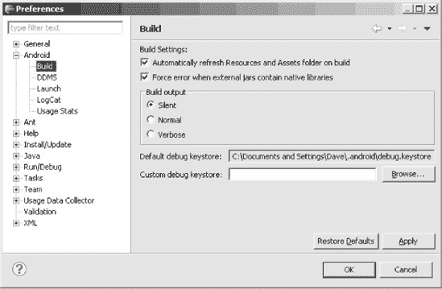

**图 17–1.** *调试证书的位置*

要提取 MD5 指纹，你可以运行带有 `–list` 选项的 `keytool`，如下所示：

```
keytool -list -alias androiddebugkey -keystore
"debug.keystore 文件的完整路径" -storepass android -keypass android
```

请注意，调试存储区的 `alias` 是 `androiddebugkey`。同样，密钥库密码是 `android`，私钥密码也是 `android`。运行此命令时，`keytool` 会提供指纹（参见图 17–2）。

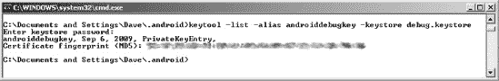

**图 17–2.** *keytool 为 list 选项输出的结果（实际指纹已做模糊处理）*

现在，将你的证书 MD5 指纹粘贴到 Google 网站上的相应字段中：

```
http://code.google.com/android/maps-api-signup.html
```

仔细阅读服务条款。如果你同意这些条款，请单击“Generate API Key”按钮，以从 Google 地图服务获取相应的地图 API 密钥。该地图 API 密钥会立即生效，因此你可以开始使用它从 Google 获取地图数据。请注意，你需要一个 Google 帐户才能获取地图 API 密钥；当你尝试生成地图 API 密钥时，系统会提示你登录你的 Google 帐户。

从第 10 章中记得，当你的调试证书过期时，你的开发地图 API 密钥也会随之过期。如果你更改了调试证书，则需要使用新的调试证书重复这些步骤，以获取新的开发地图 API 密钥。这很好地激励我们创建一个有效期超过默认一年的调试证书。有关创建长期有效调试证书的更多详细信息，请参阅第 10 章。

现在，让我们开始使用地图。


#### 理解 `MapView` 和 `MapActivity`

Android 中的许多地图技术依赖于 `MapView` UI 控件以及 `android.app.Activity` 的扩展类 `MapActivity`。`MapView` 和 `MapActivity` 类负责处理在 Android 中显示和操作地图时的繁重工作。关于这两个类，你需要记住的一点是它们必须协同工作。具体来说，要使用 `MapView`，你需要在 `MapActivity` 中实例化它。此外，在实例化 `MapView` 时，你需要提供地图 API 密钥。

如果使用 XML 布局实例化 `MapView`，你需要设置 `android:apiKey` 属性。如果以编程方式创建 `MapView`，则必须将地图 API 密钥传递给 `MapView` 构造函数。最后，由于地图的底层数据来自 Google 地图，你的应用程序需要获得访问互联网的权限。这意味着你至少需要在 `AndroidManifest.xml` 文件中包含以下权限请求：

```
<uses-permission android:name="android.permission.INTERNET" />
```

清单 17–1 以粗体显示了使地图应用正常运行所需的 `AndroidManifest.xml` 条目。

**清单 17–1.** *地图应用所需的 `AndroidManifest.xml` 标签*

```
<?xml version="1.0" encoding="utf-8"?>
<manifest
      package="com.androidbook"
      android:versionCode="1"
      android:versionName="1.0">
    <application android:icon="@drawable/icon"
                 android:label="@string/app_name">
        <uses-library android:name="com.google.android.maps" />
        <activity android:name=".MapViewDemoActivity"
                  android:label="@string/app_name">
          <intent-filter>
            <action android:name="android.intent.action.MAIN" />
            <category android:name="android.intent.category.LAUNCHER" />
          </intent-filter>
        </activity>
    </application>
<uses-permission android:name="android.permission.INTERNET"/>
    <uses-sdk android:minSdkVersion="4" />
</manifest>
```

你还需要对 `AndroidManifest.xml` 文件进行另一处修改。地图应用的定义需要引用一个地图库（这一行也包含在清单 17–1 中）。前提条件解决后，请查看图 17–3。

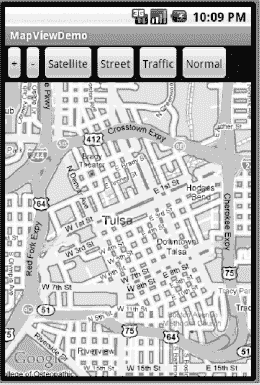

**图 17–3.** *处于街道视图模式下的 `MapView` 控件*

图 17–3 展示了一个以街道视图模式显示地图的应用。该应用还演示了如何放大、缩小以及更改地图的视图模式。XML 布局如清单 17–2 所示。

**注意：** 我们会在本章末尾提供一个 URL，你可以使用它下载本章的项目。这将使你能够直接将这些项目导入你的 Eclipse。

**清单 17–2.** *`MapView` 演示的 XML 布局*

```
<?xml version="1.0" encoding="utf-8"?>
<!-- 此文件位于 /res/layout/mapview.xml -->
<LinearLayout
    android:orientation="vertical" android:layout_width="fill_parent"
    android:layout_height="fill_parent">

    <LinearLayout
        android:orientation="horizontal"
        android:layout_width="fill_parent"
        android:layout_height="wrap_content">

        <Button android:id="@+id/zoomin"
            android:layout_width="wrap_content"
            android:layout_height="wrap_content" android:text="+"
            android:onClick="myClickHandler" android:padding="12px" />

        <Button android:id="@+id/zoomout"
            android:layout_width="wrap_content"
            android:layout_height="wrap_content" android:text="-"
            android:onClick="myClickHandler" android:padding="12px" />

        <Button android:id="@+id/sat"
            android:layout_width="wrap_content"
            android:layout_height="wrap_content" android:text="卫星"
            android:onClick="myClickHandler" android:padding="8px" />

        <Button android:id="@+id/street"
            android:layout_width="wrap_content"
            android:layout_height="wrap_content" android:text="街道"
            android:onClick="myClickHandler" android:padding="8px" />

        <Button android:id="@+id/traffic"
            android:layout_width="wrap_content"
            android:layout_height="wrap_content" android:text="交通"
            android:onClick="myClickHandler" android:padding="8px" />

        <Button android:id="@+id/normal"
            android:layout_width="wrap_content"
            android:layout_height="wrap_content" android:text="标准"
            android:onClick="myClickHandler" android:padding="8px" />

    </LinearLayout>

    <com.google.android.maps.MapView
        android:id="@+id/mapview" android:layout_width="fill_parent"
        android:layout_height="wrap_content" android:clickable="true"
        android:apiKey="在此处填写你的地图 API 密钥" />

</LinearLayout>
```

如清单 17–2 所示，一个父级 `LinearLayout` 包含一个子级 `LinearLayout` 和一个 `MapView`。子级 `LinearLayout` 包含了图 17–3 顶部显示的按钮。另请注意，你需要将 `MapView` 控件的 `android:apiKey` 值更新为你自己的地图 API 密钥值。

我们示例地图应用的代码如清单 17–3 所示。

**清单 17–3.** *加载 XML 布局的 `MapActivity` 扩展类*

```
// 此文件为 MapViewDemoActivity.java
import android.os.Bundle;
import android.view.View;

import com.google.android.maps.MapActivity;
import com.google.android.maps.MapView;

public class MapViewDemoActivity extends MapActivity
{
    private MapView mapView;

    @Override
    protected void onCreate(Bundle savedInstanceState) {
        super.onCreate(savedInstanceState);
        setContentView(R.layout.mapview);

        mapView = (MapView)findViewById(R.id.mapview);
    }

    public void myClickHandler(View target) {
        switch(target.getId()) {
        case R.id.zoomin:
            mapView.getController().zoomIn();
            break;
        case R.id.zoomout:
            mapView.getController().zoomOut();
            break;
        case R.id.sat:
            mapView.setSatellite(true);
            break;
        case R.id.street:
            mapView.setStreetView(true);
            break;
        case R.id.traffic:
            mapView.setTraffic(true);
            break;
        case R.id.normal:
            mapView.setSatellite(false);
            mapView.setStreetView(false);
            mapView.setTraffic(false);
            break;
        }
        // 以下代码行按理说不是必需的，但实际却是必需的，
        // 至少在 Froyo（Android 2.2）之前是这样
        mapView.postInvalidateDelayed(2000);
    }

    @Override
    protected boolean isLocationDisplayed() {
        return false;
    }

    @Override
    protected boolean isRouteDisplayed() {
        return false;
    }
}
```

如清单 17–3 所示，使用 `onCreate()` 显示 `MapView` 与显示任何其他控件并无区别。也就是说，你将 UI 的内容视图设置为包含 `MapView` 的布局文件，这样就完成了。令人惊讶的是，支持缩放功能也相当简单。要放大或缩小，你可以使用 `MapView` 的 `MapController` 类。通过调用 `mapView.getController()`，然后调用相应的 `zoomIn()` 或 `zoomOut()` 方法来实现。这种缩放方式每次只产生一级缩放；用户需要重复操作来增加放大或缩小的程度。


您会发现，提供更改视图模式的功能非常简单。`MapView`支持以下几种模式：

- **地图**是默认模式。
- **街景模式**在地图上叠加一个图层，为有街景图像可查看的道路绘制蓝色轮廓。这些图像由安装在车辆上的摄像头在街道上行驶时拍摄。但请注意，`MapView`控件不显示街景图像。要查看这些街景图像，您需要一个单独的视图控件。这将在第 25 章中更详细地介绍。
- **卫星模式**显示地图的航拍照片，因此您可以看到建筑物、树木、道路等的实际顶部。
- **交通模式**在地图上显示交通信息，用彩色线条表示畅通的交通，而非拥堵的交通。请注意，交通模式仅在有限数量的主要高速公路和道路上受支持。

要更改模式，您必须使用`true`调用相应的`setter`方法。在某些情况下，设置一种模式会关闭另一种模式。例如，您不能同时开启街景模式和交通模式，因此开启交通模式会自动关闭街景模式。要关闭某个模式，请将该模式设置为`false`。我们稍后会讨论`Overlay`，但在此需要知道，交通模式和街景模式*不*使用`Overlay`。

**注意：** 语句`mapView.postInvalidateDelayed(2000)`用于解决地图的街景和交通模式中的一个问题。该问题与内部用于获取显示街景蓝色轮廓线和交通线数据的线程方式有关。更多信息请参阅 Android Issue 10317，地址为 [`code.google.com/p/android/issues/detail?id=10317`](http://code.google.com/p/android/issues/detail?id=10317)。

要使地图能够横向移动，请在 XML 中为 `MapView` 设置属性 `android:clickable="true"`；否则，用户只能放大和缩小，而不能横向移动。您也可以在代码中使用 `setClickable(true)` 方法来设置该属性。

这个例子中最后要提到的是两个方法 `isLocationDisplayed()` 和 `isRouteDisplayed()`。这些方法的文档说明，它们的使用是 Google 服务条款所要求的，尽管在请求 Maps API 密钥时，这些条款并未提及这些方法。我不是律师，但我建议实现这些方法。您的应用程序有义务用 `true` 或 `false` 来响应，以向地图服务器指示当前设备位置是否正在显示，或者是否有任何路线信息正在显示（例如驾驶路线）。

您可能会同意，在 Android 中显示地图以及实现缩放和模式切换所需的代码量是最小的（参见清单 17-3）。然而，还有一种更简单的方法来实现缩放控件。请看 清单 17-4 中显示的 XML 布局和代码。

**清单 17-4.** *更简便的缩放*

```
<?xml version="1.0" encoding="utf-8"?>
<!-- This file is /res/layout/mapview.xml -->
<RelativeLayout
        android:orientation="vertical" android:layout_width="fill_parent"
        android:layout_height="fill_parent">

    <com.google.android.maps.MapView android:id="@+id/mapview"
             android:layout_width="fill_parent"
             android:layout_height="wrap_content"
             android:clickable="true"
             android:apiKey="YOUR MAP API KEY GOES HERE"
             />
</RelativeLayout>
```

```
public class MapViewDemoActivity extends MapActivity
{
    private MapView mapView;
    @Override
    protected void onCreate(Bundle savedInstanceState) {
        super.onCreate(savedInstanceState);

        setContentView(R.layout.mapview);
        mapView = (MapView)findViewById(R.id.mapview);

        mapView.setBuiltInZoomControls(true);
    }

    @Override
    protected boolean isLocationDisplayed() {
        return false;
    }

    @Override
    protected boolean isRouteDisplayed() {
        return false;
    }
}
```

清单 17-4 与清单 17-3 的区别在于，我们将视图的 XML 布局改为了使用 `RelativeLayout`。我们移除了所有缩放控件和视图模式控件。这个例子的关键在于代码，而非布局。`MapView` 已经提供了允许您放大和缩小的控件。您只需使用 `setBuiltInZoomControls()` 方法将其开启即可。图 17-4 显示了 `MapView` 的默认缩放控件。

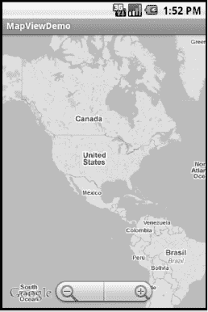

**图 17-4.** *MapView 的内置缩放控件*

现在，让我们讨论如何向地图添加自定义数据。


### 使用叠加层添加标记

谷歌地图提供了一项功能，允许你将自定义数据放置在地图之上。如果你搜索所在区域的披萨餐厅，就能看到这样的例子：谷歌地图会放置图钉或气球标记来指示每个地点。谷歌地图通过允许你在地图上添加一个图层来提供此功能。Android 提供了几个类来帮助你向地图添加图层。实现此类功能的关键类是 `Overlay`，但你可以使用它的一个扩展类 `ItemizedOverlay`。清单 17–5 展示了一个 Java 代码示例。来自清单 17–4 的布局 XML 文件同样可用于此项目。

**清单 17–5.** *使用 ItemizedOverlay 标记地图*

```
import java.util.ArrayList;
import java.util.List;

import android.graphics.Canvas;
import android.graphics.drawable.Drawable;
import android.os.Bundle;
import android.widget.LinearLayout;

import com.google.android.maps.GeoPoint;
import com.google.android.maps.ItemizedOverlay;
import com.google.android.maps.MapActivity;
import com.google.android.maps.MapView;
import com.google.android.maps.OverlayItem;

public class MappingOverlayActivity extends MapActivity {
    private MapView mapView;

    @Override
    protected void onCreate(Bundle savedInstanceState) {
        super.onCreate(savedInstanceState);

        setContentView(R.layout.mapview);

        mapView = (MapView) findViewById(R.id.mapview);
        mapView.setBuiltInZoomControls(true);

        Drawable marker=getResources().getDrawable(R.drawable.mapmarker);
        marker.setBounds( (int) (-marker.getIntrinsicWidth()/2),
                                -marker.getIntrinsicHeight(),
                                (int) (marker.getIntrinsicWidth()/2),
                                0);

        InterestingLocations funPlaces =
                      new InterestingLocations(marker);
        mapView.getOverlays().add(funPlaces);

        GeoPoint pt = funPlaces.getCenterPt();
        int latSpan = funPlaces.getLatSpanE6();
        int lonSpan = funPlaces.getLonSpanE6();
        Log.v("Overlays", "Lat span is " + latSpan);
        Log.v("Overlays", "Lon span is " + lonSpan);

        MapController mc = mapView.getController();
        mc.setCenter(pt);
        mc.zoomToSpan((int)(latSpan*1.5), (int)(lonSpan*1.5));
    }

    @Override
    protected boolean isLocationDisplayed() {
        return false;
    }

    @Override
    protected boolean isRouteDisplayed() {
        return false;
    }

    class InterestingLocations extends ItemizedOverlay {
        private ArrayList<OverlayItem> locations =
                new ArrayList<OverlayItem>();
        private GeoPoint center = null;

        public InterestingLocations(Drawable marker)
        {
            super(marker);

            // create locations of interest
            GeoPoint disneyMagicKingdom =
                new GeoPoint((int)(28.418971*1000000),
                             (int)(-81.581436*1000000));
            GeoPoint disneySevenLagoon =
                new GeoPoint((int)(28.410067*1000000),
                             (int)(-81.583699*1000000));

            locations.add(new OverlayItem(disneyMagicKingdom,
                              "Magic Kingdom", "Magic Kingdom"));
            locations.add(new OverlayItem(disneySevenLagoon,
                              "Seven Seas Lagoon", "Seven Seas Lagoon"));

            populate();
        }

        //  We added this method to find the middle point of the cluster
        //  Start each edge on its opposite side and move across with
        //  each point. The top of the world is +90, the bottom -90,
        //  the west edge is -180, the east +180
        public GeoPoint getCenterPt() {
            if(center == null) {
                int northEdge = -90000000;   // i.e., -90E6 microdegrees
                int southEdge = 90000000;
                int eastEdge = -180000000;
                int westEdge = 180000000;
                Iterator<OverlayItem> iter = locations.iterator();
                while(iter.hasNext()) {
                    GeoPoint pt = iter.next().getPoint();
                    if(pt.getLatitudeE6() > northEdge)
                        northEdge = pt.getLatitudeE6();
                    if(pt.getLatitudeE6() < southEdge)
                        southEdge = pt.getLatitudeE6();
                    if(pt.getLongitudeE6() > eastEdge)
                        eastEdge = pt.getLongitudeE6();
                    if(pt.getLongitudeE6() < westEdge)
                        westEdge = pt.getLongitudeE6();
                }
                center = new GeoPoint((int)((northEdge +southEdge)/2),
                        (int)((westEdge + eastEdge)/2));
            }
            return center;
        }

        @Override
        public void draw(Canvas canvas, MapView mapView, boolean shadow)
        {
            // Hide the shadow by setting shadow to false
            super.draw(canvas, mapView, shadow);
        }

        @Override
        protected OverlayItem createItem(int i) {
            return locations.get(i);
        }

        @Override
        public int size() {
            return locations.size();
        }

    }
}
```

清单 17–5 演示了如何在地图上叠加标记。该示例放置了两个标记：一个位于迪士尼魔法王国，另一个位于迪士尼七海潟湖，两者都靠近佛罗里达州的奥兰多（参见图 17–5）。

**注意：** 要运行此演示，你需要获取一个可绘制对象作为地图标记。此图像文件必须保存到你的 `/res/drawable` 文件夹中，以便 `getDrawable()` 调用中的资源 ID 引用与你为图像文件选择的文件名相匹配。如果可能，请使标记周围的区域透明。本章的源代码中提供了一些示例标记。

为了能够向地图添加标记，你必须创建并添加一个 `com.google.android.maps.Overlay` 的扩展类到地图中。`Overlay` 类本身无法实例化，因此你必须扩展它或使用其某个扩展类。在我们的示例中，我们实现了 `InterestingLocations`，它扩展了 `ItemizedOverlay`，而 `ItemizedOverlay` 又扩展了 `Overlay`。`Overlay` 类定义了叠加层的契约，而 `ItemizedOverlay` 是一个便捷的实现，可以让你轻松创建一组可在地图上标记的位置。

一般的使用模式是扩展 `ItemizedOverlay` 类，并在构造函数中添加你的项目（即感兴趣的地点）。实例化你的兴趣点后，你需要调用 `ItemizedOverlay` 的 `populate()` 方法。`populate()` 方法是一个实用工具，用于缓存所有 `OverlayItem`。在内部，该类会调用 `size()` 方法来确定叠加项的数量，然后进入一个循环，为每个项目调用 `createItem(i)`。在 `createItem` 方法中，你根据数组中的索引返回已创建的项目。

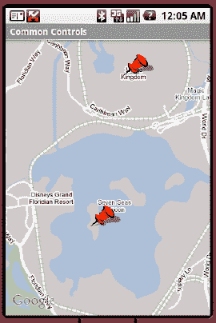

**图 17–5.** *带有标记的 MapView*


### 排版后内容

如清单 17-5 所示，你只需创建点并调用`populate()`即可在地图上显示标记。`Overlay`契约负责管理其余部分。为了实现这一切，activity 的`onCreate()`方法创建了`InterestingLocations`实例，并传入用作标记默认图像的`Drawable`。然后，`onCreate()`将`InterestingLocations`实例添加到叠加层集合中（`mapView.getOverlays().add()`）。

选择的`Drawable`需要准备好以供`ItemizedOverlay`使用。Maps API 需要知道`Drawable`上的(0, 0)点在哪里。该点将用于标记地图上标记应表示的确切位置。你可以像我们的示例中那样，使用`Drawable`类的`setBounds()`方法自行完成此操作。参数代表左、上、右、下坐标，我们可以使用`getIntrinsicHeight()`和`getIntrinsicWidth()`方法来确定`Drawable`的高度和宽度。

在我们的示例中，(0, 0)坐标将位于底部边缘的中间位置。请记住，坐标系统从左侧开始，向右递增，并从顶部开始，向下递增。因此，我们的顶部坐标必须小于底部的 0，所以是负数。

Android 在`ItemizedOverlay`类中提供了几个便捷方法来设置`Drawable`的边界。它们是`boundCenterBottom()`和`boundCenter()`。第一个方法对`Drawable`的处理方式与我们完全相同，结果是(0, 0)位于`Drawable`底部边缘的中间。第二个方法会将(0, 0)放在`Drawable`的正中心。常见的做法是在构造函数中首先调用这些方法之一。我们本可以像下面这样做，而不是在之前使用`setBounds()`：

```
public InterestingLocations(Drawable marker)
{
    super(boundCenterBottom(marker));
    [ … ]
```

你还会注意到，我们可以使用任何大小或形状的`Drawable`。让我们的标记看起来不错的一点是，在我们想要的形状周围使用透明颜色。你在 Google 地图上常见的气泡不是方形的，并且由于它们周围使用了透明颜色，你可以看到没有标记的地图。这样做也很好，因为 Maps API 会在地图上绘制标记的阴影，而你希望阴影是你的形状而不是矩形（好吧，实际上是平行四边形）。

但如果你不想要阴影怎么办？没问题。只需重写`ItemizedOverlay`扩展类的`draw()`方法，并在调用父类的`draw()`方法时将`shadow`设置为`false`。请查看我们示例中的`draw()`方法。我们提到过，用于创建`ItemizedOverlay`的`Drawable`是默认标记。每个`OverlayItem`可以通过使用其`setMarker()`方法并传入另一个`Drawable`来拥有独特的标记。你可以在实例化`OverlayItem`时设置独特的标记，也可以稍后设置。我们将在第 25 章讨论触摸屏时重新审视标记，并向你展示如何让标记变得更有趣。

现在，叠加层已关联到我们的地图，我们仍然需要移动到正确的位置，以便实际在显示屏中看到标记。为此，我们需要将显示地图的中心设置到一个点。`ItemizedOverlay`类的`getCenter()`方法返回排名第一的点，而不是你可能期望的中心点。`ItemizedOverlay`会对其包含的点进行排序，并选择其中一个作为第一个。因此，为了找到这些点的中心，我们实现了自己的`getCenterPt()`方法来遍历这些点并找到中心点。mapview 控制器的`setCenter()`方法设置显示内容的中心，我们将计算出的中心点传递给它。

`MapController`的`setZoom()`方法设置我们距离地图的高度。它接受一个从 1 到 21 的值，其中 21 是放大到最近距离，1 是最远距离。但由于我们不确定使用哪个值才能同时看到所有点，我们使用了`MapController`的`zoomToSpan()`方法。我们需要传入包含所有点的矩形的高度和宽度。幸运的是，`ItemizedOverlay`有两个方法可以告诉我们该矩形的高度和宽度，分别给出我们的纬度跨度`getLatSpanE6()`和经度跨度`getLonSpanE6()`；然后我们可以将这些值与`zoomToSpan()`一起使用。请注意，我们选择将矩形扩大 1.5 倍，这样我们的点在显示时就不会紧贴地图边缘。

清单 17-5 的另一个有趣之处是`OverlayItem`的创建。要创建一个`OverlayItem`，你需要一个类型为`GeoPoint`的对象。`GeoPoint`类通过纬度和经度（以微度为单位）表示位置。在我们的示例中，我们使用网络上的地理编码网站获取了魔法王国和七海潟湖的纬度和经度。（正如你很快会看到的，你可以使用地理编码将地址转换为纬度和经度对，例如。）然后，我们将纬度和经度转换为微度——因为 API 以微度为单位操作——乘以 1,000,000 并强制转换为整数。

到目前为止，我们已经向你展示了如何在地图上放置标记。但叠加层不仅限于显示图钉或气泡。它们还可以用于其他事情。例如，我们可以展示产品在地图上移动的动画，或者展示诸如冷锋或雷暴等符号。

总而言之，你会同意在地图上放置标记再简单不过了。或者真的如此？我们没有纬度和经度对的数据库，但我们猜测我们需要以某种方式使用真实地址创建一个或多个`GeoPoint`。这时你可以使用`Geocoder`类，它是我们接下来要讨论的位置包的一部分。

### 了解位置包

`android.location`包为基于位置的服务提供了设施。在本节中，我们将讨论该包的两个重要部分：`Geocoder`类和`LocationManager`服务。我们从`Geocoder`开始。


#### Android 平台的地理编码

如果你打算在地图上做任何实用操作，很可能需要将地址（或位置）转换为经纬度坐标。这一概念称为*地理编码*，而 `android.location.Geocoder` 类提供了相应功能。实际上，`Geocoder` 类同时支持正向和反向转换——它既可以将地址转换为经纬度坐标，也可以将经纬度坐标转换为地址列表。该类提供以下方法：

- `List<Address>   getFromLocation(double latitude, double longitude, int maxResults)`
- `List<Address>   getFromLocationName(String locationName, int maxResults, double lowerLeftLatitude, double lowerLeftLongitude, double upperRightLatitude, double upperRightLongitude)`
- `List<Address>   getFromLocationName(String locationName, int maxResults)`

由于位置的描述方式多种多样，计算地址并非一门精确科学。例如，`getFromLocationName()` 方法可以接受地点名称、物理地址、机场代码，甚至该位置的知名名称。因此，这些方法返回的是一个地址列表，而非单个地址。因为方法返回列表，建议通过为 `maxResults` 提供介于 `1` 到 `5` 之间的值来限制结果集。现在，让我们看一个示例。

列表 17–6 显示了 图 17–6 所示用户界面的 XML 布局和对应代码。要运行该示例，你需要使用自己的地图 API 密钥更新列表中的内容。

**列表 17–6.** *使用 Android Geocoder 类*

```xml
<?xml version="1.0" encoding="utf-8"?>
<!-- 该文件为 /res/layout/geocode.xml -->
<RelativeLayout
        android:layout_width="fill_parent"
        android:layout_height="fill_parent">

        <LinearLayout android:layout_width="fill_parent"
            android:layout_alignParentBottom="true"
            android:layout_height="wrap_content"
            android:orientation="vertical" >

            <EditText android:layout_width="fill_parent"
                android:id="@+id/location"
                android:layout_height="wrap_content"
                android:text="White House"/>

            <Button android:id="@+id/geocodeBtn"
                android:layout_width="wrap_content"
                android:layout_height="wrap_content"
                android:onClick="doClick" android:text="查找位置"/>
        </LinearLayout>

<com.google.android.maps.MapView
                 android:id="@+id/geoMap" android:clickable="true"
                 android:layout_width="fill_parent"
                 android:layout_height="320px"
                 android:apiKey="在此输入你的地图 API 密钥"
                 />

</RelativeLayout>
```

```java
package com.androidbook.maps.geocoding;

import java.io.IOException;
import java.util.List;

import android.location.Address;
import android.location.Geocoder;
import android.os.Bundle;
import android.view.View;
import android.widget.Button;
import android.widget.EditText;

import com.google.android.maps.GeoPoint;
import com.google.android.maps.MapActivity;
import com.google.android.maps.MapView;

public class GeocodingDemoActivity extends MapActivity
{
    Geocoder geocoder = null;
    MapView mapView = null;

    @Override
    protected boolean isLocationDisplayed() {
        return false;
    }

    @Override
    protected boolean isRouteDisplayed() {
        return false;
    }

    @Override
    protected void onCreate(Bundle savedInstanceState)
    {
        super.onCreate(savedInstanceState);

        setContentView(R.layout.geocode);
        mapView = (MapView)findViewById(R.id.geoMap);
        mapView.setBuiltInZoomControls(true);

        // 佛罗里达州杰克逊维尔的经纬度
        int lat = (int)(30.334954*1000000);
        int lng = (int)(-81.5625*1000000);
        GeoPoint pt = new GeoPoint(lat,lng);
        mapView.getController().setZoom(10);
        mapView.getController().setCenter(pt);

geocoder = new Geocoder(this);
    }

    public void doClick(View arg0) {
        try {
            EditText loc = (EditText)findViewById(R.id.location);
            String locationName = loc.getText().toString();

            List<Address> addressList =
                      geocoder.getFromLocationName(locationName, 5);
            if(addressList!=null && addressList.size()>0)
            {
                int lat =
                    (int)(addressList.get(0).getLatitude()*1000000);
                int lng =
                    (int)(addressList.get(0).getLongitude()*1000000);

                GeoPoint pt = new GeoPoint(lat,lng);
                mapView.getController().setZoom(15);
                mapView.getController().setCenter(pt);
            }
        } catch (IOException e) {
            e.printStackTrace();
        }
    }
}
```

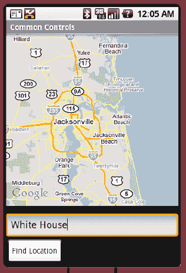

**图 17–6.** *根据位置名称将地理编码转换为点坐标*

为了演示 Android 中地理编码的用法，请在 `EditText` 字段中输入位置的名称或地址，然后点击“查找位置”按钮。要查找某个位置的地址，我们调用 `Geocoder` 的 `getFromLocationName()` 方法。该位置可以是地址，也可以是诸如“白宫”之类的知名名称。地理编码可能是耗时操作，因此建议将结果限制为五个，正如 Android 文档所建议的那样。

调用 `getFromLocationName()` 会返回一个地址列表。示例应用程序获取该地址列表，如果找到任何地址，则处理第一个。每个地址都有纬度和经度，你可以使用它们创建 `GeoPoint`。然后获取地图控制器并导航到该点。缩放级别可以设置为 1 到 21（含）之间的整数。当你从 1 向 21 移动时，缩放级别以 2 的倍数增加。如果需要，我们本可以显示一个对话框来展示多个找到的位置，但这里我们只显示返回的第一个位置。

在我们的示例应用程序中，我们只读取返回的 `Address` 的纬度和经度。实际上，返回给我们的 `Address` 可能包含大量数据，包括位置的通用名称、街道、城市、州、邮政编码、国家，甚至电话号码和网站 URL。

**注意：** 基于位置的服务与 Maps API 不同，不使用微度单位。忘记在两者之间进行转换是常见的错误原因。要将 `Location` 的纬度和经度传递给 Maps API 方法，必须首先将其乘以 1,000,000。

关于地理编码，你需要了解以下几点：

- 首先，返回的地址并不总是精确地址。显然，由于返回的地址列表取决于输入的准确性，你需要尽最大努力向 `Geocoder` 提供准确的位置名称。
- 其次，只要可能，请将 `maxResults` 参数设置为介于 `1` 和 `5` 之间的值。
- 最后，你应该认真考虑在与 UI 线程不同的线程中执行地理编码操作。这有两个原因。第一个显而易见：此操作耗时，你不希望在执行地理编码时 UI 挂起，导致 Android 终止你的活动。第二个原因是，在移动设备上，你始终需要假设网络连接可能丢失且连接较弱。因此，你需要适当处理输入/输出（I/O）异常和超时。一旦计算出地址，你可以将结果发布到 UI 线程。让我们进一步探讨这一点。


#### 使用后台线程进行地理编码

使用后台线程处理耗时操作非常常见。通常的模式是处理一个 UI 事件（例如按钮点击）来启动一个耗时操作。在事件处理器中，创建一个新线程来执行任务，然后启动该新线程。UI 线程返回用户界面处理与用户的交互，而后台线程则在后台工作。后台线程完成后，可能需要更新部分 UI，或者需要通知用户。后台线程不会直接更新 UI；而是通知 UI 线程自行更新。代码清单 17–7 通过地理编码展示了这一思路。我们将使用与之前相同的 `geocode.xml` 文件。也可以使用与之前相同的 `AndroidManifest.xml` 文件。

**代码清单 17–7.** *在独立线程中进行地理编码*

```
package com.androidbook.maps.geocodingthreads;

import java.io.IOException;
import java.util.List;

import android.app.AlertDialog;
import android.app.Dialog;
import android.app.ProgressDialog;
import android.location.Address;
import android.location.Geocoder;
import android.os.Bundle;
import android.os.Handler;
import android.os.Message;
import android.view.View;
import android.widget.EditText;

import com.google.android.maps.GeoPoint;
import com.google.android.maps.MapActivity;
import com.google.android.maps.MapView;

public class GeocodingDemoActivity extends MapActivity
{
    Geocoder geocoder = null;
    MapView mapView = null;
    ProgressDialog progDialog=null;
    List<Address> addressList=null;
    @Override
    protected boolean isRouteDisplayed() {
        return false;
    }

    @Override
    protected void onCreate(Bundle icicle) {
        super.onCreate(icicle);

        setContentView(R.layout.geocode);
        mapView = (MapView)findViewById(R.id.geoMap);
        mapView.setBuiltInZoomControls(true);

        // 佛罗里达州杰克逊维尔的经纬度
        int lat = (int)(30.334954*1000000);
        int lng = (int)(-81.5625*1000000);
        GeoPoint pt = new GeoPoint(lat,lng);
        mapView.getController().setZoom(10);
        mapView.getController().animateTo(pt);

        geocoder = new Geocoder(this);
    }

    public void doClick(View view) {
        EditText loc = (EditText)findViewById(R.id.location);
        String locationName = loc.getText().toString();

        progDialog = ProgressDialog.show(GeocodingDemoActivity.this,
                   "处理中...", "正在查找位置...", true, false);

        findLocation(locationName);
    }

    private void findLocation(final String locationName)
    {
        Thread thrd = new Thread()
        {
            public void run()
            {
                try {
                    // 执行后台工作
                    addressList =
                        geocoder.getFromLocationName(locationName, 5);
                    // 向处理器发送消息以处理结果
                    uiCallback.sendEmptyMessage(0);

                } catch (IOException e) {
                    e.printStackTrace();
                }
            }
        };
        thrd.start();
    }

    // UI 线程回调处理器
    private Handler uiCallback = new Handler()
    {
        @Override
        public void handleMessage(Message msg)
        {
            // 关闭对话框
            progDialog.dismiss();

            if(addressList!=null && addressList.size()>0)
            {
                int lat =
                   (int)(addressList.get(0).getLatitude()*1000000);
                int lng =
                   (int)(addressList.get(0).getLongitude()*1000000);
                GeoPoint pt = new GeoPoint(lat,lng);
                mapView.getController().setZoom(15);
                mapView.getController().animateTo(pt);

            }
            else
            {
                Dialog foundNothingDlg = new
                    AlertDialog.Builder(GeocodingDemoActivity.this)
                          .setIcon(0)
                          .setTitle("未能找到位置")
                          .setPositiveButton("确定", null)
                          .setMessage("未找到位置...")
                          .create();
                foundNothingDlg.show();
            }
        }
    };
}
```

代码清单 17–7 是代码清单 17–6 中示例的修改版本。区别在于，现在在 `doClick()` 方法中，你会显示一个进度对话框并调用 `findLocation()`（参见图 17–7）。`findLocation()` 随后创建一个新线程并调用 `start()` 方法，最终会调用线程的 `run()` 方法。在 `run()` 方法中，使用 `Geocoder` 类来搜索位置。搜索完成后，必须将消息发送给知道如何与 UI 线程交互的对象，因为你需要更新地图。Android 为此提供了 `android.os.Handler` 类。从后台线程调用 `uiCallback.sendEmptyMessage(0)` 让 UI 线程处理搜索结果。在我们的例子中，实际上不需要在消息中发送任何内容，因为数据是通过 `addressList` 共享的。代码会调用处理器的回调，该回调会关闭对话框，然后查看 `Geocoder` 返回的 `addressList`。之后，回调会用结果更新地图，或者显示一个提示对话框，表示搜索没有返回任何结果。此示例的 UI 如图 图 17–7 所示。

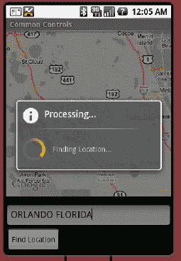

**图 17–7.** *在长时间操作期间显示进度窗口*


### 理解 `LocationManager` 服务

`LocationManager` 服务是 `android.location` 包提供的核心服务之一。该服务提供两种功能：获取设备地理位置的机制，以及当设备进入指定地理位置时通过 Intent 通知你的功能。

在本节中，你将学习 `LocationManager` 服务的工作原理。要使用该服务，首先必须获取它的引用。代码清单 17-8 展示了 `LocationManager` 服务的一个简单用法。

**代码清单 17-8.** *使用 `LocationManager` 服务*

```
package com.androidbook.maps.locationmanager;

import java.util.List;

import android.app.Activity;
import android.content.Context;
import android.location.Location;
import android.location.LocationManager;
import android.os.Bundle;

public class LocationManagerDemoActivity extends Activity
{

    @Override
    protected void onCreate(Bundle savedInstanceState)
    {
        super.onCreate(savedInstanceState);

        LocationManager locMgr = (LocationManager)
            this.getSystemService(Context.LOCATION_SERVICE);

        Location loc =
            locMgr.getLastKnownLocation(LocationManager.GPS_PROVIDER);

        List<String> providerList = locMgr.getAllProviders();
    }
}
```

`LocationManager` 服务是系统级服务。系统级服务是通过使用服务名称从上下文（Context）中获取的服务；你不能直接实例化它们。`android.app.Activity` 类提供了一个名为 `getSystemService()` 的实用方法，可用于获取系统级服务。如代码清单 17-8 所示，你调用 `getSystemService()` 并传入所需服务的名称，此处为 `Context.LOCATION_SERVICE`。

`LocationManager` 服务通过定位提供程序提供地理位置详情。目前有三种类型的定位提供程序：

- **GPS** 提供程序使用全球定位系统获取位置信息。
- **网络** 提供程序使用手机基站或 Wi-Fi 网络获取位置信息。
- **被动** 提供程序类似于位置更新嗅探器，它会将由其他应用请求的位置更新传递给您的应用，而无需您的应用专门请求任何位置更新。当然，如果没有其他应用请求位置更新，您也不会收到任何更新。

`LocationManager` 类可以通过 `getLastKnownLocation()` 方法提供设备的最后已知位置。位置信息从提供程序获取，因此该方法将您想使用的提供程序名称作为参数。提供程序名称的有效值为 `LocationManager.GPS_PROVIDER`、`LocationManager.NETWORK_PROVIDER` 和 `LocationManager.PASSIVE_PROVIDER`。为了使您的应用成功获取位置信息，它必须在 `AndroidManifest.xml` 文件中拥有相应的权限。GPS 和被动提供程序需要 `android.permission.ACCESS_FINE_LOCATION`，而网络提供程序可以使用 `android.permission.ACCESS_COARSE_LOCATION` 或 `android.permission.ACCESS_FINE_LOCATION`，具体取决于您的需求。例如，假设您的应用将使用 GPS 或网络数据进行位置更新。由于您需要 GPS 的 `ACCESS_FINE_LOCATION`，您也已经满足了网络访问的权限，因此无需再指定 `ACCESS_COARSE_LOCATION`。如果您只打算使用网络提供程序，那么在清单文件中只需 `ACCESS_COARSE_LOCATION` 即可。

调用 `getLastKnownLocation()` 会返回一个 `android.location.Location` 实例，如果没有可用位置则返回 `null`。`Location` 类提供位置的纬度和经度、位置的计算时间，还可能提供设备的海拔、速度和方向信息。`Location` 对象还可以通过 `getProvider()` 告诉您它来自哪个提供程序，结果将是 `GPS_PROVIDER` 或 `NETWORK_PROVIDER`。如果您通过 `PASSIVE_PROVIDER` 获取位置更新，请记住您实际上只是在嗅探位置更新，因此所有更新最终都来自 GPS 或网络。

由于 `LocationManager` 对提供程序进行操作，该类提供了获取提供程序的 API。例如，您可以通过调用 `getAllProviders()` 获取所有已知的提供程序。您可以通过调用 `getProvider()` 并传入提供程序名称作为参数（例如 `LocationManager.GPS_PROVIDER`）来获取特定提供程序。需要注意的一点是，`getAllProviders()` 会返回您可能无权访问或当前已禁用的提供程序。幸运的是，您可以使用其他方法来确定提供程序的状态，例如 `isProviderEnabled(String providerName)` 或 `getProviders(boolean enabledOnly)`，您可以传入 `true` 作为参数以仅获取立即可用的提供程序。

还有另一种获取合适提供程序的方法，即使用 `LocationManager` 的 `getProviders(Criteria criteria, boolean enabledOnly)` 方法。通过指定位置更新的标准，并将 `enabledOnly` 设置为 `true` 以获取已启用并准备就绪的提供程序，您可以获得返回的提供程序名称列表，而无需了解具体是哪个提供程序。这可能更具可移植性，因为设备可能具有满足您需求的自定义 `LocationProvider`，而您无需事先了解它。`Criteria` 对象可以设置参数，包括精度级别以及对速度、方向、海拔、成本和功耗信息的需求。如果没有提供程序满足您的标准，将返回一个空列表，允许您要么放弃，要么放宽标准再试一次。

### 如何启用定位提供程序

您可能会认为有一个简单的 API 可以在您的应用运行时启用定位提供程序（例如 GPS），如果它尚未开启的话。遗憾的是，情况并非如此。要启用定位服务，用户必须在其设备的“设置”屏幕中进行操作。您的应用可以通过启动该特定的“设置”屏幕，为用户简化此过程。位置设置源屏幕实际上只是一个 Activity，并且该 Activity 被设置为响应 Intent。因此，您的应用只需使用正确的 Intent 请求一个 Activity 即可。您可能使用的代码如下所示：

```
startActivityForResult(new Intent(
    android.provider.Settings.ACTION_LOCATION_SOURCE_SETTINGS), 0);
```

请记住，要处理响应，您必须在 Activity 中实现 `onActivityResult()` 回调（在第 5 章中已介绍）。并且还要记住，虽然您希望用户开启诸如 GPS 之类的定位提供程序，但用户可能不会这样做。您需要再次检查用户是否已启用定位提供程序，并根据结果采取相应的操作。


#### 你能用位置信息做什么？

如前所述，`Location`对象可以告诉你纬度和经度、`Location`的计算时间、提供该`Location`的提供者，以及可选的**海拔**、**速度**、**方位**和**精度等级**。根据`Location`来源的提供者不同，还可能包含额外信息。例如，如果`Location`来自 GPS 提供者，会有一个额外的`Bundle`告诉你计算该`Location`时使用了多少颗卫星。可选值可能存在也可能不存在，这取决于提供者。要判断`Location`是否包含某个值，`Location`类提供了一系列`has...()`方法，这些方法返回`boolean`值，例如`hasAccuracy()`。在依赖`getAccuracy()`的返回值之前，明智的做法是先调用`hasAccuracy()`。

`Location`类还有其他一些有用的方法，包括一个静态方法`distanceBetween()`，它会返回两个`Location`之间的最短距离。另一个与距离相关的方法是`distanceTo()`，它会返回当前`Location`对象与传递给该方法的`Location`对象之间的最短距离。请注意，距离的单位是米，并且距离计算考虑了地球的曲率。但也要注意，这些距离并不是以你开车需要行驶的距离来提供的，例如。

如果你想获取行车路线或行车距离，你需要有起点和终点的`Location`，但进行计算时，你可能需要使用 Google Maps JavaScript API 服务。例如，有一个 Google Directions API，类似于第 11 章中介绍的 Google Translate API。Directions API 可以让你的应用程序显示如何从起点到达终点。

#### 在开发期间向应用程序发送位置更新

在进行开发测试时，`LocationManager`需要位置信息，而模拟器没有 GPS 或蜂窝基站。为了让你在模拟器中测试`LocationManager`服务应用程序，你需要从 Eclipse 手动发送位置更新。清单 17-9 展示了一个简单的示例来说明如何做到这一点。

**清单 17–9.** *注册位置更新*

```java
package com.androidbook.location.update;

import android.app.Activity;
import android.content.Context;
import android.location.Location;
import android.location.LocationListener;
import android.location.LocationManager;
import android.os.Bundle;
import android.widget.Toast;

public class LocationUpdateDemoActivity extends Activity
{
    LocationManager locMgr = null;
    LocationListener locListener = null;

    @Override
    public void onCreate(Bundle savedInstanceState)
    {
        super.onCreate(savedInstanceState);

        locMgr = (LocationManager)
            getSystemService(Context.LOCATION_SERVICE);

        locListener = new LocationListener()
        {
            public void  onLocationChanged(Location location)
            {
                if (location != null)
                {
                    Toast.makeText(getBaseContext(),
                        "新位置纬度 [" +
                        location.getLatitude() +
                        "] 经度 [" +
                        location.getLongitude()+"]",
                        Toast.LENGTH_SHORT).show();
                }
            }

            public void  onProviderDisabled(String provider)
            {
            }

            public void  onProviderEnabled(String provider)
            {
            }

            public void  onStatusChanged(String provider,
                            int status, Bundle extras)
            {
            }
        };
    }

    @Override
    public void onResume() {
        super.onResume();

        locMgr.requestLocationUpdates(
            LocationManager.GPS_PROVIDER,
            0,                // 最小时间间隔（毫秒）
            0,                // 最小距离间隔（米）
            locListener);
    }

    @Override
    public void onPause() {
        super.onPause();
        locMgr.removeUpdates(locListener);
    }
}
```

这个例子中我们没有显示用户界面，所以标准的初始布局 XML 文件就可以了。这也是为什么我们不需要为此应用程序继承`MapActivity`，因为我们没有显示任何地图。

`LocationManager`服务的主要用途之一是接收设备位置的通知。清单 17-9 演示了如何注册一个监听器来接收位置更新事件。要注册监听器，你需要调用`requestLocationUpdates()`方法，并将提供者类型作为参数传入。当位置发生变化时，`LocationManager`会调用监听器的`onLocationChanged()`方法，并传入新的`Location`。在适当的时候移除任何位置更新的注册非常重要。在我们的示例中，我们在`onResume()`中注册，在`onPause()`中移除注册。如果我们不打算处理位置更新，就应该告诉提供者不要发送它们。还有可能我们的活动会被销毁（例如，如果用户旋转设备导致活动重启），在这种情况下，旧的活动可能仍然存在，仍在接收更新，用 Toast 显示它们，并占用内存。


在我们的示例中，我们将`minTime`和`minDistance`设置为零。这告诉`LocationManager`尽可能频繁地向我们发送更新。这些设置在实际使用中并不理想，但我们在此使用它们是为了让演示运行得更好。（在实际应用中，你不会希望硬件如此频繁地尝试确定当前位置，因为这会耗尽电池电量。）请根据实际情况适当设置这些值，尽量降低真正需要获取位置变化通知的频率。

在代码清单 17–9 中，向你介绍了一个新工具：`Toast`小部件。这是一个方便的工具，允许你向用户短暂显示一个小型弹出视图。它看起来像是悬浮在现有视图之上，然后会自动消失。你可以通过使用`LENGTH_LONG`代替`LENGTH_SHORT`来延长它的悬浮时间。

要在模拟器中测试此功能，你可以使用 Eclipse 的 ADT 插件附带的 Dalvik 调试监控服务（DDMS）透视图。DDMS 界面提供一个屏幕，让你可以向模拟器发送新的位置（参见图 17–8）。

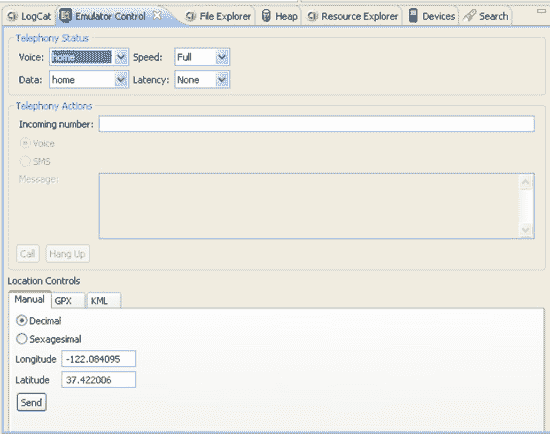

**图 17–8.** *在 Eclipse 中使用 DDMS 界面将位置数据发送到模拟器*

要在 Eclipse 中进入 DDMS，请使用“窗口”  “打开透视图”  “DDMS”。“模拟器控制”视图应该已经存在，但如果没有，请使用“窗口”  “显示视图”  “其他”  “Android”  “模拟器控制”使其在此透视图下可见。你可能需要在模拟器控制中向下滚动才能找到位置控制。如图 17–8 所示，DDMS 用户界面中的“手动”选项卡允许你向模拟器发送新的 GPS 位置（纬度/经度对）。发送一个新位置将触发监听器上的`onLocationChanged()`方法，这将导致向用户发送一条包含新位置的消息。

你可以使用其他几种技术向模拟器发送位置数据，如 DDMS 用户界面所示（参见图 17–8）。例如，DDMS 界面允许你提交 GPS 交换格式（GPX）文件或 Keyhole 标记语言（KML）文件。你可以从以下网站获取 GPX 示例文件：

*   [`http://www.topografix.com/gpx_resources.asp`](http://www.topografix.com/gpx_resources.asp)
*   [`http://tramper.co.nz/?view=gpxFiles`](http://tramper.co.nz/?view=gpxFiles)
*   [`http://www.gpxchange.com/`](http://www.gpxchange.com/)

类似地，你可以使用以下 KML 资源来获取或创建 KML 文件：

*   [`http://bbs.keyhole.com/`](http://bbs.keyhole.com/)
*   [`http://code.google.com/apis/kml/documentation/kml_tut.html`](http://code.google.com/apis/kml/documentation/kml_tut.html)

**注意：** 有些网站提供 KMZ 文件。这些是压缩后的 KML 文件，只需解压缩即可获得 KML 文件。某些 KML 文件需要修改其 XML 命名空间值才能在 DDMS 中正常播放。如果你在某个特定的 KML 文件上遇到问题，请确保它包含以下内容：

```
<kml >
```

你可以将 GPX 或 KML 文件上传到模拟器，并设置模拟器播放文件的速度（参见图 17–9）。然后，模拟器将根据配置的速度向你的应用程序发送位置更新。如图 17–9 所示，GPX 文件包含点（显示在上半部分）和路径（显示在下半部分）。你不能播放一个点，但单击一个点时，它会被发送到模拟器。你单击一条路径，然后“播放”按钮将被启用，这样你就可以播放这些点了。

**注意：** 有报告称，并非所有 GPX 文件都能被模拟器控制识别。如果你尝试加载一个 GPX 文件但没有任何反应，请尝试从其他来源获取不同的文件。

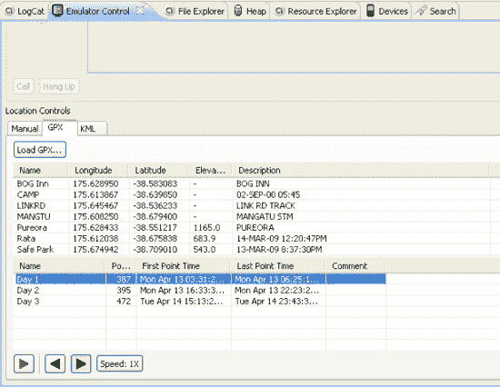

**图 17–9.** *将 GPX 和 KML 文件上传到模拟器进行播放*

代码清单 17–9 中包含了`LocationListener`的另外一些我们尚未提及的方法。它们是回调方法`onProviderDisabled()`、`onProviderEnabled()`和`onStatusChanged()`。在我们的示例中，我们没有对这些方法执行任何操作，但在你的应用程序中，你可以收到通知，例如当位置提供者（如`gps`）被用户禁用或启用时，或者当某个位置提供者的状态发生变化时。状态包括`OUT_OF_SERVICE`（服务不可用）、`TEMPORARILY_UNAVAILABLE`（暂时不可用）和`AVAILABLE`（可用）。即使某个提供者已启用，也并不意味着它会发送任何位置更新，你可以通过状态来了解这一点。注意，如果针对一个已禁用的提供者调用了`requestLocationUpdates()`，`onProviderDisabled()`会立即被调用。

### 从模拟器控制台发送位置更新

Eclipse 提供了一些易于使用的工具来向你的应用程序发送位置更新，但还有另一种方法。回顾第 2 章，要从工具窗口启动模拟器控制台，请使用以下命令：

```
telnet localhost 模拟器端口号
```

其中`模拟器端口号`是与正在运行的 AVD 实例相关联的编号，显示在模拟器窗口的标题栏中。连接成功后，你可以使用`geo fix`命令发送位置更新。要发送包含海拔高度的纬度/经度坐标（海拔高度为可选参数），请使用该命令的以下形式：

```
geo fix 经度 纬度 [ 海拔高度 ]
```

例如，以下命令将向你的应用程序发送美国佛罗里达州杰克逊维尔的位置，海拔高度为 120 米。

```
geo fix -81.5625 30.334954 120
```

请特别注意`geo fix`命令参数的顺序。经度是*第一个*参数，纬度是第二个。

### 获取位置更新的其他方法

之前我们向你展示了如何使用`LocationManager`的`requestLocationUpdates()`方法将位置更新发送到你的 Activity。实际上，该方法有几种不同的签名，包括使用`PendingIntent`的签名。这使你能够将位置更新定向到服务或广播接收器。你还可以将位置更新定向到其他`Looper`线程而不是主线程，这为你的应用程序提供了很大的灵活性，尽管其中一些方法仅适用于 Android 2.3 及以上版本。


### 使用 `MyLocationOverlay` 显示位置

GPS 和地图的一个常见用途是向用户显示他们当前所在的位置。幸运的是，Android 通过提供一个名为 `MyLocationOverlay` 的特殊覆盖图，让这一功能变得非常容易实现。只需将此覆盖图添加到你的 `MapView` 中，就可以轻松地在你的地图上添加一个闪烁的蓝点，显示 `LocationManager` 服务所报告的设备位置。

在本示例中，我们将把多个概念整合到一个应用程序中。参考**清单 17–10**，我们可以通过更新 `main.xml` 和 `MyLocationDemoActivity.java` 文件来修改之前的示例。或者直接从 第 17 章 的现有源代码中创建一个新项目。别忘了在清单文件中放入你的地图 API 密钥。

**清单 17–10.** *使用 `MyLocationOverlay`*

```
<?xml version="1.0" encoding="utf-8"?>
<!-- 此文件位于 /res/layout/main.xml -->
<RelativeLayout

        android:layout_width="fill_parent"
        android:layout_height="fill_parent">

    <com.google.android.maps.MapView
        android:id="@+id/geoMap" android:clickable="true"
        android:layout_width="fill_parent"
        android:layout_height="fill_parent"
android:apiKey="在此处输入你的地图 API 密钥"
        />

</RelativeLayout>
```

```
package com.androidbook.location.myoverlay;

import android.os.Bundle;
import com.google.android.maps.MapActivity;
import com.google.android.maps.MapController;
import com.google.android.maps.MapView;
import com.google.android.maps.MyLocationOverlay;

public class MyLocationDemoActivity extends MapActivity {

    MapView mapView = null;
    MapController mapController = null;
    MyLocationOverlay whereAmI = null;

    @Override
    protected boolean isLocationDisplayed() {
        return whereAmI.isMyLocationEnabled();
    }

    @Override
    protected boolean isRouteDisplayed() {
        return false;
    }

    /** 当 Activity 首次创建时调用。 */
    @Override
    public void onCreate(Bundle savedInstanceState) {
        super.onCreate(savedInstanceState);
        setContentView(R.layout.main);

        mapView = (MapView)findViewById(R.id.geoMap);
        mapView.setBuiltInZoomControls(true);

        mapController = mapView.getController();
        mapController.setZoom(15);

        whereAmI = new MyLocationOverlay(this, mapView);
        mapView.getOverlays().add(whereAmI);
        mapView.postInvalidate();
    }

    @Override
    public void onResume()
    {
        super.onResume();
        whereAmI.enableMyLocation();
        whereAmI.runOnFirstFix(new Runnable() {
            public void run() {
                mapController.setCenter(whereAmI.getMyLocation());
            }
        });
}

    @Override
    public void onPause()
    {
        super.onPause();
        whereAmI.disableMyLocation();
    }
}
```

请注意，在此示例中，如果我们现在正在地图上显示设备的当前位置，则 `isLocationDisplayed()` 会返回 `true`。

一旦在模拟器中启动此应用程序，你需要先向它发送位置更新，它才会变得有趣起来。为此，请按照本节前面所述，在 Eclipse 中转到 DDMS 模拟器控制视图：

1.  你需要从互联网上的某个地方找到一个示例 GPX 文件。前面列出的用于 GPX 文件的站点上有很多这样的文件。随便选一个，然后下载到你的工作站。
2.  使用“位置控制”下“GPX”选项卡中的“加载 GPX”按钮，将此文件加载到模拟器控制中。
3.  从底部的列表中选择一条路径，然后点击播放按钮（绿色箭头）。同样注意到“速度”按钮。这应该会开始向模拟器发送一串位置更新，这些更新将被你的应用程序接收。
4.  点击“速度”按钮，使更新更加频繁。

**图 17–10** 显示了你的屏幕可能的样子。

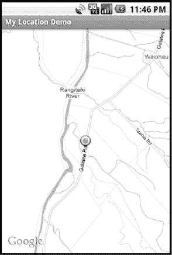

**图 17–10.** *使用 `MyLocationOverlay` 显示我们的当前位置*

上述代码非常直观。在设置了 `MapView` 的基础功能、开启缩放控件并放大到适当比例之后，我们创建了 `MyLocationOverlay` 覆盖图。我们将这个新的覆盖图添加到 `MapView` 中，并在 `MapView` 上调用 `postInvalidate()`，这样新的覆盖图就会出现在屏幕上。如果没有这最后一步调用，覆盖图会被创建，但不会显示出来。

请记住，我们的应用程序不仅在启动时会调用 `onResume()`，在唤醒后也会调用。因此，我们希望在 `onResume()` 中启用位置跟踪，并在 `onPause()` 中禁用它。如果我们不打算消费位置请求，那么让它们消耗电池电量是没有意义的。除了在 `onResume()` 中启用位置请求外，我们还希望直接跳转到我们当前所在的位置。`MyLocationOverlay` 类为此提供了一个有用的方法：`runOnFirstFix()`。这个方法允许我们设置一段代码，该代码会在我们一获得位置信息时立即执行。这可能立即发生，因为我们有最后已知的位置，也可能稍后才发生，当我们从 `GPS_PROVIDER`、`NETWORK_PROVIDER` 或 `PASSIVE_PROVIDER` 获取到信息时。当我们获得定位后，就以此为中心。此后，我们不需要再做任何事情，因为 `MyLocationOverlay` 正在获取位置更新，并将闪烁的蓝点放置在该位置。如果蓝点靠近地图边缘，地图会自动重新居中，使蓝点回到屏幕中央。


### Customizing `MyLocationOverlay`

你可能已经注意到，在位置更新过程中，你可以放大和缩小，甚至可以平移离开当前位置。根据你的视角，这可能是好事也可能是坏事。如果你平移视图后不记得自己在哪里，除非你缩小到很远并寻找蓝点，否则很难重新定位自己。重新居中的技巧只有在蓝点自行逐渐靠近地图边缘时才有效。一旦你平移视图导致蓝点不可见，它不会自动回到视野中。如果蓝点在没有先接近边缘的情况下跳出地图，也可能出现这种情况。

如果你希望当前位置始终显示在屏幕中心附近，我们需要确保持续动画移动到当前位置，这可以相对容易地实现。在下一个版本中，我们将重用 `MyLocationDemo` 项目中的所有内容，只需对 `Activity` 进行一处微小修改，并添加一个新类作为 `MyLocationOverlay` 的扩展，以便稍微调整其行为。新的 `MyLocationOverlay` 扩展类如 清单 17-11 所示。

**清单 17-11.** *扩展 `MyLocationOverlay` 并保持位置在视野中*

```java
package com.androidbook.location.myoverlay;

import android.content.Context;
import android.location.Location;

import com.google.android.maps.GeoPoint;
import com.google.android.maps.MapView;
import com.google.android.maps.MyLocationOverlay;

public class MyCustomLocationOverlay extends MyLocationOverlay {
    MapView mMapView = null;

    public MyCustomLocationOverlay(Context ctx, MapView mapView) {
        super(ctx, mapView);
        mMapView = mapView;
    }

    public void onLocationChanged(Location loc) {
        super.onLocationChanged(loc);
        GeoPoint newPt = new GeoPoint((int) (loc.getLatitude()*1E6),
                (int) (loc.getLongitude()*1E6));
        mMapView.getController().animateTo(newPt);
    }
}
```

我们需要对 清单 17-10 做的唯一修改是在 Activity 的 `onCreate()` 方法中使用 `MyCustomLocationOverlay` 替代 `MyLocationOverlay`，如下所示：

```java
whereAmI = new MyCustomLocationOverlay(this, mapView);
```

在模拟器中运行它，然后通过模拟器控件发送新的位置。如果你使用 GPX 文件发送一系列位置更新，你会注意到蓝点始终被移动到地图中心。即使你完全平移到远离蓝点的位置，地图也会返回并显示它位于中心。

### 使用邻近警报

我们之前提到过，`LocationManager` 可以在设备进入指定地理位置时通知你。设置此功能的方法是 `LocationManager` 类中的 `addProximityAlert()`。基本上，你告诉 `LocationManager`：当设备的位置进入或离开一个以某经纬度位置为中心、指定半径的圆形区域时，你希望触发一个 `Intent`。该 `Intent` 可以触发 `BroadcastReceiver`、`Service` 的调用，或启动一个 `Activity`。还可以为警报设置可选的时间限制，因此它可能在 `Intent` 触发之前超时。

在内部，此方法的代码会同时为 GPS 和网络提供商注册监听器，并设置每秒一次的位置更新，`minDistance` 为 1 米。你无法覆盖此行为或设置参数。因此，如果长时间运行此功能，你可能会很快耗尽电池。如果屏幕进入休眠状态，邻近警报将每 4 分钟检查一次，但是，你同样无法控制此时间间隔。

使用本章中介绍的技术，自己决定设备是否在距经纬度位置一定距离内，可能会好得多。例如，如果你维护一个要检查的位置列表，可以测量当前位置到列表中每个位置的距离。根据距离的远近，你可以决定在再次检查当前位置之前等待一段时间。例如，如果最近的位置在 100 英里外，而你想知道何时进入 300 米范围内，显然不需要在 1 秒后检查。

如果你仍希望使用此方法，我们将展示如何操作。清单 17-12 展示了主 `Activity` 的 Java 代码，以及将接收广播的 `BroadcastReceiver`。

**清单 17-12.** *使用 `BroadcastReceiver` 设置邻近警报*

```java
// This file is ProximityActivity.java
package com.androidbook.location.proximity;

import android.app.Activity;
import android.app.PendingIntent;
import android.content.Intent;
import android.content.IntentFilter;
import android.location.LocationManager;
import android.net.Uri;
import android.os.Bundle;

public class ProximityActivity extends Activity {
    private final String PROX_ALERT =
        "com.androidbook.intent.action.PROXIMITY_ALERT";
    private ProximityReceiver proxReceiver = null;
    private LocationManager locMgr = null;
    PendingIntent pIntent1 = null;
    PendingIntent pIntent2 = null;

    /** Called when the activity is first created. */
    @Override
    public void onCreate(Bundle savedInstanceState) {
        super.onCreate(savedInstanceState);

        locMgr = (LocationManager)
                  this.getSystemService(LOCATION_SERVICE);

        double lat = 30.334954;      // Coordinates for Jacksonville, FL
        double lon = -81.5625;
        float radius = 5.0f * 1609.0f; // 5 miles x 1609 meters per mile

        String geo = "geo:"+lat+","+lon;

        Intent intent = new Intent(PROX_ALERT, Uri.parse(geo));
        intent.putExtra("message", "Jacksonville, FL");

        pIntent1 = PendingIntent.getBroadcast(getApplicationContext(), 0,
                intent, PendingIntent.FLAG_CANCEL_CURRENT);

        locMgr.addProximityAlert(lat, lon, radius, -1L, pIntent1);

        lat = 28.54;        // Coordinates for Orlando, FL
        lon = -81.38;
        geo = "geo:"+lat+","+lon;

        intent = new Intent(PROX_ALERT, Uri.parse(geo));
        intent.putExtra("message", "Orlando, FL");

        pIntent2 = PendingIntent.getBroadcast(getApplicationContext(), 0,
                intent, PendingIntent.FLAG_CANCEL_CURRENT);

        locMgr.addProximityAlert(lat, lon, radius, -1L, pIntent2);
```


`proxReceiver = new ProximityReceiver();`

`IntentFilter iFilter = new IntentFilter(PROX_ALERT);`
`iFilter.addDataScheme("geo");`

`registerReceiver(proxReceiver, iFilter);`

`protected void onDestroy() {`
`    super.onDestroy();`
`    unregisterReceiver(proxReceiver);`
`    locMgr.removeProximityAlert(pIntent1);`
`    locMgr.removeProximityAlert(pIntent2);`
`}`

`// 此文件为 ProximityReceiver.java`
`package com.androidbook.location.proximity;`

`import android.content.BroadcastReceiver;`
`import android.content.Context;`
`import android.content.Intent;`
`import android.location.LocationManager;`
`import android.os.Bundle;`
`import android.util.Log;`

`public class ProximityReceiver extends BroadcastReceiver {`

`    private static final String TAG = "ProximityReceiver";`

`    @Override`
`    public void onReceive(Context arg0, Intent intent) {`
`        Log.v(TAG, "收到 Intent");`
`        if(intent.getData() != null)`
`            Log.v(TAG, intent.getData().toString());`
`        Bundle extras = intent.getExtras();`
`        if(extras != null) {`
`            Log.v(TAG, "消息: " + extras.getString("message"));`
`            Log.v(TAG, "是否进入? " +`
`              extras.getBoolean(LocationManager.KEY_PROXIMITY_ENTERING));`
`        }`
`    }`
`}`

由于我们实际上并未在地图上显示任何位置，因此无需使用 `MapActivity`、Google 地图 API 库或目标对象。但是，我们确实需要在清单文件中为 `android.permission.ACCESS_FINE_LOCATION` 添加权限，因为 `LocationManager` 将尝试使用 GPS 提供商。它还会尝试使用网络提供商，但由于我们已经要求了 `ACCESS_FINE_LOCATION` 权限，因此在权限方面已无后顾之忧。我们在代码的 `onCreate()` 方法中注册了 `BroadcastReceiver`，因此无需在清单文件中设置接收器。如果你将接收器放入一个独立的应用程序，那么*就*需要在该独立应用程序的清单文件中为该接收器添加一个条目。对于清单 17–12 中的示例，它可能看起来像清单 17–13 中的清单片段。

**清单 17–13.** *用于邻近警报 BroadcastReceiver 的 AndroidManifest.xml 片段*

`<application … >`

`    <receiver android:name=".ProximityReceiver">`
`        <intent-filter>`
`            <action android:name="com.androidbook.android.intent.PROXIMITY_ALERT" />`
`            <data android:scheme=”geo” />`
`        </intent-filter>`
`    </receiver>`
`</application>`

Android 中的邻近警报功能通过接收一个 `PendingIntent` 对象、我们所关注经纬度点的坐标、该点周围我们想要检测的半径（以米为单位）以及检测的持续时间来工作。这些参数都通过 `LocationManager` 的 `addProximityAlert()` 方法传递进来。`PendingIntent` 包含一个 `Intent`，当设备进入或离开我们所定义的圆形区域时，这个 `Intent` 就会被触发。在我们的示例中，我们选择了使用广播 Intent，因此调用了 `PendingIntent` 类的 `getBroadcast()` 方法，并将我们应用程序的上下文以及包含警报动作和 `Location` 点的 `Uri` 的 `Intent` 传递给它。如果设备进入或离开我们关注的圆形区域，我们的 `Intent` 将广播给所有注册接收它的接收器。

我们选择不为警报设置超时，将持续时间设置为 `-1L`。如果你想设置超时，这个值将是 `LocationManager` 在放弃并删除你的 `PendingIntent` 之前等待的毫秒数。如果 `LocationManager` 在触发之前就删除了它，你不会收到通知。

在我们的示例中，我们获取了对 `LocationManager` 的引用，创建了第一个 `Intent` 和 `PendingIntent`，然后调用 `addProximityAlert()` 来设置第一个警报。稍后，当我们的 `Intent` 被触发时，`LocationManager` 添加到其中的唯一内容（在 `extras` 中）是一个 `boolean` 值，表明我们是进入还是离开该圆形区域。它不会添加设备当前的纬度/经度位置，也不会添加我们在调用 `addProximityAlert()` 时使用的纬度/经度。因此，为了让我们在 `BroadcastReceiver` 中知道我们靠近哪个 `Location`，我们向 `Intent` 添加了一些数据，即我们关注的 `Location` 的纬度/经度。为了增加趣味性，我们还在 `extras` 中添加了一条消息，描述了这个 `Location`。如果有助于接收端处理，我们也可以添加 `double` 类型的纬度和经度。

添加完第一个警报后，我们以同样的方式设置了第二个警报。最后，我们注册一个 `BroadcastReceiver`，以便在 `LocationManager` 广播我们的 `Intent` 时接收它们。我们使用了一个 `IntentFilter`，其中同时包含作为动作的警报和作为方案的 `geo`。我们需要这两个条件才能捕获广播，因为这些广播包含数据；如果广播不包含任何数据，我们也可以在未指定方案的情况下捕获广播。最后需要做的是，确保在 `onDestroy()` 方法中进行清理，即取消注册我们的接收器，并使用我们保存的 `PendingIntent` 从 `LocationManager` 中移除邻近警报。这就是我们保留对 `PendingIntent` 引用的原因，以便稍后可以移除警报。

我们的 `ProximityReceiver` 类非常简单。收到广播消息后，它会查找信息并在 `LogCat` 中打印输出。在这里，你可以看到 `LocationManager` 为我们插入的额外数据，它告诉我们是在进入还是离开圆形区域。

当你在模拟器中启动此示例应用程序时，会看到一个空白屏幕，顶部有我们的应用程序标题。现在，你可以使用 DDMS 模拟器控制屏幕或带有 `geo fix` 命令的模拟器控制台来发送位置更新。当你发送的位置跨越了我们某个圆形区域的边缘（即杰克逊维尔周围五英里范围或奥兰多周围五英里范围）时，你应该会在 LogCat 中看到来自我们的 `BroadcastReceiver` 的消息。图 17–11 展示了当你发送一些触发广播的位置更新后，你的 LogCat 窗口可能的样子。

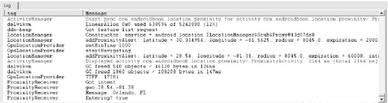

**图 17–11.** *显示来自我们的 BroadcastReceiver 的消息的 LogCat 窗口*

由于这些是广播，我们不能依赖它们的接收顺序。例如，如果我们在奥兰多圆形区域内部，然后跳转到杰克逊维尔圆形区域内部，我们可能会在收到离开奥兰多圆形区域的广播*之前*就收到进入杰克逊维尔圆形区域的广播。

由于我们处理的是 `Location`，因此我们为 URI 使用了 `geo` 方案，这是一个已知的方案，非常适合传递纬度和经度信息。你应该注意，`geo` URI 的结构是纬度在前、经度在后，但当我们在模拟器控制台中使用 `geo fix` 命令时，我们是经度在前、纬度在后。如果你不注意，这可能会让你搞混，并且当问题仅仅是发送位置更新的顺序时，你可能会花费大量时间尝试调试应用程序。你始终可以使用 GPX 或 KML 文件来发送位置，并预先选择用于测试的位置，让你的圆形区域与该文件路径重叠。

我们的示例应用程序非常简单。在实际的应用程序中，`BroadcastReceiver` 可以执行通知或启动服务。除了广播之外，`PendingIntent` 也可以用于 Activity 或服务，甚至在其他应用程序中。我们的应用程序也可以是一个如前所述的服务。


### 本章小结

本章我们探讨了地图与基于位置的服务，详细讨论了如何使用`MapView`控件和`MapActivity`类。我们从地图的基础知识入手，接着介绍了如何利用叠加层在地图上放置标记，并演示了如何通过后台线程进行地理编码与反向地理编码处理。我们概述了`LocationManager`类，该类通过服务提供者获取详细的位置信息，并允许我们在地图上显示设备的当前位置。最后，我们还介绍了如何使用临近警报。

下一章，我们将讨论 Android 的电话服务。

## 第 18 章

## 使用电话 API

许多 Android 设备都是智能手机，但到目前为止，我们尚未讨论如何编写使用电话功能的应用程序。在本章中，我们将向你展示如何发送和接收短消息服务（SMS）消息。我们还将涉及 Android 电话 API 中其他几个有趣的方面，包括会话发起协议（SIP）功能。SIP 是 IETF 制定的用于实现互联网语音传输协议（VoIP）的标准，用户可以通过互联网进行类似电话的呼叫，SIP 还可以处理视频通话。

### 使用短信功能

SMS 代表短消息服务，通常被称为*短信*。Android SDK 支持发送和接收短信。我们将从讨论使用 SDK 发送短信的各种方法开始。

#### 发送短信

要从你的应用程序发送短信，需要在清单文件中添加`android.permission.SEND_SMS`权限，然后使用`android.telephony.SmsManager`类。本示例的布局 XML 文件和 Java 代码请参见【列表 18-1】。如果需要查看权限在清单 XML 文件中的存放位置，可以提前查看【列表 18-2】。

**注意：** 我们将在本章末尾提供一个网址，你可以使用该网址下载本章的项目文件，从而直接将项目导入 Eclipse。

**列表 18-1.** *发送短信消息*

```xml
<?xml version="1.0" encoding="utf-8"?>
<!-- 此文件为 /res/layout/main.xml -->
<LinearLayout
    android:orientation="vertical"
    android:layout_width="fill_parent"
    android:layout_height="fill_parent">

    <LinearLayout
        android:orientation="horizontal"
        android:layout_width="fill_parent"
        android:layout_height="wrap_content">

        <TextView android:layout_width="wrap_content"
            android:layout_height="wrap_content"
            android:text="目标地址：" />

        <EditText android:id="@+id/addrEditText"
            android:layout_width="fill_parent"
            android:layout_height="wrap_content"
            android:phoneNumber="true"
            android:text="9045551212" />

    </LinearLayout>

    <LinearLayout
        android:orientation="vertical"
        android:layout_width="fill_parent"
        android:layout_height="wrap_content">

        <TextView android:layout_width="wrap_content"
            android:layout_height="wrap_content"
            android:text="短信内容：" />

        <EditText android:id="@+id/msgEditText"
            android:layout_width="fill_parent"
            android:layout_height="wrap_content"
            android:text="hello sms" />

    </LinearLayout>

    <Button android:id="@+id/sendSmsBtn"
        android:layout_width="wrap_content"
        android:layout_height="wrap_content"
        android:text="发送短信"
        android:onClick="doSend" />

</LinearLayout>
```

```java
// 此文件为 TelephonyDemo.java
import android.app.Activity;
import android.os.Bundle;
import android.telephony.SmsManager;
import android.view.View;
import android.widget.EditText;
import android.widget.Toast;

public class TelephonyDemo extends Activity
{
    @Override
    protected void onCreate(Bundle savedInstanceState) {
        super.onCreate(savedInstanceState);
        setContentView(R.layout.main);
    }

    public void doSend(View view) {
        EditText addrTxt =
              (EditText) findViewById(R.id.addrEditText);

        EditText msgTxt =
              (EditText) findViewById(R.id.msgEditText);

        try {
            sendSmsMessage(
                addrTxt.getText().toString(),
                msgTxt.getText().toString());
            Toast.makeText(this, "已发送短信",
                    Toast.LENGTH_LONG).show();
        } catch (Exception e) {
            Toast.makeText(this, "发送短信失败",
                    Toast.LENGTH_LONG).show();
            e.printStackTrace();
        }
    }

    @Override
    protected void onDestroy() {
        super.onDestroy();
    }

    private void sendSmsMessage(String address,String message)throws Exception
    {
        SmsManager smsMgr = SmsManager.getDefault();
        smsMgr.sendTextMessage(address, null, message, null, null);
    }
}
```


好的，作为一名高级文档工程师和翻译员，我将遵循您提供的注意事项和示例格式，将给定的英文文本翻译成中文。


Listing 18–1 中的示例演示了如何使用 Android SDK 发送短信。首先查看布局代码片段，可以看到用户界面有两个`EditText`字段：一个用于输入短信接收者的目标地址（电话号码），另一个用于输入文本消息。用户界面还有一个发送短信的按钮，如图 Figure 18–1 所示。

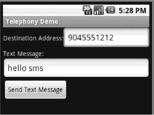

**Figure 18–1.** *短信示例的用户界面*

示例的核心部分是`sendSmsMessage()`方法。该方法使用`SmsManager`类的`sendTextMessage()`方法来发送短信。以下是`SmsManager.sendTextMessage()`的签名：

`sendTextMessage(String destinationAddress, String smscAddress,`
`    String textMsg, PendingIntent sentIntent,`
`    PendingIntent deliveryIntent);`

在此示例中，你只填充了目标地址和文本消息参数。不过，你可以自定义该方法，使其不使用默认的短信中心（蜂窝网络中负责发送短信的服务器地址）。你还可以实现一个自定义功能，当消息已发送（或发送失败）以及收到投递通知时，广播待定意图（`PendingIntent`）。

发送短信主要分为两个步骤：发送和投递。每完成一个步骤，如果你的应用提供了待定意图，就会广播一个待定意图。你可以将任何内容放入待定意图中，例如操作（`action`），但传递给`BroadcastReceiver`的结果码（`result code`）将是特定于短信发送或投递的。此外，根据短信系统的实现，你可能还会获得与无线电错误或状态报告相关的额外数据。

如果没有待定意图，你的代码无法判断文本消息是否发送成功。但在测试时，你可以做到这一点。如果你在模拟器中启动此示例应用，并启动另一台模拟器（通过命令行或 Eclipse Window  Android SDK and AVD Manager 界面），你可以将另一台模拟器的端口号作为目标地址。端口号显示在模拟器窗口的标题栏中，通常类似于`5554`。点击“发送文本消息”按钮后，你应该会看到另一台模拟器中出现一条通知，表明你的文本消息已被对方接收。

`SMSManager`类还提供了另外两种发送短信的方法：

- `sendDataMessage()`：额外接收一个端口号参数，并且消息内容不是`String`类型，而是字节数组。
- `sendMultipartTextMessage()`：允许在整条消息超出短信规范允许长度时发送文本消息。`sendMultipartTextMessage()`方法接收一个`String`数组作为参数，但请注意，它同时也会接收一个可选的待定意图数组，用于处理发送和投递。`SMSManager`类提供了`divideMessage()`方法来帮助将大消息拆分成多个部分。

总而言之，在 Android 中发送短信非常简单。请注意，在模拟器中，你的短信实际上并不会发送到目标地址。但是，如果`sendTextMessage()`方法正常返回且没有抛出异常，则可以认为发送成功。如 Listing 18–1 所示，你可以使用`Toast`类在用户界面中显示一条消息，以指示短信是否发送成功。

发送短信只是故事的一半。接下来，我们将展示如何监控收到的短信。

### 监控收到的短信

我们将使用你刚刚创建的同一个应用来发送短信，并添加一个`BroadcastReceiver`来监听`android.provider.Telephony.SMS_RECEIVED`这个操作（`action`）。当设备收到短信时，Android 会广播此操作。当我们注册接收器后，每当收到短信时，我们的应用都会收到通知。监控收到的短信的第一步是请求接收短信的权限。为此，我们需要在清单文件（manifest file）中添加`android.permission.RECEIVE_SMS`权限。要实现接收器，我们必须编写一个继承自`android.content.BroadcastReceiver`的类，然后在清单文件中注册该接收器。Listing 18–2 包含了`AndroidManifest.xml`文件和我们的接收器类。请注意，清单文件中包含了两个权限，因为我们仍然需要为我们上面创建的 Activity 保留发送权限。

**Listing 18–2.** *监控短信*

`<?xml version="1.0" encoding="utf-8"?>`
`<!-- This file is AndroidManifest.xml -->`
`<manifest`
`    package="com.androidbook.telephony" android:versionCode="1"`
`    android:versionName="1.0">`
`    <application android:icon="@drawable/icon"`
`            android:label="@string/app_name">`
`        <activity android:name=".TelephonyDemo"`
`                android:label="@string/app_name">`
`          <intent-filter>`
`            <action android:name="android.intent.action.MAIN" />`
`            <category android:name="android.intent.category.LAUNCHER" />`
`          </intent-filter>`
`        </activity>`
`        <receiver android:name="MySMSMonitor">`
`          <intent-filter>`
`            <action`
`android:name="android.provider.Telephony.SMS_RECEIVED"/>`
`          </intent-filter>`
`        </receiver>`

`    </application>`
`    <uses-sdk android:minSdkVersion="4" />`

`    <uses-permission android:name="android.permission.SEND_SMS"/>`
`    <uses-permission android:name="android.permission.RECEIVE_SMS"/>`

`</manifest>`

`// This file is MySMSMonitor.java`
`import android.content.BroadcastReceiver;`
`import android.content.Context;`
`import android.content.Intent;`
`import android.telephony.SmsMessage;`
`import android.util.Log;`

`public class MySMSMonitor extends BroadcastReceiver`
`{`
`    private static final String ACTION =`
`                "android.provider.Telephony.SMS_RECEIVED";`
`    @Override`
`    public void onReceive(Context context, Intent intent)`
`    {`
`        if(intent!=null && intent.getAction()!=null &&`
`ACTION.compareToIgnoreCase(intent.getAction())==0)`
`        {`
`            Object[]pduArray= (Object[]) intent.getExtras().get("pdus");`
`            SmsMessage[] messages = new SmsMessage[pduArray.length];`
`            for (int i = 0; i<pduArray.length; i++) {`
`                messages[i] = SmsMessage.createFromPdu(`
`(byte[])pduArray [i]);`
`                Log.d("MySMSMonitor", "From: " +`
`                        messages[i].getOriginatingAddress());`
`                Log.d("MySMSMonitor", "Msg: " +`
`                        messages[i].getMessageBody());`
`            }`
`            Log.d("MySMSMonitor","SMS Message Received.");`
`        }`
`    }`
`}`


清单 18-2 顶部是用于拦截短信的 `BroadcastReceiver` 的清单定义。短信监控类为 `MySMSMonitor`。该类实现了抽象的 `onReceive()` 方法，当短信到达时系统会调用此方法。测试该应用程序的一种方式是使用 Eclipse 中的 “Emulator Control” 视图。在模拟器中运行该应用程序，然后依次进入 Window  Show View  Other  Android  Emulator Control。该用户界面允许你向模拟器发送数据，以模拟接收短信或电话。如图 18-2 所示，你可以通过填写 “Incoming number” 字段并选择 SMS 单选按钮，向模拟器发送一条短信。接着，在 Message 字段中输入一些文本，然后点击 Send 按钮。这将向模拟器发送一条短信，并调用你的 `BroadcastReceiver` 的 `onReceive()` 方法。

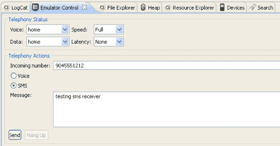

**图 18-2.** *使用 Emulator Control UI 向模拟器发送短信*

`onReceive()` 方法将拥有广播意图，该意图会在 `bundle` 属性中包含 `SmsMessage`。你可以通过调用 `intent.getExtras().get("pdus")` 来提取 `SmsMessage`。此调用返回一个在协议描述单元（PDU）模式下定义的对象数组——这是一种表示短信的行业标准方式。然后你可以将这些 PDU 转换为 Android 的 `SmsMessage` 对象，如清单 18-2 所示。如你所见，你从意图中获取 PDU 作为一个对象数组。然后你构建一个大小与 PDU 数组相等的 `SmsMessage` 对象数组。最后，你遍历 PDU 数组，并通过调用 `SmsMessage.createFromPdu()` 从 PDU 创建 `SmsMessage` 对象。读取传入消息后的操作必须迅速。广播接收器在系统中具有高优先级，但其任务必须快速完成，并且它不会被放到前台供用户查看。因此，你的选择是有限的。你不应执行任何直接的 UI 工作。发布通知是可以的，就像启动 Service 以在此继续工作一样。一旦 `onReceive()` 方法完成，托管 `onReceive()` 方法的进程可能随时被杀死。启动 Service 是可以的，但绑定到 Service 则不行，因为那需要你的进程存在一段时间，而这可能不会发生。关于 `BroadcastReceiver` 的更多信息，请参见第 14 章。

现在，让我们继续讨论 SMS，看看如何处理各种 SMS 文件夹。

### 使用 SMS 文件夹

访问短信收件箱是另一个常见需求。要开始，你需要在清单文件中添加读取短信权限（`android.permission.READ_SMS`）。添加此权限使你能够从短信收件箱读取内容。

要读取短信，你需要在短信收件箱上执行查询，如清单 18-3 所示。

**清单 18-3.** *显示来自短信收件箱的消息*

```
<?xml version="1.0" encoding="utf-8"?>
<!-- This file is /res/layout/sms_inbox.xml -->
<LinearLayout
    android:orientation="vertical"
    android:layout_width="fill_parent"
    android:layout_height="fill_parent" >

<TextView android:id="@+id/row"
    android:layout_width="fill_parent"
    android:layout_height="fill_parent"/>

</LinearLayout>
```

```
// This file is SMSInboxDemo.java
import android.app.ListActivity;
import android.database.Cursor;
import android.net.Uri;
import android.os.Bundle;
import android.widget.ListAdapter;
import android.widget.SimpleCursorAdapter;

public class SMSInboxDemo extends ListActivity {

    private ListAdapter adapter;
    private static final Uri SMS_INBOX =
            Uri.parse("content://sms/inbox");

    @Override
    public void onCreate(Bundle bundle) {
        super.onCreate(bundle);
        Cursor c = getContentResolver()
                .query(SMS_INBOX, null, null, null, null);
        startManagingCursor(c);
        String[] columns = new String[] { "body" };
        int[] names = new int[] { R.id.row };
        adapter = new SimpleCursorAdapter(this, R.layout.sms_inbox,
                c, columns, names);

        setListAdapter(adapter);
    }
}
```

清单 18-3 打开短信收件箱，并创建一个列表，其中每个列表项包含一条短信的正文部分。清单 18-3 的布局部分包含一个简单的 `TextView`，它将保存每个列表项中消息的正文。要获取短信列表，你创建一个指向短信收件箱的 URI（`content://sms/inbox`），然后执行一个简单查询。接着，你过滤短信的正文，并设置 `ListActivity` 的列表适配器。执行清单 18-3 中的代码后，你将看到收件箱中的短信列表。在模拟器上运行代码之前，确保你使用 Emulator Control 生成了一些短信。

由于你可以访问短信收件箱，想必你也可以访问其他与短信相关的文件夹，例如已发送或草稿文件夹。访问收件箱与其他文件夹的唯一区别在于你指定的 URI。例如，你可以通过对 `content://sms/sent` 执行查询来访问已发送文件夹。以下是短信文件夹的完整列表及其对应的 URI：

*   *全部*: `content://sms/all`
*   *收件箱*: `content://sms/inbox`
*   *已发送*: `content://sms/sent`
*   *草稿*: `content://sms/draft`
*   *发件箱*: `content://sms/outbox`
*   *发送失败*: `content://sms/failed`
*   *已排队*: `content://sms/queued`
*   *未送达*: `content://sms/undelivered`
*   *会话*: `content://sms/conversations`

Android 将 MMS 和 SMS 结合起来，并允许你使用 `mms-sms` 这个 AUTHORITY 同时访问两者的内容提供者。因此，你可以访问如下所示的 URI：

```
content://mms-sms/conversations
```

### 发送电子邮件

现在你已经了解了如何在 Android 中发送短信，你可能会认为可以使用类似的 API 来发送电子邮件。不幸的是，Android 没有提供用于发送电子邮件的 API。普遍的共识是，用户不希望应用程序在他们不知情的情况下代表他们开始发送电子邮件。相反，要发送电子邮件，你必须通过一个已注册的电子邮件应用程序。例如，你可以使用 `ACTION_SEND` 来启动电子邮件应用程序，如清单 18-4 所示。

**清单 18-4.** *通过 Intent 启动电子邮件应用程序*

```
Intent emailIntent=new Intent(Intent.ACTION_SEND);

String subject = "Hi!";
String body = "hello from android....";

String[] recipients = new String[]{"aaa@bbb.com"};
emailIntent.putExtra(Intent.EXTRA_EMAIL, recipients);

emailIntent.putExtra(Intent.EXTRA_SUBJECT, subject);
emailIntent.putExtra(Intent.EXTRA_TEXT, body);
emailIntent.setType("message/rfc822");

startActivity(emailIntent);
```

这段代码会启动默认的电子邮件应用程序，并让用户决定是否发送该邮件。可以添加到电子邮件意图中的其他 “extra” 包括 `EXTRA_CC` 和 `EXTRA_BCC`。

假设你想在你的消息中发送一个电子邮件附件。为此，你需要使用类似下面的代码，其中 `Uri` 是对你想要作为附件的文件的引用：

```
emailIntent.putExtra(Intent.EXTRA_STREAM,
    Uri.fromFile(new File(myFileName)));
```

接下来，我们将讨论电话管理器。


### 使用电话管理器

电话 API 还包含电话管理器（`android.telephony.TelephonyManager`），你可以用它获取设备上的电话服务信息、获取用户信息以及注册电话状态变化监听。一个常见的电话使用场景要求应用程序在来电时执行业务逻辑。例如，音乐播放器可能会在来电时暂停播放，并在通话结束后恢复播放。监听电话状态变化最简单的方法是，在`"android.intent.action.PHONE_STATE"`上实现一个广播接收器。你可以采用与之前监听短信接收相同的方式来实现。另一种方法是使用`TelephonyManager`。在本节中，我们将向你展示如何注册电话状态变化监听以及如何检测来电。清单 18–4 显示了具体细节。

**清单 18–5.** *使用电话管理器*

```xml
<?xml version="1.0" encoding="utf-8"?>
<!-- This file is res/layout/main.xml -->
<LinearLayout
    android:orientation="vertical"
    android:layout_width="fill_parent"
    android:layout_height="fill_parent"
    >
<Button
    android:id="@+id/callBtn"
    android:layout_width="wrap_content"
    android:layout_height="wrap_content"
    android:text="Place Call"
    android:onClick="doClick"
    />
<TextView
    android:id="@+id/textView"
    android:layout_width="fill_parent"
    android:layout_height="fill_parent"
    />
</LinearLayout>
```

```java
// This file is PhoneCallActivity.java
package com.androidbook.phonecall.demo;

import android.app.Activity;
import android.content.Context;
import android.content.Intent;
import android.net.Uri;
import android.os.Bundle;
import android.telephony.PhoneStateListener;
import android.telephony.TelephonyManager;
import android.view.View;
import android.widget.TextView;

public class PhoneCallActivity extends Activity {
    private TelephonyManager teleMgr = null;
    private MyPhoneStateListener myListener = null;
    private String logText = "";
    private TextView tv;

    @Override
    protected void onCreate(Bundle savedInstanceState)
    {
        super.onCreate(savedInstanceState);
        setContentView(R.layout.main);

        tv = (TextView)findViewById(R.id.textView);

        teleMgr =
                (TelephonyManager)getSystemService(Context.TELEPHONY_SERVICE);
        myListener = new MyPhoneStateListener();
    }

    protected void onResume() {
        super.onResume();
        teleMgr.listen(myListener, PhoneStateListener.LISTEN_CALL_STATE);
    }

    protected void onPause() {
        super.onPause();
        teleMgr.listen(myListener, PhoneStateListener.LISTEN_NONE);
    }

    public void doClick(View target) {
        Intent intent = new Intent(Intent.ACTION_VIEW,
                Uri.parse("tel:5551212"));
        startActivity(intent);
    }

    class MyPhoneStateListener extends PhoneStateListener
    {
        @Override
        public void onCallStateChanged(int state, String incomingNumber)
        {
            super.onCallStateChanged(state, incomingNumber);

            switch(state)
            {
                case TelephonyManager.CALL_STATE_IDLE:
                    logText = "call state idle...incoming number is["+
                                incomingNumber+"]\n" + logText;
                    break;
                case TelephonyManager.CALL_STATE_RINGING:
                    logText = "call state ringing...incoming number is["+
                                incomingNumber+"]\n" + logText;
                    break;
                case TelephonyManager.CALL_STATE_OFFHOOK:
                    logText = "call state Offhook...incoming number is["+
                                incomingNumber+"]\n" + logText;
                    break;
                default:
                    logText = "call state ["+state+
                                "]incoming number is["+
                                incomingNumber+"]\n" + logText;
                    break;
            }
            tv.setText(logText);
        }
    }
}
```

当使用电话管理器时，请务必在清单文件中添加 `android.permission.READ_PHONE_STATE` 权限，这样你才能访问电话状态信息。如清单 18–5 所示，你通过实现 `PhoneStateListener` 并调用 `TelephonyManager` 的 `listen()` 方法来接收电话状态变化的通知。当有电话呼入或电话状态发生变化时，系统会调用你的 `PhoneStateListener` 的 `onCallStateChanged()` 方法，并传入新的状态。当你尝试运行此示例时，会发现来电号码仅在状态为 `CALL_STATE_RINGING` 时可用。在此示例中，我们将消息写入屏幕，但你的应用程序可以在该位置实现自定义的业务逻辑，例如暂停音频或视频的回放。要模拟来电，你可以使用 Eclipse 的模拟器控制界面，也就是你之前用来发送短信的那个界面（参见图 18–2），但需要选择“Voice”而不是“SMS”。

请注意，我们在 `onPause()` 中告诉 `TelephonyManager` 停止向我们发送更新。当我们的活动被暂停时，关闭消息通知总是很重要的。否则，`TelephonyManager` 可能会持有我们对象的引用，从而阻止其在后续被清理。

此示例仅处理了可供监听的一种电话状态。请查看关于 `PhoneStateListener` 的文档以了解其他状态，例如 `LISTEN_MESSAGE_WAITING_INDICATOR`。在处理电话状态变化时，你可能还需要获取订阅者（用户）的电话号码。`TelephonyManager.getLine1Number()` 将为你返回该信息。

你可能想知道是否可以通过代码接听电话。遗憾的是，目前 Android SDK 并未提供实现此功能的方法，尽管文档暗示你可以通过 `ACTION_ANSWER` 动作启动一个 Intent。在实践中，这种方法目前还不起作用，不过你可以查看自本文撰写以来此问题是否已得到修复。

类似地，你可能希望通过代码拨出电话。在这方面，你会发现事情要简单得多。拨出电话最简单的方法是，通过如下代码使用 Intent 启动拨号应用：

```java
Intent intent = new Intent(Intent.ACTION_CALL, Uri.parse("tel:5551212"));
startActivity(intent);
```

请注意，要让这真正拨出电话，你的应用程序需要 `android.permission.CALL_PHONE` 权限。否则，当你的应用程序尝试调用拨号应用时，会收到一个 `SecurityException`。要在没有此权限的情况下进行拨号，请将 Intent 的动作改为 `Intent.ACTION_VIEW`，这会导致拨号应用显示为你想要的电话号码，但用户需要按下“发送”按钮才能发起呼叫。

在你的应用中处理电话功能时，需要牢记的另一件事是，其他应用程序很可能会响应来电并使你的活动暂停。在这种情况下，你将停止接收通知，不过当你的 `onResume()` 方法再次被调用并且你重新向 `TelephonyManager` 注册时，你会立即收到通知。在决定电话状态通知处理程序要执行的操作时，请为此做好准备。


### 会话发起协议 (SIP)

Android 2.3（Gingerbread）在 `android.net.sip` 包中引入了新功能以支持 SIP。SIP 是互联网工程任务组（IETF）制定的标准，用于协调通过网络连接发送语音和视频，从而将人们连接在通话中。这项技术有时被称为网络电话（VoIP），但请注意，实现 VoIP 的方式不止一种。例如，Skype 使用专有协议实现其 VoIP，并且与 SIP 不兼容。SIP 也与 Google Voice 不同。截至撰写本文时，Google Voice 并不直接支持 SIP，尽管有些方法可以将 Google Voice 与 SIP 提供商集成在一起。Google Voice 会为您设置一个新的电话号码，然后您可以将该号码与您家中的电话、工作电话或手机等其他电话关联。一些 SIP 提供商可以生成一个可用于 Google Voice 的电话号码，但在这种情况下，Google Voice 实际上并不知道该号码对应的是 SIP 账户。在互联网上搜索，您会发现相当多的 SIP 提供商，许多提供合理的通话费率，还有一些是免费的。

需要注意的是，SIP 标准并不涉及通过网络传输音频和视频数据。SIP 仅负责建立和拆除设备之间的直接连接，以允许音频和视频数据流通。客户端计算机程序使用 SIP，以及音频和视频编解码器和其他库，来建立用户之间的通话。常与 SIP 通话有关的其他标准包括实时传输协议（RTP）、实时流协议（RTSP）和会话描述协议（SDP）。

用户可以通过台式计算机拨打 SIP 电话，而无需支付长途费用。该计算机程序同样可以轻松地在移动设备上运行，例如 Android 智能手机或平板电脑。SIP 计算机程序通常被称为“软电话”。移动设备上的软电话的真正优势在于，当设备通过 Wi-Fi 连接到互联网时，用户无需消耗任何无线通话分钟数，但仍然能够拨打电话或接听来电。在接收端，软电话必须向 SIP 提供商注册其位置和功能，以便提供商的 SIP 服务器能够响应邀请请求，建立直接连接。如果接收方的软电话不可用，SIP 服务器可以将入站请求转接到语音邮箱等。

Google 提供了一个 SIP 演示应用程序，名为 `SipDemo`。现在，我们想与您一起探索这个应用程序，并帮助您理解其工作原理。如果您是 SIP 新手，某些方面可能不太明显。如果您想尝试使用 `SipDemo`，您可能需要一个支持 SIP 的实体 Android 设备。这是因为，截至撰写本文时，Android 模拟器不支持 SIP（就此而言，也不支持 Wi-Fi）。互联网上有些尝试让 SIP 在模拟器中工作，当您阅读本文时，其中一些方法可能已经易于实现且足够稳定。要使用 `SipDemo`，您还需要从 SIP 提供商处获取一个 SIP 账户。您需要准备好您的 SIP ID、SIP 域名（或代理）以及您的 SIP 密码。这些信息将被填入 `SipDemo` 应用程序的偏好设置屏幕中，以供应用程序使用。最后，您的设备需要通过 Wi-Fi 连接到互联网。如果您不想在设备上实际尝试 `SipDemo`，您仍然应该能够理解本节的其余内容。`SipDemo` 的外观如图 18-3 所示。

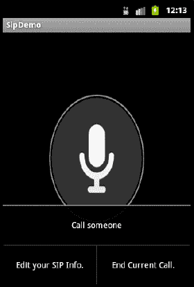

**图 18-3.** *显示菜单的 SipDemo 应用程序*

要将 `SipDemo` 作为新项目加载到 Eclipse 中，请使用“新建 Android 项目”向导，但点击“从现有示例创建项目”选项，在“构建目标”部分选择 Android 2.3 或更高版本，然后使用下拉菜单“示例”选择 `SipDemo`。点击“完成”，Eclipse 将为您创建新项目。您可以不对该项目做任何更改直接运行它，但如前所述，除非设备支持 SIP、启用了 Wi-Fi、您在某处拥有 SIP 账户、使用菜单按钮编辑了您的 SIP 信息，并使用菜单按钮发起通话，否则它不会做任何事情。您还需要另一个 SIP 账户来呼叫，以测试应用程序。按下屏幕上的大麦克风图标，您可以与对方通话。此演示应用程序也可以接听来电。现在，让我们来讨论 `android.net.sip` 包的内部工作原理。

`android.net.sip` 包包含四个基本类：`SipManager`、`SipProfile`、`SipSession` 和 `SipAudioCall`。`SipManager` 是这个包的核心，提供对其他 SIP 功能的访问。您调用 `SipManager` 的静态 `newInstance()` 方法来获取一个 `SipManager` 对象。有了 `SipManager` 对象，您可以为大多数 SIP 活动获取 `SipSession`，或者为纯音频通话获取 `SipAudioCall`。这意味着 Google 在 `android.net.sip` 包中提供了超出标准 SIP 的功能，即建立音频通话的能力。

`SipProfile` 用于定义将相互通信的 SIP 账户。这并不直接指向最终用户的设备，而是指向 SIP 提供商处的 SIP 账户。服务器将协助处理建立实际连接所需的其余细节。

`SipSession` 是神奇发生的地方。设置会话包括您的 `SipProfile`，以便您的应用程序可以向您的 SIP 提供商服务器表明身份。您还需要传递一个 `SipSession.Listener` 实例，该实例将在事件发生时收到通知。一旦您设置了 `SipSession` 对象，您的应用程序就可以准备向另一个 `SipProfile` 发起呼叫，或接听来电。监听器有一系列回调函数，因此您的应用程序可以妥善处理会话状态的变化。

自 Honeycomb 版本开始，最简单的方法是使用 `SipAudioCall`。所有的逻辑都已内置，用于将麦克风和扬声器连接到数据流，以便您可以与对方进行对话。`SipAudioCall` 提供了许多方法来管理静音、保持等。所有音频部分都已为您处理。除此之外，您还需要做更多工作。`SipSession` 类具有 `makeCall()` 方法，用于发起出站呼叫。主要参数是会话描述（作为 `String`）。这正是需要更多工作的地方。构建会话描述需要根据前面提到的会话描述协议（SDP）进行格式化。理解收到的会话描述意味着根据 SDP 对其进行解析。SDP 的标准文档在此：`http://tools.ietf.org/html/rfc4566`，不幸的是，Android SDK 不提供任何对 SDP 的支持。感谢一些非常友好的人士，有几个免费的 Android SIP 应用程序已经构建了此功能。它们是 sipdroid (`http://code.google.com/p/sipdroid/`) 和 csipsimple (`http://code.google.com/p/csipsimple/`)。

我们甚至还没有开始讨论用于管理 SIP 客户端之间视频流的编解码器，不过 sipdroid 具备此能力。SIP 的其他非常吸引人的方面包括建立两人以上电话会议的能力。这些主题超出了本书的范围，但我们希望您能理解 SIP 能为您做什么。

请注意，SIP 应用程序至少需要 `android.permission.USE_SIP` 和 `android.permission.INTERNET` 权限才能正常运行。如果您使用 `SipAudioCall`，还需要额外的权限。同时，建议您在 `AndroidManifest.xml` 文件中添加以下标签，作为 `<manifest>` 的子元素，这样您的应用程序将只能安装在具有 SIP 硬件支持的设备上：

```
<uses-feature android:name="android.hardware.sip.voip" />
```


### 总结

在本章中，我们讨论了 Android 电话 API。具体来说，我们展示了如何发送短信、如何监控收到的短信，以及如何访问设备上的各种短信文件夹。我们介绍了`TelephonyManager`类。最后，我们概述了 Android 2.3 引入的会话发起协议（SIP）功能集。

## 第 19 章：理解媒体框架

现在，我们将探索 Android SDK 中一个非常有趣的部分：媒体框架。我们将向您展示如何从多种来源播放和录制音频及视频。我们还将介绍如何使用相机拍照。任何关于媒体的讨论，如果不解释安全数字（SD）卡以及如何操作它们，都将是不完整的，因为您通常需要频繁使用 SD 卡来读写媒体文件。

### 使用媒体 API

Android 支持在`android.media`包下播放音频和视频内容。在本章中，我们将探索这个包中的媒体 API。

`android.media`包的核心是`android.media.MediaPlayer`类。`MediaPlayer`类负责播放音频和视频内容。此类的内容可以来自以下来源：

- **网络**：您可以通过 URL 播放网络上的内容。
- **.apk 文件**：您可以播放作为`.apk`文件一部分打包的内容。您可以将媒体内容打包为资源或资产（位于`assets`文件夹内）。
- **SD 卡**：您可以播放存储在设备 SD 卡上的内容。

`MediaPlayer`能够解码多种不同的内容格式，包括 3GPP（`.3gp`）、MP3（`.mp3`）、MIDI（`.mid` 及其他）、OggVorbis（`.ogg`）、PCM/WAVE（`.wav`）和 MPEG-4（`.mp4`）。自 Android 3.0 起，还支持 HTTP 实时流媒体和 M3U 播放列表。关于支持的媒体格式的完整列表，请访问 `http://developer.android.com/guide/appendix/media-formats.html`。

#### 使用 SD 卡

在我们开始创建和使用不同类型的媒体之前，让我们看看如何操作 SD 卡。SD 卡用于 Android 手机存储大量用户数据，通常是图片、音频和视频等媒体内容。它们本质上是可插拔的内存芯片，即使在断电时也能保留数据。在真实手机上，SD 卡插入内存插槽，设备可对其进行访问。许多设备只有一个插槽，并且通常不期望您更换 SD 卡。在某些设备上，您可以使用多张卡，在设备上切换使用，甚至可以在不同设备之间使用它们。幸运的是，Android 模拟器可以使用您工作站硬盘上的空间来模拟 SD 卡，就像它是一个插入的 SD 卡一样。

当您在第二章创建第一个 Android 虚拟设备（AVD）时，您指定了 SD 卡的大小，这使得应用程序在模拟器中运行时可以访问它。如果您查看创建的 AVD 目录，您会看到一个名为`sdcard.img`的文件，其文件大小与您指定的一致。我们当时并未使用 SD 卡，但本章将会用到。

作为开发者，一旦您拥有了 SD 卡，就可以使用 Eclipse 中的 Android 工具将媒体文件（或任何其他文件）推送到 SD 卡。您也可以使用 Android 调试桥（`adb`）实用程序向 SD 卡推送或从中拉取文件。`adb`实用程序位于 Android SDK 的 `tools` 子目录中；正如第二章所述，从工具窗口很容易访问它。

您已经知道如何通过创建 AVD 来获取 SD 卡。当然，您可以创建多个 AVD，它们除了 SD 卡大小不同外，其他都一样。另一种方法是：Android SDK 工具包包含一个名为 `mksdcard` 的实用程序，可以创建 SD 卡镜像。实际上，该实用程序会创建一个格式化文件用作 SD 卡。要使用此实用程序，首先找到或创建一个存放镜像文件的文件夹，例如 `c:\Android\sdcard\`。然后打开一个工具窗口，并使用适当的 SD 卡镜像文件路径运行类似以下的命令：

`mksdcard 256M c:\Android\sdcard\sdcard.img`

此示例命令在 `c:\Android\sdcard\` 创建一个名为 `sdcard.img` 的 SD 卡镜像。SD 卡的大小为 256MB。要指定其他大小，可以使用 `K` 表示千字节，但 `G` 还不能用于表示吉字节，因此您需要指定 `1024M` 的倍数来获得吉字节大小。您也可以直接指定一个代表总字节数的整数值。此外请注意，Android 模拟器无法使用低于 8MB 的 SD 卡大小。

Eclipse 中的 Android 开发工具（ADT）提供了一种在启动模拟器时指定额外命令行参数的方法。要找到模拟器选项的字段，请转到 Eclipse 的“首选项”窗口，然后选择 Android → 启动。理论上，您可以在此处添加 `-sdcard "您 SD 卡镜像文件的路径"`，它将覆盖您 AVD 的 SD 卡文件路径。但自几个 Android 版本以来，这一直无效，您始终会使用与 AVD 一起创建的 SD 卡镜像文件。将单独的 SD 卡与您的 AVD 一同使用的最可靠方法是从命令行启动模拟器，并在那里指定要使用的 SD 卡镜像。在工具窗口内（关于如何打开工具窗口，请参阅第二章），以下命令会启动一个命名的 AVD，但使用指定的 SD 卡镜像文件，而不是随 AVD 创建的 SD 卡镜像文件：

`emulator -avd AVDName -sdcard "您 SD 卡镜像文件的路径"`


#### SD 卡文件管理

当您首次创建 SD 卡时，其上没有任何文件。您可以使用 Eclipse 中的 `File Explorer`（文件资源管理器）工具来添加文件。启动模拟器，等待其初始化完成。然后，在 Eclipse 中切换到 Java、调试或 DDMS 透视图，查找 `File Explorer`（文件资源管理器）选项卡，如图 19–1 所示。

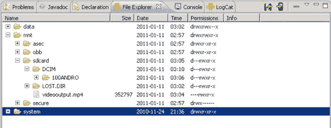

**图 19–1.** *文件资源管理器视图*

如果未显示 `File Explorer`（文件资源管理器），您可以通过依次选择“窗口”“显示视图”“其他”“Android”，然后选择 `File Explorer`（文件资源管理器）来打开它。或者，您可以通过依次选择“窗口”“打开透视图”“其他”“DDMS”来显示 Dalvik 调试监视器服务 (DDMS) 透视图。默认情况下，`File Explorer`（文件资源管理器）视图位于 DDMS 透视图中。Eclipse for Android 中可用视图的列表如图 19–2 所示。

要将文件推送到 SD 卡，请在 `File Explorer`（文件资源管理器）中选择 `sdcard` 文件夹，然后选择指向手机样式的向右箭头按钮（位于右上角）。这将启动一个对话框，让您选择文件。选择您想要上传到 SD 卡的文件。附近的按钮看起来像一个指向软盘的向左箭头。在 `File Explorer`（文件资源管理器）中选择要拉取的文件后，选择此按钮即可将文件从设备复制到您的工作站。

如果 `File Explorer`（文件资源管理器）显示空视图，可能是由于以下原因：模拟器未运行、Eclipse 已与模拟器断开连接，或者您在模拟器中运行的 AVD 未在“设备”选项卡下选中。要打开“设备”选项卡，请按照与上述 `File Explorer`（文件资源管理器）相同的步骤操作。默认情况下，`Devices`（设备）选项卡也应在 DDMS 透视图中可用。

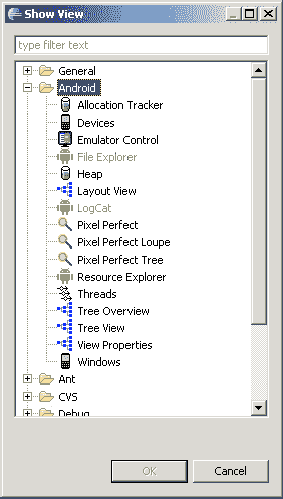

**图 19–2.** *启用 Android 视图*

#### 使用 `adb` 工具

在 SD 卡之间移动文件的另一种方法是使用 `adb` 工具。要尝试此操作，请打开一个工具窗口，然后输入如下命令：

```
adb push c:\path_to_my_file\filename /mnt/sdcard/newfile
```

这会将文件从您的工作站推送到 SD 卡。请注意，设备始终使用正斜杠来分隔目录。对于要推送的文件，请使用适合您工作站的目录分隔符，并为工作站上的文件使用适当的路径。相反，以下命令会将文件从 SD 卡拉取到您的工作站：

```
adb pull /mnt/sdcard/devicefile c:\path_to_where_its_going\filename
```

此命令的一个优点在于，它会根据需要（无论是推送还是拉取）在任一方向上创建目录，以将文件传送到所需的目标位置。遗憾的是，您无法使用 `adb` 同时复制多个文件。您必须逐个处理每个文件。

**注意：** 在 Android 2.2 之前，SD 卡通常位于 `/sdcard`。自 Android 2.2 起，SD 卡通常位于 `/mnt/sdcard`，但为了向后兼容，存在一个名为 `/sdcard` 的符号链接指向 `/mnt/sdcard`。

#### `DCIM` 目录

您可能已经注意到 SD 卡上有一个名为 `DCIM` 的目录。这是“数码相机图像”目录。将 `DCIM` 目录放置在用于存储数码图像的 SD 卡根目录下是一项行业标准。在 `DCIM` 目录下创建一个代表相机的目录（格式为 `123ABCDE`——三位数字后跟五位字母）也是一项行业标准。模拟器会在 `DCIM` 下创建一个名为 `100ANDRO` 的目录，但数码相机制造商和 Android 手机制造商可以随意命名此目录。模拟器（以及某些 Android 手机）在 `DCIM` 目录下有一个名为 `Camera` 的目录，但这不符合标准。尽管如此，您可能会在 `Camera` 目录下找到图像文件，或在 `100ANDRO` 目录下找到它们，或者可能在 `DCIM` 目录下找到其他存储图像文件的目录。

遗憾的是，没有一种方法调用可以告知您 `DCIM` 目录下哪个子目录可能用于相机照片。不过，有几种方法可以告知您 SD 卡的顶层目录位置。第一种方法是`Environment.getExternalStorageDirectory()`，它返回一个代表 SD 卡顶级目录的 `File` 对象。在 Android 2.2 之前的设备上，这通常是 `/sdcard`，但并非所有设备都如此。对于 Android 2.2，大多数设备将具有 `/mnt/sdcard`。使用这种 `Environment` 方法比假设您知道 SD 卡根目录的名称要好得多。另一种方法我们将在下文描述。

#### 自 Android 2.2（Froyo）起标准化的目录

自 Android 2.2（又名 Froyo）起，`Environment` 类中提供了一些用于定位目录的新常量，并且该类中还新增了一个用于定位目录的方法。以前，SD 卡有点混乱，除了 `DCIM` 之外没有标准化的目录名称。从 Froyo 开始，有了几个标准化的目录名称，如表 19-1 所述。第三列是模拟器中使用的目录名称，其中 SD 卡的顶层目录很可能是 `/mnt/sdcard`（可能因设备而异）。目录的差异性正是您应始终使用 `Environment` 方法来查找 SD 卡上所需目录的原因。

**表 19-1.** SD 卡的标准目录

| **目录常量** | **描述** | **模拟器中相对于 SD 卡顶层的目录** |
| --- | --- | --- |
| `DIRECTORY_ALARMS` | 当 Android 寻找用于闹钟的音频文件时，会在此标准目录中查找。 | `Alarms` |
| `DIRECTORY_DCIM` | 行业标准目录，用于查找使用相机拍摄的照片和视频。 | `DCIM` |
| `DIRECTORY_DOWNLOADS` | 用于存放用户已下载文件的标准目录。 | `Download`（注意：不是复数形式） |
| `DIRECTORY_MOVIES` | 当 Android 为用户寻找视频文件时，会在此标准目录中查找。 | `Movies` |
| `DIRECTORY_MUSIC` | 当 Android 寻找供用户收听的常规音乐音频文件时，会在此标准目录中查找。 | `Music` |
| `DIRECTORY_NOTIFICATIONS` | 当 Android 寻找用于通知的音频文件时，会在此标准目录中查找。 | `Notifications` |
| `DIRECTORY_PICTURES` | 当 Android 寻找非相机拍摄的图像文件时，会在此标准目录中查找。 | `Pictures` |
| `DIRECTORY_PODCASTS` | 当 Android 寻找用作播客的音频文件时，会在此标准目录中查找。 | `Podcasts` |
| `DIRECTORY_RINGTONES` | 当 Android 寻找用作铃声的音频文件时，会在此标准目录中查找。 | `Ringtones` |


#### 定位目录的新方法

`Environment.getExternalStoragePublicDirectory(String type)`是定位目录的新方法，其中`type`参数是表 19-1 中的常量之一。该方法返回一个`File`对象，代表所请求的目录。此方法在较旧的设备（早于 Froyo）上不存在，即使在新设备上，您也可能需要适应差异。例如，三星设备有两个 SD 卡，因此这些方法不足以确定这些设备上的所有外部存储。

最后，关于安全性的一点说明。随着 Android SDK 1.6 的引入，您需要在清单文件中添加此权限，以便您的应用程序能够写入 SD 卡：

`<uses-permission android:name="android.permission.WRITE_EXTERNAL_STORAGE" />`

然而，为较旧 Android SDK 编写的应用程序无需请求此权限。这意味着，如果您的应用程序的`minSdkVersion`小于 4（对应 Android SDK 1.6），则无需在`AndroidManifest.xml`文件中添加此标签，即使您在支持较新 Android SDK 的设备上运行也是如此。因此，在创建应用程序时，如果您选择 Android 1.6 或更高版本的构建目标（`minSdkVersion`为 4 或更高），并且希望能够写入 SD 卡，请确保将上述标签添加到清单文件中。如果您的构建目标是 Android 1.5，则不需要此标签。现在您已经了解了 SD 卡的基础知识，接下来让我们进入音频部分。

### 播放媒体

首先，我们将向您展示如何构建一个简单的应用程序，用于播放位于 Web 上的 MP3 文件（参见图 19-3）。之后，我们将讨论使用`MediaPlayer`类的`setDataSource()`方法从`.apk`文件或 SD 卡播放内容。`MediaPlayer`并不是播放音频的唯一方式，因此我们还将介绍`SoundPool`类，以及`JetPlayer`、`AsyncPlayer`，并在处理音频的最低层次上介绍`AudioTrack`类。接下来，我们将讨论`MediaPlayer`类的一些缺陷。最后，我们将介绍如何播放视频内容。

#### 播放音频内容

图 19-3 展示了我们第一个示例的用户界面。此应用程序将演示`MediaPlayer`类的一些基本用法，例如启动、暂停、重新启动和停止媒体文件。查看应用程序用户界面的布局。

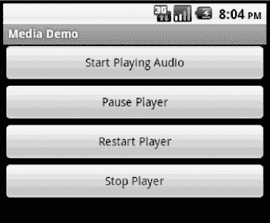

**图 19-3.** *媒体应用程序的用户界面*

用户界面由一个包含四个按钮的`LinearLayout`组成：一个用于启动播放器，一个用于暂停播放器，一个用于重新启动播放器，一个用于停止播放器。应用程序的代码和布局文件如清单 19-1 所示。在本示例中，我们假设您使用的是 Android 2.2 或更高版本进行构建，因为我们使用了`Environment`的`getExternalStoragePublicDirectory()`方法。如果您要针对较旧版本的 Android 进行构建，只需改用`getExternalStorageDirectory()`，并调整媒体文件的存放位置，以便您的应用程序能够找到它们。

**注意：** 请参阅本章末尾的“参考资料”部分，了解可以直接将项目导入 Eclipse 的 URL，而不是复制粘贴代码。

**清单 19-1.** *媒体应用程序的布局和代码*

```
<?xml version="1.0" encoding="utf-8"?>
<!-- This file is /res/layout/main.xml -->
<LinearLayout
    android:layout_width="fill_parent"
    android:layout_height="fill_parent"
    android:orientation="vertical" >

<Button android:id="@+id/startPlayerBtn"
    android:layout_width="fill_parent"
    android:layout_height="wrap_content"
    android:text="Start Playing Audio" android:onClick="doClick" />

<Button android:id="@+id/pausePlayerBtn"
    android:layout_width="fill_parent"
    android:layout_height="wrap_content"
    android:text="Pause Player" android:onClick="doClick" />

<Button android:id="@+id/restartPlayerBtn"
    android:layout_width="fill_parent"
    android:layout_height="wrap_content"
    android:text="Restart Player" android:onClick="doClick" />

<Button android:id="@+id/stopPlayerBtn"
    android:layout_width="fill_parent"
    android:layout_height="wrap_content"
    android:text="Stop Player" android:onClick="doClick" />
</LinearLayout>
```

```
// This file is MainActivity.java
import android.app.Activity;
import android.content.res.AssetFileDescriptor;
import android.media.MediaPlayer;
import android.os.Bundle;
import android.os.Environment;
import android.util.Log;
import android.view.View;

public class MainActivity extends Activity
{
    static final String AUDIO_PATH =
     "http://www.androidbook.com/akc/filestorage/android/documentfiles/3389/play.mp3";
//    Environment.getExternalStoragePublicDirectory(
//        Environment.DIRECTORY_MUSIC) +
//        "/music_file.mp3";
//    Environment.getExternalStoragePublicDirectory(
//        Environment.DIRECTORY_MOVIES) +
//        " /movie.mp4";

    private MediaPlayer mediaPlayer;
    private int playbackPosition=0;

    /** Called when the activity is first created. */
    @Override
    public void onCreate(Bundle savedInstanceState) {
        super.onCreate(savedInstanceState);
setContentView(R.layout.main);
    }
```


```java
public void doClick(View view) {
    switch(view.getId()) {
    case R.id.startPlayerBtn:
        try {
        // Only have one of these play methods uncommented
            playAudio(AUDIO_PATH);
//              playLocalAudio();
//              playLocalAudio_UsingDescriptor();
        } catch (Exception e) {
            e.printStackTrace();
        }
        break;
    case R.id.pausePlayerBtn:
        if(mediaPlayer != null && mediaPlayer.isPlaying()) {
            playbackPosition = mediaPlayer.getCurrentPosition();
            mediaPlayer.pause();
        }
        break;
    case R.id.restartPlayerBtn:
        if(mediaPlayer != null && !mediaPlayer.isPlaying()) {
            mediaPlayer.seekTo(playbackPosition);
            mediaPlayer.start();
        }
        break;
    case R.id.stopPlayerBtn:
        if(mediaPlayer != null) {
            mediaPlayer.stop();
            playbackPosition = 0;
        }
        break;
    }
}

private void playAudio(String url) throws Exception
{
    killMediaPlayer();

    mediaPlayer = new MediaPlayer();
    mediaPlayer.setDataSource(url);
    mediaPlayer.prepare();
    mediaPlayer.start();
}

private void playLocalAudio() throws Exception
{
    mediaPlayer = MediaPlayer.create(this, R.raw.music_file);
    // calling prepare() is not required in this case
    mediaPlayer.start();
}

private void playLocalAudio_UsingDescriptor() throws Exception {

    AssetFileDescriptor fileDesc = getResources().openRawResourceFd(
                    R.raw.music_file);
if (fileDesc != null) {

        mediaPlayer = new MediaPlayer();
        mediaPlayer.setDataSource(fileDesc.getFileDescriptor(),
                fileDesc.getStartOffset(), fileDesc.getLength());

        fileDesc.close();

        mediaPlayer.prepare();
        mediaPlayer.start();
    }
}

@Override
protected void onDestroy() {
    super.onDestroy();
    killMediaPlayer();
}

private void killMediaPlayer() {
    if(mediaPlayer!=null) {
        try {
            mediaPlayer.release();
        }
        catch(Exception e) {
            e.printStackTrace();
        }
    }
}
```

在第一个场景中，你正在播放来自网络地址的 MP3 文件。因此，你需要在清单文件中添加 `android.permission.INTERNET` 权限。清单 19-1 显示 `MainActivity` 类包含三个成员：一个指向 MP3 文件 URL 的 `final` 字符串、一个 `MediaPlayer` 实例以及一个名为 `playbackPosition` 的整型成员。我们的 `onCreate()` 方法仅从布局 XML 文件中设置用户界面。在按钮点击处理器中，当按下“开始播放音频”按钮时，会调用 `playAudio()` 方法。在 `playAudio()` 方法中，创建了一个新的 `MediaPlayer` 实例，并将播放器的数据源设置为 MP3 文件的 URL。然后调用播放器的 `prepare()` 方法准备媒体播放器进行播放，最后调用 `start()` 方法开始播放。

现在来看“暂停播放”和“重新播放”按钮的代码。你可以看到，当选择“暂停播放”按钮时，通过调用 `getCurrentPosition()` 获取播放器的当前位置。然后通过调用 `pause()` 暂停播放器。当需要重新启动播放器时，调用 `seekTo()`，传入之前从 `getCurrentPosition()` 获取的位置，然后调用 `start()`。

`MediaPlayer` 类还包含一个 `stop()` 方法。请注意，如果你通过调用 `stop()` 停止播放器，则需要在再次调用 `start()` 之前调用 `prepare()`。相反，如果你调用了 `pause()`，则可以再次调用 `start()` 而无需准备播放器。另外，使用完媒体播放器后，请务必调用 `release()` 方法。在此示例中，你在 `killMediaPlayer()` 方法中执行了此操作。

清单 19-1 展示了如何播放位于网络上的音频文件。`MediaPlayer` 类也支持播放位于你的 `.apk` 文件中的本地媒体。清单 19-2 展示了如何引用和播放来自 `.apk` 文件中 `/res/raw` 文件夹的文件。如果 Eclipse 项目中 `/res` 下还没有 `raw` 文件夹，请自行添加。然后将你选择的 mp3 文件复制到 `/res/raw` 中，文件名为 `music_file.mp3`。

**清单 19-2.** *使用 MediaPlayer 播放应用程序本地的文件*

    private void playLocalAudio()throws Exception
    {
        mediaPlayer = MediaPlayer.create(this, R.raw.music_file);
        // calling prepare() is not required in this case
        mediaPlayer.start();
    }

如果你需要将音频或视频文件随应用程序一起包含，则应将文件放置在 `/res/raw` 文件夹中。然后，你可以通过传入媒体文件的资源 ID 来获取该资源的 `MediaPlayer` 实例。如清单 19-2 所示，你通过调用静态 `create()` 方法来实现这一点。请注意，`MediaPlayer` 类还提供了静态的 `create()` 方法，你可以使用这些方法来获取 `MediaPlayer`，而不是自行实例化。例如，在清单 19-2 中你调用了 `create()` 方法，但你也可以调用构造函数 `MediaPlayer(Context context, int resourceId)`。使用静态 `create()` 方法是更优选的，因为它们隐藏了 `MediaPlayer` 的创建过程，这包括为你调用 `prepare()` 方法。然而，正如你很快就会看到的那样，有时你在两者之间别无选择——如果你的媒体内容无法通过资源 ID 或 URL 定位，你将不得不实例化默认构造函数。


```markdown
#### 理解 `setDataSource` 方法

在清单 19–2 中，我们调用了`create()`方法从原始资源加载音频文件。使用这种方法，你无需调用`setDataSource()`。或者，如果你使用默认构造函数自行实例化`MediaPlayer`，或者你的媒体内容无法通过资源 ID 或 URL 访问，则需要调用`setDataSource()`。

`setDataSource()`方法有多个重载版本，可以针对特定需求自定义数据源。例如，清单 19–3 展示了如何使用`FileDescriptor`从原始资源加载音频文件。

**清单 19–3.** *使用 `FileDescriptor` 设置 `MediaPlayer` 的数据源*

```java
private void playLocalAudio_UsingDescriptor() throws Exception {
    AssetFileDescriptor fileDesc = getResources().openRawResourceFd(
            R.raw.music_file);
    if (fileDesc != null) {
        mediaPlayer = new MediaPlayer();
        mediaPlayer.setDataSource(fileDesc.getFileDescriptor(), fileDesc
                .getStartOffset(), fileDesc.getLength());
        fileDesc.close();
        mediaPlayer.prepare();
        mediaPlayer.start();
    }
}
```

清单 19–3 假设该代码在 Activity 的上下文中运行。如代码所示，你调用`getResources()`方法获取应用的资源，然后使用`openRawResourceFd()`方法获取`/res/raw`文件夹中音频文件的文件描述符。接着，使用`AssetFileDescriptor`、开始播放的起始位置和结束位置调用`setDataSource()`方法。如果你想播放音频文件的特定部分，也可以使用此版本的`setDataSource()`。如果你始终希望播放整个文件，可以调用更简单的版本`setDataSource(FileDescriptor desc)`，该版本不需要初始偏移量和长度。

如果你想要提供位于应用`/data`目录中的媒体文件，使用带有`FileDescriptor`的`setDataSource()`方法也会很方便。出于安全原因，媒体播放器无权访问应用的`/data`目录，但你的应用可以打开该文件，然后将（已打开的）`FileDescriptor`提供给`setDataSource()`。需要注意的是，应用的`/data`目录位于`/data/data/`*`APP_PACKAGE_NAME`*`/`下的文件和文件夹集合中。你可以通过调用`Context`类中的适当方法来访问此目录，而不是硬编码路径。例如，你可以在`Context`上调用`getFilesDir()`来获取当前应用的文件目录。目前，该路径看起来像这样：`/data/data/`*`APP_PACKAGE_NAME`*`/files`。类似地，你可以调用`getCacheDir()`来获取应用的缓存目录。你的应用对这些文件夹中的内容拥有读写权限，因此你可以动态创建文件并将其提供给播放器。最后，如果像清单 19–3 那样使用`FileDescriptor`，请确保在调用`setDataSource()`后关闭句柄。

请留意，应用的`/data`目录与其`/res/raw`文件夹有很大不同。`/res/raw`文件夹是`.apk`文件的物理组成部分，并且是静态的——也就是说，你无法动态修改`.apk`文件。相比之下，`/data`目录的内容是动态的。

还有一种音频内容来源需要讨论：SD 卡。之前我们展示了如何将内容放到 SD 卡上。与`MediaPlayer`一起使用它非常简单。在上面的示例中，我们通过传递 MP3 文件的 URL 来调用`setDataSource()`，以访问互联网上的内容。如果你的音频文件在 SD 卡上，你可以使用相同的`setDataSource()`方法，但将路径参数改为 SD 卡上音频文件的路径。例如，如果你将 MP3 文件放到标准 Music 目录中，并将其命名为`music_file.mp3`，你可以修改`AUDIO_PATH`变量，它就会播放，如下所示：

```java
static final String AUDIO_PATH =
    Environment.getExternalStoragePublicDirectory(
        Environment.DIRECTORY_MUSIC) +
        "/music_file.mp3";
```
```


#### 使用 SoundPool 实现多轨道同步播放

`MediaPlayer` 是我们媒体工具箱中的核心工具，但它一次只能处理一个音频或视频文件。若想同时播放多个音频轨道该怎么办？一种方法是创建多个`MediaPlayer`实例并同步控制。如果只需播放少量音效且追求快速响应，Android 提供了`SoundPool`类来帮助实现。在底层实现中，`SoundPool`虽然使用了`MediaPlayer`，但我们只能通过`SoundPool`的 API 进行操作，无法直接调用`MediaPlayer`的 API。

`MediaPlayer`与`SoundPool`的另一区别在于：`SoundPool`仅支持本地媒体文件。也就是说，你可以从资源文件、通过文件描述符访问的文件或通过路径名访问的文件中加载音频。此外，`SoundPool`还提供多项便利功能，例如循环播放音频轨道、单独暂停/恢复某个音频轨道、或者统一暂停/恢复所有音频轨道。

不过`SoundPool`也存在局限性。它管理的所有轨道共享一个音频缓冲区，且该缓冲区容量不大——实际上只有 1MB。当你看到仅几 KB 大小的 mp3 文件时，这个容量似乎很大。但`SoundPool`会在内存中扩展音频数据以实现快速流畅的播放。音频文件在内存中的大小取决于比特率、声道数（立体声/单声道）、采样率和音频时长。如果加载音频时遇到问题，可以尝试调整源音频文件的这些参数来减小内存占用。

接下来我们将演示一个加载并播放动物叫声的示例应用。其中蟋蟀声作为背景音持续播放，其他声音则按不同时间间隔播放。有时只能听到蟋蟀声，有时则会同时听到多种动物的叫声。我们还在用户界面添加了暂停与恢复按钮。代码清单 19-4 展示了布局 XML 文件和 Activity 的 Java 代码。建议从我们的网站下载完整代码和音效文件，本章末的"参考资料"部分提供了可下载源码的获取方式。

#### 代码清单 19-4：使用`SoundPool`播放音频

```xml
<?xml version="1.0" encoding="utf-8"?>
<LinearLayout
    android:orientation="vertical"
    android:layout_width="fill_parent"  android:layout_height="fill_parent"
    >
<ToggleButton android:id="@+id/button"
    android:textOn="暂停"  android:textOff="继续"
    android:layout_width="wrap_content"  android:layout_height="wrap_content"
    android:onClick="doClick" android:checked="true" />
</LinearLayout>
```

```java
// 本文件为 MainActivity.java
import java.io.IOException;
import android.app.Activity;
import android.content.Context;
import android.content.res.AssetFileDescriptor;
import android.media.AudioManager;
import android.media.SoundPool;
import android.os.Bundle;
import android.os.Handler;
import android.util.Log;
import android.view.View;
import android.widget.ToggleButton;

public class MainActivity extends Activity implements SoundPool.OnLoadCompleteListener {
    private static final int SRC_QUALITY = 0;
    private static final int PRIORITY = 1;
    private SoundPool soundPool = null;
    private AudioManager aMgr;

    private int sid_background;
    private int sid_roar;
    private int sid_bark;
    private int sid_chimp;
    private int sid_rooster;

    @Override
    public void onCreate(Bundle savedInstanceState) {
        super.onCreate(savedInstanceState);
        setContentView(R.layout.main);
    }

    @Override
    protected void onResume() {
        soundPool = new SoundPool(5, AudioManager.STREAM_MUSIC,
                SRC_QUALITY);
        soundPool.setOnLoadCompleteListener(this);

        aMgr =
            (AudioManager)this.getSystemService(Context.AUDIO_SERVICE);

    sid_background = soundPool.load(this, R.raw.crickets, PRIORITY);

    sid_chimp = soundPool.load(this, R.raw.chimp, PRIORITY);
    sid_rooster = soundPool.load(this, R.raw.rooster, PRIORITY);
    sid_roar = soundPool.load(this, R.raw.roar, PRIORITY);

    try {
        AssetFileDescriptor afd =
                    this.getAssets().openFd("dogbark.mp3");
        sid_bark = soundPool.load(afd.getFileDescriptor(),
                        0, afd.getLength(), PRIORITY);
        afd.close();
        } catch (IOException e) {
            e.printStackTrace();
        }
        //sid_bark = soundPool.load("/mnt/sdcard/dogbark.mp3", PRIORITY);

        super.onResume();
    }

    public void doClick(View view) {
        switch(view.getId()) {
        case R.id.button:
            if(((ToggleButton)view).isChecked()) {
soundPool.autoResume();
            }
            else {
                soundPool.autoPause();
            }
            break;
        }
    }

    @Override
    protected void onPause() {
        soundPool.release();
        soundPool = null;
        super.onPause();
    }

    @Override
    public void onLoadComplete(SoundPool sPool, int sid, int status) {
        Log.v("soundPool", "sid " + sid + " loaded with status " +
                status);

        final float currentVolume =
            ((float)aMgr.getStreamVolume(AudioManager.STREAM_MUSIC)) /
            ((float)aMgr.getStreamMaxVolume(AudioManager.STREAM_MUSIC));

        if(status != 0)
            return;
        if(sid == sid_background) {
            if(sPool.play(sid, currentVolume, currentVolume,
                    PRIORITY, -1, 1.0f) == 0)
                Log.v("soundPool", "Failed to start sound");
        } else if(sid == sid_chimp) {
            queueSound(sid, 5000, currentVolume);
        } else if(sid == sid_rooster) {
            queueSound(sid, 6000, currentVolume);
        } else if(sid == sid_roar) {
            queueSound(sid, 12000, currentVolume);
        } else if(sid == sid_bark) {
            queueSound(sid, 7000, currentVolume);
        }
    }

    private void queueSound(final int sid, final long delay,
        final float volume)
    {
        new Handler().postDelayed(new Runnable() {
            @Override
            public void run() {
                if(soundPool == null) return;
                if(soundPool.play(sid, volume, volume,
                        PRIORITY, 0, 1.0f) == 0)
                    Log.v("soundPool", "Failed to start sound (" + sid +
                          ")");
                queueSound(sid, delay, volume);
            }}, delay);
    }
}
```

本示例的结构相当清晰。用户界面包含一个`ToggleButton`，用于暂停和恢复活动的音频流。应用启动时，我们创建`SoundPool`并加载音频样本。样本加载完成后开始播放：蟋蟀声会无限循环，其他样本则在延迟后播放，并按照相同延迟循环播放。通过设置不同的延迟时间，我们得以营造出多层音效交织的随机感。

创建`SoundPool`需要三个参数。


#### 使用 SoundPool 播放音频

- 第一个参数是 `SoundPool` 同时播放的最大样本数。这不是 `SoundPool` 可以容纳的样本数量。
- 第二个参数是样本将在哪个音频流上播放。典型值是 `AudioManager.STREAM_MUSIC`，但 `SoundPool` 也可用于闹钟或铃声。有关音频流的完整列表，请参见 `AudioManager` 参考页面。
- 创建 `SoundPool` 时，`SRC_QUALITY` 值应设置为 0。

代码演示了 `SoundPool` 的几种不同的 `load()` 方法。最基本的方法是从 `/res/raw` 加载音频文件作为资源。我们对前四个音频文件使用此方法。然后，我们展示如何从应用程序的 `/assets` 目录加载音频文件。这个 `load()` 方法还接受指定要加载音频的偏移量和长度的参数。这允许我们使用一个包含多个音频样本的单个文件，只提取我们想要使用的部分。最后，我们在注释中展示了如何从 SD 卡访问音频文件。在 Android 3.0 之前，`PRIORITY` 参数应为 1。

在我们的示例中，我们选择使用 Android 2.2 中引入的一些特性，特别是用于 Activity 的 `onLoadCompleteListener` 接口，以及按钮回调中的 `autoPause()` 和 `autoResume()` 方法。

将声音样本加载到 `SoundPool` 时，我们必须等到它们正确加载后才能开始播放。在我们的 `onLoadComplete()` 回调中，我们检查加载的状态，并根据是哪个声音，设置播放。如果声音是蟋蟀声，我们启用循环播放（第五个参数的值为 -1）。对于其他声音，我们将声音排队，在一小段时间后播放。时间值以毫秒为单位。请注意音量的设置。Android 提供了 `AudioManager` 来让我们知道当前的音量设置。我们还从 `AudioManager` 获取最大音量设置，以便计算一个介于 0 和 1（浮点数）之间的音量值，用于 `play()` 方法。`play()` 方法实际上为左右声道分别接受一个音量值，但我们只是将两者都设置为当前音量。再次强调，`PRIORITY` 应设置为 1。`play()` 方法的最后一个参数用于设置播放速率。该值应在 0.5 到 2.0 之间，1.0 为正常速率。

我们的 `queueSound()` 方法使用 `Handler` 在将来设置一个事件。我们的 `Runnable` 将在延迟时间过后运行。我们检查确保仍然有一个 `SoundPool` 可以播放，然后播放一次声音，并安排在相同的间隔后再次播放相同的声音。因为我们使用不同的声音 ID 和不同的延迟调用 `queueSound()`，所以效果是动物声音的随机播放。

当你运行此示例时，你会听到蟋蟀、黑猩猩、公鸡、狗和咆哮声（我们认为是一只熊）。蟋蟀持续鸣叫，而其他动物的声音则来去自如。`SoundPool` 的一个好处是，它让我们可以同时播放多个声音，而无需我们做太多实际工作。此外，它对设备的压力也不大，因为声音在加载时已被解码，我们只需要将声音位元馈送到硬件即可。

如果你点击按钮，蟋蟀和当前正在播放的任何其他动物声音都将停止。但是，`autoPause()` 方法不会阻止新声音的播放。你会在几秒钟内再次听到动物声音（蟋蟀除外）。因为我们已经将声音排入未来的队列，所以我们仍然会听到这些声音。实际上，`SoundPool` 没有办法立即并永久停止所有声音。你需要自行处理停止。只有当我们再次点击按钮恢复声音时，蟋蟀才会回来。但是，即使如此，我们可能已经失去了蟋蟀，因为如果同时播放的样本数量达到最大值，`SoundPool` 会丢弃最旧的声音，为新声音腾出空间。

#### 使用 JetPlayer 播放声音

`SoundPool` 是一个不错的播放器，但内存限制可能使完成任务变得困难。当需要播放同步声音时，另一种选择是 `JetPlayer`。`JetPlayer` 专为游戏量身定制，是一个非常灵活的工具，可用于播放大量声音，并将这些声音与用户操作协调起来。这些声音是使用 MIDI（乐器数字接口缩写）定义的。

`JetPlayer` 声音是使用特殊的 `JETCreator` 工具创建的。该工具位于 Android SDK tools 目录下，但你还需要安装 Python 才能使用它。生成的 JET 文件可以读入你的应用程序，并设置声音进行播放。整个过程有些复杂，超出了本书的范围，因此我们将在本章末尾的“参考资料”部分为你提供更多信息。

#### 使用 AsyncPlayer 播放背景声音

如果你只想播放一些音频，并且不想占用当前线程，那么 `AsyncPlayer` 可能正是你所需要的。音频源以 `Uri` 的形式传递给此类，因此音频文件可以是本地的，也可以是网络上的远程文件。此类会自动创建后台线程来处理获取音频和开始播放。因为它是异步的，所以你无法确切知道音频何时开始播放。你也不会知道它何时结束，甚至不知道它是否仍在播放。但是，你可以调用 `stop()` 来停止音频播放。如果在之前的音频播放完毕之前再次调用 `play()`，则之前的音频会立即停止，新的音频将在未来某个时间点，在所有设置和获取操作完成后开始播放。这是一个非常简单的类，它提供了一个自动的后台线程。列表 19-5 展示了实现此功能的代码外观。

**列表 19-5.** *使用 AsyncPlayer 播放音频*

```
private static final String TAG = "AsyncPlayerDemo";
private AsyncPlayer mAsync = null;

[ ... ]

mAsync = new AsyncPlayer(TAG);
mAsync.play(this, Uri.parse("file://" + "/perry_ringtone.mp3"),
        false, AudioManager.STREAM_MUSIC);

[ ... ]

@Override
protected void onPause() {
    mAsync.stop();
    super.onPause();
}
```

#### 使用 AudioTrack 进行低级音频播放

到目前为止，我们一直在处理来自文件的音频，无论是本地文件还是远程文件。如果你想进入更低的级别，例如播放来自流的音频，你需要研究 `AudioTrack` 类。除了 `play()` 和 `pause()` 等常用方法外，`AudioTrack` 还提供了将字节写入音频硬件的方法。这个类为你提供了对音频播放的最大控制，但它比本章到目前为止讨论的音频类要复杂得多。我们将在本章稍后展示一个使用 `AudioRecord` 类的示例应用程序。`AudioRecord` 类与 `AudioTrack` 类非常相似，因此为了更好地理解 `AudioTrack` 类，请参考稍后的 `AudioRecord` 示例。


### 理解 `MediaPlayer` 的奇怪特性

通常来说，`MediaPlayer` 非常系统化，因此你需要按特定顺序调用操作才能正确初始化媒体播放器并为其播放做好准备。以下列表总结了使用媒体 API 的一些奇怪特性：

- 一旦你设置了 `MediaPlayer` 的数据源，就无法轻易将其更改为另一个数据源——你必须创建一个新的 `MediaPlayer` 或调用 `reset()` 方法来重新初始化播放器的状态。
- 调用 `prepare()` 后，你可以调用 `getCurrentPosition()`、`getDuration()` 和 `isPlaying()` 来获取播放器的当前状态。你还可以在调用 `prepare()` 之后调用 `setLooping()` 和 `setVolume()` 方法。
- 调用 `start()` 后，你可以调用 `pause()`、`stop()` 和 `seekTo()`。
- 每个 `MediaPlayer` 都会创建一个新线程，因此使用完媒体播放器后请务必调用 `release()` 方法。在视频播放时，`VideoView` 会自动处理这一点，但如果你决定使用 `MediaPlayer` 而不是 `VideoView`，则必须手动完成。

至此，我们关于播放音频内容的讨论就结束了。现在我们将注意力转向播放视频。正如你将看到的，引用视频内容与引用音频内容类似。

### 播放视频内容

在本节中，我们将讨论如何使用 Android SDK 进行视频播放。具体来说，我们将讨论从网络服务器播放视频以及从 SD 卡播放视频。可以想象，视频播放比音频播放稍微复杂一些。幸运的是，Android SDK 提供了一些额外的抽象，它们完成了大部分繁重的工作。

**注意：** 在模拟器中播放视频并不可靠。如果能用，那就很好。但如果没有效果，请尝试在设备上运行。因为模拟器必须仅使用软件来运行视频，所以它很难跟上视频的节奏，并且你可能会得到意外的结果。

播放视频比播放音频需要更多努力，因为除了音频之外，还需要处理视觉组件。为了减轻一些痛苦，Android 提供了一个名为 `android.widget.VideoView` 的专用视图控件，它封装了 `MediaPlayer` 的创建和初始化。要播放视频，你可以在用户界面中创建一个 `VideoView` 小部件。然后设置视频的路径或 Uri，并调用 `start()` 方法。清单 19–6 演示了 Android 中的视频播放。

**清单 19–6.** *使用媒体 API 播放视频*

```
<?xml version="1.0" encoding="utf-8"?>
<!-- 此文件为 /res/layout/main.xml -->
<LinearLayout
 android:layout_width="fill_parent" android:layout_height="fill_parent"
 >

    <VideoView  android:id="@+id/videoView"
        android:layout_width="200px"  android:layout_height="200px" />

</LinearLayout>
```

```
// 此文件为 MainActivity.java
import android.app.Activity;
import android.net.Uri;
import android.os.Bundle;
import android.widget.MediaController;
import android.widget.VideoView;

public class MainActivity extends Activity {
    /** 当 Activity 首次创建时调用。 */
    @Override
    protected void onCreate(Bundle savedInstanceState) {
        super.onCreate(savedInstanceState);
        this.setContentView(R.layout.main);

        VideoView videoView =
                (VideoView)this.findViewById(R.id.videoView);
        MediaController mc = new MediaController(this);
        videoView.setMediaController(mc);
        videoView.setVideoURI(Uri.parse(
               "http://www.androidbook.com/akc/filestorage/android/" +               "documentfiles/3389/movie.mp4"));
 /* videoView.setVideoPath(
    Environment.getExternalStoragePublicDirectory(
    Environment.DIRECTORY_MOVIES) +
    "/movie.mp4");
 */
        videoView.requestFocus();
        videoView.start();
    }
}
```

清单 19–6 演示了播放位于网络上 `www.androidbook.com/akc/filestorage/android/documentfiles/3389/movie.mp4` 的文件，这意味着运行该代码的应用程序需要请求 `android.permission.INTERNET` 权限。所有播放功能都隐藏在 `VideoView` 类之后。实际上，你只需将视频内容提供给视频播放器即可。应用程序的用户界面如图 19–4 所示。

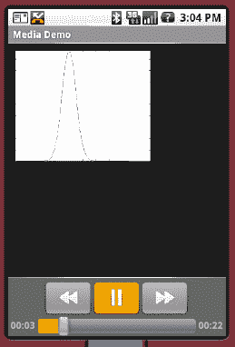

**图 19–4.** *启用媒体控件的视频播放 UI*

当此应用程序运行时，你会看到屏幕底部出现按钮控件大约三秒钟，然后它们会消失。你可以在视频框内的任意位置单击来重新显示它们。当我们播放音频内容时，我们只需要显示按钮控件来启动、暂停和重新启动音频。我们不需要为音频本身提供视图组件。当然，对于视频，我们既需要按钮控件，也需要可以用来观看视频的组件。在这个例子中，我们使用 `VideoView` 组件来显示视频内容。但是，我们没有创建自己的按钮控件（如果选择这样做，我们仍然可以创建），而是创建了一个为我们提供按钮的 `MediaController`。如图 19–4 和清单 19–6 所示，你可以通过调用 `setMediaController()` 来设置 `VideoView` 的媒体控制器，从而启用播放、暂停和定位控制。如果你想使用自己的按钮以编程方式控制视频，可以调用 `start()`、`pause()`、`stopPlayback()` 和 `seekTo()` 方法。

请记住，在此示例中我们仍然在使用 `MediaPlayer`——只是我们看不到它。实际上，你可以直接在 `MediaPlayer` 中“播放”视频。如果你回到清单 19–1 中的示例，将电影文件放到 SD 卡上，并将电影的文件路径填入 `AUDIO_PATH`，你会发现即使你无法看到视频，它也能很好地播放音频。

虽然 `MediaPlayer` 有一个 `setDataSource()` 方法，但 `VideoView` 没有。`VideoView` 取而代之的是使用 `setVideoPath()` 或 `setVideoURI()` 方法。假设你将电影文件放到 SD 卡上，你可以修改清单 19–6 中的代码，注释掉 `setVideoURI()` 的调用，并取消注释 `setVideoPath()` 的调用，根据需要调整电影文件的路径。当你再次运行应用程序时，你将*听到并看到* `VideoView` 中的视频。从技术上讲，我们本可以通过以下方式调用 `setVideoURI()` 来获得与 `setVideoPath()` 相同的效果：

```
videoView.setVideoURI(Uri.parse("file://" +
    Environment.getExternalStoragePublicDirectory(
    Environment.DIRECTORY_MOVIES) + "/movie.mp4"));
```

你可能已经注意到，`VideoView` 没有像 `MediaPlayer` 那样从文件描述符读取数据的方法。你可能还注意到 `MediaPlayer` 有一些方法可以将 `SurfaceHolder` 添加到 `MediaPlayer`（`SurfaceHolder` 类似于图像或视频的视口）。如果你需要从应用程序的私有数据文件夹（即 `/data/data/...` 下）显示视频，你将需要使用 `MediaPlayer` 和 `SurfaceHolder`，而不是 `VideoView` 类。其中一种 `MediaPlayer` 方法是 `create(Context context, Uri uri, SurfaceHolder holder)`，另一种是 `setDisplay(SurfaceHolder holder)`。

现在让我们来探索录制媒体。


### 录制媒体

正如我们所展示的，在 Android 中有多种播放媒体的方式。而在录制方面，选项则较少。录制的主要工具是 `MediaRecorder` 类，它同时用于音频和视频录制。在本节中，我们将向你展示如何针对这两种媒体类型使用 `MediaRecorder`。另一个用于录制音频的类是 `AudioRecord`，我们将通过另一个示例应用来演示它。有时候，当现有应用能帮你完成某项任务时，你并不想自己编写代码。因此，我们还将展示如何发起一个录制音频的 Intent，以及如何使用相机应用来拍摄静态图像。

#### 探索使用 MediaRecorder 录制音频

Android 媒体框架支持录制音频。一种录制音频的方式是通过 `android.media.MediaRecorder` 类。在本节中，我们将向你展示如何构建一个录制音频内容并回放该内容的应用程序。该应用程序的用户界面如 图 19–5 所示。

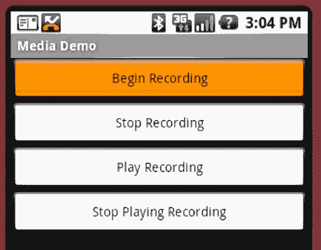

**图 19–5.** *音频录制示例的用户界面*

如 图 19–5 所示，应用程序包含四个按钮：两个用于控制录制，两个用于开始和停止回放录制的内容。清单 19–7 展示了该 UI 的布局文件和 Activity 类。

**清单 19–7.***Android 中的媒体录制与回放*

```
<?xml version="1.0" encoding="utf-8"?>
<!-- 本文件位于 /res/layout/record.xml -->
<LinearLayout
    android:orientation="vertical"
    android:layout_width="fill_parent"
    android:layout_height="fill_parent">

  <Button android:id="@+id/beginBtn"  android:text="开始录制"
    android:layout_width="fill_parent"
    android:layout_height="wrap_content"
    android:onClick="doClick" />

  <Button android:id="@+id/stopBtn"  android:text="停止录制"
    android:layout_width="fill_parent"
    android:layout_height="wrap_content"
    android:onClick="doClick" />

  <Button android:id="@+id/playRecordingBtn"
    android:text="播放录制内容"
    android:layout_width="fill_parent"
    android:layout_height="wrap_content"
    android:onClick="doClick" />

  <Button android:id="@+id/stopPlayingRecordingBtn"
    android:text="停止播放录制内容"
    android:layout_width="fill_parent"
    android:layout_height="wrap_content"
    android:onClick="doClick" />

</LinearLayout>
```

```
// RecorderActivity.java
import java.io.File;
import android.app.Activity;
import android.media.MediaPlayer;
import android.media.MediaRecorder;
import android.os.Bundle;
import android.os.Environment;
import android.view.View;

public class RecorderActivity extends Activity {
    private MediaPlayer mediaPlayer;
    private MediaRecorder recorder;
    private String OUTPUT_FILE;

    @Override
    protected void onCreate(Bundle savedInstanceState) {
        super.onCreate(savedInstanceState);
        setContentView(R.layout.record);

        OUTPUT_FILE = Environment.getExternalStorageDirectory() +
                        "/recordaudio3.3gpp";
    }

    public void doClick(View view) {
        switch(view.getId()) {
        case R.id.beginBtn:
            try {
                beginRecording();
            } catch (Exception e) {
                e.printStackTrace();
            }
            break;
        case R.id.stopBtn:
            try {
                stopRecording();
            } catch (Exception e) {
                e.printStackTrace();
            }
            break;
        case R.id.playRecordingBtn:
            try {
                playRecording();
            } catch (Exception e) {
                e.printStackTrace();
            }
            break;
        case R.id.stopPlayingRecordingBtn:
            try {
                stopPlayingRecording();
            } catch (Exception e) {
                e.printStackTrace();
            }
            break;
        }
    }

    private void beginRecording() throws Exception {
        killMediaRecorder();

        File outFile = new File(OUTPUT_FILE);
```


```java
if(outFile.exists()) {
    outFile.delete();
}
recorder = new MediaRecorder();
recorder.setAudioSource(MediaRecorder.AudioSource.MIC);
recorder.setOutputFormat(MediaRecorder.OutputFormat.THREE_GPP);
recorder.setAudioEncoder(MediaRecorder.AudioEncoder.AMR_NB);
recorder.setOutputFile(OUTPUT_FILE);
recorder.prepare();
recorder.start();
```

```java
private void stopRecording() throws Exception {
    if (recorder != null) {
        recorder.stop();
    }
}
```

```java
private void killMediaRecorder() {
    if (recorder != null) {
        recorder.release();
    }
}
```

```java
private void killMediaPlayer() {
    if (mediaPlayer != null) {
        try {
            mediaPlayer.release();
        } catch (Exception e) {
            e.printStackTrace();
        }
    }
}
```

```java
private void playRecording() throws Exception {
    killMediaPlayer();

    mediaPlayer = new MediaPlayer();
    mediaPlayer.setDataSource(OUTPUT_FILE);

    mediaPlayer.prepare();
    mediaPlayer.start();
}
```

```java
private void stopPlayingRecording() throws Exception {
    if(mediaPlayer != null) {
        mediaPlayer.stop();
    }
}
```

```java
@Override
protected void onDestroy() {
    super.onDestroy();

    killMediaRecorder();
    killMediaPlayer();
}
```

在进入代码清单 19–7 之前，你需要在清单文件中添加以下权限，以便录制音频：

```xml
<uses-permission android:name="android.permission.RECORD_AUDIO" />
```

正如前面关于 SD 卡的章节所讨论的，如果你的应用的 `minSdkVersion` 是 4 或更高，你还需要为 `"android.permission.WRITE_EXTERNAL_STORAGE"` 添加一个 `uses-permission` 标签。最后，如果你打算在模拟器上尝试这个功能，你需要为你的工作站提供麦克风输入。

如果你查看代码清单 19–7 中的 `onCreate()` 方法，你会发现我们唯一需要做的是为输出的音频文件创建文件路径名。我们的 `doClick()` 方法使用了标准的模式，根据按下的按钮进行分支切换，并调用相应的函数来执行所需的操作。`beginRecording()` 方法负责处理录制。要录制音频，你必须创建一个 `MediaRecorder` 实例，并设置音频源、输出格式、音频编码器和输出文件。

在 Android SDK 1.6 之前，唯一支持的音频源是麦克风。Android SDK 1.6 新增了三个与通话相关的音频源。你可以录制整个通话（`MediaRecorder.AudioSource.VOICE_CALL`），仅上行链路（`MediaRecorder.AudioSource.VOICE_UPLINK`），或仅下行链路（`MediaRecorder.AudioSource.VOICE_DOWNLINK`）。通话的上行链路指的是手机用户的声音。通话的下行链路指的是来自通话另一端的声音。

在 Android SDK 2.1 中，又新增了两个音频源：`CAMCORDER` 和 `VOICE_RECOGNITION`。`CAMCORDER` 音频源是与摄像头相关的麦克风，否则此选项将使用设备的默认主麦克风。`VOICE_RECOGNITION` 麦克风是专为语音识别调校过的，否则此选项也会使用设备的默认主麦克风。“专为语音识别调校”意味着音频流将尽可能原始，在麦克风与应用之间没有任何额外的音频修改。例如，一些 HTC 设备的麦克风带有自动增益控制（AGC），因此使用该音频源进行语音识别会产生问题。而 `VOICE_RECOGNITION` 音频源会绕过这种额外处理，以获得更好的语音识别效果。

最常见的音频输出格式是第三代合作伙伴计划（3GPP）。在 Android 2.3.3（Gingerbread）之前，你必须将编码器设置为 `AMR_NB`，这表示自适应多速率（AMR）窄带音频编解码器，因为这是当时唯一支持的音频编码器。从 Android 2.3.3 开始，你也可以使用 `AMR_WB`（宽带）和 `AAC`（高级音频编码）作为音频编码器。在我们的示例中，录制的音频以 `recordoutput.3gpp` 为文件名写入 SD 卡。请注意，代码清单 19–7 假设你已经创建了一个 SD 卡镜像，并且已将模拟器指向该 SD 卡。如果你还没有这样做，请参考“使用 SD 卡”章节了解具体设置方法。

`MediaRecorder` 还有一些你可能觉得有用的其他方法。为了限制音频录制的时长和大小，可以使用 `setMaxDuration(int length_in_ms)` 和 `setMaxFileSize(long length_in_bytes)` 方法。你可以设置录制的最大时长（以毫秒为单位），或录制文件的最大大小（以字节为单位），当达到这些限制时，录制将停止。这两个方法都是在 Android 1.5 中引入的，因此几乎任何可以录制音频的设备上都可以使用它们。


#### 使用 `AudioRecord` 录制音频

到目前为止，你已经了解了如何将音频直接录制到文件中。但如果想在音频数据写入文件之前进行一些处理，又该如何？或者，你甚至根本不想将音频发送到文件呢？为此，Android 提供了一个名为 `AudioRecord` 的类。当你设置好一个 `AudioRecord` 对象后，Android 会确保音频数据被写入该对象的内部缓冲区，然后你的应用程序就可以对这些音频数据进行任何处理。清单 19-8 展示了一个使用 `AudioRecord` 读取和处理音频的 Activity。此 Activity 没有用户界面，因为我们只会将日志消息写入 `LogCat`。`AndroidManifest.xml` 未在文中显示，但你需要添加 `android.permission.RECORD_AUDIO` 这个 Android 权限才能使其正常工作。

**清单 19-8.** 使用 `AudioRecord` 录制原始音频

```
import android.app.Activity;
import android.media.AudioFormat;
import android.media.AudioRecord;
import android.media.MediaRecorder;
import android.os.Bundle;
import android.util.Log;

public class MainActivity extends Activity {
    protected static final String TAG = "AudioRecord";
    private int mAudioBufferSize;
    private int mAudioBufferSampleSize;
    private AudioRecord mAudioRecord;
    private boolean inRecordMode = false;

    public void onCreate(Bundle savedInstanceState) {
        super.onCreate(savedInstanceState);
        initAudioRecord();
    }

    @Override
    public void onResume() {
        super.onResume();
        Log.v(TAG, "Resuming...");
        inRecordMode = true;
        Thread t = new Thread(new Runnable() {
            @Override
            public void run() {
                getSamples();
            }
        });
        t.start();
    }

    protected void onPause() {
        Log.v(TAG, "Pausing...");
        inRecordMode = false;
        super.onPause();
    }

    @Override
    protected void onDestroy() {
        Log.v(TAG, "Destroying...");
        if(mAudioRecord != null) {
            mAudioRecord.release();
            Log.v(TAG, "Released AudioRecord");            
        }
        super.onDestroy();
    }

    private void initAudioRecord() {
        try {
            int sampleRate = 8000;
            int channelConfig = AudioFormat.CHANNEL_IN_MONO;
            int audioFormat = AudioFormat.ENCODING_PCM_16BIT;
            mAudioBufferSize =
                    2 * AudioRecord.getMinBufferSize(sampleRate,
                    channelConfig, audioFormat);
            mAudioBufferSampleSize = mAudioBufferSize / 2;
            mAudioRecord = new AudioRecord(
                    MediaRecorder.AudioSource.MIC,
                    sampleRate,
                    channelConfig,
                    audioFormat,
                    mAudioBufferSize);
            Log.v(TAG, "Setup of AudioRecord okay. Buffer size = " +
                    mAudioBufferSize);
            Log.v(TAG, "   Sample buffer size = " +
                    mAudioBufferSampleSize);
        } catch (IllegalArgumentException e) {
            e.printStackTrace();
        }

        int audioRecordState = mAudioRecord.getState();
        if(audioRecordState != AudioRecord.STATE_INITIALIZED) {
            Log.e(TAG, "AudioRecord is not properly initialized");
            finish();
        }
        else {
            Log.v(TAG, "AudioRecord is initialized");
        }
    }

    private void getSamples() {
        if(mAudioRecord == null) return;

        short[] audioBuffer = new short[mAudioBufferSampleSize];

        mAudioRecord.startRecording();

        int audioRecordingState = mAudioRecord.getRecordingState();
        if(audioRecordingState != AudioRecord.RECORDSTATE_RECORDING) {
            Log.e(TAG, "AudioRecord is not recording");
            finish();
        }
        else {
            Log.v(TAG, "AudioRecord has started recording...");
        }

        while(inRecordMode) {
            int samplesRead = mAudioRecord.read(
                            audioBuffer, 0, mAudioBufferSampleSize);
            Log.v(TAG, "Got samples: " + samplesRead);
            Log.v(TAG, "First few sample values: " +
                    audioBuffer[0] + ", " +
                    audioBuffer[1] + ", " +
                    audioBuffer[2] + ", " +
                    audioBuffer[3] + ", " +
                    audioBuffer[4] + ", " +
                    audioBuffer[5] + ", " +
                    audioBuffer[6] + ", " +
                    audioBuffer[7] + ", " +
                    audioBuffer[8] + ", " +
                    audioBuffer[9] + ", "
                    );
        }

        mAudioRecord.stop();
        Log.v(TAG, "AudioRecord has stopped recording");
    }
}
```

我们的示例应用程序相当简单。首先，我们初始化 `AudioRecord`。这需要选择音频源、采样频率、声道配置（单声道、立体声、左声道、右声道等）、音频编码格式以及内部缓冲区大小。对于音频源，你可以从 `MediaRecorder.AudioSource` 中定义的一组选项中进行选择。这里有一个警告：并非所有设备都实现了 `VOICE_CALL`，因为它相当于两个输入而非一个输入。对于采样频率，你应该选择一个标准值，例如 8000、16000、44100、22050 或 11025 Hz。声道配置应从 `AudioFormat` 中描述的 `CHANNEL_*` 值中选择。编码格式可以是 `ENCODING_PCM_8BIT` 或 `ENCODING_PCM_16BIT`。请注意，你的选择将影响你作为原始音频数据返回的值类型。如果你不需要 16 位的精度，请使用 8 位——这样会占用更少内存，速度也更快。文档指出，只有 44100 的采样频率能保证在所有设备上工作，但具有讽刺意味的是，模拟器只支持 8000 Hz、`CHANNEL_IN_MONO` 和 `ENCODING_PCM_8BIT`。

`AudioRecord` 类有一个名为 `getMinBufferSize()` 的静态辅助方法，它会根据你期望的参数设置，返回正确初始化 `AudioRecord` 所需的最小缓冲区大小。这个缓冲区你不能直接访问，但 `AudioRecord` 内部需要有足够的空间来存储音频数据，以便你能处理之前检索到的音频数据。你当然可以使用最小尺寸，也可以稍微增大它。但绝对不应尝试设置小于此辅助方法推荐值的缓冲区大小。在我们的示例中，我们选择了最小缓冲区大小的两倍。如果你的参数不被 `AudioRecord` 接受，你会收到一个 `IllegalArgumentException`。例如，如果你尝试使用此硬件不支持的采样频率，就会收到此异常。不幸的是，没有便捷的方法来获取支持的采样频率列表，所以你唯一的办法就是尝试一个期望的采样频率，如果收到异常，则尝试另一个采样频率，直到找到一个能正常工作的。

作为初始化方法中的最后一项检查，我们确保 `AudioRecord` 已正确初始化。现在，我们已经准备好读取音频样本了。


我们选择在 `Activity` 的 `onResume()` 方法中开启采样，并在 `onPause()` 中关闭采样。我们不想让主 UI 线程被采样占用，因此创建了一个单独的线程来执行音频采样。同时设置一个布尔变量（`inRecordMode`），以便告知线程何时停止采样。

在 `getSamples()` 方法中，我们为音频数据创建了自己的缓冲区。如前所述，我们无法直接访问 `AudioRecord` 的内部音频数据缓冲区，因此会读取数据到我们的采样缓冲区中。请注意，缓冲区的大小是 `audioBufferSampleSize`，而非 `audioBufferSize`。我们只需读取采样数据的大小，缓冲区也只需容纳这些数据。我们通知 `AudioRecord` 开始录音，检查状态是否已变为 `RECORDING`，然后开始循环读取。这些读取操作是阻塞式的，但由于我们在独立的线程中执行，因此没有问题。当 `AudioRecord` 累积到我们设定的采样数据量时，读取操作会返回，以便我们处理该音频样本。

与此同时，`AudioRecord` 会持续为我们收集额外的音频数据，供下一次调用 `read` 时使用。我们必须在 `AudioRecord` 内部缓冲区填满之前完成处理，因此务必注意不要处理过多数据。根据你对数据的处理需求，你可以简单地停止录音，之后再重新开始。在我们的示例中，我们仅在 `LogCat` 中报告已获取样本，并显示前 10 个值。运行此示例应用时，对着麦克风发出不同的声音，就可以在 `LogCat` 中看到数值的变化。

循环会持续进行，直到布尔变量 `inRecordMode` 变为 `false`，这通常发生在应用被隐藏或销毁时。

在翻阅 `AudioRecord` 的文档时，你可能会注意到一些回调接口。它们允许你设置监听器，用于监听音频流到达标记位置，或定期触发周期性回调。我们在前述示例基础上，添加了清单 19-9 中的语句。此项目的完整源代码，请参阅我们的网站。

**清单 19-9.** *使用 `AudioRecord` 和回调录制原始音频*

```
    // 此代码位于我们的 Activity 类中
    public OnRecordPositionUpdateListener mListener = new OnRecordPositionUpdateListener() {

        public void onPeriodicNotification(AudioRecord recorder) {
            Log.v(TAG, "进入 onPeriodicNotification");
        }

        public void onMarkerReached(AudioRecord recorder) {
            Log.v(TAG, "进入 onMarkerReached");
            inRecordMode = false;
        }
    };

    // 以下语句应放置在 initAudioRecord() 方法中，
    // 在创建 mAudioRecord 之后、检查 mAudioRecord 状态之前。
        mAudioRecord.setNotificationMarkerPosition(10000);
        mAudioRecord.setPositionNotificationPeriod(1000);
        mAudioRecord.setRecordPositionUpdateListener(mListener);
```

请注意，监听器包含两个独立的回调方法。第一个回调在每次读取 1000 帧音频时被调用，我们在初始化方法中进行了设置。这个帧计数与我们的采样缓冲区大小无关。虽然我们每次可能读取 1600 帧，但第一个回调每 1000 帧就会触发一次。因此，在一次读取循环中，该回调可能会被调用两次。第二个回调在达到绝对帧计数时被调用。在我们的示例应用中，我们将其设置为 10000 帧，当达到该计数时，我们通过将布尔值设为 `false` 来关闭录音。如果我们仅记录一条消息而不关闭录音，那么无论后续读取多少帧，都不会再次看到此回调被调用。该标记位置是相对于在 `AudioRecord` 上调用 `startRecording()` 的时刻而言的。

#### 探索视频录制

自 Android SDK 1.5 引入以来，你可以使用媒体框架捕获视频。其工作方式与音频录制类似，实际上录制的视频通常包含一条音轨。不过，视频录制有一个重大例外。从 Android SDK 1.6 开始，录制视频需要将相机图像预览到 `Surface` 对象上。在基础应用中，这通常不是大问题，因为用户可能希望实时查看相机拍摄的内容。但对于更复杂的应用来说，这可能是一个问题。如果你的应用不需要在录制时向用户显示视频画面，你仍然需要提供一个 `Surface` 对象，以便相机能够预览视频。我们预计这一要求在未来的 Android SDK 版本中会放宽，届时应用可以直接处理视频缓冲区，而无需同时复制到 UI 组件。不过目前，我们仍需使用 `Surface`，我们将向你展示如何实现。

这个示例应用稍长，因此我们将其拆分成几个部分，以便在讲解过程中逐一说明各部分的功能。你很可能希望从我们的网站下载后，将这个项目导入 Eclipse。如何导入，请参见本章末尾的“参考资料”部分。我们从清单 19-10 中的应用布局开始。

**清单 19-10.** *录制视频的 XML 布局*

```
<?xml version="1.0" encoding="utf-8"?>
<!-- 此文件路径为 /res/layout-land/main.xml -->
<LinearLayout
    android:layout_width="fill_parent"  android:layout_height="fill_parent"
     android:orientation="horizontal" >
  <LinearLayout
    android:orientation="vertical" android:layout_width="wrap_content"
    android:layout_height="wrap_content">

    <Button android:id="@+id/initBtn"
        android:layout_width="wrap_content"  android:layout_height="wrap_content"
        android:text="初始化录制器"  android:onClick="doClick"
        android:enabled="false" />

    <Button android:id="@+id/beginBtn"
        android:layout_width="wrap_content"  android:layout_height="wrap_content"
        android:text="开始录制"  android:onClick="doClick"
        android:enabled="false" />

    <Button android:id="@+id/stopBtn"
        android:layout_width="wrap_content"  android:layout_height="wrap_content"
        android:text="停止录制"  android:onClick="doClick" />

    <Button android:id="@+id/playRecordingBtn"
        android:layout_width="wrap_content"  android:layout_height="wrap_content"
        android:text="播放录制内容"  android:onClick="doClick" />

    <Button android:id="@+id/stopPlayingRecordingBtn"
        android:layout_width="wrap_content" android:layout_height="wrap_content"
        android:text="停止播放"  android:onClick="doClick" />
  </LinearLayout>
  <LinearLayout android:orientation="vertical"
        android:layout_width="fill_parent" android:layout_height="fill_parent" >
<TextView android:id="@+id/recording" android:text=" "
        android:textColor="#FF0000"
        android:layout_width="wrap_content"
        android:layout_height="wrap_content" />
    <VideoView android:id="@+id/videoView"
        android:layout_width="250dip"  android:layout_height="200dip" />
  </LinearLayout>
</LinearLayout>
```

此布局的结果将如图 19-6 所示。这张截图是在真实设备上录制视频时拍摄的，画面中显示的是工作站上的 Eclipse。

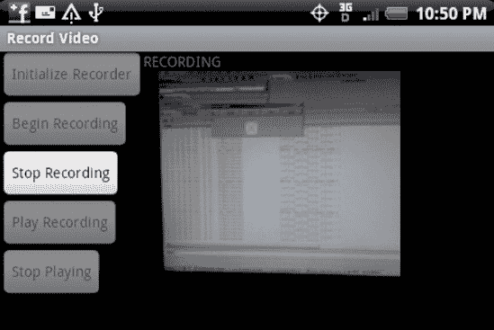

**图 19-6.** *录制视频的用户界面*


该布局由两个`LinearLayout`在父`LinearLayout`中并排组成。左侧有五个按钮，应用程序将随着演示的进行启用和禁用它们。右侧是主`VideoView`，其上方是 RECORDING 消息，当应用程序实际录制视频时会亮起。您可能已经猜到，我们通过在`AndroidManifest.xml`的`<activity>`标签中设置`android:screenOrientation="landscape"`属性，强制此应用程序使用横屏模式。让我们从`MainActivity`开始探索此应用程序，如清单 19-11 所示。

**清单 19-11.** *录制视频的 MainActivity*

```
public class MainActivity extends Activity implements
        SurfaceHolder.Callback, OnInfoListener, OnErrorListener {

    private static final String TAG = "RecordVideo";
    private MediaRecorder mRecorder = null;
    private String mOutputFileName;
    private VideoView mVideoView = null;
    private SurfaceHolder mHolder = null;
    private Button mInitBtn = null;
    private Button mStartBtn = null;
    private Button mStopBtn = null;
    private Button mPlayBtn = null;
    private Button mStopPlayBtn = null;
    private Camera mCamera = null;
    private TextView mRecordingMsg = null;

    /** Called when the activity is first created. */
    @Override
    public void onCreate(Bundle savedInstanceState) {
        super.onCreate(savedInstanceState);
        Log.v(TAG, "in onCreate");
        setContentView(R.layout.main);

        mInitBtn = (Button) findViewById(R.id.initBtn);
        mStartBtn = (Button) findViewById(R.id.beginBtn);
        mStopBtn = (Button) findViewById(R.id.stopBtn);
        mPlayBtn = (Button) findViewById(R.id.playRecordingBtn);
        mStopPlayBtn = (Button) findViewById(R.id.stopPlayingRecordingBtn);
        mRecordingMsg = (TextView) findViewById(R.id.recording);

        mVideoView = (VideoView)this.findViewById(R.id.videoView);
    }
        // 本类的其余部分将在后续清单中展示。
}
```

我们为此应用程序使用标准`Activity`，但也实现了三个接口。第一个接口`SurfaceHolder.Callback`用于接收`Surface`准备好显示视频图像的通知。在我们的例子中，`Surface`来自`VideoView`。我们还希望被告知是否有来自`MediaRecorder`的任何消息，这就是我们同时实现`OnInfoListener`和`OnErrorListener`的原因。这些接口的方法将在稍后出现。

我们的`Activity`有几个后续需要的成员字段，我们会在`onCreate()`方法中初始化其中的几个。现在我们只显示了`MainActivity`类其余部分的一条注释。这些类方法将在后续清单中介绍，从清单 19-12 开始，其中展示了标准的`onResume()`和`onPause()`方法。

**清单 19-12.** *录制视频的 Resume 和 Pause 代码*

```
    @Override
    protected void onResume() {
        Log.v(TAG, "in onResume");
        super.onResume();
        mInitBtn.setEnabled(false);
        mStartBtn.setEnabled(false);
        mStopBtn.setEnabled(false);
        mPlayBtn.setEnabled(false);
        mStopPlayBtn.setEnabled(false);
        if(!initCamera())
            finish();
    }

    @Override
    protected void onPause() {
        Log.v(TAG, "in onPause");
        super.onPause();
        releaseRecorder();
        releaseCamera();
    }
```

**注意：** 清单 19-12 包含了 `MainActivity` 类的方法；我们只是为了方便讲解，将它们分开在不同的清单中。录制视频应用程序的其余清单也是如此。

这些都是相当标准的方法。在`onResume()`中，我们简单地将按钮设置为初始化后的状态，然后初始化相机（该方法即将介绍）。在`onPause()`中，我们需要释放`MediaRecorder`和`Camera`。这样，每当应用退出视图时，录制将停止，相机被释放以供其他应用使用。如果用户返回我们的应用，一切将重新开始，用户将能够再次录制视频。接下来，在清单 19-13 中是相机初始化代码、`Surface.Callback`回调，以及`Camera`和`MediaRecorder`的释放方法。

**清单 19-13.** *录制视频的 initCamera() 和 release 方法*

```
    private boolean initCamera() {
        try {
            mCamera  = Camera.open();
            Camera.Parameters camParams = mCamera.getParameters();
            mCamera.lock();
            //mCamera.setDisplayOrientation(90);
            // 也可以在此处设置其他参数，并使用以下方式应用：
            //mCamera.setParameters(camParams);

            mHolder = mVideoView.getHolder();
            mHolder.addCallback(this);
            mHolder.setType(SurfaceHolder.SURFACE_TYPE_PUSH_BUFFERS);
        }
        catch(RuntimeException re) {
            Log.v(TAG, "Could not initialize the Camera");
            re.printStackTrace();
            return false;
        }
        return true;
    }

    @Override
    public void surfaceCreated(SurfaceHolder holder) {
        Log.v(TAG, "in surfaceCreated");

        try {
            mCamera.setPreviewDisplay(mHolder);
            mCamera.startPreview();
        } catch (IOException e) {
            Log.v(TAG, "Could not start the preview");
            e.printStackTrace();
        }
        mInitBtn.setEnabled(true);
    }

    @Override
    public void surfaceDestroyed(SurfaceHolder holder) {
        Log.v(TAG, "in surfaceDestroyed");
    }

    @Override
    public void surfaceChanged(SurfaceHolder holder, int format, int width,
            int height) {
        Log.v(TAG, "surfaceChanged: Width x Height = " + width + "x" + height);
    }

    private void releaseRecorder() {
        if(mRecorder != null) {
            mRecorder.release();
            mRecorder = null;
        }
    }

    private void releaseCamera() {
        if(mCamera != null) {
            try {
                mCamera.reconnect();
            } catch (IOException e) {
                e.printStackTrace();
            }
            mCamera.release();
            mCamera = null;
        }
    }
```

`initCamera()`方法被调用来设置我们对设备相机的访问。这是一切的开始。对于这个示例应用程序，我们使用`Camera`的默认参数，但我们可以轻松获取当前的参数值，更新它们，然后写回。注释掉的代码显示了您可以在哪里更改相机的行为和外观。设置好相机后，我们获取视频图像将要出现的`SurfaceHolder`。

`surfaceCreated()`回调是我们赋予相机对象一个位置来显示当前视图的地方，换句话说，就是相机预览。预览启动后，我们可以启用按钮来初始化`MediaRecorder`。相机预览是一个非常有用的功能，它允许用户在开始录制之前看到相机所看到的景象。无论您是在进行视频录制还是静态摄影，您很可能都会进行预览，并且在这两种情况下都可以通过这种方式完成。

为了完整性，我们展示了`releaseRecorder()`和`releaseCamera()`方法。它们会在`onPause()`中被调用，如清单 19-12 所示。


至此，在我们的应用程序中，我们已经设置好了相机，初始化了按钮，并显示了相机所见的预览画面。现在用户可以开始点击按钮，尽管在初始阶段唯一可用的按钮是“初始化录制器”按钮。当按下某个按钮时，将执行清单 19–14 中的代码。该清单提供了对应每个按钮的五种操作。当每个操作执行时，按钮会相应地启用和禁用，以便进行下一步操作。例如，一旦录制器被初始化，“初始化录制器”按钮将被禁用，而“开始录制”按钮将被启用。

**清单 19–14.** *录制视频的按钮处理代码*

```java
public void doClick(View view) {
    switch(view.getId()) {
    case R.id.initBtn:
        initRecorder();
        break;
    case R.id.beginBtn:
        beginRecording();
        break;
    case R.id.stopBtn:
        stopRecording();
        break;
    case R.id.playRecordingBtn:
        playRecording();
        break;
    case R.id.stopPlayingRecordingBtn:
        stopPlayingRecording();
        break;
    }
}

private void initRecorder() {
    if(mRecorder != null) return;

    mOutputFileName = Environment.getExternalStorageDirectory() +
                             "/videooutput.mp4";

    File outFile = new File(mOutputFileName);
    if(outFile.exists()) {
        outFile.delete();
    }

    try {
        mCamera.stopPreview();
        mCamera.unlock();
        mRecorder = new MediaRecorder();
        mRecorder.setCamera(mCamera);

        mRecorder.setAudioSource(MediaRecorder.AudioSource.CAMCORDER);
        mRecorder.setVideoSource(MediaRecorder.VideoSource.CAMERA);
        mRecorder.setOutputFormat(MediaRecorder.OutputFormat.MPEG_4);
        mRecorder.setVideoSize(176, 144);
        mRecorder.setVideoFrameRate(15);
        mRecorder.setVideoEncoder(MediaRecorder.VideoEncoder.MPEG_4_SP);
        mRecorder.setAudioEncoder(MediaRecorder.AudioEncoder.AMR_NB);
        mRecorder.setMaxDuration(7000); // limit to 7 seconds
        mRecorder.setPreviewDisplay(mHolder.getSurface());
        mRecorder.setOutputFile(mOutputFileName);

        mRecorder.prepare();
        Log.v(TAG, "MediaRecorder initialized");
        mInitBtn.setEnabled(false);
        mStartBtn.setEnabled(true);
    }
    catch(Exception e) {
        Log.v(TAG, "MediaRecorder failed to initialize");
        e.printStackTrace();
    }
}

private void beginRecording() {
    mRecorder.setOnInfoListener(this);
    mRecorder.setOnErrorListener(this);
    mRecorder.start();
    mRecordingMsg.setText("RECORDING");
    mStartBtn.setEnabled(false);
    mStopBtn.setEnabled(true);
}

private void stopRecording() {
    if (mRecorder != null) {
        mRecorder.setOnErrorListener(null);
        mRecorder.setOnInfoListener(null);
        try {
            mRecorder.stop();
        }
        catch(IllegalStateException e) {
            // 如果录制器已停止，可能会发生此情况。
            Log.e(TAG, "Got IllegalStateException in stopRecording");
        }
        releaseRecorder();
        mRecordingMsg.setText("");
        releaseCamera();
        mStartBtn.setEnabled(false);
        mStopBtn.setEnabled(false);
        mPlayBtn.setEnabled(true);
    }
}

private void playRecording() {
    MediaController mc = new MediaController(this);
    mVideoView.setMediaController(mc);
    mVideoView.setVideoPath(mOutputFileName);
    mVideoView.start();
    mStopPlayBtn.setEnabled(true);
}

private void stopPlayingRecording() {
    mVideoView.stopPlayback();
}
```

`initRecorder()`方法是我们进行大量设置的地方。录制器需要知道录制位置，因此我们提供了一个文件路径名。如果文件已存在，我们将其删除。请注意，我们随后会停止相机预览、解锁相机，然后将其连接到`MediaRecorder`。相机对锁定和解锁有些敏感，有时您需要锁定相机以防止其他人访问，而有时则需要解锁相机才能对其进行操作。现在正是需要解锁相机以将其连接到`MediaRecorder`的情况之一。一旦相机连接成功（这是我们首先做的），我们继续设置`MediaRecorder`的其他属性，包括音频源和视频源。但是等等，我们不是刚刚将相机连接到录制器了吗？是的，确实如此。但我们仍然需要显式设置视频源。通过在录制器中设置相机，我们避免了销毁`Camera`对象，然后让录制器对象重新构建一个新的对象。在调用`prepare()`方法之前，我们还设置了音频和视频编码器以及 SD 卡上输出文件的路径。`prepare()`方法在最后出现，让我们准备好实际录制内容。我们通过启用“开始录制”按钮来结束此方法。

相比之下，`beginRecording()`方法相当直接。它添加监听器，调用`start()`，然后设置录制消息字符串并更改按钮。当此方法结束时，我们的应用程序应该正在录制视频，并且应该显示红色的“RECORDING”消息，如图 19–6 所示。

`stopRecording()`方法稍微复杂一些，部分原因是它可能从多个地方被调用。我们稍后会谈到第二个地方，但现在假设“停止录制”按钮触发了此方法。如果我们仍然有一个有效的录制器，我们会禁用回调，然后调用`stop()`。由于有可能`stop()`在一个已停止的录制器上被调用，我们处理了该异常，该异常表明我们试图停止一个已经停止的录制器。然后我们释放录制器和相机，并将“RECORDING”消息设置为空白。最后，按钮从录制模式切换到播放模式。

`playRecording()`方法也很直接。我们为`VideoView`获取一个`MediaController`，将其指向我们的新文件，然后调用`start()`。我们的`stopPlayingRecording()`方法甚至更简单；我们只需停止视频的播放。当我们在播放模式时，如果视频正在播放，点击“播放”按钮是无害的；同样，如果视频已停止，点击“停止”按钮也无害。

我们之前提到，录制操作可以从多个地方停止。录制器上的一个设置是最大时长为七秒。这意味着七秒后录制将停止，并且我们的信息回调将被调用。现在让我们在清单 19–15 中查看这些内容。

**清单 19–15.** *录制视频的信息回调*

```java
@Override
public void onInfo(MediaRecorder mr, int what, int extra) {
    Log.i(TAG, "got a recording event");
    if(what == MediaRecorder.MEDIA_RECORDER_INFO_MAX_DURATION_REACHED) {
        Log.i(TAG, "...max duration reached");
        stopRecording();
        Toast.makeText(this, "Recording limit has been reached. Stopping the recording",
                Toast.LENGTH_SHORT).show();
    }
}
```


```java
@Override
public void onError(MediaRecorder mr, int what, int extra) {
    Log.e(TAG, "got a recording error");
    stopRecording();
    Toast.makeText(this, "Recording error has occurred. Stopping the recording",
            Toast.LENGTH_SHORT).show();
}
```

这两个回调非常相似。它们之间唯一的区别在于被调用的场景。在`onInfo()`方法中，消息不被视为错误。调用`onInfo()`可能是因为达到了最大录制时间，或者如果我们在录制器上设置了这些选项，也可能是因为达到了最大文件大小。而对于`onError()`，文档并未明确指出其被调用的具体原因，但可能是由于录制器写入视频文件的存储空间不足。如果因为达到时间限制而调用了`onInfo()`，或者出现了某种录制错误，我们将停止录制。

与之前录制音频时一样，我们需要设置音频权限（`android.permission.RECORD_AUDIO`）和 SD 卡权限（`android.permission.WRITE_EXTERNAL_STORAGE`），现在还需要添加访问摄像头的权限（`android.permission.CAMERA`）。为了完整性，`AndroidManifest.xml`文件如清单 19–16 所示。您会注意到我们强制将应用程序的方向设置为横屏，这就是我们的布局文件位于`/res/layout-land/main.xml`的原因。

**清单 19–16.** 录制视频的 `AndroidManifest.xml` 文件

```xml
<?xml version="1.0" encoding="utf-8"?>
<manifest
      package="com.androidbook.record.video"
      android:versionCode="1"
      android:versionName="1.0">
    <application android:icon="@drawable/icon" android:label="@string/app_name">
        <activity android:name=".MainActivity"
                  android:label="@string/app_name"
                  android:screenOrientation="landscape">
            <intent-filter>
                <action android:name="android.intent.action.MAIN" />
                <category android:name="android.intent.category.LAUNCHER" />
            </intent-filter>
        </activity>
    </application>
    <uses-sdk android:minSdkVersion="4" />

<uses-permission android:name="android.permission.WRITE_EXTERNAL_STORAGE"/>
<uses-permission android:name="android.permission.RECORD_AUDIO"/>
<uses-permission android:name="android.permission.CAMERA"/>
</manifest>
```

#### 摄像头与摄像机配置文件

在清单 19–14 中，您看到`initRecorder()`方法中有一系列针对视频录制器的非常具体的设置。问题在于，您如何知道应用程序所运行设备的能力？在 Android 2.2 之前，这个问题并没有很好的答案。Android 自带的相机应用程序使用了一个未公开的`SystemProperties`类。因此，在 Android 2.2 之前，您必须选择能够在目标设备上正常工作的值。这并不令人满意，尤其是在新设备上配备了更好的摄像头之后。为了改善这种情况，Android 2.2 引入了两个新类：`CameraProfile`和`CamcorderProfile`。这些类只是您关心的摄像头属性的容器。虽然`CameraProfile`只有一个值（JPEG 编码质量参数），但`CamcorderProfile`会告诉您帧率、帧尺寸（高度和宽度）以及其他视频和音频参数。不仅如此，`MediaRecorder`类可以接受一个`CamcorderProfile`来设置该配置文件包含的各种视频录制值。您只需注意在设置视频和音频源之后、设置输出文件之前调用`setProfile()`方法即可。

随着 Android 2.3 的发布，处理摄像头的方法现在可能有一个接受摄像头标识符的替代方法。在 Android 2.3 之前，大多数设备只有一个摄像头，通常朝向设备背面。对于既有前置摄像头又有后置摄像头的新设备，代码需要一种方式来指定它要使用哪个摄像头。例如，在`Camera`类中，`open()`方法会返回一个面向后置摄像头的`Camera`对象（如果存在）。还有一个`open(int cameraid)`方法可以返回特定的摄像头，允许您的应用程序使用前置摄像头（如果存在）。要确定有多少个摄像头可用以及哪个是哪个，可以使用`Camera.getNumberOfCameras()`方法获取摄像头数量，`Camera.getCameraInfo()`方法会返回关于特定摄像头的信息，包括其朝向。

#### 探索 MediaStore 类

到目前为止，我们通过直接实例化类来处理媒体，以便在我们自己的应用程序中播放和录制媒体。Android 的一大优点是您可以访问其他应用程序来为您完成工作。`MediaStore`类提供了一种接口，用于访问设备内部和外部存储的媒体。

`MediaStore`还提供了供您对媒体进行操作的 API。这些 API 包括让您在设备上搜索特定类型媒体的机制、让您将音视频录制到存储库的 intent、以及创建播放列表等方式。请注意，这个类属于较旧的 SDK，但自 1.5 版本以来已得到大幅改进。

由于`MediaStore`类支持通过 intent 录制音频和视频，而`MediaRecorder`类也处理录制，因此一个显而易见的问题是：什么时候使用`MediaStore`，什么时候使用`MediaRecorder`？正如您在前面视频捕获和音频录制示例中所看到的，`MediaRecorder`允许您设置录制源的多种选项。这些选项包括音视频输入源、视频帧率、视频帧尺寸、输出格式等。`MediaStore`不提供这种精细程度，但如果您不需要，您可能会发现通过`MediaStore`的 intent 操作更容易。更重要的是，使用`MediaRecorder`创建的内容不会自动被其他查看媒体库的应用程序访问。如果您使用`MediaRecorder`，您可能需要使用`MediaStore`的 API 将录制内容添加到媒体库中，因此或许一开始就使用`MediaStore`更简单。另一个显著区别是，通过 intent 调用`MediaStore`不需要您的应用程序请求录制音频、访问摄像头或写入 SD 卡的权限。您的应用程序正在调用一个独立的活动，而那个活动必须拥有录制音频、访问摄像头和写入 SD 卡的权限。`MediaStore`的活动已经拥有这些权限。因此，您的应用程序就不需要了。那么，让我们看看如何利用`MediaStore`的 API。


### 使用 Intent 录制音频

如我们所见，录制音频本身并不复杂，但若借助 `MediaStore` 的 Intent 操作，则更为便捷。代码清单 19–17 演示了如何通过 Intent 录制音频。

**代码清单 19–17.** *使用 Intent 录制音频*

```xml
<?xml version="1.0" encoding="utf-8"?>
<!-- 此文件位于 /res/layout/main.xml -->
<LinearLayout
    android:orientation="vertical"
    android:layout_width="fill_parent"
    android:layout_height="fill_parent" >
 <Button android:id="@+id/recordBtn"
    android:text="录制音频"
    android:layout_width="wrap_content"
    android:layout_height="wrap_content" />
</LinearLayout>
```

```java
import android.app.Activity;
import android.content.Intent;
import android.net.Uri;
import android.os.Bundle;
import android.util.Log;
import android.view.View;
import android.view.View.OnClickListener;
import android.widget.Button;

public class UsingMediaStoreActivity extends Activity {
    @Override
    protected void onCreate(Bundle savedInstanceState) {
        super.onCreate(savedInstanceState);

        setContentView(R.layout.main);

        Button btn = (Button)findViewById(R.id.recordBtn);
        btn.setOnClickListener(new OnClickListener(){

            @Override
            public void onClick(View view) {

                startRecording();

            }});
    }

public void startRecording() {
        Intent intt =
            new Intent("android.provider.MediaStore.RECORD_SOUND");
        startActivityForResult(intt, 0);
    }

    @Override
    protected void onActivityResult(int requestCode, int resultCode, Intent data) {

        switch (requestCode) {
        case 0:
            if (resultCode == RESULT_OK) {
                Uri recordedAudioPath = data.getData();
                Log.v("Demo", "Uri 为 " + recordedAudioPath.toString());
            }
        }
    }
}
```

代码清单 19–17 创建了一个 Intent，请求系统开始录制音频。代码通过调用 `startActivityForResult()` 启动该 Intent 并传入 `requestCode`，从而将 Intent 交给某个 Activity 处理。当被请求的 Activity 完成后，系统会调用 `onActivityResult()` 并携带 `requestCode`。如 `onActivityResult()` 所示，我们查找与传递给 `startActivityForResult()` 代码相匹配的 `requestCode`，然后通过调用 `data.getData()` 获取已保存媒体的 Uri。如果需要，你还可以将该 Uri 传递给另一个 Intent 来播放这段录音。代码清单 19–17 的界面如图 19–7 所示。

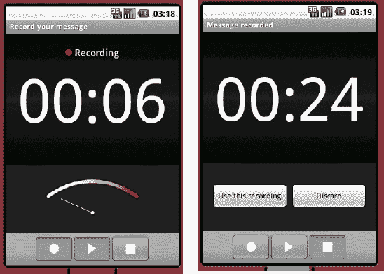

**图 19–7.** *内置音频录音机：录制前与录制后*

图 19–7 展示了两张截图。左侧图像显示的是正在录制中的音频录音机，右侧图像显示的是录音停止后的 Activity 界面。

与提供音频录制 Intent 的方式类似，`MediaStore` 也提供了一个用于拍照的 Intent。代码清单 19–18 演示了这一点。

**代码清单 19–18.** *启动 Intent 拍照*

```xml
<?xml version="1.0" encoding="utf-8"?>
<!-- 此文件位于 /res/layout/main.xml -->
<LinearLayout
    android:orientation="vertical"
    android:layout_width="fill_parent"
    android:layout_height="fill_parent" >
  <Button android:id="@+id/btn"  android:text="拍照"
      android:layout_width="wrap_content"
      android:layout_height="wrap_content"
      android:onClick="captureImage" />

</LinearLayout>
```

```java
import android.app.Activity;
import android.content.ContentValues;
import android.content.Intent;
import android.net.Uri;
import android.os.Bundle;
import android.provider.MediaStore;
import android.provider.MediaStore.Images.Media;
import android.view.View;
import android.view.View.OnClickListener;
import android.widget.Button;

public class MainActivity extends Activity {

    Uri myPicture = null;

    @Override
    public void onCreate(Bundle savedInstanceState) {
        super.onCreate(savedInstanceState);
        setContentView(R.layout.main);

        setRequestedOrientation(ActivityInfo.SCREEN_ORIENTATION_LANDSCAPE);
    }

    public void captureImage(View view)
    {
        ContentValues values = new ContentValues();
        values.put(Media.TITLE, "我的演示图片");
        values.put(Media.DESCRIPTION, "通过 Intent 由相机拍摄的图片");

        myPicture = getContentResolver().insert(Media.EXTERNAL_CONTENT_URI, values);

        Intent i = new Intent(MediaStore.ACTION_IMAGE_CAPTURE);
        i.putExtra(MediaStore.EXTRA_OUTPUT, myPicture);

startActivityForResult(i, 0);
    }

    @Override
    protected void onActivityResult(int requestCode, int resultCode, Intent data) {
        if(requestCode==0 && resultCode==Activity.RESULT_OK)
        {
            // 至此，我们可以确认 myPicture Uri
            // 指向的是刚刚拍摄的图片
        }
    }
}
```

代码清单 19–18 中所示的 Activity 类定义了 `captureImage()` 方法。在该方法中，创建了一个 Intent，其 Action 名设置为 `MediaStore.ACTION_IMAGE_CAPTURE`。当此 Intent 被启动时，相机应用会切换到前台，用户即可拍照。由于我们预先创建了 Uri，因此可以在相机拍照前为图片添加额外的详细信息。这正是 `ContentValues` 类为我们实现的功能。除了 `TITLE` 和 `DESCRIPTION` 之外，还可以向 `values` 中添加其他属性。有关完整列表，请查阅 Android 参考文档中的 `MediaStore.Images.ImageColumns`。拍照完成后，系统会调用我们的 `onActivityResult()` 回调。在本例中，我们使用媒体内容提供器创建了一个新文件。当然，我们也可以在 SD 卡上通过新文件创建 Uri，如下所示：

```java
myPicture = Uri.fromFile(new File(Environment.getExternalStoragePublicDirectory(DIRECTORY_DCIM) +
"/100ANDRO/imageCaptureIntent.jpg"));
```

然而，通过这种方式创建 Uri，并不能像之前那样方便地设置图片的属性，例如 `TITLE` 和 `DESCRIPTION`。调用相机 Intent 拍照还有另一种方法。如果我们不向 Intent 传递任何 Uri，那么我们在 `onActivityResult()` 的 Intent 参数中会收到一个 bitmap 对象。这种方法的缺陷在于，默认情况下该 bitmap 会从原始大小缩放，显然是因为 Android 团队不希望你的 Activity 从相机 Activity 接收到大量数据。该 bitmap 的大小将为 50k。要在 `onActivityResult()` 中获取 Bitmap 对象，你可以这样操作：

```java
Bitmap myBitmap = (Bitmap) data.getExtras().get("data");
```

`MediaStore` 还提供了一个用于视频录制的 Intent，其行为方式类似。你可以使用 `MediaStore.ACTION_VIDEO_CAPTURE` 来录制视频。


### 向媒体存储库添加媒体内容

Android 媒体框架提供的另一项功能是，能够通过`MediaScannerConnection`类向媒体存储库添加内容信息。换句话说，如果媒体存储库不知道某些新内容，我们就使用`MediaScannerConnection`告知它。这样，这些内容就可以对外提供了。我们来看看具体如何实现（见清单 19–19）。

**清单 19–19.** *向 MediaStore 添加一个文件*

```
<?xml version="1.0" encoding="utf-8"?>
<!-- 此文件位于 /res/layout/main.xml -->
<LinearLayout
    android:orientation="vertical"
    android:layout_width="fill_parent"
    android:layout_height="wrap_content">

    <EditText android:id="@+id/fileName"  android:hint="输入新文件名"
        android:layout_width="fill_parent"
        android:layout_height="wrap_content" />

    <Button android:id="@+id/scanBtn"  android:text="添加文件"
        android:layout_width="wrap_content"
        android:layout_height="wrap_content"
        android:onClick="startScan" />

</LinearLayout>
```

```
import java.io.File;
import android.app.Activity;
import android.content.Intent;
import android.media.MediaScannerConnection;
import android.media.MediaScannerConnection.MediaScannerConnectionClient;
import android.net.Uri;
import android.os.Bundle;
import android.util.Log;
import android.view.View;
import android.widget.EditText;
import android.widget.Toast;

public class MediaScannerActivity extends Activity implements MediaScannerConnectionClient
{
    private EditText editText = null;
    private String filename = null;
    private MediaScannerConnection conn;

    @Override
    protected void onCreate(Bundle savedInstanceState) {
        super.onCreate(savedInstanceState);
        setContentView(R.layout.main);

        editText = (EditText)findViewById(R.id.fileName);
    }

    public void startScan(View view)
    {
        if(conn!=null) {
            conn.disconnect();
        }

        filename = editText.getText().toString();

        File fileCheck = new File(filename);
        if(fileCheck.isFile()) {
            conn = new MediaScannerConnection(this, this);
            conn.connect();
        }
        else {
            Toast.makeText(this,
                "该文件不存在",
                Toast.LENGTH_SHORT).show();
        }
    }

    @Override
    public void onMediaScannerConnected() {
        conn.scanFile(filename, null);
    }

    @Override
    public void onScanCompleted(String path, Uri uri) {
        try {
            if (uri != null) {
                Intent intent = new Intent(Intent.ACTION_VIEW);
                intent.setData(uri);
                startActivity(intent);
            }
            else {
                Log.e("MediaScannerDemo", "该文件无效");
            }
        } finally {
            conn.disconnect();
            conn = null;
        }
    }
}
```

清单 19–19 展示了一个向`MediaStore`添加文件的活动类。如果添加成功，所添加的文件将通过一个 Intent 显示给用户。在后台，`MediaScanner`会检查该文件以确定其文件类型及其他相关详细信息。我们本可以将文件的 MIME 类型作为`scanFile()`的第二个参数传递给`MediaScanner`。如果`MediaScanner`无法通过扩展名确定文件类型，该文件将不会被添加。如果该文件属于`MediaStore`，则会在媒体提供商的数据库中创建一条记录。文件本身并不会移动。但现在媒体提供商知道了这个文件。如果你添加了一个图片文件，现在可以打开图库应用看到它。如果你添加了一个音乐文件，它现在会出现在音乐应用中。

如果你想查看媒体提供商数据库的内部，可以打开一个工具窗口，启动`adb shell`，然后在设备上导航到`/data/data/com.android.providers.media/databases`。在那里你会找到数据库，其中一个是`internal.db`。那里也可能存在外部数据库文件，对应一个或多个 SD 卡。由于 Android 手机可以使用多个 SD 卡，因此也可能存在多个外部数据库文件。你可以使用`sqlite3`工具来检查这些数据库中的表。其中有音频、图片和视频的表。更多关于使用`sqlite3`的信息，请参见第 4 章。

### 触发整个 SD 卡的 MediaScanner 扫描

在前面的例子中，我们使用`MediaScanner`来检查单个特定文件。如果你只想添加单个文件，这没问题。但是如果你想要重命名或删除一个文件，并且希望`MediaStore`得到更新，该怎么办呢？幸运的是，有一种非常简单的方法来触发这个操作。如果你在你的应用程序中执行以下代码，它会被`MediaScanner`捕获，从而重新扫描整个 SD 卡：

```
sendBroadcast(new Intent(Intent.ACTION_MEDIA_MOUNTED,
    Uri.parse("file://" +
    Environment.getExternalStorageDirectory())));
```

作为练习，你可以继续创建一个简单的应用程序，在`onCreate()`中仅执行此命令。

至此，我们对媒体 API 的讨论就结束了。我们希望你会同意，使用 Android 播放和录制媒体内容并不太难。

### 总结

在本章中，我们讨论了 Android 媒体框架。我们向你展示了如何播放音频和视频。我们还展示了如何直接或通过 Intent 录制音频和视频。

在下一章中，我们将通过讨论如何在 Android 应用程序中使用 OpenGL，将注意力转向 3D 图形。

## 第 20 章


