# 使用 OpenGL 进行 3D 图形编程

在本章中，我们将详细讨论如何在 Android 平台上使用 OpenGL ES 图形 API。OpenGL ES 是 OpenGL 的一个版本，专门针对嵌入式系统及其他低功耗设备（如手机）进行了优化。

Android 平台支持 OpenGL ES 1.0 和 OpenGL ES 2.0。OpenGL ES 2.0 仅从对应 Android SDK 2.2 版本的 API 级别 8 开始提供。截至撰写本文时，使用 Java 绑定来调用 OpenGL ES 2.0 还存在一些问题。请参阅本章末尾关于 OpenGL ES 2.0 的单独小节中的说明和建议。主要问题在于模拟器不支持 OpenGL ES 2.0。Android 3.0 通过引入 Renderscript 增强了 OpenGL 的应用能力。Renderscript 旨在通过允许运行以类似“C”语言编写的原生代码来获得更好的性能。这段代码甚至可以在 GPU（图形处理单元）上执行。Renderscript 还被设计为支持跨平台兼容性。当性能不是关键问题时，仍建议程序员使用 Java 绑定来完成大部分 OpenGL 工作。由于时间限制，我们在本书的这一版中没有涵盖 Renderscript。我们在本章末尾提供了一个指向 Renderscript（来自 Google）编程指南的参考 URL。

Android SDK 发行版附带了许多 OpenGL ES 示例。然而，关于如何开始使用 OpenGL ES 的文档在 SDK 中要么很少，要么根本没有。其潜在的假设是 OpenGL ES 是一个开放标准，程序员可以在 Android 之外自行学习。因此，Android 在线 OpenGL 资源和 Android OpenGL 代码示例都假定你已经熟悉 OpenGL。

在本章中，我们将帮助你克服这些小障碍。只需具备很少的 OpenGL 基础知识，学完本章后，你就能轻松地进行 OpenGL 编程了。我们将通过几乎不涉及数学知识（这与许多 OpenGL 书籍不同）的方式来实现这一目标。

在本章的第一部分，我们将概述 OpenGL、OpenGL ES 以及一些竞争标准。

在第二部分，我们将解释 OpenGL 背后的理论。如果你是 OpenGL 新手，这部分内容至关重要，必须阅读。在这一部分中，我们将介绍 OpenGL 坐标、其摄像机概念以及基本的 OpenGL ES 绘图 API。

在第三部分，我们将解释如何在 Android 上与 OpenGL ES API 进行交互。本节涵盖了 `GLSurfaceView` 和 `Renderer` 接口，以及它们如何协同工作以使用 OpenGL 进行绘图。在我们其中一个简单示例中，我们将绘制一个简单的三角形，以展示改变 OpenGL 场景设置 API 如何影响绘图过程。

**注意：** OpenGL 的摄像机概念类似于但不同于你在第 6 章中学到的 Android 图形包中的 `Camera` 类。Android 图形包中的 `Camera` 对象通过投影在 3D 空间中移动的 2D 视图来模拟类似 3D 的观看能力，而 OpenGL 的摄像机则是一个代表虚拟视点的范式。换句话说，它通过一个透过摄像机观察的观察者的视角来模拟现实世界场景。你将在“使用 OpenGL ES”下的“理解摄像机与坐标”小节中学到更多内容。这两种摄像机都与你用来拍照或录制视频的手持设备的物理摄像头是分开的。

在第四部分，我们将带你更深入地了解 OpenGL ES，并介绍形状的概念。我们还将介绍纹理，并向你展示如何在单个 `draw` 方法中绘制多个图形。然后，我们将通过简要介绍 OpenGL 着色器和一个快速示例来介绍对 OpenGL ES 2.0 的支持。请预先注意，OpenGL ES 2.0 只能在真实设备上进行测试。

我们将以我们在研究本章材料时发现的一系列资源来结束本章。

那么，让我们来看看 OpenGL 的历史和背景吧！

### 理解 OpenGL 的历史与背景

OpenGL（最初称为开放图形库）是一个 2D 和 3D 图形 API，由硅谷图形公司（SGI）为其 UNIX 工作站开发。尽管 SGI 版本的 OpenGL 已经存在很长时间，但第一个标准化的 OpenGL 规范于 1992 年出现。如今，OpenGL 标准已被所有操作系统广泛采用，构成了许多游戏、计算机辅助设计（CAD）甚至虚拟现实（VR）行业的基础。

OpenGL 标准目前由一个名为 Khronos Group（`www.khronos.org`）的行业联盟管理，该联盟于 2000 年由 NVIDIA、Sun Microsystems、ATI Technologies 和 SGI 等公司共同创立。你可以在该联盟的网站上了解更多关于 OpenGL 规范的信息，网址为：

`www.khronos.org/opengl/`

OpenGL 的官方文档页面可在此处获取：

`www.opengl.org/documentation/`

从这个文档页面可以看出，你可以访问到专门介绍 OpenGL 的书籍和在线资源。其中，黄金标准是 *OpenGL 编程指南：学习 OpenGL 的官方指南，1.1 版*，也被称为 OpenGL 的“红宝书”。你可以在此处找到该书的在线版本：

`www.glprogramming.com/red/`

这本书非常出色且相当易读。然而，我们在理清用于绘图的 *单位* 和 *坐标* 的本质时遇到了一些困难。我们将尝试澄清这些关于你在 OpenGL 中绘制什么以及看到什么的重要概念。这些概念的核心在于设置 OpenGL 的摄像机和 *观察框*，也称为 *观察体* 或 *视锥体*。

#### OpenGL ES

Khronos Group 还负责另外两个与 OpenGL 相关的标准：OpenGL ES 和 EGL 原生平台图形接口（通常简称为 EGL）。正如我们提到的，OpenGL ES 是 OpenGL 的一个更小的版本，专为嵌入式系统设计。

**注意：** Java 社区进程也在为移动设备开发一个面向对象的 OpenGL 抽象层，称为移动 3D 图形 API（M3G）。我们将在“M3G：另一个 Java ME 3D 图形标准”小节中对该接口进行简要介绍。

EGL 标准本质上是一个底层操作系统（OS）与 OpenGL ES 提供的渲染 API 之间的使能接口。由于 OpenGL 和 OpenGL ES 是用于绘图的通用接口，每个操作系统都需要提供一个标准的宿主环境供 OpenGL 和 OpenGL ES 进行交互。从 1.5 版本开始，Android SDK 很好地隐藏了这些平台特定的细节。你将在名为“将 OpenGL ES 与 Android 对接”的第二节中了解到这一点。

OpenGL ES 的目标设备包括手机、家电甚至车辆。由于 OpenGL ES 必须比 OpenGL 小得多，因此许多便捷的函数被移除了。例如，OpenGL ES 不直接支持绘制矩形；你必须绘制两个三角形来组成一个矩形。

当你开始探索 Android 对 OpenGL 的支持时，你将主要关注 OpenGL ES 及其通过 Java 和 EGL 与 Android 操作系统的绑定。你可以在此处找到 OpenGL ES 的文档：

`www.khronos.org/opengles/documentation/opengles1_0/html/index.html`

在撰写本章的过程中，我们多次参考了这份文档，因为它识别并解释了每个 OpenGL ES API，并描述了每个 API 的参数。你会发现这些 API 与 Java API 类似，我们将在本章中向你介绍其中关键的几个。


##### OpenGL ES 与 Java ME

`OpenGL ES` 与 `OpenGL` 一样，都是基于 C 语言的扁平化 API。由于 Android SDK 是基于 Java 的编程 API，因此需要为 `OpenGL ES` 提供一个 Java 绑定。Java ME 已通过 `JSR 239` 定义了该绑定：即 `OpenGL ES` API 的 Java 绑定。`JSR 239` 本身基于 `JSR 231`，后者是 `OpenGL 1.5` 的 Java 绑定。`JSR 239` 本应是 `JSR 231` 的一个严格子集，但实际情况并非如此，因为它需要兼容 `OpenGL 1.5` 所不具备的一些 `OpenGL ES` 扩展。

你可以在以下位置找到 `JSR 239` 的文档：

```
http://java.sun.com/javame/reference/apis/jsr239/
```

这份参考资料将让你了解 `OpenGL ES` 中可用的 API。它还提供了关于以下包的重要信息：

```
javax.microedition.khronos.egl
javax.microedition.khronos.opengles
java.nio
```

`nio` 包是必需的，因为 `OpenGL ES` 实现出于效率考虑仅接受字节流作为输入。该 `nio` 包定义了多种实用工具，用于准备在 `OpenGL` 中使用的原生缓冲区。在“使用 `OpenGL ES`”小节下的“`glVertexPointer` 与指定绘制顶点”部分中，你将看到其中一些 API 的实际应用。

你可以在以下网址找到 Android SDK 对 `OpenGL` 支持的文档（尽管内容相当精简）：

```
http://developer.android.com/guide/topics/graphics/opengl.html
```

在该页面上，文档指出 Android 实现与 `JSR 239` 基本一致，但也警告可能在少数地方存在差异。

##### M3G：另一种 Java ME 3D 图形标准

`JSR 239` 仅仅是原生 `OpenGL ES` 标准的一个 Java 绑定。正如在“`OpenGL ES`”小节中简要提及的那样，Java 提供了另一种在移动设备上处理 3D 图形的 API：`M3G`。这种面向对象的标准定义在 `JSR 184` 和 `JSR 297` 中，其中后者是较新的版本。根据 `JSR 184`，`M3G` 是一种适用于移动设备的轻量级、面向对象的交互式 3D 图形 API。

`M3G` 的面向对象特性使其与 `OpenGL ES` 有所区别。有关详细信息，请访问以下网址中 `JSR 184` 的主页：

```
www.jcp.org/en/jsr/detail?id=184
```

`M3G` 的 API 位于名为

```
javax.microedition.m3g.*;
```

的 Java 包中。

与 `OpenGL ES` 相比，`M3G` 是一种更高级的 API，因此应该更容易学习。然而，它在手持设备上的实际性能表现尚无定论。截至目前，Android 并不支持 `M3G`。

到目前为止，我们已经列出了手持设备在 `OpenGL` 领域可用的选项。我们讨论了 `OpenGL ES`，也简要提到了 `M3G` 标准。现在，我们将专注于理解 `OpenGL` 的基础知识。

### OpenGL 基础

本节将帮助你理解 `OpenGL` 和 `OpenGL ES` API 背后的概念。我们将解释所有关键的 API。为了补充本章提供的信息，你可能需要参考本章末尾的“资源”部分。那里的资源包括红宝书、`JSR 239` 文档以及 The Khronos Group 的 API 参考手册。

**注意：**当你开始使用 `OpenGL` 资源时，你会注意到某些 API 在 `OpenGL ES` 中不可用。这时，The Khronos Group 的 *`OpenGL ES Reference Manual`*（OpenGL ES 参考手册）就会派上用场。

我们将相当详细地介绍以下 API，因为它们对于理解 `OpenGL` 和 `OpenGL ES` 至关重要：

```
glVertexPointer
glDrawElements
glColor
glClear
gluLookAt
glFrustum
glViewport
```

在介绍这些 API 的过程中，你将学习如何：

> 使用基本的 `OpenGL ES` 绘图 API。
> 
> 清除调色板。
> 
> 指定颜色。
> 
> 理解 `OpenGL` 相机与坐标。

#### 使用 OpenGL ES 进行基本绘图

在 `OpenGL` 中，你是在三维空间中绘图。首先，你需要指定一系列点，也称为顶点。每个点具有三个值：一个用于 `x` 坐标，一个用于 `y` 坐标，一个用于 `z` 坐标。

这些点随后被连接起来形成形状。你可以将这些点连接成多种形状，这些形状被称为*图元形状*，在 `OpenGL ES` 中包括点、线和三角形。请注意，在 `OpenGL` 中，图元形状还包括矩形和多边形。在使用 `OpenGL` 和 `OpenGL ES` 的过程中，你会不断发现后者特性少于前者的差异。这里还有另一个例子：`OpenGL` 允许你单独指定每个点，而 `OpenGL ES` 只允许你一次性指定一系列点。不过，你通常可以通过其他更基本的特性来模拟 `OpenGL ES` 缺失的功能。例如，你可以通过组合两个三角形来绘制一个矩形。

`OpenGL ES` 提供了两种主要方法来辅助绘图：

```
glVertexPointer
glDrawElements
```

**注意：** 在讨论 `OpenGL ES` API 时，我们将互换使用术语“API”和“方法”。

你使用 `glVertexPointer` 来指定一系列点或顶点，并使用 `glDrawElements` 通过前述的某种图元形状来绘制它们。我们将更详细地描述这些方法，但首先让我们了解一下 `OpenGL` API 名称的一些命名规则。

`OpenGL` API 的名称都以 `gl` 开头。`gl` 之后是方法名称。方法名称后紧跟一个可选的数字，例如 `3`，它指向维度数量（例如 `(x,y,z)`）或参数数量。方法名称之后是一个数据类型，例如 `f` 表示浮点型（float）。（你可以参考任何 `OpenGL` 在线资源来了解各种数据类型及其对应的字母。）

还有一条约定。如果一个方法接受字节型（`b`）或浮点型（`f`）参数，那么该方法将有两个名称：一个以 `b` 结尾，另一个以 `f` 结尾。

现在，让我们逐一查看这两个与绘图相关的方法，从 `glVertexPointer` 开始。


`glVertexPointer`与绘制顶点的指定

`glVertexPointer`方法负责指定要绘制的点数组。每个点都在三维空间中指定，因此每个点将有三个值：x、y 和 z。代码清单 20-1 展示了如何在一个数组中指定三个点。

**代码清单 20-1.** *OpenGL 三角形的顶点坐标示例*

```
float[] coords = {
      -0.5f, -0.5f, 0,   //p1: (x1,y1,z1)
       0.5f, -0.5f, 0,    //p2: (x1,y1,z1)
       0.0f,  0.5f, 0     //p3: (x1,y1,z1)
};
```

代码清单 20-1 中的结构是一组连续的浮点数，保存在基于 Java 的浮点数组中。目前不用担心在任何地方键入或编译这段代码——我们此时的目标只是让您了解这些 OpenGL ES 方法的工作原理。我们将在稍后开发测试工具来绘制简单图形时，为您提供可运行的示例和代码。我们还在本章末尾的参考资料部分提供了可下载项目的链接。

在代码清单 20-1 中，您可能想知道点`p1`、`p2`和`p3`的坐标使用了什么单位。简而言之，当您建模 3D 空间时，这些坐标单位可以是您想要的任何值。但随后您需要指定一个称为*包围体*（或*包围盒*）的东西来量化这些坐标。

例如，您可以将包围盒指定为边长为 5 英寸的立方体，或边长为 2 英寸的立方体。这些坐标也称为*世界坐标*，因为您是在独立于物理设备限制的情况下概念化您的世界。我们将在“理解相机与坐标”小节中更详细地解释这些坐标。现在，假设您使用的是边长为 2 个单位且中心位于 (x=0, y=0, z=0) 的立方体。换句话说，中心位于立方体的中心，立方体的各个面距离中心 1 个单位。

**注意**：术语*包围体*、*包围盒*、*视景体*、*视景框*和*视锥体*都指向同一个概念：决定屏幕上可见内容的金字塔形 3D 体积。您将在“理解相机与坐标”下的“`glFrustum`与视景体”小节中了解更多。

您还可以假设原点位于视觉显示器的中心。z 轴进入显示器时为负（远离您），离开显示器时为正（朝向您）；向右移动时 x 为正，向左移动时 x 为负。然而，这些坐标也将取决于您观看场景的方向。

要绘制代码清单 20-1 中的点，您需要通过`glVertexPointer`方法将它们传递给 OpenGL ES。然而，出于效率原因，`glVertexPointer`接收的是一个与语言无关的原生缓冲区，而不是 Java 浮点数组。为此，您需要将基于 Java 的浮点数组转换为可接受的类似 C 的原生缓冲区。您需要使用`java.nio`类将浮点数组转换为原生缓冲区。代码清单 20-2 展示了一个使用`nio`缓冲区的示例。

**代码清单 20-2.** *创建 NIO 浮点缓冲区*

```
java.nio.ByteBuffer vbb = java.nio.ByteBuffer.allocateDirect(3 * 3 * 4);
vbb.order(ByteOrder.nativeOrder());
java.nio.FloatBuffer mFVertexBuffer = vbb.asFloatBuffer();
```

在代码清单 20-2 中，字节缓冲区是按字节排列的内存缓冲区。每个点有三个浮点数（因为有三个轴），每个浮点数是 4 个字节。因此，每个点需要`3 * 4`个字节。此外，一个三角形有三个点。所以总共需要`3 * 3 * 4`个字节来保存一个三角形的所有三个浮点数据点。

一旦您将点收集到原生缓冲区中，就可以调用`glVertexPointer`，如代码清单 20-3 所示。

**代码清单 20-3.** *`glVertexPointer` API 定义*

```
glVertexPointer(
       // 我们是在每个点中使用 (x,y) 还是 (x,y,z)
       3,
       // 缓冲区中的每个值都是浮点类型
       GL10.GL_FLOAT,
       // 两点之间没有间隔
       0,
       // 指向缓冲区起始位置的指针
       mFVertexBuffer);
```

我们来谈谈`glVertexPointer`方法的参数。第一个参数告诉 OpenGL ES 一个点或顶点有多少个维度。在本例中，我们为 x、y 和 z 指定了`3`。您也可以只为 x 和 y 指定`2`。在这种情况下，z 将为零。请注意，第一个参数不是缓冲区中点的数量，而是使用的维度数量。因此，如果您传递 20 个点来绘制多个三角形，您不会将`20`作为第一个参数传递；您会传递`2`或`3`，具体取决于使用的维度数量。

第二个参数表示坐标需要被解释为浮点数。第三个参数称为`stride`（步幅），指向分隔每个点的字节数。在本例中，它为零，因为一个点紧跟着另一个点。有时，您可以在每个点之后将颜色属性作为缓冲区的一部分添加。如果您想这样做，您需要使用`stride`在顶点规范中跳过这些属性。最后一个参数是指向包含点的缓冲区的指针。

现在您已经知道如何设置要绘制的点数组，让我们看看如何使用`glDrawElements`方法绘制这个点数组。


### `glDrawElements`

一旦通过`glVertexPointer`指定了顶点序列，就可以使用`glDrawElements`方法，利用 OpenGL ES 允许的图元类型之一来绘制这些顶点。请注意，OpenGL 是一个状态机。它会以累积的方式记住上一个方法设置的值，并在调用下一个方法时使用这些值。因此，你无需显式地将`glVertexPointer`设置的顶点传递给`glDrawElements`。`glDrawElements`会隐式地使用这些顶点。代码清单 20–4 展示了该方法及其可能参数的一个示例。

**代码清单 20–4.** *`glDrawElements`示例*

``` 
glDrawElements(
       // 形状类型
       GL10.GL_TRIANGLE_STRIP,
       // 索引数量
       3,
      // 每个索引的大小
      GL10.GL_UNSIGNED_SHORT,
      // 包含 3 个索引的缓冲区
      mIndexBuffer);
```

第一个参数指示要绘制的几何形状类型：`GL_TRIANGLE_STRIP` 表示三角形带。该参数的其他可选值包括：仅点（`GL_POINTS`）、线段（`GL_LINE_STRIP`）、仅线（`GL_LINES`）、线条循环（`GL_LINE_LOOP`）、仅三角形（`GL_TRIANGLES`）和三角形扇（`GL_TRIANGLE_FAN`）。

在 `GL_LINE_STRIP` 和 `GL_TRIANGLE_STRIP` 中，`STRIP`（带）的概念是在利用旧点的同时添加新点。通过这种方式，你可以避免为每个新对象指定所有点。例如，如果你在数组中指定了四个点，你可以使用条带从前三个点 (1,2,3) 绘制第一个三角形，从 (2,3,4) 绘制第二个三角形。每个新点都会添加一个新的三角形。（更多细节请参考 OpenGL 红宝书。）你也可以改变这些参数，观察添加新点时三角形的绘制方式。

而 `GL_TRIANGLE_FAN` 中的 `FAN`（扇）概念适用于这样的三角形：第一个点被用作所有后续三角形的起始点。实际上，你是在创建一个类似扇子或圆形的物体，其第一个顶点位于中心。假设你的数组中有六个点：(1,2,3,4,5,6)。使用 `FAN`，将绘制出以下三角形：(1,2,3)、(1,3,4)、(1,4,5) 和 (1,5,6)。每个新点都会增加一个额外的三角形，类似于展开一把扇子或摊开一副扑克牌的过程。

`glDrawElements` 的其余参数涉及该方法允许你复用顶点规格的能力。例如，一个正方形包含四个点。每个正方形都可以绘制为两个三角形的组合。如果你想画两个三角形来组成这个正方形，你必须指定六个点吗？不。你可以只指定四个点，然后引用它们六次来绘制两个三角形。这个过程被称为*索引到顶点缓冲区*。

以下是一个示例：

``` 
点： (p1, p2, p3, p4)
绘制索引 (p1, p2, p3,    p2, p3, p4)
```

注意第一个三角形由 `p1, p2, p3` 组成，第二个三角形由 `p2, p3, p4` 组成。了解了这一点，`glDrawElements` 的第二个参数就用于标识索引缓冲区中有多少个索引。

`glDrawElements` 的第三个参数（参见代码清单 20–4）指明了索引数组中值的类型，是无符号短整型（`GL_UNSIGNED_SHORT`）还是无符号字节型（`GL_UNSIGNED_BYTE`）。

`glDrawElements` 的最后一个参数指向索引缓冲区。要填充索引缓冲区，你需要执行类似于顶点缓冲区创建时所做的操作。从 Java 数组开始，使用 `java.nio` 包将该数组转换为本地缓冲区。

代码清单 20–5 展示了一些示例代码，将一个包含 `{0,1,2}` 的短整型数组转换为适合传递给 `glDrawElements` 的本地缓冲区。

**代码清单 20–5.** *将 Java 数组转换为 NIO 缓冲区*

``` 
//确定如何排列你的顶点
short[] myIndecesArray = {0,1,2};

//获取一个短整型缓冲区
java.nio.ShortBuffer mIndexBuffer;

//为每个索引值分配 2 个字节
ByteBuffer ibb = ByteBuffer.allocateDirect(3 * 2);
ibb.order(ByteOrder.nativeOrder());
mIndexBuffer = ibb.asShortBuffer();

//将数据存入缓冲区
for (int i=0;i<3;i++)
{
   mIndexBuffer.put(myIndecesArray[i]);
}
```

既然你已经了解了代码清单 20–5 中 `mIndexBuffer` 的工作原理，你可以回头再看看代码清单 20–4，更好地理解索引缓冲区是如何创建和操作的。

**注意**：索引缓冲区并非创建新顶点，而仅仅是对通过 `glVertexPointer` 指定的顶点数组进行索引。之所以能做到这一点，是因为 OpenGL 会以状态化的方式记住先前调用所设置的资产。

现在，我们将介绍两个常用的 OpenGL ES 方法：`glClear` 和 `glColor`。

### `glClear`

你可以使用 `glClear` 方法来清除绘制表面。使用此方法，你可以重置颜色、深度以及所使用的模板类型。你通过传入的常量来指定要重置哪个元素：`GL_COLOR_BUFFER_BIT`、`GL_DEPTH_BUFFER_BIT` 或 `GL_STENCIL_BUFFER_BIT`。

颜色缓冲区负责可见像素，因此清除它相当于擦除表面上的所有颜色。深度缓冲区与 3D 场景中可见的像素相关，其中深度指的是物体的远近距离。

模板缓冲区在此处略显高级，暂不深入讨论，只说明一点：你可以用它基于某些动态标准创建视觉效果，并且使用 `glClear` 来擦除它。

**注意**：模板是一种绘图模板，你可以用它多次复制图形。例如，如果你使用的是 Microsoft Office Visio，所有保存为 `*.vss` 文件的绘图模板都是模板。在非计算机绘图世界中，你可以通过在纸张或其他平面材料上剪出图案来创建模板。然后你可以在那张纸上涂色，再将其移除，从而创造出复制该图案的图形效果。你看到的内容取决于哪个或哪些模板处于活动状态。清除所有模板将使所有绘制的内容都可见。

为了实现你的目的，你可以使用以下代码清除颜色缓冲区：

``` 
//清除表面上的所有颜色
gl.glClear(gl.GL_COLOR_BUFFER_BIT);
```

现在，我们来讨论一下为要绘制的内容设置默认颜色。

### `glColor`

你可以使用 `glColor` 来设置后续绘图的默认颜色。在以下代码片段中，方法 `glColor4f` 将颜色设置为红色：

``` 
//设置当前颜色
glColor4f(1.0f, 0, 0, 0.5f);
```

回顾一下关于方法命名规则的讨论：`4f` 指的是该方法接受四个参数，每个参数都是浮点数。这四个参数分别是红色、绿色、蓝色和 alpha（颜色渐变）分量。每个参数的起始值都是 (1,1,1,1)。在这个例子中，颜色被设置为红色，并带有半透明度（由最后一个 alpha 参数指定）。

虽然我们已经介绍了基本的绘图 API，但仍需处理一些关于你在 3D 空间中指定点的坐标问题。下一小节将解释 OpenGL 如何通过观察者透过相机观察的视角来建模真实世界场景。


#### 理解 OpenGL 相机与坐标

当你在三维空间中进行绘制时，最终必须将三维视图投影到二维屏幕上——这非常类似于在现实世界中使用相机捕捉三维场景。这种象征意义在 OpenGL 中被正式认可，因此 OpenGL 中的许多概念都用相机术语来解释。

正如你将在本节中看到的，绘图中可见的部分取决于相机的位置、相机镜头的方向、相机的朝向（例如倒置或倾斜）、缩放级别以及捕捉“底片”的大小。

将三维图像投影到二维屏幕的这些方面，在 OpenGL 中由三种方法控制：

> `gluLookAt` 控制相机的方向。
> `glFrustum` 控制可视体、缩放或你关心的（远近）距离。
> `glViewport` 控制屏幕的大小或相机底片的大小。

除非你理解这三个 API 的含义，否则你无法在 OpenGL 中进行任何编程。我们进一步详细阐述相机的象征意义，以解释这三个 API 如何影响你在 OpenGL 屏幕上看到的内容。我们将从 `gluLookAt` 开始。

##### `gluLookAt` 与相机象征

想象你正在拍摄包含花朵、树木、溪流和山脉的风景照片。你到达一片草地；眼前的景象相当于你想要在 OpenGL 中绘制的场景。你可以将这些绘制得很大（比如山），也可以绘制得很小（比如花），只要它们彼此之间保持比例关系即可。正如我们之前所暗示的，你用于这些绘图的坐标被称为*世界坐标*。在这些坐标下，你可以通过设置点 `(0,0,0)` 到 `(4,0,0)` 来定义一条在 x 轴上长度为 4 个单位的线段。

当你准备拍照时，你找到一个放置三脚架的位置。然后将相机安装到三脚架上。你的相机位置——不是三脚架，而是相机本身——成为相机在世界中的原点。因此，你需要拿一张纸记下这个位置，它被称为*视点*。

如果你未指定视点，相机将位于 `(0,0,0)`，即屏幕的正中心。通常，你需要离开原点，这样才能看到位于 `z = 0` 原点处的 `(x,y)` 平面。假设你将相机定位在 `(0,0,5)`。这会将相机沿远离屏幕的方向向您移动 5 个单位。

您可以参考 图 20–1 来直观了解相机的放置方式。

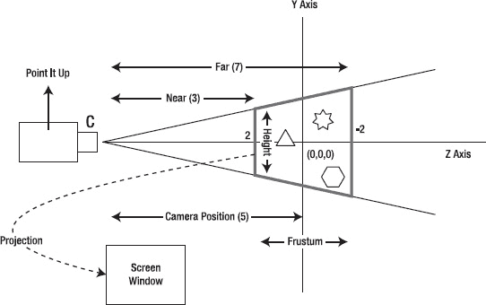

**图 20–1.** *使用相机类比解释 OpenGL 观察概念*

观察 图 20–1，你可能会想，为什么图中的轴是 y 轴和 z 轴，而不是 x 轴和 y 轴。这是因为我们遵循一个惯例：如果你的标准场景平面是 xy 平面，那么 OpenGL 相机是沿着 z 轴向下观察的。这个惯例很合理，因为我们通常将 z 轴视为深度轴。

一旦放置好相机，你便开始向前方或正前方观察，以确定要捕捉场景的哪个部分。你将相机对准你正在观察的方向。这个你正在观察的远点被称为*视点*或*注视点*。这个点的指定实际上是对方向的指定。假设相机位于 `(0,0,5)`，如果你将视点指定为 `(0,0,0)`，那么相机将从距离原点 5 个单位处，沿着 z 轴向原点方向观察。你可以在 图 20–1 中看到这一点，其中相机正沿着 z 轴向下观察。

进一步设想，在原点处有一座矩形建筑。你不想以竖屏方式观察它，而是想以横屏方式观察。你需要做什么？显然，你可以将相机留在相同位置，并仍然指向原点，但现在你需要将相机旋转 90 度（类似于歪头看侧面）。这就是相机的*朝向*，因为相机固定在一个给定的视点，并注视着一个特定的视点或方向。这个朝向被称为*向上向量*。

向上向量只是标识相机的朝向（向上、向下、向左、向右或倾斜）。相机的这种朝向也是通过指定一个点来确定的。想象一条从原点——不是相机原点，而是世界坐标原点——到这个点的连线。这条线在三维空间中与原点形成的角度就是相机的朝向。

例如，相机的向上向量可能是 `(0,1,0)` 甚至是 `(0,15,0)`，两者效果相同。点 `(0,1,0)` 是沿 y 轴远离原点向上的点。这意味着你将相机竖直放置。如果你使用 `(0,-1,0)`，你就会将相机倒置。在这两种情况下，相机仍然在相同的点 `(0,0,5)`，并注视着相同的原点 `(0,0,0)`。你可以将这三个坐标总结如下：

> `(0,0,5)`：视点（相机的位置）
> `(0,0,0)`：注视点（相机指向的方向）
> `(0,1,0)`：向上向量（相机是正放、倒放还是倾斜）

你将使用 `gluLookAt` 方法来指定这三个点——视点、注视点和向上向量，如下所示：

```
gluLookAt(gl, 0,0,5,    0,0,0,   0,1,0);
```

各参数含义如下：第一组坐标属于视点，第二组坐标属于注视点，第三组坐标属于相对于原点的向上向量。

现在，让我们来看一下可视体。


##### glFrustum 与视景体

你可能已经注意到，使用 `gluLookAt` 描述相机位置时，没有任何参数涉及尺寸。它们仅处理位置、方向和朝向。那么，如何告诉相机焦点在哪里？你试图捕捉的物体离相机有多远？物体区域的宽度和高度是多少？你可以使用 OpenGL 方法 `glFrustum` 来指定你感兴趣的场景区域。

想象你自己正坐在剧院里看戏，舞台就是你的视景体。你其实不需要知道舞台之外发生了什么。然而，你确实关心这个舞台的尺寸，因为你希望观察舞台之上或内部发生的一切。

将场景区域想象成一个由盒子界定的空间，也称为*视景体*或*视景体*（即图 20–1 中间由粗边框标出的区域）。盒子内部的任何物体都会被捕捉，而盒子外部的任何物体则会被裁剪并忽略。那么，如何指定这个视景盒子呢？首先，你需要确定*近点*，即相机与盒子前端之间的距离。然后，你可以选择一个*远点*，即相机与盒子后端之间的距离。近点与远点沿 z 轴的距离就是盒子的深度。如果你指定近点为 50，远点为 200，那么你将捕捉到这两点之间的所有物体，盒子的深度将是 150。此外，你还需要指定盒子的左、右、上、下边界，这些边界位于连接相机与观察点的虚拟*射线*上。

在 OpenGL 中，你可以通过两种方式来想象这个盒子。第一种称为*透视投影*，它涉及我们一直在讨论的视景体。这种视图模拟了类似自然相机的功能，采用金字塔结构，其中远平面作为底面，相机作为顶点。近平面截去金字塔的顶部，从而在近平面与远平面之间形成视景体。

另一种想象盒子的方式是将其视为一个立方体。这第二种方案称为*正交投影*，适用于需要保持尺寸不变（无论物体离相机远近）的几何绘图。

代码清单 20–6 展示了如何为我们的示例指定视景体。

**代码清单 20–6.** *通过 `glFrustum` 指定视景体*

```
// 首先计算宽高比
float ratio = (float) w / h;

// 指明我们需要透视投影
glMatrixMode(GL10.GL_PROJECTION);

// 指定视景体：即视景体
gl.glFrustumf(
    -ratio,    // 视景盒子的左侧
    ratio,     // 视景盒子的右侧
    1,         // 视景盒子的顶部
    -1,        // 视景盒子的底部
    3,         // 盒子前端距相机的距离
    7);        // 盒子后端距相机的距离
```

因为在上述代码（代码清单 20–6）中，我们将顶部设置为 `1`、底部设置为 `-1`，所以盒子前端的高度被设为 2 个单位。通过使用比例数值并考虑窗口的宽高比，我们指定了视景体左侧和右侧的尺寸。这也是为什么代码中使用窗口高度和宽度来计算比例的原因。代码还假设动作区域位于 z 轴上的 `3` 到 `7` 个单位之间。任何在相机参考系中绘制在此坐标范围之外的物体将不可见。

由于我们将相机设置在 (0,0,5) 并指向 (0,0,0)，因此从相机朝向原点方向 3 个单位处是 (0,0,2)，7 个单位处是 (0,0,-2)。这使得原点平面恰好位于你的 3D 盒子中央。

至此，我们已经确定了视景体的尺寸。还有另一个重要的 API，它将这些尺寸映射到屏幕上：`glViewport`。

##### glViewport 与屏幕尺寸

`glViewport` 负责指定屏幕上用于投射视景体的矩形区域。该方法接受四个参数来指定矩形框：左下角的 x 和 y 坐标，以及宽度和高度。代码清单 20–7 是一个指定视图作为投影目标的示例。

**代码清单 20–7.** *通过 `glViewPort` 定义视口*

```
glViewport(0,         // 屏幕上矩形的左下角 x 坐标
         0,           // 屏幕上矩形的左下角 y 坐标
          width,      // 屏幕上矩形的宽度
          height);    // 屏幕上矩形的高度
```

如果我们的窗口或视图高度为 100 像素，而视景体高度为 10 个单位，那么世界坐标中每 1 个逻辑单位就对应屏幕坐标中的 10 个像素。

到目前为止，我们已经介绍了 OpenGL 中一些重要的入门概念。理解这些 OpenGL 基础知识对于学习如何编写 Android OpenGL 代码非常有用。有了这些前置知识，接下来我们将讨论如何调用本节中已经学到的 OpenGL ES API。

### 在 Android 中对接 OpenGL ES

如前所述，OpenGL ES 是一个受多个平台支持的标准。其核心是一套类似 C 语言的 API，负责处理所有 OpenGL 绘图任务。然而，每个平台和操作系统在实现显示、屏幕缓冲区等方面都有所不同。这些特定于操作系统的细节留给每个操作系统自行解决并记录。Android 也不例外。

从 1.5 SDK 开始，Android 简化了开始使用 OpenGL 绘图所需的交互和初始化过程。这一支持由 `android.opengl` 包提供。提供大部分此类功能的主要类是 `GLSurfaceView`，它包含一个名为 `GLSurfaceView.Renderer` 的内部接口。掌握这两个实体，足以让你在 Android 平台上深入使用 OpenGL。

#### 使用 GLSurfaceView 及相关类

从 SDK 1.5 开始，使用 OpenGL 的常见模式已经变得相当简单。（请参考本书第一版以了解 Android 1.0 的方法。）以下是使用这些类进行绘图的典型步骤：

1.  实现 `Renderer` 接口。
2.  在渲染器的实现中提供绘图所需的相机设置。
3.  在实现的 `onDrawFrame` 方法中提供绘图代码。
4.  构造一个 `GLSurfaceView` 对象。
5.  在 `GLSurfaceView` 中设置步骤 1 到 3 中实现的渲染器。
6.  向 `GLSurfaceView` 指示是否需要动画。
7.  在 Activity 中将 `GLSurfaceView` 设置为内容视图。你也可以在任何可以使用常规视图的地方使用此视图。

下面，我们从如何实现渲染器接口开始。


#### 实现渲染器

`Renderer` 接口的签名如列表 20-8 所示。

**列表 20-8.** *Renderer 接口*

```
public static interface GLSurfaceView.Renderer
{
   void onDrawFrame(GL10 gl);
   void onSurfaceChanged(GL10 gl, int width, int height);
   void onSurfaceCreated(GL10 gl, EGLConfig config);
}
```

主要的绘制工作发生在 `onDrawFrame()` 方法中。每当为该视图创建新表面时，`onSurfaceCreated()` 方法就会被调用。我们可以调用许多 OpenGL API，如抖动、深度控制或任何其他可以在 `onDrawFrame()` 方法之外立即调用的方法。

同样，当表面发生变化时（例如窗口的宽度和高度），`onSurfaceChanged()` 方法就会被调用。我们可以在这里设置相机和视景体。

即使在 `onDrawFrame()` 方法内部，对于特定的绘制上下文也可能有许多共通之处。我们可以利用这些共通性，将这些方法抽象到另一个抽象层，称为 `AbstractRenderer`，其中只有一个未实现的方法，名为 `draw()`。

列表 20-9 展示了 `AbstractRenderer` 的代码。

**列表 20-9.** *AbstractRenderer*

```
//filename: AbstractRenderer.java
import android.opengl.*;
//…使用 Eclipse 解析其他导入
public abstract class AbstractRenderer
implements android.opengl.GLSurfaceView.Renderer
{
    public void onSurfaceCreated(GL10 gl, EGLConfig eglConfig) {
        gl.glDisable(GL10.GL_DITHER);
        gl.glHint(GL10.GL_PERSPECTIVE_CORRECTION_HINT,
                GL10.GL_FASTEST);
        gl.glClearColor(.5f, .5f, .5f, 1);
        gl.glShadeModel(GL10.GL_SMOOTH);
        gl.glEnable(GL10.GL_DEPTH_TEST);
    }

    public void onSurfaceChanged(GL10 gl, int w, int h) {
        gl.glViewport(0, 0, w, h);
        float ratio = (float) w / h;
        gl.glMatrixMode(GL10.GL_PROJECTION);
        gl.glLoadIdentity();
        gl.glFrustumf(-ratio, ratio, -1, 1, 3, 7);
    }

    public void onDrawFrame(GL10 gl)
    {
        gl.glDisable(GL10.GL_DITHER);
        gl.glClear(GL10.GL_COLOR_BUFFER_BIT | GL10.GL_DEPTH_BUFFER_BIT);
        gl.glMatrixMode(GL10.GL_MODELVIEW);
        gl.glLoadIdentity();
        GLU.gluLookAt(gl, 0, 0, -5, 0f, 0f, 0f, 0f, 1.0f, 0.0f);
        gl.glEnableClientState(GL10.GL_VERTEX_ARRAY);
        draw(gl);
    }
    protected abstract void draw(GL10 gl);
}
```

拥有这个抽象类非常有用，因为它允许我们只专注于绘制方法。我们将使用这个类来创建 `SimpleTriangleRenderer` 类；列表 20-10 展示了源代码。

**列表 20-10.** *SimpleTriangleRenderer*

```
//filename: SimpleTriangleRenderer.java
public class SimpleTriangleRenderer extends AbstractRenderer
{
   //我们要使用的点或顶点数量
    private final static int VERTS = 3;

    //用于存储点坐标的原始本地缓冲区
    private FloatBuffer mFVertexBuffer;

    //用于存储索引的原始本地缓冲区
    //允许重复使用点。
    private ShortBuffer mIndexBuffer;

    public SimpleTriangleRenderer(Context context)
    {
        ByteBuffer vbb = ByteBuffer.allocateDirect(VERTS * 3 * 4);
        vbb.order(ByteOrder.nativeOrder());
        mFVertexBuffer = vbb.asFloatBuffer();

        ByteBuffer ibb = ByteBuffer.allocateDirect(VERTS * 2);
        ibb.order(ByteOrder.nativeOrder());
        mIndexBuffer = ibb.asShortBuffer();

        float[] coords = {
                -0.5f, -0.5f, 0, // (x1,y1,z1)
                 0.5f, -0.5f, 0,
                 0.0f,  0.5f, 0
        };
        for (int i = 0; i < VERTS; i++) {
            for(int j = 0; j < 3; j++) {
                mFVertexBuffer.put(coords[i*3+j]);
            }
        }
        short[] myIndecesArray = {0,1,2};
        for (int i=0;i<3;i++)
        {
           mIndexBuffer.put(myIndecesArray[i]);
        }
        mFVertexBuffer.position(0);
        mIndexBuffer.position(0);
    }

   //重写的方法
    protected void draw(GL10 gl)
    {
       gl.glColor4f(1.0f, 0, 0, 0.5f);
       gl.glVertexPointer(3, GL10.GL_FLOAT, 0, mFVertexBuffer);
        gl.glDrawElements(GL10.GL_TRIANGLES, VERTS,
                GL10.GL_UNSIGNED_SHORT, mIndexBuffer);
    }
}
```

虽然这里的代码看起来很多，但大部分是用来定义顶点，然后将它们从 Java 缓冲区转换为 NIO 缓冲区。除此之外，`draw` 方法只有三行：设置颜色、设置顶点并绘制。

**注意**：尽管我们为 NIO 缓冲区分配了内存，但从未在代码中释放它们。那么谁来释放这些缓冲区呢？这些内存如何影响 OpenGL？

根据我们的研究，`java.nio` 包在 Java 堆之外分配内存空间，这些空间可以被 OpenGL、文件 I/O 等系统直接使用。`nio` 缓冲区实际上是 Java 对象，它们最终指向本地缓冲区。这些 `nio` 对象会被垃圾回收。当它们被垃圾回收时，它们会继续删除本地内存。Java 程序无需做任何特殊操作来释放内存。

然而，除非 Java 堆需要内存，否则 `gc` 不会被触发。这意味着您可能会耗尽本地内存，而 `gc` 可能无法意识到这一点。互联网上有很多关于此主题的示例，其中内存不足异常会触发 `gc`，然后可以查询 `gc` 被调用后是否释放了可用内存。

在通常情况下——这对 OpenGL 很重要——您可以分配本地缓冲区，而无需担心显式释放已分配的内存，因为这项工作由 `gc` 完成。

现在我们有了一个示例渲染器，让我们看看如何将这个渲染器提供给 `GLSurfaceView`，并使其显示在 Activity 中。


### 在 Activity 中使用 GLSurfaceView

清单 20–11 展示了一个典型的 Activity，它配合合适的渲染器使用了 `GLSurfaceView`。

**清单 20–11.** *一个简单的 OpenGLTestHarness Activity*

```java
public class OpenGLTestHarnessActivity extends Activity {
    private GLSurfaceView mTestHarness;
    @Override
    protected void onCreate(Bundle savedInstanceState) {
        super.onCreate(savedInstanceState);
        mTestHarness = new GLSurfaceView(this);
        mTestHarness.setEGLConfigChooser(false);
        mTestHarness.setRenderer(new SimpleTriangleRenderer(this));
        mTestHarness.setRenderMode(GLSurfaceView.RENDERMODE_WHEN_DIRTY);
        //mTestHarness.setRenderMode(GLSurfaceView.RENDERMODE_CONTINUOUSLY);
        setContentView(mTestHarness);
    }
    @Override
    protected void onResume()    {
        super.onResume();
        mTestHarness.onResume();
    }
    @Override
    protected void onPause() {
        super.onPause();
        mTestHarness.onPause();
    }
}
```

我们来解释一下这段源代码的关键要素。以下是实例化 `GLSurfaceView` 的代码：

`mTestHarness = new GLSurfaceView(this);`

然后，我们告诉视图不需要特殊的 EGL 配置选择器，默认配置即可，操作如下：

`mTestHarness.setEGLConfigChooser(false);`

接下来，我们按如下方式设置渲染器：

`mTestHarness.setRenderer(new SimpleTriangleRenderer(this));`

随后，我们使用以下两种方法之一来决定是否启用动画：

`mTestHarness.setRenderMode(GLSurfaceView.RENDERMODE_WHEN_DIRTY);`
`//mTestHarness.setRenderMode(GLSurfaceView.RENDERMODE_CONTINUOUSLY);`

如果我们选择第一行，绘制将仅被调用一次，或者更准确地说，只在需要绘制的时候被调用。如果我们选择第二个选项，绘制代码将被重复调用，以便我们能够对绘制内容进行动画处理。

这就是在 Android 上使用 OpenGL 接口的全部要点。

现在我们已经拥有了测试这个绘制所需的所有组件。我们拥有清单 20–11 中的 Activity，清单 20–9 中的抽象渲染器，以及 `SimpleTriangleRenderer`（清单 20–10）本身。我们所要做的就是通过任意菜单项使用以下代码调用该 Activity 类：

```java
private void invokeSimpleTriangle()
{
      Intent intent = new Intent(this,OpenGLTestHarnessActivity.class);
      startActivity(intent);
}
```

当然，我们还需要在 Android 清单文件中注册该 Activity，如下所示：

```xml
  <activity android:name=".OpenGLTestHarnessActivity"
                  android:label="OpenGL Test Harness"/>
```

虽然设计一个独立的 Activity（如清单 20–11 中的 `OpenGLTestHarnessActivity`）完全合理，但我们想提出一个更适合本章的替代方案。

这种需求源于本章包含多个演示程序。如果为每个演示都设计一个单独的 Activity，最终将会产生大量与清单 20–11 非常相似且没有额外解释的代码。此外，每个 Activity 都需要在清单文件中注册。

考虑到这一点，我们来创建一个统一的 Activity，用于测试所有 OpenGL ES 1.0 演示程序。代码见清单 20–12。与清单 20–11 中的 Activity 相比，它可能看起来内容更多；但是，如果你看看 `R.id.mid_opengl_simpletriangle` 对应的菜单响应代码，就会发现我们实际上在做同样的事情。随着更多菜单选项被实现，我们将会有更多的 `if` 语句，每种演示类型对应一个。

其他菜单选项将在本章后续内容中逐步探讨。在清单 20–12 之后，我们将展示菜单 `.xml` 文件，然后更详细地解释这个多功能 Activity。

**清单 20–12.** *MultiViewTestHarness Activity*

```java
//filename: MultiViewTestHarnessActivity.java
public class MultiViewTestHarnessActivity extends Activity {
    private GLSurfaceView mTestHarness;
    @Override
    protected void onCreate(Bundle savedInstanceState) {
        super.onCreate(savedInstanceState);

        mTestHarness = new GLSurfaceView(this);
        mTestHarness.setEGLConfigChooser(false);

        Intent intent = getIntent();
        int mid = intent.getIntExtra("com.ai.menuid", R.id.mid_OpenGL_Current);
        if (mid == R.id.mid_OpenGL_SimpleTriangle)
        {
            mTestHarness.setRenderer(new SimpleTriangleRenderer(this));
            mTestHarness.setRenderMode(GLSurfaceView.RENDERMODE_WHEN_DIRTY);
            setContentView(mTestHarness);
            return;
        }
        if (mid == R.id.mid_OpenGL_Current)
        {
                //调用某些其他 OpenGL 渲染器
                //并且
                //返回;
        }
        //否则执行此操作
        mTestHarness.setRenderer(new SimpleTriangleRenderer(this));
        mTestHarness.setRenderMode(GLSurfaceView.RENDERMODE_CONTINUOUSLY);
        setContentView(mTestHarness);
        return;
    }
    @Override
    protected void onResume()    {
        super.onResume();
        mTestHarness.onResume();
    }
    @Override
    protected void onPause() {
        super.onPause();
        mTestHarness.onPause();
    }
}
```

清单 20–13 中的菜单文件支持清单 20–12 中的代码。此文件名为 `res/menu/main_menu.xml`。我们已经预先为本章的所有演示程序创建了所有可能的菜单项。

**清单 20–13.** *主菜单文件*

```xml
<menu >
    <!-- 此组使用默认类别。 -->
    <group android:id="@+id/menuGroup_Main">

        <item android:id="@+id/mid_OpenGL_SimpleTriangle"
            android:title="Simple Triangle" />

        <item android:id="@+id/mid_OpenGL_SimpleTriangle2"
            android:title="Two Triangles" />

        <item android:id="@+id/mid_OpenGL_AnimatedTriangle"
            android:title="Animated Triangle" />

        <item android:id="@+id/mid_rectangle"
            android:title="Rectangle" />

        <item android:id="@+id/mid_square_polygon"
            android:title="Square polygon" />

        <item android:id="@+id/mid_polygon"
            android:title="Polygon" />

        <item android:id="@+id/mid_textured_square"
            android:title="Textured Square" />

        <item android:id="@+id/mid_textured_polygon"
            android:title="Textured Polygon" />

        <item android:id="@+id/mid_multiple_figures"
            android:title="Multiple Figures" />

        <item android:id="@+id/mid_OpenGL_Current"
            android:title="Current" />

        <item android:id="@+id/mid_es20_triangle"
            android:title="ES20 Triangle" />
    </group>
</menu>
```

通过查看菜单 `.xml` 文件，我们可以预见到将要演示的 OpenGL 渲染器类型。如果我们回到清单 20–12 中的多视图 Activity，将会注意到该 Activity 根据此菜单 `.xml` 文件中定义的菜单 ID 来切换渲染器。

多视图 Activity 是如何获取菜单 ID 的呢？这是通过以下代码片段（取自清单 20–12）实现的：

```java
Intent intent = getIntent();
int mid = intent.getIntExtra("com.ai.menuid",
                      R.id.mid_OpenGL_Current);
```


这段代码片段会检查调用该 Activity 的 Intent 中是否包含一个名为 `"com.ai.menuid"` 的附加信息。如果该附加信息不存在，则代码应使用 `"mid_opengl_current"` 作为默认菜单 ID。

是谁将这个附加信息放入 Intent 中的？调用方的驱动程序 Activity 在哪里？这个调用方的驱动程序 Activity 如代码清单 20–14 所示。

**代码清单 20–14.** *TestOpenGLMainDriver Activity（测试 OpenGL 主驱动程序 Activity）*

```
public class TestOpenGLMainDriverActivity extends Activity {
    /** 当 Activity 首次创建时调用。 */
    @Override
    public void onCreate(Bundle savedInstanceState) {
        super.onCreate(savedInstanceState);
        setContentView(R.layout.main);
    }
    @Override
    public boolean onCreateOptionsMenu(Menu menu){
        super.onCreateOptionsMenu(menu);
        MenuInflater inflater = getMenuInflater(); //来自 Activity
        inflater.inflate(R.menu.main_menu, menu);
        return true;
    }
    @Override
    public boolean onOptionsItemSelected(MenuItem item)
    {
        this.invokeMultiView(item.getItemId());
        return true;
    }
    private void invokeMultiView(int mid)
    {
        Intent intent =
       new Intent(this,MultiViewTestHarnessActivity.class);
        intent.putExtra("com.ai.menuid", mid);
        startActivity(intent);
    }
}
```

我们需要一个布局文件来完成此 Activity 的编译。该布局文件如代码清单 20–15 所示。

**代码清单 20–15.** *TestOpenGLMainDriver Activity 布局文件 (layout/main.xml)*

```
<?xml version="1.0" encoding="utf-8"?>
<LinearLayout
    android:orientation="vertical"
    android:layout_width="fill_parent"
    android:layout_height="fill_parent"
    >
<TextView  
    android:layout_width="fill_parent"
    android:layout_height="wrap_content"
    android:text="一个简单的主 Activity。点击菜单继续"
    />
</LinearLayout>
```

当然，在 Android 中，没有清单文件一切都无法运行。清单文件如代码清单 20–16 所示。

**代码清单 20–16.** *AndroidManifest 文件*

```
<manifest
      package="com.androidbook.OpenGL"
      android:versionCode="1"
      android:versionName="1.0.0">
    <application android:icon="@drawable/icon"
              android:label="OpenGL 测试工具"
              android:debuggable="true">
        <activity android:name=".TestOpenGLMainDriverActivity"
                  android:label="OpenGL 测试工具">
            <intent-filter>
                <action android:name="android.intent.action.MAIN" />
                <category android:name="android.intent.category.LAUNCHER" />
            </intent-filter>
        </activity>

        <activity android:name="MultiViewTestHarnessActivity"
                  android:label="OpenGL 多视图测试工具"/>
    </application>
    <uses-sdk android:minSdkVersion="3" />
</manifest>
```

总结一下，我们需要以下文件来编译和运行我们的程序：

> `TestOpenGLMainDriverActivity.java` (主驱动程序 Activity; 代码清单 20–14)
> `AbstractRenderer.java` (代码清单 20–9)
> `SimpleTriangleRenderer.java` (代码清单 20–10)
> `MultiViewTestHarnessActivity.java` (代码清单 20–12)
> `res/menu/main_menu.xml` (菜单文件; 代码清单 20–13)
> `layout/main.xml` (布局文件; 代码清单 20–15)

一旦我们编译并运行程序，就会看到驱动程序 Activity 显示出来。我们可以点击菜单查看可用的菜单项，如图 20–2 所示。

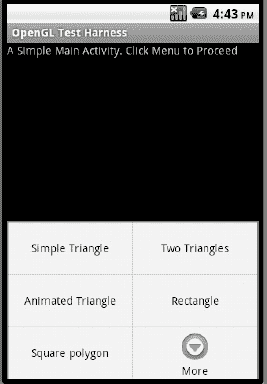

**图 20–2.** *OpenGL 测试工具驱动程序*

现在，如果你点击“简单三角形”菜单项，你将看到如图 20–3 所示的三角形。

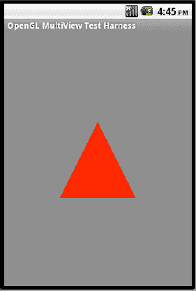

**图 20–3.** *一个简单的 OpenGL 三角形*

### 更改摄像机设置

为了更好地理解 OpenGL 坐标，让我们试验一下与摄像机相关的方法，看看它们如何影响我们在图 20–3 中绘制的三角形。请记住，我们的三角形的顶点坐标为：`(-0.5,-0.5,0  0.5,-0.5,0    0,0.5,0)`。使用这些顶点，结合 `AbstractRenderer`（代码清单 20–9）中使用的以下三个摄像机相关方法，得到了图 20–3 中显示的三角形：

```
//从屏幕前方 5 个单位处看向屏幕（原点）  
GLU.gluLookAt(gl, 0,0,5,    0,0,0,   0,1,0);

//设置高度为 2 个单位，深度为 4 个单位
gl.glFrustumf(-ratio, ratio, -1, 1, 3, 7);

//常规窗口设置
gl.glViewport(0, 0, w, h);
```

现在，假设你将摄像机的朝向向量改为指向负 y 方向，如下所示：

```
GLU.gluLookAt(gl, 0,0,5,    0,0,0,   0,-1,0);
```

如果你这样做，你会看到一个倒置的三角形（图 20–4）。如果你想进行此更改，可以在 `AbstractRenderer.java` 文件（代码清单 20–9）中找到要修改的方法。

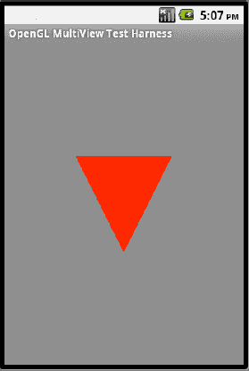

**图 20–4.** *摄像机倒置时的三角形*

现在让我们看看改变视景体（也称为视具体或视见箱）会发生什么。以下代码将视见箱的高度和宽度放大了 4 倍（参见图 20–1 以理解这些维度）。如果你还记得，`glFrustum` 的前四个参数指向视见箱的前端矩形。通过将每个值乘以 4，我们将视见箱放大了四倍，如下所示：

```
gl.glFrustumf(-ratio * 4, ratio * 4, -1 * 4, 1 *4, 3, 7);
```

使用这段代码，我们看到的三角形变缩小了，因为三角形保持相同的单位大小，而我们的视见箱变大了（图 20–5）。此方法调用出现在 `AbstractRenderer.java` 类中（参见代码清单 20–9）。

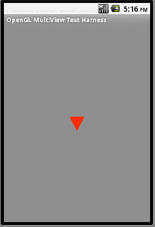

**图 20–5.** *视见箱放大四倍后的三角形*


### 使用索引添加另一个三角形

我们将通过继承`AbstractRenderer`类，并简单地添加一个额外的点并使用索引来创建另一个三角形，以此结束这些简单的三角形示例。从概念上讲，我们将定义四个点为`(-1,-1, 1,-1, 0,1, 1,1)`。然后，我们将要求 OpenGL 将这些点绘制为`(0,1,2 0,2,3)`。代码清单 20–17 展示了执行此操作的代码（请注意，我们更改了三角形的维度）。

**代码清单 20–17.** *SimpleTriangleRenderer2 类*

```java
//filename: SimpleTriangleRenderer2.java
public class SimpleTriangleRenderer2 extends AbstractRenderer
{
    private final static int VERTS = 4;
    private FloatBuffer mFVertexBuffer;
    private ShortBuffer mIndexBuffer;

    public SimpleTriangleRenderer2(Context context)
    {
        ByteBuffer vbb = ByteBuffer.allocateDirect(VERTS * 3 * 4);
        vbb.order(ByteOrder.nativeOrder());
        mFVertexBuffer = vbb.asFloatBuffer();

        ByteBuffer ibb = ByteBuffer.allocateDirect(6 * 2);
        ibb.order(ByteOrder.nativeOrder());
        mIndexBuffer = ibb.asShortBuffer();

        float[] coords = {
                -1.0f, -1.0f, 0, // (x1,y1,z1)
                 1.0f, -1.0f, 0,
                 0.0f,  1.0f, 0,
                 1.0f,  1.0f, 0
        };
        for (int i = 0; i < VERTS; i++) {
            for(int j = 0; j < 3; j++) {
                mFVertexBuffer.put(coords[i*3+j]);
            }
        }
        short[] myIndecesArray = {0,1,2,    0,2,3};
        for (int i=0;i<6;i++)
        {
           mIndexBuffer.put(myIndecesArray[i]);
        }
        mFVertexBuffer.position(0);
        mIndexBuffer.position(0);
    }

    protected void draw(GL10 gl)
    {
       gl.glColor4f(1.0f, 0, 0, 0.5f);
       gl.glVertexPointer(3, GL10.GL_FLOAT, 0, mFVertexBuffer);
       gl.glDrawElements(GL10.GL_TRIANGLES, 6, GL10.GL_UNSIGNED_SHORT,
                                                              mIndexBuffer);
    }
}
```

一旦这个 `SimpleTriangleRenderer2` 类就绪，我们就可以将代码清单 20–18 中的 if 条件代码添加到代码清单 20–12 的 `MultiViewTestHarness` 中。

**代码清单 20–18.** *使用 SimpleTriangleRenderer2*

```java
     if (mid == R.id.mid_OpenGL_SimpleTriangle2)
     {
         mTestHarness.setRenderer(new SimpleTriangleRenderer2(this));
         mTestHarness.setRenderMode(GLSurfaceView.RENDERMODE_WHEN_DIRTY);
         setContentView(mTestHarness);
         return;
     }
```

添加此代码后，我们可以再次运行程序，并选择菜单选项“Two Triangles”来查看绘制出的两个三角形（请参见图 20–6）。请注意，`MultiViewTestHarness` 的设计如何帮助我们免去了创建新 Activity 以及在清单文件中注册该 Activity 的步骤。对于后续的渲染器，我们将继续沿用这种添加额外 if 子句的模式。

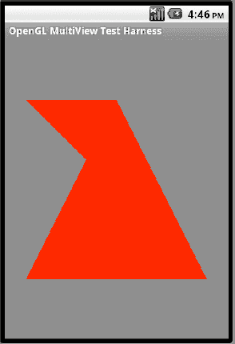

**图 20–6.** *使用四个点绘制两个三角形*

### 为简单 OpenGL 三角形添加动画

我们可以通过更改 `GLSurfaceView` 对象上的渲染模式来轻松实现 OpenGL 动画。代码清单 20–19 展示了示例代码。

**代码清单 20–19.** *指定连续渲染模式*

```java
//get a GLSurfaceView
GLSurfaceView openGLView;

//Set the mode to continuous draw mode
openGLView.setRenderingMode(GLSurfaceView.RENDERMODE_CONTINUOUSLY);
```

请注意，我们在此处展示如何更改渲染模式，因为在上一节中我们指定了 `RENDERMODE_WHEN_DIRTY`（请参见代码清单 20–18）。如前所述，`RENDERMODE_CONTINUOUSLY` 是默认设置，因此默认情况下动画是启用的。

一旦渲染模式为连续模式，就由渲染器的 `onDraw` 方法负责执行影响动画所需的操作。为了演示这一点，我们使用之前示例中绘制的三角形（请参见代码清单 20–10 和图 20–3），并使其沿圆形路径旋转。

#### AnimatedSimpleTriangleRenderer

`AnimatedSimpleTriangleRenderer` 类与 `SimpleTriangleRenderer` 非常相似（请参见代码清单 20–10），区别在于 `onDraw` 方法中的操作。在此方法中，我们每四秒设置一个新的旋转角度。随着图像被重复绘制，我们将看到三角形缓慢旋转。代码清单 20–20 包含了 `AnimatedSimpleTriangleRenderer` 类的完整实现。

**代码清单 20–20.** *AnimatedSimpleTriangleRenderer 源代码*

```java
//filename: AnimatedSimpleTriangleRenderer.java
public class AnimatedSimpleTriangleRenderer extends AbstractRenderer
{
   private int scale = 1;
   //Number of points or vertices we want to use
    private final static int VERTS = 3;

    //A raw native buffer to hold the point coordinates
    private FloatBuffer mFVertexBuffer;

    //A raw native buffer to hold indices
    //allowing a reuse of points.
    private ShortBuffer mIndexBuffer;

    public AnimatedSimpleTriangleRenderer(Context context)
    {
        ByteBuffer vbb = ByteBuffer.allocateDirect(VERTS * 3 * 4);
        vbb.order(ByteOrder.nativeOrder());
        mFVertexBuffer = vbb.asFloatBuffer();

        ByteBuffer ibb = ByteBuffer.allocateDirect(VERTS * 2);
        ibb.order(ByteOrder.nativeOrder());
        mIndexBuffer = ibb.asShortBuffer();

        float[] coords = {
                -0.5f, -0.5f, 0, // (x1,y1,z1)
                 0.5f, -0.5f, 0,
                 0.0f,  0.5f, 0
        };
        for (int i = 0; i < VERTS; i++) {
            for(int j = 0; j < 3; j++) {
                mFVertexBuffer.put(coords[i*3+j]);
            }
        }
        short[] myIndecesArray = {0,1,2};
        for (int i=0;i<3;i++)
        {
           mIndexBuffer.put(myIndecesArray[i]);
        }
        mFVertexBuffer.position(0);
        mIndexBuffer.position(0);
    }

   //overridden method
    protected void draw(GL10 gl)
    {
       long time = SystemClock.uptimeMillis() % 4000L;
       float angle = 0.090f * ((int) time);

       gl.glRotatef(angle, 0, 0, 1.0f);

       gl.glColor4f(1.0f, 0, 0, 0.5f);
       gl.glVertexPointer(3, GL10.GL_FLOAT, 0, mFVertexBuffer);
       gl.glDrawElements(GL10.GL_TRIANGLES, VERTS,
                GL10.GL_UNSIGNED_SHORT, mIndexBuffer);
    }
}
```

一旦这个 `AnimatedSimpleTriangleRenderer` 类就绪，我们就可以将代码清单 20–21 中的 if 条件代码添加到代码清单 20–12 的 `MultiViewTestHarness` 中。

**代码清单 20–21.** *使用 AnimatedSimpleTriangleRenderer*

```java
if (mid == R.id.mid_OpenGL_AnimatedTriangle)
{
       mTestHarness.setRenderer(new AnimatedSimpleTriangleRenderer(this));
       setContentView(mTestHarness);
       return;
}
```

添加此代码后，我们可以再次运行程序，并选择菜单选项“Animated Triangle”来查看图 20–3 中的三角形旋转。


### 勇闯 OpenGL：图形与纹理

在至今展示的示例中，我们都是显式指定三角形的顶点。一旦开始绘制正方形、五边形、六边形等图形，这种方法就会变得很不方便。对于这些图形，我们需要更高级别的对象抽象，例如图形甚至场景图，由图形来决定其坐标。使用这种方法，我们将展示如何在几何空间中的任意位置绘制任意边数的多边形。

在本节中，我们还将介绍 OpenGL 纹理。纹理允许你将位图和其他图片附着到绘图中的表面上。我们将拿已知如何绘制的多边形，并为其贴上一些图片。接着，我们将讨论 OpenGL 中的另一个关键需求：使用 OpenGL 绘制管线绘制多个图形或形状。

这些基础知识应该能让你更进一步，开始创建可用的 3D 图形和场景。

#### 绘制一个矩形

在进入图形的概念之前，我们先通过使用两个三角形绘制一个矩形，来巩固对显式顶点绘制的理解。这也将为将三角形扩展到任意多边形奠定基础。

我们已经具备了理解基本三角形的足够背景知识，以下是绘制矩形的代码（清单 20–22），之后是简要的注释。

**清单 20–22.** *简单矩形渲染器*

```
public class SimpleRectangleRenderer extends AbstractRenderer
{
   //Number of points or vertices we want to use
    private final static int VERTS = 4;

    //A raw native buffer to hold the point coordinates
    private FloatBuffer mFVertexBuffer;

    //A raw native buffer to hold indices
    //allowing a reuse of points.
    private ShortBuffer mIndexBuffer;

    public SimpleRectangleRenderer(Context context)
    {
        ByteBuffer vbb = ByteBuffer.allocateDirect(VERTS * 3 * 4);
        vbb.order(ByteOrder.nativeOrder());
        mFVertexBuffer = vbb.asFloatBuffer();

        ByteBuffer ibb = ByteBuffer.allocateDirect(6 * 2);
        ibb.order(ByteOrder.nativeOrder());
        mIndexBuffer = ibb.asShortBuffer();

        float[] coords = {
                -0.5f, -0.5f, 0, // (x1,y1,z1)
                 0.5f, -0.5f, 0,
                 0.5f,  0.5f, 0,
                -0.5f,  0.5f, 0,
        };

        for (int i = 0; i < VERTS; i++) {
            for(int j = 0; j < 3; j++) {
                mFVertexBuffer.put(coords[i*3+j]);
            }
        }
        short[] myIndecesArray = {0,1,2,0,2,3};
        for (int i=0;i<6;i++)
        {
           mIndexBuffer.put(myIndecesArray[i]);
        }
        mFVertexBuffer.position(0);
        mIndexBuffer.position(0);
    }

   //overriden method
    protected void draw(GL10 gl)
    {
       gl.glColor4f(1.0f, 0, 0, 0.5f);
       gl.glVertexPointer(3, GL10.GL_FLOAT, 0, mFVertexBuffer);
       gl.glDrawElements(GL10.GL_TRIANGLES, 6,
                GL10.GL_UNSIGNED_SHORT, mIndexBuffer);
    }
}
```

请注意，绘制矩形的方法与绘制三角形非常相似。我们指定了四个顶点而不是三个。然后我们使用了如下索引：

```
     short[] myIndecesArray = {0,1,2,0,2,3};
```

我们将编号的顶点（0 到 3）重复使用了两次，这样每三个顶点构成一个三角形。因此 (0,1,2) 构成第一个三角形，(0,2,3) 构成第二个三角形。使用 `GL_TRIANGLES` 图元绘制这两个三角形，就能绘制出所需的矩形。

一旦这个矩形渲染器类就位，我们就可以将 清单 20–23 中的 if 条件代码添加到 清单 20–12 的 `MultiViewTestHarness` 中。

**清单 20–23.** *使用 `SimpleRectangleRenderer`*

```
if (mid == R.id.mid_rectangle)
{
      mTestHarness.setRenderer(new SimpleRectangleRenderer(this));
      mTestHarness.setRenderMode(GLSurfaceView.RENDERMODE_WHEN_DIRTY);
      setContentView(mTestHarness);
      return;
}
```

添加此代码后，我们可以再次运行程序，并选择菜单选项“Rectangle”，即可看到 图 20–7 中的矩形。

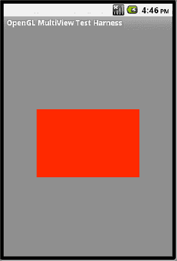

**图 20–7.** *用两个三角形绘制的 OpenGL 矩形*

#### 处理图形

这种显式指定顶点来绘制的方法可能很繁琐。例如，如果你想绘制一个 20 边的多边形，那么你需要指定 20 个顶点，每个顶点最多需要三个值，总共 60 个值。这实在不可行。

##### 作为图形的正多边形

绘制三角形或正方形等图形的更好方法是定义一个抽象多边形，通过定义其某些属性（例如原点和半径），然后让该多边形为我们返回顶点数组和索引数组（以便我们可以绘制各个三角形）。我们将这个类命名为 `RegularPolygon`。一旦我们有了这类对象，就可以像 清单 20–24 所示那样使用它来渲染各种正多边形。

**清单 20–24.** *使用 `RegularPolygon` 对象*

```
      //A polygon with 4 sides and a radious of 0.5
      //and located at (x,y,z) of (0,0,0)
RegularPolygon square = new RegularPolygon(0,0,0,0.5f,4);

      //Let the polygon return the vertices
       mFVertexBuffer = square.getVertexBuffer();

      //Let the polygon return the triangles
       mIndexBuffer = square.getIndexBuffer();

      //you will need this for glDrawElements
      numOfIndices = square.getNumberOfIndices();

      //set the buffers to the start
        this.mFVertexBuffer.position(0);
        this.mIndexBuffer.position(0);

      //set the vertex pointer
        gl.glVertexPointer(3, GL10.GL_FLOAT, 0, mFVertexBuffer);

      //draw it with the given number of Indices
       gl.glDrawElements(GL10.GL_TRIANGLES, numOfIndices,
                GL10.GL_UNSIGNED_SHORT, mIndexBuffer);
```

注意我们是如何从图形 `square` 获取所需顶点和索引的。虽然我们还没有将这种从基本图形获取顶点和索引的思想抽象出来，但 `RegularPolygon` 有可能派生自这样一个定义了基本契约接口的基本图形。清单 20–25 展示了一个示例。

**清单 20–25.** *图形接口*

```
public interface Shape
{
   FloatBuffer            getVertexBuffer();
   ShortBuffer            getIndexBuffer();
   int                    getNumberofIndices();
}
```

我们将这个定义图形基接口的想法留给您作为自己工作时的思考素材。目前，我们已经将这些方法直接构建到了 `RegularPolygon` 中。


好的，作为一名高级文档工程师和翻译员，我将严格按照您提供的注意事项和示例，将给定的英文文本翻译成中文。

---


### 实现 `RegularPolygon` 形状

如前所述，`RegularPolygon` 的职责是返回使用 OpenGL 绘制所需的内容：顶点。首先，我们需要一种机制来定义这个形状是什么以及它在几何体中的位置。

对于一个正多边形，有多种方法可以实现。在我们的方法中，我们使用边数和从正多边形中心到其一个顶点的距离来定义正多边形。我们将这个距离称为半径，因为正多边形的顶点都落在以正多边形中心为圆心的圆周上。因此，这个圆的半径和边数就能确定我们想要的多边形。通过指定中心的坐标，我们也知道了在多边形在几何体中的绘制位置。

`RegularPolygon` 类的职责是，在给定中心和半径的情况下，提供多边形所有顶点的坐标。同样，有多种方法可以实现这一点。无论你选择使用哪种数学方法（基于初中或高中数学），只要你能返回顶点坐标，就是可行的。

在我们的方法中，我们首先假设半径为 1 个单位。我们计算出连接中心到多边形每个顶点的每条线的角度。我们将这些角度保存在一个数组中。对于每个角度，我们计算其在 x 轴上的投影，并将其称为 “x 乘数数组”。（我们使用 “乘数数组”，因为我们是基于单位半径开始的。）当我们知道真实半径时，我们将这些值乘以真实半径，从而得到真实的 `x` 坐标。这些真实的 `x` 坐标随后被存储在一个名为 “x 数组” 的数组中。我们对 y 轴上的投影执行相同的操作。

现在你已经对实现 `RegularPolygon` 需要做什么有了概念，我们将提供解决这些职责的源代码。清单 20–26 一次性展示了 `RegularPolygon` 的所有代码。（请注意，源代码有好几页长。）为了减少阅读的繁琐感，我们在每个函数的开头高亮显示了函数名并提供了内联注释。

我们在 清单 20–26 之后的一个列表中定义了关键函数。这里重要的事情是计算出顶点并返回。如果这太难以理解，那么自己编写代码来获取顶点应该也不难。你还会注意到，这段代码也包含处理纹理的函数。我们将在“使用纹理”部分解释这些纹理函数。

**清单 20–26.** *实现一个 RegularPolygon 形状*

```java
public class RegularPolygon
{
    //用于存储中心 (x,y,z) 坐标的空间: cx,cy,cz
    //以及半径 "r"
    private float       cx, cy, cz, r;
    private int          sides;

    //坐标数组: (x,y) 顶点坐标点
    private float[] xarray = null;
    private float[] yarray = null;

    //纹理数组: (x,y) 也称为 (s,t) 坐标
    //图形将被映射到纹理位图的点
    private float[] sarray = null;
    private float[] tarray = null;

    //**********************************************
    // 构造函数
    //**********************************************
    public RegularPolygon(float incx, float incy, float incz, // (x,y,z) 中心
                      float inr, // 半径
                      int insides) // 边数
    {
        cx = incx;
        cy = incy;
        cz = incz;
        r = inr;
        sides = insides;

        //为数组分配内存      
        xarray = new float[sides];
        yarray = new float[sides];

        //为纹理坐标数组分配内存
        sarray = new float[sides];
        tarray = new float[sides];

        //计算顶点坐标
        calcArrays();

        //计算纹理坐标
        calcTextureArrays();
    }

    //**********************************************
    //根据原点和半径获取并转换顶点坐标。
    //角度的实际逻辑发生在 getMultiplierArray() 函数内部
    //**********************************************
    private void calcArrays()
    {
        //假设半径为 "1" 且位于 "原点" 零，获取顶点坐标
        float[] xmarray = this.getXMultiplierArray();
        float[] ymarray = this.getYMultiplierArray();

        //计算 xarray: 获取顶点
        //通过添加原点的 "x" 分量
        //将坐标乘以半径（缩放）
        for(int i=0;i<sides;i++)
        {
            float curm = xmarray[i];
            float xcoord = cx + r * curm;
            xarray[i] = xcoord;
        }
        this.printArray(xarray, "xarray");

        //计算 yarray: 对 y 坐标做相同处理
        for(int i=0;i<sides;i++)
        {
            float curm = ymarray[i];
            float ycoord = cy + r * curm;
            yarray[i] = ycoord;
        }
        this.printArray(yarray, "yarray");

    }
    //**********************************************
    //计算纹理数组
    //关于非常相似方法的更多讨论，请参见纹理小节
    //在这里，多边形必须映射到一个
    //正方形空间内
    //**********************************************
    private void calcTextureArrays()
    {
        float[] xmarray = this.getXMultiplierArray();
        float[] ymarray = this.getYMultiplierArray();

        //计算 xarray
        for(int i=0;i<sides;i++)
        {
            float curm = xmarray[i];
            float xcoord = 0.5f + 0.5f * curm;
            sarray[i] = xcoord;
        }
        this.printArray(sarray, "sarray");

        //计算 yarray
        for(int i=0;i<sides;i++)
        {
            float curm = ymarray[i];
            float ycoord = 0.5f +  0.5f * curm;
            tarray[i] = ycoord;
        }
        this.printArray(tarray, "tarray");
    }

    //**********************************************
    //将 Java 顶点数组
    //转换为 nio 浮点缓冲区
    //**********************************************
    public FloatBuffer getVertexBuffer()
    {
        int vertices = sides + 1;
        int coordinates = 3;
        int floatsize = 4;
        int spacePerVertex = coordinates * floatsize;

        ByteBuffer vbb = ByteBuffer.allocateDirect(spacePerVertex * vertices);
        vbb.order(ByteOrder.nativeOrder());
        FloatBuffer mFVertexBuffer = vbb.asFloatBuffer();

        //放入第一个坐标 (x,y,z:0,0,0)
        mFVertexBuffer.put(cx); //x
        mFVertexBuffer.put(cy); //y
        mFVertexBuffer.put(0.0f); //z

        int totalPuts = 3;
        for (int i=0;i<sides;i++)
        {
            mFVertexBuffer.put(xarray[i]); //x
            mFVertexBuffer.put(yarray[i]); //y
            mFVertexBuffer.put(0.0f); //z
            totalPuts += 3;
        }
        Log.d("total puts:",Integer.toString(totalPuts));
        return mFVertexBuffer;
    }

    //**********************************************
    //将纹理缓冲区转换为 nio 缓冲区
    //**********************************************
    public FloatBuffer getTextureBuffer()
    {
        int vertices = sides + 1;
        int coordinates = 2;
        int floatsize = 4;
        int spacePerVertex = coordinates * floatsize;

        ByteBuffer vbb = ByteBuffer.allocateDirect(spacePerVertex * vertices);
        vbb.order(ByteOrder.nativeOrder());
        FloatBuffer mFTextureBuffer = vbb.asFloatBuffer();

        //放入第一个坐标 (x,y (s,t):0,0)
        mFTextureBuffer.put(0.5f); //x 或 s
        mFTextureBuffer.put(0.5f); //y 或 t
```


```java
int totalPuts = 2;
for (int i = 0; i < sides; i++) {
    mFTextureBuffer.put(sarray[i]); //x
    mFTextureBuffer.put(tarray[i]); //y
    totalPuts += 2;
}
Log.d("total texture puts:", Integer.toString(totalPuts));
return mFTextureBuffer;
}
```

```java
//**********************************************
//计算构成多个三角形的索引。
//从位于 0 的中心顶点开始
//然后按顺时针方向进行计数，例如：
//0,1,2,  0,2,3, 0,3,4 等等。
//**********************************************
public ShortBuffer getIndexBuffer() {
    short[] iarray = new short[sides * 3];
    ByteBuffer ibb = ByteBuffer.allocateDirect(sides * 3 * 2);
    ibb.order(ByteOrder.nativeOrder());
    ShortBuffer mIndexBuffer = ibb.asShortBuffer();
    for (int i = 0; i < sides; i++) {
        short index1 = 0;
        short index2 = (short)(i + 1);
        short index3 = (short)(i + 2);
        if (index3 == sides + 1) {
            index3 = 1;
        }
        mIndexBuffer.put(index1);
        mIndexBuffer.put(index2);
        mIndexBuffer.put(index3);

        iarray[i * 3 + 0] = index1;
        iarray[i * 3 + 1] = index2;
        iarray[i * 3 + 2] = index3;
    }
    this.printShortArray(iarray, "索引数组");
    return mIndexBuffer;
}
```

```java
//**********************************************
//在这里，你获取每个顶点的角度数组
//并计算其在 x 轴上的投影倍数
//**********************************************
private float[] getXMultiplierArray() {
    float[] angleArray = getAngleArrays();
    float[] xmultiplierArray = new float[sides];
    for (int i = 0; i < angleArray.length; i++) {
        float curAngle = angleArray[i];
        float sinvalue = (float)Math.cos(Math.toRadians(curAngle));
        float absSinValue = Math.abs(sinvalue);
        if (isXPositiveQuadrant(curAngle)) {
            sinvalue = absSinValue;
        } else {
            sinvalue = -absSinValue;
        }
        xmultiplierArray[i] = this.getApproxValue(sinvalue);
    }
    this.printArray(xmultiplierArray, "xmultiplierArray");
    return xmultiplierArray;
}
```

```java
//**********************************************
//在这里，你获取每个顶点的角度数组
//并计算其在 y 轴上的投影倍数
//**********************************************
private float[] getYMultiplierArray() {
    float[] angleArray = getAngleArrays();
    float[] ymultiplierArray = new float[sides];
    for (int i = 0; i < angleArray.length; i++) {
        float curAngle = angleArray[i];
        float sinvalue = (float)Math.sin(Math.toRadians(curAngle));
        float absSinValue = Math.abs(sinvalue);
        if (isYPositiveQuadrant(curAngle)) {
            sinvalue = absSinValue;
        } else {
            sinvalue = -absSinValue;
        }
        ymultiplierArray[i] = this.getApproxValue(sinvalue);
    }
    this.printArray(ymultiplierArray, "ymultiplierArray");
    return ymultiplierArray;
}
```

```java
//**********************************************
//此函数可能不需要
//请自行测试，如果不需要则将其丢弃
//**********************************************
private boolean isXPositiveQuadrant(float angle) {
    if ((0 <= angle) && (angle <= 90))  { return true;    }
    if ((angle < 0) && (angle >= -90))   { return true;    }
    return false;
}
```

```java
//**********************************************
//此函数可能不需要
//请自行测试，如果不需要则将其丢弃
//**********************************************
private boolean isYPositiveQuadrant(float angle) {
    if ((0 <= angle) && (angle <= 90)) { return true; }
    if ((angle < 180) && (angle >= 90)) { return true; }
    return false;
}
```

```java
//**********************************************
//在这里，你计算从中心到每个顶点的
//每条边的角度
//**********************************************
private float[] getAngleArrays() {
    float[] angleArray = new float[sides];
    float commonAngle = 360.0f / sides;
    float halfAngle = commonAngle / 2.0f;
    float firstAngle = 360.0f - (90 + halfAngle);
    angleArray[0] = firstAngle;

    float curAngle = firstAngle;
    for (int i = 1; i < sides; i++) {
        float newAngle = curAngle - commonAngle;
        angleArray[i] = newAngle;
        curAngle = newAngle;
    }
    printArray(angleArray, "angleArray");
    return angleArray;
}
```

```java
//**********************************************
//如果需要，进行一些舍入处理
//**********************************************
private float getApproxValue(float f) {
    return (Math.abs(f) < 0.001) ? 0 : f;
}
```

```java
//**********************************************
//返回给定边数下所需的索引数量
//这是构成多边形所需三角形数量乘以 3 的结果
//恰好三角形的数量与边数相同
//**********************************************
public int getNumberOfIndices() {
    return sides * 3;
}
```

```java
public static void test() {
    RegularPolygon triangle = new RegularPolygon(0, 0, 0, 1, 3);
}
```

```java
private void printArray(float array[], String tag) {
    StringBuilder sb = new StringBuilder(tag);
    for (int i = 0; i < array.length; i++) {
        sb.append(";").append(array[i]);
    }
    Log.d("hh", sb.toString());
}
```

```java
private void printShortArray(short array[], String tag) {
    StringBuilder sb = new StringBuilder(tag);
    for (int i = 0; i < array.length; i++) {
        sb.append(";").append(array[i]);
    }
    Log.d(tag, sb.toString());
}
```

以下是代码中的关键元素：

- **`RegularPolygon` 构造函数**：`RegularPolygon` 的构造函数接收中心坐标、半径和边数作为输入。
- **`getAngleArrays`**：此方法是一个关键方法，负责计算正多边形每条边的角度，前提是该多边形的一条边与 x 轴平行。
- **`getXMultiplierArray` 和 `getYMultiplierArray`**：这些方法从 `getAngleArrays` 获取角度，并将其投影到 x 轴和 y 轴上，以获得相应的坐标，假设边的长度为单位长度。
- **`calcArrays`**：此方法使用 `getXMultiplierArray` 和 `getYMultiplierArray` 获取每个顶点，并对其进行缩放，以匹配指定的半径和指定的原点。在此方法结束时，`RegularPolygon` 将拥有正确的坐标，尽管是以 Java `float` 数组的形式存在。
- **`getVertexBuffer`**：此方法随后获取 Java 浮点坐标数组，并填充基于 NIO 的缓冲区，这些缓冲区是 OpenGL 绘制方法所需要的。
- **`getIndexBuffer`**：此方法获取已收集的顶点，并对它们进行排序，使得每个三角形都将构成最终的多边形。

其他处理纹理的方法遵循非常相似的模式，等我们在下一节解释纹理时会更容易理解。我们还包含了一些打印函数，用于输出数组以便调试。


### 使用 `RegularPolygon` 渲染正方形

现在我们已经了解了基本构建块，让我们看看如何使用四边的 `RegularPolygon` 来绘制一个正方形。列表 20-27 展示了 `SquareRenderer` 的代码。

**列表 20-27.** *SquareRenderer*

```
public class SquareRenderer extends AbstractRenderer
{
    //一个用于保存点坐标的原始本地缓冲区
    private FloatBuffer mFVertexBuffer;

    //一个用于保存索引的原始本地缓冲区
    //允许复用顶点。
    private ShortBuffer mIndexBuffer;

    private int numOfIndices = 0;

    private int sides = 4;

    public SquareRenderer(Context context)
    {
        prepareBuffers(sides);
    }

    private void prepareBuffers(int sides)
    {
        RegularPolygon t = new RegularPolygon(0,0,0,0.5f,sides);
        //RegularPolygon t = new RegularPolygon(1,1,0,1,sides);
        this.mFVertexBuffer = t.getVertexBuffer();
        this.mIndexBuffer = t.getIndexBuffer();
        this.numOfIndices = t.getNumberOfIndices();
        this.mFVertexBuffer.position(0);
        this.mIndexBuffer.position(0);
    }

   //重写的方法
    protected void draw(GL10 gl)
    {
        prepareBuffers(sides);
       gl.glVertexPointer(3, GL10.GL_FLOAT, 0, mFVertexBuffer);
       gl.glDrawElements(GL10.GL_TRIANGLES, this.numOfIndices,
                GL10.GL_UNSIGNED_SHORT, mIndexBuffer);
    }
}
```

这段代码应该相当清晰。我们继承自 `AbstractRenderer`（参见列表 20-9），重写了 `draw` 方法，并使用 `RegularPolygon` 绘制出了一个正方形。

一旦这个正方形渲染器类就绪，我们可以将列表 20-28 中的条件判断代码添加到列表 20-12 的 `MultiViewTestHarness` 中。

**列表 20-28.** *使用 `SimpleRectangleRenderer`*

```
if (mid == R.id.mid_square_polygon)
{
     mTestHarness.setRenderer(new SquareRenderer(this));
     mTestHarness.setRenderMode(GLSurfaceView.RENDERMODE_WHEN_DIRTY);
     setContentView(mTestHarness);
     return;
}
```

添加这段代码后，我们可以再次运行程序，并选择“Square Polygon”菜单选项，即可在图 20-8 中看到这个正方形。

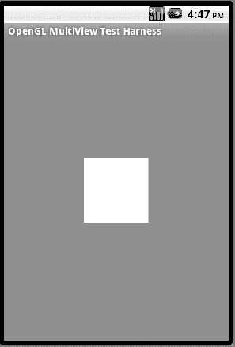

**图 20-8.** *一个绘制为正多边形的正方形*

### 为 `RegularPolygon` 添加动画

现在我们已经探索了通过 `RegularPolygon` 通用绘制形状的基本概念，让我们更进一步。我们看看能否使用一个动画，从一个三角形开始，通过使用一个边数约每四秒增加一次的多边形，最终变成一个圆形。相关代码见列表 20-29。

**列表 20-29.** *`PolygonRenderer`*

```
public class PolygonRenderer extends AbstractRenderer
{
   //我们想要使用的点或顶点数量
    private final static int VERTS = 4;

    //一个用于保存点坐标的原始本地缓冲区
    private FloatBuffer mFVertexBuffer;

    //一个用于保存索引的原始本地缓冲区
    //允许复用顶点。
    private ShortBuffer mIndexBuffer;

    private int numOfIndices = 0;

    private long prevtime = SystemClock.uptimeMillis();

    private int sides = 3;

    public PolygonRenderer(Context context)
    {
prepareBuffers(sides);
    }

    private void prepareBuffers(int sides)
    {
         RegularPolygon t = new RegularPolygon(0,0,0,1,sides);
this.mFVertexBuffer = t.getVertexBuffer();
        this.mIndexBuffer = t.getIndexBuffer();
        this.numOfIndices = t.getNumberOfIndices();
        this.mFVertexBuffer.position(0);
        this.mIndexBuffer.position(0);
    }

   //重写的方法
    protected void draw(GL10 gl)
    {
        long curtime = SystemClock.uptimeMillis();
        if ((curtime - prevtime) > 2000)
        {
           prevtime = curtime;
           sides += 1;
           if (sides > 20)
           {
              sides = 3;
           }
            this.prepareBuffers(sides);
        }
gl.glColor4f(1.0f, 0, 0, 0.5f);
       gl.glVertexPointer(3, GL10.GL_FLOAT, 0, mFVertexBuffer);
       gl.glDrawElements(GL10.GL_TRIANGLES, this.numOfIndices,
                GL10.GL_UNSIGNED_SHORT, mIndexBuffer);
    }
}
```

这段代码所做的就是每四秒改变一次 `sides` 变量。动画效果源于 `Renderer` 注册到 SurfaceView 的方式。

一旦我们有了这个渲染器，就需要将列表 20-30 中的代码添加到 `MultiviewTestHarness` 代码中。

**列表 20-30.** *用于测试多边形的菜单项*

```
if (mid == R.id.mid_polygon)
{
      mTestHarness.setRenderer(new PolygonRenderer(this));
      setContentView(mTestHarness);
      return;
}
```

如果我们再次运行程序并选择“Polygon”菜单项，我们将看到一组不断变换的多边形，其边数持续增加。观察多边形随时间的变化过程很有启发意义。图 20-9 显示了一个循环开始阶段的六边形。

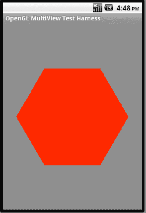

**图 20-9.** *多边形绘制循环开始时的六边形*

图 20-10 显示了循环结束阶段的情况。

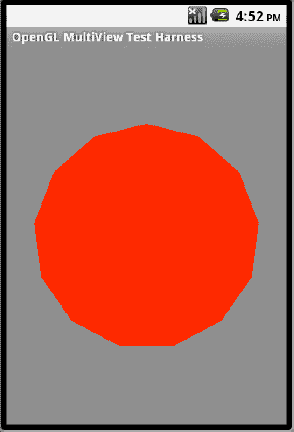

**图 20-10.** *一个绘制为正多边形的圆形*

你可以将这种抽象形状的概念扩展到更复杂的形状，甚至扩展到场景图，场景图由许多通过某种 XML 定义的其他对象组成，然后通过这些实例化对象在 OpenGL 中渲染它们。

现在，让我们继续讨论纹理，看看如何将粘贴壁纸的概念集成到我们迄今为止绘制的表面（例如正方形和多边形）上。

## 纹理操作

纹理是 OpenGL 中的另一个核心主题。OpenGL 纹理有许多细微之处。本章仅介绍基础知识，以便你能够开始使用 OpenGL 纹理。请利用本章末尾提供的资源进一步深入研究纹理。

### 理解纹理

OpenGL 纹理是一种贴附在 OpenGL 表面上的位图。（在本章中，我们只介绍表面。）例如，你可以拿一张邮票的图像，将其粘贴到一个正方形上，使该正方形看起来像一张邮票。或者，你可以拿一块砖的位图，将其粘贴到一个矩形上并重复砖块图像，使该矩形看起来像一堵砖墙。

将纹理位图附加到 OpenGL 表面的过程，类似于将一块壁纸（正方形形状）粘贴到规则或不规则形状物体侧面的过程。只要选择的壁纸足够大能够覆盖表面，表面的形状并不重要。

然而，为了对齐壁纸使图像正确排列，你必须获取形状的每个顶点，并在壁纸上精确标记该顶点，以便壁纸和物体形状完全同步。如果形状奇特且有多个顶点，每个顶点也需要在你的壁纸上标记。

另一种看待这个问题的方式是，想象你将物体面朝上放在地上，将壁纸放在它上面，然后旋转壁纸，直到图像对准正确的方向。现在在形状的每个顶点处刺穿壁纸。取下壁纸，查看孔洞的位置，并假设壁纸已校准，记下它们在壁纸上的坐标。这些坐标被称为*纹理坐标*。


### 标准化纹理坐标

一个未解决或未提及的细节是物体和纸张的尺寸。OpenGL 采用标准化方法来解决这个问题。OpenGL 假设纸张始终是一个`1 × 1`的正方形，其原点位于`(0,0)`，右上角位于`(1,1)`。然后 OpenGL 要求你将物体表面缩小，使其适合这个`1 × 1`的边界。因此，程序员需要计算出物体表面在`1 × 1`正方形内的顶点坐标。

在设计清单 20–26 中的`RegularPolygon`时，我们使用类似的方法绘制了一个多边形，假设它是一个半径为 1 个单位的圆。然后我们计算出每个顶点的位置。如果我们假设这个圆位于一个`1 × 1`的正方形内，那么那个正方形就可以作为我们的纸。因此，计算纹理坐标与计算多边形顶点坐标非常相似。这就是为什么清单 20–26 中包含了以下用于计算纹理坐标的函数：

`calcTextureArray()`
`getTextureBuffer()`

如果你留意到，`calcTextureArrays`和`calcArrays`方法中的其他所有函数都是通用的。在学习 OpenGL 时，顶点坐标和纹理坐标之间的这种共通性值得注意。

### 抽象通用纹理处理

一旦你理解了纹理坐标与顶点坐标之间的映射关系，并能计算出纹理贴图的坐标，剩下的就很简单了（在 OpenGL 中，没有什么是可以大胆地说“非常简单”的！）。后续工作包括将纹理位图加载到内存中，并为其分配一个纹理 ID，以便以后可以重用该纹理。然后，为了允许同时加载多个纹理，我们需要一种通过指定 ID 来设置当前纹理的机制。在绘制管线中，你需要将纹理坐标与绘制坐标一起指定，然后进行绘制。

由于加载纹理的过程相当通用，我们通过创建一个继承自`AbstractRenderer`的抽象类`SingleAbstractTextureRenderer`来抽象这个过程。

清单 20–31 显示了为单个纹理抽象所有设置代码的源代码。

**清单 20–31.** *抽象化单纹理支持*

```java
public abstract class AbstractSingleTexturedRenderer
extends AbstractRenderer
{
   int mTextureID;
   int mImageResourceId;
   Context mContext;
   public AbstractSingleTexturedRenderer(Context ctx,
                                        int imageResourceId) {
      mImageResourceId = imageResourceId;
      mContext = ctx;
   }

    public void onSurfaceCreated(GL10 gl, EGLConfig eglConfig) {
        super.onSurfaceCreated(gl, eglConfig);
        gl.glEnable(GL10.GL_TEXTURE_2D);
        prepareTexture(gl);
    }
    private void prepareTexture(GL10 gl)
    {
        int[] textures = new int[1];
        gl.glGenTextures(1, textures, 0);

        mTextureID = textures[0];
        gl.glBindTexture(GL10.GL_TEXTURE_2D, mTextureID);

        gl.glTexParameterf(GL10.GL_TEXTURE_2D, GL10.GL_TEXTURE_MIN_FILTER,
                GL10.GL_NEAREST);
        gl.glTexParameterf(GL10.GL_TEXTURE_2D,
                GL10.GL_TEXTURE_MAG_FILTER,
                GL10.GL_LINEAR);

        gl.glTexParameterf(GL10.GL_TEXTURE_2D, GL10.GL_TEXTURE_WRAP_S,
                GL10.GL_CLAMP_TO_EDGE);
        gl.glTexParameterf(GL10.GL_TEXTURE_2D, GL10.GL_TEXTURE_WRAP_T,
                GL10.GL_CLAMP_TO_EDGE);

        gl.glTexEnvf(GL10.GL_TEXTURE_ENV, GL10.GL_TEXTURE_ENV_MODE,
                GL10.GL_REPLACE);

        InputStream is = mContext.getResources()
                .openRawResource(this.mImageResourceId);
        Bitmap bitmap;
        try {
            bitmap = BitmapFactory.decodeStream(is);
        } finally {
            try {
                is.close();
            } catch(IOException e) {
                // 忽略。
            }
        }

        GLUtils.texImage2D(GL10.GL_TEXTURE_2D, 0, bitmap, 0);
        bitmap.recycle();
    }

    public void onDrawFrame(GL10 gl)
    {
        gl.glDisable(GL10.GL_DITHER);
        gl.glTexEnvx(GL10.GL_TEXTURE_ENV, GL10.GL_TEXTURE_ENV_MODE,
                GL10.GL_MODULATE);

        gl.glClear(GL10.GL_COLOR_BUFFER_BIT | GL10.GL_DEPTH_BUFFER_BIT);
        gl.glMatrixMode(GL10.GL_MODELVIEW);
        gl.glLoadIdentity();
        GLU.gluLookAt(gl, 0, 0, -5, 0f, 0f, 0f, 0f, 1.0f, 0.0f);

        gl.glEnableClientState(GL10.GL_VERTEX_ARRAY);

        gl.glEnableClientState(GL10.GL_TEXTURE_COORD_ARRAY);

        gl.glActiveTexture(GL10.GL_TEXTURE0);
        gl.glBindTexture(GL10.GL_TEXTURE_2D, mTextureID);
        gl.glTexParameterx(GL10.GL_TEXTURE_2D, GL10.GL_TEXTURE_WRAP_S,
                GL10.GL_REPEAT);
        gl.glTexParameterx(GL10.GL_TEXTURE_2D, GL10.GL_TEXTURE_WRAP_T,
                GL10.GL_REPEAT);

        draw(gl);
    }
}
```

在这段代码中，单个纹理（位图）在`onSurfaceCreated`方法中被加载和准备。`onDrawFrame`中的代码，就像`AbstractRenderer`一样，设置了绘制空间的尺寸，以确保我们的坐标有意义。你可以根据自己的情况修改这段代码，以找出最优的观察体积。

请注意，构造函数接收一个纹理位图，并将其准备好以供后续使用。根据你拥有多少个纹理，你可以相应地设计你的抽象类。

如清单 20–31 所示，需要以下与纹理相关的 API：

> *`glGenTextures`*: 这个 OpenGL 方法负责为纹理生成唯一的 ID，以便以后可以引用这些纹理。一旦我们通过`GLUtils.texImage2D`加载了纹理位图，我们就会将该纹理绑定到一个特定的 ID。在纹理被绑定到由`glGenTextures`生成的 ID 之前，该 ID 仅仅是一个 ID。OpenGL 文献将这些整数 ID 称为*纹理名称*。
> 
> *`glBindTexture`*: 我们使用这个 OpenGL 方法将当前加载的纹理绑定到从`glGenTextures`获取的纹理 ID 上。
> 
> *`glTexParameter`*: 在应用纹理时，我们可以设置许多可选参数。这个 API 允许我们定义这些选项。一些示例包括`GL_REPEAT`、`GL_CLAMP`等。例如，`GL_REPEAT`允许我们在物体尺寸较大时多次重复该位图。这些参数的完整列表可以在[`www.khronos.org/opengles/documentation/opengles1_0/html/glTexParameter.html`](http://www.khronos.org/opengles/documentation/opengles1_0/html/glTexParameter.html)找到。
> 
> *`glTexEnv`*: 其他一些与纹理相关的选项通过`glTexEnv`方法指定。一些示例值包括`GL_DECAL`、`GL_MODULATE`、`GL_BLEND`、`GL_REPLACE`等。例如，在`GL_DECAL`的情况下，纹理覆盖底层对象。`GL_MODULATE`，顾名思义，调制而不是替换底层颜色。请参考以下 URL 获取此 API 选项的完整列表：[`www.khronos.org/opengles/documentation/opengles1_0/html/glTexEnv.html`](http://www.khronos.org/opengles/documentation/opengles1_0/html/glTexEnv.html)。
> 
> *`GLUtils.texImage2D`*: 这是一个 Android API，允许我们加载位图以用于纹理目的。在内部，此 API 会调用 OpenGL 的`glTexImage2D`。
> 
> *`glActiveTexture`*: 这将给定的纹理 ID 设置为活动结构。
> 
> *`glTexCoordpointer`*: 这个 OpenGL 方法用于指定纹理坐标。每个坐标必须与`glVertexPointer`中指定的坐标匹配。

你可以从 OpenGL ES 参考文档中查阅大多数这些 API，该文档位于：

`www.khronos.org/opengles/documentation/opengles1_0/html/index.html`


### 使用纹理进行绘制

一旦位图被加载并设置为纹理，我们就应该能够利用 `RegularPolygon`，并使用纹理坐标和顶点坐标来绘制一个带纹理的正多边形。清单 20–32 展示了实际的绘制类，用于绘制一个带纹理的正方形。

**清单 20–32.** *TexturedSquareRenderer*

```
public class TexturedSquareRenderer extends AbstractSingleTexturedRenderer
{
   //Number of points or vertices we want to use
    private final static int VERTS = 4;

    //A raw native buffer to hold the point coordinates
    private FloatBuffer mFVertexBuffer;

    //A raw native buffer to hold the point coordinates
    private FloatBuffer mFTextureBuffer;

    //A raw native buffer to hold indices
    //allowing a reuse of points.
    private ShortBuffer mIndexBuffer;

    private int numOfIndices = 0;

    private int sides = 4;

    public TexturedSquareRenderer(Context context)
    {
       super(context,com.androidbook.OpenGL.R.drawable.robot);
       prepareBuffers(sides);
    }

    private void prepareBuffers(int sides)
    {
       RegularPolygon t = new RegularPolygon(0,0,0,0.5f,sides);
       this.mFVertexBuffer = t.getVertexBuffer();
       this.mFTextureBuffer = t.getTextureBuffer();
       this.mIndexBuffer = t.getIndexBuffer();
       this.numOfIndices = t.getNumberOfIndices();
       this.mFVertexBuffer.position(0);
       this.mIndexBuffer.position(0);
       this.mFTextureBuffer.position(0);

    }

   //overriden method
    protected void draw(GL10 gl)
    {
        prepareBuffers(sides);
        gl.glEnable(GL10.GL_TEXTURE_2D);
        gl.glVertexPointer(3, GL10.GL_FLOAT, 0, mFVertexBuffer);
        gl.glTexCoordPointer(2, GL10.GL_FLOAT, 0, mFTextureBuffer);
        gl.glDrawElements(GL10.GL_TRIANGLES, this.numOfIndices,
                GL10.GL_UNSIGNED_SHORT, mIndexBuffer);
    }
}
```

如你所见，大部分繁重的工作都由抽象的纹理渲染器类和 `RegularPolygon` 完成，后者负责计算纹理映射顶点（参见清单 20–26）。

一旦我们有了这个渲染器，就需要将清单 20–33 中的代码添加到清单 20–12 的 `MultiviewTestHarness`中，以测试带纹理的正方形。

**清单 20–33.** *响应带纹理正方形的菜单项*

```
if (mid == R.id.mid_textured_square)
{
      mTestHarness.setRenderer(new TexturedSquareRenderer(this));
      mTestHarness.setRenderMode(GLSurfaceView.RENDERMODE_WHEN_DIRTY);
      setContentView(mTestHarness);
      return;
}
```

现在，如果我们再次运行程序并选择“带纹理的正方形”菜单项，将会看到绘制出的带纹理的正方形，如图 Figure 20–11 所示。


**图 20–11.** *带纹理的正方形*

## 绘制多个图形

到目前为止，本章中的每个示例都涉及按照标准模式绘制一个简单图形。该模式是：设置顶点、加载纹理、设置纹理坐标，然后绘制单个图形。如果我们想绘制两个图形，会发生什么？如果我们想使用传统的指定顶点的方法绘制一个三角形，然后使用诸如 `RegularPolygon` 等形状绘制一个多边形，该如何处理？我们如何指定组合顶点？我们是否需要为两个对象一次性指定顶点，然后调用绘制方法？

事实证明，在 Android OpenGL 渲染器接口的两次 `draw()` 调用之间，OpenGL 允许我们执行多次 `glDraw` 方法。在这多次 `glDraw` 方法之间，我们可以设置新的顶点和纹理。一旦 `draw()` 方法完成，所有这些绘制方法便会显示到屏幕上。

还有另一个技巧可用于使用 OpenGL 绘制多个图形。考虑我们迄今创建的多边形。这些多边形能够通过将原点作为输入，在任何原点处渲染自身。事实证明，OpenGL 原生支持此功能，它允许我们始终在 `(0,0,0)` 处指定一个 `RegularPolygon`，然后通过 OpenGL 的“平移”机制将其从原点移动到所需位置。我们可以对另一个多边形重复相同的操作，并将其平移到不同位置，从而在屏幕上的两个不同位置绘制两个多边形。

清单 20–34 通过多次绘制带纹理的多边形来演示这些概念。

**清单 20–34.** *带纹理的多边形渲染器*

```
public class TexturedPolygonRenderer extends AbstractSingleTexturedRenderer
{
   //Number of points or vertices we want to use
    private final static int VERTS = 4;

    //A raw native buffer to hold the point coordinates
    private FloatBuffer mFVertexBuffer;

    //A raw native buffer to hold the point coordinates
    private FloatBuffer mFTextureBuffer;

    //A raw native buffer to hold indices
    //allowing a reuse of points.
    private ShortBuffer mIndexBuffer;

    private int numOfIndices = 0;

    private long prevtime = SystemClock.uptimeMillis();
   private int sides = 3;

    public TexturedPolygonRenderer(Context context)
    {
       super(context,com.androidbook.OpenGL.R.drawable.robot);
prepareBuffers(sides);
    }

    private void prepareBuffers(int sides)
    {
    RegularPolygon t = new RegularPolygon(0,0,0,0.5f,sides);
this.mFVertexBuffer = t.getVertexBuffer();
    this.mFTextureBuffer = t.getTextureBuffer();
    this.mIndexBuffer = t.getIndexBuffer();
    this.numOfIndices = t.getNumberOfIndices();
    this.mFVertexBuffer.position(0);
    this.mIndexBuffer.position(0);
    this.mFTextureBuffer.position(0);
    }

   //overriden method
    protected void draw(GL10 gl)
    {
        long curtime = SystemClock.uptimeMillis();
        if ((curtime - prevtime) > 2000)
        {
           prevtime = curtime;
           sides += 1;
           if (sides > 20)
           {
              sides = 3;
           }
            this.prepareBuffers(sides);
        }
        gl.glEnable(GL10.GL_TEXTURE_2D);

        //Draw once to the left
        gl.glVertexPointer(3, GL10.GL_FLOAT, 0, mFVertexBuffer);
        gl.glTexCoordPointer(2, GL10.GL_FLOAT, 0, mFTextureBuffer);

        gl.glPushMatrix();
        gl.glScalef(0.5f, 0.5f, 1.0f);
        gl.glTranslatef(0.5f,0, 0);
        gl.glDrawElements(GL10.GL_TRIANGLES, this.numOfIndices,
                GL10.GL_UNSIGNED_SHORT, mIndexBuffer);

        //Draw again to the right
        gl.glPopMatrix();
        gl.glPushMatrix();
        gl.glScalef(0.5f, 0.5f, 1.0f);
        gl.glTranslatef(-0.5f,0, 0);
        gl.glDrawElements(GL10.GL_TRIANGLES, this.numOfIndices,
                GL10.GL_UNSIGNED_SHORT, mIndexBuffer);
        gl.glPopMatrix();
    }
}
```


本示例演示了以下概念：

> 使用形状进行绘制。
> 
> 使用变换矩阵绘制多个形状。
> 
> 提供纹理。
> 
> 提供动画。

清单 20–34 中负责多次绘制的核心代码位于 `draw()` 方法内。我们已在方法中高亮显示了相关行。请注意，在一次 `draw()` 调用中，我们调用了两次 `glDrawElements`。每次调用都独立于另一次设置绘制图元。

另需说明一点，即变换矩阵的使用。每次调用 `glDrawElements()` 时，都会使用一个特定的变换矩阵。若想通过修改此矩阵来改变图形的位置（或图形的任何其他属性），则需要将其恢复为原始矩阵，以便下一次绘制能够正确进行。这一操作通过 OpenGL 矩阵提供的压栈和出栈函数实现。

准备好此渲染器后，需要将清单 20–35 中的代码添加到清单 20–12 的 `MultiviewTestHarness` 中，以测试多图形的绘制。

**清单 20–35.** *响应“多图”菜单项*

```
if (mid == R.id.mid_multiple_figures)
{
      mTestHarness.setRenderer(new TexturedPolygonRenderer(this));
      mTestHarness.setRenderMode(GLSurfaceView.RENDERMODE_CONTINUOUSLY);
      setContentView(mTestHarness);
      return;
}
```

若再次运行程序并选择“Multiple Figures”菜单项，则会在动画开始时看到两组变化的多边形被绘制出来（如图 20–12 所示）。（请注意，我们将渲染模式设置为了持续模式。）

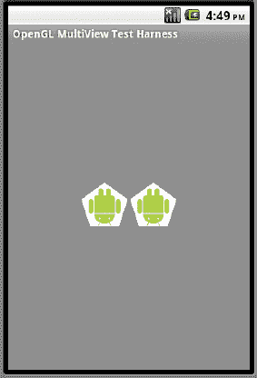

**图 20–12.** *一对带纹理的多边形*

图 20–13 展示了动画进行到中间阶段时的相同效果。

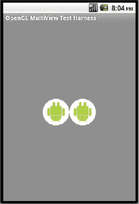

**图 20–13.** *一对带纹理的圆形*

这总结了 OpenGL 中另一个重要概念。本节展示了如何累积多个不同的图形或场景，并协同绘制它们，从而使最终结果构成一个相当复杂的 OpenGL 场景。

接下来，我们将讨论 Android 对 OpenGL ES 2.0 的支持。

### OpenGL ES 2.0

好消息是，Android 不仅支持 OpenGL ES 2.0，而且从 Android 2.2（或 API 级别 8）开始，还为此 API 提供了 Java 绑定。但是，请记住以下限制：

> OpenGL ES 2.0 在模拟器上尚不被支持。
> 
> 对于初学者来说，OpenGL ES 2.0 差异巨大，而且大多数 OpenGL 书籍正在出版新版本来涵盖 OpenGL 的这一方面。OpenGL ES 2.0 对 GPU（图形处理单元）提出的可编程性要求给模拟器带来了很多复杂性。因此，甚至不清楚 Android 何时才能在模拟器上支持 OpenGL ES 2.0。
> 
> 在 Android SDK 上测试/学习 OpenGL ES 2.0 的唯一方法是使用真实设备。大多数设备正在升级到 Android 2.2 的过程中。但是，很可能存在一些设备不支持 OpenGL ES 2.0。

OpenGL ES 2.0 与 OpenGL ES 1.x 截然不同。它不向后兼容。对于初学者来说，最大的不同在于其初始化以及学习如何绘制最简单图形的方式。

要深入讲解 OpenGL ES 2.0 需要很大篇幅。相反，我们将为您介绍开始使用 ES 2.0 所需的基本初始化步骤。一旦您具备了此基本框架，就可以参考本章末尾的参考资料，将 OpenGL ES 2.0 应用到该框架中。

OpenGL ES 2.0 的强大之处在于能够为 GPU 编写程序，这些程序在运行时编译并解释如何绘制顶点和片段。这些程序被称为着色器。不幸的是，即使是最简单的 OpenGL ES 2.0 程序，也需要这些着色器。从这个意义上说，理解着色器是学习 OpenGL ES 2.0 的必要条件。

学习 OpenGL 着色语言是学习 OpenGL ES 2.0 的必要条件。我们在本章末尾提供了一些参考资料来帮助您。

#### OpenGL ES 2.0 的 Java 绑定

Android 上此 API 的 Java 绑定位于 `android.opengl.GLES20` 包中。该类的所有函数都是静态的，并且对应于 Khronos 规范中各自的 C API（URL 可在参考资料部分找到）。本书中为 OpenGL ES 1.0 引入的 `GLSurfaceView` 和相应的 `Renderer` 抽象也同样适用于 OpenGL ES 2.0。我们很快会介绍这一点。关于这方面的文档，请参见 `GLSurfaceView.setEGLContextClientVersion` 函数的 API 文档。

首先，让我们看看如何通过清单 20–36 中的代码来判断设备或模拟器是否支持 OpenGL ES 2.0 这一版本。

**清单 20–36.** *检测 OpenGL ES 2.0 可用性*

```
private boolean detectOpenGLES20() {
       ActivityManager am =
           (ActivityManager) getSystemService(Context.ACTIVITY_SERVICE);
       ConfigurationInfo info = am.getDeviceConfigurationInfo();
       return (info.reqGlEsVersion >= 0x20000);
}
```

拥有此函数（`detectOpenGLES20`）后，就可以在 Activity 中使用 `GLSurfaceView`，如清单 20–37 所示。

**清单 20–37.** *为 OpenGL ES 2.0 使用 GLSurfaceView*

```
        if (detectOpenGLES20())
        {
            GLSurfaceView glView = new GLSurfaceView(this);
            // glView.setEGLConfigChooser(false);
            glView.setEGLContextClientVersion(2);

            glView.setRenderer(new YourGLES20Renderer(this));
            glView.setRenderMode(GLSurfaceView.RENDERMODE_WHEN_DIRTY);
            setContentView(glView);
        }
```

请注意如何通过将客户端版本设置为“2”来配置 `GLSurfaceView` 以使用 OpenGL ES 2.0。然后，类 `YourGLESRenderer` 将类似于本章介绍的 `Renderer` 类。但是，在渲染器类的内部，您将使用 `GLES20` API 而不是 `GL10` API。

在我们即将开发的示例中，此渲染器类被称为 `ES20SimpleTriangleRenderer`。我们很快就会介绍此类。但首先，让我们看一下清单 20–38 中的 Activity 类，它结合了清单 20–36 和清单 20–37 中的代码片段。

**清单 20–38.** *OpenGL20MultiViewTestHarness Activity*

```
public class OpenGL20MultiViewTestHarnessActivity extends Activity
{
   final String tag="es20";
   private GLSurfaceView mTestHarness;
    @Override
    protected void onCreate(Bundle savedInstanceState) {
        super.onCreate(savedInstanceState);

        if (detectOpenGLES20())
        {
            mTestHarness = new GLSurfaceView(this);
            //不要调用以下函数
            //mTestHarness.setEGLConfigChooser(false);
            mTestHarness.setEGLContextClientVersion(2);
        }
        else
        {
            throw new RuntimeException("20 not supported");
        }
```


```java
Intent intent = getIntent();
int mid = intent.getIntExtra("com.ai.menuid", R.id.MenuId_OpenGL15_Current);
if (mid == R.id.mid_es20_triangle)
{
    mTestHarness.setRenderer(new ES20SimpleTriangleRenderer(this));
    mTestHarness.setRenderMode(GLSurfaceView.RENDERMODE_WHEN_DIRTY);
    setContentView(mTestHarness);
    return;
}
return;
}
private boolean detectOpenGLES20() {
    ActivityManager am =
        (ActivityManager) getSystemService(Context.ACTIVITY_SERVICE);
    ConfigurationInfo info = am.getDeviceConfigurationInfo();
    return (info.reqGlEsVersion >= 0x20000);
}
@Override
protected void onResume()    {
    super.onResume();
    mTestHarness.onResume();
}
@Override
protected void onPause() {
    super.onPause();
    mTestHarness.onPause();
}
```

清单 20-38 中的 ES 2.0 测试框架 Activity 与我们之前在清单 20-12 中展示的 ES 1.x 测试框架非常相似。您可能会疑惑为何不直接复用同一个并创建不同的菜单选项。促使我们另辟蹊径的原因有两个。

第一个原因是我们不确定是否能在 ES 1.x 和 ES 2.x 菜单调用之间复用`SurfaceView`。我们只是为了安全起见。

第二个原因是初始化方式不同，我们不希望将两者合并在一个类中而导致代码混淆。例如，在 ES 2.0 初始化时，我们需要检查支持的 ES 版本等；这类代码会使得清单 20-12 中更简单的 ES 1.x 初始化变得混乱。

除此之外，这个 ES 2.x 测试框架的设计初衷与 ES 1.x 测试框架完全相同。

为了能够在 Activity（如清单 20-38 所示）中使用 OpenGL ES 2.0 功能，我们需要在应用程序节点下添加以下`<uses-feature>`子元素（参见清单 20-39）。

**清单 20-39.** *使用 OpenGL ES 2.0 特性*

```xml
<application…>
……其他节点
<uses-feature android:glEsVersion="0x00020000" />
</application>
```

由于我们只能在真机上测试 OpenGL ES 2.0 应用程序，因此需要通过应用程序节点的`debuggable`属性将应用指定为可调试状态，如清单 20-40 所示。

**清单 20-40.** *指定可调试的应用程序*

```xml
<application android:icon="@drawable/icon"
              android:label="OpenGL Test Harness"
              android:debuggable="true">
```

为了能够调用 ES 2.0 测试框架 Activity，我们需要修改清单 20-14 中的驱动 Activity，使其看起来像清单 20-41 中的代码。

**清单 20-41.** *新的主驱动 Activity*

```java
public class TestOpenGLMainDriverActivity extends Activity {
    /** 当 Activity 首次创建时调用。 */
    @Override
    public void onCreate(Bundle savedInstanceState) {
        super.onCreate(savedInstanceState);
        setContentView(R.layout.main);
    }
    @Override
    public boolean onCreateOptionsMenu(Menu menu){
        super.onCreateOptionsMenu(menu);
        MenuInflater inflater = getMenuInflater(); //来自 Activity
        inflater.inflate(R.menu.main_menu, menu);
        return true;
    }
    @Override
    public boolean onOptionsItemSelected(MenuItem item)
    {
        if (item.getItemId() >= R.id.mid_es20_triangle)
        {
            this.invoke20MultiView(item.getItemId());
            return true;
        }
        this.invokeMultiView(item.getItemId());
        return true;
    }
    private void invokeMultiView(int mid)
    {
        Intent intent = new Intent(this,MultiViewTestHarnessActivity.class);
        intent.putExtra("com.ai.menuid", mid);
        startActivity(intent);
    }
    private void invoke20MultiView(int mid)
    {
        Intent intent = new Intent(this,OpenGL20MultiViewTestHarnessActivity.class);
        intent.putExtra("com.ai.menuid", mid);
        startActivity(intent);
    }
}
```

我们在清单 20-41 中添加了两处代码：一个额外的方法用于在菜单 ID 大于或等于`mid_es20_triangle`时调用`OpenGL20MultiViewTestHarnessActivity`。这样设计的思路是，该菜单项将启动 ES 2.0 的演示程序。不过，目前我们只有一个 ES 2.0 的演示。

### 渲染步骤

在 OpenGL ES 2.0 中渲染图形需要以下步骤：

1.  编写在 GPU 上运行的着色器程序，用于从客户端内存中提取绘图坐标、模型/视图/投影矩阵等数据并进行绘制。OpenGL ES 1.0 中没有对应部分。简单来说，这是在顶点绘制和表面渲染之前增加的一个间接层。
2.  在 GPU 上编译步骤 1 中着色器的源代码。
3.  将步骤 2 中编译后的单元链接成一个可在绘制时使用的程序对象。
4.  从步骤 3 的程序中检索地址句柄，以便将数据设置到这些指针中。
5.  定义顶点缓冲区。
6.  定义模型视图矩阵（通过设置视锥体、相机位置等实现；这与 OpenGL ES 1.1 中的做法非常相似）。
7.  将步骤 5 和步骤 6 中的内容通过句柄传递给程序。
8.  最后，进行绘制。

我们将通过代码片段逐一审视每个步骤，然后展示一个可工作的渲染器，作为 OpenGL ES 1.0 中`SimpleTriangleRenderer`的平行实现。让我们从 OpenGL ES 2.0 的关键区别——着色器开始。


### 理解着色器

即便是在 OpenGL ES 2.0 中绘制最简单的图形，也需要称为着色器的程序段。这些着色器构成了 OpenGL ES 2.0 的核心。我们将解释绘制简单三角形所需的最少知识；建议你阅读本章末尾参考部分列出的资料。

任何涉及顶点的绘制都由顶点着色器完成。任何涉及片段（即顶点之间的空间）的绘制都由片段着色器完成。因此，顶点着色器只关心顶点。而片段着色器则处理每一个像素。

代码清单 20-42 是一个顶点着色器程序段的示例。

**代码清单 20-42.** *一个简单的顶点着色器*

```
uniform mat4 uMVPMatrix;
attribute vec4 aPosition;
void main() {
  gl_Position = uMVPMatrix * aPosition;
}
```

该程序使用着色语言编写。第一行表明变量`uMVPMatrix`是程序的输入变量，其类型为`mat4`（一个 4x4 矩阵）。它还被限定为`uniform`变量，因为这个矩阵变量适用于所有顶点，而不针对某个特定顶点。

相比之下，变量`aPosition`是一个顶点属性，用于处理顶点的位置（坐标）。它被标识为顶点的`attribute`，并且是特定于某个顶点的。顶点的其他属性包括颜色、纹理等。`aPosition`变量也是一个 4 分量向量。现在来看程序本身，代码清单 20-42 获取顶点的坐标位置，并使用模型视图投影矩阵（由调用程序设置）对其进行变换，然后与顶点的坐标位置相乘，最终得到由顶点着色器的保留变量`gl_Position`标识的最终位置。

这个顶点着色器程序负责绘制或定位顶点。例如，调用程序会为三角形的顶点设置缓冲区，如下面的代码清单 20-43 所示。

**代码清单 20-43.** *为顶点设置数据*

```
GLES20.glVertexAttribPointer(positionHandle, 3, GLES20.GL_FLOAT, false,
                TRIANGLE_VERTICES_DATA_STRIDE_BYTES, mFVertexBuffer);
```

顶点缓冲区是这个 GLES20 方法的最后一个参数。这看起来很像 OpenGL 1.0 中的`glVertexPointer`，除了第一个参数被标识为`positionHandle`。这个参数指向代码清单 20-42 中顶点着色器程序的`aPostion`输入属性变量。你可以使用类似下面的代码来获取这个句柄：

```
positionHandle = GLES20.glGetAttribLocation(shaderProgram, "aPosition");
```

本质上，你是让着色器程序提供一个指向输入变量的句柄，然后在此基础上继续操作。`shaderProgram`本身需要通过将着色器代码段传递给 GPU、编译并链接它们来构建。为了生成一个可以开始绘制的程序，你还需要一个片段着色器。代码清单 20-44 是一个片段着色器的示例。

**代码清单 20-44.** *片段着色器示例*

```
void main() {
   gl_FragColor = vec4(1.0, 0.0, 0.0, 1.0);
}
```

同样，我们使用了保留变量`gl_FragColor`，并将其硬编码为红色。与其像代码清单 20-44 那样硬编码为红色，我们可以将这些颜色值从用户程序经由顶点着色器一直传递到片段着色器。这超出了本章的讨论范围，但在许多关于 OpenGL ES 2.0 的参考文献中都有明确演示。

这些着色器程序是开始绘图的必要条件。

### 将着色器编译成程序

一旦我们有了如代码清单 20-42 和 20-44 所示的着色器程序段，就可以使用代码清单 20-45 中的代码来编译并加载着色器程序。

**代码清单 20-45.** *编译并加载着色器程序*

```
private int loadShader(int shaderType, String source) {
    int shader = GLES20.glCreateShader(shaderType);
    if (shader != 0) {
        GLES20.glShaderSource(shader, source);
        GLES20.glCompileShader(shader);
        int[] compiled = new int[1];
        GLES20.glGetShaderiv(shader, GLES20.GL_COMPILE_STATUS, compiled, 0);
        if (compiled[0] == 0) {
            Log.e(TAG, "无法编译着色器 " + shaderType + ":");
            Log.e(TAG, GLES20.glGetShaderInfoLog(shader));
            GLES20.glDeleteShader(shader);
            shader = 0;
        }
    }
    return shader;
}
```

在这段代码中，`shaderType`是`GLES20.GL_VERTEX_SHADER`或`GLES20.GL_FRAGMENT_SHADER`之一。变量`source`需要指向一个包含着色器源代码的字符串，例如代码清单 20-42 和 20-44 中所示的代码。

代码清单 20-46 展示了在构建程序对象时如何使用（来自代码清单 20-45 的）函数`loadShader`。

**代码清单 20-46.** *创建程序并获取变量句柄*

```
private int createProgram(String vertexSource, String fragmentSource) {
    int vertexShader = loadShader(GLES20.GL_VERTEX_SHADER, vertexSource);
    if (vertexShader == 0) {
        return 0;
    }
    Log.d(TAG,"顶点着色器已创建");
    int pixelShader = loadShader(GLES20.GL_FRAGMENT_SHADER, fragmentSource);
    if (pixelShader == 0) {
        return 0;
    }
    Log.d(TAG,"片段着色器已创建");
    int program = GLES20.glCreateProgram();
    if (program != 0) {
        Log.d(TAG,"程序已创建");
        GLES20.glAttachShader(program, vertexShader);
        checkGlError("glAttachShader");
        GLES20.glAttachShader(program, pixelShader);
        checkGlError("glAttachShader");
        GLES20.glLinkProgram(program);
        int[] linkStatus = new int[1];
        GLES20.glGetProgramiv(program, GLES20.GL_LINK_STATUS, linkStatus, 0);
        if (linkStatus[0] != GLES20.GL_TRUE) {
            Log.e(TAG, "无法链接程序: ");
            Log.e(TAG, GLES20.glGetProgramInfoLog(program));
            GLES20.glDeleteProgram(program);
            program = 0;
        }
    }
    return program;
}
```

### 访问着色器程序变量

设置好程序后，可以使用程序的句柄来获取着色器所需的输入变量的句柄。代码清单 20-47 展示了如何操作。

**代码清单 20-47.** *获取顶点和统一变量句柄*

```
int maPositionHandle =
     GLES20.glGetAttribLocation(mProgram, "aPosition");
int muMVPMatrixHandle =
    GLES20.glGetUniformLocation(mProgram, "uMVPMatrix");
```


#### 一个简单的 ES 2.0 三角形

至此，我们已经涵盖了构建类似于 OpenGL 1.0 框架所需的所有基础知识。现在，我们将构建一个抽象渲染器，它负责封装所有初始化工作（例如创建着色器、程序等）。清单 20–48 展示了相关代码。

**清单 20–48.** *ES20AbstractRenderer*

```
public abstract class ES20AbstractRenderer
implements android.opengl.GLSurfaceView.Renderer
{
   public static String TAG = "ES20AbstractRenderer";

   private float[] mMMatrix = new float[16];
   private float[] mProjMatrix = new float[16];
   private float[] mVMatrix = new float[16];
   private float[] mMVPMatrix = new float[16];

   private int mProgram;
   private int muMVPMatrixHandle;
   private int maPositionHandle;

   public void onSurfaceCreated(GL10 gl, EGLConfig eglConfig)
   {
          prepareSurface(gl,eglConfig);
   }
   public void prepareSurface(GL10 gl, EGLConfig eglConfig)
   {
       Log.d(TAG,"preparing surface");
       mProgram = createProgram(mVertexShader, mFragmentShader);
       if (mProgram == 0) {
           return;
       }
       Log.d(TAG,"Getting position handle:aPosition");
       maPositionHandle = GLES20.glGetAttribLocation(mProgram, "aPosition");
       checkGlError("glGetAttribLocation aPosition");
       if (maPositionHandle == -1) {
           throw new RuntimeException("Could not get attrib location for aPosition");
       }
       Log.d(TAG,"Getting matrix handle:uMVPMatrix");
       muMVPMatrixHandle = GLES20.glGetUniformLocation(mProgram, "uMVPMatrix");
       checkGlError("glGetUniformLocation uMVPMatrix");
       if (muMVPMatrixHandle == -1) {
           throw new RuntimeException("Could not get attrib location for uMVPMatrix");
       }
   }
    public void onSurfaceChanged(GL10 gl, int w, int h)
    {
        Log.d(TAG,"surface changed. Setting matrix frustum: projection matrix");
        GLES20.glViewport(0, 0, w, h);
        float ratio = (float) w / h;
        Matrix.frustumM(mProjMatrix, 0, -ratio, ratio, -1, 1, 3, 7);
    }
    public void onDrawFrame(GL10 gl)
    {
        Log.d(TAG,"set look at matrix: view matrix");
        Matrix.setLookAtM(mVMatrix, 0, 0, 0, -5, 0f, 0f, 0f, 0f, 1.0f, 0.0f);

        Log.d(TAG,"base drawframe");
        GLES20.glClearColor(0.0f, 0.0f, 1.0f, 1.0f);
        GLES20.glClear( GLES20.GL_DEPTH_BUFFER_BIT | GLES20.GL_COLOR_BUFFER_BIT);

        GLES20.glUseProgram(mProgram);
        checkGlError("glUseProgram");

        draw(gl,this.maPositionHandle);
    }
    private int createProgram(String vertexSource, String fragmentSource) {
        int vertexShader = loadShader(GLES20.GL_VERTEX_SHADER, vertexSource);
        if (vertexShader == 0) {
            return 0;
        }
           Log.d(TAG,"vertex shader created");
        int pixelShader = loadShader(GLES20.GL_FRAGMENT_SHADER, fragmentSource);
        if (pixelShader == 0) {
            return 0;
        }
        Log.d(TAG,"fragment shader created");
        int program = GLES20.glCreateProgram();
        if (program != 0) {
            Log.d(TAG,"program created");
            GLES20.glAttachShader(program, vertexShader);
            checkGlError("glAttachShader");
            GLES20.glAttachShader(program, pixelShader);
            checkGlError("glAttachShader");
            GLES20.glLinkProgram(program);
            int[] linkStatus = new int[1];
            GLES20.glGetProgramiv(program, GLES20.GL_LINK_STATUS, linkStatus, 0);
            if (linkStatus[0] != GLES20.GL_TRUE) {
                Log.e(TAG, "Could not link program: ");
                Log.e(TAG, GLES20.glGetProgramInfoLog(program));
                GLES20.glDeleteProgram(program);
                program = 0;
            }
        }
        return program;
    }
    private int loadShader(int shaderType, String source) {
        int shader = GLES20.glCreateShader(shaderType);
        if (shader != 0) {
            GLES20.glShaderSource(shader, source);
            GLES20.glCompileShader(shader);
            int[] compiled = new int[1];
            GLES20.glGetShaderiv(shader, GLES20.GL_COMPILE_STATUS, compiled, 0);
            if (compiled[0] == 0) {
                Log.e(TAG, "Could not compile shader " + shaderType + ":");
                Log.e(TAG, GLES20.glGetShaderInfoLog(shader));
                GLES20.glDeleteShader(shader);
                shader = 0;
            }
        }
        return shader;
    }
    private final String mVertexShader =
        "uniform mat4 uMVPMatrix;\n" +
        "attribute vec4 aPosition;\n" +
        "void main() {\n" +
        "  gl_Position = uMVPMatrix * aPosition;\n" +
        "}\n";

    private final String mFragmentShader =
        "void main() {\n" +
        "  gl_FragColor = vec4(0.5, 0.25, 0.5, 1.0);\n" +
        "}\n";

    protected void checkGlError(String op) {
        int error;
        while ((error = GLES20.glGetError()) != GLES20.GL_NO_ERROR) {
            Log.e(TAG, op + ": glError " + error);
            throw new RuntimeException(op + ": glError " + error);
        }
    }
    protected void setupMatrices()
    {
        Matrix.setIdentityM(mMMatrix, 0);
        Matrix.multiplyMM(mMVPMatrix, 0, mVMatrix, 0, mMMatrix, 0);
        Matrix.multiplyMM(mMVPMatrix, 0, mProjMatrix, 0, mMVPMatrix, 0);
        GLES20.glUniformMatrix4fv(muMVPMatrixHandle, 1, false, mMVPMatrix, 0);
    }
    protected abstract void draw(GL10 gl, int positionHandle);
}
```

这段代码大部分是对前面介绍的各种概念的集合，但有一个细节除外。函数 `setupMatrices` 演示了如何利用 `Matrix` 类，通过从单位矩阵开始，将多个矩阵相乘，从而合并成一个名为 `mMVPMatrix` 的单一矩阵。


变量`mMMatrix`是单位矩阵。变量`mVMatrix`通过使用视点 API 或摄像机的观察点获得。投影矩阵`mProjMatrix`通过使用视锥体规范获得。视点与视锥体这两个概念与 OpenGL ES 1.0 中涵盖的概念相同。MVP 矩阵只是这些矩阵的乘积。最后，调用`glUniformMatrix4fv`将 MVP 矩阵设置为顶点着色器中的变量，以便顶点着色器可以将每个顶点位置与该矩阵相乘，得到最终位置（参见清单 20-42）。

清单 20-49 展示了`GS20SimpleTriangleRenderer`的代码，该类继承了抽象渲染器，并提供了定义点和绘制所需的最小实现。

**清单 20-49.** *ES20SimpleTriangleRenderer*

```java
public class ES20SimpleTriangleRenderer extends ES20AbstractRenderer
{
    //A raw native buffer to hold the point coordinates
    private FloatBuffer mFVertexBuffer;
    private static final int FLOAT_SIZE_BYTES = 4;
    private final float[] mTriangleVerticesData = {
            // X, Y, Z
            -1.0f, -0.5f, 0,
            1.0f, -0.5f, 0,
            0.0f,  1.11803399f, 0 };

    public ES20SimpleTriangleRenderer(Context context)
    {
        ByteBuffer vbb = ByteBuffer.allocateDirect(mTriangleVerticesData.length
                * FLOAT_SIZE_BYTES);
        vbb.order(ByteOrder.nativeOrder());
        mFVertexBuffer = vbb.asFloatBuffer();
        mFVertexBuffer.put(mTriangleVerticesData);
        mFVertexBuffer.position(0);
    }

    protected void draw(GL10 gl, int positionHandle)
    {
        GLES20.glVertexAttribPointer(positionHandle, 3, GLES20.GL_FLOAT, false,
                0, mFVertexBuffer);
        checkGlError("glVertexAttribPointer maPosition");
        GLES20.glEnableVertexAttribArray(positionHandle);
        checkGlError("glEnableVertexAttribArray maPositionHandle");

        this.setupMatrices();
        GLES20.glDrawArrays(GLES20.GL_TRIANGLES, 0, 3);
        checkGlError("glDrawArrays");
    }
}
```

现在，如果我们调用清单 20-38 中的活动，我们将看到一个按指定尺寸绘制的三角形。为此，我们需要以下附加文件：

> `ES20AbstractRenderer.java`（清单 20-48）
> 
> `ES20SimpleTriangleRenderer.java`（清单 20-49）
> 
> `OpenGL20MultiveTestHarnessActivity.java`（清单 20-38）

编译这些文件后，我们可以再次运行程序，并选择菜单选项“ES20 Triangle”。这将显示一个与图 20-3 非常相似的三角形。

然而，如前所述，它在模拟器上无法运行。你必须将真实设备连接到 Eclipse 上进行测试。我们使用 Verizon 的第一代 Motorola Droid 进行了测试。连接设备的步骤在本书的第二章中有介绍。我们还在参考部分提供了一个 URL，我们将在其中更新笔记，涵盖各种设备。

#### OpenGL ES 2.0 扩展阅读

“参考文献”部分可以帮助你获取 OpenGL ES 2.0 的资源。一旦你熟悉了这些着色器程序、OpenGL 1.0 的基础知识以及 OpenGL ES 2.0 的少数入门点，你就可以跟随 Android SDK 中的示例，在拥有合适硬件时取得进展。

最后，我们已将 OpenGL ES 20 三角形的所有示例代码包含在可下载的项目中。该三角形包含了 OpenGL ES 2.0 所需的所有步骤。

### 编译代码的说明

尝试本章列出的代码的最佳方式是下载专门为本章准备的 ZIP 文件。该文件的 URL 列在“参考文献”部分。这里列出的每个类文件都在 ZIP 文件中。如果你想直接根据清单编写程序，我们已将所有文件包含在此。可能缺少一些资源，例如起始图标等。如果你不确定如何连接这些资源，请下载 ZIP 文件。

### 总结

我们在 OpenGL 中涵盖了大量的内容——特别是如果你是 OpenGL 编程的新手。我们愿意认为这是一篇很好的 OpenGL 入门章节，不仅适用于 Android，也适用于任何其他 OpenGL 系统。

在本章中，你学习了 OpenGL 的基础知识。你学习了 Android 特有的 API，这些 API 允许你使用 OpenGL 标准 API。你处理了形状和纹理，并学习了如何使用绘制管线绘制多个图形。你接触了 OpenGL ES 2.0、其着色语言、与 OpenGL 1.0 的基本区别，以及一组进一步探索 OpenGL ES 2.0 的参考资料。

## 第 21 章

## 探索动态文件夹

动态文件夹（Live folders）在 SDK 1.5 中引入，允许开发者在设备的默认主屏幕（我们将其称为设备的*主页面*）上公开内容提供者，例如联系人、笔记和媒体。当像 Android 联系人内容提供者这样的内容提供者作为动态文件夹公开在主屏幕上时，该动态文件夹将能够在联系人数据库中添加、删除或修改联系人时刷新自身。我们将解释什么是动态文件夹，如何实现它们，以及如何使它们“动态化”。


### 探寻动态文件夹

Android 中的动态文件夹之于内容提供者，就如同 RSS 阅读器之于发布信息的网站。我们在第 4 章中提到，内容提供者类似于根据 URI 提供信息的网站。随着网站大量涌现，每个网站都以独特的方式发布信息，因此需要聚合来自多个网站的信息，以便用户能通过一个统一的阅读器来追踪动态。RSS 在不同信息集合中发现了共同的模式。只要内容具有统一的结构，这种共同模式就允许我们设计一个能读取任何内容的阅读器。

动态文件夹在概念上并无太大差异。就像 RSS 阅读器为网站发布的内容提供统一接口一样，动态文件夹为 Android 中的内容提供者定义了一个统一接口。只要内容提供者或其封装器能够满足此协议，Android 就可以在设备主屏幕上创建一个代表该内容提供者的动态文件夹图标。当用户点击此动态文件夹图标时，系统会联系内容提供者。随后，内容提供者需要返回一个游标。根据动态文件夹的约定，此游标必须包含一组预定义的列。然后，这个游标会通过一个 `ListView` 或 `GridView` 进行可视化呈现。

基于这种通用格式的理念，动态文件夹的工作方式如下：

1.  首先，你在主屏幕上创建一个图标，代表来自某个内容提供者的一组数据行。通过指定一个 URI 和图标来建立此关联。
2.  当用户点击该图标时，系统会获取这个 URI 并调用相应的内容提供者。内容提供者通过一个游标返回一组数据行。
3.  只要这个游标包含动态文件夹所期望的列（例如，名称、描述以及点击该行时要调用的程序），系统就会将这些行呈现为 `ListView` 或 `GridView`。
4.  由于 `ListView` 和 `GridView` 能在底层数据存储发生变化时更新其数据，因此这些视图被称为*动态的*——由此得名*动态文件夹*。

动态文件夹遵循两个关键原则。第一个原则是游标间的列名是通用的。这个原则使得 Android 能够以统一的方式处理所有面向动态文件夹的游标。第二个原则是 Android 视图知道如何查找底层游标数据的任何更新，并相应地调整自身。第二个原则并非动态文件夹所独有；事实上，这对于 Android 用户界面中的所有视图而言都是自然属性，尤其是那些依赖游标的视图。

现在我们已经介绍了动态文件夹的概念，接下来将系统地探讨动态文件夹框架。我们将分为两个主要部分来展开。在第一部分中，我们将审视动态文件夹的整体最终用户体验。这将进一步阐明动态文件夹的运作方式。

在第二部分中，我们将演示如何正确构建一个真正动态的文件夹。要使一个动态文件夹“动态”起来确实需要一些额外的工作，因此我们将探讨动态文件夹这个不那么显而易见的方面。

### 用户如何体验动态文件夹

动态文件夹通过设备的主屏幕呈现给最终用户。用户通过执行类似于以下的步骤来使用动态文件夹：

1.  访问设备的主屏幕。
2.  进入主屏幕的上下文菜单。你可以通过长按主屏幕上的空白区域来调出上下文菜单。
3.  找到名为“文件夹”的上下文菜单选项，点击它以查看可用的动态文件夹。
4.  从列表中选择并点击你想要在主屏幕上显示的动态文件夹名称。这将在主屏幕上创建一个代表所选动态文件夹的图标。
5.  点击步骤 4 中创建的动态文件夹图标，以在 `ListView` 或 `GridView` 中显示信息行（由该动态文件夹代表的数据）。
6.  点击其中一行以调用能够显示该行数据的应用程序。
7.  使用该应用程序显示的进一步菜单选项来查看或操作所需的项目。你也可以使用该应用程序的菜单选项来创建该应用程序允许的任何新项目。
8.  请注意，动态文件夹的显示会自动反映对项目或项目集所做的任何更改。

我们将通过截图来引导你完成这些步骤。我们从步骤 1 开始：一个典型的 Android 主屏幕（参见图 21-1）。请注意，根据 Android 版本和你使用的设备，此主屏幕的外观可能略有不同。


**图 21-1.** *Android 主屏幕*

如果你长按此主屏幕，你将看到其上下文菜单（参见图 21-2）。


**图 21-2.** *Android 主屏幕上的上下文菜单*

如果你点击“文件夹”选项，Android 将打开另一个菜单，显示可用的动态文件夹（参见图 21-3）。我们将在下一节构建一个动态文件夹，但现在，假设我们想要创建的动态文件夹已经构建好，并且名为“新动态文件夹”（参见图 21-3）。

**注意：** 如果你想在开发之前先体验一下，可以下载本章的项目并将其安装到你的模拟器上。下载 URL 请参阅“参考资料”部分。此外，你需要使用 SDK 自带的联系人应用程序（模拟器上也可用）来添加几个联系人。下载项目并将其导入 Eclipse 后，在模拟器中运行它以将其安装为动态文件夹。一旦它安装在模拟器上，它就会作为选项出现在图 21-3 中。


**图 21-3.** *查看可用的动态文件夹列表*

如果你点击“新动态文件夹”选项，Android 会在主屏幕上创建一个代表该动态文件夹的图标。在我们的示例中，这个文件夹的名称是“Contacts LF”，是“联系人动态文件夹”的缩写（参见图 21-4）。此动态文件夹将显示来自联系人数据库的联系人。在实现动态文件夹时，我们将向你展示如何指定“Contacts LF”这个名称。


**图 21-4.** *主屏幕上的动态文件夹图标*

你将在下一节中看到，一个 Activity 负责创建 Contacts LF 文件夹。目前，就用户体验而言，你可以点击 Contacts LF 图标，在 `ListView` 中查看显示的联系人列表（参见图 21-5）。同样，根据 Android 的版本，此列表的呈现方式可能有所不同。

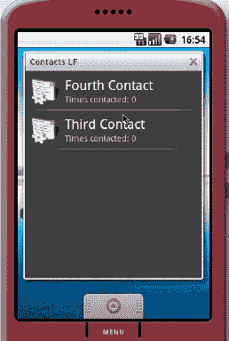

**图 21-5.** *显示动态文件夹联系人*


根据您的联系人数量的不同，此列表可能看起来不同。您可以单击其中一个联系人以显示其详细信息（参见 Figure 21–6）。请注意，由于此联系人的详细信息由联系人应用程序呈现，因此外观也取决于 Android 版本。

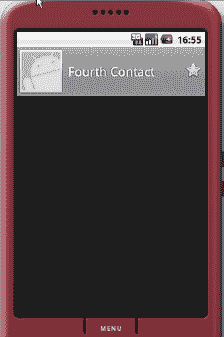

**Figure 21–6.** *打开实时文件夹联系人*

您可以单击底部的“菜单”按钮，了解如何处理该单个联系人（参见 Figure 21–7）。此处可用的选项也由联系人应用程序提供。同样，外观取决于版本和设备。

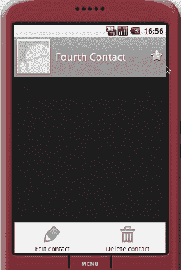

**Figure 21–7.** *单个联系人的菜单选项*

如果您选择编辑联系人，您将看到（取决于版本的）屏幕，如 Figure 21–8 所示。


**Figure 21–8.** *编辑联系人详情*

要查看此实时文件夹的“实时”方面，您可以更新联系人的名字或姓氏。然后，当您返回到“联系人 LF”的实时文件夹视图时，您将看到这些更改已反映出来。您可以通过反复单击“返回”按钮，直到看到“联系人 LF”文件夹来实现此操作。

#### 构建实时文件夹

现在您已经了解了实时文件夹及其相关性，我们将向您展示如何构建一个。要构建实时文件夹，您需要两样东西：一个 Activity 和一个专用内容提供者。Android 使用此 Activity 的 *标签* 来填充可用实时文件夹的列表，如 Figure 21–3 所示。Android 还会调用此 Activity 以获取一个 URI，该 URI 将被调用以获取要显示的行列表。

Activity 提供的 URI 应指向负责返回行的专用内容提供者。内容提供者通过明确定义的光标返回这些行。我们称该光标为 *明确定义的*，因为该光标应具有一组已知的预定义列名。

通常，您将这两个实体打包在一个应用程序中，然后将该应用程序部署到设备上。您还需要一些支持文件来使其正常工作。我们将使用一个示例来解释和演示这些概念，该示例包含以下文件：

> `AndroidManifest.xml`：此文件定义了需要调用哪个 Activity 来创建实时文件夹的定义。
> 
> `AllContactsLiveFolderCreatorActivity.java`：此 Activity 负责提供实时文件夹的定义，该文件夹可以显示联系人数据库中的所有联系人。
> 
> `MyContactsProvider.java`：此内容提供者将响应实时文件夹 URI，该 URI 将返回一个联系人光标。此提供者在内部使用 Android 附带的联系人内容提供者。
> 
> `MyCursor.java`：这是一个专门的光标，知道如何在底层数据更改时执行`requery`。
> 
> `BetterCursorWrapper.java`：`MyCursor`需要此文件来协调`requery`。

我们将描述每个文件，以便您详细了解实时文件夹的工作原理。

##### AndroidManifest.xml

您已经熟悉`AndroidManifest.xml`；它是所有 Android 应用程序都需要的同一个文件。该文件的实时文件夹部分（用注释分隔）表明我们有一个名为`AllContactsLiveFolderCreatorActivity`的 Activity，负责创建实时文件夹（参见 Listing 21–1）。这一点通过声明一个 action 为`android.intent.action.CREATE_LIVE_FOLDER`的 Intent 来表达。

此 Activity 的标签“新实时文件夹”将显示在主页的上下文菜单中（参见 Figure 21–3）。正如我们在“用户体验实时文件夹的方式”一节中所述，您可以通过长按主页来进入其上下文菜单。

**Listing 21–1.** *用于实时文件夹定义的 AndroidManifest.xml 文件*

```xml
<?xml version="1.0" encoding="utf-8"?>
<manifest
      package="com.androidbook.livefolders"
      android:versionCode="1"
      android:versionName="1.0">
    <application android:icon="@drawable/icon" android:label="@string/app_name">

<!-- LIVE FOLDERS -->
        <activity
            android:name=".AllContactsLiveFolderCreatorActivity"
            android:label="New live folder"
            android:icon="@drawable/icon">

            <intent-filter>
                <action android:name="android.intent.action.CREATE_LIVE_FOLDER" />
                <category android:name="android.intent.category.DEFAULT" />
            </intent-filter>
        </activity>

<provider android:authorities="com.androidbook.livefolders.contacts"
      android:multiprocess="true"
            android:name=".MyContactsProvider" />

    </application>
    <uses-sdk android:minSdkVersion="3" />
<uses-permission android:name="android.permission.READ_CONTACTS"/>
</manifest>
```

Listing 21–1 中代码的另一个值得注意的点是`provider`声明，它锚定在 URI `content://com.androidbook.livefolders.contacts` 上，并由提供者类`MyContactsProvider`提供服务。此提供者负责提供一个光标，用于填充当单击相应的实时文件夹图标时打开的`ListView`（Figure 21–5）。实时文件夹 Activity `AllContactsLiveFolderCreatorActivity`需要知道此 URI 是什么，并在被调用时将其返回给 Android。当选择实时文件夹名称以在主页上创建实时文件夹图标时，Android 会调用此 Activity。

根据实时文件夹协议，`CREATE_LIVE_FOLDER` Intent 将允许主页的上下文菜单将`AllContactsLiveFolderCreatorActivity`显示为一个标题为“新实时文件夹”的选项（参见 Figure 21–3）。单击此菜单选项将在主页上创建一个图标，如 Figure 21–4 所示。

`AllContactsLiveFolderCreatorActivity`负责定义此图标，该图标将由一个图像和一个标签组成。在我们的例子中，`AllContactsLiveFolderCreatorActivity`中的代码将此标签指定为“联系人 LF”（参见 Listing 21–2）。那么，让我们来看看此实时文件夹创建器的源代码。


##### `AllContactsLiveFolderCreatorActivity.java`

`AllContactsLiveFolderCreatorActivity`类只有一个职责：作为实时文件夹的生成器或创建者（参见清单 21-2）。可以将其视为实时文件夹的模板。每次通过主页上下文菜单中的`Folders`选项调用此活动时，它都会在主页上生成一个实时文件夹。

此活动通过向调用者（本例中为主页或实时文件夹框架）告知实时文件夹的名称、实时文件夹图标使用的图像、数据可用的 URI 以及显示模式（列表或网格）来完成其任务。框架则负责在主页上创建实时文件夹图标。

**注意：** 有关实时文件夹所需的所有契约，请参阅`android.provider.LiveFolders`类的 Android SDK 文档。

**清单 21-2.** *AllContactsLiveFolderCreatorActivity 源代码*

```java
public class AllContactsLiveFolderCreatorActivity extends Activity
{
    @Override
    protected void onCreate(Bundle savedInstanceState)
    {
        super.onCreate(savedInstanceState);

        final Intent intent = getIntent();
        final String action = intent.getAction();

        if (LiveFolders.ACTION_CREATE_LIVE_FOLDER.equals(action))   {
             setResult(RESULT_OK,
                  createLiveFolder(MyContactsProvider.CONTACTS_URI,
                           "Contacts LF",
                           R.drawable.icon)
                  );
        }
        else   {
            setResult(RESULT_CANCELED);
        }
        finish();
    }

    private Intent createLiveFolder(Uri uri, String name, int icon)
    {
        final Intent intent = new Intent();
        intent.setData(uri);
        intent.putExtra(LiveFolders.EXTRA_LIVE_FOLDER_NAME, name);
        intent.putExtra(LiveFolders.EXTRA_LIVE_FOLDER_ICON,
                Intent.ShortcutIconResource.fromContext(this, icon));
        intent.putExtra(LiveFolders.EXTRA_LIVE_FOLDER_DISPLAY_MODE,
                LiveFolders.DISPLAY_MODE_LIST);
        return intent;
    }
}
```

`createLiveFolder`方法本质上在调用它的`Intent`上设置值。当此`Intent`返回给调用者时，调用者将知道以下内容：

- 实时文件夹名称
- 实时文件夹图标使用的图像
- 显示模式：列表或网格
- 用于获取数据的数据或内容 URI

这些信息足以创建图 21-4 中显示的实时文件夹图标。当用户单击此图标时，系统将调用 URI 来检索数据。由该 URI 标识的内容提供者负责提供标准化的游标。下面我们将展示该内容提供者（`MyContactsProvider`类）的代码。

##### `MyContactsProvider.java`

`MyContactsProvider`具有以下职责：

1. 识别看起来像`content://com.androidbook.livefolders.contacts/contacts`的传入 URI。
2. 对由`content://contacts/people/`标识的 Android 提供的联系人内容提供者进行内部调用。（注意 Android SDK 附带的 Contacts 应用程序，并根据版本调整此 URL。）
3. 读取游标中的每一行，并将其映射回具有实时文件夹框架所需列名的`MatrixCursor`之类的游标。
4. 将`MatrixCursor`包装在另一个游标中，以便在此包装游标上执行`requery`时，会在需要时调用联系人内容提供者。

`MyContactsProvider`的代码如清单 21-3 所示。根据上述职责标出了重要项。代码在清单后进行解释。

**清单 21-3.** *MyContactsProvider 源代码*

```java
public class MyContactsProvider extends ContentProvider
{
    public static final String AUTHORITY =
       "com.androidbook.livefolders.contacts";

    //Uri that goes as input to the livefolder creation
    public static final Uri CONTACTS_URI =
       Uri.parse("content://" + AUTHORITY + "/contacts");

    //To distinguish this URI
    private static final int TYPE_MY_URI = 0;
    private static final UriMatcher URI_MATCHER;
    static{
      URI_MATCHER = new UriMatcher(UriMatcher.NO_MATCH);
      URI_MATCHER.addURI(AUTHORITY, "contacts", TYPE_MY_URI);
    }
    @Override
    public boolean onCreate() {
        return true;
    }
    @Override
    public int bulkInsert(Uri arg0, ContentValues[] values) {
      return 0; //nothing to insert
    }
    //Set of columns needed by a LiveFolder
    //This is the live folder contract

    private static final String[] CURSOR_COLUMNS = new String[]{
      BaseColumns._ID,
      LiveFolders.NAME,
      LiveFolders.DESCRIPTION,
      LiveFolders.INTENT,
      LiveFolders.ICON_PACKAGE,
      LiveFolders.ICON_RESOURCE
    };

    //In case there are no rows
    //use this stand in as an error message
    //Notice it has the same set of columns of a live folder
    private static final String[] CURSOR_ERROR_COLUMNS = new String[]{
      BaseColumns._ID,
      LiveFolders.NAME,
      LiveFolders.DESCRIPTION
    };
    //The error message row
    private static final Object[] ERROR_MESSAGE_ROW =
         new Object[]
         {
          -1, //id
          "No contacts found", //name
          "Check your contacts database" //description
         };

    //The error cursor to use
    private static MatrixCursor sErrorCursor =
         new MatrixCursor(CURSOR_ERROR_COLUMNS);
    static {
      sErrorCursor.addRow(ERROR_MESSAGE_ROW);
    }

    //Columns to be retrieved from the contacts database

    private static final String[] CONTACTS_COLUMN_NAMES =
    new String[]{

      ContactsContract.Contacts._ID,
      ContactsContract.Contacts.DISPLAY_NAME,
      ContactsContract.Contacts.TIMES_CONTACTED,
      ContactsContract.Contacts.STARRED
    };

    public Cursor query(Uri uri, String[] projection, String selection,
            String[] selectionArgs, String sortOrder)
    {
       //Figure out the uri and return error if not matching
      int type = URI_MATCHER.match(uri);
      if(type == UriMatcher.NO_MATCH){
        return sErrorCursor;
      }
      Log.i("ss", "query called");
      try
      {
       MatrixCursor mc = loadNewData(this);
        mc.setNotificationUri(getContext().getContentResolver(), 
              Uri.parse("content://contacts/people/"));
        MyCursor wmc = new MyCursor(mc,this);
        return wmc;
      }
      catch (Throwable e){
        return sErrorCursor;
      }
    }
```


`public static MatrixCursor loadNewData(ContentProvider cp)`
```
{
    MatrixCursor mc = new MatrixCursor(CURSOR_COLUMNS);
    Cursor allContacts = null;
    try
    {
        allContacts = cp.getContext().getContentResolver().query(
            ContactsContract.Contacts.CONTENT_URI,
            CONTACTS_COLUMN_NAMES,
            null, // 行过滤条件
            null,
            ContactsContract.Contacts.DISPLAY_NAME); // 排序依据

        while(allContacts.moveToNext())
        {
            String timesContacted = "联系次数: "+allContacts.getInt(2);
            Object[] rowObject = new Object[]
            {
                allContacts.getLong(0),               // id
                allContacts.getString(1),             // 名称
                timesContacted,                       // 描述
                Uri.parse("content://contacts/people/"
                        +allContacts.getLong(0)),   // intent
                cp.getContext().getPackageName(),     // 包名
                R.drawable.icon                       // 图标
            };
            mc.addRow(rowObject);
        }
        return mc;
    }
    finally {
        allContacts.close();
    }
}
@Override
public String getType(Uri uri)
{
    // 指示给定 URI 的 MIME 类型
    // 针对此包装器提供程序
    // 通常看起来像这样
    // "vnd.android.cursor.dir/vnd.google.note"
    return ContactsContract.Contacts.CONTENT_TYPE;
}

public Uri insert(Uri uri, ContentValues initialValues) {
    throw new UnsupportedOperationException(
        "不支持插入操作，因为这只是个包装器");
}
@Override
public int delete(Uri uri, String selection, String[] selectionArgs) {
    throw new UnsupportedOperationException(
        "不支持删除操作，因为这只是个包装器");
}
public int update(Uri uri, ContentValues values,
        String selection, String[] selectionArgs)
{
    throw new UnsupportedOperationException(
        "不支持更新操作，因为这只是个包装器");
}
```

请注意，清单 21–3 中初始化了实时文件夹所需的列集合，并在清单 21–4 中重复列出以便直接参考。

**清单 21–4.** *满足实时文件夹契约所需的列*
```
private static final String[] CURSOR_COLUMNS = new String[]
{
    BaseColumns._ID,
    LiveFolders.NAME,
    LiveFolders.DESCRIPTION,
    LiveFolders.INTENT,
    LiveFolders.ICON_PACKAGE,
    LiveFolders.ICON_RESOURCE
};
```

除 `INTENT` 项之外，这些大多数字段都无需解释。如果你查看 图 21–5，就会看到 `NAME` 对应列表中条目的标题。`DESCRIPTION` 会位于同一列表条目中的 `NAME` 下方。

`INTENT` 字段实际上是一个指向内容提供程序中项目 URI 的字符串字段。当用户点击某个项目时，Android 会使用此 URI 执行 `VIEW` 操作。这就是为什么这个字符串字段被称为`INTENT` 字段，因为 Android 内部会从该字符串 URI 派生出 `INTENT`。

最后两个字段与列表中显示的图标相关。同样，请参考 图 21–5 查看图标。研究 清单 21–3 可以了解这些列是如何从联系人数据库获取值的。

另外请注意，`MyContactsContentProvider`（包装器内容提供程序）执行 清单 21–5 中的代码，以通知底层游标需要监视任何数据更改。

**清单 21–5.** *使用游标注册 URI*
```
MatrixCursor mc = loadNewData(this);
mc.setNotificationUri(getContext().getContentResolver(),
                   Uri.parse("content://contacts/people/"));
```

函数 `loadNewData()` 从联系人提供程序检索一组联系人并创建 `MatrixCursor`，该游标包含 清单 21–4 中所示的列。然后代码指示 `MatrixCursor` 向 `ContentResolver` 注册，这样当 URI (`content://contacts/people`) 指向的数据发生任何更改时，`ContentResolver` 就能提醒该游标。

你会觉得有趣的是，要监视的 URI 并非我们的 `MyContactsProvider` 内容提供程序的 URI，而是 Android 提供的联系人内容提供程序的 URI。这是因为 `MyContactsProvider` 只是“真正”内容提供程序的包装器。因此这个游标需要监视底层的内容提供程序，而非包装器。

同样重要的一点是，我们需要将 `MatrixCursor` 包装在我们自己的游标中，如 清单 21–6 所示。

**清单 21–6.** *包装游标*
```
MatrixCursor mc = loadNewData(this);
mc.setNotificationUri(getContext().getContentResolver(),
              Uri.parse("content://contacts/people/"));
MyCursor wmc = new MyCursor(mc,this);
```

要理解为什么需要包装游标，我们需先了解视图是如何更新已更改内容的。像联系人这样的内容提供程序通常会通过注册 URI 作为实现 `query` 方法的一部分，来告知游标需要监视更改。这是通过 `cursor.setNotificationUri` 完成的。然后游标会将该 URI 及其所有子 URI 注册到内容提供程序。当内容提供程序发生插入或删除操作时，插入和删除操作的代码需要引发一个事件，表明特定 URI 所标识行中的数据已发生更改。

这将触发游标通过 `requery` 进行更新，视图也会相应更新。遗憾的是，`MatrixCursor` 并不适用于这种 `requery` 机制。`SQLiteCursor` 适用，但我们无法在此使用 `SQLiteCursor`，因为我们要将列映射到一组新的列。

为了适应这一限制，我们将 `MatrixCursor` 包装在一个游标包装器中，并重写了 `requery` 方法，以丢弃内部的 `MatrixCursor` 并使用更新后的数据创建一个新的游标。进一步说明：每当数据更改时，我们都希望获取一个新的 `MatrixCursor`。然而，对于 Android 实时文件夹框架，我们只返回包装后的外部游标。这会告诉实时文件夹框架只有一个游标存在，但实际上随着数据变化，我们在底层会生成新的游标。

这一点将在以下两个类中说明。

### MyCursor.java

注意 `MyCursor` 在初始化时是如何接收一个 `MatrixCursor` 的（见 清单 21–7）。在调用 `requery` 时，`MyCursor` 会回调提供程序以返回一个 `MatrixCursor`。然后新的 `MatrixCursor` 会通过 `set` 方法替换旧的游标。

**注意：** 我们本可以通过重写 `MatrixCursor` 的 `requery` 方法来实现这一点，但该类没有提供清除数据并重新开始的方法。因此这是一个合理的变通方案。（请注意，`MyCursor` 继承自 `BetterCursorWrapper`，我们接下来会讨论这个类。）

**清单 21–7.** *MyCursor 源代码*
```
public class MyCursor extends BetterCursorWrapper
{
    private ContentProvider mcp = null;

    public MyCursor(MatrixCursor mc, ContentProvider inCp)
    {
        super(mc);
        mcp = inCp;
    }
    public boolean requery()
    {
        MatrixCursor mc = MyContactsProvider.loadNewData(mcp);
        this.setInternalCursor(mc);
        return super.requery();
    }
}
```

现在我们来看看 `BetterCursorWrapper` 类，以便了解如何包装一个游标。


### BetterCursorWrapper.java

`BetterCursorWrapper`类（参见[列表 21–8]）与 Android 数据库框架中的`CursorWrapper`类非常相似。但我们需要`BetterCursorWrapper`包含`CursorWrapper`所缺少的两项功能。首先，`CursorWrapper`没有`set`方法来替换`requery`方法中的内部游标。其次，`CursorWrapper`不是`CrossProcessCursor`。实时文件夹需要`CrossProcessCursor`而不是普通游标，因为实时文件夹跨进程边界工作。

**列表 21–8.** *BetterCursorWrapper 源代码*

```java
public class BetterCursorWrapper implements CrossProcessCursor
{
   //Holds the internal cursor to delegate methods to
   protected CrossProcessCursor internalCursor;

   //Constructor takes a crossprocesscursor as an input
   public BetterCursorWrapper(CrossProcessCursor inCursor)
   {
      this.setInternalCursor(inCursor);
   }
   //You can reset in one of the derived class's methods
   public void setInternalCursor(CrossProcessCursor inCursor)
   {
      internalCursor = inCursor;
   }

   //All delegated methods follow
   public void fillWindow(int arg0, CursorWindow arg1) {
      internalCursor.fillWindow(arg0, arg1);
   }
   // ..... other delegated methods
}
```

我们没有在[列表 21–8]中展示完整的`BetterCursorWrapper`类，但你可以轻松使用 Eclipse 生成其余部分。将这个部分类加载到 Eclipse 后，将光标放在名为`internalCursor`的变量上。右键单击并选择 Source  Generate Delegated Methods。Eclipse 将为你填充类的其余部分。一旦 Eclipse 生成了委托方法，你需要将所有方法委托给内部游标类，就像我们在[列表 21–8]中对`fillWindow`方法所做的那样。（如果你不想经历这个过程，可以在本章的下载项目中查看此文件。）

现在你已经拥有了通过 Eclipse 构建、部署和运行示例实时文件夹项目所需的所有类。由于没有活动类注册为 MAIN 类别，当你部署此项目时，不会看到任何用户界面显示，但你会在 Eclipse 控制台中看到项目已成功安装的消息。

让我们通过展示访问实时文件夹时的效果来结束本节关于实时文件夹的讨论。

### 使用实时文件夹

准备好实时文件夹项目的所有文件后，你可以构建它们并将其部署到模拟器。现在你可以使用我们构建的实时文件夹了。

导航到设备的主页；它看起来应该像[图 21–1]中的屏幕。按照“用户如何体验实时文件夹”一节开头概述的步骤操作。具体来说，找到你创建的实时文件夹，并创建[图 21–4]中所示的实时文件夹图标。点击 Contacts LF 实时文件夹图标，你将看到填充了联系人的联系人列表（[图 21–5]）。

### 编译代码的说明

玩转本章列出的代码的最佳方式是下载本章专用的 ZIP 文件。该文件的 URL 列在“参考资料”部分。本章列出的每个类文件都在可下载的 ZIP 文件中。

与本书中的许多项目不同，此项目没有在模拟器中运行时启动的活动。但是，你可以在 Eclipse 控制台中看到包已成功安装。

### 总结

实时文件夹提供了一种创新的单击机制，用于在主屏幕上显示变化的数据。这些数据几乎可以是任何内容，只要它们可以以列表形式排列为行集合即可。所有数据都需要具有通过名称和描述来识别和描述自身的能力。几乎任何数据元素都满足此要求，因为大多数数据都可以通过某种方式命名和描述。此外，如果有一个活动能在点击实时文件夹后显示该数据的详细信息，也会有所帮助。这些数据可以是本地的，例如联系人，甚至可以基于互联网，例如博客摘要。

在本章中，我们解释了实时文件夹游标的细微差别，以及如果你希望将现有的内容提供者公开为实时文件夹的源时需要使用哪些机制。我们解释了游标包装器的必要性，并向你展示了如何通过`ContentResolver`注册以接收数据更新。

在下一章中，我们将向你介绍另一种主屏幕创新——主屏幕小部件。

