# 主屏幕小部件

在本章中，我们将详细介绍 Android 的主屏幕小部件。主屏幕小部件与实时文件夹（在第 21 章中介绍）类似，提供了另一种在 Android 主屏幕上显示频繁变化信息的方式。从高层次来看，主屏幕小部件是显示在主屏幕上的断开连接的视图（尽管其中填充了数据）。这些视图的数据内容由后台进程定期更新。

例如，电子邮件主屏幕小部件可能会提醒你有多少封未读电子邮件。该小部件可能只显示电子邮件的数量，而不显示消息本身。点击电子邮件计数可能会带你进入显示实际电子邮件的活动。只要设备能够通过 HTTP 或其他连接机制访问邮件数量，这些甚至可以来自外部电子邮件源，如 Yahoo、Gmail 或 Hotmail。

**注意：** Android 3.0 增强了对主屏幕小部件的支持。这些增强功能在第 31 章中进行了介绍。

我们将本章分为三个部分。在第一部分中，我们将介绍主屏幕小部件及其架构。我们将描述 Android 如何使用`RemoteViews`来显示小部件，以及如何利用广播接收器来更新这些`RemoteViews`。你将学习如何创建活动来配置主屏幕上的小部件，并发现服务与小部件之间的关系。在本部分结束时，你将清楚了解主屏幕小部件的架构和生命周期。

在第二部分中，我们将向你展示如何设计和开发一个主屏幕小部件，并对代码进行注释。你将学习如何向 Android 定义小部件，以及如何编写广播接收器来更新这些小部件。我们将向你展示如何通过 Shared Preferences 管理小部件状态，以及如何编写活动来配置小部件。

在第三部分中，我们将讨论使用小部件的适用性、限制和更广泛的指南。此外，我们还将讨论小部件的范围和适用性。我们还将提供设计建议，以编写需要更频繁更新的小部件。

我们将以一个与小部件相关的编程资源集合来结束本章。

### 主屏幕小部件的架构

让我们从更详细地考虑什么是主屏幕小部件开始，来讨论主屏幕小部件的架构。


#### 什么是主屏幕小部件？

主屏幕小部件是可在主屏幕上显示并频繁更新的视图。作为一种视图，小部件的外观和感觉通过布局 XML 文件来定义。对于小部件，除了视图的布局之外，还需要定义小部件视图在主屏幕上所需的空间大小。

小部件定义还包含几个负责初始化视图并频繁更新它的 Java 类。这些 Java 类负责管理小部件在主屏幕上的生命周期。当小部件被拖到主屏幕上，或者通过拖到垃圾箱来卸载时，这些类会做出响应。

**注意：** 视图和相应的 Java 类在架构上是相互分离的。例如，任何 Android 服务或活动都可以使用其布局 ID 获取视图，用数据填充该视图（就像填充模板一样），然后将其发送到主屏幕。一旦视图被发送到主屏幕，它就会与底层的 Java 代码脱离。

一个小部件定义至少包含以下内容：

-   一个要在主屏幕上显示的视图布局，以及它应占用的主页面空间大小。请记住，这仅仅是没有任何数据的视图。更新视图将是某个 Java 类的职责。
-   一个指定更新频率的计时器。
-   一个被称为*小部件提供者*的 Java 类，它可以响应计时器更新，以便通过填充数据以某种方式更改视图。

一旦定义了小部件并提供了 Java 类，该小部件便可使用了。我们将概述这样一个定义好的小部件在实际中是如何使用的。

#### 主屏幕小部件的用户体验

Android 中的主屏幕小部件功能允许你选择一个预设的小部件放置在主屏幕上。放置后，如有必要，小部件将允许你通过一个活动（作为小部件包的一部分定义）来配置它。在深入了解小部件的编程细节之前，理解这种交互非常重要。

换句话说，我们希望你在编写小部件程序之前，先体验一下如何使用小部件。

我们将引导你了解一个名为“生日小部件”的小部件，我们为本章节创建了它。我们将在本章后面提供其源代码。首先，我们将使用这个小部件作为我们演练的示例。由于源代码在后文提供，我们需要你耐心阅读并跟随图片指示，不要试图在你的屏幕上查找这个小部件。如果你按照提供的图表和解释操作，你就会了解生日小部件的性质和表现，这将在我们后续编写代码时让一切变得清晰。

让我们通过定位我们想要的小部件并在主屏幕上创建它的一个实例，来开始这段探索之旅。

##### 在主屏幕上创建小部件实例

要访问可用的小部件列表，你需要长按主页。这将调出主屏幕的上下文菜单，如图 22-1 所示。

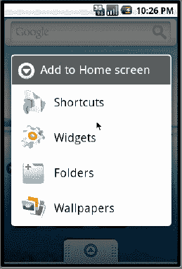

**图 22-1.** *主屏幕上下文菜单*

如果你从此列表中选择“小部件”，将会显示另一个屏幕，这是一个可用小部件的选择列表，如图 22-2 所示。

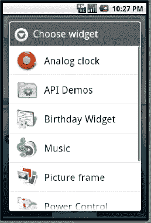

**图 22-2.** *主屏幕小部件选择列表*

这些大部分小部件是 Android 系统自带的。根据你所使用的 Android 版本，这些列表可能会有所不同。在这个列表中，名为“生日小部件”的小部件是我们为本次练习设计的。如果你选择该小部件，它将在主屏幕上创建一个相应的小部件实例，外观类似于图 22-3 所示的生日小部件示例。

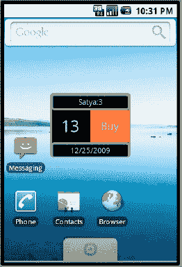

**图 22-3.** *一个示例生日小部件*

这个生日小部件会在其标题上显示姓名、距离该人生日还有多少天、生日日期，以及一个购买礼物的链接。

你可能想知道姓名和生日日期是如何配置的。如果你想要这个小部件的两个实例，每个实例包含不同人的姓名和出生日期，该怎么办？这就是小部件配置器活动发挥作用的地方，也是我们接下来要讨论的主题。

**注意：** 在主页面上为此小部件定义创建的视图称为*小部件实例*。这意味着你可以创建此小部件定义的多个实例。

##### 理解小部件配置器

小部件定义可选地包含一个称为小部件配置器活动的活动规范。当你从主页面小部件选择列表中选择一个小部件来创建小部件实例时，Android 会调用相应的小部件配置活动。这个活动是你需要编写的，它负责配置小部件实例。

对于我们的生日小部件，这个配置活动将提示你输入姓名和即将到来的生日日期，如图 22-4 所示。配置器的职责是将这些信息保存在持久化位置，以便当对小部件提供者调用更新时，小部件提供者能够找到这些信息，并使用配置器设置的正确值来更新视图。

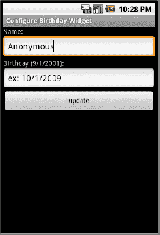

**图 22-4.** *生日小部件配置器活动*

**注意：** 当用户选择在主屏幕上创建两个生日小部件实例时，配置器活动将被调用两次（每个小部件实例一次）。

在内部，Android 通过为小部件实例分配 ID 来跟踪它们。这个 ID 会传递给 Java 回调函数和配置器 Java 类，以便初始配置和更新能够定向到正确的实例。在图 22-3 中，字符串 `satya:3` 的后半部分，`3` 就是小部件 ID——或者更准确地说，是小部件实例 ID。小部件本身由其 Java 组件名称（即类名和小部件类所在的包名）标识；在本章中，“小部件 ID”和“小部件实例 ID”可以互换使用，均指代小部件实例 ID。我们在图 22-3 中包含了小部件实例 ID 以便说明这一点。

有了对小部件的概述，我们现在将更详细地研究小部件的生命周期。

### 小部件的生命周期

到目前为止，我们已经多次提到小部件定义。我们也简要讨论过 Java 类的作用。在本节中，我们将更详细地阐述这两个概念，并探讨小部件的生命周期。

小部件的生命周期包含以下几个阶段：

1.  小部件定义
2.  小部件实例创建
3.  `onUpdate()`（时间间隔到期时）
4.  响应点击（在主屏幕的小部件视图上）
5.  删除小部件（从主屏幕上）
6.  卸载

我们现在将逐一详细介绍这些阶段。


##### 控件定义阶段

控件的生命周期始于其视图的定义。此定义告知 Android 在主屏幕调用的控件选择列表（图 22–2）中显示控件名称。完成此定义需要两个要素：一个实现 `AppWidgetProvider` 的 Java 类，以及一个控件布局视图。

首先，在 Android 清单文件中添加以下条目，以指定 `AppWidgetProvider`（清单 22–1）。

**清单 22–1.** *Android 清单文件中的控件定义*

```
<manifest..>
<application>
....
<receiver android:name=".BDayWidgetProvider">
      <meta-data android:name="android.appwidget.provider"
android:resource="@xml/bday_appwidget_provider" />
      <intent-filter>
             <action android:name="android.appwidget.action.APPWIDGET_UPDATE" />
      </intent-filter>
</receiver>
   ...
   <activity>
      .....
   </activity>
<application>
</manifest>
```

此定义表明存在一个名为 `BDayWidgetProvider` 的广播接收器 Java 类（如你即将看到的，它继承自控件包中的 Android 核心类 `AppWidgetProvider`），该类用于接收与应用控件更新相关的广播消息。

**注意：** Android 根据时间间隔的频率，以广播消息的形式发送更新消息。

清单 22–1 中的控件定义还指向了 `/res/xml` 目录下的一个 XML 文件，该文件进一步指定了控件视图和更新频率，如清单 22–2 所示。

**清单 22–2.** *控件提供方信息 XML 文件中的控件视图定义*

```
<appwidget-provider
    android:minWidth="150dp"
    android:minHeight="120dp"
    android:updatePeriodMillis="43200000"
    android:initialLayout="@layout/bday_widget"
    android:configure="com.ai.android.BDayWidget.ConfigureBDayWidgetActivity"
    >
</appwidget-provider>
```

这个 XML 文件被称为应用控件提供方信息文件。在内部，它会被转换为 `AppWidgetProviderInfo` Java 类。该文件分别指定了布局的宽度和高度为 `150dp` 和 `120dp`。此定义文件还指明了更新频率为 12 小时（换算为毫秒）。定义文件同样指向一个布局文件（清单 22–7），其中描述了控件视图的外观（见图 22–5）。

然而，需要注意的是，这些控件视图的布局仅限于包含特定类型的视图元素。控件布局中所允许的视图属于名为 `RemoteViews` 的视图类，并且仅允许特定类型的子视图用于这些远程视图。所允许的子视图元素如清单 22–3 所示。

**清单 22–3.** *RemoteViews 中允许的视图控件*

```
FrameLayout
LinearLayout
RelativeLayout

AnalogClock
Button
Chronometer
ImageButton
ImageView
ProgressBar
TextView
```

此列表可能随每个版本而增加。限制远程视图中允许的内容的主要原因是，这些视图与实际上控制它们的进程是断开的。这些控件视图由像主屏幕这样的应用托管。这些视图的控制器是由定时器调用的后台进程。正因如此，这些视图被称为远程视图。有一个对应的 Java 类 `RemoteViews` 允许访问这些视图。换句话说，程序员无法直接访问这些视图并调用其方法。你只能通过 `RemoteViews`（类似于一个守门者）来访问这些视图。

在下一主要部分探讨示例时，我们将介绍 `RemoteViews` 类的相关方法。现在，只需记住控件布局文件中只允许使用有限数量的视图集（见清单 22–3）。

控件定义（清单 22–2）还包含一个配置活动的规范，该活动会在用户创建控件实例时被调用。清单 22–2 中的这个配置活动就是 `ConfigureBDayWidgetActivity`。此活动与任何其他包含多个表单字段的 Android 活动一样。这些表单字段用于收集控件实例所需的信息。


##### Widget 实例创建阶段

一旦 widget 定义所需的所有 XML 片段就绪，并且所有 widget Java 类都可用，我们来探讨当用户在 widget 选择列表（参见图 22-2）中选择 widget 名称以创建 widget 实例时会发生什么。Android 会调用配置器活动（参见图 22-3），并期望该配置器活动执行以下操作：

1.  从启动配置器的调用意图中接收 widget 实例 ID。
2.  通过一组表单字段提示用户，以收集特定于该 widget 实例的信息。
3.  持久化存储 widget 实例信息，以便后续对 widget 的`update`调用能够访问这些信息。
4.  通过检索 widget 视图布局并据此创建`RemoteViews`对象，为首次显示 widget 视图做好准备。
5.  调用`RemoteViews`对象上的方法，为各个视图对象（如文本和图像）设置值。
6.  同样使用`RemoteViews`对象在 widget 的任意子视图上注册任何`onClick`事件。
7.  告知`AppWidgetManager`使用该 widget 的实例 ID 在主页屏幕上绘制`RemoteViews`。
8.  返回 widget ID 并关闭。

请注意，在此场景下，widget 的首次绘制由配置器完成，而非`AppWidgetProvider`的`onUpdate()`方法。

**注意：** 配置器活动是可选的。如果未指定配置器活动，调用将直接转到`AppWidgetProvider`的`onUpdate()`方法，由`onUpdate()`负责更新视图。

对于用户创建的每个 widget 实例，Android 都会重复此过程。另请注意，目前没有直接记录的文档支持限制用户只能拥有单个 widget 实例。

除了调用配置器活动，Android 还会调用`AppWidgetProvider`的`onEnabled`回调。让我们通过查看`BDayWidgetProvider`的框架（参见清单 22-4）来简要了解`AppWidgetProvider`类上的回调。我们将在后面的清单 22-9 中检查此文件的完整代码。

**清单 22-4.** *一个 Widget Provider 框架*

```java
public class BDayWidgetProvider extends AppWidgetProvider
{
    public void onUpdate(Context context,
                        AppWidgetManager appWidgetManager,
                        int[] appWidgetIds){}

    public void onDeleted(Context context, int[] appWidgetIds){}
    public void onEnabled(Context context){}
    public void onDisabled(Context context) {}
}
```

`onEnabled()`回调方法表明主屏幕上至少有一个 widget 实例正在运行。这意味着用户必须至少将 widget 放置到主页上一次。在此调用中，您需要启用接收此组件的消息（您将在清单 22-9 中看到这一点）。在 Android 中，类有时被称为组件，特别是当它们构成一个可重用的单元，例如活动、服务或广播接收器时。在这种情况下，基类`AppWidgetProvider`是一个广播接收器组件；我们可以启用或禁用它来接收广播消息。

当用户将 widget 实例视图拖到垃圾桶时，会调用`onDeleted()`回调方法。此时，您需要删除为该 widget 实例保存的任何持久化数据。

当最后一个 widget 实例从主屏幕移除后，会调用`onDisabled()`回调方法。这发生在用户将最后一个 widget 实例拖到垃圾桶时。您应该使用此方法来取消注册您对此组件接收任何广播消息的兴趣（您将在清单 22-9 中看到这一点）。

每次清单 22-2 中指定的定时器到期时，都会调用`onUpdate()`回调方法。如果不存在配置器活动，那么在 widget 实例首次创建时也会调用此方法。如果存在配置器活动，则在创建 widget 实例时不会调用此方法。此后，当定时器以指定的频率到期时，将调用此方法。

##### onUpdate 阶段

一旦 widget 实例出现在主屏幕上，下一个重要事件就是定时器到期。如前所述，Android 将调用`onUpdate()`来响应定时器。`onUpdate()`的调用是通过广播接收器完成的。这意味着定义`onUpdate()`的相应 Java 进程将被加载，并保持存活直到该调用结束。一旦调用返回，该进程将准备被终止。

还建议您使用诸如长期运行的广播接收器之类的机制（如第 14 章所述），前提是您的工作响应时间将超过 10 秒。如果不这样做，您将收到 ANR（Android 无响应）错误。

无论哪种方式，一旦您在`onUpdate()`方法中拥有了更新 widget 所需的必要数据，您就可以调用`AppWidgetManager`来绘制远程视图。如果您打算调用一个长期运行的服务来执行更新，则需要将 widget ID 作为额外数据传递给启动该服务的意图。

这表明`AppWidgetProvider`类是无状态的，甚至可能无法在两次调用之间维护静态变量。这是因为包含此广播接收器类的 Java 进程可能在两次调用之间被销毁并重建，从而导致静态变量重新初始化。

因此，如果需要，您需要设计一种方案来记住状态。当更新不是特别频繁时，例如每隔几秒一次，将 widget 实例的状态保存在持久化存储中（如文件、共享首选项或 SQLite 数据库）是非常合理的。在下一个示例中，我们将使用共享首选项作为持久化 API。

**警告：** 为了节省电量，Google 强烈建议更新间隔时间应超过一小时，这样设备就不会过于频繁地唤醒。Google 还警告说，在未来的版本中，可能会强制执行 30 分钟或更长的限制。

对于更短的持续时间，例如仅几秒钟，您需要通过使用`AlarmManager`类中的工具自行调用`onUpdate()`方法。当您使用`AlarmManager`时，您也可以选择不调用`onUpdate()`，而是在闹钟回调中完成`onUpdate()`的工作。有关使用闹钟管理器的内容，请参考第 15 章。

以下是在`onUpdate()`方法中通常需要执行的操作：

1.  确保配置器已完成其工作；否则，直接返回。在 2.0 及更高版本中，这应该不成问题，因为这些版本中更新间隔预计会更长。否则，`onUpdate()`有可能在用户在配置器中完成 widget 配置之前被调用。
2.  检索该 widget 实例的持久化数据。
3.  检索 widget 视图布局，并据此创建一个`RemoteViews`对象。
4.  调用`RemoteViews`对象上的方法，为各个视图对象（如文本和图像）设置值。
5.  通过使用挂起意图，在任意视图上注册任何`onClick`事件。
6.  告知`AppWidgetManager`使用实例 ID 绘制`RemoteViews`。

如您所见，配置器最初所做的事情与`onUpdate()`方法所做的事情之间存在大量重叠。您可能希望在这两个地方重用此功能。


### 微件视图鼠标点击事件回调

如前所述，`onUpdate()` 方法负责保持微件视图的更新。微件视图及其中的子元素可以为鼠标点击事件注册回调。通常，`onUpdate()` 方法会使用一个待定意图（pending intent）为鼠标点击等事件注册一个操作。该操作可以启动一个服务或一个活动，例如打开浏览器。

如果需要，这个被调用的服务或活动可以通过微件实例 ID 和 `AppWidgetManager` 与视图进行通信。因此，待定意图携带微件实例 ID 这一点非常重要。

### 删除微件实例

微件实例可能发生的另一个不同事件是它被删除。要实现删除，用户需要点击主屏幕上的微件。这会使主屏幕底部显示出垃圾箱。然后，用户可以将微件实例拖到垃圾箱中，从而将其从屏幕中删除。

这样做会调用微件提供者的 `onDelete()` 方法。如果你为该微件实例保存了任何状态信息，你需要在此 `onDelete` 方法中删除这些数据。

如果刚被删除的微件实例是该类型的最后一个实例，Android 还会调用 `onDisable()`。你将使用这个回调来清理为所有微件实例存储的任何持久化属性，并取消注册从微件 `onUpdate()` 广播接收的回调（参阅清单 22–9）。

### 卸载微件包

这就是微件的完整生命周期。我们将简要提及如果你计划卸载并安装包含这些微件的新版本 `.apk` 文件时需要清理微件的必要性，然后进入下一节。

建议你在尝试卸载包之前移除或删除所有微件实例。请按照“删除微件实例”一节中的说明逐一删除每个微件实例，直到没有剩余为止。

然后，你可以卸载并安装新版本。如果你使用 Eclipse ADT 开发微件，这一点尤其重要，因为在开发期间，ADT 每次运行应用时都会尝试执行此操作。因此，在每次运行之间，请确保你已移除微件实例。

## 一个示例微件应用

到目前为止，我们已经介绍了微件背后的理论和方法。现在让我们利用这些知识来创建一个示例微件，其行为已被用作解释微件架构的示例。我们将开发、测试并部署这个现在我们已经熟悉的生日微件。

每个生日微件实例将显示一个名字、下一个生日的日期，以及从今天到生日的天数。它还会创建一个 `onClick` 区域，你可以点击该区域购买礼物。点击将打开一个浏览器，并带你访问 [`www.google.com`](http://www.google.com)。

完成后的微件布局应如图 22–5 所示。


**图 22–5.** *生日微件的外观与风格*

此微件的实现包含以下与微件相关的文件。根据你想使用的源 Java 包，Java 文件将位于 `src` 子目录下，后跟你为 Java 包使用的目录结构。为了简洁和节省篇幅，我们使用了省略号（... ）来表示这些子目录。

*   `AndroidManifest.xml` //：在此定义 `AppWidgetProvider`（参阅清单 22–5）
*   `res/xml/bday_appwidget_provider.xml` //：微件尺寸和布局（参阅清单 22–6）
*   `res/layout/bday_widget.xml` //：微件布局（参阅清单 22–7）
*   `res/drawable/box1.xml` //：为微件布局的各个部分提供方框（参阅清单 22–8）
*   `src/.../BDayWidgetProvider` //：`AppWidgetProvider` 类的实现（参阅清单 22–9）

实现还包含以下用于管理微件状态的文件：

*   `src/.../IWidgetModelSaveContract` //：保存微件模型的契约（参阅清单 22–10）
*   `src/.../APrefWidgetModel` //：基于首选项的抽象微件模型（参阅清单 22–11）
*   `src/.../BDayWidgetModel` //：保存微件视图数据的微件模型（参阅清单 22–12）
*   `src/.../Utils.java` //：一些工具类（参阅清单 22–13）

此外，实现还包含以下用于微件配置活动的文件：

*   `src/.../ConfigureBDayWidgetActivity.java` //：配置活动（参阅清单 22–14）
*   `layout/edit_bday_widget.xml` //：用于输入名字和生日的布局（参阅清单 22–15）

我们将逐一浏览每个文件，并解释任何需要进一步考虑的其他概念。在本节结束时，你也可以复制并粘贴这些文件，在你自己的环境中创建并测试生日微件。


### 定义微件提供程序

微件的定义始于 Android 应用程序清单文件。在此文件中，您需要指定微件提供程序、微件配置 Activity，以及指向另一个进一步定义微件布局的 XML 文件的指针。

对于生日微件，您可以在以下 Android 清单文件中看到所有这些高亮显示的内容（请参阅清单 22–5）。请注意将 `BDayAppWidgetProvider` 定义为广播接收器，以及将 `ConfigureBDayWidgetActivity` 定义为配置 Activity。

**清单 22–5.** *BDayWidget 示例应用的 Android 清单文件*

```xml
<?xml version="1.0" encoding="utf-8"?>
<manifest
      package="com.ai.android.BDayWidget"
      android:versionCode="1"
      android:versionName="1.0.0">
    <application android:icon="@drawable/icon" android:label="Birthday Widget">
<!--
**********************************************************************
*  生日微件提供程序接收器
**********************************************************************
 -->
   <receiver android:name=".BDayWidgetProvider">
      <meta-data android:name="android.appwidget.provider"
             android:resource="@xml/bday_appwidget_provider" />
      <intent-filter>
           <action android:name="android.appwidget.action.APPWIDGET_UPDATE" />
      </intent-filter>
   </receiver>
<!--
**********************************************************************
*  生日提供程序配置器 Activity
**********************************************************************
 -->
   <activity android:name=".ConfigureBDayWidgetActivity"
                  android:label="Configure Birthday Widget">
      <intent-filter>
           <action android:name="android.appwidget.action.APPWIDGET_CONFIGURE" />
      </intent-filter>
  </activity>

   </application>
    <uses-sdk android:minSdkVersion="3" />
</manifest>
```

**注意：** 如果您熟悉清单文件，接收器节点与 Activity 节点是同级节点。同时，它也是应用节点的直接子节点。

以下行中 `"Birthday Widget"` 标识的应用标签：

```xml
  <application android:icon="@drawable/icon" android:label="Birthday Widget">
```

会显示在主页的微件选择列表（参见图 22–2）中。如果您是首次创建微件定义，请确保完全复制以下行：

```xml
  <meta-data android:name="android.appwidget.provider"
```

规范 `"android.appwidget.provider"` 是 Android 特有的，必须如此声明；以下几行也是如此：

```xml
  <intent-filter>
       <action android:name="android.appwidget.action.APPWIDGET_UPDATE" />
  </intent-filter>
```

最后，配置 Activity 的定义与任何其他普通 Activity 类似，只是它需要声明自身能响应 `APPWIDGET_CONFIGURE` 操作。

### 定义微件尺寸

虽然 Android 清单文件定义了微件提供程序，但微件的其他详细信息是在单独的 XML 文件中提供的。这些其他详细信息包括微件的尺寸、微件的布局文件名、更新周期以及配置 Activity 组件（或类）名称。

此附加 XML 文件由前述微件提供程序定义中的 `android:resource` 节点指示（参见清单 22–5）。清单 22–6 显示了该微件提供程序信息文件 (`/res/xml/bday_appwidget_provider.xml`)。

**清单 22–6.** *BDayWidget 的微件视图定义*

```xml
<!-- res/xml/bday_appwidget_provider.xml -->
<appwidget-provider
    android:minWidth="150dp"
    android:minHeight="120dp"
    android:updatePeriodMillis="4320000"
    android:initialLayout="@layout/bday_widget"
    android:configure="com.ai.android.BDayWidget.ConfigureBDayWidgetActivity"
    >
</appwidget-provider>
```

此文件向 Android 指示您想要的像素宽度和高度。但是，Android 会将它们四舍五入到最近的单元格。Android 将其主屏幕区域组织成一个单元格矩阵；每个单元格的宽度和高度为 74 个不依赖密度的像素 (dp)。Android 建议您以这些单元格的倍数减去 2 像素（以便为四舍五入等调整）来指定宽度和高度。

此文件还指示需要多久调用一次 `onUpdate()`。Android 强烈建议该值不要超过每天几次。您可以将其设置为 0，表示从不调用更新。当您希望通过 `Alarm Manager` 类控制自己的更新时，这非常有用。

`initialLayout` 属性指向微件的实际布局（参见清单 22–7）。最后，`configure` 属性指向配置 Activity 类。此类的定义需要使用完全限定名。

现在，让我们检查微件的实际布局。

### 微件布局相关文件

从前一节和清单 22–6 中可以看出，微件的布局是在布局文件中定义的。这个布局文件与 Android 中任何其他视图的布局文件完全相同。

但是，为了指导微件的标准化，Android 发布了一套微件设计指南。您可以通过以下链接访问这些指南：

`http://developer.android.com/guide/practices/ui_guidelines/widget_design.html`

除了指南之外，此链接还提供了一组视图背景，您可以使用它们来改善微件的外观和感觉。在本示例中，我们采用了不同的方法，使用了带有背景形状的视图布局的传统方式。

#### 微件布局文件

清单 22–7 显示了用于生成图 22–5 所示微件布局的布局文件。

**清单 22–7.** *BDayWidget 的微件视图布局定义*

```xml
<!-- res/layout/bday_widget.xml -->
<?xml version="1.0" encoding="utf-8"?>
<LinearLayout
    android:orientation="vertical"
    android:layout_width="150dp"
    android:layout_height="120dp"
android:background="@drawable/box1"
    >
<TextView
    android:id="@+id/bdw_w_name"
    android:layout_width="fill_parent"
    android:layout_height="30dp"
    android:text="Anonymous"
android:background="@drawable/box1"
    android:gravity="center"
    />
<LinearLayout
    android:orientation="horizontal"
    android:layout_width="fill_parent"
    android:layout_height="60dp"
    >
   <TextView
       android:id="@+id/bdw_w_days"
       android:layout_width="wrap_content"
       android:layout_height="fill_parent"
       android:text="0"
       android:gravity="center"
       android:textSize="30sp"
       android:layout_weight="50"
       />
   <TextView
      android:id="@+id/bdw_w_button_buy"
       android:layout_width="wrap_content"
       android:layout_height="fill_parent"
       android:textSize="20sp"
       android:text="Buy"
       android:layout_weight="50"
       android:background="#FF6633"
       android:gravity="center"
   />
</LinearLayout>
<TextView
    android:id="@+id/bdw_w_date"
    android:layout_width="fill_parent"
    android:layout_height="30dp"
    android:text="1/1/2000"
android:background="@drawable/box1"
    android:gravity="center"
    />
</LinearLayout>
```

此布局使用嵌套的 `LinearLayout` 节点来实现所需效果。一些控件还使用名为 `box1.xml` 的形状定义文件来定义边框。


### 小部件背景形状文件

该形状定义的代码如清单 22–8 所示（该文件应位于 `/res/drawable` 子目录中）。

**清单 22–8.** *边界框形状定义*

```
<!-- res/drawable/box1.xml -->
<shape >
    <stroke android:width="4dp" android:color="#888888" />
    <padding android:left="2dp" android:top="2dp"
            android:right="2dp" android:bottom="2dp" />
<corners android:radius="4dp" />
</shape>
```

我们采用这种布局方式，是因为它不仅对小部件很方便，而且对你的其他布局也同样实用。

你可能希望在真正使用小部件测试这些布局之前，先构建一个活动并分别进行测试（至少我们是这么做的）。我们经历了多次试验才获得正确的视觉效果和交互感受。直接在小部件上尝试可能会很繁琐：每次运行应用时，你都需要删除小部件、卸载、重新安装，然后再将它们拖回主屏幕。

到目前为止讨论的文件，完成了一个典型小部件所需的 XML 定义。现在让我们通过检查小部件提供者类，来看看我们将如何回应小部件的生命周期事件。

### 实现小部件提供者

作为小部件架构的一部分，我们已经讨论了小部件提供者类的职责。一个小部件提供者需要实现以下广播接收器回调方法。

- `onUpdate()`
- `onDelete()`
- `onEnable()`
- `onDisable()`

清单 22–9 中的 Java 代码演示了这些方法中每一个的实现。

**清单 22–9.** *示例小部件提供者: BDayWidgetProvider*

```
///src/<your-package>/BDayWidgetProvider.java
public class BDayWidgetProvider extends AppWidgetProvider
{
    private static final String tag = "BDayWidgetProvider";
public void onUpdate(Context context,
                        AppWidgetManager appWidgetManager,
                        int[] appWidgetIds)  {
        final int N = appWidgetIds.length;
        for (int i=0; i<N; i++)
        {
            int appWidgetId = appWidgetIds[i];
            updateAppWidget(context, appWidgetManager, appWidgetId);
        }
    }

public void onDeleted(Context context, int[] appWidgetIds)
{
     final int N = appWidgetIds.length;
     for (int i=0; i<N; i++)
     {
        BDayWidgetModel bwm =
BDayWidgetModel.retrieveModel(context, appWidgetIds[i]);
        bwm.removePrefs(context);
     }
}
    @Override
public void onReceive(Context context, Intent intent) {
        final String action = intent.getAction();
        if (AppWidgetManager.ACTION_APPWIDGET_DELETED.equals(action)) {
            Bundle extras = intent.getExtras();
            final int appWidgetId = extras.getInt
                              (AppWidgetManager.EXTRA_APPWIDGET_ID,
                               AppWidgetManager.INVALID_APPWIDGET_ID);

            if (appWidgetId != AppWidgetManager.INVALID_APPWIDGET_ID) {
                this.onDeleted(context, new int[] { appWidgetId });
            }
        }
        else {
            super.onReceive(context, intent);
        }
    }

public void onEnabled(Context context) {
        BDayWidgetModel.clearAllPreferences(context);
        PackageManager pm = context.getPackageManager();
        pm.setComponentEnabledSetting(
                new ComponentName("com.ai.android.BDayWidget",
                       ".BDayWidgetProvider"),
                PackageManager.COMPONENT_ENABLED_STATE_ENABLED,
                PackageManager.DONT_KILL_APP);
    }

public void onDisabled(Context context) {
        BDayWidgetModel.clearAllPreferences(context);
        PackageManager pm = context.getPackageManager();
        pm.setComponentEnabledSetting(
                new ComponentName("com.ai.android.BDayWidget",
                       ".BDayWidgetProvider"),
                PackageManager.COMPONENT_ENABLED_STATE_DISABLED,
                PackageManager.DONT_KILL_APP);
    }

private void updateAppWidget(Context context,
                          AppWidgetManager appWidgetManager,
                           int appWidgetId) {
       BDayWidgetModel bwm = BDayWidgetModel.retrieveModel(context, appWidgetId);
       if (bwm == null) {
          return;
       }
ConfigureBDayWidgetActivity
                     .updateAppWidget(context, appWidgetManager, bwm);
   }
}
```

请参考“主屏幕小部件架构”一节，了解每个这些方法中需要执行什么操作。对于生日小部件，所有这些方法会依次使用`BDayWidgetModel`类中的方法。其中一些方法是 `removePrefs()`、`retrievePrefs()` 和 `clearAllPreferences()`。

`BDayWidgetModel` 类用于封装我们生日小部件实例的状态（我们将在下一节介绍这个类）。要理解这个小部件提供者类，你只需要知道我们正在使用一个模型类来检索这个小部件实例所需的数据。这些数据保存在偏好设置中，这就是方法命名为 `removePrefs()`、`retrievePrefs()` 和 `clearAllPreferences()` 的原因。如果 Android 用 `Data` 替换了 `Prefs`，变成 `removeData()`、`retrieveData()` 和 `clearAllData()`，这些名称可能会更有意义。不管怎样，这种转换只是为了说明问题，你找不到带有 `Data()` 后缀的方法。

如前所述，`update()` 方法会被所有小部件实例调用。这个方法必须更新所有小部件实例。这些小部件实例以 ID 数组的形式传入。对于每个 `id`，`onUpdate()` 方法会找到对应的小部件实例模型，并调用配置活动所使用的同一个方法（见清单 22–14）来显示检索到的小部件模型。

在 `onDelete()` 方法中，我们实例化了一个 `BDayWidgetModel`，然后让它将自己从偏好设置持久化存储中移除。

在 `onEnabled()` 方法中，由于它只在第一个实例出现时被调用一次，我们清除了所有小部件模型的持久化数据，以便从干净的状态开始。我们在 `onDisabled()` 方法中也做了同样的操作，这样就不会留存任何小部件实例的记忆。

在 `onEnabled()` 方法中，我们启用了小部件提供者组件，以便它能接收广播消息。在 `onDisabled()` 方法中，我们禁用了该组件，这样它就不会寻找任何广播消息。

**注意：**`onReceive()` 方法是一个特例。在 1.6 版本发布之前，存在一个 `onDelete()` 未被调用的 bug。Google 通过显式提供一个 `onReceive()` 方法提供了解决方案。在 1.6 及更高版本中，你将不需要这个方法；基类中的同一个方法就足够了。

通过运用小部件模型的概念，代码保持了整洁。接下来我们将探讨小部件模型及其实现。


### 实现微件模型

什么是微件模型？微件模型并非 Android 的概念。如果你熟悉传统的 UI 编程，就会想起模型-视图-控制器（MVC）架构的概念：其中模型持有视图所需的数据，视图负责显示，而控制器负责协调视图与模型之间的交互。

尽管 Android SDK 并未强制要求采用特定的方法，但我们借助了 MVC 思想来简化微件编程。在这种方法中，对于每一个微件实例视图，都会有一个对应的 Java 类作为微件模型。该模型拥有所有能够为微件实例提供所需数据的方法。

除了提供数据之外，我们还为这些模型创建了一些基类，使它们能够了解如何从持久化存储（例如共享首选项）中保存和检索自身数据。我们将介绍模型类的层次结构，并向你展示如何使用共享首选项来存储和检索数据。你可以参考第 9 章了解更多关于首选项的内容。

#### 微件模型接口

我们将从一个接口开始讨论，该接口充当微件模型的契约，以便微件模型能够声明要保存到持久化数据库中的字段。该契约还定义了当从数据库中检索到某个字段时如何设置该字段。此外，该接口提供了一个 `init()` 回调方法，以便在模型从数据库中重新检索出来后、在传递给请求客户端之前调用它。

清单 22–10 展示了微件契约接口的源代码。

**清单 22–10.** *保存微件状态：契约*

```
//文件名: src/…/IWidgetModelSaveContract.java
public interface IWidgetModelSaveContract
{
    public String getPrefname();
    public void setValueForPref(String key, String value);

    //返回要保存的键值对
    public Map<String,String> getPrefsToSave();

    //在恢复后被调用
    public void init();
}
```

这个接口的设计方式是，一个派生的抽象类将使用特定的持久化存储来提供实现。如前所述，我们将使用 Android 的共享首选项功能作为持久化存储。正如该接口的名称所示，它纯粹是一个保存契约。诸如 `BDayWidgetProvider` 之类的客户端仍将依赖于该接口最常用的派生类来获取特定的方法。

该接口的实现者需要提供一个首选项文件的名称来响应 `getPrefname()` 方法。然后，此首选项文件用于保存从 `getPrefsToSave()` 获取的键值对。在逆向操作（`setValueForPref()`）中，派生类被要求根据从首选项存储中恢复的键和值来设置其内部值。

最后，在派生类上调用 `init()` 方法，以指示值已从持久化存储中恢复，或者可以执行任何其他初始化。

**注意：** 请记住，在实际的应用中，你会以稍微不同的方式来构建这个继承层次；你可能会使用委托机制来实现复用，而不是继承。然而，这个继承层次结构对我们的测试用例来说效果很好，可以演示微件模型。

现在让我们考虑一下抽象实现，它将微件的数据字段存储为共享首选项。

#### 微件模型的抽象实现

所有负责与持久化存储交互的代码都在 `APrefWidgetModel` 类中实现（参见清单 22–11）。该类中的 `Pref` 代表“首选项”，因为该类使用 Android 的 `SharedPreferences` 工具来存储微件模型数据。

此外，该类代表了一个基础微件的概念。字段 `id` 代表微件的实例 ID。该类始终需要一个以微件实例 ID 为参数的构造函数，以满足实例 ID 的需求。

让我们看看清单 22–11 中该类的源代码。该类的主要方法已高亮显示。

**清单 22–11.** *通过共享首选项实现微件保存*

```
//文件名: /src/…/APrefWidgetModel.java
public abstract class APrefWidgetModel
implements IWidgetModelSaveContract
{
   private static String tag = "AWidgetModel";

   public int iid;
   public APrefWidgetModel(int instanceId) {
      iid = instanceId;
   }
// 抽象方法
   public abstract String getPrefname();
   public abstract void init();
   public Map<String,String> getPrefsToSave(){   return null;}

public void savePreferences(Context context){
       Map<String,String> keyValuePairs = getPrefsToSave();
       if (keyValuePairs == null){
          return;
       }
       // 将要保存一些值
SharedPreferences.Editor prefs =
          context.getSharedPreferences(getPrefname(), 0).edit();

       for(String key: keyValuePairs.keySet()){
          String value = keyValuePairs.get(key);
          savePref(prefs,key,value);
       }
       // 最后提交这些值
prefs.commit();
    }

private void savePref(SharedPreferences.Editor prefs,
                         String key, String value) {
       String newkey = getStoredKeyForFieldName(key);
       prefs.putString(newkey, value);
    }
private void removePref(SharedPreferences.Editor prefs, String key) {
       String newkey = getStoredKeyForFieldName(key);
       prefs.remove(newkey);
    }
protected String getStoredKeyForFieldName(String fieldName){
       return fieldName + "_" + iid;
    }
public static void clearAllPreferences(Context context, String prefname) {
       SharedPreferences prefs=context.getSharedPreferences(prefname, 0);
       SharedPreferences.Editor prefsEdit = prefs.edit();
       prefsEdit.clear();
       prefsEdit.commit();
    }

public boolean retrievePrefs(Context ctx) {
       SharedPreferences prefs = ctx.getSharedPreferences(getPrefname(), 0);
       Map<String,?> keyValuePairs = prefs.getAll();
       boolean prefFound = false;
       for (String key: keyValuePairs.keySet()){
          if (isItMyPref(key) == true){
             String value = (String)keyValuePairs.get(key);
             setValueForPref(key,value);
             prefFound = true;
          }
       }
       return prefFound;
    }
public void removePrefs(Context context) {
       Map<String,String> keyValuePairs = getPrefsToSave();
       if (keyValuePairs == null){
          return;
       }
       // 将要保存一些值
        SharedPreferences.Editor prefs =
           context.getSharedPreferences(getPrefname(), 0).edit();

        for(String key: keyValuePairs.keySet()){
           removePref(prefs,key);
        }
        // 最后提交这些值
        prefs.commit();
    }
private boolean isItMyPref(String keyname) {
       if (keyname.indexOf("_" + iid) > 0){
          return true;
       }
       return false;
    }
public void setValueForPref(String key, String value) {
       return;
    }
}
```


让我们看看这个类的关键方法是如何实现的。首先，将 widget 模型属性保存到共享偏好文件中：

```java
public void savePreferences(Context context)
{
    Map<String,String> keyValuePairs = getPrefsToSave();
    if (keyValuePairs == null){ return; }

    //going to save some values
    SharedPreferences.Editor prefs =
    context.getSharedPreferences(getPrefname(), 0).edit();

    for(String key: keyValuePairs.keySet()){
        String value = keyValuePairs.get(key);
        savePref(prefs,key,value);
    }
    //finally commit the values
    prefs.commit();
}
```

该方法首先要求派生类返回一个键值对映射，其中键是模型的属性，值是这些属性值的字符串表示形式。然后，它将要求 Android 的`context`通过`context.getSharedPreferences()`获取一个`SharedPreferences`文件。此 API 需要为该包提供一个唯一的名称，由派生模型负责提供。

一旦获取到共享偏好，按照 Android 文档说明，我们请求获取一个可编辑版本的共享偏好。然后，逐个更新偏好。完成后，执行`commit()`方法，使偏好得以持久化。

阅读 API 参考文档和第 9 章，了解关于`SharedPreferences`和`SharedPreferences.Editor`类的更多信息；本章的“资源”部分提供了相关链接。值得注意的是，这些共享偏好文件是 XML 文件，可以在包的数据目录中找到。

由于我们使用单个文件存储所有 widget 实例的数据，因此需要一种方法来区分多个 widget 实例之间的字段名。例如，如果有两个名为 1 和 2 的 widget 实例，则需要两个键来存储`Name`属性，例如`name_1`和`name_2`。通过以下方法进行转换：

```java
protected String getStoredKeyForFieldName(String fieldName) {
    return fieldName + "_" + iid;
}
```

派生类也会使用此方法，在通过`setValue()`方法调用时，检查需要更新哪个字段。

### Widget 模型的 Birthday Widget 实现

最终，在此 widget 模型层次结构中最常派生的类负责实际维护视图所需的所有字段。它依赖基类进行存储和检索。我们以这种方式设计了此最常派生的类，使得直接处理这些模型的客户端直接与该类交互，因为这是与其最相关的类。

例如，当配置器活动首次创建 widget 实例时，配置器活动实例化其中一个类，填充其值，并要求其保存自身。

由于视图的需求，此类维护三个字段：

*   `name`：人员姓名
*   `bday`：下一个生日的日期
*   `url`：购买礼物的目标 URL

该类还有一个计算属性`howManyDays`，表示从今天到下一个生日之间的天数。

您还会注意到，此类负责履行保存契约。这些方法如下：

```java
public void setValueForPref(String key, String value);
public String getPrefname();
public Map<String,String> getPrefsToSave();
```

清单 22-12 展示了组织所有这些逻辑的代码。

**清单 22-12.** *BDayWidgetModel: 实现状态模型*

```java
//filename: /src/…/BDayWidgetModel.java
public class BDayWidgetModel extends APrefWidgetModel
{
    private static String tag="BDayWidgetModel";

    // Provide a unique name to store date
    private static String BDAY_WIDGET_PROVIDER_NAME=
        "com.ai.android.BDayWidget.BDayWidgetProvider";

    // Variables to paint the widget view
    private String name = "anon";
    private static String F_NAME = "name";

    private String bday = "1/1/2001";
    private static String F_BDAY = "bday";

    private String url="http://www.google.com";

    // Constructor/gets/sets
    public BDayWidgetModel(int instanceId){
        super(instanceId);
    }
    public BDayWidgetModel(int instanceId, String inName, String inBday){
        super(instanceId);
        name=inName;
        bday=inBday;
    }
    public void init(){}  
    public void setName(String inname){name=inname;}
    public void setBday(String inbday){bday=inbday;}

    public String getName(){return name;}
    public String getBday(){return bday;}

    public long howManyDays(){
        try       {
            return Utils.howfarInDays(Utils.getDate(this.bday));
        }
        catch(ParseException x){
            return 20000;
        }
    }

    //Implement save contract

    public void setValueForPref(String key, String value){
        if (key.equals(getStoredKeyForFieldName(BDayWidgetModel.F_NAME))){
            this.name = value;
            return;
        }
        if (key.equals(getStoredKeyForFieldName(BDayWidgetModel.F_BDAY))){
            this.bday = value;
            return;
        }
    }
    public String getPrefname()   {
        return BDayWidgetModel.BDAY_WIDGET_PROVIDER_NAME;
    }

    //return key value pairs you want to be saved
    public Map getPrefsToSave()   {
        Map map
        = new HashMap();
        map.put(BDayWidgetModel.F_NAME, this.name);
        map.put(BDayWidgetModel.F_BDAY, this.bday);
        return map;
    }
    public String toString()   {
        StringBuffer sbuf = new StringBuffer();
        sbuf.append("iid:" + iid);
        sbuf.append("name:" + name);
        sbuf.append("bday:" + bday);
        return sbuf.toString();
    }
    public static void clearAllPreferences(Context ctx){
        APrefWidgetModel.clearAllPreferences(ctx,
                BDayWidgetModel.BDAY_WIDGET_PROVIDER_NAME);
    }

    public static BDayWidgetModel retrieveModel(Context ctx, int widgetId){
        BDayWidgetModel m = new BDayWidgetModel(widgetId);
        boolean found = m.retrievePrefs(ctx);
        return found ? m:null;
    }
}
```

如您所见，此类使用了一些与日期相关的工具。在继续解释 widget 配置活动实现之前，将首先展示这些工具的源代码。


#### 几个与日期相关的工具方法

清单 22–13 包含一个用于处理日期的工具类。它接收一个日期字符串，验证其是否为有效日期，并计算该日期距离今天还有多少天。这段代码不言自明，我们将其收录在此以保持完整性。

**清单 22–13.** *日期工具类*

```java
public class Utils
{
   private static String tag = "Utils";

   public static Date getDate(String dateString)
   throws ParseException {
      DateFormat a = getDateFormat();
      Date date = a.parse(dateString);
      return date;
   }

   public static String test(String sdate){
      try {
         Date d = getDate(sdate);
         DateFormat a = getDateFormat();
         String s = a.format(d);
         return s;
      }
      catch(Exception x){
         return "problem with date:" + sdate;
      }
   }

   public static DateFormat getDateFormat(){
      SimpleDateFormat df = new SimpleDateFormat("MM/dd/yyyy");
      //DateFormat df = DateFormat.getDateInstance(DateFormat.SHORT);
      df.setLenient(false);
      return df;
   }

   //valid dates: 1/1/2009, 11/11/2009,
   //invalid dates: 13/1/2009, 1/32/2009
   public static boolean validateDate(String dateString){
      try {
         SimpleDateFormat df = new SimpleDateFormat("MM/dd/yyyy");
         df.setLenient(false);
         Date date = df.parse(dateString);
         return true;
      }
      catch(ParseException x) {
         return false;
      }
   }

   public static long howfarInDays(Date date){
      Calendar cal = Calendar.getInstance();
      Date today = cal.getTime();
      long today_ms = today.getTime();
      long target_ms = date.getTime();
      return (target_ms - today_ms)/(1000 * 60 * 60 * 24);
   }
}
```

现在，我们来看看之前讨论过的配置活动的实现。

### 实现微件配置活动

在“主屏幕微件架构”部分，我们解释了配置活动的作用及其职责。对于生日微件示例，这些职责在名为`ConfigureBDayWidgetActivity`的活动类中实现。你可以在清单 22–14 中查看该类的源代码。

该类收集姓名和下一个生日信息，然后创建`BDayWidgetModel`，并将其存入共享首选项。它还提供了一个函数，用于将`BDayWidgetModel`转换为对应的微件视图。

**清单 22–14.** *实现配置器活动*

```java
public class ConfigureBDayWidgetActivity extends Activity
{
   private static String tag = "ConfigureBDayWidgetActivity";
   private int mAppWidgetId = AppWidgetManager.INVALID_APPWIDGET_ID;

   /** Called when the activity is first created. */
   @Override
   public void onCreate(Bundle savedInstanceState) {
      super.onCreate(savedInstanceState);
      setContentView(R.layout.edit_bday_widget);
      setupButton();

      Intent intent = getIntent();
      Bundle extras = intent.getExtras();
      if (extras != null) {
         mAppWidgetId = extras.getInt(
            AppWidgetManager.EXTRA_APPWIDGET_ID,
            AppWidgetManager.INVALID_APPWIDGET_ID);
      }
   }

   private void setupButton(){
      Button b = (Button)this.findViewById(R.id.bdw_button_update_bday_widget);
      b.setOnClickListener(
         new Button.OnClickListener(){
            public void onClick(View v)
            {
               parentButtonClicked(v);
            }
         });
   }

   private void parentButtonClicked(View v){
      String name = this.getName();
      String date = this.getDate();
      if (Utils.validateDate(date) == false){
         this.setDate("wrong date:" + date);
         return;
      }
      if (this.mAppWidgetId == AppWidgetManager.INVALID_APPWIDGET_ID){
         return;
      }
      updateAppWidgetLocal(name,date);
      Intent resultValue = new Intent();
      resultValue.putExtra(AppWidgetManager.EXTRA_APPWIDGET_ID, mAppWidgetId);
      setResult(RESULT_OK, resultValue);
      finish();
   }

   private String getName(){
      EditText nameEdit = (EditText)this.findViewById(R.id.bdw_bday_name_id);
      String name = nameEdit.getText().toString();
      return name;
   }

   private String getDate(){
      EditText dateEdit = (EditText)this.findViewById(R.id.bdw_bday_date_id);
      String dateString = dateEdit.getText().toString();
      return dateString;
   }

   private void setDate(String errorDate){
      EditText dateEdit = (EditText)this.findViewById(R.id.bdw_bday_date_id);
      dateEdit.setText("error");
      dateEdit.requestFocus();
   }

   private void updateAppWidgetLocal(String name, String dob){
      BDayWidgetModel m = new BDayWidgetModel(mAppWidgetId,name,dob);
      updateAppWidget(this,AppWidgetManager.getInstance(this),m);
      m.savePreferences(this);
   }

   public static void updateAppWidget(Context context,
            AppWidgetManager appWidgetManager,
            BDayWidgetModel widgetModel)
   {
      RemoteViews views = new RemoteViews(context.getPackageName(),
                        R.layout.bday_widget);

      views.setTextViewText(R.id.bdw_w_name
         , widgetModel.getName() + ":" + widgetModel.iid);

      views.setTextViewText(R.id.bdw_w_date
            , widgetModel.getBday());
   }
}
```


```markdown

//更新名称
views.setTextViewText(R.id.bdw_w_days,Long.toString(widgetModel.howManyDays()));
Intent defineIntent = new Intent(Intent.ACTION_VIEW,
      Uri.parse("http://www.google.com"));
PendingIntent pendingIntent =
       PendingIntent.getActivity(context,
                0 /* 无需请求码 */,
                defineIntent,
                0 /* 无需标志 */);
views.setOnClickPendingIntent(R.id.bdw_w_button_buy, pendingIntent);

// 通知 widget 管理器
appWidgetManager.updateAppWidget(widgetModel.iid, views);
   }
}

如果你查看 `updateAppWidgetLocal()` 函数的代码，会发现它正是那个创建并存储模型的函数。随后它使用 `updateAppWidget()` 函数来展示模型。值得注意的是，这个 `updateAppWidget()` 函数是如何使用待定意图来注册回调的。待定意图接收一个主意图，例如

```
Intent defineIntent = new Intent(Intent.ACTION_VIEW,
      Uri.parse("http://www.google.com"));
```

并创建一个用于启动 Activity 的待定意图。相比之下，待定意图也可以用来启动服务。同样值得注意的是，这个函数与 `RemoteViews` 和 `AppWidgetManager` 协同工作。注意该函数完成了以下任务：

- 从布局中获取 `RemoteViews`
- 在 `RemoteViews` 上设置文本值
- 通过 `RemoteViews` 注册一个待定意图
- 调用 `AppWidgetManager` 将 `RemoteViews` 发送到 widget
- 最后返回结果

**注意：** 只要知道 widget ID，就可以从任何位置调用静态函数 `updateAppWidget`。这表明你可以从设备上的任何位置以及任何进程（无论是可视还是非可视进程）更新 widget。

使用以下代码来结束 Activity 也很重要：

```
Intent resultValue = new Intent();
resultValue.putExtra(AppWidgetManager.EXTRA_APPWIDGET_ID, mAppWidgetId);
setResult(RESULT_OK, resultValue);
finish();
```

请注意我们是如何将 widget ID 传回给调用方的。这就是 `AppWidgetManager` 得知该 widget 实例的配置 Activity 已完成的方式。

让我们通过展示 清单 22–15 中 widget 配置 Activity 的表单布局来结束本次关于 widget 配置的讨论。这个视图非常直观：它有若干文本框和编辑控件，并带有一个更新按钮。你也可以在 图 22–4 中直观地看到这一点。

**清单 22–15.** *配置器 Activity 的布局定义*

```
<!-- res/layout/edit_bday_widget.xml -->
<?xml version="1.0" encoding="utf-8"?>
<LinearLayout
   android:id="@+id/root_layout_id"
    android:orientation="vertical"
    android:layout_width="fill_parent"
    android:layout_height="fill_parent"
    >
<TextView
   android:id="@+id/bdw_text1"
    android:layout_width="fill_parent"
    android:layout_height="wrap_content"
    android:text="名称："
    />
<EditText
    android:id="@+id/bdw_bday_name_id"
    android:layout_width="fill_parent"
    android:layout_height="wrap_content"
    android:text="匿名用户"
   />
<TextView
    android:id="@+id/bdw_text2"
    android:layout_width="fill_parent"
    android:layout_height="wrap_content"
    android:text="生日（2001/9/1）："
    />
<EditText
    android:id="@+id/bdw_bday_date_id"
    android:layout_width="fill_parent"
    android:layout_height="wrap_content"
    android:text="例如：2009/10/1"
   />
<Button
    android:id="@+id/bdw_button_update_bday_widget"
    android:layout_width="fill_parent"
    android:layout_height="wrap_content"
    android:text="更新"
/>
</LinearLayout>
```

至此，我们完成了关于实现一个示例 widget 的讨论。作为本练习的一部分，我们演示了以下内容：

- 定义 widget
- 响应 widget 回调
- 为 widget 提供配置 Activity
- 展示 `RemoteViews` 的使用
- 提供状态管理框架
- 为 widget 设计美观的布局

接下来，我们将提供一些关于 widget 的指南。

### Widget 的限制与扩展

Android 主屏幕 widget 乍看之下很简单。然而，当你开始编写一些非典型 widget 时，会发现它们有许多细微之处需要注意。

如果你的 widget 不需要任何状态管理，并且每天被调用的次数不超过几次，那么编写这个 widget 会非常简单。

下一级 widget 是需要管理状态但调用不频繁的 widget，就像我们这里展示的那样。这类 widget 可以从状态管理框架中受益。我们在本章中展示了一个极简状态管理框架。我们假设将来会有更复杂的框架可用，或者你可以编写一个更健壮、更灵活的框架。

再下一级的 widget 必须以秒级甚至毫秒级的频率被调用。对于这些 widget，你需要使用 `Alarm Manager` 自行构建更新调用。你可能还需要一个服务来频繁管理状态，而不是依赖持久化框架。例如，如果你要编写一个 `秒表` widget，就需要一个至少每秒计数的定时器，并且还需要跟踪计数器，这自然就涉及状态管理。

另一个需要考虑的因素是，widget 视图框架所依赖的 `RemoteViews` 没有提供直接在 widget 上进行编辑的机制（至少没有相关的文档记录）。`RemoteViews` 还对可使用的视图和布局类型设置了限制。你无法直接控制这些视图，只能通过 `RemoteViews` 类提供的方法进行控制。

基于当前 widget 的设计和意图，Google 似乎期望 widget 主要属于类别 1 或类别 2。未来版本的 widget 框架还有很大的扩展空间。

```


### 资源

在准备本章材料时，我们发现以下资源非常有用，现按其有用程度排序如下：

*   官方 Android SDK 文档中关于应用小部件的说明位于：[`http://developer.android.com/guide/topics/appwidgets/index.html`](http://developer.android.com/guide/topics/appwidgets/index.html)。
*   你需要了解用于管理状态的 `SharedPreferences` API。该类对应的网址是：[`http://developer.android.com/reference/android/content/SharedPreferences.html`](http://developer.android.com/reference/android/content/SharedPreferences.html)。
*   与共享首选项相关的是 `SharedPreferences.Editor` API。可参考：[`http://developer.android.com/reference/android/content/SharedPreferences.Editor.html`](http://developer.android.com/reference/android/content/SharedPreferences.Editor.html)。
*   使用以下 Android 链接来设计美观的小部件布局：[`http://developer.android.com/guide/practices/ui_guidelines/widget_design.html`](http://developer.android.com/guide/practices/ui_guidelines/widget_design.html)。
*   你需要了解 `RemoteViews` API 来绘制和操作小部件视图。该 API 位于：[`http://developer.android.com/reference/android/widget/RemoteViews.html`](http://developer.android.com/reference/android/widget/RemoteViews.html)。
*   小部件本身由一个小部件管理器类进行管理。你可以在以下网址探索该类的 API：[`http://developer.android.com/reference/android/appwidget/AppWidgetManager.html`](http://developer.android.com/reference/android/appwidget/AppWidgetManager.html)。
*   如果你急于借用一些代码来开始小部件开发，可以使用以下网址，其中收集了本书一位合著者整理的实用代码片段：[`http://www.androidbook.com/item/3300`](http://www.androidbook.com/item/3300)。
*   你还可以在以下链接找到编写本章时使用的研究笔记：[`www.androidbook.com/item/3299`](http://www.androidbook.com/item/3299)。
*   在 [`http://www.androidbook.com/projects`](http://www.androidbook.com/projects) 处，你可以下载本章专用的测试项目。该 ZIP 文件的名称为 `ProAndroid3_ch22_TestWidgets.zip`。

### 小结

在本章中，我们饶有兴致地探讨了 Android 主屏幕小部件所提供的各种可能性。这些简单的创意能够显著提升用户体验。

我们介绍了小部件背后的理论，并给出了一个可运行的示例来说明其中的细微差别。我们详细阐述了小部件模型和状态管理的必要性，并希望我们提供的状态管理代码能用于你自己的小部件。最后，我们简要讨论了小部件的设计问题和局限性。关于 Android 3.0 中小部件的更多内容，请参阅第 31 章。

## 第 23 章

## Android 搜索

在之前的第 21 章和第 22 章中，我们介绍了两项基于主屏幕的 Android 创新功能。在第 21 章中，我们解释了动态文件夹如何驻留在主页面上，并提供对内容提供者中动态数据的快速访问。在第 22 章中，我们探讨了主屏幕小部件，它们能够在主屏幕上展示信息的快照。

延续*信息触手可及*这一主题，现在我们将介绍 Android 搜索框架。Android 搜索框架功能强大。尽管 Android 搜索似乎仅在设备主屏幕上可用，但其影响力可以扩展到你应用程序中的 Activity。

我们将从概述 Android 搜索功能开始本章。我们将演示全局搜索、搜索建议、建议重写以及网络搜索。我们将展示如何在全局搜索中包含或排除本地应用程序。

在概述其可用性之后，我们将探讨你应用程序中的 Activity 如何与搜索键集成。我们将处理那些未显式编程支持搜索的 Activity，并研究一个禁用搜索的 Activity。我们还将探讨一个名为“即输即搜”的主题，应用程序中的 Activity 可以使用它来调用搜索。我们同样会展示一个通过菜单项显式调用搜索的 Activity。

Android 搜索可扩展性的关键在于一个名为*建议提供者*的概念。我们将探讨这一概念，并通过继承 Android 提供的一个基础建议提供者来编写一个简单的建议提供者。

然而，你经常需要从头编写一个自定义的建议提供者。我们将讨论这一点，这会将我们带入 Android 搜索架构的核心。

最后，我们将涵盖两个高级主题，并展示如何使用设备上的操作键，通过搜索建议来调用自定义操作。我们还将描述如何在调用搜索时向搜索传递特定于应用程序的数据。本章将以一系列参考资料作为结尾。

### Android 搜索体验

Android 的搜索功能扩展了常见的基于网络的 Google 搜索栏，使其能够同时搜索设备本地的内容和基于互联网的外部内容。你还可以使用此搜索机制，从主页面的搜索栏直接启动应用程序。Android 通过提供一个允许本地应用程序参与的搜索框架，使这些功能成为可能。

Android 搜索协议很简单。它只涉及一个单一的搜索框，让用户输入搜索数据。无论你是在使用主页面的全局搜索框，还是通过自己的应用程序进行搜索，使用的都是同一个搜索框。

当用户输入文本时，Android 会获取该文本并将其传递给已注册响应搜索的各种应用程序。应用程序通过返回一组响应来进行回应。Android 会汇总来自多个应用程序的这些响应，并将其呈现为一个可能的*建议*列表。

当用户点击其中一个响应时，Android 会启动提供该建议的应用程序。从这个意义上说，Android 搜索是参与应用程序之间的一种联合搜索。

尽管整体思路很简单，但搜索协议的细节却非常丰富。我们将在本章后面通过可运行的示例来详细介绍这些细节。在第一部分中，我们将从用户的角度来探索搜索。


### 探索 Android 全局搜索

在探索 Android 搜索时，虽然这不是必要条件，但我们建议您也阅读 Android 用户指南中的“搜索”章节。我们在参考资料部分提供了最新在线 Android 用户指南的链接。

**注意：** 在撰写本书期间，Android 版本从 2.0 更新至 2.2，再到 2.3 和 3.0。在每次更新中，尽管底层 API 没有改变，但用户界面体验略有变化。本章中的截图来自 2.2 模拟器。虽然我们已在 2.3 和 3.0 上测试过代码，但并未复制这些版本的截图。在适用的情况下，我们已用文字标明了差异。根据您所使用的 Android 版本，应该不难找出对应的界面功能。以搜索设置为例，每个版本中调用搜索设置屏幕的位置都有所不同，但搜索设置屏幕本身看起来是一样的。因此，我们恳请你在阅读本章时牢记这一差异。

在 Android 设备上你不可能错过搜索功能；它通常显示在主屏幕上，如图 23-1 所示。这个搜索框也被称为快速搜索框（QSB）。在某些 Android 版本中，或者根据设备制造商/运营商的不同，主屏幕默认可能不会显示此搜索框。然而，如果你点击设备上的搜索按钮，则一定会看到 QSB。或者在那些没有物理按键的设备（例如平板电脑）上，你可能会看到另一种明显的调用 QSB 的机制。请务必查阅该 Android 版本对应的用户指南或手册。

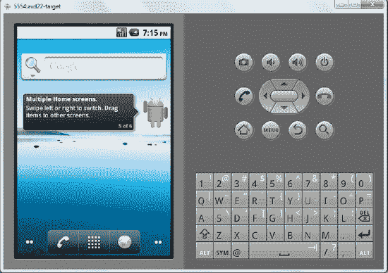

**图 23-1.** *带有 QSB 组件和按键的 Android 主屏幕*

由于 QSB 是作为小部件实现的（关于小部件的更多信息，请参见第 22 章），如果它不在主屏幕上，你可以将其拖放到主屏幕上。你也可以将 QSB 从主屏幕拖到垃圾桶来移除它。当然，你也可以再次从小部件屏幕将其拖回。

你可以直接在 QSB 中输入内容来开始搜索。QSB 作为小部件的一个有趣副作用是，将焦点移至主屏幕上的 QSB 基本上会启动全局搜索活动（见图 23-2），从而离开主屏幕上下文。图 23-2 是在 Android 2.2 版本中截取的，在 Android 2.3 版本中看起来完全相同。


**图 23-2.** *从主屏幕搜索小部件启动的全局搜索活动*

如前所述，你也可以通过点击搜索操作键来调用搜索。操作键是图 23-1 右侧显示的一组按键。该组中的搜索键由放大镜图标表示。

与 HOME 键非常相似，你可以随时点击搜索键，无论当前显示的是哪个应用程序。然而，当一个应用程序获得焦点时，该应用程序有机会对搜索进行专门化处理，我们稍后会对此进行讨论。这种定制的搜索称为*本地搜索*。而更通用、更常见、非定制的搜索则称为*全局搜索*。

**注意：** 当应用程序获得焦点时按下搜索键，是否允许进行本地和全局搜索完全由该应用程序决定。在 2.0 之前的版本中，默认操作是允许全局搜索。在 2.2 和 2.3 版本中，默认行为是禁用全局搜索。这意味着当某个活动获得焦点时，用户必须先点击 HOME 键，然后再点击搜索键。

在 2.2 版本之前，Android 全局搜索框不区分各个搜索建议提供程序（或搜索应用程序）。从 2.2 版本开始，Android 搜索允许您选择一个特定的搜索上下文（与建议提供程序同义）。您可以通过点击 QSB 左侧的图标来实现这一点。这将打开一个提供搜索功能的各个搜索应用程序的选择菜单。这在 Android 2.2 版本中如图 23-3 所示。对于 Android 2.3 版本，此视图略有不同——在展开的搜索类别部分的右上方引入了一个小的搜索设置图标。


**图 23-3.** *包含各种应用程序搜索上下文的全局 QSB*

这是 2.2 和 2.3 版本模拟器自带的默认搜索应用程序（或上下文、搜索类型、建议提供程序）集合。这个列表可能在后续版本中有所不同。`All` 这个搜索上下文的行为与之前版本的全局搜索非常相似。

你也可以通过编写搜索建议提供程序和本地搜索活动来创建自己的搜索上下文。我们将在本章的示例中逐步介绍这一点。

让我们专注于由 `all` 指示的搜索上下文（由放大镜图标表示）。你将焦点移到 QSB（图 23-1），要么直接点击 QSB，要么点击搜索键。暂时不要在 QSB 中输入任何内容。此时，Android 将显示一个类似图 23-2 的屏幕。

根据你过去对设备的使用情况，图 23-2 中显示的图像可能会有所不同，因为 Android 会根据过去的操作猜测你在搜索什么。这种在 QSB 中未输入文本时的搜索模式称为*零建议模式*。

根据输入的搜索文本，Android 会向用户提供大量建议。这些建议会以列表形式显示在 QSB 下方。这些通常被称为*搜索建议*。当你输入每个字母时，Android 会动态地替换搜索建议。当没有搜索文本时，Android 会显示所谓的*零建议*。在图 23-2 中，Android 判断出“设置”是用户以前使用过的应用程序，并且即使没有输入搜索文本，它也是一个适合呈现的建议。尽管我们在 QSB 中什么也没有输入，Android 还是会显示“软键盘”以准备输入。这个软键盘也显示在图 23-2 中。

当我们在 QSB 中输入 `a` 时，Android 会查找以 “a” 开头或与 “a” 相关的建议。你会看到 Android 已经搜索了以 “a” 开头的本地已安装应用程序以及其他一些搜索建议。

现在，我们将使用向下箭头按钮来高亮第一个建议。图 23-4 展示了这个视图。


**图 23-4.** *搜索建议*

请注意，第一个建议已被高亮，焦点已从 QSB 移至第一个高亮的建议。点击 QSB 右侧的箭头继续搜索。Android 还会通过移除软键盘将屏幕扩展为全屏，因为你在导航时不需要输入。扩展后的屏幕会向你展示更多的建议。


让我们再次审视建议。Android 获取已输入的搜索文本，并查找所谓的*建议提供者*。Android 异步调用每个建议提供者，以获取一组匹配的建议作为一组行。Android 期望这些行（称为*搜索建议*）符合一组预定义的列（*建议列*）。通过探索这些已知的列，Android 会绘制建议列表。当搜索文本发生变化时，Android 会重复此过程。这种为获取搜索建议而调用所有建议提供者的交互，在“全搜索”上下文中是成立的。然而，如果你从图 23-3 中选择了一个特定的搜索应用上下文，则只会调用为该应用定义的*建议提供者*来检索搜索建议。

**注意：** 这组搜索建议也称为*建议游标*。这是因为代表建议提供者的内容提供者会返回一个`cursor`对象。

此时，如果你导航回 QSB，Android 会重新调出软键盘。在图 23-4 中另一件需要注意的事情是高亮建议与 QSB 中搜索文本之间的关系。搜索文本保持为“a”，尽管高亮建议指向特定的项目，如闹钟应用程序。然而，情况并非总是如此，正如你在图 23-5 中所见，我们已导航到一个指向亚马逊的建议条目。


**图 23-5.** *建议重写*

注意搜索文本“a”如何被表示亚马逊的整个 URL 替换。现在你可以点击箭头（我们称之为“执行箭头”）前往亚马逊，或者简单地点击高亮建议。两者结果相同。

**注意：** 这种基于高亮建议修改搜索文本的过程称为*建议重写*。

稍后我们将更详细地讨论建议重写，但简而言之，Android 使用建议游标中的一列来查找此文本。如果该列存在，它将重写搜索文本；否则，它保留输入的搜索文本不变。

当建议未被重写时，有两种可能。如果你点击 QSB 中的执行箭头图标，无论高亮显示的是什么，它都会在 Google 上搜索该文本。如果你直接点击建议项，它将触发一个称为*搜索活动*的活动，该活动属于最初提供建议的应用。然后，此搜索活动负责显示搜索结果。

图 23-6 是直接调用一个建议的例子。在此示例中，建议是一个名为`Alarm Clock`的应用程序。当你点击它时，Android 将直接调用该应用。这实际上如何发生有点复杂，我们将在本章后面介绍（参见“实现自定义建议提供者”一节）。

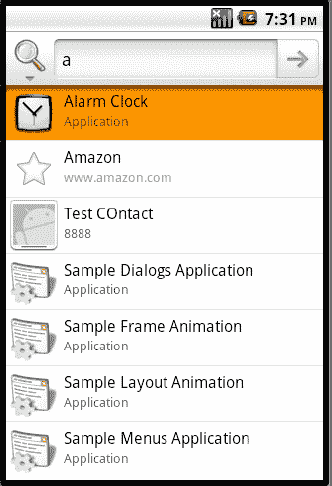

**图 23-6.** *通过搜索调用应用程序*

图 23-7 展示了当你的搜索文本为“a”时，点击执行箭头会发生什么。


**图 23-7.** *搜索网页*

既然你已经熟悉了如何使用 QSB 进行搜索，那么在下一部分的介绍中，我们将解释如何在全局搜索中启用或禁用特定应用。

#### 为全局搜索启用建议提供者

正如我们已经指出的，应用使用建议提供者来响应搜索。仅仅因为你的应用拥有响应搜索所需的基础设施，并不意味着你的建议会自动显示在 QSB 中。用户需要明确允许你的建议提供者参与。我们现在将带你了解启用或禁用可用建议提供者的过程。在 Android 2.2 和 2.3 版本中，进入以下设置的方式略有不同。我们将首先介绍 2.2 版本。

##### 在 Android 2.2 版本中使用搜索设置

让我们从能带我们进入 Android 设置界面的屏幕开始（图 23-8）。


**图 23-8.** *定位设置应用*

你可以通过点击设备屏幕底部的应用列表图标（参见图 23-1 的主屏幕）来访问此视图。使用向下方向键导航到名为`Settings`的应用，如图 23-8 所示。这将带你进入 Android 设置页面，该页面看起来如图 23-9 所示。

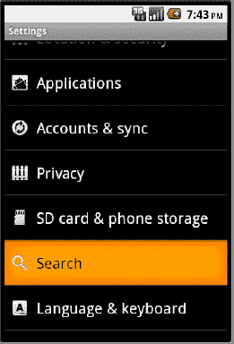

**图 23-9.** *进入“搜索”应用的设置*

在众多 Android 设置中，选择“搜索（管理搜索设置和历史记录）”选项。这将使你进入如图 23-10 所示的搜索设置应用。

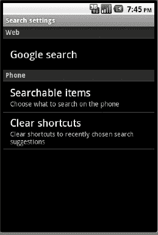

**图 23-10.** *搜索设置应用*

在此活动中，查找名为“快速搜索框”的标签页，并选择“可搜索项（选择手机上要搜索的内容）”。这将显示一个可用建议提供者（有时也称为搜索应用）的列表，如图 23-11 所示。再次说明，此列表可能因版本而异。


**图 23-11.** *已启用/禁用的搜索应用*

在图 23-11 中，已勾选的为包含在全局搜索中的建议提供者（或其所属的应用）。默认情况下，新的建议提供者或搜索应用是*未勾选*的。你可以点击一个建议提供者以启用其参与全局搜索。当启用后，该建议提供者将向全局搜索提供建议。已启用的建议提供者也会出现在图 23-3 的可搜索应用列表中。

##### 在 Android 2.3 版本中使用搜索设置

当你想探索建议提供者设置时，Android 2.2 和 2.3 版本（以及希望是未来的手机 SDK 版本）之间的区别在于，如何进入图 23-10 或图 23-11 的搜索设置界面。

在 Android 2.3 版本中，你可以直接从图 23-2 的展开搜索类别界面访问图 23-11。在 Android 2.3 版本中，图 23-2 上有一个小设置图标。如果你点击此图标，将直接跳转到图 23-11，在那里你会看到你的自定义搜索活动。

要进入图 23-10 的通用搜索设置界面，你需要返回图 23-2、图 23-3 或图 23-4 的界面。通常情况下，你点击了 QSB。当焦点在 QSB 上时，如果点击菜单按钮，你会看到一个名为“搜索设置”的菜单项。点击此菜单项，你将进入图 23-10 的通用搜索设置界面。一旦你进入此界面，操作设置的说明与 Android 2.2 版本相同。

到目前为止，我们已经向你介绍了 Android 中搜索如何工作的高级视图。接下来，我们将进一步探讨这些概念，并通过示例向你展示这一切是如何工作的。我们将从探索简单活动如何与搜索交互开始。


### 活动与搜索键的交互

当某个活动处于焦点状态时，用户点击搜索键会发生什么？答案取决于当前处于焦点的活动类型。我们将针对以下活动类型来探究其行为：

- 对搜索无感知的常规活动
- 明确禁用搜索的活动
- 显式调用全局搜索的活动
- 指定本地搜索的活动

我们将通过一个包含以下文件的工作示例来探究这些选项（在逐一讲解每个文件后，我们会展示该应用的截图来演示相关概念）。

主要的 Java 文件包括：

- `RegularActivity.java`（清单 23–1）
- `NoSearchActivity.java`（清单 23–6）
- `SearchInvokerActivity.java`（清单 23–8）
- `LocalSearchEnabledActivity.java`（清单 23–13）
- `SearchActivity.java`（清单 23–11）

除最后一个文件（`SearchActivity.java`）外，其余每个文件分别对应我们上述要考察的每一种活动类型。最后一个文件 `SearchActivity.java` 是 `LocalSearchEnabledActivity` 所需的。这些活动（包括 `SearchActivity`）都有一个包含文本视图的简单布局。每个活动由以下布局文件支持：

- `res/layout/main.xml`（用于 `RegularActivity`）（清单 23–3）
- `res/layout/no_search_activity.xml`（清单 23–7）
- `res/layout/search_invoker_activity.xml`（清单 23–9）
- `res/layout/local_search_enabled_activity.xml`（清单 23–14）
- `res/layout/search_activity.xml`（清单 23–11 的一部分）

以下两个文件向 Android 系统定义这些活动，并为一个本地搜索活动定义搜索元数据：

- `AndroidManifest.xml`（清单 23–2）
- `xml/searchable.xml`（清单 23–12）

以下文件包含每个布局的文本注释：

- `res/values/strings.xml`（清单 23–4）

以下两个菜单文件提供了调用这些活动以及必要时调用全局搜索所需的菜单：

- `res/menu/main_menu.xml`（清单 23–5）
- `res/menu/search_invoker_menu.xml`（清单 23–10）

现在，我们将按活动类型逐一查看这些文件的源代码，系统地探究活动与搜索键之间的交互。

**注意：** 如果你希望编译并测试这些文件，我们建议你从本章末尾提供的 URL 下载本章的可导入 Eclipse 项目。

让我们开始探究在常规 Android 活动存在时，搜索键的行为。

#### 搜索键在常规活动上的行为

为了测试一个对搜索无感知的活动处于焦点时会发生什么，我们将展示一个常规活动的示例。清单 23–1 展示了表示这个 `RegularActivity` 的 Java 源代码。

**清单 23–1.** *常规活动源代码*

```java
//文件名: RegularActivity.java
public class RegularActivity extends Activity
{
    private final String tag = "RegularActivity";

    @Override
    public void onCreate(Bundle savedInstanceState) {
       super.onCreate(savedInstanceState);
       setContentView(R.layout.main);
    }

    @Override
    public boolean onCreateOptionsMenu(Menu menu)
    {
       //调用父类以附加任何系统级菜单
       super.onCreateOptionsMenu(menu);
       MenuInflater inflater = getMenuInflater();
       //getMenuInflater() 来自于基类 activity

       inflater.inflate(R.menu.main_menu, menu);
       return true;
    }

    @Override
    public boolean onOptionsItemSelected(MenuItem item)
    {
       appendMenuItemText(item);
       if (item.getItemId() == R.id.menu_clear) {
          this.emptyText();
          return true;
       }

       if (item.getItemId() == R.id.mid_no_search) {
          this.invokeNoSearchActivity();
          return true;
       }
       if (item.getItemId() == R.id.mid_local_search) {
          this.invokeLocalSearchActivity();
          return true;
       }
       if (item.getItemId() == R.id.mid_invoke_search) {
          this.invokeSearchInvokerActivity();
             return true;
       }
       return true;
    }

    private TextView getTextView()
    {
       return (TextView)this.findViewById(R.id.text1);
    }

    private void appendMenuItemText(MenuItem menuItem)
    {
       String title = menuItem.getTitle().toString();
       TextView tv = getTextView();
       tv.setText(tv.getText() + "\n" + title);
    }
    private void emptyText()
    {
       TextView tv = getTextView();
       tv.setText("");
    }
    private void invokeNoSearchActivity()
    {
       //当你将这个活动添加到你的项目时，
       //取消下面两行的注释

       //Intent intent =
       //   new Intent(this,NoSearchActivity.class);
       //startActivity(intent);
    }
    private void invokeSearchInvokerActivity()
    {
       //当你将这个活动添加到你的项目时，
       //取消下面两行的注释

       //Intent intent =
       //   new Intent(this,SearchInvokerActivity.class);
       //startActivity(intent);
    }
    private void invokeLocalSearchActivity()
    {
       //当你将这个活动添加到你的项目时，
       //取消下面两行的注释

       //Intent intent =
       //  new Intent(this,LocalSearchEnabledActivity.class);
       //startActivity(intent);
    }
}
```

这个活动的目的是充当一个对搜索无感知的简单活动。不过，在本示例中，这个活动还充当了调用我们想要测试的其他活动类型的驱动程序。这就是为什么你会看到引入了一些菜单项来表示这些额外的活动。每个以 `invoke...` 开头的函数都包含了启动其他待测试活动类型的代码。

我们将快速呈现编译此代码所需的必要文件。不过，你可能希望在此处注释掉 `invoke…` 函数，或者也包含这些类的清单。为了方便你，我们已经将这些行注释掉了。

现在让我们看一下清单文件，了解这个活动是如何定义的（参见清单 23–2）。你也可以在这里看到其他活动的定义，尽管它们将在稍后才会被解释。同样，我们将那些额外的活动注释掉了，直到后续需要时再启用。


##### **清单 23–2.** *Activity/搜索键交互：清单文件*

`//文件名：AndroidManifest.xml`
```
<manifest
    package="com.androidbook.search.nosearch">
    <application android:icon="@drawable/icon"
        android:label="测试 Activity QSB 交互">
        <activity android:name=".RegularActivity"
            android:label="Activity/QSB 交互：常规 Activity">
            <intent-filter>
                <action android:name="android.intent.action.MAIN" />
                <category android:name="android.intent.category.LAUNCHER" />
            </intent-filter>
        </activity>

        <!-- 在创建下列 Activity 时取消注释。
            我们会在需要取消注释时进行说明 -->

        <activity android:name=".NoSearchActivity"
            android:label="Activity/QSB 交互：禁用搜索">
        </activity>

        <activity android:name=".SearchInvokerActivity"
            android:label="Activity/QSB 交互：搜索调用器">
        </activity>

        <activity android:name=".LocalSearchEnabledActivity"
            android:label="Activity/QSB 交互：本地搜索">
            <meta-data android:name="android.app.default_searchable"
                android:value=".SearchActivity" />
        </activity>

        <activity android:name=".SearchActivity"
            android:label="Activity/QSB 交互：搜索结果">
            <intent-filter>
                <action android:name="android.intent.action.SEARCH"/>
                <category android:name="android.intent.category.DEFAULT"/>
            </intent-filter>
            <meta-data android:name="android.app.searchable"
                android:resource="@xml/searchable" />
        </activity>
        -->
    </application>
    <uses-sdk android:minSdkVersion="4" />
</manifest>
```

注意，`RegularActivity` 被定义为此项目的主 Activity，并且没有其他与搜索相关的特性。

此 Activity 的布局文件如清单 23–3 所示。

##### **清单 23–3.** *常规 Activity 布局文件*

`//文件名：layout/main.xml`
```
<?xml version="1.0" encoding="utf-8"?>
<LinearLayout
    android:orientation="vertical"
    android:layout_width="fill_parent"
    android:layout_height="fill_parent"
    >
    <TextView
        android:id="@+id/text1"
        android:layout_width="fill_parent"
        android:layout_height="wrap_content"
        android:text="@string/regular_activity_prompt"
    />
</LinearLayout>
```

现在，我们将向您展示此项目使用的字符串资源。清单 23–4 还包含了本项目其他 Activity 的字符串资源。不过，即使您尚未引入其他 Activity，这些额外的字符串资源也不应干扰当前 Activity 的编译。

接下来，清单 23–4 展示了 `strings.xml`，它负责提供您在此 Activity 界面上看到的文本。与每个 Activity 相关的各个字符串资源都已突出显示并附有注释。

##### **清单 23–4.** *Activity/搜索键交互：strings.xml*

`//文件名：/res/values/strings.xml`
```
<?xml version="1.0" encoding="utf-8"?>
<resources>
<!--
**************************************************
* regular_activity_prompt
**************************************************
-->
    <string name="regular_activity_prompt">
    这是一个示例应用程序，用于测试 QSB 和搜索键
    如何与 Activity 交互。此应用程序包含 4 个
    Activity，包括当前这一个。您正在查看的 Activity
    称为常规 Activity，是四个 Activity 之一。您可以通过
    菜单访问其他三个。

    此 Activity 是一个常规 Activity，不了解
    任何搜索功能。如果您现在单击搜索键，
    它将不会调用全局搜索。

    其他 Activity 演示了：

    1) 无搜索 Activity：禁用搜索的 Activity
    2) 调用搜索：以编程方式调用全局搜索
    3) 本地搜索 Activity：调用本地搜索

    您的调试信息将显示在这里
    </string>

<!--
**************************************************
* no_search_activity_prompt
**************************************************
-->
    <string name="no_search_activity_prompt">
    在此 Activity 中，onSearchRequested
    返回 false。搜索按钮现在
    应该被忽略。

    您现在可以点击返回键访问
    上一个 Activity，并再次使用菜单
    选择其他 Activity。
    </string>
<!--
**************************************************
* search_activity_prompt
**************************************************
-->
<string name="search_activity_prompt">
这被称为搜索 Activity 或搜索结果 Activity。
当其他 Activity 将此 Activity 用作其
搜索结果 Activity 时，通过单击搜索键来调用此 Activity。

通常，您可以从 intent 中检索查询字符串
以查看查询内容。
</string>
<!--
**************************************************
* search_invoker_activity_prompt
**************************************************
-->
<string name="search_invoker_activity_prompt">
在此 Activity 中，使用搜索菜单项
来调用默认搜索。在这种情况下，
由于未为此 Activity 指定本地搜索，
因此会调用全局搜索。使用菜单按钮
查看“搜索”菜单。当您
单击该搜索菜单时，您将看到
全局搜索。
</string>
<!--
**************************************************
* local_search_enabled_activity_prompt
**************************************************
-->
<string name="local_search_enabled_activity_prompt">
这是一个非常简单的 Activity，它通过
清单文件指明有一个关联的搜索
Activity。有了这种关联，当按下搜索键时，
将显示本地搜索，而不是全局搜索。

您可以通过查看 QSB 的标签
以及 QSB 中的提示来了解其本地性质。两者
都来自搜索元数据。

一旦您单击查询图标，它将把您
带到本地搜索 Activity。
</string>
<!--
**************************************************
* 其他值
**************************************************
-->
    <string name="search_label">本地搜索演示</string>
    <string name="search_hint">本地搜索演示提示</string>
</resources>
```

与 Android 清单文件一样，这个单一的 `strings.xml` 服务于本项目中的所有 Activity。您可以看到，`strings.xml` 中名为 `regular_activity` 的字符串常量指向您将在常规 Activity 上看到的文本。


为了辅助常规活动的编译，现在介绍清单 23–5 中的菜单资源文件。尽管该菜单文件包含其他尚未引入的活动的菜单项，但这不会影响编译，并有助于编译清单 23–1 中的常规活动。

**清单 23–5.** *常规活动菜单文件*

```xml
<!-- filename: /res/menu/main_menu.xml -->
<!-- This group uses the default category. -->
<menu>
    <group android:id="@+id/menuGroup_Main">
        <item android:id="@+id/mid_no_search"
            android:title="No Search Activity" />
        <item android:id="@+id/mid_local_search"
            android:title="Local Search Activity" />
        <item android:id="@+id/mid_invoke_search"
            android:title="Search Invoker Activity" />
        <item android:id="@+id/menu_clear"
            android:title="clear" />
    </group>
</menu>
```

有了这些文件，你应该能够编译并测试此活动（或者你也可以等到我们看完该项目中的所有活动后再进行）。如果你现在想编译，你需要将清单 23–1 和清单 23–2 中其余的活动注释掉。或者，你可以使用本示例开头列出的清单先编译整个应用程序，然后再继续。

编译完应用程序并运行我们介绍的常规活动后，布局应如图 23–12 所示。

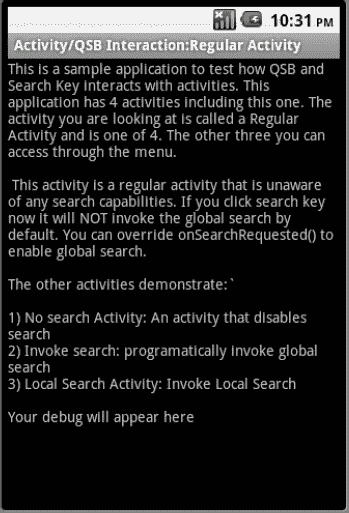
**图 23–12.** *常规活动/搜索交互*

清单 23–5 展示了用于常规活动的菜单 XML 文件。你可以在图 23–13 中看到该菜单的实际效果。

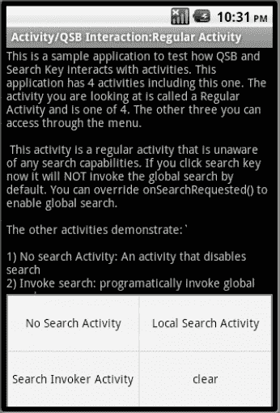
**图 23–13.** *访问其他测试活动*

现在，当此活动正在运行时（如图 23–12 所示），点击搜索键（请参阅图 23–1 以定位搜索键）。文档指出，这应该会调用全局搜索对话框。

在 2.0 之前的版本中，搜索键会触发全局搜索。在 2.2 和 2.3 版本中，按下搜索键不会调出全局搜索。

如果你想强制此常规活动支持全局搜索，则需要重写 `onSearchRequested()` 并执行以下操作：

```java
@Override
public boolean onSearchRequested()
{
    Log.d(tag,"onsearch request called");
    this.startSearch("test",true,null,true);
    return true;
}
```

将这段代码放入 `RegularActivity.java` 后，你可以按下搜索键，它将调用全局搜索。`startSearch()` 方法及其参数将在本章后续部分介绍。此全局搜索的外观将与图 23–2 中的全局搜索完全相同。

#### 禁用搜索的活动行为

活动可以通过在其 `onSearchRequested()` 回调方法中返回 `false` 来完全禁用搜索（包括全局搜索和本地搜索）。清单 23–6 展示了此类活动（我们将其命名为 `NoSearchActivity`）的源代码。

**清单 23–6.** *禁用搜索的活动*

```java
//filename: NoSearchActivity.java
public class NoSearchActivity extends Activity
{
    @Override
    protected void onCreate(Bundle savedInstanceState) {
        super.onCreate(savedInstanceState);
        setContentView(R.layout.no_search_activity);
        return;
    }
    @Override
    public boolean onSearchRequested()
    {
        return false;
    }
}
```

清单 23–7 展示了该活动对应的布局文件。

**清单 23–7.** *NoSearchActivity XML 文件*

```xml
//filename: layout/no_search_activity.xml
<?xml version="1.0" encoding="utf-8"?>
<LinearLayout
    android:orientation="vertical"
    android:layout_width="fill_parent"
    android:layout_height="fill_parent">
    <TextView
        android:id="@+id/text1"
        android:layout_width="fill_parent"
        android:layout_height="wrap_content"
        android:text="@string/no_search_activity_prompt" />
</LinearLayout>
```

准备好这两个文件（清单 23–6 和 23–7）后，你需要在以下两个文件中取消注释一些部分：

- `RegularActivity.java`（清单 23–1）
- `AndroidManifest.xml`（清单 23–2）

在 `RegularActivity.java` 文件（清单 23–1）中，取消 `invokeNoSearchActivity()` 方法体内的 Java 代码注释。

在 `AndroidManifest.xml`（清单 23–2）中，取消 `NoSearchActivity` 的活动定义注释。请注意，这是一个 XML 文件。注释和取消注释 XML 文件的方式与 Java 代码不同。

完成这两项取消注释任务后，你将能够重新编译项目。现在，你可以通过点击图 23–13 中的“No Search Activity”菜单项来调用这个 `NoSearchActivity`。

显示时，该活动将如图图 23–14 所示。此时，按下搜索键将没有任何效果；你什么也不会看到。


**图 23–14.** *禁用搜索的活动*

**提示：** 当有活动禁用了搜索时，点击搜索键不会调用本地或全局搜索。


#### 通过菜单显式调用搜索

除了能够响应搜索键之外，Activity 还可以选择通过搜索菜单项显式调用搜索。代码清单 23–8 展示了实现此功能的示例 Activity（`SearchInvokerActivity`）的源代码。

**代码清单 23–8.** *SearchInvokerActivity*

```java
//filename: SearchInvokerActivity.java
public class SearchInvokerActivity extends Activity
{
    @Override
    public void onCreate(Bundle savedInstanceState) {
        super.onCreate(savedInstanceState);
        setContentView(R.layout.search_invoker_activity);
    }

    @Override
    public boolean onCreateOptionsMenu(Menu menu)
    {
       super.onCreateOptionsMenu(menu);
       MenuInflater inflater = getMenuInflater();
       inflater.inflate(R.menu.search_invoker_menu, menu);
       return true;
    }

    @Override
    public boolean onOptionsItemSelected(MenuItem item)
    {
       appendMenuItemText(item);
       if (item.getItemId() == R.id.mid_si_clear)
       {
          this.emptyText();
          return true;
       }
       if (item.getItemId() == R.id.mid_si_search)
       {
          this.invokeSearch();
          return true;
       }
       return true;
    }

    private TextView getTextView()
    {
        return (TextView)this.findViewById(R.id.text1);
    }

    private void appendMenuItemText(MenuItem menuItem)
    {
       String title = menuItem.getTitle().toString();
       TextView tv = getTextView();
       tv.setText(tv.getText() + "\n" + title);
    }
    private void emptyText()
    {
          TextView tv = getTextView();
          tv.setText("");
    }
    private void invokeSearch()
    {
          this.onSearchRequested();
    }
    @Override
    public boolean onSearchRequested()
    {
        this.startSearch("test",true,null,true);
        return true;
    }
}
```

源代码的关键部分已加粗显示。请注意菜单 ID（`R.id.mid_si_search`）如何调用函数 `invokeSearch`，该函数将依次调用 `onSearchRequested()`。此方法 `onSearchRequested()` 会发起搜索。

基础方法 `startSearch` 具有以下参数：

- **initialQuery**：要搜索的文本。
- **selectInitialQuery**：一个布尔值，指示是否高亮显示搜索文本。本例中我们使用了 `true` 来高亮文本，以便在需要时可以删除并输入新文本。
- **appSearchData**：一个 Bundle 对象，用于传递给搜索 Activity。在我们的例子中，我们没有针对任何特定的搜索 Activity，因此传递了 `null`。
- **globalSearch**：如果为 `true`，则调用全局搜索。如果为 `false`，则调用本地搜索（如果可用），否则调用全局搜索。

SDK 文档建议调用基础的 `onSearchRequested()`，这与我们在代码清单 23–8 中展示的不同。然而，默认的 `onSearchRequested()` 对 `startSearch()` 的最后一个参数使用的是 `false`。根据文档，如果没有可用的本地搜索，这应该会调用全局搜索。但是，在本版本中（2.2 和 2.3 版本），全局搜索并未被调用。这可能是一个 Bug，或者是有意为之，需要更新文档。

在本示例中，我们通过向 `startSearch()` 的最后一个参数传递 `true` 来强制进行全局搜索。

代码清单 23–9 展示了此 Activity 的布局。

**代码清单 23–9.** *SearchInvokerActivity XML*

```xml
//filename: layout/search_invoker_activity.xml
<?xml version="1.0" encoding="utf-8"?>
<LinearLayout

    android:orientation="vertical"
    android:layout_width="fill_parent"
    android:layout_height="fill_parent"
    >
<TextView
   android:id="@+id/text1"
    android:layout_width="fill_parent"
    android:layout_height="wrap_content"
    android:text="@string/search_invoker_activity_prompt"
    />
</LinearLayout>
```

代码清单 23–10 展示了此 Activity 对应的菜单 XML。

**代码清单 23–10.** *SearchInvokerActivity 菜单 XML*

```xml
//filename:menu/search_invoker_menu.xml
<menu >
    <!-- This group uses the default category. -->
    <group android:id="@+id/menuGroup_Main">
        <item android:id="@+id/mid_si_search"
            android:title="Search" />

        <item android:id="@+id/mid_si_clear"
            android:title="clear" />
    </group>
</menu>
```

有了这三个文件（代码清单 23–8、23–9、23–10）之后，你需要在以下两个文件中取消注释几个部分：

- `RegularActivity.java`（代码清单 23–1）
- `AndroidManifest.xml`（代码清单 23–2）

在 `RegularActivity.java` 文件（代码清单 23–1）中，取消注释函数 `invokeSearchInvokerActivity()` 主体内的 Java 代码。

在 `AndroidManifest.xml`（代码清单 23–2）中，取消注释 `SearchInvokerActivity` 的 Activity 定义。完成这两个取消注释任务后，你就可以重新编译项目了。

在布局和菜单就位的情况下，图 23–15 展示了从 `RegularActivity` 的主菜单中调用时此 Activity 的外观（有关调用此 Activity 的菜单项 `Search Invoker Activity`，请参见图 23–13）。

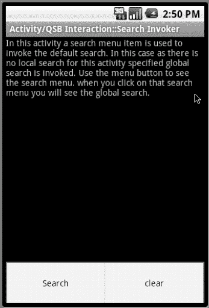

**图 23–15.** *搜索调用 Activity*

在此 Activity 中，如果你点击搜索菜单选项，它将调用熟悉的全局搜索 QSB，如图 23–2 所示。由于我们还重写了基础 Activity 的 `onSearchRequested()`，设备搜索键也将调出全局 QSB。


### 理解本地搜索及其相关活动

现在，我们来探讨一下在哪些情况下，搜索键会*不*触发全局搜索，而是调用本地搜索。但首先，我们需要进一步解释一下本地搜索。

本地搜索包含三个组成部分。第一部分是一个搜索框，它与全局搜索框`QSB`非常相似（即便不完全相同）。无论是本地还是全局的`QSB`，都提供了用于输入文本的文本框和用于点击的搜索图标。当一个活动在其清单文件中声明它需要使用本地搜索时，通常会调用本地`QSB`而非全局`QSB`。你可以通过查看`QSB`的标题（参见后续图 23-18 的标题）和`QSB`中的提示文本（搜索框内部的文字）来区分被调用的本地`QSB`和全局`QSB`。如你所见，这两个值来源于一个搜索元数据 XML 文件。

本地搜索的第二部分是一个活动，它能够从本地`QSB`接收搜索字符串，并显示一组与搜索文本相关的结果或任何输出。这个活动通常被称为搜索活动或搜索结果活动。

本地搜索可选的第三部分是一个允许调用刚才描述的搜索结果活动（即第二部分）的活动。这个调用活动通常称为搜索调用器或搜索调用活动。这个搜索调用器是可选的，因为全局搜索有可能通过建议直接调用本地搜索活动（即第二部分）。

你可以在图 23-16 中看到这三个组成部分以及它们之间是如何交互的。

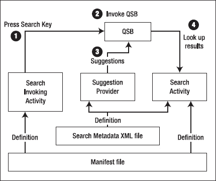

**图 23-16.** *本地搜索活动交互*

在图 23-16 中，重要的交互被标注为带注释的（圆圈数字）箭头。以下是更详细的解释：

*   需要在清单文件中将`SearchActivity`定义为一个能够接收搜索请求的活动。`SearchActivity`还使用一个强制性的 XML 文件来声明本地`QSB`应该如何呈现（例如，带有标题、提示等），以及是否有关联的建议提供者。（参见清单 23-12）。在图 23-16 中，你可以看到这表现为`SearchActivity`与两个 XML 文件（清单文件和搜索元数据文件）之间的几条“定义”线。
*   一旦`SearchActivity`在清单文件中被定义（参见清单 23-2），`SearchInvokingActivity`就会在清单文件中通过元数据定义`android.app.default_searchable`表明它与`SearchActivity`关联。
*   当两个活动的定义就位后，当`SearchInvokingActivity`获得焦点时，按下搜索键将调用本地`QSB`。你可以在图 23-16 中看到这一点——标为 1 和 2 的圆圈。通过查看`QSB`的标题和提示，你可以判断被调用的`QSB`是本地`QSB`。这两个值是在强制性的搜索元数据 XML 定义中设置的。一旦通过搜索键调用了`QSB`，你就可以在`QSB`中输入查询文本。这个本地`QSB`与全局`QSB`类似，也具备提供建议的能力。你可以在图 23-16 中看到这一点（圆圈 3）。
*   一旦输入查询文本并点击搜索图标，本地`QSB`会将搜索请求传递给`SearchActivity`，由后者负责处理，例如显示一组结果。如图 23-16（圆圈 4）所示。

我们将通过查看源代码来检查这些交互。我们从清单 23-11 开始，即`SearchActivity`的源代码（再次提醒，它负责接收查询并显示搜索结果）。

**清单 23-11.** *SearchActivity 及其布局文件*

```
//文件名: SearchActivity.java
public class SearchActivity extends Activity
{
    @Override
    protected void onCreate(Bundle savedInstanceState) {
        super.onCreate(savedInstanceState);
        setContentView(R.layout.search_activity);
        return;
    }
}
```

```
//相应的 res/layout/search_activity.xml

<?xml version="1.0" encoding="utf-8"?>
<LinearLayout
    android:orientation="vertical"
    android:layout_width="fill_parent"
    android:layout_height="fill_parent"
    >
<TextView
    android:id="@+id/text1"
    android:layout_width="fill_parent"
    android:layout_height="wrap_content"
    android:text="@string/search_activity_prompt"
    />
</LinearLayout>
```

我们采用了一个最简单的搜索活动。稍后你将看到该活动如何检索查询。现在，我们将展示这个活动最终是如何被`QSB`调用的。以下是在清单文件中如何将其定义为负责显示结果的搜索活动（参见清单 23-2）：

```
<activity android:name=".SearchActivity"
   android:label="Activity/QSB Interaction::Search Results">
     <intent-filter>
        <action android:name="android.intent.action.SEARCH"/>
        <category android:name="android.intent.category.DEFAULT"/>
      </intent-filter>
     <meta-data android:name="android.app.searchable"
        android:resource="@xml/searchable"/>
</activity>
```

**注意：** 为一个搜索活动指定两个事项。该活动需要表明它可以响应`SEARCH`动作。它还需要指定一个 XML 文件，该文件描述了与此搜索活动交互所需的元数据。

清单 23-12 显示了该`SearchActivity`的搜索元数据 XML 文件。

**清单 23-12.** *Searchable.xml: 搜索元数据*

```
<!-- /res/xml/searchable.xml -->
<searchable
    android:label="@string/search_label"
    android:hint="@string/search_hint"
    android:searchMode="showSearchLabelAsBadge"
/>
```

**提示：** 这个 XML 中可用的各种选项在 SDK 中有文档说明，地址为：[`http://developer.android.com/reference/android/app/SearchManager.html`](http://developer.android.com/reference/android/app/SearchManager.html)。

我们将在本章后面部分介绍更多这些属性。现在，属性`android:label`用于标记搜索框。属性`android:hint`用于在搜索框中放置提示文本，类似于图 23-18 所示。

现在，让我们研究一个活动如何将`SearchActivity`指定为其搜索活动。我们将这个活动称为`LocalSearchEnabledActivity`。清单 23-13 显示了该活动的源代码。

**清单 23-13.** *LocalSearchEnabledActivity*

```
//文件名: LocalSearchEnabledActivity.java
public class LocalSearchEnabledActivity extends Activity
{
    @Override
    protected void onCreate(Bundle savedInstanceState) {
        super.onCreate(savedInstanceState);
        setContentView(R.layout.local_search_enabled_activity);
        return;
    }
}
```

清单 23-14 显示了该活动对应的布局 XML 文件。

**清单 23-14.** *LocalSearchEnabledActivity 布局文件*

```
<?xml version="1.0" encoding="utf-8"?>
<!-- 文件名: layout/local_search_enabled_activity.xml -->
<LinearLayout
```


`android:orientation="vertical"`
`android:layout_width="fill_parent"`
`android:layout_height="fill_parent"`
`>`
`<TextView`
`    android:id="@+id/text1"`
`    android:layout_width="fill_parent"`
`    android:layout_height="wrap_content"`
`    android:text="@string/local_search_enabled_activity_prompt"`
`    />`
`</LinearLayout>`

另外请注意，这个 `LocalSearchEnabledActivity`（清单 23–13）将 `SearchActivity`（清单 23–11）作为其目标搜索活动。您可以通过查看 `LocalSearchEnabledActivity` 的清单文件定义（清单 23–2）来发现这种关系。以下是该定义的复制内容，便于快速浏览：

```
<activity android:name=".LocalSearchEnabledActivity"
   android:label="活动/QSB 交互::本地搜索">
<meta-data android:name="android.app.default_searchable"
android:value=".SearchActivity" />
</activity>
```

现在回顾一下我们目前介绍的新文件，以便您测试这两个活动：`LocalSearchEnabledActivity` 和 `SearchActivity`。这些新文件及其清单编号如下：

-   `SearchActivity.java`（清单 23–11）
-   `layoyut/search_activity.xml`（作为清单 23–11 的一部分给出）
-   `res/xml/searchable.xml`（清单 23–12）
-   `LocalSearchEnabledActivity.java`（清单 23–13）
-   `local_search_enabled_activity`（清单 23–14）

有了这些文件后，您需要在以下两个文件中取消注释部分代码段：

-   `RegularActivity.java`（清单 23–1）
-   `AndroidManifest.xml`（清单 23–2）

在 `RegularActivity.java` 文件（清单 23–1）中，取消注释 `invokeLocalSearchActivity()` 函数体内的 Java 代码。

在 `AndroidManifest.xml`（清单 23–2）中，取消注释 `LocalSearchEnabledActivity` 和 `SearchActivity` 的活动定义。

完成这两项取消注释的任务后，您将能够再次编译该项目。

有了这些新活动及其布局，您可以通过点击主 `RegularActivity` 中的“本地搜索活动”菜单项来调用此 `LocalSearchEnabledActivity`（参见图 23–13 查找菜单）。调用后，该活动的外观如图 23–17 所示。

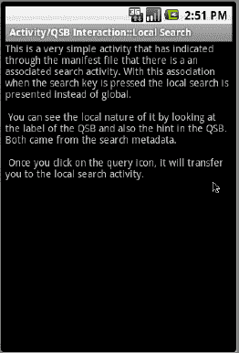

**图 23–17.** *启用本地搜索的活动*

当此活动获得焦点时，如果您点击设备搜索键，它将调用一个本地搜索框（本地 QSB），如图 23–18 所示。

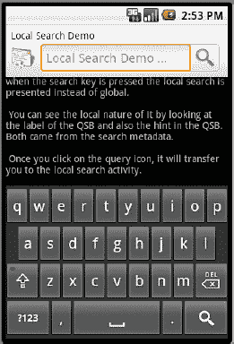

**图 23–18.** *本地搜索 QSB*

请注意此搜索框的标签和提示文字。观察它们与全局搜索的区别（参见图 23–2）。这些标签和提示来自于为 `SearchActivity` 指定的搜索元数据（`searchable.xml` 清单 23–12）。现在，如果您在 QSB 中输入文本并点击搜索图标，最终将调用 `SearchActivity`（参见清单 23–11）。以下是这个 `SearchActivity` 的外观（图 23–19）。

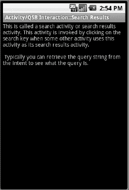

**图 23–19.** *响应本地搜索 QSB 的搜索结果*

尽管此活动并未使用任何查询搜索文本来提取结果，但它演示了如何定义和调用搜索活动。本章稍后将展示这个 `SearchActivity` 如何使用搜索查询以及它需要响应的各种搜索相关操作。

### 启用按键即搜

到目前为止，我们探讨了几种调用搜索的方式，包括本地搜索和全局搜索。我们展示了如何在设备主页面上使用 QSB 进行搜索。我们讲述了只要活动未阻止全局搜索，如何从任何活动中调用它。我们还展示了活动如何指定本地搜索。我们将通过介绍另一种称为*按键即搜*的搜索调用方式来结束本主题。

当您查看诸如图 23–12 中所示的 `RegularActivity` 等活动时，有一种方法可以通过键入任意字母（例如“t”）来调用搜索。这种模式称为*按键即搜*，因为您键入的任何未被活动处理的按键都将触发搜索。

按键即搜的意图是这样的：在任何 Android 活动上，您可以告诉 Android，除了活动明确处理的按键之外，任何按键按下都可以调用搜索。例如，如果一个活动处理了“x”和“y”按键，但不在意其他按键，则该活动可以选择为“z”或“a”等其他按键调用搜索。这种模式对于已经显示搜索结果的活动非常有用。此类活动可以将按键按下解释为重新开始搜索的信号。

以下是在活动的 `onCreate()` 方法中启用此行为的两行代码（第一行用于调用全局搜索，第二行用于调用本地搜索）：

`this.setDefaultKeyMode(Activity.DEFAULT_KEYS_SEARCH_GLOBAL);`

或

`this.setDefaultKeyMode(Activity.DEFAULT_KEYS_SEARCH_LOCAL);`

通过这种“按键即搜”机制调用全局搜索似乎不经过 `onSearchRequested()` 路由。这些按键直接调用全局搜索。因此，如果我们启用按键即搜，本示例中的 `RegularActivity` 似乎会调用全局搜索。（如果您还记得，在我们的测试中，当按下搜索键时，没有明确启用或禁用搜索的常规活动未能调用全局搜索）。您可以通过将以下行放置在 `RegularActivity` 类（清单 23–1）的 `onCreate()` 方法末尾来测试这种按键即搜行为：

`this.setDefaultKeyMode(Activity.DEFAULT_KEYS_SEARCH_GLOBAL);`

然后在图 23–12 中按下“t”等字母，将会调用全局搜索。

至此，我们关于 Android 搜索与活动交互的各种方式以及如何使用搜索的讨论就结束了。现在我们将了解如何参与搜索，而不仅仅是使用它。我们将实现一个简单的建议提供者应用程序，它可以为本地和全局 QSB 提供搜索建议。


### 实现一个简单的建议提供程序

本章内容较多，如果你一直在连续阅读，不妨先休息一下——因为我们即将开始另一大段文字，需要你全神贯注。

我们之前已经说明，建议提供程序如何让应用程序参与全局搜索。现在，我们将设计并编写一个简单的建议提供程序。你可以通过继承 Android SDK 中名为 `SearchRecentSuggestionsProvider` 的预制提供程序，仅用几行代码就能创建一个简单的建议提供程序。

首先，我们将解释一个简单的建议提供程序应用应如何工作。我们会列出实现中所用的文件清单。这些文件能让你对应用及其实现涉及的内容有一个总体概念。

编写建议提供程序时，有三个主要组件。第一个是建议提供程序，负责向 Android 搜索返回建议。第二个是搜索活动，负责接收查询或建议，并将其转化为搜索结果。第三个是一个名为搜索元数据的 XML 文件，它在搜索活动的上下文中定义。我们将描述每个组件的职责，并通过源代码展示其实现方式。

但首先，让我们规划一下这个简单的建议提供程序应用。

#### 规划简单建议提供程序

由于我们计划继承 `SearchRecentSuggestionsProvider`，最终得到的建议提供程序的功能基本是固定的。

`SearchRecentSuggestionsProvider` 允许你将从 QSB 提交给搜索活动的查询重新播放。一旦这些查询被搜索活动保存，当用户在 QSB 中输入搜索字母或文本时，它们就会通过建议提供程序重新提示给 QSB。

在派生的建议提供程序中，我们通过指定需要重新播放的搜索文本部分来初始化基类提供程序。除此之外，我们几乎不需再做其他事情。我们还会使用一个最小化的搜索活动（仅包含一个文本视图），以显示搜索活动已被调用。在搜索活动内部，我们将展示用于检索和保存查询的方法，以便搜索提供程序能够使用这些查询。

应用完成后，我们的目标是看到之前的查询作为建议出现在本地和全局 QSB 中。

接下来，我们将展示本项目实现中所用的文件清单。你也可以使用本章末尾的下载链接，下载本章的可导入项目。

#### 简单建议提供程序实现文件

参与建议提供程序应用实现的主要文件有 `SearchActivity.java`、`SimpleSuggestionProvider.java` 和 `searchable.xml`（搜索元数据）。然而，要完成整个项目，你还需要一些支持文件。我们将首先列出所有这些文件，并简要说明每个文件的作用。在解释解决方案时，我们会包含所有文件的源代码。

我们先从 Java 文件开始：

*   `SimpleSuggestionProvider.java`：通过继承 SDK 提供的一个基类建议提供程序，实现我们讨论的建议提供程序。（清单 23-15）
*   `SearchActivity.java`：一个与建议提供程序配合使用的必需文件，它接收搜索文本进行搜索并显示搜索结果。它还负责保存供建议提供程序使用的查询。（清单 23-17）
*   `SimpleMainActivity.java`：一个用于调用本地搜索并演示本地建议的活动。（清单 23-19）

以下是相应的布局文件：

*   `main.xml`：`SimpleMainActivity` 的布局文件（属于清单 23-19 的一部分）
*   `/res/layout/layout_search_activity.xml`：`SearchActivity` 的布局文件（属于清单 23-17 的一部分）
*   `/res/values/strings.xml`：布局文件从这里使用公共字符串定义（属于清单 23-19 的一部分）

以下是搜索元数据文件：

*   `/xml/searchable.xml`：此文件将搜索活动与建议提供程序连接起来。（清单 23-18）

当然，我们还需要清单文件：

*   `AndroidManifest.xml`：在此文件中，所有应用组件都被定义给 Android。（清单 23-16）

如果你打算通过复制/粘贴直接编译本书源代码中的项目，我们建议你现在就根据上述文件，前往对应的清单编号进行操作。另一种方法是使用本章末尾参考资料中提供的链接下载本章的项目。

让我们从 `SimpleSuggestionProvider` 类的实现开始探索这些文件。

#### 实现 `SimpleSuggestionProvider` 类

在这个简单的建议提供程序项目中，`SimpleSuggestionProvider` 类通过继承 `SearchRecentSuggestionsProvider` 来充当建议提供程序。首先，我们来看看这个简单建议提供程序的职责。

##### 简单建议提供程序的职责

由于简单建议提供程序派生自 `SearchRecentSuggestionsProvider`，因此大部分职责由基类处理。为了向基类提供程序提供提示，派生建议提供程序需要使用一个唯一的授权字符串（authority）来初始化基类。这是因为 Android 搜索会根据一个唯一的内容提供程序 URI 来调用建议提供程序。而 Android 中的内容提供程序是通过其类似域名的字符串（称为授权字符串，authority）来调用的（关于内容提供程序授权字符串的完整理解，请参考第 4 章关于内容提供程序的内容）。

一旦通过简单调用基类实现了建议提供程序，就需要在清单文件中将其配置为具有授权字符串的常规内容提供程序。然后，需要将其（通过可搜索元数据 xml 文件间接地）与一个搜索活动绑定。搜索活动的定义指向 `searchable.xml` 文件，而该文件又指向建议提供程序。

让我们检查一下这个提供程序的源代码，看看其中一些职责是如何实现的。

##### `SimpleSuggestionProvider` 的完整源代码

由于我们继承自 `SearchRecentSuggestionsProvider`，简单建议提供程序的源代码将非常简单，如清单 23-15 所示。

**清单 23-15.** *SimpleSuggestionProvider.java*

```
//SimpleSuggestionProvider.java
public class SimpleSuggestionProvider
extends SearchRecentSuggestionsProvider {

    final static String AUTHORITY =
          "com.androidbook.search.simplesp.SimpleSuggestionProvider";

    final static int MODE =
             DATABASE_MODE_QUERIES | DATABASE_MODE_2LINES;

    public SimpleSuggestionProvider() {
        super();
        setupSuggestions(AUTHORITY, MODE);
    }
}
```

清单 23-15 中有几点值得注意：

1.  初始化父类。
2.  使用授权字符串和模式设置基类提供程序（指示需要记住搜索文本的哪些部分）。

授权字符串需要是唯一的。授权字符串必须与其在清单文件中的内容提供程序定义相匹配。（请参阅本项目后续的 Android 清单文件清单 23-16。）

我们来讨论一下 `setupSuggestions()` 方法的第二个参数：数据库模式。


### 理解 `SearchRecentSuggestionsProvider` 数据库模式

Android 提供的 `SearchRecentSuggestionsProvider` 工具的核心功能是存储/回放数据库中的查询，以便它们可以作为未来的搜索建议。一条建议包含两个文本字符串（参见 图 23–2）。只有第一个字符串是必需的。当你使用 `SearchRecentSuggestionsProvider` 回放这些字符串时，你需要告知它你想使用一个还是两个字符串。

为满足此需求，基础建议提供者支持两种模式（模式位）。两种模式均使用以下前缀：

`DATABASE_MODE_...`

具体两种模式如下：

- `DATABASE_MODE_QUERIES`（二进制值为 1）
- `DATABASE_MODE_2LINES`（二进制值为 2）

第一种模式表示只需存储并回放单条查询字符串。第二种模式表示建议提供者可以回放两个字符串。一个字符串是查询本身，另一个是显示在建议项中的描述行。

`SearchActivity` 负责在收到查询响应请求时保存这些字符串。`SearchActivity` 会调用以下方法来存储这些项（在讨论搜索活动时，我们会更详细地介绍）：

```
public class SearchRecentSuggestions
{
   ...
   public void saveRecentQuery (String queryString, String line2);
   ...
}
```

**注意：** `SearchRecentSuggestions` 类是一个 SDK 类，当我们在 清单 23–17 中讨论搜索活动代码时，会对此进行更详细的介绍。

`queryString` 是用户输入的字符串。该字符串将作为建议显示，如果用户点击该建议，此字符串将被发送到你的可搜索活动（作为新的搜索查询）。

以下是 Android 文档关于 `line2` 参数的说明：

> 如果你使用 `DATABASE_MODE_2LINES` 配置了最近建议提供者，可以在此处传入第二行文本。它将以较小的字体显示在主建议下方。输入时，两行文本中的匹配项都会显示在列表中。如果你没有配置双行模式，或者某条建议没有要显示的额外文本，可以在此处传入 null。

在我们的示例中，我们希望同时保存查询及其在建议中显示的辅助文本。或者至少，我们希望显示诸如 SSSP（简单搜索建议提供者）之类的辅助文本在建议底部，这样当来自此提供者的建议在全局搜索中显示时，我们可以看出哪个应用程序负责搜索建议中的文本。

指定此模式以便保存建议和辅助文本的方法是，按照 清单 23–15 所示设置两个模式位。如果你仅将模式位设置为保存两行，将会得到一个无效参数异常。模式位必须至少包含 `DATABASE_MODE_QUERIES` 位。本质上，你需要执行按位或操作。因此，这些模式本质上是互补的，而非互斥的。

**提示：** 你可以通过 [`developer.android.com/reference/android/provider/SearchRecentSuggestions.html`](http://developer.android.com/reference/android/provider/SearchRecentSuggestions.html) 了解更多关于此预制建议提供者的信息。

现在我们已经有了简单建议提供者的源代码，让我们看看如何在清单文件中注册此提供者。

### 在清单文件中声明建议提供者

由于我们的 `SimpleSuggestionProvider` 本质上是一个内容提供者，因此它与任何其他内容提供者一样，在清单文件中进行注册。清单 23–16 显示了此项目的清单文件。请注意，此清单文件的关键部分已被突出显示。

**清单 23–16.** *SimpleSuggestionProvider 清单文件*

```
//文件名: AndroidManifest.xml
<?xml version="1.0" encoding="utf-8"?>
<manifest
      package="com.androidbook.search.simplesp"
      android:versionCode="1"
      android:versionName="1.0.0">
    <application android:icon="@drawable/icon"
       android:label="Simple Search Suggestion Provider:SSSP">
        <activity android:name=".SimpleMainActivity"
           android:label="SSSP:Simple Main Activity">
            <intent-filter>
               <action
                android:name="android.intent.action.MAIN" />
               <category
                android:name="android.intent.category.LAUNCHER" />
            </intent-filter>
        </activity>

<!--
****************************************************************
* 搜索相关代码：搜索活动
****************************************************************
 -->
<activity android:name=".SearchActivity"
      android:label="SSSP: Search Activity"
      android:launchMode="singleTop">
     <intent-filter>
         <action android:name="android.intent.action.SEARCH" />
         <category android:name="android.intent.category.DEFAULT" />
      </intent-filter>
<meta-data android:name="android.app.searchable"
                   android:resource="@xml/searchable" />
   </activity>

   <meta-data android:name="android.app.default_searchable"
                    android:value=".SearchActivity" />

<provider android:name=".SimpleSuggestionProvider"
         android:authorities
="com.androidbook.search.simplesp.SimpleSuggestionProvider" />
</application>
    <uses-sdk android:minSdkVersion="4" />
</manifest>
```

请注意，简单建议提供者的授权（authority）在源代码（清单 23–15）和清单文件（清单 23–16）中是如何匹配的。在这两种情况下，此授权的值都是

`com.androidbook.search.simplesp.SimpleSuggestionProvider`

当我们介绍此简单建议提供者的其他方面时，我们将讨论此清单文件的其他部分。从该清单文件中可以看出，搜索活动扮演着关键角色。因此，我们现在来讨论一下这个搜索活动。我们将在此部分末尾讨论清单文件中的另一个活动 `SimpleMainActivity`，因为它只是一个启动一切的驱动活动。

### 理解简单建议提供者搜索活动

搜索活动由 Android 搜索（QSB）使用查询字符串调用。搜索活动反过来需要从 Intent 中读取此查询字符串，执行必要的操作，并可能显示结果。

由于搜索活动是一个活动，它可能被其他 Intent 或其他动作调用。因此，一个良好的实践是检查调用它的 Intent 动作。在我们的例子中，当 Android 搜索调用此活动时，该动作是 `ACTION_SEARCH`。

在某些情况下，搜索活动可能调用自身。当这种情况可能发生时，你应该将搜索活动的启动模式定义为 `singleTop`。该活动还需要处理 `onNewIntent()` 的触发。我们将在“理解 `onCreate` 和 `onNewIntent`”部分介绍这一点。

关于如何处理查询字符串，我们只需将其记录下来。一旦记录了查询，我们需要将其保存在 `SearchRecentSuggestionsProvider` 中，以便它作为未来搜索的建议可用。

现在让我们来看看搜索活动类的源代码。


#### 搜索活动的完整源代码

代码清单 23-17 展示了 `SearchActivity` 类的完整源代码。

**代码清单 23-17.** *SimpleSuggestionProvider 搜索活动*

```
//文件名: SearchActivity.java
public class SearchActivity extends Activity
{
    private final static String tag ="SearchActivity";
    @Override
    protected void onCreate(Bundle savedInstanceState) {
        super.onCreate(savedInstanceState);
        Log.d(tag,"I am being created");
        //否则执行此处代码
        setContentView(R.layout.layout_search_activity);
       //this.setDefaultKeyMode(Activity.DEFAULT_KEYS_SEARCH_GLOBAL);
        this.setDefaultKeyMode(Activity.DEFAULT_KEYS_SEARCH_LOCAL);

        // 在此处获取并处理搜索查询
        final Intent queryIntent = getIntent();
        final String queryAction = queryIntent.getAction();
        if (Intent.ACTION_SEARCH.equals(queryAction))
        {
           Log.d(tag,"new intent for search");
           this.doSearchQuery(queryIntent);
        }
        else {
           Log.d(tag,"new intent NOT for search");
        }
        return;
    }

    @Override
    public void onNewIntent(final Intent newIntent)
    {
        super.onNewIntent(newIntent);
        Log.d(tag,"new intent calling me");

        // 在此处获取并处理搜索查询
        final Intent queryIntent = getIntent();
        final String queryAction = queryIntent.getAction();
        if (Intent.ACTION_SEARCH.equals(queryAction))
        {
           this.doSearchQuery(queryIntent);
           Log.d(tag,"new intent for search");
        }
        else {
           Log.d(tag,"new intent NOT for search");
        }
    }
    private void doSearchQuery(final Intent queryIntent)
    {
        final String queryString =
        queryIntent.getStringExtra(SearchManager.QUERY);

        // 在最近查询建议提供器中记录查询字符串。
        SearchRecentSuggestions suggestions =
        new SearchRecentSuggestions(this,
              SimpleSuggestionProvider.AUTHORITY,
              SimpleSuggestionProvider.MODE);
        suggestions.saveRecentQuery(queryString, "SSSP");
    }
}

//以下是同一代码清单中展示的对应布局文件。
//请剪切以下代码并创建一个单独的布局文件。请参考嵌入式文件位置

<?xml version="1.0" encoding="utf-8"?>
<!-- /res/layout/layout_search_activity.xml -->
<LinearLayout

    android:orientation="vertical"
    android:layout_width="fill_parent"
    android:layout_height="fill_parent"
    >
<TextView
    android:id="@+id/text1"
    android:layout_width="fill_parent"
    android:layout_height="wrap_content"
    android:text="Test Search Activity view"
    />
</LinearLayout>
```

根据代码清单 23-17 中的代码，我们来了解搜索活动如何检查操作并检索查询字符串。

#### 检查操作并检索查询

搜索活动的代码通过检查启动意图并将其与常量 `Intent.ACTION_SEARCH` 进行比较，从而判断启动操作。如果操作匹配，则调用 `doSearchQuery()` 函数。

在 `doSearchQuery()` 函数中，搜索活动通过一个意图附加信息来检索查询字符串。代码如下：

```
        final String queryString =
           queryIntent.getStringExtra(SearchManager.QUERY);
```

请注意，这个意图附加信息被定义为 `SearchManager.QUERY`。在阅读本章的过程中，您将在 `SearchManager` API 参考文档中看到许多此类附加信息。（其 URL 包含在本章末尾的“参考资料”部分。）

#### 理解 `onCreate()` 和 `onNewIntent()`

当用户在搜索框中输入文本并点击某个建议或“前往”箭头时，Android 会启动一个搜索活动。这会导致创建搜索活动并调用其 `onCreate()` 方法。传递给此 `onCreate()` 方法的意图会将操作设置为 `ACTION_SEARCH`。

有时活动不会被创建，而是通过 `onNewIntent()` 方法将新的搜索条件传递给它。这是如何发生的？回调方法 `onNewIntent()` 与活动的启动模式密切相关。如果您查看代码清单 23-16，会注意到搜索活动在清单文件中被设置为 `singleTop` 模式。

当活动被设置为 `singleTop` 模式时，它指示 Android：如果该活动已位于堆栈顶部，则不要创建新的活动实例。在这种情况下，Android 会调用 `onNewIntent()` 而不是 `onCreate()`。这就是为什么在代码清单 23-17 的活动源代码中，我们有两个位置来检查意图。

#### 测试 `onNewIntent()`

一旦您实现了 `onNewIntent()`，您会注意到在正常的流程中它并不会被调用。这就引出了一个问题：搜索活动何时会位于堆栈顶部？通常情况下这并不会发生。

原因如下：假设一个搜索调用者 Activity A 调用搜索，这导致搜索 Activity B 启动。Activity B 显示结果后，用户使用返回按钮返回，此时我们的搜索 Activity B 不再位于堆栈顶部，而是 Activity A 位于顶部。或者用户可能点击主页键并使用主屏幕上的全局搜索，在这种情况下，主屏幕活动位于顶部。

搜索活动位于顶部的一种情况是：假设 Activity A 由于搜索导致 Activity B 启动。如果 Activity B 定义了“输入即搜索”功能，那么当您聚焦于 Activity B 时，一次新的搜索会再次使用新条件调用 Activity B。代码清单 23-17 展示了我们如何设置“输入即搜索”功能来进行演示。代码如下：

```
this.setDefaultKeyMode(Activity.DEFAULT_KEYS_SEARCH_LOCAL);
```

#### 使用 `SearchRecentSuggestionsProvider` 保存查询

我们已经讨论过搜索活动如何需要保存它遇到过的查询，以便通过建议提供器将它们作为建议回放。以下是保存这些查询的代码段：

```
final String queryString =
    queryIntent.getStringExtra(SearchManager.QUERY);

// 在最近查询建议提供器中记录查询字符串。
SearchRecentSuggestions suggestions =
     new SearchRecentSuggestions(this,
          SimpleSuggestionProvider.AUTHORITY,
          SimpleSuggestionProvider.MODE);
suggestions.saveRecentQuery(queryString, "SSSP");
```

从这段代码中您可以看到，Android 通过意图将查询信息作为附加信息（`SearchManager.QUERY`）传递。

一旦您获得了查询，就可以利用 SDK 中的实用工具类 `SearchRecentSuggestions`，通过实例化一个新的建议对象并要求其保存，来保存该查询和一个提示（"SSSP"）。因为我们选择了使用双行模式和查询模式，所以 `saveRecentQuery` 的第二个参数是 SSSP（再次说明，这代表 Simple Search Suggestions Provider）。您会看到这段文本出现在该提供器建议的底部。

现在，我们将查看搜索元数据定义，在这里我们将搜索活动与搜索建议提供器关联起来。


好的，作为高级文档工程师和翻译员，我将按照您提供的注意事项和示例，将给定的英文文本翻译成中文。


#### 搜索元数据

Android 中搜索的定义始于一个搜索 Activity。您首先需要在 manifest 文件中定义一个搜索 Activity。作为定义的一部分，您需要告知 Android 去哪里寻找搜索元数据 XML 文件。请参阅列表 23–16，其中定义了我们搜索 Activity 以及搜索元数据 xml 文件（`searchable.xml`）的路径。

列表 23–18 展示了相应的搜索元数据 xml 文件。

**列表 23–18.** *SimpleSuggestionProvider 搜索元数据*

```
<!-- filename: /res/xml/searchable.xml -->
<searchable
    android:label="@string/search_label"
    android:hint="@string/search_hint"
    android:searchMode="showSearchLabelAsBadge"
    android:queryAfterZeroResults="true"
    android:includeInGlobalSearch="true"
    android:searchSuggestAuthority=
           "com.androidbook.search.simplesp.SimpleSuggestionProvider"
    android:searchSuggestSelection=" ? "
/>
```

让我们逐一分析列表 23–18 中的一些关键属性。

属性 `includeInGlobalSearch` 告知 Android 将此建议提供程序用作全局 QSB 的其中一个数据源。

属性 `searchSuggestAuthority` 指向建议提供程序的权限，该权限在该建议提供程序的 manifest 文件中定义（参见列表 23–16）。

属性 `queryAfterZeroResults` 指示如果当前输入的一组字母没有返回任何结果，QSB 是否应向建议提供程序发送更多字母。由于我们在测试，我们希望不遗漏任何可能性，因此将此属性设置为 true，以便给提供程序尽可能多的响应机会。

当您派生自“最近搜索建议”提供程序时，属性 `searchSuggestSelection` 始终是由“`?`”表示的字符串。此字符串作为 `selection` 字符串（where 子句）传递给内容提供程序 `query` 方法的建议提供程序。通常，这表示进入任何内容提供程序的 select 语句的 where 子句。

针对建议提供程序，当为 `searchSuggestSelection` 指定了值时，（作为一种协议）Android 会将搜索查询字符串（在 QSB 中输入）作为 select 参数数组的第一个条目传递给内容提供程序的 `query` 方法。

响应这些细节（提供程序内部如何使用这些字符串）的代码隐藏在“最近搜索建议”提供程序中，我们无法向您展示这些参数在内容提供程序的 `query` 方法中是如何使用的。

我们将在下一节中更详细地讨论这一点，届时您将看到字符串“`?`”的全貌。事实上，这个字符串很可能根本不会用于缩小结果范围，因为它没有指定任何要查询的字段，例如“`someid == ?`”。很可能它的存在本身就提示 Android 将 QSB 字符串作为第一个参数传递给提供程序。而 SDK 搜索建议提供程序仅仅依赖此协议，通过内容提供程序 `query()` 方法的 select 参数列表提供的便捷数组来接收 QSB 字符串。

现在，让我们讨论一个搜索调用者 Activity，它将用作此应用程序的主入口点。这个主 Activity 允许我们测试本地搜索。

#### 搜索调用者 Activity

这个主 Activity 将在其获得焦点时允许我们调用本地搜索。列表 23–19 展示了此搜索调用者 Activity 的源代码、其布局文件以及属于此项目的 `strings.xml`。

**列表 23–19.** *SimpleSuggestionProvider：主 Activity*

```
public class SimpleMainActivity extends Activity
{
    @Override
    public void onCreate(Bundle savedInstanceState) {
        super.onCreate(savedInstanceState);
        setContentView(R.layout.main);
    }
}
```

```
//filename: /res/layout/main.xml
//Copy the following xml file as main.xml

<?xml version="1.0" encoding="utf-8"?>
<LinearLayout
    android:orientation="vertical"
    android:layout_width="fill_parent"
    android:layout_height="fill_parent"
    >
<TextView
    android:id="@+id/text1"
    android:layout_width="fill_parent"
    android:layout_height="wrap_content"
    android:text="@string/main_activity_text"
    />
</LinearLayout>
```

```
//filename: /res/values/strings.xml
//Copy the following xml file as strings.xml

<?xml version="1.0" encoding="utf-8"?>
<resources>
<string name="main_activity_text">
    这是一个简单的 Activity。点击搜索键来调用本地搜索。
    \n\n
    建议提供程序也会参与全局搜索。当您通过全局搜索进入此
    应用程序时，您将不会看到此视图，而是直接被带到
    SearchActivity 视图。
    </string>

<string name="search_activity_text">
    如果您看到此 Activity，说明您是通过全局搜索或本地
    搜索被引导至此处的。
    \n\n
    此 Activity 也启用了边输入边搜索。它还演示了
    singletop/new intent 的概念。
    </string>

    <string name="app_name">Simple Suggestion Provider</string>
<string name="search_label">本地搜索演示</string>
   <string name="search_hint">本地搜索提示</string>
</resources>
```

如果您查看 manifest 文件中此 Activity 的定义（列表 23–16），您会注意到它没有明确说明使用 `SearchActivity` 作为其默认本地搜索。这是因为我们在应用程序级别（而非 Activity 级别）使用了该规范，方法是在 manifest 文件中引入了以下行：

```
   <meta-data android:name="android.app.default_searchable"
          android:value=".SearchActivity" />
```

请注意这些行如何位于 manifest 文件（列表 23–16）中任何 Activity 的外部。此规范告知 Android，此应用程序中的所有 Activity（包括 `SearchActivity` 本身）都使用 `SearchActivity` 作为它们的默认搜索 Activity。您可以利用后一个事实，当您在 `SearchActivity` 上检查结果时，通过点击搜索键来调用 `onNewIntent()`。如果您仅为搜索调用者 Activity 定义默认搜索（而不是整个应用程序），则情况并非如此。


#### 简易建议提供程序用户体验

在您准备运行此程序时，请确保您的建议提供程序权限在以下三个字段中保持一致：

- `AndroidManifest.xml`
- `searchable.xml`
- `SimpleSuggestionProvider.java`

运行此应用后，您将看到一个如图 23-20 所示的主屏幕（这是我们的主搜索调用 Activity）。

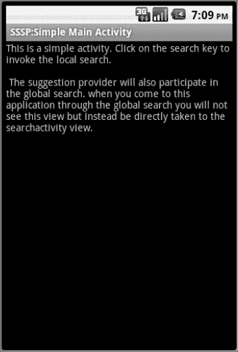

**图 23–20.** *简易建议提供程序：主 Activity（已启用本地搜索）*

当此 Activity 处于焦点状态时，如果点击搜索键，您将看到本地搜索被调用，如图 23-21 所示。


**图 23–21.** *简易建议提供程序：本地搜索 QSB*

如您所见，图 23-21 中没有显示任何建议，因为到目前为止我们还没有执行搜索。您还可以看到这是一个本地搜索；搜索的标签和提示与我们在搜索元数据 XML 文件中指定的内容一致。

现在我们来搜索字符串 `test1`。这将带您进入搜索 Activity 屏幕，如图 23-22 所示。


**图 23–22.** *简易建议提供程序：本地搜索结果 Activity*

从清单 23-17 中 `SearchActivity` 的源码可以看出，`SearchActivity` 在屏幕上并没有做任何特殊操作，但在后台，它正在将查询字符串保存到数据库中。现在，如果您导航回主屏幕（通过按返回键）并再次调用搜索，您将看到以下屏幕（如图 23-23 所示），其中搜索建议已填充了之前的查询文本。在图 23-23 中，您还可以看到建议底部的“SSSP”字样。在此处，由于这是本地搜索，它清楚地表明建议来自我们的应用，因此“SSSP”可能显得多余。然而，当 `test1` 搜索字符串作为全局搜索建议的一部分显示时，这个“SSSP”字符串将起到区分作用。


**图 23–23.** *简易建议提供程序：检索到的本地建议*

现在是了解如何调用 `onNewIntent()` 的好时机。当您在搜索 Activity（图 23-22）上时，您可以输入一个像 `t` 这样的字母，它将使用“边输入边搜索”功能再次调用搜索，您将在调试日志中看到 `onNewIntent()` 被调用。

接下来，我们看看需要做些什么才能让这些建议显示在全局 QSB 中。由于我们在 `searchable.xml` 中启用了 `includeInGlobalSearch`，您也应该能够在全局 QSB 中看到这些建议。但是，在此之前，您需要按照图 23-24 所示，为全局 QSB 建议启用此应用。

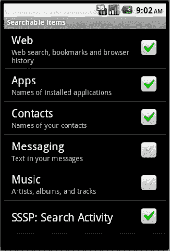

**图 23–24.** *启用简易建议提供程序*

我们在本章开头已经向您展示了如何进入此屏幕。我们编写的简易自定义建议提供程序现在已作为“SSSP:Search Activity”出现在可搜索应用列表中。此文本字符串来自 `SearchActivity` 的 Activity 名称（参见清单 23-16）。

完成此选择后，您将看到全局搜索（如图 23-25 所示）与我们的建议提供程序协同工作。


**图 23–25.** *来自简易建议提供程序的全局建议*

在全局搜索中，如果您输入像 `t` 这样的文本，它将调出本节中我们建议提供程序的建议。当您通过全局搜索导航到特定项时，您将看到如图 23-22 所示的本地搜索 Activity。

至此，我们对简易建议提供程序的讨论就结束了。您已经学习了如何使用内置的 `RecentSearchSuggestionProvider` 来记住特定于您应用的搜索。使用这种方法，只需最少的代码，您就应该能够处理本地搜索，并使它们即使在全局上下文中也能作为建议使用。

然而，这个简单的练习并没有向您展示如何从头开始编写建议提供程序。更重要的是，我们完全没有提及建议提供程序如何返回一组建议以及该建议集中有哪些可用的列。为了理解这一点以及更多内容，我们需要从头实现一个自定义建议提供程序。

### 实现自定义建议提供程序

Android 搜索非常灵活，以至于不进行自定义都是一种浪费。由于我们在上一节中使用了预构建的建议提供程序，因此建议提供程序的许多特性都隐藏在了 `SearchRecentSuggestionsProvider` 中而未加讨论。接下来，我们将通过实现一个名为 `SuggestUrlProvider` 的自定义建议提供程序来探索这些细节。

我们将首先解释这个 `SuggestUrlProvider` 预期如何工作。然后，我们会给出实现中的文件列表。这些文件将让您对如何构建自定义建议提供程序有一个总体概念。

最后，我们将向您展示完成后的应用如何使用。让我们开始吧。

#### 规划自定义建议提供程序

我们将我们的自定义建议提供程序命名为 `SuggestURLProvider`。此提供程序的目标是监控 QSB 中正在输入的内容。如果搜索查询中包含类似 `“great.m”` 的文本（后缀 `.m` 用于表示“含义”），提供程序会将查询的第一部分解释为一个单词，并建议一个基于互联网的 URL，该 URL 可被调用以查找该单词的含义。

对于每个单词，此提供程序建议两个 URL。第一个 URL 允许用户使用 [`http://www.thefreedictionary.com`](http://www.thefreedictionary.com) 搜索该单词，第二个 URL 则使用 [`http://www.google.com`](http://www.google.com)。选择其中一个建议将直接跳转到这些网站之一。如果用户点击 QSB 的搜索图标，则搜索 Activity 将仅在该 Activity 的简单布局中记录查询文本。当我们向您展示此交互的屏幕截图时，您将更清楚地看到这一点。

让我们来看看构成此项目的文件列表。您也可以通过本章末尾的 URL 下载此项目的压缩文件。


#### SuggestUrlProvider 项目实现文件

两个主要文件是 `SearchActivity.java` 和 `SuggestUrlProvider.java`。 然而，你需要一些辅助文件来完成此项目。以下是这些文件的列表及其功能的简要说明。我们在解决方案中包含了所有文件的源代码。

*   `SuggestUrlProvider.java`：此文件实现了自定义建议提供程序的协议。在这种情况下，自定义建议提供程序将查询字符串解释为单词，并使用建议游标返回若干条建议。（清单 23–20）
*   `SearchActivity.java`：此 Activity 负责接收由建议提供程序提供的查询或建议。`SearchActivity` 的定义也负责将建议提供程序与此 Activity 关联起来。（清单 23–23）
*   `layout/layout_search_activity.xml`：此布局文件由 `SearchActivity` 可选使用。在我们的示例中，我们使用此布局来记录传入的查询。（清单 23–24）
*   `values/strings.xml`：包含布局、本地搜索标题、本地搜索提示等的字符串定义。（清单 23–25）
*   `xml/searchable.xml`：搜索元数据 XML 文件，用于将 `SearchActivity`、建议提供程序和 QSB 关联起来。（清单 23–21）
*   `AndroidManifest.xml`：定义搜索 Activity 和建议提供程序时的应用程序清单文件。在此处，你还声明 `SearchActivity` 将作为此应用程序的本地搜索被调用。（清单 23–27）

我们将从探索 `SuggestUrlProvider` 开始。

#### 实现 `SuggestUrlProvider` 类

在我们的自定义建议提供程序项目中，`SuggestUrlProvider` 类是实现建议提供程序协议的类。我们将从它的职责开始，探索 `SuggestUrlProvider` 的实现。

##### 建议提供程序的职责

核心上，建议提供程序是一个内容提供程序。与内容提供程序非常相似，建议提供程序由 Android 搜索通过标识提供程序的 URI 和表示查询的附加参数来调用。

Android 搜索使用两种类型的 URI 来调用提供程序。第一种称为 *搜索 URI*。此 URI 用于收集建议集。响应需要是一行或多行，每行包含一组已知的列。

第二种 URI 称为 *建议 URI*。此 URI 用于更新先前缓存的建议。响应需要是包含一组已知列的单行。

建议提供程序还需要在搜索元数据 XML 文件 (`searchable.xml`) 中指定它希望如何接收搜索查询，包括当查询被逐字键入时的情况。这可以通过提供程序的 `query` 方法的 `select` 参数或 URI 本身的最后一个路径段（该段也作为参数之一传递给提供程序的 `query` 方法）来完成。

对于建议提供程序，有许多可用的列，每列都启用某种搜索行为。提供程序首先需要决定它想要返回的这一组控制列。其中一些控制列包括：

*   用于启用/禁用对返回给 Android 搜索的建议进行缓存的列。
*   用于控制是否希望建议重写查询框中的文本的列。
*   用于在用户点击建议时直接调用操作而不是显示一组搜索结果的列。

##### `SuggestUrlProvider` 的总体源代码

清单 23–20 是 `SuggestUrlProvider` 类的源代码。本章后面我们将在更详细地解释每个列出的职责时，更详细地研究此代码的各部分。

**清单 23-20.** *CustomSuggestionProvider 源代码*

```java
public class SuggestUrlProvider extends ContentProvider
{
    private static final String tag = "SuggestUrlProvider";
    public static String AUTHORITY =
"com.androidbook.search.custom.suggesturlprovider";

    private static final int SEARCH_SUGGEST = 0;
    private static final int SHORTCUT_REFRESH = 1;
    private static final UriMatcher sURIMatcher =
                                    buildUriMatcher();

private static final String[] COLUMNS = {
            "_id",  // must include this column
            SearchManager.SUGGEST_COLUMN_TEXT_1,
            SearchManager.SUGGEST_COLUMN_TEXT_2,
            SearchManager.SUGGEST_COLUMN_INTENT_DATA,
            SearchManager.SUGGEST_COLUMN_INTENT_ACTION,
            SearchManager.SUGGEST_COLUMN_SHORTCUT_ID
            };

private static UriMatcher buildUriMatcher()
   {
        UriMatcher matcher =
             new UriMatcher(UriMatcher.NO_MATCH);

        matcher.addURI(AUTHORITY,
              SearchManager.SUGGEST_URI_PATH_QUERY,
              SEARCH_SUGGEST);
        matcher.addURI(AUTHORITY,
              SearchManager.SUGGEST_URI_PATH_QUERY +
               "/*",
              SEARCH_SUGGEST);
        matcher.addURI(AUTHORITY,
              SearchManager.SUGGEST_URI_PATH_SHORTCUT,
            SHORTCUT_REFRESH);
        matcher.addURI(AUTHORITY,
              SearchManager.SUGGEST_URI_PATH_SHORTCUT +
            "/*",
            SHORTCUT_REFRESH);
        return matcher;
    }

    @Override
public boolean onCreate() {
        //lets not do anything in particular
        Log.d(tag,"onCreate called");
        return true;
    }

    @Override
public Cursor query(Uri uri, String[] projection,
String selection,
             String[] selectionArgs, String sortOrder)
   {
       Log.d(tag,"query called with uri:" + uri);
       Log.d(tag,"selection:" + selection);

       String query = selectionArgs[0];
       Log.d(tag,"query:" + query);

        switch (sURIMatcher.match(uri)) {
case SEARCH_SUGGEST:
               Log.d(tag,"search suggest called");
               return getSuggestions(query);
case SHORTCUT_REFRESH:
               Log.d(tag,"shortcut refresh called");
               return null;
            default:
             throw
             new IllegalArgumentException("Unknown URL " + uri);
        }
    }

private Cursor getSuggestions(String query)
    {
       if (query == null) return null;
       String word = getWord(query);
       if (word == null)
          return null;

       Log.d(tag,"query is longer than 3 letters");

       MatrixCursor cursor = new MatrixCursor(COLUMNS);
       cursor.addRow(createRow1(word));
       cursor.addRow(createRow2(word));
       return cursor;
    }
private Object[] createRow1(String query)
    {
        return columnValuesOfQuery(query,
              "android.intent.action.VIEW",
"http://www.thefreedictionary.com/" + query,
              "Look up in freedictionary.com for",
              query);
    }
```


#### `private Object[] createRow2(String query)`
```
    {
        return columnValuesOfQuery(query,
             "android.intent.action.VIEW",
"http://www.google.com/search?hl=en&source=hp&q=define%3A/"
           + query,
              "在 google.com 上查找",
              query);
    }
```
#### `private Object[] columnValuesOfQuery(String query,`
```
          String intentAction,
          String url,
          String text1,
          String text2)
    {
        return new String[] {
                query,     // _id
                text1,     // text1
                text2,     // text2
                url,
                // intent_data（点击项目时包含）
                intentAction, //action
                SearchManager.SUGGEST_NEVER_MAKE_SHORTCUT
        };
    }
```
#### `private Cursor refreshShortcut(String shortcutId,`
```
String[] projection) {
        return null;
    }
```
#### `public String getType(Uri uri) {`
```
        switch (sURIMatcher.match(uri)) {
            case SEARCH_SUGGEST:
                return SearchManager.SUGGEST_MIME_TYPE;
            case SHORTCUT_REFRESH:
                return SearchManager.SHORTCUT_MIME_TYPE;
            default:
             throw
             new IllegalArgumentException("未知 URL " + uri);
        }
    }
```
```
    public Uri insert(Uri uri, ContentValues values) {
        throw new UnsupportedOperationException();
    }

    public int delete(Uri uri, String selection,
                            String[] selectionArgs) {
        throw new UnsupportedOperationException();
    }

    public int update(Uri uri, ContentValues values,
             String selection,
             String[] selectionArgs) {
        throw new UnsupportedOperationException();
    }
```
#### `private String getWord(String query)`
```
    {
       int dotIndex = query.indexOf('.');
       if (dotIndex < 0)
          return null;
       return query.substring(0,dotIndex);
    }
}
```
### 理解建议提供程序的 URI

现在您已经看到了自定义建议提供程序的完整源代码，让我们看看这部分源代码如何满足 URI 的职责。

首先，我们来看看 Android 调用建议提供程序时使用的 URI 格式。假设我们的建议提供程序的授权（authority）为：

`com.androidbook.search.custom.suggesturlprovider`

那么 Android 将发送两种可能的 URI。第一种 URI 是搜索 URI，其格式如下之一：

`content://com.androidbook.search.suggesturlprovider/search_suggest_query`

或

`content://com.androidbook.search.suggesturlprovider/search_suggest_query/<您的查询>`

当用户在 QSB（快速搜索框）中开始输入文本时，系统会发出此 URI。在一种变体中，查询作为路径段（path segment）附加在 URI 末尾传递。是否将查询作为路径段传递，是在搜索元数据文件 `searchable.xml` 中指定的。我们将在更详细地介绍搜索元数据时讨论这一规范。

针对建议提供程序的第二种 URI 类型与 Android 搜索快捷方式（search shortcuts）相关。Android 搜索快捷方式是指 Android 决定缓存的一些建议（参见图 23–3），而不是调用建议提供程序获取最新内容。我们将在讨论建议列时进一步介绍 Android 搜索快捷方式。目前，第二种 URI 的格式如下：

`content://com.androidbook.search.suggesturlprovider/search_suggest_shortcut`

或：

`content://com.androidbook.search.suggesturlprovider/search_suggest_shortcut/<快捷方式 ID>`

当 Android 尝试判断其缓存的快捷方式是否仍然有效时，会发出此 URI。这种 URI 称为快捷方式 URI。如果提供程序返回单行数据，它将用新的快捷方式替换当前快捷方式。如果提供程序返回 null，则 Android 认为该建议不再有效。

Android 中的 `SearchManager` 类定义了两个常量来表示这些用于区分用途的 URI 段（`search_suggest_search` 和 `search_suggest_shortcut`）。它们分别是：

- `SearchManager.SUGGEST_URI_PATH_QUERY`
- `SearchManager.SUGGEST_URI_PATH_SHORTCUT`

提供程序有责任在其 `query()` 方法中识别这些传入的 URI。请参见清单 23–20，了解如何使用 `UriMatcher` 实现这一点。（您可以参考第 5 章详细了解如何使用 `UriMatcher`。）

### 实现 `getType()` 并指定 MIME 类型

由于建议提供程序本质上是一个内容提供程序，它必须实现内容提供程序的契约，其中包括为 `getType()` 方法提供实现。

您可以再次查阅清单 23–20，了解在此案例中 `getType()` 是如何实现的。为方便回顾，此处复制了该代码。

```
public String getType(Uri uri) {
        switch (sURIMatcher.match(uri)) {
            case SEARCH_SUGGEST:
                return SearchManager.SUGGEST_MIME_TYPE;
            case SHORTCUT_REFRESH:
                return SearchManager.SHORTCUT_MIME_TYPE;
            default:
             throw
             new IllegalArgumentException("未知 URL " + uri);
        }
    }
```

Android 搜索框架通过其 `SearchManager` 类提供了几个常量来辅助处理这些 MIME 类型。这些 MIME 类型如下：

- `SearchManager.SUGGEST_MIME_TYPE`
- `SearchManager.SHORTCUT_MIME_TYPE`

它们分别对应以下实际值：
- `vnd.android.cursor.dir/vnd.android.search.suggest`
- `vnd.android.cursor.item/vnd.android.search.suggest`


#### 将查询传递给建议提供者：`Selection` 参数

当 Android 使用某个 URI 调用提供者时，Android 最终会调用建议提供者的 `query()` 方法来获取建议游标。如果你在清单 23–20 中看到了 `query()` 方法的实现，会注意到我们正在使用 `selection` 参数和 `selectionArgs` 参数来制定并返回游标。以下是供快速回顾的代码副本：

```
public Cursor query(Uri uri, String[] projection,
                    String selection,
                    String[] selectionArgs, String sortOrder)
{
    Log.d(tag,"query called with uri:" + uri);
    Log.d(tag,"selection:" + selection);

    String query = selectionArgs[0];
    Log.d(tag,"query:" + query);

    switch (sURIMatcher.match(uri)) {
        case SEARCH_SUGGEST:
            Log.d(tag,"search suggest called");
            return getSuggestions(query);
        case SHORTCUT_REFRESH:
            Log.d(tag,"shortcut refresh called");
            return null;
        default:
            throw new IllegalArgumentException("Unknown URL " + uri);
    }
}
```

要理解通过 `selection` 和 `selectionArgs` 这两个参数传递了什么，你需要查看 `searchable.xml`，即搜索元数据文件。清单 23–21 展示了这个搜索元数据 XML 文件的代码。

**清单 23–21.** *CustomSuggestionProvider 搜索元数据*

```
//xml/searchable.xml
<searchable
    android:label="@string/search_label"
    android:hint="@string/search_hint"
    android:searchMode="showSearchLabelAsBadge"
    android:searchSettingsDescription="suggests urls"
    android:includeInGlobalSearch="true"
    android:queryAfterZeroResults="true"
    android:searchSuggestAuthority=
           "com.androidbook.search.custom.suggesturlprovider"
    android:searchSuggestIntentAction=
           "android.intent.action.VIEW"
    android:searchSuggestSelection=" ? "
/>
```

**注意：** 请注意 `searchSuggestAuthority` 字符串值。它应与 Android 清单文件中相应的内容提供者 URI 定义匹配。

注意前面搜索元数据定义文件清单中的 `searchSuggestSelection` 属性。它直接对应于内容提供者 `query()` 方法的 `selection` 参数。如果你回顾第 4 章，就会知道此参数用于传递带有可替换 `?` 符号的 `where` 子句。

可替换值的数组随后通过 `selectionArgs` 数组参数传递。这里确实如此。当你指定 `searchSuggestSelection` 时，Android 会假设你不希望通过 URI 接收搜索文本，而是通过 `query()` 方法的 `selection` 参数来接收。在这种情况下，Android 搜索会发送 `?`（注意 `?` 前后的空格）作为 `selection` 参数的值，并将查询文本作为 `selectionArgs` 数组的第一个元素传递。

如果你不指定 `searchSuggestSelection`，那么它会将搜索文本作为 URI 的最后一个路径段传递。你可以选择其中一种方式。在我们的示例中，我们选择了 `selection` 方法，而不是 URI 方法。

#### 探索自定义建议提供者的搜索元数据

既然我们已经谈到了搜索元数据属性这个话题，让我们来探讨一下还有哪些其他属性可用。我们将涵盖那些经常使用或与建议提供者相关的属性。有关完整列表，你可以参考 `SearchManager` API 文档：

`http://developer.android.com/guide/topics/search/searchable-config.html`

`searchSuggestIntentAction` 属性（清单 23–21）用于在通过 Intent 调用 `SearchActivity` 时传递或指定 Intent 动作。这允许 `SearchActivity` 执行默认搜索之外的其他操作。以下是一个响应搜索活动的 `onCreate()` 方法中如何使用 Intent 动作的示例：

```
//Body of onCreate

// get and process search query here
final Intent queryIntent = getIntent();
//query action
final String queryAction = queryIntent.getAction();
if (Intent.ACTION_SEARCH.equals(queryAction))
{
    this.doSearchQuery(queryIntent);
}
else if (Intent.ACTION_VIEW.equals(queryAction))
{
    this.doView(queryIntent);
}
else {
    Log.d(tag,"Create intent NOT from search");
}
```

你将在后续的清单 23–23 中看到此代码的上下文，其中 `SearchActivity` 通过检查 Intent 的动作值来查找 VIEW 动作或 SEARCH 动作。

另一个我们没有在此使用，但可供建议提供者使用的属性叫做 `searchSuggestPath`。如果指定了此字符串值，它会被追加到 URI（调用建议提供者的 URI）后面，位于 `SUGGEST_URI_PATH_QUERY` 之后。这允许单个自定义建议提供者响应两个不同的搜索活动。每个 `SearchActivity` 会使用不同的 URI 后缀。建议提供者可以利用此路径后缀，为目标搜索活动返回不同的结果集。

与 Intent 动作类似，你也可以使用 `searchSuggestIntentData` 属性指定 Intent 数据。这是一个数据 URI，可以在被调用时与动作一起传递给搜索活动，作为 Intent 的一部分。

名为 `searchSuggestThreshold` 的属性表示在调用建议提供者之前，必须在 QSB 中输入的字符数。默认阈值是 0。

`queryAfterZeroResults` 属性（true 或 false）表示：如果当前字符集返回了零结果集，是否应联系提供者以获取下一组字符。在我们的 URI 建议提供者中，开启此标志非常重要，这样我们每次都能看到完整的查询文本。

现在我们已经了解了 URI、`selection` 参数和搜索元数据，让我们接着探讨建议提供者最重要的方面：建议游标。


好的，作为高级文档工程师和翻译员，我将严格遵循您提供的注意事项和示例格式，对给定的英文文本进行专业翻译。

---


### 建议光标列

建议光标，归根结底，也是一种光标。它与我们在第 4 章中详细讨论的数据库游标并无区别。建议光标充当了 Android 搜索设施和建议提供者之间的契约。这意味着光标返回的列的名称和类型是固定的，并且双方都已知晓。

为了给搜索提供灵活性，Android 搜索提供了大量的列，其中大部分是可选的。一个建议提供者不需要返回所有这些列；它可以忽略发送与自身不相关的列。在本节中，我们将介绍大部分列的含义和重要性（对于其余部分，您可以参考我们已多次提及的 `SearchManager` API 文档）。

首先，我们将讨论建议提供者可以返回哪些列，每列的含义，以及它如何影响搜索。

与所有光标一样，建议光标也必须有一个 `_id` 列。这是一个强制性的列。所有其他列都以 `SUGGEST_COLUMN_` 前缀开头。这些常量在 `SearchManager` API 参考文档中定义。我们将在下面讨论最常用的列。有关完整列表，请使用本章末尾指出的 API 参考文档。

*   `text_1`：这是建议中的第一行文本（参见图 23-3）。
*   `text_2`：这是建议中的第二行文本（参见图 23-3）。
*   `icon_1`：这是建议中左侧的图标，通常是一个资源 ID。
*   `icon_2`：这是建议中右侧的图标，通常是一个资源 ID。
*   `intent_action`：当 `SearchActivity` 作为意图动作被调用时，会传递该值。如果搜索元数据中可用，它将覆盖相应的意图动作（参见清单 23-21）。
*   `intent_data`：当 `SearchActivity` 作为意图数据被调用时，会传递该值。如果搜索元数据中可用，它将覆盖相应的意图动作（参见清单 23-21）。这是一个数据 URI。
*   `intent_data_id`：这会被附加到数据 URI 之后。如果您想在元数据中一次性指定数据的根部分，然后为每个建议更改此 ID，这将特别有用。这种方法效率更高。
*   `query`：要用于发送到搜索活动的查询字符串。
*   `shortcut_id`：如前所述，Android 搜索会缓存建议提供者提供的建议。这些被缓存的建议称为快捷方式。如果此列不存在，Android 将缓存该建议并且永远不会请求更新。如果该值等于 `SUGGEST_NEVER_MAKE_SHORTCUT`，则 Android 不会缓存此建议。如果它包含任何其他值，此 ID 将作为快捷方式 URI 的最后路径段传递。（请参阅“理解建议提供者 URI”一节。）
*   `spinner_while_refreshing`：此布尔值将告诉 Android 在更新快捷方式的过程中是否应使用旋转进度条。

还有一组可变的附加列用于响应操作键。我们稍后将在操作键部分介绍。现在，让我们看看我们的自定义建议提供者如何返回这些列。

### 填充和返回列列表

不要求每个自定义建议提供者都返回所有这些列。对于我们的建议提供者，我们将根据“规划自定义建议提供者”部分指示的功能，仅返回列的子集。

查看清单 23-20，您可以看到我们的列列表如下所示（已在清单 23-22 中提取并重现）。

**清单 23-22.** *定义建议光标列*

```
    private static final String[] COLUMNS = {
            "_id",  // 必须包含此列
            SearchManager.SUGGEST_COLUMN_TEXT_1,
            SearchManager.SUGGEST_COLUMN_TEXT_2,
            SearchManager.SUGGEST_COLUMN_INTENT_DATA,
            SearchManager.SUGGEST_COLUMN_INTENT_ACTION,
            SearchManager.SUGGEST_COLUMN_SHORTCUT_ID
            };
```

选择这些列是为了满足以下功能：

用户在 QSB 中输入一个带有提示的词语，例如 “great.m”，我们的建议提供者在搜索文本中出现 “.” 之前不会响应。一旦识别到，建议提供者会从中提取该词语（本例中为 “great”），然后返回两条建议。

第一条建议是使用该词语调用 `thefreewebdictionary.com`，第二条建议是使用 `define:great` 模式在 Google 中搜索。

为了实现这一点，提供者将 `intent_action` 列加载为 `intent.action.view`，并将包含完整 URI 的意图数据加载进去。希望是当 Android 看到以 `http://` 开头的数据 URI 时，它会启动浏览器。

我们将 `text1` 列填充为 `search some-website with:`，将 `text2` 列填充为该词语本身（同样，本例中为 `great`）。我们还将快捷方式 ID 设置为 `SUGGEST_NEVER_MAKE_SHORTCUT` 以简化操作。此设置禁用了缓存，并防止触发建议快捷方式 URI。

至此，我们完成了对自定义建议提供者类源代码的分析。我们学习了 URI、建议光标和特定于建议提供者的搜索元数据。我们还知道了如何填充建议列。

现在，让我们研究如何为自定义建议提供者实现搜索活动。

### 为自定义建议提供者实现搜索活动

在简单的建议提供者实现中，我们只涵盖了搜索活动的部分职责。现在让我们看看我们忽略的方面。

Android 搜索会通过两种方式之一调用搜索活动来响应搜索操作。这可能在用户从 QSB 点击搜索图标时发生，也可能在用户直接点击建议时发生。

当被调用时，搜索活动需要检查它被调用的原因。此信息可在意图动作中找到。搜索活动需要检查意图动作以执行正确的操作。在许多情况下，此动作是 `ACTION_SEARCH`。然而，建议提供者可以选择通过搜索元数据或建议光标列指定一个显式动作来覆盖它。这种类型的动作可以是任何东西。在我们的示例中，我们将使用一个 `VIEW` 动作。

正如我们在讨论简单建议提供者时指出的，也可以将搜索活动的启动模式设置为 `singleTop`。在这种情况下，搜索活动除了 `onCreate()` 之外，还负责响应 `onNewIntent()`。我们将讨论这两种情况，并展示它们有多相似。

我们将同时使用 `onNewIntent()` 和 `onCreate()` 来处理 `ACTION_SEARCH` 和 `ACTION_VIEW`。在搜索动作的情况下，我们只需将查询文本显示给用户。在视图动作的情况下，我们将控制权移交给浏览器并结束当前活动，以便给用户一种通过直接点击建议来调用浏览器的印象。

**注意：** 此 `SearchActivity` 不需要是 Android 主应用程序菜单中的可启动活动。确保您不要像其他需要从设备主应用程序屏幕调用的活动那样，无意中为此活动设置意图过滤器。

有了这些，让我们检查一下 `SearchActivity.java` 的源代码。


#### 自定义建议提供程序的 `SearchActivity`

现在我们已经了解了搜索活动的职责，特别是哪些职责适用于我们的示例，我们可以展示此搜索活动的源代码（清单 23–23）。

**清单 23–23.** `SearchActivity`

```java
//file: SearchActivity.java
public class SearchActivity extends Activity
{
    private final static String tag ="SearchActivity";
    @Override
    protected void onCreate(Bundle savedInstanceState) {
        super.onCreate(savedInstanceState);

        Log.d(tag,"I am being created");
        setContentView(R.layout.layout_test_search_activity);

        // get and process search query here
        final Intent queryIntent = getIntent();

        //query action
        final String queryAction = queryIntent.getAction();
        Log.d(tag,"Create Intent action:"+queryAction);

        final String queryString =
           queryIntent.getStringExtra(SearchManager.QUERY);
        Log.d(tag,"Create Intent query:"+queryString);

        if (Intent.ACTION_SEARCH.equals(queryAction))
        {
           this.doSearchQuery(queryIntent);
        }
        else if (Intent.ACTION_VIEW.equals(queryAction))
        {
           this.doView(queryIntent);
        }
        else {
           Log.d(tag,"Create intent NOT from search");
        }
        return;
    }

    @Override
    public void onNewIntent(final Intent newIntent)
    {
        super.onNewIntent(newIntent);
        Log.d(tag,"new intent calling me");

        // get and process search query here
        final Intent queryIntent = newIntent;

        //query action
        final String queryAction = queryIntent.getAction();
        Log.d(tag,"New Intent action:"+queryAction);

        final String queryString =
           queryIntent.getStringExtra(SearchManager.QUERY);
        Log.d(tag,"New Intent query:"+queryString);

        if (Intent.ACTION_SEARCH.equals(queryAction))
        {
           this.doSearchQuery(queryIntent);
        }
        else if (Intent.ACTION_VIEW.equals(queryAction))
        {
           this.doView(queryIntent);
        }
        else {
           Log.d(tag,"New intent NOT from search");
        }
        return;
    }
    private void doSearchQuery(final Intent queryIntent)
    {
        final String queryString =
           queryIntent.getStringExtra(SearchManager.QUERY);
        appendText("You are searching for:" + queryString);
    }
    private void appendText(String msg)
    {
        TextView tv = (TextView)this.findViewById(R.id.text1);
        tv.setText(tv.getText() + "\n" + msg);
    }
    private void doView(final Intent queryIntent)
    {
        Uri uri = queryIntent.getData();
        String action = queryIntent.getAction();
        Intent i = new Intent(action);
        i.setData(uri);
        startActivity(i);
        this.finish();
    }
}
```

我们将首先分析此搜索活动是如何被调用的，以此开始对源代码的分析。

#### `SearchActivity` 调用详情

与所有 Activity 一样，我们知道搜索活动必须通过 Intent 来调用。然而，如果认为总是 Intent 的 `action` 负责此项工作，那就错了。事实证明，搜索活动是通过其组件名称规范显式调用的。

你可能会问这为什么重要。嗯，我们知道在建议提供程序中，我们会在建议行中显式指定一个 Intent `action`。如果此 Intent action 是 `VIEW`，并且 Intent 数据是 HTTP URL，那么不知情的程序员会认为浏览器将被启动以响应，而不是搜索活动。这当然是可取的。但是，由于最终的 Intent 除了 Intent action 和数据之外，还加载了搜索活动的组件名称，因此组件名称将优先。

我们不确定为什么存在此限制，也不清楚如何克服它。但事实是，无论你的建议提供程序指定了什么 Intent action，被调用的都将是搜索活动。在我们的例子中，我们将简单地从搜索活动启动浏览器，然后关闭搜索活动。

为了演示这一点，以下是当我们点击一条建议时，Android 为调用我们的搜索活动而触发的 Intent：

```
launching Intent {
act=android.intent.action.VIEW
dat=http://www.google.com
flg=0x10000000
cmp=com.androidbook.search.custom/.SearchActivity (has extras)
}
```

请注意 Intent 的组件规范。它直接指向搜索活动。因此，无论你指示什么 Intent action，Android 都将始终调用搜索活动。结果，启动浏览器的责任就落在了搜索活动身上。

现在让我们看看在搜索活动中我们是如何处理这些 Intent 的。

#### 响应 `ACTION_SEARCH` 和 `ACTION_VIEW`

我们知道 Android 搜索会通过名称显式调用搜索活动。然而，调用的 Intent 也携带了指定的 action。当 QSB 通过搜索图标调用此活动时，此 action 是 `ACTION_SEARCH`。

如果它是由搜索建议调用的，那么此 action 可能不同。这取决于建议提供程序如何设置建议。在我们的例子中，建议提供程序将其设置为 `ACTION_VIEW`。

因此，搜索活动需要检查 action 的类型。以下是我们如何检查此代码以决定是调用搜索查询方法还是视图方法。（此代码段摘自 清单 23–23）：

```java
       if (Intent.ACTION_SEARCH.equals(queryAction))
        {
           this.doSearchQuery(queryIntent);
        }
        else if (Intent.ACTION_VIEW.equals(queryAction))
        {
           this.doView(queryIntent);
        }
```

从代码中可以看出，对于视图操作，我们调用 `doView()`；对于搜索操作，我们调用 `doSearchQuery()`。

在 `doView()` 函数中，我们将检索 action 和数据 URI，用它们填充一个新的 Intent，然后调用该活动。这将启动浏览器。我们将结束该活动，以便返回按钮将你带回调用它的任何搜索界面。

在 `doSearchQuery()` 中，我们只是将搜索查询文本记录到视图中。让我们看一下用于支持 `doSearchQuery()` 的布局。

#### 搜索活动布局

清单 23–24 是一个简单的布局，由搜索活动在 `doSearchQuery()` 情况下使用。唯一重要的元素以粗体突出显示。

**清单 23–24.** `SearchActivity` 布局 XML

```xml
<?xml version="1.0" encoding="utf-8"?>
<!-- file: layout/layout_search_activity.xml -->
<LinearLayout
    android:orientation="vertical"
    android:layout_width="fill_parent"
    android:layout_height="fill_parent"
    >
<TextView
    android:id="@+id/text1"
    android:layout_width="fill_parent"
    android:layout_height="wrap_content"
    android:text="@string/search_activity_main_text"
    />
</LinearLayout>
```

此时，展示负责此应用部分文本需求的 `strings.xml` 是合适的。


##### 对应的 `strings.xml`

如清单 23–25 所示，此 `strings.xml` 文件为布局定义了文本字符串，同时也定义了应用程序名称、用于配置本地搜索的一些字符串等。

**清单 23–25.** *strings.xml*

```xml
<?xml version="1.0" encoding="utf-8"?>
<!-- file: values/strings.xml -->
<resources>
<string name="search_activity_main_text">
    这是搜索活动。
    \n\n
    当使用 action_search 而非 action_view 时，将调用此活动。
    \n\n
    如果按下搜索图标，则会触发 action_search。
    \n\n
    如果在建议上按下，则会触发 action_view。
    </string>

    <string name="app_name">自定义建议应用
    </string>

<string name="search_label">自定义建议演示
</string>

    <string name="search_hint">自定义建议演示提示
    </string>
</resources>
```

##### 响应 `onCreate()` 和 `onNewIntent()`

如果你查看清单 23–23，你会发现 `onCreate()` 和 `onNewIntent()` 中的代码几乎相同。这是一种常见的模式。

当搜索活动被调用时，根据搜索活动的启动模式，会调用 `onCreate()` 或 `onNewIntent()`。

**注意：** 有关启动模式和 `onNewIntent()` 的有用参考，请参见本章末尾的“参考资料”部分。

##### 关于结束搜索活动的说明

在前面的讨论中，我们简要提到了如何响应 `doView()`。清单 23–26 是该函数的代码（摘自清单 23–26）。

**清单 23–26.** *结束搜索活动*

```java
private void doView(final Intent queryIntent)
    {
        Uri uri = queryIntent.getData();
        String action = queryIntent.getAction();
        Intent i = new Intent(action);
        i.setData(uri);
        startActivity(i);
        this.finish();
    }
```

此函数的目标是调用浏览器。如果我们不在末尾执行 `finish()`，用户点击返回按钮后，将会从浏览器返回到搜索活动，而不是像预期那样返回到他们原来的搜索界面。

理想情况下，为了提供最佳用户体验，控制权应永远不会经过搜索活动。结束此活动解决了这个问题。清单 23–26 也让我们有机会了解如何从原始 Intent（由建议提供程序设置）传输 Intent 操作和 Intent 数据，然后将它们传递给新的浏览器 Intent。

我们刚刚涵盖了很多内容。我们向您展示了一个详细的建议提供程序实现和一个搜索活动实现。在此过程中，我们还向您展示了搜索元数据文件和 `strings.xml`。我们将通过查看应用程序级别的清单文件来结束对实现本章项目所需文件的检查。

### 自定义建议提供程序清单文件

清单文件是您将应用程序的许多组件整合在一起的地方。对于我们的自定义建议提供程序应用程序，与其他示例一样，您在此处声明其组件，例如搜索活动和建议提供程序。您还可以使用清单文件声明此应用程序已启用本地搜索，方法是将“搜索活动”声明为默认搜索。同时注意为搜索活动定义的 Intent 过滤器。

这些细节在清单文件代码（清单 23–27）中以粗体突出显示。

**清单 23–27.** *自定义建议提供程序清单文件*

```xml
//file:AndroidManifest.xml
<?xml version="1.0" encoding="utf-8"?>
<manifest
      package="com.androidbook.search.custom"
      android:versionCode="1"
      android:versionName="1.0.0">
<application android:icon="@drawable/icon"
                     android:label="Custom Suggestions Provider">
<!--
****************************************************************
* 搜索相关代码：搜索活动
****************************************************************
 -->
<activity android:name=".SearchActivity"
                  android:label="搜索活动标签"
                  android:launchMode="singleTop">
     <intent-filter>
<action
android:name="android.intent.action.SEARCH" />
<category
android:name="android.intent.category.DEFAULT" />
      </intent-filter>

<meta-data android:name="android.app.searchable"
        android:resource="@xml/searchable" />
   </activity>

<!-- 声明默认搜索 -->
   <meta-data android:name="android.app.default_searchable"
       android:value=".SearchActivity" />

<!-- 声明建议提供程序 -->
    <provider android:name="SuggestUrlProvider"
        android:authorities=
        "com.androidbook.search.custom.suggesturlprovider" />
</application>
    <uses-sdk android:minSdkVersion="4" />
</manifest>
```

如您所见，我们突出了三件事：

*   定义搜索活动及其搜索元数据 XML 文件
*   将搜索活动定义为应用程序的默认搜索
*   定义建议提供程序及其权限

所有源代码就位后，是时候浏览一下应用程序并看看它在模拟器中的表现了。


#### 自定义建议用户体验

通过`ADT`构建并部署此应用后，您不会看到任何活动弹出窗口，因为没有需要启动的活动。相反，您会看到应用程序已成功安装在 Eclipse 控制台中。  
这意味着建议提供者已准备好响应全局`QSB`。但在此之前，您需要启用此建议提供者参与全局搜索。

在本章前面部分，我们向您展示了如何访问搜索设置应用。这里提供一个捷径，它使用的正是我们目前所学的搜索功能。  
打开全局`QSB`，并在`QSB`中输入`sett`。这将调出设置应用，作为可被调用的建议之一。请参见图 23-26。

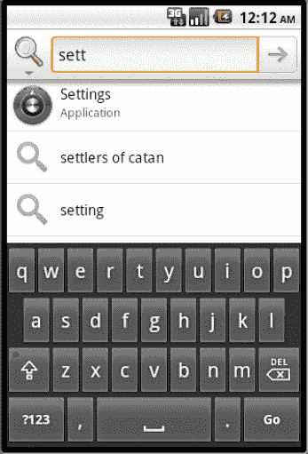

**图 23-26.** *通过搜索调用设置*

请注意我们是如何利用所学的`QSB`知识来调用设置应用的。请按照本章开头指定的方法启用此应用的建议功能。完成后，在`QSB`中输入图 23-27 所示的文本。


**图 23-27.** *来自自定义建议提供者的更多结果*

请注意自定义建议提供者提供的搜索建议是如何呈现的。现在，如果您点击左上角的搜索图标，将搜索应用切换为“自定义建议提供者”应用，然后导航到我们自定义建议提供者提供的某个建议，并点击`QSB`搜索图标，Android 将直接把您带到搜索活动，而无需调用任何浏览器，如图 23-28 所示。（这展示了我们讨论过的两种意图操作：搜索和查看。）

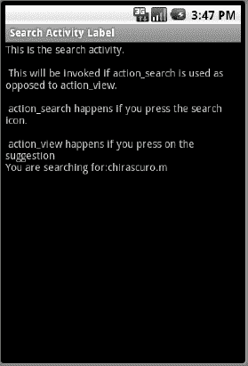

**图 23-28.** *查询搜索调用搜索结果*

因此，这个示例展示了`ACTION_SEARCH`与`ACTION_VIEW`的区别。

现在，如果您点击图 23-27 中的免费词典建议，您将看到被调用的浏览器，如图 23-29 所示。


**图 23-29.** *免费词典*

如果您点击图 23-27 中的 Google 建议项，您将看到如图 23-30 所示的浏览器。


**图 23-30.** *在 Google 中搜索定义*

图 23-31 显示了如果您在全局搜索中不输入后缀`.m` 会发生什么。

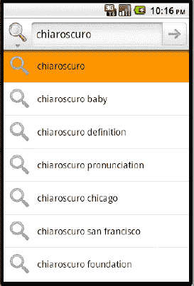

**图 23-31.** *无提示的自定义提供者*

请注意，建议提供者没有返回任何内容。

至此，我们结束了从头构建一个功能完整的自定义建议提供者的讨论。虽然我们已经涉及了搜索的许多方面，但仍有一些主题尚未提及。这些主题是操作键和应用特定搜索数据。接下来我们将介绍这些内容。

### 使用操作键和应用特定搜索数据

操作键和应用特定搜索数据进一步增加了 Android 搜索的灵活性。  
操作键允许我们使用专门的设备键来实现与搜索相关的功能。应用特定搜索数据允许一个活动将附加数据传递给搜索活动。

**注意：** 请注意，本章剩余部分的代码清单并不构成一个可测试的项目。这些代码清单仅用于支持文本中提出的概念。

我们从操作键开始讲起。

#### 在 Android 搜索中使用操作键

到目前为止，我们已经展示了多种调用搜索的方式：

- `QSB` 中提供的搜索图标
- 属于一组操作键的一部分的搜索键（如图 23-1 右侧所示）
- 由某个活动显示的显式图标或按钮
- 基于输入即搜索声明的任何按键

在本节中，我们将探讨通过操作键调用搜索。操作键是设备上可用的一组键，它们与特定操作相关联。这些操作键的一些示例如清单 23-28 所示。

**清单 23-28.** *操作键代码列表*

```
keycode_dpad_up
keycode_dpad_down
keycode_dpad_left
keycode_dpad_right
keycode_dpad_center
keycode_back
keycode_call
keycode_camera
keycode_clear
kecode_endcall
keycode_home
keycode_menu
keycode_mute
keycode_power
keycode_search
keycode_volume_up
keycode_volume_down
```

您可以在`KeyEvent`的 API 中看到这些操作键的定义，该 API 位于 [`developer.android.com/reference/android/view/KeyEvent.html`](http://developer.android.com/reference/android/view/KeyEvent.html)

**注意：** 并非所有这些操作键都可以用于搜索，但其中一些可以，例如`keycode_call`。您需要逐一尝试，看看哪个适合您的需求。

一旦知道要使用哪个操作键，您就可以通过使用清单 23-29 中的 XML 片段将其放入元数据中，来告知 Android 您对该键感兴趣。

**清单 23-29.** *操作键定义示例*

```xml
<searchable
    android:label="@string/search_label"
    android:hint="@string/search_hint"
    android:searchMode="showSearchLabelAsBadge"

    android:includeInGlobalSearch="true"
    android:searchSuggestAuthority=
       "com.androidbook.search.simplesp.SimpleSuggestionProvider"
    android:searchSuggestSelection=" ? "
>
   <actionkey
       android:keycode="KEYCODE_CALL"
       android:queryActionMsg="call"
       android:suggestActionMsg="call"
       android:suggestActionMsgColumn="call_column" />

   <actionkey
       android:keycode="KEYCODE_DPAD_CENTER"
       android:queryActionMsg="doquery"
       android:suggestActionMsg="dosuggest"
       android:suggestActionMsgColumn="my_column" />
   .....
</searchable>
```

您还可以为同一个搜索上下文设置多个操作键。以下是`actionKey`元素每个属性的含义，以及如何使用它们来响应操作键按下事件。


*   `keycode`: 这是在 `KeyEvent` API 类中定义的键码，用于调用搜索 activity。由该键码标识的按键可在两种情况下被按下。第一种情况是用户在 QSB 中输入查询文本，但尚未导航到任何建议时。通常，在没有实现操作键的情况下，用户会按下 QSB 的搜索图标。如果在搜索的元数据中指定了一个操作键，Android 允许用户点击该操作键，而不是 QSB 的搜索“前往”图标。第二种情况是用户导航到某个特定建议，然后点击操作键时。在这两种情况下，都会通过 `ACTION_SEARCH` 这个 action 来调用搜索 activity。要知晓该 action 是通过操作键调用的，可以查找名为 `SearchManager.ACTION_KEY` 的额外字符串。如果你在这里看到一个值，你就知道你的调用是由操作键按下触发的。
*   `queryActionMsg`: 你在此元素中输入的任何文本，都会作为一个名为 `SearchManager.ACTION_MSG` 的额外字符串传递到调用搜索 activity 的 intent 中。如果你从该 intent 中检索到这个消息，并且它与你在元数据中指定的内容一致，那么你就知道你的调用是来自 QSB，并且是由于点击了操作键。如果没有这个测试，你将无法判断 `ACTION_SEARCH` 的调用是否由于直接在某个建议上点击了操作键。
*   `suggestActionMsg`: 你在此元素中输入的任何文本，都会作为一个名为 `SearchManager.ACTION_MSG` 的额外字符串传递到调用搜索 activity 的 intent 中。这个额外键与 `queryActionMsg` 的额外键是相同的。如果你为这两个字段赋予了相同的值，例如 `call`，那么你将无法判断用户是以何种方式调用了操作键。在许多情况下，这无关紧要，因此你可以为两者设置相同的值。但如果你需要区分它们，就需要指定一个与 `queryActionMsg` 不同的值。
*   `suggestActionMsgColumn`: `queryActionMsg` 和 `suggestActionMsg` 的值全局适用于此搜索 activity 和 suggestion provider。没有办法根据具体的 suggestion 来改变 action 的含义。如果你想做到这一点，就需要告诉元数据，在 suggestion 游标（cursor）中有一个额外的列。这将允许 Android 从该额外列中获取文本，并将其作为调用 `ACTION_SEARCH` intent 的一部分发送给 activity。有趣的是，这个额外列的值是通过 intent 中相同的额外键（即 `SearchManager.ACTION_MSG`）发送的。

在这些属性中，键码（`keycode`）是强制性的。此外，要使操作键生效，至少需要存在另外三个属性中的其中一个。

如果你打算使用 `suggestActionMsgColumn`，你需要在 suggestion provider 类中填充这个列。在清单 23-29 中，如果你要同时使用这两个键，那么你需要在 suggestion 游标（cursor）中定义两个额外的字符串列（参见清单 23-22），即 `call_column` 和 `my_column`。在这种情况下，你的游标列数组将如清单 23-30 所示。

**清单 23-30.** *suggestion 游标中操作键列的示例*

```
    private static final String[] COLUMNS = {
            "_id",  // 必须包含此列
            SearchManager.SUGGEST_COLUMN_TEXT_1,
            SearchManager.SUGGEST_COLUMN_TEXT_2,
            SearchManager.SUGGEST_COLUMN_INTENT_DATA,
            SearchManager.SUGGEST_COLUMN_INTENT_ACTION,
            SearchManager.SUGGEST_COLUMN_SHORTCUT_ID,
            "call_column",
            "my_column"
            };
```

### 处理特定于应用的搜索上下文

Android 搜索允许一个 activity 在调用搜索 activity 时向其传递额外的搜索数据。我们现在将详细介绍这一点。

正如我们所展示的，你应用中的 activity 可以重写 `onSearchRequested()` 方法，通过返回 `false` 来禁用搜索。有趣的是，同样的方法也可以用于向搜索 activity 传递额外的应用特定数据。清单 23-31 是一个示例。

**清单 23-31.** *传递额外的上下文*

```java
public boolean onSearchRequested()
{
   Bundle applicationData = new Bundle();
   applicationData.putString("string_key","some string value");
   applicationData.putLong("long_key",290904);
   applicationData.putFloat("float_key",2.0f);

   startSearch(null,         // 初始搜索查询字符串
      false,                 // 不要“选择初始查询”
      applicationData,       // 额外数据
      false                  // 不要强制进行全局搜索
      );

   return true;
}
```

**注意：** 你可以使用以下 Bundle API 参考文档来查看 bundle 对象上可用的各种函数：[`http://developer.android.com/reference/android/os/Bundle.html`](http://developer.android.com/reference/android/os/Bundle.html).

一旦搜索以这种方式启动，activity 就可以使用名为 `SearchManager.APP_DATA` 的额外字段来检索应用数据 bundle。清单 23-32 展示了如何检索上述每个字段。

**清单 23-32.** *检索额外的上下文*

```java
   Bundle applicationData =
      queryIntent.getBundleExtra(SearchManager.APP_DATA);
   if (applicationData != null)
   {
      String s = applicationData.getString("string_key");
      long   l = applicationData.getLong("long_key");
      float  f = applicationData.getFloat("float_key");
   }
```

我们在本章前面简要介绍过 `startSearch()` 方法。你可以在以下 URL 的 Activity API 中了解更多关于此方法的信息：

`http://developer.android.com/reference/android/app/Activity.html`

提醒一下，此方法接受以下四个参数：

*   `initialQuery` // 字符串参数
*   `selectInitialQuery` // 布尔值
*   `applicationDataBundle` // Bundle
*   `globalSearchOnly` // 布尔值

第一个参数（如果有）将用于填充 QSB 中的查询文本。

第二个布尔参数，如果为 `true`，则会高亮显示文本。这样做使用户可以通过键盘输入来替换所有选中的查询文本。如果为 `false`，则光标将位于查询文本的末尾。

第三个参数当然是我们正在准备的 bundle。

第四个参数，如果为 `true`，则始终调用全局搜索。如果为 `false`，则优先调用本地搜索（如果可用）；否则，将使用全局搜索。


### 资源

在本章结束之际，我们想向您提供一份在编写过程中认为有价值的资源列表。

*   [`www.google.com/googlephone/AndroidUsersGuide.pdf`](http://www.google.com/googlephone/AndroidUsersGuide.pdf)：这是一份优秀的 Android 2.2.1 参考文档，有助于从用户角度理解如何使用 Android 搜索功能。
*   [`www.google.com/help/hc/pdfs/mobile/AndroidUsersGuide-30-100.pdf`](http://www.google.com/help/hc/pdfs/mobile/AndroidUsersGuide-30-100.pdf)：这是 Android 3.0 版本的用户指南。这些网址似乎每隔几个月就会快速变化。您应该可以通过在 Google 上使用关键词“Android User’s Guide”进行搜索来定位。
*   [`http://developer.android.com/reference/android/app/SearchManager.html`](http://developer.android.com/reference/android/app/SearchManager.html)：您可以使用此网址查找来自 Google 的 Android 搜索主要文档。同一网址也可作为主要 Android 搜索工具（即`SearchManager`）的 API 参考。
*   [`http://developer.android.com/reference/android/app/Activity.html#onNewIntent`](http://developer.android.com/reference/android/app/Activity.html#onNewIntent)`(android.content.Intent)`：在您设计自己的搜索活动时，有时将它们设置为`singleTop`会很有优势，从而会生成`onNewIntent()`。您可以在此处找到有关此方法的更多信息。
*   [`http://developer.android.com/guide/samples/SearchableDictionary/index.html`](http://developer.android.com/guide/samples/SearchableDictionary/index.html)：您可以参考此 Google 在线示例，了解建议提供程序是如何实现的。此链接指向该实现的源代码。
*   [`http://developer.android.com/reference/android/provider/SearchRecentSuggestions.html`](http://developer.android.com/reference/android/provider/SearchRecentSuggestions.html)：在此网址，您可以查阅关于搜索近期建议 API 的内容。
*   [`http://developer.android.com/guide/topics/fundamentals.html`](http://developer.android.com/guide/topics/fundamentals.html)：该站点将帮助您理解活动、任务和启动模式，尤其是`singleTop`启动模式，该模式通常用作搜索活动。
*   [`http://developer.android.com/reference/android/os/Bundle.html`](http://developer.android.com/reference/android/os/Bundle.html)：您可以使用此`Bundle` API 参考来查看`bundle`对象上的各种可用函数。这对于特定应用的搜索数据非常有用。
*   [`http://www.androidbook.com/notes_on_search`](http://www.androidbook.com/notes_on_search)：在此网址，您可以找到作者关于 Android 搜索的笔记。即使本书出版后，我们也会继续更新内容。
*   [`http://www.androidbook.com/projects`](http://www.androidbook.com/projects)：您可以使用此网址下载本章专用的测试项目。本章对应的压缩包文件名为：`ProAndroid3_ch23_SearchRegularActivities.zip`、`ProAndroid3_ch23_SimpleSuggestionProvider.zip`、`ProAndroid3_ch23_CustomSuggestionProvider.zip`。

### 平板电脑的影响

底层的搜索 API 在 3.0 中保持不变。然而，快速搜索框和搜索设置（本质上是用户体验）略有改动，以便更好地利用屏幕空间。除此之外，本章介绍的理念同样适用于平板电脑。

### 总结

在本章中，我们相当详细地介绍了 Android 搜索的内部工作原理。您已经了解了活动和建议提供程序是如何与 Android 搜索交互的。我们向您展示了如何使用`SearchRecentSuggestionsProvider`。

我们从零开始编写了一个自定义建议提供程序，并在此过程中详细演示了建议光标及其列。我们探讨了负责从建议提供程序获取数据的 URI。我们提供了大量示例代码，这些代码应该能让您轻松设计和实现创造性的搜索策略。

仅基于建议光标的灵活性，Android 搜索就已超越简单的搜索，成为触手可及的信息通道。

## 第 24 章

## 探索文字转语音

Android 1.6 及更高版本具备一项名为 Pico 的多语言语音合成引擎特性。它允许任何 Android 应用程序以匹配该语言的口音朗读一段文本字符串。文字转语音软件使用户无需查看屏幕即可与应用程序互动。这对于移动平台来说极其重要。有多少人在阅读短信时不小心走进了车流？如果您可以简单地收听短信而不是阅读呢？如果您可以在步行时收听导览而不是边走边读呢？有无数应用场景中，加入语音功能可以提升应用的实用性。在本章中，我们将探索 Android 的`TextToSpeech`类，并了解如何让系统为我们朗读文本。我们还将学习如何管理区域设置、语言和可用语音。


### Android 文字转语音功能基础

在开始将文字转语音（TTS）集成到应用之前，你应该先听听它的实际效果。在模拟器或设备（Android SDK 1.6 或更高版本）上，进入主“设置”屏幕，选择“语音输入与输出”，然后选择“文字转语音设置”（或者根据你运行的 Android 版本，从设置中选择“文字转语音”或“语音合成”）。点击“聆听示例”选项，你应该会听到用 Pico 引擎朗读的英文示例：“This is an example of speech synthesis in English with Pico。”请注意列表中的其他选项（参见 图 24–1）。

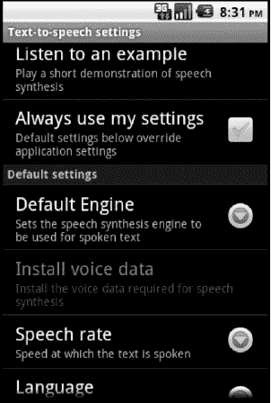

**图 24–1.** *文字转语音的设置界面*

你可以更改语音的语言和语速。语言选项不仅可以翻译朗读的示例文字，还能改变朗读者的口音，不过示例文字本身仍然是“This is an example of speech synthesis”，只是语言设置选项已改为你选择的语言。请注意，文字转语音功能实际上只负责语音部分。将文本从一种语言翻译到另一种语言是通过单独的组件完成的，例如我们曾在 第 11 章 中介绍过的谷歌翻译。稍后，当我们在应用中实际实现 TTS 时，我们需要让语音与语言匹配，例如用法语语音朗读法语文本。语速值范围从“非常慢”到“非常快”。

请特别注意“始终使用我的设置”选项。如果这个选项是由你或用户在系统设置中开启的，你的应用可能不会按预期运行，因为这里的设置可能会覆盖你想在应用中实现的功能。

从 Android 2.2 开始，我们能够使用除 Pico 之外的 TTS 引擎（因此，在 Android 2.2 之前，你不会在这个设置页面中看到“默认引擎”选项）。这种选择提供了灵活性，因为 Pico 并非在所有情况下都能良好运行。即使有多个 TTS 引擎，设备上也只有一个 TTS 服务。这个 TTS 服务由设备上的所有活动共享，因此我们必须意识到，我们可能不是唯一使用 TTS 的人。此外，我们无法确定文本何时会被朗读，甚至根本无法确定它是否会被朗读。不过，TTS 服务接口为我们提供了回调，因此我们能够大致了解发送给朗读的文本处理情况。TTS 服务会记录我们想要使用的 TTS 引擎，并在为我们执行操作时使用我们指定的 TTS 引擎。该服务会使用每个调用活动所需的任何 TTS 引擎，因此其他应用可以使用与我们应用不同的 TTS 引擎，我们无需为此担心。

让我们探索一下操作这些 TTS 设置时实际发生了什么。在幕后，Android 启动了一个文字转语音服务以及 Pico（一个多语言语音合成引擎）。我们当前所在的偏好设置活动已经为当前语言和语速初始化了引擎。当我们点击“聆听示例”时，偏好设置活动将文本发送给服务，然后引擎通过音频输出朗读出来。Pico 将文本分解成它知道如何发音的片段，并以听起来相当自然的方式将这些音频片段拼接起来。引擎内部的逻辑实际上比这要复杂得多，但就我们的目的而言，我们可以把它当作一个魔法。幸运的是，对我们来说，这个魔法在磁盘空间和内存占用方面都非常小，因此 Pico 是手机的理想补充。

在这个例子中，我们将创建一个能够朗读出我们输入文本的应用。这个应用相当简单，但它的目的是向你展示设置文字转语音是多么容易。首先，使用 代码清单 24–1 中的资源创建一个新的 Android 项目。

**注意：** 我们将在本章末尾提供一个网址，你可以通过它下载本章的项目文件。这样你就可以直接将这些项目导入到你的 Eclipse 中。

**代码清单 24–1.** *简单 TTS 演示的 XML 和 Java 代码*

```
<?xml version="1.0" encoding="utf-8"?>
<!-- 此文件为 /res/layout/main.xml -->
<LinearLayout
    android:orientation="vertical"
    android:layout_width="fill_parent"
    android:layout_height="fill_parent">

  <EditText android:id="@+id/wordsToSpeak"
    android:hint="在此输入要朗读的文字"
    android:layout_width="fill_parent"
    android:layout_height="wrap_content"/>

  <Button android:id="@+id/speak"
    android:text="朗读"
    android:layout_width="wrap_content"
    android:layout_height="wrap_content"
    android:onClick="doSpeak"
    android:enabled="false" />

</LinearLayout>

// 此文件为 MainActivity.java
import android.app.Activity;
import android.content.Intent;
import android.os.Bundle;
import android.speech.tts.TextToSpeech;
import android.speech.tts.TextToSpeech.OnInitListener;
import android.util.Log;
import android.view.View;
import android.widget.Button;
import android.widget.EditText;

public class MainActivity extends Activity implements OnInitListener {
    private EditText words = null;
    private Button speakBtn = null;
    private static final int REQ_TTS_STATUS_CHECK = 0;
    private static final String TAG = "TTS Demo";
    private TextToSpeech mTts;

    /** 当活动首次创建时被调用。 */
    @Override
    public void onCreate(Bundle savedInstanceState) {
        super.onCreate(savedInstanceState);
        setContentView(R.layout.main);

        words = (EditText)findViewById(R.id.wordsToSpeak);
        speakBtn = (Button)findViewById(R.id.speak);

        // 检查确保 TTS 存在且可用
        Intent checkIntent = new Intent();
        checkIntent.setAction(TextToSpeech.Engine.ACTION_CHECK_TTS_DATA);
        startActivityForResult(checkIntent, REQ_TTS_STATUS_CHECK);
    }

    public void doSpeak(View view) {
        mTts.speak(words.getText().toString(),
            TextToSpeech.QUEUE_ADD, null);
    }

    protected void onActivityResult(int requestCode, int resultCode,
            Intent data) {
        if (requestCode == REQ_TTS_STATUS_CHECK) {
            switch (resultCode) {
            case TextToSpeech.Engine.CHECK_VOICE_DATA_PASS:
                // TTS 正在运行
                mTts = new TextToSpeech(this, this);
                Log.v(TAG, "Pico 安装正常");
                break;
            case TextToSpeech.Engine.CHECK_VOICE_DATA_BAD_DATA:
            case TextToSpeech.Engine.CHECK_VOICE_DATA_MISSING_DATA:
            case TextToSpeech.Engine.CHECK_VOICE_DATA_MISSING_VOLUME:
                // 缺少数据，进行安装
                Log.v(TAG, "需要语言资源：" + resultCode);
                Intent installIntent = new Intent();
                installIntent.setAction(
                    TextToSpeech.Engine.ACTION_INSTALL_TTS_DATA);
                startActivity(installIntent);
                break;
            case TextToSpeech.Engine.CHECK_VOICE_DATA_FAIL:
            default:
                Log.e(TAG, "遇到错误。TTS 不可用");
            }
        }
        else {
            // 收到其他结果
        }
    }

    public void onInit(int status) {
        // 现在 TTS 引擎已准备就绪，我们启用按钮
        if( status == TextToSpeech.SUCCESS) {
            speakBtn.setEnabled(true);
        }
    }

    @Override
    public void onPause()
    {
        super.onPause();
        // 如果失去焦点，停止朗读
        if( mTts != null)
            mTts.stop();
    }
```


`@Override`
`public void onDestroy()`
`{
    super.onDestroy();
    mTts.shutdown();
}`

我们这个示例的用户界面由一个简单的 `EditText` 视图（用于输入要朗读的文字）和一个按钮（用于触发朗读）组成（参见 图 24–2）。按钮包含一个 `doSpeak()` 方法，它从 `EditText` 视图中获取文本字符串，并使用 `speak()` 方法配合 `QUEUE_ADD` 参数将其加入 TTS 服务的队列。请记住，TTS 服务是共享的，因此在这种情况下，我们会将文本排在可能存在的其他朗读任务之后（极大概率是没有任何任务的）。除了 `QUEUE_ADD` 之外，另一个选项是 `QUEUE_FLUSH`，它会丢弃队列中的所有其他文本，并立即播放我们的文本。在 `onCreate()` 方法的末尾，我们启动了一个 `Intent`，请求 TTS 引擎告知文本是否已准备好朗读。由于我们需要得到回复，因此我们使用 `startActivityForResult()` 并传递一个请求码。我们在 `onActivityResult()` 中获取响应，并在其中检查 `CHECK_VOICE_DATA_PASS`。由于 TTS 服务可能返回多种表示“成功”的 `resultCode` 类型，我们不能简单地检查 `RESULT_OK`。请通过查看 `switch` 语句来了解我们可以获取的其他值。


**图 24–2.** *TTS 演示的用户界面*

如果收到 `CHECK_VOICE_DATA_PASS` 返回结果，我们实例化一个 `TextToSpeech` 对象。请注意，我们的 `MainActivity` 实现了 `OnInitListener` 接口。这使我们能够在 TTS 服务接口已创建并可用时收到一个回调，我们通过 `onInit()` 方法接收该回调。如果在 `onInit()` 方法内部收到 `SUCCESS`，我们就知道可以朗读文本了，并在用户界面中启用我们的按钮。还有两件事需要注意：在 `onPause()` 中调用 `stop()` 方法，以及在 `onDestroy()` 中调用 `shutdown()` 方法。我们调用 `stop()` 是因为如果有其他内容出现在我们的应用前面，应用就会失去焦点，应该停止朗读。我们不想打断另一个已跳到前面的活动中的音频内容。我们调用 `shutdown()` 是为了通知 Android，我们已经用完了 TTS 引擎，并且其资源（如果其他应用不需要）可以被释放。

请继续尝试这个示例。试试不同的句子或短语。然后，给它一大段文本，这样你就能听到连续的语音朗读。考虑一下，如果在朗读大段文本时我们的应用被中断（例如，其他应用使用 `QUEUE_FLUSH` 调用了 TTS 服务，或者应用只是失去了焦点），会发生什么。为了测试这个想法，当一大段文本正在朗读时，按下 Home 键。由于我们在 `onPause()` 中调用了 `stop()`，朗读会停止，即使我们的应用仍在后台运行。如果我们的应用重新获得焦点，我们如何知道朗读到了哪里？如果我们有办法知道上次中断的位置，以便能够重新开始朗读（至少接近上次中断的位置），那将会很方便。确实有办法，但这需要一些额外的工作。

### 使用语音片段跟踪朗读进度

TTS 引擎可以在完成一段文本（在 TTS 领域称为*语音片段*）的朗读时，在你的应用中调用一个回调。我们在 TTS 实例上使用 `setOnUtteranceCompletedListener()` 方法来设置回调，在示例中即为 `mTts`。当调用 `speak()` 方法时，我们可以添加一个键值对，告诉 TTS 引擎在该语音片段播放完毕后通知我们。通过向 TTS 引擎发送唯一的语音片段 ID，我们可以跟踪哪些语音片段已经朗读过，哪些还没有。如果应用在中断后重新获得焦点，我们可以从上一次完成的语音片段之后的下一个语音片段开始继续朗读。基于之前的示例，按照清单 24–2 所示修改代码，或者查看本书网站源代码中的 `TTSDemo2` 项目。

**清单 24–2.** *对 `MainActivity` 的修改以展示语音片段跟踪*

`// 添加这些导入`
`import java.util.HashMap;`
`import java.util.StringTokenizer;`
`import android.speech.tts.TextToSpeech.OnUtteranceCompletedListener;`

```
// 修改 MainActivity
public class MainActivity extends Activity implements OnInitListener,
OnUtteranceCompletedListener {

// 添加这些私有字段
private int uttCount = 0;
    private int lastUtterance = -1;
    private HashMap<String, String> params = new HashMap<String, String>();

    // 修改 onInit
    public void onInit(int status) {
        // 现在 TTS 引擎已就绪，我们可以启用按钮了
        if( status == TextToSpeech.SUCCESS) {
            speakBtn.setEnabled(true);
            mTts.setOnUtteranceCompletedListener(this);
        }
    }

// 添加新方法 onUtteranceCompleted
    public void onUtteranceCompleted(String uttId) {
        Log.v(TAG, "收到语音片段 ID 为 " + uttId + " 的完成消息");
        lastUtterance = Integer.parseInt(uttId);
    }

    // 修改 doSpeak
    public void doSpeak(View view) {
        StringTokenizer st = new StringTokenizer(words.getText().toString(),",.");
        while (st.hasMoreTokens()) {
            params.put(TextToSpeech.Engine.KEY_PARAM_UTTERANCE_ID,
                        String.valueOf(uttCount++));
            mTts.speak(st.nextToken(), TextToSpeech.QUEUE_ADD, params);
        }
    }
}
```

我们首先需要确保 `MainActivity` 也实现了 `OnUtteranceCompletedListener` 接口。这将使我们能够在语音片段朗读完成时收到 TTS 引擎的回调。我们还需要修改按钮的 `doSpeak()` 方法，以便为发送的每段文本传递额外的信息，从而关联一个语音片段 ID。在这个新版本的示例中，我们将使用逗号和句点作为分隔符，把文本拆分成多个语音片段。然后，我们遍历这些语音片段，使用 `QUEUE_ADD`（而不是 `QUEUE_FLUSH`，因为我们不想中断自己！）传递每个片段，并附上一个唯一的语音片段 ID（一个简单的递增计数器，当然要转换为 `String`）。我们可以使用任何唯一的文本来作为语音片段 ID；既然它是 `String` 类型，我们就不局限于数字。实际上，我们可以直接用文本本身作为语音片段 ID，不过如果文本非常长，出于性能考虑，我们可能不想这样做。我们需要修改 `onInit()` 方法以注册自己来接收语音片段完成时的回调，最后，我们需要提供回调方法 `onUtteranceCompleted()`，以便 TTS 服务在语音片段完成时调用。在这个示例中，我们只是简单地为每个完成的语音片段记录一条消息到 `LogCat`。

当你运行这个新示例时，输入一些包含逗号和句点的文本，然后点击“Speak”按钮。在听语音朗读文本的同时，观察 `LogCat` 窗口。你会注意到文本被立即加入队列，并且每当一个语音片段完成时，我们的回调就会被调用，并在 `LogCat` 中为每个片段记录一条消息。如果你中断了这个示例（例如，在朗读文本时点击 Home 键），你会看到语音和回调都停止了。我们现在知道了最后一个语音片段是什么，并且可以在以后重新获得控制权时，从中断的地方继续朗读。


### 使用音频文件定制语音

TTS 引擎提供了一种方法，可以正确发音那些默认情况下读错的单词或语句。例如，如果你输入"Don Quixote"作为要朗读的文本，你会听到一个不正确的发音。公平地说，TTS 引擎能够对单词的发音做出合理猜测，但不能指望它了解所有规则中的每一个例外情况。那么如何解决这个问题呢？一种方法是录制一段音频片段，用其替代默认音频进行播放。为了保持语音一致性，我们希望使用 TTS 引擎生成声音并录制结果，然后告诉 TTS 引擎用我们录制的声音替换其默认发音。关键在于提供听起来符合我们预期的文本。让我们开始吧。

在 Eclipse 中创建一个新的 Android 项目。使用代码清单 24–3 中的 XML 创建主布局。为了简化操作，我们将文本直接放入布局文件中，而不使用字符串引用。通常，你应该在布局文件中使用字符串资源 ID。布局效果如图 24–3 所示。

**代码清单 24–3.** *演示文本保存音频的布局 XML 文件*

```xml
<?xml version="1.0" encoding="utf-8"?>
<!-- 此文件位于 /res/layout/main.xml -->
<LinearLayout
    android:orientation="vertical" android:layout_width="fill_parent"
    android:layout_height="fill_parent">

  <EditText android:id="@+id/wordsToSpeak"
    android:text="Dohn Keyhotay"
    android:layout_width="fill_parent"
    android:layout_height="wrap_content"/>

  <Button android:id="@+id/speakBtn"
    android:text="朗读"
    android:layout_width="wrap_content"
    android:layout_height="wrap_content"
    android:onClick="doButton"
    android:enabled="false" />

  <TextView android:id="@+id/filenameLabel"
    android:text="文件名："
    android:layout_width="wrap_content"
    android:layout_height="wrap_content"/>

  <EditText android:id="@+id/filename"
    android:text="/sdcard/donquixote.wav"
    android:layout_width="fill_parent"
    android:layout_height="wrap_content"/>

  <Button android:id="@+id/recordBtn"
    android:text="录制"
    android:layout_width="wrap_content"
    android:layout_height="wrap_content"
    android:enabled="false"
    android:onClick="doButton"/>

  <Button android:id="@+id/playBtn"
    android:text="播放"
    android:layout_width="wrap_content"
    android:layout_height="wrap_content"
    android:onClick="doButton"
    android:enabled="false" />

  <TextView android:id="@+id/useWithLabel"
    android:text="关联文本："
    android:layout_width="wrap_content"
    android:layout_height="wrap_content"/>

  <EditText android:id="@+id/realText"
    android:text="Don Quixote"
    android:layout_width="fill_parent"
    android:layout_height="wrap_content"/>

  <Button android:id="@+id/assocBtn"
    android:text="关联"
    android:layout_width="wrap_content"
    android:layout_height="wrap_content"
    android:onClick="doButton"
    android:enabled="false" />

</LinearLayout>
```

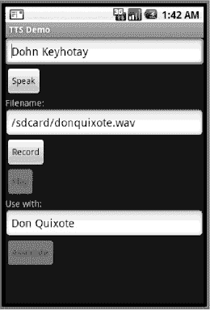

**图 24–3.** *将声音文件与文本关联的 TTS 演示用户界面*

我们需要一个字段来保存特殊文本，该文本将用于通过 TTS 引擎录制到声音文件中。我们还在布局中提供了文件名。最后，我们需要将声音文件与我们要播放声音的实际字符串关联起来。

现在，让我们看一下`MainActivity`的 Java 代码（参见代码清单 24–4）。在`onCreate()`方法中，我们为朗读、播放、录制和关联按钮设置了点击处理程序，然后通过 intent 启动 TTS 引擎。其余代码包括用于处理 intent 结果（检查 TTS 引擎是否正确设置）的回调、处理 TTS 引擎初始化结果的回调，以及处理活动暂停和关闭的常规回调。

**代码清单 24–4.** *演示文本保存音频的 Java 代码*

```java
import java.io.File;
import java.util.ArrayList;

import android.app.Activity;
import android.content.Intent;
import android.media.MediaPlayer;
import android.os.Bundle;
import android.speech.tts.TextToSpeech;
import android.speech.tts.TextToSpeech.OnInitListener;
import android.util.Log;
import android.view.View;
import android.view.View.OnClickListener;
import android.widget.Button;
import android.widget.EditText;
import android.widget.Toast;

public class MainActivity extends Activity implements OnInitListener {
    private EditText words = null;
    private Button speakBtn = null;
    private EditText filename = null;
    private Button recordBtn = null;
    private Button playBtn = null;
    private EditText useWith = null;
    private Button assocBtn = null;
    private String soundFilename = null;
    private File soundFile = null;
    private static final int REQ_TTS_STATUS_CHECK = 0;
    private static final String TAG = "TTS Demo";
    private TextToSpeech mTts = null;
    private MediaPlayer player = null;

    /** 活动首次创建时调用 */
    @Override
    public void onCreate(Bundle savedInstanceState) {
        super.onCreate(savedInstanceState);
        setContentView(R.layout.main);

        words = (EditText)findViewById(R.id.wordsToSpeak);
        filename = (EditText)findViewById(R.id.filename);
        useWith = (EditText)findViewById(R.id.realText);

        speakBtn = (Button)findViewById(R.id.speakBtn);
        recordBtn = (Button)findViewById(R.id.recordBtn);
        playBtn = (Button)findViewById(R.id.playBtn);
        assocBtn = (Button)findViewById(R.id.assocBtn);

        // 检查确保 TTS 存在且可用
        Intent checkIntent = new Intent();
        checkIntent.setAction(TextToSpeech.Engine.ACTION_CHECK_TTS_DATA);
        startActivityForResult(checkIntent, REQ_TTS_STATUS_CHECK);
    }

    public void doButton(View view) {
        switch(view.getId()) {
        case R.id.speakBtn:
            mTts.speak(words.getText().toString(),
                TextToSpeech.QUEUE_ADD, null);
            break;
        case R.id.recordBtn:
            soundFilename = filename.getText().toString();
            soundFile = new File(soundFilename);
            if (soundFile.exists())
                soundFile.delete();
```


```java
if(mTts.synthesizeToFile(words.getText().toString(),
        null, soundFilename) == TextToSpeech.SUCCESS) {
    Toast.makeText(getBaseContext(),
            "语音文件已创建",
            Toast.LENGTH_SHORT).show();
    playBtn.setEnabled(true);
    assocBtn.setEnabled(true);
}
else {
    Toast.makeText(getBaseContext(),
            "哎呀！语音文件未创建",
            Toast.LENGTH_SHORT).show();
}
break;
case R.id.playBtn:
    try {
        player = new MediaPlayer();
        player.setDataSource(soundFilename);
        player.prepare();
        player.start();
    }
    catch(Exception e) {
        Toast.makeText(getBaseContext(),
                "嗯……无法播放文件",
                Toast.LENGTH_SHORT).show();
        e.printStackTrace();
    }
    break;
case R.id.assocBtn:
    mTts.addSpeech(useWith.getText().toString(), soundFilename);
    Toast.makeText(getBaseContext(),
         "已关联！",
         Toast.LENGTH_SHORT).show();
    break;
    }
}

protected void onActivityResult(int requestCode, int resultCode,
        Intent data) {
    if (requestCode == REQ_TTS_STATUS_CHECK) {
        switch (resultCode) {
        case TextToSpeech.Engine.CHECK_VOICE_DATA_PASS:
            // TTS 引擎已就绪
            mTts = new TextToSpeech(this, this);
            Log.v(TAG, "Pico 已正确安装");
            ArrayList<String> available =
                    data.getStringArrayListExtra("availableVoices");
            break;
        case TextToSpeech.Engine.CHECK_VOICE_DATA_BAD_DATA:
        case TextToSpeech.Engine.CHECK_VOICE_DATA_MISSING_DATA:
        case TextToSpeech.Engine.CHECK_VOICE_DATA_MISSING_VOLUME:
            // 缺少数据，需要安装
            Log.v(TAG, "需要语言包：" + resultCode);
            Intent installIntent = new Intent();
            installIntent.setAction(
                TextToSpeech.Engine.ACTION_INSTALL_TTS_DATA);
            startActivity(installIntent);
            break;
        case TextToSpeech.Engine.CHECK_VOICE_DATA_FAIL:
        default:
            Log.e(TAG, "操作失败，TTS 不可用");
        }
    }
    else {
        // 接收到其他结果
    }
}

public void onInit(int status) {
    // TTS 引擎就绪后，启用按钮
    if( status == TextToSpeech.SUCCESS) {
        speakBtn.setEnabled(true);
        recordBtn.setEnabled(true);
    }
}

@Override
public void onPause()
{
    super.onPause();
    // 若失去焦点，停止播放
    if(player != null) {
        player.stop();
    }
    // 若失去焦点，停止朗读
    if( mTts != null)
        mTts.stop();
}

@Override
public void onDestroy()
{
    super.onDestroy();
    if(player != null) {
        player.release();
    }
    if( mTts != null) {
        mTts.shutdown();
    }
}
```

为了让这个示例能够运行，我们需要在 `AndroidManifest.xml` 文件中添加 `android.permission.WRITE_EXTERNAL_STORAGE` 权限。当你运行这个示例时，应该会看到如图 24-3 所示的界面。

我们将要录制一些听起来像“堂吉诃德”发音的文本，因此不能使用真实的词语。我们需要编造一些文本来获得想要的声音。点击“Speak”按钮，听听这些假词听起来如何。效果还不错！接下来，点击“Record”将音频写入一个 WAV 文件。当录制成功时，“Play”和“Associate”按钮会被启用。点击“Play”按钮，直接通过媒体播放器播放 WAV 文件。如果你喜欢这个声音，点击“Associate”按钮。这会调用 TTS 引擎的 `addSpeech()` 方法，将我们的新音频文件与“Use with”字段中的字符串关联起来。如果关联成功，返回顶部的 `EditText` 视图；输入 **Don Quixote**，然后点击“Speak”。现在它的发音就正常了。

请注意，`synthesizeToFile()` 方法只能保存为 WAV 文件格式，无论文件扩展名是什么，但你也可以使用 `addSpeech()` 关联其他格式的音频文件——例如 MP3 文件。MP3 文件需要通过除 TTS 引擎的 `synthesizeToFile()` 方法之外的其他方式创建。

这种方法在语音方面的用途非常有限。在一个词汇量无限的场景中——也就是说，当你无法预知哪些单词会被朗读时——你不可能事先准备好所有所需的音频文件，来纠正 Pico 发音不准确的单词。但在词汇量有限的场景中（例如朗读天气预报），你可以逐个测试应用程序中的所有单词，找出那些发音不合适的并加以修正。即使在词汇量无限的场景中，你也可以预先准备一些单词的发音，以确保关键单词的发音正确。例如，你可能希望为你的公司名或你自己的名字准备好音频文件！

然而，这种方法也有一个弊端：你传递给 `speak()` 的文本必须与你调用 `addSpeech()` 时使用的文本完全一致。不幸的是，你不能只为单个单词提供音频文件，然后期望在将该单词作为句子的一部分传递给 `speak()` 时，TTS 引擎会自动使用该音频文件。要听到你的音频文件，你必须提供与该音频文件完全相同的文本。任何多余或缺少的内容都会导致 Pico 介入并尽力发音。

解决这个问题的一种方法是将文本拆分成单词，并将每个单词单独传递给 TTS 引擎。虽然这可能会播放我们的音频文件（当然，我们需要将“Quixote”和“Don”分开录制），但整体效果将像断断续续的语音，仿佛每个单词都是一个独立的句子。在某些应用程序中，这或许是可以接受的。使用音频文件的理想场景是，当我们需要朗读预先确定的固定词语或短语时，我们提前确切知道需要朗读的文本。

那么，当我们知道句子中的某些单词 Pico 无法正确发音时，该怎么办？一种方法可能是扫描文本，找出已知的“问题”单词，然后用 Pico 能够正确发音的“假”单词替换这些单词。我们无需向用户展示我们传递给 `speak()` 方法的文本。因此，我们或许可以在调用 `speak()` 之前，将文本中的“Quixote”替换为“Keyhotay”。这样做的结果是，发音正确，而用户毫不知情。在资源使用方面，存储假字符串比存储音频文件高效得多，即使我们仍然调用了 Pico。我们本来就需要为文本的其余部分调用 Pico，所以这几乎不算损失。然而，我们不应该过多地自作聪明地替 Pico 做决定。也就是说，Pico 在发音方面具有很高的智能，如果我们试图替 Pico 完成它的工作，很快就会遇到麻烦。


### 文本转语音高级功能

在上一个示例中，我们为一段文本录制了声音文件，这样当 TTS 引擎稍后回读时，会访问该声音文件，而不是使用 Pico 生成语音。如您所料，播放一个小型声音文件比运行 TTS 引擎并与之交互消耗的设备资源更少。因此，如果您需要为有限的单词或短语提供声音，即使 Pico 引擎的发音正确，您也可能希望提前创建声音文件。这有助于您的应用运行得更快。如果您的声音文件数量较少，总体内存占用也可能更少。如果采用这种方法，您将需要使用以下方法调用：

`TextToSpeech.addSpeech(String text, String packagename, int soundFileResourceId)`

这是一种向 TTS 引擎添加声音文件的非常简便的方法。`text` 参数是要为其播放声音文件的字符串；`packagename` 是存储资源文件的应用包名；`soundFileResourceId` 是声音文件的资源 ID。将您的声音文件存储在应用的 `/res/raw` 目录下。当应用启动时，通过引用声音文件的资源 ID（例如 `R.raw.quixote`）将预录的声音文件添加到 TTS 引擎。当然，您需要某种数据库或预定义列表来了解每个声音文件对应哪段文本。如果您正在对应用进行国际化处理，可以将不同语言的声音文件存储在相应的 `/res/raw` 目录下；例如，法语声音文件存放在 `/res/raw-fr` 中。

#### TTS 引擎的高级功能

现在您已经学习了 TTS 的基础知识，让我们探索一下 Pico 引擎的一些高级功能。我们将从设置音频流开始，它可以帮助您将语音引导到正确的音频输出通道。接下来，我们将介绍如何播放耳标（可听图标）和静音。然后，我们将介绍如何设置语言选项，最后会提到一些其他方法调用。

##### 设置音频流

之前，我们使用了 `params HashMap` 向 TTS 引擎传递额外参数。我们可以传递的一个参数（`KEY_PARAM_STREAM`）告诉 TTS 引擎为想要朗读的文本使用哪个音频流。可用的音频流列表参见表 24-1。

**表 24-1.** 可用的音频流

| **音频流** | **描述** |
| --- | --- |
| `STREAM_ALARM` | 用于闹钟的音频流 |
| `STREAM_DTMF` | 用于 DTMF 音（即电话按键音）的音频流 |
| `STREAM_MUSIC` | 用于音乐播放的音频流 |
| `STREAM_NOTIFICATION` | 用于通知的音频流 |
| `STREAM_RING` | 用于电话铃声的音频流 |
| `STREAM_SYSTEM` | 用于系统声音的音频流 |
| `STREAM_VOICE_CALL` | 用于电话通话的音频流 |

如果我们要朗读的文本与闹钟相关，我们希望告诉 TTS 引擎通过闹钟的音频流播放声音。因此，在调用 `speak()` 方法之前，我们需要进行如下调用：

```
params.put(TextToSpeech.Engine.KEY_PARAM_STREAM,
                      String.valueOf(AudioManager.STREAM_ALARM));
```

回顾清单 24-2 以回忆我们如何设置并将 `params HashMap` 传递给 `speak()` 方法调用。您可以将话语 ID 放入同一个 `params HashMap` 中，就像您用来指定音频流的那样。

##### 使用耳标

TTS 引擎可以为我们播放另一种类型的声音，称为耳标。耳标就像是一种可听的图标。它不用于表示文本，而是为某种事件或文本中非文字内容的存在提供听觉提示。耳标可以是一种声音，用来指示我们正在阅读演示文稿中的项目符号，或者我们刚刚翻到下一页。也许您的应用是用于步行导览，耳标可以告诉听众前往行程中的下一个地点。

要设置用于播放的耳标，您需要调用 `addEarcon()` 方法，该方法接受两个或三个参数，类似于 `addSpeech()`。第一个参数是耳标的名称，类似于 `addSpeech()` 的文本字段。按照惯例，您应该将耳标名称括在方括号中（例如，“`[boing]`”）。在有两个参数的情况下，第二个参数是文件名字符串。在有三个参数的情况下，第二个参数是包名，第三个参数是资源 ID，指向一个很可能存储在 `/res/raw` 下的音频文件。要播放耳标，请使用 `playEarcon()` 方法，该方法与具有三个参数的 `speak()` 方法类似。使用耳标的示例如清单 24-5 所示。

**清单 24-5:** *使用耳标的示例代码*

```
String turnPageEarcon = "[turnPage]";
mTts.addEarcon(turnPageEarcon, "com.androidbook.tts.demo",
    R.raw.turnpage);
mTts.playEarcon(turnPageEarcon, TextToSpeech.QUEUE_ADD, params);
```

我们使用耳标而不是简单地使用媒体播放器播放音频文件，是因为 TTS 引擎具有排队机制。我们无需确定播放听觉提示的最佳时机并依赖回调来确保正确的时序，而是可以将耳标与我们发送给 TTS 引擎的文本一起排队。这样我们就知道耳标会在适当的时间播放，并且可以使用相同的路径将声音传递给用户，包括使用 `onUtteranceCompleted()` 回调来让我们了解当前进度。

##### 播放静音

TTS 引擎还有一种我们可以使用的播放方法：`playSilence()`。该方法也像 `speak()` 和 `playEarcon()` 一样有三个参数，其中第二个参数是队列模式，第三个是可选的 `params HashMap`。`playSilence()` 的第一个参数是一个 `long` 值，表示播放静音的毫秒数。您最有可能将此方法与 `QUEUE_ADD` 模式一起使用，以在时间上分隔两个不同的文本字符串。也就是说，您可以在两个文本字符串之间插入一段静音，而无需在应用中管理等待时间。您只需依次调用 `speak()`、`playSilence()` 和 `speak()` 即可获得所需效果。以下是一个使用 `playSilence()` 实现两秒延迟的示例：

```
mTts.playSilence(2000, TextToSpeech.QUEUE_ADD, params);
```

##### 选择不同的文本转语音引擎

要指定特定的 TTS 引擎，可以使用 `setEngineByPackageName()` 方法，并将相应的引擎包名作为参数传入。对于 Pico，包名为 `com.svox.pico`。要获取用户的默认 TTS 引擎包名，请使用 `getDefaultEngine()` 方法。在到达 `onInit()` 方法之前，不得调用这两个方法，否则它们将无法正常工作。此外，这两个方法在 Android 2.2 之前的版本中不可用。


###### 使用语言方法

我们尚未讨论语言问题，现在就来探讨。TTS 功能使用与所创建语音对应的语言来朗读文本，例如，意大利语语音期望读取的是意大利语文本。语音会识别文本的特征以正确发音。因此，为 TTS 引擎提供不匹配的语言语音是没有意义的。用意大利语语音朗读法语文本很可能会引发问题；最好将文本的区域设置与语音的区域设置匹配起来。

TTS 引擎提供了一些语言相关的方法，既可用于查找可用的语言，也可用于设置朗读语言。TTS 引擎只安装了特定数量的语言包，不过如果有其他可用语言包，它能从 Android 市场获取。你在 清单 24–1 的 `onActivityResult()` 回调中看到过相关代码，其中创建了一个 Intent 来获取缺失的语言。当然，所需的语言包可能尚不可用，但随着时间的推移，会有越来越多的语言包可用。

用于检查语言的 `TextToSpeech` 方法是 `isLanguageAvailable(Locale locale)`。由于区域设置可能代表国家和语言，有时还包含变体，因此返回结果并非简单的“是”或“否”。可能的返回值如下：`TextToSpeech.LANG_COUNTRY_AVAILABLE`，表示同时支持国家和语言；`TextToSpeech.LANG_AVAILABLE`，表示支持该语言但不支持该国家；`TextToSpeech.LANG_NOT_SUPPORTED`，表示完全不支持。如果你收到 `TextToSpeech.LANG_MISSING_DATA`，说明语言受支持，但 TTS 引擎未找到数据文件。你的应用应引导用户前往 Android 市场或其他合适的来源，以获取缺失的数据文件。例如，法语可能受支持，但加拿大法语不受支持。如果出现这种情况，并且 `Locale.CANADA_FRENCH` 被传递给 TTS 引擎，则响应会是 `TextToSpeech.LANG_AVAILABLE`，而不是 `TextToSpeech.LANG_COUNTRY_AVAILABLE`。另一种可能的返回值是特殊情况，即区域设置可能包含变体，此时响应可能是 `TextToSpeech.LANG_COUNTRY_VAR_AVAILABLE`，表示所有内容都受支持。

使用 `isLanguageAvailable()` 来确定 TTS 引擎支持的所有语言是一种繁琐的方法。幸运的是，我们可以让 TTS 引擎告诉我们哪些语言已经可用。仔细查看 清单 24–4，在用于接收来自 Intent 的响应的 `onActivityResult()` 回调部分，你会看到数据对象包含一个 TTS 引擎支持的语言列表。在 `CHECK_VOICE_DATA_PASS` 分支下查找名为 `available` 的 `ArrayList` 变量。它被设置为一个语音字符串数组。这些值看起来类似于 `eng-USA` 或 `fra-FRA`。虽然区域设置字符串通常采用 `ll_cc` 形式（其中 `ll` 是语言的两位字符表示，`cc` 是国家的两位字符表示），但来自 TTS 引擎的这些 `lll-ccc` 字符串也可用于构造一个供 TTS 引擎使用的区域设置对象。不幸的是，我们收到的是字符串数组而非区域设置对象，因此我们必须进行一些解析或映射，以确定目标 TTS 引擎真正可用的语音。

设置语言的方法是 `setLanguage(Locale locale)`。它返回与 `isLanguageAvailable()` 相同的状态码。如果你想使用此方法，请在 TTS 引擎初始化后（即在 `onInit()` 方法或之后）调用它。否则，你的语言选择可能不会生效。要获取设备的当前默认区域设置，请使用 `Locale.getDefault()` 方法，该方法将返回一个区域设置值，例如 `en_US` 或与你所在地对应的值。使用 `TextToSpeech` 类的 `getLanguage()` 方法可以查明 TTS 引擎的当前区域设置。与使用 `setLanguage()` 时一样，不要在 `onInit()` 之前调用 `getLanguage()`。`getLanguage()` 返回的值看起来像是 `eng_USA`。注意，现在语言和国家之间用的是下划线而不是连字符。虽然 Android 在区域设置字符串方面似乎比较宽容，但 API 若能变得更加一致就好了。在示例中，我们本可以使用如下代码为 TTS 引擎设置语言，也是完全可以接受的：

```
switch(mTts.setLanguage(Locale.getDefault())) {
case TextToSpeech.LANG_COUNTRY_AVAILABLE: …
```

在本章开头，我们指出了主要的文本转语音设置项“始终使用我的设置”，它会覆盖应用的语音语言设置。在 Android 2.2 中，`TextToSpeech` 类的 `areDefaultsEnforced()` 方法会通过返回 `true` 或 `false` 来告知用户是否选择了此选项。在你的应用中，你可以判断你的语言选择是否会被覆盖，并据此采取适当的措施。

最后，为了结束关于 TTS 的讨论，我们将介绍一些其他可用的方法。`setPitch(float pitch)` 方法会在不改变语速的情况下，将语音的音调调高或调低。音调的默认值是 1.0。有意义的范围最低似乎是 0.5，最高是 2.0；你可以设置低于或高于此范围的值，但超过这些阈值后，音调似乎不再发生变化。`setSpeechRate(float rate)` 方法似乎也遵循相同的阈值。也就是说，你向该方法传递一个 0.5 到 2.0 之间的浮点数参数，其中 1.0 代表正常语速。高于 1.0 的值表示语速更快，低于 1.0 的值表示语速更慢。你可能想用的另一个方法是 `isSpeaking()`，它返回 `true` 或 `false`，用于指示 TTS 引擎当前是否正在朗读内容（包括 `playSilence()` 产生的静音）。如果你需要在 TTS 引擎完成队列中所有内容的朗读时收到通知，你可以为 `ACTION_TTS_QUEUE_PROCESSING_COMPLETED` 广播实现一个 `BroadcastReceiver`。

### 本章小结

在本章中，我们向你展示了如何让你的 Android 应用与用户对话。Android 集成了一个非常出色的 TTS 引擎来实现此功能。对于开发者来说，需要处理的事情并不多。Pico 引擎处理了大部分工作。正如我们所展示的，当 Pico 引擎遇到问题时，也有办法达到预期效果。高级功能也使得开发变得非常轻松。使用文本转语音引擎时需要记住的是，你必须是移动设备上的“好公民”：节约资源、负责任地共享 TTS 引擎，并恰当地使用语音功能。

## 第 25 章


