# 触摸屏

许多安卓设备都配备了触摸屏。当设备没有物理键盘时，大部分用户输入*必须*通过触摸屏来完成。因此，你的应用程序通常需要能够处理来自用户的触摸输入。你可能已经见过当需要用户输入文本时，屏幕上会显示虚拟键盘。在第 17 章中，我们使用触摸操作与地图应用程序交互，来实现地图的侧向平移。到目前为止，触摸屏接口的实现细节对你来说还是隐藏的，但现在我们将展示如何利用触摸屏。

本章由四个主要部分组成。第一部分将介绍`MotionEvent`对象，这是安卓系统告知应用程序用户正在触摸触摸屏的方式。我们还会涵盖`VelocityTracker`以及拖放操作。第二部分将介绍多点触控，即用户一次可以用多根手指触摸触摸屏。第三部分介绍与地图相关的触摸操作，因为有一些特殊的类和方法可以帮助我们处理地图和触摸屏。最后，我们将包含一个关于手势的章节，这是一种特殊的功能类型，可以将触摸序列解释为命令。

### 理解 MotionEvent

在本节中，我们将介绍安卓系统如何将用户的触摸事件告知应用程序。目前，我们只关注一次一根手指触摸屏幕的情况（多点触控将在后续章节中介绍）。

在硬件层面，触摸屏由特殊材料制成，能够感应压力并将其转换为屏幕坐标。关于触摸的信息会被转换成数据，然后这些数据被传递给软件进行处理。

#### MotionEvent 对象

当用户触摸安卓设备的触摸屏时，会创建一个`MotionEvent`对象。`MotionEvent`包含关于触摸发生的位置和时间，以及触摸事件的其他详细信息。这个`MotionEvent`对象会被传递给应用程序中的适当方法。这可能是`View`对象的`onTouchEvent()`方法。请记住，`View`类是安卓中许多类的父类，包括`布局`、`按钮`、`列表`、`Surface`、`时钟`等等。这意味着我们可以通过触摸事件与所有这些不同类型的`View`对象进行交互。当方法被调用时，它可以检查`MotionEvent`对象来决定要做什么。例如，`MapView`可以使用触摸事件来横向移动地图，以便用户平移地图到其他感兴趣的点。或者，虚拟键盘对象可以接收触摸事件来激活虚拟按键，从而为用户界面的其他部分提供文本输入。

一个`MotionEvent`对象是与用户触摸相关的一系列事件之一。这个序列从用户首次触摸触摸屏开始，经过手指在触摸屏表面上的任何移动，到手指离开触摸屏时结束。手指的初始触摸（`ACTION_DOWN`动作）、横向移动（`ACTION_MOVE`动作）以及抬起事件（`ACTION_UP`动作）都会创建`MotionEvent`对象。在接收到最终的`ACTION_UP`事件之前，你可能会接收到相当多的`ACTION_MOVE`事件。每个`MotionEvent`对象都包含关于正在执行什么动作、触摸发生在哪里、施加了多大压力、触摸面积有多大、动作何时发生、以及初始`ACTION_DOWN`何时发生的信息。还有第四种可能的动作，即`ACTION_CANCEL`。这个动作用于指示触摸序列在没有实际执行任何操作的情况下结束。最后，还有`ACTION_OUTSIDE`，它会在一种特殊情况下被设置，即触摸发生在我们窗口之外，但我们仍然能得知这一情况。

还有另一种接收触摸事件的方式，那就是在`View`对象上注册一个触摸事件的回调处理程序。接收事件的类必须实现`View.OnTouchListener`接口，并且必须调用`View`对象的`setOnTouchListener()`方法来为该`View`设置处理程序。实现`View.OnTouchListener`的类必须实现`onTouch()`方法。`onTouchEvent()`方法仅接收一个`MotionEvent`对象作为参数，而`onTouch()`则同时接收`View`和`MotionEvent`对象作为参数。这是因为`OnTouchListener`可能会接收多个视图的`MotionEvent`对象。这一点在下一个示例应用程序中将会变得更加清晰。


如果`MotionEvent`处理器（通过`onTouchEvent()`或`onTouch()`方法）消耗了事件且不需要其他对象知晓，则方法应返回`true`。这会告知 Android 该事件无需传递给其他视图。如果`View`对象对此事件或与此触摸序列相关的任何未来事件不感兴趣，则返回`false`。基类`View`的`onTouchEvent()`方法不执行任何操作并返回`false`。`View`的子类可能相同也可能不同。例如，`Button`对象会消耗触摸事件，因为触摸等同于点击，因此其`onTouchEvent()`方法返回`true`。收到`ACTION_DOWN`事件时，`Button`会改变颜色以表示正在被点击。`Button`还需要接收`ACTION_UP`事件以了解用户何时松开，从而启动按钮点击逻辑。如果`Button`对象从`onTouchEvent()`返回`false`，则将无法再收到任何`MotionEvent`对象来告知用户何时从触摸屏上抬起手指。

当我们希望触摸事件对特定`View`对象执行新操作时，可以扩展该类，重写`onTouchEvent()`方法并在此添加逻辑。我们也可以实现`View.OnTouchListener`接口，并在`View`对象上设置回调处理器。通过使用`onTouch()`设置回调处理器，`MotionEvent`会先传递到此处，然后才到达`View`的`onTouchEvent()`方法。只有当`onTouch()`方法返回`false`时，我们的`View`的`onTouchEvent()`方法才会被调用。让我们进入示例应用程序，以便更直观地理解。

**注意：** 我们将在本章末尾提供一个 URL，您可以用来下载本章的项目。这将允许您直接将项目导入 Eclipse。

清单 25–1 展示了一个布局文件的 XML。从该布局开始，在 Eclipse 中创建一个新的 Android 项目。

**清单 25–1.** *TouchDemo1 的 XML 布局文件*

```xml
<?xml version="1.0" encoding="utf-8"?>
<!-- This file is res/layout/main.xml -->
<LinearLayout
    android:layout_width="fill_parent"
    android:layout_height="fill_parent"
    android:orientation="vertical" >

  <RelativeLayout  android:id="@+id/layout1"
    android:tag="trueLayoutTop"  android:orientation="vertical"
    android:layout_width="fill_parent"
    android:layout_height="wrap_content"
    android:layout_weight="1" >

    <com.androidbook.touch.demo1.TrueButton android:text="returns true"
    android:id="@+id/trueBtn1"  android:tag="trueBtnTop"
    android:layout_width="wrap_content"
    android:layout_height="wrap_content" />

    <com.androidbook.touch.demo1.FalseButton android:text="returns false"
    android:id="@+id/falseBtn1"  android:tag="falseBtnTop"
    android:layout_width="wrap_content"
    android:layout_height="wrap_content"
    android:layout_below="@id/trueBtn1" />

  </RelativeLayout>
  <RelativeLayout  android:id="@+id/layout2"
    android:tag="falseLayoutBottom"  android:orientation="vertical"
    android:layout_width="fill_parent"
    android:layout_height="wrap_content"
    android:layout_weight="1"  android:background="#FF00FF" >

    <com.androidbook.touch.demo1.TrueButton android:text="returns true"
    android:id="@+id/trueBtn2"  android:tag="trueBtnBottom"
    android:layout_width="wrap_content"
    android:layout_height="wrap_content" />

    <com.androidbook.touch.demo1.FalseButton android:text="returns false"
    android:id="@+id/falseBtn2"  android:tag="falseBtnBottom"
    android:layout_width="wrap_content"
    android:layout_height="wrap_content"
    android:layout_below="@id/trueBtn2" />

  </RelativeLayout>
</LinearLayout>
```

关于此布局有几点需要指出。我们在 UI 对象上添加了标签，以便在事件发生时能够在代码中引用这些标签。我们还使用了`RelativeLayout`来定位对象。另请注意我们如何使用自定义对象（`TrueButton`和`FalseButton`）。在 Java 代码中您将看到，这些是从`Button`类扩展而来的类。由于它们是`Button`，因此我们可以使用与其他按钮相同的所有 XML 属性。图 25–1 展示了此布局的外观，清单 25–2 展示了我们的按钮 Java 代码。

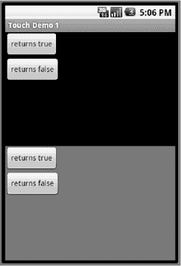

**图 25–1.** *TouchDemo1 应用程序的用户界面*

**清单 25–2.** *TouchDemo1 按钮类的 Java 代码*

```java
// This file is BooleanButton.java
import android.content.Context;
import android.util.AttributeSet;
import android.util.Log;
import android.view.MotionEvent;
import android.widget.Button;

public abstract class BooleanButton extends Button {
    protected boolean myValue() {
        return false;
    }

    public BooleanButton(Context context, AttributeSet attrs) {
        super(context, attrs);
    }

    @Override
    public boolean onTouchEvent(MotionEvent event) {
        String myTag = this.getTag().toString();
        Log.v(myTag, "-----------------------------------");
        Log.v(myTag, MainActivity.describeEvent(this, event));
        Log.v(myTag, "super onTouchEvent() returns " +
                super.onTouchEvent(event));
        Log.v(myTag, "and I'm returning " + myValue());
        return(myValue());
    }
}

// This file is TrueButton.java
import android.content.Context;
import android.util.AttributeSet;

public class TrueButton extends BooleanButton {
    protected boolean myValue() {
        return true;
    }

    public TrueButton(Context context, AttributeSet attrs) {
        super(context, attrs);
    }
}

// This file is FalseButton.java
import android.content.Context;
import android.util.AttributeSet;

public class FalseButton extends BooleanButton {

    public FalseButton(Context context, AttributeSet attrs) {
        super(context, attrs);
    }
}
```

`BooleanButton`类是为了重用`onTouchEvent()`方法而构建的，我们通过添加日志记录对其进行了定制。然后，我们创建了`TrueButton`和`FalseButton`，它们会对传递过来的`MotionEvent`做出不同的响应。当您查看清单 25–3 中的主活动代码时，这一点会更加清晰。

**清单 25–3.** *主活动的 Java 代码*

```java
// This file is MainActivity.java
import android.app.Activity;
import android.os.Bundle;
import android.util.Log;
import android.view.MotionEvent;
import android.view.View;
import android.view.View.OnTouchListener;
import android.widget.Button;
import android.widget.RelativeLayout;

public class MainActivity extends Activity implements OnTouchListener {
    /** Called when the activity is first created. */
    @Override
    public void onCreate(Bundle savedInstanceState) {
        super.onCreate(savedInstanceState);
        setContentView(R.layout.main);

        RelativeLayout layout1 =
                (RelativeLayout) findViewById(R.id.layout1);
        layout1.setOnTouchListener(this);
        Button trueBtn1 = (Button)findViewById(R.id.trueBtn1);
        trueBtn1.setOnTouchListener(this);
        Button falseBtn1 = (Button)findViewById(R.id.falseBtn1);
        falseBtn1.setOnTouchListener(this);
```


```java
RelativeLayout layout2 =
        (RelativeLayout) findViewById(R.id.layout2);
layout2.setOnTouchListener(this);
Button trueBtn2 = (Button)findViewById(R.id.trueBtn2);
trueBtn2.setOnTouchListener(this);
Button falseBtn2 = (Button)findViewById(R.id.falseBtn2);
falseBtn2.setOnTouchListener(this);
}

@Override
public boolean onTouch(View v, MotionEvent event) {
    String myTag = v.getTag().toString();
    Log.v(myTag, "-----------------------------");
    Log.v(myTag, "Got view " + myTag + " in onTouch");
    Log.v(myTag, describeEvent(v, event));
    if( "true".equals(myTag.substring(0, 4))) {
    /*  Log.v(myTag, "*** calling my onTouchEvent() method ***");
        v.onTouchEvent(event);
        Log.v(myTag, "*** back from onTouchEvent() method ***"); */
        Log.v(myTag, "and I'm returning true");
        return true;
    }
    else {
        Log.v(myTag, "and I'm returning false");
        return false;
    }
}

protected static String describeEvent(View view, MotionEvent event) {
    StringBuilder result = new StringBuilder(300);
    result.append("Action: ").append(event.getAction()).append("\n");
    result.append("Location: ").append(event.getX()).append(" x ")
             .append(event.getY()).append("\n");
    if(    event.getX() < 0 || event.getX() > view.getWidth() ||
           event.getY() < 0 || event.getY() > view.getHeight()) {
        result.append(">>> Touch has left the view <<<\n");
    }
    result.append("Edge flags: ").append(event.getEdgeFlags());
    result.append("\n");
    result.append("Pressure: ").append(event.getPressure());
    result.append("   ").append("Size: ").append(event.getSize());
    result.append("\n").append("Down time: ");
    result.append(event.getDownTime()).append("ms\n");
    result.append("Event time: ").append(event.getEventTime());
    result.append("ms").append("  Elapsed: ");
    result.append(event.getEventTime()-event.getDownTime());
    result.append(" ms\n");
    return result.toString();
}
```

我们的主活动代码在按钮和布局上设置了回调，以便处理 UI 中所有元素的触摸事件（即 `MotionEvent` 对象）。我们添加了大量的日志记录，以便你能准确了解触摸事件发生时的情况。编译并运行这个应用程序后，你应该会看到一个类似图 25-1 的屏幕。

为了充分利用这个应用程序，你需要在 Eclipse 中打开 LogCat，以便在触摸屏幕时观察消息的快速输出。这同样适用于模拟器和真实设备。我们还建议你最大化 LogCat 窗口，以便更轻松地上下滚动查看该应用生成的所有事件。要最大化窗口，只需双击 LogCat 标签页。现在，进入应用程序 UI，触摸并释放最上方标记为“returns true”的按钮（如果使用模拟器，用鼠标点击并释放该按钮）。你应该会在 LogCat 中看到至少两个事件被记录。这些消息的标签来自 `trueBtnTop`，并且是从 `MainActivity` 的 `onTouch()` 方法中记录的。请参阅 `MainActivity.java` 了解 `onTouch()` 方法的代码。在查看 LogCat 输出时，请注意观察哪些方法调用产生了这些值。例如，Action 之后显示的值来自 `getAction()` 方法。清单 25-4 展示了在模拟器中你可能看到的 LogCat 示例，而清单 25-5 则展示了在真实设备上你可能看到的示例。

**清单 25-4.** *来自 TouchDemo1 在模拟器中的 LogCat 消息示例*

```
trueBtnTop        -----------------------------
trueBtnTop        Got view trueBtnTop in onTouch
trueBtnTop        Action: 0
trueBtnTop        Location: 52.0 x 20.0
trueBtnTop        Edge flags: 0
trueBtnTop        Pressure: 0.0   Size: 0.0
trueBtnTop        Down time: 163669ms
trueBtnTop        Event time: 163669ms  Elapsed: 0 ms
trueBtnTop        and I'm returning true
trueBtnTop        -----------------------------
trueBtnTop        Got view trueBtnTop in onTouch
trueBtnTop        Action: 1
trueBtnTop        Location: 52.0 x 20.0
trueBtnTop        Edge flags: 0
trueBtnTop        Pressure: 0.0   Size: 0.0
trueBtnTop        Down time: 163669ms
trueBtnTop        Event time: 163831ms  Elapsed: 162 ms
trueBtnTop        and I'm returning true
```

**清单 25-5.** *来自 TouchDemo1 在真实设备中的 LogCat 消息示例*

```
trueBtnTop        -----------------------------
trueBtnTop        Got view trueBtnTop in onTouch
trueBtnTop        Action: 0
trueBtnTop        Location: 42.8374 x 25.293747
trueBtnTop        Edge flags: 0
trueBtnTop        Pressure: 0.05490196   Size: 0.2
trueBtnTop        Down time: 24959412ms
trueBtnTop        Event time: 24959412ms  Elapsed: 0 ms
trueBtnTop        and I'm returning true
trueBtnTop        -----------------------------
trueBtnTop        Got view trueBtnTop in onTouch
trueBtnTop        Action: 2
trueBtnTop        Location: 42.8374 x 25.293747
trueBtnTop        Edge flags: 0
trueBtnTop        Pressure: 0.05490196   Size: 0.2
trueBtnTop        Down time: 24959412ms
trueBtnTop        Event time: 24959530ms  Elapsed: 118 ms
trueBtnTop        and I'm returning true
trueBtnTop        -----------------------------
trueBtnTop        Got view trueBtnTop in onTouch
trueBtnTop        Action: 1
trueBtnTop        Location: 42.8374 x 25.293747
trueBtnTop        Edge flags: 0
trueBtnTop        Pressure: 0.05490196   Size: 0.2
trueBtnTop        Down time: 24959412ms
trueBtnTop        Event time: 24959567ms  Elapsed: 155 ms
trueBtnTop        and I'm returning true
```

第一个事件的动作值为 0，即 `ACTION_DOWN`。最后一个事件的动作值为 1，即 `ACTION_UP`。如果你使用的是真实设备，可能会看到多于两个事件。`ACTION_DOWN` 和 `ACTION_UP` 之间的任何事件的动作值很可能为 2，即 `ACTION_MOVE`。其他可能的动作值包括 3（`ACTION_CANCEL`）和 4（`ACTION_OUTSIDE`）。当你用真实手指在真实触摸屏上操作时，很难做到触屏和释放时完全没有微小的移动，因此出现一些 `ACTION_MOVE` 事件是意料之中的。

模拟器和真实设备之间还存在一些其他差异。请注意，模拟器中位置坐标的精度是整数（52 × 20），而在真实设备上你会看到小数（42.8374 × 25.293747）。`MotionEvent` 的位置包含 X 和 Y 两个分量，其中 X 表示从 `View` 对象左侧边缘到触摸点的距离，Y 表示从 `View` 对象顶部边缘到触摸点的距离。


#### 触摸事件处理

你还应该注意到，模拟器中的压力值和尺寸值均为 0。在真实设备上，压力值代表手指按下的力度，尺寸值则代表触摸面积大小。如果你用小指尖轻轻触碰，压力和尺寸的值会很小；如果用拇指用力按压，这两个值都会变大。文档说明`pressure`和`size`的取值在 0 到 1 之间。但由于硬件差异，在应用程序中很难利用绝对数值来判断压力和尺寸。比较应用中连续出现的`MotionEvent`对象的`pressure`和`size`值是可以的，但如果你设定压力值必须超过 0.8 才能算作用力按压，可能会遇到问题。在某些特定设备上，你可能永远无法获得超过 0.8 的值，甚至可能连超过 0.2 的值都得不到。

按下时间和事件时间这两个值在模拟器和真实设备上的运作方式相同，唯一的区别是真实设备上的数值要大得多。经过时间的计算方法也是一样的。

边缘标志用于检测触摸是否触及物理屏幕的边缘。Android SDK 文档说明，这些标志被设置为指示触摸是否与显示屏的边缘（顶部、底部、左侧或右侧）相交。然而，`getEdgeFlags()`方法可能始终返回零，这取决于所使用的设备或模拟器。在某些硬件上，实际检测屏幕边缘的触摸非常困难，因此 Android 本应将触摸位置锁定到边缘，并为你设置相应的边缘标志。但这并非总是发生，所以你不应依赖边缘标志被正确设置。`MotionEvent`类提供了一个`setEdgeFlags()`方法，如果你愿意，可以自己设置这些标志。

最后需要注意的一点是，我们的`onTouch()`方法返回`true`，这是因为`TrueButton`的编码使其返回`true`。返回`true`告诉 Android，`MotionEvent`对象已被消费，无需再传递给其他对象。同时，它也告诉 Android 继续将来自此触摸序列的触摸事件发送到该方法。这就是为什么我们能够接收到`ACTION_UP`事件，以及在真实设备情况下能够接收到`ACTION_MOVE`事件的原因。

现在触摸屏幕顶部附近的“returns false”按钮。在本节的剩余部分，我们将仅展示来自真实设备的示例 LogCat 输出。差异已经解释过，因此如果你在使用模拟器，应当能理解你所看到现象的原因。列表 25–6 展示了你触摸“returns false”按钮时的示例 LogCat 输出。

##### 列表 25–6. 触摸顶部“returns false”按钮的示例 LogCat

```
falseBtnTop        -----------------------------
falseBtnTop        Got view falseBtnTop in onTouch
falseBtnTop        Action: 0
falseBtnTop        Location: 61.309372 x 44.281494
falseBtnTop        Edge flags: 0
falseBtnTop        Pressure: 0.0627451   Size: 0.26666668
falseBtnTop        Downtime: 28612178ms
falseBtnTop        Event time: 28612178ms  Elapsed: 0 ms
falseBtnTop        and I'm returning false
falseBtnTop        -----------------------------------
falseBtnTop        Action: 0
falseBtnTop        Location: 61.309372 x 44.281494
falseBtnTop        Edge flags: 0
falseBtnTop        Pressure: 0.0627451   Size: 0.26666668
falseBtnTop        Downtime: 28612178ms
falseBtnTop        Event time: 28612178ms  Elapsed: 0 ms
falseBtnTop        super onTouchEvent() returns true
falseBtnTop        and I'm returning false
trueLayoutTop        -----------------------------
trueLayoutTop        Got view trueLayoutTop in onTouch
trueLayoutTop        Action: 0
trueLayoutTop        Location: 61.309372 x 116.281494
trueLayoutTop        Edge flags: 0
trueLayoutTop        Pressure: 0.0627451   Size: 0.26666668
trueLayoutTop        Downtime: 28612178ms
trueLayoutTop        Event time: 28612178ms  Elapsed: 0 ms
trueLayoutTop        and I'm returning true
trueLayoutTop        -----------------------------
trueLayoutTop        Got view trueLayoutTop in onTouch
trueLayoutTop        Action: 2
trueLayoutTop        Location: 61.309372 x 111.90039
trueLayoutTop        Edge flags: 0
trueLayoutTop        Pressure: 0.0627451   Size: 0.26666668
trueLayoutTop        Downtime: 28612178ms
trueLayoutTop        Event time: 28612217ms  Elapsed: 39 ms
trueLayoutTop        and I'm returning true
trueLayoutTop        -----------------------------
trueLayoutTop        Got view trueLayoutTop in onTouch
trueLayoutTop        Action: 1
trueLayoutTop        Location: 55.08958 x 115.30792
trueLayoutTop        Edge flags: 0
trueLayoutTop        Pressure: 0.0627451   Size: 0.26666668
trueLayoutTop        Downtime: 28612178ms
trueLayoutTop        Event time: 28612361ms  Elapsed: 183 ms
trueLayoutTop        and I'm returning true
```


现在您会看到截然不同的行为，因此我们来解释一下发生了什么。Android 在`MotionEvent`对象中接收到`ACTION_DOWN`事件，并将其传递给`MainActivity`类中的`onTouch()`方法。我们的`onTouch()`方法将信息记录到 LogCat，并返回`false`。这告诉 Android 我们的`onTouch()`方法没有消费该事件，因此 Android 会寻找下一个要调用的方法，在本例中是我们`FalseButton`类中重写的`onTouchEvent()`方法。由于`FalseButton`是`BooleanButton`类的扩展，请查阅`BooleanButton.java`中的`onTouchEvent()`方法来查看代码。在`onTouchEvent()`方法中，我们再次将信息写入 LogCat，调用了父类的`onTouchEvent()`方法，然后也返回了`false`。请注意，LogCat 中的位置信息与之前完全相同。这是意料之中的，因为我们仍在同一个`View`对象，即`FalseButton`中。我们看到父类希望从`onTouchEvent()`返回`true`，并且我们能理解原因。如果你查看 UI 中的按钮，它应该与“返回 true”按钮颜色不同。我们的“返回 false”按钮现在看起来像是处于按下过程中的状态。也就是说，它看起来像一个已被按下但尚未释放的按钮。我们的自定义方法返回了`false`而不是`true`。因为我们再次通过返回`false`告诉 Android 我们没有消费此事件，所以 Android 从未将`ACTION_UP`事件发送到我们的按钮，因此我们的按钮不知道手指已从触摸屏上抬起。因此，我们的按钮仍处于按下状态。如果我们像父类希望的那样返回了`true`，我们最终会收到`ACTION_UP`事件，从而可以将颜色改回正常的按钮颜色。总结一下：每次我们从一个 UI 对象为接收到的`MotionEvent`对象返回`false`时，Android 就会停止向该 UI 对象发送`MotionEvent`对象，并继续寻找另一个 UI 对象来消费我们的`MotionEvent`对象。

您可能已经意识到，当我们触摸“返回 true”按钮时，按钮的颜色并没有改变。这是为什么呢？嗯，我们的`onTouch()`方法在任何实际按钮方法被调用之前就被调用了，并且`onTouch()`返回了`true`，因此 Android 根本没有去调用“返回 true”按钮的`onTouchEvent()`方法。如果您在`onTouch()`方法中返回`true`之前添加一行`v.onTouchEvent(event);`，您将看到按钮颜色发生变化。您还会在 LogCat 中看到更多日志行，因为我们的`onTouchEvent()`方法也在向 LogCat 写入信息。

让我们继续查看 LogCat 输出。现在，Android 两次尝试为`ACTION_DOWN`事件寻找消费者都失败了，于是它进入应用程序中下一个可能接收事件的`View`，在本例中是按钮下方的布局。我们将顶层布局命名为`trueLayoutTop`，可以看到它接收到了`ACTION_DOWN`事件。

请注意，我们的`onTouch()`方法再次被调用，但现在传入的是布局视图而非按钮视图。传递给`trueLayoutTop`的`onTouch()`的`MotionEvent`对象，除位置的 Y 坐标外，其他所有内容（包括时间戳）都与之前相同。Y 坐标从按钮的 44.281494 变为了布局的 116.281494。这是合理的，因为按钮并不位于布局的左上角，它位于“返回 true”按钮的下方。因此，相对于布局的触摸点 Y 坐标，大于相对于同一按钮的触摸点 Y 坐标；该触摸点距离布局顶部边缘的距离，大于距离按钮顶部边缘的距离。由于`trueLayoutTop`的`onTouch()`返回了`true`，Android 会将剩余的触摸事件发送给该布局，于是我们看到对应`ACTION_MOVE`和`ACTION_UP`事件的日志记录。请再次触摸顶部的“返回 false”按钮，并注意出现了相同的一组日志记录。也就是说，为`falseBtnTop`调用了`onTouch()`，为`falseBtnTop`调用了`onTouchEvent()`，然后剩余的触摸事件为`trueLayoutTop`调用了`onTouch()`。Android 一次只会停止向某个按钮发送单个触摸序列的事件。对于一个新的触摸事件序列，Android 会再次向该按钮发送事件，除非被调用的方法再次返回`false`——在我们的示例应用程序中，它确实仍然会返回`false`。

现在，将您的手指触摸到顶部布局上，但不要触及任何一个按钮，然后在屏幕上稍微拖动手指，再抬起手指离开触摸屏（如果您使用的是模拟器，只需用鼠标执行类似操作即可）。请注意 LogCat 中会出现一连串日志消息，其中第一条记录的动作是`ACTION_DOWN`，然后是许多`ACTION_MOVE`事件，最后是一个`ACTION_UP`事件。

现在，触摸顶部的“返回 true”按钮，在手指未抬起之前，在屏幕上拖动手指，然后将其抬起。清单 25-7 显示了 LogCat 中的一些新信息。

**清单 25-7.** *显示触摸超出视图范围的 LogCat 记录*

```
[ … 一个 ACTION_DOWN 事件后跟一些 ACTION_MOVE 事件的日志消息 … ]

trueBtnTop        Got view trueBtnTop in onTouch
trueBtnTop        Action: 2
trueBtnTop        Location: 150.41768 x 22.628128
trueBtnTop        >>> Touch has left the view <<<
trueBtnTop        Edge flags: 0
trueBtnTop        Pressure: 0.047058824   Size: 0.13333334
trueBtnTop        Downtime: 31690859ms
trueBtnTop        Event time: 31691344ms  Elapsed: 485 ms
trueBtnTop        and I'm returning true

[ … 更多记录的 ACTION_MOVE 事件 … ]

trueBtnTop        Got view trueBtnTop in onTouch
trueBtnTop        Action: 1
trueBtnTop        Location: 291.5864 x 223.43854
trueBtnTop        >>> Touch has left the view <<<
trueBtnTop        Edge flags: 0
trueBtnTop        Pressure: 0.047058824   Size: 0.13333334
trueBtnTop        Downtime: 31690859ms
trueBtnTop        Event time: 31692493ms  Elapsed: 1634 ms
trueBtnTop        and I'm returning true
```


即使您的手指从按钮上抬起后，我们仍然会继续收到与该按钮相关的触摸事件通知。清单 25–7 中的第一条记录显示了一个事件记录，此时手指已不在按钮上。在这种情况下，触摸事件的 X 坐标位于按钮对象右侧边缘之外。但是，我们仍会不断收到`MotionEvent`对象，直到收到`ACTION_UP`事件，这是因为我们一直从`onTouch()`方法返回`true`。即使您最终从触摸屏上抬起手指，并且手指不在按钮上，我们的`onTouch()`方法仍会被调用以传递`ACTION_UP`事件，因为我们持续返回`true`。在处理`MotionEvent`时需要注意这一点。当手指移出视图时，我们可以决定取消可能正在执行的任何操作，并从`onTouch()`方法返回`false`，从而不再接收后续事件的回调。或者，我们也可以选择继续接收事件（通过从`onTouch()`方法返回`true`），并且仅在手指在抬起前回到视图时才执行逻辑。

当我们从`onTouch()`返回`true`时，触摸事件序列就与我们顶部那个“返回 true”的按钮关联起来。这告诉 Android，它可以停止寻找其他对象来接收`MotionEvent`对象，并将此触摸序列所有后续的`MotionEvent`对象都发送给我们。即使我们在拖拽手指时遇到了另一个视图，我们仍然与此触摸序列的原始视图绑定。

让我们看看应用程序下半部分会发生什么。请触摸下半部分的“返回 true”按钮。我们看到的情况与顶部“返回 true”按钮的情形相同。因为`onTouch()`返回`true`，Android 会向我们发送触摸序列中剩余的其余事件，直到手指从触摸屏上抬起。现在，触摸底部“返回 false”按钮。同样，`onTouch()`方法和`onTouchEvent()`方法都返回`false`（两者都与`falseBtnBottom`视图对象关联）。但这一次，下一个接收`MotionEvent`对象的视图是`falseLayoutBottom`对象，并且它也返回`false`。至此，事件处理结束。

由于`onTouchEvent()`方法调用了父类的`onTouchEvent()`方法，按钮已经改变了颜色，表示它正处于被按下的中间状态。同样，按钮将保持这种状态，因为我们从未在此触摸序列中收到`ACTION_UP`事件，因为我们的方法始终返回`false`。与之前不同，这次即使布局本身对此事件也不感兴趣。如果您触摸底部的“返回 false”按钮并按住，然后在显示屏上拖动手指，您将不会在 LogCat 中看到任何额外的记录，因为没有更多的`MotionEvent`对象被发送给我们。我们始终返回`false`，因此 Android 不会通过更多此触摸序列的事件来打扰我们。同样，如果我们开始一个新的触摸序列，可以看到新的 LogCat 记录出现。如果您在底部布局（而不是在按钮上）发起一个触摸序列，您将在 LogCat 中看到`falseLayoutBottom`返回`false`的单个事件，之后便没有后续事件（直到您开始一个新的触摸序列）。

到目前为止，我们已经使用按钮向您展示了触摸屏上`MotionEvent`事件的效果。需要指出的是，通常您会使用`onClick()`方法在按钮上实现逻辑。我们在这个示例应用程序中使用按钮，是因为它们易于创建，并且它们是`View`的子类，因此可以像任何其他视图一样接收触摸事件。请记住，这些技术适用于应用程序中的任何`View`对象，无论是标准视图类还是自定义视图类。

### 回收 MotionEvent

您可能已经在 Android 参考文档中注意到了`MotionEvent`类的`recycle()`方法。人们很容易想要回收在`onTouch()`或`onTouchEvent()`中接收到的`MotionEvent`，但请不要这样做。如果您的回调方法没有消费`MotionEvent`对象并且返回了`false`，那么该`MotionEvent`对象很可能会被传递给其他某个方法、视图或 Activity，因此您不希望 Android 过早地回收它。即使您消费了该事件并返回了`true`，该事件对象也不属于您，所以您也不应该回收它。

如果您查看`MotionEvent`，您会发现一个名为`obtain()`的方法的几种变体。该方法要么创建一个`MotionEvent`的副本，要么创建一个全新的`MotionEvent`。您创建的副本或全新的事件对象，才是您在完成使用后应回收的事件对象。例如，如果您想保留通过回调传递给您的事件对象，您应该使用`obtain()`制作一个副本，因为一旦您从回调返回，该事件对象就会被 Android 回收，如果您继续使用它，可能会得到奇怪的结果。当您用完*您自己的副本*后，对其调用`recycle()`。


### 使用 VelocityTracker

Android 提供了一个用于协助处理触摸屏序列的类，名为 `VelocityTracker`。当手指在触摸屏上移动时，了解它在屏幕表面上的移动速度可能会很有用。例如，如果用户快速拖拽手指划过屏幕，这可能表示一个甩动动作，你的应用程序可能希望对此执行甩动逻辑。Android 提供了 `VelocityTracker` 来帮助处理涉及的计算。

要使用 `VelocityTracker`，首先通过调用静态方法 `VelocityTracker.obtain()` 来获取一个 `VelocityTracker` 实例。然后，你可以使用 `addMovement(MotionEvent ev)` 方法将 `MotionEvent` 对象添加进去。你应该在接收 `MotionEvent` 对象的处理程序中（例如来自 `onTouch()` 这样的处理程序方法，或视图的 `onTouchEvent()`）调用此方法。`VelocityTracker` 利用这些 `MotionEvent` 对象来弄清楚用户触摸序列的当前状况。一旦 `VelocityTracker` 中至少包含两个 `MotionEvent` 对象，我们就可以使用其他方法来了解情况。

这两个 `VelocityTracker` 方法——`getXVelocity()` 和 `getYVelocity()`——分别返回手指在 X 方向和 Y 方向上的相应速度。这两个方法返回的值表示**每时间段像素数**。这可以是每毫秒像素数、每秒钟像素数，或者实际上是任何你想要的时间单位。为了告诉 `VelocityTracker` 要使用的时间段，并且在调用这两个 getter 方法之前，你需要调用 `VelocityTracker` 的 `computeCurrentVelocity(int units)` 方法。`units` 的值表示测量速度的时间段包含多少毫秒。如果你想要每毫秒像素数，使用 `units` 值 1；如果你想要每秒像素数，使用 `units` 值 1000。如果速度方向是向右（X 方向）或向下（Y 方向），则 `getXVelocity()` 和 `getYVelocity()` 方法返回的值为正；如果速度方向是向左（X 方向）或向上（Y 方向），则返回的值为负。

当你用完通过 `obtain()` 方法获取的 `VelocityTracker` 对象后，请调用该对象的 `recycle()` 方法。清单 25–8 展示了一个 Activity 的 `onTouchEvent()` 处理程序示例。事实证明，Activity 有一个 `onTouchEvent()` 回调方法，当没有任何视图处理触摸事件时，该方法会被调用。由于我们使用的是标准的空布局，因此没有视图会消耗我们的触摸事件。

**清单 25–8.** 使用 VelocityTracker 的 Activity 示例

```
import android.app.Activity;
import android.os.Bundle;
import android.util.Log;
import android.view.MotionEvent;
import android.view.VelocityTracker;

public class MainActivity extends Activity {
    private static final String TAG = "VelocityTracker";

    /** 当 Activity 首次创建时调用。 */
    @Override
    public void onCreate(Bundle savedInstanceState) {
        super.onCreate(savedInstanceState);
        setContentView(R.layout.main);
    }

    private VelocityTracker vTracker = null;

    public boolean onTouchEvent(MotionEvent event) {
        int action = event.getAction();
        switch(action) {
            case MotionEvent.ACTION_DOWN:
                if(vTracker == null) {
                    vTracker = VelocityTracker.obtain();
                }
                else {
                    vTracker.clear();
                }
                vTracker.addMovement(event);

                break;
            case MotionEvent.ACTION_MOVE:
                vTracker.addMovement(event);
                vTracker.computeCurrentVelocity(1000);
                Log.v(TAG, "X velocity is " + vTracker.getXVelocity() +
                       " pixels per second");
                Log.v(TAG, "Y velocity is " + vTracker.getYVelocity() +
                       " pixels per second");
                break;
            case MotionEvent.ACTION_UP:
            case MotionEvent.ACTION_CANCEL:
                vTracker.recycle();
                break;
        }
        return true;
    }
}
```

关于 `VelocityTracker` 有几点关键事项需要注意。显然，当你只向 `VelocityTracker` 添加了一个 `MotionEvent` 事件（即 `ACTION_DOWN` 事件）时，计算出的速度除了零之外不可能有其他值。但我们需要添加起始点，以便后续的 `ACTION_MOVE` 事件能够计算速度。事实证明，在 `ACTION_UP` 事件被添加到我们的 `VelocityTracker` 后，报告的速度也是零。因此，不要在添加 `ACTION_UP` 事件后读取 X 和 Y 速度，期望获得运动数据。例如，如果你正在编写一个游戏应用程序，用户在屏幕上投掷一个物体，请使用添加最后一个 `ACTION_MOVE` 事件后的速度来计算该物体在游戏视图中的运动轨迹。

`VelocityTracker` 在性能方面有些代价高昂，因此请谨慎使用。此外，确保一旦用完就立即回收它，以防其他组件需要使用。Android 系统中可以同时存在多个 `VelocityTracker` 实例，但它们会占用大量内存，因此如果你不打算继续使用，请将其归还。在清单 25–8 中，如果我们要开始一个新的触摸序列（例如，当我们收到 `ACTION_DOWN` 事件并且 `VelocityTracker` 对象已存在时），我们也会使用 `clear()` 方法，而不是回收当前对象并获取一个新的。


#### 探索拖放操作

既然你已经了解了如何在代码中接收 `MotionEvent` 对象，接下来我们来做一些有趣的事情。我们将讲解如何实现拖放功能。首先，让我们先尝试一下拖拽操作。在下一个示例应用中，我们将把一个白色圆点拖拽到布局中的新位置。请根据清单 25-9 创建一个新的 Android 项目，按指示设置布局 XML 文件，并使用 Java 代码添加一个名为 `Dot` 的新类。请注意，布局 XML 中 `Dot` 元素的包名必须与你应用所使用的包名一致。同时注意，我们可以保留主 `Activity` 类不变，因为它本身没有问题。该应用的界面如图 25-2 所示。

**清单 25–9.** *拖拽示例的布局 XML 及 Java 代码*

```
<?xml version="1.0" encoding="utf-8"?>
<!-- 此文件为 res/layout/main.xml -->
<LinearLayout
    android:orientation="vertical"
    android:layout_width="fill_parent"
    android:layout_height="fill_parent" >

  <com.androidbook.touch.dragdemo1.Dot
    android:id="@+id/dot"  android:tag="trueDot"
    android:layout_width="wrap_content"
    android:layout_height="wrap_content" />

</LinearLayout>
```

```
import android.content.Context;
import android.graphics.Canvas;
import android.graphics.Color;
import android.graphics.Paint;
import android.util.AttributeSet;
import android.view.MotionEvent;
import android.view.View;

public class Dot extends View {
    private static final float RADIUS = 20;
    private float x = 30;
    private float y = 30;
    private float initialX;
    private float initialY;
    private float offsetX;
    private float offsetY;
    private Paint backgroundPaint;
    private Paint myPaint;

    public Dot(Context context, AttributeSet attrs) {
        super(context, attrs);

        backgroundPaint = new Paint();
        backgroundPaint.setColor(Color.BLUE);

        myPaint = new Paint();
        myPaint.setColor(Color.WHITE);
        myPaint.setAntiAlias(true);
    }

    @Override
    public boolean onTouchEvent(MotionEvent event) {
        int action = event.getAction();
        switch(action) {
        case MotionEvent.ACTION_DOWN:
            // 需要记住 Dot 中心点的初始位置以及触摸起始点
            initialX = x;
            initialY = y;
            offsetX = event.getX();
            offsetY = event.getY();
            break;
        case MotionEvent.ACTION_MOVE:
        case MotionEvent.ACTION_UP:
        case MotionEvent.ACTION_CANCEL:
            x = initialX + event.getX() - offsetX;
            y = initialY + event.getY() - offsetY;
            break;
        }
        return(true);
    }

    @Override
    public void draw(Canvas canvas) {
        int width = canvas.getWidth();
        int height = canvas.getHeight();
        canvas.drawRect(0, 0, width, height, backgroundPaint);

        canvas.drawCircle(x, y, RADIUS, myPaint);
        invalidate();
    }
}
```

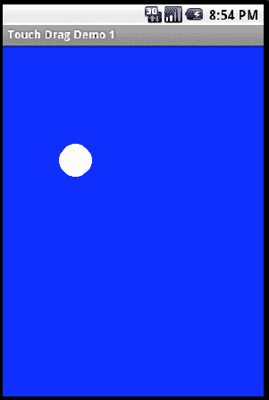

**图 25–2.** *拖拽演示应用的界面*

运行此应用时，你会在蓝色背景上看到一个白色圆点。你可以触摸圆点并在屏幕上拖拽它。当你抬起手指时，圆点会停留在当前位置，直到你再次触摸并拖拽到其他位置。我们已大幅简化此过程，只为向你展示如何在屏幕上移动一个对象的基本原理。`draw()` 方法将圆点绘制在其当前的 X 和 Y 坐标位置。通过在 `onTouchEvent()` 方法中接收 `MotionEvent` 对象，我们可以根据触摸的移动来修改 X 和 Y 的值。当收到 `ACTION_DOWN` 动作时，我们会记录圆点的起始位置以及触摸起始点。由于用户并非总能点击对象的正中心，触摸坐标与对象的位置坐标可能不同。此外，如果对象的参考点不是中心而是左上角，我们也必须确保考虑到这一点。

当你的手指开始在屏幕上移动时，我们会根据接收到的 `MotionEvent` 事件，通过 X 和 Y 的增量来调整对象的位置。当你停止移动（即 `ACTION_UP` 事件）时，我们会使用最后的触摸坐标来确定对象的最终位置。在这里我们稍微取巧，因为 `Dot` 视图在屏幕上的位置是相对于 (0,0) 坐标的。这意味着我们可以直接相对于 (0,0) 坐标绘制圆，而非其他参考点。如果对象不是相对于 (0,0) 定位，我们可能需要提供额外的偏移量。本示例中我们也不需要担心滚动条的问题，否则会使得屏幕上对象位置的计算变得更复杂。但基本原理是相同的。通过知道要移动对象的起始位置，并跟踪从 `ACTION_DOWN` 到 `ACTION_UP` 触摸事件的增量值，我们就可以调整对象在屏幕上的位置。

将一个对象放置到屏幕上的另一个对象上，与其说与触摸有关，不如说与了解各对象在屏幕上的位置有关。我们不在此处提供放置的示例，但会解释其原理。正如你之前所见，当我们在屏幕上拖拽一个对象时，我们了解它相对于一个或多个参考点的位置。我们也可以查询屏幕上其他对象的位置和大小。然后我们可以判断被拖拽的对象是否“覆盖”在另一个对象之上。确定被拖拽对象的放置目标的典型流程是：遍历所有可被放置的对象，判断当前拖拽位置是否与该对象重叠。每个对象的大小、位置（有时还有形状）都可用于此判断。如果我们收到 `ACTION_UP` 事件（意味着用户释放了拖拽对象），并且该对象位于某个可放置的目标之上，我们就可以触发处理放置动作的逻辑。例如，将某物拖到垃圾桶的动作，其中被拖拽的对象应被删除；或者将文件拖到文件夹以便移动或复制。

**注意：** 从 Honeycomb（即 Android 3.0）开始，Android 提供了对拖放操作的原生支持。我们将在第 31 章中重新讨论拖放功能。


### 多点触控

你已经见识了单点触控的实际应用，现在我们来看看多点触控。自 2006 年 TED 大会上杰夫·韩演示了用于计算机用户界面的多点触控表面以来，这项技术便引起了广泛关注。在屏幕上使用多根手指为操作屏幕内容开辟了诸多可能性。例如，将两根手指放在图片上并向外分开即可放大图片；将多根手指放在图片上顺时针转动，则可以旋转屏幕上的图片。Android 从 SDK 2.0 版本开始支持多点触控。在该版本中，（理论上）你可以在屏幕上同时使用最多三根手指执行缩放、旋转或任何你能想到的多点触控操作（我们之所以说“理论上”，是因为首批支持多点触控的 Android*设备*仅支持两根手指）。不过仔细想想，这并非魔法。如果屏幕硬件能够检测到屏幕上发起的多次触摸，在手指沿屏幕表面移动时通知应用程序，并在手指离开屏幕时发出通知，那么应用程序就能判断用户试图通过这些触摸执行什么操作。虽然这不是魔法，但也绝非易事。在本节中，我们将帮助你理解多点触控。

**注意：** 从 Android 2.2 开始，`MotionEvent`类发生了一些变化，这使得多点触控的处理更加复杂，其中包括弃用了我们接下来要讨论的几个常量（`ACTION_POINTER_ID_MASK`和`ACTION_POINTER_ID_SHIFT`）。这意味着对于旧设备，你可以使用我们接下来介绍的方法；对于搭载 2.2 或更高版本的设备，则可以做一些修改，我们将在本节之后进行说明。

#### Android 2.2 之前的多点触控

多点触控的基本原理与单点触控完全相同。触摸操作会产生`MotionEvent`对象，这些对象会像之前一样传递给你的方法。你的代码可以读取触摸数据并决定如何处理。在基本层面上，`MotionEvent`的方法也是相同的；也就是说，我们调用`getAction()`、`getDownTime()`、`getX()`等方法。但是，当有多根手指触摸屏幕时，`MotionEvent`对象必须包含所有手指的信息，但也有一些例外情况。`getAction()`返回的动作值仅针对一根手指，而非全部。按下时间值仅针对最先按下那根手指，并且只要至少有一根手指保持按下状态，该时间就会持续累加。位置值`getX()`和`getY()`以及`getPressure()`和`getSize()`可以接受手指参数；因此，你需要使用指针索引值来获取指定手指的信息。我们之前使用的一些方法调用（例如`getX()`、`getY()`）没有指定手指的参数，那么如果使用这些方法，返回值对应的是哪根手指呢？你可以搞清楚，但这需要一些功夫。因此，如果你始终没有考虑多根手指的情况，最终可能会得到一些奇怪的结果。让我们深入探究一下该如何处理。

关于多点触控，你需要了解的`MotionEvent`的第一个方法是`getPointerCount()`。这个方法会告诉你`MotionEvent`对象中代表了多少根手指，但不一定代表实际触摸屏幕的手指数量；这取决于硬件以及该硬件上 Android 系统的实现。你可能会发现，在某些设备上，`getPointerCount()`并不能报告所有正在触摸的手指，而只能报告一部分。不过，我们继续往下看。一旦`MotionEvent`对象中报告了超过一根手指，你就需要开始处理指针索引和指针 ID 了。

`MotionEvent`对象包含从索引 0 开始、直到该对象报告的手指数量范围内的指针信息。指针索引始终从 0 开始；如果报告了三根手指，指针索引就是 0、1 和 2。调用`getX()`等方法时必须传入你想要获取信息的那根手指的指针索引。指针 ID 是代表正在追踪的哪根手指的整数值。指针 ID 从 0 开始分配给第一根按下的手指，但当手指在屏幕上起落时，指针 ID 并不总是从 0 开始。你可以将指针 ID 视为 Android 追踪该手指期间为其分配的“名称”。例如，想象一对两根手指的触摸序列：先按下手指 1，然后手指 2 按下，接着手指 1 抬起，最后手指 2 抬起。第一根按下的手指将获得指针 ID 0。第二根按下的手指将获得指针 ID 1。一旦第一根手指抬起，第二根手指仍然与指针 ID 1 关联。此时，第二根手指的指针索引变为 0，因为指针索引始终从 0 开始。在这个例子中，第二根手指（指针 ID 1）在最初按下时是指针索引 1，一旦第一根手指离开屏幕，它就变为指针索引 0。但即使第二根手指成为屏幕上唯一的手指，它仍然保持指针 ID 1。你的应用程序将使用指针 ID 来关联特定手指对应的事件，即使有其他手指参与其中。让我们来看一个示例。

清单 25–10 展示了我们用于多点触控应用程序的新 XML 布局和 Java 代码。使用清单 25–10 创建一个新应用程序并运行它。图 25–3 展示了它应有的效果。

**清单 25–10.** *多点触控演示的 XML 布局和 Java 代码*


```xml
<?xml version="1.0" encoding="utf-8"?>
<!-- 此文件为 /res/layout/main.xml -->
<RelativeLayout  
    android:id="@+id/layout1"
    android:tag="trueLayout"  android:orientation="vertical"
    android:layout_width="fill_parent"
    android:layout_height="wrap_content"
    android:layout_weight="1"
    >

    <TextView android:text="在屏幕上触摸手指并查看 LogCat"
    android:id="@+id/message"
    android:tag="trueText"
    android:layout_width="wrap_content"
    android:layout_height="wrap_content"
    android:layout_alignParentBottom="true" />

</RelativeLayout>
```

```java
// 此文件为 MainActivity.java
import android.app.Activity;
import android.os.Bundle;
import android.util.Log;
import android.view.MotionEvent;
import android.view.View;
import android.view.View.OnTouchListener;
import android.widget.RelativeLayout;

public class MainActivity extends Activity implements OnTouchListener {
    /** 当活动首次创建时调用。 */
    @Override
    public void onCreate(Bundle savedInstanceState) {
        super.onCreate(savedInstanceState);
        setContentView(R.layout.main);

        RelativeLayout layout1 =
                (RelativeLayout) findViewById(R.id.layout1);
        layout1.setOnTouchListener(this);
    }

    public boolean onTouch(View v, MotionEvent event) {
        String myTag = v.getTag().toString();
        Log.v(myTag, "-----------------------------");
        Log.v(myTag, "在 onTouch 中获取视图 " + myTag);
        Log.v(myTag, describeEvent(event));
        logAction(event);
        if( "true".equals(myTag.substring(0, 4))) {
            return true;
        }
        else {
            return false;
        }
    }

    protected static String describeEvent(MotionEvent event) {
        StringBuilder result = new StringBuilder(500);
        result.append("动作: ").append(event.getAction()).append("\n");
        int numPointers = event.getPointerCount();
        result.append("指针数量: ");
        result.append(numPointers).append("\n");
        int ptrIdx = 0;
        while (ptrIdx < numPointers) {
            int ptrId = event.getPointerId(ptrIdx);
            result.append("指针索引: ").append(ptrIdx);
            result.append(", 指针 ID: ").append(ptrId).append("\n");
            result.append("   位置: ").append(event.getX(ptrIdx));
            result.append(" x ").append(event.getY(ptrIdx)).append("\n");
            result.append("   压力: ");
            result.append(event.getPressure(ptrIdx));
            result.append("   尺寸: ").append(event.getSize(ptrIdx));
            result.append("\n");

            ptrIdx++;
        }
        result.append("按下时间: ").append(event.getDownTime());
        result.append("毫秒\n").append("事件时间: ");
        result.append(event.getEventTime()).append("毫秒");
        result.append("  已用时间: ");
        result.append(event.getEventTime()-event.getDownTime());
        result.append(" 毫秒\n");
        return result.toString();
    }

    private void logAction(MotionEvent event) {
        int action = event.getAction();
        int ptrIndex = (action & MotionEvent.ACTION_POINTER_ID_MASK) >>>
                                MotionEvent.ACTION_POINTER_ID_SHIFT;
        action = action & MotionEvent.ACTION_MASK;
        if(action == 5 || action == 6)
            action = action - 5;
        int ptrId = event.getPointerId(ptrIndex);

        Log.v("动作", "指针索引: " + ptrIndex);
        Log.v("动作", "指针 ID: " + ptrId);
        Log.v("动作", "真实动作值: " + action);
    }
}
```

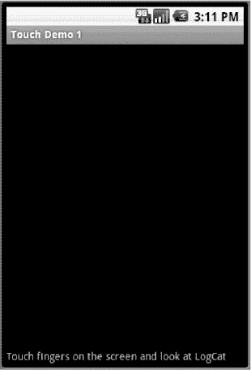

**图 25–3.** *我们的多点触控演示应用程序*

如果你只有模拟器，这个应用程序仍然可以运行，但你无法同时在屏幕上使用多个手指。你将看到类似于我们在上一个应用程序中看到的输出。清单 25–11 显示了针对我们之前描述的触摸序列的示例 LogCat 消息。也就是说，第一个手指按下屏幕，然后第二个手指按下，第一个手指离开屏幕，然后第二个手指离开屏幕。

**清单 25–11.** *多点触控应用程序的示例 LogCat 输出*


```text
trueLayout       -----------------------------
trueLayout       Got view trueLayout in onTouch
trueLayout       Action: 0
trueLayout       Number of pointers: 1
trueLayout       Pointer Index: 0, Pointer Id: 0
trueLayout          Location: 114.88211 x 499.77502
trueLayout          Pressure: 0.047058824   Size: 0.13333334
trueLayout       Downtime: 33733650ms
trueLayout       Event time: 33733650ms  Elapsed: 0 ms
Action           Pointer index: 0
Action           Pointer Id: 0
Action           True Action value: 0
trueLayout       -----------------------------
trueLayout       Got view trueLayout in onTouch
trueLayout       Action: 2
trueLayout       Number of pointers: 1
trueLayout       Pointer Index: 0, Pointer Id: 0
trueLayout          Location: 114.88211 x 499.77502
trueLayout          Pressure: 0.05882353   Size: 0.13333334
trueLayout       Downtime: 33733650ms
trueLayout       Event time: 33733740ms  Elapsed: 90 ms
Action           Pointer index: 0
Action           Pointer Id: 0
Action           True Action value: 2
trueLayout       -----------------------------
trueLayout       Got view trueLayout in onTouch
trueLayout       Action: 261
trueLayout       Number of pointers: 2
trueLayout       Pointer Index: 0, Pointer Id: 0
trueLayout          Location: 114.88211 x 499.77502
trueLayout          Pressure: 0.05882353   Size: 0.13333334
trueLayout       Pointer Index: 1, Pointer Id: 1
trueLayout          Location: 320.30692 x 189.67395
trueLayout          Pressure: 0.050980393   Size: 0.13333334
trueLayout       Downtime: 33733650ms
trueLayout       Event time: 33733962ms  Elapsed: 312 ms
Action           Pointer index: 1
Action           Pointer Id: 1
Action           True Action value: 0
trueLayout       -----------------------------
trueLayout       Got view trueLayout in onTouch
trueLayout       Action: 2
trueLayout       Number of pointers: 2
trueLayout       Pointer Index: 0, Pointer Id: 0
trueLayout          Location: 111.474594 x 499.77502
trueLayout          Pressure: 0.05882353   Size: 0.13333334
trueLayout       Pointer Index: 1, Pointer Id: 1
trueLayout          Location: 320.30692 x 189.67395
trueLayout          Pressure: 0.050980393   Size: 0.13333334
trueLayout       Downtime: 33733650ms
trueLayout       Event time: 33734189ms  Elapsed: 539 ms
Action           Pointer index: 0
Action           Pointer Id: 0
Action           True Action value: 2
trueLayout       -----------------------------
trueLayout       Got view trueLayout in onTouch
trueLayout       Action: 6
trueLayout       Number of pointers: 2
trueLayout       Pointer Index: 0, Pointer Id: 0
trueLayout          Location: 111.474594 x 499.77502
trueLayout          Pressure: 0.05882353   Size: 0.13333334
trueLayout       Pointer Index: 1, Pointer Id: 1
trueLayout          Location: 320.30692 x 189.67395
trueLayout          Pressure: 0.050980393   Size: 0.13333334
trueLayout       Downtime: 33733650ms
trueLayout       Event time: 33734228ms  Elapsed: 578 ms
Action           Pointer index: 0
Action           Pointer Id: 0
Action           True Action value: 1
trueLayout       -----------------------------
trueLayout       Got view trueLayout in onTouch
trueLayout       Action: 2
trueLayout       Number of pointers: 1
trueLayout       Pointer Index: 0, Pointer Id: 1
trueLayout          Location: 318.84656 x 191.45105
trueLayout          Pressure: 0.050980393   Size: 0.13333334
trueLayout       Downtime: 33733650ms
trueLayout       Event time: 33734240ms  Elapsed: 590 ms
Action           Pointer index: 0
Action           Pointer Id: 1
Action           True Action value: 2
trueLayout       -----------------------------
trueLayout       Got view trueLayout in onTouch
trueLayout       Action: 1
trueLayout       Number of pointers: 1
trueLayout       Pointer Index: 0, Pointer Id: 1
trueLayout          Location: 314.95224 x 190.5625
trueLayout          Pressure: 0.050980393   Size: 0.13333334
trueLayout       Downtime: 33733650ms
trueLayout       Event time: 33734549ms  Elapsed: 899 ms
Action           Pointer index: 0
Action           Pointer Id: 1
Action           True Action value: 1
```

现在我们来讨论一下这个应用的情况。我们看到的第一个事件是第一根手指的`ACTION_DOWN`（动作值 0）。我们通过 `getAction()` 方法来了解这一点。请参考 `MainActivity.java` 中的 `describeEvent()` 方法，以了解哪些方法产生了哪些输出。我们得到一个指针，其索引为 0，指针 ID 为 0。之后，你可能会看到第一个手指的多个`ACTION_MOVE`事件（动作值 2），尽管我们在清单 25-11 中只显示了一个。此时仍然只有一个指针，索引和 ID 也仍然是 0。

片刻之后，第二根手指触摸屏幕。此时动作的十进制值为 261。这代表什么意思？动作值实际上由两部分组成：一个指示该动作针对哪个指针的指示符，以及该指针正在执行什么动作。将十进制 261 转换为十六进制，我们得到 `0x00000105`。动作是最后一个字节（此处为 5），指针索引是倒数第二个字节（此处为 1）。请注意，这只告诉我们指针索引，而不是指针 ID。如果你按下第三根手指，动作值将是 `0x00000205`（或十进制 517）。第四根手指将是 `0x00000305`（或十进制 773），以此类推。你之前没见过动作值 5，它被称为 `ACTION_POINTER_DOWN`。它类似于 `ACTION_DOWN`，只是用于多点触控场景。

现在，看一下清单 25-11 中来自 LogCat 的下一对记录。第一条记录是 `ACTION_MOVE` 事件（动作值 2）。请记住，在真实的屏幕上，手指很难保持不动。我们只显示了一个 `ACTION_MOVE` 事件，但你可能会看到多个。当第一根手指从屏幕上抬起时，我们得到一个动作值 `0x00000006`（或十进制 6）。和之前一样，指针索引为 0，动作值为 `ACTION_POINTER_UP`（类似于 `ACTION_UP`，但用于多点触控场景）。如果在多点触控场景中第二根手指抬起，我们会得到动作值 `0x00000106`（或十进制 262）。请注意，当其中一根手指发生 `ACTION_UP` 事件时，我们仍然有两根手指的信息。

清单 25-11 中的最后一对记录显示第二根手指的又一个 `ACTION_MOVE` 事件，随后是第二根手指的 `ACTION_UP`。这次我们看到动作值为 1（`ACTION_UP`）。我们没有得到动作值 262，但接下来会解释原因。另外请注意，一旦第一根手指离开屏幕，第二根手指的指针索引就从 1 变成了 0，但指针 ID 仍然保持为 1。

`ACTION_MOVE` 事件不会告知你是哪根手指在移动。无论有多少根手指按下或哪根手指在移动，移动事件的动作值始终为 2。所有按下的手指的位置都包含在 `MotionEvent` 对象中，因此你需要读取位置并自行判断。如果屏幕上只剩一根手指，指针 ID 会告诉你它是哪根手指，因为它是唯一剩下的那根。在清单 25-11 中，当屏幕上只剩第二根手指时，`ACTION_MOVE` 事件的指针索引为 0，指针 ID 为 1，因此我们知道是第二根手指在移动。


回到清单 25–11 的开头，第一个按下的手指对应的指针索引为 0，指针 ID 也为 0。那么，当第一个手指在没有任何其他手指之前按下屏幕时，为什么动作值不是`0x00000005`（即十进制 5）？遗憾的是，这个问题并没有一个令人满意的答案。在以下场景中我们可以得到动作值 5：先按下第一个手指，再按下第二个手指，此时会得到动作值 0 和 261（暂时忽略`ACTION_MOVE`事件）。接着，抬起第一个手指（动作值为 6），再将其重新按下屏幕。此时第二个手指的指针 ID 仍为 1。当第一个手指离开屏幕时，应用程序只知道指针 ID 1。一旦第一个手指再次触摸屏幕，Android 会将指针 ID 0 重新分配给第一个手指。由于现在我们知道涉及多个手指，因此会得到动作值 5（指针索引为 0，动作值为 5）。因此，这个问题的答案是向后兼容性，但这并非一个令人满意的答案。动作值 0 和 1 是多点触控之前的产物，只要只使用一根手指，在多点触控出现之前编写的应用程序仍然可以正常工作。在两根手指的场景中，如果第一根手指在一个位置触摸屏幕，紧接着第二根手指在屏幕的另一个位置触摸，那么第一根手指的抬起动作将不会被那些不期望多点触控事件的应用程序所识别。这是因为第一根手指先抬起会给出动作值 6，而不是 1。只有当第二根手指抬起时，应用程序才会收到动作值 1。该应用程序会认为第一根手指神奇地穿越屏幕移动到了第二根手指所在的位置。

当屏幕上只剩下一根手指时，Android 会将其视为单点触控的情况。因此，我们得到旧的`ACTION_UP`值 1，而不是多点触控的`ACTION_UP`值 6。我们的代码需要仔细考虑这些情况。指针索引为 0 可能产生`ACTION_DOWN`值 0 或 5，具体取决于当前哪些指针处于活动状态。最后一根手指抬起时，无论其指针 ID 是什么，都会得到`ACTION_UP`值 1。

`MotionEvent`类曾附带一些辅助常量来帮助理解当前事件，例如`MotionEvent.ACTION_POINTER_3_DOWN`的值为`0x00000205`（即十进制 517），我们之前将其描述为第三根手指按下。然而，这些值并不是很有用，因为更好的做法是查看第二个字节中的指针索引和第一个字节中的动作。事实上，更好的方式是使用`MotionEvent`类中的其他常量来读取`getAction()`返回的值。这些常量是`MotionEvent.ACTION_POINTER_ID_MASK`、`MotionEvent.ACTION_MASK`和`MotionEvent.ACTION_POINTER_ID_SHIFT`。通过将动作值与这些掩码进行“与”运算，并针对指针索引对结果进行移位，你就能可靠地理解当前发生了什么，无论设备支持多少根手指。Android 团队想必也意识到了这一点，因为像`ACTION_POINTER_3_DOWN`这样的常量已经被弃用。

但请注意；这些索引常量的名称中使用了`ID`而非`INDEX`，而我们之前告诉你第二个字节是指针索引。遗憾的是，在 2.2 版本之前，Android 对于该字节中的内容存在混淆。从 Android 2.2 开始，这些常量被重命名为`ACTION_POINTER_INDEX_MASK`和`ACTION_POINTER_INDEX_SHIFT`，同时保持了与之前相同的值。第二个字节始终是指针索引，但在 Android 2.2 之前，常量的名称完全是错误的。自 Android 2.2 起，这些常量的名称已被替换，包含`ID`的常量名称已被弃用。你可以随意创建自己的常量，以便在所有 Android 版本中使用。

在前面的例子中，我们使用了一个`logAction()`方法，它利用这些常量来解码我们的动作值。我们再次在清单 25–12 中提供相关代码。

**清单 25–12.** *用于解析`MotionEvent.getAction()`结果的示例代码*

```
    int action = event.getAction();
    int ptrIndex = (action & MotionEvent.ACTION_POINTER_ID_MASK) >>>
                                 MotionEvent.ACTION_POINTER_ID_SHIFT;
    action = action & MotionEvent.ACTION_MASK;
    if(action == 5 || action == 6)
        action = action - 5;
    int ptrId = event.getPointerId(ptrIndex);
```

在清单 25–12 中的这些语句执行完毕后，`ptrId`将包含与该动作关联的指针 ID；`action`的值将在 0 到 4 之间；`ptrIndex`将包含指针索引值，用于`getX()`和`MotionEvent`的类似方法。理解`getAction()`返回值的一种方式是认识到，任何大于 4 的值都代表与指针 ID 相关的值。任何小于或等于 4 的值则代表与我们所知的唯一手指相关的值，无论其指针 ID 是什么。在某些情况下，你可能希望从动作值中减去 5，以便在多点触控情况下也能得到`ACTION_DOWN`和`ACTION_UP`。在其他情况下，不这样做可能更合适。选择权在你手中。

#### 自 Android 2.2 起的多点触控支持

Android 2.2 对多点触控的工作方式引入了一些变化。我们在上一节中提到了部分常量被弃用以及新常量的添加。从 2.2 版本开始，我们还获得了几个新方法——`getActionMasked()`和`getActionIndex()`——使得更容易确定动作涉及哪个指针和哪个索引。利用这些新方法，我们可以将清单 25–12 中的代码替换为清单 25–13 中的代码。

**清单 25–13.** *用于解析动作的示例代码*

```
    int action = event.getActionMasked();
    int ptrIndex = event.getActionIndex();
    int ptrId = event.getPointerId(ptrIndex);
```

这比清单 25–12 中的代码要简单得多。然而请注意，我们的`action`变量将会是`ACTION_DOWN`、`ACTION_UP`、`ACTION_MOVE`、`ACTION_CANCEL`、`ACTION_OUTSIDE`、`ACTION_POINTER_DOWN`或`ACTION_POINTER_UP`（分别对应值 0 到 6）。如果你想让它和之前一样，可以在`getActionMasked()`返回大于 4 的值时减去 5。或者你也可以直接处理这两个额外的值。

如前所述，如果你选择在 Android 2.2 或更高版本中像清单 25–12 那样自行进行掩码处理，那么常量`ACTION_POINTER_ID_MASK`和`ACTION_POINTER_ID_SHIFT`已被弃用，并创建了名称分别为`ACTION_POINTER_INDEX_MASK`和`ACTION_POINTER_INDEX_SHIFT`的新常量来表示完全相同的值。由于新常量在早期版本的 Android 中不可识别，你最好创建自己的常量，分别使用值`0x0000ff00`和`0x00000008`，因为这些常量在任何版本的 Android 中都是有效的。


### 地图与触控

地图同样能够接收触摸事件。你已经看到，触摸地图可以调出缩放控件或让我们平移地图。这些都是地图的内置功能。但如果我们想做些不同的事情呢？我们将向你展示如何利用地图实现一些有趣的功能，包括点击某个位置并获取其经纬度。由此，我们可以做很多非常有用的事情。

地图的主要类之一是 `MapView`。这个类有一个 `onTouchEvent()` 方法，就像我们之前介绍的 `View` 一样，它只接受一个 `MotionEvent` 对象作为参数。我们也可以使用 `setOnTouchListener()` 方法为 `MapView` 上的触摸事件设置一个回调处理程序。地图的其他主要对象类型是一组 `Overlay`（覆盖物），包括 `ItemizedOverlay` 和 `MyLocationOverlay`。这些都在第 17 章中介绍过。这些 `Overlay` 类也有 `onTouchEvent()` 方法，不过其签名与常规 `View` 的 `onTouchEvent()` 方法略有不同。对于 `Overlay`，方法签名是

`onTouchEvent(android.view.MotionEvent e, MapView mapView)`

如果我们想对地图执行不同的操作，可以重写这个 `onTouchEvent()` 方法。更常见的做法是在 `Overlay` 类中重写方法，而不是在 `MapView` 中，因此本节我们将重点讨论这一点。与之前一样，`Overlay` 的 `onTouchEvent()` 方法处理 `MotionEvent` 对象。即使是在地图应用中，`MotionEvent` 对象也会提供用户触摸屏幕的 X 和 Y 坐标。但在处理地图时，这只有有限的价值，因为我们通常想知道用户触摸的实际地图位置。幸运的是，有办法可以解决这个问题。

`MapView` 提供了一个名为 `Projection` 的接口，`Projection` 具有将像素转换为 `GeoPoint` 或将 `GeoPoint` 转换为像素的方法。要获取 `Projection`，请调用 `MapView.getProjection()` 方法。获得 `Projection` 后，可以使用 `fromPixels()` 和 `toPixels()` 方法进行转换。请记住，`Projection` 仅在视图中的地图不变时有效。在 `onTouchEvent()` 方法中，你可以使用 `fromPixels()` 将 X 和 Y 位置值转换为 `GeoPoint`。

`Overlay` 中一个有趣且非常有用的方法是 `onTap()` 方法，它与你本章前面看到的 `onTouch()` 方法类似，但有一个关键区别。地图 `Overlay` 没有 `onTouch()` 方法。`onTap()` 方法的签名是

`public boolean onTap(GeoPoint p, MapView mapView)`

这意味着当用户触摸我们的 `Overlay` 时，我们的 `onTap()` 方法会被调用，并传入用户触摸位置的 `GeoPoint`。这将为我们节省大量尝试确定用户在地图上触摸位置的时间。我们不再需要担心将 X 和 Y 坐标位置转换为经纬度坐标；Android 会为我们处理这些。

现在，我们将重新审视第 17 章中的示例，其中我们显示了一个带有不同模式（卫星、街道、交通和普通）按钮的地图。我们将添加从地图上某个位置启动 `StreetView` 的功能。为此，我们需要向 `MapView` 添加一个 `Overlay` 对象，当该 `Overlay` 对象接收到触摸事件时，我们将该触摸事件转换为地图上的一个位置。利用转换后的位置，我们将启动一个意图来在该位置调用 `StreetView`。我们首先在 Eclipse 中复制第 17 章的 `MapViewDemo`（参见代码清单 17–2 和代码清单 17–3）。然后，我们将使用代码清单 25–14 修改主 `Activity` 的 `onCreate()` 方法，并添加一个包含文件 `ClickReceiver.java` 的新类，该类也在此清单中提供。对 `onCreate()` 方法的修改以粗体显示。用户界面看起来仍然与图 17–3 中一样。

**代码清单 25–14.** *为地图演示添加触摸功能*

```java
    @Override
    protected void onCreate(Bundle savedInstanceState) {
        super.onCreate(savedInstanceState);
        setContentView(R.layout.mapview);

        mapView = (MapView)findViewById(R.id.mapview);

        ClickReceiver clickRecvr = new ClickReceiver(this);
        mapView.getOverlays().add(clickRecvr);
        mapView.invalidate();
    }
```

```java
// 文件 ClickReceiver.java
import android.content.Context;
import android.content.Intent;
import android.net.Uri;
import android.util.Log;
import com.google.android.maps.GeoPoint;
import com.google.android.maps.MapView;
import com.google.android.maps.Overlay;

public class ClickReceiver extends Overlay{
    private static final String TAG = "ClickReceiver";
    private Context mContext;

    public ClickReceiver(Context context) {
        mContext = context;
    }

    @Override
    public boolean onTap(GeoPoint p, MapView mapView) {
        Log.v(TAG, "在此点收到点击：" + p);

        if(mapView.isStreetView()) {
            Intent myIntent = new Intent(Intent.ACTION_VIEW, Uri.parse
                ("google.streetview:cbll=" +
                (float)p.getLatitudeE6() / 1000000f +
                "," + (float)p.getLongitudeE6() / 1000000f
                +"&cbp=1,180,,0,1.0"
                ));
            mContext.startActivity(myIntent);
             return true;
        }
        return false;
    }
}
```

这就是让这个新示例工作所需做的一切——当然，除非你的模拟器或设备上没有可用的 `StreetView`。`StreetView` 包含在 CupCake (1.5) 和 Donut (1.6) 的模拟器中，但未包含在 Éclair (2.0) 模拟器中。如果你的模拟器缺少 `StreetView`，一种解决方法是使用一台真实设备（应该已安装该应用）进行测试。如果你只有模拟器，可以尝试以下简单的步骤：

1.  创建一个基于 Google APIs 1.6 或 1.5 版本的 AVD。
2.  使用步骤 1 中的 AVD 启动模拟器。
3.  使用 `adb pull /system/app/StreetView.apk StreetView.apk` 将此应用从模拟器复制到你的工作站硬盘。
4.  创建一个基于你想要运行的版本所对应的 Google APIs 的 AVD。
5.  停止步骤 2 中的模拟器，并启动步骤 4 中的模拟器。
6.  对你步骤 3 中复制的 `.apk` 文件使用 `adb install StreetView.apk`。

这应该会将 `StreetView` 应用安装到你的模拟器中，并使我们上面的示例能够工作。在更高版本的 Android 中，`.apk` 文件被命名为 `Street.apk`，因此你也许能找到比 1.6 更新的版本并使用它。


当你运行新修改的 Maps 演示应用时，放大到一个城市以便能看到街道。点击“街道”按钮，即可在支持 `StreetView` 的街道上看到蓝色轮廓线（即：这些街道在谷歌数据库中存有图片）。现在，你触摸一条街道，我们的 `ClickReceiver` 的 `onTap()` 方法就会被调用，该方法会通过 Intent 将触摸事件的位置发送给 `StreetView` 活动。如果你触摸地图上 `StreetView` 没有图片的区域，你会看到一个空的 `StreetView` 屏幕，并显示类似“无效全景”的提示。这意味着谷歌在该位置附近找不到任何图像。点击返回按钮回到我们的 Maps 应用，并尝试其他位置。如果你查看 `LogCat`，会看到我们记录了触摸的地图位置的经纬度。注意，`GeoPoint` 对象使用 `int` 类型表示经纬度，而 `StreetView Uri` 需要 `float` 类型。

对于这个示例应用，我们选择将触摸位置的经纬度通过 Intent 发送给 `StreetView` 活动。但你可以想象其他可行的可能性。有了位置的经纬度，我们可以使用 `Geocoder` 来查找该位置周围有什么。我们可以用该位置进行逐向导航。我们可以测量该位置与我们当前位置之间的距离。甚至可以将该位置存储起来供以后使用。

### 手势

手势是一种特殊的触摸屏事件。“手势”一词在 Android 中用于指代多种操作，从简单的触摸序列（如挥手或捏合）到我们将在本节稍后讨论的正式的 `Gesture` 类。挥手、捏合、长按和滚动都有预期的行为和触发条件。也就是说，大多数人都很清楚，挥手是一种手指触摸屏幕、朝单个方向快速拖动然后抬起的手势。例如，当用户在“图库”应用（以从左到右的顺序显示图像的应用）中使用挥手手势时，图像会横向移动以向用户显示新图像。

在本节中，我们将利用你已学到的关于 `MotionEvent` 的知识，并以此为基础来展示如何使用捏合手势。这并不像你想象的那么难。在 Android 2.2 版本之前，捏合手势并未得到显式支持，因此要在早期版本中实现捏合手势，你必须自己编写代码来读取事件对象并采取相应操作，这正是我们接下来要做的。从 2.2 版本开始，我们拥有了一些有用的新特性来处理捏合等手势；你将在本节稍后看到这些内容。

接下来，我们将介绍一些用于其他手势（如挥手和长按）的实用类。然后，我们会介绍自定义手势，即你可以预先录制的手势，允许用户通过以自定义模式拖动手指来在你的应用中触发操作。但首先，让我们开始学习捏合！

#### 捏合手势

多点触控的一个酷炫应用是捏合手势，它用于缩放。其思路是，如果你将两根手指放在屏幕上并分开，应用应通过放大的方式响应。如果手指合拢，应用则应缩小。应用通常显示的是图像，也可能是地图。

为了演示一种实现捏合手势的方法，我们将修改之前的应用，为其添加缩放捏合功能。清单 25–15 显示了该示例中 `ClickReceiver` 类的替换版本；其他所有内容保持不变。请注意，此示例在运行 Android 2.2 或更高版本的设备上运行良好，我们将在代码清单后解释原因。

**清单 25–15.** *捏合手势的 Java 代码*

```
// 文件名为 ClickReceiver.java
import android.content.Context;
import android.content.Intent;
import android.net.Uri;
import android.util.FloatMath;
import android.util.Log;
import android.view.MotionEvent;
import com.google.android.maps.GeoPoint;
import com.google.android.maps.MapView;
import com.google.android.maps.Overlay;

public class ClickReceiver extends Overlay {
    private static final String TAG = "ClickReceiver";
    private static final float ZOOMJUMP = 75f;
    private Context mContext;
    private boolean inZoomMode = false;
    private boolean ignoreLastFinger = false;
    private float mOrigSeparation;

    public ClickReceiver(Context context) {
        mContext = context;
    }

    @Override
    public boolean onTap(GeoPoint p, MapView mapView) {
        Log.v(TAG, "Received a click at this point: " + p);

        if(mapView.isStreetView()) {
            Intent myIntent = new Intent(Intent.ACTION_VIEW, Uri.parse
                ("google.streetview:cbll=" +
                (float)p.getLatitudeE6() / 1000000f +
                "," + (float)p.getLongitudeE6() / 1000000f
                +"&cbp=1,180,,0,1.0"
                ));
            mContext.startActivity(myIntent);
            return true;
        }
        return false;
    }

    public boolean onTouchEvent(MotionEvent e, MapView mapView) {
        Log.v(TAG, "in onTouchEvent, action is " + e.getAction());
        int action = e.getAction() & MotionEvent.ACTION_MASK;

        if(e.getPointerCount() == 2) {
            inZoomMode = true;
        }
        else {
            inZoomMode = false;
        }
```


`if(inZoomMode) {`
    `switch(action) {`
    `case MotionEvent.ACTION_POINTER_DOWN:`
        // 我们可能正在开始一个新的捏合操作，因此做好准备
        `mOrigSeparation = calculateSeparation(e);`
        break;
    `case MotionEvent.ACTION_POINTER_UP:`
        // 捏合操作即将结束，因此准备在最后一根手指仍单独按下时忽略它
        `ignoreLastFinger  = true;`
        break;
    `case MotionEvent.ACTION_MOVE:`
        // 正在进行捏合，因此判断是否需要改变缩放级别
        `float newSeparation = calculateSeparation(e);`
        `if(newSeparation - mOrigSeparation > ZOOMJUMP) {`
            // 手指间距变大，放大
            `mapView.getController().zoomIn();`
            `mOrigSeparation = newSeparation;`
        `}`
        `else if (mOrigSeparation - newSeparation > ZOOMJUMP) {`
            // 手指间距变小，缩小
            `mapView.getController().zoomOut();`
            `mOrigSeparation = newSeparation;`
        `}`
        break;
    `}`
    // 不要将这些事件传递给 Android，因为我们已经处理了它们
    `return true;`
`}`
`else {`
    // 如有必要，从缩放逻辑中进行清理
`}`

// 如果当前只剩下最后一根手指，则丢弃事件，直到这根手指抬起
`if(ignoreLastFinger) {`
    `if(action == MotionEvent.ACTION_UP)`
        `ignoreLastFinger = false;`
    `return true;`
`}`

`return super.onTouchEvent(e, mapView);`
`}`

`private float calculateSeparation(MotionEvent e) {`
    `float x = e.getX(0) - e.getX(1);`
    `float y = e.getY(0) - e.getY(1);`
    `return FloatMath.sqrt(x * x + y * y);`
`}`
`}`

我们已向 `ClickReceiver` 叠加层添加了一个 `onTouchEvent()` 回调。在这个回调中，我们会从触摸屏获取所有发送给 `MapView` 的 `MotionEvent` 对象。对于大多数事件，我们只需将其传递给父类。这能让拖拽功能继续正常运行，同时也能在 `StreetView`（街景）模式下通过点击启动街景视图。当触摸屏上有两根手指按下时，我们可能会感应到捏合操作，因此将缩放模式设为 true。如果我们获取到两根手指的信息，就需要判断具体发生了什么，这正是事件动作上的 `switch` 语句的作用。

如果我们刚收到 `ACTION_POINTER_DOWN` 动作（请记住，我们只会在多点触控场景下收到此事件，而这里有两根手指在报告，因此必定处于多点触控状态），这意味着我们从一根手指变为了两根手指。在此事件之后，我们可能会看到用户的捏合操作。为了判断手指是相互靠近还是远离，我们必须记住手势开始时手指的间距。间距的计算方法是两根手指坐标差平方和的平方根——换句话说，我们使用勾股定理。我们确信，在有两根手指按下时，事件对象会在索引 0 和 1 处提供坐标，而且哪根手指对应哪个索引其实并不重要。

如果我们刚收到 `ACTION_POINTER_UP` 动作，在此之前，`MotionEvent` 对象会报告两根手指的信息，而在此之后，将只报告一根手指的信息，因此这是我们看到的最后一个包含两根手指信息的事件。我们知道捏合操作已经结束。如果仅仅开始让 Android 看到触摸屏上只有一个手指的事件对象，我们可能会遇到一些奇怪的行为。例如，如果 Android 收到最后一根手指的 `ACTION_UP` 事件，它可能会认为在某个位置发生了点击，并启动 `StreetView` 应用，这并非我们所愿。我们预计用户会抬起屏幕上的最后一根手指来结束捏合手势，因此我们决定丢弃在此之前的所有事件。我们通过将 `ignoreLastFinger` 变量设为 `true` 来实现这一点，稍后我们会在决定如何处理事件时检查这个变量。

如果我们刚收到 `ACTION_MOVE` 动作，我们的手指可能已经相互移动靠近或远离。通过计算两根手指之间的新间距，并将其与旧间距进行比较，我们可以决定是放大、缩小，还是完全不进行缩放。如果我们进行了一些缩放，则需要为下一次操作重置旧间距。用户可能会让手指停留在屏幕上，然后分开或并拢，我们的应用程序应该对这些手势做出正确的响应。如果我们没有检测到间距发生显著变化，我们将继续接收事件，直到我们获得足够的间距变化，或者用户结束捏合手势。

无论接收到什么动作，只要处于缩放模式，我们就会从 `onTouchEvent()` 返回 `true`。这会告诉 Android 我们已经处理了该事件，并让其继续向我们发送新的事件。在 `onTouchEvent()` 方法的末尾，我们需要判断是否将事件传递给 Android。利用 `ignoreLastFinger` 变量，我们决定在捏合手势之后且最后一根手指仍按下时，不将事件传递给 Android。一旦最后一根手指抬起（我们通过 `ACTION_UP` 事件动作获知这一点），我们就可以恢复将事件传递给 Android。通过这种方式，我们让 Android 处理点击和拖拽操作，而我们自己处理捏合操作。当然，如果你愿意，你也可以在这个回调中自己处理点击和拖拽功能。

当你尝试这个应用时，你会发现自己仍然可以横向拖拽地图，并且在街景模式下，你可以点击某个位置来启动 `StreetView` 活动。但现在，你还可以通过捏合来放大和缩小地图。

我们暂时忽略了用户可能从三根手指抬起一根变为两根手指的情况。许多设备只支持识别两根手指，但你应该预料到，某些设备最终可能会支持多于两根手指。如果你想在地图以外的组件上使用捏合手势，你需要弄清楚如何为这些组件实现缩放。例如，如果你在屏幕上有一张图片，想通过捏合来放大或缩小，你需要像我们这里所做的那样，通过 `ACTION_MOVE` 事件来触发对图片的放大或缩小操作。本章稍后将会给出类似的示例。

如前所述，捏合手势直到 Android 2.2 才得到显式支持。虽然上述代码在 Android 2.2 上也能运行，但你可能希望利用更新的特性来为你的应用实现捏合手势。值得一提的是，在 Android 2.2 及更高版本中，`MapView` 类原生支持捏合缩放，开发者完全不需要做任何额外工作即可使用；它开箱即用，因此我们无需为更新版本 Android 中的地图处理捏合手势。在介绍捏合手势的原生支持之前，我们首先需要介绍一个从一开始就存在的类——`GestureDetector`。


#### GestureDetector 与 OnGestureListeners

我们刚才实现捏合手势的操作虽然不算太复杂，但如果 Android 能提供一些帮助，自动识别常见手势就更好了。这样，我们只需要在手势发生时执行相应的应用逻辑即可。幸运的是，Android 确实提供了这样的功能——虽然直到 Android 2.2 才推出了专门处理捏合手势的类。

第一个类是 `GestureDetector`，它从 Android 诞生之初就已存在，其使命是接收 `MotionEvent` 对象，并在事件序列呈现出常见手势特征时通知我们。我们将在回调中把所有事件对象传递给 `GestureDetector`，而它会在识别出诸如快速滑动或长按等手势时调用其他回调。我们需要为 `GestureDetector` 的回调注册一个监听器，并在此处编写逻辑，以指定当用户执行这些常见手势时应执行的操作。遗憾的是，这个类并不能告知我们是否发生了捏合手势；为此我们需要使用另一个新类，稍后将进行介绍。

构建监听器端有几种方法。第一种选择是编写一个新类，实现相应的手势监听器接口，例如 `GestureDetector.OnGestureListener` 接口。对于每个可能的回调，都需要实现多个抽象方法。

第二种选择是从监听器的简单实现中选取一个，并覆盖你关心的相应回调方法。例如，`GestureDetector.SimpleOnGestureListener` 类已将所有抽象方法实现为空操作并返回 `false`。你只需扩展该类，并覆盖你需要响应的少数手势对应的几个方法即可。其余方法则保留其默认实现。即使你决定覆盖所有回调方法，选择第二种方式也更具前瞻性——因为如果未来版本的 Android 在接口中新增了另一个抽象回调方法，这个简单实现会提供默认回调方法，从而确保你的代码不受影响。

Android 2.2 引入了 `ScaleGestureDetector` 类，正是这个类能为我们识别捏合手势。我们将深入探讨该类及其对应的监听器类，了解如何利用捏合手势调整图像大小。在本例中，我们扩展了简单实现（`ScaleGestureDetector.SimpleOnScaleGestureListener`）作为监听器。清单 25–16 展示了我们的 `MainActivity` 的 XML 布局和 Java 代码。

##### 清单 25–16. 使用 ScaleGestureDetector 处理捏合手势的布局和 Java 代码

```xml
<?xml version="1.0" encoding="utf-8"?>
<LinearLayout
    android:id="@+id/layout"  android:orientation="vertical"
    android:layout_width="fill_parent"  android:layout_height="fill_parent" >

  <TextView  android:text="使用捏合手势改变图像大小"
    android:layout_width="fill_parent"  android:layout_height="wrap_content" />

  <ImageView android:id="@+id/image"  android:src="@drawable/icon"
    android:layout_width="match_parent"  android:layout_height="match_parent"
    android:scaleType="matrix" />

</LinearLayout>
```

```java
// 此文件为 MainActivity.java
import android.app.Activity;
import android.graphics.Matrix;
import android.os.Bundle;
import android.util.Log;
import android.view.MotionEvent;
import android.view.ScaleGestureDetector;
import android.widget.ImageView;

public class MainActivity extends Activity {
    private static final String TAG = "ScaleDetector";
    private ImageView image;
    private ScaleGestureDetector mScaleDetector;
    private float mScaleFactor = 1f;
    private Matrix mMatrix = new Matrix();

    @Override
    public void onCreate(Bundle savedInstanceState) {
        super.onCreate(savedInstanceState);
        setContentView(R.layout.main);

        image = (ImageView)findViewById(R.id.image);
        mScaleDetector = new ScaleGestureDetector(this,
                new ScaleListener());
    }

    @Override
    public boolean onTouchEvent(MotionEvent ev) {
        Log.v(TAG, "在 onTouchEvent 中");
        // 将所有事件传递给 ScaleGestureDetector
        mScaleDetector.onTouchEvent(ev);

        return true;
    }

    private class ScaleListener extends ScaleGestureDetector.SimpleOnScaleGestureListener {
        @Override
        public boolean onScale(ScaleGestureDetector detector) {
            mScaleFactor *= detector.getScaleFactor();

            // 确保缩放不会过小或过大
            mScaleFactor = Math.max(0.1f, Math.min(mScaleFactor, 5.0f));

            Log.v(TAG, "在 onScale 中，缩放因子 = " + mScaleFactor);
            mMatrix.setScale(mScaleFactor, mScaleFactor);

            image.setImageMatrix(mMatrix);
            image.invalidate();
            return true;
        }
    }
}
```

我们的布局十分简洁。其中包含一个简单的 `TextView`，用于显示使用捏合手势的提示信息；此外还有一个显示 Android 标准图标的 `ImageView`。我们将通过捏合手势来缩放这个图标图像。当然，你也可以随意替换成自己的图像文件来代替该图标。只需将你的图像文件复制到 drawable 文件夹，并确保修改布局文件中的 `android:src` 属性即可。请注意 XML 布局中我们图像元素的 `android:scaleType` 属性。该属性告诉 Android 我们将使用图形矩阵对图像进行缩放操作。虽然图形矩阵也能在布局内移动图像，但这里我们仅关注缩放功能。还要注意我们将 `ImageView` 的大小设置为尽可能大，这样在缩放图像时，它就不会被 `ImageView` 的边界所裁剪。

代码同样简单明了。在 `onCreate()` 中，我们获取了图像的引用并创建了 `ScaleGestureDetector`。在 `onTouchEvent()` 回调中，我们只需将接收到的每个事件对象传递给 `ScaleGestureDetector` 的 `onTouchEvent()` 方法，并返回 `true` 以持续接收新事件。这使得 `ScaleGestureDetector` 能够查看所有事件，并决定何时通知我们发生了手势。

缩放的实际操作发生在 `ScaleListener` 中。监听器类实际上包含三个回调：`onScaleBegin()`、`onScale()` 和 `onScaleEnd()`。我们不需要对开始和结束方法进行特殊处理，因此这里没有实现它们。


### 优化排版后的文本

在`onScale()`中，传入的`detector`可用于获取关于缩放操作的许多信息。缩放因子是一个徘徊在 1 附近的值。也就是说，当手指捏合靠近时，该值略低于 1；当手指分开时，该值略大于 1。我们的`mScaleFactor`成员变量从 1 开始，因此当手指靠近或分开时，它会逐渐小于或大于 1。如果`mScaleFactor`等于 1，则图像将保持正常大小。否则，随着`mScaleFactor`低于或高于 1，图像将比正常尺寸更小或更大。我们使用简洁的`min/max`函数组合为`mScaleFactor`设置了一些边界。这可以防止图像变得过小或过大。然后，我们使用`mScaleFactor`缩放图形矩阵，并将新缩放的矩阵应用于图像。`invalidate()`调用会强制在屏幕上重新绘制图像。

如您所见，这比上一个需要我们自己处理事件对象的示例要省力得多。当执行常见手势时，我们可以专注于执行适当的应用程序逻辑。要使用`OnGestureListener`接口，您需要执行与我们在此为`ScaleListener`所做的非常相似的操作，只是回调将针对不同的常见手势。

常见手势是一回事，但如果您想为应用程序使用自定义手势呢？例如，如果您希望用户能够在屏幕上绘制一个复选标记，并让您的应用程序执行某些功能，该怎么办？为此，我们需要自定义手势，这就是我们接下来要讨论的内容。

### 自定义手势

在本章的最后一节中，我们将介绍 Android 正式的`Gesture`类。正式来说，手势是应用程序可以期望用户执行的预先录制的触摸屏动作。如果用户在使用应用程序时执行了与预先录制的手势相同的手势，则应用程序可以根据该手势对应用程序的意义调用特定的逻辑。手势需要一个覆盖层，该覆盖层可以检测用户的手势并将其传递给底层活动。使用手势可以简化用户界面，通过手指滑动或绘制动作来消除按钮或其他控件。它们还可以创建有趣的游戏界面。在本节中，我们将探讨如何录制自定义手势以及如何在应用程序中使用它们。请注意，我们之前使用的手势相关类在本示例中完全不使用；本节将探讨一组不同的手势类。

### 手势构建器应用程序

在深入手势代码之前，让我们先试用一下 Android SDK 附带的“手势构建器”应用程序，它将帮助您理解什么是手势。“手势构建器”创建并管理一个包含手势库的手势文件。从 Eclipse 启动模拟器；解锁模拟器设备；转到您的应用程序，然后选择“手势构建器”。图 25-4 显示了应用程序图标。


**图 25-4.** *手势构建器图标*

如果您在模拟器中看不到“手势构建器”，则必须在 Eclipse 中创建一个新项目。“手势构建器”作为示例应用程序提供，位于 Android SDK 目录下的`platforms/<version>/samples/GestureBuilder`或`samples`目录中。您可以使用“从现有示例创建项目”选项在 Eclipse 中创建一个新的 Android 项目。选择所需的 Android 版本作为构建目标，以启用“从现有示例创建项目”下拉菜单，然后从下拉菜单中选择`GestureBuilder`。然后，您可以将此应用程序部署到模拟器。

“手势构建器”应用程序将打开一个几乎空白的屏幕。点击“添加手势”按钮。系统将提示您输入一个名称；您给出的名称将与您即将录制的手势关联。此名称将用于在代码中引用该手势，并充当一种命令名称。当用户在您的应用程序中执行该手势时，该名称将被传递给您的方法，以便您的应用程序可以执行用户期望的操作。您给出的名称可以像“spiral”或“checkmark”这样的名词，也可以像“fetch”或“stop”这样的命令。现在，让我们将第一个手势命名为“checkmark”，因此在“名称”字段中输入`checkmark`。然后，在下方的大空白区域中绘制一个复选标记，如果使用模拟器则用鼠标绘制，如果使用设备则用手指绘制。如果您不喜欢第一次的尝试，只需重新绘制一个新的复选标记；一旦您开始绘制新的，旧的将被擦除。当您对复选标记满意时，点击“完成”。您应该会看到如图图 25-5 所示的屏幕。

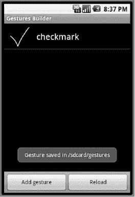
**图 25-5.** *保存到`/sdcard`的复选标记手势*

请注意，您可以录制不同类型的复选标记，并给它们都命名为“checkmark”。至少再录制一个类似复选标记的手势，并将其命名为`checkmark`；它可能比您的第一个复选标记更小、更大或以某种方式不同，同时仍然保留相同的基本形状。使用“添加手势”按钮添加一些不同名称的不同手势。每次点击“完成”，您都会向手势库中添加另一个手势。您可以尝试使用多点触摸手势，例如，同时用两根手指划过屏幕以创建一个等号。但这不起作用，您只能得到一条线。也许将来会支持多点触摸手势——即两根或更多手指同时触摸屏幕的手势。

每个手势都有一个名称，并由若干笔画组成。*手势笔画*是一个触摸序列，从手指触摸屏幕开始，到手指离开屏幕结束。正如您之前所学，触摸序列由`MotionEvent`对象组成。类似地，手势笔画由手势点组成。手势被收集到*手势存储*中。一个*手势库*包含一个手势存储。在 Android 中，这些都是您可以在代码中使用的类。请参见图 25-6 了解显示类之间关系的图表。

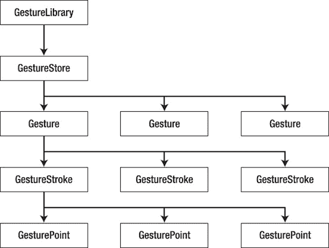
**图 25-6.** *手势类的结构*


虽然我们无法使用多点触控来创建自定义手势，但可以在单个手势中包含多个笔画。例如，要创建字母“E”的手势，至少需要两个笔画：一个笔画可以描摹“E”的顶部、背面和底部，第二个笔画用来画出中间的横线。你也可以用垂直笔画画出“E”的背面，再用三个独立的水平笔画完成字母。画“E”还有其他方式，幸运的是，手势库允许你在录制不同手势时给它们都命名为“E”。请尝试用几种不同方式录制“E”，因为用户可能会以任何一种方式绘制该字母，而你需要应用能够识别用户决定的任何画法。图 25–7 展示了录制“E”的不同方法。

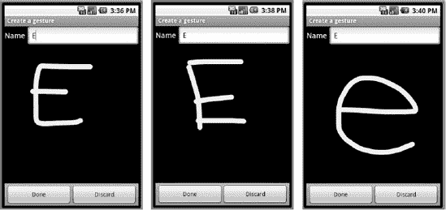

**图 25–7.** *录制“E”手势的不同方法*

你可能会发现在模拟器的`Gestures Builder`中创建多笔画手势具有挑战性。正如我们之前提到的，你可以简单地在最后一个手势上重绘，而前一个手势会被擦除。那么 Android 如何知道你是在重新开始，还是在为当前手势添加另一个笔画呢？Android 使用一个名为`FadeOffset`的值，这是一个以毫秒为单位的时间值。如果你等待超过这个时间才开始下一个笔画，Android 就会认为你正在重新开始或开始一个新手势。默认情况下，时间值为 `420` 毫秒。这意味着，如果你在屏幕上绘制手势，在绘制下一个手势笔画前抬起手指的时间超过 `420` 毫秒，Android 会认为你已经完成，并将你刚刚绘制的内容视为整个手势。在真实设备上，默认值可能足以开始手势的下一个笔画。但在模拟器上则可能不够，这取决于你的工作站速度。

如果你在模拟器上无法让`Gestures Builder`接受多笔画手势，可以创建自己的`Gestures Builder`版本并修改`FadeOffset`的默认值。我们之前描述了如何在 Eclipse 中创建`Gestures Builder`项目。按照这些说明操作，然后进入项目的`/res/layout/create_gesture.xml`文件，在`GestureOverlayView`元素中添加属性`android:fadeOffset="1000"`。这会将`FadeOffset`延长到 `1` 秒（`1000` 毫秒）。你也可以根据需要选择其他值。

我们来调查一下这些手势存储在哪里。`Gestures Builder`中的 Toast 消息告诉我们手势被保存到`/sdcard/gestures`（在 Android 2.2 及更高版本中为`/mnt/sdcard/gestures`）。使用 Eclipse 中的 File Explorer 或`adb`，导航到模拟器的`/sdcard`文件夹。在那里，你会看到一个名为`gestures`的文件。注意这个文件并不大。`gestures`文件是一个二进制文件，因此你无法手动编辑它。要修改内容，你需要使用`Gestures Builder`应用程序。在构建支持手势的应用时，你需要将`gestures`文件复制到应用的`/res/raw`目录。为此，你需要使用 File Explorer 的文件复制功能，或使用`adb pull`将`gestures`文件获取到工作站，以便将其复制到你的项目中。

除了在`Gestures Builder`中添加新手势，你还可以长按一个已有手势来调出菜单。从菜单中，你可以更改手势的名称或删除它。你无法重新录制手势，因此如果你不喜欢手势本身，你需要删除它并重新添加。如前所述，你可能希望录制手势的变体并为它们赋予相同名称，以考虑用户在输入手势时的差异。手势名称不必唯一，但同名的手势应该相似。

现在，我们将创建一个示例应用来使用我们新的`gestures`文件。使用 Eclipse，创建一个新的 Android 项目。布局文件的 XML 和`Activity`类的代码见代码清单 25–17。

**代码清单 25–17.** *手势展示应用的 Java 代码*

```xml
<?xml version="1.0" encoding="utf-8"?>
<!-- This file is /res/layout/main.xml -->
<LinearLayout
    android:orientation="vertical"
    android:layout_width="fill_parent"
    android:layout_height="fill_parent" >
  <TextView  
    android:layout_width="fill_parent"
    android:layout_height="wrap_content"
    android:text="Draw gestures and I'll guess what they are" />

  <android.gesture.GestureOverlayView  android:id="@+id/gestureOverlay"
    android:layout_width="fill_parent"
    android:layout_height="fill_parent"
    android:gestureStrokeType="multiple"  android:fadeOffset="1000" />

</LinearLayout>

import java.util.ArrayList;
import android.app.Activity;
import android.gesture.Gesture;
import android.gesture.GestureLibraries;
import android.gesture.GestureLibrary;
import android.gesture.GestureOverlayView;
import android.gesture.Prediction;
import android.gesture.GestureOverlayView.OnGesturePerformedListener;
import android.os.Bundle;
import android.util.Log;
import android.widget.Toast;

public class MainActivity extends Activity implements OnGesturePerformedListener {
    private static final String TAG = "Gesture Revealer";
    GestureLibrary gestureLib = null;

    @Override
    public void onCreate(Bundle savedInstanceState) {
        super.onCreate(savedInstanceState);
        setContentView(R.layout.main);
//        gestureLib = GestureLibraries.fromRawResource(this,
//                          R.raw.gestures);
        gestureLib = GestureLibraries.fromFile("/sdcard/gestures");
        if (!gestureLib.load()) {
            Toast.makeText(this, "Could not load /sdcard/gestures", 
                Toast.LENGTH_SHORT).show();
            finish();
        }

        // Let's take a look at the gesture library we have work with
        Log.v(TAG, "Library features:");
        Log.v(TAG, "  Orientation style: " +
                gestureLib.getOrientationStyle());
        Log.v(TAG, "  Sequence type: " + gestureLib.getSequenceType());
        for( String gestureName : gestureLib.getGestureEntries() ) {
            Log.v(TAG, "For gesture " + gestureName);
            int i = 1;
            for( Gesture gesture : gestureLib.getGestures(gestureName) )
            {
                Log.v(TAG, "    " + i + ": ID: " + gesture.getID());
                Log.v(TAG, "    " + i + ": Strokes count: " +
                        gesture.getStrokesCount());
                Log.v(TAG, "    " + i + ": Stroke length: " +
                        gesture.getLength());
                i++;
            }
        }

        GestureOverlayView gestureView =
            (GestureOverlayView) findViewById(R.id.gestureOverlay);
        gestureView.addOnGesturePerformedListener(this);
    }

    @Override
    public void onGesturePerformed(GestureOverlayView view,
                Gesture gesture)
    {
        ArrayList<Prediction> predictions =
                gestureLib.recognize(gesture);
```


```java
if (predictions.size() > 0) {
    Prediction prediction = (Prediction) predictions.get(0);
    if (prediction.score > 1.0) {
        Toast.makeText(this, prediction.name,
                Toast.LENGTH_SHORT).show();
        for(int i=0;i<predictions.size();i++)
            Log.v(TAG, "prediction " + predictions.get(i).name +
                    " - score = " + predictions.get(i).score);
        }
    }
}
```

在这个示例中，我们将直接访问手势构建器（Gestures Builder）应用写入的同一文件。在我们的 `onCreate()` 方法中，我们使用 `GestureLibraries.fromFile()` 方法来实现这一点。但我们也通过注释展示了如何访问应用中包含的手势文件。如果你要使用 `fromRawResource()` 方法，你需要使用像常规资源 ID 一样的参数，并将手势文件放入 `/res/raw` 目录。

我们的应用虽然功能不多，但运行它会让你更好地理解 Android 在处理手势时内部发生了什么。在启动时，我们的应用加载手势文件并记录找到的内容。它还会记录尝试匹配绘制到应用输入屏幕中的示例手势的结果。现在就去运行 Gesture Revealer 应用吧，当然，前提是你已经运行了 Gestures Builder 并在 `/sdcard/gestures` 文件中保存了一些手势。观察每个手势是如何通过 ID、笔画数和长度被记录下来的。

在屏幕上使用一些你知道存在于手势库中的手势。然后使用一些你确定不存在的手势。观察 LogCat 记录来了解发生了什么。你可能会注意到，有时你认为应该被识别的内容却没有被识别，或者 Android 识别出的内容并非你所想，但大多数时候它都能正确识别你绘制的内容。你可能也注意到了，当 Android 识别到你的输入手势时，你会从预测结果中获得库中所有手势的评分；但当 Android 无法识别你的输入手势时，你则什么也得不到。

另外，请注意当你使用多笔手势（例如字母 E）时，如果笔画之间的间隔时间过长会发生什么。应用会拿你到目前为止绘制的内容去与手势库进行比较，这很可能导致匹配错误或完全无法匹配。这个时间延迟由 `FadeOffset` 控制。这里就变得棘手了。我们希望 Android 在我们完成手势后立即开始匹配，但我们无法知道用户是否已完成，除非我们等待一段时间，确认没有新的手势笔画开始。因此，`FadeOffset` 有两个作用：一是控制作为当前手势一部分的新笔画需要等待多长时间，二是控制开始将当前手势与手势库中的已知手势进行匹配需要等待多长时间。将 `FadeOffset` 设置得过大意味着匹配过程开始前需要等待很长时间。将 `FadeOffset` 设置得过小则意味着无法使用多笔手势，因为 Android 会认为用户还未进入下一个手势笔画时手势就已经结束了。420 毫秒是否合适取决于你的需求。你可能想使用一个“偏好设置”值，以便用户自行调整。

说到多笔手势，请注意 `GestureOverlayView` 有一个设置用于控制是否接受多笔手势。在 XML 中对应的属性是 `android:gestureStrokeType`，其值可以是 `single`（默认值）或 `multiple`。如果你想能够绘制多笔手势，则必须设置此属性。你也可以通过编程方式使用 `setGestureStrokeType(int type)` 进行设置，参数可以是 `GestureOverlayView.GESTURE_STROKE_TYPE_SINGLE` 或 `GestureOverlayView.GESTURE_STROKE_TYPE_MULTIPLE`。`GestureOverlayView` 也提供了用于设置颜色和线条粗细的 XML 属性和方法。

要创建你自己的手势感知应用，你需要决定你的应用将对哪些手势做出响应，创建一个包含这些手势的库，并在你的 `Activity` 中实现 `onGesturePerformedListener` 接口，以便识别手势并采取相应的操作。

如果你希望用户能够录制自己的手势呢？例如，用不同于你提供的手势来执行应用中的某个动作？这是可行的，但这意味着你需要一个可写入的手势库文件，而逻辑上最合适的位置是 SD 卡。创建一个新的手势库文件、从应用自带的手势库文件中读取默认手势、然后覆盖用户想要替换的手势，这些操作都相当简单。你可以参考之前提到的 Gestures Builder 应用的实现来了解如何创建手势记录器。或者，也许有人会编写一个响应 intent 的 Gestures Builder 应用，这样你就可以简单地调用该 Activity 来添加新手势。另一种方法是，你可以将用户的手势记录到一个新的可写手势库文件中，然后将两个手势库都加载到你的应用中——一个是用户的，一个是你自己的。在 `onGesturePerformed()` 方法中，你可以先尝试在用户的手势库上调用 `recognize()`，然后再在自己的手势库上调用。你可以比较每个库返回的预测中最高的得分，以决定执行哪个操作。

### 小结

在本章中，我们向你展示了如何处理触摸屏，从单点触摸应用开始，然后介绍了多点触摸。我们解释了触摸如何与地图配合工作，以及 Android 为处理触摸和地图提供的有用类和方法。最后，我们探讨了 Android 中的手势机制，这些机制允许你的应用以一种全新的、或许比使用键盘或其他 UI 控件更简单的方式接收用户输入。

## 第 26 章

## 使用传感器

Android 设备通常内置了硬件传感器，而 Android 提供了一个用于处理这些传感器的框架。使用传感器可以很有趣。测量外部世界并在设备的软件中使用这些数据非常酷。这是你在普通台式机或服务器机房中无法获得的编程体验。使用传感器的全新应用的可能性是巨大的，我们希望你能受到启发去实现它们。

在本章中，我们将探索 Android 传感器框架。我们将解释什么是传感器、如何获取传感器数据，然后讨论我们可以从传感器获取的数据类型的一些细节以及我们可以用它们做什么。虽然 Android 已经定义了几种传感器类型，但毫无疑问未来 Android 会有更多传感器，我们期望未来的传感器会被集成到这个传感器框架中。


### 什么是传感器？

在 Android 中，传感器是一种内置于设备中的硬件，用于将物理世界的数据传输到应用程序。应用程序则利用传感器数据告知用户物理世界的状况、控制游戏操作、实现增强现实，或提供在现实世界中工作的实用工具。传感器仅单向运行；它们是只读的（有一个例外，即我们稍后会介绍的 NFC 传感器）。这使得使用它们相当简单。你设置一个监听器来接收传感器数据，然后随着数据的输入进行处理。GPS 硬件类似于我们在本章介绍的传感器。在第 17 章中，我们设置了用于接收 GPS 位置更新的监听器，并且随着位置更新的到来，我们也处理了这些数据。但尽管 GPS 与传感器类似，它并不属于 Android 提供的传感器框架的一部分。

Android 设备中可能出现的部分传感器类型包括：

- 光线传感器
- 接近传感器
- 温度传感器
- 压力传感器
- 陀螺仪传感器
- 加速度计
- 磁场传感器
- 方向传感器
- 重力传感器（自 Android 2.3 起）
- 线性加速度传感器（自 Android 2.3 起）
- 旋转矢量传感器（自 Android 2.3 起）
- 近场通信 (NFC) 传感器（自 Android 2.3 起）

NFC 传感器与本列表中的其他传感器不同。我们将在本章后面介绍 NFC 传感器，因为它的访问方式与其余传感器完全不同。

#### 检测传感器

不过，请注意不要假定所有 Android 设备都拥有所有这些传感器。事实上，许多设备仅拥有其中一部分传感器。例如，Android 模拟器只有一个加速度计。那么，你如何知道设备上有哪些传感器可用？有两种方法：一种直接，一种间接。

第一种方法是向 `SensorManager` 请求可用传感器的列表。它会响应一个传感器对象列表，然后你可以为这些对象设置监听器并从中获取数据。我们将在本章稍后部分向你展示如何操作。此方法假设用户已将你的应用程序安装到设备上，但如果设备没有你的应用程序所需的传感器怎么办？

这就是第二种方法的用途。在 `AndroidManifest.xml` 文件中，你可以指定设备必须具有哪些功能才能正确支持你的应用程序。如果你的应用程序需要接近传感器，你可以在清单文件中添加如下一行来指定：

`<uses-feature android:name=”android.hardware.sensor.proximity” />`

现在，你的应用程序将只安装在具有接近传感器的设备上，因此当你的应用程序运行时，你就知道该传感器存在。

#### 关于传感器我们能知道什么？

虽然在清单文件中使用 `uses-feature` 标签可以让你知道设备上存在应用程序所需的传感器，但它并不能告诉你关于实际传感器你可能想知道的一切。让我们构建一个简单的应用程序，用于向设备查询传感器信息。清单 26–1 展示了我们布局的 XML 以及 `MainActivity` 的 Java 代码。

**注意：** 你可以下载本章的项目。我们将在本章末尾提供 URL。这将允许你直接将项目导入到你的 Eclipse 中。

**清单 26–1.** *传感器列表应用的 XML 和 Java 代码*

```
<?xml version="1.0" encoding="utf-8"?>
<!-- 此文件为 /res/layout/main.xml -->
<LinearLayout
    android:orientation="vertical"
    android:layout_width="fill_parent"
    android:layout_height="fill_parent" >
  <ScrollView android:layout_width="fill_parent"
    android:layout_height="0dip"
    android:layout_weight="1" >
    <TextView  android:id="@+id/text"
      android:layout_width="fill_parent"
      android:layout_height="wrap_content" />
  </ScrollView>
</LinearLayout>
```

```
// 此文件为 MainActivity.java
import java.util.HashMap;
import java.util.List;
import android.app.Activity;
import android.hardware.Sensor;
import android.hardware.SensorManager;
import android.os.Bundle;
import android.widget.TextView;

public class MainActivity extends Activity {
    @Override
    public void onCreate(Bundle savedInstanceState) {
        super.onCreate(savedInstanceState);
        setContentView(R.layout.main);

        TextView text = (TextView)findViewById(R.id.text);

        SensorManager mgr =
            (SensorManager) this.getSystemService(SENSOR_SERVICE);

        List<Sensor> sensors = mgr.getSensorList(Sensor.TYPE_ALL);

        StringBuilder message = new StringBuilder(2048);
        message.append("此设备上的传感器有：\n");

        for(Sensor sensor : sensors) {
            message.append(sensor.getName() + "\n");
            message.append("  类型: " +
                    sensorTypes.get(sensor.getType()) + "\n");
            message.append("  厂商: " +
                    sensor.getVendor() + "\n");
            message.append("  版本: " +
                    sensor.getVersion() + "\n");
            message.append("  分辨率: " +
                    sensor.getResolution() + "\n");
            message.append("  最大范围: " +
                    sensor.getMaximumRange() + "\n");
            message.append("  功耗: " +
                    sensor.getPower() + " mA\n");
        }
        text.setText(message);
    }

    private HashMap<Integer, String> sensorTypes =
                      new HashMap<Integer, String>();

    {
      sensorTypes.put(Sensor.TYPE_ACCELEROMETER, "TYPE_ACCELEROMETER");
      sensorTypes.put(Sensor.TYPE_GYROSCOPE, "TYPE_GYROSCOPE");
      sensorTypes.put(Sensor.TYPE_LIGHT, "TYPE_LIGHT");
      sensorTypes.put(Sensor.TYPE_MAGNETIC_FIELD, "TYPE_MAGNETIC_FIELD");
      sensorTypes.put(Sensor.TYPE_ORIENTATION, "TYPE_ORIENTATION");
      sensorTypes.put(Sensor.TYPE_PRESSURE, "TYPE_PRESSURE");
      sensorTypes.put(Sensor.TYPE_PROXIMITY, "TYPE_PROXIMITY");
      sensorTypes.put(Sensor.TYPE_TEMPERATURE, "TYPE_TEMPERATURE");
      sensorTypes.put(Sensor.TYPE_GRAVITY, "TYPE_GRAVITY");
      sensorTypes.put(Sensor.TYPE_LINEAR_ACCELERATION,
                            "TYPE_LINEAR_ACCELERATION");
      sensorTypes.put(Sensor.TYPE_ROTATION_VECTOR,
                            "TYPE_ROTATION_VECTOR");
    }
}
```


### 排版后的文本

请注意，在这个示例中我们使用了 `ScrollView`，因为很容易出现屏幕一屏无法显示所有行的情况。在 `onCreate()` 方法中，我们首先获取对 `SensorManager` 的引用。系统中只能有一个这样的管理器，所以我们通过系统服务来获取它。接着，我们调用它的 `getSensorList()` 方法获取传感器列表。对于每个传感器，我们输出其相关信息。输出结果类似于图 26–1 所示。

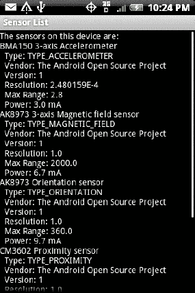

**图 26–1.** *传感器列表应用的输出结果*

关于这些传感器信息，有几点需要了解。类型值（type）用于表示传感器的基本类型，但不会具体到某个型号。光线传感器就是光线传感器，但不同设备上的光线传感器可能存在差异。例如，一台设备上光线传感器的分辨率可能与另一台设备不同。当您在 `<uses-feature>` 标签中指定应用需要光线传感器时，您无法预先知道会获得哪种具体类型的光线传感器。因此，您需要查询设备来了解情况，并相应地调整代码。

您获得的 resolution（分辨率）和 maximum range（最大量程）值将以该传感器对应的单位呈现。power（功耗）测量值以毫安（mA）为单位，表示传感器从设备电池中消耗的电流；数值越小越好。

现在我们已经知道了设备上可用的传感器，那么如何从它们那里获取数据呢？正如之前解释的，我们需要设置一个监听器来接收传感器发送给我们的数据。接下来我们就来探讨这一点。

### 获取传感器事件

一旦我们注册了监听器来接收数据，传感器就会向我们的应用提供数据。当监听器未处于监听状态时，传感器可以关闭以节省电池电量，因此请确保只在确实需要时才进行监听。设置传感器监听器非常简单。假设我们要测量光线传感器的光照强度。代码清单 26–2 展示了一个实现此功能的示例应用的 Java 代码。本示例将使用与代码清单 26–1 相同的 XML 布局。

**代码清单 26–2.** *光线传感器监控应用的 Java 代码*

```
// This file is MainActivity.java
import android.app.Activity;
import android.hardware.Sensor;
import android.hardware.SensorEvent;
import android.hardware.SensorEventListener;
import android.hardware.SensorManager;
import android.os.Bundle;
import android.widget.TextView;

public class MainActivity extends Activity implements SensorEventListener {
    private SensorManager mgr;
    private Sensor light;
    private TextView text;
    private StringBuilder msg = new StringBuilder(2048);

    @Override
    public void onCreate(Bundle savedInstanceState) {
        super.onCreate(savedInstanceState);
        setContentView(R.layout.main);

        mgr = (SensorManager) this.getSystemService(SENSOR_SERVICE);

        light = mgr.getDefaultSensor(Sensor.TYPE_LIGHT);

        text = (TextView) findViewById(R.id.text);
    }

    @Override
    protected void onResume() {
        mgr.registerListener(this, light,
                SensorManager.SENSOR_DELAY_NORMAL);
        super.onResume();
    }

    @Override
    protected void onPause() {
        mgr.unregisterListener(this, light);
        super.onPause();
    }

    public void onAccuracyChanged(Sensor sensor, int accuracy) {
        msg.insert(0, sensor.getName() + " accuracy changed: " +
            accuracy + (accuracy==1?" (LOW)":(accuracy==2?" (MED)":
            " (HIGH)")) + "\n");
        text.setText(msg);
        text.invalidate();
    }

    public void onSensorChanged(SensorEvent event) {
        msg.insert(0, "Got a sensor event: " + event.values[0] +
            " SI lux units\n");
        text.setText(msg);
        text.invalidate();
    }
}
```

在这个示例应用中，我们再次获取了 `SensorManager` 的引用，但这次不是获取传感器列表，而是专门查询光线传感器。接着，我们在 Activity 的 `onResume()` 方法中设置了一个监听器，并在 `onPause()` 方法中注销该监听器。我们不希望在应用不在前台运行时还去操心光照强度。

对于 `registerListener()` 方法，我们传入一个值，表示希望以多高的频率获知传感器数值变化。该参数可以是：

*   `SENSOR_DELAY_NORMAL`
*   `SENSOR_DELAY_UI`
*   `SENSOR_DELAY_GAME`
*   `SENSOR_DELAY_FASTEST`

为该参数选择合适的值非常重要。有些传感器非常灵敏，会在短时间内产生大量事件。如果您选择 `SENSOR_DELAY_FASTEST`，甚至可能超出应用的处理能力。根据应用对每个传感器事件的处理方式，您可能会在内存中创建和销毁大量对象，导致垃圾回收造成设备明显的卡顿和延迟。另一方面，某些传感器（尤其是旋转矢量传感器）则要求尽可能频繁地读取数据。

由于我们的 Activity 实现了 `SensorEventListener` 接口，我们拥有两个用于处理传感器事件的回调方法：`onAccuracyChanged()` 和 `onSensorChanged()`。第一个方法会通知我们传感器（或多个传感器，因为它可能被多个传感器触发）的精度是否发生变化。精度参数（accuracy）的值为 0、1、2 或 3，分别对应不可靠、低精度、中等精度和高精度。不可靠的精度并不意味着设备损坏；它通常意味着传感器需要校准。第二个回调方法会在光照强度发生变化时通知我们，同时我们会收到一个传感器事件对象，其中包含来自传感器的一个或多个新值的详细信息。

`SensorEvent` 对象有多个成员，其中之一是一个浮点数值数组。对于光线传感器事件，只有第一个浮点数值有意义，它是传感器检测到的光照的 SI 勒克斯值。在我们的示例应用中，我们通过将新消息插入到旧消息之前来构建消息字符串，然后将消息批处理显示在 `TextView` 中。最新的传感器值将始终显示在屏幕顶部。

当您运行此应用时（当然是在真实设备上，因为模拟器没有光线传感器），您可能会注意到一开始没有任何显示。只需改变照射在设备左上角的光线即可。这很可能是您设备光线传感器的位置。如果您非常仔细地观察，可能会在屏幕后面看到一个点，那就是光线传感器。如果您用手指挡住这个点，光照强度很可能会变为一个非常小的值（尽管可能不会降到零）。屏幕上应该会显示消息，告知您光照强度的变化。

**注意：** 您可能还会注意到，挡住光线传感器后，您的按钮会亮起（如果您的设备带有发光按钮）。这是因为 Android 检测到环境变暗，从而点亮按钮以便于操作设备。

#### 获取传感器数据时的问题

Android 传感器框架存在一些您需要了解的问题。这部分内容可不太有趣。在某些情况下，我们有办法绕过问题，而在其他情况下则没有办法，或者处理起来非常困难。

##### onAccuracyChanged() 永远返回相同值

在 Android 2.2 之前，每次有新的传感器读数时，都会调用 `onAccuracyChanged()` 回调，并且精度参数始终为 3（表示高精度）。适应传感器数据精度变化是一个好习惯，但如果发现即使精度没有变化，该方法也一直被调用，请不要感到惊讶。


##### 无法直接访问传感器数值

你可能已经注意到，并没有直接查询传感器当前数值的方法。从传感器获取数据的唯一途径是通过监听器。这意味着，即便我们已经设置好了监听器，也无法保证能在设定时间内获得新数据。至少回调是异步的，这样我们就不会为了等待传感器数据而阻塞 UI 线程。但你的应用程序必须适应：传感器数据可能无法在你需要的精确时刻获取。

通过使用原生代码和 Android 的 JNI 功能，确实可以直接访问传感器。你需要了解所关心的传感器驱动底层原生 API 调用，并能够设置回 Android 的接口。所以这是可行的，但并不容易。

##### 传感器数值发送速度不够快

即便是采用`SENSOR_DELAY_FASTEST`速率，我们可能也只能每 20 毫秒获取一次新数据（这取决于设备）。如果你需要比`SENSOR_DELAY_FASTEST`速率设置更快的传感器数据，可以使用原生代码和 JNI 来更快获取传感器数据，但和前面提到的情况类似，这并不容易。

##### Android 2.1 中屏幕关闭时会关闭传感器

在 Android 2.1 中存在一个问题：当屏幕关闭时，传感器更新会被关闭。显然有人认为即使你的应用程序（很可能使用了服务）持有唤醒锁，在屏幕关闭时不发送传感器更新是个好主意。基本上，当屏幕关闭时，你的监听器会被注销。针对这个问题有几种解决方法。第一种是设置屏幕超时时间，使其在你希望持续接收传感器更新期间不会关闭。但这样做的主要缺点是会消耗电池电量。要更改屏幕关闭超时时间，需要执行类似以下操作，其中`myDelay`是以毫秒为单位的时间段：

```
Settings.System.putInt(getContentResolver(),
                     Settings.System.SCREEN_OFF_TIMEOUT, myDelay);
```

你可以使用值-1，这样屏幕永远不会关闭。你的应用程序还需要在`AndroidManifest.xml`文件中拥有适当的权限（`android.permission.WRITE_SETTINGS`）才能执行此操作。这种方法的另一个缺点是屏幕关闭超时是一个全局值。当你的应用程序更改它时，所有应用都会受影响。你的应用程序应该记住之前的设置，并在应用程序结束时恢复它。即便如此也可能存在问题，因为理论上用户可能启动你的应用程序，发现屏幕不再关闭，进入“设置”将其完全改为其他值，然后返回你的应用程序并结束它。更不用说如果用户在应用程序启动后更改了设置，屏幕可能会关闭，你的应用程序将停止接收传感器更新。

### 用于持续传感器更新的注销/注册技术

保持传感器更新持续的一种方法是在屏幕关闭时注册以接收广播通知，然后注销传感器事件监听器，并在`BroadcastReceiver`的`onReceive()`方法中重新注册传感器事件监听器。这在某些 2.1 手机上有效，但并非所有手机都有效。

由于当屏幕变暗时你的应用程序通常会暂停，首先你需要获取部分唤醒锁，以便即使屏幕关闭时也能保持应用程序运行。我们的示例使用 Activity，但在实际应用程序中，你很可能将传感器监听代码放在服务中。清单 26-3 展示了作为 Activity 可能的样子。

**清单 26-3.** *解决 SensorListeners 关闭问题*

```
package com.androidbook.sensor.accel;

// 此文件为 MainActivity.java
import java.io.BufferedWriter;
import java.io.FileWriter;
import java.io.IOException;
import java.text.SimpleDateFormat;
import java.util.Date;
import android.app.Activity;
import android.content.BroadcastReceiver;
import android.content.Context;
import android.content.Intent;
import android.content.IntentFilter;
import android.hardware.Sensor;
import android.hardware.SensorEvent;
import android.hardware.SensorEventListener;
import android.hardware.SensorManager;
import android.os.Bundle;
import android.os.Environment;
import android.os.PowerManager;
import android.os.PowerManager.WakeLock;
import android.provider.Settings;
import android.util.Log;

public class MainActivity extends Activity implements SensorEventListener {
    private static final String TAG = "AccelerometerRecordToFile";
    private WakeLock mWakelock = null;
    private SensorManager mMgr;
    private Sensor mAccel;
    private BufferedWriter mLog;
    final private SimpleDateFormat mTimeFormat =
                new SimpleDateFormat("HH:mm:ss - ");
    private int mSavedTimeout;

    @Override
    public void onCreate(Bundle savedInstanceState) {
        super.onCreate(savedInstanceState);
        setContentView(R.layout.main);

        mMgr = (SensorManager) this.getSystemService(SENSOR_SERVICE);

        mAccel = mMgr.getDefaultSensor(Sensor.TYPE_ACCELEROMETER);

        // 设置要写入的日志文件。为了防止在实验过程中此 Activity 重新启动，我们将采用追加写入模式。
        try {
            String filename =
    Environment.getExternalStorageDirectory().getAbsolutePath() +
                "/accel.log";
            mLog = new BufferedWriter(new FileWriter(filename, true));
        }
        catch(Exception e) {
            Log.e(TAG, "无法初始化日志文件");
            e.printStackTrace();
            finish();
        }

        PowerManager pwrMgr =
                   (PowerManager) this.getSystemService(POWER_SERVICE);
        mWakelock = pwrMgr.newWakeLock(PowerManager.PARTIAL_WAKE_LOCK,
                                  "Accel");
        mWakelock.acquire();

        // 保存屏幕超时的当前值，然后将其设置为一个较小的值
        try {
            mSavedTimeout = Settings.System.getInt(getContentResolver(),
                Settings.System.SCREEN_OFF_TIMEOUT);
        }
        catch(Exception e) {
            mSavedTimeout = 120000;  // 如果无法读取当前值，
                                     // 则默认设为 2 分钟
        }
        Settings.System.putInt(getContentResolver(),
            Settings.System.SCREEN_OFF_TIMEOUT, 5000);  // 5 秒
    }
```


```java
public BroadcastReceiver mReceiver = new BroadcastReceiver() {
    public void onReceive(Context context, Intent intent) {
        if (Intent.ACTION_SCREEN_OFF.equals(intent.getAction())) {
            writeLog("屏幕已关闭");
            // 注销监听器并重新注册。
            // 仅在 Android 2.1 中需要执行此操作，但
            // 在任何版本中执行此操作也无妨。

            mMgr.unregisterListener(MainActivity.this);
            mMgr.registerListener(MainActivity.this, mAccel,
                SensorManager.SENSOR_DELAY_NORMAL);

        }
    }
};

@Override
protected void onStart() {
    writeLog("启动中...");
    mMgr.registerListener(this, mAccel,
                    SensorManager.SENSOR_DELAY_NORMAL);

    IntentFilter filter = new IntentFilter(Intent.ACTION_SCREEN_OFF);
    registerReceiver(mReceiver, filter);

    super.onStart();
}

@Override
protected void onStop() {
    writeLog("停止中...");
    mMgr.unregisterListener(this, mAccel);
    unregisterReceiver(mReceiver);
    try {
        mLog.flush();
    } catch (IOException e) {
        // 忽略日志文件中的任何错误
    }
    super.onStop();
}

@Override
protected void onDestroy() {
    writeLog("关闭中...");
    try {
        mLog.flush();
        mLog.close();
    }
    catch(Exception e) {
        // 忽略日志文件中的任何错误
    }

    // 将屏幕关闭超时恢复为之前的值
    Settings.System.putInt(getContentResolver(),
            Settings.System.SCREEN_OFF_TIMEOUT, mSavedTimeout);

    mWakelock.release();

    super.onDestroy();
}

public void onAccuracyChanged(Sensor sensor, int accuracy) {
    // 忽略
}

public void onSensorChanged(SensorEvent event) {
    writeLog("收到传感器事件: " + event.values[0] + ", " +
            event.values[1] + ", " + event.values[2]);
}

private void writeLog(String str) {
    try {
        Date now = new Date();
        mLog.write(mTimeFormat.format(now));
        mLog.write(str);
        mLog.write("\n");
    }
    catch(IOException ioe) {
        ioe.printStackTrace();
    }
}
```

在这个示例中我们不需要担心 XML 布局，因为我们除了应用程序标题之外不会显示任何其他内容。不过，我们确实需要考虑权限问题，因此清单 26-4 展示了我们的加速度计监控应用的`AndroidManifest.xml`文件。

**清单 26-4.** *加速度计监控应用的 AndroidManifest.xml*

```xml
<?xml version="1.0" encoding="utf-8"?>
<manifest
      android:versionCode="1"
      android:versionName="1.0" package="com.androidbook.sensor.accel">
    <application android:icon="@drawable/icon"
           android:label="@string/app_name">
        <activity android:name=".MainActivity"
                  android:label="@string/app_name">
          <intent-filter>
            <action android:name="android.intent.action.MAIN" />
            <category android:name="android.intent.category.LAUNCHER" />
          </intent-filter>
        </activity>

    </application>
    <uses-sdk android:minSdkVersion="3" />

<uses-permission android:name="android.permission.WRITE_EXTERNAL_STORAGE" />
<uses-permission android:name="android.permission.WRITE_SETTINGS" />
<uses-permission android:name="android.permission.WAKE_LOCK" />
</manifest>
```

在此示例中，主要目标是将加速度计事件写入日志文件。在`onCreate()`方法中，我们需要获取部分唤醒锁，以便在屏幕关闭时应用程序不会被休眠（我们在第 14 章中介绍了唤醒锁）。我们还将屏幕关闭超时设置为五秒，使其能较快关闭，但会保存之前的超时值，以便稍后在`onDestroy()`方法中恢复。

**注意：** 我们正在修改屏幕关闭超时，以便您可以观察屏幕关闭时传感器事件监听器的行为。在实际应用中我们不会这样做。

我们还设置了一个`BroadcastReceiver`，当屏幕关闭时会收到通知。我们在`onReceive()`中记录这一事件，然后执行 Android 2.1 的变通方法以继续接收传感器事件。`onStart()`方法用于注册传感器事件监听器，同时也注册`BroadcastReceiver`。这两个监听器都在`onStop()`中取消注册。我们使用`onStart()`和`onStop()`而不是`onResume()`和`onPause()`，因为即使应用运行时用户切换到其他 Activity，我们也希望继续监听传感器。

`onDestroy()`方法负责清理工作，包括刷新并关闭日志文件、恢复屏幕关闭超时以及释放唤醒锁。与之前的示例不同，`onAccuracyChanged()`回调不执行任何操作。`onSensorChanged()`方法负责将事件数据写入日志文件。

这种传感器事件监听器的处理模式也是您在实际应用中会采用的方法。与我们之前不关心设备休眠的示例不同，您很可能需要获取唤醒锁，以确保应用程序即使屏幕变暗也能捕获事件。请注意，如果您的目标平台是 Android 2.2 及更高版本，则无需担心在`BroadcastReceiver`中取消注册和重新注册传感器事件监听器。对于 Android 2.0 之前的版本，同样不需要担心。

这是一个有趣的应用程序，您可以尝试运行。您可能想做的一件事是：

1.  安装应用，然后断开设备与工作站的连接，使其不再通过 USB 数据线连接（这有时会导致屏幕无论显示设置如何都保持常亮）。

应用启动后，您可以移动设备，大约五秒后屏幕会变暗。

2.  继续移动设备以触发加速度计事件，几秒钟后，解锁设备，然后按返回键结束应用。

您会在设备 SD 卡的主目录中找到名为`access.log`的日志文件。

3.  将设备重新连接到工作站的 USB 数据线，然后将`access.log`文件复制到工作站上查看。

您会看到一条启动消息、多条事件消息，然后是一条“屏幕已关闭”的消息。根据您的设备和运行的 Android 版本，您可能会看到此消息之后立即发生额外的事件，或者您会看到事件出现一段时间空白，直到您解锁设备并结束应用。


#### 保持屏幕常亮以实现传感器持续更新

针对 Android 2.1 还有另一种可行的解决方案。其基本症状是：某些 Android 2.1 设备上的传感器在屏幕关闭时会完全停止工作。因此，解决方案就是确保屏幕保持开启状态。代码清单 26–5 展示了上一示例应用中 `BroadcastReceiver` 的另一个版本，只不过这次我们在屏幕熄灭后立即将其重新点亮（尽管处于变暗模式），同时对其他部分的代码进行了一些小修改。由于从技术上讲，即使屏幕变暗也算开启，传感器数据便能持续流向我们的 Android 2.1 应用。如果你从我们的网站导入项目，这个项目名为 `AccelerometerRecordToFileAlwaysOn`。

**代码清单 26–5.** *即使用户关闭屏幕也保持其开启*

```
// 将这些对象添加到我们的 Activity 中
    private PowerManager mPwrMgr;
    private WakeLock mTurnBackOn = null;
    private Handler handler = new Handler();

// 将以下 3 行代码添加到我们的 onCreate() 方法中
        mPwrMgr = (PowerManager) this.getSystemService(POWER_SERVICE);
        mWakelock = mPwrMgr.newWakeLock(PowerManager.PARTIAL_WAKE_LOCK, "Accel");
        mWakelock.acquire();

// 此代码替换了 MainActivity.java 中的 BroadcastReceiver
    public BroadcastReceiver mReceiver = new BroadcastReceiver() {
        public void onReceive(Context context, Intent intent) {
            if (Intent.ACTION_SCREEN_OFF.equals(intent.getAction())) {
                writeLog("屏幕已关闭");
                // 从主线程重新点亮屏幕
                handler.post(new Runnable() {
                    public void run() {
                        if(mTurnBackOn != null)
                            mTurnBackOn.release();

                        mTurnBackOn = mPwrMgr.newWakeLock(
                                PowerManager.SCREEN_DIM_WAKE_LOCK |
                                    PowerManager.ACQUIRE_CAUSES_WAKEUP,
                                "AccelOn");
                        mTurnBackOn.acquire();
                    }});
            }
        }
    };

// 不要忘记将其添加到 onDestroy() 中
    if(mTurnBackOn != null)
        mTurnBackOn.release();
```

现在，当你运行此应用时，即使用户按下电源键关闭屏幕，该应用也会捕获此事件，并通过唤醒锁以变暗模式重新点亮屏幕。在此过程中，传感器事件可能会出现一个非常短暂的间隔，但这比屏幕关闭时出现较长间隔要好得多。注意我们如何使用一个 `Handler` 从 `BroadcastReceiver` 中发送一个 `Runnable`。这确保我们的代码在主线程上运行，这对于我们想要在 `onDestroy()` 中释放唤醒锁非常重要。获取和释放必须在同一个线程中进行。

另请注意，我们在 `BroadcastReceiver` 的 `onReceive()` 方法中获取新唤醒锁之前释放了之前的唤醒锁。这样做是为了防止用户在记录传感器事件时多次按下电源键。我们需要保持唤醒锁的释放与获取成对出现，因此，如果有一个传入的唤醒锁，我们在获取新锁之前先释放它。

既然你已经知道如何从传感器获取数据，那么你能用这些数据做些什么呢？正如我们之前所说，根据你从哪个传感器获取数据，values 数组中返回的值含义也不同。下一节将探讨每种传感器类型及其数值含义。

### 解读传感器数据

现在我们已经了解了如何从传感器获取数据，我们必须用这些数据来做些有意义的事情。然而，我们获得的数据取决于我们从哪个传感器获取数据。有些传感器比其他传感器更简单。在接下来的章节中，我们将描述你将从目前已知的传感器中获得的数据。随着新设备的出现，无疑也会引入新的传感器。传感器框架很可能保持不变，因此我们在此展示的技术应该同样适用于新传感器。

#### 光线传感器

光线传感器是设备上最简单的传感器之一，也是我们在本章第一个示例应用中使用过的传感器。该传感器会读取设备光线传感器检测到的光线水平读数。随着光线水平的变化，传感器读数也会改变。数据单位是国际单位制勒克斯。要了解更多相关信息，请参阅本章末尾的参考资料部分，那里有更多信息的链接。

对于 `SensorEvent` 对象中的 `values` 数组，光线传感器只使用第一个元素 `values[0]`。这个值是一个浮点数，从技术上讲，范围从零到特定传感器的最大值。我们之所以说“从技术上讲”，是因为传感器在无光时可能只发送非常小的值，而实际上永远不会发送值为 0 的数据。

还要记住，传感器可以告诉我们它能够返回的最大值，并且不同的传感器可能具有不同的最大值。因此，考虑 `SensorManager` 类中的光线相关常量可能没有用处。例如，`SensorManager` 有一个名为 `LIGHT_SUNLIGHT_MAX` 的常量，其浮点值为 120,000；然而，我们之前查询设备时，返回的最大值是 10,240，显然远小于这个常量值。还有一个名为 `LIGHT_SHADE` 的常量，值为 20,000，也高于我们测试设备的最大值。因此，在编写使用光线传感器数据的代码时，请牢记这一点。

#### 接近传感器

接近传感器要么测量某个物体距离设备的距离（以厘米为单位），要么表示一个标志，指示物体是靠近还是远离。一些接近传感器会给出从 0.0 到最大值的增量值，而另一些则只返回 0.0 或最大值。如果接近传感器的最大范围等于其分辨率，那么你就知道它是那种只返回 0.0 或最大值的类型。有些设备的最大值是 1.0，其他设备则是 6.0。不幸的是，在应用安装并运行之前，无法判断你将获得哪种接近传感器。即使你在 `AndroidManifest.xml` 文件中为接近传感器添加了 `<uses-feature>` 标签，你也可能遇到任何一种类型。除非你绝对需要更精细的接近传感器，否则你的应用应该优雅地兼容这两种类型。

关于接近传感器有一个有趣的事实：接近传感器有时与光线传感器是同一硬件。不过，Android 仍然在逻辑上将它们视为独立的传感器，因此如果你需要来自两者的数据，则需要为每个传感器设置一个监听器。另一个有趣的事实是：接近传感器通常用于手机应用程序中，以检测人的头部是否靠近设备。如果头部非常靠近触摸屏，触摸屏将被禁用，这样人们在通话时就不会因耳朵或脸颊而意外按下按键。

本章的源代码项目包含一个简单的接近传感器监控应用，它基本上是将光线传感器监控应用修改为使用接近传感器而非光线传感器。我们不会在本章中列出代码文本，但你可以随意在自己的设备上进行实验。


#### 温度传感器

温度传感器能提供温度读数，并在`values[0]`中仅返回一个值。该值代表以摄氏度为单位的温度。要将摄氏度转换为华氏度，可乘以 9/5 再加 32。例如，0 摄氏度等于 32 华氏度（水结冰的温度），而 100 摄氏度等于 212 华氏度（水沸腾的温度）。

温度传感器的放置位置取决于设备本身，温度读数有可能受到设备自身产生的热量影响。例如，在某些设备上，温度传感器读取的是设备电池的温度。在编写使用温度传感器的应用程序时请牢记这一点，并且不要期望温度传感器的读数就是设备周围的空气温度。

本章包含一个名为`TemperatureSensor`的温度传感器相关项目。

#### 压力传感器

有趣的是，截至撰写本文时，尚未在任何设备中看到过这些传感器。其设想是未来的设备可以配备气压传感器，例如用于检测海拔高度。此传感器不应与触摸屏生成带有压力值（触摸的压力）的`MotionEvent`的能力相混淆。我们在第 25 章中介绍过这种触摸类型的压力感应。触摸屏压力感应并不使用 Android 传感器框架。

虽然复制并修改目前用于适配压力传感器的传感器监控应用程序很容易，但我们目前还无法得知其测量单位将是什么，因此这对我们来说意义不大。显然，谷歌的开发者们正在考虑未来的发展。

#### 陀螺仪传感器

陀螺仪是非常酷的组件，它可以测量设备围绕参考系的扭转。换句话说，陀螺仪测量的是绕某个轴的旋转速率。当设备不旋转时，传感器值将为零。当设备向任何方向旋转时，你会从陀螺仪获得非零值。仅靠陀螺仪本身，它无法告诉你所需的一切信息。而且不幸的是，随着时间推移，陀螺仪会逐渐产生误差。但与加速度计配合使用时，你可以确定设备的运动路径。可以使用卡尔曼滤波器将来自这两个传感器的数据关联起来。加速度计在短期内的精度并不理想，而陀螺仪在长期内的精度也不高，因此两者结合后可以在所有时间内达到相当不错的精度。虽然卡尔曼滤波器非常复杂，但还有一种称为互补滤波器的替代方案，它在代码中更容易实现，并且能产生相当不错的结果。这些概念超出了本书的范围。

陀螺仪传感器在值数组中返回三个值，分别对应*x*、*y*和*z*轴。单位是弧度每秒，表示围绕每个轴的旋转速率。处理这些值的一种方法是对它们进行时间积分以计算角度变化。这类似于对线速度进行时间积分以计算距离的计算方法。

#### 加速度计

加速度计可能是设备上最有趣的传感器之一。利用这些传感器，我们的应用程序可以确定设备在空间中相对于重力竖直向下拉力的物理方向，同时还能感知作用在设备上的力。提供这些信息可以让应用程序实现各种有趣的功能，从游戏玩法到增强现实。当然，加速度计还会告诉 Android 何时将用户界面的方向从竖屏切换到横屏，或反之。

加速度计的坐标系工作原理如下：加速度计的*x*轴始于设备的左下角，并沿底部向右延伸。*y*轴也始于左下角，沿显示屏左侧向上延伸。*z*轴始于左下角，并朝远离设备的方向向上延伸。图 26-2 展示了其含义。

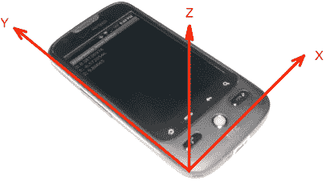

**图 26-2.** *加速度计坐标系*

这个坐标系与布局和 2D 图形中使用的坐标系不同。在那个坐标系中，原点(0, 0)位于左上角，Y 轴正方向是沿屏幕向下。在处理不同参考系中的坐标系时很容易混淆，所以要小心。

我们还没有说明加速度计的值代表什么，那么它们到底代表什么呢？加速度以米每二次方秒（m/s²）来衡量。地球正常重力为 9.81 m/s²，向下拉向地心。从加速度计的角度来看，重力的测量值为-9.81。如果你的设备完全静止（不移动），并且放在一个完全平坦的表面上，那么*x*和*y*的读数将为 0，而*z*的读数将为+9.81。实际上，由于加速度计的灵敏度和精度，这些值不会完全精确，但会非常接近。当设备静止时，重力是唯一作用在设备上的力，并且因为重力是竖直向下拉的，如果我们的设备完全平坦，重力对*x*和*y*轴的影响为零。在*z*轴上，加速度计测量的是设备所受的力减去重力。因此，0 减去-9.81 等于+9.81，这就是*z*轴的值（也就是`SensorEvent`对象中的`values[2]`）。

加速度计发送给应用程序的值始终代表设备所受合力减去重力。如果我们拿起完全平坦的设备并竖直向上举，*z*值最初会增加，因为我们增加了向上（*z*方向）的力。一旦我们的举力停止，合力将再次只剩下重力。如果设备被抛落（假设如此——请勿尝试），它会向地面加速，这将抵消重力，因此加速度计会读出 0 力。

我们将图 26-2 中的设备向上旋转，使其处于竖屏且垂直的状态。*x*轴不变，从左指向右。*y*轴现在竖直向上，*z*轴垂直屏幕指向我们。*y*值将为+9.81，而*x*和*z*均为零。

当我们将设备旋转到横屏模式并继续垂直握住它，也就是让屏幕正对着我们面前时，会发生什么？如果你猜*y*和*z*现在为零，而*x*为+9.81，那就猜对了。图 26-3 展示了可能的样子。

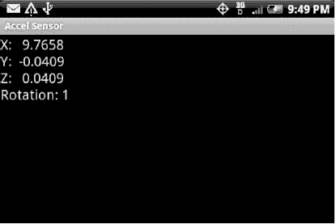

**图 26-3.** *竖屏横握时的加速度计值*

当设备不移动或以恒定速度移动时，加速度计仅测量重力。在每个轴上，加速度计的值就是重力在该轴上的分量。因此，利用一些三角函数知识，你可以计算出角度，从而了解设备相对于重力拉力的方向。也就是说，你可以判断设备是处于竖屏模式、横屏模式还是某种倾斜模式。事实上，这正是 Android 用来判断使用哪种显示模式（竖屏或横屏）的方法。但请注意，加速度计并不能说明设备相对于地磁北极的方向。这就需要磁场传感器来发挥作用了，我们将在下一节中介绍。


##### 加速度计与屏幕方向

设备中的加速度计属于硬件组件，并牢固固定在设备内部，因此它们相对于设备具有固定的方向，不会因设备旋转而改变。当设备移动时，加速度计发送给 Android 的值当然会发生变化，但加速度计的坐标系统相对于物理设备保持不变。然而，当用户从竖屏切换到横屏再切换回来时，屏幕的坐标系统会随之改变。事实上，根据屏幕旋转的方向，竖屏模式可能是正向竖直，也可能是旋转 180 度后的倒置。同样地，横屏模式也存在两种相隔 180 度的不同旋转状态。

当我们的应用需要读取加速度计数据并正确影响用户界面时，必须知道屏幕发生了多少旋转才能进行适当补偿。当屏幕从竖屏重新定向为横屏时，屏幕的坐标系统相对于加速度计的坐标系统发生了旋转。要处理这种情况，我们的应用必须使用 Android 2.2 引入的 `Display.getRotation()` 方法。该方法的返回值是一个简单的整数，但并非实际的旋转角度值。返回值将是 `Surface.ROTATION_0`、`Surface.ROTATION_90`、`Surface.ROTATION_180` 或 `Surface.ROTATION_270` 之一，这些常量的值分别为 0、1、2、3。这个返回值告诉我们屏幕相对于设备的"正常"方向旋转了多少。由于并非所有 Android 设备的默认状态都是竖屏模式，我们不能假设竖屏模式对应 `ROTATION_0`。

并非所有设备都会返回全部四种值。在运行 Android 2.1 的 HTC Droid Eris 上，`Display.getOrientation()`（该方法为 `Display.getRotation()` 的前身，现已弃用）只会返回 0 或 1。在正常的竖屏模式下，返回值为 0。如果将设备逆时针旋转 90 度，屏幕会旋转，此时 `Display.getOrientation()` 返回 1。如果从竖屏模式顺时针旋转 90 度，屏幕仍保持竖屏模式，`Display.getOrientation()` 仍返回 0。

在运行 Android 2.2 的 Motorola Droid 上，`Display.getRotation()` 返回 0、1 或 3，不返回 2，也不会显示竖屏倒置模式。不过这里有一个令人失望的结果：如果从正向竖屏位置向逆时针方向旋转 270 度，`Display.getRotation()` 在旋转 90 度时返回 1，屏幕切换至横屏模式；旋转 180 度时仍返回 1，屏幕不变；旋转 270 度时屏幕翻转至另一个横屏模式，但 `Display.getRotation()` 仍然返回 1。如果从正常竖屏模式顺时针旋转 90 度，`Display.getRotation()` 返回 3。最后这个位置看起来与逆时针旋转 270 度完全相同，但根据旋转路径的不同，`Display.getRotation()` 会返回不同的值。

##### 加速度计与重力

到目前为止，我们仅简要介绍了设备移动时加速度计值的变化情况。现在让我们进一步探讨。所有作用于设备的力都会被加速度计检测到。如果我们提起设备，初始的提升力在*z*轴方向为正，我们会得到大于+9.81 的*z*值。如果我们从左侧推动设备，*x*轴方向将出现初始负读数。

我们希望能将重力与其他作用于设备的力分离开。有一种相当简单的方法可以实现，称为低通滤波器。除重力之外的其他作用力通常不会以渐进方式作用于设备。换句话说，如果用户摇晃设备，摇晃力会迅速反映在加速度计值中。低通滤波器实际上能滤除摇晃力，只留下稳定的力（对我们而言就是重力）。让我们通过一个示例应用来演示这一概念，该应用名为 `GravityDemo`。清单 26-6 显示了布局 XML 和 Java 代码。

**清单 26-6.** *从加速度计测量重力*

```
<?xml version="1.0" encoding="utf-8"?>
<!-- This file is /res/layout/main.xml -->
<LinearLayout
    android:orientation="vertical"
    android:layout_width="fill_parent"
    android:layout_height="fill_parent" >
  <TextView  android:id="@+id/text"  android:textSize="20sp"
      android:layout_width="fill_parent"
      android:layout_height="wrap_content" />
</LinearLayout>
```

```
// This file is MainActivity.java
import android.app.Activity;
import android.hardware.Sensor;
import android.hardware.SensorEvent;
import android.hardware.SensorEventListener;
import android.hardware.SensorManager;
import android.os.Bundle;
import android.widget.TextView;

public class MainActivity extends Activity implements SensorEventListener {
    private SensorManager mgr;
    private Sensor accelerometer;
    private TextView text;
    private float[] gravity = new float[3];
    private float[] motion = new float[3];
    private double ratio;
    private double mAngle;
    private int counter = 0;

    @Override
    public void onCreate(Bundle savedInstanceState) {
        super.onCreate(savedInstanceState);
        setContentView(R.layout.main);

        mgr = (SensorManager) this.getSystemService(SENSOR_SERVICE);

        accelerometer = mgr.getDefaultSensor(Sensor.TYPE_ACCELEROMETER);

        text = (TextView) findViewById(R.id.text);
    }

    @Override
    protected void onResume() {
        mgr.registerListener(this, accelerometer,
                   SensorManager.SENSOR_DELAY_UI);
        super.onResume();
    }

    @Override
    protected void onPause() {
        mgr.unregisterListener(this, accelerometer);
        super.onPause();
    }

    public void onAccuracyChanged(Sensor sensor, int accuracy) {
        // ignore
    }

    public void onSensorChanged(SensorEvent event) {
        // Use a low-pass filter to get gravity.
        // Motion is what's left over
        for(int i=0; i<3; i++) {
            gravity [i] = (float) (0.1 * event.values[i] +
                                   0.9 * gravity[i]);
            motion[i] = event.values[i] - gravity[i];
        }

        // ratio is gravity on the Y axis compared to full gravity
        // should be no more than 1, no less than -1
        ratio = gravity[1]/SensorManager.GRAVITY_EARTH;
        if(ratio > 1.0) ratio = 1.0;
        if(ratio < -1.0) ratio = -1.0;

        // convert radians to degrees, make negative if facing up
        mAngle = Math.toDegrees(Math.acos(ratio));
        if(gravity[2] < 0) {
            mAngle = -mAngle;
        }
```


```java
// 每第 10 个值显示一次
if(counter++ % 10 == 0) {
    String msg = String.format(
        "原始值\nX: %8.4f\nY: %8.4f\nZ: %8.4f\n" +
        "重力\nX: %8.4f\nY: %8.4f\nZ: %8.4f\n" +
        "运动\nX: %8.4f\nY: %8.4f\nZ: %8.4f\n 角度: %8.1f",
        event.values[0], event.values[1], event.values[2],
        gravity[0], gravity[1], gravity[2],
        motion[0], motion[1], motion[2],
        mAngle);
    text.setText(msg);
    text.invalidate();
    counter=1;
    }
}
```

运行该应用程序的结果是一个如图 26-4 所示的显示界面。此截图是在设备平放在桌面上时拍摄的。

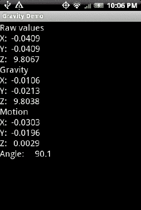

**图 26-4.** *重力、运动与角度值*

该示例应用程序的大部分内容与我们之前的`Accel Sensor`应用程序相同。区别在于`onSensorChanged()`方法。我们不再简单地显示事件数组中的数值，而是尝试跟踪重力和运动。我们只使用事件数组中很小一部分的新值来获取重力，并且使用很大一部分的重力数组旧值。所使用的这两部分之和必须等于 1.0。我们使用了 0.9 和 0.1。你也可以尝试其他数值，例如 0.8 和 0.2。我们的重力数组不可能像实际传感器数值变化得那么快。但这更接近真实情况。而这正是低通滤波器的作用。只有当外力导致设备移动时，事件数组中的数值才会发生变化，而我们不希望将这些外力测量为重力的一部分。我们只想将重力本身记录到重力数组中。这里的数学计算并不意味着我们神奇地只记录重力，但我们计算得出的数值将比事件数组中的原始数值精确得多。

另外，请注意代码中的运动数组。通过追踪原始事件数组值与计算出的重力值之间的差异，我们实际上是在测量作用于设备上的、非重力的主动力，并将其记录在运动数组中。如果运动数组中的数值为零或非常接近零，则意味着设备很可能没有移动。这是一个有用的信息。从技术上讲，以恒定速度移动的设备，其运动数组中的数值也会接近零，但实际上，如果用户正在移动设备，运动值会略大于零。

##### 使用加速度计测量设备角度

在继续之前，我们想再向您介绍一些关于加速度计的知识。回想一下我们的三角学课程，一个角的余弦等于邻边与斜边的比值。如果我们考虑 Y 轴与重力本身之间的角度，我们可以测量 Y 轴上的重力，然后取反余弦来确定角度。我们也在代码中实现了这一点。不过，在这里，我们不得不再次面对 Android 传感器的一些复杂问题。`SensorManager`中为不同的重力常量定义了常量，包括地球重力常量。但我们实际测量到的数值可能超出这些定义常量。接下来我们将解释这一点。

理论上，静止的设备测量到的重力值应等于常量值，但实际情况很少如此。静止时，加速度计传感器给我们的重力值很可能大于或小于该常量。因此，我们的比值最终可能大于 1 或小于 -1。这会导致`acos()`方法报错，因此我们将比值限制在 -1 到 1 之间。对应的角度（以度为单位）范围为 0 到 180。这没问题，只是我们无法通过这种方式得到从 0 到 -180 的负角度。为了获得负角度，我们使用重力数组中的另一个值，即 *z* 值。如果重力的 *Z* 值为负，则意味着设备屏幕朝下。对于所有屏幕朝下的情况，我们也使角度为负，这样我们的角度范围就是从 -180 到 +180，正如我们所期望的那样。

请继续用这个示例应用程序进行实验。注意，当设备平放时，角度值为 90；当设备在我们面前垂直上下放置时，角度值为零（或接近零）。如果我们继续向下旋转超过水平位置，角度值会超过 90。如果我们从零位置向上倾斜设备更多，角度值会变为负数，直到我们将设备举过头顶，角度值为 -90。最后，你可能注意到了我们用来控制显示更新频率的计数器。由于传感器事件可能非常频繁，我们决定每收到第十个值才显示一次。

### 磁场传感器

磁场传感器测量 *x*、*y* 和 *z* 轴上的环境磁场。这个坐标系与加速度计一致，因此 *x*、*y* 和 *z* 的方向如图 26-2 所示。磁场传感器的单位是微特斯拉 (uT)。该传感器可以检测地球磁场，从而告诉我们北在哪里。该传感器也被称为指南针，事实上，`<uses-feature>` 标签中使用 `android.hardware.sensor.compass` 作为此传感器的名称。由于该传感器非常微小且灵敏，它可能会受到设备附近物体产生的磁场的影响，甚至在某种程度上会受到设备内部组件的影响。因此，磁场传感器的精度有时可能值得怀疑。

我们在网站下载部分包含了一个简单的 `CompassSensor` 应用程序，欢迎导入并试用。如果在运行此应用程序时，将金属物体靠近设备，你可能会注意到数值随之变化。当然，如果你将磁铁靠近设备，你会看到数值发生变化，但我们不推荐将 Android 设备与磁铁混用。

你可能会问：我能使用指南针传感器作为罗盘来检测北方在哪里吗？答案是：单靠它自己不行。虽然指南针传感器可以检测设备周围的磁场，但如果设备没有相对于地表完全水平放置，你就无法正确解读指南针传感器的数值。但是，我们有加速度计，它可以告诉我们设备相对于地表的朝向！因此，我们可以利用指南针传感器来创建罗盘，但同时也需要加速度计的帮助。那么，让我们来看看如何实现。


#### 结合使用加速度计和磁场传感器

`SensorManager` 提供了一些方法，允许我们将指南针传感器和加速度计结合起来以确定设备方向。正如我们刚才讨论的，仅靠指南针传感器无法完成这项工作。因此，`SensorManager` 提供了一个名为 `getRotationMatrix()` 的方法，它接收来自加速度计和指南针的值，并返回一个可用于确定方向的矩阵。

另一个 `SensorManager` 的方法 `getOrientation()` 则接收上一步得到的旋转矩阵，并给出一个方向矩阵。方向矩阵中的值告诉我们设备相对于地磁北极的旋转角度，以及设备相对于地面的俯仰角和横滚角。如果它能直接替我们完成工作，那就太棒了。不幸的是，至少在 Android 2.2 之前，使用这种机制存在一些重大挑战，其中最大的问题之一是当设备在我们面前，从正对我们变为微微向上倾斜（就像我们在看屏幕时）时，会出现不连续性。这种不连续性基本上意味着，一旦我们向上倾斜超过 0 度标记（此时看起来似乎仍面向前方），我们的方向实际上就指向了背后。这完全不符合直觉。幸运的是，Android 2.3 的出现为我们提供了额外的方法来解决这个问题（参见旋转矢量传感器）。但在此期间，只要你的应用部署在 Android 2.3 之前的设备上，就需要担心传感器应该使用哪些值。

#### 方向传感器

到目前为止，我们一直避开方向传感器不谈，但现在是时候介绍它们了。我们刚刚解释了如何将磁场传感器和加速度计结合起来，协同工作以产生方向值，从而告诉你手机朝向哪个方向。还有另一种传感器也能实现同样的功能：方向传感器。方向传感器实际上是 Android 驱动层中磁场传感器和加速度计的组合。换句话说，方向传感器并没有额外的硬件支持，而是在 Android 操作系统内部，有一段代码将这两种传感器模拟成另一个用于确定方向的传感器。

**注意：** 我们直到现在才谈论方向传感器，是因为它们从 Android 2.2 开始已被弃用，你不应再使用它们。然而，这个传感器非常有用，并且比推荐的用法更容易，你很快就会看到这一点。

我们刚刚讨论了使用推荐方法计算方向所面临的挑战。在下一个示例应用中，我们将同时展示来自推荐方法和方向传感器的方向值，以便你自己观察它们之间的差异。

我们将在这个应用中加入一些趣味性。虽然我们可以轻松显示传感器返回的值，但我们还会用这些值做一些有趣的事情。想象一下，你正站在佛罗里达州杰克逊维尔的一条街道上。我们的应用将向你展示街景图片，如同你身临其境，并根据你手机的朝向选择你面对的方向。当你改变手机的朝向时，街景视图也会相应改变。清单 26–7 显示了我们命名为 VirtualJax 的示例应用的 XML 布局和 Java 代码。

**清单 26–7.** *从传感器获取方向*

```
<?xml version="1.0" encoding="utf-8"?>
<!-- 该文件位于 res/layout/main.xml -->
<RelativeLayout

    android:layout_width="fill_parent"
    android:layout_height="fill_parent" >
  <Button  android:id="@+id/update"  android:text="更新数值"
    android:layout_width="wrap_content"
    android:layout_height="wrap_content"
    android:onClick="doUpdate" />
  <Button  android:id="@+id/show"  android:text="展示我吧！"
    android:layout_width="wrap_content"
    android:layout_height="wrap_content"
    android:onClick="doShow" android:layout_toRightOf="@id/update" />
  <TextView  android:id="@+id/preferred" android:textSize="20sp"
    android:layout_width="wrap_content"
    android:layout_height="wrap_content"
    android:layout_below="@id/update" />
  <TextView  android:id="@+id/orientation" android:textSize="20sp"
    android:layout_width="wrap_content"
    android:layout_height="wrap_content"
    android:layout_below="@id/preferred" />
</RelativeLayout>
```

```
// 该文件为 MainActivity.java
import android.app.Activity;
import android.content.Intent;
import android.hardware.Sensor;
import android.hardware.SensorEvent;
import android.hardware.SensorEventListener;
import android.hardware.SensorManager;
import android.net.Uri;
import android.os.Build;
import android.os.Bundle;
import android.view.View;
import android.view.WindowManager;
import android.widget.TextView;
```


```java
public class MainActivity extends Activity implements SensorEventListener {
    private static final String TAG = "VirtualJax";
    private SensorManager mgr;
    private Sensor accel;
    private Sensor compass;
    private Sensor orient;
    private TextView preferred;
    private TextView orientation;
    private boolean ready = false;
    private float[] accelValues = new float[3];
    private float[] compassValues = new float[3];
    private float[] inR = new float[9];
    private float[] inclineMatrix = new float[9];
    private float[] orientationValues = new float[3];
    private float[] prefValues = new float[3];
    private float mAzimuth;
    private double mInclination;
    private int counter;
    private int mRotation;

    @Override
    public void onCreate(Bundle savedInstanceState) {
        super.onCreate(savedInstanceState);
        setContentView(R.layout.main);

        preferred = (TextView)findViewById(R.id.preferred);
        orientation = (TextView)findViewById(R.id.orientation);

        mgr = (SensorManager) this.getSystemService(SENSOR_SERVICE);

        accel = mgr.getDefaultSensor(Sensor.TYPE_ACCELEROMETER);
        compass = mgr.getDefaultSensor(Sensor.TYPE_MAGNETIC_FIELD);
        orient = mgr.getDefaultSensor(Sensor.TYPE_ORIENTATION);

        WindowManager window = (WindowManager)
                this.getSystemService(WINDOW_SERVICE);
        int apiLevel = Integer.parseInt(Build.VERSION.SDK);
        if(apiLevel < 8) {
            mRotation = window.getDefaultDisplay().getOrientation();
        }
        else {
            mRotation = window.getDefaultDisplay().getRotation();
        }
    }

    @Override
    protected void onResume() {
        mgr.registerListener(this, accel,
                SensorManager.SENSOR_DELAY_GAME);
        mgr.registerListener(this, compass,
                SensorManager.SENSOR_DELAY_GAME);
        mgr.registerListener(this, orient,
                SensorManager.SENSOR_DELAY_GAME);
        super.onResume();
    }

    @Override
    protected void onPause() {
        mgr.unregisterListener(this, accel);
        mgr.unregisterListener(this, compass);
        mgr.unregisterListener(this, orient);
        super.onPause();
    }

    public void onAccuracyChanged(Sensor sensor, int accuracy) {
        // 忽略
    }

    public void onSensorChanged(SensorEvent event) {
        // 在确定方向值之前，需要同时获取加速度计和指南针数据
        switch(event.sensor.getType()) {
        case Sensor.TYPE_ACCELEROMETER:
            for(int i=0; i<3; i++) {
                accelValues[i] = event.values[i];
            }
            if(compassValues[0] != 0)
                ready = true;
            break;
        case Sensor.TYPE_MAGNETIC_FIELD:
            for(int i=0; i<3; i++) {
                compassValues[i] = event.values[i];
            }
            if(accelValues[2] != 0)
                ready = true;
            break;
        case Sensor.TYPE_ORIENTATION:
            for(int i=0; i<3; i++) {
                orientationValues[i] = event.values[i];
            }
            break;
        }

        if(!ready)
            return;

        if(SensorManager.getRotationMatrix(
                inR, inclineMatrix, accelValues, compassValues)) {
            // 获得了有效的旋转矩阵

            SensorManager.getOrientation(inR, prefValues);

            mInclination = SensorManager.getInclination(inclineMatrix);

            // 每 10 次更新显示一次
            if(counter++ % 10 == 0) {
                doUpdate(null);
                counter = 1;
            }
        }
    }

    public void doUpdate(View view) {
        if(!ready)
            return;

        mAzimuth = (float) Math.toDegrees(prefValues[0]);
        if(mAzimuth < 0) {
            mAzimuth += 360.0f;
        }

        String msg = String.format(
                "首选方法：\n 方位角（Z）：%7.3f \n 俯仰角（X）：%7.3f\n 横滚角（Y）：%7.3f",
                mAzimuth, Math.toDegrees(prefValues[1]),
                Math.toDegrees(prefValues[2]));
        preferred.setText(msg);

        msg = String.format(
           "方向传感器：\n 方位角（Z）：%7.3f\n 俯仰角（X）：%7.3f\n 横滚角（Y）：%7.3f",
           orientationValues[0],
           orientationValues[1],
           orientationValues[2]);
        orientation.setText(msg);

        preferred.invalidate();
        orientation.invalidate();
    }

    public void doShow(View view) {
        // google.streetview:cbll=30.32454,-81.6584&cbp=1,yaw,,pitch,1.0
        // yaw = 从正北方向顺时针旋转的角度
        // 此处 yaw 可使用 mAzimuth 或 orientationValues[0]
        //
        // pitch = 上下倾斜角度。-90 表示完全朝上，
        // +90 表示完全朝下
        // 但 pitch 不能正常工作
        Intent intent=new Intent(Intent.ACTION_VIEW, Uri.parse(
            "google.streetview:cbll=30.32454,-81.6584&cbp=1," +
            Math.round(orientationValues[0]) + ",,0,1.0"
            ));
        startActivity(intent);
        return;
    }
}
```

用户界面包含两个按钮和一组传感器数值显示区域，分别用于显示首选方法和方向传感器的输出。运行该程序时，您应该能看到类似图 26–5 的效果。

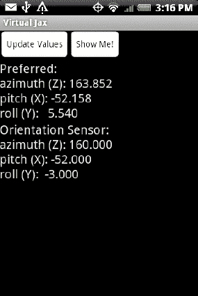

**图 26–5.** *两种方式呈现的方向信息*

在查看结果之前，让我们先解释一下这个应用程序的功能。在`onCreate()`方法中，我们执行了和之前类似的操作：获取文本视图的引用、`SensorManager`以及我们要使用的三个传感器：加速度计、指南针和方向传感器。同时我们还定义了一个变量来保存旋转值。稍后我们会讨论这个变量。

在`onResume()`中激活传感器，在`onPause()`中停用它们。

当收到传感器数值更新时，我们根据传感器类型进行分支处理，并将数值记录到局部变量中：`accelValues`、`compassValues`或`orientationValues`。注意，我们本可以克隆事件数组来保存数值的本地副本，但这意味着要不断实例化对象，这并不是我们期望的做法。创建新对象以及后续的垃圾回收成本可能会严重拖累性能，因此我们直接更新现有数组。

注意，在进入下一段代码之前，我们如何通过布尔值`ready`来确保`accelValues`和`compassValues`都有数据。接着我们看到`getRotationMatrix()`方法的调用，随后是`getOrientation()`方法调用。我们还调用了`getInclination()`方法。这里我们不会用到它，但需要知道它表示地磁波相对于地球表面的角度。越靠近地球两极，返回的角度值就越大。接下来，像之前一样，我们检查计数器，仅每第十次更新时刷新显示。这同样是为了避免过多的界面操作导致应用程序性能严重下降。


在我们的 `doUpdate()` 方法中（该方法也可通过 UI 中的按钮调用），我们进行了一些计算并显示结果。使用首选方法时，第一个值即方位角，其弧度值范围从负π到正π，对应 −180 度到 +180 度。方向传感器提供的值则从 0（北）到 360 度。为了使这些值可比较，我们从 `prefValues` 数组中取出第一个值，将其从弧度转换为度数，若结果为负则加上 360。这样就能与方向传感器的值进行比较了。此方法的其余部分只是在 UI 中显示传感器数值。

本示例应用中的最后一个方法是 `doShow()`。这是有趣的部分。在第 25 章中，我们展示了如何使用 Intent 调用街景应用。那一章我们跳过了关于设置偏航值以指示显示图像时面向方向的部分。现在我们就可以展示如何传入偏航值和俯仰值了。

对于纬度和经度，我们预先选择了佛罗里达州杰克逊维尔的一个地点。当然，您可以自由替换为您自己的值。对于偏航值，我们需要传入相对于北方的角度数（0-360），因此我们使用 `mAzimuth` 或 `orientationValues[0]` 的值，并转换为整数。对于俯仰值，理论上我们可以使用任意一个数组中的第二个值，并将其加上 90。然而，街景应用似乎不接受非 0 的俯仰值，至少在这个位置是这样。因此，我们目前选择将其设置为 0。如果您点击 `Show Me!` 按钮，将启动街景，显示的图像就像您正面向与当前相同的方向，但身处那个位置。如果您点击返回按钮，转动身体，再次点击 `Show Me!`，您将看到新视角下的图像。现在，让我们更仔细地看看传感器的实际数值。

首选方法与方向传感器之间的数值看起来相同或非常接近。方向传感器的数值显得更稳定，而且似乎是整数值。看起来不错，对吧？但别急着下结论。当您开始移动设备时，您会发现，如果您倾斜设备使其向上看，数值就会变得大不相同。现在将设备旋转至横屏模式，您可能会看到类似图 26–6 的效果。

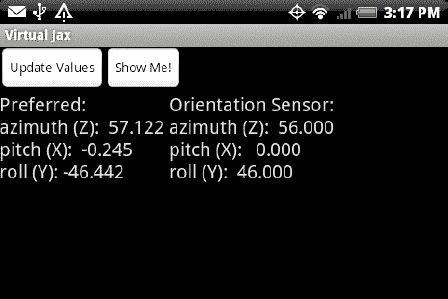

**图 26–6.** *横屏模式下两种方式的方向数据*

发生了什么？我们的翻滚值在首选方法和方向传感器之间是相反的。究其原因，是两者的参考坐标系不同。

我们还没有讨论过如果设备不是竖屏模式而是横屏模式会怎样。当设备以横屏模式正对我们时，加速度计仍然固定在设备中，因此向上方向不再是 *y* 轴，实际上是 *x* 轴。我们可以通过一些数学上的巧妙处理来让一切正常运作，但幸运的是，`SensorManager` 类提供了另一个方法来帮助我们。这次的方法叫做 `remapCoordinateSystem()`。它应在获取旋转矩阵之后、调用 `getOrientation()` 之前被调用。`remapCoordinateSystem()` 的基本功能是通过交换坐标轴来修改旋转矩阵。该方法的签名如下：

`public static boolean remapCoordinateSystem (float[] inR, int X, int Y, float[] outR)`

我们传入旋转矩阵，以及指示如何交换 *x* 和 *y* 轴的值，就能得到一个新的旋转矩阵（`outR`）以及一个布尔返回值，指示重映射是否成功。*x* 和 *y* 的值是来自 `SensorManager` 的常量，例如 `AXIS_Z` 或 `AXIS_MINUS_Y`。

我们已在网站提供的下载资源中包含了一个名为 `VirtualJaxWithRemap` 的新示例应用，您可以看到它的具体效果。

### 磁偏角与地磁场

关于方向与设备，我们还想讨论另一个主题。指南针传感器会告诉您磁北的方向，但不会告诉您真北（即地理北）的方向。想象一下，您站在磁北极与地理北极的中点。它们之间会相差 180 度。离两个北极越远，这个角度差就越小。磁北与真北之间的角度差称为磁偏角。这个值只能相对于地球表面的某个点来计算。也就是说，您必须知道您所在的位置，才能知道相对于磁北，地理北在哪个方向。幸运的是，Android 提供了一种方法帮助我们解决这个问题，即 `GeomagneticField` 类。

要实例化 `GeomagneticField` 类的对象，您需要传入纬度和经度。因此，为了获得磁偏角，我们需要知道参考点在哪里。您还需要知道需要该值的时间点，因为磁北会随时间漂移。一旦实例化，您只需调用以下方法即可获得磁偏角（以度为单位）：

`float declinationAngle = geoMagField.getDeclination();`

如果磁北位于地理北的东侧，则 `declinationAngle` 的值为正。

### 重力传感器

Android 2.3 引入了重力传感器。这并非独立的硬件，而是基于加速度计的虚拟传感器。事实上，该传感器使用了与我们之前描述的加速度计类似的逻辑，以提取作用于设备上的力的重力分量。然而，我们无法访问其内部逻辑，因此必须接受重力传感器类中使用的任何因子和逻辑。不过，这个虚拟传感器可能会利用其他硬件（如陀螺仪）来更精确地计算重力。该传感器的值数组报告重力值的方式与加速度计报告其值的方式相同。

### 线性加速度传感器

与重力传感器类似，线性加速度传感器是一个虚拟传感器，表示加速度计力减去重力后的值。同样，我们之前对加速度计传感器值进行了自己的计算，以剔除重力来获取这些线性加速度力值。该传感器为我们提供了更便捷的方式，并且它可能利用其他硬件（如陀螺仪）来更精确地计算线性加速度。其值数组报告线性加速度的方式与加速度计报告其值的方式相同。

### 旋转向量传感器

旋转向量传感器类似于已弃用的方向传感器，它表示设备在空间中的方向，其角度相对于硬件加速度计的参考坐标系（参见图 26–2）。截至撰写本文时，关于此传感器的信息尚不充分。请查看我们的网站（[`www.androidbook.com`](http://www.androidbook.com)）以获取此特定传感器的最新信息。


### 近场通信传感器

随着 Android 2.3 的推出，我们现在能够使用近场通信 (NFC) 与特殊标签进行交互。NFC 标签与射频识别 (RFID) 标签类似，不同之处在于 NFC 的作用范围小于四英寸。这意味着 Android 设备中的传感器必须非常靠近标签才能进行扫描。NFC 标签可以通过编程来输出文本信息、URI 和元数据，例如信息的语言。

请注意，NFC 并非新技术，在世界其他地区已使用多年。事实上，在多个国家，能够读取 NFC 标签的销售点终端非常普遍。当这些终端检测到 NFC 标签时，购物者可以使用与其 NFC 标签 ID 关联的账户完成金融交易。互联网上有很多演示视频，展示用户如何将携带 NFC 标签的物体靠近这些终端之一，以启动支付流程。谷歌曾提出一个愿景，即有一天能够用手机代替钱包。这确实是一个前景广阔的概念。Android 支持让设备扮演标签供其他读取器读取，也支持作为读取器来检测和扫描 NFC 标签。

实际上，NFC 有三种操作模式。第一种模式是读写非接触式标签。第二种模式是卡模拟模式。这允许 Android 设备自身扮演标签。这样做的一个明显好处是，你的设备可以扮演一种标签，然后只需按一下按钮就能变成另一个不同的标签。这就是 Android 设备取代钱包的方式。无论你拥有什么信用卡、公交卡或门票，你的 Android 设备都可以（当然是安全地）模拟这些物品，因此交易另一端的读取器会认为它正在与你的信用卡交互，而实际上它是在与你的 Android 设备交互。NFC 的第三种模式是点对点通信。在这种模式下，每一方都识别出自己在与另一台设备（而不仅仅是一个标签）进行通信。

随着 Android 2.3.3 的发布，你可以使用 Android 设备读取标签（类似于上面例子中销售点终端的功能），并且还可以写入可写的 NFC 标签。如果用户的设备设置正确，它可以使用谷歌定义的点对点协议，通过 NFC 将数据传输到另一台 NFC 设备。截至撰写本文时，尚不可用的功能是模拟一张卡，或者更准确地说，模拟一个 NFC 标签。这实际上非常困难，部分原因是 NFC 在硬件层面的实现方式差异很大。目前没有公布 SDK 何时可能支持 NFC 卡模拟，但我们预计它终有一天会实现。与此同时，可以在驱动层使用 Android 原生开发工具包 (NDK) 进行一定程度的卡模拟。但我们在此不会涉及这一部分。

除了使用 NFC 进行金融交易，NFC 标签还可以应用于许多其他场景。例如，博物馆可以在其藏品旁放置一个 NFC 标签，让参观者将手机靠近标签，以访问一个可提供该藏品多媒体信息的网页。公交车站可以展示一个 NFC 标签，让人们了解下一班公交车何时到达以及开往哪里。商家可以展示一个 NFC 标签，当有人走进时，可以方便地签到使用基于位置的服务。也许当你可以用手机解锁配备 NFC 的门时，酒店房间钥匙将变得多余。甚至商店货架上的产品也可以附带 NFC 标签，让购物者获取关于该产品的更多信息，例如营养信息，或者技术规格和宣传视频。

#### 启用 NFC 传感器

Android 中对 NFC 的支持与其他传感器类型不同。你不需要使用 `SensorManager`，而是使用 `NfcAdapter`。设备上通常只有一个适配器，它的工作是管理标签的读写，以及将标签分发给设备上的 Activity。适配器可以处于开启或关闭状态，设置中有启用或禁用 NFC 适配器的控件。NFC 适配器设置位于无线设置中。如果适配器处于开启状态，并且检测到 NFC 标签，则会执行一个较为复杂的流程，以确定哪个 Activity（如果有的话）应该接收一个意图，告知该 Activity 检测到的 NFC 标签。一切都取决于 NFC 标签中包含的数据类型，以及设备上已安装应用程序的意图过滤器。此外，还有一个需要考虑的信息点，即设备上当前位于前台的 Activity 是否已明确表示希望接收 NFC 标签。我们很快将对此进行更详细的探讨。

要访问适配器，首先使用 `getSystemService()` 获取一个 `NfcManager` 实例。然后在该实例上调用 `getDefaultAdapter()` 方法，如下所示：

```java
NfcManager manager = (NfcManager)
    context.getSystemService(Context.NFC_SERVICE);
NfcAdapter adapter = manager.getDefaultAdapter();
```

这会返回作为单例对象的 `NfcAdapter`。要确定 `NfcAdapter` 当前是否已启用，请使用 `isEnabled()` 方法，该方法返回一个布尔值，告知你 NFC 适配器在设置中是否已启用。目前没有文档介绍如何以编程方式打开（或关闭）NFC 适配器。如果 NFC 适配器处于关闭状态，而你希望将其打开，则需要通知用户，请他们在设置中启用 NFC 适配器。要从应用程序中为用户启动相应的设置屏幕，可以使用如下代码：

```java
startActivityForResult(new Intent(
    android.provider.Settings.ACTION_WIRELESS_SETTINGS), 0);
```

当此代码运行时，将显示相应的设置屏幕，用户可以选择启用或不启用 NFC。当用户完成无线设置屏幕的操作后，你的 Activity 的 `onActivityResult()` 回调将被调用。请记住，即使你要求用户启用 NFC，他们也可能会选择*不*启用。如果 NFC 适配器保持禁用状态，你的应用程序应采取适当的措施。


#### 路由 NFC 标签

现在似乎是讨论不同类型 NFC 标签和技术的好时机。NFC 并非单一标准。实际上，用户可能会遇到几种不同类型的 NFC 标签。这些标签类型之间存在差异，这意味着 Android 必须使用与每种标签类型相关的不同类来支持它们。如果你查看 `android.nfc.tech` 包，你会发现几种不同的标签技术类，从 `MifareClassic` 到 `NfcV` 再到 `ISO-DEP`。每种标签类型的内部结构可能不同，并且访问和操作这些标签类型中的数据的方法也不同。幸运的是，Android 提供了一个 `Tag` 类来帮助管理 NFC 通信，每种特定类型的标签都可以从 `Tag` 对象创建。一旦你有了特定 NFC 标签的实例，你就可以对它执行该标签类型特有的操作。这也意味着，要选择将标签发送到哪个 Activity，必须考虑几个因素。我们首先描述 NFC 标签 Intent 是如何创建的，然后你将理解如何创建合适的 Intent 过滤器。

当发送带有标签数据的 Intent 时，`Tag` 对象总是以 `EXTRA_TAG` 为键被打包到 Intent 的 extras 包中。如果标签包含 NDEF 数据，则会以 `EXTRA_NDEF_MESSAGES` 为键设置另一个 extras 值。最后，Intent 可能包含一个以 `EXTRA_ID` 为键的标签 ID 的 extras 值。这最后两个 extras 值是可选的，取决于标签上是否存在该数据。所有 NFC Intent 都通过 `startActivity()` 发送。请注意，你实际上不需要访问 NFC 适配器来接收 NFC 消息。只要它们与你的 Intent 过滤器匹配，Intent 消息就会像来自其他来源的 Intent 一样进入你的应用程序。

**注意：** 重要的是要明白，支持 NFC 的 Android 设备中存在一个 NFC 生态系统。创建这些 NFC Intent 的逻辑使用了 Android SDK 中未公开的功能。这意味着你自己很难创建一个虚假的发送 Activity。我们将要解释的是 NFC 生态系统中发生的事情，这不是你可以自己编写代码来实现的。这也意味着，如果你真的想测试一个 NFC 应用程序，你将需要使用一台真实的设备和真实的 NFC 标签。除非 Google 某天在模拟器或 DDMS 中提供一些支持，或者两者都支持。

标签 Intent 的动作值取决于检测到的标签所发现的信息。Intent 有三个可能的动作值：

1.  `ACTION_NDEF_DISCOVERED` 是当标签中发现 NDEF 载荷时的动作。如果是这种情况，Android 会查找第一个 `NdefMessage` 中是否存在 `NdefRecord`。如果该 `NdefRecord` 是一个 URI 或 SmartPoster 记录，Intent 的数据字段将获得该 URI。如果找到 MIME 记录，Intent 的 type 字段将被设置为标签的 MIME 类型。然后，Android 使用该 Intent 和 Intent 匹配算法寻找合适的 Activity 来启动。如果找不到任何 Activity，则放弃此 Intent，Android 尝试创建下一种类型的 NFC Intent。
2.  `ACTION_TECH_DISCOVERED` 是当未检测到 NDEF，或者找不到 NDEF Activity，但存在标签技术时的动作。在这种情况下，Android 向 Intent 添加元数据，指明检测到了哪些标签技术。一个 NFC 标签可以实现多种技术，尤其是因为 `Ndef` 更像是一种虚拟技术。Android 寻找一个能够匹配此 Intent 的 Activity，如果找到就发送给它。如果没有找到，Android 就会丢弃此 Intent，并尝试第三种类型的 NFC Intent。
3.  `ACTION_TAG_DISCOVERED` 是 NFC 标签的最终动作选择。这是当所有其他动作都无法匹配到 Activity 时的动作。这个 Intent 同样不携带数据或 MIME 类型。如果这个 Intent 与设备上的任何 Activity 都不匹配，那么 NFC 生态系统就会放弃，标签信息也会被丢弃。

#### 接收 NFC 标签

无论你决定在代码中还是在 `AndroidManifest.xml` 文件中创建 Intent 过滤器，你都需要知道你在寻找什么，并仔细准备你的 Intent 过滤器。例如，如果你的过滤条件指定得过于严格，你将无法收到标签通知。如果指定得过于宽泛，你会被调用去处理那些你并不想处理的标签。如果你的应用程序收到了一个你不想处理的 NFC 标签，这意味着设备上可能存在另一个可以处理它的应用程序，却没有收到它。如果 Intent 匹配逻辑找到了多个应用程序并询问用户运行哪一个，而用户选择了你的应用，就可能发生这种情况。这是你在为 NFC 标签定义 Intent 过滤器时需要小心的另一个原因；如果提示用户选择运行哪个应用程序，他们很可能需要将设备从 NFC 标签移开才能做出选择，此时标签就不在范围内了。如果你能选择标签上将包含哪些数据，你可以使这些数据非常符合你的需求，例如使用自定义 URI 方案或自定义 MIME 类型。

你选择哪种 Intent 过滤器取决于放置在 NFC 标签 Intent 中的动作（见上文）。列表 26-8 展示了一个 NDEF 标签的 Intent 过滤器示例，该过滤器将放入你的 `AndroidManifest.xml` 文件中。

**列表 26-8.** 具有 MIME 类型的 NDEF 标签的 Intent 过滤器

```
<intent-filter>
  <action android:name="android.nfc.action.NDEF_DISCOVERED"/>
  <data android:mimeType="type/subtype" />
</intent-filter>
```

当然，你需要将 "type/subtype" 替换为你正在寻找的特定 MIME 类型，或者如果你接受任何类型或子类型，则可以使用通配符。例如，你可以将 `mimeType` 设置为 "text/*" 来匹配所有文本类型。但是，对于 NDEF 标签，你不需要指定 MIME 类型。如果标签包含的是 URI 而不是 MIME 类型，你将需要使用如 列表 26-9 所示的 Intent 过滤器。

**列表 26-9.** 具有 URI 的 NDEF 标签的 Intent 过滤器

```
<intent-filter>
  <action android:name="android.nfc.action.NDEF_DISCOVERED"/>
  <data android:scheme="geo" />
</intent-filter>
```

在这个例子中，我们使用了 `geo` 方案，这样如果检测到带有 `geo:` URI 的标签，我们的 Activity 就会被启动。你可以使用 `<data>` 标签的任何其他属性来指定你的 Activity 正在寻找的 NFC 数据。

如果你的 Activity 正在寻找具有特定技术的 NFC 标签，你将使用如 列表 26-10 所示的 Intent 过滤器。也有可能检测到了一个带有 NDEF 的标签，但没有找到 Activity 来处理 `NDEF_DISCOVERED` Intent。只要它与你的 Intent 过滤器匹配，这也可能导致你的 Activity 接收到该 Intent。换句话说，如果一个 `NDEF_DISCOVERED` 标签 Intent 无法传递给正在寻找 NDEF 标签的 Activity，那么一个正在寻找特定技术的 Activity 最终可能会收到该标签的技术 Intent。

**列表 26-10.** 具有技术的 NFC 标签的 Intent 过滤器

```
<intent-filter>
  <action android:name="android.nfc.action.TECH_DISCOVERED"/>
</intent-filter>
<meta-data android:name="android.nfc.action.TECH_DISCOVERED"
                android:resource="@xml/nfc_tech_filter" />
```

请注意，我们现在有一个不同的动作来匹配技术，并且我们使用了 `<meta-data>` 标签而不是 `<data>` 标签，而且它位于 `<intent-filter>` 标签之外。`<meta-data>` 标签的属性也不同，它指向另一个我们必须在应用程序项目的 `/res/xml` 目录下创建的文件。列表 26-11 显示了一个示例 `nfc_tech_filter.xml` 文件。

**列表 26-11.** 示例 NFC 技术过滤器 XML 文件

```
<resources >
    <tech-list>
        <tech>android.nfc.tech.NfcA</tech>
        <tech>android.nfc.tech.MifareUltralight</tech>
    </tech-list>
</resources>
```


```plaintext
<resources >
    <tech-list>
        <tech>android.nfc.tech.NfcB</tech>
        <tech>android.nfc.tech.Ndef</tech>
    </tech-list>
</resources>
```

此过滤器文件指定了我们的活动希望看到的两种标签类型。`NFC` 标签通常会列出其支持的技术列表。如果列表 26–11 中的任何一个 `tech-list` 是标签技术列表的子集，则匹配成功，我们的活动将收到该 `NFC` 标签意图。

在列表 26–11 中，第一种标签包含 `NfcA` 和 `MifareUltralight` 技术，第二种标签包含 `NfcB` 和 `Ndef` 技术。我们可以向该文件添加额外的 `<resources>`，以指定活动希望看到的其他标签。可放入该文件的技术列表是 `android.nfc.tech` 包中可用的标签类名称，但只应包含你希望活动接收的技术。`<tech-list>` 的子标签指定了标签为匹配意图必须报告的所有技术。特定 `tech-list` 中的所有技术必须存在于标签枚举的技术列表中。因此，意图过滤器中的 `tech-list` 可以比标签指定的技术少，但不能更多，否则无法匹配。对于上面列表 26–11 中的示例，如果标签仅提供 `Ndef` 技术，则它不会匹配任何规范，你的活动也不会收到意图。因为意图过滤器中的 `tech-list` 都不是标签列表的子集。如果标签包含 `NfcA`、`NfcB` 和 `Ndef` 技术，它将匹配第二个规范，你的活动将收到意图。第二个 `tech-list` 是标签技术列表的子集。即使标签枚举的技术比意图过滤器 `tech-list` 中的多一个，我们也能匹配成功。

你可能使用的最后一个意图过滤器如列表 26–12 所示，它代表全能捕获的意图过滤器。也就是说，如果收到了一个标签，但找不到处理该意图的 `NDEF` 或技术活动，或者该标签是未知类型，则会创建一个带有 `ACTION_TAG_DISCOVERED` 动作的意图。

**列表 26–12.** *用于未知或未处理 NFC 标签的意图过滤器*

```plaintext
<intent-filter>
  <action android:name="android.nfc.action.TAG_DISCOVERED"/>
</intent-filter>
```

请注意，此意图过滤器没有 `<data>` 和 `<meta-data>` 标签，因为具有 `ACTION_TAG_DISCOVERED` 动作的意图中不会有任何数据。这通常意味着我们必须有一个 `<category>` 标签。但 `NFC` 标签意图并非如此。`NFC` 标签意图是特殊的，因此 `NFC` 标签意图匹配的意图过滤器不需要 `<category>` 标签。回到标签匹配流程，当我们收到 `ACTION_TAG_DISCOVERED` 意图时，表明 `Android` 几乎已经放弃为检测到的 `NFC` 标签寻找活动。此时，任何将处理 `ACTION_TAG_DISCOVERED` 动作的活动都会收到这些标签意图。在大多数正常操作中，你永远不会看到 `ACTION_TAG_DISCOVERED` 标签意图，因为你遇到的所有 `NFC` 标签几乎都会匹配 `NDEF` 或 `TECH`。

你的活动还可以通过另一种方式接收 `NFC` 标签意图，即使用前台调度系统。如果你的活动在前台（即 `onResume()` 正在触发或已触发，并且用户可以与你的活动交互），你可以创建一个待定意图、一个意图过滤器数组、一个技术列表数组，然后进行如下调用：

```java
mAdapter.enableForegroundDispatch(this, pendingIntent,
                      intentFiltersArray, techListsArray);
```

其中 `mAdapter` 是 `NFC` 适配器，`this` 是对你的活动的引用。通过此调用，你可以有效将你的活动置于所有其他活动之前，如果该活动的任何意图过滤器匹配检测到的标签，你的活动将处理该标签。如果你的活动因与调用设置不匹配而未收到 `NFC` 标签意图，则系统将按前述逻辑尝试其他活动处理该意图。你必须在 `UI` 线程中调用此方法，最佳调用位置是活动的 `onResume()` 方法。你还需要从活动的 `onPause()` 回调中调用：

```java
mAdapter.disableForegroundDispatch(this);
```

这样你的活动就不会收到无法处理的意图。当你的活动通过此方式收到意图时，将使用 `onNewIntent()` 回调将其接收。

待定意图是标准意图。`intentFiltersArray` 是你期望的 `IntentFilter` 对象集合，每个对象指定适当的动作以及所需的数据或 `MIME` 类型。例如，列表 26–13 展示了一段为 `Ndef` 创建意图过滤器并将其添加到数组的代码。

**列表 26–13.** *用于 Ndef 的意图过滤器代码*

```java
IntentFilter ndef = new IntentFilter(NfcAdapter.ACTION_NDEF_DISCOVERED);
try {
    ndef.addDataType("text/*");    
}
catch (MalformedMimeTypeException e) {
    throw new RuntimeException("fail", e);
}
intentFiltersArray = new IntentFilter[] {
        ndef,
};
```

请记住，意图过滤器数组可以包含多个 `IntentFilter` 实例，每个实例可设置相同或不同的动作，并且可以包含或不包含数据和/或类型字段值。

`techListsArray` 是一个数组的数组，其中每个内部数组是标签可能枚举的类名称列表，你可以设置多个类名称列表用于匹配。列表 26–14 展示了一个示例，该示例等同于列表 26–11 中显示的技术列表资源文件。

**列表 26–14.** *技术列表数组的代码*

```java
techListsArray = new String[][] {
    new String[] { NfcA.class.getName(),
                   MifareUltralight.class.getName() },
    new String[] { NfcB.class.getName(),
                   Ndef.class.getName() }
    };
```

当所有设置完成后，如果此活动确实收到了 `NFC` 标签意图，则 `onNewIntent()` 回调将被触发以接收它。从那里，你可以访问 `extras` 包来读取标签，我们将在接下来的内容中介绍。这是一个动态声明 `NFC` 标签意图的大量设置，但从另一方面看，如果你只希望此活动在用户已启动它的情况下接收标签，这是实现的方法。请注意，同时使用此方法并在清单中设置意图过滤器来接收 `NFC` 标签意图通常没有意义，但在技术上这是可行的。


### 读取 NFC 标签

如前所述，读取 NFC 标签有些复杂。或者更准确地说，标签数据被传递到应用程序的过程可能很复杂。在最基本的层面上，当检测到 NFC 标签时，系统会确定一个活动（Activity）来接收该标签，然后将其发送过去。与本章前面介绍的传感器不同，对 NFC 标签感兴趣的活动在标签被检测时可能并未运行，并且肯定不会通过传感器监听器接收标签信息。被通知的活动将收到一个意图（Intent），这可能意味着需要启动该活动来处理 NFC 标签的意图。

在设计接收并处理 NFC 标签信息的应用程序时，您首先需要考虑的一点是：您正在通过硬件接口与设备环境中的物理标签打交道。NFC API 包含阻塞调用，这意味着它们可能不会像您期望的那样快速返回，这也就意味着您需要在与主 UI 线程不同的单独线程上运行标签方法。

NFC 标签数据将位于接收到的意图的 extras 包中。收到意图后，您可以使用类似以下的方式访问 NFC 数据：

```java
Tag tag = intent.getParcelableExtra(NfcAdapter.EXTRA_TAG);
String[] techlists = tag.getTechLists();
```

如果您的意图过滤器非常精确，那么您已经知道标签的类型。但如果可能存在多种标签技术，您现在可以查询 `techlists` 以了解该标签包含了哪些技术。每个字符串都是检测到的标签所枚举的标签技术的类名。

如果您发现此标签支持 `android.nfc.tech.Ndef`，您可以执行以下操作来更直接地获取 NDEF 数据：

```java
NdefMessage[] ndefMsgs = intent.getParcelableArrayExtra(NfcAdapter.EXTRA_NDEF_MESSAGES);
```

理论上，如果意图中没有 NDEF 消息，您可能会得到一个空值。否则，您现在应该能够解析发送给您的 NDEF 消息。您可以从意图中读取 `NdefMessages`，对其进行计数，并为每条消息检索其中包含的 `NdefRecords`。

`NdefRecords` 正是事情变得有趣的地方。强烈建议您参考位于此处的 NFC 规范：`http://www.nfc-forum.org/specs/`。要访问这些规范，您需要接受 NFC 论坛的许可协议。该协议是免费的，但您需要提供您的姓名、地址、电话号码和电子邮件地址。另一种选择是查看 Google 提供的 `NfcDemo` 应用程序。该示例包含在 Android 2.3.3 SDK 包的 `samples` 文件夹下。您也可以在此处查看该应用的源代码：`http://developer.android.com/resources/samples/NFCDemo/index.html`。这个示例应用程序接收 NFC 意图，并在一个 `ListView` 中显示 `NdefRecords` 的内容。之所以变得复杂，是因为每条 `NdefMessage` 中可能接收多种类型的 `NdefRecords`。每种类型都有不同的用途。例如，Text 类型包含指定语言中的文本。Uri 类型包含一个 URI。在已知的 NDEF 记录类型中，`NfcDemo` 示例应用程序只使用了三种，即刚才描述的两种以及 SmartPoster，我们稍后将对其进行描述。

`NdefRecord` 的格式包括一个 3 位的类型名称格式（`TNF`）字段、一个可变长度的类型字段、一个可变长度的 ID 字段以及一个可变长度的负载字段。是的，有两个类型字段。`TNF` 字段是该记录的顶级类型，并告诉您该记录的其余部分是什么。例如，它可能是一个绝对 URI 记录（`TNF_ABSOLUTE_URI`），或者一个官方的 RTD 记录（`TNF_WELL_KNOWN`）。下一个类型字段根据 `TNF` 的值，更具体地说明该记录是什么。如果 `TNF` 值是 `TNF_WELL_KNOWN`，那么下一个类型字段将是 `NdefRecord` 类的 `RTD_*` 常量之一，例如 `RTD_SMART_POSTER`。如果 `TNF` 值是 `TNF_ABSOLUTE_URI`，那么下一个类型字段将遵循 RFC 3986 定义的绝对 URI 的 BNF 结构。

**注意：** `TNF_UNCHANGED` 记录类型用于当消息负载因其大小而跨越多个 `NdefRecords` 时。Google 已经为您处理了分块的 `NdefRecords`，因此您永远不应该看到 `TNF_UNCHANGED` 的类型值。`android.nfc` 包会将负载的各个部分组合成一个大的、单一的 `NdefRecord`。

`NdefRecord` 中的下一个字段是该 `NdefRecord` 的标识符。您正在读取的 `NdefRecord` 可能有也可能没有标识符。

最后是负载。这可能是一个相当大的字节数组，但其内部有一定的结构，您必须了解，这取决于它是哪种类型的 `NdefRecord`。对于 RTD URI 记录类型，负载字节数组的第一个字节代表 URI 的开始部分。例如，字节值 `1` 代表 `http://www.`，并且这将紧接着负载中剩余的 URI 部分。对于 Text 记录类型，负载字节数组的第一个字节代表“状态字节编码”值，该值标识文本编码值（UTF-8 或 UTF-16），以及紧接在该状态字段之后的语言字节数组的长度。语言字段之后是文本内容。对于 SmartPoster，情况变得更加复杂，`NdefRecord` 包含一个 `NdefMessage`，而 `NdefMessage` 又包含更多的 `NdefRecords`。底层的 `NdefRecords` 可以包括标题记录（就像 Text 记录）、URI 记录（和之前一样）、推荐操作记录、大小记录、图标记录和类型记录。推荐操作值指示您的应用程序可能想要对 SmartPoster 数据做什么。请注意，这些值并未作为 Android 的 `NdefRecord` 类文档的一部分提供。它们是：

```
    -1    未知
    0    执行操作
    1    保存供以后使用
    2    打开进行编辑
```

如何处理它们取决于您，尽管显然您可能希望尝试执行针对正在读取的标签的推荐操作。例如，如果 `TNF` 是 `TNF_WELL_KNOWN`，类型是 `RTD_SMART_POSTER`，并且推荐操作是 `0`（`执行操作`）结合一个网页 URL，您可能希望用该 URL 启动浏览器。大小记录允许标签说明该 URL 另一端的内容有多大。如果标签指向一个可下载的可执行文件，大小记录可以说明下载文件的大小。图标记录包含一个图标图像，设备可以使用它来显示一个带有标题和 URI 的图像。

类型记录是另一个类型值，不同于 `TNF` 和 `NdefRecord` 的类型。类型记录用于 SmartPoster 标签，在这种情况下，该类型表示 URI 另一端内容的 MIME 类型。设备可以决定它不支持该对象类型，从而一开始就避免下载它。

SmartPoster 标签唯一强制性的子记录是 URI 记录，并且每个 SmartPoster 只能有一个。可以有多个标题记录，只要每个记录对应不同的语言。也可以有多个图标记录，只要每个记录的格式具有不同的 MIME 类型。


对于所有类型的 NFC 标签，包括 NDEF 标签，你可以使用类似下面的代码来获取该特定标签类型的实例：

```
NfcA nfca = NfcA.get(tag);
```

通过这个新对象，我们可以访问适用于该标签类型的特定方法。对于 `Ndef` 和 `NdefFormatable` 标签，`NdefMessage` 和 `NdefRecord` 类在处理标签数据时非常有用。其他标签类也都有相应的方法来协助处理这些标签及其数据。有用于读取和写入标签数据的方法。请注意，写入标签与设备进行卡模拟是不同的。写入标签意味着设备距离某个其他标签足够近，以便能够向其写入数据（当然，需要具有适当的权限）。卡模拟则不同。

### NFC 卡模拟

卡模拟是指设备在其他 NFC 读取器看来就像是一个 NFC 标签。这意味着我们的本地设备在硬件中有一个位置来存储一些数据，如果某个 NFC 读取器进入我们设备的范围并发起数据请求，我们的设备就会将该数据发送给读取器。在撰写本文时，此功能尚不可用，不过我们预计它最终会推出。如果你确实想进行卡模拟，请查看网络上描述如何在设备最低层级（即原生开发工具包，NDK 层级）进行此操作的资源。

### NFC 点对点 (P2P)

Android SDK 对通过 NFC 在两个设备之间进行点对点 (P2P) 通信提供了一些有限支持。

此功能有一些注意事项，即 P2P 仅在你的应用程序运行并处于前台时才能工作，此外，你的应用程序必须使用 NDEF 格式。未来 P2P 可能会支持其他标签技术，但目前仅限于 NDEF。这也意味着，你的手机必须处于开机状态并运行你的应用程序，才能与其他设备进行 NFC 通信。

要实现 P2P 功能，你将使用 `NfcAdapter` 中名为 `enableForegroundNdefPush()` 的方法。此方法接受两个参数：活动（Activity）和当 NFC 设备请求我们的数据时要发送的 `NdefMessage`。与前面描述的前台调度系统类似，此方法应在 `onResume()` 中调用，并在 `onPause()` 中禁用。你的 `NdefMessage` 可以是任何你希望的内容，但当读取器尝试获取我们的数据时，你的活动应处于前台。谷歌表示，为了让其他设备能够接收到我们的信息，它必须实现 `com.android.npp` NDEF 推送协议，但在撰写本文时，还没有关于此协议的信息。请关注我们的网站以获取更新。

前面我们介绍了 `uses-feature` 标签和传感器的使用，这样你可以确保设备拥有适当的传感器才能看到你的应用。NFC 传感器也不例外。你应该在 `AndroidManifest.xml` 中使用以下内容，以确保你应用的设备具有必要的 NFC 硬件：

```
<uses-feature android:name="android.hardware.nfc" />
```

你还应确保 `AndroidManifest.xml` 文件包含适当的权限，以允许你的应用程序访问 NFC 硬件：

```
<uses-permission android:name="android.permission.NFC" />
```

### 使用 NFCDemo 测试 NFC

我们已经介绍了 Android 的大部分 NFC API，但现在的问题是，你如何测试你的应用程序？对于 NFC 标签，也许你可以找一些已经内置了 NFC 标签的物品。在那些已经使用 NFC 一段时间的国家，这可能并不太难。在美国，这可能会困难得多。你可以购买自己的 NFC 标签；全球有数家供应商销售标签以及开发者套件，这样你就可以将想要的内容写入标签。不幸的是，DDMS 目前还不支持向模拟器发送标签发现意图。Android SDK 中提供的 `NfcDemo` 示例应用程序最初是在 Android 2.3 中发布的，当时意图只有 `ACTION_TAG_DISCOVERED`。Android 在 2.3.3 版本中进步了很多，但遗憾的是 `NfcDemo` 未能跟上。其中包含一些关于 NFC 标签布局以及 NDEF 标签的字节含义的有用信息。希望它能尽快得到更新，并能与真实标签以及新的 NFC 生态系统配合使用。

如果你决定加载 `NfcDemo` 示例应用程序，你将需要向项目添加一个外部库。该库的下载文件位于：[`http://code.google.com/p/guava-libraries/`](http://code.google.com/p/guava-libraries/)。打开 zip 文件后，你会找到 jar 文件。将 guava jar 文件（不含 gwt 的那个）保存到你的工作站。你需要通过右键单击项目，选择"构建路径"，然后选择"配置构建路径"和"库"选项卡，来从 Eclipse 项目中引用该 guava jar 文件。接下来，单击"添加外部 JAR"，导航到 guava jar 文件，选择它并单击"打开"。现在，通过右键单击项目并选择"构建项目"来重新构建 `NfcDemo` 项目。

### 总结

在本章中，我们介绍了 Android 中主要的传感器框架以及近场通信功能。我们展示了你的应用程序如何读取传感器值并对其做出响应。这应该有助于你开发一些能够响应真实世界的非常酷的应用程序。

## 第 27 章：探索联系人 API

在第 4 章（内容提供者）中，我们列举了通过内容提供者抽象公开数据的好处，并展示了这种抽象数据以一系列 URL 的形式公开，这些 URL 可用于读取、查询、更新、插入和删除。这些 URL 及其对应的游标构成了该内容提供者的 API。

联系人 API 就是这样一种用于处理联系人数据的内容提供者 API。Android 中的联系人维护在一个数据库中，并通过一个内容提供者公开，该内容提供者的权限根植于

`content://com.android.contacts`

Android SDK 使用一组以 Java 包

`android.provider.ContactsContract`

为根目录的 Java 接口和类，记录了该联系人内容提供者提供的各种契约。

你会看到许多父上下文为 `ContactsContract` 的类，它们在从内容数据库中查询、读取、更新和插入联系人时非常有用。使用联系人 API 的主要文档可在 Android 网站上的以下位置找到：

`http://developer.android.com/resources/articles/contacts.html`

主要的 API 入口点 `ContactsContract` 被恰当地命名，因为该类定义了联系人客户端与联系人数据库提供者和保护者之间的契约。

本章将相当详细地探讨这个契约，但不会涵盖所有细微之处。联系人 API 很庞大，其触角延伸得很广。然而，当你接触联系人 API 时，可能需要几周的研究才能意识到其底层结构其实很简单。这正是我们最想贡献的，在阅读本章所需的时间内解释这些基础知识。


### 理解账户

Android 中的所有联系人都在账户的上下文中工作。什么是账户？例如，如果你通过 Google 使用电子邮件，你就拥有了一个 Google 账户。如果你将自己设置为 Facebook 的用户，你就拥有了一个 Facebook 账户。

即使你只使用 Google 的电子邮件服务，相同的登录名和密码也可用于访问其他 Google 服务，这意味着你在 Google 的电子邮件账户并不仅限于电子邮件。然而，有些账户仅限于单一类型的服务，例如 POP（邮局协议）电子邮件账户。在你的移动设备上，你可能能够注册各种基于账户的服务。

你将能够通过设备上的“账户与同步”设置选项来设置其中一些账户，例如 Google、Facebook 或企业 Microsoft Exchange 账户。请参阅 *Android 用户指南* 以获取有关账户的更多详细信息。我们在本章末尾的“参考资料”部分中包含了 *Android 用户指南* 的网址。

#### 账户屏幕快速浏览

为了巩固账户的性质，让我们向你展示模拟器中的几个与账户相关的屏幕。首先，图 27–1 显示了账户设置选项屏幕。

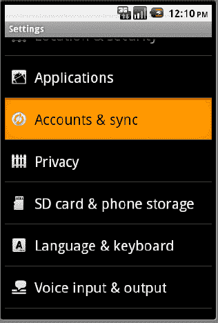

**图 27–1.** *调用“账户与同步”应用程序设置*

当你选择“账户与同步”菜单项时，你将看到 图 27–2 中所示的“账户与同步设置”屏幕。此屏幕显示了一些基于账户的选项以及可用账户的列表。

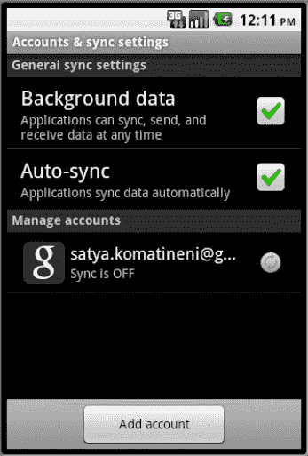

**图 27–2.** *账户与同步设置*

在 图 27–2 中，我们主要对可用账户列表感兴趣。为了练习添加新账户，请点击“添加账户”按钮，你将看到 图 27–3 中的屏幕，其中列出了可以设置或添加的可能账户。

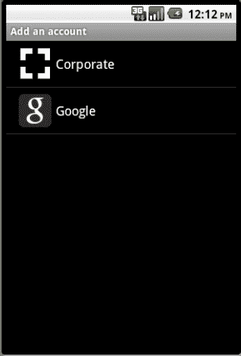

**图 27–3.** *可以设置的账户列表*

此可添加的账户列表将根据设备类型和可用内容而变化。图 27–3 中的列表显示了当 Android 2.3 模拟器以 Google API 9 为目标进行设置时可用的内容。如果你只下载了核心 SDK，则在此模拟器中看不到选择 Google API 作为目标的选项，因此你在 图 27–3 中不会看到设置 Google 账户的选项。这也意味着，此可用账户的图片可能随每个 Android 版本、设备制造商以及运营商或服务提供商而改变。

此外，每个账户需要设置的字段也因账户提供商而异。例如，如果你在我们的模拟器示例中点击添加 Google 账户，你将看到创建或登录 Google 账户的选项（参见 图 27–4）。

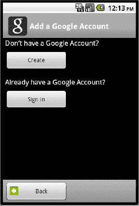

**图 27–4.** *添加 Google 账户*

如果你点击“创建”按钮，将出现创建 Google 账户所需的字段，如 图 27–5 所示。

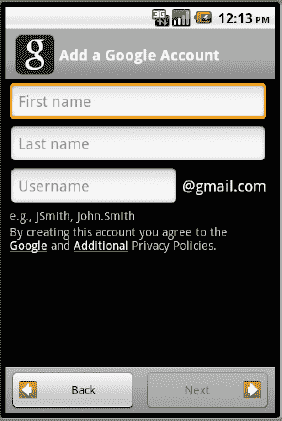

**图 27–5.** *创建 Google 账户*

图 27–5 说明了在你还没有 Google 账户时，设置一个账户所需的字段。如前所述，这些字段显然会根据账户类型的不同而变化。例如，我们将向你展示你已有 Google 账户时的账户设置。在这种情况下，账户设置仅涉及登录账户，如 图 27–6 所示。


**图 27–6.** *登录现有的 Google 账户*

现在我们已经演示了账户的基本概念以及它如何出现在设备上，下一节将介绍账户如何与联系人相关联。

#### 账户与联系人的关联

你管理的联系人绑定到特定的账户。换句话说，你在设备上注册的每个账户都可以保存特定于该账户的若干联系人。一个账户拥有其自己的联系人集合——或者说，一个账户是联系人的父级。此外，一个账户可以有零个或多个联系人。

一个账户由两个字符串标识：账户名称和账户类型。对于 Google 来说，你的账户名称是你的 Gmail 电子邮件用户名，你的账户类型是 `com.google`。显然，账户类型在设备上必须是唯一的。你的账户名称在该账户类型内是唯一的。账户类型和账户名称共同构成一个账户，并且只有在账户形成后，才能使用它来插入联系人集合。

#### 枚举账户

联系人 API 主要处理存在于各种账户中的联系人。创建账户的机制不在联系人 API 的范围内，因此解释如何编写自己的账户提供商以及如何同步这些账户中的联系人超出了本章的范围。对于本章来说，账户是如何设置的并不是很重要。然而，当你想要添加一个联系人或联系人列表时，你确实需要知道设备上存在哪些账户。你可以使用列表 27–1 中的代码来枚举账户及其必要的属性（账户名称和类型）。列表 27–1 中的代码在给定上下文变量时列出了账户名称和类型。

**列表 27–1.** *显示账户列表的代码*

```
public void listAccounts(Context ctx)
{
    AccountManager am = AccountManager.get(ctx);
    Account[] accounts = am.getAccounts();
    for(Account ac: accounts)
    {
        String acname=ac.name;
        String actype = ac.type;
        Log.d("accountInfo", acname + ":" + actype);
    }
}
```

当然，要运行列表 27–1 中的代码，清单文件需要使用列表 27–2 中的行请求权限。

**列表 27–2.** *读取账户的权限*

```
<uses-permission android:name="android.permission.GET_ACCOUNTS"/>
```

来自列表 27–1 的代码将打印如下内容：

* * *

`Your-email-at-gmail:com.google`

* * *

这假设你只配置了一个账户（Google）。如果你有多个账户，所有这些账户都将以类似的方式列出。

在深入探讨联系人详细信息之前，让我们考虑一下最终用户如何使用 Android 平台自带的联系人应用程序来创建联系人。

### 理解联系人应用程序

如果你的设备制造商（如摩托罗拉）或运营商（如 Verizon）没有提供自己的联系人应用程序，Android 平台自带一个默认的联系人应用程序。你可以轻松地在设备上的应用程序列表中找到此应用程序，并查看其在 *Android 用户指南* 中的文档。

#### 显示联系人

当你选择联系人应用程序时，看到的第一个屏幕是联系人列表（参见图 27–7）。一个联系人本质上是你认识的、存在于某个账户（如你的 Gmail 账户）上下文中的一个人。如果你有多个账户，图 27–7 中的屏幕将列出所有账户中的所有联系人。通过查看此屏幕，你将不知道哪个联系人来自哪个账户。除非明确禁止，Android 会尽量不重复两个不同账户之间看起来相似的联系人。我们将在下一主要部分介绍这种“看起来相似”的启发式方法。

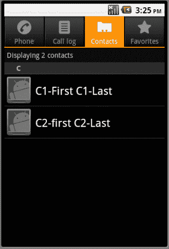

**图 27–7.** *显示聚合的联系人*

图 27–7 假设你有几个可用的联系人，并且列出的联系人按字母顺序分组。


#### 显示联系人详情

如果您单击图 27–7 中的某个联系人，联系人应用将显示该联系人的详细信息，如图 27–8 所示。

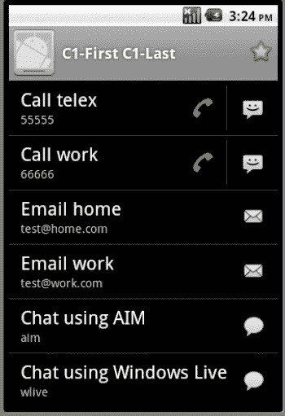

**图 27–8.** *联系人的详细信息*

图 27–8 展示了一个联系人可以携带的各类信息集。该图还显示了联系人应用可根据每行信息为每个联系人直接提供的操作数量。对于某些行，联系人应用启用了通话和短信功能，而对于其他行，则提供了电子邮件或聊天功能。

#### 编辑联系人详情

现在，让我们看看如何编辑（或新建）一个像图 27–8 中的联系人。您可以通过单击菜单并选择“编辑”或“新建联系人”来执行此操作。这将调出图 27–9 所示的屏幕。

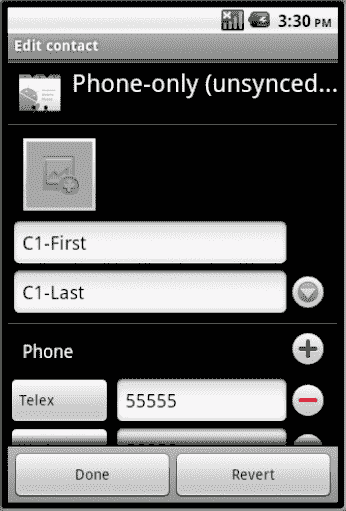

**图 27–9.** *编辑联系人*

在图 27–9 的“编辑联系人”屏幕顶部，您可以看到正在编辑或创建此联系人的账户。对于此联系人，该账户显示为仅限手机，这意味着手机上没有可用的服务器端账户（如 Google），只有一个本地默认账户。实际上，在联系人数据库中，账户名称和类型均为空值。

Google 强烈建议您在激活 Android 设备（无论是手机还是平板电脑）之前，至少创建一个 Google 账户。

然而，如您所见，它确实允许在没有关联特定账户的情况下创建联系人，在这种情况下，创建联系人时看到的内容如图 27–9 所示。

在图 27–9 中，账户指示器（例如，“仅限手机…”）之后是联系人的照片，然后是一系列字段。图 27–10 显示了向下滚动时出现的属于该联系人的更多字段。

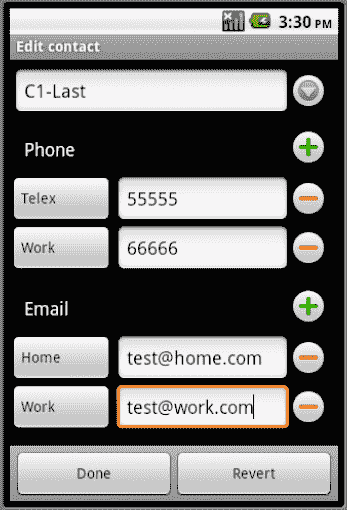

**图 27–10.** *更多联系人编辑字段*

如图 27–10 所示，可以包含不同类型的电话号码和电子邮件地址。您可能还想知道联系人是否允许包含任意数据的任意行集合。（例如，在图 27–10 中，电话和电子邮件是众所周知的预定义数据类型。如果您想存储一些未预料到的数据该怎么办？这就是我们所说的任意数据）。联系人 API 确实允许这种任意的数据集合，如图 27–11 所示，其中地址信息被添加到联系人中。

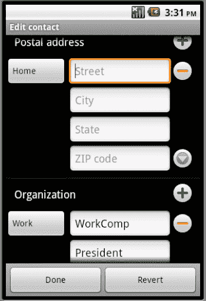

**图 27–11.** *编辑任意联系人数据*

#### 设置联系人照片

您还可以设置联系人的照片。图 27–12 显示了当您单击图 27–9（联系人详情的第一页）中显示的照片图标时打开的照片设置屏幕。

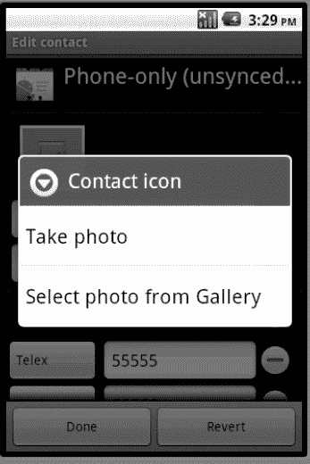

**图 27–12.** *编辑联系人照片*

#### 导出联系人

让我们通过展示如何将联系人导出到 SD 卡来结束对联系人应用的介绍。其中，此 SD 卡导出功能允许您查看为联系人捕获了哪些信息，以及这些信息如何以文本形式呈现。

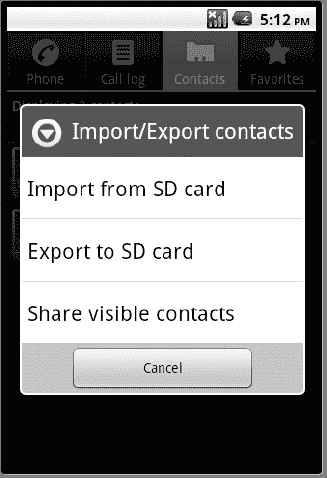

**图 27–13.** *导出联系人*

将联系人导出到 SD 卡后，您可以使用 Eclipse ADT 浏览 SD 卡文件。请参阅图 27–14，其中在 Eclipse 文件资源管理器中可以看到一个导出的 `.vcf` 文件。

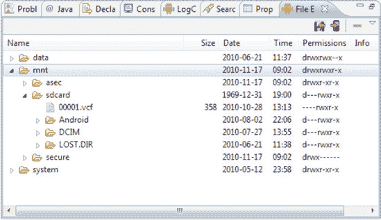

**图 27–14.** *SD 卡上的联系人信息*

您可以使用文件资源管理器选项卡右上角的图标，将图 27–14 中的 `.vcf` 文件从设备复制到本地文件。对于图 27–8 中显示的两个联系人，`.vcf` 文件的内容如代码清单 27–3 所示。

**代码清单 27–3.** *以 VCF 格式导出的联系人*

```
BEGIN:VCARD
VERSION:2.1
N:C1-Last;C1-First;;;
FN:C1-First C1-Last
TEL;TLX:55555
TEL;WORK:66666
EMAIL;HOME:test@home.com
EMAIL;WORK:test@work.com
ORG:WorkComp
TITLE:President
ORG:Work Other
TITLE:President
URL:www.com
NOTE:Note1
X-AIM:aim
X-MSN:wlive
END:VCARD

BEGIN:VCARD
VERSION:2.1
N:C2-Last;C2-first;;;
FN:C2-first C2-Last
END:VCARD
```

#### 各种联系人数据类型

到目前为止的图中，您已经了解了如何为联系人添加不同的信息集。代码清单 27–4 显示了 API 中定义的这些数据类型列表（此列表可能会随着新版本的增长而增加，当前版本为 2.3）。

**代码清单 27–4.** *标准联系人数据类型*

```
email
event
groupmemebership
im
nickname
note
organization
phone
photo
relation
SipAddress
structuredname
structuredpostal
website
```

每种数据类型，例如 `email` 或 `structuredpostal`（表示邮寄地址），都有自己的一组字段。那么，如何知道这些字段是什么？它们定义在 `android.provider.ContactsContract.CommonDataKinds` 中提供的辅助类中。

此类的 URL 是
[`http://developer.android.com/reference/android/provider/ContactsContract.CommonDataKinds.html`](http://developer.android.com/reference/android/provider/ContactsContract.CommonDataKinds.html)。

例如，类 `CommonDataKinds.Email` 定义了代码清单 27–5 中所示的字段。

**代码清单 27–5.** *电子邮件联系人的特定字段*

```
电子邮件地址
电子邮件类型：type_home、type_work、type_other、type_mobile
标签：用于支持 type_other
```

现在您已经掌握了处理账户和联系人所需的背景知识和工具，让我们深入了解联系人 API 的真正细节。

### 理解联系人

正如我们所说，联系人归账户所有。每个账户都有自己的一组联系人。然后，每个联系人都有自己的一组数据元素（例如，电子邮件地址、电话号码、姓名和邮寄地址）。此外，Android 通过只列出一次看似匹配的联系人，来呈现原始联系人的聚合视图。这些聚合的联系人构成了您打开联系人应用时看到的联系人集合（请参阅图 27–8）。

现在我们将研究联系人相关数据如何存储在各个表中。理解这些联系人表及其关联的视图是理解联系人 API 的关键。


#### 检查 SQLite 数据库内容

要理解并检查内容数据库表，一种方法是从设备或模拟器下载内容数据库，然后使用 SQLite 探查工具打开它。

若要下载联系人数据库，请使用 图 27-14 所示的文件浏览器，导航至模拟器上的以下目录：

`/data/data/com.android.providers.contacts/databases`

根据版本不同，数据库文件名可能略有差异，但其名称应为 `contacts.db` 或 `contacts2.db` 之类的命名。

理论上，你只需用 SQLite 工具打开即可。然而，我们在打开此数据库时遇到了一个问题。我们尝试过的大多数工具都“报错”了（形象地说）。问题在于 Android 为诸如比较电话号码等功能所定义的**自定义排序序列**。

显然，对于 SQLite 而言，自定义排序序列是作为 SQLite 发行版的一部分编译的。如果你没有随 Android 发行版编译的 DLL 文件，通用探查工具将无法准确读取该数据库。因为这些工具使用的是 Windows 版的 SQLite DLL 文件来打开由 Android 的 Linux 发行版创建的数据库，所以它们无法成功运行。而且，Windows 版的 SQLite 发行版并不包含联系人数据库所要求的那些排序序列。

不过，我们比较幸运，一个名为 SQLite Explorer 的程序存在一个小“缺陷”，使得我们即使无法获取该数据库的模式定义，也能浏览其表结构。你或许可以借助其他更昂贵的工具获得更好的效果。如果你想探索更多选项，这里有一个链接，可以查看 SQLite 的可用工具列表：

`http://www.sqlite.org/cvstrac/wiki?p=ManagementTools`

如果你真的很好奇，可以阅读我们研究文章《探索联系人数据库》中关于排序序列的更多内容，该文章位于 [`http://www.androidbook.com/item/3582`](http://www.androidbook.com/item/3582)。

如果在探索数据库时遇到困难，也不必灰心，因为我们在本章中列出了所有重要的表。接下来，我们将首先开始探索所谓的原始联系人。

#### 原始联系人

再次说明，我们在打开联系人应用时看到的联系人被称为聚合联系人。每个聚合联系人之下都隐藏着一组称为原始联系人的联系人。聚合联系人仅仅是对一组相似原始联系人的一种视图。要理解聚合联系人，必须先了解原始联系人和属于原始联系人的数据。因此，我们将首先讨论原始联系人。

属于某个账户的联系人集合实际上被称为原始联系人。每个原始联系人指向你在此账户上下文中认识的某个人的详细信息。这与聚合联系人形成对比，后者跨越了账户边界，最终归属于整个设备。

账户与其原始联系人集合之间的关系维护在原始联系人表中。列表 27-6 展示了联系人数据库中原始联系人表的结构。

**列表 27-6.** *原始联系人表定义*

```
CREATE TABLE raw_contacts
(_id INTEGER PRIMARY KEY AUTOINCREMENT,
is_restricted INTEGER DEFAULT 0,
account_name STRING DEFAULT NULL,
account_type STRING DEFAULT NULL,
sourceid TEXT,
version INTEGER NOT NULL DEFAULT 1,
dirty INTEGER NOT NULL DEFAULT 0,
deleted INTEGER NOT NULL DEFAULT 0,
contact_id INTEGER REFERENCES contacts(_id),
aggregation_mode INTEGER NOT NULL DEFAULT 0,
aggregation_needed INTEGER NOT NULL DEFAULT 1,
custom_ringtone TEXT,
send_to_voicemail INTEGER NOT NULL DEFAULT 0,
times_contacted INTEGER NOT NULL DEFAULT 0,
last_time_contacted INTEGER,
starred INTEGER NOT NULL DEFAULT 0,
display_name TEXT,
display_name_alt TEXT,
display_name_source INTEGER NOT NULL DEFAULT 0,
phonetic_name TEXT,
phonetic_name_style TEXT,
sort_key TEXT COLLATE PHONEBOOK,
sort_key_alt TEXT COLLATE PHONEBOOK,
name_verified INTEGER NOT NULL DEFAULT 0,
contact_in_visible_group INTEGER NOT NULL DEFAULT 0,
sync1 TEXT, sync2 TEXT, sync3 TEXT, sync4 TEXT)
```

重要的字段已高亮显示。与每个其他 Android 表一样，原始联系人表具有 `_ID` 列，用于唯一标识一个原始联系人。`account_name` 和 `account_type` 字段共同标识该联系人（具体来说是原始联系人）所属的账户。`sourceid` 字段表示此原始联系人如何被 account_name 和 account_type 字段所标识的账户唯一识别。例如，假设你需要知道一个原始联系人 ID 在 Google 电子邮件账户中是如何被识别的。通常，在这种情况下，该字段会包含用户的电子邮件 ID。

`contact_id` 字段指向此原始联系人从属于的聚合联系人。一个聚合联系人指向一个或多个相似的联系人，这些联系人本质上是同一个人，但设置在多个账户中。

`display_name` 字段指向联系人的显示名称。这主要是一个只读字段。它由触发器根据为此原始联系人添加的数据表中的数据行来设置（数据表将在下一小节中介绍）。

`sync` 字段供账户用于在设备与服务器端账户（如 Gmail）之间同步联系人。

虽然我们使用 SQLite 工具来探索这些字段，但发现这些字段的方法不止一种。推荐的方法是遵循 `ContactsContract` API 中声明的类定义。要探索属于原始联系人的列，你可以查看 `ContactsContract.RawContact` 的类文档。

这种方法有利有弊。一个显著的优点是，你可以了解 Android SDK 已发布并承认的字段。数据库列可能会在不改变公共接口的情况下被添加或删除。因此，如果你直接使用数据库列，它们可能存在也可能不存在。相反，如果你使用这些列的公共定义，那么在不同版本之间你都是安全的。

然而，一个缺点是，类文档中夹杂了许多其他常量和列名，以至于我们都有点搞不清哪个是哪个了。这些众多的类定义给人的印象是该 API 非常复杂，但实际上，联系人 API 的类文档中 80% 的内容都是为了定义这些列的常量以及访问这些行的 URI。

在后面的章节中，当我们实际使用联系人 API 时，我们将使用基于类文档的常量，而不是直接的列名。不过，我们认为直接探索表结构是最快帮助你理解联系人 API 的方法。

接下来，我们讨论如何存储与联系人相关的数据，例如电子邮件和电话号码。


### 数据表

从原始联系人表的定义可以看出，原始联系人（从反高潮的意义上讲）只是一个指示其所属账户的 ID。与联系人相关的大部分数据并不保存在原始联系人表中，而是保存在数据表中。每个数据元素（例如电子邮件和电话号码）都作为单独的行存储在数据表中。所有这些相关的数据行都通过原始联系人 ID 与原始联系人关联，该 ID 既是数据表的列之一，也是原始联系人表的主 ID。

此数据表包含 16 个通用列，可以存储任何给定数据元素（如电子邮件）的任意 16 个不同数据点。清单 27–7 描述了数据表的组织方式。

**清单 27–7.** *联系人数据表定义*

```
CREATE TABLE data
(_id INTEGER PRIMARY KEY AUTOINCREMENT,
package_id INTEGER REFERENCES package(_id),
mimetype_id INTEGER REFERENCES mimetype(_id) NOT NULL,
raw_contact_id INTEGER REFERENCES raw_contacts(_id) NOT NULL,
is_primary INTEGER NOT NULL DEFAULT 0,
is_super_primary INTEGER NOT NULL DEFAULT 0,
data_version INTEGER NOT NULL DEFAULT 0,
data1 TEXT,data2 TEXT,data3 TEXT,data4 TEXT,data5 TEXT,
data6 TEXT,data7 TEXT,data8 TEXT,data9 TEXT,data10 TEXT,
data11 TEXT,data12 TEXT,data13 TEXT,data14 TEXT,data15 TEXT,
data_sync1 TEXT, data_sync2 TEXT, data_sync3 TEXT, data_sync4 TEXT )
```

清单 27–7 中数据表的关键列已加粗。正如您可能预料到的，`raw_contact_id` 指向该数据行所属的原始联系人。

`mimetype_id` 指向 MIME 类型条目，该条目指示清单 27–4 中确定的联系人数据类型之一。列 `data1` 到 `data15` 是通用的基于字符串的表，可以存储基于 MIME 类型所需的任何内容。同样，同步字段用于支持联系人同步。解析 MIME 类型 ID 的表在清单 27–8 中。

**清单 27–8.** *MIME 类型查找表定义*

```
CREATE TABLE mimetypes
(_id INTEGER PRIMARY KEY AUTOINCREMENT,
mimetype TEXT NOT NULL)
```

与原始联系人表一样，您可以通过 `ContactsContract.Data` 的辅助类文档来了解数据表的列。

尽管您可以从这个类定义中找出列，但您不会知道通用列 `data1` 到 `data15` 中每个列存储的内容。要了解这一点，您需要查看 `ContactsContract.CommonDataKinds` 命名空间下多个类的定义。

以下是这些类的一些示例：

- `ContactsContract.CommonDataKinds.Email`
- `ContactsContract.CommonDataKinds.Phone`

实际上，对于清单 27–4 中列出的每个常见数据类型，您都会看到一个对应的类。最终，所有 `CommonDataKinds` 类所做的就是指明哪些通用数据字段（`data1` 到 `data15`）正在被使用以及它们的用途。

### 聚合联系人

最终，联系人及其相关数据被明确地存储在原始联系人表和数据表中。另一方面，聚合联系人本质上更具启发式特征，可能有些模棱两可。

当多个账户之间存在相同的联系人时，您可能希望看到一个名称，而不是每个账户重复显示相同或相似的名称。Android 通过将联系人聚合到一个只读视图中来解决这个问题。Android 将这些聚合后的联系人存储在一个名为 contacts 的表中。Android 使用原始联系人表和数据表上的多个触发器来填充或更改这个聚合联系人表。

在解释聚合逻辑之前，我们先展示联系人表的定义（参见清单 27–9）。

**清单 27–9.** *聚合联系人表定义*

```
CREATE TABLE contacts
(_ id INTEGER PRIMARY KEY AUTOINCREMENT,
name_raw_contact_id INTEGER REFERENCES raw_contacts(_id),
photo_id INTEGER REFERENCES data(_id),
custom_ringtone TEXT,
send_to_voicemail INTEGER NOT NULL DEFAULT 0,
times_contacted INTEGER NOT NULL DEFAULT 0,
last_time_contacted INTEGER,
starred INTEGER NOT NULL DEFAULT 0,
in_visible_group INTEGER NOT NULL DEFAULT 1,
has_phone_number INTEGER NOT NULL DEFAULT 0,
lookup TEXT,
status_update_id INTEGER REFERENCES data(_id),
single_is_restricted INTEGER NOT NULL DEFAULT 0)
```

重要的列已突出显示。没有客户端直接更新此表。当添加一个原始联系人及其附带详细信息时，Android 会搜索其他原始联系人，看是否存在类似的原始联系人。如果存在，它就会将该原始联系人的聚合联系人 ID 也用作新原始联系人的聚合联系人 ID。不会向聚合联系人表中插入条目。如果未找到，它将创建一个聚合联系人，并将该聚合联系人 ID 用作该原始联系人的联系人 ID。

Android 使用以下算法来确定哪些原始联系人是相似的：

1.  两个原始联系人具有匹配的名称。
2.  名称中的单词相同但顺序不同：“名 姓”或“名，姓”或“姓，名”。
3.  名称的较短版本匹配，例如“Bob”对应“Robert”。
4.  如果某个原始联系人只有名或姓，则会触发对其他属性（如电话号码或电子邮件）的搜索，如果其他属性匹配，则这些联系人将被聚合。
5.  如果某个原始联系人完全没有名称，也会触发对步骤 4 中所述其他属性的搜索。

由于这些规则是启发式的，某些联系人可能会被意外聚合。在这种情况下，客户端应用程序需要提供一种机制来分离联系人。如果您参考《*Android 用户指南*》，您将看到默认的联系人应用程序允许您分离被意外合并的联系人。

您也可以在插入原始联系人时设置聚合模式来阻止聚合。清单 27–10 显示了可用的聚合模式。

**清单 27–10.** *聚合模式常量*

```
AGGREGATION_MODE_DEFAULT
AGGREGATION_MODE_DISABLED
AGGREGATION_MODE_SUSPENDED
```

第一个选项显而易见，它描述了聚合的工作方式。

第二个选项（`disabled`）表示禁止此原始联系人参与聚合。即使它已经被聚合，Android 也会将其从聚合中分离出来，并为此原始联系人分配一个新的专用聚合联系人 ID。

第三个选项 `suspended` 表示，即使联系人的属性可能会发生变化，从而导致其不再满足与该聚合批次中的联系人聚合的条件，也仍然保持它与该聚合联系人的关联。


最后一点引出了聚合联系人的易变性。假设你有一条唯一的原始联系人，包含名字和姓氏。目前，它不匹配任何其他原始联系人，因此这条唯一的原始联系人会获得自己的聚合联系人分配。聚合联系人 ID 将存储在原始联系人表中，与该原始联系人行对应。

然而，如果你更改了此原始联系人的姓氏，使其与另一组已聚合的联系人匹配。在这种情况下，它会将此原始联系人从当前聚合联系人中移除，并移动到另一个聚合联系人中，从而废弃这单个聚合联系人。此时，聚合联系人的 ID 被完全废弃，因为未来它不会匹配任何内容，它只是一个没有底层原始联系人的 ID。

因此，聚合联系人是易变的。长期持有此聚合联系人 ID 并没有什么重要价值。

Android 通过提供一个名为`lookup`的字段来缓解这一困境，该字段位于聚合联系人表中。

此`lookup`字段是每个原始联系人对应的账户与该联系人在该账户中的唯一 ID 的聚合（拼接）。这些信息经过进一步编码，以便可以作为 URL 参数传递，从而检索最新的聚合联系人 ID。Android 会查看`lookup`键，并找出该`lookup`键下有哪些底层原始联系人 ID。然后使用最佳匹配算法返回一个合适的（或可能是新的）聚合联系人 ID。

在我们深入研究联系人数据库时，让我们考虑几个有用的联系人相关数据库视图。

### `view_contacts`

这些视图中的第一个是`view_contacts`。尽管存在一个保存聚合联系人的表（`contacts`表），但 API 并不直接暴露`contacts`表。相反，它使用`view_contacts`作为读取聚合联系人的目标。当你基于 URI `ContactsContract.Contacts.CONTENT_URI`进行查询时，返回的列就是基于此视图`view_contacts`的。此视图的定义如清单 27-11 所示。

**清单 27-11.** *用于读取聚合联系人的视图*

```
CREATE VIEW view_contacts AS

SELECT contacts._id AS _id,
contacts.custom_ringtone AS custom_ringtone,
name_raw_contact.display_name_source AS display_name_source,
name_raw_contact.display_name AS display_name,
name_raw_contact.display_name_alt AS display_name_alt,
name_raw_contact.phonetic_name AS phonetic_name,
name_raw_contact.phonetic_name_style AS phonetic_name_style,
name_raw_contact.sort_key AS sort_key,
name_raw_contact.sort_key_alt AS sort_key_alt,
name_raw_contact.contact_in_visible_group AS in_visible_group,
has_phone_number,
lookup,
photo_id,
contacts.last_time_contacted AS last_time_contacted,
contacts.send_to_voicemail AS send_to_voicemail,
contacts.starred AS starred,
contacts.times_contacted AS times_contacted, status_update_id

FROM contacts JOIN raw_contacts AS name_raw_contact
ON(name_raw_contact_id=name_raw_contact._id)
```

请注意，此视图根据聚合联系人 ID 将`contacts`表与`raw_contacts`表结合了起来。

### `contact_entities_view`

另一个有用的视图是结合了原始联系人表与数据表的视图。此视图允许一次性检索给定原始联系人的所有数据元素，甚至还可以检索属于同一聚合联系人的多个原始联系人的数据元素。清单 27-12 展示了实体视图的定义。

**清单 27-12.** *联系人实体视图*

```
CREATE VIEW contact_entities_view AS

SELECT raw_contacts.account_name AS account_name,
raw_contacts.account_type AS account_type,
raw_contacts.sourceid AS sourceid,
raw_contacts.version AS version,
raw_contacts.dirty AS dirty,
raw_contacts.deleted AS deleted,
raw_contacts.name_verified AS name_verified,
package AS res_package,
contact_id,
raw_contacts.sync1 AS sync1,
raw_contacts.sync2 AS sync2,
raw_contacts.sync3 AS sync3,
raw_contacts.sync4 AS sync4,
mimetype, data1, data2, data3, data4, data5, data6, data7, data8,
data9, data10, data11, data12, data13, data14, data15,
data_sync1, data_sync2, data_sync3, data_sync4,

raw_contacts._id AS _id,

is_primary, is_super_primary,
data_version,
data._id AS data_id,
raw_contacts.starred AS starred,
raw_contacts.is_restricted AS is_restricted,
groups.sourceid AS group_sourceid

FROM raw_contacts LEFT OUTER JOIN data
   ON (data.raw_contact_id=raw_contacts._id)
LEFT OUTER JOIN packages
  ON (data.package_id=packages._id)
LEFT OUTER JOIN mimetypes
  ON (data.mimetype_id=mimetypes._id)
LEFT OUTER JOIN groups
  ON (mimetypes.mimetype='vnd.android.cursor.item/group_membership'
    AND groups._id=data.data1)
```

访问此视图所需的 URI 可在`ContactsContract.RawContacts.RawContactsEntity`类中找到。

## 使用联系人 API

到目前为止，我们已经通过探索其表格和视图，了解了联系人 API 背后的基本概念。现在我们将通过编写几个示例程序来实践我们所学的知识。虽然你可以使用本章中的清单来创建你的 Eclipse 项目，但我们在本章末尾也提供了可下载项目文件的 URL。

### 探索账户

我们将通过编写一个可以打印出账户列表的程序来开始我们的练习。

为此，我们准备了以下文件：

*   `TestContactsDriverActivity.java`：本章的主驱动 Activity，包含一组菜单项来调用各种示例。
*   `DebugActivity.java`：驱动 Activity 的基类，用于隐藏一些对理解联系人 API 没有直接贡献的实现细节。
*   `debug_activity_layout.xml`：调试 Activity 所需的布局文件，位于`/res/layout`文件子目录下。
*   `AccountFunctionTester.java`：Java 类，将通过驱动 Activity 响应菜单项以打印模拟器或设备上的可用账户。
*   `BaseTester.java`：`AccountFunctionTester`的基类，隐藏了主驱动 Activity 与每个独立功能测试器之间的协调细节（我们演示的每个练习都作为这些功能测试器之一实现，以便每个概念都可以呈现在一个对该功能有意义的文件中）。
*   `IReportBack.java`：由`DebugActivity`实现并传递给`BaseTester`的接口，允许继承的功能测试器报告要显示的文本或调试消息，并使用`DebugActivity`记录并打印到屏幕上。
*   `main_menu.xml`：菜单文件，支持我们将要演示的每个功能。
*   `AndroidManifest.xml`：必需的清单文件。

现在我们逐一介绍这些文件。我们将从菜单文件开始。

#### 菜单文件

清单 27-13 中的菜单文件需要命名为`main_menu.xml`，并放在你项目的`/res/menu`子目录中。

**清单 27-13.** *项目的主菜单文件*

```
<menu >
    <!-- This group uses the default category. -->
    <group android:id="@+id/menuGroup_Main">
        <item android:id="@+id/menu_show_accounts"
            android:title="Accounts" />

        <item android:id="@+id/menu_da_clear"
         android:title="clear" />
    </group>
</menu>
```

在本练习的这个阶段，我们只列出了两个菜单项。在继续本章后面的其他练习时，您将不断向这些菜单项中添加内容。第一个菜单项用于列出可用账户，第二个是一个通用的辅助菜单项，用于清除测试驱动 Activity 中的调试/信息消息。


### 账户功能测试器相关文件

菜单文件就绪后，我们来看看与实现代码相关的文件，这些代码将响应清单 27-13 中的 `Accounts` 菜单项被调用。

#### IReportBack.java

第一个文件是 `IReportBack.java`，如清单 27-14 所示。

**清单 27-14.** *IReportBack.java*

```
//IReportBack.java
public interface IReportBack
{
    public void reportBack(String tag, String message);
    public void reportTransient(String tag, String message);
}
```

此接口是对其继承客户端的契约，确保它们能够发送信息和调试消息，而无需关心这些消息将在何处以及如何显示。

#### BaseTester.java

所有功能测试器都将访问 `IReportBack` 接口，以便在它们执行菜单项功能时报告消息。这是通过所有功能测试器的基类 `BaseTester` 实现的。`BaseTester` 类的源代码在清单 27-15 中给出。

**清单 27-15.** *BaseTester 源代码*

```
public class BaseTester
{
    protected IReportBack mReportTo;
    protected Context mContext;
    public BaseTester(Context ctx, IReportBack target)
    {
        mReportTo = target;
        mContext = ctx;
    }
}
```

`BaseTester` 类保存了一个 `IReportBack` 接口和一个对 `Context`（通常是父驱动 Activity）的引用。这些变量由派生功能测试器使用。

#### AccountsFunctionTester.java

现在，我们将在清单 27-16 中展示第一个功能测试器 `AccountFunctionTester`。

**清单 27-16.** *AccountsFunctionTester*

```
public class AccountsFunctionTester extends BaseTester
{
    private static String tag = "tc>";
    public AccountsFunctionTester(Context ctx, IReportBack target)
    {
        super(ctx, target);
    }
    public void testAccounts()
    {
        AccountManager am = AccountManager.get(this.mContext);
        Account[] accounts = am.getAccounts();
        for(Account ac: accounts)
        {
            String acname=ac.name;
            String actype = ac.type;
            this.mReportTo.reportBack(tag,acname + ":" + actype);
        }
    }
}
```

清单 27-16 中的代码非常简单。我们已经在章节开头介绍了账户以及如何获取账户列表的主题。清单 27-16 中的代码只是获取每个账户的名称和类型，然后调用报告回传接口进行记录。只要存在一个可以调用 `testAccounts()` 方法的驱动 Activity，这段代码就能回传账户名称和类型。现在，让我们来研究与驱动 Activity 相关的类。

### 驱动 Activity 类

我们将从驱动 Activity 类的基类开始。这个基类 Activity 具有以下职责：

*   提供一个文本视图来报告消息。它使用一个名为 `debug_activity_layout` 的布局资源。
*   提供一个菜单，以便可以调用各个功能测试器。它通过构造函数从派生类中获取菜单资源 ID。然后它假定存在一个预定义的菜单项 `menu_da_clear`，用于清除调试布局中定义的文本视图。这个基类还会将选中的菜单项写入调试布局中的调试文本视图。

基于此，下面是清单 27-17 中 `DebugActvity.java` 的源代码。

#### DebugActivity.java

**清单 27-17.** *DebugActivity 类定义*

```
public abstract class DebugActivity extends Activity
implements IReportBack
{
    //派生类需要首先实现
    protected abstract boolean onMenuItemSelected(MenuItem item);

    //由构造函数设置的私有变量
    private static String tag=null;
    private int menuId = 0;

    public DebugActivity(int inMenuId, String inTag)
    {
        tag = inTag;
        menuId = inMenuId;

    }

    @Override
    public void onCreate(Bundle savedInstanceState) {
        super.onCreate(savedInstanceState);
        setContentView(R.layout.debug_activity_layout);
    }
    @Override
    public boolean onCreateOptionsMenu(Menu menu){
        super.onCreateOptionsMenu(menu);
            MenuInflater inflater = getMenuInflater();
            inflater.inflate(menuId, menu);
        return true;
    }
    @Override
    public boolean onOptionsItemSelected(MenuItem item){
        appendMenuItemText(item);
        if (item.getItemId() == R.id.menu_da_clear){
            this.emptyText();
            return true;
        }
        return onMenuItemSelected(item);
    }
    private TextView getTextView(){
        return (TextView)this.findViewById(R.id.text1);
    }
    protected void appendMenuItemText(MenuItem menuItem){
       String title = menuItem.getTitle().toString();
       TextView tv = getTextView();
       tv.setText(tv.getText() + "\n" + title);
    }
    protected void emptyText(){
       TextView tv = getTextView();
       tv.setText("");
    }
    private void appendText(String s){
       TextView tv = getTextView();
       tv.setText(tv.getText() + "\n" + s);
       Log.d(tag,s);
    }
    public void reportBack(String tag, String message)
    {
        this.appendText(tag + ":" + message);
        Log.d(tag,message);
    }
    public void reportTransient(String tag, String message)
    {
        String s = tag + ":" + message;
        Toast mToast = Toast.makeText(this, s, Toast.LENGTH_SHORT);
        mToast.show();
        reportBack(tag,message);
        Log.d(tag,message);
    }
}
```

除了可在调试文本视图上回传调试和信息消息的方法之外，`IReportBack` 中的 `reportTransient()` 方法还可用于通过 Android 的 `Toast` 接口显示文本。

#### debug_layout_activity.java

这个文件 `debug_layout_activity.xml` 如清单 27-18 所示，需要放在 `/res/layout` 子目录下。

**清单 27-18.** *调试布局文件: debug_activity_layout.xml*

```
<?xml version="1.0" encoding="utf-8"?>
<LinearLayout
    android:orientation="vertical"
    android:layout_width="fill_parent"
    android:layout_height="fill_parent"
    >
<TextView
    android:id="@+id/text1"
    android:layout_width="fill_parent"
    android:layout_height="wrap_content"
    android:text="Debut Text Appears here"
    />
</LinearLayout>
```


##### `TestContactsDriverActivity.java`

清单 27–19 是主驱动程序活动，它负责协调菜单项，并从对应的函数测试器中调用相应的方法。

**清单 27–19.** *主驱动程序活动*

```
public class TestContactsDriverActivity
extends DebugActivity
implements IReportBack
{
    public static final String tag="Test Contacts";
    AccountsFunctionTester accountsFunctionTester = null;

    public TestContactsDriverActivity()
    {
        super(R.menu.main_menu,tag);
        accountsFunctionTester = new AccountsFunctionTester(this,this);
    }
    protected boolean onMenuItemSelected(MenuItem item)
    {
        Log.d(tag,item.getTitle().toString());
        if (item.getItemId() == R.id.menu_show_accounts)
        {
            accountsFunctionTester.testAccounts();
            return true;
        }
        return true;
    }
}
```

由于我们将驱动程序的大部分功能都推送到了基类中，因此驱动程序活动简洁明了。

首先，在清单 27–19 中要注意的是，驱动程序活动如何将清单 27–13（`main_menu.xml`）中定义的菜单资源传递给基础调试活动。然后，调试活动会附加此菜单。

其次要注意的是，此驱动程序活动如何使用函数测试器。在清单 27–19 的代码中，我们只展示了账户函数测试器。随着学习的深入，我们会逐步添加更多函数测试器。使用这些额外函数测试器的模式是相同的。

##### 清单文件

清单 27–20 展示了清单文件，以完善所有必需的文件。

**清单 27–20.** *程序的清单文件*

```
<?xml version="1.0" encoding="utf-8"?>
<manifest
      package="com.androidbook.contacts"
      android:versionCode="1"
      android:versionName="1.0.0">
    <application android:icon="@drawable/icon"
        android:label="Test Contacts">
        <activity android:name=".TestContactsDriverActivity"
                  android:label="Test Contacts">
            <intent-filter>
                <action android:name="android.intent.action.MAIN" />
                <category android:name="android.intent.category.LAUNCHER" />
            </intent-filter>
         </activity>
</application>
    <uses-sdk android:minSdkVersion="5" />
    <uses-permission android:name="android.permission.GET_ACCOUNTS"/>
</manifest>
```

### 运行程序

清单 27–21 包含了编译并运行这个简单测试所需的文件。

**清单 27–21.** *第一个示例的完整文件列表*

```
IReportBack.java
BaseTester.java
AccountsFunctionTester.java
DebugActivity.java
TestContactsDriverActivity.java
/res/menu/main_menu.xml
/res/layout/debug_layout_activity.xml
Manifest.xml
```

当你编译并运行此文件，并在查看主驱动程序活动时点击菜单项，你将看到图 27–15 所示的屏幕。

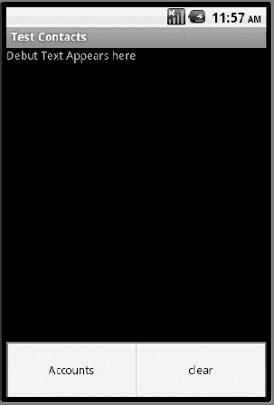

**图 27–15.** *带有菜单的主驱动程序活动*

图 27–15 有两个菜单选项。“清除”选项是基类调试活动提供的通用菜单，用于清除调试文本视图中的所有文本。“账户”选项将列出可用的账户集。如果你正在实际操作，请继续点击该菜单项。这将弹出图 27–16 所示的屏幕。

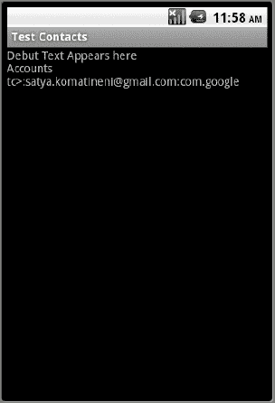

**图 27–16.** *显示账户列表的主驱动程序活动*

我们测试使用的模拟器只设置了一个账户，即 Google 账户。因此，我们的示例只显示了这一个账户。

### 探索聚合联系人

在下一个示例中，让我们看看如何探索聚合联系人。我们将在这个关于聚合联系人的练习中演示三件事：

*   发现通过触发一个知道如何读取聚合联系人的 URI 所返回的所有字段。
*   列出所有聚合联系人。
*   发现基于查找 URI 的光标所返回的所有字段。

要读取联系人，你需要在清单文件（清单 27–20）中请求以下权限：

`android.permission.READ_CONTACTS`

你还需要以下新文件（除了上一个示例中的文件之外）来测试此示例：

*   `Utils.java`
*   `URIFunctionTester.java`
*   `AggregatedContactFunctionTester.java`
*   `AggregatedContact.java`

这些文件将在本节介绍此示例的详细信息时提供。

你还需要更新上一个示例中的以下文件：

*   `main_menu.xml`
*   `TestContactsDriverActivity.java`

你对这些文件需要做的更改也将在本节中介绍。

由于我们测试的功能涉及内容提供者、URI 和光标，我们在文件 `Utils.java` 中编写了几个工具函数，如清单 27–22 所示。

**清单 27–22.** *用于处理光标的工具函数*

```
public class Utils
{
    public static String getColumnValue(Cursor cc, String cname)
    {
        int i = cc.getColumnIndex(cname);
        return cc.getString(i);
    }

    protected static String getCursorColumnNames(Cursor c)
    {
        int count = c.getColumnCount();
        StringBuffer cnamesBuffer = new StringBuffer();
        for (int i=0;i<count;i++)
        {
            String cname = c.getColumnName(i);
            cnamesBuffer.append(cname).append(';');
        }
        return cnamesBuffer.toString();
    }
}
```

第一个函数 `getColumnValue()` 根据列名从光标的当前行返回该列的值。无论其基本类型如何，它都将列的值作为字符串返回。

第二个函数非常有用。它接收任何光标，并返回其所有可用列的分隔列表。当我们探索新的 URI 以发现这些 URI 返回的字段类型时，这个函数非常方便。尽管通常应该在 Java 代码中记录这些列，但这种在运行时发现它们的方法可能会派上用场。

由于此示例以及本章后续示例都使用了提交 URI 并通过活动获取回光标的概念，我们将这些工具函数抽象到一个名为 `URIFunctionTester` 的基类中。清单 27–23 显示了源代码，随后对该基类的每个方法进行了解释。

**清单 27–23.** *用于探索 URI 相关功能的基类*

```
public class URIFunctionTester extends BaseTester
{
    protected static String tag = "tc>";
    public URIFunctionTester(Context ctx, IReportBack target)
    {
        super(ctx, target);
    }
    protected Cursor getACursor(String uri,String clause)
    {
        // 执行查询
        Activity a = (Activity)this.mContext;
        return a.managedQuery(Uri.parse(uri), null, clause, null, null);
    }

    protected Cursor getACursor(Uri uri,String clause)
    {
        // 执行查询
        Activity a = (Activity)this.mContext;
        return a.managedQuery(uri, null, clause, null, null);
    }
    protected void printCursorColumnNames(Cursor c)
    {
        this.mReportTo.reportBack(tag,Utils.getCursorColumnNames(c));
    }
}
```


```markdown
函数`getACursor()`接受一个 URI（可以是字符串或`URI`对象）和一个基于字符串的`where`子句，并返回一个游标。在所有示例中，由于我们经常打印返回游标的列名，因此创建了一个名为`printCursorColumnNames()`的方法，该方法内部使用`Utils`类来探查游标并获取列名。

联系人游标返回的每一行都有许多字段。在本文示例中，我们并非对所有字段都感兴趣，只关注其中几个。我们将这些字段抽象到另一个名为`AggregatedContact`的类中。清单 27–24 定义了该类。

**清单 27–24. 聚合联系人中的若干字段**

```
public class AggregatedContact
{
    public String id;
    public String lookupUri;
    public String lookupKey;
    public String displayName;

    public void fillinFrom(Cursor c)
    {
        id = Utils.getColumnValue(c,"_ID");
        lookupKey = Utils.getColumnValue(c,ContactsContract.Contacts.LOOKUP_KEY);
        lookupUri = ContactsContract.Contacts.CONTENT_LOOKUP_URI + "/" + lookupKey;
        displayName = Utils.getColumnValue(c,ContactsContract.Contacts.DISPLAY_NAME);
    }
}
```

清单 27–24 并不复杂。在这段代码中，我们使用游标加载了我们感兴趣的字段。接下来，我们将向您介绍`AggregatedFunctionTester`，它将帮助我们实现本例开始时设定的目标。

**清单 27–25. 测试聚合联系人的代码**

```
public class AggregatedContactFunctionTester extends URIFunctionTester
{
    public AggregatedContactFunctionTester(Context ctx, IReportBack target)
    {
        super(ctx, target);
    }
    /*
     * Get a cursor of all contacts
     * No where clause
     * Don't use it on a large set
     */
    private Cursor getContacts()
    {
        // Run query
        Uri uri = ContactsContract.Contacts.CONTENT_URI;
        String sortOrder = ContactsContract.Contacts.DISPLAY_NAME
                             + " COLLATE LOCALIZED ASC";
        Activity a = (Activity)this.mContext;
        return a.managedQuery(uri, null, null, null, sortOrder);
    }

    /*
     * Use the getContacts above
     * to list the set of columns in the cursor
     */
    public void listContactCursorFields()
    {
        Cursor c = null;
        try
        {
            c = getContacts();
            int i = c.getColumnCount();
            this.mReportTo.reportBack(tag, "Number of columns:" + i);
            this.printCursorColumnNames(c);
        }
        finally
        {
            if (c!= null) c.close();
        }
    }

    /*
     * Given a cursor worth of contacts
     * Print the contact names followed by
     * their look up keys
     */
    private void printLookupKeys(Cursor c)
    {
        for(c.moveToFirst();!c.isAfterLast();c.moveToNext())
        {
            String name=this.getContactName(c);
            String lookupKey = this.getLookupKey(c);
            String luri = this.getLookupUri(lookupKey);
            this.mReportTo.reportBack(tag, name + ":" + lookupKey);
            this.mReportTo.reportBack(tag, name + ":" + luri);
        }
    }

    /*
     * Use the getContacts() function
     * to get a cursor and print all
     * the contact names followed by look up keys
     * uses the printLookyupKeus() function
     */
    public void listContacts()
    {
        Cursor c = null;
        try
        {
            c = getContacts();
            int i = c.getColumnCount();
            this.mReportTo.reportBack(tag, "Number of columns:" + i);
            this.printLookupKeys(c);
        }
        finally
        {
            if (c!= null) c.close();
        }
    }

    /*
     * A utility function to retrieve the
     * look up key from a contact cursor
     */
    private String getLookupKey(Cursor cc)
    {
        int lookupkeyIndex = cc.getColumnIndex(ContactsContract.Contacts.LOOKUP_KEY);
        return cc.getString(lookupkeyIndex);
    }

    /*
     * A utility function to retrieve the
     * display name from a contact cursor
     */
    private String getContactName(Cursor cc)
    {
        return Utils.getColumnValue(cc,ContactsContract.Contacts.DISPLAY_NAME);
    }

    /**
     * Construct a look up URI based on the
     * Contacts URI and a lookup key
     */
    private String getLookupUri(String lookupkey)
    {
        String luri = ContactsContract.Contacts.CONTENT_LOOKUP_URI + "/" + lookupkey;
        return luri;
    }

    /**
     * Use the lookup uri
     * to retrieve a single aggregated contact
     */
    private Cursor getASingleContact(String lookupUri)
    {
        // Run query
        Activity a = (Activity)this.mContext;
        return a.managedQuery(Uri.parse(lookupUri), null, null, null, null);
    }

    /*
     * A function to see if the URI constructed by the lookup
     * uri returns a cursor that has a different set of columns.
     * It returns a similar cursor with similar columns
     * as one would expect.
     */
    public void listLookupUriColumns()
    {
        Cursor c = null;
        try
        {
            c = getContacts();
            String firstContactLookupUri = getFirstLookupUri(c);
            printLookupUriColumns(firstContactLookupUri);
        }
        finally
        {
            if (c!= null) c.close();
        }
    }

    public void printLookupUriColumns(String lookupuri)
    {
        Cursor c = null;
        try
        {
            c = getASingleContact(lookupuri);
            int i = c.getColumnCount();
            this.mReportTo.reportBack(tag, "Number of columns:" + i);
            int j = c.getCount();
            this.mReportTo.reportBack(tag, "Number of rows:" + j);
            this.printCursorColumnNames(c);
        }
        finally
        {
            if (c!=null)c.close();
        }
    }

    /*
     * Take a list of contacts
     * look up the first contact
     * return null if there are no contacts
     */
    private String getFirstLookupUri(Cursor c)
    {
        c.moveToFirst();
        if (c.isAfterLast())
        {
            Log.d(tag,"No rows to get the first contact");
            return null;
        }
        //There is a row
        String lookupKey = this.getLookupKey(c);
        String luri = this.getLookupUri(lookupKey);
        return luri;
    }

    /*
     * Take a list of contacts
     * look up the first contact and return it
     * as an object AggregatedContact.
     */
    protected AggregatedContact getFirstContact()
    {
        Cursor c=null;
        try
        {
            c = getContacts();
            c.moveToFirst();
            if (c.isAfterLast())
            {
                Log.d(tag,"No contacts");
                return null;
            }
            //contact is there
            AggregatedContact firstcontact = new AggregatedContact();
            firstcontact.fillinFrom(c);
            return firstcontact;
        }
        finally
        {
            if (c!=null) c.close();
        }
    }
}
```

关键公共函数已突出显示。每个函数对应的注释部分解释了其功能。拥有此函数测试器后，请将清单 27–26 中的菜单项添加到菜单 XML（`/res/menu/main_menu.xml`）中。

**清单 27–26. 测试聚合联系人菜单项**

```
     <item android:id="@+id/menu_show_contact_cursor"
         android:title="Contacts Cursor" />
```
```


#### 排版后的内容

```
<item android:id="@+id/menu_show_contacts"
    android:title="Contacts" />

<item android:id="@+id/menu_show_single_contact_cursor"
    android:title="Single Contact Cursor" />
```

你可以将它们添加到 `main_menu.xml` 中的任意位置，但我们建议按从上到下的顺序添加，这样较新的菜单项会优先显示在菜单列表中。添加完菜单后，请修改主驱动 Activity，使其与清单 27–27 一致。

**清单 27–27.** *为测试聚合联系人而更新的主驱动 Activity*

```
public class TestContactsDriverActivity extends DebugActivity
implements IReportBack
{
    public static final String tag="TestContactsDriverActivity ";
    AccountsFunctionTester accountsFunctionTester = null;
    AggregatedContactFunctionTester aggregatedContactFunctionTester = null;

    public TestContactsDriverActivity()
    {
        super(R.menu.main_menu,tag);
        accountsFunctionTester = new AccountsFunctionTester(this,this);
        aggregatedContactFunctionTester =
           new AggregatedContactFunctionTester(this,this);
    }
    protected boolean onMenuItemSelected(MenuItem item)
    {
        Log.d(tag,item.getTitle().toString());
        if (item.getItemId() == R.id.menu_show_accounts)
        {
            accountsFunctionTester.testAccounts();
            return true;
        }
        if (item.getItemId() == R.id.menu_show_contact_cursor)
        {
            aggregatedContactFunctionTester.listContactCursorFields();
            return true;
        }
        if (item.getItemId() == R.id.menu_show_contacts)
        {
            aggregatedContactFunctionTester.listContacts();
            return true;
        }
        if (item.getItemId() == R.id.menu_show_single_contact_cursor)
        {
            aggregatedContactFunctionTester.listLookupUriColumns();
            return true;
        }
        return true;
    }
}
```

请注意我们为每个菜单选项最终调用的三个公共函数：

* `listContactCursorFields()`
* `listContacts()`
* `listLookupUriColumns()`

下面我们根据清单 27–26 中的代码来介绍每个函数的功能。`listContactCursorFields` 函数会读取整个联系人列表，并打印出游标中的列名。用于读取所有联系人的 URI 是 `ContactsContract.Contacts.CONTENT_URI`。

你可以将此 URI 传递给 `managedQuery()` 函数以获取游标。你可以将列投影设为 `null` 来接收所有列。虽然在实际中不推荐这样做，但在我们的场景下是合理的，因为我们希望了解它返回的所有列。清单 27–28 包含了此 URI 返回的列列表。

**清单 27–28.** *联系人内容 URI 游标列*

```
times_contacted;
contact_status;
custom_ringtone;
has_phone_number;
phonetic_name;
phonetic_name_style;
contact_status_label;
lookup;
contact_status_icon;
last_time_contacted;
display_name;
sort_key_alt;
in_visible_group;
_id;
starred;
sort_key;
display_name_alt;
contact_presence;
display_name_source;
contact_status_res_package;
contact_status_ts;
photo_id;
send_to_voicemail;
```

示例程序会将这些列同时输出到屏幕和 LogCat 中。我们从 LogCat 中复制了这些字段，并按照清单 27–28 所示进行了格式化。

**注意：** 在使用内容提供器时，通过 URI 来获取并打印其返回的列，这一技术非常有用。

既然我们已经探索了联系人内容 URI 可用的列，接下来我们选取几个列，看看有哪些联系人行可用。为此，请点击菜单项“contacts”。这将调用函数 `listContacts()`。`listContacts()` 方法使用相同的联系人内容 URI，但现在为每个联系人打印以下列：

* `display name`
* `lookup key`
* `lookup uri`

我们考虑这些字段，是因为我们希望根据本章理论部分所讲的内容，查看查找键和查找键 URI 的具体形式。具体来说，我们感兴趣的是触发查找 URI，并观察它会返回什么类型的游标。要查看这一点，请点击菜单项“Single Contact Cursor”。这将调用函数 `listLookupUriColumns()`。该函数会从所有联系人列表中取出第一个联系人，然后为该联系人构建一个查找 URI，并触发该 URI 以查看其返回结果。

结果发现，它返回的游标与清单 27–28 中的列完全相同，只是只有一行数据，指向此查找键对应的联系人。同时请注意，我们使用了以下查找 URI 定义：

`ContactsContract.Contacts.CONTENT_LOOKUP_URI`

从对联系人查找 URI 的讨论中可知，每个查找 URI 代表一组已拼接的原始联系人标识。既然如此，你可能预期查找 URI 会返回一系列匹配的原始联系人。然而，上述测试（清单 27–28）显示，它返回的并不是原始联系人的游标，而是联系人的游标。

**注意：** 基于联系人查找 Uri 的查找返回的是聚合联系人，而非原始联系人。

另一个重要的细节是，基于查找 URI 的聚合联系人查找过程并非线性或精确匹配。也就是说，Android 不会精确匹配查找键。相反，Android 会将查找键解析为其组成的原始联系人，然后找到与大多数原始联系人记录匹配的聚合联系人 ID，并返回该聚合联系人记录。

由此产生的一个后果是，没有公开的机制可以从查找键获取其组成的原始联系人。相反，你必须先找到该查找键对应的联系人 ID，然后针对该联系人 ID 触发一个原始联系人 URI，以检索相应的原始联系人。


### 探索原始联系人

在下一个示例中，我们将探讨如何探索原始联系人。在本练习中，我们将尝试围绕原始联系人完成三件事：

- 通过触发能够读取原始联系人的 URI，发现其返回的所有字段。
- 显示所有原始联系人。
- 列出一组聚合联系人对应的所有原始联系人。

你需要以下新文件来测试此示例：

- `RawContact.java`
- `RawContactFunctionTester.java`

这些文件将在本节详细介绍示例时提供。你还需要更新上一个示例中的以下文件：

- `main_menu.xml`
- `TestContactsDriverActivity.java`

你需要对这些文件进行的修改也将在本节中说明。

清单 27–29 中的 `RawContact.java` 文件用于捕获原始联系人表中的几个重要字段。

**清单 27–29.** *原始联系人*

```
public class RawContact
{
    public String rawContactId;
    public String aggregatedContactId;
    public String accountName;
    public String accountType;
    public String displayName;

    public void fillinFrom(Cursor c)
    {
        rawContactId = Utils.getColumnValue(c,"_ID");
        accountName = Utils.getColumnValue(c,ContactsContract.RawContacts.ACCOUNT_NAME);
        accountType = Utils.getColumnValue(c,ContactsContract.RawContacts.ACCOUNT_TYPE);
        aggregatedContactId = Utils.getColumnValue(c,
                                        ContactsContract.RawContacts.CONTACT_ID);
        displayName = Utils.getColumnValue(c,"display_name");
    }
    public String toString()
    {
        return displayName
            + "/" + accountName + ":" + accountType
            + "/" + rawContactId
            + "/" + aggregatedContactId;
    }
}
```

为了测试此示例的功能，你需要将清单 27–30 中的菜单项添加到 `main_menu.xml` 中。

**清单 27–30.** *用于测试原始联系人的菜单项*

```
        <item android:id="@+id/menu_show_rc_all"
            android:title="所有原始联系人" />

        <item android:id="@+id/menu_show_rc"
            android:title="原始联系人" />

        <item android:id="@+id/menu_show_rc_cursor"
            android:title="原始联系人光标" />
```

这些菜单选项中的每一个最终都会调用 `RawContactFunctionTester.java` 中的三个公共函数。该文件的代码如清单 27–31 所示。

**清单 27–31.** *测试原始联系人*

```
public class RawContactsFunctionTester
extends AggregatedContactFunctionTester
{
    public RawContactsFunctionTester(Context ctx, IReportBack target)
    {
        super(ctx, target);
    }
    public void showAllRawContacts()
    {
        Cursor c = null;
        try
        {
            c = this.getACursor(getRawContactsUri(), null);
            this.printRawContacts(c);
        }
        finally
        {
            if (c!=null) c.close();
        }
    }
    public void showRawContactsForFirstAggregatedContact()
    {
        AggregatedContact ac = getFirstContact();
        this.mReportTo.reportBack(tag, ac.displayName + ":" + ac.id);

        Cursor c = null;

        try
        {
            c = this.getACursor(getRawContactsUri(), getClause(ac.id));
            this.printRawContacts(c);
        }
        finally
        {
            if (c!=null) c.close();
        }
    }
    private void printRawContacts(Cursor c)
    {
        for(c.moveToFirst();!c.isAfterLast();c.moveToNext())
        {
            RawContact rc = new RawContact();
            rc.fillinFrom(c);
            this.mReportTo.reportBack(tag, rc.toString());
        }
    }
    public void showRawContactsCursor()
    {
        AggregatedContact ac = getFirstContact();
        this.mReportTo.reportBack(tag, ac.displayName + ":" + ac.id);
```


`Cursor c = null;`

`try`
`{`
`    c = this.getACursor(getRawContactsUri(),null);`
`    this.printCursorColumnNames(c);`
`}`
`finally`
`{`
`    if (c!=null) c.close();`
`}`
`}`
`private Uri getRawContactsUri()`
`{`
`    return ContactsContract.RawContacts.CONTENT_URI;`
`}`
`private String getClause(String contactId)`
`{`
`    return "contact_id = " + contactId;`
`}`
`}`

清单 27–32 展示了更新后的驱动程序文件，该文件通过调用原始联系人功能测试器的公共方法来支持菜单项。

**清单 27–32.** *更新后的驱动程序活动，用于测试原始联系人*

```java
public class TestContactsDriverActivity extends DebugActivity
implements IReportBack
{
    //........续接
    RawContactsFunctionTester rawContactFunctionTester = null;

    public TestContactsDriverActivity()
    {
        //........续接
        rawContactFunctionTester = new RawContactsFunctionTester(this,this);
    }
    protected boolean onMenuItemSelected(MenuItem item)
    {
        //........续接
        if (item.getItemId() == R.id.menu_show_single_contact_cursor)
        {
            aggregatedContactFunctionTester.listLookupUriColumns();
            return true;
        }
        //新条目开始
        if (item.getItemId() == R.id.menu_show_rc_cursor)
        {
            rawContactFunctionTester.showRawContactsCursor();
            return true;
        }
        if (item.getItemId() == R.id.menu_show_rc_all)
        {
            rawContactFunctionTester.showAllRawContacts();
            return true;
        }
        if (item.getItemId() == R.id.menu_show_rc)
        {
            rawContactFunctionTester.showRawContactsForFirstAggregatedContact();
            return true;
        }
        //新条目结束
        return true;
    }
}
```

我们仅指出了你需要在此驱动程序文件中添加的新行，因为这是一个更新文件。

与聚合联系人 URI 类似，我们先来研究一下原始联系人 URI 的特性及其返回内容。原始联系人 URI 的签名定义如下：

`ContactsContract.RawContacts.CONTENT_URI;`

如果你跟踪 `showRawContactsCursor()` 函数的代码路径，会发现它使用了上述原始联系人 URI 并打印出光标字段。请继续操作，点击“原始联系人光标”菜单项。这将显示原始联系人光标具有如清单 27–33 所示的字段。

**清单 27–33.** *原始联系人光标字段*

```
times_contacted;
phonetic_name;
phonetic_name_style;
contact_id;version;
last_time_contacted;
aggregation_mode;
_id;
name_verified;
display_name_source;
dirty;
send_to_voicemail;
account_type;
custom_ringtone;
sync4;sync3;sync2;sync1;
deleted;
account_name;
display_name;
sort_key_alt;
starred;
sort_key;
display_name_alt;
sourceid;
```

一旦你知道了原始联系人光标的列，可能会好奇这个表的数据行。请继续点击“所有原始联系人”。这将调用 `showAllRawContacts()` 方法。该方法会不带 `WHERE` 子句遍历光标（以便获取所有行），并为每一行创建一个 `RawContact` 对象并打印出来。你可以在屏幕和 LogCat 中看到这些原始联系人。

利用清单 27–34 中光标的列，我们来看看能否优化查询以检索指定聚合联系人 ID 的联系人。你可以通过点击“原始联系人”菜单项来测试。这将查找第一个聚合联系人，然后发出一个带有 where 子句的原始联系人 URI，该子句为 `contact_id` 列指定了一个值。你可以在 UI 和 LogCat 中看到结果。

尽管我们已经探讨了聚合联系人和原始联系人，但尚未真正检索到联系人的重要部分，例如电子邮件地址和电话号码。下一节将介绍如何实现这一点。


#### 探索原始联系人数据

在本示例中，你将看到如何探索与原始联系人相对应的数据值。我们将尝试围绕原始联系人数据完成两项任务：

*   发现通过触发一个能够读取原始联系人数据的 URI 所返回的所有字段。
*   检索一组聚合联系人的数据元素。

测试本示例需要以下新文件：

*   `ContactData.java`
*   `ContactDataFunctionTester.java`

这些文件将在我们介绍本示例细节时呈现。你还需要更新上一个示例中的以下文件：

*   `main_menu.xml`
*   `TestContactsDriverActivity.java`

你需要对这些文件进行的修改也将在本节中介绍。`ContactData.java` 文件用于捕获一组具有代表性的联系人数据。该文件的源代码见清单 27–34。

**清单 27–34.** *联系人数据*

```
public class ContactData
{
    public String rawContactId;
    public String aggregatedContactId;
    public String dataId;
    public String accountName;
    public String accountType;
    public String mimetype;
    public String data1;

    public void fillinFrom(Cursor c)
    {
        rawContactId = Utils.getColumnValue(c,"_ID");
        accountName = Utils.getColumnValue(c,ContactsContract.RawContacts.ACCOUNT_NAME);
        accountType = Utils.getColumnValue(c,ContactsContract.RawContacts.ACCOUNT_TYPE);
        aggregatedContactId =
                Utils.getColumnValue(c,ContactsContract.RawContacts.CONTACT_ID);
        mimetype = Utils.getColumnValue(c,ContactsContract.RawContactsEntity.MIMETYPE);
        data1 = Utils.getColumnValue(c,ContactsContract.RawContactsEntity.DATA1);
        dataId = Utils.getColumnValue(c,ContactsContract.RawContactsEntity.DATA_ID);
    }
    public String toString()
    {
        return data1 + "/" + mimetype
            + "/" + accountName + ":" + accountType
            + "/" + dataId
            + "/" + rawContactId
            + "/" + aggregatedContactId;
    }
}
```

本示例的功能定义在文件 `ContactFunctionTester.java` 中。该文件的代码见清单 27–35。

**清单 27–35.** *测试联系人数据*

```
public class ContactDataFunctionTester extends RawContactFunctionTester
{
    public ContactDataFunctionTester(Context ctx, IReportBack target)
    {
        super(ctx, target);
    }
    public void showRawContactsEntityCursor()
    {
        Cursor c = null;
        try
        {
            Uri uri = ContactsContract.RawContactsEntity.CONTENT_URI;
            c = this.getACursor(uri,null);
            this.printCursorColumnNames(c);
        }
        finally
        {
            if (c!=null) c.close();
        }
    }
    public void showRawContactsData()
    {
        Cursor c = null;
        try
        {
            Uri uri = ContactsContract.RawContactsEntity.CONTENT_URI;
            c = this.getACursor(uri,"contact_id in (3,4,5)");
            this.printRawContactsData(c);
        }
        finally
        {
            if (c!=null) c.close();
        }
    }
    protected void printRawContactsData(Cursor c)
    {
        for(c.moveToFirst();!c.isAfterLast();c.moveToNext())
        {
            ContactData dataRecord = new ContactData();
            dataRecord.fillinFrom(c);
            this.mReportTo.reportBack(tag, dataRecord.toString());
        }
    }
}
```

为了调用此类的公共函数，我们需要将清单 27–36 中的菜单项添加到 `main_menu.xml` 中。

**清单 27–36.** *用于测试联系人数据的菜单项*

```
        <item android:id="@+id/menu_show_rce_data"
            android:title="contact data" />
        <item android:id="@+id/menu_show_rce_cursor"
            android:title="contact entity cursor" />
```

驱动程序活动需要按照清单 27–37 所示进行修改，以响应这些菜单项并调用 `ContactDataFunctionTester` 的公共函数。

**清单 27–37.** *为测试联系人数据而更新的主活动*

```
public class TestContactsDriverActivity extends DebugActivity
implements IReportBack
{
    public static final String tag="TestContacts";
    ...other testers
    ...add this at the end of these testers
    ContactDataFunctionTester contactDataFunctionTester = null;

    public TestContactsDriverActivity()
    {
        ...add this line at the end of this function
        contactDataFunctionTester = new ContactDataFunctionTester(this,this);
    }
    protected boolean onMenuItemSelected(MenuItem item)
    {
        ....respond to other menu items
        ....Add the following lines
        if (item.getItemId() == R.id.menu_show_rce_cursor)
        {
            contactDataFunctionTester.showRawContactsEntityCursor();
            return true;
        }
        if (item.getItemId() == R.id.menu_show_rce_data)
        {
            contactDataFunctionTester.showRawContactsData();
            return true;
        }
        ...end of new lines
        return true;
    }
}
```

现在来分析这段代码和示例。Android 提供了一个名为 `RawContactEntity` 的特殊视图，用于从原始联系人表及其对应的数据表中检索数据，如本章的 `Contact_entities_view` 部分所述。访问此视图的 URI 在 Java 辅助类中定义。该 URI 常量的完整 Java 路径见清单 27–38。

**清单 27–38.** *原始实体内容 URI*

```
ContactsContract.RawContactsEntity.CONTENT_URI
```

本示例使用此 URI 来了解返回的字段。你可以通过点击“contact entity cursor”来查看这些字段。清单 27–39 显示了此菜单项打印出的游标返回的列列表。

**清单 27–39.** *联系人实体游标列*

```
data_version;
contact_id;
version;
data12;data11;data10;
mimetype;
res_package;
_id;
data15;data14;data13;
name_verified;
is_restricted;
is_super_primary;
data_sync1;dirty;data_sync3;data_sync2;
data_sync4;account_type;data1;sync4;sync3;
data4;sync2;data5;sync1;
data2;data3;data8;data9;
deleted;
group_sourceid;
data6;data7;
account_name;
data_id;
starred;
sourceid;
is_primary;
```

知道了这组列后，你可以通过制定合适的 where 子句来缩小此游标的结果集。例如，在本示例的下一个菜单项中，我们将检索与联系人 ID 3、4 和 5 相关的数据元素。为此，你只需在代码中添加一个 `WHERE` 子句，例如

```
"contact_id in (3,4,5)"
```

并将其与游标一起发送。这正是在“contact data”菜单项中所做的。如果你点击此选项，将会打印出诸如姓名和电子邮件地址之类的内容（你可以通过查看 MIME 类型来识别数据元素）。


### 添加联系人及其详细信息

到目前为止，我们只读取了联系人。让我们通过一个示例，看看添加具有姓名、电子邮件和电话号码的联系人需要做什么。

要向联系人写入数据，你需要在清单文件中请求以下权限（见清单 27-20）：

`android.permission.WRITE_CONTACTS`

测试此示例需要以下新文件：

- `AddContactFunctionTester.java`

你还需要更新之前示例中的以下文件：

- `main_menu.xml`
- `TestContactsDriverActivity.java`

文件 `AddContactFunctionTester.java` 负责添加联系人及其详细信息。清单 27-40 展示了其源代码。

**清单 27-40.** *添加联系人及其详细信息*

```
import android.provider.ContactsContract.Data;
//..其他导入，你可以使用 Eclipse 来解决

public class AddContactFunctionTester extends ContactDataFunctionTester
{
    public AddContactFunctionTester(Context ctx, IReportBack target)
    {
        super(ctx, target);
    }
    public void addContact()
    {
        long rawContactId = insertRawContact();
        this.mReportTo.reportBack(tag, "RawcontactId:" + rawContactId);
        insertName(rawContactId);
        insertPhoneNumber(rawContactId);
        showRawContactsDataForRawContact(rawContactId);
    }
    private void insertName(long rawContactId)
    {
        ContentValues cv = new ContentValues();
        cv.put(Data.RAW_CONTACT_ID, rawContactId);
        cv.put(Data.MIMETYPE, StructuredName.CONTENT_ITEM_TYPE);
        cv.put(StructuredName.DISPLAY_NAME,"John Doe_" + rawContactId);
        this.mContext.getContentResolver().insert(Data.CONTENT_URI, cv);
    }
    private void insertPhoneNumber(long rawContactId)
    {
        ContentValues cv = new ContentValues();
        cv.put(Data.RAW_CONTACT_ID, rawContactId);
        cv.put(Data.MIMETYPE, Phone.CONTENT_ITEM_TYPE);
        cv.put(Phone.NUMBER,"123 123 " + rawContactId);
        cv.put(Phone.TYPE,Phone.TYPE_HOME);
        this.mContext.getContentResolver().insert(Data.CONTENT_URI, cv);
    }
    private long insertRawContact()
    {
        ContentValues cv = new ContentValues();
        cv.put(RawContacts.ACCOUNT_TYPE, "com.google");
        cv.put(RawContacts.ACCOUNT_NAME, "satya.komatineni@gmail.com");
        Uri rawContactUri =
            this.mContext.getContentResolver()
                 .insert(RawContacts.CONTENT_URI, cv);
        long rawContactId = ContentUris.parseId(rawContactUri);
        return rawContactId;
    }
    private void showRawContactsDataForRawContact(long rawContactId)
    {
        Cursor c = null;
        try
        {
            Uri uri = ContactsContract.RawContactsEntity.CONTENT_URI;
            c = this.getACursor(uri,"_id = " + rawContactId);
            this.printRawContactsData(c);
        }
        finally
        {
            if (c!=null) c.close();
        }
    }
}
```

唯一的公有函数是 `addContact()`。你需要添加清单 27-41 中指示的菜单来调用此函数。

**清单 27-41.** *用于添加联系人的菜单项*

```
<item android:id="@+id/menu_add_contact"
    android:title="Add Contact" />
```

你需要将这些代码行添加到 `main_menu.xml`。你还需要修改驱动 Activity，将此菜单项转换为对 `addContact()` 的方法调用。清单 27-42 展示了驱动 Activity 的源代码（注意，这不是新文件，而是对相应文件的更新）。

**清单 27-42.** *更新后的驱动 Activity，用于测试添加联系人*

```
public class TestContactsDriverActivity extends DebugActivity
implements IReportBack
{
    ...其他内容
    AddContactFunctionTester addContactFunctionTester = null;

    public TestContactsDriverActivity()
    {
        ...其他内容
        addContactFunctionTester = new AddContactFunctionTester(this,this);
    }
    protected boolean onMenuItemSelected(MenuItem item)
    {
        .....其他内容
        if (item.getItemId() == R.id.menu_add_contact)
        {
            addContactFunctionTester.addContact();
            return true;
        }
        return true;
    }
}
```

现在，如果你点击“添加联系人”菜单项，清单 27-40 `addContactFunctionTester` 中的代码将执行以下操作：

1.  首先，使用预定义账户的名称和类型添加一个新的原始联系人，由 `insertRawContact()` 方法表示。
2.  获取原始联系人 ID，并在数据表中插入一条姓名记录——`insertName()` 方法。
3.  获取原始联系人 ID，并在数据表中插入一条电话号码记录——`insertPhone()` 方法。

清单 27-40 展示了这些方法在插入记录时使用的列别名。这些列别名在清单 27-43 中再次列出，以便快速查阅。

**清单 27-43.** *为标准联系人数据结构使用列别名*

```
cv.put(Data.RAW_CONTACT_ID, rawContactId);
cv.put(Data.MIMETYPE, StructuredName.CONTENT_ITEM_TYPE);
cv.put(StructuredName.DISPLAY_NAME,"John Doe_" + rawContactId);

cv.put(Data.RAW_CONTACT_ID, rawContactId);
cv.put(Data.MIMETYPE, Phone.CONTENT_ITEM_TYPE);
cv.put(Phone.NUMBER,"123 123 " + rawContactId);
cv.put(Phone.TYPE,Phone.TYPE_HOME);

cv.put(RawContacts.ACCOUNT_TYPE, "com.google");
cv.put(RawContacts.ACCOUNT_NAME, "satya.komatineni@gmail.com");
```

特别重要的是要知道，像 `Phone.TYPE` 和 `Phone.NUMBER` 这样的常量实际上指向通用的数据表列名 `data1` 和 `data2`。

最后，要查看添加的记录，请点击“添加联系人”菜单选项。这将添加记录，并通过 `showRawContactsDataForRawContact()` 函数读取回来，向你显示该记录的详细信息。你将看到通过 `ContactData` 结构显示的每个数据字段。


### 控制聚合

现在应该已经清楚，更新或插入联系人的客户端不会直接修改 `contact` 表。`contact` 表是由触发器更新的，这些触发器会检查原始联系人表和原始联系人数据表。

新增或变更的原始联系人，反过来会影响联系人表中聚合后的联系人。但是，您可能不希望允许两个联系人被聚合。

您可以通过在创建联系人时设置聚合模式来控制原始联系人的聚合行为。正如您在清单 27–33 的原始联系人表列中所见，原始联系人表包含一个名为 `aggregation_mode` 的字段。这些聚合模式的值在清单 27–2 中显示，并在“聚合联系人”一节中解释。

您还可以通过向名为 `agg_exceptions` 的表中插入行来始终将两个联系人分开。插入此表所需的 URI 在 Java 类 `ContactsContract.AggregationExceptions` 中定义。`agg_exceptions` 的表结构如清单 27–44 所示。

**清单 27–44.** *聚合异常表定义*

```
CREATE TABLE agg_exceptions
(_id INTEGER PRIMARY KEY AUTOINCREMENT,
type INTEGER NOT NULL,
raw_contact_id1 INTEGER REFERENCES raw_contacts(_id),
raw_contact_id2 INTEGER REFERENCES raw_contacts(_id))
```

type 列可以存放清单 27–45 中的一个常量。

**清单 27–45.** *聚合异常表中的聚合类型*

```
TYPE_KEEP_TOGETHER
TYPE_KEEP_SEPARATE
TYPE_AUTOMATIC
```

类型定义及其含义相当清晰。`TYPE_KEEP_TOGETHER` 表示两个原始联系人永远不应被拆分。`TYPE_KEEP_SEPARATE` 表示这些原始联系人永远不应被合并。`TYPE_AUTOMATIC` 表示使用默认算法聚合联系人。

您将用于插入、读取和更新此表的 URI 定义为：

`ContactsContract.AggregationExceptions.CONTENT_URI`

用于处理此表的字段定义的常量也可在 Java 类 `ContactsContract.AggregationExceptions` 中找到。

### 同步的影响

到目前为止，我们主要讨论了操纵设备上的联系人。然而，账户及其联系人通常与同步紧密配合。例如，如果您在 Android 手机上创建了一个 Google 账户，该账户将拉取您所有的 Gmail 联系人，并使它们在设备上可用。

每当您在设备或新的服务器账户上添加新联系人时，这些联系人都会被同步并反映在两个位置。

但是，我们在本书的这一版中尚未涵盖同步 API 及其工作原理。与联系人一样，这是一个庞大的主题。了解联系人的工作原理极大地有助于理解同步 API。请查看我们在 [`www.androidbook.com`](http://www.androidbook.com) 上的更新。

同步的性质也会影响设备上联系人的删除。当您使用聚合联系人 URI 删除联系人时，它将删除其所有对应的原始联系人以及每个原始联系人的数据元素。但是，Android 只会将它们标记为在设备上已删除，并期望后台同步实际与服务器同步，然后从设备上永久删除这些联系人。这种级联删除也发生在原始联系人级别，即该原始联系人的相应数据元素会被删除。

### 总结

在本章中，我们揭示了 Android 平台上联系人的结构。您可以使用这些信息通过公共联系人 API 读取或更新联系人。

尽管我们在本章中广泛地介绍了联系人 API，但我们并未涵盖以批处理模式操作内容提供程序以批量添加或更新联系人的方式。Android SDK 使用一个名为 `ContentProviderOperation` 的类来批量处理数据库插入、更新和删除，作为对单个更新的优化。

对于同步提供程序而言，批处理模式更重要，因为会有大量联系人被添加和更新。对于查询和偶尔的更新，我们在本章中介绍的内容已经足够。但是，请务必查看 [`www.androidbook.com`](http://www.androidbook.com) 以了解此主题的更新。

## 第 28 章

## 部署您的应用程序：Android Market 及其他

创建一个人们会喜欢的好应用是一回事，但您还需要一种让用户轻松找到并下载它的方式。Google 为此创建了 Android Market。通过设备上的一个图标，用户可以直接点击进入 Market 浏览、搜索、评论和下载应用程序。用户也可以通过互联网访问 Android Market 来做同样的事情，尽管下载并非到计算机，而是发送到用户的设备。许多应用程序是免费的；对于付费应用，Market 提供了支付机制以便于购买。

甚至可以从应用程序内部的意图（Intent）访问 Market，这使得应用程序可以轻松地连接到 Market，引导用户获取使您的应用程序成功所需的内容。例如，当您的新版应用程序可用时，您可以方便地让用户直接转到该 Market 页面以获取或购买新版本。然而，Android Market 并不是将应用程序安装到设备的唯一途径；互联网上正在涌现其他渠道。

Android Market 应用程序在模拟器中不可用（尽管存在一些使其可用的黑客方法）。这对开发者来说有点困难。理想情况下，您会拥有一个自己的设备，可以与 Android Market 一起使用。Android Market 在 Android 开发者手机上可用，但不会显示或下载任何付费应用。这是 Google 试图防止付费应用被盗版的方式之一。

在本章中，我们将探讨如何设置您的环境以将应用发布到 Market，如何为通过 Market 销售应用做准备，如何保护自己免受盗版侵害，用户将如何查找、下载和使用您的应用，最后，还将介绍让您的应用可用的其他方式。


### 成为发布者

在向 Android 市场上传应用之前，你需要先成为发布者。为此，你必须创建一个开发者帐户。完成后，你就能将应用上传到市场，以便用户发现并下载。谷歌让获取开发者帐户的流程相对轻松，且价格合理。

要发布任何内容，你首先需要拥有一个谷歌账户——例如，一个 `gmail.com` 电子邮件账户。接着，你需要通过 Android 市场确立身份。具体做法是访问 [`http://market.android.com/publish/signup`](http://market.android.com/publish/signup)。你需要提供开发者名称、电子邮件地址、网站地址和联系电话。帐户设置完毕后，你之后可以修改这些信息。你还需要支付注册费，该费用通过 Google Checkout 支付。为了继续交易，你需要使用谷歌账户登录。

支付过程中出现的选项之一是“对我的电子邮件地址保密”。这指的是你与谷歌 Android 市场之间“购买”发布者权限的当前交易。如果你选择“是”，你的电子邮件地址将对谷歌 Android 市场保密。这与对你的应用购买者保密电子邮件地址无关。购买者能否看到你的电子邮件地址与此选项无关。稍后会详细介绍。

接下来是 Android 市场开发者分发协议。这是谷歌与你之间的法律合同，详细规定了应用分发、收款、退款、反馈、评分、用户权利、开发者权利等规则。本章“遵守规则”部分将有更多相关说明。

接受协议后，你将跳转到一个通常称为开发者控制台的页面，网址为 [`http://market.android.com/publish/Home`](http://market.android.com/publish/Home)。

#### 遵守规则

Android 市场开发者分发协议 (AMDDA) 规定了大量规则。根据你计划在 Android 市场中运营的认真程度，你可能希望在同意协议前寻求法律顾问的审查。本节描述了一些你可能感兴趣的要点。


-   您必须是信誉良好的开发者才能使用 Android Market。这意味着您需要按照所述流程完成注册、接受协议，并遵守协议中的规则。违反规则可能导致您的账户被禁用，产品从 Market 中移除。
-   您可以免费或付费分发产品。无论采用哪种方式，协议均适用。如果销售产品，您必须使用支付处理器，如 Google Checkout。Android 2.0 推出时，Google Checkout 是通过 Android Market 收款的唯一方式。T-Mobile 于 2009 年、AT&T 于 2010 年宣布，用户可以直接将下载应用的费用计入手机账单。PayPal 于 2010 年 10 月宣布与 Android Market 集成，但五个月后仍未成为可选支付方式。不过，这一情况可能在未来的版本中发生变化。
-   付费应用将产生交易费，可能还有设备运营商费用，这些费用会从销售价格中扣除。截至 2011 年 1 月，交易费为 30%。因此，如果售价为 10 美元，Google 收取 3 美元，您获得 7 美元（假设无运营商费用）。
-   您有责任向税务机构缴纳相应的税款。设置商户账户时，您需指定适用于其他地区购买者的适当税率。Google Checkout 会根据您设置的方式收取相应税款。这笔款项将提供给您，您必须按规定进行缴纳。有关美国销售税的更多信息，请访问 [`http://biztaxlaw.about.com/od/businesstaxes/f/onlinesalestax.htm`](http://biztaxlaw.about.com/od/businesstaxes/f/onlinesalestax.htm) 和 [`www.thestc.com`](http://www.thestc.com)。
-   您可以分发应用的免费演示版，并允许用户付费解锁全部功能；但您必须通过授权的 Android Market 支付处理器收款。您不得将免费应用的用户重定向到其他支付处理器来收取升级费用。您也不得对通过 Android Market 分发的应用收取订阅费。实际上，如果可能，收取服务费是一种很好的方式，因为它有助于防止应用被破解，并且可以改善您的整体现金流。然而，收取服务费意味着您不能在 Android Market 内部销售该版本的应用。此功能未来可能会在 Android Market 中提供。您可以这样理解：如果您通过 Android Market 赚钱，Google 希望分得一杯羹。
-   2011 年 2 月，Google 宣布了应用内购买功能。这是一个附加的 SDK，允许应用对应用中使用的数字商品或资产收费。数字资产可以是虚拟武器、游戏新关卡、音乐或图形文件等。结账流程与购买应用相同，这意味着用户可以通过手机账单支付这些数字资产。
-   如果您的应用要求用户在某个 Web 服务器上拥有登录账户，并且该 Web 服务器向用户收取订阅费，那么该 Web 服务器可以以任何方式收取订阅费。通过这种方式，您将订阅费与应用分离，Google 允许该应用在 Android Market 中上架——只要您的免费应用不将用户引导至该网站。但话说回来，为什么不直接将您的免费 Android 应用与 Web 服务器上的服务一起分发呢？
-   您似乎可以使用替代支付处理器来接受免费应用用户的捐赠，但不能在应用内设置激励措施来鼓励这些捐赠。
-   退款是 Android Market 中一个棘手的问题。最初，用户有 24 小时申请退款。后来改为 48 小时。2010 年 12 月，退款窗口被改为 15 分钟！而且这是从购买完成时算起的 15 分钟，而不是从下载成功完成时算起。曾有用户在应用下载尚未完成时，退款窗口就已过期。奇怪的是，2010 年 12 月的《Android Market 开发者分发协议》（AMDDA）并未更新为 15 分钟，仍写着 48 小时。对于在下载前可以预览的产品（包括铃声和壁纸），不提供退款。不过，即使退款窗口已过，Google Checkout 也允许开发者手动发放退款，因此用户无论如何都有办法获得退款。但开发者并不希望手动处理退款事宜。
-   您需要为您的产品提供足够的支持。如果未能提供足够的支持，用户可以申请退款，相关费用将向您收取，其中可能包括手续费。
-   用户可以从 Android Market 无限次重新下载已购买的应用。如果用户对设备执行恢复出厂设置，此功能可让他们无需再次购买即可取回所有应用。
-   开发者同意保护用户的隐私和合法权益。这包括保护（确保）在使用应用过程中可能收集的任何数据。您可以更改关于用户数据保护的规则，但前提是必须向用户展示并让其接受您与用户之间的独立协议。
-   您的应用不得与 Android Market 竞争。Google 不希望 Android Market 内的应用销售 Android Market 之外的 Android 产品，从而绕过其支付处理器。这并不意味着您不能通过其他渠道销售您的应用：但您在 Android Market 上的应用本身不能从事在 Android Market 之外销售 Android 产品的活动。
-   Google 会为您的产品分配产品评级。评级可能基于用户反馈、安装率、卸载率、退款率和/或开发者综合评分。开发者综合评分可能由 Google 根据各应用的历史记录计算，这可能会影响新应用的评级。因此，发布与您关联的高质量应用（即使是免费应用）非常重要。目前尚不清楚开发者综合评分是否真实存在，但如果存在，您也无法查看自己的评分。
-   通过 Android Market 销售您的应用，即表示您授予用户“非排他性、全球性、永久性的许可，以在设备上运行、展示和使用该产品。”不过，您可以编写独立的最终用户许可协议（EULA）来取代此声明。请将 EULA 发布在您的网站上，或提供其他方式供购物者和用户阅读。
-   Google 要求您遵守 Android 的品牌规则。这些规则包括对“Android”一词的使用限制，以及对机器人图形、徽标和自定义字体的使用限制。更多详情，请访问 [`www.android.com/branding.html`](http://www.android.com/branding.html)。


#### 开发者控制台

开发者控制台是您在 Android Market 中管理应用程序的登录页面。通过开发者控制台，您可以购买 Android 开发手机、在 Google Checkout 中设置商家账户（以便为应用程序收费）、上传应用程序，以及获取已上传应用程序的相关信息。您还可以编辑账户详情，包括开发者名称、电子邮件地址、网站地址和电话号码。图 28–1 展示了开发者控制台。


**图 28–1.** *Android Market 开发者控制台*

目前有三款 Android 开发手机：Android Developer Phone、Google Nexus One 和 Google Nexus S。Android Developer Phone（ADP）是唯一一款最初的 Android 开发者专用手机。ADP 是为 Android 开发者专门打造的特殊设备。它是一款功能齐全、无锁且不绑定任何特定运营商的设备。它兼容所有 SIM 卡，并配有 1GB SD 卡、摄像头、滑盖键盘和 GPS。*无锁*意味着您可以对其进行几乎任何操作，包括加载固件和 Android 平台的新版本，而不仅仅是应用程序。虽然可以在 ADP 上加载新版本的固件，但出厂时预装的是 Android 1.6。

您可能还记得 Google 推出其第一款手机时，名为 Nexus One。这款手机由 Google 与 HTC 合作打造，但由于销量不佳，Google 停产了 Nexus One，随后将其作为第二款开发者手机提供给开发者以清空库存。它变得非常受欢迎，因此 Google 又订购了更多。Nexus One 的规格非常出色。在传感器类别中，它配备了距离传感器、光线传感器、G 传感器（加速度计）和指南针。它能够轻松运行 Android 2.2，并且在未来一段时间内很可能支持最新版本的 Android。其规格页面可访问 [www.htc.com/www/product/nexusone/specification.html](http://www.htc.com/www/product/nexusone/specification.html)。缺点方面，Nexus One 无法与所有运营商的 3G 信号兼容，因此它使用其他无线网络类型（如 AT&T 的 2G 或 EDGE）。

2010 年 12 月，Google 发布了 Nexus S，但这款手机无法通过开发者控制台购买。它最初在美国的百思买和英国的 Carphone Warehouse 发售，可以选择是否绑定运营商合约。Nexus S 比 Nexus One 更先进、速度更快，增加了对陀螺仪传感器、近场通信（NFC）传感器以及前置摄像头的支持。它预装 Android 2.3（也称为 Gingerbread）。其规格详情以及相关视频可在 `www.google.com/nexus/#` 找到。

如果您想测试 Android 固件的新版本或 Android 平台本身，那么您需要购买一款开发者手机。在这三款开发者手机中，Nexus S 是最佳选择。Nexus 系列手机的一大优点在于，它们通常是首批获得 Android 系统更新的设备之一。这也是您可能选择 Nexus 而非绑定运营商的商用手机的另一个原因。如果您只想开发应用程序，而不想修改 Android 操作系统本身，那么商用手机也能胜任。任何 Android 设备都可以连接到您的工作站进行开发和测试工作。不过，您需要注意硬件规格。并非所有手机都能升级到最新版本的 Android，尤其是性能较弱的设备。

如果您没有通过 Google Checkout 设置商家账户，您将无法在 Android Market 中为产品收费。设置商家账户并不困难。点击开发者控制台中的链接，填写申请表，同意服务条款，一切就绪。您需要提供美国联邦税号（EIN）、信用卡号加美国社会安全号码（SSN），或者仅提供信用卡号。税务信息用于验证您的信用状况，以确保及时存款。信用卡信息用于处理因买家争议而产生的退单，前提是您的 Google Checkout 账户余额不足。您还可以提供银行账户信息，以便通过销售收入进行电子转账。请注意，Google Checkout 是一项不仅限于 Android Market 的服务。因此，不要将其与非 Android Market 销售的 Google Checkout 交易费信息混淆。前面提到的 30% 是 Android Market 的交易费率。此外，还有针对非 Android Market 销售的其他 Google Checkout 交易费信息，这些不适用于 Android Market。

上传和监控您的应用程序很可能是您最常用的开发者控制台功能。我们将在本章后面讨论上传应用程序。在监控方面，Market 提供了工具，让您了解应用程序的总下载量以及仍保留安装的用户数量。您可以看到应用程序的总体评分（0 到 5 星），以及提交评分的人数。开发者控制台允许您重新发布应用程序（例如用于升级），或取消发布应用程序。取消发布并不会从设备上移除该应用，甚至未必会将其从 Google 服务器上删除，尤其是付费应用。已付费购买您的应用并卸载（但未申请退款）的用户，即使您已将其取消发布，也允许稍后重新安装。该应用对用户真正不可用的唯一方式是，Google 因其违反规则而将其下架。2011 年 3 月，Google 在开发者控制台中添加了图表和图形功能，以便您查看应用程序在不同 Android 版本、不同设备、不同国家和不同语言中的表现。

除了评分外，用户还可以提交评论。为了快速解决任何问题，阅读评论符合您的最佳利益。每条评论都包含用户对您应用的评分、用户自己填写的名称以及评论日期。遗憾的是，无法直接回复评论者，甚至无法对评论进行评论。在极端情况下，如果某条评论特别有害或不恰当，您可以通过以下链接联系 Google 支持：[`market.android.com/support/`](http://market.android.com/support/)

您还可以查看应用程序生成的错误，并查看应用无响应和崩溃情况。图 28–2 显示了应用程序错误报告屏幕。

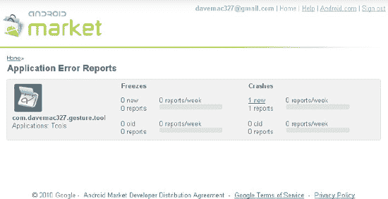

**图 28–2.** *应用程序错误报告屏幕*

深入查看崩溃报告的详细信息，您可以看到崩溃的堆栈跟踪、运行该应用的设备类型以及崩溃发生的时间。但与用户评论一样，您无法与遇到问题的用户进行沟通以获取更多细节，或帮助他们解决问题。您只能希望受影响的用户通过电子邮件或您的网站与您取得联系。否则，您只能根据崩溃报告弄清楚问题所在并尝试修复。


开发者控制台还有一个你可能需要用到的功能：网站的帮助部分。`帮助`按钮位于右上角。点击它将会带你进入一个帮助网站，该网站上有大量关于如何使用 Android 市场的优秀文档，并且还有一个论坛，你可以在其中搜索问题和答案，并发布自己的问题。例如，论坛里可以了解到最新的退款政策、问题和投诉。如果论坛无法解决问题，还有一个`联系支持`链接，它会带你到一个页面，你可以专门向 Google 发送消息以寻求帮助。

现在我们已经向你介绍了开发者控制台的一些便捷功能，但你或许更想了解其最实用的部分，也就是将你的应用程序上传到 Android 市场，以便用户可以找到并下载它们。不过在此之前，我们先来了解一下如何准备上传和销售你的应用程序。

### 准备销售你的应用程序

要将一个应用程序从代码完成阶段带到 Android 市场，有很多事情需要考虑和执行。本节将帮助你完成这些事项。

#### 针对不同设备进行测试

随着越来越多的 Android 设备面世，且每台设备都可能拥有一些新的硬件配置，测试你希望支持的那些设备就显得至关重要。最理想的情况是能够拿到每种类型的一台设备来测试你的应用程序，但这成本太高。次优的选择是为每种类型的设备配置一个 Android 虚拟设备（AVD），指定相应的硬件配置，然后使用模拟器和每个 AVD 进行测试。一些设备制造商会提供针对其特定设备的 Android 软件包，请查看他们的网站以获取下载选项。Android SDK 提供了 `Instrumentation` 类来辅助测试，以及 UI/应用程序锻炼器猴子工具。这些工具将帮助你进行自动化测试，这样你就不必花大量时间手动测试应用程序。在开始测试之前，你最好从代码和 `/res` 目录中移除不再需要的测试遗留内容。你需要让应用程序尽可能小，运行尽可能快，并占用最少的内存。

#### 支持不同的屏幕尺寸

当 Android SDK 1.6 发布时，开发者不得不应对新的屏幕尺寸。为了能在新的较小屏幕上运行，你必须在 `AndroidManifest.xml` 文件中将一个特定的 `<supports-screens>` 元素作为 `<manifest>` 的子元素进行设置。如果没有这个新标签来指定你的应用程序支持小屏幕尺寸，那么你的应用程序将不会在市场中显示给小屏幕设备。当然，这意味着你的应用程序需要针对 Android SDK 1.6 或更高版本编译。如果你希望你的应用程序能在仍使用 Android SDK 1.5 的设备上运行，那么你需要确保不使用 Android SDK 1.6 或更高版本中引入的任何新 API。然后，针对旧设备和新设备的 AVD 进行测试。为了支持不同的屏幕尺寸，你可能需要在 `/res` 目录下创建备选资源文件。例如，对于 `/res/layout` 中的文件，你可能需要在 `/res/layout-small` 中创建对应的文件以支持小屏幕。这并不意味着你也必须在 `/res/layout-large` 和 `/res/layout-normal` 中创建对应的文件，因为如果 Android 在 `/res/layout-large` 这样更具体的资源目录中找不到所需内容，它会回退到 `/res/layout` 目录中查找。另外请记住，你可以为这些资源文件使用限定符的组合；例如，`/res/layout-small-land` 将包含小屏幕横向模式下的布局。我们在第 6 章中讨论过这一点。支持小屏幕可能也意味着需要创建可绘制对象（如图标）的备选版本。对于可绘制对象，你可能需要创建备选资源目录，并考虑屏幕分辨率以及屏幕尺寸。

当然，平板电脑在屏幕尺寸上则相反，使用“xlarge”标签。与之前相同的 `<supports-screen>` 标签用于指定你的应用程序是否会在超大屏幕上运行，在该标签内使用的属性是 `android:xlargeScreens`。在某些情况下，你可能有一个仅适用于平板电脑的应用程序，在这种情况下，你需要明确指示对于其他尺寸，其属性值为“false”。


#### 准备用于上传的 AndroidManifest.xml 文件

你的 `AndroidManifest.xml` 文件在上传到 Android Market 之前可能需要进行一些微调。ADT 通常会将 `android:icon` 属性放在 `<application>` 标签内，而不是 `<activity>` 标签中。如果你有多个可以启动的 Activity，你可能需要为每个 Activity 指定单独的图标，以便用户更容易区分它们。但你仍然需要在 `<application>` 中指定一个图标，它也会作为那些没有指定自己图标的 Activity 的默认 Activity 图标。如果你的应用仅在 `<activity>` 标签中指定了 `android:icon`，它在设备和模拟器上可以正常运行，但当 Android Market 在上传时检查你的应用 `.apk` 文件时，它会在 `<application>` 标签中查找图标信息。此外，如果你使用的包名以 `com.google`、`com.android`、`android` 或 `com.example` 开头，Android Market 也会阻止上传你的应用，不过希望你在应用中未曾使用过这些名称。

在你针对不同设备配置测试应用时，还有许多其他兼容性问题需要考虑。有些设备有摄像头，有些没有物理键盘，还有一些有轨迹球而没有方向键。根据需要，在你的 `AndroidManifest.xml` 文件中使用 `<uses-configuration>` 和 `<uses-feature>` 标签来定义你的应用在硬件/平台方面的需求。Android Market 会强制执行这些规则，不会让你的应用显示给那些设备不支持你应用的用户。请注意，这些标签与 `AndroidManifest.xml` 文件中的 `<uses-permission>` 标签不同且相互独立。虽然用户的设备可能配备了摄像头，但这并不意味着用户愿意授予你的应用使用它的权限。同时，声明你的应用需要使用摄像头的权限，并不会告诉 Android Market 你的应用需要设备具备摄像头。在大多数情况下，你需要在 `AndroidManifest.xml` 文件中同时放置这两个标签，一个用于指定需要摄像头，另一个用于指定需要使用摄像头的权限。但并非所有功能都需要权限，因此，指定你所需的功能对你最有利。

`<uses-permissions>` 和 `<uses-feature>` 之间还有另一个重要区别：`<uses-feature>` 标签可以声明你的应用*必须*有该功能，或者你的应用在没有该功能的情况下也能正常运行。也就是说，有一个名为 `android:required` 的属性，可以设置为 `true` 或 `false`，默认值为 `true`。例如，你的应用可能会在有蓝牙时使用它，但没有蓝牙也能正常工作。因此，在清单文件中，你可以这样写：

`<uses-feature android:name="android.hardware.bluetooth" android:required="false" />`

在你的应用代码中，你应该调用 `PackageManager` 来检测蓝牙是否可用，你可以使用以下代码：

```java
boolean hasBluetooth = getPackageManager().hasSystemFeature(
                PackageManager.FEATURE_BLUETOOTH);
```

然后在你的应用中，如果蓝牙不可用，采取相应的处理措施。Android 文档在这方面可能会让人困惑。如果你查看 `<uses-feature>` 的开发者指南页面，你不会看到像 `PackageManager` 参考页面中描述的那样多的功能，而后者为每个可用功能定义了一个 `FEATURE_*` 常量。

`<uses-configuration>` 标签略有不同。它指定了设备必须具备的键盘、触摸屏和/或导航控制类型。但与 `<uses-feature>` 的独立选择不同，你需要将配置选项的组合放入你的应用所需的条件中。例如，如果你的应用需要五向导航控制（即 D-pad 或轨迹球）和触摸屏（使用触控笔或手指），你可以按如下方式指定两个标签：

`<uses-configuration android:reqFiveWayNav="true" android:reqTouchScreen="stylus" />`
`<uses-configuration android:reqFiveWayNav="true" android:reqTouchScreen="finger" />`

#### 本地化你的应用

如果你的应用将在其他国家/地区使用，你可能需要考虑对其进行本地化。从技术角度来看，这相对容易实现。找人来做本地化则是另一回事。从技术角度来说，你只需在 `/res` 下创建另一个文件夹——例如，`/res/values-fr` 用于存放法文版的 `strings.xml`。将你现有的 `strings.xml` 文件中的字符串值翻译成新的语言，然后将翻译后的新文件以原文件名保存在新的资源文件夹下。同样的技术也适用于其他类型的资源文件——例如，可绘制对象和菜单。如果不同国家或文化的图片和颜色不同，可能对用户更有利。因此，建议不要在颜色资源名称中使用真实的颜色名称。在关于颜色的在线文档中，经常可以看到类似这样的内容：

`<color name="solid_red">#f00</color>`

这意味着在你的代码或其他资源文件中，你通过实际的颜色名称来引用该颜色，在本例中为 `solid_red`。为了将颜色本地化为更符合其他国家/文化习惯的颜色，最好使用诸如 `accent_color1` 或 `alert_color` 这样的颜色名称。在英语环境中，红色可能是合适的颜色值，而在西班牙语环境中，使用某种黄色调可能更好。因为像 `alert_color` 这样的颜色名称不会暴露你实际使用的颜色，所以当你想要将实际颜色值改为其他颜色时，它不太容易引起混淆。同时，你可以设计一套令人愉悦的配色方案，包括基础色和强调色，并且更有信心在正确的位置使用正确的颜色。

在不同国家/地区，菜单选项可能需要更改，使用更少或更多的菜单项，或者以不同的方式组织，具体取决于应用的使用地点。菜单通常存储在 `/res/menu` 下。如果你面临这种情况，最好将所有字符串文本放入 `strings.xml` 或其他位于 `/res/values` 目录下的文件中，并在其他地方的相关资源文件中使用字符串 ID。这样做可以大大降低你在某个晦涩的资源文件中遗漏翻译字符串值的可能性。这样你的语言翻译工作就仅限于 `/res/values` 下的文件。


### 准备应用程序图标

购物者和用户会在 Android Market 以及下载后的设备上显著看到你应用程序的图标和标签。请特别注意为你的应用及其活动创建精美的图标和恰当的标签。根据需要进行本地化，并牢记：针对不同屏幕尺寸，图标可能需要调整才能呈现良好效果。观察其他开发者如何设计图标，特别是那些与你应用同属一类的应用。你希望应用能引人注目，因此最好不要与其他应用雷同。同时，你也希望当图标和标签与众多其他应用图标并列时，能在设备上正常工作。你不想让用户对应用功能感到困惑，所以图标应能代表应用的核心功能。

为你的应用创建任何图像（尤其是图标）时，都必须考虑目标设备的屏幕密度。密度指每英寸的像素数。小屏幕通常密度较低，即单位距离内像素较少；而大屏幕往往密度较高。对于低密度屏幕，要使图标看起来大小合适，需用较少的像素（通常为 36×36）来创建。对于高密度屏幕，你可能选择 72×72 像素的图标。中等密度图标通常为 48x48 像素，超高密度则为 96x96 像素。

### 从应用中赚钱的考量

如果你计划收费出售应用，还需考虑其他问题：你是提供独立的免费和付费应用（需要构建和管理两个应用），还是保持单一代码库，并用某种技术判断该应用是否已付费？无论采用哪种方法，如何防止应用被复制并在其他设备上为他人安装？由于手机存在安全漏洞，且某些人能够访问设备内部，要实现对复制保护完全无懈可击极为困难。

维持单一代码库但支持免费和付费模式的一种技术是借助`PackageManager`：

```
this.getPackageManager().checkSignatures(mainAppPkg, keyPkg)
```

此方法比较两个指定包的签名，若两者同时存在且相同，则返回`PackageManager.SIGNATURE_MATCH`。每个应用在 Android Market 中共存时包名必须不同，但这没问题。在你的代码中，当需要决定是否允许某些功能时，可调用此方法提供主应用和解锁应用的包名。随后在 Android Market 中将解锁应用设为付费应用。如果用户购买并下载了该解锁应用，主应用将获得签名匹配，并解锁额外功能。另一种较不清晰的处理单一代码库的方法，是使用源码版本控制系统配置公共元素的共享，并通过构建脚本生成应用的免费和付费版本。

通过 Android 应用赚钱的另一种方式是应用内广告。嵌入广告的机会很多，常见的有 AdMob 和 AdSense。其过程基本是：将它们的 SDK 集成到你的应用中，规划广告在应用中的显示位置和时机，为应用添加`INTERNET`权限（以便广告 SDK 获取并显示广告），然后当用户点击广告时你就能获得收益。应用可以保持免费，这样更容易上架 Android Market，且无需过度担心盗版问题。许多开发者报告称通过广告获得了可观的收入。

2011 年 2 月引入的另一新功能是“买家货币”。在此之前，买家必须用卖家货币付款，这容易让难以换算的买家感到困惑，也意味着卖家全球只能采用单一价格。如今卖家可以针对不同国家设定价格，不仅售价可在各国灵活调整，买家体验也变得更加便捷友好。

### 引导用户返回 Market

Android 引入了一种新的 URI 方案，以帮助在 Android Market 中查找应用：`market://`。例如，若你想引导用户前往 Market 寻找所需组件，或推广能解锁应用功能的附加应用，可执行如下操作（将`MY_PACKAGE_NAME`替换为真实包名）：

```
Intent intent = new Intent(Intent.ACTION_VIEW,
          Uri.parse("market://search?q=pname:MY_PACKAGE_NAME"));
startActivity(intent);
```

这将在设备上启动 Market 应用，并将用户带到该包名对应的页面。用户随后可选择下载或购买该应用。注意，此方案在普通网页浏览器中无效。除了按包名（`pname`）搜索，你还可以通过开发者名称搜索（使用`market://search?q=pub:\"Fname Lname\"`），或针对 Android Market 中的任何公开字段（应用标题、开发者名称、应用描述）搜索（使用`market://search?q=<查询字符串>`）。

如果将刚学到的知识与上一节的技术结合，我们的代码可以检测设备上是否存在解锁包。若未找到，可提示用户是否要获取解锁应用。如果用户响应“是”，则调用 Intent 打开 Market 应用，直接将用户带至我们的解锁应用页面进行购买和下载。


#### Android 许可服务

Android 应用的构建方式不幸地使其成为盗版的目标。恶意用户可能复制 Android 应用并将其分发给其他设备。那么，你如何确保未购买应用的用户无法运行它呢？Android 团队创建了名为许可验证库（`LVL`）的工具来满足这一需求。其工作原理如下。

如果你的应用是通过 Android Market 下载的，那么设备上必定存在 Android Market 应用的副本。此外，Android Market 应用拥有更高权限，能够读取设备的某些值，例如用户的 Google 账户名称、`IMSI` 以及其他信息。自 Android 1.5 版本起，Android Market 应用经过修改，能够响应来自应用的许可验证请求。你的应用调用 `LVL`，`LVL` 与 Android Market 应用通信，Android Market 应用再与 Google 服务器通信，最终你的应用会收到一个响应，表明该设备上的此用户是否获得使用你应用的许可。你可以根据自己的设置来决定在网络不可用时采取何种操作。关于实现 `LVL` 过程的完整描述，请参见 [`developer.android.com/guide/publishing/licensing.html`](http://developer.android.com/guide/publishing/licensing.html)。

不过需要注意的一点是，`LVL` 机制可能被破解。如果有人能够获取你应用的 `apk` 文件，他们可以反编译应用，并在知道从何处查找 `LVL` 调用的返回值后对其进行修补。如果你采用明显的模式，即在收到 `LVL` 响应后使用 `switch` 语句，根据返回码跳转到相应逻辑，那么黑客只需强制返回一个成功码，就能掌控你的应用。因此，Android 团队强烈建议你对应用进行混淆处理，以隐藏检查 `LVL` 返回码的那部分代码。正如你所想，这相当复杂。

在 Android 2.3 中，Google 以 `ProGuard` 功能的形式提供了一些混淆支持。当你将应用的目标构建版本设置为 2.3 或更高版本时，应用会自动获得一个 `proguard.cfg` 文件。通过使用此文件配置 `ProGuard`，你可以指示 `ADT` 在构建 `apk` 文件的正式版本时混淆代码。如果你使用 `ant` 进行构建，也可以配置 `ant` 使用 `ProGuard` 进行混淆。要开启混淆，你需要在应用的 `default.properties` 文件中将 `proguard.config` 属性设置为 `proguard.cfg` 文件的位置。当 `ProGuard` 执行其任务时，你会得到与 `apk` 文件一同生成的 `mapping.txt` 文件。请保存好此文件，因为你将需要它来反混淆来自应用的堆栈跟踪。

#### 准备上传你的 .apk 文件

要使测试完成的应用准备上传，即创建要上传的 `.apk` 文件，你需要执行以下步骤（所有这些步骤在第 10 章中均有介绍）：

1.  创建（如果尚未创建）一个用于签署应用的正式版证书。
2.  如果你使用了地图，请在 `AndroidManifest.xml` 中将地图 API 密钥替换为你的正式版地图 API 密钥。如果忘记执行此操作，你的所有用户都将无法查看地图。
3.  在 Eclipse 中右键点击你的项目，选择 Android Tools → Export Unsigned Application Package，然后选择一个合适的文件名来导出应用。建议给这个文件起一个临时名称，因为在第 5 步运行 `zipalign` 时，你需要提供一个输出文件名，那应该是你正式版 `.apk` 文件的名称。
4.  在你的新 `.apk` 文件上运行 `jarsigner`，使用第 1 步中的正式版证书进行签名。
5.  在你的新 `.apk` 文件上运行 `zipalign`，将任何未压缩的数据调整到合适的内存边界，以提升运行时的性能。这是你为应用 `.apk` 文件提供最终文件名的步骤。
6.  Android 现在在 Eclipse 中提供了 Export Signed Application Package 选项，它通过向导来执行步骤 3、4 和 5。


### 上传你的应用

上传操作本身很简单，但需要做一些准备工作。在开始上传之前，你需要准备好一些材料，并做出一些决定。本节将涵盖这些准备工作与决策。当你准备好一切后，请前往开发者控制台并选择“上传应用程序”。系统会提示你提供大量关于你的应用的信息，市场会对你的应用及这些信息进行一些处理，之后你的应用就可以发布到市场上了。

前一节介绍了如何准备用于上传的应用`.apk`文件。要让你的应用对买家有吸引力，你需要做一些营销工作。你需要提供优秀的功能描述，以及精美的图片，以便买家了解他们可能会下载什么。

上传应用时，首先被要求提供的内容之一就是截图。捕获应用截图最简单的方法是使用 DDMS。启动 Eclipse，在模拟器或真实设备上运行你的应用，然后将 Eclipse 透视图切换到 DDMS 和设备视图。在设备视图中，选中运行你应用的设备，然后点击屏幕捕获按钮（它看起来像右上角的一幅小画），或从“视图”菜单中选择它。如果在保存时有选择，请选择 24 位色。Android Market 会将你的截图转换为压缩的 JPEG；从 24 位色开始处理的效果会优于 8 位色。选择的截图应能让你的应用在同类中脱颖而出，同时也要能展示其重要功能。你必须提供至少两张截图，最多可提供八张。

接下来是高分辨率应用图标。它可以与你的应用图标设计完全相同，但 Android Market 要求是 512x512 像素的图标图片。这是必填项。

你也可以提供推广图片，但其尺寸比截图要小。尽管这张图片是可选的，但附加上它是个好主意。你永远不知道这张图片何时会被展示；如果没有，你也不知道那个位置会显示什么（如果有东西显示的话）。推广图片出现的一个地方，是在 Android Market 中你应用的“详情”页面顶部。

功能图片是另一个可选字段，尺寸为 1024x500 像素。这张图片会用在 Android Market 的“精选”区域，所以你应该让它看起来非常出色。

最后一项与应用相关的图片是可选的视频，你可以将其放在 YouTube 上，并从你的 Android Market 页面链接过去。

Android Market 会要求提供关于你应用的文本信息以展示给买家，包括标题、描述性文本和推广文本。只有在你已经提供了推广图片的情况下，才能提供推广文本。文本可以多种语言提供，因为你可以选择将你的应用分发到全球各个国家。上面提到的图片只能向 Android Market 上传一次，所以如果你的截图在不同地区看起来不一样，你需要考虑其他方式（比如你自己的网站）让买家能够看到这些图片。这一点将来可能会改变。

如果你已经为用户编写了单独的用户许可协议（EULA），请在描述文本中提供一个链接，以便买家在下载你的应用前可以查看。考虑到买家很可能会使用搜索来查找应用，请务必在文本中包含恰当的词语，以最大化与应用功能相关的搜索命中率。最后，在文本中加入一句简短的提示，建议用户在遇到问题时给你发邮件，这是值得的。没有这个简单的提示，用户更倾向于留下负面评论，而与受影响的用户通过电子邮件沟通相比，负面评论会极大地限制你排查和解决问题的能力。

前面提到的用户评论机制的一个缺点是，它不区分你的应用版本。如果版本 1 收到了负面评论，而你发布了所有问题都已修复的版本 2，那么版本 1 的评论仍然存在，买家可能没有意识到这些评论不适用于新版本。在发布应用的新版本时，应用评分（星级）也不会重置。部分出于这个原因，谷歌开始提供一个“近期变更”文本字段，你可以在其中描述此版本的新内容。你可以在这里说明某个问题已被修复，或者介绍新功能是什么。

还有一个独立的“推广文本”字段，只有 80 个字符。当你的应用在 Android Market 的列表顶部展示时，显示的是推广图片和推广文本。提供这些内容绝对是个好主意。

在编写应用文本时，你的责任之一就是披露所需的权限。这些权限与你在应用`AndroidManifest.xml`文件中的`<uses-permission>`标签里设置的权限相同。当用户将你的应用下载到他们的设备上时， Android 会检查`AndroidManifest.xml`文件，并在完成安装前向用户询问所有使用权限要求。所以你最好事先披露这些信息。否则，你可能会面临因用户发现某个应用要求他们不愿授予的权限而感到惊讶，从而给出负面评论的风险。更不用说退款了，这也会影响你的开发者综合评分。与权限类似，如果你的应用需要特定类型的屏幕、摄像头或其他设备功能，也应该在你的文本描述中予以披露。最佳实践是，你不仅要披露你的应用需要哪些权限和功能，还要说明你的应用将用它们来做什么。你应该预先回答用户的问题：为什么这个应用需要 X？

上传应用时，你需要选择应用类型和类别。这些值会随时间变化，我们在此不一一列举，但你很容易通过“上传应用程序”界面看到它们。

接下来，你需要为你的应用定价。默认价格为“免费”，如果你想为你的应用收费，则必须先在 Google Checkout 中设置一个商家账户。为应用设定合适的价格是件棘手的事情，除非你拥有一些复杂的市场调研能力，即使那样，也依然棘手。定价过高可能会让用户望而却步，并且你会面临因用户觉得价格不值而导致退款的风险。定价过低也可能让用户望而却步，因为他们可能认为这是一个廉价的应用。

Android Market 提供了一个在应用上传时设置复制保护的选项。市场会帮你应用这个复制保护，但请注意，复制保护会使你的应用占用更多设备内存。它也不是万无一失的，无法保证你的应用不会被从设备上复制出来。由于这种复制保护方法正在被弃用，你很可能需要考虑其他额外的或替代的方法来防止你的应用被盗版，例如前面提到的 Android 许可服务。


2010 年底，谷歌推出了一项应用评级方案。这一方案旨在让消费者了解某款应用对特定年龄段的适宜性。遗憾的是，其中一半的年龄分级都带有“青少年”字样。评级分为：全年龄段、青少年前期、青少年和成熟级。选择正确的级别取决于你应用中的内容及其内容的数量。谷歌对位置感知以及发布或公开位置信息有相关规定。最好亲自阅读这里的规则：[www.google.com/support/androidmarket/bin/answer.py?hl=en&answer=188189](http://www.google.com/support/androidmarket/bin/answer.py?hl=en&answer=188189)。

在提交应用之前，最后要做的决定之一是选择你的应用对哪些地区和运营商可见。选择“全部”意味着你的应用在全球范围内均可使用。然而，你可能希望按地域或运营商来限制分发。根据你应用的功能，你可能需要按地区限制分发，以遵守美国出口法律。如果你的应用与某些运营商的设备或政策存在兼容性问题，你也可以选择按运营商进行限制。要查看运营商，请点击某个国家/地区的链接，该国家/地区支持的运营商列表就会显示出来，你可以从中选择你想要的。选择“全部”也意味着谷歌后续新增的任何地区或运营商，都会自动看到你的应用，无需你做任何额外操作。

尽管你的开发者资料中包含了联系信息，但在上传每个应用时，你仍可以设置不同的联系信息。市场要求提供与此应用相关的网站、电子邮件地址和电话号码作为联系方式。你至少需要提供其中一项，以便买家获得支持，但无需三项都提供。最好不要在这里使用你的个人电子邮件地址，就像你可能也不想公开个人电话号码一样。当你通过销售应用赚取数百万美元时，你会希望别人来接收和处理用户的邮件。提前设置一个应用支持类的电子邮件地址，可以轻松地将支持邮件与个人邮件区分开来。

做完所有这些决定后，你必须宣誓你的应用符合安卓内容指南（基本上就是不能有不良内容），并再次宣誓该软件可允许从美国出口。适用美国出口法律是因为谷歌的服务器位于美国境内，即使你身在美国境外，甚至你和你客户都在美国境外也是如此。请记住，你始终可以选择通过其他渠道分发你的应用。当所有信息都填写完毕，并且图形文件上传后，继续操作，点击“保存”按钮。这将为你的应用做好一切准备，使其能够“上线”。

然后，你可以通过点击“发布”按钮来发布你的应用。安卓市场会对你的应用进行一些检查，例如检查应用证书的到期日期。如果一切顺利，你的应用就可以下载了。恭喜！

## 安卓市场的用户体验

安卓市场在设备上已经存在了一段时间，截至 2011 年 2 月，它已可以通过互联网访问。除了为应用在市场中提供优质的文本和图形描述外，开发者无法控制安卓市场的运作方式。因此，用户体验很大程度上取决于谷歌。在设备上，用户可以通过关键词搜索，查看热门下载应用（包括免费和付费）、精选应用、新应用，或按类别浏览。一旦找到他们想要的应用，只需选中它，就会弹出一个应用详情界面，允许他们安装或购买。如果选择购买，用户将跳转至谷歌结账处理交易的资金部分。下载完成后，新应用会出现在所有其他应用之中。

在安卓市场的网页端（[`market.android.com`](http://market.android.com)），用户界面看起来与设备端大致相同，只是比大多数设备屏幕大得多。一个不同之处在于，基于网页的安卓市场要求用户登录其谷歌账户才能使用。这允许谷歌将你在安卓市场网页端的体验与实际设备关联起来。这意味着两件事：使用网页端时，安卓市场能知道你的设备上已安装了哪些应用；当你在安卓市场网页端进行购买时，下载链接会被发送到你的设备，而不是你当前浏览网页所使用的电脑上。

安卓市场提供了一个查看已下载应用的“我的下载”选项。此区域包含所有已安装的应用，以及你购买过的任何应用，即使你已经删除了它们（也许你只是为了腾出空间安装其他应用而删除了它们）。这意味着你可以从手机上删除你付费购买的应用，稍后重新安装它，而无需再次购买。当然，如果你选择了退款，该应用将不会出现在“我的下载”中。此外，从设备上删除的免费应用也不会出现在“我的下载”中。“我的下载”中的应用列表与你用于该设备的谷歌账户绑定。这意味着你可以更换一台新设备，但仍然能够访问所有你已付费的应用。但请注意，由于你可能在谷歌拥有多个身份，你必须使用与之前完全相同的身份，才能在新设备上获取你的应用。当查看“我的下载”中的应用时，任何有可用升级的应用都会提示你，并允许你进行升级。

安卓市场会对用户可见的应用进行过滤。它通过多种方式来实现这一点。由于谷歌在某些国家涉及商业法律问题，这些国家的用户只能看到免费应用。谷歌正在努力克服商业障碍，以便所有付费应用都能在全球范围内可用。在那一天到来之前，某些国家的用户将无法访问付费应用。运行旧版本安卓系统的设备用户，将无法看到需要更新版本安卓 SDK 的应用。设备配置与应用要求（通过在`AndroidManifest.xml`文件中使用`<uses-feature>`标签声明）不兼容的用户，将无法看到这些应用。例如，不支持小屏幕的应用，使用小屏幕设备的用户在安卓市场中就看不到。这种过滤的主要目的是保护用户，避免他们下载那些无法在其设备上正常运行的应用。


如果你从其他国家在 Android Market 中购买应用，交易可能涉及货币兑换，并因此产生额外费用。除非卖家以你的本地货币标价，否则你实际上是通过 Google Checkout 在卖家所在国家进行购买。Android Market 会显示一个近似金额，但实际费用可能因交易时间和支付处理方的不同而有所变化。买家可能会发现账户中有一笔小额待处理交易（例如 1 美元）。这是 Google 为确保提供的支付信息正确而进行的操作，这笔待处理费用实际上并不会扣除。

有一些镜像 Android Market 的网站可供使用。购物者无需拥有设备，即可通过网络搜索、浏览分类并了解 Android Market 中的应用。这绕过了 Android Market 根据你的设备配置和位置进行的过滤。然而，这并不能将应用安装到你的设备上。此类镜像网站的示例包括 [`www.cyrket.com,www.androlib.com`](http://www.cyrket.com,www.androlib.com) 和 [`www.androidzoom.com`](http://www.androidzoom.com)。

## 超越 Android Market

Android Market 并非唯一的选择。你完全不必被迫使用 Android Market。你应该考虑利用其他分发渠道，这不仅能让你的应用覆盖更多国家和用户，还能利用其他支付处理方式和盈利机会。

存在完全独立于 Android Market 的 Android 应用商店。例如 [`www.andappstore.com`](http://www.andappstore.com)、[`http://slideme.org`](http://slideme.org)、[`www.getjar.com`](http://www.getjar.com) 和 [`www.androidgear.com`](http://www.androidgear.com)。亚马逊也正在推出一个 Android 应用商店。在这些网站上，你可以搜索、浏览、了解应用，并直接从设备或通过网页浏览器下载应用。这些网站不必遵守 Google 的规则，包括付费应用的交易费用和支付方式。在这些独立网站上，你可以使用 PayPal 和其他支付处理方购买应用。这些网站也不受地理位置或设备配置的限制。其中一些网站提供可安装的 Android 客户端，或在某些情况下，客户端可能已预装在设备上。用户只需在设备上启动浏览器，找到他们想通过网站下载的应用；当文件保存到设备时，Android 会知道如何处理它。也就是说，下载的 `.apk` 文件会被视为 Android 应用程序。如果你在浏览器的下载历史记录中（注意，不要与之前提到的“我的下载”混淆）点击它，系统将提示你是否要安装它。这种自由意味着你可以建立自己向用户分发 Android 应用的方法，甚至可以通过自己的网站并使用自己的支付方式。不过，你仍然需要处理必要的销售税征收并向相应税务机关缴纳。

虽然不受 Google 规则限制，但这些替代的应用分发方式可能无法提供与 Android Market 相同的买家保护。可能会出现在替代市场上购买的应用无法在买家设备上运行的情况。如果应用从设备上丢失，或者用户更换新设备需要转移应用，买家可能还需要自行负责创建备份。

这些其他市场允许你通过每个应用的销售获利，这与你在 Android Market 的情况非常相似。在这些其他市场中，你还可以实现替代的支付机制。当然，你也可以像我们之前描述的那样植入广告并以此盈利。你还可以在应用内嵌入其他支付机制。例如，PayPal 为 Android 应用推出了一个支付库（参见 [`www.x.com`](http://www.x.com)）。通过它，你可以让用户直接从你的应用内购买附加组件、内容或升级。他们也可以进行捐赠。你可以使用 PayPal 实现一个移动商店进行结账。

请记住，Google 并不限制开发者同时在 Android Market 和其他多个市场销售他们的应用。因此，请考虑所有选项，以便你的努力获得最大回报。

### 总结

现在，你已经准备好带着你的 Android 应用去征服世界了！我们向你展示了如何做好准备，如何准备好你的应用，如何发布，以及用户将如何找到、下载并使用你的应用。

