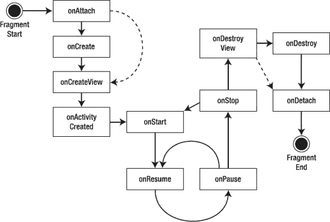
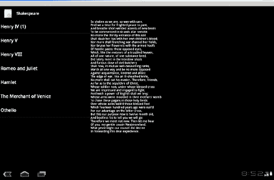
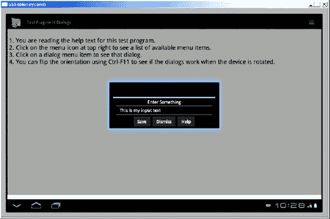

# 用于平板电脑及更多设备的 Fragment

在本书这一章之前，我们涵盖了所有 Android 版本共有的主题。Android 从出现在商业设备上到 Android 平板电脑新时代的曙光，仅仅过了大约两年时间，这真是令人惊叹。Android 3.0 的 UI 被描述为从头为平板电脑设计。值得庆幸的是，这并不意味着你必须抛弃之前学到的所有知识并重新开始。事实上，你学到的*所有*知识都将帮助你为平板电脑编写 Android 应用程序。Android 3.0 带来了一套新的概念和特性，你必须掌握它们才能编写出充分利用 Android 平板电脑超大（xlarge）屏幕尺寸的应用。虽然在 Android 3.0 之前编写的大多数应用都能够在 Android 3.0 平板电脑上运行，但它们并未针对平板电脑进行优化。本章将开始介绍这些新概念和特性。

Android 3.0 中新增的核心类之一是 `Fragment` 类，它有许多衍生类。本章将向你介绍 fragment，它是什么，如何融入应用程序的体系结构，以及如何使用它。Fragment 使得许多以前困难的有趣事情成为可能。同样有趣的是，你可以在旧版本的 Android 上使用 fragment，因为 Google 发布了一个适用于旧版 Android 的 fragment SDK。因此，即使你对为平板电脑编写应用不感兴趣，你可能会发现 fragment 也能在非平板电脑设备上让你的工作更轻松。

让我们开始学习 Android fragment 吧。


### 什么是碎片？

本节将首先解释什么是碎片及其作用。不过，我们得先铺陈一下背景，看看我们到底为什么需要碎片。正如你之前所学，在屏幕较小的设备上，Android 应用使用活动（Activity）来向用户展示数据和功能，每个活动都有一个相当简单且明确的目的。例如，一个活动可能向用户展示其通讯录中的联系人列表。另一个活动可能允许用户撰写电子邮件。Android 应用就是一系列这样的活动组合在一起，以实现更大的目标，比如通过阅读和发送消息来管理电子邮件账户。对于小屏幕设备来说，这没问题。但当用户的屏幕非常大（10 英寸或更大）时，屏幕上就有空间可以做更多事情，而不仅仅是单一功能。一个应用可能希望让用户既能查看收件箱中的邮件列表，同时又在另一个窗口中显示当前选中的邮件内容。或者，一个应用可能希望同时显示联系人列表和当前选中联系人的详细信息视图。

作为一名 Android 开发者，你知道可以通过为超大屏幕再定义一套包含 `ListView`、布局和其他各种视图的布局来实现此功能。而所谓“再定义一套布局”，是指在你可能已经为较小屏幕定义的布局之外，再额外增加布局。当然，你可能还想为竖屏和横屏分别设置不同的布局。并且，考虑到超大屏幕的尺寸，这意味着一大堆用于标签、字段、图片等的视图，你需要对它们进行布局并编写代码。如果能有一种方法将这些视图对象分组，并将它们的逻辑整合在一起，从而使应用的各个模块能在不同屏幕尺寸和设备间复用，最大限度地减少开发者维护应用所需的工作量，那该多好。这，就是我们拥有碎片的原因。

可以将碎片理解为一种子活动。事实上，碎片的语义与活动非常相似。碎片可以拥有与之关联的视图层次结构，并且它的生命周期与活动的生命周期非常相似。碎片甚至能像活动一样响应返回键。如果你曾想过，“要是能在平板的屏幕上同时放置多个活动就好了”，那么你的思路是对的。但因为在平板屏幕上同时激活应用的多个活动会过于混乱，所以碎片机制就是为了实现这一构想而创建的。这意味着碎片是被包含在活动之中的。碎片只能存在于活动的上下文中；没有活动，你就无法使用碎片。碎片可以与活动中的其他元素共存，这意味着你*不必*将活动的整个用户界面都转换为使用碎片。你可以像以前一样创建活动的布局，而只对用户界面的某个部分使用碎片。

然而，在保存状态和后续恢复状态方面，碎片与活动不同。碎片框架提供了若干特性，使得保存和恢复碎片比在活动上执行相同操作要简单得多。

如何决定何时使用碎片取决于几个方面的考量，接下来会对此进行讨论。

### 何时使用碎片

使用碎片的主要原因之一，就是能够在不同设备和屏幕尺寸间复用用户界面和功能模块。这在平板上尤其如此。想想看，当屏幕像平板那么大时，能发生多少事情？它更像是台式机而非手机，而你的许多桌面应用都有多窗格的用户界面。如前所述，你可以同时在屏幕上显示列表和选中项目的详情视图。在横屏模式下，列表在左、详情在右，这很容易想象。但如果用户将设备旋转到竖屏模式，屏幕就变得更高而不是更宽了呢？也许你会希望列表位于屏幕的上半部分，而详情位于下半部分。可如果这个应用运行在小屏幕上，根本没有空间同时显示这两部分呢？难道你不希望分别用于列表和详情的活动能够共享你为这些大屏幕模块构建的逻辑吗？我们希望你的回答是肯定的。碎片可以帮助实现这一点。

让我们回到旋转屏幕方向的例子。如果你曾不得不为活动的方向变化编写代码，你就会知道保存活动的当前状态并在活动重建后恢复状态是多么痛苦的一件事。如果你的活动中有一些模块能够在方向变化时轻松保留下来，从而避免每次方向变化时都进行全部销毁和重建，那该有多好？当然会很棒。碎片可以帮助实现这一点。

现在设想一下，用户正在你的活动中进行一些操作。假设用户界面在同一活动中发生了变化，而用户现在想后退一步、两步或三步。在旧式的活动中，按下返回键会使用户完全退出当前活动。而有了碎片，返回键可以在停留在当前活动的情况下，在碎片栈中逐步回退。

接下来，考虑一下活动的用户界面中某块主要内容发生改变的情况；你希望过渡看起来平滑流畅，就像一个精良的应用。碎片也能做到这一点。

现在，你对碎片是什么以及为什么使用它有了基本概念，接下来让我们更深入地研究一下碎片的结构。


### 片段的结构

如前所述，片段类似于子活动：它有相当明确的目的，并且几乎总是显示用户界面。但与活动继承自 `Context` 不同，片段继承自 `android.app` 包中的 `Object`。片段*并非*活动的扩展。不过，与活动类似，你总是需要继承 `Fragment`（或其子类），以便重写其行为。

片段可以拥有与用户交互的视图层次结构。这个视图层次结构与其他任何视图层次结构一样，可以通过 XML 布局文件创建（填充），也可以在代码中创建。若要用户可见，此视图层次结构需要附加到宿主活动的视图层次结构中，这一点稍后会讲到。构成片段视图层次结构的视图对象，与 Android 其他部分使用的视图类型相同。因此，你对视图的所有了解同样适用于片段。

除了视图层次结构，片段还拥有一个用作其初始化参数的包。与活动类似，片段可以被系统保存，并在稍后自动恢复。当系统恢复片段时，它会调用默认构造函数（即无参数构造函数），然后将此参数包恢复到新创建的片段中。后续对片段的回调可以访问这些参数，并利用它们将片段恢复到之前的状态。因此，你务必做到以下几点：

-   确保你的片段类有一个默认构造函数。
-   在创建新片段时立即添加参数包，以便后续方法能够正确设置片段，同时让系统在必要时能够正确恢复片段。

一个活动可以同时有多个片段在运行，如果一个片段被另一个片段替换，该片段切换事务可以被保存在返回栈中。返回栈由与活动关联的片段管理器管理。返回栈决定了返回按钮的行为。片段管理器将在本章后续部分讨论。这里你需要了解的是，片段知道它关联的是哪个活动，并可以通过该活动访问其片段管理器。片段还可以通过其活动访问活动的资源。

由于片段可以被管理，它拥有一些自身的标识信息，包括标签和 ID。这些标识符可用于稍后查找该片段，这有助于实现复用。

与活动类似，当片段被重建时，片段可以将状态保存到包对象中，而此包对象会被传递回片段的 `onCreate()` 回调。这个保存的包也会传递给 `onInflate()`、`createView()` 和 `onActivityCreated()`。请注意，这个包与作为初始化参数附加的包不是同一个。此包通常用于存储片段的当前状态，而非用于初始化片段的值。

### 片段的生命周期

在开始在示例应用中使用片段之前，你真的需要了解片段的生命周期。为什么？因为片段的生命周期比活动的生命周期更复杂，了解*何时*可以对片段进行操作非常重要。图 29-1 展示了片段的生命周期。



**图 29-1.** *片段的生命周期*

如果将此图与图 2-15（活动的生命周期）进行比较，你会注意到一些差异，这主要是由于活动与片段之间需要交互。片段高度依赖于其所在的宿主活动，并且可能在宿主活动经历一个步骤时，经历多个子步骤。

一开始，片段被实例化。此时它作为内存中的一个对象存在。接下来很可能发生的是，初始化参数被添加到你的片段对象中。当系统从保存状态重建片段时，情况尤其如此。当系统从保存状态恢复片段时，会调用默认构造函数，然后附加初始化参数包。如果你是手动创建片段，一个良好的模式是使用清单 29-1 所示的方法，该方法在 `MyFragment` 类定义中展示了一种工厂类型的实例化器。

**清单 29-1.** *使用静态工厂方法实例化片段*

```
public static MyFragment newInstance(int index) {
    MyFragment f = new MyFragment();
    Bundle args = new Bundle();
    args.putInt("index", index);
    f.setArguments(args);
    return f;
}
```

从客户端的角度来看，他们通过调用带有一个参数的静态 `newInstance()` 方法来获取新实例。他们获得实例化后的对象，并且初始化参数已通过参数包设置到该片段上。如果此片段稍后被保存并重建，系统将经历一个非常相似的过程：调用默认构造函数，然后重新附加初始化参数。针对你的特定情况，你应该定义你的 `newInstance()` 方法（或多种方法）的签名，以接受适当数量和类型的参数，然后相应地构建参数包。这就是你的 `newInstance()` 方法需要做的全部工作。后续的回调会负责完成片段的其余设置。

#### `onInflate()` 回调

下一个*可能*发生的事件是布局视图的填充。如果你的片段是由正在填充的布局中的 `<fragment>` 标签定义的（通常当活动为其主布局调用 `setContentView()` 时），那么你的片段会调用其 `onInflate()` 回调。该回调会传入一个包含 `<fragment>` 标签属性的 `AttributeSet`，以及一个保存的包。如果片段正在被重建，并且之前的状态保存在 `onSaveInstanceState()` 中，那么这个包就包含了已保存的状态值。`onInflate()` 的预期用途是读取属性值并保存以供日后使用。在片段的这个阶段，实际操作用户界面还为时过早。片段甚至尚未与其活动关联。但这正是片段接下来将要发生的事件。

**注意：** 已提交缺陷 #14796，原因是关于 `onInflate()` 的文档与 Honeycomb 版本中的实际情况存在差异。文档说 `onInflate()` 总是在 `onAttach()` 之前被调用。但实际上，在活动重启后，`onInflate()` 可能在 `onCreateView()` 之后才被调用。这对于将值设置到包中并调用 `setArguments()` 来说为时已晚。参见 [`http://code.google.com/p/android/issues/detail?id=14796`](http://code.google.com/p/android/issues/detail?id=14796)。这也是为什么 图 29-1 的状态图中没有显示 `onInflate()` 的原因——很难预测此回调何时会被调用。


#### 片段生命周期回调

#### `onAttach()` 回调

`onAttach()` 回调在片段与其 Activity 关联后被调用。如果您需要使用 Activity 引用，它会传递给您。您至少可以利用该 Activity 来查询有关其所属 Activity 的信息。您还可以将该 Activity 作为上下文来执行其他操作。需要注意的是，`Fragment` 类有一个 `getActivity()` 方法，该方法会始终返回片段所附加到的 Activity（如果您需要的话）。请记住，在整个生命周期中，您都可以通过片段的 `getArguments()` 方法获取初始化参数包。但是，一旦片段附加到其 Activity 上，就不能再次调用 `setArguments()`。因此，除了在最开始时，您无法向初始化参数中添加内容。

#### `onCreate()` 回调

接下来是 `onCreate()` 回调。虽然这与 Activity 的 `onCreate()` 类似，但区别在于，您不应在此处放置依赖于 Activity 视图层次结构存在的代码。虽然您的片段此时可能已与其 Activity 关联，但您尚未收到 Activity 的 `onCreate()` 已完成的通知。这将在后续发生。如果有已保存的状态包，此回调会将其传递进来。此回调是创建后台线程以获取该片段所需数据的最早时机。您的片段代码运行在 UI 线程上，您不希望在该线程上执行磁盘 I/O 或网络访问。事实上，启动一个后台线程来准备数据是非常合理的。您的后台线程应该执行阻塞调用。您稍后需要与数据建立连接，但有多种方法可以实现。

**注意：** 在后台线程中加载数据的方法之一是使用 `Loader` 类。本书篇幅有限未能涵盖此内容，请查阅我们的网站以获取更多信息。

#### `onCreateView()` 回调

下一个回调是 `onCreateView()`。这里期望您返回该片段的视图层次结构。传递给此回调的参数包括一个 `LayoutInflater`（您可以用它来为片段填充布局）、一个 `ViewGroup` 父容器（在清单 29–2 中称为 *container*），以及已保存的包（如果存在）。这里非常重要的一点是，您不应将视图层次结构附加到传入的 `ViewGroup` 父容器上。该关联将在稍后自动发生。提供父容器是为了让您可以将其与 `LayoutInflater` 的 `inflate()` 方法一起使用，尽管您也可以在必要时自行查询父容器。但如果您在此回调中将片段的视图层次结构附加到父容器上，很可能会遇到异常。清单 29–2 展示了在此方法中您可能想要执行的操作示例。

**清单 29–2.** *在 onCreateView() 中创建片段视图层次结构*

```
@Override
public View onCreateView(LayoutInflater inflater,
                               ViewGroup container, Bundle savedInstanceState) {
        View v = inflater.inflate(R.layout.details, container, false);
        TextView text1 = (TextView) v.findViewById(R.id.text1);
        text1.setText(myDataSet[ getPosition() ] );
        return v;
}
```

在这里，您可以看到如何访问仅用于此片段的布局 XML 文件，并将其填充为一个视图，然后返回给调用方。这种方法有几个优点。您始终可以在代码中构建视图层次结构，但通过填充布局 XML 文件，您可以利用系统的资源查找逻辑。根据设备所处的配置或设备本身，系统会选择适当的布局 XML 文件。然后，您可以访问布局中的特定视图；在本例中，就是 `text1` `TextView` 字段，来对其进行所需操作。重复一个非常重要的要点：不要在此回调中将片段的视图附加到容器父对象上。您可以在清单 29–2 中看到，您在调用 `inflate()` 时使用了容器，但同时也为 `attachToRoot` 参数传递了 `false`。

#### `onActivityCreated()` 回调

您现在已接近用户可以与片段交互的阶段。下一个回调是 `onActivityCreated()`。这是在 Activity 完成其 `onCreate()` 回调后调用的。现在您可以相信，Activity 的视图层次结构（包括您之前返回的片段视图层次结构）已经就绪并可用。这是您可以在用户看到用户界面之前对其进行最终调整的地方。如果此 Activity 及其片段是从已保存状态重新创建的，这一点尤其重要。此外，在此回调中，您可以确保此 Activity 的任何其他片段都已附加到您的 Activity 上。

#### `onStart()` 回调

片段生命周期中的下一个回调是 `onStart()`。现在您的片段对用户可见。但您尚未开始与用户交互。此回调与 Activity 的 `onStart()` 相关联。因此，之前您可能将逻辑放在 Activity 的 `onStart()` 中，而现在更倾向于将逻辑放在片段的 `onStart()` 中，因为这也是用户界面组件所在的位置。

#### `onResume()` 回调

在用户可以与您的片段交互之前的最后一个回调是 `onResume()`。此回调与 Activity 的 `onResume()` 相关联。当此回调返回时，用户可以自由地与片段交互。例如，如果您的片段中有一个相机预览，您可能需要在片段的 `onResume()` 中启用它。

至此，应用已进入让用户愉悦的状态。然后用户决定退出您的应用，无论是通过返回键、按下主页键，还是启动其他应用。下一个序列与 Activity 的情况类似，方向与设置片段以供交互相反。

#### `onPause()` 回调

片段上的第一个撤销回调是 `onPause()`。此回调与 Activity 的 `onPause()` 相关联；就像 Activity 一样，如果您的片段中有媒体播放器或其他共享对象，您可以通过 `onPause()` 方法暂停、停止或释放它。同样适用“良好公民”规则：当用户正在接听电话时，您不希望播放音频。片段有可能从 `onPause()` 回到 `onResume()`。

#### `onStop()` 回调

下一个撤销回调是 `onStop()`。此回调与 Activity 的 `onStop()` 相关联，并服务于与 Activity 的 `onStop()` 类似的目的。已停止的片段可以直接回到 `onStart()` 回调，然后进入 `onResume()`。

#### `onDestroyView()` 回调

如果您的片段即将被销毁或保存，下一个撤销方向的回调是 `onDestroyView()`。这会在您之前在 `onCreateView()` 回调中创建的视图层次结构从片段中分离后被调用。

#### `onDestroy()` 回调

接下来是 `onDestroy()`。当片段不再被使用时调用此方法。请注意，它仍然附加到 Activity 并且仍然是“可查找的”，但做不了太多事情。

#### `onDetach()` 回调

片段生命周期中的最后一个回调是 `onDetach()`。一旦被调用，片段就不再与它的 Activity 绑定，不再拥有视图层次结构，并且其所有资源都应已被释放。


### 使用 `setRetainInstance()`

你可能已经注意到 图 29–1 中的虚线。Fragment 的一个炫酷特性在于，你可以指定当 Activity 被重建时，不希望 Fragment 被完全销毁，因此你的 Fragment 也会随之恢复。为此，Fragment 提供了一个名为 `setRetainInstance()` 的方法，它接受一个布尔参数来告知系统：“是的，我希望我的 Activity 重启时你保留我的实例”或“不，请销毁它，我会从头创建一个新的 Fragment。”调用 `setRetainInstance()` 的最佳位置是在 Fragment 的 `onCreate()` 回调中。

如果参数为 `true`，这意味着你希望将 Fragment 对象保留在内存中，而不是完全从头开始重建。然而，如果你的 Activity 即将销毁并重建，你仍需将 Fragment 从当前 Activity 分离，并重新附加到新的 Activity 上。关键在于，如果保留实例值为 `true`，你实际上不会销毁 Fragment 实例，因此也无需在另一端创建新的实例。不过，所有其他回调仍会被调用。图中的虚线表示，在销毁流程中你会跳过 `onDestroy()` 回调，而在 Fragment 重新附加到新 Activity 时，你会跳过 `onCreate()` 回调。由于 Activity 很可能因配置变更而重建，你的 Fragment 回调应假定配置已发生变化，并据此采取适当措施。例如，这包括在 `onCreateView()` 中填充布局以创建新的视图层次结构。代码清单 29–2 中提供的代码即可按此逻辑处理。如果你选择使用保留实例特性，你可能决定不在 `onCreate()` 中放置部分初始化逻辑，因为该回调并不像其他回调那样总会被调用。

### 展示生命周期的 Fragment 示例应用

没有什么比看到真实示例更能理解一个概念了。你将创建一个经过插桩的示例应用，以便观察所有这些回调的实际运行。你将使用一个示例应用，其中一个 Fragment 显示莎士比亚剧作列表；当用户点击某个剧名时，该剧的部分文本会出现在另一个 Fragment 中。该示例应用可在平板电脑的横屏和竖屏模式下运行。然后，你将配置它以模拟小屏幕环境，从而学习如何将文本 Fragment 分离到单独的 Activity 中。你将先从横屏模式下的 Activity XML 布局开始，如 代码清单 29–3 所示，运行时界面将呈现为 图 29–2。

**注意：** 本章末尾提供了可用于下载本章项目的 URL，你可以在 Eclipse 中直接导入这些项目。

**代码清单 29–3.** *横屏模式下 Activity 的布局 XML*

```
<?xml version="1.0" encoding="utf-8"?>
<!-- 此文件为 res/layout-land/main.xml -->
<LinearLayout
        android:orientation="horizontal"
        android:layout_width="match_parent"
        android:layout_height="match_parent">

    <fragment class="com.androidbook.fragments.bard.TitlesFragment"
            android:id="@+id/titles" android:layout_weight="1"
            android:layout_width="0px"
            android:layout_height="match_parent" />

    <FrameLayout
            android:id="@+id/details" android:layout_weight="2"
            android:layout_width="0px"
            android:layout_height="match_parent" />

</LinearLayout>
```



**图 29–2.** *示例 Fragment 应用的用户界面*

这个布局与你在本书中见到的许多其他布局类似，水平从左到右排列两个主要对象。不过，这里有一个特殊的新标签 `<fragment>`，它有一个新属性 `class`。请记住，Fragment 并非视图，因此其布局 XML 与其他元素略有不同。另需注意，`<fragment>` 标签在此布局中仅充当占位符。你不应在布局 XML 文件中的 `<fragment>` 标签下放置子标签。

Fragment 的其他属性看起来类似，其用途也与视图中的属性相同。`<fragment>` 标签的 `class` 属性指定了你的应用标题列表所对应的扩展类。即，你必须继承 Android 的某个 `Fragment` 类来实现你的逻辑，并且 `<fragment>` 标签必须知道你的扩展类名称。Fragment 拥有自己的视图层次结构，该结构将在稍后由 Fragment 自身创建。接下来的标签是一个 `FrameLayout`，而不是另一个 `<fragment>` 标签。这是为什么？稍后我们会详细解释，但眼下你应该了解，你将对文本区域进行一些过渡操作，即用一个 Fragment 替换另一个。你使用 `FrameLayout` 作为视图容器来容纳当前的文本 Fragment。对于标题 Fragment，你只需关注一个（且仅一个）Fragment，无需替换或过渡。而对于显示莎士比亚文本的区域，你将拥有多个 Fragment。

你的 `MainActivity` Java 代码如 代码清单 29–4 所示。

**代码清单 29–4.** *MainActivity 源代码*

```
// 此文件为 MainActivity.java
import android.app.Activity;
import android.app.Fragment;
import android.app.FragmentManager;
import android.app.FragmentTransaction;
import android.content.Intent;
import android.content.res.Configuration;
import android.os.Bundle;
import android.os.Environment;
import android.util.Log;

public class MainActivity extends Activity {
    public static final String TAG = "Shakespeare";
```


```
@Override
public void onCreate(Bundle savedInstanceState) {
    Log.v(TAG, "in MainActivity onCreate");
    super.onCreate(savedInstanceState);
    FragmentManager.enableDebugLogging(true);
    setContentView(R.layout.main);
}

@Override
public void onAttachFragment(Fragment fragment) {
    Log.v(TAG, "in MainActivity onAttachFragment. fragment id = "
            + fragment.getId());
    super.onAttachFragment(fragment);
}

@Override
public void onStart() {
    Log.v(TAG, "in MainActivity onStart");
    super.onStart();
}

@Override
public void onResume() {
    Log.v(TAG, "in MainActivity onResume");
    super.onResume();
}

@Override
public void onPause() {
    Log.v(TAG, "in MainActivity onPause");
    super.onPause();
}

@Override
public void onStop() {
    Log.v(TAG, "in MainActivity onStop");
    super.onStop();
}

@Override
public void onSaveInstanceState(Bundle outState) {
    Log.v(MainActivity.TAG, "in MainActivity onSaveInstanceState");
    super.onSaveInstanceState(outState);
}

@Override
public void onDestroy() {
    Log.v(TAG, "in MainActivity onDestroy");
    super.onDestroy();
}

public boolean isMultiPane() {
    return getResources().getConfiguration().orientation
            == Configuration.ORIENTATION_LANDSCAPE;
}

/**
 * Helper function to show the details of a selected item, either by
 * displaying a fragment in-place in the current UI, or starting a
 * whole new activity in which it is displayed.
 */
public void showDetails(int index) {
    Log.v(TAG, "in MainActivity showDetails(" + index + ")");

    if (isMultiPane()) {
        // Check what fragment is shown, replace if needed.
        DetailsFragment details = (DetailsFragment)
                getFragmentManager().findFragmentById(R.id.details);
        if (details == null || details.getShownIndex() != index) {
            // Make new fragment to show this selection.
            details = DetailsFragment.newInstance(index);

            // Execute a transaction, replacing any existing
            // fragment with this one inside the frame.
            Log.v(TAG, "about to run FragmentTransaction...");
            FragmentTransaction ft
                    = getFragmentManager().beginTransaction();
            ft.setTransition(
                    FragmentTransaction.TRANSIT_FRAGMENT_FADE);
            //ft.addToBackStack("details");
            ft.replace(R.id.details, details);
            ft.commit();
        }

    } else {
        // Otherwise you need to launch a new activity to display
        // the dialog fragment with selected text.
        Intent intent = new Intent();
        intent.setClass(this, DetailsActivity.class);
        intent.putExtra("index", index);
        startActivity(intent);
    }
}
```

这是一个非常简单的 activity 写法。源代码中包含大多数回调的唯一原因是为了加入日志消息。否则，你只需要 `onCreate()` 以及辅助方法 `isMultiPane()` 和 `showDetails()`。而且你的 `onCreate()` 已经不能再简单了。它所做的就是启用片段管理器调试，并将内容视图设置为清单 29–3 中的布局。要确定多窗格模式（即，是否需要并排使用片段），只需使用设备的朝向即可。如果是横屏模式，则是多窗格；如果是竖屏模式，则不是。最后，辅助方法 `showDetails()` 用于确定在选中标题时如何显示文本。索引就是该标题在标题列表中的位置。如果处于多窗格模式，你将使用一个片段来显示文本。你把这个片段称为 `DetailsFragment`，并使用一个工厂类型的方法创建一个带有该索引的实例。`DetailsFragment` 类的代码显示在清单 29–5 中。稍后你会回到你的 `showDetails()` 方法。

**清单 29–5.** *DetailsFragment 的源代码*

```
import android.app.Activity;
import android.app.Fragment;
import android.os.Bundle;
import android.util.AttributeSet;
import android.util.Log;
import android.view.LayoutInflater;
import android.view.View;
import android.view.ViewGroup;
import android.widget.TextView;

public class DetailsFragment extends Fragment {

    private int mIndex = 0;

    public static DetailsFragment newInstance(int index) {
        Log.v(MainActivity.TAG, "in DetailsFragment newInstance(" +
                                 index + ")");

        DetailsFragment df = new DetailsFragment();

        // Supply index input as an argument.
        Bundle args = new Bundle();
        args.putInt("index", index);
        df.setArguments(args);
        return df;
    }

    public static DetailsFragment newInstance(Bundle bundle) {
        int index = bundle.getInt("index", 0);
        return newInstance(index);
    }

    @Override
    public void onInflate(AttributeSet attrs, Bundle savedInstanceState)
    {
        Log.v(MainActivity.TAG,
                "in DetailsFragment onInflate. AttributeSet contains:");
        for(int i=0; i<attrs.getAttributeCount(); i++)
            Log.v(MainActivity.TAG, "    " + attrs.getAttributeName(i) +
                    " = " + attrs.getAttributeValue(i));
        super.onInflate(attrs, savedInstanceState);
    }

    @Override
    public void onAttach(Activity myActivity) {
        Log.v(MainActivity.TAG,
                "in DetailsFragment onAttach; activity is: " +
                myActivity);
        super.onAttach(myActivity);
    }

    @Override
    public void onCreate(Bundle myBundle) {
        Log.v(MainActivity.TAG,
                "in DetailsFragment onCreate. Bundle contains:");
        if(myBundle != null) {
            for(String key : myBundle.keySet()) {
                Log.v(MainActivity.TAG, "    " + key);
            }
        }
        else {
            Log.v(MainActivity.TAG, "    myBundle is null");
        }
        super.onCreate(myBundle);

        mIndex = getArguments().getInt("index", 0);
    }

    public int getShownIndex() {
        return mIndex;
    }

    @Override
    public View onCreateView(LayoutInflater inflater,
            ViewGroup container, Bundle savedInstanceState) {
        Log.v(MainActivity.TAG,
                "in DetailsFragment onCreateView. container = " +
                container);
```


```java
        // 不要通过 inflater 将此片段绑定到任何内容。
        // Android 负责为我们附加片段。传入容器仅用于
        // 让你了解此视图层级将放置于哪个容器中。
        View v = inflater.inflate(R.layout.details, container, false);
        TextView text1 = (TextView) v.findViewById(R.id.text1);
        text1.setText(Shakespeare.DIALOGUE[ mIndex ] );
        return v;
    }

    @Override
    public void onActivityCreated(Bundle savedState) {
        Log.v(MainActivity.TAG,
           "in DetailsFragment onActivityCreated. savedState contains:");
        if(savedState != null) {
            for(String key : savedState.keySet()) {
                Log.v(MainActivity.TAG, "    " + key);
            }
        }
        else {
            Log.v(MainActivity.TAG, "    savedState is null");
        }
        super.onActivityCreated(savedState);
    }

    @Override
    public void onStart() {
        Log.v(MainActivity.TAG, "in DetailsFragment onStart");
        super.onStart();
    }

    @Override
    public void onResume() {
        Log.v(MainActivity.TAG, "in DetailsFragment onResume");
        super.onResume();
    }

    @Override
    public void onPause() {
        Log.v(MainActivity.TAG, "in DetailsFragment onPause");
        super.onPause();
    }

    @Override
    public void onSaveInstanceState(Bundle outState) {
        Log.v(MainActivity.TAG,
                "in DetailsFragment onSaveInstanceState");
        super.onSaveInstanceState(outState);
    }

    @Override
    public void onStop() {
        Log.v(MainActivity.TAG, "in DetailsFragment onStop");
        super.onStop();
    }

    @Override
    public void onDestroyView() {
        Log.v(MainActivity.TAG,
                "in DetailsFragment onDestroyView, view = " +
                getView());
        super.onDestroyView();
    }

    @Override
    public void onDestroy() {
        Log.v(MainActivity.TAG, "in DetailsFragment onDestroy");
        super.onDestroy();
    }

    @Override
    public void onDetach() {
        Log.v(MainActivity.TAG, "in DetailsFragment onDetach");
        super.onDetach();
    }
}
```

`DetailsFragment` 类实际上也相当简单。源代码之所以这么长，唯一的原因就是你添加了所有的日志语句。如果你不需要展示这些日志语句，你只需要 `newInstance()` 方法、`getShownIndex()`、`onCreate()` 和 `onCreateView()`。现在你已经了解了如何实例化这个片段。需要指出的是，你是在代码中实例化此片段，这一点很重要，因为你的布局定义了详情片段要放置的 `ViewGroup` 容器（一个 `FrameLayout`）。由于该片段不像你的标题片段那样在 Activity 的布局 XML 中定义，因此你需要在代码中实例化你的详情片段。

要创建一个新的详情片段，你可以使用 `newInstance()` 方法。如前所述，这个工厂方法会调用默认构造函数，然后使用 index 的值设置参数包。一旦 `newInstance()` 运行完毕，你的详情片段就可以通过 `getArguments()` 引用参数包，在其任何回调中检索 index 的值。为了方便起见，你可以在 `onCreate()` 中，将参数包中的 index 值保存到 `DetailsFragment` 类的一个成员字段中。

你可能会疑惑，为什么不在 `newInstance()` 中直接设置 `mIndex` 的值。原因在于，Android 会在后台使用默认构造函数重新创建你的片段。然后它会将参数包设置成之前的值。Android 不会使用你的 `newInstance()` 方法，因此确保 `mIndex` 被设置的唯一可靠方法，就是从参数包中读取该值，并在 `onCreate()` 中进行设置。便捷方法 `getShownIndex()` 用于检索该索引的值。现在，详情片段中唯一需要描述的方法就是 `onCreateView()` 了。而这一点也非常简单。

`onCreateView()` 的目的是返回片段的视图层级结构。请记住，根据你的配置，你可能希望为此片段使用各种不同的布局。因此，最常见的做法是为你的片段使用一个布局 XML 文件。在你的示例应用中，你使用资源 `R.layout.details` 将片段的布局指定为 `details.xml`。`details.xml` 的 XML 内容见列表 29–6。

**列表 29–6.** *详情片段的 details.xml 布局文件*

```xml
<?xml version="1.0" encoding="utf-8"?>
<!-- 此文件为 res/layout/details.xml -->
<LinearLayout

  android:layout_width="match_parent"
  android:layout_height="match_parent">
  <ScrollView android:id="@+id/scroller"
      android:layout_width="match_parent"
      android:layout_height="match_parent">
    <TextView android:id="@+id/text1"
        android:layout_width="match_parent"
        android:layout_height="match_parent" />
  </ScrollView>
</LinearLayout>
```

对于你的示例应用，无论是在横屏模式还是竖屏模式下，你都可以为详情使用完全相同的布局文件。这个布局不是为 Activity 准备的，它只是为了让你的片段显示文本。由于它可以被视为默认布局，你可以将其存储在 `/res/layout` 目录中，即使你在横屏模式下，它也会被找到并使用。当 Android 查找详情 XML 文件时，它会尝试与设备配置紧密匹配的特定目录，但如果它在其他任何地方都找不到 `details.xml` 文件，最终会回到 `/res/layout` 目录中查找。当然，如果你想在横屏模式下为你的片段使用不同的布局，你可以定义一个单独的 `details.xml` 布局文件，并将其存储在 `/res/layout-land` 目录下。请随意使用不同的 `details.xml` 文件进行尝试。

当你的详情片段的 `onCreateView()` 被调用时，你只需获取适当的 `details.xml` 布局文件，对其进行填充，并将文本设置为 `Shakespeare` 类中的文本。我不会在这里包含 `Shakespeare` 的完整 Java 代码，但列表 29–7 中提供了部分代码，以便你了解它是如何实现的。要获取完整源码，请访问项目下载文件，具体方式参见本章末尾的参考部分。

**列表 29–7.** *Shakespeare 的源代码*

```java
public class Shakespeare {
    public static String TITLES[] = {
            "亨利四世 (第一部)",
            "亨利五世",
            "亨利八世",
            "罗密欧与朱丽叶",
            "哈姆雷特",
            "威尼斯商人",
            "奥赛罗"
    };
    public static String DIALOGUE[] = {
        "我们这样摇摇欲坠，如此苍白忧虑，\n...
*... 以此类推 ...*
```

现在，你的详情片段视图层级结构包含了所选标题对应的文本。你的详情片段已经准备就绪。现在你可以回到 `showDetails()` 方法来讨论 `FragmentTransactions` 了。


### Fragment 事务与 Fragment 回退栈

`showDetails()` 方法中用来拉取新详情 fragment 的代码（如**代码清单 29-8** 所示）看起来相当简单，但其中涉及许多内容。值得花些时间来解释正在发生的事情及其原因。如果你的 activity 处于多面板模式，你希望在一个紧邻标题列表的 fragment 中显示详情。你可能已经在显示详情了，这意味着用户可能已经看到了一个详情 fragment。无论哪种情况，资源 ID `R.id.details` 都对应你 activity 中的 `FrameLayout`，如**代码清单 29-3** 所示。如果布局中已经存在一个详情 fragment（因为你没有为其分配其他 ID），它就会拥有这个 ID。因此，要判断布局中是否存在详情 fragment，你可以通过 `findFragmentById()` 向 fragment 管理器查询。如果框架布局为空，该方法将返回 `null`，否则会返回当前的详情 fragment。然后，你便可以决定是否需要放置一个新的详情 fragment 到布局中——无论是布局为空，还是已存在一个对应其他标题的详情 fragment。一旦你决定创建并使用一个新的详情 fragment，就调用工厂方法来生成一个新实例。现在，你可以将这个新 fragment 放置到位，供用户查看。

**代码清单 29-8.** *Fragment 事务示例*

```
    public void showDetails(int index) {
        Log.v(TAG, "in MainActivity showDetails(" + index + ")");

        if (isMultiPane()) {
            // 检查当前显示的是哪个 fragment，如需要则进行替换。
            DetailsFragment details = (DetailsFragment)
                    getFragmentManager().findFragmentById(R.id.details);
            if (details == null || details.getShownIndex() != index) {
                // 创建新的 fragment 来展示当前选项。
                details = DetailsFragment.newInstance(index);

                // 执行事务，将框架内的任何现有 fragment 替换为此 fragment。
                Log.v(TAG, "about to run FragmentTransaction...");
                FragmentTransaction ft
                        = getFragmentManager().beginTransaction();
                ft.setTransition(
                        FragmentTransaction.TRANSIT_FRAGMENT_FADE);
                //ft.addToBackStack("details");
                ft.replace(R.id.details, details);
                ft.commit();
            }
                // 其余部分出于篇幅考虑已省略。
    }
```

需要理解的一个关键概念是：fragment 必须存在于一个视图容器（也称为视图组）内。这在一定程度上是因为 fragment 本身并非视图。`ViewGroup` 类包括布局及其派生类。这就是为什么你在 activity 的 `main.xml` 布局文件中选择了 `FrameLayout`。`FrameLayout` 是你的详情 fragment 将要放置的地方。如果你在 activity 的布局文件中指定了另一个 `<fragment>` 标签，那么你就无法进行所需的动态替换。`FragmentTransaction` 正是你用来执行替换操作的工具。你告诉 fragment 事务，你希望用新的详情 fragment 替换框架布局中的任何现有内容。你本可以通过定位详情 `TextView` 的资源 ID，并直接将其文本设置为新莎士比亚标题的文本，来避免这一切。但这涉及 fragment 的另一面，也解释了为何要使用 `FragmentTransaction`。

如你所知，activity 是按栈结构排列的。随着你在应用中不断深入，往往会出现多个 activity 同时存在于栈中的情况。当按下返回键时，最上层的 activity 会消失，你将被返回到下面的 activity，该 activity 会恢复运行。这个过程可以一直持续，直到你回到主屏幕。

当 activity 只具有单一用途时，这没有问题。但现在一个 activity 可以同时运行多个 fragment，而且你可以在不离开最顶层 activity 的情况下深入应用内部，因此 Android 确实需要将返回键的栈概念扩展，以包含 fragment。事实上，fragment 对此要求更甚。当一个 activity 中有多个 fragment 同时交互，并且需要一次性在多个 fragment 之间切换到新内容时，按下返回键应该让所有 fragment *一起*回退一步。为了确保每个 fragment 都能正确地参与回退，需要创建并管理一个 `FragmentTransaction` 来执行这种协调。

请注意，activity 内部并不强制要求为 fragment 设置回退栈。你可以将应用编码为让返回键只在 activity 层面工作，而完全不涉及 fragment 层面。如果 fragment 没有回退栈，按下返回键会将当前 activity 弹出栈，并将用户返回到其下方的内容。如果你选择利用 fragment 的回退栈，则需要取消**代码清单 29-8** 中 `ft.addToBackStack("details")` 一行的注释。在这个特定例子中，你将标签参数硬编码为字符串 `"details"`。这个标签应该是一个合适的字符串名称，用于表示事务发生时 fragment 的状态。你可以在代码中通过标签值来查询回退栈，以删除条目或弹出条目。为了让日后能够找到合适的事务，你应该为这些事务设置有意义的标签。


#### 片段事务转换与动画

片段事务的一大优势在于，你可以通过过渡效果和动画，在旧片段与新片段之间执行切换。这与第 16 章和第 20 章中介绍的动画不同。这些过渡方式更为简单，无需深入的图形学知识。接下来，我们使用片段事务过渡，在将旧详情片段替换为新详情片段时添加特效。这能为你的应用增添精致感，使新旧片段的切换看起来流畅自然。实现这一目的的方法之一是使用`setTransition()`，如代码清单 29-8 所示。不过，可供使用的过渡类型有好几种。你在示例中使用了淡入效果，但也可以使用`setCustomAnimations()`方法来描述其他特效，例如让一个片段向右滑出的同时，另一个片段从左侧滑入。自定义动画使用的是新的对象动画定义，而非旧的。旧的动画 XML 文件使用`<translate>`等标签，而新的 XML 文件则使用`<objectAnimator>`。旧的 XML 标准文件位于对应 Android SDK 平台目录下的`/data/res/anim`文件夹中（例如 Honeycomb 的`platforms/android-11`）。该目录下的`/data/res/animator`文件夹中也存放了一些新的 XML 文件。你的代码可以像这样编写：

```
ft.setCustomAnimations(android.R.animator.fade_in, android.R.animator.fade_out);
```

这将使新片段淡入，同时旧片段淡出。第一个参数应用于进入的片段，第二个参数应用于退出的片段。你可以自由浏览 Android 动画器目录，以查找更多内置动画。如果你想创建自己的动画，本章稍后会有关于对象动画器的章节提供帮助。另一个你需要了解的重要知识点是：过渡调用必须在`replace()`调用之前进行，否则它们将不会产生任何效果。

使用对象动画器为片段添加特效，是一种有趣的过渡方式。你还应该了解`FragmentTransaction`上的另外两个方法：`hide()`和`show()`。这两个方法都将一个片段作为参数，并且它们的作用正如你所料。对于片段管理器（Fragment Manager）中与某个视图容器相关联的片段，这些方法会简单地在用户界面中隐藏或显示该片段。在此过程中，该片段并不会从片段管理器中移除，但它必须与视图容器绑定，才能影响其可见性。如果片段没有视图层级，或者其视图层级未与显示的视图层级绑定，那么这些方法将不会起任何作用。

一旦为片段事务指定了特效，你就需要告诉它你想要完成的主要工作。在你的例子中，你要将帧布局中的现有内容替换为新的详情片段。这时就要用到`replace()`方法。这等同于先为帧布局中已有的所有片段调用`remove()`，然后再为新的详情片段调用`add()`，这意味着你也可以根据需要直接调用`remove()`或`add()`。

处理片段事务时必须执行的最后一步是提交它。`commit()`方法不会立即执行操作，而是将任务安排到 UI 线程准备好时再进行。

现在你应该明白，为什么仅仅更改一个简单片段中的内容就需要如此繁琐的操作了。这不只是因为你想改变文本；你可能希望在过渡期间实现特殊的图形效果。你可能还想将过渡细节保存在片段事务中，以便日后可以撤销。最后这一点可能有些令人困惑，下面我们来进行说明。

这并非真正意义上的事务。当你从回退栈中弹出片段事务时，你并没有撤销可能已经发生的数据更改。例如，如果你在片段事务被添加到回退栈的过程中，改变了 Activity 中的数据，那么按下返回键并不会使 Activity 数据变化恢复到之前的状态。你只是在用户界面视图上按照进入时的路径逐步回退，就像处理 Activity 时一样，但在这里是针对片段的。由于片段的保存和恢复方式，从已保存状态恢复的片段的内部状态将取决于你随片段保存了哪些值以及你如何恢复它们。因此，你的片段可能会看起来和之前一样，但你的 Activity 却不会——除非你在恢复片段时采取措施来恢复 Activity 的状态。

在你的示例中，你只处理一个视图容器，并引入了一个详情片段。如果你的用户界面更复杂，你可以在片段事务中操作其他片段。实际上，你正在做的是：开始事务，将详情帧布局中的任何现有片段替换为新的详情片段，指定淡入动画，然后提交事务。你已经将添加该事务到回退栈的部分注释掉了，但当然可以取消注释，以参与回退栈的操作。


### FragmentManager

`FragmentManager` 是一个负责管理隶属于某个 Activity 的 Fragment 的组件。这包括返回栈中的 Fragment 以及可能处于游离状态的 Fragment。我们来解释一下。Fragment 只能在 Activity 的上下文中创建。这可以通过加载 Activity 的布局 XML 文件，或者通过类似代码清单 29-1 所示的代码直接实例化来实现。当通过代码实例化时，Fragment 通常会通过 Fragment 事务附加到 Activity 上。无论哪种情况，都使用 `FragmentManager` 类来访问和管理 Activity 的这些 Fragment。

你可以在 Activity 或已附加的 Fragment 上调用 `getFragmentManager()` 方法来获取 Fragment 管理器。你曾在代码清单 29-8 中看到，Fragment 管理器是你获取 Fragment 事务的地方。除了获取 Fragment 事务，你还可以通过 Fragment 的 ID、标签，或 Bundle 和键的组合来获取一个 Fragment。

为此，相关的 getter 方法包括 `findFragmentById()`、`findFragmentByTag()` 和 `getFragment()`。最后一个方法会与 `putFragment()` 配合使用，后者也接受一个 Bundle、一个键以及要放入的 Fragment。这个 Bundle 很可能是 `savedState` Bundle，而 `putFragment()` 将在 `onSaveInstanceState()` 回调中使用，以保存当前 Activity（或另一个 Fragment）的状态。`getFragment()` 方法可能会在 `onCreate()` 中被调用以对应 `putFragment()`，不过对于 Fragment 来说，如前所述，该 Bundle 也可用于其他回调方法。

显然，你不能在一个尚未附加到 Activity 的 Fragment 上使用 `getFragmentManager()` 方法。但同样，你也可以将一个 Fragment 附加到 Activity 上，同时暂时不让用户看到它。如果你这样做，确实应该为该 Fragment 关联一个 `String` 标签，以便将来能够访问它。你很可能会使用 `FragmentTransaction` 的以下方法来实现：

`public FragmentTransaction add (Fragment fragment, String tag)`

实际上，你可以拥有一个不展示视图层次结构的 Fragment。这样做可能是为了将某些逻辑封装在一起，使其可以附加到 Activity 上，同时仍能从 Activity 的生命周期和其他 Fragment 中保持一定的自主性。当 Activity 由于设备配置变更而经历重建周期时，这个非 UI Fragment 可以在 Activity 消失并重新出现的过程中基本保持不变。这对于 `setRetainInstance()` 选项来说是一个很好的应用场景。

Fragment 返回栈也是 Fragment 管理器的管辖领域。虽然 Fragment 事务用于将 Fragment 放入返回栈，但 Fragment 管理器可以将 Fragment 从返回栈中移除。这通常是通过 Fragment 的 ID 或标签来完成的，但也可以基于返回栈中的位置来操作，或者仅仅弹出最顶层的 Fragment。

最后，Fragment 管理器还提供了一些用于调试功能的方法，例如通过 `enableDebugLogging()` 向 `LogCat` 输出调试消息，或通过 `dump()` 将 Fragment 管理器的当前状态转储到流中。请注意，你在代码清单 29-4 的 Activity 的 `onCreate()` 方法中开启了 Fragment 管理器的调试功能。

#### 引用 Fragment 时的注意事项

现在该重新审视之前关于 Fragment 生命周期、参数和已保存状态 Bundle 的讨论了。Android 可能会在多个不同的时间点保存你的某个 Fragment。这意味着当你的应用想要检索该 Fragment 时，它有可能已不在内存中。因此，我提醒你*不要*认为对 Fragment 的变量引用会长期有效。如果使用 Fragment 事务在容器视图中替换 Fragment，那么对旧 Fragment 的任何引用现在都指向一个可能位于返回栈中的 Fragment。或者在应用配置发生变化（例如屏幕旋转）时，Fragment 可能会从 Activity 的视图层次结构中分离。请务必小心。

如果你要持有一个 Fragment 的引用，请留意它可能何时被保存；当你需要再次找到它时，应使用 Fragment 管理器的某个 getter 方法。如果你想保留一个 Fragment 引用，例如当 Activity 经历配置变更时，你可以使用 `putFragment()` 方法配合适当的 Bundle。对于 Activity 和 Fragment 来说，适当的 Bundle 都是在 `onSaveInstanceState()` 中使用并在 `onCreate()`（对于 Fragment 而言，则是 Fragment 生命周期的其他早期回调）中再次出现的 `savedState` Bundle。你很可能永远不需要将直接的 Fragment 引用存储到 Fragment 的参数 Bundle 中；如果你有此想法，请先非常仔细地考虑清楚。

获取特定 Fragment 的另一种方法是使用已知的标签或已知的 ID 进行查询。之前描述的 getter 方法允许通过这种方式从 Fragment 管理器中检索 Fragment，这意味着你可以选择只记住 Fragment 的标签或 ID，以便使用这些值之一从 Fragment 管理器中检索它，而不是使用 `putFragment()` 和 `getFragment()`。


好的，作为一名高级文档工程师和翻译员，我将严格遵循您的格式和内容要求，将以下英文文本翻译为中文。


#### ListFragments 与 `<fragment>`

要使你的示例应用完整，还需要介绍一些内容。首先是 `TitlesFragment` 类。这个类是通过主 Activity 的 `layout.xml` 文件创建的。`<fragment>` 标签作为该 Fragment 将放置位置的占位符，但它并不定义此 Fragment 的视图层级结构。`TitlesFragment` 的代码见代码清单 29–9。`TitlesFragment` 用于显示应用的标题列表。

**代码清单 29–9.** *TitlesFragment Java 代码*

```java
import android.app.Activity;
import android.app.ListFragment;
import android.os.Bundle;
import android.util.AttributeSet;
import android.util.Log;
import android.view.LayoutInflater;
import android.view.View;
import android.view.ViewGroup;
import android.widget.ArrayAdapter;
import android.widget.ListView;

public class TitlesFragment extends ListFragment {
    private MainActivity myActivity = null;
    int mCurCheckPosition = 0;

    @Override
    public void onInflate(AttributeSet attrs, Bundle savedInstanceState) {
        Log.v(MainActivity.TAG,
                "in TitlesFragment onInflate. AttributeSet contains:");
        for(int i=0; i<attrs.getAttributeCount(); i++) {
            Log.v(MainActivity.TAG, "    " + attrs.getAttributeName(i) +
                 " = " + ("id".equals(attrs.getAttributeName(i))?
                 Integer.toHexString(attrs.getAttributeIntValue(i, -1)):
                 attrs.getAttributeValue(i)));
        }
        super.onInflate(attrs, savedInstanceState);
    }

    @Override
    public void onAttach(Activity myActivity) {
        Log.v(MainActivity.TAG,
            "in TitlesFragment onAttach; activity is: " + myActivity);
        super.onAttach(myActivity);
        this.myActivity = (MainActivity)myActivity;
    }

    @Override
    public void onCreate(Bundle myBundle) {
        Log.v(MainActivity.TAG,
            "in TitlesFragment onCreate. Bundle contains:");
        if(myBundle != null) {
            for(String key : myBundle.keySet()) {
                Log.v(MainActivity.TAG, "    " + key);
            }
        }
        else {
            Log.v(MainActivity.TAG, "    myBundle is null");
        }
        super.onCreate(myBundle);
    }

    @Override
    public View onCreateView(LayoutInflater myInflater,
                ViewGroup container, Bundle myBundle) {
        Log.v(MainActivity.TAG,
            "in TitlesFragment onCreateView. container is "
            + container);
        return super.onCreateView(myInflater, container, myBundle);
    }

    @Override
    public void onActivityCreated(Bundle savedState) {
        Log.v(MainActivity.TAG,
            "in TitlesFragment onActivityCreated. savedState contains:");
        if(savedState != null) {
            for(String key : savedState.keySet()) {
                Log.v(MainActivity.TAG, "    " + key);
            }
        }
        else {
            Log.v(MainActivity.TAG, "    savedState is null");
        }
        super.onActivityCreated(savedState);

        // 用你的静态标题数组填充列表。
        setListAdapter(new ArrayAdapter<String>(getActivity(),
                android.R.layout.simple_list_item_1,
                Shakespeare.TITLES));

        if (savedState != null) {
            // 恢复上次已选位置的已保存状态。
            mCurCheckPosition = savedState.getInt("curChoice", 0);
        }

        // 获取你的 ListFragment 的 ListView 并更新它
        ListView lv = getListView();
        lv.setChoiceMode(ListView.CHOICE_MODE_SINGLE);
        lv.setSelection(mCurCheckPosition);

        // Activity 已创建，Fragment 已就绪
        // 继续操作，填充详情 Fragment
        myActivity.showDetails(mCurCheckPosition);
    }

    @Override
    public void onStart() {
        Log.v(MainActivity.TAG, "in TitlesFragment onStart");
        super.onStart();
    }

    @Override
    public void onResume() {
        Log.v(MainActivity.TAG, "in TitlesFragment onResume");
        super.onResume();
    }

    @Override
    public void onPause() {
        Log.v(MainActivity.TAG, "in TitlesFragment onPause");
        super.onPause();
    }

    @Override
    public void onSaveInstanceState(Bundle outState) {
        Log.v(MainActivity.TAG, "in TitlesFragment onSaveInstanceState");
        super.onSaveInstanceState(outState);
        outState.putInt("curChoice", mCurCheckPosition);
    }

    @Override
    public void onListItemClick(ListView l, View v, int pos, long id) {
        Log.v(MainActivity.TAG,
            "in TitlesFragment onListItemClick. pos = "
            + pos);
        myActivity.showDetails(pos);
        mCurCheckPosition = pos;
    }

    @Override
    public void onStop() {
        Log.v(MainActivity.TAG, "in TitlesFragment onStop");
        super.onStop();
    }

    @Override
    public void onDestroyView() {
        Log.v(MainActivity.TAG, "in TitlesFragment onDestroyView");
        super.onDestroyView();
    }

    @Override
    public void onDestroy() {
        Log.v(MainActivity.TAG, "in TitlesFragment onDestroy");
        super.onDestroy();
    }

    @Override
    public void onDetach() {
        Log.v(MainActivity.TAG, "in TitlesFragment onDetach");
        super.onDetach();
        myActivity = null;
    }
}
```

与之前类似，大多数代码并非必需，只是为了让你能够看到事件触发时机而添加了日志记录语句。与 `DetailsFragment` 不同，对于此 Fragment，你没有在 `onCreateView()` 回调中执行任何操作。这是因为你扩展了 `ListFragment` 类，而该类已经包含了一个 `ListView`。`ListFragment` 默认的 `onCreateView()` 会为你创建这个 `ListView` 并返回它。直到 `onActivityCreated()` 方法被调用时，你才开始执行真正的应用逻辑。此时，可以确保 Activity 的视图层级结构以及此 Fragment 的视图层级结构都已经创建完成。那个 `ListView` 的资源 ID 是 `android.R.id.list1`，但如果你需要获取它的引用，可以随时调用 `getListView()` 方法，而这正是你在 `onActivityCreated()` 中所做的。然而，由于 `ListFragment` 并不等同于 `ListView`，请不要将适配器直接附加到 `ListView`。你必须使用 `ListFragment` 的 `setListAdapter()` 方法。因为 Activity 的视图层级结构已经建立，所以此时调用 Activity 的 `showDetails()` 方法是安全的。

在你的示例 Activity 生命周期的这个节点，你已经为列表视图添加了一个列表适配器，恢复了当前选中位置（如果是从恢复状态返回，例如因配置更改导致），并且已经请求 Activity（在 `showDetails()` 中）将文本设置为与所选莎士比亚标题相对应的内容。

你的 `TitlesFragment` 类还在列表上设置了一个监听器，因此当用户点击另一个标题时，会调用 `onListItemClick()` 回调，而你则再次使用 `showDetails()` 方法将文本切换为对应此标题的内容。

此 Fragment 与之前的详情 Fragment 的另一个区别在于，当此 Fragment 被销毁并重建时，你会在 Bundle 中保存状态（列表中当前选中位置的值），并在 `onCreate()` 中将其读回。与那些在 Activity 布局的 `FrameLayout` 中被来回切换的详情 Fragment 不同，这里只需要考虑一个标题 Fragment。因此，当发生配置更改并且你的标题 Fragment 正在经历保存和恢复操作时，你希望记住当前的位置。而对于详情 Fragment，你可以在不记住先前状态的情况下重新创建它们。


### 在需要时调用独立 Activity

有一段代码我还没提到，它位于 `showDetails()` 方法中：当您处于竖屏模式，且详情片段无法与标题片段在同一页面正常适配时。尽管在平板屏幕上的实际情况并非如此，但我们将假装这是真的。随着片段（Fragment）被支持到更早的 Android 版本，您将能在手机和平板上同时使用片段，这意味着本节描述的场景会相当常见。如果屏幕空间不足以让某个片段（原本应与其它片段并列显示）获得合适的浏览体验，您需要启动一个独立的 Activity 来显示该片段的用户界面。在您的示例应用中，您选择实现了一个详情 Activity；其代码见清单 29–10。

**清单 29–10.** *片段无法适配时显示新的 Activity*

```java
// 此文件为 DetailsActivity.java
import android.app.Activity;
import android.content.res.Configuration;
import android.os.Bundle;
import android.util.Log;

public class DetailsActivity extends Activity {

    @Override
    public void onCreate(Bundle savedInstanceState) {
        Log.v(MainActivity.TAG, "in DetailsActivity onCreate");
        super.onCreate(savedInstanceState);

        if (getResources().getConfiguration().orientation
                == Configuration.ORIENTATION_LANDSCAPE) {
            // 如果屏幕现在是横屏模式，意味着
            // MainActivity 同时显示了标题和文本，
            // 因此不再需要此 Activity。
            // 结束当前 Activity，让 MainActivity 完成所有工作。
            finish();
            return;
        }

        if(getIntent() != null) {
            // 这是实例化详情片段的另一种方式。
            DetailsFragment details =
                DetailsFragment.newInstance(getIntent().getExtras());

            getFragmentManager().beginTransaction()
                .add(android.R.id.content, details)
                .commit();
        }
    }
}
```

这段代码有几个值得关注的地方。首先，实现起来非常简单。您只需简单判断设备的朝向，只要处于竖屏模式，就在这个详情 Activity 中设置一个新的详情片段。如果处于横屏模式，您的 `MainActivity` 能够同时显示标题片段和详情片段，因此完全没有理由再显示这个 Activity。您可能会问，既然处于横屏模式，为何还要启动这个 Activity？答案是，您不会这么做。然而，一旦这个 Activity 在竖屏模式下启动，如果用户将设备旋转至横屏模式，由于配置变化，这个详情 Activity 会被重新创建。所以现在 Activity 启动时处于横屏模式。此时，合理的做法就是结束这个 Activity，让 `MainActivity` 接管并完成所有工作。

这个详情 Activity 的另一个有趣之处在于，您从未使用 `setContentView()` 设置根内容视图。那么用户界面是如何创建的呢？仔细查看片段事务中的 `add()` 方法调用，您会发现您将片段添加到的视图容器被指定为资源 `android.R.id.content`。这是 Activity 的顶级视图容器，因此当您将片段的视图层级附加到该容器时，意味着您的片段视图层级将成为该 Activity 唯一的视图层级。您使用了之前相同的 `DetailsFragment` 类，并调用了另一个 `newInstance()` 方法（即接受 Bundle 作为参数的那个）来创建片段，然后简单地将其附加到 Activity 视图层级的顶部。这使得该片段在这个新的 Activity 中显示。

从用户的角度看，他们现在只看到详情片段的视图，也就是莎士比亚戏剧的文本。如果用户想选择其他标题，他们可以按下返回键，这将退出当前 Activity，露出底下的主 Activity（仅显示标题片段）。用户的另一个选择是旋转设备回到横屏模式。此时您的详情 Activity 会调用 `finish()` 并消失，露出同样旋转后的主 Activity。

当设备处于竖屏模式时，如果不在主 Activity 中显示详情片段，您应该为竖屏模式准备一个独立的 `main.xml` 布局文件，如清单 29–11 所示。

**清单 29–11.** *竖屏主 Activity 的布局*

```xml
<?xml version="1.0" encoding="utf-8"?>
<!-- 此文件为 res/layout/main.xml -->
<LinearLayout
        android:orientation="vertical"
        android:layout_width="match_parent"
        android:layout_height="match_parent">

    <fragment class="com.androidbook.fragments.bard.TitlesFragment"
            android:id="@+id/titles"
            android:layout_width="match_parent"
            android:layout_height="match_parent" />

</LinearLayout>
```

当然，您可以根据需要设计这个布局。在这里，我们只是简单地让它单独显示标题片段。非常棒的是，您的标题片段类无需包含过多代码来处理设备重配置。

本节最后要包含的部分是 `AndroidManifest.xml` 文件，如清单 29–12 所示。

**清单 29–12.** *AndroidManifest.xml 文件*

```xml
<?xml version="1.0" encoding="utf-8"?>
<manifest
      android:versionCode="1"
      android:versionName="1.0" package="com.androidbook.fragments.bard">
    <uses-sdk android:minSdkVersion="11" />

    <application android:icon="@drawable/icon"
                 android:label="Shakespeare">

        <activity
               android:name="com.androidbook.fragments.bard.MainActivity"
               android:label="Shakespeare">
          <intent-filter>
             <action android:name="android.intent.action.MAIN" />
             <category android:name="android.intent.category.LAUNCHER" />
          </intent-filter>
        </activity>

        <activity
           android:name="com.androidbook.fragments.bard.DetailsActivity"
           android:label="ShakespeareD">

            <intent-filter>
              <action android:name="android.intent.action.VIEW" />
              <category android:name="android.intent.category.DEFAULT" />
            </intent-filter>
        </activity>

    </application>
</manifest>
```

这是一个非常标准的清单文件。您有一个主 Activity，其类别为 `LAUNCHER`，因此它会出现在设备的应用列表中。然后您有一个独立的 `DetailsActivity`，其类别为 `DEFAULT`。这使得您可以从代码中启动详情 Activity，但该详情 Activity 不会作为应用显示在应用列表中。


### 片段的持久化

当你使用这个示例应用时，请务必旋转设备（按下 `Ctrl-F11` 键可在模拟器中旋转设备）。你会看到设备旋转，而片段也随之旋转。如果观察 LogCat 消息，你会看到该应用生成了大量日志。尤其是在设备旋转期间，请仔细留意关于片段的那些消息：不仅 Activity 会被销毁并重建，片段也是如此。

到目前为止，你只针对标题片段编写了一小段代码，用于在重启后记住标题列表中的当前位置。你并没有在处理细节片段代码时执行任何配置变更处理，因为那时还不需要。Android 会负责保留片段管理器中的片段，将它们保存起来，然后在 Activity 重建时恢复它们。你应该意识到，配置变更完成后你所得到的片段，很可能与之前内存中的片段不是同一个对象。这些片段是为你重建的。Android 保存了参数 Bundle 以及片段所属类型的信息，同时还为每个片段保存了包含已保存状态信息的冷冻 Bundle，用于在另一端恢复片段。

LogCat 消息会显示片段与 Activity 同步经历其生命周期的过程。你会看到细节片段被重建，但你的 `newInstance()` 方法并没有被再次调用。相反，Android 只是使用默认构造函数，然后将参数 Bundle 附加到其上，接着开始调用片段上的回调方法。这就是为什么在 `newInstance()` 方法中不要做任何花哨操作是如此重要——因为当片段被重建时，它并不会通过 `newInstance()` 来完成。

到目前为止，你也应该注意到，你已经在几个不同的地方复用了你的片段。标题片段在两种不同的布局中都被使用过，但如果你查看标题片段的代码，它并没有关心每种布局的属性。你可以让这两种布局彼此差异巨大，但标题片段的代码看起来却是一样的。细节片段也是如此。它被用在了主横屏布局中，并且也单独出现在细节 Activity 里。同样，细节片段在这两种场景下的布局可以非常不同，但其代码却可以保持一致。细节 Activity 的代码也相当简单。

至此，你已经探索了两种片段类型：基础的 `Fragment` 类以及 `ListFragment` 子类。接下来，你将学习 `Fragment` 的另一个子类，即 `DialogFragment`。

### 理解对话框片段

在第 8 章中，你学习了如何在 Android 3.0 之前的 SDK 中处理 Android 对话框。Android SDK 3.0 提供了另一种基于片段的对话框处理机制。基于片段的对话框方法预计将取代第 8 章中介绍的 Android 托管对话框协议。

在本节中，你将学习如何使用对话框片段来显示一个简单的警告对话框，以及一个用于收集输入文本的自定义对话框。

#### DialogFragment 基础

在展示提示对话框和警告对话框的工作示例之前，我们先介绍对话框片段的核心概念。3.0 版本中与对话框相关的功能都集中在一个名为 `DialogFragment` 的类中。`DialogFragment` 派生自 `Fragment` 类，其行为与片段非常相似。然后，你将使用 `DialogFragment` 作为对话框的基类。一旦你从这个类派生出一个对话框，例如：

`public class MyDialogFragment extends DialogFragment { ... }`

你就可以使用片段事务将这个对话框片段 `MyDialogFragment` 作为对话框显示出来。列表 29–13 展示了实现这一操作的伪代码。

**列表 29–13.** *显示一个对话框片段*

```
SomeActivity
{
    //....其他 Activity 函数
    public void showDialog()
    {
        //构造 MyDialogFragment
        MyDialogFragment mdf = MyDialogFragment.newInstance(arg1,arg2);
        FragmentManager fm = getFragmentManager();
        FragmentTransaction ft = fm.beginTransaction();
        mdf.show(ft,"my-dialog-tag");
    }
    //....其他 Activity 函数
}
```

从列表 29–13 中可以看出，显示对话框片段的步骤是：

1.  创建一个对话框片段。
2.  获取一个片段事务。
3.  使用步骤 2 中的片段事务显示对话框。

我们来逐一介绍这些步骤。

##### 构造对话框片段

对话框片段作为一种片段，在构造时也适用同样的规则与约定。推荐的方式是使用像 `newInstance()` 这样的工厂方法，就像你之前做的那样。在该 `newInstance()` 方法内部，你会使用对话框片段的默认构造函数，然后添加一个包含传入参数的参数 Bundle。你不应该在这个方法中执行其他工作，因为必须确保你所做的操作与 Android 从保存状态恢复对话框片段时的行为保持一致。而 Android 所做的仅仅是调用默认构造函数并重新创建其参数 Bundle。

###### 重写 onCreateView

当你从对话框片段继承时，需要重写两个方法之一来为对话框提供视图层次结构。第一种选择是重写 `onCreateView()` 并返回一个视图。第二种选择是重写 `onCreateDialog()` 并返回一个 Dialog（例如通过 `AlertDialog.Builder` 构造的 Dialog）。

列表 29–14 展示了一个重写 `onCreateView()` 的示例。

**列表 29–14.** *重写 `DialogFragment` 的 `onCreateView()`*

```
MyDialogFragment
{
    .....其他函数
    public View onCreateView(LayoutInflater inflater,
            ViewGroup container, Bundle savedInstanceState)
    {
        //通过填充期望的布局来创建视图
        View v =
            inflater.inflate(R.layout.prompt_dialog,container,false);

        //你可以定位视图并设置值
        TextView tv = (TextView)v.findViewById(R.id.promptmessage);
        tv.setText(this.getPrompt());

        //你可以在按钮上设置回调
        Button dismissBtn = (Button)v.findViewById(R.id.btn_dismiss);
        dismissBtn.setOnClickListener(this);

        Button saveBtn = (Button)v.findViewById(
                                    R.id.btn_save);
        saveBtn.setOnClickListener(this);
        return v;
    }
    .....其他函数
}
```

在列表 29–14 中，你加载了一个由布局标识的视图。然后你找到了两个按钮并为其设置了回调。这与之前创建细节片段的方式非常相似。但与之前的片段不同，对话框片段还有另一种创建视图层次结构的方法。


###### 重写 `onCreateDialog()`

作为在 `onCreateView()` 中提供视图的替代方案，你可以重写 `onCreateDialog()` 并提供一个对话框实例。清单 29-15 为此方法提供了示例代码。

**清单 29-15.** *重写 `DialogFragment` 的 `onCreateDialog()` 方法*

```
MyDialogFragment
{
    .....其他函数
    @Override
    public Dialog onCreateDialog(Bundle icicle)
    {
        AlertDialog.Builder b = new AlertDialog.Builder(getActivity());
        b.setTitle("我的对话框标题");
        b.setPositiveButton("确定", this);
        b.setNegativeButton("取消", this);
        b.setMessage(this.getMessage());
        return b.create();
    }
    .....其他函数
}
```

在此示例中，你使用 AlertDialog 构建器来创建要返回的对话框对象。这对于简单的对话框十分有效。第一种重写 `onCreateView()` 的方法同样简单，并且提供了更多的灵活性。

### 显示 `DialogFragment`

构建好对话框片段后，你需要一个片段事务来显示它。与所有其他片段一样，对对话框片段的操作是通过片段事务进行的。

对话框片段上的 `show()` 方法将一个片段事务作为输入。你可以在清单 29-13 中看到这一点。`show()` 方法使用该片段事务将此对话框添加到 Activity 中，然后提交该片段事务。然而，`show()` 方法不会将此事务添加到返回栈中。如果你希望这样做，则需要先将此事务添加到返回栈，然后再将其传递给 `show()` 方法。对话框片段的 `show()` 方法具有以下签名：

```
public int show(FragmentTransaction transaction, String tag)
public int show(FragmentManager manager, String tag)
```

第一个 `show()` 方法通过使用指定的标签将此片段添加到传入的事务中来显示对话框。然后，此方法返回已提交事务的标识符。

第二个 `show()` 方法自动从事务管理器获取一个事务。这是一个快捷方法。然而，当你使用这第二种方法时，你无法选择将事务添加到返回栈中。如果你需要那种控制，则必须使用第一种方法。如果你只想简单地显示对话框，并且当时没有其他理由要处理片段事务，则可以使用第二种方法。

对话框作为片段的一个好处是，底层的片段管理器会进行基本的状态管理。例如，即使显示对话框时设备发生旋转，对话框也会被重新创建，而你无需执行任何状态管理。

对话框片段还提供了控制对话框视图显示框架的方法，例如标题和框架的外观。请参阅 `DialogFragment` 类文档以查看更多此类选项；本章末尾提供了该 URL。

### 关闭 `DialogFragment`

有两种方法可以关闭对话框片段。第一种是响应按钮或对话框视图上的某些操作，显式调用对话框片段上的 `dismiss()` 方法，如清单 29-16 所示。

**清单 29-16.** *调用 `dismiss()`*

```
if (someview.getId() == R.id.btn_dismiss)
{
    //使用一些回调来通知此对话框的客户端
    //它正在被关闭
    //然后调用 dismiss()
    dismiss();
    return;
}
```

对话框片段的 `dismiss()` 方法将从片段管理器中移除该片段，然后提交该事务。如果此对话框片段有一个返回栈，那么 `dismiss()` 将仅把当前对话框弹出事务栈，并呈现上一个片段事务状态。无论是否有返回栈，调用 `dismiss()` 都会导致调用标准的对话框片段销毁回调，包括 `onDismiss()`。

需要注意的一点是，你不能依赖 `onDismiss()` 来确定 `dismiss()` 已由你的代码调用。这是因为当设备配置更改时，`onDismiss()` 也会被调用，因此它并不能很好地指示用户对对话框本身做了什么。如果用户在旋转设备时对话框正在显示，那么即使没有按下对话框内的按钮，对话框片段也会看到 `onDismiss()` 被调用。相反，你应该始终依赖于对话框视图上的显式按钮点击。

如果在对话框片段显示时用户按下了返回键，这将触发对话框片段上的 `onCancel()` 回调。默认情况下，Android 会使对话框片段消失，因此你无需自己在片段上调用 `dismiss()`。但是，如果你希望调用方 Activity 收到对话框已被取消的通知，则需要在 `onCancel()` 内调用逻辑来实现这一点。这是对话框片段中 `onCancel()` 和 `onDismiss()` 之间的区别。对于 `onDismiss()`，你仍然无法确切知道是什么原因导致了 `onDismiss()` 回调被触发。你可能还注意到对话框片段没有 `cancel()` 方法，只有 `dismiss()`，但正如我们所说，当对话框片段因按下返回键而被取消时，Android 会为你处理取消/关闭操作。

关闭对话框片段的另一种方法是呈现另一个对话框片段。关闭当前对话框并呈现新对话框的方式与仅关闭当前对话框略有不同。清单 29-17 显示了一个示例。

**清单 29-17.** *为返回栈设置对话框*

```
if (someview.getId() == R.id.btn_invoke_another_dialog)
{
    Activity act = getActivity();
    FragmentManager fm = act.getFragmentManager();
    FragmentTransaction ft = fm.beginTransaction();
    ft.remove(this);

    ft.addToBackStack(null);
    // null 表示返回栈事务没有名称

    HelpDialogFragment hdf =
        HelpDialogFragment.newInstance(R.string.helptext);
    hdf.show(ft, "HELP");
    return;
}
```

在单个事务中，你正在移除当前对话框片段并添加新的对话框片段。这会产生使当前对话框在视觉上消失并使新对话框出现的效果。如果用户按下返回键，由于你已将此事保存在返回栈上，新对话框将被关闭，而先前的对话框将重新显示。例如，这是一种显示帮助对话框的便捷方式。


#### 对话框关闭的影响

当你向 Fragment 管理器添加任何片段时，Fragment 管理器会负责该片段的状态管理。这意味着当设备配置发生变化时（例如设备旋转），Activity 会重新启动，其中的片段也会随之重新启动。你在运行莎士比亚示例应用时旋转设备，应该已经看到了这一点。

设备配置变化不会影响对话框，因为它们同样由 Fragment 管理器管理。但 `show()` 和 `dismiss()` 方法的隐式行为意味着，如果不小心，你可能很容易就失去对话框片段的踪迹。`show()` 方法会自动将片段添加到 Fragment 管理器；而 `dismiss()` 方法则自动从 Fragment 管理器中移除该片段。在开始显示片段之前，你可能持有一个指向该对话框片段的直接指针。但你无法先将此片段添加到 Fragment 管理器，之后再调用 `show()`，因为一个片段只能被添加到 Fragment 管理器一次。你可能计划通过 Activity 的恢复机制来重新获取这个指针。然而，如果你显示并关闭了这个对话框，该片段会隐式地从 Fragment 管理器中移除，从而使得该片段无法被恢复和重新指向（因为 Fragment 管理器在片段被移除后就不再知道它的存在了）。

如果你希望在对话框关闭后仍保留其状态，就需要在对话框之外维护该状态，要么在父 Activity 中，要么在一个会存续更长时间的非对话框片段中。

### DialogFragment 示例应用

接下来，你将创建一个示例应用来演示对话框片段的这些概念。同时，你还将介绍片段与其宿主 Activity 之间的通信概念。要实现这一切，你需要五个 Java 文件。

- `MainActivity.java` 是你的应用的主 Activity。它将显示一个包含帮助文本的简单视图以及一个可以启动对话框的菜单。
- `PromptDialogFragment.java` 是一个对话框片段示例，它使用 XML 定义自己的布局，并允许用户输入。对话框上有三个按钮：Save（保存）、Dismiss（即取消）和 Help（帮助）。
- `AlertDialogFragment.java` 是一个对话框片段示例，它使用 `AlertBuilder` 类在该片段内创建一个对话框。这是创建对话框的老式方法；它允许你复用已有的对话框知识来创建片段内的对话框。
- `HelpDialogFragment.java` 是一个非常简单的片段，用于显示来自应用资源的帮助消息。创建帮助对话框对象时，会指定具体的帮助消息。此帮助片段既可以从主 Activity 显示，也可以从 Prompt 对话框片段显示。
- `OnDialogDoneListener.java` 是一个接口，你需要让 Activity 实现它，以便从片段接收消息。使用接口意味着你的片段无需过多了解调用它的 Activity，只需知道它必须实现此接口即可。这有助于将功能封装到其所属的位置。从 Activity 的角度来看，它拥有一种通用的方式从片段接收信息，而无需了解片段太多细节。

此应用有三个布局文件：分别用于主 Activity、Prompt 对话框片段和帮助对话框片段。请注意，你不需要为 Alert 对话框片段提供布局，因为 `AlertBuilder` 会在内部为你处理布局。完成后，你的应用将如图 29-3 所示。



**图 29-3.** *对话框片段示例应用的用户界面*

#### 对话框示例：MainActivity

现在来看源代码。清单 29-18 展示了你的主 Activity。

**清单 29-18.** *对话框片段的主 Activity*

```java
// This file is MainActivity.java
import android.app.Activity;
import android.app.FragmentManager;
import android.app.FragmentTransaction;
import android.os.Bundle;
import android.util.Log;
import android.view.Menu;
import android.view.MenuInflater;
import android.view.MenuItem;
import android.widget.Toast;

public class MainActivity extends Activity
implements OnDialogDoneListener
{
    public static final String LOGTAG = "DialogFragmentDemo";
    public static final String ALERT_DIALOG_TAG = "ALERT_DIALOG_TAG";
    public static final String HELP_DIALOG_TAG = "HELP_DIALOG_TAG";
    public static final String PROMPT_DIALOG_TAG = "PROMPT_DIALOG_TAG";

    @Override
    public void onCreate(Bundle savedInstanceState)
    {
        super.onCreate(savedInstanceState);
        setContentView(R.layout.main);
        FragmentManager.enableDebugLogging(true);
    }

    @Override
    public boolean onCreateOptionsMenu(Menu menu){
        super.onCreateOptionsMenu(menu);
        MenuInflater inflater = getMenuInflater();
        inflater.inflate(R.menu.menu, menu);
        return true;
    }

    @Override
    public boolean onOptionsItemSelected(MenuItem item)
    {
        if (item.getItemId() == R.id.menu_show_alert_dialog)
        {
            this.testAlertDialog();
            return true;
        }
        if (item.getItemId() == R.id.menu_show_prompt_dialog)
        {
            this.testPromptDialog();
            return true;
        }
        if (item.getItemId() == R.id.menu_help)
        {
            this.testHelpDialog();
            return true;
        }
        return true;
    }

    private void testPromptDialog()
    {
        FragmentTransaction ft = getFragmentManager().beginTransaction();

        PromptDialogFragment pdf =
            PromptDialogFragment.newInstance("Enter Something");

        pdf.show(ft, PROMPT_DIALOG_TAG);
    }

    private void testAlertDialog()
    {
        FragmentTransaction ft = getFragmentManager().beginTransaction();

        AlertDialogFragment adf =
            AlertDialogFragment.newInstance("Alert Message");

        adf.show(ft, ALERT_DIALOG_TAG);
    }

    private void testHelpDialog()
    {
        FragmentTransaction ft = getFragmentManager().beginTransaction();

        HelpDialogFragment hdf =
            HelpDialogFragment.newInstance(R.string.help_text);

        hdf.show(ft, HELP_DIALOG_TAG);
    }

    public void onDialogDone(String tag, boolean cancelled,
                             CharSequence message) {
        String s = tag + " responds with: " + message;
        if(cancelled)
            s = tag + " was cancelled by the user";
        Toast.makeText(this, s, Toast.LENGTH_LONG).show();
        Log.v(LOGTAG, s);
    }
}
```

主 Activity 的代码非常简单。在 `onCreate()` 方法中，你设置了内容视图并开启了 Fragment 管理器的调试模式。然后，你编写了几个用于设置选项菜单的方法。对于每个选中的菜单选项，你都调用了一个简单的方法。每个方法的基本功能相同：获取一个 Fragment 事务，创建一个新的片段，然后显示该片段。请注意，每个片段都有一个唯一的标签传递给 `show()` 方法。这个标签会在 Fragment 管理器中与该片段关联起来，因此你可以稍后通过标签名称找到这些片段。片段也可以通过 `Fragment` 上的 `getTag()` 方法来确定自己的标签值。


#### 排版后的内容

主活动中定义的最后一个方法是`onDialogDone()`，这是一个回调方法，属于活动正在实现的`OnDialogDoneListener`接口的一部分。如你所见，该回调提供了调用你的片段的一个标签（tag）、一个指示对话框片段是否被取消的布尔值以及一条消息。就你的目的而言，你只想将信息记录到`LogCat`中；你还可以使用`Toast`将其显示给用户。

#### Dialog Sample: OnDialogDoneListener

为了能够知道对话框何时消失，请创建一个你的对话框调用者将实现的监听器接口。该接口的代码见清单 29-19。

**清单 29-19.** *监听器接口*

```java
// This file is OnDialogDoneListener.java
/*
 * An interface implemented typically by an activity
 * so that a dialog can report back
 * on what happened.
 */
public interface OnDialogDoneListener {
  public void onDialogDone(String tag, boolean cancelled, CharSequence message);
}
```

如你所见，这是一个非常简单的接口。你仅为该接口选择了一个回调，活动必须实现该回调。你的片段不需要知道调用活动的具体细节，只需要知道调用活动必须实现`OnDialogDoneListener`接口；因此，片段可以调用此回调来与调用活动进行通信。根据片段所执行的操作，接口中可能有多个回调。对于此示例应用程序，你将接口与片段类定义分开显示。为了更轻松地管理代码，你可以将片段监听器接口嵌入到片段类定义本身中，从而使监听器和片段更容易保持同步。

#### Dialog Sample: PromptDialogFragment

现在让我们看看你的第一个片段——`PromptDialogFragment`，其布局和 Java 代码如清单 29-20 所示。

**清单 29-20.** *PromptDialogFragment 布局和 Java 代码*

```xml
<?xml version="1.0" encoding="utf-8"?>
<!-- This file is /res/layout/prompt_dialog.xml -->
<LinearLayout
    android:orientation="vertical" android:padding="4dip"
    android:gravity="center_horizontal"
    android:layout_width="match_parent"
    android:layout_height="match_parent">

    <TextView
        android:id="@+id/promptmessage"
        android:layout_height="wrap_content"
        android:layout_width="wrap_content"
        android:layout_marginLeft="20dip"
        android:layout_marginRight="20dip"
        android:text="Enter Text"
        android:layout_weight="1"
        android:layout_gravity="center_vertical|center_horizontal"
        android:textAppearance="?android:attr/textAppearanceMedium"
        android:gravity="top|center_horizontal" />

    <EditText
        android:id="@+id/inputtext"
        android:layout_height="wrap_content"
        android:layout_width="400dip"
        android:layout_marginLeft="20dip"
        android:layout_marginRight="20dip"
        android:scrollHorizontally="true"
        android:autoText="false"
        android:capitalize="none"
        android:gravity="fill_horizontal"
        android:textAppearance="?android:attr/textAppearanceMedium" />

    <LinearLayout
        android:orientation="horizontal"
        android:layout_width="wrap_content"
        android:layout_height="wrap_content">

      <Button android:id="@+id/btn_save"
        android:layout_width="wrap_content"
        android:layout_height="wrap_content"
        android:layout_weight="0"
        android:text="Save">
      </Button>

      <Button android:id="@+id/btn_dismiss"
        android:layout_width="wrap_content"
        android:layout_height="wrap_content"
        android:layout_weight="0"
        android:text="Dismiss">
      </Button>

      <Button android:id="@+id/btn_help"
        android:layout_width="wrap_content"
        android:layout_height="wrap_content"
        android:layout_weight="0"
        android:text="Help">
      </Button>

    </LinearLayout>
</LinearLayout>
```

```java
// This file is PromptDialogFragment.java
import android.app.Activity;
import android.app.DialogFragment;
import android.app.FragmentTransaction;
import android.content.DialogInterface;
import android.os.Bundle;
import android.util.Log;
import android.view.LayoutInflater;
import android.view.View;
import android.view.ViewGroup;
import android.widget.Button;
import android.widget.EditText;
import android.widget.TextView;

public class PromptDialogFragment
extends DialogFragment
implements View.OnClickListener
{
    private EditText et;

    public static PromptDialogFragment
    newInstance(String prompt)
    {
        PromptDialogFragment pdf = new PromptDialogFragment();
        Bundle bundle = new Bundle();
        bundle.putString("prompt",prompt);
        pdf.setArguments(bundle);

        return pdf;
    }

    @Override
    public void onAttach(Activity act) {
        // If the activity you're being attached to has
        // not implemented the OnDialogDoneListener
        // interface, the following line will throw a
        // ClassCastException. This is the earliest you
        // can test if you have a well-behaved activity.
        OnDialogDoneListener test = (OnDialogDoneListener)act;
        super.onAttach(act);
    }

    @Override
    public void onCreate(Bundle icicle)
    {
        super.onCreate(icicle);
        this.setCancelable(true);
        int style = DialogFragment.STYLE_NORMAL, theme = 0;
        setStyle(style,theme);
    }
```


```java
// Java 代码部分无需翻译，直接保留
public View onCreateView(LayoutInflater inflater,
        ViewGroup container, Bundle icicle)
{
    // ... 代码保持不变 ...
}
```

您的提示对话框布局与之前见过的许多布局类似。其中包含一个用于显示提示的 `TextView`；一个用于接收用户输入的 `EditText`；以及三个按钮，分别用于保存输入、关闭（即取消）对话框片段，以及弹出帮助对话框。

您的 `PromptDialogFragment` Java 代码一开始看起来与之前的片段相同。您有一个 `newInstance()` 静态方法来创建新对象，在该方法中，您调用默认构造函数，构建参数包，并将其附加到新对象上。接下来，`onAttach()` 回调中有一些新内容。您需要确保刚刚附加到的活动已实现了 `OnDialogDoneListener` 接口。为了验证这一点，您将传入的活动转换为 `OnDialogDoneListener` 接口。如果活动未实现此接口，将会抛出 `ClassCastException`。您本可以处理此异常并以更优雅的方式应对，但为了保持代码尽可能简单，当前暂未处理。

接下来是 `onCreate()` 回调。与片段的常见做法相同，您不会在此处构建用户界面，但可以设置对话框样式。这是对话框片段独有的特性。您可以自行设置样式和主题，也可以仅设置样式并将主题值设为零(0)，让系统为您选择合适的主题。

在 `onCreateView()` 中，您为对话框片段创建视图层次结构。与其他片段一样，您不要将视图层次结构附加到传入的视图容器上（即，将 `attachToRoot` 参数设为 `false`）。接着，您设置按钮回调，并将对话框提示文本设置为一开始传递给 `newInstance()` 的提示内容。最后，您检查是否有任何值通过 icicle 包传入。这表示您的片段正在被重新创建，很可能是因为配置变更，并且用户可能已经输入了一些文本。如果是这样，您需要用用户已输入的内容填充 `EditText`。请记住，由于配置已更改，内存中实际的视图对象与之前不同，因此您必须找到它并相应设置文本。接下来的回调是 `onSaveInstanceState()`，您在此处将用户当前输入的任何文本保存到 icicle 包中。

`onCancel()` 和 `onDismiss()` 回调仅出于日志记录目的而展示，这样您就能在片段生命周期中看到这些回调何时触发。

提示对话框片段中的最后一个回调用于处理按钮。同样，您获取对包含该片段的活动的引用，并将其转换为期望活动已实现的接口。如果用户按下“保存”按钮，您获取输入的文本，并调用接口的回调 `onDialogDone()`。如前所示，此回调接收该片段的标签名、一个指示该对话框片段是否被取消的布尔值，以及一条消息（此处为用户输入的文本）。

然后，您调用 `dismiss()` 来移除对话框片段。请记住，`dismiss()` 不仅会让片段在视觉上消失，还会将片段从片段管理器中弹出，使其不再可用。如果按下的按钮是“关闭”，您再次调用接口回调，这次不传递消息，然后调用 `dismiss()`。最后，如果用户按下了“帮助”按钮，您实际上不想丢失提示对话框片段，因此您采取了略有不同的做法。我们之前描述过这一点。为了记住您的提示对话框片段，以便稍后能返回，您需要创建一个片段事务来移除提示对话框片段，并使用 `show()` 方法添加帮助对话框片段；这需要将其放入返回栈中。同时请注意，帮助对话框片段是如何通过资源 ID 引用创建的。这意味着您的帮助对话框片段可以与应用程序中提供的任何帮助文本一起使用。


##### 对话框示例：`HelpDialogFragment`

我们将稍后展示帮助对话框片段的代码，但先描述其操作流程。你创建了一个片段事务，用于从提示对话框片段跳转到帮助对话框片段，并将该事务添加到返回栈中。这使得提示对话框片段从视图中消失，但仍可通过片段管理器和返回栈访问。新的帮助对话框片段取而代之，让用户阅读帮助文本。当用户关闭帮助对话框片段时，返回栈中的条目会被弹出，导致帮助对话框片段被移除（视觉上及片段管理器中均如此），而提示对话框片段恢复显示。这实际上是一种非常简单的实现方式。代码清单 29–21 中的代码简洁却功能强大；即使在显示这些对话框时用户旋转设备，它也能正常工作。

**代码清单 29–21.** *HelpDialogFragment 布局与 Java 代码*

```
<?xml version="1.0" encoding="utf-8"?>
<!-- 此文件位于 /res/layout/help_dialog.xml -->
<LinearLayout
    android:orientation="vertical" android:padding="4dip"
    android:layout_width="match_parent"
    android:layout_height="match_parent">

    <TextView
        android:id="@+id/helpmessage"
        android:layout_height="wrap_content"
        android:layout_width="wrap_content"
        android:layout_marginLeft="20dip"
        android:layout_marginRight="20dip"
        android:text="帮助文本"
        android:layout_weight="1"
        android:layout_gravity="center_vertical|center_horizontal"
        android:textAppearance="?android:attr/textAppearanceMedium"
        android:gravity="top|center_horizontal" />

      <Button android:id="@+id/btn_close"
        android:layout_width="wrap_content"
        android:layout_height="wrap_content"
        android:layout_weight="0"
        android:text="关闭">
      </Button>

</LinearLayout>

// 此文件为 HelpDialogFragment.java
import android.app.DialogFragment;
import android.os.Bundle;
import android.view.LayoutInflater;
import android.view.View;
import android.view.ViewGroup;
import android.widget.Button;
import android.widget.TextView;

public class HelpDialogFragment
extends DialogFragment
implements View.OnClickListener
{
    public static HelpDialogFragment
    newInstance(int helpResId)
    {
        HelpDialogFragment hdf = new HelpDialogFragment();
        Bundle bundle = new Bundle();
        bundle.putInt("help_resource", helpResId);
        hdf.setArguments(bundle);

        return hdf;
    }

    @Override
    public void onCreate(Bundle icicle)
    {
        super.onCreate(icicle);
        this.setCancelable(true);
        int style = DialogFragment.STYLE_NORMAL, theme = 0;
        setStyle(style,theme);
    }

    public View onCreateView(LayoutInflater inflater,
            ViewGroup container,
            Bundle icicle)
    {
        View v = inflater.inflate(R.layout.help_dialog, container,
                                  false);

        TextView tv = (TextView)v.findViewById(R.id.helpmessage);
        tv.setText(getActivity().getResources()
                .getText(getArguments().getInt("help_resource")));

        Button closeBtn = (Button)v.findViewById(R.id.btn_close);
        closeBtn.setOnClickListener(this);
        return v;
    }

    public void onClick(View v)
    {
        dismiss();
    }
}
```

这里又有一个对话框片段，它甚至比上一个更简单。这个对话框片段的目的是显示一些帮助文本。布局包含一个 `TextView` 和一个关闭按钮。Java 代码现在对你来说应该已经熟悉了。有一个 `newInstance()` 方法用于创建新的帮助对话框片段，一个 `onCreate()` 方法用于设置样式和主题，以及一个 `onCreateView()` 方法用于构建视图层次结构。在这个特定场景中，你需要定位一个字符串资源来填充 `TextView`，因此通过 Activity 访问资源，并选择传入 `newInstance()` 的资源 ID。最后，`onCreateView()` 设置了一个按钮点击处理器来捕获关闭按钮的点击事件。在这种情况下，你无需在关闭时执行任何特殊操作。

这个片段有两种调用方式：从 Activity 调用和从提示对话框片段调用。当从主 Activity 显示这个帮助对话框片段时，关闭它会简单地将该片段从顶部弹出，并显露下方的 Activity。当从提示对话框片段显示这个帮助对话框片段时，由于该片段是返回栈上片段事务的一部分，关闭它将导致片段事务回滚，这会弹出帮助对话框片段，但会恢复提示对话框片段。用户将看到提示对话框片段重新出现。


##### 对话框示例：AlertDialogFragment

在本示例应用中，我们最后要展示的对话片段是警告对话框片段。虽然你可以像创建帮助对话框片段那样创建警告对话框片段，但也可以使用在多个 Android 版本中都兼容的旧式 `AlertBuilder` 框架来创建。清单 29–22 展示了警告对话框片段的源代码。

**清单 29–22.** *AlertDialogFragment 的 Java 代码*

```
import android.app.AlertDialog;
import android.app.Dialog;
import android.app.DialogFragment;
import android.content.DialogInterface;
import android.os.Bundle;

public class AlertDialogFragment
extends DialogFragment
implements DialogInterface.OnClickListener
{
    public static AlertDialogFragment
    newInstance(String message)
    {
        AlertDialogFragment adf = new AlertDialogFragment();
        Bundle bundle = new Bundle();
        bundle.putString("alert-message",message);
        adf.setArguments(bundle);

        return adf;
    }

    @Override
    public void onCreate(Bundle savedInstanceState)
    {
        super.onCreate(savedInstanceState);
        this.setCancelable(true);
        int style = DialogFragment.STYLE_NORMAL, theme = 0;
        setStyle(style,theme);
    }

    @Override
    public Dialog onCreateDialog(Bundle savedInstanceState)
    {
        AlertDialog.Builder b =
            new AlertDialog.Builder(getActivity());
        b.setTitle("Alert!!");
        b.setPositiveButton("Ok", this);
        b.setNegativeButton("Cancel", this);
        b.setMessage(this.getArguments().getString("alert-message"));
        return b.create();
    }

    public void onClick(DialogInterface dialog, int which)
    {
        OnDialogDoneListener act = (OnDialogDoneListener) getActivity();
        boolean cancelled = false;
        if (which == AlertDialog.BUTTON_NEGATIVE)
        {
            cancelled = true;
        }
        act.onDialogDone(getTag(), cancelled, "Alert dismissed");
    }
}
```

这个对话框不需要布局文件，因为 `AlertBuilder` 会为你处理。你会注意到，这个对话框片段的起始方式与其他片段类似，但不同的是，我们不再使用 `onCreateView()` 回调，而是改用 `onCreateDialog()` 回调。你只能实现 `onCreateView()` 或 `onCreateDialog()` 其中之一，不能同时实现。`onCreateDialog()` 的返回值不是视图，而是一个 `Dialog`。现在，你可以复用之前在第 8 章中学到的知识，以传统方式构建对话框。不同之处在于，为了获取对话框的参数，你需要访问参数 bundle。在这个示例应用中，我们只获取了警告消息，但也可以从 arguments bundle 中访问其他参数。

另外请注意，对于这种类型的对话框片段，你的片段类需要实现 `DialogInterface.OnClickListener` 接口，这意味着对话框片段必须实现 `onClick()` 回调。当用户对嵌入的对话框进行操作时，就会触发此回调。同样，你会获得对触发该回调的对话框的引用，以及被按下的按钮指示。和之前一样，我们需要注意不要依赖 `onDismiss()` 方法，因为当设备配置发生变化时，此方法仍可能被触发。

##### 对话框示例：主布局 main.xml

为了完整性，清单 29–23 显示了主 Activity 的布局。

**清单 29–23.** *主布局*

```
<?xml version="1.0" encoding="utf-8"?>
<!-- /res/layout/main.xml -->
<LinearLayout

    android:orientation="vertical"
    android:layout_width="match_parent"
    android:layout_height="match_parent"
    android:gravity="fill"
>
<TextView android:id="@+id/textViewId"
    android:layout_width="match_parent"
    android:layout_height="match_parent"
    android:background="@android:color/white"
    android:text="@string/help_text"
    android:textColor="@android:color/black"
    android:textSize="25sp"
    android:scrollbars="vertical"
    android:scrollbarStyle="insideOverlay"
    android:scrollbarSize="25dip"
    android:scrollbarFadeDuration="0"
    />
</LinearLayout>
```

运行此示例应用时，请确保在不同设备方向上尝试所有菜单选项。尝试在对话框片段显示时旋转设备。你会惊喜地发现，对话框会随着旋转而适应，并且你无需编写大量代码来管理因配置变化导致的片段保存与恢复。

另外，我们希望你能够体会到片段与 Activity 之间通信的便捷性。当然，Activity 拥有或能够获取所有可用片段的引用，因此它可以访问片段自身暴露的方法。这并不是片段之间以及与 Activity 通信的唯一方式。你始终可以使用片段管理器上的 getter 方法来获取被管理片段的实例，然后适当地转换该引用，并直接调用该片段上的方法。你甚至可以在另一个片段内部执行此操作。通过接口和 Activity 将片段相互隔离的程度，或者通过片段间通信建立依赖关系的程度，取决于你的应用程序的复杂程度以及你想要实现的重用程度。

### 与片段的更多通信方式

我们介绍了一种在片段之间进行通信的简洁方法，即定义并使用一个接口，实现从片段到调用 Activity 的回调。但这并非片段间通信的唯一方式。由于片段管理器知道当前 Activity 所关联的所有片段，因此 Activity 或该 Activity 中的任何片段都可以使用前面介绍的 getter 方法来请求任何其他片段。

一旦获取了片段引用，Activity 或片段就可以适当地转换该引用，然后直接在该 Activity 或片段上调用方法。这将导致你的片段对其他片段了解得比通常希望的更多，但不要忘记你是在移动设备上运行此应用程序，因此有时牺牲一些规范性也是合理的。清单 29–24 中的代码片段展示了一个片段如何与另一个片段直接通信。

**清单 29–24.** *直接的片段间通信*

```
FragmentOther fragOther =
        (FragmentOther)getFragmentManager().findFragmentByTag("other");
fragOther.callCustomMethod( arg1, arg2 );
```

在清单 29–24 中，没有涉及接口。当前片段直接了解另一个片段的类以及该类中存在哪些方法。由于这些片段是同一个应用的一部分，简单地接受某些片段会了解其他片段这一事实，可能是可行的。


### 使用 `startActivity()` 和 `setTargetFragment()`

Fragment 有一个与 Activity 非常相似的功能：Fragment 可以启动一个 Activity。Fragment 提供了 `startActivity()` 和 `startActivityForResult()` 方法，它们的工作方式与 Activity 中的对应方法相同。当结果返回时，会触发启动该 Activity 的 Fragment 上的 `onActivityResult()` 回调。

还有另一种你应当了解的通信机制。当一个 Fragment 想要启动另一个 Fragment 时，可以利用一项功能，让调用方 Fragment 向被调用方 Fragment 声明自己的身份。清单 29–25 展示了一个可能的示例。

**清单 29–25.** *Fragment 到目标 Fragment 的设置*

```
mCalledFragment = new CalledFragment();
mCalledFragment.setTargetFragment(this, 0);
fm.beginTransaction().add(mCalledFragment, "work").commit();
```

通过这几行代码，你创建了一个新的 `CalledFragment` 对象，将被调用 Fragment 的目标 Fragment 设置为当前 Fragment，并使用 Fragment 事务将被调用 Fragment 添加到 Fragment 管理器及 Activity 中。当被调用的 Fragment 开始运行时，它能够调用 `getTargetFragment()`，该方法将返回一个对调用方 Fragment 的引用。利用这个引用，被调用的 Fragment 可以调用调用方 Fragment 的方法，甚至直接访问其视图组件。例如，在清单 29–26 中，被调用的 Fragment 可以直接在调用方 Fragment 的 UI 中设置文本。

**清单 29–26.** *目标 Fragment 与 Fragment 之间的通信*

```
TextView tv = (TextView)
    getTargetFragment().getView().findViewById(R.id.text1);
tv.setText("Set from the called fragment");
```

### 使用 `ObjectAnimator` 实现自定义动画

先前，我们介绍过 Fragment 上的一些自定义动画。你使用了自定义动画来淡出当前的详情 Fragment，同时淡入新的详情 Fragment。当时我们也提到，Android SDK 内置的标准动画数量有限，且有些甚至无法正常工作。本节将帮助你理解如何创建自己的自定义动画，以便在旧 Fragment 与新 Fragment 之间实现有趣的过渡效果。

在 Fragment 上实现自定义动画的机制是 `ObjectAnimator` 类。这实际上是 Android 中的一个通用功能，可以应用于 View 对象，而不仅仅是 Fragment。本节我们只关注 Fragment，但其中的原理同样适用于其他对象。对象动画器是一种工具，它接收一个对象，并在一段时间内将其从“起始”状态动画过渡到“目标”状态。这段时间以毫秒为单位定义在动画器中。此外，还存在一个例程，用于定义动画在该时间段内的行为方式，这些例程被称为**插值器**。

如果你将从“起始”状态到“目标”状态的过渡想象成一条直线，那么插值器定义了在该时间段的任意时刻，过渡处于这条直线上的哪个位置。最简单的插值器之一是线性插值器：它将直线等分，并在整个时间段内均匀地逐步通过这些等分点。其效果是对象以恒定速度从“起始”移动到“目标”，开始时没有加速，结束时也没有减速。

默认的插值器是 `accelerate_decelerate`，它增加了平滑的加速开始和平滑的减速结束。真正有趣的是，插值器甚至可能越过直线上的“目标”点再折返回来——这就是超调插值器的行为。还有一种名为“弹跳”的插值器，它从“起始”移动到“目标”，但当它首次到达“目标”点时，会向“起始”方向弹回几次，最终稳定在“目标”点上。

插值器作用于对象的某个维度。对于之前用到的 `fade_in` 和 `fade_out` 动画器，其维度是 Fragment 的 alpha（即对象的透明度）。`fade_in` 动画器将 alpha 维度从 0 过渡到 1。`fade_out` 动画器则将另一个 Fragment 的 alpha 维度从 1 过渡到 0。这样，一个 Fragment 从不可见变为完全可见，而另一个则从完全可见变为不可见。

在幕后，对象动画器会找到 Fragment 的根视图，并反复调用 `setAlpha()` 方法，每次调用时都在时间段内略微改变参数值。重复调用的频率取决于插值器。线性插值器会按固定的时间间隔规律地调用。而 `accelerate_decelerate` 插值器则一开始在每个时间单位内设置的参数值较小，随后将参数值增大，从而产生加速的效果；然后在另一端进行相反操作，使对象看起来在其维度上减速。

维度可以是 View 上许多可设置和可获取的值。实际上，对象动画器会利用反射来操作正在被处理的视图。如果你指定要对旋转进行动画，对象动画器会调用该对象（或对象的视图）的 `setRotation()` 方法。动画器接收“起始”值和“目标”值，并使用它们将对象从“起始”动画到“目标”。如果“起始”值未指定，则会确定一个 getter 方法，并用它从对象获取当前值。现在，让我们看看这如何应用于你的 Fragment。


`FragmentTransaction`类中唯一指定自定义动画的方法是`setCustomAnimations()`，它接受两个资源 ID 参数。

- 第一个参数指定进入视图容器的片段所使用的动画资源。
- 第二个参数指定退出视图容器的片段所使用的动画资源。

这两个动画不一定需要有关联，但从视觉上看最好将它们配对使用。换句话说，如果你淡出一个片段，就应该淡入另一个片段。或者如果你将一个片段向右滑出，则从左侧滑入另一个片段。

动画资源可以在 Android SDK 文件夹中找到，位于相应平台下的`/data/res/animator`目录。你之前使用的`fade_in.xml`和`fade_out.xml`就在这个位置。你也可以创建自己的动画。如果你决定创建自己的动画，最好使用项目中的`/res/animator`目录，如有需要可手动创建。关于简单本地动画 XML 文件（`slide_in_left.xml`）的示例，请参考清单 29-27。

**清单 29-27.** *从左侧滑入的自定义动画*

```xml
<?xml version="1.0" encoding="utf-8" ?>
<objectAnimator
    android:interpolator="@android:interpolator/accelerate_decelerate"
    android:valueFrom="-1280"
    android:valueTo="0"
    android:valueType="floatType"
    android:propertyName="x"
    android:duration="2000" />
```

这个资源文件使用了（Android 3.0 中新增的）`objectAnimator`标签。该文件的基本结构你应该很熟悉。它通过一系列`android:`属性来指示你想要执行的操作。对于`objectAnimator`，你需要指定几个东西。第一个是插值器。可用的类型列在`android.R.interpolator`中。根据你对资源命名规则的了解，`interpolator`属性指向 Android SDK 中相应平台下`/data/res/interpolator`目录的一个文件，文件名为`accelerate_decelerate.xml`。

`android:propertyName`属性指定了你想要动画化的维度。在本例中，你希望对 X 维度进行动画化。如果你查看`View`上的`setX()`方法，会发现它接受一个`float`类型的参数，这就是为什么`android:valueType`属性设置为`floatType`。`android:duration`值设置为 2000，即 2 秒。对于真正的生产应用来说这可能太慢了，但它有助于你观察动画的发生过程。最后，`android:valueFrom`和`android:valueTo`属性的值分别为-1280 和 0。这样选择是因为你希望动画完成时片段位于 0 位置。也就是说，你希望动画停止时片段对用户可见，其左边缘与视图容器的左边缘对齐。由于你想要实现片段从左侧滑入的效果，它需要从左侧外部开始，而-1280 看起来是一个足够大的数字来实现这一效果。正如你所料，向右滑出的动画资源文件与清单 29-27 非常相似，区别在于`valueFrom`为 0，而`valueTo`为某个大的正数，例如 1280。

大多数情况下，你会发现你想要动画化的维度是`floatType`，尽管有时你可能会选择`intType`。只需查看 setter 方法所需的参数类型即可。这正是`objectAnimator`的强大之处。实际上，它并不关心 setter 方法来自哪里。这意味着你可以向对象添加自己的维度，而`objectAnimator`可以为你将其动画化。你只需要提供 setter 方法，然后在资源文件中设置属性，剩下的工作由`objectAnimator`完成。这里有一个注意事项：如果你在 XML 中没有指定`valueFrom`属性，`objectAnimator`将使用 getter 方法来确定对象的起始值。getter 方法必须返回与维度相对应的适当类型。

你可能还希望对多个维度同时进行动画化。为此，你可以使用`<set>`标签来包含多个`<objectAnimator>`标签。清单 29-28 展示了一个同时沿 Y 轴动画化并改变透明度的动画资源文件（`slide_out_down.xml`）。

**清单 29-28.** *沿 Y 轴和透明度动画化的自定义动画*

```xml
<?xml version="1.0" encoding="utf-8" ?>
<set >
<objectAnimator
    android:interpolator="@android:interpolator/accelerate_cubic"
    android:valueFrom="0"
    android:valueTo="1280"
    android:valueType="floatType"
    android:propertyName="y"
    android:duration="2000" />
<objectAnimator
    android:interpolator="@android:interpolator/accelerate_cubic"
    android:valueFrom="1"
    android:valueTo="0"
    android:valueType="floatType"
    android:propertyName="alpha"
    android:duration="2000" />
</set>
```

`<set>`标签对应于 Android 中的`AnimatorSet`类；不过在 XML 中，`<set>`只有一个属性，即`android:ordering`。允许的属性值包括`together`（默认值），它使包含的`objectAnimator`并行运行，以及`sequential`，它使`objectAnimator`按照 XML 文件中声明的顺序依次运行。

### 总结

本章介绍了 Android 3.0 中的一个核心新类`Fragment`及其相关类，包括管理器、事务和子类。片段是一种组织功能及对应用户界面的强大新方式。虽然它们最初是为平板电脑屏幕开发的，但片段也将可用于小屏幕设备，帮助将行为封装成整洁、独立的部分，这些部分可以以你之前无法实现的方式进行重用、移动和管理。你了解了 Android 中一个很酷的新特性`objectAnimator`，它可以非常容易地使片段过渡变得非常有趣。

下一章将介绍 Android 平板电脑应用的另一个重要新方面，即`ActionBar`。

## 第 30 章


