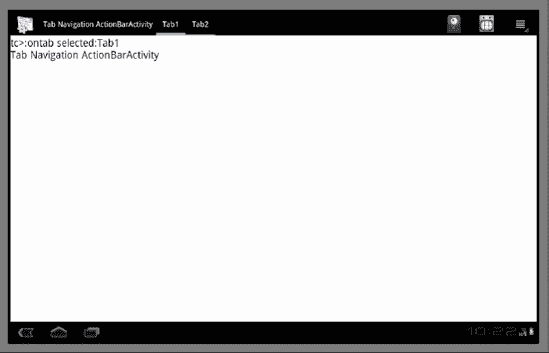
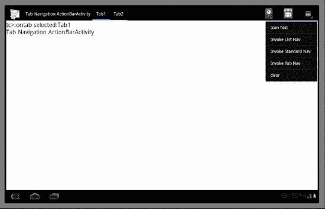
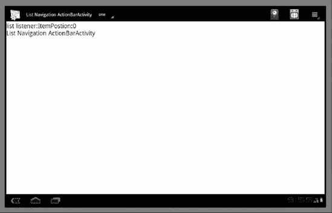
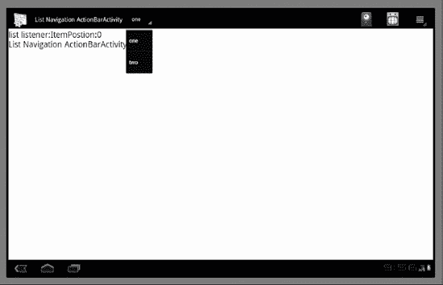
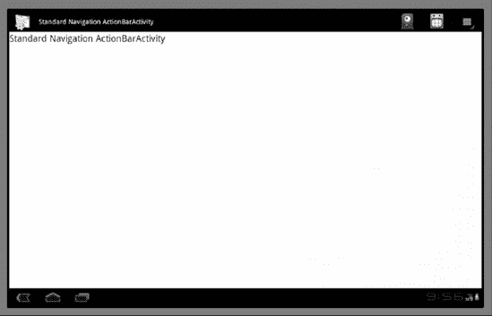
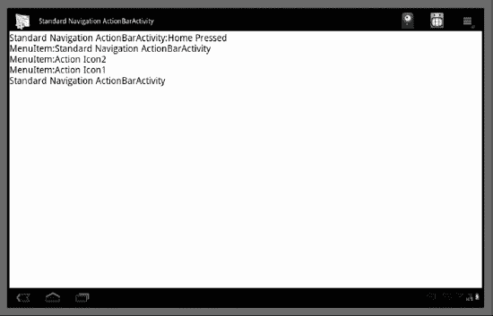

# 探索 ActionBar

`ActionBar` 是 Android 3.0 SDK 中的一个新 API。它允许你自定义 Activity 的标题栏。在 3.0 SDK 发布之前，Activity 的标题栏仅包含 Activity 的标题。

随着 Android SDK 每个新版本的发布而日益成熟，它正在越来越多地采用桌面 UI 模式。在桌面应用程序中，你会看到一个菜单栏和许多操作图标。`ActionBar` 的实现正是模拟了这种桌面标题/菜单栏模式。

Android 的 `ActionBar` 尤其模仿了 Web 浏览器的菜单/标题栏。`ActionBar` 的设计方式使得你可以将熟悉的类似浏览器的导航模式应用到你的应用程序中。

**注意：** 在本章中，我们同时指代 `ActionBar` 和“操作栏”。当我们说 `ActionBar` 时，指的是实际的类；当我们想讨论这个概念时，我们称之为“操作栏”。

操作栏设计的一个关键目标是让用户无需在选项菜单或上下文菜单中搜索，就能轻松访问常用操作。

**注意：** 在当前的计算机技术文献中，便捷地访问操作被时髦地称为“直观示能”（Affordance），它指的是能够方便地发现/调用操作的能力。我们在本章末尾附上了一些关于直观示能的参考网址。

在本章中，我们将演示有关操作栏的以下内容：

> - 操作栏属于某个 `Activity`，并遵循其生命周期。
> - 操作栏可以采用三种形式之一：标签式操作栏、列表式操作栏和标准操作栏。我们将展示这些不同的操作栏在每种模式下的外观和行为。
> - 我们将讨论标签监听器如何让我们与标签式操作栏进行交互。
> - 我们将讨论如何使用微调适配器和列表监听器与列表式操作栏进行交互。
> - 我们将向你展示操作栏的主页图标如何与菜单基础设施进行交互。
> - 我们将向你展示图标菜单项如何在操作栏区域中显示并进行响应。

我们将通过规划三个不同的 Activity 来演示这些概念。每个 Activity 将以不同的模式展示一个操作栏。这将让我们有机会检查操作栏在每种模式下的行为。但首先，让我们快速浏览一下操作栏的视觉方面。

### 操作栏的结构

图 30-1 显示了一个典型的标签导航模式下的操作栏。



**图 30-1.** *一个带有标签式 ActionBar 的 Activity*

此截图取自本章后面部分提供的实际工作示例。图 30-1 中的这个操作栏包含五个部分。这些部分（从左到右）包括：

> - **主页图标区域：** 操作栏左上角的图标有时称为“主页”图标。这类似于网站导航上下文，点击“主页”图标将带你回到起始点。稍后你将看到，点击此主页图标会向选项菜单回调发送一个菜单 ID 为 `android.R.id.home` 的回调。
> - **标题区域：** 标题区域显示操作栏的标题。
> - **标签区域：** 标签区域是操作栏绘制指定标签列表的地方。该区域的内容是可变的。如果操作栏导航模式是“标签”，则此处显示标签。如果模式是列表导航模式，则会显示一个可导航的下拉列表项。在标准模式下，此区域被忽略并留空。
> - **操作图标区域：** 在标签区域之后，操作图标区域会将某些选项菜单项显示为图标。稍后在我们的示例中，我们将向你展示如何选择哪些选项菜单显示为操作图标。
> - **菜单图标区域：** 最后一个区域是菜单区域。它是一个单一的标准菜单图标。当你点击此菜单图标时，将看到展开的菜单。根据 Android 设备的大小，此展开菜单的外观会有所不同，或显示在不同的位置。

除了操作栏之外，图 30-1 中的 Activity 还显示了一个调试文本视图，其中记录了许多操作。这些操作可能是点击标签、主页图标、操作菜单或实际选项菜单的结果。

让我们看看如何实现我们之前讨论过的三种类型的操作栏 Activity：标签式操作栏、列表式操作栏和标准操作栏。由于我们已经将标签式操作栏作为操作栏的视觉示例进行了介绍，因此我们将首先实现一个标签式操作栏。


#### 选项卡导航操作栏活动

尽管我们计划了三种不同的活动，每种都有其自己的操作栏类型，但我们希望所有这些活动都具有许多共通的功能。

> 所有这些活动都拥有相同的调试文本视图，以便我们可以监控被调用的操作。
> 所有这些活动都拥有相同的“主页”图标。
> 所有这些活动都有一个标题。
> 所有这些活动都拥有相同的操作图标。
> 所有这些活动都拥有相同的选项菜单。

这些活动的主要区别在于，每个活动都不同地配置了操作栏。在我们的示例中，我们将把共通行为封装在一个基类中，并允许每个派生活动（包括此选项卡操作栏活动）来配置操作栏。

如果没有至少一个操作栏活动的上下文，很难解释这些通用文件。因此，我们将首先在一个章节中介绍这些通用文件，以及选项卡操作栏活动如何使用这些通用文件。然后，可以将其他两个状态栏活动添加到该项目中，需要的文件会更少。

以下是此选项卡操作栏练习所需的文件列表。这些文件既包括通用文件，也包括特定于选项卡操作栏的文件。列表看起来很多，是因为我们将共通行为封装到基类中。这将减少后续示例所需的文件数量。我们还标明了每个文件的列表编号。

> **DebugActivity.java**：基类活动，允许显示一个调试文本视图，如图 30-1 所示（列表 30-2）。
>
> **BaseActionBarActivity.java**：继承自 `DebugActivity`，并允许通用导航（例如，响应包括在三个活动之间切换在内的通用操作）（列表 30-3）。
>
> **IReportBack.java**：一个接口，作为调试活动与操作栏的各种监听器之间的通信工具（列表 30-1）。
>
> **BaseListener.java**：基础监听器类，与 `DebugActivity` 以及从操作栏调用的各种操作协同工作。作为选项卡监听器和列表导航监听器的基类（列表 30-4）。
>
> **TabNavigationActionBarActivity.java**：继承自 `BaseActionBarActivity.java`，并将操作栏配置为选项卡操作栏。与选项卡操作栏相关的大部分代码都在此类中（列表 30-6）。
>
> **TabListener.java**：需要用于向选项卡操作栏添加选项卡。此处是你响应选项卡点击的地方。在我们的例子中，这只是通过 `BaseListener` 将一条消息记录到调试视图（列表 30-5）。
>
> **AndroidManifest.xml**：定义了要调用的活动（列表 30-13）。
>
> **Layout/main.xml**：`DebugActivity` 的布局文件。由于所有三个状态栏活动都继承自此基类 `DebugActivity`，它们共享此布局文件（列表 30-7）。
>
> **menu/menu.xml**：一组菜单项，用于测试菜单与操作栏的交互。此菜单文件也在所有派生的状态栏活动之间共享（列表 30-9）。

#### 实现基类活动

许多基类都使用了 `IReportBack` 接口。该接口在前几章中已介绍过。此处它服务于相同的目的。它在列表 30-1 中重新引入，这样你就不必回看之前的章节。

**列表 30-1.** *IReportBack.java*

```java
//IReportBack.java
package com.androidbook.actionbar;

public interface IReportBack
{
   public void reportBack(String tag, String message);
   public void reportTransient(String tag, String message);
}
```

实现此接口的类接收一条消息并在屏幕上报告，就像一条调试消息一样。这是通过 `reportBack()` 方法完成的。`reportTransient()` 方法执行相同的操作，只是它使用一个 `Toast` 来向用户报告该消息。

在我们的示例中，实现 `IReportBack` 的类是 `DebugActivity`。`DebugActivity` 的源代码在列表 30-2 中给出。

**列表 30-2.** *带有调试文本视图的 DebugActivity*

```java
//DebugActivity.java
package com.androidbook.actionbar;
//
//Use CTRL-SHIFT-0 to import dependencies
//
public abstract class DebugActivity
extends Activity
implements IReportBack
{
   //Derived classes needs first
   protected abstract boolean
   onMenuItemSelected(MenuItem item);

   //private variables set by constructor
   private static String tag=null;
   private int menuId = 0;
   private int layoutid = 0;
   private int debugTextViewId = 0;

   public DebugActivity(int inMenuId,
         int inLayoutId,
         int inDebugTextViewId,
         String inTag)
   {
      tag = inTag;
      menuId = inMenuId;
      layoutid = inLayoutId;
      debugTextViewId = inDebugTextViewId;

   }
    @Override
    protected void onCreate(Bundle savedInstanceState) {
        super.onCreate(savedInstanceState);
        setContentView(this.layoutid);

        //You need the following to be able to scroll
        //the text view.
        TextView tv = this.getTextView();
        tv.setMovementMethod(
          ScrollingMovementMethod.getInstance());
    }
    @Override
    public boolean onCreateOptionsMenu(Menu menu){
       super.onCreateOptionsMenu(menu);
          MenuInflater inflater = getMenuInflater();
          inflater.inflate(menuId, menu);
       return true;
    }
    @Override
    public boolean onOptionsItemSelected(MenuItem item){
       appendMenuItemText(item);
       if (item.getItemId() == R.id.menu_da_clear){
          this.emptyText();
          return true;
       }
       boolean b = onMenuItemSelected(item);
       if (b == true)
       {
          return true;
       }
       return super.onOptionsItemSelected(item);
    }
    protected TextView getTextView(){
        return
        (TextView)this.findViewById(this.debugTextViewId);
    }
    protected void appendMenuItemText(MenuItem menuItem){
       String title = menuItem.getTitle().toString();
       appendText("MenuItem:" + title);
    }
    protected void emptyText(){
       TextView tv = getTextView();
       tv.setText("");
    }
    protected void appendText(String s){
       TextView tv = getTextView();
       tv.setText(s + "\n" + tv.getText());
       Log.d(tag,s);
    }
   public void reportBack(String tag, String message)
   {
      this.appendText(tag + ":" + message);
      Log.d(tag,message);
   }
   public void reportTransient(String tag, String message)
   {
      String s = tag + ":" + message;
      Toast mToast =
        Toast.makeText(this, s, Toast.LENGTH_SHORT);
      mToast.show();
      reportBack(tag,message);
      Log.d(tag,message);
   }
}//eof-class
```

此基类活动的主要目标是提供一个带有调试文本视图的活动。此文本视图用于记录来自 `reportBack()` 方法的消息。我们将使用此活动作为操作栏活动的基类。


#### 为 ActionBar 分配统一行为

我们有机会进一步重构代码，将派生 Activity 中的代码提升至另一个名为 `BaseActionBarActivity` 的基类中。

这个重构类的主要目标是提供一种通用行为，用于响应菜单项。这些菜单项用于在代表三种不同 ActionBar 模式的 Activity 之间切换。切换后，您就可以测试相应的 ActionBar Activity。

该 Activity 在代码清单 30-3 中呈现。

**代码清单 30-3.** *启用 ActionBar 的 Activity 的通用基类*

```
//BaseActionBarActivity.java
package com.androidbook.actionbar;
//
//使用 CTRL-SHIFT-0 导入依赖项
//
public abstract class BaseActionBarActivity
extends DebugActivity
{
    private String tag=null;
    public BaseActionBarActivity(String inTag)
    {
        super(R.menu.menu,
            R.layout.main,
            R.id.textViewId,
        inTag);
        tag = inTag;
    }
    @Override
    public void onCreate(Bundle savedInstanceState)
    {
        super.onCreate(savedInstanceState);
        TextView tv = this.getTextView();
        tv.setText(tag);
    }
    protected boolean onMenuItemSelected(MenuItem item)
    {
        //响应主页图标
        if (item.getItemId() == android.R.id.home) {
            this.reportBack(tag,"主页被按下");
            return true;
        }

        //调用兄弟 Activity 的通用行为
        if (item.getItemId() == R.id.menu_invoke_tabnav){
            if (getNavMode() ==
              ActionBar.NAVIGATION_MODE_TABS)
            {
                this.reportBack(tag,
                  "您已处于标签导航模式");
            }
            else {
                this.invokeTabNav();
            }
            return true;
        }
        if (item.getItemId() == R.id.menu_invoke_listnav){
            if (getNavMode() ==
            ActionBar.NAVIGATION_MODE_LIST)
            {
                this.reportBack(tag,
                "您已处于列表导航模式");
            }
            else{
                this.invokeListNav();
            }
            return true;
        }
        if (item.getItemId() == R.id.menu_invoke_standardnav){
            if (getNavMode() ==
            ActionBar.NAVIGATION_MODE_STANDARD)
            {
                this.reportBack(tag,
                "您已处于标准导航模式");
            }
            else{
                this.invokeStandardNav();
            }
            return true;
        }
        return false;
    }
    private int getNavMode(){
        ActionBar bar = this.getActionBar();
        return bar.getNavigationMode();
    }
    private void invokeTabNav(){
        Intent i = new Intent(this,
          TabNavigationActionBarActivity.class);
        startActivity(i);
    }

    //当您实现这些额外的 Activity 时，
    //请取消下面方法体的注释

    private void invokeListNav(){
        //Intent i = new Intent(this,
        //  ListNavigationActionBarActivity.class);
        //startActivity(i);
    }
    private void invokeStandardNav(){
        //Intent i = new Intent(this,
        //  StandardNavigationActionBarActivity.class);
        //startActivity(i);
    }
}//eof-class
```

如果您注意到代码清单 30-3 中响应菜单项的代码，则会看到我们正在检查当前 Activity 是否正是请求切换到的那个 Activity。如果是，我们会记录一条消息，并且不切换当前 Activity。

这个基类 ActionBar Activity 也简化了派生出的 ActionBar 导航 Activity，包括标签式导航 ActionBar Activity。

#### 实现标签监听器

在能够使用标签式 ActionBar 之前，我们需要一个标签监听器。标签监听器让我们能够响应标签上的点击事件。我们将从基类监听器派生出我们的标签监听器，该监听器允许我们记录标签操作。代码清单 30-4 展示了使用 `IReportBack` 进行日志记录的基类监听器。

**代码清单 30-4.** *启用 ActionBar 的 Activity 的通用监听器*

```
//BaseListener.java
package com.androidbook.actionbar;
//
//使用 CTRL-SHIFT-0 导入依赖项
//
public class BaseListener
{
   protected IReportBack mReportTo;
   protected Context mContext;
   public BaseListener(Context ctx, IReportBack target)
   {
      mReportTo = target;
      mContext = ctx;
   }
}
```

此基类持有对 `IReportBack` 实现的引用，以及可用作上下文的 Activity。在我们的例子中，代码清单 30-2 中的 `DebugActivity` 既是 `IReportBack` 的实现者，也扮演上下文的角色。

现在我们有了基类监听器，代码清单 30-5 展示了标签监听器。

**代码清单 30-5.** *用于响应标签操作的标签监听器*

```
//TabListener.java
package com.androidbook.actionbar;
//
//使用 CTRL-SHIFT-0 导入依赖项
//
public class TabListener extends BaseListener
implements ActionBar.TabListener
{
    private static String tag = "tc>";
    public TabListener(Context ctx,
                IReportBack target)
    {
        super(ctx, target);
    }
    public void onTabReselected(Tab tab,
                  FragmentTransaction ft)
    {
        this.mReportTo.reportBack(tag,
          "标签重新选中:" + tab.getText());
    }
    public void onTabSelected(Tab tab,
               FragmentTransaction ft)
    {
        this.mReportTo.reportBack(tag,
          "标签已选中:" + tab.getText());
    }
    public void onTabUnselected(Tab tab,
                 FragmentTransaction ft)
    {
        this.mReportTo.reportBack(tag,
          "标签取消选中:" + tab.getText());
    }
}
```

该标签监听器仅将来自 ActionBar 标签的回调记录到图 30-1 的调试文本视图中。

#### 实现标签式 ActionBar Activity

有了标签监听器，我们终于可以构建标签式导航 Activity 了。这在代码清单 30-6 中呈现。

**代码清单 30-6.** *启用标签导航的 ActionBar Activity*

```
//TabNavigationActionBarActivity.java
package com.androidbook.actionbar;
//
//使用 CTRL-SHIFT-0 导入依赖项
//
public class TabNavigationActionBarActivity
extends BaseActionBarActivity
{
    private static String tag =
      "Tab Navigation ActionBarActivity";
    public TabNavigationActionBarActivity()
    {
        super(tag);
    }
    @Override
    public void onCreate(Bundle savedInstanceState)
    {
        super.onCreate(savedInstanceState);
        workwithTabbedActionBar();
    }

    public void workwithTabbedActionBar()
    {
        ActionBar bar = this.getActionBar();
        bar.setTitle(tag);
        bar.setNavigationMode(
          ActionBar.NAVIGATION_MODE_TABS);

        TabListener tl = new TabListener(this,this);

        Tab tab1 = bar.newTab();
        tab1.setText("Tab1");
        tab1.setTabListener(tl);
        bar.addTab(tab1);

        Tab tab2 = bar.newTab();
        tab2.setText("Tab2");
        tab2.setTabListener(tl);
        bar.addTab(tab2);
    }
}//eof-class
```

现在，我们将在多个小节中讨论这个标签式 ActionBar Activity 的代码（代码清单 30-6），以重点介绍使用标签式 ActionBar 的各个方面。我们将从获取属于某个 Activity 的 ActionBar 开始。


##### 获取操作栏实例

在列表 30-6 中，注意控制操作栏的代码非常简单。通过在 `Activity` 上调用 `getActionBar()` 来获取活动操作栏的访问权限。以下是该行代码：

```
ActionBar bar = this.getActionBar();
```

如这段代码所示，操作栏是 `Activity` 的一个属性，并且不会跨越活动边界。换句话说，不能使用一个操作栏来控制或影响多个活动。

##### 操作栏导航模式

在列表 30-6 中，一旦获取活动的操作栏，我们就将其导航模式设置为 `ActionBar.NAVIGATION_MODE_TABS`。以下是该行代码：

```
bar.setNavigationMode(
  ActionBar.NAVIGATION_MODE_TABS);
```

另外两种可能的操作栏导航模式是：

- `ActionBar.NAVIGATION_MODE_LIST`
- `ActionBar.NAVIGATION_MODE_STANDARD`

设置选项卡导航模式后，在 `ActionBar` 类的 API 中有多个与选项卡相关的方法可供使用。在列表 30-6 中，我们使用这些选项卡相关 API 向操作栏添加了两个选项卡。我们还使用了列表 30-5 中的选项卡监听器来初始化这些选项卡。

以下是从列表 30-6 中摘录的一段快速代码片段，展示了如何向操作栏添加选项卡：

```
Tab tab1 = bar.newTab();
tab1.setText("Tab1");
tab1.setTabListener(tl);
bar.addTab(tab1);
```

如果忘记在添加到操作栏的选项卡上调用 `setTabListener()`，将会收到运行时错误，提示需要监听器。

### 可滚动的调试文本视图布局

当点击操作栏的选项卡时，选项卡监听器被设置为将调试消息发送到调试文本视图。列表 30-7 展示了 `DebugActivity` 的布局文件，其中包含调试文本视图。

**列表 30-7.** *调试活动文本视图布局文件*


```xml
<?xml version="1.0" encoding="utf-8"?>
<!-- /res/layout/main.xml -->
<LinearLayout
    android:orientation="vertical"
    android:layout_width="fill_parent"
    android:layout_height="fill_parent"
    android:gravity="fill"
    >
<TextView android:id="@+id/textViewId"
    android:layout_width="fill_parent"
    android:layout_height="fill_parent"
    android:background="@android:color/white"
    android:text="Initial Text Message"
    android:textColor="@android:color/black"
    android:textSize="25sp"
    android:scrollbars="vertical"
    android:scrollbarStyle="insideOverlay"
    android:scrollbarSize="25dip"
    android:scrollbarFadeDuration="0"
    />
</LinearLayout>

关于此布局，有几点需要注意。我们将文本视图的背景颜色设置为白色，这使我们能够在更明亮的光线下捕捉屏幕。文本大小也被设置为大字体，以辅助屏幕截图。

我们还将文本视图设置为可滚动。虽然通常的布局使用 `ScrollView`，但文本视图本身已经支持滚动。除了在文本视图的 XML 文件中启用滚动属性外，还需要在文本视图上调用 `setMovementMethod()` 方法，如清单 30-8 所示。

**清单 30-8.** *为滚动启用文本视图*

```text
TextView tv = this.getTextView();
tv.setMovementMethod(
     ScrollingMovementMethod.getInstance());
```

这段代码摘自 `DebugActivity` (清单 30-2)。

另外，当文本视图滚动时，你会注意到滚动条出现然后淡出。如果文本超出了可见范围，这并不是一个好的指示器。你可以通过将淡出持续时间设置为 0 来让滚动条保持显示。请参见清单 30-7 了解如何设置此参数。

### 操作栏和菜单交互

在本示例中，我们还想演示菜单如何与操作栏交互。因此，我们需要设置一个菜单文件。此文件如清单 30-9 所示。

**清单 30-9.** *此项目的菜单 XML 文件*

```xml
<!-- /res/menu/menu.xml -->
<menu
>
    <!-- 此组使用默认类别。 -->
    <group android:id="@+id/menuGroup_Main">

        <item android:id="@+id/menu_action_icon1"
            android:title="动作图标 1"
            android:icon="@drawable/creep001"
            android:showAsAction="ifRoom"/>

        <item android:id="@+id/menu_action_icon2"
            android:title="动作图标 2"
            android:icon="@drawable/creep002"
            android:showAsAction="ifRoom"/>

        <item android:id="@+id/menu_icon_test"
            android:title="图标测试"
            android:icon="@drawable/creep003"/>

        <item android:id="@+id/menu_invoke_listnav"
            android:title="调用列表导航"
            />
        <item android:id="@+id/menu_invoke_standardnav"
            android:title="调用标准导航"
            />
        <item android:id="@+id/menu_invoke_tabnav"
            android:title="调用标签导航"
            />
        <item android:id="@+id/menu_da_clear"
            android:title="清除" />
    </group>
</menu>
```

**注意：** 清单 30-9 中的这个菜单 XML 文件使用了来自 [www.androidicons.com](http://www.androidicons.com) 的 3 个图标（creep001、002 和 003）。根据该网站，这些图标采用知识共享许可协议 3.0。

以下部分将更详细地讨论此菜单。

#### 显示菜单

在 2.3 及更早版本中，设备通常有一个明确的菜单按钮。在 3.0 中，模拟器不显示物理的 Home、Back 或 Menu 按钮。这些按钮在某些设备上可能仍然可用。

如图 30-2 所示，返回和主页按钮现在是屏幕底部的软按钮。但是，菜单按钮是在应用程序的上下文中显示的，具体来说，是作为操作栏的一部分，位于右上角。

图 30-2 显示了菜单展开时的样子。

**图 30-2.** *一个带有标签式操作栏和展开菜单的活动*

需要注意的一点是，菜单栏可能不会显示菜单项的图标。不应在所有情况下都依赖菜单项图标的显示。

#### 作为操作的菜单项

如本章开头所述，你可以将某些菜单项指定为直接显示在操作栏上。这些菜单项使用 `showAsAction` 标签进行标记。你可以在菜单 XML 文件的清单 30-9 中看到这个标签。此标签行被提取并再次显示在清单 30-10 中。

**清单 30-10.** *showAsAction 的菜单项属性*

```xml
android:showAsAction="ifRoom"
```

此 XML 标签的其他可能值是：

> `always`
> `never`
> `withText`

你也可以使用 `MenuItem` 类上可用的 Java API 达到相同的效果。

```java
menuItem.setShowAsAction(int actionEnum)
```

`actionEnum` 的值为：

> `SHOW_AS_ACTION_ALWAYS`
> `SHOW_AS_ACTION_IF_ROOM`
> `SHOW_AS_ACTION_NEVER`
> `SHOW_AS_ACTION_WITH_TEXT`

因为这些操作只是菜单项，所以它们的行为如此，并会调用活动类的 `onOptionsItemSelected()` 回调方法。

最后，示例使用了多个图标。你可以将这些图标替换为你自己的图标，或者使用本章末尾的 URL 下载本章的项目。

### Android 清单文件

清单 30-11 显示到目前为止此项目的清单文件。

**清单 30-11.** *AndroidManifest.xml*

```xml
<?xml version="1.0" encoding="utf-8"?>
<manifest
package="com.androidbook.actionbar"
      android:versionCode="1"
      android:versionName="1.0.0">
    <application android:icon="@drawable/icon"
        android:label="操作栏演示应用">
<activity android:name=".TabNavigationActionBarActivity"
                  android:label="操作栏演示：标签导航">
            <intent-filter>
                <action android:name="android.intent.action.MAIN" />
                <category android:name="android.intent.category.LAUNCHER" />
            </intent-filter>
        </activity>
    </application>
<uses-sdk android:minSdkVersion="11" />
</manifest>
```

`minSDKVersion` 需要指向 11，即 3.0 版本的 API 编号。

### 检查标签式操作栏活动

编译并运行这些文件后，你将看到标签式操作栏，如图 30-1 所示。然后，如果你点击右侧的菜单图标，你将看到应用程序的菜单，如图 30-2 所示。

该应用程序的设计方式是，操作栏上的任何操作都会被记录到调试文本视图中。在运行此应用程序时，你可以测试以下内容：

> 如果你点击主页图标，你将看到一条消息记录到调试屏幕，表明主页按钮被按下。
> 如果你点击 tab1，你将看到一条消息，表明“tab1”被重新选中。
> 如果你点击 tab2，你将看到两条消息。第一条表明 tab1 失去焦点，并且 tab2 被点击。这些消息通过清单 30-5 中的标签监听器提供。
> 如果你点击右侧的动作按钮，你将看到它们对应的菜单项被调用，并且调试消息被记录到调试视图中。
> 如果你展开菜单，你将看到有菜单项可以调用其他活动，这些活动将演示其余的操作栏模式。但是，你需要等到本章后面开发了其他活动。在此之前，你只会注意到那些项目被调用并且调试消息被记录下来。

至此，我们不仅实现了标签式操作栏活动，还设置了基础框架，使得编写其余两个活动变得更加简单。让我们继续介绍列表导航模式操作栏。

### 列表导航操作栏活动

由于我们的基类承担了大部分工作，因此实现和测试列表操作栏导航活动相当容易。你需要以下额外的文件来实现此活动：

> **SimpleSpinnerArrayAdapter.java**：此类与监听器一起用于设置列表导航栏。此类提供下拉导航列表所需的行（清单 30-12）。
> **ListListener.java**：此类充当列表导航活动的监听器。在将操作栏设置为列表操作栏时，需要将此类的实例传递给操作栏（清单 30-13）。
> **ListNavigationActionBarActivity.java**：这是我们实现列表导航操作栏活动的地方（清单 30-14）。

一旦你有了这三个新文件，你将需要更新以下两个文件：

> **BaseActionBarActivity.java**：你需要取消注释对列表操作栏活动的调用（清单 30-3）。
> **AndroidManifest.xml**：你需要在清单文件中定义新的列表导航操作栏活动（清单 30-11）。

#### 创建 SpinnerAdapter

为了能够使用列表导航模式初始化操作栏，我们需要以下两件事：

> 一个 spinner 适配器，它可以告诉列表导航导航文本的列表是什么。
> 提供一个列表导航监听器，以便当我们选取其中一个列表项时，我们可以得到一个回调。

清单 30-12 展示了 `SimpleSpinnerArrayAdapter`，它实现了 `SpinnerAdapter` 接口。如前所述，此类的目的是提供一个要显示的项目列表。

**清单 30-12.** *为列表导航创建 Spinner 适配器*

```java
//SimpleSpinnerArrayAdapter.java
package com.androidbook.actionbar;
//
//使用 CTRL-SHIFT-0 导入依赖项
//
public class SimpleSpinnerArrayAdapter
extends ArrayAdapter<String>
implements SpinnerAdapter
{
    public SimpleSpinnerArrayAdapter(Context ctx)
    {
        super(ctx,
          android.R.layout.simple_spinner_item,
          new String[]{"一","二"});

        this.setDropDownViewResource(
          android.R.layout.simple_spinner_dropdown_item);
    }
    public View getDropDownView(
      int position, View convertView, ViewGroup parent)
    {
        return super.getDropDownView(
          position, convertView, parent);
    }
}
```

没有 SDK 类直接实现列表导航所需的 `SpinnerAdapter` 接口。因此，我们从一个 `ArrayAdapter` 派生此类，并为 `SpinnerAdapter` 提供了一个简单的实现。我们还提供了一个关于 spinner 适配器的参考 URL，供进一步阅读。现在让我们继续介绍列表导航监听器。

#### 创建列表监听器

这是一个实现 `ActionBar.OnNavigationListener` 的简单类。清单 30-13 显示了此类的代码。

**清单 30-13.** *为列表导航创建列表监听器*

```java
//ListListener.java
package com.androidbook.actionbar;
//
//使用 CTRL-SHIFT-0 导入依赖项
//
public class ListListener
extends BaseListener
implements ActionBar.OnNavigationListener
{
    public ListListener(
    Context ctx, IReportBack target)
    {
        super(ctx, target);
    }
    public boolean onNavigationItemSelected(
    int itemPosition, long itemId)
    {
        this.mReportTo.reportBack(
          "列表监听器","项目位置:" + itemPosition);
        return true;
    }
}
```

与清单 30-5 中的标签监听器类似，我们继承自 `BaseListener`，以便能够通过 `IReportBack` 接口将事件记录到调试文本视图。

#### 设置列表操作栏

我们现在已经具备了设置列表导航操作栏所需的条件。让我们在清单 30-14 中展示列表导航操作栏活动的源代码。此类与我们之前编写的标签活动非常相似。

**清单 30-14.** *列表导航操作栏活动*

```java
//ListNavigationActionBarActivity.java
package com.androidbook.actionbar;
//
//使用 CTRL-SHIFT-0 导入依赖项
//
public class ListNavigationActionBarActivity
extends BaseActionBarActivity
{
    private static String tag=
      "列表导航 ActionBarActivity";

    public ListNavigationActionBarActivity()
    {
        super(tag);
    }
    @Override
    public void onCreate(Bundle savedInstanceState)
    {
        super.onCreate(savedInstanceState);
        workwithListActionBar();
    }
    public void workwithListActionBar()
    {
        ActionBar bar = this.getActionBar();
        bar.setTitle(tag);
        bar.setNavigationMode(ActionBar.NAVIGATION_MODE_LIST);
        bar.setListNavigationCallbacks(
           new SimpleSpinnerArrayAdapter(this),
           new ListListener(this,this));
    }
}//eof-class
```

重要的代码在清单 30-14 中突出显示。代码非常简单。我们获取一个 spinner 适配器和一个列表监听器，并将它们设置为操作栏上的列表导航回调。

#### 修改 BaseActionBarActivity

一旦此列表导航操作栏活动（清单 30-14）可用，我们可以返回并修改 `BaseActionBarActivity`，使得针对 `ListNavigationActionBarActivity` 的菜单项能够调用此活动。取消注释后，清单 30-3 中相应的函数将类似于清单 30-15 中提取并取消注释的代码。

**清单 30-15.** *为调用列表导航操作栏活动而取消注释的代码*

```java
private void invokeListNav(){
     Intent i = new Intent(this,
        ListNavigationActionBarActivity.class);
     startActivity(i);
}
```

一旦你取消注释，菜单项和代码就已经连接好，可以调用此列表导航操作栏活动。

#### 修改 AndroidManifest.xml

在能够调用此活动之前，你需要在 Android 清单文件中注册此活动。你需要将清单 30-16 中的代码添加到清单 30-11 的 Android 清单文件中，以完成活动注册。

**清单 30-16.** *注册列表导航操作栏活动*

```xml
<activity android:name=".ListNavigationActionBarActivity"
        android:label="操作栏演示：列表导航">
</activity>
```

#### 检查列表操作栏活动

编译到目前为止涵盖的这些文件（以及本节关于列表导航操作栏开头提到的新文件和已更改的文件）并运行该应用程序后，你将看到列表操作栏，如图 30-3 所示。

**图 30-3.** *一个带有列表导航操作栏的活动*

在图 30-3 中，你可以看到未展开的列表紧挨着活动的标题。这与当操作栏模式为标签导航时 SDK 放置标签的位置相同。现在，如果你点击显示“一”的项目，列表将展开，允许你进行选择。如图 30-4 所示。

**图 30-4.** *一个带有打开导航列表的活动*

当你将此活动与图 30-1 和 30-2 中的活动进行比较时，你会发现这些活动看起来非常相似，只是在一个案例中你有标签，而在另一个案例中你有一个列表用于导航。这两个活动的主题是说明一个重要的相似之处，即网页设计的方式。

在网站中，可能有多个网页，但每个页面都会通过母版页显示统一的外观和感觉。在我们的简单案例中，我们使用基类来实现这种效果。

尽管我们使用了多个活动来展示操作栏，但 3.0 中的操作栏似乎更适用于在单个活动上协调片段。但是，如果你需要处理多个活动，你可以使用这种基类模式来提供母版页设计模式。

此列表导航活动的行为与上一节中的标签活动非常相似。这里的区别在于你点击列表项时会发生什么。每次你选择一个列表项，你都会看到对列表监听器的回调，并且列表监听器会向调试文本视图发送一条消息。

现在我们有了两个活动，菜单项将允许你在标签活动和列表活动之间切换。

现在让我们继续介绍更简单的标准操作栏活动。

### 标准导航操作栏活动

在本节中，我们将研究标准导航操作栏的性质。我们将设置一个活动，并将其操作栏导航模式设置为标准模式。然后，我们将查看标准导航的外观及其行为。

与 `ListNavigationActionBarActivity` 的情况一样，由于我们的基类承担了大部分工作，因此实现和测试标准操作栏导航活动很容易。你需要以下额外的文件来实现此活动：

> **StandardNavigationActionBarActivity.java**：这是将操作栏配置为标准导航模式操作栏的实现文件（清单 30-17）。

一旦你有了这个新文件，你将需要更新以下两个文件：

> **BaseActionBarActivity.java**：你需要取消注释响应菜单项而调用标准操作栏活动的代码（参见清单 30-18 了解更改，以及清单 30-3 查看原始文件）。
> **AndroidManifest.xml**：你需要在清单文件中定义此新活动（参见清单 30-19 了解此活动的定义，以便你可以将其添加到主 AndroidManifest 文件清单 30-11 中）。

我们现在将逐一探讨这些文件。

#### StandardNavigationActionBarActivity

在设置标签式操作栏时，我们使用了标签监听器；在设置列表导航操作栏时，我们使用了列表监听器。对于标准操作栏，除了菜单回调之外，没有其他监听器。菜单回调不需要特别设置，因为它们已由 SDK 自动连接。因此，以标准导航模式设置操作栏非常容易。

清单 30-17 展示了标准导航操作栏活动的源代码。

**清单 30-17.** *标准导航操作栏活动*

```java
//StandardNavigationActionBarActivity.java
package com.androidbook.actionbar;
//
//使用 CTRL-SHIFT-0 导入依赖项
//
public class StandardNavigationActionBarActivity
extends BaseActionBarActivity
{
    private static String tag=
      "标准导航 ActionBarActivity";
    public StandardNavigationActionBarActivity()
    {
        super(tag);
    }
    @Override
    public void onCreate(Bundle savedInstanceState)
    {
        super.onCreate(savedInstanceState);
        workwithStandardActionBar();
    }

    public void workwithStandardActionBar()
    {
        ActionBar bar = this.getActionBar();
        bar.setTitle(tag);
        bar.setNavigationMode(ActionBar.NAVIGATION_MODE_STANDARD);
        //测试如果在标准导航模式下附加标签会发生什么
        attachTabs(bar);
    }
    public void attachTabs(ActionBar bar)
    {
        TabListener tl = new TabListener(this,this);

        Tab tab1 = bar.newTab();
        tab1.setText("标签 1");
        tab1.setTabListener(tl);
        bar.addTab(tab1);

        Tab tab2 = bar.newTab();
        tab2.setText("标签 2");
        tab2.setTabListener(tl);
        bar.addTab(tab2);
    }
}//eof-class
```

将操作栏设置为标准导航操作栏唯一需要做的事情就是将其导航模式设置为该模式。在清单 30-17 中，我们这样做了，并突出显示了那部分代码。

**注意：** 在清单 30-17 中，我们还包含了一些代码，用于查看在标准导航模式下添加标签会发生什么。我们的测试表明，这些标签不会导致任何运行时错误，但会被框架忽略。

在查看标准操作栏的外观之前，你需要对现有文件进行一些更改。

#### 修改 BaseActionBarActivity

一旦标准导航操作栏活动（清单 30-17）可用，我们可以返回并修改 `BaseActionBarActivity`（清单 30-3），使得针对 `StandardNavigationActionBarActivity` 的菜单项能够调用此活动。取消注释后，清单 30-3 中相应的函数将类似于清单 30-18 中的代码。

**清单 30-18.** *为调用标准导航操作栏活动而取消注释的部分*

```java
    private void invokeStandardNav(){
        Intent i = new Intent(this,
          StandardNavigationActionBarActivity.class);
        startActivity(i);
    }
```

一旦你取消注释，菜单项和代码就已经连接好，可以调用 `StandardNavigationActionBarActivity`。

#### 修改 AndroidManifest.xml

然而，在能够调用此活动之前，你需要在 android 清单文件中注册此活动。你需要将以下行添加到清单 30-11 中的 Android 清单文件中，以完成活动注册。

**清单 30-19.** *注册标准导航操作栏活动*

```xml
<activity android:name=".StandardNavigationActionBarActivity "
        android:label="操作栏演示：标准导航">
</activity>
```

#### 检查标准操作栏活动

编译到目前为止涵盖的这些文件（并在“标准导航操作栏活动”部分列出）并运行该应用程序后，你将看到应用程序以标签活动作为第一个活动打开（图 30-1）。现在，如果你点击菜单项，你将看到图 30-2。在此菜单中，如果你选择菜单项“调用标准导航”，你将看到标准导航操作栏活动，如下面的图 30-5 所示。

**图 30-5.** *一个带有标准导航操作栏的活动*

在图 30-5 中，你首先注意到的是，此操作栏缺少了之前专门用于标签或列表导航的区域。现在，继续点击右侧的操作按钮，它们会将其调用写入调试文本视图。然后，继续点击主页按钮。这也会将其调用签名写入调试文本视图。在这三次点击结束时，调试文本视图看起来像图 30-6。

**图 30-6.** *响应操作栏的事件*

### 参考资料

在我们研究本章材料时，以下 URL 对我们非常有帮助。这些 URL 还包含进一步的阅读材料。此外，最后的 URL 允许你下载本章项目的 zip 文件。

> ***设计的日常***，唐纳德·A·诺曼。本书借鉴了先前在“视觉感知”中一个名为“Affordance”（示能性）的概念，用于人机交互。这个词在 Android UI 文献中被越来越多地使用。本章的操作栏被吹捧为关键的 UI 示能性之一。
> [`en.wikipedia.org/wiki/Affordance`](http://en.wikipedia.org/wiki/Affordance)：用于理解 UI 示能性的维基百科参考。
> [www.androidbook.com/item/3624](http://www.androidbook.com/item/3624)：指向我们对 Android 操作栏的研究。在这里你将看到进一步的参考资料、示例代码、示例链接以及代表各种操作栏模式的 UI 图列表。
> [`developer.android.com/reference/android/app/ActionBar.html`](http://developer.android.com/reference/android/app/ActionBar.html)：这是 ActionBar 类的 API URL。
> 使用 Spinner 适配器 ([www.androidbook.com/item/3627](http://www.androidbook.com/item/3627))：为了设置列表导航模式，你需要了解下拉列表和 spinners 是如何工作的。这篇简短的文章展示了一些关于如何在 Android 中使用 spinners 的示例和参考链接。
> [`www.androidicons.com`](http://www.androidicons.com)：我们在本章中使用的一些图标来自这个网站。这些图标采用知识共享许可协议 3.0。
> 令人愉悦的 Android 布局 ([www.androidbook.com/item/3302](http://www.androidbook.com/item/3302))：在这个 URL，我们有一些关于简单布局的快速笔记和示例源代码。
> [`developer.android.com/reference/android/view/MenuItem.html`](http://developer.android.com/reference/android/view/MenuItem.html)：此 URL 指向 `MenuItem` 类的 API。你将在这里找到关于将菜单项作为操作图标附加到操作栏的文档。
> [`developer.android.com/guide/topics/resources/menu-resource.html`](http://developer.android.com/guide/topics/resources/menu-resource.html)：此 URL 记录了可用于将菜单项定义为操作栏图标的 XML 元素。
> [www.androidbook.com/projects](http://www.androidbook.com/projects)：你可以使用此 URL 下载专门为本章准备的测试项目。zip 文件的名称为 ProAndroid3_ch30_TestActionbar.zip。

### 总结

如你所见，操作栏并不神秘。它是一种在桌面编程中使用的已知范例。对初学者来说有点困难的是，同一个类基于一个模式位以三种不同的方式运行。人们总是想知道一组派生类是否能完成这个任务。但同样，模式之间的差异非常小，因此将其作为一个单一的类可能更好，就像现在这样。

操作栏设计的动机似乎倾向于基于浏览器的 Web 导航模型。

Android 设计师似乎也建议将操作栏与片段结合使用，以获得所需的 UI 一致性。当你需要在活动之间切换时，设计师要求我们考虑是否可以通过片段而不是新的活动来完成同样的事情。片段带来了很多优势，特别是当设备翻转导致配置更改时，它们的状态管理。带有片段的活动在配置更改之间保持状态。片段在前面的第 29 章中有更详细的介绍。

本章还介绍了一种使用基础导航活动实现设计一致性的可能方法。这也可能通过委托而不是继承来实现。人们还可以借鉴用于在网站上创建母版页的著名模式，并看看如何最好地协调 Android SDK 类以达到这种效果。

操作栏功能仅在 3.0 开始的 SDK 中可用。截至目前，没有迹象表明这些功能可作为旧版本的库使用。

文档和 Java API 之间也存在一些差异。文档指出只有三种操作栏模式。然而，Java API 中还有一种称为下拉导航模式的额外模式。当我们测试它时，它的行为就像列表导航模式，只是它去掉了标题。

此外，你可以通过显示标志来控制操作栏上显示的内容。请参考 API 文档，因为这相当直接。

## 第 31 章

## 3.0 中的其他主题

经过 30 章，在 Android 3.0 中仍有一些我们还没来得及涵盖的主题！在这最后一章中，我们将讨论主屏幕小部件的增强功能以及新的拖放 API。

3.0 中对小部件功能进行了显著的增强。通过这些增强，你现在可以将基于列表的小部件添加到主屏幕。拖放 API 在 3.0 中是全新的。借助拖放 API，你可以构建类似于桌面上非常常见的丰富用户界面。我们将非常详细地讨论这两个主题。

### 基于列表的主屏幕小部件

在第 22 章中，我们介绍了小部件在 Android 2.3 及更早版本中的工作方式。在 Android 3.0 中，主屏幕小部件有了强大的增强；这些更改很可能会被纳入下一个针对手机优化的 Android 版本中。

作为阅读此主题的先决条件，我们强烈建议你复习第 22 章，以更好地理解关于小部件的新内容。但是，即使你没有深入研究第 22 章的细微差别，本章也将提供一个关于小部件的全面视图，供你参考。

如你在第 22 章中所学，远程视图构成了主屏幕小部件的核心。主屏幕小部件本质上是一个绘制在主屏幕上的远程视图。远程视图是一个与底层数据完全断开的视图，就像网页与其服务器断开连接一样。

第 22 章列出了能够成为远程视图一部分的布局和小部件。诸如列表和网格之类的集合视图在 2.3 版本中不属于允许的小部件。在 3.0 版本中，它们是允许的，从而在主屏幕上提供了更丰富的体验。3.0 版本还围绕这些基于集合的小部件提供了一个迷你框架，用于异步加载和呈现数据。3.0 中有新的类和方法来支持这些方面。

我们将首先从概念上介绍这些增强功能，然后提供一个可工作的示例来巩固理解。让我们从 3.0 中新的远程视图开始。

#### 3.0 中的新远程视图

在 Android 2.3 中，有 13 种可能的布局和 UI 小部件可以作为远程视图的一部分。

*   `AbsoluteLayout`
*   `FrameLayout`
*   `LinearLayout`
*   `RelativeLayout`
*   `AnalogClock`
*   `Button`
*   `Chronometer`
*   `ImageButton`
*   `ProgressBar`
*   `ViewFlipper`
*   `DateTimeView`
*   `ImageView`
*   `TextView`

其中一些布局和视图可能已弃用，例如 `AbsoluteLayout`。在代码中使用它们之前，请务必检查这些类。你可能会问为什么这个远程视图列表很重要。你是否直接使用这些视图/布局类来构造你的远程视图？

事实证明，`RemoteViews` 类不能通过传递上述任何类型的显式对象来构造。这些类型的对象也不能直接添加到 `RemoteViews` 中。相反，`RemoteViews` 对象是通过向其构造函数传递一个布局文件来构造的。此列表的重要性在于，你只能在布局文件中拥有这些 xml 节点，这些节点才能成为远程视图。

以下是 Android 3.0 中增强后的 16 种允许的布局、UI 小部件和视图列表：

*   `FrameLayout`
*   `LinearLayout`
*   `RelativeLayout`
*   `AnalogClock`
*   `Button`
*   `Chronometer`
*   `ImageButton`
*   `ProgressBar`
*   `ListView`
*   `GridView`
*   `StackView`
*   `TextView`
*   `DateTimeView`
*   `ImageView`
*   `AdapterViewFlipper`
*   `ViewFlipper`

在未来的版本中可能会添加更多的远程视图。找出当前哪些 UI 对象启用了 `RemoteViews` 的关键在于这些类是否用名为 `RemoteViews.RemoteView` 的接口进行了注释。

有了这些信息，你可以使用 Eclipse 找出项目中哪些类使用了这个注释。操作方法如下：

1.  在你的源代码中，为 `RemoteView` 接口添加一个 `import` 语句。
2.  突出显示该接口名称。
3.  右键单击并转到“引用”选项卡。
4.  选择在此项目中查找此接口的引用。

这将列出所有用 `RemoteView` 接口注释的类。

#### 在远程视图中使用列表

在第 22 章中，我们介绍了 SDK 中支持主屏幕小部件的现有类集。主要的是 `AppWidgetProvider`、`AppWidgetManager`、`RemoteViews` 以及一个可用于通过初始化参数配置 `AppWidgetProvider` 的活动。

简要地说，这里是主屏幕小部件工作原理的核心思想（了解这一点应该能使本节的其余部分更容易理解）。`AppWidgetProvider` 是一个广播接收器，它根据你在配置文件中指定的时间间隔被定期调用。然后，这个 `AppWidgetProvider` 基于一个布局文件加载一个 `RemoteViews` 实例。然后，这个 `RemoteViews` 对象被传递给 `AppWidgetManager` 以显示在主屏幕上。

或者，你也可以告诉 Android 你有一个活动需要在首次将小部件放置在主屏幕上之前调用。这允许配置活动为小部件设置初始化参数。

你还可以在小部件的远程视图上设置点击事件，以便基于这些事件触发意图。然后，这些意图可以调用任何必要的组件，包括向 `AppWidgetProvider` 广播接收器发送消息。

在较高层次上，这就是主屏幕小部件的全部内容。其余的是这些基本思想的机制和变体。

然而，Android 2.3 及更早版本不允许基于列表的远程视图，也没有提供一种机制来有效地填充基于列表的远程视图。为了支持基于列表的远程视图，Android 3.0 添加了以下新类：

*   `RemoteViewsFactory`：此类允许你填充列表远程视图，就像列表适配器填充常规列表视图一样。此类是列表视图适配器的轻量级包装器，以异步方式向列表远程视图提供单独的远程视图。
*   `RemoteViewsService`：此类是一个服务，负责向列表 `RemoteViews` 对象返回一个 `RemoteViewsFactory`。`AppWidgetProvider` 负责将其中一个远程视图服务与列表远程视图绑定。这是通过将一个知道如何调用此服务的意图附加到列表远程视图来完成的。此服务允许你延长包含 `AppWidgetProvider` 的进程的生命周期。否则，当广播接收器返回时，该进程可能被回收。第 14 章解释了广播接收器和长时间运行服务之间的共生关系。

为了支持基于列表的远程视图，添加了以下新的 API 方法：

*   `RemoteViews.setPendingIntentTemplate()`：此方法允许你在列表远程视图上设置一个待定意图模板，以响应列表项上的点击事件。我们将在后面介绍细节时讨论“模板”的概念。
*   `RemoteViews.setOnClickFillIntent()`：这是在列表远程视图的各个列表项上设置的，并与前一个方法紧密配合。

这两个额外的方法一起使用，将让你能够响应基于列表的远程视图上的点击。这两
