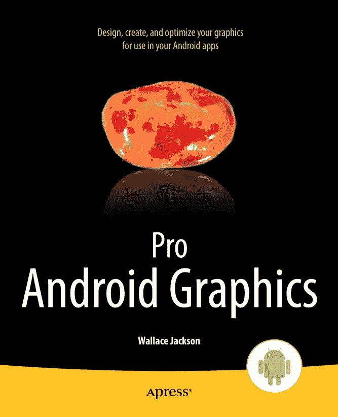

华莱士·杰克逊  
*Pro Android 图形编程*  
10.1007/978-1-4302-5786-8  
© Apress 2013

华莱士·杰克逊  
*Pro Android 图形编程*

ISBN 978-1-4302-5785-1  
电子书 ISBN 978-1-4302-5786-8  
© Apress 2013

*Pro Android 图形编程*

总裁兼出版商：保罗·曼宁  
首席编辑：汤姆·韦尔什  
技术审校：迈克尔·托马斯  
编委会：史蒂夫·安格林、马克·贝克纳、埃文·白金汉、加里·康奈尔、路易丝·科里根、摩根·埃特尔、乔纳森·格尼克、乔纳森·哈塞尔、罗伯特·哈钦森、米歇尔·洛曼、詹姆斯·马克姆、马修·穆迪、杰夫·奥尔森、杰弗里·佩珀、道格拉斯·庞迪克、本·雷诺-克拉克、多米尼克·沙克沙夫特、格温南·斯皮林、马特·韦德、汤姆·韦尔什  
协调编辑：凯蒂·沙利文  
文字编辑：玛丽·贝尔  
排版：SPi Global  
索引编制：SPi Global  
美术设计：SPi Global  
封面设计：安娜·伊申科

本书在全球图书贸易中的发行由 Springer Science+Business Media New York 负责，地址：233 Spring Street, 6th Floor, New York, NY 10013。电话：1-800-SPRINGER，传真：(201) 348-4505，电子邮件：`orders-ny@springer-sbm.com`，或访问：`www.springeronline.com`。Apress Media, LLC 是一家加利福尼亚有限责任公司，其唯一股东（所有者）是 Springer Science + Business Media Finance Inc（SSBM Finance Inc）。SSBM Finance Inc 是一家特拉华州公司。

有关翻译事宜，请发送电子邮件至：`rights@apress.com`，或访问：`www.apress.com`。

Apress 及 friends of ED 的书籍可批量采购用于学术、企业或促销用途。多数图书也提供电子书版本和许可证。如需更多信息，请参考我们的特殊批量销售–电子书许可网页：`www.apress.com/bulk-sales`。

作者在本书中引用的任何源代码或其他补充材料均可供读者在 `www.apress.com` 获取。有关如何查找本书源代码的详细信息，请访问：`www.apress.com/source-code/`。

本作品受版权保护。出版商保留所有权利，无论是整体还是部分内容，特别是翻译、重印、插图再利用、朗诵、广播、微缩胶片或其他任何物理形式的复制、信息存储与检索的传输、电子改编、计算机软件，或现在已知或未来开发的类似或不同方法的权利。与评论、学术分析相关的简短摘录，或专门为输入和运行于计算机系统并仅供购买者使用的材料，不受此法律保留限制。复制本出版物或其部分内容，仅允许在出版商所在地现行版权法的规定下进行，且使用许可必须始终从 Springer 获取。许可使用权可通过 RightsLink 在版权清除中心获得。违反者将根据相应版权法被起诉。

本书中可能出现商标名称、徽标和图像。我们没有在每个商标名称、徽标或图像出现时使用商标符号，而是仅以编辑方式使用这些名称、徽标和图像，以利于商标所有者，并无意侵犯商标权。本出版物中使用的商品名称、商标、服务标志和类似术语，即使未以商标符号标识，也不应被视为对其是否受专有权利保护的意见表达。

尽管本书中的建议和信息在出版时被认为是真实准确的，但作者、编辑和出版商均不对可能存在的任何错误或遗漏承担法律责任。出版商对本书所含内容不作任何明示或暗示的保证。

本书献给开源社区中每一位辛勤工作的人，他们致力于让任何人都能使用专业的媒体软件和应用开发工具，以实现自己的梦想和目标。最后但同样重要的是，感谢我的家人、朋友、客户和邻居，感谢他们的帮助、支持以及那些精彩的深夜聚会。

## 关于作者

### 华莱士·杰克逊

华莱士·杰克逊自二十多年前《**多媒体制作人杂志**》创刊以来，一直为先锋多媒体出版物撰写关于新媒体内容开发工作的文章。当时，他为该杂志在`SIGGRAPH`大会上发行的中心插页（一份可拆卸的"迷你特刊"增刊）撰写了关于计算机处理器架构的文章。

此后，华莱士为众多刊物撰写了关于他在交互式 3D 和新媒体广告活动设计方面的内容制作工作。他曾为以下行业刊物撰稿，如《**3D 艺术家**》、《**桌面出版者杂志**》、《**跨媒体杂志**》、《**信息亭杂志**》、《**数字标牌杂志**》和《**AV 视频杂志**》。

华莱士·杰克逊在十几岁时曾是一名`COBOL`和`RPGII`程序员，后来他使用`Java`、`JavaScript`和`HTML5`编写应用程序。在过去几年里，华莱士为 Apress 出版社（斯普林格）撰写了数本关于`Java`和`Android`开发的流行应用程序编程书籍。

华莱士·杰克逊目前是**Mind Taffy Design**公司的首席执行官，这是一家位于北圣巴巴拉县的多媒体内容制作与数字活动设计开发机构，正好位于其客户群所在地硅谷与好莱坞、尔湾和圣地亚哥的中间位置。在过去的二十年里，**Mind Taffy Design**公司使用领先的开源技术，如`PDF`、`HTML5`、`WebGL`、`Java`、`JavaFX`和`Android`，为全球众多顶级品牌制造商创建了`i3D`数字新媒体内容交付成果，客户包括索尼、三星、IBM、爱普生、诺基亚、泰科、Sun、KDS、美光、CTX、EIZO、TEAC、SGI 和三菱。

华莱士·杰克逊在加州大学洛杉矶分校（UCLA）获得商业经济学学士学位，并在南加州大学（USC）获得管理信息系统设计与实施硕士学位。他的市场营销战略研究生学位同样来自南加州大学，并在那里完成了南加州大学研究生创业项目。

## 关于技术审校

迈克尔·托马斯在软件开发领域拥有超过 20 年的工作经验，曾担任个人贡献者、团队负责人、项目经理及工程副总裁。迈克尔拥有超过 10 年的移动设备工作经验。他目前专注于医疗领域，利用移动设备加速患者与医疗服务提供者之间的信息传递。

## 致谢

我要感谢 Apress 出版社所有出色的编辑及其支持团队，他们为这本书付出了长期而艰辛的努力，使其成为终极的全能型《**Pro Android Graphics**》书籍。

感谢汤姆·威尔士，他担任本书的首席编辑，在使本书保持领先水平的过程中，凭借其丰富的经验和宝贵的指导做出了贡献。

感谢凯蒂·沙利文，她担任本书的协调编辑，并以坚定不移的勤奋确保我按时甚至提前完成写作截稿日期。

感谢玛丽·贝尔，她担任本书的文字编辑，对细节的关注以及确保文本符合当前 Apress 出版标准方面付出了努力。

感谢迈克尔·托马斯，他担任本书的技术审校，确保我不会犯任何错误，因为带有错误的代码无法正常运行，即便能运行，那也是非常幸运的失误，这在计算机编程中相当罕见，但一旦发生，便是妙不可言……

最后，感谢史蒂夫·安格林，采编编辑，是他将我签约为 Apress 和斯普林格的作者。

