# Android 数字成像：格式、概念与优化

### 摘要

在第一章中，你将了解数字成像如何在 Android 操作系统中实现。我们将探讨 Android 支持的 数字图像格式、允许在屏幕上格式化图像的类，以及你需要理解的基本数字成像概念，以便跟上后续 Android 图形设计的内容。

我们还将探讨如何为 Android 应用开发优化你的数字图像资源。我们将从单个图像资源的数据占用空间和 Android 设备类型的市场覆盖范围这两个角度来探索数字图像优化。

如你所知，Android 设备早已不仅仅是智能手机，而是涵盖了从手表、手机、平板电脑、游戏机到 4K iTV 电视的各种设备。这对 Android 应用开发的图形设计方面的重要意义在于，你现在必须为你的数字图像资源创建像素范围更广的图片，分辨率从低至 240 像素到高至 4096 像素，并且必须针对每一个数字图像资源都这样做。

我们将研究 Android 为此提供的工具，作为应用开发工作流程和资源引用 XML（可扩展标记语言）标记的一部分。标记与 Java 代码的不同之处在于，它像 HTML（超文本标记语言）一样使用“标签”。XML 与 HTML 非常相似，都使用这些标签结构，但不同之处在于 XML 是可定制的，这也是谷歌选择在 Android 操作系统中使用它的原因。

由于这是一本专业级别的书籍，我假设你对 Android 平台开发有相当丰富的经验，并且已经通过一本 Android 教学书籍（例如我的《学习 Android 应用开发》（Apress，2013 年））完成了学习过程。

让我们从了解 Android 支持哪些图像格式开始。

### Android 的数字图像格式：无损与有损

Android 支持几种流行的数字图像格式，其中一些已经存在了几十年，例如 CompuServe 的 GIF（图形交换格式）和 JPEG（联合图像专家组）格式，还有一些是较新的格式，例如 PNG（便携式网络图形）和 WebP（由 ON2 开发，后被谷歌收购并开源）。

我将按照它们的起源顺序来讨论，从最古老（因此也是最不理想的）的 GIF 到最新（因此也是最先进的）的 WebP 格式。CompuServe 的 GIF 格式完全受 Android 操作系统支持，但不推荐使用。GIF 是一种无损的数字图像文件格式，因为它不会丢弃图像数据来实现更好的压缩效果。

这是因为 GIF 压缩算法不如 PNG 精细（或者说强大），并且它只支持索引颜色，你将在本章中详细了解这一点。也就是说，如果你所有的图像资源都已经创建好且为 GIF 格式，你仍然可以在 Android 应用中使用它们，除了最终画质一般外，不会有其他问题。

Android 支持的下一个最古老的数字图像文件格式是 JPEG，它使用真彩色深度而不是索引颜色深度。我们稍后将讨论颜色理论和颜色深度。

JPEG 被认为是有损的数字图像文件格式，因为它会丢弃（丢失）图像数据以实现更小的文件体积。需要注意的是，压缩后原始图像数据将无法恢复，因此请务必保存一份原始的未压缩图像文件。

如果你在压缩后放大 JPEG 图像，你会看到原始图像中没有的变色区域效果。这些图像数据中退化的区域在数字成像领域被称为压缩伪影，并且只会在有损图像压缩中出现。

Android 中最推荐的图像格式是 PNG（便携式网络图形）文件格式。PNG 包含索引颜色版本（称为 `PNG8`）和真彩色版本（称为 `PNG24`）。`PNG8` 和 `PNG24` 扩展名代表了颜色支持的位深度，我们稍后会详细讨论。在数字图像行业中，PNG 读作“ping”。

PNG 是 Android 推荐使用的格式，因为它具有不错的压缩率、无损特性，因此既保证了高图像质量，又具有合理的压缩效率。

最新的图像格式是在谷歌收购 ON2 后加入 Android 的，称为 WebP 图像格式。该格式在 Android 2.3.7 及以上版本中支持图像读取（或回放），在 Android 4.0 及以上版本中支持图像写入（或文件保存）。WebP 是 WebM 视频文件格式的静态（图像）版本，在行业内也被称为 VP8 编解码器。你将在后续章节中学习所有关于编解码器和压缩的知识。

### Android View 和 ViewGroup 类：图像容器

本节内容仅为对 Android Java 类概念与结构的回顾，作为一名中级 Android 程序员，您可能早已了解。Android 操作系统提供了一个专门用于显示数字图像和数字视频的类，即 `View` 类。`View` 类直接继承自 `java.lang.Object` 类；它被设计用于容纳图像和视频，并将其格式化以便在您的用户界面屏幕设计中显示。如果您想回顾 `View` 类的功能，请访问以下网址：

[`http://developer.android.com/reference/android/view/View.html`](http://developer.android.com/reference/android/view/View.html)

所有用户界面元素都基于（继承自）`View` 类，并被称为控件（widgets），它们拥有自己的包 `android.widget`，正如大多数开发者所知。如果您对 View 和 Widget 不太熟悉，建议在阅读本书之前先学习《Learn Android App Development》一书。如果您想回顾 Android 控件（Widgets）的功能，请访问以下网址：

[`http://developer.android.com/reference/android/widget/package-summary.html`](http://developer.android.com/reference/android/widget/package-summary.html)

`ViewGroup` 类同样继承自 `View` 类。它用于为开发者提供用户界面元素容器，以便他们设计屏幕布局并组织用户界面控件（widget）`View` 对象。如果您想回顾 Android 中各种类型的 `ViewGroup` 屏幕布局容器类，请访问以下网址：

[`http://developer.android.com/reference/android/view/ViewGroup.html`](http://developer.android.com/reference/android/view/ViewGroup.html)

Android 中的 Views、ViewGroups 和控件通常使用 XML 定义。之所以采用这种方式，是为了让设计师能够在应用程序开发中与编码人员协同工作，因为 XML 比 Java 更容易编码。

实际上，XML 根本不是编程代码；它是一种标记语言，就像 HTML5 一样，它使用标签、嵌套标签和标签参数来构建结构，这些结构随后会在您的 Android 应用程序中被使用。

在 Android 中，XML 不仅用于创建用户界面屏幕设计，还用于创建菜单结构、字符串常量，以及在 `AndroidManifest.xml` 文件中定义您的应用程序版本、组件和权限。

将 XML 数据结构转换为可与 Android 应用程序 Java 组件一起使用的 Java 代码兼容对象的过程，称为“填充”（inflating）XML 标记。Android 提供了多个填充器（inflater）类来执行此功能，通常是在组件的启动方法中，例如 `onCreate()` 方法。您将在本书的 Java 编码示例中详细看到这一点，因为它连接了我们的 XML 标记和 Java 代码。

### 数字图像的基础：像素与宽高比

数字图像由二维像素数组构成，像素是“图像元素”（picture elements）的简称（pix 代表 picture，els 代表 elements）。图像中的像素数量通过其分辨率来表示，分辨率是指在高度（H）和宽度（W）两个维度上的像素数量。

要计算图像中的像素数量，只需将宽度像素乘以高度像素即可。例如，一个 HDTV 1920 x 1080 的图像将包含 2,073,600 个像素，即略超过 200 万个像素。两百万像素也可称为两兆像素（2 megapixels）。

图像中的像素越多，其分辨率就越高；就像数码相机一样，数据存储中的兆像素越多，所能达到的画质水平就越高。Android 支持从低分辨率 320 x 240 像素的显示屏（Android 手表和较小的翻盖手机），到中分辨率 854 x 480 像素的显示屏（迷你平板和智能手机），再到高分辨率 1280 x 720 像素的显示屏（高清智能手机和中端平板），以及超高清分辨率 1920 x 1080 像素的显示屏（大型平板和 iTV 设备）。Android 4.3 增加了对 4K 分辨率 iTV 的支持，其分辨率为 4096 x 2160。

图像分辨率中稍微复杂的一个方面（此处无意双关）是图像宽高比，这个概念同样适用于显示屏。宽高比是宽度与高度的比值，即 W:H，它将定义图像或显示屏是方形还是矩形（通常称为宽屏）。

1:1 宽高比的显示（或图像）是完全正方形的，2:2 或 3:3 宽高比的图像也是如此。您看，定义图像或屏幕形状的是两个数字之间的比值，而不是数字本身。Android 设备中具有 1:1 方形宽高比的例子是 Android 智能手表。

大多数 Android 屏幕采用 HDTV 宽高比，即 16:9，但也有一些屏幕稍窄，例如 16:10（如果您愿意，也可以说是 8:5）。更宽的屏幕肯定也会出现，请期待 16:8（如果您愿意，也可以说是 2:1）的超宽屏幕，它们将配备 2160 x 1080 分辨率的 LCD 或 LED 显示屏。

宽高比通常表示为宽高比冒号两边所能达到的最小数字对。如果您在高中学习最小公分母时认真听了课，那么计算宽高比应该相当容易。

我通常采用连续将每边除以 2 的方法。例如，以较特别的 1280 x 1024 SXGA 分辨率为例，1280 x 1024 的一半是 640 x 512，再一半是 320 x 256，再一半是 160 x 128，再一半是 80 x 64，再一半是 40 x 32，再一半是 20 x 16，再一半是 10 x 8，再一半是 5 x 4，因此 SXGA 屏幕的宽高比是 5:4。

最初的 PC 屏幕主要提供 4:3 宽高比；早期的 CRT 显像管电视几乎是方形的，采用 3:2 宽高比。当前的市场趋势无疑是朝着更宽的屏幕和更高的分辨率发展；然而，新的 Android 手表可能会使这一趋势回到方形宽高比。

### 数字图像的颜色：色彩理论与颜色深度

现在你已经了解了数字图像像素的相关知识，以及它们如何以特定的宽高比排列成二维矩形阵列，从而定义矩形形状。因此，接下来合乎逻辑的方面（再次强调，并非双关语）是探究每个像素是如何获得其颜色值的。

图像像素的颜色值由三种不同颜色（红、绿、蓝，即`RGB`）的量来定义，这三种颜色在每个像素中以不同的含量存在。安卓显示屏采用加色法，即每个`RGB`颜色平面的光波长被加总在一起，从而创造出数百万种不同的颜色值。

加色法用于液晶显示器或发光二极管显示器，它与用于印刷的减色法相反。为了展示区别，在减色法模型下，将红色与绿色（油墨）混合会产生偏紫色；而在加色法模型下，将红色与绿色（光）混合则会产生亮黄色。

每个像素的每种`RGB`颜色有 256 个级别，即 8 位的颜色强度变化，范围从最小值 0（关闭，无颜色贡献）到最大值 255（完全开启，最大颜色贡献）。在数字图像中用于表示颜色的位数被称为该图像的**颜色深度**。

数字图像行业中有几种常见的颜色深度，我将在此处介绍最常用的几种及其格式。最低的颜色深度存在于 8 位索引颜色图像中，该图像有 256 种颜色值，并使用`GIF`和`PNG8`图像格式来包含这种索引颜色类型的数字图像数据。

中等颜色深度的图像具有 16 位颜色深度，因此包含 65536 种颜色（计算为`256 x 256`）；它受`TARGA`（`TGA`）和标记图像文件格式（`TIFF`）数字图像格式支持。

请注意，安卓不支持任何 16 位颜色深度的数字图像文件格式（`TGA`或`TIFF`），我认为这是一个遗漏，因为支持 16 位颜色深度将极大地增强开发者的图像数据占用优化，我们将在本章后面部分讨论这个主题。

高颜色深度的图像具有 24 位颜色深度，因此包含超过 1600 万种颜色。这计算为`256 x 256 x 256`，等于 16777216 种颜色。支持 24 位颜色的文件格式包括`JPEG`（或`JPG`）、`PNG`、`TGA`、`TIFF`和`WebP`。

使用 24 位颜色深度将为你提供最高质量水平，这就是为什么安卓倾向于使用`PNG24`或`JPEG`图像文件格式。由于`PNG24`是无损的，它拥有最高质量的压缩（最低的原始数据损失）以及最高质量的色彩深度，因此`PNG24`是首选的数字图像格式，因为它能产生最高质量。

### 在安卓中表示颜色：十六进制表示法

既然你已经了解了什么是颜色深度，并且知道在任何给定图像中颜色是由三个不同的红、绿、蓝颜色通道组合表示的，我们需要探讨如何表示这三个`RGB`颜色通道值。

同样重要的是要注意，在安卓中，颜色不仅用于二维数字图像（也称为位图图像），也用于二维插图（通常称为矢量图像），以及颜色设置中，例如用户界面屏幕的背景颜色或文本颜色。

在安卓中，不同级别的`RGB`颜色强度值使用十六进制表示法来表示，这是几十年前发明的基数 16 计算机表示法，用于表示 16 位的数据值。与基数 10（从 0 数到 9）不同，基数 16 从 0 数到`F`，其中`F`代表基数 10 的值 15（或者，如果你是一名程序员，你可以数 0–15，这样也能得出 16 个十进制数据值，取决于你更喜欢哪种理解方式）。有关示例，请参见表 1-1。

**表 1-1.** 十六进制值与对应的十进制值

| 十六进制值： | 0 | 1 | 2 | 3 | 4 | 5 | 6 | 7 | 8 | 9 | A | B | C | D | E | F |
| :--- | :--- | :--- | :--- | :--- | :--- | :--- | :--- | :--- | :--- | :--- | :--- | :--- | :--- | :--- | :--- | :--- |
| 十进制值： | 0 | 1 | 2 | 3 | 4 | 5 | 6 | 7 | 8 | 9 | 10 | 11 | 12 | 13 | 14 | 15 |

安卓中的十六进制值始终以井号开头，如下所示：`#FFFFFF`。这个十六进制数据颜色值代表白色。由于这种 24 位十六进制表示法中的每个位置代表一个基数为 16 的值，因此要为每种`RGB`颜色获得所需的 256 个值，需要两个位置，因为`16 x 16`等于 256。因此，对于一个 24 位图像，井号后面需要六个位置来容纳六个十六进制数据值。

这些十六进制数据位置以以下格式表示`RGB`值：`#RRGGBB`。因此，对于白色，在这种十六进制颜色数据值表示中，所有红、绿、蓝通道都处于最大亮度。

如果你将这些颜色加色求和，你会得到白光。如前所述，黄色由红色和绿色通道开启、蓝色通道关闭来表示，因此其十六进制表示为`#FFFF00`，其中红色和绿色通道位置处于开启状态（`FF`或 255），而蓝色通道位置完全关闭（`00`或零值）。

这里需要特别指出的是，还有一种 32 位图像颜色深度，其数据值使用`ARGB`颜色通道模型来表示，其中`A`代表 alpha，是**alpha 通道**的简称。我将在本章下一节中详细讨论 alpha 和 alpha 通道，以及像素混合的概念。

`ARGB`值的十六进制数据位置以以下格式保存数据：`#AARRGGBB`。因此，对于白色，在这种十六进制颜色数据值表示中，所有 alpha、红、绿、蓝通道都处于最大亮度（或不透明度），并且 alpha 通道完全不透明，由值`FF`表示，所以其十六进制值为`#FFFFFFFF`。

100%透明的 alpha 通道通过将 alpha 位置设置为零来表示；因此，一个完全透明的图像像素是`#00FFFFFF`或`#00000000`。如果 alpha 通道是透明的，颜色值就无关紧要了！

### 图像合成：Alpha 通道与混合模式

在本节中，我们将探讨数字图像的合成技术。这是将多个数字图像图层混合在一起，从而在显示器上获得一个最终图像的过程，该图像看起来如同一幅完整的画面，但实际上是由多个无缝合成的图像图层组合而成。

要实现这一点，我们需要一个 Alpha 通道（透明度）值，以便精确控制该像素与上下图层中同一位置的像素进行混合。

与其他 `RGB` 通道一样，Alpha 通道也具有 256 级透明度，体现在 `ARGB` 数据值的十六进制表示中的两个位段上。 `ARGB` 数据值有八个位段（32 位），而 24 位图像则使用六个位段，后者可被视为不含 Alpha 通道数据的 32 位图像。

事实上，如果没有 Alpha 通道数据，何必浪费另外 8 位的数据存储空间，即使它被填满了 `F`（即完全不透明的像素值，这本质上等同于未使用的 Alpha 透明度值）。因此，24 位图像没有 Alpha 通道，不能用于合成（例如合成图层堆栈中的底层），而 32 位图像则用作其他内容顶部的合成图层，需要能够通过透明度值在图像合成的某些像素位置显示底层内容。

您可能会好奇，拥有 Alpha 通道并使用图像合成对 Android 图形设计有何影响。其主要优势在于能够将看似单一的图像拆分成多个组成部分的图层。这样做的原因在于，可以对单个图层元素应用 Java 编程逻辑，从而控制图像的某些部分，而如果图像只是一个单一的 24 位图像，这些部分将无法独立控制。

图像合成的另一部分是混合模式，它在专业图像合成能力中也占有重要地位。熟悉 Photoshop 或 GIMP 的用户都知道，每个图层都可以设置不同的混合模式，这些模式规定了该图层的像素如何与下方前面的图层进行（数学上的）混合。将这种数学像素混合与 256 级透明度控制相结合，您就能实现任何可以想象得出的合成效果或结果。

在 Android 中，混合模式通过 `PorterDuff` 类实现，为 Android 开发者提供了与 Photoshop 或 GIMP 赋予数字图像艺术家的绝大多数相同的合成模式。这使得 Android 成为一个强大的图像合成引擎，就像 Photoshop 一样，只不过可以通过自定义 Java 代码进行精细控制。Android 的一些 `PorterDuff` 混合模式包括 `ADD`、`SCREEN`、`OVERLAY`、`DARKEN`、`XOR`、`LIGHTEN` 和 `MULTIPLY`。

### 数字图像蒙版：Alpha 通道的流行应用

Alpha 通道的主要应用之一是蒙版，用于遮罩图像的某些区域以进行合成。蒙版是指使用 Alpha 通道从图像中抠出主体内容，并将其放置到单独的图层上的过程。

这使得我们可以将图像元素或主体内容用于其他图像、甚至动画中，或应用于特效领域。诸如 Photoshop 和 GIMP 之类的数字图像软件包拥有许多专门用于蒙版及后续图像合成的工具和功能。如果不先进行蒙版处理，就无法有效地进行图像合成，因此这是图形设计师需要掌握的重要领域。

蒙版艺术已有非常悠久的历史。事实上，如果你熟悉天气预报员使用的蓝屏和绿屏背景（他们看似站在天气地图前，实际只是站在绿幕前），你就会认识到蒙版技术不仅存在于数字图像领域，也存在于数字视频和电影制作中。

蒙版可以通过使用蓝屏或绿屏背景以及计算机软件自动完成，这些软件能自动提取这些精确的颜色值，从而创建蒙版和 Alpha 通道（透明度）；在数字图像中，也可以使用选择工具、锐化与模糊算法手动完成蒙版。

在本书中，你将通过使用流行的开源软件包（如 GIMP 2 和 EditShare Lightworks 11）来大量学习这一工作流程。GIMP 2.8 是一款数字图像合成软件工具，而 Lightworks 11 是一款数字视频编辑软件工具。在本书中，你还将使用其他类型的工具，例如视频压缩软件，以便熟悉 Android 图形设计工作流程中需要整合的、Android 系统外部的各类软件工具。

数字图像合成是一个非常复杂且涉及面广的过程，因此需要跨越多个章节来讲解。在蒙版过程中，最重要的考量是围绕被蒙版对象获得光滑、锐利的边缘，这样当你将其放置到新的背景图像上时，它看起来就像最初在那里拍摄的一样。其关键在于选择工作流程，以及以正确的方式（工作流程）和恰当的使用场景使用数字图像软件的选择工具（至少有六种以上）。

例如，如果你要蒙版的对象周围有颜色均匀的区域（也许你是在蓝屏或绿屏背景下拍摄的），你可以使用魔术棒工具和适当的阈值设置来选择除对象之外的所有内容，然后反转该选择集，从而获得包含对象的选择集。有时候，处理问题的正确方法就是逆向思维，你在本书后面将会看到这一点。

其他选择工具包含复杂的算法，可以检测像素之间的颜色变化，这在边缘检测中非常有用。你可以在其他类型的选择工具中运用边缘检测，例如 GIMP 2.8.6 中的 `Scissor Tool`（剪刀工具），它允许你沿着要蒙版对象的边缘拖动光标，同时工具的算法会精确地、像素级完美地放置选择边缘，之后你可以使用控制点对其进行编辑。

### 遮罩边缘平滑：抗锯齿的概念

抗锯齿是一种技术，将图像中位于两种颜色交界边缘的相邻颜色进行混合，使得缩放后边缘看起来更加平滑。其原理是通过视觉暂留让眼睛感知到更平滑的边缘，从而消除通常所说的“锯齿感”。通过沿需要平滑的边缘，取若干像素的平均颜色值（平均指在图像锯齿边缘碰撞的两种颜色之间，取中间态的颜色或色谱中的某些颜色），抗锯齿能呈现出非常惊艳的效果。

我创建了一个简单示例来直观展示这一概念。如图 1-1 所示，我在亮黄色背景上绘制了一个看似平滑的红色圆形。随后我将圆形边缘放大截图，与缩小后的圆形并排放置，以展示介于红色与黄色（即圆形边缘的相邻色）之间的抗锯齿（橙色）颜色值。

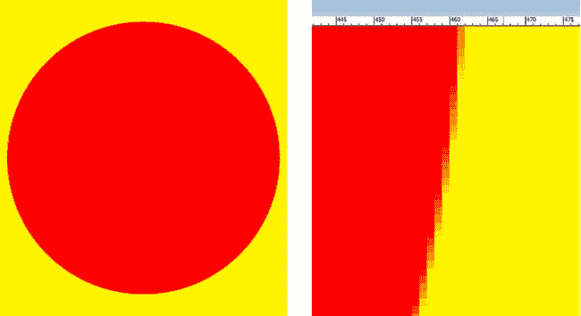

图 1-1. 黄色背景上的红色圆形（左）及放大视图（右），显示抗锯齿效果

我们将在本书中详细探讨抗锯齿。但我想将所有关键图像概念集中在一处，并置于上下文中阐述，以便为你提前建立基础知识框架。希望你不介意在开始编码之前先阅读理论章节。

### 优化数字图像：压缩与抖动

影响图像压缩的因素有很多，也有一些技术可以在更小的数据体积下获得更高质量的结果。这正是优化数字图像的目标：以最小的数据体积获得最高质量的视觉效果。

我们将从最影响数据体积的因素入手，研究它们如何优化特定数字图像的数据体积。有趣的是，这些因素与我们本章已介绍的数字图像概念顺序相似。

决定最终文件大小（即数据体积）最关键的因素是像素数，即数字图像的分辨率。这合乎逻辑，因为每个像素及其各通道的颜色值都需要存储。因此，在保持清晰度的前提下，图像分辨率越小，最终文件体积就越小。我们称这为“显而易见之理”。

原始（未压缩）图像大小按以下公式计算：24 位 RGB 图像为 `宽度 x 高度 x 3`，32 位 ARGB 图像为 `宽度 x 高度 x 4`。因此，一张未压缩的真彩色 24 位 VGA 图像大小为 `640 x 480 x 3`，即 921,600 字节原始未压缩数据。将 921,600 除以 1024（每千字节的字节数），得到原始 VGA 图像的千字节数——正好是 900KB。

可见，图像颜色深度是影响数据体积的次关键因素，因为图像中的像素数需乘以 1（8 位）、2（16 位）、3（24 位）或 4（32 位）颜色数据通道。这也是索引颜色（8 位）图像仍被广泛使用的原因之一，尤其是采用比`GIF`格式更优的无损压缩算法的`PNG8`格式。

若构成图像的色彩范围变化不大，索引颜色图像可模拟真彩色图像。索引颜色图像仅使用 8 位数据（256 种颜色）定义像素颜色，通过优化选取 256 种颜色的调色板，而非使用三个 RGB 颜色通道。

根据图像使用的颜色数量，仅用 256 种颜色而非 16,777,216 种颜色表示图像时，可能产生色带效应，即相邻颜色过渡不自然。索引颜色图像提供了一种视觉校正选项，称为抖动。

抖动是一种在图像中两种相邻颜色边缘创建点阵图案的技术，以此让眼睛误以为存在第三种颜色。这使我们能感知到最多 65,536 种颜色（256 x 256），但前提是这 256 种颜色中的每一种都与其余 255 种相邻。即便如此，你仍能感受到创造额外颜色的潜力，且会惊叹于索引颜色图像在某些场景下（针对特定图像）所能达到的效果。

以图 1-2 所示真彩色图像为例，将其保存为`PNG8`索引颜色图像以展示抖动效果。我们将在奥迪 3D 图像的驾驶员侧后翼子板上观察抖动效果，因其包含灰色渐变。

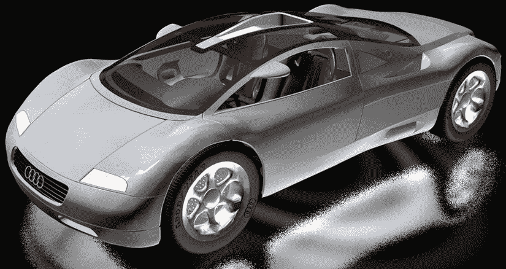

图 1-2. 一个使用 1680 万种颜色的真彩色图像源，我们将优化为`PNG8`格式

我们将图 1-3 中的`PNG8`图像设置为 5 位颜色（32 种颜色），以便清晰观察抖动效果。如图所示，相邻颜色之间会形成点阵图案，从而创造出额外的颜色。

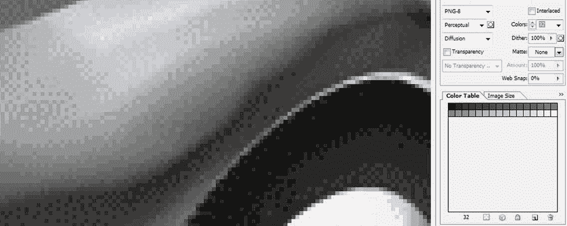

图 1-3. 使用 32 种颜色（5 位）的索引颜色图像压缩设置，展示抖动效果

有趣的是，在 8 位索引色图像中可以使用少于 256 种颜色。这样做是为了减少数据占用；例如，一张仅用 32 种颜色就能获得良好效果的图像，实际上是一张 5 位图像，从技术上讲它属于`PNG5`，尽管其格式被称为`PNG8`。

另外请注意，你可以设置抖动效果的百分比；我通常选择 0%或 100%的设置，但你可以在两个极端值之间任意微调抖动效果。你还可以选择一种抖动算法类型；我使用的是扩散抖动，因为它能在不规则形状的渐变区域（例如汽车挡泥板上的渐变）上产生平滑的效果。

正如你可能想象到的，抖动会添加更难压缩的数据（图案），从而将数据占用提高几个百分点。请务必检查应用抖动和不应用抖动两种情况下的最终文件大小，看看它所带来的视觉效果改善是否值得。

到目前为止你所学到的最后一个可能增加图像数据占用的概念是 Alpha 通道，因为添加 Alpha 通道会为正在压缩的图像再增加一个 8 位色彩通道（透明度）。

然而，如果你需要 Alpha 通道来定义透明度，以支持该图像未来的合成需求，那么除了包含 Alpha 通道数据之外，没有太多选择。只需确保不要使用 32 位图像格式来存放一个具有空 Alpha 通道（全为零，完全透明，因此不包含 Alpha 值数据）的 24 位图像。

最后，许多用于遮罩图像中对象的 Alpha 通道会压缩得很好，因为它们主要是白色（不透明）和黑色（透明）的区域，在两种颜色之间的边缘上有一些灰度值来对遮罩进行抗锯齿处理。因此，它们能在对象及其背景图像之间提供视觉上平滑的边缘过渡。

由于在 Alpha 通道图像遮罩中，从白色到黑色的 8 位透明度渐变定义了透明度，遮罩中每个对象边缘上的灰度值本质上是对对象及其目标背景的颜色进行平均，从而为所使用的任何目标背景提供实时抗锯齿效果。

现在是时候在你的工作站上安装 Android 了，然后你就可以开始开发面向图形的 Android 应用程序了！

### 下载 Android 环境：Java 和 ADT 捆绑包

让我们从确保你拥有最新的 Android 开发环境开始。这意味着要拥有最新版本的 Java、Eclipse 和 Android 开发者工具（`ADT`）。你可能已经安装了最新的`ADT Bundle`，但我在这里这样做只是为了确保你设置正确并从正确的位置开始，然后我们才能开始本书中将要进行的复杂开发。如果你每天都会更新你的`ADT`，你可以跳过这一部分。

由于 Java 是`ADT`的基础，请先获取它。截至 Android 4.3，Android `IDE`仍然使用 Java 6，而不是 Java 7，所以请确保获取正确版本的 Java SDK。它位于这里：

[`www.oracle.com/technetwork/java/javasebusiness/downloads/java-archive-downloads-javase6-419409.html`](http://www.oracle.com/technetwork/java/javasebusiness/downloads/java-archive-downloads-javase6-419409.html)

向下滚动到页面底部，找到 Java SE Development Kit 6u45 下载链接。屏幕的这一部分如图 1-4 所示。

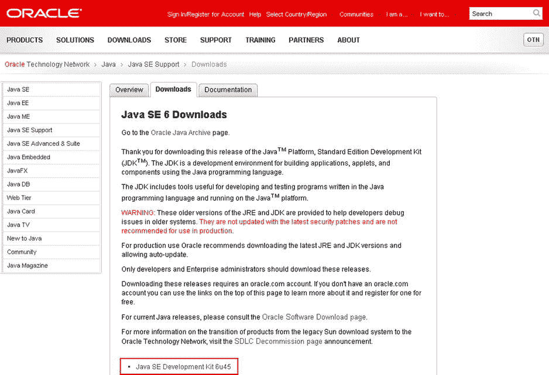

图 1-4.

Oracle 技术网网站 Java SE 存档页面上的 Java SE 6 下载部分

点击该部分底部和下载链接屏幕顶部的 Java SE Development Kit 6u45 下载链接。在下载屏幕顶部图 1-5 所示的灰色区域中，选择“接受许可协议”单选按钮选项。完成此操作后，你会注意到右侧的链接将变粗并且可以点击，以调用针对你的操作系统的下载。

如果你使用的是 64 位操作系统，例如 Windows 7 64 位或 Windows 8 64 位（和我一样），请选择 Windows x64 版本的`EXE`安装程序文件进行下载。

如果你使用的是 32 位操作系统，例如 Windows XP 或 Windows Vista 32 位，请选择 Windows x86 版本的`EXE`安装程序文件进行下载。确保软件的位级别与你正在运行的操作系统的位级别能力相匹配。图 1-5 显示了选中许可协议单选按钮后出现的下载屏幕。

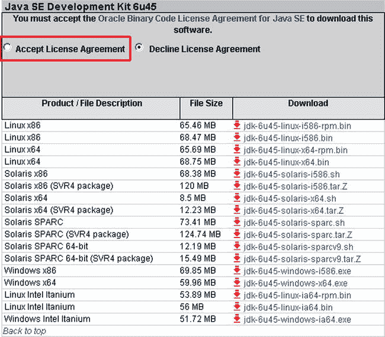

图 1-5.

适用于 Linux、Solaris 和 Windows 的 Java SE 6 下载链接（接受软件协议后）

一旦`EXE`文件下载完成，请使用 Windows 控制面板“添加/删除程序”对话框确保卸载任何以前版本的 Java 6 SDK。然后找到并启动当前版本 Java 6 SDK 的安装程序，并安装最新版本的 Java 6，以便你可以安装 Android 开发者工具 ADT 捆绑包。

Android 开发者工具（`ADT`）捆绑包由 Eclipse Kepler 4.3 Java `IDE`（集成开发环境）以及已安装到 Eclipse `IDE`中的 Android 开发者工具插件组成。过去这需要分别完成，并且需要大约 50 个步骤才能完成，因此下载并安装一个预制的捆绑包工作量要少得多。

接下来，你需要从 Android 开发者网站下载 Android `ADT Bundle`。过去，开发者必须手动组装 Eclipse 和`ADT`插件。从 Android 4.2（Jelly Bean + Google）开始，谷歌现在为你完成这项工作，使得安装 Android `ADT IDE`比过去容易一个数量级。这是用于下载`ADT Bundle`的 URL：

[`http://developer.android.com/sdk/index.html`](http://developer.android.com/sdk/index.html)

你应该会在 Android SDK 下载页面上看到如图 1-6 所示的屏幕。只需点击蓝色的“下载 SDK”按钮即可开始下载过程。

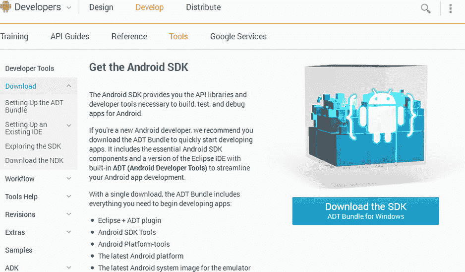

图 1-6.

Android 开发者网站“获取 Android SDK”页面上的 ADT Bundle 下载 SDK 按钮

点击“下载 SDK”按钮后，你将被带到许可条款和条件协议页面，你可以在那里阅读使用 Android 开发环境的条款和条件，最后点击“我已阅读并同意上述条款和条件”复选框。

完成此操作后，操作系统 32 位或 64 位选择单选按钮将被启用，以便你可以选择 32 位或 64 位版本的 Android `ADT`环境。然后，蓝色的“下载适用于 Windows（或你的操作系统）的 SDK ADT Bundle”按钮将被启用，你可以点击它开始安装文件下载过程。这是图 1-7 中显示的屏幕状态。

点击蓝色的“下载 SDK ADT Bundle”按钮，并将`ZIP`文件保存到你的系统下载文件夹。下载完成后，你就可以开始安装过程了，我们将在本章的下一节中详细介绍该过程。

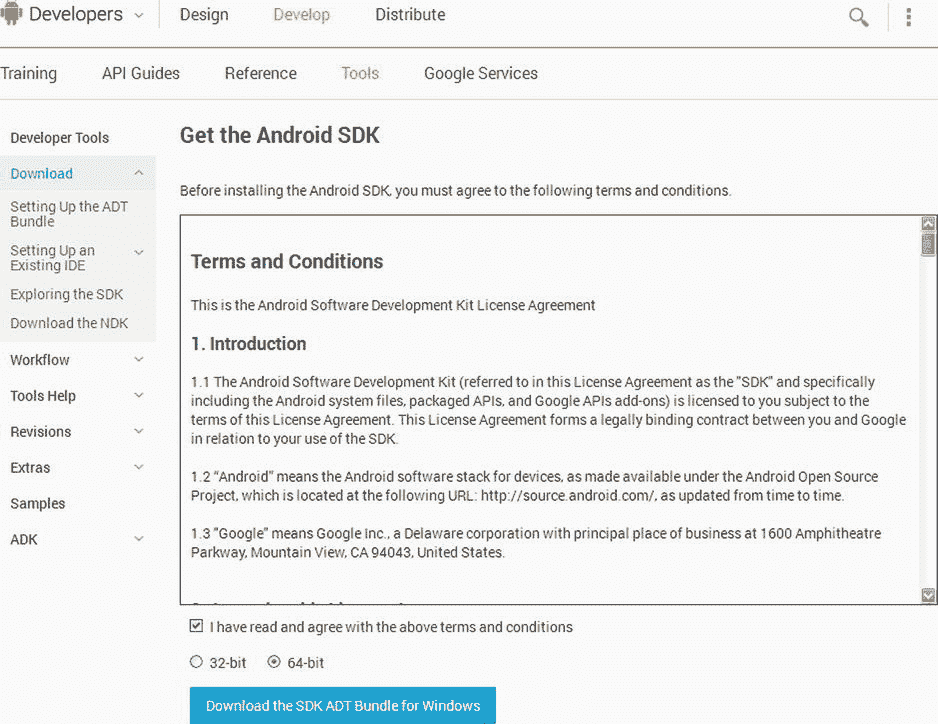

图 1-7.

许可条款和条件页面以及适用于 32 位或 64 位软件环境的 SDK 下载选项

现在你已经准备好解压并安装`ADT`，然后从 Eclipse Java `ADT IDE`内部将其更新到最新版本（当然，是在你首次安装并启动它之后）。你开始感到兴奋了吗？

### 安装与更新 Android 开发者 ADT 套件

打开 Windows 文件资源管理器，它看起来应该像一个内含文件的文件夹图标（如图 1-13 中从左数第二个图标）。接下来，找到你的**下载**文件夹，它通常位于文件管理器左上角（**收藏夹**部分下方），如图 1-8 所示。

点击**下载**文件夹使其高亮显示为蓝色，然后在文件管理器右侧的文件窗格中找到你刚刚下载的 ADT 套件文件。

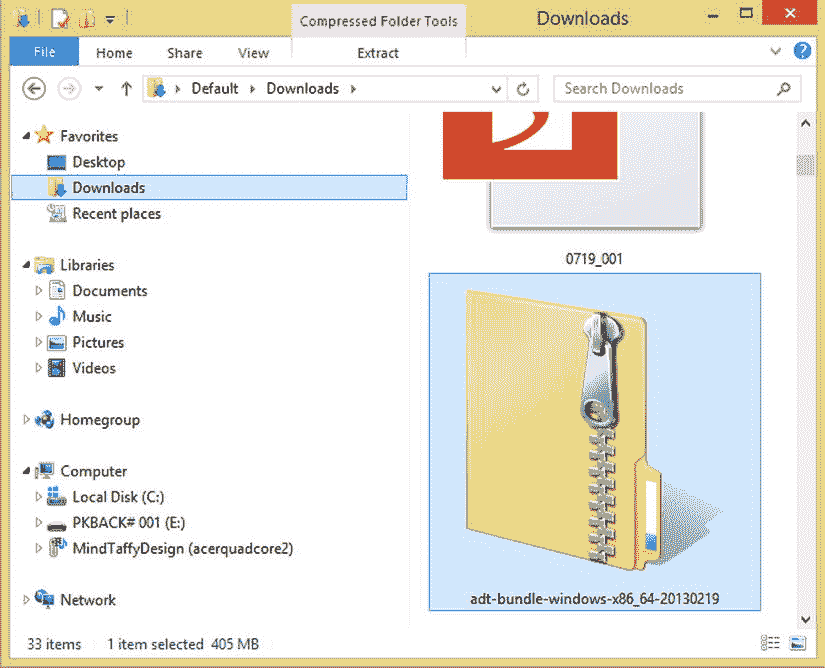

图 1-8. 在“下载”中找到 `adt-bundle-windows-x86_64` ZIP 文件

右键点击 `adt-bundle-windows-x86_64` 文件（如图 1-9 所示），弹出上下文菜单，并选择**全部提取**选项。

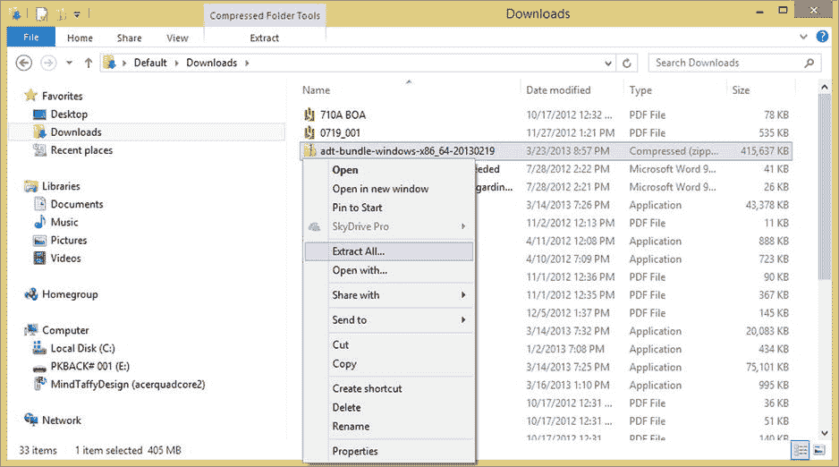

图 1-9. 右键点击 `adt-bundle` ZIP 文件并选择“全部提取”开始 ADT 安装

当**提取压缩（Zipped）文件夹**对话框出现时，将默认的安装文件夹替换为你自己创建的文件夹。我在我的根硬盘 `C:\` 下创建了一个名为 `Android` 的文件夹（即 `C:\Android`）来存放我的 ADT IDE，因为这是一个符合逻辑的名称。图 1-10 显示了操作前后的对话框，对比了难以记忆的系统下载文件夹路径和新的、易于查找的 `C:\Android` 文件夹路径。

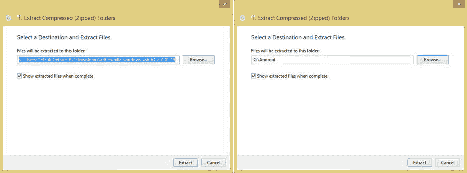

图 1-10. 将目标安装文件夹从“下载”文件夹更改为你创建的 Android 文件夹

点击图 1-10 中显示的**提取**按钮后，你会看到一个显示安装进度的对话框。点击左下角的**更多详细信息**选项，可以查看正在安装的文件，以及**剩余时间**和**剩余项目**计数器，如图 1-11 所示。600MB 的安装任务需要 15 到 60 分钟，具体取决于你的硬盘数据传输速度。

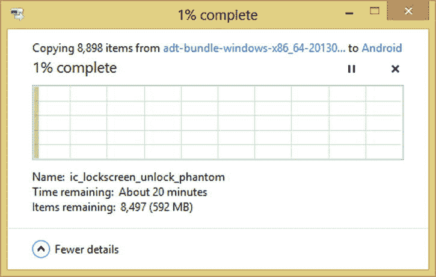

图 1-11. 展开“更多详细信息”选项，显示正在安装的文件

安装完成后，回到你的 Windows 文件资源管理器，查看 `C:\Android` 文件夹（或你命名的其他文件夹），你会看到 `adt-bundle-windows-x86_64` 文件夹，如图 1-12 所示。打开它，你会看到 `eclipse` 和 `sdk` 两个子文件夹。也打开这些子文件夹，以查看它们的子文件夹内容，从而了解其中包含了什么。

接下来，点击文件管理器左侧的 `eclipse` 文件夹，在右侧窗格中显示文件内容。找到 `eclipse Application` 可执行文件，该文件的左侧有一个自定义图标，是一个紫色的球体。

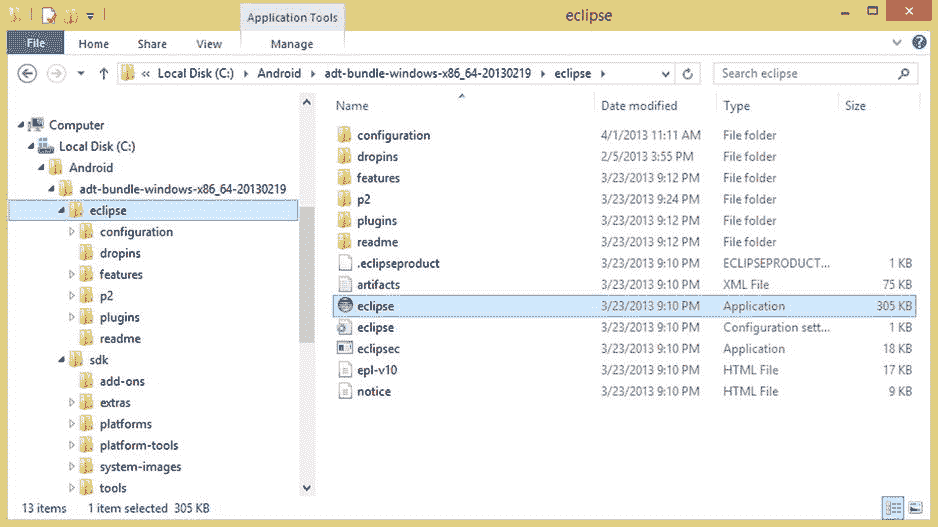

图 1-12. 在刚刚安装的 ADT 套件文件夹层次中找到 Eclipse Application 可执行文件

点击并拖动 Eclipse 图标到桌面底部（或任务栏启动区域所在的位置），并将其悬停在已安装的程序启动图标上方。执行此操作后，你会看到**固定到任务栏**（Windows Vista、Windows 7）或**固定到 `eclipse`**（Windows 8）的工具提示消息，如图 1-13 上半部分所示。

当此工具提示消息出现后，松开鼠标完成拖放操作，将 `eclipse` 紫色球体图标放入任务栏区域，它将成为一个永久的应用程序启动图标，如图 1-13 下半部分所示。

现在，当我告诉你“启动 Eclipse ADT，让我们开始吧”时，你只需用鼠标单击一次 `eclipse` 图标，它就会启动！

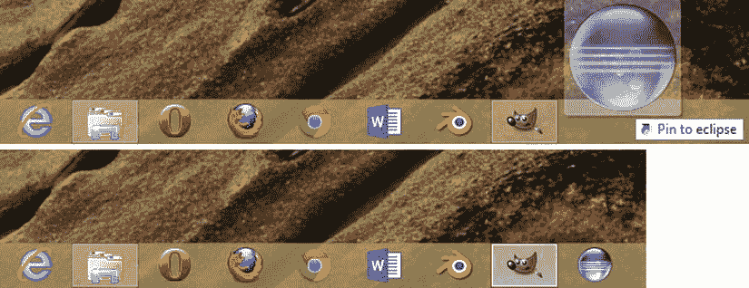

图 1-13. 将 Eclipse 应用程序拖到 Windows 任务栏以执行固定操作

那么，我们试试看。在任务栏中单击一次 `eclipse` 软件图标，首次启动该软件。你会看到 ADT Android 开发者工具启动屏幕，如图 1-14 左侧所示。当软件加载到系统内存后，你会看到**工作区启动器**对话框（如右侧所示），其中包含**选择工作区**的工作流程，允许你在工作站硬盘上设置默认的 Android 开发工作区位置。

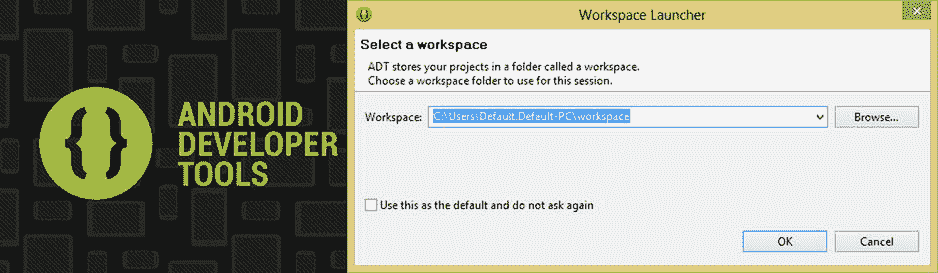

图 1-14. Android 开发者工具启动屏幕和显示默认工作区的“工作区启动器”对话框

我接受了默认的工作区位置，它位于主硬盘盘符（通常是 `C:\`）下的 `Users` 文件夹中，并以你 PC 的分配名称命名的子文件夹下；你的 Android 开发工作区文件夹就在其下。

当你在 Android ADT 中创建项目时，它们将作为子文件夹出现在此工作区文件夹层次结构下。这样，你既可以通文件管理软件，也可以通过 Eclipse 包资源管理器项目导航窗格找到所有文件。在本书中，你将频繁使用后者来学习 Android 如何实现图形功能。

设置好工作区位置并点击**确定**按钮后，Eclipse Java ADT 的启动欢迎屏幕将出现，如图 1-15 所示。你首先要做的是确保软件完全是最新版本，因此请点击屏幕右上角的**帮助**菜单，并选择约三分之二位置处的**检查更新**选项，如图 1-15（蓝色高亮显示）所示。

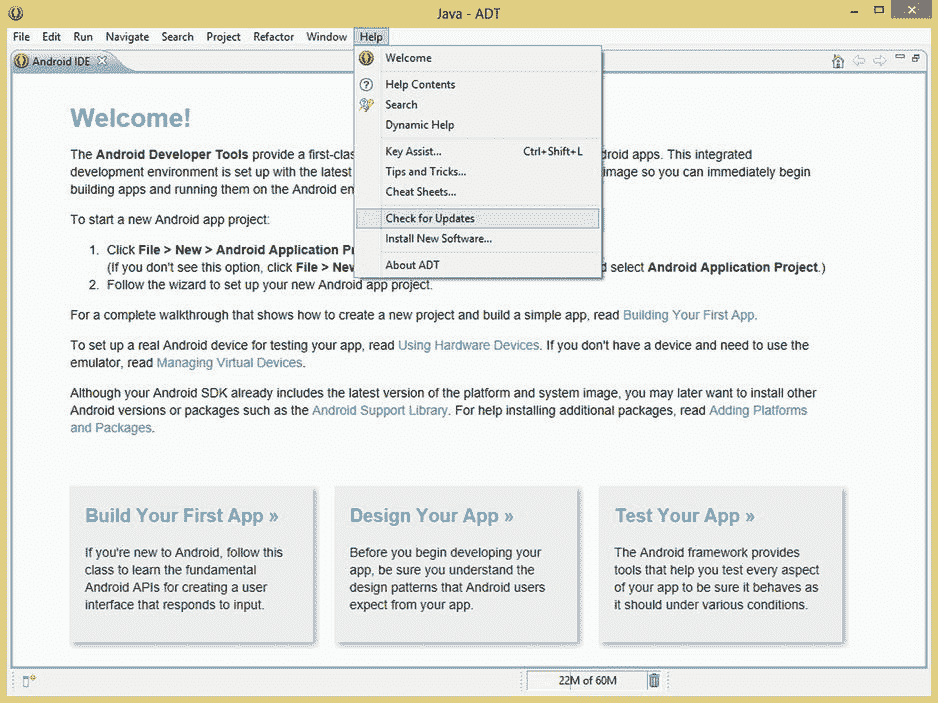

图 1-15. Eclipse Java ADT 欢迎屏幕及执行“帮助” ➤ “检查更新”菜单命令

选择此菜单选项后，你会看到**正在联系软件站点**对话框，如图 1-16 左侧所示。该对话框显示**正在检查更新**的进度条，同时检查各个 Google Android 软件仓库站点是否有 Eclipse ADT 的更新版本。

需要特别注意的是，你（仍然）必须连接到互联网，才能进行这种实时的软件包更新。就我而言，由于我刚刚下载了 ADT 开发环境，没有找到任何新更新，因此收到了一个告知此情况的对话框。

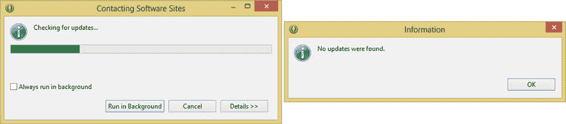

图 1-16. “正在联系软件站点”对话框正在检查 Eclipse ADT 的更新，未找到任何更新

如果 Eclipse ADT 环境有更新（如果你刚刚下载并安装，应该不会有），只需按照说明更新 ADT 中需要更新的组件即可。这样，你将始终拥有最新的软件开发套件（SDK）版本。

需要特别注意的是，你可以随时运行 `帮助 ➤ 检查更新` 菜单命令序列。有些开发者每周甚至每天都会执行此操作，以确保始终拥有最新（无 bug、功能丰富）的 Android 开发环境。

### 总结

在本第一章中，我通过涵盖图形设计与数字成像的一些关键基础原则，并确保你已安装并更新了最新的 Java SDK 和 Android ADT SDK，为本书后续章节奠定了基础，以便我们能够开始编写图形设计代码。

本章中的大多数概念同样适用于数字视频、2D 与 3D 动画以及特效制作。因此，在接下来的几章中你无需重复学习这些知识，但此刻理解它们至关重要。

我们首先了解了当前 Android 操作系统支持的各类数字图像文件格式。这些格式包括已显陈旧但仍在使用的 Compuserve GIF 格式和 JPEG 格式，以及首选的 PNG 格式和新的 WebP 格式。

你学习了有损与无损数字图像压缩算法，并明白了为何 Android 推荐我们使用后者，以便在图形密集型应用中获取更高质量的视觉效果。

接着，我们快速概述了用于容纳和显示数字图像与数字视频的 `View` 与 `ViewGroup` 类。我们还回顾了 `android.widget` 包，其中包含了许多我们在本书中会频繁使用的用户界面类。

随后，我们研究了数字成像与视频的基本构成单元——像素，以及分辨率和宽高比的基本概念。你学会了如何计算图像中的像素数量以确定其原始数据体积大小。你还全面了解了宽高比，以及它如何通过宽高乘数比来定义图像形状。

然后，我们运用一些色彩理论与术语探讨了数字图像中颜色的处理方式。你还学习了颜色深度、加色法，以及如何通过图像中的多个颜色通道来创建颜色。

接下来，我们研究了十六进制表示法，以及 Android 操作系统中如何为每个颜色通道使用两个十六进制值槽来表示颜色。你了解到 24 位 RGB 图像使用六个值槽，而 32 位 ARGB 图像使用八个值槽。你还得知在 Android 中，十六进制值通过在该数据值前加一个井号（#）来表示。

之后，我们探讨了数字图像合成以及 Alpha 通道与像素混合模式的概念。我们探索了利用 Alpha 通道在数字透明层上承载不同图像元素的能力，并通过 Android 中 `Porter-Duff` 类的数十种不同混合模式，以算法方式将图像中的任意像素与这些图层进行混合。

接着，我们研究了运用 Alpha 通道功能创建图像遮罩的概念，这使我们能够从图像中提取主体素材，以便后续使用 Java 代码对其进行单独处理，或将其用于合成层中创建更复杂的图像。

然后，我们了解了抗锯齿的概念，以及它如何通过在两个不同对象的边缘之间，或对象与其背景之间混合像素颜色值，来实现平滑、专业的合成效果。我们看到了在 Alpha 通道遮罩中使用抗锯齿，如何使该对象与背景图像实现平滑复合。

接下来，我们涵盖了图像压缩中的主要因素，你学会了如何为这些数字图像资源实现紧凑的数据体积。你了解了抖动技术，以及如何利用 8 位索引颜色图像在降低文件大小的同时获得良好效果。

最后，你下载并安装了最新的 Java 与 Android ADT SDK 软件，并将其配置在你的工作站上使用。完成这些步骤后，你现在已完全准备好，在本书接下来的章节中开发面向图形的 Android 应用程序软件。

在下一章中，你将学习数字视频格式、概念与优化。因此，该章将与本章非常相似：你将掌握关于数字视频的所有基本概念，并且还将为你的 Android 应用程序搭建框架。在阅读这本《专业 Android 图形设计》书籍期间，你将至少从图形设计的角度，对这个框架进行强力升级。

