# 2. Android 数字视频：格式、概念与优化

### 摘要

在本第二章中，我们将更深入地探讨数字视频在 Android 操作系统内部的实现方式。我们将基于你在前一章学到的概念进行构建，因为数字图像的所有特性同样适用于数字视频。

毕竟，数字视频实际上只是一系列动态的数字图像。这种运动的特性为数字视频带来了高度的复杂性，因为数学方程中增加了一个第四维度（时间）。这使得处理数字视频比处理数字图像要复杂一个数量级，尤其是对于你即将学习的编解码器而言。

这一点在视频压缩方面尤为突出，因此本章将更加侧重于视频编解码器，并介绍如何以一种新的媒体数据文件格式（该格式传统上且至今仍是一个庞大的、以千兆字节计的数据实体）来获取尽可能小的数据体积。

我们将审视当前 Android 支持的各类数字视频文件格式，以及允许在屏幕上播放视频的 `MediaPlayer` 类。你将全面了解 `VideoView` 用户界面小部件，Android 创建它是为了在一个预构建的 UI 容器中实现 `MediaPlayer`，方便我们使用。

你将学习理解本章后续操作所必需的基本数字视频概念。我们将从数字视频资源的数据体积（应用大小）以及 Android 设备类型（市场覆盖范围）两个角度，来审视数字视频优化。在本章中，你将创建一个 `pro.android.graphics` Java 包和一个 `GraphicsDesign` Android 应用程序。


### Android 数字视频格式：MPEG4 H.264 与 WebM VP8

Android 支持与 HTML5 原生支持的两种相同开源数字视频格式，即 MPEG-4（动态图像专家组）H.264 以及 ON2 VP8 格式（该格式由谷歌从 ON2 Technologies 收购并更名为 WebM）。WebM 随后作为开源数字视频文件格式发布，现已被集成至 Android 操作系统及所有浏览器中。

从内容制作的角度来看，这非常便捷，因为开发者制作并优化的视频内容既可用于浏览器及基于 HTML5 的操作系统等 HTML5 引擎，也可用于 Android 应用。

这种开源数字视频格式的跨平台支持场景将为内容开发者带来“一次制作，随处交付”的内容生产局面。只要专业视频图形开发者充分利用这些规模经济效应，就能降低内容开发成本并增加开发者收入。

正如我在第 1 章中所做的那样，我将按从旧到新的顺序介绍 MPEG 和 WebM 视频文件格式。Android 支持的最旧格式是 MPEG H.263，该格式仅应用于较低分辨率，因为它采用最古老的技术，压缩质量比最差。

由于如今大多数 Android 设备都采用中等（854x480）到高（1280x720）分辨率的屏幕，如果你打算使用 MPEG 文件格式，则应采用 MPEG-4 H.264 格式，这是目前全球使用最广泛的数字视频文件格式。

MPEG-4 H.264 格式被商业广播公司、HTML5 网页浏览器软件、移动 HTML5 应用以及 Android 操作系统所采用。毫不夸张地说，所有这些应用领域加在一起正迅速接近多数市场份额的地位。

MPEG-4 H.264 AVC（高级视频编码）数字视频文件格式在所有 Android 操作系统版本中均受支持，可用于视频播放；在 Android 3.0 及更高版本中则支持视频录制。只有当 Android 设备具备摄像硬件功能时，才支持视频录制。

此外，还有一种 MPEG4 SP（简单画质）视频格式，用于支持商业视频文件的播放。该格式适用于所有 Android 操作系统版本，可播放广播类内容（如电影、电视节目、迷你剧、电视剧、健身视频及类似产品）。

然而，如果你是个人 Android 内容制作人，会发现 MPEG-4 H.264 AVC 格式具有远胜一筹的压缩能力，尤其是当你使用更高级（更好）的编码套件时，例如 Sorenson Squeeze Pro 9 软件（本章稍后你将用到它）。

如果你决定在 Android 应用中使用 MPEG-4 数字视频格式而非谷歌的 WebM (VP8) 视频格式，那么 MPEG-4 H.264 AVC 将是你制作 Android 视频内容时采用的格式。之所以支持 MPEG4 SP 格式，很可能是因为许多商业视频和电影最初都采用这种较旧的视频格式压缩，而如今在用户 Android 设备上播放这些商业视频内容已成为这些设备的常见用途——这是因为互动内容相对匮乏。但你将会改变这一现状，对吧？！太棒了！

MPEG-4 视频文件支持的文件扩展名包括 `.3GP`（SP）和 `.MP4`（AVC）。我个人倾向于使用后者（`.MP4` AVC），因为这也是我在 HTML5 应用中使用的格式，并且采用更优秀的 AVC 格式更为普遍，但两种文件（扩展名）类型在 Android 操作系统中都应能正常工作。

Android 现在支持的更现代（更先进）的数字视频格式称为 WebM 或 VP8 数字视频格式，这种格式能以更小的数据占用提供更高质量的结果。这很可能就是谷歌收购 ON2（开发了 VP8 编解码器的公司）的原因。本章稍后你将全面了解编解码器的相关知识。

从 Android 2.3.3 版本开始，系统对 WebM 视频播放提供了“原生”支持，因此市面上大多数 Android 设备（包括 Amazon Kindle Fire HD 及初代 Kindle Fire）都应能支持这种更高质量的数字视频文件格式。这是因为该格式已原生集成到智能手机或平板电脑上安装的操作系统（OS）软件中。

WebM 还支持视频流式传输，你将在本章后续部分学习相关内容。如果用户拥有 Android 4.0 或更高版本的操作系统，则支持 WebM 视频格式的流式播放功能。出于这个原因，我建议对于非流式视频素材使用 MPEG-4 H.264 AVC，而对于流式视频则采用 WebM。我们将在本书最后一节介绍流式传输等高级视频概念。


### Android 中的 VideoView 与 MediaPlayer 类：视频播放器

在 Android 中，有两个主要的类直接继承自 `java.lang.Object` 超类，专门处理数字视频格式的播放。它们分别是来自 `android.widget` 包的 `VideoView` 控件类，以及来自 `android.media` 包的 `MediaPlayer` 媒体类。

大多数基本的数字视频播放功能都可以通过使用 `<VideoView>` XML 标签及其参数来实现，并将其直接设计到用户界面中，正如本章后面你将进行的操作一样。

Android 的 `VideoView` 类直接继承自 Android 的 `SurfaceView` 类，后者是一个显示类，它提供了一个嵌入在专用 Android `View` 层次结构中的专用绘图表面，用于实现高级的、直接渲染到屏幕的图形绘制管线。

`SurfaceView` 是按照 Z 轴顺序排列的，因此它位于承载 `SurfaceView` 的 `View` 窗口之后，从而 `SurfaceView` 通过其 `View` 窗口切割出这个视口，以允许内容显示给用户。

Z 轴顺序是我们将在本书后面深入探讨的一个概念，届时你将大量处理图层合成。简而言之，z 轴顺序是给定图像或视频源在图层堆栈中的排列顺序。

图层在概念上是从顶层到底层排列的。这就是为什么图像（或视频）资源在此图层层次结构中的顺序被称为 z 轴顺序，因为包含 x 和 y 二维图像数据的图层是沿着 3D z 轴堆叠的。本来打算让你在本书后面再学习 3D z 轴和 z 轴顺序；但现在看来我好像已经解释过了！

正如你现在所知，2D 图像和视频仅使用 x 和 y 轴来“寻址”其数据，因此你需要从 3D 的角度来审视 z 轴顺序和合成，因为合成中的图层需要沿着第三个 z 轴存在。

`SurfaceView` 类是 `View` 类的子类，而 `View` 类，正如你所知，又是 `Java Object` 主类的子类。因此，`VideoView` 子类是 `SurfaceView` 子类的一个专门化体现，它在 `SurfaceView` 类方法的基础上增加了更多方法，因此在 `View` 类层次结构中处于更下层的位置。关于这个 Android `VideoView` 及其方法和构造函数的更多详细信息，请访问以下网站 URL：

[`http://developer.android.com/reference/android/widget/VideoView.html`](http://developer.android.com/reference/android/widget/VideoView.html)

Android 的 `VideoView` 类实现了 `android.widget` 包中的一个名为 `MediaController.MediaPlayerControl` 的 Java 接口。这样，使用 `VideoView` 控件的开发者就可以访问 Android `MediaController` 类中与 `MediaPlayerControl` 相关的数字视频播放方法。

如果你打算自己编写数字视频播放引擎，那么你应该直接访问 Android 的 `MediaPlayer` 类本身。在这种场景下，你本质上是在编写自己的（自定义）视频播放引擎（`MediaPlayer` 的子类），以用你自己（更高级的）数字视频播放功能来替代对 `VideoView` 控件的使用。

关于这个 Android `MediaPlayer` 类如何工作，以及它的状态引擎图，更多信息请访问以下开发者网站 URL：

[`http://developer.android.com/reference/android/media/MediaPlayer.html`](http://developer.android.com/reference/android/media/MediaPlayer.html)

我可以写一整本高级编程书来讲解如何使用这个 Android `MediaPlayer` 类来编写一个视频播放引擎。然而，既然这本中级书籍专门涵盖了 Android 图形设计以及图像、动画、数字视频、合成、混合等之间的相互关系，我们将使用 `VideoView` 类。实际上，这也是 Android 建议我们使用的，这也是它提供这个类的原因。

### 数字视频的基础：运动、帧与帧率

数字视频是数字图像向第四维度（时间）的延伸。数字视频实际上是一系列随时间快速显示的数字图像集合，很像旧时的翻页书，你可以快速翻动书页，使画在书页上的角色或场景动画起来，从而产生运动。数字视频序列中的每一张图像都称为一帧。这个术语可能源于电影时代，那时胶片帧以每秒 24 帧的速度通过电影放映机，从而创造出运动的错觉。

由于数字视频的每一帧都包含数字图像，你在第一章中学到的所有概念也同样适用于视频。相关概念包括像素、分辨率、宽高比、色深、Alpha 通道、像素混合、图像合成，甚至数据占用优化。所有这些都可以同样应用于你的数字视频内容开发工作，并在你的图形设计中实现。

由于数字视频由这些数字图像帧集合组成，因此数字视频帧率的概念（以帧每秒表示，或通常称为 FPS）在你进行数字视频数据占用优化工作流程时也变得非常重要。

数字视频中帧的优化概念与图像中像素的优化概念（数字图像的分辨率）非常相似，因为视频帧中使用的每一帧都会成倍增加数据占用。在数字视频中，不仅帧的（图像）分辨率会极大地影响文件大小，每秒的帧数（即帧率）也同样如此。

在第一章中，你看到如果我们将图像中的像素数乘以颜色通道数，就可以得到该图像的原始数据占用。对于数字视频，我们现在必须将这个数字再乘以数字视频运行的每秒帧数，以及数字视频的总秒数。

继续第一章中的 VGA 示例，我们知道一幅 24 位的 VGA 原始图像恰好是 900KB。这使得在本例中将其提升到下一个层次的计算变得简单。数字视频传统上以 30 FPS 运行，因此一秒钟的标准清晰度（SD）或 VGA 原始未压缩数字视频包含 30 个图像帧，每帧 900K，产生 27000KB 的数据占用。

要找出这相当于多少兆字节（MB），我们需要将 27000 除以 1024，得到一秒钟原始数字视频的数据量为 26.3671875MB。让我们将其乘以 60 秒，得到每分钟 24 位 VGA 数字视频的原始数据量为 1582.0313 兆字节。再将其除以 1024，我们就得到了每分钟的数据千兆字节（GB）数，等于 1.54495。

你觉得 VGA 分辨率的视频原始数据量很大，超过 1.5GB/分钟吗？高清（HD）视频分辨率为 1920x1080，乘以 3 个 RGB 通道，乘以 30 帧，再乘以 60 秒，结果是每分钟 10.43GB！

你可以看出，拥有一种能够压缩数字视频产生的这种巨大原始数据占用的视频文件格式是多么重要！这就是为什么 Google 收购了 ON2，以获取他们的 VP8 视频编解码器和创造它的人！VP8 在保持高水平视频图像质量的同时，还将文件大小降低了数量级或更多。如果你想知道，一个数量级相当于十倍（10 倍）。


### 数字视频规范：比特率、流、标清与高清

一旦你确切知道如何通过为数字视频内容使用正确的比特率、帧率和帧分辨率来最佳优化数字视频压缩工作流程，你将会对你使用 MPEG 视频文件格式所实现的一些数字视频数据压缩比感到惊讶（本章后面会介绍）。我们将在第 18 章中更深入地探讨 WebM 视频优化，届时我会用一整章的篇幅来介绍高级数字视频数据占用空间优化技术和工作流程。

既然上一节我们刚讨论完分辨率，那么我们就从商用视频中使用的主要分辨率开始讲起。在高清（HD）出现之前，视频被称为标清（SD），它使用标准的像素高度（垂直分辨率）即 480 像素。

商用或广播视频通常采用两种宽高比之一：老式显像管电视使用的 4:3，以及新型高清电视使用的 16:9。让我们用你在第 1 章学到的数学知识来计算 4:3 SD 广播视频的像素分辨率。

480 除以 3 等于 160，乘以 4 等于 640，所以 4:3 的 SD 视频就是 VGA 分辨率，这就是我在前一章用这个特定分辨率作为例子的原因。还有另一种 16:9 的宽屏 SD 分辨率，它已成为安卓触摸屏智能手机以及被称为迷你平板的小尺寸平板电脑的入门级屏幕分辨率。

让我们来计算宽屏 SD 分辨率是多少：这次用 480 除以 9，得到 53.4，再乘以 16 得到 854，所以新型宽屏 SD 智能手机和平板电脑采用了 854x480 的“宽屏 SD”像素屏幕尺寸。这很大程度上是为了让现在已经主流的 HD 内容能够直接从 16:9 的 1920x1080 向下采样到 1280x720，或者到 854x480。

高清视频有两种分辨率：1280x720，我称之为伪高清，以及 1920x1080，业界称之为真高清。两者都是 16:9 宽高比，现在不仅用于电视和智能电视，还用于智能手机（Razor HD 是 1280x720）和平板电脑（Kindle Fire HD 是 1920x1200，这是不那么宽或者说更长的 16:10 宽高比）。

还有 16:10 的伪高清分辨率，其像素为 1280x800。实际上，这是笔记本电脑、上网本和中等尺寸平板电脑的常见分辨率。通常，大多数开发者会尽量让他们的视频内容分辨率与每个观看视频的安卓设备的分辨率相匹配。

无论你为数字视频内容使用何种分辨率，你的应用程序可以通过几种不同的方式访问视频。由于我是个数据优化狂人，我采用的方式是将视频内置于应用程序中；也就是说，放在安卓应用 `APK` 文件内部的 `raw` 数据资源文件夹里。我们稍后会对此进行探讨。

在安卓应用中访问视频的另一种方式是使用远程视频数据服务器；在这种情况下，视频会通过互联网从远程服务器实时流式传输到用户的安卓设备上进行播放。希望你的服务器不会崩溃！

视频流比播放内置视频数据文件更复杂，因为安卓设备需要与远程数据服务器实时通信，并在视频播放的同时接收视频数据包。安卓 4.0 及更高版本的设备通过 WebM 格式支持视频流播放。本书直到第 19 章才会涉及流媒体视频，因为它需要远程视频服务器；在此之前，你将使用内置视频数据，以便能够测试你的应用！

在本概述中，我们需要介绍的最后一个概念是比特率。比特率是视频压缩过程中使用的一个关键设置，因为它代表了目标带宽数据管道的大小，该管道每秒能够容纳一定数量的比特流通过。

当今互联网 2.0（移动设备电信网络）`IP` 基础设施中的慢速数据管道为 768 kbits/s 或 768 KBPS，为了适配这种“较窄”的数据管道而压缩的视频文件质量水平会较低，并且可能还需要更低的分辨率来进一步减少其总数据占用空间。较旧的 3G 网络就具有这种较慢的视频数据传输速度。

需要注意的是，一个过饱和（拥挤）的数据管道可能会将快速数据管道变成中速甚至慢速数据管道，因为在高峰使用时段，越来越多的用户试图通过该数据管道访问数据。

当今互联网 2.0 `IP` 基础设施中的中等数据管道为 1536 kbits/秒（1.5 MBPS，即兆比特每秒）。请注意，我们这里使用的是比特，而不是字节，所以要计算这代表每秒多少字节，需要除以八（一个字节有八个比特）。因此，一兆比特每秒等于每秒传输 128 千字节的数据，那么 1.5 兆比特每秒就是 192 千字节每秒。

较旧的 3G 网络传输速度在 600 kbits/s 到 1.5 mbits/s 之间，因此平均而言，这些网络的传输速度为 1.5 mbits/s，被归类为中等数据管道。

快速的数据管道至少为 2048 kbits/s，即 2 mbits/s 或 2 MBPS，以这种较高比特率压缩的视频显示出更高的视觉质量水平。更现代的 4G 网络声称速度在 3 到 6 mbits/s 之间，不过我会为 4G 网络将资源优化到 2 mbits/s，以确保即使网络因某种原因只提供 2 MBPS 的速度，你的视频资源仍然能够非常流畅地播放（即流传输）。

请注意，家庭网络通常提供快得多的 MBPS 性能，通常在 6 MBPS 到 24 MBPS 的范围内。移动网络目前处于 4G 阶段，尚未达到这一带宽，因此你在进行安卓图形应用开发时，需要针对更受限的数据管道进行优化。

比特率还必须考虑到任何一款安卓手机中的 CPU 处理能力，这使得视频数据优化更具挑战性。这是因为一旦“比特”通过数据管道传输，它们还需要被处理并显示到设备屏幕上。事实上，包含在安卓应用 `.APK` 文件中的任何内置视频资源只需要针对处理能力进行优化。之所以如此，是因为如果你使用内置数字视频资源，就没有数据管道供你的视频资源传输，也没有数据被传输！你的视频资源就在那里，就在你的 `APK` 文件中，随时可以播放。

这意味着你的数字视频资源的比特率不仅需要针对带宽（或者如果你使用内置数字视频资源，则针对 `APK` 文件大小）进行良好优化，还需要考虑到 CPU 处理能力的变化。一些单核低功耗嵌入式 CPU 可能无法解码高分辨率、高比特率的数字视频资源而不会丢帧，因此为给定的 CPU 准备一个分辨率更低、比特率更低、数据量只有十分之一的数字视频资源是个好主意。


### Android 数字视频文件：分辨率密度目标

为了让数字视频资源能在市面上各种 Android 操作系统设备上使用，你需要满足多个不同的分辨率目标，这样才能覆盖市面上大多数屏幕密度。

关于 Android 中的默认屏幕密度（因为它们与图形相关），你将在下一章关于基于帧的动画中了解更多。如果你像我一样好奇，为什么 Android 不直接获取一个高分辨率资源，然后使用双三次插值（或者至少是双线性插值）进行缩小，原因在于，目前 Android 的软肋恰恰是缩放，尤其是图像和视频。

如你所知，Android 设备的屏幕尺寸涵盖从较小的翻盖手机和 Android 手表，到较大的平板电脑和 iTV 设备。在这个范围内，还有智能手机、电子书阅读器、迷你平板电脑和中型平板电脑，因此你至少需要四种（如果不是五种）不同的目标 DPI（每英寸点数，即密度像素图像）分辨率。对于数字视频，这还包括不同的目标比特率，这样你就能尽力适配各种不同的设备屏幕密度，以及从单核到四核 CPU 产品的不同处理能力。

就数字视频支持而言，与其说是逐像素地适配显示屏幕，不如说是拥有三到四个比特率目标，因为 `VideoView` 类可以放大（或者更理想的是缩小）视频，你将在本章和本书后面看到这一点。

提供这种均匀分布的比特率范围非常重要，因为较小的 Android 设备往往处理能力较弱，难以流畅解码数据量大的（高）比特率视频，因此你希望一个 Android 应用程序拥有一系列比特率，能够“曲线拟合”市面上所有潜在 Android 设备的处理能力。

例如，Android 手表或翻盖手机很可能使用单核或双核 CPU，而 iTV 则至少使用四核处理器，甚至可能是八核。Galaxy S3 使用四核处理器，而 Galaxy S4 则使用八核（或双四核）处理器。

因此，你应该拥有能在任何处理器上流畅解码的比特率，范围从低分辨率的 512 KBPS 到高分辨率的 2 MBPS。无论压缩程度如何，分辨率密度越高（即像素越小），视频看起来就越好。

这是因为，在任何给定的 Android 设备屏幕上，像素间距越小（或者说像素密度越高），编码伪影就越难被看到（基本上它们会隐藏起来）。一旦你掌握了视频编辑或压缩工具（例如开源软件 `EditShare Lightworks 11` 或 `Sorenson Squeeze Pro`）的使用方法，这种在大多数 Android 设备硬件上常见的精细像素间距，就能让你在相对较小的数据量下获得高质量的视频。

### 优化数字视频：编解码器与压缩

数字视频是通过一种称为编解码器（codec，即编码-解码的缩写）的软件进行压缩的。视频编解码器有两端，一端是编码视频数据流，另一端是解码视频数据流。解码器将是使用它的操作系统或浏览器的一部分。

解码器通常针对速度进行了优化，因为播放的流畅性是首要问题；而编码器则针对减少其生成的数字视频资源的数据量进行了优化。因此，编码过程可能需要很长时间，具体取决于你的工作站包含多少个处理器核心。如今一台专业工作站通常拥有八个核心。

编解码器（编码器端）类似于插件，可以安装到不同的数字视频编辑软件包中，使它们能够编码不同类型的数字视频文件格式。

由于 Android 支持 H.263 和 H.264 MPEG4 格式，以及 ON2 VP8 WebM 视频格式，你需要确保自己使用的是能够将视频数据编码成这些数字视频文件格式的视频编解码器之一。如果操作正确，Android 操作系统将能够解码该数字视频数据流，因为这三种编解码器的解码器端是直接内置于 Android 操作系统中的，这就是为什么你要了解这三种格式。

不止一家软件制造商生产 MPEG 编码软件，因此不同的 MPEG 编解码器（编码器软件）在文件大小方面会产生不同（更好或更差）的结果。

我强烈建议你在想要专业地制作视频时获取的专业解决方案叫做 `Sorenson Squeeze`，目前版本是 9。Squeeze 有一个专业版，我将在本书中使用它，其价格低于一千美元。

还有一个名为 `EditShare Lightworks 11` 的开源解决方案。它目前不原生支持输出到 WebM VP8 编解码器，因此在 `EditShare Lightworks` 增加对 Android 编解码器的支持之前（他们承诺很快就会增加），我打算在本书中使用 `Squeeze Pro 9`。

我仍然建议你访问 [editshare.com](http://editshare.com) 或 [lwks.com](http://lwks.com) 网站注册并下载这个软件，因为它是与 `Blender 3D`、`GIMP2` 和 `Audacity` 一样最强大的开源软件包之一。

在针对数字视频文件大小进行优化（设置压缩参数）时，有大量变量会直接影响视频数据量。我将按照它们对视频文件大小影响的从大到小顺序来介绍这些变量，以便你了解应该调整哪些参数来获得期望的结果。

与数字图像压缩一样，视频每一帧的分辨率（即像素数量）是开始优化过程的最佳起点。如果你的目标用户使用的是 854x480 或 1280x720 的智能手机和平板电脑，那么你不需要使用真正的 1920x1080 高清分辨率视频来让你的数字视频资源获得良好的视觉效果。凭借那些超高密度的显示屏，你可以将 1280 视频放大 33% [通过 `1 - (1280 / 1920)` 计算得出]，它看起来仍然很棒。例外情况是，如果你正在为 GoogleTV 用户提供 iTV 应用，那么你可能需要使用 1920x1080 分辨率。

下一级的优化在于每秒视频所使用的帧数，假设视频本身的秒数无法缩短。这就是帧率，与其使用视频标准 30 FPS，不如考虑使用电影标准帧率 24 FPS，或者多媒体标准帧率 20 FPS。根据你的内容，你甚至可能可以使用 10 FPS 的帧率。


请注意，15 FPS 的数据量是 30 FPS 的一半（即输入到编解码器的数据减少了 100%），并且某些视频内容播放时的效果可能与 30 FPS 的内容相同！找出这一点的唯一真正方法是在内容优化（编码）工作流程中尝试这些设置。

下一个对减小数据占用空间最有效的设置是您为编解码器设定的**比特率**。比特率等同于应用的压缩量，因此也等同于视频数据的质量水平。需要注意的是，您可以简单地使用 30 FPS、1920 分辨率的高清视频，并指定一个非常低的比特率上限；然而，与先尝试使用较低帧率和分辨率，同时配合更高质量比特率设置的方法相比，前者的效果会逊色不少。

由于每个视频数据流都完全不同，要找出任何一个给定编解码器会对您的视频数据产生什么影响，唯一实际的方法是将数据送入编解码器并查看最终结果。如果使用这些设置（`WebM`或`MPEG4 AVC`可实现）能够获得紧凑的数据占用空间，我会建议在低端使用 `512 KBPS` 或 `768 KBPS`，中端使用 `1.5 MBPS` 到 `2.0 MBPS`，高端使用 `2.5 MBPS` 到 `3.5 MBPS`。

下一个在获取更小数据占用空间方面最有效的设置是编解码器用于采样数字视频的**关键帧**数量。视频通过查看一个帧，然后仅编码接下来几帧中的变化（或偏移）来实现压缩，这样就不必对视频数据流中的每一帧都进行编码。这就是为什么“说话头像”视频的编码效果会优于每一帧中每个像素都在移动的视频（例如使用快速摇摄或快速缩放）。

关键帧是编解码器中的一个设置，它强制编解码器每隔一段时间对视频数据资产进行一次全新的采样。通常关键帧有一个自动设置，允许编解码器决定采样多少个关键帧，以及一个手动设置，允许您指定每隔多少帧进行一次关键帧采样，通常是每秒一定次数，或者在整个视频时长内（总帧数）进行一定次数。对于本章后面将要优化的 `480x800` 数字视频资产，我将设置一个 400 帧的 3D 渲染行星飞越动画，总时长对应的关键帧为每 10 帧一个，即共 40 次。

大多数编解码器通常都有一个**质量**或**锐度**设置（或滑块），用于控制在压缩前应用于视频的模糊量。如果您不知道这个技巧，对图像或视频应用非常轻微的模糊（`0.2` 设置）——尽管通常不理想——可以实现更好的压缩，因为图像中的锐利过渡（边缘）比柔和过渡更难编码（需要更多数据来重现）。话虽如此，我建议将质量或锐度滑块保持在 `80%` 到 `100%` 质量之间，并尝试使用我们在这里讨论的其他变量来减小数据占用空间。

归根结底，为了对任何给定的视频数据资产实现最佳的数据占用空间优化，您需要微调许多不同的变量，并且每个视频（从数学角度）对编解码器来说都是不同的。因此，不存在可以开发出来以实现特定结果的“标准”设置。话虽如此，随着时间的推移，调整各种设置的经验最终会让您对需要更改哪些设置以获得期望结果有所感悟。

### 在 Eclipse ADT 中创建您的 Pro Android Graphics 应用

让我们从第 1 章结束的地方继续，在您当前桌面打开的全新 Eclipse ADT 环境中创建新的 Pro Android Graphics 应用程序项目。如果您关闭了 Eclipse，请使用快速启动图标打开它，接受默认工作区（或您指定的工作区），然后打开如图 1-16 所示的空白 Eclipse 环境（请参见第 1 章）。

点击 Eclipse 左上方**文件**菜单，选择**新建**子菜单，然后从出现的飞出菜单中选择**Android 应用程序项目**菜单选项，如图 2-1 所示。我希望您对于最终能够开始为本书中的专业 Android 图形开发体验创建应用程序感到兴奋！

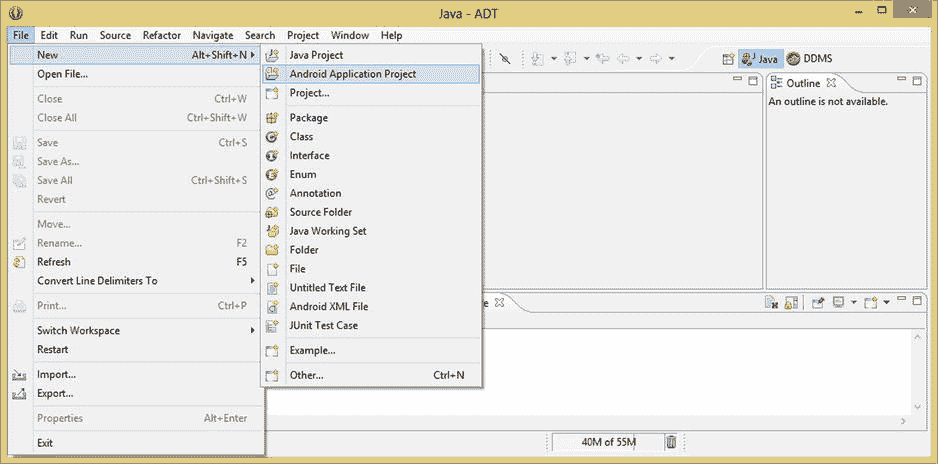

图 2-1.  
使用 **文件 ➤ 新建 ➤ Android 应用程序项目** 工作流程创建您的 Pro Android Graphics 应用

选择此项后，您将看到一系列五个**新建 Android 应用程序**对话框中的第一个。这些对话框将引导您完成创建新 Android 应用程序“引导程序”或框架的过程，该框架将包含您的所有资产、类、方法、XML 文件等等。

这些对话框会询问您一系列问题，或者更准确地说，允许您从一系列选项中进行选择，并使用数据字段指定信息，以便 Eclipse ADT（本质上是 Android 操作系统）能够按照 Android 希望实施的标准惯例，以最优方式创建您的应用程序引导代码。正如您在本书中将看到的，Android 对于它希望开发者如何构建或编码其应用程序非常讲究。

第一个对话框（如图 2-2 所示）允许您命名应用程序和 Eclipse 中的项目文件夹，并最终为您的项目建立 Java 包名称。

这些是第一个对话框中的前三个字段。让我们将此应用和项目命名为 `GraphicsDesign`，并根据本书名称将您的 Java 包命名为 `pro.android.graphics`。在本书中，您将开发此应用程序项目，实现令人惊叹的图形处理管线！

接下来的四个下拉菜单选择器允许您选择要开发的 API 级别和操作系统主题。我接受默认（或建议）的最低所需 SDK：API 级别 8（Android 2.2 Froyo），目标 SDK 为 API 级别 17（Android 4.2 Jelly Bean）。我将使用最新的 API 级别 17 进行编译，并使用最现代的 `Holo Light` 操作系统主题。

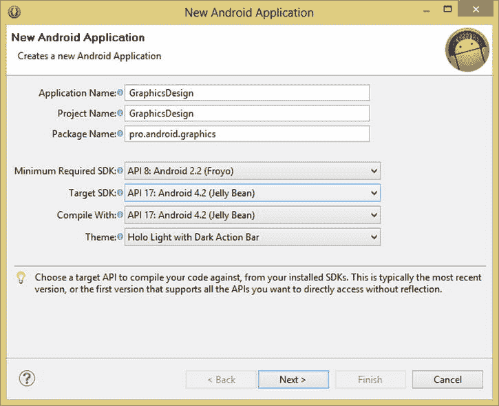

图 2-2.  
命名您的应用程序、项目和包，并选择最低和目标 SDK

完成所有这些非常重要的应用程序规格指定后，点击**下一步 ➤** 按钮，进入**新建 Android 应用程序**系列对话框中的下一个。

该系列中的第二个对话框是**新建 Android 应用程序配置项目**对话框，如图 2-3 所示。此对话框允许您选择有关 Android ADT 如何在 Eclipse 中为您创建项目文件（目录结构）系统、引导 Java 代码和应用程序图标的选项。

尽管您将在本书后面设计自己的自定义应用程序图标（毕竟这是一本关于图形设计的书），但现在您将选择让 Android 为您创建占位应用程序启动器图标的选项，因此请在此对话框的第一个复选框中打上勾。


对话框中的下一个复选框将指示 Android ADT 为您编写一些初始的 Java Activity 子类代码，因此让我们偷懒并勾选此选项，以便精确查看 Eclipse ADT 将为您做些什么。

最后，接受默认的“在工作区中创建项目”（`Create Project in Workspace`）选项，保持此复选框的勾选状态，因为它默认已被勾选。

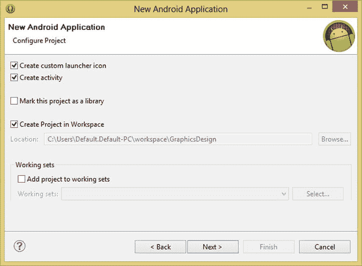

图 2-3. 使用“配置项目”对话框创建图标、Activity 和项目工作区

此项目并不庞大，无需将其标记为更大应用程序（包含多个代码库）中的库，也无需使用工作集，因此请取消选择这些选项。完成第二个对话框后，单击“下一步”（`Next ➤`）按钮，以进入下一个对话框，即“配置启动器图标”（`Configure Launcher Icon`）对话框。

此对话框如图 2-4 所示，将允许您从 Android 提供的资源中进行选择，您将使用该资源来临时定义应用程序启动图标，并临时用于您的 Pro Graphics 应用程序。

由于专业应用程序始终会拥有自定义图标，而非默认的 Android 图标，因此只需为此屏幕选择默认值即可。现在就这样做，因为此图标将充当应用程序的占位图标，直到您创建自己的自定义应用程序图标——您很快就会执行此操作，以便让您的应用程序具有自己的身份。

如果您已经有可用的应用程序图标图片，可以通过选择顶部的“图片”（`Image`）按钮，然后使用“浏览”（`Browse`）按钮选择图标资源的图片文件，利用此对话框进行安装。

这里提供了修剪周围空白区域、添加内边距、裁剪或居中前景缩放、选择图标形状以及使用背景色的选项。您目前还不需要使用它们（但可以随意尝试）。

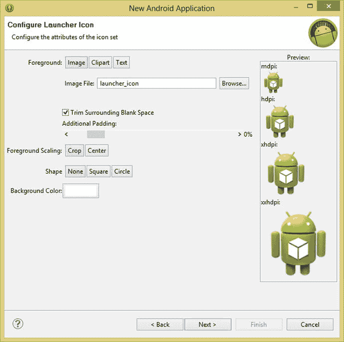

图 2-4. 使用“配置启动器图标”对话框配置占位图标图片

由于这是一本图形设计书籍，您将把所有这些图片编辑优化操作应用到您的应用程序图标上，并在您的图片编辑软件包中完成，因为您对工作流程有更多的控制权和选项。

完成“配置启动器图标”对话框后，单击“下一步”（`Next ➤`）按钮，继续查看应用程序创建系列中的下一个对话框，即“创建 Activity”（`Create Activity`）对话框，如图 2-5 所示。

此对话框将允许您选择 Android Activity 子类 Java 代码的类型，这些代码将由 Eclipse ADT 环境为您编写。让我们看一下 ADT 将为您编写的最简启动 Activity 代码。为此，请选择“空白 Activity”（`Blank Activity`）选项。

由于您将从头开始创建您的 Pro Android Graphics 应用程序，以便学习如何在 Android 内部自定义图形资源，这正是您所需要的：一张白纸，如果您愿意的话。

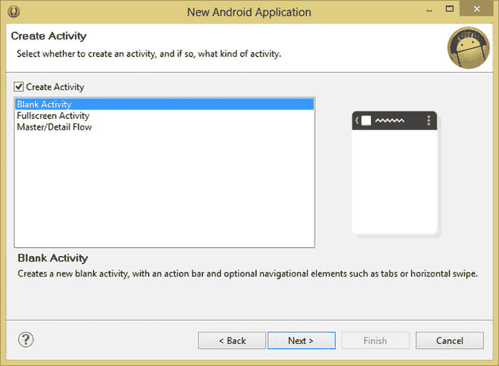

图 2-5. 使用“创建 Activity”对话框为您的应用程序创建一个新的空白 Activity

一旦您从“创建 Activity”复选框下方的选择区域选择了第一个“空白 Activity”选项，单击“下一步”（`Next ➤`）按钮，您将进入这个“新建 Android 应用程序”系列对话框中的最后一个应用程序配置对话框。

“空白 Activity”对话框如图 2-6 所示，允许您通过在上一对话框中选择的空白 Activity 进行配置，为其指定名称和导航类型。由于您是从头开始编写 Pro Android Graphics 应用程序的代码，请选择导航类型为“无”。这样，您就可以在本书的学习过程中自行构建应用程序导航。

对于“Activity 名称”（`Activity Name`）和“布局名称”（`Layout Name`）参数，我们采用 Android ADT 建议的命名约定，分别为 Java 代码和 XML 标记文件使用 `MainActivity.java` 和 `activity_main.xml`。

在本书的第一部分中，我们将遵循此命名约定，因为这便于明确哪些 Java Activity 类及其相关的 Activity 布局用户界面设计是相互配对的。

在此对话框屏幕中完成操作（实际上什么都不用做）后，单击“完成”（`Finish`）按钮。现在，让我们仔细看看 Android Eclipse ADT 通过这五个对话框系列为您慷慨创建的新建 Android 应用程序项目启动基础设施。

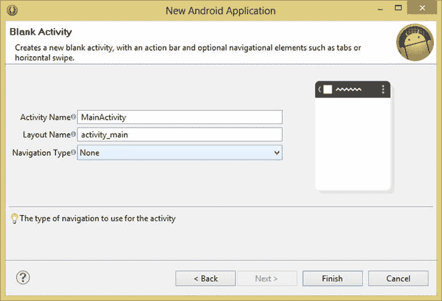

图 2-6. 使用“空白 Activity”对话框命名您的 Java Activity 子类和 XML 布局

一旦您选择了“完成”按钮，系统将返回到 Eclipse ADT IDE，您将在 Eclipse 的图形布局编辑器（`Graphical Layout Editor`，简称 `GLE`）中看到您的新项目以图形格式显示，如图 2-7 所示。

您还会在 IDE 的左侧看到“包资源管理器”（`Package Explorer`）窗格，其中显示了您刚刚完成的“新建 Android 应用程序”系列对话框所创建的项目层次结构和文件夹结构。

顶部是 `GraphicsDesign` 文件夹，下面依次是您的源代码（`src`）、资源（`res`）或项目资产，以及底部的 `AndroidManifest.xml` 文件，该文件负责配置和启动您的 Android 应用程序。

在 `res` 文件夹下，您将找到用于所有数字图像 DPI 资源的子文件夹（文件夹名为 `drawable`）、菜单、应用程序常量（`values` 文件夹）以及用户界面设计（`layout` 文件夹）。

在 `layout` 文件夹下，请注意 `activity_main.xml` 文件名被高亮显示；这是当前显示在中央编辑窗格中的 XML 标记，当前使用的是图形布局编辑器模式或视图，位于一个视图或“窗格”中。在最右侧，您会看到“大纲”（`Outline`）视图或窗格。

大纲视图显示，ADT 为您的 `MainActivity` UI 设计选择了一个 `RelativeLayout` UI 布局容器，并在其中放置了一个带有“Hello World”消息的 `TextView` UI 元素。这意味着 Android ADT 已经为您编写了 Hello World 应用程序，而您甚至无需编写任何代码！

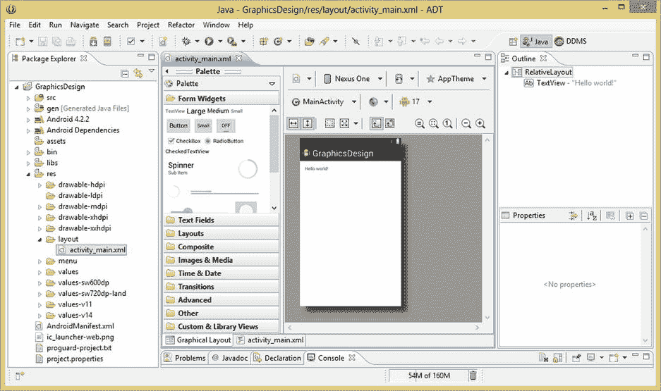

图 2-7. 新应用程序创建后，在 Eclipse 中央编辑区域显示的新 `activity_main.xml` 编辑选项卡

接下来，让我们以代码形式查看您的用户界面 XML 标记。在 Eclipse 中央编辑窗格的右下角，单击 `activity_main.xml` 选项卡。一旦您这样做，您就可以看到 XML 标记，它会渲染成在 GLE 中显示的用户界面屏幕视图。

ADT 为您的“空白 Activity”用户界面屏幕布局定义编写的默认 XML 标记如图 2-8 所示。此 UI 布局包含一个 `RelativeLayout`（这是 Android 的默认或推荐布局类型），以及此布局容器内的一个简单 `TextView` UI 元素或小部件。

您需要更改此启动 XML 标记，以支持一个 `VideoView` 用户界面元素，因为您希望新的 `MainActivity.java` 启动（或闪屏）屏幕在启动后显示一些非常酷的内容。

在您更改此 XML 标记之前，让我们快速浏览一下 Eclipse ADT 在此 `RelativeLayout` 父标签内为您的 `MainActivity` 类的 UI 布局容器为您精心创建的内容。


### 排版后的文档

父（外部）标签中的第一个参数称为 `xmlns:android` 参数，该参数为扩展标记语言命名模式（XMLNS）设置了一个 URL。这样做是为了确保此文件中使用的其他标签和参数可以被验证为正确的，即符合 `RelativeLayout` 容器的 XML 模式。如果该 URL 不存在，Eclipse 会在无法验证的每个标签参数下方添加波浪形的红色下划线。

还有一个 `xmlns:tools` 的 URL 引用，其用途与 `xmlns:android` 参数对于以 `android:` 开头的参数的作用大致相同，只是 `xmlns:tools` 是针对以 `tools:` 前缀开头的参数（例如 `tools:context` 参数）起作用的，你将在 `<RelativeLayout>` 容器父标签的最后看到这个参数。

还有 `android:layout_width` 和 `android:layout_height` 参数，你需要将它们设置为 `match_parent`。这确保了布局容器能够缩放以适应显示屏，该显示屏就是此布局容器的父容器。

还有一些默认的 `android:padding` 参数，正如你所看到的，它们引用了 `values` 文件夹中的一个 `dimen.xml` 文件，以及一个 `tools:context` 参数，该参数将此上下文声明为你的 `MainActivity.java` 代码。

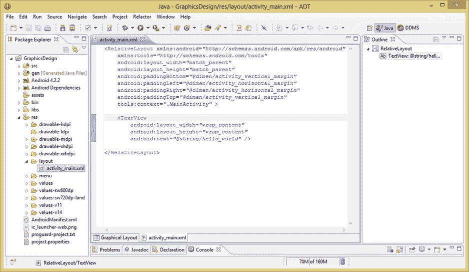

图 2-8.

点击中央编辑面板底部的 `activity_main.xml` 选项卡，以显示 XML 标记

`TextView` 标签是一个子标签，因为它包含（嵌套）在 `RelativeLayout` 容器内。该标签还包含设置为 `wrap_content` 的 `android:layout_width` 和 `android:layout_height` 参数，这确保了 UI 元素能够适应其内部的内容。

注意，`wrap_content` 本质上与 `match_parent` 参数完全相反，后者所做的恰恰相反，它会扩展以填充外部的内容，而不是收缩以适配内部的内容。

最后，在 `TextView` 标签内部有一个 `android:text` 参数，它使用 `@string/` 路径指向 `hello_world` `<string>` 标签名和 `Hello World` 值，引用了 `values` 文件夹中的 `strings.xml` 文件。

### 创建你的视频启动画面用户界面设计

当你在 `activity_main.xml` 用户界面布局容器中时，让我们将 `RelativeLayout` 父标签改为 `FrameLayout` 父标签，并将 `TextView` UI 元素改为 `VideoView` UI 元素或小部件（参见图 2-9）。

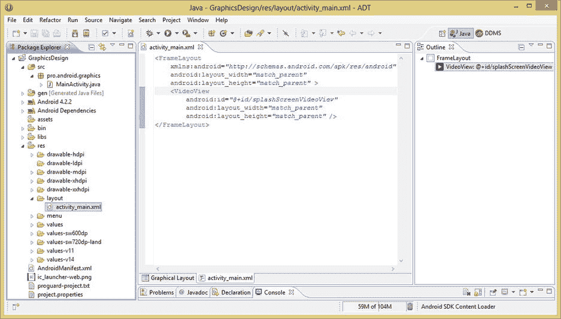

图 2-9.

将 `RelativeLayout` 容器标签改为 `FrameLayout`，将 `TextView` UI 元素改为 `VideoView`

你的 `VideoView` 要使用 `FrameLayout` 用户界面设计容器的原因在于，当 `VideoView` 被 Android 缩放时，放置在 `FrameLayout` 内的 `VideoView` 能够保持其宽高比。本书后面部分我将向你展示如何缩放视频以适应不同宽高比的屏幕，前提是你进行非宽高比缩放的内容不易出现明显变形（例如，访谈头部特写视频就很容易出现变形）。

将 `RelativeLayout` 的开始和结束标签改为 `FrameLayout`，并保留 `xmlns:android` 和 `android:layout` 参数（你现在知道这些是必需的）。然后，将 `TextView` 子标签改为 `VideoView`，并将其 `android:id` 改为 `@+id/splashScreenVideo`。删除 `android:text` 参数及其引用，因为你将在 `VideoView` UI 小部件中不会用到它。

现在你已经准备好看看你的 Java 代码将如何实现你的 UI 了！

### 查看你的 MainActivity.java 活动子类

为了彻底起见，既然你正在检查“新建 Android 应用程序”系列对话框为你创建的内容，那么我们也来看看你的 Java 代码吧。为此，在包资源管理器中右键单击 `/src/pro.android.graphics` 文件夹下的 `MainActivity.java` 文件，然后选择“打开”选项，或者如果你愿意，也可以左键单击并按 F3 键。

在图 2-10 中，IDE 左侧的包资源管理器窗格中高亮显示了该文件，并且它已经在 Eclipse 中央代码编辑面板中打开以供编辑。请注意，你的应用程序包名已被声明，并且必要的 Android 类也已通过使用带包名的 `import` 语句被导入。

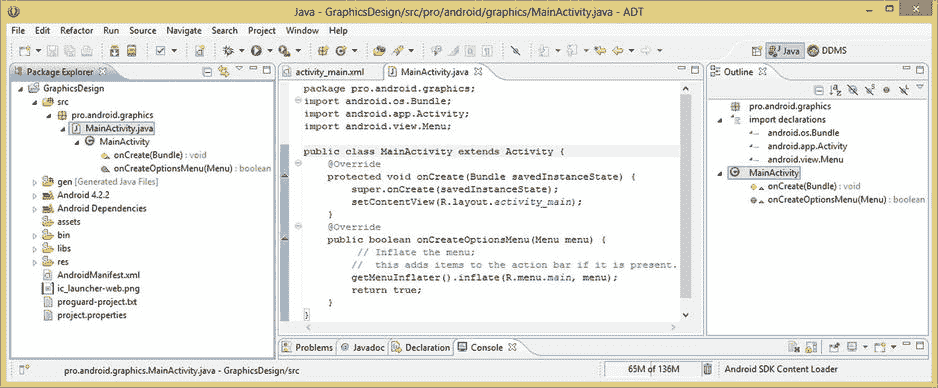

图 2-10.

查看由“新建 Android 应用程序”对话框生成的 Java Activity 子类代码

请注意，`MainActivity` 扩展了 Android 的 `Activity` 类，使其成为一个 `Activity` 子类，并且已经为你编写了一个 `onCreate()` 方法，该方法使用以下代码调用 `Activity` 超类的 `.onCreate()` 方法：

```
super.onCreate(savedInstanceState);
```

这段代码创建了一个 `Activity`，并传递了一个包含系统设置的 `Bundle` 对象，该对象用于你的 `Activity`，逻辑上被命名为 `savedInstanceState`。

使用这个 `Bundle` 对象是为了，如果这个 `Activity` 需要被操作系统终止（以回收内存资源），它可以在需要时从上次离开的地方重新启动，而用户对此毫无察觉。`onCreate()` 方法中的第二行代码将你的应用程序的 `ContentView` 设置为你定义的 `activity_main.xml`。这是通过调用 `setContentView()` 方法并引用项目 `/res/layout` 文件夹中的 XML 定义资源（`R` 代表资源）来实现的，该资源文件名为 `activity_main.xml`。


### 创建你的视频素材：使用 Terragen 3 3D 软件

现在我将为你介绍专业软件中的一大秘密，所有主流工作室都使用它来完成 3D 场景工作。`Terragen 3` 于 2013 年夏季刚刚发布。我拿到了首批稳定版本之一，因为我正在使用该软件编写一本 3D 概念书籍，如图 2-11 所示，你可以看到，你能获得的结果确实是照片级的真实感。

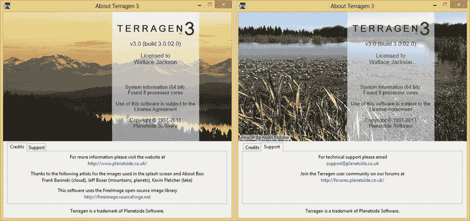

图 2-11. `Terragen 3` 启动界面，显示了鸣谢面板以及技术支持面板

访问 Planetside Software 网站，下载免费版本或购买专业版本。然后，你将能够使用 39KB 的源文件渲染出无缝的虚拟飞行画面，这个源文件与本书使用的其他应用程序数据文件一起提供。

如果你想知道一个不到 40KB 的文件如何能包含整个世界的定义（等你用它渲染出 340MB 的动画就知道了），这正是 3D 的惊人之处。就像 Java 代码一样，3D 本质上全是数学运算，因此它是文本形式的，并且压缩率非常高。

下载并安装 `Terragen 3` 后，在系统启动任务栏上为其创建一个快捷方式图标。之后，启动软件，打开 `loopingOrbit_v03.tgd` 文件，如图 2-12 所示。`TGD` 代表 `TerraGen Data` 文件，以防你对此感到疑惑。

点击软件右上角的 `Renderers` 选项卡（如图 2-12 中蓝色高亮所示），然后点击软件左上角的 `Render01` 对象，打开图 2-12 中其下方显示的渲染设置控制区域。设置图像宽度值为 480，高度值为 800。

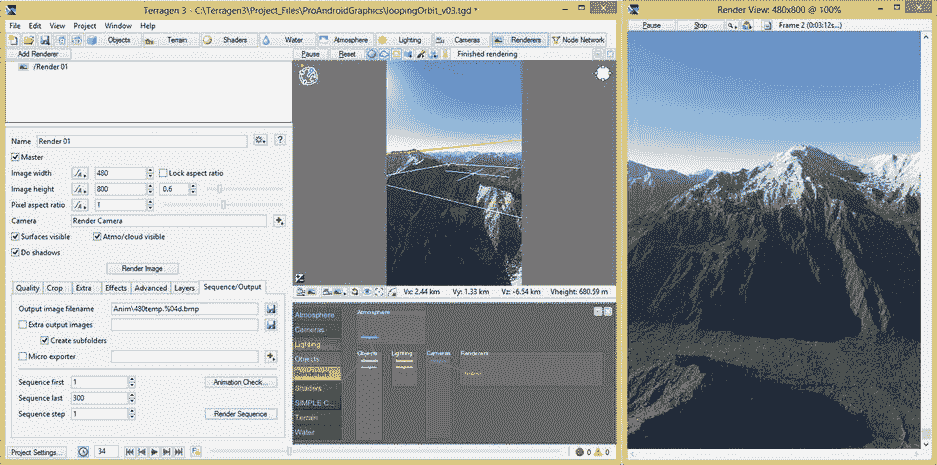

图 2-12. `Terragen 3` 渲染面板和渲染设置区域，以及右侧的渲染视图窗口

保持其他顶部面板设置不变，在面板底部，点击右侧的 `Sequence/Output` 选项卡，并设置一个 `Output Image` 文件名。我的文件放在 `Terragen3` 文件夹层级下的 `Anim` 文件夹中（`Terragen3/Project_Files/ProAndroidGraphics/Anim` 文件夹）。

我将文件命名为 `Anim\480temp.%04d.bmp`，这是一种文件名格式，会生成编号文件，格式如 `480temp.0000.bmp` 等，你将在后续的截图中看到（如果你急切地想看，可以参考图 2-16）。`Terragen3` 是一个专业的 3D 程序，具有复杂的功能。

因此，文件名中的 `%04d` 部分表示你希望文件名中有四位小数，或者在此例中，第一个文件名为四个零。设置完成后，你可以将 `Sequence first` 和 `Sequence last` 数据字段分别设置为 1 和 400。确保所有其他字段为空，并且 `Sequence step` 数据字段设置为值 1。

如果 `Extra output images` 复选框未被勾选，那么 `Create subfolders` 复选框可以勾选或不勾选，因为除非 `Extra output images` 复选框被激活，否则它不会被使用，所以你可以保持其勾选状态。

如果你感到好奇，额外输出图像用于生成高级辅助图像，这些图像用于 `Terragen 3` 输出的高级合成。这包括诸如 Z-buffer 或 G-buffer 之类的内容，它们定义了 `Terragen 3` 序列中每一帧的合成层或对象顺序（Z-buffer）和景深（G-buffer；模糊）。我告诉过你，它很复杂！

一切设置完成后，点击 `Render Sequence` 按钮（我在图 2-12 中将其用蓝色高亮），然后观看你的工作站进行渲染！

### 创建未压缩视频：使用 VirtualDub 软件

当你的 400 帧 3D 动画渲染完成后（根据你拥有多少个处理器核心以及每个核心的运行速度，这需要 8 小时到 8 天不等；我的系统有 8 个核心，每个核心以 3.4GHz 运行，我的渲染时间大约为 12 小时），你就可以下载并安装 `VirtualDub 1.9` 开源软件了，你将使用该软件将这 400 个文件全部安装到未压缩的 AVI 视频文件格式中。

搜索“VirtualDub Video”或访问 [`VirtualDub.com`](http://virtualdub.com) 网站，下载 32 位版本，或者，如果你像我一样拥有基于 64 位 AMD 处理器的工作站，并安装了 64 位操作系统（我正在使用 64 位版本的 Windows 8.1），那么下载 64 位 AMD 版本，如图 2-14 所示，这正是我当前运行的版本。

下载完成后，通过将软件解压到你的硬盘驱动器上来安装它，最好解压到 `/Program_Files` 文件夹下的 `VirtualDub` 子文件夹中，然后在任务栏上为其创建一个快速启动图标。

启动软件后，你将看到三个关键的对话框。第一个是 GNU 开源许可协议，点击 `OK` 按钮接受。下一个对话框让你选择是否查看帮助文件，在使用任何高级图形软件包之前，这总是一个好主意。

图 2-13 显示了三个你应该熟悉的对话框，然后再点击 `Start VirtualDub` 按钮启动软件。

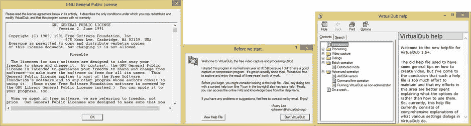

图 2-13. `VirtualDub 1.9.11` GNU 通用公共许可证、开始之前，以及 VirtualDub 帮助对话框

点击 `Start VirtualDub` 按钮启动软件后，你会看到一个宽敞的空窗口，顶部有九个菜单。这是加载任何视频文件之前的 `VirtualDub` 界面；接下来，让我们通过 `Video` 菜单及其几个子菜单选项来配置你的环境。

我们将配置视频压缩、帧率、颜色深度和范围。如图 2-14 所示，我在截图中包含了其中一个菜单，以避免在巨大的空屏幕上浪费空间。`Video ➤ Compression` 菜单将打开一个 `Select video compression` 对话框；保持默认的 `Uncompressed RGB/YCbCr` 设置，然后点击 `OK`。

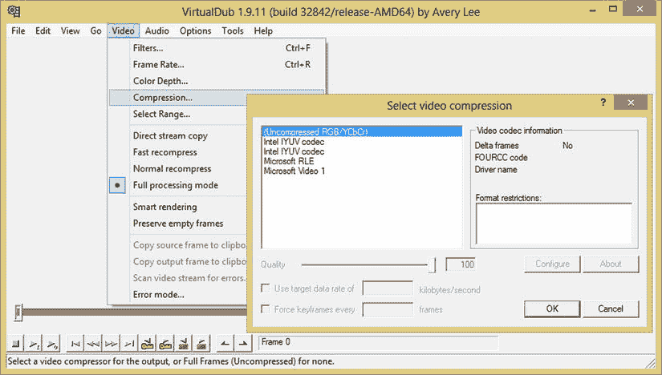

图 2-14. 启动时的 `VirtualDub`（空项目）显示 `Video ➤ Compression` 菜单序列和对话框

接下来，设置 `Frame Rate`、`Color Depth` 和 `Select Range` 菜单选项，这些选项也在图 2-14 中显示，其对话框如图 2-15 所示。在 `Frame Rate` 对话框中接受默认的 `10FPS`，在 `Color Depth` 对话框的两侧都选择 `24-bit RGB (888)` 设置，并在 `Select Range` 对话框中保持自动检测的 0 到 400 帧范围。你可以保持音频选项勾选，但你不使用音频。

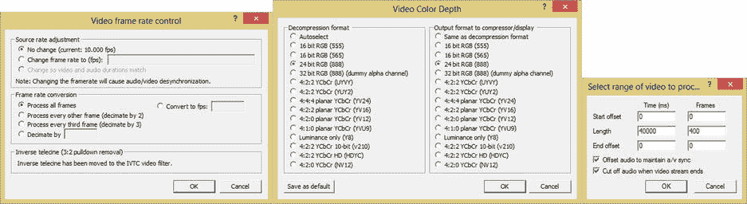

图 2-15. `VirtualDub` 视频帧率控制、视频颜色深度、选择要处理的视频范围对话框


使用 `File ➤ Open video file` 菜单序列，如图 2-18 所示，找到 `Anim` 文件夹中编号的 `BMP Terragen 3 3D` 动画文件，如图 2-16 所示。选择编号文件系列中的第一个文件名，即 `480temp.0001` 到 `480temp.0400` 的 `BMP` 文件。您可以在图中看到这些文件（以及 `360` 像素肖像分辨率数据文件，您将在第 18 章（高级数字视频优化章节）中对这些文件进行优化）。

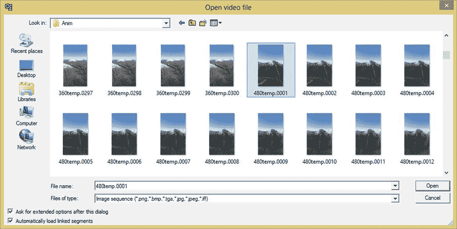

**图 2-16.** 使用 VirtualDub 1.9 的 `Open video file` 对话框定位 Terragen `Anim` 文件夹中的编号 `.BMP` 文件

单击 `Open` 按钮后，图像序列将被加载到 VirtualDub 软件中，第一帧将显示在软件的主窗口中，如图 2-17 所示。

VirtualDub 加载数字图像帧序列后，就可以使用其功能将这些静态图像帧加载到 `AVI` 容器中。这是一种支持数字视频 `FFU`（全帧未压缩）版本的格式。

`AVI` 代表音频视频交错（Audio-Video Interleaved），这是一种最初由 Microsoft Windows 操作系统及其流行的 Windows Media Player 推广的视频文件格式。

在压缩过程中使用全帧未压缩数字视频的原因很简单：您希望在一个算法过程中完成所有压缩，以避免压缩先前压缩过程中产生的伪影，这些伪影会增加最终的数据占用空间。

使用 VirtualDub 执行此中间步骤的原因是 Sorenson Squeeze Pro 9 不支持加载图像序列数据。出于显而易见的原因，我已强烈建议他们在未来版本的软件中添加对此功能的支持。

EditShare Lightworks 11.1 确实支持导入编号图像文件的功能，因此一旦他们添加对 Android 专用（或 HTML5 专用）编解码器的支持，您就可以使用 Lightworks 11 进行数字视频优化工作流程，直接从 Terragen 3.0 导入到 Lightworks 11.1。现在 VirtualDub 已加载 Terragen 数据，您可以准备创建 `AVI` 文件了。

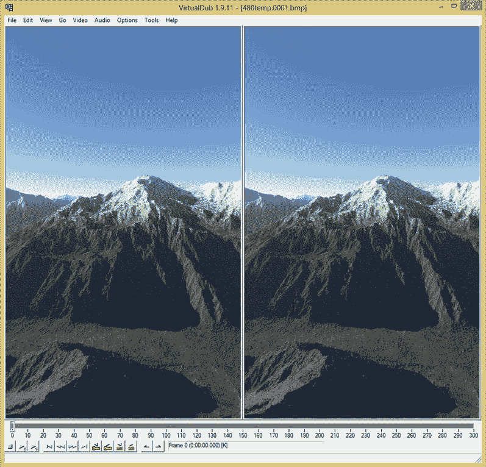

**图 2-17.** 在 VirtualDub 1.9.11 中打开的 Terragen 3.0 3D 世界飞越渲染图，分辨率为 `480x800`

要以 `AVI` 格式保存，请按下键盘上的 `F7` 功能键，或单击 VirtualDub 左上角的 `File` 菜单，然后选择 `Save as AVI` 选项。如图 2-18 所示，VirtualDub 会显示功能键快捷键，这些快捷键能帮助您更高效地使用该软件。

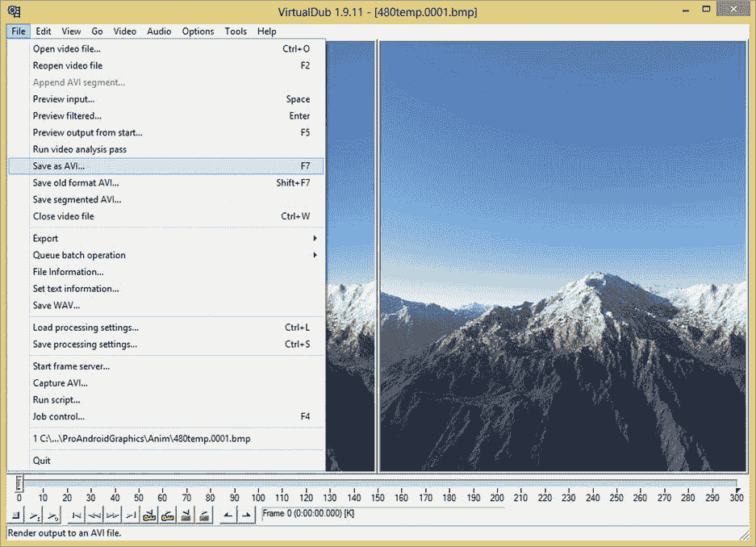

**图 2-18.** 使用 VirtualDub 的 `File ➤ Save as AVI` 菜单序列将 Terragen 3 飞越动画保存为视频格式

调用 `Save as AVI` 对话框（如图 2-19 所示）后，您需要在与 `Anim` 文件夹相同的层级创建一个名为 `AVIs` 的文件夹，以便将 `AVI` 文件与编号的 `BMP` 文件分开存放，这主要是出于组织管理的目的。

我使用了 `Terragen3/Project_Files/ProAndroidGraphics/AVIs` 文件夹结构，如图 2-19 左侧所示。选择此文件夹或您自己创建的文件夹，然后输入您想要用于 `AVI` 文件的文件名（我使用了 `PAG480x800`），VirtualDub 软件将自动添加 `.avi` 文件扩展名。

完成所有设置后，单击 `Save` 按钮，然后准备观看视频帧在屏幕上飞过（如果您的电脑是八核处理器）。

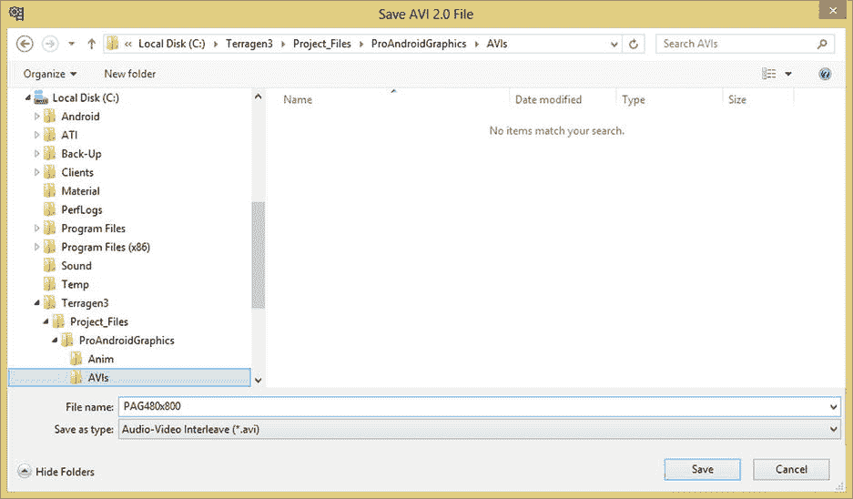

**图 2-19.** VirtualDub `Save AVI 2.0 File` 对话框和 `Terragen3/Project_Files/ProAndroidGraphics/AVIs` 路径

一旦您启动将静态图像帧加载到全帧未压缩的 `AVI` 容器中的过程（以便与 Sorenson Squeeze Pro 9 软件兼容），您将在软件主屏幕上看到帧被加载到 `AVI` 中。

同时会出现一个进度对话框，其中包含一些统计信息。该对话框会显示当前正在处理的数字视频帧，以及到目前为止已处理的视频数据量；在图 2-20 中，这是第 `136` 帧和 `149` MB 数据。

此对话框还会预测最终渲染的 `AVI` 文件大小；在这种情况下，它估计为 `329.59` 兆字节，非常接近。实际结果（您将在下一节使用 Sorenson Squeeze 优化视频时看到）是 `439.47070313` 或 `450,018,000` 字节，除以 `1024`，即可得出兆字节数。

该对话框还显示视频渲染速率，这基本上是系统处理器速度的指标。我的系统接近 `15 FPS`，所以看起来就像摄像机在 Terragen 3 创建的 3D 世界中飞越。

最后，对于系统较慢的用户，还提供了经过时间和估计时间值，这些用户在此期间处理视频数据时，甚至可以去享用一顿美餐。

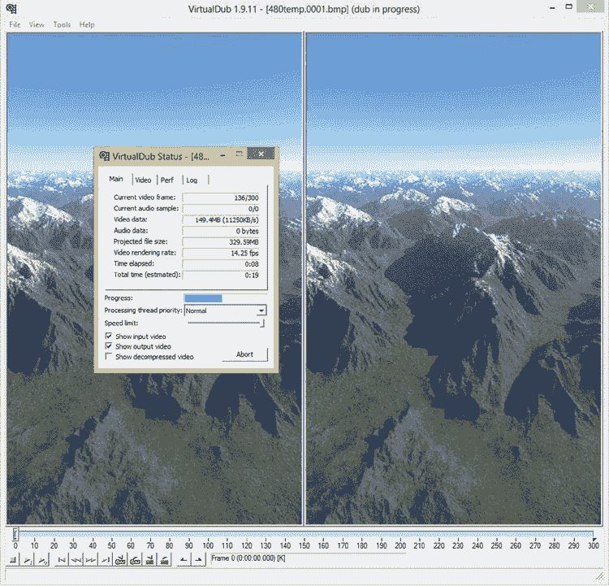

**图 2-20.** 在 VirtualDub 中渲染 Terragen 3 项目的 `300` 帧，显示渲染状态对话框和第 `136` 帧

现在，您已将数据转换成 Squeeze Pro 可以处理的 `AVI` 数字视频文件格式，可以进入专业的数字视频数据优化软件包，真正开始数据占用空间的优化工作了。

如果您在 Android 应用程序中使用受版权保护的数字视频资源，这是一个关键步骤，因为这将是整个应用程序中 `.APK`（Android 包）数据占用空间（文件大小）的主要影响因素。


### 压缩视频资源：使用 Sorenson Squeeze

启动 `Sorenson Squeeze 9 Pro` 软件包时，您将看到一个版权启动画面，如图 2-21 所示，并附有进度文字，提示您当前处于软件加载的哪个阶段，例如“正在初始化 UI”。

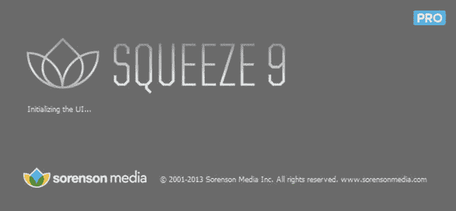

图 2-21. Squeeze Pro 9 启动版权画面

您接下来会看到的画面（图 2-22）是“欢迎使用 Squeeze”对话框，其中包含视频教程和 Squeeze 资源。与我处理 `VirtualDub` 时一样，我建议您利用此类资源，以便在实际工作中运用该软件包之前先熟悉它。

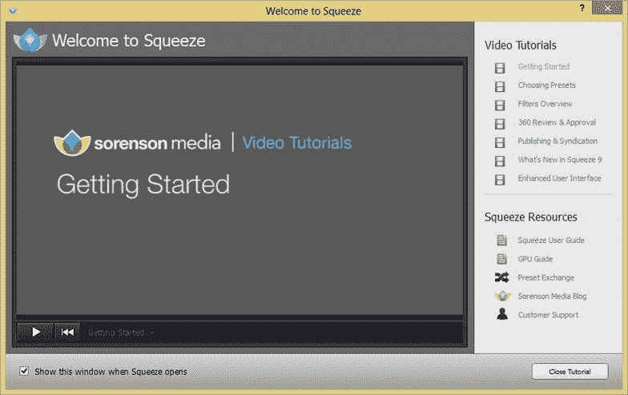

图 2-22. “欢迎使用 Squeeze”画面，提供七个视频教程和五个 Squeeze 资源

当您使用右下角的 `关闭教程` 按钮关闭教程窗口后，您将看到 Squeeze 主用户界面窗口，如图 2-23 所示。该窗口包含输入选项和视频编辑区域。

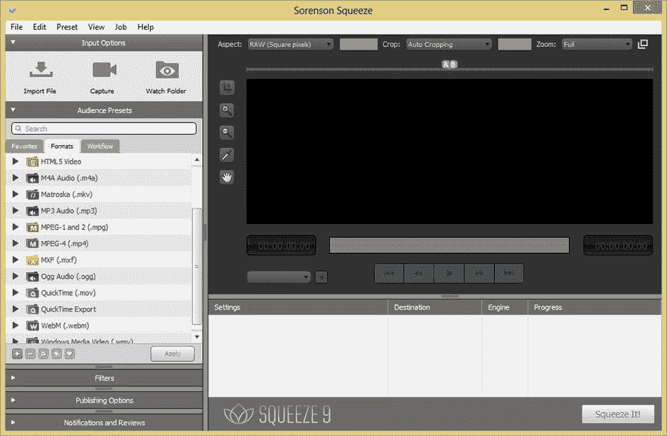

图 2-23. Sorenson Squeeze 应用程序，左侧显示视频编解码格式，左上角显示 `导入文件` 图标

点击左上角的 `导入文件` 按钮，打开图 2-24 所示的对话框，以便您导航至 AVI 文件夹并打开一个文件。

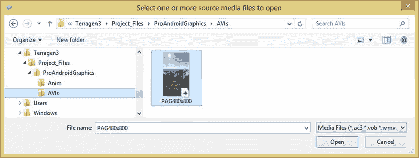

图 2-24. Squeeze 9.0 Professional 的 `导入文件` 对话框，显示 `Terragen3` 路径和 `PAG480x800` 文件名

找到 `PAG480x800.avi` 文件并高亮选中它，然后点击 `打开` 按钮，或者找到该文件后直接双击，AVI 文件将会在右侧的 Squeeze 9 视频编辑区域中打开，如图 2-25 所示。请注意，您的源文件也会显示在软件底部的“处理”区域，并且我已在软件左侧“受众预设”部分的“格式”选项卡中打开了 MPEG-4 编解码设置预设。

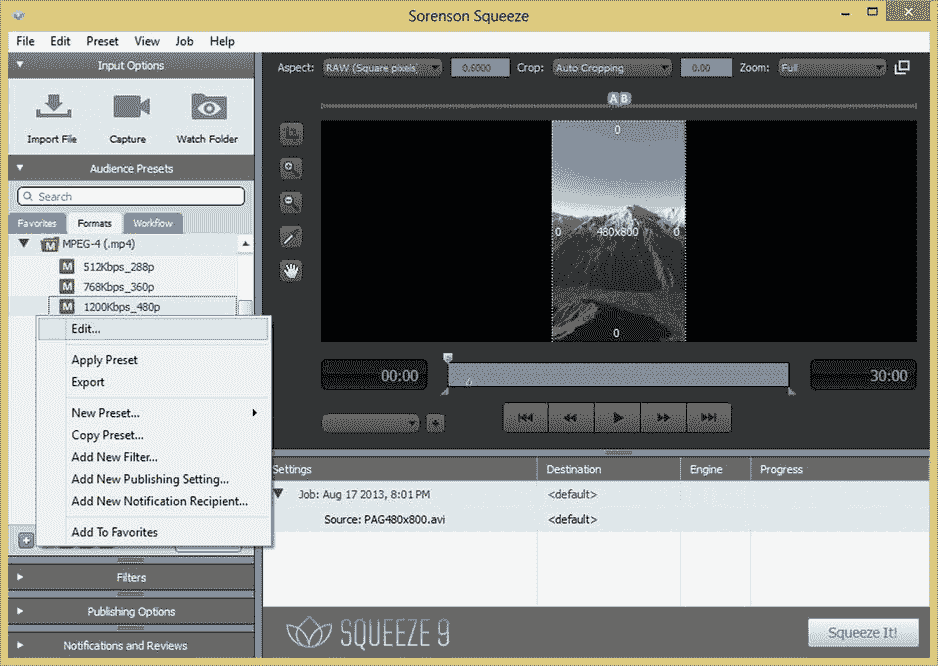

图 2-25. Squeeze 显示已导入的 `PAG480x800.avi` 文件（底部蓝色高亮）以及右键点击 `编辑` 菜单项

右键点击当前用于 480p 视频的预设（即您将要压缩的视频），然后选择 `编辑` 选项。您将编辑这些预设（压缩参数）以用于 Android。这意味着将比特率从 1200 调整到 1024，并进行一些其他调整，您接下来将进行这些操作。

在“预设”对话框中（如图 2-26 所示），您首先要做的是为新的 `Android480x800p` 预设命名，并在 `描述` 数据字段中输入新的说明“Android 480 乘以 800”。

确保 `格式约束` 下拉菜单显示为 `无`，并且 `流类型` 下拉菜单显示为 `非流式` 而非 `有提示的`，因为您正在创建的是内嵌视频。

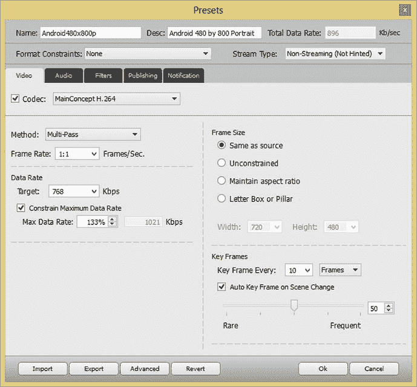

图 2-26. Squeeze 9 视频压缩预设对话框及设置

确保 `编解码器` 已选中（勾选）并设置为 `MainConcepts H.264`，因为该编解码器具有最佳的大小与质量平衡。`帧速率` 选择应设置为默认的 1:1 设置，指示编解码器压缩您的 Terragen 3 动画序列 AVI 中的每一帧。

压缩方法应设置为多遍压缩，这会占用最多的数据处理周期（压缩时间最长），但也能产生最佳效果，您将在本节末尾看到这一点。

将您的数据速率目标更改为 `768 KBPS`，并选择 `限制最大数据速率` 选项，通过在此数据字段中设置 `133%` 的值，将最大数据速率目标超调容限设置为 33% 或三分之一。这将为您提供您希望 Android 处理的 `1024 KBPS` 或 `1 MBPS` 的数据量。

在对话框的右侧，选择 `帧大小` 选项中的 `与源相同`，这样您的像素就不会以任何方式被缩放，并将 `关键帧` 选项设置为 `每 10 帧一个关键帧`，即每秒一次，因为您目前为动画使用了 `10 FPS`，以实现缓慢但稳定的飞越效果。

最后，保持选中（勾选）`场景变化时自动设置关键帧` 复选框，并将 `稀疏到频繁` 滑块设置为中位数 `50%` 的值，然后点击 `确定` 按钮。这会将您的设置保存到新的 `Android480x800p` 预设中，该预设显示在 Squeeze 软件的左侧，如图 2-27 所示。

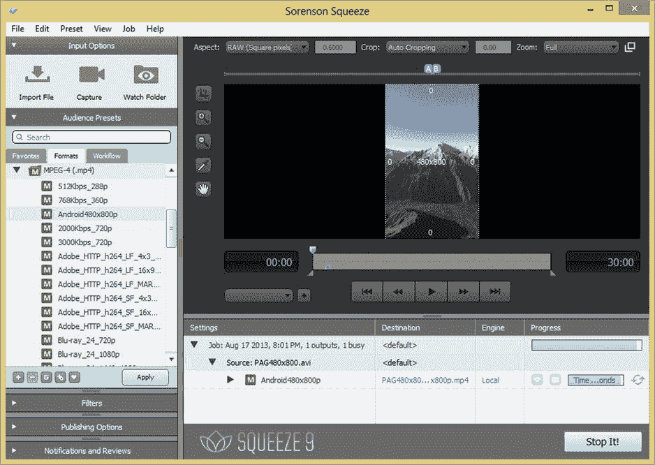

图 2-27. Squeeze 显示新创建的 `Android480x800p` 视频编解码设置已应用于 `PAG480x800.avi`

工作流程的下一步是将此新预设应用于您已导入的 `.AVI` 文件。这通过使用位于“格式”（或预设）窗格右下角的 `应用` 按钮来完成。

在点击 `应用` 按钮之前，请确保 `Android480x800p` 预设处于选中状态（蓝色），以便它是应用于您的 `.AVI` 数字视频素材全帧未压缩源数据的预设。

一旦您点击 `应用` 按钮，您将看到格式预设直接显示在您的源 AVI 文件下方，如图 2-27 所示。在点击软件右下角的 `开始压缩！` 按钮之前（您可以在图 2-25 中看到此按钮），请确保您看到了这个情况。

一旦您点击 `开始压缩！` 按钮，您将看到一个蓝色进度条，如图 2-27 右侧所示，位于 Squeeze 软件底部“项目设置”区域顶部的 `任务` 状态栏旁边。压缩过程完成后，您将看到您的视频素材图标上覆盖着一个播放按钮，如图 2-28 所示。您可以点击它来预览压缩后的 MP4 文件。

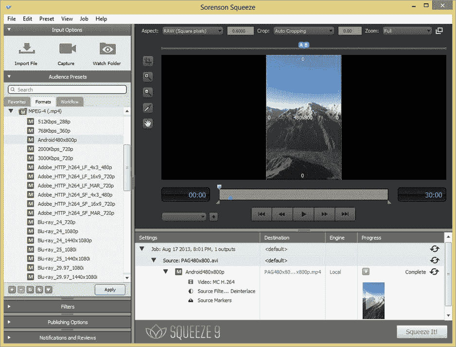

图 2-28. Squeeze 显示已完成的压缩 MP4 文件、播放图标、所用视频编解码器及其他设置

使用资源管理器比较原始文件和压缩文件的大小，如图 2-29 所示。

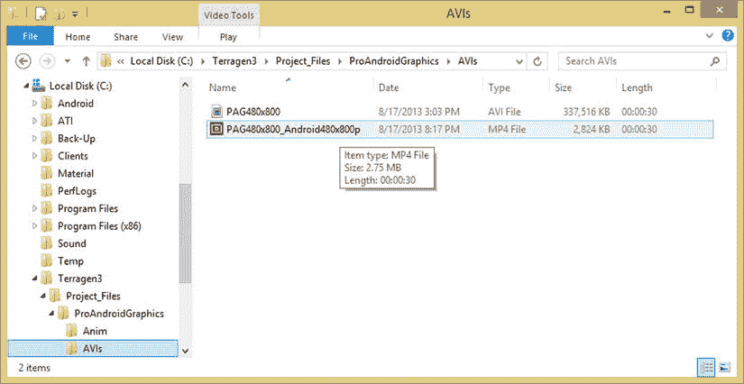

图 2-29. 使用 Windows 资源管理器比较相对文件大小（压缩后 vs. 原始）

让我们计算一下，看看使用这些设置获得了多大的压缩比。如果将这两个数字相除，无论哪个方向（如果您愿意，可以互换分子和分母，结果相当于取倒数），您都会得到接近 120:1 的压缩比，或者从另一个（取倒数的）方向来看，压缩后的文件大小仅为原始未压缩数据占用空间的 0.8367%，或者说比原始文件压缩了 99.16%。我早就说过，编解码器的能力会令您惊叹！


### 在 Android 中安装视频资源：使用 Raw 文件夹

接下来，要在你的 GraphicsDesign 应用中使用这个数字视频资源，必须将此 MP4 数字视频资源文件安装到 Android 项目文件夹层次结构中 `/res` 资源文件夹内的正确文件夹中，如图 2-7 所示。你不希望 Android 系统进一步处理或压缩的数字视频及其他“开发者压缩的”资源，应存放在 `/res/raw` 文件夹中。由于该文件夹尚不存在，你需要创建它。因此，右键点击 `/res` 文件夹，选择 New ➤ Folder 选项。创建过程如图 2-30 所示（我保留每一步所选中的蓝色高亮状态）。

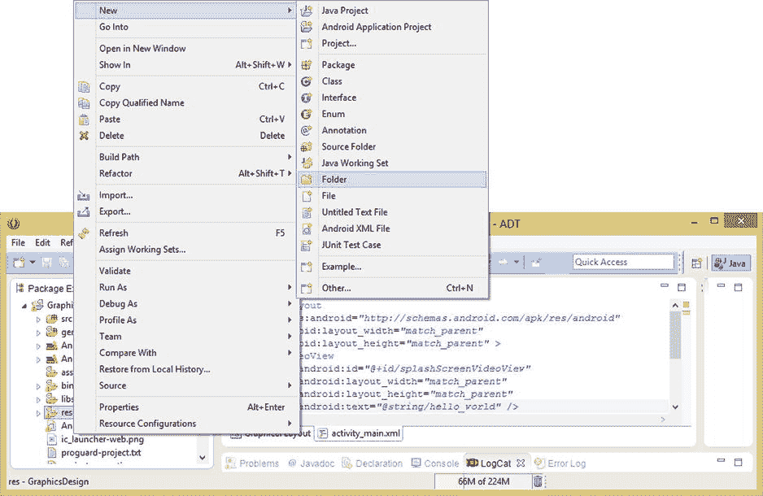

图 2-30. 右键点击 `/res` 文件夹，选择 New ➤ Folder 菜单序列以创建 `/res/raw` 文件夹

在“新建文件夹”对话框中，指定 raw 文件夹名称，如图 2-31 所示。

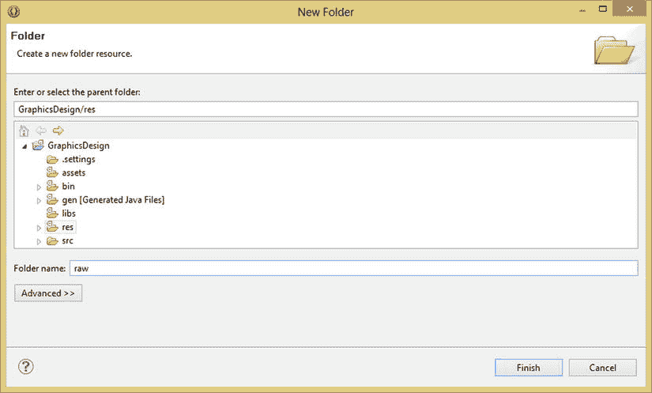

图 2-31. 使用“新建文件夹”对话框指定 `GraphicsDesign/res/raw` 路径

找到你在 Squeeze 中创建的 MP4 文件，并将其复制，如图 2-32 所示。

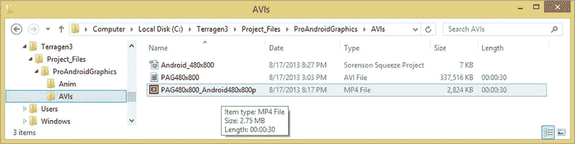

图 2-32. 找到用 Squeeze 生成的 MP4 文件，右键复制并粘贴到 `/res/raw` 文件夹中

将 MP4 文件放入 `/res/raw` 文件夹，并命名为 `pag480portrait`，如图 2-33 所示。

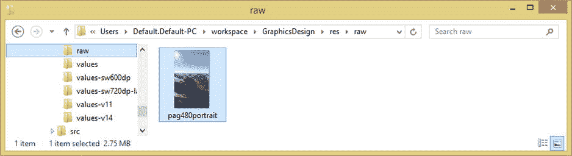

图 2-33. 将文件粘贴到 `/workspace/GraphicsDesign/res/raw` 文件夹中并重命名为 `pag480portrait`

最后，右键点击 GraphicsDesign 项目文件夹，使用 Refresh 命令更新 Eclipse，使其识别你在 IDE 外部安装的这个资源。这样 Eclipse 就能“看到”它了。现在，数字视频 MPEG4 资源已位于 `/res/raw` 文件夹中，你可以编写引用它的 Java 代码了。

### 在 Android 应用中引用视频资源

是时候在之前章节中看到的 `onCreate()` 方法里编写代码了！因此，点击 Eclipse 顶部的 `MainActivity.java` 标签页，让我们开始创建 Java 对象并将它们连接起来，以实现一些酷炫的功能。如果 `MainActivity.java` 当前未打开，请在 `/src` 文件夹中找到它，左键点击，然后按 F3 功能键，或者右键点击并选择 Open 菜单选项。

你需要做的第一件事是实例化你的 `VideoView` 对象，该对象已在 `activity_main.xml` 文件中定义，它将用于配合 `MediaPlayer` 类（你在本章第一部分已了解过）播放数字视频。这通过声明一个 `VideoView`，将其命名为 `splashScreen`，最后使用 `findViewById()` 方法来引用 `splashScreenVideoView` `<VideoView>` XML 对象 ID 定义或配置来完成。具体使用以下单行 Java 代码实现，如图 2-34 所示：

```
VideoView splashScreen = (VideoView)findViewById(R.id.splashScreenVideoView);
```

图 2-34. 实例化名为 `splashScreen` 的 `VideoView` 对象，并悬停鼠标选择 Import VideoView 选项

接下来，使用 Android 的 `Uri` 类创建一个 URI 对象，将其命名为 `splashScreenUri`，并像处理 `VideoView` 一样，将数字视频资源的路径加载到其中。这通过以下代码实现，如图 2-35 所示：

```
Uri splashScreenUri = Uri.parse("android.resource://"+getPackageName()+"/"+R.raw.pag480portrait);
```

图 2-35. 实例化名为 `splashScreenUri` 的 `Uri` 对象，并使用 `Uri.parse()` 方法调用来指定路径

URI 与你熟悉的使用 HTTP 互联网协议时的 URL 类似，在 Android 操作系统中也以类似的方式用于引用资源的数据路径。如图 2-35 所示，刚写好的最后两行代码中，对象名称下方都有波浪形的黄色警告高亮，这是因为你尚未使用这两个对象定义。下一行代码将使用 `.setVideoURI()` 方法调用把这两个对象“连接”起来，从而解决此问题。

如图 2-36 所示，从 `splashScreen` `VideoView` 对象调用 `.setVideoURI()` 方法，并将 `splashScreenUri` `Uri` 对象作为方法调用的参数传递，确实解决了这些警告高亮并将其消除。因此，请使用以下 Java 代码行：

```
splashScreen.setVideoURI(splashScreenUri);
```

现在你已经创建了 `VideoView` 并连接（引用）了视频资源，但依然无法播放它，因为你必须使用 `MediaPlayer` 才能实现播放。因此，接下来让我们设置一个 `MediaController` 对象。

图 2-36. 使用 `.setVideoURI()` 方法配置 `splashScreen` 的 `VideoView` 以引用 `splashScreenUri` 的 `Uri`

你将实例化一个 `MediaController`：声明一个 `MediaController` 对象，命名为 `splashScreenMediaController`，然后使用 Java 关键字 `new` 并调用 `MediaController()` 构造方法，传入当前应用上下文作为参数，即 Java 关键字 `this`。

你将在本书稍后部分详细了解 Android 的 `Context` 类。`MediaController` 对象可以通过以下单行 Java 代码进行实例化：

```
MediaController splashScreenMediaController = new MediaController(this);
```


如图 2-37 所示，你需要将鼠标悬停在 `MediaController` 类引用下方波浪形的红色错误高亮上，然后让 Eclipse 使用你在错误修正辅助对话框中看到的 `Import MediaController (android.widget)` 选项为你导入该类。

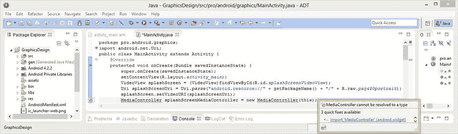

图 2-37. 通过 Java `new` 关键字实例化一个名为 `splashScreenMediaController` 的 `MediaController` 对象

现在你已创建了一个可用于播放视频资源的 `MediaController` 对象，接下来需要通过使用 `.setAnchorView()` 方法将其接入你的 `VideoView`，以确定哪个 `View` 对象将“锚定”或承载 `MediaController` UI 控件（你将在本章后续测试代码时看到这些控件）。将 `MediaController` 对象锚定到 `VideoView` 对象需要用到下面这一行 Java 代码：

`splashScreenMediaController.setAnchorView(splashScreen);`

如图 2-38 所示，你的代码已无错误。现在既然已将 `View` 告知了 `MediaController` 对象，就可以继续将 `MediaController` 告知 `VideoView` 对象，从而实现两者的交叉连接。

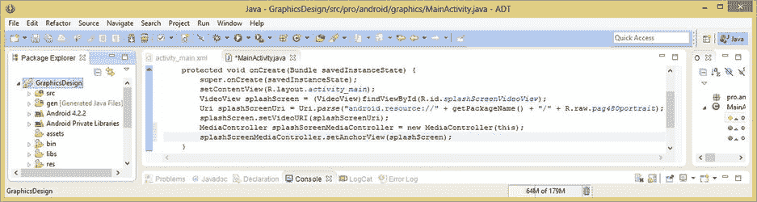

图 2-38. 使用 `.setAnchorView()` 方法将 `splashScreen` `VideoView` 与 `splashScreenMediaController` 连接

你需要通过在 `splashScreen` `VideoView` 对象上调用 `.setMediaController()` 方法，并将 `splashScreenMediaController` 对象作为参数传递给它，从而将你希望使用的 `MediaController` 告知 `VideoView`。这需要用到下面这行 Java 代码，如图 2-39 所示：

`splashScreen.setMediaController(splashScreenMediaController);`

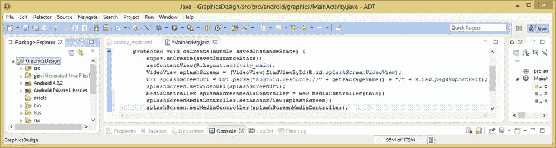

图 2-39. 使用 `.setMediaController()` 方法将 `splashScreen` `VideoView` 与 `splashScreenMediaController` 连接

要启动数字视频播放，最后需要做的就是在你之前实例化并配置好的 `splashScreen` `VideoView` 对象上调用 Android `VideoView` 类的 `.start()` 方法。这需要用到下面这行 Java 语句，如图 2-40 所示：

`splashScreen.start();`

你刚刚在 `MainActivity` 类的 `onCreate()` 方法中，仅用七行位置得当的 Java 代码就实现了数字视频播放。如图 2-40 所示，你的 Java 代码已无错误，现在可以准备使用 Nexus One 模拟器 AVD 来测试你的新 Android 应用程序了。

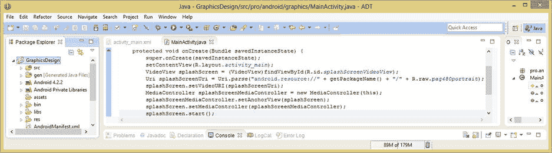

图 2-40. 通过在 `splashScreen` 对象上调用 `.start()` 方法启动 `splashScreen` `VideoView` 播放

右键单击你的 `GraphicsDesign` 项目文件夹，选择 `Run As ➤ Android Application` 菜单命令序列来启动 Nexus One 模拟器，如图 2-41 所示。你可以看到，视频播放效果完美。

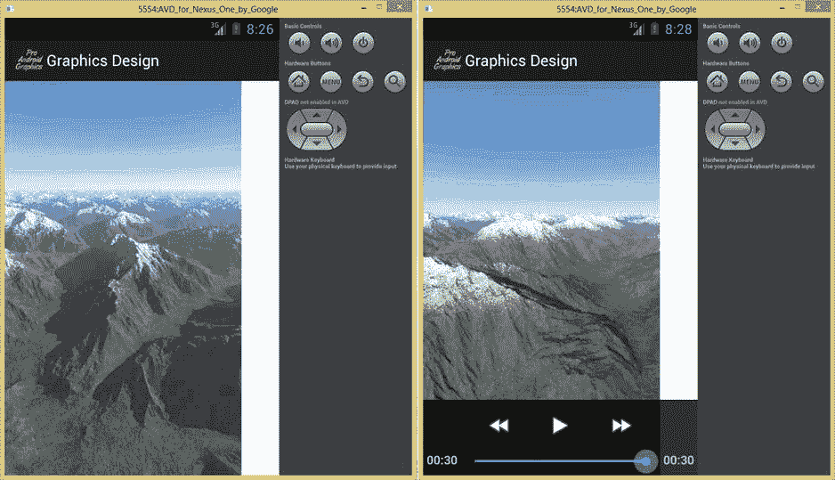

图 2-41. 使用 `pag480portrait.MP4` 视频数据测试 `MainActivity` `VideoView` 和 `MediaPlayer` 对象

请注意，如果你在数字视频停止播放时点击它，可以调出 `MediaController` UI，并使用常见的视频播放控制（如快退、播放、结束或使用点播轮）来控制视频。

还请注意，正如我先前在介绍 `<FrameLayout>` 时所提到的，视频的宽高比被保留了下来，这可以从视频右侧透出的白色背景颜色中看出。在本书后面的内容中，你将学习如何使用不同类型的布局容器来缩放视频资源以适配屏幕尺寸和形状。

### 总结

在本章中，你学习了数字视频的概念、格式、术语、设置及优化。你还创建了基础（也称为应用启动代码）基础设施，它将容纳你的 `pro.android.graphics` 包和 `GraphicsDesign` 应用程序。

我们首先研究了 Android 和 HTML5 中使用的两种主要视频格式：MPEG-4 H.264 AVC 和 Google 的 WebM VP8 格式。你了解到所有 Android 版本均支持 MPEG-4 播放，而 WebM 在 2.3.3 及更高版本中得到支持，在 Android 4.0 及更高版本中支持流式播放。你还了解到 H.263 主要用于视频会议。

接着，我们概述了 Android 的 `VideoView` 和 `MediaPlayer` 类。这些类用于通过 XML 标记和 Java 代码在应用程序内播放数字视频。你还在 `MainActivity` 用户界面设计中实现了一个 `VideoView` 用户界面元素，用于承载视频数据。

随后，我们研究了数字视频的基础：帧和帧率（以帧每秒即 FPS 表示）。我们学习了如何计算不同分辨率和帧率的原始数据量“影响”，以便你了解如何衡量进入压缩工作流程的数据量。这使你能够计算实际的数据量压缩比率。

我们考察了传统视频行业的标清和高清分辨率标准，以及流式视频与本地视频及比特率的概念。你了解到比特率不仅有助于将数据适配到给定网络带宽容量（数据管道大小）中，还需要考虑移动（嵌入式）设备的处理能力。这是因为用户能够流畅地解码每秒的数据量（比特率）对于获得良好用户体验至关重要。

接着，我们研究了 Android 中的视频缩放问题，以及为视频提供几个分辨率密度目标的需求，这样 Android 就不需要将视频缩放太多。目前，Android 没有双三次插值算法（但它有双线性滤波器）。

最后，我们探讨了编解码器的作用以及用于数字视频优化的压缩设置类型。我们研究了按影响数据量大小从大到小排列的数字视频特性和编解码器设置。你了解到优化数字视频没有万能药，每个数据流都是唯一的（至少从编解码器的角度来看），而优化数字视频数据量与播放质量的比例充其量是一个迭代过程，既需要时间也需要经验。

为了确保你在 Pro Android Graphics 应用程序上稳步前进，你还花了一些时间使用`New Android Application` 系列对话框为应用程序创建了一个外壳。我们查看了这些对话框提供的启动代码，并为你的 `GraphicsDesign` 应用在你的新 `pro.android.graphics` 包中的 `MainActivity.java` Activity 子类中配置了一个用于在启动画面上播放视频的 XML 用户界面设计。

接着，你通过安装并使用 Terragen 3 3D 动画软件生成了 400 帧虚拟世界动画，然后安装并使用 VirtualDub 1.9 软件使用 AVI 数字视频格式容器加载这些帧，从而创建了视频资源。你将这个 AVI 文件导入 Sorenson Squeeze Pro 9 软件，并将其压缩到原始大小的 1% 以下，这样你就可以将其包含在应用程序的 APK 文件中（作为本地资源）。

最后，你编写了 Java 代码来实现在 `onCreate()` 方法中播放视频，并学习了 `VideoView`、`URI` 和 `MediaController` 类。

在下一章中，你将学习帧动画的概念、格式、术语、技术和优化。你将使用 `AnimationDrawable` 类在 `GraphicsDesign` 应用程序中实现帧动画或位图动画。


