# 3. Android 帧动画：XML、概念与优化

**摘要**

在第三章中，我们将深入探讨如何在 Android 操作系统中利用数字图像创建基于帧的动画。我们将以前两章学到的关键概念为基础，因为第一章中介绍的所有数字成像特性同样适用于基于帧的动画。

与数字视频类似，基于帧的动画也是一系列编号的数字图像。因此，你在第二章中学到的许多关键概念同样适用于基于帧的动画。因此，我们以最合理的顺序来涵盖这些最初的图形设计主题章节！

在考虑帧动画压缩时，需要结合第一章和第二章的知识，因此本章将再次聚焦于数字图像压缩编解码器，以及如何以最优的新媒体数据文件格式和帧率来获得尽可能小的数据占用，从而获得最佳最终效果。

我们将详细了解如何在 Android 操作系统内部使用 XML 和一个 `<animation-list>` XML 标签父容器来设置基于帧的动画。`<animation-list>` 标签允许将各个动画帧添加到你的基于 XML 的 2D 帧动画多媒体资源中。

我们还将了解如何将这些 XML 帧动画数据定义连接到应用程序代码中的 Java 编程逻辑。为此，我们将仅使用一个 3D 标志的九个图像帧，为你的图形设计项目创建启动画面帧动画资源。

### 帧动画概念：赛璐珞片、帧率与分辨率

基于帧的动画也可以称为基于赛璐珞片的动画，这源于华特·迪士尼最初创作的 2D 动画。迪士尼的动画师在当时称之为赛璐珞片的材料上作画，以表现其卡通动画中的每一帧。

后来，随着电影的出现，术语“帧”在很大程度上取代了“赛璐珞片”。这是因为模拟电影放映机每秒显示 24 帧胶片。这些电影胶片通过观众席上方放映室里电影放映机中转动的大卷连续胶片来播放。

数字帧动画的技术术语是光栅动画，因为帧或赛璐珞片由像素集合（也称为光栅图像）组成。光栅图像通常也称为位图，事实上，在 Microsoft Windows 中确实有一种位图（`BMP`）文件格式，尽管 Android 操作系统目前不支持这种数字图像文件格式。

因此，在多媒体制作行业中，光栅动画也常被称为位图动画。我在本书中将交替使用这些不同的术语，这样你会习惯使用所有这些不同（但准确）的术语来指代你的基于帧的 2D 动画，这种动画使用数字图像来制作 2D 动画。

Android 支持与你在应用程序中用于 2D 图像的相同的开源数字图像数据文件格式，以便在帧动画资源中使用。仔细想想，这合乎逻辑，因为 2D 动画是以这些独立的数字图像为基础来定义的。

其意义在于，我们可以使用索引颜色图像，通过 `PNG8` 或 `GIF` 格式来创建 8 位帧动画。我们也可以使用真彩色图像，通过 `PNG24`、`PNG32` 或 `JPEG` 数字图像数据文件格式来创建 24 位或 32 位帧动画。

同数字图像数据文件格式一样，Android 在帧动画中更倾向于使用 `PNG` 数据格式，而非 `GIF` 或 `JPEG` 格式。这是因为它具有无损图像质量和相当不错的图像压缩效果，在开发人员能力足够的情况下，能提供高质量的用户体验。

这里还需要注意一个重要点，Android 目前不支持动画 `GIF`（也称为 `animGIF` 或 `aGIF`）作为一种文件格式。

网上有一些关于 Android 在添加对此格式支持之前的临时解决方案，但考虑到 `PNG8` 能提供更好的压缩效果，并且通过 XML 定义帧以及通过 Java 控制帧能让我们对最终结果拥有更强的控制力，因此在本书的版本中，我将重点介绍目前 Android 支持的解决方案和方法。

因此，在 Android 添加此支持之前，你最好的选择是使用数字视频或基于帧的动画，这就是为什么我们在本书很靠前的部分就如此详细地介绍这两个主题，因为我们在本书中会经常并以多种不同方式使用它们。

对几种主流数字图像文件格式的选择，为我们优化帧动画的数据占用提供了相当大的自由度；由于支持 `PNG32`，它还允许我们利用 alpha 通道透明度来实现强大的图像合成工作流程。

图像合成和数据占用优化将成为你专业的 Android 2D 图形设计工作流程中名副其实的基石，正如你将在本书中看到的，我们将利用编解码器、alpha 通道和混合技术来实现这一目标。


### 优化帧动画：色彩深度与帧速率

在帧动画中，主要有三种方式可优化以减小数据体积：降低分辨率、降低色彩深度和降低帧速率。由于在 Android 4.3 中我们必须提供四种不同的分辨率密度目标，因此我们将重点关注另外两种方法，因为我们几乎被锁定在必须提供至少涵盖 100 像素到 640 像素甚至更高的分辨率范围内，正如你将在本章后面看到的那样。

由于可以在无损的 `PNG32`（即具有完整 8 位 Alpha 通道的真彩色 PNG）和索引色 `PNG8`（具有 1 位开关式 Alpha）之间进行选择，你可以对应用程序中后续无需合成（使用 8 位 Alpha 通道）的动画元素使用无损的 `PNG8`。

如果你的动画不需要与其他图形进行合成，你还可以考虑使用有损的 JPEG 格式，通过舍弃部分图像数据及相应的质量，来获得每个帧更小的数据体积。然而，需要注意的是，这种方法可能会增加动画每一帧中的图像伪影。如果在制作动画伪影时施加了过多的压缩，就会导致所谓的像素爬行现象。对于 JPEG 动画，不仅会出现伪影，而且由于媒介是动态的，伪影出现在每一帧的不同像素位置上，就像它们在挥手呐喊：“我在这儿！我是个重要的伪影！”这可不是良好的用户体验。

正如你可以通过使用索引色（8 位）色彩深度来优化 2D 动画一样，你也可以通过使用帧速率 (`FPS`) 来优化 2D 动画，因为同样的概念适用于位图动画和数字视频：需要存储的帧数越少，意味着数据量越少，从而导致应用程序体积更小。

因此，能够实现逼真运动效果的帧速率越低，你需要在 XML 标记中定义的帧数就越少。更重要的是，更少的帧数将需要更少的处理能力来播放基于帧的动画，并且在它们显示到设备视图屏幕之前，占用更少的内存资源来保存这些帧。实际上，在本章中，你只需要使用九帧动画，就能为你的 Pro Android Graphics 动画 3D 徽标处理获得专业级的效果。

随着应用程序中包含的帧动画越来越多，数据体积优化变得愈发重要。诸如游戏和电子书之类的新媒体应用，在应用程序的活动屏幕上通常会同时运行多个帧动画。因此，你需要考虑到用户的处理器能力和系统内存可能比较稀缺，所以要像对待最宝贵的资源一样对待它们！一旦你的应用完全运行起来，就需要进行仔细的优化，以免耗尽用户 Android 设备的硬件资源。

最后，每一帧中的像素数量，或者说基于帧的动画的帧分辨率，对于优化帧动画资产的数据体积至关重要。回顾我们在第 1 章中讨论过的原始图像数据计算，并将其应用于动画中的每一帧，以便计算保存基于帧的动画所需的精确原始数据系统内存空间（体积）。

就像你对静态数字图像所做的那样，你需要提供至少四个密度匹配的光栅动画图像目标分辨率，才能覆盖所有流行的 Android 设备屏幕密度。基于这个原因，如果你能让动画在每个维度上都缩小几十个像素而不影响其视觉效果，那么这将在最终环节累积成可观的节省——这里没有双关之意。

同样重要的是，要裁剪掉动画中任何未使用的像素，以便动画元素尽可能靠近（仅一个像素的距离）图像容器的边缘。我在本章使用的所有动画帧图像资产中都这样做了，因此你将能够确切理解我的意思。

我将一套 SVGA 800 x 600 像素的 3D 渲染动画帧集裁剪到了 640 x 500 像素；让我们计算一下这样节省了多少内存。800 x 600 是每帧 480,000 像素，将近 50 万像素。640 x 500 是每帧 320,000 像素，因此差值（节省量）是每帧 160,000 像素，即立即减少了 33% 的数据。让我们计算一下节省的内存。

160,000 像素乘以 4 个 (`ARGB`) 色彩通道，得到每帧需要 640,000 像素的系统内存数据。再乘以 9 帧，我节省了 5,760,000 像素的数据（内存）。最后，除以 1,024，我通过裁剪未使用的像素节省了 5.625 兆字节的内存。被裁剪掉的像素原本仅用于表示 Alpha 通道或透明度值，因为它们只是动画对象周围的空间。

类似于你在第 1 章中学到的关于静态数字图像的知识，Android 会自动决定为操作系统运行的每个设备屏幕使用哪个 2D 帧动画像素密度。最大的 640 x 500 像素帧动画资产用于 `XHDPI`（iTV 是 1920 x 1080，高清平板是 1920 x 1200）分辨率密度。请注意，我还创建了三个较低分辨率的资产，一直低到用于手表和翻盖手机的 80 像素版本。

只要你在帧动画的各个单元（或帧）中支持所有主要的像素密度分辨率级别，你就能每次都在当前电子市场上所有类型的 Android 设备上，为你的 2D 位图动画资产获得卓越的视觉效果。


### 使用 XML 标记在 Android 中创建逐帧动画

基于帧的动画在 Android 中通过包含 XML 标记的 XML 文件来定义。该 XML 文件存储在项目的`/res/drawable`文件夹中，本章稍后将通过一个动手实践示例，指导你使用 Eclipse 创建这个 XML 标记。

你可能会好奇为什么这个 XML 文件放在`/res/drawable`文件夹而不是`/res/anim`文件夹，这是因为 Android 中有两种动画类型。逐帧动画使用可绘制资源文件夹，而程序化动画（详见第 4 章）则使用`/res/anim`文件夹。

逐帧动画 XML 文件会利用与逐帧动画相关的特殊 XML 标签，在动画定义中指定各个单独的帧（本质上，这就是你的 2D `AnimationDrawable`对象构造器）。

这个 XML 结构指示你的应用 Java 代码如何将动画帧加载到 Android 的`AnimationDrawable`对象中。如果你想了解更多关于 Android 操作系统`AnimationDrawable`类的详细信息，可以通过以下网址查找：

[`developer.android.com/reference/android/graphics/drawable/AnimationDrawable.html`](http://developer.android.com/reference/android/graphics/drawable/AnimationDrawable.html)

`AnimationDrawable`类是 Android 的逐帧动画类，它允许你实例化一个`AnimationDrawable`对象。该对象将保存逐帧动画数据，在你在应用程序 Java 代码中实例化`AnimationDrawable`对象后，这些数据会在运行时加载到系统内存中。

实例化该对象后，你可以从应用程序 Java 代码中调用它的`.start()`方法。如果动画由交互触发，通常会在事件处理器内部调用；如果动画旨在启动画面中自动运行（就像你的动画将要实现的那样），则可能在`onCreate()`方法内部调用。

Android 中某些类型的逐帧动画也可以仅通过 XML 标记自动启动，无需在 Java 代码中使用`.start()`方法专门触发。在本书的后续内容中，我们将会探讨这两种设置基于帧的动画的方式。

逐帧动画的 XML 结构实质上会创建一个编号数字图像文件数组，这些文件代表了动画中的各帧。每个帧还有一个参数，用于指定该帧在屏幕上显示的时长。该时长值需以毫秒为单位指定，使用表示千分之一秒增量的整数值。一秒对应整数值`1000`。

### Android `<animation-list>` 标签：父级帧容器

大部分 2D 基于帧的动画资源将通过使用`<animation-list>` XML 父级标签及其参数来创建。你将用到的主要参数是`android:one-shot`，它控制动画是连续循环播放，还是“播放一次”的播放设置。

稍后，你将通过文件名（不含扩展名）引用包含这个`<animation-list>`父级标签及其子标签的 XML 文件。你将创建一个使用`anim_intro.xml`文件名的逐帧动画 XML 定义，但在 Android XML 标记和 Java 代码中将其引用为`anim_intro`。一旦在 XML 中定义了该`<animation-list>`，你将能够在任何 UI 或 UX 设计中引用它所定义的基于帧的动画。

最后，还有一个`android:id`参数，如果你打算在 Java 代码中引用你的`<animation-list>`标签（即通过`.start()`方法调用来控制动画），就可以使用它。正如你稍后将看到的，还有另一种通过 XML 自动启动动画的方式，这样你就不必使用 ID 参数了——ID 参数通常是为了让 Java 代码能够引用 XML 标签结构而提供的。

### Android `<item>` 标签：指定动画帧

`<animation-list>`标签始终是一个父级标签，因为它被设计用来包含`<item>`标签，这些`<item>`标签永远是子标签。item 标签用于定义`<animation-list>`标签中的帧，每个帧对应一个`<item>`标签，包含该动画帧的文件名和帧显示时长引用。

在你的 Android `AnimationDrawable`对象的逐帧动画 XML 定义中，每个帧都会有自己对应的`<item>`子标签。该标签引用该帧的可绘制图像文件资源，以及一个帧显示时长值，用于指定它在屏幕上停留的时间。

这些`<item>`标签将按照显示顺序存在于父级`<animation-list>`容器内，就像你将动画帧加载到一个数据数组中一样——实际上，你确实是在这样做。

需要特别注意的一点区别是：`AnimationDrawable`对象（或类）使用的是可绘制（位图图像）资源，而`Animation`对象（或类，你将在第 4 章中全面了解）则不使用。

不过，如果你需要对逐帧动画应用程序化变换或 alpha 混合以实现更复杂的效果，`AnimationDrawable`对象可以被`Animation`对象引用。这就是为什么我们将在下一章中介绍如何创建程序化动画时，会讲解`Animation`类。

### 为我们的 GraphicsDesign 应用创建逐帧动画

让我们言归正传，创建一个将在你的启动（闪屏）屏幕数字视频资源上播放的逐帧动画。这样，你就可以立即开始进行数字视频和 2D 动画资源的高级合成操作！

为了获得完美的合成效果，你将使用 PNG32 格式作为动画帧。PNG32 具有 8 位 alpha 通道，其中包含用于动画 3D 文字（Pro Android Graphics）的边缘抗锯齿数据。

你将这样设置，即使后续决定更换数字视频资源，或者允许用户从多个数字视频背景选项中选择，合成的 2D 动画结果看起来仍会像数字视频数据的一部分。只有我们 Android 开发者才知道，这实际上是两个独立的内容资源，而等到下一章结束后，这些资源数量将不止两个！

首先，你将学习如何将九个动画帧复制到项目对应的可绘制资源文件夹中。接下来，你将创建一个 XML 文件来保存逐帧动画定义。完成后，你将修改现有的`activity_main.xml`用户界面设计的 XML 标记，使用`ImageView`小部件来引用新的逐帧动画。

当你放置好所有资源并编写完所有 XML 标记后，将添加 Java 代码，将 XML 数据加载到`AnimationDrawable`对象中，并在应用启动时启动它。具体操作是：在 Eclipse 中编辑`MainActivity.java`类，并修改`onCreate()`方法，在其中创建、加载并启动你的`AnimationDrawable`对象！


### 复制分辨率密度目标帧

首先，你需要将四组共九张 PNG 动画帧复制到相应的文件夹中。从 Android 4.3 开始，这些文件夹分别是 `/res/drawable-xhpdi`、`/res/drawable-hdpi`、`/res/drawable-mdpi` 和 `/res/drawable-ldpi`。

现在就进行操作，这样你在下一节中编写的 XML 标记才能有可引用的内容。打开你操作系统的文件管理软件；对于 Windows 7 或 8，它被称为资源管理器，由于我使用的是 Windows 8，其界面如图 3-1 所示。

按住 Control (CTRL) 键，选中文件名以 `_640px` 结尾的九张 PNG 文件，如图 3-1 所示。在选中 PNG 文件时按住 Control（修饰）键，你可以随机选择文件，而非连续选择。

**提示：** 如果你想知道如何选择连续的文件范围，可以使用 Shift 键作为修饰键。

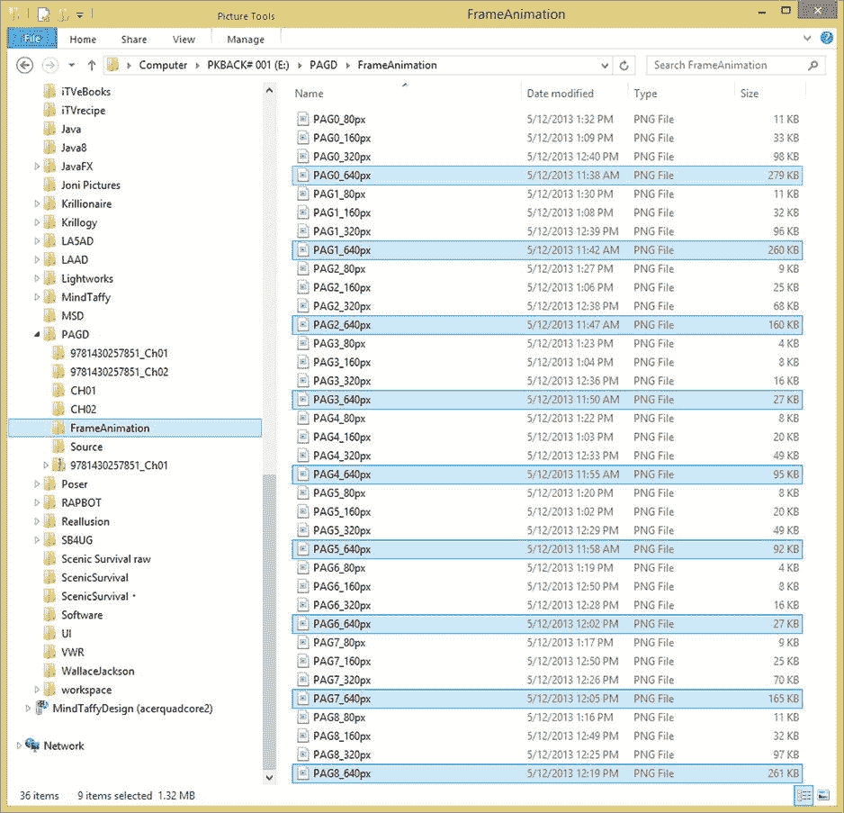

*图 3-1. 按住 Control 键选中八个动画文件，准备复制到 XHDPI 分辨率密度目标文件夹*

选中这九个文件后，右键单击其中任意一个，选择“复制”选项。文件已放入操作系统剪贴板后，你可以导航到 `/Users` 文件夹，找到你的 Eclipse `/workspace` 文件夹。在 `/workspace` 文件夹下，找到你的 `/GraphicsDesign` Android 应用项目文件夹，其下有 `/res` 资源文件夹。最后，找到 `/drawable-xhdpi` 文件夹，右键单击并选择“粘贴”选项，将这九个文件复制到此目标位置。

文件复制到正确文件夹后，你需要将所有九个文件重命名为更简短易用——并符合 Android 的资源文件命名规范。Android 中的文件名必须仅使用小写字母、数字，并且可选地使用下划线字符。因此，将文件命名为 `pag0.png` 到 `pag8.png`，如图 3-2 所示。

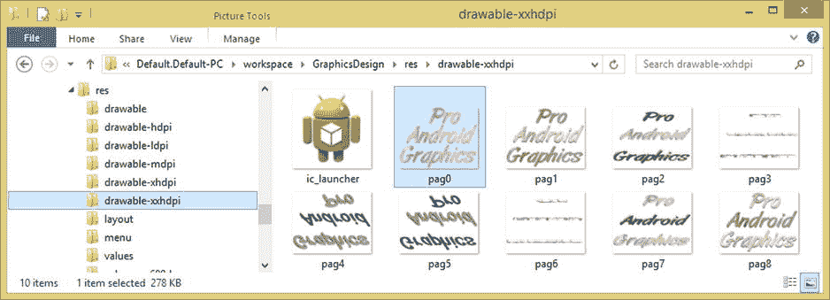

*图 3-2. 在 `/drawable-xhdpi` 中将 `PAG0_640px.png` 系列文件重命名为 `pag0.png` 到 `pag8.png`*

现在，为了完整性，为 `_320px` 文件执行完全相同的操作流程，并将它们放入 `/res/drawable-hdpi` 文件夹。完成后，多选并复制 `_160px` 文件到 `/res/drawable-mdpi` 文件夹。最后，将 `_80px` 文件复制到 `/res/drawable-ldpi` 文件夹。

这里还需注意一点：你也可以选择不将资源放入 `/res/drawable-ldpi` 文件夹，因为 Android 会直接使用你的 MDPI 资源并进行缩放。MDPI 资源用于 160 DPI 显示屏，而 LDPI 资源用于 120 DPI 的 Android 设备，这类设备因高密度像素屏幕而变得有些少见，但随着智能手表的出现，它们可能会重新流行起来。

HDPI 资源用于 240 DPI 屏幕，XHDPI 资源用于 320 DPI 屏幕。XXHDPI 文件夹及其规范是 Android 4.2 新增的，用于 480 DPI 屏幕；XXXHDPI 文件夹及其规范是 Android 4.3 新增的，用于 640 DPI 屏幕。不过，需要注意的是，截至目前的 Android Jelly Bean 版本，XXHDPI 仅用于存放 144 x 144 像素的应用启动图标资源——如果你疑惑为什么目前没有使用这个可绘制资源文件夹，原因就在于此。

### 使用 XML 创建帧动画定义

让我们接着第 2 章的内容继续，创建一个新的 XML 文件来存放帧动画的 XML 资源。如果 Eclipse ADT 尚未打开，请启动它。右键单击位于 IDE 左侧“包资源管理器”窗格中的顶层 `GraphicsDesign` 文件夹。选择 **New ➤ Android XML File** 菜单序列，如图 3-3 所示。

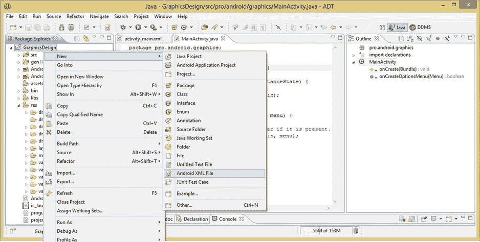

*图 3-3. 右键单击 GraphicDesign 项目文件夹，调出 **New ➤ Android XML File** 菜单序列*

当“新建 Android XML 文件”对话框打开后，从顶部的下拉菜单选择器中选择“Drawable”资源类型，如图 3-4 所示。接下来，将文件命名为 `anim_intro`，并从对话框底部的“根元素”列表中选择 `animation-list` 标签。项目名称应自动设置。一切完成后，单击“Finish”按钮。

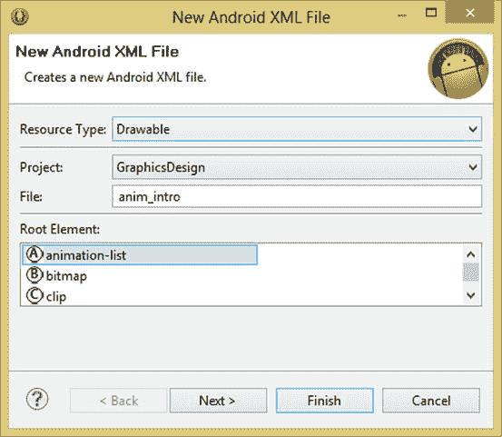

*图 3-4. 为新 XML 文件 `anim_intro.xml` 设置参数*

请注意，你无需在文件名后指定 `.xml` 文件扩展名；Eclipse 会自动添加。单击“Finish”按钮后，Eclipse 会在中央编辑窗格中打开 `anim_intro.xml` 文件，你可以在图 3-5 中看到，XML 文件类型声明和 XML 命名模式（`xmlns`）URL 已自动为你添加。接下来，你只需为父标签 `<animation-list>` 添加参数，并为动画帧添加子标签 `<item>`。

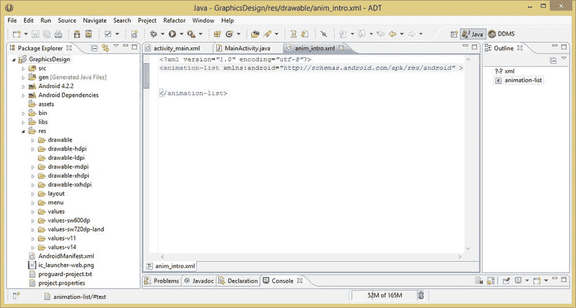

*图 3-5. 在 Eclipse 中为你新建并打开的 `anim_intro.xml` 文件，已包含 `animation-list` 父容器标签*

将光标放在 `android:xmlns` 参数声明的末尾（即最后一个结束引号之后），然后按回车键。Eclipse 会自动缩进你的下一行代码，非常方便。

输入 `android` 作为下一个参数，然后按冒号键，会弹出一个辅助对话框，其中包含 `<animation-list>` 标签的所有参数选项，这也是一个非常酷且实用的功能。

找到 `android:oneshot` 参数（它应该是列表中的最后一个）；双击将其选中并添加到 `<animation-list>` 标签中作为参数。如图 3-6 所示，这是在双击将 `android:oneshot` 参数添加到父容器标签之前的状态。

你会注意到，你仍需输入该参数所需的布尔值，因为会提供引号，但其中没有内容。如果你希望动画只播放一次，则输入 `true`；如果你希望动画循环播放，则输入 `false`。接下来，你需要使用 `<item>` 子标签来指定帧。

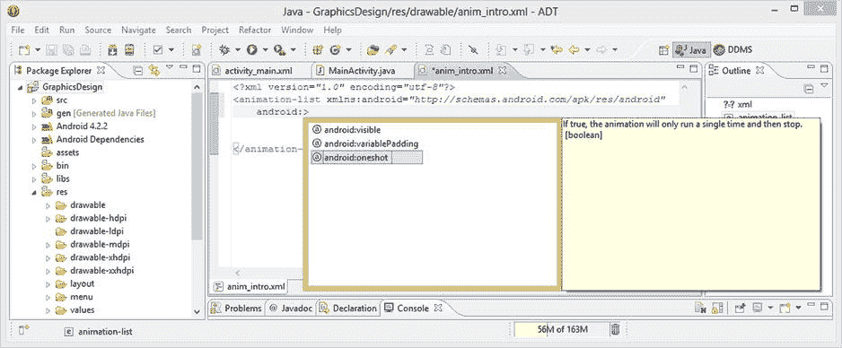

*图 3-6. 输入 `android:` 会调出 Eclipse 辅助对话框，其中包含 `animation-list` 标签参数选项*

将光标放在 `<animation-list>` 标签的末尾（即 `>` 字符之后），然后按回车键，让 Eclipse 自动缩进你的第一个 `<item>` 标签。输入以下 XML 标记行，使用 `android:drawable` 源文件引用参数和 `android:duration` 帧持续时间值来指定你的第一个动画帧：

```
<item android:drawable="@drawable/pag0" android:duration="112" />
```


请注意，您省略了文件名引用中的`.png`文件扩展名，并在其前面加上`@drawable/`路径，这告诉 Android 操作系统在`/res/drawable`文件夹中查找资源。请确保不要引用特定的分辨率密度文件夹，因为 Android 会在运行时根据用户使用的设备自动处理。

您可能想知道我用于`android:duration`值的 112 毫秒从何而来。由于我希望这个动画在一秒内流畅播放，我将九帧除以 1000 毫秒，得到 111 的值。因为 111 x 9 等于 999，所以我将第一帧设为 112，其余帧设为 111，这样加起来正好是 1000 毫秒（这是毫秒的行业术语），即一秒钟的总动画时长。

接下来，您需要复制并粘贴第一个`<item>`标签，放在它下方，使用相同的缩进，并将`android:duration`的值改为 111，同时将`android:drawable`引用改为`@drawable/pag1`，以便它引用动画序列第二帧的文件。

完成后，再复制这个第二个`<item>`标签七次，放在它下方，确保缩进与前两个对齐。然后将`@drawable/`文件名改为`pag2`到`pag8`，如图 3-7 所示，其中我展示了最终的`<animation-list>`父标签以及九个子`<item>`标签，它们指定了动画帧及其持续时间。

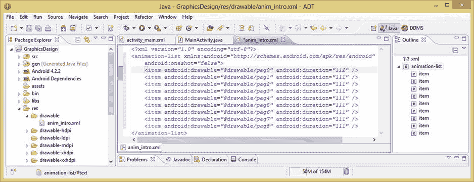

**图 3-7.** 在`<animation-list>`父容器标签内添加`<item>`子标签，以向动画添加帧

现在您已经以 XML 文件定义的形式创建了帧动画资源，是时候从现有的`activity_main.xml`用户界面 XML 定义中引用这个新资源了。接下来我们使用 Android 的`ImageView`小部件来实现，这样您可以获得一些使用`ImageView`的经验。

### 在 ImageView 中引用帧动画定义

现在让我们在您的`activity_main.xml`用户界面定义中添加一个`ImageView`小部件。点击 Eclipse 中央编辑面板顶部的`activity_main.xml`选项卡，暂时移除`VideoView`标签中的`android:src`参数。

您此时这样做的目的是为了更清楚地看到帧动画的效果；稍后您可以替换回数字视频源文件的引用。这是将内容定义在 XML 文件中的最方便之处之一；它允许您在开发过程中“微调”用户界面，使开发更轻松，同时也可以在开发过程中尝试不同的设置，而不是在更耗时的测试过程中进行。

将光标放在`<VideoView>`结束的`>`字符之后，按回车键，让 Eclipse 为您缩进下一个标签。

然后输入`<`字符，如您所知，这将调出`<FrameLayout>`标签助手对话框，它会准确告诉您在这个`FrameLayout` UI 容器父标签内有哪些标签可用。

在这个`FrameLayout`标签助手对话框中向下滚动，直到看到`ImageView`标签，然后双击它以选中它。这会将`ImageView`小部件标签插入到您的`FrameLayout`用户界面容器中。此工作过程如图 3-8 和图 3-9 所示。

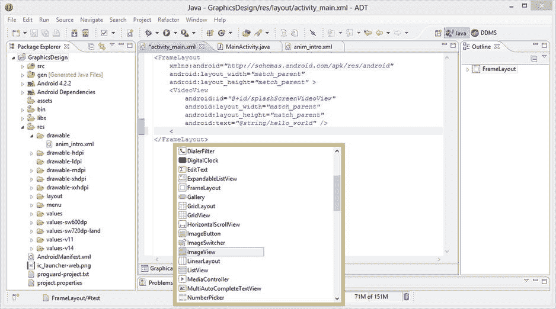

**图 3-8.** 在 Eclipse 中键入`<`字符以调出`FrameLayout`父容器标签的助手对话框

现在您的`ImageView`小部件标签已经就位，让我们输入`android`关键字和冒号，以调用`ImageView`标签助手对话框，它会准确告诉您`ImageView`小部件有哪些参数选项可用；如您所见，参数非常多！

要想估算任何给定标签或参数助手对话框中的条目数量，一个很酷的技巧是统计对话框中显示的标签或参数数量，然后乘以可见对话框所占的分数。这个分数由对话框右侧滚动条的大小决定。在这种情况下，滚动条手柄大约占整个滚动条区域的五分之一，因此要得到一个相当接近的`ImageView`小部件参数数量的估算值，将 17（参数）乘以 5，大约为 85 个参数。

任何用户界面小部件的两个必需参数是布局宽度和布局高度，因此请先双击添加它们，如图 3-9 和图 3-10 所示。通常与这些参数一起使用的两个主要值是`match_parent`和`wrap_content`。两者都是 Android 常量，并且彼此作用相反。`match_parent`参数会将小部件的宽度或高度扩展到匹配小部件标签所嵌套的父容器大小，因此在这种情况下，它会将`ImageView`（及其内容）放大很多，以匹配`FrameLayout`屏幕的大小。

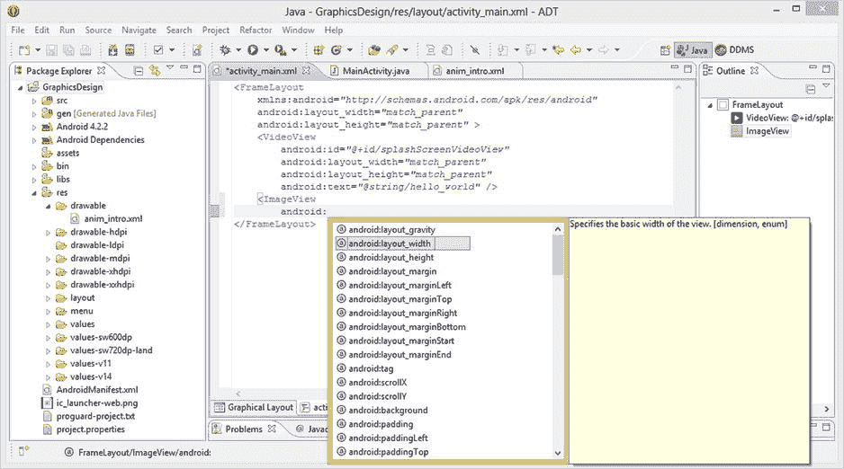

**图 3-9.** 在`<ImageView>`标签内键入`android:`以调出所有`ImageView`标签参数的助手对话框

而`wrap_content`则会将用户界面小部件缩放到匹配该 UI 小部件中包含的内容大小。我将首先使用`match_parent`来向您展示该参数的作用，然后稍后我会将其改为`wrap_content`，以便您了解该参数的作用。

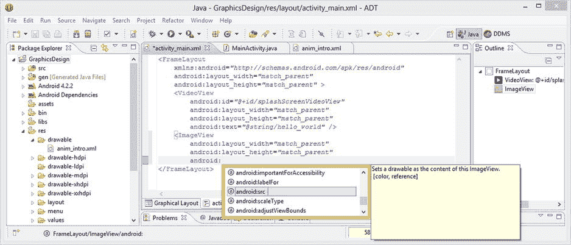

**图 3-10.** 添加`android:src`源参数以引用您之前创建的`anim_intro.xml`文件


接下来，添加一个`android:src`参数；`android:`辅助对话框的工作流程也如图 3-10 所示，通过它可以引用包含帧动画定义 XML 的 XML 源文件，该文件是在本章上一节中创建的。

将此参数设置为`@drawable/anim_intro`值，它将引用你之前创建的、位于`/res/drawable`文件夹中的`anim_intro.xml`文件。该参数如图 3-11 所示。

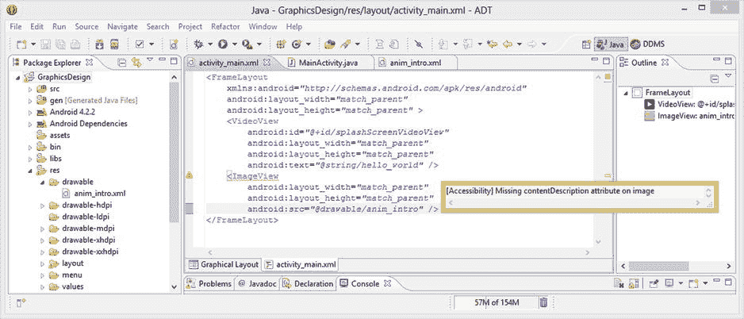

图 3-11.

在 Eclipse 中将鼠标悬停在`ImageView`标签下的波浪形黄色下划线警告上，查看警告对话框

如图 3-11 所示，Eclipse 中还有一个警告：在开头的`ImageView`标签下有一条波浪形黄色下划线，并且代码编辑窗格左侧页边距有一个三角形黄色警告图标。要阅读警告内容，可将鼠标悬停或单击波浪形黄色下划线或警告图标；此时会弹出一个信息对话框来解释问题。

在这个案例中，这是一个无障碍问题，如图 3-11 所示。Android 要求你提供一个`android:contentDescription`参数，向有视觉障碍的用户说明此`ImageView`用户界面元素包含什么内容。因此，添加此参数以确保 XML 标记不再有警告。在`android:src`参数所在标记行的末尾、但在结束的`/>`标记分隔符之前添加一个回车符。

然后输入`android`和冒号以调出参数选择器对话框，接着找到并双击`contentDescription`参数，将其插入到标签参数列表中，如图 3-12 所示。完成此操作后，你就可以在引号内插入对字符串常量的引用（下一步将创建该常量），使用以下标记：

```
android:contentDescription="@string/anim_intro_desc"
```

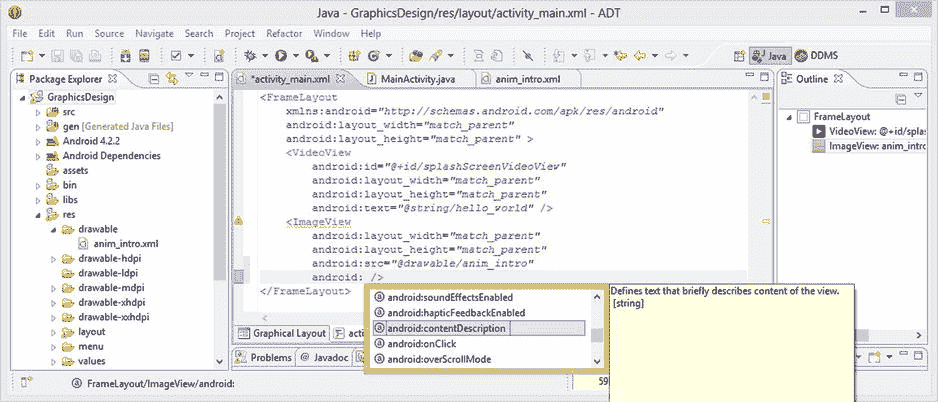

图 3-12.

向`ImageView`标签添加`android:contentDescription`参数以消除 Eclipse 中的警告

接下来，你需要在`/res/values`文件夹中的`strings.xml`文件内，使用`<string>`标签为`contentDescription`参数创建字符串常量，如图 3-13 所示。点击`/values`文件夹旁边的箭头图标将其展开，右键点击`strings.xml`文件，从菜单中选择“打开”选项，或者直接选中该文件并按键盘顶部的`F3`键。这将在 Eclipse 中央编辑窗格中打开`strings.xml`文件进行编辑，你可以在其中为`anim_intro_desc`字符串常量添加`<string>`标签。下面就来操作。

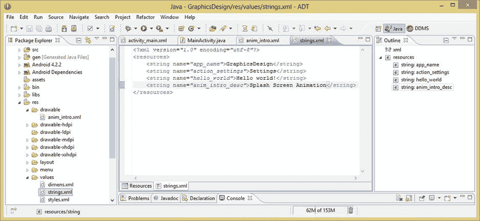

图 3-13.

在`/res/values`文件夹的`strings.xml`字符串资源文件中添加`anim_intro_desc` `<string>`标签

`<string>`标签只需要一个用于引用的`name`属性和标签内的字符串文本值。因此，你的字符串常量可以在`strings.xml`文件中通过添加以下 XML 标记行来定义：

```xml
<string name="anim_intro_desc">Splash Screen Animation</string>
```

添加此字符串常量后，按`CTRL-S`或通过**文件 ➤ 保存**菜单顺序操作，你的项目就不会再有错误。你可以右键点击项目文件夹，选择**运行方式 ➤ Android 应用程序**，从而查看`match_parent`布局参数如何使帧动画的第一帧填满显示屏。这如图 3-14 左侧截图所示。接下来，你将使用`wrap_content`参数来查看它如何产生不同的结果，所以暂时不要偷看 3-14 的右侧，以免破坏惊喜！

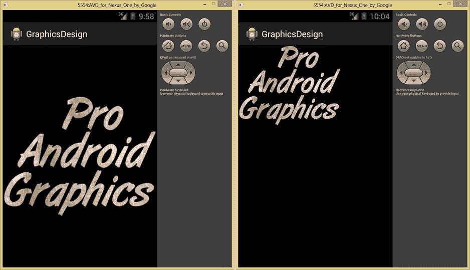

图 3-14.

在 Android Nexus One 模拟器中运行 XML 标记，查看参数的实际效果

接下来，我们将`android:layout_width`和`android:layout_height`参数从`match_parent`改为`wrap_content`，以便了解这些非常重要的参数值之间的差异。你需要尽早掌握这一点，因为它会影响`ImageView`用户界面元素缩放内容的方式；确保你能控制资源缩放是专业图形设计的基石之一。

如图 3-14 所示，`ImageView`的内容现在是逐像素显示且未经缩放，并放置在显示屏左上角像素坐标为`0,0`（X,Y）的位置。你可以在图 3-15 中看到相应的 XML 标记。

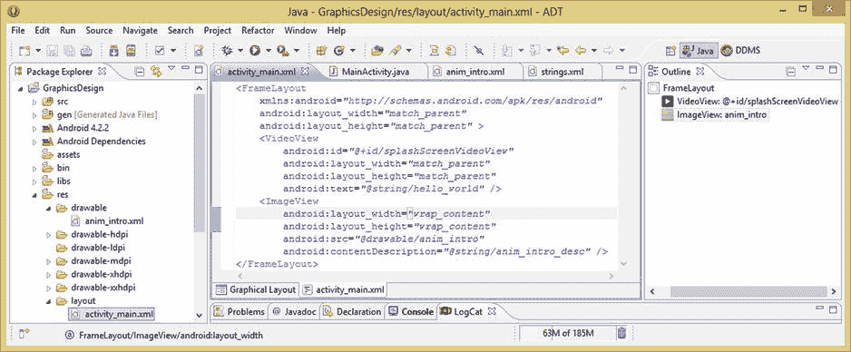

图 3-15.

将`android:layout_width`和`height`常量从`match_parent`改为`wrap_content`值

这个动画显示在显示屏左上角会显得有些奇怪，因此我们使用`android:`工作流程，在`ImageView`标签底部添加一个`android:layout_gravity`参数，并将其设置为居中显示`ImageView`。这会使`ImageView`用户界面元素居中；见图 3-16。

布局 `gravity` 属性对于定位用户界面元素非常有用，无需指定任何像素或 DPI（也称为 DP）值。它常用于居中 UI 元素；也用于将元素对齐到显示屏或父容器的左侧或右侧、顶部或底部。

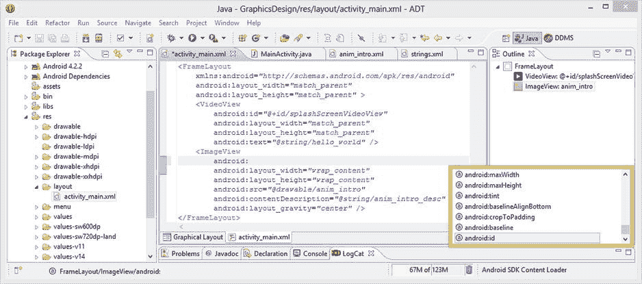

图 3-16.

使用`android:`工作流程查找`ImageView`标签的`android:id`参数

接下来，你需要添加一个`android:id`参数，以便在`MainActivity` Java 代码中引用`ImageView`用户界面元素微件。将光标放在开头标签中`ImageView`一词之后，按回车键，在标签容器的开头添加一行新参数，如图 3-16 所示。

输入单词`android`，然后按冒号键调出参数选择器辅助对话框；滚动到底部，找到`android:id`参数，并双击将其添加。到现在你应该已经习惯这个工作流程了——并且享受它让编写 XML 标记变得如此简单！

你现在要做的就是为`ImageView`取一个逻辑名称，就叫它`pagImageView`。现在你已准备好使用`AnimationDrawable`类和对象在`MainActivity.java`代码中逐帧播放动画。

在刚刚生成的空`android:id`参数的引号内输入`@+id/pagImageView`引用名称值，如图 3-17 所示。Android 始终使用`@+id`前缀来引用 XML 标签的`android:id`参数值，所以现在请记住这一点，因为在今后的 Android 应用程序开发过程中你会经常用到它！

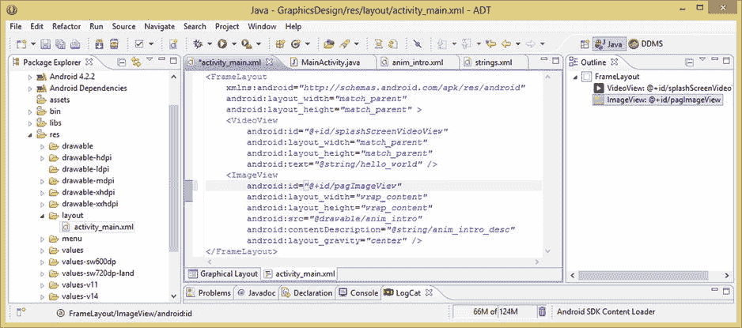


### 图 3-17. 引用 `anim_intro` 帧动画的 `ImageView` 用户界面元素的最终 XML 标记

接下来，让我们使用“运行方式 ➤ Android 应用程序”工作流程，查看新增的 `ImageView` 用户界面元素 XML 标记的最终结果。如图 3-18 所示，您现在得到了一个专业级的最终效果。

别忘了，为了更清晰地观察操作，您之前已经移除了 `VideoView` 用户界面元素的 XML 标记中的 `android:src` 参数。既然您知道 PNG32 动画帧能在任何背景上提供完美的合成效果，目前可以先使用黑色背景。

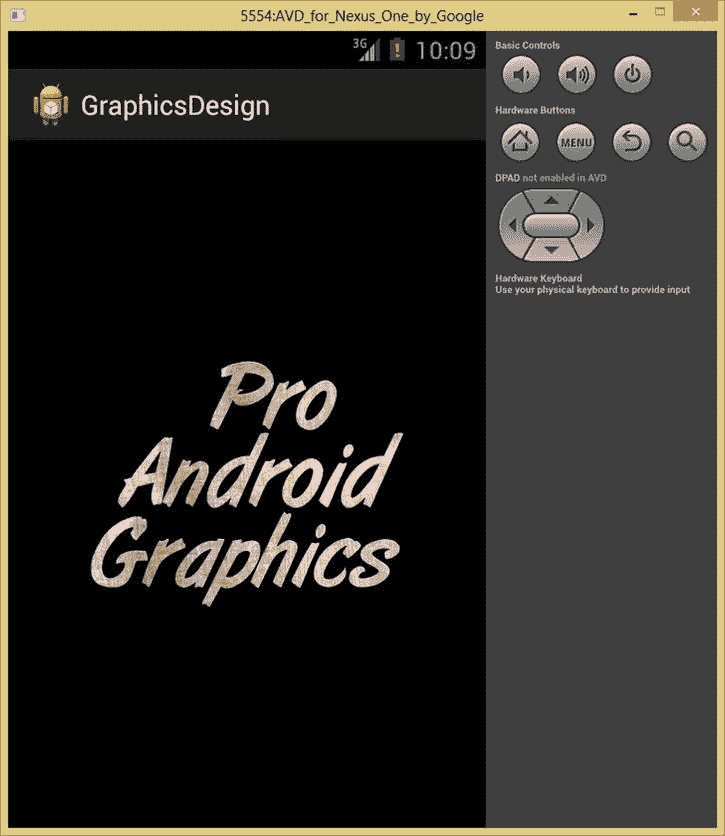

**图 3-18.** 显示 `ImageView` 标签参数的最终输出

为了在本章展示我们的操作，我们可以使用纯黑色或纯白色背景，但黑色背景能让这个特定的帧动画序列显示得最清晰。

在本章以及下一章关于程序化动画的内容中，我们将使用这种临时背景替换技术（仅在开发动画素材时使用），以向您展示 XML 如何让您在开发图形应用程序时拥有极大的灵活性和创新性。因此，如果您需要打开或关闭某个合成层，甚至是应用程序的 UI 元素或功能，在 XML 中操作都非常容易。

我们这样做是为了能够精确隔离 XML 代码的作用，从而让您（读者）更清晰地理解。一旦完成，您就可以将 `android:src` 参数重新添加到 XML 标记中。这将恢复背景视频的显示，让您看到最终的视觉效果。

现在，让我们从编写 XML 标记切换到编写 Java 代码，以便您可以使用 `onCreate()` 方法，在现有的 `MainActivity.java` 文件的 Java 程序逻辑中实现您使用 XML 标记构建的所有内容。

### 使用 Java 实例化帧动画定义

如果尚未打开，请打开 Eclipse 并点击中央编辑窗格顶部的 `MainActivity.java` 选项卡。在设置 `ContentView` 的 Java 代码之后，添加一行空白（一个回车），然后实例化您的 `ImageView` 用户界面元素，它将引用您一直在处理的 XML 定义。这通过以下一行代码完成：

```
ImageView pag = (ImageView)findViewById(R.id.pagImageView);
```

如图 3-19 所示，您会遇到一些红色波浪下划线错误标志需要处理，以及左侧空白处的红色叉号错误图标。

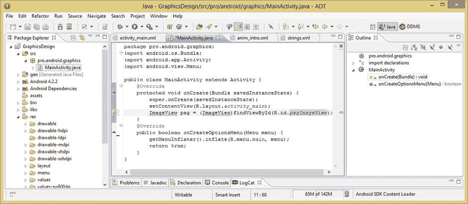

**图 3-19.** 创建一个名为 `pag` 的 `ImageView` 对象，并将其引用到 `pagImageView` ID 的 XML 结构

到目前为止，您应该已经熟悉在 Eclipse 中研究错误和警告出现原因的工作流程，因此请将鼠标悬停在（和/或）点击错误标志图标或高亮区域，看看 Eclipse 认为此时您的应用程序逻辑中存在什么问题。

如图 3-20 所示，Eclipse 现在报错称无法解析（使用）`ImageView` 对象类型，因为用于创建（实例化）该对象类型的类对它不可用（未导入）。

幸运的是，Eclipse 按概率顺序（即，最可能提供正确解决方案的排在前面）提供了一个可点击的解决方案列表。在这种情部下，Eclipse 猜对了，因此请点击提供的第一个解决方案：从 `android.widget` 包导入 `ImageView`。一旦添加此导入语句，您就可以使用 `ImageView` 类及其所有方法、构造函数、常量、字段和属性。

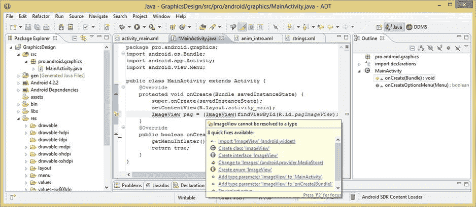

**图 3-20.** 将鼠标悬停在 Eclipse 的错误高亮上，以调出错误消息和快速修复对话框

一旦您点击此第一个解决方案，让 Eclipse 为您编写导入代码，您将看到为您添加了新的导入语句，如图 3-21 所示。但是，这行代码中仍然有一个黄色警告标志，位于 `ImageView` 对象的页面名称下方。

再次将鼠标悬停在（和/或）点击以阅读警告；在这种情况下，这只是说您尚未实现（使用）刚刚创建的 `pag` 对象。由于您即将使用此对象，因此可以安全地忽略此警告，并继续编写您的下一行 Java 代码。

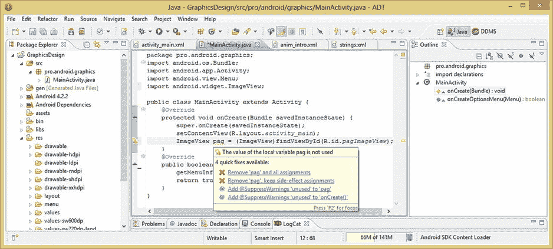

**图 3-21.** 将鼠标悬停在 Eclipse 的警告高亮上，以调出警告消息和快速修复对话框

接下来，您需要实例化 `AnimationDrawable` 对象，它将负责生成帧动画的所有繁重工作。将此对象命名为 `pagAnim`，然后使用从您的 `pag` `ImageView` 对象调用的 `.getDrawable()` 方法，用您的帧动画的可绘制素材加载这个新的 `AnimationDrawable` 对象。这通过以下一行 Java 代码完成，如图 3-22 所示：

```
AnimationDrawable pagAnim = (AnimationDrawable) pag.getDrawable();
```

如图 3-22 所示，您在这行代码中再次遇到了错误标志，我们现在怀疑这与添加使用 `AnimationDrawable` 类所必需的导入语句有关。

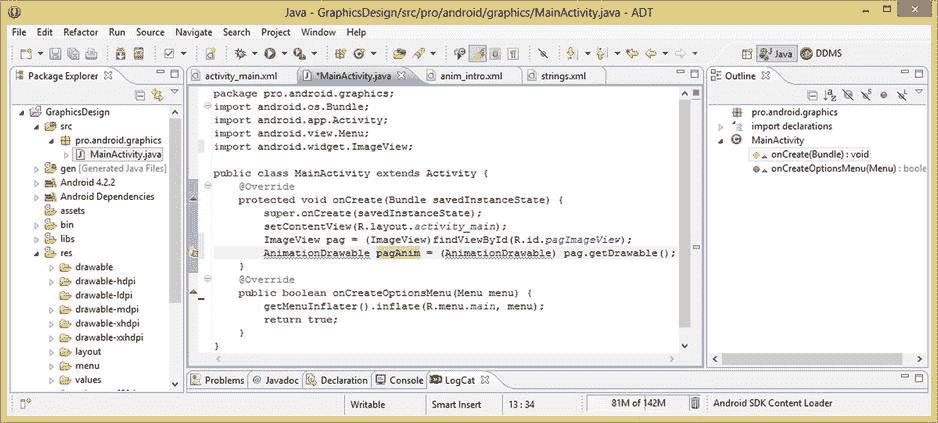

**图 3-22.** 创建一个名为 `pagAnim` 的 `AnimationDrawable` 对象，并通过 `.getDrawable()` 方法将其连接到 `pag` 对象

将鼠标悬停在错误消息上并点击，以生成错误消息和修复解决方案对话框，然后点击将为您编写 Java 导入语句的链接。您听说过敏捷开发？！这是懒惰开发。依我看来，它要优越得多。如果您感兴趣，可以在图 3-23 中看到 Eclipse 再次为您编写的导入代码。

一旦您的代码恢复为 100% 干净，您就可以添加下一行代码了。现在您已经将 `pag` `ImageView` UI 容器连接到了 `pagAnim` `AnimationDrawable` 帧动画引擎（对象），可以调用 `.start()` 方法来启动您的帧动画播放循环。

这通过调用 `pagAnim` 对象的 `.start()` 方法来完成，使用以下简短而强大的一行 Java 代码，如图 3-23 所示：

```
pagAnim.start();
```

现在，您已准备好使用“运行方式 ➤ Android 应用程序”工作流程，并测试您的帧动画以查看其是否正常工作。让我们下一步就做这个！

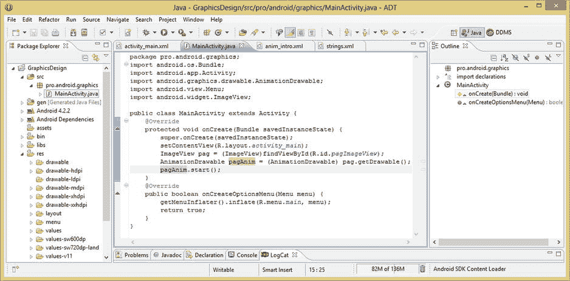

**图 3-23.** 向新创建的 `pagAnim` `AnimationDrawable` 对象添加 `.start()` 方法调用

在您的 Nexus One 模拟器中运行该应用程序，您将看到应用程序启动后，Pro Android Graphics 徽标在启动屏幕上流畅地播放动画。恭喜，您已经在 Android 中实现了一个全屏启动（闪屏）动画，并且仅用了 2MB 就覆盖了所有现有的不同分辨率密度的 Android 设备！


### 总结

在第三章中，你全面学习了基于帧的动画概念、格式、XML 设置和优化，并为你的 `GraphicsDesign` Android 应用的 `pro.android.graphics` 包启动闪屏创建了四个针对分辨率密度优化的动画。

我们首先探讨了与基于帧的动画相关的一些基本概念，例如组成动画的“帧”（Cels 或 Frames），它们如何通过帧率（以 FPS 即帧每秒表示）和帧分辨率（即每帧的像素尺寸）随时间播放。

接下来，我们研究了如何协同运用所有这些属性，以优化基于帧的动画的新媒体资源，从而减小 Android 应用的数据占用空间。我们讨论了优化基于帧动画的不同方法，例如调整帧分辨率、使用更低的索引色深（8 位色彩），并谨慎控制用于制造运动错觉的帧数。我们还探讨了用于合成动画的 PNG32 格式以及像素爬移（pixel crawl）的概念。

然后，我们了解了如何在 Android 中使用 XML 标记实现帧动画。我们探讨了帧动画资源如何存放在各自的 `/res/drawable-dpi` 文件夹中，以及 XML 文件如何存放在 `/res/drawable` 文件夹中。我们指出，帧动画使用 `drawable` 文件夹，而我们在下一章将要介绍的程序化动画则使用 `/res/anim` 文件夹。

我们研究了 `AnimationDrawable` 类，其中包含用于实现基于帧动画的预置 Java 代码。我们还介绍了 `.start()` 方法、`duration` 变量及其以毫秒为单位的数值。

随后，我们学习了用于在 XML 标记中实现帧动画结构的 `<animation-list>` 和 `<item>` 标签。你了解了 `oneshot` 参数，以及父级 `animation-list` 容器如何包含其内部的子级 `item` 标签对象。

接着，你开始动手实践，在 Eclipse 中为你的 `Graphics Design` 项目实际创建了一个基于帧的动画。你将九帧画面复制到不同分辨率密度的文件夹中，并将它们重命名以简化名称，同时遵循 Android 仅允许小写字母和数字的文件命名规则。

然后，你创建了一个新的 Drawable XML 文件，命名为 `anim_info.xml`，添加了 `<animation-list>` 根元素（父标签容器），并设置了 `android:oneshot` 参数。接着，你在这个容器内填充了嵌套的子 `<item>` 标签，配置了九分之一的持续时间，并引用了你的九个动画帧（现在命名为 `pag0.png` 到 `pag8.png`）。

完成后，你在 UI 屏幕布局 XML 定义文件 `activity_main.xml` 中的 `FrameLayout` UI 容器内添加了一个 `ImageView` 用户界面元素。然后，你通过 `android:src` 参数在这个 `ImageView` 中引用了 `anim_intro.xml` 文件，并添加了其他参数，使 `ImageView` 的屏幕布局看起来更专业，同时也使其能够被你的 Java 代码引用。

最后，你在 `MainActivity.java` 文件中编写了 Java 代码，实例化了 `ImageView` 对象和 `AnimationDrawable` 对象，并通过 Java 代码将它们“连接”起来。然后，你使用可靠的 `.start()` 方法开始循环播放帧动画对象结构。

在下一章，你将学习 Android 程序化动画及其概念、变换、技术和优化。你将学习如何将程序化动画赋予你的变换能力与基于帧的动画相结合。这将使你能够将正在创建的运动图形效果提升到一个更强大、更复杂的新水平。

