# 4. Android 程序化动画：XML、概念与优化

### 摘要

在第四章中，我们将深入研究如何使用 XML 标记在 Android 操作系统中创建程序化动画。

程序化动画比简单的位图动画（后者只是在显示屏上按序显示一系列图像以创造运动错觉）要复杂得多。在我们指定动画将使用哪些帧之后，帧动画只允许我们控制每个显示帧的单独时序。程序化动画将复杂程度提升到了一个新的水平，你将在本章中看到这一点。

程序化动画实际上是通过代码（多数情况下是 XML 标记）来定义二维空间中的变换，从而实际改变我们的 Android 资源。说“代码”听起来可能比实际情况复杂一些，因为 Android 中已经预定义了程序化动画的参数，我们只需为这些参数提供各种值，就能使所有这些程序化动画参数协同工作，从而实现最终的动画效果。

可以进行程序化动画的 Android 资源包括：用户界面控件（我们将在本书后面详细探讨）、图像、数字视频（通过 `VideoView` 控件），甚至包括基于帧的动画。是的，只要设置正确，在 Android 中可以对帧动画进行程序化变换，这正是我们本章将要做的。需要注意的是，虽然通过 XML 可以更简便地设置程序化动画，但它同样可以使用 Java 代码来实现。程序化动画的参数可以在运行时通过 Java 进行更改，以使动画更具交互性，或更好地响应其他输入或触发器。


### 程序化动画概念：补间与插值器

程序化动画的基础是补间（tween）的概念，它是"中间"（in-between）的缩写。在赛璐珞动画的早期时代，资深动画师绘制主要或关键赛璐珞片（也可称为关键帧），而初级动画师则生成补间赛璐珞片，以在资深动画师创建的赛璐珞片之间提供平滑的运动。

这种生成中间赛璐珞片的过程后来被称为补间动画，值得注意的是，有时程序化动画也被称为补间动画，正是出于这个原因。由于帧动画使用光栅技术，而程序化动画使用矢量技术，因此你也会看到矢量动画这个术语常被用来指代程序化动画。

当补间动画成为一种数字现象时，这个过程就变成了我们在数学课上学到的`插值`。由于现在一切都是通过数值完成的，我们只需为关键帧提供数值，Android 系统就会通过使用`Animation`类代码，借助插值器自动为我们完成剩余工作，即插值生成补间（中间帧）。

插值的数学原理相当直接：确定范围，比如从起始值 1 到结束值 8，将其除以补间帧的分辨率，每个帧就变成了该范围的一个分数。为了在 1 到 8 之间生成 8 个插值，你会在每个整数处计算出一个新值；如果要让 1 到 8 之间有 16 帧，你会在 1、1.5、2、2.5、3 等位置计算新值。

计算出的插值越多，分辨率就越高，由此插值提供的动画运动也就越平滑。另一方面，用于进行这些计算的处理能力越多，留给其他功能的处理能力就越少。幸运的是，Android 会为你确定（优化）这一点，因此你只需要指定起始（from）值和结束（to）值即可。

然而，Android 中的插值还有更复杂的一面。Android 中的 13 种插值器类型进一步允许你微调数值在你所提供的数据范围内的插值方式。

Android 中的插值类型在操作系统的资源（`R`）区域中以预定义的`插值器常量`形式提供。你可以在以下网址查看具体提供了哪些插值器类型：

[`http://developer.android.com/reference/android/R.interpolator.html`](http://developer.android.com/reference/android/R.interpolator.html)

目前 Android 中有 13 种不同类型的插值器；预计未来会添加更多类型，以便为你的程序化动画提供更多样化的运动选项。这 13 个插值器常量实际上是数学方程式，以实现它们的 Android Java 类的形式存在。它们会沿着你提供的数值范围，以不同方式对你的值进行插值或补间，从而在该范围内提供不同类型的运动。

你可以查阅以下网址，了解实际的 Android 插值器类，我们接下来将详细讨论它们。这些类基于`android.animation`包中的`TimeInterpolator`类：

[`http://developer.android.com/reference/android/animation/TimeInterpolator.html`](http://developer.android.com/reference/android/animation/TimeInterpolator.html)

你之前学到的那种插值类型在 Android 中被称为线性插值器，因为它以线性（均匀）方式在任何指定的数据范围内均匀分布数值。然而，还有十几种其他插值器会改变插值数据值之间的均匀间隔，以创建不同类型的运动，例如弹跳、预备或加速效果。

Android 的`AccelerateInterpolator`类是前三个插值器常量的基础，即`accelerate_cubic`、`accelerate_quad`和`accelerate_quint`，它们提供了一个缓出运动函数，使运动从起始点开始逐渐加速（从而在你指定的数据范围内，随着时间推移加速运动）。

Android 的`DecelerateInterpolator`类本质上是`AccelerateInterpolator`类的对应物，它也有三个插值器常量，不过这次是`decelerate_cubic`、`decelerate_quad`和`decelerate_quint`。它们提供了一个缓入运动函数，使运动在到达终点时逐渐减速，从而在你指定的数值范围末端，随着时间推移使运动减缓。

三次方、二次方和五次方规范定义了这些加速或减速曲线的数学形状。与任何这些插值器一样，你需要通过实验来确定它们在特定程序化动画场景中的具体效果。

还有一个`AccelerateDecelerateInterpolator`类，它在运动范围的开始部分提供加速曲线，在运动范围的结束部分提供减速曲线。因此，这种运动类型会在开始时缓慢加速，然后以类似的速度减慢，最后到达最终目的地（范围结束处的"to"值）。

Android 的`AnticipateInterpolator`类提供了一种看起来像是在预备某事的运动类型，也就是说，它在运动范围开始时会有少许后退（想象一下当你认为自己即将受到压力时，身体会如何移动或调整），然后在剩余的数据范围内向前弹射（就像一种反应）。

正如`AccelerateInterpolator`有对应的`AccelerateDecelerateInterpolator`一样，`AnticipateInterpolator`也有对应的`AnticipateOvershootInterpolator`类。后者在范围末端增加了一个过冲运动，即运动超过其目标，然后漂移回最终范围值，作为对该过冲的修正。如果你想要过冲运动效果但不需要范围开始部分的预备动作，可以使用`OvershootInterpolator`来实现这种运动效果。

请记住，所有这些不同类型的插值器，你可以将它们视为运动曲线，它们只是试图通过使用基本数学方法，沿着三次方或二次方的数据值曲线应用补间帧插值，来模拟你在现实世界中每天都能看到的运动。

插值器在控制运动方面表现出色。你只需要多加练习，就能知道在特定的程序化动画情况下应该使用哪个插值器常量。

还有一个`BounceInterpolator`类，用于模拟海滩球等物体的弹跳效果；当你需要让某个物体从其他物体上弹开时，应该专门使用这个插值器。最后，还有一个`CycleInterpolator`类，它通过使用开发者指定的循环值的正弦数学模式来模拟循环运动。

接下来，我们将更深入地研究数值范围是如何指定的，以及如何使用枢轴点规范来进一步控制（偏斜）它们。一旦你掌握了所有这些高级程序化动画参数（控件），你就会发现，在 Android 中使用程序化动画几乎可以完成你能想象到的任何事。


### 程序化动画数据值：范围与枢轴点

为了能够实现插值，我们需要指定的不只是一个单一的数值，因为插值（或称补间动画）涉及在起始值和结束值之间创建新的中间值。因此，上一节（插值）中的信息将应用于本节（范围）中的内容，而在下一节中，我们将介绍所有这些精细控制可以应用的变换类型。

要创建任何程序化动画，我们始终需要指定一个范围，从一个称为`From`（起始）值的起始值，到一个称为`To`（结束）值的结束值。这似乎是合乎逻辑的，因为我们需要一些可以随时间变化的东西！

除了范围之外，许多程序化动画变换还涉及一个枢轴点。枢轴点告诉 Android 操作系统如何将变换倾斜到给定的方向，正如你将在下一节中看到的那样，当我们讨论三种主要的变换类型及其工作原理时。

与数值范围类似，枢轴点也需要两个值来确定。然而，与使用`From`和`To`值的数值范围不同，枢轴点使用我们 2D 图像上的一个二维位置，该位置由`X`和`Y`坐标指定。

枢轴点也广泛用于 3D 动画中，在那里设置枢轴点需要三个（X、Y 和 Z）数据坐标才能准确定位。目前，Android 在其`Animation`类中使用 2D 程序化动画，而 3D 动画则通过另一个`android.opengl`包来实现，对这个包的讨论最适合放在一本 Android 3D 书籍中。在本书中，我们主要涵盖的是**图形设计**，它主要是 2D 的。

当我们查看下一节将要介绍的各种变换类型时，你将看到枢轴点如何能够获得更精细的结果。这为开发者提供了额外的控制能力，以达成他们想要实现的程序化动画变换效果。

### 程序化动画变换：旋转、缩放、平移

在 2D 和 3D 动画中，有三种主要或核心的变换类型。其中一种涉及运动，其技术动画术语是**平移**；一种涉及大小，其技术术语是**缩放**；最后一种涉及方向（物体朝向），其技术术语是**旋转**。

本节将逐一介绍每种变换类型，以便你在本章后续的`GraphicsDesign`应用中，无论是单独实现还是集体实现每种变换之前，都能清晰了解它们各自的作用。

让我们从最常见的变换形式开始，即从屏幕上的一个位置**移动**或**平移到**另一个位置。要在两点之间沿一条直线或`向量`创建运动，我们需要一个起始点（使用 X，Y 坐标）和一个结束点（也使用一对 X，Y 坐标）。由于我们是沿向量（有时也称为射线，它是一个`方向向量`）移动，因此你可以理解为什么程序化动画有时也被称为向量动画。

第二常见的变换形式是按缩放因子将对象**放大或缩小**。缩放可以沿 X 轴以及 Y 轴进行，因此为了均匀缩放对象，请确保你的 X 和 Y 缩放值范围完全相同。

要沿对象的 X 轴（从左到右）缩放，需要指定 X 轴缩放的起始值（`fromXScale`），例如 1.0 或 100%，以及结束值（`toXScale`），例如 0.5 或 50%。类似地，要沿对象的 Y 轴（从上到下）缩放，需要指定 Y 轴缩放的起始值（`fromYScale`），例如 1.0 或 100%，以及结束值（`toYScale`），例如 0.5 或 50%。

因此，为了将对象均匀缩放到其原始大小的一半，我们需要使用这些 X 轴和 Y 轴的`Scale From`和`Scale To`设置值。

另一个常见的变换形式是将对象旋转指定的度数，范围从 0 到 360（即一整圈）。这是通过指定一个`fromDegrees`值（如 0）和一个`toDegrees`值（如 360）来实现的，这将产生对象的完整旋转。

如果你想让对象围绕其中心点旋转，则需要将`pivotX`和`pivotY`值都设置为 50%，这将使枢轴点位于你正在旋转的对象的中心。

### 程序化动画合成：Alpha 混合

在 Android 中，还有另一个可以进行程序化动画处理的属性，但它不是变换，更类似于合成特性。变换对象会以某种方式物理改变它——将其移动到不同位置，改变其大小，或改变其方向（旋转）。

通过改变对象的 Alpha 值来将对象与其背景进行 Alpha 混合，通常称为**淡入**或**淡出**，这是一种合成功能。然而，在 Android 中，它被包含在程序化动画工具集中，因为 Alpha 值是一个合乎逻辑的动画属性，特别是当你在创建鬼故事或传送光束特效时。

你正在程序化制作动画的对象的 Alpha 属性可以被控制，允许 Alpha（透明度）混合与你已经在程序化创建动画时可用的平移、缩放和旋转变换结合使用，也就是通过使用 XML 或 Java 代码向`Animation`类指定数据值。

与大多数其他程序化动画属性不同——枢轴点使用百分比（如 50%）表示，角度使用 0 到 360 之间的整数表示——Alpha 混合量使用 0.0（透明）到 1.0（可见）之间的实数设定。

需要注意的是，允许使用多个小数位，所以如果你希望对象仅三分之一可见，你可以使用 0.333；或者，如果是四分之三可见，你可以指定 0.75 作为对象 Alpha 值的起始或结束值。

Alpha 的起始值和结束值通过`fromAlpha`和`toAlpha`参数设定。因此，要使对象淡出，你需要将`fromAlpha`设为 1.0，`toAlpha`设为 0.0。

要将多种不同类型的程序化动画参数组合在一起，你需要创建一个动画变换参数集。使用程序化动画集将允许你以逻辑且有序的方式将变换和合成分组在一起。这将允许创建更复杂的程序化动画。我将在本章稍后部分详细介绍如何创建程序化动画集。


### 程序化动画时序：使用持续时间与偏移

您可能想知道如何设置所有这些不同范围数据值之间所使用的时序。为某个范围设置时序值，在一定程度上也会定义在该范围内生成多少个插值数据点。需要注意的是，Android 操作系统会根据设备的处理能力，以及它认为能提供**最优视觉效果与处理能力消耗比**或**权衡结果**的因素来决定这个数值。

任何给定程序化动画范围值的持续时间，都通过 `duration` 参数设置，该参数接受一个以毫秒为单位的整数值。一毫秒是千分之一秒，而不是像听起来可能认为的百万分之一秒。包括 Java 在内的大多数编程语言，在其所有时序函数和操作中都使用毫秒值。

因此，如果你希望上一节讨论的淡出效果持续四秒钟，XML 参数应为 `android:duration="4000"`，因为四千毫秒等于四秒钟。如果你希望淡出效果持续 4.352 秒，则应使用毫秒值 4352，这样你就能获得千分之一秒级别的精确度。

你定义的每个变换（或 Alpha 混合）范围都有其独立的持续时间设置，这使得在 XML 标记定义中，能够以高精度实现你想要达到的效果。

还有一个与时序相关的重要参数，它允许你延迟指定范围的开始播放时间。这被称为偏移，由 `startOffset` 参数数据值控制。

假设你希望将四秒钟的淡出效果也延迟四秒钟。你只需在 `<alpha>` 父标签（你将在本章稍后部分实际用到它）中添加 `android:startOffset="4000"`，这样就能实现时序延迟控制。

当 `startOffset` 参数与循环动画行为结合使用时，它会特别有用，我们接下来将要讨论循环动画。这是因为，在动画循环场景中使用时，`startOffset` 参数将允许我们在每个动画元素的循环周期内定义一个暂停。接下来，让我们看看循环，以及可用于控制循环动画元素的参数。

### 程序化动画循环：repeatCount 与 repeatMode

与帧动画类似，程序化动画可以播放一次后停止，也可以持续循环播放。有两个参数控制循环：一个控制动画是否循环，另一个控制动画循环的方式。

控制动画或其组成部分循环次数的程序化动画参数称为 `repeatCount` 参数。该参数需要一个整数值。

如果你在程序化动画定义中省略（即未指定）此 `repeatCount` 参数，动画将播放一次后停止，这意味着该参数的默认设置为 `android:repeatCount="1"`。该参数的一个例外值是常量 `infinite`。因此，如果你希望动画无限循环，应使用 `android:repeatCount="infinite"` 设置。如果你好奇，预定义常量 `infinite` 对应的数值是 -1，所以 `android:repeatCount="-1"` 同样有效。

定义循环类型的参数是 `repeatMode` 参数。此参数可以设置为两个预定义常量之一；最常见的是 `restart`，它会使程序化动画无缝循环（除非你定义了 `startOffset` 参数）。如果你好奇，预定义常量 `restart` 对应的数值是 1，所以 `android:repeatMode="1"` 同样有效。

另一种动画循环模式是 `reverse`，也称为乒乓球动画，因为它会使动画在其范围结束时反向运行，直到再次回到起点，然后再正向运行。就像乒乓球游戏一样，来回往复。如果你好奇，预定义常量 `reverse` 对应的数值是 2，所以 `android:repeatMode="2"` 同样有效。

所有这些参数单独来看可能相当简单，但当它们结合到我们接下来要讨论的动画集合的复杂结构中时，很快就会变得非常复杂，并产生一些极其精细复杂的动画效果。因此，不要低估这些参数在精明开发者正确组合时所蕴含的力量。很快，你也会成为那位精明开发者，所以让我们来看看动画集合吧！


### `<set>`标签：使用 XML 对程序化动画进行分组

动画集合定义了一组需要作为整体或集合一起播放的程序化动画。集合通过程序化动画 XML 文件进行定义；实际上，它们为我们的核心变换标签提供了分组结构。这是通过使用一个`<set>`父标签来包含（或分组）任何我们希望在你的程序化动画整体设计中逻辑组织起来的变换来实现的。

集合可以嵌套，以创建更精确、更复杂的结构。我们所要做的就是确保`<set>`标签及其包含的变换标签能够正确嵌套。如果你在编写代码时使用了恰当的代码缩进，那么嵌套的可视化和追踪应该相当容易。稍后在本章中，当你为了在`GraphicsDesign`应用中创建一些炫酷的程序化动画目标而开始编写 XML 标记时，你就会看到这一点。

安卓操作系统有一个专门的`Animation`类用于创建动画集合。正如你可能想到的，这个类叫做`AnimationSet`类！`AnimationSet`类与`Animation`类位于同一个包中。这个包被称为`android.view.animation`包，因为动画是在`View`中播放的。我们将在后面关于用户界面设计的章节中更深入地探讨`View`类，敬请期待。

每个`AnimationSet`中包含的程序化动画变换由`AnimationSet`类作为一个统一的变换来执行。如果`AnimationSet`类观察到为容器`AnimationSet`设置的任何参数，同时也为其子级变换（即包含在容器`<set>`标签内的那些变换标签）设置了，那么为父级`AnimationSet` `<set>`标签设置的参数将覆盖子级变换的值。

因此，你将学会如何避免冗余以及如何不将相同参数放在多个地方，方法是遵循一些简单的规则，这些规则将最大限度地减少你出错的机会，从而最大限度地提高你在首次编写代码（标记）时就获得你期望的动画结果的几率。

`AnimationSet`如何从`Animation`变换继承参数，反之亦然，这一点很重要。通过包含在`<set>`标签中，在`AnimationSet`中设置的某些参数或属性会影响整个`AnimationSet`本身。然而，其中一些参数会被“向下传递”并应用于子级变换，有些甚至被忽略！因此，让我们学习在使用动画集合时应该在何处应用某些参数，这样你就能在开始之前确切地知道安卓期望什么。

当在`AnimationSet`对象上设置（即在父级`<set>`标签内指定）时，`duration`、`repeatMode`、`fillBefore`和`fillAfter`参数（也称为属性）会被向下传递给所有子级变换。解决此问题的一个方法是始终在你的变换标签内局部地设置这些参数，并且永远不要在父级`<set>`标签中设置它们。如果你这样做，安卓就没有什么可向下传递的，这样就不会混淆这些参数在处理周期中将被应用于何处。

`repeatCount`和`fillEnabled`参数或属性对于`AnimationSet`来说是完全被忽略的，因此你应该始终将这些参数局部应用于你想要正确访问的每个动画变换。

另一方面，`startOffset`和`shareInterpolator`参数可以应用于`AnimationSet`本身。请注意，`startOffset`也可以局部地应用于变换，通过在循环周期中或动画开始播放时引入延迟来微调动画的时序。

因此，一个好的经验法则是局部应用你的变换参数，而不是在组或`AnimationSet` `<set>`级别应用，除非是`shareInterpolator`参数，它显然旨在用于组级别操作，因为这是在程序化动画中“共享”事物的唯一方式。所以，务必局部设置变换参数！

遵循此经验法则的另一个原因是，在安卓 4.0 之前，放置在`<set>` XML 标签内的所有参数都会被忽略，但可以在运行时使用 Java 代码应用。因此，如果你要交付给 V4 之前的操作系统，你必须在`AnimationSet`对象上调用`.setStartOffset(80)`方法，以获得与在你的 XML 标记中、为你的程序化动画 XML 资源（针对你的动画集合对象）在`<set>`标签内声明`android:startOffset="80"`参数相同的效果。

### 程序化动画与逐帧动画：权衡取舍

在我们深入探讨在`GraphicsDesign`应用中实现程序化动画所需的 XML 标记和 Java 编码之前，我想讨论一些高水平理论、原则、概念和权衡取舍，这些有助于区分逐帧动画和程序化动画。

逐帧动画通常是内存密集型，而非处理密集型，因为要显示在屏幕上的帧被加载到内存中，以便之后在应用中使用。将图像从内存显示到`View`上相当直接，不需要任何复杂的计算，因此所有处理都涉及将每一帧的图像资源从内存移到显示屏上。

逐帧动画让我们在安卓之外拥有更多控制权，因为我们可以使用制作软件（3D、数字成像、数字视频、特效、粒子系统、流体动力学等）来精确地操纵我们所有的像素，以达到我们想要实现的动画效果。由于安卓目前尚未拥有所有这些高级工具和前期制作能力，使用逐帧动画将允许我们利用安卓外部的强大制作工具，然后将结果导入我们的安卓应用。

程序化动画通常是处理密集型，因为涉及值插值以及将插值器运动曲线应用于生成的临时数据值。此外，如果使用集合和子集来创建复杂的动画，可能会涉及更多的处理，以及保存执行处理所需的大量数据的内存空间。

程序化动画让我们在安卓内部拥有更多控制权，因为一切都是用代码和数据完成的，所以它可以具有交互性。这是因为其他代码和数据（甚至是 UI 元素）可以被设计成实时与程序化动画交互，使其变得互动，而逐帧动画（至少就其本身而言）则没那么强的互动性。逐帧动画本身更像是一种线性媒介，就像视频一样。

由于程序化动画可以应用于安卓中几乎任何`View`对象，包括文本、UI 小部件、图像、视频和逐帧动画，如果你正确地设置（例如，最佳地利用图像合成技术），你可以通过将逐帧动画与程序化动画结合使用来实现令人印象深刻的交互性。

如果你像将要进行的那样结合使用逐帧动画和程序化动画，处理器和内存资源都将承受负载，因此你必须尽量优化你所做的事情，以免消耗太多运行应用程序其余代码和 UI 所需的系统资源。这就是为什么我们在第 3 章中介绍了数据占用空间优化，以及为什么你在这里要学习相同类型的优化。


### 在图形设计应用中创建过程动画

现在，是时候在你的 GraphicsDesign 应用中实现过程动画了，以此来增强启动屏幕上的帧动画效果，使其看起来像是从远方旋转而来。如果仅使用帧来实现这一效果，大约需要一百帧，而实现无缝旋转运动只需九帧。你将利用 `<scale>` 变换标签来营造这种错觉。

在本章稍后部分，你将实现一个动画 `<set>` 标签，以便将这个 `<scale>` 变换标签与另一个变换标签 —— `<alpha>`（透明度或 Alpha 混合）标签组合在一起，后者会随着时间的推移，让进入的旋转（帧）缩放（过程）动画逐渐淡入，从而创造出更加逼真的远距离特效。

最后，你将使用一个 `<rotate>` 过程标签，通过让标志在接近最终静止位置时绕 Z 轴旋转，为这个动画增添更多变换。这将使你能够创建一个包含三种不同变换类型的 `<set>`，以此演示一个复杂的动画集。

你需要做的第一件事是使用 Eclipse 创建一个新的 XML 文件来定义你的过程动画。那么，让我们开始吧！

### 使用 XML 创建过程动画定义

让我们采用在 GraphicsDesign 项目文件夹上右键单击，然后从菜单中选择 New ➤ Android XML File 的工作流程，我们在第 3 章中曾使用过这个工作流程（可参考图 3-3 查看具体操作）。

在“新建 Android XML 文件”对话框中，使用“资源类型”下拉菜单选择“补间动画”选项，然后将此文件命名为 `pag_anim`，以便你稍后在 Java 代码中引用该文件名来设置动画对象，并将其接入现有的 `ImageView` 对象。

请注意，由于此 XML 文件将为你放置在 `/res/anim` 文件夹中，而不是 `/res/drawable` 文件夹中，因此你其实可以将其命名为 `anim_intro.xml`，因为这两个文件在 Android 中因位于不同文件夹而被视为不同的资源。不过，我不想让读者感到困惑，所以我会为过程动画 XML 文件使用一个与帧动画不同的名称。

接下来，你需要选择根元素，这里指的就是你希望开始使用的过程动画变换类型。由于让标志从远处出现最具视觉冲击力的将是 `<scale>` 变换，因此你需要选择缩放标签选项作为根元素。对话框的完整设置如图 4-1 所示。

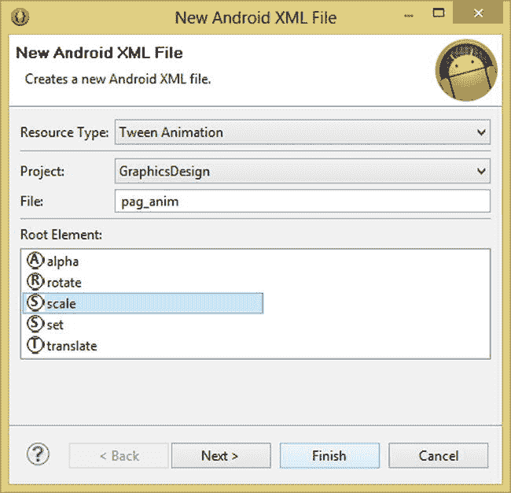

图 4-1. 为 `<scale>` 变换创建补间动画 XML 文件

完成所有这些对话框选项的设置后，点击“完成”按钮创建 `pag_anim.xml` 文件，并在 Eclipse 中将其打开。

当 `pag_anim.xml` 标签页在 Eclipse 中打开后，你将看到缩放变换父容器的 `<scale>` 和 `</scale>` 开始与结束标签。

由于你的缩放变换将有许多参数但没有子标签，让我们通过修改 `<scale>` 标签的写法来更好地满足你的需求。具体操作是删除 `</scale>` 结束标签，并将 `<scale>` 开始标签修改为既可作开始又可作结束的标签。

最简单的方法是将光标放在单词 `scale` 末尾的字母 `e` 和字符 `>` 之间，然后按下 `回车` 键。将开始标签分开到两行之后，在 `>` 前插入一个 `/` 字符，使其变成 `/>` 或简写形式的结束标签。

这将把 `<scale>` 变成 `<scale` 和 `/>`，并允许你为缩放变换的属性输入参数。完成后的效果应如图 4-2 所示，图中还包含了你即将执行的下一个步骤。

接下来，将光标放在开放的 `<scale` 标签之后，按回车键另起一行，让 Eclipse 自动缩进。输入单词 `android` 和冒号键，调出缩放标签参数辅助对话框，如图 4-2 所示，这样你就可以看到定义缩放变换行为的全部 17 个参数。

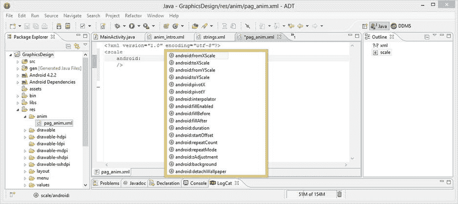

图 4-2. 使用 `android:` 工作流程调出 `<scale>` 变换标签的选项，并选择 `fromXScale`

双击第一个 `android:fromXScale` 参数，将其添加到 `<scale>` 标签中。注意在图 4-3 中，Eclipse 还自动添加了另一个必需的参数，即 `xmlns:android` XML 命名空间声明及其 URL，这在 Android 中使用的每个（XML 文件）开始标签中都是必需的。让我们将 `fromXScale` 参数的值设置为 `0.0`，并将 `xmlns:android` 参数剪切并粘贴到缩放标签的顶部，紧挨着开头的 `<scale` 标签（确保至少包含一个空格）。


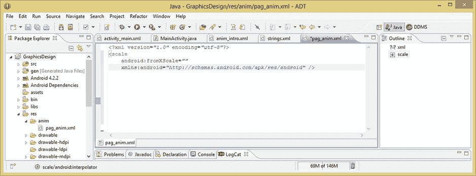

图 4-3. 添加 `android:fromXScale` 参数，并自动生成 `xmlns:android` 网址引用

完成后，你的 XML 应类似图 4-4 中显示的标记。现在你可以添加其余 X 和 Y 缩放范围参数：`fromYScale`、`toXScale` 和 `toYScale`。

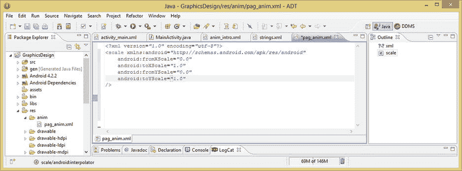

图 4-4. 添加 X 和 Y 的起始与结束缩放参数，将你的 PAG 标志从零缩放到全尺寸

利用同样的 `android:` 工作流程添加缩放范围定义参数，将 X 和 Y 的起始参数均设为 `0.0`（在远处不可见），X 和 Y 的结束参数均设为 `1.0`（在近处完全可见）。

接下来，添加你的轴心和插值器参数，以确定缩放从何处开始以及它如何从远处移动过来。使用你的 `android:` 工作流程，添加 `pivotX` 和 `pivotY` 参数，以及一个 `android:interpolator` 参数（参见图 4-5）。由于你希望旋转的标志从屏幕中心均匀缩放进入，你会将 X 和 Y 轴心参数的值都设为 `50%`。如果你使用 `0%` 的设置，旋转的标志会从显示屏左上角出现，这看起来远没有从更居中的位置缩放进入你的 Pro Android Graphics 标志自然。

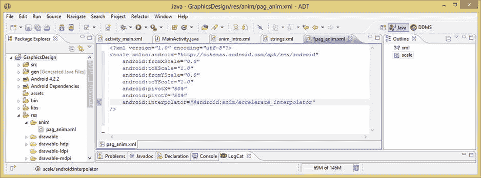

图 4-5. 添加 `pivotX` 和 `pivotY` 参数以及一个 `accelerate_interpolation` 插值器常量

设置 `android:interpolator` 参数的值可能会稍微棘手一些，因为它需要在操作系统中精确指定正确的常量引用路径。这通过使用 `@android:` 来指定 Android 操作系统资源区域，再使用 `anim/` 来指定动画资源路径（此处是插值器常量），然后加上一个插值器常量名（此处是 `accelerate_interpolator`）来实现。

你现在使用加速插值器，是因为你希望旋转的 Pro Android Graphics 标志流畅而自然地放大到屏幕中央，这个 `accelerate_interpolator` 常量将引用一个运动控制曲线算法来为你提供这种运动效果。

接下来，你将使用本章前面学到的 `android:duration` 和 `android:startOffset` 参数为动画指定时间值。你打算将持续时间参数设置为 9 秒；这是因为你希望旋转动画缓慢而平滑地从远处显现。

请记住，持续时间和插值器参数协同工作，在此例中为你的旋转标志从远方地平线飞入时提供平滑且逼真的飞行路径。

你需要在此处指定一个 `3000`（即 3 秒）的 `startOffset` 参数，原因是这是一个闪屏动画，你不希望动画在屏幕加载的同时立即开始。因此，你将为最终用户提供几秒钟的时间来意识到应用已启动并查看显示屏，然后再开始将旋转的 Pro Android Graphics 动画放大显示到视图中。

由于你已将动画的起始缩放范围值缩小到零，因此帧动画立即开始旋转标志这一事实并不重要，因为用户反正也看不到它，所以不需要指定偏移量。你可以在图 4-6 中看到迄今为止为缩放变换指定的全部九个参数。

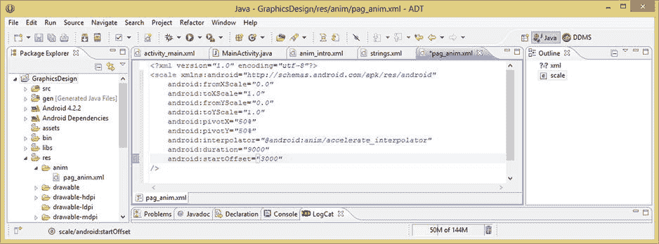

图 4-6. 添加一个设置为 9 秒的 `android:duration` 参数和一个 3 秒的动画启动偏移值

接下来，你将指定过程式动画的循环参数，即本章前面学到的 `android:repeatCount` 和 `android:repeatMode`。这些参数将允许你控制过程式动画变换执行的次数，对于这个介绍性动画而言，这恰好对实现连续的效果至关重要。`<scale>` 标签的最终标记可以在图 4-7 中看到。

由于你希望标志从远处飞入，并在达到全尺寸后停在屏幕中央并旋转，你需要将 `repeatCount` 设置为仅重复此缩放操作一次，否则你的旋转标志帧动画会在到达屏幕后几乎立即消失——实际上，是在到达三秒后消失，因为你已经指定 `startOffset` 值为 `3000`，即三秒。

由于计算机从零开始计数，正确的设置应为 `android:repeatCount="0"`，所以请确保不要使用 `1`。接下来，你将设置 `repeatMode` 参数，通过使用 `restart` 值常量来指定无缝循环动画。请记住，使用 `reverse` 值常量会产生一种弹球动画效果，如果你希望旋转的标志被吸回地平线（在这种情况下，你将 `repeatCount` 指定为 `1`，`repeatMode` 指定为 `reverse`），那可能会很酷。

由于动画只播放一次，你其实根本不需要设置 `repeatMode` 参数！我在这里设置它，是为了让你了解这个重要参数，因为将来你设置的大多数变换动画都需要同时指定 `repeatCount` 值和 `repeatMode` 参数，以及它的两个常量值之一。

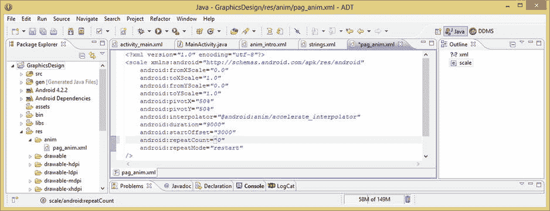

图 4-7. 添加一个值为零（指定一次播放周期）的 `android:repeatCount` 和一个 `restart` 的 repeatMode

既然你已经设置好了过程式动画，接下来需要做的就是进入项目 `MainActivity.java` Activity 的 Java 代码，实例化你的 `Animation` 对象，将其连接到你的 `pagImageView` 对象上，然后你就准备好用一些酷炫的过程式动画来增强你的帧动画了！


### 在 `MainActivity.java` 中实例化动画对象

点击 Eclipse 中央编辑区的 `MainActivity.java` 选项卡，如图 4-8 所示，该选项卡也显示了所有 XML 选项卡。然后添加一行代码，用于实例化一个名为 `pagAni` 的 Android `Animation` 对象，并加载你在 `pag_anim.xml` 文件中刚刚定义的 XML `<scale>` 动画。这通过以下 Java 代码实现：

```
Animation pagAni = AnimationUtils.loadAnimation(this, R.anim.pag_anim);
```

这行代码的作用是：在等号左侧构造 `Animation` 对象并命名为 `pagAni`，然后通过等号将 `.loadAnimation(context, reference)` 方法的调用结果加载到这个 `pagAni` Animation 对象中。该方法通过点标记法从 `AnimationUtils` 类中调用，因为它包含在该类中。当前上下文使用 `this` 常量设置，而对 `<scale>` 程序化动画 XML 定义的引用则通过 `R`（资源）、`anim` 文件夹和 `pag_anim.xml` 设置，它们使用句点字符连接在一起，如下所示：`R.anim.pag_anim`。

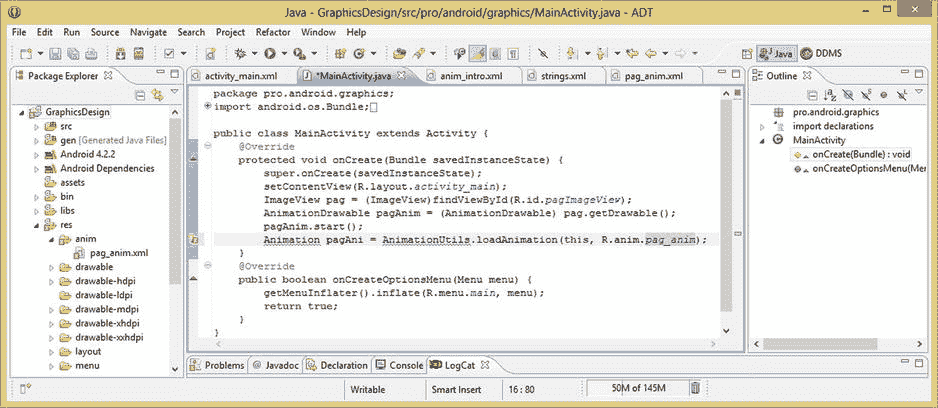

**图 4-8.** 实例化名为 `pagAni` 的 `Animation` 对象，并引用 `pag_anim.xml` XML 定义

如图 4-8 所示，Eclipse ADT（Android）发现 `Animation` 和 `AnimationUtil` 类在被使用前尚未导入。因此，让我们鼠标悬停在这两个类引用上，并选择导入选项，以便让 Eclipse 为你编写一些 Java 代码。

一旦这两个类被导入，你的代码就会变得整洁，然后你可以输入第二行代码。这行较短的代码将你新创建的 `pagAni` Animation 对象连接到现有的 `pag` ImageView 对象中。

这通过以下单行 Java 代码实现，该代码从 `pag` ImageView 对象调用 `.startAnimation()` 方法，并将 `pagAni` Animation 对象传递给它，从而将这些构造连接在一起：

```
pag.startAnimation(pagAni);
```

使用仅两行代码完成的 Animation 对象的实现如图 4-9 所示。

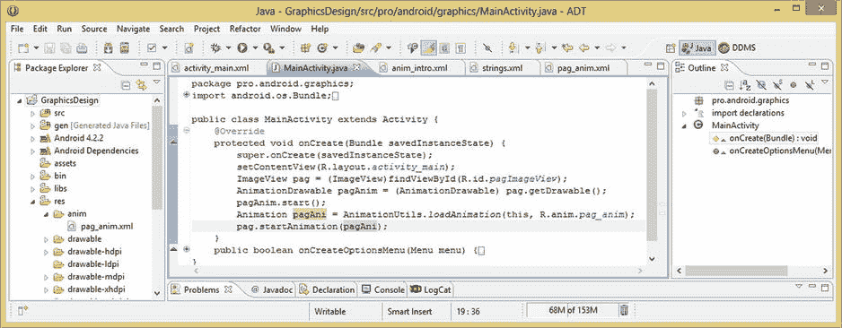

**图 4-9.** 使用 `.startAnimation()` 方法将 `pagAni` Animation 对象连接到 `pag` ImageView 对象

现在，你可以使用 `Run As` ➤ `Android Application` 工作流程，测试你新修改的启动屏动画了。如你所见，效果更加专业，动画现在凭空出现并旋转着落在屏幕中央。这里我就不提供屏幕截图了，因为目前无法提供动画截图，而且你已经在第 3 章中看到过静态截图（参见图 3-14）。

接下来，你将为这个 Pro Android Graphics 标志动画特效添加更多细化，使其更加逼真和专业。你将为动画添加 alpha 混合，使动画更加真实。这样做的目的是让旋转的标志在从远处出现时变得越来越清晰，从而在它靠近摄像机（你的显示屏）时看起来越来越实在。

你将通过在当前 `<scale>` 标签外部放置一个 `<set>` 父标签结构，然后将一个 `<alpha>` 子标签添加到新的 `<set>` 组中来实现这一点。这样，这两个程序化变换将作为一个统一的程序化动画处理操作来执行。

现在让我们开始吧。由于你已经有程序化动画 XML 定义文件，请单击 Eclipse 中央编辑窗格下的 `pag_anim.xml` 选项卡，返回并修改该标记，使其从 `<scale>` 变换动画定义变为一个包含 `<scale>` 变换定义及更多内容的组 `<set>` 定义。


### 使用 Set 创建更复杂的程序化动画

点击 `pag_anim.xml` 选项卡，切换回 XML 编辑模式，将光标放在该文件第一个标签 `<?xml version="1.0" encoding="utf-8"?>` 的末尾，然后按 `return` 键，在开始的 `<scale` 标签之前添加一行新的标记。

输入 `<set>` 标签，然后将 `<scale>` 标签第一行中的 `xmlns:android` 参数剪切并粘贴到父级 `<set>` 标签中，如图 4-10 所示。在 XML 文件中无需多次包含此参数，它应放在第一个（通常是父级）标签容器中。

完成后，将光标放在 `<scale>` 标签 XML 的末尾，按 `return` 键为你的 `<alpha>` 标签添加一行空格，然后输入一个 `<` 字符，如图 4-10 所示，以调出 `<set>` 标签参数助手对话框。双击 `<alpha>` 标签选项将其添加。

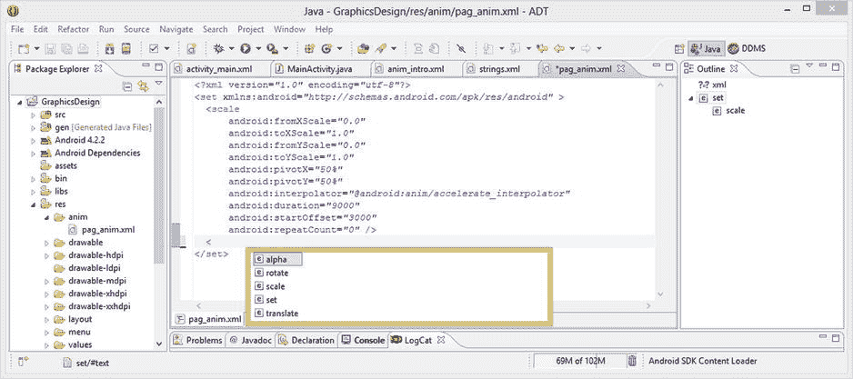

图 4-10. 向 `pag_anim.xml` 文件中添加一个 `<set>` 父标签，用于容纳你的 `<scale>` 和 `<alpha>` 参数

接下来，确保标签在屏幕上显示为 `<alpha` 和 `/>` 结束标签分隔符，然后将光标放在 `<alpha` 一词之后，按 `return` 键添加一个缩进代码行。输入 `android:` 冒号以调出标签参数助手对话框，查看该标签可用的 13 个参数。

双击列表中第一个参数 `android:fromAlpha`，将其添加到你的 `<alpha>` 标签中。在你双击 `fromAlpha` 参数并将其添加到即将添加的 Alpha 混合参数列表之前，屏幕应该如图 4-11 所示。

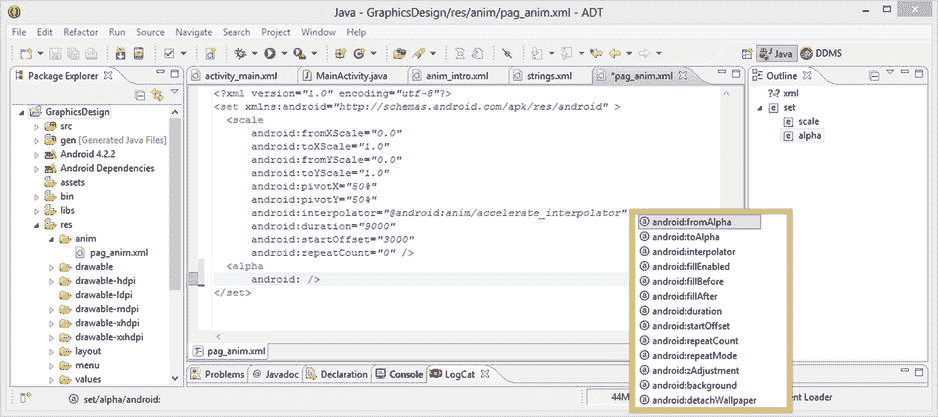

图 4-11. 使用 `android:` 工作流程调出包含所有 `<alpha>` 参数的标签助手对话框

由于 Logo 在远处应该是不可见的，你将 `fromAlpha` 值设置为 `0.0`，表示 0% 的可见度。由于需要一个范围，接下来添加 `toAlpha` 参数，并将其值设置为 `1.0`，即 100% 可见度。

接下来，添加一个插值器来控制运动，或者在此场景中控制淡入的时序。为了使淡入效果均匀开始并在结束时减慢，这次你将尝试使用 `deceleration` 插值器常量。

插值器参数使用以下标记指定：

```
android:interpolator="@android:anim/decelerate_interpolator"
```

现在，你可以添加时序和循环参数，然后就完成了。添加一个 `android:duration` 参数，并将其设置为与 `<scale>` 标签中使用的 `9000`（即 9 秒）值相匹配或同步。在这种情况下，你希望变换并行运行，以使一切看起来自然。

对 `android:startOffset` 参数及其 `3000`（即 3 秒）值执行相同操作，确保一切再次保持同步。

由于当前`repeatCount` 值为 0，你没有使用 `android:repeatMode` 参数，我已将其从 `<scale>` 变换标签中移除，你可能在图 4-10 和图 4-11 中已经注意到。

向 `<alpha>` 标签容器添加一个 `android:repeatCount` 参数，并将其值也设置为 0，这样 Pro Android Graphics Logo 在到达屏幕前方后就不会淡入淡出。

六个 `<alpha>` 标签参数如图 4-12 所示，如你所见，它们的值要么与 `<scale>` 标签同步，要么与之完全相反，例如插值器常量的值。

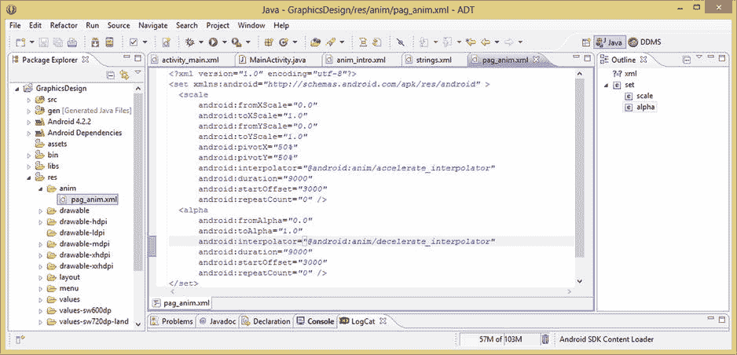

图 4-12. 输入实现 `<alpha>` 标签 Logo 淡入动画特效所需的六个参数

让我们通过“以 Android 应用程序运行”工作流程，在 Nexus One 模拟器中查看结果，看看这个额外的 Alpha 混合如何为你的动画带来更逼真的视觉效果。

在 Eclipse 包浏览器中右键单击 GraphicsDesign 项目文件夹，选择“以 Android 应用程序运行”启动模拟器。观察 Android 操作系统模拟加载，应用程序自动启动并在启动时运行闪屏。

如图 4-13 所示，现在动画 Logo 会同时缩放并淡入视野，就像在现实中一样。到目前为止，你仅使用了 16 个参数、两个变换容器和一个组（`set`）容器就完成了这一效果。

让我们在 `<set>` 父标签容器中再添加一种变换类型，以证明你可以使用相同的工作流程和基本 XML 标记构建任意复杂的程序化动画结构。

旋转变换允许我们在二维（2D）空间中，围绕图像 X 和 Y 轴空间中的一个枢轴点进行旋转。其主要数据范围输入是枢轴点的 X 和 Y 位置，以及旋转角度的 `toDegrees` 和 `fromDegrees` 范围。

如果你正在为一个正在倒奶的奶油壶制作动画，你会将枢轴点放在壶嘴下方壶的右侧，也就是通常倾倒/旋转的位置，然后设置 `fromDegrees` 为 `0`（壶直立），`toDegrees` 为 `90`（壶完全倾倒）。

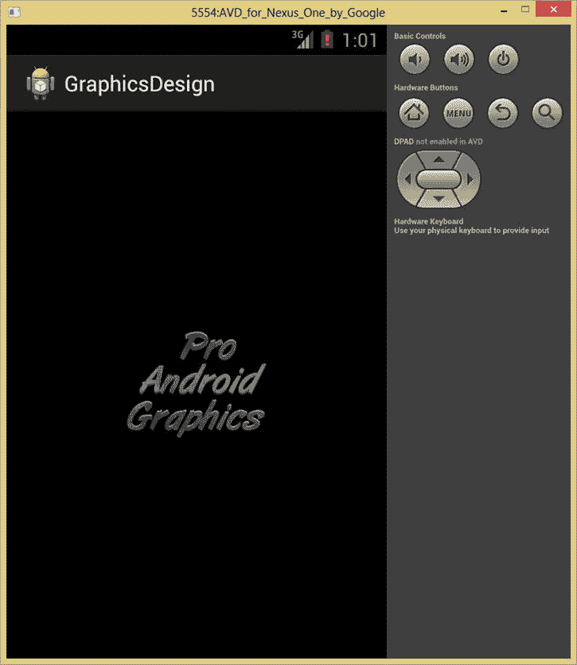

图 4-13. 在 Nexus One 模拟器中测试你的动画 `<set>`

接下来，添加你的 `<rotate>` 变换，同时围绕两个不同的轴旋转 Logo。你在帧动画中围绕 X 轴进行 3D 空间旋转，所以让我们通过程序化动画，围绕 Z 轴旋转你的 Logo（在其于帧动画中旋转的同时）！

诚然，这可能是将这个特定效果发挥得有些过头了，但我希望在本章中向你展示几种主要的变换，并同时创建一个相对复杂的动画集。


### 旋转变换：用 FX 稍微走远一点

让我们添加 `<rotate>` 变换标签，将光标放在 `<alpha>` 标签 XML 标记的末尾，然后按回车键。这将为你需要的 `<rotate>` 标签添加一行空白空间。接下来，输入 `<` 字符，如图 4-14 所示，以调出 `<set>` 子标签参数辅助对话框。最后，双击 `<rotate>` 标签选项进行添加。

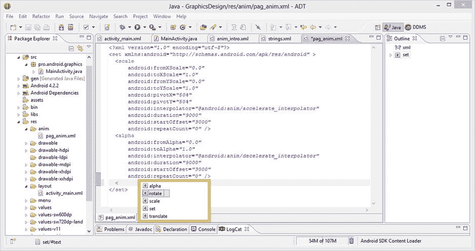

图 4-14. 向动画 `<set>` 父容器组添加一个 `<rotate>` 程序化动画变换标签

接下来，输入 `android` 和一个冒号，调出 `<rotate>` 标签参数辅助对话框，并查看其 15 个参数，如图 4-15 所示。

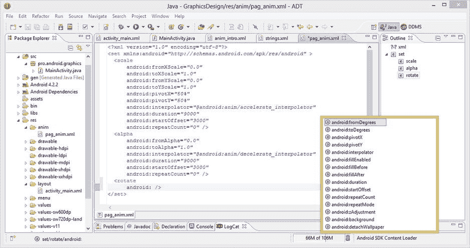

图 4-15. 使用 `android:` 工作流程打开 `<rotate>` 标签辅助对话框，显示 15 个可能的参数

你需要做的最重要的事情是定义你的数据范围，这就是为什么 `fromDegrees` 和 `toDegrees` 属性是辅助对话框中列出的前两个参数，如图 4-15 所示。

双击 `android:fromDegrees` 参数，添加该标签，并将其旋转参数的初始值设置为零度。零度是徽标帧动画的默认方向位置，你即将使其旋转一整圈。现在添加 `android:toDegrees` 参数，并将其值设置为旋转一整圈，即 360 度，如图 4-16 所示。

接下来，设置你的枢轴点 X 和 Y，这是旋转变换中下一个最重要的属性，因为它定义了旋转变换的中心将在你的 2D 图像或帧动画中的位置。添加 `android:pivotX` 和 `android:pivotY` 参数，并将它们都设置为图像（帧动画）在两个轴向上的 50% 位置。这将把你的枢轴点设置在图像或帧动画（或小部件、形状、文本，或任何你正在旋转的对象）的正中心。

如果你想从左上角旋转，两个值都使用 0%；如果你想围绕右下角旋转，两个值都使用 100%。

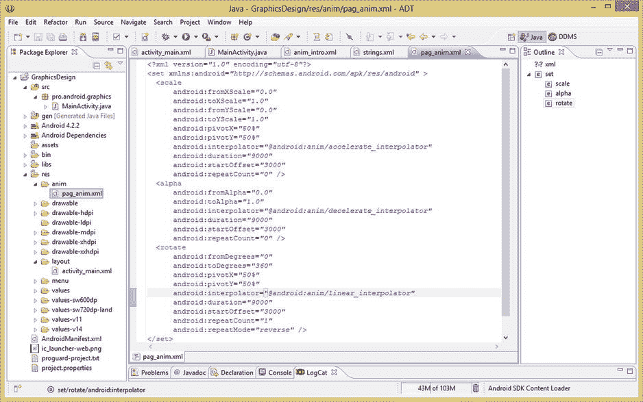

图 4-16. 在程序化动画 `<set>` 父标签中为你的 `<rotate>` 变换标签添加九个参数

下一个最重要的参数是运动插值器，在这种情况下，你将使用线性插值常量来平滑且均匀地旋转你的徽标。指定此标签的标记写法如下：

`android:interpolator="@android:anim/linear_interpolator"`

现在你只需要设置时间和循环参数，就可以准备好在 Nexus One 模拟器中测试你的双轴旋转徽标动画了。

添加一个 `android:duration` 参数，并将其设置为 9000 或 9 秒，以匹配你的其他两个变换参数。现在添加一个 `android:startOffset` 参数，设置为 3000（3 秒），这样你的时间就完全同步了。

最后，添加一个 `android:repeatCount` 参数，并将其设置为 1，这样你就可以看到 `repeatMode` 参数的作用，并反转你的旋转变换。添加 `android:repeatMode` 参数，并将常量值设置为 `reverse`，然后保存 XML 文件，并使用“运行方式 ➤ Android 应用程序”在 Nexus One 模拟器中测试旋转，如图 4-17 所示。如你所见，你的帧动画现在正围绕其 Z 轴旋转进入视野。

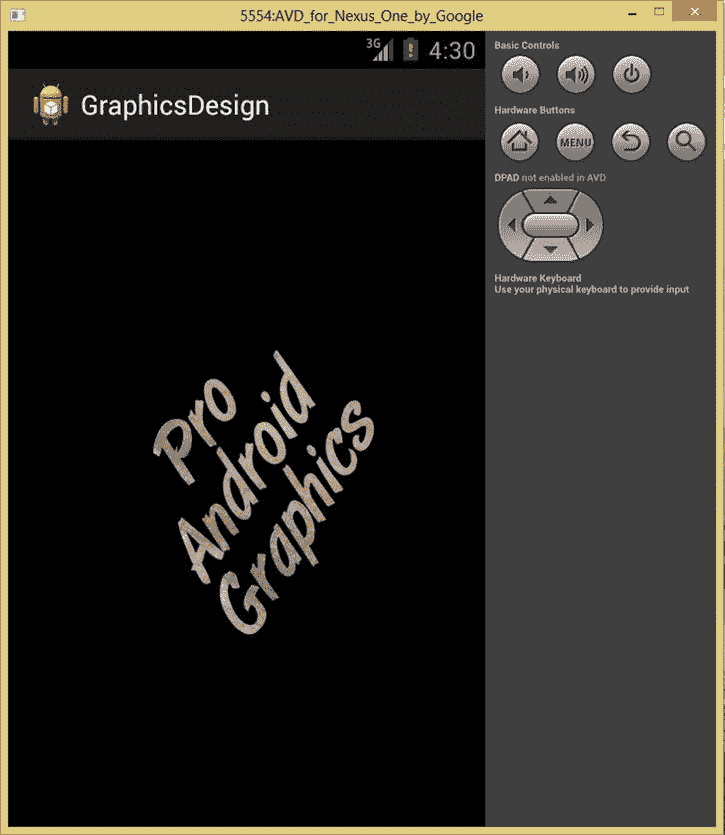

图 4-17. 在 Nexus One 模拟器中查看旋转变换

接下来，你将更改 `<rotate>` 变换参数，使得两个方向的旋转都在从远处进入时发生，这只是为了展示一旦使用 XML 标记初步设定好动画值后，对其进行调整（称为微调）是多么容易。

### 微调变换值：调整 XML 的便捷性

回到你的 `<set>` 中，将 `android:duration` 值改为 4400，将 `android:startOffset` 值改为 200。注意 4400 + 4400 + 200 = 9000，因此你正在同步你的两次旋转计时以及它们之间的暂停，以匹配其他两个变换的 9 秒持续时间。

使用“运行方式 ➤ Android 应用程序”工作流程，在 Nexus One 模拟器中再次运行应用程序，注意现在两个旋转方向都在帧动画到达最终静止位置时发生。如果你难以同时看到两者，你也可以将 `<scale>` 和 `<alpha>` 变换的 `startOffset` 值调整为 0，这样启动这些动画就没有延迟，此时所有数据值都实现 100% 同步（见图 4-18）。尝试更多的数值微调，直到你对结果满意并熟悉微调值的工作流程！

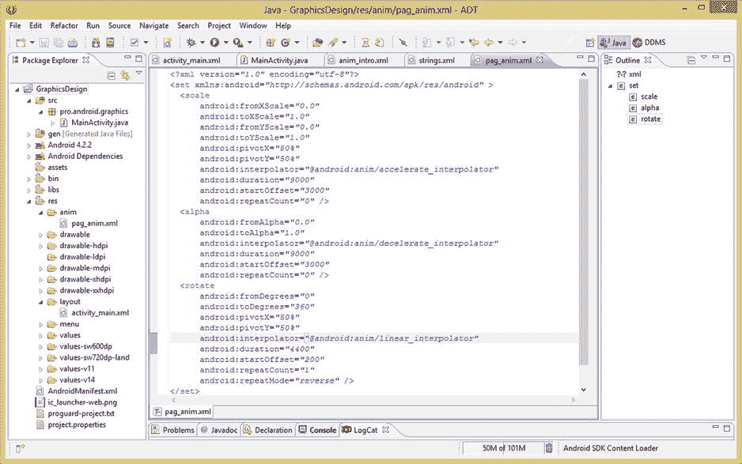

图 4-18. 微调你的 `<rotate>` 变换标签参数以实现不同的动画特效


### 总结

在第四章中，你学习了程序化动画的概念、可以通过程序化动画实现动画效果的 Android 应用资源、XML 标签、如何使用 XML 参数设置复杂的程序化动画，以及其他相关的程序化动画设计与优化技巧。

你还将这些知识付诸实践，在你的 `GraphicsDesign` Android 应用的 `pro.android.graphics` 包启动画面中创建了程序化动画，这些动画利用了 Android 的多种变换类型。

我们首先探讨了一些与程序化动画相关的基本概念，例如补间和插值，以及它们如何划分动画参数指定的数据范围，以便动画能够随时间流畅且美观地播放。

你学习了 Android 中的运动曲线及其 `Interpolator` 类，这些类为我们实现了数学运算，使我们能够轻松地将插值常量应用于程序化动画的数据范围，以生成逼真的运动效果，否则这些效果将难以实现。

接着，我们了解了如何使用数据值来建立动画参数将被变换的范围。我们学习了使用轴心点来告知变换从何处开始（缩放）或围绕哪个点执行变换（旋转）。

然后，我们研究了 Android 中为程序化动画支持的变换类型，即移动或平移、大小或缩放，以及方向或旋转。我们还探讨了如何通过程序化动画及与其他类型的 2D 空间变换一起，控制 Alpha 通道混合（透明度）。

接着，我们学习了如何使用 `duration` 和 `startOffset` 参数来控制程序化动画的时序。你了解到需要以毫秒为单位的数据值来指定程序化动画的时序，以及如何在秒和毫秒之间进行转换。

接下来，我们研究了如何界定你所创建的动画类型，从播放一次到循环动画类型。你学习了如何设置无缝循环动画，以及如何指定来回往复动画类型（通常也称为弹球动画）。

最后，你进入了你的 `GraphicsDesign` 应用，编写了一些 XML 标记和 Java 代码，将程序化动画与你之前在第 3 章 中创建的帧动画资源结合在一起实际实现。

在下一章中，我们将更深入地研究如何为所有不同分辨率的屏幕和像素密度目标设计图形元素，这些目标由 Android 通过其 `/res/drawable` 子文件夹（包括 LDPI、MDPI、HDPI、XHDPI、XXHDPI 和 TVDPI）以及 `/res/layout` 子文件夹（这些子文件夹可以有自定义名称用于自定义布局）定义并强制执行。

