# Android DIP：设备独立像素图形设计

### 摘要

在本章中，我们将更深入地探讨如何设计图形资源，使其能够覆盖当前市场上种类繁多的 Android 设备屏幕尺寸。从手表那么小的 Android 设备到 iTV 这么大的设备，提供一套适用于市场上所有屏幕且看起来效果极佳的基于像素的资源，无疑是创建专业 Android 图形时面临的主要挑战之一。

除非你只使用矢量（形状）图形（这些图形可缩放以适应任何屏幕尺寸）以及带有诸如 `android:gravity` 等 XML 参数的用户界面小部件（这些参数会自动为你处理屏幕布局计算），否则这一挑战无法回避。如果你的应用要使用任何类型的基于像素的资源，那么本章及其包含的所有信息，对你这位崭露头角的专业 Android 图形设计师来说，应该具有重大意义。

当你完成本章后，你会发现为市面上成千上万种不同的 Android 设备（产品）屏幕进行设计，是一场“权衡”与“估算”的游戏。本章中的信息将让你能够决定支持哪些像素密度图像分辨率，以及额外的资源创建工作是否值得——这取决于因缩放（或缺乏缩放）而在屏幕上产生的视觉质量与预估市场份额（总最终用户）占比之间的权衡。

我们将探讨 Android 操作系统和 API 中目前已定义的七种像素密度级别。我们还将研究与像素调整大小和缩放相关的各种密度和缩放概念及技巧，以及常见的显示分辨率以及如何有效地定位它们。

### Android 如何支持设备显示：UI 设计与 UX

众所周知，Android 操作系统支持多种流行的消费电子设备。其中大多数设备都提供不同的屏幕尺寸、屏幕形状、屏幕宽高比和屏幕像素密度。本章我们将逐一探讨这些屏幕差异的各个方面。

对于应用开发而言，Android 操作系统试图在每个受支持的硬件设备上提供一致的用户体验开发环境。操作系统将尝试处理将应用程序的用户界面调整到其显示的每种屏幕类型的任务。

此外，操作系统还提供了自定义 API，允许你针对特定的屏幕尺寸和密度自定义应用程序 UI。这样做是为了让开发者能够针对不同的屏幕配置优化 UI 设计。例如，开发者可能希望专门为平板电脑 UI 进行开发，而平板电脑 UI 可能不同于智能手机 UI、智能手表 UI 或 iTV UI。

尽管 Android 会负责缩放和调整你的 UI 设计的大小，但为了使你的应用能够完美适配每一款不同的屏幕，你仍需要努力针对不同的屏幕尺寸和像素密度优化应用程序。这样，Android 操作系统就不必对任何给定的图像资源进行过于剧烈的缩放或调整大小，因此用户可能甚至不会注意到这些细微的像素调整（如果有的话）。事实上，最小化缩放和调整是关键所在，而你将在本章学到的内容还包括更多优化技巧！Android 开发在很大程度上就是关于优化的。

通过在您的 `.APK` 文件中为 Android 操作系统提供一系列合理且高度优化的基于像素的图像资源，您可以让 Android 操作系统在最大化所有 Android 硬件设备上的用户体验方面完成其余工作。

如果基于像素的资源优化过程执行得当，所有最终用户都会确信他们正在使用的应用是专门为其设备设计的，而不是经过缩放、拉伸和旋转来适应其设备屏幕的物理分辨率、宽高比和方向（竖屏或横屏）。这个过程涉及的内容相当多，我们将在本章中涵盖所有不同的因素。


### 设备显示概念：尺寸、密度、方向与 DIP

Android 设备屏幕尺寸仅指任何设备显示屏对角线的实际物理尺寸，以英寸为单位测量。屏幕尺寸通常在产品规格中给出，并且常常包含在产品名称本身中。例如，Nexus 7 或 Nexus 10 平板电脑的显示屏对角线测量尺寸分别为 7 英寸和 10 英寸。

Android 操作系统将常见屏幕尺寸归纳为四种通用尺寸常量，包括小、正常、大和超大。截至 Android 4.2.2，还存在一个 XXHDPI 的可绘制资源文件夹，因此请注意未来还将添加一个额外的超大尺寸常量！Android 4.3 最近还添加了一个 XXXHDPI 常量，以支持当前市场上出现的新型 4K 网络电视。

Android 设备屏幕密度定义为给定设备显示屏一英寸区域内包含的物理像素数量。物理像素是生成单个像素的实际硬件屏幕元素；因此在 LCD 屏幕上，这代表一个单元格，而在 OLED 屏幕上，这代表一个有机发光二极管。低密度屏幕每英寸有 120 个像素，而高密度屏幕的像素数量是其两倍，即每英寸 240 个像素。

图形行业中长期以来将屏幕密度称为 DPI，即每英寸点数。你可能对这个术语很熟悉，因为它与打印机规格相关，而现在由于显示屏的分辨率正接近打印机的分辨率，该术语在此也同样适用。我们将在本章中详细讨论屏幕密度。

Android 操作系统将常见屏幕密度归纳为六种基本密度常量，包括低 (LDPI)、中 (MDPI)、电视 (TVDPI)、高 (HDPI)、超高 (XHDPI) 和 XXHDPI。截至 Android 4.2.2，还存在一个 XXHDPI 的可绘制资源文件夹，因此请留意未来某个时候还将添加一个额外的超高屏幕密度常量，以及用于 4K 网络电视的额外额外超高 (XXXHDPI) 常量。

Android 设备屏幕方向定义为用户手持 Android 设备的方式，即从用户当前使用 Android 设备的角度来看屏幕的方向。用户只需将屏幕旋转 90 度，方向即可随时改变。业界长期定义的方向术语称为横屏（宽屏视图）或竖屏（高长视图或上下视图）。

就宽高比而言，这意味着屏幕宽高比可以是宽的或高的，具体取决于用户握持设备的方式。这显著增加了用户界面和内容开发的难度。

值得注意的是，不同的 Android 设备在用户开机时默认使用不同的方向。此外，用户只需旋转设备，即可在运行时更改屏幕方向。Android 操作系统中存在 API 可以检测这种情况，以便你可以根据需要基于设备屏幕方向更改内容和用户界面。如你所见，为 Android 开发图形是一项复杂的工作，这也是本书存在的原因。

Android 设备屏幕分辨率使用物理像素定义，通常分别使用 X 轴和 Y 轴上的像素总数来指定。如果用户的屏幕方向改变，X 轴变为 Y 轴，Y 轴变为 X 轴，因此分辨率规格也会改变。

屏幕分辨率通常使用横屏或宽屏方向参数来指定，因此一个 WVGA 800x480 的屏幕在横屏时使用，而一个 480x800 的 WVGA 屏幕则以竖屏方向使用（观看）。

对于希望在其应用中支持多种设备屏幕的开发者来说，务必注意：Android 应用程序并不直接通过屏幕分辨率工作。当前的开发方法是让你的 Android 应用程序只关注屏幕尺寸和密度，正如操作系统提供的大小和密度常量所指定的那样。

Android 开发者实现这一目标的方法是使用 DIP（密度无关像素）单位，在代码和标记中也可以表示为 `DIP` 或 `dip`。可以将 `DIP` 视为一种“虚拟”像素表示形式，当你定义 UI（用户界面）布局时，应该习惯使用它。正如你将在本书后面看到的，我们将使用 `DIP` 单位来表达布局尺寸和用户界面元素定位，从而提供一种跨设备创建 UI 布局的密度无关方式。

根据 Android 开发者网站的说法，一个密度无关像素等同于中等尺寸、MDPI 常量 160 DPI 屏幕上的一个物理像素。Android 操作系统将其用作基线屏幕密度，操作系统假定该密度为“中等”或“普通”设备屏幕。其工作原理是：在运行时，Android 操作系统在查看运行应用程序的设备屏幕的当前密度后，会透明地处理所有以 `DIP` 定义的单位的缩放。

`DIP` 单位转换为物理屏幕像素的方式，开发者可以通过以下公式计算：

```
物理像素 = DIP * (DPI/160)
```

例如，在使用 XHDPI（320 DPI）超高密度像素屏幕时，1 个 `DIP` 等于 2 个物理像素。在使用 XXHDPI（480 DPI）超超高密度像素图像屏幕时，1 个 `DIP` 等于 3 个物理像素。本章下一节中有一个图表（表格），将所有与密度相关的信息集中在一起，敬请期待。

总而言之，如果 Android 开发者希望确保其用户界面设计在具有不同像素密度（不同的点距或像素间距）的 Android 硬件设备显示屏上正确显示，那么在定义其应用程序 UI 时需要使用 `DIP`（或 `DP`）单位。

为了针对多种不同的屏幕尺寸和像素密度优化你的应用程序用户界面和内容，你需要为每种流行的尺寸和密度提供备选资源。此外，你还需要创建备选的用户界面布局以适应某些不同的屏幕宽高比，并为不同的屏幕密度创建备选的数字图像。因此，这就是需要考虑权衡之处的所在。

诀窍在于，根据你目标设备的类型，选择你的应用需要支持的级别。开发者不必为屏幕尺寸和密度的每一种组合都提供备选资源；这样做会导致巨大的数据占用。如果你使用允许其被调整大小的技术创建了 UI，Android 提供的兼容性功能可以处理在任何屏幕上渲染应用程序的工作。


### 密度无关性：打造相似的用户体验

当一个 Android 应用能够在具有不同像素密度或不同 `DPI`（每英寸点数）或 `PPI`（每英寸像素数）的显示屏上，保持用户界面元素（从最终用户的角度来看）的物理外观时，我们就说该应用实现了密度无关性。

如果你想知道为什么设备无关性如此重要，那是因为如果没有它，你所有的 UI 元素在低密度显示屏上会显得更大，而在高密度显示屏上则会小得多。你很快就会看到，与密度相关的用户界面元素尺寸变化可能会导致应用布局内出现视觉（用户体验或 UX）问题，并且这会严重影响你应用的可用性。

Android 操作系统会通过几种不同的方式帮助你的应用实现密度无关性。首先，Android 会根据当前屏幕密度，酌情将 `DIP` 单位向上或向下缩放。

其次，如果有必要，Android 会根据当前屏幕密度，将你的可绘制资源缩放到合适的尺寸。理想情况下，这并非必需，因此在本章中，我将详细阐述如何尝试为基于像素的资产创建三到四个不同的版本，这样 Android 就有多个间距相等的分辨率密度目标可供选择。这样做的目的是，即便 Android 被迫进行缩放，它也能尽可能地接近完美的视觉效果。

你可能会想：为什么不只提供一个高分辨率资源，然后让 Android 将其缩小适配呢？简短的回答是：Android 的缩放效果并不理想，它没有像 Photoshop 和 GIMP 那样的双三次插值算法，因此我们目前必须自己使用 Photoshop CS6 或 GIMP 2.8 创建缩放后的资源目标，供 Android 使用。

这就是为什么我在我的 Android 书籍中会介绍如何使用这些外部的开源新媒体内容生产工具；因为要在 Android 中真正达到完美的效果，目前需要利用 Android 开发环境之外的其它软件来进行某种形式的媒体优化。Android 开发涉及许多软件包！

在许多情况下，开发者只需在 `DIP` 或 `DP` 单位中指定所有 UI 布局尺寸值，即可在应用中实现密度无关性。正如你在前几章中已经看到的，使用 `match_parent` 和 `wrap_content` 常量也可以为我们匹配或缩放 UI 区域。但如果你使用基于像素（图像）的资源，事情就没那么简单了！

Android 会缩放 `PNG`、`GIF` 或 `JPEG` 位图可绘制对象，以及任何视频资源，试图根据当前屏幕密度的最佳缩放因子，以最佳像素分辨率来显示它们。需要注意的是，像素缩放常常会导致模糊或像素化的结果，这再次源于当前尚不够先进的缩放算法。

为了避免缩放伪影，我们鼓励开发者为三到四种不同的密度提供多个替代位图资源层级。提供多少这样的资源完全由你决定，而这正是本章节在书中的目的，以便你可以权衡计算。

例如，你至少应该为大型（iTV）和高密度（高清智能手机）屏幕提供高分辨率级别的位图资源。Android 会智能地使用这些高分辨率资源，而不是将专为中等密度“普通”屏幕设计的栅格（基于像素的）资源进行放大。

你至少还应该拥有另一套资源，用于针对采用 `MDPI`（中等像素密度）的主流正常尺寸设备屏幕。随着智能手表的出现，你可能还需要考虑优化良好的 `LDPI`（低密度像素图像）资源，特别是如果你的应用目标是智能手表。目前智能手表正迅速涌入 Android 市场，今年已有十几家主要制造商发布了相关型号。

一个 160 `DPI` 的 `MDPI` 屏幕密度资源，正好是 320 `DPI` 的 `XHDPI` 屏幕密度资源的 2 倍下采样，也正好是 480 `DPI` 的 `XXHDPI` 屏幕密度资源的 3 倍下采样，稍后在本章中你为 `GraphicsDesign` 应用创建启动器图标资源时将会看到这一点。

表 5-1 总结了 Android 密度限定符、屏幕尺寸常量、像素密度 `DPI`、像素倍数（相对于默认的普通 `MDPI`），以及 Android 为每个以 `DIP` 指定的层级定义的最小屏幕尺寸，最后是用物理像素指定的应用系统图标类型。

表 5-1. 显示 Android 专门支持的六级像素密度屏幕的 Android 设备 DPI 表

| Android 设备 DPI 表 | 屏幕尺寸 | 像素密度 | 像素倍数 | 最小 DP 屏幕尺寸 | 启动器图标像素尺寸 | 操作栏图标尺寸 | 通知图标尺寸 |
| --- | --- | --- | --- | --- | --- | --- | --- |
| `LDPI` (低密度像素) | 小 | 120 | 0.75 | 426x320 | 36x36 | 24x24 | 18x18 |
| `MDPI` (中等) (默认) | 普通 | 160 | 1.0 | 470x320 | 48x48 | 32x32 | 24x24 |
| `TVDPI` (高清电视 1280x720) | 高清电视 | 213 | 1.33 | 640x360 | 64x64 | 48x48 | 32x32 |
| `HDPI` (高密度像素) | 大 | 240 | 1.5 | 640x480 | 72x72 | 48x48 | 36x36 |
| `XHDPI` (超高密度) | 超大 | 320 | 2.0 | 960x720 | 96x96 | 64x64 | 48x48 |
| `XXHDPI` (超超高密度) | 超超大 | 480 | 3.0 | 1280x960 | 144x144 | 96x96 | 72x72 |
| `XXXHDPI` (超超超高密度) | 超超超大 | 640 | 4.0 | 1920x1440 | 192x192 | 128x128 | 96x96 |

在决定为这七个目标数字图像资源密度层级中的哪几个开发资源时，我还会考虑将新媒体资源交付到 Android 之外的平台，例如 HTML5 应用，甚至数字标牌。

重要的是要记住，目前使用 Photoshop 或 GIMP 对你的图像资源进行下采样（最好以偶数 2 倍或 4 倍进行），其效果肯定远优于 Android 操作系统提供的重采样。因此，最终的考量因素是应用的总数据占用空间，以及你的应用需要多少不同的图像、帧动画、图标或 UI 元素图像资源。我最低限度建议提供针对 `MDPI`、`HDPI` 和 `XHDPI` 的资源，或者至少提供针对 `MDPI` (160) 和 `XHDPI` (320) 的资源。


### 通过 `<supports-screens>` 标签实现安卓多屏支持

如本章前半部分所述，安卓会通过缩放布局以适应屏幕尺寸和密度，处理大部分将应用的用户体验正确呈现在不同设备屏幕配置上的工作。如有必要，安卓还会针对任何给定的屏幕密度缩放图片、视频和逐帧动画的可绘制对象。

开发者还可以通过其他方式优化其 XML 标记和 Java 代码，使安卓操作系统能够在多种不同的屏幕配置类型上进一步优化视觉效果。因此，让我们在本章接下来的几个小节中来介绍这些内容。

安卓开发者被允许在应用的 `AndroidManifest` XML 文件中显式声明应用所支持的不同屏幕尺寸。你可能已经在 Eclipse 项目文件夹底部的根目录中注意到了 `AndroidManifest.xml` 文件。这个“清单”文件本质上配置并启动或“引导”安卓应用，类似于 `index.html` 文件之于网站的作用。

声明应用支持的确切屏幕尺寸，可以确保只有拥有应用能支持屏幕的设备所有者才能购买和下载你的应用。这样做的明显缺点是，实施此操作可能会严重限制潜在的市场规模，即你的应用的购买受众。

专门声明不同屏幕尺寸的屏幕尺寸支持还会影响的另一件事，是安卓操作系统如何在更大的屏幕上渲染你的应用。具体声明屏幕尺寸将决定应用是否在安卓的屏幕兼容模式下运行。屏幕兼容模式是针对那些未针对大尺寸显示屏（例如平板电脑和 iTV 设备中的显示屏）有效设计缩放的应用的一种“权宜之计”。

从操作系统 1.6 版本开始，安卓已添加对多种屏幕尺寸的支持，并完成了应用布局调整的大部分工作，使其能正确适配任何屏幕。但是，如果应用未遵循支持多个显示屏的指南，安卓可能会在某些较大的显示屏上遇到一些渲染问题。

对于遇到此特定问题的应用设计，屏幕兼容模式可能会让应用在较大屏幕上稍加可用，但也可能不会，因此请务必充分测试你的应用。

要声明你的应用支持的显示屏尺寸，你需要在你的 `AndroidManifest` XML 文件中包含 `<supports-screens>` XML 元素。此标签是 `<manifest>` 父标签的子标签，允许你指定你的应用支持的所有屏幕尺寸，并为大于你应用当前资源所支持的屏幕启用屏幕兼容模式。

在你的安卓应用清单 XML 文件中利用此元素来指定你的应用支持的每个屏幕尺寸，这一点非常重要。如果应用拥有正确调整其内容和 UI 大小以充满整个屏幕区域所需的所有资源（至少包括 MDPI、HDPI 和 XHDPI 图片资源），则该应用可以被认为“支持”给定的屏幕尺寸常量。

因此，如果你打算包含这三种“建议的”（必须的）普通屏、`largeScreen` 和 `xlargeScreen` 分辨率密度资源，请务必在 `AndroidManifest.xml` 文件中的 `<manifest>` 标签之后（作为子标签）添加以下 `<supports-screens>` 标签（及参数）配置：

`<supports-screens android:largeScreens="true" android:xlargeScreens="true" />`

请注意，你无需指定 `android:normalScreens=“true”`，因为这是 `<supports-screens>` 尺寸规格的默认值，因此是固有指定的，只需通过此标签添加 largeScreen 和 xlargeScreen 支持即可。你将在本章稍后编辑 `AndroidManifest.xml` 文件时添加此标签，因为你需要将其包含在你的应用中。

安卓应用的缩放通常对大多数应用都有效，你无需做任何额外工作即可让你的应用在比高清智能手机或平板电脑更大的屏幕上运行。

然而，通过提供备选布局资源来针对不同屏幕尺寸优化应用的用户界面设计非常重要。举例来说，你可能希望修改 Activity 在平板电脑上与在智能手机上运行时的布局。我们将在本章下一节中更详细地研究备选布局。

如果你的应用在缩放以适应不同屏幕尺寸时效果不佳，你可以使用 `<supports-screens>` 标签的参数来控制你的应用是否应分发到较小的屏幕上，或者使用系统的屏幕兼容模式将其 UI 放大或缩放以适配更大的安卓屏幕。如果你愿意，可以通过以下网址访问安卓开发者网站查看所有标签参数：

[`http://developer.android.com/guide/topics/manifest/supports-screens-element.html`](http://developer.android.com/guide/topics/manifest/supports-screens-element.html)

如果你尚未设计你的应用资源、布局和用户界面以支持更大的屏幕尺寸，并且普通的安卓缩放无法达到可接受的效果，则可以调用安卓屏幕兼容模式，以便将你的应用放大以适应更大的屏幕尺寸。安卓通过模拟普通尺寸屏幕（中密度 MDPI）来实现此目的。此模拟通过缩放 MDPI 密度（普通尺寸）的资源及 UI 设计来实现，使其填满整个 HDPI 或 XHDPI 屏幕。

务必注意，这种放大操作会导致你的内容和用户界面设计出现像素化和模糊，因为放大操作必然如此。这就是为什么安卓强烈建议（我也建议）你至少要为你的应用提供针对 MDPI、HDPI 和 XHDPI 优化的内容和用户界面布局，以便拥有可供安卓操作系统为在更大显示屏上使用而优化（缩放）的图片资源。


### 提供针对设备优化的用户界面布局设计

Android 会调整应用程序的用户界面布局，以适应其用户的各种设备屏幕。在许多情况下，这应该可以正常工作。然而，在其他情况下，您的 UI 设计可能看起来不如您期望的那样专业，并且在这些情况下，可能需要进一步调整以正确适配不同的屏幕方向或宽高比。

例如，在较大的设备屏幕上，或宽高比差异巨大的屏幕（宽屏 vs. 方形屏）上，您可能希望调整某些用户界面元素的位置和大小，以便充分利用新的屏幕形状或额外的屏幕空间。相反，面对较小的屏幕，您可能需要调整用户界面元素和字体大小，以确保所有内容都能美观地适配在这个较小的显示屏幕上。

您可以使用配置限定符常量来提供特定尺寸的布局资源，这些常量包括 `small`、`normal`、`large`、`xlarge`、`xxlarge` 和 `xxxlarge`。例如，针对超大设备屏幕的用户界面屏幕布局 XML 定义可以放在 `/res/layout-xlarge` 项目文件夹中。从 Android 3.2（Honeycomb 或 API 13）版本开始，上述尺寸分组已被弃用，您应该转而使用我们将在下文进一步讨论的更新的 `ScreenWidth-Number-DP` 命名方案。

若您不熟悉这个术语，需要说明的是，“已弃用”意味着不再推荐但仍在支持。建议当 Android 中的功能被弃用时，您应重新编写应用程序代码以使用新的实现方式；在这种情况下，就是按照 `ScreenWidth-Number-DIP` (`sw-#-dp`) 所描述的，使用新的文件夹命名标准来命名布局资源文件夹。

这种文件夹名称配置限定符方法使用与密度无关的像素来定义布局资源所需的最小宽度。举例来说，如果某个平板电脑布局至少需要 480DP 的屏幕宽度，您就应该将其放在 `/res/layout-sw480dp` 文件夹中。

与 Android 3.2 Honeycomb API Level 13 之前支持的已弃用的屏幕尺寸组（`small`、`normal`、`large` 和 `xlarge`）相比，新的 `DIP` 尺寸特定限定符为 Android 开发者提供了对应用程序所能支持的特定屏幕尺寸的更多控制权。

需要注意的是，您使用这些新限定符指定的 DIP 尺寸并非物理屏幕尺寸规格。相反，这些限定符是用于您的 `Activity` 的，即您的 Java `Activity` 窗口可用的、以 DIP 为单位的宽度或高度，也就是物理显示屏上供其使用的那部分区域。

这样做的原因是 Android 操作系统可能会占用部分物理显示屏的像素区域来显示其自身的 UI 元素，例如位于屏幕底部的系统工具栏或位于屏幕顶部的状态栏。

这意味着物理显示屏的某些部分可能无法用于您的应用程序用户界面布局。因此，您声明的尺寸应专门针对您的应用的 Java `Activity` 所需的物理显示屏区域的大小。

当开发者声明其 `Activity` 布局需要多少空间时，Android 操作系统会负责计算操作系统 UI 占用的任何其他显示屏空间。

需要注意的重要一点是，Android `Action Bar`（操作栏）将被视为应用程序窗口空间的一部分，即使您的布局没有特别声明它。这意味着 Android `Action Bar` 会减少布局原本可用的屏幕空间（区域），您必须记住在整体用户体验设计中将其考虑在内。

虽然使用新的 DIP 限定符看起来比使用已弃用的屏幕尺寸常量更复杂，但一旦您确定了 UI 布局设计的密度像素要求，它实际上可能会更简单。

在设计用户界面布局时，您首要考虑的因素将是您的应用程序从智能手机界面切换到平板电脑界面再到智能电视界面的实际像素值。使用我们将在接下来的几节中详细讨论的限定符，您将能够完全控制不同 XML 设计之间布局发生变化的确切密度像素尺寸。

让我们来看看三种可用的屏幕配置修饰符，它们分别关注最小（最窄）宽度、总屏幕宽度和屏幕高度，并看看它们有何不同。在这三种不同方法之间，您应该能够精确地指定所需的所有屏幕布局变化触发范围。

### 使用 Android 的 SmallestWidth 屏幕配置修饰符

Android `smallestWidth` 屏幕配置限定符，其格式为 `sw#dp`（例如 `sw480dp`），旨在通过指明可用屏幕的最短宽度尺寸来定义屏幕的目标尺寸。Android 设备的 `smallestWidth` 组件是可用显示高度或可用宽度的最短尺寸，具体取决于屏幕方向。也可以将其概念化为屏幕可能的最小显示宽度，这显然就是该常量名称的由来。

您可以使用 `smallestWidth` 限定符来确保，无论显示屏的当前方向如何，您的应用程序都将至少有这么多 DIP 的显示宽度可用于您的 `Activity` 的 UI 布局。因此，如果您的用户界面布局要求显示区域的最小宽度尺寸至少为 720 DIP，那么您将使用此限定符创建名为 `/res/layout-sw720dp` 的布局资源文件夹，以存放您的应用程序 `Activity` 的用户界面布局定义 XML 文件。

只有当可用显示屏的最小尺寸至少为 720 DIP 时，Android 操作系统才会使用此文件夹中的 XML 资源。需要注意的是，无论这 720 DIP 的边是用户感知的高度还是宽度，都会进行此判断。`smallestWidth` 是 Android 设备显示屏的一个固定屏幕尺寸特性。当用户显示屏方向改变时，设备的 `smallestWidth` 修饰符不会改变。

Android 操作系统针对特定设备计算的 `smallestWidth` 会考虑 Android 操作系统 UI 元素。例如，如果某设备有一些 Android UI 元素是显示屏的一部分，占用了部分空间，从而影响 `smallestWidth` 的测量值，系统将计算出一个小于设备屏幕尺寸的 `smallestWidth`，因为这些像素是您的 UI 无法使用的显示像素。

由于屏幕宽度通常是 UI 布局设计中的一个决定性因素，使用 `smallestWidth` 配置修饰符来确定合适的屏幕尺寸适配，对 Android 开发者来说通常非常有用。

可用显示宽度参数也可以是确定使用单窗格 UI 布局（例如，用于智能手机）还是多窗格布局（用于平板电脑或智能电视）的一个因素。因此，开发者需要这个修饰符来确定设备的 `smallestWidth` DIP 参数。


### 使用可用屏幕宽度配置修饰符

还存在另一个配置参数，它允许开发者以 DIP 单位指定最小可用显示宽度，并且该参数会考虑屏幕方向。与 `smallestWidth` 配置修饰符不同，`w#dp`（例如：`w480dp`）宽度配置修饰符会在屏幕方向在横竖屏之间切换时发生改变，从而从最终用户的视觉角度反映当前可用于 UI 布局的可视宽度。

此配置参数有助于确定你的应用在横屏或竖屏模式下（取决于最终用户握持设备的方式）将使用哪种多窗格 UI 布局设计。

这是因为，即使在较大的平板设备上，你通常也不希望竖屏模式下使用与横屏模式相同的多窗格 UI 布局设计。借助宽度屏幕配置修饰符，你可以使用类似 `w640dp` 这样的值来为你的布局指定 640 DIP 的最小可用屏幕区域宽度，而无需同时实现屏幕尺寸限定符和方向限定符。

### 使用可用屏幕高度配置修饰符

还有第三个配置参数，它允许开发者以 DIP 单位指定最小可用显示高度，该参数同样会考虑屏幕方向。这个 `h#dp`（例如：`h600dp`）高度配置修饰符也会在屏幕方向在横竖屏之间切换时发生改变，从而从最终用户的视觉角度反映当前可用于开发者 UI 布局的可视高度。使用 `h#dp` 配置修饰符来定义布局所需的高度，其用途与使用 `w#dp` 定义宽度类似。

### 提供针对设备优化的可绘制图像资源

如你所知，Android 会缩放你的 PNG、GIF 和 JPEG 位图可绘制资源，以便它们在每个设备上以最佳的物理尺寸渲染。如果应用仅为基准中屏幕密度（MDPI）提供位图可绘制资源，那么在高密度屏幕上 Android 会将其放大，而在低密度屏幕上则会将其缩小。这会在你的位图中产生伪影，尤其是在放大方面，因为需要创建不存在的数据来进行上采样。

为了确保你的光栅图像资源看起来完美无瑕，你基本上必须为不同的屏幕密度提供不同分辨率的替代图像版本。我将在本书中向你展示处理此工作流程的最佳方法。

当前可用于密度特定资源的 Android 系统配置限定符包括 LDPI（低）、MDPI（中）、TVDPI（电视）、HDPI（高）、XHDPI（超高）、XXHDPI（超超高）和 XXXHDPI（超超超高）。根据当前用户设备屏幕的尺寸和密度，Android 操作系统将利用你在应用 `/res/drawable` 文件夹层次结构中提供的所有尺寸特定和密度特定的可绘制资源。

例如，如果你的用户设备具有高密度显示屏，并且你的应用实现了可绘制资源，Android 将寻找与该设备显示屏密度配置匹配的可绘制资源文件夹。

Android 还会考虑可用的替代资源，因此带有 `-hdpi` 配置限定符的资源目录（例如 `/res/drawable-hdpi` 文件夹）将提供匹配该特定密度级别的资源，因此 Android 将使用该文件夹中的可绘制资源。

然而，如果在你的 `/res/drawable` 文件夹中找不到密度匹配的资源，Android 将使用你保存在 `/res/drawable` 文件夹中的默认资源；如果那里也找不到，Android 将使用 `/res/drawable-mdpi` 文件夹中的 MDPI 密度资源，然后根据需要将其放大或缩小以匹配当前的屏幕尺寸和密度。

由于缩小比放大更可取，因此如果你打算省略某些资源，我建议你省略 LDPI 资源（除非你正在为智能手表开发），并至少包含 MDPI、HDPI 和 XHDPI 资源，正如我们在本书中所做的那样。如果可能，请进行设置，以便 Android 在需要缩放时是缩小像素而不是放大，这样你应该总能获得不错的视觉效果。

需要注意的是，保存在 `/res/drawable` 文件夹中的任何数字图像资源都会被 Android 操作系统视为“默认”可绘制资源。我想，如果你想尝试仅使用 HDPI 或 XHDPI 资源并让 Android 对其进行下采样，只需将它们放在 `/res/drawable` 文件夹中即可实现，而将其他文件夹留空。

在我的开发实践中，我只将动画和过渡等内容的 XML 定义保存在这个 `/res/drawable` 文件夹中，然后将所有基于像素的数字成像资源保存在那些特定于密度的 `/res/drawable-dpi` 文件夹中。这是一种更“精细”的处理方式。

在这种情况下，MPDI 资源将被视为默认资源。我怎么知道这一点？通过查看 `DisplayMetrics` 类中的密度常量，我们很快就会详细讨论这一点。`DENSITY_NORMAL` 和 `DENSITY_MDPI` 常量具有完全相同的数据值 `160 DPI`。

幸运的是，当 Android 查找特定密度的图像资源而在默认密度特定目录（`/res/drawable` 或 `/res/drawable-mdpi`）中未找到合适的资源时，它不一定会使用默认的（MDPI）资源。如果 Android 确定使用你其他密度特定资源能提供更优异的重新采样结果，它可能会转而使用这些资源。真是谢天谢地的小奇迹。


例如，当寻找低密度 LDPI 图像资源时，如果没有找到，Android 会（正确地）缩小该图像资源的高密度版本，因为 Android 知道将高密度资源缩小到低密度目标能提供更优的视觉结果。

让我们从数学角度来审视这一点。如果将图像从 240 DPI 以 2 倍系数下采样到 120 DPI，获得的结果将优于从 160 DPI 以 1.5 倍系数下采样到 120 DPI。在图像重采样、下采样或上采样过程中，你应始终尽可能使用 2 或 4 这样的倍数因子，以便从重采样算法中获得最佳质量的结果。

你可能会想：如果不希望图像资源为了适配不同像素密度的屏幕而被缩放该怎么办？无论出于何种原因，如果你希望图像在低密度屏幕上显示得大，在高密度屏幕上显示得小，Android 中确实有一种方法可以实现这一点。

指示 Android 在未找到合适分辨率密度的资源时绝不进行预缩放的方法是：将永远不应被缩放的图像资源放入带有 `-nodpi` 配置限定符的资源目录中。这自然对应着 `/res/drawable-nodpi` 文件夹命名约定。当 Android 从该配置限定符文件夹中获取图像资源时，无论出于何种原因，它都不会对其进行缩放，即使它根据当前设备密度及其内部缩放算法认为应该缩放。

除了密度配置修饰符（LDPI、MDPI、HDPI、XHDPI 等），Android 中还有方向配置修饰符（PORT 和 LAND），以及宽高比配置修饰符（LONG 和 NOTLONG）。

这些修饰符可用于创建包含定制设计的文件夹结构，以适应特定方向（竖屏或横屏）和宽高比（宽屏）的显示屏幕场景。这些配置修饰符也可以与其他修饰符结合使用；例如，它们可以串联起来，因此 `/res/drawable-land-hdpi` 将包含横屏 HDPI 资源。

### DisplayMetrics 类：尺寸、密度和字体缩放

你可能想知道 Android 操作系统是否有 API 或类允许开发者查询其应用运行的设备并获取其显示特性信息。实际上，是有的，它被称为 `DisplayMetrics` 类。

`DisplayMetrics` 类是 `android.util` 操作系统工具包的一员，这一点并不意外。它提供了一种对象结构，当开发者查询（访问）时，能够提供关于当前（最终用户）设备显示屏的显示指标信息。提供的信息包括 X 和 Y 两个维度上的显示物理尺寸、X 和 Y 两个维度上的像素密度，以及 Android 操作系统当前使用的字体缩放因子。

要访问 `DisplayMetrics` 类成员，请使用 `DisplayMetrics()` 构造器初始化 `DisplayMetrics` 对象，代码如下：

```
DisplayMetrics currentDeviceDisplayMetrics = new DisplayMetrics();
getWindowManager().getDefaultDisplay().getMetrics(currentDeviceDisplayMetrics);
```

该类中有八个常量：`DENSITY_DEFAULT`、`DENSITY_HIGH`、`DENSITY_LOW`、`DENSITY_MEDIUM`、`DENSITY_TV`、`DENSITY_XHIGH`、`DENSITY_XXHIGH` 和 `DENSITY_XXXHIGH`。

如果你想在 Android 开发者网站上进一步研究 `DisplayMetrics` 类，可以通过以下 URL 访问（这也是表 5-1 中信息的来源）：

[`http://developer.android.com/reference/android/util/DisplayMetrics.html`](http://developer.android.com/reference/android/util/DisplayMetrics.html)

表 5-2.  
Android DisplayMetrics 类与对象数据字段，以及访问修饰符和函数

| 访问/类型修饰符 | 对象字段名称 | 查询时提供的对象数据字段信息 |
| --- | --- | --- |
| `public float` | `Density` | 显示的逻辑密度 |
| `public int` | `densityDpi` | 以每英寸点数表示的屏幕密度 |
| `public int` | `heightPixels` | 显示的绝对高度，以像素为单位 |
| `public int` | `widthPixels` | 显示的绝对宽度，以像素为单位 |
| `public float` | `xdpi` | X 维度上每英寸的物理像素数 |
| `public float` | `ydpi` | Y 维度上每英寸的物理像素数 |
| `public float` | `scaledDensity` | 显示屏上字体的缩放因子 |

`DisplayMetrics` 对象还有七个数据字段，一旦对象被实例化即可访问。这些字段如表 5-2 所示。

如你所见，一旦创建了 `DisplayMetrics` 对象，你的应用程序就能精确了解当前 Android 设备在屏幕尺寸和像素密度方面的具体情况，以及操作系统当前如何缩放字体。


### 优化适用于 LDPI 到 XXXHDPI 的 Android 应用图标

虽然我无法在这一章中优化本书将要使用的所有图形资源，但我将在此介绍如何使用开源数字成像软件包 `GIMP2` 对启动器图标进行降采样处理的工作流程。这是因为启动器图标是少数几个你需要为其创建全部五种可绘制目标级别的资源之一。你需要为应用启动器图标创建五个级别的原因是，在 Android 平板电脑上，系统会从比应用其他可绘制资源高一级的文件夹中查找启动器图标。

这意味着，为了支持 XHDPI（这是你始终需要支持的可绘制级别之一），你必须在 `XXHDPI` 文件夹中包含一个 144x144 像素的启动图标 `PNG32` 文件。这样做是为了确保你的应用图标（即你的应用品牌标识）在较大的 Android 平板电脑（如 Google Nexus 10）上看起来清晰锐利。

如果你的系统上还没有 `GIMP2`，请访问 [`www.gimp.org`](http://www.gimp.org/) 并为你的操作系统下载最新版本（目前是 2.8.6）。

安装并启动 `GIMP2` 后，使用 `文件` ➤ `打开` 菜单序列打开我们在第 3 章和第 4 章中使用的 Pro Android Graphics 标志的 `PAG_logo_288.png` `PNG32` 文件。

你可能想知道我为什么使用这个标志的 288 像素版本。这是因为在降采样到 Android 所需的五种不同图标大小时，这个特定的像素尺寸能够均匀地重新采样，也就是说，它不会为重采样算法留下余数（部分像素）。

注意

如果你想使用 XXXHDPI 来处理 4K iTV，则在以下工作流程中添加一个降采样到 192x192 像素的步骤。

让我们来计算一下。XXHDPI 需要 144 像素，这是 288 的一半，即 2 倍降采样。XHDPI 需要 96 像素，这是 288 的三分之一，即 3 倍降采样。HDPI 需要 72 像素，这是 144 像素的一半，也是 288 像素的四分之一，即 4 倍降采样。MDPI 需要 48 像素，这是 288 的六分之一，即 6 倍降采样。LDPI 需要 36 像素，这是 288 的八分之一，即 8 倍降采样。

如果你曾想以 576 像素来开发你的图标素材（这是 288 分辨率的两倍），那也是可行的，甚至可以以 1152 像素（这是 288 分辨率的四倍）来开发，如果你需要打印分辨率的图标资源的话。

请注意，2 x 1152 等于 2304，这也恰好是常见的数码相机原生像素分辨率。记住，图像和视频（像素）缩放在使用 2 的幂次采样倍数（1-2-4-8-16-32 等）时效果要好得多。

当你的 288 像素启动图标标志在 `GIMP2` 中打开后，它应该看起来像图 5-1 中显示的屏幕截图。标志后面的棋盘格图案在 GIMP 中表示透明度，因此你可以看到我们只拥有应用图标的 Pro Android Graphics 标志的像素。

Android 建议使用 Alpha 通道为你的启动图标提供透明度，以防用户在 Android 设备上设置了壁纸或其他背景图像。

现在，你已准备好将 288 像素的启动器图标图像缩小到其原始大小的一半，使用 `图像` 菜单和 `缩放图像` 选项，如图 5-1 所示。

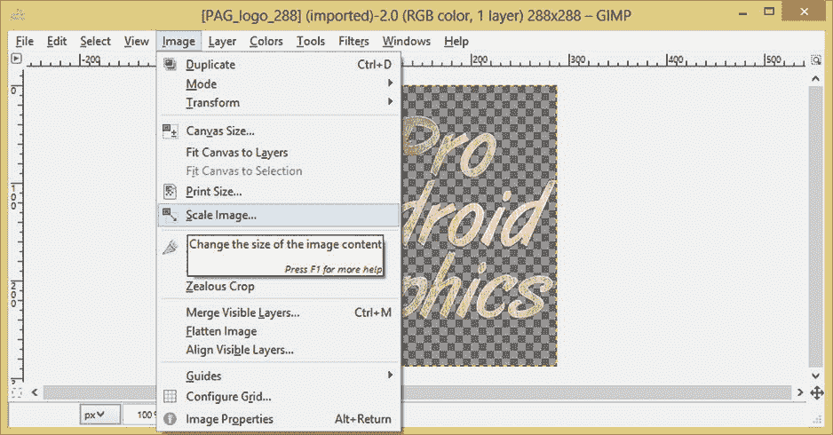

图 5-1.

使用 `图像` ➤ `缩放图像` 功能将 288 像素的资源调整为适合 XXHDPI 的 144 像素图标大小

选择此菜单序列将弹出 `缩放图像` 对话框，如图 5-2 所示。你将使用该对话框设置降采样分辨率为 144 宽度和 144 高度，并将插值算法设置为 `立方` 作为你的插值方法或设置。

`立方` 插值使用高质量降采样算法，该算法会考虑图像中的边缘，并在降采样过程中对其进行抗锯齿处理，从而为图像中像素区域间的锐利边缘或剧烈变化提供平滑过渡。一个很好的例子就是你的 Pro Android Graphics 标志的边缘。

`GIMP2` 中的 `立方` 插值类似于 Photoshop 中的双三次插值。如果你使用的是 Photoshop 而不是 `GIMP2`，那么也请从 Photoshop 的 `图像大小` 对话框底部的下拉菜单中选择 `两次立方（较锐利）`（用于降采样）选项。

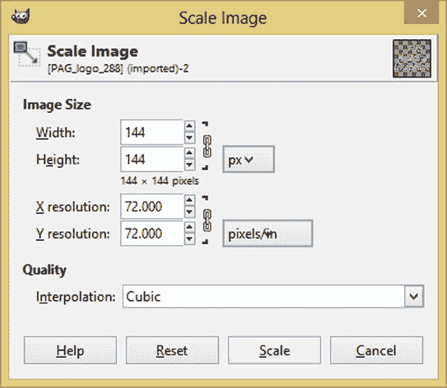

图 5-2.

在 `缩放图像` 对话框中设置参数

现在图像应该比原来小四倍，或者沿 X 轴和 Y 轴各小两倍，如图 5-3 所示。

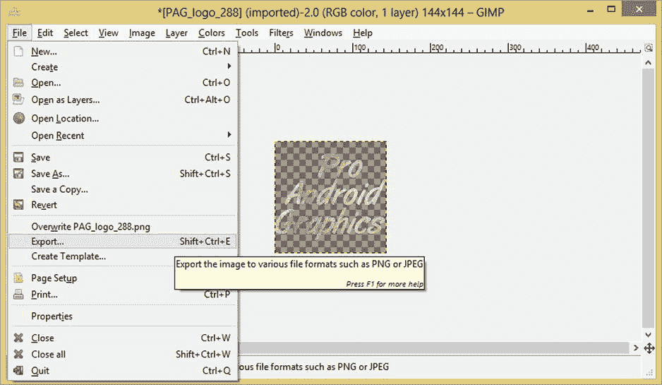

图 5-3.

使用 `文件` ➤ `导出` 功能导出新缩放的 144 像素 XXHDPI 应用图标资源

你现在已准备好使用 `文件` ➤ `导出` 菜单序列导出降采样后的 144 像素应用启动图标文件。这样做是为了给你的 `XXHDPI` 应用启动器图标文件命名，以便以后能识别出这个数字图像资源的分辨率。

如果由于某些原因你仍在使用的旧版 `GIMP2`（例如 2.6.12），那么你需要使用 `文件` ➤ `另存为` 选项。自 `GIMP2` 版本 2.8.0 及更高版本起，该选项已更改为 `文件` ➤ `导出` 选项。

选择 `导出` 选项将弹出 `导出图像` 对话框，如图 5-4 所示。如果你尚未为应用图标创建文件夹，可以立即使用对话框右上角的 `创建文件夹` 按钮进行操作。我用它在我的 Pro Android Graphics Design (PAGD) 文件夹及其 `/CH05` 子文件夹下创建了 `/Icons` 文件夹。

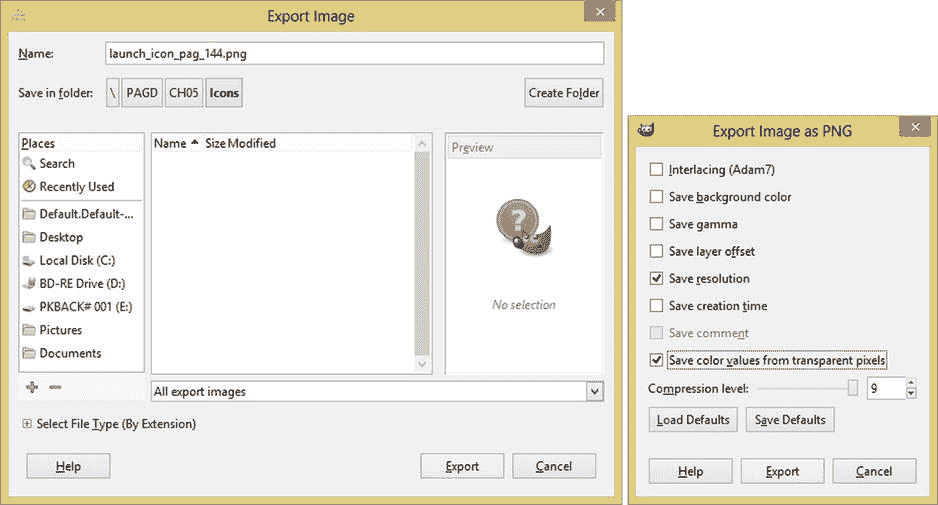

图 5-4.

在 `导出图像` 对话框中设置 `launch_icon_pag_144.png` 文件名并选择导出选项

一旦你为应用图标创建了文件夹，就在对话框顶部的 `名称:` 字段中输入描述性文件名 `launch_icon_pag_144.png`。`GIMP2` 使用你的文件扩展名来确定保存文件时应使用的文件格式类型（编解码器）。你也可以使用对话框左下角的 `选择文件类型（按扩展名）` 小部件以更繁琐的方式来设置。完成所有设置后，单击对话框右下角的 `导出` 按钮，这将弹出 `将图像导出为 PNG` 设置对话框，如图 5-4 屏幕截图的右侧所示。确保选中 `保存分辨率` 和 `保存透明像素的颜色值`，然后将 `压缩级别` 滑块设置为最大压缩（9）。

你可能想知道为什么像 `PNG32` 这样的无损文件格式在 `GIMP2` 中会有这个压缩级别设置，因为人们通常会认为这应该出现在 JPEG 中，而不是 PNG 中；人们会假设最大压缩是默认设置。实际上，它控制的是无损压缩的速度，就像你使用 `ZIP` 压缩算法（也是无损的）时所做的那样。使用 `ZIP` 工具时，你会在压缩过程花费的时间与压缩算法在压缩时能做得更好（文件稍微更小）之间进行权衡。由于 9 是 `GIMP2` 中此滑块的默认值，我就没有改动它。如果你愿意，之后可以随意尝试调整此设置并观察结果。


### 导出新的 144 像素 XXHDPI 启动器图标资源后

导出新的 144 像素 XXHDPI 启动器图标资源后，您可以返回 288 像素的源文件，对另外四个启动器图标资源进行进一步的重采样。最简便的方法是使用`编辑`菜单中的`撤销缩放图像`选项，如图 5-5 所示。

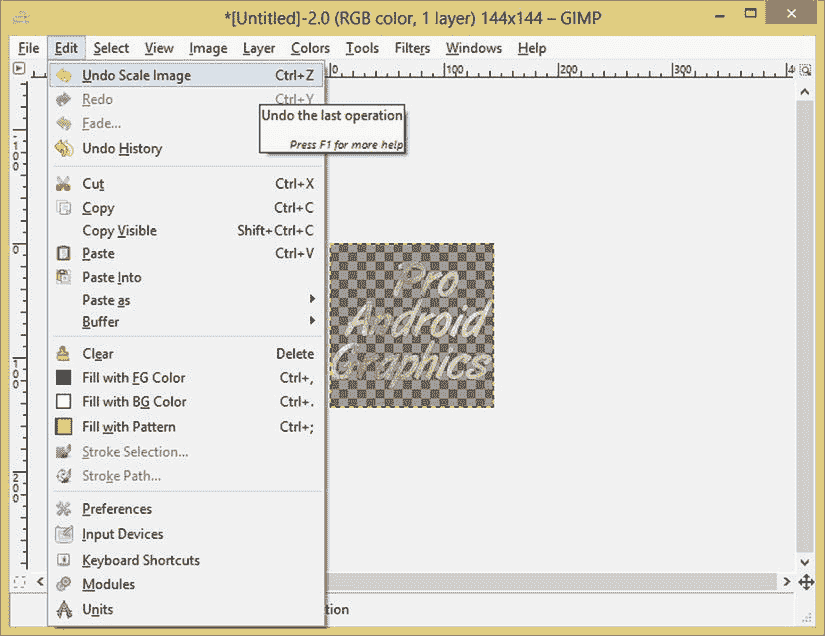

**图 5-5.** 使用`编辑 ➤ 撤销缩放图像`菜单序列将徽标图标图像数据恢复至 288 像素

如果您想知道为什么不直接对 144 像素的图像数据进行连续缩放，那么原因是：您需要返回原始源文件进行后续重采样，这是因为我们希望为重采样算法提供尽可能多的数据，使其每次重采样都能获得最佳的视觉效果。

这也是我之前讨论使用 576 像素、1152 像素或 2304 像素源素材图像的原因——输入图像重采样算法的分辨率越高，算法输出可接受结果的可能性就越大，前提是使用双三次插值算法数学（在 GIMP 中称为 `cubic`）进行下采样。

一般来说，应尽量避免上采样（如果可以的话）。本章前面讨论 HDPI 或 XHDPI 屏幕模拟（上采样）MDPI“正常”用户体验（及用户界面设计）时已提到这一点。上采样会迫使算法创建图像中原本不存在的图像数据（像素），而这些像素应该是什么、应该位于何处的猜测工作，会在最终数字图像中转化为伪影、模糊，或两者兼有。

接下来，让我们将新下采样的应用程序启动器图标资源复制到相应的文件夹中，并编写在 Android `GraphicsDesign` 应用中实现这些图标所需的 XML 标记。

### 在新应用图标安装至正确的密度文件夹

打开操作系统的文件管理工具（对于 Windows 8，即`Windows 资源管理器`工具），找到您为图标资源创建的 `/Icons` 资源文件夹，以及保存启动图标的文件夹（对我而言，该文件夹名为 `/PAGD/CH05/Icons`，如图 5-6 所示）。

在开发包含大量新媒体元素和资源的复杂 Android 应用时，创建并维护一个逻辑清晰的资源文件夹层级结构非常重要。除了 Android 应用的 `/workspace/project` 文件夹外，您还应该有一个独立的 `/project` 文件夹，其中包含图像、视频、音频、动画、3D、图标等子文件夹。这些新媒体类型的子文件夹还可以拥有自己的子子文件夹，例如 `/project/audio/music` 或 `/project/audio/voiceovers`；对于数字图像，您可以有 `/project/images/mpdi`、`/project/images/hdpi` 和 `/project/images/xhdpi`；对于数字视频，例如 `/project/video/mpeg4` 和 `/project/video/webm`。

现在，让我们将启动器图标图像资源从新媒体图标资源文件夹复制到相应的 Eclipse ADT 工作区项目文件夹中，即 `/workspace/GraphicsDesign/res/drawable-ldpi`。

选择 LDPI 36 像素分辨率密度资源，右键单击，选择`复制`选项，将文件位置引用放入操作系统的剪贴板，如图 5-6 所示。

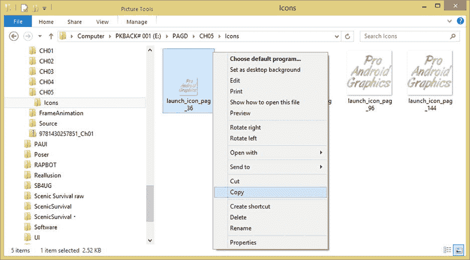

**图 5-6.** 从 `/icon` 文件夹中选择应用启动图标密度级别资源，复制到 `/drawable` 文件夹

接下来，找到您的 `/workspace/GraphicsDesign/res/drawable-ldpi` 文件夹，右键单击，选择`粘贴`选项，将该文件复制并粘贴到文件夹中，如图 5-7 所示。对所有五个启动器图标重复此工作流程，确保每个图标名称中的像素数与该分辨率的密度级别相匹配。如果您忘记了哪种密度对应哪种图标分辨率，请参考表 5-1（第六列）。

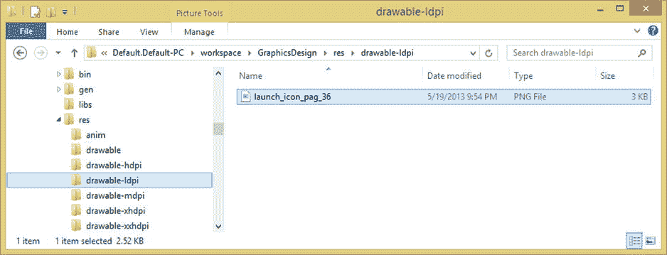

**图 5-7.** 将启动图标密度资源粘贴到资源文件夹中对应的 `drawable-dpi` 文件夹中

请注意，该 LDPI 文件夹中目前没有默认的 Android 应用程序启动图标，因此重要的是：即使是 Android ADT 的新建 Android 应用程序系列对话框，也没有提供低分辨率版本的启动器图标，这意味着它必须为此缩放一个较高分辨率的图标，很可能是 72 像素的 HDPI 版本，因为这样正好可以 2 倍下采样，得到 36 像素。

我由此推断（或假设），如果您提供了 240 DPI 的资源集合（HDPI），那么不为您的应用程序提供 LDPI 资源可能也是可以的，尤其是当前 Android 设备的趋势是朝着 HDPI 平板手机（手机+平板）、XHDPI 平板电脑和 HDPI 智能电视发展。

话虽如此，如果您正在为 Android 手表和翻盖手机开发应用，那么可能还是需要提供 LDPI 优化资源，至少等到 Android 在其操作系统中添加立方（双三次）插值算法为止。从图 5-8 可以看出，Android 确实提供了一个 MDPI 图标资源，我们已将自定义启动器图标粘贴在其旁边，并准备将其重命名为更简单的名称。

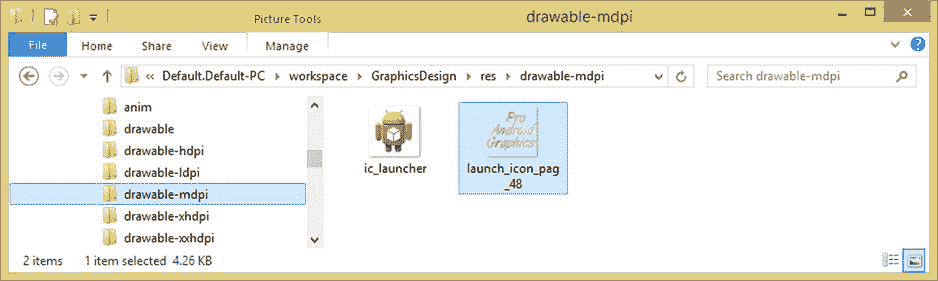

**图 5-8.** Android 创建的 `ic_launcher.png` 图标和开发者创建的 `launch_icon_pag_48` 位于 `/drawable-mdpi` 中

确保将所有文件复制到正确的分辨率密度文件夹后，将它们重命名为通用名称（不包含像素数字），以便每个文件夹中的文件名称相同，如图 5-9 所示。

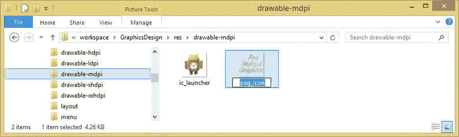

**图 5-9.** 将 `launch_icon_pag_48.png` 文件重命名为通用的（且更简单的）文件名 `pag_icon.png`

如图 5-9 所示，我选择了简单的名称 `pag_icon.png`，并严格遵守 Android 资源命名规范，仅使用小写字母、数字和下划线字符。

将所有五个文件重命名为 `pag_icon.png` 后，您就可以编辑 `AndroidManifest.xml` 文件中的 XML 参数，为您的 `GraphicsDesign` 应用实现新的自定义 Pro Android 图形启动器图标了。


### 为自定义应用图标配置 AndroidManifest.xml

现在所有资源都已就位，启动 Eclipse 并右键点击 `AndroidManifest.xml` 文件，你可以在 Eclipse 左侧的 Package Explorer 导航窗格中找到它，位于 GraphicsDesign 项目文件夹的最底部。

值得注意的是，`AndroidManifest.xml` 是 Eclipse 中顶部编辑标签命名方式的唯一例外。请注意，Android Manifest XML 标签显示为 `GraphicsDesign`（项目文件夹名称）Manifest。

XML 标记应如图 5-10 所示，我已在 `<application>` 标签中高亮显示了 `android:icon` 参数，你将在此处引用你自己的自定义启动器图标文件名，下一步就将进行操作。

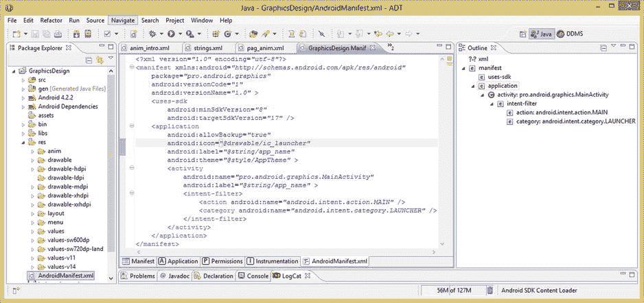

图 5-10. 在 Package Explorer 中右键点击 `AndroidManifest.xml` 文件，然后在 Eclipse 中打开它进行编辑

你将保留其他默认的 `AndroidManifest` 条目不变，但会将 `ic_launcher` 引用更改为 `pag_icon`，这样你就知道如何根据需要添加自己的自定义启动器图标引用了。查看一下 Eclipse 为你的应用程序 Manifest 设置的其他标签。

需要注意的是，你也可以保留 `ic_launcher` 文件引用不变，并在每个分辨率密度文件夹中将启动器图标资源命名为 `ic_launcher.png`，这同样是一种替代工作流程。

在此处，添加之前学过的 `<supports-screens>` 标签，并修复另一个标签，这能让你的 Android 应用更显专业。查看 `android:icon` 参数下方的一个参数，你会看到 `android:label` 参数。

该参数控制应用启动画面顶部的文本值，以及应用启动图标下方的文本标签。应用启动图标始终位于用户 Android 设备的“前端”（即启动图标区域）；图标图形及其下方的标签都必须完美无缺。对初始 `AndroidManifest.xml`（通过“新建 Android 应用程序”对话框系列生成）所做的更改如图 5-11 所示。

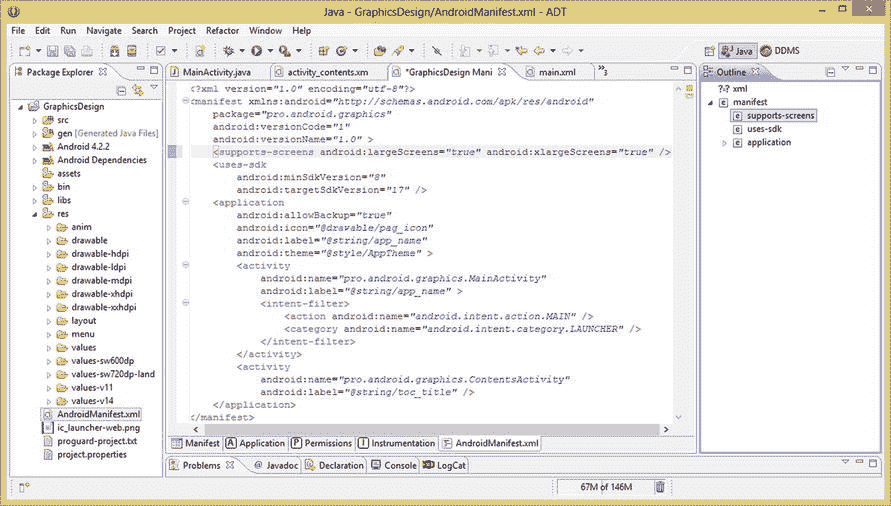

图 5-11. 向你的 `AndroidManifest` 添加自定义 `android:icon` 参数和 `<supports-screens>` 标签

如你所见，`android:label` 参数引用了 `strings.xml` 文件中名为 `app_name` 的字符串常量。你需要编辑该字符串常量的值，在单词 Graphics 和 Design 之间添加一个空格。点击 Eclipse 中央编辑窗格顶部的 `strings.xml` 标签，在 `app_name` 的 `<string>` 标签中添加一个空格，使其显示为 `Graphics Design` 而非 `GraphicsDesign`，如图 5-12 所示。

这将使 Android 操作系统能够在用户 Android 设备前端的图标启动集合中更美观地“换行”显示图标标签。我们接下来测试应用时，你会发现效果比以前好 100%。事实上，Android 操作系统之前换行显示图标标签的方式已经困扰了我好几章。所以我们在此解决这个问题。Android 应用的优化是分阶段进行的。

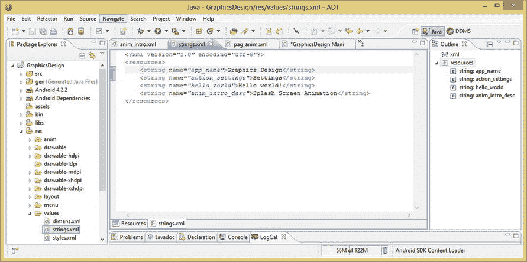

图 5-12. 将 `app_name` `<string>` 标签常量更改为 `Graphics Design`（两个单词）以修复图标换行问题

进行这种细微的文本修改后，你的应用图标标签将在新的 Pro Graphics Design 图标下方更自然地换行显示，并且应用的屏幕标题也会更加清晰易读，正如你接下来在下一节中使用“运行方式 ➤ Android 应用程序”工作流程时所看到的那样。

### 在 Nexus One 上测试新应用图标和标签

现在，来看看你密度匹配的启动器图标有多美观，以及在 Graphics 和 Design 单词之间添加空格后标签外观的改进！右键点击项目文件夹，使用“运行方式 ➤ Android 应用程序”菜单，在 Eclipse 中启动 Nexus One 模拟器，然后查看你的应用。

在启动画面的顶部（如图 5-13 屏幕截图的右侧所示），你可以看到新的启动器图标资源以及应用新的 Graphics Design Activity 标签。

要查看 Android 操作系统应用图标区域中的图标，请点击模拟器右上角的圆形“返回”按钮。该按钮是模拟器右上角第二行圆形按钮中从左数起的第三个按钮，上面有一个向后弯曲的箭头，表示“返回”功能。

点击此按钮后，你将返回 Android 操作系统主屏幕，在此处点击屏幕底部中间的图标按钮，即可打开操作系统的应用图标启动区域，你将看到新的应用图标。

图 5-13 的左侧显示了模拟器的启动图标区域，屏幕截图的右侧显示了应用的启动画面动画和新的标题栏标签样式。

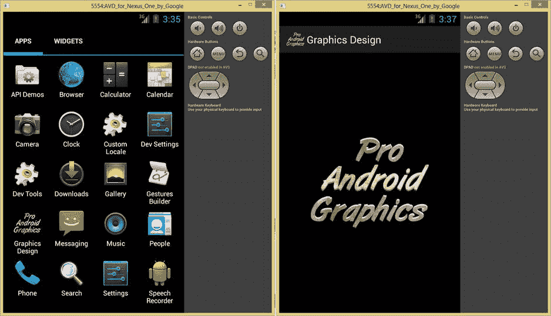

图 5-13. 在 Eclipse 的 Nexus One 模拟器中测试新的 Pro Android Graphics 启动图标和标签

如你所见，代码、缩放和间距上的细微改动，能对应用的专业外观产生显著的视觉效果！这就是为什么我把这一章放在书中新媒体章节之后，因为我需要为你提供一些图形基础，涵盖不同类型的图像、视频和动画资源及其创建与优化。


### 摘要

在第五章中，我们深入探讨了为何 Android 操作系统要求我们为基于像素的素材提供如此多不同密度版本，并为用户界面设计布局提供不同版本。这是 Android 图形设计中最繁琐的领域之一，而这一点是由全球种类繁多的 Android 硬件设备类型、型号及消费电子制造商所决定的。正是同一因素使得 Android 对开发者具有吸引力——成千上万种能运行其应用的 Android 设备——同时也使得 Android 的图形设计部分比大多数人想象的要困难一个数量级。

我们首先研究了一些 Android 设备的显示特性，例如物理分辨率、像素密度、DPI、DIP、屏幕方向、宽高比等。我们探讨了 Android 中常用的屏幕尺寸限定符常量，包括 `small`、`normal`、`large` 和 `extra large`。

接着，我们研究了 Android 中使用的屏幕密度限定符常量，包括 `low` 或 `LDPI`、`medium` 或 `MDPI`、`high` 或 `HDPI`、`extra high` 或 `XHDPI`、`extra extra high` 或 `XXHDPI`，以及自 Android 4.3 起最新的 `extra extra extra high` 或 `XXXHDPI`。

你了解到，需要尽可能多地向这些 `/res/drawable-dpi` 文件夹提供基于像素的栅格图像素材，以便在 Android 需要缩放你的数字图像素材时，为其提供尽可能多的可用图像素材。

随后，我们探讨了 Android 的 `<supports-screens>` 标签，以及它如何允许我们在 `AndroidManifest.xml` 文件中精确指定我们的应用将支持哪些屏幕密度的设备。你了解到，任何未包含在内的屏幕密度显示器都将被排除在外，无法下载和使用你的应用，因此你学会了使用此标签时必须非常小心！

接下来，我们研究了提供自定义布局的方法，以及 Android 中现在可用的各种屏幕布局配置限定符，例如 `smallestWidth` 或 `sw#dp` 限定符，以及 `width`（`w#dp`）和 `height`（`h#dp`）配置限定符。你了解了这些限定符的工作原理，它们允许你为可能使用不同布局设计的各种 Android 设备定义密度范围，从而使开发者能够精确控制应用程序 UI 设计如何适配不同的 Android 设备屏幕。

我们更深入地研究了针对设备的密度级别，以及屏幕方向和宽高比配置限定符，以便我们能够控制 UI 设计和内容素材如何适配不同的显示屏尺寸、像素密度、宽高比和屏幕方向。

然后，我们研究了 Android 的 `DisplayMetrics` 类以及如何使用它来获取用户当前设备的显示信息，从而找出特定 Android 硬件设备实际使用的显示特性。

接下来，你运用了这些新知识，优化了你的 `GraphicsDesign` 应用程序的启动图标。你针对 Android 当前支持的所有五个密度常量文件夹（至少是使用 Eclipse 中“新建 Android 应用程序”创建过程时 ADT 为其设置文件夹的那些密度常量）进行了此项操作。

在下一章中，你将学习如何使用 Android 的 `ViewGroup` 子类来设计布局。你将了解从 Android `ViewGroup` 类派生出的不同布局容器，以及如何使用它们来设计能够适配不同类型 Android 设备的用户界面布局容器。完成这些之后，你就可以准备学习 `View` 子类和用户界面小部件了！

