# 6. Android UI 布局：使用 ViewGroup 类的图形设计

### 摘要

在本第六章中，我们将更深入地探讨 Android 提供的不同类型的屏幕布局容器，以及如何使用它们来容纳我们的应用程序新媒体内容和用户界面设计。这是对第五章内容的合理延续，在第五章中我讨论了为不同屏幕尺寸、形状、方向和密度提供 UI 布局的问题。

用户界面布局是通过利用使用 Android `ViewGroup` 超类创建的多个布局子类，在应用程序的 `Activity` 子类中实现的。`ViewGroup` 设计为可被子类化，而且这一操作已经为我们完成了数十次，提供了自定义的 Android 布局容器类。本章我们将详细探讨其中的几种，因为每种都有其合理的用途和实现方式。

Android 中的屏幕布局可能有点棘手，不仅因为我们需要为不同的屏幕尺寸、形状、密度和方向设计不同的布局，还因为 Android API 中有几个布局容器类要么已被弃用，要么尚未完全实现。

这使得关于使用哪些用户界面布局容器以及如何在市场上的 Android 硬件设备上实现它们的决策，成为了开发者需要做出的最重要的前期决策。同时，这可能是你在当前的 Android 图形设计工作流程中，为你的 Android 应用程序所遇到的最困难的基础性决策之一。

一个很好的类比可以在数据库设计中找到。如果你前期错误地设计了数据库结构，然后加载了数据，但却遗漏了某些东西，你就必须回过头来从头开始。至少，你将不得不编写代码来读取设计错误的数据库结构，添加缺失的数据结构（和数据），然后写出新的数据库结构。

正如你的 `Activity` 子类为控制应用程序在屏幕上的活动提供了 Java 基础一样，你的应用程序的 XML 布局容器（`ViewGroup` 子类）则是 Activity UI 的 XML 基础。


### Android ViewGroup 超类：布局的基础

Android 提供了顶层布局类 `ViewGroup`，用于创建布局容器类。`FrameLayout`、`LinearLayout` 和 `RelativeLayout` 是三种最广泛使用的布局类，本章将涵盖这些类以及更专门的 `ViewGroup` 子类。

`ViewGroup` 类属于 `android.view` 包，因为 `ViewGroup` 类本身是另一个名为 `View` 类的超类的子类。

`View` 类是另一个不直接在应用程序中使用（构造或实例化），而是作为超类（作为主类模板）的类，它不仅用于定义屏幕布局容器（如 `ViewGroup` 及其子类），还用于定义包含在这些布局容器中的许多 Android 用户界面小部件。

在接下来的几章中，我们还将介绍 `View` 及其与小部件相关的子类，因为它们对 Android 开发非常重要。然而，在介绍 `View`（小部件）之前，您必须掌握容纳这些 UI 小部件的布局容器（布局），这正是我将在接下来的几章中深入探讨 `ViewGroups` 和专门布局的原因。

`ViewGroup` 不直接在应用程序中使用，但它的许多子类确实被广泛使用，因此接下来我们将详细介绍主要子类。

我们不会在此过多关注 `ViewGroup` 类作为主类的内容，但重要的是要知道，如果需要，您可以创建自己的自定义子类；但正如您将在本章中看到的，这项工作实际上已经为您完成了。

由于本书的目的是让您在专业 Android 图形学知识方面一飞冲天，我们将重点介绍如何实现现有的布局类（现有的 `ViewGroup` 子类），这些类是最常用的，并且被其他开发者所实现。

在介绍完这些已经为您编码好并可供开发使用的主要 `ViewGroup` 子类之后，您很可能会决定直接使用其中一种来进行 UI 布局。

在接下来的几节中，我们将介绍主要的 `ViewGroup` 布局参数和常量，以及许多 `ViewGroup` 子类中哪些已被弃用（停止使用并将在未来某个时间点移除）和处于实验阶段（未完全实现并可能在未来某个时间点移除）。如果您想进一步研究 `ViewGroup`，可以在 Android 开发者网站上找到以下 URL 的摘要页面：

[`http://developer.android.com/reference/android/view/ViewGroup.html`](http://developer.android.com/reference/android/view/ViewGroup.html)

为了尊重读者，我们将重点介绍那些稳定存在、广泛使用且当前提供布局功能的布局容器类，当优化使用时，它们能提供良好的用户体验。

### ViewGroup LayoutParams 类：布局参数

`ViewGroup` 类有两种不同类型的布局参数，它们适用于其所有子类。这些被称为基础布局参数，Android 为每种参数提供了常量。

第一种扩展 UI 布局容器，使其在某个维度（宽度或高度）上填满其上方父容器（屏幕）。我们在之前的 GraphicsDesign 应用程序开发中已经使用过参数常量 `MATCH_PARENT`。您也可以使用小写的 `match_parent`。

需要注意的是，在 Android 2.2 API 级别 8（Froyo）之前，这个常量被称为 `FILL_PARENT`；但我建议使用 `MATCH_PARENT`，因为当前大多数设备至少是 Android 2.3.3（Gingerbread）或更高版本。事实上，目前市场上只有 5% 的设备是 Android 2.2 之前的版本！

如果您想查看不同 API 级别的当前市场份额百分比，可以在 Android 仪表板网页上找到：

[`http://developer.android.com/about/dashboards/index.html`](http://developer.android.com/about/dashboards/index.html)

另一个布局参数常量的作用与 `match_parent` 参数常量完全相反，它会收缩以适配该宽度或高度维度中布局容器内部的内容。这个常量被称为 `wrap_content`，它名副其实，因为它可以包裹住您的内容。需要注意的是，由于 Android 为 X（宽度）和 Y（高度）维度都提供了这些常量，因此可以结合使用，您将在本书后面看到这一点。

例如，如果您希望 `Button` UI 元素横跨父布局容器，您可以编码 `android:layout_width="match_parent"` 参数，然后使用 `android:layout_height="wrap_content"`，这样按钮的高度将符合其（文本标签）内容，宽度则完全由 UI 布局容器的宽度定义。

正如您从上一章所知，您希望 UI 能够缩放以适应不同的显示屏，这些参数是实现这一目标的良好起点。掌握这些参数能使 UI 开发更简单、更精确、更灵活、更优雅，并最终更强大。

您也可以为 `layout_width` 或 `layout_height` 参数提供精确数值，但鉴于您在第 5 章中读到的内容以及 `AbsoluteLayout` 容器的弃用，我建议您不要使用这些“硬编码”值，除非您将应用程序交付给某个特定的“受控”硬件设备。

需要注意的是，`LayoutParams` 针对 `ViewGroup` 的不同子类还有子类。例如，已弃用的 `AbsoluteLayout` 类有自己的 `LayoutParams` 子类，其中添加了 X 和 Y 值。

如果您想进一步了解 Android 的 `LayoutParams` 类，可以在以下 Android 开发者网站 URL 中找到：

[`http://developer.android.com/reference/android/view/ViewGroup.LayoutParams.html`](http://developer.android.com/reference/android/view/ViewGroup.LayoutParams.html)

接下来，我们将快速浏览一下本书中不会详细介绍或编码的布局类。这是因为它们要么已停止使用（已弃用），要么在 API 中尚未完全实现（即处于实验阶段）。


### 已弃用的布局：AbsoluteLayout 与 SlidingDrawer

在 Android API 中仍保留着两个布局容器类，但它们已被弃用。`AbsoluteLayout` 布局容器类早在 API Level 3（即 Android 1.5 版本，代号 Cupcake）时就被弃用了。而 `SlidingDrawer` 布局容器类则是在较近的 API Level 17（即 Android 4.2 版本，代号 Jelly Bean）中被弃用的。

`AbsoluteLayout` 过去用于绝对定位，即允许你精确指定子布局标签的物理像素位置（X 和 Y 坐标）。与使用相对定位的其他类型布局相比，`AbsoluteLayout` 灵活性较差，且更难适配不同设备。

事实上，在深入学习跨设备布局和资源支持（如第 5 章所述）之后，可以清楚看到：当 Android OS API 开发者意识到需要支持大量（目前已有数百种）差异巨大的 Android 厂商及其产品时，弃用此类就成为了必然。

虽然 Google 官方并未说明为何弃用 `SlidingDrawer` 布局容器，但在论坛上有很多开发者询问其弃用原因。毕竟，这是一个非常酷的 UI 容器，它能从屏幕各个方向将 UI 以动画形式呈现出来。

依我看来，它被移除的原因可能是以下几点。首先，它会将整个屏幕区域在另一屏幕区域上做动画，这对设备的处理器来说负担很重。其次，它允许 UI 设计者随意设计 UI 的位置和功能，而 Android 正朝着跨系统及应用更加标准化的 UI 方式发展。

最后，它很可能会侵犯他人的专利；还有其他一些被弃用的类似乎也属于此类情况，而且目前主流移动操作系统厂商之间正因 UI 设计、布局方法及其功能实现方式而打多场官司。

对我们开发者来说幸运的是，有一个 `DrawerLayout` 布局容器类似乎已经取代了 `SlidingDrawer` 布局容器类。因此，本章节将专门介绍 `DrawerLayout` 容器，而将 `AbsoluteLayout` 和 `SlidingDrawer` 类的深入讲解从本书中剔除，因为这些类已不再受支持。

### Android 的实验性布局：SlidingPaneLayout

Android 中不仅有已弃用的布局容器，API 中还存在一些实验性的容器。“实验性”意味着该布局容器随时可能被移除。使用实验性类需风险自负！Android 的 `SlidingPaneLayout` 类及其布局容器就是其中之一。

由于 `SlidingPaneLayout` 非常酷，我会在本章中花一两页来介绍它，但在它成为 API 的永久组成部分之前，我不会在任何代码中使用它，也不会在后续章节中进一步详述它，这与我在本章中介绍的大多数其他布局容器的做法不同。

Android 的 `SlidingPaneLayout` 类是 `ViewGroup` 的子类，位于 Android 操作系统中的 `android.support.v4.widget` 包中。因此，如果你想导入这个类，导入语句应如下所示：

`import android.support.v4.widget.SlidingPaneLayout;`

这是 Android 操作系统中较长的导入语句之一。

`SlidingPaneLayout` 容器允许开发者创建水平多面板布局，用于用户界面的顶层设计。

左侧（主面板）通常被视为内容列表或内容浏览器，它从属于用于显示实际内容的主详情视图。

如果 `SlidingPaneLayout` 的子标签（`View`）的宽度总和大于 `SlidingPaneLayout` 的可用宽度，则它们可能会相互重叠。

当出现这种情况时，用户可以拖拽上层视图将其移开，或者如果有键盘，也可以通过键盘上的导航键向重叠视图的方向进行导航。

如果子视图的内容可以水平滚动，用户可以抓住布局容器的边缘，水平拖动内容。

由于其滑动特性，`SlidingPaneLayout` 被认为适用于创建能在不同屏幕尺寸上平滑适配的布局。这意味着，UI 在较大的显示屏上可以完全展开，而在较小的显示屏上则像手风琴一样根据需要收缩。

`SlidingPaneLayout` 布局容器应与导航抽屉区分开来（我们将在本章后续部分介绍导航抽屉）。`SlidingPaneLayout` 和 `DrawerLayout` 不应用于相同的设计场景，你很快就会明白这一点。

`SlidingPaneLayout` 容器应被理解为 UI 设计的一种方式：让通常用于大屏幕的双面板布局能够以合理的方式适配小屏幕。

`SlidingPaneLayout` 容器提供的用户界面交互应能让最终用户看到应用程序中 UI 面板之间的信息层级关系。这种面板间的内容关联性在 `DrawerLayout` 容器的设计方法中可能并不总是存在，因为 `DrawerLayout` 的导航 UI 元素会将用户带到应用程序中的不同位置或功能，与当前应用屏幕中的内容关联不那么直接。

Android 开发者网站明确指出，`SlidingPaneLayout` 容器的逻辑 UI 设计用法应包括具有逻辑使用绑定的面板配对。例如，电话号码列表及其相关的拨号或标记功能、城市/街道列表及其相关的地图功能、联系人列表及与之交互的 UI，或者最近的电子邮件列表及其显示所选邮件内容的内容面板。

如果 `SlidingPaneLayout` 容器的 UI 设计用法更适合 `DrawerLayout` 容器，则包括在应用程序内更全局的功能之间进行高级（`Activity`）功能屏幕切换。例如，在电子书应用中从目录（TOC）视图屏幕跳转到书签设置工具的视图屏幕。


### Android UI 布局容器设计

### 导航抽屉模式

应用功能区域之间的导航 UI 设计应使用导航抽屉模式（`Navigation Drawer`）。正如本章后续内容及本书后续章节所述，`DrawerLayout` 容器可以以一种炫酷的方式提供对顶级应用导航图标的访问。

### `SlidingPaneLayout` 容器

与本章稍后将要介绍的 `LinearLayout` 容器类似，`SlidingPaneLayout` 容器支持为其任何子视图使用权重布局参数 `android:layout_weight`。它利用此参数设置来确定在屏幕宽度测量完成后如何划分剩余空间。在该布局容器中，`android:layout_weight` 参数值仅适用于宽度。

当视图不重叠时，`android:layout_weight` 参数的行为与 `LinearLayout` 中相同。当窗格重叠时，可滑动窗格上的权重表示该窗格需要在其关闭状态下填充可用空间。而被覆盖窗格上的权重则表示该窗格应调整大小，以适配所有可用容器宽度，但须保留一个窄条区域，供用户抓取可滑动视图并将其拉回关闭状态。

在 Android 开发者网站将该布局列为完全实现（而非实验性）之前，你可能需要考虑使用其他布局容器，或者准备好重新编码你的 UI 设计，以防 Android 决定将该布局容器从 API 中移除。

接下来，我们将介绍最常用的布局容器之一：**相对布局（`RelativeLayout`）容器**。它允许使用单个父布局容器标签 `<RelativeLayout>` 来组装复杂的 UI 设计，该标签包含子标签 UI 组件及其相对定位参数。

### Android `RelativeLayout` 类：设计相对布局

如果在“新建 Android 应用”系列对话框中选择空白应用模板，则会使用 `RelativeLayout` 类型作为布局容器。正如本书第一部分创建空 Android 应用启动文件集时所展示的那样。

Android `RelativeLayout` 是一个 `ViewGroup` 类，它将其子视图对象（组件）渲染在相对于彼此的位置上。本书前面提到过，Android ADT IDE 会查看 UI 组件所在的父布局容器，然后弹出一个参数列表（该列表通过在任何 UI 或布局容器标签内输入 `android:` 来调用）。你还记得当你在 `RelativeLayout` 容器类型内时参数列表有多长吗？这预示着 `RelativeLayout` 参数和常量所提供的强大功能——实际上有数十个之多。

`RelativeLayout` 容器中某个给定视图对象的位置可以指定为相对于同级元素。有二十多个常量可用于指定相对位置，包括：
- `ABOVE`
- `BELOW`
- `ALIGN_LEFT`
- `ALIGN_RIGHT`
- `ALIGN_BASELINE`
- `START_OF`
- `END_OF`
- `ALIGN_PARENT_TOP`
- `ALIGN_PARENT_BOTTOM`
- `ALIGN_END`
- `CENTER_VERTICAL`
- `CENTER_HORIZONTAL`

以及另外十个常量。如需查看完整的 `RelativeLayout` 常量列表，请访问 Android 开发者网站：
[`http://developer.android.com/reference/android/widget/RelativeLayout.html`](http://developer.android.com/reference/android/widget/RelativeLayout.html)

`RelativeLayout` 容器通过为包含在 `<RelativeLayout>` 父标签内的组件标签提供大量布局参数，从而允许在一个布局容器中实现复杂的 UI 设计。因此，该 UI 布局容器在开发者中广受欢迎，用于设计复杂的 UI 界面，因为它可以减少嵌套的 `ViewGroup`（布局容器），从而保持布局容器层级结构的扁平化。减少任何类型的嵌套结构（尤其是其他布局容器结构）可以节省系统内存，从而提升应用性能并降低处理器开销。

如果你发现自己被迫使用多个嵌套的 `LinearLayout` 容器来实现 UI 设计目标，那么可以考虑用一个 `RelativeLayout` 容器替换多个 `LinearLayout` 容器。然后，利用 `RelativeLayout` 兼容的参数和常量，在单个 `RelativeLayout` 容器中实现原本需要多个（嵌套层级）UI 布局容器才能达到的相同布局效果。

由于本书将大量使用 `RelativeLayout` 容器，关于此 XML 标签（无意双关）的其余学习内容，将留待本书后续章节的手动 XML 标记和 Java 编码实践来展示。

### Android `LinearLayout` 类：设计线性布局

Android `LinearLayout` 类支持在 Java 中实例化使用 `<LinearLayout>` XML 标签样式化的布局容器。该布局容器用于定义简单的水平或垂直 UI 布局，例如 Activity 屏幕顶部的按钮行，或屏幕左侧的 UI 图像图标列。

`LinearLayout` 容器始终将其子视图排列成单列或单行。行（水平方向常量）或列（垂直方向常量）的方向可以通过在 Java 代码中调用 `.setOrientation()` 方法来设置，也可以在设置和配置 `LinearLayout` 容器的 XML 标记中设置。

如果未特别设置，默认的方向参数为水平，因为大多数线性布局横跨屏幕顶部或底部。如果需要垂直 UI 布局，请使用 `android:orientation` 参数并将其设置为 `vertical` 常量。

`LinearLayout` 标签的所有子视图将垂直堆叠（垂直方向）或水平依次排列（水平方向）。垂直 `LinearLayout` 中每行只有一个 UI 元素（子标签），无论该 UI 元素有多宽——但如果所有 UI 元素宽度一致，外观会更专业。水平 `LinearLayout` 始终只有一行高，其高度由最高 UI 元素（子标签）的高度（含内边距）决定。

`LinearLayout` 会考虑其 UI 元素（子标签）之间的任何外边距，以及任何子标签的重力对齐（居中、右对齐或左对齐）。你还可以通过 `.setGravity()` 方法指定 `LinearLayout` 的重力属性。设置布局重力将决定该布局中所有子元素的对齐方式（居中、左对齐、右对齐等）。

你还可以通过设置权重参数，指定某些子元素扩展以填充布局中的剩余空间。`LinearLayout` 的权重指示当布局容器未填满其父容器时，应如何分配额外空间（如果有的话）。如果 `LinearLayout` 是 Activity 的主要布局容器，那么父容器通常是屏幕。

设置权重时：
- 如果不希望布局容器被拉伸，请使用 `0`。
- 如果想在所有 UI 元素（子标签）之间按比例分配额外像素，请使用 `0.0` 到 `1.0` 之间的小数。

如果需要比单行或单列 UI 元素更复杂的布局，请考虑使用 `RelativeLayout` 容器，因为它的内存效率高于嵌套多个 `LinearLayout` 容器。


### Android FrameLayout 类：设计帧布局

我们已经在第 2 章中使用 Android `FrameLayout` 容器来容纳我们的数字视频资源。`FrameLayout` 是用于在其内部容纳其他结构的容器或“框架”，例如图像或视频资源。

`FrameLayout` 设计用于分配屏幕的某个区域来显示单个项目。尽管你可以将其用于自己的 UI 设计，但也要认识到，它通常也被用作 Android 中许多其他有用的 UI 布局容器子类的超类，例如 `AppWidgetHostView`、`CalendarView`、`MediaController`、`GestureOverlayView`、`HorizontalScrollView`、`ViewAnimator`、`ScrollView`、`TabHost`、`DatePicker` 和 `TimePicker`。

一般来说，`FrameLayout` 应被用来容纳单个子 `View`，因为很难组织子视图使其在不同显示尺寸之间具有可扩展性，同时又不会让子视图相互重叠。

不过，你可以向 `FrameLayout` 中添加多个 UI 元素（子标签），并通过为每个子标签分配 `gravity` 参数来控制它们在 `FrameLayout` 内的位置。这将使你的 `FrameLayout` 在运行时能够由 Android 进行缩放，可以使用 27 个 `android:layout_gravity` 常量之一，这些常量在以下 Android 开发者网站 URL 中有详细描述：

[`http://developer.android.com/reference/android/view/Gravity.html`](http://developer.android.com/reference/android/view/Gravity.html)

`FrameLayout` 的子标签（`View` 控件）会以堆栈的形式绘制，最近添加的子标签位于顶部。`FrameLayout` 的大小会扩展以适应其最大子元素的大小加上其内边距，无论该子元素是否可见，只要 `FrameLayout` 父标签支持 `visibility` 参数。

需要注意的是，那些当前不可见的子标签（`View` 控件），如果是因为使用了 Android 的 `View.GONE` 常量（而不是 `View.INVISIBLE`）而指定为不可见，那么仅当调用 `.setConsiderGoneChildrenWhenMeasuring()` 方法并传入 `true` 参数时，它们才会被用于 `FrameLayout` 容器的尺寸计算。

如你所见，`FrameLayout` 容器具有看似简单实则复杂的特性，它实际上更多地被用作创建其他更专业布局容器的超类，而不是作为主流的开发者 UI 设计容器（如 `LinearLayout` 或 `RelativeLayout`）。

它对于容纳单 UI 元素布局非常有用，例如使用 `VideoView` UI 控件实现的全屏数字视频，尤其是当视频需要由 Android 操作系统缩放以适应不同屏幕尺寸或宽高比时，能保持其纵横比。然而，这属于一个相对特殊的用例场景，所以如果有其他布局容器类更适合你的 UI 设计需求，就不要尝试使用 `FrameLayout`。

接下来，让我们看看用于网格 UI 布局的 `GridLayout` 容器。

### Android GridLayout 类：设计 UI 布局网格

Android 的 `GridLayout` 容器类正如其名：它将 UI 元素子标签放置在一个矩形网格中。这个布局类与 `LinearLayout` 容器非常相似；事实上，它有许多参数与 `LinearLayout` 的参数相同或相似。如果你在 XML 定义中将 `<LinearLayout>` 容器父标签更改为 `<GridLayout>` 容器父标签，那么两种容器类型中的子标签很可能都能按照它们原有的代码正常工作！

这个 `GridLayout` 的虚拟网格用户界面容器由一组无限细（即，占用零像素）的线条组成，这些线条将可视区域分割成离散的用户界面布局单元格。

在 Android `GridLayout` API 中，网格线通过网格索引来引用。一个具有特定列数（N）的网格将有 N+1 个网格索引，范围从 0 到 N（包括 N）。

无论你的 `GridLayout` 容器如何配置，在考虑内边距后，网格索引 0 将固定于容器的前边缘，网格索引 N 将固定于其后边缘，这与我们在其他布局容器类型中看到的情况一致。

你的 UI 元素（子标签）将占据一个或多个这样的 `GridLayout` 单元格，占据的数量将由 Android 的 `rowSpec`（行说明符）和 `columnSpec`（列说明符）网格布局参数决定。

每个说明符参数定义了要占据的行或列集合，以及子元素在生成的单元格组中应该如何对齐。

`GridLayout` 容器中的单元格不会相互重叠；然而，`GridLayout` 容器也不阻止子标签元素被定义为占据同一个单元格，或跨越一组单元格。因此，单元格不必是正方形（1:1 宽高比）；它们可以是竖屏或横屏形状。

在占据同一单元格或跨越单元格的场景中，网格布局操作完成后，无法保证子标签不会相互重叠，所以请务必充分测试你富有创意的 `GridLayout` 容器！

如果 `GridLayout` 容器的子标签没有为它想要占据的某个单元格设置行或列索引，那么 `GridLayout` 类将自动分配一个单元格位置。这是按照类中指定的逻辑填充顺序进行的，该顺序遵循 `GridLayout` 的 `orientation`、`rowCount` 和 `columnCount` 参数设置。

你还可以通过指定 `leftMargin`、`topMargin`、`bottomMargin`、`rightMargin` 或 `Margin`（该参数将值同时添加到四个边距）布局参数来设置子标签元素之间的自定义间距。或者，你可以使用 Android 的 `Space` 类在 `GridLayout` 的某些单元格内创建空白空间。

Android `Space` 类是一个轻量级的 `View` 子类，可用于在 `GridLayout` 等布局容器中的用户界面元素之间创建空白空间。有关 `Space` 类的更多信息，请访问以下 URL：

[`http://developer.android.com/reference/android/widget/Space.html`](http://developer.android.com/reference/android/widget/Space.html)

当 `GridLayout` 父标签的 `useDefaultMargins` 参数被设置后，会为每个子标签应用一个预定义的边距。这个边距空间由 Android 操作系统根据 Android UI 风格指南自动计算。

Android 定义的每个全局自动边距都可以在本地 UI 元素层面通过赋值上述边距参数来覆盖。

需要注意的是，这些默认值通常会在子用户界面元素之间产生可接受的间距效果，但自动（风格指南）值也可能在 Android 平台的不同版本之间发生变化，因此最好多添加一些 XML 标记（参数），由你自己来控制 UI 的间距。

```markdown

`GridLayout`容器对额外空间的分配基于优先级而非权重，因为与`LinearLayout`不同，该容器没有权重参数选项。实际上，这是`LinearLayout`与`GridLayout`用户界面容器之间的主要区别之一。

`GridLayout`类将使用子 UI 元素的`android:gravity`参数（该参数设置其行和列分组的对齐属性）来确定其跨单元格的能力。如果沿某个 X 轴或 Y 轴定义了对齐，则该单元格中的 UI 元素在该方向被标记为灵活的。如果未使用`android:gravity`参数设置对齐，则该 UI 元素被视为固定在网格中，因此是不灵活的。

要确保行或列能够调整大小，请确保在其中定义的每个 UI 元素（通过子标签）都定义了`android:gravity`参数。要防止行或列调整大小，需要确保该行或列中的至少一个用户界面元素没有定义（设置）`android:gravity`参数。

如果同一行或列（分组）中有多个 UI 元素，它们将被视作并行处理。只有当分组内的所有组件都灵活且使用`android:gravity`参数定义时，该分组才被认为是灵活的。

你可能此时会想：难道不应该是`android:layout_gravity`吗？实际上有两个布局重力参数：`android:layout_gravity`和`android:gravity`！这够让人困惑吧！当你在 UI 元素（`View`对象）内部设置布局重力时，应使用`android:gravity`作为参数选择；而在指定布局容器对象或`ViewGroup`对象外部的重力时，则使用`android:layout_gravity`。

为了换一种方式思考，并确保你完全理解：`android:gravity`参数指定了 UI 元素（`View`）内容在子标签 UI 元素（`View`对象）内部的对齐方向。

相反，`android:layout_gravity`应用于指定该`View`的外部重力。这意味着指定该`View`应与其父标签（`ViewGroup`对象）容器边框接触的方向。

位于`GridLayout`边界或内部边框任一侧的行和列分组将被视为串行而非并行。

遵循`GridLayout`的“灵活性原则”，由这两个元素组成的分组如果其中一个组件元素是灵活的，则该分组就是灵活的。当此灵活性原则未能完全消除用户界面的歧义时，`GridLayout`类算法将优先选择靠近布局容器右侧和底部的行和列。这是合理的，因为正如我们所知，Android 中的图形和布局从屏幕坐标 (0, 0)（即左上角）开始。

正如我之前提到的，与`LinearLayout`不同，`GridLayout`容器目前不支持名为`weight`的参数。因此，通常无法配置`GridLayout`容器来在多个组件之间分配额外空间。如果你需要此功能，请使用`LinearLayout`容器。

通过简单地使用`android:gravity`参数并设置`CENTER`常量值，你可以满足`GridLayout`的许多自动调整大小需求。这将在单元格或单元格分组中的子 UI 元素周围添加等量的间距。

如果你想实现更复杂的效果，可以通过使用`LinearLayout`容器作为子 UI 元素来包含相关单元格或单元格分组中的 UI 组件，从而完全控制行或列中额外空间的分配。这很可能会消耗更多内存，因此在实现之前请确保确实有必要。

另外值得注意的是，在配置`GridLayout`容器内的子标签（UI 元素）时，你不需要使用`WRAP_CONTENT`或`MATCH_PARENT`这两个 Android 尺寸值常量。然而，`GridLayout`父标签通常会为宽度和高度布局参数使用`MATCH_PARENT`常量，以便填充整个 Activity 屏幕。

你甚至可以在不指定 UI 元素放置到哪些单元格的情况下使用`GridLayout`，让`GridLayout`类算法为你完成此操作。声明`GridLayout`的安全方式是让每个 UI 元素（控件）的布局参数指定行和列的索引，这些索引共同精确地定义了 UI 元素的放置位置。当其中一个或两个值未指定时，`GridLayout`类将为你计算网格单元格位置值（而不是抛出错误或异常）。

如果你没有指定行或列索引（值或整数），子 UI 元素将被添加到`GridLayout`中。为此，`GridLayout`会维护一个游标位置（类似于读取 SQLite 数据库），并利用它来将控件放置到尚未有内容的单元格中。它将基于`GridLayout`的方向参数设置进行计算，因为与`LinearLayout`类似，`GridLayout`可以是水平（横向）或垂直（纵向）。

实际上，为了适配不同的设备方向（我们在第 5 章中探讨过），你可能需要分别为这些特定的`GridLayout`方向设计一种：一种适配 iTV 和平板电脑（水平横向方向），另一种适配智能手机和电子阅读器（垂直纵向方向）。

当你的`GridLayout`方向属性设置为水平，并且你指定了定义布局列数的`android:columnCount`参数时，会自动布局维护一个游标位置，并为每一列存储一个单独的高度索引。如果你提供了自己的索引，则永远不会用到这个游标，这也是我所推荐的。

否则，当需要为你自动生成 UI 元素索引时，`GridLayout`类会首先通过查找 UI 元素的`android:layout_rowSpan`和`android:layout_columnSpan`参数来确定单元格分组的大小，然后从游标位置开始，从左到右、从上到下遍历所有可用的单元格位置，以找到第一个可用的行和列索引。

当你的`GridLayout`方向参数设置为垂直时，所有相同的原理都适用，只是水平和垂直轴互换，因此填充顺序变为从上到下、从左到右，并且游标存储的是宽度位置（从左至右）而非从上到下的高度位置。

所以，水平方向的填充方式如同西方人阅读书籍，而垂直方向的填充方式则如同阅读带有象形文字的古代卷轴。

如果你希望将多个用户界面元素放置到完全相同的单元格中，则必须显式定义它们的索引。这是因为上述自动子元素分配过程被设计为将用户界面元素控件放置在不同的单元格中。

你可能会想：使用`TableLayout`不是比`GridLayout`更高效吗？实际上，`GridLayout`比`TableLayout`更节省内存，并且不需要`TableRows`功能，所以我建议你熟悉`GridLayout`，因为它是 Android 中最灵活、最高效的用户界面布局容器之一。奇怪的是，它常常被大多数开发者忽视。但你不会；你将通过本章掌握它！只要在将相对关系定义为行和列时稍加创意，`RelativeLayout`也可以被编写成`GridLayout`。

```


如前所述，基本的 `FrameLayout` 配置可以嵌套并容纳在 `GridLayout` 的单元格中，因为单个单元格可以包含多个 `View` 或 `ViewGroup` 对象。

要在两个 `View` 或 `ViewGroup` 对象之间切换，你需要将它们都放入同一个单元格，然后通过使用常量 `GONE` 的可见性参数来利用每个对象，从而在 Java 代码中从一个 `ViewGroup` 切换到另一个 `ViewGroup`（或 `View`）。

如你所见，只要稍加创意，像 `GridLayout` 容器这样看似基础的组件，由于 Android 操作系统支持的嵌套以及众多参数和常量，也可以变得更加强大。

接下来，我们将看看另一个强大的布局容器，它是在 Android 4 中新增的，即 `DrawerLayout`。事实上，`DrawerLayout` 可以包含一个 `GridLayout`，用于实现复杂的 UI 抽屉效果，只要设置正确，这种方式仍然可以节省内存。

### `DrawerLayout` 类：设计 UI 抽屉布局

`DrawerLayout` 类也是 `ViewGroup` 的子类，它存储在 `android.support.v4.widget` 包中，这表明它是 Android 4.0 及更高版本中全新的布局容器。此类的完整导入语句引用为 `android.support.v4.widget.DrawerLayout`。

`DrawerLayout` 容器被设计为顶层布局容器，用于承载你希望包含在交互式“滑动抽屉”用户界面布局容器中的用户界面内容。

用户可以通过显示屏两侧的把手，将此类 UI 容器从屏幕左侧或右侧“拉出”。UI 抽屉的位置及其布局，通过子视图中的 `android:layout_gravity` 属性来控制。这些属性应与你希望 UI 抽屉被拖出的屏幕侧边相对应，因此请使用 `android:layout_gravity="LEFT"` 或 `android:layout_gravity="RIGHT"`。请务必不要指定 `CENTER` 常量或任何其他重力常量。

要使用 `DrawerLayout`，请将你的主内容布局容器 `View`（`ViewGroup`）作为 `DrawerLayout` 标签的第一个子元素，并使用设置为 `match_parent` 的 `layout_width` 和 `layout_height` 参数。

接下来，在这个主内容布局容器之后，立即将你的 UI 抽屉作为子标签（`View` 或 `ViewGroup`）添加，并将 `layout_gravity` 参数设置为 `LEFT` 或 `RIGHT` 的 `layout_gravity` 常量。

务必**不要**使用 `TOP` 或 `BOTTOM`（或任何其他常量）的 `layout_gravity` 设置，因为此类仅支持水平抽屉，不支持垂直抽屉，使用其他常量很可能会抛出异常。

要创建一个覆盖屏幕整个侧边的单一 UI 抽屉，你的 UI 抽屉内容标签应使用 `match_parent` 常量作为 `android:layout_height` 参数，以设置屏幕的完整高度。

对于 `android:layout_width` 参数，接下来你需要使用想要用于 UI 抽屉宽度的固定宽度，并使用 DIP 值指定。

`DrawerLayout.DrawerListener` Java 接口可用于监控 UI 抽屉实现的状态和运动，以便当抽屉打开、关闭或被拖动时，你的 Java 代码可以执行相应操作。

Android 的 `DrawerListener` 有四个方法，你可以在其中放置自定义 Java 代码，以控制抽屉 UI 在这些状态下的行为。所有这些方法都被声明为抽象且无返回值，包括 `onDrawerClosed()` 和 `onDrawerOpened()`，以及当用户拖动把手时调用的 `onDrawerSlide()`，还有当抽屉从关闭变为打开或反之亦然时发出信号的 `onDrawerStateChanged()`。

在 `DrawerListener` 方法中应避免使用开销大的处理函数（例如在抽屉内使用动画），因为这可能会导致 UI 抽屉被拖出时性能表现不佳。

如果出于某种原因，你必须在 UI 抽屉中实现处理器密集型操作，请确保在 `DrawerLayout` 的 `STATE_IDLE` 状态下调用此代码。`DrawerLayout` 的其他状态常量包括 `STATE_DRAGGING`、`STATE_SETTLING`，以及与锁定相关的 `LOCK_MODE_UNLOCKED`、`LOCK_MODE_LOCKED_OPEN` 和 `LOCK_MODE_LOCKED_CLOSED`。

还有 `DrawerLayout.SimpleDrawerListener`，它为每个 `DrawerListener` 回调方法提供了默认（无特殊选项）实现。如果你只是访问 UI `DrawerLayout` 类的核心功能，请使用这个类，因为它提供了更简单、更节省内存的代码。

为了与 Android 操作系统的设计原则保持一致，位于屏幕左侧的 UI 抽屉应包含用于应用程序（全局）导航的 UI 元素。相反，包含调用与当前屏幕内容相关的操作或功能的 UI 元素的 UI 抽屉应位于屏幕右侧。

遵循这些 Android 导航规则，通过使用与 Android 操作栏及其他 Android 操作系统 UI 设计中当前使用的完全相同的“左侧导航，右侧操作”的 UI 结构，可以将用户的困惑降至最低。

导航抽屉用户界面设计是一个如此深入的主题，本书后面有一整章来讨论它，前提是你已经掌握了一些更基础的用户界面布局原则。然而，如果你现在就想仔细了解一下，可以在以下 Android 开发者网站 URL 找到更深入的信息：

[`http://developer.android.com/reference/android/support/v4/widget/DrawerLayout.html`](http://developer.android.com/reference/android/support/v4/widget/DrawerLayout.html)


### 添加菜单项以访问 UI 布局容器

要真正开发一个新的用户界面布局，你需要编写一个具有功能屏幕的新 Activity，而不是为你的应用使用启动屏幕。在编写新的 Android Activity 之前，你需要能从你的 `MainActivity.java` 启动屏幕 Activity 中访问它。这可以通过选项菜单来实现。当你创建一个新的 Android 应用（空白 Activity 选项）时，该菜单已添加到你的应用中，因此你只需修改现有的菜单 XML 标记和 Java 代码即可。

要为你的应用添加几个新功能，你所需要做的就是在 `/res/menu` 文件夹的 XML 文件中添加一些菜单项，并且 `MainActivity` 中已有的 `MenuInflater` 类代码会为你加载这些值，并使用这些参数值配置你的选项菜单对象。

如果你想进一步研究 Android 的 `MenuInflater` 类，Android 开发者网站上有一个页面介绍了它，网址如下：

[`http://developer.android.com/reference/android/view/MenuInflater.html`](http://developer.android.com/reference/android/view/MenuInflater.html)

让我们通过打开 `/res/menu` 文件夹（如图 6-1 所示），右键单击文件夹中的 `main.xml` 文件，并选择“打开”命令或按下 F3 功能键，来打开在“新建 Android 应用程序”系列对话框为你创建的菜单 XML 定义。

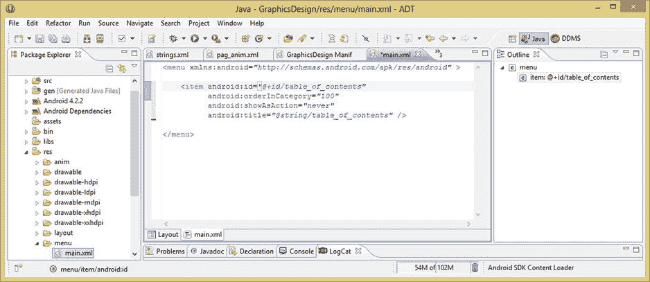

图 6-1.

编辑你的第一个 `<menu>` 标签 `<item>` 标签，使其成为一个目录选项菜单选择项

编辑 `android:id` 参数，将其重命名为其新功能对应的名称 `table_of_contents`，并同样使用 `@string/` 引用前缀编辑 `android:title` 参数以匹配，这会告诉 Android 在 `/res/values/strings.xml` 文件中查找 `<string>` 常量定义。

一旦创建好这第一个 `<menu>` 父标签的 `<item>` 子标签，你就可以通过复制整个 `<item>` 标签结构并粘贴到其下方来创建第二个菜单项，如图 6-2 所示。

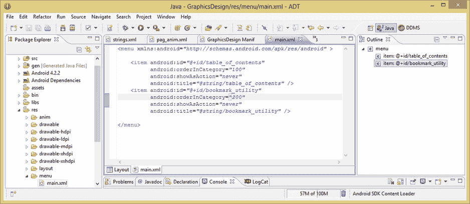

图 6-2.

复制并编辑第一个 `<menu>` 父容器 `<item>` 标签以创建第二个书签菜单项

我们现在就这样做，并将第二个 `<item>` 标签的 `table_of_contents` ID 和菜单标题（标签）引用更改为 `bookmark_utility`，这样你的专业安卓图形电子书应用也就具备了书签功能。你还需要对 `android:orderInCategory` 参数进行另一处更改，以便书签工具菜单选项位于目录菜单选项之后。将此参数的值设置为 `200`，如图 6-2 所示。

现在你所要做的就是编辑 `/res/values` 文件夹中的 `strings.xml` 文件，将现有的菜单选项字符串常量更改为“目录”，然后复制并粘贴到其下方，更改其值以支持你的书签工具菜单选项，如图 6-3 所示。

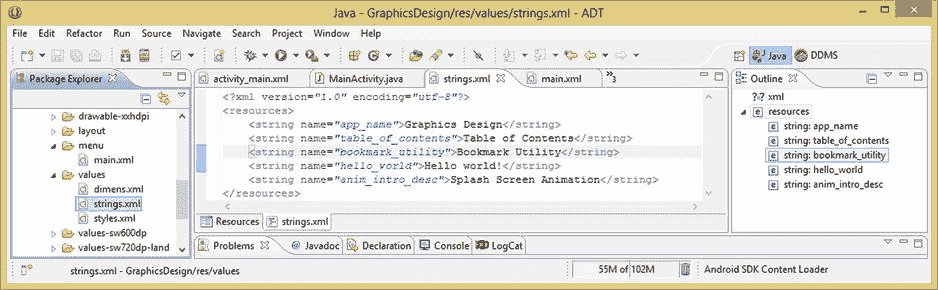

图 6-3.

为“目录”和“书签工具”菜单项在 `strings.xml` 文件中添加 `<string>` 常量

现在，让我们在 Eclipse 中点击 `MainActivity.java` 编辑选项卡，快速查看一下将解析你的 `main.xml` 文件中的新选项菜单项 XML 并将其加载到一个名为 `menu` 的 Java `Menu` 对象中的代码。

这段 Java 代码如图 6-4 所示，它使用了 `.inflate()` 方法，你需要将你在 `main.xml` 文件中创建的 XML `<menu>` 父标签结构定义传递给该方法。

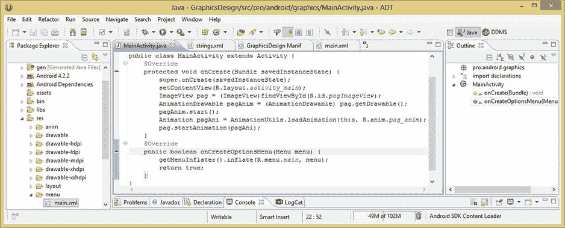

图 6-4.

在 `MainActivity` 中查看 `onCreateOptionsMenu()` 方法和 `getMenuInflater().inflate()` 方法

你将通过使用引用路径 `R.menu.main` 将你的菜单 XML 定义传递给 `.inflate()` 方法，该路径分解为 `R`（资源文件夹）、`.menu`（菜单子文件夹）、`.main`（`main.xml` 文件）。

这是在 `getMenuInflater()` 方法上调用的，使用点符号将这两个方法链接在一起，如下方代码行所示：

`getMenuInflater().inflate(R.menu.main, menu);`

在 `MenuInflater` 类使用你在 XML 中创建的定义填充了 `Menu` 对象之后，程序会处理 `return true;` 语句，从 `onCreateOptionsMenu()` 方法返回一个布尔值 `true` 标志，以告知 Android 操作系统选项菜单对象已成功加载。

接下来，让我们在 Eclipse 的 Nexus One 模拟器中查看菜单更改的结果，以确保一切正常。右键单击项目文件夹，使用 **Run As ➤ Android Application** 菜单序列启动模拟器，然后使用 Nexus One 模拟器右上角的 MENU 按钮。该按钮是模拟器顶部起的第二行按钮中的第二个。

点击此按钮后，你应该会看到在启动屏幕底部弹出一个选项菜单，上面有你创建的两个项目（见图 6-5）。

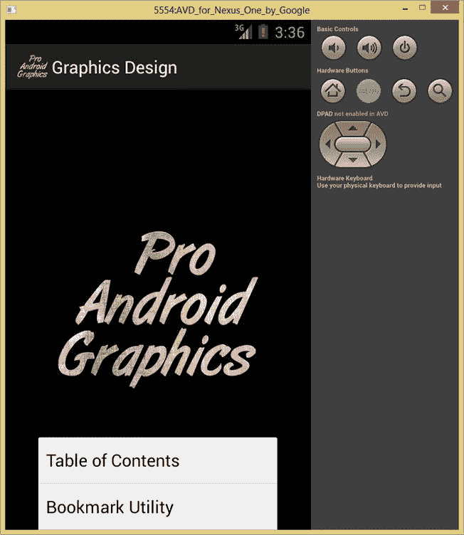

图 6-5.

在 Nexus One 模拟器中测试你的新选项菜单

既然你已经利用应用中已有的 Java 和 XML 代码加载了选项菜单，你需要在 `MainActivity.java` Java 代码中创建一个新方法，该方法将在用户选择这些选项菜单项时调用新的 Activity 屏幕。

不过，首先你需要有第二个 Activity 来在该代码中调用，因此让我们创建应用的第二个 Activity 类，用于存放专业安卓图形电子书应用的目录屏幕设计。


### 为你的 UI 设计创建目录 Activity

让我们在 Eclipse 中创建一个新的 Java 类。操作方法是：右键点击“包资源管理器”窗格顶部的 `GraphicsDesign` 项目文件夹，如图 6-6 所示，然后选择 `New ➤ Class` 菜单命令序列。

这将打开 `New Java Class` 对话框，你可以在此指定要创建的新 `Activity` 子类的特性。

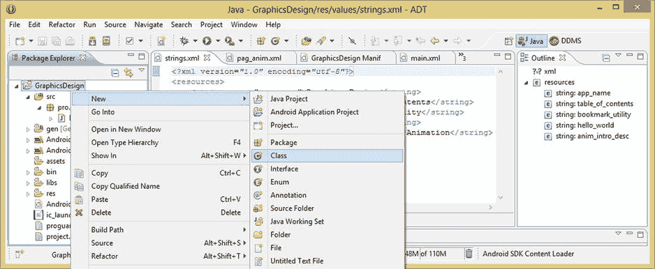

图 6-6. 右键点击 `GraphicDesign` 项目文件夹并选择 `New ➤ Class` 菜单项以创建新的 `Activity`

确保源文件夹设置为 `GraphicsDesign/src`，包设置为你的 `pro.android.graphics` 包名。将名称字段设置为 `ContentsActivity`，这会为你的文件创建名称 `ContentsActivity.java`，然后点击超类字段旁边的浏览按钮，并在“选择类型”字段中输入字母“a”以缩小搜索范围（见图 6-7）。

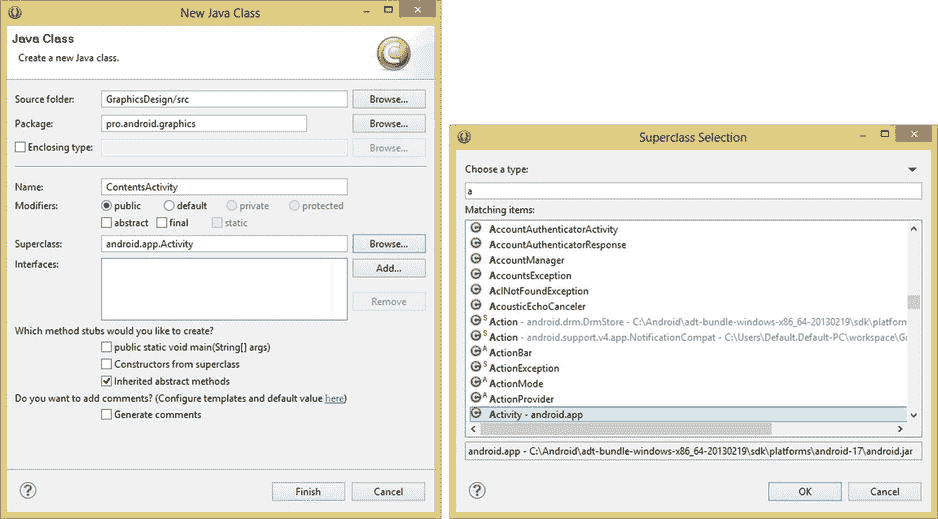

图 6-7. 使用 `android.app.Activity` 超类创建一个名为 `ContentsActivity` 的新 Java Activity 类

向下滚动直到看到 `Activity` 类，点击它将其选为超类值，然后在“超类选择”子对话框中点击“确定”按钮，返回“New Java Class”主对话框。接着点击“完成”按钮，在 Eclipse 中创建新的 Java Activity。完成后，你将在 Eclipse 中央编辑窗格的选项卡中看到新的 `ContentsActivity.java` 类被打开，如图 6-8 所示。请注意，你的包声明、导入语句和 `public class ContentsActivity extends Activity` 声明都已就位，可以添加 Java 代码了，接下来你将进行此操作。

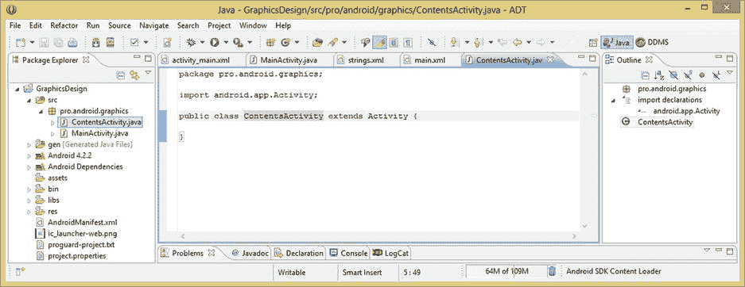

图 6-8. 位于 `pro.android.graphics` 包中的新 `public class ContentsActivity extends Activity` 超类

要创建你的 `Activity`，首先需要通过在 `protected void onCreate(Bundle saveInstanceState)` 方法内使用 `super.onCreate(saveInstanceState);` 这一行代码来调用超类 `Activity` 的 `onCreate()` 方法。

你在 `MainActivity.java` 类中也做了同样的事情。事实上，如果你想从 Eclipse 中的 `MainActivity.java` 编辑选项卡复制类似代码，可以节省打字时间！

`onCreate()` 方法中的下一行代码将使用 `setContentView()` 方法，并传入你即将创建的布局 XML 文件的引用路径，为你在第一行代码中创建的 `Activity` 提供一个屏幕布局（用户界面）。

既然你知道这个文件将位于 `/res/layout` 文件夹中，并且将命名为 `activity_contents.xml`，那么你现在可以使用 `R.layout.activity_contents` 插入引用路径，因此你的方法调用看起来像下面这行代码：

`setContentView(R.layout.activity_contents);`

这就是设置新 `Activity` 所需做的全部工作：创建它，然后将其 `ContentView` 设置为你的 XML 屏幕布局定义。你可能会在图 6-9 中注意到，Eclipse 对 XML 文件引用标记了一个错误！

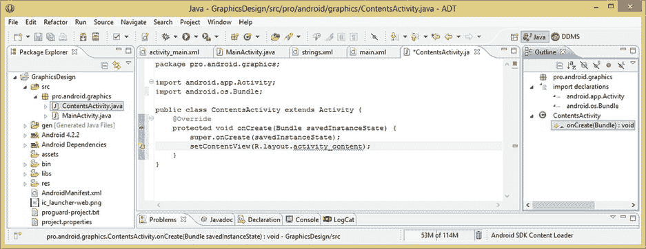

图 6-9. 创建你的 `onCreate()` 方法，调用 `super.onCreate()` 超类方法和 `setContentView()`

这是因为你尚未创建此文件。由于你接下来将创建它，所以暂时可以忽略那条波浪形的红色错误下划线标记。

### 创建 XML 格式的目录 LinearLayout UI 设计

接下来，你需要创建一个新的 XML 布局定义，因此再次右键点击你的顶级项目文件夹，这次选择 `New ➤ Android XML File` 菜单序列，如图 6-10 所示。

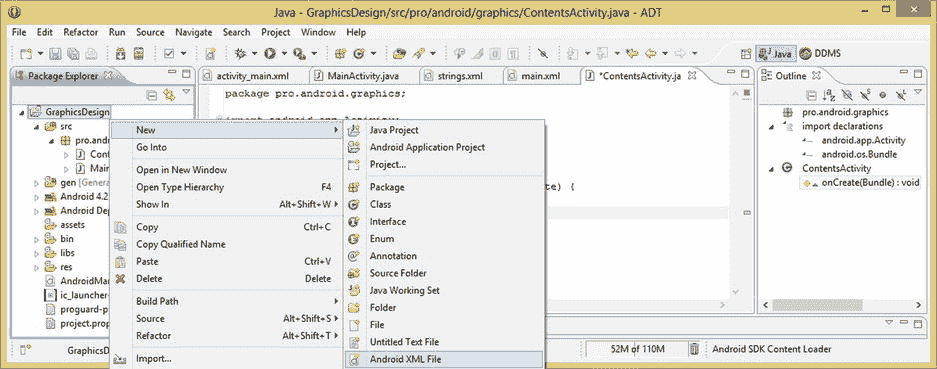

图 6-10. 右键点击 `GraphicDesign` 项目文件夹并通过菜单序列创建 `New ➤ Android XML File`

这将打开 `New Android XML File` 对话框，如图 6-11 所示，你可以在此指定希望 Eclipse 创建的 XML 文件类型。

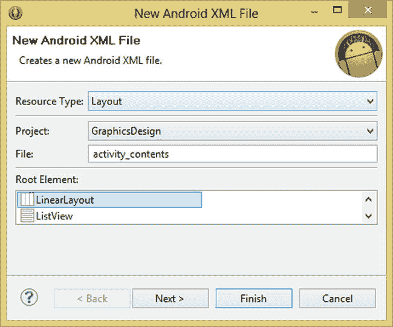

图 6-11. 创建一个名为 `activity_contents` 的新布局 XML 文件

选择“布局资源类型”和“GraphicsDesign 项目”，然后将文件命名为 `activity_contents`，选择根元素为 `LinearLayout`，并点击“完成”按钮创建 `activity_contents.xml` 文件，该文件如图 6-12 所示，显示在 Eclipse 内部的图形布局编辑器（我称之为 GLE）窗格中。GLE 可以通过 Eclipse 左下角的选项卡访问。由于你想要查看本章讨论的 XML 标签和参数，请点击另一个底部选项卡，将编辑视图切换到 XML 编辑模式，这样你就可以直接处理 XML 标记，而不是使用 GLE 的拖放式可视化编辑模式。

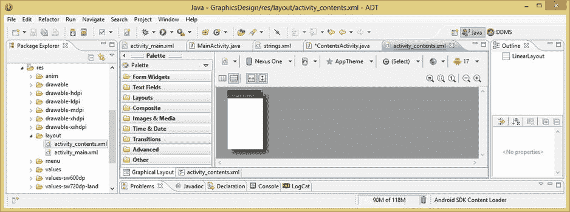

图 6-12. 新创建的 `activity_contents.xml` 文件显示在 Eclipse 中央编辑窗格的图形布局中

一旦你点击 `activity_contents.xml` XML 编辑选项卡（位于 Eclipse 中 `activity_contents.xml` 顶部选项卡编辑窗格的底部，是不是有点晕了？），你将看到 `<LinearLayout>` 父标签以及“新 XML 文件”对话框为你创建的参数，如图 6-13 所示。

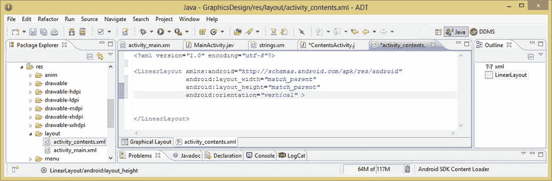

图 6-13. 切换到 XML 标记编辑模式并查看你的 `LinearLayout` 容器参数

如你所见，必需的 `xmlns:android`、`android:layout_width` 以及 `android:layout_height` 参数都已自动包含，并设置为正确的默认值，因此我们保持它们不变。

唯一要更改的 `LinearLayout` 父标签参数是 `android:orientation` 参数，我们将为父标签将其设置为水平。使用水平方向作为父标签容器的方向，是因为我们将要嵌套两个垂直的 `LinearLayout`，并使它们并排放置，因此顶层方向将是水平，因为两个垂直子布局是彼此相邻的。接下来，将光标放在开头的 `<LinearLayout>` 标签的 `>`（闭合尖括号）之后，然后按回车键自动缩进下一行代码。最后，输入一个 `<`（开放尖括号）以打开子标签帮助对话框，如图 6-14 所示。

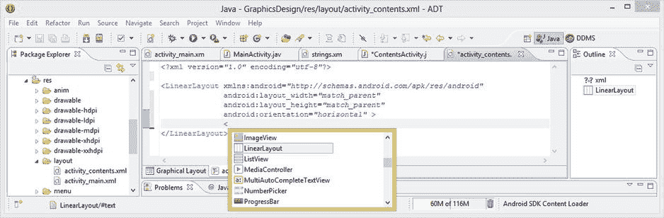

图 6-14. 将父 `<LinearLayout>` 容器设置为水平方向并调用帮助对话框

在帮助对话框中找到 `LinearLayout` 标签，双击它以在当前容器下方添加一个嵌套的 `LinearLayout` 容器。嵌套的 `LinearLayout` 标签如图 6-15 所示，接下来你需要添加相应的参数，使其垂直布局，并能适配各种不同类型的 Android 设备、屏幕尺寸和形状。

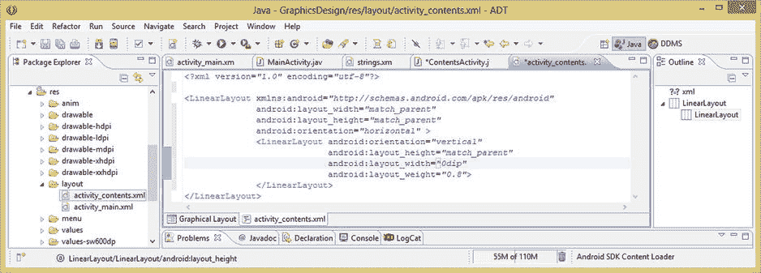

图 6-15.


添加一个子`<LinearLayout>`容器，并将其设置为垂直方向、`0dip`和 80%权重。

从父标签中复制`android:orientation`参数，然后粘贴到子标签中，并将其值改为`vertical`常量。

接下来，从父标签中复制`android:layout_height="match_parent"`，然后在子标签中也使用它，因为你希望嵌套的子`LinearLayout`的高度适应屏幕的完整高度。

由于你想使用`android:layout_weight="0.8"`参数将这个嵌套的垂直布局设置为占用屏幕宽度的 80%，你需要添加一个`android:layout_width="0dip"`参数。使用`0dip`设置是一个鲜为人知的技巧，它会告诉 Android 关闭布局的设备独立像素尺寸计算，几乎就像`0dip`对 Android 意味着“无 dip”。这将告诉 Android 操作系统根据当前设备屏幕尺寸以及`android:layout_weight`设置来计算屏幕尺寸。

接下来，你需要为屏幕右侧添加另一个嵌套的`LinearLayout`。最快的方法是简单地复制刚刚创建的`<LinearLayout>`标签，然后粘贴到其下方，如图 6-16 所示。将第二个嵌套布局中的`android:layout_weight`参数修改为使用显示屏的剩余部分。

这可以通过设置`android:layout_weight="0.2"`来表示屏幕的 20%来实现。你也可以在权重参数中使用整数，Android 会将它们相加得到总数，然后通过除法获得要使用的屏幕权重比例。因此，如果你想用 8 和 2，或者 80 和 20，而不是 0.8 和 0.2 来指定这些比例，那也是可行的。事实上，使用 4 和 1 也可以，因为 4/5 等于 0.8，1/5 等于 0.2。

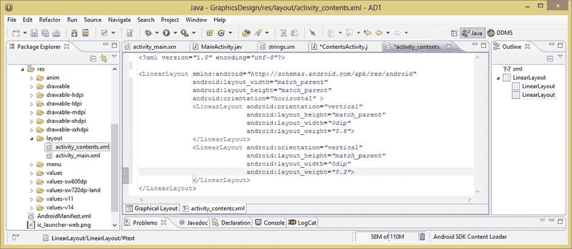

**图 6-16.** 使用复制粘贴的方式添加第二个子`<LinearLayout>`容器，并设置 20%权重

现在，你拥有了一个空的嵌套布局容器结构，由一个水平的`LinearLayout`包含两个垂直的`LinearLayout`组成。Android 不喜欢空的布局容器，因此在某个时候，Eclipse 会在你的`LinearLayout`标签下放置波浪形的黄色警告下划线，以提醒你需要在这些容器内放置子标签（控件），否则就是在浪费宝贵的系统内存。

接下来，让我们向这些布局容器中添加几个`TextView`用户界面控件，以便向你展示如何使用你创建的两个嵌套`LinearLayout`结构来创建一个简单的目录。

### 向 TOC UI 布局容器添加文本 UI 控件

现在，你需要将`TextView` UI 元素（在 Android 中称为 TextView 控件）添加到嵌套布局容器结构内部。你可能已经注意到（如果这些警告尚未显示，请使用`CTRL-S`快捷键保存你的`activity_contents` XML 文件），你空的布局容器正在 Eclipse 中抛出警告（未使用的布局容器警告）。为了解决这个问题，让我们添加一些基础的文本 UI 元素来创建一个目录屏幕，左侧为章节标题，右侧为页码。`layout_weight`参数将允许你轻松地微调这两个数据列之间的精确间距。

你需要做的第一件事是创建将用于标记`TextView` UI 对象的`<string>`标签 XML 文本常量。因此，点击 Eclipse 中的`strings.xml`标签，并在文件底部添加八个`<string>`标签。最简单的方法是复制最后一个`<string>`标签八次，然后编辑`name`参数和数据值。

添加完这八个`<string>`标签并将其`name`参数分别改为`chap_one`到`chap_four`以及`page_one`到`page_four`之后，你可以为它们添加数据值，这些值代表一本《Pro Android Graphics》书的前四章，如图 6-17 所示。同时添加一些模拟的页码范围，以便 UI 元素中有数据可以预览 UI 设计。这样，你就可以准备添加`<TextView>`标签了。

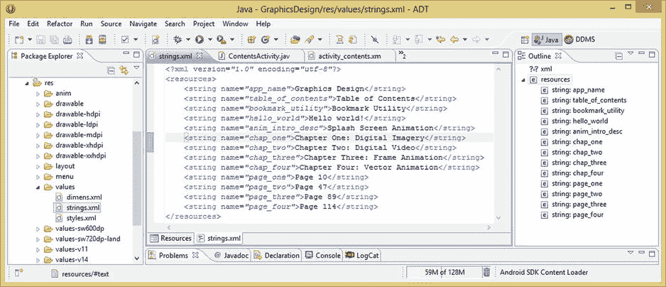

**图 6-17.** 为四个章节标题和四个页码`TextView` UI 元素添加`<string>`标签（常量）

让我们添加第一个`<TextView>`用户界面元素标签，它将作为第一个嵌套`<LinearLayout>`标签内的子标签。完成此标签的编码后，你可以再复制三次，只需编辑复制出的子标签的参数即可，从而节省应用开发时间。

你知道必须使用`android:layout_width`和`android:layout_height`参数，因此我们先添加这些参数，并将其常量值设置为`wrap_content`，因为你希望这个 UI 元素容器能够适应其内部包含的文本数据内容。

接下来，你需要添加一个`android:text`参数来引用之前在`strings.xml`文件中添加的`<string>`标签常量。这可以通过在`<string>`标签的`name`参数前加上`@string/`路径前缀来实现。因此，你的第一个`<TextView>`标签 UI 容器 XML 标记看起来像这样（如图 6-18 所示）：

```
<TextView android:layout:width="wrap_content"
android:layout_height="wrap_content"
android:text="@string/chap_one" />
```

现在，你可以将这个 UI 容器标签结构复制粘贴三次到其下方，并将`android:text`参数值改为引用`chap_two`、`chap_three`和`chap_four`的`<string>`标签名称。完成此操作后，你会注意到其中一个错误警告消失了！

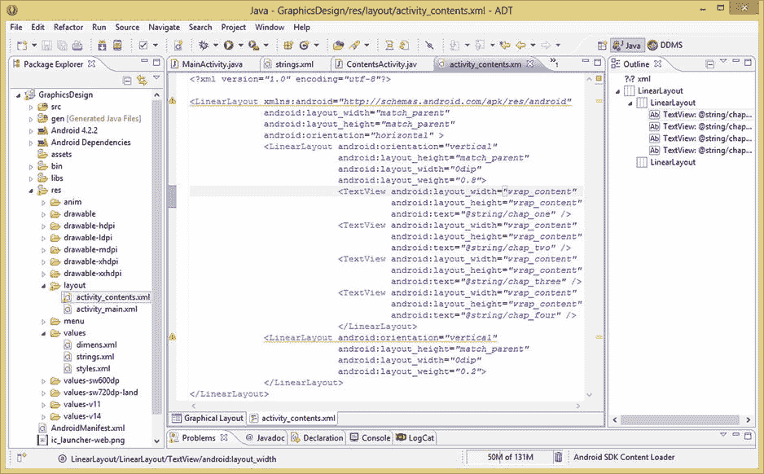

**图 6-18.** 向第一个嵌套的`LinearLayout`容器添加`TextView`标签，并显示 Eclipse 警告图标和波浪形黄色警告下划线

现在，Eclipse 中只剩下两个警告标志需要处理，如图 6-18 所示。将鼠标悬停在第一个警告上，你会得到 Eclipse ADT 的建议，让你在父标签布局容器中使用`android:baselineAligned="false"`参数。现在让我们添加它，就在顶层父`LinearLayout`容器标签中，如图 6-19 所示。


如果您在嵌套的 UI 容器中使用了 `android:layout_weight` 参数，就会出现此特定警告。这是因为当涉及权重时，`LinearLayout` 被设置为在内部计算子容器的基线对齐。由于您的子容器的 `layout_height` 常量设置为 `match_parent`，它们的基线无论如何都会对齐，因此该警告建议您关闭此功能，以便 Android 操作系统不会花费处理时间来执行此不必要或冗余的操作。

现在，您可以将另外四个 `TextView` UI 容器添加到第二个嵌套的 `LinearLayout` 容器中，这将消除最后的警告高亮，并允许您测试基本 UI 布局，查看是否需要添加其他参数（例如 `layout_margin` 参数）来微调它。

最简单的方法是复制第一个嵌套 `LinearLayout` 中的四个 `TextView` 标签，将它们粘贴到第二个嵌套 UI 容器中，然后将 `android:text` 参数引用值从 `chap` 更改为 `page`。

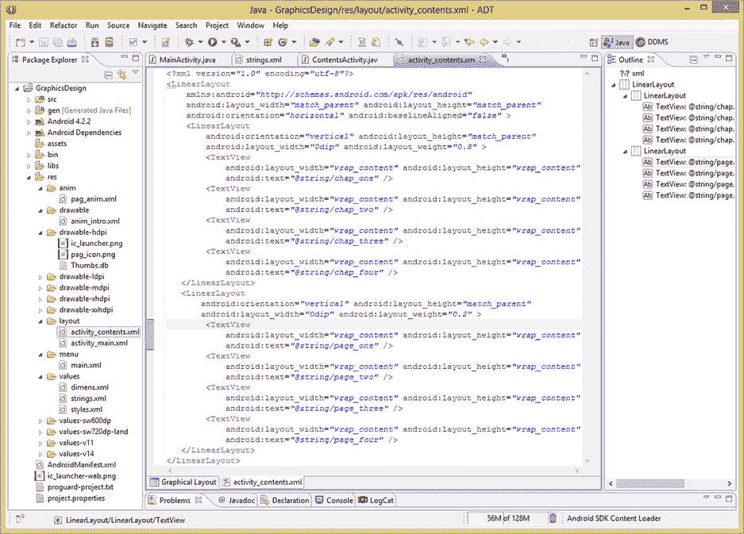

**图 6-19.** 将剩余的 `TextView` 标签添加到第二个嵌套的 `LinearLayout` 容器中

现在，您可以使用 XML 编辑窗格左下角的 **GLE** 选项卡来预览您的 UI 设计。这是一种快捷方式，可让您避免采用耗时的“作为 Android 应用程序运行”工作流程并调用 Nexus One 模拟器，除非您在配备 16GB 内存和超快速 SSD 的 8 核工作站上进行开发，否则加载可能需要很长时间！

如图 6-20 所示，您的嵌套 UI 容器完全按照您的意图工作：将 `TextView` UI 元素分组到两个独立的列中，就像目录的配置方式一样。

您需要在第一个嵌套布局的顶部和左侧以及第二个嵌套布局的顶部添加一些边距（以匹配第一个顶部边距对齐），并且看起来您还应该将布局权重分布从 80%/20% 混合比例更改为 75%/25% 混合比例，以使它们更靠近一些。

让我们添加 `layout_marginTop` 和 `layout_marginLeft` 参数来进一步优化您的嵌套 `LinearLayout`，以完善您的 UI 设计。

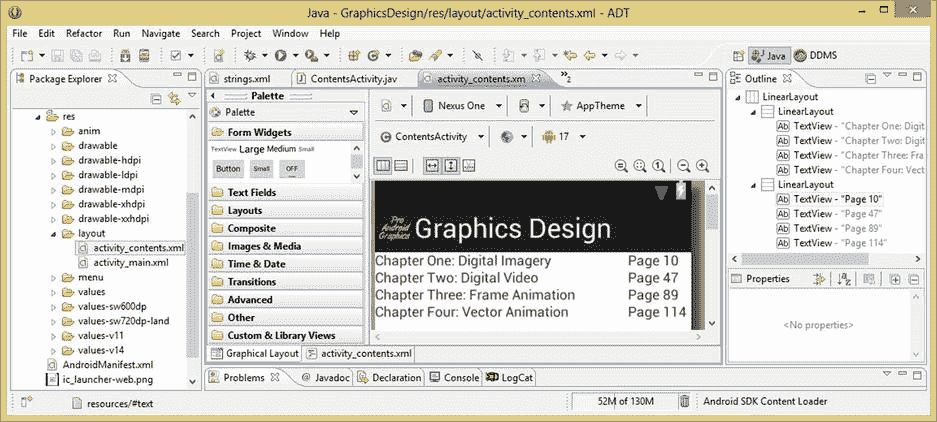

**图 6-20.** 使用图形布局编辑器选项卡预览您的 UI 设计，这样就不必调用模拟器

由于您想要在屏幕左侧添加空间，以使 `TextView` 元素不接触屏幕左侧（就像现在这样），您需要向第一个（左侧）`LinearLayout` 容器添加一个 `android:layout_marginLeft="10dip"` 参数，如图 6-21 所示。

您将此参数添加到 `LinearLayout` 容器父标签而不是每个单独的 `TextView` 用户界面元素（这也可以工作）的原因是，`TextView` 是 `LinearLayout` 的子元素，因此您只需移动父元素，其所有子元素将随之移动。

接下来，您想要做同样的事情，只是在 UI 屏幕顶部添加空间，以便 `TextView` 元素不接触屏幕顶部。向同一个 `LinearLayout` 容器添加一个类似的 `android:layout_marginTop="10dip"` 边距参数，以将容器的内容（章节标题）在显示屏上向下移动一点。

最后，您需要将右侧 `LinearLayout` 容器的顶部向下移动，以匹配对左侧 `LinearLayout` 容器所做的操作，因此从第一个 `LinearLayout` 标签中剪切并粘贴 `android:layout_marginTop="10dip"` 参数到第二个标签中，以复制相同的 DIP 对齐。

既然您已经将嵌套 UI 容器的边界推离屏幕边缘，接下来要做的就是通过调整 `android:layout_weight` 参数为 75%/25% 混合比例而不是最初尝试的 80%/20% 混合比例，来调整左右嵌套容器之间的间距。这将有助于将屏幕的右侧向左侧（和中间）拉近。只要这两个值加起来为 100%，您就可以调整它们，直到获得您想要的确切间距结果。

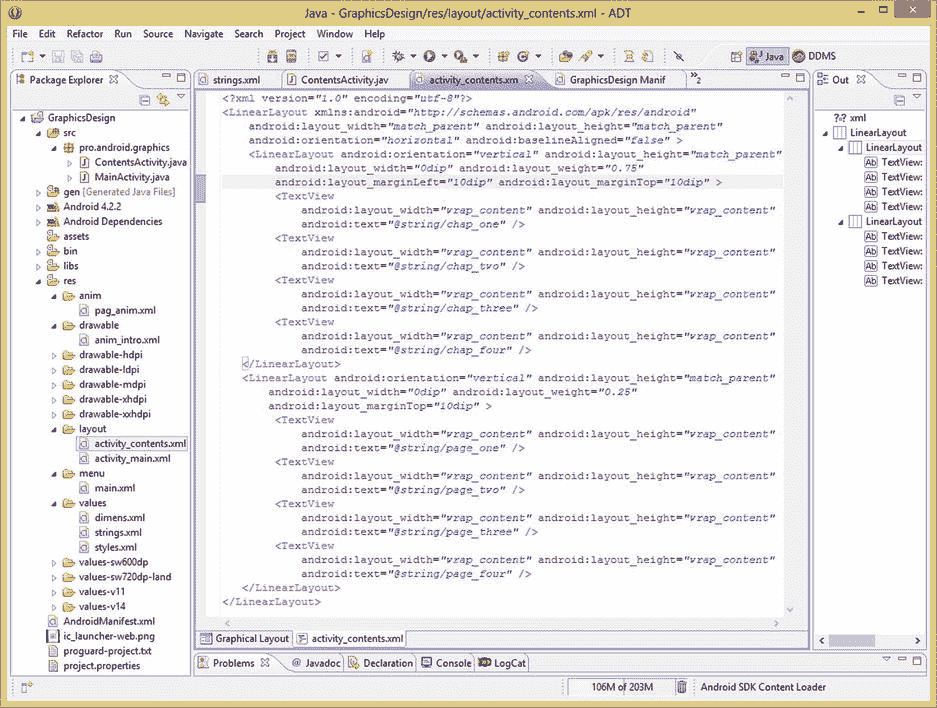

**图 6-21.** 添加 `marginTop` 和 `marginLeft` 参数并更改 `android:weight` 值以微调间距

添加这些顶部和左边距参数以及调整权重参数的结果，可以在图 6-22 中看到。在单击 **GLE** 选项卡之前，我特意在 XML 编辑器中保留了选中的左侧 UI 容器，以便可以在图 6-22 中看到布局容器的边界。

要执行此操作，请将光标放在 XML 编辑窗格中您希望在切换到 GLE 时显示为选中的标签内。请确保在单击位于中央编辑窗格左下角的“图形布局”选项卡之前执行此操作。

在两种编辑视图之间切换时，您在 XML 编辑模式下最后处理的内容将在另一种图形布局编辑模式中显示为高亮或选中。

这个有价值的小技巧表明，您不仅可以在 GLE 中选择和检查 UI 元素的边界，还可以选择和检查它们所在的布局容器。请密切关注 Eclipse IDE 的功能！

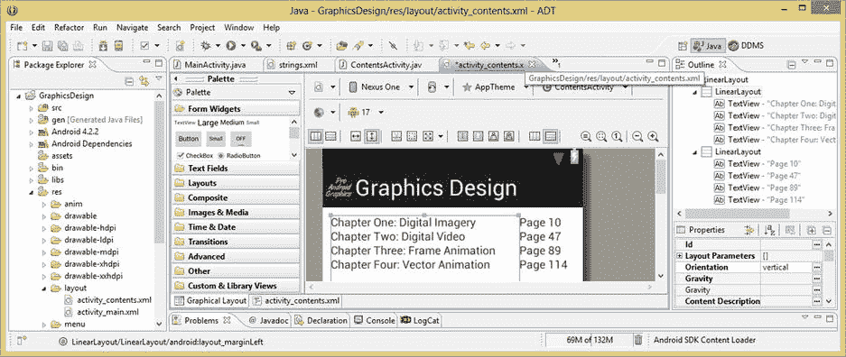

**图 6-22.** 在 Eclipse 的图形布局编辑器中检查新的权重和边距参数设置

现在，您需要做的就是添加十几行 Java 代码，这些代码将获取用户的菜单选择，然后启动新的 Activity。在这种情况下，就是您之前创建的 `ContentsActivity.java` 类。

一旦您实现了 `onOptionsItemSelected()` 方法（这是完成菜单导航实现所必需的），您就可以在 Nexus One 模拟器内测试您新的 `LinearLayout` UI 设计了。


### 使用 `onOptionsItemSelected()` 添加菜单功能

在 `onCreateOptionsMenu()` 方法之后添加一行新代码，并添加一个公共布尔值方法 `onOptionsItemSelected()`，再向其传入一个名为 `item` 的 `MenuItem` 参数，使用以下 Java 代码行：

`public boolean onOptionsItemSelected(MenuItem item) { your method code goes in here }`

`onCreateOptionsMenu()` 方法是 `Activity` 类的一部分，该类已有对应的导入语句。但当你输入完这行代码后，会看到 `android.view` 包中的 `MenuItem` 类需要一个导入语句。如果将鼠标悬停在波浪形红色下划线错误提示上，你将看到自动编写该导入语句的选项。

这个 `MenuItem` 对象（在方法声明中命名为 `item`）会在用户点击 `onCreateOptionsMenu()` 方法填充的任何一个 `Menu` 对象项时，由 Android 操作系统传递给此方法。然后，我们调用此 `MenuItem` 对象的 `.getItemId()` 方法，并将该值传入 Java 的 `switch` 语句，使用以下代码：

`switch(item.getItemId()) { individual case statements go inside of this structure }`

设置好此方法和 `switch` 结构后，你就可以为每个菜单项添加 `case` 语句。在每个 `case` 语句中，你将添加所需的 Java 代码行，来处理用户选中每个菜单项时需要执行的任何操作。

在你要编写的这些 `case` 语句中，所采取的 Java 操作将涉及使用 Android 的 `Intent` 对象来启动包含应用功能的 `Activity` 子类，这些功能将以界面屏幕布局的形式呈现。

每个 Java 的 `case` 语句将使用以下代码格式：

```
case R.id.table_of_contents:
Intent intent_toc = new Intent(this, ContentsActivity.class);
this.startActivity(intent_toc);
break;
```

让我们分析一下这些 Java 代码的 case 块，如图 6-23 所示。

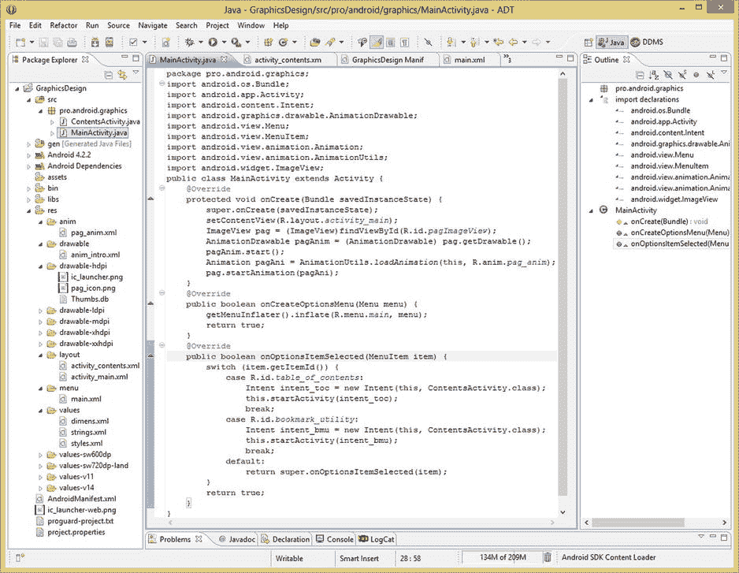

**图 6-23.** 添加 `onOptionsItemSelected()` 方法，并增加一个 `Intent` 对象来启动新的 `ContentActivity` 类

`case` 语句本身被分配给 XML 文件（`main.xml`）中定义的菜单项的资源 ID，并在 `onOptionsMenuCreate()` 方法中被填充到名为 `menu` 的 `Menu` 对象中。这个 `Menu` 对象的 ID 就像它的名称，用于标识用户选择了哪个菜单项，然后你执行该 `case` 语句内的代码。`case` 语句内的代码位于冒号之后、`break` 语句之前，`break` 语句将退出任何特定的 `case` 语句。

接下来，你创建一个 `Intent` 对象，该对象携带启动新 `Activity` 子类的意图传给 Android 操作系统。这通过以下代码实现：

`Intent intent_toc = new Intent(this, ContentsActivity.class);`

这行代码实例化了一个 `Intent` 对象，将其命名为 `intent_toc`，并加载一个新的意图，该意图配置了当前上下文（`this`）和你想要启动的目标 `Activity` 类，即你之前编写的 `ContentsActivity.java` 类，在其编译后的格式中通过名称 `ContentsActivity.class` 指定。Android 中的意图用于操作系统的不同区域之间进行通信。如果你对意图还不够熟悉，可以在 Android 开发者网站的以下页面查阅相关资料：

[`developer.android.com/reference/android/content/Intent.html`](http://developer.android.com/reference/android/content/Intent.html)

下一行代码使用 `.startActivity()` 方法以及上一行代码中创建的新意图对象来启动该 `Activity`。这将把新的 `Activity` 子类加载到显示屏上。该方法通过当前上下文引用 `this` 来调用，如下所示：

`this.startActivity(intent_toc);`

这就是将 `ContentsActivity.class` 启动到用户设备屏幕上所需的全部代码。因此，你现在只需要一个 `break` 语句，用于跳出 `switch` 语句的 case 匹配循环，然后就可以测试了！

请注意，我还为你的书签工具（BMU）添加了选项菜单项，我们将在本书后面设计它。我这样做是为了在菜单上显示多个菜单项，同时也展示如何通过使用不同的意图对象名称来区分菜单项及其启动的不同 `Activity` 子类。

因此，你的 BMU 的意图对象被命名为 `intent_bmu`，一旦你为该类创建了 XML 布局和 Java 代码，这个意图将被加载一个对 `BookmarkActivity.class` 的引用。

目前，我只是将其指向 `ContentsActivity.class`，因为该类已存在，以便你有可工作的代码；因此这两个菜单选项都将启动我们一直在处理的布局容器。

### 在 Nexus One 上测试目录 Activity

现在，你可以右键单击 `GraphicsDesign` 项目文件夹，然后使用 **Run As ➤ Android Application** 工作流程，查看你的新菜单和布局容器是否能正常协同工作。如图 6-24 所示，当你使用模拟器菜单按钮选择菜单，并单击**目录**菜单项（在屏幕截图的左侧以蓝色显示）时，它会启动 `ContentsActivity` Java `Activity` 子类以及你的 `LinearLayout` 用户界面设计（在右侧显示）。

屏幕截图右侧还显示了**返回**按钮图标（以蓝色高亮显示），你可以使用它返回启动画面，并测试另一个菜单项（目前该菜单项也会调用同一个 `Activity`）。一旦你将此用户界面转换为 `RelativeLayout`，你将添加一个 `Button` 小部件，你将在下一章学习相关内容。这个用户界面 `Button` 小部件将执行返回主页（启动画面）的用户界面功能。

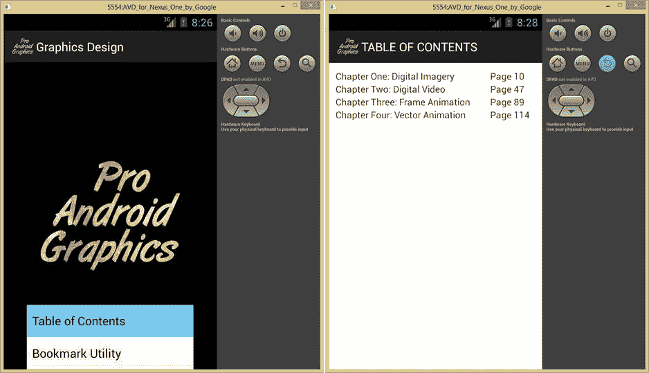

**图 6-24.** 在 Nexus One 上测试你的新菜单、`Activity` 子类以及目录布局设计

在本书后面，我们将把它转换为 `RelativeLayout` 并做更多处理；由于布局容器是图形和用户界面设计的基础，我们将在整本书中与它们打交道。我写这一章的目的是给你一个概述，并展示如何在 Activity、清单、XML、Java 等整体流程中实现一个布局容器。


### 总结

在第六章中，你学习了 Android 布局容器，这些容器用于容纳 Android 用户在设备显示屏上使用的用户界面元素和内容。

首先，我们探讨了 Android 中布局的基类——`ViewGroup` 类。你了解到，Android 中数十种不同类型的布局容器都派生自这个超类，用于“分组”`View` 对象，而关于“View”对象的学习将在下一章进行。

接着，我们概述了 Android 的 `LayoutParams` 类及其布局参数。开发者使用这些参数来配置和微调用户界面布局的工作方式，以及布局如何将其子元素 `View` 对象组合在一起。你学习了 `match_parent` 和 `wrap_content` 这两个布局常量，以及它们在 Android 中如何用于实现布局的自动调整大小。

随后，我们考察了那些已被弃用的 Android 布局容器类，以及在 Android 操作系统中尚处于实验阶段、未完全实现（即永久性）的布局容器类。由于需要介绍的布局容器众多，本书将重点讲解那些已完全实现的布局类。

我们研究了 Android 的 `RelativeLayout` 类，这是最常用的布局容器之一，也是在创建基线（空白）应用程序时，“新建 Android 应用程序”系列对话框中默认使用的布局。

接着，我们了解了 `LinearLayout`，这是另一个常用的布局容器，通常用于按钮或文本的简单线性布局。

之后，我们学习了 `FrameLayout`，这是一种高级布局容器，通常用于容纳更复杂的布局容器，或者实现单一元素用户界面，例如通过 `VideoView` 控件实现的固定宽高比、全屏数字视频播放。

然后，我们介绍了一种较新的 Android 布局容器——`GridLayout`。它因采用扁平（非嵌套）布局容器设计来构建复杂用户界面而迅速流行起来。我们将在未来关于高级布局设计的章节中详细讨论这个用户界面布局容器。

最后，我们学习了 `DrawerLayout`，这是另一种用于设计高级滑动抽屉式用户界面布局的新容器。用户可以从显示屏的左侧或右侧拉出这种抽屉，其中包含用于全局应用用户界面（左侧抽屉）或局部内容用户界面功能（右侧抽屉）的控件元素。

为了获得实践经验，你用 XML 创建了自己的布局容器，然后添加了一个菜单并编写了一个 `Activity` 类，以便能够访问应用程序中新的目录屏幕。

在下一章，你将学习 `View` 类及其如何用于创建可填充至布局容器内部的控件。

