# 7. Android UI 控件：使用 View 类进行图形设计

### 摘要

在第七章中，我们将更深入地探讨 Android 的 `View` 类及其众多子类。我们已经学习了 Android 的 `ViewGroup`（它是 `View` 的一个子类）及其一些主流的布局容器子类。现在，我们将研究一些 Android 的 `View` 子类，我们可以通过实现这些子类来创建用户界面控件，并在这些 `ViewGroup` 布局容器内进行图形设计。

由于布局容器（`ViewGroup` 类）用于容纳用户界面元素（在 Android 中称为控件），我们在前一章必须首先介绍它们。有了这个基础，我们现在可以介绍一些 Android 最常用的用户界面控件了。这些控件可以作为子用户界面元素放置到父布局容器中。

正如 Android 拥有数十种 `ViewGroup` 布局容器类一样，它也同样拥有数百个 `View`（控件）子类。因此，本书无法详细涵盖每一个控件类——毕竟本书并非仅专注于用户界面设计元素及其工作原理。

我们将从图形设计的角度来考察最流行的 Android 用户界面设计控件，即，应该使用哪些用户界面元素控件来实现应用程序的图形元素。我们还将介绍那些允许开发者创建自定义图形用户界面元素的控件。

自定义图形用户界面的元素是指那些可以通过使用额外的图形设计内容资产，以及像 alpha 通道（透明度）这样的图形设计属性来增强（或定制样式）的元素，从而实现图形与用户界面元素的无缝合成。

首先，你将学习 Android 的 `View` 超类，然后我们将介绍其最常用的用户界面设计子类。在本书中我们将详细讲解的 `View` 控件类包括：`ImageView`、`TextView`、`EditText`、`Button`、`ImageButton`、`VideoView`、`Space`、`AnalogClock`、`CalendarView`、`DigitalClock` 和 `ProgressBar`。

现在，借助上一章添加的菜单系统，你已经能够向“Pro Android GraphicsDesign”应用程序添加新的 `Activity` 子类。通过使用新的 `Activity` 类，你可以使用所有这些控件来创建用户界面布局。你将在本章中学习到，Android 应用程序的每个功能屏幕都将拥有自己的菜单选项、活动、布局容器以及一系列的 `View` 控件。


### Android View 类：UI 组件的基础

Android `View` 类是 `java.lang.Object` 类的直接子类，它定义了显示屏上一个称为视图的区域，其核心属性由 View 超类定义。该 View 超类属于 `android.view` 包，并通过 `import android.view.View` 这条 Java 代码语句导入到您的应用中。

Android 中的 View 对象在用户的显示屏上占据一个矩形区域；它负责向该屏幕区域进行绘制，并处理该区域中发生的交互事件。

这个 View 超类不会被直接使用，但可用于创建其他子类，这些子类随后可在您的 Android 应用中使用。目前已经存在非常多的 View 子类，因此您很可能无需自行进行任何这类编程工作！您只需找到并使用提供所需功能的 View 子类，然后根据您的应用开发需求导入并使用该 View 子类即可。

View 类对于图形设计师尤其有价值，因为它为 Android 操作系统中的用户界面组件提供了基本的构建块。UI 组件（或者，作为图形设计师，我喜欢称之为 UI 元素）在 Android 生态系统中被称为“组件”。View 有许多专门的组件子类，充当 UI 控件，能够包含并显示文本、图片、视频、动画或其他内容。

由于 View 类是构建组件的基础类，而组件用于创建所有交互式 UI 元素（按钮、文本字段等），因此在您的 Android 应用开发图形设计经历中，您会经常看到类名 View，所以请熟悉 View。

您已经了解到，ViewGroup（View 的子类）是一个用于创建布局容器的基类，这些容器是那些容纳所有 View（或嵌套的 ViewGroup）并定义其布局属性的不可见容器。ViewGroup 对象正如其名：一组 View 对象！从这个意义上说，Android 屏幕上的所有内容最终都可以归结为父 ViewGroup 容器内的一个 View 子对象。

多年来，为 Android 开发了非常多的 UI 组件，它们被捆绑在 Android 中一个名为 `android.widget` 包的 Java 包中。如果您想查看该包中的所有当前组件，可以访问 Android 开发者网站上组件包摘要页面，网址如下：

[`http://developer.android.com/reference/android/widget/package-summary.html`](http://developer.android.com/reference/android/widget/package-summary.html)

您可以通过两种方式添加 Android View 对象：使用 Java 代码，或者使用一个或多个包含布局容器父标签的 XML 文件来指定一组 View 对象。后一种方式（使用 XML UI 描述）是定义 Android 应用用户界面设计更常见（也更简单）的方法，也是本书中您将采用的 UI 设计方式。

### View 基本属性：ID、布局定位和尺寸

一旦您定义了包含子 UI 元素（View 对象）的布局容器（ViewGroup），正如上一章所做的那样，您首先要做的通常就是使用 Android 参数来定义子 UI 组件 View 对象的属性。正如您已经看到的，Android 中的参数总是以 `android:` 开头。

如果您好奇原因，这是由于在 Android 编写的每个 XML 文件定义中，父容器里都有那个 `xmlns:android` XML 命名空间参数。该参数指定了指向当前 XML 定义的路径，该定义保存在一个中央仓库中，位置位于

[`http://schemas.android.com/apk/res/android`](http://schemas.android.com/apk/res/android)

因此，`xmlns:android` 参数实际上是在说：“无论你在哪里看到 `android:`，都要将其展开为路径 [`http://schemas.android.com/apk/res/android`](http://schemas.android.com/apk/res/android)，以便为此 XML 文件中的任何给定参数提供指向最新且集中的 XML 参数定义的直接引用。”

所以，您的 `android:layout_weight` 参数在 Android 操作系统中实际被视为

[`http://schemas.android.com/apk/res/android:layout_weight`](http://schemas.android.com/apk/res/android:layout_weight)

现在您确切知道 XML 文件中发生了什么，以及为什么每个添加的父标签都需要那个 XMLNS 参数，以及为什么没有它 Eclipse 会抛出错误（“此参数不存在”错误）。

如果您因任何原因要从 Java 代码中引用任何 View（这包括 ViewGroup 父标签以及 View 组件子标签），则需要使用 `android:id` 参数为组件（View 对象）分配一个 ID。这样做是为了能够使用 `findViewById()` 方法，该方法用于将您正在编写的 XML 用户界面元素定义与您在 Java 代码中实例化的 Java 对象连接起来，以“填充”您的 XML 定义，从而填充 Java 对象中的字段。Android 中的 `findViewById()`（View）和 `inflate()`（Menu）方法用于“桥接”您的 XML 标记和 Java 程序逻辑。

用对象属性的 XML 定义来填充 Java 对象，在 Android 操作系统术语中通常称为填充该对象。

ID 参数不是必需的，因此如果您不打算在 Java 代码中引用该 View 对象，则不必费心使用 `android:id` 标签来定义它。一个很好的例子是使用 `TextView` 元素（View），它被包含在 UI 设计中仅仅是为了在屏幕上放置一个文本标签，并在 XML UI 布局定义中定义，但在 Android 应用中没有交互使用。您在上一章的 XML UI 定义中观察到了这一点。

另一方面，其他参数如 `layout_width` 和 `layout_height`，则始终需要为每个 View 对象的 XML 标签进行定义。

在您为 View（子标签）指定 ID 参数后，通常需要为其设置高度和宽度的布局定位参数。这些参数通常被分配两个常量之一：`match_parent` 或 `wrap_content`。

这样 Android 就可以为您进行定位。您也可以使用像素或 DIP 值，但请记住我们在第 5 章中的讨论，尽可能使用 Android 系统布局常量。对于您 ViewGroup 布局容器中包含的每个 UI 组件（View 对象），始终需要提供这两个参数。

View 对象的大小使用宽度和高度来表示；但是，如果开发者已经设置了布局定位参数，则很少需要再指定这些参数，因为 Android 会为您处理。


实际上，Android 操作系统会在内部为每个 `View` 对象跟踪两对宽度和高度数值。第一对数值称为**测量宽度**和**测量高度**。你的测量宽度和测量高度尺寸将定义你的 `View` 对象希望在其父容器内部有多大。这些测量尺寸可以通过在任何一个拥有 ID（允许在 Java 逻辑中引用并调用其方法）的 `View` 对象上调用 `.getMeasuredWidth()` 和 `.getMeasuredHeight()` 方法来获取。

第二对数值称为**宽度**和**高度**，或者更准确地说，是**绘制宽度**和**绘制高度**。这些绘制尺寸将定义 `View` 在屏幕上、绘制时以及布局计算后的实际大小。绘制宽度和绘制高度数值可能（但不一定）与测量宽度和测量高度数值不同。你可以在 Java 代码的运行时阶段，通过在任何一个 `View` 对象上调用 `.getWidth()` 和 `.getHeight()` 方法来获取绘制宽度和绘制高度。

在测量 `View` 的尺寸时，`View` 总是会考虑内边距。我们将在本章的下一节中介绍内边距和外边距。

内边距以 DIP 为单位表示 `View` 的左侧、顶部、右侧和底部部分。内边距用于将 `View` 的内容间隔开一定数量的像素。尽管 `View` 子类可以定义内边距，但它不支持外边距。不过，Android 的 `ViewGroup` 子类可以提供外边距参数，因此，外边距和内边距都可以在 `ViewGroups` 中定义。

### 视图定位特性：外边距与内边距

为了对 UI 布局元素进行相对定位，有两类关键的布局参数——外边距和内边距——它们允许你微调 UI 在显示屏上的外观。

全局定位由 Android 操作系统通过 `layout_width` 和 `layout_height` 常量完成。这样，Android 操作系统就能够适配不同的设备屏幕尺寸、密度、宽高比和方向。

然后，开发者可以通过在每一个子 `View` 标签 UI 元素上使用 `android:padding` 参数，来对 UI 元素进行局部定位控制。请注意，这个参数叫做 `android:padding`，而不是 `android:layout_padding`，所以你实际上不需要记住“布局用外边距，UI 元素用内边距”这种规则，因为该参数名称本身就内置了其用途的指示！既然 `android:padding` 并没有被命名为 `android:view_padding`，你就知道内边距参数可以同时用于 `View`（控件）和 `ViewGroup`（布局容器）这两种子类类型。

由于可以使用外边距的地方较少，而且你在前面的章节中已经体验过如何使用它们，那我们就先从外边距开始讲起。外边距将其所应用的对象在其容器外部推开，而内边距则相反，它会将容器的边界从其内部所包含的内容处推开。你将在本书中详细看到这一点，因为你将使用这两种间距参数来实现各种不同类型的图形设计最终效果。

有四类不同的外边距设置参数：`layout_marginBottom`、`layout_marginTop`、`layout_marginLeft` 和 `layout_marginRight`。还有第五个选项，简称为 `layout_margin`，它可以用一个单一的 DIP 值来设置所有四个方向的外边距，从而在你的布局容器周围提供均匀间隔的外边距。

从 Android 4.2 API 级别 17（Jelly Bean 果冻豆）开始，新增了两个外边距参数：`layout_marginStart` 和 `layout_marginEnd`。这些“起始”和“结束”外边距参数是作为 Android 支持从右到左（RTL）设计布局的一部分而添加的，用于支持那些从右向左、而非从左向右扫视屏幕的文化习惯。

对于 RTL 屏幕设计流程，`layout_marginStart` 等同于 `layout_marginRight`，而 `layout_marginEnd` 等同于 `layout_marginLeft`。

对于从左到右（LTR）屏幕设计流程，`layout_marginStart` 等同于 `layout_marginLeft`，而 `layout_marginEnd` 等同于 `layout_marginRight`。

有关外边距布局参数的详细信息，请阅读以下 URL 中的 Android 开发者网站 `ViewGroup.MarginLayoutParams` 页面：

[`developer.android.com/reference/android/view/ViewGroup.MarginLayoutParams.html`](http://developer.android.com/reference/android/view/ViewGroup.MarginLayoutParams.html)

与外边距类似，Android 有四类不同的内边距设置参数：`android:paddingBottom`、`android:paddingTop`、`android:paddingLeft` 和 `android:paddingRight`。还有一个第五个快捷选项，简称为 `android:padding`，它可以用一个单一的 DIP 值来设置所有四个方向的内边距，从而在你的 `View` 对象内容周围提供均匀间隔的内边距。

从 Android 4.2 API 级别 17（Jelly Bean 果冻豆）开始，新增了两个内边距参数：`android:paddingStart` 和 `android:paddingEnd`。这些“起始”和“结束”内边距参数是作为 Android 支持 RTL 设计布局的一部分而添加的，用于支持那些从右向左、而非从左向右扫视屏幕的文化习惯。

对于 RTL 屏幕设计流程，`android:paddingStart` 等同于 `android:paddingRight`，而 `android:paddingEnd` 等同于 `android:paddingLeft`。

对于从左到右（LTR）屏幕设计流程，`android:paddingStart` 等同于 `android:paddingLeft`，而 `android:paddingEnd` 等同于 `android:paddingRight`。

有关视图内边距参数的详细信息，请阅读以下 URL 中的 Android 开发者网站 `View` 超类页面：

[`http://developer.android.com/reference/android/view/View.html`](http://developer.android.com/reference/android/view/View.html)

接下来，你将研究那些允许你控制 `View` 控件如何利用你的图形设计资源，以及如何与你的图形设计（drawable）资源（图像和动画）和数字视频资源进行合成的参数。


### 查看视图图形属性：背景、Alpha 与可见性

小部件的图形属性定义与命名、布局、间距、方向等其他属性一样，通过 XML 参数完成。本书中我们最关注的图形属性（即参数）是那些能让我们将用户界面设计无缝融入整个应用图形设计流程的属性。这些属性包括：背景图像功能、Alpha 混合值设置，以及对某些小部件和应用图标而言的图片来源文件引用。

正如你在第 3 章中学到的，小部件中任何可容纳图像资源的槽位或占位符同样可以容纳动画资源。这种为图形和 UI 元素增添动态效果的能力，使开发者能够利用用户界面设计创造出令人惊叹的用户体验。

最常用于整合图形的视图属性是 `android:background` 参数。该参数允许我们设置背景图片来源文件，或背景颜色值（包括 Alpha 值）。

在某些情况下，为了让 UI 小部件视图对象背后的图像、动画或视频能够透显出来，你需要将 UI 小部件的背景属性设置为透明。这可以通过使用包含 Alpha 通道的八位十六进制颜色值来实现：使用 `android:background="#00000000"` 标签参数，该参数将 ARGB 值设置为 100% 透明（实质上定义了零背景图像/像素）。

下一个常用于整合图形的视图属性是 `android:alpha` 参数。该参数允许你整体设置 UI 小部件的透明度值，包括其背景图像。因此，你可以使用 `android:alpha` 配合实数设置（例如 `android:alpha="0.55"` 表示 55% 不透明度）来让整个 UI 小部件呈现半透明或不透明状态。

由于本书是关于高级图形与合成技术的，随着你逐步了解 Android 开发中与图形设计相关的基础知识，全书内容会越来越深入，届时我们将大量运用 Alpha 参数。

下一个最常用的视图属性是 `android:src` 参数，用于定义来源图像资源。如果你想知道为何该参数的使用频率不及背景图像和 Alpha 混合值，那是因为所有小部件标签都拥有 `android:background` 参数，但相对较少的标签（如 `<ImageView>`、`<ImageButton>` 以及 `<Bitmap>`）支持使用 `android:src` 图片来源引用参数。

这是因为来源图像会覆盖 UI 小部件本身，因此若要让 UI 元素显示在图像资源（或动画资源）前方，你应该改用 `android:background` 参数。此外，`android:src` 参数还有其他用途，例如在 `AndroidManifest.xml` 文件中为应用分配图标资源。

最后是 `android:visibility` 参数，它比 `android:alpha` 参数在内存和处理器效率上更高。这是因为 Alpha 混合（通常用于创建半透明效果，使背景图像或元素得以透显以实现图形设计效果）所需的算法，比屏幕上显示或不显示元素的简单代码更为复杂。此外，Alpha 还可以在 Java 代码中进行动画处理，使特定设计元素平滑淡入或淡出。因此，请在图形合成中使用 Alpha，在布局或 UI 界面可用性实现中使用可见性，因为后者的“开销”更低。

如果你只想显示或隐藏视图对象（即瞬间开启或关闭屏幕上的可见性），所有视图元素（如 `TextView`、`ImageButton`、`ImageView`、`Button`、`CheckBox`、`ViewGroup` 等）都具有可见性属性。视图的可见性可设置为三个预定义的 Android 值常量之一：`VISIBLE`（当前在屏幕上可见）、`INVISIBLE`（隐藏，但其屏幕布局空间仍被保留，尽管不可见）和 `GONE`（完全隐藏，包括从父布局容器的子布局放置计算算法中移除）。


### 视图的功能特性：监听器与焦点

使用包含 XML 标签标记的布局容器设计好 View UI 组件集合后，这些组件仍需进行实例化并与操作系统和设备硬件“连接”。

这一过程在 Java 代码中通过 Android 操作系统输入事件来“捕获”终端用户与用户界面元素的交互来实现。

当终端用户通过操作 Android 设备硬件导航功能（如键盘、导航键、轨迹球和触摸屏）与应用程序交互时，会触发 Android 输入事件。

捕获这些输入事件将使您的 UI 设计具备功能性，并能响应用户交互。捕获操作系统输入事件可通过在 Java 代码中使用 Android 事件监听器来实现。

Android `EventListener` 超类是 `android.util` 包的一部分；如果您想研究核心超类，可访问以下网址在 Android 开发者网站上获取更多信息：

[`http://developer.android.com/reference/java/util/EventListener.html`](http://developer.android.com/reference/java/util/EventListener.html)

事件监听器是您可以附加到 View 对象上的方法，先通过 `findViewById()` 方法从 XML 定义中导入、实例化并实例化这些对象后，再进行附加。

一旦设置好 View 对象的 Java 代码就位，您就可以将事件监听器方法附加到该对象上，该方法将为 View 对象执行事件处理，在大多数情况下，该对象就是 UI 设计元素之一。

Android 中最常用的事件处理方法有六种，包括 `.onClick()`、`.onLongClick()`、`.onTouch()`、`.onKeyUp()`、`.onKeyDown()`、`.onCreateContextMenu()` 和 `.onFocusChange()`。如果您想更详细地研究 Android 操作系统输入事件，请访问以下网址：

[`http://developer.android.com/guide/topics/ui/ui-events.html`](http://developer.android.com/guide/topics/ui/ui-events.html)

我提到的最后一个事件处理方法是 `.onFocusChange()` 方法，它用于追踪用户焦点的变化。这引出了另一个概念：焦点，它用于确定用户在布局容器中正在使用或聚焦于（即当前正在交互或使用的）哪一个 UI 组件。

Android 操作系统会负责确定哪个父 `ViewGroup` 的子 `View` 对象当前拥有应用程序终端用户的焦点。这是通过追踪输入事件来实现的，这些事件可以告知 Android 用户当前正在触摸（使用）哪个 UI 组件，以及用户如何从一个 UI 元素导航到下一个 UI 元素。

您也可以在任意时刻强制应用程序将其焦点设置到任何 UI `View` 对象（用户界面元素）上。要做到这一点，您可以调用 View 的 `.requestFocus()` 方法，该方法会高亮显示该 UI 元素以供使用。

此外，所有 `View` 对象都允许您设置 `.onFocusChange()` 事件监听器，以便在附加该监听器的 `View` 对象获得或失去用户焦点时，应用程序逻辑（如果需要）可以收到通知并采取相应措施。

本书将详细探讨输入事件、事件监听器、事件处理和焦点，因为它们对于您的应用程序开发、用户界面和用户体验优化都至关重要。

接下来，让我们实现书签工具 Activity 子类，并创建您的全新 `RelativeLayout` 容器，以便您在实践操作中熟悉这种布局容器类型。您将让这个新的 Activity 与您的选项菜单协同工作，将其添加到您的 `AndroidManifest.xml` 配置文件中，并同时添加一个 `TextView` 组件。稍后，您还将向这个新的书签工具 Activity 中添加其他类型的 UI 组件（View 子类）。

### 书签工具 UI：使用 RelativeLayout 和 TextView

接下来，您将创建书签工具，并在此过程中学习 `RelativeLayout` 容器参数和 `TextView` UI 组件，因为它们是在整个 Android 中最常用的类。

完成这部分内容后，您可以继续学习更高级的组件和布局容器，但首先，我必须确保所有读者都掌握了这些正确的基础图形设计知识，并且我已经介绍了更基础的 `ViewGroup` 和 `View` 子类。

你们中的一些人可能会想：文本跟图形设计有什么关系？仔细看看 Photoshop 或 GIMP，你会发现这些软件中包含了大量的文本创建和对齐工具。Android 中的 `TextView` 类提供了近一百个参数，使开发者能够在 Android 应用程序开发工作流程中模拟这种类型的设计能力和灵活性，这非常棒。

您需要完成实现第二个 `MainActivity` 类选项菜单项——书签工具，方法是创建一个新的 `BookmarkActivity.java` 类和一个 `activity_bookmark.xml` 布局定义来容纳您的 `RelativeLayout` 容器。我们将在接下来的几页中快速完成这些操作，以便为您打下基础，不仅学习重要的 `TextView` 组件，还要学习更为重要的 `ImageView` 组件，它将用于容纳您的图形图像。

因此，如果 Eclipse 尚未打开，请启动它，进入您的 `GraphicsDesign` 项目，右键点击 `GraphicsDesign` 文件夹，并使用熟悉的 **New ➤ Java Class** 菜单序列，调出如图 7-1 所示的 New Java Class 对话框。指定您的 `pro.android.graphics` 包，为新 Activity 子类指定名称 `BookmarkActivity`，然后选择 `android.app.Activity` 作为其超类，完成配置后点击 **Finish** 按钮，显示空白类，它应该看起来像前一章的图 6-8。

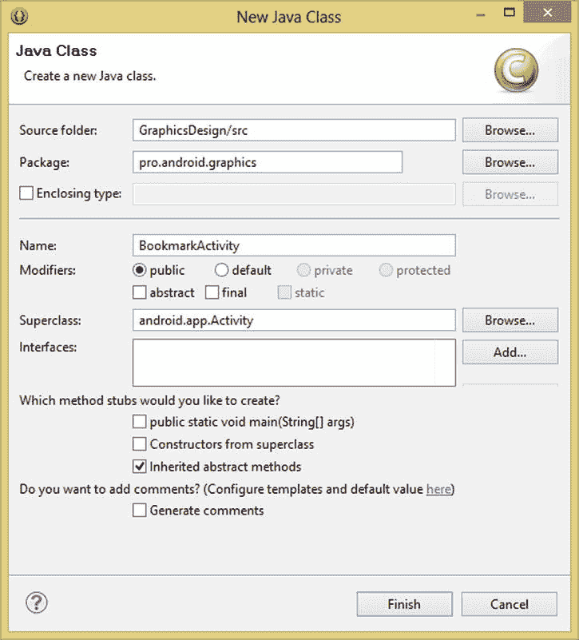

图 7-1. 创建您的全新 BookmarkActivity Java 类

接下来，您需要向 `BookmarkActivity` 添加一个 `onCreate()` 方法，该方法将调用超类的 `onCreate()` 方法 `super.onCreate(savedInstanceState)`，并使用 `setContentView(R.layout.activity_bookmark)` 方法来引用您即将创建的 `activity_bookmark.xml` 文件。实现此目的的一个快速方法是从您的 `MainActivity.java` 文件中复制此代码块，然后更改 `R.layout` 引用，如图 7-2 所示。

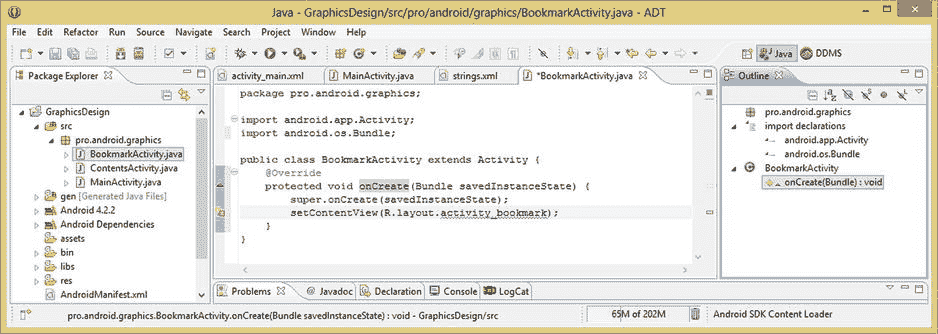

图 7-2. 输入您的 `onCreate()` 方法 Java 代码，并将 `ContentView` 设置为您的 `activity_bookmark.xml`

由于您的 `BookmarkActivity` 类中存在红色波浪线错误提示，让我们接下来创建您的 `activity_bookmark.xml` 文件，以消除该错误，并为将在本章其余部分创建的标记创建 `RelativeLayout` 容器。

右键点击您的 `GraphicsDesign` 项目文件夹，这次使用 **New ➤ Android XML File** 菜单序列，调出如图 7-3 所示的 New Android XML File 对话框。选择 **Layout** 资源类型，将文件命名为 `activity_bookmark` 以与 `BookmarkActivity` 类名镜像，然后在对话框中间的选区中选择一个类型为 `RelativeLayout` 的 Root Element 父标签。设置完所有文件创建参数后，点击 **Finish** 按钮。

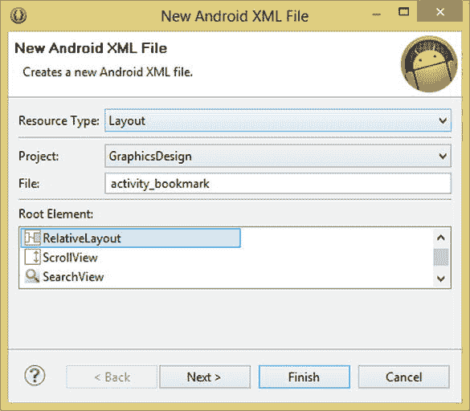

图 7-3. 创建一个新的 RelativeLayout XML 文件

现在，您将暂时保持这个新的 `RelativeLayout` 容器为空，然后完成实现新的 `BookmarkActivity` 类和 `MainActivity` 选项菜单，以便所有功能都能在 Nexus One 模拟器中正常运行。


现在你将完成所有这些工作，以便在继续本章后续内容时，能够测试你的新 Activity UI 界面。

既然你已经创建了 `BookmarkActivity.java` 类且代码无误，接下来合乎逻辑的一步是，使用 `<activity>` 子标签将该 Activity 子类添加到 `AndroidManifest.xml` 文件中，这样 Android 操作系统就能识别并使用它。

右键点击 `AndroidManifest.xml` 文件，打开它，然后像上一章为目录 Activity 子类添加标签那样，添加 `<activity>` 标签。完成后的代码看起来会和它上方现有的 `ContentsActivity` 标签非常相似，只是会引用不同的类名和 `<string>` 标签常量，如图 7-4 所示。你需要在 `strings.xml` 文件中创建这些 `<string>` 常量，然后就可以开始设计 `RelativeLayout` 容器布局了。

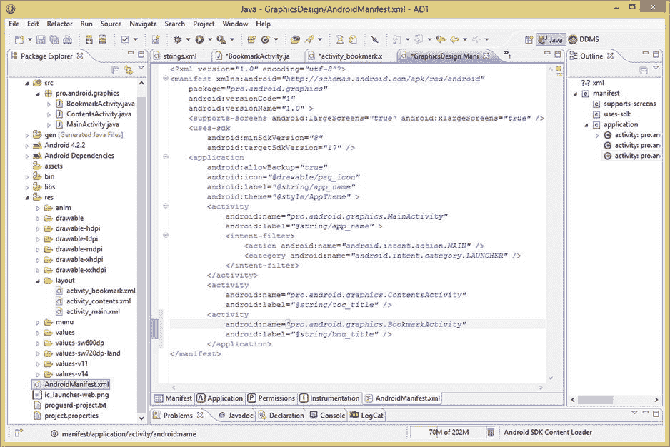

**图 7-4.** 添加 `BookmarkActivity` 标签，并使用 `<activity>` 标签在 `AndroidManifest.xml` 文件中进行引用

接下来，点击 Eclipse 中央编辑区的 `strings.xml` 选项卡；如果该文件未打开，请进入 `/res/values` 文件夹，右键点击 `strings.xml` 文件名并选择打开，或者使用 F3 键打开该文件。

复制并粘贴最后一个 `<string>` 标签常量，然后在下方粘贴两次。这样做的目的是添加 AndroidManifest 中引用的 `bmu_title`（标签）字符串常量，以及接下来在 `RelativeLayout` 容器 XML 定义中创建小部件时需要用到的 TextView 字符串常量。

使用以下两行 XML 标记，将名为 `bmu_title` 的 `<string>` 标签的文本值设置为“BOOKMARKING UTILITY”，将名为 `bookmark_text` 的 `<string>` 标签的文本值设置为“Current Bookmark Page”：

```
<string name="bmu_title">BOOKMARKING UTILITY</string>
<string name="bookmark_text">Current Bookmark Page</string>
```

一旦 `<string>` 标签 XML 常量就位，如图 7-5 所示，你就可以继续操作 `MainActivity.java` 类，通过引用新的 `BookmarkActivity` 类来让第二个菜单项可操作。这个新类现在已在 Eclipse 以及 `AndroidManifest.xml` 文件中设置完成。

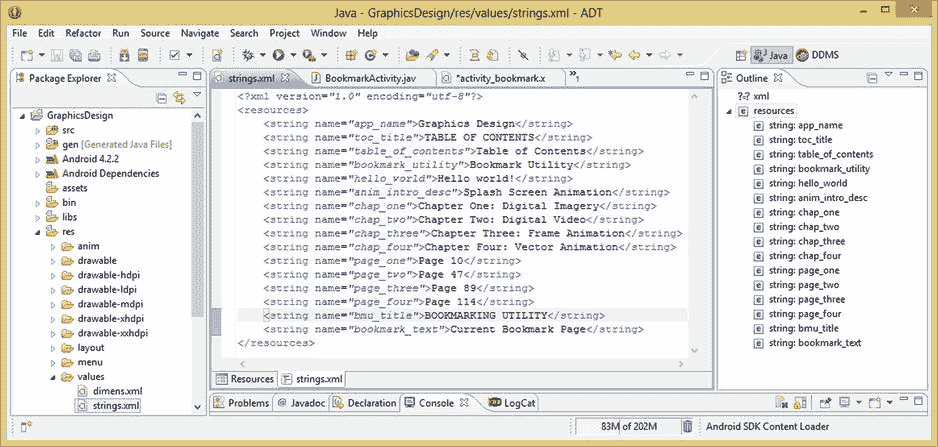

**图 7-5.** 为清单文件中的 Activity 界面标签和 `TextView` 中的界面标题添加 `<string>` 标签常量

点击 Eclipse 顶部的 `MainActivity.java` 选项卡；它可能隐藏在 `>> Number`（未显示的打开选项卡）菜单下，在图 7-5 中显示为 `>>1`。如果 `MainActivity.java` 当前未打开编辑，请进入 `/src` 文件夹找到它，右键点击并打开，或者先选中（高亮）它，然后使用 F3 功能键。

在 `onOptionsItemSelected()` 方法的第二个 switch 语句 case 代码块中，将引用从 `ContentsActivity.class` 改为新的 `BookmarkActivity.class`。这样，你的选项菜单现在就会启动刚刚配置好的 Bookmarking Utility Activity 界面。

现在，你已经完成了所有必要步骤，可以访问 `RelativeLayout` 容器了。接下来你将开始向其中填充本章将要介绍的基本 UI 小部件。

你需要能够访问 `BookmarkActivity.java` 类，该类从第二个选项菜单项调用 `activity_bookmark.xml` 中的 `RelativeLayout` 容器定义，如图 7-6 所示。因此，你不仅需要在 `MainActivity` 类的 Java 代码中调用该 Activity 子类，还需要在 `AndroidManifest` XML 文件中对其进行设置。

最后，为了保持代码整洁，你需要在 `/res/values/strings.xml` 文件中添加两个新的 `<string>` 标签常量，并通过创建新的 `activity_bookmark.xml` 文件来创建（当前为空的）XML 定义容器。

接下来，你将在 `RelativeLayout` 容器中添加一个 `TextView` UI 小部件，然后在 Nexus One 模拟器中测试所有内容，确保一切连接正确，并且 `TextView` UI 小部件子标签的参数能产生你期望的结果。

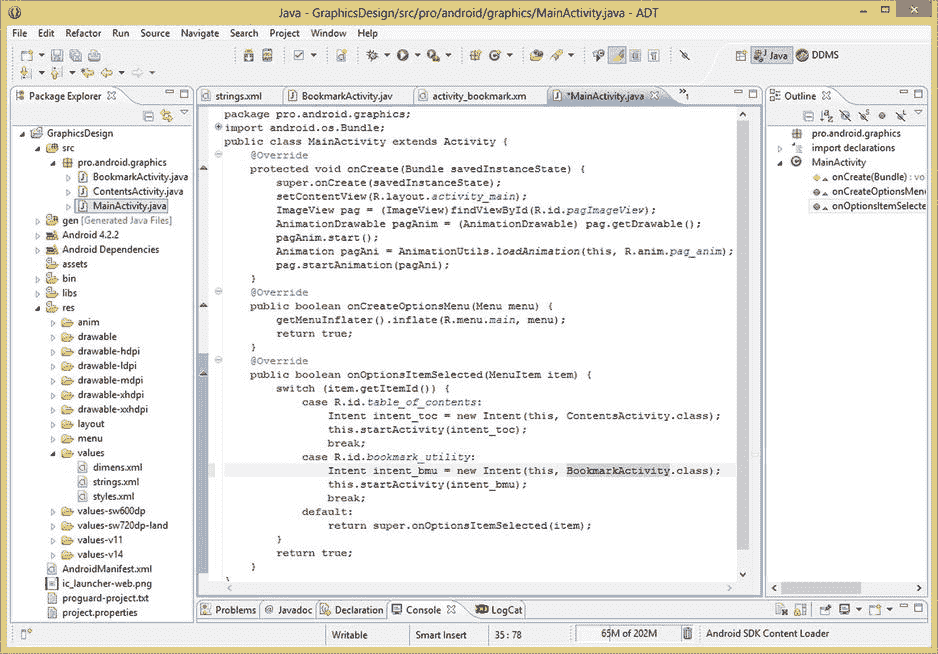

**图 7-6.** 在 `MainActivity` 的选项菜单中添加对新创建的 `BookmarkActivity.class` 的引用

现在，你已经准备好将 `TextView` UI 元素添加到 `activity_bookmark.xml` 屏幕布局定义文件的 `RelativeLayout` 中，以便在 Bookmarking Utility 用户界面设计的顶部添加一个书签页面标签。

点击 Eclipse 顶部的 `activity_bookmark.xml` 选项卡，在 `RelativeLayout` 起始标签后添加一行缩进的空格，然后输入 `<` 字符调出辅助对话框，双击 `TextView` 子标签，将其添加到 `RelativeLayout` 容器中，如图 7-7 所示。接下来，你将添加参数来配置你的 TextView。

在 `<TextView` 起始标签后，输入 `android` 和冒号，调出辅助对话框。然后找到 `android:id` 参数并双击添加。在引号内添加 `@+id/currentBookmarkText` 来标识该 `TextView`，以便之后可以使用 Java 代码更改其值。最后，确保为该标签添加结束符号 `/>`（在 ID 参数之后）。

使用相同的工作流程，添加必需的 `android:layout_width` 和 `android:layout_height` 参数，并将它们都设置为 `wrap_content`，因为你希望文本对象作为一个独立的实体浮动在你的设计之上。

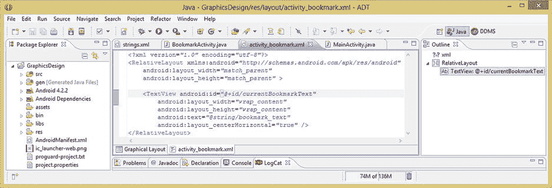

**图 7-7.** 添加 `TextView` 标签以及布局、文本内容、ID 和水平居中的基本参数

为了给你的 TextView UI 元素添加内容（文本值），再次使用 `android:` 工作流程；这次，找到 `android:text` 参数，并将其值设置为之前使用引号内的 `@string/bookmark_text` 引用路径创建的 `<string>` 常量。

最后，使用辅助对话框找到 `android:layout_centerHorizontal` 参数，或者手动输入，并将其设置为 `true`，这样你的 `TextView` 就会自动在布局容器顶部居中。现在，你可以选择 **Run As** ➤ **Android Application**，查看你的 `TextView`，如图 7-8 所示。

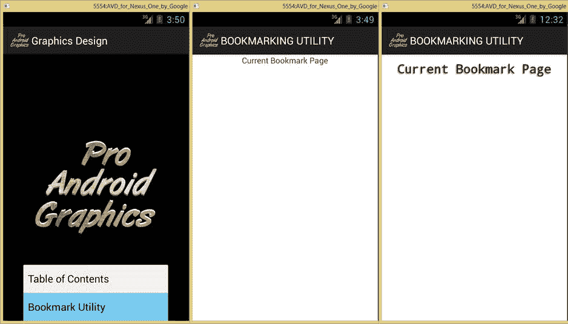

**图 7-8.** 在 Nexus One 模拟器中测试 `activity_bookmark.xml` 中的 `RelativeLayout` 和 `TextView`

接下来，让我们添加一些更高级的参数，将你的文本从屏幕顶部向下移动一些，使其变大，改为等宽字体，并添加一些投影特效，就像你在 Photoshop CS6 或 GIMP 2.8.6 中设计 UI 一样。为了节省空间，我将每行使用两个参数，如图 7-9 所示，因为很快你就要向这个 `RelativeLayout` 容器中添加更多标签了。

要将 `TextView` 从屏幕顶部向下推开，你将使用 `android:marginTop` 参数，并将其值设置为 `10dip`（或 `10dp`）。


接下来，你可以使用`android:typeface`参数将字体更改为等宽字体（如果你喜欢罗马字体，也可以使用衬线字体），该参数可以设置为`normal`、`sans`、`serif`或`monospace`。如果愿意，你可以在 XML 标记中尝试这些设置；我使用了`monospace`，因为它能使文本在屏幕顶部更均匀地分布，并且与屏幕顶部的 Activity 标签（使用`sans/normal`字体）形成视觉区分。

为了让文本更粗，我们来实现`android:textStyle`参数，将其设置为`bold`，你也可以使用`normal`或`italics`来实现不同的文本样式效果。我使用了粗体，因为我想在添加投影效果之前加粗字体笔画。

此外，通过将`android:textSize`参数设置为`21sp`来增大`TextView`的大小。需要注意的是，Android 操作系统中的所有文本或字体设置都使用标准像素或`sp`单位，而不是密度无关像素`dip`或`dp`。原因在于（你在第 5 章中已经学过），Android 会对其使用的字体应用缩放因子，你可以通过`DisplayMetrics`类来获取该因子。现在，你已拥有一个可以添加投影效果的大尺寸、加粗的`TextView`对象！

使用`android:`工作流程打开你的辅助对话框，输入文本字符串`android:shadow`，系统将仅为你筛选出与阴影相关的参数。共有四个参数：`Dx`（Delta-X）、`Dy`（Delta-Y）、`Color`和`Radius`。如果你不清楚，“Delta”指的是偏移量，即与实际文本的差值，因此设置为`0.0`将不产生任何效果。

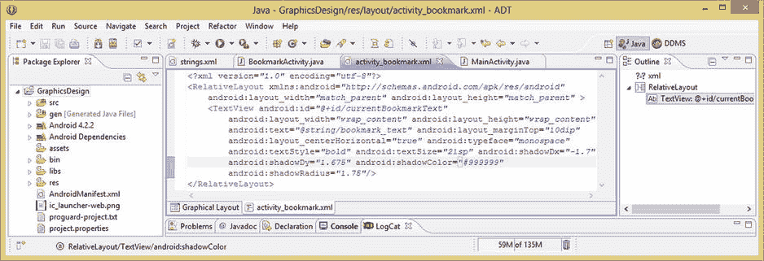

**图 7-9.** 为`TextView`添加高级标签参数：字体、样式、字号及投影特效

需要注意的是，投影特效不会在图形布局编辑器（GLE）选项卡中渲染，因此你在 Eclipse 中无法看到这些参数！你必须使用“Run As ➤ Android Application”工作流程，然后在 Nexus One 模拟器中查看它们。这就是为什么我在截图 7-8 中包含了右侧远端的显示结果面板。

首先，使用`android:shadowDx`参数（设置为实数值`-1.7`）和`android:shadowDy`参数（设置为实数值`1.675`）来指定投影相对于文本的偏移量。注意，我利用了实数类型的特性，为 Y 轴值提供了精确的小数，这使得投影几乎位于文本下方两个像素处。X 轴负值则将投影向左拉动近两个像素，形成标准的 45 度投影效果，这意味着光源来自图像右上方。

接下来，设置投影颜色。我使用`android:shadowColor`参数将其设置为浅灰色的十六进制值`#999999`。

最后，你需要使用`android:shadowRadius`参数设置投影的模糊（柔化）半径，这里同样使用实数值`1.75`像素。

这个设置将为你带来漂亮且逼真的投影模糊半径，效果就像你在 Photoshop 或 GIMP 中实现的那样。区别在于，你是在 Android 应用中使用几个字节的标记代码来实现，而不是使用千字节的数字图像资源数据。

如果希望投影边缘清晰，你可以使用非常小的值，例如`0.1`来达到此效果。中等值如`0.5`会添加少量模糊，而大值如`2.0`则会为投影增加大量模糊或柔化。为了实现最逼真的阴影，我建议值设置在`1.25`到`1.75`之间，但使用这四个`android:shadow`参数可以创造出许多酷炫的效果。

对我们这些图形设计师来说，另一个非常重要的 UI 控件是`ImageView`控件。你将在下一节中更详细地了解该控件及其一些重要参数，届时你将在书签实用工具 Activity 中添加一张书签页的图片。


### 使用 ImageView 控件：图形处理的基石

在将`ImageView` UI 控件添加到 `RelativeLayout` 容器之前，你需要先将数字图像资源放入各自对应的密度像素文件夹中。将 `bookmark0_240px.png`、`bookmark0_320px.png`、`bookmark0_480px.png` 和 `bookmark0_640px.png` 分别复制到 `/res/drawable-ldpi`、`drawable-mdpi`、`drawable-hdpi` 和 `drawable-xhdpi` 文件夹中。

请注意，我使用的分辨率是每种像素密度目标 DPI 的两倍：240 是 120 DPI 的两倍（即 2 英寸大小），320 是 160 DPI 的两倍，480 是 240 DPI 的两倍，640 是 320 DPI 的两倍。除图标外，你不需要为 XXHDPI（480 DPI）级别提供应用图像资源。

如果你确实提供了 XXHDPI 图像资源，它需要是 960 像素。图 7-10 显示了你项目的资源 `drawable-ldpi` 文件夹，以及应用图标和第一个书签页面图像占位符（启动屏幕），这是在 `bookmark0_240px.png` 文件被复制并重命名为 `bookmark0.png` 之后的样子。

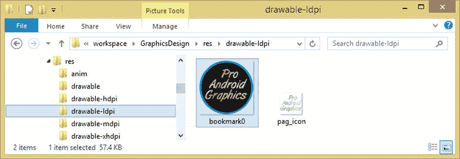

图 7-10. 将 `bookmark0_240px.png` 文件复制到 `/res/drawable-ldpi` 文件夹并重命名为 `bookmark0.png`

在将全部四个图像文件复制并重命名到 Android 要求你为基于像素的资源提供的四个目标像素密度文件夹之后，你可以将 `<ImageView>` 子标签添加到你的 `<RelativeView>` 父布局容器标签中，如图 7-11 所示。

如果你愿意，你可以使用 `<` 键调出 `RelativeLayout` 子标签支持辅助对话框，或者直接输入 `<ImageView` 和 `/>` 起始与结束标签分隔符，然后使用 `android:` 工作流程开始添加参数，以调出参数辅助对话框。

无论你是通过辅助对话框找到参数，还是凭记忆直接输入（随着你成为更熟练的开发者，你会这样做），你需要添加的第一个参数是 `android:id` 参数，以便你能够从 Java 代码中引用这个 `ImageView` 对象，从而在用户为不同页面添加书签时更改所使用的图像。你将使用描述性的 ID 值 `currentBookmarkImage`，因此这个 ID 反映了 `ImageView` 的功能。

接下来，添加必需的 `android:layout_width` 和 `android:layout_height` 参数，设置为 `wrap_content`，然后使用设置为 `@drawable/bookmark0` 的 `android:src` 参数来设置图像的源文件引用。这将根据用户的 Android 设备规格，引用你位于 LDPI、MDPI、HDPI 和 XHDPI drawable 文件夹中的 `bookmark0.png` 文件。

另请注意，在图 7-11 中，当你输入源文件引用参数的 `android:src="@drawable/` 部分时，在输入 `/` 字符后，Eclipse 将弹出一个辅助对话框，列出你当前项目中安装的所有 drawable 资源。

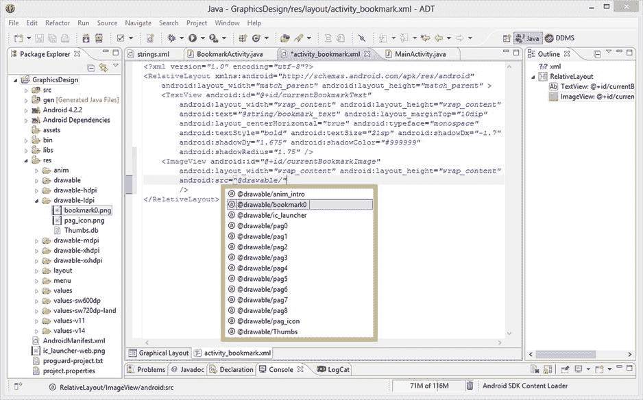

图 7-11. 为 ID 和布局宽度与高度添加参数，并使用辅助对话框定位 `@drawable` 文件

如果你之前复制的图像资源没有列出，你可能需要右键单击项目文件夹并选择 `Refresh` 命令。每当系统上的 Eclipse 正在运行（已启动）时添加资源，都需要执行此操作，这是为了让 Eclipse ADT 知道你添加了 Eclipse 开发环境外部（尚不可见）的新资源。由于你使用 Windows 资源管理器或其他文件管理工具将这些资源添加到 Eclipse 项目文件夹层次结构（结构）中，`Refresh` 命令将告诉 Eclipse 重建其对此新文件夹和/或资源文件结构的内部文件引用，以便它知道其中包含什么。

接下来，你需要使用“图形布局编辑器”选项卡或 `Run As` ➤ `Android Application` 工作流程，查看你的初始 `ImageView` 对象和参数如何与你当前的 `TextView` 对象和参数协同工作。

正如你在图 7-12 中看到的，`ImageView` 对象在屏幕顶部与 `TextView` 对象重叠。如果你使用的是更简单的垂直方向 `LinearLayout` 容器，这种情况就不会发生。

由于你使用的是 `RelativeLayout` 容器，你需要提供参数来告诉你的 `ImageView` 对象你希望它如何相对于相邻的 `TextView` 对象定位。那么，让我们添加更多参数吧！

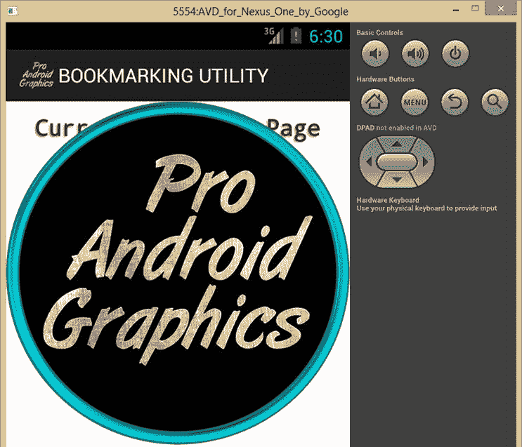

图 7-12. Nexus One 预览显示 `TextView` 和 `ImageView` 重叠

在你使用 `Run As` ➤ `Android Application` 工作流程运行你的 Nexus One 模拟器后，你会注意到由于在此过程中使用了强制保存功能，你的 `ImageView` 标签上出现了一条警告消息。现在将鼠标悬停在其上，你会看到 Eclipse 建议你为视障人士添加一个 `contentDescription` 参数（出于无障碍目的）。如图 7-13 所示，我添加了这个参数。

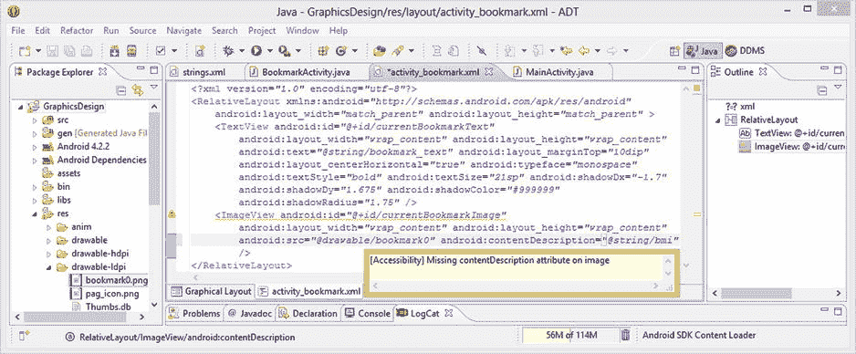

图 7-13. Eclipse `contentDescription` 警告消息和 `android:contentDescription` 引用 `@string/bmi`

请确保你在 `/res/values` 文件夹中的 `strings.xml` 文件中使用以下标记添加一个 `<string>` 标签常量：

```
<string name="bmi">Image of Currently Bookmarked Page</string>
```

现在你可以处理 `ImageView` 和 `TextView` 对象的相对布局定位了。让我们添加 `android:layout_below` 参数，它告诉你的 `ImageView` 对象将其自身布局在参数中引用的对象下方；在本例中，引用的是 `@+id/currentBookmarkText`。

这是你需要为 `TextView` 对象提供 ID 参数的另一个原因：这样你就可以使用相对布局对齐参数，通过其 ID 将布局中的其他对象与 `TextView` 对齐。

同时，让我们缩小 `ImageView` 对象 UI 控件容器内的图像内容，使其不触及竖屏布局的边缘，就像你在 Nexus One 模拟器中看到的那样。实现此目的的最佳方法是添加一个 `android:layout_margin` 参数，它不仅能将 `ImageView` 推离屏幕边缘，还能将其从屏幕顶部的 `TextView` UI 元素处向下推开，从而为屏幕 UI 设计提供更好的间距效果。这次使用值 `9dp`，如图 7-14 所示，以演示你可以使用 `9dip` 或 `9dp`，两者在你的 XML 标记中都能很好地工作。

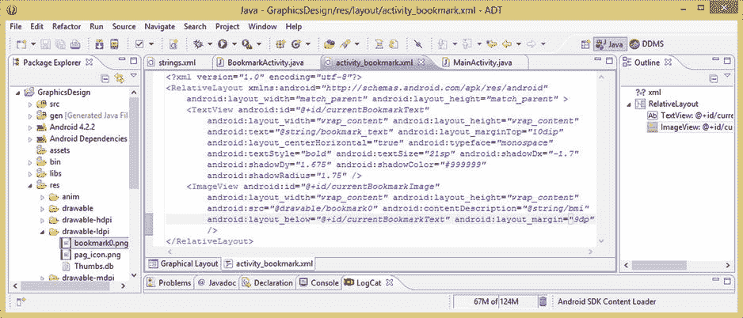

图 7-14. 添加参数以纠正 `TextView` 和 `ImageView` 重叠，并围绕 `ImageView` 添加间距

接下来，你将添加一个 `android:layout_centerHorizontal` 参数并将其值设置为 `true`。正如你在图 7-12 中看到的，你的 `ImageView` 在竖屏布局中已经居中，但当用户将设备横过来时，`ImageView` 将位于屏幕左侧。因此，对于你当前的竖屏设计，这个参数是多余的，但为了同时支持竖屏和横屏方向，它却可以成为救星！

这种设计正是我在第 5 章中谈到的；你需要跨越所有不同的设备、密度和方向进行思考。


最后，你需要添加一个名为 `android:clickable` 的高级参数，并将其值设置为 `true`，因为稍后你将允许用户点击已添加书签页面的图片，并立即跳转到该页面。因此，你需要有点前瞻性，趁着在这里学习一些 `ImageView` 参数的时候，现在就添加这个参数。你刚刚添加的新参数如图 7-15 所示。

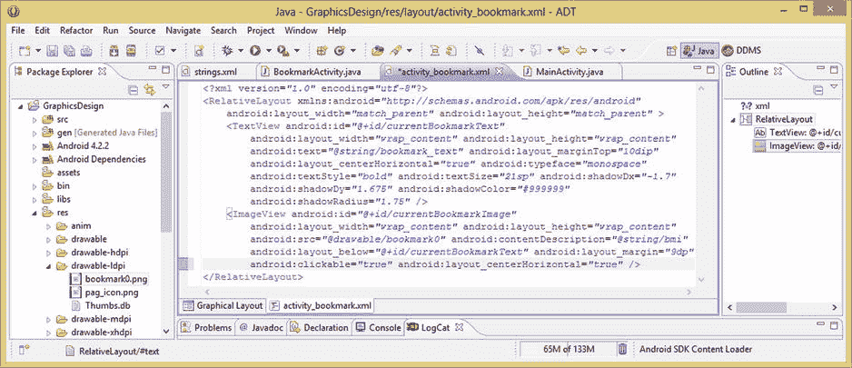

图 7-15. 添加参数以使 `ImageView` 可点击，并在横向布局中水平居中

现在，你可以再次使用 `Run As ➤ Android Application` 工作流程，看看带有阴影效果的 `TextView` 以及其下方居中的 `ImageView` 的用户界面设计效果如何。

如图 7-16 所示，界面看起来非常简洁。接下来，你只需将 Nexus One 模拟器旋转 90 度，在横向模式下测试你的 UI 设计，看看新的用户界面设计是否依然专业！

在此之前，我还想为 `ImageView` 添加另一个细节。既然你已经为 `TextView` 添加了阴影效果，那么你的 `ImageView` 也应该有相同的效果，阴影位于 3D 篮圈左下方 45 度角处。让我们输入 `android:` 查看参数列表，看看是否能找到 `android:shadow` 参数，以便也为 `ImageView` 对象添加阴影效果。

尽管 `ImageView` 有大约 100 个参数，但它似乎还不支持 `TextView` 所支持的 `android:shadow` 参数。我相信未来某个时候会添加这个功能，但考虑到 Android 不能简单地为方形的 `ImageView` 容器添加阴影（如果可以会容易得多），支持这个功能并非易事。

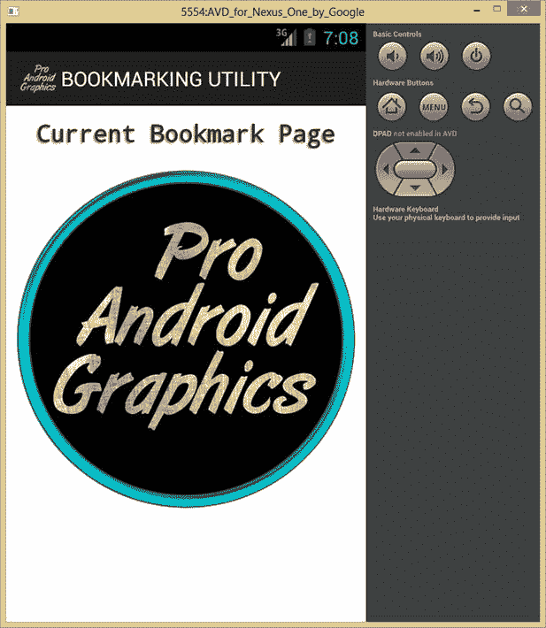

图 7-16. 在 Nexus One 模拟器中测试目前的布局

要正确地为这个 `ImageView` 对象添加阴影，Android 必须查看 `ImageView` 对象中的源图像引用，然后根据 Alpha 通道（图像的透明度）合并（生成）阴影效果。

这正是 Android 灵活性的体现，它允许开发者使用诸如 GIMP 2.8.6 或 Lightworks 11.1 等外部软件，这一点非常有价值。要为你的 `ImageView` 实现匹配的阴影效果，你将需要进入 GIMP 并使用该程序的工具来创建它。

我将在本章后面部分进行操作；毕竟这是一本专业图形设计的书籍，所以你将通过 GIMP 的工作流程来学习如何为你的图像资源创建阴影效果，而不是使用 Android 的 `ImageView` 参数。在这个过程中，你还会学习如何创建半透明的 Alpha 数据，确保你掌握最前沿的技术！

接下来，你将学习如何将 Nexus One 模拟器旋转 90 度以实现横向模式。这样做是为了测试你的 UI 在横向模式下的显示效果。

### 在 Nexus One 横向模式下测试你的 UI 设计

接下来，你将学习使用键盘快捷键将 Nexus One 模拟器从竖屏模式切换为横屏模式，所以我希望模拟器仍在你的屏幕上运行！如果没有，请重新启动它！

在 Windows 系统中，用于切换模拟器横竖屏的键盘快捷键是使用（左侧）Control 或 `CTRL` 键修饰符加上 `F11` 功能键。因此，按住键盘左侧的 `CTRL` 键，然后（在按住的同时）轻按 `F11` 键，瞧，你的模拟器就会在你眼前旋转。

使用 `CTRL-F12` 可以将显示旋转回竖屏模式。如图 7-17 所示，你的 `android:layout_centerHorizontal` 在横向模式下工作得很好，该方向的布局与竖屏方向一样吸引人。

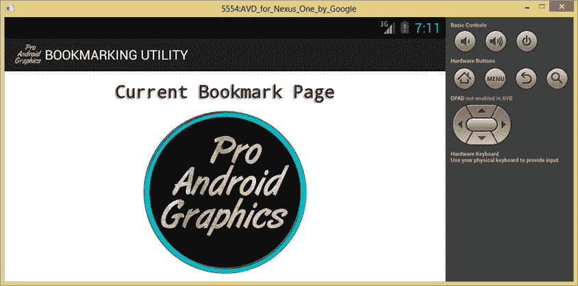

图 7-17. 将 Nexus One 模拟器切换到横向模式以测试 `centerHorizontal` 参数

如果你使用的是 Apple Macintosh，`Command` 键加上数字键盘上的 `7` 键对应 Windows 上的 `CTRL-F11`，`Command` 键加上数字键盘上的 `9` 键对应 Windows 上的 `CTRL-F12`。一些网上用户声称其他按键组合在 Macintosh 上也有效，例如 `CTRL+FN+F11` 或 `CTRL+Command+F11`，以及 `CTRL+FN+F12` 或 `CTRL+Command+F12`，你可以自行尝试。

如果你使用的是 Linux 操作系统，请像在 Windows 中一样使用 `CRTL-F11`。需要注意的是，`CRTL-F11` 表示“向前切换”，而 `CRTL-F12` 表示“向后切换”，因此这两种按键组合都可以在竖屏和横屏方向之间切换。


好的，作为高级文档工程师和翻译员，我将遵循您提供的注意事项和示例，精确地将以下英文文本翻译成中文。


### 为 ImageView 图像资源添加投影效果

现在，让我们使用 GIMP 2.8.6 开源数字图像编辑与合成软件，为 `bookmark0.png` 图像资源添加投影效果。

启动 GIMP 2.8 并打开您之前复制到 `/res/drawable-xhdpi` 文件夹中的 `bookmark0_640px.png` 文件。您应始终使用分辨率最高的图像文件，因为您需要对其进行下采样，以便为其他三个分辨率密度文件夹提供资源。图 7-18 从左到右显示了为此项目设置数字图像合成所需的最初几个步骤。首先，在 x 轴和 y 轴方向上各将图像加宽 40 像素，以便为阴影留出空间。在“设置图像画布大小”对话框中，点击“宽度”和“高度”字段旁边的链图标以将它们锁定在一起，然后在“宽度”字段中输入 720，并点击“居中”按钮，将原始的 640 像素分辨率图像居中放置到新的 720 像素分辨率图像内。点击“调整大小”按钮将这些新参数应用到您的数字画布上。接着，在“图层-画笔”窗口中，在当前图层下方右键点击，找到“复制图层”菜单选项，将该图层数据复制到一个新图层中。

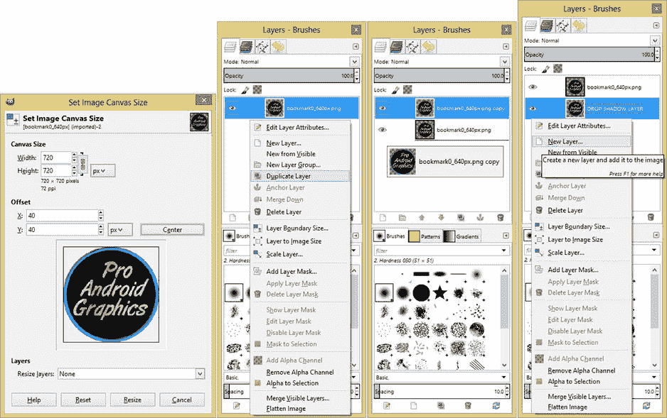

图 7-18. 设置您的 640 像素书签 PNG 图像，以便在 GIMP 2.8 中创建投影效果

创建好复制的图层后，将其拖拽到原始图像图层的下方，如图 7-18 的第三个窗格所示。双击复制（已复制）的图层，并将其命名为 `DROP SHADOW LAYER`，如图 7-18 的第四个窗格所示。接下来，在图层下方右键点击，选择“新建图层”命令，调出“创建新图层”对话框，如图 7-19 所示。输入图层名称 `White Background Layer`，选择“白色图层填充类型”（单选按钮选项），然后点击“确定”按钮。

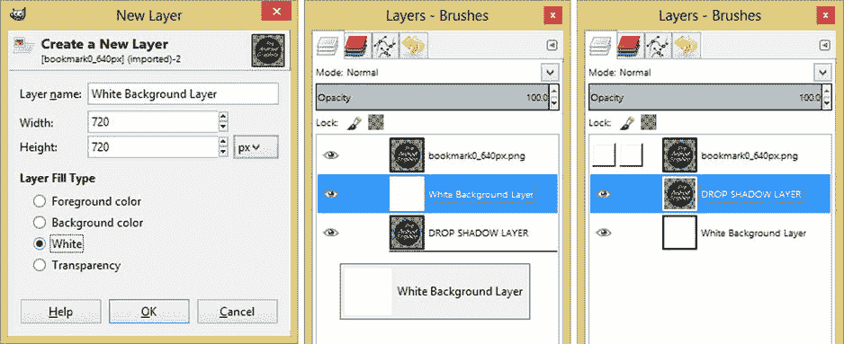

图 7-19. 创建白色背景图层，将其拖拽到图层堆栈的底部，并关闭顶部图层的可见性

这将创建一个填充为白色的新图层，位于 `DROP SHADOW LAYER` 之上。但由于您希望 `White Background Layer` 作为背景，您需要将其拖拽到图层堆栈的最底部，如图 7-19 的中间窗格所示。

接下来，您需要隔离 `DROP SHADOW LAYER`，以便将原始图像数据转换为投影。因此，点击顶部 `bookmark0_640px.png` 图层上的眼睛图标，将其可见性关闭。

由于它下方的图层（`DROP SHADOW LAYER`）与之完全相同（但不会持续太久），您在主图像预览窗口中不会看到任何差异。那么，让我们来改变这一点：点击 GIMP 顶部中间的“颜色”菜单，选择“去色”子菜单项，如图 7-20 所示。

请注意，在 GIMP 中，如果您将鼠标悬停在 GIMP 软件包中的任何元素（如图标、菜单、图层等）上，会弹出一个工具提示，告诉您该软件功能的用途。

“去色”工具或算法用于移除图像中的颜色（即饱和度），同时保留其亮度值。这实际上会将您的图像从彩色转换为黑白图像。对您而言，这是为被 3D 圆环包裹的图像实现中灰色阴影的第一步。

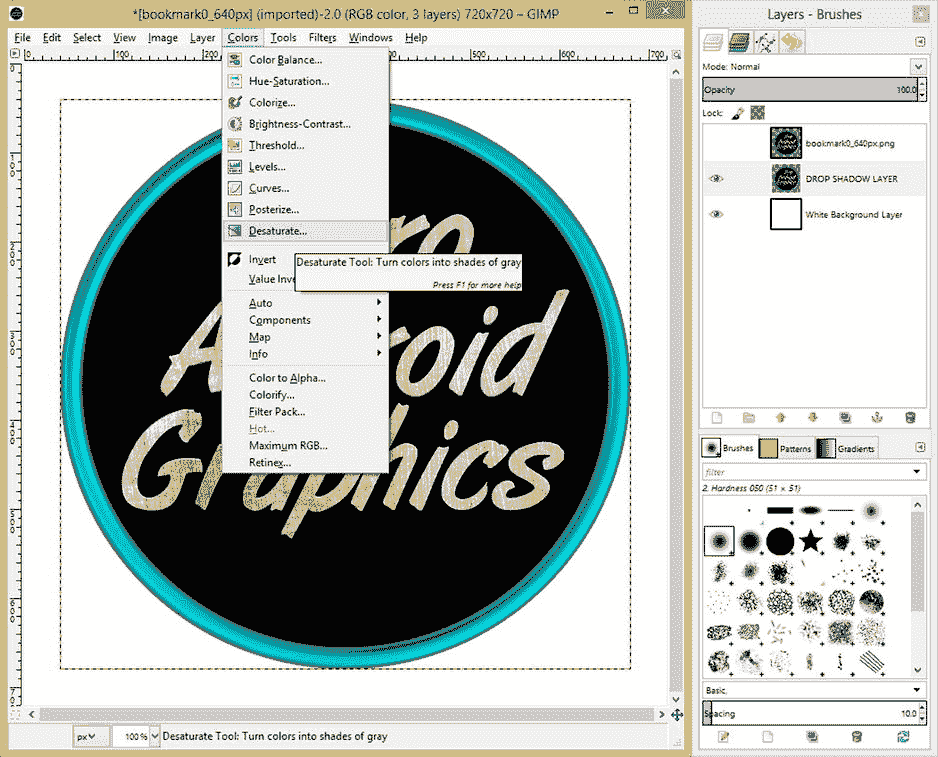

图 7-20. 使用“颜色” ➤ “去色”工具将 `DROP SHADOW LAYER` 从彩色转为黑白

“去色（移除颜色）”对话框提供了三个选项，允许您根据亮度、明度或两者的平均值来选择灰色调。我选择了“明度”（单选按钮选择器），因为它提供了最浅的灰色着色。

如果您想直观地了解 GIMP 中某个工具的作用，请查找“预览”复选框并确保其已被勾选。完成后，您将能够在 GIMP 主预览窗口中看到设置结果，如图 7-21 所示。

如果您还没想到创建投影效果的下一步“操作”，那就是模糊这些灰度像素来生成阴影效果。不过，如果您现在就这样做，模糊效果会被当前图层的边缘截断，在 GIMP 中这些边缘用虚线表示。

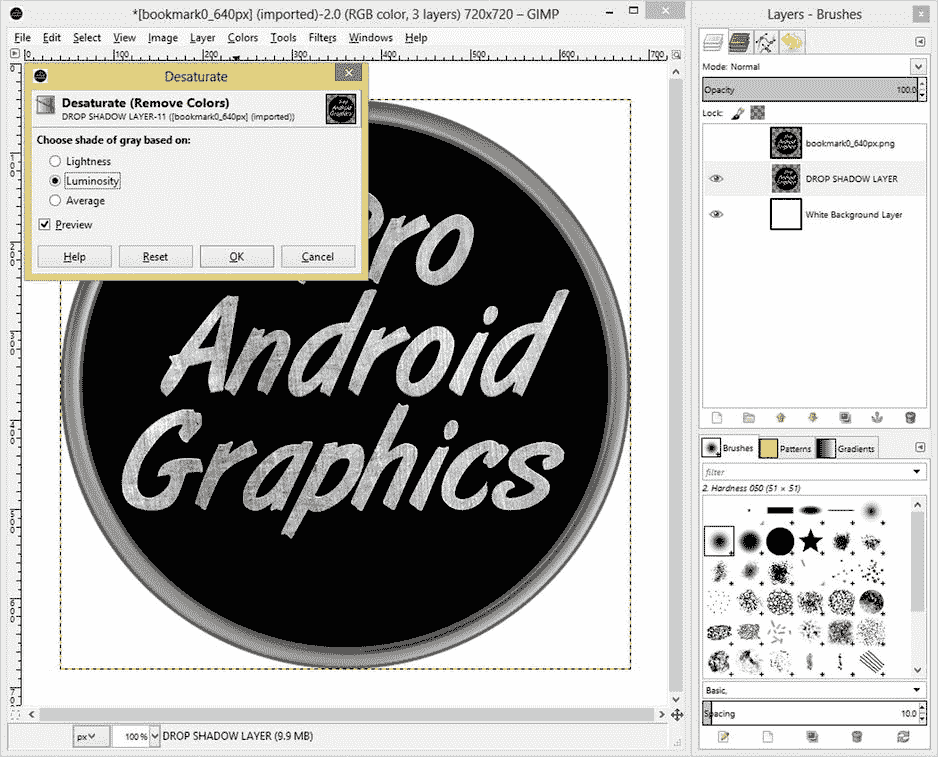

图 7-21. 设置“去色”工具算法，根据图像的明度选择灰色调

如图 7-21 和图 7-22 所示，尽管您已经调整了画布（即容纳图层的容器）的大小，但图层本身仍保持原始 640 像素的源数据尺寸。

虚线显示了这一点。虽然现在不是问题，但如果在这种情况下边缘设置不变就应用模糊操作，最终生成的模糊（阴影）上会出现直线区域。这是因为 GIMP 的模糊算法无法“看到”当前图层边界之外的空间。

您需要找到一种方法，仅针对此图层将这些边界向外扩展，使它们与您之前指定的新图像（画布）大小（720 像素）的边缘匹配。幸运的是，GIMP 2 为此专门提供了一个命令。它位于 GIMP 的“图层”菜单下，称为 `Layer to Image Size`（图层适配图像大小），如图 7-22 所示。

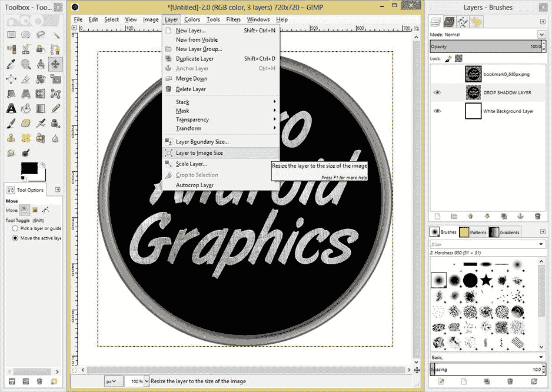

图 7-22. 使用“图层” ➤ “图层适配图像大小”菜单序列来调整图层大小，使其匹配新的图像尺寸

在模糊操作之前执行此步骤非常重要，因为如果模糊效果带有显示其包含图形边缘的锋利边界，会显得很不专业。所以，请勿忘记此步骤！

如图 7-23 所示，您的模糊算法现在有了更多的空间来扩散（模糊）单色图像的像素，从而将其从边缘锐利的金属环转变为原始图像下方柔和的阴影。

要调用 GIMP 中的模糊算法，请进入“滤镜”菜单，找到“模糊”子菜单，这将打开一个弹出式子菜单，其中包含 GIMP 支持的不同类型的模糊算法。在数字图像处理中，模糊既是微调摄影效果的重要功能，也是创建特殊效果（如您正在做的）的重要功能。

对于您的应用，您将使用最流行的模糊算法 `Gaussian Blur`（高斯模糊），该算法以创建模糊算法内部核心数学算法的人命名。它将为您提供所需的平滑、均匀分布的模糊效果，而且不需要复杂的用户界面，如图 7-23 所示。

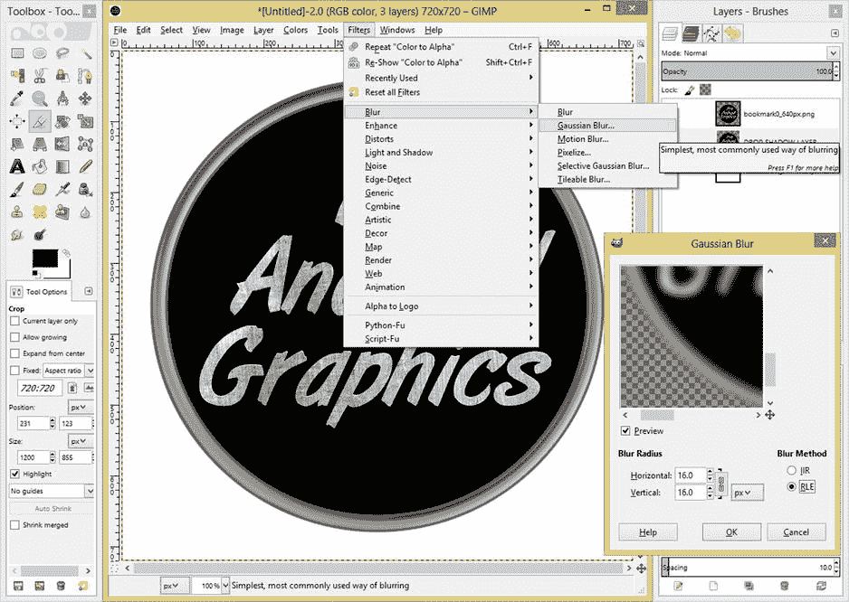

图 7-23. 使用“滤镜” ➤ “模糊” ➤ “高斯模糊”工具来模糊您的单色图层，以创建阴影效果


我将菜单下拉截图与右侧的**高斯模糊**对话框合并在一起，以节省空间。如您所见，我使用链状图标锁定了**水平**和**垂直**值以获得均匀的模糊效果，选择了默认的**RLE（行程长度编码）模糊方法**（算法），并勾选了**预览**复选框，以便在对话框预览中查看模糊量。

在 GIMP 的下一个主要版本（2.10）中，将不再有 **IIR** 或 **RLE** 模糊方法选择选项，因为当前的计算机运行速度极快，不再需要这些选项。过去，**IIR** 在照片处理中速度更快（经过优化），而 **RLE** 则适用于模糊边缘和基于矢量（形状）的图形。

我使用了 **16.0** 的**模糊半径**（以像素为单位）（默认值为 5.0），以便在图像的篮筐部分获得足够的模糊效果，这部分是唯一将显示在原图下方（并稍微向左下方偏移）的区域。请记住，在图层堆栈中，原图位于此图层之上，但目前是隐藏的（因为眼睛图标已关闭），这样您就可以看到当前在此图层上的精确操作。点击 **确定** 按钮，即使在移动它之前，您也能在图 7-24 中看到投影效果！

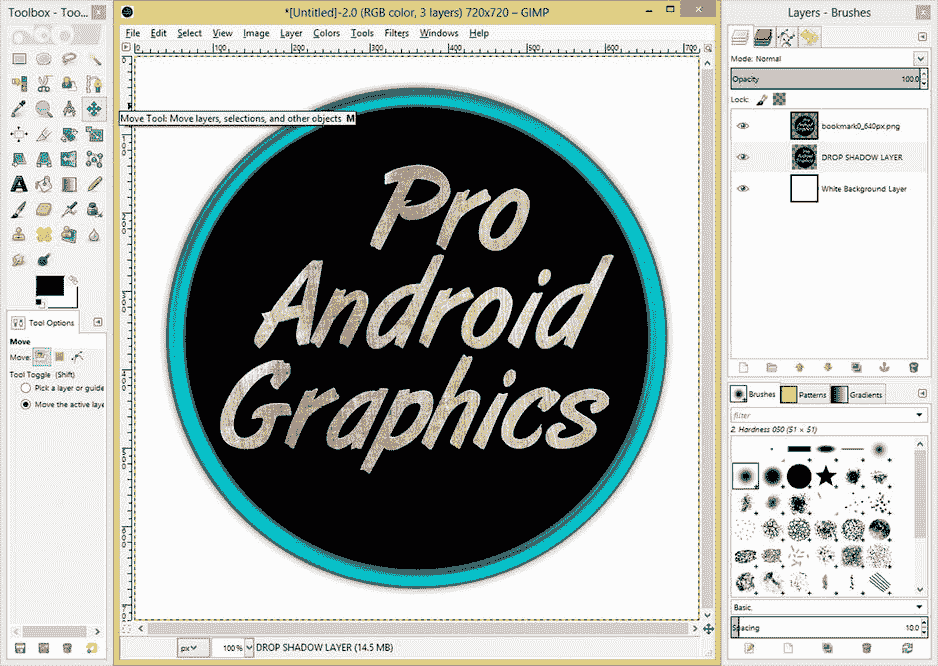

图 7-24。
在使用方向键定位阴影之前，选择**移动工具**图标并点击**中心编辑窗口**

接下来，您将使用**移动工具**将投影图层向下并向左移动几个像素（您将看到，我在每个方向上都使用了 6 个像素）。

首先，您需要使用**图层**面板中的眼睛图标重新打开原图层的可见性，您可以在图 7-24 中看到这一步已经完成。您还可以看到高亮显示的**移动工具**图标，因为我让工具顶部弹出菜单保持激活状态以进行截图。

同样重要的是要注意，在我打开顶层图层的可见性并确保阴影图层仍被选中（在**图层**面板激活时为蓝色，在其他窗口激活时为灰色，如截图所示）后，我需要点击图像预览窗口本身的标题栏（在截图中现在变为金色）以激活该窗口，然后再使用键盘上的方向键逐像素移动图层。

这个工作流程之所以重要，是因为像 GIMP 这样的数字图像编辑软件是模态的。这意味着软件会查看选择了哪些工具以及哪些窗口处于活动状态（拥有焦点），以便精确判断用户想为该功能执行什么操作。

例如，如果您选择了**移动工具**，然后点击您的**投影图层**使其激活，接着使用左箭头键和下箭头键重新定位阴影，阴影图层将不会移动，因为您没有点击主图像编辑窗口来告诉 GIMP 您希望将移动应用于何处。相反，当您使用方向键时，GIMP 将使用它们在图层选择之间移动——这正是您在**图层**面板中希望方向键执行的操作！

因此，选择**移动工具**，确保**投影图层**被选中并激活，然后点击 GIMP 中央编辑窗口的标题栏，按下方向键六次，再按左箭头键六次，以定位阴影，如图 7-25 所示。

接下来，您将获取投影的灰度值并将其转移到 alpha 通道，这样当您回到安卓系统时，它们将允许部分背景颜色（或图像）透过投影区域，从而获得更逼真的合成效果。这在 GIMP 中是通过使用**图层**菜单、**透明度**子菜单和弹出菜单中的**颜色到 Alpha** 算法来完成的，如图 7-25 所示。

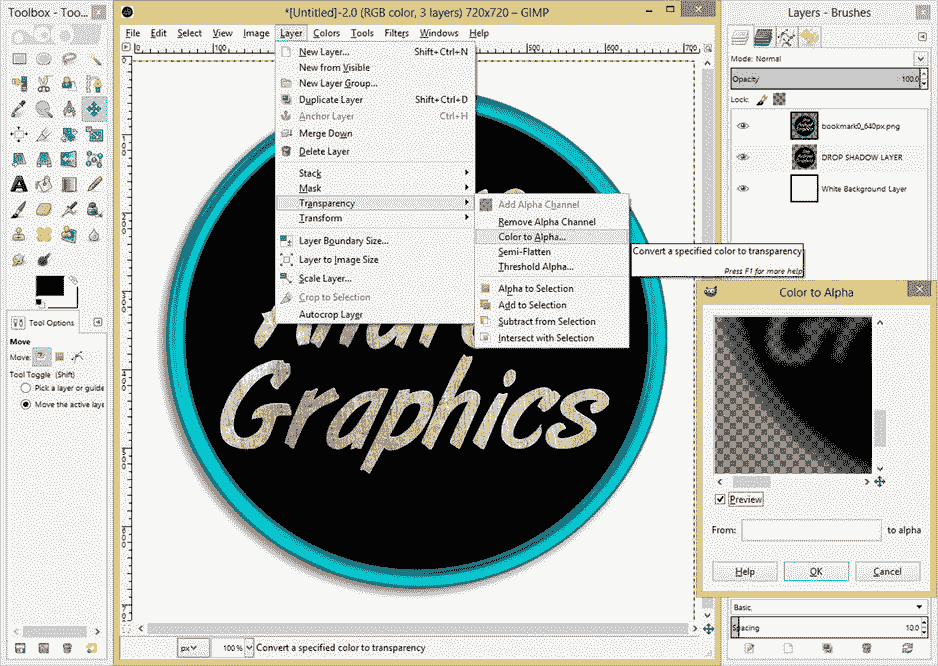

图 7-25。
使用**图层 ➤ 透明度 ➤ 颜色到 Alpha** 工具从阴影创建半透明 alpha 值

正如您在**颜色到 Alpha** 对话框中所见（该对话框显示在图 [7-25] 的右侧，我再次合并了菜单选择截图及其调出的对话框以节省空间），现在您的 alpha 通道中阴影所在的位置有了部分透明度。这将有助于更真实地混合该区域（阴影）后面的像素颜色，无论这些颜色是纯色值还是图像颜色值（不同的像素颜色值）。我们很快会回到安卓开发者模式，并将展示如何在 Eclipse 中实现这一点，以及在 Nexus One 模拟器中看到的视觉效果。

现在您已经创建了投影效果，可以去掉图像及其效果周围的一些额外空间，以免仅仅为了添加投影而将图像从 640 像素增加到 720 像素。为此，您将再次使用**设置图像画布大小**对话框，这次将画布尺寸从 720 像素缩减到 672 像素，如图 7-26 所示。

您将使用比初始的 640 像素图像尺寸多出的 32 个像素。请注意，此处您使用了 2 的幂次像素增量（1-2-4-8-16-32-64 等），这样当您将图像调整到其他密度级别时，会得到整数的像素边界值。在对话框中，点击链状图标锁定画布尺寸的维度，输入 672，然后点击**居中**按钮。这将自动在 **X** 和 **Y** 字段中为您填入 -24 的**偏移**值。为什么是 -24 而不是 -48？这是因为这样算出的偏移量是针对图像四边的，如图所示，48 的一半是 24。

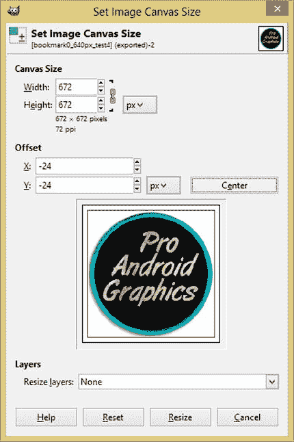

图 7-26。
缩小画布尺寸以匹配阴影

现在您可以关闭白色背景图层的可见性（使用眼睛图标），并查看最终效果和 alpha 通道值。

选择主图像图层，如图 7-27 所示，并确保关闭**白色背景图层**的可见性，这样您就可以看到 alpha 通道和透明度值，在 GIMP 中用棋盘格图案表示。正如虚线所示，您没有为原图添加过多的图像数据（像素空间）来添加这个投影效果。

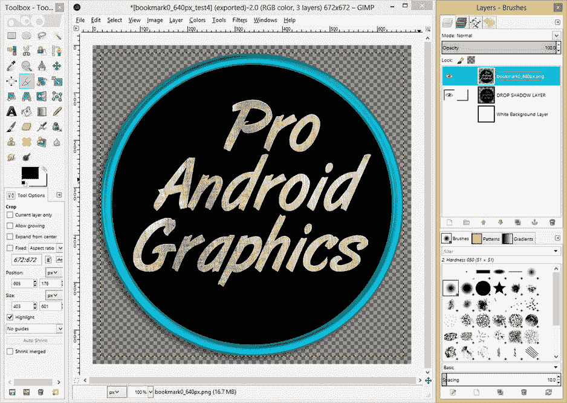

图 7-27。
关闭**白色背景图层**以仅访问透明图层（原图和阴影）

在**图层**选项卡（堆叠的白色或透明牛皮纸图标）旁边，您会看到**颜色通道**选项卡（堆叠的红、绿、蓝图标）。现在点击此选项卡，以便接下来检查图像的红色、绿色、蓝色和 alpha 通道。您需要确保 alpha 通道将图像周围定义为透明，将图像大部分区域定义为不透明（黑色），并将阴影效果所在位置定义为半透明（灰色）。

进入**通道**选项卡后，您会注意到通道的工作方式与图层非常相似。现在，让我们关闭红色、绿色和蓝色通道的可见性，只保留 alpha 通道，以便查看 alpha 通道包含的数据。结果如图 7-28 所示，您的 alpha 通道确实包含了阴影数据。

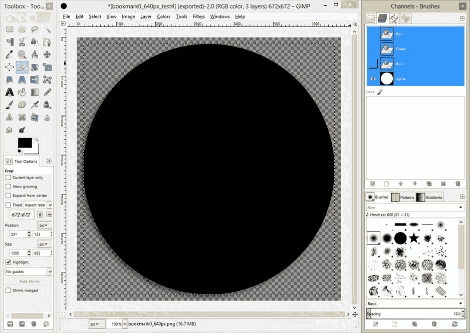

图 7-28。
使用**通道**选项卡并关闭红色、绿色和蓝色通道的可见性以查看 alpha 通道

alpha 通道的这个半透明区域将允许可能存在于图像下方的任何像素颜色的部分颜色数据（至少在您进行合成时）混合到图像本身的灰色阴影区域中。


无论您在此图像及其新阴影效果下方放置什么内容，都将产生逼真的照片级阴影效果。完成以上操作后，接下来您需要在 Eclipse 中创建不同密度的目标图像、保存主文件以及其他类似的例行工作来进行测试。

使用图 7-29 所示的 GIMP 文件导出对话框，将此文件导出到您的 `/workspace/GraphicsDesign/res/drawable-xhdpi` 文件夹。将文件命名为 `bookmarks0.png`（用于书签阴影），以便保留两个图像版本。在子对话框中，使用“保存透明像素的颜色值”选项，如屏幕截图的右侧所示。

务必注意，如果您让白色背景图层保持可见（眼睛图标处于打开状态），则导出的文件将在结果图像中显示白色背景。因此，在执行导出之前，请确保图像看起来与图 7-27 所示一致！

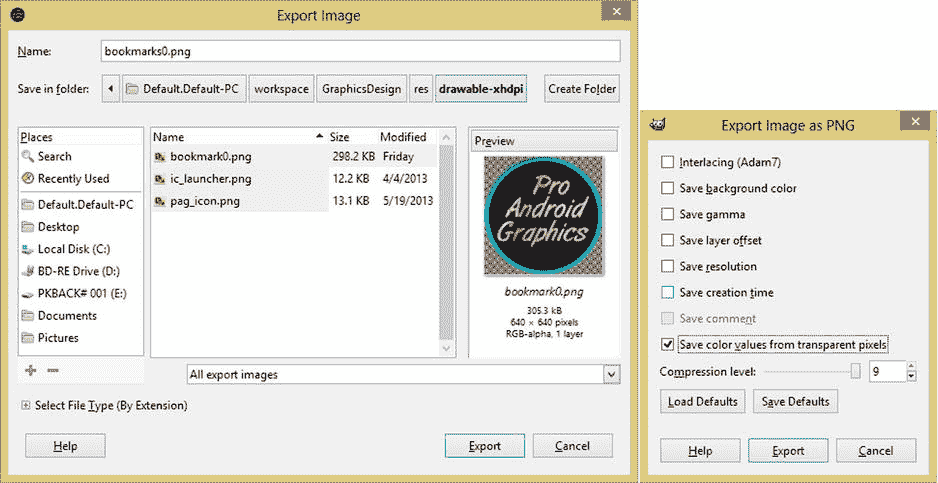

图 7-29.

将图像以 `bookmarks0.png` 导出至您的 `/workspace/GraphicsDesign/res/drawable-xhdpi` 文件夹

导出 XHDPI PNG32 资源后，使用图 7-30 中所示的 GIMP 缩放图像对话框，将图像数据调整到其他分辨率密度，以便为此新图像获取 HDPI、MDPI 和 LDPI 图像资源。我们先进行 2 倍降采样，因此在使用链式图标锁定图像大小 x 和 y 值后，在“宽度”字段中输入 336。336 是 672 的一半，因此可以实现均匀的 100% 尺寸缩减。

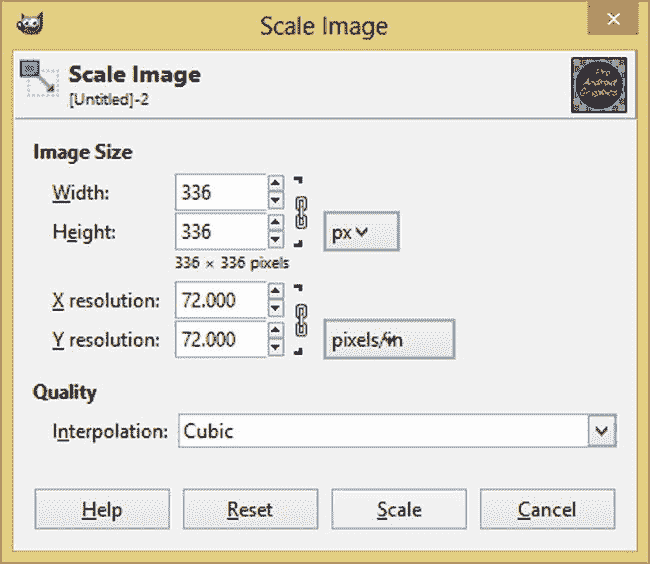

图 7-30.

将图像缩小以创建 336 像素的 MDPI 资源

您将使用高质量的三次插值器来执行这些图像缩放操作。将文件以文件名 `bookmarks0.png` 导出到 `/res/drawable-mdpi/` 文件夹后，使用“编辑”菜单和“撤销”功能返回到原始（最高）分辨率 XHDPI 图像资源，如图 7-31 所示。此外，在调用“撤销缩放图像”选项之后，最好使用 GIMP 的“文件”➤“另存为”操作，将包含图层、通道等内容的 GIMP 原生 `.XCF` 文件保存在您的图像工作目录中。如您所见，对于本书，我的目录是 `/PAGD/CH07`。

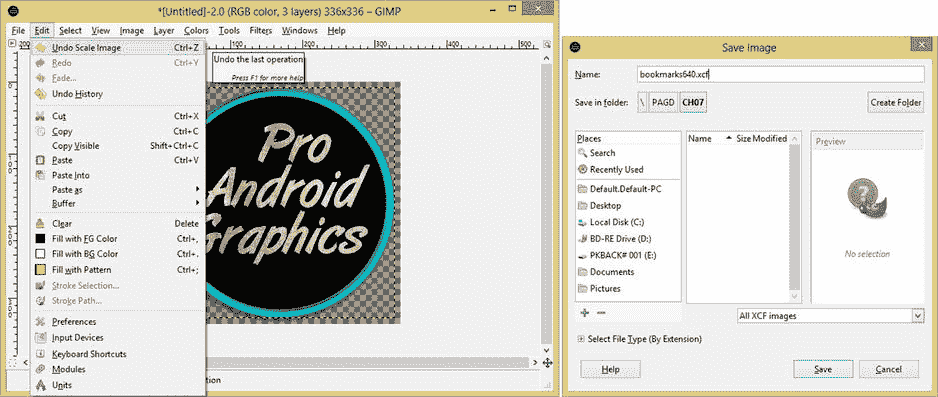

图 7-31.

撤销 2 倍降采样，保存原始尺寸，并将图像缩放到 HDPI 和 LDPI 目标分辨率

现在您需要输出 HDPI 资源。要计算尺寸，请将 672 像素的图像大小除以其 320 DPI，得到缩放因子 2.1。将 240 DPI 的 HDPI 密度乘以 2.1，得到 504 像素，因此接下来使用“缩放图像”选项将 672 像素的图像调整为 504 像素，并使用相同的 `bookmarks0.png` 文件名将其导出到 HDPI 文件夹。

然后，再次撤销缩放图像操作，将 120 DPI 的 LDPI 密度乘以 2.1，得到 252 像素，或者取 240 DPI、504 像素的一半，也能得到相同数值。对这个 252 像素的数字图像资源执行相同的“缩放图像”和“导出”操作，您就拥有了所有四个分辨率密度的目标资源。

如果您已经在硬盘上将文件保存为原生 XCF 格式，请在退出 GIMP 时对弹出的保存对话框选择“否”，否则您将把较低分辨率的图像版本保存到该文件名（容器）中，从而丢失原始的更高分辨率格式。

现在，您可以返回 Eclipse，对 XML 文件进行必要的更改以实现新的投影效果图像版本，并学习如何在您的 `RelativeLayout` 容器中设置背景色或背景图像，以便让 Android 为您执行一些图像合成操作。您现在可以开始利用在最初几章中学到的基础知识了。

### 更改 ImageView 的 XML 以加入新资源

如果 Eclipse ADT 包尚未运行，请启动它，进入 `activity_bookmark.xml` 编辑选项卡，编辑您的 `android:src` 参数，如图 7-32 所示，使其引用您刚刚创建的新 `bookmarks0.png` 图像。

要查看 `RelativeLayout` 在白色背景（默认）颜色下的阴影效果，您可以使用编辑屏幕底部的“图形布局”选项卡，或者使用“运行方式”➤“Android 应用程序”工作流程，在 Nexus One 模拟器中查看效果。

要在此新图像中显示部分 Alpha 通道的渗透效果，您需要在父级 `RelativeLayout` 容器标签中添加一个 `android:background` 参数。首先，您将使用柔和橙色颜色值 `#EECCAA`，确保您的颜色阴影呈现灰橙色，稍后再添加一张图像，确保该图像数据也能与您的阴影 Alpha 值混合。新的父标签参数如图 7-32 所示。

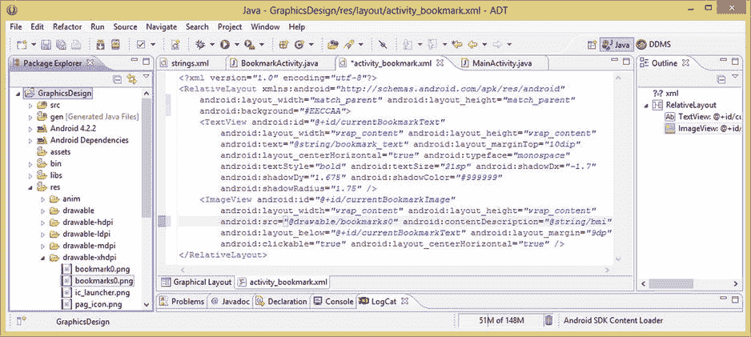

图 7-32.

更改 `android:src` 图像引用名称并在父标签中添加 `android:background` 参数

接下来，使用“运行方式”➤“Android 应用程序”工作流程在 Nexus One 模拟器中预览新的 UI 设计。现在您已经知道如何操作了，可以在竖屏和横屏模式下查看效果，看看它有多酷。效果看起来非常棒（见图 7-33）。

如果您希望使 TextView 的阴影与 ImageView 的阴影匹配，可以调整 `android:shadow` 参数及其值，使阴影更相似（稍微增加偏移量以及 `Dx` 和 `Dy` 值）。您可以在添加背景图像后执行此操作，以进一步测试您的 Alpha 通道。

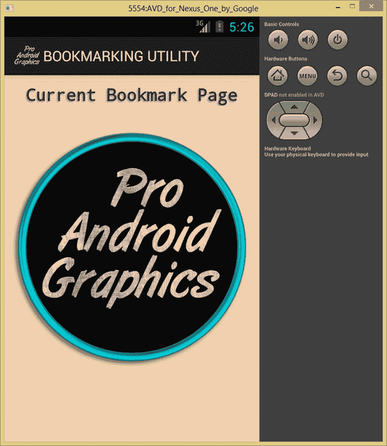

图 7-33.

使用背景颜色测试阴影 Alpha 通道

现在您已经知道您的 Alpha 通道可以与纯色配合使用，在下一节中，您将把一张美丽的日落 JPEG 图像复制到 XHDPI 文件夹中，看看您的投影效果是否也能与照片图像配合良好。


### 在 RelativeLayout 中添加背景图像

最后，您需要将一个名为 `cloudsky.jpg` 的背景图像安装到 UI 的 `RelativeLayout` 容器中。请在本节书的第 7 章资源文件夹中找到该文件，将其复制到您项目的 `/res/drawable-xhdpi/` 文件夹中，然后利用 Eclipse ADT 中的 `Refresh` 功能，让开发环境在您引用该文件时能够“识别”它，而不会抛出错误。

要引用这个新的 JPEG 图像，只需将 `android:background` 参数中的十六进制颜色值从 `#EECCAA` 改为资源引用值 `@drawable/cloudsky` 即可！图 7-34 展示了新图像引用的 XML 标记，以及刷新后的 `/res/drawable-xhdpi` 文件夹中的图像资源内容。

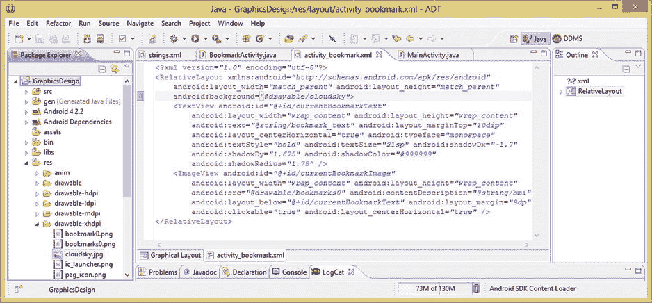

图 7-34. 将 `android:src` 参数设置为引用 `bookmarks0.png`，并设置 `android:background` 参数

请注意，您的 Eclipse ADT 在 IDE 中对 JPEG 图像使用的图标与 PNG 图像不同。对于一个 1000 像素见方的图像，JPEG 格式大小为 384 千字节。由于这只是一张普通的日落图像，我打算只使用一种 XHDPI 密度分辨率，然后让 Android 操作系统进行下采样。

我在这里做的另一件巧妙的事情是，使用了一个 1:1 宽高比的方形图像，Android 可以将其非对称地缩放为竖屏或横屏模式。由于用户看不到存储在 Android `.APK` 文件资源区域中的 1000x1000 像素原始图像，因此可以在用户毫无察觉的情况下完成这种缩放，用户看到的并非原始（未失真）图像内容。我会在这本书中向您展示许多酷炫的技巧；我们还有几百页的内容可以探究！

该图像在 x 和 y 方向上各有 1000 个像素，因此 Android 操作系统在进行缩放时有充足的像素可供使用，并且图像中不会出现锯齿边缘。这张照片的特点就是蓬松的云朵和日落的渐变色，这是完美的缩放场景，当您在 Nexus One 模拟器中使用竖屏和横屏两种方向测试这个新的背景图像时，就会看到效果。

不过，让我们回到正题。您在这里真正要测试的是阴影效果，以及 Alpha 通道中对灰度值（8 位，即 256 个灰度级别）的合成效能。这些灰度值允许底层像素颜色值以不同程度透过阴影效果显示出来，或者与之混合。如图 7-35 所示，您用 GIMP 创建的阴影效果与背景日落图像完美地合成在了一起。

相比而言，Android `TextView` 参数的算法阴影合成效果就不那么尽如人意了；不过，这可能也与当前的值设置有关！

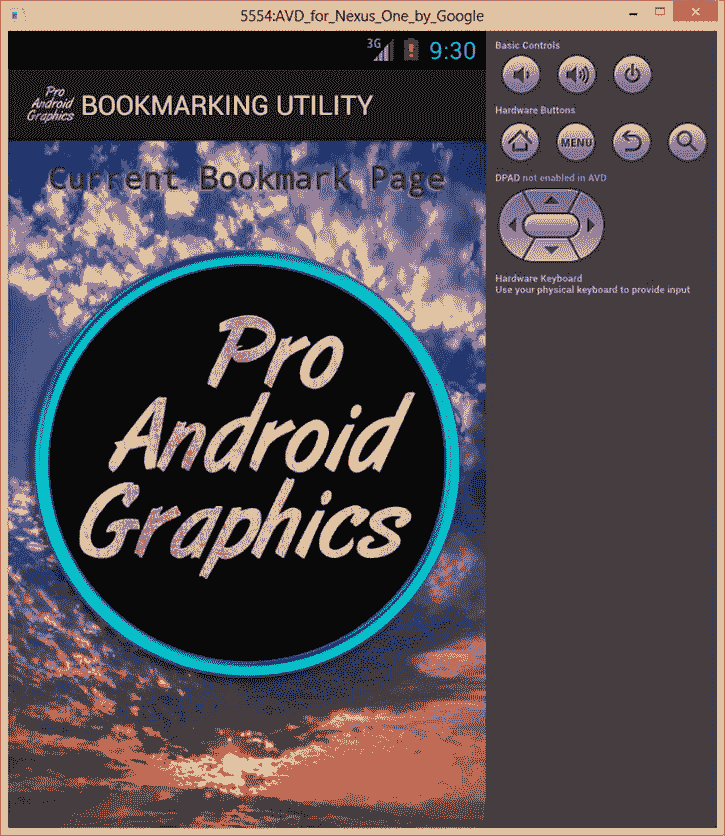

图 7-35. 在 Nexus One 模拟器中测试阴影的 Alpha 通道

当前的 `TextView` 的 `shadowColor` 参数是针对白色背景优化的，使用了浅灰色的十六进制颜色值 `#999999`。

您需要将这个值改为更深的灰色，以匹配您在 `ImageView` 上使用的阴影灰度值。您应该使用十六进制颜色值 `#333333`，这位于灰度谱的另一端。

要计算出准确的灰度百分比值：从 0 到 16（十六进制），3 是 25%（请记住，从 0 开始计数时，3 实际上是第 4 个），所以这种灰色是 75%黑色和 25%白色，因此它是一个 3/4 深度的灰色。

而 `#999999` 是 16 中的 10，也就是 8 中的 5。8 中有 12.5 个 100，5 乘以 12.5 是 62.5%白色和 37.5%黑色，所以它是一个 3/8 浅灰色的值。正如您在图 7-35 中所见，浅灰色不适合日落图像。此外，您需要将 Alpha 值添加到 RGB 值中，使其变成 ARGB 值。让我们通过添加一个 `BB` Alpha 值使其达到 75%（12/16）的不透明度，从而得到新的 `android:shadowColor` 参数值的十六进制值 `#BB333333`，如图 7-36 所示。

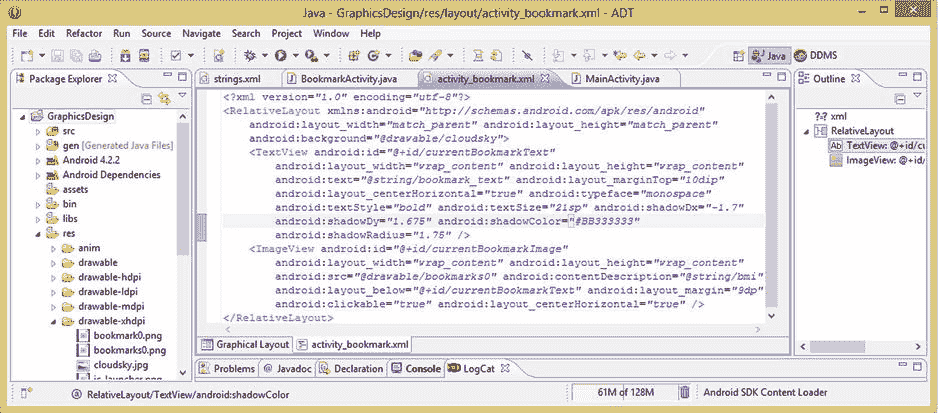

图 7-36. 向 `TextView` 的 `android:shadowColor` 参数添加新的 Alpha 通道 ARGB 颜色值

现在，您已经准备好测试 `TextView` 上支持 Alpha 通道的 `shadowColor` 参数，看看是否能更接近您在 `ImageView` 上达到的效果。使用 `Run As` ➤ Android Application 工作流程，运行 Nexus One 模拟器，并在竖屏和横屏两种模式下测试用户界面设计。图 7-37 展示了 Nexus One 模拟器中横屏模式下的 UI 设计；阴影的暗度和透明度都匹配了！

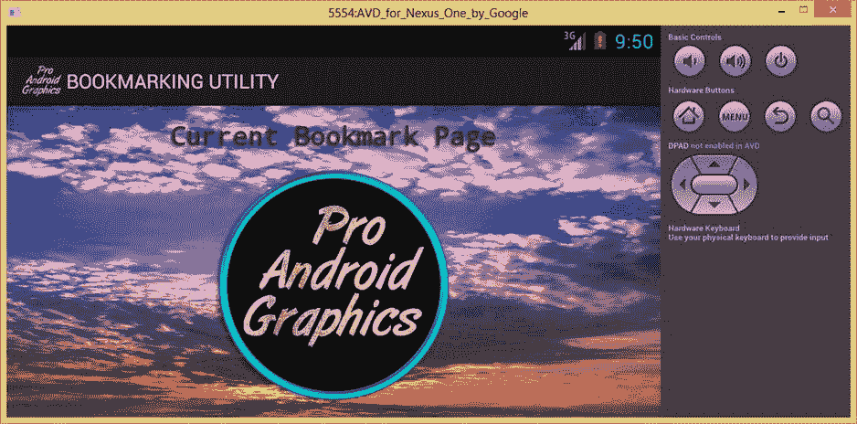

图 7-37. 在 Nexus One 横屏模式下测试 `TextView` 的带 Alpha 通道的 `shadowColor` 及 `ImageView`


### 总结

在第七章中，你学习了 Android `View` 超类，以及它如何为用户界面小部件提供基础，你可以利用这些小部件填充 ViewGroup 布局容器，从而创建 UI 设计。

我们首先探讨了基本的 View 参数，包括**ID**，它允许其他 Java 代码或 XML 标记引用 View 对象；布局（全局）定位，使用 `layout_weight`；以及 View 对象小部件如何通过 `layout_width` 或 `layout_height` 中的 `wrap_content` 或 `match_parent` 常量来调整大小，这两个参数是任何 View 对象中必不可少的。

接着，我们研究了 View（局部）定位属性或参数，这些参数可以使用外边距（View 边界外的空间）和内边距（View 边界内的空间）。这些参数允许 View 对象（UI 小部件）在布局容器内相对于其他 UI 元素进行局部定位。

然后，你了解了任何 View 对象的图形属性，这些属性由背景（图像）和源（图像）以及透明度和可见性参数控制。你在本书中将学到的大部分图形设计和特殊效果最终都将通过这些参数实现，因此我们详细介绍了它们，力求面面俱到。

最后，我们探讨了如何通过设置焦点以及实现事件监听器和事件处理程序使 View 对象具有交互性。

是时候开始编写 Java 代码和 XML 标记了，因此你创建了一个新的 Activity 子类来构建书签工具，这样你就能学习 `RelativeLayout` 容器以及 `TextView` 和 `ImageView` UI 小部件，它们本身也是 View 的子类，在 Android 设计中非常重要。

你学习了如何为 `TextView` UI 元素应用投影效果，并发现 `ImageView` UI 元素尚不支持此功能，因此你学会了如何跳出 Android 的局限，通过另一个名为 GIMP 2.8.6 的开源数字成像软件包来实现此效果。

你了解了使用 GIMP 中的一些高级功能以及分辨率最高的数字图像资源来创建投影的工作流程，以及如何为 Android 中所需的每种其他 DPI 密度分辨率创建该资源的新投影版本。

最后，你学习了如何在 Windows 和 Linux 中使用 `Control-F11` 和 `Control-F12` 功能键序列，以及在 Macintosh OS 中使用 `Command-7` 和 `Command-9` 键，将 Nexus One 模拟器从竖屏模式切换为横屏模式。你还了解到，某些 Mac OS 也支持 Windows/Linux 的 `CTRL-F11` 按键序列，或非常类似的按键。

在下一章中，你将学习更多关于其他高级 `ImageView` 概念、参数、技术、方法和优化的知识。你将学习如何利用 `ImageView` UI 元素提供的所有不同属性和选项，因为它是 Android 操作系统中图形的基石。

