# 8. 高级 ImageView：使用 ImageView 进行更多图形设计

### 摘要

在第八章中，我们将继续更深入地研究 `ImageView` 小部件及其高级属性设置（参数），因为它是 Android 操作系统中实现图形设计最重要的用户界面元素，它的 `ImageButton` 子类同样重要。

你在前一章中已经抢先了解了 `ImageView` 用户界面小部件，并在你正在设计的书签工具 UI 中使用它来保存当前已添加书签章节的图像。

你使用了 `android:src` 参数来定义源图像，一些 UI 布局参数来定位它，以及一个外边距参数来为它留出设计空间。但是，你并没有真正深入研究任何高级参数或技巧，例如同时使用源（前景）图像层和背景图像层。

我们确实使用 GIMP 2.8 涵盖了一些相当高级的数字成像概念，这对于一本专业 Android 图形书籍来说总是好的，随着本书内容的推进，我将尝试在 GIMP 和 VirtualDub 中更多地这样做。

在本章中，我们将探讨 `ImageView` 用户界面小部件类的其他一些独特属性和参数，以及如何通过 XML 标记和 Java 代码来实现它们。你已经了解了 `ImageView` 中主要使用的一个参数，即 `android:src` 参数或属性。这是因为 `ImageView` 是数字图像资源的容器，该图像资源通过源（`src`）属性（或属性，或参数）来引用。由于 `ImageButton` 是 `ImageView` 的子类，因此它也将具有相同的 `android:src` 参数。


### Android 中的图形：`ImageView` 类的起源

Android 的 `ImageView` 类是 `View` 父类的一个子类，而 `View` 本身又是主类 `java.lang.Object` 的子类。`View` 类有自己的包，即 `android.view` 包，但 `ImageView` 则被置于另一个独立的用于 UI 组件的 Android 包中，即 `android.widget` 包。

`android.widget` 包包含了 `ImageView` 类，以及所有其他继承自 `View` 类的 UI 元素类。如果你想确切了解该包中包含哪些组件，可以在以下 Android 开发者网站 URL 中找到相关信息：

[`http://developer.android.com/reference/android/widget/package-summary.html`](http://developer.android.com/reference/android/widget/package-summary.html)

`ImageView` 类用于显示我们作为开发者希望提供的、应用程序中需要自定义图像区域的任何受支持的数字化图像格式。这包括应用图标、布局容器的背景图像、UI 自定义按钮等等。

`ImageView` 类可以从多种来源获取图像，例如内部应用资源（`/res/drawable` 文件夹）或内容提供者（如 HTTP）。`ImageView` 类将根据源图像资源计算其 UI 容器尺寸，以便与任何布局容器配合使用。由于这是一本关于图形的书籍，在大多数情况下，我们将对我们使用的每个布局容器使用数字化图像。

`ImageView` 提供了多种显示选项，例如自定义缩放和 RGB 值重新着色，这两者都将在本章中详细探讨。

有趣的是，`ImageView` 类只有极少的子类，这对于像 Android 这样以像素为核心的 OS 来说，与人们的预期恰恰相反。我们最常关注的 `ImageView` 子类是 `ImageButton` 类，但还有一个更偏向特定领域（如果你的应用在使用 QuickContacts）的 `QuickContactBadge` 子类。

`ImageView` 也仅有一个已知的间接子类，名为 `ZoomButton`，它是 `ImageButton` 的子类。`ZoomButton` 用于通过缩放因子和缩放速度来放大和缩小基于数字化图像的按钮资源。

如果你想更详细地研究 `ImageView` 类，请访问其在 Android 开发者网站上的页面，网址如下：

[`http://developer.android.com/reference/android/widget/ImageView.html`](http://developer.android.com/reference/android/widget/ImageView.html)

然而，`ImageView` 类确实包含一个单一的 `嵌套` 类，名为 `ScaleType`。这个 `ImageView.ScaleType` 嵌套类允许我们定义如何缩放数字化图像资源以适配其 `View`。

这使得 `ScaleType` 足够重要，值得在本章中单独设立一节。那么，让我们来看看这个 `ImageView.ScaleType` 类是如何工作的，并了解它为我们提供的所有强大的图像缩放常量。

### `ImageView.ScaleType` 嵌套类：缩放控制

Android 的 `ImageView` 有一个名为 `ScaleType` 的嵌套类，它包含了用于确定如何缩放 `ImageView` 对象的缩放常量及相关算法。这个 `ImageView.ScaleType` 类是 Java `Enum` 类的一个子类，而 `Enum` 类又是主类 `java.lang.Object` 的子类。它们之间精确的父类 ➤ 子类关系如下：

```
java.lang.Object
> java.lang.Enum<E extends java.lang.Enum<E>>
> android.widget.ImageView.ScaleType
```

正如你所料，`ImageView.ScaleType` 类是 `android.widget` 包的一部分，如果你的 Java 代码中使用它，其导入语句将引用路径 `android.widget.ImageView.ScaleType`。

`ScaleType` 类是 `java.lang.Enum` 的子类的原因在于，它使用这个 Java 枚举类型类来为不同的缩放算法类型或缩放选项创建数值常量，缩放算法利用这些常量来确定需要实施哪种类型的缩放。

这些数值常量也被赋予了字符串（文本）常量，以便于记忆和在代码中引用。在本章的这一节中，我们将详细讨论每一个常量。

Android 中有 71 个 `java.lang.Enum` 的直接子类，因为它被用来提供这些数值常量，这可能是 Java 编程中的一种常见做法。如果你想了解更多关于这个 `Enum` 类的信息，可以在 Android 开发者网站上找到它的页面，网址如下：

[`http://developer.android.com/reference/java/lang/Enum.html`](http://developer.android.com/reference/java/lang/Enum.html)

如果你曾为 `ImageView` UI 元素的 `android:layout_width` 和 `android:layout_height` 参数使用过 `wrap_content` 常量，那么使用 `ScaleType` 缩放类型常量之一就相当于缩放数字化图像资源本身。这是因为你的 `ImageView` 引用并包含了你的源图像，而 `wrap_content` 常量告诉 Android 将 `ImageView` UI “容器”精确地（逐像素）贴合在图像资源周围，这意味着 `ImageView` 容器会采用图像资源的物理规格。如果通过这个嵌套类指定了某个 `ScaleType` 常量，那么图像资源（通过 `ImageView`）将根据所指定的缩放类型（`ScaleType`）常量，按给定的显示屏幕尺寸、密度和宽高比进行缩放。

`ScaleType` 在确定如何根据不同的屏幕宽高比缩放图像时最为有用，也就是说，可以保持宽高比锁定，以免图像失真；或者，在另一个极端，允许图像缩放操作在缩放时忽略宽高比，就像我们在第 7 章中对 1000 像素方形图像所做的那样。

`ScaleType` 类还有一种缩放类型（常量），允许我们将数字化图像资源中的每个像素与用户 Android 设备物理硬件显示屏的每个像素一一对应。这就是 `CENTER` 常量。

如果图像资源中的像素不足，或者更确切地说，与屏幕分辨率匹配的最接近分辨率密度的图像资源中的像素不足，我们的图像将在显示屏中完美居中。这样，图像资源中的每个像素都使用了物理显示屏的一个像素。这正是我喜欢的一种数字化图像类！

让我们逐一详细讨论这八种不同类型的缩放算法常量。我将用表 8-1 概述它们，以便它们集中在一个位置，然后我们再来逐一讨论。表中每个缩放常量后面括号中的数字代表该常量所表示的实际整数值。

**表 8-1.** `ImageView.ScaleType` 图像缩放常量及其如何缩放数字化图像资源的概要


| 缩放常量 | 对数字图像资产的缩放算法结果 |
| --- | --- |
| `CENTER` (5) | 锁定宽高比的缩放，使图像像素与物理硬件像素匹配，同时将图像居中。 |
| `CENTER_CROP` (6) | 锁定宽高比的缩放算法，将图像在 X 和 Y 两个维度上适配到视图内部。 |
| `CENTER_INSIDE` (7) | 锁定宽高比的缩放算法，将图像在 X 或 Y 至少一个维度上适配到视图内部。 |
| `FIT_CENTER` (3) | 缩放图像以适配视图内部，同时保持图像宽高比。至少一个轴（X 或 Y）将精确匹配视图。图像也会在视图内居中。 |
| `FIT_START` (2) | 缩放图像以适配视图内部，同时保持图像宽高比。至少一个轴（X 或 Y）将精确匹配视图。图像将从视图左上角开始放置。 |
| `FIT_END` (4) | 缩放图像以适配视图内部，同时保持图像宽高比。至少一个轴（X 或 Y）将精确匹配视图。图像将从视图右下角开始放置。 |
| `FIT_XY` (1) | 缩放图像的 X 和 Y 维度以匹配视图的尺寸，此操作不会保持图像的宽高比。 |
| `MATRIX` (0) | 使用提供的`Matrix`类缩放图像。可通过`setImageMatrix`方法提供矩阵。`Matrix`类可用于对图像应用旋转等变换。 |

`CENTER_CROP`算法在显示区域中将图像居中，缩放操作锁定宽高比，适配较短的边（X 或 Y），并裁剪图像较长的边。

数字成像中的裁剪是一种操作，只要图像分辨率能被 2 整除，就会从每一边裁剪一定数量的像素（在此情况下居中裁剪操作）。

`CENTER_INSIDE`算法在显示区域中将图像居中，缩放操作锁定宽高比。此缩放算法适配较长的边（无论是 X 还是 Y），并在图像尺寸的较短边上填充等量的背景色像素（位于两侧或顶部/底部）。如果图像中的像素小于（少于）物理硬件像素，该算法与`CENTER`缩放常量的行为相同。

`FIT_CENTER`算法也在显示区域中将图像居中，缩放操作锁定宽高比。此缩放算法与`CENTER_INSIDE`类似，区别在于：如果图像像素少于显示器，该算法会对较长的边（无论 X 或 Y）进行上采样，并在图像尺寸的较短边上填充等量的背景色像素（位于两侧或顶部/底部）。

`FIT_START`与`FIT_CENTER`算法相同，只是结果不平铺居中，而是定位在视图的`(0,0)`原点处，即左上角——在数字成像术语中通常称为视图容器的原点。因此它适配到图像数组的起点（Start），故得其名。

`FIT_END`是`FIT_START`所用算法的逆操作：它不将结果定位在左上角`(0,0)`，而是从最后一个（END）像素开始，向前处理。视图 END（最后一个或最终）像素的坐标本质上总是视图的 X、Y 分辨率规格，因此`FIT_END`常量将从该 END 位置（即视图容器的右下角）开始显示，并向前朝向视图中心。因此`FIT_END`常量会适配到图像数组的末尾，故得其名。

`FIT_XY`算法会解除宽高比锁定，将图像适配到视图尺寸，这可能会导致一些失真，使用时需谨慎。话虽如此，某些图像（例如我们在第 7 章中使用的图像）并不容易产生失真，因此这个缩放常量可以巧妙运用，特别是在图像合成场景以及某些纹理和摄影图像背景中。

最后，`MATRIX`算法允许你通过调用`.setImageMatrix()`方法，将`Matrix`类变换（旋转、缩放、倾斜等）的输出赋给图像。`Matrix`类可用于对图像应用旋转、缩放和倾斜等变换，以在视图对象内实现特殊效果。本质上，此选项允许你用自己的自定义缩放和变换算法替代 Android OS 为你提供的其他七种算法。

这些缩放常量也可以通过 XML 标记中支持`android:scaleType`参数的任何标签的参数进行设置。例如，如果你想使用`FIT_START`常量，你可以使用`android:scaleType="fitStart"`参数来实现效果。

需要注意的是，XML 中的`ScaleType`常量使用驼峰命名法，因此`CENTER_CROP`为`centerCrop`，`CENTER_INSIDE`为`centerInside`，`FIT_XY`为`fitXY`，`FIT_CENTER`为`fitCenter`，依此类推。


### 使用 AdjustViewBounds 及其与 ScaleType 的关系

有一个可用于 `ImageView` 对象的参数或属性，叫做 `AdjustViewBounds`，它接受一个布尔值（true 或 false）。在 XML 中，这是 `android:adjustViewBounds` 参数；在 Java 中，则是调用 `.setAdjustViewBounds()` 方法。

如果你希望 `ImageView` 对象调整其容器边界，以保持所引用的数字图像资源的宽高比，那么请将此布尔标志的值设为 true。

如果你希望 `ImageView` 对象调整其边界以适配其父布局容器的宽高比，那么你应该将布尔标志设为 false。如果你将 `layout_width` 和 `layout_height` 参数的值设置为 `match_parent`，那么父布局很可能就是 Android 设备的物理显示屏。false 是默认值，因此实际上你永远不需要在 `ImageView` 的 XML 标记中添加 `android:adjustViewBounds="false"` 参数。

使用 false 值更明显的原因是在应用的 Java 代码中通过 `.setAdjustViewBounds()` 方法来切换开关（或者更准确地说，切换 true/false 开关）。

因此，如果你已经为 `ImageView` 的 XML 参数定义使用了 `android:adjustViewBounds="true"`，并且稍后希望告诉 Android 解除宽高比锁定，按比例缩放以适应容器尺寸（假设你使用了 `match_parent`），则可以通过以下 Java 代码，基于你的 `ImageView` 对象名称调用 `ImageView.setAdjustViewBounds()` 方法：

```
myImageViewObjectName.setAdjustViewBounds(false);
```

接下来，我想概述一下关于将上一节讨论的 `android:scaleType` 与本节介绍的 `android:adjustViewBounds` 参数结合使用时的一些注意事项。当你的 `ImageView` 对象从 `ImageView` 类调用其构造方法时，该构造方法会先检查你的 XML 文件并设置 `android:adjustViewBounds` 参数，然后才会检查并设置你的 `android:scaleType` 参数的常量值。

当你将 `AdjustViewBounds` 设置为 true 时，构造方法还会将 `ImageView` 对象的 `ScaleType` 设置为 `FIT_CENTER`。

出于这个原因，即使你将 `android:scaleType` 参数设置为其他常量值，并且该参数在你的 `ImageView` 标签的参数列表中位于 `android:adjustViewBounds` 之后，你的 `ScaleType` 常量（如果不是 `FIT_CENTER`）也会完全覆盖 `android:adjustViewBounds="true"` 参数。请记住这一点，以避免出现意外的缩放结果。

这是因为问题的关键不在于 `ImageView` 标签 XML 定义中参数的顺序，而在于 `ImageView` 类从 XML 定义中获取并实现这些参数的顺序，而这由 `ImageView.java` 类本身的 Java 代码决定。

### MaxWidth 和 MaxHeight：控制 AdjustViewBounds

就像 `ScaleType` 和 `AdjustViewBounds` 参数之间存在关系一样，`android:maxWidth` 和 `android:maxHeight` 参数与 `ImageView` 对象类型的 `AdjustViewBounds` 参数设置之间也存在类似的关系。

`android:maxWidth` 是一个可选参数，当你希望为 `ImageView` 对象指定最大宽度时可以使用。`android:maxWidth` 参数设置的数据值需要使用尺寸单位限定符，例如 DIP、DP、SP、IN、PX 或 MM。

因此，你的 `maxWidth` 参数会指定一个浮点数，并附加一个单位指示常量，例如 `120.0dip`。

`ImageView` 可用的单位指示符包括：PX 或 px，代表像素；DP、dp、DIP 或 dip，代表密度无关像素；SP 或 sp，代表根据首选字体大小缩放的像素，通常用于在 `TextView` 参数中指定字体大小；IN 或 in，代表英寸；MM 或 mm，代表毫米。

完全相同的规则、常量和单位指示符也适用于你的 `android:maxHeight` 参数，只是它们会应用于 `ImageView` 对象的另一个维度。

因此，`maxWidth` 和 `maxHeight` 的注意事项是：要使这两个参数正常工作，你的 `ImageView` 的 `AdjustViewBounds` 属性必须设置为 true。请注意，这反过来意味着你的 `ImageView` 的 `ScaleType` 必须设置为 `FIT_CENTER`。

你在本章前一节中了解到，如果在 XML `ImageView` 定义中设置了除 `FIT_CENTER` 之外的 `ScaleType` 常量，`AdjustViewBounds` 将不会起作用。这个注意事项同样适用于 `maxWidth` 和 `maxHeight`，因此如果你尝试将 `maxWidth` 和 `maxHeight` 参数与 `ScaleType` 一起使用，但它无法正常工作，那么你现在知道原因了。

### 在 ImageView 中设置基准线并控制对齐方式

基准线的概念更适用于 `TextView`，因为基准线对齐常用于根据文本字体的底边来对齐元素。然而，`ImageView` 也通过两个不同的参数支持这一概念：`android:baseline` 和 `android:baselineAlignBottom`。

术语“基准线”指的是任何 `View` 子类对象（如 `ImageButton`、`ImageView`、`TextView` 以及类似的 UI 元素或小部件）底部的一条假想线。当你设置一个基准线参数时，你是在为 Android 操作系统提供一个基准线的位置，以便在其父布局容器标签使用 `alignBaseline` 参数时引用该对象。

`android:baseline` 参数允许开发者在 `View` 对象内部设置基准线的偏移量。这个参数或许应该被称为 `baselineOffset` 才更清楚，特别是因为还有一个 `android:baselineAlignBottom` 参数，我们接下来会讲到。

`BaselineAlignBottom` 属性的作用是设置一个标志，告诉 Android 操作系统将 `ImageView` 中图像资源的底边作为其基准线对齐设置。对于数字图像而言，这通常就是你想做的。因此，如果你在包含 `ImageView` UI 元素的 UI 布局容器中使用其他 `layout_alignBaseline` 类型的参数时，没有得到你期望的图像对齐效果，请尝试将此 `android:baselineAlignBottom` 参数设置为 true。


### 使用 `CropToPadding` 方法裁剪您的 ImageView

另一个有用的 `ImageView` 参数是 `android:cropToPadding` 属性，它允许您通过使用 XML 标记或 Java 代码，对数字图像资源调用数字图像裁剪操作。

如果您还记得，在第 7 章中，您曾将数字图像裁剪作为实现投影特效工作流程中不可或缺的一部分。当时您是使用 GIMP 2.8.6 的画布大小（裁剪）命令来完成此操作的。

如果您认为在 `ImageView` 中裁剪图像资源本身是一项微不足道的功能，那么请考虑它在更复杂的工作流程中的价值——一个可以通过在图形设计应用程序中使用 XML 和 Java 代码来实现的工作流程。

使用此属性的方式在其名称 `CropToPadding` 中就显而易见。您使用 `android:padding` 参数来设置裁剪操作，然后设置 `android:cropToPadding=“true”` 参数来调用裁剪操作。

因此，要均匀地裁剪图像四周，请使用带有 DIP 值的 `android:padding` 参数；要在图像的不同侧进行不同程度的裁剪，请使用 `android:paddingTop`、`android:paddingLeft`、`android:paddingBottom` 或 `android:paddingRight`。

如果您在布局容器中设置了背景图像，那么这样做将允许该背景图像在 `ImageView` 被裁剪的部分（或曾经存在的部分）显示出来，因此这也可以用于合成或特效目的。当您通过 Java 代码将内边距值附加到应用程序的交互元素上，甚至使用预定义的编程逻辑来动画化这些内边距值时，这一点尤其重要。

接下来，我们将仔细研究更改图像资源中的颜色（色调），并使用 `PorterDuff` 类来调用 Android 的混合模式。

### 使用 `PorterDuff` 为 ImageView 着色与颜色混合

`ImageView` 类中不从 `View` 超类继承的最后一个参数是 `android:tint` 参数，它允许我们通过 XML 参数使用 ARGB 十六进制颜色值来增强图像资源的颜色。

也可以更改用于将 ARGB 颜色值应用到基础图像的 `PorterDuff` 类混合模式；然而，这只能通过 Java 代码使用 `.setColorFilter()` 方法实现。

`.setColorFilter()` Java 方法接受两个参数，一个定义要使用的颜色值，另一个指定 `PorterDuff.Mode` 常量，该方法使用以下 Java 代码格式调用：

```
.setColorFilter(int color, PorterDuff.Mode mode)
```

如果您使用 XML 参数 `android:tint`，那么默认定义的 `PorterDuff.Mode` 是 `SRC_ATOP` 像素混合模式常量。您可能已经猜到，该模式会将指定的颜色值合成到 SRC（源）图像的 TOP（顶部），正如参数名称所暗示的那样，这会为其着色。

您可以分别使用白色 (`#FFFFFF`) 或黑色 (`#000000`) 颜色数据值进行着色，以提亮或变暗图像。稍后您将使用此技术来改善您在上一章中为书签工具 `TextView` 和 `ImageView` 用户界面元素所创建的投影效果的对比度。

`PorterDuff.Mode` 嵌套类是又一堆数值常量的集合，类似于 `ScaleType`，只是定义的常量多得多。在这种情况下，这些常量代表了算法性的像素合成混合模式，这些算法定义了如何将两个不同的像素颜色值相加（或相减、相乘）。

GIMP 和 Photoshop 都有类似的合成模式，您可以通过各自数字图像软件包中的图层调色板进行设置。令人印象深刻的是，Photoshop 和 GIMP 中这些强大的数字图像处理能力，同样可以通过 `PorterDuff` 提供给 Android 开发者使用。

`PorterDuff.Mode` 是我们之前讨论过的 71 个 `Enum` 子类之一；这个嵌套类保存在 `android.graphics` 包中，并通过导入语句指定为 `android.graphics.PorterDuff.Mode`。

如果您想仔细查看 Android `PorterDuff` 类当前可用的所有混合模式，并了解每种模式的实际算法，可以访问以下 Android 开发者网站 URL：

[`http://developer.android.com/reference/android/graphics/PorterDuff.Mode.html`](http://developer.android.com/reference/android/graphics/PorterDuff.Mode.html)

接下来，您将在第 7 章中开始构建的 XML 用户界面定义中实现这些 `ImageView` 属性中的一部分。您将使用着色来提亮背景图像，并尝试使用宽高比！


### 为 `SkyCloud` 图像应用色调以改善阴影对比度

启动 Eclipse ADT，如果桌面上尚未打开你的 `GraphicsDesign` 应用程序，请将其打开。你将执行一些数字成像处理，就像在 GIMP 2.8 或 Photoshop 中所做的那样，只不过你将使用 Android XML 标记来完成。

为了完成你在前一章创建的投影效果的最终润色，真正需要做的第一件事是提亮作为 `BookmarkActivity.java` Activity 子类背景板的 `CloudSky` 数字图像。

当前，你使用 `android:background` 参数将背景图像放置在 `RelativeLayout` 父标签中，该参数会自动为你执行 `FIT_XY` 的 `ScaleType`，并使图像资源填满屏幕，完全不考虑宽高比——实际上，这正是你想要的。

然而，尽管 Android 的 `RelativeLayout` 容器非常强大，并且拥有众多强大的参数，但你需要的 `android:tint` 却不在其中，因为 `RelativeLayout` 用于 UI 布局，而 `ImageView` 才用于数字成像。

因此，让我们从父标签中移除 `android:background` 参数，并在容器顶部添加一个 `ImageView` 子标签，这样从 Z 轴顺序来看，它会位于其他 UI 元素之后。接下来，你将开始添加参数，如图 8-1 所示，以配置其使用。

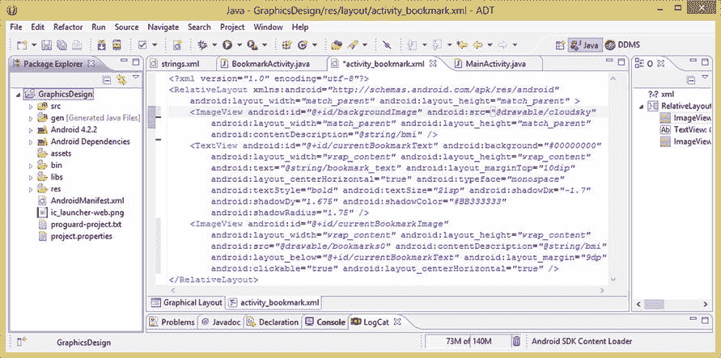

**图 8-1.** 添加一个 `ImageView` 来保存 Activity 的数字图像背板，以便应用色调和效果

让我们添加一个设置为 `backgroundImage` 的 ID 参数，并添加所需的 `layout_width` 和 `layout_height` 参数，将它们设置为 `match_parent` 常量，使 `ImageView` 容器填满 `RelativeLayout` 容器。

你会注意到（如果按下 CRTL-S 或 文件 ➤ 保存），Eclipse 会用波浪形的黄色下划线标记你的代码，因为它要求所有 `ImageView` 类及其子类（例如 `ImageButton`）都包含 `contentDescription` 参数。因此，从另一个 `ImageView` 中复制并粘贴 `android:contentDescription` 参数到当前的这个 `ImageView` 中，以解决该问题。

最后，你需要添加对数字图像资源本身的引用，因此请添加一个 `ImageView` 的 `android:src="@drawable/cloudsky"` 参数，以引用你的数字图像。这些参数为你的背景图像设置了基本画板，如图 8-1 所示。

现在，让我们使用 `运行方式 ➤ Android 应用程序` 工作流程，查看修改后的 UI 设计，确保它与你开始之前的状态一致。如图 8-2 左侧所示，Android 正在使用 `FIT_CENTER` 的 `ScaleType` 常量缩放你的源图像资源，因此你看到的是 `RelativeLayout` 容器的默认白色背景。

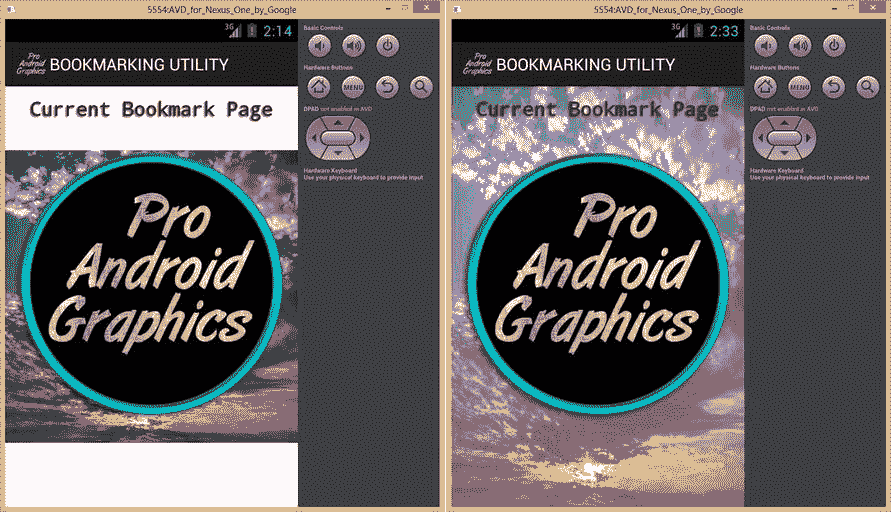

**图 8-2.** 在 Nexus One 模拟器中测试新的 `ImageView` 设置：应用色调和 `scaleType` 前后的对比

你会在这里看到，`android:src` 参数使用 `FIT_CENTER`，而 `android:background` 参数使用 `FIT_XY` 的 `ScaleType` 算法常量，这恰恰是此特定应用程序（或 UI 设计场景）所需要的。因此，在开始色彩校正之前，你需要修复这个问题。

你可以使用 `android:background` 参数来保存你的图像资源，这需要将 `android:src` 改为 `android:background`；或者，你可以添加 `android:scaleType="fitXY"` 来覆盖当前使用的 `fitCenter`。既然你正在学习这些 `ImageView` 特有的参数，而不是从 `View` 超类继承的参数（如 `background`），那么我们就继续添加一个 `ScaleType` 参数，并将其设置为 `fitXY` 缩放常量，如图 8-3 所示。

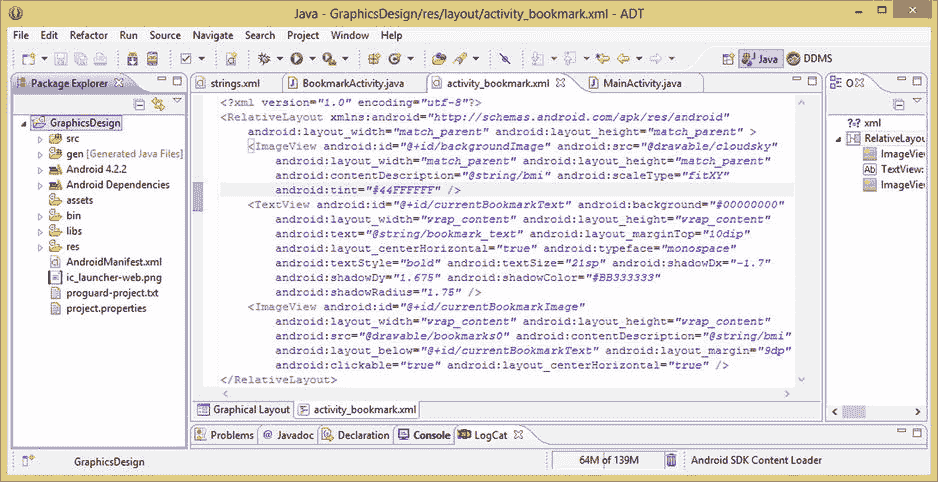

**图 8-3.** 添加参数将图像提亮 31.25% 并缩放以适配父容器，与第 7 章保持一致

既然已经解决了缩放问题，现在是时候使用 `android:tint` 参数，通过 `ImageView` 容器的属性（Attributes）对源图像进行一些色彩校正了。

控制覆盖在源图像上色调量的方法是使用 alpha 通道来调整色调颜色的级别（或透明度）。在这里，色调颜色是白色，或者说是十六进制值 `#FFFFFF`。添加白色值将对源图像中的所有像素产生均匀的提亮效果，就像 GIMP 2.8.6 或 Photoshop CS6 中的提亮算法会为你做的那样。

你将指定对图像进行 31.25% 的提亮，方法是使用十六进制中的级别 4（或 44）值，因为 4 相当于 5，而 5/16 正好是 16/16（100%）的 31.25%。因此，你需要在 `android:tint` 参数中指定的 ARGB 值是 `#44FFFFFF`，即对图像应用 31.25% 的白色。

如图 8-2 右侧所示，完成 `android:scaleType` 和 `android:tint` 参数的应用后，你的图像缩放正确，看起来 100% 更加真实，阴影现在也可见了。

在继续之前，我想提到的最后一点是，本书中将使用的许多数字成像特效在 Eclipse ADT 的“图形布局编辑器”选项卡中无法准确渲染，甚至完全无法渲染，如图 8-4 浅黄色警告区域所示。

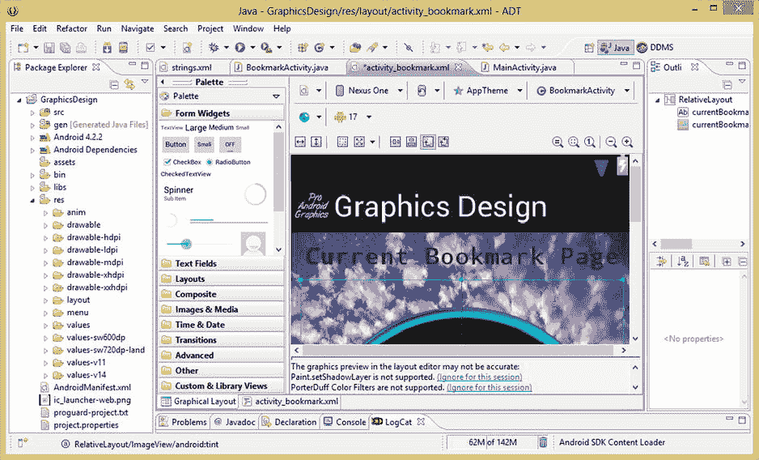

**图 8-4.** “图形布局”选项卡中的错误（参见黄色区域）提示阴影和 PorterDuff 效果需要模拟器支持

其原因在于，渲染阴影和混合模式所需的代码需要添加到 Eclipse ADT 的 GLE 模块中，而这需要大量的工作和代码量。因此，目前你需要使用 `运行方式 ➤ Android 应用程序` 工作流程来测试或审查你的代码。


### 使用 CropByPadding 裁剪你的 SkyCloud 图片资源

你已经了解了如何在 Android 中使用 XML 标记和 `ImageView` 控件应用基础图片增亮色彩校正，现在让我们学习使用 `android:cropByPadding` 参数来裁剪图片，同时练习使用五个 `android:padding` 参数。

裁剪本身看起来很简单，事实也确实如此；然而，它也可以成为更复杂“操作”（我习惯这么称呼）中不可或缺的一部分，这些操作可用于实现复杂的数字图像特效，比如投影、浮雕、伪 3D 等。

事实上，在第 7 章中，你已经看到了我所说的内容：我们使用非常实惠的 GIMP 2.8.6 软件包，对原始图片进行复制、灰度化、模糊、移动和 Alpha 通道处理，最终将其制作为一张半透明、集成 Alpha 通道的投影特效数字图像。

现在，你将使用 XML 标记以及 `android:cropToPadding="true"` 参数来实现图片裁剪。因此，将这一参数添加到你在前面章节中添加的 `android:tint` 参数之后的 `ImageView` 标签中，如图 8-5 所示。该参数本身不会产生任何效果；如果你想验证这一点，可以点击编辑面板底部的 GLE 选项卡，因为 GLE 能很好地处理内边距和裁剪标签！

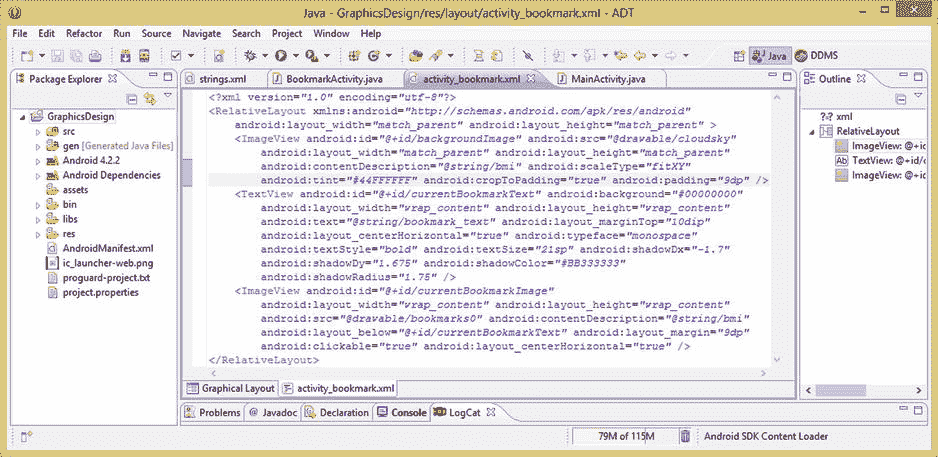

图 8-5. 添加 `android:padding` 和 `android:cropToPadding` 参数来裁剪 9dip 的周边边框区域

接下来，我们再添加一个 `android:padding="9dp"` 参数，为你的 UI 设计添加 9 DIP 的边框。由于没有 `android:border` 或 `layout border` 参数，这是一种在设计中添加边框的方法。

请注意，`ImageView` 背后的 `RelativeLayout` 容器的默认白色，现在会透过 `ImageView` 中被裁剪掉的区域显示出来，让这些像素变得可见。如果你的 `RelativeLayout` 设置了背景图片，它将会与 `ImageView` 的源图片进行合成，就像在 GIMP 中图层的工作方式一样。

使用图形布局编辑器选项卡或 **Run As** ➤ **Android Application** 工作流程，可以看到 `android:cropToPadding` 参数正在发挥作用，如图 8-6 截图左侧所示。

让我们用落日中的一些颜色为这个边框着色。你可以通过在 `RelativeLayout` 中添加 `android:background` 来实现。

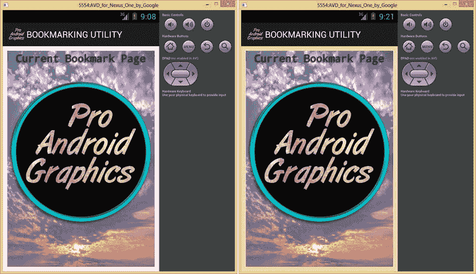

图 8-6. 在 Nexus One 模拟器中测试你的 `CropToPadding` 参数和 `RelativeLayout` 背景色值

在 `RelativeLayout` 父标签中添加一个 `android:background="#FFEEAA"` 参数，就像你之前设置的那样，只是使用了不同的颜色值。如图 8-6 右侧所示，这个新的颜色值大致（匹配）了落日周围云彩的颜色。

接下来，你将使用 `android:paddingTop` 参数向下推动（裁剪）图片，使带有投影的 `TextView` 位于 UI 设计顶部的黄色区域中，从而练习使用一些更具方向性的内边距参数。

如图 8-7 所示，我将 `android:padding="9dp"` 改为了 `android:paddingTop="50dp"` 参数，这会使设计变为图 8-8 左侧所示的样子。

由于边框效果消失了，我们添加另一个 `android:padding="8dp"` 参数，并再次使用图形布局编辑器选项卡或 **Run As** ➤ **Android Application** 工作流程来查看结果。当你这样做时，会发现 `android:paddingTop` 参数没有正确渲染，你的 UI 界面恢复到了图 8-6 右侧所示的样子。回到绘图板（裁剪板）上！

这意味着 `android:padding` 参数是在其他更具体的 `android:paddingTop`（以及其他）参数之后应用的。因此，如果你想指定不同的内边距值，必须单独指定每一边，否则 `android:padding` 参数会覆盖其他参数。

所以将 `android:padding="8dp"` 改为 `android:paddingLeft="8dp"`，然后在其旁边再复制两次，如图 8-7 所示，并分别将 Left 改为 Right 和 Bottom。

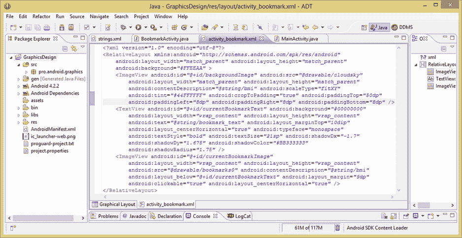

图 8-7. 添加 `paddingTop`、`paddingLeft`、`paddingRight` 和 `paddingBottom` 参数来创建自定义裁剪

现在，你的底板（背景图片）`ImageView` 所设置的参数比你的 `currentBookmarkImage`（主题内容）`ImageView` 还要多！位于 UI 元素合成堆栈底部（后方）的第一个 `ImageView` 的 XML 标记现在应包含以下参数：

```
<ImageView android:id="@+id/backgroundImage"
android:src="@drawable/cloudsky"
android:layout_width="match_parent"
android:layout_height="match_parent"
android:contentDescription="@string/bmi"
android:scaleType="fitXY"
android:tint="#44FFFFFF"
android:cropToPadding="true"
android:paddingTop="50dp"
android:paddingLeft="8dp"
android:paddingRight="8dp"
android:paddingBottom="8dp" />
```

要查看新的自定义图片裁剪效果（使用了内边距值和 `cropToPadding`），请查看图 8-8 的右侧。你现在实现了期望的图片效果：`TextView` 投影在落日的黄色调上，图片其余四周带有 8dip 的边框以增加一些装饰。你只用了十几个参数就完成了裁剪、色彩校正、布局、ID、源数字图片资源引用和缩放操作。

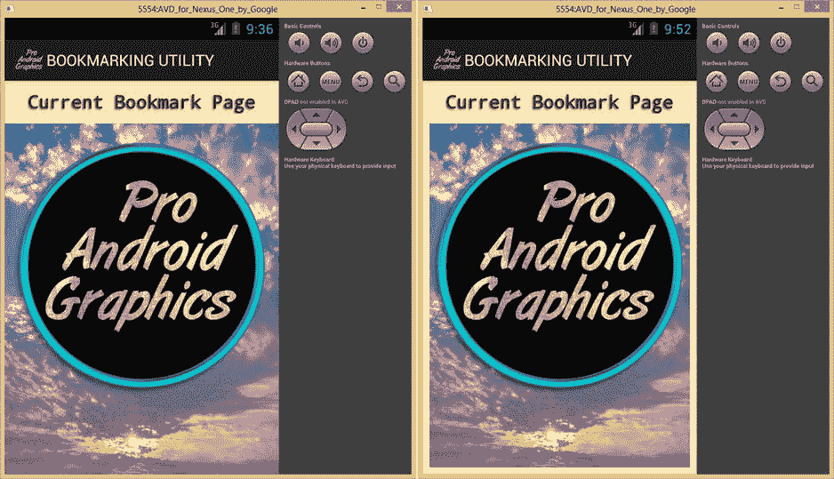

图 8-8. 在 Nexus One 模拟器中测试自定义的 `android:padding` 和 `android:cropToPadding` 参数

接下来，让我们看看如何使用 `android:baseline` `ImageView` 参数来定制 `ImageView` 的基线对齐位置。


### 更改 ImageView 的基线对齐索引

不要使用 `layout_marginTop="10dip"` 参数将 `TextView` 相对于布局容器对齐，而是利用你在本章中学到的基线功能，将此 `TextView` 与作为合成底板的 `backgroundImage` 的 `ImageView` 对齐。

让我们将 `TextView` 的 `layout_marginTop` 参数设置为 `0DIP`，并添加一个 `android:layout_alignBaseline` 参数，该参数引用 `backgroundImage` 的 ID，这样你的 `TextView` 就会与你即将设置的第一个 `ImageView` 基线定义对齐。这通过以下 XML 标记实现，你可以在图 8-9 中看到我将其添加到了标签的末尾：

`android:layout_alignBaseline="@+id/backgroundImage"`

要为你的 `backgroundImage` 的 `ImageView` 指定一个自定义基线位置，请在 `ImageView` 标签参数列表的末尾添加一个 `android:baseline` 参数，使用以下 XML 标记，如图 8-9 所示：

`android:baseline="30dp"`

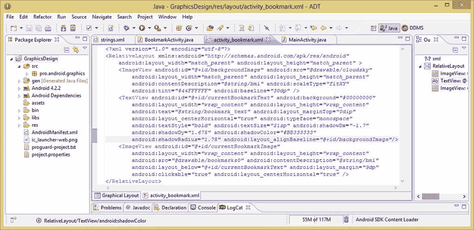

图 8-9.

向 `ImageView` 添加 `android:baseline` 定义，并从 `TextView` 对象引用它

现在使用 `Run As ➤ Android Application` 工作流程启动 Nexus One 模拟器，你会发现结果与使用 `android:layout_marginTop=“10dp”` 参数时非常相似。

正如图 8-10（竖屏）以及图 8-11（横屏）中清晰所示，`TextView` 对象现在将其位于文本内容底部的基线，对齐到一条虚构的（不可见的）基线上，该基线距图像顶部 `30dp`。

基线是从图像顶部而非底部设置的，这有点反直觉，因为对我们大多数人来说，基线代表字体底部（字坐的地方）。之所以这样，是因为我们知道，图像是从左上角像素 `0,0` 开始索引（编号）的，因此基线对齐设置中的零像素将与图像顶部对齐。

这可能就是存在快捷参数 `android:baselineAlignBottom="true"` 的原因；它所做的事情就是获取图像的 Y（高度）分辨率，然后将该值设置为 `android:baseline` 参数设置。

同样有趣的是，如果你忘记将 `marginTop` 设置为零，它对定位没有影响，也就是说，外边距不会被添加到基线对齐设置中，而是被其取代。

为了确认这一点，设置 `android:layout_marginTop="50dip"` 并渲染 UI 设计，你会看到它没有效果，这意味着 Android 操作系统会优先考虑你的 `android:baseline` 对齐参数设置，而非 `android:layout_marginTop` 对齐参数设置。

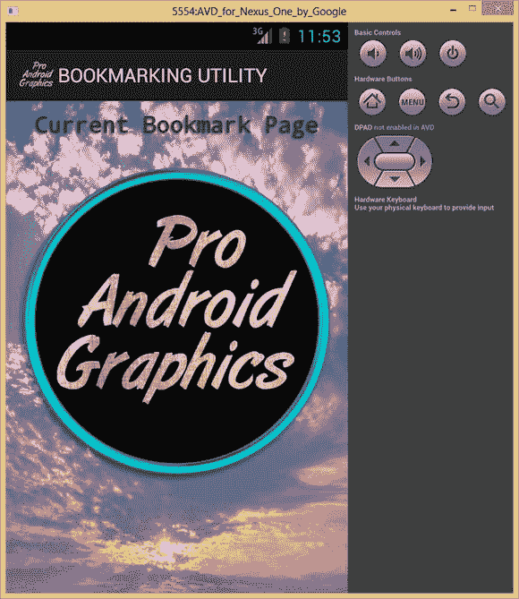

图 8-10.

在 Nexus One 模拟器中测试竖屏 UI 布局

重要的是，你要习惯留意 Android 中不同参数设置的效果差异，因为这最终能让你更熟悉操作系统在任何给定场景下如何渲染你的用户界面设计。

让我们看看当用户将 Android 设备方向旋转 90 度（横屏）时，这个新的用户界面设计会是什么样子，因此按下 `CRTL-F11` 组合键来旋转 Nexus One 模拟器。

正如图 8-11 所示，为 `TextView` 对象使用基线对齐的新用户界面设计与使用顶部外边距参数效果一样好。这表明在 Android 中通常有几种不同的方法可以实现相同的用户界面布局。

这使得 Android 用户界面设计既更灵活也更复杂，因为通常在所有不同的设备屏幕尺寸和方向中，存在一种实现用户界面布局的最佳方法。如果可能，作为开发人员，我们希望通过仅使用 XML 布局标签和参数，让用户界面设计能够跨设备工作。

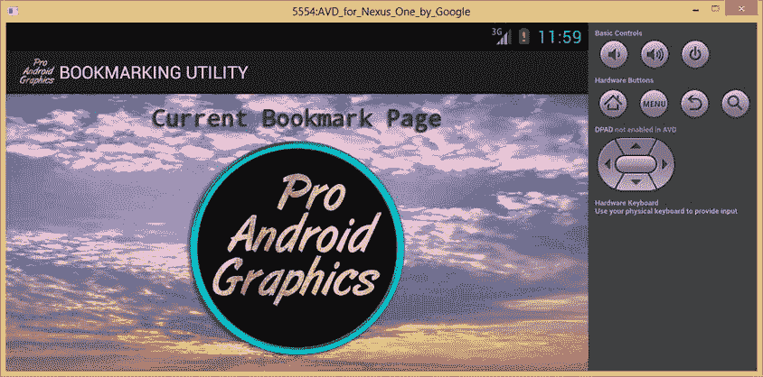

图 8-11.

使用横屏模式在 Nexus One 模拟器中测试 `android:baseline` 参数

接下来你将了解如何使用 `android:layout_margin` 和 `android:padding` 参数，通过 XML 标记来执行图像缩放。


### 执行图像缩放：边距（Margin）与内边距（Padding）属性

除了使用 `ScaleType` 参数在布局容器内全局缩放 `ImageView` 对象外，另一种方法是对 `ImageView` 容器内引用的数字图像源资源进行缩放。正如你将在本节中尝试的那样，**边距（margin）** 和 **内边距（padding）** 值都可以让你在容器内部缩放 `ImageView` 的源图像资源。

首先，将第二个 `ImageView` 标签（即前景的 `currentBookmarkImage` 资源中的 `android:layout_margin="9dp"` 参数）改为 0 DPI，如图 8-12 所示。这样做是为了让你先观察图像资源在未缩放状态下的尺寸。

使用 **Run As ➤ Android Application** 工作流程，仔细观察图像，如图 8-13 截图左侧所示。然后将 0 DIP 改为 50 DIP，再次运行模拟器。

你会看到，第二个包含源图像的 `ImageView` 为了适应新的边距设置而缩小了尺寸。你可能会想知道 `android:padding` 参数是否也能达到同样的效果，接下来我们将对此进行更深入的探讨。

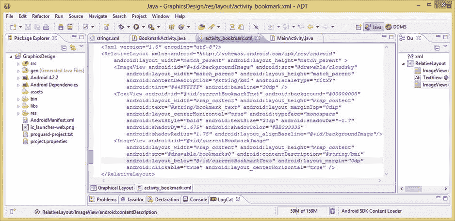

**图 8-12.** 将 `currentBookmarkImage ImageView` 的 `layout_margin` 值设为 0 DIP 以查看未缩放的资源

接下来，为你的书签图像底板添加一个半透明颜色背景（见图 8-13）。

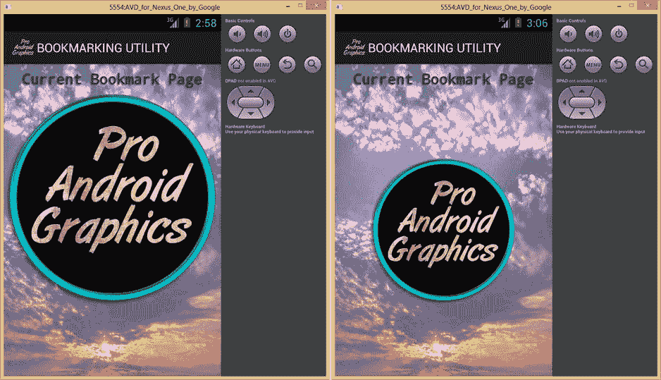

**图 8-13.** 左侧显示未缩放的 `ImageView` 资源，右侧显示使用 50dp 边距缩放的 `ImageView`

这样做是为了让你能看到 `ImageView` 容器的边缘，从而确定使用边距和内边距来缩放图像资源之间的区别。如图 8-14 所示，你将在 `currentBookmarkImage` ID 的 `ImageView` 标签内的 `android:background` 参数中添加十六进制颜色值 `#77FFFFFF`，得到一个 50% 半透明的白色背景。这是一项非常有用的技术，如果你需要可视化 Android 系统绘制 UI 容器的位置，可以在用户界面开发工作流程中使用它。

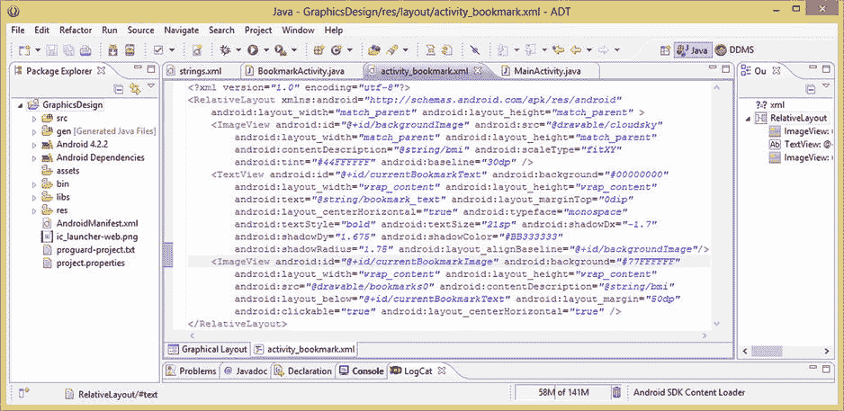

**图 8-14.** 添加 50% 透明的白色背景，以直观展示 50dip 的边距和内边距操作

即使你的数字图像资源使用了透明 Alpha 通道（例如本例中带投影的圆环），这项技术也同样有效。你将 `android:layout_margin` 参数设置为 50 DIP，这是展示使用边距和内边距在容器内缩放 `ImageView` 源图像资源之间差异的理想设置。

如图 8-15 所示，这个圆环图像能够通过半透明的 `ImageView` 背景色以及 `RelativeLayout` 容器中的 `ImageView` 背景底板正确地产生阴影效果。

在左侧的模拟器视图中，你使用了 `android:padding="50dp"` 参数来缩放源图像资源。正如预期，由于内边距在容器内部添加空间，容器保持了 `match_parent` 布局规范的大小，但仍将图像资源缩小了近 50%。

在右侧的视图中，你使用 `android:layout_margin="50dp"` 参数来缩放源图像资源。边距在容器外部添加间距，因此你的容器会随着图像资源一起缩小。

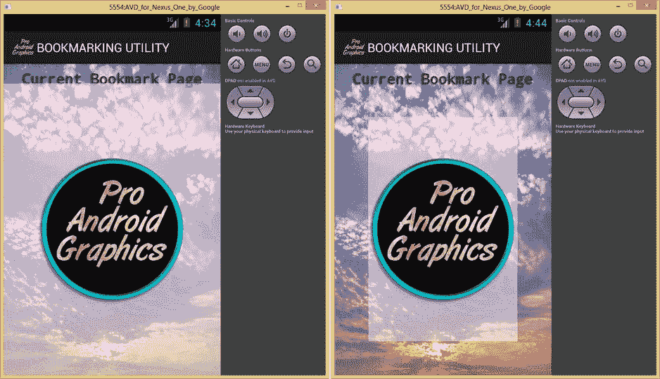

**图 8-15.** 展示使用 50DIP 图像缩放操作：左侧使用内边距，右侧使用边距

如图 8-15 左侧所示，第二个 `ImageView` 容器没有完全填满屏幕的原因，是因为 `TextView` 与第一个 `ImageView` 图像背板的顶部，以 30dp 的基线对齐（位于其下方）。

第二个 `ImageView` 具有 `RelativeLayout` 参数 `android:layout_below`，它引用了 `TextView` UI 元素。这会将整个视图容器向下推，正如现在由于设置半透明背景色值所看到的那样。

现在，使用 **Control-F11** 组合键将 Android Nexus One 模拟器旋转 90 度，以横屏模式观察内边距与边距缩放。如图 8-16 所示，结果是相似的：内边距参数在视图对象容器内部缩放图像资源，而 `android:layout_margin` 参数则缩放 `ImageView` 对象容器及其包含的源图像资源。

我在横屏模式下唯一能检测到的区别是，`android:layout_centerHorizontal` 参数似乎会使 `ImageView` 容器向其父 `RelativeLayout` 容器的侧边方向居中。有时无法预料到诸如此类的差异，这也说明了在尽可能多的不同 Android 设备模拟器和方向下测试所有用户界面布局设计的重要性！

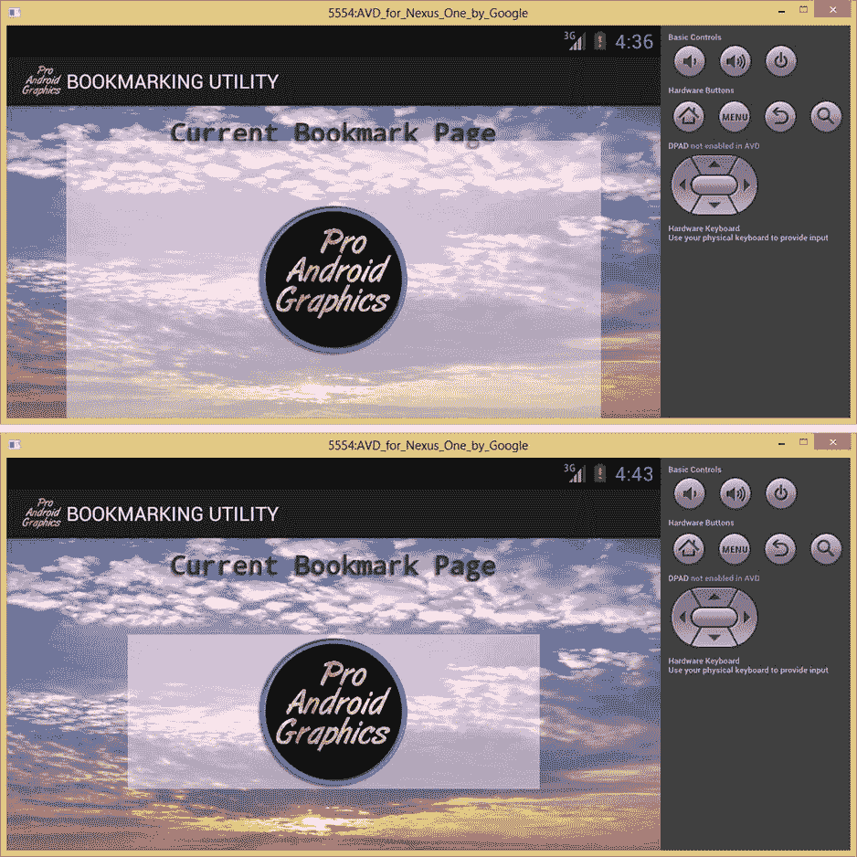

**图 8-16.** 展示横屏模式下 50dip 图像缩放：上方为内边距，下方为边距

正如你在本章中所看到的，只要具备一点创造力并深入了解数字图像处理操作的核心本质，你在 GIMP 或 Photoshop 中能够实现的大部分数字图像“操作”，同样可以通过使用 XML 标记和 Java 代码在 Android 中完成。


### 本章小结

在第八章中，你进一步学习了 Android 的数字图像用户界面元素容器 `ImageView`，你在前一章的应用 XML 标记和 Java 代码中已经初步实现了它。

我们首先探讨了 `ImageView` 类及其各种子类、嵌套类、方法、属性和参数。你了解到，`ImageView` 类用于创建 Android 的 `ImageButton` UI 控件子类（你将在下一章学习）以及 `QuickContactBadge`。

接着，我们研究了 `ImageView.ScaleType` 嵌套类，这是 Android 中一个非常重要的类，因为缩放是数字图像处理中的一个关键概念。正确缩放图像是在任何新媒体开发平台下获得清晰视觉效果的基础。

你学习了 `java.lang.Enum` 类和枚举类型，然后了解了缩放常量，这些常量使用该类向 Android 操作系统指定对 `ImageView` UI 控件资源使用何种缩放类型。

然后，我们探讨了 `ImageView` 类特有的一些属性。我们从 `AdjustViewBounds` 标志以及 `maxWidth` 和 `maxHeight` 开始，如果将该标志设置为 `true`（开启），你就可以指定自定义的宽度和高度值；请注意，在 Android 中通常不推荐这样做，但此处我们进行了全面讨论。

接下来，我们研究了 ImageView 基线的概念，以及 `android:baseline` 和 `android:baselineAlignBottom` 属性，它们允许你在 `ImageView` 中设置自定义基线，或者将基线设置为图像的绝对底部，而不是顶部。

然后，我们探讨了 `cropToPadding` 属性以及如何将其与 Android 的填充参数结合使用，仅通过 XML 标记即可实现数字图像裁剪操作。

最后，我们研究了 `android:tint` 参数和 `PorterDuff` 混合模式，这使得我们可以使用 XML 标记对数字图像源资源进行基本的颜色调整和校正。

为了练习应用 `ImageView` 类的许多属性和特性，你在我们在 第 7 章 开始创建的**书签工具**及其 `RelativeLayout` 用户界面设计中实现了其中一些功能。

在下一章中，你将学习 `ImageView` 的子类 `ImageButton`，以及如何使用 XML 标记和 Java 代码创建复杂的、交互式的、基于图像的按钮。

