# 9. 高级 ImageButton：创建自定义多状态 ImageButton

### 摘要

在第九章中，我们将继续研究 `ImageView` 类，深入探讨其最重要的子类之一：`ImageButton` 类。

`ImageButton` 是 Android 最重要的用户界面元素之一，用于在按钮用户界面元素内部实现前沿的图形设计。虽然 Android 有一个标准的 `Button` 类，但它在实现图形设计资源方面的灵活性不如 `ImageButton` 类。

由于这是一本专注于图形的书，我们将单独讨论这个 `ImageButton` 类。我们将用一整章来学习如何定义它的多种状态，以及如何将图形元素附加到每个状态，以达到标准 Android `Button` 类无法比拟的出色视觉效果。

我们使用了 `android:src` 参数来定义源图像，并使用一些 UI 布局参数进行定位，以及使用边距参数在设计中为其留出一些空间。但是，我们并没有真正深入探讨任何高级参数或技巧，例如同时使用源（前景）图像层和背景图像层。

我们确实介绍了一些使用 GIMP 2.8 的相当高级的数字图像处理概念，在一本《Pro Android Graphics》书中这样做总是好的，并且随着本书的深入，我将在 GIMP 和 VirtualDub 中都尽可能多地介绍这方面的内容。

### Android 中的按钮图形：ImageButton 类概述

Android 的 `ImageButton` 类是 `ImageView` 类的子类，而 `ImageView` 类本身又是视图超类的子类，正如你在前一章所学，视图超类是 `java.lang.Object` 主类的子类。`ImageButton` 类的类层次结构如下所示：

```
java.lang.Object
  > android.view.View
    > android.widget.ImageView
      > android.widget.ImageButton
```

`ImageButton` 与其父类 `ImageView` 一样，被放在名为 `android.widget` 包的独立 Android UI 控件包中，因为它是一个用于使用图像定制的按钮 UI 元素的 UI 控件。

当开发者希望创建一个自定义的 UI 按钮元素，该按钮显示为图像而不是方形背景上的文本标签（例如标准 UI 按钮的外观，正如你在前几章所见）时，就会使用 `ImageButton` UI 控件。

就像 Android 的 `Button` 类 UI 控件一样，`ImageButton` UI 控件也可以被用户按下（通过点击或触摸事件），并且也具有焦点和悬停特性。

然而，`Button` UI 控件继承自 `TextView` 类，因此它主要针对文本，本质上是一个带有使其看起来像按钮 UI 元素背景的 `TextView` UI 元素。而你的 `ImageButton` UI 控件则继承自 `ImageView` 类，这赋予了它图形特性，这正是我们在本书中希望利用的。

如果你不利用其任何自定义参数，`ImageButton` UI 控件将具有标准 UI Button 的外观，但当按钮被按下时，那个灰色按钮背景会变成蓝色。因此，除非你要实现本章将要介绍的各种图像资源和多状态特性，否则不要使用 `ImageButton`。

`ImageButton` UI 控件的默认图像（定义其正常状态）可以通过在 XML 布局容器 UI 定义中的 `<ImageButton>` 子标签内使用 `android:src` XML 参数进行静态定义。也可以在 Java 代码中通过使用 `.setImageResource()` 方法在运行时动态定义。

在本书中，我们将按照 Android 的推荐方式，使用 XML 来定义 UI 设计。如果你使用 `android:src` 参数来引用图像资源，这将替换你的标准 `ImageButton` 背景图像。如果你想进行一些合成，也可以定义自己的背景图像，并且还可以将背景颜色值设置为透明（`#00000000`）。


### ImageButton 状态：正常、按下、聚焦与悬停

`ImageButton` 类允许您为每种使用状态定义自定义图像资源：正常（默认或未使用）、按下（用户正在触摸或按压点击选择硬件）、聚焦（最近触摸释放或点击释放）和悬停（用户将鼠标或导航键悬停在`ImageButton`上，但尚未触摸或点击）。悬停状态是最近在 Android 4.0 API Level 14 中新增的，可能是为了在 Google Chromebook 上使用 Android 操作系统而做的准备。四种主要的`ImageButton`状态及其对应的鼠标事件如表 9-1 所示。

表 9-1. Android `ImageButton` 类主图像资源状态常量及其鼠标使用对应关系

| `ImageButton` 状态 | `ImageButton` 状态描述 | 鼠标事件对应关系 |
| --- | --- | --- |
| `NORMAL` | 默认的`ImageButton`状态（未使用） | 鼠标移出 |
| `PRESSED` | 触摸或点击时的`ImageButton`状态 | 鼠标按下 |
| `FOCUSED` | 触摸并释放后的`ImageButton`状态 | 鼠标抬起 |
| `HOVERED` (API 14) | 聚焦（但未触摸）时的`ImageButton`状态 | 鼠标悬停 |

`ImageButton` UI 元素的实现并不简单，因为您需要为每个`ImageButton`状态创建唯一的数字图像资源。这样做是为了在视觉上向用户指示不同的`ImageButton`状态，正如您将在本章中看到的，这涉及一些数字图像处理工作！

稍后在本章中，您将使用 GIMP 2.8 为每个`ImageButton`创建多个数字图像状态，这些状态需要涵盖 Android 要求的各种分辨率密度，以适应不同的设备类型、屏幕尺寸和分辨率。您很快就会看到，必须创建的数字图像资源数量等于图像按钮数量乘以四种状态再乘以四种密度目标，即每个实现的`ImageButton`需要 16 个图像资源。

定义`ImageButton`状态的标准工作流程是使用位于`/res/drawable`文件夹中的 XML drawable 定义文件，该文件使用父级`<selector>`标签和子级`<item>`标签，通过自定义数字图像资源引用来定义每个`ImageButton`状态。本章稍后将详细介绍如何设置这一流程的示例。

一旦设置了此 XML 定义，Android 将根据`ImageButton`的状态自动为您更换图像资源。状态定义的顺序很重要，因为它们按顺序进行评估。这就是为什么正常图像资源放在最后，因为它仅在`android:state_pressed`和`android:state_focused`均评估为 false 时才会显示。

### ImageButton Drawable 资源：合成按钮状态

让我们开始正题，直接进入创建多状态`ImageButton`的工作流程。首先需要为每个按钮状态创建不同的数字图像资源。为此，您将使用 GIMP 开源图像编辑和合成软件包，现在通过任务栏上的快速启动图标启动 GIMP。

使用 `文件 ➤ 打开` 菜单序列访问“打开图像”对话框（如图 9-1 所示），找到 `ImageButton_Bookmark.png` 图像，它将作为此`ImageButton`数字图像资源的最底层（最低层）基础图像合成层。找到该资源后，选中它使其变为蓝色，然后单击“打开”按钮将其作为原始图像层加载到 GIMP 中。

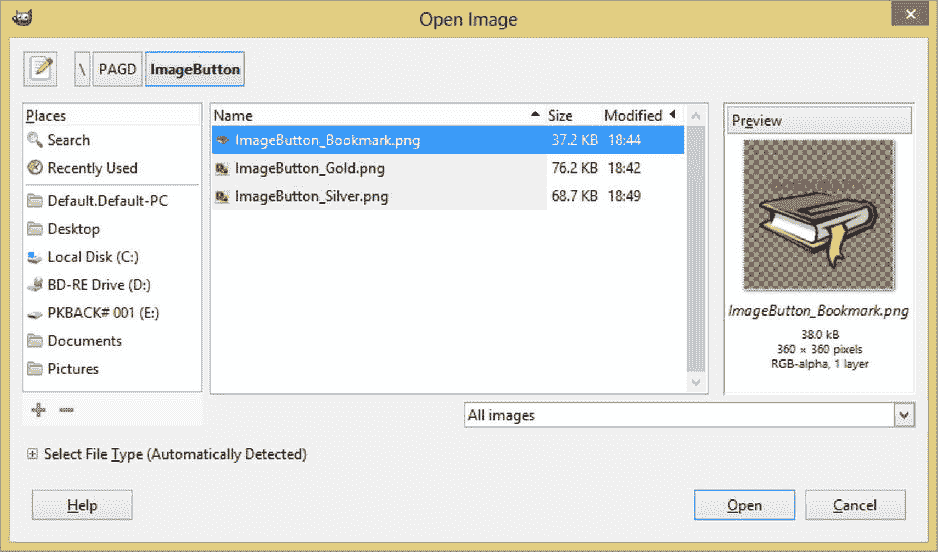

图 9-1. 打开 `ImageButton_Bookmark` 主图像层

接下来要做的是添加一个外部按钮元素，例如按钮外围的金属环，使其看起来像一个真正的按钮。

如果您单击图 9-1 中显示的其他两个原始资源，对话框将在右侧显示它们的预览，您会看到它们分别是金色和银色的环形 UI 设计元素，在接下来的几个步骤中，您将把它们合成到基础书签图标之上。

GIMP 提供了一个非常有用的工具或命令，可以非常轻松地将外部图像资源导入并放置到合成层中。此工具或命令位于 `文件` 菜单下，称为 `作为图层打开` 功能。

让我们使用这个菜单序列（如图 9-2 所示）返回您的 `ImageButton` 资源文件夹，并导入下一个图像合成层。

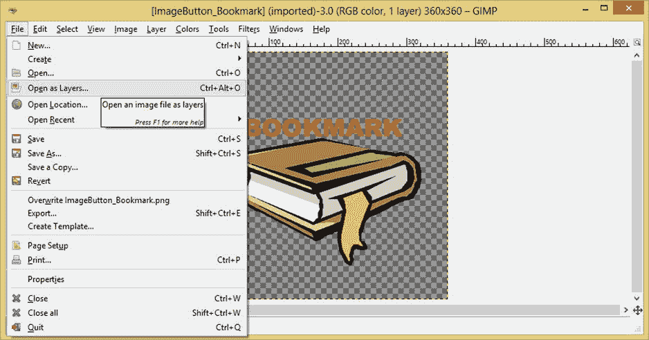

图 9-2. 使用 `文件 ➤ 作为图层打开` 菜单序列添加合成层

如图 9-2 所示，您的底层书签图层已经就位，大小为 360 像素（这是 XHDPI 超高密度像素图像资源尺寸），现在您要选择图像合成中的下一层，即图 9-3 所示的“打开图像”对话框中的 `ImageButton_Silver.png` 文件。该对话框是通过图 9-2 所示的 `文件 ➤ 作为图层打开` 菜单序列访问的。

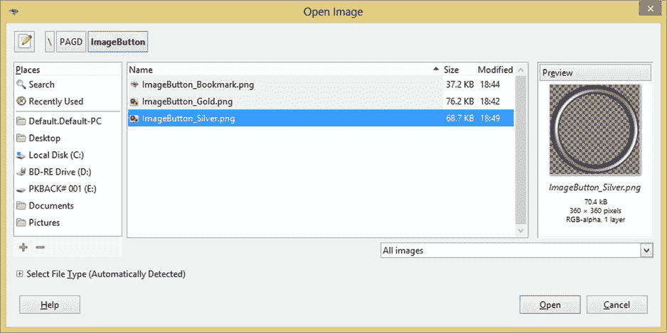

图 9-3. 定位 `ImageButton_Silver.png` 按钮外部环以添加到合成中

打开银色的外部按钮环（或圈）资源（如图 9-3 右侧所示）后，GIMP 会将其插入到书签图标图形上方的合成层中。如图 9-4 所示，生成的合成图像现在看起来更像一个 UI 按钮，您现在可以使用 `文件 ➤ 导出` 菜单序列来创建正常状态。

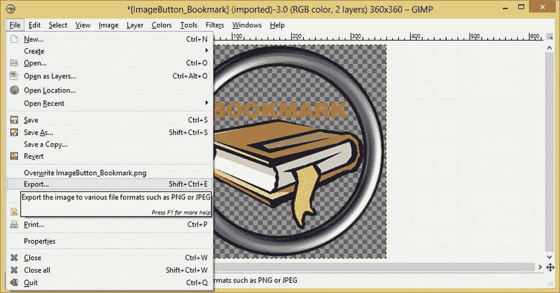

图 9-4. 使用 `文件 ➤ 导出` 菜单序列导出新合成的按钮


一旦“导出图像”对话框打开，请使用左侧的导航窗格找到你的“用户”文件夹和系统名称文件夹（我的文件夹是 `Default.Default-PC`）。在该文件夹下，你应该能看到用于 Eclipse ADT 开发项目的 `/workspace` 文件夹。接着在该文件夹下找到你的 `/GraphicsDesign` 文件夹，然后导航到资源（`/res`）文件夹，并在其下方找到你的 `/drawable-xhdpi` 图像资源文件夹，如图 9-5 所示。接下来，在“名称”字段中输入一个全小写的 `imagebutton_normal.png` 文件名，然后点击对话框右下角的“导出”按钮来创建文件。

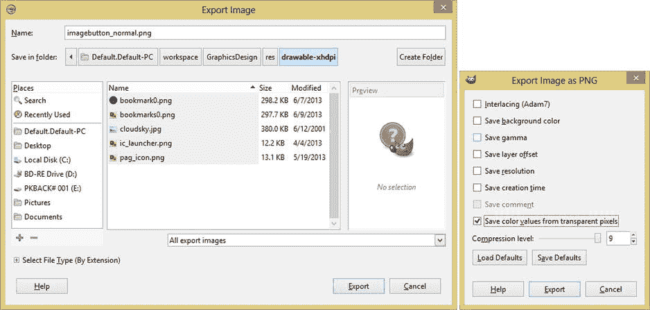

图 9-5. 使用“导出图像”对话框保存 `imagebutton_normal.png` ImageButton 正常状态资源

点击“导出”按钮后，你会看到一个带有导出选项的“导出图像为 PNG”对话框，如图 9-5 右侧所示。我只需使用“保存透明像素中的颜色值”选项，以确保所有 Alpha 通道的细微差别都能与 ARGB 图像数据一起正确保存。

现在，你已经准备好创建下一个 ImageButton 悬停状态的图像资源了。再次使用“文件 ➤ 作为图层导入”工作流程，如图 9-2 所示。这次打开 `ImageButton_Gold.png` 合成资源，该资源会将其自身放置在 `ImageButton_Silver.png` 资源上方的合成图层中，如图 9-6 右侧的“图层”面板所示。

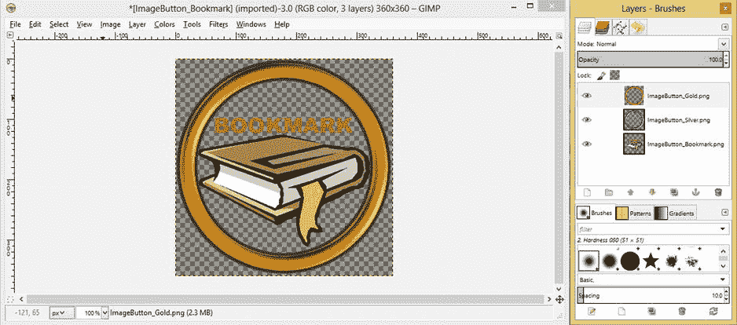

图 9-6. 使用“文件 ➤ 作为图层打开”将 `ImageButton_Gold.png` 图像资源添加到合成图层

如你所见，这会覆盖或替换银色环的像素（这些像素仍然存在于第二层中，但现在已被第三层遮挡），因此你无需关闭第二层的可见性（或许你正感到疑惑，这可以通过点击图层左侧的眼睛图标来实现）。你刚刚创建了悬停 ImageButton 状态，即如果用户有鼠标或悬停能力，当用户将鼠标（焦点）移动到该按钮上时，按钮周围的圆环会从银色变为金色。现在，你所要做的就是创建这个悬停图像资源！

为此，你需要再次使用“文件 ➤ 导出”工作流程，如图 9-4 所示。这次你将使用一个不同的文件名，同样只使用小写字母和下划线字符（这是 Android 操作系统所要求的），将你的图像资源命名为 `imagebutton_hovered.png`，如图 9-7 截图顶部所示（以蓝色高亮显示）。

点击“导出”按钮后，你将再次看到设置对话框，在其中你可以选择“保存透明像素中的颜色值”选项。然后，点击“导出”按钮创建你的悬停 ImageButton 状态数字图像资源，如图 9-6 所示，分辨率为 360 像素。

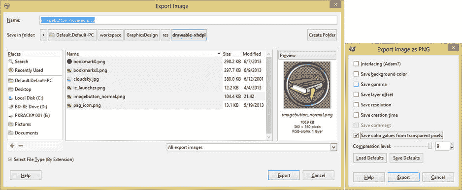

图 9-7. 使用“导出图像”对话框导出 `imagebutton_hovered.png` ImageButton 悬停状态资源

你需要创建的下一个 ImageButton 状态是按下状态。当用户触摸（或点击并按住，即鼠标按下事件）一个按钮 UI 元素时，ImageButton 中心的书签图标会发生颜色变化。该颜色变化将通过 GIMP 中的“色相-饱和度”工具实现。该工具位于 GIMP 的“颜色”菜单下，“色相”对话框如图 9-8 屏幕截图的左侧所示。

在调用和应用此“色相-饱和度”工具之前，请确保你已选中底层，如图 9-8 中的灰色显示；否则，你最终会改变其中一个“UI 圆环”合成元素的颜色，而不是你的书签图标。如果发生这种情况，你始终可以使用“编辑 ➤ 撤销”功能。

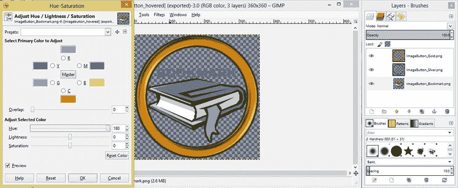

图 9-8. 使用“颜色 ➤ 色相-饱和度”对话框将 ImageButton_Bookmark 图层的色相偏移 180 度

我选择将色相偏移 180 度，但你可以使用任何你喜欢的颜色偏移，只要它与金色外环 UI 元素搭配起来好看即可。

点击“确定”按钮将此新的色相偏移应用到你的书签图标图层后，请使用“文件 ➤ 导出”工作流程访问“导出图像”对话框，如图 9-9 所示，并将资源导出为 `imagebutton_pressed.png`，存放在 Android 中用于高分辨率密度图像资源的文件夹中（`/workspace/GraphicsDesign/res/drawable-xhdpi`）。

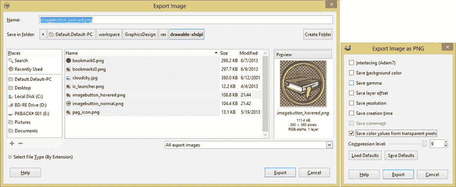

图 9-9. 使用“导出图像”对话框导出 `imagebutton_pressed.png` ImageButton 按下状态资源

现在，你需要创建的四个 ImageButton 状态中只剩下一个了，即聚焦状态。你可以使用合成图像中已有的三个图层，通过不同的图层资源组合来实现。

你只需通过点击图层左侧的眼睛图标来关闭 `ImageButton_Gold.png` 图层的可见性，即可完成此操作。现在点击此眼睛图标，使眼睛消失，如图 9-10 屏幕截图右侧的“图层 - 画笔”面板所示。结果会得到一个全新的按钮状态。

这样做的结果是，`ImageButton_Silver.png` 图层将变为可见，你将拥有一个全新的 ImageButton 聚焦状态，它使用了你为按下按钮状态所用的颜色偏移书签图标，以及你为正常按钮状态所用的银色按钮环。如图 9-10 所示，这看起来非常专业。

非常重要的一点是，在创建图像合成的不同版本时（例如你在此处处理这些 ImageButton 状态资源），图层可见性非常有用。这是因为当你导出最终的图像合成时，可见的图层将是用于生成数字图像合成结果的图层，而这些结果将是用于创建平面（单层）图像资源的最终像素。

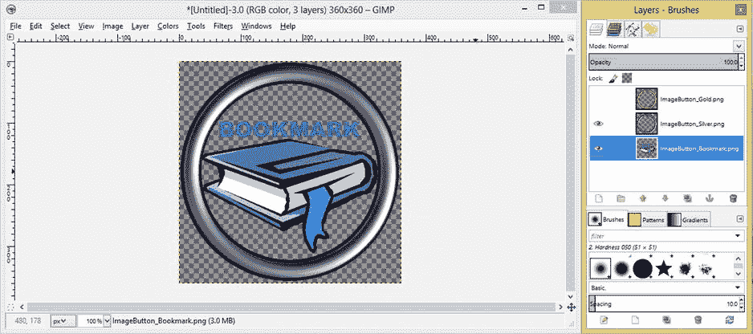

图 9-10. 使用可见性（眼睛）图标关闭 `ImageButton_Gold` 合成图层以创建聚焦状态

现在，你可以使用“文件 ➤ 导出”菜单序列访问“导出图像”对话框，如图 9-11 所示，来创建你的 `imagebutton_focused.png` ImageButton 聚焦状态资源。如果你想预览这些图像资源的工作效果，可以点击“导出图像”对话框中央显示的 `imagebutton_` 文件名，并观察右侧的预览图像实时变化，这实际上是在模拟你的 ImageButton 状态资源在你的 Android Nexus One 模拟器中的工作（外观）效果。现在，你只需输入你的 `imagebutton_focused.png` 文件名，并在设置好文件导出选项后点击“导出”按钮即可——由于此过程的重复性，你对此已驾轻就熟。

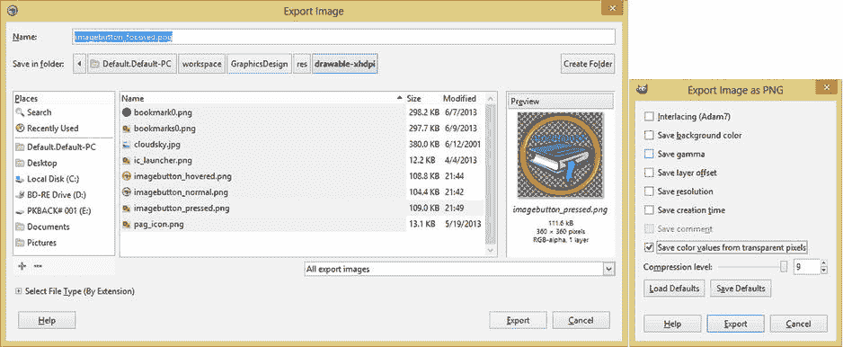

图 9-11. 使用“导出图像”对话框导出 `imagebutton_focused.png` ImageButton 聚焦状态资源


既然你已经为多状态`ImageButton`输出了超高清密度资源，最好保存一个 GIMP 原生文件格式的图像合成版本，以防将来因任何原因需要用到。在 GIMP 中，可通过`文件`菜单下的`保存`或`另存为`选项来完成此操作。

执行此操作将打开`保存图像`对话框（见图 9-12），该对话框允许你将当前的 GIMP 项目以原生`.XCF`文件格式保存到原始图像合成资源所在的文件夹中。此文件包含你在数字图像合成工作流程中创建的所有图层和设置——我们在本章的这一部分中学习了如何创建各种`ImageButton`状态的数字图像资源。

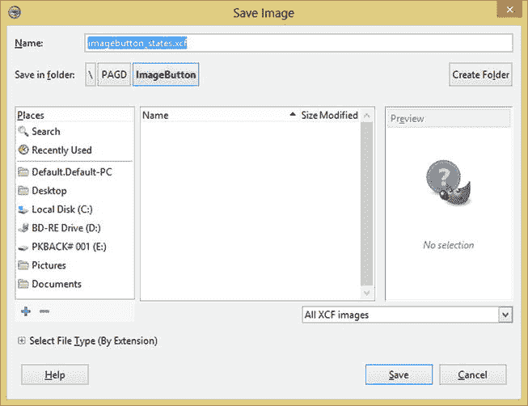

**图 9-12.** 保存 GIMP 原生合成文件 `imagebutton_states.xcf`

接下来，你可以进入 Eclipse ADT，编写必要的 XML 标记，以在`GraphicsDesign`应用中实现`ImageButton`的状态。

### ImageButton 的可绘制对象：设置多状态 XML

如果桌面上尚未打开 Eclipse ADT IDE，请启动它，然后右键单击并打开`/res/layout`文件夹中的`activity_contents.xml` UI 定义文件。你将在`目录`底部添加一个`ImageButton` UI 元素，使用户能够访问你的`书签工具`，从而为`GraphicsDesign`应用构建应用内 Activity 导航。

在你的第一个嵌套的`<LinearLayout>`标签内添加一个`<ImageButton>`子标签（如图 9-13 所示），并添加必要的`layout_`参数。

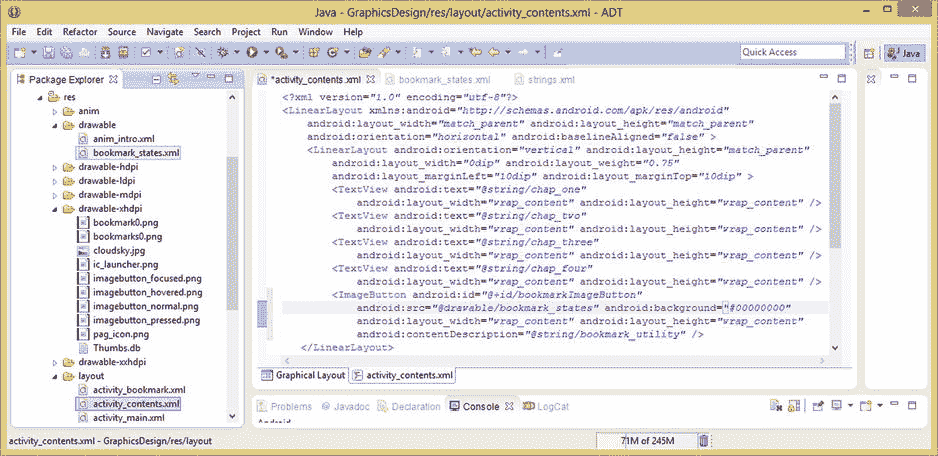

**图 9-13.** 将`<ImageButton>`子标签添加到第一个嵌套的`<LinearLayout>`子标签布局容器中

让我们使用`android:id`参数，将你的`<ImageButton>` UI 元素命名为`bookmarkImageButton`，并确保作为`ImageButton`状态资源一部分的 Alpha 通道能够完全透过你的`ImageButton`显示。这通过将`ImageButton android:background`参数设置为 ARGB 十六进制值`#00000000`（相当于透明黑色）来实现 100%透明背景。

由于你已经将`android:layout_width`和`android:layout_height`参数设置为标准的`wrap_content`常量，现在只需添加一个`android:contentDescription`参数即可——这是每个`ImageView`类（及其子类，如`ImageButton`）所必需的。既然你已经有一个引用你的`书签工具`的`<string>`常量，那就用它作为该参数字符串值，如下所示：

`android:contentDescription="@string/bookmark_utility"`

最后，让我们添加一个`android:src`参数，该参数将引用包含定义书签`ImageButton`状态的标记的 XML 文件。将此文件命名为`bookmark_states.xml`，并将其放在`/res/drawable`文件夹中。此参数的 XML 标记如下所示：

`android:src="@drawable/bookmark_states"`

现在你需要创建这个`bookmark_states.xml`可绘制对象 XML 定义，因此使用“新建 Android XML 文件”工作流程：右键单击`/res/drawable`文件夹，然后选择“新建” ➤ “Android XML 文件”菜单序列。这将打开如图 9-14 所示的对话框，并自动将`资源类型`下拉菜单设置为`Drawable`，将`项目`下拉菜单设置为`GraphicDesign`。

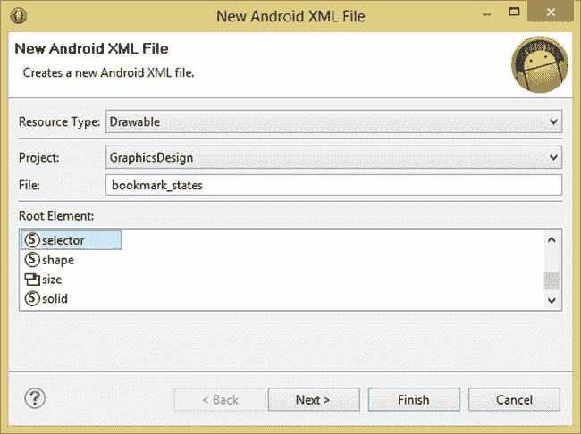

**图 9-14.** 创建资源类型为 Drawable、根元素为`<selector>`的新 Android XML 文件

将文件命名为`bookmark_states`，选择根元素类型为`<selector>`，然后点击`完成`按钮，即可在项目的`/res/drawable`文件夹中创建引导性的`bookmark_states.xml`文件。

现在你可以为`ImageButton`可绘制对象的每个状态添加`<item>`子标签，如图 9-15 所示。如你所见，顺序依次为悬停、按下、聚焦、正常——这与你将鼠标悬停在对象上、点击、释放，然后将鼠标移出对象影响范围的顺序一致。

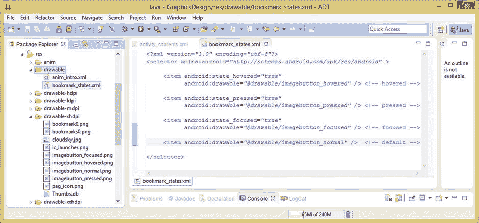

**图 9-15.** 向`bookmark_states.xml`文件添加`<item>`标签以定义 ImageButton 状态的可绘制对象资源

用于在父级`<selector>`标签内实现四个`<item>`子标签的 XML 标记，按它们需要出现的顺序排列，如下所示：

```
<?xml version="1.0" encoding="utf-8"?>
<selector xmlns:android="http://schemas.android.com/apk/res/android">
    <item android:state_hovered="true"
          android:drawable="@drawable/imagebutton_hovered" />
    <item android:state_pressed="true"
          android:drawable="@drawable/imagebutton_pressed" />
    <item android:state_focused="true"
          android:drawable="@drawable/imagebutton_focused" />
    <item android:drawable="@drawable/imagebutton_normal" />
</selector>
```

一旦构建好这个`bookmark_states.xml`文件，你可以返回`activity_contents.xml`文件，使用图形布局编辑器选项卡（如图 9-16 所示），查看你的`ImageButton` UI 元素现在通过`bookmark_states.xml`文件引用图像资源后的外观。

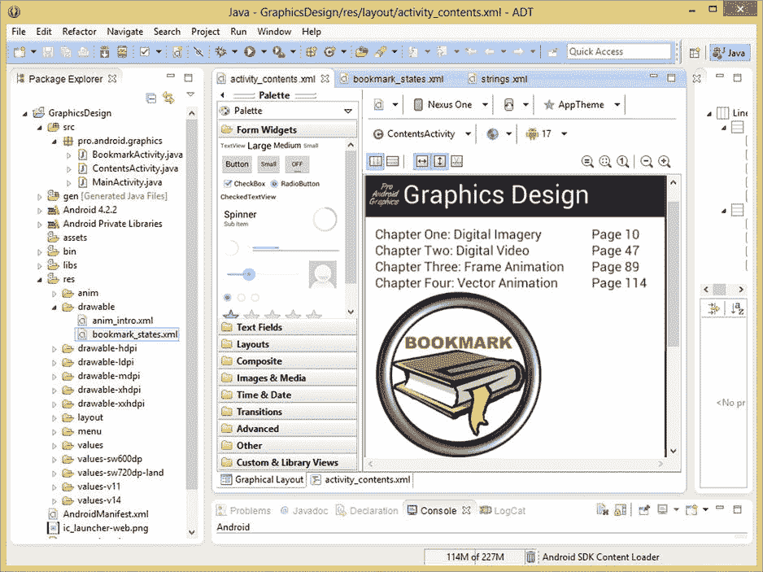

**图 9-16.** 使用图形布局编辑器选项卡预览`<ImageButton>`子标签及其参数

你会注意到，在图形布局编辑器选项卡中，当你点击`ImageButton`时，它会选中该按钮进行编辑，而不是显示你期望的按下状态视觉反馈！这意味着你需要使用“运行为” ➤ “Android 应用程序”工作流程，以便在 Nexus One 模拟器中测试你的应用程序，确保你的 XML 标记都能正确协同工作。

如图 9-17 所示，你的`ImageButton`在点击时会变色并变为金色，但它看起来尺寸过大，不像一个按钮 UI 元素，因此你需要将其缩小到更符合按钮的尺寸。我的第一个想法是，Android 只有超高清图像资源可用，并且没有进行足够的缩小。

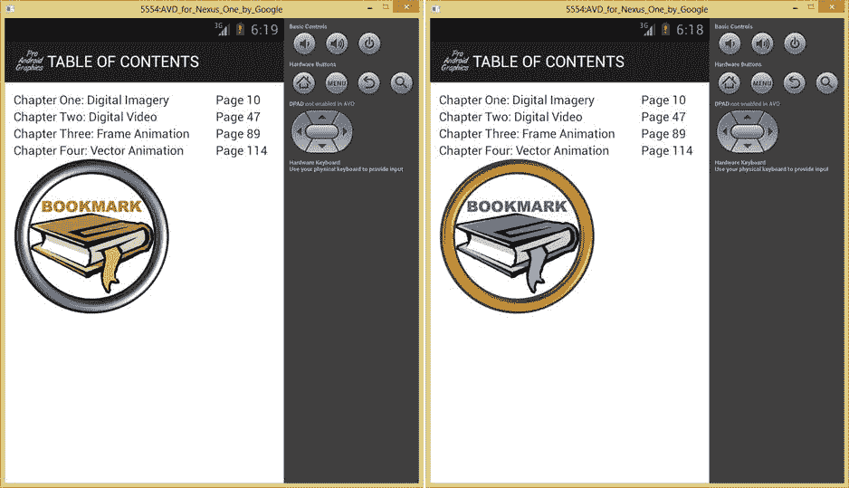

**图 9-17.** 运行 Nexus One 模拟器以在应用程序运行环境中测试 ImageButton 状态

因此，为了确保这不是问题所在，你需要做的第一件事是返回 GIMP，完成你在本章上一节开始的工作流程。如你所知，你创建了这四个图像资源`ImageButton`状态的最高分辨率版本；但是，你还没有完成这些资源在其他三种分辨率密度（LDPI、MDPI 和 HDPI 可绘制对象文件夹）下的版本创建。所以，既然无论如何你都需要完成这项工作，只是暂时拖延了这个繁琐的工作流程，那么你首先要做的就是创建所有资源！


### 创建所有 ImageButton 状态资源：密度分辨率

由于你在所有资源中都使用 32 位 PNG 高品质数字图像文件格式，你可以直接打开 360 像素的 XHDPI 图像资源，并按偶数倍进行下采样。这些将包括用于 LDPI 的 120 像素（3 倍下采样）、用于 MDPI 的 180 像素（2 倍下采样）以及用于 HDPI 的 240 像素（1.5 倍下采样）。

让我们启动 GIMP，使用 `文件 ➤ 打开` 菜单序列来访问 `打开图像` 对话框，如图 9-18 所示。接下来，使用左侧的 `位置` 窗格导航到你的 `/workspace/GraphicsDesign/res/drawable-xhdpi` 文件夹，选择 `imagebutton_normal.png` 文件，然后点击 `打开` 按钮，在 GIMP 中打开此数字图像资源。

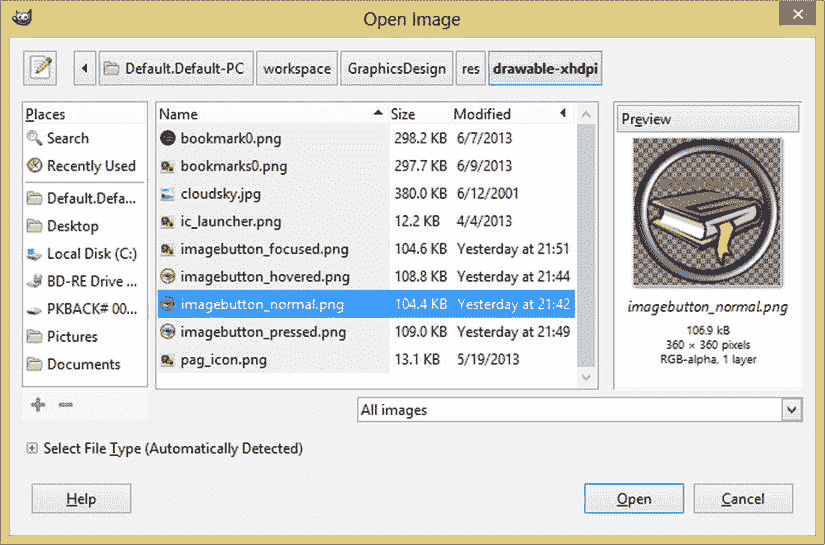

图 9-18. 打开 XHDPI 的 `imagebutton_normal.png` 状态

此工作流程的下一步是使用 `图像` 菜单和 `缩放图像` 工具对话框，将图像尺寸从 360 像素在 X 和 Y 图像轴上各缩小一半，变为 180 x 180 像素，即对图像进行 2 倍或 100% 的下采样。

需要注意的是，偶数倍（2 倍、4 倍、8 倍）的下采样操作会得到最佳结果，因此你应该先创建 MDPI 图像资源。你需要确保 X 和 Y 分辨率输入字段的锁定按钮已设置好，然后在第一个字段中输入 180；当你按下回车键或点击第二个字段时，第二个 180 将自动为你输入。

接下来，确保在该对话框底部附近的下拉菜单中选择了**三次插值**算法选项。GIMP 中的三次插值与 Photoshop 中的双三次插值相同，因此这是在 GIMP 中能获得的最高质量的采样方式。完成对话框参数设置后，点击 `缩放` 按钮，如图 9-19 所示，图像将下采样至如图 9-20 所示的尺寸。

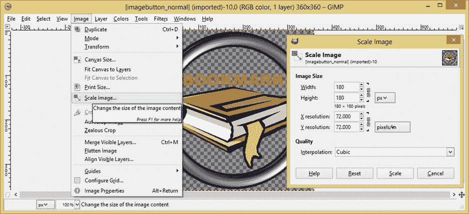

图 9-19. 使用 `图像 ➤ 缩放图像` 菜单序列将图像资源从 XHDPI 缩放至 MDPI

注意图 9-20 中新图像的高质量下采样结果。现在你可以使用 `文件 ➤ 导出` 工作流程来导出新的 MDPI 数字图像资源。我同样展开了菜单并在图 9-20 中展示了该选项，以便从一张截图中获得更多信息。

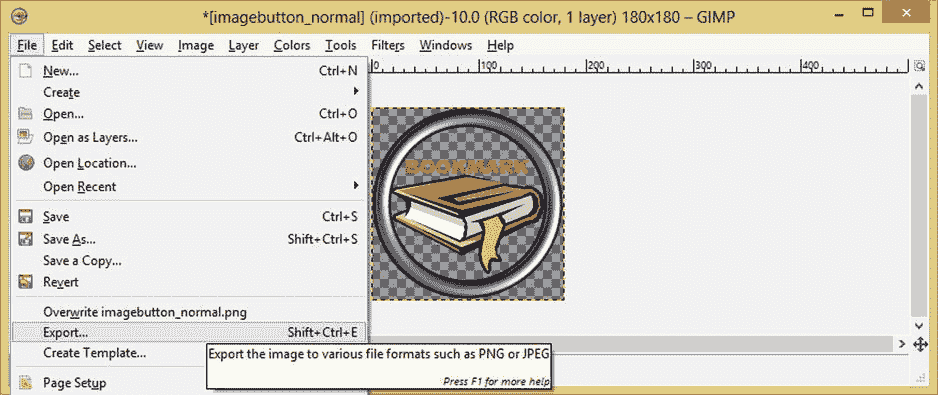

图 9-20. 使用 `文件 ➤ 导出` 菜单序列导出 180 像素的 MDPI `ImageButton` 正常状态

你将使用图 9-12 所示的 `导出图像` 对话框，使用完全相同的文件名保存此 MDPI 图像资源，但保存到不同的（`res/drawable-mdpi`）文件夹中，使其成为一个不同的文件，至少对于 Android 而言是这样。Android 会在多个文件夹中使用相同的文件名！

如果将文件导出到 XHDPI 文件夹，它将替换你的 360 像素资源，因此在此工作流程中务必非常小心。图 9-21 以蓝色高亮显示了相同的文件名，并在其正下方的 `保存到文件夹：` 行中显示了不同的文件夹路径。

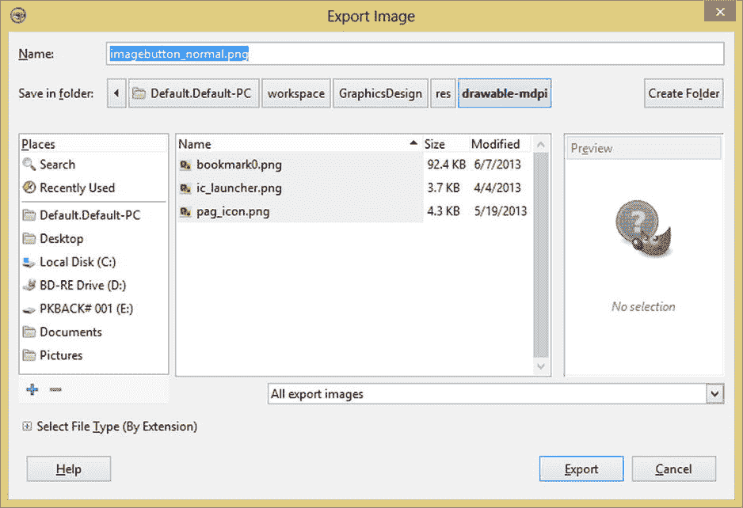

图 9-21. 将 180 像素的 `imagebutton_normal.png` 资源导出到 `drawable-mdpi` 文件夹

一切设置正确后，点击 `导出` 按钮，该文件将以正确的 180 像素分辨率创建在你的 MDPI 文件夹中。

工作流程的下一步是使用图 9-22 所示的 `编辑 ➤ 撤销缩放图像` 菜单序列，撤销 2 倍下采样，返回到你的 XHDPI 分辨率图像。你应始终使用高分辨率图像源进行下采样，这样才能从三次算法中获得良好结果。

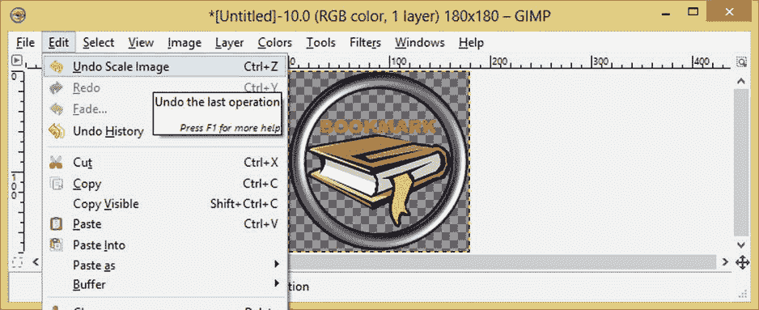

图 9-22. 撤销 `缩放图像` 操作，返回到 360 像素的正常状态版本，以便获得更好的采样

一旦返回到 360 像素的 XHDPI 源图像，你将需要为 LDPI 120 像素和 HDPI 240 像素的 `imagebutton_normal.png` 图像资源重复图 9-18 至图 9-22 所示的工作流程。包含这两种采样操作设置的 `缩放图像` 对话框如图 9-23 所示，以确保你设置正确！

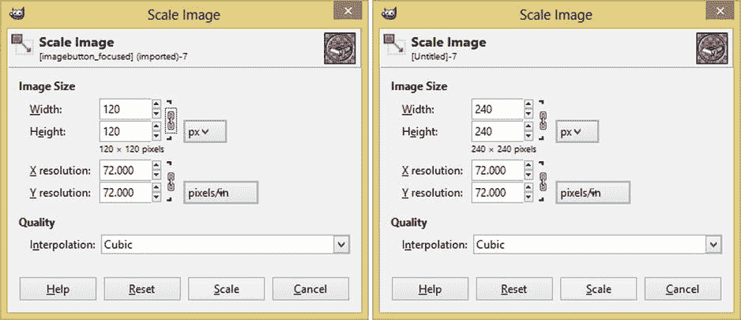

图 9-23. 将正常状态资源缩放至 120 像素（LDPI）和 240 像素（HDPI），以创建正常状态资源

接下来的步骤涉及使用你的其他三个图像状态资源重复此工作流程。这些资源包括 `imagebutton_pressed.png`、`imagebutton_focused.png` 和 `imagebutton_hovered.png`。这三个 `ImageButton` 状态资源需要下采样为 LDPI、MDPI 和 HDPI 资源分辨率。这可以按你希望的任何顺序进行，只要最终全部完成即可。

完成剩余下采样的第一步（除了图 9-18 到图 9-22 所示的步骤之外）是完全关闭 `imagebutton_normal.png` 360 像素资源，并且不要意外将其保存为任何其他（更低）分辨率。有两种方法可以做到这一点；我将向你展示如何冗余操作并同时使用这两种方法，这样你总能 100% 确保不会意外“丢失”任何高分辨率源资源。

第一种方法是始终使用 `编辑 ➤ 撤销缩放图像` 工作流程，如图 9-22 所示。第二种是使用 `文件 ➤ 关闭` 工作流程，如图 9-24 所示，并在对话框中选择 `不保存关闭` 选项（如右侧所示），即使你使用了 `撤销缩放图像` 工作流程也是如此。这将确保你在工作流程开始时打开的高分辨率资源始终保持不变，因为你永远不要覆盖保存它！

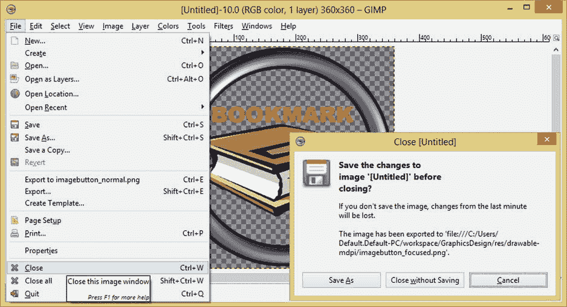

图 9-24. 关闭正常图像资源而不覆盖原始数据，以便你可以打开下一个状态

接下来，让我们使用此工作流程关闭 `imagebutton_normal.png` 资源，打开其他资源之一，并按照图 9-18 至图 9-24 概述的工作流程，为该 `ImageButton` 状态创建其他三个 DPI 分辨率资源。

一旦你为所有四个 `ImageButton` 状态完成此操作，你应该会对创建用于 Android 应用开发的多状态 `ImageButton` 所涉及的数字图像合成和下采样工作流程有相当好的掌握。

创建完所有 16 个多状态 `ImageButton` 资源后，你可以返回 Eclipse ADT，查看所有这些较小的 `ImageButton` 状态图像资源是否会给你带来更小的 `ImageButton` UI 元素，或者你是否必须通过使用额外的 XML 参数来构建该问题的解决方案。


### 将 ImageButton 缩小至类似 UI 元素的尺寸

接下来，你需要返回并重启 Eclipse ADT；如果 Eclipse 已在桌面上打开，请务必右键点击项目文件夹，选择“刷新”选项，让 Eclipse “识别”你已添加到各个 `/res/drawable-dpi` 子文件夹中的新图像资源。

然后，使用“运行方式 ➤ Android 应用程序”工作流程，检查 Android 操作系统是否使用了你刚刚创建的这些较小图像资源。

当你在 Nexus One 模拟器中再次运行该应用时，你会发现它看起来仍然像图 9-17 中那样，因此你需要查看是否有任何参数可以帮助你实现期望的最终效果。

为此，请在 `<ImageButton>` 标签内使用 `android:` 工作流程，调出参数列表。浏览所有参数，看看是否有任何参数能帮助你让 `ImageButton` 看起来更小。

在参数列表的底部附近，你会看到 `android:scaleX` 和 `android:scaleY` 两个参数。双击每个参数，将它们添加到 `<ImageButton>` 标签中，如图 9-25 所示，位于标签参数的第二行。

由于你知道均匀缩放效果最好，因此你将使用实数或浮点缩放值 `0.5`，这相当于进行 2 倍下采样。

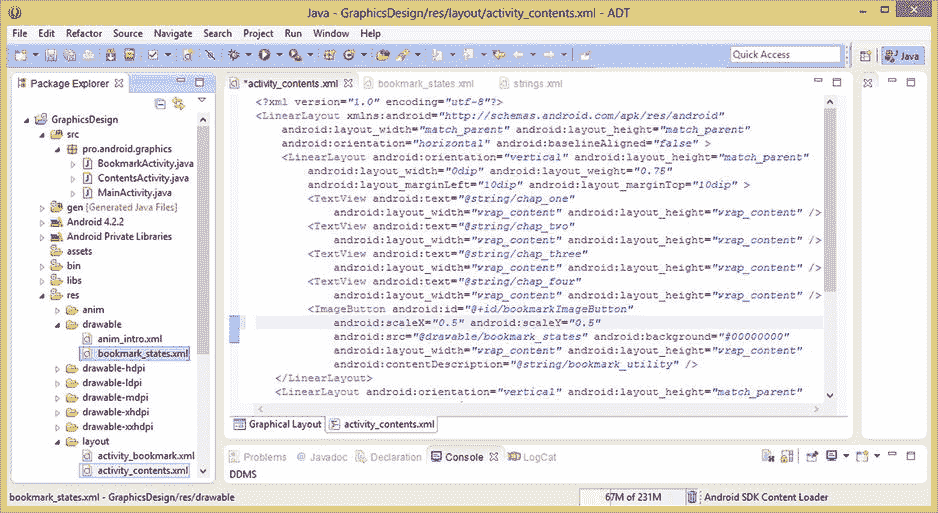

**图 9-25.** 使用 `android:scaleX` 和 `android:scaleY` 将 ImageButton 缩小到更接近按钮的尺寸

要查看添加这些 `android:scale` 标签后的视觉效果，而无需使用“运行方式 ➤ Android 应用程序”工作流程，你可以点击 XML 编辑窗格底部的**图形布局编辑器**选项卡。这将切换到可视化编辑模式，以查看 50% 缩放操作（参数）的结果。

如图 9-26 所示，这些 `android:scaleX` 和 `android:scaleY` 参数恰好为你提供了你一直寻找的最终结果，`ImageButton` 现在看起来像是一个位于目录下的 UI 元素。

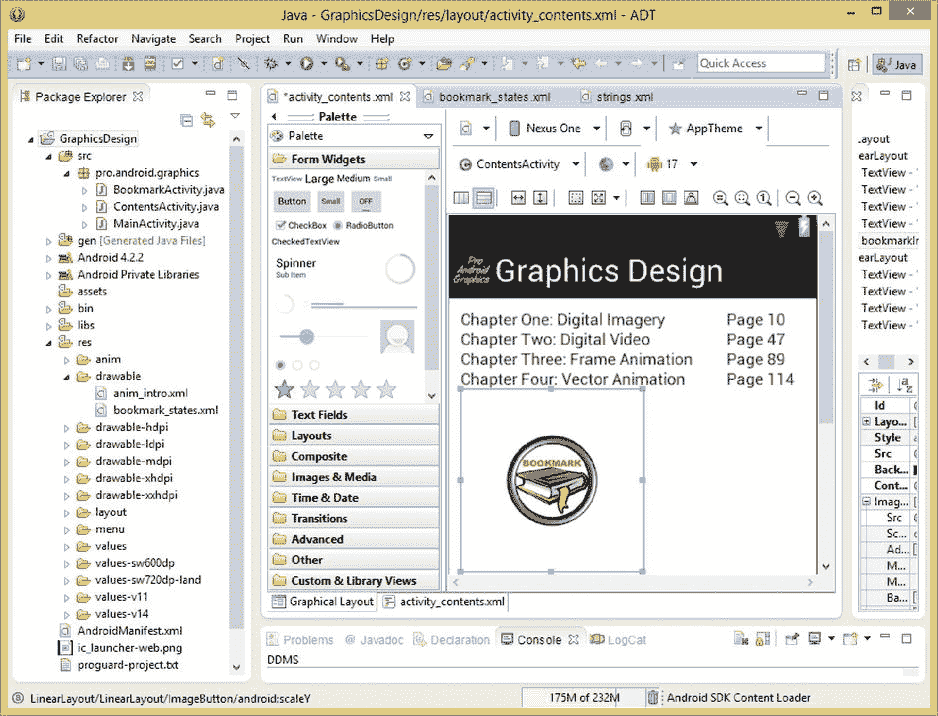

**图 9-26.** 使用图形布局编辑器选项卡预览 ImageButton 缩放参数的结果

然而，`android:scale` 参数将你的 `ImageButton` 容器保留为原始尺寸，正如你在图 9-26 所示的选择集（尺寸调整手柄）区域中看到的那样。因此，你需要向标签中添加一些额外的参数，将这个 `ImageButton` 容器向左上方拉动，这将涉及使用一些负边距参数，接下来你将添加这些参数。

首先，让我们添加一个 `android:layout_marginTop` 参数，其值为负的 `35 DIP`，以将新调整大小的 `ImageButton` 向上拉近至目录。你可以使用**图形布局编辑器**选项卡预览此设置，以确保它对你有效。

接下来，让我们添加 `android:layout_marginLeft` 参数，其值为负的 `35 DIP`，以将新调整大小的 `ImageButton` 向左拉近屏幕左侧。你也可以使用**图形布局编辑器**选项卡预览此设置，以确保它对你有效。

图 9-27 显示了在 `<ImageButton>` 标签内的顶部，位于两个 `android:scale` 参数旁边的 `android:layout_margin` 参数。你的 `ImageButton` UI 元素现在有了十个自定义参数。

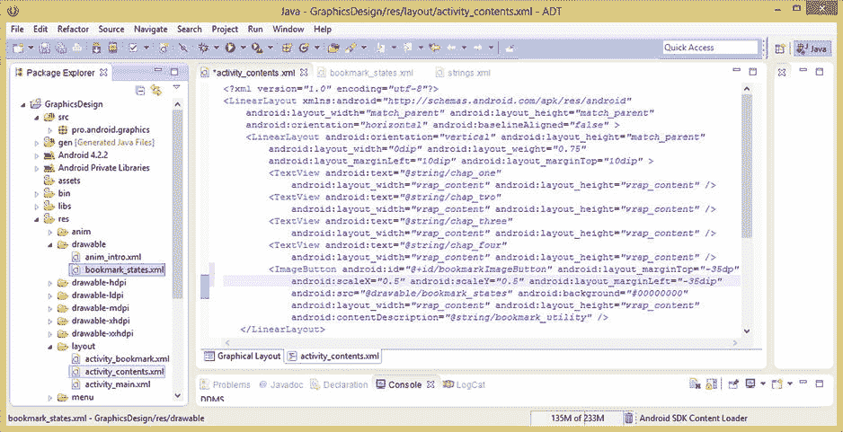

**图 9-27.** 添加 `android:layout_marginTop` 和 `android:layout_marginLeft` 参数来定位 ImageButton

现在你已经设置好了所有用于缩放和定位 `ImageButton` 的参数，让我们再次利用**图形布局编辑器**快速预览你编写的 XML 标记，看看是否离期望的最终结果更近了一步。

如图 9-28 所示，`ImageButton` UI 元素现在更靠近目录底部，最终用户将把它视为一个 UI 按钮，该按钮最终会将用户引导至书签工具 Activity 子类。

由于我在 XML 编辑窗格中选中了 `<ImageButton>` 标签，该 UI 元素在**图形布局编辑器**窗格中也显示为选中状态，这展示了负边距参数值如何移开 UI 控件容器未使用的部分，以便缩放后的 UI 元素能够被定位到其在屏幕上应有的位置。

另一种选择当然是，将你的图像资源本身的像素尺寸缩小一半，即缩小为 `180`、`120`、`90` 和 `60` 像素。

按照你设计 XML 标记的方式，你可以轻松地添加更多目录条目，只要保持 `<ImageButton>` 子标签作为第一个嵌套的 `<LinearLayout>` 子标签容器中的最后一个标签即可。

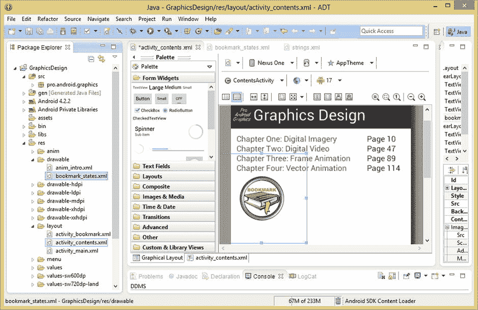

**图 9-28.** 使用图形布局编辑器预览定位 ImageButton 的负边距设置

最后，让我们在 Nexus One 上测试 `ImageButton`，如图 9-29 所示。

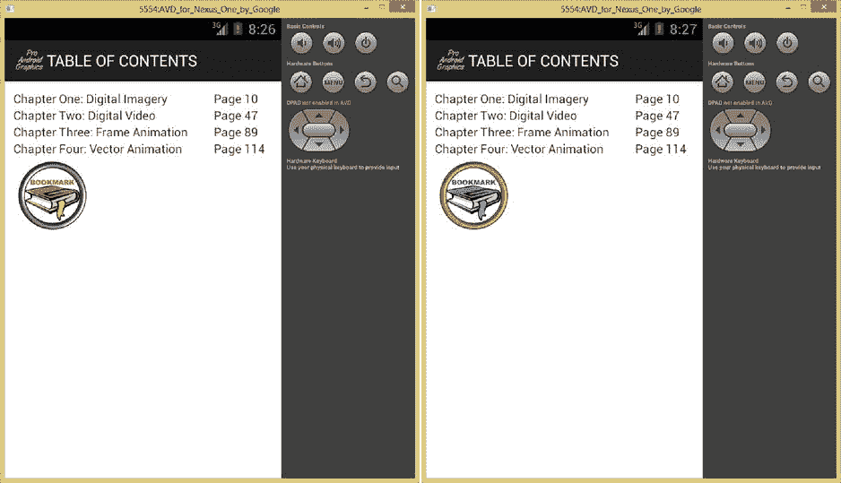

**图 9-29.** 使用 Nexus One 模拟器测试 ImageButton 的状态、缩放和定位参数


### 总结

在第九章中，你学习了 Android `ImageButton` UI 构件，以及如何使用 XML 实现多状态图形按钮。

我们首先研究了 `ImageButton` 类及其与 `Button` UI 构件的区别。你了解到 `ImageView` 类用于创建 Android `ImageButton` UI 构件子类，`android:src` 参数引用其源图像，而 `android:background` 则控制用于在其后方元素上进行合成的透明度。

接着，我们研究了用于向用户提供视觉反馈的 `ImageButton` 状态，这些状态表明 `ImageButton` 当前处于何种使用状态，每种状态由开发者提供不同的图像。

你了解了悬停状态，以及它如何仅适用于配备鼠标的 Android 设备；该状态是在 API 级别 14 中引入的，可能是为了支持在 Chromebook 上使用 Android。

你了解了按下状态，该状态表示 `ImageButton` 正在被点击（点击的按下部分），或者在触摸屏上被触摸。你了解到在“常规”PC 编程环境中，按下状态相当于鼠标按下状态。

你了解了聚焦状态，该状态表示你的 `ImageButton` 已被释放（点击的弹起部分），并且 `ImageButton` 正在被使用（拥有焦点），直到用户访问了另一个 UI 元素。

你还了解了正常状态，或称为未使用状态，这是默认状态。所有 `ImageButton` 除非以某种方式被使用（悬停、按下或聚焦），否则都将使用此状态。

接下来，我们逐步讲解了如何使用 GIMP 数字成像软件包创建四个 `ImageButton` 状态，以创建一份数字图像合成文档，利用该文档可以导出四个独一无二但像素坐标同步的图像资源，从而实现无缝的多状态 `ImageButton` 用户体验。

然后，我们研究了如何将 `ImageButton` 实现到现有的布局容器中，将这个新的 `<ImageButton>` 子标签添加到现有的嵌套 `<LinearLayout>` 子标签中。

接着，我们创建了 `bookmark_states.xml` XML 定义文件，该文件创建了多状态可绘制图像资源定义，引用了本章前面使用 GIMP 2.8.6 创建的图像资源。

在下一章中，你将了解 9-Patch 技术，以及如何创建能够在不考虑宽高比的情况下精确缩放的 9-Patch 图像资源。9-Patch 技术同样适用于 HTML5 应用。

