# 10. 使用 9-Patch 成像技术创建可扩展成像元素

### 摘要

在第十章中，我们将更深入地研究 Android `NinePatch` 类、`NinePatchDrawable` 类以及 Draw 9-patch 工具。

由于这是一本专注于图形学的书籍，并且我们已经介绍了用于承载和实现图像或动画图形资源的 Android `ImageView` 和 `ImageButton` 类，我们将开始更多地关注 Android 操作系统中的图形相关类。其中第一个就是 `NinePatch`。

在开发能够因 Android 设备显示屏宽高比或方向变化而缩放且不失真的图像资源时，`NinePatch` 是 Android 最重要的图形设计工具之一。

`NinePatch` 是一种可调整大小的位图，其缩放操作过程中的缩放行为可以通过我们在位图图像中定义的九个区域（想象一个包含九个独立区域的井字网格）来控制。

`NinePatch` 类型的图像资源可用于从可缩放按钮背景到 UI 布局容器背景的任何场景，这些背景将缩放以适应不同的屏幕分辨率密度、宽高比和方向。

`NinePatchDrawable` 对象的优势在于，开发者可以定义一个单一的图形元素（在后面的章节示例中，这将是一个 20KB 的 `.PNG` 文件），该元素可用于许多不同的 UI 元素，包括按钮、`ImageButton`、滑块、背景以及类似的项目。

### Android NinePatchDrawable：NinePatch 的基础

Android `NinePatchDrawable` 类是 Android `Drawable` 类的子类，因此属于 `android.graphics.drawable` 包的一部分。

一条 import 语句将 `android.graphics.drawable.NinePatchDrawable` 作为 Android 包“路径”来引用 Android `NinePatchDrawable` 类，该类展示了以下 Android Java 类层次结构：

```
java.lang.Object
  > android.graphics.drawable.Drawable
    > android.graphics.drawable.NinePatchDrawable
```

`NinePatchDrawable` 类有四个用于在 Android 中创建 `NinePatchDrawable` 对象的 Java 构造函数（方法）。其中两个构造函数自 Android 1.6 API 级别 4 起已被弃用，因此不要使用以下两个构造函数来创建你的 `NinePatchDrawable` 对象：

```
NinePatchDrawable(Bitmap bitmap, byte[] chunk, Rect padding, String srcName) - 或 -
NinePatchDrawable(NinePatch patch)
```

请注意，它们都直接访问 `NinePatch` 图像资源，而未通过 Android 的 `R` 或资源（`/res/drawable`）区域。这种绕过 Android“资源仓”的方式已被弃用，而非 `NinePatch` 技术本身。访问 `NinePatch` 资源的正确方法是使用以下任一（未弃用的）构造函数方法：

```
NinePatchDrawable(Resources res, Bitmap bmp, byte[] chunk, Rect padding, String s)
```

此构造函数方法使用 `NinePatch` 的原始 `Bitmap` 对象数据创建 `NinePatchDrawable` 对象，并根据资源的显示度量设置初始目标密度。此构造函数主要应通过 Java 代码用于高级 `NinePatch` 用法。由于我们通过静态声明使用 XML 预先实现图形设计资源，因此我们将使用 `NinePatch` 类，我将在下一节中介绍它。它使用以下简单得多的构造函数方法：

```
NinePatchDrawable(Resources res, NinePatch patch)
```

此构造函数将使用现有的 `NinePatch` 资源创建 `NinePatchDrawable` 资源，该资源可在 `/res/drawable` 文件夹中找到，并需使用 `NinePatch` 资源正确的文件命名协议。此 `NinePatchDrawable` Java 构造函数将自动分析并基于资源自身的显示度量设置初始目标图像分辨率密度。

我将重点介绍第二种方式，因为它更加标准化、直接，并且可以更快地得到我们想要的结果。在下一节中，我将详细介绍 `NinePatch` 图像资源的概念，然后介绍 `NinePatch` 类本身，最后讲解如何创建 `NinePatchDrawable` 图像资源。这需要使用隐藏在 Android SDK 文件夹层次结构深处的 Draw 9-patch 成像工具，该工具位于 `/sdk/tools` 文件夹中。


### NinePatch 图形资源：9-Patch 概念概述

`NinePatchDrawable` 对象（通常也简称为“9-patch”）允许 Android 开发者创建一种特殊的可变形的 PNG8、PNG24 或 PNG32 图形资源。9-patch 能够对给定数字图像中的不同区域应用不同的缩放比例。

因此，一个 9-patch 图像资源本质上是与坐标轴无关的、可缩放的 `.PNG` 位图图像。它通过利用图像资源内部的九个不同象限来支持缩放，或者更准确地说，是支持像素平铺，以适应任何 `View` 对象或布局容器可能具有的任意尺寸和形状。

由于其内置的 `NinePatchDrawable` 类（以及 `NinePatch` 类）支持，Android 操作系统可以自动调整开发者使用的 9-patch 图像资源大小，以适应任何 `View` 对象的内容，只要开发者将该 9-patch 图像资源作为背景图像资源引用放置在该 `View` 对象中。这是通过 Android `NinePatch` 类和 `NinePatchDrawable` 类内部存在的算法来实现的，此外，Android SDK 中 `/sdk/tools` 文件夹内的 Draw 9-patch 软件工具中也包含了相关算法。

NinePatch 图像资源的一个很好的用例是作为背景图像占位符（`android:background` XML 参数）的内部内容，该占位符常用于标准的 Android `Button` 对象 UI 组件。`Button` UI 组件几乎总是需要至少在单个维度上拉伸，通常需要在 X 和 Y 两个维度上拉伸，以适应不同长度的文本字符串、不同的字体类型或不同的字体大小。

此 `NinePatchDrawable` 对象引用了 Android 推荐的 PNG 数字图像格式，并且它还包含一个额外的单像素宽度的边框。Android 操作系统支持三种不同“风格”的 PNG 图像：索引色（8 位）PNG8、真彩色（24 位或 RGB）PNG24，以及带有 Alpha 通道的真彩色（32 位或 ARGB）PNG32 图像文件格式。

为了能被 Android 识别为 9-patch 图像资源，`NinePatchDrawable` 资源需要以 `.9.png` 的文件扩展名保存，并保存到相应 Android 项目的 `/res/drawable/` 目录中。

我之前提到的单像素边框对于最终用户是不可见的，而是由 Android `NinePatch` 类的算法来使用，以定义图像资源的哪些区域是可伸缩的，哪些区域是静态的（固定不变、不缩放，仅移动）。

我们将能够通过在此单像素边框的左侧和顶部区域内绘制一条（或多条）单像素宽的黑色线段，来指示 9-patch 图像资源的可伸缩部分。

边框上所有未用于定义 9-patch 图像可伸缩部分的其余像素，必须使用完全透明的颜色值（`#00000000`）或白色（`#FFFFFF`）颜色值。

如果我们想更巧妙一点，甚至可以同时使用 `#00FFFFFF` 十六进制颜色值（透明白色）来定义两者。幸运的是，我们稍后将介绍的 Draw 9-patch 工具会为我们完成所有这些工作！

有趣的是，我们可以使用这些单像素黑色线段随意定义任意数量的可伸缩部分。需要注意的是，每个可伸缩部分相对于其他部分的相对大小将始终保持“比例一致”。这意味着，无论缩放大小如何，最大的可伸缩部分在任何缩放比例下都将始终是最大的可伸缩部分。

在为 9-patch 资源定义了（外部）可伸缩部分之后，接下来我们为 9-patch 图像定义（可选的）可绘制区域（内部），这些区域称为“内边距区域”。内边距可绘制区域告诉 Android 可以将定义在 `View` 对象或 `ViewGroup`（View 子类）布局容器对象中的元素放置在何处。

引入此内边距功能是为了确保我们的 `NinePatchDrawable` 资源不被其他应用资源覆盖或在视觉上被遮挡。内边距的定义方式与定义可伸缩部分的方式相同，即使用在 9-patch 资源定义的右侧和底部单像素边框区域上绘制的单像素黑色“内边距线”。

例如，如果一个 `View` 对象将 NinePatch 设置为其背景，然后指定了 `View` 对象的文本属性，它将拉伸该属性，以使所有文本属性都适合我们通过右侧和底部的单像素黑色边框定义所指定的这个区域内。

需要注意的是，如果没有特别定义 9-patch 的内边距区域定义线，则 Android `NinePatch` 算法将转而使用左侧和顶部的缩放定义线段来定义图像资源的内边距（可绘制）区域。

总结一下单像素黑色边框线的用途差异：左侧和顶部的线定义了图像资源中哪些像素可以被复制，以便拉伸或缩放 9-patch 图像。底部和右侧的单像素黑色边框线则定义了 9-patch 图像资源内部（内侧）的可绘制区域，`View` 对象的内容（属性或资源引用）允许覆盖这些区域。

### Android NinePatch 类：创建 NinePatch 资源

`NinePatch` 类是 Java 主类 `java.lang.Object` 的直接子类，这意味着它用于定义 NinePatch Java 对象，并且是专门编码成为其自己的 Android 资源的。它不是基于 Android 操作系统内的其他类层级结构。正如您可能已经猜到的，它位于 `android.graphics` 包内。其类层级结构如下：

`java.lang.Object`

  `> android.graphics.NinePatch`

由 Android `NinePatch` 类构造的对象允许 Android 操作系统使用九个独立的部分来缩放和渲染此 9-patch 图像资源。

另一个很好的类比是指南针。9-patch 图像的四个角，即东北、西北、东南和西南方向，是不缩放的；而四条边，即北、东、南或西方向，是沿一个轴缩放的。指南针（9-patch 图像）的中心则是沿其两个轴缩放的，就像 Android 中缩放普通图像一样。

理想情况下，我们的 9-patch 源 PNG 图像资源的中间部分应该是 100% 透明的，就像您稍后在本章中使用 Draw 9-patch 软件工具时会遇到的情况一样。这样做是为了让我们的 9-patch 能够围绕一个开放、矩形的内容区域提供一个可缩放的图像框架，供我们的 `View` 对象用于其样式化并引用的内容。

这种设计方法将使开发者能够创建自定义图形，并按照他们定义的方式实现无缝缩放。

当内容被添加到位于 9-patch 图像资源内部的 `View` 对象中，并且此内容超出了 9-patch 图形资源的内部内边距限制时，可以轻松调整而不会导致资源变形。

Android SDK 中 `/tools` 文件夹内提供的 Draw 9-Patch 工具，为开发者提供了一个简单实用的工具，用于通过所见即所得（WYSIWYG）图形编辑器创建 NinePatch 图像资源。

我将在本章的下一节中详细介绍 Draw 9-patch 软件的使用，那么让我们开始吧！


### Draw 9-Patch 工具：创建 NinePatchDrawable 资源

本节将介绍如何使用 Android Draw 9-patch 工具创建 9-patch 图形。你需要准备一张源 PNG 图像，用于创建 `NinePatchDrawable` 对象；我提供了一张名为 `NinePatchFrame.png` 的示例 PNG 图像资源。这张包含透明通道的真彩色 PNG32 数字图像资源，位于本书项目资源库的 `NinePatch` 子文件夹中。

我之所以在即将创建的 9-patch 中心区域使用透明通道来定义透明度，是为了让 Android 中位于该图像资源后方的任何图像层（即预期的合成层）都能在合成堆栈中与 9-patch 图像资源完美融合。

首先，在 Android SDK 文件夹层级中找到 `tools` 子文件夹中的 Draw 9-patch 工具。打开操作系统的文件导航工具；在 Windows 8 中即为资源管理器，如图 10-1 所示。

如图所示，我将 Android SDK 文件夹命名为 `Android`，其中包含一个解压用于安装 SDK 的 `adt-bundle-windows-x86` 文件夹。该文件夹下是 `sdk` 文件夹，再下一级便是 `tools` 子文件夹。

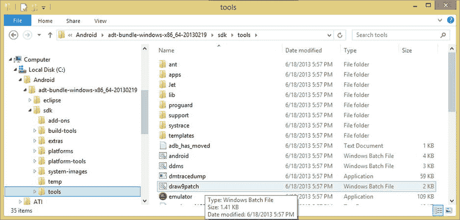

图 10-1.

在 Android 文件夹的 `SDK` 子文件夹下的 `tools` 子文件夹中，找到 `draw9patch` Windows 批处理文件。

点击 `tools` 子文件夹后，如图 10-1 所示，你会看到一个 `draw9patch.bat` Windows 批处理文件；你需要启动该文件来运行 `Draw9patch` 软件工具。右键点击 `draw9patch` 文件，选择 `以管理员身份运行` 菜单选项，如图 10-2 所示。

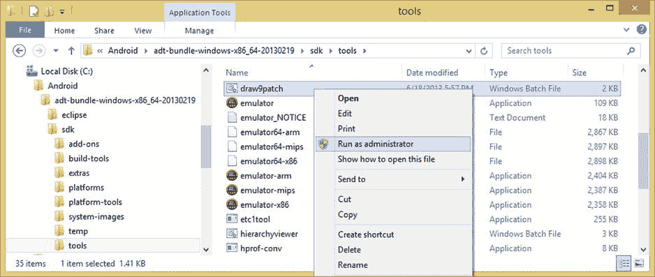

图 10-2.

右键点击 `draw9patch` Windows 批处理文件，选择 `以管理员身份运行` 选项来执行。

这将启动运行 `.bat` 批处理文件所需的 Windows 终端软件，由于它正在“执行” `draw9patch.bat` 批处理文件，因此随后将从 `tools` 文件夹启动 `draw9patch` 应用程序。

如图 10-3 所示，Windows 命令行终端（`cmd.exe`）软件打开并运行 `draw9patch.bat`，随后在终端窗口之上打开一个 Draw 9-patch 软件编辑窗口。你可以根据需要最小化终端窗口，只保留 Draw 9-patch 编辑工具。

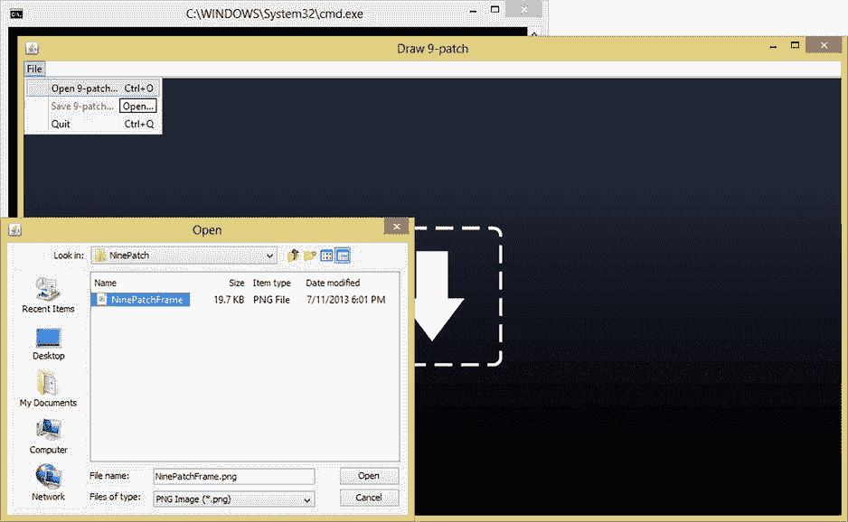

图 10-3.

启动 Draw 9-patch 软件，并使用 `File` 菜单访问 `Open 9-patch` 对话框。

打开用于 9-patch 开发的源 `.PNG` 文件有两种方式：将 PNG 图像拖放到 Draw 9-patch 窗口中央的“放置在此处”箭头位置；或者通过 `File ➤ Open 9-patch` 工作流程，在 `NinePatch` 子文件夹中找到文件。这两种方式均在图 10-3 中展示；不过，我将采用更稳妥的方式，即使用截图左下角显示的 `Open` 对话框。

找到 `NinePatchFrame.png` 32 位 PNG 源图像资源后，选中它并点击 `Open` 按钮。你将看到 Draw 9-patch 软件，PNG 文件已显示在编辑区和预览区。左侧窗格是编辑区，你可以在其中绘制定义补丁或缩放区域以及中心（内边距）内容区域的单像素黑色线条。

右侧窗格是生成的 9-patch 预览区，如图 10-4 所示。在这里，你可以看到 9-patch 图像资源根据你在软件左侧编辑区定义的单像素黑色边框线条进行缩放后的效果。

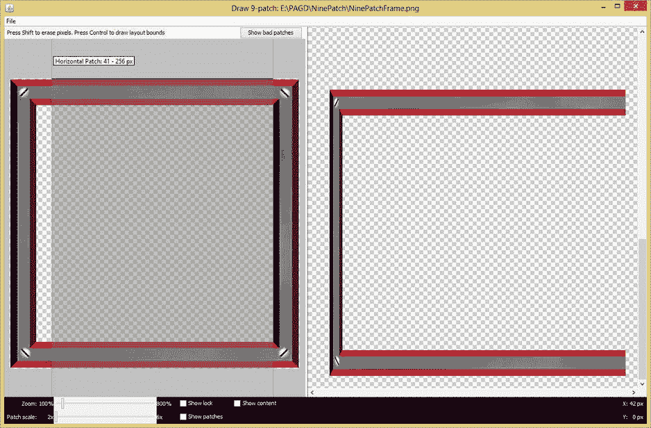


#### 10-4. 绘制顶部水平拉伸区域：用单像素黑色线段定义活动 X 轴区域

让我们点击右侧靠近边角的顶部单像素透明边框区域，如图 10-4 所示，然后向左拖动，绘制出定义 X 维度可拉伸区域的黑色线段。一旦你粗略绘制出所需形状，就可以利用该单像素线段两端微小的线条进行微调。将鼠标移至这些微小线条上，直到光标变为双向箭头；然后点击并拖动灰色区域，直到它与你 NinePatchFrame 源图片资源中心的透明区域完美对齐。

你也可以通过右键单击，或者在 Macintosh 电脑上按住 `Shift` 键并单击，来擦除之前绘制的线段。正如你在右侧预览区所看到的，目前仍无法获得理想的可视化结果。因此，我们继续下一步，定义左侧的单像素黑色边框。

首先，让我们使用 Draw 9-patch 软件底部提供的更多彩色选项之一，以便更好地可视化你的设置。

找到 `Show patches` 选项旁的空复选框，并勾选它以启用此功能。如图 10-5 所示，这将通过组合使用紫色和绿色为你的选定区域着色。这将清晰地显示出你图片资源中的哪些区域正在受到影响。

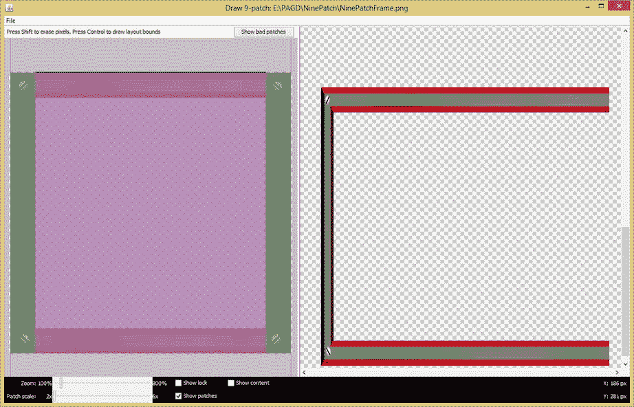

**图 10-5.** 启用 `Show Patches` 复选框选项，并完成顶部单像素黑色线段的绘制

你可以在图 10-5 中看到，编辑面板底部还有几个其他有用的控件。一个是 `Zoom` 滑块，它允许你调整编辑区域中源图形的缩放级别。另一个是 `Patch scale` 滑块，它允许你调整右侧预览区域中预览图像的缩放比例。`Show lock` 选项复选框允许你在鼠标悬停时查看图形中不可绘制的区域。

你刚刚启用的 `Show patches` 选项复选框，允许你在左侧面板编辑区域实时预览你的可拉伸区块定义。粉红色代表区块中可拉伸的区域。

`Show content` 选项复选框会在预览图像中高亮显示你的内容区域，紫色表示允许放置 View 内容的区域。

最后，在编辑区域的顶部有一个 `Show bad patches` 按钮，它会在可能产生图形缩放伪像的区块区域周围添加红色边框。如果你力求在设计时消除所有不良区块，你的缩放图像将达到卓越的视觉效果。

#### 10-6. 绘制左侧垂直拉伸区域：用单像素黑色线段定义活动 Y 轴区域

现在，我们来绘制左侧的单像素边框，如图 10-6 所示。

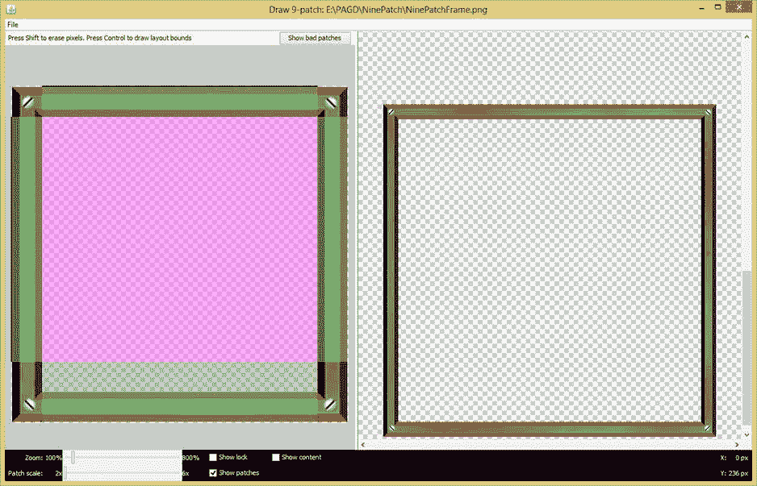

**图 10-6.** 绘制左侧垂直拉伸区域：用单像素黑色线段定义活动 Y 轴区域

正如你在图 10-6 中所见，我并没有在左侧从上到下完整地绘制一条单像素黑色边框线。我这样做是为了让你能直观地了解 `Show patches` 选项的强大功能。该选项能让你精确到像素级别地看到你所做的操作；如果你想定义完美的 9-patch 图片资源，这种精确性是绝对必要的。

#### 10-7. 水平和垂直拉伸区域的单像素黑色线段现已定义好活动轴区域

图 10-7 显示了已定义好顶部和左侧单像素黑色边框线的 9-patch 图片资源；如你所见，得益于 `Show patches` 选项，你现在已经以手术般的精确度定义了你的固定区域和可拉伸区域。

另外请注意，在图 10-7 中软件工具的右侧预览区域，你的 9-patch 图片资源定义结果呈现出非常专业的缩放效果。

如果你拖动屏幕右侧的滚动条，上下拉动，你会看到 9-patch 图片在纵向和横向容器中都能完美缩放，视觉效果出色。

既然已经定义了 9-patch 图片资源的可拉伸区域，那么接下来就是使用编辑面板右侧和底部的单像素黑色边框线，来定义 9-patch 图片资源的内边距区域。

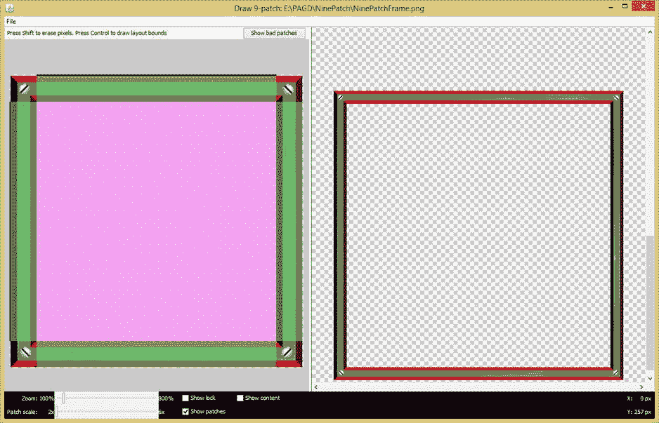

**图 10-7.** 水平和垂直拉伸区域的单像素黑色线段现已定义好活动轴区域

#### 10-8. 使用右侧和底部的单像素黑色线段定义内边距区域

如图 10-8 所示，我已经在右侧绘制了定义 9-patch 图片资源中心（内边距）区域 Y 轴图像尺寸所需的单像素黑色边框线段。同样注意，在图 10-8 中，我正着手绘制第二条底部的单像素黑色边框线段，以定义 9-patch 图片资源中心（内边距）区域的 X 轴尺寸。

请注意用于区分可拉伸区域和内边距区域定义的不同图层所使用的柔和色彩。你的内边距定义在绿色或紫色（如果你喜欢，也可以是粉红色）的可拉伸区域定义之上叠加了一层灰色调，可拉伸区域的颜色更鲜艳，这大概是因为可拉伸区域的定义比内边距区域更为重要。

此外，请注意在右侧的 9-patch 结果预览区域中，无论图像的朝向如何，也无论 9-patch 图片资源被缩放至何种尺寸，其缩放结果都呈现出极其专业的效果。

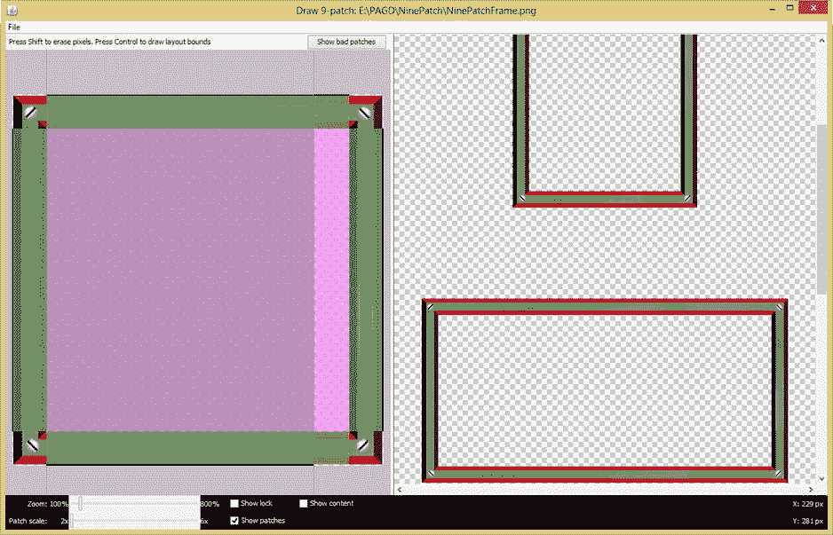

**图 10-8.** 使用右侧和底部的单像素黑色线段定义内边距区域

#### 10-9. 通过右侧单像素黑色线段调整内边距区域以显示拉伸区域调整指引

最后，注意在图 10-9 中，我正向上拉动右侧的单像素黑色边框线段，以显示拉伸区域调整指引，并展示边框如何允许你精确调整 9-patch 的内边距参数。

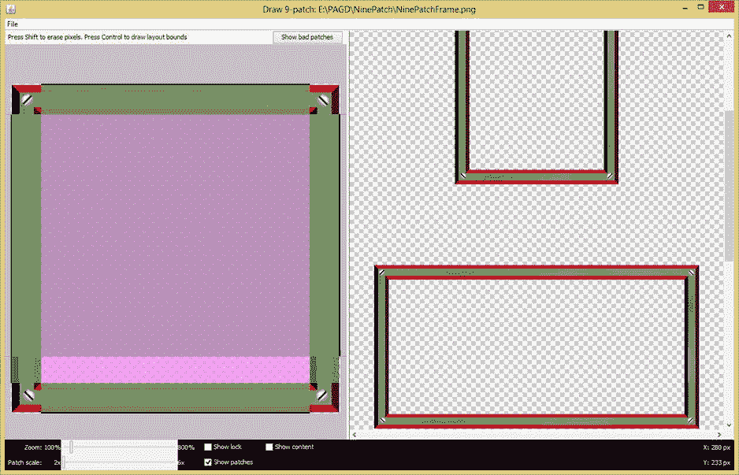

**图 10-9.** 通过右侧单像素黑色线段调整内边距区域以显示拉伸区域调整指引

#### 10-10. 最终定义的拉伸区域和内边距区域，并通过鼠标悬停中心区域获取拉伸区域坐标

图 10-10 展示了完成后的 9-patch 图片资源定义，其中包含了用于缩放的边框线段集合和用于内边距的边框线段集合。

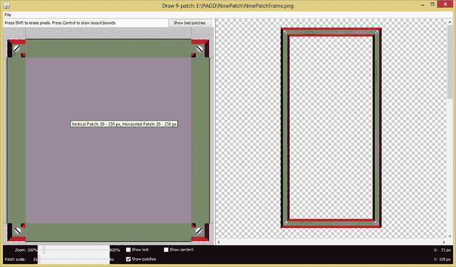

**图 10-10.** 最终定义的拉伸区域和内边距区域，并通过鼠标悬停中心区域获取拉伸区域坐标

需要注意的是，如果你将鼠标放在左侧可编辑面板中，悬停在 9-patch 定义的中心区域上方，就会弹出工具提示，为你最终完成的 9-patch 定义提供精确的像素级拉伸区域坐标。

就我的情况而言，这显示我使用了总尺寸为 280 像素的图片中的 256 像素减去 26 像素，即 230 像素，作为我的中心可拉伸区域。这意味着我使用了 25 像素（即剩余 50 像素的一半）来作为实际的图片资源（横条和螺丝）以进行缩放。这同样意味着这个 9-patch 的固定区域（本例中是一个框架的角落，上面有一个标准螺丝将其牢固固定，至少看起来是这样）每个尺寸将是 25 像素见方。


这个像素数量（24 个或更多）足以在需要时进行放大，并在缩小时呈现照片级的细节，或在更高像素密度下使用（此时画面会显得更小）。

如图 10-10 和图 10-11 所示，在 Draw 9-patch 应用程序预览窗格的右侧，缩放图形看起来清晰而逼真。当你滚动预览窗格时，这种清晰效果会一直保持。

现在，是时候通过 **文件** 菜单和 **文件 ➤ 保存 9-patch** 菜单序列来保存 9-patch 图像资源了，如图 10-11 所示。

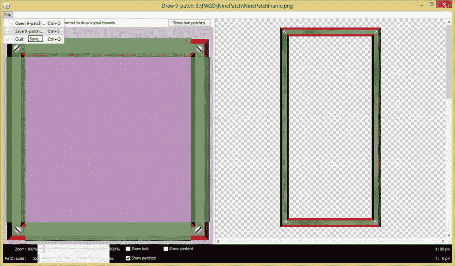

**图 10-11.** 最终补丁定义，以及使用文件菜单和保存 9-patch 菜单选项来保存 9-patch 文件

你的 Draw 9-patch 软件工具的文件保存对话框（如图 10-12 所示）会自动将你的 9-patch 图像资源保存为 Android 操作系统所需的 `.9.png` 文件扩展名。

当 Android 在 `/res/drawable` 文件夹中看到这种类型的 PNG 文件名时，它会自动使用 `NinePatch` 类加载该文件，并且一旦其在 XML 中被引用，就会将其转换为一个 `NinePatchDrawable` 图像资源。

这里需要注意一点，因为截图中同时存在 **打开 9-patch** 菜单选项：打开一个普通的（非 9-patched）PNG 文件（`*.png`）时，将加载你的 PNG 资源，并在图像周围添加一个空的单像素边框，你可以在其中绘制你的可伸缩补丁和内容区域。

如果你使用此菜单命令打开先前保存的 9-patch PNG 文件（`*.9.png`），你的 9-patch PNG 资源将按之前的修改状态加载，不会添加单像素的绘制区域边框，因为由于之前的编辑会话，该单像素补丁定义区域已经存在于你的文件中。

关于保存对话框的最后一个注意事项是：它不会在对话框本身中显示 `.9.png` 扩展名，但会在将文件作为新的 9-patch 图像资源保存到硬盘驱动器时自动插入该扩展名。当你第一次使用这个软件工具时，这可能会有些令人困惑，因为保存对话框中显示它将保存一个 `NinePatchFrame.png`，但它实际保存的是 `NinePatchFrame.9.png`。

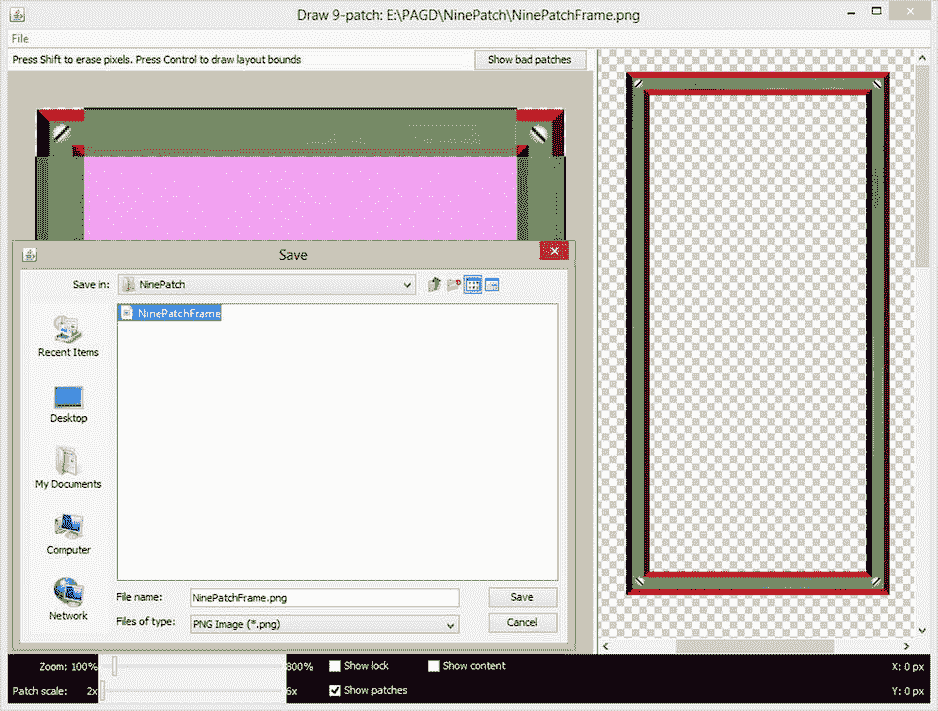

**图 10-12.** 使用保存对话框导出 `NinePatchFrame.9.png` 文件

在保存文件时，请务必牢记这个注意事项，以免得到 `NinePatchFrame.9.9.png` 这样的文件。即使你真的得到了，工作流程中的下一步将是进入你的操作系统文件管理工具，查看你的原始文件和新生成的 9-patch 版本，并了解 9-patch 定义为文件增加了多少数据体积。

从任务栏启动你的操作系统文件管理工具；对于 Windows 8，它恰好是 Windows 资源管理器文件工具，如图 10-13 所示。如你所见，在我的 `/PAGD/NinePatch` 文件夹中，有一个包含 280 像素图像资源源的原始 Photoshop 文件；一个带有 alpha 通道的 `NinePatchFrame.png` PNG32 图像资源，已准备好导入 Draw 9-patch；以及一个由 Draw 9-patch 工具生成的 `NinePatchFrame.9` PNG32 文件。

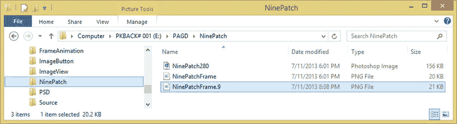

**图 10-13.** 检查 NinePatch 文件夹，查看原始的 NinePatchFrame 和新的 `NinePatchFrame.9.png` 文件

让我们找出 `.9.png` 文件增加了多少数据量，因为正如截图中所述，9-patch 定义过程为我的 PNG 文件大小增加了整整 1KB，但这个评估对我来说不够精确。

要找出这两个文件之间确切的文件大小差异，请右键单击每个 PNG 文件资源，然后使用 **属性** 选项。这将允许你查看每个文件的实际文件大小数据量。

原始 PNG 文件为 19.7KB，新 PNG 文件为 20.2KB。这意味着 9-patch 定义为这个 280 像素的方形图像资源增加了 0.5KB 的数据，即增加了大约 2.5% 的数据。能将如此灵活的图像资源缩放能力直接嵌入到 PNG 数字图像资源本身，已经相当不错了。

现在你已经创建了一个可用的 9-patch 图像资源，让我们进入你的 XML 资源文件，并在几个地方将其实现，看看它在你的 GraphicsDesign Android 应用程序上下文中的效果如何。


### 使用 XML 标记实现你的九宫格资源

要让 XML 标记能够引用这张 9-patch PNG 图像资源，你首先要做的事情就是将其安装到正确的项目文件夹层级位置中，也就是 Android 操作系统会查找 9-patch 图像资源的位置。

进入你的 NinePatch 资源文件夹，也就是你刚才操作的那个文件夹，如图 10-13 所示。右键单击截图中高亮显示的 `NinePatchFrame.9.png` 文件，然后选择 **复制** 选项，将该文件复制到系统剪贴板中。

接下来，使用左侧的导航窗格，导航到 `/workspace` 文件夹和 `/GraphicsDesign` 项目子文件夹，最后进入 `/res`（资源）子文件夹和 `/drawable` 子文件夹，如图 10-14 所示。然后只需右键单击 `/res/drawable` 文件夹并选择 **粘贴** 选项。这会将 `NinePatchFrame.9.png` 文件的副本放置到该位置。

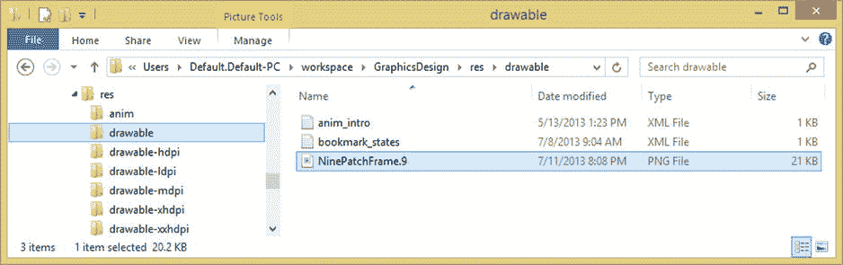

**图 10-14.** 使用复制 + 粘贴将 `NinePatchFrame.9.png` 文件的副本放入你的 drawable 资源文件夹

由于 Android 操作系统要求资源文件名只能使用小写字母、数字和下划线，接下来你需要将 9-patch 图像资源文件重命名为全部使用小写字母和数字的形式，即 `ninepatchframe.9.png`，如图 10-15 所示。

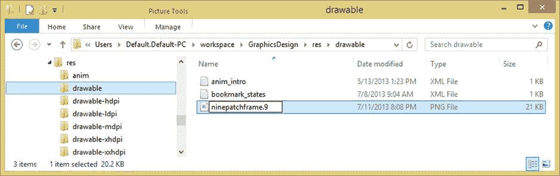

**图 10-15.** 右键单击并使用重命名命令将文件重命名为仅包含小写字符的名称

现在，你可以使用父标签中的 `android:background` 参数，将 9-patch 图像资源添加到你的目录活动 UI 设计的 `LinearLayout` 容器中，如下面的 XML 标记所示，如图 10-16 所示：

```
android:background="@drawable/ninepatchframe"
```

同样在图 10-16 中显示的还有刷新操作，你必须执行此操作，以便 Eclipse ADT 能够“看到”你添加到 `/res/drawable` 文件夹中的新 9-patch 资源。那么我们也来执行此操作：右键单击 `GraphicsDesign` 项目文件夹，然后从菜单中选择 `Refresh` 选项。

完成此操作后，9-patch 图像资源将在你的项目文件夹层级中可见。在本章稍后的图 10-17 中，你将看到你的 9-patch 资源被用作装饰性 UI 布局容器 3D 框架图形设计元素时的样子。

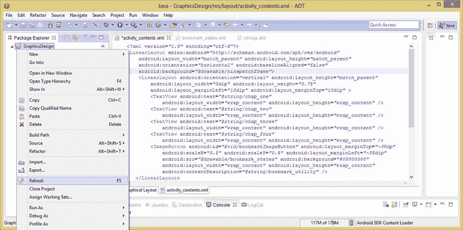

**图 10-16.** 添加 `android:background` 参数以引用 `ninepatchframe` 9-patch 资源并执行刷新

让我们点击 XML 编辑窗格底部的 **图形布局编辑器** 选项卡，看看 GLE 是否能够“渲染” 9-patch 资源，因为有一些图形设计元素（例如 PorterDuff 混合模式）是 GLE 无法预览的。

正如你在图 10-17 中所见，图形布局编辑器窗格完美地渲染了 9-patch 资源，因此 GLE 确实可以向你展示 9-patch 图像资源在你的应用程序中的显示效果。这太棒了！因此，你可以在 9-patch 工作流程中使用 GLE，而无需每次想要查看 9-patch 图像资源如何作为图形设计元素工作时都启动模拟器！

如图 10-17 所示，你创建的 9-patch 图像资源作为目录 UI 设计的装饰性框架元素效果很好，看起来相当不错。唯一的问题是，你的 9-patch 资源定义的中央（内边距）区域导致一些较长的文本 UI 元素换行，因此你需要添加一些 XML 参数，将这些文本的字体大小略微调小，以避免这种换行现象。

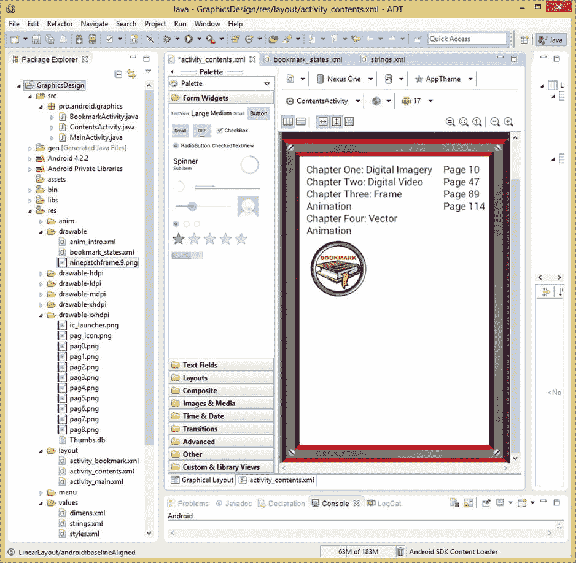

**图 10-17.** 使用图形布局选项卡在父级 `LinearLayout` 容器中预览你的 9-patch 资源

为此，你需要添加一个 `android:textSize` 参数，并将值设置为 13 标准像素 (`13sp`)，以略微减小你的 `TextView` UI 元素的字体大小。在每个 `TextView` 标签中使用以下参数：

```
android:textSize="13sp"
```

一旦你将此参数添加到每个 `TextView` 标签中，你所有的文本元素都将具有相同的大小，并完美地适配在你的 9-patch 框架内。

图 10-18 显示了在两个嵌套的（子标签）`LinearLayout` 容器内部，经过修改的 `TextView` 子标签。请记住，保持你的 `textSize` 参数值一致，这样目录中的文本看起来才会统一。用户能够察觉到 UI 设计中微小的字体大小差异，并将其视为设计缺陷，从而认为你的应用程序不够专业。因此，请在所有八个 `TextViews` 中使用相同的 `SP` 值。我使用了 `13sp` 来使文本尽可能大。

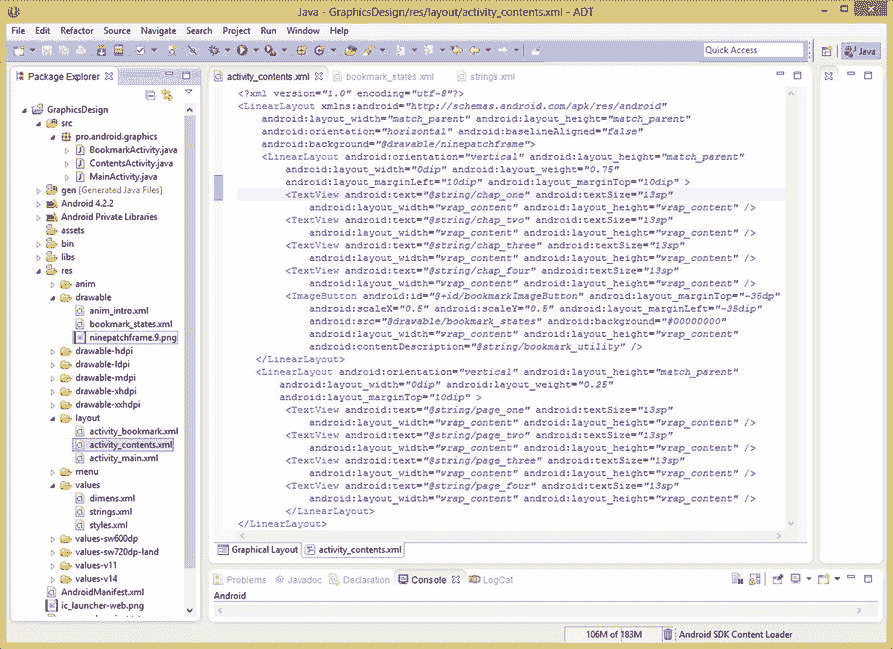

**图 10-18.** 在嵌套的 `LinearLayout` 容器中的八个 `TextView` 标签内添加 `android:textSize` 参数

现在你可以在图形布局编辑器选项卡中预览新的字体大小了。点击编辑窗格底部的选项卡，确保字体大小允许所有 `TextView` 对象适配在你本章中添加的装饰性 9-patch UI 布局框架内。

接下来，让我们看看 9-patch 资源在 Nexus One 模拟器中是什么效果，以了解它在真实 Android 手机上的显示效果。使用 **运行方式 ➤ Android 应用程序** 工作流程来启动你的 AVD Nexus One 模拟器，并确保你的 `TextView` 字体大小、9-patch 图像资源背景以及多状态 `ImageButton` 都无缝地协同工作。

正如你在图 10-19 中所见，你的 UI 布局容器周围的 9-patch 图像资源框架看起来很棒，`TextView` UI 元素的大小非常适合目录，并且你的多状态 `ImageButton` 完美地合成在一起，相对于 UI 布局设计的平衡性而言，仍然位置美观。正如你在截图右侧所见，`ImageButton` 在 UI 设计中仍然功能正常。

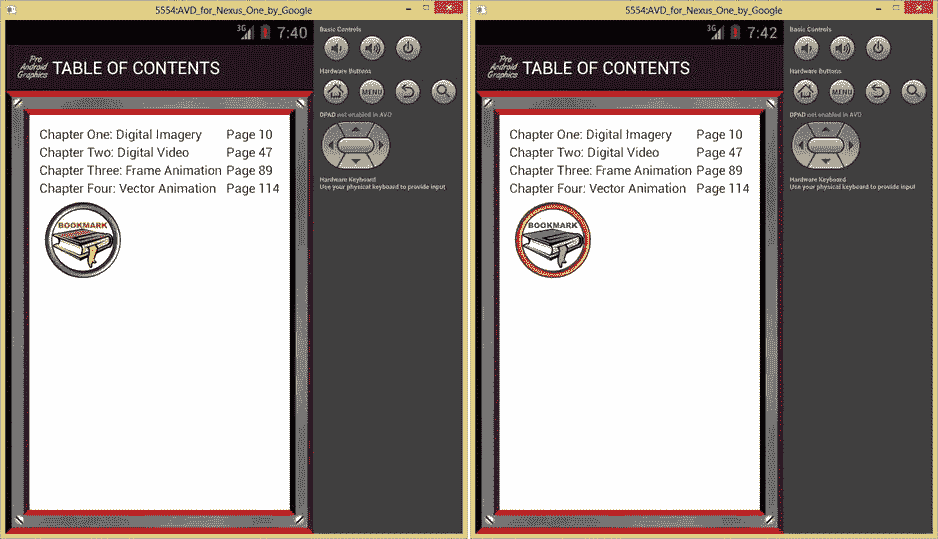

**图 10-19.** 在已放置 9-patch 资源的 Nexus One 模拟器中测试目录 UI 设计

接下来需要测试的是，当 UI 设计的形状发生变化时，你的 9-patch 图像资源将如何重新调整自身形状。这可以通过将你的 Nexus One UI 布局从竖屏模式切换到横屏模式来实现。在 Android 模拟器软件中，这是通过使用键盘上的 Control 键（左侧的那个）和 F11 功能键组合（作为按键组合）来完成的。

要调用此按键组合，请按住 PC 键盘上的左 Control (CRTL) 键，同时按下 F11 功能键。将来，我会将此表示为 `CTRL-F11` 按键组合。


