# 11. 高级图像混合：使用 Android PorterDuff 类

若要将 Nexus One 模拟器朝相反方向旋转，请使用 `CTRL-F12` 组合键。这将使 Nexus One 模拟器恢复到原始的竖屏模式。

调用 `CTRL-F11` 将使 Nexus One 模拟器窗口旋转 90 度，并使其进入横屏模式，就像您将智能手机侧放一样。

结果如图 10-20 所示；您可以清晰地看到，您的 9-patch 图片资源会自适应 UI 屏幕的新形状，仿佛它最初就是为该屏幕比例量身定制的一般。

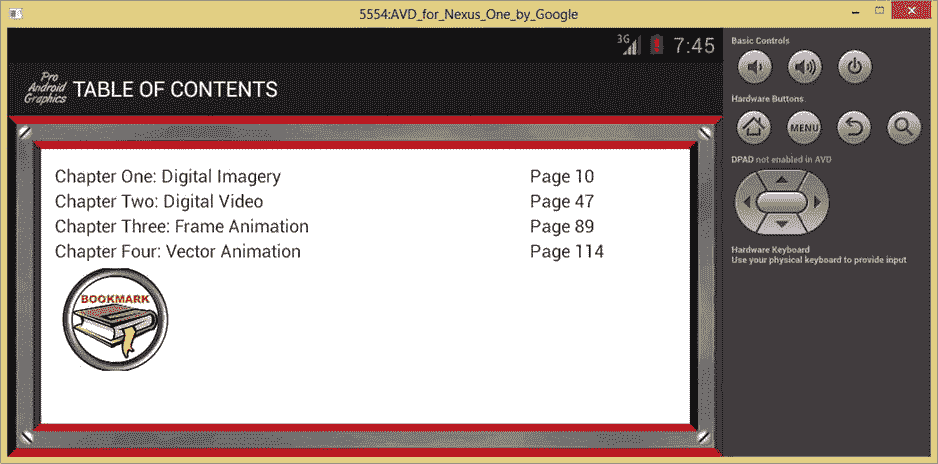

**图 10-20.** 通过使用模拟器横屏模式，在不同屏幕比例下测试 9-patch 资源

现在您已经掌握了创建和使用 9-patch 图片资源的方法，未来章节中便可将其用于其他类型的图形设计或 UI 元素设计。请务必多加练习使用 Draw 9-patch 工具。

### 本章小结

在第十章中，您学习了 Android 的 `NinePatchDrawable` 和 `NinePatch` 类，以及如何使用 Draw 9-patch 软件工具。

我们首先探讨了 `NinePatchDrawable` 类，它允许开发者实例化那些使用 `NinePatch` 对象（即采用 9-patch 非等比图片缩放技术）的可绘制对象（图片资源）。

接着，我们深入探究了 NinePatch 技术与概念，充分理解这些是您在 Android 应用中实现 9-patch 图片资源的必要前提。您学习了如何使用一个像素宽的黑色边框线段来定义 9-patch 图片资源中 X 和 Y 方向的可拉伸区域，以及如何界定图片中保持固定、完全不缩放的区域。

然后，您学习了如何利用右侧和底部的单像素边框区域来定义视图内容在 9-patch 图片资源内部居中的内边距区域。我们还探讨了 `NinePatch` 类，它允许我们创建实现 NinePatch 技术的 `NinePatch` 对象。

接下来，我们介绍了 Draw 9-patch 软件实用工具，包括如何找到并启动它，以及如何使用它来创建 9-patch 资源。

您亲自动手实践，为目录框架的左侧和顶部边框创建了单像素黑色线段，以此观察 Draw 9-patch 用户界面控件的运作方式，以及右侧预览区域如何响应。

您还了解了左侧编辑区底部的选项复选框，这些复选框能让您更清晰地掌握 Draw 9-patch 软件工具左侧编辑区的操作。

随后，您使用 Draw 9-patch 软件工具右侧和底部的单像素黑色边框线段定义了 9-patch 的内边距区域。您看到预览结果精炼成了专业水准的 9-patch 图片资源效果，并在 Draw 9-patch 工具右侧的所有示例预览方向（包括方形、竖屏和横屏预览）中得以呈现。

最后，您保存了 `NinePatchFrame.9.png` 这个 9-patch 图片资源，并将其传输到 `/workspace/GraphicsDesign/res/drawable` 项目文件夹中。随后，按照 Android 的要求，您使用小写字母和数字对文件进行了重命名。

接下来，您创建了 XML 标记，将此 9-patch 图片资源作为背景图片，为您的目录 `LinearLayout` 容器 UI 设计提供周边图形设计细节。

在图形布局编辑器窗格中预览了 9-patch 效果后，您添加了值为 `13sp` 的 `android:textSize` 参数，以防止 `TextView` UI 元素换行。然后，您使用 Nexus One 模拟器在竖屏和横屏模式下预览了结果。这样做的目的是为了精确观察 9-patch 图片资源如何无缝、灵活地适应不同的屏幕形状（宽高比）。

在下一章中，您将学习 Android 中的数字图像和动画资源混合，使用 Android 的 `PorterDuff` 类及其众多的图像合成与混合模式及常量。这将使您的 Android 图形设计特效工作提升至全新水平，并在此基础上巩固本章关于 9-patch 设计与实现的学习内容。

---

**摘要**

在第十一章中，我们将深入探讨混合模式在数字图像合成中的作用，以及如何使用 Android `PorterDuff` 类在 Android 中实现这些数字图像混合模式。

混合模式允许在数字图像合成中，在两个或多个图层之间执行高级合成操作。每个图层中的每个像素都会通过一种算法进行处理，以决定该像素将如何（或不如何）应用于其下方的图层。

应用混合模式通常需要使用数字图像编辑与合成软件工具，例如 Adobe Photoshop CS6 或开源数字图像软件包 GIMP（本书通篇使用，因其功能相当强大且可免费用于商业用途）。

Android 中集成了这些 PorterDuff 混合模式（有时也称为*传输模式*），再加上我们将在下一章介绍的、通过 Android 的 `LayerDrawable` 类处理图层的能力，这使得通常仅在 Photoshop CS6 和 GIMP 2.8 等软件包中才有的强大功能，现在也掌握在了 Android 开发者手中。

这使得 Android 开发者能够通过应用这类算法特效（例如在 GIMP 2.8.6 中使用图层混合模式实现的特效），将其图形设计创意提升至一个全新的层次，并应用于其 Android 应用中的 UI 设计、图形设计、数字成像、数字视频和 2D 动画。

图像混合的应用示例包括照片处理软件、游戏、电子书、GoogleTV 的 iTV 节目、壁纸、屏幕保护程序，以及其他与图形相关的、您能想到的用途。通过巧妙的编码，所有这些领域甚至可以实现交互，因此，与图形设计相关的图像混合可能性，实际上仅受限于您的数字化想象力。


### 像素混合：将图像合成提升至新高度

在深入探讨类、构造器、嵌套枚举类、常量以及所有那些有趣的技术性 Java 结构（这些结构使我们能够在 Android 应用内实现图像资源混合）之前，我们先总体了解一下什么是像素混合，以及混合模式（有时也称为传输模式）在图形设计中有何用处。

总的来说，混合模式或传输模式最常用于图像合成目标，大多数数字图像艺术家使用 Adobe Photoshop CS6 或 GIMP 2.8.6 及更高版本的专业成像软件来执行此操作。

当有多个合成层包含需要以某种高级方式组合以达到最终结果（可能是文本叠加、特效等任何内容）的图像资源时，就会使用混合。

重要的是要注意，只要你擅长实现 Alpha 通道，就不必一定实现混合模式来创建有效的图像合成，正如我们在前几章中已经看到的那样。

因此，Alpha 通道对于数字图像合成的基础仍然很重要，在此基础上，混合使我们能够生成更好或更微妙的效果。所以，始终先从通过微调基于 Alpha 通道的合成来使合成图像清晰干净开始，然后在工作流程中下一步添加混合模式，以完善合成效果和最终结果。

混合模式实际上是在逐个像素的基础上，使用算法来组合图像，使得生成的像素（图像）不仅仅是“正常模式”（未调用任何混合模式）下的图像合成。因此，如果你有一张图像，想要将黄色像素添加到另一图像层中的红色像素，以在最终的图像合成中创建橙色像素，那么你会使用混合模式来实现所需的最终结果，同时仍能保持原始的黄色和红色源数字图像资产独立且不受各自影响。

我们将在后续部分介绍 Android 中当前可用的混合模式，其中包括 Android 中专门包含枚举常量的类，我们可以使用这些枚举常量来调用或实现这些混合算法，以满足我们在 Android 应用中的图形设计目标。

再次强调，混合像素应该“遵循”你的 Alpha 通道，以便它们在图像合成层级中知晓自己的位置。在计算链中，Alpha 通道应优先于混合模式，该计算链在图像合成过程中实现，无论是在 Android 操作系统内，还是在 Adobe Photoshop CS6 或 GIMP 2.8.6 及更高版本中。

只有当像素具有一定程度的半透明度时，它才会被混合。由 Alpha 通道定义的 100% 透明像素不会被纳入混合算法。让我们深入了解 Android 如何实现混合！

### Android 的 PorterDuff 类：混合的基础

Android 的 `PorterDuff` 类是 `java.lang.Object` 主类的直接子类；它是一个本质上是从头编写的算法类，因此它并非基于目前在 Android 操作系统中发现的任何其他类型的超类功能。因此，`PorterDuff` 类是一个完全独特的类，并为 Android 操作系统中的像素混合算法提供了基础实现。

`PorterDuff` 类的 Java 层次结构如下所示：

```
java.lang.Object
  > android.graphics.PorterDuff
```

Android 的 `PorterDuff` 类是 `android.graphics` 包的一部分，因此，其导入语句引用了 `android.graphics.PorterDuff` 包导入路径，正如我们稍后在本章中编写实现用于各种目的的 `PorterDuff` 混合的 Java 代码时会看到的那样。

如果你想知道 Porter Duff 是谁，实际上是两个人，他们为混合模式和传输模式奠定了数学基础。一位名叫 Thomas Porter，另一位名叫 Tom Duff，他们在 1984 年撰写了一份白皮书，详细描述了像素混合背后的数学原理。

Android 的 `PorterDuff` 类看似简单，因为它只包含一个 `PorterDuff()` 构造器方法，以及一个名为 `PorterDuff.Mode` 枚举类的单一嵌套类。

我们将在本章的多个部分中详细探讨这些类以及其他与 `PorterDuff` 相关的类。这些 `PorterDuff` 类包含了所有可用的混合模式算法、函数、传输常量和混合常量，使开发人员能够在其 Android 应用的图形设计和 UI 设计中实现高级图像合成。

正如我提到的，混合模式有时也被称为传输模式，因为其中一些模式并非真正将像素值混合在一起。相反，其中一些模式的作用更像是布尔集合运算符（交集、并集、差集等）。因此，这些模式可以被视为传输模式，因为它们实际上并未混合像素值，而只是将像素从源图像和目标图像传输到最终的图像合成结果（目标或创建的合成图像资源）中。

出于这个原因，一些 `PorterDuff` 常量更像是传输模式常量，而不是混合模式常量。因此，我们将详细探讨每个 `PorterDuff` 常量，以便了解它们作为专业 Android 图形设计师能为*我们*提供哪些能力，以及它们是在源和目标图像资源之间混合像素，还是传输像素。一旦我们探讨完 `PorterDuff.Mode` 嵌套类，我们就可以开始应用这些酷炫的数字图像混合知识了！

你可能想知道这些混合和传输模式对 CPU 的消耗程度，以及哪些模式对处理器消耗更大。从我听到的其他开发者反映的情况来看，混合模式对处理器的消耗大约是传输模式的三倍，因为它们要计算一个新的像素颜色值，而不仅仅是计算是否需要显示一个像素。


### PorterDuff.Mode 类：Android 混合常量

Android 的 `PorterDuff.Mode` 类是 `java.lang.Enum` 类的直接子类，而 `java.lang.Enum` 类又是主类 `java.lang.Object` 的子类。因此，它是一个旨在持有枚举常量的枚举器类，与其嵌套的 `PorterDuff` 类紧密配合使用。

`PorterDuff.Mode` 类也是一个完全独特的类，它为开发者提供了 Android 操作系统中实现高级像素合成操作所需的混合模式常量。

`PorterDuff.Mode` 类的 Java 层次结构如下：

`java.lang.Object`

`> java.lang.Enum<E extends java.lang.Enum<E>>`

`> android.graphics.PorterDuff`

`PorterDuff.Mode` 类也是 `android.graphics` 包的一部分，其导入语句引用的包导入路径为 `android.graphics.PorterDuff.Mode`，稍后在本章中编写实现 `PorterDuff.Mode` 混合模式常量的 Java 代码时，你将会看到这一点。

目前在这个类中定义了 18 个 `PorterDuff.Mode` 常量。我们将首先介绍像素混合常量，包括 `SCREEN`、`OVERLAY`、`LIGHTEN`、`DARKEN`、`MULTIPLY` 和 `ADD`，因为这些常量允许在图像合成过程中应用最特殊的成像效果。

之后，我们将介绍 `CLEAR`、`XOR` 以及 `SRC`（源）和 `DST`（目标）图像传输模式，这些模式对于应用高级图形设计工作流程或特殊效果也非常有用。

如果你在阅读本章本节内容时，无法在脑海中形象化地理解每个算法方程对像素混合的作用，请不要担心，我们将在本章后面部分通过视觉方式了解这些作用，因此你将获得丰富的“混合”经验！

需要注意的是，真正熟悉这些混合模式在给定合成应用中会做什么的唯一方法，就是花一些时间对其进行实验或使用。随着你使用混合模式的时间和经验增多，你将能够更准确地推测，在给定两张完全不同图像组合的情况下，任何特定混合模式会产生什么结果。

我们要查看的第一个混合常量是使用最频繁的常量之一，即 `ADD` 常量。它将源图像的饱和度与目标图像资产相加，用方程形式表示为 `Saturate(S+D)`。你可能已经猜到，在这些方程中，`S` 代表源，`D` 代表目标。

我们要查看的第二个常量不是混合或传输常量，而是一个实用常量。`CLEAR` 常量会清除合成结果区域中的所有像素数据，因此其方程形式为 `[0,0]`。

第三个常量在图像合成中很受欢迎，即 `DARKEN` 常量。它使用源图像资产来变暗目标图像资产，用方程形式表示为 `[ Sa+Da - Sa*Da, Sc*(1-Da) + Dc*(1-Sa) + min(Sc, Dc) ]`。

还有一个 `LIGHTEN` 常量，图像合成者同样也经常使用它。你可能已经猜到，这与 `DARKEN` 常量相反。这个混合算法使用源图像资产作为变亮指南来提亮目标图像资产，用方程形式表示为 `[ Sa+Da - Sa*Da, Sc*(1-Da) + Dc*(1-Sa) + max(Sc, Dc) ]`，与 `DARKEN` 算法相同，只是使用了 `max` 函数而不是 `min`。

还有一个 `MULTIPLY` 混合常量，这是我最喜欢的常量之一；它使用以下方程将源图像和目标图像资产之间的像素值相乘：`[ Sa*Da, Sc*Dc ]`。这通常会产生变暗的效果。小写的 `a` 和 `c` 分别代表 Alpha（通道）和颜色（RGB）。

比 `MULTIPLY` 混合模式稍微复杂一点的是 `SCREEN` 混合模式常量，它允许你基本上将源图像幽灵般叠加在目标图像之上，这使我们能够获得一些非常酷的特殊效果。此 `SCREEN` 混合算法使用以下方程：`[ Sa+Da - Sa*Da, Sc+Dc - Sc*Dc ]`。

我的另一个最爱是 `OVERLAY` 混合常量，这是特殊效果中最常用的混合常量之一。它结合了 `SCREEN` 混合模式和 `MULTIPLY` 混合模式。你可能已经从它的名字猜到，它将源图像和目标图像的像素值叠加在一起，使得源图像看起来像幽灵般浮现在目标图像之上。

`OVERLAY` 是 `SCREEN` 混合常量更高级的版本，其中像素会根据其亮度值被相乘或滤色；图像较亮的部分变得更亮（滤色），较暗的部分变得更暗（相乘）。

有五个与 `DST`（目标）相关的常量，它们专注于目标图像资产。第一个是 `DST` 常量，它仅隔离目标图像，意味着只显示目标图像，隐藏源图像，因此其方程为 `[Da, Dc]`。

`DST_ATOP` 常量获取目标图像中位于源图像上方（与源图像相交）的部分，并仅将此部分显示在源图像的**上方**（即 ATOP）。产生此结果的方程如下：`[ Sa, Sa*Dc + Sc*(1-Da) ]`。

`DST_IN` 常量获取目标图像中位于源图像内部（与源图像相交）的部分，并仅显示该目标图像中包含在源图像**内部**（IN 或 INSIDE）的部分，但不显示源图像本身的任何部分。这等价于布尔交集运算。产生此数字图像交集结果的方程为 `[ Sa*Da, Sa*Dc ]`。

`DST_OUT` 常量所做的与 `DST_IN` 常量完全相反，它获取目标图像中位于源图像外部（不与源图像相交）的部分，并仅显示目标图像中不与源图像相交（OUT 或 OUTSIDE OF）的部分，但不显示源本身。这等价于布尔减法运算，因为叠加在目标图像上的源图像部分本质上是从目标图像中减去的。产生此最终结果的算法或方程书写如下：`[ Da*(1-Sa), Dc*(1-Sa) ]`。

`DST_OVER` 常量将目标图像叠加在源图像之上。因此，这等价于布尔并集运算，有时也称为布尔加法运算。方程如下：`[ Sa + (1-Sa)*Da, Rc = Dc+(1-Da)*Sc ]`。

有五个与 `SRC`（源）相关的常量，它们专注于源图像资产。这些常量本质上与 `DST` 常量相同，只是在涉及源图像而非目标图像的意义上相反。其中第一个是 `SRC` 常量，它仅隔离源图像，意味着只显示源图像，隐藏目标图像，因此其非常简单的方程为 `[Sa, Sc]`。

`SRC_ATOP` 常量获取源图像中位于目标图像上方（与目标图像相交）的部分，并仅将此部分显示在目标图像的**上方**（即 ATOP）。产生此结果的算法或方程如下：`[ Da, Sc*Da + (1-Sa)*Dc ]`。

`SRC_IN` 常量获取源图像中位于目标图像内部（与目标图像相交）的部分，并仅显示源图像中包含在目标图像**内部**（IN）的部分，但不显示目标图像本身的任何部分。如果你想知道的话，其对应的布尔运算对于 `SRC` 和 `DST` 模式类型是相同的。产生此结果的方程为 `[ Sa*Da, Sa*Dc ]`。


`SRC_OUT`常量与`SRC_IN`常量功能相反：它会获取源图像中位于目标图像之外（即不与目标图像相交）的部分，并仅显示源图像中不与目标图像相交（OUT 或 OUTSIDE OF）的部分，但不会显示任何目标图像本身。产生此结果的算式为`[ Sa*(1-Da), Sc*(1-Da) ]`。

`SRC_OVER`常量将源图像叠加在目标图像之上。产生最终结果的算法算式为`[ Sa + (1-Sa)*Da, Rc = Dc + (1-Da)*Sc ]`。

最后是`XOR`混合模式常量，意为“两者择一”，它仅显示源图像或目标图像中的其中之一，但绝不会同时显示两者。因此，在源图像与目标图像重叠的区域，不会显示任何内容；而在不重叠的区域，则会显示源图像或目标图像（这是一种布尔“异或”操作）。该模式的算式为`[ Sa+Da - 2*Sa*Da, Sc*(1-Da) + (1-Sa)*Dc ]`。

### `PorterDuffColorFilter`类：混合你的`ColorFilter`

Android 提供了一个专门的类来结合`PorterDuff`混合模式常量应用颜色值，即`PorterDuffColorFilter`类。该类是`android.graphics.ColorFilter`类的直接子类。它允许使用混合模式将颜色滤镜应用于图像资源，从而使开发者能够更灵活地通过算法对图像资源进行颜色更改，实现诸如颜色校正之类的目标，甚至可以使用一个源图像文件创建一百种不同颜色的图像资源，从而节省大量数据空间。

`PorterDuffColorFilter`类的 Java 层级结构如下：

```
java.lang.Object
  > android.graphics.ColorFilter
    > android.graphics.PorterDuffColorFilter
```

Android 的`PorterDuffColorFilter`类属于`android.graphics`包。因此，其导入语句将引用`android.graphics.PorterDuffColorFilter`包导入路径。

值得注意的是，你并不绝对需要构造一个`PorterDuffColorFilter`对象，才能将`PorterDuff.Mode`枚举常量应用于颜色过滤操作。正如你将在本章后续部分看到的，`ImageView`类中有一个版本的`setColorFilter()`方法，其参数列表中接受一个`PorterDuff.Mode`混合常量。该方法的使用方式如下：

```
myDigitalImageObjectName.setColorFilter( integer color, PorterDuff.Mode mode );
```

实际上，设置这个过程相当容易，从而可以将`PorterDuff`类的强大功能应用于你的任何`ImageView`（以及其所继承的`ImageButton`子类）对象。就图形设计和图像合成而言，将`ColorFilter`算法与`PorterDuff`混合模式结合使用，是一种非常强大且实用的能力，因此我们现在就来介绍它。

让我们在你的`GraphicsDesign`应用程序的`BookmarkActivity`类中实现这一点，以演示如何仅用几行 Java 代码，通过`ColorFilter`方法应用`PorterDuff`混合模式。

### 使用 PorterDuff 将 ColorFilter 效果应用于图像资源

如果尚未打开 Eclipse ADT，请先启动它，然后打开你的`GraphicsDesign`项目。右键点击`BookmarkActivity.java`文件，选择“打开”(Open) 或按 F3 键，在 Eclipse 中央编辑窗格中编辑该文件。首先，你需要实例化在`activity_bookmark.xml` UI 定义 XML 文件中定义的`ImageView`。输入以下 Java 代码行来实现：

```
ImageView porterDuffImage = (ImageView)findViewById(R.id.currentBookmarkImage);
```

如图 11-1 所示，你需要将鼠标悬停在波浪形的红色错误高亮上，并选择“导入 ImageView (android.widget)”选项；Eclipse 将为你编写`Import android.widget.ImageView`语句，稍后你将在本章的图 11-2 中看到。

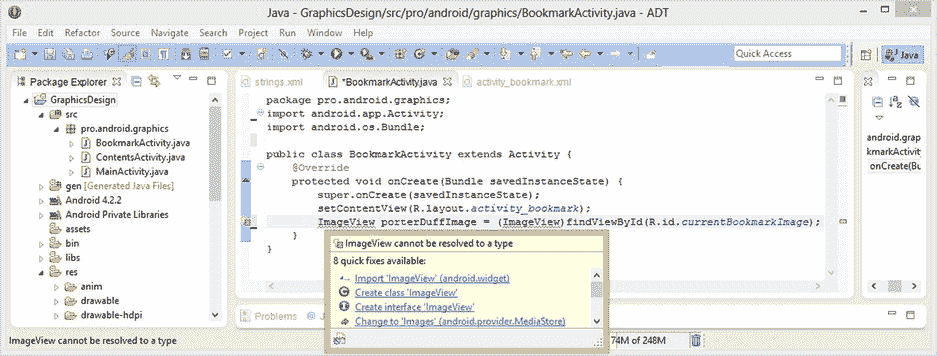
图 11-1. 在`BookmarkActivity`类中实例化`currentBookmarkImage` ImageView 以创建 Java 对象

现在你的`ImageView`对象实例化已经没有错误了，你可以使用这个`porterDuffImage` ImageView 对象来调用`setColorFilter()`方法，该方法你在本章前一节已经了解过。这通过下面这一行 Java 编程代码实现：

```
porterDuffImage.setColorFilter(Color.YELLOW, PorterDuff.Mode.MULTIPLY);
```

这行 Java 代码的作用是调用`setColorFilter()`方法，并传入两个参数。第一个参数是你希望通过`PorterDuff`混合模式应用的颜色值。在本例中，是 Android 操作系统提供的`Color.YELLOW`常量。第二个参数是你将用来指定混合模式算法的`PorterDuff.Mode`混合常量。

在这个初始示例中，你将使用`MULTIPLY`常量，因为它是在数字图像资源上应用颜色变化或特殊着色效果时最常用的混合模式。这种`MULTIPLY`模式通常还会增加图像的对比度，使结果看起来更真实。

如图 11-2 所示，你需要再次将鼠标悬停在`Color`类引用上，选择“导入 Color (android.graphics)”选项，以让 ADT 为你编写`Import android.graphics.Color` Java 代码语句。

同样有趣的是，当你将鼠标悬停在`PorterDuff`类引用上的错误高亮时，Eclipse ADT 并未提供“导入 PorterDuff (android.graphics)”选项，尽管该选项本是消除`PorterDuff`类引用下波浪形红色错误高亮的正确解决方案。嘿，人无完人，ADT 也不例外！

这意味着 Eclipse ADT IDE 的错误辅助对话框并非 100%“可靠”，我们不能总是依赖它们来解决 Eclipse ADT IDE 中可能出现的所有 Java 代码错误问题。

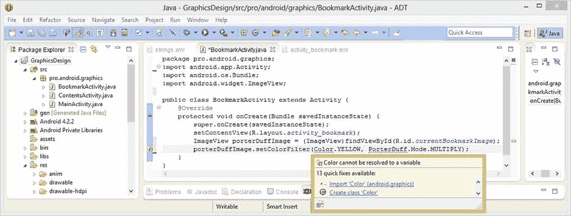
图 11-2. 通过导入`android.graphics.Color`和`android.graphics.PorterDuff`类修复错误高亮

在这种情况下，你需要自己添加`Import`语句来解决这个错误。这通过以下 Java 语句实现：

```
import android.graphics.PorterDuff;
```

如图 11-3 所示，你的代码现在没有错误了，并且用于在 Activity 子类 Java 代码中使用`ImageView`、`Color`和`PorterDuff`类的导入语句已经就位。你已拥有一个使用`PorterDuff.Mode`常量调用`setColorFilter()`方法的`ImageView`对象。

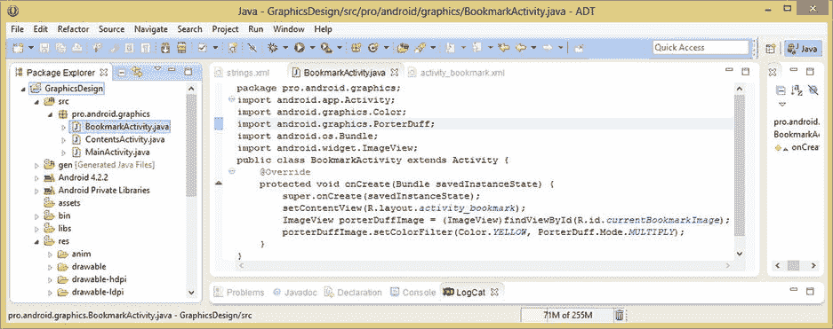
图 11-3. 使用`setColorFilter()`方法，通过`PorterDuff`的`MULTIPLY`模式应用颜色值更改


由于`Graphical Layout Editor`窗格不支持应用成像算法，你需要使用`Nexus One`模拟器来查看`PorterDuff`混合模式色彩滤镜数字图像应用的效果。

如图 11-4 左侧所示，黄色数值已被应用到引用你的`currentBookmarkImage` `<ImageView>` XML 标签定义的`porterDuffImage` `ImageView`对象上，而该标签又引用了你的数字图像资源。

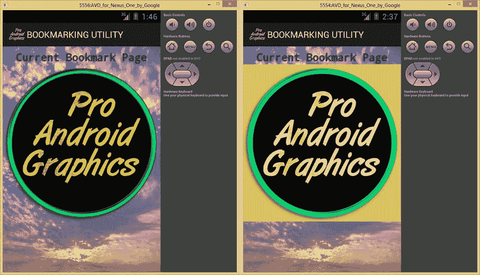

图 11-4. 在`Nexus One`模拟器中测试`PorterDuff.MULTIPLY`模式（左）和`OVERLAY`模式（右）

接下来，让我们看看另一个流行的混合模式常量——`OVERLAY`常量——对你的色彩滤镜应用会有什么效果。我还会向你展示如何在`.setColorFilter()`方法调用中应用一个精确的 24 位色值，这通常是你作为图形设计专业人士想要做到的。将第二行 Java 代码修改为：

```
porterDuffImage.setColorFilter(Color.rgb(216,192,96), PorterDuff.Mode.OVERLAY);
```

这行代码在你的`.setColorFilter()`方法内部调用了`Color`类的`.rbg()`方法，使用了一种更高级的 Java 代码结构，允许通过`PorterDuff`混合模式更精确地应用 24 位色值。

如图 11-5 所示，Java 代码再次没有错误，你可以准备使用`Run As` ➤ `Android Application`工作流程在`Nexus One`模拟器中测试你的代码。结果显示在图 11-4 所示的屏幕截图右侧。唉，`OVERLAY`模式并不尊重你的 alpha 通道数据！

有时，更高级的 Android 类中会存在 bug，这个由`OVERLAY`混合模式常量引用的`OVERLAY`算法本应“尊重”你在原始图像资源中设置的 alpha 通道。

我所说的“尊重”是指该算法只应将`OVERLAY`混合模式应用于非 100%透明的像素，因此，在原始数字图像合成资源中定义了 alpha 通道透明度的区域，你不应看到任何菊花黄（RGB 216,192,96）的色值。

这表明 Android 中的这个`PorterDuff`类及其模式尚未完全完善，可能因为这是一个高级特性，在大多数 Android 开发者社区中并不常用。话虽这么说，我相信 Android 开发团队最终会腾出时间为`OVERLAY`算法添加对源图像 alpha 通道的“尊重”，以便这种混合模式能够与包含用于合成的 alpha 通道的数字图像资源一起正常工作。

目前的情况似乎是该算法使用透明度的灰度表示将模式应用于 alpha 通道，而不是首先将 alpha 通道视为一个指南，并利用它来确定该彩色像素值在最终图像合成结果中是否应该存在（或不存在）。这只是我的猜测，但在图 11-4 所示的`OVERLAY`模式应用结果中，不应该出现一个纯色区域；只有篮筐和 logo 文字应该被提亮。

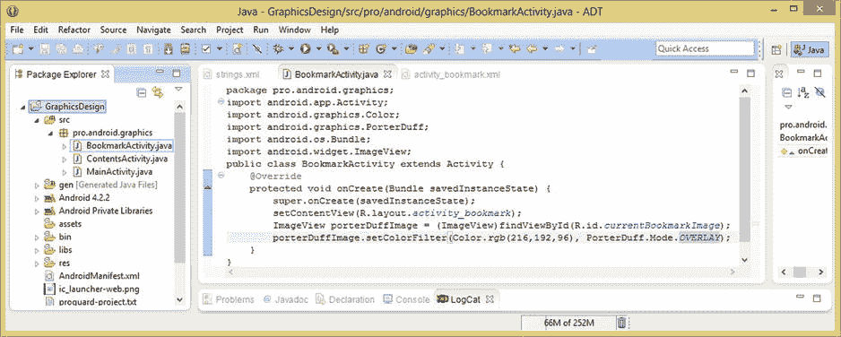

图 11-5. 用`.rgb()`方法调用替换`Color.YELLOW`常量，以允许指定任何色值

接下来，让我们将`PorterDuff.Mode`常量引用改回`MULTIPLY`。另外，在`SCREEN`和`OVERLAY`算法更新以支持 alpha 通道之前，你将使用`MULTIPLY`通过 alpha 通道对象来混合颜色变化（参见图 11-6）。值得注意的是，对于那些不使用 alpha 通道进行图像合成或其他特殊效果目的的图像（例如照片），这些混合模式可以正常工作。

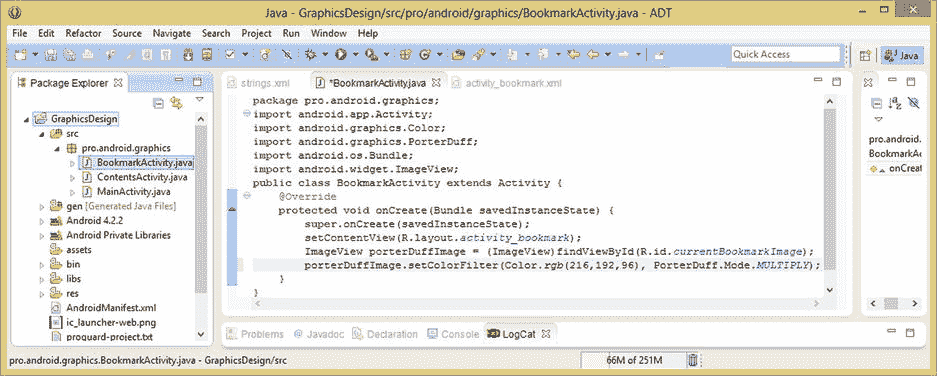

图 11-6. 用于使用 alpha 通道对数字图像资源进行色彩偏移的最终`.setColorFilter()` Java 结构

在下一节中，我们将更进一步，利用`Paint`、`Bitmap`、`BitmapFactory`和`Canvas`类，在两个不同的数字图像资源之间应用一个选择的`PorterDuff`混合模式。

### `PorterDuffXfermode`类：应用混合常量

Android 有一个专门的类，用于结合`PorterDuff.MODE`常量和`PorterDuff`类本身，来应用 PorterDuff 图像混合模式和传输模式。这个类称为 Android `PorterDuffXfermode`类，是 Android `Xfermode`类的直接子类。这个`Xfermode`子类被修改，允许通过使用你之前了解到的预定义混合模式常量，将 PorterDuff 算法应用于你的图像资源。

`PorterDuffXfermode`类的 Java 层次结构如下：

```
java.lang.Object
  > android.graphics.Xfermode
    > android.graphics.PorterDuffXfermode
```

Android `PorterDuffXfermode`类也是`android.graphics`包的一部分。因此，它的导入语句构建方式使其引用`android.graphics.PorterDuffXfermode`包导入路径。

正如你在本章稍后开始编写 Java 代码以实现数字图像资源中的 PorterDuff 传输模式时会看到的那样，Android `Paint`类的`.setXfermode()`方法与你的`PorterDuffXfermode`对象和`PorterDuff.Mode`常量结合使用，以使用某种混合算法“加载”`Paint`对象，该`Paint`对象将利用该算法将一个图像资源“绘制”到另一个图像资源上。

### `Paint`类：将混合常量应用到图像上

你需要做的第一件事是构造那个`Paint`对象，所以打开 Eclipse，并在编辑器中使用右键单击`Open`命令或左键单击`F3`键打开你的`ContentsActivity.java`类，然后在类的第一行`Override`上方添加下面这行 Java 代码：

```
Paint paintObject = new Paint();
```

这将构造一个名为`paintObject`的空`Paint`对象，供你在 Activity 中进行像素绘制操作。如图 11-7 所示，你需要将鼠标悬停在错误高亮上，并选择`Import Paint (android.graphics)`选项，以便自动为你写入`Import android.graphics.Paint` Java 代码语句。

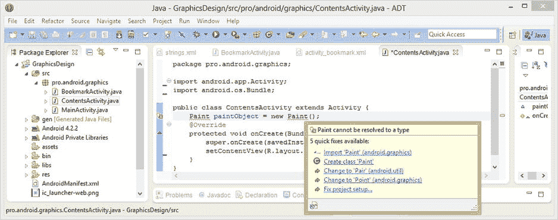

图 11-7. 在`ContentsActivity.java`中使用`Paint()`构造函数创建一个名为`paintObject`的`Paint`对象

Android `Paint`类用于在显示屏上绘制或“绘画”像素，因此它包含了绘制几何图形、文本和位图所需的样式、透明度、模式、字体和颜色信息。

`Paint`类是`java.lang.Object`类的直接子类，因此它是一项独特的功能，不基于 Android 中的任何其他类型的类。它是 Android 中用于图形处理的核心类之一，与`Bitmap`和`Canvas`类齐名，你将在本章中同时学习这些类，因为这三个图形类必须协同工作，才能执行诸如 PorterDuff 混合此类的高级操作。

Android `Paint`类的 Java 层次结构因此构建如下：

```
java.lang.Object
  > android.graphics.Paint
```

你将在本章稍后部分看到如何使用这个`Paint`类。


### 使用位图类在图像间应用 PorterDuff 混合模式

现在你已经设置好 `Paint` 对象，可以创建 `Bitmap` 对象了。这些 `Bitmap` 对象将保存你的 `backgroundImage` 和 `foregroundImage` 图像资源，你需要使用 Android 的 `BitmapFactory` 类将这些资源加载到 `Bitmap` 对象中。

你还需要使用 `.copy()` 方法将 `Bitmap` 对象转换为 Android 中所谓的可变（mutable）`Bitmap` 对象。可变意味着你的 `Bitmap` 对象的像素可以被编辑（修改）。要实现这一点，它必须被加载到系统内存中，这就是为什么你要使用 `.copy()` 方法将图像资源从可绘制资源区域取出并放入系统内存的原因。

所有涉及 `Bitmap` 的工作都通过以下四行 Java 代码完成：

```
Bitmap backgroundImage = BitmapFactory.decodeResource(getResources(), R.drawable.cloudsky);
Bitmap mutableBackgroundImage = backgroundImage.copy(Bitmap.Config.ARGB_8888, true);
Bitmap foregroundImage = BitmapFactory.decodeResource(getResources(), R.drawable.cloudsky);
Bitmap mutableForegroundImage = foregroundImage.copy(Bitmap.Config.ARGB_8888, true);
```

第一条语句使用你的 `BitmapFactory` 类的 `.decodeResource()` 方法，通过调用 `.getResources()` 方法，将 `drawable` 文件夹中的 `cloudsky.jpg` 图像资源加载到名为 `backgroundImage` 的 `Bitmap` 对象中。

第二条语句获取这个 `Bitmap` 对象，并使用 `.copy()` 方法将其加载到系统内存中，并通过使用 `Bitmap.Config.ARGB_8888` 常量以及设置为 `true` 的 `isMutable` 标志，指定它需要 32 位内存空间。

如图 11-8 所示，你需要在 Eclipse 中鼠标悬停在你的 `Bitmap` 类和 `BitmapFactory` 类引用上，并为这两个类调用导入选项，以便让 Eclipse 为你编写那些导入语句。

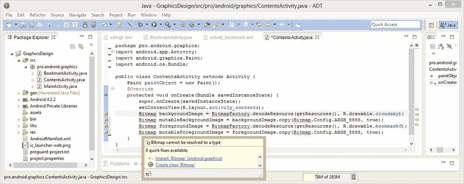

*图 11-8. 使用 BitmapFactory 类为 backgroundImage 和 foregroundImage 创建 Bitmap 对象*

现在，你的 `Bitmap` 对象已从 `/res/drawable` 资源区域加载，并作为带有 Alpha 通道的 32 位数据加载（复制）到内存中，且 `isMutable` 标志设置为 `true`，以便你可以在 Android 的 `Paint` 和 `Xfermode` 操作中编辑（使用）这些数据。至此，你可以使用 `Paint` 对象和 `.setXfermode()` 方法来加载你选择的 PorterDuff 模式，从而让 `Paint` 对象知道你希望它如何工作。

### 使用 `.setXfermode()` 方法应用 PorterDuffXfermode

下一行 Java 代码将设置你的 `Paint` 对象（名为 `paintObject`），使其能够使用你之前了解过的 `PorterDuffXfermode` 对象加载 `PorterDuff.Mode.XOR` 常量。这是通过调用 `Paint` 对象的 `.setXfermode()` 方法来完成的，如下所示：

```
paintObject.setXfermode(new PorterDuffXfermode(PorterDuff.Mode.XOR));
```

这行代码使用点表示法调用了 `paintObject`（即 `Paint` 对象）的 `.setXfermode()` 方法；同时，在该方法调用内部，创建了一个新的 `PorterDuffXfermode` 对象，并通过其参数列表将其设置为 `PorterDuff.Mode.XOR` 常量。

如图 11-9 所示，输入这行 Java 代码后，你需要鼠标悬停在 `PorterDuffXfermode` 类引用上，导入 `PorterDuffXfermode`（`android.graphics`）后，也能消除 `.setXfermode()` 的错误高亮。正如你现在所知，你可能需要手动编写 `import android.graphics.PorterDuff` 语句，因为 Eclipse 似乎无法检测到需要导入 `PorterDuff` 类。

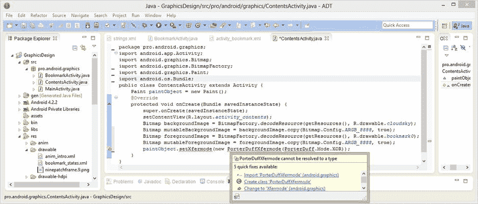

*图 11-9. 使用 paintObject 的 .setXfermode() 方法创建一个新的 PorterDuffXfermode XOR 对象*

现在你的 `Paint` 对象已经配置完成，可以设置你的 `Canvas` 对象了。

### Canvas 类：为合成创建画布

Android 的 `Canvas` 类用作在显示屏幕上绘制的引擎。如果你熟悉游戏设计，你之前应该听说过 Canvas；这是图形设计师常用的术语，不仅可用于 Android，还可用于其他流行的编程范式，例如 HTML5 应用。

为了将图形绘制到屏幕上，你需要四个基本组件。第一个是 `Bitmap` 对象，用于在系统内存中保存像素；第二个是 `Canvas`，用于执行绘制指令（将数据写入 `Bitmap` 对象）；第三个是绘制“原语”对象，例如 `Rect`、`Path`、`Text` 或 `Bitmap` 对象；最后一个是 `Paint` 对象，用于描述将由 `Canvas` 渲染引擎通过这个原语应用到 `Bitmap` 对象的颜色、模式和样式。可以肯定的是，Android 中的图形处理绝非易事。

Android 的 `Canvas` 类是另一个 100% 原创代码的直接继承 `java.lang.Object` 的子类。这是因为它需要为 Android 操作系统进行专门定制。因此，它的 Java 层次结构如下：

```
java.lang.Object
> android.graphics.Canvas
`

接下来你将使用这个 `Canvas` 类，因为你需要它的渲染引擎能力来为你编写的、用于演示如何混合图像的 Java 代码执行此 PorterDuff 混合模式操作。

在 Android 中设置图像合成栈的下一步是创建一个供你绘制的 `Canvas`。这包括创建你的目标合成图像，它将是另一个 `Bitmap` 对象，你将其恰当地命名为 `compositeImage`，因为它将保存你合成的图像。

这是通过使用 `.createBitmap()` 方法完成的，你还会同时使用 `mutableForegroundImage` 对象来加载它，这样你正在混合的两幅图像中的一幅就已经加载并处于就绪状态。你将使用以下单行 Java 编程逻辑来做到这一点，该逻辑声明了 `Bitmap` 对象，为其命名，并将其设置为 `Bitmap` 类调用其自身的 `.createBitmap()` 方法的结果，同时在函数调用内部传入 `mutableForegroundImage` 参数：

```
Bitmap compositeImage = Bitmap.createBitmap(mutableForegroundImage);
```

接下来，你想创建（构造）并设置你的 `Canvas` 对象，将其命名为 `imageCanvas`，它将引用你的 `compositeImage` `Bitmap` 对象。这是通过以下代码行中的 `new` 关键字完成的：

```
Canvas imageCanvas = new Canvas(compositeImage);
```

如图 11-10 所示，你需要将鼠标悬停在两个 `Canvas` 对象引用之一上，然后选择导入 Canvas（`android.graphics`）选项，以便你能够在 Java Activity 中使用这个 `Canvas` 类。

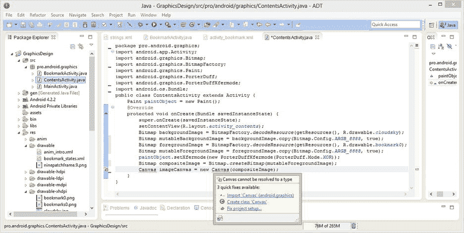

*图 11-10. 使用 .createBitmap() 方法创建 compositeImage Bitmap 对象以及 imageCanvas Canvas 对象*

现在你已经设置好了 Bitmaps、`Paint` 对象和 `Canvas` 对象，可以编写代码将它们整合到一起并执行合成操作了。这行代码使用了 `Canvas` 类的 `.drawBitmap()` 方法，该方法接受四个参数。

第一个参数是你的 `Bitmap` 对象，这里是你正在混合的另一个 `Bitmap` 对象；第二个是源矩形（`Rect` 对象），此处为 `null`，因为你的图像就是源；第三个是目标矩形，此处你创建了一个新的 `Rect` 对象，其尺寸与 `cloudsky.jpg` 图像资源相同；第四个是 `Paint` 对象，也就是你之前创建并加载了引用 `PorterDuff.Mode.XOR` 混合算法常量的 `PorterDuffXfermode` 对象的那个 `paintObject`。

```
imageCanvas.drawBitmap(mutableBackgroundImage, null, new Rect(0, 0, 1000, 1000), paintObject);
```


如图 11-11 所示，只需导入一个类——`Rect`类。将鼠标悬停在`Rect`上，选择**Import `Rect` (android.graphics)** 选项以添加该导入语句，并清除所有图像合成 Java 代码中的那些烦人的红色错误高亮。

现在，你已使用系统内存中的`Canvas`引擎设置好了所有这些精彩的位图图像合成混合绘制，但除非你将数据传输到`ImageView`对象中以便在屏幕上显示，否则你会对自己所做的这一切工作感到非常失望。这意味着你需要进行一些简单的 XML 标记，至少与刚刚为实现 Android 图像混合而编写的 Java 代码相比是这样！因此，让我们在 XML 中设置一个`ImageView`子标签，用于显示图像合成结果！

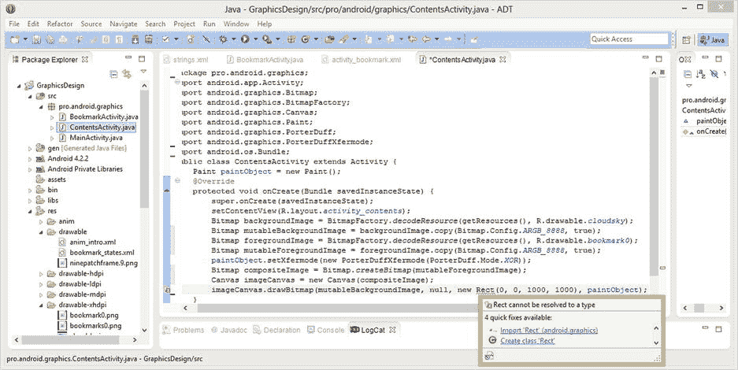

**图 11-11.** 使用`imageCanvas`对象上的`.drawBitmap()`方法将`paintObject`应用到图像上

在 Eclipse 的中心编辑窗格中打开`activity_contents.xml` XML 定义文件，如果它已经打开，请单击其选项卡将其激活以进行编辑，接下来你将添加`<ImageView>`子标签。

### 在 XML 和 Java 中创建 ImageView 以显示 Canvas

在第一个嵌套的`<LinearLayout>`容器内的`<ImageButton>`子标签正下方，添加一个`<ImageView>`子标签，如图 11-12 所示。这将在你的`ImageButton`下方、目录 UI 屏幕的左下角放置一个用于混合合成的`ImageView`。

将`android:id`参数命名为`porterDuffImageView`，并为其分配一个 8DIP 的边距以确保布局美观。务必包含所有其他必需参数，包括将`android:layout_width`和`android:layout_height`设置为`WRAP_CONTENT`，以及为视障用户设置的`android:contentDescription`参数，引用现有的`@string/bookmark_utility`。

由于你没有通过`android:src`或`android:background`参数配置此`<ImageView>` UI 元素（因为你将在 Java 代码中定义它），因此在**图形布局编辑器**选项卡中你将看不到它，除非你在切换到 GLE 编辑模式之前选中（或光标位于）`ImageView`标签或其五个参数之一。

如果你选中了`ImageView`标签，你仍会看到一个带有手柄的选择控件包围在其周围，表明你的`ImageView` UI 控件确实已包含在用户界面定义中。

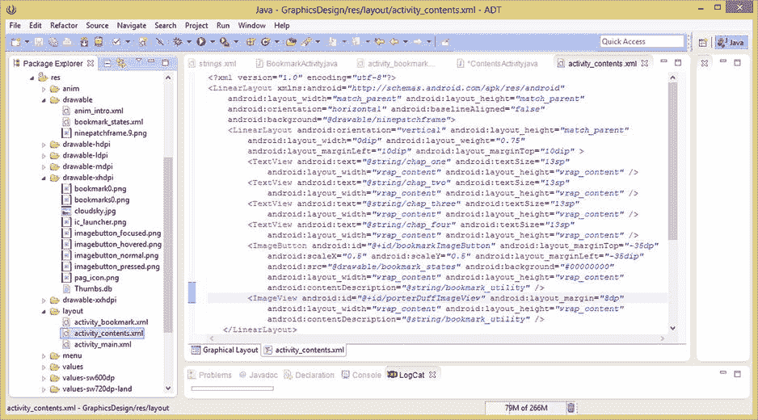

**图 11-12.** 在第一个嵌套的`<LinearLayout>`标签中添加 ID 为`porterDuffImageView`的`<ImageView>`子标签

现在，你可以实例化`ImageView`对象，如图 11-13 所示。

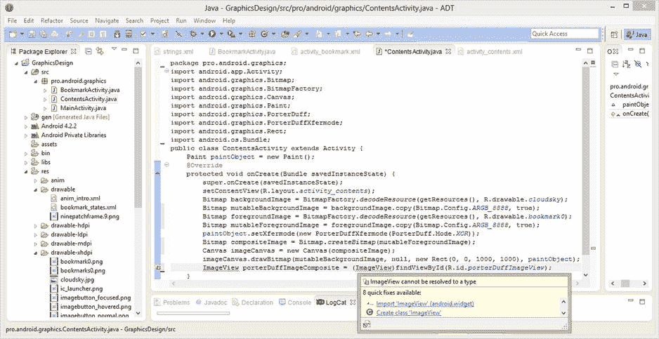

**图 11-13.** 实例化名为`porterDuffImageComposite`的`ImageView` Java 对象并引用 XML

如图 11-13 所示，在此`Activity`子类中你尚未使用任何`ImageView`对象，因此请将鼠标悬停在`ImageView`类引用上并选择**Import `ImageView` (android.widget)**。另外，请注意你使用以下代码为`ImageView`对象指定了一个逻辑名称（`porterDuffImageComposite`）：

```
ImageView porterDuffImageComposite = (ImageView) findViewById(R.id.porterDuffImageView);
```

现在，你只需将`compositeImage` `Bitmap`对象连接到`porterDuffImageComposite` `ImageView`对象，就可以准备测试大量`PorterDuff`混合模式了，所用 Java 代码不超过十几行。对于实现像使用`PorterDuff`混合模式进行图像合成这样高级的图像图形操作来说，这相当简洁！

### 通过`.setImageBitmap()`将 Canvas 写入 ImageView

最后，单击 ADT 顶部的`ContentsActivity.java`编辑选项卡，添加最后一行代码：使用点号调用`porterDuffImageComposite` `ImageView`对象上的`.setImageBitmap()`方法，并将`compositeImage` `Bitmap`对象作为参数传递给它，如图 11-14 和以下 Java 代码行所示：

```
porterDuffImageComposite.setImageBitmap(compositeImage);
```

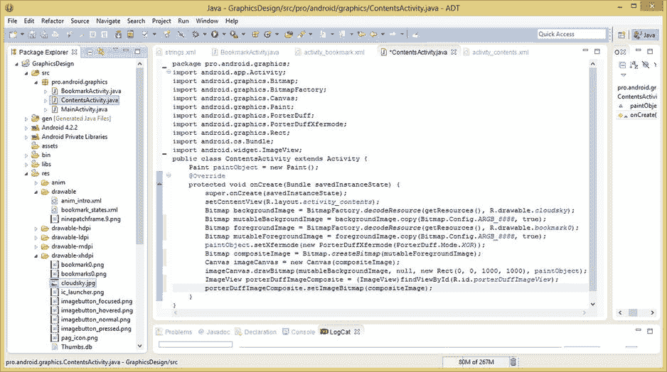

**图 11-14.** 使用`.setImageBitmap()`方法将名为`imageCanvas`的`Canvas`对象写入`ImageView`

这将把`Canvas`对象用作画布的`compositeImage` `Bitmap`对象映射（设置、指向、引用、连接）到`ImageView`，以便`Canvas`中发生的任何操作都显示在`ImageView`中。

现在一切都已连接起来（正确地相互引用），你可以使用**Run As ➤ Android Application**工作流程在 Nexus One 模拟器中测试你的 Java 代码。如图 11-15 所示，`XOR` `PorterDuff`模式在两幅图像重叠处显示为空白。

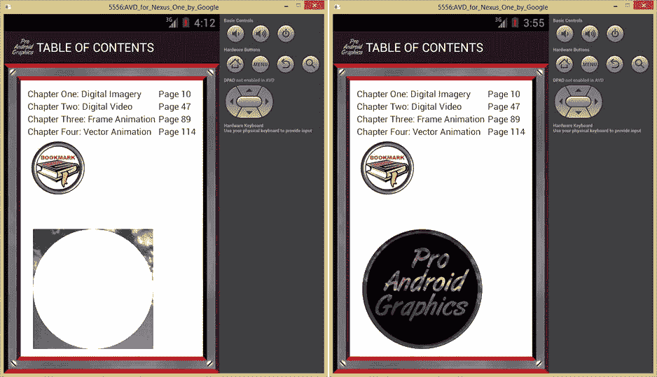

**图 11-15.** 在 Nexus One 中测试`XOR`（左）和`MULTIPLY`（右）`PorterDuff.Mode`常量

这也表明`XOR` `PorterDuff.Mode`常量正确地“尊重”了 alpha 通道。如果它没有考虑 alpha 通道透明度，那么整个图像将是白色的，而不仅仅是图像中由 alpha 通道定义为不透明的圆形部分。

接下来，进入你的 Java 代码，将`PorterDuff.Mode.XOR`常量替换为`PorterDuff.Mode.MULTIPLY`常量，再次使用**Run As ➤ Android Application**工作流程，看看`MULTIPLY`混合模式如何将这两幅图像相乘，如图 11-15 屏幕截图右侧所示。你可以清楚地看到，`PorterDuff.Mode.MULTIPLY`常量也正确地尊重（考虑了）数字图像资产的 alpha 通道数据。

如果你发现，当使用`PorterDuffXfermode`类时，其他`PorterDuff`混合模式也尊重你的 alpha 通道，那么本章前面在`PorterDuffColorFilter`部分看到的问题可能仅限于`PorterDuffColorFilter`类。

这意味着你将能够通过使用`PorterDuffXfermode`类来正确混合具有 alpha 通道的图像。让我们来验证一下，在`ContentsActivity` Java 代码中使用另外四种混合模式，通过实际使用这些模式，你将亲眼看到结果。

进入你刚才编写的图像合成和混合代码，将`PorterDuff.Mode.MULTIPLY`常量更改为`PorterDuff.Mode.OVERLAY`，再次使用**Run As ➤ Android Application**查看结果，如图 11-16 屏幕截图左侧所示。

如你所示，alpha 通道似乎得到了尊重，`CloudSky`图像被混合到`bookmark`图像中，在文本区域和周边金属环上产生了微妙的效果。

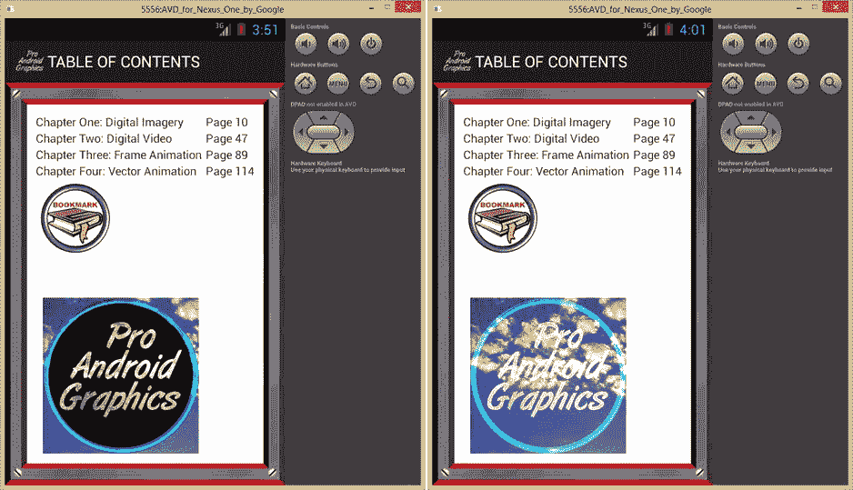

**图 11-16.** 在 Nexus One 中测试`OVERLAY`（左）和`SCREEN`（右）`PorterDuff.Mode`常量

接下来，让我们尝试`SCREEN`混合模式。再次进入你的 Java 代码，将`PorterDuff.Mode.OVERLAY`常量更改为`PorterDuff.Mode.SCREEN`，并再次使用**Run As ➤ Android Application**查看结果，如图 11-16 屏幕截图右侧所示。


如你所见，书签图像的 Alpha 通道似乎被正确识别，`CloudSky` 图像被混合到了书签图像中，这次在文本区域和周围的金属环上产生了不那么微妙的效果。

如果你还记得 `OVERLAY` 模式类似于 `SCREEN` 和 `MULTIPLY` 的组合，你会发现书签图像中的 `BLACK` 区域在 `SCREEN` 模式和 `OVERLAY` 模式下的处理方式截然不同（完全相反）。这对于你未来进行合成和混合操作来说，是一个需要重点记录的要点。

接下来，我们尝试一下 `LIGHTEN` 混合模式。再次进入你的 Java 代码，将 `PorterDuff.Mode.SCREEN` 常量修改为 `PorterDuff.Mode.LIGHTEN` 常量，然后再次使用“Run As ➤ Android Application”查看结果，如图 11-17 截图的左侧所示。

如你所见，`SCREEN` 和 `LIGHTEN` 混合模式确实非常相似。至少在使用 `SCREEN` 混合模式时，文本是可读的，而使用 `LIGHTEN` 混合模式时则难以辨认。然而，这种混合模式似乎确实尊重了 Alpha 通道数据，因此看起来 `PorterDuffXfermode`、`PorterDuff` 和 `PorterDuff.Mode` 类是没有错误的，我们之前看到的问题可能只是出在 `ColorFilter` 类或 `PorterDuffColorFilter` 类的代码中。

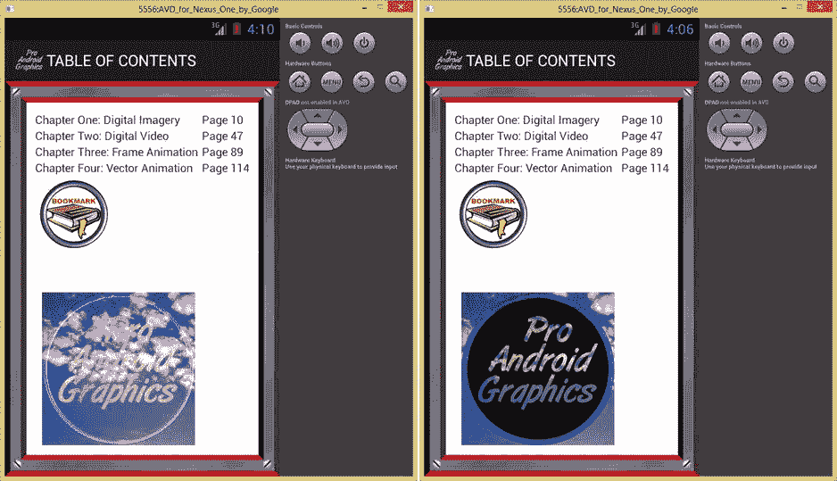

**图 11-17.** 在 Nexus One 模拟器中测试 `LIGHTEN`（左）和 `DARKEN`（右）的 `PorterDuff.Mode` 常量

最后，让我们看看 Android 像素混合模式中的最后一种——`DARKEN` 模式，并了解它如何使用这两个源图像资源工作。

进入 Eclipse 中的 Java 代码，将 `PorterDuff.Mode.LIGHTEN` 常量修改为 `PorterDuff.Mode.DARKEN` 常量，再次使用“Run As ➤ Android Application”查看结果，如图 11-17 截图的右侧所示。`DARKEN` 常量的效果是让你的前景图像（bookmark0.png）看起来像玻璃一样透明。

当你比较图 11-16 中的 `OVERLAY` 和图 11-17 中的 `DARKEN` 时，可以看到 `OVERLAY` 将你的 `CloudSky` 渲染到书签 UI 环上，就像纹理贴图（也称为反射贴图）一样，这在 3D 中非常常见。这种混合模式似乎能保持这个环状设计元素的金属外观，并为你提供不错的 3D 渲染效果。

另一方面，`DARKEN` 混合模式让你的环看起来像是透明的玻璃制成的。正如你现在所看到的，这就是为什么许多特殊效果可以使用混合模式有效地制作和实现，无论是在 Adobe Photoshop、GIMP 中，还是直接在 Android 应用程序代码中。像素混合是一个强大的工具。

### 总结

在这第十一章中，你学习了更多关于 Android 的 `PorterDuff` 和 `PorterDuff.Mode` 类，以及 `PorterDuffXfermode` 类和 `PorterDuffColorFilter` 类的知识。这些类用于在 Android 中实现图像混合。这包括将颜色值变化混合到图像资源中，以实现颜色或对比度校正，或使用单个图像源创建一系列图像资源，以及实现特殊效果。

我们首先探讨了像素混合和传输模式的核心数字图像合成概念，以及这些能力如何允许开发者利用其 `/res/drawable/` 文件夹中的图像资源来实现令人印象深刻的特殊效果。

接着，我们仔细研究了 Android 中的核心 `PorterDuff` 类，它实现了你在第一节中学到的图像混合技术和像素传输概念。这个类包含了混合和传输模式的核心算法，这些算法通过 Android 操作系统中其他与 PorterDuff 相关的类来调用。

然后，你学习了 `PorterDuff.Mode` 嵌套类，它包含了 18 个常量。我们查看了所有 18 个常量，以确切了解每个常量的作用，以及用于将图像源 Alpha（`Sa`）、源颜色（`Sc`）、目标 Alpha（`Da`）和目标颜色（`Dc`）像素数据值混合或传输到最终合成图像中的算法方程。

我们首先查看了五种图像混合算法和一个实用算法，然后介绍了像素传输算法，以及它们与布尔集合运算的相似之处。在概述了通过 `PorterDuff.Mode` 常量可以使用的功能之后，是时候看看 `PorterDuffColorFilter` 类来实现像素颜色混合了。

然后，我们准备好实现 Android 中两个专用 PorterDuff 类中的第一个：`PorterDuffColorFilter` 类。我们学习了如何使用 `.setColorFilter()` 方法，并将颜色值和 `PorterDuff.Mode` 常量规格作为参数值来实现这个类。

接下来，我们研究了更高级的 `PorterDuffXfermode` 类，它允许我们在其他类型的图形资源之间应用 PorterDuff 传输模式（`Xfermode`）和混合模式常量。在这里，我们使用了数字图像资源，因为位图提供了在 Android 操作系统中产生令人印象深刻的图像合成特殊效果所需的自由度。

你采用了动手实践的方法，创建了大约十几行高级 Java 代码，并添加了 XML `<ImageView>` 标签，在你的 `GraphicsDesign` 应用程序的 `ContentsActivity` 类中实现了数字图像混合。

在此过程中，你了解了 Android 操作系统中所有主要的图形相关类，包括 `Bitmap`、`BitmapFactory`、`Paint` 和 `Canvas` 类。你了解了每个类在 Android 图形处理中的作用，并看到了它们如何协同工作，使你能够实现图像混合模式，从而可以将两个数字图像资源合成在一起。这使你能够直观地了解这些混合模式，你将在应用程序中对图像使用这些模式来调用图像合成和特殊效果。

我们查看了你将用于数字图像合成和特殊效果的六种主要混合模式，并且在你的代码中使用了它们，以确定它们对你的应用程序中两个现有图像的具体作用。

这些传输（`XOR`）和混合模式包括 `OVERLAY`、`SCREEN`、`LIGHTEN`、`DARKEN`、`MULTIPLY` 和 `XOR`。我鼓励读者在他们本章编写的代码中尝试所有 PorterDuff 模式，以便实验这些模式在图像处理能力方面提供什么。

在下一章中，你将学习如何在 Android 操作系统中使用数字图像层，以及如何使用 Android 中的 `LayerDrawable` 类。这将使你将 Android 图像合成图形设计和特殊效果工作提升到另一个层次，这将包括在你本章已学到的关于 PorterDuff 混合模式及其实现的知识基础上，结合使用 `PorterDuffXfermode`、`PorterDuffColorFilter` 类以及 `PorterDuff.Mode` 嵌套类。


# 12. 高级图像合成：使用 `LayerDrawable` 类

### 摘要

在第十二章中，我们将深入探讨图层在 Android 和数字图像合成中所扮演的角色，以及如何在 Android 中实现图层以增强我们的数字图像合成能力。

在第十二章中，我们将更仔细地审视图层在 Android 和数字图像合成中的作用，以及如何在 Android 中实现 `LayerDrawable` 对象来增强我们的数字图像合成能力。

在 Android 应用中，通过使用 `Drawable` 父类的子类来创建和管理图层。这个专门管理图层堆栈的子类被称为 `LayerDrawable` 类。

图层可以实现更高级的数字图像合成，因为它允许将不止一两张图像合成在一起，就像你在上一章关于 PorterDuff 图像混合模式中所做的那样。

Android 中的 `LayerDrawable` 对象很好地诠释了 Java 对象由其他 Java 对象组成这一概念，因为 `LayerDrawable` 包含其他 `Drawable` 对象。在图形设计场景中，这通常是 `BitmapDrawable` 对象，其目标通常是创建由多个图像部件组成的复合图形对象。

这样做通常是为了创建特殊效果，或者通过使用图层将图像分解为其组成部分，从而可以使用索引颜色空间来保存每个图像资源，进而节省 100% 或更多的总数据占用空间，以优化应用图像资源的总数据量。其工作原理是：如果你能将图像部件（作为图层）保存为能够使用 256（索引）色而非 16777216（真彩色）色有效提供出色图像质量的文件，然后将它们合成为一个看起来像是使用真彩色，而实际上是使用了索引颜色资源的 `LayerDrawable` 对象的图像。

### 图层绘制对象：将图像合成提升至新高度

我们先概述一下数字成像图层在 Android 中是如何实现的。在 Android 中，图层被称为图层绘制对象（Layer Drawables），并使用 Android 的 `LayerDrawable` 类。我们还将探讨在 Android 应用以及你的 Pro Android Graphics 设计工作流程中，如何最好地发挥图层的优势。

总的来说，图层最常用于数字图像合成目标，许多数字成像工匠使用专业的数字成像软件包（如 Adobe Photoshop CS6、GIMP 2.8.6 或 Corel 的 Painter、CorelDraw、PaintShop Pro 软件包）来执行这些操作。

在这些流行的数字图像合成软件包中能够实现的合成目标，同样可以在 Android 操作系统内实现。但是，你需要足够高级，能够使用 XML 和 Java 编写你自己的图像合成渲染管线；在本章稍后部分，你将了解一些可用来实现此目标的 Android 类和工作流程。

请注意，这比仅仅使用这些数字成像软件包要困难得多，而仅使用软件包本身可能就已经非常复杂了，正如你在本书前面所见。

当应用中需要以高级方式组合多个 `Drawable` 资源以实现任何最终结果时，就会在 Android 中使用图层。这可以是任何事情，从文本叠加到图像混合，再到特殊效果应用。你可以在 `LayerDrawable` 图层堆栈中使用任何类型的 Android `Drawable`，因此它是一个非常灵活的图层系统。

重要的是要注意，只要你擅长实现 Alpha 通道，就未必需要实现混合模式来创建有效的图像合成，正如你在前几章中已经看到的那样。

Android 中的图层可以制作得与流行数字成像软件包（如 GIMP 2.8.6）中的图层非常相似。Android 图层可以分配不透明度值；它们还可以访问混合模式、利用 Alpha 通道，以及图形艺术家在其图形渲染管线中实现特殊数字成像效果所需的大多数其他核心功能。

你将把 `LayerDrawable` 的功能添加到 Android PorterDuff 混合模式中，因为你在上一章已经编写了代码来逐像素混合图像。

因此，到本章结束时，你将把上一章学到的混合和传输模式与 `LayerDrawable` 对象的图层能力结合起来，形成一个全面的、基于 Java 的图像合成和混合渲染管线。

### Android 的 `LayerDrawable` 类：图层的基础

Android 的 `LayerDrawable` 类是 `Drawable` 类的直接子类，而 `Drawable` 类本身又是 `java.lang.Object` 主类的直接子类。

因此，`LayerDrawable` 是一个 `Drawable` 子类，它实现了 `Drawable` 类的所有特性以及 `LayerDrawable` 类特有的图层管理所需的额外特性。

Android `LayerDrawable` 类的层次结构如下：

```
java.lang.Object
  > android.graphics.drawable.Drawable
    > android.graphics.drawable.LayerDrawable
```

Android 的 `LayerDrawable` 类是其 `android.graphics.drawable` 包的一部分，因此，其导入语句逻辑上引用的是 `android.graphics.drawable.LayerDrawable` 包导入路径，正如你将在本章后面编写实现 `LayerDrawable` 对象的 Java 应用代码以实现你自己的图层管理目标时所看到的那样。

`LayerDrawable` 类本身也有一个直接子类，称为 `TransitionDrawable` 类。我们将在本书的下一章介绍 `TransitionDrawable` 类，敬请期待。

`LayerDrawable` 对象是 Android 中一种 `Drawable` 对象，它具有创建和管理其他 `Drawable` 对象数组的能力。数组中的 `Drawable` 对象总是按照它们的数组顺序绘制到屏幕上，因此索引号最大的 `Drawable` 元素将始终绘制在图层堆栈的顶部。在稍后你实现自己的 `LayerDrawable` 对象之后，你将确切地看到这是如何工作的。

`LayerDrawable` 对象通常通过使用 XML 定义文件来定义，然后使用 `<layer-list>` 父标签。由这个 `<layer-list>` 父标签定义的 `LayerDrawable` 容器对象内的每个 `Drawable` 对象，随后将通过使用嵌套的 `<item>` 子标签来定义，正如你将在本章下一节创建自己的 `LayerDrawable` 时所看到的那样。

`LayerDrawable` 类有六个 XML 属性或参数。显然，最重要的是 `android:drawable` 参数（允许你指定可绘制图像资源）和 `android:id` 参数（允许你为图层指定 ID，以便稍后在 Java 代码中引用）。

其他四个参数使用像素、设备独立像素（DIP 或 DP）、毫米、英寸或缩放像素作为度量单位，并配合浮点值来指定每个图层的坐标或定位。这些参数包括 `android:top`、`android:bottom`、`android:left` 和 `android:right`，如果你的每个图像资源都填满了它们的 `Drawable`（以及相应的 `LayerDrawable`）容器，则这些参数不是必需的。


### `<layer-list>` 父标签：使用 XML 设置图层

让我们继续在 Eclipse 中操作 `ContentsActivity.java` 和 `activity_contents` XML 文件标签页，在图像合成中实现一个 `LayerDrawable` 对象。如果 Eclipse ADT 尚未打开，请启动它，然后右键点击 `/res/drawable` 文件夹，如图 12-1 所示，选择 **New ➤ Android XML File** 菜单序列。这将允许你创建新的 `LayerDrawable` XML 文件，并自动将其放入你的 `drawable` 文件夹中。这个根目录 `/res/drawable` 文件夹正是你一直存放资源的地方，例如九宫格图片资源、`ImageButton` 状态、帧动画，以及现在的这个 `LayerDrawable` 对象定义，每个都与 Android Drawable 对象及其配置（帧、状态、图层、补丁块，以及其他定义图片资源如何被实现的 XML）相关。

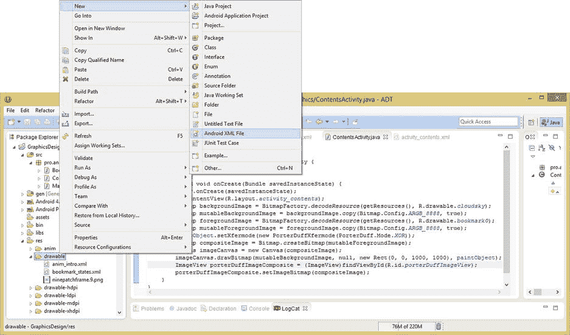

**图 12-1.** 使用右键上下文菜单在 `/res/drawable` 文件夹中创建一个 **New ➤ Android XML File**

选择此菜单命令序列后，您将看到一个 **New Android XML File** 对话框，如图 12-2 所示。由于您的文件夹层级结构以及您通过点击正确的文件夹（如图 12-1 所示）来调用对话框，该对话框已自动配置为 `GraphicsDesign` 项目和 Drawable 资源类型。现在，您只需选择 `<layer-list>` 父标签作为根元素，并将文件命名为 `contents_layers`，以表明您正在为您的 `ContentsActivity` 类定义图层。

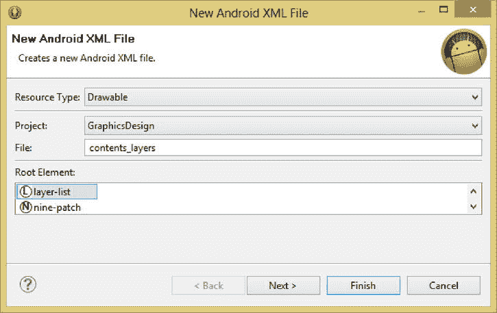

**图 12-2.** 为您的新的 Android XML 文件选择 `<layer-list>` 根元素

在对话框中设置好 Drawable XML 文件参数后，点击 **Finish** 按钮，您将在 Eclipse 的中央编辑窗格中看到一个新的 `contents_layers.xml` 文件，准备就绪，如图 12-3 所示。将您的 `<item> </item>` 子标签容器拆分为一个 `<item />` 容器，以便添加参数，然后使用 `android:` 工作流程来调用辅助对话框，该对话框包含了您之前了解的六个参数。首先添加 `android:id` 参数，这样您的图层对象就有了名称。

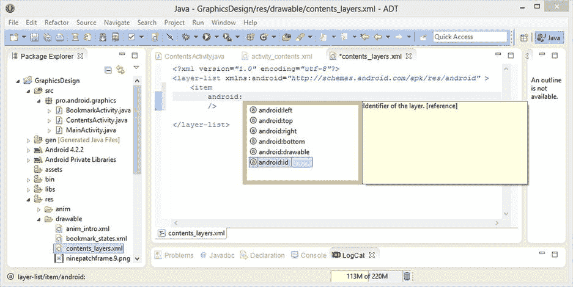

**图 12-3.** 在 `<layer-list>` 父标签内部添加 `<item>` 子标签，并访问 `android:` 辅助对话框

我们将第一个图层命名为 `layerOne`，并添加一个引用您的 `cloudsky.jpg` 图片资源的 `android:drawable` 参数，您希望将此图片作为背景底板（图层堆叠中最底部的图层）。

一旦完成了一个图层 `<item>` 结构的创建，您可以复制并粘贴它以创建任意所需数量的图层。XML 子标签 `<item>` 应如下所示：

```
<item
    android:id="@+id/layerOne"
    android:drawable="@drawable/cloudsky" />
```

请记住，通过使用 `@drawable` 引用您的 `cloudsky.jpg` 图片资源，Android 会在您的某个 `drawable-dpi` 子文件夹中找到此资源的正确分辨率密度版本。在这种情况下，由于该图片具有很好的可缩放性（正如您在之前章节中所见），您只需使用一个 1000 像素的高清分辨率资源，然后让 Android 尽情地进行缩放。在此，您将把它用作合成后的背景图片，并在您的 `LayerDrawable` XML 定义文件 `contents_layers` 中（如图 12-4 所示）通过第一个（底部）图层（命名为 `layerOne`）来定义它。

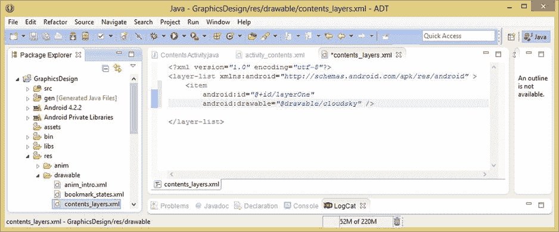

**图 12-4.** 完成第一个图层 `<item>` 子标签，在 ID 为 `layerOne` 的图层中引用 `cloudsky.jpg` 背景图片


现在你已准备好复制并粘贴第一个`<item>`标签，以便创建第二层和第三层，从而观察 9-patch 素材和具有 alpha 通道的图像素材在你正在创建的 Android 合成层叠层上的工作方式。实际上，你的 9-patch 素材已经定义了 alpha 通道和填充区域；因此，在这个第一个示例中，你需要竭尽全力使用一些非常高级的图形技术。

选择并复制父标签`<layer-list>`中的第一个子`<item>`标签的全部内容，然后在它下方再粘贴两次，以在`LayerDrawable`对象中创建`layerTwo`和`layerThree`图像合成层。第二层和第三层的 XML 标记如下所示：

```
<item
android:id="@+id/layerTwo"
android:drawable="@drawable/bookmark0" />
<item
android:id="@+id/layerThree"
android:drawable="@drawable/ninepatchframe" />
```

你只需编辑`ID`，将其改为`layerTwo`和`layerThree`，然后分别将引用从`cloudsky`改为`bookmark0`和`ninepatchframe`，如图 12-5 所示。现在，你已准备好查看 Android 内部数字图像合成工作流程的结果。

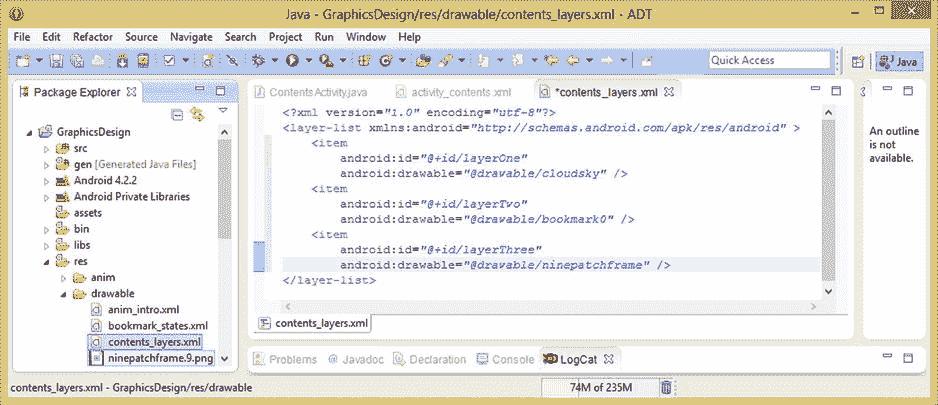
*图 12-5. 复制并粘贴第一层`<item>`标签以创建第二层和第三层`<item>`定义*

注意在图 12-5 中，`contents_layers.xml`编辑窗格底部没有图形布局编辑器选项卡，只有一个 XML 编辑选项卡。这应该能提示你，为了能够在 Eclipse ADT 和 Nexus One AVD 模拟器中可视化`LayerDrawable`对象，最后还需要执行哪一步操作。

`contents_layers.xml`文件是一个 XML 定义文件，用于定义图像素材层，但你仍然需要在`ImageView`对象内部引用它，才能在 ADT 或 Android 操作系统中进行可视化。

因此，我们来修改`contents_activity.xml`文件中的`<ImageView>`子标签，使用`android:src`参数来显示这个`LayerDrawable`对象定义。你将把现有参数放在标签的第二到第四行，并使用以下 XML 标记（如图 12-6 所示）添加一个指向`contents_layers` XML 文件的源图像引用。

```
<ImageView android:src="@drawable/contents_layers"
android:id="@+id/porterDuffImageView" android:layout_margin="8dp"
android:layout_width="wrap_content" android:layout_height="wrap_content"
android:contentDescription="@string/bookmark_utility" />
```

现在，我们的`LayerDrawable`对象 XML 定义已连接好可供查看，并且我们已进入 Eclipse IDE 的正确区域，可以访问图形布局编辑器选项卡，如图 12-6 中 XML 编辑屏幕底部所示。

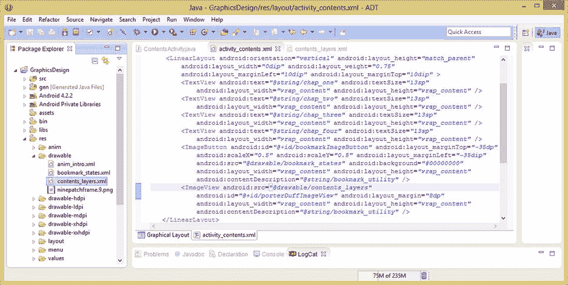
*图 12-6. 向`<ImageView>`子标签添加`android:src`参数以引用`contents_layers.xml`*

点击图形布局编辑器选项卡，这样你就可以可视化使用`LayerDrawable`类在 Android 中实现的数字图像合成。

如图 12-7 所示，你的`ImageView` UI 元素（在 XML 编辑窗格中，我们的编辑光标仍在其边界内，因此显示为选中状态）现在显示了一个三层图像合成层叠：底部是`cloudsky.jpg`图像，上面是`bookmark0.png`图像，再上面是`ninepatchframe` 9-patch 图像素材，所有图层完美合成。

不知何故，这个图像合成看起来没有达到预期的专业水平；因此，接下来让我们改变数字图像素材的顺序，这样环状图形就不会被合成周界周围的 9-patch 图像素材平铺所截断。


需要注意的是，由于你的图像图层堆栈（即`LayerDrawable`对象）的设置方式，现在实现这一点变得非常容易。通过使用 XML 定义文件，你已将数字图像分层中的图形设计工作分散化，因此你只需快速切换第二和第三个子`<item>`标签中的两个`android:drawable`参数引用即可。

接下来，让我们进行此操作，以便你可以看到由 Android（以及通过 GLE 的 Eclipse ADT）渲染出的这种不同图层堆栈顺序的结果。它们可能与你预期的并不完全一致！

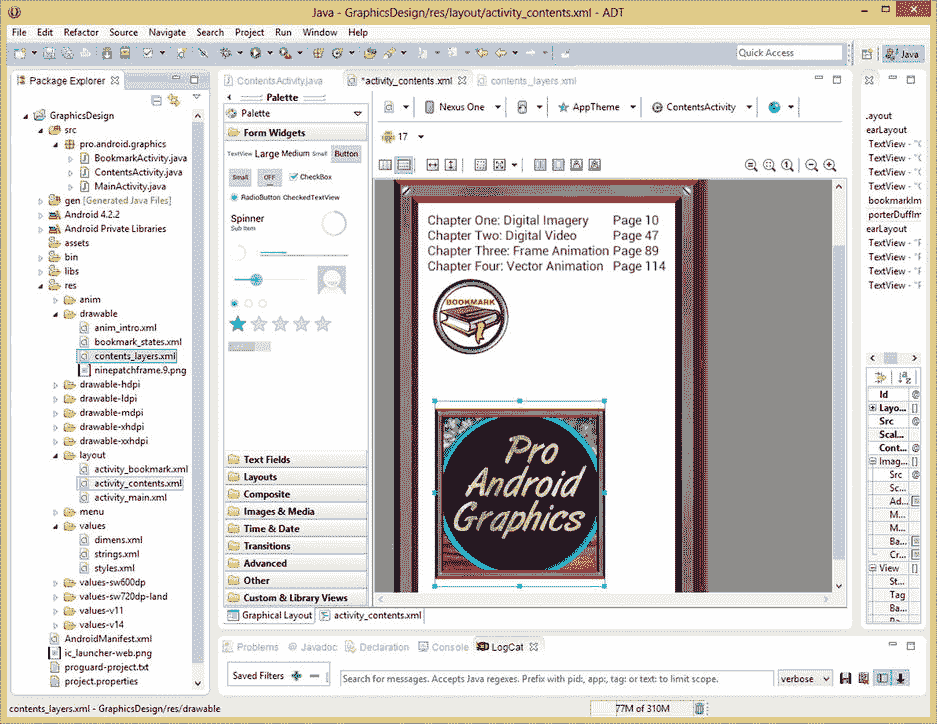

**图 12-7.** 使用图形布局编辑器查看`contents_layers.xml`中`LayerDrawable`的结果

接下来，点击 Eclipse 顶部的`contents_layer.xml`标签，切换回`LayerDrawable`对象 XML 定义编辑模式，进行这两个参数图像资源的引用修改，如图 12-8 所示。

你最终的`contents_layers.xml`中这三个`<item>`子标签的`LayerDrawable`对象定义 XML 标记，如图 12-8 所示，应完全如下 XML 标记结构所示：

```
<item
android:id="@+id/layerOne"
android:drawable="@drawable/cloudsky" />
<item
android:id="@+id/layerTwo"
android:drawable="@drawable/ninepatchframe" />
<item
android:id="@+id/layerThree"
android:drawable="@drawable/bookmark0" />
```

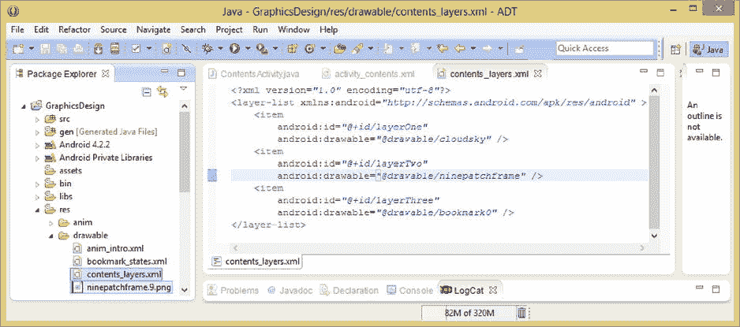

**图 12-8.** 更改可绘制对象的图层顺序，将`ninepatchframe`图像资源置于`bookmark0`之下

现在你已准备好，可以在图形布局编辑器标签页中测试新的图层合成堆栈。由于在图 12-8 所示的`contents_layers` XML 编辑窗格中无法使用该编辑器，你需要点击 Eclipse 顶部的`activity_contents.xml`标签，然后点击底部的图形布局编辑器标签页，以便查看修改后的图像资源多层合成（`LayerDrawable`对象），如图 12-9 所示。

你首先会注意到的是，书签图像的环扣部分并未像你可能预期的那样覆盖在`ninepatchframe`图像图层之上。思考片刻，9-patch 图像资源的哪些属性可能影响了这个特定图层堆栈合成顺序的渲染管线计算？你猜到了吗？

回顾一下讲解 Android `NinePatch`类的章节（第 10 章），当时你使用右侧和底部的单像素黑色边框线段为这个 9-patch 图像资源定义了内边距值。如果你还记得，这个内边距区域的作用是定义（或强制）任何放置在该`NinePatch`资源内部的内容，都必须位于你之前指定的内边距区域内。本质上，内边距确保了你的`NinePatch`资源的“外围图稿”不会被遮挡。

这就是你现在看到的书签图像资源图层位于`ninepatchframe` 9-patch 图像资源之上，并因此在其内部渲染的原因。

那么，你可能会想，我如何让环扣覆盖在 9-patch 图像资源框架之上呢？要实现这一点，请返回你的 Draw 9-patch 工具，将底部和右侧的黑色线条一直延伸到图像资源的边缘。这将告知 Android，你希望放入（或在此情况下，覆盖在）该 9-patch 资源上的内容能够与资源的图像组件及其内部空间重叠。你还可以在该 9-patch 内部空间内定义一个 alpha 通道，以便将来进行合成操作，就像你现在所做的那样。

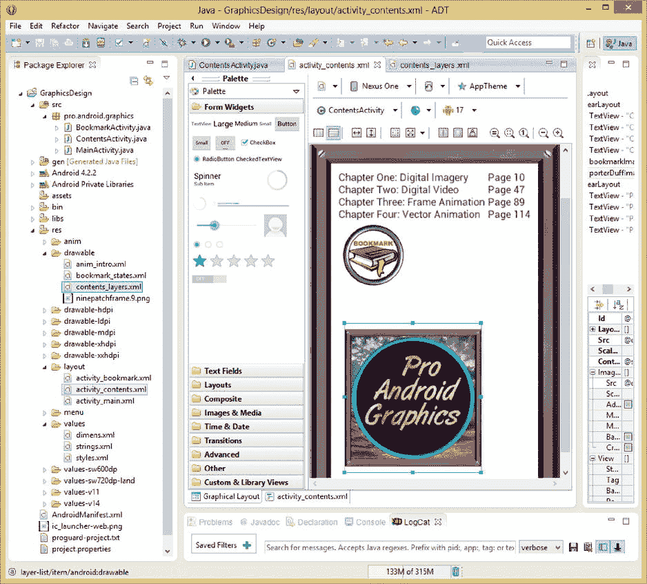

**图 12-9.** 使用图形布局编辑器查看`contents_layers.xml`中`LayerDrawable`的新结果

你接下来应该做的是，在 Nexus One 模拟器中测试这个`LayerDrawable`并查看结果，确保你的`LayerDrawable`对象能够与你的 Java 合成代码协同工作。

使用 **Run As ➤ Android Application** 工作流程，在 Nexus One 模拟器中启动你的 Android 应用程序；注意在图 12-10 的左侧，你的`LayerDrawable`渲染管线（之前在图形布局编辑器中看到的，如图 12-9 所示）并未在 Nexus One 中显示。这不是你的 XML 标记的问题（通过 GLE 你已经知道它工作正常），所以问题一定出在你的 Java 代码上。

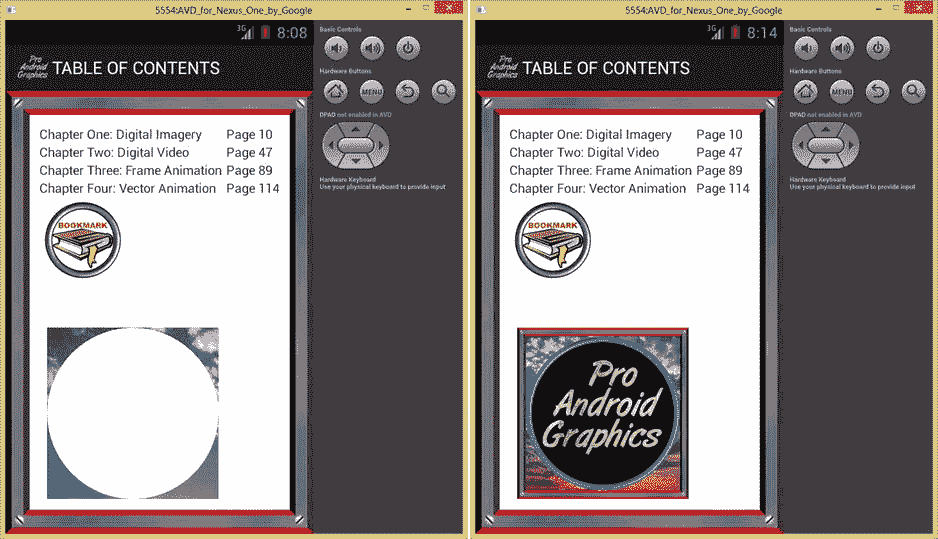

**图 12-10.** 在 Nexus One 模拟器中运行`GraphicsDesign`应用程序以查看你的`LayerDrawable`

让我们点击`ContentsActivity.java`标签查看你的 Java 代码。如图 12-11 代码列表底部所示，我找到了问题并将其注释掉，这样 XML 定义就能显示出来了。

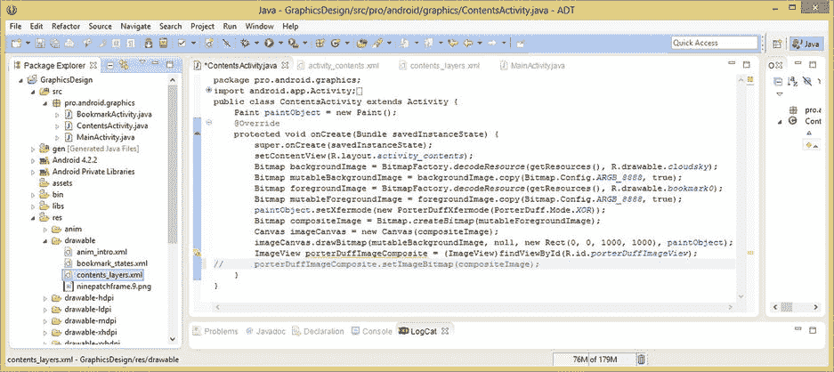

**图 12-11.** 移除`.setImageBitmap()`方法调用，以允许`LayerDrawable` XML 定义显示

发生的情况是，在你的 Java 代码的最后两行，你实例化了`ImageView`对象——这行代码对于显示你的`LayerDrawable`定义仍然效果很好——但随后你通过`.setImageView()`方法调用将`Canvas`对象写入到该`ImageView`中。因此，最后一行代码遮挡了`LayerDrawable`的显示，所以我将其注释掉并得到了预期的结果，如图 12-10 屏幕截图的右侧所示。

因此，从 Android 的处理角度来看，发生的情况是：你在 XML 中定义了你的`LayerDrawable`，并设置了你的`ImageView`对象来正确显示它——你在之前的设计和标记编码工作过程中通过使用 Eclipse 的图形布局标签页确认了这一点。

然而，在你一直在`ContentsActivity`中编写的图像合成 Java 代码中，这个`LayerDrawable`对象被你的编程调用所覆盖，该调用将`Canvas`对象的图像内容放置到（覆盖）了这个`LayerDrawable`合成之上，而你（至少在你编写代码时）对此并不知情。

最终，你将不得不重做部分代码，以整合`LayerDrawable`的使用，并了解如何提取`LayerDrawable`对象的图像图层并将它们放入一个`PorterDuff`图像混合管线中。目前，我只是简单地使用了注释功能，在代码行的开头放置了两个正斜杠。这当然使其不再参与执行，从而暂时解决了问题。我这样做只是为了确认`LayerDrawable`在 XML 标记中确实设置正确，并且使用当前的 Java 代码（或至少大部分 Java 代码）是可见的。

下一个挑战是将`LayerDrawable`对象的图层集成到一个`PorterDuff`混合管线中，因此你必须在下一节中修改你的 Java 代码，以实例化你的`LayerDrawable`对象，提取你想要通过你创建的`PorterDuff`混合基础设施处理的图层，将这些`Drawable`对象转换为`Bitmap`对象并使其可变（作为 32 位图像数据放入系统内存），然后确保它们处于 **Paint ➤ Canvas** 渲染循环中。


绝非易事；而且，正如你将在后续章节中看到的，在 Android 操作系统中也尚未达到 100% 完美！这是与 Android 这样的新操作系统和平台打交道时需要注意的问题之一；作为一名开发者，你必须在当前可用的工具中（及其限制下）工作，并利用那些运行足够稳定、可供使用的功能，同时等待新功能的加入——新功能最终总会在某个时间点被添加。

现在，你已经准备好将这个 `LayerDrawable` 对象引入你的 Java 代码，并将其与上一章编写的 PorterDuff Java 代码整合。这将向你展示如何在 Java 中实例化 `LayerDrawable`，以及如何访问 XML 定义中的各个图层。你还将学习如何提取这些图层中定义的图像数据，并如何在更高级的图像合成与混合管线中应用进一步的处理，例如将图层与 Android 的 PorterDuff 混合（或称传输）模式结合使用。

### 实例化用于 PorterDuff 合成的 `LayerDrawable`

在 Java 代码中，你需要做的第一件事就是实例化这个 `LayerDrawable` 对象，通过加载你的 `contents_layers.xml` 定义来创建该对象的属性。因此，启动 Eclipse ADT，点击 `ContentsActivity.java` 标签，回到你的合成代码中。

在 `onCreate()` 方法顶部的 `setContentView()` 方法调用之后，添加一个新行（回车），并加入以下这行 Java 代码。这行代码将实例化一个名为 `layerComposite` 的 `LayerDrawable` 对象，然后使用 `getResources().getDrawable()` 方法链来加载你的 XML 定义：

```
LayerDrawable layerComposite = (LayerDrawable)getResources().getDrawable(R.drawable.contents_layers);
```

正如你在图 12-12 中所见，接下来你需要将鼠标悬停在 `LayerDrawable` 类引用下方波浪形的红色错误提示上，这将指示 ADT 为你编写 `Import android.graphics.drawable.LayerDrawable` 这条 Java 语句。完成此操作后，你会注意到你的对象名 `layerComposite` 也会出现波浪形的黄色警告提示，因为它目前尚未使用——至少在你编写下一行代码之前是这样。

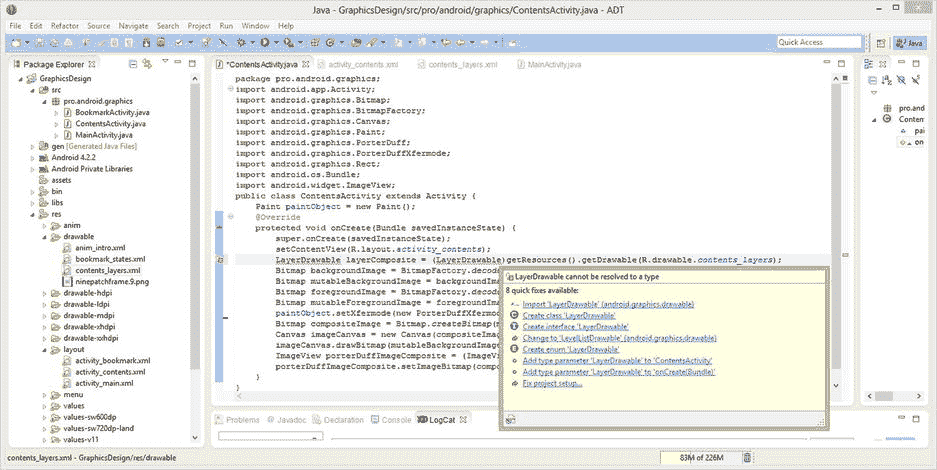

图 12-12. 在 Java 中实例化一个 `LayerDrawable` 对象，将其命名为 `layerComposite` 并调用 `.getDrawable()`

接下来，你需要创建一个 `Drawable` 对象来保存 `LayerDrawable` 的内容，你将把这个对象集成到当前的 PorterDuff 图像混合渲染管线中。你在上一章编写了这段代码，而本章将对其进行增强，使其能够与 `LayerDrawable` 对象协同工作。

### 创建一个 `Drawable` 对象来保存 `LayerDrawable` 资源

现在，你已经创建并加载了 `LayerDrawable` 对象到内存中，下一步是提取该对象中的某个图层，以便在你之前创建的 PorterDuff 图像混合（或像素传输）管线中使用它。你将要扩展这个管线，使其支持 `LayerDrawable` 对象（图层）。

此过程的第一步是创建一个 Android `Drawable` 对象，并将其命名为 `layerOne`，如图 12-13 所示。你将对这个 `Drawable` 对象做的是：用它来将 `LayerDrawable` 转换为 `Drawable` 对象，然后使用 `.findDrawableByLayerId()` 方法在单行代码中指定你想要使用的图层，如下所示：

```
Drawable layerOne = ((LayerDrawable)layerComposite).findDrawableByLayerId(R.id.layerThree);
```

这行代码的作用是：在单行代码中，创建一个 `Drawable` 对象，将其命名为 `layerOne`，然后将该对象设置为（加载）你之前实例化的 `LayerDrawable` 对象 `layerComposite`，接着使用点号表示法调用 `.findDrawableByLayerId()` 方法，并传入对本章前面定义的 `layerThree` `<item>` 的引用。

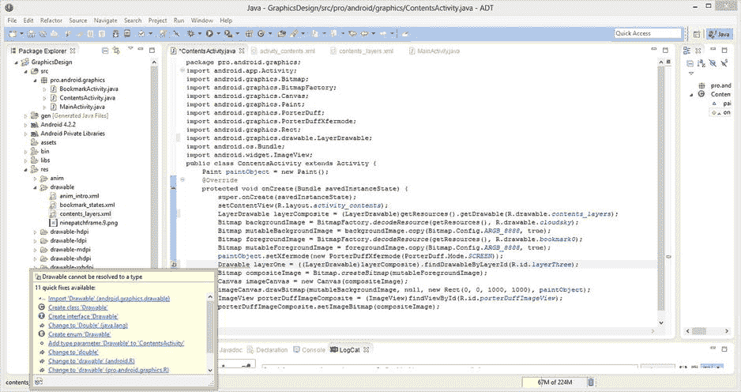

图 12-13. 创建一个名为 `layerOne` 的 `Drawable` 对象，通过 `findDrawableByLayerId()` 将其转换为 `LayerDrawable`

现在，你的 `layerOne` `Drawable` 对象已加载了你想在 PorterDuff 混合管线中使用的 `LayerDrawable` 图层，可以继续了！


### 将 Drawable 转换为 BitmapDrawable 并提取 Bitmap

为了获取 `Bitmap` 对象数据以利用现有的 PorterDuff 图像混合管线，下一步是再次将该 `Drawable` 对象转换为 `BitmapDrawable` 对象。这样做的目的是能够使用 `.getBitmap()` 方法从 `BitmapDrawable` 对象中提取 `Bitmap` 对象，而所有这些操作只需一行 Java 代码即可完成，如下所示：

`Bitmap composite = ((BitmapDrawable)layerOne).getBitmap();`

这段极为简洁的 Java 代码的作用是：创建一个名为 `composite` 的 `Bitmap` 对象，然后将该 `Bitmap` 对象赋值为（或载入）你之前实例化的名为 `layerOne` 的 `Drawable` 对象，接着使用点表示法调用 `.getBitmap()` 方法，该方法会获取 `Drawable` 对象中的 `Bitmap`（该对象现在实际上已被转换为 `BitmapDrawable` 对象），并将该数字图像数据加载到名为 `composite` 的 `Bitmap` 对象中。如图 12-14 所示，你还需要将鼠标悬停在错误高亮提示上，以便 Eclipse 为你自动编写 `Import BitmapDrawable` `(android.graphics.drawable)` 的 Java 语句。

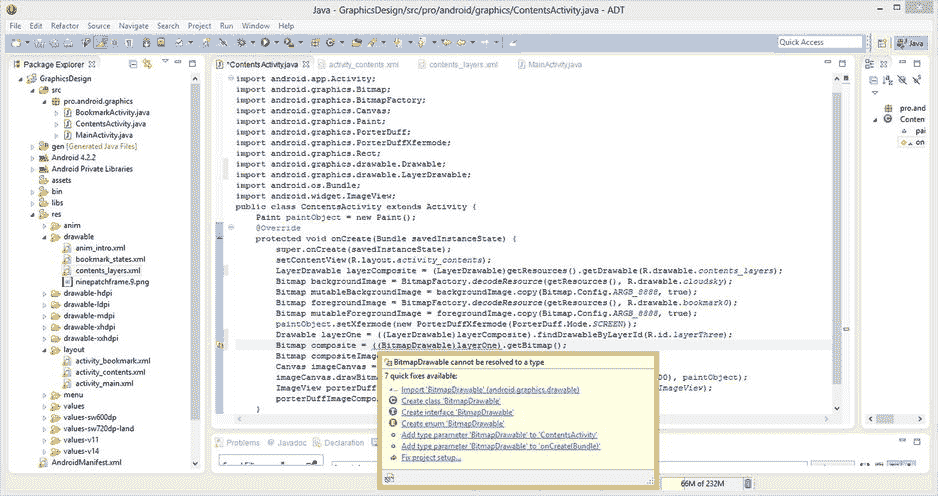

**图 12-14.** 将 `Drawable` 转换为 `BitmapDrawable`，然后使用 `.getBitmap()` 方法将其转换为 `Bitmap` 对象

现在，你的复合 `Bitmap` 对象已经载入了 `layerOne` `Drawable` 对象（该对象此前已载入了你最终希望在 PorterDuff 混合管线中使用的 `LayerDrawable` 图层），接下来可以创建一个可变的 `Bitmap` 对象（在内存中），以便对其进行处理！

你已经知道如何使用 `.copy()` 方法创建可变的 `Bitmap` 对象，只需指定一个基于 `Bitmap` 类调用的 `Config.ARGB_8888` 常量即可。以防你忘记了其在 Java 中的结构，代码如下：

`Bitmap mutableComposite = composite.copy(Bitmap.Config.ARGB_8888, true);`

现在你已经到达了 PorterDuff 图像混合章节中所涉及的最终可变 `Bitmap` 对象“目的地”，因此接下来的所有操作就是：在你现有的 PorterDuff 图像混合（以及像素传输）管线中，用 `mutableComposite` `Bitmap` 对象替换 `mutableForegroundImage` 或 `mutableBackgroundImage` 对象的引用。

如图 12-15 所示，我尚未完成此操作，因此你会看到 `mutableComposite` `Bitmap` 对象上标有波浪形黄色下划线警告提示，表示该对象目前未被使用，直到我将其接入渲染管线（接下来你将执行此操作）。

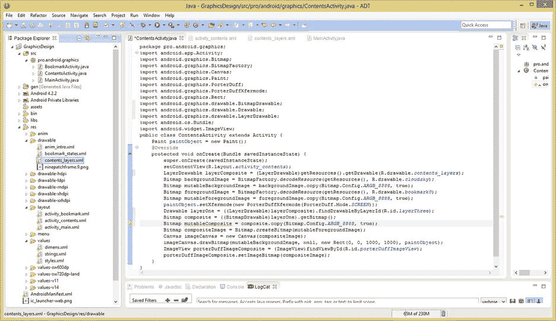

**图 12-15.** 使用 `.copy()` 方法并指定 `ARGB_8888` 创建名为 `mutableComposite` 的可变 `Bitmap` 对象

接下来，让我们用你的 `mutableComposite` 对象（实际上是 LayerDrawable 转换为 Drawable 再转换为 BitmapDrawable 最终转换为 Bitmap 的转换对象）替换 `foregroundImage` 和 `mutableForegroundImage` 对象。你应该将这些对象从 Java 代码中注释掉，这样它们在你暂时搁置时就不会占用任何系统内存。你可以在图 12-16 中看到你执行的注释操作以绿色显示；只需在每行代码开头加上两个斜杠，它们就会从 Android 的视野中消失！

接下来，让我们修改你的 PorterDuff 管线，使其引用你转换后的 `LayerDrawable`，并将图层合成整合到你的图像混合 Java 代码中！

### 修改 PorterDuff 管线以使用 LayerDrawable

让我们替换你之前创建并刚刚从 Java 代码中（暂时）注释掉的 `mutableForegroundImage` 对象，将其放入现有的 `compositeImage` `Bitmap` 对象中。该对象由你的 `imageCanvas` `Canvas` 对象引用。你将使用以下 Java 代码行完成此操作：

`Bitmap compositeImage = Bitmap.createBitmap(mutableComposite);`

这行代码的作用是：将定义在 `LayerDrawable` 对象 `layerThree` 中的可绘制图像资源（即 `bookmark0.jpg` 图像资源）整合到图像混合 PorterDuff 管线中。如图 12-16 所示，你的代码没有错误，已准备好可在 Nexus One 模拟器中进行测试。如果算上被注释掉的代码行，你仅用了 15 行（密集的）Java 代码就实现了图层支持和图像混合。

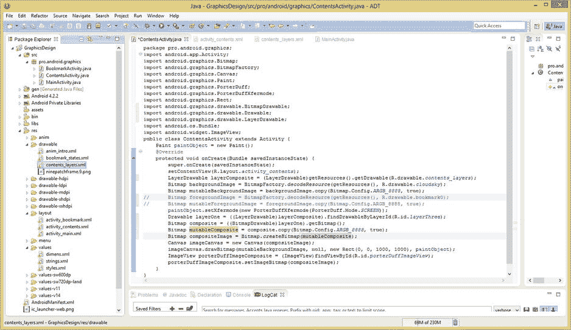

**图 12-16.** 修改 `compositeImage` `Canvas` 目标，使其引用你的 `LayerDrawable` `mutableComposite` `Bitmap`

现在，是时候检查你的数字图像合成管线 Java 代码是否真正生效了！使用 **Run As ➤ Android Application** 工作流程启动你的 Nexus One 模拟器。应用程序加载后，点击 **MENU** 按钮并选择 **Table of Contents** 菜单选项。让我们查看一下你的数字图像图层混合与合成结果。你将尝试使用一个像素传输模式和一个图像混合模式来测试两者！

如图 12-17 所示，你在 `paintObject` `Paint` 对象中设置的 `PorterDuff.Mode.SCREEN` 常量，正通过 `LayerDrawable` 对象中的 `layerThree` 图层完美运行——该 `LayerDrawable` 对象是你在本章前面使用 `contents_layer.xml` 文件及其 `<layer-list>` 父标签 XML 定义创建的。

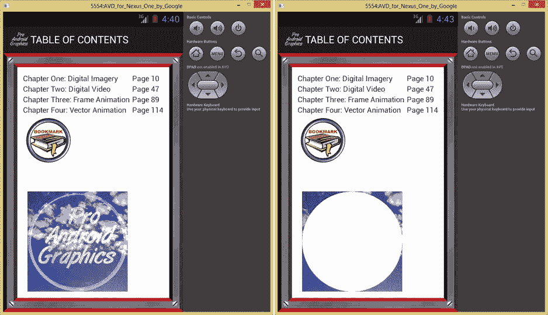

**图 12-17.** 使用混合与传输模式测试现有 PorterDuff 管线中的 `LayerDrawable` 资源

接下来，让我们将此 `PorterDuff.Mode` 常量更改为 `XOR` 常量，并确保像素混合也能正常工作。如图 12-17 右侧所示，`XOR` 图像传输模式也按预期运行，因此你已经通过使用 `LayerDrawable` 对象实现了图像混合和像素传输。

如果你仔细观察图 12-17 的左侧，会发现 `backgroundImage` 面板出现了一些问题。你的 `cloudsky.jpg` 不再像 **Graphical Layout Editor** 预览中那样缩放到适合 `ImageView` UI 显示容器。它使用了未缩放的原始图像像素，因此，在你从 `LayerDrawable` 中提取的书签前景图像后面，只能看到 `CloudSky` 图像左上角 (0,0) 位置的云朵。

让我们调整一些设置，看看能否找出为什么你的一个合成图像资源在 PorterDuff 渲染管线中缩放比例发生了变化。目前看来，我找不到发生这种情况的明显原因，但让我们稍微调整一下并进行调查！


### 切换 LayerDrawable 图像资源：源图与目标图

现在，让我们尝试交换源图像板和目标图像板的位置，以便在 `.drawBitmap()` 方法中将 `mutableComposite`（一个被转换的 `LayerDrawable`）与 `paintObject` 一同调用，并将 `mutableForegroundImage` 放入 `.createBitmap()` 方法中。该方法在 `Canvas` 对象中使用的 `compositeImage Bitmap` 对象上调用，该 `Bitmap` 对象作为其画布（表面）图像数据。这一交换操作如图 12-18 所示；同时请注意，我们已经注释掉了 `backgroundImage` 和 `mutableBackgroundImage` 这两个 `Bitmap` 对象。

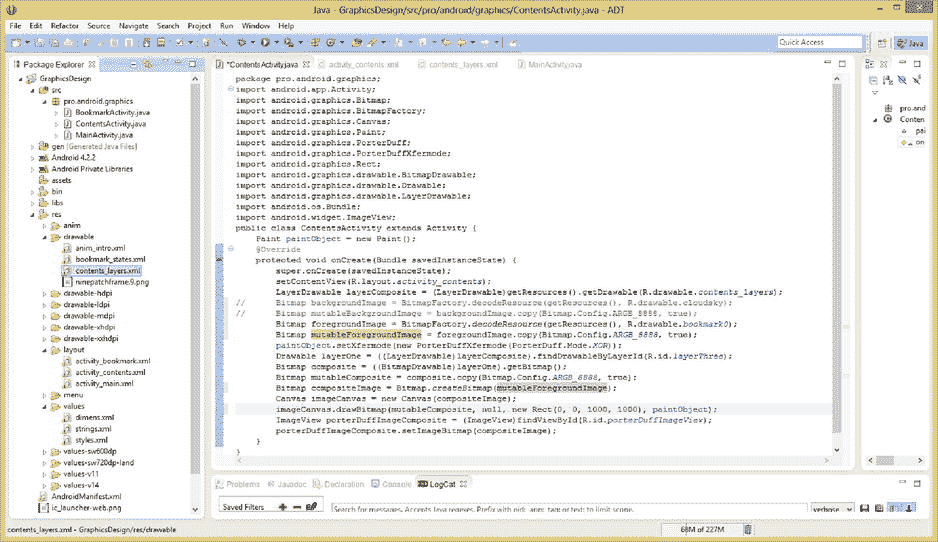

**图 12-18.** 将 `mutableComposite LayerDrawable` 转换后的 `Bitmap` 交换到 `.drawBitmap()` 方法中

现在，取消注释你的 `foregroundImage` 和 `mutableForegroundImage` 这两个 `Bitmap` 对象，这样你就可以临时使用你的书签 PNG 图像作为源图像和目标数字图像合成板。这样做是为了让你能够直观地看到，在你编码的数字图像合成流水线中，对源图像板和目标图像板使用相同图像时会发生什么。

如图 12-19 所示，其中一个 `bookmark0` PNG 图像数据集被缩放以适配 `ImageView` UI 容器，而另一个完全相同的数据集则显示了原始的、未缩放的源像素，使用图像原点 `0,0` 并以零缩放进行逐像素显示。

这让你可以观察到几点。其一，是在同一个合成图像内，对相同的图像同时进行缩放和未缩放处理时的图像缩放质量。对我来说，这个缩放效果看起来相当不错！其二，这展示了使用 XOR 像素传输模式可以实现的炫酷特殊成像效果，即使使用的是完全相同的图像数据。

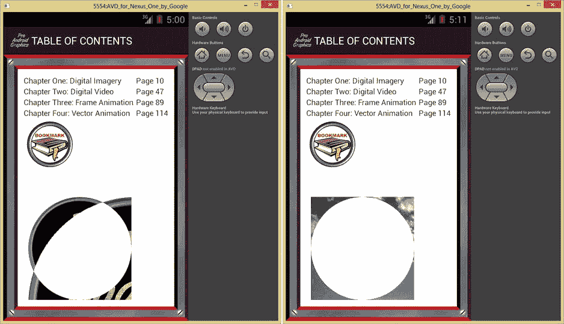

**图 12-19.** 在另一个使用了混合与传输模式的 `PorterDuff` 流水线板中测试 `LayerDrawable` 资源

让我们进行一些实验，同时也了解如何更改你在图像合成与混合流水线中引用的 `LayerDrawable` 对象层。将 `LayerDrawable` 层改为使用背景天空层（名为 `layerOne`），而不是使用最顶层（该层使用 `bookmark0.png` 作为其图像资源，名为 `layerThree`）。

### 更改流水线中使用的 LayerDrawable 层

回到你的 Java 代码中；在使用 `.findDrawableByLayerId()` 方法的那行代码中，将其参数从 `layerThree` 改为 `layerOne`，如图 12-20 所示。

请注意，你没有更改 `.drawBitmap()` 和 `.createBitmap()` 方法调用中引用的 `Bitmap` 对象，因为你希望一次只更改一个变量并观察结果；这次你将 `LayerDrawable` 层引用从 `layerThree` 更改为 `layerOne`。

这一更改发生在你的“处理链”中“更靠前”的位置，这表明你可以更改 `LayerDrawable` 对象的层引用，而无需触碰任何图像合成、混合、绘制、绘图、传输、画布或其他核心 Java 图像处理流水线代码。

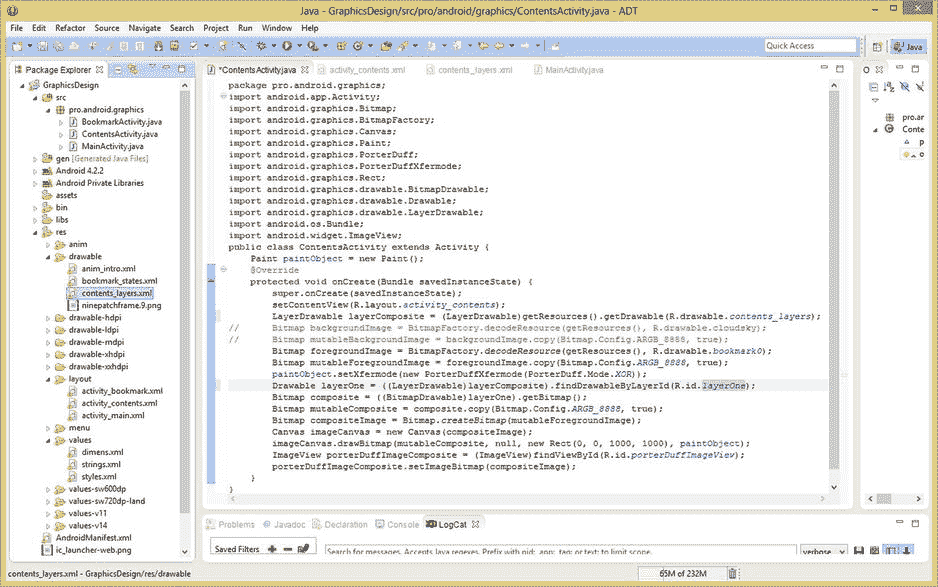

**图 12-20.** 使用 `.findDrawableByLayerId()` 将 `LayerDrawable` 转换的 `Drawable` 更改为引用 `layerOne`

这将更改你的背景板，该背景板来自 `LayerDrawable`，并在 `imageCanvas` 对象的 `drawBitmap()` 方法调用中被调用。如图 12-21 所示，特别是在中间渲染的（叠加模式）视图中，整个 `cloudsky.jpg` 日落图现在显示在你合成图像的最终渲染流水线中。这证明了是 `LayerDrawable` 被缩放了，而 `Bitmap` 合成板图像没有被缩放。

我发现弄清楚为什么会发生这种情况的最佳方法是，从 `ImageView` 逆向工作（在此情况下是从代码底部向上追溯）。我们知道 `ImageView` 会在 XML（GLE）和 Java（仿真器和设备中）中对图像进行缩放。因此，让我们从 `ImageView` 开始，逐步向上追溯整个合成渲染流水线。

渲染代码的最后一行调用了 `.setImageBitmap()` 方法，该方法引用了 `compositeImage Bitmap` 对象。此方法是通过你的 `porterDuffImageComposite ImageView` 对象调用的。这个 `compositeImage Bitmap` 被连接到（被）`imageCanvas Canvas` 对象（引擎）使用。

然后，这个 `imageCanvas` 对象被用来调用 `.drawBitmap()` 方法，该方法引用了 `mutableComposite Bitmap` 对象。`mutableComposite Bitmap` 对象引用了合成后的 `Bitmap`，该 `Bitmap` 是从 `BitmapDrawable` 转换而来的，而 `BitmapDrawable` 又是从 `layerOne Drawable` 对象转换而来的。`layerOne Drawable` 是从 `layerComposite layerDrawable` 对象转换而来的，该对象通过 `.findDrawableByLayerId()` 方法进行实例化和加载。

因此，你已经将你的 `ImageView` 源数据向上追溯了你的渲染流水线，回到了 `LayerDrawable` 对象层的源图像，这是有道理的，因为这是正确缩放的图像源，这意味着很可能是流水线末端的 `ImageView` 对象在缩放这个对象。

另一方面，你直接从可绘制资源文件夹中引用图像数据的另一个 `Bitmap` 对象，则一定是那个未被缩放的图像板（源）。将 `PorterDuff.Mode` 改为 `OVERLAY`，并使用 **Run As ➤ Android Application** 的工作流程来生成图 12-21 中间的视图。左侧显示了 XOR 模式常量。

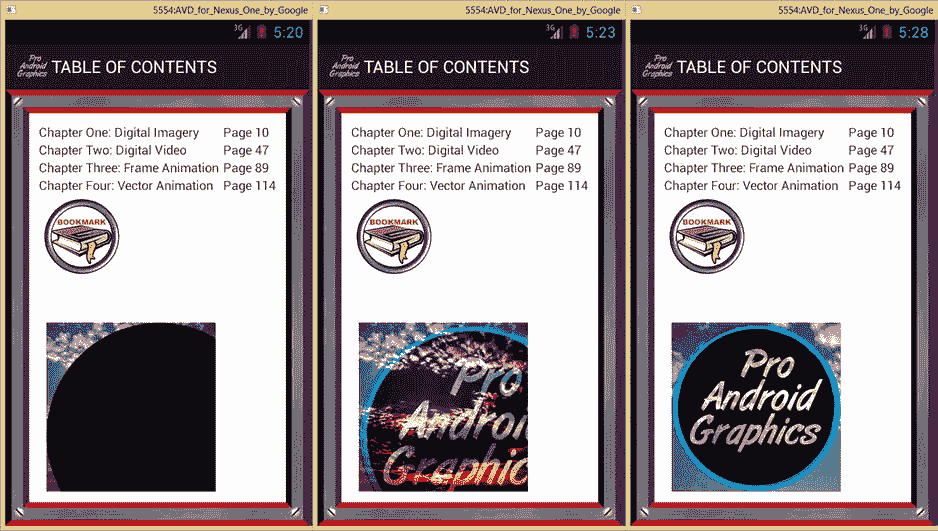

**图 12-21.** 使用 `layerOne` 并配合混合与传输模式测试 `LayerDrawable` 和 `PorterDuff` 渲染流水线

接下来，让我们将两个 `Bitmap` 图像引用交换回原来的方式，即将 `mutableComposite` 放在 `Canvas` 对象的 `compositeImage` 画布图像中，将 `mutableForegroundImage` 放在 `drawBitmap()` 方法调用中，该方法调用将你的 `paintObject Paint` 对象应用到 `imageCanvas Canvas` 对象上。

如图 12-21 右侧所示，交换图像板引用会使书签图像适配，而 `cloudsky` 图像则进行逐像素缩放。因此，你分析的结果似乎与实际情况完全一致。

顺便提一句，我们使用了 `PorterDuff.Mode.SCREEN` 常量来获得像素混合效果，你可以在图 12-21 中 Nexus One 仿真器右侧的屏幕截图中看到这个效果。

这个最终图像合成流水线测试场景的最终 Java 代码如图 12-22 所示。

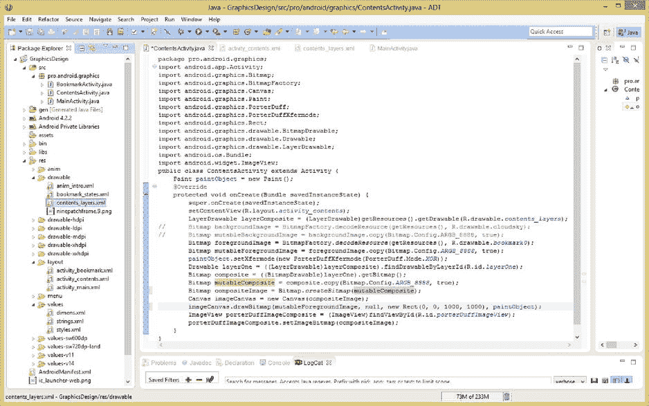

**图 12-22.** 将 `mutableComposite` 切换回 `compositeImage`，并将 `mutableForegroundImage` 切换回 `drawBitmap()`

唯一剩下要做的事情就是完全基于 `LayerDrawable` 层实现整个渲染流水线；不过，我想把这个留作给读者的练习，以确保每个人都理解整个流水线及其中的类型转换和引用过程。


### 读者练习：使用两个 `LayerDrawable` 资源

这里有一个小测试供你自行完成，以练习使用 Android 图形包中的类，如 `Canvas`、`Paint`、`Bitmap`、`Drawable`、`BitmapDrawable`、`LayerDrawable` 以及所有 `PorterDuff` 类。

我将告诉你如何操作：这只需要复制几行代码，并修改一些对象名称和引用，因此对你来说实现起来应该不会太难。

我希望你首先做的是，注释掉你在前一章中用于原始 `PorterDuff` 混合管线的两个 `Bitmap`（以及可变的 `Bitmap`）对象。你这样做的原因是，你将仅使用通过 `LayerDrawable` 对象提供的 `Drawable` 数字图像数据（资源）来实现 `PorterDuff` 混合管线。

这意味着你将在 `LayerDrawable` 对象内部完全实现一个 `PorterDuff` 图像混合管线（或像素传输管线）。以下是具体实现方法；你需要的所有代码已经就位，所以你只需复制其中一部分即可。

首先，创建一个引用 `layerThree` 的 `Drawable layerThree` 对象，如下所示：

`Drawable layerThree = ((LayerDrawable)layerComposite).findDrawableByLayerId(R.id.layerThree);`

接下来，复制那两行代码，它们将你的 `LayerDrawable` 依次通过类型转换、`.copy()` 和 `getBitmap()` 方法，将其从 `Drawable` 转换为 `BitmapDrawable`，再转换为 `Bitmap`，最后变成一个可变的 `Bitmap`，代码如下：

```
Bitmap compositeTwo = ((BitmapDrawable)layerThree).getBitmap();
Bitmap mutableCompositeTwo = compositeTwo.copy(Bitmap.Config.ARGB_8888, true);
```

然后，在你的 `.drawBitmap()` 方法中，将 `mutableForegroundImage` 对象替换为 `mutableCompositeTwo` Bitmap 对象，这样你最终就能在你的 `PorterDuff` 渲染管线中引用两个 `LayerDrawable` 源图像资源了。

### Android 中数字图像合成的若干注意事项

首先，在我看来，Android 需要增加一些 `<layer-list>` XML 属性（参数），以便更轻松地（通过 XML）以高级方式使用图层。我至少希望看到 `android:opacity` 和 `android:porterDuffMode` 参数，这样通过 XML 实现静态合成管线就会变得轻而易举——而你刚刚编写的那一大段复杂的 Java 代码也就变得多余，除非你出于某种原因需要实现动态图像合成管线。

你可能注意到的另一件事是，我在 Java 代码中并没有引用 `LayerDrawable` 中的 9-patch `layerTwo`。这是因为这会导致模拟器崩溃。我猜测 Android 在处理通过所有这些 `Drawable` 类型转换 9-patch 图像时存在困难，因此，目前你需要找到一种方法来静态地实现你的 9-patch 图像，例如使用 `android:background` 参数将其作为背景图像。

请注意，9-patch 图像资源在静态（XML）实现 `LayerDrawable` 时确实有效，并且正如你所看到的，它们遵循了所有 9-patch “规则”。

### 总结

在第十二章中，你学习了如何在 Android 中使用图层进行图像合成，以及 Android 的 `LayerDrawable` 类。你还通过类型转换有机会使用了 `Drawable` 和 `BitmapDrawable` 类。

我们首先探讨了图层在数字图像合成管线中的一些核心概念，然后学习了 Android 的 `LayerDrawable` 类及其为 Android 开发者在代码中实现基于图层的合成管线所提供的功能。

接下来，我们学习了 `<layer-list>` 父级 XML 标签及其子标签 `<item>`，并了解了如何使用 XML 定义文件来定义 `LayerDrawable` 对象。你使用 `contents_layers` XML 文件定义了自己的 `LayerDrawable`，在其中定义了图像图层、命名图层并为其分配了图像资源，随后在 `PorterDuff` 渲染管线中使用了这些图层。

然后，你深入学习了 Java 方面的内容，并修改了前一章编写的图像混合管线，将 `LayerDrawable` 对象集成到合成和混合管线中。你学习了如何将 `LayerDrawable` 转换为 `Drawable` 对象，再转换为 `BitmapDrawable`，最终转换为 `Bitmap` 对象，然后将其转换为可变的 `Bitmap` 对象，正如你在前一章针对 `PorterDuff` 图像混合管线所做的那样。

你通过多种不同方式测试了你的代码，并以不同的方式连接它，以确定合成和渲染管线中究竟发生了什么。最后，你参与了一个练习，尝试实现这段代码，并了解了 Android 中图层的一些注意事项。

在下一章中，你将学习如何在 Android 操作系统中使用数字图像过渡，以及如何使用 Android 的 `TransitionDrawable` 类。这将使你能够通过图像动画将 Android 图像合成图形设计和特效工作提升到一个更高的水平。

# 13. 数字图像过渡：使用 `TransitionDrawable` 类

摘要

在第十三章中，我们将仔细探讨图像过渡在 Android 和数字图像动画中所扮演的角色，以及如何在 Android 中实现图像过渡。过渡允许开发者增强其核心数字图像动画能力。

在第十三章中，我们将仔细探讨图像过渡在 Android 和数字图像动画中所扮演的角色，以及如何在 Android 中实现图像过渡。过渡允许开发者增强其核心数字图像动画能力。

在 Android 应用中，过渡的创建和管理是通过使用 `Drawable` 父类的间接子类之一来完成的。`TransitionDrawable` 子类专门管理图像过渡，并且它是 `LayerDrawable` 类的直接子类。由于你在上一章学习了 `LayerDrawable`，这一章是很好的后续内容。

`TransitionDrawable` 对象允许在 Android 中使用前两章介绍的图层和混合功能执行更高级的数字图像动画。因此，`TransitionDrawable` 对象允许开发者以最简单的方式创建图像动画：通过在两个图像图层之间进行混合或透明度变化来实现过渡。

Android 中有更高级的动画形式，例如位图或帧动画（有时称为光栅动画），以及矢量或过程动画（有时称为补间动画）。你将在接下来的两章中详细了解这些内容，因为 Android 中每种独特的动画形式都需要单独的章节来讲解。

我们将从图像过渡的基础知识开始，然后具体学习 `TransitionDrawable` 类；之后，你将使用 XML 标记在你的 `GraphicsDesign` 应用中定义过渡，并使用 Java 代码来运行它，从而实现你自己的 `TransitionDrawable` 对象。


### 过渡效果：通过图像混合创建运动幻觉

让我们先概述一下数字图像过渡效果是什么。在 Android 中，它们在技术上被称为过渡 Drawable，这些 `LayerDrawable` 对象是使用 `TransitionDrawable` 类构建和维护的。

我们还将探讨在 Android 应用程序中，图像过渡效果如何发挥最大优势，以及如何使用它们为你的 Android 应用增添一些令人惊叹的因素和图形设计的专业感。

图像过渡效果可以通过使用你在过去几章中一直在实现的数字图像合成管线来实现，因此本章应该很容易融入到你专业的 Android 图形设计工作流程中。

使数字图像资源过渡编程与众不同的一个特点是：在图像合成中通常是静态的混合和不透明度变量，会在一个处理循环（在 Java 代码中）中运行，这涉及到图像过渡处理管线。

通过这种方式使图像合成管线动态化，可以让你的图像资源看起来像动画一样。这可能就是 Google Android 开发者创建 `TransitionDrawable` 类的原因，这样我们就不必自己编写这些代码，并且可以提供一种流行的新媒体特性。

图像过渡效果仅使用两个图像资源就能创造出这种动画外观，因此从易用性和数据占用空间优化的角度来看，它都非常出色。

由于图像过渡效果可以通过相当简单的设置，为你的应用程序提供动画特性集和动态外观，我将在我们深入探讨 Android 中的帧动画和程序化动画（这将在接下来的两章中进行）之前，先介绍这个主题，敬请期待。

Android 中的图像过渡效果使用 `LayerDrawable` 对象，因为 Android 中这些类型的 Drawable 具有实现这种动画合成特殊效果所需的特性。这些特性包括不透明度或 Alpha 混合，以及位置参数（`top`、`bottom`、`left` 或 `right`），还有分配 ID 和引用 drawable 资源的能力。

Android 中的图像过渡效果可以用于许多不同的目的，以及图形设计和用户界面设计工作流程的许多不同领域，因此在本章中掌握它们非常重要。

`TransitionDrawable` 对象本质上是 Drawable 资源，因此它们可以用于 `ImageView` 和 `ImageButton` UI 元素的源参数，或者用于 `ImageView` 类（或子类）对象的背景板（参数）。它们还可以通过 `android:background` 参数用于为你的布局容器添加特殊效果，这可以快速、高效、有效地为你的用户界面屏幕设计增添令人惊叹的因素。

### Android 的 TransitionDrawable 类：过渡引擎

Android 的 `TransitionDrawable` 类是 `Drawable` 类的间接子类，而 `Drawable` 类又是 `java.lang.Object` 主类的直接子类。`TransitionDrawable` 是 Android `LayerDrawable` 类的直接子类，而 `LayerDrawable` 又是 Android `Drawable` 类的直接子类。

作为 `LayerDrawable` 的子类，`TransitionDrawable` 类因此实现了 `LayerDrawable` 类的所有特性，这些特性你在前一章已经了解过。它还实现了实现数字图像过渡所必需的额外不透明度动画特性；正如所料，这些特性是 `TransitionDrawable` 类特有的。

Android `TransitionDrawable` 类的层次结构如下：

```
java.lang.Object
  > android.graphics.drawable.Drawable
    > android.graphics.drawable.LayerDrawable
      > android.graphics.drawable.TransitionDrawable
```

`TransitionDrawable` 类也是 `android.graphics.drawable` 包的一部分。因此，它的导入语句引用了一个 `android.graphics.drawable.TransitionDrawable` 包的导入路径。在本章后面，当你编写 Java 应用程序代码来实现一个 `TransitionDrawable` 对象，用于你的数字图像动画以实现你的专业 Android 图形编程目标时，你会看到一个示例。

`TransitionDrawable` 对象是 Android 中一种 Drawable 对象，它能够创建和管理一个包含两个 Drawable 对象的数组，目的是在这两个 Drawable 对象之间创建图像过渡效果。

`TransitionDrawable` 类被设计为 Android `LayerDrawable` 类的扩展，旨在实现图像 drawable 的第一层和第二层之间的交叉淡入淡出（或过渡）。这就是它成为 `LayerDrawable` 子类的原因：因为它将使用 `LayerDrawable` 类的代码基础设施作为基础，然后通过额外的 Java 处理（Java 循环结构）来运行 `LayerDrawable` 的属性（参数）值，从而添加动画的方面。

`TransitionDrawable` 对象可以在你的 XML 文件中使用 `<transition>` 父标签 XML 元素进行静态定义。过渡中的每个层 drawable 都使用嵌套的 `<item>` 子标签来定义。我们将在本章的下一节中详细讨论这一点，以便你了解如何操作。

要在你的 Java 代码中启动图像过渡，你可以使用对 `TransitionDrawable` 对象 XML 定义的引用来调用 `.startTransition()` 方法，你可能已经猜到，该 XML 定义位于你的 drawable 文件夹中。

要重置 `ImageView` 以显示源层而不是目标（最终）层，你可以在确认用户不再查看屏幕后调用 `.resetTransition()` 方法，以防止图像闪烁。


### `<transition>` 父标签：在 XML 中设置过渡动画

接下来，我们继续在 Eclipse 中操作 `ContentsActivity.java` 和 `activity_contents` XML 文件，在目录 Activity 屏幕上实现一个 `TransitionDrawable` 对象，从而了解如何实现这一功能。

如果 Eclipse ADT IDE 尚未打开，请启动它。右键点击 `/res/drawable` 文件夹，如图 13-1 所示，然后选择 **New ➤ Android XML File** 菜单序列，打开文件创建对话框。

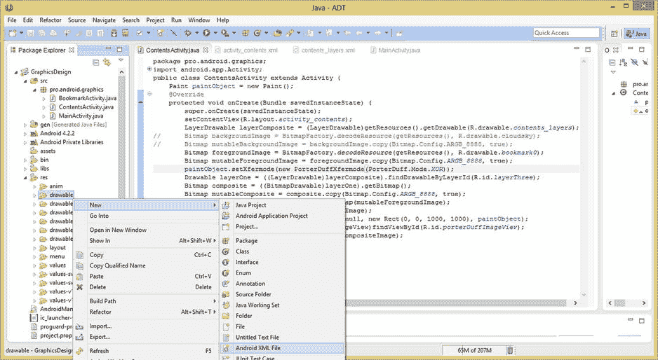

**图 13-1.** 右键点击 `/res/drawable` 文件夹，然后选择 **New ➤ Android XML File** 菜单序列

您将创建新的 `TransitionDrawable` XML 定义文件，此操作会自动将其放入您的 `drawable` 文件夹。`/res/drawable` 文件夹用于存储所有可绘制资源，例如 `LayerDrawable` 图层定义、9-patch 图像资源、`ImageButton` 状态、帧动画定义，以及现在的 `TransitionDrawable` 对象定义。不久之后，您还将在此处存储程序化动画定义！

需要注意的是，`/res/drawable` 文件夹中的每个资源都与 `Drawable` 对象及其定义（帧、状态、图层、补丁、矢量等）相关，但不包括实际的图像资源本身，唯一的例外是 9-patch 资源，它在一个文件格式中同时包含了补丁定义和图像资源。实际的图像资源应放入其他 `drawable-dpi` 文件夹中，这些文件夹与 `/res/drawable` 文件夹同级。

因此，`/res/drawable` 文件夹中的任何 XML 定义都会自动引用这些图像资源（使用不同的分辨率密度），这些资源存储在 Android 的五个标准 `/res/drawable-dpi` 图像和动画资源文件夹中。当您通过 第 2 章 中所示的一系列对话框创建新 Android 应用程序时，这些文件夹就已自动生成。

选中该菜单命令序列后，将出现一个 **New Android XML File** 对话框，如图 13-2 所示。由于您的文件夹层次结构以及您点击了正确的文件夹（如图 13-1 所示）来调用该对话框，此对话框已自动配置为 `GraphicsDesign` 项目和 `Drawable` 资源类型。现在，您只需选择 `<transition>` 父标签根元素，并将文件命名为 `trans_contents.xml`，以表明您正在为 `ContentsActivity` 类定义一个过渡动画。

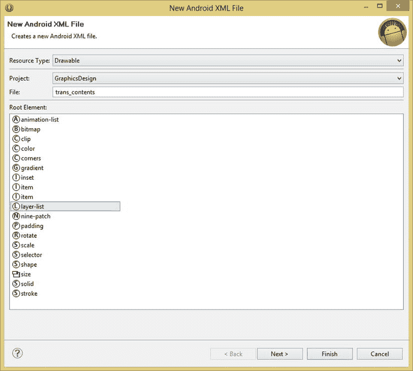

**图 13-2.** 在 New Android XML File 对话框中查找 `<transition>` 根元素

如图 13-2 所示，您在实现 `TransitionDrawable` 对象时遇到了第一个问题。请注意，虽然理论上应该存在，但该对话框中并没有提供 `<transition>` 的父（根元素）标签。

我猜测这是 Eclipse ADT 开发团队的疏忽，但目前我们无需为此担忧；我们只需适应现有的最佳工作流程。由于 `TransitionDrawable` 是 `LayerDrawable` 的子类，因此请先选择 `<layer-list>` 父标签（即根元素），待进入 Eclipse 编辑窗格后，再将其修改为 `<transition>` 父标签。因此，选择 `<layer-list>` 根元素，将文件命名为 `trans_contents.xml`，然后点击 **Finish** 按钮。

在对话框中完成 Drawable XML 文件参数设置后，您将在 Eclipse 编辑窗格中看到新建的 `trans_contents.xml` 文件，可以开始使用。请将父标签（根元素）容器中的 `<layer-list>` 替换为 `<transition>` 文本，如图 13-3 所示。

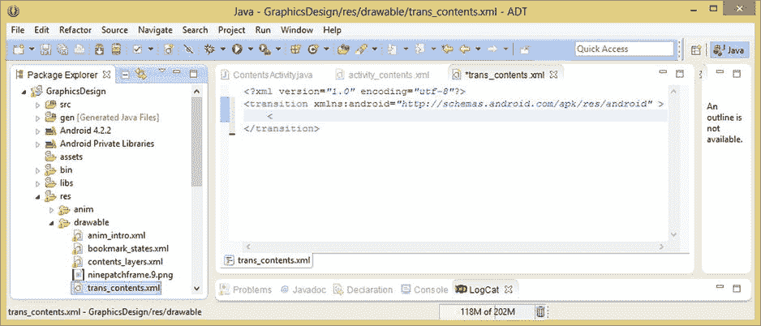

**图 13-3.** 将 `<layer-list>` 父标签（根元素）修改为 `<transition>` 父标签

接下来“变通流程”（即绕开实现 `TransitionDrawable` 时遇到的障碍的工作流程）中的一步，是确认 Eclipse ADT 中对 `<transition>` 根元素的支持缺失到了何种程度。我找到的方法是使用“左尖括号 (<)”工作流程，尝试在 `<transition>` 父标签内部调出支持的父标签参数列表。

通过此操作，我可以判断 `<transition>` 根元素选择选项是否只是被遗漏在 **New Android XML** 对话框的 `Drawable` 部分，还是 Eclipse ADT 完全遗漏了对该根元素的支持。

如图 13-3 所示，当我使用 `<` 键尝试弹出支持的子标签元素列表辅助对话框时，没有任何反应。幸运的是，我知道 `<item>` 标签用于指定图层，并且 `TransitionDrawable` 是 `LayerDrawable` 的子类，使用相同的参数，因此我可以通过手动操作绕开这第二个实现障碍。

由于 Eclipse 没有自动提供 `<item>` `</item>` 子标签容器标签，我们无需像上一章那样将它们拆分为一个 `<item />` 容器；只需手动以这种方式输入即可。

使用 `android:id` 参数将您的第一个过渡图层命名为 `imageSource`，因为它是 `TransitionDrawable` 对象的源图像。

接下来，您将添加 `android:drawable` 参数，该参数将引用您想要用作背景（底层）图层的 `cloudsky.jpg` 图像资源（即过渡图像层叠堆栈中底部的图层）。

完成一个过渡 `<item>` 子标签结构后，您可以复制并粘贴它以创建所需的另一个过渡图层。您的 XML 子 `<item>` 标签应如下所示：

```
<item
    android:id="@+id/imageSource"
    android:drawable="@drawable/cloudsky" />
```

请记住，通过使用 `@drawable` 引用 `cloudsky.jpg` 图像资源，Android 会从一个或多个 `drawable-dpi` 子文件夹中找到该资源的正确分辨率密度版本。在这种情况下，由于该图像具有很好的可伸缩性（正如您在前几章中看到的），您将仅使用一个 1000 像素的高分辨率资源，并让 Android 找到并缩放这一个高分辨率图像资源，因为您知道该图像在任何使用场景下都能很好地缩放。

在此例中，您将使用 `CloudSky` 数字图像资源作为您的过渡背景图像，并在第一个（底层）图层（命名为 `imageSource`）中定义它，用于 `trans_contents.xml` 文件中定义的 `TransitionDrawable` 对象的 XML 定义。

现在，您可以复制并粘贴第一个 `<item>` 标签，以创建第二个过渡图层。让我们使用一个 9-patch 资源，以便查看它是否能在 `TransitionDrawable` 对象中工作。

您的 9-patch 图像资源包含一个 alpha 通道；此透明区域将为您的 `TransitionDrawable` 对象提供一些额外的功能（实现灵活性），您将在本章后面看到。

完整选中并复制 `<transition>` 父标签中的第一个子 `<item>` 标签，然后将其粘贴到其下方，为您的 `TransitionDrawable` 对象的 XML 定义创建一个 `imageDestination` 过渡图层。第一个和第二个过渡对象图层定义的 XML 标记最终将完全如下所示：

```
<item
    android:id="@+id/imageSource"
    android:drawable="@drawable/cloudsky" />
<item
    android:id="@+id/imageDestination"
    android:drawable="@drawable/ninepatchframe" />
```


如图 13-4 所示，你的 XML 没有错误，现在可以进入 UI 布局容器的 XML 定义中，引用这个新的 Drawable。

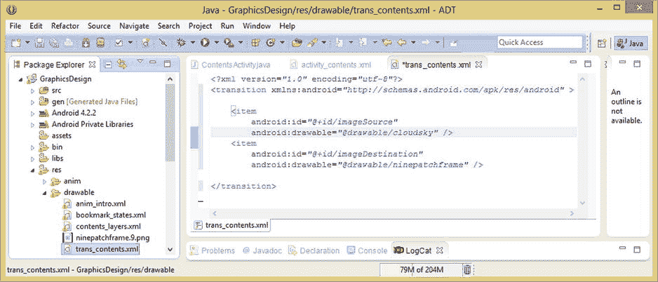

**图 13-4.** 在 Eclipse 的`trans_contents.xml`文件中完成的`TransitionDrawable`对象 XML 定义

请注意在图 13-4 中，`trans_contents.xml`编辑窗格底部没有“图形布局编辑器”选项卡，只有 XML 编辑选项卡。这是因为 Android 的可绘制对象（定义）不可直接渲染，而视图对象（或`ViewGroup`布局容器对象）则可以。

`trans_contents.xml`是一个定义文件，用于定义图像资源层，但你仍需在`ImageView`对象内部引用它，才能在 ADT 或 Android 操作系统中可视化该文件。

因此，让我们修改`contents_activity.xml`文件中的`<ImageView>`子标签，通过修改`android:src`参数来显示`TransitionDrawable`对象 XML 定义。你已将现有参数放在标签的第二至第四行，并编辑了指向`trans_contents.xml`文件的图像资源源引用。你将通过以下 XML 标记来完成这一修改（如图 13-5 所示）：

```
<ImageView android:src="@drawable/trans_contents"
android:id="@+id/porterDuffImageView" android:layout_margin="8dp"
android:layout_width="wrap_content" android:layout_height="wrap_content"
android:contentDescription="@string/bookmark_utility" />
```

现在，你的`TransitionDrawable`对象 XML 定义已连接好以供查看，并且你已进入 Eclipse ADT 的正确区域，能够访问“图形布局编辑器”选项卡——正如你现在在图 13-5 的 XML 编辑屏幕底部所看到的。

正如你在最近几章所见，Android 的`Drawable`类（及其子类）对象无法直接可视化。`Drawables`需要通过`View`类（或其子类，如`ViewGroup`）或`Bitmap`类（或其子类，如`BitmapFactory`）对象来引用。在 Android 中，像我所说的“连接一切”，有时需要多层引用以及转换。

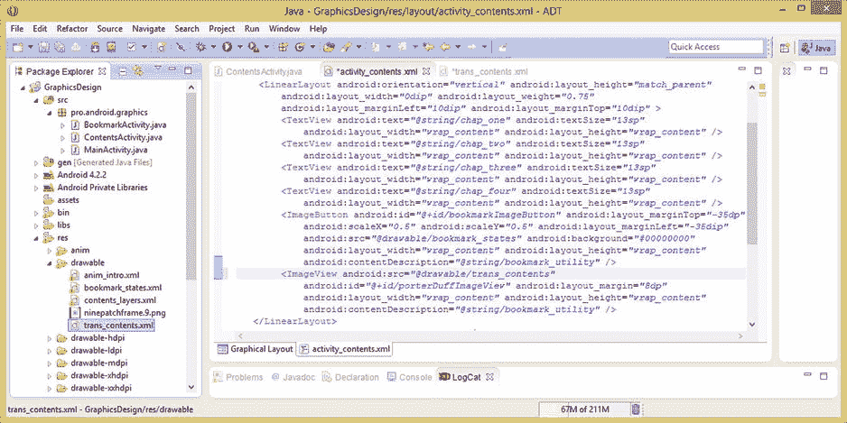

**图 13-5.** 修改`<ImageView>`的`android:src`参数以引用`TransitionDrawable`的`trans_contents.xml`

看看你到目前为止的工作，点击 Eclipse 的“图形布局编辑器”选项卡，这样你就可以可视化这个你在 Android 中使用 XML 为`TransitionDrawable`对象（类）实现的数字图像过渡图板。

如图 13-6 所示，你的`ImageView`用户界面元素（显示在目录 UI 设计的底部）现在显示用于`TransitionDrawable`层合成堆栈的背景`cloudsky.jpg`图像资源。

现在你可以看到，你的`TransitionDrawable`对象在`trans_content.xml`文件中使用 XML 定义，并通过你的`<LinearLayout>` UI 容器`ViewGroup`（它使用你的`<ImageView>` UI 微件容器及其源图像参数）被加载到视图对象中。

现在，你的`TransitionDrawable`对象仅使用 XML 标记就安装并配置完毕，注意到（并感谢）这一点很重要：你完全使用底层 XML 标记定义了一个高级数字图像过渡特效，并且没有使用任何 Java 代码。现在，你可以进入 Java 编程，并跳过用于更复杂方面的各种图像合成环节。

一旦完成了 Java 实例化、导入、引用、事件处理以及所有更复杂的工作，你就能测试并享受你的应用新的数字图像过渡功能。

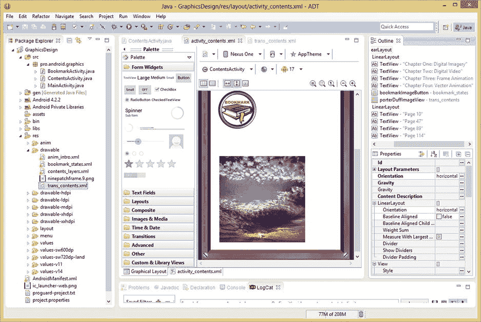

**图 13-6.** 使用 GLE 检查引用`TransitionDrawable` XML 定义的`<ImageView>` UI 元素

现在你准备好处理一些 Java 编码了，请进入 Eclipse，点击中央编辑窗格顶部的`ContentsActivity.java`标签。


### 实例化 ImageButton 与 TransitionDrawable 对象

首先，你需要在 `GraphicsDesign` 应用中添加 Java 代码的对象实例化行，分别用于实例化将控制过渡触发的 `ImageButton` 对象，以及执行图像过渡不透明度混合动画的 `TransitionDrawable` 对象。

第一个要实例化的是你的用户界面元素，即你在 ImageButton 章节中设计的多状态 `ImageButton`。其实现方式与已位于 `ContentsActivity.java` 代码底部的 `ImageView` UI 元素对象非常相似，不过稍后你会将其移至 `onCreate()` 方法的顶部。

我们将 `ImageButton` 对象命名为 `transitionButton`，因为它将触发 `TransitionDrawable` 对象开始动画，因此这是一个合乎逻辑的名称。你将使用以下 Java 代码行来实例化、命名并加载 `ImageButton` UI 元素对象，以便后续使用：

```
ImageButton transitionButton = (ImageButton)findViewById(R.id.bookmarkImageButton);
```

如图 13-7 所示，代码中出现了波浪形的红色错误高亮。请将鼠标悬停在代码中的 `ImageButton` 类引用上，选择 `Import ImageButton` `(android.widget package)` 引用，让 Eclipse ADT 为你编写 `import android.widget.ImageButton;` 这条 Java 代码语句。

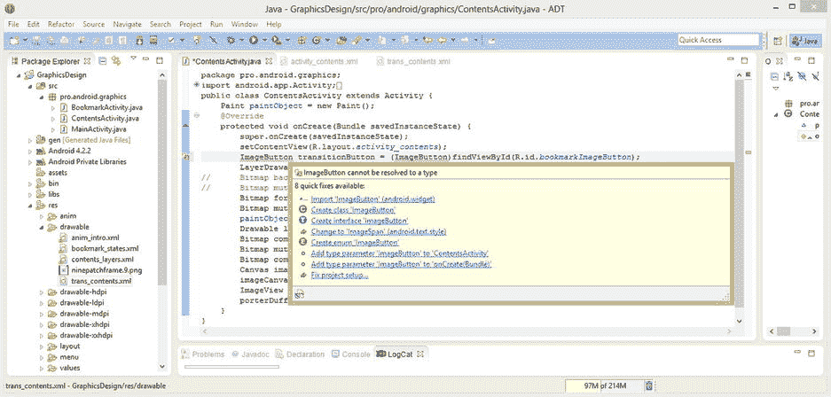

**图 13-7.** 实例化名为 `transitionButton` 的 `ImageButton` 对象，并使用 `findViewById` 引用其 ID

接下来，我们来实例化 `TransitionDrawable` 对象。起初，你将采用最标准的方式，与你处理 `Paint` 对象的方式类似。因此，让我们添加这简短的一行 Java 代码，用来实例化（并命名）你的 `TransitionDrawable`。我们将这个对象命名为 `transition`，并在 `ContentsActivity` 类的顶部使用以下 Java 语句：

```
TransitionDrawable transition;
```

如图 13-8 所示，这条实例化语句现已就位且无错误。请注意，`ImageButton` 的 `Import` 语句现在也已出现在 `Activity` 子类的顶部。

接下来需要添加的 Java 代码行，是用于加载包含 `Drawable` XML 定义的 `TransitionDrawable` 对象的代码，该 XML 定义是在本章前一节中创建的。

这将加载你的 `TransitionDrawable` 对象，该对象目前虽已声明或实例化，但仍是空的（未加载或配置）。为此，你必须获取 `Drawable`（在此例中为 `TransitionDrawable`）对象定义。

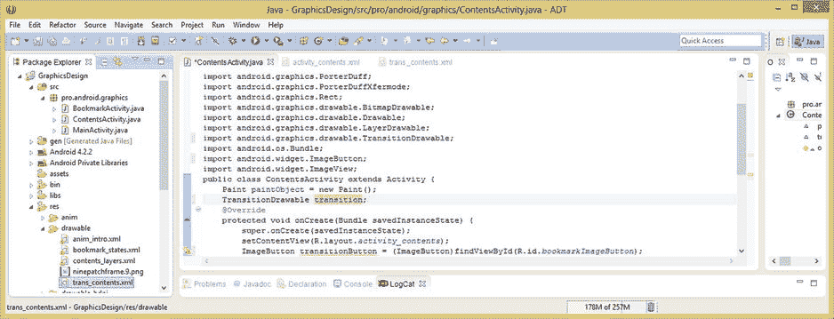

**图 13-8.** 在 `ContentsActivity.java` 类顶部实例化名为 `transition` 的 `TransitionDrawable` 对象

通常，这会通过调用 `.getDrawable()` 方法来实现，该方法在 `transition` `TransitionDrawable` 对象上调用，使用以下 Java 代码：

```
transition.getDrawable(R.drawable.trans_contents);
```

如图 13-9 所示，至少在 Eclipse ADT 看来，这段代码也是无错误的。你可以看到 Eclipse 中有一个警告，在图 13-8 和图 13-9 中均有显示，原因是你尚未使用 `transitionButton` `ImageButton` 对象的实例化。

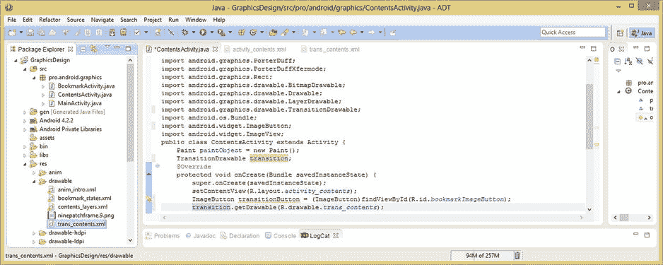

**图 13-9.** 在 `transition` `TransitionDrawable` 对象上调用 `.getDrawable()` 方法以引用 XML

接下来合乎逻辑的编码步骤是向 `ImageButton` 对象添加事件处理，这将消除那个警告，更重要的是，将其连接起来以便能够触发你的 `TransitionDrawable`。

使用点表示法为 `transitionButton` `ImageButton` 对象添加 `.setOnClickListener()` 方法的代码如下：

```
transitionButton.setOnClickListener(new View.OnClickListener(){ code goes here });
```

这会调用 `.setOnClickListener()` 并在该方法内部创建一个新的 `.OnClickListener()`，使用 `new` 关键字并基于 `View` 类。

如图 13-10 所示，你需要将鼠标悬停在这个 `View` 类引用上，并选择 `Import View (android.view)` 以消除波浪形的红色错误高亮。

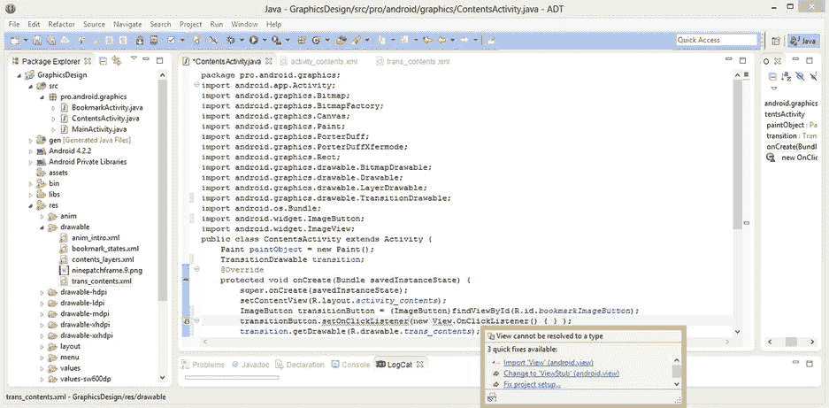

**图 13-10.** 使用 `.setOnClickListener()` 方法为 `transitionButton` `ImageButton` 添加事件监听

如图 13-11 所示，这为你编写了 `import android.view.View;` 语句，但同时也带来了另一个波浪形的红色错误高亮。这次是因为花括号内没有任何内容，而 Android 期望在花括号内实现你的 `.onClick()` 事件处理方法，但目前还没有实现。

再次，将鼠标悬停在波浪形的红色错误高亮上，选择 `Add unimplemented methods` 选项，如图 13-11 所示。Eclipse ADT 将自动为你编写一个 `.onClick()` 事件处理方法的引导代码。

现在，你只需添加 Java 编程逻辑，该逻辑将位于这个空的 `.onClick()` 事件处理方法内部。

当你的用户（最初在软件测试阶段是你自己）点击你在第 9 章中创建的多状态 `transitionButton` `ImageButton` UI 元素时，将调用（触发或执行）你在此事件处理方法内添加的代码。

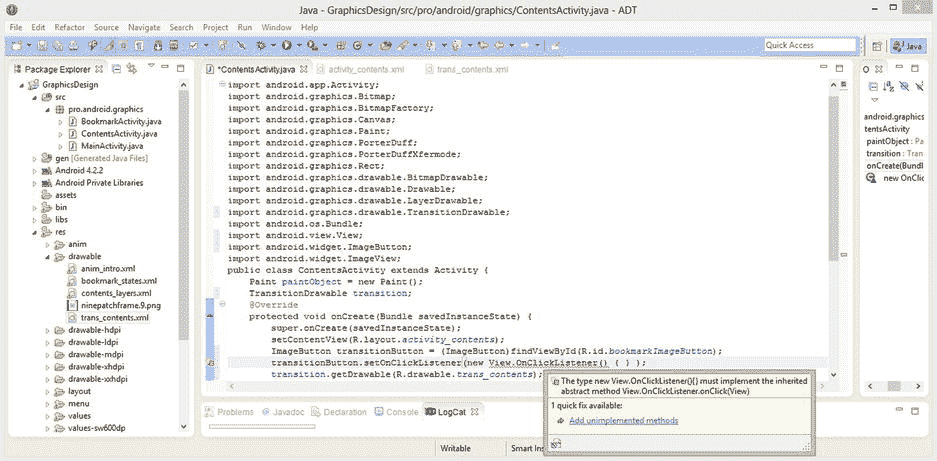

**图 13-11.** 使用 Eclipse 的错误弹出解决方案对话框自动添加未实现的 `onClick()` 方法

当用户点击你的 `ImageButton` 时，你希望发生的是：由你在此处设置的 `TransitionDrawable` 对象控制的图像过渡开始播放，就像启动其他动画资源一样（我们将在接下来的几章中深入探讨这些内容）。

毕竟，对于大多数观众来说，`TransitionDrawable` 对象（即图像过渡）会被视为一种动画。然而，从技术上讲，它仅仅是一种图像不透明度混合合成效果，其中不透明度值通过 Java 编程循环随时间缓慢变化。

因此，所用的方法调用与其他动画 `start` 方法调用非常相似，称为 `.startTransition()` 方法调用。这将是你 `.onClick()` 事件处理方法内部的内容，并在你已实例化并加载的 `transition` `TransitionDrawable` 对象上调用（至少看起来是这样）。

传递给此方法调用的参数是一个整数值，用于确定图像过渡动画所需的时间（以毫秒为单位）。这再次表明 Android 操作系统将图像过渡视为一种动画资源，因为动画资源以毫秒为单位处理，以便开发者对其动态图形资源进行极其精细的时间控制。事件处理代码如下：

```
@Override
public void onClick(View arg0) {
    transition.startTransition(5000);
}
```


如图 13-12 所示，您的 Java 代码仍然没有错误，您可以准备将与 `ImageView` 相关的 Java 编程逻辑（当前位于 `onCreate()` 方法底部）移动到顶部，即 `ImageButton` 和 `TransitionDrawable` 逻辑所在的位置。这样做是为了让所有相关代码位于同一位置，并且让 `ImageView` 与其他两个用于实现数字图像过渡的 Java 对象一起实例化和初始化。

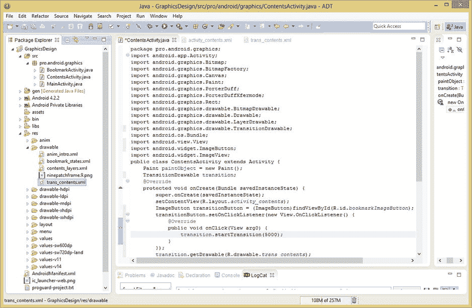

**图 13-12.** 编写 `onClick()` 事件处理方法，调用 `transition` 对象的 `.startTransition()` 方法

接下来，请转到 `onCreate()` 方法的底部，剪切并粘贴那两行用于创建 `ImageView` 并将其命名为 `porterDuffImageView` 的代码，并调用 `porterDuffImageView` 对象的 `.setImageBitmap()` 方法。将这两行 Java 代码放在调用 `transition`（`TransitionDrawable` 对象）的 `.getDrawable()` 方法的那行代码之后，如图 13-13 所示。

由于您的 `transition`（`TransitionDrawable` 对象）是 `Drawable` 对象类型，而不是 `Bitmap` 对象类型，因此请将 `.setImageBitmap()` 方法调用改为 `.setImageDrawable()` 方法调用，然后将 `transition` 对象作为当前要接入 `ImageView` 对象的 `Drawable` 对象（类型）进行引用。如图 13-13 所示，您的代码仍然没有错误，现在可以准备使用 Nexus One 模拟器测试这段代码了。

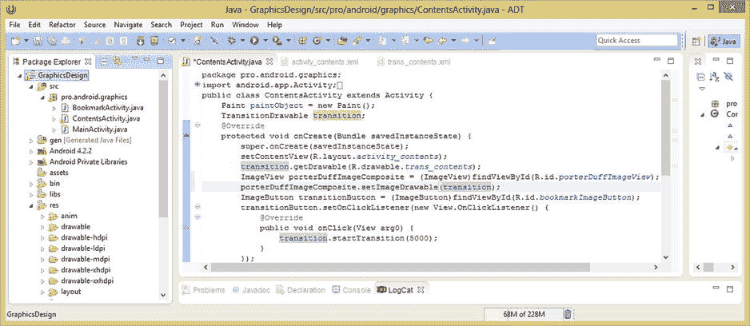

**图 13-13.** 将 `ImageView` 和过渡逻辑移到 `ImageButton` 上方，并调用 `.setImageDrawable()`

右键单击您的 `GraphicsDesign` 项目文件夹，使用 `Run As` ➤ `Android Application` 工作流程启动 Nexus One 模拟器。当您点击 `MENU` 按钮并选择 `Table of Contents` 菜单项时，`GraphicsDesign` 应用崩溃了！现在我们需要进入调查模式，找出导致此问题的原因。我将在此带您完成整个过程，因为这在应用开发中很常见，所以我希望您能了解其中的工作（和思考）过程。

我首先在在线开发者文档中查找 `TransitionDrawable` 类是在何时被添加到 Android 操作系统中的，因为这能告诉我该功能正常运行所需的 API 级别支持。我的研究发现，要使用 Android 中的这些图像过渡功能，需要 API 级别 16 的支持。因此，下一步是在 Eclipse 中右键单击项目层次结构底部的 `AndroidManifest.xml` 文件，在中央编辑窗格中打开该文件，查看为此应用定义的 API 级别支持（最低和目标）。

当您执行此操作时，您会看到应用的最低 SDK 支持级别设置为 API 级别 8，因此需要通过将 `<uses-sdk>` 子标签的参数从 `android:minSdkVersion="8"` 改为 `android:minSdkVersion="16"`，将其更改为 API 级别 16，如图 13-14 所示。

现在您可以再次使用 `Run As` ➤ `Android Application` 工作流程，测试您的 `GraphicsDesign` 应用，看看这个 `AndroidManifest.xml` 应用配置参数的修改是否解决了问题。

这应该确实能解决问题，因为您的 SDK 设置与您正在 Android 操作系统中进行的图像过渡操作不匹配。

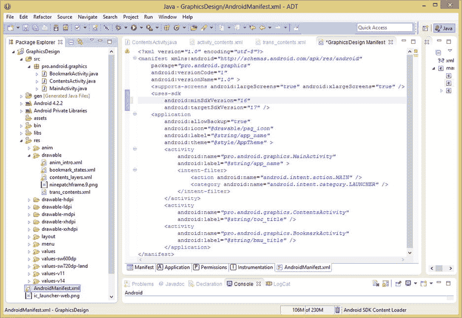

**图 13-14.** 编辑 `AndroidManifest.xml` 文件，将应用的最低 SDK 版本升级到 Level 16

当您点击模拟器（硬件）的 `MENU` 按钮并选择 `Table of Contents` 菜单项时，仍然会遇到运行时错误，导致 Android 崩溃。我接下来查找 Eclipse 在代码中未能发现的这个 Bug 的步骤是，查看 ADT 底部的 `LogCat` 选项卡。

`LogCat` 显示在与 `TransitionDrawable` 及其如何加载 `Drawable` 资源相关的代码行中存在错误，因此我将尝试一种不同的方法来实例化和加载这个 `TransitionDrawable` 对象。第二种方法更符合我们对 `ImageView` 和 `ImageButton` 的实例化方式。这行新的、带有 `final` 访问控制修饰符的 Java 代码将创建、命名、转换并调用两个链式方法 `.getResources()` 和 `.getDrawable()`，全部使用一行非常长的 Java 代码，如图 13-15 顶部附近所示。

第二种编写对象实例化和配置的方法无疑更复杂，并且通过链式调用调用了更多方法。但我希望这能让图像过渡功能正常运行。我找不出我们最初设置的方式为什么不能同样工作，但事实是模拟器正在崩溃，所以我接下来尝试这种方法。

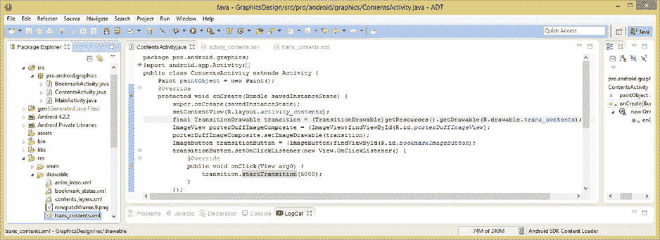

**图 13-15.** 更改 `TransitionDrawable` 的实例化方式，使用类型转换和 `.getResources().getDrawable()`

Eclipse 没有在这种新的实例化和配置 `TransitionDrawable` 的方法中发现任何错误，该方法使用了以下 Java 代码：

```
final TransitionDrawable transition = (TransitionDrawable)getResources().getDrawable(R.drawable.trans_contents);
```

第三次使用 `Run As` ➤ `Android Application` 工作流程，启动 Nexus One 模拟器；如图 13-16 所示，它运行成功了！

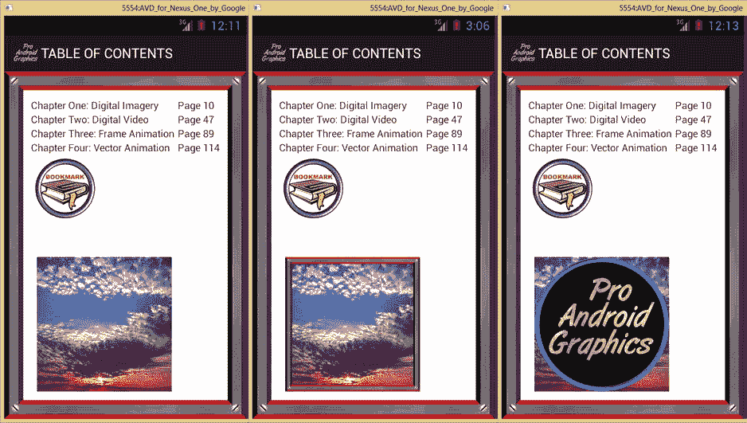

**图 13-16.** 使用 Nexus One 模拟器测试您的 `TransitionDrawable`，使用不同的可绘制图像资源

从这行新代码来看，您似乎需要先调用 `TransitionDrawable` 的 `.getResources()` 方法来获取包含 `TransitionDrawable` 对象定义的 `Drawable` 对象。然后，`getResources()` 方法将这个 `Drawable` 资源对象数据传递给您的 `.getDrawable()` 方法调用。由于 `transition`（`TransitionDrawable` 对象）是在事件处理方法内部调用的，而这些方法又嵌套在 `onCreate()` 方法内部，因此您使用了 `final` 访问控制修饰符，以允许 `onCreate()` 方法内部的 Java 代码能够访问到在 `onCreate()` 方法顶部声明的 `transition` 对象。


### 使用 `.reverseTransition()` 方法实现乒乓过渡效果

现在你已经实现了图像过渡，可以稍微调整代码或图像资源，看看 `TransitionDrawable` 对象都能做些什么。你可能已经注意到，我使用了一张九宫格图像作为过渡图像资源之一，没错，这是我首次测试九宫格资源是否能与 `TransitionDrawable` 对象配合使用。

如图 13-16 中间部分所示，九宫格图像资源作为 `TransitionDrawable` 对象中的子对象（层）时，工作状态良好。接下来，我想尝试 `TransitionDrawable` 对象提供的其他方法调用，即 `.reverseTransition()` 方法调用，它能在数字图像过渡中实现类似乒乓动画的效果。

在你的 `onClick()` 事件处理方法中，将 `.startTransition()` 方法调用改为 `.reverseTransition()` 方法调用，使用以下 Java 代码行：

```
transition.reverseTransition(5000);
```

这段代码没有错误，可以在 Eclipse 中看到，如图 13-17 所示。

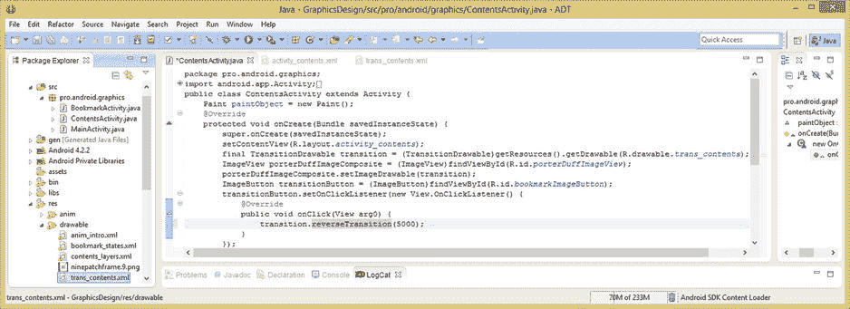

**图 13-17.** 将 `.startTransition()` 方法调用改为 `.reverseTransition()` 方法调用，实现乒乓过渡效果

接下来，使用 `Run As ➤ Android Application` 工作流程，在 Nexus One 模拟器中测试你的新代码。正如你所见，现在每次点击 `ImageButton` UI 元素时，九宫格边框资源会淡入然后淡出，就像乒乓动画一样。使用 `.startTransition()` 方法时，淡出仅在一个方向（淡入）进行，因此这种替代方法调用实际上为你实现 `TransitionDrawable` 对象的动画提供了极大的灵活性。

接下来，让我们编辑你的 `TransitionDrawable` 对象的 XML 定义，用一个普通（非九宫格）图像资源替换 `ninepatchframe` 对象。你将编辑第二个 `<item>` 标签，使其引用 `bookmark0.png` 资源文件，而不是当前的 `ninepatchframe.9.png` 文件。点击 Eclipse 顶部的 `trans_contents.xml` 选项卡，进行必要的编辑。

这两个 `<item>` 子标签的最终 `trans_contents.xml` `TransitionDrawable` 对象的 XML 定义标记，如图 13-18 所示，应完全如下所示：

```
<item
    android:id="@+id/imageSource"
    android:drawable="@drawable/cloudsky" />
<item
    android:id="@+id/imageDestination"
    android:drawable="@drawable/bookmark0" />
```

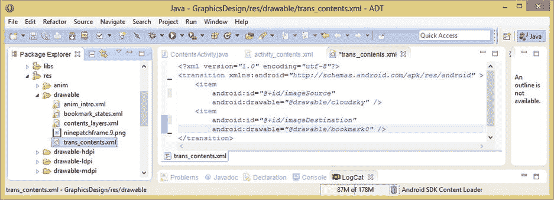

**图 13-18.** 编辑 `trans_contents.xml` `TransitionDrawable` 定义，将目标图像更改为书签

现在，你可以使用 `Run As ➤ Android Application` 序列来查看使用书签图像资源的新过渡图像交叉淡入效果，它会在 `cloudsky` 背景板上平滑地淡入。值得注意的是，使用内部带有 alpha 通道的 PNG32 图像，可以真正增强你通过 Android 图像过渡代码所能实现的效果；不再是一张图像替换另一张，而是可以实现更高级的效果。

现在，让我们通过同时使用 `ImageView` UI 元素的源（前景）图像层和背景图像层，将图像过渡与合成结合起来。

### 通过 ImageView 实现高级 TransitionDrawable 合成

让我们回到你的 `activity_contents.xml` UI 布局定义文件，编辑 `<ImageView>` 子标签，将 `android:src` 参数更改为使用你的 `ninepatchframe` 图像资源作为前景图像层，然后添加一个 `android:background` 参数，引用你的 `trans_contents.xml` XML `TransitionDrawable` 对象定义，如图 13-19 所示。

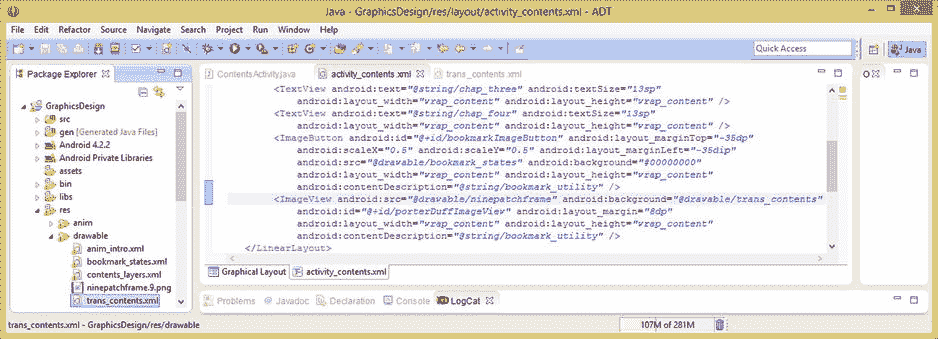

**图 13-19.** 将 `android:src` 参数更改为 `ninepatchframe`，并将 `android:background` 更改为 `trans_contents`

接下来，进入你的 `ContentsActivity.java` Activity 子类编辑选项卡，将 `.setImageDrawable(transition)` 方法调用及其参数更改为 `.setBackground(transition)`，这样它就将你的 `TransitionDrawable` 对象设置为 `ImageView` 对象的背景层，而不是前景（源）图像层。如图 13-20 所示。

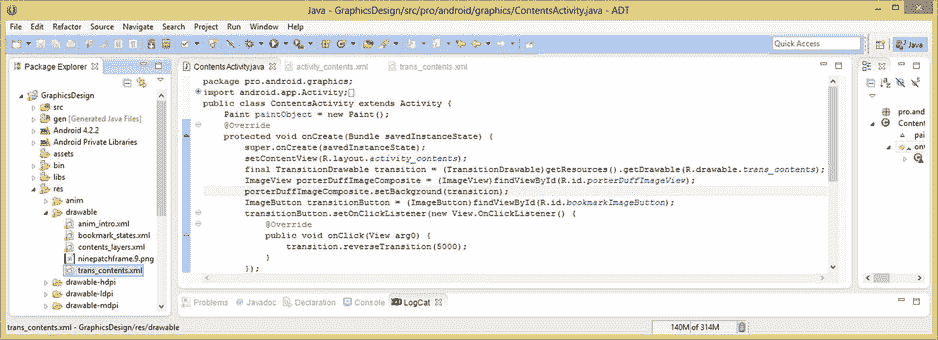

**图 13-20.** 将 `ImageView` 对象的 `.setImageDrawable()` 方法调用更改为 `.setBackground()` 方法调用

现在，让我们用三个图像资源来测试这种更高级的 `TransitionDrawable` 对象用法，其中两个使用 alpha 通道，一个是九宫格资源。我们将所有能用的都抛给 `TransitionDrawable`，看看它能否处理：前景和背景图像层、九宫格图像资源、带有 8 位 alpha 通道的 32 位 PNG 图像——所有这一切都由一个多状态 `ImageButton` 触发。

如图 13-21 所示，所有这些新的代码和图像资源都如预期般协同工作，使用 `ninepatchframe.9.png` 图像资源作为覆盖 `TransitionDrawable` 的新前景图像层，而 `TransitionDrawable` 现在安装在 `ImageView` UI 对象的背景图像层中，每次点击 `ImageButton` UI 元素时都会淡入淡出。

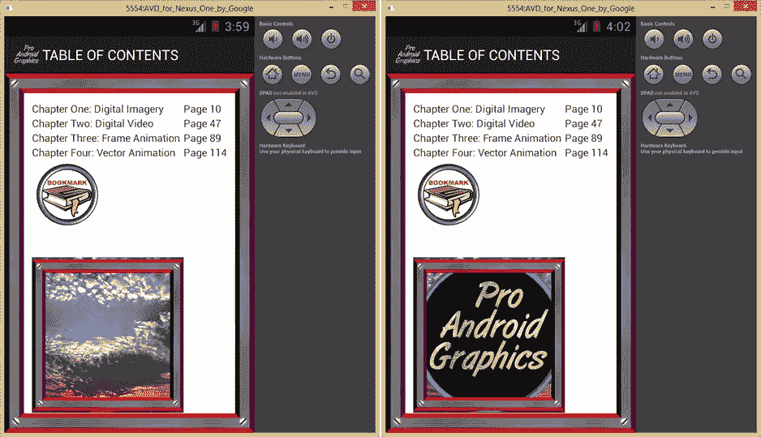

**图 13-21.** 使用 `TransitionDrawable` 测试你的 `ImageView` 前景和背景图像合成

如你所见，`TransitionDrawable` 对象的动画图像资源可以用作任何 Android `ImageView` 类（包括 `ImageButton`）的前景（源图像层）图形设计元素或背景图形设计元素，因此请确保在你未来的 Android 应用程序图形设计中创造性地使用这一强大功能。

随着你阅读本书的深入，技术变得更加精进，请记住，你学到的（以及将要学到的）所有内容都可以通过正确的 XML 标记和 Java 编码结构相互结合使用。这包括图层、`PorterDuff` 混合与传输模式、alpha 通道（PNG32）、九宫格、动画、数字视频等等！


### 小结

在第十三章中，你学习了如何在安卓系统中通过`TransitionDrawable`类使用数字图像过渡效果。

我们首先探讨了过渡效果如何用于模拟数字新媒体应用中的动画这一核心概念，以及过渡效果与基于图层的合成流水线之间的密切联系。

由于在前几章中我们已经介绍了图像合成、图层和混合等内容，本章关于`TransitionDrawable`的内容恰好为接下来将要学习的帧动画和矢量（程序化）动画章节做好了铺垫。这些后续章节将涵盖更高级的 2D 动画类型，例如使用超过两个图像资源来创建超越基本图像淡入淡出效果的 2D 动画。

接着，我们深入了解了`TransitionDrawable`类及其与上一章介绍的`LayerDrawable`类之间的紧密关系。我们学习了`TransitionDrawable`类的`.startTransition()`和`.resetTransition()`这两个 Java 方法调用。

随后，我们研究了根元素`<transition>`父级 XML 标签及其子标签`<item>`。然后你学会了如何使用 XML 定义文件来定义`TransitionDrawable`对象，并使用`trans_contents.xml`文件定义了你自己的`TransitionDrawable`对象，指定了源图像层和目标图像层。你为这些层命名并分配了图像资源，之后在你的`TransitionDrawable` Java 代码中引用了这些资源并进行加载和使用。

接着，你打开了 Activity 的 Java 代码，为你的多状态`ImageButton` UI 元素实现了`TransitionDrawable`对象和事件处理代码。你学习了如何实例化`TransitionDrawable`对象，并使用`.getResources()`和`.getDrawable()`方法加载`Drawable`资源数据。你使用了一个九宫格（9-patch）图像资源来确保其在`TransitionDrawable`类框架内正常工作，同时也尝试了使用普通图像资源。

然后，你尝试使用`TransitionDrawable`类的另一种方法调用`.reverseTransition()`，这使你能够在源图像和目标图像的混合过渡之间来回“反弹”。

你以多种不同方式测试了代码并以不同方式进行了连接，以确定图像混合过渡和渲染流水线中究竟发生了什么。接着，你进行了更高级的操作，进入`ImageView`，同时实现了前景图像层和背景图像层，这样你就可以结合`TransitionDrawable`对象使用三个图像资源，其中两个资源带有 Alpha 通道。这种方法运行良好。

在下一章中，你将学习如何在安卓操作系统中使用帧动画以及如何使用`AnimationDrawable`类。这将使你能够通过数字图像动画将你的安卓数字图像动画图形设计和特效工作提升到一个更高的水平。

# 基于帧的动画：使用 AnimationDrawable 类

### 摘要

在第十四章中，我们将更深入地了解在安卓中实现帧动画的 Java 编码方面。我们在第三章中已经探讨了基于帧的动画背后的概念，以及如何使用 XML 定义文件工作流程来设置帧动画，因为我认为你应该能够在本书的早期阶段就让基本动画在你的应用中运行起来。

在第十四章中，我们将更深入地了解在安卓中实现帧动画的 Java 编码方面。我们在第三章中已经探讨了基于帧的动画背后的概念，以及如何使用 XML 定义文件工作流程来设置帧动画，因为我认为你应该能够在本书的早期阶段就让基本动画在你的应用中运行起来。

我们本章重点要完成的任务是如何只使用 Java 代码（不使用任何 XML）来实现帧动画，这比我们在第三章中为应用启动画面实现帧动画的方式要更高级一些，因为 Java 编码在结构上通常比 XML 标记要复杂得多。

使用 Java 方法完成所有操作，将让你能够了解`AnimationDrawable`类（即安卓操作系统的帧动画类）中可用的方法如何通过你的安卓应用程序代码的 Java 端来运作。这样，如果你想在这段帧动画代码内部或周围添加其他 Java 代码功能，那么你在帧动画处理流水线中所做的一切都将使用 Java 编程语言来实现。

我这样做的一个原因是，如果你用谷歌搜索诸如帧动画、程序化动画、过渡效果以及类似的安卓图形相关主题，开发者提出的常见需求之一似乎总是“如何仅使用 Java 代码而不使用 XML 来实现这个功能”。我们接下来就要做这件事。

### AnimationDrawable 类：帧动画引擎

安卓的`AnimationDrawable`类是`Drawable`类的一个间接子类，而`Drawable`类又是`java.lang.Object`主类的一个直接子类。`AnimationDrawable`类是`DrawableContainer`类的一个直接子类，而`DrawableContainer`类又是安卓`Drawable`类的一个直接子类。因此，`AnimationDrawable`这个安卓 Java 类的层次结构如下：

```
java.lang.Object
  > android.graphics.drawable.Drawable
    > android.graphics.drawable.DrawableContainer
      > android.graphics.drawable.AnimationDrawable
```

因此，作为`Drawable`的子类，`AnimationDrawable`类实现了`Drawable`和`DrawableContainer`类的所有特性，你很快就会学到更多相关内容。

`AnimationDrawable`类还实现了一些额外的帧动画特性，例如帧资源定义、循环参数和帧显示持续时间。这些特性是实现帧动画所必需的，并且正如预期的那样，是`AnimationDrawable`类所特有的。

`AnimationDrawable`类也是`android.graphics.drawable`包的一部分。正因如此，其导入语句引用了`android.graphics.drawable.AnimationDrawable`包导入路径，你将在本章后续编写 Java 应用以实现`AnimationDrawable`对象用于数字图像动画（以实现启动画面动画编程目标）时看到这一点。

实例化`AnimationDrawable`对象是为了创建逐帧动画，通常称为帧动画，有时也称为位图动画或光栅动画。

一个`AnimationDrawable`对象总是由一系列`Drawable`对象定义，这些`Drawable`对象可以用作`View`对象的背景图像层，或用作`View`或`ViewGroup`类型对象中的前景（源）图像层。

无论你使用哪个`View`（`ViewGroup`）图像容器，请记住你可以在图像资源中使用 Alpha 通道。如果利用这一点，你将能够在包含该动画的`View`对象内部以及包含该`View`的父级`View`对象内部对动画进行合成。这对于`ViewGroup`布局容器也同样适用。

正如你在第三章中学到的，创建帧动画的简单方法是使用`<animation-list>`父标签或根元素在 XML 文件中定义动画。完成后，你可以将这个动画 XML 定义（它将变成你的应用的一个`Drawable`资源）放入项目的`/res/drawable`文件夹中，并将其设置为某个`View`对象的背景或甚至源图像资源。要触发动画，你可以调用`.start()`方法来运行动画。现在，让我们用 Java 来完成所有这一切！


### DrawableContainer 类：一个可包含多个 Drawable 的 Drawable

由于 `AnimationDrawable` 类是 `DrawableContainer` 类的直接子类，并因此继承了其所有功能，在开始编写仅使用 Java 编程语言实现帧动画的代码之前，我将花一些时间来介绍这个类。

Android 的 `DrawableContainer` 类是 `Drawable` 类的直接子类，而 `Drawable` 类又是 `java.lang.Object` 主类的直接子类。Android 的 `DrawableContainer` 类属于 `android.graphics.drawable` 包。请注意，你永远不会在 Import 语句中使用它，因为它被设计用于创建其他可导入的子类。`DrawableContainer` 类的层级结构如下所示：

```
java.lang.Object
  > android.graphics.drawable.Drawable
    > android.graphics.drawable.DrawableContainer
```

作为 `Drawable` 的子类，`DrawableContainer` 类实现了 `Drawable` 类的所有特性。在你学完其所有子类后，将在未来的一章中详细了解这些特性。

在 Android 操作系统中，`DrawableContainer` 有三个直接子类。它们是本章将要介绍的 `AnimationDrawable` 类，以及 `LevelListDrawable` 类和 `StateListDrawable` 类。

`LevelListDrawable` 类旨在让开发者能够管理多个不同的 `Drawable` 对象。每个对象在 XML 定义文件中使用名为 `android:maxLevel` 和 `android:minLevel` 的参数分配一个最大值和一个最小值。然后，要根据你设置的这些级别更改 `Drawable`，请使用 `public boolean .onLevelChange()` 方法。如果调用该方法时 `Drawable` 确实发生了更改，它将返回 `true` 值。`LevelListDrawable` 的一个示例是 Android 操作系统中用于可视化硬件剩余电量的电池电量指示器。

`StateListDrawable` 类允许你为单个 `Drawable` 分配任意数量的图像，之后通过引用字符串 ID 值来切换可见项。`StateListDrawable` 对象通过使用带有 `<selector>` 父标签的 XML 文件来定义。然后，使用嵌套的 `<item>` 元素来定义 `StateListDrawable` 的子 `Drawable` 对象。`StateListDrawable` 类拥有更多 XML 参数，其中大部分是 `android:state_` 参数，例如 `state_active`、`state_activated`、`state_checked`、`state_checkable`、`state_last`、`state_first`、`state_middle`、`state_focused`、`state_pressed` 等等。

`DrawableContainer` 本质上是 Android 所谓的“辅助”类。创建这个类是为了包含多个 `Drawable` 对象，并且能够轻松选择要使用哪一个。这个类并不旨在被直接使用；不过，你可以继承它以创建自己的类，或者你可以使用其已为你编码好的子类之一，只需在类的顶部使用方便的 Import 语句即可。

### 使用 Java 创建你的 `AnimationDrawable` 闪屏

在接下来的两章中，你将完全替换当前在 `MainActivity.java` Activity 子类闪屏上使用的由 XML 生成的动画，改用完全相同的由 Java 生成的动画。这样你就能确切地了解如何仅使用 Java 代码且无需任何 XML 定义文件来进行相同的帧动画和过程动画编程。

启动 Eclipse，右键单击你的 `MainActivity.java` 文件将其打开，然后删除 `ImageView` 的 Import 语句（你很快会将其作为新工作流程的一部分重新添加回来），以及 `AnimationDrawable`、`Animation` 和 `AnimationUtils` 类的 Import 语句。

接下来，删除类中除了 Eclipse 在第 2 章为你创建的核心 `onCreate()` 语句之外的所有代码语句；你可以保留 `onCreateOptionsMenu()` 和 `onOptionsItemSelected()` 方法，这样你就能继续访问（测试）应用的其他 Activity 子类。

现在你拥有了一块空白画布，至少对于你的闪屏来说是这样。你可以在帧动画章节和下一章关于过程动画（`Animation` 类）的内容中，全部使用 Java 代码重新创建它。

你要做的第一件事是在 `MainActivity` 类的顶部声明你的 `AnimationDrawable` 对象，并给它起一个逻辑名称，比如 `frameAnimation`，如图 14-1 所示。

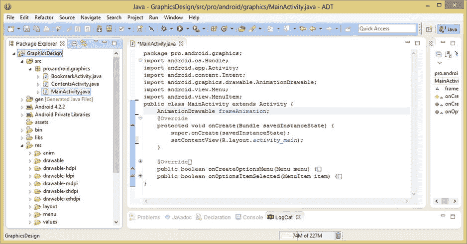

图 14-1.

在 `MainActivity.java` 类的顶部实例化一个 `AnimationDrawable` 对象并将其命名为 `frameAnimation`

你使用以下基本的对象声明 Java 语句来实现这一点：

```
AnimationDrawable frameAnimation;
```

接下来，你需要创建一个名为 `animStarter` 的类，它实现 `Runnable` 接口；在该类内部，你将编写一个 `run()` 方法，其中包含 `.start()` 方法。你需要通过你的 `frameAnimation` 对象调用该方法，以启动你的 `frameAnimation` `AnimationDrawable` 对象。

让我们先进一步了解 `Runnable` 类，然后再编写这段代码。


### 使用 Android Runnable 类运行动画

你将利用 Java 的 `Runnable` 公共接口及其 `run()` 方法，在一个独立的线程中运行动画 (`AnimationDrawable`)，从而让它能够异步处理 `Drawable`（在此例中为 `BitmapDrawable` 帧）。

这个 Java `Runnable` 接口并非你的主类 `java.lang.Object` 的直接子类（甚至根本不是一个类，而是一个接口）；我想凡事总有第一次吧！

实际上，`Runnable` 与 `Object` 处于同一个 `java.lang` 层级，因此应引用为 `java.lang.Runnable` 接口；作为 `java.lang` 包的核心成员，你无需显式将其导入类中即可利用其强大功能，你将如图 14-2 所示看到这一点。

除了 `AnimationDrawable` 子类外，Java 的 `Runnable` 接口还有十个实现其接口的间接子类，而其中一个恰好是 Android 的 `Thread` 类。

这可能会让你对 `Runnable` 类和 `run()` 方法的用途有所了解。没错，它们就是用来生成线程的！线程是操作系统进程，能够分配自己独立的内存空间，有时还能分配自己的 CPU（尤其是在多核系统硬件上），从而使动画、下载或视频播放（编解码器）等处理密集型任务能够异步运行。

虽然异步字面意思就是不同步，但它更准确地表示一个不会与用户界面线程中当前正在进行的处理任务发生干扰（不必被迫同步）的进程。UI 线程是应用程序的主线程，负责处理诸如将 UI 元素写入显示屏以及根据需要对其进行缩放（例如，当用户将设备屏幕旋转 90 度时）等任务。

实现 `Runnable` 并在其 `run()` 方法中调用 `.start()` 方法的 Java 代码，与它强大的功能相比，简单得令人难以置信。

```
class animStarter implements Runnable {
    public void run() {
        frameAnimation.start();
    }
}
```

如图 14-2 所示，代码没有错误，并且在你的类代码顶部声明的 `frameAnimation` `AnimationDrawable`，现在通过实现 Java `Runnable` 接口的 `animStarter` 类中 `run()` 方法内的 `.start()` 方法被使用。

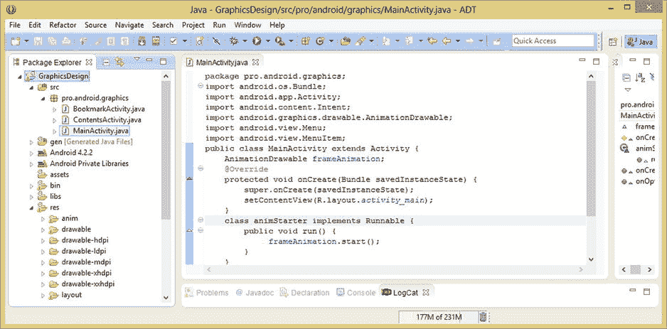

图 14-2. 编写 animStarter 类，实现 Runnable 接口，并在其内部使用 `.start()` 方法编写一个 `run()` 方法

现在你已经有了实现 Java 公共接口 `Runnable` 的 `animStarter` 类，以及用于运行（启动和播放）你的 `frameAnimation` `AnimationDrawable` 的 `run()` 方法，你可以创建一个 `setUpAnimation()` 方法，该方法将设置好所有必要的条件，使得这个 `.start()` 方法能够启动（播放）一个启动屏动画。

### 为你的动画创建 setUpAnimation() 方法

你需要在 `onCreate()` 方法中做的第一件事就是调用 `setUpAnimation()` 方法。请使用以下 Java 代码来实现：

```
setUpAnimation();
```

如图 14-3 所示，Eclipse 会在该方法调用下方放置波浪形的红色下划线错误高亮，因为该方法当前不存在。

将鼠标悬停在错误高亮上，看看是否能让 Eclipse ADT 为你编写一些代码，因为通常可以通过这些弹出对话框来调用。果然，有一个“创建方法 `setUpAnimation()`”的选项，点击该选项的链接，这个启动方法代码就会被为你编写好，为你省去大约三十多次击键。

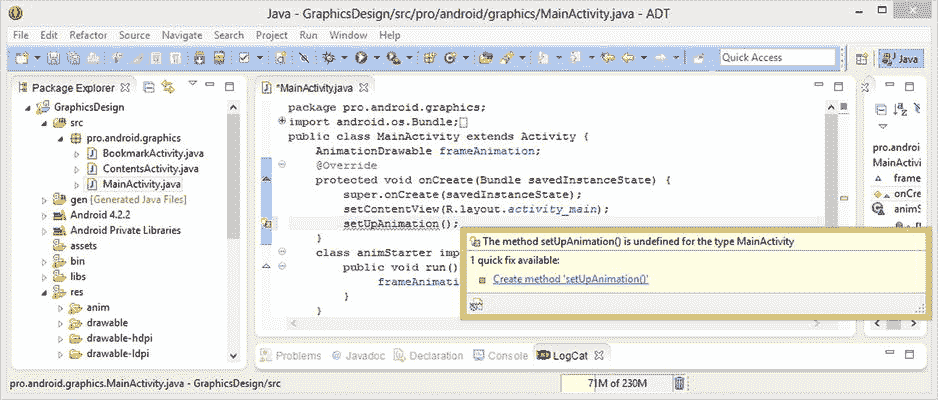

图 14-3. 在你的 `onCreate()` 方法中添加一个 `setUpAnimation()` 方法调用，并让 Eclipse 为你创建它

一旦 `private void setUpAnimation()` 方法就位，删除其中的注释，并将其替换为你之前删除的 `ImageView` 对象实例化代码。记住，熟能生巧！如果你忘记了如何实例化、命名并将其与你的 XML 定义关联，以下是这行代码：

```
ImageView pag = (ImageView) findViewById(R.id.pagImageView);
```

如图 14-4 所示，你需要将鼠标悬停在 `ImageView` 类引用上，并选择“导入 ImageView (android.widget)”选项。

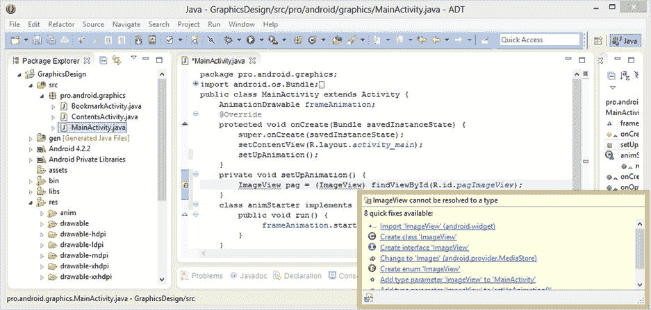

图 14-4. 添加 ImageView 对象实例化，并使用 `findViewById()` 方法为其命名并加载

现在你的 `ImageView` 对象已经准备好接收来自 `frameAnimation` `AnimationDrawable` 对象的图像输出，你可以继续编写设置 `AnimationDrawable` 对象本身的 Java 代码了。这部分之前是通过 XML 标记处理的，但现在你将使用 Java 代码来完成。

### 创建一个新的 AnimationDrawable 对象并引用其帧

你需要做的第一件事是初始化你的 `frameAnimation` 对象，该对象在 `MainActivity` 类的顶部声明了，但尚未初始化。你将使用 Java 的 `new` 关键字，通过 `AnimationDrawable()` 构造方法创建一个 `AnimationDrawable` 对象，然后将其赋值给你为 `Activity` 子类编写的第一行代码中创建的 `frameAnimation` 对象。这可以通过以下 Java 代码行来实现：

```
frameAnimation = new AnimationDrawable();
```

如图 14-5 所示，代码没有错误，你的 Java 对象现在已经实例化、构造完成，甚至通过 `animStarter()` 方法触发。然而，它基本上仍然是一个空的 `AnimationDrawable` 对象，所以接下来让我们编写 Java 代码来为其加载动画帧数据。

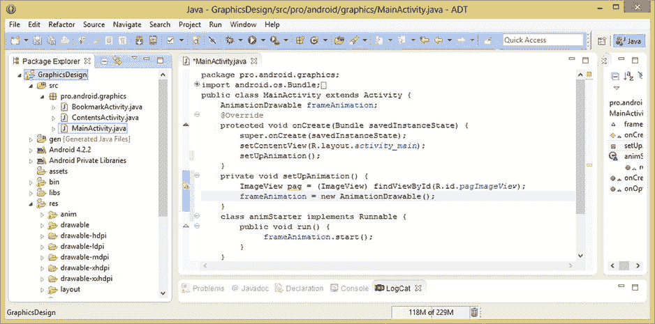

图 14-5. 使用 `new` 关键字和 `AnimationDrawable()` 构造函数初始化 frameAnimation AnimationDrawable 对象

请注意，在图 14-5 中，你的 `pag` `ImageView` 对象尚未被使用，因此它附带了波浪形的黄色警告下划线高亮。你可以暂时忽略它，因为你很快会在将 `AnimationDrawable` 连接到 `ImageView` 进行显示时使用到这个对象。


### 使用 `AnimationDrawable` 类的 `.addFrame()` 方法

现在你已经构建了一个空的 `AnimationDrawable` 对象，可以使用 `.addFrame()` 方法向该对象添加帧及其持续时间，其方式与你之前使用 XML `<animation-list>` 父标签和 `<item>` 子标签的方式大致相同。

你将像上一章那样，在 `.addFrame()` 方法调用的内部，使用方法链来提取你的 `Drawable` 引用，使用以下略显冗长的 Java 代码结构：

```
frameAnimation.addFrame(getResources().getDrawable(R.drawable.pag0), 112);
```

这调用了 `frameAnimation` `AnimationDrawable` 对象上的 `.addFrame()` 方法。在 `.addFrame()` 方法内部，为了引用一个 `Drawable` 对象参数，你使用 `getResources().getDrawable()` 方法链来获取位于 `/res/drawable-xhdpi` 文件夹中的 `pag0.png` 图像资源。

第二个参数是以毫秒为单位的持续时间，如你所知，第一帧使用 112 毫秒值，其余帧使用 111 毫秒，你将复制并粘贴这些值。如图 14-6 所示，你的代码没有错误，可以继续。

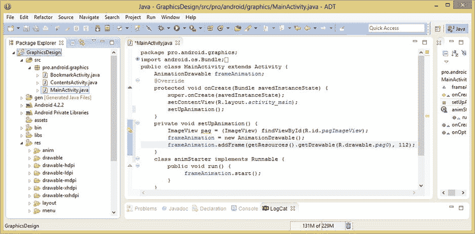

图 14-6. 调用 `.addFrame()` 方法和 `getResources().getDrawable()` 方法链来加载帧

现在，选中你刚写的整行代码，在其下方再复制粘贴八次，依次指定图像资源文件名 `pag1.png` 到 `pag8.png`（当然，不带 `.png` 扩展名），并为每个文件指定 111 毫秒的帧持续时间，总共加起来为一秒。完整的帧加载代码行如图 14-7 所示。

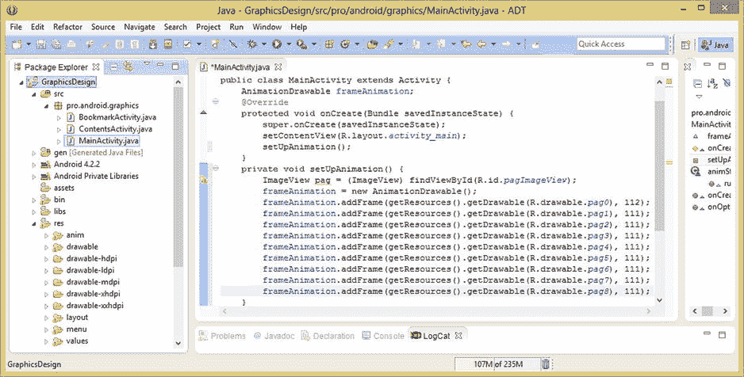

图 14-7. 将 `frameAnimation.addFrame()` 方法调用语句在其下方复制八次并进行编辑

接下来，你将配置 `AnimationDrawable` 的循环方式，然后将其连接到 `ImageView`，并且你将了解 Android 的 `.post()` 方法调用。

### 使用 `.setOneShot()` 配置 `AnimationDrawable`

下一步是定义帧动画的循环方式，使其无缝且连续。在 Java 代码中，这是通过使用名为 `.setOneShot()` 的方法完成的，其布尔值为 `true`（不循环）或 `false`（无缝循环动画）。这类似于你在 XML 定义文件中使用 `android:oneShot` 参数进行的设置。

现在让我们使用此方法，通过以下代码将动画帧设置为永远持续播放，参数值为 `false`：

```
frameAnimation.setOneShot(false);
```

你的下一步是将 `pag` `ImageView` 动画显示 UI 组件与包含数据的 `frameAnimation` `AnimationDrawable` 对象连接起来，这些数据将被发送到 `ImageView` 进行显示。你将使用现在已经熟悉的 `.setImageDrawable()` 方法，并将 `frameAnimation` `AnimationDrawable` 对象作为参数值传入。这通过以下 Java 代码行完成，如图 14-8 所示：

```
pag.setImageDrawable(frameAnimation);
```

接下来，你需要使用 `AnimationDrawable` 对象的 `.start()` 方法来启动它，这意味着调用你的 `animStarter` `Runnable` 类的 `.run()` 方法。

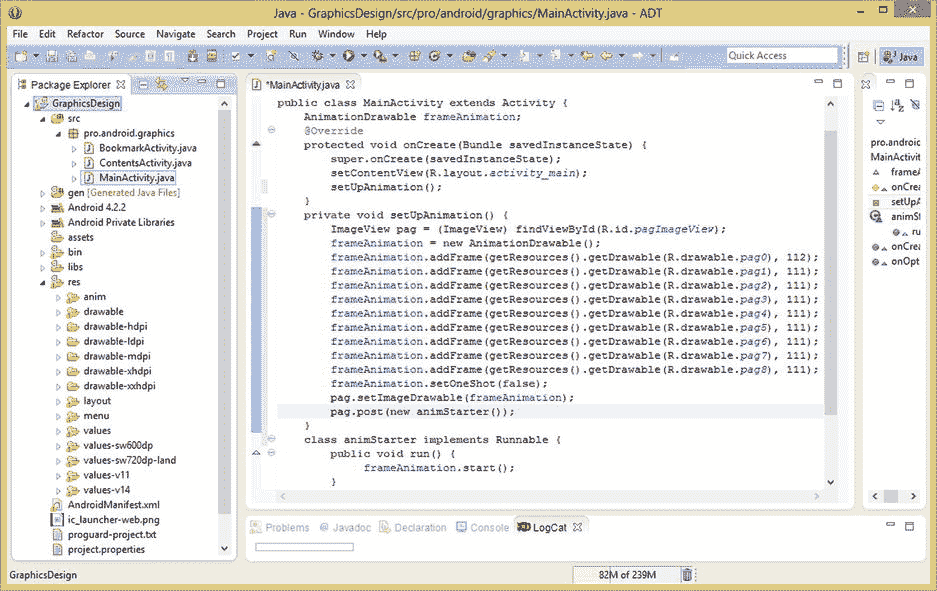

图 14-8. 使用 `.setOneShot()` 配置 `AnimationDrawable`，并使用 `.setImageDrawable()` 配置 `ImageView`

这是通过使用 Android `Handler` 类中的一个方法（称为 `.post()` 方法）完成的，所以让我们花一点时间，准确了解 `.post()` 方法及其 `Handler` 类在 Android 中为我们做了什么。

### 使用 `Handler` 类调度 `AnimationDrawable`

Android 的 `Handler` 类也是 `java.lang.Object` 的直接子类，而 `java.lang.Object` 是 Java 的主 `Object` 类，这使得 `Handler` 成为一个 `Object`。

Android 的 `Handler` 类属于 `android.os.Handler` 包。当你的应用程序中有 `import android.os` 语句时，它会被导入，该语句会导入应用程序开发所需的所有与操作系统相关的函数，例如 `Bundle`、`Handler` 和类似的操作系统工具。

Android 操作系统 `Handler` 类的层次结构如下所示：

```
java.lang.Object
> android.os.Handler
```

Android 操作系统的 `Handler` 对象使你能够发送和处理 `Runnable`（或 `Message`）对象。一个 `Handler` 对象将始终与生成该 `Handler` 对象的应用程序 UI 线程 `MessageQueue` 对象相关联。

这个 `MessageQueue` 对象将保存任何需要按先进先出（FIFO）调度算法处理的处理或消息传递任务。

每个 `Activity` 子类只需要实现一个 `Handler` 对象，你的后台线程将通过它与 UI 线程进行通信以更新 UI。

如果你想研究 Android 的 `MessageQueue` 类及其工作原理，可以在以下网址的开发网站上找到更多信息：

[`developer.android.com/reference/android/os/MessageQueue.html`](http://developer.android.com/reference/android/os/MessageQueue.html)

每个 Android `Handler` 对象的实例化都与其生成的线程以及该父线程的 `Thread` 和 `MessageQueue` 对象相关联。这意味着当你创建一个新的 `Handler` 时，它会被绑定到父线程的 `Thread` 和 `MessageQueue` 对象，这个父线程通常（但不总是）是生成此 `Handler` 对象作为子 `Thread` 和 `MessageQueue` 对象实例的应用程序 UI（主）线程。

从那时起，你的 `Handler` 对象将把它的消息和/或可运行对象传递到那个 `MessageQueue`，并在它们从该 `MessageQueue` 对象中取出时，按 FIFO 原则进行处理。

`Handler` 的主要用途是调度要执行的 `Runnables`，就像你在这里对 `AnimationDrawable` 所做的那样，或者调度一个 `Message` 在处理流程的稍后某个时间点进行处理。你也可以利用 `Handler` 对象，使用与你当前正在使用的线程不同的线程来排队执行某些操作。

当你启动应用程序后，应用程序的 UI 进程创建完成，其主线程（或 UI 线程）开始运行一个 `MessageQueue` 对象。该 `MessageQueue` 对象负责管理你 Android 应用程序的所有 Java 类（`Activity`、`Service`、`BroadcastReceiver`、`ContentProvider` 等）和对象，以及你的 `Activity` 可能在显示屏上创建的任何窗口。

你可以创建自己的线程，这些线程将使用一个 `Handler` 与你的主应用程序（UI）线程进行通信。这是通过与之前相同的 `.post()`（或针对 `Message` 对象的自定义 `.sendMessage()` 方法）调用实现的，但这次是从你的新线程中调用。

任何给定的 `Runnable` 对象或 `Message` 对象，最终都将被调度到该 `Handler` 的消息队列中，然后在适当的时候进行处理。

在 Android 中，有三个方法被创建用于处理 `Runnable` 对象的调度：你正在使用的 `.post(Runnable)`，以及 `.postAtTime(Runnable, long)` 和 `.postDelayed(Runnable, long)`。

这三个 `.post(Runnable)` 方法变体允许你将 `Runnable` 对象排队，以便在 `MessageQueue` 对象收到时被调用。在你的应用程序示例中，`Runnable` 是在 `animStarter` 类中实现的，并包含了 `.run()` 方法，而该方法内部又包含了 `.start()`。


此外，还有一系列 `.sendMessage()` 方法，包括 `.sendMessage(Message)`、`.sendMessageAtTime(Message, long)`、`.sendMessageDelayed(Message, long)` 和 `.sendEmptyMessage(int)`，这些方法都是针对 `Message` 对象的，你可以从参数列表中传入的 `Message` 对象看出这一点，而非像 `.post()` 方法那样针对 `Runnable` 对象。

`.sendMessage()` 方法还允许开发者将包含 `Bundle` 对象的 `Message` 对象加入队列，该 `Bundle` 对象中携带的数据将由 Handler 的 `.handleMessage(Message)` 方法处理。这要求你实现 Android 中 `Handler` 类的子类。

现在，我已经介绍了 `Runnable` 的一点背景知识以及它如何 `.run()` 这个 `frameAnimation.startAnimation()` 处理语句，你可以在 Nexus One 模拟器中测试你的帧动画了（该动画现已从 XML 转换为 Java 代码）。使用 `Run As` ➤ `Android Application` 工作流程启动你的应用程序，如图 14-9 所示，动画将在应用启动时无缝循环播放，就像之前一样。

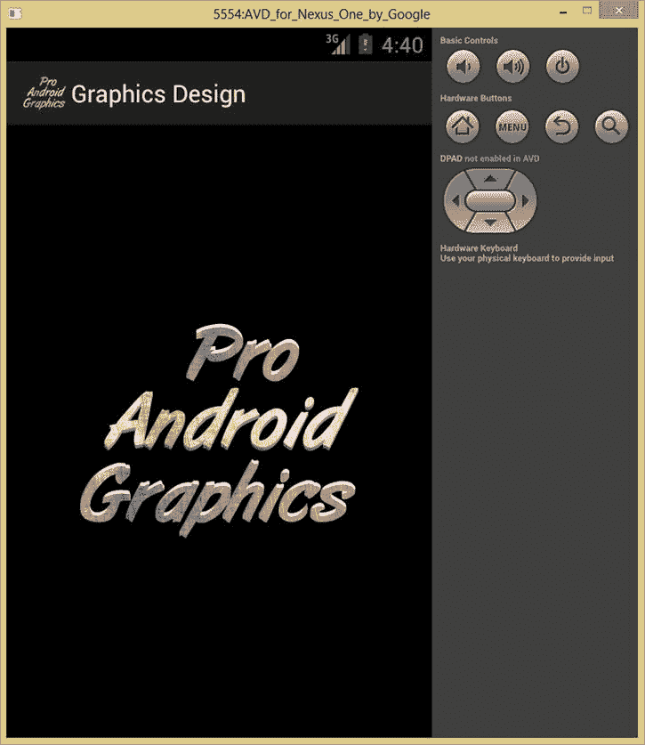

**图 14-9.** 在 Nexus One 模拟器中测试你的 `AnimationDrawable`

在模拟了之前已有的帧动画之后（下一章你将添加程序化动画部分），我们来探讨更高级的内容。你将学习如何使用事件处理器触发动画，这样你就可以点击你的 PAG 标志来启动动画了。

### 设计一个循环回到第一帧的 AnimationDrawable

首先，你将设置你的 `AnimationDrawable` 使其无缝循环一次，因为当前最后一帧并没有使标志完全“垂直”。为此，你需要复制代码中的第一个 `.addFrame()` 方法调用，并将其粘贴到最后一个 `.addFrame()` 方法调用之后，如图 14-10 所示。为保持时间一致，第一个方法调用使用持续时间值 111（与其他帧相同），最后一个方法调用使用值 1（补齐一秒钟的余量）。

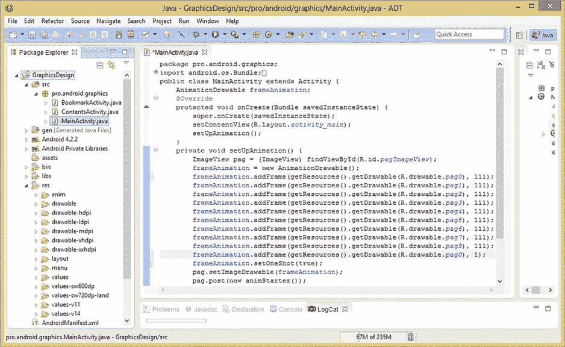

**图 14-10.** 将 `.setOneShot()` 方法设置为 `true` 并添加一个结束帧，使标志在动画结束时平铺于屏幕

这样可以确保在动画结束时将第一帧绘制到屏幕上，使你的 PAG 标志看起来与动画开始时一致。当 `.setOneShot()` 方法设置为 `false` 时，这并不重要，但如图 14-10 所示，你将把它设置为 `true`，因此你所做的操作是必要的！

使用 `Run As` ➤ `Android Animation` 工作流程，当你的应用程序启动时（仔细观察），你的动画将循环一次并回到直立位置。乘客们请注意：请将你们的动画调回直立位置！感谢您乘坐 Apress 航空。

接下来，你将改回无限循环动画并实现事件处理，以便你可以通过点击和长按事件来控制动画。这样做是为了在你实现诸如动画儿童故事书应用等酷炫功能时，读者可以点击页面中的图形元素来启动动画（并通过长按来停止动画）。接下来，我们将介绍实现所有这些功能的工作流程，当然，仅使用 Java 代码。

### 添加事件处理以实现点击触发帧动画

为了让你的图形元素——在你这里指的是 PAG 标志，但也可能是你儿童故事书中的鱼缸里的鱼（免费创意送给你啦）——能够响应命令进行动画（`onClick`），你需要为显示 `AnimationDrawable` 对象内容的 `ImageView` 附加一个事件处理器。你可以通过在 `pag` 对象上调用 `.setOnClickListener()` 方法来实现这一点，如图 14-11 所示。这与你之前编写的事件处理器类似。

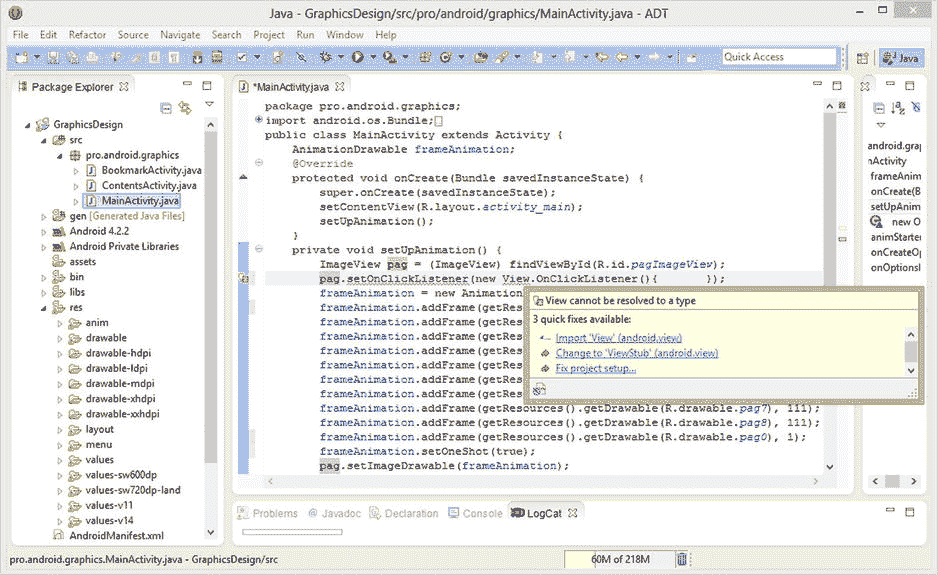

**图 14-11.** 为你的 `pag` 的 `ImageView` 添加 `.setOnClickListener()` 方法和 `View.OnClickListener()` 方法

接下来，将鼠标悬停在 `View` 类引用上，让 Eclipse 为你导入 `View (android.view)`，然后你会看到如图 14-12 所示的波浪形红色错误高亮。你可以将鼠标悬停在此处，再次让 Eclipse 自动为你编写方法引导代码。当你的 IDE 理解你的操作并主动帮你分担部分工作时，总是令人愉快的！

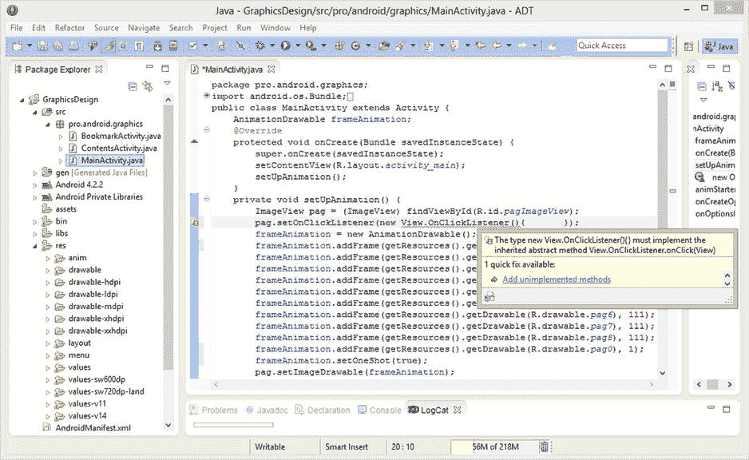

**图 14-12.** 使用错误弹出助手对话框添加一个未实现 `onClick()` 事件处理方法

现在，你已经编写好了 `onClick()` 事件处理方法，如图 14-13 所示，你可以添加你信赖的 `frameAnimation.start()` 方法调用。完成的代码块如下所示：

```
pag.setOnClickListener(new View.OnClickListener() {
    @Override
    public void onClick(View arg0) {
        frameAnimation.start();
    }
});
```

请注意，我将两个方法的右花括号合并到了一行代码中，以节省代码列表中的一行空间。能适应不同的个人编码风格是很好的，因为当你看其他程序员的 Java 代码时，你应该尽量多这样做，以便了解其他开发者是如何实现 Java 代码的。在计算机编程中，完成完全相同的事往往有许多不同的方式！

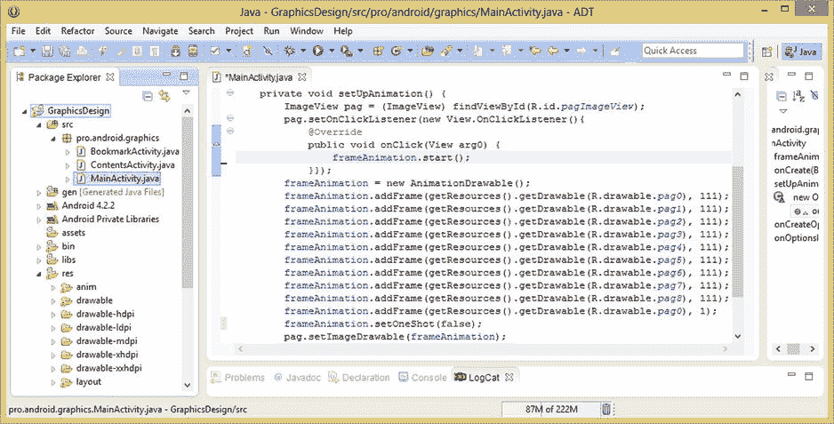

**图 14-13.** 在 `onClick()` 事件处理器中为 `frameAnimation` 对象添加 `.start()` 方法调用

另外，确保将 `.setOneShot()` 方法的参数值改回 `false`，这样你的 `AnimationDrawable` 对象就能无限无缝循环。你需要使用 `false` 设置来验证你的事件处理代码是否确实能正确启动（并最终停止）它。

接下来，你可以删除实现了 `Runnable` 的 `animStarter` 类，因为你现在将要“手动” `.start()`（以及稍后的 `.stop()`）你的 `AnimationDrawable` 对象。更准确地说，你的用户现在将通过点击和长按来控制（启动和停止）`AnimationDrawable` 对象！因此，就动画而言，你基本上使图形元素变得可交互了；用户现在可以控制它何时动画以及何时静止。

你可能已经想到，既然这个 `animStarter` 类已被删除，我就不再展示它的代码列表了，因为没什么可看的。请相信它已经被删除了；如果你愿意，也可以将它留在代码中，因为你没有调用它，所以它也不会被用到。

值得注意的是，始终建议删除任何未使用的类、方法、对象和变量。你应该始终这样做，以确保应用程序的内存不会被分配给未使用的对象！那样会是低效的。


接下来，为了节省一些按键操作，你将通过剪切和粘贴 `onClick()` 事件处理代码块，来创建自己的 `onLongClick()` 事件处理代码块，如图 14-14 所示。在所有复制的代码（`onLongClickListener`、`onLongClick` 等）中，在 `Click` 前面加上单词 `Long`。

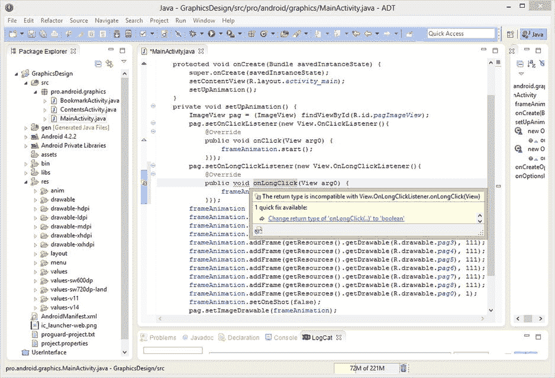

图 14-14. 使用错误弹出助手将 `onLongClick()` 方法的返回类型从 `void` 更改为 `boolean`

正如你所见，Eclipse 检测到了一个不准确的方法修饰符，并主动提供修复方案。将鼠标悬停在波浪线红色下划线的 `void` 返回类型上，让 Eclipse ADT 按照图 14-14 所示的弹出错误对话框中的建议，`将 onLongClick() 的返回类型改为 boolean`。

如图 14-15 所示，这修复了你的返回类型，现在它符合 `onLongClick()` 事件处理方法所要求的 `boolean` 类型，但会出现一个新错误，你需要将鼠标悬停在该错误上，再次让 Eclipse 为你修复。

弹出式错误对话框提示你需要添加一条 `return` 语句，由于你的方法返回类型是 `boolean`，调用方期望一个 `true`（已成功处理）或 `false`（失败）的返回值，因此这是必需的。如图 14-15 所示，错误对话框的解决方案选项之一是 `添加一个 return 语句`，你应该选择该选项。

不幸的是，Eclipse 助手对话框添加了不正确的返回值 `false`，而你希望在 `AnimationDrawable` 对象启动后返回 `true`。没有人是完美的，即使是 Eclipse ADT IDE 也不例外，它有时似乎也有自己的主意！

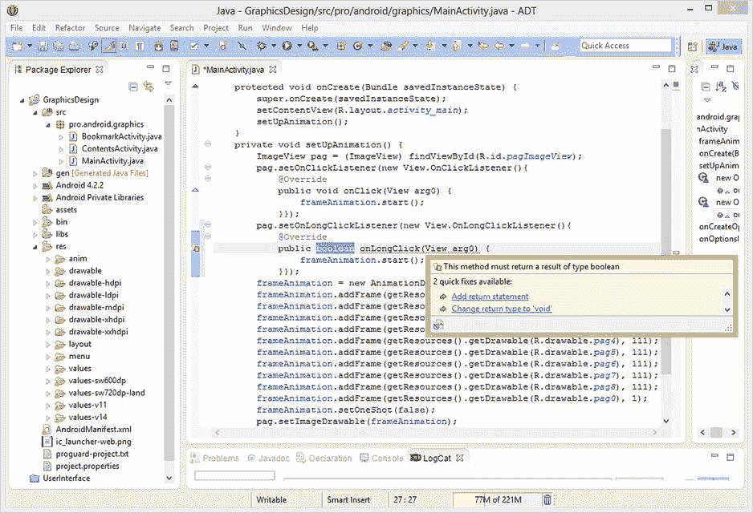

图 14-15. 使用错误弹出助手为 `onLongClick()` 事件处理方法添加 return 语句

让我们编辑这个 `false` 返回值，将其改为 `true`。你还应该编辑复制的 `.start()` 方法调用，将其改为 `.stop()` 方法调用，因为长按事件将停止你的 `AnimationDrawable`，而另一个点击事件应再次启动它。`onLongClick()` 方法中的最终 Java 代码如图 14-16 所示，看起来像以下 `onLongClickListener` 事件处理结构的编程逻辑：

```
pag.setOnLongClickListener(new View.OnLongClickListener() {

    @Override
    public boolean onLongClick(View arg0) {
        frameAnimation.stop();
        return true;
    }
});
```

现在，通过使用“作为 Android 应用程序运行”的工作流程来测试你新处理事件的 `AnimationDrawable`。当应用程序启动时，点击 PAG 徽标开始动画。到目前为止，一切顺利。接下来，长按或点击并按住一秒钟（或更长时间），你会看到动画停止。但有一个问题：动画没有停在第一帧，这看起来不够专业，因此你的 Java 编码还没有完成！

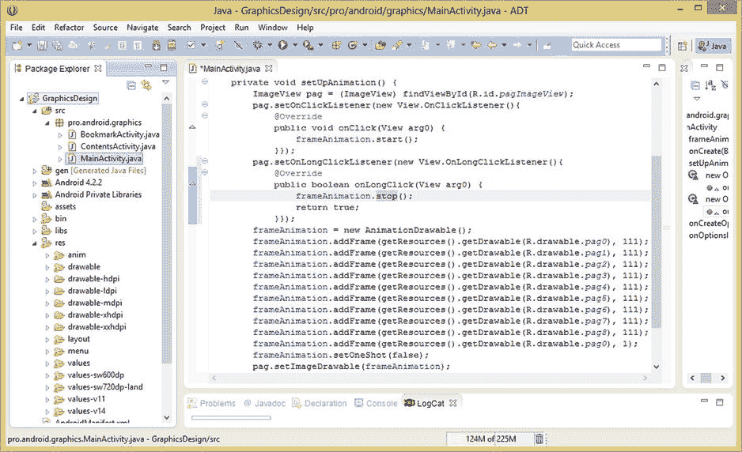

图 14-16. 向 `onLongClick()` 事件处理方法添加 `.stop()` 方法调用，并将返回值改为 `true`

要解决这个问题，你需要将你的 `AnimationDrawable` “重置”到第一帧，但你猜怎么着，Android 在 `AnimationDrawable` 类中遗漏了 `.reset()` 方法！就帧动画而言，这显然是一个严重的疏忽，但我相信他们总有一天会把它加进去的。

当用户在包含帧动画资源的 `pag` ImageView UI 元素上执行长按操作时，你需要想出另一种方法将帧动画设置回第一帧。

我打算尝试的第一件事是将通过 `.setImageDrawable()` 方法调用初始化 `frameAnimation` 对象的语句放在 `onLongClick()` 方法内部，并放在 `frameAnimation.stop()` 方法调用之后。

如图 14-17 所示，一旦你将方法调用放在 `onLongClick()` 嵌套方法内部，用于调用 `.setImageDrawable()` 方法的嵌套 `pag` 对象引用将无法看到位于 `setUpAnimation()` 方法顶部的这个 `ImageView` 对象实例化。因此 Eclipse 会在 `pag` ImageView 引用下方添加一条波浪线红色错误高亮来提醒你。

如果将鼠标悬停在错误高亮上并弹出助手建议对话框，它会建议为你创建 `pag` ImageView 对象实例化（和加载）的那行 Java 代码使用 `final` 访问修饰符。你将接受此建议，并允许 Eclipse 为你执行此操作，如图 14-18 所示。

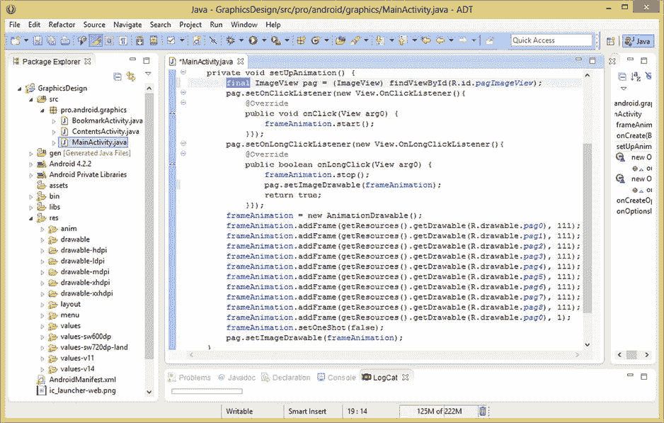

图 14-18. 将 `ImageView pag` 实例化和加载的 Java 语句设置为 `final` 访问控制修饰符

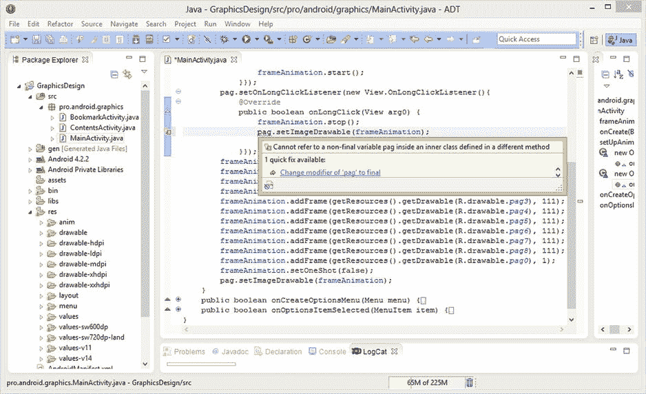

图 14-17. 添加 `.setImageDrawable()` 方法调用以将动画重置到第一帧，并更改为 `final`

让我们通过“作为 Android 应用程序运行”工作流程来测试这种方法，你会注意到，虽然它运行起来不会导致应用程序崩溃，但并没有像你期望的那样将 `AnimationDrawable` 重置回第一帧。这是因为 `AnimationDrawable` 对象包含了关于正在播放（或已停止）的动画帧以及播放时间（或停止位置）的所有引用。

因此，你需要想出其他办法来实现你期望的最终结果：一个完美无缝的从第一帧到第一帧的动画停止操作。

因此，接下来你将尝试直接将这个 `pag` ImageView 设置为你已有的第一帧图像资源，你已经有现成的 Java 代码可以做到这一点。这段代码当前在 `.addFrame()` 方法调用内部使用。

从 `.addFrame()` 方法调用的第一个参数（Drawable）部分中复制 `getResources().getDrawable()` 方法链式调用代码，并将其粘贴到 `.setImageDrawable()` 方法调用内部。这通过下面的一行 Java 代码完成：

```
pag.setImageDrawable(getResources().getDrawable(R.drawable.pag0));
```

如图 14-19 所示，你的代码没有错误，可以测试了！

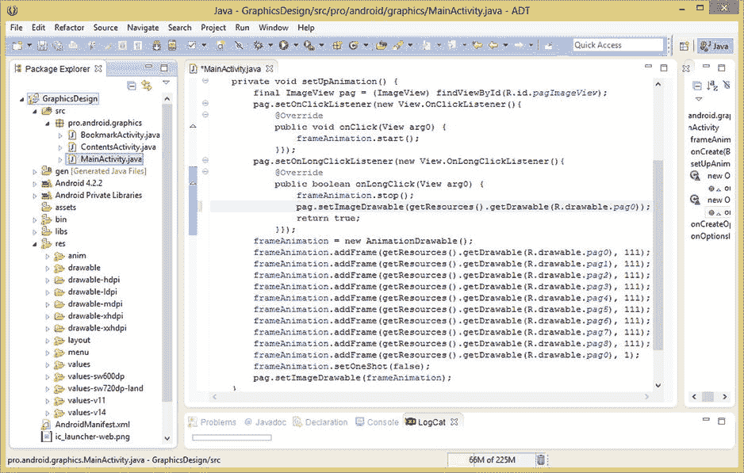

图 14-19. 更改 `.setImageDrawable()` 方法以直接引用动画的第一帧

现在，让我们使用你的“作为 Android 应用程序运行”工作流程，看看是否已经达到了完美。当你的应用程序启动时，点击 PAG 徽标并观察它动画。测试流程中的下一步是长按正在动画的 PAG 徽标，观察它停止并重置到第一帧。到目前为止，一切顺利！测试流程中的最后一步是点击 PAG 徽标，看看它是否会再次开始动画，这样你就可以“切换”动画的开启和关闭。唉，点击并没有重新启动 PAG 动画，因此你又需要回到绘图板（编码板）了！

让我们思考一下为什么你的 `AnimationDrawable` 对象在第二次点击时不会再次开始动画。原因在于 `ImageView` 不再设置为显示你的 `AnimationDrawable` 对象；它现在设置为直接引用第一帧的 Drawable 图像资源，因此你需要将 `.setImageDrawable(frameAnimation)` 方法调用移动到你的 `onClick()` 事件处理代码结构内部，并且放在其顶部。


从逻辑角度来看这是可以接受的，因为无论如何你都需要先点击`ImageView`，动画才会开始播放。因此，由于`AnimationDrawable`类没有`.reset()`方法，你必须在`onLongClick .stop()`代码结构中手动设置帧 1，这样你就可以使用`onClick .start()`代码结构将这个`pag` `ImageView`重新指向`AnimationDrawable`对象。

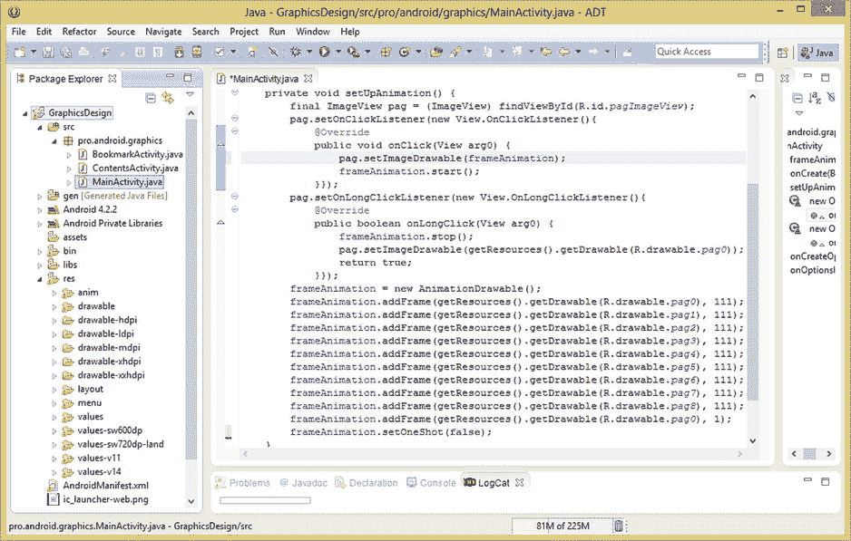

图 14-20.

将`pag.setImageDrawable(frameAnimation)`语句移至`onClick()`事件处理器内部

让我们再次使用“运行方式 ➤ Android 应用程序”工作流程，看看你是否最终达到了完美的效果。当你的应用程序启动时，点击 PAG 标志，再次观看它播放动画。执行测试周期的下一步，长按正在动画的 PAG 标志，观察它停止并重置回帧 1。

测试周期的最后一步是关键，所以点击 PAG 标志，看看它是否再次开始动画！现在它起作用了，因此作为最终测试过程，请多次点击和长按，以确保它能经得起时间考验和多次重复操作。这被称为全面或健壮的测试。干得好，朋友们！接下来，你将仅使用 Java 代码为你的帧动画处理添加程序化动画元素。

### 总结

在第十四章中，你学习了如何仅使用 Java 代码（不使用 XML 标记），通过`AnimationDrawable`类的方法和构造函数，在 Android 操作系统中实现启动画面帧动画。

我们首先研究了 Android 的`AnimationDrawable`类本身，以及它如何作为`DrawableContainer`类的直接子类。你看到了它如何包含你的动画帧、持续时间和循环参数，以及启动和停止帧动画播放周期的方法。

接下来，我们介绍了`DrawableContainer`类，你可以使用它来创建包含在`DrawableContainer`对象结构中的`Drawable`对象，这些对象与其他密切相关的`Drawable`对象共存。

例子包括动画中的帧（即`AnimationDrawable`），或图形对象的状态和级别，例如在`StateListDrawable`类和`LevelListDrawable`类中所见到的。

然后，你深入实践，仅使用 Java 代码重新创建了应用程序的启动画面帧动画。你移除了所有引用 XML 定义的代码，从零开始，创建了一个全新的名为`setUpAnimation()`的方法来设置你的`AnimationDrawable`对象。

你还创建了一个实现`Runnable`接口和`.run()`方法的`animStart`类，这样当应用程序启动时，帧动画将自动开始运行。

你了解了 Java 的`Runnable`和`.run()`方法，以及 Android 的`Handler`类和`.post()`方法。我们讨论了进程、`Thread`对象和`MessageQueue`对象，以了解这一切在 Android 操作系统中是如何工作的。

接着，你没有使用`Runnable`和`.run()`来自动启动动画，而是实现了事件处理代码，这允许你通过点击事件（Click）以及最终的长按事件（Long-Click）来触发动画播放。

你看到了如何使用事件处理来处理循环（`.setOneShot(false)`）和单次播放（`.setOneShot(true)`）这两种动画配置。

你学习了如何在 Java 中配置你的`AnimationDrawable`对象，以实现无缝循环、单次播放、帧 1 到帧 1（静止位置）的结果。你还看到了如何修改代码，使其能够通过长按停止动画循环，而不会让标志停留在除其正面第一帧之外的任何其他帧上。

在下一章中，你将学习如何使用`Animation`类在 Android 操作系统内实现程序化（或矢量）动画。这将使你能够运用本章重新创建的基于 Android 数字图像的帧动画，并结合你在第 4 章中通过 XML 创建的平移、旋转、缩放和透明度程序化动画特效，将它们与基于帧的 PAG 标志动画相结合。

这将把你当前的 Android 2D 动画知识库提升到一个更先进的水平，因为你将实现一个仅使用 Java 编程逻辑的复杂程序化帧动画组合。

# 15. 程序化动画：使用动画类

摘要

在第十五章中，我们将详细探讨在 Android 中使用 Java 编码实现程序化动画的方面。我们在第 4 章中已经考察了程序化动画背后的概念，以及如何使用 XML 定义文件工作流程来设置程序化动画。我在这本书的早期就讲解了这部分内容，因为我认为你应该能够在你的专业 Android 图形设计工作流程的早期阶段，就学会在你的应用程序中运行基本的程序化动画。

本章我们关注的任务是如何实现我们在第 4 章中实现的程序化动画“动作”，但现在仅使用 Java 代码，不使用任何 XML。这比我们在第 4 章中为应用程序启动画面实现程序化动画的方式要稍微高级一些，因为 Java 代码通常由于其紧凑的链式代码结构而比 XML 标记复杂得多——无论你的 XML 嵌套结构变得多么复杂。

用 Java 方法做所有事情将让你看到`Animation`类及其`五个`子类中的方法是如何工作的。`Animation`类是 Android 操作系统中程序化动画的父类。你将全面了解这个类和`Animation`对象，以及如何仅使用 Android 应用程序图形编程逻辑的 Java 端来实现程序化动画功能。

我们这样做的目的是，如果你希望在你的程序化动画 Java 编程管线之中或周围添加其他 Java 代码功能，那么你使用程序化动画处理管线所做的一切都将 100%在 Java 编程语言中实现。


### 动画类：你的程序化动画引擎

Android 的 `Animation` 类（动画类）是主类 `java.lang.Object` 的直接子类，这意味着它是专门为 Android 操作系统提供程序化动画基础而从头编写的。这里所说的“从头编写”，是指从零开始编码，并非基于任何其他现有代码（如类、方法、接口、常量等）。

Android 动画 Java 类的层次结构如下所示：

`java.lang.Object`

  `> android.view.animation.Animation`

`Animation` 类属于 `android.view.animation` 包的一部分。正因如此，`Animation` 类的 `import` 语句引用的就是 `android.view.animation.Animation` 包的导入路径。

实例化一个 `Animation` 对象是为了创建插值的`矢量`或`程序化`动画。这种类型的动画不使用帧或位图，而是将数学矢量或算法应用于现有的`Drawable`对象，以实现缩放（调整大小）、旋转、Alpha 混合（Alpha 通道淡出）和平移（X 和 Y 轴移动）等效果。

`Animation` 类是一个 `public abstract`（公有抽象）类，这意味着除了最初声明 `Animation` 对象之外，它不应被直接使用；它被创建出来是为了用于创建其他子类，例如我们将在本章中用来实现 2D 程序化动画特效的那些类。

因此，`Animation` 类有五个重要的直接子类，你将在本章中详细了解它们。这些子类包括用于缩放 `View` 对象的 `ScaleAnimation`、用于对 `View`（或 `ViewGroup`）对象进行 Alpha 混合（淡入和淡出）的 `AlphaAnimation`、用于旋转 `View` 对象的 `RotateAnimation`，以及最后用于在屏幕上移动 `View` 对象的 `TranslateAnimation`。

还有第五个子类 `AnimationSet`，它要复杂得多，因为它允许使用其他四种类型的 `Animation` 子类创建`复合动画`。`AnimationSet` 类和对象允许对 `Animation` 对象进行集合或分组，甚至进行子分组，以形成更复杂的程序化动画层次结构，从而实现你能想象到的几乎任何效果。

在本章中，当你编写动画管线应用程序时，我们将深入了解所有这些内容。这个应用程序将把你在前一章中编写的帧动画与你在本章中将在其周围及其之上编写的程序化动画结合起来。

你将在数字图像动画中实现许多 `Animation` 类及其子类对象。你将使用大多数 Android `Animation` 类的子类，为你的启动画面动画添加程序化动画“移动”，在你在本章中逐步学习 Android 程序化动画的过程中，你将了解你所使用的每一个子类。

### TranslateAnimation 类：用于移动的动画子类

由于这是我们不会在本章中直接实现的一个程序化动画变换（除了我将在本章末尾放置的“试试这个”建议练习部分之外），我们将首先介绍这个 `Animation` 子类，因为它相当直接明了。

如前所述，Android 的 `TranslateAnimation` 类是 `android.view.animation.Animation` 抽象类的一个直接子类。该类用于在用户 Android 设备的屏幕上，沿 X 和 Y 坐标方向为移动设置动画。因此，它非常简单，但对各种目的都极为有用，从为元素设置动画到将物体移入或移出用户的显示屏。

Android 的 `TranslateAnimation` Java 类层次结构如下所示：

`java.lang.Object`

  `> android.view.animation.Animation`

    `> android.view.animation.TranslateAnimation`

`TranslateAnimation` 类是 `android.view.animation` 包的一部分，正因如此，它的 `import` 语句引用了 `android.view.animation.TranslateAnimation` 包的导入路径。

你想要用来创建 `TranslateAnimation` 对象的构造方法采用以下格式，你将在本章后面看到：

`TranslateAnimation(float fromX, float toX, float fromY, float toY);`

### ScaleAnimation 类：用于缩放的动画子类

如你所知，Android 的 `ScaleAnimation` 类是 `android.view.animation.Animation` 抽象类的另一个直接子类。该类用于缩放 `View` 对象，同样是通过使用 2D 空间中的 X 和 Y 坐标。

Android 的 `ScaleAnimation` Java 类层次结构如下所示：

`java.lang.Object`

  `> android.view.animation.Animation`

    `> android.view.animation.ScaleAnimation`

`ScaleAnimation` 类同样是 `android.view.animation` 包的一部分。它的 `import` 语句引用了 `android.view.animation.ScaleAnimation` 包的导入路径，你将在下一节中使用它来缩放你的 PAG 帧动画，使其看起来像从远处出现并落在显示屏中心时看到的那样。

你想要用来创建 `ScaleAnimation` 对象的构造方法采用以下格式，你将在下一节中看到：

`ScaleAnimation(float fromX, float toX, float fromY, float toY, int pivotXType, float pivotXValue, int pivotYType, float pivotYValue);`


### 缩放你的标志：使用 `ScaleAnimation` 类

现在，是时候启动 Eclipse，为你的 PAG 标志逐帧动画添加程序化缩放动画了，操作方式与你在 第 4 章 中使用 XML 完成的一模一样。

在 Eclipse 中央编辑窗格的选项卡中打开你的 `MainActivity.java` 代码，在 `AnimationDrawable` 对象声明之后立即声明一个名为 `scaleZeroToFullAnimation` 的 `Animation` 对象，如图 15-1 所示。

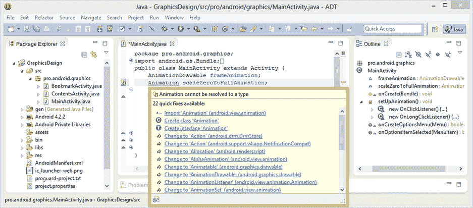

图 15-1. 在 `MainActivity.java` 活动顶部声明你的 `scaleZeroToFullAnimation` `Animation` 对象

如你所见，你尚未在代码中添加 `Animation` 类的导入语句，因此请将鼠标悬停在波浪形的红色错误高亮上，并选择 `Import Animation (android.view.animation package)` 选项，以便 ADT 为你编写 `Import android.view.animation.Animation` Java 语句。现在你已经声明并命名了你的 `Animation` 对象以供使用，你可以在 `setUpAnimation()` 方法中对其进行初始化。

接下来，在你的 `frameAnimation` `AnimationDrawable` 初始化语句之后添加一个空行，并使用下面一行 Java 代码添加一条类似的语句来初始化你现已声明的 `scaleZeroToFullAnimation` 对象：

```
scaleZeroToFullAnimation = new ScaleAnimation();
```

正如你在图 15-2 中看到的，有一些波浪形的红色错误高亮需要检查！让我们将鼠标悬停在 `ScaleAnimation()` 构造函数方法上，并选择 `Import ScaleAnimation (android.view.animation package)` 选项。

如你所见，选择该选项后，这并没有消除波浪形的红色错误高亮；然而，它确实为你编写了一条导入语句！

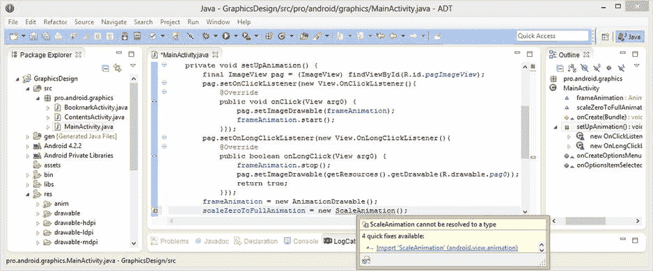

图 15-2. 使用新的 `ScaleAnimation()` 构造函数实例化一个 `scaleZeroToFullAnimation` `Animation` 对象

波浪形红色错误高亮没有消失的原因（实际上，唯一改变的是弹出帮助程序的建议）是因为你需要向此构造函数方法传递参数（变量），概述你希望如何构建（如果你愿意，可以说是初始配置）此对象。

让我们添加浮点数值；我使用了 `0`（0%）和 `1`（100%）作为 `fromX` 和 `toX` 参数值，并为 `fromY` 和 `toY` 参数使用了相同的值，如图 15-3 所示。你还应为每个 `pivotX` 和 `pivotY` 参数值位置指定 `常量` 和 `float` 值 `0.5f`（即 50%）。请注意，浮点数值位置可以接受整数值并为您进行转换。

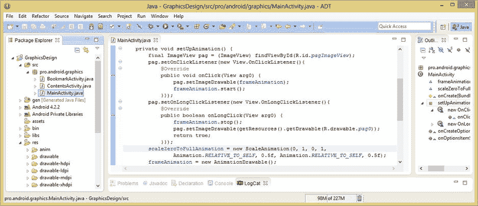

图 15-3. 使用缩放变量和枢轴点常量配置 `ScaleAnimation()` 构造函数方法调用

你为 X 和 Y 枢轴点使用的缩放常量是 `Animation` 类的 `RELATIVE_TO_SELF` 常量，通过使用点符号（`Animation.RELATIVE_TO_SELF`）从 `Animation` 类引用中调用，具体代码（如果你使用宽屏显示器）如下所示：

```
scaleZeroToFullAnimation = new ScaleAnimation(0, 1, 0, 1, Animation.RELATIVE_TO_SELF, 0.5f, Animation.RELATIVE_TO_SELF, 0.5f);
```

接下来需要指定的是缩放发生的 `duration`（持续时间），因为如果你现在编译并运行你的应用程序，什么都不会发生，尽管当前的 Java 代码实际上不会导致你的模拟器崩溃。

这可以通过使用 `Animation` 类的 `.setDuration()` 方法来实现，该方法在你的 `scaleZeroToFullAnimation` `Animation` 对象上调用（你可能还记得该对象实际上被初始化为一个 `ScaleAnimation` 对象；现在搞混了吗？），使用下面简短而强大的 Java 编程语句：

```
scaleZeroToFullAnimation.setDuration(5000);
```

我使用了一个数据值 `5000 毫秒`，即五秒，如图 15-4 所示。我使用这个时间值是为了让你能够看到标志缩放过程在相当长的持续时间内发生。

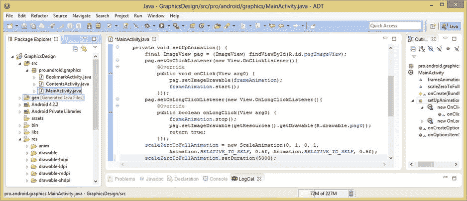

图 15-4. 使用 `.setDuration()` 方法指定缩放操作持续时间，值为 5000 毫秒

下一步正是让开发者感到困惑的地方：到底如何将这个程序化动画应用到你的逐帧动画上？答案是使用你的 `ImageView`，因为 `ImageView` 将包含（持有）你的逐帧动画，但你要程序化地动画化这个 `ImageView` UI 容器本身，而逐帧动画则在其内部运行。

我认为开发人员在尝试解决这个“动画类型组合问题”时的倾向是，尝试以某种方式引用（或连接）逐帧动画对象到程序化动画对象，或者反之亦然。

正如你在图 15-5 中看到的，你已经使用 `pag.setImageDrawable(frameAnimation)` Java 代码语句将你的 `frameAnimation` `AnimationDrawable` 配置安装到了 `pag` `ImageView` 对象内部，因此现在你将使用在同一个 `pag` `ImageView` 对象上调用的 `.startAnimation()` 方法，将其连接到你使用下面简短但关键（至关重要）的 Java 代码语句定义的 `scaleZeroToFullAnimation` `ScaleAnimation` 对象：

```
pag.startAnimation(scaleZeroToFullAnimation);
```

正如你在图 15-5 中看到的，Eclipse 对此代码没有问题，所以让我们继续测试它，看看能否利用 `ImageView` UI 元素作为中介，让程序化动画影响你的逐帧动画。

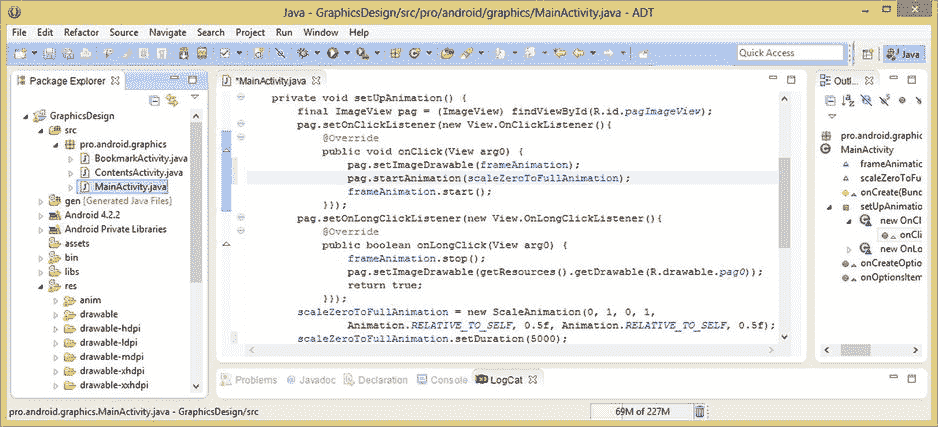

图 15-5. 设置 `ScaleAnimation` `scaleZeroToFullAnimation` `Animation` 对象，使用 `.startAnimation()` 进行缩放

使用 `Run As ➤ Android Application` 工作流程启动 Nexus One 模拟器，并运行和测试你的应用程序（见图 15-6）。当你点击标志时，它会立即消失到远方，正如预期的那样，然后从你的视平线中动画出现，放大并旋转着进入，这与你在 第 4 章 中主要使用 XML 标记实现这一酷炫特效时的效果一模一样。在这里，你仅用 Java 代码就完成了整个特效，而且你还没完成，远未完成！

如果你想知道为什么你没有像在 第 4 章 中那样向 `ScaleAnimation` 对象添加一些参数，那是因为你将在本章后面将这些参数添加到 `AnimationSet` 中，因为这样效率更高。一旦你了解了这些方法，你可以简单地在你的对象名称上调用它们，从而将它们（本地地）添加到你的 `ScaleAnimation` 中；这可以在本地级别完成，以微调你的复合特效的各个组成部分，或者如果所有组成部分都使用相同的偏移量和插值器，则全部可以使用 `AnimationSet` 来完成。

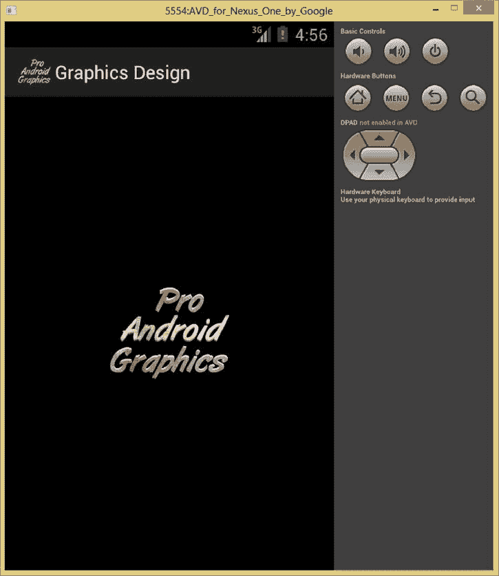

图 15-6. 在 Nexus One 模拟器中测试 `ScaleAnimation`

你在 第 4 章 中做的下一件事是添加 alpha 混合效果，使这个从远处飞来的特效更加逼真。你通过在 Android 中额外使用 alpha 混合淡入放大的旋转标志来实现这一点，这在 `Animation` 类和包中也得到了支持，你将在本章接下来的两节中看到。


您将通过将旋转、缩放和矢量组合动画从远处拉近，使其从 100%透明变为完全不透明，从而在屏幕上呈现更逼真的效果。

让我们了解 Android 的`AlphaAnimation`类，以便在实现 Java 代码之前掌握其技术基础。该代码将用于使您的 PAG 徽标在从远处出现时淡入视图。

之后，您可以重新投入 Java 编码，并进一步享受利用数十行密集 Java 代码创建的纯 Java 帧动画与程序化动画组合管道带来的乐趣。

### AlphaAnimation 类：用于混合的动画子类

如您所知，Android 的`AlphaAnimation`类是`android.view.animation.Animation`公共抽象类的直接子类。该动画类用于实现`View`对象的 Alpha 混合。它通过使用任何`View`对象的 Alpha（透明度）值来实现这一点。本质上，这使得该程序化动画类对于淡入或淡出非常有用，并且它可以与其他三种变换类型结合使用，创造出相当惊人的效果，无论它本身多么简单。

Android `AlphaAnimation`类的层次结构如下：

```
java.lang.Object
  > android.view.animation.Animation
    > android.view.animation.AlphaAnimation
```

`AlphaAnimation`类也属于`android.view.animation`包。

其导入语句引用了`android.view.animation.AlphaAnimation`包导入路径，您很快将在下一节使用它来淡入您的 PAG 帧动画时看到。

您将使用一个`AlphaAnimation`对象进一步增强您的缩放特效，使其看起来像是徽标来自比您刚刚实现的缩放动画更远的地方。

您想要用来创建`AlphaAnimation`对象的构造函数方法比八参数的`ScaleAnimation`构造函数方法要基础得多。`AlphaAnimation`构造函数方法将采用以下格式，请留意，因为您将在本章的下一节中实现它：

`AlphaAnimation(float fromAlpha, float toAlpha);`

从技术上讲，Alpha 通道混合操作通常不被归类为变换类型的动画，如移动（平移）、旋转或缩放操作。在 3D 软件包中尤其如此，因为对象混合是通过应用材质和不透明度纹理映射以及类似操作来处理的。然而，出于某种原因，Android 操作系统将 Alpha 混合（这实际上更像是一种图像合成功能，而非 2D 变换）与三个基础变换操作归为一组。

尽管如此，它与这些变换操作结合使用时非常有用，因此我们将在这章中涵盖所有这四种操作以及`AnimationSet`分组操作，以提供一个完整的概述。

### 淡入您的 PAG 徽标：使用 AlphaAnimation 类

让我们回到 Eclipse，进入`MainActivity.java`编辑标签，在您的`Activity`子类的顶部添加一个`Animation`对象，如图 15-7 所示。将该对象命名为`alphaZeroToFullAnimation`，然后进入您正在编码的`setUpAnimation()`方法，在`scaleZeroToFullAnimation`对象附近添加上一个对象实例化。

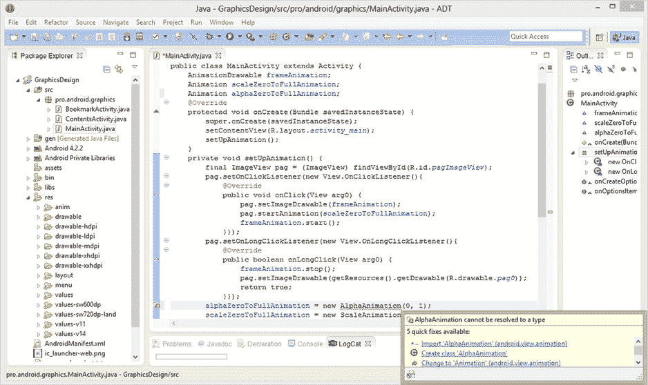

**图 15-7.** 使用`AlphaAnimation()`构造函数添加`alphaZeroToFullAnimation` `Animation`对象实例化

这与您对`scaleZeroToFullAnimation`对象实例化所做的操作完全相同，只是改用`AlphaAnimation()`构造函数方法而不是`ScaleAnimation()`类的构造函数方法。结果如图 15-7 所示，使用以下 Java 编程语句：

`alphaZeroToFullAnimation = new AlphaAnimation(0, 1);`

请注意，您需要将鼠标悬停在代码中调用的新`AlphaAnimation()`构造函数（和类）上，并选择`Import Alpha Animation (android.view.animation package)`选项，以便在您的`Activity`子类代码列表顶部生成该类的导入语句。这将清除代码中的所有错误标记，然后您可以通过`.setDuration()`方法调用设置 5 秒的 Alpha 混合淡入时间。

这类似于您对缩放动画所做的操作，只是使用`alphaZeroToFullAnimation`对象，通过以下代码完成：

`alphaZeroToFullAnimation.setDuration(5000);`

如图 15-8 所示，您的 Java 代码似乎没有错误（至少目前如此），您已经准备好将这个由`AlphaAnimation`构造的`alphaZeroToFullAnimation` `Animation`对象附加到您的`pag` `ImageView`对象上。

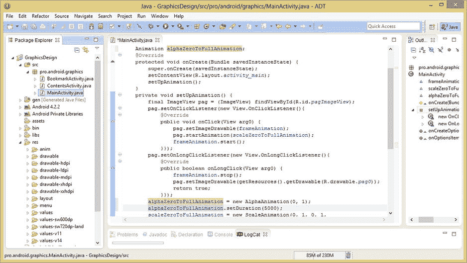

**图 15-8.** 使用 0 到 100%不透明度配置`alphaZeroToFullAnimation`对象并调用`.setDuration(5000)`

现在，您需要进入`onClick()`事件处理代码结构，并添加一个类似于您为`scaleZeroToFullAnimation`对象所做的调用，通过以下一行 Java 代码，在`pag` `ImageView`对象上调用`.startAnimation()`方法：

`pag.startAnimation(alphaZeroToFullAnimation);`

如图 15-6 所示，您的代码仍然没有错误，因此是时候在 Nexus One AVD 模拟器中测试您的代码了。看看有多个`.startAnimation()`方法调用是否能实际工作，以及如果不能的话，它将如何对方法调用进行优先级排序以处理（启动）多个程序化`Animation`对象，这将非常有趣。

使用`Run As ➤ Android Application`工作流程，在 Nexus One 模拟器中启动您的应用程序。当徽标出现时，点击它以启动帧动画和程序化动画对象构造，您已在 Java 处理管道中同时将它们放置到位。

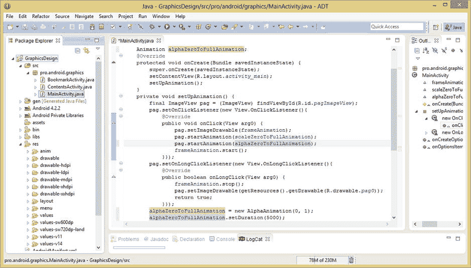

**图 15-9.** 在`pag` `ImageView`对象上使用`alphaZeroToFullAnimation`调用`.startAnimation()`方法

如图 15-9 所示，我在 Alpha 混合操作中非常早地截取了这张屏幕截图，以便您可以观察 PAG 徽标的大小（缩放比例），以确定它是在混合、缩放还是两者都在进行！

您必须非常仔细地查看这张屏幕截图，才能发现混合正在发生，但缩放没有发生，这意味着代码中最后编写的`.startAnimation()`方法调用才是实际执行的那个。


这要么意味着 `ScaleAnimation` 对象处理被跳过，要么它已被启动，然后立即被 `AlphaAnimation` 对象中包含的 Alpha 混合操作所取代。无论哪种方式，你都只能发起一次程序化动画的 `.startAnimation()` 方法调用，这意味着你必须实现一个 `AnimationSet` 对象才能组合不同的程序化动画类型。

这其实并不意外，但我还是尝试了一下，既是出于我自己的好奇心，也是作为整体学习和探索过程的一部分，探索 Android 操作系统中程序化动画和逐帧动画管线的可能性，并看看我们究竟能将这些类和方法推到何种程度，以实现最终期望的结果。此外，现在正是讨论 `AnimationSet` 的最佳时机，讨论完之后，我们可以回过头来继续讲解 `RotateAnimation` 类，并将那个程序化动画对象集成到我们似乎即将要实现的 `AnimationSet` 对象中！

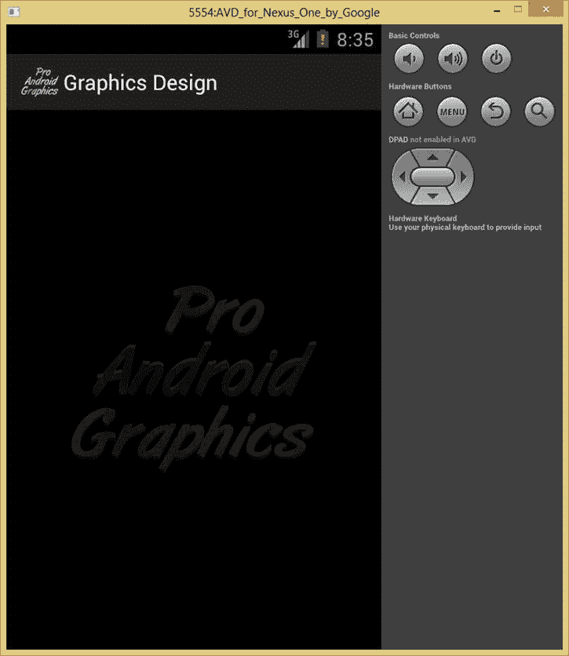

Figure 15-10.

在 Nexus One 上测试缩放和透明度动画

由于接下来你需要实现 `AnimationSet` 类并构造一个 `AnimationSet` 对象，让我们花点时间深入了解一下这个类，获取一些关于它的功能以及为何使用它的技术背景。

### AnimationSet 类：创建复杂的动画集

正如你已经了解的，Android 的 `AnimationSet` 类是 `android.view.animation.Animation` 公共抽象类的另一个直接子类。

这个动画类用于将其他四种 `Animation` 子类“分组”成“集合”，从而创建更复杂的多重变换动画，并将其应用于 Android 的 `View` 对象。

因此，一个 `AnimationSet` 对象代表了 `Animation` 子类（如 `ScaleAnimation`、`AlphaAnimation`、`RotateAnimation` 等）对象的逻辑分组，这些对象旨在同时并行播放。

本质上，这使得这个程序化动画类对于创建无法单独通过其他 `Animation` 子类实现的复杂动画非常有用。这四种变换各自在概念上相当基础，但通过结构化组合，它们几乎可以实现你能想象到的任何效果！

Android 的 `AnimationSet` 类层次结构如下：

```
java.lang.Object
  > android.view.animation.Animation
    > android.view.animation.AnimationSet
```

`AnimationSet` 类也属于 `android.view.animation` 包。因此，其 `import` 语句引用了 `android.view.animation.AnimationSet` 包导入路径，你将在下一节使用它创建复杂的缩放与混合程序化动画集时看到这一点。

通过使用（父级）`AnimationSet` 对象（类），使用每个单独的（子级）`Animation` 对象指定的程序化变换会被组合成一个统一的变换。

如果 `AnimationSet` 对象设置了其子对象也设置的属性（例如 `duration` 或 `startOffset`），则 `AnimationSet` 父对象设置的值将始终覆盖其子 `Animation` 对象的对应值。

理解 `AnimationSet` 如何从 `Animation` 变换继承参数（反之亦然）非常重要。在 `AnimationSet` 对象中设置的一些参数会影响整个 `AnimationSet` 对象。某些参数会向下传递并应用于子对象的变换，而另一些则会被忽略。因此，在使用这些 `AnimationSet` 对象时，你需要学习“在何处应用特定参数”。

当 `duration`、`repeatMode`、`fillBefore` 和 `fillAfter` 参数（也称为属性）在 `AnimationSet` 对象上设置时，它们会被“向下推送”到所有子变换。针对此行为的解决方案是，始终在 `Animation` 对象内“本地”设置这些参数，而“永远不要”在父级 `AnimationSet` 对象中设置它们。如果你这样做，Android 就没有任何东西可以推送下去，也就不会混淆参数将在程序化动画处理管线的哪个环节被应用。

`repeatCount` 和 `fillEnabled` 参数（或属性）对于 `AnimationSet` 来说会被“完全忽略”，因此，如果你想正确访问它们，必须始终在本地为每个 `Animation` 对象设置这些参数。

另一方面，`startOffset` 和 `shareInterpolator` 参数可以应用于 `AnimationSet` 对象。请注意，`startOffset` 也可以本地应用于变换，通过在循环周期或动画开始时间中引入延迟来微调动画的时间。

因此，一个好的“经验法则是”将变换参数本地应用，而不是在 `AnimationSet` 对象级别应用，除非是 `shareInterpolator` 参数，该参数显然用于组级别的操作，因为这是我们在程序化动画中进行“共享”的唯一方式。所以，“始终在本地设置变换参数”。


### 为你的 PAG 标志动画创建 AnimationSet

让我们回到 Eclipse ADT，进入你的 `MainActivity.java` 编辑标签页，在 Activity 子类顶部添加一个 `AnimationSet` 对象实例化，如图 15-11 所示，使用以下 Java 代码行：

```
AnimationSet pagAnimationSet = new AnimationSet(true);
```

如你所见，你需要将鼠标悬停在 `AnimationSet()` 构造函数上，并选择 `Import AnimationSet (android.view.animation)` 选项，这样导入语句就会自动放置在你的类顶部。

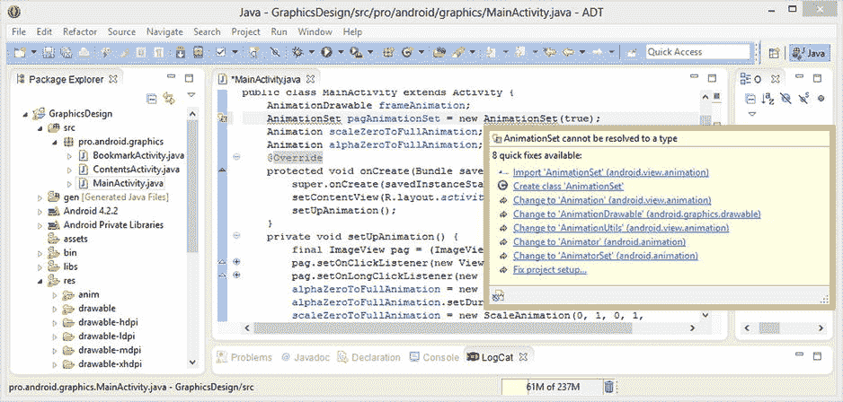

**图 15-11.** 在 `MainActivity` 类顶部创建名为 `pagAnimationSet` 的新 `AnimationSet` 对象

你将把 `AnimationSet` 对象命名为 `pagAnimationSet`，并将其设置为 `true`，这在此构造函数方法的参数列表中指定了 `AnimationSet` 对象的 `shareInterpolator` 标志应设置为 `true`。此 `shareInterpolator` 参数用于指定你是否希望父 `AnimationSet` 对象的子 `Animation` 对象共享为该 `AnimationSet` 对象设置的 `Interpolator` 常量。

在你的情况下，你确实希望如此，因为你希望缩放、混合和旋转程序化动画以完全相同的方式运行。因此，你在构造函数参数列表（项）中传递了 `true` 值，因为此父 `AnimationSet` 对象中的所有 `Animation` 子对象都应“共享”你与此 `AnimationSet` 关联的相同 `Interpolator` 常量。如果你在 `Animation` 对象中使用了 `.setInterpolator()` 方法，则改为传递 `false` 值，以便每个 `Animation` 使用自己的 `Interpolator`。

你的下一步是使用你猜到的 `.addAnimation()` 方法调用，将 `ScaleAnimation` 和 `AlphaAnimation` 子对象添加到新的父 `AnimationSet` 对象中。向你的 Java 方法添加两条 Java 代码语句，这些语句通过 `pagAnimationSet` 对象调用此方法，并为每个 `Animation` 对象传递对象名称，使用以下代码：

```
pagAnimationSet.addAnimation(scaleZeroToFullAnimation);
pagAnimationSet.addAnimation(alphaZeroToFullAnimation);
```

如图 15-12 所示，Java 代码没有错误，现在你可以展开 `pag.setOnClickListener()` 代码块，使用左边距的 `+` 号重新打开此事件处理方法代码以供使用。

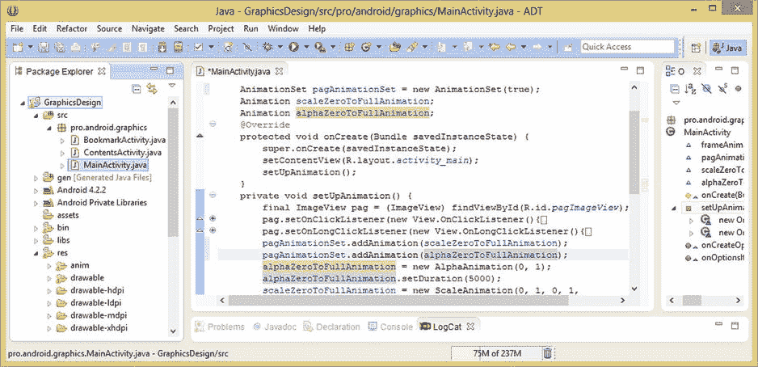

**图 15-12.** 使用 `.addAnimation()` 方法将 `ScaleAnimation` 和 `AlphaAnimation` 对象添加到 `AnimationSet`

让我们删除第二个 `.startAnimation()` 方法调用，并将第一个更改为引用新的父 `pagAnimationSet` 对象。这将允许你将两个 `ScaleAnimation` 和 `AlphaAnimation` 对象“连接”到一个 `AnimationSet` 对象结构中，然后可以使用单个 `.startAnimation()` 方法调用来调用它，如图 15-13 所示。

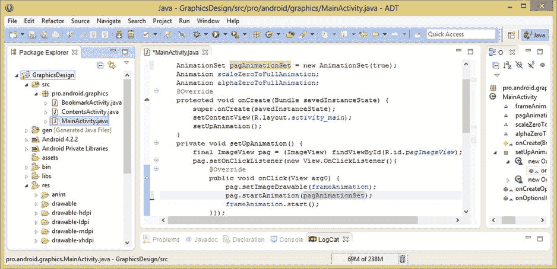

**图 15-13.** 将从 `pag` `ImageView` 对象调用的 `.startAnimation()` 方法更改为引用 `pagAnimationSet`

现在，你可以再次使用 `Run As ➤ Android Application` 工作流程测试你的应用程序，以启动 Nexus One 模拟器；让我们看看会发生什么！按照当前编写的代码，这个应用程序会导致模拟器崩溃！Eclipse 没有在代码中发现任何语法错误，但让我们看看能否通过仔细检查动画处理管道来确定可能发生了什么。

我能看到的唯一可能的问题是，你在使用 `new` 关键字及其构造函数方法初始化子 `Animation` 对象**之前**，就将它们添加到了父 `AnimationSet` 对象中。因此，让我们先尝试剪切并粘贴那两行通过 `pagAnimationSet` `AnimationSet` 对象调用 `.addAnimation()` 方法的代码，并将它们重新定位到实例化和配置 `ScaleAnimation` 和 `AlphaAnimation` 对象的四行 Java 代码的正下方（之后）。如果这被证明是问题所在，那么这强化了 `代码顺序` 与首先拥有正确的 Java 代码语句同等重要的因素。为了产生正确的对象和事件处理管道，你必须同时拥有正确的 Java 代码和正确的 Java 代码处理顺序。

如图 15-14 所示，Eclipse 仍然认为你的 Java 代码没有错误，所以让我们再次在 Nexus One 模拟器中测试你的 Java 代码，并尝试让你的 `GraphicsDesign` 应用程序重新工作！使用 `Run As ➤ Android Application` 工作流程启动 Nexus One 模拟器，并在 PAG 标志出现后单击它以使其启动。按当前编写的代码，这个应用程序现在可以工作了，并且通过 `AnimationSet` 对象实现的缩放和混合动画很好地协同工作！

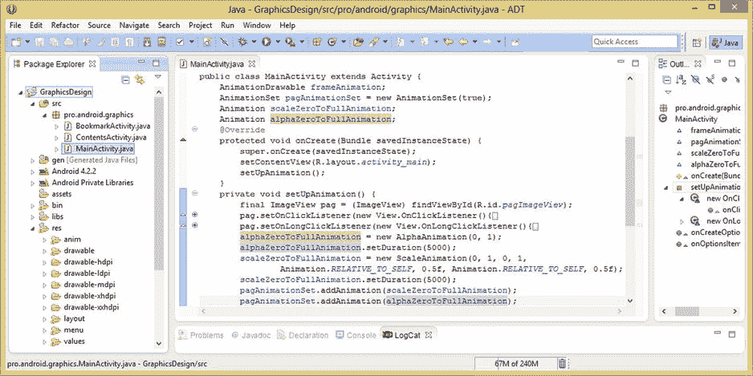

**图 15-14.** 将 `.addAnimation()` 方法调用移动到 `AlphaAnimation` 和 `ScaleAnimation` 实例化之后

现在你已经实现了基本的缩放和混合动画，是时候添加其他选项了，这些选项将允许你控制现在已成功创建（并调试）的 `AnimationSet` 的 `运动类型` 和 `初始时间`。你将从一个方法调用开始，该方法调用允许你微调 `Animation` 对象或 `AnimationSet` 对象的 `启动时间`，具体取决于你通过点符号从哪个对象调用它。

这个方法调用称为 `.setStartOffset()` 方法调用，它接受一个 `整数毫秒` 值。由于我们实际上不需要 `AnimationSet` 对象的 `StartOffset`，我将在此处使用一个微不足道的四分之一秒（或 250 毫秒）参数值来包含它，只是为了向你展示如何在你 Java 代码中实现它。让我们通过使用以下基本 Java 编程语句，从你的 `pagAnimationSet` 对象附加一个 `.setStartOffset(250)` 方法调用：

```
pagAnimationSet.setStartOffset(250);
```

如图 15-15 所示，代码没有错误，并且你已准备好向此 `AnimationSet` 对象添加其他 `AnimationSet` 参数，例如 `Acceleration` 运动插值器常量，你接下来将添加它。如果你愿意，可以使用 `Run As ➤ Android Application` 工作流程确保代码在此阶段运行且不会导致 Nexus One 模拟器崩溃。但是，你很可能无法可视化这四分之一秒的 `startOffset` 延迟，因为缩放和混合设置最初设置为零，因此 `startOffset` 值仅对微调有用。

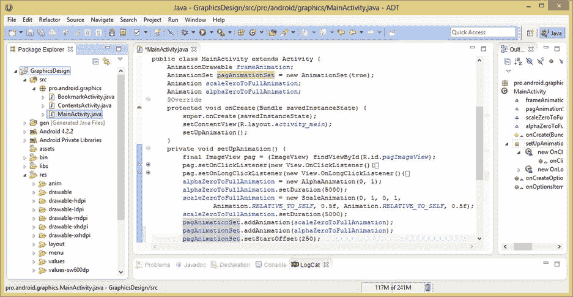

**图 15-15.** 使用 `.setStartOffset()` 方法向 `pagAnimationSet` 对象添加动画 `StartOffset`

现在是时候添加一个 `ACCELERATE` 插值器常量了，在 Java 中，这是通过 `AccelerateInterpolator` 类及其 `AccelerateInterpolator()` 构造函数方法调用来完成的。你将调用 `AccelerateInterpolator` 对象，并使用同一行代码构造它，首先从你的 `pagAnimationSet` `AnimationSet` 对象调用 `.setInterpolator()` 方法，然后在此方法调用内部使用 `new` 关键字，加上你的 `AccelerateInterpolator()` 构造函数方法调用，所有这些都将通过以下 Java 代码完成：

```
pagAnimationSet.setInterpolator( new AccelerateInterpolator() );
```


我使用多个空格符在方法调用参数区域内略微调整了 Java 代码语句的间距，使其更易读。这不会影响 Java 语句的编译，但我在截图中保留了更紧凑的版本。

你可以在图 15-16 中看到 Java 代码，并且你会注意到，你对 `AccelerateInterpolator` 类构造方法的调用需要在 `MainActivity` 类顶部添加一条 `import` 语句。

像往常一样，Eclipse ADT 通过波浪形红色错误下划线指示符向你提示这一点。如果你将鼠标悬停在 `AccelerateInterpolator` 类和构造方法上，并选择第一个选项，Eclipse 将自动为你安装这条 `import android.view.animation.AccelerateInterpolator` Java 语句。

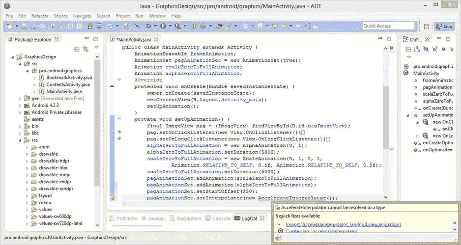

图 15-16. 使用 `.setInterpolator()` 方法向 `pagAnimationSet` 对象添加动画加速插值器

当你使用 `Run As ➤ Android Application` 工作流程并在 Nexus One 模拟器上测试代码时，它运行完美，如图 15-17 所示。

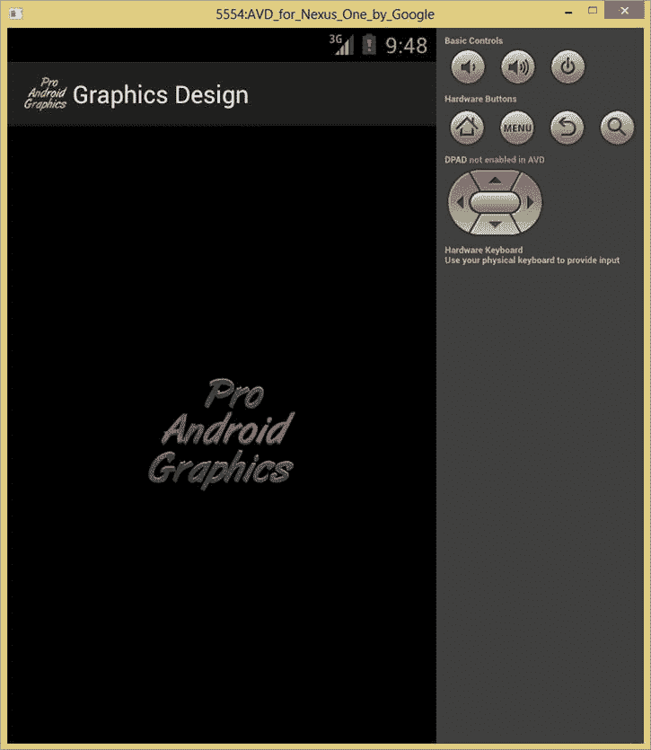

图 15-17. 在 Nexus One AVD 中测试你的 `AnimationSet`

### `RotateAnimation` 类：用于旋转的动画子类

如本章引言所述，Android `RotateAnimation` 类是 `android.view.animation.Animation` 公有抽象类的另一个直接子类。Android `RotateAnimation` Java 类层次结构如下：

```
java.lang.Object
  > android.view.animation.Animation
    > android.view.animation.RotateAnimation
```

`RotateAnimation` 类是 `android.view.animation` 包的一部分。其 `import` 语句引用了 `android.view.animation.RotateAnimation` 包的导入路径，你将在下一节中使用它来旋转 PAG 帧动画（同时该动画也会缩放并淡入）时看到这一点。该动画类用于实现 `View` 对象的 2D 旋转。

此旋转将在 X-Y 平面内进行。从技术上讲，这意味着旋转是围绕 `Z 轴`进行的。在 3D 中，有三个轴，包括你在 2D 中常见的标准 X（从左到右）轴和 Y（从上到下）轴，以及一个 Z 轴，该轴由一条从 X 和 Y 轴交点穿出、朝向（和远离）你的屏幕（或朝向和远离你的观察者）的线表示。

因此，从技术上讲，`RotateAnimation` 对象正在实现 Z 轴旋转，其围绕（使用）一个由开发者使用 X 和 Y 坐标设置的枢轴点 `origin`，你将在下一节中亲身体验。

除了 `View` 对象将围绕其旋转的 `枢轴点 origin` 之外，你还必须使用一个 `范围` 来指定旋转量，该范围以要 `开始旋转` 的度数开始，通常为 0 度或“正常” `View` 定位，并以要 `旋转到` 的度数结束，例如 90 度（顺时针）、或 -90 度（逆时针）、或 180 度（上下颠倒），或者在您的例子中，是 360 度，即一次完整的无缝 `View` 对象（`ImageView`）旋转。

因此，`RotateAnimation` 过程动画类对于旋转 `View` 以及将其侧向或上下翻转非常有用，如果需要这种效果，可以通过使用较短的持续时间值来快速实现。

无论 `RotateAnimation` 类单独使用时看起来多么简单，它都可以与其他三种过程动画对象类型结合使用，以创建非常令人印象深刻的特效。

你希望用来创建 `RotateAnimation` 对象的构造方法类似于你已经实现的八参数 `ScaleAnimation` 构造方法。`RotateAnimation` 构造方法将在你的应用中利用以下高级旋转规范格式：

```
RotateAnimation(float fromDegrees, float toDegrees, int pivotXType, float pivotXValue, int pivotYType, float pivotYValue);
```


好的，作为一名高级文档工程师和翻译员，我将严格遵循您提供的注意事项和示例，将以下英文文本翻译成中文。


### 旋转 PAG 标志：使用 `RotateAnimation` 类

终于，是时候添加 `RotateAnimation` 对象，来完成您在第 4 章 中通过 XML 标记实现的动画的 Java 版本了。

打开 Eclipse 和 `MainActivity.java` 编辑选项卡，在顶部，紧接缩放和透明度 `Animation` 对象之后，添加一个 `Animation` 对象声明，并将其命名为 `rotateZeroToFullAnimation`，如图 15-18 所示。

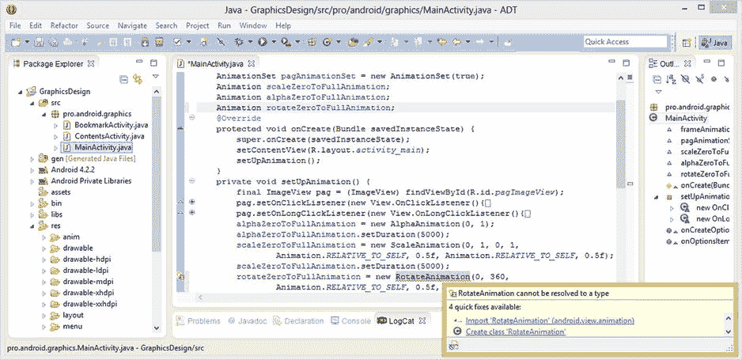

**图 15-18.** 添加 `rotateZeroToFullAnimation` `Animation` 对象声明和新的 `RotateAnimation()` 构造方法

接下来，收起您的事件监听器代码块，以便能看到所有的实例化代码，如图 15-18 底部所示，并使用以下 Java 代码添加 `RotateAnimation` 对象的实例化：

```
rotateZeroToFullAnimation = new RotateAnimation(0, 360, Animation.RELATIVE_TO_SELF, 0.5f, Animation.RELATIVE_TO_SELF, 0.5f);
```

接下来需要做的是，在 `rotateZeroToFullAnimation` 对象初始化后，调用它的 `.setDuration()` 方法，并使用以下代码向其传递 `5000` 毫秒（5 秒）的值：

```
rotateZeroToFullAnimation.setDuration(5000);
```

最后，您需要使用 `.addAnimation()` 方法，通过下面这行 Java 代码，将此 `rotateZeroToFullAnimation` `Animation` 对象添加到 `pagAnimationSet` `AnimationSet` 对象中，如图 15-19 所示：

```
pagAnimationSet.addAnimation(rotateZeroToFullAnimation);
```

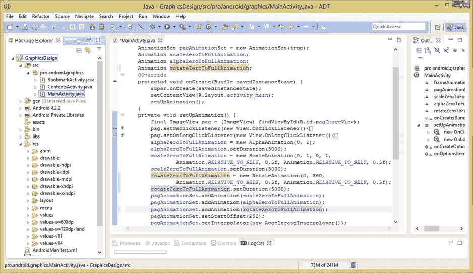

**图 15-19.** 配置 `RotationAnimation` 的持续时间、角度和旋转中心，并使用 `.addAnimation()` 将其添加到 `AnimationSet`

由于所有偏移时间和运动插值参数都是在父级 `AnimationSet` 对象级别设置的，因此您无需担心任何这些全局参数，这是创建高级 `AnimationSet` 程序化动画管道的优势之一，正如您在此处看到的。

现在是时候测试您的 `AnimationSet` 对象程序化动画，看看它是否正常工作，以及您是否已经复现了在第 3 章 和第 4 章 中完成的所有操作——但现在仅使用 Java 代码。

使用 `Run As ➤ Android Application` 工作流程来运行 Nexus One AVD 模拟器，点击您的 PAG 标志，观察它从远处旋转、淡出、旋转和缩放，如图 15-20 所示。

您已经实现了与本书前几章中使用标记相同的 XML 标签和参数，这些章节向您展示了实现帧动画和程序化动画（结合使用）的更简单方法，即仅使用 Java 代码结构来创建您的 `View` `Animation` 对象管道。

现在，您已经对 Android 中的许多 `Drawable` 对象类型有了相当不错的了解，因此在下一章中，我想回到绘图板（即 Drawable 板，无意冒犯），更仔细地看看基础的 `Drawable` 类，这样您的大脑里会亮起更多灯泡，因为这本书的真正目的就在于此，不是吗？

我当然希望如此！出色地完成了帧动画和程序化动画的实现！

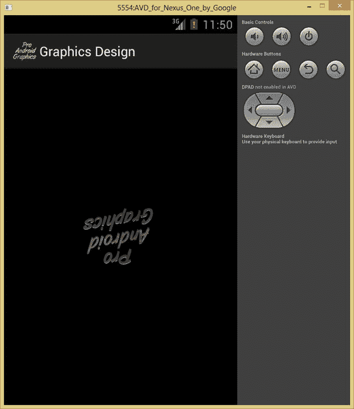

**图 15-20.** 在 Nexus One 模拟器中测试您的 `pagAnimationSet`

接下来，我将给您一些自己尝试的内容，这些内容我们之前已经做过，所以只是为了积累经验而重复，让您熟悉本书中学到的所有类和方法。

### 使用 Android Runnable 类运行 AnimationSet

在上一章中，您利用 Java `Runnable` 公共接口及其 `run()` 方法在单独的线程中运行 `AnimationDrawable`。您编写了该方法，以便您的应用可以异步处理帧动画 `Drawable` 对象（在该例中是 `BitmapDrawable` 帧）。

为了练习，现在我希望您做的是注释掉您的事件处理方法，并重新实现您的 `animStarter` 类，使其实现 `Runnable` 公共 Java 接口和 `run()` 方法，并将 `onClick()` 事件处理程序中的代码安装进去，以便在应用启动时自动启动帧动画和程序化动画。别忘了把 `.setImageDrawable()` 方法调用放回到第 14 章 中的位置！

### 为您的 AnimationSet 创建一个 TranslateAnimation 对象

另一件我希望您尝试的事情是，为当前的 `AnimationSet` 对象添加一个移动组件，该组件使您动画从屏幕更高的位置开始，并在缩放和淡出发生时沿着 Y 轴向下移动，以使动画看起来像是从天而降。

为此，您需要在类顶部声明一个名为 `translateSkyToZero` 的 `Animation` 对象，就像您处理其他变换对象一样，然后使用 `new` 关键字初始化该对象，并使用构造方法配置参数列表，就像您对其他三个 `Animation` 子类对象所做的那样，并且在代码中的相同位置进行。

确保使用 `.addAnimation()` 方法调用，并将 `translateSkyToZero` 值作为参数传递给该方法，从而将新的 `TranslateAnimation` 对象添加到您的 `AnimationSet` 对象中，这会将其添加到 `AnimationSet`（组）对象的复杂动画定义中。

最后，一旦您的 `TranslateAnimation` 对象被添加（连接）到 `AnimationSet` 对象之后，尝试调用该 `AnimationSet` 对象的一些其他参数方法！一些我们没有特别声明（使用）的参数方法（因为我们依赖它们的默认值）包括您在第 4 章 中学习和实现过的 `.setRepeatMode()` 或 `.setRepeatCount()` 方法。


### 总结

在第十五章中，你学习了如何仅使用 Java 代码（无需 XML 标记）在 Android 操作系统中实现启动画面程序化动画，具体方法是使用 `Animation` 类及其五个子类（`ScaleAnimation`、`AlphaAnimation`、`AnimationSet`、`RotateAnimation` 和 `TranslateAnimation`）中的方法和构造方法。

我们首先探讨了 Android 的 `Animation` 类本身，以及它如何直接继承自 `java.lang.Object` 主类，这意味着它基本上是从零开始编写的，旨在为 Android 操作系统提供视图动画或矢量动画（也称为程序化动画）。

接着，我们学习了 `TranslateAnimation` 子类，以及它如何让我们在 X-Y 屏幕空间中通过动画方式移动 `View` 对象。然后，我们研究了 `ScaleAnimation` 子类，以及它如何在 X-Y 二维屏幕维度内缩放 `View` 对象，同时我们也了解了这两个程序化动画类的构造方法的工作原理。

随后，你直接投入 Java 编码，在 `GraphicDesign` 应用中实现了 `ScaleAnimation` 对象，从而观察 `Animation` 对象及其变换子类如何在你的 Java 编码环境中协同工作。

接着，你学习了 `AlphaAnimation` 类，以及它如何让我们为程序化动画技巧库添加 alpha 混合效果。你还学会了使用相对简单的构造方法，为 `View` 对象（在你的案例中是 `ImageView`）实现淡入或淡出效果，从而使其产生动画。

然后，你再次深入 Java 编码，添加了另一个 `Animation` 对象来定义你的 `AlphaAnimation` 目标，并尝试连续两次调用 `.startAnimation()` 方法，但失败了，这迫使你转而学习 Android 的 `AnimationSet` 类，结果证明这真是一次积极的体验。和平、爱与 AnimationSet，朋友（无论男女）！

在回顾了 `AnimationSet` 类的细节之后，我们立刻回到 Eclipse ADT 中，你开始实现更高级的 Java 程序化动画编程。你创建了一个 `AnimationSet` 动画组流水线来实现复杂的程序化动画，并且全程只使用了 Java 编程逻辑。

一旦你的 `AnimationSet` 正常工作，通过使用 `RotateAnimation` 类和构造方法，然后调用 `.addAnimation()` 方法将其添加到 `AnimationSet` 中，为动画集添加旋转动画就变得容易多了。到这时，你已经相当擅长在 Android 应用中使用 `Animation` 类及其功能性子类了。

最后，你使用 Java 实现了与第 3 章和第 4 章中使用 XML 实现的完全相同的帧动画与程序化动画组合序列。这时，我建议（作为练习）尝试向你的 `AnimationSet` 添加一个 `TranslateAnimation` 对象，并通过重新实现 `animStarter` 类来制作应用自动启动徽标动画。

在下一章中，我们将深入理解 Android 的 `Drawable` 类，因为你现在已经学习并使用了它的许多子类来实现动画、混合以及其他非常高级的图形相关 Android 编程技巧。这将帮助你“彻底掌握”Android 中的 `Drawable` 类与对象——这些是 Android 操作系统内图形设计与实现的基石，因而非常重要。

# 16. 高级图形：掌握 Drawable 类

### 摘要

在第十六章中，我们将从更底层的视角审视 Android 操作系统中的 `Drawable` 类，因为它为操作系统中所有与图形相关的对象提供了基础。

既然你已经深入接触并体验了 Android 中多种高级 `Drawable` 对象类型，现在是时候来考察这些对象所源自的基类，并了解 Android 操作系统中其他一些可用的 `Drawable` 对象类型了。

其中许多不同类型的 `Drawable`（例如 `ShapeDrawable`）我们之前一直没有足够的理由去介绍。这主要是因为对于作为读者的你而言，数字图像、数字视频、二维动画、混合以及过渡等主题比矢量插画（形状）、字体（文本对象）或渐变等主题更受欢迎。尽管如此，矢量插画仍是一个热门话题，因此我们将在本章中加以介绍。

所以，不用担心，我们终将涵盖所有内容，这也是我特意安排一章专门讲解 Android 的 `Drawable` 类的原因之一——这样我就能确保覆盖所有不同类型的 `Drawable` 子类和对象，因为它们都会以某种方式影响图形设计。

在本章中，你还将学习其他几个与专业 Android 图形设计直接相关的重要 Android 类，这些类通常与 `Drawable` 类及其众多子类一起使用。它们包括 Android 的 `Shader` 和 `BitmapShader` 类、`Rect` 和 `RectF` 类、`InputStream` 类以及 `ShapeDrawable` 类。同时，你也会进一步巩固对 `Bitmap`、`Paint` 和 `Canvas` 类的使用和认知。


### Android 可绘制资源：可绘制对象的类型

Android 拥有超过十二种不同类型的可绘制资源，您可以将它们应用于 Android 应用程序的图形设计管线。 在本书的这个阶段，您已经利用了大量的这些更高级的可绘制对象类型；我们将确保您了解 Android 中所有可用的可绘制对象。

Android 可绘制资源是可绘制到用户显示屏上的图形的基础概念，您可以通过诸如 `.getDrawable()` 之类的方法调用来检索它们，或者使用 XML 定义以及 `android:icon`、`android:background` 或 `android:src` 等参数来应用它们。

Android 中有许多不同的可绘制对象类型，仅列举部分，包括 `Bitmap`（位图）、`9-Patch`（九宫格）、`Layer`（图层）、`State`（状态）、`Level`（级别）、`Animation`（动画）、`Transition`（过渡）、`Shape`（形状）、`Scale`（缩放）、`Rotate`（旋转）、`Inset`（内嵌）、`Clip`（裁剪）、`Picture`（图片）、`Paint`（画笔）和 `Color`（颜色）。

在本章的第一部分概述中，我们将逐一介绍 Android 中这些主要的可绘制对象类型，并确切了解它们是什么以及它们的作用。 我们这样做是为了让您作为专业的图形设计师，对 Android 为您提供的工具有更广阔的视角。 我们将首先介绍您已经使用过的可绘制类型，然后向您介绍一些新的、令人兴奋的可绘制对象。

`BitmapDrawable`（位图可绘制对象）使用数字图像资源（PNG、JPG 或 GIF），用称为位图的像素数组填充可绘制对象。 在第 11 章构建图像合成与混合管线时，您已经了解了如何将可绘制对象转换为 `BitmapDrawable` 等操作。

如您在第 10 章中所见，`NinePatchDrawable`（九宫格可绘制对象）利用 PNG32 图像文件格式，并使用单像素黑色边框区域对其进行自定义，以创建可缩放的 X 和/或 Y 区域，从而允许根据图像资源内容设计在 X 或 Y 维度上动态调整图像大小。 `NinePatch` 对象图像资源使用特殊的文件名 `thefilename.9.png`，也可以使用 PNG24（真彩色，无 Alpha 通道）和 PNG8（索引色）。

如您在第 12 章中所见，`LayerDrawable`（图层可绘制对象）允许集合其他类型的可绘制对象，这些对象可用于分层合成。 这些可绘制对象按照 `LayerDrawable` 对象的数组顺序绘制，因此索引最大的子图层元素将绘制在最上层。

如您在第 13 章中所见，`TransitionDrawable`（过渡可绘制对象）通常使用 XML 文件定义，该文件允许在两个可绘制资源之间进行交叉淡入淡出。

如您在第 14 章和第 3 章中所见，`AnimationDrawable`（动画可绘制对象）可以通过 XML 标记或 Java 代码使用，以定义一系列帧，这些帧按照开发者使用参数指定的方式播放，从而形成 2D 帧动画资源。 `AnimationDrawable` 对象可以进一步使用 `Animation` 对象进行处理，后者将应用矢量（算法）变换。

`StateListDrawable`（状态列表可绘制对象）通常也使用 XML 定义文件来定义，该文件引用一系列突出显示不同功能状态的位图图像资源。 您在第 9 章中创建多状态 `ImageButton` UI 元素时使用了状态，该元素为每个按钮状态（例如，按钮悬停、按下或获得焦点时）实现了不同的图像。

`LevelListDrawable`（级别列表可绘制对象）通常使用 XML 文件定义，该文件实例化一个可绘制对象，该对象管理多个备用可绘制对象，每个备用可绘制对象都被分配了一个最小值和最大值，在运行时用于确定 `LevelListDrawable` 当前引用的级别。

`InsetDrawable`（内嵌可绘制对象）使用 XML 定义文件定义，该文件定义一个可绘制的 XML 资源，用于在另一个可绘制对象内以指定的 DIP 距离创建内嵌。 当您的 View 对象需要的背景可绘制对象小于 View 对象的实际边界时，这很有用。

`ClipDrawable`（裁剪可绘制对象）使用 XML 文件定义，该文件定义一个可绘制对象，该对象根据您的 `ClipDrawable` 对象的当前级别值在另一个可绘制对象上实现裁剪平面或区域。 这通常用于创建特殊效果或实用工具，例如进度条。

`ScaleDrawable`（缩放可绘制对象）也使用 XML 定义文件定义，该文件指定一个可绘制对象，该对象根据 `ScaleDrawable` 对象的当前级别值更改另一个可绘制对象的缩放比例。

`ShapeDrawable`（形状可绘制对象）通过定义几何形状的 XML 文件来定义。 形状定义还可以包括其他嵌套形状、边框、颜色或颜色渐变。 `ShapeDrawable` 对象基本上为 Android 操作系统提供了许多在 Freehand、Illustrator 或 InkScape 等软件包中常见的矢量功能。

我们将在本章的后续部分介绍 `Shape` 和 `ShapeDrawable` 对象，因为数字插画在新媒体中是一个热门话题。

在我们深入探讨 `ShapeDrawable` 对象之前，需要注意的是，您通常在 `Colors.xml` 文件中定义的任何颜色资源，也可以通过 XML 定义中的引用作为可绘制对象使用。

举个例子，在创建您的 `StateListDrawable` 对象时，您可以为 `android:drawable` 属性引用一个颜色资源，这使其在某种程度上成为一种颜色可绘制资源。 这将通过在您的 XML 标记中的 View 对象标签内使用以下参数来完成：

`android:drawable="@color/green"`

接下来，让我们看看如何使用 XML 标记和 `<shape>` 根元素在 Android 中创建矢量插画，以创建 `ShapeDrawable` 对象。 一旦您在 Android 中创建了自己的矢量插画，我们将更详细地研究 Android 中的 `Shape` 和 `ShapeDrawable` 类。 既然我们在上一章中介绍了矢量动画，那么在本章中介绍静态矢量图像也是顺理成章的。


### 创建 ShapeDrawable 对象：XML `<shape>` 父标签

让我们再次启动 Eclipse，或者如果它已经在桌面上打开，你可以直接右键点击 `GraphicsDesign` 项目中的 `/res/drawable` 文件夹。选择 **新建 ➤ Android XML 文件** 菜单命令序列，如图 16-1 所示。

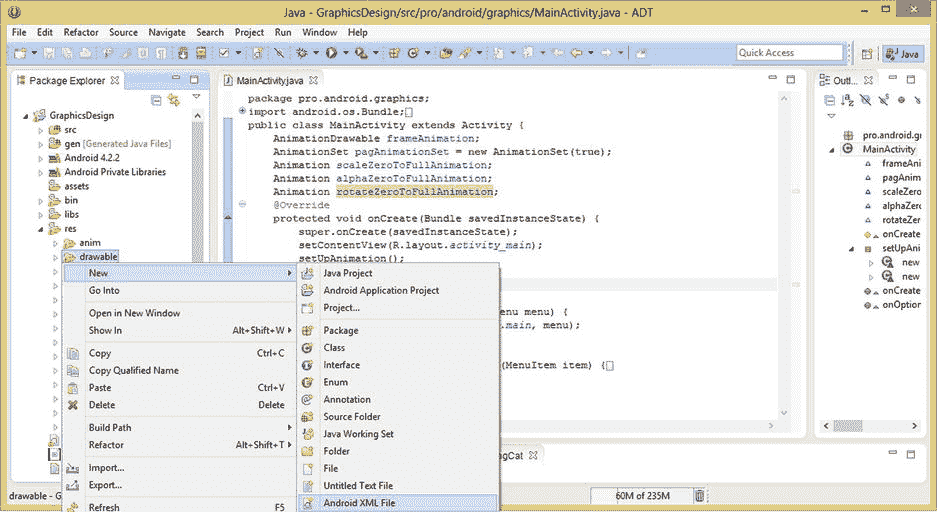

图 16-1. 新建一个 ➤ Android XML 文件，以便创建 `ShapeDrawable` 对象的 XML 定义

在“新建 Android XML 文件”对话框中（如图 16-2 所示），将文件命名为 `contents_shape`，然后选择 `<shape>` 根元素，这将使其成为一个 `ShapeDrawable` 的 XML 定义文件。请注意，由于你已经在 `GraphicsDesign` 项目中点击了 `/res/drawable` 文件夹，Eclipse 能够自动为你推断出前两个“资源类型”和“项目”设置字段。完成后，选择“完成”按钮以创建你的 `ShapeDrawable` XML 定义文件。

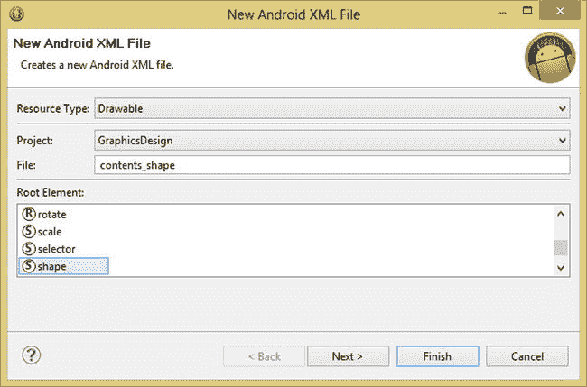

图 16-2. 使用“新建 Android XML 文件”对话框创建一个 `<shape>` Drawable 的 XML 定义文件

当 `ShapeDrawable` XML 定义文件在 Eclipse 中央编辑窗格中打开后，将光标放在 `xmlns:android` 参数末尾，按下回车键，输入 `android`，然后按下冒号键以弹出包含此标签所有可用参数的助手对话框，如图 16-3 所示。选择 `android:shape` 选项，该选项允许你定义形状，双击它，它将被添加为你的 `<shape>` 父标签的一个参数。

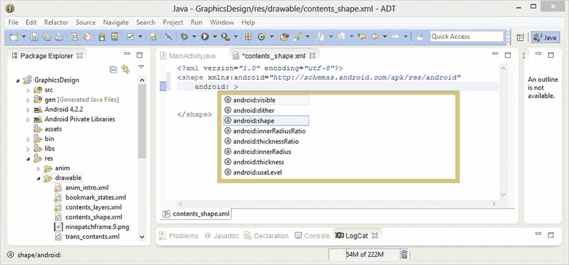

图 16-3. 添加 `android:shape` 参数来定义你的 `ShapeDrawable` 要使用的形状

当参数出现后，在引号内添加形状类型 `oval`。接下来，将光标放在 `<shape>` 父标签容器内部，或者放在起始 `<shape>` 标签“结束”尖括号下方的空行上，你就可以开始添加嵌套的子标签了。

添加一个左尖括号 `<` 字符来调用 Eclipse 助手对话框，其中包含 `<shape>` 根元素可用的所有子标签，如图 16-4 所示。

让我们来了解一下可以应用的不同类型的渐变，以及如何设置渐变色谱外部、内部和中间部分的颜色。由于椭圆没有角，且纯色过于单调，因此为你的 `<shape>` 父标签添加 `<gradient>` 子标签。

选择 `gradient` 选项并（或）双击它，以将 `<gradient>` 子标签添加到你的 `ShapeDrawable` XML 定义中。你会注意到只添加了 `<gradient` 这部分子标签，因此你必须通过添加一个 `空格` 和一个 `/>` 结束标签来完成 Eclipse 的容器闭合。

完成此操作后，你可以将光标放在 `<gradient` 起始标签之后，按下回车键以使用 Eclipse 的自动缩进功能。

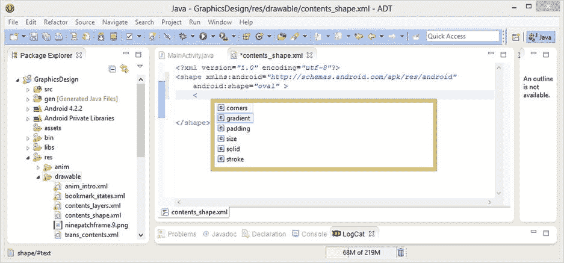

图 16-4. 在父 `<shape>` 标签中添加 `<gradient>` 子标签，以用渐变填充 `ShapeDrawable` 对象

输入单词 `android` 并按下冒号键，调出可与 `<gradient>` 标签一起使用的参数列表。如你所见，共有九个参数，在完成本节之前你会用到其中七个。双击 `android:startColor` 参数，它将被添加到你的 `<gradient>` 标签中，如图 16-5 所示，至此你将开始为你的椭圆 `ShapeDrawable` 对象配置渐变。

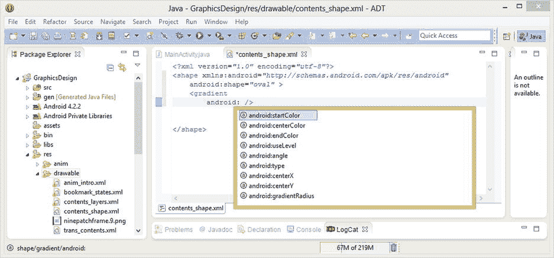

图 16-5.


使用 `android:` 工作流程调出 `<gradient>` 标签的全部参数选项。

在 `android:startColor` 参数中设置十六进制颜色值 `#FF0000` 表示 100%红色通道，在 `android:centerColor` 参数中使用十六进制值 `#FFFF00` 表示 100%黄色（红色加绿色）。对于 `android:endColor`，使用 100%绿色的十六进制颜色值 `#00FF00`，这样你使用的颜色将在渐变中良好融合。

接下来，让我们使用 `android:centerX` 和 `android:centerY` 参数指定支点（即渐变中的中心点），将两者均设为形状的正中间（50%），使用的浮点值为 `0.5`。

完成这五个参数的添加后，带有红色、黄色和绿色线性（默认）渐变的椭圆形 Shape 的 XML 定义将完全如下面的 XML 标记块所示：

```
<? xml version="1.0" encoding="utf-8" ?>
<shape xmlns:android="http://schemas.android.com/apk/res/android"
    android:shape="oval" >
    <gradient
        android:startColor="#FF0000"
        android:centerColor="#FFFF00"
        android:endColor="#00FF00"
        android:centerX="0.5"
        android:centerY="0.5" />
</shape>
```

如图 16-6 所示，标记无错误和警告，你可以准备好在 Eclipse ADT 中的图形布局编辑器窗格中测试你的 ShapeDrawable 定义。

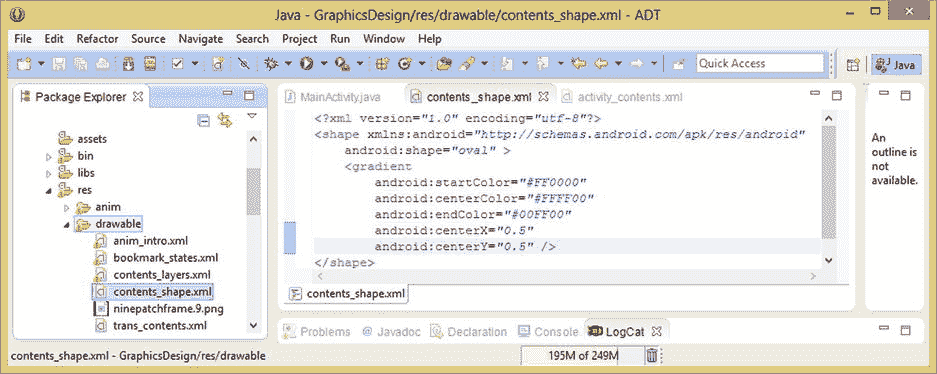

图 16-6. 向 `<gradient>` 子标签添加起始色、中心色、结束色以及支点居中参数

在访问 GLE 之前，你必须打开并编辑你的 `activity_contents.xml` 定义标签页，因此在你的 `/res/layout` 文件夹中右键点击该文件并选择“打开”选项，或者如果它已经在你的 IDE 中打开，则点击 Eclipse 中央编辑区域顶部的该标签页。

由于你的 ShapeDrawable 当前未被布局容器定义中的 ImageView UI 元素引用，你需要将 NinePatchDrawable 引用更改为指向你的新 ShapeDrawable XML 定义文件。这通过使用以下 XML 标记将 `android:src` 参数的值改为 `@drawable/contents_shape` 来实现：

```
android:src="@drawable/contents_shape"
```

你可以让 `android:background` 参数保持当前配置，这样你就可以看到当背景板中使用位图资源时，Android 如何对矢量图形进行抗锯齿（像素平滑）处理。

如图 16-7 所示，你的 ImageView 用户界面对象现在引用了两种不同类型的 Drawable 资源：ShapeDrawable 和 TransitionDrawable。你的两个 Drawable 资源都使用 XML 标记来定义它们的图像资源，因此你不再在 ImageView UI 元素中（直接）引用任何图像资源，尽管你在 TransitionDrawable 对象 XML 定义中引用了它们。

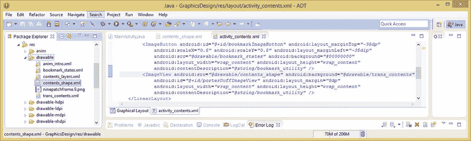

图 16-7. 编辑 `activity_contents.xml` UI 定义，将 `<ImageView>` 标签改为引用 `contents_shape`

实际上，如果你想查看在第 13 章中创建的 TransitionDrawable 在你的 ShapeDrawable 矢量图后面提供图像过渡效果，你可以在过程中的任何时候使用“运行方式 ➤ Android 应用程序”工作流程，并亲自检查结果。我现在不会浪费时间这样做，因为本章内容很多，但你可以自己尝试一下，这既是为了练习使用 AVD 模拟器，也是为了看看 Android 在合成 Bitmap（Transition Drawable）和 Vector（Shape Drawable）图形设计元素方面的出色表现。你会对结果感到满意的！

一旦你重新配置了 ImageView 源图像参数，点击图形布局编辑器标签页，如图 16-8 所示，以便检查你的 ShapeDrawable 对象 XML 定义迄今为止的结果。

如图所示，ShapeDrawable 对象在 GLE 中渲染，呈现出漂亮的渐变颜色混合，且椭圆形 ShapeDrawable 的边缘与背景板中的 `cloudsky.jpg` 图像完美抗锯齿。

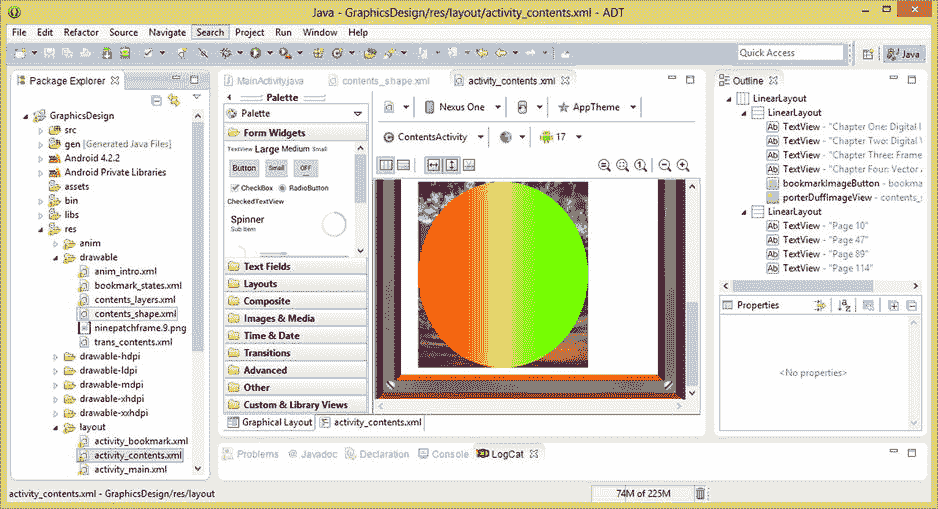

图 16-8. 使用图形布局编辑器预览椭圆形 ShapeDrawable 和线性渐变设置

接下来在处理 `<gradient>` 标签时要尝试的是不同类型的渐变。目前 Android 操作系统中有三种不同类型的渐变。线性渐变是默认类型，如图 16-8 所示，因此如果你希望实现 LinearGradient 渐变类型，则无需使用 `android:type` 参数。

实际上，正如你将在本章后面学到的，`LinearGradient` 对象根本不是一种渐变类型；它是 `Shader` 的子类之一。

还有扫描渐变，由 `SweepGradient` 类（`Shader` 子类）创建，可以理解为绕时钟扫描，起始默认位置为三点钟方向。最后还有 `RadialGradient` 类，这种渐变从 ShapeDrawable 的中心开始向外辐射。

需要注意的是，如果由 `android:centerX` 和 `android:centerY` 参数指定的 ShapeDrawable 中心未使用值 `0.5`（或 50%）设置，则径向渐变将从你设置的居中 X 和 Y 坐标位置开始，并从该点向外辐射。这使你可以很好地控制径向渐变的放置位置，从而控制你可以创建的特殊效果类型。

让我们添加一个 `android:type` 参数并将其值设为 `sweep`，如图 16-9 所示，以便查看此设置及其各种常量对你的 ShapeDrawable 对象产生的不同渐变效果。

请注意，由于你将 X 和 Y 居中参数设置为 ShapeDrawable 的中间，扫描将位于椭圆形内居中。然而，就像径向设置一样，如果你想获得不同的扫描效果，可以将值改为 `0.0` 到 `1.0` 之间的任何值。

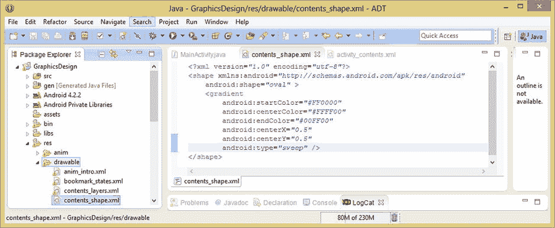

图 16-9. 通过 `android:type` 将 `<gradient>` 类型从默认的线性设置更改为扫描设置

添加完 `android:type="sweep"` 参数后，点击切换回激活你的 `activity_contents.xml` 编辑标签页，然后点击底部的图形布局编辑器标签页，预览带有扫描渐变类型的新 ShapeDrawable 对象，如图 16-10 所示。

最后，你将尝试为 `android:type` 参数实现径向常量并生成径向渐变，以便你直观地了解这种渐变效果在 Android 矢量图形管线中的作用。记住，`android:type="radial"` 常量实际上引用的是 Android 的 `RadialGradient` 类，它是 `Shader` 的子类。稍后你将学习 `Shader` 类及其子类。

使用 `android:type="radial"` 参数时，需要添加一个相关参数。这个参数是 `android:gradientRadius`，用于指定径向渐变的半径。径向渐变需要指定半径，这一点并不令人惊讶！

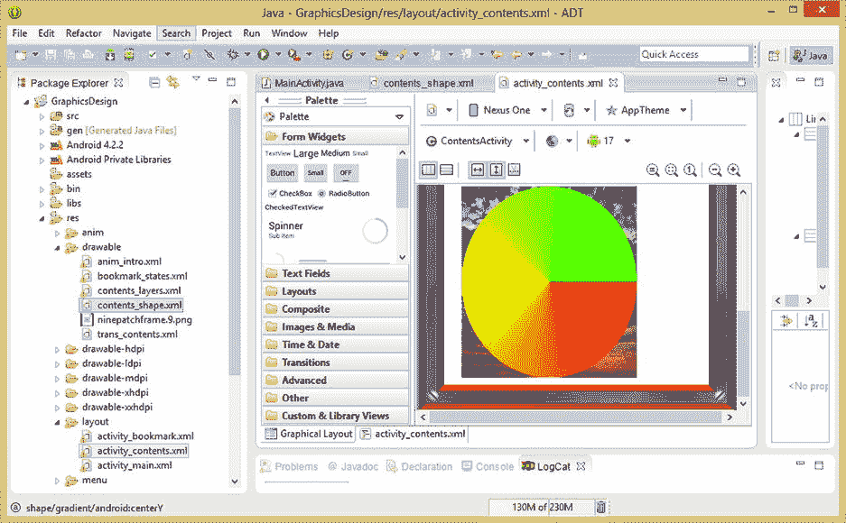

图 16-10. 在椭圆形 ShapeDrawable 中预览扫描渐变


我通过亲身经历发现，Eclipse 会抛出一个错误（而且不是漂亮的高亮显示错误），如果你试图使用辐射类型渐变，而没有事先安装这个 `android:gradientRadius` 参数。

稍后，如果你喜欢，可以（如果你是好奇型的）删除这个参数，并使用 CTRL-S 组合键 `保存` 你的 XML 标记，这样 Eclipse 就会评估它。这会在你 IDE 底部的错误日志选项卡中为你提供这些错误消息。


**图 16-10.** 使用图形布局编辑器预览你的椭圆形 ShapeDrawable 和扫描渐变设置

那么，我们现在添加两个参数，你需要在你的 `ShapeDrawable` 对象内部实现一个径向渐变：一个是通过使用 `android:gradientRadius` 参数设置的渐变半径，另一个是通过使用 `android:type="radial"` 参数设置的径向渐变，使用以下渐变 XML 标记：

```
<gradient
android:startColor="FF0000"
android:centerColor="FFFF00"
android:endColor="00FF00"
android:centerX="0.5"
android:centerY="0.5"
android:gradientRadius="100"
android:type="radial" />
```

正如你在图 16-11 以及上面的标记中看到的，我为我的 `android:gradientRadius` 参数使用了整数值 `100`。稍后你可以自己尝试不同的设置，从零（根本不产生渐变），到 5（在中心产生一个色点），再到 100 或更多。你尝试得越多，经验就越丰富！

`android:gradientRadius` 参数设置为 `100` 将产生如图 16-12 所示的径向渐变三色分层，其中大约 35% 的径向渐变为红色，15% 为黄色，50% 的径向渐变为绿色。数值越大，产生的红色越多。

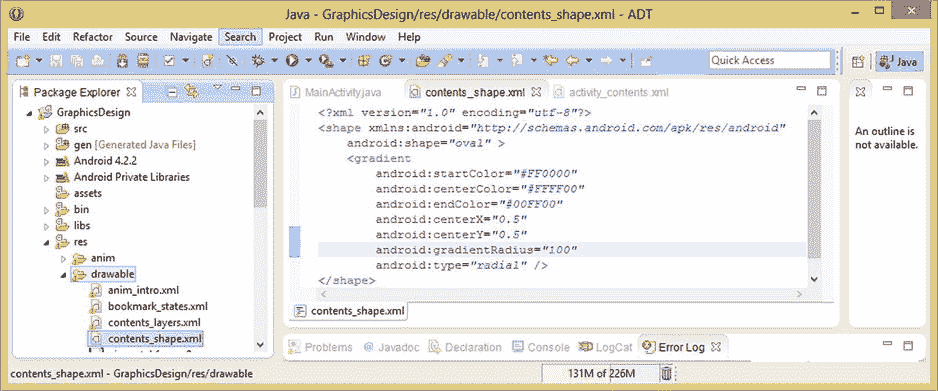

**图 16-11.** 添加 `android:gradientRadius` 参数以便实现 `android:type="radial"`

点击 Eclipse 顶部的 `activity_contents.xml` 选项卡，然后点击底部的图形布局选项卡，即可看到结果，如图 16-12 所示。

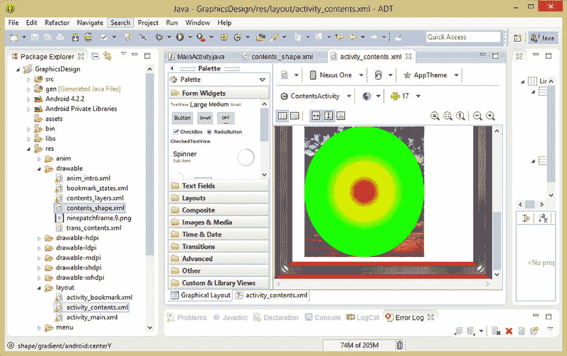

**图 16-12.** 使用图形布局编辑器预览你的椭圆形 ShapeDrawable 和径向渐变设置

接下来，你将向你的 `ShapeDrawable` 添加另一个子标签属性，即 `stroke` 标签，以向这个 `ShapeDrawable` 的轮廓添加一些细节。

为此，使用左尖括号 `<` 工作流程，如图 16-13 所示，以调出包含所有子标签选项的帮助对话框，选择底部的 stroke 标签选项，并（或）双击它以插入 `<stroke>` 子标签。

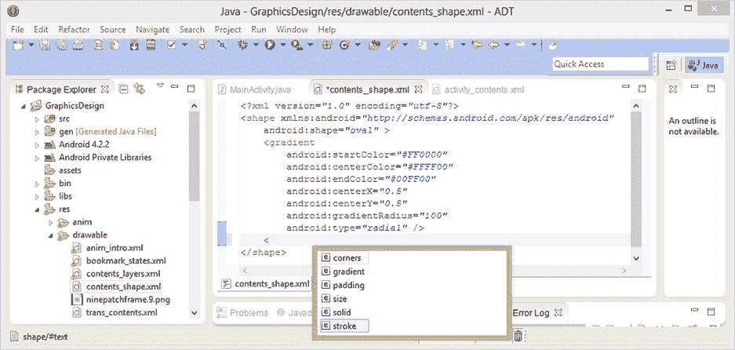

**图 16-13.** 使用左尖括号 `<` 工作流程调出帮助对话框，其中包含可在 `<shape>` 中使用的标签

接下来，输入单词 `android`，然后输入冒号字符，以调出 ADT 帮助对话框，其中包含此 `<stroke>` 标签支持的四个参数，你将在此处全部实现它们，以便精确地可视化这些描边选项能为你的矢量插图带来什么效果。

`android:color` 参数指定描边颜色，你将把它设置为黑色，以形成一个漂亮深色边框；`android:width` 参数指定轮廓周围描边的粗细。我将使用 5 DIP 的设置，以便椭圆形周围的描边非常清晰可见。

最后两个参数允许你添加虚线效果，你将使用它们让你的径向渐变椭圆的轮廓看起来像齿轮。`android:dashWidth` 定义虚线的宽度，我将其设置为 4 DIP 的值，而 `android:dashGap` 定义每个虚线之间的间隙（空间）大小。我为我的 `dashGap` 参数使用了 3 DIP 的值。

```
<stroke
android:color="#000000"
android:width="5dip"
android:dashWidth="4dip"
android:dashGap="3dip" />
```

正如你在图 16-14 中所看到的，你已经使用了所有四个 `<stroke>` 参数，并且你的 XML 标记评估为无错误和无警告。

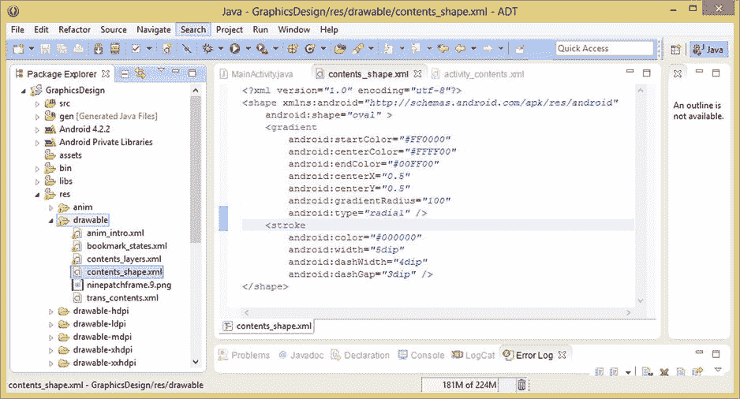

**图 16-14.** 为 `android:color`、`android:width`、`android:dashWidth` 和 `dashGap` 添加 `<stroke>` 标签参数

点击 `activity_contents` 和 GLE 选项卡；图 16-15 显示了你的结果。

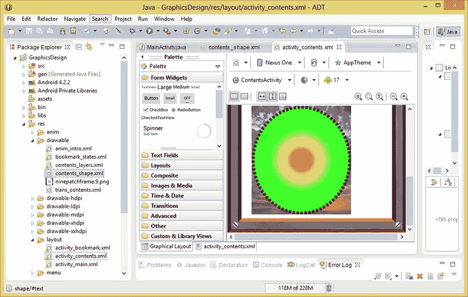

**图 16-15.** 使用图形布局编辑器预览你的椭圆形 ShapeDrawable 和虚线 `<stroke>` 设置


### Android Drawable 类：图形蓝图

Android 的 `Drawable` 类是 `java.lang.Object` 主类的另一个直接子类。这表明 `Drawable` 类是专门为 Android 操作系统定义图形对象而设计的，因此，我们需要对其进行详细讨论。

Android `Drawable` 类的层级结构如下：

```
java.lang.Object
> android.graphics.drawable.Drawable
```

Android 的 `Drawable` 类属于 `android.graphics.drawable` 包。因此，`Drawable` 类的导入语句将其类导入路径引用为 `android.graphics.drawable.Drawable` 包。

`Drawable` 类是一个公共抽象类。这种访问修饰符配对意味着，除了用于初始声明 `Drawable` 对象，或用于创建子类（例如你在本章中将要使用和创建的类）之外，该类不能直接使用。

`Drawable`（类或对象）是 Android 操作系统用于表示某种图形对象的术语。它可能源于这样一个假设：“可绘制的东西应该被称为 `Drawable`。”Android 喜欢为操作系统组件和功能创建自己的术语，例如 `Activities`、`Receivers` 和 `Drawables`。

正如你在本书中所看到的，当你需要某种与图形相关的对象（内存中）资源时，你将处理 `Drawable` 对象。当你希望在显示器上绘制某些内容时，你将实例化一个 `Drawable`（或其子类 `Drawable` 类型，例如 `BitmapDrawable`）。

`Drawable` 类代表了 Android 图形设计的基础，旨在提供用于处理底层图形资源的通用 API。正如我们在本章第一部分查看 Android 中可用的多种不同类型的 `Drawable` 对象时所看到的，这种图形资源可以采用多种形式。

Android 中的 `Drawable` 对象不具备接收事件的能力，也不允许与用户进行任何交互。这些功能由你的 `View` 对象处理，通常是 `ImageView`，它将在其内部“包含”（或引用）你的 `Drawable` 对象，要么放在保存源图像板（容器）的前景参数中，要么放在保存背景图像板（或者只是一个简单的 ARGB 颜色值）的背景参数中。

`Drawable` 主类为所有其他类型的 `Drawable` 子类提供了五个功能支持领域。这些包括 `Drawable` 对象的填充、边界、动画、状态控制和层级。

我们在本书中已经看到过这些概念中的一部分，例如，对于填充值，`Drawable` 类的 `.getPadding()` 方法将从一个 `Drawable` 对象返回（如果适用）有关如何放置该 `Drawable` 对象内所包含内容的信息。

例如，一个 `Drawable` 对象，如 `NinePatchDrawable` 对象，它旨在用作按钮 UI 小部件的图形框架，将需要返回一个填充 `Rect` 值，该值能够准确地将文本标签放置在按钮 UI 元素内的 `NinePatchDrawable` 资源中。这个 `.getPadding()` 方法调用使用 `Rect` 对象作为参数，通过以下方法调用代码实现，你将在本章稍后学习到：

`yourDrawableObjectNameHere.getPadding(Rect);`

我们在本书中也多次提到 `AnimationDrawable`（帧动画）对象。任何 `Drawable` 子类都可以通过使用 `Drawable` 类中的两个嵌套类之一“回调”其父类来支持动画。

对于你想要创建的任何会扩展 `Drawable` 类的动画 `Drawable` 对象子类，都应该实现这个 `Drawable.Callback` 接口。

子类可以通过 `.setCallback(Drawable.Callback)` 方法调用来支持该接口，以便动画在你的 `Drawable` 子类中正常运行。最简单的方法是在自定义 `Drawable` 对象上调用 `Drawable` 的 `.setBackgroundDrawable()` 方法。

我们还研究过多状态 `ImageButton` 对象和类似的 `Drawables`，它们会考虑 UI 元素或图形的状态，以便设置 `Drawable` 资源引用并显示正确的图像资源。

`Drawable` 类包含一个 `.setState()` 方法，该方法允许 `Drawable` 子类告诉它创建的 `Drawable` 对象，每个 `Drawable` 资源需要为哪种状态绘制：例如，当鼠标悬停时，或当 UI 元素获得焦点时，或当对象被选中时，甚至是当用户正在使用自定义定义的状态时。

支持设置状态的 `Drawable` 对象将根据此状态或状态变化信息修改其源图像。你在本书中已经创建过一个多状态 `Drawable`，即在第 9 章中，你创建了一个具有四种不同按钮 UI 状态的 `ImageButton Drawable`。

`Drawable` 对象还可以使用 `.setLevel()` 方法响应不同的层级。此方法允许 `Drawable` 对象响应任何控制器，控制器可以发送层级信息来触发需要显示的确切 `Drawable` 资源。层级对于与 Android 硬件一起使用特别有用，例如，实时显示电池电量，或者如果硬件支持该功能（就像今年即将推出的新款 Android 手表很可能会支持的那样）则设置高度计层级。

最后，`Drawable` 类通过使用 `.setBounds()` 方法支持边界，该方法需要用于告知你的 `Drawable` 应该绘制在哪里，以及在屏幕上应该有多大。在本章下一节中，当你创建自己的自定义 `Drawable` 子类 `ImageRoundingDrawable` 类时，你将利用 `.getBounds()` 方法。

Android 开发者可以通过使用 `.getIntrinsicHeight()` 或 `.getIntrinsicWidth()` 方法，找出任何给定 `Drawable` 对象的首选尺寸。


### 创建自定义 Drawable：ImageRoundingDrawable

让我们回到 Eclipse 中，创建你自己的自定义 `Drawable` 子类，以便你能够确切了解其实现方式。右键点击你的项目 `/src/` 文件夹，然后选择 **新建 ➤ 类** 菜单命令序列，如截图左侧的图 16-16 所示。

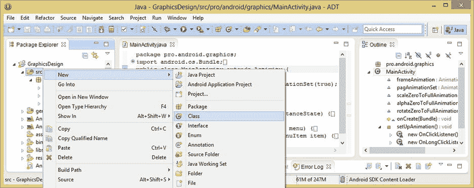

图 16-16. 右键点击 `/src` 文件夹并选择 **新建 ➤ 类** 菜单序列以创建新的类

这将弹出一个“新建 Java 类”对话框，如图 16-17 所示，并且会自动填充“源文件夹”字段，因为你之前右键点击了 `GraphicsDesign/src/` 文件夹来调用此对话框。

点击“包”字段右侧的 **浏览** 按钮，并从提供的列表底部选择你的 `pro.android.graphics` Java 包。

在“名称”字段中，输入 `Drawable` 子类名称 `ImageRoundingDrawable`，并保持“公开”修饰符处于选中（勾选）状态，如下方“名称”字段所示。

接下来，点击“超类”字段右侧的 **浏览** 按钮。这将打开“超类选择”对话框，如图 16-17 右侧所示，你可以在其中搜索 `Drawable` 超类。

在“超类选择”对话框的顶部，你会看到一个 **选择类型** 字段，它充当搜索功能，帮助你在构成 Android 操作系统的数百个类中缩小搜索范围。

输入字母“d”，如图 16-17 所示，然后找到 `Drawable` 类引用，该类引用会指明其 `android.graphics.drawable` 包来源。当你点击 `Drawable` 类引用时，包来源信息会出现在类的右侧，确认这就是你想要子类化的主要 `Drawable` 超类。这与 Eclipse 弹出式辅助对话框中显示包来源的方式类似。

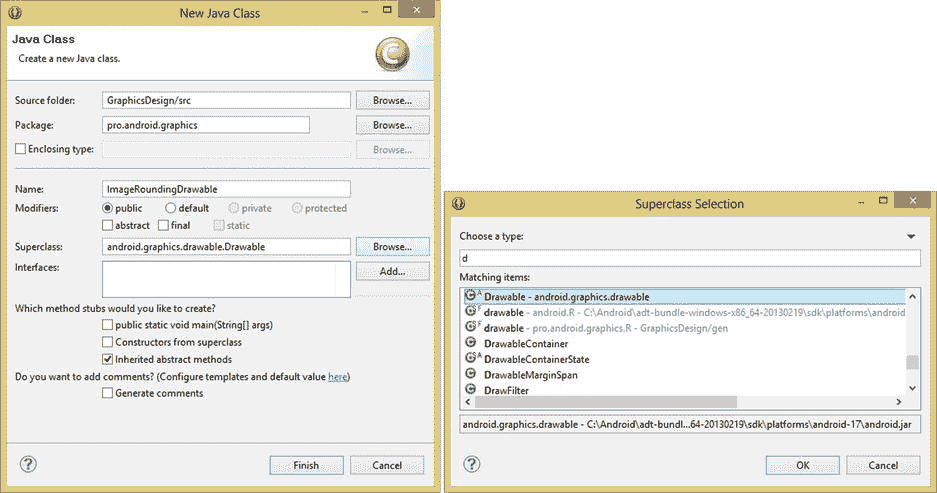

图 16-17. 将类命名为 `ImageRoundingDrawable` 并选择 `android.graphics.drawable.Drawable` 超类

在你找到并选择了 `Drawable` 超类后（如图 16-17 右侧所示），点击 **确定** 按钮，这将返回到你的“新建 Java 类”对话框，你终于可以点击 **完成** 按钮来创建 `public class ImageRoundingDrawable extends Drawable` 引导代码，以及其中 Android 希望你在你的 `Drawable` 子类中实现（或至少存在）的四个方法。

正如你在图 16-18 所示的空引导 `Drawable` 子类框架中看到的，Eclipse 为你编写了近二十多行 Java 代码，为你提供了一个初始框架，你可以在此基础上构建 `Drawable` 子类，这正是你接下来要做的。

除了 `package` 语句之外，还提供了三个 `import` 语句，它们支持在你的 `Drawable` 子类中对类（`extends`）和方法（参数对象）的使用。这些包括 `Canvas`、`ColorFilter` 和 `Drawable` 类，我们在本书的某个阶段已经详细介绍了这些类。接下来，你会看到 `ImageRoundingDrawable` 类声明，其中包含四个 `@Override` 方法，如果实现了这些方法，它们将覆盖 `Drawable` 超类中的同名方法。

其中两个方法，`.draw()` 和 `.getOpacity()`，你将通过实现你自己的 Java 代码来升级，以控制你的 `Drawable` 的不透明度，并精确指定它将如何绘制到 `Canvas` 上。

另外两个方法，`.setAlpha()` 和 `.setColorFilter()`，在此练习中不会被实现，因为你的 `ImageRoundingDrawable` 不会用到它们。

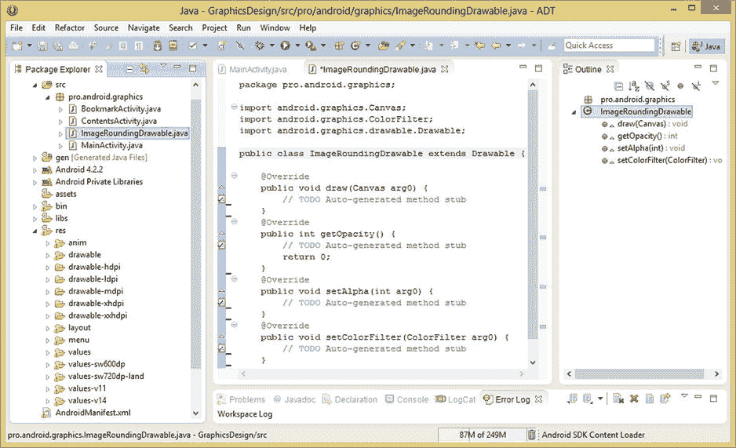

图 16-18. 检查 `ImageRoundingDrawable` Drawable 子类引导代码及其四个方法

接下来，你将开始添加对象声明，并为你自定义的 `Drawable` 子类构建构造器类。你将首先声明一个 `Paint` 对象，稍后将用它来在 `Canvas` 对象上绘制 `Bitmaps`。

### 创建用于绘制 Drawable 画布的 Paint 对象

你要添加的第一件事，是在 `ImageRoundingDrawable` 类定义的第一行，声明一个 `Paint` 对象变量。这是通过以下简单的 Java 代码语句完成的：

`private Paint paintObject;`

你将使用 `private` 访问控制，以便只有你的 `ImageRoundingDrawable` 类能够访问和利用这个即将被自定义的 `Paint` 对象。

如图 16-19 所示，你需要鼠标悬停并选择导入 `Paint` 类的选项，该类属于 `android.graphics` 包。完成此操作后，你将能够开始实现你的 `ImageRoundingDrawable()` 构造器方法，该方法将结合 `Canvas` 和 `Bitmap` 类来使用这个 `Paint` 对象，就像你在第 11 章中处理 PorterDuff 图像混合模式时看到的那样。

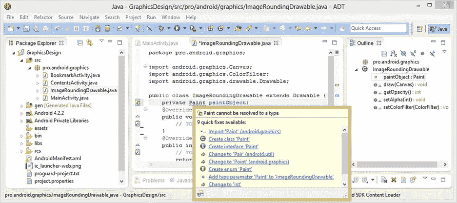

图 16-19. 声明一个名为 `paintObject` 的私有 `Paint` 对象，供 `ImageRoundingDrawable()` 构造器使用

接下来，让我们声明你的构造器方法，如图 16-20 所示，使用与你的 `ImageRoundingDrawable` 类名完全相同的名称，并使用 `public` 访问控制修饰符标识，以便它能够被你的 `GraphicsDesign` 项目和包中的其他类访问。你将使用一个 `sourceImage` `Bitmap` 对象作为传递到方法中的参数，这允许你指定想要进行圆角处理的图像。创建这个空构造器方法的代码如下：

`public ImageRoundingDrawable(Bitmap sourceImage) { 构造器代码写在这里 }`

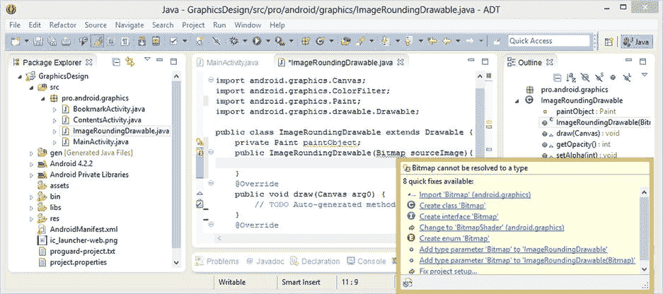

图 16-20. 创建一个带有 `sourceImage` `Bitmap` 对象参数的公共 `ImageRoundingDrawable` 构造器方法

如图 16-20 所示，你需要鼠标悬停你的 `Bitmap` 类引用，并选择 **导入 Bitmap (`android.graphics`)** 选项。注意类顶部的 `Paint` 导入语句，这是你在上一步执行了完全相同的工作流程后得到的结果。


### Android Shader 超类：用于绘制的纹理映射

在后续章节创建 `BitmapShader` 着色器对象之前，我想先向你介绍 Android 的 `Shader` 类，因为你即将使用的 `BitmapShader` 类是它的子类之一。

Android 的 `Shader` 类是 `java.lang.Object` 主类的另一个直接子类。这表明 `Shader` 类是专门为定义 Android 操作系统的 `纹理映射`（或着色器）对象而设计的，因此在我们使用它之前，有必要详细讲解一下。

Android 的 `Shader` 类层级结构如下：

```
java.lang.Object
  > android.graphics.Shader
```

Android 的 `Shader` 类属于 `android.graphics` 包。因此，在应用中使用 `Shader` 类的 `import 语句` 需要引用 `android.graphics.Shader` 包作为正确的类导入路径。

这个 `Shader` 类是一个 `public` 类，拥有几个间接子类，包括你接下来要使用的 `BitmapShader`，以及本章前面用到的三个渐变类：`LinearGradient`、`SweepGradient` 和 `RadialGradient`。

`Shader` 类用于创建在绘制（`Paint`）操作期间生成水平颜色渲染的对象。通过调用 `.setShader()` 方法，可以将任何 `Shader` 子类（对象）安装到 `Paint` 对象中。

当 `.setShader()` 方法调用为 `Paint` 对象配置好 `Shader` 对象后，任何使用该 `Paint` 对象进行绘制的 `Canvas` 对象，都将从该 `Shader` 对象获取颜色信息来绘制画布。

`Shader` 类有一个名为 `Shader.TileMode` 的嵌套类，它提供了开发者声明 `Shader` 对象时可使用的平铺模式常量。由于这是一个重要的类，我们将在下文详细讲解。

### Shader.TileMode 嵌套类：着色器平铺模式

Android 的 `Shader.TileMode` 类是一个 `public static final enum` 类，也是 `java.lang.Object` 主类的另一个 `java.lang.Enum` 直接子类，它为相关的 Java 类提供了枚举常量。在本文上下文中，相关的 Java 类是 `Shader` 类及其子类，本章将实现其中许多类。

这意味着 `Shader.TileMode` 嵌套类是专门为定义纹理（或着色器）平铺模式常量而设计的。`Shader.TileMode` 枚举类层级结构如下：

```
java.lang.Object
  > java.lang.Enum<E extends java.lang.Enum<E>>
    > android.graphics.Shader.TileMode
```

这个 `Shader.TileMode` 嵌套类属于 `android.graphics` 包。因此，导入 `Shader` 类的语句就足以访问 `TileMode` 常量，它引用 `android.graphics.Shader` 包和类名作为其类导入路径，稍后你在使用 `Shader.TileMode` 常量实现 `BitmapShader` 时就会看到。

目前 Android 操作系统中有三个可用的 `TileMode` 常量，用于定义纹理映射或着色器的平铺模式：`CLAMP`、`MIRROR` 和 `REPEAT`。

如果着色器在其原始边界外绘制，`TileMode.CLAMP` 将复制图像边缘的颜色。在使用 `Bitmap` 对象时，这可能会显得有点奇怪，因此如果你计划超出边界，可能需要一个像素宽的实色边框（类似于 `NinePatch` 中的做法）。`CLAMP` 模式基本意味着零平铺，即不平铺此图像！

`TileMode.MIRROR` 会水平及垂直重复你的着色器图像。此模式会以交替方式翻转或镜像图像瓦片。这样做是为了确保相邻的图像瓦片永远不会出现“接缝”。因此，使用 `MIRROR` 常量进行图像平铺的结果是无缝的，即使你使用的图像最初并非为平铺而设计。如果使用了合适的数字图像素材，此模式还能创造出很酷的万花筒效果。

`TileMode.REPEAT` 会水平及垂直重复你的着色器图像。这被称为“直接平铺”，可用于那些你预先设计好（使用 GIMP 2.8）要无缝平铺的图像。请注意，`MIRROR` 同样适用于你设计为无缝的图像瓦片，因此始终要预览这两个常量！

### BitmapShader 类：使用位图进行纹理映射

在下一节创建 `BitmapShader` 着色器对象之前，我想先更详细地介绍 Android 的 `BitmapShader` 类。

Android 的 `BitmapShader` 类是 `Shader` 类的直接子类。因此，`BitmapShader` 类继承了其超类 `Shader` 的所有能力、方法、常量等。

Android 的 `BitmapShader` 类层级结构如下：

```
java.lang.Object
  > android.graphics.Shader
    > android.graphics.BitmapShader
```

Android 的 `BitmapShader` 类也属于 `android.graphics` 包。因此，`BitmapShader` 类的导入语句引用 `android.graphics.BitmapShader` 包作为其类导入路径。

`BitmapShader` 类是一个 `public` 类，它创建一个 `Shader` 对象，可用于将 `Bitmap` 对象作为纹理映射绘制到 `Paint` 对象中，然后应用到 `Canvas` 对象上。通过设置适当（期望）的 `TileMode` 常量，可以对 `Bitmap` 对象进行 `CLAMP`、`REPEAT` 或 `MIRROR` 平铺。

需要指出的是，你可以为 X 轴和 Y 轴设置不同的常量，因此你可以在一个维度上使用 `MIRROR`，在另一个维度上使用 `REPEAT`，从而对图像平铺进行精细控制。

`BitmapShader` 构造方法使用以下格式指定源图像 `Bitmap` 对象以及 X 和 Y 方向的 `Shader.TileMode` 常量：

```
BitmapShader(Bitmap bmpName, Shader.TileMode Xconstant, Shader.TileMode Yconstant)
```

现在，你可以在 `ImageRoundingDrawable` 子类中实现 `Shader` 对象了。


### 为 Drawable 创建并配置 BitmapShader

在 `ImageRoundingDrawable` 构造方法的顶部声明 `BitmapShader` 对象，并将其命名为 `imageShader`，如图 16-21 所示。

`BitmapShader imageShader;`

如你所知，`BitmapShader` 对象用于保存 `Bitmap` 对象，并告知 Android 如何在 `Paint` 对象中应用或渲染 `Bitmap` 对象的图像资源。同样地，你的 `Paint` 对象用于控制图形如何被绘制或应用（涂绘）到 `Drawable` 的 `Canvas` 上。

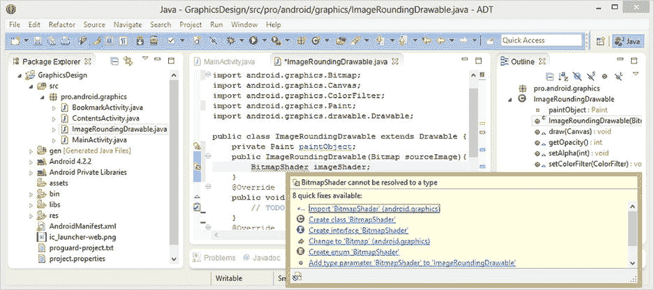

图 16-21. 声明 `BitmapShader` 对象，并将其命名为 `imageShader`，以便在构造方法中使用

你可能知道，着色器（shader）的概念在 3D 渲染领域最为常见。在该领域中，着色器是纹理映射过程中的一个组件，负责在 3D 网格或线框对象之上放置一层“皮肤”或表面，使其具有实体外观，而非网格或线框外观。

`BitmapShader` 对象执行同样的表面映射过程，只不过是在 2D 环境中而非 3D 环境中，用于将你的 2D 图像资源应用到 `Paint` 表面。你可以把 `Paint` 对象想象成一支虚拟画笔，而着色器信息则指定了 `Bitmap` 对象将如何被绘制，或者更准确地说，如何映射到最终的 `Canvas` 对象的 2D 表面上。

接下来，我们来实例化你的 `imageShader` `BitmapShader` 对象，并用一个源图像资源以及一些常量对其进行配置。这些常量将告知着色器对象如何沿其 X 和 Y 2D 坐标映射（或平铺）图像。

你将为 X 和 Y 维度使用 `CLAMP` 这一 `TileMode` 常量值，并在你的 `BitmapShader` 构造方法调用内部，通过 `Shader` 类来调用这些常量。你将使用 Java 的 `new` 关键字来调用该构造方法。

你将把传入 `ImageRoundingDrawable` 构造方法（作为主要参数）的 `sourceImage` `Bitmap` 对象，作为第一个参数传递给 `BitmapShader` 构造方法。然后，你需要通过下面这行 Java 代码，指定通过 `Shader` 类调用的 X 和 Y `TileMode` 常量，如图 16-22 所示：

`imageShader = new BitmapShader(sourceImage, Shader.TileMode.CLAMP, Shader.TileMode.CLAMP);`

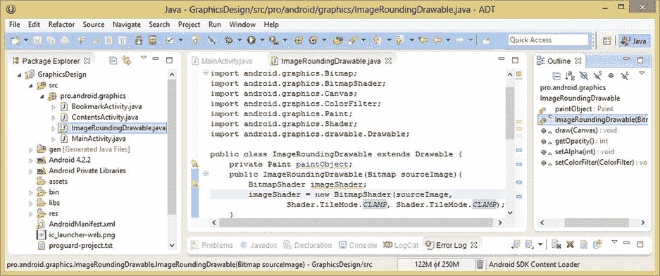

图 16-22. 实例化 `imageShader` `BitmapShader` 对象，并用 `sourceImage` 和常量对其进行配置

值得注意的是，在图 16-22 中，即使你已实例化并配置了 `imageShader` `BitmapShader` 对象，Eclipse IDE 仍不认为该对象已被使用（利用）。对象可以被声明，甚至被实例化（加载）和配置，但并不一定被使用！

这就是为什么波浪形的黄色警告高亮会一直保留在最初的 `imageShader` 声明下方，直到你真正对该对象执行某些操作。我之所以指出这一点并澄清状况，是因为你可能想知道为什么我们“使用”了前一行代码中声明的 `imageShader`，但对象仍未使用的警告却依然存在。从技术上讲，对象实例化并不构成使用！仔细想想，这其实相当合理。

现在，你的 `imageShader` `BitmapShader` 对象已经实例化并配置完成，你可以专注于设置 `paintObject` `Paint` 对象了。首先，你必须使用 `new` 关键字实例化 `Paint` 对象；由于你已经在子类顶部声明了它并为其命名，你可以通过下面这个简单而精炼的 Java 语句来实现：

`paintObject = new Paint();`

现在，你已经正确声明并实例化了一个名为 `paintObject` 的 `Paint` 对象，你可以调用其方法来为你使用而进行配置。你要设置的第一件事是抗锯齿（AntiAliasing）标志，你将通过 `.setAntiAlias()` 方法调用将其设置为 `true`（开启）。这是一个相当直接但重要的步骤，因为它能为我们带来高质量的视觉效果，并通过以下语句完成：

`paintObject.setAntiAlias(true);`

如图 16-23 所示，就图像平铺和抗锯齿而言，你现在已经创建了 `Paint` 对象和 `BitmapShader` 对象结构，并根据你的需要对其进行了配置。

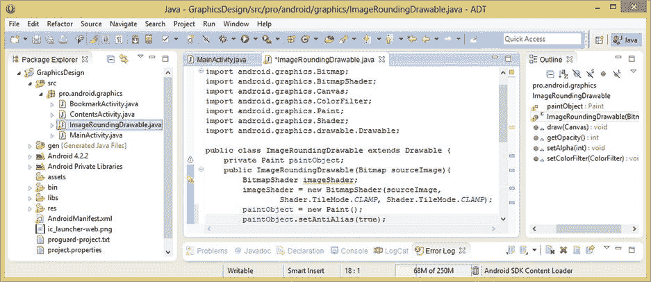

图 16-23. 实例化 `paintObject`，并将 `.setAntiAlias()` 方法设置为 `true` 以开启抗锯齿功能

现在，你剩下的工作就是通过你之前学过的 `.setShader()` 方法，将你的 `BitmapShader` 对象结构“连接”到 `Paint` 对象结构。

这可以通过调用 `Paint` 对象的 `.setShader()` 方法，并将 `BitmapShader` 对象作为配置参数传递来实现，如图 16-24 所示。执行此配置（将 `imageShader` 配置到 `paintObject` 中）的 Java 代码如下：

`paintObject.setShader(imageShader);`

这完成了你的 `ImageRoundingDrawable()` 构造方法实现的 Java 编码。接下来，你需要为你的 `Drawable` 子类实现 `.draw()` 方法，以便它能够将 `ImageRoundingDrawable` 绘制到屏幕上。回想一下，`.draw()` 方法骨架已经为你编写好了，因此你只需在方法内部添加 Java 代码，使其能够执行绘制即可！

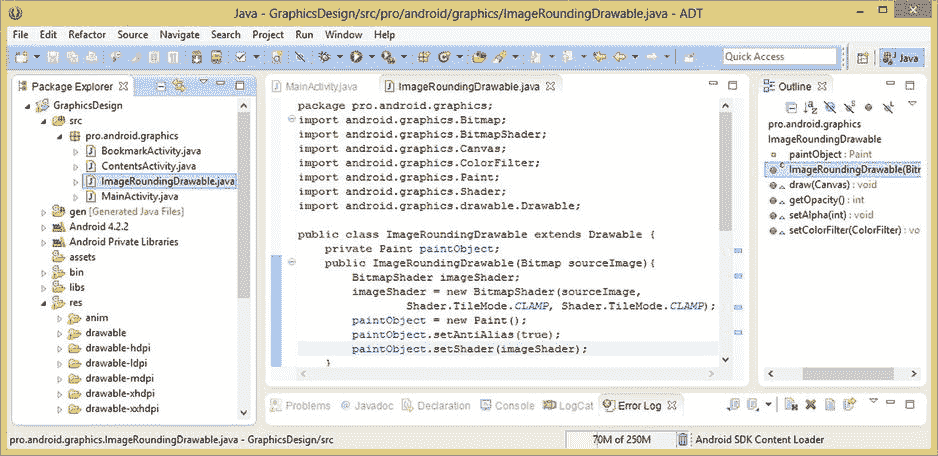

图 16-24. 使用 `.setShader()` 方法将 `paintObject` `Paint` 对象连接到 `imageShader` `BitmapShader` 对象

由于你使用的是 `CLAMP` 平铺模式，并且不希望图像的边缘像素被复制（出现超过一次），否则看起来会像是一个错误。因此，在 `.draw()` 方法的实现中，你要做的第一件事是通过调用 `.getBounds()` 方法“获取”容纳你的 `Drawable` 对象的容器的边界。

像 `.getBounds()` 这样的“获取”方法调用有一个很酷的地方：它们允许你的代码“向上追溯链条”，获取你在开发时（而非运行时）可能没有的信息，或者更重要的是，你不想使用固定单位（如像素）来指定的信息，因为每个用户设备都有不同的物理显示分辨率规格。

在这种情况下，你希望使用 `.getBounds()` 向上查找你类的外部，以获取将要容纳 `ImageRoundingDrawable` 的容器的边界信息。你将在现有（`BookmarkActivity.java`）类中的一个现有 `ImageView` 对象中使用背景图像底板。

由于该 `ImageView` 是使用 XML 参数设计的，以便自适应于用户的设备屏幕，因此你需要找出该 `ImageView` 的宽度和高度值。该 `ImageView` 使用了 `MATCH_PARENT` 参数，以便使用整个屏幕来显示其内容。因此，你的 `.getBounds()` 方法调用，在此特定的 UI 设计设置中，至少等同于“获取”你的 `BookmarkActivity.java` `Activity` 子类显示屏幕区域的完整（全屏）宽度和高度数据值。


由于你没有声明变量来存储这些宽度和高度数据值，因此你将针对宽度和高度这两个维度，分别用一行 Java 代码完成所有工作。你需要声明整数数据类型，命名变量为 `canvasW` 和 `canvasH`，然后将这些变量设置为通过 `.width()` 和 `.height()` 方法获取的数据值，这些方法将通过基于点号表示法的**方法链**，在 `Drawable` 类的 `.getBounds()` 方法上调用。

这可以通过以下两行 Java 代码实现：

```
int canvasH = getBounds().height();
```

```
int canvasW = getBounds().width();
```

如图 16-25 所示，`canvasH` 和 `canvasW` 变量尚未实现，并且显示带有波浪线的黄色警告下划线高亮。下一步定义你的绘图区域将解决此问题。

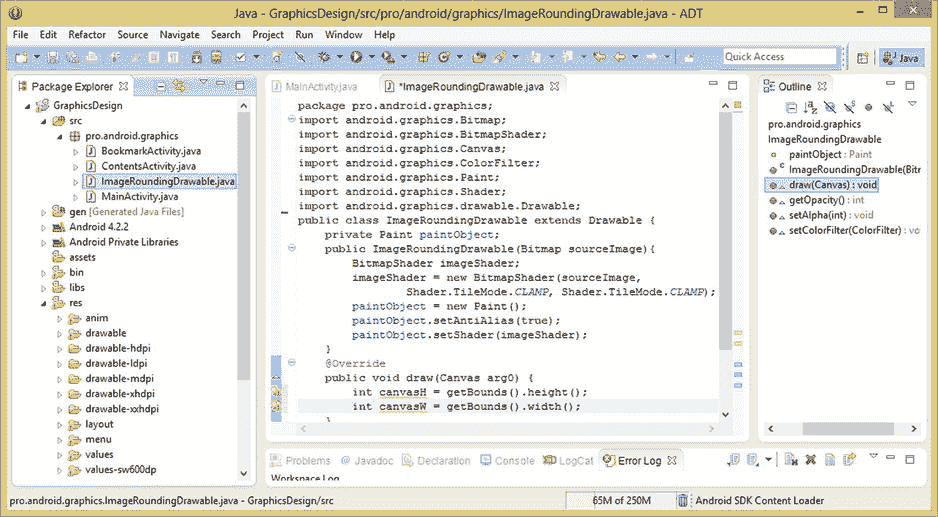

图 16-25. 为你的 `Drawable` 子类实现一个名为 `arg0` 的 `public void draw()` 方法和 `Canvas` 对象

接下来，你将使用 `RectF` 类为该方法定义你的可绘制区域。

### Android 的 Rect 和 RectF 类：定义绘图区域

在编写矩形绘图区域对象的代码之前，我需要先让你熟悉 Android 的 `Rect` 和 `RectF` 类。这两个类的主要区别，至少在基本层面上，在于 `Rect` 类使用整数值定义 `Rect`（矩形）对象，而 `RectF` 类使用浮点（实数）数值定义 `RectF` 对象。

也就是说，由于使用整数与实数带来的差异，每个类的方法也彼此不同。这主要是由于在这些不同类型的（数值）方法中，所涉及的计算所采用的数学逻辑不同。

Android 的 `Rect` 和 `RectF` 类是 Java 主类 `java.lang.Object` 的直接子类。因此，可以知道它们是专门为在 Android 中实现矩形区域而创建的。这些区域最常用于图形处理，并且经常与 `Paint` 和 `Canvas` 类一起用于绘图操作。

Android 的 `Rect` 和 `RectF` 类层次结构如下所示：

```
java.lang.Object
  > android.graphics.Rect
```

```
java.lang.Object
  > android.graphics.RectF
```

Android 的 `Rect` 和 `RectF` 类属于 `android.graphics` 包。这两个类的导入语句都引用了 `android.graphics.Rect` 或 `android.graphics.RectF` 包导入路径。

你即将在你的 `ImageRoundingDrawable` 类的 `.draw()` 方法中利用的 `RectF` 类，支持四个浮点坐标，它们共同定义了创建矩形对象的边界。

你的矩形对象是使用其四条边（左、上、右、下）的像素坐标定义的。对于一个专业图形设计师来说，更准确的理解方式是，你实际上只是使用前两个（左、上）值定义了矩形的左上角（原点），这些值通常是 `(0,0)`，代表屏幕的原点。

第二组值定义了矩形的目标（右下）角，这很像你在屏幕上“拖放”右下角（值）来绘制一个选区，在你为图形设计工作流程定义了所需的矩形区域之后。

你可以通过调用 `.width()` 和 `.height()` 方法直接访问 `Rect` 和 `RectF` 的数据字段，以获取矩形对象的宽度或高度。值得注意的是，大多数 `Rect` 或 `RectF` 类方法不会检查你的值是否按正确的（左、上、右、下）顺序排列。

### 定义你的 `RectF` 对象并调用 `drawRoundRect()`

接下来，让我们通过定义和实例化你的 `RectF` 对象，然后调用你的类所需的实际绘图方法，来完成你的 `.draw()` 方法。你将通过利用到目前为止已设置好的所有 `RectF`、`Paint`、`Canvas` 和 `Shader` 对象来实现这一点。随着复杂程度的增加，这变得令人兴奋，然而一旦你在头脑中理清了正确的顺序（理解，或顿悟时刻），这一切确实都非常合乎逻辑。

这通过声明 `RectF` 对象，将其命名为 `drawRect`，然后使用 `new` 关键字和 `RectF()` 构造方法实现，构造参数为你之前了解的屏幕原点 `0,0`，以及目标右下角。

目标角的位置数据值在逻辑上将通过调用你已经编写好并存储在 `canvasW` 和 `canvasH` 整型变量中的 `.getBounds().width()` 和 `.getBounds().height()` 方法来设置。

这可以通过一行 Java 代码完成，如图 16-26 所示：

```
RectF drawRect = new RectF(0.0f, 0.0f, canvasW, canvasH);
```

接下来，你将使用名为 `arg0` 的 `Canvas` 对象（该方法的第一个参数是 Eclipse ADT 遵循的命名约定）来调用你的 `Canvas` 类绘图方法，该方法将为你执行图像圆角处理。一旦处理了不透明度，你就完成了自定义 `Drawable` 的创建。

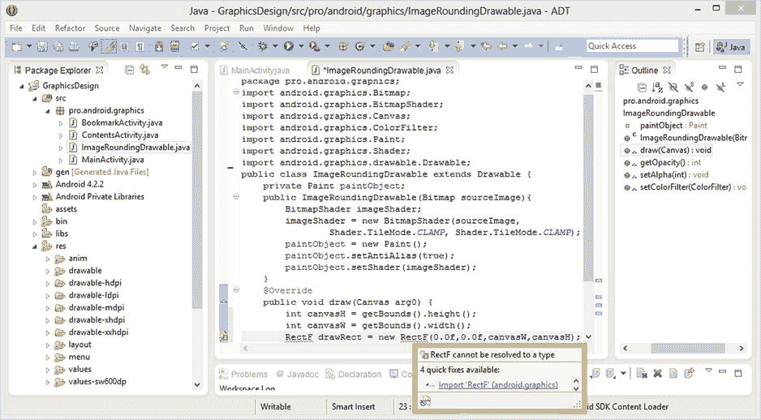

图 16-26. 创建一个名为 `drawRect` 的 `RectF` 对象，并使用 `Drawable` 的宽度和高度边界对其进行配置

要从你的 `arg0` `Canvas` 对象调用 `Canvas` 类的 `.drawRoundRect()` 方法，你需要拥有你的 `drawRect` `RectF` 对象、X 和 Y 轴角的圆角值（值越大角越圆），以及最后你的 `paintObject` `Paint` 对象。由于所有这些都已就位，让我们使用以下一行 Java 代码来编写此方法调用，如图 16-27 所示：

```
arg0.drawRoundRect(drawRect, 50, 50, paintObject);
```

同样如图 16-27 所示，我点击了方法调用内部的 `paintObject` 变量，以突出显示 `paintObject` 声明、实例化、配置以及 `Shader` 对象连接的链条。我这样做是为了让你能够更清晰地看到这个重要的进展过程。

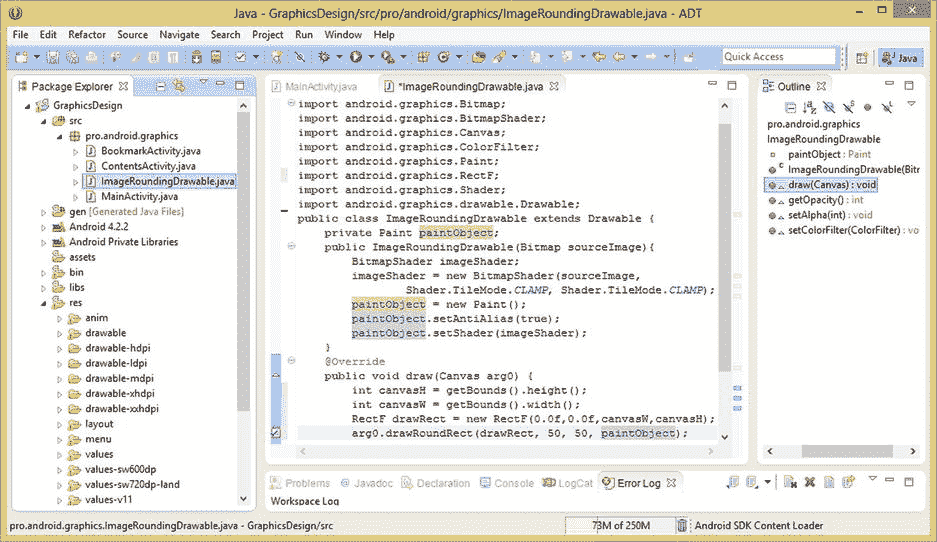

图 16-27. 使用 `RectF` 和 `Paint` 对象，从名为 `arg0` 的 `Canvas` 对象调用 `.drawRoundRect()` 方法

你需要实现这些为你引导生成的空方法，你的类需要利用它们来为你的自定义 `Drawable` 子类添加功能。在这种情况下，你需要将你的 `Drawable`（对象）子类的 `.getOpacity()` 方法返回值更改为不透明（数据值 255），而不是透明（数据值 0）。

我真的无法给出一个答案，解释为什么 Eclipse ADT 会将 `.getOpacity()` 方法的返回值默认为零（透明），因为我猜想大多数开发者都希望为他们的 `Drawable` 子类对象返回一个完全不透明的数据值。

如图 16-28 所示，你将把 `.getOpacity()` 方法的返回值从 0 更改为数据值 255。你将通过在 `.getOpacity()` 方法内部使用以下 Java 语句来实现这一点：

```
return 255;
```

如图 16-28 所示，你的 Java 代码没有错误，你的新 `ImageRoundingDrawable` 类现已完成。

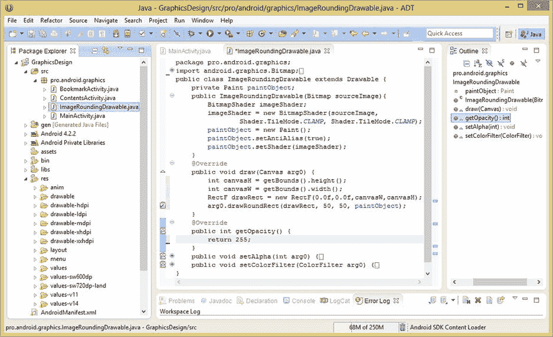

图 16-28. 实现 `ImageRoundingDrawable.getOpacity()` 方法并返回完全不透明的数据值


好的，作为一名高级文档工程师和翻译员，我将严格遵循您提供的注意事项和示例，将以下英文文本翻译成专业、准确的中文。


现在您已经完成了 `ImageRoundingDrawable` 类（ `Drawable` 的子类）的创建，您需要在 `activity_bookmark.xml` 文件中做一些小修改。该文件是 `BookmarkActivity.java` 类（ `Activity` 的子类）的 XML 定义文件。您需要编辑第一个 `ImageView` UI 元素（该元素承载了 `cloudsky` 图片资源），并将前景板中的 `android:src` 图片引用更改为背景板中的 `android:background` 图片引用。

在 `/res/layout` 文件夹中找到 `activity_bookmark.xml` 文件，右键单击它，然后选择“打开”选项（或者选中它，按 F3 键）。

在第一个 `<ImageView>` 标签中（如图 16-29 所示），通过将 XML 中的 `android:src` 更改为 `android:background`，将源图片引用更改为背景图片引用。这两个属性都将引用您的 `cloudsky.jpg` 图片资源，因此您所做的就是将图片资源从 `ImageView` 容器的前景板切换到背景板。

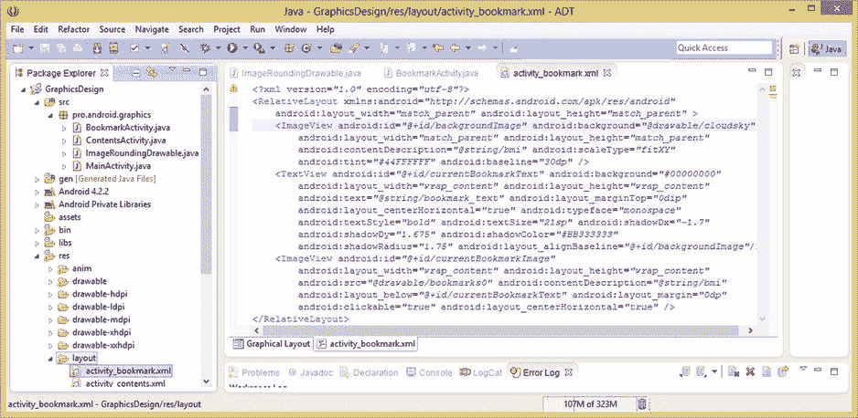

图 16-29. 编辑 `activity_bookmark.xml` 定义文件，以在背景板中使用 `cloudsky` 图片资源

接下来，您需要在 `BookmarkActivity` 类中实例化这个 `ImageView` 对象，因为目前您的 Java 代码中只实例化了第二个 `currentBookmarkImage` (即 `ImageView`)。

在 `.setColorFilter()` 方法调用之后添加一行代码，实例化 `ImageView`，并将其命名为 `backgroundImage`，使用以下 Java 代码：

```
ImageView backgroundImage = (ImageView)findViewById(R.id.backgroundImage);
```

如图 16-30 所示，Eclipse 警告您刚刚实例化的 `backgroundImage` 对象尚未被使用。请忽略此警告，因为您很快将使用这个 `ImageView` 对象调用一个关键方法，以实现您新创建的 `ImageRoundingDrawable` 类和对象。

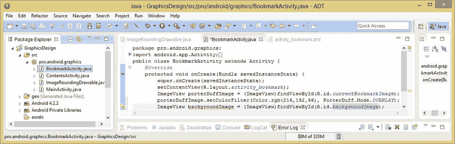

图 16-30. 在 `BookmarkActivity.java` 文件中实例化另一个名为 `backgroundImage` 的 `ImageView` 对象

接下来，您将使用 `InputStream`（Java IO 类）从 `cloudsky.jpg` 图片资源中读取原始数据（像素）。因此，在您实际在代码中使用该类之前，让我们在下一节中先对其有一个概述。

### Java InputStream 类：读取原始数据流

Java `InputStream` 类是 Java 主类 `java.lang.Object` 的直接子类。`InputStream` 是 `java.io` 包的一部分，顾名思义，该包处理输入和输出。与 `InputStream` 类相对应的输出类是 `OutputStream`。

Java `InputStream` 类的层次结构如下：

```
java.lang.Object
> java.io.InputStream
```

Java `InputStream` 类属于 `java.io` 输入和输出工具包。Java IO `InputStream` 类的导入语句引用了 `java.io.InputStream` 包的导入路径，您很快就会看到。

创建 `InputStream` 类（进而创建对象）是为了向开发者提供一个可由其应用程序读取的原始数据字节源。

大多数应用程序会利用输入流通过文件系统读取数据，就像您接下来要做的那样。`InputStream` 还可以处理通过网络使用 `.getInputStream()` 方法调用读取原始数据，以及访问位于系统内存中的字节数组中的数据。

您将使用 `.openRawResource()` 方法来加载您的 `InputStream` 对象（您将其命名为 `rawImage`），该方法是在非常有用的 `.getResources()` 方法上调用的。到目前为止，您已经经常使用 `.getResources()` 方法来处理数据。

您将通过一行 Java 代码完成所有这些操作，如图 16-31 所示：

```
InputStream rawImage = getResources().openRawResource(R.drawable.cloudsky);
```

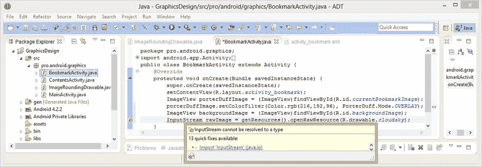

图 16-31. 实例化一个名为 `rawImage` 的 `InputStream` 对象，并通过 `.getResources()` 加载 `cloudsky` 图片

接下来您需要做的，是将这个包含像素信息的 `rawImage` 数据流转换为一个更易于处理的 `Bitmap` 对象。您将使用 `BitmapFactory` 类及其 `.decodeStream()` 方法来实现。

首先，您将声明一个 `Bitmap` 对象，并将其命名为 `sourceImage`。然后，您将把它设置为等于 `.decodeStream()` 方法调用的结果，该方法是您在 Android 的 `BitmapFactory` 类上调用的。您将使用 `rawImage` 对象作为方法调用参数，所有这些都通过一行 Java 代码完成，如图 16-32 所示：

```
Bitmap sourceImage = BitmapFactory.decodeStream(rawImage);
```

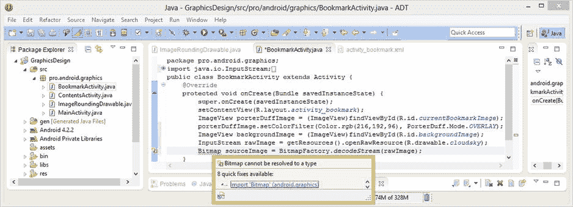

图 16-32. 创建一个名为 `sourceImage` 的 `Bitmap` 对象，并使用 `BitmapFactory` 类从 `rawImage` 加载数据

如图 16-32 所示，您现在需要将鼠标悬停在 `Bitmap` 类的引用上，并选择“导入 `Bitmap`（`android.graphics`）”选项，以便在您的 `BookmarkActivity.java` 类 (`Activity` 子类) 的顶部为您写入必要的导入语句。

一旦所有这些 Java 代码就位，您就可以编写最后一行 Java 代码了。这行代码将实例化 `ImageRoundingDrawable` 对象，将其放入 `backgroundImage` ( `ImageView` 对象) 的背景图片板中，并将图片数据作为其数据（对象）参数传递给它。

所有这些完成后，您就能看到 `ImageRoundingDrawable` 类是否正常工作。这最后一行关键的 Java 代码将在 `backgroundImage` (`ImageView` 对象) 上调用 `.setBackground()` 方法。

在该方法调用中，您将使用 `new` 关键字来实例化一个 `ImageRoundingDrawable` 对象，使用您的构造方法，并将 `sourceImage` ( `Bitmap` 对象) 作为其唯一的传入参数。所有这些都可以通过一行精心构建的 Java 代码完成，如图 16-33 所示。

```
backgroundImage.setBackground(new ImageRoundingDrawable(sourceImage));
```

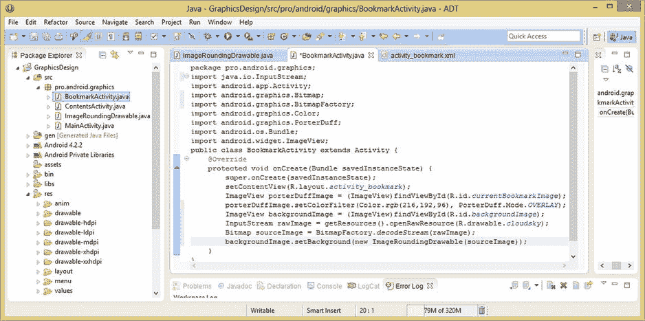

图 16-33. 通过 `.setBackground()` 使用 `sourceImage` 对象构造一个新的 `ImageRoundingDrawable` 对象

现在使用“运行方式 ➤ Android 应用程序”在 Nexus One 上查看结果！

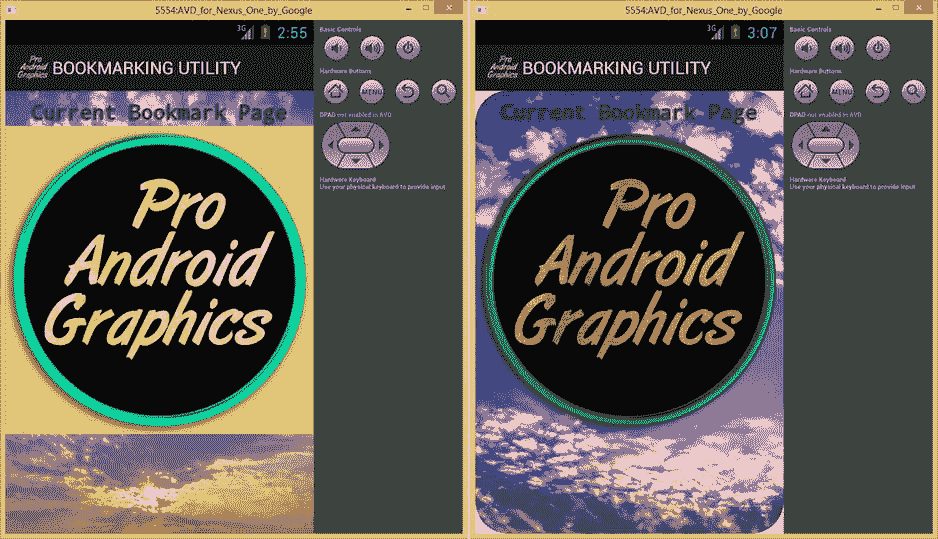

图 16-34. 在 Nexus One 模拟器中使用不同图片板测试 `ImageRoundingDrawable` 类

在图 16-34 截图左侧看到的是我第一次尝试运行 `ImageRoundingDrawable` 类时的情况，当时我仍在使用 `android:src` 参数来处理我的 `cloudsky` 图片，而不是使用背景板，因此我的 `ImageRoundingDrawable` 被遮挡住了。图中还显示了一个 `PorterDuff.Mode.SCREEN` 常量，它存在于原始代码中，并且没有尊重 `currentBookmarkImage` 的 Alpha 通道。由于这看起来不够专业，我将其改为了 `PorterDuff.Mode.MULTIPLY` 常量，如图 16-35 所示，这提供了更专业的结果，如图 16-34 右侧所示。

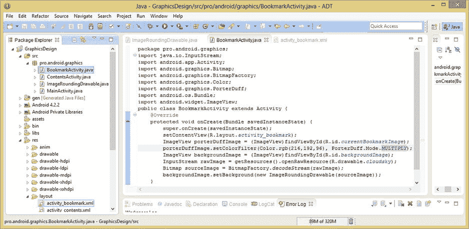

图 16-35. 将 `PorterDuff.Mode` 更改为 `MULTIPLY`，以获得使用自定义 `Drawable` 的专业合成效果


### 总结

在第十六章中，你学习了如何使用 `Drawable` 类在 Android 中创建自定义的 `Drawable` 对象。我们涵盖了 Android 中所有不同类型的 `Drawable` 对象，以及如何通过在 XML `ShapeDrawable` 对象定义文件中使用父标签 `<shape>` 来创建自定义的 `ShapeDrawable`。

我们了解了一些可以在父标签 `<shape>` 内部使用的子标签，包括用于定义不同类型渐变（实际上是 `Shader` 对象类型）的 `<gradient>` 标签，以及用于为 `ShapeDrawable` 对象创建边框的 `<stroke>` 标签。

在此过程中，你还学习了其他一些重要的图形类，包括用于创建纹理贴图（`Shader`）以配合 `Paint` 类使用的 `Shader` 类，用于创建矩形对象的 `Rect` 和 `RectF` 类，以及用于导入原始数据流的 `InputStream` 类。

你学习了至关重要的 Android `Drawable` 类，然后学习了如何创建你自己的自定义 `ImageRoundingDrawable` 类（即 `Drawable` 的子类），首先在 Eclipse 中使用“新建 ➤ 类”功能进行创建。

你创建了一个 `ImageRoundingDrawable()` 构造方法，并利用 `Paint`、`Bitmap`、`Shader` 和 `Canvas` 类来设计并将你自己的自定义 `Drawable` 对象添加到 Android 操作系统（至少是你自己的版本）中。

你了解了 Android `Shader` 类、`Shader.TileMode` 嵌套类及其图块模式常量，并在代码中实现了这些内容。你还学习了 `Shader` 的子类 `BitmapShader`，以及如何使用它将 `Bitmap` 图像资源作为着色器应用。你将在下一章运用这些知识来实现一些非常酷的功能。

你还学习了用于定义矩形区域的 `Rect` 和 `RectF` 类（这些区域常用于绘图及其他图形相关操作），以及 `InputStream` 类，它允许你打开原始数据输入流，并以更强大、更新的方式将图形数据导入你的应用程序。

在下一章中，我们将重点深入理解 Android 的 `Paint` 和 `Canvas` 类，以及如何让用户使用 `onDraw()` 方法在屏幕上实时绘制图形。

# 17. 交互式绘图：交互使用 Paint 和 Canvas 类

### 摘要

在第十七章中，你将学习如何利用 Android 设备的触摸屏，以实时、交互的方式使用 Android 的 `Paint` 和 `Canvas` 类。你将通过 `OnTouchListener()` 方法和类来实现触摸屏事件处理，并学习如何让你的用户在其 Android 设备屏幕上进行交互式、实时的“绘图”。

你将学习 Android 的 `MotionEvent`、`List`、`ArrayList` 和 `Context` 类，以及关于 Android 的 `Paint` 和 `Canvas` 类的更多细节。我们还将特别关注 Android 中的 `.onDraw()` 方法，以及绘图如何在 Android 操作系统内部向用户显示器呈现。

你将创建自己的自定义 `View` 子类，命名为 `SketchPadView`，并使用这个 `View` 子类来创建你自己的 `SketchPad Activity`，从而让用户能够在屏幕上创建自己的图形设计。

你将从学习 `Canvas` 和 `Paint` 类如何配合 Android 的 `.onDraw()` 方法工作开始。本章第一部分将涵盖这些基础信息，向你展示 Android 如何允许开发者创建自己的自定义图形应用程序。

在审视完这些允许开发者创建图形应用程序的核心类和方法之后，你将创建你自己的 `SketchPad 工具`。在讲解该部分内容时，我们将涵盖一些为使 `Canvas` 绘图功能对应用程序用户群体具有交互性而需要利用的辅助类和方法。到本章结束时，你将创建出自己的自定义 `View`，并使用 `Canvas`、`Paint`、`Context`、`List`、`ArrayList` 和 `Context` 类在上面进行绘制！

### Android 的 onDraw() 方法：在屏幕上绘图

在你的自定义 `SketchPadView` 子类（你将在本章稍后创建）上进行绘图中，最核心或最关键的函数是重写 `View` 子类的 `onDraw()` 方法，并在你的 `SketchPadView.java` 类中实现你自己的版本。

这个 `onDraw()` 方法包含一个参数，你可以猜到，它是一个 `Canvas` 对象，通常命名为 `canvas`。你的 `View` 子类可以使用这个 `Canvas` 对象，让你的用户在 `View` 表面上进行绘制。

正如你将在下一节中看到的，`Canvas` 类定义了大量 `.draw()` 方法，这些方法可用于绘制颜色、文本、形状、顶点、位图、路径、点或任何其他类型的 `Drawable` 图形对象。

你可以在你的 `onDraw()` 实现中使用这些方法中的任何一个或全部，来创建你自己的自定义绘图应用程序，以及你能想到的任何其他东西，比如说交互式涂色书。

正如你在这本书中已经学到的，在调用你的 `onDraw()` 方法之前，你必须首先声明并实例化你的 `Paint` 对象。

正如你在本书后半部分所见，Android 的 `android.graphics` 包和图形设计框架将绘制和显示功能划分为两个独立的功能区域：由你的 `Canvas` 对象定义的绘制目的地，以及由你的 `Paint` 对象定义的要在 `Canvas` 对象上绘制的内容。在本章接近尾声时，你将看到为什么 Android 这样做是明智之举——因为你只需要几行 `Paint` 和 `Shader` 代码，就能为你的 `SketchPad 工具`添加图像克隆功能。

在你开始编写你的 `SketchPad Activity` 子类和 `SketchPadView` `View` 子类，以实现用户在显示器上的自定义绘制之前，我需要先为你概述 `Canvas` 和 `Paint` 这两个类，以便你掌握这些基础信息。如果你打算精通 Android 操作系统中的图形处理，你会想要熟悉这两个核心类；请访问 developer.android.com 网站获取更多信息。


### Android Canvas 类：数字工匠的画布

Android 的 `Canvas` 类是 `java.lang.Object` 类的直接子类。至此您已了解，这表明 `Canvas` 类被专门设计用于在 Android 操作系统中提供图形应用所需的 `canvas` 对象（其名称源自艺术家用画笔挥毫作画的画布，在 Android 应用开发中则对应图形操作）。

因此，Android Canvas 类的层级结构如下：

`java.lang.Object`

`> android.graphics.Canvas`

Android 的 `Canvas` 类属于 `android.graphics` 包。因此，在您的应用中使用 `Canvas` 类时，需要引用 `android.graphics.Canvas` 包的 `import` 语句，正如您在本节前面所学。

该 `Canvas` 类是一个 `public` 类，并拥有两个处理特殊高级画布特性的嵌套子类。它们是 `Canvas.EdgeType`，允许为 `Canvas` 对象指定一种特殊类型的边缘；以及 `Canvas.VertexMode`，允许 `Canvas` 使用顶点模式。`Vertices` 通常在使用 `OpenGL ES 3.0` 的 `3D` 操作中使用。

`Canvas` 类包含了所有 Android 操作系统中的 `.draw()` 相关方法调用。要在 `Canvas` 对象上绘制图形，您至少需要为绘制操作实现四个基本组件。这些组件包括：一个用于包含图像像素的 `Bitmap` 对象；一个将执行 `.draw()` 方法调用的 `Canvas` 对象，以便按照您的图形设计目标修改 `Bitmap` 对象；一个用作绘图基元的对象，例如 `RectF` 对象或 `Bitmap` 对象（正如您在本节中已使用的），或者 `Path` 对象或 `Text` 对象；最后，一个用于指定颜色、图像和样式的 `Paint` 对象，应用于您正在执行的绘制操作。

一些主流的 `.draw()` 相关方法调用包括 `.drawCircle()` 方法（您将使用它让用户以 5 像素（初始）的笔触厚度在屏幕上绘制），以及您在第十六章中使用过的 `.drawRoundRect()` 方法，您在第十一章中使用过的 `.drawBitmap()` 方法，以及其他有用的方法，例如 `.drawPoints()`、`.drawColor()`、`.drawLines()`、`.drawPath()`、`.drawTextOnPath()`、`.drawPaint()`、`.drawText()`、`.drawVertices()`、`.drawArc()`、`.drawRGB()` 等等。

在这个 `Canvas` 类中有二十多个 `.draw()` 相关的方法调用，您可以在您的 `.onDraw()` 方法实例中实现它们，例如，在您的 `SketchPadView` 视图子类中，在本章的后面部分，如果您想试验它们的话。这是观察它们作用的绝佳方式！试验将使您能够观察到每个方法调用做了什么以及如何实现。通过这种方式，您可以学习更多关于 Android 图形的内容，并同时获得 Java 编码的经验。

### Android Paint 类：数字工匠的画笔

Android 的 `Paint` 类是 `java.lang.Object` 类的直接子类，就像 `Canvas` 类一样。这意味着 `Paint` 类是专门为在 Android 操作系统中使用而设计的，目的是定义用于您 Pro Android 图形应用中 `Canvas` 对象的 `paint` 对象。

Android Paint 类的层级结构如下：

`java.lang.Object`

`> android.graphics.Paint`

Android 的 `Paint` 类属于 `android.graphics` 包。因此，在您的应用中使用 `Paint` 类时，需要引用 `android.graphics.Paint` 包的 `import` 语句，正如您在本节前面所见。

`Paint` 类是一个 `public` 类，它包含描述如何绘制几何图形、文本或位图的 `style` 和 `color` 信息，作用于 `Canvas` 对象。

`Paint` 类拥有六个嵌套子类。当开发者需要为主要 `Paint` 对象配置定义（进一步）指定特殊的 `Paint` 对象特征时，会使用这些嵌套子类。

`Paint.Align` 是一个 `Enum` 类，因此它使用常量来指定 `.drawText()` 方法调用如何将 `Text` 对象相对于您正在绘制的 `Canvas`（以及最终的 `View`）对象中的 X 和 Y 坐标进行对齐。`Paint.Align` 的默认设置为 `LEFT` 常量，另外两个常量是 `RIGHT` 或 `CENTER`。

`Paint.Cap` 嵌套类也是一个 `Enum` 类类型，`Cap` 常量允许开发者指定线条（描边）和路径（2D 曲线）起点和终点的视觉效果（外观）。默认值是 `BUTT` 常量，另外两个常量是 `ROUND` 和 `SQUARE`。如果您想知道 `BUTT` 的含义，它表示与连接的线条或曲线平齐对接，提供尽可能无缝的连接。“悬空的首尾”则使用 `ROUND` 和 `SQUARE` 常量。

`Paint.FontMetrics` 类描述了各种“字体度量”，供各位字体设计师参考。这些度量用于描述字体属性。没有默认值，五个常量是 `ascent`、`bottom`、`descent`、`leading` 和 `top`。根据开发者文档，这些常量不大写，不过如果您愿意，它们很可能都可以大写使用。

与之密切相关的 `Paint.FontMetricsInt` 类为 `Paint.FontMetrics` 提供了一个“便捷”方法，用于那些需要通过流行的 `Integer` 数据类型提供其 `FontMetrics` 数据值的精英方法调用。

`Paint.Join` 是一个 `Enum` 类，允许开发者精确指定其线段和曲线段在沿路径描边时如何连接。默认常量是 `MITER`，它在曲线或直线（或两者）的相交处使用锐角连接它们的外边缘。`BEVEL` 常量将在连接处的外边缘提供一条直线相交线，而 `ROUND` 常量将使用圆弧来连接边缘。

`Paint.Style` 是一个 `Enum` 类，允许开发者指定绘制到 `Canvas` 上的 `Shape` 基元是填充、描边，还是两者兼具，通过使用预定义的常量 `FILL`、`STROKE` 或 `FILL_AND_STROKE`。默认的 `Paint.Style` 常量设置为 `FILL`。

`Paint` 类还定义了十一个常量，允许您配置 `Paint` 对象本身。它们都以开关或标志的形式存在，您可以根据希望应用的图形渲染管线消耗多少图形处理能力（开销）来将其打开（`true`）或关闭（`false`）！其中大部分与字体支持或质量相关。

通过使用这些常量，以 `true` 布尔值启用，或以 `false` 布尔值禁用以下每个图形处理特性，即可开启这些功能（它们默认是关闭的）。


`ANTI_ALIAS_FLAG`常量提供了一个标志，可用于启用`anti-aliasing`（抗锯齿）。该功能默认处于关闭（禁用）状态，因为它是一种会大量消耗系统资源（内存和处理器周期）的算法。

`DEV_KERN_TEXT_FLAG`常量提供了一个标志，可用于启用字体的设备端`kerning`（字距调整）（针对`Text`对象）。字距调整是指给定字体定义中单个字符之间的间距。

`DITHER_FLAG`常量提供了一个用于启用`dithering`（抖动）的标志。抖动默认也是关闭的，因为它同样需要消耗处理能力和内存资源来实现；它是一种算法，可以在设备运行于低于 24 位（`truecolor`，真彩色）显示色彩环境时（例如`indexed color`（索引色，8 位）的 256 色空间，或`highcolor`（高彩色，15 位或 16 位）色彩空间），提供模拟更多颜色的能力。

`FAKE_BOLD_TEXT_FLAG`提供一个标志，允许开发者启用`fake-bold text algorithm`（伪粗体文本算法），该功能同样默认关闭，因为它会消耗系统资源——优秀的算法通常如此。当`Text`对象引用的字体在其当前安装于 Android OS 的字体定义文件中不包含粗体组件或粗体字体定义时，此算法可以为`Text`对象（字体）提供加粗效果。

`FILTER_BITMAP_FLAG`允许开发者设置一个标志以启用`bitmap filtering`（位图过滤），该功能默认关闭。该常量允许开发者开启`bilinear interpolation`（双线性插值），也称为`bilinear filtering`（双线性过滤），其算法质量仅次于一流的`bicubic interpolation`（双三次插值，见于 Photoshop）或`cubic interpolation`（三次插值，见于 GIMP）。该功能默认关闭是因为它非常消耗处理器资源，但如果质量是您的目标，它会为您的应用程序提供更好的`scaling`（缩放）效果。我本应在 SketchPad 应用中包含此标志，但该应用并不缩放图像！

`LINEAR_TEXT_FLAG`允许开发者设置一个标志来启用“`linear-text`”（线性文本）。此常量会设置一个标志，该标志将`disable system caching`（禁用系统缓存）`Text`对象（具体来说是它们的字体定义）。这允许字体绕过系统字体缓存，直接显示在您的屏幕上。

`STRIKE_THRU_TEXT_FLAG`允许开发者设置标志，以启用名为“strike-thru text”（删除线文本）的功能。删除线会在`Text`对象包含的内容上绘制水平线。这是另一种“事后算法”，它以算法方式提供了缺失的字体特性定义增强，但可能会拖慢应用程序。

`SUBPIXEL_TEXT_FLAG`允许开发者设置标志，以启用`subpixel-text`（次像素文本）的渲染，这本质上相当于`text anti-aliasing`（文本抗锯齿），能让文本在`low-DPI`（低 DPI）硬件设备上看起来更清晰。该功能也默认关闭，因为它相当消耗处理器资源。如今市场上有众多高 DPI 显示屏，它们具有超精细的点距，因此通常无需使用此功能，尤其是在使用无衬线字体族时。

`UNDERLINE_TEXT_FLAG`允许开发者设置标志，以启用`Text`对象的`underlined`（下划线）效果。这与`BOLD`和`STRIKE_THRU`常量类似，因为它为那些不包含下划线字体组件的字体提供了支持。再次强调，别问我为什么没有`ITALIC_TEXT_FLAG`，我的猜测是，用于斜体文本的算法可能太消耗资源，或者在不同字体上尚未完善。

最后两个常量是`HINTING_OFF`和`HINTING_ON`，它们提供了次像素文本微调（`subpixel text hinting`）选项常量，供您在使用`.setHinting()`方法调用时使用。字体微调（`Font hinting`）是一项高级功能，通常与次像素文本渲染和抗锯齿结合使用。字体微调也称为字体指令（`font instructing`），旨在在较低屏幕分辨率下提供更高质量的视觉效果。在大多数具有高分辨率和同时拥有高密度（精细点距）的 Android 设备上，这个常量有些多余。别问我为什么这个微调标志采用了`_OFF`和`_ON`后缀，而其他常量没有，我无法回答您！

现在，我们已经花了数页篇幅介绍`.onDraw()`以及`Paint`和`Canvas`类，是时候亲自上手进行一些 Java 编码了。既然您要为您的`GraphicsDesign`应用程序创建一个`SketchPad`工具，您首先需要修改几个应用程序的 XML 和 Java 文件，并创建几个新的 Java 类。

您将需要在`MainActivity.java`主屏幕上添加一个新的菜单项（`Menu Item`）；创建一个新的`SketchPad` Activity 子类和`SketchPadView` View 子类；使用`<activity>`标签将新的`SketchPad` Activity 类添加到您的`AndroidManifest.xml`文件中；在您的`strings.xml`中添加一个字符串常量（`String constant`）XML 定义，并在您的`main.xml`菜单 XML 定义文件中添加一个`MenuItem` `<item>` 标签；在您的`onOptionsItemSelected()`方法中添加一个 case 语句（`case statement`）和一个新的`Intent`对象；最后从头编写您的`SketchPad`和`SketchPadView`类，或者至少从`New ➤ Class`对话框为您提供的引导代码开始编写。所以，在接下来的几十页中，您有大量的工作要做！


### 为图形设计项目设置画板

你要对 `GraphicsDesign` 应用的 `MainActivity.java` Activity 子类进行的第一个新增操作，是添加一个名为 `The PAG SketchPad` 的 `MenuItem` 对象。打开项目的 `/res/menu` 文件夹，右键点击 `main.xml` 文件，选择 `Open` 菜单选项，或者左键点击它并按 `F3` 键。复制并粘贴第二个 `bookmark_utility` `<item>` 标签，然后对其进行编辑，以创建第三个 `MenuItem` 对象定义，其 `ID` 为 `sketchPad`。

如图 17-1 所示，你的 XML 标记应如下所示：

```
<item android:id = "@ + id/sketchPad"
      android:orderInCategory = "300"
      android:showAsAction = "never"
      android:title = "@string/sketchPad_utility" />
```

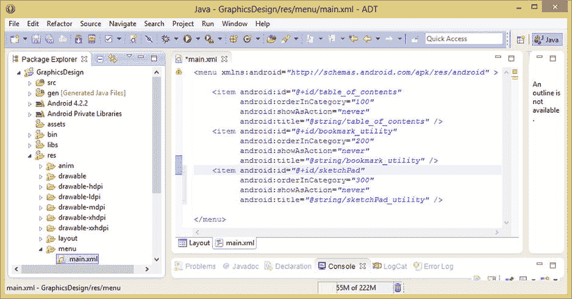

**图 17-1.** 使用 `/res/menu` 文件夹中的 `main.xml` 文件，将 PAG SketchPad 工具添加到应用菜单中

由于你引用了这个名为 `sketchPad_utility` 的 `String` 常量，下一步就是进入位于 `/res/values` 文件夹中的 `strings.xml` 文件，添加 `<string>` 标签来定义这个常量，以便在菜单标题或标签（我个人喜欢这么称呼）中使用。接下来我们开始编写代码。

如图 17-2 所示，我在 `strings.xml` 文件中添加了 `<string>` 标签，将其命名为 `sketchPad_utility`，文本值为 `The PAG SketchPad`。

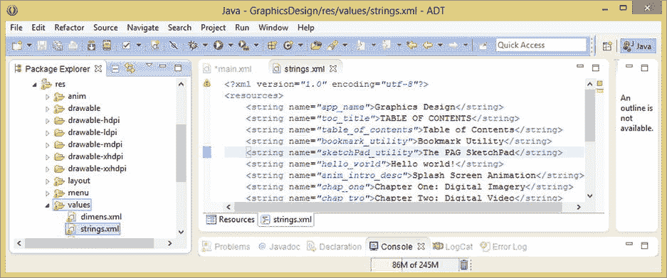

**图 17-2.** 在 `/res/values` 文件夹的 `strings.xml` 文件中，为 `The PAG SketchPad` 菜单项添加 `<string>` 常量

右键点击 `/src` 文件夹，使用 `New ➤ Class` 菜单序列，为 `SketchPad Activity` 子类创建框架，如图 17-3 所示。

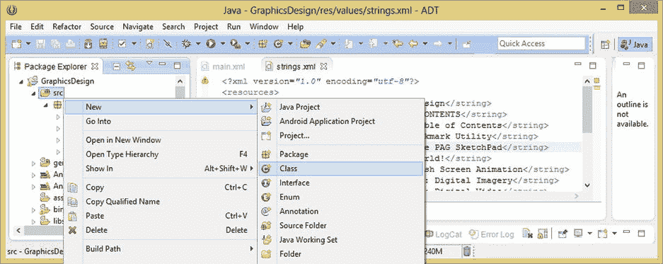

**图 17-3.** 右键点击 `/src` 文件夹并创建 `New ➤ Class`，用于一个自定义的 Activity 子类 `SketchPad.java`

将类命名为 `SketchPad`，并选择 `android.app.Activity` 作为其父类，如图 17-4 所示。务必指定包名为 `pro.android.graphics`。

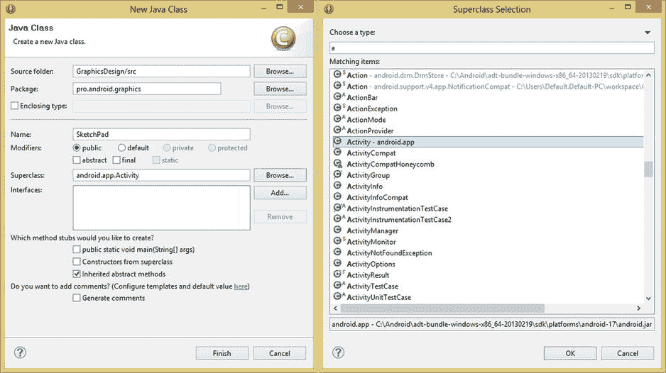

**图 17-4.** 将这个新的 Java 类命名为 `SketchPad`，并将其父类定义为 `android.app.Activity`

接下来，你需要在 `SketchPad.java` 启动模板中添加一个 `onCreate()` 方法；你需要先准备好这个方法，因为之后在编写完 `SketchPadView` 类（该类将被此 Activity 使用）后，你会回过头来填充这个类。请使用以下标准的 `.onCreate()` Java 方法代码：

```
@Override
public void onCreate(Bundle savedInstanceState) {
    super.onCreate(savedInstanceState);
}
```

如图 17-5 所示，你需要将鼠标悬停在 `Bundle` 类引用上，并选择 `Import 'Bundle' (android.os)` 选项，以便在新建的 `SketchPad.java` 类顶部添加该导入语句。

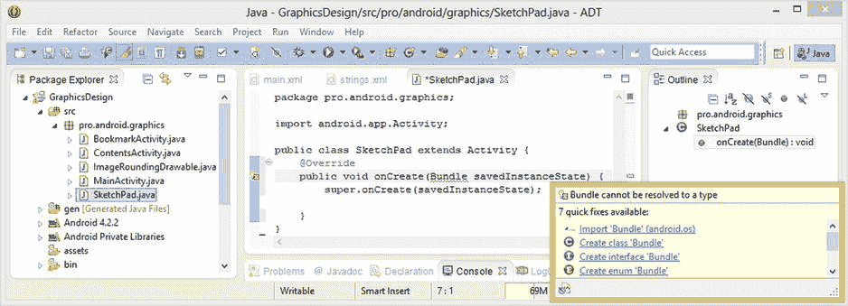

**图 17-5.** 向新的 `SketchPad` Activity 子类添加 `.onCreate()` 方法，并导入 `Bundle` 类

现在你已经有了一个空的 `SketchPad.java` Activity 子类，它不会抛出任何错误或异常（说实话，它目前确实什么都不做），那么你可以继续前进，将这个类添加到应用的 `AndroidManifest` 和 `Menu` 对象 XML 定义文件中。接下来我们来做这件事。

右键点击 `AndroidManifest.xml` 文件（该文件位于项目文件夹层次结构的底部附近），选择 `Open` 选项，或者左键点击它并使用键盘左上角的 `F3` 功能键。

你或许记得，你需要使用 `<activity>` 标签以及 `android:name` 和 `android:label` 参数，在 Manifest 中声明一个 `Activity`。

实现这一操作最快、最简单的方法是复制 `AndroidManifest` 文件中现有的最后一个 `Activity` 声明标签，因此请选中整个 `BookmarkActivity` `<activity>` 标签，使用 `CTRL-C` 组合键复制它，然后在其正下方插入一行，并使用 `CTRL-V` 粘贴，最后通过以下 XML 标记（如图 17-6 所示）进行编辑，指向新的类：

```
<activity android:name = "pro.android.graphics.SketchPad"
          android:label = "@string/sketchPad_utility" />
```

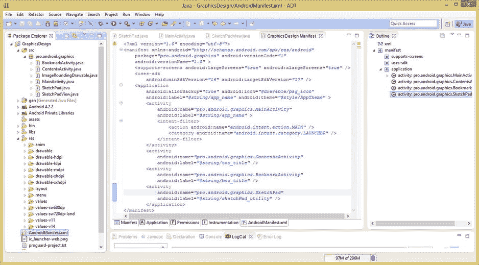

**图 17-6.** 为 `GraphicsDesign` 项目在 `AndroidManifest.xml` 文件中添加 `SketchPad` `<activity>` 定义

请注意，你为 Activity 子类标签使用了相同的菜单标签 `<string>` 常量，该常量将显示在 Activity 的顶部。说到 `MenuItem` 对象，你需要回到 `MainActivity.java` 类中，为你之前在 `main.xml` 文件中创建的第三个 `MenuItem` 对象添加一个 `switch` 语句的 `case` 条目、`Intent` 声明和实例化，这样这个 `MenuItem` 就能发挥作用，并调用你的新的 `SketchPad.java` Activity（它目前，我可以自豪地说，确实没有为你的应用做任何事情）。人们（女人）常说好事多磨。

右键点击 `/src` 文件夹中的 `MainActivity.java` 文件，打开进行编辑，复制 `onOptionsItemSelected` 方法中的最后一个 `case` 语句，并在其下方再次粘贴，以便你可以编辑它，并创建一个新的 `SketchPad` Intent，用于调用你的 `SketchPad.java` Activity。

该 `case` 语句应引用你在 `main.xml` 文件中定义的 `sketchPad` MenuItem XML `<item>` 标签，并为 `SketchPadUtility` 创建一个名为 `intent-spu` 的新 `Intent`，向其传递当前的 Activity `Context`（`this`）以及 `SketchPad.class` 引用参数。然后，通过以下 Java 代码，从当前的 `Activity` `Context` 对象调用 `.startActivity()` 方法（我们将在本章稍后部分深入探讨 `Context` 类）：

```
case R.id.sketchPad:
    Intent intent_spu = new Intent(this, SketchPad.class);
    this.startActivity(intent_spu);
    break;
```

如图 17-7 所示，你的代码没有错误，你已经准备好创建关键的 `SketchPadView.java` View 子类，它将承担交互式图形管道的大部分繁重工作，而这个管道将使用多个（对你来说）新的 Android 和 Java 类进行编写。

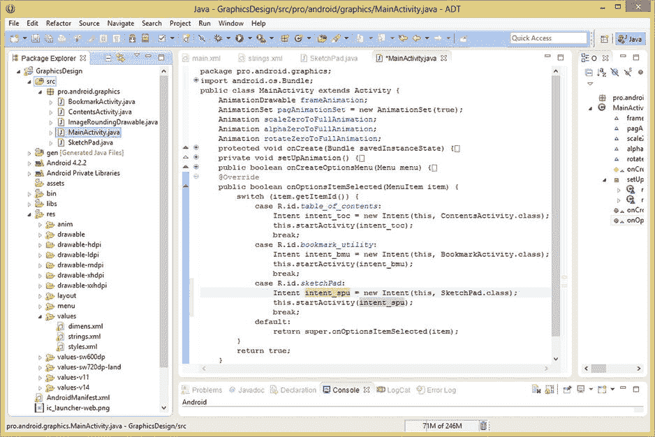

**图 17-7.** 在 `.onOptionsItemSelected()` 方法的 case 分支中添加一个引用 `SketchPad.class` 的 `Intent`

接下来，你将创建一个 `SketchPadView` 类，该类 `extends` 自 `View` 类并 `implements` 自 `OnTouchListener` 类，这样你就有了一个 `View` 子类框架，用于存放你对 `Canvas` 和 `Paint` 对象（你将从头开始创建这些对象）的 `.onDraw()` 方法调用。


#### 创建自定义视图类：你的 `SketchPadView` 类

右键点击项目的`/src`文件夹，选择`New ➤ Class`菜单序列，就像你为`SketchPad.java`类所做的那样（可视化操作见图 17-3），你将看到一个“新建 Java 类”对话框及几个子对话框，如图 17-8 所示。将新类命名为`SketchPadView`，并从`android.view.View`包路径中选择父类`android.view.View`以及接口`OnTouchListener`，最后点击`Finish`按钮。

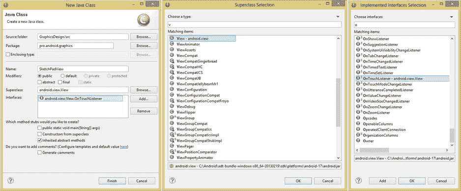

**图 17-8.** 在“新建 Java 类”对话框中配置名称`SketchPadView`、父类`View`以及`OnTouchListener`——`android.view.View`

这将在 Eclipse ADT 编辑器中打开`SketchPadView`的引导 Java 文件。你可能会认为 Eclipse 会使用其“新建 Java 类”辅助工具对话框为你生成无错误的代码，但在这种情况下，你的`SketchPadView`类定义下方会出现一条红色的波浪下划线！

如果将鼠标悬停在此错误提示上，你会发现 Eclipse 要求你为该类实现`constructor method`，并使用与类名完全相同的名称（参见图 17-9）。这恰好是你下一步要做的，所以不必对此错误消息过于担心，至少目前不用。

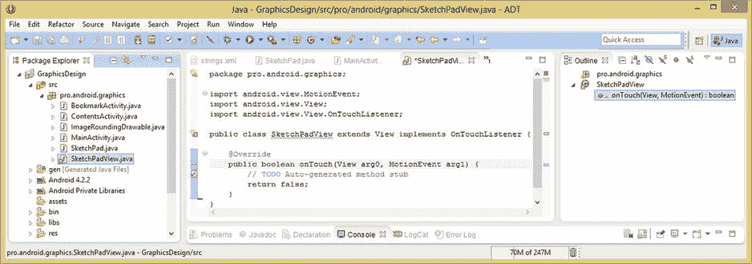

**图 17-9.** 在 Eclipse 中查看`SketchPadView`公共类的引导代码

如图 17-10 所示，Eclipse 会为你提供一个包含`Context`对象参数的引导构造方法代码，并且很可能还会提供`Import`语句。现在点击这个`Add constructor`选项。

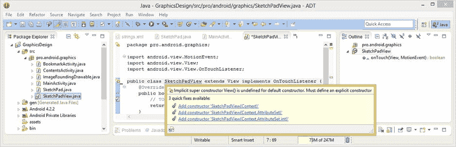

**图 17-10.** 添加`SketchPadView(Context)`构造方法引导代码以消除类的错误高亮

如图 17-11 所示，你现在已经编写了本章中第二个什么都不做的 Java 类。首要目标是生成无错误的代码，次要目标是编写能实际执行某些操作的代码，第三级目标是编写能跨所有设备运行的代码，最终目标是实现销售。

让我们看一下你无错误的`SketchPadView`类及其`OnTouch()`方法，该方法接收`View`对象（即它自身）和`MotionEvent`对象作为参数，并返回`false`值。Eclipse 这样编码的原因可能是该方法目前什么也不做，因此`false`（表示此方法调用期间未完成任何操作）在这种特定用例下在技术上是正确的。稍后，你将把这个返回值改为`true`。

`SketchPadView()`方法则更有趣一些，因为它将创建并设置你正在通过此类创建的自定义`SketchPadView`视图对象。该方法只有一个由 Android 操作系统传入的参数：一个名为`context`的`Context`对象。现在让我们来进一步了解`Context`！

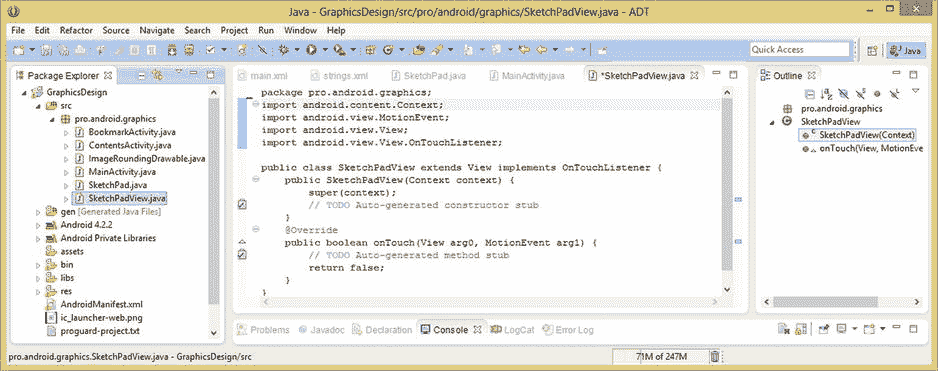

**图 17-11.** 查看`SketchPadView()`构造方法、`super(context)`调用以及`Context`导入语句

#### Android 的 `Context` 类：告知 Activity 所处位置

Android 的`Context`类是`java.lang.Object`类的直接子类，就像`Paint`和`Canvas`类一样。`Context`类专门设计用于 Android 应用，目的是定义`Context`对象，以供例如你的 Pro Android 图形应用等场景使用。

Android 的 `Context` 类层次结构如下：

`java.lang.Object`
`> android.content.Context`

Android 的`Context`类属于`android.content`包。因此，在应用中使用此`Context`类时，其`import statement`引用了`android.content.Context`包，正如你在本书中已经看到的那样。

`Context`类是一个`public abstract`类，它持有应用的`contextual information`。`Context`对象中包含的信息用于描述`关于你的应用的所有信息`，这些信息与 Android 操作系统正确组织应用的能力相关。

本质上，`Context`对象允许引用它的应用组件“向上”查看应用的构造。`Context`类中包含超过两打与`.get()`相关的方法；所有这些方法都允许访问特定于应用的系统配置、应用结构，甚至应用资源的访问或信息。

从某种意义上说，`Context`对象代表了你眼前“看不见”的一切；即所谓的“引擎盖之下”。因此，`Context`对象为引用它的组件提供了与应用环境“全局”信息的接口。

`Context`类将允许访问特定于应用的资源和你自定义的类。`Context`类提供了实现应用级操作“向上调用”的方法。这方面的例子包括启动一个`Activity`子类、广播应用级消息、发送和接收一个`Intent`对象，或启动一个`Service`对象的处理。

现在你可以理解为什么 Android 为此类及其构造的对象选择`Context`这个名称了。一个很好的使用`Context`的例子是在创建`View`子类时；这就是我们在本章中讨论`Context`对象的原因，恰在你创建`SketchPadView`视图子类之前。

正如你在本章中所学到的，通过在类声明中使用`extends`关键字来扩展`View`类来创建自定义视图。你还必须提供一个以`Context`对象为参数的构造方法。这样做是为了在实例化自定义视图时，你也被迫传入包含应用上下文的`Context`对象。这是因为你的`View`子类需要能够访问应用的资源、类、主题以及其他类似的视图需要使用的应用配置细节。

创建`View`子类实际上是一个完美的例子，用来说明为什么需要将`Context`对象传入构造方法。每个`Context`对象都包含由 Android 操作系统设置的各种数据字段，用于描述应用参数，例如显示尺寸或屏幕密度，或者要与视图对象一起使用的视觉操作系统主题（如果已定义）。

接下来，我们将查看`Context`类公开的一些关键方法。这将为你概述`Context`对象可能包含哪些数据。对于你的`application`，有`.getApplicationInfo()`方法调用和`.getApplicationContext()`方法调用。

要获取你的`application resources`，有`.getAssets()`、`.getResources()`、`.getSharedResources()`方法调用，以及`.getText()`、`.getString()`方法调用，甚至还有一个`.getContentResolver()`方法调用。

要访问你的`package`，有`.getPackageName()`、`.getPackageManager()`、`.getPackageCodePath()`和`.getPackageResourcePath()`方法调用。


要访问`application settings`，有`.getTheme()`和`.getWallpaper()`方法调用；要访问`data path settings`，则有`.getDatabasePath()`和`.getExternalFilesDir()`方法调用，以及`.getFileStreamPath()`、`.getDir()`、`.getFilesDir()`和最后的`.getCacheDir()`方法调用。

这些方法调用有什么共同点？它们都使得能够访问`Context`对象的任何人可以引用应用程序资源。

换句话说，`Context`将持有其引用的组件与应用程序环境的其他所有组件和资源连接起来。可以把它看作类似于组件的`AndroidManifest`定义。

`Context`类是 Android 中较为高级的类之一，因此，如果你在开发初期对`Context`对象理解得不够透彻，其实不必过于担心。

作为专业的 Android 程序员，只要你从概念上理解了`context`（我差点想说上下文相关），并理解为什么需要它为 Android 操作系统提供关于应用程序整体目标的“上下文”，你就应该能够成功且高效地在 Android 操作系统的专业图形设计工作中利用它。

### 配置你的`SketchPadView()`构造方法

既然你已经对`Context`对象的作用有了更多了解，让我们在类的顶部创建一个名为`paintScreen`的`Paint`对象，供稍后编写的构造方法中使用。

如图 17-12 所示，你需要鼠标悬停并`Import 'Paint'` (`android.graphics`)，因为你在类中使用了它。之后你就可以开始编写构造方法了，该方法将在稍后由`SketchPad`类声明并实例化`SketchPadView`对象时创建并设置它。

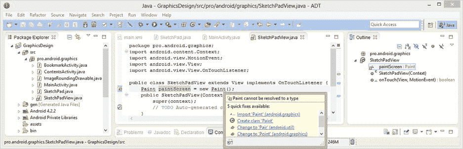

图 17-12. 声明并实例化用于在 Canvas 上绘图的`paintScreen`对象

由于 Eclipse 已经为你编写了将当前上下文传递给 View 父类的`super(context);`语句，接下来你需要添加的语句是调用当前上下文的`.setOnTouchListener()`方法，并将当前上下文作为参数传递给它。

这仅需一行简短的 Java 代码即可完成，该代码将使用 Java 的`this`关键字。在它的第一个用例中，它指的是“这个”对象，即当`SketchPadView`类被声明和实例化时将要创建的那个对象。

`this`对象（关键字）调用`.setOnTouchListener()`方法，并再次传入`this`对象（关键字），使用如下 Java 代码：

`this.setOnTouchListener(this);`

如图 17-13 所示，该语句不会产生错误警告。

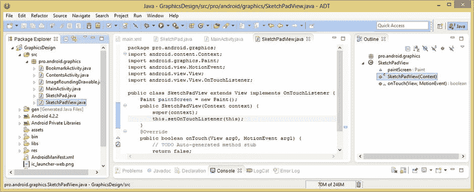

图 17-13. 通过`this.setOnTouchListener(this)`方法将`OnTouchListener`设置为当前`Context`

第二个`this`在整体架构中代表一个（即将被实例化的）`SketchPadView`对象（类）及其`Context`。你可以简单地想象这里的`(this)` `Context`同时包含了你的对象（类）定义本身，以及你的对象如何融入整个应用程序基础设施的上下文。

记住，提供`Context`是为了让 Android 能够将所有内容正确连接在一起（我喜欢称之为“`wired`”）。不必过于担心`this` (`Context`) 在做什么；相反，要关注如何正确实现（传递或引用）`Context`（`this`；对象引用和上下文）。

接下来，你将配置`paintScreen Paint`对象，使你做的一切都具有抗锯齿效果，并将其颜色设置为系统`Color`类的常量`CYAN`。在 IDE (CYANIDE) 中使用`CYAN`时要小心。通过调用`Paint`对象的`.setColor()`和`.setAntiAlias()`方法来配置`Paint`，使用以下两行 Java 代码：

```
paintScreen.setAntiAlias(true);
paintScreen.setColor(Color.CYAN);
```

注意在图 17-14 中，在你输入 Android 的`Color`类并输入句点字符后，Eclipse 会弹出一个`ColorPicker Helper Dialog`，其中包含了 Android 操作系统中所有可用的颜色常量值供你选择。这非常有用。

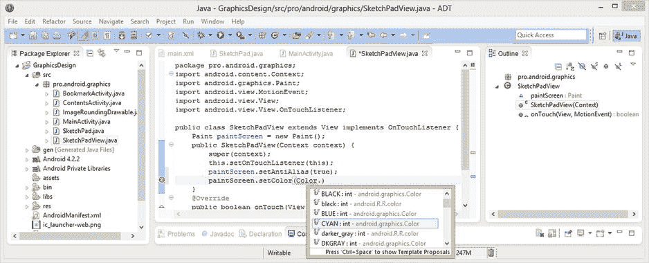

图 17-14. 使用方法调用配置`paintScreen Paint`对象的抗锯齿和`CYAN`颜色常量

接下来，你需要在构造方法中确保当 View (Activity) 屏幕出现时，用户可以使用你的`SketchPadView`对象。通过使 View 可获得焦点来实现这一点。这通过调用`.setFocusable()`方法完成。因为你使用了 Android 触摸模式和`OnTouchListener()`事件处理，你还必须同时调用`.setFocusableInTouchMode()`方法以确保万无一失。这通过以下 Java 代码行完成：

```
setFocusableInTouchMode(true);
setFocusable(true);
```

如图 17-15 所示，你的代码没有错误，构造方法现已实现，它设置好你的`SketchPadView`自定义 View 对象，将其`Context`向上传递以处理触摸事件、对所有绘制的像素应用抗锯齿、使用`CYAN`颜色常量，最后将 View 设置为可获焦以及可在触摸模式下获焦。

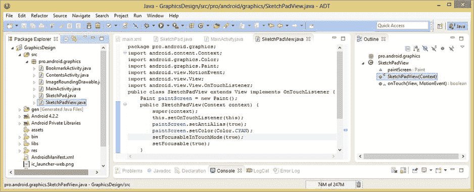

图 17-15. 通过调用`.setFocusable(true)`和`.setFocusableInTouchMode(true)`配置`SketchPadView`的焦点

接下来，你需要编写一个名为`Coordinate`的简单类，用于为你保存一个`X,Y`像素坐标`数据对`，使用`浮点`数值精度。让我们接下来做这个，然后再深入学习 Android 的`List`和`ArrayList`类。

### 创建一个`Coordinate`类来跟踪触摸点的 X 和 Y 坐标

在你实现用于保存`像素坐标`的`List`和`ArrayList`对象之前——当用户用手指在屏幕上绘制时，这些坐标将从你的`OnTouchListener()`方法中流出——让我们编写你一生中写过的最短的 Java 类，仅用一行代码！实际上，你将只使用 32 个文本字符来编写整个`Coordinate`类！

```
class Coordinate { float x, y; }
```

这个类为触摸屏上的单个像素或点提供了一个`Coordinate`对象，使用`float`或浮点数值精度来存储该点（像素）屏幕位置的 X 和 Y 位置数据值，即其`坐标`。如图 17-16 所示，你的类没有错误。现在你已准备好接下来学习更多关于 Android 的`List`和`ArrayList`类，因为你将在你的`SketchPadView`类中使用这些类。

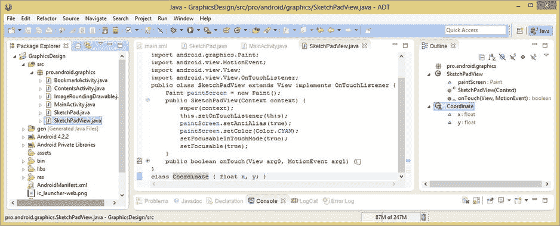

图 17-16. 创建一个`Coordinate`类，提供一个浮点 X 和 Y 数据对，用于跟踪鼠标/触摸点

在你实现你将命名为`coordinates`的`ArrayList`对象坐标列表结构之前，让我们先回顾一下 Android 的`List`和`ArrayList`类的作用以及它们之间确切的关系。


### Java 列表工具类：让集合井然有序

Java 中的 `List` 构造并非一个类，而是一个实现了 `Collection<E>` 的 `public interface`，属于 `java.util` 包的一部分。

Java List 公共接口的层次结构如下：

`java.util.List<E>`

此 Java List 接口属于 `java.util` 包。因此，在你的应用中要使用此 List 接口，其 `import 语句` 应引用 `java.util.List` 包。

List 公共接口是一个 `collection`（集合），它为每个独立的数据元素维护了一个顺序。该 List 中的每个元素都包含一个 `index`（索引）。

之后，每个 List 元素都可以通过其索引进行访问，第一个索引编号为 `零`。通常，List 允许你插入 `重复的` 元素。这与使用数据 Set 类不同，Set 类中的每个数据元素都必须 100% 完全唯一。

### Java 的 ArrayList 工具类：一种基于集合列表的数组

Java 的 `ArrayList` 类是一个 `public class`，它继承了 `AbstractList<E>` 并实现了 `Serializable`、`Cloneable` 和 `RandomAccess` 接口。

因此，Java ArrayList 工具类的层次结构如下：

`java.lang.Object`  
  `> java.util.AbstractCollection<E>`  
    `> java.util.AbstractList<E>`  
      `> java.util.ArrayList<E>`

Java ArrayList 类属于 `java.util` 包。因此，在应用中使用此 ArrayList 类时，其 `import 语句` 引用了 `java.util.ArrayList` 包路径标识。

ArrayList 类（或对象）是 List 接口的一个实现，它是使用数组来实现的。这有点像在系统内存中拥有一个数据库，因为它具有类似数据库的操作，例如 `添加`、`移除` 和 `覆盖` 元素，就像数据库对记录的操作一样。

允许在数组对象中使用所有类型的数据对象，包括 `null` 对象。你将使用 `.add()` 方法调用来把你的 `Coordinate`（点 X,Y 浮点数据对）类 Java 对象 `添加` 到一个 ArrayList 对象中，在本章稍后你将创建这个对象。

ArrayList 是作为默认 List 实现的一个不错选择。

### 创建 ArrayList 对象来保存触摸点数据

在你的 `SketchPadView` 类顶部，紧挨着 `paintScreen` 对象实例化下方，添加一行代码，通过使用 `new` 关键字创建 ArrayList，来设置一个 `coordinates` ArrayList 对象，如图 17-17 所示。

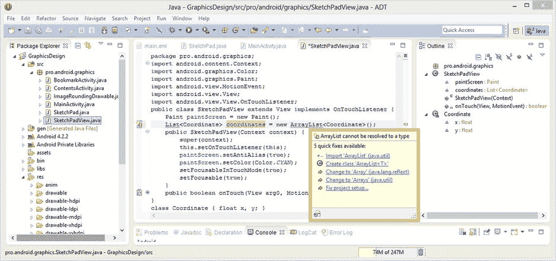

图 17-17. 使用 `new` 关键字创建一个名为 `coordinates` 的 `ArrayList<List<Coordinate>>` 对象来保存点数据

你要编写的用于实现这一点的 Java 代码如下：

`List<Coordinate> coordinates = new ArrayList<Coordinate>();`

这行代码的作用是，基于你的 `Coordinate` 类实例化一个新的 `ArrayList` 对象，并将其命名为 `coordinates`，因为该对象将以 Coordinate 对象的 List 形式（在代码中指定为 `List<Coordinate>`）包含用户触摸屏幕的位置（随时间变化）坐标。

如图 17-17 和图 17-18 所示，你还需将鼠标悬停在代码中的这个 ArrayList 类上，并 `import ArrayList`（来自 `java.util` 包），以及导入你的 List 类，即 `import List`（`java.util`），之后才能为你的 `SketchViewView` 类使用 `List<Coordinate>` List 集合对象或 `ArrayList<Coordinate>` 数组对象。

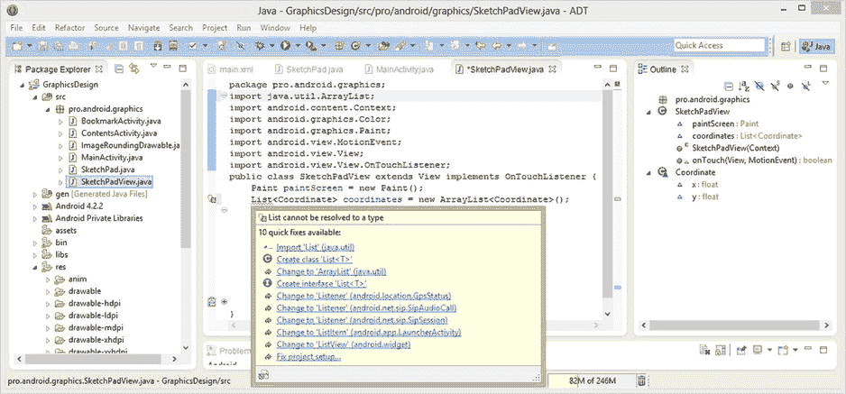

图 17-18. 使用鼠标悬停调用 Eclipse 弹出式帮助对话框，从 `java.util` 包导入 List 类

现在你已经拥有了必要的代码基础设施，可以创建你的 `onDraw()` 方法了，该方法将包含 `SketchPadView` View 子类的 `核心处理` 逻辑。

### 实现 `onDraw()` 方法：绘制画布

要实现 `onDraw()` 方法，你需要做的第一件事是搭建好能容纳 Java 处理逻辑的框架。

这是通过在你的 `SketchPadView` 构造方法正下方编写如下方法声明和参数列表来完成的，如图 17-19 所示。方法引导 Java 代码看起来就像下面这样：

`public void onDraw(Canvas canvas) { 绘制处理流程代码将放在这里 }`

将鼠标悬停在你方法声明中的 `Canvas` 类（对象）用法上，并 `import Canvas`（`android.graphics`），然后你就可以准备使用一个 `for 循环` 来处理 X,Y 坐标，从而编写你的绘制处理流程引擎了。

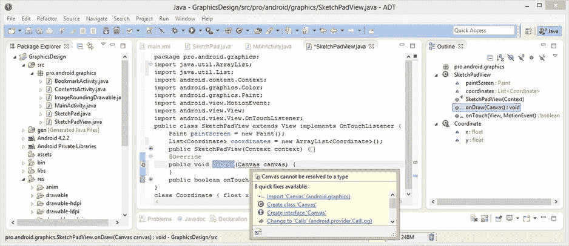

图 17-19. 创建一个名为 `public void onDraw()` 的空方法，并传入一个名为 `canvas` 的 `Canvas` 对象

接下来，编写由你刚创建的 `coordinates` ArrayList 中的数据所控制的 `for` 循环。在 `for` 循环代码内部，有一个结构调用名为 `canvas` 的 `Canvas` 对象上的 `.drawCircle()` 方法，如图 17-20 所示。

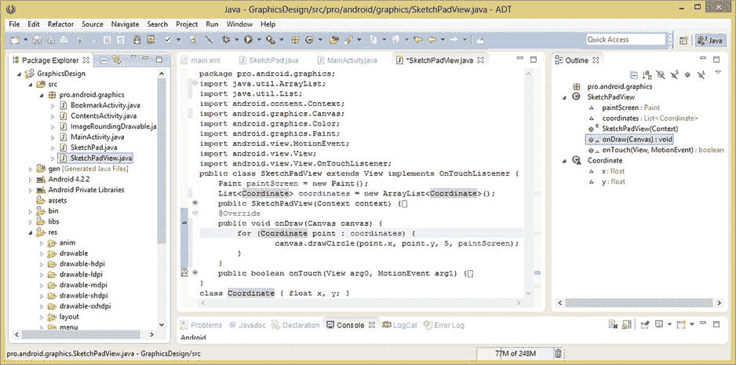

图 17-20. 创建一个 `for` 循环，读取 `coordinates` ArrayList 对象，并使用点数据调用 `.drawCircle()`

这是通过使用以下 `for` 循环 Java 代码处理结构完成的：

```
for (Coordinate point : coordinates) {
   canvas.drawCircle(point.x, point.y, 5, paintScreen);
}
```

在下一小节中，当你编写 `OnTouchListener()` 触摸事件处理方法时，你将使用 `Coordinate` 类实例化一个 `point` 对象。这将完成你为 `SketchPadView` View 子类的 Java 编码工作。目前，这段代码的作用是，在此 `for` 循环结构中使用你的 `coordinates` ArrayList 数组的内容作为此 `for` 循环的“计数器”。

在 `for` 循环的花括号内部是一个强大的 Java 语句，它调用了名为 `canvas` 的 `Canvas` 对象上的 `.drawCircle()` 方法，该 `canvas` 对象是作为参数或属性传入 `onDraw()` 方法的。

`.drawCircle()` 方法配置为使用你为 `paintScreen` Paint 对象创建的设置集合，在 `point.x` 和 `point.y` 坐标位置绘制一个直径为 `5` 像素的圆（即你的画笔）。

### 创建 `OnTouchListener()` 方法：事件处理

接下来，你将折叠（使用左侧的减号图标）你正在处理的方法，并展开（也使用左侧的加号图标）你的 `onTouch()` 方法调用，如图 17-21 所示。如你所见，每次处理触摸（屏幕）事件时，你想做的第一件事就是使用 `new` 关键字实例化一个名为 `point` 的 `Coordinate` 对象，如下所示：

`Coordinate point = new Coordinate();`

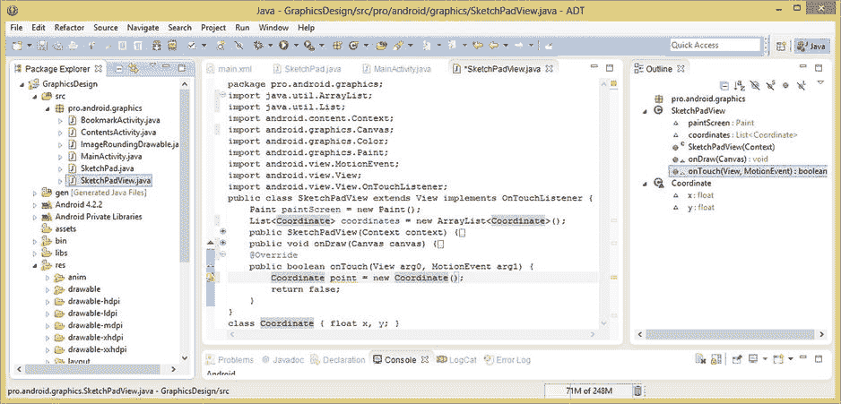

图 17-21. 在 `onTouch()` 事件处理方法内部，将 `point` 构造为一个新的 `Coordinate` 对象


### Android 的 MotionEvent 类：Android 中的移动数据

Android 的 `MotionEvent` 类是一个 `public class`，它继承自 `InputEvent` 并实现了 `Parcelable` 接口。

Android 的 `MotionEvent` 类层次结构如下所示：

`java.lang.Object`
  `> android.view.InputEvent`
    `> android.view.MotionEvent`

Android 的 `MotionEvent` 属于 `android.view` 包，这就是你在 `SketchPadView` 的 `View` 子类中使用它的原因。因此，在你的应用中为了使用这个 `MotionEvent` 类，所需的 `import` 语句引用的是 `android.view.MotionEvent` 包路径结构。

`MotionEvent` 是一个可用于报告 Android 操作系统中移动事件的对象。这种移动可能来自用户在 `TouchMode` 下的手指，也可能来自`鼠标`、`轨迹球`、`导航键`、`光笔`、`游戏控制器`、`3D 轨迹球`或类似的能够（将会）生成 `MotionEvent` 的 Android 硬件特性。

`MotionEvent` 对象可以容纳绝对或相对移动数据，以及其他类型的相关数据。加载到 `MotionEvent` 对象数据结构中的数据最终将取决于最初是哪种类型的硬件设备生成了这个移动数据流。

`MotionEvent` 对象使用一个动作代码和一组轴值来编码移动数据。除非你的用户使用的是 3D 控制器，否则轴值通常为 X 和 Y，与你本章应用中的情况一致。

该动作代码将指定自上次 `MotionEvent` 以来发生的状态变化，例如，鼠标指针是按下了还是释放了。

轴值描述了坐标位置以及其他移动属性，这些值正是你将在本章下一部分中从 `arg1` 这个 `MotionEvent` 对象中提取的值。

现代 Android 设备可以同时跟踪多个移动数据。某些 Android 硬件支持`多点触控`显示屏，可以为每个用户的手指广播一个移动数据流。产生移动数据流的单个手指和其他对象被称为指针。

我们在 `SketchPad` 应用中不使用`多点触控`移动数据，因为 AVD 模拟器目前不支持此功能。我们需要使用每个读者都能访问和利用的平台（方法）来运行本书中创建的软件，因此我们使用的是 Eclipse IDE 中的 AVD。

`MotionEvent` 对象包含关于所有当前正在使用的指针的信息，即使其中某些指针自上次 Android 操作系统传递 `MotionEvent` 对象以来未曾移动过。

Android 的 `MotionEvent` 类定义了多种可用于访问坐标位置以及指针其他属性的不同方法。其中包括我们将用到的 `.getX()` 和 `.getY()` 方法调用。

`MotionEvent` 类的其他方法调用允许从 `MotionEvent` 对象中提取更精细或更详细的数据，例如 `.getAction()`、`.getFlags()`、`.getOrientation()`、`.getSize()`、`.getAxisValue()`、`.getDeviceId()`、`.getSource()`、`.getMetaState()` 以及其他众多方法。

`MotionEvent` 方法调用使用指针索引作为参数，而不是使用指针 ID 值。`MotionEvent` 对象中包含的每个指针的指针索引范围从零到 `.getPointerCount()` 方法调用返回的值减一。正如你所见，在处理 `MotionEvent` 对象时，由于通过绘制处理管道实时流动的数据量巨大，因此有必要使用数组。

单个指针数据在 `MotionEvent` 对象中出现的顺序是不确定的。因此，指针的索引可能会从一个 `MotionEvent` 对象变为另一个。然而，只要指针保持活跃状态，其指针 ID 将始终保持不变。

### 处理你的移动数据：使用 .getX() 和 .getY()

一旦你创建了一个 `point` 的 `Coordinate` 对象来容纳通过 `arg1` 这个 `MotionEvent` 对象传入 `onTouch()` 方法的浮点型 X 和 Y 值，你便可以调用 `.getX()` 或 `.getY()` 方法，如图 17-22 所示，从这个已传递到你的 `onTouch()` 事件处理方法中的 `MotionEvent` 对象结构中提取 X 和 Y 坐标数据。

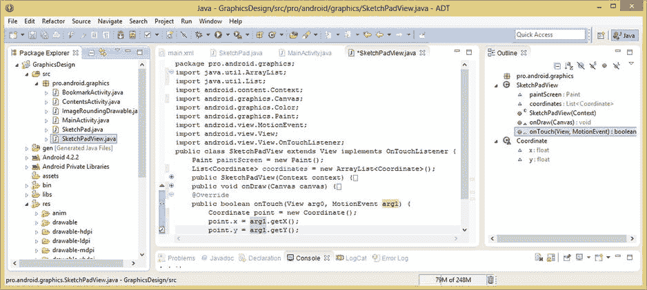

*图 17-22. 在名为 arg1 的 MotionEvent 对象上调用 .getX() 和 .getY() 方法来设置点对象的数据*

现在你已经创建了 `point` 的 `Coordinate` 对象，并用 X 和 Y 坐标值加载了它，你可以使用 `ArrayList` 类的 `.add()` 方法将此点 (X,Y) 对象添加到你的 `coordinates` 的 `ArrayList` 对象中，该对象是在你的 `SketchPadView` 类顶部创建的，如图 17-23 所示。

你将通过以下一行紧凑的 Java 代码来实现这一点：

`coordinates.add(point);`

现在你已经将这个 `MotionEvent` 坐标数据添加到了你的 `coordinates` 的 `ArrayList` 对象中，你可以调用 `View` 类的方法来更新你的屏幕，并将 `true` 值返回给调用实体，让它知道你的 `MotionEvent` 对象数据处理已完成。

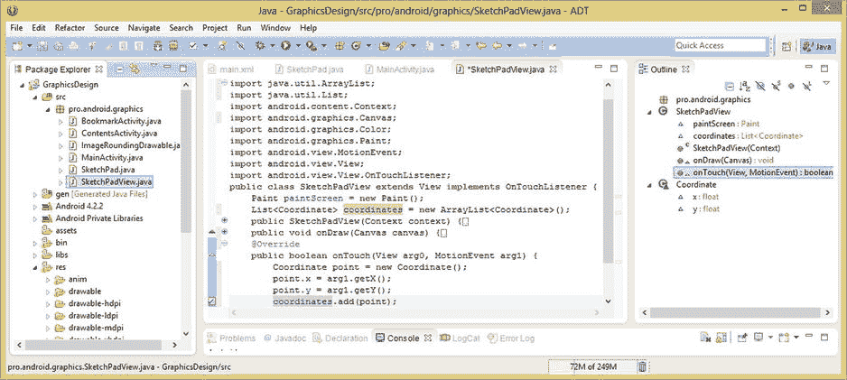

*图 17-23. 使用 ArrayList 类的 .add() 方法将名为 point 的 Coordinate 对象添加到坐标数组*

你需要在 `onTouch()` 方法中编写的下一行代码是 `invalidate()` 方法调用，如图 17-24 所示。调用 `invalidate()` 方法将触发自定义 `View` 对象的刷新。

本质上这意味着，`invalidate()` 方法调用将用于使用最新的可用图形数据重绘显示屏幕。

我不太确定为什么这个方法调用被命名为 `invalidate`，也许只是为了指示 Android 操作系统使 `View` 对象中当前显示的内容失效。这将表明你希望 Android 使用你已绘制到帧缓冲区中的新信息来执行显示屏幕刷新操作。可以肯定地说，这并非操作系统中最直观的方法调用，但只要你知道它的作用，你就可以开始绘制了。

帧缓冲区是系统内存（如 `Canvas` 对象）中保存的一个二维区域，其尺寸与显示屏幕相同，用于合成最终将绘制到屏幕（通过失效）上的图形。

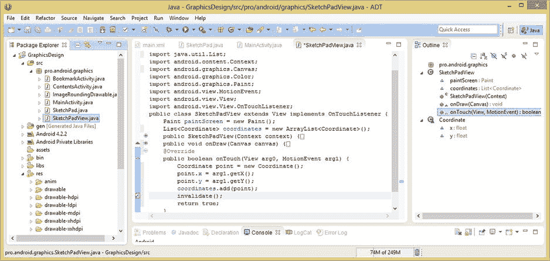

*图 17-24. 在 XY 数据处理完毕后，调用 View 类的 invalidate() 方法更新 SketchPadView 对象*

最后，如果你还没有这样做，请将 `onTouch()` 方法末尾的 `return` 语句从 `false` 值改为 `true` 值。


### 编写你的 SketchPad 活动：使用 `SketchPadView`

现在你已经能够创建一种新的 `View` 对象，名为 `SketchPadView`，你可以点击 `SketchPad.java` 标签页（如图 17-25 所示），并声明一个名为 `sketchPadView` 的 `SketchPadView` 对象。现在你可以使用 `SketchPadView` 了。

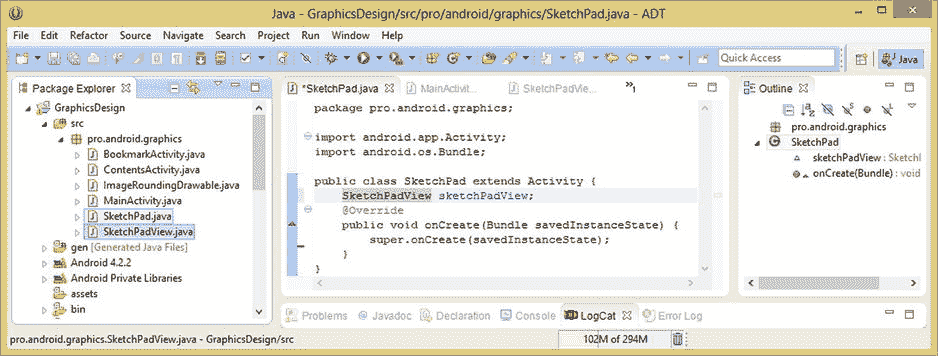

图 17-25. 在你的 `SketchPad.java` 活动顶部声明一个名为 `sketchPadView` 的 `SketchPadView` 对象

你要对 `sketchPadView` 对象做的第一件事，就是使用构造函数方法，通过 `new` 关键字来实例化它，如下所示：

`sketchPadView` = `new SketchPadView(this);`

请注意在图 17-26 中，你正在传递 `SketchPadView(Context context)` 构造函数方法所需的 `Context` 对象（`this`）。如你所知，`Context` 对象（在此处通过 `this` 关键字表示，无意双关）包含了描述你的 `SketchPad.java` 活动类如何融入你的 `GraphicsDesign` 应用的信息。

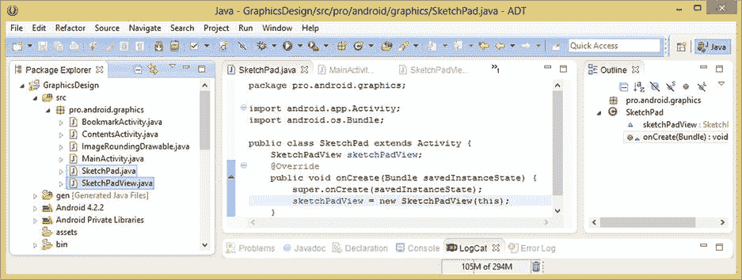

图 17-26. 在 `onCreate()` 内部使用 `SketchPadView()` 构造函数实例化 `sketchPadView` 对象

下一步是告诉你的活动的 `ContentView` 对象你想要显示什么。本书通篇可见，这通常被设置为一个 XML 用户界面布局定义。但在此例中，你将改为设置显示你的 `sketchPadView` `SketchPadView` 对象，如图 17-27 所示。

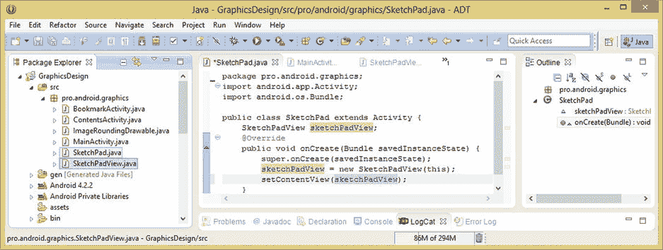

图 17-27. 将 SketchPad 活动子类的 `ContentView` 设置为 `sketchPadView` `SketchPadView` 对象

这是通过使用 `.setContentView()` 方法将 `sketchPadView` 对象传递给 `ContentView` 对象来实现的，如下面的 Java 代码行所示：

`setContentView(sketchPadView);`

接下来你需要做的是，为用户激活你的 SketchPad 活动屏幕表面，以便它能将 `MotionEvent` 对象发送到你的 `onTouch()` 事件处理方法。这可以通过从 `sketchPadView` 对象调用 `.requestFocus()` 方法，向 Android 操作系统请求该视图的焦点来实现。使用以下 Java 代码行完成此操作：

`sketchPadView.requestFocus();`

如图 17-28 所示，我在 Eclipse IDE 中点击了 Java 代码中的一个 `sketchPadView` 对象引用，以便它能为我（或者说在此例中，为你）高亮显示对象轨迹。我这样做是为了让你能看到对象的声明和实例化（棕褐色高亮），以及它的使用（灰色高亮，即后两处高亮）。

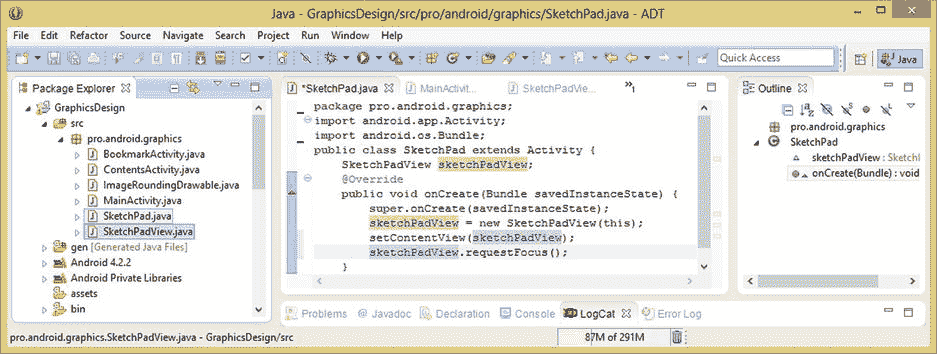

图 17-28. 通过从 `sketchPadView` 对象调用 `.requestFocus()` 方法来请求触摸屏焦点

将此 SketchPad 工具添加到你的 `GraphicsDesign` 应用的最后一步，是在 Eclipse 的 Nexus One 模拟器 AVD 中测试该应用。

### 测试 SketchPad 活动类：手写一个 PAG 徽标

右键点击你的项目文件夹名称，选择 `Run As ➤ Android Application` 菜单序列以启动 Nexus One AVD。当应用主屏幕出现时，点击模拟器右上角的 `MENU` 按钮（底部行第二个按钮），打开你的选项菜单，点击 `The PAG SketchPad` 菜单项，然后启动你的 SketchPad 活动子类。

按住鼠标左键，模拟手指触摸屏幕表面，用你最拿手的笔迹，为我写出 `PAG`！

如图 17-29 所示，你的 `GraphicsDesign` 应用套件的新增功能运行良好，并且如截图右侧所示，你移动手指的速度越快，绘制到屏幕上的 5 像素圆圈之间的间距就越大。在本次 `PAG` 手写练习的末尾，我快速移动笔划，以便在屏幕上直观地展示这一点。

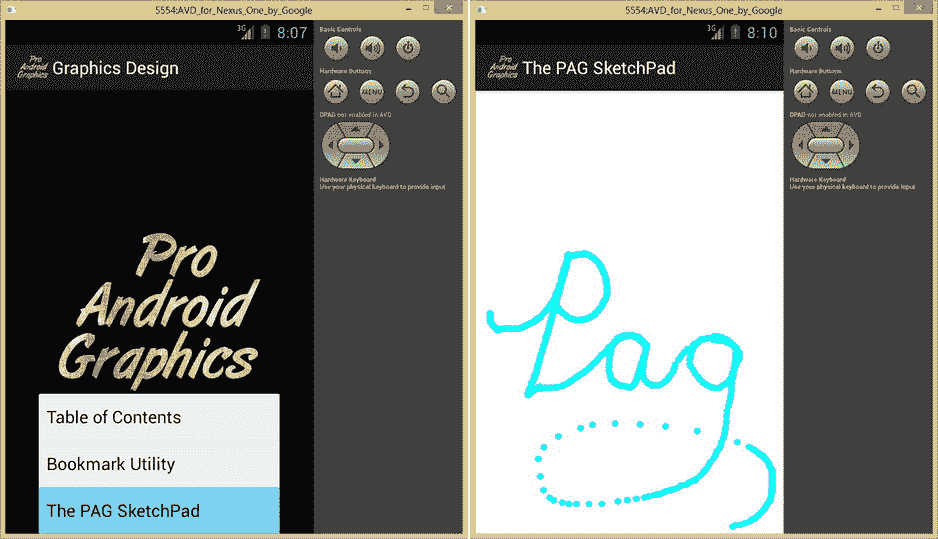

图 17-29. 在 Nexus One AVD 模拟器中测试 `PAG` SketchPad 活动，并手写一个 `PAG` 徽标

这已经相当酷了，但让我们通过实现一个在专业图像编辑软件（如 Photoshop 或 GIMP）中才能找到的功能，将这款 SketchPad 工具提升到一个新的水平。我在这些软件中使用的一个功能是 `克隆工具`，它允许我选择想要用作画笔源的图像，并使用该图像的像素数据进行绘画。如果我们能在 `SketchPadView` 中实现类似的功能，它将比基本的青色墨水绘制更令人印象深刻（也更有用）。


### 使用位图源绘制：实现你的 InkShader

要实现这一点，你本质上需要为你的笔（或手指）创建一个 `InkShader`，这需要用到一些你在本书中那些相当复杂的图形管线构建中已经使用过的类。

你首先需要做的是，使用 `BitmapFactory` 类及其 `.decodeResource()` 方法调用来创建一个 `paintImage` Bitmap 对象。

在这个 `BitmapFactory.decodeResource()` 方法调用中，你需要嵌套另一个 `getResources()` 方法调用，以及对 `R.drawable.cloudsky` 图片资源的引用。你可以使用以下代码来实现：

```
Bitmap paintImage = BitmapFactory.decodeResources(getResources(), R.drawable.cloudsky);
```

如图 17-30 所示，你将这段代码放在 `paintScreen` 对象实例化之后，以便将 `paintScreen` 和 `paintImage` 对象放在一起。有时候，你就是得主动让你的 Java 编码变得浪漫起来。现在你已经有了一个可以从中克隆彩色像素数据的 `paintImage` Bitmap 对象，接下来就可以继续创建你的 Shader 代码了。

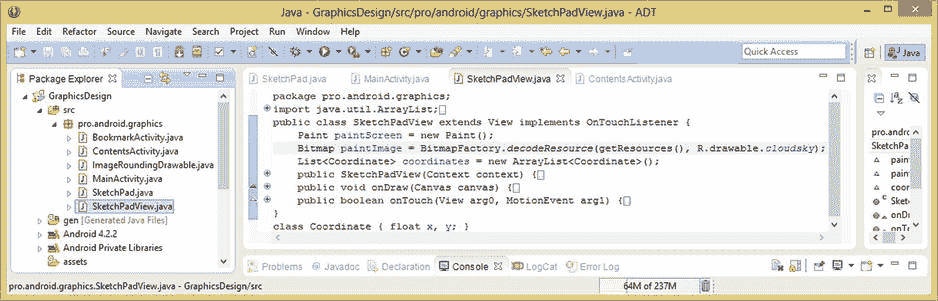

*图 17-30. 使用 `BitmapFactory.decodeResource()` 方法调用创建 `paintImage` Bitmap 对象*

现在，你可以使用你信赖的 `BitmapShader` 类，通过实例化一个新的（关键字）`BitmapShader` 对象来创建一个 `inkShader` 对象，该对象使用你的 `paintImage` 作为 Bitmap 对象参数，并针对 X 和 Y 轴（或维度）使用 `Shader.TileMode.CLAMP` 常量，如图 17-31 所示。

实现此 `inkShader` 配置的 Java 代码如下所示：

```
BitmapShader inkShader = new BitmapShader(paintImage, Shader.TileMode.CLAMP, Shader.TileMode.CLAMP);
```

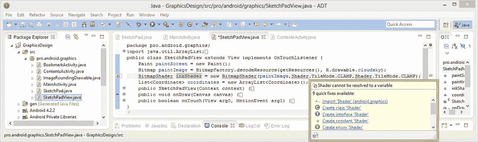

*图 17-31. 使用 `new` 关键字和 `BitmapShader` 构造函数创建 `inkShader` BitmapShader 对象*

如图 17-31 和图 17-32 所示，你需要将鼠标悬停在 `Shader` 和 `BitmapShader` 类引用上，让 Eclipse 从 `android.graphics` 包中导入 `Shader` 和 `BitmapShader` 类。

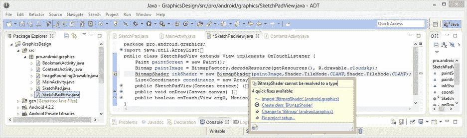

*图 17-32. 将鼠标悬停在 `Shader` 和 `BitmapShader` 类引用上，让 Eclipse 为你导入代码声明*

接下来，为了能够直观地看到使用位图图片资源源进行绘制，请将你的细 5 像素画笔描边宽度改为更宽的 `25 像素画笔描边`宽度，就像你在 GIMP 2.8.6 或 Photoshop CS6 中所做的那样，只不过这里是通过 Java 代码实现的。

点击 Eclipse 中 `onDraw()` 方法代码块旁边的加号图标，如图 17-33 所示，展开该方法，以便你可以编辑其中的 `for` 循环和 `canvas.drawCircle()` 方法调用。

将第三个数据参数从值 5 改为值 `25`，使方法调用看起来像下面这条 Java 编程语句：

```
canvas.drawCircle(point.x, point.y, 25, paintScreen);
```

完成这一步后，你就可以“连接”你的 `inkShader` BitmapShader 了！

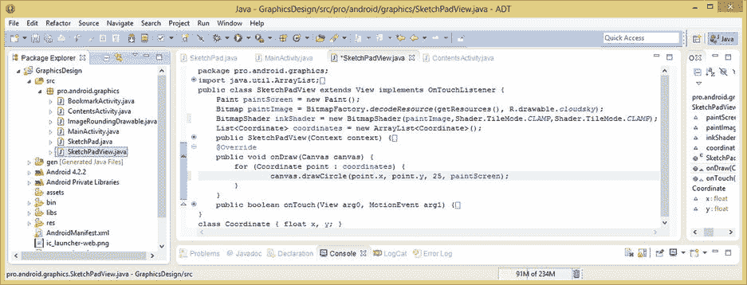

*图 17-33. 在 `.onDraw()` 方法的 `.drawCircle()` 调用中，将画笔描边宽度从 5 像素改为 25 像素*

让我们通过点击减号来收起你的 `onDraw()` 方法，然后通过点击加号展开 `SketchPadView()` 构造方法。接下来，你将用以下代码替换 `paintScreen.setColor()` 方法调用，改为设置 `BitmapShader inkShader` 对象：

```
paintScreen.setShader(inkShader);
```

这将把一个包含 `paintImage` Bitmap 对象的 `inkShader` BitmapShader 对象连接到你的 `paintScreen` Paint 对象中，该 Paint 对象随后在 `onDraw()` 方法中用于创建你的画笔，并将其变成一个克隆工具。如图 17-34 所示，你的代码没有错误；因此，你已经准备好在你的 Canvas 对象表面上，使用粗 25 像素的画笔描边来克隆你的 `cloudsky.jpg` 图片资源，就像你在 GIMP 中所做的那样。

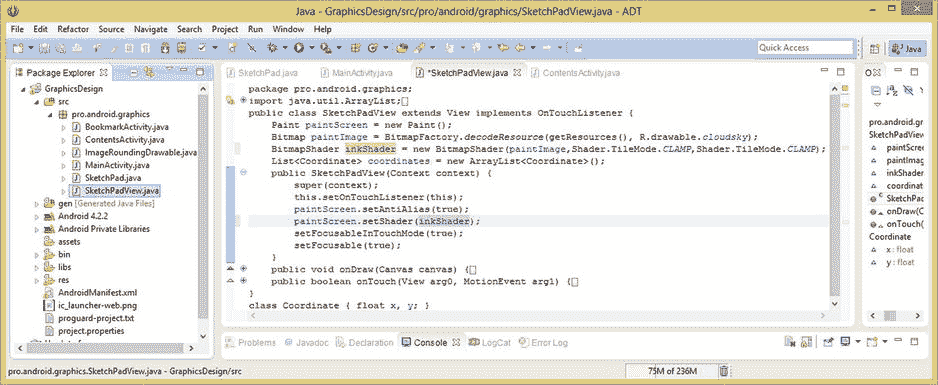

*图 17-34. 将 `paintScreen.setColor()` 方法调用改为 `paintScreen.setShader(inkShader)` 方法调用*

这看起来就像是你正在擦除白色（默认）系统屏幕背景色，并暴露出其背后的 `cloudsky` 图片。然而，实际情况并非如此；实际上，你是在使用你的位图图片源在这个白色画布表面上进行绘制。

让我们使用 `Run As ➤ Android Application` 菜单序列，启动 Nexus One 模拟器，这样你就可以看到你的着色器绘制管线在运行了。

点击模拟器上的 `MENU` 按钮，选择 `The PAG SketchPad` 菜单项，启动 `SketchPad.java` Activity 子类，这样你就可以最后一次（希望如此）使用 Nexus One AVD 模拟器测试你的新代码了。

当白色屏幕出现时，画一个巨大的 PAG，以暴露出通过 `Shader` 和 `BitmapShader` 类从你的 Bitmap 对象中提取的部分像素颜色数据。如图 17-35 所示，我还尝试了让白色覆盖层背后的图像显现出来的效果，尽管这并不是实际发生的情况，但如果你愿意，你完全可以在你自己的应用中利用这种感知到的效果！

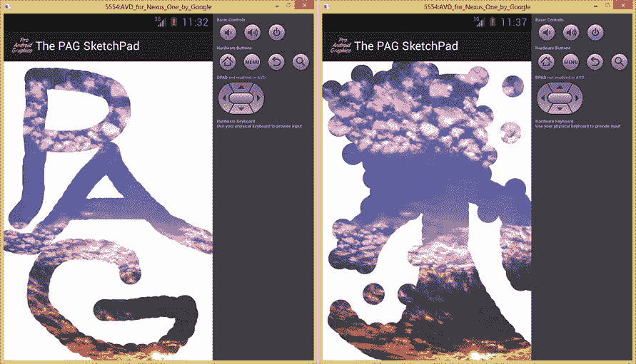

*图 17-35. 使用 Nexus One AVD 模拟器测试你的 InkShader 和图片克隆绘制功能*

### 总结

在第十七章中，你学习了如何利用 `.onDraw()` 方法结合 `Paint` 和 `Canvas` 类，在 Android 中创建你自己的自定义 `SketchPad` 图形程序。我们更详细地研究了 `Canvas` 和 `Paint` 类。然后，你编写了在画布上绘制的管线代码，学习了如何使用 `Paint`、`Canvas`、`onDraw()` 和 `onTouch()` 以及其他一些关键类来创建交互式图形应用程序。

在此过程中，你还了解了一些其他重要的图形类，包括用于向 Android 操作系统提供操作上下文的 `Context` 类，以及用于创建集合（列表）和这些集合数组的 `List` 和 `ArrayList` 类。

你还进一步了解了 `MotionEvent` 类，后来你将其用于 Android 操作系统和交互式应用程序（在本例中是你的 `SketchPadView` View 子类）中的运动跟踪和触摸事件数据处理。你学习了如何创建自己的自定义 View 子类，就像你在第 16 章中学习如何创建自定义 Drawable 子类一样。

在下一章中，我们将切回数字视频编辑和优化模式，这是我们之前在第二章中学习的内容，之后我们就被所有这些非常酷的图形管线编码带偏了。


# 18. 使用 VideoView 和 MediaPlayer 类播放视频

### 摘要

在第十八章中，你将获得更多关于使用 Android `VideoView`、`Uri` 和 `MediaPlayer` 类的经验，并学习如何优化多个“目标”数字视频资源的分辨率，以适应那些具有不同物理显示屏分辨率和像素间距规格的流行 Android 设备。

在第十八章中，你将获得更多关于使用 Android `VideoView`、`Uri` 和 `MediaPlayer` 类的经验，并学习如何优化多个“目标”数字视频资源的分辨率，以适应那些具有不同物理显示屏分辨率和像素间距规格的流行 Android 设备。

我们还将优化一系列数字视频播放的数据速率（即比特率），以适应从单核到四核及更高性能的处理器（市面上已有八核设备，例如三星电子的 Galaxy S4）。

我们首先将了解数字视频资产生命周期的各个阶段，这将为你提供基本概述，以便你理解可用于 Android `MediaPlayer` 数字视频播放引擎的各种方法调用。

你将学习 Android `MediaPlayer` 类及其嵌套类，这些类允许你实现监听器，以便在数字视频播放生命周期的不同阶段按需运行自定义 Java 代码。

你还将在应用程序代码中实现其中一个监听器嵌套类。这将通过在视频播放生命周期的视频准备阶段设置循环参数，使数字视频资源无缝循环播放。你将学习如何使数字视频资源缩放以适应不同的宽高比，正如在第 2 章中所承诺的那样。最后，你将在 10 种不同的行业标准设备屏幕分辨率下优化数字视频资源，包括 WVGA、WSVGA、准高清（1280 x 720）或真高清（1920 x 1080）分辨率。

### 视频的一生：视频播放生命周期的各个阶段

在深入探讨 `VideoView` 和 `MediaPlayer` 类之前，你首先需要了解数字视频资源在 Android 操作系统内部经历的各个不同“阶段”。在表面上，播放数字视频似乎非常简单：按下播放、暂停、快退等。当然，这些步骤是整个流程的一部分。然而，还有一些“幕后”步骤，允许 Android 操作系统将视频资源加载到内存中、为其设置参数，以及其他更多系统级别的考量，这些最终都是为了实现最佳用户体验。

当你实现一个 `VideoView` 时（你在本书中已经通过大约十几行的 XML 标记和 Java 代码完成过），你实际上也实现了一个 `MediaPlayer` 对象，该对象将通过 URI 对象引用播放与之关联的数字视频资源。

当 `MediaPlayer` 对象首次被实例化但未执行任何操作时，它处于所谓的空闲状态。一旦你通过 `Uri.parse()` 方法调用或 `.setDataSource()` 方法调用使用了 URI 对象，你的 `MediaPlayer` 对象就会进入所谓的初始化状态。稍后你将在本章中了解 Android 的 `Uri` 类。

在初始化的 `MediaPlayer` 对象状态和启动的 `MediaPlayer` 对象状态之间，存在一个中间状态，称为已准备的 `MediaPlayer` 对象状态。通过使用 `MediaPlayer.OnPreparedListener`（你将在本章下一节中学到的嵌套类，并在你的应用程序 Java 代码中实际使用它）来访问此状态。

一旦你的 `MediaPlayer` 对象被初始化（加载了数据）并准备好（配置完成），它就可以启动了。一旦启动（开始播放），可以使用 `.stop()` 方法调用停止它，或者使用 `.pause()` 方法调用暂停它。这三种视频状态应该是你最熟悉的。

`MediaPlayer` 对象状态的最后一种类型是播放完成状态，这意味着视频资源将停止播放，除非通过 `.setLooping()` 方法调用将 `MediaPlayer` 对象的循环属性设置为 `true` 布尔值。在这种情况下，你的视频将继续无缝循环。

对于 `MediaPlayer` 对象，还有 `.start()` 和 `.reset()` 方法调用，可以根据 Java 编程逻辑的需要，随时启动和重置 `MediaPlayer` 对象。最后，还有一个 `.release()` 方法调用，它会触发 `MediaPlayer` 对象的结束状态，从而结束 `MediaPlayer` 对象的生命周期并将其从内存中移除。

还有其他嵌套类允许你“监听”错误（`MediaPlayer.OnErrorListener`）以及 `MediaPlayer` 的其他状态，例如当其达到播放完成状态时（`MediaPlayer.OnCompletionListener`）。在接下来的部分中，当你在代码中使用 `MediaPlayer` 类之前，你将详细查看该类的具体工作原理！

### 视频的存储位置：数据 URI 与 Android 的 Uri 类

在查看 `MediaPlayer` 类之前，你必须理解什么是 URI，以及 URI 对象和 Android 的 `Uri` 类能为我们开发者提供什么。

URI 代表统一资源标识符。它是“统一”的，因为它是一种标准；是“资源”，因为它引用了应用程序将要操作（或使用）的数据路径；是“标识符”，因为它标识了你可以从哪里获取数据，也就是其数据路径。

一个 URI 有四个部分。首先是 URI 模式，例如 `HTTP://`；其次是授权机构，例如 [`apress.com`](http://apress.com)；接着是路径，例如 `/data/files`；最后是数据对象，通常是某种文件，例如 `video.mp4`。

Android 的 `Uri` 类是 `java.lang.Object` 主类的直接子类。Java 编程语言中也存在一个 `Uri` 类，但既然我们使用的是 Android，我们将重点了解 Android 的 `Uri` 类。此外，还存在一个 `java.net.Uri` 类；但我建议你使用 Android 特定版本的类，因为它已针对 Android 操作系统的使用进行了适配。

Android 的 `Uri` 类层次结构如下：

```
java.lang.Object
  > android.net.Uri
```

Android 的 `Uri` 类属于 `android.net` 包，因此它是用于通过网络访问数据的工具。为此，在你的 Android 应用程序中使用 `Uri` 类所需的导入语句引用的包路径是 `android.net.Uri`，稍后你将在本章中看到这一点。

`Uri` 类是一个公共抽象类，拥有超过三十个方法，允许开发者处理 URI 对象（和数据路径引用）。

Android 的 `Uri` 类允许开发者创建提供不可变 URI 引用的 URI 对象。你之前有过经验，通过将 `Bitmap` 对象放入系统内存中使其成为不可变对象供使用；你需要通过使用 Android 的 `Uri` 类对你的 URI 数据路径引用做同样的事情。

你的 URI 对象引用包括一个 URI 说明符以及一个数据路径引用，后者是 URI 中 `://` 之后的部分。`Uri` 类负责构建和解析一个 URI 对象，该对象以符合 RFC 2396 技术规范的方式引用数据。

为了优化 Android 操作系统和应用程序的性能，此 `Uri` 类执行非常少的数据路径验证。这意味着，对于处理无效数据输入的行为是未定义的。也就是说，面对无效的输入规范，`Uri` 类非常宽容。

因此，作为开发者，你在操作时必须非常小心，因为 URI 对象会返回垃圾数据而不是抛出异常，除非你在 Java 代码中另行指定。错误捕获和数据路径验证留待开发者在代码内部自行处理。


### Android `MediaPlayer` 类：控制视频播放

我们曾在第 2 章中简要介绍过`MediaPlayer`和`MediaController`类，现在，是时候深入探讨`MediaPlayer`核心媒体播放器类的高级用法了，以便你能够直接在`GraphicsDesign`应用的`MainActivity.java`类中利用它。

在本章后续内容中，你将把 3D 虚拟世界穿越视频重新置于 Logo 之后，为应用启动画面创建动画背景。为此，你需要让视频无缝循环，并移除`MediaController` UI 组件，使数字视频资产仅成为整体动画启动画面合成操作的一部分。

Android `MediaPlayer`类是`java.lang.Object`主类的直接子类。这表明 Android 的`MediaPlayer`类是专门为提供`MediaPlayer`对象而设计的。这些对象是`VideoView`小部件的一部分，你将在下一节中看到。

因此，Android `MediaPlayer`类的层次结构如下：

```
java.lang.Object
  > android.media.MediaPlayer
```

`MediaPlayer`类属于`android.media`包。因此，在应用中引用`MediaPlayer`类的导入语句指向`android.media.MediaPlayer`包，你很快就会在本书中看到这一点。

`MediaPlayer`类是一个公共类，包含九个嵌套类。其中八个嵌套类提供回调，用于确定`MediaPlayer`视频播放引擎操作的相关信息。第九个嵌套类是`MediaPlayer.TrackInfo`，用于返回视频、音频或字幕轨道的元数据信息。

你在本章后续将实现的回调是`MediaPlayer.OnPreparedListener`，它允许你在播放首次开始前配置`MediaPlayer`对象。其他常用的回调包括`MediaPlayer.OnErrorListener`（可响应并处理错误消息）和`MediaPlayer.OnCompletionListener`（可在视频资产播放完成后运行其他 Java 语句）。

还有`MediaPlayer.OnSeekCompletedListener`（在搜索操作完成时调用）和`MediaPlayer.OnBufferingUpdateListener`（用于获取通过网络流式传输的视频资产的数据缓冲状态）。

另外还有一些不太常用的嵌套类，例如`MediaPlayer.OnTimedTextListener`（当定时文本可用于显示时调用）和`MediaPlayer.OnInfoListener`（用于显示关于某些视频媒体的信息或警告）。这些类不常用，至少据我所知如此，但在需要时可以使用。

### Android `VideoView` 类：视频资产容器

在幕后（无意双关），Android 的`MediaPlayer`和`VideoView`类紧密结合在一起，如同数字婚姻般幸福，但这种联系可能不像大多数婚姻那样表面可见。在本节中，我们将研究这两个类是如何密不可分地联系在一起的，以便你理解访问`VideoView`对象中`MediaPlayer`的最佳方式，这正是你将在本章稍后部分进行的操作。

Android `VideoView`类是 Android `SurfaceView`布局容器类的直接子类，而`SurfaceView`又是 Android `View`类的直接子类，最后，`View`类是`java.lang.Object`主类的直接子类。

因此，Android `VideoView`类的层次结构如下：

```
java.lang.Object
  > android.view.View
    > android.view.SurfaceView
      > android.widget.VideoView
```

Android `VideoView`类属于`android.widget`包，使其成为用户界面元素（即小部件）。因此，在 Android 应用中使用`VideoView`类的导入语句引用`android.widget.VideoView`作为其包，正如你在本书前面所看到的。

`VideoView`类是一个公共类，拥有超过二十个方法调用或回调，你可能会以为这些属于`MediaPlayer`类，但从某种意义上来说，正如你现在所知，它们在 Java 代码深处紧密结合在一起。

我们将介绍一些更重要且有用的方法调用（因为我们已经在前一节中介绍了回调），以便你熟悉它们，以防你需要在自有视频播放应用中实现任何这些扩展的数字视频功能。

最简单的调用方法在第一部分关于`MediaPlayer`状态的讨论中已经涵盖；这些包括`.pause()`、`.resume()`、`.start()`、`.stop()`、`.suspend()`和`.stopPlayback()`。我们已经使用过`.setMediaController()`和`.setVideoURI()`方法调用，此外还有一个`.setVideoPath()`方法调用，它能达到大致相同的最终结果。

有四个`.get()`方法调用：`.getDuration()`、`.getCurrentPosition()`、`.getBufferPercentage()`和`.getAudioSessionId()`，以及一个`.isPlaying()`方法调用来检查视频当前是否正在播放。还有三个`.can()`方法调用来确定`MediaPlayer`能做什么：`.canPause()`、`.canSeekBackward()`和`.canSeekForward()`。

还有一些继承自`View`类的标准事件处理方法调用，例如`.onTouchEvent()`、`onKeyDown()`和`onTrackballEvent()`。最后，还有一些专门的方法调用，例如`.resolveAdjustedSize()`或`.onInitializeAccessibilityEvent()`，用于实现无障碍标准。


### 使用 `MediaPlayer` 类：无缝循环播放视频

学习如何使用 `VideoView` 组件实现 `MediaPlayer` 的唯一真正方法，就是亲自动手编写 Java 代码和 XML 标记！接下来，让我们进入实战模式，编写代码、优化视频，并为你的视频资源添加多分辨率支持。

接下来，重新接入你在第 2 章中创建的数字视频（你在后续章节中禁用了它，以便在没有背景视频及其处理开销的视觉干扰下探索动画、合成、混合等功能），并将那七行代码放回主 `Activity` 类的 `onCreate()` 方法中，使其在启动画面的 PAG 标志后面播放。如图 18-1 所示，我将这七行代码放在了 `.setUpAnimation()` 方法调用之后，稍后你会在图 18-5 的左侧看到，一切都在无缝协同工作。

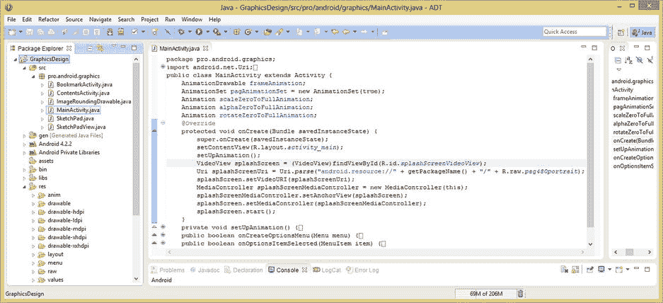

**图 18-1.** 将来自第 2 章的视频播放 Java 逻辑添加到当前动画启动画面代码中

接下来，我们希望实现的是，数字视频在标志后面无缝循环播放，而不是为其添加传输控制界面。为此，你将注释掉三行代码，如图 18-2 所示。这些代码用于创建 `MediaController` 对象并将其连接到 `VideoView` 对象。

然后，使用 **Run As ➤ Android Application** 工作流程，你会发现数字视频资源仍然可以播放，但只播放一次，仅使用了剩下的四行代码。这是在应用程序中实现数字视频资源播放（一次）所需的最少代码量。

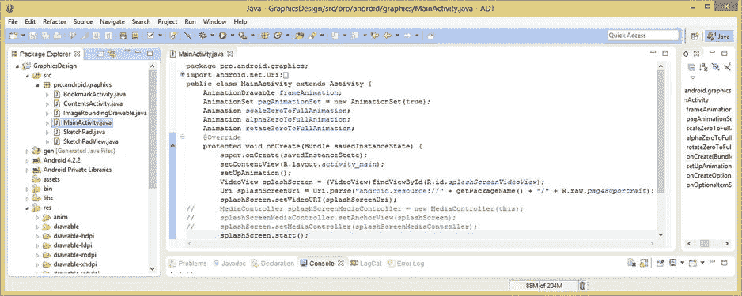

**图 18-2.** 从数字视频播放中移除 `MediaController` UI 控件，为永久循环播放做准备

在 Android 系统中实现数字视频循环播放最快（也最简单）的方法是使用 `.setLooping()` 方法，并将参数设为 `true`。由于 `MediaController` 功能不支持此方法（理由也很充分，如果视频无限循环，控制它就不太可行），你需要使用支持此方法的 `MediaPlayer` 类。

你可能会认为声明、实例化并构造一个 `MediaPlayer` 对象，然后调用其函数是最好的方法，但有一种更巧妙的方式可以获取 `VideoView` 对象（内部）用于播放视频的 `MediaPlayer` 对象的引用。

这可以通过使用你之前在本章学到的嵌套类来实现。由于你只需要设置一次循环参数，因此实现此目的最合理的嵌套类是 `MediaPlayer.OnPreparedListener()` 嵌套类。

使用这个嵌套类，你可以在 Android 准备视频时设置循环参数，也就是在 Android 确定如何（或何时）以最佳方式播放视频时。这是一个设置参数（如循环参数）的绝佳时机，可以将其视为 `MediaPlayer` “配置”（也称为准备）阶段，即 `MediaPlayer` 即将开始的生命周期的一部分。

这可以通过在 `splashScreen` `VideoView` 对象上调用 `.setOnPreparedListener()` 方法，并在该方法调用中使用 `MediaPlayer.OnPreparedListener()` 引用实例化一个新的嵌套类来实现。

实现此功能的 Java 语句如图 18-3 所示，代码如下：

```
splashScreen.setOnPreparedListener(new MediaPlayer.OnPreparedListener(){Override});
```

如图 18-3 所示，Eclipse 会为你提供编写未实现方法引导代码的选项，因此点击“添加未实现的方法”选项，并花点时间感谢这些小确幸吧。

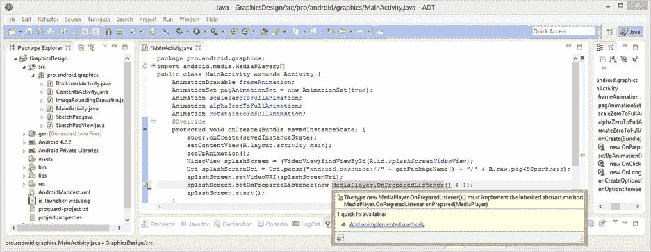

**图 18-3.** 向 `splashScreen` `VideoView` 对象添加 `.setOnPreparedListener()` 方法以设置循环参数

在这个 `public void onPrepared(MediaPlayer arg0)` 方法结构中，添加你的 `.setLooping(true);` 方法调用。同时请注意，我自作主张将传入此方法的 `MediaPlayer` 对象命名为 `splashScreenMediaPlayer`，因为它就是那个对象，而不是海盗在辱骂（啊，零）。玩笑有点冷，但代码很扎实。因此，如图 18-4 所示，你的方法调用是

```
splashScreenMediaPlayer.setLooping(true);
```

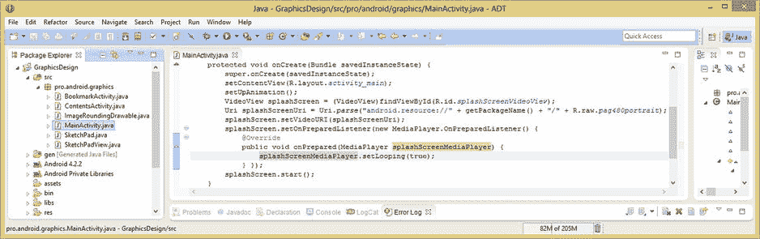

**图 18-4.** 编写 `onPrepared()` 方法以暴露 `MediaPlayer` 对象并调用其 `.setLooping()` 方法

如图 18-5 所示，数字视频现在将无缝循环播放。什么？你还没有使用新的动画纸张？那么，使用 **Run As ➤ Android Application** 工作流程亲自看看这些结果吧。

如果你在网上搜索视频循环的解决方案，会看到大量建议：使用 `MediaPlayer.OnCompletionListener()` 嵌套类在视频每次结束时调用 `.start()` 方法，这同样有效。但是，我想你会同意，本方法更简单、对操作系统负担更小、内存占用更少，并且不太可能引发内存泄漏；这是正确设置视频循环一次然后就可以忘掉它的方法！

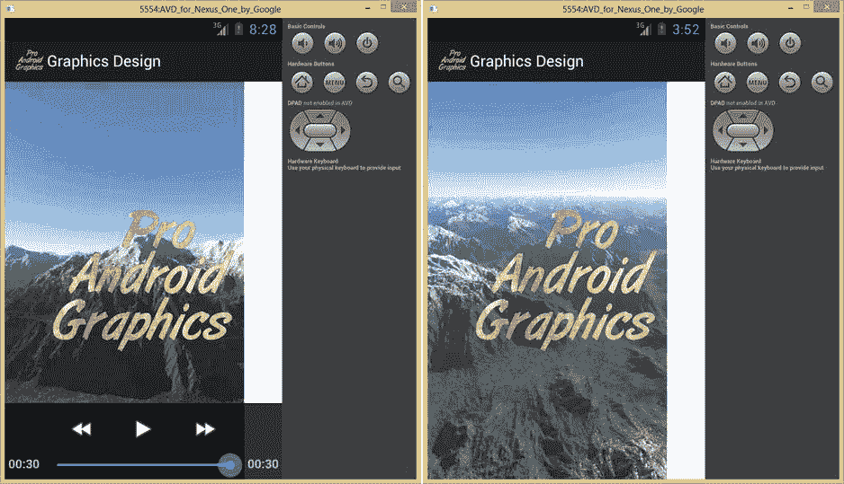

**图 18-5.** Nexus One 模拟器中启动画面的前后对比，展示了 `MediaController` 和循环视频

接下来，你将修改 XML UI 布局容器代码和 UI 组件，以使你的数字视频资源能够非均匀缩放，以适应用户显示屏宽高比的细微差异。这个 3D 虚拟世界视频，就像你之前在本书中使用的 `cloudsky.jpg` 资源一样，是进行此类缩放的理想资源，因为很难想象原始运动影像（视频数据）最初究竟是什么样子。


### 设置视频素材缩放以适配任意屏幕宽高比

接下来你将学习如何修改 XML 用户界面定义，让你的数字视频素材能够“缩放适配”略有不同的屏幕宽高比。

我讨论的并非本章稍后会看到的剧烈非对称缩放。你将制作一系列 16:9 或 16:10 宽高比的视频素材，以适配最主流的 Android 设备物理分辨率规格。我们将沿用第 2 章的方法，使用 Terragen 3、VirtualDub 1.9 和 Sorenson Squeeze Pro 9 来完成。

因此你可能会沿某一轴向缩放约 10%，但这通常不会太明显——除非内容涉及“人物特写”镜头。我们此处使用的虚拟世界视频内容不易产生可察觉的畸变。

右键点击 `/res/layout` 文件夹中的 `activity_main.xml` 布局定义文件，选择 **打开** 菜单命令，或者左键单击后按 `F3` 键。编辑 `<FrameLayout>` 容器父标签的起始和结束标签，将其改为 `<RelativeLayout>` 容器：将单词 `Frame` 替换为 `Relative`，如图 18-6 所示。

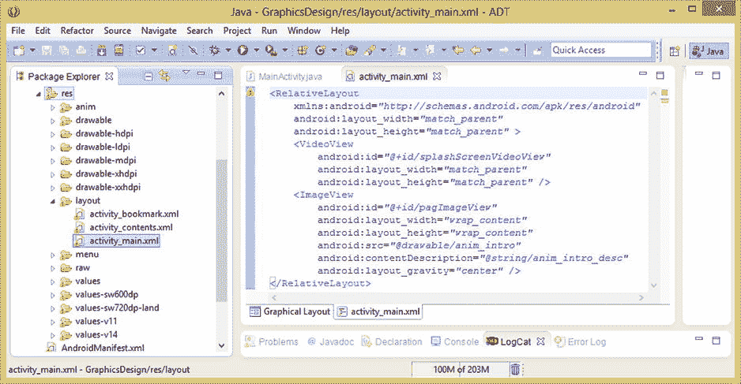

图 18-6. 将 `<FrameLayout>` 父容器标签更改为 `<RelativeLayout>` 父容器标签

接着，使用 **运行方式 ➤ Android 应用程序** 工作流程（如果愿意，也可以使用**图形布局编辑器**标签），检查改用不同类型用户界面布局容器 (`ViewGroup`) 后，你的 UI 布局结果是否一致。

如图 18-7 最左侧所示，`<ImageView>` 子标签 UI 控件中的参数与 `<RelativeLayout>` 父标签容器类型不兼容。因此，你需要先对该子标签及其参数进行某些修改，才能让它再次正确居中。

让我们逐一检查图 18-6 中 `<ImageView>` 子标签的参数，看能否找到问题所在。我们知道 ID、SRC、`LAYOUT_WIDTH` 和 `LAYOUT_HEIGHT` 是布局容器的标准参数，且 `contentDescription` 是图像类 UI 元素必需的，那么问题必定出在与 `RelativeLayout` 不兼容的 `layout_gravity="center"` 参数上。`RelativeLayout` 不支持重力概念——这合情合理，因为其中的 UI 控件是相互关联布局的！

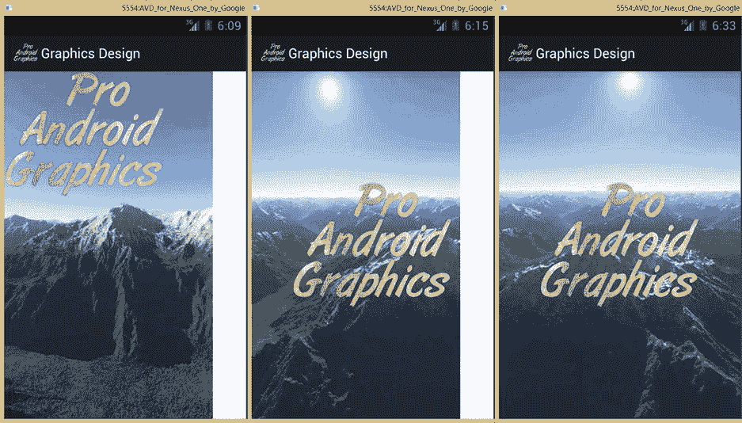

图 18-7. 在 Nexus One 上测试新的 `<RelativeLayout>`，同时调整子标签参数以完善效果

让我们删除最后这个参数中的 `layout_gravity="center"` 部分，然后再次输入冒号键。这将再次调用 Eclipse ADT 的帮助对话框，如图 18-8 所示。

如您在 `<RelativeLayout>` 布局容器这个长参数列表中看到的，确实存在一个不同的标签，可用于在其 `<RelativeLayout>` UI 布局父标签内居中 `<ImageView>` UI 控件子标签。在 `RelativeLayout` 容器中实现的正确参数是 `android:layout_centerInParent`，其布尔值为 `"true"`。如果现在使用 **运行方式 ➤ Android 应用程序** 工作流程，您会发现问题已修复，PAG 标志再次居中，如图 18-7 中间所示。视频仍在标志后方无缝循环播放。

接下来需要弄清楚的是如何实现图 18-7 右侧所示的“填充视图”缩放效果。

让我们重新进入 Eclipse `RelativeLayout` 参数帮助对话框，找出这些参数（有几十个）中哪一个能实现最终效果，并提供可在任何分辨率和任何方向下使用的功能。然后您就能继续创建您的视频素材目标，并学习如何告知 Android 针对不同设备（物理分辨率和方向素材自动切换）应该使用哪个。

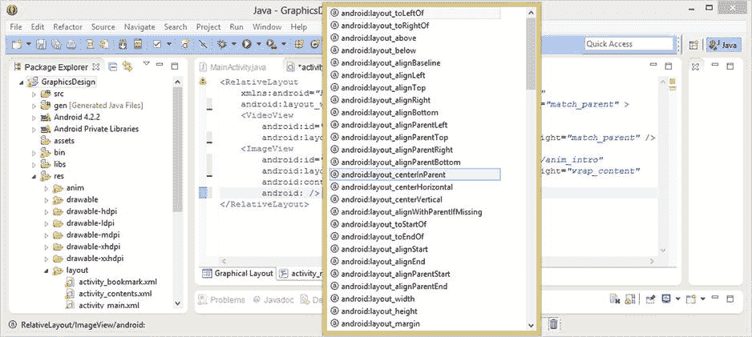

图 18-8. 将 `<ImageView>` 的 `layout_gravity="center"` 参数改为 `android:layout_centerInParent` 参数

要让您的视频缩放以填满整个屏幕，您需要在 `<VideoView>` 子标签中添加一个参数。您要做的是将 `<VideoView>` 容器与已使用 `MATCH_PARENT` 常量（在 X 和 Y 两个维度都设置）配置的 `<RelativeLayout>` 容器对齐。这使得 `<RelativeLayout>` 父标签填满整个显示屏。

需要特别注意的是，尽管您也在 `VideoView` 子标签中设置了这些 `MATCH_PARENT` 常量，但 Android 会“尊重”数字视频素材的宽高比，因此您必须找到一个不同的参数来“覆盖”这一行为，并在 X 维度上缩放视频，以覆盖视频背后显示的那条默认背景色白色条纹。

使用您的 Eclipse 帮助对话框：在 `<VideoView>` 结束标签 `/>` 符号后添加一行空格，然后输入 `android`、冒号以及字母“a”，如图 18-9 所示。如您所见，这将调出以字母“a”开头的可用参数，例如所有 `align`、`above` 和 `alpha` 参数。

您会看到四个 `alignParent` 参数；它们可用于“拉动”`VideoView`，使其与父容器 `RelativeLayout` 的各边缘对齐。我确实希望有一个 `alignParentAll` 或仅仅一个 `alignParent` 参数，这样我们就不必编码四个参数来达到最终效果，但在 Android 中，并非所有东西都总是那么合乎逻辑、最优或按照我们期望的方式实现。我猜，这就是 Android 的宿命吧！一个人同时担任程序员和图形设计师，需要具备灵活性和创造力，善于利用可用的工具和范式，以创造性的方式将这些不同的世界交织在一起，创造出前所未有的数字艺术作品。

如图 18-9 所示，第一个 `alignParentLeft` 参数已被选中。双击此参数将其插入到您的子标签中，并将其值设置为 `"true"`。接下来，执行相同的工作流程，返回帮助对话框，添加 `alignParentTop`、`alignParentRight` 和 `alignParentBottom` 参数，以确保 `VideoView` 均匀缩放。

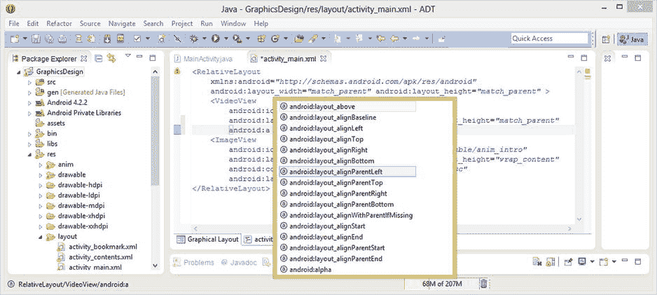

图 18-9. 使用 Eclipse 参数帮助对话框查找四个 `android:layout_alignParent` 参数

如图 18-10 所示，四个参数已就位，您的标记代码无误。现在您可以使用 **运行方式 ➤ Android 应用程序** 工作流程观看视频在 PAG 标志后方缩放并播放。在我的模拟器中，视频在填满容器后实际上播放得更流畅，可能是因为无需渲染那条白色条纹。

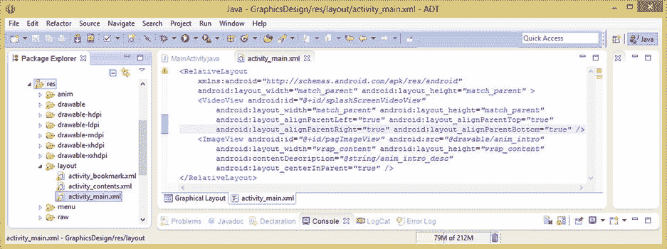

图 18-10. 为 `android:layout_alignParent` 参数添加全部四个边缘，使 `<VideoView>` 缩放适配屏幕

需要指出的是，即使您像我一样配备八核 64 位 3.4GHz 工作站、16GB DDR3 1333 内存和固态硬盘（SSD），您可能仍然无法获得理想的 Eclipse AVD 模拟器性能。


这是因为你的 AVD（Android 虚拟设备）正在虚拟化整个 Android 硬件和软件环境。它仅通过软件模拟来实现这一点，这需要占用极其庞大的内存空间以及大量的处理周期。话虽如此，这个开发软件包中负责运行 AVD 模拟器部分的代码可能存在一些优化“空间”，所以我们希望 Android 团队在谷歌总部已经部署了关键团队成员来负责这一目标。

如果你的 Android 开发工作站可以配置使用 3.8GHz（或更快）的 16 核 AMD 64 位 CPU，并配备 32GB 甚至 64GB 的 DDR3 1600 或 1800（现在非常实惠）内存，那么你很可能希望这样做，至少在模拟器环境变得更高效之前是这样的！如果你希望模拟器快速启动，请务必包含一块固态硬盘（SSD）！固态硬盘最终能让你的所有软件（以及操作系统）快速启动。

接下来，让我们看看另一个你可能会想了解的 `<VideoView>` 参数。这个 `android:keepScreenOn` 参数将阻止用户的显示屏进入“省电超时”功能，大多数 Android 设备都会积极实施此功能以延长每次充电周期的电池寿命。你可以在图 18-11 的 Eclipse 标签辅助对话框中看到这个参数，以及淡黄色的解释屏幕飞出提示，当你点击正在查看的每个参数时，该提示就会出现。

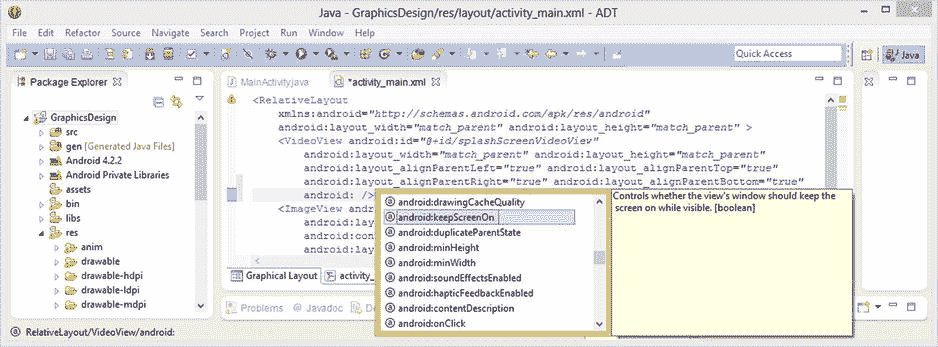

图 18-11.
使用 Eclipse 参数辅助对话框查找 `android:keepScreenOn` `VideoView` 参数

正如你在淡黄色解释屏幕中看到的，当 `VideoView` 可见时，此参数将保持用户的屏幕开启（背光点亮）。这也表明该参数是布尔类型的，因此请务必使用 `true` 值向 Android 操作系统表示你要“保持屏幕开启”。接下来，你需要优化更多目标设备分辨率的视频素材。

### 优化视频素材分辨率目标范围

接下来，你将完成对宽 VGA 800x480 视频素材的优化。由于 VGA 使用 640x480 分辨率，再增加 160 像素宽度，你就得到了 WVGA 分辨率，这在 Android 智能手机和平板电脑中非常流行，因为它屏幕尺寸适中，并且（勉强）拥有足够的像素为最终用户提供不错的图形质量。因此，对于考虑用于图形应用程序的数字视频素材来说，这是一个不错的分辨率。让我们优化你的 800x480 横向视频素材。

启动 Sorenson Squeeze Pro 视频应用程序，点击你在第 2 章中创建的 `480x800p` Android 预设。如图 18-12 左侧所示，当它以浅蓝色被选中时，点击面板左下角的中间图标（五个图标中的第三个，即创建副本图标），创建该编解码器预设的一个副本，以便你可以使用它为这个广泛使用的分辨率创建一个 WVGA 横向版本的预设。通过这种方法创建新预设会更容易，尤其是创建那些使用类似数据速率设置的预设。

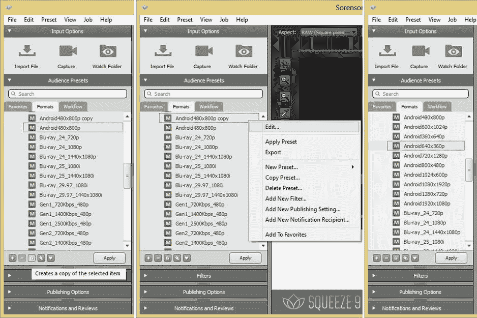

图 18-12.
创建 800x480p 横向数字视频编解码器预设（同时显示所有已完成的预设）

你首先要做的是提供正确的“名称”和“描述”字段数据输入，因此将此新预设命名为 `Android800x480p`（此处的 `p` 代表逐行扫描，而非像素），并添加描述 `Android 800x480 Landscape`，如图 18-13 所示。所有其他设置都相同，因为两个预设之间的数据是相同的，只是旋转了 90 度（即从竖屏显示模式切换到横屏显示模式）。

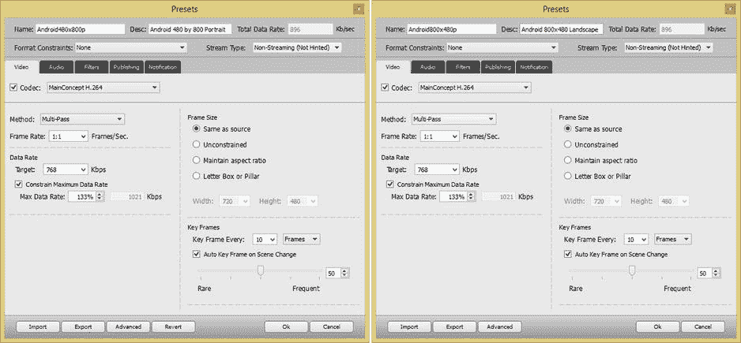

图 18-13.
使用高质量编解码器、数据速率在 768KBPS 到 1MBPS 之间的 Android WVGA 视频编解码器预设

逐行扫描视频是指图像（在此案例中为视频）中的每一行都依次一次性写入显示屏。与逐行扫描相反的是隔行扫描，就像旧电视那样，一次（扫描）写入偶数行，第二次（扫描）写入奇数行，从而将它们交织在一起（这就是它们闪烁的原因）。

确保你的数据速率范围在 768 KBPS（3/4 MBPS）到 1 MBPS 之间，并且你已为每秒视频设置了 10 个关键帧（即 10 FPS），同时你的帧大小设置为 `Same as source`。

一旦你的新 WVGA 预设设置完成，点击 `OK` 按钮创建该预设，然后你就可以进入 VirtualDub 并创建你的 AVI 源文件了。我们现在就开始。

使用快捷方式图标启动 VirtualDub 1.9，并使用 `File` ➤ `Open Video File` 选项。当对话框打开时，导航到你的系统硬盘，找到 PAG800 渲染的 BMP 文件序列的第一帧并选中它。一旦 400 帧的 3D 渲染加载完成，使用 `File` ➤ `Save AVI As` 选项将 AVI 文件保存到你的 `/AVIs` 目录，就像你在第 2 章中所做的那样。如果你需要重新回顾这个工作流程，可以查看第 2 章中的文本或截图。我在图 18-14 中展示了加载了 800x480 宽 XGA 横向视频的 VirtualDub 软件界面。

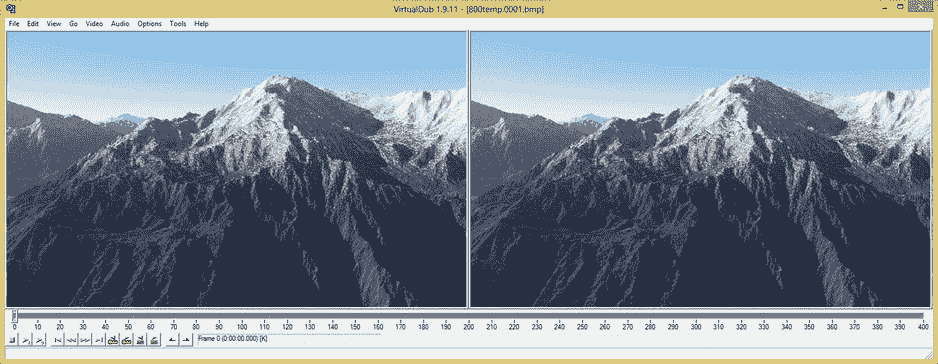

图 18-14.
将你的 WVGA 横向视频帧加载到 VirtualDub 中，以创建一个未压缩的 `.AVI` 文件

一旦你的 `PAG800x480.AVI` 文件被导出，你可以返回到 Squeeze Pro 9，在导入 `PAG800x480` 视频文件后应用新的预设，并使用 `Apply` 按钮将你创建的下一预设附加到它上面。当所有这些都在 Squeeze 中设置完毕后，你可以点击 `Squeeze It!` 按钮开始压缩过程。这将通过 MainConcept 编解码器和 MPEG-4 H.264 视频编码算法，将你的 WVGA 预设设置应用到 AVI 原始帧数据上。

一旦生成了 AVI 文件，你可以通过一些数学计算来检查你是否获得了与第 2 章中处理 480x800 竖屏版本文件时相同的出色压缩效果，如你现所见，在像素数量相同的情况下，横向版本实际压缩后比竖屏版本小了 35K。

你仍然可以获得 99.2% 的压缩比，也就是说 MP4 数据文件的大小仅为原始未压缩 AVI 源文件大小的 0.8%，这与 `PAG480x800.AVI` 文件（450MB）的大小完全相同，这合乎情理，因为它们内部包含的像素和帧数相同。

现在，你拥有了适合中等分辨率、中等 DPI（MDPI）设备的数字视频素材，这些设备具有 WVGA 分辨率和 4 英寸到 7 英寸的 LED 或 LCD 显示屏。

接下来，让我们先处理 LDPI（低 DPI）屏幕的素材，这样你就可以专注于为主流的 HD Android 设备以及之后的 NetBook（1024 像素分辨率）设备准备素材了。

在继续之前，还有最后一点说明：800x480 分辨率并不是“真正的”16:9 宽高比。要计算这个，`800/16=50`，而 `50x9=450`，所以真正的 16:9 宽高比是 800x450 分辨率，这对于许多 Android 设备来说并不是常见的物理屏幕（像素）分辨率。由于 `480/50=9.6`，800x480 分辨率实际上代表了 16:9.6 的宽高比，或者说介于 16:9 和 16:10 宽高比之间 60% 的位置。


### 使用 16:9 低分辨率 640x360 数字视频素材

接下来这个分辨率也将使用`VGA 640x480`分辨率来创建其宽屏版本，但这次你不需要在宽度上增加`160`像素，而是要从高度上减去`120`像素！这将得到`640`像素宽度和`360`像素高度，并形成`16:9`的宽高比。计算方法是：`640/16=40x9=360`，所以`640x360`是流行的`16:9`高清宽高比的一个低分辨率版本。

让我们回到`Squeeze`，使用你在上一部分学到的工作流程，复制`Android480x800p`预设，以便创建一个`Android360x640p`预设，用于较低分辨率的 Android 设备。

这类设备包括`HDPI`手表（2 英寸屏幕，`640`像素对应`320 DPI`，因此是`HDPI`）、入门级 Android 手机（较小的 4 英寸屏幕，`640`像素对应`160 DPI`，因此是`MDPI`）以及迷你平板（5 英寸屏幕，`640`像素对应`128 DPI`，因此是`LDPI`）。

复制`WVGA`预设，右键点击它，然后选择`Edit`菜单选项，如图 18-12 所示。一旦`Presets`对话框打开（如图 18-15 左侧所示），将预设命名为`Android360x640p`，并输入描述`Android 360x640 Portrait`，然后你就可以设置数据速率和相关参数了。将目标数据速率设置为`512 KBPS`，最大数据速率设置为比它多`150%`，即`768 KBPS`。你可以保持此`Presets`对话框右侧的设置不变，因为你希望匹配分辨率并使用每秒一个关键帧。完成竖屏预设后，返回并创建一个横屏预设。

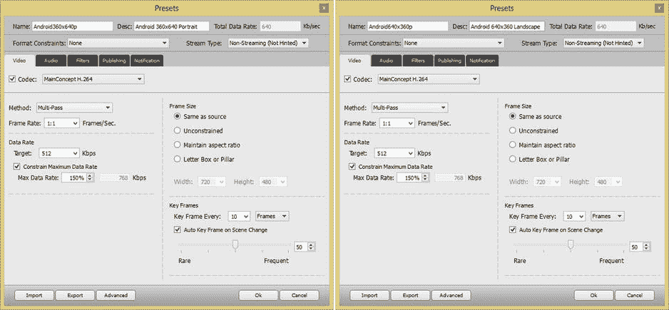

图 18-15.

Android 360x480 视频编解码器预设，使用`512KBPS`到`768KBPS`的数据速率和高质量编解码器

### 使用上网本分辨率 1024x600 数字视频素材

`1024x600`分辨率因大约十年前出现的超便携上网本产品而流行，其特点是宽屏`SVGA`分辨率。`SVGA`，即“超级`VGA`”，分辨率为`800x600`，因此如果你在宽度上再增加`224`像素，你将得到一个宽屏超级`VGA`（或`WSVGA`）显示屏。

上网本拥有 10.1 英寸屏幕，使其成为`LDPI`（`1024/10=102`像素每英寸）。现在戴尔已经推出了 Android PC，你可能会看到 Android 上网本市场也开始成形。也有一些采用此分辨率的智能手机和平板，屏幕尺寸为 4 到 5 英寸，这使它们处于`HDPI`（`240`像素每英寸）的屏幕密度范围。

此分辨率的宽高比并不完全是`16:9`，因为`1024/16=64`，`64x9=576`，所以`1024x576`代表一个“真正的”`16:9`宽高比。由于`64`在`600`中出现了`9.375`次，这代表一个`16:9.375`的宽高比，或者说从宽屏`16:9`到`16:10`宽高比之间的八分之三处。

复制`WVGA`预设，右键点击它，然后选择`Edit`菜单选项，如图 18-12 所示。一旦`Presets`对话框打开（如图 18-16 左侧所示），将预设命名为`Android600x1024p`，并输入描述`Android 600x1024 Portrait`。将目标数据速率设置为`1024KBPS`，最大数据速率设置为比它多`150%`，即`1536KBPS`。你可以保持此`Presets`对话框右侧的设置不变，因为你希望匹配分辨率并使用每秒一个关键帧。完成竖屏预设后，返回并创建一个横屏预设。

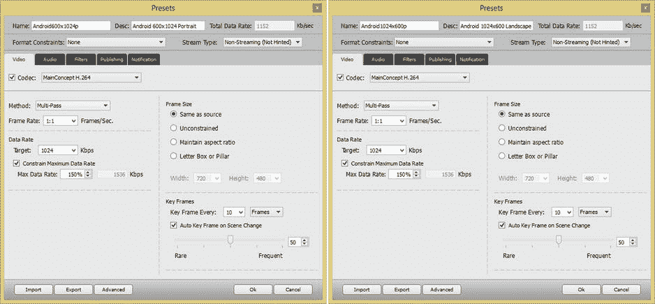

图 18-16.

Android WSVGA 视频编解码器预设，使用`1MBPS`到`1.5MBPS`的数据速率和高质量编解码器

### 使用低高清分辨率 1280x720 数字视频素材

大约十多年前，第一个进入数字领域的高清分辨率是“准高清”，即`1280x720`。这个分辨率有足够的像素（将近一百万）来提供清晰的视频内容，但又不会过多地拖慢处理器或数据传输带宽。它也是一个真正的`16:9`宽高比，因为`1280/16=80x9=720`。

使用此分辨率的设备包括`Phablets`（手机平板），如三星`Galaxy Note II`，它有一个 5.5 英寸的屏幕，使其成为`240 DPI`的`HDPI`设备。还有更大的 8 英寸平板，其特点是`160 DPI`的`MDPI`屏幕密度。采用此分辨率的 10 英寸大平板则属于`LDPI`或`120 DPI`屏幕密度类别。

复制`WVGA`预设，右键点击它，然后选择`Edit`菜单选项，如图 18-12 所示。一旦`Presets`对话框打开（如图 18-17 左侧所示），将预设命名为`Android720x1280p`，并输入描述`Android 720x1280 Portrait`。将目标数据速率设置为`1536KBPS`，最大数据速率设置为比它多`133%`，即`2048KBPS`。

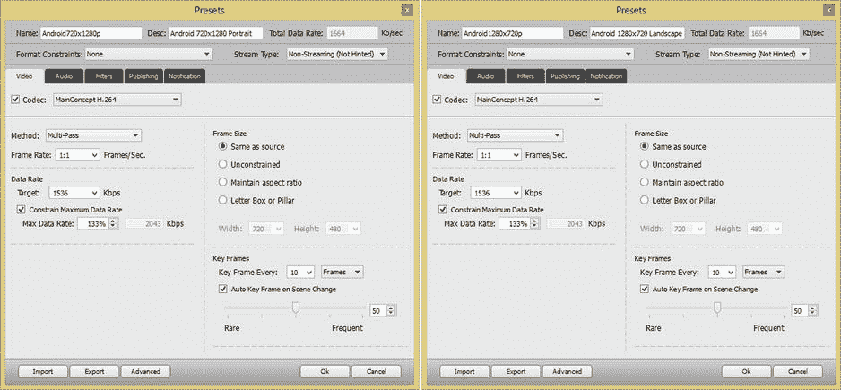

图 18-17.

Android 准高清视频编解码器预设，使用`1.5MBPS`到`2MBPS`的数据速率和高质量编解码器

你可以保持此`Presets`对话框右侧的设置不变，因为你希望匹配分辨率并使用每秒一个关键帧。

完成准高清竖屏预设后，你可以返回并执行相同的工作流程来创建你的准高清横屏预设。

最后，你将为一款`iTV`或高端平板创建一组真正的高清预设。

### 为 iTV 使用真正高清 1920x1080 数字视频素材

大约十多年前，第二个进入数字领域的高清分辨率是行业所称的真正高清，即`1920x1080`。这个分辨率也是一个精确的`16:9`宽高比，并拥有超过两百万的像素，足以提供水晶般清晰的视频播放。真正高清分辨率也有如此多的像素，以至于它可能会拖慢一个较弱的（单核）处理器，并且也可能“挤占”任何较小的数据传输带宽。

使用此高清分辨率的设备包括`iTV`（互动电视）以及`Kindle Fire HD`，后者实际上在 8.9 英寸屏幕上采用了真正的`16:10`的`1920x1200`分辨率，使其更接近`240 DPI`的`HDPI`设备。对于`iTV`设备，屏幕尺寸决定了`DPI`，所以这次我们换个方向来计算：`1920/240=8`，所以一个 8 英寸宽的`iTV`（11 英寸对角线）是`HDPI`；`1920/160=12`，所以一个 12 英寸宽的`iTV`（16 英寸对角线）是`MDPI`；`1920/120=16`，所以一个 16 英寸宽的`iTV`（20 英寸对角线）是`LDPI`。这意味着大多数市面上的`iTV`都是`LDPI`。

复制`WVGA`预设，右键点击它，然后选择`Edit`菜单选项，如图 18-12 所示。一旦`Presets`对话框打开（如图 18-18 左侧所示），将预设命名为`Android1080x1920p`，并输入描述`Android 1080x1920 Portrait`。将目标数据速率设置为`2048KBPS`，最大数据速率设置为比它多`150%`，即`3072KBPS`。

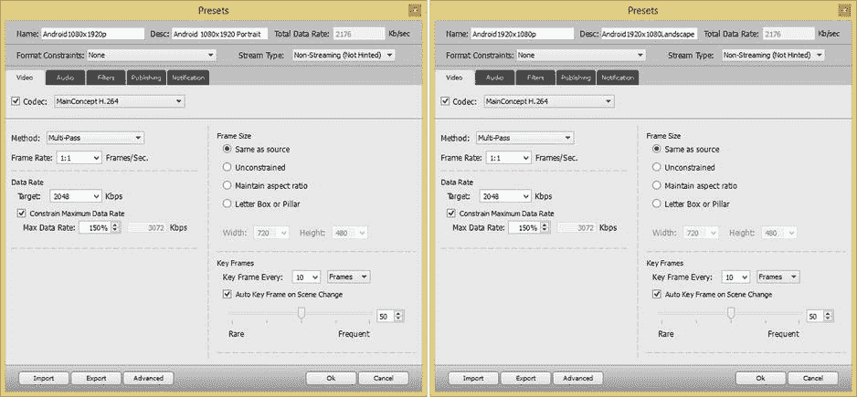

图 18-18.

Android 真正高清视频编解码器预设，使用`2MBPS`到`3MBPS`的数据速率和高质量编解码器

你可以保持此`Presets`对话框右侧的设置不变，因为你希望匹配分辨率并使用每秒一个关键帧。

完成真正高清竖屏预设后，你可以通过相同的工作流程来创建你的真正高清横屏预设。现在你已经生成了所有的`MPEG-4`数字视频素材，你可以查看你所获得的压缩比率，并决定哪些最适合用于你的应用程序。


### 分析目标分辨率压缩比结果

现在，您已经使用未压缩的 `.AVI` 文件创建了压缩后的 `.MP4` 文件，可以计算压缩比和压缩百分比，看看哪种分辨率能带来更优的压缩效果。您会发现，更高的分辨率效果会稍好一些。在做决定时，您还需要关注数字视频素材的文件大小。表 18-1 汇总了计算结果；您可以在工作室中使用电子表格软件（例如开源软件 `OpenOffice Calc 4.0`，可从 [www.openoffice.org](http://www.openoffice.org) 获取）进行类似操作。

**表 18-1.** 行业标准硬件屏幕分辨率、原始数据大小、压缩后大小及压缩比

| 分辨率 | 原始数据 | 压缩后 | 压缩比 | 百分比 | 屏幕方向 |
| --- | --- | --- | --- | --- | --- |
| 640x360 | 270MB | 2.5MB | 108:1 | 0.93% | 横向 |
| 800x480 | 450MB | 3.8MB | 119:1 | 0.84% | 横向 |
| 1024x600 | 720MB | 5.0MB | 143:1 | 0.70% | 横向 |
| 1280x720 | 1080MB | 7.5MB | 143:1 | 0.70% | 横向 |
| 1920x1080 | 2430MB | 9.9MB | 243:1 | 0.41% | 横向 |
| 360x640 | 270MB | 2.5MB | 108:1 | 0.93% | 纵向 |
| 480x800 | 450MB | 3.8MB | 119:1 | 0.84% | 纵向 |
| 600x1024 | 720MB | 5.0MB | 143:1 | 0.70% | 纵向 |
| 720x1280 | 1080MB | 7.5MB | 143:1 | 0.70% | 纵向 |
| 1080x1920 | 2430MB | 10 MB | 243:1 | 0.41% | 纵向 |

您需要寻找的是兼具最佳压缩比、最小文件大小，且分辨率具有足够像素以进行高质量放大或缩小的选项。除了 True HD 达到的 243:1 压缩比，我个人倾向于 5MB 的 WSVGA 压缩结果。1920 分辨率下达到 243:1 的结果让我怀疑该编解码器对高清分辨率有额外的优化——毕竟该产品的 99% 用户会使用此编解码器来处理他们的主流视频工作！

我会选择 WSVGA，因为 1024 分辨率可以以 2 倍的均匀系数放大到 1920（或 2048）分辨率屏幕，接近 1280 分辨率，并能高质量缩小到其他任何分辨率。再加上大多数 Android 设备具有精细的像素间距（通常为 HDPI，能隐藏任何缩放伪影），这样您只需 5MB（即每帧 13KB）就能拥有 400 帧的 3D 动画。

5MB 的视频文件占您 Android APK 最大 50MB 文件大小限制的 10%，因此作为启动画面背景视频板来说，这相当合理。

需要注意的是，您的应用程序还可以最多访问两个额外的外部数据文件，每个最大为 2GB。因此，只要视频优化得当，即使应用包含大量自有视频，也不会成为问题。

让我们针对 1024x600 这个目标分辨率再尝试一件事。使用您在本章（以及第 2 章）学到的工作流程，选择 1024x600 预设，并使用底部的复制图标复制一份预设，创建一个 HQ（高质量）预设。

右键点击复制的预设，选择“编辑”，将目标数据速率设置为更高的 1200 KBPS，并为最大数据速率提供 170% 的余量（即 2048 KBPS），让我们看看使用这些更高质量设置后，当前 5MB 文件大小会增加多少数据开销。

导入 `PAG1024x600.avi` AVI 未压缩源文件，应用这个新的编解码器预设，然后点击 `SqueezeIt!` 按钮压缩 MP4 文件。如果您能在文件小于 6MB 的前提下获得更高的质量，那么 Android 就将拥有一个可用于高质量放大或缩小的优质视频数据源。

如图 8-23 所示，生成的 MP4 文件大小为 5.878 MB。因此，您或许可以在（目标）低端再提高一些质量；也许使用 1250 或 1280 KBPS 的目标数据速率，以确保即使在像素较大、伪影明显的大型（LDPI）屏幕上查看数据时，也看不到任何可见的伪影。

这个 1024x600 的目标分辨率应该能相当好地放大到 1280 或 1920，尤其是在 HDPI 屏幕（这是标配）上，因为像素非常小，伪影甚至不可见。可以这样理解：当您在 CES 展会上处理 Android 相关业务时，就像在看拉斯维加斯的大型 LED 广告牌。近距离观看时，像素看起来很糟糕；但离远些时，同样的多媒体内容看起来绝对完美无瑕。如今常见的这些更小像素间距的显示器，效果就像是让您的眼睛离内容更远了。

正如您所看到的，凭借 243:1 的压缩比，Sorenson Squeeze 展示了其能以很小的数据量提供惊人的视频质量，而且这还是在较老的 MPEG-4 编解码器上实现的。使用更新的 WebM 视频编解码器可能会获得更好的效果——当然，这取决于视频内容。它也可能给出相同或更差的结果；除了进入 Squeeze，将未压缩的 AVI 源文件通过编解码器处理并查看结果之外，没有其他真正的方法可以确定。我们接下来就这么做。

### 使用 WebM VP8 编解码器压缩伪高清视频

让我们回到 Sorenson，尝试一个 `Sorenson Squeeze Pro` 附带的、用于 1280x720 分辨率且数据速率为 2000 KBPS 的 WebM 预设。右键点击此预设，使用“编辑”命令修改编解码器预设，先使用您目标的 1536 KBPS 数据速率，稍后再使用您最大的 2048 KBPS 数据速率。WebM 编解码器不像 MPEG-4 编解码器那样支持数据速率范围，因此您需要测试这两个数据速率。

这里要尝试的是，看看能否获得比使用 Squeeze 的 MainConcept MPEG4 H.264 编解码器更小的数据量。如果可以，并且其数据量显著更低，您可以考虑使用 WebM 格式。如果不能，您应该使用 MPEG4 格式，因为它受更多版本的 Android 操作系统（2.3 版本之前）支持。启动 `Sorenson Squeeze`，使用左上角的“导入文件”图标打开 `PAG1280x720.avi` 未压缩的 AVI 文件，如图 18-19 所示。

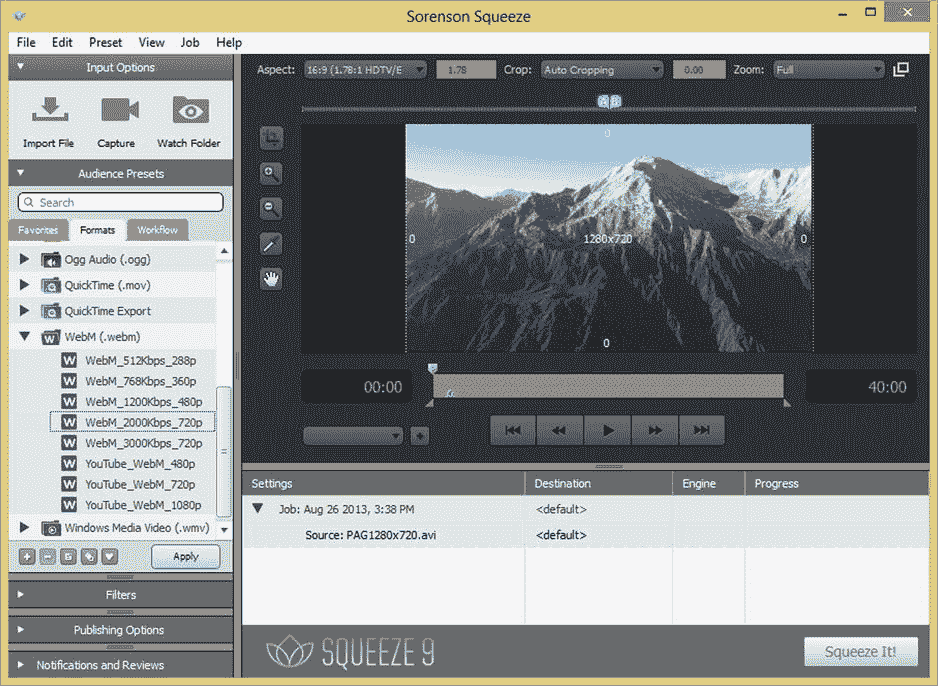

**图 18-19.** 加载未压缩源文件 `PAG1280x720.avi` 并选择 WebM 1280x720p 编解码器

一旦未压缩的 `.AVI` 数据加载完毕，应用您创建的 WebM 预设，该预设使用低端（目标）数据速率 1536 KBPS，如图 18-20 左侧所示。点击 `SqueezeIt!` 按钮编码 WebM 文件。然后，要么创建一个新的预设，要么编辑您现有的预设（如果您愿意，也可以在 Squeeze 主编辑视图底部右键点击已应用的编解码器），创建一个 2048KBPS 高端（最大）数据速率预设。将其应用到您的未压缩源文件上，然后使用 `SqueezeIt!` 按钮创建一个 2048KBPS 数据速率的 WebM 文件版本，这样您就可以看到您获得了怎样的数据量优化。有趣的是，WebM 只支持“静态”或单一的数据速率，而不像 MPEG-4 编解码器那样支持一个范围。

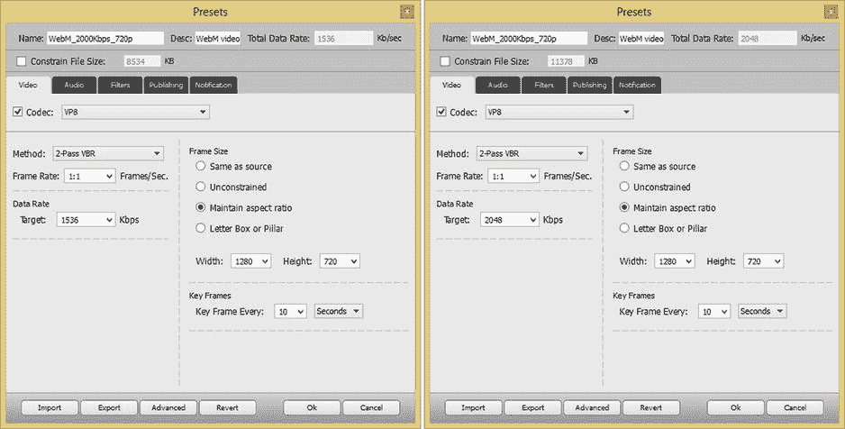

**图 18-20.** 创建 1536 目标数据速率的 WebM 预设以及 2048 目标数据速率的 WebM 预设

由于在使用 MPEG-4 编解码器时，从伪高清到真高清，您获得了如此巨大的压缩比提升（从 143:1 提升到 243:1），最后让我们尝试在 WebM 编解码器上使用真高清视频源，看看它是否能给出相同的结果。


### 使用 WebM VP8 编解码器压缩真高清视频

找到 1080p 的 `Squeeze WebM` 编解码器预设，如图 18-21 右侧所示，然后将目标数据速率编辑为 3072 KBPS（即 3 MBPS），并使用最佳的 2 遍可变比特率（VBR）设置，以及 `Maintain Aspect Ratio`（保持宽高比）设置。你可以看到，在这种情况下，它的作用与你之前使用的 `Same as source`（与源相同）设置完全相同。使用相同的工作流程复制此预设，创建一个 2048 TDR 预设。

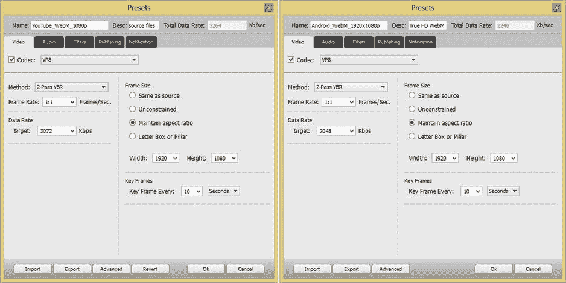

图 18-21. 为 WebM 编解码器创建数据速率为 3072 和 2048 Kbps 的真高清视频压缩预设

接下来，使用 Squeeze 左上角的 `Import File`（导入文件）按钮，找到 `PAG1920x1080.avi` 未压缩源文件并将其加载，以便压缩 WebM 真高清视频素材。

将你的 3072 KBPS WebM 预设应用于真高清源数据，点击 `SqueezeIt!` 按钮，生成数字视频数据的 WebM 版本。

正如你将在本章后面看到的，这会生成一个 14MB 的数据占用空间，因此接下来我们使用 2048 KBPS 编解码器预设来压缩未压缩的源 AVI 文件，看看是否能得到更小的数据占用空间结果。

将你的 2048 KBPS WebM 预设应用于真高清源数据，点击 `SqueezeIt!` 按钮，生成数字视频数据的 WebM 版本。

此数据速率设置的结果是一个 8MB 的文件。如果你考虑到 400 帧 3D 图像，每帧 6.22MB，本质上是从 25 亿字节的数据压缩到仅 800 万字节（见图 18-22），那么这是一个非常显著的结果。

我在 Opera 浏览器（该浏览器专门支持 WebM 视频）中播放了该 WebM 视频，其播放流畅无比！因此，对于真高清视频素材，特别是需要流式传输的视频，我会选择这种 WebM 编解码器和预设，而非 MPEG-4；或者，如果我在媒体服务器上外部托管数据，可能会设法同时提供两种格式。

我们将在下一章中研究使用远程 Web 服务器流式传输视频数据，因此本章和第 2 章将为那一章（关于更高级的视频流式传输）打下极好的基础。

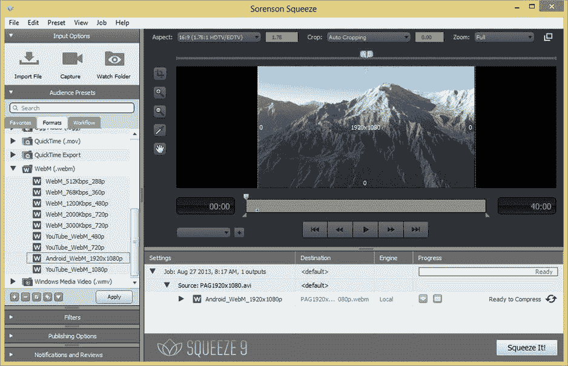

图 18-22. 导入未压缩的 `PAG1920x1080.avi` 真高清 AVI 文件并向其应用 WebM 预设

最后，作为总结，让我们看看你生成的所有 38 个源文件、数据文件和项目文件，它们如图 18-23 所示。该列表的顶部是 `.sqz` Squeeze 项目文件，在这些文件下方，按 X 轴数值顺序排列着十种不同的视频素材文件分辨率，以及它们未压缩的 AVI 文件、压缩的 MPEG-4 文件，甚至还有（如果你好奇的话）压缩的 WebM 文件。

如果你想练习计算，可以交换分子和分母，或除数和被除数，以便在压缩比和压缩百分比之间来回转换。要获得压缩量，请用 100% 减去你的压缩百分比，或者在本例中，用 1 减去压缩百分比。

大部分计算我已经为你完成，并放在表 18-1 中，向你展示如何创建类似的数据表，以便在客户要求查看时，你能随时掌握数据占用空间的优化结果。或者，以防你想像我一样遵循“精细”的工作流程。

现在，你已掌握足够的知识，可以进入下一章了。在那里，你将研究视频远程流式传输的编码和优化，以便将数字视频素材存储在你的服务器上，而不是你的应用中！

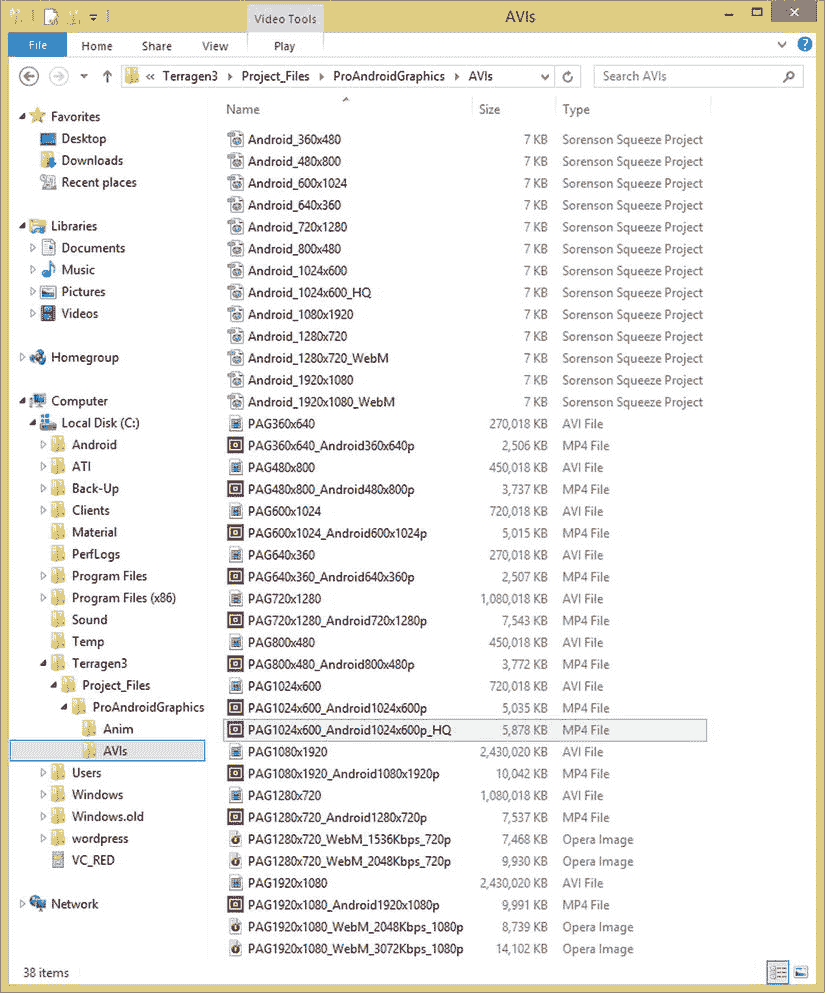

图 18-23. Windows 资源管理器文件管理器显示 AVI 文件夹及压缩结果的文件大小和格式

### 摘要

在第十八章中，你学习了如何使用 `MediaPlayer`（它本质上包含在你的 `VideoView` UI 对象中）。你深入研究了 Android 中的 `MediaPlayer`、`Uri` 和 `VideoView` 类，了解了它们各自的功能，以及它们如何协同工作，使我们能够定位、加载到内存、访问、播放和循环播放数字视频素材。

你学习了如何使用 `OnPreparedListener` 嵌套类（通过 `MediaPlayer` 嵌套类 `MediaPlayer.OnPreparedListener` 访问）来获取 `MediaPlayer` 对象引用，该类暴露了 `MediaPlayer` 对象。

与早在第 2 章（那时你只是一个简单的图形初学者）时相比，本章我们对 `MediaPlayer` 和 `VideoView` 类进行了更详细的探讨，然后我们将你的视频素材重新引入启动屏代码，以便将其用作动画背景板。

你将你的视频素材与我们很久以前在第 3 章和第 4 章中创建的 PAG 标志动画处理进行了合成。正如预期的那样，你在第 2 章中创建的视频在你创建的动画元素后面正常播放，这归功于你的合成工作流程以及对 PNG32 素材中 Alpha 通道数据的智能运用。你们学得很好，年轻的卢克们和卢克莎们。愿英伟达（GeForce）图形处理器与你们同在。

接下来，我们重新回到数字视频数据占用空间优化的工作流程，并确定了五个目标分辨率，这些分辨率“覆盖”了 95% 的主流 Android 设备屏幕分辨率（使用物理像素）。除了最小的 640x360 分辨率外，每一个也都是一个“命名的”屏幕分辨率标准。

我们瞄准了宽 VGA（WVGA），分辨率为 800x480；宽超级 VGA（WSVGA），分辨率为 1024x600；伪高清，分辨率为 1280x720；以及真高清，分辨率为 1920x1080。最后两种恰好也是视频（电视）广播标准。

你为这些分辨率的竖屏和横屏版本设置了编解码器预设，并设置了标准数据速率以匹配视频尺寸和目标播放设备。你查看了生成的文件大小，并确定了哪种结果最适合你打算交付应用的目标 Android 设备。

在下一章中，你将了解如何通过 HTTP 协议在互联网上流式传输数字视频素材，以备你的应用中有过多的数字视频无法使用“本地”素材，同时也让你了解在视频压缩和数据流式传输中，网络带宽是如何发挥作用的。


# 19. 从外部媒体服务器流式传输数字视频

### 摘要

在第十九章中，你将通过使用 Android 的 `VideoView`、`Uri` 和 `MediaPlayer` 类获得更深入的实践经验。不过，这次你将使用托管在 Android 应用外部的数字视频。

如果视频资产数据首次通过互联网传输到用户 Android 设备上时（在你的代码配置情况下，即在首次播放循环期间）就开始播放，这通常被称为流式数字视频。另一种使用远程数字视频媒体服务器上视频的方式是，在播放周期（在你的特定用例中即无缝循环）开始之前，先下载数字视频资产。

无论采用哪种方式，这种方法都与你之前章节中使用内置视频的方式不同，因为你将网络连接作为数字视频数据流的来源，并使用 Android 应用作为该流式（或已下载）视频数据的播放引擎（接收端）。

为了在用户等待视频资产下载时提供反馈，你需要实现一个进度对话框，因此在本章中你将学习 Android 的 `ProgressDialog` 类。该类允许你实现一个对话框，用于提醒用户他们正在下载视频，并通过进度动画告知他们下载的相关信息，例如正在下载的内容。

在本章稍后部分，你将使用 Squeeze 来优化你的 480x800 数字视频资产，以利用 WebM 编解码器和文件格式。你还将学习 Android 的 `Display` 和 `WindowManager` 类，因为你需要使用它们来检测用户当前使用的屏幕方向。

### 可以流式传输视频吗？设置清单的网络权限

在你可以使用应用访问互联网之前，Android 操作系统会要求你首先在 `AndroidManifest.xml` 文件中声明一个 `INTERNET` 权限常量。这可以通过使用 Android 的 `<uses-permission>` 子标签以及 `INTERNET` 常量来完成，使用以下 XML 标记行：

```
<uses-permission android:name="android.permission.INTERNET" />
```

这个权限标志位于 Android 清单 XML 文件的顶部，在你的 `<uses-sdk>` 规范之后（见图 19-1），它将告知 Android 操作系统你打算访问用户设备外部的流式数据或其他应用内容。

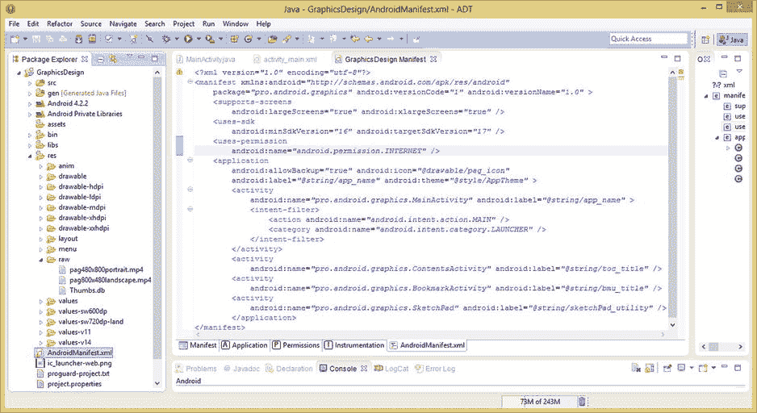

图 19-1. 使用 `android.permission.INTERNET` 向 `AndroidManifest` 文件添加 `<uses-permission>` 子标签

之所以需要这样做的根本原因在于，你需要告知 Android 操作系统注意潜在的安全漏洞。一旦你将硬件设备接入公共网络（如互联网），它就可能受到第三方（如黑客）的攻击。这就是为什么我将大部分 3D 内容开发工作站保留在它们自己的私有网络上——一个与外界不连接（不可见或不可访问）的网络。同样的概念也适用于用户的 Android 设备。

### 当视频远在他方：HTTP URL 与你的 URI

Android 操作系统内部的内容（对于视频，将位于 `/res/raw` 文件夹中）通常使用 `android.resource://` URI 路径引用，因为这些内容始终位于 Android 操作系统的 R 或资源区域中。

使用 Android 中所谓内容提供者的数据库内容，则使用 `content://` URI 路径引用。本书不会涉及该 URI 路径引用位置（这完全是另一本关于 Android 数据库设计的书的内容），不过了解一下也是好的！

我们将使用一台网络服务器来托管你的数字视频资产，因此你需要将这个 `android.resource://` 更改为熟悉的 `HTTP://`，后者用于表示超文本传输协议模式。

这意味着，升级你当前的应用程序代码以利用数字视频流式传输，就像更改传递给 `splashScreenUri` 对象声明和配置代码行中 `Uri.parse()` 方法调用的参数一样简单，如图 19-2 所示。你的新 Java 代码应类似于以下 Java 代码语句：

```
Uri splashScreenUri = Uri.parse("HTTP://www.e-bookclub.com/pag480x800portrait.mp4");
```

这是你为了能够从新的媒体网络服务器向 Nexus One 模拟器（或 Android 硬件测试设备）流式传输数字视频资产，而对第 18 章中编写的代码所做的唯一更改。

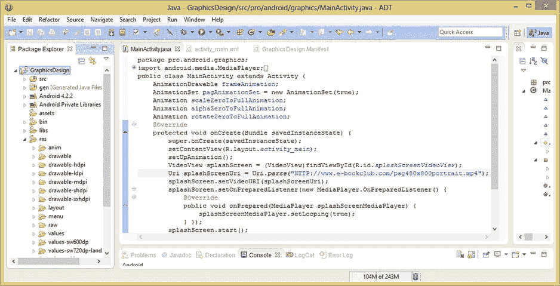

图 19-2. 将内部视频资产的 URI 引用更改为外部 HTTP 视频资产引用

如图 19-3 所示，MPEG-4 数字视频资产正在一帧一帧地从网络服务器流式传输到 Nexus One 模拟器 AVD，因为每一帧都通过互联网传输过来。我使用了一个较慢的互联网连接来确认这一点，视频确实是随着每一帧数据通过互联网传入模拟器而一帧一帧地显示的。

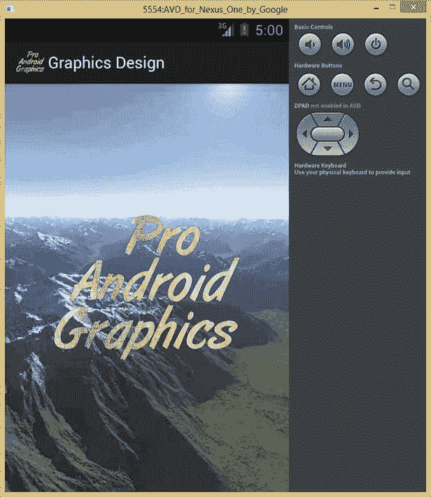

图 19-3. 在 Nexus One 模拟器中流式传输你的 `pag480x800portrait.mp4` 视频

一旦整个视频通过互联网流式传输完成并加载到系统内存中，视频的任何后续循环都将以与上一章中从内存播放内置视频时一致的速度进行播放。如果这比在 Android 设备硬件上播放要慢，请记住 Android 设备不需要像 AVD 那样既模拟自身又运行你的应用（因此其性能较弱）。

接下来，你将了解如何通过互联网预加载数字视频资产，以防你需要确保用户获得流畅的视频播放体验。


### `ProgressDialog` 类：展示你的下载进度

Android 有一个名为 `ProgressDialog` 的类，它让你能够轻松向用户展示下载正在进行的进度，这样他们就不会认为应用“卡住”了，反而会确信在你等待时，它在后台执行某项任务（下载数据）。

Android 的 `ProgressDialog` 类是 `AlertDialog` 类的一个直接子类，因此它是针对 Android 操作系统的一种专门类型的 `AlertDialog` 对象。`AlertDialog` 类本身是 `Dialog` 类的子类，用于创建 `Dialog` 类，而 `Dialog` 类又是主类 `java.lang.Object` 的子类。

因此，Android `ProgressDialog` 类的层级结构如下所示：

```
java.lang.Object
  > android.app.Dialog
    > android.app.AlertDialog
      > android.app.ProgressDialog
```

`ProgressDialog` 类以及 Android 中所有其他类型的 `Dialog` 类都归属于 `android.app` 包，因为它以某种方式成为了每个应用的一部分。在你的应用中使用 `ProgressDialog` 类（或对象）时，其导入语句会引用 `android.app.ProgressDialog` 包，你将在本章中看到这一点。

`ProgressDialog` 类是一个公共类，允许你的应用实现一个进度对话框，该对话框会显示一个动画进度指示器以及一段可选的文本消息。对于视频下载，动画进度指示器应使用旋转轮，因为这是视频下载的行业“规范”。

你将在本章稍后使用的旋转轮指示器是 `ProgressBar` 对象的默认指示器类型。另一种进度指示器类型是水平条指示器，它会显示在任何给定时间点已完成下载的百分比。

`ProgressDialog` 对象也可以使用 `View` 对象来替代你的文本消息。这意味着，如果你想发挥创意，使用自己通过本书前十八章节所学知识设计的图形或动画素材，你可以制作出非常炫酷的视觉进度对话框——只要你愿意这么选。

在 `ProgressDialog` 对象中只能使用文本消息或 `View` 对象；目前两者不能同时使用。当然，你可以简单地在你的 `View` 对象中实现你的文本（可绘制对象），所以对于像你这样专业的 Android 图形设计师来说，这不成问题！`ProgressDialog` 对象可以通过按下“返回”键使其可取消，也可以通过在 `ProgressDialog` 对象（屏幕区域）之外点击（或外部区域）来使其可取消。如果你想知道的话，水平进度条的数值范围是从 0 到 10000。

### 在 `GraphicsDesign` 应用中实现 `ProgressDialog`

让我们在你当前的流式数字视频代码库中实现一个 `ProgressDialog` 对象，这样你就可以将其从流式视频操作转变为视频预加载操作。你需要做的第一件事是声明一个 `ProgressDialog` 对象，并通过以下代码将其命名为 `downloadProgress`：

```
ProgressDialog downloadProgress;
```

如图 19-4 所示，你需要将鼠标悬停在 `ProgressDialog` 类的引用上，并选择导入 `ProgressDialog`（`android.app`）的选项，这样 Eclipse 就会为你编写导入语句。然后，你就可以在你的其余代码中使用这个类了。

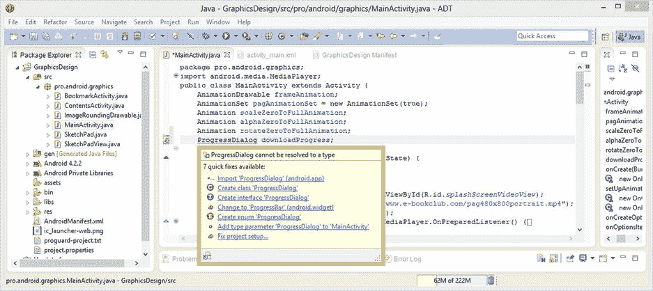

**图 19-4.** 在 `MainActivity` 类的顶部声明一个名为 `downloadProgress` 的 `ProgressDialog` 对象

接下来，你需要确保在下载完成之前视频不会开始播放。乍一看，这似乎需要大量复杂的代码来监控下载并在下载完成后启动视频，但实际上，只需将 `.start()` 函数调用从当前位置移动到 `onPrepared()` 方法内部即可。

这样做的效果是，一旦数字视频“准备好”就会开始播放。在这种情况下，准备好意味着已加载到系统内存中，而在这里，这也意味着已完全下载！所以，让我们接下来完成这一步；将上一章编写的 `.onPrepared()` 方法外部的 `splashScreen.start();` 代码行复制并粘贴到 `onPrepared()` 方法内部，紧跟在你的 `.setLooping()` 方法调用之后，如图 19-5 所示。正如你所见，有一些错误高亮需要处理！

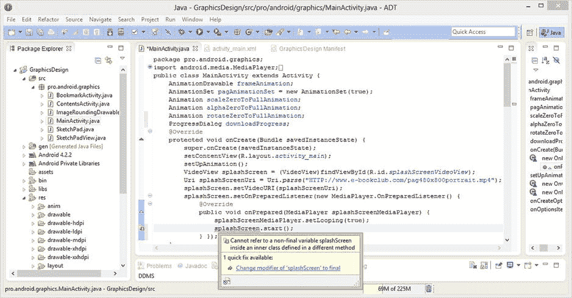

**图 19-5.** 将 `.start()` 方法调用重新定位到 `onPrepared()` 方法内部，以便视频在下载后开始播放

将对 `splashScreen` 对象的 `.start()` 方法的引用调用放入 `onPrepared()` 方法内部后，`Activity` 子类就很难“定位”到它，因为你的 `VideoView` 对象隐藏在你的代码层级结构中更深的位置。

如果你将鼠标悬停在错误高亮上，你会看到建议使用 `final` 访问修饰符，这样你的 `splashScreen` `VideoView` 对象就可以在你的 `MainActivity` 类中的任何位置被看到（找到或引用）。

这是一种解决方案，但实现它可能也会占用一点额外的内存，所以让我们先尝试不同的方法：将你的 `VideoView` 对象声明、命名和配置语句从 `onCreate()` 方法内部移到类的顶部，与 `ProgressDialog` 和 `Animation` 相关的声明放在一起。

如图 19-6 所示，这解决了你的错误消息问题，就如同在图 19-5 中点击“将 `splashScreen` 的修饰符更改为 `final`”选项一样，只不过通过这种方式，你的 `VideoView` 对象对 `MainActivity` `Activity` 子类中的每个方法都是可见的，并且在需要访问时，该类中的所有方法都可以访问它。

现在，你可以着手进行实例化和配置 `ProgressDialog` 对象的工作流程，以便用它来通知用户，你正在下载一个视频文件供他们观看。让我们接下来完成这一步，以防止用户坐立不安——这从来都不是一个好的用户体验指标。

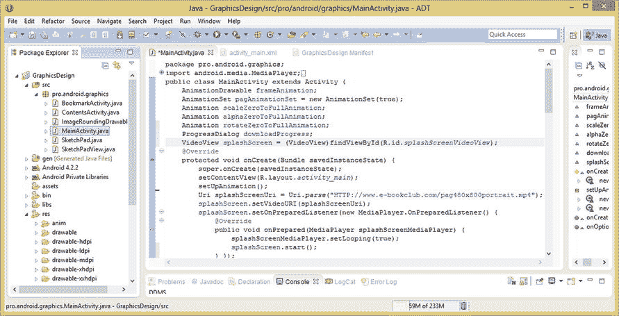

**图 19-6.** 将 `VideoView` 声明和配置语句重新定位到 `MainActivity` 类的顶部


```markdown
在`setUpAnimation()`方法调用后添加一行空行，并使用`new`关键字实例化一个`ProgressDialog`对象，使用以下 Java 代码行，如图 19-7 所示：

```
downloadProgress = new ProgressDialog(this);
```

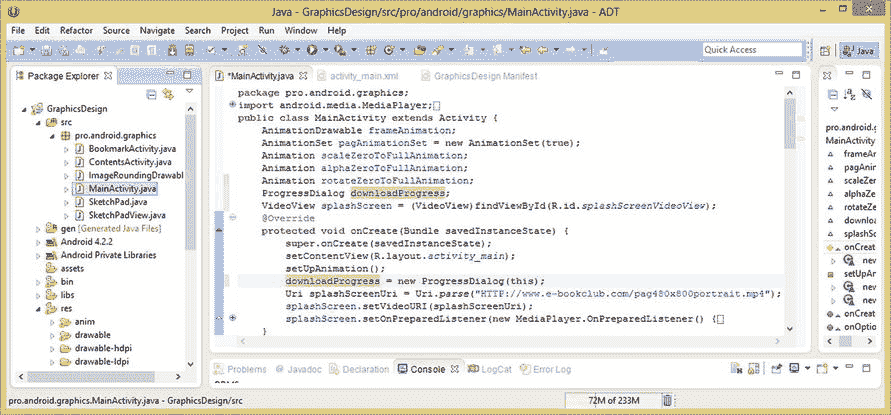

**图 19-7.** 使用`new`关键字和`this` Context 对象实例化`downloadProgress` ProgressDialog 对象

你使用`this`关键字作为参数，将当前`Activity`子类的`Context`对象传递给`ProgressDialog`构造函数。这为`ProgressDialog`对象提供了所需的正确上下文，使其知道何时（以及在哪里）弹出并显示其消息，正如你在本书前面学习`Context`类和`this`关键字时所学到的。

一旦`downloadProgress` ProgressDialog 对象被实例化，你就可以开始为其定制你想要它在应用程序中执行的操作。首先，使用以下 Java 代码行，通过`.setTitle()`方法调用为`ProgressDialog`对象创建一个标题（标题文本）：

```
downloadProgress.setTitle("Terragen 3 Virtual World Fly-Through Video");
```

接着，使用以下 Java 语句，通过`.setMessage()`方法调用定义一条在动画进度指示器旁边显示的消息：

```
downloadProgress.setMessage("Downloading Video from Media Server...");
```

如图 19-8 所示，你的 Java 代码保持无错误状态，你可以继续设置一些标志来定义`ProgressDialog`对象的功能。你要控制的第一个功能是用户取消此对话框的能力，因为你希望此对话框在视频从远程媒体网络服务器下载完成后自动取消。

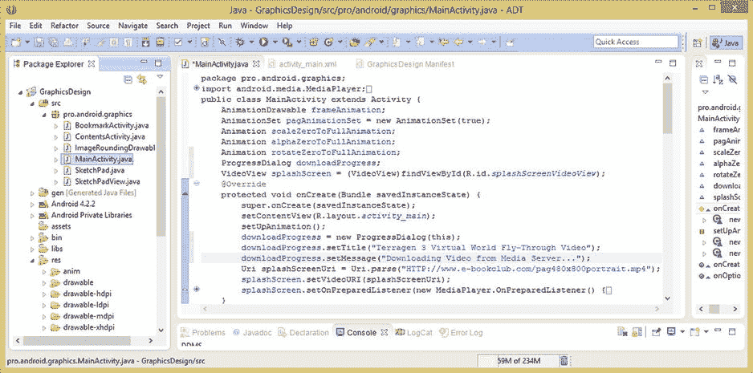

**图 19-8.** 使用`.setTitle()`方法调用设置对话框标题，并使用`.setMessage()`方法调用设置对话框消息

这是通过使用`.setCancelable()`方法并传入布尔值`false`来完成的，如图 19-9 所示。如截图中所见，如果你输入`ProgressDialog`对象名称（`downloadProgress`），然后输入一个句点字符，即可弹出可用方法辅助对话框。

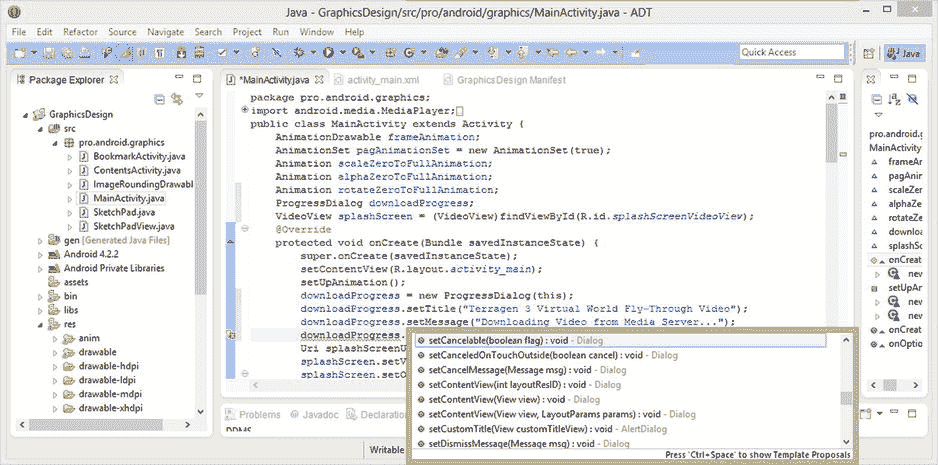

**图 19-9.** 使用`downloadProgress`对象名称和句点字符调用可用方法辅助

让我们使用相同的工作流程找到`.setIndeterminate()`方法调用，并将其同样设置为布尔值`false`，如图 19-10 所示。将不确定进度设置为`false`将为你提供一个旋转的轮状进度条，这是下载视频时的常规指示器。

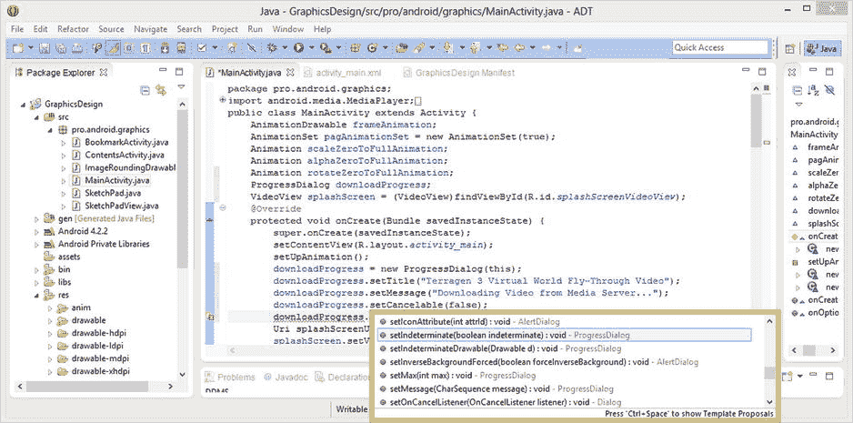

**图 19-10.** 使用方法可用辅助对话框定位并添加`.setIndeterminate(false)`方法调用

配置好`ProgressDialog`对象的标题、消息、取消行为和动画进度图标类型后，你终于可以通过使用以下 Java 代码行调用`ProgressDialog`对象的`.show()`方法向用户显示进度对话框，如图 19-11 所示：

```
downloadProgress.show();
```

如图 19-11 所示，我点击了代码中的`downloadProgress`对象，以显示其声明、实例化和配置的逻辑流程，使用棕色（声明和实例化）和灰色（配置）对象高亮显示。

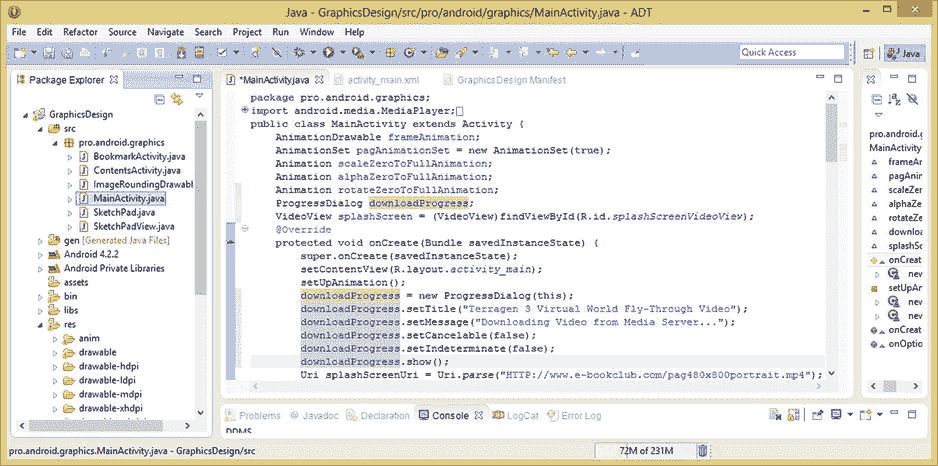

**图 19-11.** 使用`.show()`方法调用显示你的`downloadProgress` ProgressDialog 对象

接下来你需要处理的是，视频下载完成后，将`ProgressDialog`对象从屏幕移除。这是在`onPrepared()`方法中完成的，就像`.start()`方法调用一样，原因大致相同。一旦你知道视频已在系统内存中准备好并可以播放，你也知道是时候将该`ProgressDialog`对象从用户屏幕上移除了。

从屏幕移除`ProgressDialog`是通过调用`downloadProgress` ProgressDialog 对象的`.dismiss()`方法完成的。你应该在`onPrepared()`方法内执行此操作，在将视频循环值设置为`true`之后，但在实际启动视频播放循环之前。在`.setLooping()`方法调用后添加一行空行，并输入以下 Java 代码行，如图 19-12 所示：

```
downloadProgress.dismiss();
```

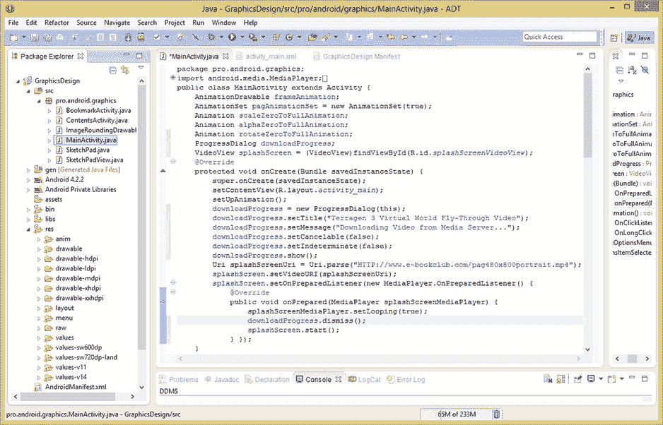

**图 19-12.** 在`onPrepared()`方法内部调用`downloadProgress`对象的`.dismiss()`方法

现在，是时候在 Nexus One 模拟器中测试你的新`ProgressDialog`对象以及声明、命名、实例化和配置它的 Java 代码了。
```


### 测试进度对话框：处理编译器错误

右键点击你的 `GraphicsDesign` 项目文件夹，选择 `Run As ➤ Android Application` 菜单序列，启动 Nexus One 模拟器。加载完毕后，它应该会自动启动你的应用程序，除非你是第一次启动——这种情况下，你可能需要像操作真实安卓设备一样，滑动屏幕解锁。

如图 19-13 所示，你添加（或重新配置）的 Java 代码中出现了问题，屏幕显示致命崩溃，并提示消息：“不幸的是，Graphics Design 已停止运行。” 点击消息下方的“确定”按钮，返回 Eclipse ADT IDE，查看你的 `LogCat` 错误日志标签页，看看能否确定需要修改哪些内容才能使应用程序重新正常工作！我还在此截图中展示了你将遇到的其他一些应用程序错误，所以请确保不要偷看（或感到沮丧）！

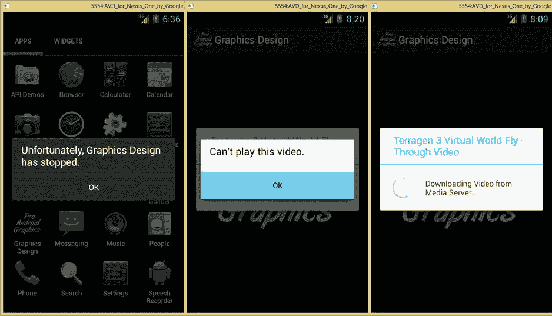

图 19-13. 在 Nexus One 模拟器中进行测试以及你预期要解决的一些错误

为了在 IDE 中腾出空间查看 `LogCat` 标签页的内容，请将光标置于图 19-14 所示的 IDE 底部分割线上，点击并向上拖动，使 IDE 底部的六七个“问题”标签页有足够的空间正常工作（约打开 60%）。

你会看到大量红色标记的代码；向上滚动这片“红海”，如果你愿意的话，就像《圣经》中那样将其分开，寻找你*知道*是自己编写的代码行号。我的意思是，显然你没有在这个应用程序中编写 5,041 行代码，甚至 511 行也没有，所以寻找一个你知道是自己编写的代码行号，因为错误很可能出现在你的代码中，而非 Android 的代码中！

我找到了 `MainActivity.java` 代码的第 28 行，并在此截图中高亮显示；它指出某个对象的初始化或 `<init>` 存在问题，且问题发生在代码的第 28 行。正是我们放在类顶部的那个 `VideoView` 对象声明和配置。也许我们当初应该听从 Eclipse 的建议，使用那个 `final` 访问修饰符！不过话说回来，也许我们根本不需要。我相当固执，所以别担心；我们很快就会解决一切。

我的做法是：展开 `import` 语句部分，从类代码顶部向下数 28 行，并确保将每一条 import 语句也算在内。我最终停在了 `VideoView` 对象实例化代码行，因此我知道这就是接下来需要修改的那行代码。

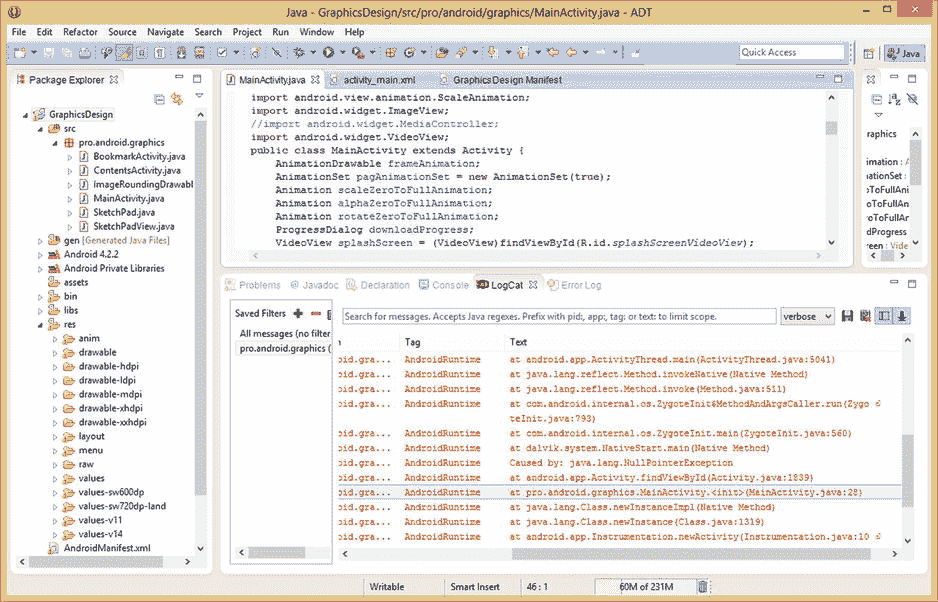

图 19-14. 拉出 IDE 的 `LogCat` 标签页区域，并为你自己的代码寻找一个合理的行号（28）

我首先要尝试的，当然是 Eclipse 的建议：在这行代码之前使用 `final` 访问修饰符，并将其放回到 `onCreate()` 方法中的 `setContentView()` 方法调用之后。

我的想法是，我们遇到的初始化问题，是由于在代码通过 `setContentView(R.layout.activity_main);` Java 编程语句引用 UI 定义之前，就试图访问属于 `activity_main.xml` UI 定义一部分的 `splashScreenVideoView`（ID）UI 元素所致。

所以，为了看看能否让代码工作，我将把这行代码放在 `setContentView()` 方法调用的正下方，如图 19-15 所示，然后第二次测试应用程序，看看我仓促地将 `VideoView` 剪切粘贴到类顶部是否最终是一个致命的（错误）失误——至少从编程判断的角度来看是这样。

做出此更改后，使用 `Run As ➤ Android Application` 工作流程，你会发现这确实是问题所在。但正如我所说，固执就是固执，我仍然想找到一种不用 `final` 访问修饰符来编码 `VideoView` 对象的方法。那么，我们接下来就找出实现这一目标的方法，然后你就可以继续前进，去分开其他“海洋”了。

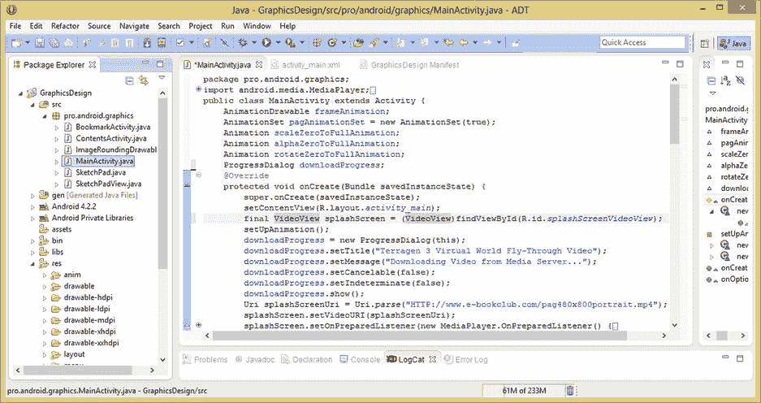

图 19-15. 使用 `final` 访问修饰符，并将 `VideoView` 的声明和配置放在 `onCreate()` 方法内部

如果你仔细查看有问题的这一行代码，会发现它相当密集，也可以写成两行代码，方式如下：

```
VideoView splashScreen;
splashScreen = (VideoView) findViewById(R.id.splashScreenVideoView);
```

事实上，你可以让这段密集的代码变得更冗长——至少在这种情境下——这正是让你能够无需使用 `final` 访问修饰符关键字（以及额外内存）就能编码 `VideoView` 对象的关键。正如你所见，有时固执（坚持不懈）能带来巧妙的解决方案，这些方案使用更少的内存和（或）高级功能，而实际上并不需要这些功能来优雅地实现当前的编程方案。就像生活一样，编程从来都不容易，你的决定必须在休息一段时间、以新的视角重新审视之后进行全面审查。

如果你还记得，编译器抛出错误的原因是你试图在通过 `.setContentView()` 方法建立（就位）对象定义之前，初始化一个 `VideoView` 对象。

`VideoView` UI 对象的结构已通过 `activity_main.xml` 定义文件中的 XML 定义，你必须通过调用 `.setContentView()` 方法来“启用”这个 UI 定义，然后才能实际引用这些数据。

由于 `setContentView()` 方法会将这个 XML 定义放入内存（放入一个 `ContentView` 对象），因此这行代码必须存在于对该 `View`（`ViewGroup`）定义内的任何内容进行引用之前。

不过，你仍然可以在类顶部声明 `VideoView` 对象供类使用，就像处理其他 `ProgressDialog` 和 `Animation` 对象一样，只要你在那个时间点（在你的代码执行过程或时间线上）不尝试通过调用 `VideoView` 对象的 `findViewById()` 方法来加载那个 `VideoView` XML 定义即可。为了实现 `VideoView` 对象的实例化（即通过 XML 定义它），你需要等到进入 `onCreate()` 方法，并执行完设置 `ContentView` 对象的语句之后再进行。最终的代码如图 19-16 所示，它没有错误，并且能在 Nexus One 模拟器中正常运行。

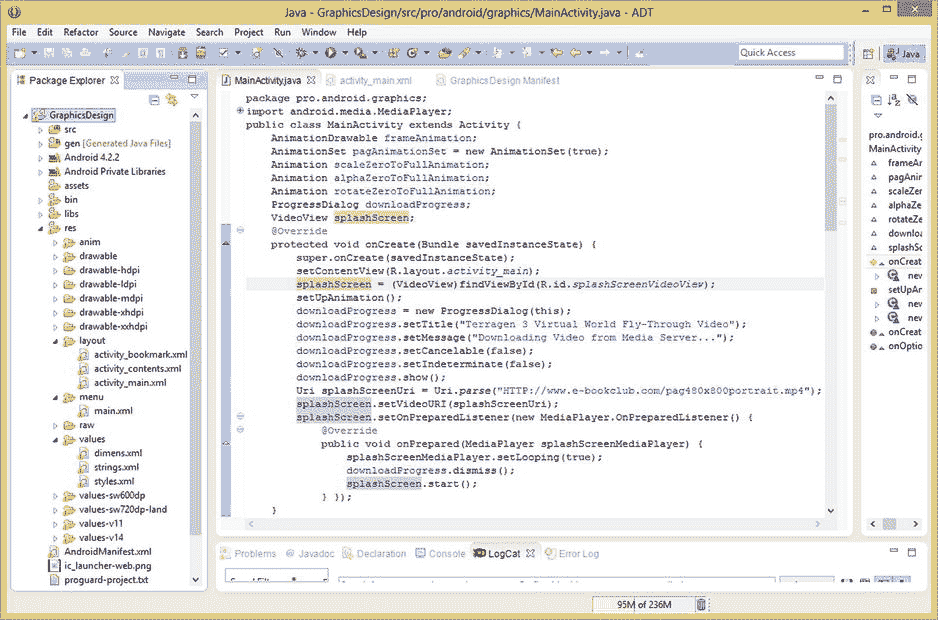

图 19-16. 以一种有效且无需 `final` 访问修饰符的方式设置你的 `VideoView` 对象

在图 19-13 的中间部分，我展示了一个错误屏幕，通知我们视频文件无法播放。图 19-13 右侧的屏幕则展示了当你的应用程序正常工作时的画面。

中间屏幕出现错误消息有两个原因。其中一个你需要彻底查明的是文件格式不兼容（MPEG-4），但你知道事实并非如此，因为上一章关于嵌入式视频播放时你曾使用过这个文件，并且它当时是正常工作的。


出现"无法播放此视频"类型错误信息的第二个原因是，您当前使用的网络连接速度过慢，或数据传输方面存在问题。我的连接当时由于某种原因速度很慢，可能是高峰时段流量过大，或是路由器问题（维护或升级中）导致网络需要重新路由数据。网络环境本就复杂多变，很少能提供稳定流畅的数据流。

为确保您使用的文件格式全部正确，同时为了能够为这些视频章节提供多样化的素材资源，我将在下一节中使用 MPEG-4 H.264 AVC 和 WebM VP8 两种视频编解码器（及文件格式），为您正在 Nexus One 模拟器 AVD 上使用的 `pag480x800portrait` 文件创建 WebM 数字视频素材。

### 使用 WebM VP8 视频编解码器进行数字视频流传输

由于您已准备好未压缩的 AVI 文件，我们回到 Squeeze 中为您的 480x800 视频素材创建一个 WebM 版本。在 Squeeze 界面左侧，您会看到一个带有向右箭头的 WebM (`.webm`) 选项。点击该箭头，展开 WebM 预设，找到 `WebM_480p` 预设，然后复制它，或右键点击并编辑，创建您自己的自定义 `Android_WebM_480x800p` 编解码器，如图 19-17 所示。

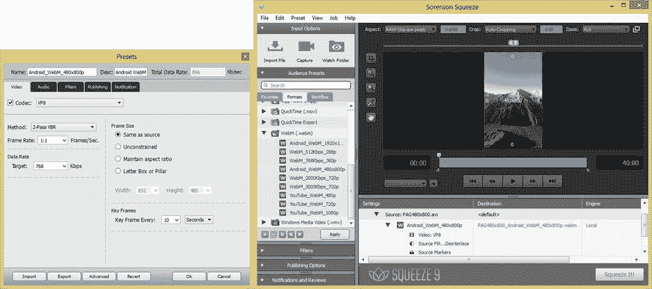

图 19-17. 创建数据率为 768 KBPS 的 WebM 480x800p 编解码器预设，并压缩 480x800 的 `.webm` 素材

我们采用与 MPEG4 目标数据率相同的每秒四分之三兆字节，因此将 `Data Rate` 参数设置为 `768 KBPS`，将 `Frame Size` 选择器设置为 `Same as source`，最后，保留 `Key Frames` 的默认参数 `Key Frame Every 10 Seconds`。

将此预设命名为 `Android_WebM_480x800p`，并使用 Android WebM 描述，然后点击 `OK` 按钮创建新预设，如图 19-17 中屏幕截图左侧和右侧所示。

返回 Squeeze 后，使用左上角的 `Import File` 图标，导航到您未压缩的 `PAG480x800.avi` AVI 文件并将其加载以进行压缩。点击您刚刚创建的新预设（呈浅蓝色高亮状态），然后点击预设面板右下角的 `Apply` 按钮，以将其应用到您刚刚导入的源 AVI 文件。

现在，您可以点击 `SqueezeIt!` 按钮，将编解码器应用到 AVI 文件，从而创建 WebM 文件。您会注意到，生成的文件大小与 MPEG4 文件非常接近，约为 3.8 兆字节。

接下来，您只需修改应用程序中的代码，通过一个修改后的 URL 来引用新文件，如图 19-18 以及下面用于设置 `Uri` 对象的 Java 代码行所示：

`Uri splashScreenUri = Uri.parse(` [`HTTP://www.e-bookclub.com/pag480x800portrait.webm`](http://www.e-bookclub.com/pag480x800portrait.webm) `);`

这次，当我在模拟器中测试该应用时，视频成功下载并完美播放了！您可以在图 19-13 中看到下载完成前的效果，在图 19-3 中看到下载完成后的效果。

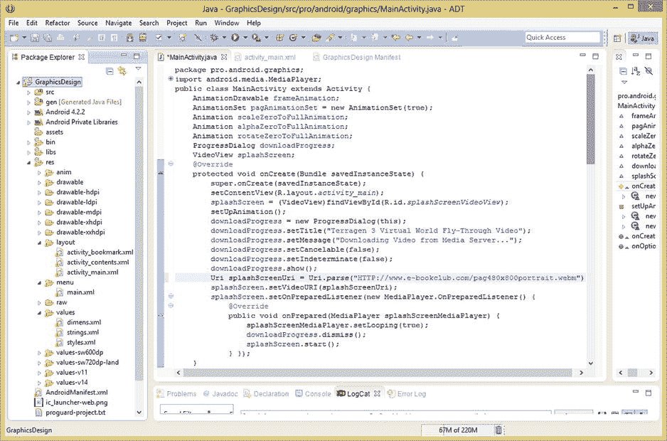

图 19-18. 将您的 URI 引用设置为指向 `pag480x800portrait.webm` 视频文件，而非 `.mp4` 文件

很可能 WebM 编解码器旨在低带宽环境下更高效地工作，正如我在编写本章节那一周所遇到的情况。尽管 MPEG-4 版本和 WebM 版本的视频素材数据文件大小几乎相同，但 WebM 的播放似乎更流畅，画质也略好一些。

这或许正是 WebM 编解码器开发团队力求实现的目标；该编解码器及其背后由 ON2 最初开发的技术版权归属于谷歌。这也是它成为 Android 和 Chrome 组成部分的原因。很容易推断，由于采用固定数据率（与 MPEG4 允许的目标到最大数据率范围不同），这种严格的参数设置旨在针对低带宽网络。

### 让您的视频播放应用感知屏幕方向

接下来，我将向您展示如何利用您在本教程中创建的竖屏和横屏两种版本的视频素材。

这将涉及稍微改变您实现 `Uri` 对象的方式，因为您现在将要在 `for` 循环或 `switch` (`case`) 循环语句中设置 `Uri` 位置定义。因此，您需要做的第一件事是将 `Uri` 对象声明移到 `MainActivity` 类的顶部，并置于任何特定方法之外。

这需要删除您刚才在图 19-18 中处理过的 `Uri` 代码行，从头开始，并将该代码行简化为仅声明一个对象（目前如此），如图 19-19 所示：

`Uri SplashScreenUri;`

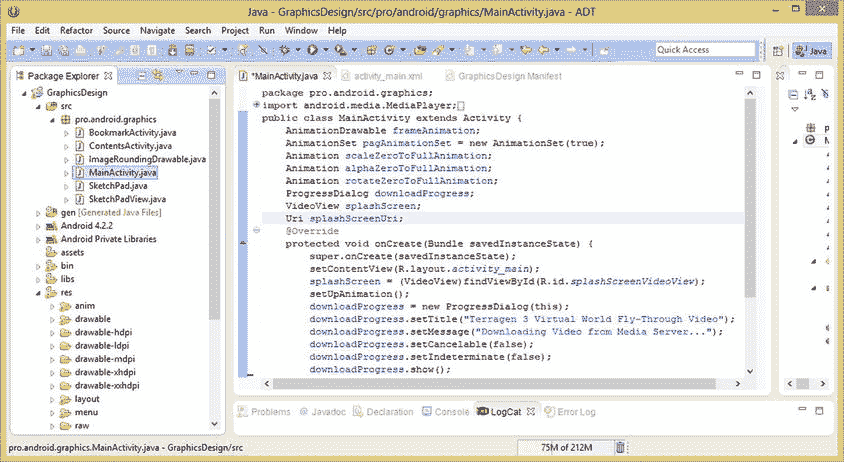

图 19-19. 将名为 `splashScreenUri` 的 `Uri` 对象声明放置在 `MainActivity` 类代码的顶部

现在，当您将 `Uri` 对象定义放在 `OnCreate()` 方法内包含多个 `case` 语句的 `switch` 循环深处时，对 `Uri` 对象的引用将能够在任何位置访问到它。您将根据每个 `case` 语句的比较常量来设置 `Uri` 对象路径；一旦 `switch` 语句确定这些常量，它就会对现在全局可访问的 `splashScreenUri` `Uri` 对象调用 `Uri.parse()` 方法。


### Android 显示类：物理显示特性

Android 有一个名为 `Display` 的类，它允许你在应用程序代码中实时访问显示器的特性。本章节还将介绍几个相关的类，包括 `DisplayManager` 类、`DisplayMetrics` 类、`Surface` 类以及 `WindowManager` 类及其嵌套类。

Android 的 `Display` 类是主类 `java.lang.Object` 的直接子类，因此它是专门为提供显示信息而创建的。Android `Display` 类的层次结构如下：

```
java.lang.Object
  > android.view.Display
```

`Display` 类属于 `android.view` 包，因为 Android 中的任何 `View` 本质上都可以被视为硬件显示的“子级”。在你的应用中使用 `Display` 类（或对象）的导入语句应引用 `android.view.Display` 包，你很快就会看到这一点。

`Display` 类是一个公共终态类，用于提供关于你的应用所使用的显示器的像素大小、像素密度、旋转方向（竖屏或横屏）以及刷新率等各种信息。Android 应用程序有两种显示区域术语。较大的区域称为真实显示区域，其内部是应用程序显示区域。

真实显示区域的数据最能接近指定用户的物理硬件规格。这些数据包含当前显示器中显示内容部分的信息，其中包括系统装饰，其中部分内容不受你的应用程序控制。

需要注意的是，如果 Android 的 `WindowManager` 由于任何原因模拟了一个较小的显示区域，那么真实显示区域可能小于显示的物理（硬件）规格。如果你需要这个顶层的真实显示区域，可以使用 `.getRealSize()` 方法调用，以及 `.getRealMetrics()` 方法调用来获取其他 `DisplayMetrics`。我们很快将介绍 Android 的 `WindowManager` 和 `DisplayMetrics` 类。

另一方面，应用程序显示区域将指定显示器中包含你的应用程序“窗口”的部分，不包括任何系统装饰占用的屏幕空间。应用程序显示区域会比真实显示区域小，因为 Android 会减去系统 UI 元素（例如 Android 操作系统的状态栏）所需的任何空间。

开发人员最常用来查找其应用程序显示特性的方法调用包括 `.getSize()`、`.getRotation()`、`.getRectSize()` 和 `.getMetrics()` 方法调用。你将在代码中使用 `.getRotation()` 方法调用来了解用户是在竖屏还是横屏模式下观看设备，这样你就知道应该流式传输什么视频！

### Android DisplayManager 类：管理显示器

Android 还有一个名为 `DisplayManager` 的类，它允许你管理所有显示器，包括可能连接到用户 Android 设备上的任何辅助（外部）或演示显示器。

Android 的 `DisplayManager` 是主类 `java.lang.Object` 的另一个直接子类，因此它也是专门为开发者提供 Android 操作系统的显示硬件管理功能而创建的。Android Display 类的层次结构如下：

```
java.lang.Object
  > android.hardware.display.DisplayManager
```

`DisplayManager` 类属于 `android.hardware.display` 包，因为它提供了对 Android 设备显示硬件管理的访问。由于屏幕尺寸、像素密度、屏幕方向、刷新率以及类似的显示硬件特性差异巨大，并需要量化和纳入你的交互式图形设计编程逻辑管道中，因此在显示硬件和操作系统软件之间建立一座桥梁是必要的。

在应用中使用 `DisplayManager` 类（或对象）的导入语句应引用 `android.hardware.display.DisplayManager` 包。

`DisplayManager` 类是一个公共终态类，用于管理主 Android 设备显示器的属性，以及任何可能正在与 Android 设备一起使用的外部连接显示器。

如果你熟悉“第二屏幕”这个术语，或者像 MiraCast 或类似的“将内容投射到本地大屏幕上”的 iTV 类型技术，那么这个 Android 类就是为了让这些技术能够与你的应用程序配合工作而创建的。

`DisplayManager` 有一个嵌套类，即 `DisplayManager.DisplayListener` 公共接口，它允许你的应用程序“监听”显示硬件配置的变化，例如当外部演示显示器连接到 Android 设备或通过无线方式访问时。

`DisplayManager` 还有一个常量，即 `DISPLAY_CATEGORY_PRESENTATION` 常量，用于标识适合用作演示显示器的辅助显示器。要实现这个类，你需要通过调用 `.getSystemService()` 方法来获取此对象的一个实例，该方法使用的参数引用了一个 `DISPLAY_SERVICE` 常量，该常量是通过 `WindowManager` 类从 `Context` 对象中获取的。我们接下来将介绍 `WindowManager` 类。

稍后你将需要在你的应用中实现的 Java 代码将使用 `WindowManager`、`Display` 对象、`Context` 对象以及 `DisplayManager` 类的 `.getSystemService()` 方法来获取用户的显示器旋转方向。


### Android 的 WindowManager 接口：管理窗口

Android 操作系统有一个名为 `WindowManager` 接口的窗口管理接口。`WindowManager` 接口是一个实现 `ViewManager` 接口的公开接口。`ViewManager` 接口允许你为 `Activity` 子类添加和删除子视图（View）。窗口（Window）是视图（View）的一种类型。

`WindowManager` 接口将使你的应用程序能够与 Android 操作系统窗口管理器通信，该管理器是 Android 底层（Linux）操作系统窗口或显示层的一部分。这个较低层次将 Linux 内核与 Android 设备的硬件（Linux 内核运行其上）在基础（底层）层面连接起来。我在此假设你知道 Android 操作系统运行在开源的 Linux 内核之上。

如果你熟悉 Linux，你应该对窗口管理器习以为常，它们可以在 Linux 操作系统中切换进出，以提供全新的外观和感觉（换句话说，就是为 Linux 操作系统提供新的 UI 设计）。

每个 `WindowManager` 对象实例都引用一个给定的 `Display` 对象实例。如果你想为不同的显示器获取 `WindowManager` 对象，你需要使用 `.createDisplayContext(Display)` 方法调用来获取该 `Display` 对象的 `Context` 对象。然后，你应该利用 `.getSystemService(Context.WINDOW_SERVICE)` 方法调用来获取 `WindowManager`，这将在本章下一节的代码中实现。

如果你想使用外部显示器显示窗口，最简单的方法是创建一个 `Presentation` 对象。`Presentation` 类会自动获取该 `Display` 的 `WindowManager` 和 `Context`。`Presentation` 类是 Android `Dialog` 类的子类。

Android `WindowManager` 接口属于以下包：

`java.lang.Object`

`> android.view.WindowManager`

`Display` 类属于 `android.view` 包，因为它通过实现 `ViewManager` 公开接口提供了对视图管理的访问。在应用程序中使用 `WindowManager` 类（或对象）的导入语句应引用 `android.view.WindowManager` 包。

`WindowManager` 接口有三个嵌套类，包括布局参数嵌套类 `WindowManager.LayoutParams`，它包含了所有用作标志的常量，用于告诉你的应用程序当前 `Window` 对象是如何配置的。当你的应用程序尝试添加一个 `WindowManager.LayoutParams` 令牌无效的 `View` 对象时，`WindowManager.BadTokenException` 嵌套类会抛出异常；当你的应用程序在找不到（即不存在）的辅助 `Display` 对象上调用 `.addView(View, ViewGroup.LayoutParams)` 方法时，`WindowManager.InvalidDisplayException` 嵌套类会抛出异常。

### 设置 Display 对象以确定设备旋转方向

现在，让我们利用这些新学的知识，为你当前的流媒体视频应用程序完成一些关键任务。你要做的是，最终通过使用 `WindowManager` 和 `.getSystemService()` 方法调用来“轮询”`Display` 对象，从而确定旋转向量（0 度、90 度、180 度或 270 度），让你的应用程序能够“看到”用户手中 Android 设备的倾斜角度。你将利用这些信息以正确的方向流式传输你的数字视频资源。

在调用 `downloadProgress.show()` 方法之后，你要做的第一件事就是声明你的 `Display` 对象并将其命名为 `rotationDegrees`。你将此对象命名为 `rotationDegrees`，因为你要用它来找出用户所使用的设备旋转倾斜角度。

你需要将此对象设置为当前应用程序的 `Context` 对象，并在 `.getSystemService()` 方法调用中对此 `Context` 对象调用 `WINDOW_SERVICE` 常量，将其转换为 `WindowManager`，然后在该编程结构上调用 `.getDefaultDisplay()` 方法，使用图 19-20 中所示的如下异常紧密的 Java 代码行：

```
Display rotationDegrees = ((WindowManager)getSystemService(Context.WINDOW_SERVICE)).getDefaultDisplay();
```

这将使用默认（主）显示屏的特性来加载 `rotationDegrees Display` 对象，其中一个特性就是其当前的旋转角度，这也会告诉你其当前的（竖屏或横屏）方向。

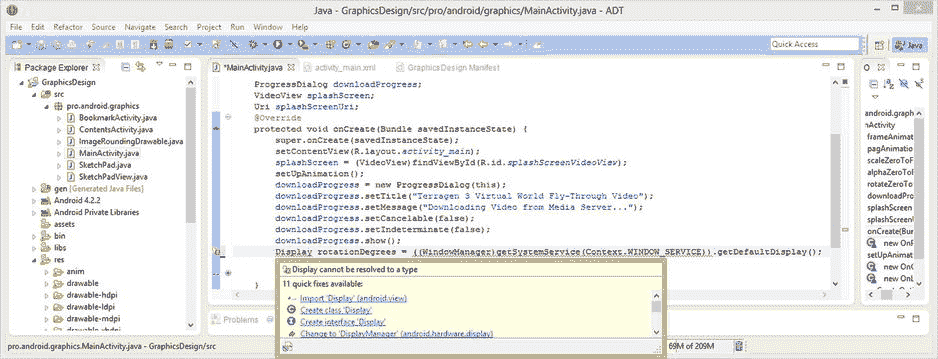

图 19-20. 编写名为 `rotationDegrees` 的 `Display` 对象代码并导入 `android.view.Display` 类

如图 19-20 所示，你需要将鼠标悬停在 `Display` 类引用上，并首先选择“导入 ‘Display’ (`android.view`)”选项。

如图 19-21 所示，正如你所料，这修复了部分错误高亮，但仍然是必须引用 `WindowManager` 类。

如果再次将鼠标悬停在错误高亮上，你期望看到“导入 ‘WindowManager’ (`android.view`)”选项，然而，你得到的唯一提示是“WindowManager cannot be resolved to a type”，如图 19-21 所示。

显然，Import 语句将解决这个引用问题，而我能想到的这个选项没有出现在错误辅助对话框中的唯一原因是 `WindowManager` 是一个接口而不是一个类。因此，你不得不手动编写一个 Import 语句，真是天理不容！

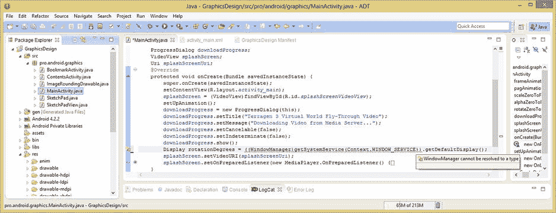

图 19-21. 鼠标悬停以确定剩余错误；注意，Eclipse 没有提供导入 `WindowManager` 类的选项

滚动到 `MainActivity.java` 代码列表的最顶部，点击 Import 语句部分旁边的加号图标以展开它，如图 19-22 所示。在末尾处，使用以下 Java 编程语句为 `WindowManager` 类添加一个 Import 语句：

```
Import android.view.WindowManager;
```

当你在这里查看 `Activity` 子类的所有 Import 语句时，不妨看一下你在这个类中用来实现动画、视频流、进度对话框以及其他复杂图形设计管道和实现的 20 个不同类。宝贝，你已经走了很长的路！（注意，我并非提倡吸烟；你可能没注意到，很少有程序员吸烟！）


现在你已经添加了`WindowManager`导入语句，可以使用 Control-S（保存）快捷键组合，Eclipse 将重新评估错误信息，你可以检查是否完全消除了与这行复杂 Java 代码相关的所有错误。

如图 19-22 所示，你即将完成这行密集的代码；只需再导入最后一个类，就可以准备继续前进，实现你的`switch`编程结构。

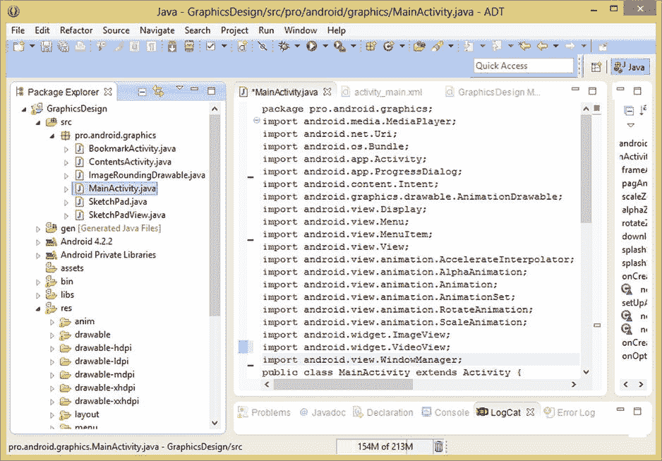

**图 19-22.** 编写`import android.view.WindowManager`语句以消除`Display`对象中的错误

如图 19-23 所示，你仍然需要导入`Context`类。

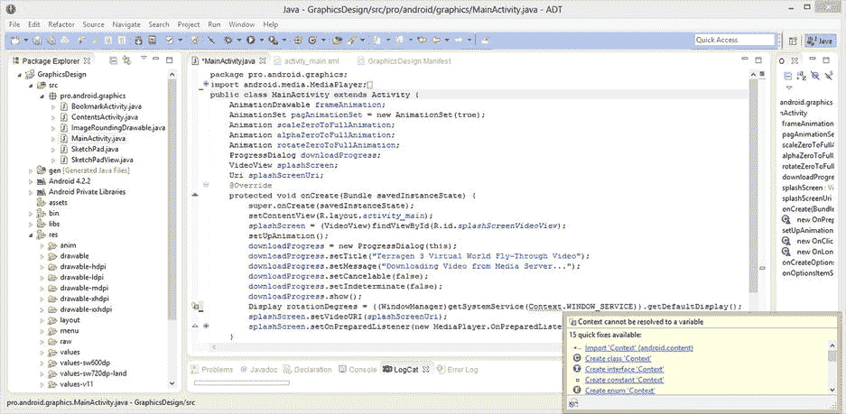

**图 19-23.** 消除关于需要添加`import android.content.Context`语句的最后一个错误

在选择`Import 'Context' (android.content)`选项并添加使用该类所需的导入语句后，你的`Display`对象将被声明、命名，并加载用户当前主 Android 设备的默认显示信息。

接下来，我们将简要介绍 Android 的`Surface`类，因为你将在接下来编写的`switch` case 循环中使用它。

### Android 的`Surface`类：获取显示器的原始缓冲区

Android 还有一个名为`Surface`的类，它允许开发者直接访问将 Android 设备屏幕内容绘制到物理硬件本身的“原始”或源内存“缓冲区”。你需要访问它，以确定 Android 用户如何旋转他们的设备（向左、向右，甚至上下颠倒）。

Android 的`Surface`类是主类`java.lang.Object`的另一个直接子类，因此它被专门创建，以便在开发者真正需要时为显示屏幕表面提供这个“句柄”。`Surface`类还实现了`android.os.Parcelable`接口。

Android `Surface`类的层次结构如下：

```
java.lang.Object
  > android.view.Surface
```

`Display`类属于`android.view`包，因为它直接访问并（取决于你的代码）影响`View`对象中的内容。在你的应用中使用`Surface`类（或对象）的导入语句应引用`android.view.Surface`包。

`Surface`类是一个`public`类，并包含一个嵌套类，称为`Surface.OutOfResourcesException`类。当你尝试引用的`Surface`对象无法按照图形处理代码管线中的预期方式创建、调整大小、旋转或进行其他操作时，此类将抛出异常。

`Surface`类还有一个公共构造方法，允许你使用`SurfaceTexture`对象创建`Surface`对象。这通过以下形式完成：`Surface(SurfaceTexture surfaceTextureName)`。

`Surface`类有四个关键常量，你将在本章下一节的代码中利用它们来确定用户如何握持 Android 设备。这些`ROTATION`常量不仅决定了 Android 设备是处于竖屏还是横屏模式，还决定了设备被旋转到了哪个方向。

这四个常量，如同 Android 中的许多其他事物一样，分别位于 3 点、6 点、9 点和 12 点钟方向。正如你所料，它们被命名为`ROTATION_0`、`ROTATION_90`、`ROTATION_180`和`ROTATION_270`。让我们开始工作，在你的代码中使用`Surface.ROTATION`常量，这样你就能看到它们是如何使用的。

### 使用`.getRotation()`方法调用驱动`Switch`循环

在创建并配置`Display`对象之后，你将添加一个`switch`循环（`case`语句），该循环将检测用户 Android 设备的当前旋转或方向（竖屏或横屏）。

`switch`语句将评估对你在上一行代码中创建的`rotationDegrees` `Display`对象调用`.getRotation()`方法的结果。此方法调用返回四个`Surface.ROTATION`常量之一，然后你将使用`case`构造对这些常量进行评估，并使用它们将你的`splashScreenUri` `Uri`对象的引用值设置为正确的视频资源。这通过使用以下 Java 代码完成，如图 19-24 所示：

```
switch(rotationDegrees.getRotation()){
  case(Surface.ROTATION_0):
    splashScreenUri = Uri.parse("HTTP://www.e-bookclub.com/pag480x800portrait.webm");
    break;
  case(Surface.ROTATION_90):
    splashScreenUri = Uri.parse("HTTP://www.e-bookclub.com/pag800x480landscape.webm");
    break;
}
```

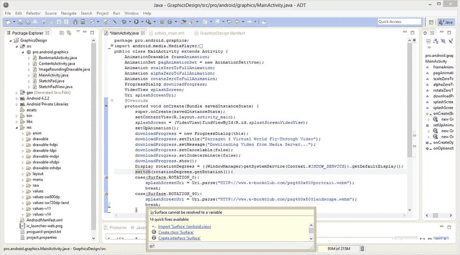

**图 19-24.** 编写`switch`语句以评估对`Display`对象调用`.getRotation()`方法的结果

如图 19-24 所示，你需要将鼠标悬停在`Surface`类的引用上，并选择`Import Surface (android.view)`选项。

虽然使用`ROTATION_0`和`ROTATION_90`会告诉你 Android 设备是向左旋转（`ROTATION_90`）还是未旋转，但你还需要添加对另外两个常量的支持：它们会告诉你设备是否向右旋转（`ROTATION_270`）或上下颠倒（`ROTATION_180`），以确保你的`case`语句能 100%处理`.getRotation()`方法调用能够返回的每一个结果。

如果你处理了`Surface`类的全部四个常量，就不需要为你的`switch`编程语句添加任何`default`返回语句，因为你将处理 100%可能进入语句评估机制的值。现在让我们使用以下 Java 代码，将最后两个`case`语句添加到你的`switch`结构中，如图 19-25 所示：

```
case(Surface.ROTATION_180):
  splashScreenUri = Uri.parse("HTTP://www.e-bookclub.com/pag480x800portrait.webm");
  break;
case(Surface.ROTATION_270):
  splashScreenUri = Uri.parse("HTTP://www.e-bookclub.com/pag800x480landscape.webm");
  break;
```

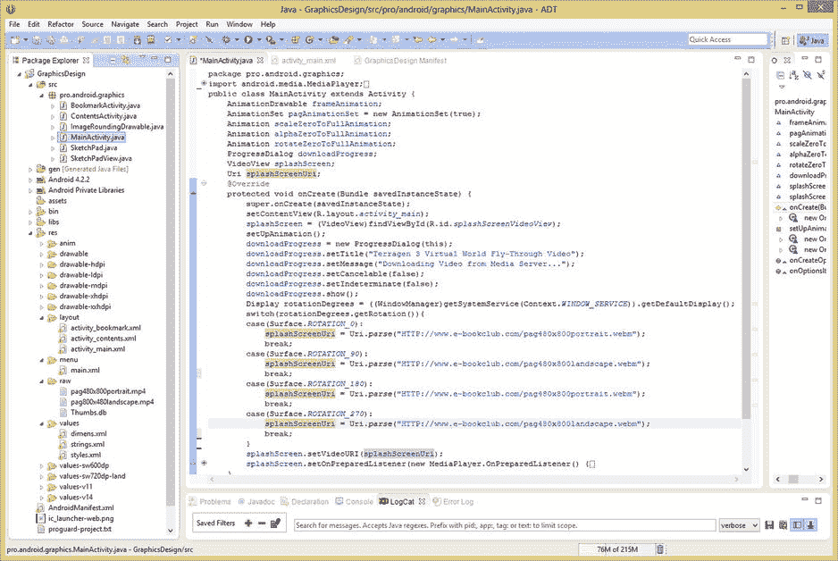

**图 19-25.** 将四种屏幕旋转方向全部添加到`switch`语句中，覆盖 0、90、180 和 270 度

现在你需要测试代码，看看它是否按照你期望的方式工作！


### 测试竖屏和横屏模式下的流媒体视频

右键单击你的项目文件夹，然后使用 `Run As ➤ Android Application`，这样你就可以在 Nexus One 模拟器中查看代码是否正常工作。一旦竖屏版的数字视频成功流式传输到你的应用中，你就可以将模拟器切换到横屏模式，并查看代码是否获取了正确的 WSVGA 数字视频资产（横屏版）。

要将模拟器切换到横屏模式，请使用 `CTRL-F11` 组合键；如图 19-26 所示，你的应用将从媒体服务器获取正确的视频数据。

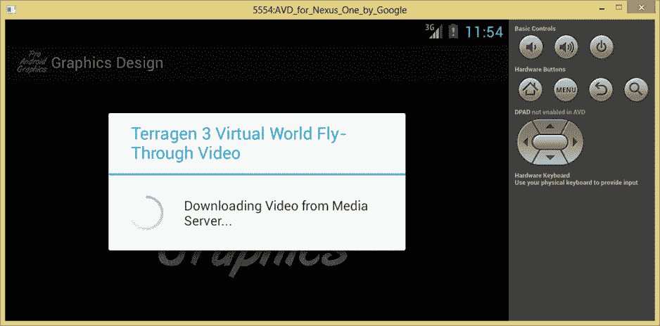

图 19-26. 使用 `CTRL-F11` 组合键将 Nexus One 模拟器旋转 90 度进入横屏模式

实际上，我遇到了如图 19-13 所示的“无法播放此视频”错误；如果你留意我在图 19-25 中的代码，你会发现我复制了 URL 引用并将竖屏改为横屏，但没有将分辨率从 480x800 改为 800x480！有句谚语说“**细节决定成败**”，这用在应用程序编程上再贴切不过了！一旦我找到了这个阻止横屏视频播放的问题，我的应用就能在两种方向上都完美运行了。

在我发现这个简单（愚蠢）的错误之前，我曾将文件扩展名从 `.webm` 改为 `.mp4` 以测试是否是文件格式的问题，如图 19-27 所示。无论如何，测试两种支持的格式总是一个好主意，所以我截取了这张图，只是为了确保本章中至少有一张截图包含完全 100% 可工作的 Java 代码！

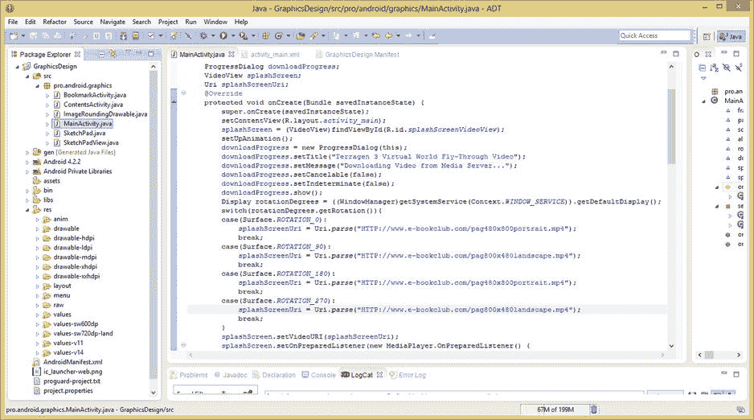

图 19-27. 最终代码，展示了 MPEG4 资源名称以及在资源名称中修正后的横屏分辨率

如图 19-28 所示，所有辛苦的努力都是值得的，因为 Terragen 虚拟世界的飞越效果在横屏模式下非常令人印象深刻！

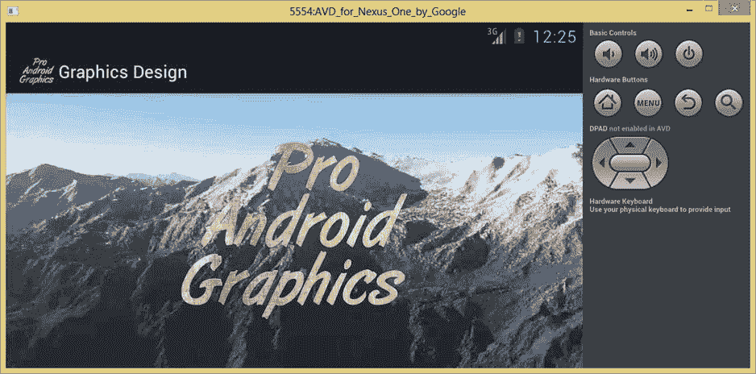

图 19-28. 在 Nexus One 横屏模式下播放 Terragen 3 星球飞越效果

你可以旋转 Android 设备（或此处的模拟器），并能在播放竖屏和横屏版的数字视频资产之间来回切换，原因是每当用户设备方向改变时，Android 会重新启动你的 `Activity` 子类。因此，包含你代码的 `onCreate()` 方法会被重新评估，并且你期望的结果（为用户正在使用的模式播放正确的视频资产）就会实现。

### 关于在 Android 中使用数字视频的一些注意事项

如果你想在 Android 应用中播放各种视频资产，并使数字视频媒体资产与给定的 Android 硬件配置同步，会存在大量复杂的问题。这是因为给定显示屏的物理像素数量可能会有很大差异，刷新率、设备的默认方向以及用户选择握持设备的方向也同样如此。

如果你正在优化数字视频以获得较小的文件大小，刷新率将是最不关心的问题。Android 目前正在通过 API Level 19 进军视频游戏机市场，并将其屏幕缓冲区更新和触摸屏数据更新速度提高到 60 FPS 的刷新率。因此，如果你在优化的数字视频资产中使用 10、15、20 甚至 24 FPS 的帧率，硬件屏幕刷新率将不会对你的视频应用开发构成问题。

如果你不像这里那样使用不同的镜头形状（竖屏和横屏）来渲染 3D 视频资产，那么方向也不会是一个大问题，尽管现在已经没有“默认”的设备旋转了，因为一些平板电脑默认使用横屏操作模式，而智能手机通常默认使用竖屏操作模式。因此，这仍将是开发者面临的一个问题和挑战，这就是我在本章以及之前的视频章节中阐述这个主题的原因。

最困难（且在数据占用方面成本最高）的事情是为市面上每一种物理显示分辨率提供特定分辨率的视频资产。我在前一章中建议的是，找到一个数据“最佳点”，并选择一个兼具良好压缩率和分辨率（质量）的资产，以便能够以出色的效果进行放大或缩小。这很可能是 1024 或 1280 像素分辨率，正如你在前一章中看到的；如果你的目标是 iTV，则会使用 1920 像素的视频资产，但将其降采样到低分辨率可能会代价高昂。

如果你执意（我这么说真是太政治正确了）要在你的应用（或通过媒体服务器）中提供广泛的数字视频资产，然后轮询用户设备硬件以获取物理像素特性，我打算在结束本章之前介绍 `DisplayMetrics` 类，这样你就有了通过 `switch` 循环或 `if-then` 循环结构来实现此目的的工具，就像你在本章中所做的那样。


### Android 的 DisplayMetrics 类：显示屏的规格说明

Android 操作系统提供了一个类，让开发者能够获取用户安卓设备上所有与显示相关的信息。这个类就是 `DisplayMetrics` 实用工具类，它是 `java.lang.Object` 主类的另一个直接子类。

Android 的 `DisplayMetrics` 类层次结构如下所示：

```
java.lang.Object
  > android.util.DisplayMetrics
```

`DisplayMetrics` 类属于 `android.util` 包，因为它是用于确定硬件环境的 Android 操作系统实用工具。在应用中要使用 `DisplayMetrics` 类，其 import 语句应引用 `android.util.DisplayMetrics` 包路径。

Android 的 `DisplayMetrics` 类是一个公共类，它包含八个屏幕密度常量：`DENSITY_DEFAULT`、`DENSITY_LOW`、`DENSITY_MEDIUM`、`DENSITY_TV`、`DENSITY_HIGH`、`DENSITY_XHIGH`、`DENSITY_XXHIGH`，以及最近新增的 `DENSITY_XXXHIGH`。

`DENSITY_XXXHIGH` 常量是最近在 Android 4.3（API 级别 18）中添加的，用以适配所有新推出的、具备“超高”4096x2160 物理分辨率的“4K”超高清交互电视产品。

这个 `DisplayMetrics` 对象将为开发者提供一个数据结构，其中包含一些字段，用于描述显示硬件的常规信息以及 Android 操作系统如何缩放字体以适应硬件。这些信息包括物理显示尺寸（以像素为单位）、像素密度，以及 Android 当前为该显示屏使用的字体缩放因子。

要访问 `DisplayMetrics` 对象数据，请像这样初始化该对象：

```java
DisplayMetrics displayMetricsObject = new DisplayMetrics();
getWindowManager().getDefaultDisplay().getMetrics(displayMetricsObject);
```

上述 Java 代码构造返回的 `DisplayMetrics` 对象中的数据字段将包含七个关键信息值，包括表示显示屏逻辑屏幕密度的 density 浮点值，以及提供显示屏每英寸点数的 `densityDPI` 整数值。此外还有 `heightPixels` 和 `widthPixels` 整数，它们提供当前（主）显示屏的物理分辨率。还有 `xdpi` 和 `ydpi` 整数，为开发者提供 X 和 Y 两个维度上每英寸的物理像素数。最后，`scaledDensity` 浮点值表示 Android 操作系统当前对字体应用的缩放比例。在 Android 图形设计师的图形处理流水线 Java 代码中，所有这些值都会在某个时候用到。

### 总结

在第十九章中，你学会了如何使用媒体服务器流式传输视频。你学会了如何实现 `ProgressDialog` 对象，为用户提供一个动画下载进度指示器，以防你不想流式传输数字视频，而是希望先下载它，然后更流畅地从系统内存中直接播放。

你更深入地了解了如何使用 Android 中的 `Display`、`DisplayManager`、`WindowManager` 和 `Surface` 类来确定屏幕方向。你研究了这些类各自的功能，以及它们如何协同工作，让你的代码能够确定最终用户当前（主）Android 设备屏幕的各种显示特性。

你学会了如何在 `AndroidManifest` XML 文件中定义 `INTERNET` 权限，以便能够从远程视频媒体服务器流式传输视频。接着，你在 URI 中使用 `HTTP://` URL 实现了视频流式传输，然后使用 `ProgressDialog` 类实现了下载的视频资源。我向你展示了我正确设置 `VideoView` 对象之前产生的所有“红色错误墨水”，以及如何判断哪些代码行可能包含错误。你还看到了如何在不使用 `final` 访问修饰符的情况下设置 `VideoView` 对象，以及固执的程序员会变得多么执着。

接下来，你为 WSVGA 数字视频资产创建了 WebM 版本，以便拥有该分辨率的横向版本。然后你研究了屏幕方向，并开始学习所有与 Display 相关的类，以及它们如何协同工作，让你能够将用户设备中使用的硬件与你的图形设计代码流水线连接起来。

你学习了 Android 的 `Display` 类、`DisplayManager` 类、`WindowManager` 类，甚至 `DisplayMetrics` 类——尽管是在章节末尾。随后，你在代码中实现了这些类，以确定用户 Android 设备的旋转方向，从而能够在你的 `splashScreenUri` Uri 对象中设置正确的 URI 值，并向用户流式传输正确版本的数字视频资产。

我希望你在阅读本书的过程中，在实现所有这些酷炫的图形相关功能——这些功能可在 Android API 中供我们开发者使用——时，既充满挑战又收获颇丰！


## Pro Android Graphics — 索引

### A

- `AbsoluteLayout` 和 `SlidingDrawer`：*参见* 已弃用的布局
- `AdjustViewBounds`：`MaxWidth` 和 `MaxHeight`
- `AlphaAnimation` 类：类层次结构、PAG 徽标配置、`scaleZeroToFullAnimation` 对象、`.setDuration()` 方法、`setUpAnimation()` 方法、`.startAnimation()` 方法、测试
- Alpha 混合
- Alpha 通道
- `Android Context` 类
- Android 开发者工具 (ADT)：检查更新、Eclipse Juno 4.2.2 IDE、Eclipse 软件、Java SE 6 SDK、固定到任务栏、SDK、SDK 按钮下载、`windows-x86_64 ZIP` 文件
- Android 数字成像：ADT (*参见* Android 开发者工具 (ADT))、Alpha 通道、抗锯齿、宽高比、混合模式、颜色深度、颜色值、数字图像格式、十六进制表示法、填充、遮蔽
- 应用程序：模糊算法、边缘检测、阈值优化
- 条带：数据占用、压缩、抖动、`PNG8` 格式
- `Porter-Duff` 类
- 像素的二维数组
- `view` 类
- `view group` 类
- Android 数字视频：*参见* 数字视频
- Android DIP
- `AndroidManifest.xml` 配置：`<application>` 标签、修复图标、包装、`GraphicsDesign`、`Mainfest`、标签参数、`<supports-screens>` 标签
- 应用程序图标：安装、`drawable-dpi` 文件夹、Eclipse ADT、翻盖手机、`PAGD/CH05/Icons` 文件夹、`pag_icon.png`、子子文件夹
- 应用程序图标测试：密度独立性、位图资源、模糊/像素化结果、DIP 单位、启动器图标资源、Photoshop CS6/GIMP 2.8、基于像素的资源、像素密度屏幕、缩放伪影、视觉问题
- 设备屏幕：替代数字图像 API、宽高比、DIP、巨大的数据占用、横屏、有机发光二极管、物理像素、基于像素的资源缩放和调整大小、UI 设计、屏幕密度、屏幕尺寸
- `DisplayMetrics` 类：数据字段、附加访问修饰符、`DisplayMetrics()` 构造函数
- 图像可绘制资源：配置限定符、密度匹配资源、HDPI/XHDPI 资源、横屏 HDPI 资源、MPDI 资源、切勿预缩放、重采样算法
- 多屏支持：替代布局资源、`AndroidManifest.xml`、高清智能手机/平板电脑、像素化和模糊、缩放布局、屏幕兼容模式、`<supports-screens>` 标签、UI 放大/缩放
- 优化：Alpha 通道、抗锯齿
- 导出菜单序列：启动 GIMP2、PAGD、2 的幂、采样、均匀重采样、缩放图像对话框、撤销缩放图像菜单序列、上采样强制使用图像菜单、XXHDPI 和 XHDPI 要求、ZIP 压缩算法
- 用户界面布局设计：Android 操作栏高度、屏幕配置修改器、Java Activity 窗口、布局资源、限定符方法、`SmallestWidth` 屏幕配置修改器、总屏幕宽度配置修改器、UI 元素
- `Android LayerDrawable` 类
- `Android NinePatchDrawable`
- Android 过程动画：Alpha 混合、`android.opengl` 包、复杂动画、`duration` 参数、`repeatCount` 参数、`repeatMode` 参数、`<scale>` 和 `<alpha>` 参数、`startOffset` 参数、`xmlns`
- `duration` 参数 vs. 帧
- `Animation` `GraphicsDesign` 应用程序：`<alpha>` 标签、`<rotate>` 过程标签、`<scale>` 变换标签、插值器
- `AccelerateDecelerateInterpolator` 类
- `AccelerateInterpolator` 类
- `AnticipateInterpolator` 类
- `AnticipateOvershootInterpolator` 类
- `BounceInterpolator` 类
- `CycleInterpolator` 类
- `DecelerateInterpolator` 类
- 线性插值器
- 数值数据范围
- `TimeInterpolator` 类
- 循环：`repeatCount` 参数、`repeatMode` 参数、反向模式参数
- `MainActivity.java`：`<alpha>` 子标签、`AnimationUtils` 类、Eclipse ADT、`pag_anim.xml` 文件、`startAnimation()` 方法
- 轴心点：旋转变换、辅助对话框、线性插值器、Nexus One 模拟器、`pivotX` 和 `pivotY` 参数、`repeatCount` 参数、`<rotate>` 标签、缩放因子变换、起始值、`startOffset` 参数、平移变换、微调变换、使用 XML 的补间动画
- `accelerate_interpolator`
- `AnimationSet` 类：`fromXScale` 参数、PAG 徽标播放周期和重启、`repeatMode` 属性、`repeatCount` 和 `repeatMode` 参数、根元素、经验法则、`<scale>` 变换、`<set>` 父标签、`setStartOffset(80)` 方法、简写的闭合标签、启动画面动画、`startOffset` 参数、统一变换
- `android.widget` 包：`Animation` 类 (*另参见* 过程动画)
- `AnimationDrawable` 类：*另参见* 基于帧的动画
- `.addFrame()` 方法
- `frameAnimation.addFrame()` 方法
- `getResources().getDrawable()` 方法
- `.post()` 方法
- 位图/光栅动画
- `drawable` 子类
- `frameAnimation`
- `Handler` 类：FIFO 调度算法、层次结构、`MessageQueue` 类、`.post(Runnable)` 方法、`.sendMessage()` 方法、测试 UI 进程
- 循环回第 1 帧
- `object` 和 `frameAnimation` 对象
- `onCreate()` 语句
- `.setOneShot()`
- `Splashscreen`
- `.start()` 方法结构
- `AnimationSet()` 类：复杂动画集、PAG 徽标动画
- `AccelerateInterpolator()` 构造方法
- `.addAnimation()` 方法
- 插值器移动 (`.addAnimation()` 方法)
- 对象创建
- `pagAnimationSet`
- `.setInterpolator()` 方法
- `.setStartOffset()` 方法
- `.startAnimation()` 方法
- `StartOffset` 测试
- 抗锯齿
- `ArrayList` 对象：悬停鼠标以调用 `new` 关键字
- `ArrayList` 实用类
- 宽高比
- 音频视频交错 (AVI)

### B

- 背景图像参数
- `shadowColor` 参数测试
- 基线对齐，`ImageView`
- 双三次插值
- 双线性和双三次插值
- 双线性插值
- `Bitmap` 类：`backgroundImage` 和 `foregroundImage`
- `.copy()` 方法：可变的 `Bitmap` 对象
- `Bitmap` 过滤
- `BitmapShader` `Shader` 对象
- `Bitmap` 源：*参见* InkShader
- 比特率目标
- 混合模式
- `Canvas` 类：`compositeImage` `Bitmap` 对象、`.createBitmap()` 方法、显示屏幕、`.drawBitmap()` 方法、`paintObject`
- `ImageView` (XML 和 Java)：子标签 `<ImageView>` 子标签、通过 `.setBitmapImage()` 的 Java 对象 `Imageview`
- DARKEN 混合模式
- LIGHTEN 和 DARKEN
- OVERLAY 和 SCREEN
- SCREEN 混合模式
- `.setImageBitmap()` 方法测试
- 概述
- `paint` 对象
- 像素混合
- 书签实用 UI：高级 `TextView` 标签参数、`AndroidManifest.xml` 文件、`BookmarkActivity` Java 类、GLE、`onCreate()` 方法引用、`RelativeLayout` XML 文件、`<string>` 标签常量测试、`TextView` 标签和基本参数
- 按钮图形：*参见* `ImageButton` 类

### C

- `Canvas` 类：`compositeImage` `Bitmap` 对象、`.createBitmap()` 方法、显示屏幕、`.drawBitmap()` 方法、`ImageView`、通过 `.setBitmapImage()` 的 `Imageview`
- DARKEN 混合模式
- LIGHTEN 和 DARKEN
- OVERLAY 和 SCREEN
- SCREEN 混合模式
- `.setImageBitmap()` 方法测试
- `paintObject`
- 注意事项
- 基于赛尔的动画：*参见* 基于帧的动画
- `CENTER_CROP` 算法
- `CENTER_INSIDE` 算法
- 编解码器和压缩
- 颜色混合，PorterDuff
- `ColorFilter` 效果
- `Color.YELLOW` 常量
- `currentBookmarkImage` `ImageView`
- 错误辅助对话框
- `.rbg()` 方法
- `.setColorFilter()` Java 结构
- `.setColorFilter()` 方法测试
- 复杂动画集
- 内容：`LinearLayout` 编辑选项卡、图形布局、水平方向和调用菜单序列、垂直方向、权重参数、XML 文件
- `Coordinate` 类
- 裁剪：`CropToPadding` 方法
- 三次插值
- 自定义视图类：配置、构造方法、`SketchPadView`、`SketchPadView()` 方法

### D

- 数据路径
- 解码
- 已弃用的布局
- 设备无关像素 (DIP)：*参见* Android DIP
- 设备旋转偏角：*参见* Display 对象
- 数字艺术家的画布
- 数字图像合成：*参见* 图像合成
- 数字图像过渡：*参见* `.TransitionDrawable` 类
- 数字视频：*另参见* 注意事项、编解码器和压缩格式、压缩与质量、内容制作角度、`.3GP (SP)` 和 `.MP4 (AVC)`、MPEG-4、MPEG-4 H.264 AVC、MPEG-4 H.264 格式、MPEG4 SP 视频格式、场景、Sorenson Squeeze Pro 9 软件、视频流、WebM 或 VP8 数字视频格式
- 基础：图形开发活动、对话框、`activity_main.xml` 编辑选项卡、`activity_main.xml` 选项卡、空白活动对话框、配置项目对话框、启动器图标对话框、项目文件夹、项目菜单选项、`TextView` 标签
- 关键帧
- `MainActivity.java` activity 子类
- 运动、帧和 FPS
- 优化概述
- 质量/清晰度
- raw 文件夹：文件粘贴菜单序列、生成的 MP4 文件、新建文件夹对话框、分辨率密度目标
- Sorenson Squeeze：比较相对文件大小、压缩方法、版权画面、编辑菜单项、导入文件对话框、项目设置、视频编解码器格式和导入文件图标、视频编解码器设置、视频压缩预设对话框、视频教程和 Squeeze 资源
- Terragen 3 3D 软件：额外输出图像面板和渲染设置、启动画面、用户界面布局
- 视频资源：`MediaController` 对象、`.setAnchorView()`、`.setMediaController()` 方法、`.setVideoURI()` 方法、`.start()` 方法测试、`Uri.parse()` 方法、`VideoView` 选项、`VideoView` 和 `MediaPlayer` 类
- `VirtualDub` 软件：AVI 压缩伪影、压缩菜单序列和对话框、F7 功能键、FFU 版本、帧率、颜色深度和选择范围菜单选项、打开视频文件对话框、渲染状态对话框和帧、保存按钮、开始按钮、Terragen 3.0
- 数字视频资产：高清分辨率、低分辨率、上网本分辨率、真高清
- `Display` 类
- `DisplayManager` 类
- `DisplayMetrics()` 构造函数
- `DisplayMetrics` 实用类
- `Display` 对象：`android.view.WindowManager` 语句以消除错误、`Context` 类、导入语句、`rotationDegrees`
- 抖动
- 下载进度：*参见* `ProgressDialog` 类
- Draw 9-patch 工具：*参见* `.NinePatchDrawable` 资源
- `Drawable` 类：*另参见* 图形相关对象：`AnimationDrawable` 对象、`BitmapDrawable`、`BitmapShader` 对象声明、`imageShader` 和 `sourceImage`、`paintObject`、`public void draw()` 方法、`.setAntiAlias()` 方法、`.setShader()` 方法
- `ClipDrawable` 对象：定义图形对象、`.getDrawable()`、`ImageRoundingDrawable`
- `android.graphics.drawable.Drawable` 超类：引导代码截图
- `InsetDrawable` 对象
- `LayerDrawable` 对象
- `LevelListDrawable`
- `NinePatchDrawable` 对象
- 对象类型
- `paint` 对象
- `private Paint` 对象
- `public ImageRoundingDrawable` 构造方法
- `ScaleDrawable` 对象
- `ShapeDrawable` 对象
- `StateListDrawable`
- `TransitionDrawable` 对象
- `DrawableContainer` 类
- 抽屉布局
- `.drawRoundRect()` 方法：`activity_bookmark.xml` 定义文件、`backgroundImage`、`ImageRoundingDrawable` 类、`RectF` 和 `Paint` 对象、`RectF` 对象创建
- 投影效果：模糊算法、画布大小对话框、通道选项卡、去色工具/算法、虚线、探索图像、图像缩放操作、图层适配图像大小、移动工具图标和中心编辑窗口、缩放图像、设置图像画布大小对话框、半透明 Alpha 值、透明图层、白色背景层
- `DST_ATOP` 常量
- `DST_IN` 和 `DST_OUT` 常量
- `DST_OVER` 常量

### E

- 边缘抗锯齿数据
- `EditShare Lightworks 11`
- 编码
- 错误捕获
- 实验性布局
- 外部媒体服务器：*参见* 流式数字视频

### F

- 伪粗体文本算法
- FFU 版本 (完整帧未压缩)
- `final` 访问控制修饰符
- `findViewById()` 方法
- `FIT_CENTER` 算法
- `FIT_END` 算法
- `FIT_START` 算法
- `FIT_XY` 算法
- FPS
- 帧
- 基于帧的动画：`Android Runnable` 类、无错误和声明、`run()` 方法、用户交互
- `<animation-list>` 标签：边缘抗锯齿数据、事件处理、`ImageView` pag 实例化、`onClick()` 事件处理方法、`onLongClickListener`、`onLongClick()` 方法、`pag.setImageDrawable(frameAnimation)` 语句、`return` 语句、`.setImageDrawable()` 方法、`.setOnClickListener()` 方法、`.start()` 方法、`.stop()` 方法
- 图像视图：`contentDescription` 参数
- `FrameLayout` 布局：重力、布局宽度/高度、输出、`<string>` 标签
- 使用 Java `<item>` 标签方法
- 多可绘制资源
- `onCreate()` 方法
- 优化：数据占用、帧分辨率、像素爬行、光栅动画、分辨率密度目标
- CTRL 键、HDPI、重命名
- `setUpAnimation()` 方法：`ImageView` 对象、`onCreate()` 方法
- 使用 XML 标记菜单序列
- `oneshot` 参数
- 参数
- `start()` 方法
- `xmlns` URL
- `FrameLayout`
- 功能特性

### G

- `.getApplicationInfo()` 方法
- `.getRotation()` 方法：四种屏幕旋转方向、`switch` 语句
- `.getWidth()` 和 `.getHeight()` 方法
- 图形布局编辑器 (GLE) 选项卡
- 图形用户界面 (GUI)
- 图形交换格式 (GIF)
- 图形设计：`ImageView`、`AdjustViewBounds`、基线对齐、基线对齐索引类、颜色混合、PorterDuff、`CropToPadding` 方法、图像裁剪、`CropByPadding`、图像缩放、边距和内边距属性、`MaxWidth` 和 `MaxHeight`、色调、阴影对比度
- `GraphicsDesign` 应用程序：自定义 activity 子类、意图引用、`.onCreate()` 方法、PAG、`SketchPad` 实用程序、`SketchPad < activity > definition`、`.startActivity()` 方法、`<string > constant`、超类选择
- `GraphicsDesign` 方法
- 图形属性
- 图形相关对象：*另参见* `ShapeDrawable` 对象：`BitmapShader` 着色器对象
- `.drawRoundRect()` 方法：`activity_bookmark.xml` 定义文件、`backgroundImage`、`ImageRoundingDrawable` 类、`RectF` 和 `Paint` 对象、`RectF` 对象创建
- `InputStream` 类
- `ImageRoundingDrawable` 对象、`PorterDuff.Mode-MULTIPLY`、原始数据流、`rawImage`、`sourceImage` 测试
- 矩形绘制区域对象
- `Shader.TileMode` 类
- `GridLayout` 类：子标签元素、光标位置、`gravity` 参数、网格索引、极细、方向属性、外部重力、行列索引、`rowSpec` 和 `columnSpec` 参数、UI 元素子标签、`useDefaultMargins` 参数、`visibility` 参数、权重

### H

- HTTP URL 和 URI：模拟器 URI 引用、Web 服务器

### I

- 图像混合：*参见* 混合模式
- `ImageButton` 类：`android src` 参数、`android.widget` 包、Button UI 小部件类层次结构、合成按钮状态、颜色变化、`drawable-xhdpi` 图像资源文件夹、导出图像对话框、导出图像对话框、导出 `imagebutton_focused.png`、导出图像对话框、导出 `imagebutton_pressed.png`、导出菜单序列、眼睛图标、聚焦状态、GIMP 颜色菜单、`GraphicsDesign` 文件夹、悬停状态、色相-饱和度工具、`ImageButton_Bookmark.png` 图像、`ImageButton_Bookmark` 主图像、图层打开、`ImageButton_Silver.png` 按钮、作为图层导入、添加 `ImageButton_Gold.png`、图层 - 画笔调板、图层可见性、作为图层打开功能、作为图层打开菜单序列、按下状态、资源文件夹、从透明像素保存颜色值选项、保存图像对话框、系统名称文件夹、撤销功能、用户文件夹、工作区文件夹
- 自定义 UI 按钮元素
- `ImageButton` UI 小部件多状态 XML：在嵌套的 `LinearLayout` 标签中添加 `ImageButton` 子标签、`android contentDescription` 参数、`android src` 参数、`bookmarkImageButton`、书签实用程序、`bookmark_states.xml`、图形布局编辑器选项卡、`ImageButton` 状态可绘制资源定义、新建 Android XML 文件菜单序列、根元素、在 Nexus One 模拟器中以 Run As ➤ Android Application 测试、`wrap_content` 常量缩放
- 书签实用 Activity 子类：均匀缩放、图形布局编辑器选项卡、`layout_marginLeft` 参数、`layout_marginTop` 参数、负边距设置、刷新选项、Run As ➤ Android Application、`scaleX` 和 `scaleY` 参数、在 Nexus One 模拟器中测试
- 状态资源创建，密度分辨率：关闭而不保存选项、三次插值算法、下采样操作、导出图像菜单序列、图像下采样、打开图像对话框、保存到文件夹、缩放图像菜单序列、撤销缩放图像菜单序列
- 状态：聚焦、GIMP 2.8、悬停、正常、按下、XML 可绘制定义文件 XML
- 图像合成，`LayerDrawable` 类：位图提取、定义、`drawBitmap()` 方法、`findDrawableByLayerId()` 方法、灵活的图层系统、图层基础、图形包类、图形渲染管道、`LayerDrawable` 对象创建、`layerOne` `Drawable` 对象、`mutableForegroundImage` 到 `drawBitmap()`、PorterDuff 合成、PorterDuff 管道修改、`setImageBitmap()` 方法、源和目标图像板、使用 XML 的静态 (XML) 实现
- `ImageRoundingDrawable`：`android.graphics.drawable.Drawable` 超类、引导代码截图
- 图像过渡：*参见* `.TransitionDrawable` 类
- `ImageView`：`AdjustViewBounds`、基线对齐、基线对齐索引、在 Nexus One 模拟器中测试基线参数、CTRL-F11 组合键、50 dip marginTop、新用户界面设计、竖屏 UI 布局测试、Run As ➤ Android Application、`TextView` 对象、XML 标记类
- Android 开发者网站：`android.widget` 包、数字图像格式、显示选项、`ImageButton` 子类、来自各种来源的图像访问、`QuickContactBadge` 子类、`ScaleType` 嵌套类、`ZoomButton` 子类
- 颜色混合，PorterDuff
- `CropToPadding` 方法
- 图像裁剪，`CropByPadding`：8 dip 参数、9dip 的周边边框区域、9 dip 到 50 dip
- GIMP 2.8.4 包：图形布局编辑器选项卡、`paddingBottom` 参数、`paddingLeft` 参数、`padding` 参数、`paddingRight` 参数、`paddingTop` 参数、`RelativeLayout` 容器、Run As ➤ Android Application、在 Nexus One 模拟器中测试、XML 标记
- 图像缩放，边距和内边距属性：Control-F11 组合键、0 DIP 到 50 DIP、`layout_margin` 50DIP、图像缩放操作模拟器视图、横屏模式、Run As ➤ Android Application、半透明颜色背景、50% 半透明白色背景、零 DIP `layout_margin`
- `MaxWidth` 和 `MaxHeight`
- 色调，阴影对比度：Alpha 通道、`android contentDescription` 参数、自动 FIT_XY ScaleType、图形布局选项卡中的错误、FIT_XY ScaleType、`ImageView` 添加、`ImageView` 子标签、提亮 CloudSky 图像、逼真图像、Run As ➤ Android Application、在 Nexus One 模拟器中测试新设置、均匀提亮效果
- `ImageView` (XML 和 Java)：子标签、Java 对象、`ImageView` 小部件、`contentDescription` 参数、复制和重命名横屏布局、参数测试、`TextView` 和 `ImageView` 重叠、`ImageView` XML 背景颜色 src 参数
- 填充
- `InkShader` 画笔描边：`inkShader` `BitmapShader` 对象、悬停着色器和 `BitmapShader` 类引用、`paintImage` `Bitmap` 对象、`paintScreen.setShader(inkShader)` 方法测试
- `InputStream` 类：`ImageRoundingDrawable` 对象、`PorterDuff.Mode-MULTIPLY`、原始数据流、`rawImage`、`sourceImage` 测试
- 交互式绘图：*另参见* `GraphicsDesign` 应用程序：Android context 类、`ArrayList` 类、`ArrayList` 对象悬停鼠标以调用 `new` 关键字、坐标类、自定义视图类配置、构造方法、`SketchPadView()` 方法、`InkShader` 画笔描边、`inkShader` `BitmapShader` 对象、悬停着色器和 `BitmapShader` 类引用、`paintImage` `Bitmap` 对象、`paintScreen.setShader(inkShader)` 方法测试、Java `List` 实用类、`MotionEvent` 类、移动数据、`.add()` 方法、`.getX()` 和 `.getY()` 方法、`invalidate()` 方法、`onDraw()` 方法、`.drawCircle()` 空方法、`OnTouchListener()` 方法、PAG `SketchPad` 菜单、`SketchPad` activity 类、`ContentView` 上下文对象声明、`.requestFocus()` 方法、`SketchPadView()` 构造方法、抗锯齿和 CYAN 颜色常量、`paintScreen` `Paint` 对象、`.setColor()` 和 `.setAntiAlias()` 方法、`.setFocusable()` 和 `.setFocusableInTouchMode()`、`.setOnTouchListener()` 方法、`this.setOnTouchListener(this)` 方法
- iTV (交互式电视)

### J, K

- Java `List` 实用类
- 联合图像专家组 (JPEG)

### L

- 横屏 HDPI 资源
- `LayerDrawable` 类：位图提取、`copy()` 方法、`getBitmap()` 方法、可变 `Bitmap` 对象创建、定义、`drawBitmap()` 方法、`findDrawableByLayerId()` 方法、灵活的图层系统、图层基础、图形包类、图形渲染管道、`LayerDrawable` 对象创建、`layerOne` `Drawable` 对象、`mutableForegroundImage` 到 `drawBitmap()`、PorterDuff 合成、PorterDuff 管道修改、`imageCanvas` 对象、`mutableComposite` `Bitmap`、未缩放的图像像素、XOR 常量、`setImageBitmap()` 方法、源和目标图像板、使用 XML 的静态 (XML) 实现
- Alpha 通道：`contents_layers.xml`、Eclipse ADT、ID、`layerOne` 图像、图层堆栈、`<item>` 子标签、Java 合成代码、`<layer-list>` 父标签、`<layer-list>` 根元素、内边距值、9-patch 图像资源框架、`setImageBitmap()` 方法、src 参数、uNexus One 模拟器
- 线性布局

### M

- `MATRIX` 算法
- `MaxHeight`
- `MaxWidth`
- `MediaPlayer` 类：*另参见* 播放内嵌视频：数字视频、`MediaController` 和循环视频、`MediaController` UI 控件、`onPrepared()` 方法、`.setLooping()` 方法、`.setOnPreparedLister()` 方法、`.setUpAnimation()` 方法、`MediaPlayer` 媒体类
- 运动：`MotionEvent` 类、移动数据、`.add()` 方法、`.getX()` 和 `.getY()` 方法、`invalidate()` 方法
- MPEG-4 (运动图像专家组)
- MPEG-4 H.264 AVC (高级视频编码)
- MPEG-4 H.264 格式
- MPEG4 SP (简单规范) 视频格式
- 多可绘制资源
- `MULTIPLY` 混合常量
- 多状态 `ImageButton`：*参见* `ImageButton` 类

### N

- 嵌套类：*参见* `ScaleType` 嵌套类
- `NinePatchDrawable` 资源：管理员菜单选项、`draw9patch` Windows 批处理文件、菜单访问文件夹、水平补丁、菜单序列、鼠标悬停中心区域以获取补丁坐标、单像素黑色边框 (水平和垂直补丁)、补丁复选框选项、保存对话框、工具子文件夹、垂直补丁

### O

- `onClick()` 事件处理方法
- `onDraw()` 方法：`.drawCircle()` 空方法
- `Oneshot` 参数
- `.onFocusChange()` 方法
- `onLevelChange()` 方法
- `onLongClick()` 方法
- `onOptionsItemSelected()` 方法：BMU 中断语句、case 语句、`ContentActivity` 类、`.getItemId()` 方法、`onCreateOptionsMenu()` 方法
- `OnTouchListener()` 方法
- 有机发光二极管
- `OVERLAY` 混合常量

### P, Q

- 画笔和画布类的交互：*另参见* 交互式绘图：`Canvas` 类、`Paint` 类
- `ANTI_ALIAS_FLAG` 常量
- 类层次结构
- `DEV_KERN_TEXT_FLAG` 常量
- `DITHER_FLAG` 常量
- `.drawText()` 方法
- 十一个常量
- 伪粗体文本算法
- `FILTER_BITMAP_FLAG`
- `LINEAR_TEXT_FLAG`
- 嵌套子类
- `Paint.FontMetrics` 类
- `Paint.Join`
- `Paint.Style`
- `.setHinting()` 方法
- `STRIKE_THRU_TEXT_FLAG`
- `SUBPIXEL_TEXT_FLAG`
- 子像素文本提示选项
- 带下划线的 `Paint()` 构造函数
- `Paint` 对象：`private Paint` 对象、`public ImageRoundingDrawable` 构造方法
- 9-patch 成像技术：*另参见* `.NinePatchDrawable` 资源：优势、Android `NinePatchDrawable`、数字图像和动画资源、动手方法、图像资源概念、概述、差异、可绘制区域、单像素边框、相对大小、可缩放部分
- `NinePatch`：`NinePatch` 类创建、XML 标记、背景参数引用、复制和粘贴选项、图形布局选项卡、重命名命令结果、`textSize` 参数、UI 布局设计
- 物理显示特性：*参见* `.Display` 类
- 轴心点
- 像素混合
- 像素爬行
- 像素密度
- 像素间距
- 播放内嵌视频：数据路径、数字视频资产、高清分辨率、低分辨率、上网本分辨率、真高清、五个目标分辨率、空闲状态、嵌套类、概述、缩放视频资产
- `alignParentLeft` 参数
- `<FrameLayout>` 容器父标签：`keepScreenOn` `VideoView` 参数、`layout_alignParent` 参数、`RelativeLayout` 参数测试、目标分辨率压缩比结果、URI 视频资产分辨率目标、隔行扫描、横屏数字视频、中等分辨率、名称和描述字段数据输入、`VirtualDub` 软件、视频播放生命周期
- WebM VP8 编解码器压缩伪高清视频：目标数据速率、未压缩源
- WebM VP8 编解码器压缩真高清视频：未压缩源文件、VBR 设置、Windows 资源管理器文件管理器
- `PONG` 动画
- 便携式网络图形 (PNG)
- PorterDuff：*参见* `.Color` 混合，PorterDuff
- `PorterDuff` 类：*另参见* 混合模式：位图类
- `backgroundImage` 和 `foregroundImage`
- `.copy()` 方法：可变的 `Bitmap` 对象
- `ColorFilter` 效果
- `Color.YELLOW` 常量
- `currentBookmarkImage` `ImageView`
- 错误辅助对话框
- `.rbg()` 方法
- `.setColorFilter()` Java 结构
- `.setColorFilter()` 方法测试
- 像素混合算法
- `PorterDuffColorFilter` 类
- `PorterDuff.Mode` 类：`CLEAR` 常量、`DARKEN` 常量、`DST_ATOP` 常量、`DST_IN` 和 `DST_OUT` 常量、`DST_OVER` 常量、枚举常量层次结构、图像传输模式、`LIGHTEN` 常量、`MULTIPLY` 混合常量、`OVERLAY` 混合常量、`SCREEN` 混合模式常量、`SRC_IN` 和 `SRC_OUT` 常量、`SRC_OVER` 常量、`XOR` 混合模式常量
- `PorterDuffXfermode` 类：`.setXfermode()` 方法、传输模式
- `PorterDuffColorFilter` 类
- `PorterDuffXfermode` 类：*另参见* `.setXfermode()` 方法
- 竖屏和横屏方向：CTRL-F11 组合键、最终代码、Terragen 3 行星飞行
- Pro Android Graphics Design (PAGD)
- 过程动画：*另参见* Android 过程动画；`ScaleAnimation` 类：`AlphaAnimation` 类、类层次结构、配置、`scaleZeroToFullAnimation` 对象、`.setDuration()` 方法、`.startAnimation()` 方法测试、`Android Runnable` 类
- `AnimationSet()` 类：`AccelerateInterpolator()` 构造方法、`.addAnimation()` 方法、插值器移动 (`.addAnimation()` 方法)、对象创建、`.setInterpolator()` 方法、`.setStartOffset()` 方法、`.startAnimation()` 方法、`StartOffset` 测试
- 复杂动画集
- `RotateAnimation` 类：动画子类、`rotateZeroToFullAnimation`、`RotationAnimation` 配置测试
- `ScaleAnimation` 类
- `TranslateAnimation` 类
- `ProgressDialog` 类：编译器错误、`final` 访问控制修饰符、`LogCat` 错误日志选项卡、拉取 `VideoView` 对象、下载进度、`GraphicsDesign` 应用程序声明、`downloadProgress` 对象、`onPrepare()` 方法、`.setIndeterminate()` 方法、`.setMessage()` 方法、`.setTitle()` 方法、`setUpAnimation()` 方法、`.show()` 方法、`VideoView` 声明和配置语句、水平条指示器、旋转轮指示器

### R

- 原始数据占用
- `Rect` 和 `RectF` 类
- 相对布局：`RelativeLayout` 和 `TextView` 类 *参见* `.Bookmark` 实用 UI
- `.requestFocus()` 方法
- 分辨率密度目标
- 根元素
- `RotateAnimation` 类：动画子类、PAG 徽标、`rotateZeroToFullAnimation`、`RotationAnimation` 测试

### S

- `.setGravity()` 方法
- `.setImageDrawable()` 方法
- `.setMediaController()` 方法
- `.setOnClickListener()` 方法
- `.setOneShot()` 方法
- `.setOrientation()` 方法
- `.setState()` 方法
- `.setVideoURI()` 方法
- `.setXfermode()` 方法
- 可缩放成像元素：*参见* `.9-patch` 成像技术
- `ScaleAnimation` 类：Android `Animation` 类、徽标帧动画、动画对象、`ScaleAnimation()` 构造方法、`scaleZeroToFullAnimation` `Animation` 对象、缩放操作持续时间测试、波浪形红色错误高亮
- `ScaleType` 嵌套类：*另参见* `AdjustViewBounds`：图像缩放类型常量、图像缩放 vs. 屏幕宽高比、Java 枚举类型类、Java `Enum` 类
- 缩放算法：`CENTER (5)` 缩放常量、`CENTER_CROP` 算法、`CENTER_CROP (6)` 缩放常量、`CENTER_INSIDE` 算法、`CENTER_INSIDE (7)` 缩放常量、裁剪、`FIT_CENTER` 算法、