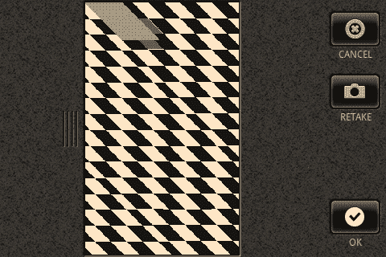

# 前言

在手机已经成为并正在演变为的诸多形态中，一个明确的趋势是其在媒体制作和消费能力方面的提升。这一趋势始于 20 世纪 90 年代末拍照手机的出现，并在过去几年中随着智能手机的日益普及而蓬勃发展。就媒体功能而言，如今的手机同时是相机、相册、摄像机、电影播放器、音乐播放器、录音机，甚至可能具备更多功能。

特别是，Android SDK 中提供了丰富的媒体功能，本书旨在通过讨论和示例来阐述这些功能，以便您能快速起步，开发下一代媒体应用。本书将引导您完成一些示例，这些示例不仅展示了如何显示和播放媒体，还让您能够利用摄像头、麦克风和视频捕捉功能。本书大致分为四个部分：前四章涉及图像处理；中间四章处理音频；最后四章则关于视频以及利用 Web 服务来查找和分享媒体。

随着本书内容的深入，给出的示例会逐渐增加难度，因为开发能够利用这些功能的应用程序所需的工作量也随之增加。无论如何，只要您对 Android 应用程序开发有一定了解，就可以直接跳到任何章节，利用相关讨论和示例代码来创建使用所介绍功能的应用程序。

示例通常以完整类的形式呈现，该类继承自`Activity`，目标运行于 SDK 4 版（Android 1.6）或更高版本。示例还包括 XML 布局文件的内容，并且在许多情况下，还包括`AndroidManifest.xml`文件的内容。假设您将使用 Eclipse（Galileo 或更高版本）并安装`ADT`插件（0.9.9 或更高版本），以及使用 Android SDK（r7 或更高版本）。由于本书大部分内容涉及音频和视频，我建议您在真实手机（运行 Android 1.6 或更高版本）上运行示例，而不是在模拟器上，因为在许多情况下，示例在模拟器上无法正常工作。

我很期待看到移动设备上媒体应用的未来。希望通过本书，我能帮助您创造和定义那个未来。我期待看到您的 Android 媒体应用大放异彩。

说了这么多，让我们开始吧！

## 第 1 章：Android 图像处理入门

在本章中，我们将学习 Android 上图像捕获和存储的基础知识。我们将首先探索 Android 提供的内置功能，然后在后续章节中转向更多定制化的软件。图像捕获和存储的内置功能为全面了解 Android 上媒体功能提供了良好的入门介绍，并为我们后续章节中关于音频和视频的内容铺平了道路。

基于此，我们将从如何利用内置的相机应用程序开始，然后转向使用`MediaStore`，即内置的媒体和元数据存储机制。在此过程中，我们将探讨减少内存使用的方法，并利用 EXIF——消费电子产品和图像处理软件领域中用于共享元数据的标准。

## 使用内置相机应用程序捕获图像

随着手机迅速演变为移动计算机，它们在许多方面已经取代了各种各样的消费电子产品。最早添加到手机上的非电话相关硬件功能之一是摄像头。目前，似乎很难买到一部不带摄像头的手机。当然，基于 Android 的手机也不例外；从一开始，Android SDK 就支持访问手机的内置硬件摄像头来捕获图像。

在 Android 上完成许多事情最简单直接的方法是利用设备上现有的软件，即通过使用**intent**。intent 是 Android 的一个核心组件，文档中将其描述为“要执行的动作的描述”。在实践中，intent 用于触发其他应用程序执行某些操作，或者在单个应用程序的各个 Activity 之间切换。

所有具有相应硬件（摄像头）的纯正 Android 设备都预装了相机应用程序。相机应用程序包含一个 intent 过滤器，这允许开发者

**2**

