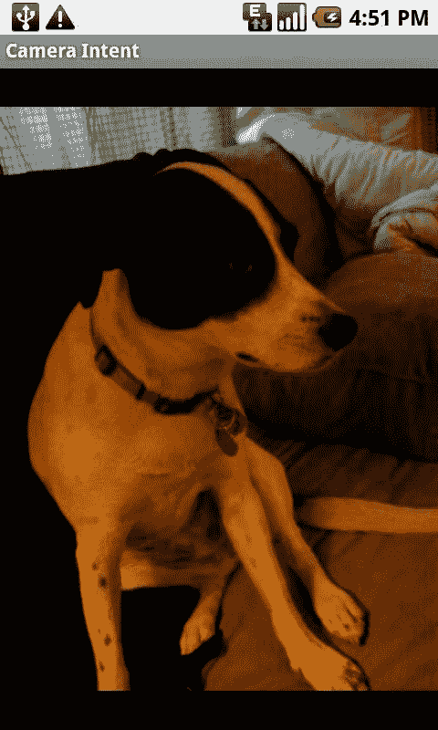

# 第 1 章：Android 图像处理入门

**注意：** 上述用于创建图像文件 URI 的代码片段可简化为以下形式：
```
imageFileUri = Uri.parse("file:///sdcard/myfavoritepicture.jpg");
```
不过，在实际操作中，使用示例所示的方法将更具设备无关性，并且当 SD 卡的命名约定或本地文件系统的 URI 语法发生变化时，也能更好地适应未来。

## 显示大图

加载和显示图像会显著影响内存使用。例如，HTC G1 手机配备了一颗 320 万像素的摄像头。一颗 320 万像素的摄像头通常拍摄 2048 像素 × 1536 像素的图像。显示该尺寸的 32 位图像将占用超过 100663 kb（约 13 MB）的内存。虽然这不一定能保证我们的应用会耗尽内存，但无疑会大大增加这种可能性。

Android 为我们提供了一个名为 `BitmapFactory` 的工具类，它提供了一系列静态方法，允许从各种来源加载 `Bitmap` 图像。根据我们的需求，需要从文件中加载图像以显示在我们的原始 Activity 中。幸运的是，`BitmapFactory` 中可用的方法接受一个 `BitmapFactory.Options` 类，该类允许我们定义如何将 `Bitmap` 读入内存。具体来说，我们可以设置 `BitmapFactory` 在加载图像时应使用的采样大小。在 `BitmapFactory.Options` 中指定 `inSampleSize` 参数，意味着加载后生成的 `Bitmap` 图像大小将是原图的几分之一。例如，像这里将 `inSampleSize` 设置为 8，将生成一个大小为原图 1/8 的图像。

```
BitmapFactory.Options bmpFactoryOptions = new BitmapFactory.Options();
bmpFactoryOptions.inSampleSize = 8;
Bitmap bmp = BitmapFactory.decodeFile(imageFilePath, bmpFactoryOptions);
imv.setImageBitmap(bmp);
```

这是加载大图的一种快速方法，但并未真正考虑图像的原始尺寸或屏幕的尺寸。最好能将图像缩放到适合我们屏幕的大小。

接下来的代码片段说明了如何使用显示器的尺寸来确定加载图像时应发生的降采样量。当我们使用这些方法时，可以确保图像尽可能填满显示器的边界。但是，如果图像在任何一个维度上只打算显示 100 像素，则应使用该值来代替显示的尺寸（我们按如下方式获取显示尺寸）。

```
Display currentDisplay = getWindowManager().getDefaultDisplay();
int dw = currentDisplay.getWidth();
int dh = currentDisplay.getHeight();
```

为了确定计算所需的图像整体尺寸，我们使用 `BitmapFactory` 和 `BitmapFactory.Options`，并将 `BitmapFactory.Options.inJustDecodeBounds` 变量设置为 `true`。这会告诉 `BitmapFactory` 类只返回图像的边界，而不是尝试解码图像本身。使用此方法时，`BitmapFactory.Options.outHeight` 和 `BitmapFactory.Options.outWidth` 变量将被赋值。

```
// 仅加载图像的尺寸，而非图像本身
BitmapFactory.Options bmpFactoryOptions = new BitmapFactory.Options();
bmpFactoryOptions.inJustDecodeBounds = true;
Bitmap bmp = BitmapFactory.decodeFile(imageFilePath, bmpFactoryOptions);

int heightRatio = (int)Math.ceil(bmpFactoryOptions.outHeight/(float)dh);
int widthRatio = (int)Math.ceil(bmpFactoryOptions.outWidth/(float)dw);

Log.v("HEIGHTRATIO",""+heightRatio);
Log.v("WIDTHRATIO",""+widthRatio);
```

将图像的尺寸除以显示器的尺寸，就能得到比率。然后，我们可以根据哪个比率更大，选择使用高度比率还是宽度比率。简单地使用该比率作为 `BitmapFactory.Options.inSampleSize` 变量，将生成一个加载到内存中尺寸与我们所需尺寸接近的图像——在这种情况下，就是接近显示器本身的尺寸。

```
// 如果两个比率都大于 1，
// 则图像的一边大于屏幕
if (heightRatio > 1 && widthRatio > 1)
{
    if (heightRatio > widthRatio)
    {
        // 高度比率更大，根据它进行缩放
        bmpFactoryOptions.inSampleSize = heightRatio;
    }
    else
    {
        // 宽度比率更大，根据它进行缩放
        bmpFactoryOptions.inSampleSize = widthRatio;
    }
}
// 实际解码
bmpFactoryOptions.inJustDecodeBounds = false;
bmp = BitmapFactory.decodeFile(imageFilePath, bmpFactoryOptions);
```

以下是一个完整示例的代码，该示例通过 Intent 使用内置相机并显示结果图片。图 1-3 显示了此示例生成的屏幕尺寸图像。

```
package com.apress.proandroidmedia.ch1.sizedcameraintent;

import java.io.File;

import android.app.Activity;
import android.content.Intent;
import android.graphics.Bitmap;
import android.graphics.BitmapFactory;
import android.net.Uri;
import android.os.Bundle;
import android.os.Environment;
import android.util.Log;
import android.view.Display;
import android.widget.ImageView;

public class SizedCameraIntent extends Activity {

    final static int CAMERA_RESULT = 0;
    ImageView imv;
    String imageFilePath;

    @Override
    public void onCreate(Bundle savedInstanceState) {
        super.onCreate(savedInstanceState);
        setContentView(R.layout.main);

        imageFilePath = Environment.getExternalStorageDirectory().getAbsolutePath() +
            "/myfavoritepicture.jpg";
        File imageFile = new File(imageFilePath);
        Uri imageFileUri = Uri.fromFile(imageFile);

        Intent i = new Intent(android.provider.MediaStore.ACTION_IMAGE_CAPTURE);
        i.putExtra(android.provider.MediaStore.EXTRA_OUTPUT, imageFileUri);
        startActivityForResult(i, CAMERA_RESULT);
    }

    protected void onActivityResult(int requestCode, int resultCode, Intent intent) {
        super.onActivityResult(requestCode, resultCode, intent);
        if (resultCode == RESULT_OK)
        {
            // 获取 ImageView 的引用
            imv = (ImageView) findViewById(R.id.ReturnedImageView);

            Display currentDisplay = getWindowManager().getDefaultDisplay();
            int dw = currentDisplay.getWidth();
            int dh = currentDisplay.getHeight();

            // 仅加载图像的尺寸，而非图像本身
            BitmapFactory.Options bmpFactoryOptions = new BitmapFactory.Options();
            bmpFactoryOptions.inJustDecodeBounds = true;
            Bitmap bmp = BitmapFactory.decodeFile(imageFilePath, bmpFactoryOptions);

            int heightRatio = (int)Math.ceil(bmpFactoryOptions.outHeight/(float)dh);
            int widthRatio = (int)Math.ceil(bmpFactoryOptions.outWidth/(float)dw);

            Log.v("HEIGHTRATIO",""+heightRatio);
            Log.v("WIDTHRATIO",""+widthRatio);

            // 如果两个比率都大于 1，
            // 则图像的一边大于屏幕
            if (heightRatio > 1 && widthRatio > 1)
            {
                if (heightRatio > widthRatio)
                {
                    // 高度比率更大，根据它进行缩放
                    bmpFactoryOptions.inSampleSize = heightRatio;
                }
                else
                {
                    // 宽度比率更大，根据它进行缩放
                    bmpFactoryOptions.inSampleSize = widthRatio;
                }
            }

            // 实际解码
            bmpFactoryOptions.inJustDecodeBounds = false;
            bmp = BitmapFactory.decodeFile(imageFilePath, bmpFactoryOptions);

            // 显示它
            imv.setImageBitmap(bmp);
        }
    }
}
```

上述代码需要以下 `layout/main.xml` 文件：

```
<?xml version="1.0" encoding="utf-8"?>
<LinearLayout xmlns:android="http://schemas.android.com/apk/res/android"
    android:orientation="vertical"
    android:layout_width="fill_parent"
    android:layout_height="fill_parent" >

    <ImageView 
        android:id="@+id/ReturnedImageView" 
        android:layout_width="wrap_content"
        android:layout_height="wrap_content" />

</LinearLayout>
```




