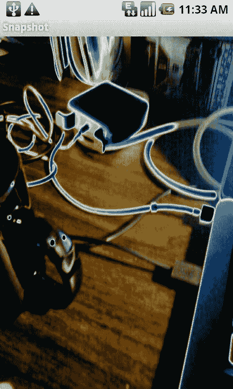
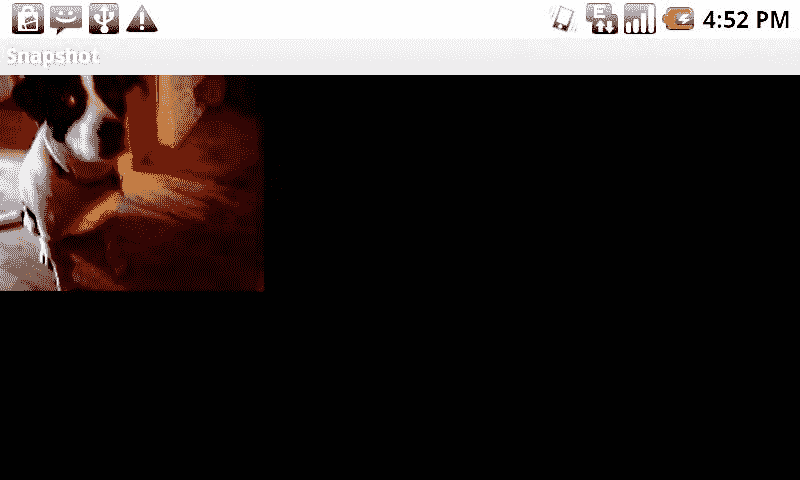

# 第 2 章：构建自定义相机应用

参数的设置应在 `surfaceCreated` 方法中完成，即相机创建并指定预览 `Surface` 之后。下面展示了如何使用 `Parameters` 请求相机以竖屏而非横屏模式运行。

```
public void surfaceCreated(SurfaceHolder holder) {
    camera = Camera.open();
    try {
        Camera.Parameters parameters = camera.getParameters();
        if (this.getResources().getConfiguration().orientation !=
            Configuration.ORIENTATION_LANDSCAPE) {
            // 这是一个虽未公开但广为人知的功能
            parameters.set("orientation", "portrait");
            // 适用于 Android 2.2 及以上版本
            //camera.setDisplayOrientation(90);
            // 取消注释以适用于 Android 2.0 及以上版本
            //parameters.setRotation(90);
        } else {
            // 这是一个虽未公开但广为人知的功能
            parameters.set("orientation", "landscape");
            // 适用于 Android 2.2 及以上版本
            //camera.setDisplayOrientation(0);
            // 取消注释以适用于 Android 2.0 及以上版本
            //parameters.setRotation(0);
        }
        camera.setParameters(parameters);
        camera.setPreviewDisplay(holder);
    } catch (IOException exception) {
        camera.release();
        Log.v(LOGTAG,exception.getMessage());
    }
    camera.startPreview();
}
```

上述代码首先通过调用 `Context.getResources().getConfiguration()` 检查设备配置，以确定当前方向。如果方向不是横屏，则将 `Camera.Parameters` 中的“orientation”属性设置为“portrait”。此外，还调用了 `Camera.Parameters.setRotation` 方法，并传入 90 度。该方法适用于 API 级别 5（版本 2.0）及更高版本，实际上并不执行任何旋转操作；而是告诉相机在 EXIF 数据中指定图像显示时应旋转 90 度。如果不加此设置，当你在其他应用中查看此图像时，它很可能会以侧向显示。

**注意：** 上述通过 `Camera.Parameters` 修改相机旋转的方法适用于 Android 2.1 及更早版本。在 Android 2.2 中，引入了 `Camera` 类的新方法 `setDisplayOrientation(int degrees)`。该方法接受一个表示图像旋转角度的整数，有效的角度值仅为 0、90、180、270。

大多数可以或应该修改的参数都有与之关联的特定方法。正如我们在 `setRotation` 方法中看到的，它们遵循 Java 的 getter 和 setter 设计模式。例如，可以通过 `setFlashMode(Camera.Parameters.FLASH_MODE_AUTO)` 设置相机的闪光灯模式，并通过 `getFlashMode()` 获取当前值，而不必通过通用的 `Parameters.set` 方法来实现。

从 Android 2.0 开始，有一个有趣的参数可供演示使用，它可以让我们更改特效。其 getter 和 setter 分别是 `getColorEffect` 和 `setColorEffect`。此外，还有一个 `getSupportedColorEffects` 方法，该方法返回一个包含 `String` 对象的 `List`，列出了特定设备支持的各种特效。事实上，对于所有拥有 getter 和 setter 方法的参数，都存在类似的方法，并且应在使用前确保所请求的功能可用。

```
Camera.Parameters parameters = camera.getParameters();
List<String> colorEffects = parameters.getSupportedColorEffects();
Iterator<String> cei = colorEffects.iterator();
while (cei.hasNext()) {
    String currentEffect = cei.next();
    Log.v("SNAPSHOT","Checking " + currentEffect);
    if (currentEffect.equals(Camera.Parameters.EFFECT_SOLARIZE)) {
        Log.v("SNAPSHOT","Using SOLARIZE");
        parameters.setColorEffect(Camera.Parameters.EFFECT_SOLARIZE);
        break;
    }
}
Log.v("SNAPSHOT","Using Effect: " + parameters.getColorEffect());
camera.setParameters(parameters);
```

在上述代码中，我们首先查询 `Camera.Parameters` 对象，通过 `getSupportedColorEffect` 方法了解支持哪些特效。然后使用 `Iterator` 遍历特效列表，检查是否有我们想要的特效，在此例中为 `Camera.Parameters.EFFECT_SOLARIZE`。如果该特效出现在列表中，则表示支持，我们可以继续调用 `Camera.Parameters` 对象的 `setColorEffect` 方法，并传入 solarize 常量。图 2–3 展示了 `Camera.Parameters.EFFECT_SOLARIZE` 的实际效果。



其他可能的特效也作为常量列在 `Camera.Parameters` 类中：
- `EFFECT_NONE`
- `EFFECT_MONO`
- `EFFECT_NEGATIVE`
- `EFFECT_SOLARIZE`
- `EFFECT_SEPIA`
- `EFFECT_POSTERIZE`
- `EFFECT_WHITEBOARD`
- `EFFECT_BLACKBOARD`
- `EFFECT_AQUA`

类似地，抗条纹、闪光灯模式、对焦模式、场景模式和白平衡等也都有相应的常量。

## 更改相机预览大小

`Camera.Parameters` 中另一个特别有用的设置是更改预览大小。与其他设置一样，我们首先需要查询参数对象以获取支持的值。获得尺寸列表后，我们可以遍历该列表，以确保我们想要的尺寸受支持，然后再进行设置。

在此示例中，我们并不指定确切的目标尺寸，而是选择一个接近但不超过几个常量的尺寸。图 2–4 显示了此示例的输出。

```
...
public static final int LARGEST_WIDTH = 200;
public static final int LARGEST_HEIGHT= 200;
...
```

与所有 `Camera.Parameters` 一样，我们应在 `surfaceCreated` 方法中（打开相机并设置预览显示 `Surface` 之后）获取和设置这些值。

```
public void surfaceCreated(SurfaceHolder holder) {
    camera = Camera.open();
    try {
        camera.setPreviewDisplay(holder);
        Camera.Parameters parameters = camera.getParameters();
```

我们将在这两个变量中跟踪不超过我们常量的最接近值：
```
        int bestWidth = 0;
        int bestHeight = 0;
```

然后获取设备上所有支持的尺寸列表。这将返回一个包含 `Camera.Size` 对象的 `List`，我们可以对其进行循环遍历。

```
        List<Camera.Size> previewSizes = parameters.getSupportedPreviewSizes();
        if (previewSizes.size() > 1)
        {
            Iterator<Camera.Size> cei = previewSizes.iterator();
            while (cei.hasNext())
            {
                Camera.Size aSize = cei.next();
```

如果列表中的当前尺寸大于我们已保存的最佳尺寸，并且小于或等于我们的 `LARGEST_WIDTH` 和 `LARGEST_HEIGHT` 常量，则将该高度和宽度保存到 `bestWidth` 和 `bestHeight` 变量中，并继续检查。

```
                Log.v("SNAPSHOT","Checking " + aSize.width + " x " + aSize.height);
                if (aSize.width > bestWidth && aSize.width <= LARGEST_WIDTH
                    && aSize.height > bestHeight && aSize.height <= LARGEST_HEIGHT) {
                    // 到目前为止，这是不超过屏幕尺寸的最大值
                    bestWidth = aSize.width;
                    bestHeight = aSize.height;
                }
            }
```

遍历完所有支持的尺寸后，我们确保得到了有效结果。如果 `bestHeight` 和 `bestWidth` 变量都等于 0，则说明没有找到符合我们需求的值，或者只有一个支持的尺寸，此时不应采取任何操作。反之，如果它们有值，我们将在 `Camera.Parameters` 对象上调用 `setPreviewSize` 方法，并传入 `bestWidth` 和 `bestHeight` 变量。




