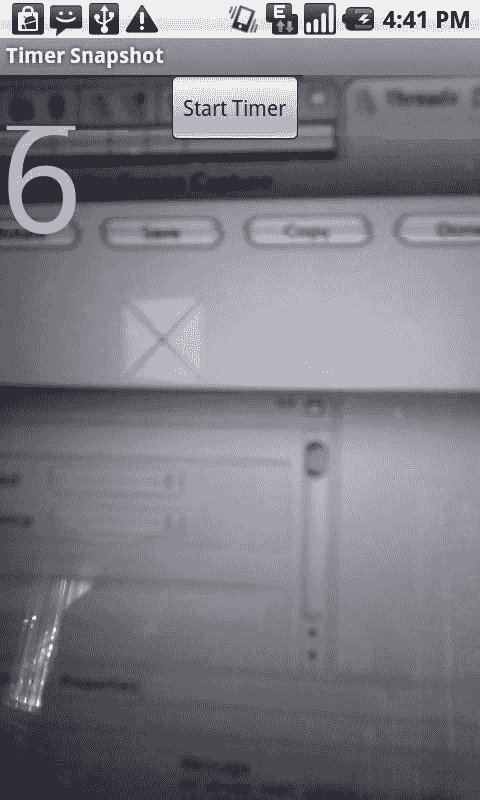

# 第 2 章：构建自定义相机应用

`<application>`

`<uses-sdk android:minSdkVersion="8" />`

`<uses-permission android:name="android.permission.CAMERA"></uses-permission>` `</manifest>`

以上内容涵盖了构建自定义相机应用的基础知识。接下来，让我们看看如何扩展这个应用，实现内置相机应用中没有的功能。

## 扩展自定义相机应用

在我看来，Android 内置相机应用缺少一些基本功能。其中之一是在短时间内（例如 10 秒或 30 秒）拍摄照片的能力。这个功能对于可以安装在三脚架上的相机来说通常很有用。它允许摄影师先设置好拍摄场景，设定定时器，然后自己跑进画面中。

虽然这并非手机常用功能，但我认为在某些情况下它会非常有用。例如，当我想给自己和同行的人拍合影时，我就很需要这个功能。目前尝试这样做时，我会遇到困难，因为触摸屏朝向外面，我看不到界面。我只能手忙脚乱地到处点屏幕，希望能按到快门按钮。

### 构建基于定时器的相机应用

为了改善上述情况，我们可以在拍照时添加一个时间延迟。让我们更新`SnapShot`示例，使得按下按钮十秒后拍摄照片。

为了实现这一点，我们需要使用类似`java.util.Timer`的东西。不幸的是，在 Android 中使用`Timer`会引入一个单独的线程，从而带来一些复杂性。为了让单独的线程与 UI 交互，我们需要使用`Handler`来让操作在主线程上执行。

`Handler`的另一个用途是安排某些事情在将来发生。`Handler`的这一功能使得我们无需使用`Timer`。

要创建一个将在将来执行某操作的`Handler`，我们只需构造一个通用的`Handler`：

```
Handler timerHandler = new Handler();
```

然后我们必须创建一个`Runnable`。这个`Runnable`的`run`方法将包含稍后要执行的操作。在我们的例子中，我们希望这个操作在十秒后触发拍照：

```
Runnable timerTask = new Runnable() {
    public void run() {
        camera.takePicture(null, null, null, TimerSnapShot.this);
    }
};
```

这样就差不多了。现在，当我们按下按钮时，我们只需安排它：

```
timerHandler.postDelayed(timerTask, 10000);
```

这告诉`timerHandler`在 10 秒（10000 毫秒）后调用我们的`timerTask`方法。

在下面的示例中，我们将创建一个`Handler`，并让它每秒调用一次方法。这样，我们就可以在屏幕上向用户显示倒计时。

```
package com.apress.proandroidmedia.ch2.timersnapshot;

import java.io.FileNotFoundException;
import java.io.IOException;
import java.io.OutputStream;
import java.util.Iterator;
import java.util.List;

import android.app.Activity;
import android.content.ContentValues;
import android.content.res.Configuration;
import android.hardware.Camera;
import android.net.Uri;
import android.os.Bundle;
import android.os.Handler;
import android.provider.MediaStore.Images.Media;
import android.util.Log;
import android.view.SurfaceHolder;
import android.view.SurfaceView;
import android.view.View;
import android.view.View.OnClickListener;
import android.widget.Button;
import android.widget.TextView;
import android.widget.Toast;

public class TimerSnapShot extends Activity implements OnClickListener,
        SurfaceHolder.Callback, Camera.PictureCallback {

    SurfaceView cameraView;
    SurfaceHolder surfaceHolder;
    Camera camera;
```

这个活动与我们的`SnapShot`活动非常相似。我们将添加一个`Button`来触发倒计时开始，以及一个`TextView`来显示倒计时。

```
    Button startButton;
    TextView countdownTextView;
```

我们还需要一个`Handler`，这里称为`timerUpdateHandler`，一个`Boolean`变量来帮助我们跟踪定时器是否已启动（`timerRunning`），以及一个整数（`currentTime`）来跟踪倒计时。

```
    Handler timerUpdateHandler;
    boolean timerRunning = false;
    int currentTime = 10;
```

```
    @Override
    public void onCreate(Bundle savedInstanceState) {
        super.onCreate(savedInstanceState);
        setContentView(R.layout.main);

        cameraView = (SurfaceView) this.findViewById(R.id.CameraView);
        surfaceHolder = cameraView.getHolder();
        surfaceHolder.setType(SurfaceHolder.SURFACE_TYPE_PUSH_BUFFERS);
        surfaceHolder.addCallback(this);
```

接下来，我们将获取对新的 UI 元素（在布局 XML 中定义）的引用，并让我们的活动成为该`Button`的`OnClickListener`。我们之所以能做到这一点，是因为我们的活动实现了`OnClickListener`。

```
        countdownTextView = (TextView) findViewById(R.id.CountDownTextView);
        startButton = (Button) findViewById(R.id.CountDownButton);
        startButton.setOnClickListener(this);
```

在`onCreate`方法中，我们要做的最后一件事是实例化我们的`Handler`对象。

```
        timerUpdateHandler = new Handler();
    }
```

当`startButton`按钮被按下时，将调用我们的`onClick`方法。我们将通过检查`timerRunning`布尔变量来确保定时器例程尚未运行，如果未运行，我们将通过我们的`Handler`对象`timerUpdateHandler`立即调用`timerUpdateTask` `Runnable`。

```
    public void onClick(View v) {
        if (!timerRunning)
        {
            timerRunning = true;
            timerUpdateHandler.post(timerUpdateTask);
        }
    }
```

这是我们的`Runnable`，名为`timerUpdateTask`。这个对象包含了将由我们的`timerUpdateHandler`对象触发的`run`方法。

```
    private Runnable timerUpdateTask = new Runnable() {
        public void run()
        {
```

如果保存倒计时的整数`currentTime`大于 1，我们将使其递减，并在 1 秒后再次调度`Handler`调用。

```
            if (currentTime > 1)
            {
                currentTime--;
                timerUpdateHandler.postDelayed(timerUpdateTask, 1000);
            }
            else
            {
```

如果`currentTime`不大于 1，我们将实际触发相机拍照，并重置所有跟踪变量。

```
                camera.takePicture(null, null, TimerSnapShot.this);
                timerRunning = false;
                currentTime = 10;
            }
```

无论如何，我们都会更新`TextView`以显示拍照前剩余的当前时间。

```
            countdownTextView.setText("" + currentTime);
        }
    };
```

活动的其余部分与前面的`SnapShot`示例基本相同。

```
    public void surfaceChanged(SurfaceHolder holder, int format, int w, int h) {
        camera.startPreview();
    }

    public void surfaceCreated(SurfaceHolder holder) {
        camera = Camera.open();
        try {
            camera.setPreviewDisplay(holder);

            Camera.Parameters parameters = camera.getParameters();

            if (this.getResources().getConfiguration().orientation !=
                    Configuration.ORIENTATION_LANDSCAPE)
            {
                parameters.set("orientation", "portrait");
                // 适用于 Android 2.2 及以上版本
                camera.setDisplayOrientation(90);
                // 适用于 Android 2.0 及以上版本
                parameters.setRotation(90);
            }

            camera.setParameters(parameters);
        }
        catch (IOException exception)
        {
            camera.release();
        }
    }

    public void surfaceDestroyed(SurfaceHolder holder) {
        camera.stopPreview();
        camera.release();
    }

    public void onPictureTaken(byte[] data, Camera camera) {
        Uri imageFileUri =
                getContentResolver().insert(Media.EXTERNAL_CONTENT_URI, new ContentValues());

        try {
            OutputStream imageFileOS =
                    getContentResolver().openOutputStream(imageFileUri);
            imageFileOS.write(data);
            imageFileOS.flush();
            imageFileOS.close();

            Toast t = Toast.makeText(this, "已保存 JPEG！", Toast.LENGTH_SHORT);
            t.show();
        } catch (FileNotFoundException e) {
        }
    }
}
```


## 第二章：构建自定义相机应用

`Toast t = Toast.makeText(this, e.getMessage(), Toast.LENGTH_SHORT);`
`t.show();`

`} catch (IOException e) {`
`Toast t = Toast.makeText(this, e.getMessage(), Toast.LENGTH_SHORT);`
`t.show();`
`}`
`camera.startPreview();`
`}`
`}`

布局 XML 稍有不同。在这个应用中，我们在 `FrameLayout` 中显示相机预览 `SurfaceView`，同时还有一个包含用于显示倒计时的 `TextView` 和用于触发倒计时的 `Button` 的 `LinearLayout`。`FrameLayout` 将其所有子视图对齐到左上角并叠放在一起。这样，`TextView` 和 `Button` 就会显示在相机预览之上。

```
<?xml version="1.0" encoding="utf-8"?>
<LinearLayout xmlns:android="http://schemas.android.com/apk/res/android"
    android:orientation="vertical"
    android:layout_width="fill_parent"
    android:layout_height="fill_parent">
    <FrameLayout
        android:id="@+id/FrameLayout01"
        android:layout_width="wrap_content"
        android:layout_height="wrap_content">
        <SurfaceView
            android:id="@+id/CameraView"
            android:layout_width="fill_parent"
            android:layout_height="fill_parent"></SurfaceView>
        <LinearLayout
            android:id="@+id/LinearLayout01"
            android:layout_width="wrap_content"
            android:layout_height="wrap_content">
            <TextView
                android:id="@+id/CountDownTextView"
                android:text="10"
                android:textSize="100dip"
                android:layout_width="fill_parent"
                android:layout_height="wrap_content"
                android:layout_gravity="center_vertical|center_horizontal|center"></TextView>
            <Button
                android:layout_width="wrap_content"
                android:layout_height="wrap_content"
                android:id="@+id/CountDownButton"
                android:text="Start Timer"></Button>
        </LinearLayout>
    </FrameLayout>
</LinearLayout>
```

最后，我们需要确保我们的 `AndroidManifest.xml` 文件包含 `CAMERA` 权限。

```
<uses-permission android:name="android.permission.CAMERA"></uses-permission>
```



**图 2–5.** 带倒计时器的相机

### 构建延时摄影应用

我们都见过延时摄影的精彩范例。它是一个在均匀的时间间隔内拍摄多张照片的过程。可以是一分钟一张、一小时一张，甚至一周一张。浏览一系列延时摄影照片，我们可以看到事物如何随时间变化。一个例子可能是观看一栋建筑的建造过程，另一个例子可能是记录一朵花如何生长和绽放。

既然我们已经构建了一个基于定时器的相机应用，将其升级为延时摄影应用就相当直接了。

首先，我们会更改一些实例变量并添加一个常量。

```java
public class TimelapseSnapShot extends Activity implements OnClickListener,
    SurfaceHolder.Callback, Camera.PictureCallback {

    SurfaceView cameraView;
    SurfaceHolder surfaceHolder;
    Camera camera;
```

我们将把 `Button` 重命名为 `startStopButton`，因为它现在将处理启动和停止两种操作，并对其余变量进行一些轻微的命名更新。

```java
    Button startStopButton;
    TextView countdownTextView;
    Handler timerUpdateHandler;
    boolean timelapseRunning = false;
```

与之前示例从总延迟时间向下倒计时不同，这里的 `currentTime` 整数将用于向上计数到照片之间的间隔秒数。一个名为 `SECONDS_BETWEEN_PHOTOS` 的常量被设置为 `60`。顾名思义，它将用于确定照片之间的等待时间。

```java
    int currentTime = 0;
    public static final int SECONDS_BETWEEN_PHOTOS = 60; // one minute
```

`onCreate` 方法将基本保持不变——只是引用了新的变量名。

```java
    @Override
    public void onCreate(Bundle savedInstanceState) {
        super.onCreate(savedInstanceState);
        setContentView(R.layout.main);
        cameraView = (SurfaceView) this.findViewById(R.id.CameraView);
        surfaceHolder = cameraView.getHolder();
        surfaceHolder.setType(SurfaceHolder.SURFACE_TYPE_PUSH_BUFFERS);
        surfaceHolder.addCallback(this);
        countdownTextView = (TextView) findViewById(R.id.CountDownTextView);
        startStopButton = (Button) findViewById(R.id.CountDownButton);
        startStopButton.setOnClickListener(this);
        timerUpdateHandler = new Handler();
    }
```

将基于单个定时器的应用转变为延时摄影应用，其大部分改动将集中在 `onClick` 方法（即按下按钮时执行的操作）以及由 `Handler` 调度的 `Runnable` 方法中。

`onClick` 方法首先检查延时摄影过程是否正在运行（`Button` 之前已被按下），如果未运行，则将其设置为运行状态，并调用 `Handler` 的 `post` 方法，将 `Runnable` 作为参数传入。

如果延时摄影过程正在运行，则按钮按下意味着停止它，因此会调用 `Handler` 上的 `removeCallbacks` 方法。这将清除所有待执行的、作为参数传入的 `Runnable` 调用。

```java
    public void onClick(View v) {
        if (!timelapseRunning) {
            startStopButton.setText("Stop");
            timelapseRunning = true;
            timerUpdateHandler.post(timerUpdateTask);
        } else {
            startStopButton.setText("Start");
            timelapseRunning = false;
            timerUpdateHandler.removeCallbacks(timerUpdateTask);
        }
    }
```

由于我们使用 `Handler` 进行调度，因此有一个 `Runnable`，当时间到来时，`Handler` 会调用它。在我们的 `Handler` 的 `run` 方法中，我们首先检查 `currentTime` 整数是否小于我们想要在照片之间等待的秒数（`SECONDS_BETWEEN_PHOTOS`）。如果是，我们就简单地递增 `currentTime`。如果 `currentTime` 不小于等待时间，我们就指示 `Camera` 拍照，并将 `currentTime` 重置为 `0`，以便它继续向上计数。

在每种情况之后，我们只需用 `currentTime` 更新 `TextView`，并调度在一秒后再次调用自身。

```java
    private Runnable timerUpdateTask = new Runnable() {
        public void run() {
            if (currentTime < SECONDS_BETWEEN_PHOTOS) {
                currentTime++;
            } else {
                camera.takePicture(null, null, null, TimelapseSnapShot.this);
                currentTime = 0;
            }
            timerUpdateHandler.postDelayed(timerUpdateTask, 1000);
            countdownTextView.setText("" + currentTime);
        }
    };
}
```

此示例的 `res/layout/main.xml` 界面以及当然还有 `AndroidManifest.xml`，与单个倒计时版本的相同。

## 总结

正如你所见，我们想要构建自己的基于相机的应用，而不是仅仅在我们自己的应用中使用内置相机应用，其理由数不胜数。从简单地创建一个在倒计时后拍照的应用，到构建你自己的延时摄影系统等等，你的能力是无限的。

接下来，我们将看看在捕获这些图像后，我们可以用它们做些什么。


### 图像编辑与处理

随着手持设备性能日益强大，许多以往只能在台式电脑上实现的功能如今已可在移动设备上完成。图像编辑与处理曾经是`Photoshop`等桌面应用的专属领域，但现在通过手机也能轻松实现。

本章将探讨图像捕获后能对其进行哪些操作。我们将介绍如何通过旋转和缩放改变图像，如何调整亮度和对比度，以及如何将两张或多张图像合成在一起。

## 使用内置图库应用选择图像

众所周知，利用`intent`通常是调用 Android 预装应用现有功能的最快捷方式。为便于本章示例讲解，我们来了解如何调用内置图库应用，选择需要处理的图像。

我们将使用的 intent 是通用的`Intent.ACTION_PICK`，它向 Android 系统表明我们想要选择一条数据。同时还需提供要选择数据的 URI。此处我们使用`android.provider.MediaStore.Images.Media.EXTERNAL_CONTENT_URI`，即选择存储在 SD 卡上`MediaStore`中的图像。

```java
Intent choosePictureIntent = new Intent(Intent.ACTION_PICK,
        android.provider.MediaStore.Images.Media.EXTERNAL_CONTENT_URI);
```

当该 intent 被触发时，图库应用会以允许用户选择图像的模式启动。

与 intent 返回结果通常的处理方式一样，当用户选定图像后，我们的`onActivityResult`方法会被触发。所选图像的 URI 会通过返回 intent 的`data`参数传递回来。

```java
protected void onActivityResult(int requestCode, int resultCode, Intent intent) {
    super.onActivityResult(requestCode, resultCode, intent);
    if (resultCode == RESULT_OK) {
        Uri imageFileUri = intent.getData();
    }
}
```

以下是一个完整示例：

```java
package com.apress.proandroidmedia.ch3.choosepicture;

import java.io.FileNotFoundException;
import android.app.Activity;
import android.content.Intent;
import android.graphics.Bitmap;
import android.graphics.BitmapFactory;
import android.net.Uri;
import android.os.Bundle;
import android.util.Log;
import android.view.Display;
import android.view.View;
import android.view.View.OnClickListener;
import android.widget.Button;
import android.widget.ImageView;
```

我们的 activity 需要响应按钮触发的点击事件，因此需实现`OnClickListener`接口。在`onCreate`方法中，使用常规的`findViewById`方法来访问布局 XML 中定义的必需 UI 元素。

```java
public class ChoosePicture extends Activity implements OnClickListener {

    ImageView chosenImageView;
    Button choosePicture;

    @Override
    public void onCreate(Bundle savedInstanceState) {
        super.onCreate(savedInstanceState);
        setContentView(R.layout.main);

        chosenImageView = (ImageView) this.findViewById(R.id.ChosenImageView);
        choosePicture = (Button) this.findViewById(R.id.ChoosePictureButton);
        choosePicture.setOnClickListener(this);
    }
}
```

**图 3–1.** *应用首次启动时显示的 `choosePicture` 按钮*

接下来是`onClick`方法，它将响应对`choosePicture`按钮的按下操作，该按钮如图 3–1 所示在应用启动时显示。在此方法中，我们创建 intent，该 intent 将触发图库应用以允许用户选择图片的模式启动，如图 3–2 所示。

```java
public void onClick(View v) {
    Intent choosePictureIntent = new Intent(Intent.ACTION_PICK,
            android.provider.MediaStore.Images.Media.EXTERNAL_CONTENT_URI);
    startActivityForResult(choosePictureIntent, 0);
}
```

**图 3–2.** *图库应用被`ACTION_PICK` intent 触发后提示用户选择图片的视图；图库应用的 UI 可能因设备而异。*

当用户选择图像后图库应用返回时，我们的`onActivityResult`方法被调用。我们通过传入 intent 的 data 获取所选图像的 URI。

```java
protected void onActivityResult(int requestCode, int resultCode, Intent intent) {
    super.onActivityResult(requestCode, resultCode, intent);
    if (resultCode == RESULT_OK) {
        Uri imageFileUri = intent.getData();
```

由于返回的图像可能过大，无法完全加载到内存中，我们将采用第一章介绍的技术，在加载时调整其大小。`dw`和`dh`整数将分别代表最大宽度和最大高度。最大高度将小于屏幕高度的一半，因为我们最终将垂直显示两张图像。

```java
        Display currentDisplay = getWindowManager().getDefaultDisplay();
        int dw = currentDisplay.getWidth();
        int dh = currentDisplay.getHeight()/2 - 100;

        try {
            // 仅加载图像的尺寸，而非图像本身
            BitmapFactory.Options bmpFactoryOptions = new BitmapFactory.Options();
            bmpFactoryOptions.inJustDecodeBounds = true;

            Bitmap bmp = BitmapFactory.decodeStream(getContentResolver().
                    openInputStream(imageFileUri), null, bmpFactoryOptions);

            int heightRatio = (int)Math.ceil(bmpFactoryOptions.outHeight/(float)dh);
            int widthRatio = (int)Math.ceil(bmpFactoryOptions.outWidth/(float)dw);

            if (heightRatio > 1 && widthRatio > 1) {
                if (heightRatio > widthRatio) {
                    bmpFactoryOptions.inSampleSize = heightRatio;
                } else {
                    bmpFactoryOptions.inSampleSize = widthRatio;
                }
            }

            bmpFactoryOptions.inJustDecodeBounds = false;
            bmp = BitmapFactory.decodeStream(getContentResolver().
                    openInputStream(imageFileUri), null, bmpFactoryOptions);

            chosenImageView.setImageBitmap(bmp);
        } catch (FileNotFoundException e) {
            Log.v("ERROR", e.toString());
        }
    }
}
}
```

需要在项目的`layout/main.xml`文件中添加以下内容：

```xml
<?xml version="1.0" encoding="utf-8"?>
<LinearLayout xmlns:android="http://schemas.android.com/apk/res/android"
    android:orientation="vertical"
    android:layout_width="fill_parent"
    android:layout_height="fill_parent"
>
    <Button
        android:layout_width="fill_parent"
        android:layout_height="wrap_content"
        android:text="选择图片"
        android:id="@+id/ChoosePictureButton"
    />
    <ImageView
        android:layout_width="wrap_content"
        android:layout_height="wrap_content"
        android:id="@+id/ChosenImageView"
    />
</LinearLayout>
```


