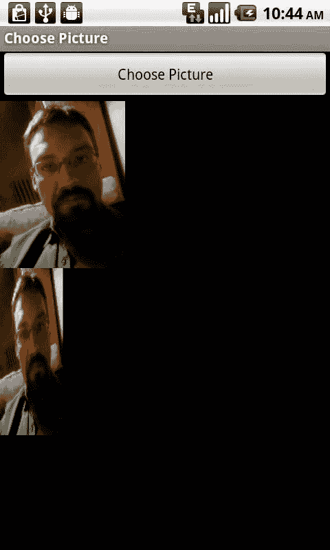

# 第 3 章：图像编辑与处理

**图 3–3.** *用户选择图片后的应用程序界面*

到此为止，我们现在已将用户选择的图像以`Bitmap`对象的形式显示给用户，如图 3-3 所示。接下来，我们将探讨如何以该`Bitmap`作为起点进行其他操作。

## 将位图绘制到位图上

在深入探讨用于修改图像的具体机制之前，我们先来看看如何创建一个新的空`Bitmap`对象，并将现有的`Bitmap`绘制到其中。我们将通过这一流程来创建图像的修改版本。

在前面的示例中，我们实例化了一个`Bitmap`对象，其中包含用户选定的图像。该对象通过调用`BitmapFactory`的`decodeStream`方法进行实例化，正如我们在第 1 章中所学。

```java
Bitmap bmp = BitmapFactory.decodeStream(getContentResolver().
openInputStream(imageFileUri), null, bmpFactoryOptions);
```

为了将该`Bitmap`作为图像编辑实验的源图像，我们需要能够将此`Bitmap`连同应用的效果一起绘制到屏幕上。此外，如果能够将其绘制到一个可用于保存结果图像的对象上，那就更好了。

因此，创建一个与该`Bitmap`尺寸相同的空`Bitmap`对象，并将其用作修改后`Bitmap`的目标对象，是合理的做法。

```java
Bitmap alteredBitmap = Bitmap.createBitmap(bmp.getWidth(),
bmp.getHeight(),bmp.getConfig());
```

这个`alteredBitmap`对象与源`Bitmap`（即`bmp`）具有相同的宽度、高度和色深。由于我们使用`Bitmap`类的`createBitmap`方法，并传入了宽度、高度和`Bitmap.Config`对象作为参数，因此我们得到的是一个可变的`Bitmap`对象。可变意味着我们可以修改此`Bitmap`所表示的像素值。如果得到的是一个不可变的`Bitmap`，我们将无法在其上进行绘制。此方法调用是实例化可变`Bitmap`对象的少数几种方式之一。

接下来，我们需要一个`Canvas`对象。在 Android 中，`Canvas`正如其名，是用于绘制的工具。可以通过在其构造函数中传入一个`Bitmap`对象来创建`Canvas`，之后便可使用它进行绘制。

```java
Canvas canvas = new Canvas(alteredBitmap);
```

最后，我们需要一个`Paint`对象。在实际绘制时，`Paint`对象将发挥作用。具体来说，它允许我们修改颜色和对比度等参数，不过我们稍后会详细讨论。目前，我们将使用一个默认的`Paint`对象。

```java
Paint paint = new Paint();
```

现在，我们拥有将源`Bitmap`绘制到一个空的可变`Bitmap`对象所需的所有组件。以下是上述所有代码的整合。

```java
Bitmap bmp = BitmapFactory.decodeStream(getContentResolver().
openInputStream(imageFileUri), null, bmpFactoryOptions);
Bitmap alteredBitmap = Bitmap.createBitmap(bmp.getWidth(),bmp.getHeight(),
bmp.getConfig());
Canvas canvas = new Canvas(alteredBitmap);
Paint paint = new Paint();
canvas.drawBitmap(bmp, 0, 0, paint);
ImageView alteredImageView = (ImageView) this.findViewById(R.id.AlteredImageView);
alteredImageView.setImageBitmap(alteredBitmap);
```

我们使用的`Canvas`对象上的`drawBitmap`方法接受源`Bitmap`、x/y 偏移量以及我们的`Paint`对象。这将使我们的`alteredBitmap`对象包含与原始位图完全相同的信息。

我们可以将所有这段代码插入到“选择图片”示例中。它应放在`onActivityResult`方法的末尾，紧跟`bmp = BitmapFactory.decodeStream`这一行之后。注意不要重复该行，如上代码片段所示。同时，不要忘记添加相应的导入语句。

之后，我们希望显示`alteredBitmap`对象。为此，我们使用一个标准的`ImageView`，并调用`setImageBitmap`方法，传入我们的`alteredBitmap`。这要求我们在布局 XML 中声明一个 id 为`AlteredImageView`的`ImageView`。

以下是“选择图片”完整示例更新后的布局 XML，其中包含了原始的`ImageView`以及用于显示`alteredBitmap`的新`ImageView`，如图 3-4 所示。


```xml
<?xml version="1.0" encoding="utf-8"?>
<LinearLayout xmlns:android="http://schemas.android.com/apk/res/android"
android:orientation="vertical"
android:layout_width="fill_parent"
android:layout_height="fill_parent"
>
<Button
android:layout_width="fill_parent"
android:layout_height="wrap_content"
android:text="选择图片" android:id="@+id/ChoosePictureButton"/>
<ImageView android:layout_width="wrap_content" android:layout_height="wrap_content"
android:id="@+id/ChosenImageView"></ImageView>
<ImageView android:layout_width="wrap_content" android:layout_height="wrap_content"
android:id="@+id/AlteredImageView"></ImageView>
</LinearLayout>
```

**图 3–4.** *用户选择图像并显示第二个位图对象后的应用程序界面*

## 基本图像缩放与旋转

我们将从学习如何进行空间变换（如改变缩放比例和旋转图像）开始，探索图像编辑与处理。

### 矩阵登场

Android API 提供了一个`Matrix`类，它可用于在现有`Bitmap`对象上绘制，或从另一个`Bitmap`对象创建`Bitmap`对象。该类允许我们对图像应用空间变换。此类变换包括旋转、裁剪、缩放，或以其他方式修改图像的坐标空间。

`Matrix`类使用一个由九个数字组成的数组来表示变换。在许多情况下，可以通过数学公式生成这些数字，该公式代表要执行的变换。例如，旋转公式涉及使用正弦和余弦来生成矩阵中的数字。

`Matrix`中的数字也可以手动输入。为了理解`Matrix`的工作原理，我们将从执行一些手动变换开始。

`Matrix`中的每个数字都对应图像中每个点的三个坐标（x、y 或 z）之一。

例如，这是一个由九个浮点数组成的`Matrix`：

```
1 0 0
0 1 0
0 0 1
```

第一行（1, 0, 0）指定源 x 坐标将根据以下公式进行变换：`x = 1x + 0y + 0z`。如你所见，矩阵中数值的位置决定了该数值如何影响结果。第一行始终影响 x 坐标，但可以与源 x、y 和 z 坐标一起运算。

第二行（0, 1, 0）表示 y 坐标将由`y = 0x + 1y + 0z`确定，第三行（0, 0, 1）表示 z 坐标将由`z = 0x + 0y + 1z`确定。

换句话说，这个`Matrix`不会执行任何变换；所有内容都将按照源图像中的原样放置。

要在代码中实现这一点，我们需要创建`Matrix`对象，然后通过其`setValues`方法显式设置这些值。

```java
Matrix matrix = new Matrix();
matrix.setValues(new float[] {
1, 0, 0,
0, 1, 0,
0, 0, 1
});
```

我们可以在将位图绘制到画布上时使用`Matrix`对象。

```java
canvas.drawBitmap(bmp, matrix, paint);
```

这将替换我们在前面示例中使用的`drawBitmap`方法。

为了通过此`Matrix`以某种方式修改图像，我们可以将现有数字中的任何一个替换为不同的值。例如，如果将第一个数字从 1 改为 0.5，




