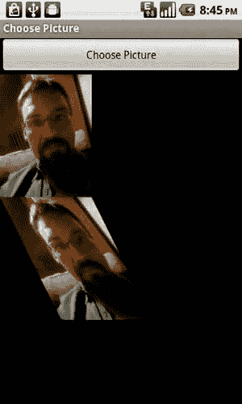

# 第三章：图像编辑与处理

如图 3-5 所示，我们将图像在 x 轴上压缩 50%。第一个数值作用于源图像中的 x 坐标，以影响结果图像中的 x 坐标。

```
.5 0 0
0 1 0
0 0 1
```

```
Matrix matrix = new Matrix();
matrix.setValues(new float[] {
    .5f, 0, 0,
    0, 1, 0,
    0, 0, 1
});
canvas.drawBitmap(bmp, matrix, paint);
```

**图 3-5.** *应用自定义矩阵后显示的第二张图像，x 轴缩放 50%*

如果我们修改矩阵，让 x 坐标也受到源图像 y 坐标的影响，就可以改变第二个数值。

```
Matrix matrix = new Matrix();
matrix.setValues(new float[] {
    1, .5f, 0,
    0, 1, 0,
    0, 0, 1
});
canvas.drawBitmap(bmp, matrix, paint);
```


**图 3-6.** *应用自定义矩阵后显示的第二张图像，发生了倾斜*

如图 3-6 所示，这会导致图像倾斜。这是因为第一行（作用于每个像素的 x 值）受到了每个像素 y 值的影响。随着 y 值增大（即向下移动图像），x 值也增大，从而导致图像倾斜。如果使用负值，则会向相反方向倾斜。你还会注意到，由于坐标变化，图像边缘被裁剪了。如果我们要执行此类操作，就需要增大结果位图的尺寸，如图 3-7 所示。

```
alteredBitmap = Bitmap.createBitmap(bmp.getWidth()*2, bmp.getHeight(), bmp.getConfig());
```



**图 3-7.** *应用相同自定义矩阵但宽度更大的第二张图像，图像不再被裁剪*

可以看出，这些矩阵变换功能非常强大。同时，手动操作也会很繁琐。不幸的是，要手动通过矩阵实现你想要的许多功能，所需的数学知识超出了本书的范围。不过，如果你有兴趣深入了解，网上有大量资源可供参考。一个不错的起点是维基百科的“变换矩阵”条目：<http://en.wikipedia.org/wiki/Transformation_matrix>。

## 矩阵方法

接下来，我们将探索 `Matrix` 类的其他方法。它们能帮助我们实现大部分需求，而无需重新学习中学和大学的数学课程。

我们无需手动创建矩阵数值，只需为所需的变换调用相应的方法即可。

以下每个代码片段都可替换“在位图上绘制位图”示例中的 `canvas.drawBitmap` 这一行。

### 旋转

内置方法之一就是 `setRotation` 方法。它接收一个表示旋转角度的浮点数。正数使图像绕默认点 (0,0)（即图像的左上角）顺时针旋转，负数则使图像逆时针旋转，如图 3-8 所示。

```
Matrix matrix = new Matrix();
matrix.setRotate(15);
canvas.drawBitmap(bmp, matrix, paint);
```


**图 3-8.** *绕默认点 (0,0) 旋转*

另外，`setRotation` 方法也可以传入旋转角度和旋转中心点的坐标。选择图像的中心点作为旋转中心，可能会得到更符合我们预期的结果，如图 3-9 所示。

```
matrix.setRotate(15, bmp.getWidth()/2, bmp.getHeight()/2);
```


**图 3-9.** *绕图像中点旋转*

### 缩放

`Matrix` 的另一个实用方法是 `setScale` 方法。它接收两个浮点数，分别表示在每个轴向上的缩放量。第一个参数是 x 轴缩放比例，第二个参数是 y 轴缩放比例。图 3-10 显示了以下 `setScale` 方法调用的结果。

```
matrix.setScale(1.5f, 1);
```


**图 3-10.** *在 x 轴上应用 1.5 倍缩放*

### 平移

`Matrix` 最实用的方法之一是 `setTranslate` 方法。平移操作只是将图像在 x 轴和 y 轴上移动。`setTranslate` 方法接收两个浮点数，分别表示在每个轴上的移动量。第一个参数是图像在 x 轴上的移动量，第二个参数是图像在 y 轴上的移动量。x 轴上的正值将使图像向右移动，负值则向左移动。y 轴上的正值将使图像向下移动，负值则向上移动。

```
matrix.setTranslate(1.5f, -10);
```

### 前置与后置

当然，这些只是冰山一角。还有更多方法可能对你有用。每个方法也都有对应的前置（pre）和后置（post）版本。这使你能够按顺序一次性执行多个变换。例如，你可以先执行 `preScale` 再执行 `setRotate`，或者先执行 `setScale` 再执行 `postRotate`。改变操作的顺序可能会根据所执行的操作产生截然不同的结果。图 3-11 显示了以下两个方法调用的结果。

```
matrix.setScale(1.5f, 1);
matrix.postRotate(15, bmp.getWidth()/2, bmp.getHeight()/2);
```


**图 3-11.** *缩放并旋转*

### 镜像

一个特别实用的组合是 `setScale` 和 `postTranslate`，它们允许你沿单个轴（或根据需要同时沿两个轴）翻转图像。如果缩放比例使用负数，图像将在坐标系的负空间中进行绘制。由于坐标原点 (0,0) 在左上角，在 x 轴上使用负数会导致图像向左绘制。因此，我们需要使用 `postTranslate` 方法将其向右移动，如图 3-12 所示。

```
matrix.setScale(-1, 1);
matrix.postTranslate(bmp.getWidth(), 0);
```


**图 3-12.** *镜像效果*

### 上下翻转

我们也可以在 y 轴上执行相同的操作，以使图像上下颠倒。我们也可以通过将图像绕其中心点沿两个轴旋转 180 度来达到相同的效果，如图 3-13 所示。

```
matrix.setScale(1, -1);
matrix.postTranslate(0, bmp.getHeight());
```


