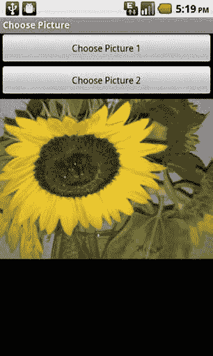
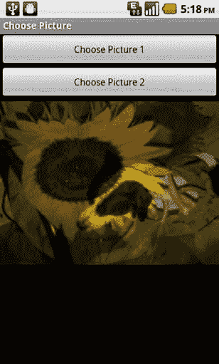
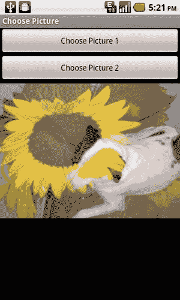
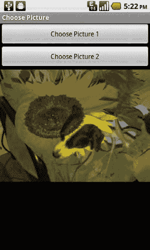
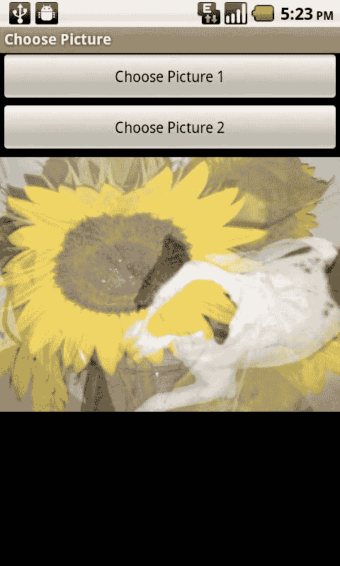

# 第 3 章：图像编辑与处理

`static final int PICKED_ONE = 0;`

`static final int PICKED_TWO = 1;`

`boolean onePicked = false;`

`boolean twoPicked = false;`

`Button choosePicture1, choosePicture2;`

我们将使用一个 `ImageView` 来显示最终的合成图像。同时，需要两个 `Bitmap` 对象，分别对应所选择的两张图片。

`ImageView compositeImageView;`

`Bitmap bmp1, bmp2;`

与之前的示例一样，我们需要一个 `Canvas` 用于绘制，以及一个 `Paint` 对象用于绘制操作。

`Canvas canvas;`

`Paint paint;`

```
@Override
public void onCreate(Bundle savedInstanceState) {
    super.onCreate(savedInstanceState);
    setContentView(R.layout.main);
    compositeImageView = (ImageView) this.findViewById(R.id.CompositeImageView);
    choosePicture1 = (Button) this.findViewById(R.id.ChoosePictureButton1);
    choosePicture2 = (Button) this.findViewById(R.id.ChoosePictureButton2);
    choosePicture1.setOnClickListener(this);
    choosePicture2.setOnClickListener(this);
}
```

由于我们将每个 `Button` 的 `OnClickListener` 设置为当前类，因此需要实现一个 `onClick` 方法来响应点击事件。为了区分哪个按钮被点击，我们将传入的 `View` 对象与每个 `Button` 对象进行比较。若两者相等，即为被点击的按钮。

我们设置一个名为 `which` 的变量，将其赋值为之前定义的某个常量值，用于记录哪个 `Button` 被按下。该变量随后被传递到我们的图库应用程序中，该应用程序通过 `ACTION_PICK` 意图进行实例化。如前例所示，这将启动该应用程序并进入允许用户选择图像的模式。

```
public void onClick(View v) {
    int which = -1;
    if (v == choosePicture1){
        which = PICKED_ONE;
    }
    else if (v == choosePicture2){
        which = PICKED_TWO;
    }
    Intent choosePictureIntent = new Intent(Intent.ACTION_PICK, android.provider.MediaStore.Images.Media.EXTERNAL_CONTENT_URI);
    startActivityForResult(choosePictureIntent, which);
}
```

用户选择图像后，`onActivityResult` 方法会被调用。我们通过 `startActivityForResult` 方法传入的变量会以第一个参数的形式返回，我们将其命名为 `requestCode`。通过这个参数，我们可以知道用户刚刚选择的是第一张还是第二张图像。我们根据这个值来决定将所选图像加载到哪个 `Bitmap` 对象中。

```
protected void onActivityResult(int requestCode, int resultCode, Intent intent) {
    super.onActivityResult(requestCode, resultCode, intent);
    if (resultCode == RESULT_OK){
        Uri imageFileUri = intent.getData();
        if (requestCode == PICKED_ONE){
            bmp1 = loadBitmap(imageFileUri);
            onePicked = true;
        }
        else if (requestCode == PICKED_TWO){
            bmp2 = loadBitmap(imageFileUri);
            twoPicked = true;
        }
    }
}
```

当两张图像都被选中且两个 `Bitmap` 对象都已实例化后，我们就可以继续执行合成操作。这个过程与本章前面的示例非常相似。首先，我们创建一个空的、可变的 `Bitmap`，其大小和配置与第一个 `Bitmap`（`bmp1`）相同。接着，由此构造一个 `Canvas` 和一个 `Paint` 对象。我们只需将第一个 `Bitmap`（`bmp1`）绘制到该画布上。这将使其成为合成操作的目标位置。

现在，我们可以在 `Paint` 对象上设置传输模式。通过传入一个定义其操作模式的常量，实例化一个新的 `PorterDuffXfermode` 对象。完成后，我们将第二个 `Bitmap` 绘制到 `Canvas` 上，并将 `ImageView` 设置为我们新的 `Bitmap`。在下面的版本中，我们使用了 `MULTIPLY` 模式。

```
if (onePicked && twoPicked){
    Bitmap drawingBitmap = Bitmap.createBitmap(bmp1.getWidth(), bmp1.getHeight(), bmp1.getConfig());
    canvas = new Canvas(drawingBitmap);
    paint = new Paint();
    canvas.drawBitmap(bmp1, 0, 0, paint);
    paint.setXfermode(new PorterDuffXfermode(android.graphics.PorterDuff.Mode.MULTIPLY));
    canvas.drawBitmap(bmp2, 0, 0, paint);
    compositeImageView.setImageBitmap(drawingBitmap);
}
```

下面是一个辅助类，正如我们在第 1 章中定义的那样，用于从 `Uri` 加载一个缩放至不超过屏幕大小的 `Bitmap`。

```
private Bitmap loadBitmap(Uri imageFileUri){
    Display currentDisplay = getWindowManager().getDefaultDisplay();
    float dw = currentDisplay.getWidth();
    float dh = currentDisplay.getHeight();
    // 目标是 ARGB_4444 格式
    Bitmap returnBmp = Bitmap.createBitmap((int)dw, (int)dh, Bitmap.Config.ARGB_4444);
    try {
        // 先加载图像的尺寸信息，而非图像本身
        BitmapFactory.Options bmpFactoryOptions = new BitmapFactory.Options();
        bmpFactoryOptions.inJustDecodeBounds = true;
        returnBmp = BitmapFactory.decodeStream(getContentResolver().openInputStream(imageFileUri), null, bmpFactoryOptions);
        int heightRatio = (int)Math.ceil(bmpFactoryOptions.outHeight/dh);
        int widthRatio = (int)Math.ceil(bmpFactoryOptions.outWidth/dw);
        Log.v("HEIGHTRATIO",""+heightRatio);
        Log.v("WIDTHRATIO",""+widthRatio);
        // 如果两个比例都大于 1，说明图像的某一边大于屏幕
        if (heightRatio > 1 && widthRatio > 1){
            if (heightRatio > widthRatio){
                // 高度比例更大，按照该比例缩放
                bmpFactoryOptions.inSampleSize = heightRatio;
            }
            else{
                // 宽度比例更大，按照该比例缩放
                bmpFactoryOptions.inSampleSize = widthRatio;
            }
        }
        // 真正进行解码
        bmpFactoryOptions.inJustDecodeBounds = false;
        returnBmp = BitmapFactory.decodeStream(getContentResolver().openInputStream(imageFileUri), null, bmpFactoryOptions);
    }
    catch (FileNotFoundException e) {
        Log.v("ERROR",e.toString());
    }
    return returnBmp;
}
```

以下是用于上述活动的布局 XML。

```
<?xml version="1.0" encoding="utf-8"?>
<LinearLayout xmlns:android="http://schemas.android.com/apk/res/android"
    android:orientation="vertical"
    android:layout_width="fill_parent"
    android:layout_height="fill_parent">
    <Button
        android:layout_width="fill_parent"
        android:layout_height="wrap_content"
        android:id="@+id/ChoosePictureButton1"
        android:text="选择图片 1"/>
    <Button
        android:layout_width="fill_parent"
        android:layout_height="wrap_content"
        android:id="@+id/ChoosePictureButton2"
        android:text="选择图片 2"/>
    <ImageView
        android:layout_width="wrap_content"
        android:layout_height="wrap_content"
        android:id="@+id/CompositeImageView"/>
</LinearLayout>
```

上述示例使用不同传输模式的结果如图 3–17 至图 3–22 所示。

**图 3–17.** *上述示例使用 `android.graphics.PorterDuff.Mode.DST` 作为 `PorterDuffXfermode` 的输出结果；如图所示，仅显示被选为图片 1 的图像。*




**图 3–18.** *上述示例使用 `android.graphics.PorterDuff.Mode.SRC` 作为 `PorterDuffXfermode` 的输出结果；如图所示，仅显示被选为图片 2 的图像。*

**图 3–19.** *上述示例使用 `android.graphics.PorterDuff.Mode.MULTIPLY` 作为 `PorterDuffXfermode` 的输出结果；如图所示，两张图像被合并在一起。*




**图 3–20.** *上述示例使用 `android.graphics.PorterDuff.Mode.LIGHTEN` 作为 `PorterDuffXfermode` 的输出结果*

**图 3–21.** *上述示例使用 `android.graphics.PorterDuff.Mode.DARKEN` 作为 `PorterDuffXfermode` 的输出结果*




