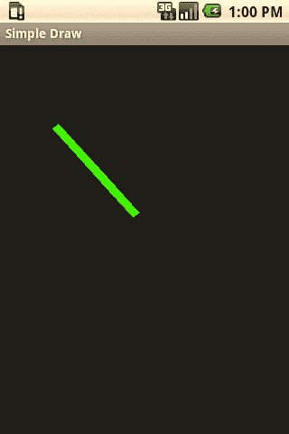
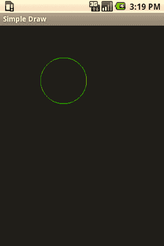
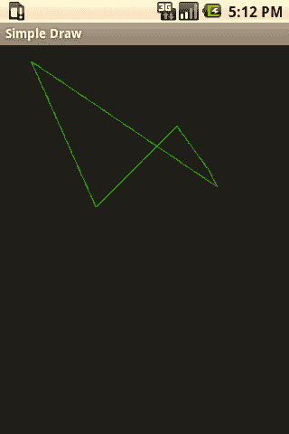
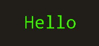
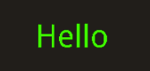
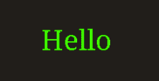
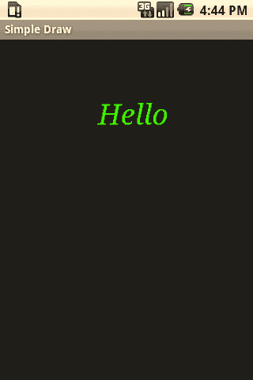
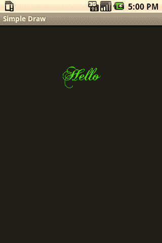

# 第 4 章：图形与触摸事件

**图 4-4.** *使用设置了描边宽度为 100 的 Paint 对象绘制的点；由于描边宽度过大，它看起来不太像一个点。在许多情况下，一个点可能只是一个像素，描边宽度为 1。*

#### 直线

直线，嗯，就是一条线：一系列从起点延伸到终点的点。你可以使用`Canvas`的`drawLine`方法来绘制直线，传入起点和终点的 x、y 坐标，以及一个`Paint`对象。图 4-5 展示了以下代码的渲染效果。

```
Paint paint = new Paint();
paint.setColor(Color.GREEN);
paint.setStrokeWidth(10);
int startx = 50;
int starty = 100;
int endx = 150;
int endy = 210;
canvas.drawLine(startx,starty,endx,endy,paint);
```



**图 4-5.** *直线*

#### 矩形

矩形可以通过几种不同的方式绘制，最简单的方式是指定左 y 坐标、上 x 坐标、右 y 坐标和下 x 坐标，以及一个`Paint`对象。

```
Paint paint = new Paint();
paint.setColor(Color.GREEN);
paint.setStyle(Paint.Style.FILL_AND_STROKE);
paint.setStrokeWidth(10);
float leftx = 20;
float topy = 20;
float rightx = 50;
float bottomy = 100;
canvas.drawRect(leftx, topy, rightx, bottomy, paint);
```

另一种绘制矩形的方法是传入一个`RectF`对象。`RectF`是一个类，它使用代表左、上、右、下坐标的浮点值来定义一个矩形。

```
Paint paint = new Paint();
float leftx = 20;
float topy = 20;
float rightx = 50;
float bottomy = 100;
RectF rectangle = new RectF(leftx,topy,rightx,bottomy);
canvas.drawRect(rectangle, paint);
```



#### 椭圆

正如可以使用`RectF`绘制矩形一样，我们也可以绘制椭圆。`RectF`定义了椭圆的边界。换句话说，椭圆将被绘制在矩形内部，椭圆最长点接触上下边界的中间点，最宽点接触左右边界的中间点。

```
Paint paint = new Paint();
paint.setColor(Color.GREEN);
paint.setStyle(Paint.Style.STROKE);
float leftx = 20;
float topy = 20;
float rightx = 50;
float bottomy = 100;
RectF ovalBounds = new RectF(leftx,topy,rightx,bottomy);
canvas.drawOval(ovalBounds, paint);
```

#### 圆形

可以通过指定圆心坐标（x 和 y）以及半径来绘制圆形。以下代码的渲染效果将如图 4-6 所示。

```
Paint paint = new Paint();
paint.setColor(Color.GREEN);
paint.setStyle(Paint.Style.STROKE);
float x = 50;
float y = 50;
float radius = 20;
canvas.drawCircle(x, y, radius, paint);
```

**图 4-6.** *圆形*



#### 路径

路径是一系列可用于创建任意形状的线条。要绘制路径，我们首先需要构造一个`Path`对象。`Path`对象可以有任意数量的调用，通过`moveTo`方法移动到某个点而不进行绘制，或使用`lineTo`方法绘制一条到某个点的直线。当然，还有绘制弧线等方法。这些方法的文档可以在`Path`类的文档中找到，网址是[`developer.android.com/reference/android/graphics/Path.html`](http://developer.android.com/reference/android/graphics/Path.html)。

然后可以将该`Path`对象传递给`Canvas`的`drawPath`方法。

```
Paint paint = new Paint();
paint.setStyle(Paint.Style.STROKE);
paint.setColor(Color.GREEN);
Path p = new Path();
// 如果没有第一个"moveTo"，绘制将从(0,0)点开始
p.moveTo(20, 20);
p.lineTo(100, 200);
p.lineTo(200, 100);
p.lineTo(240, 155);
p.lineTo(250, 175);
p.lineTo(20, 20);
canvas.drawPath(p, paint);
```

**图 4-7.** *路径*

### 绘制文本

当然，我们并不局限于绘制线条、形状和点。我们也可以在`Canvas`上使用`drawText`方法绘制文本；我们只需将要绘制的文本作为`String`传入，以及起始 x、y 坐标和一个`Paint`对象。`Paint`类有一个名为`setTextSize`的方法，用于设置我们可以使用的文本大小。

```
Paint paint = new Paint();
paint.setColor(Color.GREEN);
paint.setTextSize(40);
float text_x = 120;
float text_y = 120;
canvas.drawText("Hello", text_x, text_y, paint);
```

**图 4-8.** *画布上绘制的文本*

Download from Wow! eBook <www.wowebook.com>

### 内置字体

在绘制文本时，如果无法指定字体或样式，将会非常受限。幸运的是，`Paint`类允许我们通过调用`setTypeface`方法并传入一个`Typeface`对象来指定应该使用哪种字体。

`Typeface`类定义了许多常量，代表 Android 操作系统自带的内置字体。这些字体由一家名为 Ascender 的公司（[www.ascendercorp.com](http://www.ascendercorp.com/)）创建，是其 Droid 字体套件的一部分。

它们在`Typeface`类中定义如下：

- `Typeface.MONOSPACE`：这种字体每个字母的间距相同。
- `Typeface.SANS_SERIF`：这是一种无衬线字体。
- `Typeface.SERIF`：这是一种包含衬线的字体。







**注意：** 衬线是组成字母的线条末端的细小笔画。您现在正在阅读的字体是一种无衬线字体。这是衬线字体的一个示例。

**图 4-9.** *Typeface.MONOSPACE 示例*

**图 4-10.** *Typeface.SANS_SERIF 示例*

**图 4-11.** *Typeface.SERIF 示例*

除了这三种主要字体外，还有另外两个`Typeface`常量：

- `Typeface.DEFAULT`：这与无衬线字体相同，是如果未调用`setTypeface`时使用的默认字体。
- `Typeface.DEFAULT_BOLD`：这是无衬线字体的加粗版本。

以下是一个简短的代码示例：

```
Paint paint = new Paint();
paint.setColor(Color.GREEN);
paint.setTextSize(40);
paint.setTypeface(Typeface.DEFAULT_BOLD);
float text_x = 120;
float text_y = 120;
canvas.drawText("Hello", text_x, text_y, paint);
```


**图 4-12.** *Typeface.DEFAULT_BOLD*

### 字体样式

除了内置字体，`Typeface`类中还定义了一系列样式常量。这些样式可以通过`Typeface`类中的`create`方法来修改内置字体。此方法返回一个新的`Typeface`对象供我们使用。

以下是`Typeface`类中定义的样式列表：

- `Typeface.BOLD`
- `Typeface.ITALIC`
- `Typeface.NORMAL`
- `Typeface.BOLD_ITALIC`

使用其中一种样式相当直接。首先，我们调用`Typeface.create`，传入基础字体和我们想要应用的样式。我们会得到一个`Typeface`对象，将其传入`Paint.setTypeface`方法，这样就完成了。

```
Paint paint = new Paint();
paint.setColor(Color.GREEN);
paint.setTextSize(40);
Typeface serif_italic = Typeface.create(Typeface.SERIF, Typeface.ITALIC);
paint.setTypeface(serif_italic);
float text_x = 120;
float text_y = 120;
canvas.drawText("Hello", text_x, text_y, paint);
```




### **91**

**图 4-13.** *应用斜体样式的衬线字体*

**外部字体**

在 Android 应用程序中，我们并不局限于仅使用内置字体。Android 支持从任何 TrueType 字体文件创建 `Typeface` 对象。TrueType 字体是一种标准字体，可在多种平台上使用。这为我们的应用程序开辟了广阔的可能性。

互联网上许多网站提供免费字体，当然，也有一些字体公司，即创建字体并向您出售其字体使用许可的公司。

我发现一种与 Android 内置字体完全不同的字体，是 Claude Pelletier 创作的 Chopin Script 字体。该字体属于公共领域，可从 fontspace.com（[www.fontspace.com/diogene/chopinscript](http://www.fontspace.com/diogene/chopinscript)）等多种来源免费下载。为了使用该字体，我下载了它，并将 `.ttf` 文件（`ChopinScript.ttf`）放入项目的 `assets` 文件夹中。

`Typeface.createFromAsset` 方法接收一个 `AssetManager` 对象（可以通过从 `Context` 调用 `getAssets` 获取）和文件名。它返回一个 `Typeface` 对象，该对象可以传递给 `Paint.setTypeface` 方法。

```
Typeface chops = Typeface.createFromAsset(getAssets(), "ChopinScript.ttf");
paint.setTypeface(chops);
```



**92**

