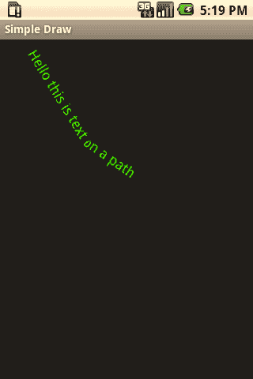

# 第 4 章：图形与触摸事件

**图 4-14.** *Chopin Script 字体*

**路径上的文本**

文本并不限于绘制在水平线上；它也可以绘制在 `Path` 上。

以下是一个示例。

```
Paint paint = new Paint();
paint.setColor(Color.GREEN);
paint.setTextSize(20);
paint.setTypeface(Typeface.DEFAULT);
Path p = new Path();
p.moveTo(20, 20);
p.lineTo(100, 150);
p.lineTo(200, 220);
canvas.drawTextOnPath("Hello this is text on a path", p, 0, 0, paint);
```



