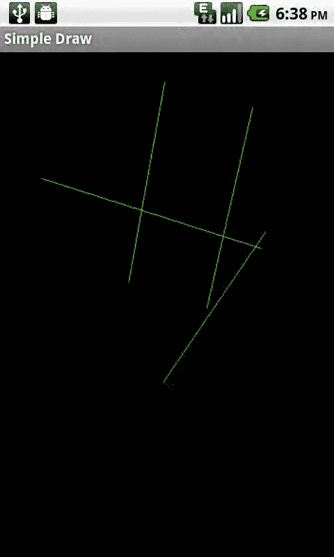

# 第 4 章：图形与触摸事件

```
public class SimpleFingerDraw extends Activity implements OnTouchListener {

    ImageView imageView;
    Bitmap bitmap;
    Canvas canvas;
    Paint paint;

    @Override
    public void onCreate(Bundle savedInstanceState) {
        super.onCreate(savedInstanceState);
        setContentView(R.layout.main);
        imageView = (ImageView) this.findViewById(R.id.ImageView);
        Display currentDisplay = getWindowManager().getDefaultDisplay();
        float dw = currentDisplay.getWidth();
        float dh = currentDisplay.getHeight();
        bitmap = Bitmap.createBitmap((int)dw,(int)dh,Bitmap.Config.ARGB_8888);
        canvas = new Canvas(bitmap);
        paint = new Paint();
        paint.setColor(Color.GREEN);
        imageView.setImageBitmap(bitmap);
        imageView.setOnTouchListener(this);
    }

    public boolean onTouch(View v, MotionEvent event) {
        return false;
    }
}
```

现在，每当 `ImageView` 被触摸时，我们 Activity 中的 `onTouch` 方法就会被调用。

我们可以通过查看传递给 `onTouch` 方法的 `MotionEvent` 对象来确定发生了哪种触摸。为此，我们对该对象调用 `getAction`。`getAction` 方法将返回四个值之一，这些值在 `MotionEvent` 类中定义为常量。

- `MotionEvent.ACTION_DOWN`：表示视图已接收到触摸。
- `MotionEvent.ACTION_UP`：表示视图已停止接收触摸。
- `MotionEvent.ACTION_MOVE`：表示在触摸按下发生后，在 `ACTION_UP` 事件之前发生了一些移动。
- `MotionEvent.ACTION_CANCEL`：表示触摸已被取消，应被忽略。

此外，我们可以调用 `MotionEvent` 对象的 `getX` 和 `getY` 方法来确定触摸事件发生的位置。

**第 4 章：图形与触摸事件**

**95**

以下是我们的 `onTouch` 方法的更新版本，考虑了不同的事件可能性，并在触摸按下和触摸抬起事件之间绘制一条线：

```
float downx = 0;
float downy = 0;
float upx = 0;
float upy = 0;

public boolean onTouch(View v, MotionEvent event) {
    int action = event.getAction();
    switch (action) {
        case MotionEvent.ACTION_DOWN:
            downx = event.getX();
            downy = event.getY();
            break;
        case MotionEvent.ACTION_MOVE:
            break;
        case MotionEvent.ACTION_UP:
            upx = event.getX();
            upy = event.getY();
            canvas.drawLine(downx, downy, upx, upy, paint);
            imageView.invalidate();
            break;
        case MotionEvent.ACTION_CANCEL:
            break;
        default:
            break;
    }
    return true;
}
```

你会注意到这段代码的几点。首先，我们没有对 `ACTION_MOVE` 或 `ACTION_CANCEL` 做任何处理。在 `ACTION_DOWN` 中，我们只是将 `downx` 和 `downy` 变量设置为触摸的 X 和 Y 位置。在 `ACTION_UP` 中，我们将 `upx` 和 `upy` 设置为触摸抬起事件的 X 和 Y 位置，然后调用 `Canvas` 对象的 `drawLine` 函数。我们还需要调用 `ImageView` 的 `invalidate` 方法，以便它重新绘制到屏幕。如果不这样做，我们就不会看到在 `Bitmap Canvas` 对象上绘制的新线。最后，我们返回 `true` 而不是 `false`。这告诉 Android，一旦事件开始，我们希望继续接收触摸事件。



**96**

