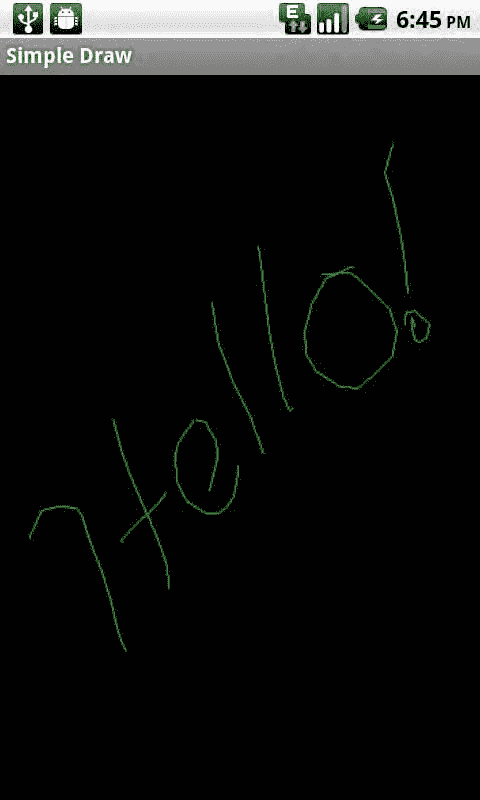

# 第 4 章：图形与触摸事件

**图 4-16.** *基于触摸事件的绘图*

如图 4-16 所示，这个绘图应用程序非常适合从你触摸的点到手指抬起的点画直线。如果我们希望能够在手指移动时绘制线条，我们还需要在 `ACTION_MOVE` 分支中实现绘图代码。

```
case MotionEvent.ACTION_MOVE:
    upx = event.getX();
    upy = event.getY();
    canvas.drawLine(downx, downy, upx, upy, paint);
    imageView.invalidate();
    downx = upx;
    downy = upy;
    break;
```

在这个修改后的示例中，`upx` 和 `upy` 在 `ACTION_MOVE` 中被捕获，绘制线条，然后将 `downx` 和 `downy` 变量设置为相同的位置（请记住，线条的起点由 `ACTION_DOWN` 事件中的 `downx` 和 `downy` 定义）。这使得线条绘制应用程序能够跟踪手指在屏幕上的移动。



