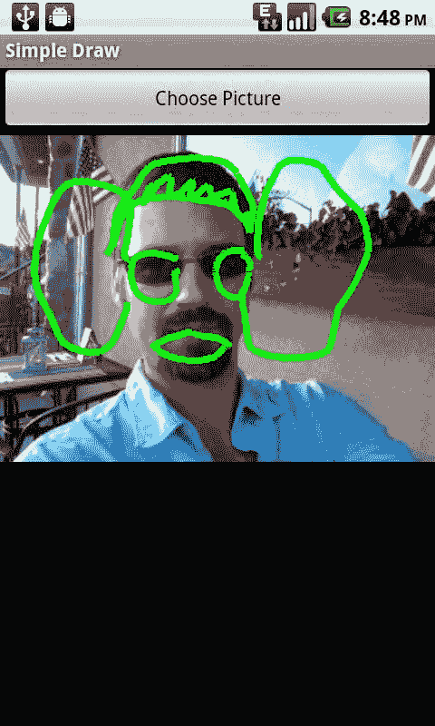

# 第 4 章：图形与触摸事件


### 97

**图 4–17.** *增强型触控事件绘图*

**在现有图像上绘图**

由于我们是在`Canvas`上绘图，因此可以使用前一章介绍的技术将图像绘制到`Canvas`上，然后在该图像之上进行绘制。

接下来我们通过一个完整示例来讲解。

```java
package com.apress.proandroidmedia.ch4.choosepicturedraw;

import java.io.FileNotFoundException;

import android.app.Activity;

import android.content.Intent;

import android.graphics.Bitmap;

import android.graphics.BitmapFactory;

import android.graphics.Canvas;

import android.graphics.Color;

import android.graphics.Matrix;

import android.graphics.Paint;

import android.net.Uri;

import android.os.Bundle;

import android.util.Log;

import android.view.Display;

import android.view.MotionEvent;

import android.view.View;
```

**98**

## 第 4 章：图形与触控事件

```java
import android.view.View.OnClickListener;

import android.view.View.OnTouchListener;

import android.widget.Button;

import android.widget.ImageView;
```

我们的 Activity 将同时实现 `OnClickListener` 和 `OnTouchListener` 接口。`OnClickListener` 用于响应按钮点击事件，`OnTouchListener` 则用于通过触控屏在 `ImageView` 上进行绘图。

```java
public class ChoosePictureDraw extends Activity implements OnClickListener,
        OnTouchListener {
```

我们有两个主要的 UI 元素。第一个是 `ImageView`，用于显示我们的 `Bitmap`，我们将在此 `Bitmap` 上进行绘制。第二个是一个 `Button`，用户按下该按钮可从图库应用中选择图片。

```java
    ImageView choosenImageView;
    Button choosePicture;
```

我们需要两个 `Bitmap` 对象。第一个包含所选图片的缩放版本。第二个是可变的版本，我们将把第一个 `Bitmap` 绘制到其中，并在其之上进行绘制。

```java
    Bitmap bmp;
    Bitmap alteredBitmap;
    Canvas canvas;
    Paint paint;
    Matrix matrix;

    @Override
    public void onCreate(Bundle savedInstanceState) {
        super.onCreate(savedInstanceState);
        setContentView(R.layout.main);

        choosenImageView = (ImageView) this.findViewById(R.id.ChoosenImageView);
```

下载自 Wow! eBook <www.wowebook.com>

```java
        choosePicture = (Button) this.findViewById(R.id.ChoosePictureButton);
```

获取 `ImageView` 和 `Button` 的引用后，我们为每个事件（`OnClick` 和 `OnTouch`）设置监听器，并将本 Activity 本身作为监听器。

```java
        choosePicture.setOnClickListener(this);
        choosenImageView.setOnTouchListener(this);
    }
```

以下是我们的 `onClick` 方法。该方法使用标准的 Intent 让用户从图库应用中选择一张图片。

```java
    public void onClick(View v) {
        Intent choosePictureIntent = new Intent(
                Intent.ACTION_PICK,
                android.provider.MediaStore.Images.Media.EXTERNAL_CONTENT_URI);
        startActivityForResult(choosePictureIntent, 0);
    }
```

`onActivityResult` 方法在用户选择图片后被调用。它会将所选图片加载到缩放至屏幕尺寸的 `Bitmap` 中。

```java
    protected void onActivityResult(int requestCode, int resultCode, Intent intent) {
```

**第 4 章：图形与触控事件**

**99**

```java
        super.onActivityResult(requestCode, resultCode, intent);

        if (resultCode == RESULT_OK) {
            Uri imageFileUri = intent.getData();
            Display currentDisplay = getWindowManager().getDefaultDisplay();
            float dw = currentDisplay.getWidth();
            float dh = currentDisplay.getHeight();

            try {
                BitmapFactory.Options bmpFactoryOptions = new BitmapFactory.Options();
                bmpFactoryOptions.inJustDecodeBounds = true;
                bmp = BitmapFactory.decodeStream(
                        getContentResolver().openInputStream(imageFileUri), null,
                        bmpFactoryOptions);

                int heightRatio = (int)Math.ceil(bmpFactoryOptions.outHeight/dh);
                int widthRatio = (int)Math.ceil(bmpFactoryOptions.outWidth/dw);

                if (heightRatio > 1 && widthRatio > 1) {
                    if (heightRatio > widthRatio) {
                        bmpFactoryOptions.inSampleSize = heightRatio;
                    }
                    else {
                        // 宽度比例更大，按宽度比例缩放
                        bmpFactoryOptions.inSampleSize = widthRatio;
                    }
                }

                bmpFactoryOptions.inJustDecodeBounds = false;
                bmp = BitmapFactory.decodeStream(
                        getContentResolver().openInputStream(imageFileUri), null,
                        bmpFactoryOptions);
```

加载 `Bitmap` 后，我们创建一个可变的 `Bitmap`（`alteredBitmap`），并将第一个 `Bitmap` 绘制到其中。

```java
                alteredBitmap = Bitmap.createBitmap(
                        bmp.getWidth(),bmp.getHeight(),bmp.getConfig());
                canvas = new Canvas(alteredBitmap);
                paint = new Paint();
                paint.setColor(Color.GREEN);
                paint.setStrokeWidth(5);
                matrix = new Matrix();
                canvas.drawBitmap(bmp, matrix, paint);

                choosenImageView.setImageBitmap(alteredBitmap);
                choosenImageView.setOnTouchListener(this);
            }
            catch (FileNotFoundException e) {
                Log.v("ERROR",e.toString());
            }
        }
    }
```

现在，我们像之前一样实现 `onTouch` 方法。与之前在空白 `Bitmap` `Canvas` 上绘图不同，我们现在是在现有图像之上进行绘制。

**100**

## 第 4 章：图形与触控事件

```java
    float downx = 0;
    float downy = 0;
    float upx = 0;
    float upy = 0;

    public boolean onTouch(View v, MotionEvent event) {
        int action = event.getAction();
        switch (action) {
            case MotionEvent.ACTION_DOWN:
                downx = event.getX();
                downy = event.getY();
                break;
            case MotionEvent.ACTION_MOVE:
                upx = event.getX();
                upy = event.getY();
                canvas.drawLine(downx, downy, upx, upy, paint);
                choosenImageView.invalidate();
                downx = upx;
                downy = upy;
                break;
            case MotionEvent.ACTION_UP:
                upx = event.getX();
                upy = event.getY();
                canvas.drawLine(downx, downy, upx, upy, paint);
                choosenImageView.invalidate();
                break;
            case MotionEvent.ACTION_CANCEL:
                break;
            default:
                break;
        }
        return true;
    }
}
```

以下是上述 Activity 的布局 XML 文件。它在一个标准的 `LinearLayout` 中指定了 `ImageView` 和 `Button`。

```xml
<?xml version="1.0" encoding="utf-8"?>
<LinearLayout xmlns:android="http://schemas.android.com/apk/res/android"
    android:orientation="vertical"
    android:layout_width="fill_parent"
    android:layout_height="fill_parent"
>
    <Button android:layout_width="fill_parent"
        android:layout_height="wrap_content"
        android:text="选择图片" android:id="@+id/ChoosePictureButton"/>
    <ImageView android:layout_width="wrap_content"
        android:layout_height="wrap_content"
        android:id="@+id/ChoosenImageView">
    </ImageView>
</LinearLayout>
```



## 第 4 章：图形与触控事件

### 101

**图 4–18.** *在现有图像上绘图*

**保存基于位图画布绘制的图像**

如果只允许用户在图像上绘图，却不能在创作完成后保存，那还有什么意义？到目前为止，我们只绘制了图像——现在我们来看看如何将这些精彩的画作永久保存。至少，我们来看看如何将它们保存到 SD 卡。

不出所料，其流程与我们第二章中用于保存自定义相机应用捕捉的图像的流程类似。我们来回顾一下可以为 `ChoosePictureDraw` 示例做的修改，以便保存图像。

首先，我们需要添加以下导入语句。

```java
import java.io.OutputStream;
import android.content.ContentValues;
import android.graphics.Bitmap.CompressFormat;
import android.provider.MediaStore.Images.Media;
import android.widget.Toast;
```

然后，在 `onCreate` 方法中，我们将获取一个新的 `Button` 的引用，该按钮我们将添加到布局 XML 中，并在 Activity 中进行声明。

我们将在类定义之后，与其他实例变量一起声明 `savePicture` 按钮。

**102**


