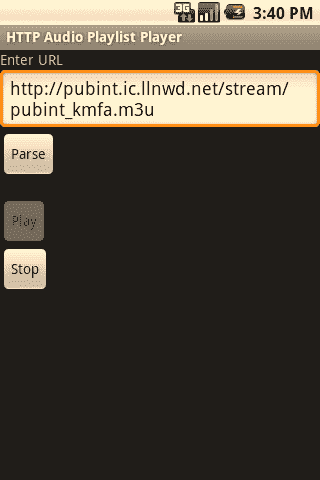

# 第 6 章：后台与网络音频

`public void onClick(View view) {

if (view == parseButton) {

parsePlaylistFile();

} else if (view == playButton) {

playPlaylistItems();

} else if (view == stopButton) {

stop();

}

}`

第一个被触发的方法是 `parsePlaylistFile`。该方法会下载由 `editTextUrl` 对象中的 URL 指定的 M3U 文件并对其进行解析。解析操作会提取出所有代表待播放文件的行，并创建一个 `PlaylistItem` 对象，然后将其添加到 `playlistItems` 向量中。

`private void parsePlaylistFile() {`

我们从一个空的向量开始。如果解析了一个新的 M3U 文件，之前存储在此的任何内容都将被丢弃。

`playlistItems = new Vector();`

为了从 Web 上获取 M3U 文件，我们可以使用 Apache 软件基金会的 HttpClient 库，该库已包含在 Android 中。

首先，我们创建一个 `HttpClient` 对象，它代表类似网络浏览器的功能；然后创建一个 `HttpGet` 对象，代表对特定文件的请求。HttpClient 会执行 `HttpGet` 并返回一个 `HttpResponse`。

`HttpClient httpClient = new DefaultHttpClient();`

`HttpGet getRequest = new HttpGet(editTextUrl.getText().toString());`

`Log.v("URI",getRequest.getURI().toString());`

`try {

HttpResponse httpResponse = httpClient.execute(getRequest);

if (httpResponse.getStatusLine().getStatusCode() != HttpStatus.SC_OK) {

// 错误消息

Log.v("HTTP ERROR",httpResponse.getStatusLine().getReasonPhrase());

} else {`

发出请求后，我们可以从 `HttpResponse` 中检索到一个 `InputStream`。这个 `InputStream` 包含了所请求文件的内容。

`InputStream inputStream = httpResponse.getEntity().getContent();

BufferedReader bufferedReader =

new BufferedReader(new InputStreamReader(inputStream));`

借助 `BufferedReader`，我们可以逐行读取文件。

`String line;

while ((line = bufferedReader.readLine()) != null) {

Log.v("PLAYLISTLINE","ORIG: " + line);`

如果行以“#”开头，我们暂时忽略它。如前所述，这些行是元数据。

第 6 章：后台与网络音频 147

`if (line.startsWith("#")) {

// 元数据

// 可以处理更多，但暂时不处理`

否则，如果不是空行（长度大于 0），我们假定它是一个播放列表项。

`} else if (line.length() > 0) {`

如果行以“http://”开头，我们将其视为流的完整 URL；否则，我们将其视为相对 URL，并附加原始 M3U 文件请求的 URL。

`String filePath = "";

if (line.startsWith("http://")) {

// 假定为完整 URL

filePath = line;

} else {

// 假定为相对路径

filePath = getRequest.getURI().resolve(line).toString();

}`

然后将其添加到我们的播放列表项向量中。

`PlaylistFile playlistFile = new PlaylistFile(filePath);

playlistItems.add(playlistFile);`

`}

}

inputStream.close();

}

} catch (ClientProtocolException e) {

e.printStackTrace();

} catch (IOException e) {

e.printStackTrace();

}`

最后，完成文件解析后，我们启用 `playButton`。

`playButton.setEnabled(true);`

`}`

当用户点击 `playButton` 时，会调用 `playPlaylistItems` 方法。该方法从 `playlistItems` 向量中取出第一个项目，并将其交给 MediaPlayer 对象进行准备。

`private void playPlaylistItems() {

playButton.setEnabled(false);

currentPlaylistItemNumber = 0;

if (playlistItems.size() > 0)

{

String path =

((PlaylistFile)playlistItems.get(currentPlaylistItemNumber)).getFilePath();

try {`

提取到文件或流的路径后，我们在 MediaPlayer 上调用 `setDataSource` 方法。

`mediaPlayer.setDataSource(path);`

148 第 6 章：后台与网络音频

然后我们调用 `prepareAsync`，这使得 MediaPlayer 能够在后台缓冲并准备播放音频。当缓冲和其他准备工作完成时，由于该活动已注册为 `OnPreparedListener`，活动的 `onPrepared` 方法将被调用。

`mediaPlayer.prepareAsync();

} catch (IllegalArgumentException e) {

e.printStackTrace();

} catch (IllegalStateException e) {

e.printStackTrace();

} catch (IOException e) {

e.printStackTrace();

}

}

}`

一旦调用了 `onPrepared` 方法，`stopButton` 就会被启用，并触发 MediaPlayer 对象开始播放音频。

`public void onPrepared(MediaPlayer _mediaPlayer) {

stopButton.setEnabled(true);

Log.v("HTTPAUDIOPLAYLIST","播放中");

mediaPlayer.start();

}`

当音频播放完成时，由于该活动扩展并注册为 MediaPlayer 的 `OnCompletionListener`，`onCompletion` 方法会被触发。

`onCompletion` 方法会为 `playlistItems` 向量中的下一项做准备。

`public void onCompletion(MediaPlayer mediaPlayer) {

Log.v("ONCOMPLETE","已调用");

mediaPlayer.stop();

Download from Wow! eBook <www.wowebook.com>

mediaPlayer.reset();

if (playlistItems.size() > currentPlaylistItemNumber + 1) {

currentPlaylistItemNumber++;

String path =

((PlaylistFile)playlistItems.get(currentPlaylistItemNumber)).getFilePath();

try {

mediaPlayer.setDataSource(path);

mediaPlayer.prepareAsync();

} catch (IllegalArgumentException e) {

e.printStackTrace();

} catch (IllegalStateException e) {

e.printStackTrace();

} catch (IOException e) {

e.printStackTrace();

}

}

}`

当用户按下 `stopButton` 时，会调用 `stop` 方法。该方法会使 MediaPlayer 暂停而非停止。MediaPlayer 有一个 `stop` 方法，但该方法会让 MediaPlayer 进入未准备状态。而 `pause` 方法只是暂停播放。

第 6 章：后台与网络音频 149

`private void stop() {

mediaPlayer.pause();

playButton.setEnabled(true);

stopButton.setEnabled(false);

}`

最后，我们有一个名为 `PlaylistFile` 的内部类。M3U 文件中表示的每个文件都会创建一个 `PlaylistFile` 对象。

`class PlaylistFile {

String filePath;

public PlaylistFile(String _filePath) {

filePath = _filePath;

}

public void setFilePath(String _filePath) {

filePath = _filePath;

}

public String getFilePath() {

return filePath;

}

}`

`}`

以下是上述活动的布局 XML 文件（`main.xml`）。

```xml
<?xml version="1.0" encoding="utf-8"?>
<LinearLayout xmlns:android="http://schemas.android.com/apk/res/android"
    android:orientation="vertical"
    android:layout_width="fill_parent"
    android:layout_height="fill_parent"
>
    <TextView android:layout_width="wrap_content" android:layout_height="wrap_content"
        android:text="输入 URL" android:id="@+id/EnterURLTextView"></TextView>
    <EditText android:layout_width="wrap_content" android:layout_height="wrap_content"
        android:id="@+id/EditTextURL" android:text="http://www.mobvcasting.com/android/audio/test.m3u"></EditText>
    <Button android:layout_width="wrap_content" android:layout_height="wrap_content"
        android:id="@+id/ButtonParse" android:text="解析"></Button>
    <TextView android:layout_width="wrap_content" android:layout_height="wrap_content"
        android:id="@+id/PlaylistTextView"></TextView>
    <Button android:layout_width="wrap_content" android:layout_height="wrap_content"
        android:id="@+id/PlayButton" android:text="播放"></Button>
    <Button android:layout_width="wrap_content" android:layout_height="wrap_content"
        android:id="@+id/StopButton" android:text="停止"></Button>
</LinearLayout>
```

这个示例需要将以下权限添加到 `AndroidManifest.xml` 文件中。

```xml
<uses-permission android:name="android.permission.INTERNET" />
```

正如上述示例所示，通过 HTTP 处理实时音频流与处理通过 HTTP 传送的文件一样直接。图 6-2 展示了该示例的运行效果。



150
```


## 第 6 章：背景知识与网络音频

**图 6-2.*** 音频播放列表播放器示例（音频开始播放后显示）* **RTSP 音频流式传输**

Android 通过 `MediaPlayer` 支持另一种用于流式传输音频的协议。这个协议称为实时流协议，简称 RTSP。RTSP 已经使用了相当长一段时间，并在 20 世纪 90 年代中后期由 RealNetworks 公司推广开来，因为这是他们在其音频和视频流媒体软件中使用的协议。

前面用于 HTTP 流式传输示例的相同代码也适用于 RTSP 音频流。我们将在第 10 章中更详细地介绍 RTSP 的具体细节。

**总结**

正如我们在本章中所看到的，Android 丰富的先进音频功能帮助它超越了单纯的播放设备。开箱即用，它拥有的能力使我们作为开发者可以利用在线提供的各种音频资源，从独立的 MP3 文件到实况广播流。

在下一章中，我们还将探讨如何将 Android 用作音频制作设备。

**151**

# 7

## 第七章

### 音频捕获

开发音频播放应用程序并非在 Android 上处理音频的唯一方式。我们还可以编写涉及音频捕获的应用程序。在本章中，我们将探讨可用于音频捕获的三种不同方法。每种方法都有其相对的优点和缺点。第一种方法，使用意图（intent），是最简单但灵活性最低的；其次是使用 `MediaRecorder` 类的方法，这种方法使用起来稍难，但提供了更大的灵活性；最后一种方法使用 `AudioRecord` 类，提供了最大的灵活性，但也需要我们做最多的工作。

## 使用意图进行音频捕获

在应用程序中实现音频录制功能的最简单方法是，通过一个提供录制功能的意图来利用现有的应用程序。对于音频而言，Android 附带了一个录音器应用程序，可以通过这种方式触发。

用于创建意图的动作在 `MediaStore.Audio.Media` 类中以常量 `RECORD_SOUND_ACTION` 的形式提供。以下是触发内置录音器的基本代码。

```
Intent intent = new Intent(MediaStore.Audio.Media.RECORD_SOUND_ACTION);
startActivity(intent);
```

图 7-1 显示了由意图触发的内置音频录制应用程序。


**152**

## 第 7 章：音频捕获

**图 7-1.*** 通过意图触发的 Android 内置录音器*

当然，为了检索用户创建的录音，我们应该使用 `startActivityForResult` 而不是仅仅使用 `startActivity`。

下面是一个通过意图触发内置录音器的示例。当用户完成后，音频文件将使用 `MediaPlayer` 播放。

```
package com.apress.proandroidmedia.ch07.intentaudiorecord;

import android.app.Activity;
import android.content.Intent;
import android.media.MediaPlayer;
import android.media.MediaPlayer.OnCompletionListener;
import android.net.Uri;
import android.os.Bundle;
import android.provider.MediaStore;
import android.view.View;
import android.view.View.OnClickListener;
import android.widget.Button;
```

我们的 Activity 实现了 `OnClickListener` 以便响应按钮点击，并实现了 `OnCompletionListener`，以便在 `MediaPlayer` 中音频播放完成时得到通知。

```
public class IntentAudioRecorder extends Activity implements OnClickListener,
OnCompletionListener {
```

**第 7 章：音频捕获**

**153**

我们将创建一个名为 `RECORD_REQUEST` 的常量，并传入 `startActivityForResult` 函数，以便我们能够识别任何对 `onActivityResult` 调用的来源，当录音器完成时会调用该函数。

任何由 `startActivityForResult` 函数触发的返回 Activity 都会调用 `onActivityResult` 方法。在意图中传递一个唯一的常量，使我们能够在 `onActivityResult` 方法中对它们进行区分。

```
public static int RECORD_REQUEST = 0;

Button createRecording, playRecording;
```

我们需要一个 `Uri` 对象，用于保存录音器 Activity 录制的音频文件的 Uri。

```
Uri audioFileUri;

@Override
public void onCreate(Bundle savedInstanceState) {
    super.onCreate(savedInstanceState);
    setContentView(R.layout.main);
```

设置内容视图后，我们可以获取对按钮对象的引用。每个按钮的点击监听器都设置为 `this`，这样我们的 Activity 的 `onClick` 方法就会被调用。另外，我们将 `playRecording` 按钮设置为在获得音频文件之前（即从录音器 Activity 得到结果之前）不可用。

```
createRecording = (Button) this.findViewById(R.id.RecordButton);
createRecording.setOnClickListener(this);
playRecording = (Button) this.findViewById(R.id.PlayButton);
playRecording.setOnClickListener(this);
playRecording.setEnabled(false);
}
```

当我们点击任何一个按钮时，我们的 `onClick` 方法就会被触发。如果点击的是 `createRecording` 按钮，我们会通过一个意图（其中包含 `MediaStore.Audio.Media.RECORD_SOUND_ACTION` 动作）传入 `startActivityForResult` 来触发录音器 Activity。

```
public void onClick(View v) {
    if (v == createRecording) {
        Intent intent =
            new Intent(MediaStore.Audio.Media.RECORD_SOUND_ACTION);
        startActivityForResult(intent, RECORD_REQUEST);
    } else if (v == playRecording) {
```

如果按下的是 `playRecording` 按钮，我们创建一个 `MediaPlayer` 并将其设置为播放录音器 Activity 返回并保存在我们的 `audioFileUri` 对象中的 Uri 所代表的音频文件。

我们还将 `MediaPlayer` 的 `OnCompletionListener` 设置为自身，以便播放完成时会调用我们的 `OnCompletion` 方法，并禁用 `playRecording` 按钮，这样在我们的准备工作完成之前，用户无法再次触发播放。

```
p
```

**154**


```markdown

