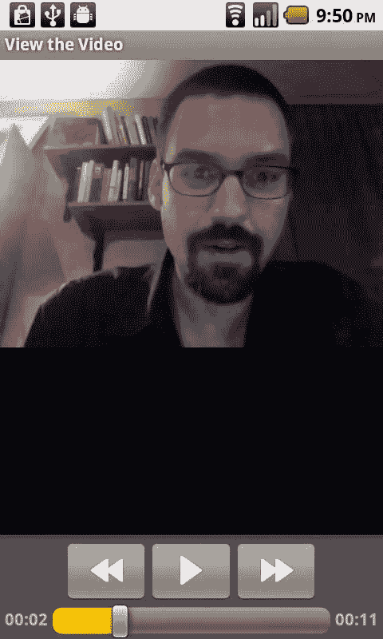

# 第七章：音频捕获

`MediaPlayer mediaPlayer = MediaPlayer.create(this, audioFileUri);`

`mediaPlayer.setOnCompletionListener(this);`

`mediaPlayer.start();`

`playRecording.setEnabled(false);`

我们的`onActivityResult`方法在录音活动完成时被触发。`resultCode`应等于`RESULT_OK`常量，`requestCode`应等于我们传递给`startActivityForResult`方法的值`RECORD_REQUEST`。如果两者都成立，那么我们可以通过`getData`方法从返回的`intent`中检索录制的音频文件的`Uri`。完成所有这些操作后，我们启用`playRecording`按钮，以便播放返回的音频文件。

```
protected void onActivityResult (int requestCode, int resultCode, Intent data) {
    if (resultCode == RESULT_OK && requestCode == RECORD_REQUEST) {
        audioFileUri = data.getData();
        playRecording.setEnabled(true);
    }
}
```

最后，在我们的`onCompletion`方法中（当`MediaPlayer`播放完文件时调用），我们重新启用`playRecording`按钮，以便用户可以选择再次收听音频文件。

```
public void onCompletion(MediaPlayer mp) {
    playRecording.setEnabled(true);
}
```

以下是我们的活动使用的布局 XML。

```
<?xml version="1.0" encoding="utf-8"?>
<LinearLayout xmlns:android="http://schemas.android.com/apk/res/android"
    android:orientation="vertical"
    android:layout_width="fill_parent"
    android:layout_height="fill_parent">
    <Button android:text="Record Audio" android:id="@+id/RecordButton"
        android:layout_width="wrap_content" android:layout_height="wrap_content" />
    <Button android:text="Play Recording" android:id="@+id/PlayButton"
        android:layout_width="wrap_content" android:layout_height="wrap_content" />
</LinearLayout>
```

如您所见，仅仅添加音频录制功能是直接了当的。它没有提供太多对用户界面或录音其他方面的控制，但它确实为用户提供了一个简单易用的界面，而无需我们做太多工作。

## 自定义音频录制

当然，使用`intent`触发录音机并不是我们捕获音频的唯一方法。Android SDK 包含一个`MediaRecorder`类，我们可以利用它来构建自己的音频录制功能。这样做提供了更大的灵活性，例如控制录制音频的时间长度。

`MediaRecorder`类用于音频和视频捕获。在构造`MediaRecorder`对象后，为了捕获音频，必须调用`setAudioEncoder`和`setAudioSource`方法。如果不调用这些方法，则不会录制音频。（视频也是如此。如果不调用`setVideoEncoder`和`setVideoSource`方法，则不会录制视频。本章不会涉及视频；因此我们不会使用这些方法中的任何一个。）

此外，在让`MediaRecorder`准备录制之前，通常还会调用另外两个方法：`setOutputFormat`和`setOutputFile`。`setOutputFormat`允许我们选择录制时使用的文件格式，`setOutputFile`允许我们指定要录制到的文件。需要注意的是，这些调用的顺序非常重要。

### MediaRecorder 音频源

在实例化`MediaRecorder`之后，应该调用的第一个方法是`setAudioSource`。`setAudioSource`接受一个在`AudioSource`内部类中定义的常量。通常我们会使用`MediaRecorder.AudioSource.MIC`，但值得注意的是，`MediaRecorder.AudioSource`也包含了`VOICE_CALL`、`VOICE_DOWNLINK`和`VOICE_UPLINK`的常量。不幸的是，目前似乎没有手机或 Android 版本能够成功录制通话音频。另外需要注意的是，自 Froyo（Android 2.2 版本）起，增加了`CAMCORDER`和`VOICE_RECOGNITION`的常量。如果设备有多个麦克风，可以使用这些常量。

```
MediaRecorder recorder = new MediaRecorder();
recorder.setAudioSource(MediaRecorder.AudioSource.MIC);
```

### MediaRecorder 输出格式

接下来要按顺序调用的方法是`setOutputFormat`。它接受的值在`MediaRecorder.OutputFormat`内部类中定义为常量。

- `MediaRecorder.OutputFormat.MPEG_4`：指定写入的文件将是 MPEG-4 文件。它可以包含音频和视频轨道。
- `MediaRecorder.OutputFormat.RAW_AMR`：表示没有容器的原始文件。仅应在捕获音频且音频编码器为`AMR_NB`时使用。
- `MediaRecorder.OutputFormat.THREE_GPP`：指定写入的文件将是 3GPP 文件（扩展名为`.3gp`）。它可以包含音频和视频轨道。

```
recorder.setOutputFormat(MediaRecorder.OutputFormat.THREE_GPP);
```

### MediaRecorder 音频编码器

设置输出格式之后，我们可以调用`setAudioEncoder`来设置应使用的编解码器。可能的值在`MediaRecorder.AudioEncoder`类中指定为常量。除了`DEFAULT`之外，只有一个值存在：`MediaRecorder.AudioEncoder.AMR_NB`，即自适应多速率窄带编解码器。该编解码器专为语音调优，因此除语音外不适合其他任何用途。默认情况下，它的采样率为 8 kHz，比特率在 4.75 到 12.2 kbps 之间，这两个参数对于录制除语音以外的内容都非常低。不幸的是，目前这是我们使用`MediaRecorder`的唯一选择。

```
recorder.setAudioEncoder(MediaRecorder.AudioEncoder.AMR_NB);
```

### MediaRecorder 输出和录制

最后，我们需要使用要录制到的文件位置调用`setOutputFile`。以下代码片段使用`File.createTempFile`在需要将文件存储到 SD 卡的应用程序的首选文件位置创建一个文件。

```
File path = new File(Environment.getExternalStorageDirectory().getAbsolutePath() +
    "/Android/data/com.apress.proandroidmedia.ch07.customrecorder/files/");
path.mkdirs();
audioFile = File.createTempFile("recording", ".3gp", path);
recorder.setOutputFile(audioFile.getAbsolutePath());
```

现在我们可以实际调用`prepare`，它标志着配置阶段的结束，并告诉`MediaRecorder`准备开始录制。我们调用`start`方法实际开始录制。

```
recorder.prepare();
recorder.start();
```

要停止录制，我们调用`stop`方法。

```
recorder.stop();
```

### MediaRecorder 状态机

`MediaRecorder`与`MediaPlayer`类似，以状态机方式运行。图 7-2 来自 Android API 参考页面中关于`MediaRecorder`的图表，描述了各种状态以及可以从每个状态调用的方法。

**图 7-2.** *来自 Android API 参考的 MediaRecorder 状态图*

### MediaRecorder 示例

以下是使用`MediaRecorder`类的完整自定义音频捕获和播放示例的代码。

```
package com.apress.proandroidmedia.ch07.customrecorder;

import java.io.File;
import java.io.IOException;

import android.app.Activity;
import android.media.MediaPlayer;
import android.media.MediaRecorder;
import android.media.MediaPlayer.OnCompletionListener;
```

```


# 第 7 章：音频捕获

```java
import android.os.Bundle;
import android.os.Environment;
import android.view.View;
import android.view.View.OnClickListener;
import android.widget.Button;
import android.widget.TextView;
```

我们的`CustomRecorder` Activity 实现了`OnClickListener`接口，以便在按下按钮时获得通知；同时实现了`OnCompletionListener`接口，以便在`MediaPlayer`完成音频播放时做出响应。

```java
public class CustomRecorder extends Activity implements OnClickListener,
    OnCompletionListener {
```

我们将拥有一系列用户界面组件。第一个是名为`statusTextView`的`TextView`，它将向用户报告应用的状态：“正在录制”、“准备播放”等。

```java
TextView statusTextView;
```

一系列按钮将用于控制各个方面。按钮的名称描述了它们的用途。

```java
Button startRecording, stopRecording, playRecording, finishButton;
```

我们将使用`MediaRecorder`来录制音频，并使用`MediaPlayer`来播放音频。

```java
MediaRecorder recorder;
MediaPlayer player;
```

最后，我们有一个名为`audioFile`的`File`对象，它将引用录制到的文件。

```java
File audioFile;
```

下载自 Wow! eBook <www.wowebook.com>

```java
@Override
public void onCreate(Bundle savedInstanceState) {
    super.onCreate(savedInstanceState);
    setContentView(R.layout.main);
```

当 Activity 启动时，我们将`statusTextView`的文本设置为“准备就绪”。

```java
    statusTextView = (TextView) this.findViewById(R.id.StatusTextView);
    statusTextView.setText("准备就绪");
    
    stopRecording = (Button) this.findViewById(R.id.StopRecording);
    startRecording = (Button) this.findViewById(R.id.StartRecording);
    playRecording = (Button) this.findViewById(R.id.PlayRecording);
    finishButton = (Button) this.findViewById(R.id.FinishButton);
```

我们将所有按钮的`onClickListeners`都设置为`this`，这样当任何一个按钮被按下时，我们的`onClick`方法就会被调用。

```java
    startRecording.setOnClickListener(this);
    stopRecording.setOnClickListener(this);
    playRecording.setOnClickListener(this);
    finishButton.setOnClickListener(this);
```

最后，在`onCreate`方法中，我们将禁用`stopRecording`和`playRecording`按钮，因为它们只有在开始录制或完成录制后才能正常工作。

```java
    stopRecording.setEnabled(false);
    playRecording.setEnabled(false);
}
```

在下面的`onClick`方法中，我们处理所有按钮的按下事件。

```java
public void onClick(View v) {
    if (v == finishButton) {
```

如果按下了`finishButton`，我们就结束该 Activity。

```java
        finish();
    } else if (v == stopRecording) {
```

如果按下了`stopRecording`按钮，我们将对`MediaRecorder`对象调用`stop`和`release`方法。

```java
        recorder.stop();
        recorder.release();
```

然后，我们构造一个`MediaPlayer`对象，并让它准备好播放刚刚录制的音频文件。

```java
        player = new MediaPlayer();
        player.setOnCompletionListener(this);
```

下面我们在`MediaPlayer`上使用的两个方法`setDataSource`和`prepare`可能会抛出多种异常。在下面的代码中，我们只是简单地将它们抛出。在你的应用开发中，你可能希望更优雅地捕获并处理它们，例如在文件不存在时提醒用户。

```java
        try {
            player.setDataSource(audioFile.getAbsolutePath());
        } catch (IllegalArgumentException e) {
            throw new RuntimeException(
                "为 MediaPlayer.setDataSource 传入非法参数", e);
        } catch (IllegalStateException e) {
            throw new RuntimeException(
                "MediaPlayer.setDataSource 处于非法状态", e);
        } catch (IOException e) {
            throw new RuntimeException(
                "MediaPlayer.setDataSource 发生 IO 异常", e);
        }
        
        try {
            player.prepare();
        } catch (IllegalStateException e) {
            throw new RuntimeException(
                "MediaPlayer.prepare 处于非法状态", e);
        } catch (IOException e) {
            throw new RuntimeException(
                "MediaPlayer.prepare 发生 IO 异常", e);
        }
```

我们将`statusTextView`设置为向用户指示已准备好播放音频文件。


# 第 7 章：音频捕获

`statusTextView.setText("Ready to Play");`

然后，我们将 `playRecording` 和 `startRecording` 按钮设置为启用状态，并禁用 `stopRecording` 按钮，因为当前并未进行录制。

```
playRecording.setEnabled(true);
stopRecording.setEnabled(false);
startRecording.setEnabled(true);
```

```java
} else if (v == startRecording) {
```

当按下 `startRecording` 按钮时，我们构造一个新的 `MediaRecorder` 对象，并调用 `setAudioSource`、`setOutputFormat` 和 `setAudioEncoder` 方法。

```
recorder = new MediaRecorder();
recorder.setAudioSource(MediaRecorder.AudioSource.MIC);
recorder.setOutputFormat(MediaRecorder.OutputFormat.THREE_GPP);
recorder.setAudioEncoder(MediaRecorder.AudioEncoder.AMR_NB);
```

然后，我们在 SD 卡上创建一个新的 `File` 对象，并在 `MediaRecorder` 对象上调用 `setOutputFile` 方法。

```
File path = new File(Environment.getExternalStorageDirectory()
    .getAbsolutePath() + "/Android/data/com.apress.proandroidmedia.ch07.customrecorder/files/");
path.mkdirs();
try {
    audioFile = File.createTempFile("recording", ".3gp", path);
} catch (IOException e) {
    throw new RuntimeException("Couldn't create recording audio file", e);
}
recorder.setOutputFile(audioFile.getAbsolutePath());
```

我们对 `MediaRecorder` 调用 `prepare` 和 `start` 方法，以开始录制。

```
try {
    recorder.prepare();
} catch (IllegalStateException e) {
    throw new RuntimeException("IllegalStateException on MediaRecorder.prepare", e);
} catch (IOException e) {
    throw new RuntimeException("IOException on MediaRecorder.prepare", e);
}
recorder.start();
```

最后，我们更新 `statusTextView`，并更改哪些按钮被启用或禁用。

```
statusTextView.setText("Recording");
playRecording.setEnabled(false);
stopRecording.setEnabled(true);
startRecording.setEnabled(false);
```

```java
} else if (v == playRecording) {
```

我们需要响应的最后一个按钮是 `playRecording`。当按下 `stopRecording` 按钮时，`MediaPlayer` 对象 `player` 会被构造并配置。当按下 `playRecording` 按钮时，我们只需开始播放、设置状态消息，并更改哪些按钮被启用。

```
player.start();
statusTextView.setText("Playing");
playRecording.setEnabled(false);
stopRecording.setEnabled(false);
startRecording.setEnabled(false);
```

```java
    }
}
```

当 `MediaPlayer` 对象完成录音播放时，会调用 `onCompletion` 方法。我们利用它来更改状态消息，并设置哪些按钮被启用。

```
public void onCompletion(MediaPlayer mp) {
    playRecording.setEnabled(true);
    stopRecording.setEnabled(false);
    startRecording.setEnabled(true);
    statusTextView.setText("Ready");
}
```

以下是前述活动的布局 XML 文件 `main.xml`。

```
<?xml version="1.0" encoding="utf-8"?>
<LinearLayout xmlns:android="http://schemas.android.com/apk/res/android"
    android:orientation="vertical"
    android:layout_width="fill_parent"
    android:layout_height="fill_parent" >

    <TextView android:layout_width="wrap_content"
        android:layout_height="wrap_content"
        android:id="@+id/StatusTextView"
        android:text="Status"
        android:textSize="35dip" />
    <Button android:text="开始录制"
        android:id="@+id/StartRecording"
        android:layout_width="wrap_content"
        android:layout_height="wrap_content" />
    <Button android:text="停止录制"
        android:id="@+id/StopRecording"
        android:layout_width="wrap_content"
        android:layout_height="wrap_content" />
    <Button android:text="播放录音"
        android:id="@+id/PlayRecording"
        android:layout_width="wrap_content"
        android:layout_height="wrap_content" />
    <Button android:layout_width="wrap_content"
        android:layout_height="wrap_content"
        android:id="@+id/FinishButton"
        android:text="完成" />
</LinearLayout>
```

我们还需要在 `AndroidManifest.xml` 文件中添加以下权限。

```
<uses-permission android:name="android.permission.RECORD_AUDIO" />
<uses-permission android:name="android.permission.WRITE_EXTERNAL_STORAGE" />
```

如我们所见，使用 `MediaRecorder` 开发自定义音频捕获应用程序并不繁琐。现在，让我们看看如何利用 `MediaRecorder` 的其他方法来添加更多功能。


### MediaRecorder 的其他方法

`MediaRecorder`还提供了多种其他方法，可用于音频捕获相关操作。

*   `getMaxAmplitude()`: 允许我们获取`MediaPlayer`已录制音频的最大振幅。每次调用该方法时，该值都会重置，因此每次调用都会返回自上次调用以来的最大振幅。可以通过定期调用此方法来实现音频电平表。
*   `setMaxDuration()`: 允许我们指定以毫秒为单位的最大录制持续时间。此方法必须在`setOutputFormat()`方法之后、`prepare()`方法之前调用。
*   `setMaxFileSize()`: 允许我们指定录制的最大文件大小（以字节为单位）。与`setMaxDuration()`一样，此方法必须在`setOutputFormat()`方法之后、`prepare()`方法之前调用。

以下是我们之前介绍的自定义录制器应用程序的更新版本，其中包含了当前振幅的显示。

```java
package com.apress.proandroidmedia.ch07.customrecorder;

import java.io.File;
import java.io.IOException;

import android.app.Activity;
import android.media.MediaPlayer;
import android.media.MediaRecorder;
import android.media.MediaPlayer.OnCompletionListener;
import android.os.AsyncTask;
import android.os.Bundle;
import android.os.Environment;
import android.view.View;
import android.view.View.OnClickListener;
import android.widget.Button;
import android.widget.TextView;

public class CustomRecorder extends Activity implements OnClickListener,
        OnCompletionListener {
```

在这个版本中，我们添加了一个名为`amplitudeTextView`的`TextView`。它将显示音频输入的数字振幅值。

```java
    TextView statusTextView, amplitudeTextView;
    Button startRecording, stopRecording, playRecording, finishButton;
    MediaRecorder recorder;
    MediaPlayer player;
    File audioFile;
```

我们需要一个名为`RecordAmplitude`的新类的实例。这个类是一个内部类，定义在本源代码清单的末尾。它使用一个名为`isRecording`的`Boolean`变量，当我们启动`MediaRecorder`时，该变量将被设置为`true`。

```java
    RecordAmplitude recordAmplitude;
    boolean isRecording = false;

    @Override
    public void onCreate(Bundle savedInstanceState) {
        super.onCreate(savedInstanceState);
        setContentView(R.layout.main);

        statusTextView = (TextView) this.findViewById(R.id.StatusTextView);
        statusTextView.setText("Ready");

        // 我们将使用一个 TextView 来显示捕获过程中音频的当前振幅。
        amplitudeTextView = (TextView) this
                .findViewById(R.id.AmplitudeTextView);
        amplitudeTextView.setText("0");

        stopRecording = (Button) this.findViewById(R.id.StopRecording);
        startRecording = (Button) this.findViewById(R.id.StartRecording);
        playRecording = (Button) this.findViewById(R.id.PlayRecording);
        finishButton = (Button) this.findViewById(R.id.FinishButton);

        startRecording.setOnClickListener(this);
        stopRecording.setOnClickListener(this);
        playRecording.setOnClickListener(this);
        finishButton.setOnClickListener(this);

        stopRecording.setEnabled(false);
        playRecording.setEnabled(false);
    }

    public void onClick(View v) {
        if (v == finishButton) {
            finish();
        } else if (v == stopRecording) {
            // 录制结束时，将 isRecording 布尔值设为 false，
            // 并在我们的 RecordAmplitude 类上调用 cancel 方法。
            // 由于 RecordAmplitude 继承自 AsyncTask，调用 cancel 并传入 true
            // 作为参数，必要时会中断其线程。
            isRecording = false;
            recordAmplitude.cancel(true);

            recorder.stop();
            recorder.release();

            player = new MediaPlayer();
            player.setOnCompletionListener(this);
            try {
                player.setDataSource(audioFile.getAbsolutePath());
            } catch (IllegalArgumentException e) {
                throw new RuntimeException(
                        "Illegal Argument to MediaPlayer.setDataSource", e);
            } catch (IllegalStateException e) {
                throw new RuntimeException(
                        "Illegal State in MediaPlayer.setDataSource", e);
            } catch (IOException e) {
                throw new RuntimeException(
                        "IOException in MediaPlayer.setDataSource", e);
            }

            try {
                player.prepare();
            } catch (IllegalStateException e) {
                throw new RuntimeException(
                        "IllegalStateException in MediaPlayer.prepare", e);
            } catch (IOException e) {
                throw new RuntimeException(
                        "IOException in MediaPlayer.prepare", e);
            }

            statusTextView.setText("Ready to Play");
            playRecording.setEnabled(true);
            stopRecording.setEnabled(false);
            startRecording.setEnabled(true);

        } else if (v == startRecording) {
            recorder = new MediaRecorder();
            recorder.setAudioSource(MediaRecorder.AudioSource.MIC);
            recorder.setOutputFormat(MediaRecorder.OutputFormat.THREE_GPP);
            recorder.setAudioEncoder(MediaRecorder.AudioEncoder.AMR_NB);

            File path = new File(Environment.getExternalStorageDirectory()
                    .getAbsolutePath() + "/Android/data/com.apress.proandroidmedia.ch07.customrecorder/files/");
            path.mkdirs();

            try {
                audioFile = File.createTempFile("recording", ".3gp", path);
            } catch (IOException e) {
                throw new RuntimeException(
                        "Couldn't create recording audio file", e);
            }

            recorder.setOutputFile(audioFile.getAbsolutePath());

            try {
                recorder.prepare();
            } catch (IllegalStateException e) {
                throw new RuntimeException(
                        "IllegalStateException on MediaRecorder.prepare", e);
            } catch (IOException e) {
                throw new RuntimeException(
                        "IOException on MediaRecorder.prepare", e);
            }

            recorder.start();

            // 开始录制后，将 isRecording 布尔值设为 true，
            // 并创建一个新的 RecordAmplitude 实例。
            // 由于 RecordAmplitude 继承自 AsyncTask，我们将调用 execute 方法
            // 来启动 RecordAmplitude 的任务运行。
            isRecording = true;
            recordAmplitude = new RecordAmplitude();
            recordAmplitude.execute();

            statusTextView.setText("Recording");
            playRecording.setEnabled(false);
            stopRecording.setEnabled(true);
            startRecording.setEnabled(false);

        } else if (v == playRecording) {
            player.start();
            statusTextView.setText("Playing");
            playRecording.setEnabled(false);
            stopRecording.setEnabled(false);
            startRecording.setEnabled(false);
        }
    }

    public void onCompletion(MediaPlayer mp) {
        playRecording.setEnabled(true);
        stopRecording.setEnabled(false);
        startRecording.setEnabled(true);
        statusTextView.setText("Ready");
    }
```

以下是`RecordAmplitude`的定义。它继承自`AsyncTask`，这是 Android 中一个很实用的工具类，它提供了一个线程来运行长时间运行的任务，而不会占用用户界面或导致应用程序无响应。

```java
    private class RecordAmplitude extends AsyncTask<Void, Integer, Void> {
```

`doInBackground()`方法在一个单独的线程上运行，并在该对象上调用`execute()`方法时执行。只要`isRecording`为`true`，此方法就会循环，并调用`Thread.sleep(500)`，使其暂停半秒钟。完成后，它会调用`publishProgress()`，并将`MediaRecorder`对象上的`getMaxAmplitude()`结果传递进去。

```java
        @Override
        protected Void doInBackground(Void... params) {
            while (isRecording) {
                try {
                    Thread.sleep(500);
                } catch (InterruptedException e) {
                    e.printStackTrace();
                }
                publishProgress(recorder.getMaxAmplitude());
            }
            return null;
        }
```

前面调用的`publishProgress()`会触发这里定义的`onProgressUpdate()`方法，该方法在主线程上运行，因此可以与用户界面交互。在这种情况下，它使用从`publishProgress()`方法调用传入的值来更新`amplitudeTextView`。

```java
    }
```


# 第 7 章：音频捕获

`protected void onProgressUpdate(Integer... progress)` {

`amplitudeTextView.setText(progress[0].toString());`

}

}

当然，我们需要更新布局 XML 以包含用于显示音量的`TextView`。

```xml
<?xml version="1.0" encoding="utf-8"?>
<LinearLayout xmlns:android="http://schemas.android.com/apk/res/android"
    android:orientation="vertical"
    android:layout_width="fill_parent"
    android:layout_height="fill_parent">
    
    <TextView android:layout_width="wrap_content" android:layout_height="wrap_content" 
        android:id="@+id/StatusTextView" android:text="状态" 
        android:textSize="35dip" />
        
    <TextView android:layout_width="wrap_content" android:layout_height="wrap_content" 
        android:id="@+id/AmplitudeTextView" android:textSize="35dip" 
        android:text="0" />
        
    <Button android:text="开始录制" android:id="@+id/StartRecording" 
        android:layout_width="wrap_content" android:layout_height="wrap_content" />
        
    <Button android:text="停止录制" android:id="@+id/StopRecording" 
        android:layout_width="wrap_content" android:layout_height="wrap_content" />
        
    <Button android:text="播放录制" android:id="@+id/PlayRecording" 
        android:layout_width="wrap_content" android:layout_height="wrap_content" />
        
    <Button android:layout_width="wrap_content" android:layout_height="wrap_content" 
        android:id="@+id/FinishButton" android:text="完成" />
</LinearLayout>
```

如我们所见，使用`AsyncTask`定期执行某些操作是一种很好的方式，可以在其他进程进行时向用户自动更新信息。这为我们的`MediaRecorder`示例提供了更好的用户体验。使用`getMaxAmplitude`方法可以为用户提供有关当前录音的反馈。

在 Android 2.2（Froyo）中，提供了以下方法：

- `setAudioChannels`：允许我们指定要录制的音频通道数。通常这将是单声道或双声道。此方法必须在`prepare`方法之前调用。
- `setAudioEncodingBitRate`：允许我们指定编码器在压缩音频时每秒使用的位数。此方法必须在`prepare`方法之前调用。
- `setAudioSamplingRate`：允许我们指定音频在捕获和编码时的采样率。适用的速率取决于所使用的硬件和编解码器。此方法必须在`prepare`方法之前调用。

## 将音频插入 MediaStore

音频录制可以放入`MediaStore`内容提供程序中，以便其他应用程序可以使用。这个过程与我们之前将图像添加到`MediaStore`的过程非常相似。但在这种情况下，我们将在创建后添加它们。

我们创建一个`ContentValues`对象来保存要插入到`MediaStore`中的数据。`ContentValues`对象由一系列键/值对组成。可以使用的键在`MediaStore.Audio.Media`类（及其继承的类）中定义为常量。

`MediaStore.Audio.Media.DATA`常量是录制文件路径的键。这是将文件插入`MediaStore`所需的唯一键值对。

要在`MediaStore`中实际执行插入操作，我们使用`ContentResolver`对象的`insert`方法，传入指向 SD 卡上音频文件表的`Uri`以及包含数据的`ContentValues`对象。该`Uri`在`MediaStore.Audio.Media`中定义为常量，名为`EXTERNAL_CONTENT_URI`。

以下是一个可以插入到`CustomRecorder`示例中、位于`MediaRecorder`上调用`release`方法（`recorder.release()`）之后的代码片段。它将把录音插入到`MediaStore`中，并使其对使用`MediaStore`查找音频进行播放的其他应用程序可用。

```java
ContentValues contentValues = new ContentValues();
contentValues.put(MediaStore.MediaColumns.TITLE, "这不是音乐");
contentValues.put(MediaStore.MediaColumns.DATE_ADDED, System.currentTimeMillis());
contentValues.put(MediaStore.Audio.Media.DATA, audioFile.getAbsolutePath());

Uri newUri =
    getContentResolver().insert(
        MediaStore.Audio.Media.EXTERNAL_CONTENT_URI, contentValues);
```

当然，为了使用上述代码段，我们需要添加以下导入：

```java
import android.content.ContentValues;
import android.net.Uri;
import android.provider.MediaStore;
```

## 使用 AudioRecord 进行原始音频录制

除了使用 Intent 启动录音机和`MediaRecorder`之外，Android 还提供了第三种捕获音频的方法，即使用名为`AudioRecord`的类。

`AudioRecord`是这三种方法中最灵活的，因为它允许我们访问原始音频流，但内置功能最少，例如不会自动压缩音频。

使用`AudioRecord`的基础知识很简单。我们只需要构造一个`AudioRecord`类型的对象，传入各种配置参数。

我们需要指定的第一个值是音频源。这里使用的值与我们在`MediaRecorder`中使用的相同，并在`MediaRecorder.AudioSource`中定义。本质上，这意味着我们可以使用`MediaRecorder.AudioSource.MIC`。


# 第 7 章：音频捕获

`int audioSource = MediaRecorder.AudioSource.MIC;`

接下来需要指定的值是录音的采样率。该值应以 Hz 为单位指定。如我们所知，`MediaRecorder`以 8 kHz（即 8000 Hz）进行音频采样。

CD 音质的音频通常为 44.1 kHz（即 44100 Hz）。Hz（赫兹）是每秒的采样次数。不同的 Android 手机硬件能够支持不同的采样率。在我们的示例应用中，我们将使用 11025 Hz 的采样率，这也是另一种常用的采样率。

`int sampleRateInHz = 11025;`

接下来，我们需要指定要捕获的音频通道数。该参数的常量在`AudioFormat`类中定义，且含义不言自明。

`AudioFormat.CHANNEL_CONFIGURATION_MONO`
`AudioFormat.CHANNEL_CONFIGURATION_STEREO`
`AudioFormat.CHANNEL_CONFIGURATION_INVALID`
`AudioFormat.CHANNEL_CONFIGURATION_DEFAULT`

这里我们暂时使用单声道配置。

`int channelConfig = AudioFormat.CHANNEL_CONFIGURATION_MONO;`

随后，我们需要指定音频格式。相关选项同样在`AudioFormat`类中定义。

`AudioFormat.ENCODING_DEFAULT`
`AudioFormat.ENCODING_INVALID`
`AudioFormat.ENCODING_PCM_16BIT`
`AudioFormat.ENCODING_PCM_8BIT`

在这四个选项中，我们的选择归结为 PCM 16 位和 PCM 8 位。PCM 代表脉冲编码调制，本质上就是原始音频采样。因此，我们可以将每个采样的分辨率设置为 16 位或 8 位。16 位会占用更多空间和处理能力，但音频的还原度会更接近真实。在我们的示例中，将使用 16 位版本。

`int audioFormat = AudioFormat.ENCODING_PCM_16BIT;`

最后，我们需要指定缓冲区大小。实际上，我们可以通过静态方法`getMinBufferSize`向`AudioRecord`类询问最小缓冲区大小，并传入采样率、通道配置和音频格式作为参数。

`int bufferSizeInBytes = AudioRecord.getMinBufferSize(sampleRateInHz, channelConfig, audioFormat);`

现在，我们可以构造实际的`AudioRecord`对象。

`AudioRecord audioRecord = new AudioRecord(audioSource, sampleRateInHz, channelConfig, audioFormat, bufferSizeInBytes);`

`AudioRecord`类实际上并不会自动保存捕获的音频。我们需要在音频数据传入时手动处理。我们首先可能需要做的是将其录制到文件中。为此，我们需要创建一个文件。

```
File recordingFile;
File path = new File(Environment.getExternalStorageDirectory()
    .getAbsolutePath() + "/Android/data/com.apress.proandroidmedia.ch07.altaudiorecorder/files/");
path.mkdirs();
try {
    recordingFile = File.createTempFile("recording", ".pcm", path);
} catch (IOException e1) {
    throw new RuntimeException("Couldn't create file on SD card", e);
}
```

接下来，我们创建一个指向该文件的`OutputStream`，具体而言，为了性能和便利性，我们会将其包装在`BufferedOutputStream`和`DataOutputStream`中。

```
DataOutputStream dos = new DataOutputStream(new BufferedOutputStream(new FileOutputStream(recordingFile)));
```

现在，我们可以开始捕获操作，并将音频采样写入文件。我们将使用一个短整型数组来存放从`AudioRecord`对象读取的音频数据。我们将数组大小设置得比`AudioRecord`对象的缓冲区更小，这样在我们读取数据之前缓冲区不会被填满。为了确保数组小于缓冲区大小，我们将其除以 4。缓冲区大小以字节为单位，每个短整型占用 2 个字节，因此除以 2 是不够的。除以 4 后，该数组的大小将是`AudioRecord`对象内部缓冲区的一半。

`short[] buffer = new short[bufferSize/4];`

我们只需调用`AudioRecord`对象的`startRecording`方法即可开始录制。

`audioRecord.startRecording();`

录制开始后，我们可以构建一个循环，持续从`AudioRecord`对象读取数据到我们的短整型数组中，并将其写入文件的`DataOutputStream`。

```
while (true) {
    int bufferReadResult = audioRecord.read(buffer, 0, bufferSize/4);
    for (int i = 0; i < bufferReadResult; i++) {
        dos.writeShort(buffer[i]);
    }
}
audioRecord.stop();
dos.close();
```

操作完成后，我们需要调用`AudioRecord`对象的`stop`方法以及`DataOutputStream`的`close`方法。


# 第 7 章：音频采集

当然，在实际应用中，我们不会将其放入 `while (true)` 循环中，因为该循环永远不会结束。我们也可能希望将其放在某个线程中运行，以免在录制时占用用户界面以及应用程序可能需要执行的其他操作。

在介绍完整示例之前，先来看看如何使用 `AudioRecord` 类在采集音频的同时进行回放。

## 使用 AudioTrack 进行原始音频回放

`AudioTrack` 是 Android 中用于播放原始音频样本的类。它可以播放通过 `AudioRecord` 采集的音频，而这类音频无法使用 `MediaPlayer` 对象进行播放。

要构造 `AudioTrack` 对象，需要传入一系列描述待播放音频的配置变量。

第一个参数是流类型。可选值在 `AudioManager` 类中定义为常量。我们将使用 `AudioManager.STREAM_MUSIC`，即用于普通音乐播放的音频流。

第二个参数是待播放音频数据的采样率（以赫兹为单位）。在示例中，我们将以 11,025 Hz 的频率采集音频，因此，为了回放，需要指定相同的值。

第三个参数是声道配置。可选值与构造 `AudioRecord` 对象时使用的相同，在 `AudioFormat` 类中定义为常量。其名称的含义不言自明。

- `AudioFormat.CHANNEL_CONFIGURATION_MONO`
- `AudioFormat.CHANNEL_CONFIGURATION_STEREO`
- `AudioFormat.CHANNEL_CONFIGURATION_INVALID`
- `AudioFormat.CHANNEL_CONFIGURATION_DEFAULT`

第四个参数是音频的格式。可选值与构造 `AudioRecord` 对象时使用的相同，在 `AudioFormat` 中定义为常量。使用的值应与传入的音频值匹配。

- `AudioFormat.ENCODING_DEFAULT`
- `AudioFormat.ENCODING_INVALID`
- `AudioFormat.ENCODING_PCM_16BIT`
- `AudioFormat.ENCODING_PCM_8BIT`

第五个参数是对象中用于存储音频的缓冲区大小。要确定最小缓冲区大小，可以调用 `getMinBufferSize()`，并传入采样率、声道配置和音频格式。

```java
int frequency = 11025;
int channelConfiguration = AudioFormat.CHANNEL_CONFIGURATION_MONO;
int audioEncoding = AudioFormat.ENCODING_PCM_16BIT;
int bufferSize = AudioTrack.getMinBufferSize(frequency, channelConfiguration,
    audioEncoding);
```

最后一个参数是模式。可选值在 `AudioTrack` 类中定义为常量。

- `AudioTrack.MODE_STATIC`：音频数据将在播放前全部传输到 `AudioTrack` 对象。
- `AudioTrack.MODE_STREAM`：音频数据将在播放过程中持续传输到 `AudioTrack` 对象。

以下是我们的 `AudioTrack` 配置：

```java
AudioTrack audioTrack = new AudioTrack(AudioManager.STREAM_MUSIC, frequency,
    channelConfiguration, audioEncoding, bufferSize,
    AudioTrack.MODE_STREAM);
```

构造 `AudioTrack` 后，需要打开音频源，将音频数据读取到缓冲区，并将其传递给 `AudioTrack` 对象。

我们将从一个包含正确格式（11,025 Hz、16 位、单声道）原始 PCM 数据的文件构造一个 `DataInputStream`。

```java
DataInputStream dis = new DataInputStream(
    new BufferedInputStream(new FileInputStream(recordingFile)));
```

然后，可以在 `AudioTrack` 上调用 `play()`，并开始从 `DataInputStream` 写入音频。

```java
audioTrack.play();

while (isPlaying && dis.available() > 0) {
    int i = 0;
    while (dis.available() > 0 && i < audiodata.length) {
        audiodata[i] = dis.readShort();
        i++;
    }
    audioTrack.write(audiodata, 0, audiodata.length);
}

dis.close();
```

以上就是使用 `AudioTrack` 从文件回放音频的基本方法，该文件是通过 `AudioRecord` 录制生成的。

# 第 7 章：音频采集

## 原始音频采集与回放示例

以下是一个完整示例，展示了如何使用 `AudioRecord` 录制音频，并使用 `AudioTrack` 进行回放。每个操作都通过 `AsyncTask` 在各自的线程中运行，从而避免在主线程中运行导致应用程序无响应。

```java
package com.apress.proandroidmedia.ch07.altaudiorecorder;

import java.io.BufferedInputStream;
import java.io.BufferedOutputStream;
import java.io.DataInputStream;
import java.io.DataOutputStream;
import java.io.File;
import java.io.FileInputStream;
import java.io.FileOutputStream;
import java.io.IOException;

import android.app.Activity;
import android.media.AudioFormat;
import android.media.AudioManager;
import android.media.AudioRecord;
import android.media.AudioTrack;
import android.media.MediaRecorder;
import android.os.AsyncTask;
import android.os.Bundle;
import android.os.Environment;
import android.util.Log;
import android.view.View;
import android.view.View.OnClickListener;
import android.widget.Button;
import android.widget.TextView;

public class AltAudioRecorder extends Activity implements OnClickListener {
```

我们定义了两个内部类——一个用于录制，一个用于回放。每个类都继承自 `AsyncTask`。

```java
    RecordAudio recordTask;
    PlayAudio playTask;

    Button startRecordingButton, stopRecordingButton, startPlaybackButton,
        stopPlaybackButton;
    TextView statusText;
    File recordingFile;
```

我们将使用布尔值来跟踪是否应进行录制和回放。这些布尔值将在录制和回放任务的循环中使用。

```java
    boolean isRecording = false;
    boolean isPlaying = false;
```

以下是用于定义 `AudioRecord` 和 `AudioTrack` 对象配置的变量。

```java
    // 这些实际上应该定义为常量
    int frequency = 11025;
    int channelConfiguration = AudioFormat.CHANNEL_CONFIGURATION_MONO;
    int audioEncoding = AudioFormat.ENCODING_PCM_16BIT;

    @Override
    public void onCreate(Bundle savedInstanceState) {
        super.onCreate(savedInstanceState);
        setContentView(R.layout.main);

        statusText = (TextView) this.findViewById(R.id.StatusTextView);
        startRecordingButton = (Button) this.findViewById(R.id.StartRecordingButton);
        stopRecordingButton = (Button) this.findViewById(R.id.StopRecordingButton);
        startPlaybackButton = (Button) this.findViewById(R.id.StartPlaybackButton);
        stopPlaybackButton = (Button) this.findViewById(R.id.StopPlaybackButton);

        startRecordingButton.setOnClickListener(this);
        stopRecordingButton.setOnClickListener(this);
        startPlaybackButton.setOnClickListener(this);
        stopPlaybackButton.setOnClickListener(this);

        stopRecordingButton.setEnabled(false);
        startPlaybackButton.setEnabled(false);
        stopPlaybackButton.setEnabled(false);
```

在构造函数中，最后要做的是创建用于录制和回放的文件。在本例中，我们在 SD 卡上与应用关联文件的首选位置创建文件。

```java
        File path = new File(Environment.getExternalStorageDirectory()
            .getAbsolutePath() + "/Android/data/com.apress.proandroidmedia.ch07"
            + ".altaudiorecorder/files/");
        path.mkdirs();

        try {
            recordingFile = File.createTempFile("recording", ".pcm", path);
        } catch (IOException e) {
            throw new RuntimeException("Couldn't create file on SD card", e);
        }
    }
```

`onClick()` 方法处理用户生成的按钮点击事件。每个按钮对应一个具体的方法。

```java
    public void onClick(View v) {
        if (v == startRecordingButton) {
            record();
        } else if (v == stopRecordingButton) {
            stopRecording();
        } else if (v == startPlaybackButton) {
            play();
        } else if (v == stopPlaybackButton) {
            stopPlaying();
        }
    }
```

要开始回放，我们构造一个新的 `PlayAudio` 对象，并调用其从 `AsyncTask` 继承的 `execute()` 方法。

```java
    public void play() {
```


## 第 7 章：音频捕获

`startPlaybackButton.setEnabled(true);`

`playTask = new PlayAudio();`

`playTask.execute();`

`stopPlaybackButton.setEnabled(true);`

要停止播放，我们将`isPlaying`布尔值设为`false`即可。这将导致`PlayAudio`对象的循环结束。

```
public void stopPlaying() {
    isPlaying = false;
    stopPlaybackButton.setEnabled(false);
    startPlaybackButton.setEnabled(true);
}
```

要开始录制，我们构造一个`RecordAudio`对象并调用其`execute`方法。

```
public void record() {
    startRecordingButton.setEnabled(false);
    stopRecordingButton.setEnabled(true);
    // 仅供娱乐
    startPlaybackButton.setEnabled(true);
    recordTask = new RecordAudio();
    recordTask.execute();
}
```

要停止录制，我们只需将`isRecording`布尔值设为`false`。这允许`RecordAudio`对象停止循环并执行清理工作。

```
public void stopRecording() {
    isRecording = false;
}
```

以下是我们的内部类`PlayAudio`。该类继承自`AsyncTask`，并使用`AudioTrack`对象来播放音频。

```
private class PlayAudio extends AsyncTask<Void, Integer, Void> {
    @Override
    protected Void doInBackground(Void... params) {
        isPlaying = true;
        int bufferSize = AudioTrack.getMinBufferSize(frequency,
                channelConfiguration, audioEncoding);
        short[] audiodata = new short[bufferSize/4];
        try {
            DataInputStream dis = new DataInputStream(
                    new BufferedInputStream(new FileInputStream(
                            recordingFile)));
            AudioTrack audioTrack = new AudioTrack(
                    AudioManager.STREAM_MUSIC, frequency,
                    channelConfiguration, audioEncoding, bufferSize,
                    AudioTrack.MODE_STREAM);
            audioTrack.play();
            while (isPlaying && dis.available() > 0) {
                int i = 0;
                while (dis.available() > 0 && i < audiodata.length) {
                    audiodata[i] = dis.readShort();
                    i++;
                }
                audioTrack.write(audiodata, 0, audiodata.length);
            }
            dis.close();
            startPlaybackButton.setEnabled(false);
            stopPlaybackButton.setEnabled(true);
        } catch (Throwable t) {
            Log.e("AudioTrack", "Playback Failed");
        }
        return null;
    }
}
```

最后是我们的`RecordAudio`类，它继承自`AsyncTask`。该类在后台运行一个`AudioRecord`对象，并调用`publishProgress`来更新 UI，以指示录制进度。

```
private class RecordAudio extends AsyncTask<Void, Integer, Void> {
    @Override
    protected Void doInBackground(Void... params) {
        isRecording = true;
        try {
            DataOutputStream dos = new DataOutputStream(
                    new BufferedOutputStream(new FileOutputStream(
                            recordingFile)));
            int bufferSize = AudioRecord.getMinBufferSize(frequency,
                    channelConfiguration, audioEncoding);
            AudioRecord audioRecord = new AudioRecord(
                    MediaRecorder.AudioSource.MIC, frequency,
                    channelConfiguration, audioEncoding, bufferSize);
            short[] buffer = new short[bufferSize];
            audioRecord.startRecording();
            int r = 0;
            while (isRecording) {
                int bufferReadResult = audioRecord.read(buffer, 0,
                        bufferSize);
                for (int i = 0; i < bufferReadResult; i++) {
                    dos.writeShort(buffer[i]);
                }
                publishProgress(new Integer(r));
                r++;
            }
            audioRecord.stop();
            dos.close();
        } catch (Throwable t) {
            Log.e("AudioRecord", "Recording Failed");
        }
        return null;
    }
}
```

当调用`publishProgress`时，会调用`onProgressUpdate`方法。

```
protected void onProgressUpdate(Integer... progress) {
    statusText.setText(progress[0].toString());
}
```

当`doInBackground`方法完成时，会调用以下的`onPostExecute`方法。

```
protected void onPostExecute(Void result) {
    startRecordingButton.setEnabled(true);
    stopRecordingButton.setEnabled(false);
    startPlaybackButton.setEnabled(true);
}
```

以下是前述示例的布局 XML：

```
<?xml version="1.0" encoding="utf-8"?>
<LinearLayout xmlns:android="http://schemas.android.com/apk/res/android"
    android:orientation="vertical"
    android:layout_width="fill_parent"
    android:layout_height="fill_parent"
>
    <TextView
        android:layout_width="fill_parent"
        android:layout_height="wrap_content"
        android:text="Status"
        android:id="@+id/StatusTextView"/>
    <Button
        android:layout_width="wrap_content"
        android:layout_height="wrap_content"
        android:text="Start Recording"
        android:id="@+id/StartRecordingButton"/>
    <Button
        android:layout_width="wrap_content"
        android:layout_height="wrap_content"
        android:text="Stop Recording"
        android:id="@+id/StopRecordingButton"/>
    <Button
        android:layout_width="wrap_content"
        android:layout_height="wrap_content"
        android:text="Start Playback"
        android:id="@+id/StartPlaybackButton"/>
    <Button
        android:layout_width="wrap_content"
        android:layout_height="wrap_content"
        android:text="Stop Playback"
        android:id="@+id/StopPlaybackButton"/>
</LinearLayout>
```

并且，我们需要在`AndroidManifest.xml`中添加以下权限。

```
<uses-permission android:name="android.permission.RECORD_AUDIO"/>
<uses-permission android:name="android.permission.WRITE_EXTERNAL_STORAGE"/>
```

正如我们所看到的，使用`AudioRecord`和`AudioTrack`类来创建捕获和播放应用程序，比使用`MediaRecorder`和`MediaPlayer`类要繁琐得多。但正如我们将在下一章中看到的，当我们需要进行任何类型的音频处理或想要合成音频时，这种努力是值得的。

## 总结

在本章中，我们研究了在 Android 上录制音频的三种不同方法。每种方法都有各自的优缺点。使用内置录音机非常适合无需复杂操作的音频录制，几乎不需要或完全不需要程序化控制。使用`MediaRecorder`让我们更进一步，可以控制媒体录制的时间长度等方面，但界面需要我们自己实现。最后，我们探讨了使用`AudioRecord`录制原始样本的能力。使用这种方法，我们拥有最大的控制权和灵活性，但为了捕获和处理音频，需要做最多的工作。

在下一章中，我们将进一步探讨音频的可能性，研究音频处理和合成。


### 音频合成与分析

在上一章的结尾，我们研究了一种通过 `AudioRecord` 和 `AudioTrack` 类来捕获原始 PCM 音频并播放的方法。在本章中，我们将继续使用这些类，以算法的方式合成音频，并对录制的音频进行分析。

## 数字音频合成

数字音频合成是一个非常广泛的课题，背后涉及众多理论、数学、工程学知识以及历史渊源。遗憾的是，本书涵盖的范围有限，无法深入探讨该课题的大部分内容。我们将会做的是，研究一些基础示例，看看如何利用 Android 中的几个内置类从零开始创建音频。

你可能知道，声音是由空气（或其他介质）中压力的重复性变化（以波的形式）形成的。这些振荡的特定频率（即声波）是可听见的，这意味着我们的耳朵对一定时间内的这些重复次数很敏感。这个范围大致在 12 Hz（即每秒 12 个周期，非常低沉的声音，如隆隆声）到 20 kHz（即每秒 20,000 个周期，非常高音调的声音）之间。

要创建音频，我们需要让空气以我们想要的声音频率振动。在数字领域，这通常通过一个由模拟电信号驱动的扬声器来实现。数字音频系统包含一个执行数模转换（DAC）的芯片或板卡。DAC 接收一系列代表音频样本的数字形式的数据，并将其转换为电压，再由扬声器将电压转化为声音。

为了合成音频，我们只需合成音频样本，并将其输入到相应的机制中。在 Android 中，这个机制就是 `AudioTrack` 类。

# 第 8 章：音频合成与分析

正如我们在上一章中学到的，`AudioTrack` 类允许我们播放原始的音频样本（例如由 `AudioRecord` 类捕获的样本）。

## 播放合成声音

以下是一个快速示例，展示如何构造一个 `AudioTrack` 类并传入数据进行播放。关于构造 `AudioTrack` 对象所用参数的详细讨论，请参阅第 7 章的“使用 AudioTrack 进行原始音频播放”部分。

此示例使用了一个继承自 `AsyncTask` 的内部类 `AudioSynthesisTask`。`AsyncTask` 定义了一个名为 `doInBackground` 的方法，该方法会在一个与 Activity 主线程分离的线程中运行其内部的任何代码。这保证了 Activity 及其 UI 的响应性，否则，为 `AudioTrack` 对象提供数据的 `write` 方法循环会阻塞主线程。

```java
package com.apress.proandroidmedia.ch08.audiosynthesis;

import android.app.Activity;
import android.media.AudioFormat;
import android.media.AudioManager;
import android.media.AudioTrack;
import android.os.AsyncTask;
import android.os.Bundle;
import android.view.View;
import android.view.View.OnClickListener;
import android.widget.Button;

public class AudioSynthesis extends Activity implements OnClickListener {

    Button startSound;
    Button endSound;
    AudioSynthesisTask audioSynth;
    boolean keepGoing = false;

    @Override
    public void onCreate(Bundle savedInstanceState) {
        super.onCreate(savedInstanceState);
        setContentView(R.layout.main);
        startSound = (Button) this.findViewById(R.id.StartSound);
        startSound.setOnClickListener(this);
        endSound = (Button) this.findViewById(R.id.EndSound);
        endSound.setOnClickListener(this);
        endSound.setEnabled(false);
    }

    @Override
    public void onPause() {
        super.onPause();
        keepGoing = false;
        endSound.setEnabled(false);
        startSound.setEnabled(true);
    }

    public void onClick(View v) {
        if (v == startSound) {
            keepGoing = true;
            audioSynth = new AudioSynthesisTask();
            audioSynth.execute();
            endSound.setEnabled(true);
            startSound.setEnabled(false);
        } else if (v == endSound) {
            keepGoing = false;
            endSound.setEnabled(false);
            startSound.setEnabled(true);
        }
    }

    private class AudioSynthesisTask extends AsyncTask<Void, Void, Void> {
        @Override
        protected Void doInBackground(Void... params) {
            final int SAMPLE_RATE = 11025;
            int minSize = AudioTrack.getMinBufferSize(SAMPLE_RATE,
                    AudioFormat.CHANNEL_CONFIGURATION_MONO,
                    AudioFormat.ENCODING_PCM_16BIT);

            AudioTrack audioTrack = new AudioTrack(
                    AudioManager.STREAM_MUSIC, SAMPLE_RATE,
                    AudioFormat.CHANNEL_CONFIGURATION_MONO,
                    AudioFormat.ENCODING_PCM_16BIT,
                    minSize,
                    AudioTrack.MODE_STREAM);

            audioTrack.play();

            short[] buffer = {
                8130,15752,22389,27625,31134,32695,32210,29711,25354,19410,12253,
                4329,-3865,-11818,-19032,-25055,-29511,-32121,-32722,-31276,-27874,
                -22728,-16160,-8582,-466
            };

            while (keepGoing) {
                audioTrack.write(buffer, 0, buffer.length);
            }

            return null;
        }
    }
}
```


  
# 第 8 章：音频合成与分析  

以下是前述活动所使用的布局 XML 文件。  

```xml  
<?xml version="1.0" encoding="utf-8"?>  
<LinearLayout xmlns:android="http://schemas.android.com/apk/res/android"  
    android:orientation="vertical"  
    android:layout_width="fill_parent"  
    android:layout_height="fill_parent">  
    <Button android:layout_width="wrap_content" android:layout_height="wrap_content"  
        android:id="@+id/StartSound" android:text="开始播放" />  
    <Button android:layout_width="wrap_content" android:layout_height="wrap_content"  
        android:id="@+id/EndSound" android:text="结束播放" />  
</LinearLayout>  
```  

上述代码的关键在于短整型数组。这些是持续通过`write`方法传入`AudioTrack`对象的音频样本。在此例中，样本值从 8130 振荡到 32695，再下降到-32121，最后回升至-466。如果将这些值绘制成图表，这些样本将共同构建出一个波形。由于声音由振荡的压力产生，且每个样本代表一个压力值，因此这些样本必须表示波形才能生成声音。改变这一波形可以创建不同类型的音频。以下这组样本描述了一个短波形（仅十个样本），因此代表的是高频声音——每秒振荡次数较多的声音。而低频声音的波形在固定采样率下会跨越更多的样本。  

```java  
short[] buffer = {  
    8130, 15752, 32695, 12253, 4329,  
    -3865, -19032, -32722, -16160, -466  
};  
```  

## 生成样本  

通过一些简单的数学运算，我们可以用算法生成这些样本。经典的**正弦波**可以被重现。这个示例生成了一个 440 Hz 的正弦波。  

```java  
package com.apress.proandroidmedia.ch08.audiosynthesis;  

import android.app.Activity;  
import android.media.AudioFormat;  
import android.media.AudioManager;  
import android.media.AudioTrack;  
import android.os.AsyncTask;  
import android.os.Bundle;  
import android.util.Log;  
import android.view.View;  
import android.view.View.OnClickListener;  
import android.widget.Button;  

public class AudioSynthesis extends Activity implements OnClickListener {  

    Button startSound;  
    Button endSound;  
    AudioSynthesisTask audioSynth;  
    boolean keepGoing = false;  
    float synth_frequency = 440; // 440 Hz，中央 A 音  

    @Override  
    public void onCreate(Bundle savedInstanceState) {  
        super.onCreate(savedInstanceState);  
        setContentView(R.layout.main);  

        startSound = (Button) this.findViewById(R.id.StartSound);  
        startSound.setOnClickListener(this);  

        endSound = (Button) this.findViewById(R.id.EndSound);  
        endSound.setOnClickListener(this);  
        endSound.setEnabled(false);  
    }  

    @Override  
    public void onPause() {  
        super.onPause();  
        keepGoing = false;  
        endSound.setEnabled(false);  
        startSound.setEnabled(true);  
    }  

    public void onClick(View v) {  
        if (v == startSound) {  
            keepGoing = true;  
            audioSynth = new AudioSynthesisTask();  
            audioSynth.execute();  
            endSound.setEnabled(true);  
            startSound.setEnabled(false);  
        } else if (v == endSound) {  
            keepGoing = false;  
            endSound.setEnabled(false);  
            startSound.setEnabled(true);  
        }  
    }  

    private class AudioSynthesisTask extends AsyncTask<Void, Void, Void> {  
        @Override  
        protected Void doInBackground(Void... params) {  
            final int SAMPLE_RATE = 11025;  
            int minSize = AudioTrack.getMinBufferSize(SAMPLE_RATE,  
                AudioFormat.CHANNEL_CONFIGURATION_MONO,  
                AudioFormat.ENCODING_PCM_16BIT);  

            AudioTrack audioTrack = new AudioTrack(AudioManager.STREAM_MUSIC,  
                SAMPLE_RATE,  
                AudioFormat.CHANNEL_CONFIGURATION_MONO,  
                AudioFormat.ENCODING_PCM_16BIT,  
                minSize,  
                AudioTrack.MODE_STREAM);  

            audioTrack.play();  

            short[] buffer = new short[minSize];  
            float angular_frequency = (float)(2 * Math.PI) * synth_frequency / SAMPLE_RATE;  
            float angle = 0;  

            while (keepGoing) {  
                for (int i = 0; i < buffer.length; i++) {  
                    buffer[i] = (short)(Short.MAX_VALUE * ((float) Math.sin(angle)));  
                    angle += angular_frequency;  
                }  
                audioTrack.write(buffer, 0, buffer.length);  
            }  
            return null;  
        }  
    }  
}  
```  

以下是前述活动的布局 XML 文件：  

```xml  
<?xml version="1.0" encoding="utf-8"?>  
<LinearLayout xmlns:android="http://schemas.android.com/apk/res/android"  
    android:orientation="vertical"  
    android:layout_width="fill_parent"  
    android:layout_height="fill_parent">  
    <Button android:layout_width="wrap_content" android:layout_height="wrap_content"  
        android:id="@+id/StartSound" android:text="开始播放" />  
    <Button android:layout_width="wrap_content" android:layout_height="wrap_content"  
        android:id="@+id/EndSound" android:text="结束播放" />  
</LinearLayout>  
```  

改变`synth_frequency`变量可以重现我们想要的任何其他频率。当然，改变用于生成数值的函数也会改变声音效果。你或许可以尝试将样本限制在`Short.MAX_VALUE`或`Short.MIN_VALUE`，以便制作一个快速粗略的方波示例。  

当然，这只是 Android 音频合成功能的冰山一角。由于`AudioTrack`允许我们播放原始 PCM 样本，几乎所有可用于生成数字音频的技术都能在 Android 上实现，只需考虑处理器速度和内存限制即可。  

接下来是一个示例应用，它结合了第 4 章追踪触摸屏上手指位置的技术，以及前述生成音频的示例代码。在这个应用中，我们将生成音频，并根据用户手指在触摸屏 X 轴上的位置选择频率。  

```java  
package com.apress.proandroidmedia.ch08.fingersynthesis;  

import android.app.Activity;  
import android.media.AudioFormat;  
import android.media.AudioManager;  
import android.media.AudioTrack;  
import android.os.AsyncTask;  
import android.os.Bundle;  
import android.util.Log;  
import android.view.MotionEvent;  
import android.view.View;  
import android.view.View.OnTouchListener;  
```  

我们的活动将实现`OnTouchListener`接口，以便追踪触摸位置。  

```java  
public class FingerSynthesis extends Activity implements OnTouchListener {  
```  

与上一个示例类似，我们将使用一个`AsyncTask`来提供生成和播放音频样本的线程。  

```java  
    AudioSynthesisTask audioSynth;  
```  

我们需要一个基础音频频率，当手指位于 X 轴 0 位置时播放该频率。这将是最低播放频率。  

```java  
    static final float BASE_FREQUENCY = 440;  
```  

当手指移动时，我们将改变`synth_frequency`浮点变量的值。应用启动时，我们会将其设置为`BASE_FREQUENCY`。  

```java  
    float synth_frequency = BASE_FREQUENCY;  
```  

我们将使用`play`布尔变量来决定是否实际播放音频。该变量将由触摸事件控制。  

```java  
    boolean play = false;  

    @Override  
    public void onCreate(Bundle savedInstanceState) {  
        super.onCreate(savedInstanceState);  
        setContentView(R.layout.main);  
```  

在我们的布局中，只有一个项目：ID 为`MainView`的`LinearLayout`。我们将获取其引用，并将`OnTouchListener`注册为我们的活动。这样，当用户触摸屏幕时，活动的`onTouch`方法就会被调用。  

```java  
        View mainView = this.findViewById(R.id.MainView);  
        mainView.setOnTouchListener(this);  

        audioSynth = new AudioSynthesisTask();  
        audioSynth.execute();  
    }  

    @Override  
    public void onPause() {  
```  


# 第八章：音频合成与分析

`super.onPause();`

`play = false;`

`finish();`

我们的 `onTouch` 方法在用户触摸、停止触摸或在屏幕上拖动手指时被调用，它将根据用户的操作将 `play` 布尔值设置为 `true` 或 `false`。这将控制是否生成音频样本。它还会追踪用户手指在触摸屏 x 轴上的位置，并相应地调整 `synth_frequency` 变量。

```
public boolean onTouch(View v, MotionEvent event) {
    int action = event.getAction();
    switch (action)
    {
        case MotionEvent.ACTION_DOWN:
            play = true;
            synth_frequency = event.getX() + BASE_FREQUENCY;
            Log.v("FREQUENCY",""+synth_frequency);
            break;
        case MotionEvent.ACTION_MOVE:
            play = true;
            synth_frequency = event.getX() + BASE_FREQUENCY;
            Log.v("FREQUENCY",""+synth_frequency);
            break;
        case MotionEvent.ACTION_UP:
            play = false;
            break;
        case MotionEvent.ACTION_CANCEL:
            break;
        default:
            break;
    }
    return true;
}
```

```
private class AudioSynthesisTask extends AsyncTask<Void, Void, Void>
{
    @Override
    protected Void doInBackground(Void... params) {
        final int SAMPLE_RATE = 11025;
        int minSize = AudioTrack.getMinBufferSize(SAMPLE_RATE,
                AudioFormat.CHANNEL_CONFIGURATION_MONO,
                AudioFormat.ENCODING_PCM_16BIT);
        AudioTrack audioTrack = new AudioTrack(AudioManager.STREAM_MUSIC,
                SAMPLE_RATE,
                AudioFormat.CHANNEL_CONFIGURATION_MONO,
                AudioFormat.ENCODING_PCM_16BIT,
                minSize,
                AudioTrack.MODE_STREAM);
        audioTrack.play();
        short[] buffer = new short[minSize];
```

**第八章：音频合成与分析** **187**

```
        float angle = 0;
```

最后，在 `AudioSynthesisTask` 中，生成音频的循环里，我们将检查 `play` 布尔值，并根据 `synth_frequency` 变量进行计算以生成音频样本，而该变量则根据用户手指的位置变化。

```
        while (true) {
            if (play)
            {
                for (int i = 0; i < buffer.length; i++)
                {
                    float angular_frequency =
                            (float)(2*Math.PI) * synth_frequency / SAMPLE_RATE;
                    buffer[i] =
                            (short)(Short.MAX_VALUE * ((float) Math.sin(angle)));
                    angle += angular_frequency;
                }
                audioTrack.write(buffer, 0, buffer.length);
            } else {
                try {
                    Thread.sleep(50);
                } catch (InterruptedException e) {
                    e.printStackTrace();
                }
            }
        }
    }
}
```

以下是布局 XML：

```
<?xml version="1.0" encoding="utf-8"?>
<LinearLayout xmlns:android="http://schemas.android.com/apk/res/android"
    android:orientation="vertical"
    android:layout_width="fill_parent"
    android:layout_height="fill_parent"
    android:id="@+id/MainView"
>
</LinearLayout>
```

这个例子展示了 `AudioTrack` 类的一些强大功能和灵活性。既然我们可以通过算法生成音频，那么我们几乎可以使用任何方法来确定其特性（本例中的音高或频率）。

## 音频分析

既然我们已经介绍了 `AudioTrack` 更高级的使用方式，那么不妨看看通过 `AudioRecord` 对象输入音频时，我们还能做些什么？

**188** ## 第八章：音频合成与分析

### 捕获声音以进行分析

如前所述，声音是在物质中传播的振动。麦克风可以捕获这些振动。麦克风将空气中传播的振动转换为持续变化的电流。当计算机使用麦克风捕获声音时，这些声音会被数字化。具体来说，每秒会多次采集特定大小（样本大小）的振幅样本（采样率）。这些数据流称为 PCM（脉冲编码调制）流，它是数字音频的基础。总之，PCM 流中表示的样本数字化地代表了所捕获的音频波形。采样率越高，表示越精确，并且可以捕获的音频频率也越高。

正如我们在前一章学习 `AudioRecord` 类时所了解的，这些参数可以在创建对象时传递给 `AudioRecord` 类的构造函数。若要重新了解每个参数的含义，请参阅第 7 章的“使用 AudioRecord 进行原始音频录制”部分。

**注意：** 奈奎斯特采样定理以 20 世纪早期至中期贝尔实验室的工程师哈里·奈奎斯特的名字命名，它指出数字化系统能够捕获的最高频率是所用采样率的一半。因此，为了捕获 440 Hz（中央 A）的音频，我们的系统需要以 880 Hz 或更高的频率捕获样本。

以下是使用 `AudioRecord` 类型对象捕获音频所需步骤的快速回顾。

```
int frequency = 8000;
int channelConfiguration = AudioFormat.CHANNEL_CONFIGURATION_MONO;
int audioEncoding = AudioFormat.ENCODING_PCM_16BIT;
int bufferSize = AudioRecord.getMinBufferSize(frequency,
        channelConfiguration, audioEncoding);
AudioRecord audioRecord = new AudioRecord(
        MediaRecorder.AudioSource.MIC, frequency,
        channelConfiguration, audioEncoding, bufferSize);
short[] buffer = new short[blockSize];
audioRecord.startRecording();
while (started) {
    int bufferReadResult = audioRecord.read(buffer, 0, blockSize);
}
audioRecord.stop();
```

上述代码实际上并未对捕获的音频进行任何处理。通常，我们会希望将其写入文件或以其他方式进行分析。

**第八章：音频合成与分析** **189**

### 可视化频率

人们通常用来分析音频的一种常见方法是可视化其中存在的频率。通常，这些类型的可视化与均衡器一起使用，允许调整不同频率范围的音量。

将音频信号分解为分量频率的技术采用一种称为离散傅里叶变换（DFT）的数学变换。DFT 通常用于将数据从时域转换到频域。一种用于执行 DFT 的算法是快速傅里叶变换（FFT），它非常高效，但遗憾的是也很复杂。

幸运的是，存在许多公开领域或开源的 FFT 算法实现，我们可以加以利用。其中一个是 FFTPACK 库的 Java 移植版本，该库最初由美国国家大气研究中心的保罗·斯瓦茨特劳伯开发。该 Java 移植版本由加拿大莱斯布里奇大学的张宝社完成。各种实现可在 [www.netlib.org/fftpack/](http://www.netlib.org/fftpack) 在线获取。我们将使用的版本归档在名为 `jfftpack.tgz` 的文件中，该文件位于该页面的链接中。可直接通过 [www.netlib.org/fftpack/jfftpack.tgz](http://www.netlib.org/fftpack/jfftpack.tgz) 下载。

要在 Eclipse Android 项目中使用此包或任何其他包含 Java 源代码的包，我们需要将源代码导入到我们的项目中。此归档文件包含包的正确目录结构，因此我们只需将 `javasource` 目录中的顶级文件夹（`ca`）拖拽到我们项目的 `src` 目录中即可。


下面是一个绘制图形均衡器图形部分的示例。

```
package com.apress.proandroidmedia.ch08.audioprocessing;

import android.app.Activity;
import android.graphics.Bitmap;
import android.graphics.Canvas;
import android.graphics.Color;
import android.graphics.Paint;
import android.media.AudioFormat;
import android.media.AudioRecord;
import android.media.MediaRecorder;
import android.os.AsyncTask;
import android.os.Bundle;
import android.util.Log;
import android.view.View;
import android.view.View.OnClickListener;
import android.widget.Button;
import android.widget.ImageView;
```

我们将导入 `fftpack` 包中的 `RealDoubleFFT` 类。

```
import ca.uol.aig.fftpack.RealDoubleFFT;
```

```
public class AudioProcessing extends Activity implements OnClickListener {
```

我们将在 `AudioRecord` 对象中使用 8 kHz 的采样频率、单声道音频通道和 16 位采样精度。

```
int frequency = 8000;
int channelConfiguration = AudioFormat.CHANNEL_CONFIGURATION_MONO;
int audioEncoding = AudioFormat.ENCODING_PCM_16BIT;
```

`transformer` 将是我们的 FFT 对象，我们将通过 FFT 对象一次性处理来自 `AudioRecord` 对象的 256 个样本。我们使用的采样数量将对应于通过 FFT 对象运行后获得的频率分量数量。我们可以自由选择不同的大小，但需要考虑内存和性能问题，因为计算所需的数学运算对处理器来说是很密集的。

```
private RealDoubleFFT transformer;
int blockSize = 256;
Button startStopButton;
boolean started = false;
```

`RecordAudio` 是此处定义的一个扩展了 `AsyncTask` 的内部类。

```
RecordAudio recordTask;
```

我们将使用一个 `ImageView` 来显示 `Bitmap` 图像。该图像表示当前音频流中各个频率的电平。为了绘制这些电平，我们将使用从 `Bitmap` 构建的 `Canvas` 和 `Paint` 对象。

```
ImageView imageView;
Bitmap bitmap;
Canvas canvas;
Paint paint;

@Override
public void onCreate(Bundle savedInstanceState) {
    super.onCreate(savedInstanceState);
    setContentView(R.layout.main);
    
    startStopButton = (Button) this.findViewById(R.id.StartStopButton);
    startStopButton.setOnClickListener(this);
    
    // RealDoubleFFT 类的构造函数接收我们一次性处理的样本数量。
    // 这也代表了将输出的不同频率范围的数量。
    transformer = new RealDoubleFFT(blockSize);
    
    // 以下是用于绘图的 ImageView 和相关对象的设置。
    imageView = (ImageView) this.findViewById(R.id.ImageView01);
    bitmap = Bitmap.createBitmap((int)256,(int)100,Bitmap.Config.ARGB_8888);
    canvas = new Canvas(bitmap);
    paint = new Paint();
    paint.setColor(Color.GREEN);
    imageView.setImageBitmap(bitmap);
}
```

此活动中的大部分工作都在以下类中完成，该类名为 `RecordAudio`，它扩展了 `AsyncTask`。通过使用 `AsyncTask`，我们将那些会阻塞用户界面的方法运行在一个单独的线程中。任何放在 `doInBackground` 方法中的内容都将以这种方式执行。

```
private class RecordAudio extends AsyncTask<Void, double[], Void> {
    @Override
    protected Void doInBackground(Void... params) {
        try {
            // 我们将以常规方式设置和使用 AudioRecord。
            int bufferSize = AudioRecord.getMinBufferSize(frequency,
                channelConfiguration, audioEncoding);
            AudioRecord audioRecord = new AudioRecord(
                MediaRecorder.AudioSource.MIC, frequency,
                channelConfiguration, audioEncoding, bufferSize);
            
            // short 数组 buffer 将从 AudioRecord 对象中接收原始 PCM 样本。
            // double 数组 toTransform 将保存相同的数据，但以 double 格式表示，
            // 因为这是 FFT 类所要求的。
            short[] buffer = new short[blockSize];
            double[] toTransform = new double[blockSize];
            
            audioRecord.startRecording();
            
            while (started) {
                int bufferReadResult = audioRecord.read(buffer, 0, blockSize);
                
                // 在从 AudioRecord 对象读取数据后，我们遍历数据并将其从 short 值转换为 double 值。
                // 我们不能直接通过强制类型转换来完成，因为期望的值应该在 -1.0 到 1.0 之间，而不是完整的范围。
                // 将 short 除以 32,768.0 即可实现这一点，因为该值是 short 的最大值。
                // 注意：也可以使用常量 Short.MAX_VALUE 来代替。
                for (int i = 0; i < blockSize && i < bufferReadResult; i++) {
                    toTransform[i] = (double) buffer[i] * 32768.0;  // 有符号 16 位
                }
                
                // 接下来我们将 double 值数组传递给 FFT 对象。FFT 对象会重用同一个数组来保存输出值。
                // 包含的数据将是频域数据，而不是时域数据。
                // 这意味着数组中的第一个元素不表示时间上的第一个样本，而是表示第一组频率的电平。
                // 由于我们使用 256 个值（或范围），并且采样率为 8,000，我们可以确定数组中的每个元素大约覆盖 15.625 Hz。
                // 我们通过将采样率除以一半（因为能捕获的最高频率是采样率的一半），然后再除以 256 得出这个数值。
                // 因此，数组第一个元素代表的数据表示 0 到 15.625 Hz 之间的音频电平。
                transformer.ft(toTransform);
                
                // 调用 publishProgress 会触发 onProgressUpdate 方法。
                publishProgress(toTransform);
            }
            
            audioRecord.stop();
            
        } catch (Throwable t) {
            Log.e("AudioRecord", "录音失败");
        }
        
        return null;
    }
    
    // onProgressUpdate 在我们的活动的主线程上运行，因此可以无问题地与用户界面交互。
    // 在本实现中，我们传入经过 FFT 对象处理后的数据。
    // 此方法负责在屏幕上将数据绘制成一系列高度最多为 100 像素的线条。
    // 每条线条代表数组中的一个元素，因此对应一个 15.625 Hz 的频率范围。
    // 第一条线条代表从 0 到 15.625 Hz 的频率范围，最后一条线条代表从 3,984.375 到 4,000 Hz 的频率范围。
    protected void onProgressUpdate(double[]... toTransform) {
        canvas.drawColor(Color.BLACK);
        
        for (int i = 0; i < toTransform[0].length; i++) {
            int x = i;
            int downy = (int) (100 - (toTransform[0][i] * 10));
            int upy = 100;
            canvas.drawLine(x, downy, x, upy, paint);
        }
        
        imageView.invalidate();
    }
}

public void onClick(View v) {
    if (started) {
        started = false;
        startStopButton.setText("开始");
        recordTask.cancel(true);
    } else {
        started = true;
        startStopButton.setText("停止");
        recordTask = new RecordAudio();
        recordTask.execute();
    }
}
```

下面是刚刚定义的 `AudioProcessing` 活动所使用的布局 XML 文件。

```xml
<?xml version="1.0" encoding="utf-8"?>
<LinearLayout
    xmlns:android="http://schemas.android.com/apk/res/android"
    android:orientation="vertical"
    android:layout_width="fill_parent"
    android:layout_height="fill_parent">
</LinearLayout>
```


### 193

```xml
<TextView
    android:layout_width="fill_parent"
    android:layout_height="wrap_content"
    android:text="@string/hello"
/>

<ImageView
    android:id="@+id/ImageView01"
    android:layout_width="wrap_content"
    android:layout_height="wrap_content" />
<Button
    android:text="Start"
    android:id="@+id/StartStopButton"
    android:layout_width="wrap_content"
    android:layout_height="wrap_content" />
</LinearLayout>
```

**图 8–1.** *AudioProcessing 活动运行界面*

**小结**

在本章中，我们通过展示音频处理的灵活性，完成了对 Android 音频的全面介绍。尽管我们只触及了音频合成和分析的冰山一角，但这已充分展现了其潜力以及 Android 中 `AudioTrack` 和 `AudioRecord` 类的灵活性。接下来，我们将把注意力转向视频。

---

# 第 8 章：音频合成与分析

---

# 第 9 章：视频简介

在继续探索 Android 媒体功能的旅程中，现在我们将把注意力转向视频。在本章中，我们将探讨在 Android 上可用的各种视频播放方式，以及所支持的格式。

**视频播放**

从技术上讲，早在 2004 年之前，一些手机就已经具备了视频播放能力。但实际上，直到 2007 年 iPhone 推出后，手机视频才在美国真正流行起来。自此以后，几乎所有名副其实的智能手机都支持视频播放，甚至视频拍摄。正如我们将在本章中探讨的那样，Android 也不例外。

**支持的格式**

在深入探讨具体的视频播放机制之前，我们先来了解可以播放的视频类型。虽然 Android 支持播放多种视频格式，并且支持的格式种类也在逐渐增加，但它当然无法涵盖所有可用的视频格式。

总体而言，Android 的支持范围与其他手机一致。它支持 3GP（`.3gp`）和 MPEG-4（`.mp4`）文件格式。3GP 是一种源自 MPEG-4、专为移动设备设计的视频标准。

在编解码方面，Android 支持 H.263，这是一种专为低延迟和低比特率视频会议应用设计的编解码器。H.263 视频可在 MPEG-4（`.mp4`）或 3GP（`.3gp`）文件中使用。Android 还支持 3GP 文件（`.3gp`）中的 MPEG-4 Simple Profile 以及 H.264。

H.264 也称为 MPEG-4 part 10 或 AVC（高级视频编码）。它是最有希望成为视频编解码器标准的技术之一，并且可能在软件和硬件上提供最广泛的支持。H.264 受到 Silverlight、Flash、iPhone/iPod、蓝光设备等的支持。Android 支持在 MPEG-4 容器格式（`.mp4`）中的 H.264 编码视频。

根据您阅读本书的时间，Android 可能还支持 WebM（Android 3.0 及更高版本），这是一种开放且免版税的媒体容器，用于容纳 VP8 编码的视频和 Vorbis 编码的音频。WebM 是在 Google 收购 On2 Technologies 并将 VP8 编解码器发布到公共域后不久推出的。

大量的桌面视频转换工具可帮助将视频转换为适合 Android 设备使用的格式。难点在于设置正确的参数。通常，如果该工具预设有 Android 设备的配置，那就没问题。如果不是，该工具可能为 iPhone 提供的任何预设配置，也大概率适用于 Android 设备，因为两者支持的格式范围非常接近。

**使用 Intent 进行播放**

正如我们在本书中探索的大多数 Android 功能一样，播放视频也可以轻松实现：使用一个 Intent 来触发内置 Media Player 应用的播放活动。

在这个例子中，我使用带有内置 iSight 摄像头的 Mac 笔记本电脑上的 QuickTime X 录制了一个视频。我使用 QuickTime X 的“另存为”命令导出了该视频，并选择“iPhone”作为格式。这创建了一个名为 `Test_Movie.m4v` 的视频。（`.m4v` 扩展名是由 QuickTime 赋予的。不幸的是，它不是标准扩展名，这可能表明该文件可能不是完全符合标准的 MPEG-4 文件。尽管如此，它在 Android 设备上似乎并没有出现任何问题。）该视频可在 [www.mobvcasting.com/android/video/Test_Movie.m4v](http://www.mobvcasting.com/android/video/Test_Movie.m4v) 在线获取，如果您想用它进行测试，可以下载。

以下代码要求将此视频放置在 Android 设备 SD 卡的根目录下。为此，您应该能够通过 USB 线将设备连接到计算机，然后在状态栏下拉菜单中选择显示“USB 已连接。选择以复制文件到/从计算机”的菜单项。这应该会打开一个屏幕，允许您“打开 USB 存储设备”。执行此操作后，您的手机将作为可移动驱动器挂载到计算机上，然后就可以复制视频文件了。在尝试运行以下代码之前，请不要忘记卸载驱动器并“关闭 USB 存储设备”。否则，由于手机上的程序在计算机仍可访问 SD 卡时无法访问 SD 卡来读取视频文件，您将收到错误提示。

为了创建将触发内置 Media Player 应用播放活动的 Intent，我们将使用 `Intent.ACTION_VIEW` 常量构建一个 Activity，并通过 `setDataAndType` 方法传入文件的 URI 和 MIME 类型。这允许 Android 选择首选的播放活动。图 9–1 显示了 Android 2.2 的内置 Media Player 以这种方式播放视频。

```java
package com.apress.proandroidmedia.ch09.videointent;

import android.app.Activity;
import android.content.Intent;
import android.net.Uri;
import android.os.Bundle;
import android.os.Environment;
import android.view.View;
import android.view.View.OnClickListener;
import android.widget.Button;

public class VideoPlayerIntent extends Activity implements OnClickListener {

    Button playButton;

    @Override
    public void onCreate(Bundle savedInstanceState) {
        super.onCreate(savedInstanceState);
        setContentView(R.layout.main);

        playButton = (Button) this.findViewById(R.id.PlayButton);
        playButton.setOnClickListener(this);
    }

    public void onClick(View v) {
        Intent intent = new Intent(android.content.Intent.ACTION_VIEW);
        Uri data = Uri.parse(Environment.getExternalStorageDirectory().getPath() +
                "/Test_Movie.m4v");
        intent.setDataAndType(data, "video/mp4");
        startActivity(intent);
    }
}
```

**图 9–1.** *内置 Media Player 应用播放通过 Intent 指定的视频*

**使用 VideoView 进行播放**

`VideoView` 是一个具有视频播放功能的 `View`，可以直接在布局中使用。它的使用非常简单直接。

以下布局 XML 文件 `main.xml` 在 `LinearLayout` 内部指定了一个 `VideoView`。

```xml
<?xml version="1.0" encoding="utf-8"?>
<LinearLayout xmlns:android="http://schemas.android.com/apk/res/android"
    android:orientation="vertical"
    android:layout_width="fill_parent"
    android:layout_height="fill_parent">

    <!-- VideoView 将放置在这里 -->

</LinearLayout>
```


# 第 9 章：视频简介

`<VideoView android:layout_width="wrap_content" android:layout_height="wrap_content" android:id="@+id/VideoView"></VideoView>`

`</LinearLayout>`

要使用这个 `VideoView`，我们只需按常规方式通过 `findViewById` 获取其引用，并传入 ID（`R.id.VideoView`）。获取对象后，我们可以通过 `setVideoURI` 设置视频文件的 `Uri`，然后调用 `start` 方法开始播放。

```
package com.apress.proandroidmedia.ch09.videoview;

import android.app.Activity;
import android.net.Uri;
import android.os.Bundle;
import android.os.Environment;
import android.widget.VideoView;

public class ViewTheVideo extends Activity {
    VideoView vv;

    @Override
    public void onCreate(Bundle savedInstanceState) {
        super.onCreate(savedInstanceState);
        setContentView(R.layout.main);

        vv = (VideoView) this.findViewById(R.id.VideoView);

        Uri videoUri = Uri.parse(Environment.getExternalStorageDirectory().getPath() +
                "/Test_Movie.m4v");

        vv.setVideoURI(videoUri);
        vv.start();
    }
}
```

图 9-2 展示了上述示例的运行效果。

下载自 Wow! eBook <www.wowebook.com>


# 第 9 章：视频简介

### 199

**图 9-2.** *VideoView 示例*

## 使用 MediaController 添加控制功能

`VideoView` 对视频播放的控制能力相对有限，具体来说，它只提供了 `start` 和 `pause` 方法。为了提供更多控制功能，我们可以实例化一个 `MediaController`，并通过 `setMediaController` 将其设置为 `VideoView` 的控制器。

默认的 `MediaController` 包含后退、暂停、播放和快进按钮，以及一个可拖动滑块和进度条的组合，用于跳转到视频中的任意位置。

以下是对 `VideoView` 示例的更新，在 `onCreate` 方法中通过 `setContentView` 设置内容视图后，添加了 `MediaController`。

```
vv = (VideoView) this.findViewById(R.id.VideoView);
vv.setMediaController(new MediaController(this));
Uri videoUri = Uri.parse(Environment.getExternalStorageDirectory().getPath() +
        "/Test_Movie.m4v");
vv.setVideoURI(videoUri);
vv.start();
```



### 200

# 第 9 章：视频简介

**图 9-3.** *带默认 MediaController 的 VideoView*

## 使用 MediaPlayer 播放

在第 6 章和第 7 章（涉及音频和网络音频）中，我们介绍了 `MediaPlayer` 类。同样的 `MediaPlayer` 类也可以以类似的方式用于视频播放。

与使用 `VideoView` 或通过 intent 播放视频相比，使用 `MediaPlayer` 对象进行视频播放能为我们提供最大的播放控制灵活性。实际上，`VideoView` 内部以及通过 intent 触发的 activity 中用于处理实际播放的机制正是 `MediaPlayer`。

**注意：** 遗憾的是，没有任何视频播放类能像最灵活的音频播放类 `AudioTrack` 那样灵活，后者允许我们动态生成要播放的数据。

# 第 9 章：视频简介

### 201

### MediaPlayer 状态

`MediaPlayer` 对象以状态机的方式运行。这意味着操作需要按特定顺序执行，并且各种方法只能在对象处于正确的状态时才能调用。

`MediaPlayer` 类定义了多个监听器，允许使用它的应用程序接收到各种状态变化的通知，并做出相应处理。

让我们通过一个完整的 `MediaPlayer` 示例来进一步探索。图 9-4 再次展示了状态图以供参考。

**图 9-4.** *来自 MediaPlayer 类参考文档的状态图*

### 202

# 第 9 章：视频简介

### MediaPlayer 示例

以下是一个使用 `MediaPlayer` 创建自定义视频播放应用程序的完整示例。图 9-5 展示了该应用程序的运行情况。

```
package com.apress.proandroidmedia.ch09.videoplayercustom;

import java.io.IOException;
import android.app.Activity;
import android.os.Bundle;
import android.os.Environment;
import android.util.Log;
import android.view.Display;
import android.widget.LinearLayout;
```

我们正在导入 `MediaPlayer` 及其几个内部类，这些内部类是我们将要实现的接口。

```
import android.media.MediaPlayer;
import android.media.MediaPlayer.OnCompletionListener;
import android.media.MediaPlayer.OnErrorListener;
import android.media.MediaPlayer.OnInfoListener;
import android.media.MediaPlayer.OnPreparedListener;
import android.media.MediaPlayer.OnSeekCompleteListener;
import android.media.MediaPlayer.OnVideoSizeChangedListener;
```

`SurfaceHolder` 和 `SurfaceView` 将用于绘制视频。

```
import android.view.SurfaceHolder;
import android.view.SurfaceView;
```

我们的 Activity 将实现所有的 `MediaPlayer` 状态变化监听器，以及 `SurfaceHolder.Callback` 接口，这将使我们能够接收到 `SurfaceView` 变化的通知。

```
public class CustomVideoPlayer extends Activity
        implements OnCompletionListener, OnErrorListener, OnInfoListener,
        OnPreparedListener, OnSeekCompleteListener, OnVideoSizeChangedListener,
        SurfaceHolder.Callback
{
    Display currentDisplay;
    SurfaceView surfaceView;
    SurfaceHolder surfaceHolder;
```

我们应用程序的核心引擎将是这个 `MediaPlayer` 对象。

```
    MediaPlayer mediaPlayer;
    int videoWidth = 0;
    int videoHeight = 0;
    boolean readyToPlay = false;
    public final static String LOGTAG = "CUSTOM_VIDEO_PLAYER";
```

`@Override`

### 203

```
    public void onCreate(Bundle savedInstanceState) {
        super.onCreate(savedInstanceState);
        setContentView(R.layout.main);
```

设置内容视图后，我们可以获取布局 XML 中定义的 `SurfaceView` 的引用，并获取 `SurfaceHolder` 的引用，它允许我们监控底层 `Surface` 的变化。

```
        surfaceView = (SurfaceView) this.findViewById(R.id.SurfaceView);
        surfaceHolder = surfaceView.getHolder();
```

由于我们的 Activity 实现了 `SurfaceHolder.Callback`，我们将其分配为回调监听器。

```
        surfaceHolder.addCallback(this);
```

我们需要确保底层表面是一个推送缓冲区表面，这是当前视频播放和相机预览所必需的。

```
        surfaceHolder.setType(SurfaceHolder.SURFACE_TYPE_PUSH_BUFFERS);
```

现在我们开始构造实际的 `MediaPlayer` 对象。我们没有传入任何参数，获取了一个处于“空闲”状态的通用 `MediaPlayer`。

```
        mediaPlayer = new MediaPlayer();
```

我们还会指定我们的 Activity 作为各种事件的监听器。

```
        mediaPlayer.setOnCompletionListener(this);
        mediaPlayer.setOnErrorListener(this);
        mediaPlayer.setOnInfoListener(this);
        mediaPlayer.setOnPreparedListener(this);
        mediaPlayer.setOnSeekCompleteListener(this);
        mediaPlayer.setOnVideoSizeChangedListener(this);
```

在完成 `onCreate` 方法之前，我们将告诉 `MediaPlayer` 对象要播放什么内容。在这个示例中，我们使用的是前面示例中相同的视频文件。你可以从 [www.mobvcasting.com/android/video/Test_Movie.m4v](http://www.mobvcasting.com/android/video/Test_Movie.m4v) 下载，或者创建自己的文件。

```
        String filePath = Environment.getExternalStorageDirectory().getPath() + "/Test_Movie iPhone.m4v";
```

`MediaPlayer` 上的 `setDataSource` 方法可能会抛出多个异常，我们应该妥善处理。这里我们只是退出程序。在你的应用程序中，你可能希望给用户提供选择其他文件的机会，或者解释哪里出了问题。

```
        try {
            mediaPlayer.setDataSource(filePath);
        } catch (IllegalArgumentException e) {
            Log.v(LOGTAG, e.getMessage());
            finish();
        } catch (IllegalStateException e) {
            Log.v(LOGTAG, e.getMessage());
            finish();
        } catch (IOException e) {
            Log.v(LOGTAG, e.getMessage());
```

### 204


# 第 9 章：视频简介

`finish();`

```
currentDisplay = getWindowManager().getDefaultDisplay();
```

由于我们的活动实现了 `SurfaceHolder.Callback` 并已被指定为回调监听器，因此以下三个方法将被触发。

当 `SurfaceView` 底层的 `Surface` 被创建时，将调用 `surfaceCreated`。

```
public void surfaceCreated(SurfaceHolder holder) {
    Log.v(LOGTAG,"surfaceCreated Called");
```

当 `Surface` 创建完成后，我们可以通过调用 `MediaPlayer` 的 `setDisplay` 方法，并传入 `SurfaceHolder` 对象，来指定 `MediaPlayer` 使用该 `Surface` 进行播放。

```
mediaPlayer.setDisplay(holder);
```

最后，在指定 `Surface` 之后，我们可以调用 `prepare`。`prepare` 方法是阻塞式的，不会在后台执行工作。为了让它能在后台执行工作，从而不占用应用程序资源，我们可以改用 `prepareAsync`。无论使用哪种方式，由于我们实现了 `OnPreparedListener` 并且我们的活动被设置为监听器，因此当准备就绪时，我们的 `onPrepared` 方法将被调用。

`prepare` 方法可能会抛出我们需要处理的几种异常。为简洁起见，我们仅记录错误并退出。在你的应用程序中，你可能需要妥善地处理这些异常。

```
try {
    mediaPlayer.prepare();
} catch (IllegalStateException e) {
    Log.v(LOGTAG,e.getMessage());
    finish();
} catch (IOException e) {
    Log.v(LOGTAG,e.getMessage());
    finish();
}
```

当 `SurfaceView` 底层的 `Surface` 的宽度、高度或其他参数发生变化时，将调用 `surfaceChanged`。在这个例子中，我们不需要对此进行任何处理。

```
public void surfaceChanged(SurfaceHolder holder, int format, int width, int height){
    Log.v(LOGTAG,"surfaceChanged Called");
}
```

当我们的 `SurfaceView` 底层的 `Surface` 被销毁时，将调用 `surfaceDestroyed`。在这个例子中，我们对此不进行任何处理。

```
public void surfaceDestroyed(SurfaceHolder holder) {
    Log.v(LOGTAG,"surfaceDestroyed Called");
}
```

由于我们实现了 `MediaPlayer.OnCompletionListener` 并注册了自身作为监听器，因此当 `MediaPlayer` 播放完一个文件时，我们的 `onCompletion` 方法将被调用。我们可以利用这一点来加载另一个视频或执行其他操作，例如加载另一个屏幕。在这个例子中，我们只需退出。

```
public void onCompletion(MediaPlayer mp) {
    Log.v(LOGTAG,"onCompletion Called");
    finish();
}
```

我们的活动实现了 `MediaPlayer.OnErrorListener`，并且它被注册为 `MediaPlayer` 对象的错误监听器，因此当发生错误时，将调用下面的 `onError` 方法。遗憾的是，可用的错误信息并不多，只有如下所示的两个常量。

```
public boolean onError(MediaPlayer mp, int whatError, int extra) {
    Log.v(LOGTAG,"onError Called");
    if (whatError == MediaPlayer.MEDIA_ERROR_SERVER_DIED) {
        Log.v(LOGTAG,"Media Error, Server Died " + extra);
    } else if (whatError == MediaPlayer.MEDIA_ERROR_UNKNOWN) {
        Log.v(LOGTAG,"Media Error, Error Unknown " + extra);
    }
```

从该方法返回 `false` 表示错误未被处理。如果已注册 `OnCompletionListener`，则会调用其 `onCompletion` 方法。`MediaPlayer` 对象将进入“错误”状态。可以通过调用 `reset` 方法将其恢复为“空闲”状态。

```
return false;
}
```

`OnInfoListener` 中指定的 `onInfo` 方法在媒体播放的相关特定信息可用或需要发出警告时被调用。

```
public boolean onInfo(MediaPlayer mp, int whatInfo, int extra) {
    if (whatInfo == MediaPlayer.MEDIA_INFO_BAD_INTERLEAVING) {
```

如果文件中的音频和视频数据没有正确交错，则会触发此事件。一个正确交错的媒体文件，其音频和视频样本会按照使播放高效流畅的顺序排列。

```
Log.v(LOGTAG,"Media Info, Media Info Bad Interleaving " + extra);
    } else if (whatInfo == MediaPlayer.MEDIA_INFO_NOT_SEEKABLE) {
```

如果媒体无法进行定位（这意味着它可能是一个直播流），则会触发此事件。

```
Log.v(LOGTAG,"Media Info, Media Info Not Seekable " + extra);
    } else if (whatInfo == MediaPlayer.MEDIA_INFO_UNKNOWN) {
```

这很好理解，即信息未明确指定或未知。

```
Log.v(LOGTAG,"Media Info, Media Info Unknown " + extra);
    } else if (whatInfo == MediaPlayer.MEDIA_INFO_VIDEO_TRACK_LAGGING) {
```

如果设备在播放视频时遇到问题，则会触发此事件。可能出现的情况是音频正常播放，但视频过于复杂或比特率过高。

```
Log.v(LOGTAG,"MediaInfo, Media Info Video Track Lagging " + extra);
}


