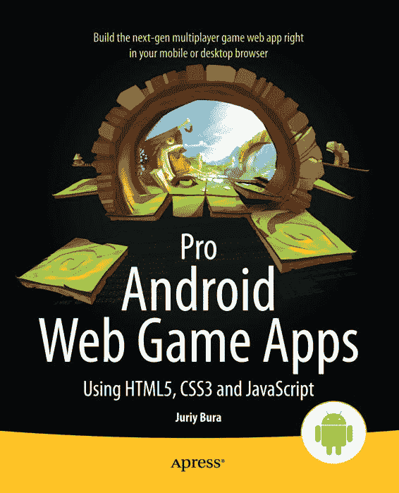

从 Wow! eBook 下载 <www.wowebook.com>

*为方便读者，Apress 将部分前言内容*
*置于索引之后。请使用书签*
*和“内容概览”链接进行访问。*

## 引言

本书讲解如何利用 JavaScript 为当今最具前景的移动平台——Android 制作网页游戏。游戏开发是一个富有挑战性的主题。游戏旨在以某种形式模拟生活，你希望模拟得越真实，就需要运用越多的知识和技能来使其令人信服。电子游戏是将编程中常见的数学与运动学、光学、声学、人工智能、艺术、音乐和叙事相结合的领域。还有哪里能找到这样的组合？

为什么选择 JavaScript 和 HTML5？如果你正手捧这本书，那么你可能心中已有答案。如果你好奇*我*的理由，那是因为 JavaScript 是开发者手中最流行的跨平台客户端解决方案。从台式电脑、智能手机到平板电脑和机顶盒，任何能上网的设备都有浏览器。而且毫无疑问，每个浏览器都支持 JavaScript。使用标准 HTML5 技术栈构建的应用程序能在大多数设备上运行。你想让游戏速度快吗？你想让它运行在 Windows、iOS、Linux 和 Android 系统的台式机、手机和平板电脑上吗？你不想为各种异构平台用不同编程语言重写代码吧？HTML5 正是你的救星！

本书旨在让你深入理解大多数常见游戏类型背后的算法和方法。我更喜欢这种方法，而不是那些为了追求立竿见影的效果而常常牺牲重要细节的简化操作指南。

虽然“操作指南”式的方法看起来能更快达成目标，但它通常会让读者留下知识空白，需要自行填补。当然，本书在全面讲解核心概念的同时，也提供了大量的操作实例。

这就是我无法避免在书中加入一些数学内容的原因。没错，书页上会有一些公式。没有相当程度的数学知识，真正的游戏开发是不可能的。要掌握本书所有主题，你无需具备超出学校所学范围的特殊数学知识。如果你已经精通数学，可能会觉得某些解释过于浅显——完全可以跳过。

在本书中，我刻意避免使用任何现有的“瑞士军刀”式库，比如 `jQuery`、`prototype.js` 或 `Underscore.js`，因为我不想让示例与任何特定库强绑定。虽然市面上有很多优秀的库，但每个开发者都有自己的偏好。我认为与库无关的代码最为友好。

## 本书内容

本书讲解如何利用 HTML5 和 JavaScript 为 Android 平台制作游戏。它将从一张空白 HTML 页面开始，引导你构建一个包含动画、音效、无限世界和多人在线支持的完整 HTML5 游戏。以下是本书中你会学到的许多内容中的一部分：

-   如何使用 `Canvas` 元素绘制游戏元素；如何使用精灵和精灵表；以及如何捕获用户输入。
-   精彩的 3D 编程世界是如何运作的——包括 `WebGL`，这是最具有前景的网页游戏开发 API 之一。
-   如何借助 `Node.js`（将 JavaScript 的强大功能带到服务器端的工具）创建多人游戏。
-   如何建立用户之间的实时通信，让他们在在线对战中相互竞技。所有这些都可通过 JavaScript 实现。你无需掌握任何其他服务器端语言即可编写高效的服务器端代码！
-   如何让计算机控制的角色表现得智能化——让它们能在游戏世界中寻路，并借助 AI 算法做出决策。
-   如何添加一些出色的音效。
-   如何在 Android 市场上发布我们的杰作。

本书涵盖了许多游戏开发算法和优化技巧，其中大部分不局限于 JavaScript。一旦你学会了这些，你将能快速掌握在其他平台上的游戏开发。理解 3D 渲染或寻路算法的工作原理，将帮助你为任何平台（不仅仅是网页）构建游戏。

本书旨在教你制作游戏，编写世界上最具吸引力的应用程序——并在这一过程中享受真正的乐趣。

## 本书不涉及的内容

本书并非一般的网页编程教程。我不会讲解什么是 HTML 或 HTTP 是如何工作的。我假设你已经知道如何编写基本的 JavaScript 并将其嵌入到 HTML 页面中。你不需要成为网页开发专家，但至少需要理解语言的核心。你应该熟悉运算符、函数、对象和变量。如果你对这些概念还不太熟悉，建议你先阅读 Terry McNavage 的 *JavaScript for Absolute Beginners*（Apress，2010 年出版）。

本书不涉及游戏设计——创建关卡、塑造角色性格或为在线世界设计经济系统。所有与游戏玩法、故事、情节、角色和游戏机制相关的内容均不在讨论范围之内。尽管这些主题非常有趣，但已有专门书籍对此进行探讨。我推荐的一本此类书籍是 Richard Rouse III 所著的 *Game Design: Theory and Practice, Second Edition*（Jones & Bartlett，2004 年出版）。

## 本书读者对象

本书面向程序员。它将引导你了解创建游戏的技术层面——渲染 2D 和 3D 图形、用户输入、网络、音效、人工智能以及在应用市场上发布游戏。这里解释的每个概念都配有代码示例进行说明，你可以在你的 Android 智能手机或平板电脑上运行这些示例。我力求使本书尽可能实用——可运行的代码是提供快速入门的一种非常重要的方式。

如果你是一名网页开发者，并且想学习如何为 Android 设备制作游戏，那么本书适合你。你不需要任何特定 JavaScript 库的使用经验——甚至不需要有制作移动平台网站的经验——就能从本书中获得最大收益。如果你知道如何从零开始制作一个包含一些 JavaScript 的个人网页，那就足以入门了。

如果你是一名游戏开发者，曾为其他平台创作过游戏，并且希望将你的经验应用到 HTML5 和 Android 平台上，本书同样适合你。如果情况如此，某些章节对你来说可能看起来熟悉甚至显而易见。例如，如果你曾在 Java 应用程序中使用过 `OpenGL`，你可能知道什么是着色器，或者如何将纹理映射到多边形。可以随意跳过这些部分，专注于实践方面——本书附带的 JavaScript 列表和示例。

## 关于美术资源文件

本书附带了一些精美的美术资源，这些资源是专门为本书创作的，由 Sergey Lesiuk（等距贴图和建筑）和 Marcus Studio 的成员（一个动画骑士角色）提供。你可以在自己的项目（免费或商业）中使用这些资源，无需繁琐的限制。完整的许可文本随文件一起分发。

在开发初期，免费且不受限制的美术资源非常重要。在一个看起来像游戏而非一堆临时替代图形的项目上工作，感觉会好得多。免费分享商业级品质精灵的倡议受到了 Daniel Cook 在其精彩网站 [www.lostgarden.com](http://www.lostgarden.com) 上的启发。我鼓励你加入进来，免费分享你的游戏开发资源——开发者社区将感激不尽。

## 本书结构

本书分为四个部分，我们戏称为“世界”。

### 2D 世界

