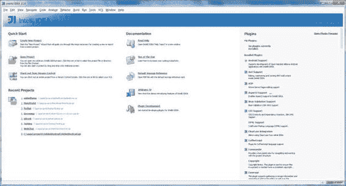
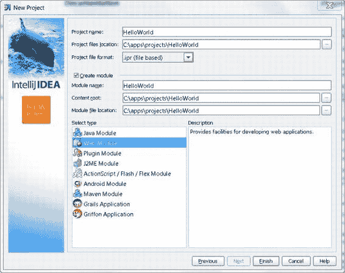
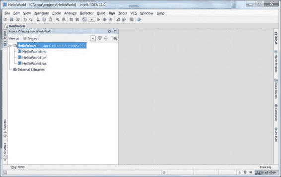

# 添加环境变量

将特定文件夹添加到`PATH`中的操作方式相同。找到环境变量列表中名为`PATH`的变量并点击“编辑”。将光标放在行末，添加一个分号（`;`），然后输入文件夹的路径。通常，当您将新工具添加到路径时，需要引用现有变量，如下所示：

```
;%JAVA_HOME%\bin
```

要检查变量是否设置正确，请打开一个新的控制台窗口并执行：

```
> echo %JAVA_HOME%
```

当然，请使用您自己的变量名替换`JAVA_HOME`。您应该会立即在控制台窗口中看到打印出的路径。

## Mac OS X Lion

在 Mac OS X Lion 中，首先在主文件夹中创建一个名为`.bash_profile`的文件。打开终端窗口并执行：

```
$ touch ~/.bash_profile
$ open –e ~/.bash_profile
```

该文件现在应在文本编辑器中打开。为每个要创建的环境变量添加以下行：

```
export TOOL_HOME=/path/to/tool
```

例如：

```
export NODE_PATH=~/node
export ANDROID_HOME=~/android
```

此脚本的最后一行应该是更新`PATH`变量的行：

```
export PATH=$PATH:$ANDROID_HOME/tools:$NODE_PATH
```

`PATH`是一个以冒号分隔的路径列表，当您从终端调用程序而未提供可执行文件的确切位置时，Mac OS 会在此列表中查找程序。保存`.bash_profile`，返回终端窗口，并执行以下命令以重新加载新定义的变量：

```
$ . .bash_profile
```

现在检查变量是否可用。输入以下命令：

```
$ echo $VARIABLE_NAME
```

当然，请使用您自己的变量名替换`VARIABLE_NAME`。您应该会立即看到为此变量定义的路径。如果以后需要编辑某个变量，请编辑该文件并适当更改其值。

#### 路径

当您使用各种工具时，经常会被要求输入不同类型的路径。在本书中，我通常会明确地引用它们，例如“IDE 安装路径”或“项目路径”（指的是项目文件夹的路径）。大多数情况下很容易理解其含义。然而，在某些情况下我无法使用这种解释方式；例如，截图通常显示程序的某个状态，如果我从自己的系统中截取屏幕截图，它当然会显示我的路径。代码清单和配置文件有时也会引用路径；在这种情况下，我也会使用我用于开发的实际路径。

Windows 用户和 Mac 用户的路径有所不同，但由于我们使用的软件大多是跨平台的，因此任何路径格式都可以使用。大多数工具在 Windows 路径中接受正斜杠（`/`）来区分路径分隔符和转义字符。例如，如果您尝试使用像`var path = "c:\nginx"`这样的代码，它将无法正常工作。`\n`将被视为转义序列，并转换为“换行”字符。此问题并非 JavaScript 特有；大多数编程语言都使用反斜杠（`\`）来表示其后的字符将以特殊方式处理。您必须使用`"c:\\nginx"`或`"c:/nginx"`来指定有效路径，这两个字符串都能正常工作。我建议使用第二种方法（至少更易于阅读）。在 JavaScript 中需要指定绝对路径的情况相当罕见，通常与服务器端开发有关。

就我个人而言，我喜欢使用`c:\apps`文件夹来存放与开发相关的工具，如 IDE、开发工具包、模拟器以及其他所有可执行的东西。我将项目保存在`c:\apps\projects`中。当然，您也可以自由使用自己的约定。请记住，当您在本书中看到像`c:\apps\projects\myproject`这样的路径时，必须使用您自己的值进行替换。

在代码清单中使用实际路径的另一个好处是，您可以立即知道预期的格式。在文件系统中指定文件或文件夹位置的方法有很多种：绝对路径、相对路径或 URI 形式。


`file://`协议。相对路径可以从当前工作文件夹或当前执行文件所在的文件夹计算，依此类推。与其使用类似`%YOUR_PROJECT_PATH%`的占位符，不如看一个真实示例。

Java Development Kit  
Java Development Kit（简称 JDK）是 Android 开发的重要组成部分，即使你不打算写一行 Java 代码也是如此。Android 模拟器需要 Java 才能运行，一些 JavaScript IDE 也需要它。JDK 是一组用于编译和运行 Java 程序的工具。在本书中我们不会直接使用 JDK，但我们需要的一些组件会依赖它。

对于 Windows 用户，可以从官方网站下载 JDK：  
[www.oracle.com/technetwork/java/javase/downloads/index.html](http://www.oracle.com/technetwork/java/javase/downloads/index.html)（在此页面点击 Java），根据操作系统选择版本并安装。完成后，需要设置名为`JAVA_HOME`的环境变量，以便其他程序知道 Java 的位置。同时，将`JAVA_HOME/bin`添加到`PATH`中。

对于 Mac 用户，打开终端并输入：  
```
$ java –version
```  
如果你看到版本号，说明 JDK 已安装。否则，系统会提示你安装最佳可用包。安装后再次输入相同命令以确保 JDK 就绪。Mac OS X 10.7.x 上的安装路径为：  
```
/System/Library/Java/JavaVirtualMachines/1.6.0.jdk/Contents/Home
```
根据具体 Java 版本，路径可能略有不同。创建名为`JAVA_HOME`的新变量，并指向该文件夹。

完成以上步骤，Java 就安装好了，你可以准备迎接更激动人心的事情。

Integrated Development Environment  
有时 JavaScript 项目仅由几个脚本组成，例如从 HTML 表单中隐藏字段或通过 Ajax 加载内容。这种情况下，使用文本编辑器即可——它比 IDE 加载更快，界面更简单，且节省大量内存（如今的 IDE 确实很耗内存）。对于小型项目，你只需要语法高亮功能，让代码更美观并避免低级拼写错误。

对于稍大型的项目，IDE 就必不可少。你需要一系列高级功能，这些是典型文本编辑器不具备的：良好的代码分析、检查、潜在错误检测、自动补全、重构工具、集成版本控制系统、问题跟踪器等。

如前所述，市场上没有完美的 IDE。有些适合 JavaScript，有些则不然。它们在价格、系统要求、支持平台和功能集上各有不同。选择 IDE 时，最重要的是让你感到舒适。初次使用新 IDE 可能困难，但如果在几周后你仍然觉得每行代码都很吃力，就应该尝试其他产品。生产力的提升往往能弥补一两个功能的缺失。

如果你之前接触过 JavaScript，可能已经有了心仪的 IDE。如果没有，以下是一些选择：

- **IntelliJ IDEA** ([www.jetbrains.com/idea/](http://www.jetbrains.com/idea/)) 对整个 Web 技术栈有良好支持：HTML、CSS、JavaScript 以及服务器端语言如 PHP 和 Java。如果你的项目是开源的，IntelliJ IDEA 是免费的——否则需支付约 200 美元。IntelliJ 有几个从 IDEA 派生的轻量级 IDE，其中 WebStorm 专门用于 HTML 和 JavaScript，仅需 69 美元。
- **Aptana Studio** ([`aptana.com`](http://aptana.com)) 基于强大且优雅的 Eclipse 项目 ([www.eclipse.org](http://www.eclipse.org))。它功能极其丰富，拥有几乎所有功能的插件，从探索数据库和构建企业级报告到提醒你茶已泡好。Aptana 免费且开源。




## 第 1 章：入门指南

两者之间的选择通常取决于个人偏好。有一大批 Eclipse 的粉丝，也有一大批 IntelliJ 的粉丝，每当一方发布新版本时，他们往往会引发一场“圣战”。如果你犹豫不决，不妨两种都试试，然后选择你最喜欢的 IDE。接下来，我将简要介绍这些 IDE，并通过在每个 IDE 中创建一个 Hello World 项目来演示它们的使用方法。

## IntelliJ Idea

从官方网站（[www.jetbrains.com/idea/download/index.html](http://www.jetbrains.com/idea/download/index.html)）下载安装程序并启动它。按照常规安装流程进行（这里没有奇怪的问题；IntelliJ Idea 只需你指定一个安装文件夹位置）。

安装完成后，当你首次启动 IntelliJ Idea 时，你需要选择启用哪些插件。如果你打算将 IntelliJ 作为你的 IDE，最好仔细查看列表，只选择你真正会使用的插件。启用的插件数量越少，启动速度就越快。否则，只需保留所有勾选为默认值即可。最后，你会看到如图 1-1 所示的欢迎界面；它有几行按钮。点击 `Create New Project` 打开“新建项目”窗口，然后选择 `Create Project from Scratch`。

**图 1-1.** *IntelliJ Idea 欢迎界面*



IntelliJ Idea 将一个“项目”视为一个或多个模块的集合。例如，如果你编写一个聊天应用程序，那么“聊天应用”整体就是一个项目。该项目的模块可以是服务器端、安卓客户端、桌面客户端等。模块背后的理念是将项目中的不同组件分开，因为它们可能有不同的依赖关系或构建步骤，或者可能使用不同的编程语言。当然，项目不必使用多个模块。对于简单的应用程序，一个模块就足够了。

每个模块都有一个类型：Java、J2ME、Android、Grails，以及本书中最重要的模块类型——Web 模块。从左侧列表中选择它，如图 1-2 所示。如果你决定将 IntelliJ Idea 作为你的主要 IDE，请在你创建的每个新项目中都遵循这些步骤。

**图 1-2.** *创建新项目*

输入项目名称以及你希望用于项目文件的存储位置，然后点击 `Finish`。项目创建完成，你将看到一个空白工作区，如图 1-3 所示。



**图 1-3.** *空白新项目的外观*

现在你可以编写 Hello World 页面了。在我们的简单示例中，只有一个模块——HelloWorld。在 IDE 中右键单击带有此名称的文件夹图标，然后选择 `New File`。在对话框中输入 `index.html` 并按 `Enter`。Idea 会创建一个新的空文件，你可以立即开始输入。输入清单 1-1 中的代码。

**清单 1-1.** *基础 HTML5 页面*

```
<!DOCTYPE html>
<html lang="en">
<head>
<title>Hello World</title>
</head>
<body>
It Works!
</body>
</html>
```

在你喜欢的桌面浏览器中打开新创建的文件，确保它能正确渲染页面。我们仍然无法通过移动设备或模拟器打开此文件，因为两者都需要文件能通过 HTTP 访问。设备和模拟器都无法直接访问你电脑上的文件系统，因此我们需要一个 Web 服务器。我将在本章后面解释如何在移动设备中启动该页面。

IntelliJ Idea 是一个非常强大的工具，但仍需要一些时间来适应并开始发挥其全部潜力。请务必查看默认快捷键参考文档：`Help → Default Keymap Reference`。这是一个单页的 PDF 文件，列出了按类别分组的最常用快捷键。

如果你只打算使用标准的 Web 技术栈（CSS、HTML、JavaScript 等），那么你可以使用更轻量级（也更便宜）的 Idea 版本，即


