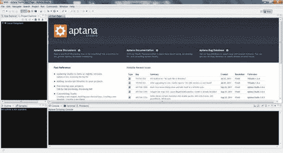
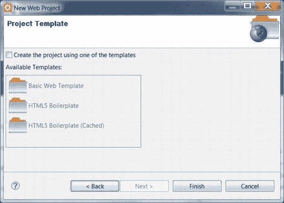
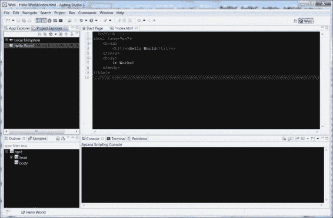
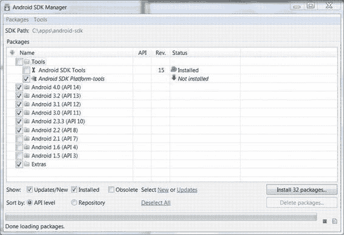
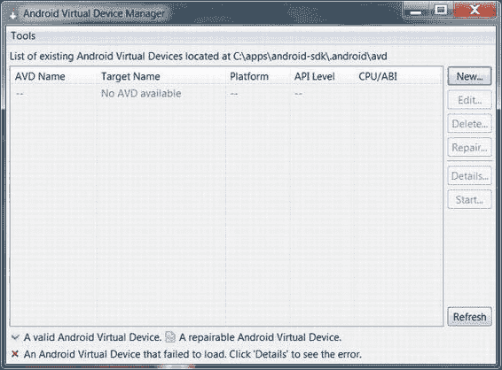
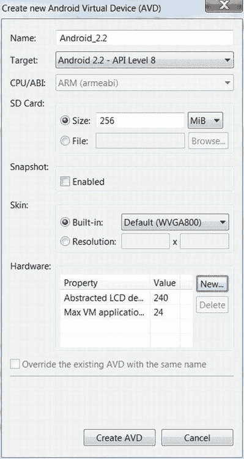
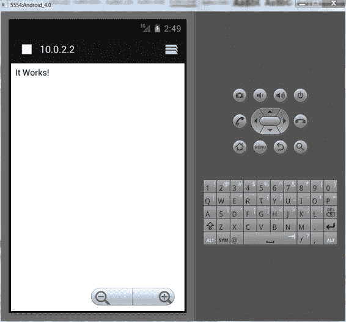

# WebStorm

在 `WebStorm` 中创建并运行新项目所需的步骤更为简单。转到 `File  New Project`，输入名称和路径。项目创建后，您可以像使用 `Idea` 一样，以完全相同的方式对其进行操作。

现在，我们来比较一下 `Idea` 和 `Aptana Studio`。

## Aptana Studio

首先，从 [www.aptana.com](http://www.aptana.com) 下载 `Aptana` 的最新版本。选择独立版本，等待下载完成，然后将 IDE 安装到您选择的文件夹中。当安装完成并启动 IDE 后，您会看到起始页面，其中包含新功能和已修复错误的摘要，以及指向论坛、文档和 Bug 数据库的链接（参见图 1-4）。



**图 1-4.** *Aptana Studio 中的起始页面*

`Aptana` 采用了略有不同的命名方式。 `Aptana` 中的项目类似于 `IntelliJ` 中的模块，而一组项目则称为一个工作区。使用上一节的示例，如果您在 `Aptana` 中开发一个聊天应用程序，您将拥有一个单独的工作区，其中包含多个项目：`Server`、`Android Client` 和 `Desktop Client`。`Aptana` 使用了相同的概念，但用不同的词语来描述。与 `IntelliJ` 一样，它允许您清晰地将应用程序的各个组件分开，并在需要时以不同的方式处理它们。

让我们创建与上一节相同的 `Hello World` 页面。要创建一个新项目，请选择 `File  New  Web Project`。在第一个屏幕上，输入项目文件夹的名称和路径（如果要输入自定义路径，请取消勾选 `Use Default Location`）。下一个屏幕会提供多个模板供您选择（参见图 1-5）。项目模板就像是针对不同场景预构建的 `Hello World` 骨架。如果 `Create Project with One of the Templates` 已勾选，请取消勾选，然后点击 `Finish`。



**图 1-5.** *Aptana Studio 中的新 Web 项目向导*

此时对话框关闭，`Project Explorer`（屏幕左上角区域）中会出现一个名为 `Hello World` 的新文件夹。右键单击该文件夹，从上下文菜单中选择 `New…  File`。在打开的窗口中输入 `index.html`。将代码清单 1-1 中的代码粘贴到该文件中。结果应如图 1-6 所示。保存文件并在桌面浏览器中打开它。页面应显示 `It Works!`。



**图 1-6.** *代码已粘贴到 Aptana Studio 中新创建的文件中*

选择适合您的 IDE 是编写优秀代码的第一步。页面就绪后，应在尽可能接近生产环境的环境中进行测试。在本例中，这可以是真实设备或模拟器。为此，我们需要安装一个 Web 服务器。

##### Web 服务器

您的设备无法直接访问 PC 上的文件系统并从文件夹中加载网页。因此，我们需要一个 Web 服务器，这是一种能够通过 HTTP 提供网页服务的工具。在您安装并配置好 Web 服务器后，就可以像访问互联网上的常规网站一样访问项目文件：在浏览器中输入地址，即可看到渲染后的 HTML 页面。

至少有十几种流行的商业级产品可以胜任这项工作。我们将使用最小的一个：`nginx` ([`nginx.com`](http://nginx.com))。它压缩后仅有 800 KB，却自豪地占据着全球最流行 Web 服务器排行榜第三的位置，仅次于 `Apache` ([`httpd.apache.org`](http://httpd.apache.org)) 和 `IIS` ([www.iis.net](http://www.iis.net))。全球排名前百万的网站中有 12% 使用 `nginx`，并且根据 `W3Techs` ([`w3techs.com/technologies/cross/web_server/ranking`](http://w3techs.com/technologies/cross/web_server/ranking)) 的数据，这个数字还在增长。

为什么我们不使用 “世界上最流行的 Web 服务器” `Apache` 呢？如果您愿意，当然可以使用它，但对于提供静态页面这么简单的任务来说，它有点过于复杂了。


**注意：** Web 服务器通常使用端口 `80`。有时，像 Skype 这样的程序可能会出于自身需要占用该端口。如果你在 Skype 运行期间启动 `nginx` 时遇到问题，请打开 Skype，依次进入 **工具** → **选项** → **高级** → **连接**，然后取消选中 **使用端口 80 和 443 作为传入连接的备用端口**。

或者，你也可以将 `nginx` 配置为使用其他端口，例如端口 `8080`。如果选择这样做，请记住在访问页面时需要在地址中添加端口号。例如，如果将 `nginx` 配置为使用端口 `80`，你可以在浏览器中输入 `http://localhost` 来加载页面；否则，你需要在地址栏中正确设置端口，例如 `http://localhost:8080`。

## 设置 nginx

从 `http://nginx.org/en/download.html` 下载最新版本的 `nginx`。

`nginx` 的安装过程非常简单——你只需解压即可。这足以让它运行起来，但它只会从一个预定义的内部文件夹提供文件服务。这意味着，即使是最小的修改，你也需要反复复制整个项目的内容来进行测试。我们将重新配置 `nginx`，使其将项目目录作为 Web 根目录。

进入 `nginx` 安装目录下的 `conf` 文件夹，用文本编辑器打开 `nginx.conf`。找到以下几行：

```
location / {
    root html;
    index index.html index.htm;
}
```

并将 `html` 改为项目的路径，如下所示（我使用了 `c:\apps\projects\myproject`）：

```
location / {
    root c:/apps/projects/myproject;
    index index.html index.htm;
}
```

**注意：** `nginx` 使用井号 (`#`) 在配置文件中进行注释。如果看到以 `#` 开头的行，可以安全地忽略它，或者将其删除以保持配置整洁。注释块的最初用途是展示如何处理配置的某个方面——相当于内联帮助。

加粗的代码是项目文件夹的路径。如果你决定更改默认端口，请找到以下行：

```
server {
    listen 80;
    server_name localhost;
```

并将 `80`（代码中加粗的部分）改为你喜欢的任何端口。

保存更改并启动 `nginx`。你不会看到任何界面或带有设置的窗口；这是正常的。`nginx` 在后台运行，没有用户界面；你通过命令来控制它，而不是按钮和菜单。

再次打开你常用的桌面浏览器，输入 `http://localhost`。你应该能看到你的 Hello World 网页正在运行。如果你看到类似于“欢迎使用 nginx！”的内容，说明 Web 服务器读取 HTML 文件时使用了错误的文件夹。请确保你已按照说明操作，并在 `nginx.conf` 中正确设置了 `root` 参数。

## 在移动设备上打开页面

现在，如果你手头有移动设备，可以打开同一个网页，看看它在你的 Android 设备上是什么样子！

最简单的方法是将你的 Android 设备和 PC 通过 Wi-Fi 连接到同一网络。你需要找到你电脑的 IP 地址，并在移动浏览器中输入该地址。例如，如果你的 PC 在本地网络中的 IP 地址是 `192.168.0.15`，你应该打开浏览器并在地址栏中输入 `http://192.168.0.15`。你就能看到你刚刚创建的页面了。

如果你没有移动设备，或者没有 Wi-Fi 接入点，无法将 PC 和 Android 设备连接到同一网络，那该怎么办？好吧，最好的选择是购买缺失的硬件。还有什么更简单的办法吗？但说正经的，你可以安装 Android 模拟器，并用它来测试你的 Web 应用。

## Android SDK 和模拟器

好消息是，你无需在众多产品中做出选择，也无需为市场上的每种设备下载单独的工具。你只需下载并安装 Android SDK，配置设备配置文件，然后使用给定的配置文件运行模拟器。然后，你就可以像使用真实设备一样使用模拟器了……


### 移动设备测试

在移动设备上操作：打开浏览器、输入地址、加载页面等等。

尽管 Android 模拟器非常出色，但仍应尽快在真实设备上进行测试。真实设备可能具有其独特的供应商特定和硬件特定特性，这些特性会影响应用程序的行为方式。此外，由于真实设备的触感不同，你无法在模拟器上评估产品的可用性。在智能手机的虚拟副本内点击与手握真实手机或平板电脑是不一样的。

模拟器在检查应用程序是否能在所有支持的 Android 版本和屏幕分辨率上正常运行方面非常有用。通常，你没有几十台备用的 Android 设备用于测试——模拟器要便宜得多（实际上是免费的）。

**提示：** 即使一切在模拟器上按预期运行，真实设备可能仍会出现异常。在测试的后期阶段，在实际设备上测试你的产品会很有用。像`Perfecto Mobile`（[www.perfectomobile.com](http://www.perfectomobile.com)）这样的服务可以帮助你做到这一点，而无需购买或借用你想尝试的每一台设备。它允许你远程控制几乎任何型号的移动设备；你只需按在它们上面测试所花费的时间付费。

### 安装 SDK

Android 模拟器是 Android SDK（一套用于 Android 开发的工具）的一部分，就像 Java SDK 是 Java 开发工具一样。

从[`developer.android.com/sdk/index`](http://developer.android.com/sdk/index.html)下载 Android SDK 并安装它。在安装向导的最后一步，保留勾选标记以启动 SDK Manager。

SDK 本身附带了一些基本工具（因此安装程序的大小仅为 40 MB）。其余组件需要单独下载。SDK Manager 会检查可用组件的列表，并允许你选择要下载的内容（见图 1-7）。



**图 1-7.** *在 SDK Manager 上安装可选包*

选择你计划使用的组件，然后点击`Install`。如果你使用模拟器进行测试，你应该对所有计划支持的平台都打上勾。同时，标记`Tools` → `Android SDK Platform-Tools`和`Extras`。请参考图 1-7。现在是个泡杯咖啡的好时机，因为这个过程并不快，而且文件也不小。

### 设置 AVD

下载完成后，你就可以配置并启动模拟器了。启动 AVD Manager；它位于你安装 SDK 的文件夹中。AVD 代表 Android 虚拟设备；它是将被模拟的平台配置文件。当你首次打开该应用程序时，它没有任何预配置的 AVD。设备列表将为空，窗口将如图 1-8 所示。



**图 1-8.** *尚未配置任何 AVD 的 Android 虚拟设备管理器窗口*

点击`New`按钮来创建第一个 AVD。在对话框中，设置模拟器参数（见图 1-9）。`Device Name`是标识此配置的标签；输入任何你觉得合适的名称。`Target`是模拟器将使用的 Android API 版本。在本书中，我们将使用 Android 2.2 及以上版本，因此为第一个设备选择`Android 2.2`——`API Level 8`。你可以将 SD 卡的大小留空或设置为某个值。最后一个选项允许你设置皮肤。皮肤决定了模拟器的分辨率；任选一个，但确保皮肤适合你的 PC 屏幕尺寸，否则使用起来会很困难。当你按下`Create AVD`按钮时，设备配置文件就会出现在列表中。对于你计划使用的每个配置，重复此过程。



**图 1-9.** *创建一个新的 AVD*


要启动模拟器，请从列表中选择 AVD 并点击 **Start…**。你将看到一些启动选项，可以放心保留默认值。模拟器加载时间较长，请耐心等待，至少需要几分钟。一旦看到 Android 主屏幕，你就可以导航到本章前面创建的 HTML 页面（如图 1-10 所示）。

**注意：** 模拟器启动需要相当长的时间，因此在整个开发会话期间保持其打开状态是有意义的，当你需要检查更改时，只需在浏览器中更新页面即可。



