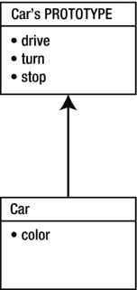

# 排版后的文档

具有与之前相同结构的对象。

**清单 1-3.** *使用构造函数创建新对象*

```
function Car() {
    this.color = "red";
    this.drive = function() {
        console.log(this.color + " car moved");
    };
}

var car = new Car();
car.drive();
```

通过这种方式，我们无需再次描述结构即可创建 `Car` 的第二个实例。显然，这种方法更优，因为对象的描述现在只存储在一个位置。如果需要对其进行修改，你不必搜索整个代码库，而只需修复 `Car()` 函数；通过 `new Car()` 创建的对象也会随之改变。像 `Car` 这样主要用于创建新对象的函数通常被称为构造函数。使用 `this` 关键字定义的属性将可供通过同一构造函数创建的每个对象使用。



